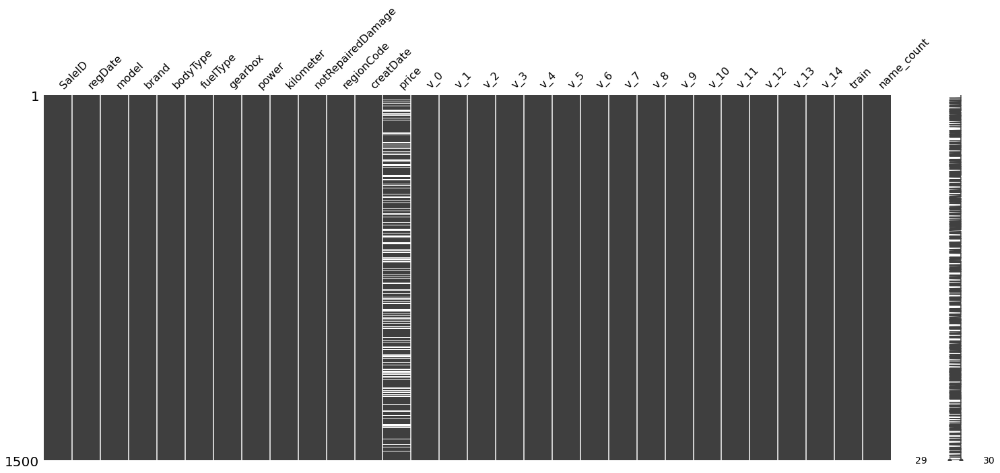
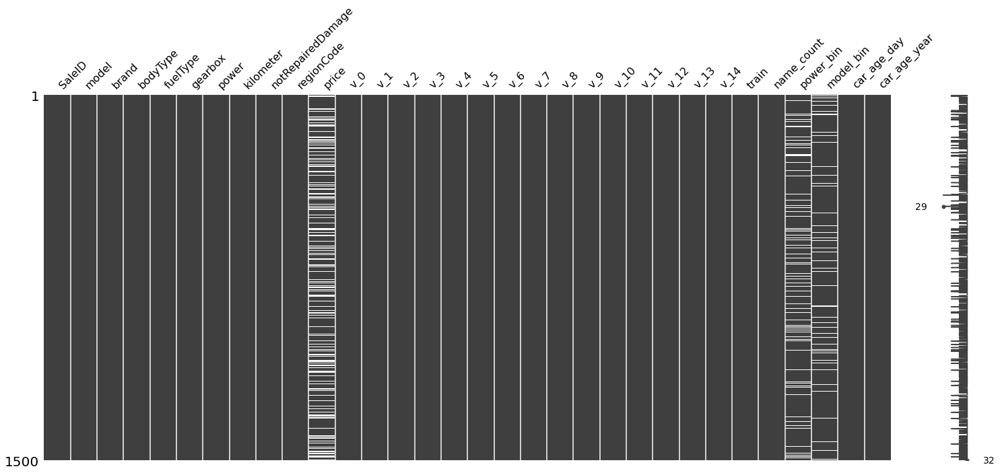

# MachineLearning
机器学习课程设计

```python
# 安装包
!pip install seaborn
!pip install lightgbm --install-option=--gpu
!pip install xgboost
!pip install missingno
!pip install bayesian-optimization
!pip install pandas_profiling
!pip install ipywidgets
```

    Looking in indexes: https://mirror.baidu.com/pypi/simple/
    Requirement already satisfied: seaborn in /opt/conda/envs/python35-paddle120-env/lib/python3.7/site-packages (0.11.1)
    Requirement already satisfied: scipy>=1.0 in /opt/conda/envs/python35-paddle120-env/lib/python3.7/site-packages (from seaborn) (1.7.0)
    Requirement already satisfied: matplotlib>=2.2 in /opt/conda/envs/python35-paddle120-env/lib/python3.7/site-packages (from seaborn) (3.4.2)
    Requirement already satisfied: numpy>=1.15 in /opt/conda/envs/python35-paddle120-env/lib/python3.7/site-packages (from seaborn) (1.16.4)
    Requirement already satisfied: pandas>=0.23 in /opt/conda/envs/python35-paddle120-env/lib/python3.7/site-packages (from seaborn) (1.1.5)
    Requirement already satisfied: pillow>=6.2.0 in /opt/conda/envs/python35-paddle120-env/lib/python3.7/site-packages (from matplotlib>=2.2->seaborn) (7.1.2)
    Requirement already satisfied: cycler>=0.10 in /opt/conda/envs/python35-paddle120-env/lib/python3.7/site-packages (from matplotlib>=2.2->seaborn) (0.10.0)
    Requirement already satisfied: python-dateutil>=2.7 in /opt/conda/envs/python35-paddle120-env/lib/python3.7/site-packages (from matplotlib>=2.2->seaborn) (2.8.0)
    Requirement already satisfied: pyparsing>=2.2.1 in /opt/conda/envs/python35-paddle120-env/lib/python3.7/site-packages (from matplotlib>=2.2->seaborn) (2.4.2)
    Requirement already satisfied: kiwisolver>=1.0.1 in /opt/conda/envs/python35-paddle120-env/lib/python3.7/site-packages (from matplotlib>=2.2->seaborn) (1.1.0)
    Requirement already satisfied: pytz>=2017.2 in /opt/conda/envs/python35-paddle120-env/lib/python3.7/site-packages (from pandas>=0.23->seaborn) (2019.3)
    Requirement already satisfied: six in /opt/conda/envs/python35-paddle120-env/lib/python3.7/site-packages (from cycler>=0.10->matplotlib>=2.2->seaborn) (1.15.0)
    Requirement already satisfied: setuptools in /opt/conda/envs/python35-paddle120-env/lib/python3.7/site-packages (from kiwisolver>=1.0.1->matplotlib>=2.2->seaborn) (41.4.0)
    /opt/conda/envs/python35-paddle120-env/lib/python3.7/site-packages/pip/_internal/commands/install.py:243: UserWarning: Disabling all use of wheels due to the use of --build-options / --global-options / --install-options.
      cmdoptions.check_install_build_global(options)
    Looking in indexes: https://mirror.baidu.com/pypi/simple/
    Requirement already satisfied: lightgbm in /opt/conda/envs/python35-paddle120-env/lib/python3.7/site-packages (3.1.1)
    Requirement already satisfied: numpy in /opt/conda/envs/python35-paddle120-env/lib/python3.7/site-packages (from lightgbm) (1.16.4)
    Requirement already satisfied: wheel in /opt/conda/envs/python35-paddle120-env/lib/python3.7/site-packages (from lightgbm) (0.33.6)
    Requirement already satisfied: scipy in /opt/conda/envs/python35-paddle120-env/lib/python3.7/site-packages (from lightgbm) (1.7.0)
    Requirement already satisfied: scikit-learn!=0.22.0 in /opt/conda/envs/python35-paddle120-env/lib/python3.7/site-packages (from lightgbm) (0.22.1)
    Requirement already satisfied: joblib>=0.11 in /opt/conda/envs/python35-paddle120-env/lib/python3.7/site-packages (from scikit-learn!=0.22.0->lightgbm) (0.14.1)
    Looking in indexes: https://mirror.baidu.com/pypi/simple/
    Requirement already satisfied: xgboost in /opt/conda/envs/python35-paddle120-env/lib/python3.7/site-packages (1.3.3)
    Requirement already satisfied: numpy in /opt/conda/envs/python35-paddle120-env/lib/python3.7/site-packages (from xgboost) (1.16.4)
    Requirement already satisfied: scipy in /opt/conda/envs/python35-paddle120-env/lib/python3.7/site-packages (from xgboost) (1.7.0)
    Looking in indexes: https://mirror.baidu.com/pypi/simple/
    Requirement already satisfied: missingno in /opt/conda/envs/python35-paddle120-env/lib/python3.7/site-packages (0.5.0)
    Requirement already satisfied: seaborn in /opt/conda/envs/python35-paddle120-env/lib/python3.7/site-packages (from missingno) (0.11.1)
    Requirement already satisfied: matplotlib in /opt/conda/envs/python35-paddle120-env/lib/python3.7/site-packages (from missingno) (3.4.2)
    Requirement already satisfied: scipy in /opt/conda/envs/python35-paddle120-env/lib/python3.7/site-packages (from missingno) (1.7.0)
    Requirement already satisfied: numpy in /opt/conda/envs/python35-paddle120-env/lib/python3.7/site-packages (from missingno) (1.16.4)
    Requirement already satisfied: pandas>=0.23 in /opt/conda/envs/python35-paddle120-env/lib/python3.7/site-packages (from seaborn->missingno) (1.1.5)
    Requirement already satisfied: python-dateutil>=2.7 in /opt/conda/envs/python35-paddle120-env/lib/python3.7/site-packages (from matplotlib->missingno) (2.8.0)
    Requirement already satisfied: pillow>=6.2.0 in /opt/conda/envs/python35-paddle120-env/lib/python3.7/site-packages (from matplotlib->missingno) (7.1.2)
    Requirement already satisfied: kiwisolver>=1.0.1 in /opt/conda/envs/python35-paddle120-env/lib/python3.7/site-packages (from matplotlib->missingno) (1.1.0)
    Requirement already satisfied: pyparsing>=2.2.1 in /opt/conda/envs/python35-paddle120-env/lib/python3.7/site-packages (from matplotlib->missingno) (2.4.2)
    Requirement already satisfied: cycler>=0.10 in /opt/conda/envs/python35-paddle120-env/lib/python3.7/site-packages (from matplotlib->missingno) (0.10.0)
    Requirement already satisfied: pytz>=2017.2 in /opt/conda/envs/python35-paddle120-env/lib/python3.7/site-packages (from pandas>=0.23->seaborn->missingno) (2019.3)
    Requirement already satisfied: six>=1.5 in /opt/conda/envs/python35-paddle120-env/lib/python3.7/site-packages (from python-dateutil>=2.7->matplotlib->missingno) (1.15.0)
    Requirement already satisfied: setuptools in /opt/conda/envs/python35-paddle120-env/lib/python3.7/site-packages (from kiwisolver>=1.0.1->matplotlib->missingno) (41.4.0)
    Looking in indexes: https://mirror.baidu.com/pypi/simple/
    Requirement already satisfied: bayesian-optimization in /opt/conda/envs/python35-paddle120-env/lib/python3.7/site-packages (1.2.0)
    Requirement already satisfied: numpy>=1.9.0 in /opt/conda/envs/python35-paddle120-env/lib/python3.7/site-packages (from bayesian-optimization) (1.16.4)
    Requirement already satisfied: scikit-learn>=0.18.0 in /opt/conda/envs/python35-paddle120-env/lib/python3.7/site-packages (from bayesian-optimization) (0.22.1)
    Requirement already satisfied: scipy>=0.14.0 in /opt/conda/envs/python35-paddle120-env/lib/python3.7/site-packages (from bayesian-optimization) (1.7.0)
    Requirement already satisfied: joblib>=0.11 in /opt/conda/envs/python35-paddle120-env/lib/python3.7/site-packages (from scikit-learn>=0.18.0->bayesian-optimization) (0.14.1)
    Looking in indexes: https://mirror.baidu.com/pypi/simple/
    Requirement already satisfied: pandas_profiling in /opt/conda/envs/python35-paddle120-env/lib/python3.7/site-packages (3.0.0)
    Requirement already satisfied: numpy>=1.16.0 in /opt/conda/envs/python35-paddle120-env/lib/python3.7/site-packages (from pandas_profiling) (1.16.4)
    Requirement already satisfied: tangled-up-in-unicode==0.1.0 in /opt/conda/envs/python35-paddle120-env/lib/python3.7/site-packages (from pandas_profiling) (0.1.0)
    Requirement already satisfied: matplotlib>=3.2.0 in /opt/conda/envs/python35-paddle120-env/lib/python3.7/site-packages (from pandas_profiling) (3.4.2)
    Requirement already satisfied: seaborn>=0.10.1 in /opt/conda/envs/python35-paddle120-env/lib/python3.7/site-packages (from pandas_profiling) (0.11.1)
    Requirement already satisfied: tqdm>=4.48.2 in /opt/conda/envs/python35-paddle120-env/lib/python3.7/site-packages (from pandas_profiling) (4.61.1)
    Requirement already satisfied: joblib in /opt/conda/envs/python35-paddle120-env/lib/python3.7/site-packages (from pandas_profiling) (0.14.1)
    Requirement already satisfied: pydantic>=1.8.1 in /opt/conda/envs/python35-paddle120-env/lib/python3.7/site-packages (from pandas_profiling) (1.8.2)
    Requirement already satisfied: PyYAML>=5.0.0 in /opt/conda/envs/python35-paddle120-env/lib/python3.7/site-packages (from pandas_profiling) (5.1.2)
    Requirement already satisfied: requests>=2.24.0 in /opt/conda/envs/python35-paddle120-env/lib/python3.7/site-packages (from pandas_profiling) (2.25.1)
    Requirement already satisfied: scipy>=1.4.1 in /opt/conda/envs/python35-paddle120-env/lib/python3.7/site-packages (from pandas_profiling) (1.7.0)
    Requirement already satisfied: visions[type_image_path]==0.7.1 in /opt/conda/envs/python35-paddle120-env/lib/python3.7/site-packages (from pandas_profiling) (0.7.1)
    Requirement already satisfied: htmlmin>=0.1.12 in /opt/conda/envs/python35-paddle120-env/lib/python3.7/site-packages (from pandas_profiling) (0.1.12)
    Requirement already satisfied: missingno>=0.4.2 in /opt/conda/envs/python35-paddle120-env/lib/python3.7/site-packages (from pandas_profiling) (0.5.0)
    Requirement already satisfied: phik>=0.11.1 in /opt/conda/envs/python35-paddle120-env/lib/python3.7/site-packages (from pandas_profiling) (0.11.2)
    Requirement already satisfied: pandas!=1.0.0,!=1.0.1,!=1.0.2,!=1.1.0,>=0.25.3 in /opt/conda/envs/python35-paddle120-env/lib/python3.7/site-packages (from pandas_profiling) (1.1.5)
    Requirement already satisfied: jinja2>=2.11.1 in /opt/conda/envs/python35-paddle120-env/lib/python3.7/site-packages (from pandas_profiling) (3.0.1)
    Requirement already satisfied: pillow>=6.2.0 in /opt/conda/envs/python35-paddle120-env/lib/python3.7/site-packages (from matplotlib>=3.2.0->pandas_profiling) (7.1.2)
    Requirement already satisfied: python-dateutil>=2.7 in /opt/conda/envs/python35-paddle120-env/lib/python3.7/site-packages (from matplotlib>=3.2.0->pandas_profiling) (2.8.0)
    Requirement already satisfied: cycler>=0.10 in /opt/conda/envs/python35-paddle120-env/lib/python3.7/site-packages (from matplotlib>=3.2.0->pandas_profiling) (0.10.0)
    Requirement already satisfied: pyparsing>=2.2.1 in /opt/conda/envs/python35-paddle120-env/lib/python3.7/site-packages (from matplotlib>=3.2.0->pandas_profiling) (2.4.2)
    Requirement already satisfied: kiwisolver>=1.0.1 in /opt/conda/envs/python35-paddle120-env/lib/python3.7/site-packages (from matplotlib>=3.2.0->pandas_profiling) (1.1.0)
    Requirement already satisfied: typing-extensions>=3.7.4.3 in /opt/conda/envs/python35-paddle120-env/lib/python3.7/site-packages (from pydantic>=1.8.1->pandas_profiling) (3.10.0.0)
    Requirement already satisfied: urllib3<1.27,>=1.21.1 in /opt/conda/envs/python35-paddle120-env/lib/python3.7/site-packages (from requests>=2.24.0->pandas_profiling) (1.25.6)
    Requirement already satisfied: chardet<5,>=3.0.2 in /opt/conda/envs/python35-paddle120-env/lib/python3.7/site-packages (from requests>=2.24.0->pandas_profiling) (3.0.4)
    Requirement already satisfied: certifi>=2017.4.17 in /opt/conda/envs/python35-paddle120-env/lib/python3.7/site-packages (from requests>=2.24.0->pandas_profiling) (2019.9.11)
    Requirement already satisfied: idna<3,>=2.5 in /opt/conda/envs/python35-paddle120-env/lib/python3.7/site-packages (from requests>=2.24.0->pandas_profiling) (2.8)
    Requirement already satisfied: multimethod==1.4 in /opt/conda/envs/python35-paddle120-env/lib/python3.7/site-packages (from visions[type_image_path]==0.7.1->pandas_profiling) (1.4)
    Requirement already satisfied: attrs>=19.3.0 in /opt/conda/envs/python35-paddle120-env/lib/python3.7/site-packages (from visions[type_image_path]==0.7.1->pandas_profiling) (21.2.0)
    Requirement already satisfied: bottleneck in /opt/conda/envs/python35-paddle120-env/lib/python3.7/site-packages (from visions[type_image_path]==0.7.1->pandas_profiling) (1.3.2)
    Requirement already satisfied: networkx>=2.4 in /opt/conda/envs/python35-paddle120-env/lib/python3.7/site-packages (from visions[type_image_path]==0.7.1->pandas_profiling) (2.4)
    Requirement already satisfied: imagehash; extra == "type_image_path" in /opt/conda/envs/python35-paddle120-env/lib/python3.7/site-packages (from visions[type_image_path]==0.7.1->pandas_profiling) (4.2.0)
    Requirement already satisfied: pytz>=2017.2 in /opt/conda/envs/python35-paddle120-env/lib/python3.7/site-packages (from pandas!=1.0.0,!=1.0.1,!=1.0.2,!=1.1.0,>=0.25.3->pandas_profiling) (2019.3)
    Requirement already satisfied: MarkupSafe>=2.0 in /opt/conda/envs/python35-paddle120-env/lib/python3.7/site-packages (from jinja2>=2.11.1->pandas_profiling) (2.0.1)
    Requirement already satisfied: six>=1.5 in /opt/conda/envs/python35-paddle120-env/lib/python3.7/site-packages (from python-dateutil>=2.7->matplotlib>=3.2.0->pandas_profiling) (1.15.0)
    Requirement already satisfied: setuptools in /opt/conda/envs/python35-paddle120-env/lib/python3.7/site-packages (from kiwisolver>=1.0.1->matplotlib>=3.2.0->pandas_profiling) (41.4.0)
    Requirement already satisfied: decorator>=4.3.0 in /opt/conda/envs/python35-paddle120-env/lib/python3.7/site-packages (from networkx>=2.4->visions[type_image_path]==0.7.1->pandas_profiling) (4.4.2)
    Requirement already satisfied: PyWavelets in /opt/conda/envs/python35-paddle120-env/lib/python3.7/site-packages (from imagehash; extra == "type_image_path"->visions[type_image_path]==0.7.1->pandas_profiling) (1.1.1)
    Looking in indexes: https://mirror.baidu.com/pypi/simple/
    Requirement already satisfied: ipywidgets in /opt/conda/envs/python35-paddle120-env/lib/python3.7/site-packages (7.6.3)
    Requirement already satisfied: traitlets>=4.3.1 in /opt/conda/envs/python35-paddle120-env/lib/python3.7/site-packages (from ipywidgets) (4.3.3)
    Requirement already satisfied: widgetsnbextension~=3.5.0 in /opt/conda/envs/python35-paddle120-env/lib/python3.7/site-packages (from ipywidgets) (3.5.1)
    Requirement already satisfied: ipython>=4.0.0; python_version >= "3.3" in /opt/conda/envs/python35-paddle120-env/lib/python3.7/site-packages (from ipywidgets) (7.8.0)
    Requirement already satisfied: ipykernel>=4.5.1 in /opt/conda/envs/python35-paddle120-env/lib/python3.7/site-packages (from ipywidgets) (5.1.0)
    Requirement already satisfied: nbformat>=4.2.0 in /opt/conda/envs/python35-paddle120-env/lib/python3.7/site-packages (from ipywidgets) (4.4.0)
    Requirement already satisfied: jupyterlab-widgets>=1.0.0; python_version >= "3.6" in /opt/conda/envs/python35-paddle120-env/lib/python3.7/site-packages (from ipywidgets) (1.0.0)
    Requirement already satisfied: decorator in /opt/conda/envs/python35-paddle120-env/lib/python3.7/site-packages (from traitlets>=4.3.1->ipywidgets) (4.4.2)
    Requirement already satisfied: ipython-genutils in /opt/conda/envs/python35-paddle120-env/lib/python3.7/site-packages (from traitlets>=4.3.1->ipywidgets) (0.2.0)
    Requirement already satisfied: six in /opt/conda/envs/python35-paddle120-env/lib/python3.7/site-packages (from traitlets>=4.3.1->ipywidgets) (1.15.0)
    Requirement already satisfied: notebook>=4.4.1 in /opt/conda/envs/python35-paddle120-env/lib/python3.7/site-packages (from widgetsnbextension~=3.5.0->ipywidgets) (5.7.8)
    Requirement already satisfied: pygments in /opt/conda/envs/python35-paddle120-env/lib/python3.7/site-packages (from ipython>=4.0.0; python_version >= "3.3"->ipywidgets) (2.4.2)
    Requirement already satisfied: jedi>=0.10 in /opt/conda/envs/python35-paddle120-env/lib/python3.7/site-packages (from ipython>=4.0.0; python_version >= "3.3"->ipywidgets) (0.17.0)
    Requirement already satisfied: setuptools>=18.5 in /opt/conda/envs/python35-paddle120-env/lib/python3.7/site-packages (from ipython>=4.0.0; python_version >= "3.3"->ipywidgets) (41.4.0)
    Requirement already satisfied: prompt-toolkit<2.1.0,>=2.0.0 in /opt/conda/envs/python35-paddle120-env/lib/python3.7/site-packages (from ipython>=4.0.0; python_version >= "3.3"->ipywidgets) (2.0.10)
    Requirement already satisfied: pickleshare in /opt/conda/envs/python35-paddle120-env/lib/python3.7/site-packages (from ipython>=4.0.0; python_version >= "3.3"->ipywidgets) (0.7.5)
    Requirement already satisfied: pexpect; sys_platform != "win32" in /opt/conda/envs/python35-paddle120-env/lib/python3.7/site-packages (from ipython>=4.0.0; python_version >= "3.3"->ipywidgets) (4.7.0)
    Requirement already satisfied: backcall in /opt/conda/envs/python35-paddle120-env/lib/python3.7/site-packages (from ipython>=4.0.0; python_version >= "3.3"->ipywidgets) (0.1.0)
    Requirement already satisfied: tornado>=4.2 in /opt/conda/envs/python35-paddle120-env/lib/python3.7/site-packages (from ipykernel>=4.5.1->ipywidgets) (6.0.3)
    Requirement already satisfied: jupyter-client in /opt/conda/envs/python35-paddle120-env/lib/python3.7/site-packages (from ipykernel>=4.5.1->ipywidgets) (5.3.4)
    Requirement already satisfied: jupyter-core in /opt/conda/envs/python35-paddle120-env/lib/python3.7/site-packages (from nbformat>=4.2.0->ipywidgets) (4.6.0)
    Requirement already satisfied: jsonschema!=2.5.0,>=2.4 in /opt/conda/envs/python35-paddle120-env/lib/python3.7/site-packages (from nbformat>=4.2.0->ipywidgets) (3.1.1)
    Requirement already satisfied: pyzmq>=17 in /opt/conda/envs/python35-paddle120-env/lib/python3.7/site-packages (from notebook>=4.4.1->widgetsnbextension~=3.5.0->ipywidgets) (18.1.1)
    Requirement already satisfied: jinja2 in /opt/conda/envs/python35-paddle120-env/lib/python3.7/site-packages (from notebook>=4.4.1->widgetsnbextension~=3.5.0->ipywidgets) (3.0.1)
    Requirement already satisfied: nbconvert in /opt/conda/envs/python35-paddle120-env/lib/python3.7/site-packages (from notebook>=4.4.1->widgetsnbextension~=3.5.0->ipywidgets) (5.3.1)
    Requirement already satisfied: terminado>=0.8.1 in /opt/conda/envs/python35-paddle120-env/lib/python3.7/site-packages (from notebook>=4.4.1->widgetsnbextension~=3.5.0->ipywidgets) (0.8.2)
    Requirement already satisfied: Send2Trash in /opt/conda/envs/python35-paddle120-env/lib/python3.7/site-packages (from notebook>=4.4.1->widgetsnbextension~=3.5.0->ipywidgets) (1.5.0)
    Requirement already satisfied: prometheus-client in /opt/conda/envs/python35-paddle120-env/lib/python3.7/site-packages (from notebook>=4.4.1->widgetsnbextension~=3.5.0->ipywidgets) (0.5.0)
    Requirement already satisfied: parso>=0.7.0 in /opt/conda/envs/python35-paddle120-env/lib/python3.7/site-packages (from jedi>=0.10->ipython>=4.0.0; python_version >= "3.3"->ipywidgets) (0.7.0)
    Requirement already satisfied: wcwidth in /opt/conda/envs/python35-paddle120-env/lib/python3.7/site-packages (from prompt-toolkit<2.1.0,>=2.0.0->ipython>=4.0.0; python_version >= "3.3"->ipywidgets) (0.1.7)
    Requirement already satisfied: ptyprocess>=0.5 in /opt/conda/envs/python35-paddle120-env/lib/python3.7/site-packages (from pexpect; sys_platform != "win32"->ipython>=4.0.0; python_version >= "3.3"->ipywidgets) (0.6.0)
    Requirement already satisfied: python-dateutil>=2.1 in /opt/conda/envs/python35-paddle120-env/lib/python3.7/site-packages (from jupyter-client->ipykernel>=4.5.1->ipywidgets) (2.8.0)
    Requirement already satisfied: importlib-metadata in /opt/conda/envs/python35-paddle120-env/lib/python3.7/site-packages (from jsonschema!=2.5.0,>=2.4->nbformat>=4.2.0->ipywidgets) (0.23)
    Requirement already satisfied: pyrsistent>=0.14.0 in /opt/conda/envs/python35-paddle120-env/lib/python3.7/site-packages (from jsonschema!=2.5.0,>=2.4->nbformat>=4.2.0->ipywidgets) (0.15.4)
    Requirement already satisfied: attrs>=17.4.0 in /opt/conda/envs/python35-paddle120-env/lib/python3.7/site-packages (from jsonschema!=2.5.0,>=2.4->nbformat>=4.2.0->ipywidgets) (21.2.0)
    Requirement already satisfied: MarkupSafe>=2.0 in /opt/conda/envs/python35-paddle120-env/lib/python3.7/site-packages (from jinja2->notebook>=4.4.1->widgetsnbextension~=3.5.0->ipywidgets) (2.0.1)
    Requirement already satisfied: testpath in /opt/conda/envs/python35-paddle120-env/lib/python3.7/site-packages (from nbconvert->notebook>=4.4.1->widgetsnbextension~=3.5.0->ipywidgets) (0.4.2)
    Requirement already satisfied: entrypoints>=0.2.2 in /opt/conda/envs/python35-paddle120-env/lib/python3.7/site-packages (from nbconvert->notebook>=4.4.1->widgetsnbextension~=3.5.0->ipywidgets) (0.3)
    Requirement already satisfied: mistune>=0.7.4 in /opt/conda/envs/python35-paddle120-env/lib/python3.7/site-packages (from nbconvert->notebook>=4.4.1->widgetsnbextension~=3.5.0->ipywidgets) (0.8.4)
    Requirement already satisfied: bleach in /opt/conda/envs/python35-paddle120-env/lib/python3.7/site-packages (from nbconvert->notebook>=4.4.1->widgetsnbextension~=3.5.0->ipywidgets) (3.1.0)
    Requirement already satisfied: pandocfilters>=1.4.1 in /opt/conda/envs/python35-paddle120-env/lib/python3.7/site-packages (from nbconvert->notebook>=4.4.1->widgetsnbextension~=3.5.0->ipywidgets) (1.4.2)
    Requirement already satisfied: zipp>=0.5 in /opt/conda/envs/python35-paddle120-env/lib/python3.7/site-packages (from importlib-metadata->jsonschema!=2.5.0,>=2.4->nbformat>=4.2.0->ipywidgets) (0.6.0)
    Requirement already satisfied: webencodings in /opt/conda/envs/python35-paddle120-env/lib/python3.7/site-packages (from bleach->nbconvert->notebook>=4.4.1->widgetsnbextension~=3.5.0->ipywidgets) (0.5.1)
    Requirement already satisfied: more-itertools in /opt/conda/envs/python35-paddle120-env/lib/python3.7/site-packages (from zipp>=0.5->importlib-metadata->jsonschema!=2.5.0,>=2.4->nbformat>=4.2.0->ipywidgets) (7.2.0)


## 准备工作


```python
## 基础工具
import numpy as np
import pandas as pd
import warnings
import matplotlib
import matplotlib.pyplot as plt
import missingno as msno
import seaborn as sns
from scipy.special import jn
from IPython.display import display, clear_output
import time

warnings.filterwarnings('ignore')
%matplotlib inline

## 模型预测
from sklearn import linear_model
from sklearn import preprocessing
from sklearn.svm import SVR
from sklearn.ensemble import RandomForestRegressor,GradientBoostingRegressor
from sklearn.model_selection  import cross_val_score,KFold
## 数据降维处理
from sklearn.decomposition import PCA,FastICA,FactorAnalysis,SparsePCA

import lightgbm as lgb
import xgboost as xgb

## 参数搜索和评价的
from sklearn.model_selection import GridSearchCV,cross_val_score,StratifiedKFold,train_test_split
from sklearn.metrics import mean_squared_error, mean_absolute_error
from bayes_opt import BayesianOptimization
## 数据分析
import pandas_profiling as pp
```

    /opt/conda/envs/python35-paddle120-env/lib/python3.7/site-packages/scipy/__init__.py:149: UserWarning: A NumPy version >=1.16.5 and <1.23.0 is required for this version of SciPy (detected version 1.16.4
      UserWarning)


<style type='text/css'>
.datatable table.frame { margin-bottom: 0; }
.datatable table.frame thead { border-bottom: none; }
.datatable table.frame tr.coltypes td {  color: #FFFFFF;  line-height: 6px;  padding: 0 0.5em;}
.datatable .bool    { background: #DDDD99; }
.datatable .object  { background: #565656; }
.datatable .int     { background: #5D9E5D; }
.datatable .float   { background: #4040CC; }
.datatable .str     { background: #CC4040; }
.datatable .row_index {  background: var(--jp-border-color3);  border-right: 1px solid var(--jp-border-color0);  color: var(--jp-ui-font-color3);  font-size: 9px;}
.datatable .frame tr.coltypes .row_index {  background: var(--jp-border-color0);}
.datatable th:nth-child(2) { padding-left: 12px; }
.datatable .hellipsis {  color: var(--jp-cell-editor-border-color);}
.datatable .vellipsis {  background: var(--jp-layout-color0);  color: var(--jp-cell-editor-border-color);}
.datatable .na {  color: var(--jp-cell-editor-border-color);  font-size: 80%;}
.datatable .footer { font-size: 9px; }
.datatable .frame_dimensions {  background: var(--jp-border-color3);  border-top: 1px solid var(--jp-border-color0);  color: var(--jp-ui-font-color3);  display: inline-block;  opacity: 0.6;  padding: 1px 10px 1px 5px;}
</style>


## 2 数据处理

### Step 1:数据读取


```python
## 通过Pandas对于数据进行读取 (pandas是一个很友好的数据读取函数库)
Train_data = pd.read_csv('./work/used_car_train_20200313.csv', sep=' ')
Test_data = pd.read_csv('./work/used_car_testB_20200421.csv', sep=' ')

## 输出数据的大小信息
print('Train data shape:',Train_data.shape)
print('Test data shape:',Test_data.shape)
```

    Train data shape: (150000, 31)
    Test data shape: (50000, 30)


```python
## pandas_profiling数据报告生成
profile = Train_data.profile_report(title="原始数据",minimal=True)
profile.to_file("./work/origin_report.html")
profile.to_widgets()
profile.to_notebook_iframe()
```


    Summarize dataset:   0%|          | 0/39 [00:00<?, ?it/s]


    Generate report structure:   0%|          | 0/1 [00:00<?, ?it/s]


    Render HTML:   0%|          | 0/1 [00:00<?, ?it/s]


    Export report to file:   0%|          | 0/1 [00:00<?, ?it/s]


    Render widgets:   0%|          | 0/1 [00:00<?, ?it/s]


    VBox(children=(Tab(children=(Tab(children=(GridBox(children=(VBox(children=(GridspecLayout(children=(HTML(valu…


<iframe width="100%" height="800px" srcdoc="&lt;!doctype html&gt;&lt;html lang=en&gt;&lt;head&gt;&lt;meta charset=utf-8&gt;&lt;meta name=viewport content=&quot;width=device-width, initial-scale=1, shrink-to-fit=no&quot;&gt;&lt;meta name=description content=&quot;Profile report generated with the `pandas-profiling` Python package&quot;&gt;&lt;meta name=author content=&quot;Simon Brugman and the open source community.&quot;&gt;&lt;meta name=generator content=&quot;Pandas Profiling v3.0.0&quot;&gt;&lt;meta name=url content=https://github.com/pandas-profiling/pandas-profiling&gt;&lt;meta name=date content=&quot;2021-07-05 22:55:24.887669&quot;&gt;&lt;title&gt;原始数据&lt;/title&gt;&lt;style&gt;
/*!
 * Bootstrap v3.3.7 (http://getbootstrap.com)
 * Copyright 2011-2016 Twitter, Inc.
 * Licensed under MIT (https://github.com/twbs/bootstrap/blob/master/LICENSE)
 *//*! normalize.css v3.0.3 | MIT License | github.com/necolas/normalize.css */html{font-family:sans-serif;-webkit-text-size-adjust:100%;-ms-text-size-adjust:100%}body{margin:0}article,aside,details,figcaption,figure,footer,header,hgroup,main,menu,nav,section,summary{display:block}audio,canvas,progress,video{display:inline-block;vertical-align:baseline}audio:not([controls]){display:none;height:0}[hidden],template{display:none}a{background-color:transparent}a:active,a:hover{outline:0}abbr[title]{border-bottom:1px dotted}b,strong{font-weight:700}dfn{font-style:italic}h1{margin:.67em 0;font-size:2em}mark{color:#000;background:#ff0}small{font-size:80%}sub,sup{position:relative;font-size:75%;line-height:0;vertical-align:baseline}sup{top:-.5em}sub{bottom:-.25em}img{border:0}svg:not(:root){overflow:hidden}figure{margin:1em 40px}hr{height:0;-webkit-box-sizing:content-box;-moz-box-sizing:content-box;box-sizing:content-box}pre{overflow:auto}code,kbd,pre,samp{font-family:monospace,monospace;font-size:1em}button,input,optgroup,select,textarea{margin:0;font:inherit;color:inherit}button{overflow:visible}button,select{text-transform:none}button,html input[type=button],input[type=reset],input[type=submit]{-webkit-appearance:button;cursor:pointer}button[disabled],html input[disabled]{cursor:default}button::-moz-focus-inner,input::-moz-focus-inner{padding:0;border:0}input{line-height:normal}input[type=checkbox],input[type=radio]{-webkit-box-sizing:border-box;-moz-box-sizing:border-box;box-sizing:border-box;padding:0}input[type=number]::-webkit-inner-spin-button,input[type=number]::-webkit-outer-spin-button{height:auto}input[type=search]{-webkit-box-sizing:content-box;-moz-box-sizing:content-box;box-sizing:content-box;-webkit-appearance:textfield}input[type=search]::-webkit-search-cancel-button,input[type=search]::-webkit-search-decoration{-webkit-appearance:none}fieldset{padding:.35em .625em .75em;margin:0 2px;border:1px solid silver}legend{padding:0;border:0}textarea{overflow:auto}optgroup{font-weight:700}table{border-spacing:0;border-collapse:collapse}td,th{padding:0}/*! Source: https://github.com/h5bp/html5-boilerplate/blob/master/src/css/main.css */@media print{*,:after,:before{color:#000!important;text-shadow:none!important;background:0 0!important;-webkit-box-shadow:none!important;box-shadow:none!important}a,a:visited{text-decoration:underline}a[href]:after{content:&quot; (&quot; attr(href) &quot;)&quot;}abbr[title]:after{content:&quot; (&quot; attr(title) &quot;)&quot;}a[href^=&quot;javascript:&quot;]:after,a[href^=&quot;#&quot;]:after{content:&quot;&quot;}blockquote,pre{border:1px solid #999;page-break-inside:avoid}thead{display:table-header-group}img,tr{page-break-inside:avoid}img{max-width:100%!important}h2,h3,p{orphans:3;widows:3}h2,h3{page-break-after:avoid}.navbar{display:none}.btn&gt;.caret,.dropup&gt;.btn&gt;.caret{border-top-color:#000!important}.label{border:1px solid #000}.table{border-collapse:collapse!important}.table td,.table th{background-color:#fff!important}.table-bordered td,.table-bordered th{border:1px solid #ddd!important}}@font-face{font-family:&#x27;Glyphicons Halflings&#x27;;src:url(../fonts/glyphicons-halflings-regular.eot);src:url(../fonts/glyphicons-halflings-regular.eot?#iefix) format(&#x27;embedded-opentype&#x27;),url(../fonts/glyphicons-halflings-regular.woff2) format(&#x27;woff2&#x27;),url(../fonts/glyphicons-halflings-regular.woff) format(&#x27;woff&#x27;),url(../fonts/glyphicons-halflings-regular.ttf) format(&#x27;truetype&#x27;),url(../fonts/glyphicons-halflings-regular.svg#glyphicons_halflingsregular) format(&#x27;svg&#x27;)}.glyphicon{position:relative;top:1px;display:inline-block;font-family:&#x27;Glyphicons Halflings&#x27;;font-style:normal;font-weight:400;line-height:1;-webkit-font-smoothing:antialiased;-moz-osx-font-smoothing:grayscale}.glyphicon-asterisk:before{content:&quot;\002a&quot;}.glyphicon-plus:before{content:&quot;\002b&quot;}.glyphicon-eur:before,.glyphicon-euro:before{content:&quot;\20ac&quot;}.glyphicon-minus:before{content:&quot;\2212&quot;}.glyphicon-cloud:before{content:&quot;\2601&quot;}.glyphicon-envelope:before{content:&quot;\2709&quot;}.glyphicon-pencil:before{content:&quot;\270f&quot;}.glyphicon-glass:before{content:&quot;\e001&quot;}.glyphicon-music:before{content:&quot;\e002&quot;}.glyphicon-search:before{content:&quot;\e003&quot;}.glyphicon-heart:before{content:&quot;\e005&quot;}.glyphicon-star:before{content:&quot;\e006&quot;}.glyphicon-star-empty:before{content:&quot;\e007&quot;}.glyphicon-user:before{content:&quot;\e008&quot;}.glyphicon-film:before{content:&quot;\e009&quot;}.glyphicon-th-large:before{content:&quot;\e010&quot;}.glyphicon-th:before{content:&quot;\e011&quot;}.glyphicon-th-list:before{content:&quot;\e012&quot;}.glyphicon-ok:before{content:&quot;\e013&quot;}.glyphicon-remove:before{content:&quot;\e014&quot;}.glyphicon-zoom-in:before{content:&quot;\e015&quot;}.glyphicon-zoom-out:before{content:&quot;\e016&quot;}.glyphicon-off:before{content:&quot;\e017&quot;}.glyphicon-signal:before{content:&quot;\e018&quot;}.glyphicon-cog:before{content:&quot;\e019&quot;}.glyphicon-trash:before{content:&quot;\e020&quot;}.glyphicon-home:before{content:&quot;\e021&quot;}.glyphicon-file:before{content:&quot;\e022&quot;}.glyphicon-time:before{content:&quot;\e023&quot;}.glyphicon-road:before{content:&quot;\e024&quot;}.glyphicon-download-alt:before{content:&quot;\e025&quot;}.glyphicon-download:before{content:&quot;\e026&quot;}.glyphicon-upload:before{content:&quot;\e027&quot;}.glyphicon-inbox:before{content:&quot;\e028&quot;}.glyphicon-play-circle:before{content:&quot;\e029&quot;}.glyphicon-repeat:before{content:&quot;\e030&quot;}.glyphicon-refresh:before{content:&quot;\e031&quot;}.glyphicon-list-alt:before{content:&quot;\e032&quot;}.glyphicon-lock:before{content:&quot;\e033&quot;}.glyphicon-flag:before{content:&quot;\e034&quot;}.glyphicon-headphones:before{content:&quot;\e035&quot;}.glyphicon-volume-off:before{content:&quot;\e036&quot;}.glyphicon-volume-down:before{content:&quot;\e037&quot;}.glyphicon-volume-up:before{content:&quot;\e038&quot;}.glyphicon-qrcode:before{content:&quot;\e039&quot;}.glyphicon-barcode:before{content:&quot;\e040&quot;}.glyphicon-tag:before{content:&quot;\e041&quot;}.glyphicon-tags:before{content:&quot;\e042&quot;}.glyphicon-book:before{content:&quot;\e043&quot;}.glyphicon-bookmark:before{content:&quot;\e044&quot;}.glyphicon-print:before{content:&quot;\e045&quot;}.glyphicon-camera:before{content:&quot;\e046&quot;}.glyphicon-font:before{content:&quot;\e047&quot;}.glyphicon-bold:before{content:&quot;\e048&quot;}.glyphicon-italic:before{content:&quot;\e049&quot;}.glyphicon-text-height:before{content:&quot;\e050&quot;}.glyphicon-text-width:before{content:&quot;\e051&quot;}.glyphicon-align-left:before{content:&quot;\e052&quot;}.glyphicon-align-center:before{content:&quot;\e053&quot;}.glyphicon-align-right:before{content:&quot;\e054&quot;}.glyphicon-align-justify:before{content:&quot;\e055&quot;}.glyphicon-list:before{content:&quot;\e056&quot;}.glyphicon-indent-left:before{content:&quot;\e057&quot;}.glyphicon-indent-right:before{content:&quot;\e058&quot;}.glyphicon-facetime-video:before{content:&quot;\e059&quot;}.glyphicon-picture:before{content:&quot;\e060&quot;}.glyphicon-map-marker:before{content:&quot;\e062&quot;}.glyphicon-adjust:before{content:&quot;\e063&quot;}.glyphicon-tint:before{content:&quot;\e064&quot;}.glyphicon-edit:before{content:&quot;\e065&quot;}.glyphicon-share:before{content:&quot;\e066&quot;}.glyphicon-check:before{content:&quot;\e067&quot;}.glyphicon-move:before{content:&quot;\e068&quot;}.glyphicon-step-backward:before{content:&quot;\e069&quot;}.glyphicon-fast-backward:before{content:&quot;\e070&quot;}.glyphicon-backward:before{content:&quot;\e071&quot;}.glyphicon-play:before{content:&quot;\e072&quot;}.glyphicon-pause:before{content:&quot;\e073&quot;}.glyphicon-stop:before{content:&quot;\e074&quot;}.glyphicon-forward:before{content:&quot;\e075&quot;}.glyphicon-fast-forward:before{content:&quot;\e076&quot;}.glyphicon-step-forward:before{content:&quot;\e077&quot;}.glyphicon-eject:before{content:&quot;\e078&quot;}.glyphicon-chevron-left:before{content:&quot;\e079&quot;}.glyphicon-chevron-right:before{content:&quot;\e080&quot;}.glyphicon-plus-sign:before{content:&quot;\e081&quot;}.glyphicon-minus-sign:before{content:&quot;\e082&quot;}.glyphicon-remove-sign:before{content:&quot;\e083&quot;}.glyphicon-ok-sign:before{content:&quot;\e084&quot;}.glyphicon-question-sign:before{content:&quot;\e085&quot;}.glyphicon-info-sign:before{content:&quot;\e086&quot;}.glyphicon-screenshot:before{content:&quot;\e087&quot;}.glyphicon-remove-circle:before{content:&quot;\e088&quot;}.glyphicon-ok-circle:before{content:&quot;\e089&quot;}.glyphicon-ban-circle:before{content:&quot;\e090&quot;}.glyphicon-arrow-left:before{content:&quot;\e091&quot;}.glyphicon-arrow-right:before{content:&quot;\e092&quot;}.glyphicon-arrow-up:before{content:&quot;\e093&quot;}.glyphicon-arrow-down:before{content:&quot;\e094&quot;}.glyphicon-share-alt:before{content:&quot;\e095&quot;}.glyphicon-resize-full:before{content:&quot;\e096&quot;}.glyphicon-resize-small:before{content:&quot;\e097&quot;}.glyphicon-exclamation-sign:before{content:&quot;\e101&quot;}.glyphicon-gift:before{content:&quot;\e102&quot;}.glyphicon-leaf:before{content:&quot;\e103&quot;}.glyphicon-fire:before{content:&quot;\e104&quot;}.glyphicon-eye-open:before{content:&quot;\e105&quot;}.glyphicon-eye-close:before{content:&quot;\e106&quot;}.glyphicon-warning-sign:before{content:&quot;\e107&quot;}.glyphicon-plane:before{content:&quot;\e108&quot;}.glyphicon-calendar:before{content:&quot;\e109&quot;}.glyphicon-random:before{content:&quot;\e110&quot;}.glyphicon-comment:before{content:&quot;\e111&quot;}.glyphicon-magnet:before{content:&quot;\e112&quot;}.glyphicon-chevron-up:before{content:&quot;\e113&quot;}.glyphicon-chevron-down:before{content:&quot;\e114&quot;}.glyphicon-retweet:before{content:&quot;\e115&quot;}.glyphicon-shopping-cart:before{content:&quot;\e116&quot;}.glyphicon-folder-close:before{content:&quot;\e117&quot;}.glyphicon-folder-open:before{content:&quot;\e118&quot;}.glyphicon-resize-vertical:before{content:&quot;\e119&quot;}.glyphicon-resize-horizontal:before{content:&quot;\e120&quot;}.glyphicon-hdd:before{content:&quot;\e121&quot;}.glyphicon-bullhorn:before{content:&quot;\e122&quot;}.glyphicon-bell:before{content:&quot;\e123&quot;}.glyphicon-certificate:before{content:&quot;\e124&quot;}.glyphicon-thumbs-up:before{content:&quot;\e125&quot;}.glyphicon-thumbs-down:before{content:&quot;\e126&quot;}.glyphicon-hand-right:before{content:&quot;\e127&quot;}.glyphicon-hand-left:before{content:&quot;\e128&quot;}.glyphicon-hand-up:before{content:&quot;\e129&quot;}.glyphicon-hand-down:before{content:&quot;\e130&quot;}.glyphicon-circle-arrow-right:before{content:&quot;\e131&quot;}.glyphicon-circle-arrow-left:before{content:&quot;\e132&quot;}.glyphicon-circle-arrow-up:before{content:&quot;\e133&quot;}.glyphicon-circle-arrow-down:before{content:&quot;\e134&quot;}.glyphicon-globe:before{content:&quot;\e135&quot;}.glyphicon-wrench:before{content:&quot;\e136&quot;}.glyphicon-tasks:before{content:&quot;\e137&quot;}.glyphicon-filter:before{content:&quot;\e138&quot;}.glyphicon-briefcase:before{content:&quot;\e139&quot;}.glyphicon-fullscreen:before{content:&quot;\e140&quot;}.glyphicon-dashboard:before{content:&quot;\e141&quot;}.glyphicon-paperclip:before{content:&quot;\e142&quot;}.glyphicon-heart-empty:before{content:&quot;\e143&quot;}.glyphicon-link:before{content:&quot;\e144&quot;}.glyphicon-phone:before{content:&quot;\e145&quot;}.glyphicon-pushpin:before{content:&quot;\e146&quot;}.glyphicon-usd:before{content:&quot;\e148&quot;}.glyphicon-gbp:before{content:&quot;\e149&quot;}.glyphicon-sort:before{content:&quot;\e150&quot;}.glyphicon-sort-by-alphabet:before{content:&quot;\e151&quot;}.glyphicon-sort-by-alphabet-alt:before{content:&quot;\e152&quot;}.glyphicon-sort-by-order:before{content:&quot;\e153&quot;}.glyphicon-sort-by-order-alt:before{content:&quot;\e154&quot;}.glyphicon-sort-by-attributes:before{content:&quot;\e155&quot;}.glyphicon-sort-by-attributes-alt:before{content:&quot;\e156&quot;}.glyphicon-unchecked:before{content:&quot;\e157&quot;}.glyphicon-expand:before{content:&quot;\e158&quot;}.glyphicon-collapse-down:before{content:&quot;\e159&quot;}.glyphicon-collapse-up:before{content:&quot;\e160&quot;}.glyphicon-log-in:before{content:&quot;\e161&quot;}.glyphicon-flash:before{content:&quot;\e162&quot;}.glyphicon-log-out:before{content:&quot;\e163&quot;}.glyphicon-new-window:before{content:&quot;\e164&quot;}.glyphicon-record:before{content:&quot;\e165&quot;}.glyphicon-save:before{content:&quot;\e166&quot;}.glyphicon-open:before{content:&quot;\e167&quot;}.glyphicon-saved:before{content:&quot;\e168&quot;}.glyphicon-import:before{content:&quot;\e169&quot;}.glyphicon-export:before{content:&quot;\e170&quot;}.glyphicon-send:before{content:&quot;\e171&quot;}.glyphicon-floppy-disk:before{content:&quot;\e172&quot;}.glyphicon-floppy-saved:before{content:&quot;\e173&quot;}.glyphicon-floppy-remove:before{content:&quot;\e174&quot;}.glyphicon-floppy-save:before{content:&quot;\e175&quot;}.glyphicon-floppy-open:before{content:&quot;\e176&quot;}.glyphicon-credit-card:before{content:&quot;\e177&quot;}.glyphicon-transfer:before{content:&quot;\e178&quot;}.glyphicon-cutlery:before{content:&quot;\e179&quot;}.glyphicon-header:before{content:&quot;\e180&quot;}.glyphicon-compressed:before{content:&quot;\e181&quot;}.glyphicon-earphone:before{content:&quot;\e182&quot;}.glyphicon-phone-alt:before{content:&quot;\e183&quot;}.glyphicon-tower:before{content:&quot;\e184&quot;}.glyphicon-stats:before{content:&quot;\e185&quot;}.glyphicon-sd-video:before{content:&quot;\e186&quot;}.glyphicon-hd-video:before{content:&quot;\e187&quot;}.glyphicon-subtitles:before{content:&quot;\e188&quot;}.glyphicon-sound-stereo:before{content:&quot;\e189&quot;}.glyphicon-sound-dolby:before{content:&quot;\e190&quot;}.glyphicon-sound-5-1:before{content:&quot;\e191&quot;}.glyphicon-sound-6-1:before{content:&quot;\e192&quot;}.glyphicon-sound-7-1:before{content:&quot;\e193&quot;}.glyphicon-copyright-mark:before{content:&quot;\e194&quot;}.glyphicon-registration-mark:before{content:&quot;\e195&quot;}.glyphicon-cloud-download:before{content:&quot;\e197&quot;}.glyphicon-cloud-upload:before{content:&quot;\e198&quot;}.glyphicon-tree-conifer:before{content:&quot;\e199&quot;}.glyphicon-tree-deciduous:before{content:&quot;\e200&quot;}.glyphicon-cd:before{content:&quot;\e201&quot;}.glyphicon-save-file:before{content:&quot;\e202&quot;}.glyphicon-open-file:before{content:&quot;\e203&quot;}.glyphicon-level-up:before{content:&quot;\e204&quot;}.glyphicon-copy:before{content:&quot;\e205&quot;}.glyphicon-paste:before{content:&quot;\e206&quot;}.glyphicon-alert:before{content:&quot;\e209&quot;}.glyphicon-equalizer:before{content:&quot;\e210&quot;}.glyphicon-king:before{content:&quot;\e211&quot;}.glyphicon-queen:before{content:&quot;\e212&quot;}.glyphicon-pawn:before{content:&quot;\e213&quot;}.glyphicon-bishop:before{content:&quot;\e214&quot;}.glyphicon-knight:before{content:&quot;\e215&quot;}.glyphicon-baby-formula:before{content:&quot;\e216&quot;}.glyphicon-tent:before{content:&quot;\26fa&quot;}.glyphicon-blackboard:before{content:&quot;\e218&quot;}.glyphicon-bed:before{content:&quot;\e219&quot;}.glyphicon-apple:before{content:&quot;\f8ff&quot;}.glyphicon-erase:before{content:&quot;\e221&quot;}.glyphicon-hourglass:before{content:&quot;\231b&quot;}.glyphicon-lamp:before{content:&quot;\e223&quot;}.glyphicon-duplicate:before{content:&quot;\e224&quot;}.glyphicon-piggy-bank:before{content:&quot;\e225&quot;}.glyphicon-scissors:before{content:&quot;\e226&quot;}.glyphicon-bitcoin:before{content:&quot;\e227&quot;}.glyphicon-btc:before{content:&quot;\e227&quot;}.glyphicon-xbt:before{content:&quot;\e227&quot;}.glyphicon-yen:before{content:&quot;\00a5&quot;}.glyphicon-jpy:before{content:&quot;\00a5&quot;}.glyphicon-ruble:before{content:&quot;\20bd&quot;}.glyphicon-rub:before{content:&quot;\20bd&quot;}.glyphicon-scale:before{content:&quot;\e230&quot;}.glyphicon-ice-lolly:before{content:&quot;\e231&quot;}.glyphicon-ice-lolly-tasted:before{content:&quot;\e232&quot;}.glyphicon-education:before{content:&quot;\e233&quot;}.glyphicon-option-horizontal:before{content:&quot;\e234&quot;}.glyphicon-option-vertical:before{content:&quot;\e235&quot;}.glyphicon-menu-hamburger:before{content:&quot;\e236&quot;}.glyphicon-modal-window:before{content:&quot;\e237&quot;}.glyphicon-oil:before{content:&quot;\e238&quot;}.glyphicon-grain:before{content:&quot;\e239&quot;}.glyphicon-sunglasses:before{content:&quot;\e240&quot;}.glyphicon-text-size:before{content:&quot;\e241&quot;}.glyphicon-text-color:before{content:&quot;\e242&quot;}.glyphicon-text-background:before{content:&quot;\e243&quot;}.glyphicon-object-align-top:before{content:&quot;\e244&quot;}.glyphicon-object-align-bottom:before{content:&quot;\e245&quot;}.glyphicon-object-align-horizontal:before{content:&quot;\e246&quot;}.glyphicon-object-align-left:before{content:&quot;\e247&quot;}.glyphicon-object-align-vertical:before{content:&quot;\e248&quot;}.glyphicon-object-align-right:before{content:&quot;\e249&quot;}.glyphicon-triangle-right:before{content:&quot;\e250&quot;}.glyphicon-triangle-left:before{content:&quot;\e251&quot;}.glyphicon-triangle-bottom:before{content:&quot;\e252&quot;}.glyphicon-triangle-top:before{content:&quot;\e253&quot;}.glyphicon-console:before{content:&quot;\e254&quot;}.glyphicon-superscript:before{content:&quot;\e255&quot;}.glyphicon-subscript:before{content:&quot;\e256&quot;}.glyphicon-menu-left:before{content:&quot;\e257&quot;}.glyphicon-menu-right:before{content:&quot;\e258&quot;}.glyphicon-menu-down:before{content:&quot;\e259&quot;}.glyphicon-menu-up:before{content:&quot;\e260&quot;}*{-webkit-box-sizing:border-box;-moz-box-sizing:border-box;box-sizing:border-box}:after,:before{-webkit-box-sizing:border-box;-moz-box-sizing:border-box;box-sizing:border-box}html{font-size:10px;-webkit-tap-highlight-color:rgba(0,0,0,0)}body{font-family:&quot;Helvetica Neue&quot;,Helvetica,Arial,sans-serif;font-size:14px;line-height:1.42857143;color:#333;background-color:#fff}button,input,select,textarea{font-family:inherit;font-size:inherit;line-height:inherit}a{color:#337ab7;text-decoration:none}a:focus,a:hover{color:#23527c;text-decoration:underline}a:focus{outline:5px auto -webkit-focus-ring-color;outline-offset:-2px}figure{margin:0}img{vertical-align:middle}.carousel-inner&gt;.item&gt;a&gt;img,.carousel-inner&gt;.item&gt;img,.img-responsive,.thumbnail a&gt;img,.thumbnail&gt;img{display:block;max-width:100%;height:auto}.img-rounded{border-radius:6px}.img-thumbnail{display:inline-block;max-width:100%;height:auto;padding:4px;line-height:1.42857143;background-color:#fff;border:1px solid #ddd;border-radius:4px;-webkit-transition:all .2s ease-in-out;-o-transition:all .2s ease-in-out;transition:all .2s ease-in-out}.img-circle{border-radius:50%}hr{margin-top:20px;margin-bottom:20px;border:0;border-top:1px solid #eee}.sr-only{position:absolute;width:1px;height:1px;padding:0;margin:-1px;overflow:hidden;clip:rect(0,0,0,0);border:0}.sr-only-focusable:active,.sr-only-focusable:focus{position:static;width:auto;height:auto;margin:0;overflow:visible;clip:auto}[role=button]{cursor:pointer}.h1,.h2,.h3,.h4,.h5,.h6,h1,h2,h3,h4,h5,h6{font-family:inherit;font-weight:500;line-height:1.1;color:inherit}.h1 .small,.h1 small,.h2 .small,.h2 small,.h3 .small,.h3 small,.h4 .small,.h4 small,.h5 .small,.h5 small,.h6 .small,.h6 small,h1 .small,h1 small,h2 .small,h2 small,h3 .small,h3 small,h4 .small,h4 small,h5 .small,h5 small,h6 .small,h6 small{font-weight:400;line-height:1;color:#777}.h1,.h2,.h3,h1,h2,h3{margin-top:20px;margin-bottom:10px}.h1 .small,.h1 small,.h2 .small,.h2 small,.h3 .small,.h3 small,h1 .small,h1 small,h2 .small,h2 small,h3 .small,h3 small{font-size:65%}.h4,.h5,.h6,h4,h5,h6{margin-top:10px;margin-bottom:10px}.h4 .small,.h4 small,.h5 .small,.h5 small,.h6 .small,.h6 small,h4 .small,h4 small,h5 .small,h5 small,h6 .small,h6 small{font-size:75%}.h1,h1{font-size:36px}.h2,h2{font-size:30px}.h3,h3{font-size:24px}.h4,h4{font-size:18px}.h5,h5{font-size:14px}.h6,h6{font-size:12px}p{margin:0 0 10px}.lead{margin-bottom:20px;font-size:16px;font-weight:300;line-height:1.4}@media (min-width:768px){.lead{font-size:21px}}.small,small{font-size:85%}.mark,mark{padding:.2em;background-color:#fcf8e3}.text-left{text-align:left}.text-right{text-align:right}.text-center{text-align:center}.text-justify{text-align:justify}.text-nowrap{white-space:nowrap}.text-lowercase{text-transform:lowercase}.text-uppercase{text-transform:uppercase}.text-capitalize{text-transform:capitalize}.text-muted{color:#777}.text-primary{color:#337ab7}a.text-primary:focus,a.text-primary:hover{color:#286090}.text-success{color:#3c763d}a.text-success:focus,a.text-success:hover{color:#2b542c}.text-info{color:#31708f}a.text-info:focus,a.text-info:hover{color:#245269}.text-warning{color:#8a6d3b}a.text-warning:focus,a.text-warning:hover{color:#66512c}.text-danger{color:#a94442}a.text-danger:focus,a.text-danger:hover{color:#843534}.bg-primary{color:#fff;background-color:#337ab7}a.bg-primary:focus,a.bg-primary:hover{background-color:#286090}.bg-success{background-color:#dff0d8}a.bg-success:focus,a.bg-success:hover{background-color:#c1e2b3}.bg-info{background-color:#d9edf7}a.bg-info:focus,a.bg-info:hover{background-color:#afd9ee}.bg-warning{background-color:#fcf8e3}a.bg-warning:focus,a.bg-warning:hover{background-color:#f7ecb5}.bg-danger{background-color:#f2dede}a.bg-danger:focus,a.bg-danger:hover{background-color:#e4b9b9}.page-header{padding-bottom:9px;margin:40px 0 20px;border-bottom:1px solid #eee}ol,ul{margin-top:0;margin-bottom:10px}ol ol,ol ul,ul ol,ul ul{margin-bottom:0}.list-unstyled{padding-left:0;list-style:none}.list-inline{padding-left:0;margin-left:-5px;list-style:none}.list-inline&gt;li{display:inline-block;padding-right:5px;padding-left:5px}dl{margin-top:0;margin-bottom:20px}dd,dt{line-height:1.42857143}dt{font-weight:700}dd{margin-left:0}@media (min-width:768px){.dl-horizontal dt{float:left;width:160px;overflow:hidden;clear:left;text-align:right;text-overflow:ellipsis;white-space:nowrap}.dl-horizontal dd{margin-left:180px}}abbr[data-original-title],abbr[title]{cursor:help;border-bottom:1px dotted #777}.initialism{font-size:90%;text-transform:uppercase}blockquote{padding:10px 20px;margin:0 0 20px;font-size:17.5px;border-left:5px solid #eee}blockquote ol:last-child,blockquote p:last-child,blockquote ul:last-child{margin-bottom:0}blockquote .small,blockquote footer,blockquote small{display:block;font-size:80%;line-height:1.42857143;color:#777}blockquote .small:before,blockquote footer:before,blockquote small:before{content:&#x27;\2014 \00A0&#x27;}.blockquote-reverse,blockquote.pull-right{padding-right:15px;padding-left:0;text-align:right;border-right:5px solid #eee;border-left:0}.blockquote-reverse .small:before,.blockquote-reverse footer:before,.blockquote-reverse small:before,blockquote.pull-right .small:before,blockquote.pull-right footer:before,blockquote.pull-right small:before{content:&#x27;&#x27;}.blockquote-reverse .small:after,.blockquote-reverse footer:after,.blockquote-reverse small:after,blockquote.pull-right .small:after,blockquote.pull-right footer:after,blockquote.pull-right small:after{content:&#x27;\00A0 \2014&#x27;}address{margin-bottom:20px;font-style:normal;line-height:1.42857143}code,kbd,pre,samp{font-family:Menlo,Monaco,Consolas,&quot;Courier New&quot;,monospace}code{padding:2px 4px;font-size:90%;color:#c7254e;background-color:#f9f2f4;border-radius:4px}kbd{padding:2px 4px;font-size:90%;color:#fff;background-color:#333;border-radius:3px;-webkit-box-shadow:inset 0 -1px 0 rgba(0,0,0,.25);box-shadow:inset 0 -1px 0 rgba(0,0,0,.25)}kbd kbd{padding:0;font-size:100%;font-weight:700;-webkit-box-shadow:none;box-shadow:none}pre{display:block;padding:9.5px;margin:0 0 10px;font-size:13px;line-height:1.42857143;color:#333;word-break:break-all;word-wrap:break-word;background-color:#f5f5f5;border:1px solid #ccc;border-radius:4px}pre code{padding:0;font-size:inherit;color:inherit;white-space:pre-wrap;background-color:transparent;border-radius:0}.pre-scrollable{max-height:340px;overflow-y:scroll}.container{padding-right:15px;padding-left:15px;margin-right:auto;margin-left:auto}@media (min-width:768px){.container{width:750px}}@media (min-width:992px){.container{width:970px}}@media (min-width:1200px){.container{width:1170px}}.container-fluid{padding-right:15px;padding-left:15px;margin-right:auto;margin-left:auto}.row{margin-right:-15px;margin-left:-15px}.col-lg-1,.col-lg-10,.col-lg-11,.col-lg-12,.col-lg-2,.col-lg-3,.col-lg-4,.col-lg-5,.col-lg-6,.col-lg-7,.col-lg-8,.col-lg-9,.col-md-1,.col-md-10,.col-md-11,.col-md-12,.col-md-2,.col-md-3,.col-md-4,.col-md-5,.col-md-6,.col-md-7,.col-md-8,.col-md-9,.col-sm-1,.col-sm-10,.col-sm-11,.col-sm-12,.col-sm-2,.col-sm-3,.col-sm-4,.col-sm-5,.col-sm-6,.col-sm-7,.col-sm-8,.col-sm-9,.col-xs-1,.col-xs-10,.col-xs-11,.col-xs-12,.col-xs-2,.col-xs-3,.col-xs-4,.col-xs-5,.col-xs-6,.col-xs-7,.col-xs-8,.col-xs-9{position:relative;min-height:1px;padding-right:15px;padding-left:15px}.col-xs-1,.col-xs-10,.col-xs-11,.col-xs-12,.col-xs-2,.col-xs-3,.col-xs-4,.col-xs-5,.col-xs-6,.col-xs-7,.col-xs-8,.col-xs-9{float:left}.col-xs-12{width:100%}.col-xs-11{width:91.66666667%}.col-xs-10{width:83.33333333%}.col-xs-9{width:75%}.col-xs-8{width:66.66666667%}.col-xs-7{width:58.33333333%}.col-xs-6{width:50%}.col-xs-5{width:41.66666667%}.col-xs-4{width:33.33333333%}.col-xs-3{width:25%}.col-xs-2{width:16.66666667%}.col-xs-1{width:8.33333333%}.col-xs-pull-12{right:100%}.col-xs-pull-11{right:91.66666667%}.col-xs-pull-10{right:83.33333333%}.col-xs-pull-9{right:75%}.col-xs-pull-8{right:66.66666667%}.col-xs-pull-7{right:58.33333333%}.col-xs-pull-6{right:50%}.col-xs-pull-5{right:41.66666667%}.col-xs-pull-4{right:33.33333333%}.col-xs-pull-3{right:25%}.col-xs-pull-2{right:16.66666667%}.col-xs-pull-1{right:8.33333333%}.col-xs-pull-0{right:auto}.col-xs-push-12{left:100%}.col-xs-push-11{left:91.66666667%}.col-xs-push-10{left:83.33333333%}.col-xs-push-9{left:75%}.col-xs-push-8{left:66.66666667%}.col-xs-push-7{left:58.33333333%}.col-xs-push-6{left:50%}.col-xs-push-5{left:41.66666667%}.col-xs-push-4{left:33.33333333%}.col-xs-push-3{left:25%}.col-xs-push-2{left:16.66666667%}.col-xs-push-1{left:8.33333333%}.col-xs-push-0{left:auto}.col-xs-offset-12{margin-left:100%}.col-xs-offset-11{margin-left:91.66666667%}.col-xs-offset-10{margin-left:83.33333333%}.col-xs-offset-9{margin-left:75%}.col-xs-offset-8{margin-left:66.66666667%}.col-xs-offset-7{margin-left:58.33333333%}.col-xs-offset-6{margin-left:50%}.col-xs-offset-5{margin-left:41.66666667%}.col-xs-offset-4{margin-left:33.33333333%}.col-xs-offset-3{margin-left:25%}.col-xs-offset-2{margin-left:16.66666667%}.col-xs-offset-1{margin-left:8.33333333%}.col-xs-offset-0{margin-left:0}@media (min-width:768px){.col-sm-1,.col-sm-10,.col-sm-11,.col-sm-12,.col-sm-2,.col-sm-3,.col-sm-4,.col-sm-5,.col-sm-6,.col-sm-7,.col-sm-8,.col-sm-9{float:left}.col-sm-12{width:100%}.col-sm-11{width:91.66666667%}.col-sm-10{width:83.33333333%}.col-sm-9{width:75%}.col-sm-8{width:66.66666667%}.col-sm-7{width:58.33333333%}.col-sm-6{width:50%}.col-sm-5{width:41.66666667%}.col-sm-4{width:33.33333333%}.col-sm-3{width:25%}.col-sm-2{width:16.66666667%}.col-sm-1{width:8.33333333%}.col-sm-pull-12{right:100%}.col-sm-pull-11{right:91.66666667%}.col-sm-pull-10{right:83.33333333%}.col-sm-pull-9{right:75%}.col-sm-pull-8{right:66.66666667%}.col-sm-pull-7{right:58.33333333%}.col-sm-pull-6{right:50%}.col-sm-pull-5{right:41.66666667%}.col-sm-pull-4{right:33.33333333%}.col-sm-pull-3{right:25%}.col-sm-pull-2{right:16.66666667%}.col-sm-pull-1{right:8.33333333%}.col-sm-pull-0{right:auto}.col-sm-push-12{left:100%}.col-sm-push-11{left:91.66666667%}.col-sm-push-10{left:83.33333333%}.col-sm-push-9{left:75%}.col-sm-push-8{left:66.66666667%}.col-sm-push-7{left:58.33333333%}.col-sm-push-6{left:50%}.col-sm-push-5{left:41.66666667%}.col-sm-push-4{left:33.33333333%}.col-sm-push-3{left:25%}.col-sm-push-2{left:16.66666667%}.col-sm-push-1{left:8.33333333%}.col-sm-push-0{left:auto}.col-sm-offset-12{margin-left:100%}.col-sm-offset-11{margin-left:91.66666667%}.col-sm-offset-10{margin-left:83.33333333%}.col-sm-offset-9{margin-left:75%}.col-sm-offset-8{margin-left:66.66666667%}.col-sm-offset-7{margin-left:58.33333333%}.col-sm-offset-6{margin-left:50%}.col-sm-offset-5{margin-left:41.66666667%}.col-sm-offset-4{margin-left:33.33333333%}.col-sm-offset-3{margin-left:25%}.col-sm-offset-2{margin-left:16.66666667%}.col-sm-offset-1{margin-left:8.33333333%}.col-sm-offset-0{margin-left:0}}@media (min-width:992px){.col-md-1,.col-md-10,.col-md-11,.col-md-12,.col-md-2,.col-md-3,.col-md-4,.col-md-5,.col-md-6,.col-md-7,.col-md-8,.col-md-9{float:left}.col-md-12{width:100%}.col-md-11{width:91.66666667%}.col-md-10{width:83.33333333%}.col-md-9{width:75%}.col-md-8{width:66.66666667%}.col-md-7{width:58.33333333%}.col-md-6{width:50%}.col-md-5{width:41.66666667%}.col-md-4{width:33.33333333%}.col-md-3{width:25%}.col-md-2{width:16.66666667%}.col-md-1{width:8.33333333%}.col-md-pull-12{right:100%}.col-md-pull-11{right:91.66666667%}.col-md-pull-10{right:83.33333333%}.col-md-pull-9{right:75%}.col-md-pull-8{right:66.66666667%}.col-md-pull-7{right:58.33333333%}.col-md-pull-6{right:50%}.col-md-pull-5{right:41.66666667%}.col-md-pull-4{right:33.33333333%}.col-md-pull-3{right:25%}.col-md-pull-2{right:16.66666667%}.col-md-pull-1{right:8.33333333%}.col-md-pull-0{right:auto}.col-md-push-12{left:100%}.col-md-push-11{left:91.66666667%}.col-md-push-10{left:83.33333333%}.col-md-push-9{left:75%}.col-md-push-8{left:66.66666667%}.col-md-push-7{left:58.33333333%}.col-md-push-6{left:50%}.col-md-push-5{left:41.66666667%}.col-md-push-4{left:33.33333333%}.col-md-push-3{left:25%}.col-md-push-2{left:16.66666667%}.col-md-push-1{left:8.33333333%}.col-md-push-0{left:auto}.col-md-offset-12{margin-left:100%}.col-md-offset-11{margin-left:91.66666667%}.col-md-offset-10{margin-left:83.33333333%}.col-md-offset-9{margin-left:75%}.col-md-offset-8{margin-left:66.66666667%}.col-md-offset-7{margin-left:58.33333333%}.col-md-offset-6{margin-left:50%}.col-md-offset-5{margin-left:41.66666667%}.col-md-offset-4{margin-left:33.33333333%}.col-md-offset-3{margin-left:25%}.col-md-offset-2{margin-left:16.66666667%}.col-md-offset-1{margin-left:8.33333333%}.col-md-offset-0{margin-left:0}}@media (min-width:1200px){.col-lg-1,.col-lg-10,.col-lg-11,.col-lg-12,.col-lg-2,.col-lg-3,.col-lg-4,.col-lg-5,.col-lg-6,.col-lg-7,.col-lg-8,.col-lg-9{float:left}.col-lg-12{width:100%}.col-lg-11{width:91.66666667%}.col-lg-10{width:83.33333333%}.col-lg-9{width:75%}.col-lg-8{width:66.66666667%}.col-lg-7{width:58.33333333%}.col-lg-6{width:50%}.col-lg-5{width:41.66666667%}.col-lg-4{width:33.33333333%}.col-lg-3{width:25%}.col-lg-2{width:16.66666667%}.col-lg-1{width:8.33333333%}.col-lg-pull-12{right:100%}.col-lg-pull-11{right:91.66666667%}.col-lg-pull-10{right:83.33333333%}.col-lg-pull-9{right:75%}.col-lg-pull-8{right:66.66666667%}.col-lg-pull-7{right:58.33333333%}.col-lg-pull-6{right:50%}.col-lg-pull-5{right:41.66666667%}.col-lg-pull-4{right:33.33333333%}.col-lg-pull-3{right:25%}.col-lg-pull-2{right:16.66666667%}.col-lg-pull-1{right:8.33333333%}.col-lg-pull-0{right:auto}.col-lg-push-12{left:100%}.col-lg-push-11{left:91.66666667%}.col-lg-push-10{left:83.33333333%}.col-lg-push-9{left:75%}.col-lg-push-8{left:66.66666667%}.col-lg-push-7{left:58.33333333%}.col-lg-push-6{left:50%}.col-lg-push-5{left:41.66666667%}.col-lg-push-4{left:33.33333333%}.col-lg-push-3{left:25%}.col-lg-push-2{left:16.66666667%}.col-lg-push-1{left:8.33333333%}.col-lg-push-0{left:auto}.col-lg-offset-12{margin-left:100%}.col-lg-offset-11{margin-left:91.66666667%}.col-lg-offset-10{margin-left:83.33333333%}.col-lg-offset-9{margin-left:75%}.col-lg-offset-8{margin-left:66.66666667%}.col-lg-offset-7{margin-left:58.33333333%}.col-lg-offset-6{margin-left:50%}.col-lg-offset-5{margin-left:41.66666667%}.col-lg-offset-4{margin-left:33.33333333%}.col-lg-offset-3{margin-left:25%}.col-lg-offset-2{margin-left:16.66666667%}.col-lg-offset-1{margin-left:8.33333333%}.col-lg-offset-0{margin-left:0}}table{background-color:transparent}caption{padding-top:8px;padding-bottom:8px;color:#777;text-align:left}th{text-align:left}.table{width:100%;max-width:100%;margin-bottom:20px}.table&gt;tbody&gt;tr&gt;td,.table&gt;tbody&gt;tr&gt;th,.table&gt;tfoot&gt;tr&gt;td,.table&gt;tfoot&gt;tr&gt;th,.table&gt;thead&gt;tr&gt;td,.table&gt;thead&gt;tr&gt;th{padding:8px;line-height:1.42857143;vertical-align:top;border-top:1px solid #ddd}.table&gt;thead&gt;tr&gt;th{vertical-align:bottom;border-bottom:2px solid #ddd}.table&gt;caption+thead&gt;tr:first-child&gt;td,.table&gt;caption+thead&gt;tr:first-child&gt;th,.table&gt;colgroup+thead&gt;tr:first-child&gt;td,.table&gt;colgroup+thead&gt;tr:first-child&gt;th,.table&gt;thead:first-child&gt;tr:first-child&gt;td,.table&gt;thead:first-child&gt;tr:first-child&gt;th{border-top:0}.table&gt;tbody+tbody{border-top:2px solid #ddd}.table .table{background-color:#fff}.table-condensed&gt;tbody&gt;tr&gt;td,.table-condensed&gt;tbody&gt;tr&gt;th,.table-condensed&gt;tfoot&gt;tr&gt;td,.table-condensed&gt;tfoot&gt;tr&gt;th,.table-condensed&gt;thead&gt;tr&gt;td,.table-condensed&gt;thead&gt;tr&gt;th{padding:5px}.table-bordered{border:1px solid #ddd}.table-bordered&gt;tbody&gt;tr&gt;td,.table-bordered&gt;tbody&gt;tr&gt;th,.table-bordered&gt;tfoot&gt;tr&gt;td,.table-bordered&gt;tfoot&gt;tr&gt;th,.table-bordered&gt;thead&gt;tr&gt;td,.table-bordered&gt;thead&gt;tr&gt;th{border:1px solid #ddd}.table-bordered&gt;thead&gt;tr&gt;td,.table-bordered&gt;thead&gt;tr&gt;th{border-bottom-width:2px}.table-striped&gt;tbody&gt;tr:nth-of-type(odd){background-color:#f9f9f9}.table-hover&gt;tbody&gt;tr:hover{background-color:#f5f5f5}table col[class*=col-]{position:static;display:table-column;float:none}table td[class*=col-],table th[class*=col-]{position:static;display:table-cell;float:none}.table&gt;tbody&gt;tr.active&gt;td,.table&gt;tbody&gt;tr.active&gt;th,.table&gt;tbody&gt;tr&gt;td.active,.table&gt;tbody&gt;tr&gt;th.active,.table&gt;tfoot&gt;tr.active&gt;td,.table&gt;tfoot&gt;tr.active&gt;th,.table&gt;tfoot&gt;tr&gt;td.active,.table&gt;tfoot&gt;tr&gt;th.active,.table&gt;thead&gt;tr.active&gt;td,.table&gt;thead&gt;tr.active&gt;th,.table&gt;thead&gt;tr&gt;td.active,.table&gt;thead&gt;tr&gt;th.active{background-color:#f5f5f5}.table-hover&gt;tbody&gt;tr.active:hover&gt;td,.table-hover&gt;tbody&gt;tr.active:hover&gt;th,.table-hover&gt;tbody&gt;tr:hover&gt;.active,.table-hover&gt;tbody&gt;tr&gt;td.active:hover,.table-hover&gt;tbody&gt;tr&gt;th.active:hover{background-color:#e8e8e8}.table&gt;tbody&gt;tr.success&gt;td,.table&gt;tbody&gt;tr.success&gt;th,.table&gt;tbody&gt;tr&gt;td.success,.table&gt;tbody&gt;tr&gt;th.success,.table&gt;tfoot&gt;tr.success&gt;td,.table&gt;tfoot&gt;tr.success&gt;th,.table&gt;tfoot&gt;tr&gt;td.success,.table&gt;tfoot&gt;tr&gt;th.success,.table&gt;thead&gt;tr.success&gt;td,.table&gt;thead&gt;tr.success&gt;th,.table&gt;thead&gt;tr&gt;td.success,.table&gt;thead&gt;tr&gt;th.success{background-color:#dff0d8}.table-hover&gt;tbody&gt;tr.success:hover&gt;td,.table-hover&gt;tbody&gt;tr.success:hover&gt;th,.table-hover&gt;tbody&gt;tr:hover&gt;.success,.table-hover&gt;tbody&gt;tr&gt;td.success:hover,.table-hover&gt;tbody&gt;tr&gt;th.success:hover{background-color:#d0e9c6}.table&gt;tbody&gt;tr.info&gt;td,.table&gt;tbody&gt;tr.info&gt;th,.table&gt;tbody&gt;tr&gt;td.info,.table&gt;tbody&gt;tr&gt;th.info,.table&gt;tfoot&gt;tr.info&gt;td,.table&gt;tfoot&gt;tr.info&gt;th,.table&gt;tfoot&gt;tr&gt;td.info,.table&gt;tfoot&gt;tr&gt;th.info,.table&gt;thead&gt;tr.info&gt;td,.table&gt;thead&gt;tr.info&gt;th,.table&gt;thead&gt;tr&gt;td.info,.table&gt;thead&gt;tr&gt;th.info{background-color:#d9edf7}.table-hover&gt;tbody&gt;tr.info:hover&gt;td,.table-hover&gt;tbody&gt;tr.info:hover&gt;th,.table-hover&gt;tbody&gt;tr:hover&gt;.info,.table-hover&gt;tbody&gt;tr&gt;td.info:hover,.table-hover&gt;tbody&gt;tr&gt;th.info:hover{background-color:#c4e3f3}.table&gt;tbody&gt;tr.warning&gt;td,.table&gt;tbody&gt;tr.warning&gt;th,.table&gt;tbody&gt;tr&gt;td.warning,.table&gt;tbody&gt;tr&gt;th.warning,.table&gt;tfoot&gt;tr.warning&gt;td,.table&gt;tfoot&gt;tr.warning&gt;th,.table&gt;tfoot&gt;tr&gt;td.warning,.table&gt;tfoot&gt;tr&gt;th.warning,.table&gt;thead&gt;tr.warning&gt;td,.table&gt;thead&gt;tr.warning&gt;th,.table&gt;thead&gt;tr&gt;td.warning,.table&gt;thead&gt;tr&gt;th.warning{background-color:#fcf8e3}.table-hover&gt;tbody&gt;tr.warning:hover&gt;td,.table-hover&gt;tbody&gt;tr.warning:hover&gt;th,.table-hover&gt;tbody&gt;tr:hover&gt;.warning,.table-hover&gt;tbody&gt;tr&gt;td.warning:hover,.table-hover&gt;tbody&gt;tr&gt;th.warning:hover{background-color:#faf2cc}.table&gt;tbody&gt;tr.danger&gt;td,.table&gt;tbody&gt;tr.danger&gt;th,.table&gt;tbody&gt;tr&gt;td.danger,.table&gt;tbody&gt;tr&gt;th.danger,.table&gt;tfoot&gt;tr.danger&gt;td,.table&gt;tfoot&gt;tr.danger&gt;th,.table&gt;tfoot&gt;tr&gt;td.danger,.table&gt;tfoot&gt;tr&gt;th.danger,.table&gt;thead&gt;tr.danger&gt;td,.table&gt;thead&gt;tr.danger&gt;th,.table&gt;thead&gt;tr&gt;td.danger,.table&gt;thead&gt;tr&gt;th.danger{background-color:#f2dede}.table-hover&gt;tbody&gt;tr.danger:hover&gt;td,.table-hover&gt;tbody&gt;tr.danger:hover&gt;th,.table-hover&gt;tbody&gt;tr:hover&gt;.danger,.table-hover&gt;tbody&gt;tr&gt;td.danger:hover,.table-hover&gt;tbody&gt;tr&gt;th.danger:hover{background-color:#ebcccc}.table-responsive{min-height:.01%;overflow-x:auto}@media screen and (max-width:767px){.table-responsive{width:100%;margin-bottom:15px;overflow-y:hidden;-ms-overflow-style:-ms-autohiding-scrollbar;border:1px solid #ddd}.table-responsive&gt;.table{margin-bottom:0}.table-responsive&gt;.table&gt;tbody&gt;tr&gt;td,.table-responsive&gt;.table&gt;tbody&gt;tr&gt;th,.table-responsive&gt;.table&gt;tfoot&gt;tr&gt;td,.table-responsive&gt;.table&gt;tfoot&gt;tr&gt;th,.table-responsive&gt;.table&gt;thead&gt;tr&gt;td,.table-responsive&gt;.table&gt;thead&gt;tr&gt;th{white-space:nowrap}.table-responsive&gt;.table-bordered{border:0}.table-responsive&gt;.table-bordered&gt;tbody&gt;tr&gt;td:first-child,.table-responsive&gt;.table-bordered&gt;tbody&gt;tr&gt;th:first-child,.table-responsive&gt;.table-bordered&gt;tfoot&gt;tr&gt;td:first-child,.table-responsive&gt;.table-bordered&gt;tfoot&gt;tr&gt;th:first-child,.table-responsive&gt;.table-bordered&gt;thead&gt;tr&gt;td:first-child,.table-responsive&gt;.table-bordered&gt;thead&gt;tr&gt;th:first-child{border-left:0}.table-responsive&gt;.table-bordered&gt;tbody&gt;tr&gt;td:last-child,.table-responsive&gt;.table-bordered&gt;tbody&gt;tr&gt;th:last-child,.table-responsive&gt;.table-bordered&gt;tfoot&gt;tr&gt;td:last-child,.table-responsive&gt;.table-bordered&gt;tfoot&gt;tr&gt;th:last-child,.table-responsive&gt;.table-bordered&gt;thead&gt;tr&gt;td:last-child,.table-responsive&gt;.table-bordered&gt;thead&gt;tr&gt;th:last-child{border-right:0}.table-responsive&gt;.table-bordered&gt;tbody&gt;tr:last-child&gt;td,.table-responsive&gt;.table-bordered&gt;tbody&gt;tr:last-child&gt;th,.table-responsive&gt;.table-bordered&gt;tfoot&gt;tr:last-child&gt;td,.table-responsive&gt;.table-bordered&gt;tfoot&gt;tr:last-child&gt;th{border-bottom:0}}fieldset{min-width:0;padding:0;margin:0;border:0}legend{display:block;width:100%;padding:0;margin-bottom:20px;font-size:21px;line-height:inherit;color:#333;border:0;border-bottom:1px solid #e5e5e5}label{display:inline-block;max-width:100%;margin-bottom:5px;font-weight:700}input[type=search]{-webkit-box-sizing:border-box;-moz-box-sizing:border-box;box-sizing:border-box}input[type=checkbox],input[type=radio]{margin:4px 0 0;margin-top:1px\9;line-height:normal}input[type=file]{display:block}input[type=range]{display:block;width:100%}select[multiple],select[size]{height:auto}input[type=file]:focus,input[type=checkbox]:focus,input[type=radio]:focus{outline:5px auto -webkit-focus-ring-color;outline-offset:-2px}output{display:block;padding-top:7px;font-size:14px;line-height:1.42857143;color:#555}.form-control{display:block;width:100%;height:34px;padding:6px 12px;font-size:14px;line-height:1.42857143;color:#555;background-color:#fff;background-image:none;border:1px solid #ccc;border-radius:4px;-webkit-box-shadow:inset 0 1px 1px rgba(0,0,0,.075);box-shadow:inset 0 1px 1px rgba(0,0,0,.075);-webkit-transition:border-color ease-in-out .15s,-webkit-box-shadow ease-in-out .15s;-o-transition:border-color ease-in-out .15s,box-shadow ease-in-out .15s;transition:border-color ease-in-out .15s,box-shadow ease-in-out .15s}.form-control:focus{border-color:#66afe9;outline:0;-webkit-box-shadow:inset 0 1px 1px rgba(0,0,0,.075),0 0 8px rgba(102,175,233,.6);box-shadow:inset 0 1px 1px rgba(0,0,0,.075),0 0 8px rgba(102,175,233,.6)}.form-control::-moz-placeholder{color:#999;opacity:1}.form-control:-ms-input-placeholder{color:#999}.form-control::-webkit-input-placeholder{color:#999}.form-control::-ms-expand{background-color:transparent;border:0}.form-control[disabled],.form-control[readonly],fieldset[disabled] .form-control{background-color:#eee;opacity:1}.form-control[disabled],fieldset[disabled] .form-control{cursor:not-allowed}textarea.form-control{height:auto}input[type=search]{-webkit-appearance:none}@media screen and (-webkit-min-device-pixel-ratio:0){input[type=date].form-control,input[type=time].form-control,input[type=datetime-local].form-control,input[type=month].form-control{line-height:34px}.input-group-sm input[type=date],.input-group-sm input[type=time],.input-group-sm input[type=datetime-local],.input-group-sm input[type=month],input[type=date].input-sm,input[type=time].input-sm,input[type=datetime-local].input-sm,input[type=month].input-sm{line-height:30px}.input-group-lg input[type=date],.input-group-lg input[type=time],.input-group-lg input[type=datetime-local],.input-group-lg input[type=month],input[type=date].input-lg,input[type=time].input-lg,input[type=datetime-local].input-lg,input[type=month].input-lg{line-height:46px}}.form-group{margin-bottom:15px}.checkbox,.radio{position:relative;display:block;margin-top:10px;margin-bottom:10px}.checkbox label,.radio label{min-height:20px;padding-left:20px;margin-bottom:0;font-weight:400;cursor:pointer}.checkbox input[type=checkbox],.checkbox-inline input[type=checkbox],.radio input[type=radio],.radio-inline input[type=radio]{position:absolute;margin-top:4px\9;margin-left:-20px}.checkbox+.checkbox,.radio+.radio{margin-top:-5px}.checkbox-inline,.radio-inline{position:relative;display:inline-block;padding-left:20px;margin-bottom:0;font-weight:400;vertical-align:middle;cursor:pointer}.checkbox-inline+.checkbox-inline,.radio-inline+.radio-inline{margin-top:0;margin-left:10px}fieldset[disabled] input[type=checkbox],fieldset[disabled] input[type=radio],input[type=checkbox].disabled,input[type=checkbox][disabled],input[type=radio].disabled,input[type=radio][disabled]{cursor:not-allowed}.checkbox-inline.disabled,.radio-inline.disabled,fieldset[disabled] .checkbox-inline,fieldset[disabled] .radio-inline{cursor:not-allowed}.checkbox.disabled label,.radio.disabled label,fieldset[disabled] .checkbox label,fieldset[disabled] .radio label{cursor:not-allowed}.form-control-static{min-height:34px;padding-top:7px;padding-bottom:7px;margin-bottom:0}.form-control-static.input-lg,.form-control-static.input-sm{padding-right:0;padding-left:0}.input-sm{height:30px;padding:5px 10px;font-size:12px;line-height:1.5;border-radius:3px}select.input-sm{height:30px;line-height:30px}select[multiple].input-sm,textarea.input-sm{height:auto}.form-group-sm .form-control{height:30px;padding:5px 10px;font-size:12px;line-height:1.5;border-radius:3px}.form-group-sm select.form-control{height:30px;line-height:30px}.form-group-sm select[multiple].form-control,.form-group-sm textarea.form-control{height:auto}.form-group-sm .form-control-static{height:30px;min-height:32px;padding:6px 10px;font-size:12px;line-height:1.5}.input-lg{height:46px;padding:10px 16px;font-size:18px;line-height:1.3333333;border-radius:6px}select.input-lg{height:46px;line-height:46px}select[multiple].input-lg,textarea.input-lg{height:auto}.form-group-lg .form-control{height:46px;padding:10px 16px;font-size:18px;line-height:1.3333333;border-radius:6px}.form-group-lg select.form-control{height:46px;line-height:46px}.form-group-lg select[multiple].form-control,.form-group-lg textarea.form-control{height:auto}.form-group-lg .form-control-static{height:46px;min-height:38px;padding:11px 16px;font-size:18px;line-height:1.3333333}.has-feedback{position:relative}.has-feedback .form-control{padding-right:42.5px}.form-control-feedback{position:absolute;top:0;right:0;z-index:2;display:block;width:34px;height:34px;line-height:34px;text-align:center;pointer-events:none}.form-group-lg .form-control+.form-control-feedback,.input-group-lg+.form-control-feedback,.input-lg+.form-control-feedback{width:46px;height:46px;line-height:46px}.form-group-sm .form-control+.form-control-feedback,.input-group-sm+.form-control-feedback,.input-sm+.form-control-feedback{width:30px;height:30px;line-height:30px}.has-success .checkbox,.has-success .checkbox-inline,.has-success .control-label,.has-success .help-block,.has-success .radio,.has-success .radio-inline,.has-success.checkbox label,.has-success.checkbox-inline label,.has-success.radio label,.has-success.radio-inline label{color:#3c763d}.has-success .form-control{border-color:#3c763d;-webkit-box-shadow:inset 0 1px 1px rgba(0,0,0,.075);box-shadow:inset 0 1px 1px rgba(0,0,0,.075)}.has-success .form-control:focus{border-color:#2b542c;-webkit-box-shadow:inset 0 1px 1px rgba(0,0,0,.075),0 0 6px #67b168;box-shadow:inset 0 1px 1px rgba(0,0,0,.075),0 0 6px #67b168}.has-success .input-group-addon{color:#3c763d;background-color:#dff0d8;border-color:#3c763d}.has-success .form-control-feedback{color:#3c763d}.has-warning .checkbox,.has-warning .checkbox-inline,.has-warning .control-label,.has-warning .help-block,.has-warning .radio,.has-warning .radio-inline,.has-warning.checkbox label,.has-warning.checkbox-inline label,.has-warning.radio label,.has-warning.radio-inline label{color:#8a6d3b}.has-warning .form-control{border-color:#8a6d3b;-webkit-box-shadow:inset 0 1px 1px rgba(0,0,0,.075);box-shadow:inset 0 1px 1px rgba(0,0,0,.075)}.has-warning .form-control:focus{border-color:#66512c;-webkit-box-shadow:inset 0 1px 1px rgba(0,0,0,.075),0 0 6px #c0a16b;box-shadow:inset 0 1px 1px rgba(0,0,0,.075),0 0 6px #c0a16b}.has-warning .input-group-addon{color:#8a6d3b;background-color:#fcf8e3;border-color:#8a6d3b}.has-warning .form-control-feedback{color:#8a6d3b}.has-error .checkbox,.has-error .checkbox-inline,.has-error .control-label,.has-error .help-block,.has-error .radio,.has-error .radio-inline,.has-error.checkbox label,.has-error.checkbox-inline label,.has-error.radio label,.has-error.radio-inline label{color:#a94442}.has-error .form-control{border-color:#a94442;-webkit-box-shadow:inset 0 1px 1px rgba(0,0,0,.075);box-shadow:inset 0 1px 1px rgba(0,0,0,.075)}.has-error .form-control:focus{border-color:#843534;-webkit-box-shadow:inset 0 1px 1px rgba(0,0,0,.075),0 0 6px #ce8483;box-shadow:inset 0 1px 1px rgba(0,0,0,.075),0 0 6px #ce8483}.has-error .input-group-addon{color:#a94442;background-color:#f2dede;border-color:#a94442}.has-error .form-control-feedback{color:#a94442}.has-feedback label~.form-control-feedback{top:25px}.has-feedback label.sr-only~.form-control-feedback{top:0}.help-block{display:block;margin-top:5px;margin-bottom:10px;color:#737373}@media (min-width:768px){.form-inline .form-group{display:inline-block;margin-bottom:0;vertical-align:middle}.form-inline .form-control{display:inline-block;width:auto;vertical-align:middle}.form-inline .form-control-static{display:inline-block}.form-inline .input-group{display:inline-table;vertical-align:middle}.form-inline .input-group .form-control,.form-inline .input-group .input-group-addon,.form-inline .input-group .input-group-btn{width:auto}.form-inline .input-group&gt;.form-control{width:100%}.form-inline .control-label{margin-bottom:0;vertical-align:middle}.form-inline .checkbox,.form-inline .radio{display:inline-block;margin-top:0;margin-bottom:0;vertical-align:middle}.form-inline .checkbox label,.form-inline .radio label{padding-left:0}.form-inline .checkbox input[type=checkbox],.form-inline .radio input[type=radio]{position:relative;margin-left:0}.form-inline .has-feedback .form-control-feedback{top:0}}.form-horizontal .checkbox,.form-horizontal .checkbox-inline,.form-horizontal .radio,.form-horizontal .radio-inline{padding-top:7px;margin-top:0;margin-bottom:0}.form-horizontal .checkbox,.form-horizontal .radio{min-height:27px}.form-horizontal .form-group{margin-right:-15px;margin-left:-15px}@media (min-width:768px){.form-horizontal .control-label{padding-top:7px;margin-bottom:0;text-align:right}}.form-horizontal .has-feedback .form-control-feedback{right:15px}@media (min-width:768px){.form-horizontal .form-group-lg .control-label{padding-top:11px;font-size:18px}}@media (min-width:768px){.form-horizontal .form-group-sm .control-label{padding-top:6px;font-size:12px}}.btn{display:inline-block;padding:6px 12px;margin-bottom:0;font-size:14px;font-weight:400;line-height:1.42857143;text-align:center;white-space:nowrap;vertical-align:middle;-ms-touch-action:manipulation;touch-action:manipulation;cursor:pointer;-webkit-user-select:none;-moz-user-select:none;-ms-user-select:none;user-select:none;background-image:none;border:1px solid transparent;border-radius:4px}.btn.active.focus,.btn.active:focus,.btn.focus,.btn:active.focus,.btn:active:focus,.btn:focus{outline:5px auto -webkit-focus-ring-color;outline-offset:-2px}.btn.focus,.btn:focus,.btn:hover{color:#333;text-decoration:none}.btn.active,.btn:active{background-image:none;outline:0;-webkit-box-shadow:inset 0 3px 5px rgba(0,0,0,.125);box-shadow:inset 0 3px 5px rgba(0,0,0,.125)}.btn.disabled,.btn[disabled],fieldset[disabled] .btn{cursor:not-allowed;filter:alpha(opacity=65);-webkit-box-shadow:none;box-shadow:none;opacity:.65}a.btn.disabled,fieldset[disabled] a.btn{pointer-events:none}.btn-default{color:#333;background-color:#fff;border-color:#ccc}.btn-default.focus,.btn-default:focus{color:#333;background-color:#e6e6e6;border-color:#8c8c8c}.btn-default:hover{color:#333;background-color:#e6e6e6;border-color:#adadad}.btn-default.active,.btn-default:active,.open&gt;.dropdown-toggle.btn-default{color:#333;background-color:#e6e6e6;border-color:#adadad}.btn-default.active.focus,.btn-default.active:focus,.btn-default.active:hover,.btn-default:active.focus,.btn-default:active:focus,.btn-default:active:hover,.open&gt;.dropdown-toggle.btn-default.focus,.open&gt;.dropdown-toggle.btn-default:focus,.open&gt;.dropdown-toggle.btn-default:hover{color:#333;background-color:#d4d4d4;border-color:#8c8c8c}.btn-default.active,.btn-default:active,.open&gt;.dropdown-toggle.btn-default{background-image:none}.btn-default.disabled.focus,.btn-default.disabled:focus,.btn-default.disabled:hover,.btn-default[disabled].focus,.btn-default[disabled]:focus,.btn-default[disabled]:hover,fieldset[disabled] .btn-default.focus,fieldset[disabled] .btn-default:focus,fieldset[disabled] .btn-default:hover{background-color:#fff;border-color:#ccc}.btn-default .badge{color:#fff;background-color:#333}.btn-primary{color:#fff;background-color:#337ab7;border-color:#2e6da4}.btn-primary.focus,.btn-primary:focus{color:#fff;background-color:#286090;border-color:#122b40}.btn-primary:hover{color:#fff;background-color:#286090;border-color:#204d74}.btn-primary.active,.btn-primary:active,.open&gt;.dropdown-toggle.btn-primary{color:#fff;background-color:#286090;border-color:#204d74}.btn-primary.active.focus,.btn-primary.active:focus,.btn-primary.active:hover,.btn-primary:active.focus,.btn-primary:active:focus,.btn-primary:active:hover,.open&gt;.dropdown-toggle.btn-primary.focus,.open&gt;.dropdown-toggle.btn-primary:focus,.open&gt;.dropdown-toggle.btn-primary:hover{color:#fff;background-color:#204d74;border-color:#122b40}.btn-primary.active,.btn-primary:active,.open&gt;.dropdown-toggle.btn-primary{background-image:none}.btn-primary.disabled.focus,.btn-primary.disabled:focus,.btn-primary.disabled:hover,.btn-primary[disabled].focus,.btn-primary[disabled]:focus,.btn-primary[disabled]:hover,fieldset[disabled] .btn-primary.focus,fieldset[disabled] .btn-primary:focus,fieldset[disabled] .btn-primary:hover{background-color:#337ab7;border-color:#2e6da4}.btn-primary .badge{color:#337ab7;background-color:#fff}.btn-success{color:#fff;background-color:#5cb85c;border-color:#4cae4c}.btn-success.focus,.btn-success:focus{color:#fff;background-color:#449d44;border-color:#255625}.btn-success:hover{color:#fff;background-color:#449d44;border-color:#398439}.btn-success.active,.btn-success:active,.open&gt;.dropdown-toggle.btn-success{color:#fff;background-color:#449d44;border-color:#398439}.btn-success.active.focus,.btn-success.active:focus,.btn-success.active:hover,.btn-success:active.focus,.btn-success:active:focus,.btn-success:active:hover,.open&gt;.dropdown-toggle.btn-success.focus,.open&gt;.dropdown-toggle.btn-success:focus,.open&gt;.dropdown-toggle.btn-success:hover{color:#fff;background-color:#398439;border-color:#255625}.btn-success.active,.btn-success:active,.open&gt;.dropdown-toggle.btn-success{background-image:none}.btn-success.disabled.focus,.btn-success.disabled:focus,.btn-success.disabled:hover,.btn-success[disabled].focus,.btn-success[disabled]:focus,.btn-success[disabled]:hover,fieldset[disabled] .btn-success.focus,fieldset[disabled] .btn-success:focus,fieldset[disabled] .btn-success:hover{background-color:#5cb85c;border-color:#4cae4c}.btn-success .badge{color:#5cb85c;background-color:#fff}.btn-info{color:#fff;background-color:#5bc0de;border-color:#46b8da}.btn-info.focus,.btn-info:focus{color:#fff;background-color:#31b0d5;border-color:#1b6d85}.btn-info:hover{color:#fff;background-color:#31b0d5;border-color:#269abc}.btn-info.active,.btn-info:active,.open&gt;.dropdown-toggle.btn-info{color:#fff;background-color:#31b0d5;border-color:#269abc}.btn-info.active.focus,.btn-info.active:focus,.btn-info.active:hover,.btn-info:active.focus,.btn-info:active:focus,.btn-info:active:hover,.open&gt;.dropdown-toggle.btn-info.focus,.open&gt;.dropdown-toggle.btn-info:focus,.open&gt;.dropdown-toggle.btn-info:hover{color:#fff;background-color:#269abc;border-color:#1b6d85}.btn-info.active,.btn-info:active,.open&gt;.dropdown-toggle.btn-info{background-image:none}.btn-info.disabled.focus,.btn-info.disabled:focus,.btn-info.disabled:hover,.btn-info[disabled].focus,.btn-info[disabled]:focus,.btn-info[disabled]:hover,fieldset[disabled] .btn-info.focus,fieldset[disabled] .btn-info:focus,fieldset[disabled] .btn-info:hover{background-color:#5bc0de;border-color:#46b8da}.btn-info .badge{color:#5bc0de;background-color:#fff}.btn-warning{color:#fff;background-color:#f0ad4e;border-color:#eea236}.btn-warning.focus,.btn-warning:focus{color:#fff;background-color:#ec971f;border-color:#985f0d}.btn-warning:hover{color:#fff;background-color:#ec971f;border-color:#d58512}.btn-warning.active,.btn-warning:active,.open&gt;.dropdown-toggle.btn-warning{color:#fff;background-color:#ec971f;border-color:#d58512}.btn-warning.active.focus,.btn-warning.active:focus,.btn-warning.active:hover,.btn-warning:active.focus,.btn-warning:active:focus,.btn-warning:active:hover,.open&gt;.dropdown-toggle.btn-warning.focus,.open&gt;.dropdown-toggle.btn-warning:focus,.open&gt;.dropdown-toggle.btn-warning:hover{color:#fff;background-color:#d58512;border-color:#985f0d}.btn-warning.active,.btn-warning:active,.open&gt;.dropdown-toggle.btn-warning{background-image:none}.btn-warning.disabled.focus,.btn-warning.disabled:focus,.btn-warning.disabled:hover,.btn-warning[disabled].focus,.btn-warning[disabled]:focus,.btn-warning[disabled]:hover,fieldset[disabled] .btn-warning.focus,fieldset[disabled] .btn-warning:focus,fieldset[disabled] .btn-warning:hover{background-color:#f0ad4e;border-color:#eea236}.btn-warning .badge{color:#f0ad4e;background-color:#fff}.btn-danger{color:#fff;background-color:#d9534f;border-color:#d43f3a}.btn-danger.focus,.btn-danger:focus{color:#fff;background-color:#c9302c;border-color:#761c19}.btn-danger:hover{color:#fff;background-color:#c9302c;border-color:#ac2925}.btn-danger.active,.btn-danger:active,.open&gt;.dropdown-toggle.btn-danger{color:#fff;background-color:#c9302c;border-color:#ac2925}.btn-danger.active.focus,.btn-danger.active:focus,.btn-danger.active:hover,.btn-danger:active.focus,.btn-danger:active:focus,.btn-danger:active:hover,.open&gt;.dropdown-toggle.btn-danger.focus,.open&gt;.dropdown-toggle.btn-danger:focus,.open&gt;.dropdown-toggle.btn-danger:hover{color:#fff;background-color:#ac2925;border-color:#761c19}.btn-danger.active,.btn-danger:active,.open&gt;.dropdown-toggle.btn-danger{background-image:none}.btn-danger.disabled.focus,.btn-danger.disabled:focus,.btn-danger.disabled:hover,.btn-danger[disabled].focus,.btn-danger[disabled]:focus,.btn-danger[disabled]:hover,fieldset[disabled] .btn-danger.focus,fieldset[disabled] .btn-danger:focus,fieldset[disabled] .btn-danger:hover{background-color:#d9534f;border-color:#d43f3a}.btn-danger .badge{color:#d9534f;background-color:#fff}.btn-link{font-weight:400;color:#337ab7;border-radius:0}.btn-link,.btn-link.active,.btn-link:active,.btn-link[disabled],fieldset[disabled] .btn-link{background-color:transparent;-webkit-box-shadow:none;box-shadow:none}.btn-link,.btn-link:active,.btn-link:focus,.btn-link:hover{border-color:transparent}.btn-link:focus,.btn-link:hover{color:#23527c;text-decoration:underline;background-color:transparent}.btn-link[disabled]:focus,.btn-link[disabled]:hover,fieldset[disabled] .btn-link:focus,fieldset[disabled] .btn-link:hover{color:#777;text-decoration:none}.btn-group-lg&gt;.btn,.btn-lg{padding:10px 16px;font-size:18px;line-height:1.3333333;border-radius:6px}.btn-group-sm&gt;.btn,.btn-sm{padding:5px 10px;font-size:12px;line-height:1.5;border-radius:3px}.btn-group-xs&gt;.btn,.btn-xs{padding:1px 5px;font-size:12px;line-height:1.5;border-radius:3px}.btn-block{display:block;width:100%}.btn-block+.btn-block{margin-top:5px}input[type=button].btn-block,input[type=reset].btn-block,input[type=submit].btn-block{width:100%}.fade{opacity:0;-webkit-transition:opacity .15s linear;-o-transition:opacity .15s linear;transition:opacity .15s linear}.fade.in{opacity:1}.collapse{display:none}.collapse.in{display:block}tr.collapse.in{display:table-row}tbody.collapse.in{display:table-row-group}.collapsing{position:relative;height:0;overflow:hidden;-webkit-transition-timing-function:ease;-o-transition-timing-function:ease;transition-timing-function:ease;-webkit-transition-duration:.35s;-o-transition-duration:.35s;transition-duration:.35s;-webkit-transition-property:height,visibility;-o-transition-property:height,visibility;transition-property:height,visibility}.caret{display:inline-block;width:0;height:0;margin-left:2px;vertical-align:middle;border-top:4px dashed;border-top:4px solid\9;border-right:4px solid transparent;border-left:4px solid transparent}.dropdown,.dropup{position:relative}.dropdown-toggle:focus{outline:0}.dropdown-menu{position:absolute;top:100%;left:0;z-index:1000;display:none;float:left;min-width:160px;padding:5px 0;margin:2px 0 0;font-size:14px;text-align:left;list-style:none;background-color:#fff;-webkit-background-clip:padding-box;background-clip:padding-box;border:1px solid #ccc;border:1px solid rgba(0,0,0,.15);border-radius:4px;-webkit-box-shadow:0 6px 12px rgba(0,0,0,.175);box-shadow:0 6px 12px rgba(0,0,0,.175)}.dropdown-menu.pull-right{right:0;left:auto}.dropdown-menu .divider{height:1px;margin:9px 0;overflow:hidden;background-color:#e5e5e5}.dropdown-menu&gt;li&gt;a{display:block;padding:3px 20px;clear:both;font-weight:400;line-height:1.42857143;color:#333;white-space:nowrap}.dropdown-menu&gt;li&gt;a:focus,.dropdown-menu&gt;li&gt;a:hover{color:#262626;text-decoration:none;background-color:#f5f5f5}.dropdown-menu&gt;.active&gt;a,.dropdown-menu&gt;.active&gt;a:focus,.dropdown-menu&gt;.active&gt;a:hover{color:#fff;text-decoration:none;background-color:#337ab7;outline:0}.dropdown-menu&gt;.disabled&gt;a,.dropdown-menu&gt;.disabled&gt;a:focus,.dropdown-menu&gt;.disabled&gt;a:hover{color:#777}.dropdown-menu&gt;.disabled&gt;a:focus,.dropdown-menu&gt;.disabled&gt;a:hover{text-decoration:none;cursor:not-allowed;background-color:transparent;background-image:none;filter:progid:DXImageTransform.Microsoft.gradient(enabled=false)}.open&gt;.dropdown-menu{display:block}.open&gt;a{outline:0}.dropdown-menu-right{right:0;left:auto}.dropdown-menu-left{right:auto;left:0}.dropdown-header{display:block;padding:3px 20px;font-size:12px;line-height:1.42857143;color:#777;white-space:nowrap}.dropdown-backdrop{position:fixed;top:0;right:0;bottom:0;left:0;z-index:990}.pull-right&gt;.dropdown-menu{right:0;left:auto}.dropup .caret,.navbar-fixed-bottom .dropdown .caret{content:&quot;&quot;;border-top:0;border-bottom:4px dashed;border-bottom:4px solid\9}.dropup .dropdown-menu,.navbar-fixed-bottom .dropdown .dropdown-menu{top:auto;bottom:100%;margin-bottom:2px}@media (min-width:768px){.navbar-right .dropdown-menu{right:0;left:auto}.navbar-right .dropdown-menu-left{right:auto;left:0}}.btn-group,.btn-group-vertical{position:relative;display:inline-block;vertical-align:middle}.btn-group-vertical&gt;.btn,.btn-group&gt;.btn{position:relative;float:left}.btn-group-vertical&gt;.btn.active,.btn-group-vertical&gt;.btn:active,.btn-group-vertical&gt;.btn:focus,.btn-group-vertical&gt;.btn:hover,.btn-group&gt;.btn.active,.btn-group&gt;.btn:active,.btn-group&gt;.btn:focus,.btn-group&gt;.btn:hover{z-index:2}.btn-group .btn+.btn,.btn-group .btn+.btn-group,.btn-group .btn-group+.btn,.btn-group .btn-group+.btn-group{margin-left:-1px}.btn-toolbar{margin-left:-5px}.btn-toolbar .btn,.btn-toolbar .btn-group,.btn-toolbar .input-group{float:left}.btn-toolbar&gt;.btn,.btn-toolbar&gt;.btn-group,.btn-toolbar&gt;.input-group{margin-left:5px}.btn-group&gt;.btn:not(:first-child):not(:last-child):not(.dropdown-toggle){border-radius:0}.btn-group&gt;.btn:first-child{margin-left:0}.btn-group&gt;.btn:first-child:not(:last-child):not(.dropdown-toggle){border-top-right-radius:0;border-bottom-right-radius:0}.btn-group&gt;.btn:last-child:not(:first-child),.btn-group&gt;.dropdown-toggle:not(:first-child){border-top-left-radius:0;border-bottom-left-radius:0}.btn-group&gt;.btn-group{float:left}.btn-group&gt;.btn-group:not(:first-child):not(:last-child)&gt;.btn{border-radius:0}.btn-group&gt;.btn-group:first-child:not(:last-child)&gt;.btn:last-child,.btn-group&gt;.btn-group:first-child:not(:last-child)&gt;.dropdown-toggle{border-top-right-radius:0;border-bottom-right-radius:0}.btn-group&gt;.btn-group:last-child:not(:first-child)&gt;.btn:first-child{border-top-left-radius:0;border-bottom-left-radius:0}.btn-group .dropdown-toggle:active,.btn-group.open .dropdown-toggle{outline:0}.btn-group&gt;.btn+.dropdown-toggle{padding-right:8px;padding-left:8px}.btn-group&gt;.btn-lg+.dropdown-toggle{padding-right:12px;padding-left:12px}.btn-group.open .dropdown-toggle{-webkit-box-shadow:inset 0 3px 5px rgba(0,0,0,.125);box-shadow:inset 0 3px 5px rgba(0,0,0,.125)}.btn-group.open .dropdown-toggle.btn-link{-webkit-box-shadow:none;box-shadow:none}.btn .caret{margin-left:0}.btn-lg .caret{border-width:5px 5px 0;border-bottom-width:0}.dropup .btn-lg .caret{border-width:0 5px 5px}.btn-group-vertical&gt;.btn,.btn-group-vertical&gt;.btn-group,.btn-group-vertical&gt;.btn-group&gt;.btn{display:block;float:none;width:100%;max-width:100%}.btn-group-vertical&gt;.btn-group&gt;.btn{float:none}.btn-group-vertical&gt;.btn+.btn,.btn-group-vertical&gt;.btn+.btn-group,.btn-group-vertical&gt;.btn-group+.btn,.btn-group-vertical&gt;.btn-group+.btn-group{margin-top:-1px;margin-left:0}.btn-group-vertical&gt;.btn:not(:first-child):not(:last-child){border-radius:0}.btn-group-vertical&gt;.btn:first-child:not(:last-child){border-top-left-radius:4px;border-top-right-radius:4px;border-bottom-right-radius:0;border-bottom-left-radius:0}.btn-group-vertical&gt;.btn:last-child:not(:first-child){border-top-left-radius:0;border-top-right-radius:0;border-bottom-right-radius:4px;border-bottom-left-radius:4px}.btn-group-vertical&gt;.btn-group:not(:first-child):not(:last-child)&gt;.btn{border-radius:0}.btn-group-vertical&gt;.btn-group:first-child:not(:last-child)&gt;.btn:last-child,.btn-group-vertical&gt;.btn-group:first-child:not(:last-child)&gt;.dropdown-toggle{border-bottom-right-radius:0;border-bottom-left-radius:0}.btn-group-vertical&gt;.btn-group:last-child:not(:first-child)&gt;.btn:first-child{border-top-left-radius:0;border-top-right-radius:0}.btn-group-justified{display:table;width:100%;table-layout:fixed;border-collapse:separate}.btn-group-justified&gt;.btn,.btn-group-justified&gt;.btn-group{display:table-cell;float:none;width:1%}.btn-group-justified&gt;.btn-group .btn{width:100%}.btn-group-justified&gt;.btn-group .dropdown-menu{left:auto}[data-toggle=buttons]&gt;.btn input[type=checkbox],[data-toggle=buttons]&gt;.btn input[type=radio],[data-toggle=buttons]&gt;.btn-group&gt;.btn input[type=checkbox],[data-toggle=buttons]&gt;.btn-group&gt;.btn input[type=radio]{position:absolute;clip:rect(0,0,0,0);pointer-events:none}.input-group{position:relative;display:table;border-collapse:separate}.input-group[class*=col-]{float:none;padding-right:0;padding-left:0}.input-group .form-control{position:relative;z-index:2;float:left;width:100%;margin-bottom:0}.input-group .form-control:focus{z-index:3}.input-group-lg&gt;.form-control,.input-group-lg&gt;.input-group-addon,.input-group-lg&gt;.input-group-btn&gt;.btn{height:46px;padding:10px 16px;font-size:18px;line-height:1.3333333;border-radius:6px}select.input-group-lg&gt;.form-control,select.input-group-lg&gt;.input-group-addon,select.input-group-lg&gt;.input-group-btn&gt;.btn{height:46px;line-height:46px}select[multiple].input-group-lg&gt;.form-control,select[multiple].input-group-lg&gt;.input-group-addon,select[multiple].input-group-lg&gt;.input-group-btn&gt;.btn,textarea.input-group-lg&gt;.form-control,textarea.input-group-lg&gt;.input-group-addon,textarea.input-group-lg&gt;.input-group-btn&gt;.btn{height:auto}.input-group-sm&gt;.form-control,.input-group-sm&gt;.input-group-addon,.input-group-sm&gt;.input-group-btn&gt;.btn{height:30px;padding:5px 10px;font-size:12px;line-height:1.5;border-radius:3px}select.input-group-sm&gt;.form-control,select.input-group-sm&gt;.input-group-addon,select.input-group-sm&gt;.input-group-btn&gt;.btn{height:30px;line-height:30px}select[multiple].input-group-sm&gt;.form-control,select[multiple].input-group-sm&gt;.input-group-addon,select[multiple].input-group-sm&gt;.input-group-btn&gt;.btn,textarea.input-group-sm&gt;.form-control,textarea.input-group-sm&gt;.input-group-addon,textarea.input-group-sm&gt;.input-group-btn&gt;.btn{height:auto}.input-group .form-control,.input-group-addon,.input-group-btn{display:table-cell}.input-group .form-control:not(:first-child):not(:last-child),.input-group-addon:not(:first-child):not(:last-child),.input-group-btn:not(:first-child):not(:last-child){border-radius:0}.input-group-addon,.input-group-btn{width:1%;white-space:nowrap;vertical-align:middle}.input-group-addon{padding:6px 12px;font-size:14px;font-weight:400;line-height:1;color:#555;text-align:center;background-color:#eee;border:1px solid #ccc;border-radius:4px}.input-group-addon.input-sm{padding:5px 10px;font-size:12px;border-radius:3px}.input-group-addon.input-lg{padding:10px 16px;font-size:18px;border-radius:6px}.input-group-addon input[type=checkbox],.input-group-addon input[type=radio]{margin-top:0}.input-group .form-control:first-child,.input-group-addon:first-child,.input-group-btn:first-child&gt;.btn,.input-group-btn:first-child&gt;.btn-group&gt;.btn,.input-group-btn:first-child&gt;.dropdown-toggle,.input-group-btn:last-child&gt;.btn-group:not(:last-child)&gt;.btn,.input-group-btn:last-child&gt;.btn:not(:last-child):not(.dropdown-toggle){border-top-right-radius:0;border-bottom-right-radius:0}.input-group-addon:first-child{border-right:0}.input-group .form-control:last-child,.input-group-addon:last-child,.input-group-btn:first-child&gt;.btn-group:not(:first-child)&gt;.btn,.input-group-btn:first-child&gt;.btn:not(:first-child),.input-group-btn:last-child&gt;.btn,.input-group-btn:last-child&gt;.btn-group&gt;.btn,.input-group-btn:last-child&gt;.dropdown-toggle{border-top-left-radius:0;border-bottom-left-radius:0}.input-group-addon:last-child{border-left:0}.input-group-btn{position:relative;font-size:0;white-space:nowrap}.input-group-btn&gt;.btn{position:relative}.input-group-btn&gt;.btn+.btn{margin-left:-1px}.input-group-btn&gt;.btn:active,.input-group-btn&gt;.btn:focus,.input-group-btn&gt;.btn:hover{z-index:2}.input-group-btn:first-child&gt;.btn,.input-group-btn:first-child&gt;.btn-group{margin-right:-1px}.input-group-btn:last-child&gt;.btn,.input-group-btn:last-child&gt;.btn-group{z-index:2;margin-left:-1px}.nav{padding-left:0;margin-bottom:0;list-style:none}.nav&gt;li{position:relative;display:block}.nav&gt;li&gt;a{position:relative;display:block;padding:10px 15px}.nav&gt;li&gt;a:focus,.nav&gt;li&gt;a:hover{text-decoration:none;background-color:#eee}.nav&gt;li.disabled&gt;a{color:#777}.nav&gt;li.disabled&gt;a:focus,.nav&gt;li.disabled&gt;a:hover{color:#777;text-decoration:none;cursor:not-allowed;background-color:transparent}.nav .open&gt;a,.nav .open&gt;a:focus,.nav .open&gt;a:hover{background-color:#eee;border-color:#337ab7}.nav .nav-divider{height:1px;margin:9px 0;overflow:hidden;background-color:#e5e5e5}.nav&gt;li&gt;a&gt;img{max-width:none}.nav-tabs{border-bottom:1px solid #ddd}.nav-tabs&gt;li{float:left;margin-bottom:-1px}.nav-tabs&gt;li&gt;a{margin-right:2px;line-height:1.42857143;border:1px solid transparent;border-radius:4px 4px 0 0}.nav-tabs&gt;li&gt;a:hover{border-color:#eee #eee #ddd}.nav-tabs&gt;li.active&gt;a,.nav-tabs&gt;li.active&gt;a:focus,.nav-tabs&gt;li.active&gt;a:hover{color:#555;cursor:default;background-color:#fff;border:1px solid #ddd;border-bottom-color:transparent}.nav-tabs.nav-justified{width:100%;border-bottom:0}.nav-tabs.nav-justified&gt;li{float:none}.nav-tabs.nav-justified&gt;li&gt;a{margin-bottom:5px;text-align:center}.nav-tabs.nav-justified&gt;.dropdown .dropdown-menu{top:auto;left:auto}@media (min-width:768px){.nav-tabs.nav-justified&gt;li{display:table-cell;width:1%}.nav-tabs.nav-justified&gt;li&gt;a{margin-bottom:0}}.nav-tabs.nav-justified&gt;li&gt;a{margin-right:0;border-radius:4px}.nav-tabs.nav-justified&gt;.active&gt;a,.nav-tabs.nav-justified&gt;.active&gt;a:focus,.nav-tabs.nav-justified&gt;.active&gt;a:hover{border:1px solid #ddd}@media (min-width:768px){.nav-tabs.nav-justified&gt;li&gt;a{border-bottom:1px solid #ddd;border-radius:4px 4px 0 0}.nav-tabs.nav-justified&gt;.active&gt;a,.nav-tabs.nav-justified&gt;.active&gt;a:focus,.nav-tabs.nav-justified&gt;.active&gt;a:hover{border-bottom-color:#fff}}.nav-pills&gt;li{float:left}.nav-pills&gt;li&gt;a{border-radius:4px}.nav-pills&gt;li+li{margin-left:2px}.nav-pills&gt;li.active&gt;a,.nav-pills&gt;li.active&gt;a:focus,.nav-pills&gt;li.active&gt;a:hover{color:#fff;background-color:#337ab7}.nav-stacked&gt;li{float:none}.nav-stacked&gt;li+li{margin-top:2px;margin-left:0}.nav-justified{width:100%}.nav-justified&gt;li{float:none}.nav-justified&gt;li&gt;a{margin-bottom:5px;text-align:center}.nav-justified&gt;.dropdown .dropdown-menu{top:auto;left:auto}@media (min-width:768px){.nav-justified&gt;li{display:table-cell;width:1%}.nav-justified&gt;li&gt;a{margin-bottom:0}}.nav-tabs-justified{border-bottom:0}.nav-tabs-justified&gt;li&gt;a{margin-right:0;border-radius:4px}.nav-tabs-justified&gt;.active&gt;a,.nav-tabs-justified&gt;.active&gt;a:focus,.nav-tabs-justified&gt;.active&gt;a:hover{border:1px solid #ddd}@media (min-width:768px){.nav-tabs-justified&gt;li&gt;a{border-bottom:1px solid #ddd;border-radius:4px 4px 0 0}.nav-tabs-justified&gt;.active&gt;a,.nav-tabs-justified&gt;.active&gt;a:focus,.nav-tabs-justified&gt;.active&gt;a:hover{border-bottom-color:#fff}}.tab-content&gt;.tab-pane{display:none}.tab-content&gt;.active{display:block}.nav-tabs .dropdown-menu{margin-top:-1px;border-top-left-radius:0;border-top-right-radius:0}.navbar{position:relative;min-height:50px;margin-bottom:20px;border:1px solid transparent}@media (min-width:768px){.navbar{border-radius:4px}}@media (min-width:768px){.navbar-header{float:left}}.navbar-collapse{padding-right:15px;padding-left:15px;overflow-x:visible;-webkit-overflow-scrolling:touch;border-top:1px solid transparent;-webkit-box-shadow:inset 0 1px 0 rgba(255,255,255,.1);box-shadow:inset 0 1px 0 rgba(255,255,255,.1)}.navbar-collapse.in{overflow-y:auto}@media (min-width:768px){.navbar-collapse{width:auto;border-top:0;-webkit-box-shadow:none;box-shadow:none}.navbar-collapse.collapse{display:block!important;height:auto!important;padding-bottom:0;overflow:visible!important}.navbar-collapse.in{overflow-y:visible}.navbar-fixed-bottom .navbar-collapse,.navbar-fixed-top .navbar-collapse,.navbar-static-top .navbar-collapse{padding-right:0;padding-left:0}}.navbar-fixed-bottom .navbar-collapse,.navbar-fixed-top .navbar-collapse{max-height:340px}@media (max-device-width:480px) and (orientation:landscape){.navbar-fixed-bottom .navbar-collapse,.navbar-fixed-top .navbar-collapse{max-height:200px}}.container-fluid&gt;.navbar-collapse,.container-fluid&gt;.navbar-header,.container&gt;.navbar-collapse,.container&gt;.navbar-header{margin-right:-15px;margin-left:-15px}@media (min-width:768px){.container-fluid&gt;.navbar-collapse,.container-fluid&gt;.navbar-header,.container&gt;.navbar-collapse,.container&gt;.navbar-header{margin-right:0;margin-left:0}}.navbar-static-top{z-index:1000;border-width:0 0 1px}@media (min-width:768px){.navbar-static-top{border-radius:0}}.navbar-fixed-bottom,.navbar-fixed-top{position:fixed;right:0;left:0;z-index:1030}@media (min-width:768px){.navbar-fixed-bottom,.navbar-fixed-top{border-radius:0}}.navbar-fixed-top{top:0;border-width:0 0 1px}.navbar-fixed-bottom{bottom:0;margin-bottom:0;border-width:1px 0 0}.navbar-brand{float:left;height:50px;padding:15px 15px;font-size:18px;line-height:20px}.navbar-brand:focus,.navbar-brand:hover{text-decoration:none}.navbar-brand&gt;img{display:block}@media (min-width:768px){.navbar&gt;.container .navbar-brand,.navbar&gt;.container-fluid .navbar-brand{margin-left:-15px}}.navbar-toggle{position:relative;float:right;padding:9px 10px;margin-top:8px;margin-right:15px;margin-bottom:8px;background-color:transparent;background-image:none;border:1px solid transparent;border-radius:4px}.navbar-toggle:focus{outline:0}.navbar-toggle .icon-bar{display:block;width:22px;height:2px;border-radius:1px}.navbar-toggle .icon-bar+.icon-bar{margin-top:4px}@media (min-width:768px){.navbar-toggle{display:none}}.navbar-nav{margin:7.5px -15px}.navbar-nav&gt;li&gt;a{padding-top:10px;padding-bottom:10px;line-height:20px}@media (max-width:767px){.navbar-nav .open .dropdown-menu{position:static;float:none;width:auto;margin-top:0;background-color:transparent;border:0;-webkit-box-shadow:none;box-shadow:none}.navbar-nav .open .dropdown-menu .dropdown-header,.navbar-nav .open .dropdown-menu&gt;li&gt;a{padding:5px 15px 5px 25px}.navbar-nav .open .dropdown-menu&gt;li&gt;a{line-height:20px}.navbar-nav .open .dropdown-menu&gt;li&gt;a:focus,.navbar-nav .open .dropdown-menu&gt;li&gt;a:hover{background-image:none}}@media (min-width:768px){.navbar-nav{float:left;margin:0}.navbar-nav&gt;li{float:left}.navbar-nav&gt;li&gt;a{padding-top:15px;padding-bottom:15px}}.navbar-form{padding:10px 15px;margin-top:8px;margin-right:-15px;margin-bottom:8px;margin-left:-15px;border-top:1px solid transparent;border-bottom:1px solid transparent;-webkit-box-shadow:inset 0 1px 0 rgba(255,255,255,.1),0 1px 0 rgba(255,255,255,.1);box-shadow:inset 0 1px 0 rgba(255,255,255,.1),0 1px 0 rgba(255,255,255,.1)}@media (min-width:768px){.navbar-form .form-group{display:inline-block;margin-bottom:0;vertical-align:middle}.navbar-form .form-control{display:inline-block;width:auto;vertical-align:middle}.navbar-form .form-control-static{display:inline-block}.navbar-form .input-group{display:inline-table;vertical-align:middle}.navbar-form .input-group .form-control,.navbar-form .input-group .input-group-addon,.navbar-form .input-group .input-group-btn{width:auto}.navbar-form .input-group&gt;.form-control{width:100%}.navbar-form .control-label{margin-bottom:0;vertical-align:middle}.navbar-form .checkbox,.navbar-form .radio{display:inline-block;margin-top:0;margin-bottom:0;vertical-align:middle}.navbar-form .checkbox label,.navbar-form .radio label{padding-left:0}.navbar-form .checkbox input[type=checkbox],.navbar-form .radio input[type=radio]{position:relative;margin-left:0}.navbar-form .has-feedback .form-control-feedback{top:0}}@media (max-width:767px){.navbar-form .form-group{margin-bottom:5px}.navbar-form .form-group:last-child{margin-bottom:0}}@media (min-width:768px){.navbar-form{width:auto;padding-top:0;padding-bottom:0;margin-right:0;margin-left:0;border:0;-webkit-box-shadow:none;box-shadow:none}}.navbar-nav&gt;li&gt;.dropdown-menu{margin-top:0;border-top-left-radius:0;border-top-right-radius:0}.navbar-fixed-bottom .navbar-nav&gt;li&gt;.dropdown-menu{margin-bottom:0;border-top-left-radius:4px;border-top-right-radius:4px;border-bottom-right-radius:0;border-bottom-left-radius:0}.navbar-btn{margin-top:8px;margin-bottom:8px}.navbar-btn.btn-sm{margin-top:10px;margin-bottom:10px}.navbar-btn.btn-xs{margin-top:14px;margin-bottom:14px}.navbar-text{margin-top:15px;margin-bottom:15px}@media (min-width:768px){.navbar-text{float:left;margin-right:15px;margin-left:15px}}@media (min-width:768px){.navbar-left{float:left!important}.navbar-right{float:right!important;margin-right:-15px}.navbar-right~.navbar-right{margin-right:0}}.navbar-default{background-color:#f8f8f8;border-color:#e7e7e7}.navbar-default .navbar-brand{color:#777}.navbar-default .navbar-brand:focus,.navbar-default .navbar-brand:hover{color:#5e5e5e;background-color:transparent}.navbar-default .navbar-text{color:#777}.navbar-default .navbar-nav&gt;li&gt;a{color:#777}.navbar-default .navbar-nav&gt;li&gt;a:focus,.navbar-default .navbar-nav&gt;li&gt;a:hover{color:#333;background-color:transparent}.navbar-default .navbar-nav&gt;.active&gt;a,.navbar-default .navbar-nav&gt;.active&gt;a:focus,.navbar-default .navbar-nav&gt;.active&gt;a:hover{color:#555;background-color:#e7e7e7}.navbar-default .navbar-nav&gt;.disabled&gt;a,.navbar-default .navbar-nav&gt;.disabled&gt;a:focus,.navbar-default .navbar-nav&gt;.disabled&gt;a:hover{color:#ccc;background-color:transparent}.navbar-default .navbar-toggle{border-color:#ddd}.navbar-default .navbar-toggle:focus,.navbar-default .navbar-toggle:hover{background-color:#ddd}.navbar-default .navbar-toggle .icon-bar{background-color:#888}.navbar-default .navbar-collapse,.navbar-default .navbar-form{border-color:#e7e7e7}.navbar-default .navbar-nav&gt;.open&gt;a,.navbar-default .navbar-nav&gt;.open&gt;a:focus,.navbar-default .navbar-nav&gt;.open&gt;a:hover{color:#555;background-color:#e7e7e7}@media (max-width:767px){.navbar-default .navbar-nav .open .dropdown-menu&gt;li&gt;a{color:#777}.navbar-default .navbar-nav .open .dropdown-menu&gt;li&gt;a:focus,.navbar-default .navbar-nav .open .dropdown-menu&gt;li&gt;a:hover{color:#333;background-color:transparent}.navbar-default .navbar-nav .open .dropdown-menu&gt;.active&gt;a,.navbar-default .navbar-nav .open .dropdown-menu&gt;.active&gt;a:focus,.navbar-default .navbar-nav .open .dropdown-menu&gt;.active&gt;a:hover{color:#555;background-color:#e7e7e7}.navbar-default .navbar-nav .open .dropdown-menu&gt;.disabled&gt;a,.navbar-default .navbar-nav .open .dropdown-menu&gt;.disabled&gt;a:focus,.navbar-default .navbar-nav .open .dropdown-menu&gt;.disabled&gt;a:hover{color:#ccc;background-color:transparent}}.navbar-default .navbar-link{color:#777}.navbar-default .navbar-link:hover{color:#333}.navbar-default .btn-link{color:#777}.navbar-default .btn-link:focus,.navbar-default .btn-link:hover{color:#333}.navbar-default .btn-link[disabled]:focus,.navbar-default .btn-link[disabled]:hover,fieldset[disabled] .navbar-default .btn-link:focus,fieldset[disabled] .navbar-default .btn-link:hover{color:#ccc}.navbar-inverse{background-color:#222;border-color:#080808}.navbar-inverse .navbar-brand{color:#9d9d9d}.navbar-inverse .navbar-brand:focus,.navbar-inverse .navbar-brand:hover{color:#fff;background-color:transparent}.navbar-inverse .navbar-text{color:#9d9d9d}.navbar-inverse .navbar-nav&gt;li&gt;a{color:#9d9d9d}.navbar-inverse .navbar-nav&gt;li&gt;a:focus,.navbar-inverse .navbar-nav&gt;li&gt;a:hover{color:#fff;background-color:transparent}.navbar-inverse .navbar-nav&gt;.active&gt;a,.navbar-inverse .navbar-nav&gt;.active&gt;a:focus,.navbar-inverse .navbar-nav&gt;.active&gt;a:hover{color:#fff;background-color:#080808}.navbar-inverse .navbar-nav&gt;.disabled&gt;a,.navbar-inverse .navbar-nav&gt;.disabled&gt;a:focus,.navbar-inverse .navbar-nav&gt;.disabled&gt;a:hover{color:#444;background-color:transparent}.navbar-inverse .navbar-toggle{border-color:#333}.navbar-inverse .navbar-toggle:focus,.navbar-inverse .navbar-toggle:hover{background-color:#333}.navbar-inverse .navbar-toggle .icon-bar{background-color:#fff}.navbar-inverse .navbar-collapse,.navbar-inverse .navbar-form{border-color:#101010}.navbar-inverse .navbar-nav&gt;.open&gt;a,.navbar-inverse .navbar-nav&gt;.open&gt;a:focus,.navbar-inverse .navbar-nav&gt;.open&gt;a:hover{color:#fff;background-color:#080808}@media (max-width:767px){.navbar-inverse .navbar-nav .open .dropdown-menu&gt;.dropdown-header{border-color:#080808}.navbar-inverse .navbar-nav .open .dropdown-menu .divider{background-color:#080808}.navbar-inverse .navbar-nav .open .dropdown-menu&gt;li&gt;a{color:#9d9d9d}.navbar-inverse .navbar-nav .open .dropdown-menu&gt;li&gt;a:focus,.navbar-inverse .navbar-nav .open .dropdown-menu&gt;li&gt;a:hover{color:#fff;background-color:transparent}.navbar-inverse .navbar-nav .open .dropdown-menu&gt;.active&gt;a,.navbar-inverse .navbar-nav .open .dropdown-menu&gt;.active&gt;a:focus,.navbar-inverse .navbar-nav .open .dropdown-menu&gt;.active&gt;a:hover{color:#fff;background-color:#080808}.navbar-inverse .navbar-nav .open .dropdown-menu&gt;.disabled&gt;a,.navbar-inverse .navbar-nav .open .dropdown-menu&gt;.disabled&gt;a:focus,.navbar-inverse .navbar-nav .open .dropdown-menu&gt;.disabled&gt;a:hover{color:#444;background-color:transparent}}.navbar-inverse .navbar-link{color:#9d9d9d}.navbar-inverse .navbar-link:hover{color:#fff}.navbar-inverse .btn-link{color:#9d9d9d}.navbar-inverse .btn-link:focus,.navbar-inverse .btn-link:hover{color:#fff}.navbar-inverse .btn-link[disabled]:focus,.navbar-inverse .btn-link[disabled]:hover,fieldset[disabled] .navbar-inverse .btn-link:focus,fieldset[disabled] .navbar-inverse .btn-link:hover{color:#444}.breadcrumb{padding:8px 15px;margin-bottom:20px;list-style:none;background-color:#f5f5f5;border-radius:4px}.breadcrumb&gt;li{display:inline-block}.breadcrumb&gt;li+li:before{padding:0 5px;color:#ccc;content:&quot;/\00a0&quot;}.breadcrumb&gt;.active{color:#777}.pagination{display:inline-block;padding-left:0;margin:20px 0;border-radius:4px}.pagination&gt;li{display:inline}.pagination&gt;li&gt;a,.pagination&gt;li&gt;span{position:relative;float:left;padding:6px 12px;margin-left:-1px;line-height:1.42857143;color:#337ab7;text-decoration:none;background-color:#fff;border:1px solid #ddd}.pagination&gt;li:first-child&gt;a,.pagination&gt;li:first-child&gt;span{margin-left:0;border-top-left-radius:4px;border-bottom-left-radius:4px}.pagination&gt;li:last-child&gt;a,.pagination&gt;li:last-child&gt;span{border-top-right-radius:4px;border-bottom-right-radius:4px}.pagination&gt;li&gt;a:focus,.pagination&gt;li&gt;a:hover,.pagination&gt;li&gt;span:focus,.pagination&gt;li&gt;span:hover{z-index:2;color:#23527c;background-color:#eee;border-color:#ddd}.pagination&gt;.active&gt;a,.pagination&gt;.active&gt;a:focus,.pagination&gt;.active&gt;a:hover,.pagination&gt;.active&gt;span,.pagination&gt;.active&gt;span:focus,.pagination&gt;.active&gt;span:hover{z-index:3;color:#fff;cursor:default;background-color:#337ab7;border-color:#337ab7}.pagination&gt;.disabled&gt;a,.pagination&gt;.disabled&gt;a:focus,.pagination&gt;.disabled&gt;a:hover,.pagination&gt;.disabled&gt;span,.pagination&gt;.disabled&gt;span:focus,.pagination&gt;.disabled&gt;span:hover{color:#777;cursor:not-allowed;background-color:#fff;border-color:#ddd}.pagination-lg&gt;li&gt;a,.pagination-lg&gt;li&gt;span{padding:10px 16px;font-size:18px;line-height:1.3333333}.pagination-lg&gt;li:first-child&gt;a,.pagination-lg&gt;li:first-child&gt;span{border-top-left-radius:6px;border-bottom-left-radius:6px}.pagination-lg&gt;li:last-child&gt;a,.pagination-lg&gt;li:last-child&gt;span{border-top-right-radius:6px;border-bottom-right-radius:6px}.pagination-sm&gt;li&gt;a,.pagination-sm&gt;li&gt;span{padding:5px 10px;font-size:12px;line-height:1.5}.pagination-sm&gt;li:first-child&gt;a,.pagination-sm&gt;li:first-child&gt;span{border-top-left-radius:3px;border-bottom-left-radius:3px}.pagination-sm&gt;li:last-child&gt;a,.pagination-sm&gt;li:last-child&gt;span{border-top-right-radius:3px;border-bottom-right-radius:3px}.pager{padding-left:0;margin:20px 0;text-align:center;list-style:none}.pager li{display:inline}.pager li&gt;a,.pager li&gt;span{display:inline-block;padding:5px 14px;background-color:#fff;border:1px solid #ddd;border-radius:15px}.pager li&gt;a:focus,.pager li&gt;a:hover{text-decoration:none;background-color:#eee}.pager .next&gt;a,.pager .next&gt;span{float:right}.pager .previous&gt;a,.pager .previous&gt;span{float:left}.pager .disabled&gt;a,.pager .disabled&gt;a:focus,.pager .disabled&gt;a:hover,.pager .disabled&gt;span{color:#777;cursor:not-allowed;background-color:#fff}.label{display:inline;padding:.2em .6em .3em;font-size:75%;font-weight:700;line-height:1;color:#fff;text-align:center;white-space:nowrap;vertical-align:baseline;border-radius:.25em}a.label:focus,a.label:hover{color:#fff;text-decoration:none;cursor:pointer}.label:empty{display:none}.btn .label{position:relative;top:-1px}.label-default{background-color:#777}.label-default[href]:focus,.label-default[href]:hover{background-color:#5e5e5e}.label-primary{background-color:#337ab7}.label-primary[href]:focus,.label-primary[href]:hover{background-color:#286090}.label-success{background-color:#5cb85c}.label-success[href]:focus,.label-success[href]:hover{background-color:#449d44}.label-info{background-color:#5bc0de}.label-info[href]:focus,.label-info[href]:hover{background-color:#31b0d5}.label-warning{background-color:#f0ad4e}.label-warning[href]:focus,.label-warning[href]:hover{background-color:#ec971f}.label-danger{background-color:#d9534f}.label-danger[href]:focus,.label-danger[href]:hover{background-color:#c9302c}.badge{display:inline-block;min-width:10px;padding:3px 7px;font-size:12px;font-weight:700;line-height:1;color:#fff;text-align:center;white-space:nowrap;vertical-align:middle;background-color:#777;border-radius:10px}.badge:empty{display:none}.btn .badge{position:relative;top:-1px}.btn-group-xs&gt;.btn .badge,.btn-xs .badge{top:0;padding:1px 5px}a.badge:focus,a.badge:hover{color:#fff;text-decoration:none;cursor:pointer}.list-group-item.active&gt;.badge,.nav-pills&gt;.active&gt;a&gt;.badge{color:#337ab7;background-color:#fff}.list-group-item&gt;.badge{float:right}.list-group-item&gt;.badge+.badge{margin-right:5px}.nav-pills&gt;li&gt;a&gt;.badge{margin-left:3px}.jumbotron{padding-top:30px;padding-bottom:30px;margin-bottom:30px;color:inherit;background-color:#eee}.jumbotron .h1,.jumbotron h1{color:inherit}.jumbotron p{margin-bottom:15px;font-size:21px;font-weight:200}.jumbotron&gt;hr{border-top-color:#d5d5d5}.container .jumbotron,.container-fluid .jumbotron{padding-right:15px;padding-left:15px;border-radius:6px}.jumbotron .container{max-width:100%}@media screen and (min-width:768px){.jumbotron{padding-top:48px;padding-bottom:48px}.container .jumbotron,.container-fluid .jumbotron{padding-right:60px;padding-left:60px}.jumbotron .h1,.jumbotron h1{font-size:63px}}.thumbnail{display:block;padding:4px;margin-bottom:20px;line-height:1.42857143;background-color:#fff;border:1px solid #ddd;border-radius:4px;-webkit-transition:border .2s ease-in-out;-o-transition:border .2s ease-in-out;transition:border .2s ease-in-out}.thumbnail a&gt;img,.thumbnail&gt;img{margin-right:auto;margin-left:auto}a.thumbnail.active,a.thumbnail:focus,a.thumbnail:hover{border-color:#337ab7}.thumbnail .caption{padding:9px;color:#333}.alert{padding:15px;margin-bottom:20px;border:1px solid transparent;border-radius:4px}.alert h4{margin-top:0;color:inherit}.alert .alert-link{font-weight:700}.alert&gt;p,.alert&gt;ul{margin-bottom:0}.alert&gt;p+p{margin-top:5px}.alert-dismissable,.alert-dismissible{padding-right:35px}.alert-dismissable .close,.alert-dismissible .close{position:relative;top:-2px;right:-21px;color:inherit}.alert-success{color:#3c763d;background-color:#dff0d8;border-color:#d6e9c6}.alert-success hr{border-top-color:#c9e2b3}.alert-success .alert-link{color:#2b542c}.alert-info{color:#31708f;background-color:#d9edf7;border-color:#bce8f1}.alert-info hr{border-top-color:#a6e1ec}.alert-info .alert-link{color:#245269}.alert-warning{color:#8a6d3b;background-color:#fcf8e3;border-color:#faebcc}.alert-warning hr{border-top-color:#f7e1b5}.alert-warning .alert-link{color:#66512c}.alert-danger{color:#a94442;background-color:#f2dede;border-color:#ebccd1}.alert-danger hr{border-top-color:#e4b9c0}.alert-danger .alert-link{color:#843534}@-webkit-keyframes progress-bar-stripes{from{background-position:40px 0}to{background-position:0 0}}@-o-keyframes progress-bar-stripes{from{background-position:40px 0}to{background-position:0 0}}@keyframes progress-bar-stripes{from{background-position:40px 0}to{background-position:0 0}}.progress{height:20px;margin-bottom:20px;overflow:hidden;background-color:#f5f5f5;border-radius:4px;-webkit-box-shadow:inset 0 1px 2px rgba(0,0,0,.1);box-shadow:inset 0 1px 2px rgba(0,0,0,.1)}.progress-bar{float:left;width:0;height:100%;font-size:12px;line-height:20px;color:#fff;text-align:center;background-color:#337ab7;-webkit-box-shadow:inset 0 -1px 0 rgba(0,0,0,.15);box-shadow:inset 0 -1px 0 rgba(0,0,0,.15);-webkit-transition:width .6s ease;-o-transition:width .6s ease;transition:width .6s ease}.progress-bar-striped,.progress-striped .progress-bar{background-image:-webkit-linear-gradient(45deg,rgba(255,255,255,.15) 25%,transparent 25%,transparent 50%,rgba(255,255,255,.15) 50%,rgba(255,255,255,.15) 75%,transparent 75%,transparent);background-image:-o-linear-gradient(45deg,rgba(255,255,255,.15) 25%,transparent 25%,transparent 50%,rgba(255,255,255,.15) 50%,rgba(255,255,255,.15) 75%,transparent 75%,transparent);background-image:linear-gradient(45deg,rgba(255,255,255,.15) 25%,transparent 25%,transparent 50%,rgba(255,255,255,.15) 50%,rgba(255,255,255,.15) 75%,transparent 75%,transparent);-webkit-background-size:40px 40px;background-size:40px 40px}.progress-bar.active,.progress.active .progress-bar{-webkit-animation:progress-bar-stripes 2s linear infinite;-o-animation:progress-bar-stripes 2s linear infinite;animation:progress-bar-stripes 2s linear infinite}.progress-bar-success{background-color:#5cb85c}.progress-striped .progress-bar-success{background-image:-webkit-linear-gradient(45deg,rgba(255,255,255,.15) 25%,transparent 25%,transparent 50%,rgba(255,255,255,.15) 50%,rgba(255,255,255,.15) 75%,transparent 75%,transparent);background-image:-o-linear-gradient(45deg,rgba(255,255,255,.15) 25%,transparent 25%,transparent 50%,rgba(255,255,255,.15) 50%,rgba(255,255,255,.15) 75%,transparent 75%,transparent);background-image:linear-gradient(45deg,rgba(255,255,255,.15) 25%,transparent 25%,transparent 50%,rgba(255,255,255,.15) 50%,rgba(255,255,255,.15) 75%,transparent 75%,transparent)}.progress-bar-info{background-color:#5bc0de}.progress-striped .progress-bar-info{background-image:-webkit-linear-gradient(45deg,rgba(255,255,255,.15) 25%,transparent 25%,transparent 50%,rgba(255,255,255,.15) 50%,rgba(255,255,255,.15) 75%,transparent 75%,transparent);background-image:-o-linear-gradient(45deg,rgba(255,255,255,.15) 25%,transparent 25%,transparent 50%,rgba(255,255,255,.15) 50%,rgba(255,255,255,.15) 75%,transparent 75%,transparent);background-image:linear-gradient(45deg,rgba(255,255,255,.15) 25%,transparent 25%,transparent 50%,rgba(255,255,255,.15) 50%,rgba(255,255,255,.15) 75%,transparent 75%,transparent)}.progress-bar-warning{background-color:#f0ad4e}.progress-striped .progress-bar-warning{background-image:-webkit-linear-gradient(45deg,rgba(255,255,255,.15) 25%,transparent 25%,transparent 50%,rgba(255,255,255,.15) 50%,rgba(255,255,255,.15) 75%,transparent 75%,transparent);background-image:-o-linear-gradient(45deg,rgba(255,255,255,.15) 25%,transparent 25%,transparent 50%,rgba(255,255,255,.15) 50%,rgba(255,255,255,.15) 75%,transparent 75%,transparent);background-image:linear-gradient(45deg,rgba(255,255,255,.15) 25%,transparent 25%,transparent 50%,rgba(255,255,255,.15) 50%,rgba(255,255,255,.15) 75%,transparent 75%,transparent)}.progress-bar-danger{background-color:#d9534f}.progress-striped .progress-bar-danger{background-image:-webkit-linear-gradient(45deg,rgba(255,255,255,.15) 25%,transparent 25%,transparent 50%,rgba(255,255,255,.15) 50%,rgba(255,255,255,.15) 75%,transparent 75%,transparent);background-image:-o-linear-gradient(45deg,rgba(255,255,255,.15) 25%,transparent 25%,transparent 50%,rgba(255,255,255,.15) 50%,rgba(255,255,255,.15) 75%,transparent 75%,transparent);background-image:linear-gradient(45deg,rgba(255,255,255,.15) 25%,transparent 25%,transparent 50%,rgba(255,255,255,.15) 50%,rgba(255,255,255,.15) 75%,transparent 75%,transparent)}.media{margin-top:15px}.media:first-child{margin-top:0}.media,.media-body{overflow:hidden;zoom:1}.media-body{width:10000px}.media-object{display:block}.media-object.img-thumbnail{max-width:none}.media-right,.media&gt;.pull-right{padding-left:10px}.media-left,.media&gt;.pull-left{padding-right:10px}.media-body,.media-left,.media-right{display:table-cell;vertical-align:top}.media-middle{vertical-align:middle}.media-bottom{vertical-align:bottom}.media-heading{margin-top:0;margin-bottom:5px}.media-list{padding-left:0;list-style:none}.list-group{padding-left:0;margin-bottom:20px}.list-group-item{position:relative;display:block;padding:10px 15px;margin-bottom:-1px;background-color:#fff;border:1px solid #ddd}.list-group-item:first-child{border-top-left-radius:4px;border-top-right-radius:4px}.list-group-item:last-child{margin-bottom:0;border-bottom-right-radius:4px;border-bottom-left-radius:4px}a.list-group-item,button.list-group-item{color:#555}a.list-group-item .list-group-item-heading,button.list-group-item .list-group-item-heading{color:#333}a.list-group-item:focus,a.list-group-item:hover,button.list-group-item:focus,button.list-group-item:hover{color:#555;text-decoration:none;background-color:#f5f5f5}button.list-group-item{width:100%;text-align:left}.list-group-item.disabled,.list-group-item.disabled:focus,.list-group-item.disabled:hover{color:#777;cursor:not-allowed;background-color:#eee}.list-group-item.disabled .list-group-item-heading,.list-group-item.disabled:focus .list-group-item-heading,.list-group-item.disabled:hover .list-group-item-heading{color:inherit}.list-group-item.disabled .list-group-item-text,.list-group-item.disabled:focus .list-group-item-text,.list-group-item.disabled:hover .list-group-item-text{color:#777}.list-group-item.active,.list-group-item.active:focus,.list-group-item.active:hover{z-index:2;color:#fff;background-color:#337ab7;border-color:#337ab7}.list-group-item.active .list-group-item-heading,.list-group-item.active .list-group-item-heading&gt;.small,.list-group-item.active .list-group-item-heading&gt;small,.list-group-item.active:focus .list-group-item-heading,.list-group-item.active:focus .list-group-item-heading&gt;.small,.list-group-item.active:focus .list-group-item-heading&gt;small,.list-group-item.active:hover .list-group-item-heading,.list-group-item.active:hover .list-group-item-heading&gt;.small,.list-group-item.active:hover .list-group-item-heading&gt;small{color:inherit}.list-group-item.active .list-group-item-text,.list-group-item.active:focus .list-group-item-text,.list-group-item.active:hover .list-group-item-text{color:#c7ddef}.list-group-item-success{color:#3c763d;background-color:#dff0d8}a.list-group-item-success,button.list-group-item-success{color:#3c763d}a.list-group-item-success .list-group-item-heading,button.list-group-item-success .list-group-item-heading{color:inherit}a.list-group-item-success:focus,a.list-group-item-success:hover,button.list-group-item-success:focus,button.list-group-item-success:hover{color:#3c763d;background-color:#d0e9c6}a.list-group-item-success.active,a.list-group-item-success.active:focus,a.list-group-item-success.active:hover,button.list-group-item-success.active,button.list-group-item-success.active:focus,button.list-group-item-success.active:hover{color:#fff;background-color:#3c763d;border-color:#3c763d}.list-group-item-info{color:#31708f;background-color:#d9edf7}a.list-group-item-info,button.list-group-item-info{color:#31708f}a.list-group-item-info .list-group-item-heading,button.list-group-item-info .list-group-item-heading{color:inherit}a.list-group-item-info:focus,a.list-group-item-info:hover,button.list-group-item-info:focus,button.list-group-item-info:hover{color:#31708f;background-color:#c4e3f3}a.list-group-item-info.active,a.list-group-item-info.active:focus,a.list-group-item-info.active:hover,button.list-group-item-info.active,button.list-group-item-info.active:focus,button.list-group-item-info.active:hover{color:#fff;background-color:#31708f;border-color:#31708f}.list-group-item-warning{color:#8a6d3b;background-color:#fcf8e3}a.list-group-item-warning,button.list-group-item-warning{color:#8a6d3b}a.list-group-item-warning .list-group-item-heading,button.list-group-item-warning .list-group-item-heading{color:inherit}a.list-group-item-warning:focus,a.list-group-item-warning:hover,button.list-group-item-warning:focus,button.list-group-item-warning:hover{color:#8a6d3b;background-color:#faf2cc}a.list-group-item-warning.active,a.list-group-item-warning.active:focus,a.list-group-item-warning.active:hover,button.list-group-item-warning.active,button.list-group-item-warning.active:focus,button.list-group-item-warning.active:hover{color:#fff;background-color:#8a6d3b;border-color:#8a6d3b}.list-group-item-danger{color:#a94442;background-color:#f2dede}a.list-group-item-danger,button.list-group-item-danger{color:#a94442}a.list-group-item-danger .list-group-item-heading,button.list-group-item-danger .list-group-item-heading{color:inherit}a.list-group-item-danger:focus,a.list-group-item-danger:hover,button.list-group-item-danger:focus,button.list-group-item-danger:hover{color:#a94442;background-color:#ebcccc}a.list-group-item-danger.active,a.list-group-item-danger.active:focus,a.list-group-item-danger.active:hover,button.list-group-item-danger.active,button.list-group-item-danger.active:focus,button.list-group-item-danger.active:hover{color:#fff;background-color:#a94442;border-color:#a94442}.list-group-item-heading{margin-top:0;margin-bottom:5px}.list-group-item-text{margin-bottom:0;line-height:1.3}.panel{margin-bottom:20px;background-color:#fff;border:1px solid transparent;border-radius:4px;-webkit-box-shadow:0 1px 1px rgba(0,0,0,.05);box-shadow:0 1px 1px rgba(0,0,0,.05)}.panel-body{padding:15px}.panel-heading{padding:10px 15px;border-bottom:1px solid transparent;border-top-left-radius:3px;border-top-right-radius:3px}.panel-heading&gt;.dropdown .dropdown-toggle{color:inherit}.panel-title{margin-top:0;margin-bottom:0;font-size:16px;color:inherit}.panel-title&gt;.small,.panel-title&gt;.small&gt;a,.panel-title&gt;a,.panel-title&gt;small,.panel-title&gt;small&gt;a{color:inherit}.panel-footer{padding:10px 15px;background-color:#f5f5f5;border-top:1px solid #ddd;border-bottom-right-radius:3px;border-bottom-left-radius:3px}.panel&gt;.list-group,.panel&gt;.panel-collapse&gt;.list-group{margin-bottom:0}.panel&gt;.list-group .list-group-item,.panel&gt;.panel-collapse&gt;.list-group .list-group-item{border-width:1px 0;border-radius:0}.panel&gt;.list-group:first-child .list-group-item:first-child,.panel&gt;.panel-collapse&gt;.list-group:first-child .list-group-item:first-child{border-top:0;border-top-left-radius:3px;border-top-right-radius:3px}.panel&gt;.list-group:last-child .list-group-item:last-child,.panel&gt;.panel-collapse&gt;.list-group:last-child .list-group-item:last-child{border-bottom:0;border-bottom-right-radius:3px;border-bottom-left-radius:3px}.panel&gt;.panel-heading+.panel-collapse&gt;.list-group .list-group-item:first-child{border-top-left-radius:0;border-top-right-radius:0}.panel-heading+.list-group .list-group-item:first-child{border-top-width:0}.list-group+.panel-footer{border-top-width:0}.panel&gt;.panel-collapse&gt;.table,.panel&gt;.table,.panel&gt;.table-responsive&gt;.table{margin-bottom:0}.panel&gt;.panel-collapse&gt;.table caption,.panel&gt;.table caption,.panel&gt;.table-responsive&gt;.table caption{padding-right:15px;padding-left:15px}.panel&gt;.table-responsive:first-child&gt;.table:first-child,.panel&gt;.table:first-child{border-top-left-radius:3px;border-top-right-radius:3px}.panel&gt;.table-responsive:first-child&gt;.table:first-child&gt;tbody:first-child&gt;tr:first-child,.panel&gt;.table-responsive:first-child&gt;.table:first-child&gt;thead:first-child&gt;tr:first-child,.panel&gt;.table:first-child&gt;tbody:first-child&gt;tr:first-child,.panel&gt;.table:first-child&gt;thead:first-child&gt;tr:first-child{border-top-left-radius:3px;border-top-right-radius:3px}.panel&gt;.table-responsive:first-child&gt;.table:first-child&gt;tbody:first-child&gt;tr:first-child td:first-child,.panel&gt;.table-responsive:first-child&gt;.table:first-child&gt;tbody:first-child&gt;tr:first-child th:first-child,.panel&gt;.table-responsive:first-child&gt;.table:first-child&gt;thead:first-child&gt;tr:first-child td:first-child,.panel&gt;.table-responsive:first-child&gt;.table:first-child&gt;thead:first-child&gt;tr:first-child th:first-child,.panel&gt;.table:first-child&gt;tbody:first-child&gt;tr:first-child td:first-child,.panel&gt;.table:first-child&gt;tbody:first-child&gt;tr:first-child th:first-child,.panel&gt;.table:first-child&gt;thead:first-child&gt;tr:first-child td:first-child,.panel&gt;.table:first-child&gt;thead:first-child&gt;tr:first-child th:first-child{border-top-left-radius:3px}.panel&gt;.table-responsive:first-child&gt;.table:first-child&gt;tbody:first-child&gt;tr:first-child td:last-child,.panel&gt;.table-responsive:first-child&gt;.table:first-child&gt;tbody:first-child&gt;tr:first-child th:last-child,.panel&gt;.table-responsive:first-child&gt;.table:first-child&gt;thead:first-child&gt;tr:first-child td:last-child,.panel&gt;.table-responsive:first-child&gt;.table:first-child&gt;thead:first-child&gt;tr:first-child th:last-child,.panel&gt;.table:first-child&gt;tbody:first-child&gt;tr:first-child td:last-child,.panel&gt;.table:first-child&gt;tbody:first-child&gt;tr:first-child th:last-child,.panel&gt;.table:first-child&gt;thead:first-child&gt;tr:first-child td:last-child,.panel&gt;.table:first-child&gt;thead:first-child&gt;tr:first-child th:last-child{border-top-right-radius:3px}.panel&gt;.table-responsive:last-child&gt;.table:last-child,.panel&gt;.table:last-child{border-bottom-right-radius:3px;border-bottom-left-radius:3px}.panel&gt;.table-responsive:last-child&gt;.table:last-child&gt;tbody:last-child&gt;tr:last-child,.panel&gt;.table-responsive:last-child&gt;.table:last-child&gt;tfoot:last-child&gt;tr:last-child,.panel&gt;.table:last-child&gt;tbody:last-child&gt;tr:last-child,.panel&gt;.table:last-child&gt;tfoot:last-child&gt;tr:last-child{border-bottom-right-radius:3px;border-bottom-left-radius:3px}.panel&gt;.table-responsive:last-child&gt;.table:last-child&gt;tbody:last-child&gt;tr:last-child td:first-child,.panel&gt;.table-responsive:last-child&gt;.table:last-child&gt;tbody:last-child&gt;tr:last-child th:first-child,.panel&gt;.table-responsive:last-child&gt;.table:last-child&gt;tfoot:last-child&gt;tr:last-child td:first-child,.panel&gt;.table-responsive:last-child&gt;.table:last-child&gt;tfoot:last-child&gt;tr:last-child th:first-child,.panel&gt;.table:last-child&gt;tbody:last-child&gt;tr:last-child td:first-child,.panel&gt;.table:last-child&gt;tbody:last-child&gt;tr:last-child th:first-child,.panel&gt;.table:last-child&gt;tfoot:last-child&gt;tr:last-child td:first-child,.panel&gt;.table:last-child&gt;tfoot:last-child&gt;tr:last-child th:first-child{border-bottom-left-radius:3px}.panel&gt;.table-responsive:last-child&gt;.table:last-child&gt;tbody:last-child&gt;tr:last-child td:last-child,.panel&gt;.table-responsive:last-child&gt;.table:last-child&gt;tbody:last-child&gt;tr:last-child th:last-child,.panel&gt;.table-responsive:last-child&gt;.table:last-child&gt;tfoot:last-child&gt;tr:last-child td:last-child,.panel&gt;.table-responsive:last-child&gt;.table:last-child&gt;tfoot:last-child&gt;tr:last-child th:last-child,.panel&gt;.table:last-child&gt;tbody:last-child&gt;tr:last-child td:last-child,.panel&gt;.table:last-child&gt;tbody:last-child&gt;tr:last-child th:last-child,.panel&gt;.table:last-child&gt;tfoot:last-child&gt;tr:last-child td:last-child,.panel&gt;.table:last-child&gt;tfoot:last-child&gt;tr:last-child th:last-child{border-bottom-right-radius:3px}.panel&gt;.panel-body+.table,.panel&gt;.panel-body+.table-responsive,.panel&gt;.table+.panel-body,.panel&gt;.table-responsive+.panel-body{border-top:1px solid #ddd}.panel&gt;.table&gt;tbody:first-child&gt;tr:first-child td,.panel&gt;.table&gt;tbody:first-child&gt;tr:first-child th{border-top:0}.panel&gt;.table-bordered,.panel&gt;.table-responsive&gt;.table-bordered{border:0}.panel&gt;.table-bordered&gt;tbody&gt;tr&gt;td:first-child,.panel&gt;.table-bordered&gt;tbody&gt;tr&gt;th:first-child,.panel&gt;.table-bordered&gt;tfoot&gt;tr&gt;td:first-child,.panel&gt;.table-bordered&gt;tfoot&gt;tr&gt;th:first-child,.panel&gt;.table-bordered&gt;thead&gt;tr&gt;td:first-child,.panel&gt;.table-bordered&gt;thead&gt;tr&gt;th:first-child,.panel&gt;.table-responsive&gt;.table-bordered&gt;tbody&gt;tr&gt;td:first-child,.panel&gt;.table-responsive&gt;.table-bordered&gt;tbody&gt;tr&gt;th:first-child,.panel&gt;.table-responsive&gt;.table-bordered&gt;tfoot&gt;tr&gt;td:first-child,.panel&gt;.table-responsive&gt;.table-bordered&gt;tfoot&gt;tr&gt;th:first-child,.panel&gt;.table-responsive&gt;.table-bordered&gt;thead&gt;tr&gt;td:first-child,.panel&gt;.table-responsive&gt;.table-bordered&gt;thead&gt;tr&gt;th:first-child{border-left:0}.panel&gt;.table-bordered&gt;tbody&gt;tr&gt;td:last-child,.panel&gt;.table-bordered&gt;tbody&gt;tr&gt;th:last-child,.panel&gt;.table-bordered&gt;tfoot&gt;tr&gt;td:last-child,.panel&gt;.table-bordered&gt;tfoot&gt;tr&gt;th:last-child,.panel&gt;.table-bordered&gt;thead&gt;tr&gt;td:last-child,.panel&gt;.table-bordered&gt;thead&gt;tr&gt;th:last-child,.panel&gt;.table-responsive&gt;.table-bordered&gt;tbody&gt;tr&gt;td:last-child,.panel&gt;.table-responsive&gt;.table-bordered&gt;tbody&gt;tr&gt;th:last-child,.panel&gt;.table-responsive&gt;.table-bordered&gt;tfoot&gt;tr&gt;td:last-child,.panel&gt;.table-responsive&gt;.table-bordered&gt;tfoot&gt;tr&gt;th:last-child,.panel&gt;.table-responsive&gt;.table-bordered&gt;thead&gt;tr&gt;td:last-child,.panel&gt;.table-responsive&gt;.table-bordered&gt;thead&gt;tr&gt;th:last-child{border-right:0}.panel&gt;.table-bordered&gt;tbody&gt;tr:first-child&gt;td,.panel&gt;.table-bordered&gt;tbody&gt;tr:first-child&gt;th,.panel&gt;.table-bordered&gt;thead&gt;tr:first-child&gt;td,.panel&gt;.table-bordered&gt;thead&gt;tr:first-child&gt;th,.panel&gt;.table-responsive&gt;.table-bordered&gt;tbody&gt;tr:first-child&gt;td,.panel&gt;.table-responsive&gt;.table-bordered&gt;tbody&gt;tr:first-child&gt;th,.panel&gt;.table-responsive&gt;.table-bordered&gt;thead&gt;tr:first-child&gt;td,.panel&gt;.table-responsive&gt;.table-bordered&gt;thead&gt;tr:first-child&gt;th{border-bottom:0}.panel&gt;.table-bordered&gt;tbody&gt;tr:last-child&gt;td,.panel&gt;.table-bordered&gt;tbody&gt;tr:last-child&gt;th,.panel&gt;.table-bordered&gt;tfoot&gt;tr:last-child&gt;td,.panel&gt;.table-bordered&gt;tfoot&gt;tr:last-child&gt;th,.panel&gt;.table-responsive&gt;.table-bordered&gt;tbody&gt;tr:last-child&gt;td,.panel&gt;.table-responsive&gt;.table-bordered&gt;tbody&gt;tr:last-child&gt;th,.panel&gt;.table-responsive&gt;.table-bordered&gt;tfoot&gt;tr:last-child&gt;td,.panel&gt;.table-responsive&gt;.table-bordered&gt;tfoot&gt;tr:last-child&gt;th{border-bottom:0}.panel&gt;.table-responsive{margin-bottom:0;border:0}.panel-group{margin-bottom:20px}.panel-group .panel{margin-bottom:0;border-radius:4px}.panel-group .panel+.panel{margin-top:5px}.panel-group .panel-heading{border-bottom:0}.panel-group .panel-heading+.panel-collapse&gt;.list-group,.panel-group .panel-heading+.panel-collapse&gt;.panel-body{border-top:1px solid #ddd}.panel-group .panel-footer{border-top:0}.panel-group .panel-footer+.panel-collapse .panel-body{border-bottom:1px solid #ddd}.panel-default{border-color:#ddd}.panel-default&gt;.panel-heading{color:#333;background-color:#f5f5f5;border-color:#ddd}.panel-default&gt;.panel-heading+.panel-collapse&gt;.panel-body{border-top-color:#ddd}.panel-default&gt;.panel-heading .badge{color:#f5f5f5;background-color:#333}.panel-default&gt;.panel-footer+.panel-collapse&gt;.panel-body{border-bottom-color:#ddd}.panel-primary{border-color:#337ab7}.panel-primary&gt;.panel-heading{color:#fff;background-color:#337ab7;border-color:#337ab7}.panel-primary&gt;.panel-heading+.panel-collapse&gt;.panel-body{border-top-color:#337ab7}.panel-primary&gt;.panel-heading .badge{color:#337ab7;background-color:#fff}.panel-primary&gt;.panel-footer+.panel-collapse&gt;.panel-body{border-bottom-color:#337ab7}.panel-success{border-color:#d6e9c6}.panel-success&gt;.panel-heading{color:#3c763d;background-color:#dff0d8;border-color:#d6e9c6}.panel-success&gt;.panel-heading+.panel-collapse&gt;.panel-body{border-top-color:#d6e9c6}.panel-success&gt;.panel-heading .badge{color:#dff0d8;background-color:#3c763d}.panel-success&gt;.panel-footer+.panel-collapse&gt;.panel-body{border-bottom-color:#d6e9c6}.panel-info{border-color:#bce8f1}.panel-info&gt;.panel-heading{color:#31708f;background-color:#d9edf7;border-color:#bce8f1}.panel-info&gt;.panel-heading+.panel-collapse&gt;.panel-body{border-top-color:#bce8f1}.panel-info&gt;.panel-heading .badge{color:#d9edf7;background-color:#31708f}.panel-info&gt;.panel-footer+.panel-collapse&gt;.panel-body{border-bottom-color:#bce8f1}.panel-warning{border-color:#faebcc}.panel-warning&gt;.panel-heading{color:#8a6d3b;background-color:#fcf8e3;border-color:#faebcc}.panel-warning&gt;.panel-heading+.panel-collapse&gt;.panel-body{border-top-color:#faebcc}.panel-warning&gt;.panel-heading .badge{color:#fcf8e3;background-color:#8a6d3b}.panel-warning&gt;.panel-footer+.panel-collapse&gt;.panel-body{border-bottom-color:#faebcc}.panel-danger{border-color:#ebccd1}.panel-danger&gt;.panel-heading{color:#a94442;background-color:#f2dede;border-color:#ebccd1}.panel-danger&gt;.panel-heading+.panel-collapse&gt;.panel-body{border-top-color:#ebccd1}.panel-danger&gt;.panel-heading .badge{color:#f2dede;background-color:#a94442}.panel-danger&gt;.panel-footer+.panel-collapse&gt;.panel-body{border-bottom-color:#ebccd1}.embed-responsive{position:relative;display:block;height:0;padding:0;overflow:hidden}.embed-responsive .embed-responsive-item,.embed-responsive embed,.embed-responsive iframe,.embed-responsive object,.embed-responsive video{position:absolute;top:0;bottom:0;left:0;width:100%;height:100%;border:0}.embed-responsive-16by9{padding-bottom:56.25%}.embed-responsive-4by3{padding-bottom:75%}.well{min-height:20px;padding:19px;margin-bottom:20px;background-color:#f5f5f5;border:1px solid #e3e3e3;border-radius:4px;-webkit-box-shadow:inset 0 1px 1px rgba(0,0,0,.05);box-shadow:inset 0 1px 1px rgba(0,0,0,.05)}.well blockquote{border-color:#ddd;border-color:rgba(0,0,0,.15)}.well-lg{padding:24px;border-radius:6px}.well-sm{padding:9px;border-radius:3px}.close{float:right;font-size:21px;font-weight:700;line-height:1;color:#000;text-shadow:0 1px 0 #fff;filter:alpha(opacity=20);opacity:.2}.close:focus,.close:hover{color:#000;text-decoration:none;cursor:pointer;filter:alpha(opacity=50);opacity:.5}button.close{-webkit-appearance:none;padding:0;cursor:pointer;background:0 0;border:0}.modal-open{overflow:hidden}.modal{position:fixed;top:0;right:0;bottom:0;left:0;z-index:1050;display:none;overflow:hidden;-webkit-overflow-scrolling:touch;outline:0}.modal.fade .modal-dialog{-webkit-transition:-webkit-transform .3s ease-out;-o-transition:-o-transform .3s ease-out;transition:transform .3s ease-out;-webkit-transform:translate(0,-25%);-ms-transform:translate(0,-25%);-o-transform:translate(0,-25%);transform:translate(0,-25%)}.modal.in .modal-dialog{-webkit-transform:translate(0,0);-ms-transform:translate(0,0);-o-transform:translate(0,0);transform:translate(0,0)}.modal-open .modal{overflow-x:hidden;overflow-y:auto}.modal-dialog{position:relative;width:auto;margin:10px}.modal-content{position:relative;background-color:#fff;-webkit-background-clip:padding-box;background-clip:padding-box;border:1px solid #999;border:1px solid rgba(0,0,0,.2);border-radius:6px;outline:0;-webkit-box-shadow:0 3px 9px rgba(0,0,0,.5);box-shadow:0 3px 9px rgba(0,0,0,.5)}.modal-backdrop{position:fixed;top:0;right:0;bottom:0;left:0;z-index:1040;background-color:#000}.modal-backdrop.fade{filter:alpha(opacity=0);opacity:0}.modal-backdrop.in{filter:alpha(opacity=50);opacity:.5}.modal-header{padding:15px;border-bottom:1px solid #e5e5e5}.modal-header .close{margin-top:-2px}.modal-title{margin:0;line-height:1.42857143}.modal-body{position:relative;padding:15px}.modal-footer{padding:15px;text-align:right;border-top:1px solid #e5e5e5}.modal-footer .btn+.btn{margin-bottom:0;margin-left:5px}.modal-footer .btn-group .btn+.btn{margin-left:-1px}.modal-footer .btn-block+.btn-block{margin-left:0}.modal-scrollbar-measure{position:absolute;top:-9999px;width:50px;height:50px;overflow:scroll}@media (min-width:768px){.modal-dialog{width:600px;margin:30px auto}.modal-content{-webkit-box-shadow:0 5px 15px rgba(0,0,0,.5);box-shadow:0 5px 15px rgba(0,0,0,.5)}.modal-sm{width:300px}}@media (min-width:992px){.modal-lg{width:900px}}.tooltip{position:absolute;z-index:1070;display:block;font-family:&quot;Helvetica Neue&quot;,Helvetica,Arial,sans-serif;font-size:12px;font-style:normal;font-weight:400;line-height:1.42857143;text-align:left;text-align:start;text-decoration:none;text-shadow:none;text-transform:none;letter-spacing:normal;word-break:normal;word-spacing:normal;word-wrap:normal;white-space:normal;filter:alpha(opacity=0);opacity:0;line-break:auto}.tooltip.in{filter:alpha(opacity=90);opacity:.9}.tooltip.top{padding:5px 0;margin-top:-3px}.tooltip.right{padding:0 5px;margin-left:3px}.tooltip.bottom{padding:5px 0;margin-top:3px}.tooltip.left{padding:0 5px;margin-left:-3px}.tooltip-inner{max-width:200px;padding:3px 8px;color:#fff;text-align:center;background-color:#000;border-radius:4px}.tooltip-arrow{position:absolute;width:0;height:0;border-color:transparent;border-style:solid}.tooltip.top .tooltip-arrow{bottom:0;left:50%;margin-left:-5px;border-width:5px 5px 0;border-top-color:#000}.tooltip.top-left .tooltip-arrow{right:5px;bottom:0;margin-bottom:-5px;border-width:5px 5px 0;border-top-color:#000}.tooltip.top-right .tooltip-arrow{bottom:0;left:5px;margin-bottom:-5px;border-width:5px 5px 0;border-top-color:#000}.tooltip.right .tooltip-arrow{top:50%;left:0;margin-top:-5px;border-width:5px 5px 5px 0;border-right-color:#000}.tooltip.left .tooltip-arrow{top:50%;right:0;margin-top:-5px;border-width:5px 0 5px 5px;border-left-color:#000}.tooltip.bottom .tooltip-arrow{top:0;left:50%;margin-left:-5px;border-width:0 5px 5px;border-bottom-color:#000}.tooltip.bottom-left .tooltip-arrow{top:0;right:5px;margin-top:-5px;border-width:0 5px 5px;border-bottom-color:#000}.tooltip.bottom-right .tooltip-arrow{top:0;left:5px;margin-top:-5px;border-width:0 5px 5px;border-bottom-color:#000}.popover{position:absolute;top:0;left:0;z-index:1060;display:none;max-width:276px;padding:1px;font-family:&quot;Helvetica Neue&quot;,Helvetica,Arial,sans-serif;font-size:14px;font-style:normal;font-weight:400;line-height:1.42857143;text-align:left;text-align:start;text-decoration:none;text-shadow:none;text-transform:none;letter-spacing:normal;word-break:normal;word-spacing:normal;word-wrap:normal;white-space:normal;background-color:#fff;-webkit-background-clip:padding-box;background-clip:padding-box;border:1px solid #ccc;border:1px solid rgba(0,0,0,.2);border-radius:6px;-webkit-box-shadow:0 5px 10px rgba(0,0,0,.2);box-shadow:0 5px 10px rgba(0,0,0,.2);line-break:auto}.popover.top{margin-top:-10px}.popover.right{margin-left:10px}.popover.bottom{margin-top:10px}.popover.left{margin-left:-10px}.popover-title{padding:8px 14px;margin:0;font-size:14px;background-color:#f7f7f7;border-bottom:1px solid #ebebeb;border-radius:5px 5px 0 0}.popover-content{padding:9px 14px}.popover&gt;.arrow,.popover&gt;.arrow:after{position:absolute;display:block;width:0;height:0;border-color:transparent;border-style:solid}.popover&gt;.arrow{border-width:11px}.popover&gt;.arrow:after{content:&quot;&quot;;border-width:10px}.popover.top&gt;.arrow{bottom:-11px;left:50%;margin-left:-11px;border-top-color:#999;border-top-color:rgba(0,0,0,.25);border-bottom-width:0}.popover.top&gt;.arrow:after{bottom:1px;margin-left:-10px;content:&quot; &quot;;border-top-color:#fff;border-bottom-width:0}.popover.right&gt;.arrow{top:50%;left:-11px;margin-top:-11px;border-right-color:#999;border-right-color:rgba(0,0,0,.25);border-left-width:0}.popover.right&gt;.arrow:after{bottom:-10px;left:1px;content:&quot; &quot;;border-right-color:#fff;border-left-width:0}.popover.bottom&gt;.arrow{top:-11px;left:50%;margin-left:-11px;border-top-width:0;border-bottom-color:#999;border-bottom-color:rgba(0,0,0,.25)}.popover.bottom&gt;.arrow:after{top:1px;margin-left:-10px;content:&quot; &quot;;border-top-width:0;border-bottom-color:#fff}.popover.left&gt;.arrow{top:50%;right:-11px;margin-top:-11px;border-right-width:0;border-left-color:#999;border-left-color:rgba(0,0,0,.25)}.popover.left&gt;.arrow:after{right:1px;bottom:-10px;content:&quot; &quot;;border-right-width:0;border-left-color:#fff}.carousel{position:relative}.carousel-inner{position:relative;width:100%;overflow:hidden}.carousel-inner&gt;.item{position:relative;display:none;-webkit-transition:.6s ease-in-out left;-o-transition:.6s ease-in-out left;transition:.6s ease-in-out left}.carousel-inner&gt;.item&gt;a&gt;img,.carousel-inner&gt;.item&gt;img{line-height:1}@media all and (transform-3d),(-webkit-transform-3d){.carousel-inner&gt;.item{-webkit-transition:-webkit-transform .6s ease-in-out;-o-transition:-o-transform .6s ease-in-out;transition:transform .6s ease-in-out;-webkit-backface-visibility:hidden;backface-visibility:hidden;-webkit-perspective:1000px;perspective:1000px}.carousel-inner&gt;.item.active.right,.carousel-inner&gt;.item.next{left:0;-webkit-transform:translate3d(100%,0,0);transform:translate3d(100%,0,0)}.carousel-inner&gt;.item.active.left,.carousel-inner&gt;.item.prev{left:0;-webkit-transform:translate3d(-100%,0,0);transform:translate3d(-100%,0,0)}.carousel-inner&gt;.item.active,.carousel-inner&gt;.item.next.left,.carousel-inner&gt;.item.prev.right{left:0;-webkit-transform:translate3d(0,0,0);transform:translate3d(0,0,0)}}.carousel-inner&gt;.active,.carousel-inner&gt;.next,.carousel-inner&gt;.prev{display:block}.carousel-inner&gt;.active{left:0}.carousel-inner&gt;.next,.carousel-inner&gt;.prev{position:absolute;top:0;width:100%}.carousel-inner&gt;.next{left:100%}.carousel-inner&gt;.prev{left:-100%}.carousel-inner&gt;.next.left,.carousel-inner&gt;.prev.right{left:0}.carousel-inner&gt;.active.left{left:-100%}.carousel-inner&gt;.active.right{left:100%}.carousel-control{position:absolute;top:0;bottom:0;left:0;width:15%;font-size:20px;color:#fff;text-align:center;text-shadow:0 1px 2px rgba(0,0,0,.6);background-color:rgba(0,0,0,0);filter:alpha(opacity=50);opacity:.5}.carousel-control.left{background-image:-webkit-linear-gradient(left,rgba(0,0,0,.5) 0,rgba(0,0,0,.0001) 100%);background-image:-o-linear-gradient(left,rgba(0,0,0,.5) 0,rgba(0,0,0,.0001) 100%);background-image:-webkit-gradient(linear,left top,right top,from(rgba(0,0,0,.5)),to(rgba(0,0,0,.0001)));background-image:linear-gradient(to right,rgba(0,0,0,.5) 0,rgba(0,0,0,.0001) 100%);filter:progid:DXImageTransform.Microsoft.gradient(startColorstr=&#x27;#80000000&#x27;, endColorstr=&#x27;#00000000&#x27;, GradientType=1);background-repeat:repeat-x}.carousel-control.right{right:0;left:auto;background-image:-webkit-linear-gradient(left,rgba(0,0,0,.0001) 0,rgba(0,0,0,.5) 100%);background-image:-o-linear-gradient(left,rgba(0,0,0,.0001) 0,rgba(0,0,0,.5) 100%);background-image:-webkit-gradient(linear,left top,right top,from(rgba(0,0,0,.0001)),to(rgba(0,0,0,.5)));background-image:linear-gradient(to right,rgba(0,0,0,.0001) 0,rgba(0,0,0,.5) 100%);filter:progid:DXImageTransform.Microsoft.gradient(startColorstr=&#x27;#00000000&#x27;, endColorstr=&#x27;#80000000&#x27;, GradientType=1);background-repeat:repeat-x}.carousel-control:focus,.carousel-control:hover{color:#fff;text-decoration:none;filter:alpha(opacity=90);outline:0;opacity:.9}.carousel-control .glyphicon-chevron-left,.carousel-control .glyphicon-chevron-right,.carousel-control .icon-next,.carousel-control .icon-prev{position:absolute;top:50%;z-index:5;display:inline-block;margin-top:-10px}.carousel-control .glyphicon-chevron-left,.carousel-control .icon-prev{left:50%;margin-left:-10px}.carousel-control .glyphicon-chevron-right,.carousel-control .icon-next{right:50%;margin-right:-10px}.carousel-control .icon-next,.carousel-control .icon-prev{width:20px;height:20px;font-family:serif;line-height:1}.carousel-control .icon-prev:before{content:&#x27;\2039&#x27;}.carousel-control .icon-next:before{content:&#x27;\203a&#x27;}.carousel-indicators{position:absolute;bottom:10px;left:50%;z-index:15;width:60%;padding-left:0;margin-left:-30%;text-align:center;list-style:none}.carousel-indicators li{display:inline-block;width:10px;height:10px;margin:1px;text-indent:-999px;cursor:pointer;background-color:#000\9;background-color:rgba(0,0,0,0);border:1px solid #fff;border-radius:10px}.carousel-indicators .active{width:12px;height:12px;margin:0;background-color:#fff}.carousel-caption{position:absolute;right:15%;bottom:20px;left:15%;z-index:10;padding-top:20px;padding-bottom:20px;color:#fff;text-align:center;text-shadow:0 1px 2px rgba(0,0,0,.6)}.carousel-caption .btn{text-shadow:none}@media screen and (min-width:768px){.carousel-control .glyphicon-chevron-left,.carousel-control .glyphicon-chevron-right,.carousel-control .icon-next,.carousel-control .icon-prev{width:30px;height:30px;margin-top:-10px;font-size:30px}.carousel-control .glyphicon-chevron-left,.carousel-control .icon-prev{margin-left:-10px}.carousel-control .glyphicon-chevron-right,.carousel-control .icon-next{margin-right:-10px}.carousel-caption{right:20%;left:20%;padding-bottom:30px}.carousel-indicators{bottom:20px}}.btn-group-vertical&gt;.btn-group:after,.btn-group-vertical&gt;.btn-group:before,.btn-toolbar:after,.btn-toolbar:before,.clearfix:after,.clearfix:before,.container-fluid:after,.container-fluid:before,.container:after,.container:before,.dl-horizontal dd:after,.dl-horizontal dd:before,.form-horizontal .form-group:after,.form-horizontal .form-group:before,.modal-footer:after,.modal-footer:before,.modal-header:after,.modal-header:before,.nav:after,.nav:before,.navbar-collapse:after,.navbar-collapse:before,.navbar-header:after,.navbar-header:before,.navbar:after,.navbar:before,.pager:after,.pager:before,.panel-body:after,.panel-body:before,.row:after,.row:before{display:table;content:&quot; &quot;}.btn-group-vertical&gt;.btn-group:after,.btn-toolbar:after,.clearfix:after,.container-fluid:after,.container:after,.dl-horizontal dd:after,.form-horizontal .form-group:after,.modal-footer:after,.modal-header:after,.nav:after,.navbar-collapse:after,.navbar-header:after,.navbar:after,.pager:after,.panel-body:after,.row:after{clear:both}.center-block{display:block;margin-right:auto;margin-left:auto}.pull-right{float:right!important}.pull-left{float:left!important}.hide{display:none!important}.show{display:block!important}.invisible{visibility:hidden}.text-hide{font:0/0 a;color:transparent;text-shadow:none;background-color:transparent;border:0}.hidden{display:none!important}.affix{position:fixed}@-ms-viewport{width:device-width}.visible-lg,.visible-md,.visible-sm,.visible-xs{display:none!important}.visible-lg-block,.visible-lg-inline,.visible-lg-inline-block,.visible-md-block,.visible-md-inline,.visible-md-inline-block,.visible-sm-block,.visible-sm-inline,.visible-sm-inline-block,.visible-xs-block,.visible-xs-inline,.visible-xs-inline-block{display:none!important}@media (max-width:767px){.visible-xs{display:block!important}table.visible-xs{display:table!important}tr.visible-xs{display:table-row!important}td.visible-xs,th.visible-xs{display:table-cell!important}}@media (max-width:767px){.visible-xs-block{display:block!important}}@media (max-width:767px){.visible-xs-inline{display:inline!important}}@media (max-width:767px){.visible-xs-inline-block{display:inline-block!important}}@media (min-width:768px) and (max-width:991px){.visible-sm{display:block!important}table.visible-sm{display:table!important}tr.visible-sm{display:table-row!important}td.visible-sm,th.visible-sm{display:table-cell!important}}@media (min-width:768px) and (max-width:991px){.visible-sm-block{display:block!important}}@media (min-width:768px) and (max-width:991px){.visible-sm-inline{display:inline!important}}@media (min-width:768px) and (max-width:991px){.visible-sm-inline-block{display:inline-block!important}}@media (min-width:992px) and (max-width:1199px){.visible-md{display:block!important}table.visible-md{display:table!important}tr.visible-md{display:table-row!important}td.visible-md,th.visible-md{display:table-cell!important}}@media (min-width:992px) and (max-width:1199px){.visible-md-block{display:block!important}}@media (min-width:992px) and (max-width:1199px){.visible-md-inline{display:inline!important}}@media (min-width:992px) and (max-width:1199px){.visible-md-inline-block{display:inline-block!important}}@media (min-width:1200px){.visible-lg{display:block!important}table.visible-lg{display:table!important}tr.visible-lg{display:table-row!important}td.visible-lg,th.visible-lg{display:table-cell!important}}@media (min-width:1200px){.visible-lg-block{display:block!important}}@media (min-width:1200px){.visible-lg-inline{display:inline!important}}@media (min-width:1200px){.visible-lg-inline-block{display:inline-block!important}}@media (max-width:767px){.hidden-xs{display:none!important}}@media (min-width:768px) and (max-width:991px){.hidden-sm{display:none!important}}@media (min-width:992px) and (max-width:1199px){.hidden-md{display:none!important}}@media (min-width:1200px){.hidden-lg{display:none!important}}.visible-print{display:none!important}@media print{.visible-print{display:block!important}table.visible-print{display:table!important}tr.visible-print{display:table-row!important}td.visible-print,th.visible-print{display:table-cell!important}}.visible-print-block{display:none!important}@media print{.visible-print-block{display:block!important}}.visible-print-inline{display:none!important}@media print{.visible-print-inline{display:inline!important}}.visible-print-inline-block{display:none!important}@media print{.visible-print-inline-block{display:inline-block!important}}@media print{.hidden-print{display:none!important}}
/*# sourceMappingURL=bootstrap.min.css.map *//*!
 * Bootstrap v3.3.7 (http://getbootstrap.com)
 * Copyright 2011-2016 Twitter, Inc.
 * Licensed under MIT (https://github.com/twbs/bootstrap/blob/master/LICENSE)
 */.btn-danger,.btn-default,.btn-info,.btn-primary,.btn-success,.btn-warning{text-shadow:0 -1px 0 rgba(0,0,0,.2);-webkit-box-shadow:inset 0 1px 0 rgba(255,255,255,.15),0 1px 1px rgba(0,0,0,.075);box-shadow:inset 0 1px 0 rgba(255,255,255,.15),0 1px 1px rgba(0,0,0,.075)}.btn-danger.active,.btn-danger:active,.btn-default.active,.btn-default:active,.btn-info.active,.btn-info:active,.btn-primary.active,.btn-primary:active,.btn-success.active,.btn-success:active,.btn-warning.active,.btn-warning:active{-webkit-box-shadow:inset 0 3px 5px rgba(0,0,0,.125);box-shadow:inset 0 3px 5px rgba(0,0,0,.125)}.btn-danger.disabled,.btn-danger[disabled],.btn-default.disabled,.btn-default[disabled],.btn-info.disabled,.btn-info[disabled],.btn-primary.disabled,.btn-primary[disabled],.btn-success.disabled,.btn-success[disabled],.btn-warning.disabled,.btn-warning[disabled],fieldset[disabled] .btn-danger,fieldset[disabled] .btn-default,fieldset[disabled] .btn-info,fieldset[disabled] .btn-primary,fieldset[disabled] .btn-success,fieldset[disabled] .btn-warning{-webkit-box-shadow:none;box-shadow:none}.btn-danger .badge,.btn-default .badge,.btn-info .badge,.btn-primary .badge,.btn-success .badge,.btn-warning .badge{text-shadow:none}.btn.active,.btn:active{background-image:none}.btn-default{text-shadow:0 1px 0 #fff;background-image:-webkit-linear-gradient(top,#fff 0,#e0e0e0 100%);background-image:-o-linear-gradient(top,#fff 0,#e0e0e0 100%);background-image:-webkit-gradient(linear,left top,left bottom,from(#fff),to(#e0e0e0));background-image:linear-gradient(to bottom,#fff 0,#e0e0e0 100%);filter:progid:DXImageTransform.Microsoft.gradient(startColorstr=&#x27;#ffffffff&#x27;, endColorstr=&#x27;#ffe0e0e0&#x27;, GradientType=0);filter:progid:DXImageTransform.Microsoft.gradient(enabled=false);background-repeat:repeat-x;border-color:#dbdbdb;border-color:#ccc}.btn-default:focus,.btn-default:hover{background-color:#e0e0e0;background-position:0 -15px}.btn-default.active,.btn-default:active{background-color:#e0e0e0;border-color:#dbdbdb}.btn-default.disabled,.btn-default.disabled.active,.btn-default.disabled.focus,.btn-default.disabled:active,.btn-default.disabled:focus,.btn-default.disabled:hover,.btn-default[disabled],.btn-default[disabled].active,.btn-default[disabled].focus,.btn-default[disabled]:active,.btn-default[disabled]:focus,.btn-default[disabled]:hover,fieldset[disabled] .btn-default,fieldset[disabled] .btn-default.active,fieldset[disabled] .btn-default.focus,fieldset[disabled] .btn-default:active,fieldset[disabled] .btn-default:focus,fieldset[disabled] .btn-default:hover{background-color:#e0e0e0;background-image:none}.btn-primary{background-image:-webkit-linear-gradient(top,#337ab7 0,#265a88 100%);background-image:-o-linear-gradient(top,#337ab7 0,#265a88 100%);background-image:-webkit-gradient(linear,left top,left bottom,from(#337ab7),to(#265a88));background-image:linear-gradient(to bottom,#337ab7 0,#265a88 100%);filter:progid:DXImageTransform.Microsoft.gradient(startColorstr=&#x27;#ff337ab7&#x27;, endColorstr=&#x27;#ff265a88&#x27;, GradientType=0);filter:progid:DXImageTransform.Microsoft.gradient(enabled=false);background-repeat:repeat-x;border-color:#245580}.btn-primary:focus,.btn-primary:hover{background-color:#265a88;background-position:0 -15px}.btn-primary.active,.btn-primary:active{background-color:#265a88;border-color:#245580}.btn-primary.disabled,.btn-primary.disabled.active,.btn-primary.disabled.focus,.btn-primary.disabled:active,.btn-primary.disabled:focus,.btn-primary.disabled:hover,.btn-primary[disabled],.btn-primary[disabled].active,.btn-primary[disabled].focus,.btn-primary[disabled]:active,.btn-primary[disabled]:focus,.btn-primary[disabled]:hover,fieldset[disabled] .btn-primary,fieldset[disabled] .btn-primary.active,fieldset[disabled] .btn-primary.focus,fieldset[disabled] .btn-primary:active,fieldset[disabled] .btn-primary:focus,fieldset[disabled] .btn-primary:hover{background-color:#265a88;background-image:none}.btn-success{background-image:-webkit-linear-gradient(top,#5cb85c 0,#419641 100%);background-image:-o-linear-gradient(top,#5cb85c 0,#419641 100%);background-image:-webkit-gradient(linear,left top,left bottom,from(#5cb85c),to(#419641));background-image:linear-gradient(to bottom,#5cb85c 0,#419641 100%);filter:progid:DXImageTransform.Microsoft.gradient(startColorstr=&#x27;#ff5cb85c&#x27;, endColorstr=&#x27;#ff419641&#x27;, GradientType=0);filter:progid:DXImageTransform.Microsoft.gradient(enabled=false);background-repeat:repeat-x;border-color:#3e8f3e}.btn-success:focus,.btn-success:hover{background-color:#419641;background-position:0 -15px}.btn-success.active,.btn-success:active{background-color:#419641;border-color:#3e8f3e}.btn-success.disabled,.btn-success.disabled.active,.btn-success.disabled.focus,.btn-success.disabled:active,.btn-success.disabled:focus,.btn-success.disabled:hover,.btn-success[disabled],.btn-success[disabled].active,.btn-success[disabled].focus,.btn-success[disabled]:active,.btn-success[disabled]:focus,.btn-success[disabled]:hover,fieldset[disabled] .btn-success,fieldset[disabled] .btn-success.active,fieldset[disabled] .btn-success.focus,fieldset[disabled] .btn-success:active,fieldset[disabled] .btn-success:focus,fieldset[disabled] .btn-success:hover{background-color:#419641;background-image:none}.btn-info{background-image:-webkit-linear-gradient(top,#5bc0de 0,#2aabd2 100%);background-image:-o-linear-gradient(top,#5bc0de 0,#2aabd2 100%);background-image:-webkit-gradient(linear,left top,left bottom,from(#5bc0de),to(#2aabd2));background-image:linear-gradient(to bottom,#5bc0de 0,#2aabd2 100%);filter:progid:DXImageTransform.Microsoft.gradient(startColorstr=&#x27;#ff5bc0de&#x27;, endColorstr=&#x27;#ff2aabd2&#x27;, GradientType=0);filter:progid:DXImageTransform.Microsoft.gradient(enabled=false);background-repeat:repeat-x;border-color:#28a4c9}.btn-info:focus,.btn-info:hover{background-color:#2aabd2;background-position:0 -15px}.btn-info.active,.btn-info:active{background-color:#2aabd2;border-color:#28a4c9}.btn-info.disabled,.btn-info.disabled.active,.btn-info.disabled.focus,.btn-info.disabled:active,.btn-info.disabled:focus,.btn-info.disabled:hover,.btn-info[disabled],.btn-info[disabled].active,.btn-info[disabled].focus,.btn-info[disabled]:active,.btn-info[disabled]:focus,.btn-info[disabled]:hover,fieldset[disabled] .btn-info,fieldset[disabled] .btn-info.active,fieldset[disabled] .btn-info.focus,fieldset[disabled] .btn-info:active,fieldset[disabled] .btn-info:focus,fieldset[disabled] .btn-info:hover{background-color:#2aabd2;background-image:none}.btn-warning{background-image:-webkit-linear-gradient(top,#f0ad4e 0,#eb9316 100%);background-image:-o-linear-gradient(top,#f0ad4e 0,#eb9316 100%);background-image:-webkit-gradient(linear,left top,left bottom,from(#f0ad4e),to(#eb9316));background-image:linear-gradient(to bottom,#f0ad4e 0,#eb9316 100%);filter:progid:DXImageTransform.Microsoft.gradient(startColorstr=&#x27;#fff0ad4e&#x27;, endColorstr=&#x27;#ffeb9316&#x27;, GradientType=0);filter:progid:DXImageTransform.Microsoft.gradient(enabled=false);background-repeat:repeat-x;border-color:#e38d13}.btn-warning:focus,.btn-warning:hover{background-color:#eb9316;background-position:0 -15px}.btn-warning.active,.btn-warning:active{background-color:#eb9316;border-color:#e38d13}.btn-warning.disabled,.btn-warning.disabled.active,.btn-warning.disabled.focus,.btn-warning.disabled:active,.btn-warning.disabled:focus,.btn-warning.disabled:hover,.btn-warning[disabled],.btn-warning[disabled].active,.btn-warning[disabled].focus,.btn-warning[disabled]:active,.btn-warning[disabled]:focus,.btn-warning[disabled]:hover,fieldset[disabled] .btn-warning,fieldset[disabled] .btn-warning.active,fieldset[disabled] .btn-warning.focus,fieldset[disabled] .btn-warning:active,fieldset[disabled] .btn-warning:focus,fieldset[disabled] .btn-warning:hover{background-color:#eb9316;background-image:none}.btn-danger{background-image:-webkit-linear-gradient(top,#d9534f 0,#c12e2a 100%);background-image:-o-linear-gradient(top,#d9534f 0,#c12e2a 100%);background-image:-webkit-gradient(linear,left top,left bottom,from(#d9534f),to(#c12e2a));background-image:linear-gradient(to bottom,#d9534f 0,#c12e2a 100%);filter:progid:DXImageTransform.Microsoft.gradient(startColorstr=&#x27;#ffd9534f&#x27;, endColorstr=&#x27;#ffc12e2a&#x27;, GradientType=0);filter:progid:DXImageTransform.Microsoft.gradient(enabled=false);background-repeat:repeat-x;border-color:#b92c28}.btn-danger:focus,.btn-danger:hover{background-color:#c12e2a;background-position:0 -15px}.btn-danger.active,.btn-danger:active{background-color:#c12e2a;border-color:#b92c28}.btn-danger.disabled,.btn-danger.disabled.active,.btn-danger.disabled.focus,.btn-danger.disabled:active,.btn-danger.disabled:focus,.btn-danger.disabled:hover,.btn-danger[disabled],.btn-danger[disabled].active,.btn-danger[disabled].focus,.btn-danger[disabled]:active,.btn-danger[disabled]:focus,.btn-danger[disabled]:hover,fieldset[disabled] .btn-danger,fieldset[disabled] .btn-danger.active,fieldset[disabled] .btn-danger.focus,fieldset[disabled] .btn-danger:active,fieldset[disabled] .btn-danger:focus,fieldset[disabled] .btn-danger:hover{background-color:#c12e2a;background-image:none}.img-thumbnail,.thumbnail{-webkit-box-shadow:0 1px 2px rgba(0,0,0,.075);box-shadow:0 1px 2px rgba(0,0,0,.075)}.dropdown-menu&gt;li&gt;a:focus,.dropdown-menu&gt;li&gt;a:hover{background-color:#e8e8e8;background-image:-webkit-linear-gradient(top,#f5f5f5 0,#e8e8e8 100%);background-image:-o-linear-gradient(top,#f5f5f5 0,#e8e8e8 100%);background-image:-webkit-gradient(linear,left top,left bottom,from(#f5f5f5),to(#e8e8e8));background-image:linear-gradient(to bottom,#f5f5f5 0,#e8e8e8 100%);filter:progid:DXImageTransform.Microsoft.gradient(startColorstr=&#x27;#fff5f5f5&#x27;, endColorstr=&#x27;#ffe8e8e8&#x27;, GradientType=0);background-repeat:repeat-x}.dropdown-menu&gt;.active&gt;a,.dropdown-menu&gt;.active&gt;a:focus,.dropdown-menu&gt;.active&gt;a:hover{background-color:#2e6da4;background-image:-webkit-linear-gradient(top,#337ab7 0,#2e6da4 100%);background-image:-o-linear-gradient(top,#337ab7 0,#2e6da4 100%);background-image:-webkit-gradient(linear,left top,left bottom,from(#337ab7),to(#2e6da4));background-image:linear-gradient(to bottom,#337ab7 0,#2e6da4 100%);filter:progid:DXImageTransform.Microsoft.gradient(startColorstr=&#x27;#ff337ab7&#x27;, endColorstr=&#x27;#ff2e6da4&#x27;, GradientType=0);background-repeat:repeat-x}.navbar-default{background-image:-webkit-linear-gradient(top,#fff 0,#f8f8f8 100%);background-image:-o-linear-gradient(top,#fff 0,#f8f8f8 100%);background-image:-webkit-gradient(linear,left top,left bottom,from(#fff),to(#f8f8f8));background-image:linear-gradient(to bottom,#fff 0,#f8f8f8 100%);filter:progid:DXImageTransform.Microsoft.gradient(startColorstr=&#x27;#ffffffff&#x27;, endColorstr=&#x27;#fff8f8f8&#x27;, GradientType=0);filter:progid:DXImageTransform.Microsoft.gradient(enabled=false);background-repeat:repeat-x;border-radius:4px;-webkit-box-shadow:inset 0 1px 0 rgba(255,255,255,.15),0 1px 5px rgba(0,0,0,.075);box-shadow:inset 0 1px 0 rgba(255,255,255,.15),0 1px 5px rgba(0,0,0,.075)}.navbar-default .navbar-nav&gt;.active&gt;a,.navbar-default .navbar-nav&gt;.open&gt;a{background-image:-webkit-linear-gradient(top,#dbdbdb 0,#e2e2e2 100%);background-image:-o-linear-gradient(top,#dbdbdb 0,#e2e2e2 100%);background-image:-webkit-gradient(linear,left top,left bottom,from(#dbdbdb),to(#e2e2e2));background-image:linear-gradient(to bottom,#dbdbdb 0,#e2e2e2 100%);filter:progid:DXImageTransform.Microsoft.gradient(startColorstr=&#x27;#ffdbdbdb&#x27;, endColorstr=&#x27;#ffe2e2e2&#x27;, GradientType=0);background-repeat:repeat-x;-webkit-box-shadow:inset 0 3px 9px rgba(0,0,0,.075);box-shadow:inset 0 3px 9px rgba(0,0,0,.075)}.navbar-brand,.navbar-nav&gt;li&gt;a{text-shadow:0 1px 0 rgba(255,255,255,.25)}.navbar-inverse{background-image:-webkit-linear-gradient(top,#3c3c3c 0,#222 100%);background-image:-o-linear-gradient(top,#3c3c3c 0,#222 100%);background-image:-webkit-gradient(linear,left top,left bottom,from(#3c3c3c),to(#222));background-image:linear-gradient(to bottom,#3c3c3c 0,#222 100%);filter:progid:DXImageTransform.Microsoft.gradient(startColorstr=&#x27;#ff3c3c3c&#x27;, endColorstr=&#x27;#ff222222&#x27;, GradientType=0);filter:progid:DXImageTransform.Microsoft.gradient(enabled=false);background-repeat:repeat-x;border-radius:4px}.navbar-inverse .navbar-nav&gt;.active&gt;a,.navbar-inverse .navbar-nav&gt;.open&gt;a{background-image:-webkit-linear-gradient(top,#080808 0,#0f0f0f 100%);background-image:-o-linear-gradient(top,#080808 0,#0f0f0f 100%);background-image:-webkit-gradient(linear,left top,left bottom,from(#080808),to(#0f0f0f));background-image:linear-gradient(to bottom,#080808 0,#0f0f0f 100%);filter:progid:DXImageTransform.Microsoft.gradient(startColorstr=&#x27;#ff080808&#x27;, endColorstr=&#x27;#ff0f0f0f&#x27;, GradientType=0);background-repeat:repeat-x;-webkit-box-shadow:inset 0 3px 9px rgba(0,0,0,.25);box-shadow:inset 0 3px 9px rgba(0,0,0,.25)}.navbar-inverse .navbar-brand,.navbar-inverse .navbar-nav&gt;li&gt;a{text-shadow:0 -1px 0 rgba(0,0,0,.25)}.navbar-fixed-bottom,.navbar-fixed-top,.navbar-static-top{border-radius:0}@media (max-width:767px){.navbar .navbar-nav .open .dropdown-menu&gt;.active&gt;a,.navbar .navbar-nav .open .dropdown-menu&gt;.active&gt;a:focus,.navbar .navbar-nav .open .dropdown-menu&gt;.active&gt;a:hover{color:#fff;background-image:-webkit-linear-gradient(top,#337ab7 0,#2e6da4 100%);background-image:-o-linear-gradient(top,#337ab7 0,#2e6da4 100%);background-image:-webkit-gradient(linear,left top,left bottom,from(#337ab7),to(#2e6da4));background-image:linear-gradient(to bottom,#337ab7 0,#2e6da4 100%);filter:progid:DXImageTransform.Microsoft.gradient(startColorstr=&#x27;#ff337ab7&#x27;, endColorstr=&#x27;#ff2e6da4&#x27;, GradientType=0);background-repeat:repeat-x}}.alert{text-shadow:0 1px 0 rgba(255,255,255,.2);-webkit-box-shadow:inset 0 1px 0 rgba(255,255,255,.25),0 1px 2px rgba(0,0,0,.05);box-shadow:inset 0 1px 0 rgba(255,255,255,.25),0 1px 2px rgba(0,0,0,.05)}.alert-success{background-image:-webkit-linear-gradient(top,#dff0d8 0,#c8e5bc 100%);background-image:-o-linear-gradient(top,#dff0d8 0,#c8e5bc 100%);background-image:-webkit-gradient(linear,left top,left bottom,from(#dff0d8),to(#c8e5bc));background-image:linear-gradient(to bottom,#dff0d8 0,#c8e5bc 100%);filter:progid:DXImageTransform.Microsoft.gradient(startColorstr=&#x27;#ffdff0d8&#x27;, endColorstr=&#x27;#ffc8e5bc&#x27;, GradientType=0);background-repeat:repeat-x;border-color:#b2dba1}.alert-info{background-image:-webkit-linear-gradient(top,#d9edf7 0,#b9def0 100%);background-image:-o-linear-gradient(top,#d9edf7 0,#b9def0 100%);background-image:-webkit-gradient(linear,left top,left bottom,from(#d9edf7),to(#b9def0));background-image:linear-gradient(to bottom,#d9edf7 0,#b9def0 100%);filter:progid:DXImageTransform.Microsoft.gradient(startColorstr=&#x27;#ffd9edf7&#x27;, endColorstr=&#x27;#ffb9def0&#x27;, GradientType=0);background-repeat:repeat-x;border-color:#9acfea}.alert-warning{background-image:-webkit-linear-gradient(top,#fcf8e3 0,#f8efc0 100%);background-image:-o-linear-gradient(top,#fcf8e3 0,#f8efc0 100%);background-image:-webkit-gradient(linear,left top,left bottom,from(#fcf8e3),to(#f8efc0));background-image:linear-gradient(to bottom,#fcf8e3 0,#f8efc0 100%);filter:progid:DXImageTransform.Microsoft.gradient(startColorstr=&#x27;#fffcf8e3&#x27;, endColorstr=&#x27;#fff8efc0&#x27;, GradientType=0);background-repeat:repeat-x;border-color:#f5e79e}.alert-danger{background-image:-webkit-linear-gradient(top,#f2dede 0,#e7c3c3 100%);background-image:-o-linear-gradient(top,#f2dede 0,#e7c3c3 100%);background-image:-webkit-gradient(linear,left top,left bottom,from(#f2dede),to(#e7c3c3));background-image:linear-gradient(to bottom,#f2dede 0,#e7c3c3 100%);filter:progid:DXImageTransform.Microsoft.gradient(startColorstr=&#x27;#fff2dede&#x27;, endColorstr=&#x27;#ffe7c3c3&#x27;, GradientType=0);background-repeat:repeat-x;border-color:#dca7a7}.progress{background-image:-webkit-linear-gradient(top,#ebebeb 0,#f5f5f5 100%);background-image:-o-linear-gradient(top,#ebebeb 0,#f5f5f5 100%);background-image:-webkit-gradient(linear,left top,left bottom,from(#ebebeb),to(#f5f5f5));background-image:linear-gradient(to bottom,#ebebeb 0,#f5f5f5 100%);filter:progid:DXImageTransform.Microsoft.gradient(startColorstr=&#x27;#ffebebeb&#x27;, endColorstr=&#x27;#fff5f5f5&#x27;, GradientType=0);background-repeat:repeat-x}.progress-bar{background-image:-webkit-linear-gradient(top,#337ab7 0,#286090 100%);background-image:-o-linear-gradient(top,#337ab7 0,#286090 100%);background-image:-webkit-gradient(linear,left top,left bottom,from(#337ab7),to(#286090));background-image:linear-gradient(to bottom,#337ab7 0,#286090 100%);filter:progid:DXImageTransform.Microsoft.gradient(startColorstr=&#x27;#ff337ab7&#x27;, endColorstr=&#x27;#ff286090&#x27;, GradientType=0);background-repeat:repeat-x}.progress-bar-success{background-image:-webkit-linear-gradient(top,#5cb85c 0,#449d44 100%);background-image:-o-linear-gradient(top,#5cb85c 0,#449d44 100%);background-image:-webkit-gradient(linear,left top,left bottom,from(#5cb85c),to(#449d44));background-image:linear-gradient(to bottom,#5cb85c 0,#449d44 100%);filter:progid:DXImageTransform.Microsoft.gradient(startColorstr=&#x27;#ff5cb85c&#x27;, endColorstr=&#x27;#ff449d44&#x27;, GradientType=0);background-repeat:repeat-x}.progress-bar-info{background-image:-webkit-linear-gradient(top,#5bc0de 0,#31b0d5 100%);background-image:-o-linear-gradient(top,#5bc0de 0,#31b0d5 100%);background-image:-webkit-gradient(linear,left top,left bottom,from(#5bc0de),to(#31b0d5));background-image:linear-gradient(to bottom,#5bc0de 0,#31b0d5 100%);filter:progid:DXImageTransform.Microsoft.gradient(startColorstr=&#x27;#ff5bc0de&#x27;, endColorstr=&#x27;#ff31b0d5&#x27;, GradientType=0);background-repeat:repeat-x}.progress-bar-warning{background-image:-webkit-linear-gradient(top,#f0ad4e 0,#ec971f 100%);background-image:-o-linear-gradient(top,#f0ad4e 0,#ec971f 100%);background-image:-webkit-gradient(linear,left top,left bottom,from(#f0ad4e),to(#ec971f));background-image:linear-gradient(to bottom,#f0ad4e 0,#ec971f 100%);filter:progid:DXImageTransform.Microsoft.gradient(startColorstr=&#x27;#fff0ad4e&#x27;, endColorstr=&#x27;#ffec971f&#x27;, GradientType=0);background-repeat:repeat-x}.progress-bar-danger{background-image:-webkit-linear-gradient(top,#d9534f 0,#c9302c 100%);background-image:-o-linear-gradient(top,#d9534f 0,#c9302c 100%);background-image:-webkit-gradient(linear,left top,left bottom,from(#d9534f),to(#c9302c));background-image:linear-gradient(to bottom,#d9534f 0,#c9302c 100%);filter:progid:DXImageTransform.Microsoft.gradient(startColorstr=&#x27;#ffd9534f&#x27;, endColorstr=&#x27;#ffc9302c&#x27;, GradientType=0);background-repeat:repeat-x}.progress-bar-striped{background-image:-webkit-linear-gradient(45deg,rgba(255,255,255,.15) 25%,transparent 25%,transparent 50%,rgba(255,255,255,.15) 50%,rgba(255,255,255,.15) 75%,transparent 75%,transparent);background-image:-o-linear-gradient(45deg,rgba(255,255,255,.15) 25%,transparent 25%,transparent 50%,rgba(255,255,255,.15) 50%,rgba(255,255,255,.15) 75%,transparent 75%,transparent);background-image:linear-gradient(45deg,rgba(255,255,255,.15) 25%,transparent 25%,transparent 50%,rgba(255,255,255,.15) 50%,rgba(255,255,255,.15) 75%,transparent 75%,transparent)}.list-group{border-radius:4px;-webkit-box-shadow:0 1px 2px rgba(0,0,0,.075);box-shadow:0 1px 2px rgba(0,0,0,.075)}.list-group-item.active,.list-group-item.active:focus,.list-group-item.active:hover{text-shadow:0 -1px 0 #286090;background-image:-webkit-linear-gradient(top,#337ab7 0,#2b669a 100%);background-image:-o-linear-gradient(top,#337ab7 0,#2b669a 100%);background-image:-webkit-gradient(linear,left top,left bottom,from(#337ab7),to(#2b669a));background-image:linear-gradient(to bottom,#337ab7 0,#2b669a 100%);filter:progid:DXImageTransform.Microsoft.gradient(startColorstr=&#x27;#ff337ab7&#x27;, endColorstr=&#x27;#ff2b669a&#x27;, GradientType=0);background-repeat:repeat-x;border-color:#2b669a}.list-group-item.active .badge,.list-group-item.active:focus .badge,.list-group-item.active:hover .badge{text-shadow:none}.panel{-webkit-box-shadow:0 1px 2px rgba(0,0,0,.05);box-shadow:0 1px 2px rgba(0,0,0,.05)}.panel-default&gt;.panel-heading{background-image:-webkit-linear-gradient(top,#f5f5f5 0,#e8e8e8 100%);background-image:-o-linear-gradient(top,#f5f5f5 0,#e8e8e8 100%);background-image:-webkit-gradient(linear,left top,left bottom,from(#f5f5f5),to(#e8e8e8));background-image:linear-gradient(to bottom,#f5f5f5 0,#e8e8e8 100%);filter:progid:DXImageTransform.Microsoft.gradient(startColorstr=&#x27;#fff5f5f5&#x27;, endColorstr=&#x27;#ffe8e8e8&#x27;, GradientType=0);background-repeat:repeat-x}.panel-primary&gt;.panel-heading{background-image:-webkit-linear-gradient(top,#337ab7 0,#2e6da4 100%);background-image:-o-linear-gradient(top,#337ab7 0,#2e6da4 100%);background-image:-webkit-gradient(linear,left top,left bottom,from(#337ab7),to(#2e6da4));background-image:linear-gradient(to bottom,#337ab7 0,#2e6da4 100%);filter:progid:DXImageTransform.Microsoft.gradient(startColorstr=&#x27;#ff337ab7&#x27;, endColorstr=&#x27;#ff2e6da4&#x27;, GradientType=0);background-repeat:repeat-x}.panel-success&gt;.panel-heading{background-image:-webkit-linear-gradient(top,#dff0d8 0,#d0e9c6 100%);background-image:-o-linear-gradient(top,#dff0d8 0,#d0e9c6 100%);background-image:-webkit-gradient(linear,left top,left bottom,from(#dff0d8),to(#d0e9c6));background-image:linear-gradient(to bottom,#dff0d8 0,#d0e9c6 100%);filter:progid:DXImageTransform.Microsoft.gradient(startColorstr=&#x27;#ffdff0d8&#x27;, endColorstr=&#x27;#ffd0e9c6&#x27;, GradientType=0);background-repeat:repeat-x}.panel-info&gt;.panel-heading{background-image:-webkit-linear-gradient(top,#d9edf7 0,#c4e3f3 100%);background-image:-o-linear-gradient(top,#d9edf7 0,#c4e3f3 100%);background-image:-webkit-gradient(linear,left top,left bottom,from(#d9edf7),to(#c4e3f3));background-image:linear-gradient(to bottom,#d9edf7 0,#c4e3f3 100%);filter:progid:DXImageTransform.Microsoft.gradient(startColorstr=&#x27;#ffd9edf7&#x27;, endColorstr=&#x27;#ffc4e3f3&#x27;, GradientType=0);background-repeat:repeat-x}.panel-warning&gt;.panel-heading{background-image:-webkit-linear-gradient(top,#fcf8e3 0,#faf2cc 100%);background-image:-o-linear-gradient(top,#fcf8e3 0,#faf2cc 100%);background-image:-webkit-gradient(linear,left top,left bottom,from(#fcf8e3),to(#faf2cc));background-image:linear-gradient(to bottom,#fcf8e3 0,#faf2cc 100%);filter:progid:DXImageTransform.Microsoft.gradient(startColorstr=&#x27;#fffcf8e3&#x27;, endColorstr=&#x27;#fffaf2cc&#x27;, GradientType=0);background-repeat:repeat-x}.panel-danger&gt;.panel-heading{background-image:-webkit-linear-gradient(top,#f2dede 0,#ebcccc 100%);background-image:-o-linear-gradient(top,#f2dede 0,#ebcccc 100%);background-image:-webkit-gradient(linear,left top,left bottom,from(#f2dede),to(#ebcccc));background-image:linear-gradient(to bottom,#f2dede 0,#ebcccc 100%);filter:progid:DXImageTransform.Microsoft.gradient(startColorstr=&#x27;#fff2dede&#x27;, endColorstr=&#x27;#ffebcccc&#x27;, GradientType=0);background-repeat:repeat-x}.well{background-image:-webkit-linear-gradient(top,#e8e8e8 0,#f5f5f5 100%);background-image:-o-linear-gradient(top,#e8e8e8 0,#f5f5f5 100%);background-image:-webkit-gradient(linear,left top,left bottom,from(#e8e8e8),to(#f5f5f5));background-image:linear-gradient(to bottom,#e8e8e8 0,#f5f5f5 100%);filter:progid:DXImageTransform.Microsoft.gradient(startColorstr=&#x27;#ffe8e8e8&#x27;, endColorstr=&#x27;#fff5f5f5&#x27;, GradientType=0);background-repeat:repeat-x;border-color:#dcdcdc;-webkit-box-shadow:inset 0 1px 3px rgba(0,0,0,.05),0 1px 0 rgba(255,255,255,.1);box-shadow:inset 0 1px 3px rgba(0,0,0,.05),0 1px 0 rgba(255,255,255,.1)}
/*# sourceMappingURL=bootstrap-theme.min.css.map */        &lt;/style&gt;&lt;style&gt;body {
  padding-top: 80px;
}
.content .container-fluid{
    margin-left: 20px !important;
    margin-right: 20px !important;
    margin-bottom: 20px;
}

.page-header{
    border:0 !important;
}

.row.variable, .section-items &gt; .row {
    border: 1px solid #e1e1e8;
    border-top: hidden;
}

.row.spacing{
    padding: 2em 1em;
}

.row.header {
    border-bottom: 1px solid #e1e1e8;
    /*background-color: #f5f5f5;*/
    padding-left: 2em;
}


.dl-horizontal dt {
    text-align: left;
    padding-right: 1em;
    white-space: normal;
}

.dl-horizontal dd {
    margin-left: 0;
}

.col-md-12 {
    padding-left: 2em;
}

.indent {
    margin-left: 1em;
}

.center-img {
    margin-left: auto !important;
    margin-right: auto !important;
    display: block;
}

/* Table example_values */
table.example_values {
    border: 0;
}

.example_values th {
    border: 0;
    padding: 0;
    color: #555;
    font-weight: 600;
}

.example_values tr, .example_values td {
    border: 0;
    padding: 0;
    color: #555;
}

/* STATS */
table.stats, table.sample, table.duplicate{
    border: 0;
}

.stats tr, .sample tr, .duplicate tr {
    border: 0;
}

.stats th, .stats td{
    color: #555;
    border: 0;
}

.stats th {
    padding: 0 2em 0 0;
    font-weight: 600;
}

.stats td {
    padding: 1px;
}


/* Sample table */
table.sample, table.duplicate{
    margin-bottom: 2em;
    margin-left: 1em;
}

.sample td, .sample th, .duplicate td, .duplicate th {
    padding: 0.5em;
    white-space: nowrap;
    border: 0;

}

.sample thead, .duplicate thead {
    border-top: 0;
    border-bottom: 2px solid #ddd;
}

.sample td, .duplicate td {
    width: 100%;
}


/* There is no good solution available to make the divs equal height and then center ... */
.histogram {
    margin-top: 3em;
}

/* Freq table */
table.freq {
    margin-bottom: 2em;
    border: 0;
}

table.freq th, table.freq tr, table.freq td {
    border: 0;
    padding: 0;
}

.freq thead {
    font-weight: 600;
    white-space: nowrap;
    overflow: hidden;
    text-overflow: ellipsis;

}

/* Freq mini */
.freq.mini td {
    width: 50%;
    padding: 1px;
    font-size: 12px;

}

table.freq.mini {
    width: 100%;
}

.freq.mini th {
    overflow: hidden;
    text-overflow: ellipsis;
    white-space: nowrap;
    max-width: 5em;
    font-weight: 400;
    text-align: right;
    padding-right: 0.5em;
}

/* Message classes */
.missing {
    color: #a94442;
}

.alert, .alert &gt; th, .alert &gt; td {
    color: #a94442;
}

.ignore {
    opacity: 0.4;
}

/* Bars in tables */
.freq.table{
    table-layout: fixed;
}

.freq:not(.mini) tr td:nth-child(1), .freq:not(.mini) tr th:nth-child(1){
    width: auto;
    max-width: none;

    white-space: nowrap;
    overflow: hidden;
    text-overflow: ellipsis;
}

.freq:not(.mini) tr td:nth-child(2), .freq:not(.mini) tr td:nth-child(3), .freq:not(.mini) tr th:nth-child(2), .freq:not(.mini) tr th:nth-child(3){
    width: 100px;
    text-align: right;
}
.freq:not(.mini) tr td:nth-child(4), .freq:not(.mini) tr th:nth-child(4){
    width:200px;
}

.freq .bar {
    float: left;
    width: 0;
    height: 100%;
    line-height: 20px;
    color: #fff;
    text-align: center;
    background-color: #337ab7;
    border-radius: 3px;
    margin-right: 4px;
}

.other .bar {
    background-color: #999;
}

.missing .bar {
    background-color: #a94442;
}

.tooltip-inner {
    width: 100%;
    white-space: nowrap;
    text-align: left;
}

.extrapadding {
    padding: 2em;
}

.variable .h4 {
    text-overflow: ellipsis;
    display:inline-block;
    width: calc(90%); /* The trick is here! */
    overflow:hidden;
}

.variable.ignore .h4{
    text-decoration: line-through;
}

.table-responsive{
    overflow: scroll;
    width: 100%;
    overflow-y: hidden;
}
.img-responsive{
    max-width: 99%;
}
.footer-text{
    padding:20px;
}

table.list-warnings td{
    padding-right:10px;
}

a.anchor-pos {
    display: block;
    position: relative;
    top: -70px;
    visibility: hidden;
}

a.anchor-pos-variable{
    /*top: -70px;*/
}

#sample-container, #duplicate-container{
    overflow: auto;
    width: 100%;
    overflow-y: hidden;
}

#overview-content td, #overview-content th{
    border-top: 0;
    line-height: 1;
}

.variable-description{
    color: #777;
    font-size: 10pt;
    margin-top: 10px;
    font-style: italic;
}

select.multiple{
    width: 180px;
    height: 500px;
    margin: 10px 0;
}

.named-list-item{
    padding: 1em;
}

/* not printing tabs */
@media print {
    .tab-content &gt; .tab-pane, .collapse {
        display: block !important;
        opacity: 1 !important;
        visibility: visible !important;
        /*page-break-after: always;*/
        page-break-after: right;
        page-break-before: avoid;
    }

    .nav-pills, .nav-tabs, button[data-toggle=&quot;collapse&quot;], .mini, .col-sm-3 img {
        display:none !important;
    }

    a[download=&quot;config.yml&quot;]:after {
        content: none !important;
    }

    .row {
        border: 0 !important;
    }
}

.text-placeholder {
    display: inline-block;
    background-color: #444;
    height: 12px;
    border-radius: 100px;
    margin: 5px 0;
    min-width: 200px;
    opacity: .1;
}&lt;/style&gt;&lt;/head&gt;&lt;body&gt;&lt;a class=anchor-pos id=top&gt;&lt;/a&gt;&lt;nav class=&quot;navbar navbar-default navbar-fixed-top&quot;&gt;&lt;div class=container-fluid&gt;&lt;div class=navbar-header&gt;&lt;button type=button class=&quot;navbar-toggle collapsed&quot; data-toggle=collapse data-target=#navbar aria-expanded=false aria-controls=navbar&gt;&lt;span class=sr-only&gt;Toggle navigation&lt;/span&gt;&lt;span class=icon-bar&gt;&lt;/span&gt;&lt;span class=icon-bar&gt;&lt;/span&gt;&lt;span class=icon-bar&gt;&lt;/span&gt;&lt;/button&gt;&lt;a class=&quot;navbar-brand anchor&quot; href=#top&gt;原始数据&lt;/a&gt;&lt;/div&gt;&lt;div id=navbar class=&quot;navbar-collapse collapse&quot;&gt;&lt;ul class=&quot;nav navbar-nav navbar-right&quot;&gt;&lt;li&gt;&lt;a class=anchor href=#overview&gt;Overview&lt;/a&gt;&lt;/li&gt;&lt;li&gt;&lt;a class=anchor href=#variables&gt;Variables&lt;/a&gt;&lt;/li&gt;&lt;/ul&gt;&lt;/div&gt;&lt;/div&gt;&lt;/nav&gt;&lt;div class=content&gt;&lt;div class=container&gt;&lt;div class=&quot;row header&quot;&gt;&lt;a class=anchor-pos id=overview&gt;&lt;/a&gt;&lt;h1 class=page-header&gt;Overview&lt;/h1&gt;&lt;/div&gt;&lt;div class=section-items&gt;&lt;div class=&quot;row spacing&quot;&gt;&lt;ul class=&quot;nav nav-pills&quot; role=tablist&gt;&lt;li role=presentation class=active&gt;&lt;a href=#overview-dataset_overview aria-controls=overview-dataset_overview role=tab data-toggle=tab&gt;Overview&lt;/a&gt;&lt;/li&gt;&lt;li role=presentation&gt;&lt;a href=#overview-warnings aria-controls=overview-warnings role=tab data-toggle=tab&gt;Warnings &lt;span class=badge&gt;21&lt;/span&gt;&lt;/a&gt;&lt;/li&gt;&lt;li role=presentation&gt;&lt;a href=#overview-reproduction aria-controls=overview-reproduction role=tab data-toggle=tab&gt;Reproduction&lt;/a&gt;&lt;/li&gt;&lt;/ul&gt;&lt;div class=tab-content style=&quot;padding-top: 10px;&quot;&gt;&lt;div role=tabpanel class=&quot;tab-pane col-sm-12 active&quot; id=overview-dataset_overview&gt;&lt;div class=col-sm-6&gt;&lt;p class=h4&gt;Dataset statistics&lt;/p&gt;&lt;table class=&quot;table table-condensed stats&quot;&gt;&lt;tbody&gt;&lt;tr&gt;&lt;th&gt;Number of variables&lt;/th&gt;&lt;td&gt;31&lt;/td&gt;&lt;/tr&gt;&lt;tr&gt;&lt;th&gt;Number of observations&lt;/th&gt;&lt;td&gt;150000&lt;/td&gt;&lt;/tr&gt;&lt;tr&gt;&lt;th&gt;Missing cells&lt;/th&gt;&lt;td&gt;19168&lt;/td&gt;&lt;/tr&gt;&lt;tr&gt;&lt;th&gt;Missing cells (%)&lt;/th&gt;&lt;td&gt;0.4%&lt;/td&gt;&lt;/tr&gt;&lt;tr&gt;&lt;th&gt;Total size in memory&lt;/th&gt;&lt;td&gt;35.5 MiB&lt;/td&gt;&lt;/tr&gt;&lt;tr&gt;&lt;th&gt;Average record size in memory&lt;/th&gt;&lt;td&gt;248.0 B&lt;/td&gt;&lt;/tr&gt;&lt;/tbody&gt;&lt;/table&gt;&lt;/div&gt;&lt;div class=col-sm-6&gt;&lt;p class=h4&gt;Variable types&lt;/p&gt;&lt;table class=&quot;table table-condensed stats&quot;&gt;&lt;tbody&gt;&lt;tr&gt;&lt;th&gt;Numeric&lt;/th&gt;&lt;td&gt;30&lt;/td&gt;&lt;/tr&gt;&lt;tr&gt;&lt;th&gt;Categorical&lt;/th&gt;&lt;td&gt;1&lt;/td&gt;&lt;/tr&gt;&lt;/tbody&gt;&lt;/table&gt;&lt;/div&gt;&lt;/div&gt;&lt;div role=tabpanel class=&quot;tab-pane col-sm-12&quot; id=overview-warnings&gt;&lt;table class=&quot;table table-condensed list-warnings&quot;&gt;&lt;p class=h4&gt;Warnings&lt;/p&gt;&lt;tr style=border-top:0&gt;&lt;td&gt;&lt;a class=anchor href=#pp_var_-51510372149456962&gt;&lt;code&gt;offerType&lt;/code&gt;&lt;/a&gt; has constant value &quot;0&quot; &lt;/td&gt;&lt;td&gt;&lt;span class=&quot;label label-warning&quot;&gt;Constant&lt;/span&gt;&lt;/td&gt;&lt;/tr&gt;&lt;tr&gt;&lt;td&gt;&lt;a class=anchor href=#pp_var_-3908737654664781018&gt;&lt;code&gt;bodyType&lt;/code&gt;&lt;/a&gt; has 4506 (3.0%) missing values &lt;/td&gt;&lt;td&gt;&lt;span class=&quot;label label-info&quot;&gt;Missing&lt;/span&gt;&lt;/td&gt;&lt;/tr&gt;&lt;tr&gt;&lt;td&gt;&lt;a class=anchor href=#pp_var_-7651095435711322834&gt;&lt;code&gt;fuelType&lt;/code&gt;&lt;/a&gt; has 8680 (5.8%) missing values &lt;/td&gt;&lt;td&gt;&lt;span class=&quot;label label-info&quot;&gt;Missing&lt;/span&gt;&lt;/td&gt;&lt;/tr&gt;&lt;tr&gt;&lt;td&gt;&lt;a class=anchor href=#pp_var_-426131895380997076&gt;&lt;code&gt;gearbox&lt;/code&gt;&lt;/a&gt; has 5981 (4.0%) missing values &lt;/td&gt;&lt;td&gt;&lt;span class=&quot;label label-info&quot;&gt;Missing&lt;/span&gt;&lt;/td&gt;&lt;/tr&gt;&lt;tr&gt;&lt;td&gt;&lt;a class=anchor href=#pp_var_-4475002718307337953&gt;&lt;code&gt;power&lt;/code&gt;&lt;/a&gt; is highly skewed (γ1 = 65.86317787) &lt;/td&gt;&lt;td&gt;&lt;span class=&quot;label label-info&quot;&gt;Skewed&lt;/span&gt;&lt;/td&gt;&lt;/tr&gt;&lt;tr&gt;&lt;td&gt;&lt;a class=anchor href=#pp_var_4982640940304412897&gt;&lt;code&gt;seller&lt;/code&gt;&lt;/a&gt; is highly skewed (γ1 = 387.2983346) &lt;/td&gt;&lt;td&gt;&lt;span class=&quot;label label-info&quot;&gt;Skewed&lt;/span&gt;&lt;/td&gt;&lt;/tr&gt;&lt;tr&gt;&lt;td&gt;&lt;a class=anchor href=#pp_var_-7035602742445701385&gt;&lt;code&gt;creatDate&lt;/code&gt;&lt;/a&gt; is highly skewed (γ1 = -79.01331042) &lt;/td&gt;&lt;td&gt;&lt;span class=&quot;label label-info&quot;&gt;Skewed&lt;/span&gt;&lt;/td&gt;&lt;/tr&gt;&lt;tr&gt;&lt;td&gt;&lt;a class=anchor href=#pp_var_-7681881711684791090&gt;&lt;code&gt;SaleID&lt;/code&gt;&lt;/a&gt; has unique values &lt;/td&gt;&lt;td&gt;&lt;span class=&quot;label label-primary&quot;&gt;Unique&lt;/span&gt;&lt;/td&gt;&lt;/tr&gt;&lt;tr&gt;&lt;td&gt;&lt;a class=anchor href=#pp_var_6098732321619990505&gt;&lt;code&gt;model&lt;/code&gt;&lt;/a&gt; has 11762 (7.8%) zeros &lt;/td&gt;&lt;td&gt;&lt;span class=&quot;label label-info&quot;&gt;Zeros&lt;/span&gt;&lt;/td&gt;&lt;/tr&gt;&lt;tr&gt;&lt;td&gt;&lt;a class=anchor href=#pp_var_-9110184073791020060&gt;&lt;code&gt;brand&lt;/code&gt;&lt;/a&gt; has 31480 (21.0%) zeros &lt;/td&gt;&lt;td&gt;&lt;span class=&quot;label label-info&quot;&gt;Zeros&lt;/span&gt;&lt;/td&gt;&lt;/tr&gt;&lt;tr&gt;&lt;td&gt;&lt;a class=anchor href=#pp_var_-3908737654664781018&gt;&lt;code&gt;bodyType&lt;/code&gt;&lt;/a&gt; has 41420 (27.6%) zeros &lt;/td&gt;&lt;td&gt;&lt;span class=&quot;label label-info&quot;&gt;Zeros&lt;/span&gt;&lt;/td&gt;&lt;/tr&gt;&lt;tr&gt;&lt;td&gt;&lt;a class=anchor href=#pp_var_-7651095435711322834&gt;&lt;code&gt;fuelType&lt;/code&gt;&lt;/a&gt; has 91656 (61.1%) zeros &lt;/td&gt;&lt;td&gt;&lt;span class=&quot;label label-info&quot;&gt;Zeros&lt;/span&gt;&lt;/td&gt;&lt;/tr&gt;&lt;tr&gt;&lt;td&gt;&lt;a class=anchor href=#pp_var_-426131895380997076&gt;&lt;code&gt;gearbox&lt;/code&gt;&lt;/a&gt; has 111623 (74.4%) zeros &lt;/td&gt;&lt;td&gt;&lt;span class=&quot;label label-info&quot;&gt;Zeros&lt;/span&gt;&lt;/td&gt;&lt;/tr&gt;&lt;tr&gt;&lt;td&gt;&lt;a class=anchor href=#pp_var_-4475002718307337953&gt;&lt;code&gt;power&lt;/code&gt;&lt;/a&gt; has 12829 (8.6%) zeros &lt;/td&gt;&lt;td&gt;&lt;span class=&quot;label label-info&quot;&gt;Zeros&lt;/span&gt;&lt;/td&gt;&lt;/tr&gt;&lt;tr&gt;&lt;td&gt;&lt;a class=anchor href=#pp_var_4982640940304412897&gt;&lt;code&gt;seller&lt;/code&gt;&lt;/a&gt; has 149999 (&gt; 99.9%) zeros &lt;/td&gt;&lt;td&gt;&lt;span class=&quot;label label-info&quot;&gt;Zeros&lt;/span&gt;&lt;/td&gt;&lt;/tr&gt;&lt;tr&gt;&lt;td&gt;&lt;a class=anchor href=#pp_var_-51510372149456962&gt;&lt;code&gt;offerType&lt;/code&gt;&lt;/a&gt; has 150000 (100.0%) zeros &lt;/td&gt;&lt;td&gt;&lt;span class=&quot;label label-info&quot;&gt;Zeros&lt;/span&gt;&lt;/td&gt;&lt;/tr&gt;&lt;tr&gt;&lt;td&gt;&lt;a class=anchor href=#pp_var_8451528757163694761&gt;&lt;code&gt;v_5&lt;/code&gt;&lt;/a&gt; has 4485 (3.0%) zeros &lt;/td&gt;&lt;td&gt;&lt;span class=&quot;label label-info&quot;&gt;Zeros&lt;/span&gt;&lt;/td&gt;&lt;/tr&gt;&lt;tr&gt;&lt;td&gt;&lt;a class=anchor href=#pp_var_-6349722233494719860&gt;&lt;code&gt;v_6&lt;/code&gt;&lt;/a&gt; has 35465 (23.6%) zeros &lt;/td&gt;&lt;td&gt;&lt;span class=&quot;label label-info&quot;&gt;Zeros&lt;/span&gt;&lt;/td&gt;&lt;/tr&gt;&lt;tr&gt;&lt;td&gt;&lt;a class=anchor href=#pp_var_-123602781435118905&gt;&lt;code&gt;v_7&lt;/code&gt;&lt;/a&gt; has 5467 (3.6%) zeros &lt;/td&gt;&lt;td&gt;&lt;span class=&quot;label label-info&quot;&gt;Zeros&lt;/span&gt;&lt;/td&gt;&lt;/tr&gt;&lt;tr&gt;&lt;td&gt;&lt;a class=anchor href=#pp_var_-9128446656122910303&gt;&lt;code&gt;v_8&lt;/code&gt;&lt;/a&gt; has 1597 (1.1%) zeros &lt;/td&gt;&lt;td&gt;&lt;span class=&quot;label label-info&quot;&gt;Zeros&lt;/span&gt;&lt;/td&gt;&lt;/tr&gt;&lt;tr&gt;&lt;td&gt;&lt;a class=anchor href=#pp_var_-6083809498452092629&gt;&lt;code&gt;v_9&lt;/code&gt;&lt;/a&gt; has 3486 (2.3%) zeros &lt;/td&gt;&lt;td&gt;&lt;span class=&quot;label label-info&quot;&gt;Zeros&lt;/span&gt;&lt;/td&gt;&lt;/tr&gt;&lt;/table&gt;&lt;/div&gt;&lt;div role=tabpanel class=&quot;tab-pane col-sm-12&quot; id=overview-reproduction&gt;&lt;div class=col-sm-12&gt;&lt;p class=h4&gt;Reproduction&lt;/p&gt;&lt;table class=&quot;table table-condensed stats&quot;&gt;&lt;tbody&gt;&lt;tr&gt;&lt;th&gt;Analysis started&lt;/th&gt;&lt;td&gt;2021-07-05 22:55:24.887669&lt;/td&gt;&lt;/tr&gt;&lt;tr&gt;&lt;th&gt;Analysis finished&lt;/th&gt;&lt;td&gt;2021-07-05 22:55:27.257591&lt;/td&gt;&lt;/tr&gt;&lt;tr&gt;&lt;th&gt;Duration&lt;/th&gt;&lt;td&gt;2.37 seconds&lt;/td&gt;&lt;/tr&gt;&lt;tr&gt;&lt;th&gt;Software version&lt;/th&gt;&lt;td&gt;&lt;a href=https://github.com/pandas-profiling/pandas-profiling&gt;pandas-profiling v3.0.0&lt;/a&gt;&lt;/td&gt;&lt;/tr&gt;&lt;tr&gt;&lt;th&gt;Download configuration&lt;/th&gt;&lt;td&gt;&lt;a download=config.json href=&quot;data:text/plain;charset=utf-8,%7B%22title%22%3A%20%22%5Cu539f%5Cu59cb%5Cu6570%5Cu636e%22%2C%20%22dataset%22%3A%20%7B%22description%22%3A%20%22%22%2C%20%22creator%22%3A%20%22%22%2C%20%22author%22%3A%20%22%22%2C%20%22copyright_holder%22%3A%20%22%22%2C%20%22copyright_year%22%3A%20%22%22%2C%20%22url%22%3A%20%22%22%7D%2C%20%22variables%22%3A%20%7B%22descriptions%22%3A%20%7B%7D%7D%2C%20%22infer_dtypes%22%3A%20false%2C%20%22show_variable_description%22%3A%20true%2C%20%22pool_size%22%3A%200%2C%20%22progress_bar%22%3A%20true%2C%20%22vars%22%3A%20%7B%22num%22%3A%20%7B%22quantiles%22%3A%20%5B0.05%2C%200.25%2C%200.5%2C%200.75%2C%200.95%5D%2C%20%22skewness_threshold%22%3A%2020%2C%20%22low_categorical_threshold%22%3A%205%2C%20%22chi_squared_threshold%22%3A%200.0%7D%2C%20%22cat%22%3A%20%7B%22length%22%3A%20false%2C%20%22characters%22%3A%20false%2C%20%22words%22%3A%20false%2C%20%22cardinality_threshold%22%3A%2050%2C%20%22n_obs%22%3A%205%2C%20%22chi_squared_threshold%22%3A%200.0%2C%20%22coerce_str_to_date%22%3A%20false%2C%20%22redact%22%3A%20false%2C%20%22histogram_largest%22%3A%2010%7D%2C%20%22image%22%3A%20%7B%22active%22%3A%20false%2C%20%22exif%22%3A%20false%2C%20%22hash%22%3A%20false%7D%2C%20%22bool%22%3A%20%7B%22n_obs%22%3A%203%2C%20%22mappings%22%3A%20%7B%22t%22%3A%20true%2C%20%22f%22%3A%20false%2C%20%22True%22%3A%20true%2C%20%22False%22%3A%20false%2C%20%22y%22%3A%20true%2C%20%22n%22%3A%20false%7D%7D%2C%20%22path%22%3A%20%7B%22active%22%3A%20false%7D%2C%20%22file%22%3A%20%7B%22active%22%3A%20false%7D%2C%20%22url%22%3A%20%7B%22active%22%3A%20false%7D%7D%2C%20%22sort%22%3A%20null%2C%20%22missing_diagrams%22%3A%20%7B%22bar%22%3A%20false%2C%20%22matrix%22%3A%20false%2C%20%22heatmap%22%3A%20false%2C%20%22dendrogram%22%3A%20false%7D%2C%20%22correlations%22%3A%20%7B%22pearson%22%3A%20%7B%22key%22%3A%20%22%22%2C%20%22calculate%22%3A%20false%2C%20%22warn_high_correlations%22%3A%201%2C%20%22threshold%22%3A%200.9%7D%2C%20%22spearman%22%3A%20%7B%22key%22%3A%20%22%22%2C%20%22calculate%22%3A%20false%2C%20%22warn_high_correlations%22%3A%200%2C%20%22threshold%22%3A%200.9%7D%2C%20%22kendall%22%3A%20%7B%22key%22%3A%20%22%22%2C%20%22calculate%22%3A%20false%2C%20%22warn_high_correlations%22%3A%200%2C%20%22threshold%22%3A%200.9%7D%2C%20%22phi_k%22%3A%20%7B%22key%22%3A%20%22%22%2C%20%22calculate%22%3A%20false%2C%20%22warn_high_correlations%22%3A%200%2C%20%22threshold%22%3A%200.9%7D%2C%20%22cramers%22%3A%20%7B%22key%22%3A%20%22%22%2C%20%22calculate%22%3A%20false%2C%20%22warn_high_correlations%22%3A%201%2C%20%22threshold%22%3A%200.9%7D%7D%2C%20%22interactions%22%3A%20%7B%22continuous%22%3A%20false%2C%20%22targets%22%3A%20%5B%5D%7D%2C%20%22categorical_maximum_correlation_distinct%22%3A%20100%2C%20%22memory_deep%22%3A%20false%2C%20%22plot%22%3A%20%7B%22missing%22%3A%20%7B%22force_labels%22%3A%20true%2C%20%22cmap%22%3A%20%22RdBu%22%7D%2C%20%22image_format%22%3A%20%22svg%22%2C%20%22correlation%22%3A%20%7B%22cmap%22%3A%20%22RdBu%22%2C%20%22bad%22%3A%20%22%23000000%22%7D%2C%20%22dpi%22%3A%20800%2C%20%22histogram%22%3A%20%7B%22bins%22%3A%2050%2C%20%22max_bins%22%3A%20250%2C%20%22x_axis_labels%22%3A%20true%7D%2C%20%22scatter_threshold%22%3A%201000%2C%20%22pie%22%3A%20%7B%22max_unique%22%3A%200%7D%7D%2C%20%22duplicates%22%3A%20%7B%22head%22%3A%200%2C%20%22key%22%3A%20%22%23%20duplicates%22%7D%2C%20%22samples%22%3A%20%7B%22head%22%3A%200%2C%20%22tail%22%3A%200%2C%20%22random%22%3A%200%7D%2C%20%22reject_variables%22%3A%20true%2C%20%22n_obs_unique%22%3A%205%2C%20%22n_freq_table_max%22%3A%2010%2C%20%22n_extreme_obs%22%3A%205%2C%20%22report%22%3A%20%7B%22precision%22%3A%2010%7D%2C%20%22html%22%3A%20%7B%22style%22%3A%20%7B%22primary_color%22%3A%20%22%23337ab7%22%2C%20%22logo%22%3A%20%22%22%2C%20%22theme%22%3A%20null%7D%2C%20%22navbar_show%22%3A%20true%2C%20%22minify_html%22%3A%20true%2C%20%22use_local_assets%22%3A%20true%2C%20%22inline%22%3A%20true%2C%20%22assets_prefix%22%3A%20null%2C%20%22assets_path%22%3A%20null%2C%20%22full_width%22%3A%20false%7D%2C%20%22notebook%22%3A%20%7B%22iframe%22%3A%20%7B%22height%22%3A%20%22800px%22%2C%20%22width%22%3A%20%22100%25%22%2C%20%22attribute%22%3A%20%22srcdoc%22%7D%7D%7D&quot;&gt;config.json&lt;/a&gt;&lt;/td&gt;&lt;/tr&gt;&lt;/tbody&gt;&lt;/table&gt;&lt;/div&gt;&lt;/div&gt;&lt;/div&gt;&lt;/div&gt;&lt;/div&gt;&lt;div class=&quot;row header&quot;&gt;&lt;a class=anchor-pos id=variables&gt;&lt;/a&gt;&lt;h1 class=page-header&gt;Variables&lt;/h1&gt;&lt;/div&gt;&lt;div class=section-items&gt;&lt;div class=&quot;row spacing&quot;&gt;&lt;a class=&quot;anchor-pos anchor-pos-variable&quot; id=pp_var_-7681881711684791090&gt;&lt;/a&gt;&lt;div class=variable&gt;&lt;div class=col-sm-3&gt;&lt;p class=h4 title=SaleID&gt;&lt;a href=#pp_var_-7681881711684791090&gt;SaleID&lt;/a&gt;&lt;br&gt;&lt;small&gt;Real number (&amp;Ropf;&lt;sub&gt;&amp;ge;0&lt;/sub&gt;)&lt;/small&gt;&lt;/p&gt;&lt;code&gt;UNIQUE&lt;/code&gt;&lt;br&gt;&lt;p class=variable-description&gt;&lt;/p&gt;&lt;/div&gt;&lt;div class=col-sm-3&gt;&lt;table class=&quot;table table-condensed stats&quot;&gt;&lt;tbody&gt;&lt;tr class=alert&gt;&lt;th&gt;Distinct&lt;/th&gt;&lt;td&gt;150000&lt;/td&gt;&lt;/tr&gt;&lt;tr class=alert&gt;&lt;th&gt;Distinct (%)&lt;/th&gt;&lt;td&gt;100.0%&lt;/td&gt;&lt;/tr&gt;&lt;tr&gt;&lt;th&gt;Missing&lt;/th&gt;&lt;td&gt;0&lt;/td&gt;&lt;/tr&gt;&lt;tr&gt;&lt;th&gt;Missing (%)&lt;/th&gt;&lt;td&gt;0.0%&lt;/td&gt;&lt;/tr&gt;&lt;tr&gt;&lt;th&gt;Infinite&lt;/th&gt;&lt;td&gt;0&lt;/td&gt;&lt;/tr&gt;&lt;tr&gt;&lt;th&gt;Infinite (%)&lt;/th&gt;&lt;td&gt;0.0%&lt;/td&gt;&lt;/tr&gt;&lt;tr&gt;&lt;th&gt;Mean&lt;/th&gt;&lt;td&gt;74999.5&lt;/td&gt;&lt;/tr&gt;&lt;/tbody&gt;&lt;/table&gt;&lt;/div&gt;&lt;div class=col-sm-3&gt;&lt;table class=&quot;table table-condensed stats&quot;&gt;&lt;tbody&gt;&lt;tr&gt;&lt;th&gt;Minimum&lt;/th&gt;&lt;td&gt;0&lt;/td&gt;&lt;/tr&gt;&lt;tr&gt;&lt;th&gt;Maximum&lt;/th&gt;&lt;td&gt;149999&lt;/td&gt;&lt;/tr&gt;&lt;tr&gt;&lt;th&gt;Zeros&lt;/th&gt;&lt;td&gt;1&lt;/td&gt;&lt;/tr&gt;&lt;tr&gt;&lt;th&gt;Zeros (%)&lt;/th&gt;&lt;td&gt;&lt; 0.1%&lt;/td&gt;&lt;/tr&gt;&lt;tr&gt;&lt;th&gt;Negative&lt;/th&gt;&lt;td&gt;0&lt;/td&gt;&lt;/tr&gt;&lt;tr&gt;&lt;th&gt;Negative (%)&lt;/th&gt;&lt;td&gt;0.0%&lt;/td&gt;&lt;/tr&gt;&lt;tr&gt;&lt;th&gt;Memory size&lt;/th&gt;&lt;td&gt;1.1 MiB&lt;/td&gt;&lt;/tr&gt;&lt;/tbody&gt;&lt;/table&gt;&lt;/div&gt;&lt;div class=col-sm-3&gt;&lt;?xml version=&quot;1.0&quot; encoding=&quot;utf-8&quot; standalone=&quot;no&quot;?&gt;&lt;!DOCTYPE svg class=&quot;img-responsive center-img&quot;PUBLIC &quot;-//W3C//DTD SVG 1.1//EN&quot;
  &quot;http://www.w3.org/Graphics/SVG/1.1/DTD/svg11.dtd&quot;&gt;&lt;svg class=&quot;img-responsive center-img&quot; height=162pt version=1.1 viewbox=&quot;0 0 216 162&quot; width=216pt xmlns=http://www.w3.org/2000/svg xmlns:xlink=http://www.w3.org/1999/xlink&gt;&lt;metadata&gt;&lt;rdf:rdf xmlns:cc=http://creativecommons.org/ns# xmlns:dc=http://purl.org/dc/elements/1.1/ xmlns:rdf=http://www.w3.org/1999/02/22-rdf-syntax-ns#&gt;&lt;cc:work&gt;&lt;dc:type rdf:resource=http://purl.org/dc/dcmitype/StillImage /&gt;&lt;dc:date&gt;2021-07-06T06:55:27.405190&lt;/dc:date&gt;&lt;dc:format&gt;image/svg+xml&lt;/dc:format&gt;&lt;dc:creator&gt;&lt;cc:agent&gt;&lt;dc:title&gt;Matplotlib v3.4.2, https://matplotlib.org/&lt;/dc:title&gt;&lt;/cc:agent&gt;&lt;/dc:creator&gt;&lt;/cc:work&gt;&lt;/rdf:rdf&gt;&lt;/metadata&gt;&lt;defs&gt;&lt;style type=text/css&gt;*{stroke-linecap:butt;stroke-linejoin:round;}&lt;/style&gt;&lt;/defs&gt;&lt;g id=figure_1&gt;&lt;g id=patch_1&gt;&lt;path style=fill:#ffffff; d=&quot;M 0 162 
L 216 162 
L 216 0 
L 0 0 
z
&quot;/&gt;&lt;/g&gt;&lt;g id=axes_1&gt;&lt;g id=patch_2&gt;&lt;path style=fill:#ffffff; d=&quot;M 10.8 113.034447 
L 198.9753 113.034447 
L 198.9753 10.8 
L 10.8 10.8 
z
&quot;/&gt;&lt;/g&gt;&lt;g id=matplotlib.axis_1&gt;&lt;g id=xtick_1&gt;&lt;g id=text_1&gt;&lt;g style=fill:#262626; transform=&quot;translate(19.114774 131.431946)rotate(-45)scale(0.08 -0.08)&quot;&gt;&lt;defs&gt;&lt;path id=DejaVuSans-30 transform=scale(0.015625) d=&quot;M 2034 4250 
Q 1547 4250 1301 3770 
Q 1056 3291 1056 2328 
Q 1056 1369 1301 889 
Q 1547 409 2034 409 
Q 2525 409 2770 889 
Q 3016 1369 3016 2328 
Q 3016 3291 2770 3770 
Q 2525 4250 2034 4250 
z
M 2034 4750 
Q 2819 4750 3233 4129 
Q 3647 3509 3647 2328 
Q 3647 1150 3233 529 
Q 2819 -91 2034 -91 
Q 1250 -91 836 529 
Q 422 1150 422 2328 
Q 422 3509 836 4129 
Q 1250 4750 2034 4750 
z
&quot;/&gt;&lt;/defs&gt;&lt;use xlink:href=#DejaVuSans-30 /&gt;&lt;/g&gt;&lt;/g&gt;&lt;/g&gt;&lt;g id=xtick_2&gt;&lt;g id=text_2&gt;&lt;g style=fill:#262626; transform=&quot;translate(68.939625 145.82864)rotate(-45)scale(0.08 -0.08)&quot;&gt;&lt;defs&gt;&lt;path id=DejaVuSans-35 transform=scale(0.015625) d=&quot;M 691 4666 
L 3169 4666 
L 3169 4134 
L 1269 4134 
L 1269 2991 
Q 1406 3038 1543 3061 
Q 1681 3084 1819 3084 
Q 2600 3084 3056 2656 
Q 3513 2228 3513 1497 
Q 3513 744 3044 326 
Q 2575 -91 1722 -91 
Q 1428 -91 1123 -41 
Q 819 9 494 109 
L 494 744 
Q 775 591 1075 516 
Q 1375 441 1709 441 
Q 2250 441 2565 725 
Q 2881 1009 2881 1497 
Q 2881 1984 2565 2268 
Q 2250 2553 1709 2553 
Q 1456 2553 1204 2497 
Q 953 2441 691 2322 
L 691 4666 
z
&quot;/&gt;&lt;/defs&gt;&lt;use xlink:href=#DejaVuSans-35 /&gt;&lt;use x=63.623047 xlink:href=#DejaVuSans-30 /&gt;&lt;use x=127.246094 xlink:href=#DejaVuSans-30 /&gt;&lt;use x=190.869141 xlink:href=#DejaVuSans-30 /&gt;&lt;use x=254.492188 xlink:href=#DejaVuSans-30 /&gt;&lt;/g&gt;&lt;/g&gt;&lt;/g&gt;&lt;g id=xtick_3&gt;&lt;g id=text_3&gt;&lt;g style=fill:#262626; transform=&quot;translate(124.163237 149.427814)rotate(-45)scale(0.08 -0.08)&quot;&gt;&lt;defs&gt;&lt;path id=DejaVuSans-31 transform=scale(0.015625) d=&quot;M 794 531 
L 1825 531 
L 1825 4091 
L 703 3866 
L 703 4441 
L 1819 4666 
L 2450 4666 
L 2450 531 
L 3481 531 
L 3481 0 
L 794 0 
L 794 531 
z
&quot;/&gt;&lt;/defs&gt;&lt;use xlink:href=#DejaVuSans-31 /&gt;&lt;use x=63.623047 xlink:href=#DejaVuSans-30 /&gt;&lt;use x=127.246094 xlink:href=#DejaVuSans-30 /&gt;&lt;use x=190.869141 xlink:href=#DejaVuSans-30 /&gt;&lt;use x=254.492188 xlink:href=#DejaVuSans-30 /&gt;&lt;use x=318.115234 xlink:href=#DejaVuSans-30 /&gt;&lt;/g&gt;&lt;/g&gt;&lt;/g&gt;&lt;g id=xtick_4&gt;&lt;g id=text_4&gt;&lt;g style=fill:#262626; transform=&quot;translate(181.186435 149.427814)rotate(-45)scale(0.08 -0.08)&quot;&gt;&lt;use xlink:href=#DejaVuSans-31 /&gt;&lt;use x=63.623047 xlink:href=#DejaVuSans-35 /&gt;&lt;use x=127.246094 xlink:href=#DejaVuSans-30 /&gt;&lt;use x=190.869141 xlink:href=#DejaVuSans-30 /&gt;&lt;use x=254.492188 xlink:href=#DejaVuSans-30 /&gt;&lt;use x=318.115234 xlink:href=#DejaVuSans-30 /&gt;&lt;/g&gt;&lt;/g&gt;&lt;/g&gt;&lt;/g&gt;&lt;g id=patch_3&gt;&lt;path clip-path=url(#p699b8fcb2d) style=fill:#337ab7;stroke:#ffffff;stroke-linejoin:miter;stroke-width:0.3; d=&quot;M 19.353423 113.034447 
L 22.774792 113.034447 
L 22.774792 15.668307 
L 19.353423 15.668307 
z
&quot;/&gt;&lt;/g&gt;&lt;g id=patch_4&gt;&lt;path clip-path=url(#p699b8fcb2d) style=fill:#337ab7;stroke:#ffffff;stroke-linejoin:miter;stroke-width:0.3; d=&quot;M 22.774792 113.034447 
L 26.196161 113.034447 
L 26.196161 15.668307 
L 22.774792 15.668307 
z
&quot;/&gt;&lt;/g&gt;&lt;g id=patch_5&gt;&lt;path clip-path=url(#p699b8fcb2d) style=fill:#337ab7;stroke:#ffffff;stroke-linejoin:miter;stroke-width:0.3; d=&quot;M 26.196161 113.034447 
L 29.61753 113.034447 
L 29.61753 15.668307 
L 26.196161 15.668307 
z
&quot;/&gt;&lt;/g&gt;&lt;g id=patch_6&gt;&lt;path clip-path=url(#p699b8fcb2d) style=fill:#337ab7;stroke:#ffffff;stroke-linejoin:miter;stroke-width:0.3; d=&quot;M 29.61753 113.034447 
L 33.038899 113.034447 
L 33.038899 15.668307 
L 29.61753 15.668307 
z
&quot;/&gt;&lt;/g&gt;&lt;g id=patch_7&gt;&lt;path clip-path=url(#p699b8fcb2d) style=fill:#337ab7;stroke:#ffffff;stroke-linejoin:miter;stroke-width:0.3; d=&quot;M 33.038899 113.034447 
L 36.460268 113.034447 
L 36.460268 15.668307 
L 33.038899 15.668307 
z
&quot;/&gt;&lt;/g&gt;&lt;g id=patch_8&gt;&lt;path clip-path=url(#p699b8fcb2d) style=fill:#337ab7;stroke:#ffffff;stroke-linejoin:miter;stroke-width:0.3; d=&quot;M 36.460268 113.034447 
L 39.881637 113.034447 
L 39.881637 15.668307 
L 36.460268 15.668307 
z
&quot;/&gt;&lt;/g&gt;&lt;g id=patch_9&gt;&lt;path clip-path=url(#p699b8fcb2d) style=fill:#337ab7;stroke:#ffffff;stroke-linejoin:miter;stroke-width:0.3; d=&quot;M 39.881637 113.034447 
L 43.303006 113.034447 
L 43.303006 15.668307 
L 39.881637 15.668307 
z
&quot;/&gt;&lt;/g&gt;&lt;g id=patch_10&gt;&lt;path clip-path=url(#p699b8fcb2d) style=fill:#337ab7;stroke:#ffffff;stroke-linejoin:miter;stroke-width:0.3; d=&quot;M 43.303006 113.034447 
L 46.724375 113.034447 
L 46.724375 15.668307 
L 43.303006 15.668307 
z
&quot;/&gt;&lt;/g&gt;&lt;g id=patch_11&gt;&lt;path clip-path=url(#p699b8fcb2d) style=fill:#337ab7;stroke:#ffffff;stroke-linejoin:miter;stroke-width:0.3; d=&quot;M 46.724375 113.034447 
L 50.145745 113.034447 
L 50.145745 15.668307 
L 46.724375 15.668307 
z
&quot;/&gt;&lt;/g&gt;&lt;g id=patch_12&gt;&lt;path clip-path=url(#p699b8fcb2d) style=fill:#337ab7;stroke:#ffffff;stroke-linejoin:miter;stroke-width:0.3; d=&quot;M 50.145745 113.034447 
L 53.567114 113.034447 
L 53.567114 15.668307 
L 50.145745 15.668307 
z
&quot;/&gt;&lt;/g&gt;&lt;g id=patch_13&gt;&lt;path clip-path=url(#p699b8fcb2d) style=fill:#337ab7;stroke:#ffffff;stroke-linejoin:miter;stroke-width:0.3; d=&quot;M 53.567114 113.034447 
L 56.988483 113.034447 
L 56.988483 15.668307 
L 53.567114 15.668307 
z
&quot;/&gt;&lt;/g&gt;&lt;g id=patch_14&gt;&lt;path clip-path=url(#p699b8fcb2d) style=fill:#337ab7;stroke:#ffffff;stroke-linejoin:miter;stroke-width:0.3; d=&quot;M 56.988483 113.034447 
L 60.409852 113.034447 
L 60.409852 15.668307 
L 56.988483 15.668307 
z
&quot;/&gt;&lt;/g&gt;&lt;g id=patch_15&gt;&lt;path clip-path=url(#p699b8fcb2d) style=fill:#337ab7;stroke:#ffffff;stroke-linejoin:miter;stroke-width:0.3; d=&quot;M 60.409852 113.034447 
L 63.831221 113.034447 
L 63.831221 15.668307 
L 60.409852 15.668307 
z
&quot;/&gt;&lt;/g&gt;&lt;g id=patch_16&gt;&lt;path clip-path=url(#p699b8fcb2d) style=fill:#337ab7;stroke:#ffffff;stroke-linejoin:miter;stroke-width:0.3; d=&quot;M 63.831221 113.034447 
L 67.25259 113.034447 
L 67.25259 15.668307 
L 63.831221 15.668307 
z
&quot;/&gt;&lt;/g&gt;&lt;g id=patch_17&gt;&lt;path clip-path=url(#p699b8fcb2d) style=fill:#337ab7;stroke:#ffffff;stroke-linejoin:miter;stroke-width:0.3; d=&quot;M 67.25259 113.034447 
L 70.673959 113.034447 
L 70.673959 15.668307 
L 67.25259 15.668307 
z
&quot;/&gt;&lt;/g&gt;&lt;g id=patch_18&gt;&lt;path clip-path=url(#p699b8fcb2d) style=fill:#337ab7;stroke:#ffffff;stroke-linejoin:miter;stroke-width:0.3; d=&quot;M 70.673959 113.034447 
L 74.095328 113.034447 
L 74.095328 15.668307 
L 70.673959 15.668307 
z
&quot;/&gt;&lt;/g&gt;&lt;g id=patch_19&gt;&lt;path clip-path=url(#p699b8fcb2d) style=fill:#337ab7;stroke:#ffffff;stroke-linejoin:miter;stroke-width:0.3; d=&quot;M 74.095328 113.034447 
L 77.516697 113.034447 
L 77.516697 15.668307 
L 74.095328 15.668307 
z
&quot;/&gt;&lt;/g&gt;&lt;g id=patch_20&gt;&lt;path clip-path=url(#p699b8fcb2d) style=fill:#337ab7;stroke:#ffffff;stroke-linejoin:miter;stroke-width:0.3; d=&quot;M 77.516697 113.034447 
L 80.938066 113.034447 
L 80.938066 15.668307 
L 77.516697 15.668307 
z
&quot;/&gt;&lt;/g&gt;&lt;g id=patch_21&gt;&lt;path clip-path=url(#p699b8fcb2d) style=fill:#337ab7;stroke:#ffffff;stroke-linejoin:miter;stroke-width:0.3; d=&quot;M 80.938066 113.034447 
L 84.359435 113.034447 
L 84.359435 15.668307 
L 80.938066 15.668307 
z
&quot;/&gt;&lt;/g&gt;&lt;g id=patch_22&gt;&lt;path clip-path=url(#p699b8fcb2d) style=fill:#337ab7;stroke:#ffffff;stroke-linejoin:miter;stroke-width:0.3; d=&quot;M 84.359435 113.034447 
L 87.780805 113.034447 
L 87.780805 15.668307 
L 84.359435 15.668307 
z
&quot;/&gt;&lt;/g&gt;&lt;g id=patch_23&gt;&lt;path clip-path=url(#p699b8fcb2d) style=fill:#337ab7;stroke:#ffffff;stroke-linejoin:miter;stroke-width:0.3; d=&quot;M 87.780805 113.034447 
L 91.202174 113.034447 
L 91.202174 15.668307 
L 87.780805 15.668307 
z
&quot;/&gt;&lt;/g&gt;&lt;g id=patch_24&gt;&lt;path clip-path=url(#p699b8fcb2d) style=fill:#337ab7;stroke:#ffffff;stroke-linejoin:miter;stroke-width:0.3; d=&quot;M 91.202174 113.034447 
L 94.623543 113.034447 
L 94.623543 15.668307 
L 91.202174 15.668307 
z
&quot;/&gt;&lt;/g&gt;&lt;g id=patch_25&gt;&lt;path clip-path=url(#p699b8fcb2d) style=fill:#337ab7;stroke:#ffffff;stroke-linejoin:miter;stroke-width:0.3; d=&quot;M 94.623543 113.034447 
L 98.044912 113.034447 
L 98.044912 15.668307 
L 94.623543 15.668307 
z
&quot;/&gt;&lt;/g&gt;&lt;g id=patch_26&gt;&lt;path clip-path=url(#p699b8fcb2d) style=fill:#337ab7;stroke:#ffffff;stroke-linejoin:miter;stroke-width:0.3; d=&quot;M 98.044912 113.034447 
L 101.466281 113.034447 
L 101.466281 15.668307 
L 98.044912 15.668307 
z
&quot;/&gt;&lt;/g&gt;&lt;g id=patch_27&gt;&lt;path clip-path=url(#p699b8fcb2d) style=fill:#337ab7;stroke:#ffffff;stroke-linejoin:miter;stroke-width:0.3; d=&quot;M 101.466281 113.034447 
L 104.88765 113.034447 
L 104.88765 15.668307 
L 101.466281 15.668307 
z
&quot;/&gt;&lt;/g&gt;&lt;g id=patch_28&gt;&lt;path clip-path=url(#p699b8fcb2d) style=fill:#337ab7;stroke:#ffffff;stroke-linejoin:miter;stroke-width:0.3; d=&quot;M 104.88765 113.034447 
L 108.309019 113.034447 
L 108.309019 15.668307 
L 104.88765 15.668307 
z
&quot;/&gt;&lt;/g&gt;&lt;g id=patch_29&gt;&lt;path clip-path=url(#p699b8fcb2d) style=fill:#337ab7;stroke:#ffffff;stroke-linejoin:miter;stroke-width:0.3; d=&quot;M 108.309019 113.034447 
L 111.730388 113.034447 
L 111.730388 15.668307 
L 108.309019 15.668307 
z
&quot;/&gt;&lt;/g&gt;&lt;g id=patch_30&gt;&lt;path clip-path=url(#p699b8fcb2d) style=fill:#337ab7;stroke:#ffffff;stroke-linejoin:miter;stroke-width:0.3; d=&quot;M 111.730388 113.034447 
L 115.151757 113.034447 
L 115.151757 15.668307 
L 111.730388 15.668307 
z
&quot;/&gt;&lt;/g&gt;&lt;g id=patch_31&gt;&lt;path clip-path=url(#p699b8fcb2d) style=fill:#337ab7;stroke:#ffffff;stroke-linejoin:miter;stroke-width:0.3; d=&quot;M 115.151757 113.034447 
L 118.573126 113.034447 
L 118.573126 15.668307 
L 115.151757 15.668307 
z
&quot;/&gt;&lt;/g&gt;&lt;g id=patch_32&gt;&lt;path clip-path=url(#p699b8fcb2d) style=fill:#337ab7;stroke:#ffffff;stroke-linejoin:miter;stroke-width:0.3; d=&quot;M 118.573126 113.034447 
L 121.994495 113.034447 
L 121.994495 15.668307 
L 118.573126 15.668307 
z
&quot;/&gt;&lt;/g&gt;&lt;g id=patch_33&gt;&lt;path clip-path=url(#p699b8fcb2d) style=fill:#337ab7;stroke:#ffffff;stroke-linejoin:miter;stroke-width:0.3; d=&quot;M 121.994495 113.034447 
L 125.415865 113.034447 
L 125.415865 15.668307 
L 121.994495 15.668307 
z
&quot;/&gt;&lt;/g&gt;&lt;g id=patch_34&gt;&lt;path clip-path=url(#p699b8fcb2d) style=fill:#337ab7;stroke:#ffffff;stroke-linejoin:miter;stroke-width:0.3; d=&quot;M 125.415865 113.034447 
L 128.837234 113.034447 
L 128.837234 15.668307 
L 125.415865 15.668307 
z
&quot;/&gt;&lt;/g&gt;&lt;g id=patch_35&gt;&lt;path clip-path=url(#p699b8fcb2d) style=fill:#337ab7;stroke:#ffffff;stroke-linejoin:miter;stroke-width:0.3; d=&quot;M 128.837234 113.034447 
L 132.258603 113.034447 
L 132.258603 15.668307 
L 128.837234 15.668307 
z
&quot;/&gt;&lt;/g&gt;&lt;g id=patch_36&gt;&lt;path clip-path=url(#p699b8fcb2d) style=fill:#337ab7;stroke:#ffffff;stroke-linejoin:miter;stroke-width:0.3; d=&quot;M 132.258603 113.034447 
L 135.679972 113.034447 
L 135.679972 15.668307 
L 132.258603 15.668307 
z
&quot;/&gt;&lt;/g&gt;&lt;g id=patch_37&gt;&lt;path clip-path=url(#p699b8fcb2d) style=fill:#337ab7;stroke:#ffffff;stroke-linejoin:miter;stroke-width:0.3; d=&quot;M 135.679972 113.034447 
L 139.101341 113.034447 
L 139.101341 15.668307 
L 135.679972 15.668307 
z
&quot;/&gt;&lt;/g&gt;&lt;g id=patch_38&gt;&lt;path clip-path=url(#p699b8fcb2d) style=fill:#337ab7;stroke:#ffffff;stroke-linejoin:miter;stroke-width:0.3; d=&quot;M 139.101341 113.034447 
L 142.52271 113.034447 
L 142.52271 15.668307 
L 139.101341 15.668307 
z
&quot;/&gt;&lt;/g&gt;&lt;g id=patch_39&gt;&lt;path clip-path=url(#p699b8fcb2d) style=fill:#337ab7;stroke:#ffffff;stroke-linejoin:miter;stroke-width:0.3; d=&quot;M 142.52271 113.034447 
L 145.944079 113.034447 
L 145.944079 15.668307 
L 142.52271 15.668307 
z
&quot;/&gt;&lt;/g&gt;&lt;g id=patch_40&gt;&lt;path clip-path=url(#p699b8fcb2d) style=fill:#337ab7;stroke:#ffffff;stroke-linejoin:miter;stroke-width:0.3; d=&quot;M 145.944079 113.034447 
L 149.365448 113.034447 
L 149.365448 15.668307 
L 145.944079 15.668307 
z
&quot;/&gt;&lt;/g&gt;&lt;g id=patch_41&gt;&lt;path clip-path=url(#p699b8fcb2d) style=fill:#337ab7;stroke:#ffffff;stroke-linejoin:miter;stroke-width:0.3; d=&quot;M 149.365448 113.034447 
L 152.786817 113.034447 
L 152.786817 15.668307 
L 149.365448 15.668307 
z
&quot;/&gt;&lt;/g&gt;&lt;g id=patch_42&gt;&lt;path clip-path=url(#p699b8fcb2d) style=fill:#337ab7;stroke:#ffffff;stroke-linejoin:miter;stroke-width:0.3; d=&quot;M 152.786817 113.034447 
L 156.208186 113.034447 
L 156.208186 15.668307 
L 152.786817 15.668307 
z
&quot;/&gt;&lt;/g&gt;&lt;g id=patch_43&gt;&lt;path clip-path=url(#p699b8fcb2d) style=fill:#337ab7;stroke:#ffffff;stroke-linejoin:miter;stroke-width:0.3; d=&quot;M 156.208186 113.034447 
L 159.629555 113.034447 
L 159.629555 15.668307 
L 156.208186 15.668307 
z
&quot;/&gt;&lt;/g&gt;&lt;g id=patch_44&gt;&lt;path clip-path=url(#p699b8fcb2d) style=fill:#337ab7;stroke:#ffffff;stroke-linejoin:miter;stroke-width:0.3; d=&quot;M 159.629555 113.034447 
L 163.050925 113.034447 
L 163.050925 15.668307 
L 159.629555 15.668307 
z
&quot;/&gt;&lt;/g&gt;&lt;g id=patch_45&gt;&lt;path clip-path=url(#p699b8fcb2d) style=fill:#337ab7;stroke:#ffffff;stroke-linejoin:miter;stroke-width:0.3; d=&quot;M 163.050925 113.034447 
L 166.472294 113.034447 
L 166.472294 15.668307 
L 163.050925 15.668307 
z
&quot;/&gt;&lt;/g&gt;&lt;g id=patch_46&gt;&lt;path clip-path=url(#p699b8fcb2d) style=fill:#337ab7;stroke:#ffffff;stroke-linejoin:miter;stroke-width:0.3; d=&quot;M 166.472294 113.034447 
L 169.893663 113.034447 
L 169.893663 15.668307 
L 166.472294 15.668307 
z
&quot;/&gt;&lt;/g&gt;&lt;g id=patch_47&gt;&lt;path clip-path=url(#p699b8fcb2d) style=fill:#337ab7;stroke:#ffffff;stroke-linejoin:miter;stroke-width:0.3; d=&quot;M 169.893663 113.034447 
L 173.315032 113.034447 
L 173.315032 15.668307 
L 169.893663 15.668307 
z
&quot;/&gt;&lt;/g&gt;&lt;g id=patch_48&gt;&lt;path clip-path=url(#p699b8fcb2d) style=fill:#337ab7;stroke:#ffffff;stroke-linejoin:miter;stroke-width:0.3; d=&quot;M 173.315032 113.034447 
L 176.736401 113.034447 
L 176.736401 15.668307 
L 173.315032 15.668307 
z
&quot;/&gt;&lt;/g&gt;&lt;g id=patch_49&gt;&lt;path clip-path=url(#p699b8fcb2d) style=fill:#337ab7;stroke:#ffffff;stroke-linejoin:miter;stroke-width:0.3; d=&quot;M 176.736401 113.034447 
L 180.15777 113.034447 
L 180.15777 15.668307 
L 176.736401 15.668307 
z
&quot;/&gt;&lt;/g&gt;&lt;g id=patch_50&gt;&lt;path clip-path=url(#p699b8fcb2d) style=fill:#337ab7;stroke:#ffffff;stroke-linejoin:miter;stroke-width:0.3; d=&quot;M 180.15777 113.034447 
L 183.579139 113.034447 
L 183.579139 15.668307 
L 180.15777 15.668307 
z
&quot;/&gt;&lt;/g&gt;&lt;g id=patch_51&gt;&lt;path clip-path=url(#p699b8fcb2d) style=fill:#337ab7;stroke:#ffffff;stroke-linejoin:miter;stroke-width:0.3; d=&quot;M 183.579139 113.034447 
L 187.000508 113.034447 
L 187.000508 15.668307 
L 183.579139 15.668307 
z
&quot;/&gt;&lt;/g&gt;&lt;g id=patch_52&gt;&lt;path clip-path=url(#p699b8fcb2d) style=fill:#337ab7;stroke:#ffffff;stroke-linejoin:miter;stroke-width:0.3; d=&quot;M 187.000508 113.034447 
L 190.421877 113.034447 
L 190.421877 15.668307 
L 187.000508 15.668307 
z
&quot;/&gt;&lt;/g&gt;&lt;g id=patch_53&gt;&lt;path style=fill:none; d=&quot;M 10.8 113.034447 
L 10.8 10.8 
&quot;/&gt;&lt;/g&gt;&lt;g id=patch_54&gt;&lt;path style=fill:none; d=&quot;M 198.9753 113.034447 
L 198.9753 10.8 
&quot;/&gt;&lt;/g&gt;&lt;g id=patch_55&gt;&lt;path style=fill:none; d=&quot;M 10.8 113.034447 
L 198.9753 113.034447 
&quot;/&gt;&lt;/g&gt;&lt;g id=patch_56&gt;&lt;path style=fill:none; d=&quot;M 10.8 10.8 
L 198.9753 10.8 
&quot;/&gt;&lt;/g&gt;&lt;/g&gt;&lt;/g&gt;&lt;defs&gt;&lt;clippath id=p699b8fcb2d&gt;&lt;rect height=102.234447 width=188.1753 x=10.8 y=10.8 /&gt;&lt;/clippath&gt;&lt;/defs&gt;&lt;/svg&gt;&lt;/div&gt;&lt;div class=&quot;col-sm-12 text-right&quot;&gt;&lt;button class=&quot;btn btn-default btn-sm&quot; data-toggle=collapse data-target=&quot;#bottom--7681881711684791090, #minifreqtable-7681881711684791090&quot; aria-expanded=true aria-controls=collapseExample&gt;Toggle details&lt;/button&gt;&lt;/div&gt;&lt;div id=bottom--7681881711684791090 class=collapse&gt;&lt;div class=&quot;row spacing&quot;&gt;&lt;ul class=&quot;nav nav-tabs&quot; role=tablist&gt;&lt;li role=presentation class=active&gt;&lt;a href=#-7681881711684791090bottom--7681881711684791090statistics aria-controls=-7681881711684791090bottom--7681881711684791090statistics role=tab data-toggle=tab&gt;Statistics&lt;/a&gt;&lt;/li&gt;&lt;li role=presentation&gt;&lt;a href=#-7681881711684791090bottom--7681881711684791090histogram aria-controls=-7681881711684791090bottom--7681881711684791090histogram role=tab data-toggle=tab&gt;Histogram&lt;/a&gt;&lt;/li&gt;&lt;li role=presentation&gt;&lt;a href=#-7681881711684791090bottom--7681881711684791090common_values aria-controls=-7681881711684791090bottom--7681881711684791090common_values role=tab data-toggle=tab&gt;Common values&lt;/a&gt;&lt;/li&gt;&lt;li role=presentation&gt;&lt;a href=#-7681881711684791090bottom--7681881711684791090extreme_values aria-controls=-7681881711684791090bottom--7681881711684791090extreme_values role=tab data-toggle=tab&gt;Extreme values&lt;/a&gt;&lt;/li&gt;&lt;/ul&gt;&lt;div class=tab-content&gt;&lt;div role=tabpanel class=&quot;tab-pane col-sm-12 active&quot; id=-7681881711684791090bottom--7681881711684791090statistics&gt;&lt;div class=col-sm-6&gt;&lt;p class=h4&gt;Quantile statistics&lt;/p&gt;&lt;table class=&quot;table table-condensed stats&quot;&gt;&lt;tbody&gt;&lt;tr&gt;&lt;th&gt;Minimum&lt;/th&gt;&lt;td&gt;0&lt;/td&gt;&lt;/tr&gt;&lt;tr&gt;&lt;th&gt;5-th percentile&lt;/th&gt;&lt;td&gt;7499.95&lt;/td&gt;&lt;/tr&gt;&lt;tr&gt;&lt;th&gt;Q1&lt;/th&gt;&lt;td&gt;37499.75&lt;/td&gt;&lt;/tr&gt;&lt;tr&gt;&lt;th&gt;median&lt;/th&gt;&lt;td&gt;74999.5&lt;/td&gt;&lt;/tr&gt;&lt;tr&gt;&lt;th&gt;Q3&lt;/th&gt;&lt;td&gt;112499.25&lt;/td&gt;&lt;/tr&gt;&lt;tr&gt;&lt;th&gt;95-th percentile&lt;/th&gt;&lt;td&gt;142499.05&lt;/td&gt;&lt;/tr&gt;&lt;tr&gt;&lt;th&gt;Maximum&lt;/th&gt;&lt;td&gt;149999&lt;/td&gt;&lt;/tr&gt;&lt;tr&gt;&lt;th&gt;Range&lt;/th&gt;&lt;td&gt;149999&lt;/td&gt;&lt;/tr&gt;&lt;tr&gt;&lt;th&gt;Interquartile range (IQR)&lt;/th&gt;&lt;td&gt;74999.5&lt;/td&gt;&lt;/tr&gt;&lt;/tbody&gt;&lt;/table&gt;&lt;/div&gt;&lt;div class=col-sm-6&gt;&lt;p class=h4&gt;Descriptive statistics&lt;/p&gt;&lt;table class=&quot;table table-condensed stats&quot;&gt;&lt;tbody&gt;&lt;tr&gt;&lt;th&gt;Standard deviation&lt;/th&gt;&lt;td&gt;43301.41453&lt;/td&gt;&lt;/tr&gt;&lt;tr&gt;&lt;th&gt;Coefficient of variation (CV)&lt;/th&gt;&lt;td&gt;0.5773560427&lt;/td&gt;&lt;/tr&gt;&lt;tr&gt;&lt;th&gt;Kurtosis&lt;/th&gt;&lt;td&gt;-1.2&lt;/td&gt;&lt;/tr&gt;&lt;tr&gt;&lt;th&gt;Mean&lt;/th&gt;&lt;td&gt;74999.5&lt;/td&gt;&lt;/tr&gt;&lt;tr&gt;&lt;th&gt;Median Absolute Deviation (MAD)&lt;/th&gt;&lt;td&gt;37500&lt;/td&gt;&lt;/tr&gt;&lt;tr&gt;&lt;th&gt;Skewness&lt;/th&gt;&lt;td&gt;0&lt;/td&gt;&lt;/tr&gt;&lt;tr&gt;&lt;th&gt;Sum&lt;/th&gt;&lt;td&gt;1.1249925 × 10&lt;sup&gt;10&lt;/sup&gt;&lt;/td&gt;&lt;/tr&gt;&lt;tr&gt;&lt;th&gt;Variance&lt;/th&gt;&lt;td&gt;1875012500&lt;/td&gt;&lt;/tr&gt;&lt;tr&gt;&lt;th&gt;Monotonicity&lt;/th&gt;&lt;td&gt;Strictly increasing&lt;/td&gt;&lt;/tr&gt;&lt;/tbody&gt;&lt;/table&gt;&lt;/div&gt;&lt;/div&gt;&lt;div role=tabpanel class=&quot;tab-pane col-sm-12&quot; id=-7681881711684791090bottom--7681881711684791090histogram&gt;&lt;?xml version=&quot;1.0&quot; encoding=&quot;utf-8&quot; standalone=&quot;no&quot;?&gt;&lt;!DOCTYPE svg class=&quot;img-responsive center-img&quot;PUBLIC &quot;-//W3C//DTD SVG 1.1//EN&quot;
  &quot;http://www.w3.org/Graphics/SVG/1.1/DTD/svg11.dtd&quot;&gt;&lt;svg class=&quot;img-responsive center-img&quot; height=288pt version=1.1 viewbox=&quot;0 0 432 288&quot; width=432pt xmlns=http://www.w3.org/2000/svg xmlns:xlink=http://www.w3.org/1999/xlink&gt;&lt;metadata&gt;&lt;rdf:rdf xmlns:cc=http://creativecommons.org/ns# xmlns:dc=http://purl.org/dc/elements/1.1/ xmlns:rdf=http://www.w3.org/1999/02/22-rdf-syntax-ns#&gt;&lt;cc:work&gt;&lt;dc:type rdf:resource=http://purl.org/dc/dcmitype/StillImage /&gt;&lt;dc:date&gt;2021-07-06T06:55:27.580246&lt;/dc:date&gt;&lt;dc:format&gt;image/svg+xml&lt;/dc:format&gt;&lt;dc:creator&gt;&lt;cc:agent&gt;&lt;dc:title&gt;Matplotlib v3.4.2, https://matplotlib.org/&lt;/dc:title&gt;&lt;/cc:agent&gt;&lt;/dc:creator&gt;&lt;/cc:work&gt;&lt;/rdf:rdf&gt;&lt;/metadata&gt;&lt;defs&gt;&lt;style type=text/css&gt;*{stroke-linecap:butt;stroke-linejoin:round;}&lt;/style&gt;&lt;/defs&gt;&lt;g id=figure_1&gt;&lt;g id=patch_1&gt;&lt;path style=fill:#ffffff; d=&quot;M 0 288 
L 432 288 
L 432 0 
L 0 0 
z
&quot;/&gt;&lt;/g&gt;&lt;g id=axes_1&gt;&lt;g id=patch_2&gt;&lt;path style=fill:#ffffff; d=&quot;M 60.55 232.935651 
L 421.2 232.935651 
L 421.2 10.8 
L 60.55 10.8 
z
&quot;/&gt;&lt;/g&gt;&lt;g id=matplotlib.axis_1&gt;&lt;g id=xtick_1&gt;&lt;g id=text_1&gt;&lt;g style=fill:#262626; transform=&quot;translate(76.644871 253.307525)rotate(-45)scale(0.1 -0.1)&quot;&gt;&lt;defs&gt;&lt;path id=DejaVuSans-30 transform=scale(0.015625) d=&quot;M 2034 4250 
Q 1547 4250 1301 3770 
Q 1056 3291 1056 2328 
Q 1056 1369 1301 889 
Q 1547 409 2034 409 
Q 2525 409 2770 889 
Q 3016 1369 3016 2328 
Q 3016 3291 2770 3770 
Q 2525 4250 2034 4250 
z
M 2034 4750 
Q 2819 4750 3233 4129 
Q 3647 3509 3647 2328 
Q 3647 1150 3233 529 
Q 2819 -91 2034 -91 
Q 1250 -91 836 529 
Q 422 1150 422 2328 
Q 422 3509 836 4129 
Q 1250 4750 2034 4750 
z
&quot;/&gt;&lt;/defs&gt;&lt;use xlink:href=#DejaVuSans-30 /&gt;&lt;/g&gt;&lt;/g&gt;&lt;/g&gt;&lt;g id=xtick_2&gt;&lt;g id=text_2&gt;&lt;g style=fill:#262626; transform=&quot;translate(111.36238 271.303392)rotate(-45)scale(0.1 -0.1)&quot;&gt;&lt;defs&gt;&lt;path id=DejaVuSans-32 transform=scale(0.015625) d=&quot;M 1228 531 
L 3431 531 
L 3431 0 
L 469 0 
L 469 531 
Q 828 903 1448 1529 
Q 2069 2156 2228 2338 
Q 2531 2678 2651 2914 
Q 2772 3150 2772 3378 
Q 2772 3750 2511 3984 
Q 2250 4219 1831 4219 
Q 1534 4219 1204 4116 
Q 875 4013 500 3803 
L 500 4441 
Q 881 4594 1212 4672 
Q 1544 4750 1819 4750 
Q 2544 4750 2975 4387 
Q 3406 4025 3406 3419 
Q 3406 3131 3298 2873 
Q 3191 2616 2906 2266 
Q 2828 2175 2409 1742 
Q 1991 1309 1228 531 
z
&quot;/&gt;&lt;/defs&gt;&lt;use xlink:href=#DejaVuSans-32 /&gt;&lt;use x=63.623047 xlink:href=#DejaVuSans-30 /&gt;&lt;use x=127.246094 xlink:href=#DejaVuSans-30 /&gt;&lt;use x=190.869141 xlink:href=#DejaVuSans-30 /&gt;&lt;use x=254.492188 xlink:href=#DejaVuSans-30 /&gt;&lt;/g&gt;&lt;/g&gt;&lt;/g&gt;&lt;g id=xtick_3&gt;&lt;g id=text_3&gt;&lt;g style=fill:#262626; transform=&quot;translate(155.077823 271.303392)rotate(-45)scale(0.1 -0.1)&quot;&gt;&lt;defs&gt;&lt;path id=DejaVuSans-34 transform=scale(0.015625) d=&quot;M 2419 4116 
L 825 1625 
L 2419 1625 
L 2419 4116 
z
M 2253 4666 
L 3047 4666 
L 3047 1625 
L 3713 1625 
L 3713 1100 
L 3047 1100 
L 3047 0 
L 2419 0 
L 2419 1100 
L 313 1100 
L 313 1709 
L 2253 4666 
z
&quot;/&gt;&lt;/defs&gt;&lt;use xlink:href=#DejaVuSans-34 /&gt;&lt;use x=63.623047 xlink:href=#DejaVuSans-30 /&gt;&lt;use x=127.246094 xlink:href=#DejaVuSans-30 /&gt;&lt;use x=190.869141 xlink:href=#DejaVuSans-30 /&gt;&lt;use x=254.492188 xlink:href=#DejaVuSans-30 /&gt;&lt;/g&gt;&lt;/g&gt;&lt;/g&gt;&lt;g id=xtick_4&gt;&lt;g id=text_4&gt;&lt;g style=fill:#262626; transform=&quot;translate(198.793266 271.303392)rotate(-45)scale(0.1 -0.1)&quot;&gt;&lt;defs&gt;&lt;path id=DejaVuSans-36 transform=scale(0.015625) d=&quot;M 2113 2584 
Q 1688 2584 1439 2293 
Q 1191 2003 1191 1497 
Q 1191 994 1439 701 
Q 1688 409 2113 409 
Q 2538 409 2786 701 
Q 3034 994 3034 1497 
Q 3034 2003 2786 2293 
Q 2538 2584 2113 2584 
z
M 3366 4563 
L 3366 3988 
Q 3128 4100 2886 4159 
Q 2644 4219 2406 4219 
Q 1781 4219 1451 3797 
Q 1122 3375 1075 2522 
Q 1259 2794 1537 2939 
Q 1816 3084 2150 3084 
Q 2853 3084 3261 2657 
Q 3669 2231 3669 1497 
Q 3669 778 3244 343 
Q 2819 -91 2113 -91 
Q 1303 -91 875 529 
Q 447 1150 447 2328 
Q 447 3434 972 4092 
Q 1497 4750 2381 4750 
Q 2619 4750 2861 4703 
Q 3103 4656 3366 4563 
z
&quot;/&gt;&lt;/defs&gt;&lt;use xlink:href=#DejaVuSans-36 /&gt;&lt;use x=63.623047 xlink:href=#DejaVuSans-30 /&gt;&lt;use x=127.246094 xlink:href=#DejaVuSans-30 /&gt;&lt;use x=190.869141 xlink:href=#DejaVuSans-30 /&gt;&lt;use x=254.492188 xlink:href=#DejaVuSans-30 /&gt;&lt;/g&gt;&lt;/g&gt;&lt;/g&gt;&lt;g id=xtick_5&gt;&lt;g id=text_5&gt;&lt;g style=fill:#262626; transform=&quot;translate(242.508709 271.303392)rotate(-45)scale(0.1 -0.1)&quot;&gt;&lt;defs&gt;&lt;path id=DejaVuSans-38 transform=scale(0.015625) d=&quot;M 2034 2216 
Q 1584 2216 1326 1975 
Q 1069 1734 1069 1313 
Q 1069 891 1326 650 
Q 1584 409 2034 409 
Q 2484 409 2743 651 
Q 3003 894 3003 1313 
Q 3003 1734 2745 1975 
Q 2488 2216 2034 2216 
z
M 1403 2484 
Q 997 2584 770 2862 
Q 544 3141 544 3541 
Q 544 4100 942 4425 
Q 1341 4750 2034 4750 
Q 2731 4750 3128 4425 
Q 3525 4100 3525 3541 
Q 3525 3141 3298 2862 
Q 3072 2584 2669 2484 
Q 3125 2378 3379 2068 
Q 3634 1759 3634 1313 
Q 3634 634 3220 271 
Q 2806 -91 2034 -91 
Q 1263 -91 848 271 
Q 434 634 434 1313 
Q 434 1759 690 2068 
Q 947 2378 1403 2484 
z
M 1172 3481 
Q 1172 3119 1398 2916 
Q 1625 2713 2034 2713 
Q 2441 2713 2670 2916 
Q 2900 3119 2900 3481 
Q 2900 3844 2670 4047 
Q 2441 4250 2034 4250 
Q 1625 4250 1398 4047 
Q 1172 3844 1172 3481 
z
&quot;/&gt;&lt;/defs&gt;&lt;use xlink:href=#DejaVuSans-38 /&gt;&lt;use x=63.623047 xlink:href=#DejaVuSans-30 /&gt;&lt;use x=127.246094 xlink:href=#DejaVuSans-30 /&gt;&lt;use x=190.869141 xlink:href=#DejaVuSans-30 /&gt;&lt;use x=254.492188 xlink:href=#DejaVuSans-30 /&gt;&lt;/g&gt;&lt;/g&gt;&lt;/g&gt;&lt;g id=xtick_6&gt;&lt;g id=text_6&gt;&lt;g style=fill:#262626; transform=&quot;translate(283.974669 275.802359)rotate(-45)scale(0.1 -0.1)&quot;&gt;&lt;defs&gt;&lt;path id=DejaVuSans-31 transform=scale(0.015625) d=&quot;M 794 531 
L 1825 531 
L 1825 4091 
L 703 3866 
L 703 4441 
L 1819 4666 
L 2450 4666 
L 2450 531 
L 3481 531 
L 3481 0 
L 794 0 
L 794 531 
z
&quot;/&gt;&lt;/defs&gt;&lt;use xlink:href=#DejaVuSans-31 /&gt;&lt;use x=63.623047 xlink:href=#DejaVuSans-30 /&gt;&lt;use x=127.246094 xlink:href=#DejaVuSans-30 /&gt;&lt;use x=190.869141 xlink:href=#DejaVuSans-30 /&gt;&lt;use x=254.492188 xlink:href=#DejaVuSans-30 /&gt;&lt;use x=318.115234 xlink:href=#DejaVuSans-30 /&gt;&lt;/g&gt;&lt;/g&gt;&lt;/g&gt;&lt;g id=xtick_7&gt;&lt;g id=text_7&gt;&lt;g style=fill:#262626; transform=&quot;translate(327.690112 275.802359)rotate(-45)scale(0.1 -0.1)&quot;&gt;&lt;use xlink:href=#DejaVuSans-31 /&gt;&lt;use x=63.623047 xlink:href=#DejaVuSans-32 /&gt;&lt;use x=127.246094 xlink:href=#DejaVuSans-30 /&gt;&lt;use x=190.869141 xlink:href=#DejaVuSans-30 /&gt;&lt;use x=254.492188 xlink:href=#DejaVuSans-30 /&gt;&lt;use x=318.115234 xlink:href=#DejaVuSans-30 /&gt;&lt;/g&gt;&lt;/g&gt;&lt;/g&gt;&lt;g id=xtick_8&gt;&lt;g id=text_8&gt;&lt;g style=fill:#262626; transform=&quot;translate(371.405555 275.802359)rotate(-45)scale(0.1 -0.1)&quot;&gt;&lt;use xlink:href=#DejaVuSans-31 /&gt;&lt;use x=63.623047 xlink:href=#DejaVuSans-34 /&gt;&lt;use x=127.246094 xlink:href=#DejaVuSans-30 /&gt;&lt;use x=190.869141 xlink:href=#DejaVuSans-30 /&gt;&lt;use x=254.492188 xlink:href=#DejaVuSans-30 /&gt;&lt;use x=318.115234 xlink:href=#DejaVuSans-30 /&gt;&lt;/g&gt;&lt;/g&gt;&lt;/g&gt;&lt;/g&gt;&lt;g id=matplotlib.axis_2&gt;&lt;g id=ytick_1&gt;&lt;g id=text_9&gt;&lt;g style=fill:#262626; transform=&quot;translate(43.6875 236.73487)scale(0.1 -0.1)&quot;&gt;&lt;use xlink:href=#DejaVuSans-30 /&gt;&lt;/g&gt;&lt;/g&gt;&lt;/g&gt;&lt;g id=ytick_2&gt;&lt;g id=text_10&gt;&lt;g style=fill:#262626; transform=&quot;translate(30.9625 201.475243)scale(0.1 -0.1)&quot;&gt;&lt;defs&gt;&lt;path id=DejaVuSans-35 transform=scale(0.015625) d=&quot;M 691 4666 
L 3169 4666 
L 3169 4134 
L 1269 4134 
L 1269 2991 
Q 1406 3038 1543 3061 
Q 1681 3084 1819 3084 
Q 2600 3084 3056 2656 
Q 3513 2228 3513 1497 
Q 3513 744 3044 326 
Q 2575 -91 1722 -91 
Q 1428 -91 1123 -41 
Q 819 9 494 109 
L 494 744 
Q 775 591 1075 516 
Q 1375 441 1709 441 
Q 2250 441 2565 725 
Q 2881 1009 2881 1497 
Q 2881 1984 2565 2268 
Q 2250 2553 1709 2553 
Q 1456 2553 1204 2497 
Q 953 2441 691 2322 
L 691 4666 
z
&quot;/&gt;&lt;/defs&gt;&lt;use xlink:href=#DejaVuSans-35 /&gt;&lt;use x=63.623047 xlink:href=#DejaVuSans-30 /&gt;&lt;use x=127.246094 xlink:href=#DejaVuSans-30 /&gt;&lt;/g&gt;&lt;/g&gt;&lt;/g&gt;&lt;g id=ytick_3&gt;&lt;g id=text_11&gt;&lt;g style=fill:#262626; transform=&quot;translate(24.6 166.215616)scale(0.1 -0.1)&quot;&gt;&lt;use xlink:href=#DejaVuSans-31 /&gt;&lt;use x=63.623047 xlink:href=#DejaVuSans-30 /&gt;&lt;use x=127.246094 xlink:href=#DejaVuSans-30 /&gt;&lt;use x=190.869141 xlink:href=#DejaVuSans-30 /&gt;&lt;/g&gt;&lt;/g&gt;&lt;/g&gt;&lt;g id=ytick_4&gt;&lt;g id=text_12&gt;&lt;g style=fill:#262626; transform=&quot;translate(24.6 130.955988)scale(0.1 -0.1)&quot;&gt;&lt;use xlink:href=#DejaVuSans-31 /&gt;&lt;use x=63.623047 xlink:href=#DejaVuSans-35 /&gt;&lt;use x=127.246094 xlink:href=#DejaVuSans-30 /&gt;&lt;use x=190.869141 xlink:href=#DejaVuSans-30 /&gt;&lt;/g&gt;&lt;/g&gt;&lt;/g&gt;&lt;g id=ytick_5&gt;&lt;g id=text_13&gt;&lt;g style=fill:#262626; transform=&quot;translate(24.6 95.696361)scale(0.1 -0.1)&quot;&gt;&lt;use xlink:href=#DejaVuSans-32 /&gt;&lt;use x=63.623047 xlink:href=#DejaVuSans-30 /&gt;&lt;use x=127.246094 xlink:href=#DejaVuSans-30 /&gt;&lt;use x=190.869141 xlink:href=#DejaVuSans-30 /&gt;&lt;/g&gt;&lt;/g&gt;&lt;/g&gt;&lt;g id=ytick_6&gt;&lt;g id=text_14&gt;&lt;g style=fill:#262626; transform=&quot;translate(24.6 60.436734)scale(0.1 -0.1)&quot;&gt;&lt;use xlink:href=#DejaVuSans-32 /&gt;&lt;use x=63.623047 xlink:href=#DejaVuSans-35 /&gt;&lt;use x=127.246094 xlink:href=#DejaVuSans-30 /&gt;&lt;use x=190.869141 xlink:href=#DejaVuSans-30 /&gt;&lt;/g&gt;&lt;/g&gt;&lt;/g&gt;&lt;g id=ytick_7&gt;&lt;g id=text_15&gt;&lt;g style=fill:#262626; transform=&quot;translate(24.6 25.177107)scale(0.1 -0.1)&quot;&gt;&lt;defs&gt;&lt;path id=DejaVuSans-33 transform=scale(0.015625) d=&quot;M 2597 2516 
Q 3050 2419 3304 2112 
Q 3559 1806 3559 1356 
Q 3559 666 3084 287 
Q 2609 -91 1734 -91 
Q 1441 -91 1130 -33 
Q 819 25 488 141 
L 488 750 
Q 750 597 1062 519 
Q 1375 441 1716 441 
Q 2309 441 2620 675 
Q 2931 909 2931 1356 
Q 2931 1769 2642 2001 
Q 2353 2234 1838 2234 
L 1294 2234 
L 1294 2753 
L 1863 2753 
Q 2328 2753 2575 2939 
Q 2822 3125 2822 3475 
Q 2822 3834 2567 4026 
Q 2313 4219 1838 4219 
Q 1578 4219 1281 4162 
Q 984 4106 628 3988 
L 628 4550 
Q 988 4650 1302 4700 
Q 1616 4750 1894 4750 
Q 2613 4750 3031 4423 
Q 3450 4097 3450 3541 
Q 3450 3153 3228 2886 
Q 3006 2619 2597 2516 
z
&quot;/&gt;&lt;/defs&gt;&lt;use xlink:href=#DejaVuSans-33 /&gt;&lt;use x=63.623047 xlink:href=#DejaVuSans-30 /&gt;&lt;use x=127.246094 xlink:href=#DejaVuSans-30 /&gt;&lt;use x=190.869141 xlink:href=#DejaVuSans-30 /&gt;&lt;/g&gt;&lt;/g&gt;&lt;/g&gt;&lt;g id=text_16&gt;&lt;g style=fill:#262626; transform=&quot;translate(18.312344 150.280482)rotate(-90)scale(0.11 -0.11)&quot;&gt;&lt;defs&gt;&lt;path id=DejaVuSans-46 transform=scale(0.015625) d=&quot;M 628 4666 
L 3309 4666 
L 3309 4134 
L 1259 4134 
L 1259 2759 
L 3109 2759 
L 3109 2228 
L 1259 2228 
L 1259 0 
L 628 0 
L 628 4666 
z
&quot;/&gt;&lt;path id=DejaVuSans-72 transform=scale(0.015625) d=&quot;M 2631 2963 
Q 2534 3019 2420 3045 
Q 2306 3072 2169 3072 
Q 1681 3072 1420 2755 
Q 1159 2438 1159 1844 
L 1159 0 
L 581 0 
L 581 3500 
L 1159 3500 
L 1159 2956 
Q 1341 3275 1631 3429 
Q 1922 3584 2338 3584 
Q 2397 3584 2469 3576 
Q 2541 3569 2628 3553 
L 2631 2963 
z
&quot;/&gt;&lt;path id=DejaVuSans-65 transform=scale(0.015625) d=&quot;M 3597 1894 
L 3597 1613 
L 953 1613 
Q 991 1019 1311 708 
Q 1631 397 2203 397 
Q 2534 397 2845 478 
Q 3156 559 3463 722 
L 3463 178 
Q 3153 47 2828 -22 
Q 2503 -91 2169 -91 
Q 1331 -91 842 396 
Q 353 884 353 1716 
Q 353 2575 817 3079 
Q 1281 3584 2069 3584 
Q 2775 3584 3186 3129 
Q 3597 2675 3597 1894 
z
M 3022 2063 
Q 3016 2534 2758 2815 
Q 2500 3097 2075 3097 
Q 1594 3097 1305 2825 
Q 1016 2553 972 2059 
L 3022 2063 
z
&quot;/&gt;&lt;path id=DejaVuSans-71 transform=scale(0.015625) d=&quot;M 947 1747 
Q 947 1113 1208 752 
Q 1469 391 1925 391 
Q 2381 391 2643 752 
Q 2906 1113 2906 1747 
Q 2906 2381 2643 2742 
Q 2381 3103 1925 3103 
Q 1469 3103 1208 2742 
Q 947 2381 947 1747 
z
M 2906 525 
Q 2725 213 2448 61 
Q 2172 -91 1784 -91 
Q 1150 -91 751 415 
Q 353 922 353 1747 
Q 353 2572 751 3078 
Q 1150 3584 1784 3584 
Q 2172 3584 2448 3432 
Q 2725 3281 2906 2969 
L 2906 3500 
L 3481 3500 
L 3481 -1331 
L 2906 -1331 
L 2906 525 
z
&quot;/&gt;&lt;path id=DejaVuSans-75 transform=scale(0.015625) d=&quot;M 544 1381 
L 544 3500 
L 1119 3500 
L 1119 1403 
Q 1119 906 1312 657 
Q 1506 409 1894 409 
Q 2359 409 2629 706 
Q 2900 1003 2900 1516 
L 2900 3500 
L 3475 3500 
L 3475 0 
L 2900 0 
L 2900 538 
Q 2691 219 2414 64 
Q 2138 -91 1772 -91 
Q 1169 -91 856 284 
Q 544 659 544 1381 
z
M 1991 3584 
L 1991 3584 
z
&quot;/&gt;&lt;path id=DejaVuSans-6e transform=scale(0.015625) d=&quot;M 3513 2113 
L 3513 0 
L 2938 0 
L 2938 2094 
Q 2938 2591 2744 2837 
Q 2550 3084 2163 3084 
Q 1697 3084 1428 2787 
Q 1159 2491 1159 1978 
L 1159 0 
L 581 0 
L 581 3500 
L 1159 3500 
L 1159 2956 
Q 1366 3272 1645 3428 
Q 1925 3584 2291 3584 
Q 2894 3584 3203 3211 
Q 3513 2838 3513 2113 
z
&quot;/&gt;&lt;path id=DejaVuSans-63 transform=scale(0.015625) d=&quot;M 3122 3366 
L 3122 2828 
Q 2878 2963 2633 3030 
Q 2388 3097 2138 3097 
Q 1578 3097 1268 2742 
Q 959 2388 959 1747 
Q 959 1106 1268 751 
Q 1578 397 2138 397 
Q 2388 397 2633 464 
Q 2878 531 3122 666 
L 3122 134 
Q 2881 22 2623 -34 
Q 2366 -91 2075 -91 
Q 1284 -91 818 406 
Q 353 903 353 1747 
Q 353 2603 823 3093 
Q 1294 3584 2113 3584 
Q 2378 3584 2631 3529 
Q 2884 3475 3122 3366 
z
&quot;/&gt;&lt;path id=DejaVuSans-79 transform=scale(0.015625) d=&quot;M 2059 -325 
Q 1816 -950 1584 -1140 
Q 1353 -1331 966 -1331 
L 506 -1331 
L 506 -850 
L 844 -850 
Q 1081 -850 1212 -737 
Q 1344 -625 1503 -206 
L 1606 56 
L 191 3500 
L 800 3500 
L 1894 763 
L 2988 3500 
L 3597 3500 
L 2059 -325 
z
&quot;/&gt;&lt;/defs&gt;&lt;use xlink:href=#DejaVuSans-46 /&gt;&lt;use x=50.269531 xlink:href=#DejaVuSans-72 /&gt;&lt;use x=89.132812 xlink:href=#DejaVuSans-65 /&gt;&lt;use x=150.65625 xlink:href=#DejaVuSans-71 /&gt;&lt;use x=214.132812 xlink:href=#DejaVuSans-75 /&gt;&lt;use x=277.511719 xlink:href=#DejaVuSans-65 /&gt;&lt;use x=339.035156 xlink:href=#DejaVuSans-6e /&gt;&lt;use x=402.414062 xlink:href=#DejaVuSans-63 /&gt;&lt;use x=457.394531 xlink:href=#DejaVuSans-79 /&gt;&lt;/g&gt;&lt;/g&gt;&lt;/g&gt;&lt;g id=patch_3&gt;&lt;path clip-path=url(#p711f89b778) style=fill:#337ab7;stroke:#ffffff;stroke-linejoin:miter;stroke-width:0.3; d=&quot;M 76.943182 232.935651 
L 83.500455 232.935651 
L 83.500455 21.377888 
L 76.943182 21.377888 
z
&quot;/&gt;&lt;/g&gt;&lt;g id=patch_4&gt;&lt;path clip-path=url(#p711f89b778) style=fill:#337ab7;stroke:#ffffff;stroke-linejoin:miter;stroke-width:0.3; d=&quot;M 83.500455 232.935651 
L 90.057727 232.935651 
L 90.057727 21.377888 
L 83.500455 21.377888 
z
&quot;/&gt;&lt;/g&gt;&lt;g id=patch_5&gt;&lt;path clip-path=url(#p711f89b778) style=fill:#337ab7;stroke:#ffffff;stroke-linejoin:miter;stroke-width:0.3; d=&quot;M 90.057727 232.935651 
L 96.615 232.935651 
L 96.615 21.377888 
L 90.057727 21.377888 
z
&quot;/&gt;&lt;/g&gt;&lt;g id=patch_6&gt;&lt;path clip-path=url(#p711f89b778) style=fill:#337ab7;stroke:#ffffff;stroke-linejoin:miter;stroke-width:0.3; d=&quot;M 96.615 232.935651 
L 103.172273 232.935651 
L 103.172273 21.377888 
L 96.615 21.377888 
z
&quot;/&gt;&lt;/g&gt;&lt;g id=patch_7&gt;&lt;path clip-path=url(#p711f89b778) style=fill:#337ab7;stroke:#ffffff;stroke-linejoin:miter;stroke-width:0.3; d=&quot;M 103.172273 232.935651 
L 109.729545 232.935651 
L 109.729545 21.377888 
L 103.172273 21.377888 
z
&quot;/&gt;&lt;/g&gt;&lt;g id=patch_8&gt;&lt;path clip-path=url(#p711f89b778) style=fill:#337ab7;stroke:#ffffff;stroke-linejoin:miter;stroke-width:0.3; d=&quot;M 109.729545 232.935651 
L 116.286818 232.935651 
L 116.286818 21.377888 
L 109.729545 21.377888 
z
&quot;/&gt;&lt;/g&gt;&lt;g id=patch_9&gt;&lt;path clip-path=url(#p711f89b778) style=fill:#337ab7;stroke:#ffffff;stroke-linejoin:miter;stroke-width:0.3; d=&quot;M 116.286818 232.935651 
L 122.844091 232.935651 
L 122.844091 21.377888 
L 116.286818 21.377888 
z
&quot;/&gt;&lt;/g&gt;&lt;g id=patch_10&gt;&lt;path clip-path=url(#p711f89b778) style=fill:#337ab7;stroke:#ffffff;stroke-linejoin:miter;stroke-width:0.3; d=&quot;M 122.844091 232.935651 
L 129.401364 232.935651 
L 129.401364 21.377888 
L 122.844091 21.377888 
z
&quot;/&gt;&lt;/g&gt;&lt;g id=patch_11&gt;&lt;path clip-path=url(#p711f89b778) style=fill:#337ab7;stroke:#ffffff;stroke-linejoin:miter;stroke-width:0.3; d=&quot;M 129.401364 232.935651 
L 135.958636 232.935651 
L 135.958636 21.377888 
L 129.401364 21.377888 
z
&quot;/&gt;&lt;/g&gt;&lt;g id=patch_12&gt;&lt;path clip-path=url(#p711f89b778) style=fill:#337ab7;stroke:#ffffff;stroke-linejoin:miter;stroke-width:0.3; d=&quot;M 135.958636 232.935651 
L 142.515909 232.935651 
L 142.515909 21.377888 
L 135.958636 21.377888 
z
&quot;/&gt;&lt;/g&gt;&lt;g id=patch_13&gt;&lt;path clip-path=url(#p711f89b778) style=fill:#337ab7;stroke:#ffffff;stroke-linejoin:miter;stroke-width:0.3; d=&quot;M 142.515909 232.935651 
L 149.073182 232.935651 
L 149.073182 21.377888 
L 142.515909 21.377888 
z
&quot;/&gt;&lt;/g&gt;&lt;g id=patch_14&gt;&lt;path clip-path=url(#p711f89b778) style=fill:#337ab7;stroke:#ffffff;stroke-linejoin:miter;stroke-width:0.3; d=&quot;M 149.073182 232.935651 
L 155.630455 232.935651 
L 155.630455 21.377888 
L 149.073182 21.377888 
z
&quot;/&gt;&lt;/g&gt;&lt;g id=patch_15&gt;&lt;path clip-path=url(#p711f89b778) style=fill:#337ab7;stroke:#ffffff;stroke-linejoin:miter;stroke-width:0.3; d=&quot;M 155.630455 232.935651 
L 162.187727 232.935651 
L 162.187727 21.377888 
L 155.630455 21.377888 
z
&quot;/&gt;&lt;/g&gt;&lt;g id=patch_16&gt;&lt;path clip-path=url(#p711f89b778) style=fill:#337ab7;stroke:#ffffff;stroke-linejoin:miter;stroke-width:0.3; d=&quot;M 162.187727 232.935651 
L 168.745 232.935651 
L 168.745 21.377888 
L 162.187727 21.377888 
z
&quot;/&gt;&lt;/g&gt;&lt;g id=patch_17&gt;&lt;path clip-path=url(#p711f89b778) style=fill:#337ab7;stroke:#ffffff;stroke-linejoin:miter;stroke-width:0.3; d=&quot;M 168.745 232.935651 
L 175.302273 232.935651 
L 175.302273 21.377888 
L 168.745 21.377888 
z
&quot;/&gt;&lt;/g&gt;&lt;g id=patch_18&gt;&lt;path clip-path=url(#p711f89b778) style=fill:#337ab7;stroke:#ffffff;stroke-linejoin:miter;stroke-width:0.3; d=&quot;M 175.302273 232.935651 
L 181.859545 232.935651 
L 181.859545 21.377888 
L 175.302273 21.377888 
z
&quot;/&gt;&lt;/g&gt;&lt;g id=patch_19&gt;&lt;path clip-path=url(#p711f89b778) style=fill:#337ab7;stroke:#ffffff;stroke-linejoin:miter;stroke-width:0.3; d=&quot;M 181.859545 232.935651 
L 188.416818 232.935651 
L 188.416818 21.377888 
L 181.859545 21.377888 
z
&quot;/&gt;&lt;/g&gt;&lt;g id=patch_20&gt;&lt;path clip-path=url(#p711f89b778) style=fill:#337ab7;stroke:#ffffff;stroke-linejoin:miter;stroke-width:0.3; d=&quot;M 188.416818 232.935651 
L 194.974091 232.935651 
L 194.974091 21.377888 
L 188.416818 21.377888 
z
&quot;/&gt;&lt;/g&gt;&lt;g id=patch_21&gt;&lt;path clip-path=url(#p711f89b778) style=fill:#337ab7;stroke:#ffffff;stroke-linejoin:miter;stroke-width:0.3; d=&quot;M 194.974091 232.935651 
L 201.531364 232.935651 
L 201.531364 21.377888 
L 194.974091 21.377888 
z
&quot;/&gt;&lt;/g&gt;&lt;g id=patch_22&gt;&lt;path clip-path=url(#p711f89b778) style=fill:#337ab7;stroke:#ffffff;stroke-linejoin:miter;stroke-width:0.3; d=&quot;M 201.531364 232.935651 
L 208.088636 232.935651 
L 208.088636 21.377888 
L 201.531364 21.377888 
z
&quot;/&gt;&lt;/g&gt;&lt;g id=patch_23&gt;&lt;path clip-path=url(#p711f89b778) style=fill:#337ab7;stroke:#ffffff;stroke-linejoin:miter;stroke-width:0.3; d=&quot;M 208.088636 232.935651 
L 214.645909 232.935651 
L 214.645909 21.377888 
L 208.088636 21.377888 
z
&quot;/&gt;&lt;/g&gt;&lt;g id=patch_24&gt;&lt;path clip-path=url(#p711f89b778) style=fill:#337ab7;stroke:#ffffff;stroke-linejoin:miter;stroke-width:0.3; d=&quot;M 214.645909 232.935651 
L 221.203182 232.935651 
L 221.203182 21.377888 
L 214.645909 21.377888 
z
&quot;/&gt;&lt;/g&gt;&lt;g id=patch_25&gt;&lt;path clip-path=url(#p711f89b778) style=fill:#337ab7;stroke:#ffffff;stroke-linejoin:miter;stroke-width:0.3; d=&quot;M 221.203182 232.935651 
L 227.760455 232.935651 
L 227.760455 21.377888 
L 221.203182 21.377888 
z
&quot;/&gt;&lt;/g&gt;&lt;g id=patch_26&gt;&lt;path clip-path=url(#p711f89b778) style=fill:#337ab7;stroke:#ffffff;stroke-linejoin:miter;stroke-width:0.3; d=&quot;M 227.760455 232.935651 
L 234.317727 232.935651 
L 234.317727 21.377888 
L 227.760455 21.377888 
z
&quot;/&gt;&lt;/g&gt;&lt;g id=patch_27&gt;&lt;path clip-path=url(#p711f89b778) style=fill:#337ab7;stroke:#ffffff;stroke-linejoin:miter;stroke-width:0.3; d=&quot;M 234.317727 232.935651 
L 240.875 232.935651 
L 240.875 21.377888 
L 234.317727 21.377888 
z
&quot;/&gt;&lt;/g&gt;&lt;g id=patch_28&gt;&lt;path clip-path=url(#p711f89b778) style=fill:#337ab7;stroke:#ffffff;stroke-linejoin:miter;stroke-width:0.3; d=&quot;M 240.875 232.935651 
L 247.432273 232.935651 
L 247.432273 21.377888 
L 240.875 21.377888 
z
&quot;/&gt;&lt;/g&gt;&lt;g id=patch_29&gt;&lt;path clip-path=url(#p711f89b778) style=fill:#337ab7;stroke:#ffffff;stroke-linejoin:miter;stroke-width:0.3; d=&quot;M 247.432273 232.935651 
L 253.989545 232.935651 
L 253.989545 21.377888 
L 247.432273 21.377888 
z
&quot;/&gt;&lt;/g&gt;&lt;g id=patch_30&gt;&lt;path clip-path=url(#p711f89b778) style=fill:#337ab7;stroke:#ffffff;stroke-linejoin:miter;stroke-width:0.3; d=&quot;M 253.989545 232.935651 
L 260.546818 232.935651 
L 260.546818 21.377888 
L 253.989545 21.377888 
z
&quot;/&gt;&lt;/g&gt;&lt;g id=patch_31&gt;&lt;path clip-path=url(#p711f89b778) style=fill:#337ab7;stroke:#ffffff;stroke-linejoin:miter;stroke-width:0.3; d=&quot;M 260.546818 232.935651 
L 267.104091 232.935651 
L 267.104091 21.377888 
L 260.546818 21.377888 
z
&quot;/&gt;&lt;/g&gt;&lt;g id=patch_32&gt;&lt;path clip-path=url(#p711f89b778) style=fill:#337ab7;stroke:#ffffff;stroke-linejoin:miter;stroke-width:0.3; d=&quot;M 267.104091 232.935651 
L 273.661364 232.935651 
L 273.661364 21.377888 
L 267.104091 21.377888 
z
&quot;/&gt;&lt;/g&gt;&lt;g id=patch_33&gt;&lt;path clip-path=url(#p711f89b778) style=fill:#337ab7;stroke:#ffffff;stroke-linejoin:miter;stroke-width:0.3; d=&quot;M 273.661364 232.935651 
L 280.218636 232.935651 
L 280.218636 21.377888 
L 273.661364 21.377888 
z
&quot;/&gt;&lt;/g&gt;&lt;g id=patch_34&gt;&lt;path clip-path=url(#p711f89b778) style=fill:#337ab7;stroke:#ffffff;stroke-linejoin:miter;stroke-width:0.3; d=&quot;M 280.218636 232.935651 
L 286.775909 232.935651 
L 286.775909 21.377888 
L 280.218636 21.377888 
z
&quot;/&gt;&lt;/g&gt;&lt;g id=patch_35&gt;&lt;path clip-path=url(#p711f89b778) style=fill:#337ab7;stroke:#ffffff;stroke-linejoin:miter;stroke-width:0.3; d=&quot;M 286.775909 232.935651 
L 293.333182 232.935651 
L 293.333182 21.377888 
L 286.775909 21.377888 
z
&quot;/&gt;&lt;/g&gt;&lt;g id=patch_36&gt;&lt;path clip-path=url(#p711f89b778) style=fill:#337ab7;stroke:#ffffff;stroke-linejoin:miter;stroke-width:0.3; d=&quot;M 293.333182 232.935651 
L 299.890455 232.935651 
L 299.890455 21.377888 
L 293.333182 21.377888 
z
&quot;/&gt;&lt;/g&gt;&lt;g id=patch_37&gt;&lt;path clip-path=url(#p711f89b778) style=fill:#337ab7;stroke:#ffffff;stroke-linejoin:miter;stroke-width:0.3; d=&quot;M 299.890455 232.935651 
L 306.447727 232.935651 
L 306.447727 21.377888 
L 299.890455 21.377888 
z
&quot;/&gt;&lt;/g&gt;&lt;g id=patch_38&gt;&lt;path clip-path=url(#p711f89b778) style=fill:#337ab7;stroke:#ffffff;stroke-linejoin:miter;stroke-width:0.3; d=&quot;M 306.447727 232.935651 
L 313.005 232.935651 
L 313.005 21.377888 
L 306.447727 21.377888 
z
&quot;/&gt;&lt;/g&gt;&lt;g id=patch_39&gt;&lt;path clip-path=url(#p711f89b778) style=fill:#337ab7;stroke:#ffffff;stroke-linejoin:miter;stroke-width:0.3; d=&quot;M 313.005 232.935651 
L 319.562273 232.935651 
L 319.562273 21.377888 
L 313.005 21.377888 
z
&quot;/&gt;&lt;/g&gt;&lt;g id=patch_40&gt;&lt;path clip-path=url(#p711f89b778) style=fill:#337ab7;stroke:#ffffff;stroke-linejoin:miter;stroke-width:0.3; d=&quot;M 319.562273 232.935651 
L 326.119545 232.935651 
L 326.119545 21.377888 
L 319.562273 21.377888 
z
&quot;/&gt;&lt;/g&gt;&lt;g id=patch_41&gt;&lt;path clip-path=url(#p711f89b778) style=fill:#337ab7;stroke:#ffffff;stroke-linejoin:miter;stroke-width:0.3; d=&quot;M 326.119545 232.935651 
L 332.676818 232.935651 
L 332.676818 21.377888 
L 326.119545 21.377888 
z
&quot;/&gt;&lt;/g&gt;&lt;g id=patch_42&gt;&lt;path clip-path=url(#p711f89b778) style=fill:#337ab7;stroke:#ffffff;stroke-linejoin:miter;stroke-width:0.3; d=&quot;M 332.676818 232.935651 
L 339.234091 232.935651 
L 339.234091 21.377888 
L 332.676818 21.377888 
z
&quot;/&gt;&lt;/g&gt;&lt;g id=patch_43&gt;&lt;path clip-path=url(#p711f89b778) style=fill:#337ab7;stroke:#ffffff;stroke-linejoin:miter;stroke-width:0.3; d=&quot;M 339.234091 232.935651 
L 345.791364 232.935651 
L 345.791364 21.377888 
L 339.234091 21.377888 
z
&quot;/&gt;&lt;/g&gt;&lt;g id=patch_44&gt;&lt;path clip-path=url(#p711f89b778) style=fill:#337ab7;stroke:#ffffff;stroke-linejoin:miter;stroke-width:0.3; d=&quot;M 345.791364 232.935651 
L 352.348636 232.935651 
L 352.348636 21.377888 
L 345.791364 21.377888 
z
&quot;/&gt;&lt;/g&gt;&lt;g id=patch_45&gt;&lt;path clip-path=url(#p711f89b778) style=fill:#337ab7;stroke:#ffffff;stroke-linejoin:miter;stroke-width:0.3; d=&quot;M 352.348636 232.935651 
L 358.905909 232.935651 
L 358.905909 21.377888 
L 352.348636 21.377888 
z
&quot;/&gt;&lt;/g&gt;&lt;g id=patch_46&gt;&lt;path clip-path=url(#p711f89b778) style=fill:#337ab7;stroke:#ffffff;stroke-linejoin:miter;stroke-width:0.3; d=&quot;M 358.905909 232.935651 
L 365.463182 232.935651 
L 365.463182 21.377888 
L 358.905909 21.377888 
z
&quot;/&gt;&lt;/g&gt;&lt;g id=patch_47&gt;&lt;path clip-path=url(#p711f89b778) style=fill:#337ab7;stroke:#ffffff;stroke-linejoin:miter;stroke-width:0.3; d=&quot;M 365.463182 232.935651 
L 372.020455 232.935651 
L 372.020455 21.377888 
L 365.463182 21.377888 
z
&quot;/&gt;&lt;/g&gt;&lt;g id=patch_48&gt;&lt;path clip-path=url(#p711f89b778) style=fill:#337ab7;stroke:#ffffff;stroke-linejoin:miter;stroke-width:0.3; d=&quot;M 372.020455 232.935651 
L 378.577727 232.935651 
L 378.577727 21.377888 
L 372.020455 21.377888 
z
&quot;/&gt;&lt;/g&gt;&lt;g id=patch_49&gt;&lt;path clip-path=url(#p711f89b778) style=fill:#337ab7;stroke:#ffffff;stroke-linejoin:miter;stroke-width:0.3; d=&quot;M 378.577727 232.935651 
L 385.135 232.935651 
L 385.135 21.377888 
L 378.577727 21.377888 
z
&quot;/&gt;&lt;/g&gt;&lt;g id=patch_50&gt;&lt;path clip-path=url(#p711f89b778) style=fill:#337ab7;stroke:#ffffff;stroke-linejoin:miter;stroke-width:0.3; d=&quot;M 385.135 232.935651 
L 391.692273 232.935651 
L 391.692273 21.377888 
L 385.135 21.377888 
z
&quot;/&gt;&lt;/g&gt;&lt;g id=patch_51&gt;&lt;path clip-path=url(#p711f89b778) style=fill:#337ab7;stroke:#ffffff;stroke-linejoin:miter;stroke-width:0.3; d=&quot;M 391.692273 232.935651 
L 398.249545 232.935651 
L 398.249545 21.377888 
L 391.692273 21.377888 
z
&quot;/&gt;&lt;/g&gt;&lt;g id=patch_52&gt;&lt;path clip-path=url(#p711f89b778) style=fill:#337ab7;stroke:#ffffff;stroke-linejoin:miter;stroke-width:0.3; d=&quot;M 398.249545 232.935651 
L 404.806818 232.935651 
L 404.806818 21.377888 
L 398.249545 21.377888 
z
&quot;/&gt;&lt;/g&gt;&lt;g id=patch_53&gt;&lt;path style=fill:none; d=&quot;M 60.55 232.935651 
L 60.55 10.8 
&quot;/&gt;&lt;/g&gt;&lt;g id=patch_54&gt;&lt;path style=fill:none; d=&quot;M 421.2 232.935651 
L 421.2 10.8 
&quot;/&gt;&lt;/g&gt;&lt;g id=patch_55&gt;&lt;path style=fill:none; d=&quot;M 60.55 232.935651 
L 421.2 232.935651 
&quot;/&gt;&lt;/g&gt;&lt;g id=patch_56&gt;&lt;path style=fill:none; d=&quot;M 60.55 10.8 
L 421.2 10.8 
&quot;/&gt;&lt;/g&gt;&lt;/g&gt;&lt;/g&gt;&lt;defs&gt;&lt;clippath id=p711f89b778&gt;&lt;rect height=222.135651 width=360.65 x=60.55 y=10.8 /&gt;&lt;/clippath&gt;&lt;/defs&gt;&lt;/svg&gt;&lt;div class=&quot;caption text-center text-muted&quot;&gt;&lt;strong&gt;Histogram with fixed size bins&lt;/strong&gt; (bins=50) &lt;/div&gt;&lt;/div&gt;&lt;div role=tabpanel class=&quot;tab-pane col-sm-12&quot; id=-7681881711684791090bottom--7681881711684791090common_values&gt;&lt;table class=&quot;freq table table-hover table-striped&quot;&gt;&lt;thead&gt;&lt;tr&gt;&lt;td&gt;Value&lt;/td&gt;&lt;td&gt;Count&lt;/td&gt;&lt;td&gt;Frequency (%)&lt;/td&gt;&lt;/tr&gt;&lt;/thead&gt;&lt;tbody&gt;&lt;tr class&gt;&lt;td title=2047&gt;2047&lt;/td&gt;&lt;td&gt;1&lt;/td&gt;&lt;td&gt;&lt;div class=bar style=width:0.0%&gt; &amp;nbsp; &lt;/div&gt;&lt; 0.1% &lt;/td&gt;&lt;/tr&gt;&lt;tr class&gt;&lt;td title=113949&gt;113949&lt;/td&gt;&lt;td&gt;1&lt;/td&gt;&lt;td&gt;&lt;div class=bar style=width:0.0%&gt; &amp;nbsp; &lt;/div&gt;&lt; 0.1% &lt;/td&gt;&lt;/tr&gt;&lt;tr class&gt;&lt;td title=15661&gt;15661&lt;/td&gt;&lt;td&gt;1&lt;/td&gt;&lt;td&gt;&lt;div class=bar style=width:0.0%&gt; &amp;nbsp; &lt;/div&gt;&lt; 0.1% &lt;/td&gt;&lt;/tr&gt;&lt;tr class&gt;&lt;td title=13612&gt;13612&lt;/td&gt;&lt;td&gt;1&lt;/td&gt;&lt;td&gt;&lt;div class=bar style=width:0.0%&gt; &amp;nbsp; &lt;/div&gt;&lt; 0.1% &lt;/td&gt;&lt;/tr&gt;&lt;tr class&gt;&lt;td title=3371&gt;3371&lt;/td&gt;&lt;td&gt;1&lt;/td&gt;&lt;td&gt;&lt;div class=bar style=width:0.0%&gt; &amp;nbsp; &lt;/div&gt;&lt; 0.1% &lt;/td&gt;&lt;/tr&gt;&lt;tr class&gt;&lt;td title=1322&gt;1322&lt;/td&gt;&lt;td&gt;1&lt;/td&gt;&lt;td&gt;&lt;div class=bar style=width:0.0%&gt; &amp;nbsp; &lt;/div&gt;&lt; 0.1% &lt;/td&gt;&lt;/tr&gt;&lt;tr class&gt;&lt;td title=7465&gt;7465&lt;/td&gt;&lt;td&gt;1&lt;/td&gt;&lt;td&gt;&lt;div class=bar style=width:0.0%&gt; &amp;nbsp; &lt;/div&gt;&lt; 0.1% &lt;/td&gt;&lt;/tr&gt;&lt;tr class&gt;&lt;td title=5416&gt;5416&lt;/td&gt;&lt;td&gt;1&lt;/td&gt;&lt;td&gt;&lt;div class=bar style=width:0.0%&gt; &amp;nbsp; &lt;/div&gt;&lt; 0.1% &lt;/td&gt;&lt;/tr&gt;&lt;tr class&gt;&lt;td title=27943&gt;27943&lt;/td&gt;&lt;td&gt;1&lt;/td&gt;&lt;td&gt;&lt;div class=bar style=width:0.0%&gt; &amp;nbsp; &lt;/div&gt;&lt; 0.1% &lt;/td&gt;&lt;/tr&gt;&lt;tr class&gt;&lt;td title=25894&gt;25894&lt;/td&gt;&lt;td&gt;1&lt;/td&gt;&lt;td&gt;&lt;div class=bar style=width:0.0%&gt; &amp;nbsp; &lt;/div&gt;&lt; 0.1% &lt;/td&gt;&lt;/tr&gt;&lt;tr class=other&gt;&lt;td title=&quot;Other values (149990)&quot;&gt;Other values (149990)&lt;/td&gt;&lt;td&gt;149990&lt;/td&gt;&lt;td&gt;&lt;div class=bar style=width:100.0%&gt; &gt; 99.9% &lt;/div&gt;&lt;/td&gt;&lt;/tr&gt;&lt;/tbody&gt;&lt;/table&gt;&lt;/div&gt;&lt;div role=tabpanel class=&quot;tab-pane col-sm-12&quot; id=-7681881711684791090bottom--7681881711684791090extreme_values&gt;&lt;div class=&quot;row spacing&quot;&gt;&lt;ul class=&quot;nav nav-tabs&quot; role=tablist&gt;&lt;li role=presentation class=active&gt;&lt;a href=#-7681881711684791090extreme_values--7681881711684791090firstn aria-controls=-7681881711684791090extreme_values--7681881711684791090firstn role=tab data-toggle=tab&gt;Minimum 5 values&lt;/a&gt;&lt;/li&gt;&lt;li role=presentation&gt;&lt;a href=#-7681881711684791090extreme_values--7681881711684791090lastn aria-controls=-7681881711684791090extreme_values--7681881711684791090lastn role=tab data-toggle=tab&gt;Maximum 5 values&lt;/a&gt;&lt;/li&gt;&lt;/ul&gt;&lt;div class=tab-content&gt;&lt;div role=tabpanel class=&quot;tab-pane col-sm-12 active&quot; id=-7681881711684791090extreme_values--7681881711684791090firstn&gt;&lt;table class=&quot;freq table table-hover table-striped&quot;&gt;&lt;thead&gt;&lt;tr&gt;&lt;td&gt;Value&lt;/td&gt;&lt;td&gt;Count&lt;/td&gt;&lt;td&gt;Frequency (%)&lt;/td&gt;&lt;/tr&gt;&lt;/thead&gt;&lt;tbody&gt;&lt;tr class&gt;&lt;td title=0&gt;0&lt;/td&gt;&lt;td&gt;1&lt;/td&gt;&lt;td&gt;&lt;div class=bar style=width:100.0%&gt;&lt; 0.1% &lt;/div&gt;&lt;/td&gt;&lt;/tr&gt;&lt;tr class&gt;&lt;td title=1&gt;1&lt;/td&gt;&lt;td&gt;1&lt;/td&gt;&lt;td&gt;&lt;div class=bar style=width:100.0%&gt;&lt; 0.1% &lt;/div&gt;&lt;/td&gt;&lt;/tr&gt;&lt;tr class&gt;&lt;td title=2&gt;2&lt;/td&gt;&lt;td&gt;1&lt;/td&gt;&lt;td&gt;&lt;div class=bar style=width:100.0%&gt;&lt; 0.1% &lt;/div&gt;&lt;/td&gt;&lt;/tr&gt;&lt;tr class&gt;&lt;td title=3&gt;3&lt;/td&gt;&lt;td&gt;1&lt;/td&gt;&lt;td&gt;&lt;div class=bar style=width:100.0%&gt;&lt; 0.1% &lt;/div&gt;&lt;/td&gt;&lt;/tr&gt;&lt;tr class&gt;&lt;td title=4&gt;4&lt;/td&gt;&lt;td&gt;1&lt;/td&gt;&lt;td&gt;&lt;div class=bar style=width:100.0%&gt;&lt; 0.1% &lt;/div&gt;&lt;/td&gt;&lt;/tr&gt;&lt;/tbody&gt;&lt;/table&gt;&lt;/div&gt;&lt;div role=tabpanel class=&quot;tab-pane col-sm-12&quot; id=-7681881711684791090extreme_values--7681881711684791090lastn&gt;&lt;table class=&quot;freq table table-hover table-striped&quot;&gt;&lt;thead&gt;&lt;tr&gt;&lt;td&gt;Value&lt;/td&gt;&lt;td&gt;Count&lt;/td&gt;&lt;td&gt;Frequency (%)&lt;/td&gt;&lt;/tr&gt;&lt;/thead&gt;&lt;tbody&gt;&lt;tr class&gt;&lt;td title=149999&gt;149999&lt;/td&gt;&lt;td&gt;1&lt;/td&gt;&lt;td&gt;&lt;div class=bar style=width:100.0%&gt;&lt; 0.1% &lt;/div&gt;&lt;/td&gt;&lt;/tr&gt;&lt;tr class&gt;&lt;td title=149998&gt;149998&lt;/td&gt;&lt;td&gt;1&lt;/td&gt;&lt;td&gt;&lt;div class=bar style=width:100.0%&gt;&lt; 0.1% &lt;/div&gt;&lt;/td&gt;&lt;/tr&gt;&lt;tr class&gt;&lt;td title=149997&gt;149997&lt;/td&gt;&lt;td&gt;1&lt;/td&gt;&lt;td&gt;&lt;div class=bar style=width:100.0%&gt;&lt; 0.1% &lt;/div&gt;&lt;/td&gt;&lt;/tr&gt;&lt;tr class&gt;&lt;td title=149996&gt;149996&lt;/td&gt;&lt;td&gt;1&lt;/td&gt;&lt;td&gt;&lt;div class=bar style=width:100.0%&gt;&lt; 0.1% &lt;/div&gt;&lt;/td&gt;&lt;/tr&gt;&lt;tr class&gt;&lt;td title=149995&gt;149995&lt;/td&gt;&lt;td&gt;1&lt;/td&gt;&lt;td&gt;&lt;div class=bar style=width:100.0%&gt;&lt; 0.1% &lt;/div&gt;&lt;/td&gt;&lt;/tr&gt;&lt;/tbody&gt;&lt;/table&gt;&lt;/div&gt;&lt;/div&gt;&lt;/div&gt;&lt;/div&gt;&lt;/div&gt;&lt;/div&gt;&lt;/div&gt;&lt;/div&gt;&lt;/div&gt;&lt;div class=&quot;row spacing&quot;&gt;&lt;a class=&quot;anchor-pos anchor-pos-variable&quot; id=pp_var_-5515872980767206387&gt;&lt;/a&gt;&lt;div class=variable&gt;&lt;div class=col-sm-3&gt;&lt;p class=h4 title=name&gt;&lt;a href=#pp_var_-5515872980767206387&gt;name&lt;/a&gt;&lt;br&gt;&lt;small&gt;Real number (&amp;Ropf;&lt;sub&gt;&amp;ge;0&lt;/sub&gt;)&lt;/small&gt;&lt;/p&gt;&lt;p class=variable-description&gt;&lt;/p&gt;&lt;/div&gt;&lt;div class=col-sm-3&gt;&lt;table class=&quot;table table-condensed stats&quot;&gt;&lt;tbody&gt;&lt;tr&gt;&lt;th&gt;Distinct&lt;/th&gt;&lt;td&gt;99662&lt;/td&gt;&lt;/tr&gt;&lt;tr&gt;&lt;th&gt;Distinct (%)&lt;/th&gt;&lt;td&gt;66.4%&lt;/td&gt;&lt;/tr&gt;&lt;tr&gt;&lt;th&gt;Missing&lt;/th&gt;&lt;td&gt;0&lt;/td&gt;&lt;/tr&gt;&lt;tr&gt;&lt;th&gt;Missing (%)&lt;/th&gt;&lt;td&gt;0.0%&lt;/td&gt;&lt;/tr&gt;&lt;tr&gt;&lt;th&gt;Infinite&lt;/th&gt;&lt;td&gt;0&lt;/td&gt;&lt;/tr&gt;&lt;tr&gt;&lt;th&gt;Infinite (%)&lt;/th&gt;&lt;td&gt;0.0%&lt;/td&gt;&lt;/tr&gt;&lt;tr&gt;&lt;th&gt;Mean&lt;/th&gt;&lt;td&gt;68349.17287&lt;/td&gt;&lt;/tr&gt;&lt;/tbody&gt;&lt;/table&gt;&lt;/div&gt;&lt;div class=col-sm-3&gt;&lt;table class=&quot;table table-condensed stats&quot;&gt;&lt;tbody&gt;&lt;tr&gt;&lt;th&gt;Minimum&lt;/th&gt;&lt;td&gt;0&lt;/td&gt;&lt;/tr&gt;&lt;tr&gt;&lt;th&gt;Maximum&lt;/th&gt;&lt;td&gt;196812&lt;/td&gt;&lt;/tr&gt;&lt;tr&gt;&lt;th&gt;Zeros&lt;/th&gt;&lt;td&gt;4&lt;/td&gt;&lt;/tr&gt;&lt;tr&gt;&lt;th&gt;Zeros (%)&lt;/th&gt;&lt;td&gt;&lt; 0.1%&lt;/td&gt;&lt;/tr&gt;&lt;tr&gt;&lt;th&gt;Negative&lt;/th&gt;&lt;td&gt;0&lt;/td&gt;&lt;/tr&gt;&lt;tr&gt;&lt;th&gt;Negative (%)&lt;/th&gt;&lt;td&gt;0.0%&lt;/td&gt;&lt;/tr&gt;&lt;tr&gt;&lt;th&gt;Memory size&lt;/th&gt;&lt;td&gt;1.1 MiB&lt;/td&gt;&lt;/tr&gt;&lt;/tbody&gt;&lt;/table&gt;&lt;/div&gt;&lt;div class=col-sm-3&gt;&lt;?xml version=&quot;1.0&quot; encoding=&quot;utf-8&quot; standalone=&quot;no&quot;?&gt;&lt;!DOCTYPE svg class=&quot;img-responsive center-img&quot;PUBLIC &quot;-//W3C//DTD SVG 1.1//EN&quot;
  &quot;http://www.w3.org/Graphics/SVG/1.1/DTD/svg11.dtd&quot;&gt;&lt;svg class=&quot;img-responsive center-img&quot; height=162pt version=1.1 viewbox=&quot;0 0 216 162&quot; width=216pt xmlns=http://www.w3.org/2000/svg xmlns:xlink=http://www.w3.org/1999/xlink&gt;&lt;metadata&gt;&lt;rdf:rdf xmlns:cc=http://creativecommons.org/ns# xmlns:dc=http://purl.org/dc/elements/1.1/ xmlns:rdf=http://www.w3.org/1999/02/22-rdf-syntax-ns#&gt;&lt;cc:work&gt;&lt;dc:type rdf:resource=http://purl.org/dc/dcmitype/StillImage /&gt;&lt;dc:date&gt;2021-07-06T06:55:27.763851&lt;/dc:date&gt;&lt;dc:format&gt;image/svg+xml&lt;/dc:format&gt;&lt;dc:creator&gt;&lt;cc:agent&gt;&lt;dc:title&gt;Matplotlib v3.4.2, https://matplotlib.org/&lt;/dc:title&gt;&lt;/cc:agent&gt;&lt;/dc:creator&gt;&lt;/cc:work&gt;&lt;/rdf:rdf&gt;&lt;/metadata&gt;&lt;defs&gt;&lt;style type=text/css&gt;*{stroke-linecap:butt;stroke-linejoin:round;}&lt;/style&gt;&lt;/defs&gt;&lt;g id=figure_1&gt;&lt;g id=patch_1&gt;&lt;path style=fill:#ffffff; d=&quot;M 0 162 
L 216 162 
L 216 0 
L 0 0 
z
&quot;/&gt;&lt;/g&gt;&lt;g id=axes_1&gt;&lt;g id=patch_2&gt;&lt;path style=fill:#ffffff; d=&quot;M 10.8 113.034447 
L 196.511243 113.034447 
L 196.511243 10.8 
L 10.8 10.8 
z
&quot;/&gt;&lt;/g&gt;&lt;g id=matplotlib.axis_1&gt;&lt;g id=xtick_1&gt;&lt;g id=text_1&gt;&lt;g style=fill:#262626; transform=&quot;translate(19.002772 131.431946)rotate(-45)scale(0.08 -0.08)&quot;&gt;&lt;defs&gt;&lt;path id=DejaVuSans-30 transform=scale(0.015625) d=&quot;M 2034 4250 
Q 1547 4250 1301 3770 
Q 1056 3291 1056 2328 
Q 1056 1369 1301 889 
Q 1547 409 2034 409 
Q 2525 409 2770 889 
Q 3016 1369 3016 2328 
Q 3016 3291 2770 3770 
Q 2525 4250 2034 4250 
z
M 2034 4750 
Q 2819 4750 3233 4129 
Q 3647 3509 3647 2328 
Q 3647 1150 3233 529 
Q 2819 -91 2034 -91 
Q 1250 -91 836 529 
Q 422 1150 422 2328 
Q 422 3509 836 4129 
Q 1250 4750 2034 4750 
z
&quot;/&gt;&lt;/defs&gt;&lt;use xlink:href=#DejaVuSans-30 /&gt;&lt;/g&gt;&lt;/g&gt;&lt;/g&gt;&lt;g id=xtick_2&gt;&lt;g id=text_2&gt;&lt;g style=fill:#262626; transform=&quot;translate(54.695204 145.82864)rotate(-45)scale(0.08 -0.08)&quot;&gt;&lt;defs&gt;&lt;path id=DejaVuSans-35 transform=scale(0.015625) d=&quot;M 691 4666 
L 3169 4666 
L 3169 4134 
L 1269 4134 
L 1269 2991 
Q 1406 3038 1543 3061 
Q 1681 3084 1819 3084 
Q 2600 3084 3056 2656 
Q 3513 2228 3513 1497 
Q 3513 744 3044 326 
Q 2575 -91 1722 -91 
Q 1428 -91 1123 -41 
Q 819 9 494 109 
L 494 744 
Q 775 591 1075 516 
Q 1375 441 1709 441 
Q 2250 441 2565 725 
Q 2881 1009 2881 1497 
Q 2881 1984 2565 2268 
Q 2250 2553 1709 2553 
Q 1456 2553 1204 2497 
Q 953 2441 691 2322 
L 691 4666 
z
&quot;/&gt;&lt;/defs&gt;&lt;use xlink:href=#DejaVuSans-35 /&gt;&lt;use x=63.623047 xlink:href=#DejaVuSans-30 /&gt;&lt;use x=127.246094 xlink:href=#DejaVuSans-30 /&gt;&lt;use x=190.869141 xlink:href=#DejaVuSans-30 /&gt;&lt;use x=254.492188 xlink:href=#DejaVuSans-30 /&gt;&lt;/g&gt;&lt;/g&gt;&lt;/g&gt;&lt;g id=xtick_3&gt;&lt;g id=text_3&gt;&lt;g style=fill:#262626; transform=&quot;translate(95.786397 149.427814)rotate(-45)scale(0.08 -0.08)&quot;&gt;&lt;defs&gt;&lt;path id=DejaVuSans-31 transform=scale(0.015625) d=&quot;M 794 531 
L 1825 531 
L 1825 4091 
L 703 3866 
L 703 4441 
L 1819 4666 
L 2450 4666 
L 2450 531 
L 3481 531 
L 3481 0 
L 794 0 
L 794 531 
z
&quot;/&gt;&lt;/defs&gt;&lt;use xlink:href=#DejaVuSans-31 /&gt;&lt;use x=63.623047 xlink:href=#DejaVuSans-30 /&gt;&lt;use x=127.246094 xlink:href=#DejaVuSans-30 /&gt;&lt;use x=190.869141 xlink:href=#DejaVuSans-30 /&gt;&lt;use x=254.492188 xlink:href=#DejaVuSans-30 /&gt;&lt;use x=318.115234 xlink:href=#DejaVuSans-30 /&gt;&lt;/g&gt;&lt;/g&gt;&lt;/g&gt;&lt;g id=xtick_4&gt;&lt;g id=text_4&gt;&lt;g style=fill:#262626; transform=&quot;translate(138.677177 149.427814)rotate(-45)scale(0.08 -0.08)&quot;&gt;&lt;use xlink:href=#DejaVuSans-31 /&gt;&lt;use x=63.623047 xlink:href=#DejaVuSans-35 /&gt;&lt;use x=127.246094 xlink:href=#DejaVuSans-30 /&gt;&lt;use x=190.869141 xlink:href=#DejaVuSans-30 /&gt;&lt;use x=254.492188 xlink:href=#DejaVuSans-30 /&gt;&lt;use x=318.115234 xlink:href=#DejaVuSans-30 /&gt;&lt;/g&gt;&lt;/g&gt;&lt;/g&gt;&lt;g id=xtick_5&gt;&lt;g id=text_5&gt;&lt;g style=fill:#262626; transform=&quot;translate(181.567957 149.427814)rotate(-45)scale(0.08 -0.08)&quot;&gt;&lt;defs&gt;&lt;path id=DejaVuSans-32 transform=scale(0.015625) d=&quot;M 1228 531 
L 3431 531 
L 3431 0 
L 469 0 
L 469 531 
Q 828 903 1448 1529 
Q 2069 2156 2228 2338 
Q 2531 2678 2651 2914 
Q 2772 3150 2772 3378 
Q 2772 3750 2511 3984 
Q 2250 4219 1831 4219 
Q 1534 4219 1204 4116 
Q 875 4013 500 3803 
L 500 4441 
Q 881 4594 1212 4672 
Q 1544 4750 1819 4750 
Q 2544 4750 2975 4387 
Q 3406 4025 3406 3419 
Q 3406 3131 3298 2873 
Q 3191 2616 2906 2266 
Q 2828 2175 2409 1742 
Q 1991 1309 1228 531 
z
&quot;/&gt;&lt;/defs&gt;&lt;use xlink:href=#DejaVuSans-32 /&gt;&lt;use x=63.623047 xlink:href=#DejaVuSans-30 /&gt;&lt;use x=127.246094 xlink:href=#DejaVuSans-30 /&gt;&lt;use x=190.869141 xlink:href=#DejaVuSans-30 /&gt;&lt;use x=254.492188 xlink:href=#DejaVuSans-30 /&gt;&lt;use x=318.115234 xlink:href=#DejaVuSans-30 /&gt;&lt;/g&gt;&lt;/g&gt;&lt;/g&gt;&lt;/g&gt;&lt;g id=patch_3&gt;&lt;path clip-path=url(#pb82e540fde) style=fill:#337ab7;stroke:#ffffff;stroke-linejoin:miter;stroke-width:0.3; d=&quot;M 19.24142 113.034447 
L 22.617988 113.034447 
L 22.617988 15.668307 
L 19.24142 15.668307 
z
&quot;/&gt;&lt;/g&gt;&lt;g id=patch_4&gt;&lt;path clip-path=url(#pb82e540fde) style=fill:#337ab7;stroke:#ffffff;stroke-linejoin:miter;stroke-width:0.3; d=&quot;M 22.617988 113.034447 
L 25.994556 113.034447 
L 25.994556 71.14263 
L 22.617988 71.14263 
z
&quot;/&gt;&lt;/g&gt;&lt;g id=patch_5&gt;&lt;path clip-path=url(#pb82e540fde) style=fill:#337ab7;stroke:#ffffff;stroke-linejoin:miter;stroke-width:0.3; d=&quot;M 25.994556 113.034447 
L 29.371124 113.034447 
L 29.371124 82.958271 
L 25.994556 82.958271 
z
&quot;/&gt;&lt;/g&gt;&lt;g id=patch_6&gt;&lt;path clip-path=url(#pb82e540fde) style=fill:#337ab7;stroke:#ffffff;stroke-linejoin:miter;stroke-width:0.3; d=&quot;M 29.371124 113.034447 
L 32.747692 113.034447 
L 32.747692 88.074728 
L 29.371124 88.074728 
z
&quot;/&gt;&lt;/g&gt;&lt;g id=patch_7&gt;&lt;path clip-path=url(#pb82e540fde) style=fill:#337ab7;stroke:#ffffff;stroke-linejoin:miter;stroke-width:0.3; d=&quot;M 32.747692 113.034447 
L 36.12426 113.034447 
L 36.12426 92.432705 
L 32.747692 92.432705 
z
&quot;/&gt;&lt;/g&gt;&lt;g id=patch_8&gt;&lt;path clip-path=url(#pb82e540fde) style=fill:#337ab7;stroke:#ffffff;stroke-linejoin:miter;stroke-width:0.3; d=&quot;M 36.12426 113.034447 
L 39.500828 113.034447 
L 39.500828 94.975589 
L 36.12426 94.975589 
z
&quot;/&gt;&lt;/g&gt;&lt;g id=patch_9&gt;&lt;path clip-path=url(#pb82e540fde) style=fill:#337ab7;stroke:#ffffff;stroke-linejoin:miter;stroke-width:0.3; d=&quot;M 39.500828 113.034447 
L 42.877397 113.034447 
L 42.877397 96.974821 
L 39.500828 96.974821 
z
&quot;/&gt;&lt;/g&gt;&lt;g id=patch_10&gt;&lt;path clip-path=url(#pb82e540fde) style=fill:#337ab7;stroke:#ffffff;stroke-linejoin:miter;stroke-width:0.3; d=&quot;M 42.877397 113.034447 
L 46.253965 113.034447 
L 46.253965 98.009512 
L 42.877397 98.009512 
z
&quot;/&gt;&lt;/g&gt;&lt;g id=patch_11&gt;&lt;path clip-path=url(#pb82e540fde) style=fill:#337ab7;stroke:#ffffff;stroke-linejoin:miter;stroke-width:0.3; d=&quot;M 46.253965 113.034447 
L 49.630533 113.034447 
L 49.630533 99.079277 
L 46.253965 99.079277 
z
&quot;/&gt;&lt;/g&gt;&lt;g id=patch_12&gt;&lt;path clip-path=url(#pb82e540fde) style=fill:#337ab7;stroke:#ffffff;stroke-linejoin:miter;stroke-width:0.3; d=&quot;M 49.630533 113.034447 
L 53.007101 113.034447 
L 53.007101 100.368256 
L 49.630533 100.368256 
z
&quot;/&gt;&lt;/g&gt;&lt;g id=patch_13&gt;&lt;path clip-path=url(#pb82e540fde) style=fill:#337ab7;stroke:#ffffff;stroke-linejoin:miter;stroke-width:0.3; d=&quot;M 53.007101 113.034447 
L 56.383669 113.034447 
L 56.383669 100.197269 
L 53.007101 100.197269 
z
&quot;/&gt;&lt;/g&gt;&lt;g id=patch_14&gt;&lt;path clip-path=url(#pb82e540fde) style=fill:#337ab7;stroke:#ffffff;stroke-linejoin:miter;stroke-width:0.3; d=&quot;M 56.383669 113.034447 
L 59.760237 113.034447 
L 59.760237 100.552396 
L 56.383669 100.552396 
z
&quot;/&gt;&lt;/g&gt;&lt;g id=patch_15&gt;&lt;path clip-path=url(#pb82e540fde) style=fill:#337ab7;stroke:#ffffff;stroke-linejoin:miter;stroke-width:0.3; d=&quot;M 59.760237 113.034447 
L 63.136805 113.034447 
L 63.136805 101.516938 
L 59.760237 101.516938 
z
&quot;/&gt;&lt;/g&gt;&lt;g id=patch_16&gt;&lt;path clip-path=url(#pb82e540fde) style=fill:#337ab7;stroke:#ffffff;stroke-linejoin:miter;stroke-width:0.3; d=&quot;M 63.136805 113.034447 
L 66.513373 113.034447 
L 66.513373 101.937829 
L 63.136805 101.937829 
z
&quot;/&gt;&lt;/g&gt;&lt;g id=patch_17&gt;&lt;path clip-path=url(#pb82e540fde) style=fill:#337ab7;stroke:#ffffff;stroke-linejoin:miter;stroke-width:0.3; d=&quot;M 66.513373 113.034447 
L 69.889941 113.034447 
L 69.889941 102.262266 
L 66.513373 102.262266 
z
&quot;/&gt;&lt;/g&gt;&lt;g id=patch_18&gt;&lt;path clip-path=url(#pb82e540fde) style=fill:#337ab7;stroke:#ffffff;stroke-linejoin:miter;stroke-width:0.3; d=&quot;M 69.889941 113.034447 
L 73.266509 113.034447 
L 73.266509 102.60424 
L 69.889941 102.60424 
z
&quot;/&gt;&lt;/g&gt;&lt;g id=patch_19&gt;&lt;path clip-path=url(#pb82e540fde) style=fill:#337ab7;stroke:#ffffff;stroke-linejoin:miter;stroke-width:0.3; d=&quot;M 73.266509 113.034447 
L 76.643077 113.034447 
L 76.643077 102.586703 
L 73.266509 102.586703 
z
&quot;/&gt;&lt;/g&gt;&lt;g id=patch_20&gt;&lt;path clip-path=url(#pb82e540fde) style=fill:#337ab7;stroke:#ffffff;stroke-linejoin:miter;stroke-width:0.3; d=&quot;M 76.643077 113.034447 
L 80.019645 113.034447 
L 80.019645 103.318878 
L 76.643077 103.318878 
z
&quot;/&gt;&lt;/g&gt;&lt;g id=patch_21&gt;&lt;path clip-path=url(#pb82e540fde) style=fill:#337ab7;stroke:#ffffff;stroke-linejoin:miter;stroke-width:0.3; d=&quot;M 80.019645 113.034447 
L 83.396213 113.034447 
L 83.396213 102.876065 
L 80.019645 102.876065 
z
&quot;/&gt;&lt;/g&gt;&lt;g id=patch_22&gt;&lt;path clip-path=url(#pb82e540fde) style=fill:#337ab7;stroke:#ffffff;stroke-linejoin:miter;stroke-width:0.3; d=&quot;M 83.396213 113.034447 
L 86.772781 113.034447 
L 86.772781 103.340799 
L 83.396213 103.340799 
z
&quot;/&gt;&lt;/g&gt;&lt;g id=patch_23&gt;&lt;path clip-path=url(#pb82e540fde) style=fill:#337ab7;stroke:#ffffff;stroke-linejoin:miter;stroke-width:0.3; d=&quot;M 86.772781 113.034447 
L 90.149349 113.034447 
L 90.149349 103.327646 
L 86.772781 103.327646 
z
&quot;/&gt;&lt;/g&gt;&lt;g id=patch_24&gt;&lt;path clip-path=url(#pb82e540fde) style=fill:#337ab7;stroke:#ffffff;stroke-linejoin:miter;stroke-width:0.3; d=&quot;M 90.149349 113.034447 
L 93.525917 113.034447 
L 93.525917 103.54686 
L 90.149349 103.54686 
z
&quot;/&gt;&lt;/g&gt;&lt;g id=patch_25&gt;&lt;path clip-path=url(#pb82e540fde) style=fill:#337ab7;stroke:#ffffff;stroke-linejoin:miter;stroke-width:0.3; d=&quot;M 93.525917 113.034447 
L 96.902485 113.034447 
L 96.902485 103.397795 
L 93.525917 103.397795 
z
&quot;/&gt;&lt;/g&gt;&lt;g id=patch_26&gt;&lt;path clip-path=url(#pb82e540fde) style=fill:#337ab7;stroke:#ffffff;stroke-linejoin:miter;stroke-width:0.3; d=&quot;M 96.902485 113.034447 
L 100.279053 113.034447 
L 100.279053 103.695926 
L 96.902485 103.695926 
z
&quot;/&gt;&lt;/g&gt;&lt;g id=patch_27&gt;&lt;path clip-path=url(#pb82e540fde) style=fill:#337ab7;stroke:#ffffff;stroke-linejoin:miter;stroke-width:0.3; d=&quot;M 100.279053 113.034447 
L 103.655622 113.034447 
L 103.655622 104.0379 
L 100.279053 104.0379 
z
&quot;/&gt;&lt;/g&gt;&lt;g id=patch_28&gt;&lt;path clip-path=url(#pb82e540fde) style=fill:#337ab7;stroke:#ffffff;stroke-linejoin:miter;stroke-width:0.3; d=&quot;M 103.655622 113.034447 
L 107.03219 113.034447 
L 107.03219 103.985289 
L 103.655622 103.985289 
z
&quot;/&gt;&lt;/g&gt;&lt;g id=patch_29&gt;&lt;path clip-path=url(#pb82e540fde) style=fill:#337ab7;stroke:#ffffff;stroke-linejoin:miter;stroke-width:0.3; d=&quot;M 107.03219 113.034447 
L 110.408758 113.034447 
L 110.408758 104.042284 
L 107.03219 104.042284 
z
&quot;/&gt;&lt;/g&gt;&lt;g id=patch_30&gt;&lt;path clip-path=url(#pb82e540fde) style=fill:#337ab7;stroke:#ffffff;stroke-linejoin:miter;stroke-width:0.3; d=&quot;M 110.408758 113.034447 
L 113.785326 113.034447 
L 113.785326 103.97652 
L 110.408758 103.97652 
z
&quot;/&gt;&lt;/g&gt;&lt;g id=patch_31&gt;&lt;path clip-path=url(#pb82e540fde) style=fill:#337ab7;stroke:#ffffff;stroke-linejoin:miter;stroke-width:0.3; d=&quot;M 113.785326 113.034447 
L 117.161894 113.034447 
L 117.161894 104.28342 
L 113.785326 104.28342 
z
&quot;/&gt;&lt;/g&gt;&lt;g id=patch_32&gt;&lt;path clip-path=url(#pb82e540fde) style=fill:#337ab7;stroke:#ffffff;stroke-linejoin:miter;stroke-width:0.3; d=&quot;M 117.161894 113.034447 
L 120.538462 113.034447 
L 120.538462 104.270267 
L 117.161894 104.270267 
z
&quot;/&gt;&lt;/g&gt;&lt;g id=patch_33&gt;&lt;path clip-path=url(#pb82e540fde) style=fill:#337ab7;stroke:#ffffff;stroke-linejoin:miter;stroke-width:0.3; d=&quot;M 120.538462 113.034447 
L 123.91503 113.034447 
L 123.91503 104.371105 
L 120.538462 104.371105 
z
&quot;/&gt;&lt;/g&gt;&lt;g id=patch_34&gt;&lt;path clip-path=url(#pb82e540fde) style=fill:#337ab7;stroke:#ffffff;stroke-linejoin:miter;stroke-width:0.3; d=&quot;M 123.91503 113.034447 
L 127.291598 113.034447 
L 127.291598 104.397411 
L 123.91503 104.397411 
z
&quot;/&gt;&lt;/g&gt;&lt;g id=patch_35&gt;&lt;path clip-path=url(#pb82e540fde) style=fill:#337ab7;stroke:#ffffff;stroke-linejoin:miter;stroke-width:0.3; d=&quot;M 127.291598 113.034447 
L 130.668166 113.034447 
L 130.668166 104.371105 
L 127.291598 104.371105 
z
&quot;/&gt;&lt;/g&gt;&lt;g id=patch_36&gt;&lt;path clip-path=url(#pb82e540fde) style=fill:#337ab7;stroke:#ffffff;stroke-linejoin:miter;stroke-width:0.3; d=&quot;M 130.668166 113.034447 
L 134.044734 113.034447 
L 134.044734 104.642931 
L 130.668166 104.642931 
z
&quot;/&gt;&lt;/g&gt;&lt;g id=patch_37&gt;&lt;path clip-path=url(#pb82e540fde) style=fill:#337ab7;stroke:#ffffff;stroke-linejoin:miter;stroke-width:0.3; d=&quot;M 134.044734 113.034447 
L 137.421302 113.034447 
L 137.421302 104.572782 
L 134.044734 104.572782 
z
&quot;/&gt;&lt;/g&gt;&lt;g id=patch_38&gt;&lt;path clip-path=url(#pb82e540fde) style=fill:#337ab7;stroke:#ffffff;stroke-linejoin:miter;stroke-width:0.3; d=&quot;M 137.421302 113.034447 
L 140.79787 113.034447 
L 140.79787 104.55963 
L 137.421302 104.55963 
z
&quot;/&gt;&lt;/g&gt;&lt;g id=patch_39&gt;&lt;path clip-path=url(#pb82e540fde) style=fill:#337ab7;stroke:#ffffff;stroke-linejoin:miter;stroke-width:0.3; d=&quot;M 140.79787 113.034447 
L 144.174438 113.034447 
L 144.174438 104.40618 
L 140.79787 104.40618 
z
&quot;/&gt;&lt;/g&gt;&lt;g id=patch_40&gt;&lt;path clip-path=url(#pb82e540fde) style=fill:#337ab7;stroke:#ffffff;stroke-linejoin:miter;stroke-width:0.3; d=&quot;M 144.174438 113.034447 
L 147.551006 113.034447 
L 147.551006 104.923525 
L 144.174438 104.923525 
z
&quot;/&gt;&lt;/g&gt;&lt;g id=patch_41&gt;&lt;path clip-path=url(#pb82e540fde) style=fill:#337ab7;stroke:#ffffff;stroke-linejoin:miter;stroke-width:0.3; d=&quot;M 147.551006 113.034447 
L 150.927574 113.034447 
L 150.927574 104.485097 
L 147.551006 104.485097 
z
&quot;/&gt;&lt;/g&gt;&lt;g id=patch_42&gt;&lt;path clip-path=url(#pb82e540fde) style=fill:#337ab7;stroke:#ffffff;stroke-linejoin:miter;stroke-width:0.3; d=&quot;M 150.927574 113.034447 
L 154.304142 113.034447 
L 154.304142 104.695542 
L 150.927574 104.695542 
z
&quot;/&gt;&lt;/g&gt;&lt;g id=patch_43&gt;&lt;path clip-path=url(#pb82e540fde) style=fill:#337ab7;stroke:#ffffff;stroke-linejoin:miter;stroke-width:0.3; d=&quot;M 154.304142 113.034447 
L 157.68071 113.034447 
L 157.68071 104.68239 
L 154.304142 104.68239 
z
&quot;/&gt;&lt;/g&gt;&lt;g id=patch_44&gt;&lt;path clip-path=url(#pb82e540fde) style=fill:#337ab7;stroke:#ffffff;stroke-linejoin:miter;stroke-width:0.3; d=&quot;M 157.68071 113.034447 
L 161.057278 113.034447 
L 161.057278 104.743769 
L 157.68071 104.743769 
z
&quot;/&gt;&lt;/g&gt;&lt;g id=patch_45&gt;&lt;path clip-path=url(#pb82e540fde) style=fill:#337ab7;stroke:#ffffff;stroke-linejoin:miter;stroke-width:0.3; d=&quot;M 161.057278 113.034447 
L 164.433847 113.034447 
L 164.433847 105.019979 
L 161.057278 105.019979 
z
&quot;/&gt;&lt;/g&gt;&lt;g id=patch_46&gt;&lt;path clip-path=url(#pb82e540fde) style=fill:#337ab7;stroke:#ffffff;stroke-linejoin:miter;stroke-width:0.3; d=&quot;M 164.433847 113.034447 
L 167.810415 113.034447 
L 167.810415 104.752538 
L 164.433847 104.752538 
z
&quot;/&gt;&lt;/g&gt;&lt;g id=patch_47&gt;&lt;path clip-path=url(#pb82e540fde) style=fill:#337ab7;stroke:#ffffff;stroke-linejoin:miter;stroke-width:0.3; d=&quot;M 167.810415 113.034447 
L 171.186983 113.034447 
L 171.186983 104.989289 
L 167.810415 104.989289 
z
&quot;/&gt;&lt;/g&gt;&lt;g id=patch_48&gt;&lt;path clip-path=url(#pb82e540fde) style=fill:#337ab7;stroke:#ffffff;stroke-linejoin:miter;stroke-width:0.3; d=&quot;M 171.186983 113.034447 
L 174.563551 113.034447 
L 174.563551 104.774459 
L 171.186983 104.774459 
z
&quot;/&gt;&lt;/g&gt;&lt;g id=patch_49&gt;&lt;path clip-path=url(#pb82e540fde) style=fill:#337ab7;stroke:#ffffff;stroke-linejoin:miter;stroke-width:0.3; d=&quot;M 174.563551 113.034447 
L 177.940119 113.034447 
L 177.940119 104.998058 
L 174.563551 104.998058 
z
&quot;/&gt;&lt;/g&gt;&lt;g id=patch_50&gt;&lt;path clip-path=url(#pb82e540fde) style=fill:#337ab7;stroke:#ffffff;stroke-linejoin:miter;stroke-width:0.3; d=&quot;M 177.940119 113.034447 
L 181.316687 113.034447 
L 181.316687 105.019979 
L 177.940119 105.019979 
z
&quot;/&gt;&lt;/g&gt;&lt;g id=patch_51&gt;&lt;path clip-path=url(#pb82e540fde) style=fill:#337ab7;stroke:#ffffff;stroke-linejoin:miter;stroke-width:0.3; d=&quot;M 181.316687 113.034447 
L 184.693255 113.034447 
L 184.693255 105.072591 
L 181.316687 105.072591 
z
&quot;/&gt;&lt;/g&gt;&lt;g id=patch_52&gt;&lt;path clip-path=url(#pb82e540fde) style=fill:#337ab7;stroke:#ffffff;stroke-linejoin:miter;stroke-width:0.3; d=&quot;M 184.693255 113.034447 
L 188.069823 113.034447 
L 188.069823 105.160276 
L 184.693255 105.160276 
z
&quot;/&gt;&lt;/g&gt;&lt;g id=patch_53&gt;&lt;path style=fill:none; d=&quot;M 10.8 113.034447 
L 10.8 10.8 
&quot;/&gt;&lt;/g&gt;&lt;g id=patch_54&gt;&lt;path style=fill:none; d=&quot;M 196.511243 113.034447 
L 196.511243 10.8 
&quot;/&gt;&lt;/g&gt;&lt;g id=patch_55&gt;&lt;path style=fill:none; d=&quot;M 10.8 113.034447 
L 196.511243 113.034447 
&quot;/&gt;&lt;/g&gt;&lt;g id=patch_56&gt;&lt;path style=fill:none; d=&quot;M 10.8 10.8 
L 196.511243 10.8 
&quot;/&gt;&lt;/g&gt;&lt;/g&gt;&lt;/g&gt;&lt;defs&gt;&lt;clippath id=pb82e540fde&gt;&lt;rect height=102.234447 width=185.711243 x=10.8 y=10.8 /&gt;&lt;/clippath&gt;&lt;/defs&gt;&lt;/svg&gt;&lt;/div&gt;&lt;div class=&quot;col-sm-12 text-right&quot;&gt;&lt;button class=&quot;btn btn-default btn-sm&quot; data-toggle=collapse data-target=&quot;#bottom--5515872980767206387, #minifreqtable-5515872980767206387&quot; aria-expanded=true aria-controls=collapseExample&gt;Toggle details&lt;/button&gt;&lt;/div&gt;&lt;div id=bottom--5515872980767206387 class=collapse&gt;&lt;div class=&quot;row spacing&quot;&gt;&lt;ul class=&quot;nav nav-tabs&quot; role=tablist&gt;&lt;li role=presentation class=active&gt;&lt;a href=#-5515872980767206387bottom--5515872980767206387statistics aria-controls=-5515872980767206387bottom--5515872980767206387statistics role=tab data-toggle=tab&gt;Statistics&lt;/a&gt;&lt;/li&gt;&lt;li role=presentation&gt;&lt;a href=#-5515872980767206387bottom--5515872980767206387histogram aria-controls=-5515872980767206387bottom--5515872980767206387histogram role=tab data-toggle=tab&gt;Histogram&lt;/a&gt;&lt;/li&gt;&lt;li role=presentation&gt;&lt;a href=#-5515872980767206387bottom--5515872980767206387common_values aria-controls=-5515872980767206387bottom--5515872980767206387common_values role=tab data-toggle=tab&gt;Common values&lt;/a&gt;&lt;/li&gt;&lt;li role=presentation&gt;&lt;a href=#-5515872980767206387bottom--5515872980767206387extreme_values aria-controls=-5515872980767206387bottom--5515872980767206387extreme_values role=tab data-toggle=tab&gt;Extreme values&lt;/a&gt;&lt;/li&gt;&lt;/ul&gt;&lt;div class=tab-content&gt;&lt;div role=tabpanel class=&quot;tab-pane col-sm-12 active&quot; id=-5515872980767206387bottom--5515872980767206387statistics&gt;&lt;div class=col-sm-6&gt;&lt;p class=h4&gt;Quantile statistics&lt;/p&gt;&lt;table class=&quot;table table-condensed stats&quot;&gt;&lt;tbody&gt;&lt;tr&gt;&lt;th&gt;Minimum&lt;/th&gt;&lt;td&gt;0&lt;/td&gt;&lt;/tr&gt;&lt;tr&gt;&lt;th&gt;5-th percentile&lt;/th&gt;&lt;td&gt;811&lt;/td&gt;&lt;/tr&gt;&lt;tr&gt;&lt;th&gt;Q1&lt;/th&gt;&lt;td&gt;11156&lt;/td&gt;&lt;/tr&gt;&lt;tr&gt;&lt;th&gt;median&lt;/th&gt;&lt;td&gt;51638&lt;/td&gt;&lt;/tr&gt;&lt;tr&gt;&lt;th&gt;Q3&lt;/th&gt;&lt;td&gt;118841.25&lt;/td&gt;&lt;/tr&gt;&lt;tr&gt;&lt;th&gt;95-th percentile&lt;/th&gt;&lt;td&gt;180617.05&lt;/td&gt;&lt;/tr&gt;&lt;tr&gt;&lt;th&gt;Maximum&lt;/th&gt;&lt;td&gt;196812&lt;/td&gt;&lt;/tr&gt;&lt;tr&gt;&lt;th&gt;Range&lt;/th&gt;&lt;td&gt;196812&lt;/td&gt;&lt;/tr&gt;&lt;tr&gt;&lt;th&gt;Interquartile range (IQR)&lt;/th&gt;&lt;td&gt;107685.25&lt;/td&gt;&lt;/tr&gt;&lt;/tbody&gt;&lt;/table&gt;&lt;/div&gt;&lt;div class=col-sm-6&gt;&lt;p class=h4&gt;Descriptive statistics&lt;/p&gt;&lt;table class=&quot;table table-condensed stats&quot;&gt;&lt;tbody&gt;&lt;tr&gt;&lt;th&gt;Standard deviation&lt;/th&gt;&lt;td&gt;61103.87509&lt;/td&gt;&lt;/tr&gt;&lt;tr&gt;&lt;th&gt;Coefficient of variation (CV)&lt;/th&gt;&lt;td&gt;0.8939958236&lt;/td&gt;&lt;/tr&gt;&lt;tr&gt;&lt;th&gt;Kurtosis&lt;/th&gt;&lt;td&gt;-1.039944629&lt;/td&gt;&lt;/tr&gt;&lt;tr&gt;&lt;th&gt;Mean&lt;/th&gt;&lt;td&gt;68349.17287&lt;/td&gt;&lt;/tr&gt;&lt;tr&gt;&lt;th&gt;Median Absolute Deviation (MAD)&lt;/th&gt;&lt;td&gt;46018&lt;/td&gt;&lt;/tr&gt;&lt;tr&gt;&lt;th&gt;Skewness&lt;/th&gt;&lt;td&gt;0.5576057626&lt;/td&gt;&lt;/tr&gt;&lt;tr&gt;&lt;th&gt;Sum&lt;/th&gt;&lt;td&gt;1.025237593 × 10&lt;sup&gt;10&lt;/sup&gt;&lt;/td&gt;&lt;/tr&gt;&lt;tr&gt;&lt;th&gt;Variance&lt;/th&gt;&lt;td&gt;3733683552&lt;/td&gt;&lt;/tr&gt;&lt;tr&gt;&lt;th&gt;Monotonicity&lt;/th&gt;&lt;td&gt;Not monotonic&lt;/td&gt;&lt;/tr&gt;&lt;/tbody&gt;&lt;/table&gt;&lt;/div&gt;&lt;/div&gt;&lt;div role=tabpanel class=&quot;tab-pane col-sm-12&quot; id=-5515872980767206387bottom--5515872980767206387histogram&gt;&lt;?xml version=&quot;1.0&quot; encoding=&quot;utf-8&quot; standalone=&quot;no&quot;?&gt;&lt;!DOCTYPE svg class=&quot;img-responsive center-img&quot;PUBLIC &quot;-//W3C//DTD SVG 1.1//EN&quot;
  &quot;http://www.w3.org/Graphics/SVG/1.1/DTD/svg11.dtd&quot;&gt;&lt;svg class=&quot;img-responsive center-img&quot; height=288pt version=1.1 viewbox=&quot;0 0 432 288&quot; width=432pt xmlns=http://www.w3.org/2000/svg xmlns:xlink=http://www.w3.org/1999/xlink&gt;&lt;metadata&gt;&lt;rdf:rdf xmlns:cc=http://creativecommons.org/ns# xmlns:dc=http://purl.org/dc/elements/1.1/ xmlns:rdf=http://www.w3.org/1999/02/22-rdf-syntax-ns#&gt;&lt;cc:work&gt;&lt;dc:type rdf:resource=http://purl.org/dc/dcmitype/StillImage /&gt;&lt;dc:date&gt;2021-07-06T06:55:28.124961&lt;/dc:date&gt;&lt;dc:format&gt;image/svg+xml&lt;/dc:format&gt;&lt;dc:creator&gt;&lt;cc:agent&gt;&lt;dc:title&gt;Matplotlib v3.4.2, https://matplotlib.org/&lt;/dc:title&gt;&lt;/cc:agent&gt;&lt;/dc:creator&gt;&lt;/cc:work&gt;&lt;/rdf:rdf&gt;&lt;/metadata&gt;&lt;defs&gt;&lt;style type=text/css&gt;*{stroke-linecap:butt;stroke-linejoin:round;}&lt;/style&gt;&lt;/defs&gt;&lt;g id=figure_1&gt;&lt;g id=patch_1&gt;&lt;path style=fill:#ffffff; d=&quot;M 0 288 
L 432 288 
L 432 0 
L 0 0 
z
&quot;/&gt;&lt;/g&gt;&lt;g id=axes_1&gt;&lt;g id=patch_2&gt;&lt;path style=fill:#ffffff; d=&quot;M 66.8 232.847263 
L 414.650059 232.847263 
L 414.650059 10.8 
L 66.8 10.8 
z
&quot;/&gt;&lt;/g&gt;&lt;g id=matplotlib.axis_1&gt;&lt;g id=xtick_1&gt;&lt;g id=text_1&gt;&lt;g style=fill:#262626; transform=&quot;translate(82.313056 253.219136)rotate(-45)scale(0.1 -0.1)&quot;&gt;&lt;defs&gt;&lt;path id=DejaVuSans-30 transform=scale(0.015625) d=&quot;M 2034 4250 
Q 1547 4250 1301 3770 
Q 1056 3291 1056 2328 
Q 1056 1369 1301 889 
Q 1547 409 2034 409 
Q 2525 409 2770 889 
Q 3016 1369 3016 2328 
Q 3016 3291 2770 3770 
Q 2525 4250 2034 4250 
z
M 2034 4750 
Q 2819 4750 3233 4129 
Q 3647 3509 3647 2328 
Q 3647 1150 3233 529 
Q 2819 -91 2034 -91 
Q 1250 -91 836 529 
Q 422 1150 422 2328 
Q 422 3509 836 4129 
Q 1250 4750 2034 4750 
z
&quot;/&gt;&lt;/defs&gt;&lt;use xlink:href=#DejaVuSans-30 /&gt;&lt;/g&gt;&lt;/g&gt;&lt;/g&gt;&lt;g id=xtick_2&gt;&lt;g id=text_2&gt;&lt;g style=fill:#262626; transform=&quot;translate(113.483827 271.215004)rotate(-45)scale(0.1 -0.1)&quot;&gt;&lt;defs&gt;&lt;path id=DejaVuSans-32 transform=scale(0.015625) d=&quot;M 1228 531 
L 3431 531 
L 3431 0 
L 469 0 
L 469 531 
Q 828 903 1448 1529 
Q 2069 2156 2228 2338 
Q 2531 2678 2651 2914 
Q 2772 3150 2772 3378 
Q 2772 3750 2511 3984 
Q 2250 4219 1831 4219 
Q 1534 4219 1204 4116 
Q 875 4013 500 3803 
L 500 4441 
Q 881 4594 1212 4672 
Q 1544 4750 1819 4750 
Q 2544 4750 2975 4387 
Q 3406 4025 3406 3419 
Q 3406 3131 3298 2873 
Q 3191 2616 2906 2266 
Q 2828 2175 2409 1742 
Q 1991 1309 1228 531 
z
&quot;/&gt;&lt;path id=DejaVuSans-35 transform=scale(0.015625) d=&quot;M 691 4666 
L 3169 4666 
L 3169 4134 
L 1269 4134 
L 1269 2991 
Q 1406 3038 1543 3061 
Q 1681 3084 1819 3084 
Q 2600 3084 3056 2656 
Q 3513 2228 3513 1497 
Q 3513 744 3044 326 
Q 2575 -91 1722 -91 
Q 1428 -91 1123 -41 
Q 819 9 494 109 
L 494 744 
Q 775 591 1075 516 
Q 1375 441 1709 441 
Q 2250 441 2565 725 
Q 2881 1009 2881 1497 
Q 2881 1984 2565 2268 
Q 2250 2553 1709 2553 
Q 1456 2553 1204 2497 
Q 953 2441 691 2322 
L 691 4666 
z
&quot;/&gt;&lt;/defs&gt;&lt;use xlink:href=#DejaVuSans-32 /&gt;&lt;use x=63.623047 xlink:href=#DejaVuSans-35 /&gt;&lt;use x=127.246094 xlink:href=#DejaVuSans-30 /&gt;&lt;use x=190.869141 xlink:href=#DejaVuSans-30 /&gt;&lt;use x=254.492188 xlink:href=#DejaVuSans-30 /&gt;&lt;/g&gt;&lt;/g&gt;&lt;/g&gt;&lt;g id=xtick_3&gt;&lt;g id=text_3&gt;&lt;g style=fill:#262626; transform=&quot;translate(153.652532 271.215004)rotate(-45)scale(0.1 -0.1)&quot;&gt;&lt;use xlink:href=#DejaVuSans-35 /&gt;&lt;use x=63.623047 xlink:href=#DejaVuSans-30 /&gt;&lt;use x=127.246094 xlink:href=#DejaVuSans-30 /&gt;&lt;use x=190.869141 xlink:href=#DejaVuSans-30 /&gt;&lt;use x=254.492188 xlink:href=#DejaVuSans-30 /&gt;&lt;/g&gt;&lt;/g&gt;&lt;/g&gt;&lt;g id=xtick_4&gt;&lt;g id=text_4&gt;&lt;g style=fill:#262626; transform=&quot;translate(193.821237 271.215004)rotate(-45)scale(0.1 -0.1)&quot;&gt;&lt;defs&gt;&lt;path id=DejaVuSans-37 transform=scale(0.015625) d=&quot;M 525 4666 
L 3525 4666 
L 3525 4397 
L 1831 0 
L 1172 0 
L 2766 4134 
L 525 4134 
L 525 4666 
z
&quot;/&gt;&lt;/defs&gt;&lt;use xlink:href=#DejaVuSans-37 /&gt;&lt;use x=63.623047 xlink:href=#DejaVuSans-35 /&gt;&lt;use x=127.246094 xlink:href=#DejaVuSans-30 /&gt;&lt;use x=190.869141 xlink:href=#DejaVuSans-30 /&gt;&lt;use x=254.492188 xlink:href=#DejaVuSans-30 /&gt;&lt;/g&gt;&lt;/g&gt;&lt;/g&gt;&lt;g id=xtick_5&gt;&lt;g id=text_5&gt;&lt;g style=fill:#262626; transform=&quot;translate(231.740458 275.713971)rotate(-45)scale(0.1 -0.1)&quot;&gt;&lt;defs&gt;&lt;path id=DejaVuSans-31 transform=scale(0.015625) d=&quot;M 794 531 
L 1825 531 
L 1825 4091 
L 703 3866 
L 703 4441 
L 1819 4666 
L 2450 4666 
L 2450 531 
L 3481 531 
L 3481 0 
L 794 0 
L 794 531 
z
&quot;/&gt;&lt;/defs&gt;&lt;use xlink:href=#DejaVuSans-31 /&gt;&lt;use x=63.623047 xlink:href=#DejaVuSans-30 /&gt;&lt;use x=127.246094 xlink:href=#DejaVuSans-30 /&gt;&lt;use x=190.869141 xlink:href=#DejaVuSans-30 /&gt;&lt;use x=254.492188 xlink:href=#DejaVuSans-30 /&gt;&lt;use x=318.115234 xlink:href=#DejaVuSans-30 /&gt;&lt;/g&gt;&lt;/g&gt;&lt;/g&gt;&lt;g id=xtick_6&gt;&lt;g id=text_6&gt;&lt;g style=fill:#262626; transform=&quot;translate(271.909163 275.713971)rotate(-45)scale(0.1 -0.1)&quot;&gt;&lt;use xlink:href=#DejaVuSans-31 /&gt;&lt;use x=63.623047 xlink:href=#DejaVuSans-32 /&gt;&lt;use x=127.246094 xlink:href=#DejaVuSans-35 /&gt;&lt;use x=190.869141 xlink:href=#DejaVuSans-30 /&gt;&lt;use x=254.492188 xlink:href=#DejaVuSans-30 /&gt;&lt;use x=318.115234 xlink:href=#DejaVuSans-30 /&gt;&lt;/g&gt;&lt;/g&gt;&lt;/g&gt;&lt;g id=xtick_7&gt;&lt;g id=text_7&gt;&lt;g style=fill:#262626; transform=&quot;translate(312.077868 275.713971)rotate(-45)scale(0.1 -0.1)&quot;&gt;&lt;use xlink:href=#DejaVuSans-31 /&gt;&lt;use x=63.623047 xlink:href=#DejaVuSans-35 /&gt;&lt;use x=127.246094 xlink:href=#DejaVuSans-30 /&gt;&lt;use x=190.869141 xlink:href=#DejaVuSans-30 /&gt;&lt;use x=254.492188 xlink:href=#DejaVuSans-30 /&gt;&lt;use x=318.115234 xlink:href=#DejaVuSans-30 /&gt;&lt;/g&gt;&lt;/g&gt;&lt;/g&gt;&lt;g id=xtick_8&gt;&lt;g id=text_8&gt;&lt;g style=fill:#262626; transform=&quot;translate(352.246573 275.713971)rotate(-45)scale(0.1 -0.1)&quot;&gt;&lt;use xlink:href=#DejaVuSans-31 /&gt;&lt;use x=63.623047 xlink:href=#DejaVuSans-37 /&gt;&lt;use x=127.246094 xlink:href=#DejaVuSans-35 /&gt;&lt;use x=190.869141 xlink:href=#DejaVuSans-30 /&gt;&lt;use x=254.492188 xlink:href=#DejaVuSans-30 /&gt;&lt;use x=318.115234 xlink:href=#DejaVuSans-30 /&gt;&lt;/g&gt;&lt;/g&gt;&lt;/g&gt;&lt;g id=xtick_9&gt;&lt;g id=text_9&gt;&lt;g style=fill:#262626; transform=&quot;translate(392.415278 275.713971)rotate(-45)scale(0.1 -0.1)&quot;&gt;&lt;use xlink:href=#DejaVuSans-32 /&gt;&lt;use x=63.623047 xlink:href=#DejaVuSans-30 /&gt;&lt;use x=127.246094 xlink:href=#DejaVuSans-30 /&gt;&lt;use x=190.869141 xlink:href=#DejaVuSans-30 /&gt;&lt;use x=254.492188 xlink:href=#DejaVuSans-30 /&gt;&lt;use x=318.115234 xlink:href=#DejaVuSans-30 /&gt;&lt;/g&gt;&lt;/g&gt;&lt;/g&gt;&lt;/g&gt;&lt;g id=matplotlib.axis_2&gt;&lt;g id=ytick_1&gt;&lt;g id=text_10&gt;&lt;g style=fill:#262626; transform=&quot;translate(49.9375 236.646482)scale(0.1 -0.1)&quot;&gt;&lt;use xlink:href=#DejaVuSans-30 /&gt;&lt;/g&gt;&lt;/g&gt;&lt;/g&gt;&lt;g id=ytick_2&gt;&lt;g id=text_11&gt;&lt;g style=fill:#262626; transform=&quot;translate(30.85 189.034454)scale(0.1 -0.1)&quot;&gt;&lt;use xlink:href=#DejaVuSans-35 /&gt;&lt;use x=63.623047 xlink:href=#DejaVuSans-30 /&gt;&lt;use x=127.246094 xlink:href=#DejaVuSans-30 /&gt;&lt;use x=190.869141 xlink:href=#DejaVuSans-30 /&gt;&lt;/g&gt;&lt;/g&gt;&lt;/g&gt;&lt;g id=ytick_3&gt;&lt;g id=text_12&gt;&lt;g style=fill:#262626; transform=&quot;translate(24.4875 141.422426)scale(0.1 -0.1)&quot;&gt;&lt;use xlink:href=#DejaVuSans-31 /&gt;&lt;use x=63.623047 xlink:href=#DejaVuSans-30 /&gt;&lt;use x=127.246094 xlink:href=#DejaVuSans-30 /&gt;&lt;use x=190.869141 xlink:href=#DejaVuSans-30 /&gt;&lt;use x=254.492188 xlink:href=#DejaVuSans-30 /&gt;&lt;/g&gt;&lt;/g&gt;&lt;/g&gt;&lt;g id=ytick_4&gt;&lt;g id=text_13&gt;&lt;g style=fill:#262626; transform=&quot;translate(24.4875 93.810398)scale(0.1 -0.1)&quot;&gt;&lt;use xlink:href=#DejaVuSans-31 /&gt;&lt;use x=63.623047 xlink:href=#DejaVuSans-35 /&gt;&lt;use x=127.246094 xlink:href=#DejaVuSans-30 /&gt;&lt;use x=190.869141 xlink:href=#DejaVuSans-30 /&gt;&lt;use x=254.492188 xlink:href=#DejaVuSans-30 /&gt;&lt;/g&gt;&lt;/g&gt;&lt;/g&gt;&lt;g id=ytick_5&gt;&lt;g id=text_14&gt;&lt;g style=fill:#262626; transform=&quot;translate(24.4875 46.19837)scale(0.1 -0.1)&quot;&gt;&lt;use xlink:href=#DejaVuSans-32 /&gt;&lt;use x=63.623047 xlink:href=#DejaVuSans-30 /&gt;&lt;use x=127.246094 xlink:href=#DejaVuSans-30 /&gt;&lt;use x=190.869141 xlink:href=#DejaVuSans-30 /&gt;&lt;use x=254.492188 xlink:href=#DejaVuSans-30 /&gt;&lt;/g&gt;&lt;/g&gt;&lt;/g&gt;&lt;g id=text_15&gt;&lt;g style=fill:#262626; transform=&quot;translate(18.199844 150.236288)rotate(-90)scale(0.11 -0.11)&quot;&gt;&lt;defs&gt;&lt;path id=DejaVuSans-46 transform=scale(0.015625) d=&quot;M 628 4666 
L 3309 4666 
L 3309 4134 
L 1259 4134 
L 1259 2759 
L 3109 2759 
L 3109 2228 
L 1259 2228 
L 1259 0 
L 628 0 
L 628 4666 
z
&quot;/&gt;&lt;path id=DejaVuSans-72 transform=scale(0.015625) d=&quot;M 2631 2963 
Q 2534 3019 2420 3045 
Q 2306 3072 2169 3072 
Q 1681 3072 1420 2755 
Q 1159 2438 1159 1844 
L 1159 0 
L 581 0 
L 581 3500 
L 1159 3500 
L 1159 2956 
Q 1341 3275 1631 3429 
Q 1922 3584 2338 3584 
Q 2397 3584 2469 3576 
Q 2541 3569 2628 3553 
L 2631 2963 
z
&quot;/&gt;&lt;path id=DejaVuSans-65 transform=scale(0.015625) d=&quot;M 3597 1894 
L 3597 1613 
L 953 1613 
Q 991 1019 1311 708 
Q 1631 397 2203 397 
Q 2534 397 2845 478 
Q 3156 559 3463 722 
L 3463 178 
Q 3153 47 2828 -22 
Q 2503 -91 2169 -91 
Q 1331 -91 842 396 
Q 353 884 353 1716 
Q 353 2575 817 3079 
Q 1281 3584 2069 3584 
Q 2775 3584 3186 3129 
Q 3597 2675 3597 1894 
z
M 3022 2063 
Q 3016 2534 2758 2815 
Q 2500 3097 2075 3097 
Q 1594 3097 1305 2825 
Q 1016 2553 972 2059 
L 3022 2063 
z
&quot;/&gt;&lt;path id=DejaVuSans-71 transform=scale(0.015625) d=&quot;M 947 1747 
Q 947 1113 1208 752 
Q 1469 391 1925 391 
Q 2381 391 2643 752 
Q 2906 1113 2906 1747 
Q 2906 2381 2643 2742 
Q 2381 3103 1925 3103 
Q 1469 3103 1208 2742 
Q 947 2381 947 1747 
z
M 2906 525 
Q 2725 213 2448 61 
Q 2172 -91 1784 -91 
Q 1150 -91 751 415 
Q 353 922 353 1747 
Q 353 2572 751 3078 
Q 1150 3584 1784 3584 
Q 2172 3584 2448 3432 
Q 2725 3281 2906 2969 
L 2906 3500 
L 3481 3500 
L 3481 -1331 
L 2906 -1331 
L 2906 525 
z
&quot;/&gt;&lt;path id=DejaVuSans-75 transform=scale(0.015625) d=&quot;M 544 1381 
L 544 3500 
L 1119 3500 
L 1119 1403 
Q 1119 906 1312 657 
Q 1506 409 1894 409 
Q 2359 409 2629 706 
Q 2900 1003 2900 1516 
L 2900 3500 
L 3475 3500 
L 3475 0 
L 2900 0 
L 2900 538 
Q 2691 219 2414 64 
Q 2138 -91 1772 -91 
Q 1169 -91 856 284 
Q 544 659 544 1381 
z
M 1991 3584 
L 1991 3584 
z
&quot;/&gt;&lt;path id=DejaVuSans-6e transform=scale(0.015625) d=&quot;M 3513 2113 
L 3513 0 
L 2938 0 
L 2938 2094 
Q 2938 2591 2744 2837 
Q 2550 3084 2163 3084 
Q 1697 3084 1428 2787 
Q 1159 2491 1159 1978 
L 1159 0 
L 581 0 
L 581 3500 
L 1159 3500 
L 1159 2956 
Q 1366 3272 1645 3428 
Q 1925 3584 2291 3584 
Q 2894 3584 3203 3211 
Q 3513 2838 3513 2113 
z
&quot;/&gt;&lt;path id=DejaVuSans-63 transform=scale(0.015625) d=&quot;M 3122 3366 
L 3122 2828 
Q 2878 2963 2633 3030 
Q 2388 3097 2138 3097 
Q 1578 3097 1268 2742 
Q 959 2388 959 1747 
Q 959 1106 1268 751 
Q 1578 397 2138 397 
Q 2388 397 2633 464 
Q 2878 531 3122 666 
L 3122 134 
Q 2881 22 2623 -34 
Q 2366 -91 2075 -91 
Q 1284 -91 818 406 
Q 353 903 353 1747 
Q 353 2603 823 3093 
Q 1294 3584 2113 3584 
Q 2378 3584 2631 3529 
Q 2884 3475 3122 3366 
z
&quot;/&gt;&lt;path id=DejaVuSans-79 transform=scale(0.015625) d=&quot;M 2059 -325 
Q 1816 -950 1584 -1140 
Q 1353 -1331 966 -1331 
L 506 -1331 
L 506 -850 
L 844 -850 
Q 1081 -850 1212 -737 
Q 1344 -625 1503 -206 
L 1606 56 
L 191 3500 
L 800 3500 
L 1894 763 
L 2988 3500 
L 3597 3500 
L 2059 -325 
z
&quot;/&gt;&lt;/defs&gt;&lt;use xlink:href=#DejaVuSans-46 /&gt;&lt;use x=50.269531 xlink:href=#DejaVuSans-72 /&gt;&lt;use x=89.132812 xlink:href=#DejaVuSans-65 /&gt;&lt;use x=150.65625 xlink:href=#DejaVuSans-71 /&gt;&lt;use x=214.132812 xlink:href=#DejaVuSans-75 /&gt;&lt;use x=277.511719 xlink:href=#DejaVuSans-65 /&gt;&lt;use x=339.035156 xlink:href=#DejaVuSans-6e /&gt;&lt;use x=402.414062 xlink:href=#DejaVuSans-63 /&gt;&lt;use x=457.394531 xlink:href=#DejaVuSans-79 /&gt;&lt;/g&gt;&lt;/g&gt;&lt;/g&gt;&lt;g id=patch_3&gt;&lt;path clip-path=url(#p957b78f839) style=fill:#337ab7;stroke:#ffffff;stroke-linejoin:miter;stroke-width:0.3; d=&quot;M 82.611366 232.847263 
L 88.935913 232.847263 
L 88.935913 21.373679 
L 82.611366 21.373679 
z
&quot;/&gt;&lt;/g&gt;&lt;g id=patch_4&gt;&lt;path clip-path=url(#p957b78f839) style=fill:#337ab7;stroke:#ffffff;stroke-linejoin:miter;stroke-width:0.3; d=&quot;M 88.935913 232.847263 
L 95.260459 232.847263 
L 95.260459 141.860677 
L 88.935913 141.860677 
z
&quot;/&gt;&lt;/g&gt;&lt;g id=patch_5&gt;&lt;path clip-path=url(#p957b78f839) style=fill:#337ab7;stroke:#ffffff;stroke-linejoin:miter;stroke-width:0.3; d=&quot;M 95.260459 232.847263 
L 101.585006 232.847263 
L 101.585006 167.52356 
L 95.260459 167.52356 
z
&quot;/&gt;&lt;/g&gt;&lt;g id=patch_6&gt;&lt;path clip-path=url(#p957b78f839) style=fill:#337ab7;stroke:#ffffff;stroke-linejoin:miter;stroke-width:0.3; d=&quot;M 101.585006 232.847263 
L 107.909552 232.847263 
L 107.909552 178.636208 
L 101.585006 178.636208 
z
&quot;/&gt;&lt;/g&gt;&lt;g id=patch_7&gt;&lt;path clip-path=url(#p957b78f839) style=fill:#337ab7;stroke:#ffffff;stroke-linejoin:miter;stroke-width:0.3; d=&quot;M 107.909552 232.847263 
L 114.234099 232.847263 
L 114.234099 188.101479 
L 107.909552 188.101479 
z
&quot;/&gt;&lt;/g&gt;&lt;g id=patch_8&gt;&lt;path clip-path=url(#p957b78f839) style=fill:#337ab7;stroke:#ffffff;stroke-linejoin:miter;stroke-width:0.3; d=&quot;M 114.234099 232.847263 
L 120.558645 232.847263 
L 120.558645 193.624474 
L 114.234099 193.624474 
z
&quot;/&gt;&lt;/g&gt;&lt;g id=patch_9&gt;&lt;path clip-path=url(#p957b78f839) style=fill:#337ab7;stroke:#ffffff;stroke-linejoin:miter;stroke-width:0.3; d=&quot;M 120.558645 232.847263 
L 126.883192 232.847263 
L 126.883192 197.966691 
L 120.558645 197.966691 
z
&quot;/&gt;&lt;/g&gt;&lt;g id=patch_10&gt;&lt;path clip-path=url(#p957b78f839) style=fill:#337ab7;stroke:#ffffff;stroke-linejoin:miter;stroke-width:0.3; d=&quot;M 126.883192 232.847263 
L 133.207738 232.847263 
L 133.207738 200.213979 
L 126.883192 200.213979 
z
&quot;/&gt;&lt;/g&gt;&lt;g id=patch_11&gt;&lt;path clip-path=url(#p957b78f839) style=fill:#337ab7;stroke:#ffffff;stroke-linejoin:miter;stroke-width:0.3; d=&quot;M 133.207738 232.847263 
L 139.532285 232.847263 
L 139.532285 202.537446 
L 133.207738 202.537446 
z
&quot;/&gt;&lt;/g&gt;&lt;g id=patch_12&gt;&lt;path clip-path=url(#p957b78f839) style=fill:#337ab7;stroke:#ffffff;stroke-linejoin:miter;stroke-width:0.3; d=&quot;M 139.532285 232.847263 
L 145.856832 232.847263 
L 145.856832 205.337033 
L 139.532285 205.337033 
z
&quot;/&gt;&lt;/g&gt;&lt;g id=patch_13&gt;&lt;path clip-path=url(#p957b78f839) style=fill:#337ab7;stroke:#ffffff;stroke-linejoin:miter;stroke-width:0.3; d=&quot;M 145.856832 232.847263 
L 152.181378 232.847263 
L 152.181378 204.965659 
L 145.856832 204.965659 
z
&quot;/&gt;&lt;/g&gt;&lt;g id=patch_14&gt;&lt;path clip-path=url(#p957b78f839) style=fill:#337ab7;stroke:#ffffff;stroke-linejoin:miter;stroke-width:0.3; d=&quot;M 152.181378 232.847263 
L 158.505925 232.847263 
L 158.505925 205.736974 
L 152.181378 205.736974 
z
&quot;/&gt;&lt;/g&gt;&lt;g id=patch_15&gt;&lt;path clip-path=url(#p957b78f839) style=fill:#337ab7;stroke:#ffffff;stroke-linejoin:miter;stroke-width:0.3; d=&quot;M 158.505925 232.847263 
L 164.830471 232.847263 
L 164.830471 207.831903 
L 158.505925 207.831903 
z
&quot;/&gt;&lt;/g&gt;&lt;g id=patch_16&gt;&lt;path clip-path=url(#p957b78f839) style=fill:#337ab7;stroke:#ffffff;stroke-linejoin:miter;stroke-width:0.3; d=&quot;M 164.830471 232.847263 
L 171.155018 232.847263 
L 171.155018 208.746054 
L 164.830471 208.746054 
z
&quot;/&gt;&lt;/g&gt;&lt;g id=patch_17&gt;&lt;path clip-path=url(#p957b78f839) style=fill:#337ab7;stroke:#ffffff;stroke-linejoin:miter;stroke-width:0.3; d=&quot;M 171.155018 232.847263 
L 177.479564 232.847263 
L 177.479564 209.450712 
L 171.155018 209.450712 
z
&quot;/&gt;&lt;/g&gt;&lt;g id=patch_18&gt;&lt;path clip-path=url(#p957b78f839) style=fill:#337ab7;stroke:#ffffff;stroke-linejoin:miter;stroke-width:0.3; d=&quot;M 177.479564 232.847263 
L 183.804111 232.847263 
L 183.804111 210.19346 
L 177.479564 210.19346 
z
&quot;/&gt;&lt;/g&gt;&lt;g id=patch_19&gt;&lt;path clip-path=url(#p957b78f839) style=fill:#337ab7;stroke:#ffffff;stroke-linejoin:miter;stroke-width:0.3; d=&quot;M 183.804111 232.847263 
L 190.128657 232.847263 
L 190.128657 210.15537 
L 183.804111 210.15537 
z
&quot;/&gt;&lt;/g&gt;&lt;g id=patch_20&gt;&lt;path clip-path=url(#p957b78f839) style=fill:#337ab7;stroke:#ffffff;stroke-linejoin:miter;stroke-width:0.3; d=&quot;M 190.128657 232.847263 
L 196.453204 232.847263 
L 196.453204 211.745612 
L 190.128657 211.745612 
z
&quot;/&gt;&lt;/g&gt;&lt;g id=patch_21&gt;&lt;path clip-path=url(#p957b78f839) style=fill:#337ab7;stroke:#ffffff;stroke-linejoin:miter;stroke-width:0.3; d=&quot;M 196.453204 232.847263 
L 202.77775 232.847263 
L 202.77775 210.783849 
L 196.453204 210.783849 
z
&quot;/&gt;&lt;/g&gt;&lt;g id=patch_22&gt;&lt;path clip-path=url(#p957b78f839) style=fill:#337ab7;stroke:#ffffff;stroke-linejoin:miter;stroke-width:0.3; d=&quot;M 202.77775 232.847263 
L 209.102297 232.847263 
L 209.102297 211.793224 
L 202.77775 211.793224 
z
&quot;/&gt;&lt;/g&gt;&lt;g id=patch_23&gt;&lt;path clip-path=url(#p957b78f839) style=fill:#337ab7;stroke:#ffffff;stroke-linejoin:miter;stroke-width:0.3; d=&quot;M 209.102297 232.847263 
L 215.426843 232.847263 
L 215.426843 211.764657 
L 209.102297 211.764657 
z
&quot;/&gt;&lt;/g&gt;&lt;g id=patch_24&gt;&lt;path clip-path=url(#p957b78f839) style=fill:#337ab7;stroke:#ffffff;stroke-linejoin:miter;stroke-width:0.3; d=&quot;M 215.426843 232.847263 
L 221.75139 232.847263 
L 221.75139 212.240777 
L 215.426843 212.240777 
z
&quot;/&gt;&lt;/g&gt;&lt;g id=patch_25&gt;&lt;path clip-path=url(#p957b78f839) style=fill:#337ab7;stroke:#ffffff;stroke-linejoin:miter;stroke-width:0.3; d=&quot;M 221.75139 232.847263 
L 228.075936 232.847263 
L 228.075936 211.917015 
L 221.75139 211.917015 
z
&quot;/&gt;&lt;/g&gt;&lt;g id=patch_26&gt;&lt;path clip-path=url(#p957b78f839) style=fill:#337ab7;stroke:#ffffff;stroke-linejoin:miter;stroke-width:0.3; d=&quot;M 228.075936 232.847263 
L 234.400483 232.847263 
L 234.400483 212.564539 
L 228.075936 212.564539 
z
&quot;/&gt;&lt;/g&gt;&lt;g id=patch_27&gt;&lt;path clip-path=url(#p957b78f839) style=fill:#337ab7;stroke:#ffffff;stroke-linejoin:miter;stroke-width:0.3; d=&quot;M 234.400483 232.847263 
L 240.725029 232.847263 
L 240.725029 213.307287 
L 234.400483 213.307287 
z
&quot;/&gt;&lt;/g&gt;&lt;g id=patch_28&gt;&lt;path clip-path=url(#p957b78f839) style=fill:#337ab7;stroke:#ffffff;stroke-linejoin:miter;stroke-width:0.3; d=&quot;M 240.725029 232.847263 
L 247.049576 232.847263 
L 247.049576 213.193018 
L 240.725029 213.193018 
z
&quot;/&gt;&lt;/g&gt;&lt;g id=patch_29&gt;&lt;path clip-path=url(#p957b78f839) style=fill:#337ab7;stroke:#ffffff;stroke-linejoin:miter;stroke-width:0.3; d=&quot;M 247.049576 232.847263 
L 253.374122 232.847263 
L 253.374122 213.316809 
L 247.049576 213.316809 
z
&quot;/&gt;&lt;/g&gt;&lt;g id=patch_30&gt;&lt;path clip-path=url(#p957b78f839) style=fill:#337ab7;stroke:#ffffff;stroke-linejoin:miter;stroke-width:0.3; d=&quot;M 253.374122 232.847263 
L 259.698669 232.847263 
L 259.698669 213.173973 
L 253.374122 213.173973 
z
&quot;/&gt;&lt;/g&gt;&lt;g id=patch_31&gt;&lt;path clip-path=url(#p957b78f839) style=fill:#337ab7;stroke:#ffffff;stroke-linejoin:miter;stroke-width:0.3; d=&quot;M 259.698669 232.847263 
L 266.023215 232.847263 
L 266.023215 213.840541 
L 259.698669 213.840541 
z
&quot;/&gt;&lt;/g&gt;&lt;g id=patch_32&gt;&lt;path clip-path=url(#p957b78f839) style=fill:#337ab7;stroke:#ffffff;stroke-linejoin:miter;stroke-width:0.3; d=&quot;M 266.023215 232.847263 
L 272.347762 232.847263 
L 272.347762 213.811974 
L 266.023215 213.811974 
z
&quot;/&gt;&lt;/g&gt;&lt;g id=patch_33&gt;&lt;path clip-path=url(#p957b78f839) style=fill:#337ab7;stroke:#ffffff;stroke-linejoin:miter;stroke-width:0.3; d=&quot;M 272.347762 232.847263 
L 278.672309 232.847263 
L 278.672309 214.030989 
L 272.347762 214.030989 
z
&quot;/&gt;&lt;/g&gt;&lt;g id=patch_34&gt;&lt;path clip-path=url(#p957b78f839) style=fill:#337ab7;stroke:#ffffff;stroke-linejoin:miter;stroke-width:0.3; d=&quot;M 278.672309 232.847263 
L 284.996855 232.847263 
L 284.996855 214.088124 
L 278.672309 214.088124 
z
&quot;/&gt;&lt;/g&gt;&lt;g id=patch_35&gt;&lt;path clip-path=url(#p957b78f839) style=fill:#337ab7;stroke:#ffffff;stroke-linejoin:miter;stroke-width:0.3; d=&quot;M 284.996855 232.847263 
L 291.321402 232.847263 
L 291.321402 214.030989 
L 284.996855 214.030989 
z
&quot;/&gt;&lt;/g&gt;&lt;g id=patch_36&gt;&lt;path clip-path=url(#p957b78f839) style=fill:#337ab7;stroke:#ffffff;stroke-linejoin:miter;stroke-width:0.3; d=&quot;M 291.321402 232.847263 
L 297.645948 232.847263 
L 297.645948 214.621379 
L 291.321402 214.621379 
z
&quot;/&gt;&lt;/g&gt;&lt;g id=patch_37&gt;&lt;path clip-path=url(#p957b78f839) style=fill:#337ab7;stroke:#ffffff;stroke-linejoin:miter;stroke-width:0.3; d=&quot;M 297.645948 232.847263 
L 303.970495 232.847263 
L 303.970495 214.46902 
L 297.645948 214.46902 
z
&quot;/&gt;&lt;/g&gt;&lt;g id=patch_38&gt;&lt;path clip-path=url(#p957b78f839) style=fill:#337ab7;stroke:#ffffff;stroke-linejoin:miter;stroke-width:0.3; d=&quot;M 303.970495 232.847263 
L 310.295041 232.847263 
L 310.295041 214.440453 
L 303.970495 214.440453 
z
&quot;/&gt;&lt;/g&gt;&lt;g id=patch_39&gt;&lt;path clip-path=url(#p957b78f839) style=fill:#337ab7;stroke:#ffffff;stroke-linejoin:miter;stroke-width:0.3; d=&quot;M 310.295041 232.847263 
L 316.619588 232.847263 
L 316.619588 214.107169 
L 310.295041 214.107169 
z
&quot;/&gt;&lt;/g&gt;&lt;g id=patch_40&gt;&lt;path clip-path=url(#p957b78f839) style=fill:#337ab7;stroke:#ffffff;stroke-linejoin:miter;stroke-width:0.3; d=&quot;M 316.619588 232.847263 
L 322.944134 232.847263 
L 322.944134 215.230812 
L 316.619588 215.230812 
z
&quot;/&gt;&lt;/g&gt;&lt;g id=patch_41&gt;&lt;path clip-path=url(#p957b78f839) style=fill:#337ab7;stroke:#ffffff;stroke-linejoin:miter;stroke-width:0.3; d=&quot;M 322.944134 232.847263 
L 329.268681 232.847263 
L 329.268681 214.278572 
L 322.944134 214.278572 
z
&quot;/&gt;&lt;/g&gt;&lt;g id=patch_42&gt;&lt;path clip-path=url(#p957b78f839) style=fill:#337ab7;stroke:#ffffff;stroke-linejoin:miter;stroke-width:0.3; d=&quot;M 329.268681 232.847263 
L 335.593227 232.847263 
L 335.593227 214.735647 
L 329.268681 214.735647 
z
&quot;/&gt;&lt;/g&gt;&lt;g id=patch_43&gt;&lt;path clip-path=url(#p957b78f839) style=fill:#337ab7;stroke:#ffffff;stroke-linejoin:miter;stroke-width:0.3; d=&quot;M 335.593227 232.847263 
L 341.917774 232.847263 
L 341.917774 214.70708 
L 335.593227 214.70708 
z
&quot;/&gt;&lt;/g&gt;&lt;g id=patch_44&gt;&lt;path clip-path=url(#p957b78f839) style=fill:#337ab7;stroke:#ffffff;stroke-linejoin:miter;stroke-width:0.3; d=&quot;M 341.917774 232.847263 
L 348.24232 232.847263 
L 348.24232 214.840394 
L 341.917774 214.840394 
z
&quot;/&gt;&lt;/g&gt;&lt;g id=patch_45&gt;&lt;path clip-path=url(#p957b78f839) style=fill:#337ab7;stroke:#ffffff;stroke-linejoin:miter;stroke-width:0.3; d=&quot;M 348.24232 232.847263 
L 354.566867 232.847263 
L 354.566867 215.440305 
L 348.24232 215.440305 
z
&quot;/&gt;&lt;/g&gt;&lt;g id=patch_46&gt;&lt;path clip-path=url(#p957b78f839) style=fill:#337ab7;stroke:#ffffff;stroke-linejoin:miter;stroke-width:0.3; d=&quot;M 354.566867 232.847263 
L 360.891413 232.847263 
L 360.891413 214.859439 
L 354.566867 214.859439 
z
&quot;/&gt;&lt;/g&gt;&lt;g id=patch_47&gt;&lt;path clip-path=url(#p957b78f839) style=fill:#337ab7;stroke:#ffffff;stroke-linejoin:miter;stroke-width:0.3; d=&quot;M 360.891413 232.847263 
L 367.21596 232.847263 
L 367.21596 215.373649 
L 360.891413 215.373649 
z
&quot;/&gt;&lt;/g&gt;&lt;g id=patch_48&gt;&lt;path clip-path=url(#p957b78f839) style=fill:#337ab7;stroke:#ffffff;stroke-linejoin:miter;stroke-width:0.3; d=&quot;M 367.21596 232.847263 
L 373.540506 232.847263 
L 373.540506 214.907051 
L 367.21596 214.907051 
z
&quot;/&gt;&lt;/g&gt;&lt;g id=patch_49&gt;&lt;path clip-path=url(#p957b78f839) style=fill:#337ab7;stroke:#ffffff;stroke-linejoin:miter;stroke-width:0.3; d=&quot;M 373.540506 232.847263 
L 379.865053 232.847263 
L 379.865053 215.392693 
L 373.540506 215.392693 
z
&quot;/&gt;&lt;/g&gt;&lt;g id=patch_50&gt;&lt;path clip-path=url(#p957b78f839) style=fill:#337ab7;stroke:#ffffff;stroke-linejoin:miter;stroke-width:0.3; d=&quot;M 379.865053 232.847263 
L 386.189599 232.847263 
L 386.189599 215.440305 
L 379.865053 215.440305 
z
&quot;/&gt;&lt;/g&gt;&lt;g id=patch_51&gt;&lt;path clip-path=url(#p957b78f839) style=fill:#337ab7;stroke:#ffffff;stroke-linejoin:miter;stroke-width:0.3; d=&quot;M 386.189599 232.847263 
L 392.514146 232.847263 
L 392.514146 215.554574 
L 386.189599 215.554574 
z
&quot;/&gt;&lt;/g&gt;&lt;g id=patch_52&gt;&lt;path clip-path=url(#p957b78f839) style=fill:#337ab7;stroke:#ffffff;stroke-linejoin:miter;stroke-width:0.3; d=&quot;M 392.514146 232.847263 
L 398.838692 232.847263 
L 398.838692 215.745022 
L 392.514146 215.745022 
z
&quot;/&gt;&lt;/g&gt;&lt;g id=patch_53&gt;&lt;path style=fill:none; d=&quot;M 66.8 232.847263 
L 66.8 10.8 
&quot;/&gt;&lt;/g&gt;&lt;g id=patch_54&gt;&lt;path style=fill:none; d=&quot;M 414.650059 232.847263 
L 414.650059 10.8 
&quot;/&gt;&lt;/g&gt;&lt;g id=patch_55&gt;&lt;path style=fill:none; d=&quot;M 66.8 232.847263 
L 414.650059 232.847263 
&quot;/&gt;&lt;/g&gt;&lt;g id=patch_56&gt;&lt;path style=fill:none; d=&quot;M 66.8 10.8 
L 414.650059 10.8 
&quot;/&gt;&lt;/g&gt;&lt;/g&gt;&lt;/g&gt;&lt;defs&gt;&lt;clippath id=p957b78f839&gt;&lt;rect height=222.047263 width=347.850059 x=66.8 y=10.8 /&gt;&lt;/clippath&gt;&lt;/defs&gt;&lt;/svg&gt;&lt;div class=&quot;caption text-center text-muted&quot;&gt;&lt;strong&gt;Histogram with fixed size bins&lt;/strong&gt; (bins=50) &lt;/div&gt;&lt;/div&gt;&lt;div role=tabpanel class=&quot;tab-pane col-sm-12&quot; id=-5515872980767206387bottom--5515872980767206387common_values&gt;&lt;table class=&quot;freq table table-hover table-striped&quot;&gt;&lt;thead&gt;&lt;tr&gt;&lt;td&gt;Value&lt;/td&gt;&lt;td&gt;Count&lt;/td&gt;&lt;td&gt;Frequency (%)&lt;/td&gt;&lt;/tr&gt;&lt;/thead&gt;&lt;tbody&gt;&lt;tr class&gt;&lt;td title=708&gt;708&lt;/td&gt;&lt;td&gt;282&lt;/td&gt;&lt;td&gt;&lt;div class=bar style=width:0.2%&gt; &amp;nbsp; &lt;/div&gt; 0.2% &lt;/td&gt;&lt;/tr&gt;&lt;tr class&gt;&lt;td title=387&gt;387&lt;/td&gt;&lt;td&gt;282&lt;/td&gt;&lt;td&gt;&lt;div class=bar style=width:0.2%&gt; &amp;nbsp; &lt;/div&gt; 0.2% &lt;/td&gt;&lt;/tr&gt;&lt;tr class&gt;&lt;td title=55&gt;55&lt;/td&gt;&lt;td&gt;280&lt;/td&gt;&lt;td&gt;&lt;div class=bar style=width:0.2%&gt; &amp;nbsp; &lt;/div&gt; 0.2% &lt;/td&gt;&lt;/tr&gt;&lt;tr class&gt;&lt;td title=1541&gt;1541&lt;/td&gt;&lt;td&gt;263&lt;/td&gt;&lt;td&gt;&lt;div class=bar style=width:0.2%&gt; &amp;nbsp; &lt;/div&gt; 0.2% &lt;/td&gt;&lt;/tr&gt;&lt;tr class&gt;&lt;td title=203&gt;203&lt;/td&gt;&lt;td&gt;233&lt;/td&gt;&lt;td&gt;&lt;div class=bar style=width:0.2%&gt; &amp;nbsp; &lt;/div&gt; 0.2% &lt;/td&gt;&lt;/tr&gt;&lt;tr class&gt;&lt;td title=53&gt;53&lt;/td&gt;&lt;td&gt;221&lt;/td&gt;&lt;td&gt;&lt;div class=bar style=width:0.1%&gt; &amp;nbsp; &lt;/div&gt; 0.1% &lt;/td&gt;&lt;/tr&gt;&lt;tr class&gt;&lt;td title=713&gt;713&lt;/td&gt;&lt;td&gt;217&lt;/td&gt;&lt;td&gt;&lt;div class=bar style=width:0.1%&gt; &amp;nbsp; &lt;/div&gt; 0.1% &lt;/td&gt;&lt;/tr&gt;&lt;tr class&gt;&lt;td title=290&gt;290&lt;/td&gt;&lt;td&gt;197&lt;/td&gt;&lt;td&gt;&lt;div class=bar style=width:0.1%&gt; &amp;nbsp; &lt;/div&gt; 0.1% &lt;/td&gt;&lt;/tr&gt;&lt;tr class&gt;&lt;td title=1186&gt;1186&lt;/td&gt;&lt;td&gt;184&lt;/td&gt;&lt;td&gt;&lt;div class=bar style=width:0.1%&gt; &amp;nbsp; &lt;/div&gt; 0.1% &lt;/td&gt;&lt;/tr&gt;&lt;tr class&gt;&lt;td title=911&gt;911&lt;/td&gt;&lt;td&gt;182&lt;/td&gt;&lt;td&gt;&lt;div class=bar style=width:0.1%&gt; &amp;nbsp; &lt;/div&gt; 0.1% &lt;/td&gt;&lt;/tr&gt;&lt;tr class=other&gt;&lt;td title=&quot;Other values (99652)&quot;&gt;Other values (99652)&lt;/td&gt;&lt;td&gt;147659&lt;/td&gt;&lt;td&gt;&lt;div class=bar style=width:100.0%&gt; 98.4% &lt;/div&gt;&lt;/td&gt;&lt;/tr&gt;&lt;/tbody&gt;&lt;/table&gt;&lt;/div&gt;&lt;div role=tabpanel class=&quot;tab-pane col-sm-12&quot; id=-5515872980767206387bottom--5515872980767206387extreme_values&gt;&lt;div class=&quot;row spacing&quot;&gt;&lt;ul class=&quot;nav nav-tabs&quot; role=tablist&gt;&lt;li role=presentation class=active&gt;&lt;a href=#-5515872980767206387extreme_values--5515872980767206387firstn aria-controls=-5515872980767206387extreme_values--5515872980767206387firstn role=tab data-toggle=tab&gt;Minimum 5 values&lt;/a&gt;&lt;/li&gt;&lt;li role=presentation&gt;&lt;a href=#-5515872980767206387extreme_values--5515872980767206387lastn aria-controls=-5515872980767206387extreme_values--5515872980767206387lastn role=tab data-toggle=tab&gt;Maximum 5 values&lt;/a&gt;&lt;/li&gt;&lt;/ul&gt;&lt;div class=tab-content&gt;&lt;div role=tabpanel class=&quot;tab-pane col-sm-12 active&quot; id=-5515872980767206387extreme_values--5515872980767206387firstn&gt;&lt;table class=&quot;freq table table-hover table-striped&quot;&gt;&lt;thead&gt;&lt;tr&gt;&lt;td&gt;Value&lt;/td&gt;&lt;td&gt;Count&lt;/td&gt;&lt;td&gt;Frequency (%)&lt;/td&gt;&lt;/tr&gt;&lt;/thead&gt;&lt;tbody&gt;&lt;tr class&gt;&lt;td title=0&gt;0&lt;/td&gt;&lt;td&gt;4&lt;/td&gt;&lt;td&gt;&lt;div class=bar style=width:11.4%&gt; &amp;nbsp; &lt;/div&gt;&lt; 0.1% &lt;/td&gt;&lt;/tr&gt;&lt;tr class&gt;&lt;td title=3&gt;3&lt;/td&gt;&lt;td&gt;1&lt;/td&gt;&lt;td&gt;&lt;div class=bar style=width:2.9%&gt; &amp;nbsp; &lt;/div&gt;&lt; 0.1% &lt;/td&gt;&lt;/tr&gt;&lt;tr class&gt;&lt;td title=4&gt;4&lt;/td&gt;&lt;td&gt;1&lt;/td&gt;&lt;td&gt;&lt;div class=bar style=width:2.9%&gt; &amp;nbsp; &lt;/div&gt;&lt; 0.1% &lt;/td&gt;&lt;/tr&gt;&lt;tr class&gt;&lt;td title=6&gt;6&lt;/td&gt;&lt;td&gt;35&lt;/td&gt;&lt;td&gt;&lt;div class=bar style=width:100.0%&gt;&lt; 0.1% &lt;/div&gt;&lt;/td&gt;&lt;/tr&gt;&lt;tr class&gt;&lt;td title=7&gt;7&lt;/td&gt;&lt;td&gt;1&lt;/td&gt;&lt;td&gt;&lt;div class=bar style=width:2.9%&gt; &amp;nbsp; &lt;/div&gt;&lt; 0.1% &lt;/td&gt;&lt;/tr&gt;&lt;/tbody&gt;&lt;/table&gt;&lt;/div&gt;&lt;div role=tabpanel class=&quot;tab-pane col-sm-12&quot; id=-5515872980767206387extreme_values--5515872980767206387lastn&gt;&lt;table class=&quot;freq table table-hover table-striped&quot;&gt;&lt;thead&gt;&lt;tr&gt;&lt;td&gt;Value&lt;/td&gt;&lt;td&gt;Count&lt;/td&gt;&lt;td&gt;Frequency (%)&lt;/td&gt;&lt;/tr&gt;&lt;/thead&gt;&lt;tbody&gt;&lt;tr class&gt;&lt;td title=196812&gt;196812&lt;/td&gt;&lt;td&gt;1&lt;/td&gt;&lt;td&gt;&lt;div class=bar style=width:100.0%&gt;&lt; 0.1% &lt;/div&gt;&lt;/td&gt;&lt;/tr&gt;&lt;tr class&gt;&lt;td title=196811&gt;196811&lt;/td&gt;&lt;td&gt;1&lt;/td&gt;&lt;td&gt;&lt;div class=bar style=width:100.0%&gt;&lt; 0.1% &lt;/div&gt;&lt;/td&gt;&lt;/tr&gt;&lt;tr class&gt;&lt;td title=196810&gt;196810&lt;/td&gt;&lt;td&gt;1&lt;/td&gt;&lt;td&gt;&lt;div class=bar style=width:100.0%&gt;&lt; 0.1% &lt;/div&gt;&lt;/td&gt;&lt;/tr&gt;&lt;tr class&gt;&lt;td title=196809&gt;196809&lt;/td&gt;&lt;td&gt;1&lt;/td&gt;&lt;td&gt;&lt;div class=bar style=width:100.0%&gt;&lt; 0.1% &lt;/div&gt;&lt;/td&gt;&lt;/tr&gt;&lt;tr class&gt;&lt;td title=196807&gt;196807&lt;/td&gt;&lt;td&gt;1&lt;/td&gt;&lt;td&gt;&lt;div class=bar style=width:100.0%&gt;&lt; 0.1% &lt;/div&gt;&lt;/td&gt;&lt;/tr&gt;&lt;/tbody&gt;&lt;/table&gt;&lt;/div&gt;&lt;/div&gt;&lt;/div&gt;&lt;/div&gt;&lt;/div&gt;&lt;/div&gt;&lt;/div&gt;&lt;/div&gt;&lt;/div&gt;&lt;div class=&quot;row spacing&quot;&gt;&lt;a class=&quot;anchor-pos anchor-pos-variable&quot; id=pp_var_-4898196606321774751&gt;&lt;/a&gt;&lt;div class=variable&gt;&lt;div class=col-sm-3&gt;&lt;p class=h4 title=regDate&gt;&lt;a href=#pp_var_-4898196606321774751&gt;regDate&lt;/a&gt;&lt;br&gt;&lt;small&gt;Real number (&amp;Ropf;&lt;sub&gt;&amp;ge;0&lt;/sub&gt;)&lt;/small&gt;&lt;/p&gt;&lt;p class=variable-description&gt;&lt;/p&gt;&lt;/div&gt;&lt;div class=col-sm-3&gt;&lt;table class=&quot;table table-condensed stats&quot;&gt;&lt;tbody&gt;&lt;tr&gt;&lt;th&gt;Distinct&lt;/th&gt;&lt;td&gt;3894&lt;/td&gt;&lt;/tr&gt;&lt;tr&gt;&lt;th&gt;Distinct (%)&lt;/th&gt;&lt;td&gt;2.6%&lt;/td&gt;&lt;/tr&gt;&lt;tr&gt;&lt;th&gt;Missing&lt;/th&gt;&lt;td&gt;0&lt;/td&gt;&lt;/tr&gt;&lt;tr&gt;&lt;th&gt;Missing (%)&lt;/th&gt;&lt;td&gt;0.0%&lt;/td&gt;&lt;/tr&gt;&lt;tr&gt;&lt;th&gt;Infinite&lt;/th&gt;&lt;td&gt;0&lt;/td&gt;&lt;/tr&gt;&lt;tr&gt;&lt;th&gt;Infinite (%)&lt;/th&gt;&lt;td&gt;0.0%&lt;/td&gt;&lt;/tr&gt;&lt;tr&gt;&lt;th&gt;Mean&lt;/th&gt;&lt;td&gt;20034170.51&lt;/td&gt;&lt;/tr&gt;&lt;/tbody&gt;&lt;/table&gt;&lt;/div&gt;&lt;div class=col-sm-3&gt;&lt;table class=&quot;table table-condensed stats&quot;&gt;&lt;tbody&gt;&lt;tr&gt;&lt;th&gt;Minimum&lt;/th&gt;&lt;td&gt;19910001&lt;/td&gt;&lt;/tr&gt;&lt;tr&gt;&lt;th&gt;Maximum&lt;/th&gt;&lt;td&gt;20151212&lt;/td&gt;&lt;/tr&gt;&lt;tr&gt;&lt;th&gt;Zeros&lt;/th&gt;&lt;td&gt;0&lt;/td&gt;&lt;/tr&gt;&lt;tr&gt;&lt;th&gt;Zeros (%)&lt;/th&gt;&lt;td&gt;0.0%&lt;/td&gt;&lt;/tr&gt;&lt;tr&gt;&lt;th&gt;Negative&lt;/th&gt;&lt;td&gt;0&lt;/td&gt;&lt;/tr&gt;&lt;tr&gt;&lt;th&gt;Negative (%)&lt;/th&gt;&lt;td&gt;0.0%&lt;/td&gt;&lt;/tr&gt;&lt;tr&gt;&lt;th&gt;Memory size&lt;/th&gt;&lt;td&gt;1.1 MiB&lt;/td&gt;&lt;/tr&gt;&lt;/tbody&gt;&lt;/table&gt;&lt;/div&gt;&lt;div class=col-sm-3&gt;&lt;?xml version=&quot;1.0&quot; encoding=&quot;utf-8&quot; standalone=&quot;no&quot;?&gt;&lt;!DOCTYPE svg class=&quot;img-responsive center-img&quot;PUBLIC &quot;-//W3C//DTD SVG 1.1//EN&quot;
  &quot;http://www.w3.org/Graphics/SVG/1.1/DTD/svg11.dtd&quot;&gt;&lt;svg class=&quot;img-responsive center-img&quot; height=162pt version=1.1 viewbox=&quot;0 0 216 162&quot; width=216pt xmlns=http://www.w3.org/2000/svg xmlns:xlink=http://www.w3.org/1999/xlink&gt;&lt;metadata&gt;&lt;rdf:rdf xmlns:cc=http://creativecommons.org/ns# xmlns:dc=http://purl.org/dc/elements/1.1/ xmlns:rdf=http://www.w3.org/1999/02/22-rdf-syntax-ns#&gt;&lt;cc:work&gt;&lt;dc:type rdf:resource=http://purl.org/dc/dcmitype/StillImage /&gt;&lt;dc:date&gt;2021-07-06T06:55:28.302265&lt;/dc:date&gt;&lt;dc:format&gt;image/svg+xml&lt;/dc:format&gt;&lt;dc:creator&gt;&lt;cc:agent&gt;&lt;dc:title&gt;Matplotlib v3.4.2, https://matplotlib.org/&lt;/dc:title&gt;&lt;/cc:agent&gt;&lt;/dc:creator&gt;&lt;/cc:work&gt;&lt;/rdf:rdf&gt;&lt;/metadata&gt;&lt;defs&gt;&lt;style type=text/css&gt;*{stroke-linecap:butt;stroke-linejoin:round;}&lt;/style&gt;&lt;/defs&gt;&lt;g id=figure_1&gt;&lt;g id=patch_1&gt;&lt;path style=fill:#ffffff; d=&quot;M 0 162 
L 216 162 
L 216 0 
L 0 0 
z
&quot;/&gt;&lt;/g&gt;&lt;g id=axes_1&gt;&lt;g id=patch_2&gt;&lt;path style=fill:#ffffff; d=&quot;M 18.958168 108.784894 
L 205.2 108.784894 
L 205.2 10.8 
L 18.958168 10.8 
z
&quot;/&gt;&lt;/g&gt;&lt;g id=matplotlib.axis_1&gt;&lt;g id=xtick_1&gt;&lt;g id=text_1&gt;&lt;g style=fill:#262626; transform=&quot;translate(13.867488 139.777732)rotate(-45)scale(0.08 -0.08)&quot;&gt;&lt;defs&gt;&lt;path id=DejaVuSans-31 transform=scale(0.015625) d=&quot;M 794 531 
L 1825 531 
L 1825 4091 
L 703 3866 
L 703 4441 
L 1819 4666 
L 2450 4666 
L 2450 531 
L 3481 531 
L 3481 0 
L 794 0 
L 794 531 
z
&quot;/&gt;&lt;path id=DejaVuSans-2e transform=scale(0.015625) d=&quot;M 684 794 
L 1344 794 
L 1344 0 
L 684 0 
L 684 794 
z
&quot;/&gt;&lt;path id=DejaVuSans-39 transform=scale(0.015625) d=&quot;M 703 97 
L 703 672 
Q 941 559 1184 500 
Q 1428 441 1663 441 
Q 2288 441 2617 861 
Q 2947 1281 2994 2138 
Q 2813 1869 2534 1725 
Q 2256 1581 1919 1581 
Q 1219 1581 811 2004 
Q 403 2428 403 3163 
Q 403 3881 828 4315 
Q 1253 4750 1959 4750 
Q 2769 4750 3195 4129 
Q 3622 3509 3622 2328 
Q 3622 1225 3098 567 
Q 2575 -91 1691 -91 
Q 1453 -91 1209 -44 
Q 966 3 703 97 
z
M 1959 2075 
Q 2384 2075 2632 2365 
Q 2881 2656 2881 3163 
Q 2881 3666 2632 3958 
Q 2384 4250 1959 4250 
Q 1534 4250 1286 3958 
Q 1038 3666 1038 3163 
Q 1038 2656 1286 2365 
Q 1534 2075 1959 2075 
z
&quot;/&gt;&lt;path id=DejaVuSans-30 transform=scale(0.015625) d=&quot;M 2034 4250 
Q 1547 4250 1301 3770 
Q 1056 3291 1056 2328 
Q 1056 1369 1301 889 
Q 1547 409 2034 409 
Q 2525 409 2770 889 
Q 3016 1369 3016 2328 
Q 3016 3291 2770 3770 
Q 2525 4250 2034 4250 
z
M 2034 4750 
Q 2819 4750 3233 4129 
Q 3647 3509 3647 2328 
Q 3647 1150 3233 529 
Q 2819 -91 2034 -91 
Q 1250 -91 836 529 
Q 422 1150 422 2328 
Q 422 3509 836 4129 
Q 1250 4750 2034 4750 
z
&quot;/&gt;&lt;/defs&gt;&lt;use xlink:href=#DejaVuSans-31 /&gt;&lt;use x=63.623047 xlink:href=#DejaVuSans-2e /&gt;&lt;use x=95.410156 xlink:href=#DejaVuSans-39 /&gt;&lt;use x=159.033203 xlink:href=#DejaVuSans-39 /&gt;&lt;use x=222.65625 xlink:href=#DejaVuSans-30 /&gt;&lt;/g&gt;&lt;/g&gt;&lt;/g&gt;&lt;g id=xtick_2&gt;&lt;g id=text_2&gt;&lt;g style=fill:#262626; transform=&quot;translate(48.963474 139.777732)rotate(-45)scale(0.08 -0.08)&quot;&gt;&lt;defs&gt;&lt;path id=DejaVuSans-35 transform=scale(0.015625) d=&quot;M 691 4666 
L 3169 4666 
L 3169 4134 
L 1269 4134 
L 1269 2991 
Q 1406 3038 1543 3061 
Q 1681 3084 1819 3084 
Q 2600 3084 3056 2656 
Q 3513 2228 3513 1497 
Q 3513 744 3044 326 
Q 2575 -91 1722 -91 
Q 1428 -91 1123 -41 
Q 819 9 494 109 
L 494 744 
Q 775 591 1075 516 
Q 1375 441 1709 441 
Q 2250 441 2565 725 
Q 2881 1009 2881 1497 
Q 2881 1984 2565 2268 
Q 2250 2553 1709 2553 
Q 1456 2553 1204 2497 
Q 953 2441 691 2322 
L 691 4666 
z
&quot;/&gt;&lt;/defs&gt;&lt;use xlink:href=#DejaVuSans-31 /&gt;&lt;use x=63.623047 xlink:href=#DejaVuSans-2e /&gt;&lt;use x=95.410156 xlink:href=#DejaVuSans-39 /&gt;&lt;use x=159.033203 xlink:href=#DejaVuSans-39 /&gt;&lt;use x=222.65625 xlink:href=#DejaVuSans-35 /&gt;&lt;/g&gt;&lt;/g&gt;&lt;/g&gt;&lt;g id=xtick_3&gt;&lt;g id=text_3&gt;&lt;g style=fill:#262626; transform=&quot;translate(84.05946 139.777732)rotate(-45)scale(0.08 -0.08)&quot;&gt;&lt;defs&gt;&lt;path id=DejaVuSans-32 transform=scale(0.015625) d=&quot;M 1228 531 
L 3431 531 
L 3431 0 
L 469 0 
L 469 531 
Q 828 903 1448 1529 
Q 2069 2156 2228 2338 
Q 2531 2678 2651 2914 
Q 2772 3150 2772 3378 
Q 2772 3750 2511 3984 
Q 2250 4219 1831 4219 
Q 1534 4219 1204 4116 
Q 875 4013 500 3803 
L 500 4441 
Q 881 4594 1212 4672 
Q 1544 4750 1819 4750 
Q 2544 4750 2975 4387 
Q 3406 4025 3406 3419 
Q 3406 3131 3298 2873 
Q 3191 2616 2906 2266 
Q 2828 2175 2409 1742 
Q 1991 1309 1228 531 
z
&quot;/&gt;&lt;/defs&gt;&lt;use xlink:href=#DejaVuSans-32 /&gt;&lt;use x=63.623047 xlink:href=#DejaVuSans-2e /&gt;&lt;use x=95.410156 xlink:href=#DejaVuSans-30 /&gt;&lt;use x=159.033203 xlink:href=#DejaVuSans-30 /&gt;&lt;use x=222.65625 xlink:href=#DejaVuSans-30 /&gt;&lt;/g&gt;&lt;/g&gt;&lt;/g&gt;&lt;g id=xtick_4&gt;&lt;g id=text_4&gt;&lt;g style=fill:#262626; transform=&quot;translate(119.155446 139.777732)rotate(-45)scale(0.08 -0.08)&quot;&gt;&lt;use xlink:href=#DejaVuSans-32 /&gt;&lt;use x=63.623047 xlink:href=#DejaVuSans-2e /&gt;&lt;use x=95.410156 xlink:href=#DejaVuSans-30 /&gt;&lt;use x=159.033203 xlink:href=#DejaVuSans-30 /&gt;&lt;use x=222.65625 xlink:href=#DejaVuSans-35 /&gt;&lt;/g&gt;&lt;/g&gt;&lt;/g&gt;&lt;g id=xtick_5&gt;&lt;g id=text_5&gt;&lt;g style=fill:#262626; transform=&quot;translate(154.251431 139.777732)rotate(-45)scale(0.08 -0.08)&quot;&gt;&lt;use xlink:href=#DejaVuSans-32 /&gt;&lt;use x=63.623047 xlink:href=#DejaVuSans-2e /&gt;&lt;use x=95.410156 xlink:href=#DejaVuSans-30 /&gt;&lt;use x=159.033203 xlink:href=#DejaVuSans-31 /&gt;&lt;use x=222.65625 xlink:href=#DejaVuSans-30 /&gt;&lt;/g&gt;&lt;/g&gt;&lt;/g&gt;&lt;g id=xtick_6&gt;&lt;g id=text_6&gt;&lt;g style=fill:#262626; transform=&quot;translate(189.347417 139.777732)rotate(-45)scale(0.08 -0.08)&quot;&gt;&lt;use xlink:href=#DejaVuSans-32 /&gt;&lt;use x=63.623047 xlink:href=#DejaVuSans-2e /&gt;&lt;use x=95.410156 xlink:href=#DejaVuSans-30 /&gt;&lt;use x=159.033203 xlink:href=#DejaVuSans-31 /&gt;&lt;use x=222.65625 xlink:href=#DejaVuSans-35 /&gt;&lt;/g&gt;&lt;/g&gt;&lt;/g&gt;&lt;g id=text_7&gt;&lt;g style=fill:#262626; transform=&quot;translate(186.321875 151.552618)scale(0.1 -0.1)&quot;&gt;&lt;defs&gt;&lt;path id=DejaVuSans-65 transform=scale(0.015625) d=&quot;M 3597 1894 
L 3597 1613 
L 953 1613 
Q 991 1019 1311 708 
Q 1631 397 2203 397 
Q 2534 397 2845 478 
Q 3156 559 3463 722 
L 3463 178 
Q 3153 47 2828 -22 
Q 2503 -91 2169 -91 
Q 1331 -91 842 396 
Q 353 884 353 1716 
Q 353 2575 817 3079 
Q 1281 3584 2069 3584 
Q 2775 3584 3186 3129 
Q 3597 2675 3597 1894 
z
M 3022 2063 
Q 3016 2534 2758 2815 
Q 2500 3097 2075 3097 
Q 1594 3097 1305 2825 
Q 1016 2553 972 2059 
L 3022 2063 
z
&quot;/&gt;&lt;path id=DejaVuSans-37 transform=scale(0.015625) d=&quot;M 525 4666 
L 3525 4666 
L 3525 4397 
L 1831 0 
L 1172 0 
L 2766 4134 
L 525 4134 
L 525 4666 
z
&quot;/&gt;&lt;/defs&gt;&lt;use xlink:href=#DejaVuSans-31 /&gt;&lt;use x=63.623047 xlink:href=#DejaVuSans-65 /&gt;&lt;use x=125.146484 xlink:href=#DejaVuSans-37 /&gt;&lt;/g&gt;&lt;/g&gt;&lt;/g&gt;&lt;g id=patch_3&gt;&lt;path clip-path=url(#p7ac3e20316) style=fill:#337ab7;stroke:#ffffff;stroke-linejoin:miter;stroke-width:0.3; d=&quot;M 27.423706 108.784894 
L 30.809921 108.784894 
L 30.809921 98.0601 
L 27.423706 98.0601 
z
&quot;/&gt;&lt;/g&gt;&lt;g id=patch_4&gt;&lt;path clip-path=url(#p7ac3e20316) style=fill:#337ab7;stroke:#ffffff;stroke-linejoin:miter;stroke-width:0.3; d=&quot;M 30.809921 108.784894 
L 34.196136 108.784894 
L 34.196136 108.784894 
L 30.809921 108.784894 
z
&quot;/&gt;&lt;/g&gt;&lt;g id=patch_5&gt;&lt;path clip-path=url(#p7ac3e20316) style=fill:#337ab7;stroke:#ffffff;stroke-linejoin:miter;stroke-width:0.3; d=&quot;M 34.196136 108.784894 
L 37.582351 108.784894 
L 37.582351 96.965553 
L 34.196136 96.965553 
z
&quot;/&gt;&lt;/g&gt;&lt;g id=patch_6&gt;&lt;path clip-path=url(#p7ac3e20316) style=fill:#337ab7;stroke:#ffffff;stroke-linejoin:miter;stroke-width:0.3; d=&quot;M 37.582351 108.784894 
L 40.968566 108.784894 
L 40.968566 108.784894 
L 37.582351 108.784894 
z
&quot;/&gt;&lt;/g&gt;&lt;g id=patch_7&gt;&lt;path clip-path=url(#p7ac3e20316) style=fill:#337ab7;stroke:#ffffff;stroke-linejoin:miter;stroke-width:0.3; d=&quot;M 40.968566 108.784894 
L 44.354781 108.784894 
L 44.354781 95.756255 
L 40.968566 95.756255 
z
&quot;/&gt;&lt;/g&gt;&lt;g id=patch_8&gt;&lt;path clip-path=url(#p7ac3e20316) style=fill:#337ab7;stroke:#ffffff;stroke-linejoin:miter;stroke-width:0.3; d=&quot;M 44.354781 108.784894 
L 47.740996 108.784894 
L 47.740996 108.784894 
L 44.354781 108.784894 
z
&quot;/&gt;&lt;/g&gt;&lt;g id=patch_9&gt;&lt;path clip-path=url(#p7ac3e20316) style=fill:#337ab7;stroke:#ffffff;stroke-linejoin:miter;stroke-width:0.3; d=&quot;M 47.740996 108.784894 
L 51.127212 108.784894 
L 51.127212 89.736248 
L 47.740996 89.736248 
z
&quot;/&gt;&lt;/g&gt;&lt;g id=patch_10&gt;&lt;path clip-path=url(#p7ac3e20316) style=fill:#337ab7;stroke:#ffffff;stroke-linejoin:miter;stroke-width:0.3; d=&quot;M 51.127212 108.784894 
L 54.513427 108.784894 
L 54.513427 108.784894 
L 51.127212 108.784894 
z
&quot;/&gt;&lt;/g&gt;&lt;g id=patch_11&gt;&lt;path clip-path=url(#p7ac3e20316) style=fill:#337ab7;stroke:#ffffff;stroke-linejoin:miter;stroke-width:0.3; d=&quot;M 54.513427 108.784894 
L 57.899642 108.784894 
L 57.899642 72.444173 
L 54.513427 72.444173 
z
&quot;/&gt;&lt;/g&gt;&lt;g id=patch_12&gt;&lt;path clip-path=url(#p7ac3e20316) style=fill:#337ab7;stroke:#ffffff;stroke-linejoin:miter;stroke-width:0.3; d=&quot;M 57.899642 108.784894 
L 61.285857 108.784894 
L 61.285857 108.784894 
L 57.899642 108.784894 
z
&quot;/&gt;&lt;/g&gt;&lt;g id=patch_13&gt;&lt;path clip-path=url(#p7ac3e20316) style=fill:#337ab7;stroke:#ffffff;stroke-linejoin:miter;stroke-width:0.3; d=&quot;M 61.285857 108.784894 
L 64.672072 108.784894 
L 64.672072 66.221144 
L 61.285857 66.221144 
z
&quot;/&gt;&lt;/g&gt;&lt;g id=patch_14&gt;&lt;path clip-path=url(#p7ac3e20316) style=fill:#337ab7;stroke:#ffffff;stroke-linejoin:miter;stroke-width:0.3; d=&quot;M 64.672072 108.784894 
L 68.058287 108.784894 
L 68.058287 108.784894 
L 64.672072 108.784894 
z
&quot;/&gt;&lt;/g&gt;&lt;g id=patch_15&gt;&lt;path clip-path=url(#p7ac3e20316) style=fill:#337ab7;stroke:#ffffff;stroke-linejoin:miter;stroke-width:0.3; d=&quot;M 68.058287 108.784894 
L 71.444502 108.784894 
L 71.444502 50.888661 
L 68.058287 50.888661 
z
&quot;/&gt;&lt;/g&gt;&lt;g id=patch_16&gt;&lt;path clip-path=url(#p7ac3e20316) style=fill:#337ab7;stroke:#ffffff;stroke-linejoin:miter;stroke-width:0.3; d=&quot;M 71.444502 108.784894 
L 74.830717 108.784894 
L 74.830717 108.784894 
L 71.444502 108.784894 
z
&quot;/&gt;&lt;/g&gt;&lt;g id=patch_17&gt;&lt;path clip-path=url(#p7ac3e20316) style=fill:#337ab7;stroke:#ffffff;stroke-linejoin:miter;stroke-width:0.3; d=&quot;M 74.830717 108.784894 
L 78.216933 108.784894 
L 78.216933 38.989878 
L 74.830717 38.989878 
z
&quot;/&gt;&lt;/g&gt;&lt;g id=patch_18&gt;&lt;path clip-path=url(#p7ac3e20316) style=fill:#337ab7;stroke:#ffffff;stroke-linejoin:miter;stroke-width:0.3; d=&quot;M 78.216933 108.784894 
L 81.603148 108.784894 
L 81.603148 108.784894 
L 78.216933 108.784894 
z
&quot;/&gt;&lt;/g&gt;&lt;g id=patch_19&gt;&lt;path clip-path=url(#p7ac3e20316) style=fill:#337ab7;stroke:#ffffff;stroke-linejoin:miter;stroke-width:0.3; d=&quot;M 81.603148 108.784894 
L 84.989363 108.784894 
L 84.989363 19.958886 
L 81.603148 19.958886 
z
&quot;/&gt;&lt;/g&gt;&lt;g id=patch_20&gt;&lt;path clip-path=url(#p7ac3e20316) style=fill:#337ab7;stroke:#ffffff;stroke-linejoin:miter;stroke-width:0.3; d=&quot;M 84.989363 108.784894 
L 88.375578 108.784894 
L 88.375578 108.784894 
L 84.989363 108.784894 
z
&quot;/&gt;&lt;/g&gt;&lt;g id=patch_21&gt;&lt;path clip-path=url(#p7ac3e20316) style=fill:#337ab7;stroke:#ffffff;stroke-linejoin:miter;stroke-width:0.3; d=&quot;M 88.375578 108.784894 
L 91.761793 108.784894 
L 91.761793 15.465947 
L 88.375578 15.465947 
z
&quot;/&gt;&lt;/g&gt;&lt;g id=patch_22&gt;&lt;path clip-path=url(#p7ac3e20316) style=fill:#337ab7;stroke:#ffffff;stroke-linejoin:miter;stroke-width:0.3; d=&quot;M 91.761793 108.784894 
L 95.148008 108.784894 
L 95.148008 108.784894 
L 91.761793 108.784894 
z
&quot;/&gt;&lt;/g&gt;&lt;g id=patch_23&gt;&lt;path clip-path=url(#p7ac3e20316) style=fill:#337ab7;stroke:#ffffff;stroke-linejoin:miter;stroke-width:0.3; d=&quot;M 95.148008 108.784894 
L 98.534223 108.784894 
L 98.534223 28.371008 
L 95.148008 28.371008 
z
&quot;/&gt;&lt;/g&gt;&lt;g id=patch_24&gt;&lt;path clip-path=url(#p7ac3e20316) style=fill:#337ab7;stroke:#ffffff;stroke-linejoin:miter;stroke-width:0.3; d=&quot;M 98.534223 108.784894 
L 101.920438 108.784894 
L 101.920438 108.784894 
L 98.534223 108.784894 
z
&quot;/&gt;&lt;/g&gt;&lt;g id=patch_25&gt;&lt;path clip-path=url(#p7ac3e20316) style=fill:#337ab7;stroke:#ffffff;stroke-linejoin:miter;stroke-width:0.3; d=&quot;M 101.920438 108.784894 
L 105.306654 108.784894 
L 105.306654 48.443585 
L 101.920438 48.443585 
z
&quot;/&gt;&lt;/g&gt;&lt;g id=patch_26&gt;&lt;path clip-path=url(#p7ac3e20316) style=fill:#337ab7;stroke:#ffffff;stroke-linejoin:miter;stroke-width:0.3; d=&quot;M 105.306654 108.784894 
L 108.692869 108.784894 
L 108.692869 91.925341 
L 105.306654 91.925341 
z
&quot;/&gt;&lt;/g&gt;&lt;g id=patch_27&gt;&lt;path clip-path=url(#p7ac3e20316) style=fill:#337ab7;stroke:#ffffff;stroke-linejoin:miter;stroke-width:0.3; d=&quot;M 108.692869 108.784894 
L 112.079084 108.784894 
L 112.079084 68.63974 
L 108.692869 68.63974 
z
&quot;/&gt;&lt;/g&gt;&lt;g id=patch_28&gt;&lt;path clip-path=url(#p7ac3e20316) style=fill:#337ab7;stroke:#ffffff;stroke-linejoin:miter;stroke-width:0.3; d=&quot;M 112.079084 108.784894 
L 115.465299 108.784894 
L 115.465299 68.966338 
L 112.079084 68.966338 
z
&quot;/&gt;&lt;/g&gt;&lt;g id=patch_29&gt;&lt;path clip-path=url(#p7ac3e20316) style=fill:#337ab7;stroke:#ffffff;stroke-linejoin:miter;stroke-width:0.3; d=&quot;M 115.465299 108.784894 
L 118.851514 108.784894 
L 118.851514 95.562061 
L 115.465299 95.562061 
z
&quot;/&gt;&lt;/g&gt;&lt;g id=patch_30&gt;&lt;path clip-path=url(#p7ac3e20316) style=fill:#337ab7;stroke:#ffffff;stroke-linejoin:miter;stroke-width:0.3; d=&quot;M 118.851514 108.784894 
L 122.237729 108.784894 
L 122.237729 43.544605 
L 118.851514 43.544605 
z
&quot;/&gt;&lt;/g&gt;&lt;g id=patch_31&gt;&lt;path clip-path=url(#p7ac3e20316) style=fill:#337ab7;stroke:#ffffff;stroke-linejoin:miter;stroke-width:0.3; d=&quot;M 122.237729 108.784894 
L 125.623944 108.784894 
L 125.623944 108.784894 
L 122.237729 108.784894 
z
&quot;/&gt;&lt;/g&gt;&lt;g id=patch_32&gt;&lt;path clip-path=url(#p7ac3e20316) style=fill:#337ab7;stroke:#ffffff;stroke-linejoin:miter;stroke-width:0.3; d=&quot;M 125.623944 108.784894 
L 129.01016 108.784894 
L 129.01016 20.567948 
L 125.623944 20.567948 
z
&quot;/&gt;&lt;/g&gt;&lt;g id=patch_33&gt;&lt;path clip-path=url(#p7ac3e20316) style=fill:#337ab7;stroke:#ffffff;stroke-linejoin:miter;stroke-width:0.3; d=&quot;M 129.01016 108.784894 
L 132.396375 108.784894 
L 132.396375 108.784894 
L 129.01016 108.784894 
z
&quot;/&gt;&lt;/g&gt;&lt;g id=patch_34&gt;&lt;path clip-path=url(#p7ac3e20316) style=fill:#337ab7;stroke:#ffffff;stroke-linejoin:miter;stroke-width:0.3; d=&quot;M 132.396375 108.784894 
L 135.78259 108.784894 
L 135.78259 27.205845 
L 132.396375 27.205845 
z
&quot;/&gt;&lt;/g&gt;&lt;g id=patch_35&gt;&lt;path clip-path=url(#p7ac3e20316) style=fill:#337ab7;stroke:#ffffff;stroke-linejoin:miter;stroke-width:0.3; d=&quot;M 135.78259 108.784894 
L 139.168805 108.784894 
L 139.168805 108.784894 
L 135.78259 108.784894 
z
&quot;/&gt;&lt;/g&gt;&lt;g id=patch_36&gt;&lt;path clip-path=url(#p7ac3e20316) style=fill:#337ab7;stroke:#ffffff;stroke-linejoin:miter;stroke-width:0.3; d=&quot;M 139.168805 108.784894 
L 142.55502 108.784894 
L 142.55502 37.462808 
L 139.168805 37.462808 
z
&quot;/&gt;&lt;/g&gt;&lt;g id=patch_37&gt;&lt;path clip-path=url(#p7ac3e20316) style=fill:#337ab7;stroke:#ffffff;stroke-linejoin:miter;stroke-width:0.3; d=&quot;M 142.55502 108.784894 
L 145.941235 108.784894 
L 145.941235 108.784894 
L 142.55502 108.784894 
z
&quot;/&gt;&lt;/g&gt;&lt;g id=patch_38&gt;&lt;path clip-path=url(#p7ac3e20316) style=fill:#337ab7;stroke:#ffffff;stroke-linejoin:miter;stroke-width:0.3; d=&quot;M 145.941235 108.784894 
L 149.32745 108.784894 
L 149.32745 42.953197 
L 145.941235 42.953197 
z
&quot;/&gt;&lt;/g&gt;&lt;g id=patch_39&gt;&lt;path clip-path=url(#p7ac3e20316) style=fill:#337ab7;stroke:#ffffff;stroke-linejoin:miter;stroke-width:0.3; d=&quot;M 149.32745 108.784894 
L 152.713665 108.784894 
L 152.713665 108.784894 
L 149.32745 108.784894 
z
&quot;/&gt;&lt;/g&gt;&lt;g id=patch_40&gt;&lt;path clip-path=url(#p7ac3e20316) style=fill:#337ab7;stroke:#ffffff;stroke-linejoin:miter;stroke-width:0.3; d=&quot;M 152.713665 108.784894 
L 156.099881 108.784894 
L 156.099881 44.550882 
L 152.713665 44.550882 
z
&quot;/&gt;&lt;/g&gt;&lt;g id=patch_41&gt;&lt;path clip-path=url(#p7ac3e20316) style=fill:#337ab7;stroke:#ffffff;stroke-linejoin:miter;stroke-width:0.3; d=&quot;M 156.099881 108.784894 
L 159.486096 108.784894 
L 159.486096 108.784894 
L 156.099881 108.784894 
z
&quot;/&gt;&lt;/g&gt;&lt;g id=patch_42&gt;&lt;path clip-path=url(#p7ac3e20316) style=fill:#337ab7;stroke:#ffffff;stroke-linejoin:miter;stroke-width:0.3; d=&quot;M 159.486096 108.784894 
L 162.872311 108.784894 
L 162.872311 58.126794 
L 159.486096 58.126794 
z
&quot;/&gt;&lt;/g&gt;&lt;g id=patch_43&gt;&lt;path clip-path=url(#p7ac3e20316) style=fill:#337ab7;stroke:#ffffff;stroke-linejoin:miter;stroke-width:0.3; d=&quot;M 162.872311 108.784894 
L 166.258526 108.784894 
L 166.258526 108.784894 
L 162.872311 108.784894 
z
&quot;/&gt;&lt;/g&gt;&lt;g id=patch_44&gt;&lt;path clip-path=url(#p7ac3e20316) style=fill:#337ab7;stroke:#ffffff;stroke-linejoin:miter;stroke-width:0.3; d=&quot;M 166.258526 108.784894 
L 169.644741 108.784894 
L 169.644741 60.209963 
L 166.258526 60.209963 
z
&quot;/&gt;&lt;/g&gt;&lt;g id=patch_45&gt;&lt;path clip-path=url(#p7ac3e20316) style=fill:#337ab7;stroke:#ffffff;stroke-linejoin:miter;stroke-width:0.3; d=&quot;M 169.644741 108.784894 
L 173.030956 108.784894 
L 173.030956 108.784894 
L 169.644741 108.784894 
z
&quot;/&gt;&lt;/g&gt;&lt;g id=patch_46&gt;&lt;path clip-path=url(#p7ac3e20316) style=fill:#337ab7;stroke:#ffffff;stroke-linejoin:miter;stroke-width:0.3; d=&quot;M 173.030956 108.784894 
L 176.417171 108.784894 
L 176.417171 71.199567 
L 173.030956 71.199567 
z
&quot;/&gt;&lt;/g&gt;&lt;g id=patch_47&gt;&lt;path clip-path=url(#p7ac3e20316) style=fill:#337ab7;stroke:#ffffff;stroke-linejoin:miter;stroke-width:0.3; d=&quot;M 176.417171 108.784894 
L 179.803387 108.784894 
L 179.803387 108.784894 
L 176.417171 108.784894 
z
&quot;/&gt;&lt;/g&gt;&lt;g id=patch_48&gt;&lt;path clip-path=url(#p7ac3e20316) style=fill:#337ab7;stroke:#ffffff;stroke-linejoin:miter;stroke-width:0.3; d=&quot;M 179.803387 108.784894 
L 183.189602 108.784894 
L 183.189602 84.166416 
L 179.803387 84.166416 
z
&quot;/&gt;&lt;/g&gt;&lt;g id=patch_49&gt;&lt;path clip-path=url(#p7ac3e20316) style=fill:#337ab7;stroke:#ffffff;stroke-linejoin:miter;stroke-width:0.3; d=&quot;M 183.189602 108.784894 
L 186.575817 108.784894 
L 186.575817 108.784894 
L 183.189602 108.784894 
z
&quot;/&gt;&lt;/g&gt;&lt;g id=patch_50&gt;&lt;path clip-path=url(#p7ac3e20316) style=fill:#337ab7;stroke:#ffffff;stroke-linejoin:miter;stroke-width:0.3; d=&quot;M 186.575817 108.784894 
L 189.962032 108.784894 
L 189.962032 89.012434 
L 186.575817 89.012434 
z
&quot;/&gt;&lt;/g&gt;&lt;g id=patch_51&gt;&lt;path clip-path=url(#p7ac3e20316) style=fill:#337ab7;stroke:#ffffff;stroke-linejoin:miter;stroke-width:0.3; d=&quot;M 189.962032 108.784894 
L 193.348247 108.784894 
L 193.348247 108.784894 
L 189.962032 108.784894 
z
&quot;/&gt;&lt;/g&gt;&lt;g id=patch_52&gt;&lt;path clip-path=url(#p7ac3e20316) style=fill:#337ab7;stroke:#ffffff;stroke-linejoin:miter;stroke-width:0.3; d=&quot;M 193.348247 108.784894 
L 196.734462 108.784894 
L 196.734462 96.53303 
L 193.348247 96.53303 
z
&quot;/&gt;&lt;/g&gt;&lt;g id=patch_53&gt;&lt;path style=fill:none; d=&quot;M 18.958168 108.784894 
L 18.958168 10.8 
&quot;/&gt;&lt;/g&gt;&lt;g id=patch_54&gt;&lt;path style=fill:none; d=&quot;M 205.2 108.784894 
L 205.2 10.8 
&quot;/&gt;&lt;/g&gt;&lt;g id=patch_55&gt;&lt;path style=fill:none; d=&quot;M 18.958168 108.784894 
L 205.2 108.784894 
&quot;/&gt;&lt;/g&gt;&lt;g id=patch_56&gt;&lt;path style=fill:none; d=&quot;M 18.958168 10.8 
L 205.2 10.8 
&quot;/&gt;&lt;/g&gt;&lt;/g&gt;&lt;/g&gt;&lt;defs&gt;&lt;clippath id=p7ac3e20316&gt;&lt;rect height=97.984894 width=186.241832 x=18.958168 y=10.8 /&gt;&lt;/clippath&gt;&lt;/defs&gt;&lt;/svg&gt;&lt;/div&gt;&lt;div class=&quot;col-sm-12 text-right&quot;&gt;&lt;button class=&quot;btn btn-default btn-sm&quot; data-toggle=collapse data-target=&quot;#bottom--4898196606321774751, #minifreqtable-4898196606321774751&quot; aria-expanded=true aria-controls=collapseExample&gt;Toggle details&lt;/button&gt;&lt;/div&gt;&lt;div id=bottom--4898196606321774751 class=collapse&gt;&lt;div class=&quot;row spacing&quot;&gt;&lt;ul class=&quot;nav nav-tabs&quot; role=tablist&gt;&lt;li role=presentation class=active&gt;&lt;a href=#-4898196606321774751bottom--4898196606321774751statistics aria-controls=-4898196606321774751bottom--4898196606321774751statistics role=tab data-toggle=tab&gt;Statistics&lt;/a&gt;&lt;/li&gt;&lt;li role=presentation&gt;&lt;a href=#-4898196606321774751bottom--4898196606321774751histogram aria-controls=-4898196606321774751bottom--4898196606321774751histogram role=tab data-toggle=tab&gt;Histogram&lt;/a&gt;&lt;/li&gt;&lt;li role=presentation&gt;&lt;a href=#-4898196606321774751bottom--4898196606321774751common_values aria-controls=-4898196606321774751bottom--4898196606321774751common_values role=tab data-toggle=tab&gt;Common values&lt;/a&gt;&lt;/li&gt;&lt;li role=presentation&gt;&lt;a href=#-4898196606321774751bottom--4898196606321774751extreme_values aria-controls=-4898196606321774751bottom--4898196606321774751extreme_values role=tab data-toggle=tab&gt;Extreme values&lt;/a&gt;&lt;/li&gt;&lt;/ul&gt;&lt;div class=tab-content&gt;&lt;div role=tabpanel class=&quot;tab-pane col-sm-12 active&quot; id=-4898196606321774751bottom--4898196606321774751statistics&gt;&lt;div class=col-sm-6&gt;&lt;p class=h4&gt;Quantile statistics&lt;/p&gt;&lt;table class=&quot;table table-condensed stats&quot;&gt;&lt;tbody&gt;&lt;tr&gt;&lt;th&gt;Minimum&lt;/th&gt;&lt;td&gt;19910001&lt;/td&gt;&lt;/tr&gt;&lt;tr&gt;&lt;th&gt;5-th percentile&lt;/th&gt;&lt;td&gt;19950209&lt;/td&gt;&lt;/tr&gt;&lt;tr&gt;&lt;th&gt;Q1&lt;/th&gt;&lt;td&gt;19990912&lt;/td&gt;&lt;/tr&gt;&lt;tr&gt;&lt;th&gt;median&lt;/th&gt;&lt;td&gt;20030912&lt;/td&gt;&lt;/tr&gt;&lt;tr&gt;&lt;th&gt;Q3&lt;/th&gt;&lt;td&gt;20071109&lt;/td&gt;&lt;/tr&gt;&lt;tr&gt;&lt;th&gt;95-th percentile&lt;/th&gt;&lt;td&gt;20120811&lt;/td&gt;&lt;/tr&gt;&lt;tr&gt;&lt;th&gt;Maximum&lt;/th&gt;&lt;td&gt;20151212&lt;/td&gt;&lt;/tr&gt;&lt;tr&gt;&lt;th&gt;Range&lt;/th&gt;&lt;td&gt;241211&lt;/td&gt;&lt;/tr&gt;&lt;tr&gt;&lt;th&gt;Interquartile range (IQR)&lt;/th&gt;&lt;td&gt;80197&lt;/td&gt;&lt;/tr&gt;&lt;/tbody&gt;&lt;/table&gt;&lt;/div&gt;&lt;div class=col-sm-6&gt;&lt;p class=h4&gt;Descriptive statistics&lt;/p&gt;&lt;table class=&quot;table table-condensed stats&quot;&gt;&lt;tbody&gt;&lt;tr&gt;&lt;th&gt;Standard deviation&lt;/th&gt;&lt;td&gt;53649.87926&lt;/td&gt;&lt;/tr&gt;&lt;tr&gt;&lt;th&gt;Coefficient of variation (CV)&lt;/th&gt;&lt;td&gt;0.00267791867&lt;/td&gt;&lt;/tr&gt;&lt;tr&gt;&lt;th&gt;Kurtosis&lt;/th&gt;&lt;td&gt;-0.6973078263&lt;/td&gt;&lt;/tr&gt;&lt;tr&gt;&lt;th&gt;Mean&lt;/th&gt;&lt;td&gt;20034170.51&lt;/td&gt;&lt;/tr&gt;&lt;tr&gt;&lt;th&gt;Median Absolute Deviation (MAD)&lt;/th&gt;&lt;td&gt;40096&lt;/td&gt;&lt;/tr&gt;&lt;tr&gt;&lt;th&gt;Skewness&lt;/th&gt;&lt;td&gt;0.02849507907&lt;/td&gt;&lt;/tr&gt;&lt;tr&gt;&lt;th&gt;Sum&lt;/th&gt;&lt;td&gt;3.005125577 × 10&lt;sup&gt;12&lt;/sup&gt;&lt;/td&gt;&lt;/tr&gt;&lt;tr&gt;&lt;th&gt;Variance&lt;/th&gt;&lt;td&gt;2878309544&lt;/td&gt;&lt;/tr&gt;&lt;tr&gt;&lt;th&gt;Monotonicity&lt;/th&gt;&lt;td&gt;Not monotonic&lt;/td&gt;&lt;/tr&gt;&lt;/tbody&gt;&lt;/table&gt;&lt;/div&gt;&lt;/div&gt;&lt;div role=tabpanel class=&quot;tab-pane col-sm-12&quot; id=-4898196606321774751bottom--4898196606321774751histogram&gt;&lt;?xml version=&quot;1.0&quot; encoding=&quot;utf-8&quot; standalone=&quot;no&quot;?&gt;&lt;!DOCTYPE svg class=&quot;img-responsive center-img&quot;PUBLIC &quot;-//W3C//DTD SVG 1.1//EN&quot;
  &quot;http://www.w3.org/Graphics/SVG/1.1/DTD/svg11.dtd&quot;&gt;&lt;svg class=&quot;img-responsive center-img&quot; height=288pt version=1.1 viewbox=&quot;0 0 432 288&quot; width=432pt xmlns=http://www.w3.org/2000/svg xmlns:xlink=http://www.w3.org/1999/xlink&gt;&lt;metadata&gt;&lt;rdf:rdf xmlns:cc=http://creativecommons.org/ns# xmlns:dc=http://purl.org/dc/elements/1.1/ xmlns:rdf=http://www.w3.org/1999/02/22-rdf-syntax-ns#&gt;&lt;cc:work&gt;&lt;dc:type rdf:resource=http://purl.org/dc/dcmitype/StillImage /&gt;&lt;dc:date&gt;2021-07-06T06:55:28.487275&lt;/dc:date&gt;&lt;dc:format&gt;image/svg+xml&lt;/dc:format&gt;&lt;dc:creator&gt;&lt;cc:agent&gt;&lt;dc:title&gt;Matplotlib v3.4.2, https://matplotlib.org/&lt;/dc:title&gt;&lt;/cc:agent&gt;&lt;/dc:creator&gt;&lt;/cc:work&gt;&lt;/rdf:rdf&gt;&lt;/metadata&gt;&lt;defs&gt;&lt;style type=text/css&gt;*{stroke-linecap:butt;stroke-linejoin:round;}&lt;/style&gt;&lt;/defs&gt;&lt;g id=figure_1&gt;&lt;g id=patch_1&gt;&lt;path style=fill:#ffffff; d=&quot;M 0 288 
L 432 288 
L 432 0 
L 0 0 
z
&quot;/&gt;&lt;/g&gt;&lt;g id=axes_1&gt;&lt;g id=patch_2&gt;&lt;path style=fill:#ffffff; d=&quot;M 66.675 226.299612 
L 421.2 226.299612 
L 421.2 10.8 
L 66.675 10.8 
z
&quot;/&gt;&lt;/g&gt;&lt;g id=matplotlib.axis_1&gt;&lt;g id=xtick_1&gt;&lt;g id=text_1&gt;&lt;g style=fill:#262626; transform=&quot;translate(61.256482 262.41566)rotate(-45)scale(0.1 -0.1)&quot;&gt;&lt;defs&gt;&lt;path id=DejaVuSans-31 transform=scale(0.015625) d=&quot;M 794 531 
L 1825 531 
L 1825 4091 
L 703 3866 
L 703 4441 
L 1819 4666 
L 2450 4666 
L 2450 531 
L 3481 531 
L 3481 0 
L 794 0 
L 794 531 
z
&quot;/&gt;&lt;path id=DejaVuSans-2e transform=scale(0.015625) d=&quot;M 684 794 
L 1344 794 
L 1344 0 
L 684 0 
L 684 794 
z
&quot;/&gt;&lt;path id=DejaVuSans-39 transform=scale(0.015625) d=&quot;M 703 97 
L 703 672 
Q 941 559 1184 500 
Q 1428 441 1663 441 
Q 2288 441 2617 861 
Q 2947 1281 2994 2138 
Q 2813 1869 2534 1725 
Q 2256 1581 1919 1581 
Q 1219 1581 811 2004 
Q 403 2428 403 3163 
Q 403 3881 828 4315 
Q 1253 4750 1959 4750 
Q 2769 4750 3195 4129 
Q 3622 3509 3622 2328 
Q 3622 1225 3098 567 
Q 2575 -91 1691 -91 
Q 1453 -91 1209 -44 
Q 966 3 703 97 
z
M 1959 2075 
Q 2384 2075 2632 2365 
Q 2881 2656 2881 3163 
Q 2881 3666 2632 3958 
Q 2384 4250 1959 4250 
Q 1534 4250 1286 3958 
Q 1038 3666 1038 3163 
Q 1038 2656 1286 2365 
Q 1534 2075 1959 2075 
z
&quot;/&gt;&lt;path id=DejaVuSans-30 transform=scale(0.015625) d=&quot;M 2034 4250 
Q 1547 4250 1301 3770 
Q 1056 3291 1056 2328 
Q 1056 1369 1301 889 
Q 1547 409 2034 409 
Q 2525 409 2770 889 
Q 3016 1369 3016 2328 
Q 3016 3291 2770 3770 
Q 2525 4250 2034 4250 
z
M 2034 4750 
Q 2819 4750 3233 4129 
Q 3647 3509 3647 2328 
Q 3647 1150 3233 529 
Q 2819 -91 2034 -91 
Q 1250 -91 836 529 
Q 422 1150 422 2328 
Q 422 3509 836 4129 
Q 1250 4750 2034 4750 
z
&quot;/&gt;&lt;/defs&gt;&lt;use xlink:href=#DejaVuSans-31 /&gt;&lt;use x=63.623047 xlink:href=#DejaVuSans-2e /&gt;&lt;use x=95.410156 xlink:href=#DejaVuSans-39 /&gt;&lt;use x=159.033203 xlink:href=#DejaVuSans-39 /&gt;&lt;use x=222.65625 xlink:href=#DejaVuSans-30 /&gt;&lt;/g&gt;&lt;/g&gt;&lt;/g&gt;&lt;g id=xtick_2&gt;&lt;g id=text_2&gt;&lt;g style=fill:#262626; transform=&quot;translate(128.064267 262.41566)rotate(-45)scale(0.1 -0.1)&quot;&gt;&lt;defs&gt;&lt;path id=DejaVuSans-35 transform=scale(0.015625) d=&quot;M 691 4666 
L 3169 4666 
L 3169 4134 
L 1269 4134 
L 1269 2991 
Q 1406 3038 1543 3061 
Q 1681 3084 1819 3084 
Q 2600 3084 3056 2656 
Q 3513 2228 3513 1497 
Q 3513 744 3044 326 
Q 2575 -91 1722 -91 
Q 1428 -91 1123 -41 
Q 819 9 494 109 
L 494 744 
Q 775 591 1075 516 
Q 1375 441 1709 441 
Q 2250 441 2565 725 
Q 2881 1009 2881 1497 
Q 2881 1984 2565 2268 
Q 2250 2553 1709 2553 
Q 1456 2553 1204 2497 
Q 953 2441 691 2322 
L 691 4666 
z
&quot;/&gt;&lt;/defs&gt;&lt;use xlink:href=#DejaVuSans-31 /&gt;&lt;use x=63.623047 xlink:href=#DejaVuSans-2e /&gt;&lt;use x=95.410156 xlink:href=#DejaVuSans-39 /&gt;&lt;use x=159.033203 xlink:href=#DejaVuSans-39 /&gt;&lt;use x=222.65625 xlink:href=#DejaVuSans-35 /&gt;&lt;/g&gt;&lt;/g&gt;&lt;/g&gt;&lt;g id=xtick_3&gt;&lt;g id=text_3&gt;&lt;g style=fill:#262626; transform=&quot;translate(194.872052 262.41566)rotate(-45)scale(0.1 -0.1)&quot;&gt;&lt;defs&gt;&lt;path id=DejaVuSans-32 transform=scale(0.015625) d=&quot;M 1228 531 
L 3431 531 
L 3431 0 
L 469 0 
L 469 531 
Q 828 903 1448 1529 
Q 2069 2156 2228 2338 
Q 2531 2678 2651 2914 
Q 2772 3150 2772 3378 
Q 2772 3750 2511 3984 
Q 2250 4219 1831 4219 
Q 1534 4219 1204 4116 
Q 875 4013 500 3803 
L 500 4441 
Q 881 4594 1212 4672 
Q 1544 4750 1819 4750 
Q 2544 4750 2975 4387 
Q 3406 4025 3406 3419 
Q 3406 3131 3298 2873 
Q 3191 2616 2906 2266 
Q 2828 2175 2409 1742 
Q 1991 1309 1228 531 
z
&quot;/&gt;&lt;/defs&gt;&lt;use xlink:href=#DejaVuSans-32 /&gt;&lt;use x=63.623047 xlink:href=#DejaVuSans-2e /&gt;&lt;use x=95.410156 xlink:href=#DejaVuSans-30 /&gt;&lt;use x=159.033203 xlink:href=#DejaVuSans-30 /&gt;&lt;use x=222.65625 xlink:href=#DejaVuSans-30 /&gt;&lt;/g&gt;&lt;/g&gt;&lt;/g&gt;&lt;g id=xtick_4&gt;&lt;g id=text_4&gt;&lt;g style=fill:#262626; transform=&quot;translate(261.679838 262.41566)rotate(-45)scale(0.1 -0.1)&quot;&gt;&lt;use xlink:href=#DejaVuSans-32 /&gt;&lt;use x=63.623047 xlink:href=#DejaVuSans-2e /&gt;&lt;use x=95.410156 xlink:href=#DejaVuSans-30 /&gt;&lt;use x=159.033203 xlink:href=#DejaVuSans-30 /&gt;&lt;use x=222.65625 xlink:href=#DejaVuSans-35 /&gt;&lt;/g&gt;&lt;/g&gt;&lt;/g&gt;&lt;g id=xtick_5&gt;&lt;g id=text_5&gt;&lt;g style=fill:#262626; transform=&quot;translate(328.487623 262.41566)rotate(-45)scale(0.1 -0.1)&quot;&gt;&lt;use xlink:href=#DejaVuSans-32 /&gt;&lt;use x=63.623047 xlink:href=#DejaVuSans-2e /&gt;&lt;use x=95.410156 xlink:href=#DejaVuSans-30 /&gt;&lt;use x=159.033203 xlink:href=#DejaVuSans-31 /&gt;&lt;use x=222.65625 xlink:href=#DejaVuSans-30 /&gt;&lt;/g&gt;&lt;/g&gt;&lt;/g&gt;&lt;g id=xtick_6&gt;&lt;g id=text_6&gt;&lt;g style=fill:#262626; transform=&quot;translate(395.295409 262.41566)rotate(-45)scale(0.1 -0.1)&quot;&gt;&lt;use xlink:href=#DejaVuSans-32 /&gt;&lt;use x=63.623047 xlink:href=#DejaVuSans-2e /&gt;&lt;use x=95.410156 xlink:href=#DejaVuSans-30 /&gt;&lt;use x=159.033203 xlink:href=#DejaVuSans-31 /&gt;&lt;use x=222.65625 xlink:href=#DejaVuSans-35 /&gt;&lt;/g&gt;&lt;/g&gt;&lt;/g&gt;&lt;g id=text_7&gt;&lt;g style=fill:#262626; transform=&quot;translate(402.321875 274.484659)scale(0.1 -0.1)&quot;&gt;&lt;defs&gt;&lt;path id=DejaVuSans-65 transform=scale(0.015625) d=&quot;M 3597 1894 
L 3597 1613 
L 953 1613 
Q 991 1019 1311 708 
Q 1631 397 2203 397 
Q 2534 397 2845 478 
Q 3156 559 3463 722 
L 3463 178 
Q 3153 47 2828 -22 
Q 2503 -91 2169 -91 
Q 1331 -91 842 396 
Q 353 884 353 1716 
Q 353 2575 817 3079 
Q 1281 3584 2069 3584 
Q 2775 3584 3186 3129 
Q 3597 2675 3597 1894 
z
M 3022 2063 
Q 3016 2534 2758 2815 
Q 2500 3097 2075 3097 
Q 1594 3097 1305 2825 
Q 1016 2553 972 2059 
L 3022 2063 
z
&quot;/&gt;&lt;path id=DejaVuSans-37 transform=scale(0.015625) d=&quot;M 525 4666 
L 3525 4666 
L 3525 4397 
L 1831 0 
L 1172 0 
L 2766 4134 
L 525 4134 
L 525 4666 
z
&quot;/&gt;&lt;/defs&gt;&lt;use xlink:href=#DejaVuSans-31 /&gt;&lt;use x=63.623047 xlink:href=#DejaVuSans-65 /&gt;&lt;use x=125.146484 xlink:href=#DejaVuSans-37 /&gt;&lt;/g&gt;&lt;/g&gt;&lt;/g&gt;&lt;g id=matplotlib.axis_2&gt;&lt;g id=ytick_1&gt;&lt;g id=text_8&gt;&lt;g style=fill:#262626; transform=&quot;translate(49.8125 230.098831)scale(0.1 -0.1)&quot;&gt;&lt;use xlink:href=#DejaVuSans-30 /&gt;&lt;/g&gt;&lt;/g&gt;&lt;/g&gt;&lt;g id=ytick_2&gt;&lt;g id=text_9&gt;&lt;g style=fill:#262626; transform=&quot;translate(30.725 191.272171)scale(0.1 -0.1)&quot;&gt;&lt;use xlink:href=#DejaVuSans-32 /&gt;&lt;use x=63.623047 xlink:href=#DejaVuSans-30 /&gt;&lt;use x=127.246094 xlink:href=#DejaVuSans-30 /&gt;&lt;use x=190.869141 xlink:href=#DejaVuSans-30 /&gt;&lt;/g&gt;&lt;/g&gt;&lt;/g&gt;&lt;g id=ytick_3&gt;&lt;g id=text_10&gt;&lt;g style=fill:#262626; transform=&quot;translate(30.725 152.445511)scale(0.1 -0.1)&quot;&gt;&lt;defs&gt;&lt;path id=DejaVuSans-34 transform=scale(0.015625) d=&quot;M 2419 4116 
L 825 1625 
L 2419 1625 
L 2419 4116 
z
M 2253 4666 
L 3047 4666 
L 3047 1625 
L 3713 1625 
L 3713 1100 
L 3047 1100 
L 3047 0 
L 2419 0 
L 2419 1100 
L 313 1100 
L 313 1709 
L 2253 4666 
z
&quot;/&gt;&lt;/defs&gt;&lt;use xlink:href=#DejaVuSans-34 /&gt;&lt;use x=63.623047 xlink:href=#DejaVuSans-30 /&gt;&lt;use x=127.246094 xlink:href=#DejaVuSans-30 /&gt;&lt;use x=190.869141 xlink:href=#DejaVuSans-30 /&gt;&lt;/g&gt;&lt;/g&gt;&lt;/g&gt;&lt;g id=ytick_4&gt;&lt;g id=text_11&gt;&lt;g style=fill:#262626; transform=&quot;translate(30.725 113.61885)scale(0.1 -0.1)&quot;&gt;&lt;defs&gt;&lt;path id=DejaVuSans-36 transform=scale(0.015625) d=&quot;M 2113 2584 
Q 1688 2584 1439 2293 
Q 1191 2003 1191 1497 
Q 1191 994 1439 701 
Q 1688 409 2113 409 
Q 2538 409 2786 701 
Q 3034 994 3034 1497 
Q 3034 2003 2786 2293 
Q 2538 2584 2113 2584 
z
M 3366 4563 
L 3366 3988 
Q 3128 4100 2886 4159 
Q 2644 4219 2406 4219 
Q 1781 4219 1451 3797 
Q 1122 3375 1075 2522 
Q 1259 2794 1537 2939 
Q 1816 3084 2150 3084 
Q 2853 3084 3261 2657 
Q 3669 2231 3669 1497 
Q 3669 778 3244 343 
Q 2819 -91 2113 -91 
Q 1303 -91 875 529 
Q 447 1150 447 2328 
Q 447 3434 972 4092 
Q 1497 4750 2381 4750 
Q 2619 4750 2861 4703 
Q 3103 4656 3366 4563 
z
&quot;/&gt;&lt;/defs&gt;&lt;use xlink:href=#DejaVuSans-36 /&gt;&lt;use x=63.623047 xlink:href=#DejaVuSans-30 /&gt;&lt;use x=127.246094 xlink:href=#DejaVuSans-30 /&gt;&lt;use x=190.869141 xlink:href=#DejaVuSans-30 /&gt;&lt;/g&gt;&lt;/g&gt;&lt;/g&gt;&lt;g id=ytick_5&gt;&lt;g id=text_12&gt;&lt;g style=fill:#262626; transform=&quot;translate(30.725 74.79219)scale(0.1 -0.1)&quot;&gt;&lt;defs&gt;&lt;path id=DejaVuSans-38 transform=scale(0.015625) d=&quot;M 2034 2216 
Q 1584 2216 1326 1975 
Q 1069 1734 1069 1313 
Q 1069 891 1326 650 
Q 1584 409 2034 409 
Q 2484 409 2743 651 
Q 3003 894 3003 1313 
Q 3003 1734 2745 1975 
Q 2488 2216 2034 2216 
z
M 1403 2484 
Q 997 2584 770 2862 
Q 544 3141 544 3541 
Q 544 4100 942 4425 
Q 1341 4750 2034 4750 
Q 2731 4750 3128 4425 
Q 3525 4100 3525 3541 
Q 3525 3141 3298 2862 
Q 3072 2584 2669 2484 
Q 3125 2378 3379 2068 
Q 3634 1759 3634 1313 
Q 3634 634 3220 271 
Q 2806 -91 2034 -91 
Q 1263 -91 848 271 
Q 434 634 434 1313 
Q 434 1759 690 2068 
Q 947 2378 1403 2484 
z
M 1172 3481 
Q 1172 3119 1398 2916 
Q 1625 2713 2034 2713 
Q 2441 2713 2670 2916 
Q 2900 3119 2900 3481 
Q 2900 3844 2670 4047 
Q 2441 4250 2034 4250 
Q 1625 4250 1398 4047 
Q 1172 3844 1172 3481 
z
&quot;/&gt;&lt;/defs&gt;&lt;use xlink:href=#DejaVuSans-38 /&gt;&lt;use x=63.623047 xlink:href=#DejaVuSans-30 /&gt;&lt;use x=127.246094 xlink:href=#DejaVuSans-30 /&gt;&lt;use x=190.869141 xlink:href=#DejaVuSans-30 /&gt;&lt;/g&gt;&lt;/g&gt;&lt;/g&gt;&lt;g id=ytick_6&gt;&lt;g id=text_13&gt;&lt;g style=fill:#262626; transform=&quot;translate(24.3625 35.96553)scale(0.1 -0.1)&quot;&gt;&lt;use xlink:href=#DejaVuSans-31 /&gt;&lt;use x=63.623047 xlink:href=#DejaVuSans-30 /&gt;&lt;use x=127.246094 xlink:href=#DejaVuSans-30 /&gt;&lt;use x=190.869141 xlink:href=#DejaVuSans-30 /&gt;&lt;use x=254.492188 xlink:href=#DejaVuSans-30 /&gt;&lt;/g&gt;&lt;/g&gt;&lt;/g&gt;&lt;g id=text_14&gt;&lt;g style=fill:#262626; transform=&quot;translate(18.074844 146.962462)rotate(-90)scale(0.11 -0.11)&quot;&gt;&lt;defs&gt;&lt;path id=DejaVuSans-46 transform=scale(0.015625) d=&quot;M 628 4666 
L 3309 4666 
L 3309 4134 
L 1259 4134 
L 1259 2759 
L 3109 2759 
L 3109 2228 
L 1259 2228 
L 1259 0 
L 628 0 
L 628 4666 
z
&quot;/&gt;&lt;path id=DejaVuSans-72 transform=scale(0.015625) d=&quot;M 2631 2963 
Q 2534 3019 2420 3045 
Q 2306 3072 2169 3072 
Q 1681 3072 1420 2755 
Q 1159 2438 1159 1844 
L 1159 0 
L 581 0 
L 581 3500 
L 1159 3500 
L 1159 2956 
Q 1341 3275 1631 3429 
Q 1922 3584 2338 3584 
Q 2397 3584 2469 3576 
Q 2541 3569 2628 3553 
L 2631 2963 
z
&quot;/&gt;&lt;path id=DejaVuSans-71 transform=scale(0.015625) d=&quot;M 947 1747 
Q 947 1113 1208 752 
Q 1469 391 1925 391 
Q 2381 391 2643 752 
Q 2906 1113 2906 1747 
Q 2906 2381 2643 2742 
Q 2381 3103 1925 3103 
Q 1469 3103 1208 2742 
Q 947 2381 947 1747 
z
M 2906 525 
Q 2725 213 2448 61 
Q 2172 -91 1784 -91 
Q 1150 -91 751 415 
Q 353 922 353 1747 
Q 353 2572 751 3078 
Q 1150 3584 1784 3584 
Q 2172 3584 2448 3432 
Q 2725 3281 2906 2969 
L 2906 3500 
L 3481 3500 
L 3481 -1331 
L 2906 -1331 
L 2906 525 
z
&quot;/&gt;&lt;path id=DejaVuSans-75 transform=scale(0.015625) d=&quot;M 544 1381 
L 544 3500 
L 1119 3500 
L 1119 1403 
Q 1119 906 1312 657 
Q 1506 409 1894 409 
Q 2359 409 2629 706 
Q 2900 1003 2900 1516 
L 2900 3500 
L 3475 3500 
L 3475 0 
L 2900 0 
L 2900 538 
Q 2691 219 2414 64 
Q 2138 -91 1772 -91 
Q 1169 -91 856 284 
Q 544 659 544 1381 
z
M 1991 3584 
L 1991 3584 
z
&quot;/&gt;&lt;path id=DejaVuSans-6e transform=scale(0.015625) d=&quot;M 3513 2113 
L 3513 0 
L 2938 0 
L 2938 2094 
Q 2938 2591 2744 2837 
Q 2550 3084 2163 3084 
Q 1697 3084 1428 2787 
Q 1159 2491 1159 1978 
L 1159 0 
L 581 0 
L 581 3500 
L 1159 3500 
L 1159 2956 
Q 1366 3272 1645 3428 
Q 1925 3584 2291 3584 
Q 2894 3584 3203 3211 
Q 3513 2838 3513 2113 
z
&quot;/&gt;&lt;path id=DejaVuSans-63 transform=scale(0.015625) d=&quot;M 3122 3366 
L 3122 2828 
Q 2878 2963 2633 3030 
Q 2388 3097 2138 3097 
Q 1578 3097 1268 2742 
Q 959 2388 959 1747 
Q 959 1106 1268 751 
Q 1578 397 2138 397 
Q 2388 397 2633 464 
Q 2878 531 3122 666 
L 3122 134 
Q 2881 22 2623 -34 
Q 2366 -91 2075 -91 
Q 1284 -91 818 406 
Q 353 903 353 1747 
Q 353 2603 823 3093 
Q 1294 3584 2113 3584 
Q 2378 3584 2631 3529 
Q 2884 3475 3122 3366 
z
&quot;/&gt;&lt;path id=DejaVuSans-79 transform=scale(0.015625) d=&quot;M 2059 -325 
Q 1816 -950 1584 -1140 
Q 1353 -1331 966 -1331 
L 506 -1331 
L 506 -850 
L 844 -850 
Q 1081 -850 1212 -737 
Q 1344 -625 1503 -206 
L 1606 56 
L 191 3500 
L 800 3500 
L 1894 763 
L 2988 3500 
L 3597 3500 
L 2059 -325 
z
&quot;/&gt;&lt;/defs&gt;&lt;use xlink:href=#DejaVuSans-46 /&gt;&lt;use x=50.269531 xlink:href=#DejaVuSans-72 /&gt;&lt;use x=89.132812 xlink:href=#DejaVuSans-65 /&gt;&lt;use x=150.65625 xlink:href=#DejaVuSans-71 /&gt;&lt;use x=214.132812 xlink:href=#DejaVuSans-75 /&gt;&lt;use x=277.511719 xlink:href=#DejaVuSans-65 /&gt;&lt;use x=339.035156 xlink:href=#DejaVuSans-6e /&gt;&lt;use x=402.414062 xlink:href=#DejaVuSans-63 /&gt;&lt;use x=457.394531 xlink:href=#DejaVuSans-79 /&gt;&lt;/g&gt;&lt;/g&gt;&lt;/g&gt;&lt;g id=patch_3&gt;&lt;path clip-path=url(#p0f366fb2d5) style=fill:#337ab7;stroke:#ffffff;stroke-linejoin:miter;stroke-width:0.3; d=&quot;M 82.789773 226.299612 
L 89.235682 226.299612 
L 89.235682 202.712416 
L 82.789773 202.712416 
z
&quot;/&gt;&lt;/g&gt;&lt;g id=patch_4&gt;&lt;path clip-path=url(#p0f366fb2d5) style=fill:#337ab7;stroke:#ffffff;stroke-linejoin:miter;stroke-width:0.3; d=&quot;M 89.235682 226.299612 
L 95.681591 226.299612 
L 95.681591 226.299612 
L 89.235682 226.299612 
z
&quot;/&gt;&lt;/g&gt;&lt;g id=patch_5&gt;&lt;path clip-path=url(#p0f366fb2d5) style=fill:#337ab7;stroke:#ffffff;stroke-linejoin:miter;stroke-width:0.3; d=&quot;M 95.681591 226.299612 
L 102.1275 226.299612 
L 102.1275 200.305163 
L 95.681591 200.305163 
z
&quot;/&gt;&lt;/g&gt;&lt;g id=patch_6&gt;&lt;path clip-path=url(#p0f366fb2d5) style=fill:#337ab7;stroke:#ffffff;stroke-linejoin:miter;stroke-width:0.3; d=&quot;M 102.1275 226.299612 
L 108.573409 226.299612 
L 108.573409 226.299612 
L 102.1275 226.299612 
z
&quot;/&gt;&lt;/g&gt;&lt;g id=patch_7&gt;&lt;path clip-path=url(#p0f366fb2d5) style=fill:#337ab7;stroke:#ffffff;stroke-linejoin:miter;stroke-width:0.3; d=&quot;M 108.573409 226.299612 
L 115.019318 226.299612 
L 115.019318 197.645537 
L 108.573409 197.645537 
z
&quot;/&gt;&lt;/g&gt;&lt;g id=patch_8&gt;&lt;path clip-path=url(#p0f366fb2d5) style=fill:#337ab7;stroke:#ffffff;stroke-linejoin:miter;stroke-width:0.3; d=&quot;M 115.019318 226.299612 
L 121.465227 226.299612 
L 121.465227 226.299612 
L 115.019318 226.299612 
z
&quot;/&gt;&lt;/g&gt;&lt;g id=patch_9&gt;&lt;path clip-path=url(#p0f366fb2d5) style=fill:#337ab7;stroke:#ffffff;stroke-linejoin:miter;stroke-width:0.3; d=&quot;M 121.465227 226.299612 
L 127.911136 226.299612 
L 127.911136 184.405646 
L 121.465227 184.405646 
z
&quot;/&gt;&lt;/g&gt;&lt;g id=patch_10&gt;&lt;path clip-path=url(#p0f366fb2d5) style=fill:#337ab7;stroke:#ffffff;stroke-linejoin:miter;stroke-width:0.3; d=&quot;M 127.911136 226.299612 
L 134.357045 226.299612 
L 134.357045 226.299612 
L 127.911136 226.299612 
z
&quot;/&gt;&lt;/g&gt;&lt;g id=patch_11&gt;&lt;path clip-path=url(#p0f366fb2d5) style=fill:#337ab7;stroke:#ffffff;stroke-linejoin:miter;stroke-width:0.3; d=&quot;M 134.357045 226.299612 
L 140.802955 226.299612 
L 140.802955 146.374932 
L 134.357045 146.374932 
z
&quot;/&gt;&lt;/g&gt;&lt;g id=patch_12&gt;&lt;path clip-path=url(#p0f366fb2d5) style=fill:#337ab7;stroke:#ffffff;stroke-linejoin:miter;stroke-width:0.3; d=&quot;M 140.802955 226.299612 
L 147.248864 226.299612 
L 147.248864 226.299612 
L 140.802955 226.299612 
z
&quot;/&gt;&lt;/g&gt;&lt;g id=patch_13&gt;&lt;path clip-path=url(#p0f366fb2d5) style=fill:#337ab7;stroke:#ffffff;stroke-linejoin:miter;stroke-width:0.3; d=&quot;M 147.248864 226.299612 
L 153.694773 226.299612 
L 153.694773 132.688534 
L 147.248864 132.688534 
z
&quot;/&gt;&lt;/g&gt;&lt;g id=patch_14&gt;&lt;path clip-path=url(#p0f366fb2d5) style=fill:#337ab7;stroke:#ffffff;stroke-linejoin:miter;stroke-width:0.3; d=&quot;M 153.694773 226.299612 
L 160.140682 226.299612 
L 160.140682 226.299612 
L 153.694773 226.299612 
z
&quot;/&gt;&lt;/g&gt;&lt;g id=patch_15&gt;&lt;path clip-path=url(#p0f366fb2d5) style=fill:#337ab7;stroke:#ffffff;stroke-linejoin:miter;stroke-width:0.3; d=&quot;M 160.140682 226.299612 
L 166.586591 226.299612 
L 166.586591 98.96758 
L 160.140682 98.96758 
z
&quot;/&gt;&lt;/g&gt;&lt;g id=patch_16&gt;&lt;path clip-path=url(#p0f366fb2d5) style=fill:#337ab7;stroke:#ffffff;stroke-linejoin:miter;stroke-width:0.3; d=&quot;M 166.586591 226.299612 
L 173.0325 226.299612 
L 173.0325 226.299612 
L 166.586591 226.299612 
z
&quot;/&gt;&lt;/g&gt;&lt;g id=patch_17&gt;&lt;path clip-path=url(#p0f366fb2d5) style=fill:#337ab7;stroke:#ffffff;stroke-linejoin:miter;stroke-width:0.3; d=&quot;M 173.0325 226.299612 
L 179.478409 226.299612 
L 179.478409 72.798411 
L 173.0325 72.798411 
z
&quot;/&gt;&lt;/g&gt;&lt;g id=patch_18&gt;&lt;path clip-path=url(#p0f366fb2d5) style=fill:#337ab7;stroke:#ffffff;stroke-linejoin:miter;stroke-width:0.3; d=&quot;M 179.478409 226.299612 
L 185.924318 226.299612 
L 185.924318 226.299612 
L 179.478409 226.299612 
z
&quot;/&gt;&lt;/g&gt;&lt;g id=patch_19&gt;&lt;path clip-path=url(#p0f366fb2d5) style=fill:#337ab7;stroke:#ffffff;stroke-linejoin:miter;stroke-width:0.3; d=&quot;M 185.924318 226.299612 
L 192.370227 226.299612 
L 192.370227 30.943271 
L 185.924318 30.943271 
z
&quot;/&gt;&lt;/g&gt;&lt;g id=patch_20&gt;&lt;path clip-path=url(#p0f366fb2d5) style=fill:#337ab7;stroke:#ffffff;stroke-linejoin:miter;stroke-width:0.3; d=&quot;M 192.370227 226.299612 
L 198.816136 226.299612 
L 198.816136 226.299612 
L 192.370227 226.299612 
z
&quot;/&gt;&lt;/g&gt;&lt;g id=patch_21&gt;&lt;path clip-path=url(#p0f366fb2d5) style=fill:#337ab7;stroke:#ffffff;stroke-linejoin:miter;stroke-width:0.3; d=&quot;M 198.816136 226.299612 
L 205.262045 226.299612 
L 205.262045 21.061886 
L 198.816136 21.061886 
z
&quot;/&gt;&lt;/g&gt;&lt;g id=patch_22&gt;&lt;path clip-path=url(#p0f366fb2d5) style=fill:#337ab7;stroke:#ffffff;stroke-linejoin:miter;stroke-width:0.3; d=&quot;M 205.262045 226.299612 
L 211.707955 226.299612 
L 211.707955 226.299612 
L 205.262045 226.299612 
z
&quot;/&gt;&lt;/g&gt;&lt;g id=patch_23&gt;&lt;path clip-path=url(#p0f366fb2d5) style=fill:#337ab7;stroke:#ffffff;stroke-linejoin:miter;stroke-width:0.3; d=&quot;M 211.707955 226.299612 
L 218.153864 226.299612 
L 218.153864 49.444175 
L 211.707955 49.444175 
z
&quot;/&gt;&lt;/g&gt;&lt;g id=patch_24&gt;&lt;path clip-path=url(#p0f366fb2d5) style=fill:#337ab7;stroke:#ffffff;stroke-linejoin:miter;stroke-width:0.3; d=&quot;M 218.153864 226.299612 
L 224.599773 226.299612 
L 224.599773 226.299612 
L 218.153864 226.299612 
z
&quot;/&gt;&lt;/g&gt;&lt;g id=patch_25&gt;&lt;path clip-path=url(#p0f366fb2d5) style=fill:#337ab7;stroke:#ffffff;stroke-linejoin:miter;stroke-width:0.3; d=&quot;M 224.599773 226.299612 
L 231.045682 226.299612 
L 231.045682 93.590088 
L 224.599773 93.590088 
z
&quot;/&gt;&lt;/g&gt;&lt;g id=patch_26&gt;&lt;path clip-path=url(#p0f366fb2d5) style=fill:#337ab7;stroke:#ffffff;stroke-linejoin:miter;stroke-width:0.3; d=&quot;M 231.045682 226.299612 
L 237.491591 226.299612 
L 237.491591 189.220152 
L 231.045682 189.220152 
z
&quot;/&gt;&lt;/g&gt;&lt;g id=patch_27&gt;&lt;path clip-path=url(#p0f366fb2d5) style=fill:#337ab7;stroke:#ffffff;stroke-linejoin:miter;stroke-width:0.3; d=&quot;M 237.491591 226.299612 
L 243.9375 226.299612 
L 243.9375 138.007787 
L 237.491591 138.007787 
z
&quot;/&gt;&lt;/g&gt;&lt;g id=patch_28&gt;&lt;path clip-path=url(#p0f366fb2d5) style=fill:#337ab7;stroke:#ffffff;stroke-linejoin:miter;stroke-width:0.3; d=&quot;M 243.9375 226.299612 
L 250.383409 226.299612 
L 250.383409 138.72608 
L 243.9375 138.72608 
z
&quot;/&gt;&lt;/g&gt;&lt;g id=patch_29&gt;&lt;path clip-path=url(#p0f366fb2d5) style=fill:#337ab7;stroke:#ffffff;stroke-linejoin:miter;stroke-width:0.3; d=&quot;M 250.383409 226.299612 
L 256.829318 226.299612 
L 256.829318 197.218444 
L 250.383409 197.218444 
z
&quot;/&gt;&lt;/g&gt;&lt;g id=patch_30&gt;&lt;path clip-path=url(#p0f366fb2d5) style=fill:#337ab7;stroke:#ffffff;stroke-linejoin:miter;stroke-width:0.3; d=&quot;M 256.829318 226.299612 
L 263.275227 226.299612 
L 263.275227 82.815689 
L 256.829318 82.815689 
z
&quot;/&gt;&lt;/g&gt;&lt;g id=patch_31&gt;&lt;path clip-path=url(#p0f366fb2d5) style=fill:#337ab7;stroke:#ffffff;stroke-linejoin:miter;stroke-width:0.3; d=&quot;M 263.275227 226.299612 
L 269.721136 226.299612 
L 269.721136 226.299612 
L 263.275227 226.299612 
z
&quot;/&gt;&lt;/g&gt;&lt;g id=patch_32&gt;&lt;path clip-path=url(#p0f366fb2d5) style=fill:#337ab7;stroke:#ffffff;stroke-linejoin:miter;stroke-width:0.3; d=&quot;M 269.721136 226.299612 
L 276.167045 226.299612 
L 276.167045 32.282791 
L 269.721136 32.282791 
z
&quot;/&gt;&lt;/g&gt;&lt;g id=patch_33&gt;&lt;path clip-path=url(#p0f366fb2d5) style=fill:#337ab7;stroke:#ffffff;stroke-linejoin:miter;stroke-width:0.3; d=&quot;M 276.167045 226.299612 
L 282.612955 226.299612 
L 282.612955 226.299612 
L 276.167045 226.299612 
z
&quot;/&gt;&lt;/g&gt;&lt;g id=patch_34&gt;&lt;path clip-path=url(#p0f366fb2d5) style=fill:#337ab7;stroke:#ffffff;stroke-linejoin:miter;stroke-width:0.3; d=&quot;M 282.612955 226.299612 
L 289.058864 226.299612 
L 289.058864 46.881615 
L 282.612955 46.881615 
z
&quot;/&gt;&lt;/g&gt;&lt;g id=patch_35&gt;&lt;path clip-path=url(#p0f366fb2d5) style=fill:#337ab7;stroke:#ffffff;stroke-linejoin:miter;stroke-width:0.3; d=&quot;M 289.058864 226.299612 
L 295.504773 226.299612 
L 295.504773 226.299612 
L 289.058864 226.299612 
z
&quot;/&gt;&lt;/g&gt;&lt;g id=patch_36&gt;&lt;path clip-path=url(#p0f366fb2d5) style=fill:#337ab7;stroke:#ffffff;stroke-linejoin:miter;stroke-width:0.3; d=&quot;M 295.504773 226.299612 
L 301.950682 226.299612 
L 301.950682 69.439905 
L 295.504773 69.439905 
z
&quot;/&gt;&lt;/g&gt;&lt;g id=patch_37&gt;&lt;path clip-path=url(#p0f366fb2d5) style=fill:#337ab7;stroke:#ffffff;stroke-linejoin:miter;stroke-width:0.3; d=&quot;M 301.950682 226.299612 
L 308.396591 226.299612 
L 308.396591 226.299612 
L 301.950682 226.299612 
z
&quot;/&gt;&lt;/g&gt;&lt;g id=patch_38&gt;&lt;path clip-path=url(#p0f366fb2d5) style=fill:#337ab7;stroke:#ffffff;stroke-linejoin:miter;stroke-width:0.3; d=&quot;M 308.396591 226.299612 
L 314.8425 226.299612 
L 314.8425 81.514996 
L 308.396591 81.514996 
z
&quot;/&gt;&lt;/g&gt;&lt;g id=patch_39&gt;&lt;path clip-path=url(#p0f366fb2d5) style=fill:#337ab7;stroke:#ffffff;stroke-linejoin:miter;stroke-width:0.3; d=&quot;M 314.8425 226.299612 
L 321.288409 226.299612 
L 321.288409 226.299612 
L 314.8425 226.299612 
z
&quot;/&gt;&lt;/g&gt;&lt;g id=patch_40&gt;&lt;path clip-path=url(#p0f366fb2d5) style=fill:#337ab7;stroke:#ffffff;stroke-linejoin:miter;stroke-width:0.3; d=&quot;M 321.288409 226.299612 
L 327.734318 226.299612 
L 327.734318 85.028809 
L 321.288409 85.028809 
z
&quot;/&gt;&lt;/g&gt;&lt;g id=patch_41&gt;&lt;path clip-path=url(#p0f366fb2d5) style=fill:#337ab7;stroke:#ffffff;stroke-linejoin:miter;stroke-width:0.3; d=&quot;M 327.734318 226.299612 
L 334.180227 226.299612 
L 334.180227 226.299612 
L 327.734318 226.299612 
z
&quot;/&gt;&lt;/g&gt;&lt;g id=patch_42&gt;&lt;path clip-path=url(#p0f366fb2d5) style=fill:#337ab7;stroke:#ffffff;stroke-linejoin:miter;stroke-width:0.3; d=&quot;M 334.180227 226.299612 
L 340.626136 226.299612 
L 340.626136 114.886511 
L 334.180227 114.886511 
z
&quot;/&gt;&lt;/g&gt;&lt;g id=patch_43&gt;&lt;path clip-path=url(#p0f366fb2d5) style=fill:#337ab7;stroke:#ffffff;stroke-linejoin:miter;stroke-width:0.3; d=&quot;M 340.626136 226.299612 
L 347.072045 226.299612 
L 347.072045 226.299612 
L 340.626136 226.299612 
z
&quot;/&gt;&lt;/g&gt;&lt;g id=patch_44&gt;&lt;path clip-path=url(#p0f366fb2d5) style=fill:#337ab7;stroke:#ffffff;stroke-linejoin:miter;stroke-width:0.3; d=&quot;M 347.072045 226.299612 
L 353.517955 226.299612 
L 353.517955 119.468057 
L 347.072045 119.468057 
z
&quot;/&gt;&lt;/g&gt;&lt;g id=patch_45&gt;&lt;path clip-path=url(#p0f366fb2d5) style=fill:#337ab7;stroke:#ffffff;stroke-linejoin:miter;stroke-width:0.3; d=&quot;M 353.517955 226.299612 
L 359.963864 226.299612 
L 359.963864 226.299612 
L 353.517955 226.299612 
z
&quot;/&gt;&lt;/g&gt;&lt;g id=patch_46&gt;&lt;path clip-path=url(#p0f366fb2d5) style=fill:#337ab7;stroke:#ffffff;stroke-linejoin:miter;stroke-width:0.3; d=&quot;M 359.963864 226.299612 
L 366.409773 226.299612 
L 366.409773 143.637653 
L 359.963864 143.637653 
z
&quot;/&gt;&lt;/g&gt;&lt;g id=patch_47&gt;&lt;path clip-path=url(#p0f366fb2d5) style=fill:#337ab7;stroke:#ffffff;stroke-linejoin:miter;stroke-width:0.3; d=&quot;M 366.409773 226.299612 
L 372.855682 226.299612 
L 372.855682 226.299612 
L 366.409773 226.299612 
z
&quot;/&gt;&lt;/g&gt;&lt;g id=patch_48&gt;&lt;path clip-path=url(#p0f366fb2d5) style=fill:#337ab7;stroke:#ffffff;stroke-linejoin:miter;stroke-width:0.3; d=&quot;M 372.855682 226.299612 
L 379.301591 226.299612 
L 379.301591 172.155835 
L 372.855682 172.155835 
z
&quot;/&gt;&lt;/g&gt;&lt;g id=patch_49&gt;&lt;path clip-path=url(#p0f366fb2d5) style=fill:#337ab7;stroke:#ffffff;stroke-linejoin:miter;stroke-width:0.3; d=&quot;M 379.301591 226.299612 
L 385.7475 226.299612 
L 385.7475 226.299612 
L 379.301591 226.299612 
z
&quot;/&gt;&lt;/g&gt;&lt;g id=patch_50&gt;&lt;path clip-path=url(#p0f366fb2d5) style=fill:#337ab7;stroke:#ffffff;stroke-linejoin:miter;stroke-width:0.3; d=&quot;M 385.7475 226.299612 
L 392.193409 226.299612 
L 392.193409 182.813753 
L 385.7475 182.813753 
z
&quot;/&gt;&lt;/g&gt;&lt;g id=patch_51&gt;&lt;path clip-path=url(#p0f366fb2d5) style=fill:#337ab7;stroke:#ffffff;stroke-linejoin:miter;stroke-width:0.3; d=&quot;M 392.193409 226.299612 
L 398.639318 226.299612 
L 398.639318 226.299612 
L 392.193409 226.299612 
z
&quot;/&gt;&lt;/g&gt;&lt;g id=patch_52&gt;&lt;path clip-path=url(#p0f366fb2d5) style=fill:#337ab7;stroke:#ffffff;stroke-linejoin:miter;stroke-width:0.3; d=&quot;M 398.639318 226.299612 
L 405.085227 226.299612 
L 405.085227 199.35391 
L 398.639318 199.35391 
z
&quot;/&gt;&lt;/g&gt;&lt;g id=patch_53&gt;&lt;path style=fill:none; d=&quot;M 66.675 226.299612 
L 66.675 10.8 
&quot;/&gt;&lt;/g&gt;&lt;g id=patch_54&gt;&lt;path style=fill:none; d=&quot;M 421.2 226.299612 
L 421.2 10.8 
&quot;/&gt;&lt;/g&gt;&lt;g id=patch_55&gt;&lt;path style=fill:none; d=&quot;M 66.675 226.299612 
L 421.2 226.299612 
&quot;/&gt;&lt;/g&gt;&lt;g id=patch_56&gt;&lt;path style=fill:none; d=&quot;M 66.675 10.8 
L 421.2 10.8 
&quot;/&gt;&lt;/g&gt;&lt;/g&gt;&lt;/g&gt;&lt;defs&gt;&lt;clippath id=p0f366fb2d5&gt;&lt;rect height=215.499612 width=354.525 x=66.675 y=10.8 /&gt;&lt;/clippath&gt;&lt;/defs&gt;&lt;/svg&gt;&lt;div class=&quot;caption text-center text-muted&quot;&gt;&lt;strong&gt;Histogram with fixed size bins&lt;/strong&gt; (bins=50) &lt;/div&gt;&lt;/div&gt;&lt;div role=tabpanel class=&quot;tab-pane col-sm-12&quot; id=-4898196606321774751bottom--4898196606321774751common_values&gt;&lt;table class=&quot;freq table table-hover table-striped&quot;&gt;&lt;thead&gt;&lt;tr&gt;&lt;td&gt;Value&lt;/td&gt;&lt;td&gt;Count&lt;/td&gt;&lt;td&gt;Frequency (%)&lt;/td&gt;&lt;/tr&gt;&lt;/thead&gt;&lt;tbody&gt;&lt;tr class&gt;&lt;td title=20000008&gt;20000008&lt;/td&gt;&lt;td&gt;180&lt;/td&gt;&lt;td&gt;&lt;div class=bar style=width:0.1%&gt; &amp;nbsp; &lt;/div&gt; 0.1% &lt;/td&gt;&lt;/tr&gt;&lt;tr class&gt;&lt;td title=20000011&gt;20000011&lt;/td&gt;&lt;td&gt;158&lt;/td&gt;&lt;td&gt;&lt;div class=bar style=width:0.1%&gt; &amp;nbsp; &lt;/div&gt; 0.1% &lt;/td&gt;&lt;/tr&gt;&lt;tr class&gt;&lt;td title=20000004&gt;20000004&lt;/td&gt;&lt;td&gt;157&lt;/td&gt;&lt;td&gt;&lt;div class=bar style=width:0.1%&gt; &amp;nbsp; &lt;/div&gt; 0.1% &lt;/td&gt;&lt;/tr&gt;&lt;tr class&gt;&lt;td title=20000010&gt;20000010&lt;/td&gt;&lt;td&gt;157&lt;/td&gt;&lt;td&gt;&lt;div class=bar style=width:0.1%&gt; &amp;nbsp; &lt;/div&gt; 0.1% &lt;/td&gt;&lt;/tr&gt;&lt;tr class&gt;&lt;td title=20000002&gt;20000002&lt;/td&gt;&lt;td&gt;155&lt;/td&gt;&lt;td&gt;&lt;div class=bar style=width:0.1%&gt; &amp;nbsp; &lt;/div&gt; 0.1% &lt;/td&gt;&lt;/tr&gt;&lt;tr class&gt;&lt;td title=20000009&gt;20000009&lt;/td&gt;&lt;td&gt;154&lt;/td&gt;&lt;td&gt;&lt;div class=bar style=width:0.1%&gt; &amp;nbsp; &lt;/div&gt; 0.1% &lt;/td&gt;&lt;/tr&gt;&lt;tr class&gt;&lt;td title=20000005&gt;20000005&lt;/td&gt;&lt;td&gt;151&lt;/td&gt;&lt;td&gt;&lt;div class=bar style=width:0.1%&gt; &amp;nbsp; &lt;/div&gt; 0.1% &lt;/td&gt;&lt;/tr&gt;&lt;tr class&gt;&lt;td title=20000001&gt;20000001&lt;/td&gt;&lt;td&gt;149&lt;/td&gt;&lt;td&gt;&lt;div class=bar style=width:0.1%&gt; &amp;nbsp; &lt;/div&gt; 0.1% &lt;/td&gt;&lt;/tr&gt;&lt;tr class&gt;&lt;td title=20000006&gt;20000006&lt;/td&gt;&lt;td&gt;143&lt;/td&gt;&lt;td&gt;&lt;div class=bar style=width:0.1%&gt; &amp;nbsp; &lt;/div&gt; 0.1% &lt;/td&gt;&lt;/tr&gt;&lt;tr class&gt;&lt;td title=20000007&gt;20000007&lt;/td&gt;&lt;td&gt;142&lt;/td&gt;&lt;td&gt;&lt;div class=bar style=width:0.1%&gt; &amp;nbsp; &lt;/div&gt; 0.1% &lt;/td&gt;&lt;/tr&gt;&lt;tr class=other&gt;&lt;td title=&quot;Other values (3884)&quot;&gt;Other values (3884)&lt;/td&gt;&lt;td&gt;148454&lt;/td&gt;&lt;td&gt;&lt;div class=bar style=width:100.0%&gt; 99.0% &lt;/div&gt;&lt;/td&gt;&lt;/tr&gt;&lt;/tbody&gt;&lt;/table&gt;&lt;/div&gt;&lt;div role=tabpanel class=&quot;tab-pane col-sm-12&quot; id=-4898196606321774751bottom--4898196606321774751extreme_values&gt;&lt;div class=&quot;row spacing&quot;&gt;&lt;ul class=&quot;nav nav-tabs&quot; role=tablist&gt;&lt;li role=presentation class=active&gt;&lt;a href=#-4898196606321774751extreme_values--4898196606321774751firstn aria-controls=-4898196606321774751extreme_values--4898196606321774751firstn role=tab data-toggle=tab&gt;Minimum 5 values&lt;/a&gt;&lt;/li&gt;&lt;li role=presentation&gt;&lt;a href=#-4898196606321774751extreme_values--4898196606321774751lastn aria-controls=-4898196606321774751extreme_values--4898196606321774751lastn role=tab data-toggle=tab&gt;Maximum 5 values&lt;/a&gt;&lt;/li&gt;&lt;/ul&gt;&lt;div class=tab-content&gt;&lt;div role=tabpanel class=&quot;tab-pane col-sm-12 active&quot; id=-4898196606321774751extreme_values--4898196606321774751firstn&gt;&lt;table class=&quot;freq table table-hover table-striped&quot;&gt;&lt;thead&gt;&lt;tr&gt;&lt;td&gt;Value&lt;/td&gt;&lt;td&gt;Count&lt;/td&gt;&lt;td&gt;Frequency (%)&lt;/td&gt;&lt;/tr&gt;&lt;/thead&gt;&lt;tbody&gt;&lt;tr class&gt;&lt;td title=19910001&gt;19910001&lt;/td&gt;&lt;td&gt;14&lt;/td&gt;&lt;td&gt;&lt;div class=bar style=width:93.3%&gt;&lt; 0.1% &lt;/div&gt;&lt;/td&gt;&lt;/tr&gt;&lt;tr class&gt;&lt;td title=19910002&gt;19910002&lt;/td&gt;&lt;td&gt;14&lt;/td&gt;&lt;td&gt;&lt;div class=bar style=width:93.3%&gt;&lt; 0.1% &lt;/div&gt;&lt;/td&gt;&lt;/tr&gt;&lt;tr class&gt;&lt;td title=19910003&gt;19910003&lt;/td&gt;&lt;td&gt;12&lt;/td&gt;&lt;td&gt;&lt;div class=bar style=width:80.0%&gt;&lt; 0.1% &lt;/div&gt;&lt;/td&gt;&lt;/tr&gt;&lt;tr class&gt;&lt;td title=19910004&gt;19910004&lt;/td&gt;&lt;td&gt;11&lt;/td&gt;&lt;td&gt;&lt;div class=bar style=width:73.3%&gt;&lt; 0.1% &lt;/div&gt;&lt;/td&gt;&lt;/tr&gt;&lt;tr class&gt;&lt;td title=19910005&gt;19910005&lt;/td&gt;&lt;td&gt;15&lt;/td&gt;&lt;td&gt;&lt;div class=bar style=width:100.0%&gt;&lt; 0.1% &lt;/div&gt;&lt;/td&gt;&lt;/tr&gt;&lt;/tbody&gt;&lt;/table&gt;&lt;/div&gt;&lt;div role=tabpanel class=&quot;tab-pane col-sm-12&quot; id=-4898196606321774751extreme_values--4898196606321774751lastn&gt;&lt;table class=&quot;freq table table-hover table-striped&quot;&gt;&lt;thead&gt;&lt;tr&gt;&lt;td&gt;Value&lt;/td&gt;&lt;td&gt;Count&lt;/td&gt;&lt;td&gt;Frequency (%)&lt;/td&gt;&lt;/tr&gt;&lt;/thead&gt;&lt;tbody&gt;&lt;tr class&gt;&lt;td title=20151212&gt;20151212&lt;/td&gt;&lt;td&gt;1&lt;/td&gt;&lt;td&gt;&lt;div class=bar style=width:20.0%&gt; &amp;nbsp; &lt;/div&gt;&lt; 0.1% &lt;/td&gt;&lt;/tr&gt;&lt;tr class&gt;&lt;td title=20151211&gt;20151211&lt;/td&gt;&lt;td&gt;3&lt;/td&gt;&lt;td&gt;&lt;div class=bar style=width:60.0%&gt;&lt; 0.1% &lt;/div&gt;&lt;/td&gt;&lt;/tr&gt;&lt;tr class&gt;&lt;td title=20151210&gt;20151210&lt;/td&gt;&lt;td&gt;5&lt;/td&gt;&lt;td&gt;&lt;div class=bar style=width:100.0%&gt;&lt; 0.1% &lt;/div&gt;&lt;/td&gt;&lt;/tr&gt;&lt;tr class&gt;&lt;td title=20151209&gt;20151209&lt;/td&gt;&lt;td&gt;1&lt;/td&gt;&lt;td&gt;&lt;div class=bar style=width:20.0%&gt; &amp;nbsp; &lt;/div&gt;&lt; 0.1% &lt;/td&gt;&lt;/tr&gt;&lt;tr class&gt;&lt;td title=20151208&gt;20151208&lt;/td&gt;&lt;td&gt;4&lt;/td&gt;&lt;td&gt;&lt;div class=bar style=width:80.0%&gt;&lt; 0.1% &lt;/div&gt;&lt;/td&gt;&lt;/tr&gt;&lt;/tbody&gt;&lt;/table&gt;&lt;/div&gt;&lt;/div&gt;&lt;/div&gt;&lt;/div&gt;&lt;/div&gt;&lt;/div&gt;&lt;/div&gt;&lt;/div&gt;&lt;/div&gt;&lt;div class=&quot;row spacing&quot;&gt;&lt;a class=&quot;anchor-pos anchor-pos-variable&quot; id=pp_var_6098732321619990505&gt;&lt;/a&gt;&lt;div class=variable&gt;&lt;div class=col-sm-3&gt;&lt;p class=h4 title=model&gt;&lt;a href=#pp_var_6098732321619990505&gt;model&lt;/a&gt;&lt;br&gt;&lt;small&gt;Real number (&amp;Ropf;&lt;sub&gt;&amp;ge;0&lt;/sub&gt;)&lt;/small&gt;&lt;/p&gt;&lt;code&gt;ZEROS&lt;/code&gt;&lt;br&gt;&lt;p class=variable-description&gt;&lt;/p&gt;&lt;/div&gt;&lt;div class=col-sm-3&gt;&lt;table class=&quot;table table-condensed stats&quot;&gt;&lt;tbody&gt;&lt;tr&gt;&lt;th&gt;Distinct&lt;/th&gt;&lt;td&gt;248&lt;/td&gt;&lt;/tr&gt;&lt;tr&gt;&lt;th&gt;Distinct (%)&lt;/th&gt;&lt;td&gt;0.2%&lt;/td&gt;&lt;/tr&gt;&lt;tr&gt;&lt;th&gt;Missing&lt;/th&gt;&lt;td&gt;1&lt;/td&gt;&lt;/tr&gt;&lt;tr&gt;&lt;th&gt;Missing (%)&lt;/th&gt;&lt;td&gt;&lt; 0.1%&lt;/td&gt;&lt;/tr&gt;&lt;tr&gt;&lt;th&gt;Infinite&lt;/th&gt;&lt;td&gt;0&lt;/td&gt;&lt;/tr&gt;&lt;tr&gt;&lt;th&gt;Infinite (%)&lt;/th&gt;&lt;td&gt;0.0%&lt;/td&gt;&lt;/tr&gt;&lt;tr&gt;&lt;th&gt;Mean&lt;/th&gt;&lt;td&gt;47.12902086&lt;/td&gt;&lt;/tr&gt;&lt;/tbody&gt;&lt;/table&gt;&lt;/div&gt;&lt;div class=col-sm-3&gt;&lt;table class=&quot;table table-condensed stats&quot;&gt;&lt;tbody&gt;&lt;tr&gt;&lt;th&gt;Minimum&lt;/th&gt;&lt;td&gt;0&lt;/td&gt;&lt;/tr&gt;&lt;tr&gt;&lt;th&gt;Maximum&lt;/th&gt;&lt;td&gt;247&lt;/td&gt;&lt;/tr&gt;&lt;tr class=alert&gt;&lt;th&gt;Zeros&lt;/th&gt;&lt;td&gt;11762&lt;/td&gt;&lt;/tr&gt;&lt;tr class=alert&gt;&lt;th&gt;Zeros (%)&lt;/th&gt;&lt;td&gt;7.8%&lt;/td&gt;&lt;/tr&gt;&lt;tr&gt;&lt;th&gt;Negative&lt;/th&gt;&lt;td&gt;0&lt;/td&gt;&lt;/tr&gt;&lt;tr&gt;&lt;th&gt;Negative (%)&lt;/th&gt;&lt;td&gt;0.0%&lt;/td&gt;&lt;/tr&gt;&lt;tr&gt;&lt;th&gt;Memory size&lt;/th&gt;&lt;td&gt;1.1 MiB&lt;/td&gt;&lt;/tr&gt;&lt;/tbody&gt;&lt;/table&gt;&lt;/div&gt;&lt;div class=col-sm-3&gt;&lt;?xml version=&quot;1.0&quot; encoding=&quot;utf-8&quot; standalone=&quot;no&quot;?&gt;&lt;!DOCTYPE svg class=&quot;img-responsive center-img&quot;PUBLIC &quot;-//W3C//DTD SVG 1.1//EN&quot;
  &quot;http://www.w3.org/Graphics/SVG/1.1/DTD/svg11.dtd&quot;&gt;&lt;svg class=&quot;img-responsive center-img&quot; height=162pt version=1.1 viewbox=&quot;0 0 216 162&quot; width=216pt xmlns=http://www.w3.org/2000/svg xmlns:xlink=http://www.w3.org/1999/xlink&gt;&lt;metadata&gt;&lt;rdf:rdf xmlns:cc=http://creativecommons.org/ns# xmlns:dc=http://purl.org/dc/elements/1.1/ xmlns:rdf=http://www.w3.org/1999/02/22-rdf-syntax-ns#&gt;&lt;cc:work&gt;&lt;dc:type rdf:resource=http://purl.org/dc/dcmitype/StillImage /&gt;&lt;dc:date&gt;2021-07-06T06:55:28.660632&lt;/dc:date&gt;&lt;dc:format&gt;image/svg+xml&lt;/dc:format&gt;&lt;dc:creator&gt;&lt;cc:agent&gt;&lt;dc:title&gt;Matplotlib v3.4.2, https://matplotlib.org/&lt;/dc:title&gt;&lt;/cc:agent&gt;&lt;/dc:creator&gt;&lt;/cc:work&gt;&lt;/rdf:rdf&gt;&lt;/metadata&gt;&lt;defs&gt;&lt;style type=text/css&gt;*{stroke-linecap:butt;stroke-linejoin:round;}&lt;/style&gt;&lt;/defs&gt;&lt;g id=figure_1&gt;&lt;g id=patch_1&gt;&lt;path style=fill:#ffffff; d=&quot;M 0 162 
L 216 162 
L 216 0 
L 0 0 
z
&quot;/&gt;&lt;/g&gt;&lt;g id=axes_1&gt;&lt;g id=patch_2&gt;&lt;path style=fill:#ffffff; d=&quot;M 10.8 123.641049 
L 205.2 123.641049 
L 205.2 10.8 
L 10.8 10.8 
z
&quot;/&gt;&lt;/g&gt;&lt;g id=matplotlib.axis_1&gt;&lt;g id=xtick_1&gt;&lt;g id=text_1&gt;&lt;g style=fill:#262626; transform=&quot;translate(19.397715 142.038548)rotate(-45)scale(0.08 -0.08)&quot;&gt;&lt;defs&gt;&lt;path id=DejaVuSans-30 transform=scale(0.015625) d=&quot;M 2034 4250 
Q 1547 4250 1301 3770 
Q 1056 3291 1056 2328 
Q 1056 1369 1301 889 
Q 1547 409 2034 409 
Q 2525 409 2770 889 
Q 3016 1369 3016 2328 
Q 3016 3291 2770 3770 
Q 2525 4250 2034 4250 
z
M 2034 4750 
Q 2819 4750 3233 4129 
Q 3647 3509 3647 2328 
Q 3647 1150 3233 529 
Q 2819 -91 2034 -91 
Q 1250 -91 836 529 
Q 422 1150 422 2328 
Q 422 3509 836 4129 
Q 1250 4750 2034 4750 
z
&quot;/&gt;&lt;/defs&gt;&lt;use xlink:href=#DejaVuSans-30 /&gt;&lt;/g&gt;&lt;/g&gt;&lt;/g&gt;&lt;g id=xtick_2&gt;&lt;g id=text_2&gt;&lt;g style=fill:#262626; transform=&quot;translate(53.37288 145.637721)rotate(-45)scale(0.08 -0.08)&quot;&gt;&lt;defs&gt;&lt;path id=DejaVuSans-35 transform=scale(0.015625) d=&quot;M 691 4666 
L 3169 4666 
L 3169 4134 
L 1269 4134 
L 1269 2991 
Q 1406 3038 1543 3061 
Q 1681 3084 1819 3084 
Q 2600 3084 3056 2656 
Q 3513 2228 3513 1497 
Q 3513 744 3044 326 
Q 2575 -91 1722 -91 
Q 1428 -91 1123 -41 
Q 819 9 494 109 
L 494 744 
Q 775 591 1075 516 
Q 1375 441 1709 441 
Q 2250 441 2565 725 
Q 2881 1009 2881 1497 
Q 2881 1984 2565 2268 
Q 2250 2553 1709 2553 
Q 1456 2553 1204 2497 
Q 953 2441 691 2322 
L 691 4666 
z
&quot;/&gt;&lt;/defs&gt;&lt;use xlink:href=#DejaVuSans-35 /&gt;&lt;use x=63.623047 xlink:href=#DejaVuSans-30 /&gt;&lt;/g&gt;&lt;/g&gt;&lt;/g&gt;&lt;g id=xtick_3&gt;&lt;g id=text_3&gt;&lt;g style=fill:#262626; transform=&quot;translate(87.348045 149.236895)rotate(-45)scale(0.08 -0.08)&quot;&gt;&lt;defs&gt;&lt;path id=DejaVuSans-31 transform=scale(0.015625) d=&quot;M 794 531 
L 1825 531 
L 1825 4091 
L 703 3866 
L 703 4441 
L 1819 4666 
L 2450 4666 
L 2450 531 
L 3481 531 
L 3481 0 
L 794 0 
L 794 531 
z
&quot;/&gt;&lt;/defs&gt;&lt;use xlink:href=#DejaVuSans-31 /&gt;&lt;use x=63.623047 xlink:href=#DejaVuSans-30 /&gt;&lt;use x=127.246094 xlink:href=#DejaVuSans-30 /&gt;&lt;/g&gt;&lt;/g&gt;&lt;/g&gt;&lt;g id=xtick_4&gt;&lt;g id=text_4&gt;&lt;g style=fill:#262626; transform=&quot;translate(123.122796 149.236895)rotate(-45)scale(0.08 -0.08)&quot;&gt;&lt;use xlink:href=#DejaVuSans-31 /&gt;&lt;use x=63.623047 xlink:href=#DejaVuSans-35 /&gt;&lt;use x=127.246094 xlink:href=#DejaVuSans-30 /&gt;&lt;/g&gt;&lt;/g&gt;&lt;/g&gt;&lt;g id=xtick_5&gt;&lt;g id=text_5&gt;&lt;g style=fill:#262626; transform=&quot;translate(158.897548 149.236895)rotate(-45)scale(0.08 -0.08)&quot;&gt;&lt;defs&gt;&lt;path id=DejaVuSans-32 transform=scale(0.015625) d=&quot;M 1228 531 
L 3431 531 
L 3431 0 
L 469 0 
L 469 531 
Q 828 903 1448 1529 
Q 2069 2156 2228 2338 
Q 2531 2678 2651 2914 
Q 2772 3150 2772 3378 
Q 2772 3750 2511 3984 
Q 2250 4219 1831 4219 
Q 1534 4219 1204 4116 
Q 875 4013 500 3803 
L 500 4441 
Q 881 4594 1212 4672 
Q 1544 4750 1819 4750 
Q 2544 4750 2975 4387 
Q 3406 4025 3406 3419 
Q 3406 3131 3298 2873 
Q 3191 2616 2906 2266 
Q 2828 2175 2409 1742 
Q 1991 1309 1228 531 
z
&quot;/&gt;&lt;/defs&gt;&lt;use xlink:href=#DejaVuSans-32 /&gt;&lt;use x=63.623047 xlink:href=#DejaVuSans-30 /&gt;&lt;use x=127.246094 xlink:href=#DejaVuSans-30 /&gt;&lt;/g&gt;&lt;/g&gt;&lt;/g&gt;&lt;g id=xtick_6&gt;&lt;g id=text_6&gt;&lt;g style=fill:#262626; transform=&quot;translate(194.672299 149.236895)rotate(-45)scale(0.08 -0.08)&quot;&gt;&lt;use xlink:href=#DejaVuSans-32 /&gt;&lt;use x=63.623047 xlink:href=#DejaVuSans-35 /&gt;&lt;use x=127.246094 xlink:href=#DejaVuSans-30 /&gt;&lt;/g&gt;&lt;/g&gt;&lt;/g&gt;&lt;/g&gt;&lt;g id=patch_3&gt;&lt;path clip-path=url(#p85db008599) style=fill:#337ab7;stroke:#ffffff;stroke-linejoin:miter;stroke-width:0.3; d=&quot;M 19.636364 123.641049 
L 23.170909 123.641049 
L 23.170909 16.173383 
L 19.636364 16.173383 
z
&quot;/&gt;&lt;/g&gt;&lt;g id=patch_4&gt;&lt;path clip-path=url(#p85db008599) style=fill:#337ab7;stroke:#ffffff;stroke-linejoin:miter;stroke-width:0.3; d=&quot;M 23.170909 123.641049 
L 26.705455 123.641049 
L 26.705455 91.264903 
L 23.170909 91.264903 
z
&quot;/&gt;&lt;/g&gt;&lt;g id=patch_5&gt;&lt;path clip-path=url(#p85db008599) style=fill:#337ab7;stroke:#ffffff;stroke-linejoin:miter;stroke-width:0.3; d=&quot;M 26.705455 123.641049 
L 30.24 123.641049 
L 30.24 91.816902 
L 26.705455 91.816902 
z
&quot;/&gt;&lt;/g&gt;&lt;g id=patch_6&gt;&lt;path clip-path=url(#p85db008599) style=fill:#337ab7;stroke:#ffffff;stroke-linejoin:miter;stroke-width:0.3; d=&quot;M 30.24 123.641049 
L 33.774545 123.641049 
L 33.774545 66.471899 
L 30.24 66.471899 
z
&quot;/&gt;&lt;/g&gt;&lt;g id=patch_7&gt;&lt;path clip-path=url(#p85db008599) style=fill:#337ab7;stroke:#ffffff;stroke-linejoin:miter;stroke-width:0.3; d=&quot;M 33.774545 123.641049 
L 37.309091 123.641049 
L 37.309091 100.547108 
L 33.774545 100.547108 
z
&quot;/&gt;&lt;/g&gt;&lt;g id=patch_8&gt;&lt;path clip-path=url(#p85db008599) style=fill:#337ab7;stroke:#ffffff;stroke-linejoin:miter;stroke-width:0.3; d=&quot;M 37.309091 123.641049 
L 40.843636 123.641049 
L 40.843636 83.517334 
L 37.309091 83.517334 
z
&quot;/&gt;&lt;/g&gt;&lt;g id=patch_9&gt;&lt;path clip-path=url(#p85db008599) style=fill:#337ab7;stroke:#ffffff;stroke-linejoin:miter;stroke-width:0.3; d=&quot;M 40.843636 123.641049 
L 44.378182 123.641049 
L 44.378182 94.04056 
L 40.843636 94.04056 
z
&quot;/&gt;&lt;/g&gt;&lt;g id=patch_10&gt;&lt;path clip-path=url(#p85db008599) style=fill:#337ab7;stroke:#ffffff;stroke-linejoin:miter;stroke-width:0.3; d=&quot;M 44.378182 123.641049 
L 47.912727 123.641049 
L 47.912727 118.363776 
L 44.378182 118.363776 
z
&quot;/&gt;&lt;/g&gt;&lt;g id=patch_11&gt;&lt;path clip-path=url(#p85db008599) style=fill:#337ab7;stroke:#ffffff;stroke-linejoin:miter;stroke-width:0.3; d=&quot;M 47.912727 123.641049 
L 51.447273 123.641049 
L 51.447273 90.791201 
L 47.912727 90.791201 
z
&quot;/&gt;&lt;/g&gt;&lt;g id=patch_12&gt;&lt;path clip-path=url(#p85db008599) style=fill:#337ab7;stroke:#ffffff;stroke-linejoin:miter;stroke-width:0.3; d=&quot;M 51.447273 123.641049 
L 54.981818 123.641049 
L 54.981818 81.13708 
L 51.447273 81.13708 
z
&quot;/&gt;&lt;/g&gt;&lt;g id=patch_13&gt;&lt;path clip-path=url(#p85db008599) style=fill:#337ab7;stroke:#ffffff;stroke-linejoin:miter;stroke-width:0.3; d=&quot;M 54.981818 123.641049 
L 58.516364 123.641049 
L 58.516364 114.343183 
L 54.981818 114.343183 
z
&quot;/&gt;&lt;/g&gt;&lt;g id=patch_14&gt;&lt;path clip-path=url(#p85db008599) style=fill:#337ab7;stroke:#ffffff;stroke-linejoin:miter;stroke-width:0.3; d=&quot;M 58.516364 123.641049 
L 62.050909 123.641049 
L 62.050909 118.931435 
L 58.516364 118.931435 
z
&quot;/&gt;&lt;/g&gt;&lt;g id=patch_15&gt;&lt;path clip-path=url(#p85db008599) style=fill:#337ab7;stroke:#ffffff;stroke-linejoin:miter;stroke-width:0.3; d=&quot;M 62.050909 123.641049 
L 65.585455 123.641049 
L 65.585455 111.360037 
L 62.050909 111.360037 
z
&quot;/&gt;&lt;/g&gt;&lt;g id=patch_16&gt;&lt;path clip-path=url(#p85db008599) style=fill:#337ab7;stroke:#ffffff;stroke-linejoin:miter;stroke-width:0.3; d=&quot;M 65.585455 123.641049 
L 69.12 123.641049 
L 69.12 97.681408 
L 65.585455 97.681408 
z
&quot;/&gt;&lt;/g&gt;&lt;g id=patch_17&gt;&lt;path clip-path=url(#p85db008599) style=fill:#337ab7;stroke:#ffffff;stroke-linejoin:miter;stroke-width:0.3; d=&quot;M 69.12 123.641049 
L 72.654545 123.641049 
L 72.654545 112.953397 
L 69.12 112.953397 
z
&quot;/&gt;&lt;/g&gt;&lt;g id=patch_18&gt;&lt;path clip-path=url(#p85db008599) style=fill:#337ab7;stroke:#ffffff;stroke-linejoin:miter;stroke-width:0.3; d=&quot;M 72.654545 123.641049 
L 76.189091 123.641049 
L 76.189091 114.495864 
L 72.654545 114.495864 
z
&quot;/&gt;&lt;/g&gt;&lt;g id=patch_19&gt;&lt;path clip-path=url(#p85db008599) style=fill:#337ab7;stroke:#ffffff;stroke-linejoin:miter;stroke-width:0.3; d=&quot;M 76.189091 123.641049 
L 79.723636 123.641049 
L 79.723636 119.205478 
L 76.189091 119.205478 
z
&quot;/&gt;&lt;/g&gt;&lt;g id=patch_20&gt;&lt;path clip-path=url(#p85db008599) style=fill:#337ab7;stroke:#ffffff;stroke-linejoin:miter;stroke-width:0.3; d=&quot;M 79.723636 123.641049 
L 83.258182 123.641049 
L 83.258182 112.162589 
L 79.723636 112.162589 
z
&quot;/&gt;&lt;/g&gt;&lt;g id=patch_21&gt;&lt;path clip-path=url(#p85db008599) style=fill:#337ab7;stroke:#ffffff;stroke-linejoin:miter;stroke-width:0.3; d=&quot;M 83.258182 123.641049 
L 86.792727 123.641049 
L 86.792727 119.83969 
L 83.258182 119.83969 
z
&quot;/&gt;&lt;/g&gt;&lt;g id=patch_22&gt;&lt;path clip-path=url(#p85db008599) style=fill:#337ab7;stroke:#ffffff;stroke-linejoin:miter;stroke-width:0.3; d=&quot;M 86.792727 123.641049 
L 90.327273 123.641049 
L 90.327273 117.909649 
L 86.792727 117.909649 
z
&quot;/&gt;&lt;/g&gt;&lt;g id=patch_23&gt;&lt;path clip-path=url(#p85db008599) style=fill:#337ab7;stroke:#ffffff;stroke-linejoin:miter;stroke-width:0.3; d=&quot;M 90.327273 123.641049 
L 93.861818 123.641049 
L 93.861818 120.837987 
L 90.327273 120.837987 
z
&quot;/&gt;&lt;/g&gt;&lt;g id=patch_24&gt;&lt;path clip-path=url(#p85db008599) style=fill:#337ab7;stroke:#ffffff;stroke-linejoin:miter;stroke-width:0.3; d=&quot;M 93.861818 123.641049 
L 97.396364 123.641049 
L 97.396364 114.30012 
L 93.861818 114.30012 
z
&quot;/&gt;&lt;/g&gt;&lt;g id=patch_25&gt;&lt;path clip-path=url(#p85db008599) style=fill:#337ab7;stroke:#ffffff;stroke-linejoin:miter;stroke-width:0.3; d=&quot;M 97.396364 123.641049 
L 100.930909 123.641049 
L 100.930909 117.698245 
L 97.396364 117.698245 
z
&quot;/&gt;&lt;/g&gt;&lt;g id=patch_26&gt;&lt;path clip-path=url(#p85db008599) style=fill:#337ab7;stroke:#ffffff;stroke-linejoin:miter;stroke-width:0.3; d=&quot;M 100.930909 123.641049 
L 104.465455 123.641049 
L 104.465455 115.404119 
L 100.930909 115.404119 
z
&quot;/&gt;&lt;/g&gt;&lt;g id=patch_27&gt;&lt;path clip-path=url(#p85db008599) style=fill:#337ab7;stroke:#ffffff;stroke-linejoin:miter;stroke-width:0.3; d=&quot;M 104.465455 123.641049 
L 108 123.641049 
L 108 115.846501 
L 104.465455 115.846501 
z
&quot;/&gt;&lt;/g&gt;&lt;g id=patch_28&gt;&lt;path clip-path=url(#p85db008599) style=fill:#337ab7;stroke:#ffffff;stroke-linejoin:miter;stroke-width:0.3; d=&quot;M 108 123.641049 
L 111.534545 123.641049 
L 111.534545 120.939774 
L 108 120.939774 
z
&quot;/&gt;&lt;/g&gt;&lt;g id=patch_29&gt;&lt;path clip-path=url(#p85db008599) style=fill:#337ab7;stroke:#ffffff;stroke-linejoin:miter;stroke-width:0.3; d=&quot;M 111.534545 123.641049 
L 115.069091 123.641049 
L 115.069091 120.274243 
L 111.534545 120.274243 
z
&quot;/&gt;&lt;/g&gt;&lt;g id=patch_30&gt;&lt;path clip-path=url(#p85db008599) style=fill:#337ab7;stroke:#ffffff;stroke-linejoin:miter;stroke-width:0.3; d=&quot;M 115.069091 123.641049 
L 118.603636 123.641049 
L 118.603636 120.305562 
L 115.069091 120.305562 
z
&quot;/&gt;&lt;/g&gt;&lt;g id=patch_31&gt;&lt;path clip-path=url(#p85db008599) style=fill:#337ab7;stroke:#ffffff;stroke-linejoin:miter;stroke-width:0.3; d=&quot;M 118.603636 123.641049 
L 122.138182 123.641049 
L 122.138182 120.571775 
L 118.603636 120.571775 
z
&quot;/&gt;&lt;/g&gt;&lt;g id=patch_32&gt;&lt;path clip-path=url(#p85db008599) style=fill:#337ab7;stroke:#ffffff;stroke-linejoin:miter;stroke-width:0.3; d=&quot;M 122.138182 123.641049 
L 125.672727 123.641049 
L 125.672727 121.307774 
L 122.138182 121.307774 
z
&quot;/&gt;&lt;/g&gt;&lt;g id=patch_33&gt;&lt;path clip-path=url(#p85db008599) style=fill:#337ab7;stroke:#ffffff;stroke-linejoin:miter;stroke-width:0.3; d=&quot;M 125.672727 123.641049 
L 129.207273 123.641049 
L 129.207273 122.020284 
L 125.672727 122.020284 
z
&quot;/&gt;&lt;/g&gt;&lt;g id=patch_34&gt;&lt;path clip-path=url(#p85db008599) style=fill:#337ab7;stroke:#ffffff;stroke-linejoin:miter;stroke-width:0.3; d=&quot;M 129.207273 123.641049 
L 132.741818 123.641049 
L 132.741818 119.11152 
L 129.207273 119.11152 
z
&quot;/&gt;&lt;/g&gt;&lt;g id=patch_35&gt;&lt;path clip-path=url(#p85db008599) style=fill:#337ab7;stroke:#ffffff;stroke-linejoin:miter;stroke-width:0.3; d=&quot;M 132.741818 123.641049 
L 136.276364 123.641049 
L 136.276364 119.048882 
L 132.741818 119.048882 
z
&quot;/&gt;&lt;/g&gt;&lt;g id=patch_36&gt;&lt;path clip-path=url(#p85db008599) style=fill:#337ab7;stroke:#ffffff;stroke-linejoin:miter;stroke-width:0.3; d=&quot;M 136.276364 123.641049 
L 139.810909 123.641049 
L 139.810909 120.458243 
L 136.276364 120.458243 
z
&quot;/&gt;&lt;/g&gt;&lt;g id=patch_37&gt;&lt;path clip-path=url(#p85db008599) style=fill:#337ab7;stroke:#ffffff;stroke-linejoin:miter;stroke-width:0.3; d=&quot;M 139.810909 123.641049 
L 143.345455 123.641049 
L 143.345455 119.47169 
L 139.810909 119.47169 
z
&quot;/&gt;&lt;/g&gt;&lt;g id=patch_38&gt;&lt;path clip-path=url(#p85db008599) style=fill:#337ab7;stroke:#ffffff;stroke-linejoin:miter;stroke-width:0.3; d=&quot;M 143.345455 123.641049 
L 146.88 123.641049 
L 146.88 120.677477 
L 143.345455 120.677477 
z
&quot;/&gt;&lt;/g&gt;&lt;g id=patch_39&gt;&lt;path clip-path=url(#p85db008599) style=fill:#337ab7;stroke:#ffffff;stroke-linejoin:miter;stroke-width:0.3; d=&quot;M 146.88 123.641049 
L 150.414545 123.641049 
L 150.414545 120.986753 
L 146.88 120.986753 
z
&quot;/&gt;&lt;/g&gt;&lt;g id=patch_40&gt;&lt;path clip-path=url(#p85db008599) style=fill:#337ab7;stroke:#ffffff;stroke-linejoin:miter;stroke-width:0.3; d=&quot;M 150.414545 123.641049 
L 153.949091 123.641049 
L 153.949091 121.229476 
L 150.414545 121.229476 
z
&quot;/&gt;&lt;/g&gt;&lt;g id=patch_41&gt;&lt;path clip-path=url(#p85db008599) style=fill:#337ab7;stroke:#ffffff;stroke-linejoin:miter;stroke-width:0.3; d=&quot;M 153.949091 123.641049 
L 157.483636 123.641049 
L 157.483636 121.81671 
L 153.949091 121.81671 
z
&quot;/&gt;&lt;/g&gt;&lt;g id=patch_42&gt;&lt;path clip-path=url(#p85db008599) style=fill:#337ab7;stroke:#ffffff;stroke-linejoin:miter;stroke-width:0.3; d=&quot;M 157.483636 123.641049 
L 161.018182 123.641049 
L 161.018182 121.895008 
L 157.483636 121.895008 
z
&quot;/&gt;&lt;/g&gt;&lt;g id=patch_43&gt;&lt;path clip-path=url(#p85db008599) style=fill:#337ab7;stroke:#ffffff;stroke-linejoin:miter;stroke-width:0.3; d=&quot;M 161.018182 123.641049 
L 164.552727 123.641049 
L 164.552727 122.595773 
L 161.018182 122.595773 
z
&quot;/&gt;&lt;/g&gt;&lt;g id=patch_44&gt;&lt;path clip-path=url(#p85db008599) style=fill:#337ab7;stroke:#ffffff;stroke-linejoin:miter;stroke-width:0.3; d=&quot;M 164.552727 123.641049 
L 168.087273 123.641049 
L 168.087273 122.231688 
L 164.552727 122.231688 
z
&quot;/&gt;&lt;/g&gt;&lt;g id=patch_45&gt;&lt;path clip-path=url(#p85db008599) style=fill:#337ab7;stroke:#ffffff;stroke-linejoin:miter;stroke-width:0.3; d=&quot;M 168.087273 123.641049 
L 171.621818 123.641049 
L 171.621818 122.35305 
L 168.087273 122.35305 
z
&quot;/&gt;&lt;/g&gt;&lt;g id=patch_46&gt;&lt;path clip-path=url(#p85db008599) style=fill:#337ab7;stroke:#ffffff;stroke-linejoin:miter;stroke-width:0.3; d=&quot;M 171.621818 123.641049 
L 175.156364 123.641049 
L 175.156364 121.945901 
L 171.621818 121.945901 
z
&quot;/&gt;&lt;/g&gt;&lt;g id=patch_47&gt;&lt;path clip-path=url(#p85db008599) style=fill:#337ab7;stroke:#ffffff;stroke-linejoin:miter;stroke-width:0.3; d=&quot;M 175.156364 123.641049 
L 178.690909 123.641049 
L 178.690909 122.200369 
L 175.156364 122.200369 
z
&quot;/&gt;&lt;/g&gt;&lt;g id=patch_48&gt;&lt;path clip-path=url(#p85db008599) style=fill:#337ab7;stroke:#ffffff;stroke-linejoin:miter;stroke-width:0.3; d=&quot;M 178.690909 123.641049 
L 182.225455 123.641049 
L 182.225455 123.096879 
L 178.690909 123.096879 
z
&quot;/&gt;&lt;/g&gt;&lt;g id=patch_49&gt;&lt;path clip-path=url(#p85db008599) style=fill:#337ab7;stroke:#ffffff;stroke-linejoin:miter;stroke-width:0.3; d=&quot;M 182.225455 123.641049 
L 185.76 123.641049 
L 185.76 122.920709 
L 182.225455 122.920709 
z
&quot;/&gt;&lt;/g&gt;&lt;g id=patch_50&gt;&lt;path clip-path=url(#p85db008599) style=fill:#337ab7;stroke:#ffffff;stroke-linejoin:miter;stroke-width:0.3; d=&quot;M 185.76 123.641049 
L 189.294545 123.641049 
L 189.294545 123.335687 
L 185.76 123.335687 
z
&quot;/&gt;&lt;/g&gt;&lt;g id=patch_51&gt;&lt;path clip-path=url(#p85db008599) style=fill:#337ab7;stroke:#ffffff;stroke-linejoin:miter;stroke-width:0.3; d=&quot;M 189.294545 123.641049 
L 192.829091 123.641049 
L 192.829091 123.359177 
L 189.294545 123.359177 
z
&quot;/&gt;&lt;/g&gt;&lt;g id=patch_52&gt;&lt;path clip-path=url(#p85db008599) style=fill:#337ab7;stroke:#ffffff;stroke-linejoin:miter;stroke-width:0.3; d=&quot;M 192.829091 123.641049 
L 196.363636 123.641049 
L 196.363636 123.574496 
L 192.829091 123.574496 
z
&quot;/&gt;&lt;/g&gt;&lt;g id=patch_53&gt;&lt;path style=fill:none; d=&quot;M 10.8 123.641049 
L 10.8 10.8 
&quot;/&gt;&lt;/g&gt;&lt;g id=patch_54&gt;&lt;path style=fill:none; d=&quot;M 205.2 123.641049 
L 205.2 10.8 
&quot;/&gt;&lt;/g&gt;&lt;g id=patch_55&gt;&lt;path style=fill:none; d=&quot;M 10.8 123.641049 
L 205.2 123.641049 
&quot;/&gt;&lt;/g&gt;&lt;g id=patch_56&gt;&lt;path style=fill:none; d=&quot;M 10.8 10.8 
L 205.2 10.8 
&quot;/&gt;&lt;/g&gt;&lt;/g&gt;&lt;/g&gt;&lt;defs&gt;&lt;clippath id=p85db008599&gt;&lt;rect height=112.841049 width=194.4 x=10.8 y=10.8 /&gt;&lt;/clippath&gt;&lt;/defs&gt;&lt;/svg&gt;&lt;/div&gt;&lt;div class=&quot;col-sm-12 text-right&quot;&gt;&lt;button class=&quot;btn btn-default btn-sm&quot; data-toggle=collapse data-target=&quot;#bottom-6098732321619990505, #minifreqtable6098732321619990505&quot; aria-expanded=true aria-controls=collapseExample&gt;Toggle details&lt;/button&gt;&lt;/div&gt;&lt;div id=bottom-6098732321619990505 class=collapse&gt;&lt;div class=&quot;row spacing&quot;&gt;&lt;ul class=&quot;nav nav-tabs&quot; role=tablist&gt;&lt;li role=presentation class=active&gt;&lt;a href=#6098732321619990505bottom-6098732321619990505statistics aria-controls=6098732321619990505bottom-6098732321619990505statistics role=tab data-toggle=tab&gt;Statistics&lt;/a&gt;&lt;/li&gt;&lt;li role=presentation&gt;&lt;a href=#6098732321619990505bottom-6098732321619990505histogram aria-controls=6098732321619990505bottom-6098732321619990505histogram role=tab data-toggle=tab&gt;Histogram&lt;/a&gt;&lt;/li&gt;&lt;li role=presentation&gt;&lt;a href=#6098732321619990505bottom-6098732321619990505common_values aria-controls=6098732321619990505bottom-6098732321619990505common_values role=tab data-toggle=tab&gt;Common values&lt;/a&gt;&lt;/li&gt;&lt;li role=presentation&gt;&lt;a href=#6098732321619990505bottom-6098732321619990505extreme_values aria-controls=6098732321619990505bottom-6098732321619990505extreme_values role=tab data-toggle=tab&gt;Extreme values&lt;/a&gt;&lt;/li&gt;&lt;/ul&gt;&lt;div class=tab-content&gt;&lt;div role=tabpanel class=&quot;tab-pane col-sm-12 active&quot; id=6098732321619990505bottom-6098732321619990505statistics&gt;&lt;div class=col-sm-6&gt;&lt;p class=h4&gt;Quantile statistics&lt;/p&gt;&lt;table class=&quot;table table-condensed stats&quot;&gt;&lt;tbody&gt;&lt;tr&gt;&lt;th&gt;Minimum&lt;/th&gt;&lt;td&gt;0&lt;/td&gt;&lt;/tr&gt;&lt;tr&gt;&lt;th&gt;5-th percentile&lt;/th&gt;&lt;td&gt;0&lt;/td&gt;&lt;/tr&gt;&lt;tr&gt;&lt;th&gt;Q1&lt;/th&gt;&lt;td&gt;10&lt;/td&gt;&lt;/tr&gt;&lt;tr&gt;&lt;th&gt;median&lt;/th&gt;&lt;td&gt;30&lt;/td&gt;&lt;/tr&gt;&lt;tr&gt;&lt;th&gt;Q3&lt;/th&gt;&lt;td&gt;66&lt;/td&gt;&lt;/tr&gt;&lt;tr&gt;&lt;th&gt;95-th percentile&lt;/th&gt;&lt;td&gt;162&lt;/td&gt;&lt;/tr&gt;&lt;tr&gt;&lt;th&gt;Maximum&lt;/th&gt;&lt;td&gt;247&lt;/td&gt;&lt;/tr&gt;&lt;tr&gt;&lt;th&gt;Range&lt;/th&gt;&lt;td&gt;247&lt;/td&gt;&lt;/tr&gt;&lt;tr&gt;&lt;th&gt;Interquartile range (IQR)&lt;/th&gt;&lt;td&gt;56&lt;/td&gt;&lt;/tr&gt;&lt;/tbody&gt;&lt;/table&gt;&lt;/div&gt;&lt;div class=col-sm-6&gt;&lt;p class=h4&gt;Descriptive statistics&lt;/p&gt;&lt;table class=&quot;table table-condensed stats&quot;&gt;&lt;tbody&gt;&lt;tr&gt;&lt;th&gt;Standard deviation&lt;/th&gt;&lt;td&gt;49.53603965&lt;/td&gt;&lt;/tr&gt;&lt;tr&gt;&lt;th&gt;Coefficient of variation (CV)&lt;/th&gt;&lt;td&gt;1.051072964&lt;/td&gt;&lt;/tr&gt;&lt;tr&gt;&lt;th&gt;Kurtosis&lt;/th&gt;&lt;td&gt;1.740483202&lt;/td&gt;&lt;/tr&gt;&lt;tr&gt;&lt;th&gt;Mean&lt;/th&gt;&lt;td&gt;47.12902086&lt;/td&gt;&lt;/tr&gt;&lt;tr&gt;&lt;th&gt;Median Absolute Deviation (MAD)&lt;/th&gt;&lt;td&gt;24&lt;/td&gt;&lt;/tr&gt;&lt;tr&gt;&lt;th&gt;Skewness&lt;/th&gt;&lt;td&gt;1.484387653&lt;/td&gt;&lt;/tr&gt;&lt;tr&gt;&lt;th&gt;Sum&lt;/th&gt;&lt;td&gt;7069306&lt;/td&gt;&lt;/tr&gt;&lt;tr&gt;&lt;th&gt;Variance&lt;/th&gt;&lt;td&gt;2453.819225&lt;/td&gt;&lt;/tr&gt;&lt;tr&gt;&lt;th&gt;Monotonicity&lt;/th&gt;&lt;td&gt;Not monotonic&lt;/td&gt;&lt;/tr&gt;&lt;/tbody&gt;&lt;/table&gt;&lt;/div&gt;&lt;/div&gt;&lt;div role=tabpanel class=&quot;tab-pane col-sm-12&quot; id=6098732321619990505bottom-6098732321619990505histogram&gt;&lt;?xml version=&quot;1.0&quot; encoding=&quot;utf-8&quot; standalone=&quot;no&quot;?&gt;&lt;!DOCTYPE svg class=&quot;img-responsive center-img&quot;PUBLIC &quot;-//W3C//DTD SVG 1.1//EN&quot;
  &quot;http://www.w3.org/Graphics/SVG/1.1/DTD/svg11.dtd&quot;&gt;&lt;svg class=&quot;img-responsive center-img&quot; height=288pt version=1.1 viewbox=&quot;0 0 432 288&quot; width=432pt xmlns=http://www.w3.org/2000/svg xmlns:xlink=http://www.w3.org/1999/xlink&gt;&lt;metadata&gt;&lt;rdf:rdf xmlns:cc=http://creativecommons.org/ns# xmlns:dc=http://purl.org/dc/elements/1.1/ xmlns:rdf=http://www.w3.org/1999/02/22-rdf-syntax-ns#&gt;&lt;cc:work&gt;&lt;dc:type rdf:resource=http://purl.org/dc/dcmitype/StillImage /&gt;&lt;dc:date&gt;2021-07-06T06:55:28.846605&lt;/dc:date&gt;&lt;dc:format&gt;image/svg+xml&lt;/dc:format&gt;&lt;dc:creator&gt;&lt;cc:agent&gt;&lt;dc:title&gt;Matplotlib v3.4.2, https://matplotlib.org/&lt;/dc:title&gt;&lt;/cc:agent&gt;&lt;/dc:creator&gt;&lt;/cc:work&gt;&lt;/rdf:rdf&gt;&lt;/metadata&gt;&lt;defs&gt;&lt;style type=text/css&gt;*{stroke-linecap:butt;stroke-linejoin:round;}&lt;/style&gt;&lt;/defs&gt;&lt;g id=figure_1&gt;&lt;g id=patch_1&gt;&lt;path style=fill:#ffffff; d=&quot;M 0 288 
L 432 288 
L 432 0 
L 0 0 
z
&quot;/&gt;&lt;/g&gt;&lt;g id=axes_1&gt;&lt;g id=patch_2&gt;&lt;path style=fill:#ffffff; d=&quot;M 66.8 246.193903 
L 421.2 246.193903 
L 421.2 10.8 
L 66.8 10.8 
z
&quot;/&gt;&lt;/g&gt;&lt;g id=matplotlib.axis_1&gt;&lt;g id=xtick_1&gt;&lt;g id=text_1&gt;&lt;g style=fill:#262626; transform=&quot;translate(82.61078 266.565777)rotate(-45)scale(0.1 -0.1)&quot;&gt;&lt;defs&gt;&lt;path id=DejaVuSans-30 transform=scale(0.015625) d=&quot;M 2034 4250 
Q 1547 4250 1301 3770 
Q 1056 3291 1056 2328 
Q 1056 1369 1301 889 
Q 1547 409 2034 409 
Q 2525 409 2770 889 
Q 3016 1369 3016 2328 
Q 3016 3291 2770 3770 
Q 2525 4250 2034 4250 
z
M 2034 4750 
Q 2819 4750 3233 4129 
Q 3647 3509 3647 2328 
Q 3647 1150 3233 529 
Q 2819 -91 2034 -91 
Q 1250 -91 836 529 
Q 422 1150 422 2328 
Q 422 3509 836 4129 
Q 1250 4750 2034 4750 
z
&quot;/&gt;&lt;/defs&gt;&lt;use xlink:href=#DejaVuSans-30 /&gt;&lt;/g&gt;&lt;/g&gt;&lt;/g&gt;&lt;g id=xtick_2&gt;&lt;g id=text_2&gt;&lt;g style=fill:#262626; transform=&quot;translate(145.580288 271.064744)rotate(-45)scale(0.1 -0.1)&quot;&gt;&lt;defs&gt;&lt;path id=DejaVuSans-35 transform=scale(0.015625) d=&quot;M 691 4666 
L 3169 4666 
L 3169 4134 
L 1269 4134 
L 1269 2991 
Q 1406 3038 1543 3061 
Q 1681 3084 1819 3084 
Q 2600 3084 3056 2656 
Q 3513 2228 3513 1497 
Q 3513 744 3044 326 
Q 2575 -91 1722 -91 
Q 1428 -91 1123 -41 
Q 819 9 494 109 
L 494 744 
Q 775 591 1075 516 
Q 1375 441 1709 441 
Q 2250 441 2565 725 
Q 2881 1009 2881 1497 
Q 2881 1984 2565 2268 
Q 2250 2553 1709 2553 
Q 1456 2553 1204 2497 
Q 953 2441 691 2322 
L 691 4666 
z
&quot;/&gt;&lt;/defs&gt;&lt;use xlink:href=#DejaVuSans-35 /&gt;&lt;use x=63.623047 xlink:href=#DejaVuSans-30 /&gt;&lt;/g&gt;&lt;/g&gt;&lt;/g&gt;&lt;g id=xtick_3&gt;&lt;g id=text_3&gt;&lt;g style=fill:#262626; transform=&quot;translate(208.549796 275.563711)rotate(-45)scale(0.1 -0.1)&quot;&gt;&lt;defs&gt;&lt;path id=DejaVuSans-31 transform=scale(0.015625) d=&quot;M 794 531 
L 1825 531 
L 1825 4091 
L 703 3866 
L 703 4441 
L 1819 4666 
L 2450 4666 
L 2450 531 
L 3481 531 
L 3481 0 
L 794 0 
L 794 531 
z
&quot;/&gt;&lt;/defs&gt;&lt;use xlink:href=#DejaVuSans-31 /&gt;&lt;use x=63.623047 xlink:href=#DejaVuSans-30 /&gt;&lt;use x=127.246094 xlink:href=#DejaVuSans-30 /&gt;&lt;/g&gt;&lt;/g&gt;&lt;/g&gt;&lt;g id=xtick_4&gt;&lt;g id=text_4&gt;&lt;g style=fill:#262626; transform=&quot;translate(273.768788 275.563711)rotate(-45)scale(0.1 -0.1)&quot;&gt;&lt;use xlink:href=#DejaVuSans-31 /&gt;&lt;use x=63.623047 xlink:href=#DejaVuSans-35 /&gt;&lt;use x=127.246094 xlink:href=#DejaVuSans-30 /&gt;&lt;/g&gt;&lt;/g&gt;&lt;/g&gt;&lt;g id=xtick_5&gt;&lt;g id=text_5&gt;&lt;g style=fill:#262626; transform=&quot;translate(338.987779 275.563711)rotate(-45)scale(0.1 -0.1)&quot;&gt;&lt;defs&gt;&lt;path id=DejaVuSans-32 transform=scale(0.015625) d=&quot;M 1228 531 
L 3431 531 
L 3431 0 
L 469 0 
L 469 531 
Q 828 903 1448 1529 
Q 2069 2156 2228 2338 
Q 2531 2678 2651 2914 
Q 2772 3150 2772 3378 
Q 2772 3750 2511 3984 
Q 2250 4219 1831 4219 
Q 1534 4219 1204 4116 
Q 875 4013 500 3803 
L 500 4441 
Q 881 4594 1212 4672 
Q 1544 4750 1819 4750 
Q 2544 4750 2975 4387 
Q 3406 4025 3406 3419 
Q 3406 3131 3298 2873 
Q 3191 2616 2906 2266 
Q 2828 2175 2409 1742 
Q 1991 1309 1228 531 
z
&quot;/&gt;&lt;/defs&gt;&lt;use xlink:href=#DejaVuSans-32 /&gt;&lt;use x=63.623047 xlink:href=#DejaVuSans-30 /&gt;&lt;use x=127.246094 xlink:href=#DejaVuSans-30 /&gt;&lt;/g&gt;&lt;/g&gt;&lt;/g&gt;&lt;g id=xtick_6&gt;&lt;g id=text_6&gt;&lt;g style=fill:#262626; transform=&quot;translate(404.206771 275.563711)rotate(-45)scale(0.1 -0.1)&quot;&gt;&lt;use xlink:href=#DejaVuSans-32 /&gt;&lt;use x=63.623047 xlink:href=#DejaVuSans-35 /&gt;&lt;use x=127.246094 xlink:href=#DejaVuSans-30 /&gt;&lt;/g&gt;&lt;/g&gt;&lt;/g&gt;&lt;/g&gt;&lt;g id=matplotlib.axis_2&gt;&lt;g id=ytick_1&gt;&lt;g id=text_7&gt;&lt;g style=fill:#262626; transform=&quot;translate(49.9375 249.993122)scale(0.1 -0.1)&quot;&gt;&lt;use xlink:href=#DejaVuSans-30 /&gt;&lt;/g&gt;&lt;/g&gt;&lt;/g&gt;&lt;g id=ytick_2&gt;&lt;g id=text_8&gt;&lt;g style=fill:#262626; transform=&quot;translate(30.85 209.159515)scale(0.1 -0.1)&quot;&gt;&lt;use xlink:href=#DejaVuSans-35 /&gt;&lt;use x=63.623047 xlink:href=#DejaVuSans-30 /&gt;&lt;use x=127.246094 xlink:href=#DejaVuSans-30 /&gt;&lt;use x=190.869141 xlink:href=#DejaVuSans-30 /&gt;&lt;/g&gt;&lt;/g&gt;&lt;/g&gt;&lt;g id=ytick_3&gt;&lt;g id=text_9&gt;&lt;g style=fill:#262626; transform=&quot;translate(24.4875 168.325908)scale(0.1 -0.1)&quot;&gt;&lt;use xlink:href=#DejaVuSans-31 /&gt;&lt;use x=63.623047 xlink:href=#DejaVuSans-30 /&gt;&lt;use x=127.246094 xlink:href=#DejaVuSans-30 /&gt;&lt;use x=190.869141 xlink:href=#DejaVuSans-30 /&gt;&lt;use x=254.492188 xlink:href=#DejaVuSans-30 /&gt;&lt;/g&gt;&lt;/g&gt;&lt;/g&gt;&lt;g id=ytick_4&gt;&lt;g id=text_10&gt;&lt;g style=fill:#262626; transform=&quot;translate(24.4875 127.492301)scale(0.1 -0.1)&quot;&gt;&lt;use xlink:href=#DejaVuSans-31 /&gt;&lt;use x=63.623047 xlink:href=#DejaVuSans-35 /&gt;&lt;use x=127.246094 xlink:href=#DejaVuSans-30 /&gt;&lt;use x=190.869141 xlink:href=#DejaVuSans-30 /&gt;&lt;use x=254.492188 xlink:href=#DejaVuSans-30 /&gt;&lt;/g&gt;&lt;/g&gt;&lt;/g&gt;&lt;g id=ytick_5&gt;&lt;g id=text_11&gt;&lt;g style=fill:#262626; transform=&quot;translate(24.4875 86.658694)scale(0.1 -0.1)&quot;&gt;&lt;use xlink:href=#DejaVuSans-32 /&gt;&lt;use x=63.623047 xlink:href=#DejaVuSans-30 /&gt;&lt;use x=127.246094 xlink:href=#DejaVuSans-30 /&gt;&lt;use x=190.869141 xlink:href=#DejaVuSans-30 /&gt;&lt;use x=254.492188 xlink:href=#DejaVuSans-30 /&gt;&lt;/g&gt;&lt;/g&gt;&lt;/g&gt;&lt;g id=ytick_6&gt;&lt;g id=text_12&gt;&lt;g style=fill:#262626; transform=&quot;translate(24.4875 45.825086)scale(0.1 -0.1)&quot;&gt;&lt;use xlink:href=#DejaVuSans-32 /&gt;&lt;use x=63.623047 xlink:href=#DejaVuSans-35 /&gt;&lt;use x=127.246094 xlink:href=#DejaVuSans-30 /&gt;&lt;use x=190.869141 xlink:href=#DejaVuSans-30 /&gt;&lt;use x=254.492188 xlink:href=#DejaVuSans-30 /&gt;&lt;/g&gt;&lt;/g&gt;&lt;/g&gt;&lt;g id=text_13&gt;&lt;g style=fill:#262626; transform=&quot;translate(18.199844 156.909608)rotate(-90)scale(0.11 -0.11)&quot;&gt;&lt;defs&gt;&lt;path id=DejaVuSans-46 transform=scale(0.015625) d=&quot;M 628 4666 
L 3309 4666 
L 3309 4134 
L 1259 4134 
L 1259 2759 
L 3109 2759 
L 3109 2228 
L 1259 2228 
L 1259 0 
L 628 0 
L 628 4666 
z
&quot;/&gt;&lt;path id=DejaVuSans-72 transform=scale(0.015625) d=&quot;M 2631 2963 
Q 2534 3019 2420 3045 
Q 2306 3072 2169 3072 
Q 1681 3072 1420 2755 
Q 1159 2438 1159 1844 
L 1159 0 
L 581 0 
L 581 3500 
L 1159 3500 
L 1159 2956 
Q 1341 3275 1631 3429 
Q 1922 3584 2338 3584 
Q 2397 3584 2469 3576 
Q 2541 3569 2628 3553 
L 2631 2963 
z
&quot;/&gt;&lt;path id=DejaVuSans-65 transform=scale(0.015625) d=&quot;M 3597 1894 
L 3597 1613 
L 953 1613 
Q 991 1019 1311 708 
Q 1631 397 2203 397 
Q 2534 397 2845 478 
Q 3156 559 3463 722 
L 3463 178 
Q 3153 47 2828 -22 
Q 2503 -91 2169 -91 
Q 1331 -91 842 396 
Q 353 884 353 1716 
Q 353 2575 817 3079 
Q 1281 3584 2069 3584 
Q 2775 3584 3186 3129 
Q 3597 2675 3597 1894 
z
M 3022 2063 
Q 3016 2534 2758 2815 
Q 2500 3097 2075 3097 
Q 1594 3097 1305 2825 
Q 1016 2553 972 2059 
L 3022 2063 
z
&quot;/&gt;&lt;path id=DejaVuSans-71 transform=scale(0.015625) d=&quot;M 947 1747 
Q 947 1113 1208 752 
Q 1469 391 1925 391 
Q 2381 391 2643 752 
Q 2906 1113 2906 1747 
Q 2906 2381 2643 2742 
Q 2381 3103 1925 3103 
Q 1469 3103 1208 2742 
Q 947 2381 947 1747 
z
M 2906 525 
Q 2725 213 2448 61 
Q 2172 -91 1784 -91 
Q 1150 -91 751 415 
Q 353 922 353 1747 
Q 353 2572 751 3078 
Q 1150 3584 1784 3584 
Q 2172 3584 2448 3432 
Q 2725 3281 2906 2969 
L 2906 3500 
L 3481 3500 
L 3481 -1331 
L 2906 -1331 
L 2906 525 
z
&quot;/&gt;&lt;path id=DejaVuSans-75 transform=scale(0.015625) d=&quot;M 544 1381 
L 544 3500 
L 1119 3500 
L 1119 1403 
Q 1119 906 1312 657 
Q 1506 409 1894 409 
Q 2359 409 2629 706 
Q 2900 1003 2900 1516 
L 2900 3500 
L 3475 3500 
L 3475 0 
L 2900 0 
L 2900 538 
Q 2691 219 2414 64 
Q 2138 -91 1772 -91 
Q 1169 -91 856 284 
Q 544 659 544 1381 
z
M 1991 3584 
L 1991 3584 
z
&quot;/&gt;&lt;path id=DejaVuSans-6e transform=scale(0.015625) d=&quot;M 3513 2113 
L 3513 0 
L 2938 0 
L 2938 2094 
Q 2938 2591 2744 2837 
Q 2550 3084 2163 3084 
Q 1697 3084 1428 2787 
Q 1159 2491 1159 1978 
L 1159 0 
L 581 0 
L 581 3500 
L 1159 3500 
L 1159 2956 
Q 1366 3272 1645 3428 
Q 1925 3584 2291 3584 
Q 2894 3584 3203 3211 
Q 3513 2838 3513 2113 
z
&quot;/&gt;&lt;path id=DejaVuSans-63 transform=scale(0.015625) d=&quot;M 3122 3366 
L 3122 2828 
Q 2878 2963 2633 3030 
Q 2388 3097 2138 3097 
Q 1578 3097 1268 2742 
Q 959 2388 959 1747 
Q 959 1106 1268 751 
Q 1578 397 2138 397 
Q 2388 397 2633 464 
Q 2878 531 3122 666 
L 3122 134 
Q 2881 22 2623 -34 
Q 2366 -91 2075 -91 
Q 1284 -91 818 406 
Q 353 903 353 1747 
Q 353 2603 823 3093 
Q 1294 3584 2113 3584 
Q 2378 3584 2631 3529 
Q 2884 3475 3122 3366 
z
&quot;/&gt;&lt;path id=DejaVuSans-79 transform=scale(0.015625) d=&quot;M 2059 -325 
Q 1816 -950 1584 -1140 
Q 1353 -1331 966 -1331 
L 506 -1331 
L 506 -850 
L 844 -850 
Q 1081 -850 1212 -737 
Q 1344 -625 1503 -206 
L 1606 56 
L 191 3500 
L 800 3500 
L 1894 763 
L 2988 3500 
L 3597 3500 
L 2059 -325 
z
&quot;/&gt;&lt;/defs&gt;&lt;use xlink:href=#DejaVuSans-46 /&gt;&lt;use x=50.269531 xlink:href=#DejaVuSans-72 /&gt;&lt;use x=89.132812 xlink:href=#DejaVuSans-65 /&gt;&lt;use x=150.65625 xlink:href=#DejaVuSans-71 /&gt;&lt;use x=214.132812 xlink:href=#DejaVuSans-75 /&gt;&lt;use x=277.511719 xlink:href=#DejaVuSans-65 /&gt;&lt;use x=339.035156 xlink:href=#DejaVuSans-6e /&gt;&lt;use x=402.414062 xlink:href=#DejaVuSans-63 /&gt;&lt;use x=457.394531 xlink:href=#DejaVuSans-79 /&gt;&lt;/g&gt;&lt;/g&gt;&lt;/g&gt;&lt;g id=patch_3&gt;&lt;path clip-path=url(#p9dc9daaf82) style=fill:#337ab7;stroke:#ffffff;stroke-linejoin:miter;stroke-width:0.3; d=&quot;M 82.909091 246.193903 
L 89.352727 246.193903 
L 89.352727 22.009233 
L 82.909091 22.009233 
z
&quot;/&gt;&lt;/g&gt;&lt;g id=patch_4&gt;&lt;path clip-path=url(#p9dc9daaf82) style=fill:#337ab7;stroke:#ffffff;stroke-linejoin:miter;stroke-width:0.3; d=&quot;M 89.352727 246.193903 
L 95.796364 246.193903 
L 95.796364 178.655117 
L 89.352727 178.655117 
z
&quot;/&gt;&lt;/g&gt;&lt;g id=patch_5&gt;&lt;path clip-path=url(#p9dc9daaf82) style=fill:#337ab7;stroke:#ffffff;stroke-linejoin:miter;stroke-width:0.3; d=&quot;M 95.796364 246.193903 
L 102.24 246.193903 
L 102.24 179.806625 
L 95.796364 179.806625 
z
&quot;/&gt;&lt;/g&gt;&lt;g id=patch_6&gt;&lt;path clip-path=url(#p9dc9daaf82) style=fill:#337ab7;stroke:#ffffff;stroke-linejoin:miter;stroke-width:0.3; d=&quot;M 102.24 246.193903 
L 108.683636 246.193903 
L 108.683636 126.93527 
L 102.24 126.93527 
z
&quot;/&gt;&lt;/g&gt;&lt;g id=patch_7&gt;&lt;path clip-path=url(#p9dc9daaf82) style=fill:#337ab7;stroke:#ffffff;stroke-linejoin:miter;stroke-width:0.3; d=&quot;M 108.683636 246.193903 
L 115.127273 246.193903 
L 115.127273 198.018414 
L 108.683636 198.018414 
z
&quot;/&gt;&lt;/g&gt;&lt;g id=patch_8&gt;&lt;path clip-path=url(#p9dc9daaf82) style=fill:#337ab7;stroke:#ffffff;stroke-linejoin:miter;stroke-width:0.3; d=&quot;M 115.127273 246.193903 
L 121.570909 246.193903 
L 121.570909 162.493175 
L 115.127273 162.493175 
z
&quot;/&gt;&lt;/g&gt;&lt;g id=patch_9&gt;&lt;path clip-path=url(#p9dc9daaf82) style=fill:#337ab7;stroke:#ffffff;stroke-linejoin:miter;stroke-width:0.3; d=&quot;M 121.570909 246.193903 
L 128.014545 246.193903 
L 128.014545 184.445323 
L 121.570909 184.445323 
z
&quot;/&gt;&lt;/g&gt;&lt;g id=patch_10&gt;&lt;path clip-path=url(#p9dc9daaf82) style=fill:#337ab7;stroke:#ffffff;stroke-linejoin:miter;stroke-width:0.3; d=&quot;M 128.014545 246.193903 
L 134.458182 246.193903 
L 134.458182 235.185163 
L 128.014545 235.185163 
z
&quot;/&gt;&lt;/g&gt;&lt;g id=patch_11&gt;&lt;path clip-path=url(#p9dc9daaf82) style=fill:#337ab7;stroke:#ffffff;stroke-linejoin:miter;stroke-width:0.3; d=&quot;M 134.458182 246.193903 
L 140.901818 246.193903 
L 140.901818 177.666944 
L 134.458182 177.666944 
z
&quot;/&gt;&lt;/g&gt;&lt;g id=patch_12&gt;&lt;path clip-path=url(#p9dc9daaf82) style=fill:#337ab7;stroke:#ffffff;stroke-linejoin:miter;stroke-width:0.3; d=&quot;M 140.901818 246.193903 
L 147.345455 246.193903 
L 147.345455 157.527809 
L 140.901818 157.527809 
z
&quot;/&gt;&lt;/g&gt;&lt;g id=patch_13&gt;&lt;path clip-path=url(#p9dc9daaf82) style=fill:#337ab7;stroke:#ffffff;stroke-linejoin:miter;stroke-width:0.3; d=&quot;M 147.345455 246.193903 
L 153.789091 246.193903 
L 153.789091 226.79794 
L 147.345455 226.79794 
z
&quot;/&gt;&lt;/g&gt;&lt;g id=patch_14&gt;&lt;path clip-path=url(#p9dc9daaf82) style=fill:#337ab7;stroke:#ffffff;stroke-linejoin:miter;stroke-width:0.3; d=&quot;M 153.789091 246.193903 
L 160.232727 246.193903 
L 160.232727 236.369337 
L 153.789091 236.369337 
z
&quot;/&gt;&lt;/g&gt;&lt;g id=patch_15&gt;&lt;path clip-path=url(#p9dc9daaf82) style=fill:#337ab7;stroke:#ffffff;stroke-linejoin:miter;stroke-width:0.3; d=&quot;M 160.232727 246.193903 
L 166.676364 246.193903 
L 166.676364 220.574898 
L 160.232727 220.574898 
z
&quot;/&gt;&lt;/g&gt;&lt;g id=patch_16&gt;&lt;path clip-path=url(#p9dc9daaf82) style=fill:#337ab7;stroke:#ffffff;stroke-linejoin:miter;stroke-width:0.3; d=&quot;M 166.676364 246.193903 
L 173.12 246.193903 
L 173.12 192.040374 
L 166.676364 192.040374 
z
&quot;/&gt;&lt;/g&gt;&lt;g id=patch_17&gt;&lt;path clip-path=url(#p9dc9daaf82) style=fill:#337ab7;stroke:#ffffff;stroke-linejoin:miter;stroke-width:0.3; d=&quot;M 173.12 246.193903 
L 179.563636 246.193903 
L 179.563636 223.898754 
L 173.12 223.898754 
z
&quot;/&gt;&lt;/g&gt;&lt;g id=patch_18&gt;&lt;path clip-path=url(#p9dc9daaf82) style=fill:#337ab7;stroke:#ffffff;stroke-linejoin:miter;stroke-width:0.3; d=&quot;M 179.563636 246.193903 
L 186.007273 246.193903 
L 186.007273 227.116442 
L 179.563636 227.116442 
z
&quot;/&gt;&lt;/g&gt;&lt;g id=patch_19&gt;&lt;path clip-path=url(#p9dc9daaf82) style=fill:#337ab7;stroke:#ffffff;stroke-linejoin:miter;stroke-width:0.3; d=&quot;M 186.007273 246.193903 
L 192.450909 246.193903 
L 192.450909 236.941008 
L 186.007273 236.941008 
z
&quot;/&gt;&lt;/g&gt;&lt;g id=patch_20&gt;&lt;path clip-path=url(#p9dc9daaf82) style=fill:#337ab7;stroke:#ffffff;stroke-linejoin:miter;stroke-width:0.3; d=&quot;M 192.450909 246.193903 
L 198.894545 246.193903 
L 198.894545 222.249076 
L 192.450909 222.249076 
z
&quot;/&gt;&lt;/g&gt;&lt;g id=patch_21&gt;&lt;path clip-path=url(#p9dc9daaf82) style=fill:#337ab7;stroke:#ffffff;stroke-linejoin:miter;stroke-width:0.3; d=&quot;M 198.894545 246.193903 
L 205.338182 246.193903 
L 205.338182 238.264017 
L 198.894545 238.264017 
z
&quot;/&gt;&lt;/g&gt;&lt;g id=patch_22&gt;&lt;path clip-path=url(#p9dc9daaf82) style=fill:#337ab7;stroke:#ffffff;stroke-linejoin:miter;stroke-width:0.3; d=&quot;M 205.338182 246.193903 
L 211.781818 246.193903 
L 211.781818 234.237823 
L 205.338182 234.237823 
z
&quot;/&gt;&lt;/g&gt;&lt;g id=patch_23&gt;&lt;path clip-path=url(#p9dc9daaf82) style=fill:#337ab7;stroke:#ffffff;stroke-linejoin:miter;stroke-width:0.3; d=&quot;M 211.781818 246.193903 
L 218.225455 246.193903 
L 218.225455 240.346531 
L 211.781818 240.346531 
z
&quot;/&gt;&lt;/g&gt;&lt;g id=patch_24&gt;&lt;path clip-path=url(#p9dc9daaf82) style=fill:#337ab7;stroke:#ffffff;stroke-linejoin:miter;stroke-width:0.3; d=&quot;M 218.225455 246.193903 
L 224.669091 246.193903 
L 224.669091 226.708106 
L 218.225455 226.708106 
z
&quot;/&gt;&lt;/g&gt;&lt;g id=patch_25&gt;&lt;path clip-path=url(#p9dc9daaf82) style=fill:#337ab7;stroke:#ffffff;stroke-linejoin:miter;stroke-width:0.3; d=&quot;M 224.669091 246.193903 
L 231.112727 246.193903 
L 231.112727 233.79682 
L 224.669091 233.79682 
z
&quot;/&gt;&lt;/g&gt;&lt;g id=patch_26&gt;&lt;path clip-path=url(#p9dc9daaf82) style=fill:#337ab7;stroke:#ffffff;stroke-linejoin:miter;stroke-width:0.3; d=&quot;M 231.112727 246.193903 
L 237.556364 246.193903 
L 237.556364 229.011121 
L 231.112727 229.011121 
z
&quot;/&gt;&lt;/g&gt;&lt;g id=patch_27&gt;&lt;path clip-path=url(#p9dc9daaf82) style=fill:#337ab7;stroke:#ffffff;stroke-linejoin:miter;stroke-width:0.3; d=&quot;M 237.556364 246.193903 
L 244 246.193903 
L 244 229.933961 
L 237.556364 229.933961 
z
&quot;/&gt;&lt;/g&gt;&lt;g id=patch_28&gt;&lt;path clip-path=url(#p9dc9daaf82) style=fill:#337ab7;stroke:#ffffff;stroke-linejoin:miter;stroke-width:0.3; d=&quot;M 244 246.193903 
L 250.443636 246.193903 
L 250.443636 240.558866 
L 244 240.558866 
z
&quot;/&gt;&lt;/g&gt;&lt;g id=patch_29&gt;&lt;path clip-path=url(#p9dc9daaf82) style=fill:#337ab7;stroke:#ffffff;stroke-linejoin:miter;stroke-width:0.3; d=&quot;M 250.443636 246.193903 
L 256.887273 246.193903 
L 256.887273 239.170523 
L 250.443636 239.170523 
z
&quot;/&gt;&lt;/g&gt;&lt;g id=patch_30&gt;&lt;path clip-path=url(#p9dc9daaf82) style=fill:#337ab7;stroke:#ffffff;stroke-linejoin:miter;stroke-width:0.3; d=&quot;M 256.887273 246.193903 
L 263.330909 246.193903 
L 263.330909 239.235857 
L 256.887273 239.235857 
z
&quot;/&gt;&lt;/g&gt;&lt;g id=patch_31&gt;&lt;path clip-path=url(#p9dc9daaf82) style=fill:#337ab7;stroke:#ffffff;stroke-linejoin:miter;stroke-width:0.3; d=&quot;M 263.330909 246.193903 
L 269.774545 246.193903 
L 269.774545 239.791194 
L 263.330909 239.791194 
z
&quot;/&gt;&lt;/g&gt;&lt;g id=patch_32&gt;&lt;path clip-path=url(#p9dc9daaf82) style=fill:#337ab7;stroke:#ffffff;stroke-linejoin:miter;stroke-width:0.3; d=&quot;M 269.774545 246.193903 
L 276.218182 246.193903 
L 276.218182 241.326537 
L 269.774545 241.326537 
z
&quot;/&gt;&lt;/g&gt;&lt;g id=patch_33&gt;&lt;path clip-path=url(#p9dc9daaf82) style=fill:#337ab7;stroke:#ffffff;stroke-linejoin:miter;stroke-width:0.3; d=&quot;M 276.218182 246.193903 
L 282.661818 246.193903 
L 282.661818 242.812881 
L 276.218182 242.812881 
z
&quot;/&gt;&lt;/g&gt;&lt;g id=patch_34&gt;&lt;path clip-path=url(#p9dc9daaf82) style=fill:#337ab7;stroke:#ffffff;stroke-linejoin:miter;stroke-width:0.3; d=&quot;M 282.661818 246.193903 
L 289.105455 246.193903 
L 289.105455 236.745007 
L 282.661818 236.745007 
z
&quot;/&gt;&lt;/g&gt;&lt;g id=patch_35&gt;&lt;path clip-path=url(#p9dc9daaf82) style=fill:#337ab7;stroke:#ffffff;stroke-linejoin:miter;stroke-width:0.3; d=&quot;M 289.105455 246.193903 
L 295.549091 246.193903 
L 295.549091 236.614339 
L 289.105455 236.614339 
z
&quot;/&gt;&lt;/g&gt;&lt;g id=patch_36&gt;&lt;path clip-path=url(#p9dc9daaf82) style=fill:#337ab7;stroke:#ffffff;stroke-linejoin:miter;stroke-width:0.3; d=&quot;M 295.549091 246.193903 
L 301.992727 246.193903 
L 301.992727 239.554359 
L 295.549091 239.554359 
z
&quot;/&gt;&lt;/g&gt;&lt;g id=patch_37&gt;&lt;path clip-path=url(#p9dc9daaf82) style=fill:#337ab7;stroke:#ffffff;stroke-linejoin:miter;stroke-width:0.3; d=&quot;M 301.992727 246.193903 
L 308.436364 246.193903 
L 308.436364 237.496345 
L 301.992727 237.496345 
z
&quot;/&gt;&lt;/g&gt;&lt;g id=patch_38&gt;&lt;path clip-path=url(#p9dc9daaf82) style=fill:#337ab7;stroke:#ffffff;stroke-linejoin:miter;stroke-width:0.3; d=&quot;M 308.436364 246.193903 
L 314.88 246.193903 
L 314.88 240.011695 
L 308.436364 240.011695 
z
&quot;/&gt;&lt;/g&gt;&lt;g id=patch_39&gt;&lt;path clip-path=url(#p9dc9daaf82) style=fill:#337ab7;stroke:#ffffff;stroke-linejoin:miter;stroke-width:0.3; d=&quot;M 314.88 246.193903 
L 321.323636 246.193903 
L 321.323636 240.656866 
L 314.88 240.656866 
z
&quot;/&gt;&lt;/g&gt;&lt;g id=patch_40&gt;&lt;path clip-path=url(#p9dc9daaf82) style=fill:#337ab7;stroke:#ffffff;stroke-linejoin:miter;stroke-width:0.3; d=&quot;M 321.323636 246.193903 
L 327.767273 246.193903 
L 327.767273 241.163203 
L 321.323636 241.163203 
z
&quot;/&gt;&lt;/g&gt;&lt;g id=patch_41&gt;&lt;path clip-path=url(#p9dc9daaf82) style=fill:#337ab7;stroke:#ffffff;stroke-linejoin:miter;stroke-width:0.3; d=&quot;M 327.767273 246.193903 
L 334.210909 246.193903 
L 334.210909 242.388211 
L 327.767273 242.388211 
z
&quot;/&gt;&lt;/g&gt;&lt;g id=patch_42&gt;&lt;path clip-path=url(#p9dc9daaf82) style=fill:#337ab7;stroke:#ffffff;stroke-linejoin:miter;stroke-width:0.3; d=&quot;M 334.210909 246.193903 
L 340.654545 246.193903 
L 340.654545 242.551546 
L 334.210909 242.551546 
z
&quot;/&gt;&lt;/g&gt;&lt;g id=patch_43&gt;&lt;path clip-path=url(#p9dc9daaf82) style=fill:#337ab7;stroke:#ffffff;stroke-linejoin:miter;stroke-width:0.3; d=&quot;M 340.654545 246.193903 
L 347.098182 246.193903 
L 347.098182 244.013389 
L 340.654545 244.013389 
z
&quot;/&gt;&lt;/g&gt;&lt;g id=patch_44&gt;&lt;path clip-path=url(#p9dc9daaf82) style=fill:#337ab7;stroke:#ffffff;stroke-linejoin:miter;stroke-width:0.3; d=&quot;M 347.098182 246.193903 
L 353.541818 246.193903 
L 353.541818 243.253884 
L 347.098182 243.253884 
z
&quot;/&gt;&lt;/g&gt;&lt;g id=patch_45&gt;&lt;path clip-path=url(#p9dc9daaf82) style=fill:#337ab7;stroke:#ffffff;stroke-linejoin:miter;stroke-width:0.3; d=&quot;M 353.541818 246.193903 
L 359.985455 246.193903 
L 359.985455 243.507052 
L 353.541818 243.507052 
z
&quot;/&gt;&lt;/g&gt;&lt;g id=patch_46&gt;&lt;path clip-path=url(#p9dc9daaf82) style=fill:#337ab7;stroke:#ffffff;stroke-linejoin:miter;stroke-width:0.3; d=&quot;M 359.985455 246.193903 
L 366.429091 246.193903 
L 366.429091 242.657713 
L 359.985455 242.657713 
z
&quot;/&gt;&lt;/g&gt;&lt;g id=patch_47&gt;&lt;path clip-path=url(#p9dc9daaf82) style=fill:#337ab7;stroke:#ffffff;stroke-linejoin:miter;stroke-width:0.3; d=&quot;M 366.429091 246.193903 
L 372.872727 246.193903 
L 372.872727 243.18855 
L 366.429091 243.18855 
z
&quot;/&gt;&lt;/g&gt;&lt;g id=patch_48&gt;&lt;path clip-path=url(#p9dc9daaf82) style=fill:#337ab7;stroke:#ffffff;stroke-linejoin:miter;stroke-width:0.3; d=&quot;M 372.872727 246.193903 
L 379.316364 246.193903 
L 379.316364 245.058729 
L 372.872727 245.058729 
z
&quot;/&gt;&lt;/g&gt;&lt;g id=patch_49&gt;&lt;path clip-path=url(#p9dc9daaf82) style=fill:#337ab7;stroke:#ffffff;stroke-linejoin:miter;stroke-width:0.3; d=&quot;M 379.316364 246.193903 
L 385.76 246.193903 
L 385.76 244.691227 
L 379.316364 244.691227 
z
&quot;/&gt;&lt;/g&gt;&lt;g id=patch_50&gt;&lt;path clip-path=url(#p9dc9daaf82) style=fill:#337ab7;stroke:#ffffff;stroke-linejoin:miter;stroke-width:0.3; d=&quot;M 385.76 246.193903 
L 392.203636 246.193903 
L 392.203636 245.556899 
L 385.76 245.556899 
z
&quot;/&gt;&lt;/g&gt;&lt;g id=patch_51&gt;&lt;path clip-path=url(#p9dc9daaf82) style=fill:#337ab7;stroke:#ffffff;stroke-linejoin:miter;stroke-width:0.3; d=&quot;M 392.203636 246.193903 
L 398.647273 246.193903 
L 398.647273 245.605899 
L 392.203636 245.605899 
z
&quot;/&gt;&lt;/g&gt;&lt;g id=patch_52&gt;&lt;path clip-path=url(#p9dc9daaf82) style=fill:#337ab7;stroke:#ffffff;stroke-linejoin:miter;stroke-width:0.3; d=&quot;M 398.647273 246.193903 
L 405.090909 246.193903 
L 405.090909 246.055069 
L 398.647273 246.055069 
z
&quot;/&gt;&lt;/g&gt;&lt;g id=patch_53&gt;&lt;path style=fill:none; d=&quot;M 66.8 246.193903 
L 66.8 10.8 
&quot;/&gt;&lt;/g&gt;&lt;g id=patch_54&gt;&lt;path style=fill:none; d=&quot;M 421.2 246.193903 
L 421.2 10.8 
&quot;/&gt;&lt;/g&gt;&lt;g id=patch_55&gt;&lt;path style=fill:none; d=&quot;M 66.8 246.193903 
L 421.2 246.193903 
&quot;/&gt;&lt;/g&gt;&lt;g id=patch_56&gt;&lt;path style=fill:none; d=&quot;M 66.8 10.8 
L 421.2 10.8 
&quot;/&gt;&lt;/g&gt;&lt;/g&gt;&lt;/g&gt;&lt;defs&gt;&lt;clippath id=p9dc9daaf82&gt;&lt;rect height=235.393903 width=354.4 x=66.8 y=10.8 /&gt;&lt;/clippath&gt;&lt;/defs&gt;&lt;/svg&gt;&lt;div class=&quot;caption text-center text-muted&quot;&gt;&lt;strong&gt;Histogram with fixed size bins&lt;/strong&gt; (bins=50) &lt;/div&gt;&lt;/div&gt;&lt;div role=tabpanel class=&quot;tab-pane col-sm-12&quot; id=6098732321619990505bottom-6098732321619990505common_values&gt;&lt;table class=&quot;freq table table-hover table-striped&quot;&gt;&lt;thead&gt;&lt;tr&gt;&lt;td&gt;Value&lt;/td&gt;&lt;td&gt;Count&lt;/td&gt;&lt;td&gt;Frequency (%)&lt;/td&gt;&lt;/tr&gt;&lt;/thead&gt;&lt;tbody&gt;&lt;tr class&gt;&lt;td title=0&gt;0&lt;/td&gt;&lt;td&gt;11762&lt;/td&gt;&lt;td&gt;&lt;div class=bar style=width:13.6%&gt; &amp;nbsp; &lt;/div&gt; 7.8% &lt;/td&gt;&lt;/tr&gt;&lt;tr class&gt;&lt;td title=19&gt;19&lt;/td&gt;&lt;td&gt;9573&lt;/td&gt;&lt;td&gt;&lt;div class=bar style=width:11.0%&gt; &amp;nbsp; &lt;/div&gt; 6.4% &lt;/td&gt;&lt;/tr&gt;&lt;tr class&gt;&lt;td title=4&gt;4&lt;/td&gt;&lt;td&gt;8445&lt;/td&gt;&lt;td&gt;&lt;div class=bar style=width:9.7%&gt; &amp;nbsp; &lt;/div&gt; 5.6% &lt;/td&gt;&lt;/tr&gt;&lt;tr class&gt;&lt;td title=1&gt;1&lt;/td&gt;&lt;td&gt;6038&lt;/td&gt;&lt;td&gt;&lt;div class=bar style=width:7.0%&gt; &amp;nbsp; &lt;/div&gt; 4.0% &lt;/td&gt;&lt;/tr&gt;&lt;tr class&gt;&lt;td title=29&gt;29&lt;/td&gt;&lt;td&gt;5186&lt;/td&gt;&lt;td&gt;&lt;div class=bar style=width:6.0%&gt; &amp;nbsp; &lt;/div&gt; 3.5% &lt;/td&gt;&lt;/tr&gt;&lt;tr class&gt;&lt;td title=48&gt;48&lt;/td&gt;&lt;td&gt;5052&lt;/td&gt;&lt;td&gt;&lt;div class=bar style=width:5.8%&gt; &amp;nbsp; &lt;/div&gt; 3.4% &lt;/td&gt;&lt;/tr&gt;&lt;tr class&gt;&lt;td title=40&gt;40&lt;/td&gt;&lt;td&gt;4502&lt;/td&gt;&lt;td&gt;&lt;div class=bar style=width:5.2%&gt; &amp;nbsp; &lt;/div&gt; 3.0% &lt;/td&gt;&lt;/tr&gt;&lt;tr class&gt;&lt;td title=26&gt;26&lt;/td&gt;&lt;td&gt;4496&lt;/td&gt;&lt;td&gt;&lt;div class=bar style=width:5.2%&gt; &amp;nbsp; &lt;/div&gt; 3.0% &lt;/td&gt;&lt;/tr&gt;&lt;tr class&gt;&lt;td title=8&gt;8&lt;/td&gt;&lt;td&gt;4391&lt;/td&gt;&lt;td&gt;&lt;div class=bar style=width:5.1%&gt; &amp;nbsp; &lt;/div&gt; 2.9% &lt;/td&gt;&lt;/tr&gt;&lt;tr class&gt;&lt;td title=31&gt;31&lt;/td&gt;&lt;td&gt;3827&lt;/td&gt;&lt;td&gt;&lt;div class=bar style=width:4.4%&gt; &amp;nbsp; &lt;/div&gt; 2.6% &lt;/td&gt;&lt;/tr&gt;&lt;tr class=other&gt;&lt;td title=&quot;Other values (238)&quot;&gt;Other values (238)&lt;/td&gt;&lt;td&gt;86727&lt;/td&gt;&lt;td&gt;&lt;div class=bar style=width:100.0%&gt; 57.8% &lt;/div&gt;&lt;/td&gt;&lt;/tr&gt;&lt;/tbody&gt;&lt;/table&gt;&lt;/div&gt;&lt;div role=tabpanel class=&quot;tab-pane col-sm-12&quot; id=6098732321619990505bottom-6098732321619990505extreme_values&gt;&lt;div class=&quot;row spacing&quot;&gt;&lt;ul class=&quot;nav nav-tabs&quot; role=tablist&gt;&lt;li role=presentation class=active&gt;&lt;a href=#6098732321619990505extreme_values-6098732321619990505firstn aria-controls=6098732321619990505extreme_values-6098732321619990505firstn role=tab data-toggle=tab&gt;Minimum 5 values&lt;/a&gt;&lt;/li&gt;&lt;li role=presentation&gt;&lt;a href=#6098732321619990505extreme_values-6098732321619990505lastn aria-controls=6098732321619990505extreme_values-6098732321619990505lastn role=tab data-toggle=tab&gt;Maximum 5 values&lt;/a&gt;&lt;/li&gt;&lt;/ul&gt;&lt;div class=tab-content&gt;&lt;div role=tabpanel class=&quot;tab-pane col-sm-12 active&quot; id=6098732321619990505extreme_values-6098732321619990505firstn&gt;&lt;table class=&quot;freq table table-hover table-striped&quot;&gt;&lt;thead&gt;&lt;tr&gt;&lt;td&gt;Value&lt;/td&gt;&lt;td&gt;Count&lt;/td&gt;&lt;td&gt;Frequency (%)&lt;/td&gt;&lt;/tr&gt;&lt;/thead&gt;&lt;tbody&gt;&lt;tr class&gt;&lt;td title=0&gt;0&lt;/td&gt;&lt;td&gt;11762&lt;/td&gt;&lt;td&gt;&lt;div class=bar style=width:100.0%&gt; 7.8% &lt;/div&gt;&lt;/td&gt;&lt;/tr&gt;&lt;tr class&gt;&lt;td title=1&gt;1&lt;/td&gt;&lt;td&gt;6038&lt;/td&gt;&lt;td&gt;&lt;div class=bar style=width:51.3%&gt; 4.0% &lt;/div&gt;&lt;/td&gt;&lt;/tr&gt;&lt;tr class&gt;&lt;td title=2&gt;2&lt;/td&gt;&lt;td&gt;286&lt;/td&gt;&lt;td&gt;&lt;div class=bar style=width:2.4%&gt; &amp;nbsp; &lt;/div&gt; 0.2% &lt;/td&gt;&lt;/tr&gt;&lt;tr class&gt;&lt;td title=3&gt;3&lt;/td&gt;&lt;td&gt;920&lt;/td&gt;&lt;td&gt;&lt;div class=bar style=width:7.8%&gt; &amp;nbsp; &lt;/div&gt; 0.6% &lt;/td&gt;&lt;/tr&gt;&lt;tr class&gt;&lt;td title=4&gt;4&lt;/td&gt;&lt;td&gt;8445&lt;/td&gt;&lt;td&gt;&lt;div class=bar style=width:71.8%&gt; 5.6% &lt;/div&gt;&lt;/td&gt;&lt;/tr&gt;&lt;/tbody&gt;&lt;/table&gt;&lt;/div&gt;&lt;div role=tabpanel class=&quot;tab-pane col-sm-12&quot; id=6098732321619990505extreme_values-6098732321619990505lastn&gt;&lt;table class=&quot;freq table table-hover table-striped&quot;&gt;&lt;thead&gt;&lt;tr&gt;&lt;td&gt;Value&lt;/td&gt;&lt;td&gt;Count&lt;/td&gt;&lt;td&gt;Frequency (%)&lt;/td&gt;&lt;/tr&gt;&lt;/thead&gt;&lt;tbody&gt;&lt;tr class&gt;&lt;td title=247&gt;247&lt;/td&gt;&lt;td&gt;1&lt;/td&gt;&lt;td&gt;&lt;div class=bar style=width:14.3%&gt; &amp;nbsp; &lt;/div&gt;&lt; 0.1% &lt;/td&gt;&lt;/tr&gt;&lt;tr class&gt;&lt;td title=246&gt;246&lt;/td&gt;&lt;td&gt;7&lt;/td&gt;&lt;td&gt;&lt;div class=bar style=width:100.0%&gt;&lt; 0.1% &lt;/div&gt;&lt;/td&gt;&lt;/tr&gt;&lt;tr class&gt;&lt;td title=245&gt;245&lt;/td&gt;&lt;td&gt;2&lt;/td&gt;&lt;td&gt;&lt;div class=bar style=width:28.6%&gt; &amp;nbsp; &lt;/div&gt;&lt; 0.1% &lt;/td&gt;&lt;/tr&gt;&lt;tr class&gt;&lt;td title=244&gt;244&lt;/td&gt;&lt;td&gt;3&lt;/td&gt;&lt;td&gt;&lt;div class=bar style=width:42.9%&gt;&lt; 0.1% &lt;/div&gt;&lt;/td&gt;&lt;/tr&gt;&lt;tr class&gt;&lt;td title=243&gt;243&lt;/td&gt;&lt;td&gt;4&lt;/td&gt;&lt;td&gt;&lt;div class=bar style=width:57.1%&gt;&lt; 0.1% &lt;/div&gt;&lt;/td&gt;&lt;/tr&gt;&lt;/tbody&gt;&lt;/table&gt;&lt;/div&gt;&lt;/div&gt;&lt;/div&gt;&lt;/div&gt;&lt;/div&gt;&lt;/div&gt;&lt;/div&gt;&lt;/div&gt;&lt;/div&gt;&lt;div class=&quot;row spacing&quot;&gt;&lt;a class=&quot;anchor-pos anchor-pos-variable&quot; id=pp_var_-9110184073791020060&gt;&lt;/a&gt;&lt;div class=variable&gt;&lt;div class=col-sm-3&gt;&lt;p class=h4 title=brand&gt;&lt;a href=#pp_var_-9110184073791020060&gt;brand&lt;/a&gt;&lt;br&gt;&lt;small&gt;Real number (&amp;Ropf;&lt;sub&gt;&amp;ge;0&lt;/sub&gt;)&lt;/small&gt;&lt;/p&gt;&lt;code&gt;ZEROS&lt;/code&gt;&lt;br&gt;&lt;p class=variable-description&gt;&lt;/p&gt;&lt;/div&gt;&lt;div class=col-sm-3&gt;&lt;table class=&quot;table table-condensed stats&quot;&gt;&lt;tbody&gt;&lt;tr&gt;&lt;th&gt;Distinct&lt;/th&gt;&lt;td&gt;40&lt;/td&gt;&lt;/tr&gt;&lt;tr&gt;&lt;th&gt;Distinct (%)&lt;/th&gt;&lt;td&gt;&lt; 0.1%&lt;/td&gt;&lt;/tr&gt;&lt;tr&gt;&lt;th&gt;Missing&lt;/th&gt;&lt;td&gt;0&lt;/td&gt;&lt;/tr&gt;&lt;tr&gt;&lt;th&gt;Missing (%)&lt;/th&gt;&lt;td&gt;0.0%&lt;/td&gt;&lt;/tr&gt;&lt;tr&gt;&lt;th&gt;Infinite&lt;/th&gt;&lt;td&gt;0&lt;/td&gt;&lt;/tr&gt;&lt;tr&gt;&lt;th&gt;Infinite (%)&lt;/th&gt;&lt;td&gt;0.0%&lt;/td&gt;&lt;/tr&gt;&lt;tr&gt;&lt;th&gt;Mean&lt;/th&gt;&lt;td&gt;8.052733333&lt;/td&gt;&lt;/tr&gt;&lt;/tbody&gt;&lt;/table&gt;&lt;/div&gt;&lt;div class=col-sm-3&gt;&lt;table class=&quot;table table-condensed stats&quot;&gt;&lt;tbody&gt;&lt;tr&gt;&lt;th&gt;Minimum&lt;/th&gt;&lt;td&gt;0&lt;/td&gt;&lt;/tr&gt;&lt;tr&gt;&lt;th&gt;Maximum&lt;/th&gt;&lt;td&gt;39&lt;/td&gt;&lt;/tr&gt;&lt;tr class=alert&gt;&lt;th&gt;Zeros&lt;/th&gt;&lt;td&gt;31480&lt;/td&gt;&lt;/tr&gt;&lt;tr class=alert&gt;&lt;th&gt;Zeros (%)&lt;/th&gt;&lt;td&gt;21.0%&lt;/td&gt;&lt;/tr&gt;&lt;tr&gt;&lt;th&gt;Negative&lt;/th&gt;&lt;td&gt;0&lt;/td&gt;&lt;/tr&gt;&lt;tr&gt;&lt;th&gt;Negative (%)&lt;/th&gt;&lt;td&gt;0.0%&lt;/td&gt;&lt;/tr&gt;&lt;tr&gt;&lt;th&gt;Memory size&lt;/th&gt;&lt;td&gt;1.1 MiB&lt;/td&gt;&lt;/tr&gt;&lt;/tbody&gt;&lt;/table&gt;&lt;/div&gt;&lt;div class=col-sm-3&gt;&lt;?xml version=&quot;1.0&quot; encoding=&quot;utf-8&quot; standalone=&quot;no&quot;?&gt;&lt;!DOCTYPE svg class=&quot;img-responsive center-img&quot;PUBLIC &quot;-//W3C//DTD SVG 1.1//EN&quot;
  &quot;http://www.w3.org/Graphics/SVG/1.1/DTD/svg11.dtd&quot;&gt;&lt;svg class=&quot;img-responsive center-img&quot; height=162pt version=1.1 viewbox=&quot;0 0 216 162&quot; width=216pt xmlns=http://www.w3.org/2000/svg xmlns:xlink=http://www.w3.org/1999/xlink&gt;&lt;metadata&gt;&lt;rdf:rdf xmlns:cc=http://creativecommons.org/ns# xmlns:dc=http://purl.org/dc/elements/1.1/ xmlns:rdf=http://www.w3.org/1999/02/22-rdf-syntax-ns#&gt;&lt;cc:work&gt;&lt;dc:type rdf:resource=http://purl.org/dc/dcmitype/StillImage /&gt;&lt;dc:date&gt;2021-07-06T06:55:29.022356&lt;/dc:date&gt;&lt;dc:format&gt;image/svg+xml&lt;/dc:format&gt;&lt;dc:creator&gt;&lt;cc:agent&gt;&lt;dc:title&gt;Matplotlib v3.4.2, https://matplotlib.org/&lt;/dc:title&gt;&lt;/cc:agent&gt;&lt;/dc:creator&gt;&lt;/cc:work&gt;&lt;/rdf:rdf&gt;&lt;/metadata&gt;&lt;defs&gt;&lt;style type=text/css&gt;*{stroke-linecap:butt;stroke-linejoin:round;}&lt;/style&gt;&lt;/defs&gt;&lt;g id=figure_1&gt;&lt;g id=patch_1&gt;&lt;path style=fill:#ffffff; d=&quot;M 0 162 
L 216 162 
L 216 0 
L 0 0 
z
&quot;/&gt;&lt;/g&gt;&lt;g id=axes_1&gt;&lt;g id=patch_2&gt;&lt;path style=fill:#ffffff; d=&quot;M 10.8 127.176583 
L 202.189479 127.176583 
L 202.189479 10.8 
L 10.8 10.8 
z
&quot;/&gt;&lt;/g&gt;&lt;g id=matplotlib.axis_1&gt;&lt;g id=xtick_1&gt;&lt;g id=text_1&gt;&lt;g style=fill:#262626; transform=&quot;translate(19.260873 145.574082)rotate(-45)scale(0.08 -0.08)&quot;&gt;&lt;defs&gt;&lt;path id=DejaVuSans-30 transform=scale(0.015625) d=&quot;M 2034 4250 
Q 1547 4250 1301 3770 
Q 1056 3291 1056 2328 
Q 1056 1369 1301 889 
Q 1547 409 2034 409 
Q 2525 409 2770 889 
Q 3016 1369 3016 2328 
Q 3016 3291 2770 3770 
Q 2525 4250 2034 4250 
z
M 2034 4750 
Q 2819 4750 3233 4129 
Q 3647 3509 3647 2328 
Q 3647 1150 3233 529 
Q 2819 -91 2034 -91 
Q 1250 -91 836 529 
Q 422 1150 422 2328 
Q 422 3509 836 4129 
Q 1250 4750 2034 4750 
z
&quot;/&gt;&lt;/defs&gt;&lt;use xlink:href=#DejaVuSans-30 /&gt;&lt;/g&gt;&lt;/g&gt;&lt;/g&gt;&lt;g id=xtick_2&gt;&lt;g id=text_2&gt;&lt;g style=fill:#262626; transform=&quot;translate(62.074219 149.173255)rotate(-45)scale(0.08 -0.08)&quot;&gt;&lt;defs&gt;&lt;path id=DejaVuSans-31 transform=scale(0.015625) d=&quot;M 794 531 
L 1825 531 
L 1825 4091 
L 703 3866 
L 703 4441 
L 1819 4666 
L 2450 4666 
L 2450 531 
L 3481 531 
L 3481 0 
L 794 0 
L 794 531 
z
&quot;/&gt;&lt;/defs&gt;&lt;use xlink:href=#DejaVuSans-31 /&gt;&lt;use x=63.623047 xlink:href=#DejaVuSans-30 /&gt;&lt;/g&gt;&lt;/g&gt;&lt;/g&gt;&lt;g id=xtick_3&gt;&lt;g id=text_3&gt;&lt;g style=fill:#262626; transform=&quot;translate(106.687151 149.173255)rotate(-45)scale(0.08 -0.08)&quot;&gt;&lt;defs&gt;&lt;path id=DejaVuSans-32 transform=scale(0.015625) d=&quot;M 1228 531 
L 3431 531 
L 3431 0 
L 469 0 
L 469 531 
Q 828 903 1448 1529 
Q 2069 2156 2228 2338 
Q 2531 2678 2651 2914 
Q 2772 3150 2772 3378 
Q 2772 3750 2511 3984 
Q 2250 4219 1831 4219 
Q 1534 4219 1204 4116 
Q 875 4013 500 3803 
L 500 4441 
Q 881 4594 1212 4672 
Q 1544 4750 1819 4750 
Q 2544 4750 2975 4387 
Q 3406 4025 3406 3419 
Q 3406 3131 3298 2873 
Q 3191 2616 2906 2266 
Q 2828 2175 2409 1742 
Q 1991 1309 1228 531 
z
&quot;/&gt;&lt;/defs&gt;&lt;use xlink:href=#DejaVuSans-32 /&gt;&lt;use x=63.623047 xlink:href=#DejaVuSans-30 /&gt;&lt;/g&gt;&lt;/g&gt;&lt;/g&gt;&lt;g id=xtick_4&gt;&lt;g id=text_4&gt;&lt;g style=fill:#262626; transform=&quot;translate(151.300083 149.173255)rotate(-45)scale(0.08 -0.08)&quot;&gt;&lt;defs&gt;&lt;path id=DejaVuSans-33 transform=scale(0.015625) d=&quot;M 2597 2516 
Q 3050 2419 3304 2112 
Q 3559 1806 3559 1356 
Q 3559 666 3084 287 
Q 2609 -91 1734 -91 
Q 1441 -91 1130 -33 
Q 819 25 488 141 
L 488 750 
Q 750 597 1062 519 
Q 1375 441 1716 441 
Q 2309 441 2620 675 
Q 2931 909 2931 1356 
Q 2931 1769 2642 2001 
Q 2353 2234 1838 2234 
L 1294 2234 
L 1294 2753 
L 1863 2753 
Q 2328 2753 2575 2939 
Q 2822 3125 2822 3475 
Q 2822 3834 2567 4026 
Q 2313 4219 1838 4219 
Q 1578 4219 1281 4162 
Q 984 4106 628 3988 
L 628 4550 
Q 988 4650 1302 4700 
Q 1616 4750 1894 4750 
Q 2613 4750 3031 4423 
Q 3450 4097 3450 3541 
Q 3450 3153 3228 2886 
Q 3006 2619 2597 2516 
z
&quot;/&gt;&lt;/defs&gt;&lt;use xlink:href=#DejaVuSans-33 /&gt;&lt;use x=63.623047 xlink:href=#DejaVuSans-30 /&gt;&lt;/g&gt;&lt;/g&gt;&lt;/g&gt;&lt;g id=xtick_5&gt;&lt;g id=text_5&gt;&lt;g style=fill:#262626; transform=&quot;translate(195.913015 149.173255)rotate(-45)scale(0.08 -0.08)&quot;&gt;&lt;defs&gt;&lt;path id=DejaVuSans-34 transform=scale(0.015625) d=&quot;M 2419 4116 
L 825 1625 
L 2419 1625 
L 2419 4116 
z
M 2253 4666 
L 3047 4666 
L 3047 1625 
L 3713 1625 
L 3713 1100 
L 3047 1100 
L 3047 0 
L 2419 0 
L 2419 1100 
L 313 1100 
L 313 1709 
L 2253 4666 
z
&quot;/&gt;&lt;/defs&gt;&lt;use xlink:href=#DejaVuSans-34 /&gt;&lt;use x=63.623047 xlink:href=#DejaVuSans-30 /&gt;&lt;/g&gt;&lt;/g&gt;&lt;/g&gt;&lt;/g&gt;&lt;g id=patch_3&gt;&lt;path clip-path=url(#p52f1df8779) style=fill:#337ab7;stroke:#ffffff;stroke-linejoin:miter;stroke-width:0.3; d=&quot;M 19.499522 127.176583 
L 23.849283 127.176583 
L 23.849283 16.341742 
L 19.499522 16.341742 
z
&quot;/&gt;&lt;/g&gt;&lt;g id=patch_4&gt;&lt;path clip-path=url(#p52f1df8779) style=fill:#337ab7;stroke:#ffffff;stroke-linejoin:miter;stroke-width:0.3; d=&quot;M 23.849283 127.176583 
L 28.199044 127.176583 
L 28.199044 78.610643 
L 23.849283 78.610643 
z
&quot;/&gt;&lt;/g&gt;&lt;g id=patch_5&gt;&lt;path clip-path=url(#p52f1df8779) style=fill:#337ab7;stroke:#ffffff;stroke-linejoin:miter;stroke-width:0.3; d=&quot;M 28.199044 127.176583 
L 32.548804 127.176583 
L 32.548804 126.046405 
L 28.199044 126.046405 
z
&quot;/&gt;&lt;/g&gt;&lt;g id=patch_6&gt;&lt;path clip-path=url(#p52f1df8779) style=fill:#337ab7;stroke:#ffffff;stroke-linejoin:miter;stroke-width:0.3; d=&quot;M 32.548804 127.176583 
L 36.898565 127.176583 
L 36.898565 118.51189 
L 32.548804 118.51189 
z
&quot;/&gt;&lt;/g&gt;&lt;g id=patch_7&gt;&lt;path clip-path=url(#p52f1df8779) style=fill:#337ab7;stroke:#ffffff;stroke-linejoin:miter;stroke-width:0.3; d=&quot;M 36.898565 127.176583 
L 41.248326 127.176583 
L 41.248326 68.248923 
L 36.898565 68.248923 
z
&quot;/&gt;&lt;/g&gt;&lt;g id=patch_8&gt;&lt;path clip-path=url(#p52f1df8779) style=fill:#337ab7;stroke:#ffffff;stroke-linejoin:miter;stroke-width:0.3; d=&quot;M 41.248326 127.176583 
L 45.598087 127.176583 
L 45.598087 110.752042 
L 41.248326 110.752042 
z
&quot;/&gt;&lt;/g&gt;&lt;g id=patch_9&gt;&lt;path clip-path=url(#p52f1df8779) style=fill:#337ab7;stroke:#ffffff;stroke-linejoin:miter;stroke-width:0.3; d=&quot;M 45.598087 127.176583 
L 49.947848 127.176583 
L 49.947848 91.204551 
L 45.598087 91.204551 
z
&quot;/&gt;&lt;/g&gt;&lt;g id=patch_10&gt;&lt;path clip-path=url(#p52f1df8779) style=fill:#337ab7;stroke:#ffffff;stroke-linejoin:miter;stroke-width:0.3; d=&quot;M 49.947848 127.176583 
L 54.297609 127.176583 
L 54.297609 118.86397 
L 49.947848 118.86397 
z
&quot;/&gt;&lt;/g&gt;&lt;g id=patch_11&gt;&lt;path clip-path=url(#p52f1df8779) style=fill:#337ab7;stroke:#ffffff;stroke-linejoin:miter;stroke-width:0.3; d=&quot;M 54.297609 127.176583 
L 58.64737 127.176583 
L 58.64737 119.863877 
L 54.297609 119.863877 
z
&quot;/&gt;&lt;/g&gt;&lt;g id=patch_12&gt;&lt;path clip-path=url(#p52f1df8779) style=fill:#337ab7;stroke:#ffffff;stroke-linejoin:miter;stroke-width:0.3; d=&quot;M 58.64737 127.176583 
L 62.997131 127.176583 
L 62.997131 101.453605 
L 58.64737 101.453605 
z
&quot;/&gt;&lt;/g&gt;&lt;g id=patch_13&gt;&lt;path clip-path=url(#p52f1df8779) style=fill:#337ab7;stroke:#ffffff;stroke-linejoin:miter;stroke-width:0.3; d=&quot;M 62.997131 127.176583 
L 67.346891 127.176583 
L 67.346891 77.008678 
L 62.997131 77.008678 
z
&quot;/&gt;&lt;/g&gt;&lt;g id=patch_14&gt;&lt;path clip-path=url(#p52f1df8779) style=fill:#337ab7;stroke:#ffffff;stroke-linejoin:miter;stroke-width:0.3; d=&quot;M 67.346891 127.176583 
L 71.696652 127.176583 
L 71.696652 116.807821 
L 67.346891 116.807821 
z
&quot;/&gt;&lt;/g&gt;&lt;g id=patch_15&gt;&lt;path clip-path=url(#p52f1df8779) style=fill:#337ab7;stroke:#ffffff;stroke-linejoin:miter;stroke-width:0.3; d=&quot;M 71.696652 127.176583 
L 76.046413 127.176583 
L 76.046413 123.272014 
L 71.696652 123.272014 
z
&quot;/&gt;&lt;/g&gt;&lt;g id=patch_16&gt;&lt;path clip-path=url(#p52f1df8779) style=fill:#337ab7;stroke:#ffffff;stroke-linejoin:miter;stroke-width:0.3; d=&quot;M 76.046413 127.176583 
L 80.396174 127.176583 
L 80.396174 113.737682 
L 76.046413 113.737682 
z
&quot;/&gt;&lt;/g&gt;&lt;g id=patch_17&gt;&lt;path clip-path=url(#p52f1df8779) style=fill:#337ab7;stroke:#ffffff;stroke-linejoin:miter;stroke-width:0.3; d=&quot;M 80.396174 127.176583 
L 84.745935 127.176583 
L 84.745935 70.530403 
L 80.396174 70.530403 
z
&quot;/&gt;&lt;/g&gt;&lt;g id=patch_18&gt;&lt;path clip-path=url(#p52f1df8779) style=fill:#337ab7;stroke:#ffffff;stroke-linejoin:miter;stroke-width:0.3; d=&quot;M 84.745935 127.176583 
L 89.095696 127.176583 
L 89.095696 122.043254 
L 84.745935 122.043254 
z
&quot;/&gt;&lt;/g&gt;&lt;g id=patch_19&gt;&lt;path clip-path=url(#p52f1df8779) style=fill:#337ab7;stroke:#ffffff;stroke-linejoin:miter;stroke-width:0.3; d=&quot;M 89.095696 127.176583 
L 93.445457 127.176583 
L 93.445457 119.34984 
L 89.095696 119.34984 
z
&quot;/&gt;&lt;/g&gt;&lt;g id=patch_20&gt;&lt;path clip-path=url(#p52f1df8779) style=fill:#337ab7;stroke:#ffffff;stroke-linejoin:miter;stroke-width:0.3; d=&quot;M 93.445457 127.176583 
L 97.795218 127.176583 
L 97.795218 123.962091 
L 93.445457 123.962091 
z
&quot;/&gt;&lt;/g&gt;&lt;g id=patch_21&gt;&lt;path clip-path=url(#p52f1df8779) style=fill:#337ab7;stroke:#ffffff;stroke-linejoin:miter;stroke-width:0.3; d=&quot;M 97.795218 127.176583 
L 102.144978 127.176583 
L 102.144978 126.064009 
L 97.795218 126.064009 
z
&quot;/&gt;&lt;/g&gt;&lt;g id=patch_22&gt;&lt;path clip-path=url(#p52f1df8779) style=fill:#337ab7;stroke:#ffffff;stroke-linejoin:miter;stroke-width:0.3; d=&quot;M 102.144978 127.176583 
L 106.494739 127.176583 
L 106.494739 122.28971 
L 102.144978 122.28971 
z
&quot;/&gt;&lt;/g&gt;&lt;g id=patch_23&gt;&lt;path clip-path=url(#p52f1df8779) style=fill:#337ab7;stroke:#ffffff;stroke-linejoin:miter;stroke-width:0.3; d=&quot;M 106.494739 127.176583 
L 110.8445 127.176583 
L 110.8445 122.824872 
L 106.494739 122.824872 
z
&quot;/&gt;&lt;/g&gt;&lt;g id=patch_24&gt;&lt;path clip-path=url(#p52f1df8779) style=fill:#337ab7;stroke:#ffffff;stroke-linejoin:miter;stroke-width:0.3; d=&quot;M 110.8445 127.176583 
L 115.194261 127.176583 
L 115.194261 121.729902 
L 110.8445 121.729902 
z
&quot;/&gt;&lt;/g&gt;&lt;g id=patch_25&gt;&lt;path clip-path=url(#p52f1df8779) style=fill:#337ab7;stroke:#ffffff;stroke-linejoin:miter;stroke-width:0.3; d=&quot;M 115.194261 127.176583 
L 119.544022 127.176583 
L 119.544022 123.356513 
L 115.194261 123.356513 
z
&quot;/&gt;&lt;/g&gt;&lt;g id=patch_26&gt;&lt;path clip-path=url(#p52f1df8779) style=fill:#337ab7;stroke:#ffffff;stroke-linejoin:miter;stroke-width:0.3; d=&quot;M 119.544022 127.176583 
L 123.893783 127.176583 
L 123.893783 126.521714 
L 119.544022 126.521714 
z
&quot;/&gt;&lt;/g&gt;&lt;g id=patch_27&gt;&lt;path clip-path=url(#p52f1df8779) style=fill:#337ab7;stroke:#ffffff;stroke-linejoin:miter;stroke-width:0.3; d=&quot;M 123.893783 127.176583 
L 128.243544 127.176583 
L 128.243544 124.458524 
L 123.893783 124.458524 
z
&quot;/&gt;&lt;/g&gt;&lt;g id=patch_28&gt;&lt;path clip-path=url(#p52f1df8779) style=fill:#337ab7;stroke:#ffffff;stroke-linejoin:miter;stroke-width:0.3; d=&quot;M 128.243544 127.176583 
L 132.593305 127.176583 
L 132.593305 119.909648 
L 128.243544 119.909648 
z
&quot;/&gt;&lt;/g&gt;&lt;g id=patch_29&gt;&lt;path clip-path=url(#p52f1df8779) style=fill:#337ab7;stroke:#ffffff;stroke-linejoin:miter;stroke-width:0.3; d=&quot;M 132.593305 127.176583 
L 136.943065 127.176583 
L 136.943065 123.775488 
L 132.593305 123.775488 
z
&quot;/&gt;&lt;/g&gt;&lt;g id=patch_30&gt;&lt;path clip-path=url(#p52f1df8779) style=fill:#337ab7;stroke:#ffffff;stroke-linejoin:miter;stroke-width:0.3; d=&quot;M 136.943065 127.176583 
L 141.292826 127.176583 
L 141.292826 119.948377 
L 136.943065 119.948377 
z
&quot;/&gt;&lt;/g&gt;&lt;g id=patch_31&gt;&lt;path clip-path=url(#p52f1df8779) style=fill:#337ab7;stroke:#ffffff;stroke-linejoin:miter;stroke-width:0.3; d=&quot;M 141.292826 127.176583 
L 145.642587 127.176583 
L 145.642587 124.891582 
L 141.292826 124.891582 
z
&quot;/&gt;&lt;/g&gt;&lt;g id=patch_32&gt;&lt;path clip-path=url(#p52f1df8779) style=fill:#337ab7;stroke:#ffffff;stroke-linejoin:miter;stroke-width:0.3; d=&quot;M 145.642587 127.176583 
L 149.992348 127.176583 
L 149.992348 125.747137 
L 145.642587 125.747137 
z
&quot;/&gt;&lt;/g&gt;&lt;g id=patch_33&gt;&lt;path clip-path=url(#p52f1df8779) style=fill:#337ab7;stroke:#ffffff;stroke-linejoin:miter;stroke-width:0.3; d=&quot;M 149.992348 127.176583 
L 154.342109 127.176583 
L 154.342109 123.867029 
L 149.992348 123.867029 
z
&quot;/&gt;&lt;/g&gt;&lt;g id=patch_34&gt;&lt;path clip-path=url(#p52f1df8779) style=fill:#337ab7;stroke:#ffffff;stroke-linejoin:miter;stroke-width:0.3; d=&quot;M 154.342109 127.176583 
L 158.69187 127.176583 
L 158.69187 126.056968 
L 154.342109 126.056968 
z
&quot;/&gt;&lt;/g&gt;&lt;g id=patch_35&gt;&lt;path clip-path=url(#p52f1df8779) style=fill:#337ab7;stroke:#ffffff;stroke-linejoin:miter;stroke-width:0.3; d=&quot;M 158.69187 127.176583 
L 163.041631 127.176583 
L 163.041631 125.092268 
L 158.69187 125.092268 
z
&quot;/&gt;&lt;/g&gt;&lt;g id=patch_36&gt;&lt;path clip-path=url(#p52f1df8779) style=fill:#337ab7;stroke:#ffffff;stroke-linejoin:miter;stroke-width:0.3; d=&quot;M 163.041631 127.176583 
L 167.391392 127.176583 
L 167.391392 126.409048 
L 163.041631 126.409048 
z
&quot;/&gt;&lt;/g&gt;&lt;g id=patch_37&gt;&lt;path clip-path=url(#p52f1df8779) style=fill:#337ab7;stroke:#ffffff;stroke-linejoin:miter;stroke-width:0.3; d=&quot;M 167.391392 127.176583 
L 171.741152 127.176583 
L 171.741152 126.377361 
L 167.391392 126.377361 
z
&quot;/&gt;&lt;/g&gt;&lt;g id=patch_38&gt;&lt;path clip-path=url(#p52f1df8779) style=fill:#337ab7;stroke:#ffffff;stroke-linejoin:miter;stroke-width:0.3; d=&quot;M 171.741152 127.176583 
L 176.090913 127.176583 
L 176.090913 126.542838 
L 171.741152 126.542838 
z
&quot;/&gt;&lt;/g&gt;&lt;g id=patch_39&gt;&lt;path clip-path=url(#p52f1df8779) style=fill:#337ab7;stroke:#ffffff;stroke-linejoin:miter;stroke-width:0.3; d=&quot;M 176.090913 127.176583 
L 180.440674 127.176583 
L 180.440674 126.37384 
L 176.090913 126.37384 
z
&quot;/&gt;&lt;/g&gt;&lt;g id=patch_40&gt;&lt;path clip-path=url(#p52f1df8779) style=fill:#337ab7;stroke:#ffffff;stroke-linejoin:miter;stroke-width:0.3; d=&quot;M 180.440674 127.176583 
L 184.790435 127.176583 
L 184.790435 126.004156 
L 180.440674 126.004156 
z
&quot;/&gt;&lt;/g&gt;&lt;g id=patch_41&gt;&lt;path clip-path=url(#p52f1df8779) style=fill:#337ab7;stroke:#ffffff;stroke-linejoin:miter;stroke-width:0.3; d=&quot;M 184.790435 127.176583 
L 189.140196 127.176583 
L 189.140196 126.947731 
L 184.790435 126.947731 
z
&quot;/&gt;&lt;/g&gt;&lt;g id=patch_42&gt;&lt;path clip-path=url(#p52f1df8779) style=fill:#337ab7;stroke:#ffffff;stroke-linejoin:miter;stroke-width:0.3; d=&quot;M 189.140196 127.176583 
L 193.489957 127.176583 
L 193.489957 127.144896 
L 189.140196 127.144896 
z
&quot;/&gt;&lt;/g&gt;&lt;g id=patch_43&gt;&lt;path style=fill:none; d=&quot;M 10.8 127.176583 
L 10.8 10.8 
&quot;/&gt;&lt;/g&gt;&lt;g id=patch_44&gt;&lt;path style=fill:none; d=&quot;M 202.189479 127.176583 
L 202.189479 10.8 
&quot;/&gt;&lt;/g&gt;&lt;g id=patch_45&gt;&lt;path style=fill:none; d=&quot;M 10.8 127.176583 
L 202.189479 127.176583 
&quot;/&gt;&lt;/g&gt;&lt;g id=patch_46&gt;&lt;path style=fill:none; d=&quot;M 10.8 10.8 
L 202.189479 10.8 
&quot;/&gt;&lt;/g&gt;&lt;/g&gt;&lt;/g&gt;&lt;defs&gt;&lt;clippath id=p52f1df8779&gt;&lt;rect height=116.376583 width=191.389479 x=10.8 y=10.8 /&gt;&lt;/clippath&gt;&lt;/defs&gt;&lt;/svg&gt;&lt;/div&gt;&lt;div class=&quot;col-sm-12 text-right&quot;&gt;&lt;button class=&quot;btn btn-default btn-sm&quot; data-toggle=collapse data-target=&quot;#bottom--9110184073791020060, #minifreqtable-9110184073791020060&quot; aria-expanded=true aria-controls=collapseExample&gt;Toggle details&lt;/button&gt;&lt;/div&gt;&lt;div id=bottom--9110184073791020060 class=collapse&gt;&lt;div class=&quot;row spacing&quot;&gt;&lt;ul class=&quot;nav nav-tabs&quot; role=tablist&gt;&lt;li role=presentation class=active&gt;&lt;a href=#-9110184073791020060bottom--9110184073791020060statistics aria-controls=-9110184073791020060bottom--9110184073791020060statistics role=tab data-toggle=tab&gt;Statistics&lt;/a&gt;&lt;/li&gt;&lt;li role=presentation&gt;&lt;a href=#-9110184073791020060bottom--9110184073791020060histogram aria-controls=-9110184073791020060bottom--9110184073791020060histogram role=tab data-toggle=tab&gt;Histogram&lt;/a&gt;&lt;/li&gt;&lt;li role=presentation&gt;&lt;a href=#-9110184073791020060bottom--9110184073791020060common_values aria-controls=-9110184073791020060bottom--9110184073791020060common_values role=tab data-toggle=tab&gt;Common values&lt;/a&gt;&lt;/li&gt;&lt;li role=presentation&gt;&lt;a href=#-9110184073791020060bottom--9110184073791020060extreme_values aria-controls=-9110184073791020060bottom--9110184073791020060extreme_values role=tab data-toggle=tab&gt;Extreme values&lt;/a&gt;&lt;/li&gt;&lt;/ul&gt;&lt;div class=tab-content&gt;&lt;div role=tabpanel class=&quot;tab-pane col-sm-12 active&quot; id=-9110184073791020060bottom--9110184073791020060statistics&gt;&lt;div class=col-sm-6&gt;&lt;p class=h4&gt;Quantile statistics&lt;/p&gt;&lt;table class=&quot;table table-condensed stats&quot;&gt;&lt;tbody&gt;&lt;tr&gt;&lt;th&gt;Minimum&lt;/th&gt;&lt;td&gt;0&lt;/td&gt;&lt;/tr&gt;&lt;tr&gt;&lt;th&gt;5-th percentile&lt;/th&gt;&lt;td&gt;0&lt;/td&gt;&lt;/tr&gt;&lt;tr&gt;&lt;th&gt;Q1&lt;/th&gt;&lt;td&gt;1&lt;/td&gt;&lt;/tr&gt;&lt;tr&gt;&lt;th&gt;median&lt;/th&gt;&lt;td&gt;6&lt;/td&gt;&lt;/tr&gt;&lt;tr&gt;&lt;th&gt;Q3&lt;/th&gt;&lt;td&gt;13&lt;/td&gt;&lt;/tr&gt;&lt;tr&gt;&lt;th&gt;95-th percentile&lt;/th&gt;&lt;td&gt;25&lt;/td&gt;&lt;/tr&gt;&lt;tr&gt;&lt;th&gt;Maximum&lt;/th&gt;&lt;td&gt;39&lt;/td&gt;&lt;/tr&gt;&lt;tr&gt;&lt;th&gt;Range&lt;/th&gt;&lt;td&gt;39&lt;/td&gt;&lt;/tr&gt;&lt;tr&gt;&lt;th&gt;Interquartile range (IQR)&lt;/th&gt;&lt;td&gt;12&lt;/td&gt;&lt;/tr&gt;&lt;/tbody&gt;&lt;/table&gt;&lt;/div&gt;&lt;div class=col-sm-6&gt;&lt;p class=h4&gt;Descriptive statistics&lt;/p&gt;&lt;table class=&quot;table table-condensed stats&quot;&gt;&lt;tbody&gt;&lt;tr&gt;&lt;th&gt;Standard deviation&lt;/th&gt;&lt;td&gt;7.864956341&lt;/td&gt;&lt;/tr&gt;&lt;tr&gt;&lt;th&gt;Coefficient of variation (CV)&lt;/th&gt;&lt;td&gt;0.9766815832&lt;/td&gt;&lt;/tr&gt;&lt;tr&gt;&lt;th&gt;Kurtosis&lt;/th&gt;&lt;td&gt;1.076201475&lt;/td&gt;&lt;/tr&gt;&lt;tr&gt;&lt;th&gt;Mean&lt;/th&gt;&lt;td&gt;8.052733333&lt;/td&gt;&lt;/tr&gt;&lt;tr&gt;&lt;th&gt;Median Absolute Deviation (MAD)&lt;/th&gt;&lt;td&gt;5&lt;/td&gt;&lt;/tr&gt;&lt;tr&gt;&lt;th&gt;Skewness&lt;/th&gt;&lt;td&gt;1.150760283&lt;/td&gt;&lt;/tr&gt;&lt;tr&gt;&lt;th&gt;Sum&lt;/th&gt;&lt;td&gt;1207910&lt;/td&gt;&lt;/tr&gt;&lt;tr&gt;&lt;th&gt;Variance&lt;/th&gt;&lt;td&gt;61.85753825&lt;/td&gt;&lt;/tr&gt;&lt;tr&gt;&lt;th&gt;Monotonicity&lt;/th&gt;&lt;td&gt;Not monotonic&lt;/td&gt;&lt;/tr&gt;&lt;/tbody&gt;&lt;/table&gt;&lt;/div&gt;&lt;/div&gt;&lt;div role=tabpanel class=&quot;tab-pane col-sm-12&quot; id=-9110184073791020060bottom--9110184073791020060histogram&gt;&lt;?xml version=&quot;1.0&quot; encoding=&quot;utf-8&quot; standalone=&quot;no&quot;?&gt;&lt;!DOCTYPE svg class=&quot;img-responsive center-img&quot;PUBLIC &quot;-//W3C//DTD SVG 1.1//EN&quot;
  &quot;http://www.w3.org/Graphics/SVG/1.1/DTD/svg11.dtd&quot;&gt;&lt;svg class=&quot;img-responsive center-img&quot; height=288pt version=1.1 viewbox=&quot;0 0 432 288&quot; width=432pt xmlns=http://www.w3.org/2000/svg xmlns:xlink=http://www.w3.org/1999/xlink&gt;&lt;metadata&gt;&lt;rdf:rdf xmlns:cc=http://creativecommons.org/ns# xmlns:dc=http://purl.org/dc/elements/1.1/ xmlns:rdf=http://www.w3.org/1999/02/22-rdf-syntax-ns#&gt;&lt;cc:work&gt;&lt;dc:type rdf:resource=http://purl.org/dc/dcmitype/StillImage /&gt;&lt;dc:date&gt;2021-07-06T06:55:29.194589&lt;/dc:date&gt;&lt;dc:format&gt;image/svg+xml&lt;/dc:format&gt;&lt;dc:creator&gt;&lt;cc:agent&gt;&lt;dc:title&gt;Matplotlib v3.4.2, https://matplotlib.org/&lt;/dc:title&gt;&lt;/cc:agent&gt;&lt;/dc:creator&gt;&lt;/cc:work&gt;&lt;/rdf:rdf&gt;&lt;/metadata&gt;&lt;defs&gt;&lt;style type=text/css&gt;*{stroke-linecap:butt;stroke-linejoin:round;}&lt;/style&gt;&lt;/defs&gt;&lt;g id=figure_1&gt;&lt;g id=patch_1&gt;&lt;path style=fill:#ffffff; d=&quot;M 0 288 
L 432 288 
L 432 0 
L 0 0 
z
&quot;/&gt;&lt;/g&gt;&lt;g id=axes_1&gt;&lt;g id=patch_2&gt;&lt;path style=fill:#ffffff; d=&quot;M 66.8 250.613321 
L 420.659035 250.613321 
L 420.659035 10.8 
L 66.8 10.8 
z
&quot;/&gt;&lt;/g&gt;&lt;g id=matplotlib.axis_1&gt;&lt;g id=xtick_1&gt;&lt;g id=text_1&gt;&lt;g style=fill:#262626; transform=&quot;translate(82.586191 270.985194)rotate(-45)scale(0.1 -0.1)&quot;&gt;&lt;defs&gt;&lt;path id=DejaVuSans-30 transform=scale(0.015625) d=&quot;M 2034 4250 
Q 1547 4250 1301 3770 
Q 1056 3291 1056 2328 
Q 1056 1369 1301 889 
Q 1547 409 2034 409 
Q 2525 409 2770 889 
Q 3016 1369 3016 2328 
Q 3016 3291 2770 3770 
Q 2525 4250 2034 4250 
z
M 2034 4750 
Q 2819 4750 3233 4129 
Q 3647 3509 3647 2328 
Q 3647 1150 3233 529 
Q 2819 -91 2034 -91 
Q 1250 -91 836 529 
Q 422 1150 422 2328 
Q 422 3509 836 4129 
Q 1250 4750 2034 4750 
z
&quot;/&gt;&lt;/defs&gt;&lt;use xlink:href=#DejaVuSans-30 /&gt;&lt;/g&gt;&lt;/g&gt;&lt;/g&gt;&lt;g id=xtick_2&gt;&lt;g id=text_2&gt;&lt;g style=fill:#262626; transform=&quot;translate(123.828503 270.985194)rotate(-45)scale(0.1 -0.1)&quot;&gt;&lt;defs&gt;&lt;path id=DejaVuSans-35 transform=scale(0.015625) d=&quot;M 691 4666 
L 3169 4666 
L 3169 4134 
L 1269 4134 
L 1269 2991 
Q 1406 3038 1543 3061 
Q 1681 3084 1819 3084 
Q 2600 3084 3056 2656 
Q 3513 2228 3513 1497 
Q 3513 744 3044 326 
Q 2575 -91 1722 -91 
Q 1428 -91 1123 -41 
Q 819 9 494 109 
L 494 744 
Q 775 591 1075 516 
Q 1375 441 1709 441 
Q 2250 441 2565 725 
Q 2881 1009 2881 1497 
Q 2881 1984 2565 2268 
Q 2250 2553 1709 2553 
Q 1456 2553 1204 2497 
Q 953 2441 691 2322 
L 691 4666 
z
&quot;/&gt;&lt;/defs&gt;&lt;use xlink:href=#DejaVuSans-35 /&gt;&lt;/g&gt;&lt;/g&gt;&lt;/g&gt;&lt;g id=xtick_3&gt;&lt;g id=text_3&gt;&lt;g style=fill:#262626; transform=&quot;translate(162.821331 275.484161)rotate(-45)scale(0.1 -0.1)&quot;&gt;&lt;defs&gt;&lt;path id=DejaVuSans-31 transform=scale(0.015625) d=&quot;M 794 531 
L 1825 531 
L 1825 4091 
L 703 3866 
L 703 4441 
L 1819 4666 
L 2450 4666 
L 2450 531 
L 3481 531 
L 3481 0 
L 794 0 
L 794 531 
z
&quot;/&gt;&lt;/defs&gt;&lt;use xlink:href=#DejaVuSans-31 /&gt;&lt;use x=63.623047 xlink:href=#DejaVuSans-30 /&gt;&lt;/g&gt;&lt;/g&gt;&lt;/g&gt;&lt;g id=xtick_4&gt;&lt;g id=text_4&gt;&lt;g style=fill:#262626; transform=&quot;translate(204.063643 275.484161)rotate(-45)scale(0.1 -0.1)&quot;&gt;&lt;use xlink:href=#DejaVuSans-31 /&gt;&lt;use x=63.623047 xlink:href=#DejaVuSans-35 /&gt;&lt;/g&gt;&lt;/g&gt;&lt;/g&gt;&lt;g id=xtick_5&gt;&lt;g id=text_5&gt;&lt;g style=fill:#262626; transform=&quot;translate(245.305954 275.484161)rotate(-45)scale(0.1 -0.1)&quot;&gt;&lt;defs&gt;&lt;path id=DejaVuSans-32 transform=scale(0.015625) d=&quot;M 1228 531 
L 3431 531 
L 3431 0 
L 469 0 
L 469 531 
Q 828 903 1448 1529 
Q 2069 2156 2228 2338 
Q 2531 2678 2651 2914 
Q 2772 3150 2772 3378 
Q 2772 3750 2511 3984 
Q 2250 4219 1831 4219 
Q 1534 4219 1204 4116 
Q 875 4013 500 3803 
L 500 4441 
Q 881 4594 1212 4672 
Q 1544 4750 1819 4750 
Q 2544 4750 2975 4387 
Q 3406 4025 3406 3419 
Q 3406 3131 3298 2873 
Q 3191 2616 2906 2266 
Q 2828 2175 2409 1742 
Q 1991 1309 1228 531 
z
&quot;/&gt;&lt;/defs&gt;&lt;use xlink:href=#DejaVuSans-32 /&gt;&lt;use x=63.623047 xlink:href=#DejaVuSans-30 /&gt;&lt;/g&gt;&lt;/g&gt;&lt;/g&gt;&lt;g id=xtick_6&gt;&lt;g id=text_6&gt;&lt;g style=fill:#262626; transform=&quot;translate(286.548266 275.484161)rotate(-45)scale(0.1 -0.1)&quot;&gt;&lt;use xlink:href=#DejaVuSans-32 /&gt;&lt;use x=63.623047 xlink:href=#DejaVuSans-35 /&gt;&lt;/g&gt;&lt;/g&gt;&lt;/g&gt;&lt;g id=xtick_7&gt;&lt;g id=text_7&gt;&lt;g style=fill:#262626; transform=&quot;translate(327.790578 275.484161)rotate(-45)scale(0.1 -0.1)&quot;&gt;&lt;defs&gt;&lt;path id=DejaVuSans-33 transform=scale(0.015625) d=&quot;M 2597 2516 
Q 3050 2419 3304 2112 
Q 3559 1806 3559 1356 
Q 3559 666 3084 287 
Q 2609 -91 1734 -91 
Q 1441 -91 1130 -33 
Q 819 25 488 141 
L 488 750 
Q 750 597 1062 519 
Q 1375 441 1716 441 
Q 2309 441 2620 675 
Q 2931 909 2931 1356 
Q 2931 1769 2642 2001 
Q 2353 2234 1838 2234 
L 1294 2234 
L 1294 2753 
L 1863 2753 
Q 2328 2753 2575 2939 
Q 2822 3125 2822 3475 
Q 2822 3834 2567 4026 
Q 2313 4219 1838 4219 
Q 1578 4219 1281 4162 
Q 984 4106 628 3988 
L 628 4550 
Q 988 4650 1302 4700 
Q 1616 4750 1894 4750 
Q 2613 4750 3031 4423 
Q 3450 4097 3450 3541 
Q 3450 3153 3228 2886 
Q 3006 2619 2597 2516 
z
&quot;/&gt;&lt;/defs&gt;&lt;use xlink:href=#DejaVuSans-33 /&gt;&lt;use x=63.623047 xlink:href=#DejaVuSans-30 /&gt;&lt;/g&gt;&lt;/g&gt;&lt;/g&gt;&lt;g id=xtick_8&gt;&lt;g id=text_8&gt;&lt;g style=fill:#262626; transform=&quot;translate(369.03289 275.484161)rotate(-45)scale(0.1 -0.1)&quot;&gt;&lt;use xlink:href=#DejaVuSans-33 /&gt;&lt;use x=63.623047 xlink:href=#DejaVuSans-35 /&gt;&lt;/g&gt;&lt;/g&gt;&lt;/g&gt;&lt;g id=xtick_9&gt;&lt;g id=text_9&gt;&lt;g style=fill:#262626; transform=&quot;translate(410.275201 275.484161)rotate(-45)scale(0.1 -0.1)&quot;&gt;&lt;defs&gt;&lt;path id=DejaVuSans-34 transform=scale(0.015625) d=&quot;M 2419 4116 
L 825 1625 
L 2419 1625 
L 2419 4116 
z
M 2253 4666 
L 3047 4666 
L 3047 1625 
L 3713 1625 
L 3713 1100 
L 3047 1100 
L 3047 0 
L 2419 0 
L 2419 1100 
L 313 1100 
L 313 1709 
L 2253 4666 
z
&quot;/&gt;&lt;/defs&gt;&lt;use xlink:href=#DejaVuSans-34 /&gt;&lt;use x=63.623047 xlink:href=#DejaVuSans-30 /&gt;&lt;/g&gt;&lt;/g&gt;&lt;/g&gt;&lt;/g&gt;&lt;g id=matplotlib.axis_2&gt;&lt;g id=ytick_1&gt;&lt;g id=text_10&gt;&lt;g style=fill:#262626; transform=&quot;translate(49.9375 254.412539)scale(0.1 -0.1)&quot;&gt;&lt;use xlink:href=#DejaVuSans-30 /&gt;&lt;/g&gt;&lt;/g&gt;&lt;/g&gt;&lt;g id=ytick_2&gt;&lt;g id=text_11&gt;&lt;g style=fill:#262626; transform=&quot;translate(30.85 218.136549)scale(0.1 -0.1)&quot;&gt;&lt;use xlink:href=#DejaVuSans-35 /&gt;&lt;use x=63.623047 xlink:href=#DejaVuSans-30 /&gt;&lt;use x=127.246094 xlink:href=#DejaVuSans-30 /&gt;&lt;use x=190.869141 xlink:href=#DejaVuSans-30 /&gt;&lt;/g&gt;&lt;/g&gt;&lt;/g&gt;&lt;g id=ytick_3&gt;&lt;g id=text_12&gt;&lt;g style=fill:#262626; transform=&quot;translate(24.4875 181.860558)scale(0.1 -0.1)&quot;&gt;&lt;use xlink:href=#DejaVuSans-31 /&gt;&lt;use x=63.623047 xlink:href=#DejaVuSans-30 /&gt;&lt;use x=127.246094 xlink:href=#DejaVuSans-30 /&gt;&lt;use x=190.869141 xlink:href=#DejaVuSans-30 /&gt;&lt;use x=254.492188 xlink:href=#DejaVuSans-30 /&gt;&lt;/g&gt;&lt;/g&gt;&lt;/g&gt;&lt;g id=ytick_4&gt;&lt;g id=text_13&gt;&lt;g style=fill:#262626; transform=&quot;translate(24.4875 145.584567)scale(0.1 -0.1)&quot;&gt;&lt;use xlink:href=#DejaVuSans-31 /&gt;&lt;use x=63.623047 xlink:href=#DejaVuSans-35 /&gt;&lt;use x=127.246094 xlink:href=#DejaVuSans-30 /&gt;&lt;use x=190.869141 xlink:href=#DejaVuSans-30 /&gt;&lt;use x=254.492188 xlink:href=#DejaVuSans-30 /&gt;&lt;/g&gt;&lt;/g&gt;&lt;/g&gt;&lt;g id=ytick_5&gt;&lt;g id=text_14&gt;&lt;g style=fill:#262626; transform=&quot;translate(24.4875 109.308576)scale(0.1 -0.1)&quot;&gt;&lt;use xlink:href=#DejaVuSans-32 /&gt;&lt;use x=63.623047 xlink:href=#DejaVuSans-30 /&gt;&lt;use x=127.246094 xlink:href=#DejaVuSans-30 /&gt;&lt;use x=190.869141 xlink:href=#DejaVuSans-30 /&gt;&lt;use x=254.492188 xlink:href=#DejaVuSans-30 /&gt;&lt;/g&gt;&lt;/g&gt;&lt;/g&gt;&lt;g id=ytick_6&gt;&lt;g id=text_15&gt;&lt;g style=fill:#262626; transform=&quot;translate(24.4875 73.032585)scale(0.1 -0.1)&quot;&gt;&lt;use xlink:href=#DejaVuSans-32 /&gt;&lt;use x=63.623047 xlink:href=#DejaVuSans-35 /&gt;&lt;use x=127.246094 xlink:href=#DejaVuSans-30 /&gt;&lt;use x=190.869141 xlink:href=#DejaVuSans-30 /&gt;&lt;use x=254.492188 xlink:href=#DejaVuSans-30 /&gt;&lt;/g&gt;&lt;/g&gt;&lt;/g&gt;&lt;g id=ytick_7&gt;&lt;g id=text_16&gt;&lt;g style=fill:#262626; transform=&quot;translate(24.4875 36.756594)scale(0.1 -0.1)&quot;&gt;&lt;use xlink:href=#DejaVuSans-33 /&gt;&lt;use x=63.623047 xlink:href=#DejaVuSans-30 /&gt;&lt;use x=127.246094 xlink:href=#DejaVuSans-30 /&gt;&lt;use x=190.869141 xlink:href=#DejaVuSans-30 /&gt;&lt;use x=254.492188 xlink:href=#DejaVuSans-30 /&gt;&lt;/g&gt;&lt;/g&gt;&lt;/g&gt;&lt;g id=text_17&gt;&lt;g style=fill:#262626; transform=&quot;translate(18.199844 159.119317)rotate(-90)scale(0.11 -0.11)&quot;&gt;&lt;defs&gt;&lt;path id=DejaVuSans-46 transform=scale(0.015625) d=&quot;M 628 4666 
L 3309 4666 
L 3309 4134 
L 1259 4134 
L 1259 2759 
L 3109 2759 
L 3109 2228 
L 1259 2228 
L 1259 0 
L 628 0 
L 628 4666 
z
&quot;/&gt;&lt;path id=DejaVuSans-72 transform=scale(0.015625) d=&quot;M 2631 2963 
Q 2534 3019 2420 3045 
Q 2306 3072 2169 3072 
Q 1681 3072 1420 2755 
Q 1159 2438 1159 1844 
L 1159 0 
L 581 0 
L 581 3500 
L 1159 3500 
L 1159 2956 
Q 1341 3275 1631 3429 
Q 1922 3584 2338 3584 
Q 2397 3584 2469 3576 
Q 2541 3569 2628 3553 
L 2631 2963 
z
&quot;/&gt;&lt;path id=DejaVuSans-65 transform=scale(0.015625) d=&quot;M 3597 1894 
L 3597 1613 
L 953 1613 
Q 991 1019 1311 708 
Q 1631 397 2203 397 
Q 2534 397 2845 478 
Q 3156 559 3463 722 
L 3463 178 
Q 3153 47 2828 -22 
Q 2503 -91 2169 -91 
Q 1331 -91 842 396 
Q 353 884 353 1716 
Q 353 2575 817 3079 
Q 1281 3584 2069 3584 
Q 2775 3584 3186 3129 
Q 3597 2675 3597 1894 
z
M 3022 2063 
Q 3016 2534 2758 2815 
Q 2500 3097 2075 3097 
Q 1594 3097 1305 2825 
Q 1016 2553 972 2059 
L 3022 2063 
z
&quot;/&gt;&lt;path id=DejaVuSans-71 transform=scale(0.015625) d=&quot;M 947 1747 
Q 947 1113 1208 752 
Q 1469 391 1925 391 
Q 2381 391 2643 752 
Q 2906 1113 2906 1747 
Q 2906 2381 2643 2742 
Q 2381 3103 1925 3103 
Q 1469 3103 1208 2742 
Q 947 2381 947 1747 
z
M 2906 525 
Q 2725 213 2448 61 
Q 2172 -91 1784 -91 
Q 1150 -91 751 415 
Q 353 922 353 1747 
Q 353 2572 751 3078 
Q 1150 3584 1784 3584 
Q 2172 3584 2448 3432 
Q 2725 3281 2906 2969 
L 2906 3500 
L 3481 3500 
L 3481 -1331 
L 2906 -1331 
L 2906 525 
z
&quot;/&gt;&lt;path id=DejaVuSans-75 transform=scale(0.015625) d=&quot;M 544 1381 
L 544 3500 
L 1119 3500 
L 1119 1403 
Q 1119 906 1312 657 
Q 1506 409 1894 409 
Q 2359 409 2629 706 
Q 2900 1003 2900 1516 
L 2900 3500 
L 3475 3500 
L 3475 0 
L 2900 0 
L 2900 538 
Q 2691 219 2414 64 
Q 2138 -91 1772 -91 
Q 1169 -91 856 284 
Q 544 659 544 1381 
z
M 1991 3584 
L 1991 3584 
z
&quot;/&gt;&lt;path id=DejaVuSans-6e transform=scale(0.015625) d=&quot;M 3513 2113 
L 3513 0 
L 2938 0 
L 2938 2094 
Q 2938 2591 2744 2837 
Q 2550 3084 2163 3084 
Q 1697 3084 1428 2787 
Q 1159 2491 1159 1978 
L 1159 0 
L 581 0 
L 581 3500 
L 1159 3500 
L 1159 2956 
Q 1366 3272 1645 3428 
Q 1925 3584 2291 3584 
Q 2894 3584 3203 3211 
Q 3513 2838 3513 2113 
z
&quot;/&gt;&lt;path id=DejaVuSans-63 transform=scale(0.015625) d=&quot;M 3122 3366 
L 3122 2828 
Q 2878 2963 2633 3030 
Q 2388 3097 2138 3097 
Q 1578 3097 1268 2742 
Q 959 2388 959 1747 
Q 959 1106 1268 751 
Q 1578 397 2138 397 
Q 2388 397 2633 464 
Q 2878 531 3122 666 
L 3122 134 
Q 2881 22 2623 -34 
Q 2366 -91 2075 -91 
Q 1284 -91 818 406 
Q 353 903 353 1747 
Q 353 2603 823 3093 
Q 1294 3584 2113 3584 
Q 2378 3584 2631 3529 
Q 2884 3475 3122 3366 
z
&quot;/&gt;&lt;path id=DejaVuSans-79 transform=scale(0.015625) d=&quot;M 2059 -325 
Q 1816 -950 1584 -1140 
Q 1353 -1331 966 -1331 
L 506 -1331 
L 506 -850 
L 844 -850 
Q 1081 -850 1212 -737 
Q 1344 -625 1503 -206 
L 1606 56 
L 191 3500 
L 800 3500 
L 1894 763 
L 2988 3500 
L 3597 3500 
L 2059 -325 
z
&quot;/&gt;&lt;/defs&gt;&lt;use xlink:href=#DejaVuSans-46 /&gt;&lt;use x=50.269531 xlink:href=#DejaVuSans-72 /&gt;&lt;use x=89.132812 xlink:href=#DejaVuSans-65 /&gt;&lt;use x=150.65625 xlink:href=#DejaVuSans-71 /&gt;&lt;use x=214.132812 xlink:href=#DejaVuSans-75 /&gt;&lt;use x=277.511719 xlink:href=#DejaVuSans-65 /&gt;&lt;use x=339.035156 xlink:href=#DejaVuSans-6e /&gt;&lt;use x=402.414062 xlink:href=#DejaVuSans-63 /&gt;&lt;use x=457.394531 xlink:href=#DejaVuSans-79 /&gt;&lt;/g&gt;&lt;/g&gt;&lt;/g&gt;&lt;g id=patch_3&gt;&lt;path clip-path=url(#pb4ab51eb89) style=fill:#337ab7;stroke:#ffffff;stroke-linejoin:miter;stroke-width:0.3; d=&quot;M 82.884502 250.613321 
L 90.926752 250.613321 
L 90.926752 22.219682 
L 82.884502 22.219682 
z
&quot;/&gt;&lt;/g&gt;&lt;g id=patch_4&gt;&lt;path clip-path=url(#pb4ab51eb89) style=fill:#337ab7;stroke:#ffffff;stroke-linejoin:miter;stroke-width:0.3; d=&quot;M 90.926752 250.613321 
L 98.969003 250.613321 
L 98.969003 150.535117 
L 90.926752 150.535117 
z
&quot;/&gt;&lt;/g&gt;&lt;g id=patch_5&gt;&lt;path clip-path=url(#pb4ab51eb89) style=fill:#337ab7;stroke:#ffffff;stroke-linejoin:miter;stroke-width:0.3; d=&quot;M 98.969003 250.613321 
L 107.011254 250.613321 
L 107.011254 248.284402 
L 98.969003 248.284402 
z
&quot;/&gt;&lt;/g&gt;&lt;g id=patch_6&gt;&lt;path clip-path=url(#pb4ab51eb89) style=fill:#337ab7;stroke:#ffffff;stroke-linejoin:miter;stroke-width:0.3; d=&quot;M 107.011254 250.613321 
L 115.053505 250.613321 
L 115.053505 232.758278 
L 107.011254 232.758278 
z
&quot;/&gt;&lt;/g&gt;&lt;g id=patch_7&gt;&lt;path clip-path=url(#pb4ab51eb89) style=fill:#337ab7;stroke:#ffffff;stroke-linejoin:miter;stroke-width:0.3; d=&quot;M 115.053505 250.613321 
L 123.095756 250.613321 
L 123.095756 129.183069 
L 115.053505 129.183069 
z
&quot;/&gt;&lt;/g&gt;&lt;g id=patch_8&gt;&lt;path clip-path=url(#pb4ab51eb89) style=fill:#337ab7;stroke:#ffffff;stroke-linejoin:miter;stroke-width:0.3; d=&quot;M 123.095756 250.613321 
L 131.138006 250.613321 
L 131.138006 216.767821 
L 123.095756 216.767821 
z
&quot;/&gt;&lt;/g&gt;&lt;g id=patch_9&gt;&lt;path clip-path=url(#pb4ab51eb89) style=fill:#337ab7;stroke:#ffffff;stroke-linejoin:miter;stroke-width:0.3; d=&quot;M 131.138006 250.613321 
L 139.180257 250.613321 
L 139.180257 176.486961 
L 131.138006 176.486961 
z
&quot;/&gt;&lt;/g&gt;&lt;g id=patch_10&gt;&lt;path clip-path=url(#pb4ab51eb89) style=fill:#337ab7;stroke:#ffffff;stroke-linejoin:miter;stroke-width:0.3; d=&quot;M 139.180257 250.613321 
L 147.222508 250.613321 
L 147.222508 233.483798 
L 139.180257 233.483798 
z
&quot;/&gt;&lt;/g&gt;&lt;g id=patch_11&gt;&lt;path clip-path=url(#pb4ab51eb89) style=fill:#337ab7;stroke:#ffffff;stroke-linejoin:miter;stroke-width:0.3; d=&quot;M 147.222508 250.613321 
L 155.264759 250.613321 
L 155.264759 235.544274 
L 147.222508 235.544274 
z
&quot;/&gt;&lt;/g&gt;&lt;g id=patch_12&gt;&lt;path clip-path=url(#pb4ab51eb89) style=fill:#337ab7;stroke:#ffffff;stroke-linejoin:miter;stroke-width:0.3; d=&quot;M 155.264759 250.613321 
L 163.307009 250.613321 
L 163.307009 197.606843 
L 155.264759 197.606843 
z
&quot;/&gt;&lt;/g&gt;&lt;g id=patch_13&gt;&lt;path clip-path=url(#pb4ab51eb89) style=fill:#337ab7;stroke:#ffffff;stroke-linejoin:miter;stroke-width:0.3; d=&quot;M 163.307009 250.613321 
L 171.34926 250.613321 
L 171.34926 147.234002 
L 163.307009 147.234002 
z
&quot;/&gt;&lt;/g&gt;&lt;g id=patch_14&gt;&lt;path clip-path=url(#pb4ab51eb89) style=fill:#337ab7;stroke:#ffffff;stroke-linejoin:miter;stroke-width:0.3; d=&quot;M 171.34926 250.613321 
L 179.391511 250.613321 
L 179.391511 229.246762 
L 171.34926 229.246762 
z
&quot;/&gt;&lt;/g&gt;&lt;g id=patch_15&gt;&lt;path clip-path=url(#pb4ab51eb89) style=fill:#337ab7;stroke:#ffffff;stroke-linejoin:miter;stroke-width:0.3; d=&quot;M 179.391511 250.613321 
L 187.433762 250.613321 
L 187.433762 242.567306 
L 179.391511 242.567306 
z
&quot;/&gt;&lt;/g&gt;&lt;g id=patch_16&gt;&lt;path clip-path=url(#pb4ab51eb89) style=fill:#337ab7;stroke:#ffffff;stroke-linejoin:miter;stroke-width:0.3; d=&quot;M 187.433762 250.613321 
L 195.476013 250.613321 
L 195.476013 222.920229 
L 187.433762 222.920229 
z
&quot;/&gt;&lt;/g&gt;&lt;g id=patch_17&gt;&lt;path clip-path=url(#pb4ab51eb89) style=fill:#337ab7;stroke:#ffffff;stroke-linejoin:miter;stroke-width:0.3; d=&quot;M 195.476013 250.613321 
L 203.518263 250.613321 
L 203.518263 133.884437 
L 195.476013 133.884437 
z
&quot;/&gt;&lt;/g&gt;&lt;g id=patch_18&gt;&lt;path clip-path=url(#pb4ab51eb89) style=fill:#337ab7;stroke:#ffffff;stroke-linejoin:miter;stroke-width:0.3; d=&quot;M 203.518263 250.613321 
L 211.560514 250.613321 
L 211.560514 240.035242 
L 203.518263 240.035242 
z
&quot;/&gt;&lt;/g&gt;&lt;g id=patch_19&gt;&lt;path clip-path=url(#pb4ab51eb89) style=fill:#337ab7;stroke:#ffffff;stroke-linejoin:miter;stroke-width:0.3; d=&quot;M 211.560514 250.613321 
L 219.602765 250.613321 
L 219.602765 234.485015 
L 211.560514 234.485015 
z
&quot;/&gt;&lt;/g&gt;&lt;g id=patch_20&gt;&lt;path clip-path=url(#pb4ab51eb89) style=fill:#337ab7;stroke:#ffffff;stroke-linejoin:miter;stroke-width:0.3; d=&quot;M 219.602765 250.613321 
L 227.645016 250.613321 
L 227.645016 243.989325 
L 219.602765 243.989325 
z
&quot;/&gt;&lt;/g&gt;&lt;g id=patch_21&gt;&lt;path clip-path=url(#pb4ab51eb89) style=fill:#337ab7;stroke:#ffffff;stroke-linejoin:miter;stroke-width:0.3; d=&quot;M 227.645016 250.613321 
L 235.687267 250.613321 
L 235.687267 248.320678 
L 227.645016 248.320678 
z
&quot;/&gt;&lt;/g&gt;&lt;g id=patch_22&gt;&lt;path clip-path=url(#pb4ab51eb89) style=fill:#337ab7;stroke:#ffffff;stroke-linejoin:miter;stroke-width:0.3; d=&quot;M 235.687267 250.613321 
L 243.729517 250.613321 
L 243.729517 240.543106 
L 235.687267 240.543106 
z
&quot;/&gt;&lt;/g&gt;&lt;g id=patch_23&gt;&lt;path clip-path=url(#pb4ab51eb89) style=fill:#337ab7;stroke:#ffffff;stroke-linejoin:miter;stroke-width:0.3; d=&quot;M 243.729517 250.613321 
L 251.771768 250.613321 
L 251.771768 241.645896 
L 243.729517 241.645896 
z
&quot;/&gt;&lt;/g&gt;&lt;g id=patch_24&gt;&lt;path clip-path=url(#pb4ab51eb89) style=fill:#337ab7;stroke:#ffffff;stroke-linejoin:miter;stroke-width:0.3; d=&quot;M 251.771768 250.613321 
L 259.814019 250.613321 
L 259.814019 239.389529 
L 251.771768 239.389529 
z
&quot;/&gt;&lt;/g&gt;&lt;g id=patch_25&gt;&lt;path clip-path=url(#pb4ab51eb89) style=fill:#337ab7;stroke:#ffffff;stroke-linejoin:miter;stroke-width:0.3; d=&quot;M 259.814019 250.613321 
L 267.85627 250.613321 
L 267.85627 242.741431 
L 259.814019 242.741431 
z
&quot;/&gt;&lt;/g&gt;&lt;g id=patch_26&gt;&lt;path clip-path=url(#pb4ab51eb89) style=fill:#337ab7;stroke:#ffffff;stroke-linejoin:miter;stroke-width:0.3; d=&quot;M 267.85627 250.613321 
L 275.898521 250.613321 
L 275.898521 249.263854 
L 267.85627 249.263854 
z
&quot;/&gt;&lt;/g&gt;&lt;g id=patch_27&gt;&lt;path clip-path=url(#pb4ab51eb89) style=fill:#337ab7;stroke:#ffffff;stroke-linejoin:miter;stroke-width:0.3; d=&quot;M 275.898521 250.613321 
L 283.940771 250.613321 
L 283.940771 245.012308 
L 275.898521 245.012308 
z
&quot;/&gt;&lt;/g&gt;&lt;g id=patch_28&gt;&lt;path clip-path=url(#pb4ab51eb89) style=fill:#337ab7;stroke:#ffffff;stroke-linejoin:miter;stroke-width:0.3; d=&quot;M 283.940771 250.613321 
L 291.983022 250.613321 
L 291.983022 235.638592 
L 283.940771 235.638592 
z
&quot;/&gt;&lt;/g&gt;&lt;g id=patch_29&gt;&lt;path clip-path=url(#pb4ab51eb89) style=fill:#337ab7;stroke:#ffffff;stroke-linejoin:miter;stroke-width:0.3; d=&quot;M 291.983022 250.613321 
L 300.025273 250.613321 
L 300.025273 243.604799 
L 291.983022 243.604799 
z
&quot;/&gt;&lt;/g&gt;&lt;g id=patch_30&gt;&lt;path clip-path=url(#pb4ab51eb89) style=fill:#337ab7;stroke:#ffffff;stroke-linejoin:miter;stroke-width:0.3; d=&quot;M 300.025273 250.613321 
L 308.067524 250.613321 
L 308.067524 235.718399 
L 300.025273 235.718399 
z
&quot;/&gt;&lt;/g&gt;&lt;g id=patch_31&gt;&lt;path clip-path=url(#pb4ab51eb89) style=fill:#337ab7;stroke:#ffffff;stroke-linejoin:miter;stroke-width:0.3; d=&quot;M 308.067524 250.613321 
L 316.109774 250.613321 
L 316.109774 245.904697 
L 308.067524 245.904697 
z
&quot;/&gt;&lt;/g&gt;&lt;g id=patch_32&gt;&lt;path clip-path=url(#pb4ab51eb89) style=fill:#337ab7;stroke:#ffffff;stroke-linejoin:miter;stroke-width:0.3; d=&quot;M 316.109774 250.613321 
L 324.152025 250.613321 
L 324.152025 247.66771 
L 316.109774 247.66771 
z
&quot;/&gt;&lt;/g&gt;&lt;g id=patch_33&gt;&lt;path clip-path=url(#pb4ab51eb89) style=fill:#337ab7;stroke:#ffffff;stroke-linejoin:miter;stroke-width:0.3; d=&quot;M 324.152025 250.613321 
L 332.194276 250.613321 
L 332.194276 243.793434 
L 324.152025 243.793434 
z
&quot;/&gt;&lt;/g&gt;&lt;g id=patch_34&gt;&lt;path clip-path=url(#pb4ab51eb89) style=fill:#337ab7;stroke:#ffffff;stroke-linejoin:miter;stroke-width:0.3; d=&quot;M 332.194276 250.613321 
L 340.236527 250.613321 
L 340.236527 248.306168 
L 332.194276 248.306168 
z
&quot;/&gt;&lt;/g&gt;&lt;g id=patch_35&gt;&lt;path clip-path=url(#pb4ab51eb89) style=fill:#337ab7;stroke:#ffffff;stroke-linejoin:miter;stroke-width:0.3; d=&quot;M 340.236527 250.613321 
L 348.278778 250.613321 
L 348.278778 246.318243 
L 340.236527 246.318243 
z
&quot;/&gt;&lt;/g&gt;&lt;g id=patch_36&gt;&lt;path clip-path=url(#pb4ab51eb89) style=fill:#337ab7;stroke:#ffffff;stroke-linejoin:miter;stroke-width:0.3; d=&quot;M 348.278778 250.613321 
L 356.321028 250.613321 
L 356.321028 249.031688 
L 348.278778 249.031688 
z
&quot;/&gt;&lt;/g&gt;&lt;g id=patch_37&gt;&lt;path clip-path=url(#pb4ab51eb89) style=fill:#337ab7;stroke:#ffffff;stroke-linejoin:miter;stroke-width:0.3; d=&quot;M 356.321028 250.613321 
L 364.363279 250.613321 
L 364.363279 248.966391 
L 356.321028 248.966391 
z
&quot;/&gt;&lt;/g&gt;&lt;g id=patch_38&gt;&lt;path clip-path=url(#pb4ab51eb89) style=fill:#337ab7;stroke:#ffffff;stroke-linejoin:miter;stroke-width:0.3; d=&quot;M 364.363279 250.613321 
L 372.40553 250.613321 
L 372.40553 249.307385 
L 364.363279 249.307385 
z
&quot;/&gt;&lt;/g&gt;&lt;g id=patch_39&gt;&lt;path clip-path=url(#pb4ab51eb89) style=fill:#337ab7;stroke:#ffffff;stroke-linejoin:miter;stroke-width:0.3; d=&quot;M 372.40553 250.613321 
L 380.447781 250.613321 
L 380.447781 248.959136 
L 372.40553 248.959136 
z
&quot;/&gt;&lt;/g&gt;&lt;g id=patch_40&gt;&lt;path clip-path=url(#pb4ab51eb89) style=fill:#337ab7;stroke:#ffffff;stroke-linejoin:miter;stroke-width:0.3; d=&quot;M 380.447781 250.613321 
L 388.490032 250.613321 
L 388.490032 248.19734 
L 380.447781 248.19734 
z
&quot;/&gt;&lt;/g&gt;&lt;g id=patch_41&gt;&lt;path clip-path=url(#pb4ab51eb89) style=fill:#337ab7;stroke:#ffffff;stroke-linejoin:miter;stroke-width:0.3; d=&quot;M 388.490032 250.613321 
L 396.532282 250.613321 
L 396.532282 250.141733 
L 388.490032 250.141733 
z
&quot;/&gt;&lt;/g&gt;&lt;g id=patch_42&gt;&lt;path clip-path=url(#pb4ab51eb89) style=fill:#337ab7;stroke:#ffffff;stroke-linejoin:miter;stroke-width:0.3; d=&quot;M 396.532282 250.613321 
L 404.574533 250.613321 
L 404.574533 250.548024 
L 396.532282 250.548024 
z
&quot;/&gt;&lt;/g&gt;&lt;g id=patch_43&gt;&lt;path style=fill:none; d=&quot;M 66.8 250.613321 
L 66.8 10.8 
&quot;/&gt;&lt;/g&gt;&lt;g id=patch_44&gt;&lt;path style=fill:none; d=&quot;M 420.659035 250.613321 
L 420.659035 10.8 
&quot;/&gt;&lt;/g&gt;&lt;g id=patch_45&gt;&lt;path style=fill:none; d=&quot;M 66.8 250.613321 
L 420.659035 250.613321 
&quot;/&gt;&lt;/g&gt;&lt;g id=patch_46&gt;&lt;path style=fill:none; d=&quot;M 66.8 10.8 
L 420.659035 10.8 
&quot;/&gt;&lt;/g&gt;&lt;/g&gt;&lt;/g&gt;&lt;defs&gt;&lt;clippath id=pb4ab51eb89&gt;&lt;rect height=239.813321 width=353.859035 x=66.8 y=10.8 /&gt;&lt;/clippath&gt;&lt;/defs&gt;&lt;/svg&gt;&lt;div class=&quot;caption text-center text-muted&quot;&gt;&lt;strong&gt;Histogram with fixed size bins&lt;/strong&gt; (bins=40) &lt;/div&gt;&lt;/div&gt;&lt;div role=tabpanel class=&quot;tab-pane col-sm-12&quot; id=-9110184073791020060bottom--9110184073791020060common_values&gt;&lt;table class=&quot;freq table table-hover table-striped&quot;&gt;&lt;thead&gt;&lt;tr&gt;&lt;td&gt;Value&lt;/td&gt;&lt;td&gt;Count&lt;/td&gt;&lt;td&gt;Frequency (%)&lt;/td&gt;&lt;/tr&gt;&lt;/thead&gt;&lt;tbody&gt;&lt;tr class&gt;&lt;td title=0&gt;0&lt;/td&gt;&lt;td&gt;31480&lt;/td&gt;&lt;td&gt;&lt;div class=bar style=width:100.0%&gt; 21.0% &lt;/div&gt;&lt;/td&gt;&lt;/tr&gt;&lt;tr class&gt;&lt;td title=4&gt;4&lt;/td&gt;&lt;td&gt;16737&lt;/td&gt;&lt;td&gt;&lt;div class=bar style=width:53.2%&gt; 11.2% &lt;/div&gt;&lt;/td&gt;&lt;/tr&gt;&lt;tr class&gt;&lt;td title=14&gt;14&lt;/td&gt;&lt;td&gt;16089&lt;/td&gt;&lt;td&gt;&lt;div class=bar style=width:51.1%&gt; 10.7% &lt;/div&gt;&lt;/td&gt;&lt;/tr&gt;&lt;tr class&gt;&lt;td title=10&gt;10&lt;/td&gt;&lt;td&gt;14249&lt;/td&gt;&lt;td&gt;&lt;div class=bar style=width:45.3%&gt; 9.5% &lt;/div&gt;&lt;/td&gt;&lt;/tr&gt;&lt;tr class&gt;&lt;td title=1&gt;1&lt;/td&gt;&lt;td&gt;13794&lt;/td&gt;&lt;td&gt;&lt;div class=bar style=width:43.8%&gt; 9.2% &lt;/div&gt;&lt;/td&gt;&lt;/tr&gt;&lt;tr class&gt;&lt;td title=6&gt;6&lt;/td&gt;&lt;td&gt;10217&lt;/td&gt;&lt;td&gt;&lt;div class=bar style=width:32.5%&gt; &amp;nbsp; &lt;/div&gt; 6.8% &lt;/td&gt;&lt;/tr&gt;&lt;tr class&gt;&lt;td title=9&gt;9&lt;/td&gt;&lt;td&gt;7306&lt;/td&gt;&lt;td&gt;&lt;div class=bar style=width:23.2%&gt; &amp;nbsp; &lt;/div&gt; 4.9% &lt;/td&gt;&lt;/tr&gt;&lt;tr class&gt;&lt;td title=5&gt;5&lt;/td&gt;&lt;td&gt;4665&lt;/td&gt;&lt;td&gt;&lt;div class=bar style=width:14.8%&gt; &amp;nbsp; &lt;/div&gt; 3.1% &lt;/td&gt;&lt;/tr&gt;&lt;tr class&gt;&lt;td title=13&gt;13&lt;/td&gt;&lt;td&gt;3817&lt;/td&gt;&lt;td&gt;&lt;div class=bar style=width:12.1%&gt; &amp;nbsp; &lt;/div&gt; 2.5% &lt;/td&gt;&lt;/tr&gt;&lt;tr class&gt;&lt;td title=11&gt;11&lt;/td&gt;&lt;td&gt;2945&lt;/td&gt;&lt;td&gt;&lt;div class=bar style=width:9.4%&gt; &amp;nbsp; &lt;/div&gt; 2.0% &lt;/td&gt;&lt;/tr&gt;&lt;tr class=other&gt;&lt;td title=&quot;Other values (30)&quot;&gt;Other values (30)&lt;/td&gt;&lt;td&gt;28701&lt;/td&gt;&lt;td&gt;&lt;div class=bar style=width:91.2%&gt; 19.1% &lt;/div&gt;&lt;/td&gt;&lt;/tr&gt;&lt;/tbody&gt;&lt;/table&gt;&lt;/div&gt;&lt;div role=tabpanel class=&quot;tab-pane col-sm-12&quot; id=-9110184073791020060bottom--9110184073791020060extreme_values&gt;&lt;div class=&quot;row spacing&quot;&gt;&lt;ul class=&quot;nav nav-tabs&quot; role=tablist&gt;&lt;li role=presentation class=active&gt;&lt;a href=#-9110184073791020060extreme_values--9110184073791020060firstn aria-controls=-9110184073791020060extreme_values--9110184073791020060firstn role=tab data-toggle=tab&gt;Minimum 5 values&lt;/a&gt;&lt;/li&gt;&lt;li role=presentation&gt;&lt;a href=#-9110184073791020060extreme_values--9110184073791020060lastn aria-controls=-9110184073791020060extreme_values--9110184073791020060lastn role=tab data-toggle=tab&gt;Maximum 5 values&lt;/a&gt;&lt;/li&gt;&lt;/ul&gt;&lt;div class=tab-content&gt;&lt;div role=tabpanel class=&quot;tab-pane col-sm-12 active&quot; id=-9110184073791020060extreme_values--9110184073791020060firstn&gt;&lt;table class=&quot;freq table table-hover table-striped&quot;&gt;&lt;thead&gt;&lt;tr&gt;&lt;td&gt;Value&lt;/td&gt;&lt;td&gt;Count&lt;/td&gt;&lt;td&gt;Frequency (%)&lt;/td&gt;&lt;/tr&gt;&lt;/thead&gt;&lt;tbody&gt;&lt;tr class&gt;&lt;td title=0&gt;0&lt;/td&gt;&lt;td&gt;31480&lt;/td&gt;&lt;td&gt;&lt;div class=bar style=width:100.0%&gt; 21.0% &lt;/div&gt;&lt;/td&gt;&lt;/tr&gt;&lt;tr class&gt;&lt;td title=1&gt;1&lt;/td&gt;&lt;td&gt;13794&lt;/td&gt;&lt;td&gt;&lt;div class=bar style=width:43.8%&gt; 9.2% &lt;/div&gt;&lt;/td&gt;&lt;/tr&gt;&lt;tr class&gt;&lt;td title=2&gt;2&lt;/td&gt;&lt;td&gt;321&lt;/td&gt;&lt;td&gt;&lt;div class=bar style=width:1.0%&gt; &amp;nbsp; &lt;/div&gt; 0.2% &lt;/td&gt;&lt;/tr&gt;&lt;tr class&gt;&lt;td title=3&gt;3&lt;/td&gt;&lt;td&gt;2461&lt;/td&gt;&lt;td&gt;&lt;div class=bar style=width:7.8%&gt; &amp;nbsp; &lt;/div&gt; 1.6% &lt;/td&gt;&lt;/tr&gt;&lt;tr class&gt;&lt;td title=4&gt;4&lt;/td&gt;&lt;td&gt;16737&lt;/td&gt;&lt;td&gt;&lt;div class=bar style=width:53.2%&gt; 11.2% &lt;/div&gt;&lt;/td&gt;&lt;/tr&gt;&lt;/tbody&gt;&lt;/table&gt;&lt;/div&gt;&lt;div role=tabpanel class=&quot;tab-pane col-sm-12&quot; id=-9110184073791020060extreme_values--9110184073791020060lastn&gt;&lt;table class=&quot;freq table table-hover table-striped&quot;&gt;&lt;thead&gt;&lt;tr&gt;&lt;td&gt;Value&lt;/td&gt;&lt;td&gt;Count&lt;/td&gt;&lt;td&gt;Frequency (%)&lt;/td&gt;&lt;/tr&gt;&lt;/thead&gt;&lt;tbody&gt;&lt;tr class&gt;&lt;td title=39&gt;39&lt;/td&gt;&lt;td&gt;9&lt;/td&gt;&lt;td&gt;&lt;div class=bar style=width:2.7%&gt; &amp;nbsp; &lt;/div&gt;&lt; 0.1% &lt;/td&gt;&lt;/tr&gt;&lt;tr class&gt;&lt;td title=38&gt;38&lt;/td&gt;&lt;td&gt;65&lt;/td&gt;&lt;td&gt;&lt;div class=bar style=width:19.5%&gt; &amp;nbsp; &lt;/div&gt;&lt; 0.1% &lt;/td&gt;&lt;/tr&gt;&lt;tr class&gt;&lt;td title=37&gt;37&lt;/td&gt;&lt;td&gt;333&lt;/td&gt;&lt;td&gt;&lt;div class=bar style=width:100.0%&gt; 0.2% &lt;/div&gt;&lt;/td&gt;&lt;/tr&gt;&lt;tr class&gt;&lt;td title=36&gt;36&lt;/td&gt;&lt;td&gt;228&lt;/td&gt;&lt;td&gt;&lt;div class=bar style=width:68.5%&gt; 0.2% &lt;/div&gt;&lt;/td&gt;&lt;/tr&gt;&lt;tr class&gt;&lt;td title=35&gt;35&lt;/td&gt;&lt;td&gt;180&lt;/td&gt;&lt;td&gt;&lt;div class=bar style=width:54.1%&gt; 0.1% &lt;/div&gt;&lt;/td&gt;&lt;/tr&gt;&lt;/tbody&gt;&lt;/table&gt;&lt;/div&gt;&lt;/div&gt;&lt;/div&gt;&lt;/div&gt;&lt;/div&gt;&lt;/div&gt;&lt;/div&gt;&lt;/div&gt;&lt;/div&gt;&lt;div class=&quot;row spacing&quot;&gt;&lt;a class=&quot;anchor-pos anchor-pos-variable&quot; id=pp_var_-3908737654664781018&gt;&lt;/a&gt;&lt;div class=variable&gt;&lt;div class=col-sm-3&gt;&lt;p class=h4 title=bodyType&gt;&lt;a href=#pp_var_-3908737654664781018&gt;bodyType&lt;/a&gt;&lt;br&gt;&lt;small&gt;Real number (&amp;Ropf;&lt;sub&gt;&amp;ge;0&lt;/sub&gt;)&lt;/small&gt;&lt;/p&gt;&lt;code&gt;MISSING&lt;/code&gt;&lt;br&gt;&lt;code&gt;ZEROS&lt;/code&gt;&lt;br&gt;&lt;p class=variable-description&gt;&lt;/p&gt;&lt;/div&gt;&lt;div class=col-sm-3&gt;&lt;table class=&quot;table table-condensed stats&quot;&gt;&lt;tbody&gt;&lt;tr&gt;&lt;th&gt;Distinct&lt;/th&gt;&lt;td&gt;8&lt;/td&gt;&lt;/tr&gt;&lt;tr&gt;&lt;th&gt;Distinct (%)&lt;/th&gt;&lt;td&gt;&lt; 0.1%&lt;/td&gt;&lt;/tr&gt;&lt;tr class=alert&gt;&lt;th&gt;Missing&lt;/th&gt;&lt;td&gt;4506&lt;/td&gt;&lt;/tr&gt;&lt;tr class=alert&gt;&lt;th&gt;Missing (%)&lt;/th&gt;&lt;td&gt;3.0%&lt;/td&gt;&lt;/tr&gt;&lt;tr&gt;&lt;th&gt;Infinite&lt;/th&gt;&lt;td&gt;0&lt;/td&gt;&lt;/tr&gt;&lt;tr&gt;&lt;th&gt;Infinite (%)&lt;/th&gt;&lt;td&gt;0.0%&lt;/td&gt;&lt;/tr&gt;&lt;tr&gt;&lt;th&gt;Mean&lt;/th&gt;&lt;td&gt;1.792369445&lt;/td&gt;&lt;/tr&gt;&lt;/tbody&gt;&lt;/table&gt;&lt;/div&gt;&lt;div class=col-sm-3&gt;&lt;table class=&quot;table table-condensed stats&quot;&gt;&lt;tbody&gt;&lt;tr&gt;&lt;th&gt;Minimum&lt;/th&gt;&lt;td&gt;0&lt;/td&gt;&lt;/tr&gt;&lt;tr&gt;&lt;th&gt;Maximum&lt;/th&gt;&lt;td&gt;7&lt;/td&gt;&lt;/tr&gt;&lt;tr class=alert&gt;&lt;th&gt;Zeros&lt;/th&gt;&lt;td&gt;41420&lt;/td&gt;&lt;/tr&gt;&lt;tr class=alert&gt;&lt;th&gt;Zeros (%)&lt;/th&gt;&lt;td&gt;27.6%&lt;/td&gt;&lt;/tr&gt;&lt;tr&gt;&lt;th&gt;Negative&lt;/th&gt;&lt;td&gt;0&lt;/td&gt;&lt;/tr&gt;&lt;tr&gt;&lt;th&gt;Negative (%)&lt;/th&gt;&lt;td&gt;0.0%&lt;/td&gt;&lt;/tr&gt;&lt;tr&gt;&lt;th&gt;Memory size&lt;/th&gt;&lt;td&gt;1.1 MiB&lt;/td&gt;&lt;/tr&gt;&lt;/tbody&gt;&lt;/table&gt;&lt;/div&gt;&lt;div class=col-sm-3&gt;&lt;?xml version=&quot;1.0&quot; encoding=&quot;utf-8&quot; standalone=&quot;no&quot;?&gt;&lt;!DOCTYPE svg class=&quot;img-responsive center-img&quot;PUBLIC &quot;-//W3C//DTD SVG 1.1//EN&quot;
  &quot;http://www.w3.org/Graphics/SVG/1.1/DTD/svg11.dtd&quot;&gt;&lt;svg class=&quot;img-responsive center-img&quot; height=162pt version=1.1 viewbox=&quot;0 0 216 162&quot; width=216pt xmlns=http://www.w3.org/2000/svg xmlns:xlink=http://www.w3.org/1999/xlink&gt;&lt;metadata&gt;&lt;rdf:rdf xmlns:cc=http://creativecommons.org/ns# xmlns:dc=http://purl.org/dc/elements/1.1/ xmlns:rdf=http://www.w3.org/1999/02/22-rdf-syntax-ns#&gt;&lt;cc:work&gt;&lt;dc:type rdf:resource=http://purl.org/dc/dcmitype/StillImage /&gt;&lt;dc:date&gt;2021-07-06T06:55:29.341968&lt;/dc:date&gt;&lt;dc:format&gt;image/svg+xml&lt;/dc:format&gt;&lt;dc:creator&gt;&lt;cc:agent&gt;&lt;dc:title&gt;Matplotlib v3.4.2, https://matplotlib.org/&lt;/dc:title&gt;&lt;/cc:agent&gt;&lt;/dc:creator&gt;&lt;/cc:work&gt;&lt;/rdf:rdf&gt;&lt;/metadata&gt;&lt;defs&gt;&lt;style type=text/css&gt;*{stroke-linecap:butt;stroke-linejoin:round;}&lt;/style&gt;&lt;/defs&gt;&lt;g id=figure_1&gt;&lt;g id=patch_1&gt;&lt;path style=fill:#ffffff; d=&quot;M 0 162 
L 216 162 
L 216 0 
L 0 0 
z
&quot;/&gt;&lt;/g&gt;&lt;g id=axes_1&gt;&lt;g id=patch_2&gt;&lt;path style=fill:#ffffff; d=&quot;M 10.8 130.712117 
L 205.2 130.712117 
L 205.2 10.8 
L 10.8 10.8 
z
&quot;/&gt;&lt;/g&gt;&lt;g id=matplotlib.axis_1&gt;&lt;g id=xtick_1&gt;&lt;g id=text_1&gt;&lt;g style=fill:#262626; transform=&quot;translate(19.397715 149.109616)rotate(-45)scale(0.08 -0.08)&quot;&gt;&lt;defs&gt;&lt;path id=DejaVuSans-30 transform=scale(0.015625) d=&quot;M 2034 4250 
Q 1547 4250 1301 3770 
Q 1056 3291 1056 2328 
Q 1056 1369 1301 889 
Q 1547 409 2034 409 
Q 2525 409 2770 889 
Q 3016 1369 3016 2328 
Q 3016 3291 2770 3770 
Q 2525 4250 2034 4250 
z
M 2034 4750 
Q 2819 4750 3233 4129 
Q 3647 3509 3647 2328 
Q 3647 1150 3233 529 
Q 2819 -91 2034 -91 
Q 1250 -91 836 529 
Q 422 1150 422 2328 
Q 422 3509 836 4129 
Q 1250 4750 2034 4750 
z
&quot;/&gt;&lt;/defs&gt;&lt;use xlink:href=#DejaVuSans-30 /&gt;&lt;/g&gt;&lt;/g&gt;&lt;/g&gt;&lt;g id=xtick_2&gt;&lt;g id=text_2&gt;&lt;g style=fill:#262626; transform=&quot;translate(69.891222 149.109616)rotate(-45)scale(0.08 -0.08)&quot;&gt;&lt;defs&gt;&lt;path id=DejaVuSans-32 transform=scale(0.015625) d=&quot;M 1228 531 
L 3431 531 
L 3431 0 
L 469 0 
L 469 531 
Q 828 903 1448 1529 
Q 2069 2156 2228 2338 
Q 2531 2678 2651 2914 
Q 2772 3150 2772 3378 
Q 2772 3750 2511 3984 
Q 2250 4219 1831 4219 
Q 1534 4219 1204 4116 
Q 875 4013 500 3803 
L 500 4441 
Q 881 4594 1212 4672 
Q 1544 4750 1819 4750 
Q 2544 4750 2975 4387 
Q 3406 4025 3406 3419 
Q 3406 3131 3298 2873 
Q 3191 2616 2906 2266 
Q 2828 2175 2409 1742 
Q 1991 1309 1228 531 
z
&quot;/&gt;&lt;/defs&gt;&lt;use xlink:href=#DejaVuSans-32 /&gt;&lt;/g&gt;&lt;/g&gt;&lt;/g&gt;&lt;g id=xtick_3&gt;&lt;g id=text_3&gt;&lt;g style=fill:#262626; transform=&quot;translate(120.384728 149.109616)rotate(-45)scale(0.08 -0.08)&quot;&gt;&lt;defs&gt;&lt;path id=DejaVuSans-34 transform=scale(0.015625) d=&quot;M 2419 4116 
L 825 1625 
L 2419 1625 
L 2419 4116 
z
M 2253 4666 
L 3047 4666 
L 3047 1625 
L 3713 1625 
L 3713 1100 
L 3047 1100 
L 3047 0 
L 2419 0 
L 2419 1100 
L 313 1100 
L 313 1709 
L 2253 4666 
z
&quot;/&gt;&lt;/defs&gt;&lt;use xlink:href=#DejaVuSans-34 /&gt;&lt;/g&gt;&lt;/g&gt;&lt;/g&gt;&lt;g id=xtick_4&gt;&lt;g id=text_4&gt;&lt;g style=fill:#262626; transform=&quot;translate(170.878235 149.109616)rotate(-45)scale(0.08 -0.08)&quot;&gt;&lt;defs&gt;&lt;path id=DejaVuSans-36 transform=scale(0.015625) d=&quot;M 2113 2584 
Q 1688 2584 1439 2293 
Q 1191 2003 1191 1497 
Q 1191 994 1439 701 
Q 1688 409 2113 409 
Q 2538 409 2786 701 
Q 3034 994 3034 1497 
Q 3034 2003 2786 2293 
Q 2538 2584 2113 2584 
z
M 3366 4563 
L 3366 3988 
Q 3128 4100 2886 4159 
Q 2644 4219 2406 4219 
Q 1781 4219 1451 3797 
Q 1122 3375 1075 2522 
Q 1259 2794 1537 2939 
Q 1816 3084 2150 3084 
Q 2853 3084 3261 2657 
Q 3669 2231 3669 1497 
Q 3669 778 3244 343 
Q 2819 -91 2113 -91 
Q 1303 -91 875 529 
Q 447 1150 447 2328 
Q 447 3434 972 4092 
Q 1497 4750 2381 4750 
Q 2619 4750 2861 4703 
Q 3103 4656 3366 4563 
z
&quot;/&gt;&lt;/defs&gt;&lt;use xlink:href=#DejaVuSans-36 /&gt;&lt;/g&gt;&lt;/g&gt;&lt;/g&gt;&lt;/g&gt;&lt;g id=patch_3&gt;&lt;path clip-path=url(#pe53204daee) style=fill:#337ab7;stroke:#ffffff;stroke-linejoin:miter;stroke-width:0.3; d=&quot;M 19.636364 130.712117 
L 41.727273 130.712117 
L 41.727273 16.510101 
L 19.636364 16.510101 
z
&quot;/&gt;&lt;/g&gt;&lt;g id=patch_4&gt;&lt;path clip-path=url(#pe53204daee) style=fill:#337ab7;stroke:#ffffff;stroke-linejoin:miter;stroke-width:0.3; d=&quot;M 41.727273 130.712117 
L 63.818182 130.712117 
L 63.818182 33.461187 
L 41.727273 33.461187 
z
&quot;/&gt;&lt;/g&gt;&lt;g id=patch_5&gt;&lt;path clip-path=url(#pe53204daee) style=fill:#337ab7;stroke:#ffffff;stroke-linejoin:miter;stroke-width:0.3; d=&quot;M 63.818182 130.712117 
L 85.909091 130.712117 
L 85.909091 47.103668 
L 63.818182 47.103668 
z
&quot;/&gt;&lt;/g&gt;&lt;g id=patch_6&gt;&lt;path clip-path=url(#pe53204daee) style=fill:#337ab7;stroke:#ffffff;stroke-linejoin:miter;stroke-width:0.3; d=&quot;M 85.909091 130.712117 
L 108 130.712117 
L 108 93.515125 
L 85.909091 93.515125 
z
&quot;/&gt;&lt;/g&gt;&lt;g id=patch_7&gt;&lt;path clip-path=url(#pe53204daee) style=fill:#337ab7;stroke:#ffffff;stroke-linejoin:miter;stroke-width:0.3; d=&quot;M 108 130.712117 
L 130.090909 130.712117 
L 130.090909 104.218462 
L 108 104.218462 
z
&quot;/&gt;&lt;/g&gt;&lt;g id=patch_8&gt;&lt;path clip-path=url(#pe53204daee) style=fill:#337ab7;stroke:#ffffff;stroke-linejoin:miter;stroke-width:0.3; d=&quot;M 130.090909 130.712117 
L 152.181818 130.712117 
L 152.181818 109.738318 
L 130.090909 109.738318 
z
&quot;/&gt;&lt;/g&gt;&lt;g id=patch_9&gt;&lt;path clip-path=url(#pe53204daee) style=fill:#337ab7;stroke:#ffffff;stroke-linejoin:miter;stroke-width:0.3; d=&quot;M 152.181818 130.712117 
L 174.272727 130.712117 
L 174.272727 112.840135 
L 152.181818 112.840135 
z
&quot;/&gt;&lt;/g&gt;&lt;g id=patch_10&gt;&lt;path clip-path=url(#pe53204daee) style=fill:#337ab7;stroke:#ffffff;stroke-linejoin:miter;stroke-width:0.3; d=&quot;M 174.272727 130.712117 
L 196.363636 130.712117 
L 196.363636 127.158124 
L 174.272727 127.158124 
z
&quot;/&gt;&lt;/g&gt;&lt;g id=patch_11&gt;&lt;path style=fill:none; d=&quot;M 10.8 130.712117 
L 10.8 10.8 
&quot;/&gt;&lt;/g&gt;&lt;g id=patch_12&gt;&lt;path style=fill:none; d=&quot;M 205.2 130.712117 
L 205.2 10.8 
&quot;/&gt;&lt;/g&gt;&lt;g id=patch_13&gt;&lt;path style=fill:none; d=&quot;M 10.8 130.712117 
L 205.2 130.712117 
&quot;/&gt;&lt;/g&gt;&lt;g id=patch_14&gt;&lt;path style=fill:none; d=&quot;M 10.8 10.8 
L 205.2 10.8 
&quot;/&gt;&lt;/g&gt;&lt;/g&gt;&lt;/g&gt;&lt;defs&gt;&lt;clippath id=pe53204daee&gt;&lt;rect height=119.912117 width=194.4 x=10.8 y=10.8 /&gt;&lt;/clippath&gt;&lt;/defs&gt;&lt;/svg&gt;&lt;/div&gt;&lt;div class=&quot;col-sm-12 text-right&quot;&gt;&lt;button class=&quot;btn btn-default btn-sm&quot; data-toggle=collapse data-target=&quot;#bottom--3908737654664781018, #minifreqtable-3908737654664781018&quot; aria-expanded=true aria-controls=collapseExample&gt;Toggle details&lt;/button&gt;&lt;/div&gt;&lt;div id=bottom--3908737654664781018 class=collapse&gt;&lt;div class=&quot;row spacing&quot;&gt;&lt;ul class=&quot;nav nav-tabs&quot; role=tablist&gt;&lt;li role=presentation class=active&gt;&lt;a href=#-3908737654664781018bottom--3908737654664781018statistics aria-controls=-3908737654664781018bottom--3908737654664781018statistics role=tab data-toggle=tab&gt;Statistics&lt;/a&gt;&lt;/li&gt;&lt;li role=presentation&gt;&lt;a href=#-3908737654664781018bottom--3908737654664781018histogram aria-controls=-3908737654664781018bottom--3908737654664781018histogram role=tab data-toggle=tab&gt;Histogram&lt;/a&gt;&lt;/li&gt;&lt;li role=presentation&gt;&lt;a href=#-3908737654664781018bottom--3908737654664781018common_values aria-controls=-3908737654664781018bottom--3908737654664781018common_values role=tab data-toggle=tab&gt;Common values&lt;/a&gt;&lt;/li&gt;&lt;li role=presentation&gt;&lt;a href=#-3908737654664781018bottom--3908737654664781018extreme_values aria-controls=-3908737654664781018bottom--3908737654664781018extreme_values role=tab data-toggle=tab&gt;Extreme values&lt;/a&gt;&lt;/li&gt;&lt;/ul&gt;&lt;div class=tab-content&gt;&lt;div role=tabpanel class=&quot;tab-pane col-sm-12 active&quot; id=-3908737654664781018bottom--3908737654664781018statistics&gt;&lt;div class=col-sm-6&gt;&lt;p class=h4&gt;Quantile statistics&lt;/p&gt;&lt;table class=&quot;table table-condensed stats&quot;&gt;&lt;tbody&gt;&lt;tr&gt;&lt;th&gt;Minimum&lt;/th&gt;&lt;td&gt;0&lt;/td&gt;&lt;/tr&gt;&lt;tr&gt;&lt;th&gt;5-th percentile&lt;/th&gt;&lt;td&gt;0&lt;/td&gt;&lt;/tr&gt;&lt;tr&gt;&lt;th&gt;Q1&lt;/th&gt;&lt;td&gt;0&lt;/td&gt;&lt;/tr&gt;&lt;tr&gt;&lt;th&gt;median&lt;/th&gt;&lt;td&gt;1&lt;/td&gt;&lt;/tr&gt;&lt;tr&gt;&lt;th&gt;Q3&lt;/th&gt;&lt;td&gt;3&lt;/td&gt;&lt;/tr&gt;&lt;tr&gt;&lt;th&gt;95-th percentile&lt;/th&gt;&lt;td&gt;6&lt;/td&gt;&lt;/tr&gt;&lt;tr&gt;&lt;th&gt;Maximum&lt;/th&gt;&lt;td&gt;7&lt;/td&gt;&lt;/tr&gt;&lt;tr&gt;&lt;th&gt;Range&lt;/th&gt;&lt;td&gt;7&lt;/td&gt;&lt;/tr&gt;&lt;tr&gt;&lt;th&gt;Interquartile range (IQR)&lt;/th&gt;&lt;td&gt;3&lt;/td&gt;&lt;/tr&gt;&lt;/tbody&gt;&lt;/table&gt;&lt;/div&gt;&lt;div class=col-sm-6&gt;&lt;p class=h4&gt;Descriptive statistics&lt;/p&gt;&lt;table class=&quot;table table-condensed stats&quot;&gt;&lt;tbody&gt;&lt;tr&gt;&lt;th&gt;Standard deviation&lt;/th&gt;&lt;td&gt;1.760639503&lt;/td&gt;&lt;/tr&gt;&lt;tr&gt;&lt;th&gt;Coefficient of variation (CV)&lt;/th&gt;&lt;td&gt;0.9822972091&lt;/td&gt;&lt;/tr&gt;&lt;tr&gt;&lt;th&gt;Kurtosis&lt;/th&gt;&lt;td&gt;0.2069369316&lt;/td&gt;&lt;/tr&gt;&lt;tr&gt;&lt;th&gt;Mean&lt;/th&gt;&lt;td&gt;1.792369445&lt;/td&gt;&lt;/tr&gt;&lt;tr&gt;&lt;th&gt;Median Absolute Deviation (MAD)&lt;/th&gt;&lt;td&gt;1&lt;/td&gt;&lt;/tr&gt;&lt;tr&gt;&lt;th&gt;Skewness&lt;/th&gt;&lt;td&gt;0.991529939&lt;/td&gt;&lt;/tr&gt;&lt;tr&gt;&lt;th&gt;Sum&lt;/th&gt;&lt;td&gt;260779&lt;/td&gt;&lt;/tr&gt;&lt;tr&gt;&lt;th&gt;Variance&lt;/th&gt;&lt;td&gt;3.099851461&lt;/td&gt;&lt;/tr&gt;&lt;tr&gt;&lt;th&gt;Monotonicity&lt;/th&gt;&lt;td&gt;Not monotonic&lt;/td&gt;&lt;/tr&gt;&lt;/tbody&gt;&lt;/table&gt;&lt;/div&gt;&lt;/div&gt;&lt;div role=tabpanel class=&quot;tab-pane col-sm-12&quot; id=-3908737654664781018bottom--3908737654664781018histogram&gt;&lt;?xml version=&quot;1.0&quot; encoding=&quot;utf-8&quot; standalone=&quot;no&quot;?&gt;&lt;!DOCTYPE svg class=&quot;img-responsive center-img&quot;PUBLIC &quot;-//W3C//DTD SVG 1.1//EN&quot;
  &quot;http://www.w3.org/Graphics/SVG/1.1/DTD/svg11.dtd&quot;&gt;&lt;svg class=&quot;img-responsive center-img&quot; height=288pt version=1.1 viewbox=&quot;0 0 432 288&quot; width=432pt xmlns=http://www.w3.org/2000/svg xmlns:xlink=http://www.w3.org/1999/xlink&gt;&lt;metadata&gt;&lt;rdf:rdf xmlns:cc=http://creativecommons.org/ns# xmlns:dc=http://purl.org/dc/elements/1.1/ xmlns:rdf=http://www.w3.org/1999/02/22-rdf-syntax-ns#&gt;&lt;cc:work&gt;&lt;dc:type rdf:resource=http://purl.org/dc/dcmitype/StillImage /&gt;&lt;dc:date&gt;2021-07-06T06:55:29.469293&lt;/dc:date&gt;&lt;dc:format&gt;image/svg+xml&lt;/dc:format&gt;&lt;dc:creator&gt;&lt;cc:agent&gt;&lt;dc:title&gt;Matplotlib v3.4.2, https://matplotlib.org/&lt;/dc:title&gt;&lt;/cc:agent&gt;&lt;/dc:creator&gt;&lt;/cc:work&gt;&lt;/rdf:rdf&gt;&lt;/metadata&gt;&lt;defs&gt;&lt;style type=text/css&gt;*{stroke-linecap:butt;stroke-linejoin:round;}&lt;/style&gt;&lt;/defs&gt;&lt;g id=figure_1&gt;&lt;g id=patch_1&gt;&lt;path style=fill:#ffffff; d=&quot;M 0 288 
L 432 288 
L 432 0 
L 0 0 
z
&quot;/&gt;&lt;/g&gt;&lt;g id=axes_1&gt;&lt;g id=patch_2&gt;&lt;path style=fill:#ffffff; d=&quot;M 66.8 255.121126 
L 421.2 255.121126 
L 421.2 10.8 
L 66.8 10.8 
z
&quot;/&gt;&lt;/g&gt;&lt;g id=matplotlib.axis_1&gt;&lt;g id=xtick_1&gt;&lt;g id=text_1&gt;&lt;g style=fill:#262626; transform=&quot;translate(82.61078 275.493)rotate(-45)scale(0.1 -0.1)&quot;&gt;&lt;defs&gt;&lt;path id=DejaVuSans-30 transform=scale(0.015625) d=&quot;M 2034 4250 
Q 1547 4250 1301 3770 
Q 1056 3291 1056 2328 
Q 1056 1369 1301 889 
Q 1547 409 2034 409 
Q 2525 409 2770 889 
Q 3016 1369 3016 2328 
Q 3016 3291 2770 3770 
Q 2525 4250 2034 4250 
z
M 2034 4750 
Q 2819 4750 3233 4129 
Q 3647 3509 3647 2328 
Q 3647 1150 3233 529 
Q 2819 -91 2034 -91 
Q 1250 -91 836 529 
Q 422 1150 422 2328 
Q 422 3509 836 4129 
Q 1250 4750 2034 4750 
z
&quot;/&gt;&lt;/defs&gt;&lt;use xlink:href=#DejaVuSans-30 /&gt;&lt;/g&gt;&lt;/g&gt;&lt;/g&gt;&lt;g id=xtick_2&gt;&lt;g id=text_2&gt;&lt;g style=fill:#262626; transform=&quot;translate(128.636754 275.493)rotate(-45)scale(0.1 -0.1)&quot;&gt;&lt;defs&gt;&lt;path id=DejaVuSans-31 transform=scale(0.015625) d=&quot;M 794 531 
L 1825 531 
L 1825 4091 
L 703 3866 
L 703 4441 
L 1819 4666 
L 2450 4666 
L 2450 531 
L 3481 531 
L 3481 0 
L 794 0 
L 794 531 
z
&quot;/&gt;&lt;/defs&gt;&lt;use xlink:href=#DejaVuSans-31 /&gt;&lt;/g&gt;&lt;/g&gt;&lt;/g&gt;&lt;g id=xtick_3&gt;&lt;g id=text_3&gt;&lt;g style=fill:#262626; transform=&quot;translate(174.662728 275.493)rotate(-45)scale(0.1 -0.1)&quot;&gt;&lt;defs&gt;&lt;path id=DejaVuSans-32 transform=scale(0.015625) d=&quot;M 1228 531 
L 3431 531 
L 3431 0 
L 469 0 
L 469 531 
Q 828 903 1448 1529 
Q 2069 2156 2228 2338 
Q 2531 2678 2651 2914 
Q 2772 3150 2772 3378 
Q 2772 3750 2511 3984 
Q 2250 4219 1831 4219 
Q 1534 4219 1204 4116 
Q 875 4013 500 3803 
L 500 4441 
Q 881 4594 1212 4672 
Q 1544 4750 1819 4750 
Q 2544 4750 2975 4387 
Q 3406 4025 3406 3419 
Q 3406 3131 3298 2873 
Q 3191 2616 2906 2266 
Q 2828 2175 2409 1742 
Q 1991 1309 1228 531 
z
&quot;/&gt;&lt;/defs&gt;&lt;use xlink:href=#DejaVuSans-32 /&gt;&lt;/g&gt;&lt;/g&gt;&lt;/g&gt;&lt;g id=xtick_4&gt;&lt;g id=text_4&gt;&lt;g style=fill:#262626; transform=&quot;translate(220.688702 275.493)rotate(-45)scale(0.1 -0.1)&quot;&gt;&lt;defs&gt;&lt;path id=DejaVuSans-33 transform=scale(0.015625) d=&quot;M 2597 2516 
Q 3050 2419 3304 2112 
Q 3559 1806 3559 1356 
Q 3559 666 3084 287 
Q 2609 -91 1734 -91 
Q 1441 -91 1130 -33 
Q 819 25 488 141 
L 488 750 
Q 750 597 1062 519 
Q 1375 441 1716 441 
Q 2309 441 2620 675 
Q 2931 909 2931 1356 
Q 2931 1769 2642 2001 
Q 2353 2234 1838 2234 
L 1294 2234 
L 1294 2753 
L 1863 2753 
Q 2328 2753 2575 2939 
Q 2822 3125 2822 3475 
Q 2822 3834 2567 4026 
Q 2313 4219 1838 4219 
Q 1578 4219 1281 4162 
Q 984 4106 628 3988 
L 628 4550 
Q 988 4650 1302 4700 
Q 1616 4750 1894 4750 
Q 2613 4750 3031 4423 
Q 3450 4097 3450 3541 
Q 3450 3153 3228 2886 
Q 3006 2619 2597 2516 
z
&quot;/&gt;&lt;/defs&gt;&lt;use xlink:href=#DejaVuSans-33 /&gt;&lt;/g&gt;&lt;/g&gt;&lt;/g&gt;&lt;g id=xtick_5&gt;&lt;g id=text_5&gt;&lt;g style=fill:#262626; transform=&quot;translate(266.714676 275.493)rotate(-45)scale(0.1 -0.1)&quot;&gt;&lt;defs&gt;&lt;path id=DejaVuSans-34 transform=scale(0.015625) d=&quot;M 2419 4116 
L 825 1625 
L 2419 1625 
L 2419 4116 
z
M 2253 4666 
L 3047 4666 
L 3047 1625 
L 3713 1625 
L 3713 1100 
L 3047 1100 
L 3047 0 
L 2419 0 
L 2419 1100 
L 313 1100 
L 313 1709 
L 2253 4666 
z
&quot;/&gt;&lt;/defs&gt;&lt;use xlink:href=#DejaVuSans-34 /&gt;&lt;/g&gt;&lt;/g&gt;&lt;/g&gt;&lt;g id=xtick_6&gt;&lt;g id=text_6&gt;&lt;g style=fill:#262626; transform=&quot;translate(312.74065 275.493)rotate(-45)scale(0.1 -0.1)&quot;&gt;&lt;defs&gt;&lt;path id=DejaVuSans-35 transform=scale(0.015625) d=&quot;M 691 4666 
L 3169 4666 
L 3169 4134 
L 1269 4134 
L 1269 2991 
Q 1406 3038 1543 3061 
Q 1681 3084 1819 3084 
Q 2600 3084 3056 2656 
Q 3513 2228 3513 1497 
Q 3513 744 3044 326 
Q 2575 -91 1722 -91 
Q 1428 -91 1123 -41 
Q 819 9 494 109 
L 494 744 
Q 775 591 1075 516 
Q 1375 441 1709 441 
Q 2250 441 2565 725 
Q 2881 1009 2881 1497 
Q 2881 1984 2565 2268 
Q 2250 2553 1709 2553 
Q 1456 2553 1204 2497 
Q 953 2441 691 2322 
L 691 4666 
z
&quot;/&gt;&lt;/defs&gt;&lt;use xlink:href=#DejaVuSans-35 /&gt;&lt;/g&gt;&lt;/g&gt;&lt;/g&gt;&lt;g id=xtick_7&gt;&lt;g id=text_7&gt;&lt;g style=fill:#262626; transform=&quot;translate(358.766624 275.493)rotate(-45)scale(0.1 -0.1)&quot;&gt;&lt;defs&gt;&lt;path id=DejaVuSans-36 transform=scale(0.015625) d=&quot;M 2113 2584 
Q 1688 2584 1439 2293 
Q 1191 2003 1191 1497 
Q 1191 994 1439 701 
Q 1688 409 2113 409 
Q 2538 409 2786 701 
Q 3034 994 3034 1497 
Q 3034 2003 2786 2293 
Q 2538 2584 2113 2584 
z
M 3366 4563 
L 3366 3988 
Q 3128 4100 2886 4159 
Q 2644 4219 2406 4219 
Q 1781 4219 1451 3797 
Q 1122 3375 1075 2522 
Q 1259 2794 1537 2939 
Q 1816 3084 2150 3084 
Q 2853 3084 3261 2657 
Q 3669 2231 3669 1497 
Q 3669 778 3244 343 
Q 2819 -91 2113 -91 
Q 1303 -91 875 529 
Q 447 1150 447 2328 
Q 447 3434 972 4092 
Q 1497 4750 2381 4750 
Q 2619 4750 2861 4703 
Q 3103 4656 3366 4563 
z
&quot;/&gt;&lt;/defs&gt;&lt;use xlink:href=#DejaVuSans-36 /&gt;&lt;/g&gt;&lt;/g&gt;&lt;/g&gt;&lt;g id=xtick_8&gt;&lt;g id=text_8&gt;&lt;g style=fill:#262626; transform=&quot;translate(404.792598 275.493)rotate(-45)scale(0.1 -0.1)&quot;&gt;&lt;defs&gt;&lt;path id=DejaVuSans-37 transform=scale(0.015625) d=&quot;M 525 4666 
L 3525 4666 
L 3525 4397 
L 1831 0 
L 1172 0 
L 2766 4134 
L 525 4134 
L 525 4666 
z
&quot;/&gt;&lt;/defs&gt;&lt;use xlink:href=#DejaVuSans-37 /&gt;&lt;/g&gt;&lt;/g&gt;&lt;/g&gt;&lt;/g&gt;&lt;g id=matplotlib.axis_2&gt;&lt;g id=ytick_1&gt;&lt;g id=text_9&gt;&lt;g style=fill:#262626; transform=&quot;translate(49.9375 258.920345)scale(0.1 -0.1)&quot;&gt;&lt;use xlink:href=#DejaVuSans-30 /&gt;&lt;/g&gt;&lt;/g&gt;&lt;/g&gt;&lt;g id=ytick_2&gt;&lt;g id=text_10&gt;&lt;g style=fill:#262626; transform=&quot;translate(30.85 230.831646)scale(0.1 -0.1)&quot;&gt;&lt;use xlink:href=#DejaVuSans-35 /&gt;&lt;use x=63.623047 xlink:href=#DejaVuSans-30 /&gt;&lt;use x=127.246094 xlink:href=#DejaVuSans-30 /&gt;&lt;use x=190.869141 xlink:href=#DejaVuSans-30 /&gt;&lt;/g&gt;&lt;/g&gt;&lt;/g&gt;&lt;g id=ytick_3&gt;&lt;g id=text_11&gt;&lt;g style=fill:#262626; transform=&quot;translate(24.4875 202.742946)scale(0.1 -0.1)&quot;&gt;&lt;use xlink:href=#DejaVuSans-31 /&gt;&lt;use x=63.623047 xlink:href=#DejaVuSans-30 /&gt;&lt;use x=127.246094 xlink:href=#DejaVuSans-30 /&gt;&lt;use x=190.869141 xlink:href=#DejaVuSans-30 /&gt;&lt;use x=254.492188 xlink:href=#DejaVuSans-30 /&gt;&lt;/g&gt;&lt;/g&gt;&lt;/g&gt;&lt;g id=ytick_4&gt;&lt;g id=text_12&gt;&lt;g style=fill:#262626; transform=&quot;translate(24.4875 174.654247)scale(0.1 -0.1)&quot;&gt;&lt;use xlink:href=#DejaVuSans-31 /&gt;&lt;use x=63.623047 xlink:href=#DejaVuSans-35 /&gt;&lt;use x=127.246094 xlink:href=#DejaVuSans-30 /&gt;&lt;use x=190.869141 xlink:href=#DejaVuSans-30 /&gt;&lt;use x=254.492188 xlink:href=#DejaVuSans-30 /&gt;&lt;/g&gt;&lt;/g&gt;&lt;/g&gt;&lt;g id=ytick_5&gt;&lt;g id=text_13&gt;&lt;g style=fill:#262626; transform=&quot;translate(24.4875 146.565547)scale(0.1 -0.1)&quot;&gt;&lt;use xlink:href=#DejaVuSans-32 /&gt;&lt;use x=63.623047 xlink:href=#DejaVuSans-30 /&gt;&lt;use x=127.246094 xlink:href=#DejaVuSans-30 /&gt;&lt;use x=190.869141 xlink:href=#DejaVuSans-30 /&gt;&lt;use x=254.492188 xlink:href=#DejaVuSans-30 /&gt;&lt;/g&gt;&lt;/g&gt;&lt;/g&gt;&lt;g id=ytick_6&gt;&lt;g id=text_14&gt;&lt;g style=fill:#262626; transform=&quot;translate(24.4875 118.476847)scale(0.1 -0.1)&quot;&gt;&lt;use xlink:href=#DejaVuSans-32 /&gt;&lt;use x=63.623047 xlink:href=#DejaVuSans-35 /&gt;&lt;use x=127.246094 xlink:href=#DejaVuSans-30 /&gt;&lt;use x=190.869141 xlink:href=#DejaVuSans-30 /&gt;&lt;use x=254.492188 xlink:href=#DejaVuSans-30 /&gt;&lt;/g&gt;&lt;/g&gt;&lt;/g&gt;&lt;g id=ytick_7&gt;&lt;g id=text_15&gt;&lt;g style=fill:#262626; transform=&quot;translate(24.4875 90.388148)scale(0.1 -0.1)&quot;&gt;&lt;use xlink:href=#DejaVuSans-33 /&gt;&lt;use x=63.623047 xlink:href=#DejaVuSans-30 /&gt;&lt;use x=127.246094 xlink:href=#DejaVuSans-30 /&gt;&lt;use x=190.869141 xlink:href=#DejaVuSans-30 /&gt;&lt;use x=254.492188 xlink:href=#DejaVuSans-30 /&gt;&lt;/g&gt;&lt;/g&gt;&lt;/g&gt;&lt;g id=ytick_8&gt;&lt;g id=text_16&gt;&lt;g style=fill:#262626; transform=&quot;translate(24.4875 62.299448)scale(0.1 -0.1)&quot;&gt;&lt;use xlink:href=#DejaVuSans-33 /&gt;&lt;use x=63.623047 xlink:href=#DejaVuSans-35 /&gt;&lt;use x=127.246094 xlink:href=#DejaVuSans-30 /&gt;&lt;use x=190.869141 xlink:href=#DejaVuSans-30 /&gt;&lt;use x=254.492188 xlink:href=#DejaVuSans-30 /&gt;&lt;/g&gt;&lt;/g&gt;&lt;/g&gt;&lt;g id=ytick_9&gt;&lt;g id=text_17&gt;&lt;g style=fill:#262626; transform=&quot;translate(24.4875 34.210749)scale(0.1 -0.1)&quot;&gt;&lt;use xlink:href=#DejaVuSans-34 /&gt;&lt;use x=63.623047 xlink:href=#DejaVuSans-30 /&gt;&lt;use x=127.246094 xlink:href=#DejaVuSans-30 /&gt;&lt;use x=190.869141 xlink:href=#DejaVuSans-30 /&gt;&lt;use x=254.492188 xlink:href=#DejaVuSans-30 /&gt;&lt;/g&gt;&lt;/g&gt;&lt;/g&gt;&lt;g id=text_18&gt;&lt;g style=fill:#262626; transform=&quot;translate(18.199844 161.373219)rotate(-90)scale(0.11 -0.11)&quot;&gt;&lt;defs&gt;&lt;path id=DejaVuSans-46 transform=scale(0.015625) d=&quot;M 628 4666 
L 3309 4666 
L 3309 4134 
L 1259 4134 
L 1259 2759 
L 3109 2759 
L 3109 2228 
L 1259 2228 
L 1259 0 
L 628 0 
L 628 4666 
z
&quot;/&gt;&lt;path id=DejaVuSans-72 transform=scale(0.015625) d=&quot;M 2631 2963 
Q 2534 3019 2420 3045 
Q 2306 3072 2169 3072 
Q 1681 3072 1420 2755 
Q 1159 2438 1159 1844 
L 1159 0 
L 581 0 
L 581 3500 
L 1159 3500 
L 1159 2956 
Q 1341 3275 1631 3429 
Q 1922 3584 2338 3584 
Q 2397 3584 2469 3576 
Q 2541 3569 2628 3553 
L 2631 2963 
z
&quot;/&gt;&lt;path id=DejaVuSans-65 transform=scale(0.015625) d=&quot;M 3597 1894 
L 3597 1613 
L 953 1613 
Q 991 1019 1311 708 
Q 1631 397 2203 397 
Q 2534 397 2845 478 
Q 3156 559 3463 722 
L 3463 178 
Q 3153 47 2828 -22 
Q 2503 -91 2169 -91 
Q 1331 -91 842 396 
Q 353 884 353 1716 
Q 353 2575 817 3079 
Q 1281 3584 2069 3584 
Q 2775 3584 3186 3129 
Q 3597 2675 3597 1894 
z
M 3022 2063 
Q 3016 2534 2758 2815 
Q 2500 3097 2075 3097 
Q 1594 3097 1305 2825 
Q 1016 2553 972 2059 
L 3022 2063 
z
&quot;/&gt;&lt;path id=DejaVuSans-71 transform=scale(0.015625) d=&quot;M 947 1747 
Q 947 1113 1208 752 
Q 1469 391 1925 391 
Q 2381 391 2643 752 
Q 2906 1113 2906 1747 
Q 2906 2381 2643 2742 
Q 2381 3103 1925 3103 
Q 1469 3103 1208 2742 
Q 947 2381 947 1747 
z
M 2906 525 
Q 2725 213 2448 61 
Q 2172 -91 1784 -91 
Q 1150 -91 751 415 
Q 353 922 353 1747 
Q 353 2572 751 3078 
Q 1150 3584 1784 3584 
Q 2172 3584 2448 3432 
Q 2725 3281 2906 2969 
L 2906 3500 
L 3481 3500 
L 3481 -1331 
L 2906 -1331 
L 2906 525 
z
&quot;/&gt;&lt;path id=DejaVuSans-75 transform=scale(0.015625) d=&quot;M 544 1381 
L 544 3500 
L 1119 3500 
L 1119 1403 
Q 1119 906 1312 657 
Q 1506 409 1894 409 
Q 2359 409 2629 706 
Q 2900 1003 2900 1516 
L 2900 3500 
L 3475 3500 
L 3475 0 
L 2900 0 
L 2900 538 
Q 2691 219 2414 64 
Q 2138 -91 1772 -91 
Q 1169 -91 856 284 
Q 544 659 544 1381 
z
M 1991 3584 
L 1991 3584 
z
&quot;/&gt;&lt;path id=DejaVuSans-6e transform=scale(0.015625) d=&quot;M 3513 2113 
L 3513 0 
L 2938 0 
L 2938 2094 
Q 2938 2591 2744 2837 
Q 2550 3084 2163 3084 
Q 1697 3084 1428 2787 
Q 1159 2491 1159 1978 
L 1159 0 
L 581 0 
L 581 3500 
L 1159 3500 
L 1159 2956 
Q 1366 3272 1645 3428 
Q 1925 3584 2291 3584 
Q 2894 3584 3203 3211 
Q 3513 2838 3513 2113 
z
&quot;/&gt;&lt;path id=DejaVuSans-63 transform=scale(0.015625) d=&quot;M 3122 3366 
L 3122 2828 
Q 2878 2963 2633 3030 
Q 2388 3097 2138 3097 
Q 1578 3097 1268 2742 
Q 959 2388 959 1747 
Q 959 1106 1268 751 
Q 1578 397 2138 397 
Q 2388 397 2633 464 
Q 2878 531 3122 666 
L 3122 134 
Q 2881 22 2623 -34 
Q 2366 -91 2075 -91 
Q 1284 -91 818 406 
Q 353 903 353 1747 
Q 353 2603 823 3093 
Q 1294 3584 2113 3584 
Q 2378 3584 2631 3529 
Q 2884 3475 3122 3366 
z
&quot;/&gt;&lt;path id=DejaVuSans-79 transform=scale(0.015625) d=&quot;M 2059 -325 
Q 1816 -950 1584 -1140 
Q 1353 -1331 966 -1331 
L 506 -1331 
L 506 -850 
L 844 -850 
Q 1081 -850 1212 -737 
Q 1344 -625 1503 -206 
L 1606 56 
L 191 3500 
L 800 3500 
L 1894 763 
L 2988 3500 
L 3597 3500 
L 2059 -325 
z
&quot;/&gt;&lt;/defs&gt;&lt;use xlink:href=#DejaVuSans-46 /&gt;&lt;use x=50.269531 xlink:href=#DejaVuSans-72 /&gt;&lt;use x=89.132812 xlink:href=#DejaVuSans-65 /&gt;&lt;use x=150.65625 xlink:href=#DejaVuSans-71 /&gt;&lt;use x=214.132812 xlink:href=#DejaVuSans-75 /&gt;&lt;use x=277.511719 xlink:href=#DejaVuSans-65 /&gt;&lt;use x=339.035156 xlink:href=#DejaVuSans-6e /&gt;&lt;use x=402.414062 xlink:href=#DejaVuSans-63 /&gt;&lt;use x=457.394531 xlink:href=#DejaVuSans-79 /&gt;&lt;/g&gt;&lt;/g&gt;&lt;/g&gt;&lt;g id=patch_3&gt;&lt;path clip-path=url(#pe723665d21) style=fill:#337ab7;stroke:#ffffff;stroke-linejoin:miter;stroke-width:0.3; d=&quot;M 82.909091 255.121126 
L 123.181818 255.121126 
L 123.181818 22.434339 
L 82.909091 22.434339 
z
&quot;/&gt;&lt;/g&gt;&lt;g id=patch_4&gt;&lt;path clip-path=url(#pe723665d21) style=fill:#337ab7;stroke:#ffffff;stroke-linejoin:miter;stroke-width:0.3; d=&quot;M 123.181818 255.121126 
L 163.454545 255.121126 
L 163.454545 56.972204 
L 123.181818 56.972204 
z
&quot;/&gt;&lt;/g&gt;&lt;g id=patch_5&gt;&lt;path clip-path=url(#pe723665d21) style=fill:#337ab7;stroke:#ffffff;stroke-linejoin:miter;stroke-width:0.3; d=&quot;M 163.454545 255.121126 
L 203.727273 255.121126 
L 203.727273 84.768781 
L 163.454545 84.768781 
z
&quot;/&gt;&lt;/g&gt;&lt;g id=patch_6&gt;&lt;path clip-path=url(#pe723665d21) style=fill:#337ab7;stroke:#ffffff;stroke-linejoin:miter;stroke-width:0.3; d=&quot;M 203.727273 255.121126 
L 244 255.121126 
L 244 179.332197 
L 203.727273 179.332197 
z
&quot;/&gt;&lt;/g&gt;&lt;g id=patch_7&gt;&lt;path clip-path=url(#pe723665d21) style=fill:#337ab7;stroke:#ffffff;stroke-linejoin:miter;stroke-width:0.3; d=&quot;M 244 255.121126 
L 284.272727 255.121126 
L 284.272727 201.140264 
L 244 201.140264 
z
&quot;/&gt;&lt;/g&gt;&lt;g id=patch_8&gt;&lt;path clip-path=url(#pe723665d21) style=fill:#337ab7;stroke:#ffffff;stroke-linejoin:miter;stroke-width:0.3; d=&quot;M 284.272727 255.121126 
L 324.545455 255.121126 
L 324.545455 212.386979 
L 284.272727 212.386979 
z
&quot;/&gt;&lt;/g&gt;&lt;g id=patch_9&gt;&lt;path clip-path=url(#pe723665d21) style=fill:#337ab7;stroke:#ffffff;stroke-linejoin:miter;stroke-width:0.3; d=&quot;M 324.545455 255.121126 
L 364.818182 255.121126 
L 364.818182 218.706936 
L 324.545455 218.706936 
z
&quot;/&gt;&lt;/g&gt;&lt;g id=patch_10&gt;&lt;path clip-path=url(#pe723665d21) style=fill:#337ab7;stroke:#ffffff;stroke-linejoin:miter;stroke-width:0.3; d=&quot;M 364.818182 255.121126 
L 405.090909 255.121126 
L 405.090909 247.87986 
L 364.818182 247.87986 
z
&quot;/&gt;&lt;/g&gt;&lt;g id=patch_11&gt;&lt;path style=fill:none; d=&quot;M 66.8 255.121126 
L 66.8 10.8 
&quot;/&gt;&lt;/g&gt;&lt;g id=patch_12&gt;&lt;path style=fill:none; d=&quot;M 421.2 255.121126 
L 421.2 10.8 
&quot;/&gt;&lt;/g&gt;&lt;g id=patch_13&gt;&lt;path style=fill:none; d=&quot;M 66.8 255.121126 
L 421.2 255.121126 
&quot;/&gt;&lt;/g&gt;&lt;g id=patch_14&gt;&lt;path style=fill:none; d=&quot;M 66.8 10.8 
L 421.2 10.8 
&quot;/&gt;&lt;/g&gt;&lt;/g&gt;&lt;/g&gt;&lt;defs&gt;&lt;clippath id=pe723665d21&gt;&lt;rect height=244.321126 width=354.4 x=66.8 y=10.8 /&gt;&lt;/clippath&gt;&lt;/defs&gt;&lt;/svg&gt;&lt;div class=&quot;caption text-center text-muted&quot;&gt;&lt;strong&gt;Histogram with fixed size bins&lt;/strong&gt; (bins=8) &lt;/div&gt;&lt;/div&gt;&lt;div role=tabpanel class=&quot;tab-pane col-sm-12&quot; id=-3908737654664781018bottom--3908737654664781018common_values&gt;&lt;table class=&quot;freq table table-hover table-striped&quot;&gt;&lt;thead&gt;&lt;tr&gt;&lt;td&gt;Value&lt;/td&gt;&lt;td&gt;Count&lt;/td&gt;&lt;td&gt;Frequency (%)&lt;/td&gt;&lt;/tr&gt;&lt;/thead&gt;&lt;tbody&gt;&lt;tr class&gt;&lt;td title=0&gt;0&lt;/td&gt;&lt;td&gt;41420&lt;/td&gt;&lt;td&gt;&lt;div class=bar style=width:100.0%&gt; 27.6% &lt;/div&gt;&lt;/td&gt;&lt;/tr&gt;&lt;tr class&gt;&lt;td title=1&gt;1&lt;/td&gt;&lt;td&gt;35272&lt;/td&gt;&lt;td&gt;&lt;div class=bar style=width:85.2%&gt; 23.5% &lt;/div&gt;&lt;/td&gt;&lt;/tr&gt;&lt;tr class&gt;&lt;td title=2&gt;2&lt;/td&gt;&lt;td&gt;30324&lt;/td&gt;&lt;td&gt;&lt;div class=bar style=width:73.2%&gt; 20.2% &lt;/div&gt;&lt;/td&gt;&lt;/tr&gt;&lt;tr class&gt;&lt;td title=3&gt;3&lt;/td&gt;&lt;td&gt;13491&lt;/td&gt;&lt;td&gt;&lt;div class=bar style=width:32.6%&gt; &amp;nbsp; &lt;/div&gt; 9.0% &lt;/td&gt;&lt;/tr&gt;&lt;tr class&gt;&lt;td title=4&gt;4&lt;/td&gt;&lt;td&gt;9609&lt;/td&gt;&lt;td&gt;&lt;div class=bar style=width:23.2%&gt; &amp;nbsp; &lt;/div&gt; 6.4% &lt;/td&gt;&lt;/tr&gt;&lt;tr class&gt;&lt;td title=5&gt;5&lt;/td&gt;&lt;td&gt;7607&lt;/td&gt;&lt;td&gt;&lt;div class=bar style=width:18.4%&gt; &amp;nbsp; &lt;/div&gt; 5.1% &lt;/td&gt;&lt;/tr&gt;&lt;tr class&gt;&lt;td title=6&gt;6&lt;/td&gt;&lt;td&gt;6482&lt;/td&gt;&lt;td&gt;&lt;div class=bar style=width:15.6%&gt; &amp;nbsp; &lt;/div&gt; 4.3% &lt;/td&gt;&lt;/tr&gt;&lt;tr class&gt;&lt;td title=7&gt;7&lt;/td&gt;&lt;td&gt;1289&lt;/td&gt;&lt;td&gt;&lt;div class=bar style=width:3.1%&gt; &amp;nbsp; &lt;/div&gt; 0.9% &lt;/td&gt;&lt;/tr&gt;&lt;tr class=missing&gt;&lt;td title=(Missing)&gt;(Missing)&lt;/td&gt;&lt;td&gt;4506&lt;/td&gt;&lt;td&gt;&lt;div class=bar style=width:10.9%&gt; &amp;nbsp; &lt;/div&gt; 3.0% &lt;/td&gt;&lt;/tr&gt;&lt;/tbody&gt;&lt;/table&gt;&lt;/div&gt;&lt;div role=tabpanel class=&quot;tab-pane col-sm-12&quot; id=-3908737654664781018bottom--3908737654664781018extreme_values&gt;&lt;div class=&quot;row spacing&quot;&gt;&lt;ul class=&quot;nav nav-tabs&quot; role=tablist&gt;&lt;li role=presentation class=active&gt;&lt;a href=#-3908737654664781018extreme_values--3908737654664781018firstn aria-controls=-3908737654664781018extreme_values--3908737654664781018firstn role=tab data-toggle=tab&gt;Minimum 5 values&lt;/a&gt;&lt;/li&gt;&lt;li role=presentation&gt;&lt;a href=#-3908737654664781018extreme_values--3908737654664781018lastn aria-controls=-3908737654664781018extreme_values--3908737654664781018lastn role=tab data-toggle=tab&gt;Maximum 5 values&lt;/a&gt;&lt;/li&gt;&lt;/ul&gt;&lt;div class=tab-content&gt;&lt;div role=tabpanel class=&quot;tab-pane col-sm-12 active&quot; id=-3908737654664781018extreme_values--3908737654664781018firstn&gt;&lt;table class=&quot;freq table table-hover table-striped&quot;&gt;&lt;thead&gt;&lt;tr&gt;&lt;td&gt;Value&lt;/td&gt;&lt;td&gt;Count&lt;/td&gt;&lt;td&gt;Frequency (%)&lt;/td&gt;&lt;/tr&gt;&lt;/thead&gt;&lt;tbody&gt;&lt;tr class&gt;&lt;td title=0&gt;0&lt;/td&gt;&lt;td&gt;41420&lt;/td&gt;&lt;td&gt;&lt;div class=bar style=width:100.0%&gt; 27.6% &lt;/div&gt;&lt;/td&gt;&lt;/tr&gt;&lt;tr class&gt;&lt;td title=1&gt;1&lt;/td&gt;&lt;td&gt;35272&lt;/td&gt;&lt;td&gt;&lt;div class=bar style=width:85.2%&gt; 23.5% &lt;/div&gt;&lt;/td&gt;&lt;/tr&gt;&lt;tr class&gt;&lt;td title=2&gt;2&lt;/td&gt;&lt;td&gt;30324&lt;/td&gt;&lt;td&gt;&lt;div class=bar style=width:73.2%&gt; 20.2% &lt;/div&gt;&lt;/td&gt;&lt;/tr&gt;&lt;tr class&gt;&lt;td title=3&gt;3&lt;/td&gt;&lt;td&gt;13491&lt;/td&gt;&lt;td&gt;&lt;div class=bar style=width:32.6%&gt; &amp;nbsp; &lt;/div&gt; 9.0% &lt;/td&gt;&lt;/tr&gt;&lt;tr class&gt;&lt;td title=4&gt;4&lt;/td&gt;&lt;td&gt;9609&lt;/td&gt;&lt;td&gt;&lt;div class=bar style=width:23.2%&gt; &amp;nbsp; &lt;/div&gt; 6.4% &lt;/td&gt;&lt;/tr&gt;&lt;/tbody&gt;&lt;/table&gt;&lt;/div&gt;&lt;div role=tabpanel class=&quot;tab-pane col-sm-12&quot; id=-3908737654664781018extreme_values--3908737654664781018lastn&gt;&lt;table class=&quot;freq table table-hover table-striped&quot;&gt;&lt;thead&gt;&lt;tr&gt;&lt;td&gt;Value&lt;/td&gt;&lt;td&gt;Count&lt;/td&gt;&lt;td&gt;Frequency (%)&lt;/td&gt;&lt;/tr&gt;&lt;/thead&gt;&lt;tbody&gt;&lt;tr class&gt;&lt;td title=7&gt;7&lt;/td&gt;&lt;td&gt;1289&lt;/td&gt;&lt;td&gt;&lt;div class=bar style=width:9.6%&gt; &amp;nbsp; &lt;/div&gt; 0.9% &lt;/td&gt;&lt;/tr&gt;&lt;tr class&gt;&lt;td title=6&gt;6&lt;/td&gt;&lt;td&gt;6482&lt;/td&gt;&lt;td&gt;&lt;div class=bar style=width:48.0%&gt; 4.3% &lt;/div&gt;&lt;/td&gt;&lt;/tr&gt;&lt;tr class&gt;&lt;td title=5&gt;5&lt;/td&gt;&lt;td&gt;7607&lt;/td&gt;&lt;td&gt;&lt;div class=bar style=width:56.4%&gt; 5.1% &lt;/div&gt;&lt;/td&gt;&lt;/tr&gt;&lt;tr class&gt;&lt;td title=4&gt;4&lt;/td&gt;&lt;td&gt;9609&lt;/td&gt;&lt;td&gt;&lt;div class=bar style=width:71.2%&gt; 6.4% &lt;/div&gt;&lt;/td&gt;&lt;/tr&gt;&lt;tr class&gt;&lt;td title=3&gt;3&lt;/td&gt;&lt;td&gt;13491&lt;/td&gt;&lt;td&gt;&lt;div class=bar style=width:100.0%&gt; 9.0% &lt;/div&gt;&lt;/td&gt;&lt;/tr&gt;&lt;/tbody&gt;&lt;/table&gt;&lt;/div&gt;&lt;/div&gt;&lt;/div&gt;&lt;/div&gt;&lt;/div&gt;&lt;/div&gt;&lt;/div&gt;&lt;/div&gt;&lt;/div&gt;&lt;div class=&quot;row spacing&quot;&gt;&lt;a class=&quot;anchor-pos anchor-pos-variable&quot; id=pp_var_-7651095435711322834&gt;&lt;/a&gt;&lt;div class=variable&gt;&lt;div class=col-sm-3&gt;&lt;p class=h4 title=fuelType&gt;&lt;a href=#pp_var_-7651095435711322834&gt;fuelType&lt;/a&gt;&lt;br&gt;&lt;small&gt;Real number (&amp;Ropf;&lt;sub&gt;&amp;ge;0&lt;/sub&gt;)&lt;/small&gt;&lt;/p&gt;&lt;code&gt;MISSING&lt;/code&gt;&lt;br&gt;&lt;code&gt;ZEROS&lt;/code&gt;&lt;br&gt;&lt;p class=variable-description&gt;&lt;/p&gt;&lt;/div&gt;&lt;div class=col-sm-3&gt;&lt;table class=&quot;table table-condensed stats&quot;&gt;&lt;tbody&gt;&lt;tr&gt;&lt;th&gt;Distinct&lt;/th&gt;&lt;td&gt;7&lt;/td&gt;&lt;/tr&gt;&lt;tr&gt;&lt;th&gt;Distinct (%)&lt;/th&gt;&lt;td&gt;&lt; 0.1%&lt;/td&gt;&lt;/tr&gt;&lt;tr class=alert&gt;&lt;th&gt;Missing&lt;/th&gt;&lt;td&gt;8680&lt;/td&gt;&lt;/tr&gt;&lt;tr class=alert&gt;&lt;th&gt;Missing (%)&lt;/th&gt;&lt;td&gt;5.8%&lt;/td&gt;&lt;/tr&gt;&lt;tr&gt;&lt;th&gt;Infinite&lt;/th&gt;&lt;td&gt;0&lt;/td&gt;&lt;/tr&gt;&lt;tr&gt;&lt;th&gt;Infinite (%)&lt;/th&gt;&lt;td&gt;0.0%&lt;/td&gt;&lt;/tr&gt;&lt;tr&gt;&lt;th&gt;Mean&lt;/th&gt;&lt;td&gt;0.3758420606&lt;/td&gt;&lt;/tr&gt;&lt;/tbody&gt;&lt;/table&gt;&lt;/div&gt;&lt;div class=col-sm-3&gt;&lt;table class=&quot;table table-condensed stats&quot;&gt;&lt;tbody&gt;&lt;tr&gt;&lt;th&gt;Minimum&lt;/th&gt;&lt;td&gt;0&lt;/td&gt;&lt;/tr&gt;&lt;tr&gt;&lt;th&gt;Maximum&lt;/th&gt;&lt;td&gt;6&lt;/td&gt;&lt;/tr&gt;&lt;tr class=alert&gt;&lt;th&gt;Zeros&lt;/th&gt;&lt;td&gt;91656&lt;/td&gt;&lt;/tr&gt;&lt;tr class=alert&gt;&lt;th&gt;Zeros (%)&lt;/th&gt;&lt;td&gt;61.1%&lt;/td&gt;&lt;/tr&gt;&lt;tr&gt;&lt;th&gt;Negative&lt;/th&gt;&lt;td&gt;0&lt;/td&gt;&lt;/tr&gt;&lt;tr&gt;&lt;th&gt;Negative (%)&lt;/th&gt;&lt;td&gt;0.0%&lt;/td&gt;&lt;/tr&gt;&lt;tr&gt;&lt;th&gt;Memory size&lt;/th&gt;&lt;td&gt;1.1 MiB&lt;/td&gt;&lt;/tr&gt;&lt;/tbody&gt;&lt;/table&gt;&lt;/div&gt;&lt;div class=col-sm-3&gt;&lt;?xml version=&quot;1.0&quot; encoding=&quot;utf-8&quot; standalone=&quot;no&quot;?&gt;&lt;!DOCTYPE svg class=&quot;img-responsive center-img&quot;PUBLIC &quot;-//W3C//DTD SVG 1.1//EN&quot;
  &quot;http://www.w3.org/Graphics/SVG/1.1/DTD/svg11.dtd&quot;&gt;&lt;svg class=&quot;img-responsive center-img&quot; height=162pt version=1.1 viewbox=&quot;0 0 216 162&quot; width=216pt xmlns=http://www.w3.org/2000/svg xmlns:xlink=http://www.w3.org/1999/xlink&gt;&lt;metadata&gt;&lt;rdf:rdf xmlns:cc=http://creativecommons.org/ns# xmlns:dc=http://purl.org/dc/elements/1.1/ xmlns:rdf=http://www.w3.org/1999/02/22-rdf-syntax-ns#&gt;&lt;cc:work&gt;&lt;dc:type rdf:resource=http://purl.org/dc/dcmitype/StillImage /&gt;&lt;dc:date&gt;2021-07-06T06:55:29.591775&lt;/dc:date&gt;&lt;dc:format&gt;image/svg+xml&lt;/dc:format&gt;&lt;dc:creator&gt;&lt;cc:agent&gt;&lt;dc:title&gt;Matplotlib v3.4.2, https://matplotlib.org/&lt;/dc:title&gt;&lt;/cc:agent&gt;&lt;/dc:creator&gt;&lt;/cc:work&gt;&lt;/rdf:rdf&gt;&lt;/metadata&gt;&lt;defs&gt;&lt;style type=text/css&gt;*{stroke-linecap:butt;stroke-linejoin:round;}&lt;/style&gt;&lt;/defs&gt;&lt;g id=figure_1&gt;&lt;g id=patch_1&gt;&lt;path style=fill:#ffffff; d=&quot;M 0 162 
L 216 162 
L 216 0 
L 0 0 
z
&quot;/&gt;&lt;/g&gt;&lt;g id=axes_1&gt;&lt;g id=patch_2&gt;&lt;path style=fill:#ffffff; d=&quot;M 10.8 130.712117 
L 205.2 130.712117 
L 205.2 10.8 
L 10.8 10.8 
z
&quot;/&gt;&lt;/g&gt;&lt;g id=matplotlib.axis_1&gt;&lt;g id=xtick_1&gt;&lt;g id=text_1&gt;&lt;g style=fill:#262626; transform=&quot;translate(19.397715 149.109616)rotate(-45)scale(0.08 -0.08)&quot;&gt;&lt;defs&gt;&lt;path id=DejaVuSans-30 transform=scale(0.015625) d=&quot;M 2034 4250 
Q 1547 4250 1301 3770 
Q 1056 3291 1056 2328 
Q 1056 1369 1301 889 
Q 1547 409 2034 409 
Q 2525 409 2770 889 
Q 3016 1369 3016 2328 
Q 3016 3291 2770 3770 
Q 2525 4250 2034 4250 
z
M 2034 4750 
Q 2819 4750 3233 4129 
Q 3647 3509 3647 2328 
Q 3647 1150 3233 529 
Q 2819 -91 2034 -91 
Q 1250 -91 836 529 
Q 422 1150 422 2328 
Q 422 3509 836 4129 
Q 1250 4750 2034 4750 
z
&quot;/&gt;&lt;/defs&gt;&lt;use xlink:href=#DejaVuSans-30 /&gt;&lt;/g&gt;&lt;/g&gt;&lt;/g&gt;&lt;g id=xtick_2&gt;&lt;g id=text_2&gt;&lt;g style=fill:#262626; transform=&quot;translate(78.306806 149.109616)rotate(-45)scale(0.08 -0.08)&quot;&gt;&lt;defs&gt;&lt;path id=DejaVuSans-32 transform=scale(0.015625) d=&quot;M 1228 531 
L 3431 531 
L 3431 0 
L 469 0 
L 469 531 
Q 828 903 1448 1529 
Q 2069 2156 2228 2338 
Q 2531 2678 2651 2914 
Q 2772 3150 2772 3378 
Q 2772 3750 2511 3984 
Q 2250 4219 1831 4219 
Q 1534 4219 1204 4116 
Q 875 4013 500 3803 
L 500 4441 
Q 881 4594 1212 4672 
Q 1544 4750 1819 4750 
Q 2544 4750 2975 4387 
Q 3406 4025 3406 3419 
Q 3406 3131 3298 2873 
Q 3191 2616 2906 2266 
Q 2828 2175 2409 1742 
Q 1991 1309 1228 531 
z
&quot;/&gt;&lt;/defs&gt;&lt;use xlink:href=#DejaVuSans-32 /&gt;&lt;/g&gt;&lt;/g&gt;&lt;/g&gt;&lt;g id=xtick_3&gt;&lt;g id=text_3&gt;&lt;g style=fill:#262626; transform=&quot;translate(137.215897 149.109616)rotate(-45)scale(0.08 -0.08)&quot;&gt;&lt;defs&gt;&lt;path id=DejaVuSans-34 transform=scale(0.015625) d=&quot;M 2419 4116 
L 825 1625 
L 2419 1625 
L 2419 4116 
z
M 2253 4666 
L 3047 4666 
L 3047 1625 
L 3713 1625 
L 3713 1100 
L 3047 1100 
L 3047 0 
L 2419 0 
L 2419 1100 
L 313 1100 
L 313 1709 
L 2253 4666 
z
&quot;/&gt;&lt;/defs&gt;&lt;use xlink:href=#DejaVuSans-34 /&gt;&lt;/g&gt;&lt;/g&gt;&lt;/g&gt;&lt;g id=xtick_4&gt;&lt;g id=text_4&gt;&lt;g style=fill:#262626; transform=&quot;translate(196.124988 149.109616)rotate(-45)scale(0.08 -0.08)&quot;&gt;&lt;defs&gt;&lt;path id=DejaVuSans-36 transform=scale(0.015625) d=&quot;M 2113 2584 
Q 1688 2584 1439 2293 
Q 1191 2003 1191 1497 
Q 1191 994 1439 701 
Q 1688 409 2113 409 
Q 2538 409 2786 701 
Q 3034 994 3034 1497 
Q 3034 2003 2786 2293 
Q 2538 2584 2113 2584 
z
M 3366 4563 
L 3366 3988 
Q 3128 4100 2886 4159 
Q 2644 4219 2406 4219 
Q 1781 4219 1451 3797 
Q 1122 3375 1075 2522 
Q 1259 2794 1537 2939 
Q 1816 3084 2150 3084 
Q 2853 3084 3261 2657 
Q 3669 2231 3669 1497 
Q 3669 778 3244 343 
Q 2819 -91 2113 -91 
Q 1303 -91 875 529 
Q 447 1150 447 2328 
Q 447 3434 972 4092 
Q 1497 4750 2381 4750 
Q 2619 4750 2861 4703 
Q 3103 4656 3366 4563 
z
&quot;/&gt;&lt;/defs&gt;&lt;use xlink:href=#DejaVuSans-36 /&gt;&lt;/g&gt;&lt;/g&gt;&lt;/g&gt;&lt;/g&gt;&lt;g id=patch_3&gt;&lt;path clip-path=url(#pe9ea23fa43) style=fill:#337ab7;stroke:#ffffff;stroke-linejoin:miter;stroke-width:0.3; d=&quot;M 19.636364 130.712117 
L 44.883117 130.712117 
L 44.883117 16.510101 
L 19.636364 16.510101 
z
&quot;/&gt;&lt;/g&gt;&lt;g id=patch_4&gt;&lt;path clip-path=url(#pe9ea23fa43) style=fill:#337ab7;stroke:#ffffff;stroke-linejoin:miter;stroke-width:0.3; d=&quot;M 44.883117 130.712117 
L 70.12987 130.712117 
L 70.12987 72.162028 
L 44.883117 72.162028 
z
&quot;/&gt;&lt;/g&gt;&lt;g id=patch_5&gt;&lt;path clip-path=url(#pe9ea23fa43) style=fill:#337ab7;stroke:#ffffff;stroke-linejoin:miter;stroke-width:0.3; d=&quot;M 70.12987 130.712117 
L 95.376623 130.712117 
L 95.376623 127.955998 
L 70.12987 127.955998 
z
&quot;/&gt;&lt;/g&gt;&lt;g id=patch_6&gt;&lt;path clip-path=url(#pe9ea23fa43) style=fill:#337ab7;stroke:#ffffff;stroke-linejoin:miter;stroke-width:0.3; d=&quot;M 95.376623 130.712117 
L 120.623377 130.712117 
L 120.623377 130.385669 
L 95.376623 130.385669 
z
&quot;/&gt;&lt;/g&gt;&lt;g id=patch_7&gt;&lt;path clip-path=url(#pe9ea23fa43) style=fill:#337ab7;stroke:#ffffff;stroke-linejoin:miter;stroke-width:0.3; d=&quot;M 120.623377 130.712117 
L 145.87013 130.712117 
L 145.87013 130.56509 
L 120.623377 130.56509 
z
&quot;/&gt;&lt;/g&gt;&lt;g id=patch_8&gt;&lt;path clip-path=url(#pe9ea23fa43) style=fill:#337ab7;stroke:#ffffff;stroke-linejoin:miter;stroke-width:0.3; d=&quot;M 145.87013 130.712117 
L 171.116883 130.712117 
L 171.116883 130.656047 
L 145.87013 130.656047 
z
&quot;/&gt;&lt;/g&gt;&lt;g id=patch_9&gt;&lt;path clip-path=url(#pe9ea23fa43) style=fill:#337ab7;stroke:#ffffff;stroke-linejoin:miter;stroke-width:0.3; d=&quot;M 171.116883 130.712117 
L 196.363636 130.712117 
L 196.363636 130.667261 
L 171.116883 130.667261 
z
&quot;/&gt;&lt;/g&gt;&lt;g id=patch_10&gt;&lt;path style=fill:none; d=&quot;M 10.8 130.712117 
L 10.8 10.8 
&quot;/&gt;&lt;/g&gt;&lt;g id=patch_11&gt;&lt;path style=fill:none; d=&quot;M 205.2 130.712117 
L 205.2 10.8 
&quot;/&gt;&lt;/g&gt;&lt;g id=patch_12&gt;&lt;path style=fill:none; d=&quot;M 10.8 130.712117 
L 205.2 130.712117 
&quot;/&gt;&lt;/g&gt;&lt;g id=patch_13&gt;&lt;path style=fill:none; d=&quot;M 10.8 10.8 
L 205.2 10.8 
&quot;/&gt;&lt;/g&gt;&lt;/g&gt;&lt;/g&gt;&lt;defs&gt;&lt;clippath id=pe9ea23fa43&gt;&lt;rect height=119.912117 width=194.4 x=10.8 y=10.8 /&gt;&lt;/clippath&gt;&lt;/defs&gt;&lt;/svg&gt;&lt;/div&gt;&lt;div class=&quot;col-sm-12 text-right&quot;&gt;&lt;button class=&quot;btn btn-default btn-sm&quot; data-toggle=collapse data-target=&quot;#bottom--7651095435711322834, #minifreqtable-7651095435711322834&quot; aria-expanded=true aria-controls=collapseExample&gt;Toggle details&lt;/button&gt;&lt;/div&gt;&lt;div id=bottom--7651095435711322834 class=collapse&gt;&lt;div class=&quot;row spacing&quot;&gt;&lt;ul class=&quot;nav nav-tabs&quot; role=tablist&gt;&lt;li role=presentation class=active&gt;&lt;a href=#-7651095435711322834bottom--7651095435711322834statistics aria-controls=-7651095435711322834bottom--7651095435711322834statistics role=tab data-toggle=tab&gt;Statistics&lt;/a&gt;&lt;/li&gt;&lt;li role=presentation&gt;&lt;a href=#-7651095435711322834bottom--7651095435711322834histogram aria-controls=-7651095435711322834bottom--7651095435711322834histogram role=tab data-toggle=tab&gt;Histogram&lt;/a&gt;&lt;/li&gt;&lt;li role=presentation&gt;&lt;a href=#-7651095435711322834bottom--7651095435711322834common_values aria-controls=-7651095435711322834bottom--7651095435711322834common_values role=tab data-toggle=tab&gt;Common values&lt;/a&gt;&lt;/li&gt;&lt;li role=presentation&gt;&lt;a href=#-7651095435711322834bottom--7651095435711322834extreme_values aria-controls=-7651095435711322834bottom--7651095435711322834extreme_values role=tab data-toggle=tab&gt;Extreme values&lt;/a&gt;&lt;/li&gt;&lt;/ul&gt;&lt;div class=tab-content&gt;&lt;div role=tabpanel class=&quot;tab-pane col-sm-12 active&quot; id=-7651095435711322834bottom--7651095435711322834statistics&gt;&lt;div class=col-sm-6&gt;&lt;p class=h4&gt;Quantile statistics&lt;/p&gt;&lt;table class=&quot;table table-condensed stats&quot;&gt;&lt;tbody&gt;&lt;tr&gt;&lt;th&gt;Minimum&lt;/th&gt;&lt;td&gt;0&lt;/td&gt;&lt;/tr&gt;&lt;tr&gt;&lt;th&gt;5-th percentile&lt;/th&gt;&lt;td&gt;0&lt;/td&gt;&lt;/tr&gt;&lt;tr&gt;&lt;th&gt;Q1&lt;/th&gt;&lt;td&gt;0&lt;/td&gt;&lt;/tr&gt;&lt;tr&gt;&lt;th&gt;median&lt;/th&gt;&lt;td&gt;0&lt;/td&gt;&lt;/tr&gt;&lt;tr&gt;&lt;th&gt;Q3&lt;/th&gt;&lt;td&gt;1&lt;/td&gt;&lt;/tr&gt;&lt;tr&gt;&lt;th&gt;95-th percentile&lt;/th&gt;&lt;td&gt;1&lt;/td&gt;&lt;/tr&gt;&lt;tr&gt;&lt;th&gt;Maximum&lt;/th&gt;&lt;td&gt;6&lt;/td&gt;&lt;/tr&gt;&lt;tr&gt;&lt;th&gt;Range&lt;/th&gt;&lt;td&gt;6&lt;/td&gt;&lt;/tr&gt;&lt;tr&gt;&lt;th&gt;Interquartile range (IQR)&lt;/th&gt;&lt;td&gt;1&lt;/td&gt;&lt;/tr&gt;&lt;/tbody&gt;&lt;/table&gt;&lt;/div&gt;&lt;div class=col-sm-6&gt;&lt;p class=h4&gt;Descriptive statistics&lt;/p&gt;&lt;table class=&quot;table table-condensed stats&quot;&gt;&lt;tbody&gt;&lt;tr&gt;&lt;th&gt;Standard deviation&lt;/th&gt;&lt;td&gt;0.5486766226&lt;/td&gt;&lt;/tr&gt;&lt;tr&gt;&lt;th&gt;Coefficient of variation (CV)&lt;/th&gt;&lt;td&gt;1.459859553&lt;/td&gt;&lt;/tr&gt;&lt;tr&gt;&lt;th&gt;Kurtosis&lt;/th&gt;&lt;td&gt;5.8800487&lt;/td&gt;&lt;/tr&gt;&lt;tr&gt;&lt;th&gt;Mean&lt;/th&gt;&lt;td&gt;0.3758420606&lt;/td&gt;&lt;/tr&gt;&lt;tr&gt;&lt;th&gt;Median Absolute Deviation (MAD)&lt;/th&gt;&lt;td&gt;0&lt;/td&gt;&lt;/tr&gt;&lt;tr&gt;&lt;th&gt;Skewness&lt;/th&gt;&lt;td&gt;1.595485994&lt;/td&gt;&lt;/tr&gt;&lt;tr&gt;&lt;th&gt;Sum&lt;/th&gt;&lt;td&gt;53114&lt;/td&gt;&lt;/tr&gt;&lt;tr&gt;&lt;th&gt;Variance&lt;/th&gt;&lt;td&gt;0.3010460362&lt;/td&gt;&lt;/tr&gt;&lt;tr&gt;&lt;th&gt;Monotonicity&lt;/th&gt;&lt;td&gt;Not monotonic&lt;/td&gt;&lt;/tr&gt;&lt;/tbody&gt;&lt;/table&gt;&lt;/div&gt;&lt;/div&gt;&lt;div role=tabpanel class=&quot;tab-pane col-sm-12&quot; id=-7651095435711322834bottom--7651095435711322834histogram&gt;&lt;?xml version=&quot;1.0&quot; encoding=&quot;utf-8&quot; standalone=&quot;no&quot;?&gt;&lt;!DOCTYPE svg class=&quot;img-responsive center-img&quot;PUBLIC &quot;-//W3C//DTD SVG 1.1//EN&quot;
  &quot;http://www.w3.org/Graphics/SVG/1.1/DTD/svg11.dtd&quot;&gt;&lt;svg class=&quot;img-responsive center-img&quot; height=288pt version=1.1 viewbox=&quot;0 0 432 288&quot; width=432pt xmlns=http://www.w3.org/2000/svg xmlns:xlink=http://www.w3.org/1999/xlink&gt;&lt;metadata&gt;&lt;rdf:rdf xmlns:cc=http://creativecommons.org/ns# xmlns:dc=http://purl.org/dc/elements/1.1/ xmlns:rdf=http://www.w3.org/1999/02/22-rdf-syntax-ns#&gt;&lt;cc:work&gt;&lt;dc:type rdf:resource=http://purl.org/dc/dcmitype/StillImage /&gt;&lt;dc:date&gt;2021-07-06T06:55:29.698767&lt;/dc:date&gt;&lt;dc:format&gt;image/svg+xml&lt;/dc:format&gt;&lt;dc:creator&gt;&lt;cc:agent&gt;&lt;dc:title&gt;Matplotlib v3.4.2, https://matplotlib.org/&lt;/dc:title&gt;&lt;/cc:agent&gt;&lt;/dc:creator&gt;&lt;/cc:work&gt;&lt;/rdf:rdf&gt;&lt;/metadata&gt;&lt;defs&gt;&lt;style type=text/css&gt;*{stroke-linecap:butt;stroke-linejoin:round;}&lt;/style&gt;&lt;/defs&gt;&lt;g id=figure_1&gt;&lt;g id=patch_1&gt;&lt;path style=fill:#ffffff; d=&quot;M 0 288 
L 432 288 
L 432 0 
L 0 0 
z
&quot;/&gt;&lt;/g&gt;&lt;g id=axes_1&gt;&lt;g id=patch_2&gt;&lt;path style=fill:#ffffff; d=&quot;M 66.675 255.121126 
L 421.2 255.121126 
L 421.2 10.8 
L 66.675 10.8 
z
&quot;/&gt;&lt;/g&gt;&lt;g id=matplotlib.axis_1&gt;&lt;g id=xtick_1&gt;&lt;g id=text_1&gt;&lt;g style=fill:#262626; transform=&quot;translate(82.491462 275.493)rotate(-45)scale(0.1 -0.1)&quot;&gt;&lt;defs&gt;&lt;path id=DejaVuSans-30 transform=scale(0.015625) d=&quot;M 2034 4250 
Q 1547 4250 1301 3770 
Q 1056 3291 1056 2328 
Q 1056 1369 1301 889 
Q 1547 409 2034 409 
Q 2525 409 2770 889 
Q 3016 1369 3016 2328 
Q 3016 3291 2770 3770 
Q 2525 4250 2034 4250 
z
M 2034 4750 
Q 2819 4750 3233 4129 
Q 3647 3509 3647 2328 
Q 3647 1150 3233 529 
Q 2819 -91 2034 -91 
Q 1250 -91 836 529 
Q 422 1150 422 2328 
Q 422 3509 836 4129 
Q 1250 4750 2034 4750 
z
&quot;/&gt;&lt;/defs&gt;&lt;use xlink:href=#DejaVuSans-30 /&gt;&lt;/g&gt;&lt;/g&gt;&lt;/g&gt;&lt;g id=xtick_2&gt;&lt;g id=text_2&gt;&lt;g style=fill:#262626; transform=&quot;translate(136.207371 275.493)rotate(-45)scale(0.1 -0.1)&quot;&gt;&lt;defs&gt;&lt;path id=DejaVuSans-31 transform=scale(0.015625) d=&quot;M 794 531 
L 1825 531 
L 1825 4091 
L 703 3866 
L 703 4441 
L 1819 4666 
L 2450 4666 
L 2450 531 
L 3481 531 
L 3481 0 
L 794 0 
L 794 531 
z
&quot;/&gt;&lt;/defs&gt;&lt;use xlink:href=#DejaVuSans-31 /&gt;&lt;/g&gt;&lt;/g&gt;&lt;/g&gt;&lt;g id=xtick_3&gt;&lt;g id=text_3&gt;&lt;g style=fill:#262626; transform=&quot;translate(189.92328 275.493)rotate(-45)scale(0.1 -0.1)&quot;&gt;&lt;defs&gt;&lt;path id=DejaVuSans-32 transform=scale(0.015625) d=&quot;M 1228 531 
L 3431 531 
L 3431 0 
L 469 0 
L 469 531 
Q 828 903 1448 1529 
Q 2069 2156 2228 2338 
Q 2531 2678 2651 2914 
Q 2772 3150 2772 3378 
Q 2772 3750 2511 3984 
Q 2250 4219 1831 4219 
Q 1534 4219 1204 4116 
Q 875 4013 500 3803 
L 500 4441 
Q 881 4594 1212 4672 
Q 1544 4750 1819 4750 
Q 2544 4750 2975 4387 
Q 3406 4025 3406 3419 
Q 3406 3131 3298 2873 
Q 3191 2616 2906 2266 
Q 2828 2175 2409 1742 
Q 1991 1309 1228 531 
z
&quot;/&gt;&lt;/defs&gt;&lt;use xlink:href=#DejaVuSans-32 /&gt;&lt;/g&gt;&lt;/g&gt;&lt;/g&gt;&lt;g id=xtick_4&gt;&lt;g id=text_4&gt;&lt;g style=fill:#262626; transform=&quot;translate(243.639189 275.493)rotate(-45)scale(0.1 -0.1)&quot;&gt;&lt;defs&gt;&lt;path id=DejaVuSans-33 transform=scale(0.015625) d=&quot;M 2597 2516 
Q 3050 2419 3304 2112 
Q 3559 1806 3559 1356 
Q 3559 666 3084 287 
Q 2609 -91 1734 -91 
Q 1441 -91 1130 -33 
Q 819 25 488 141 
L 488 750 
Q 750 597 1062 519 
Q 1375 441 1716 441 
Q 2309 441 2620 675 
Q 2931 909 2931 1356 
Q 2931 1769 2642 2001 
Q 2353 2234 1838 2234 
L 1294 2234 
L 1294 2753 
L 1863 2753 
Q 2328 2753 2575 2939 
Q 2822 3125 2822 3475 
Q 2822 3834 2567 4026 
Q 2313 4219 1838 4219 
Q 1578 4219 1281 4162 
Q 984 4106 628 3988 
L 628 4550 
Q 988 4650 1302 4700 
Q 1616 4750 1894 4750 
Q 2613 4750 3031 4423 
Q 3450 4097 3450 3541 
Q 3450 3153 3228 2886 
Q 3006 2619 2597 2516 
z
&quot;/&gt;&lt;/defs&gt;&lt;use xlink:href=#DejaVuSans-33 /&gt;&lt;/g&gt;&lt;/g&gt;&lt;/g&gt;&lt;g id=xtick_5&gt;&lt;g id=text_5&gt;&lt;g style=fill:#262626; transform=&quot;translate(297.355098 275.493)rotate(-45)scale(0.1 -0.1)&quot;&gt;&lt;defs&gt;&lt;path id=DejaVuSans-34 transform=scale(0.015625) d=&quot;M 2419 4116 
L 825 1625 
L 2419 1625 
L 2419 4116 
z
M 2253 4666 
L 3047 4666 
L 3047 1625 
L 3713 1625 
L 3713 1100 
L 3047 1100 
L 3047 0 
L 2419 0 
L 2419 1100 
L 313 1100 
L 313 1709 
L 2253 4666 
z
&quot;/&gt;&lt;/defs&gt;&lt;use xlink:href=#DejaVuSans-34 /&gt;&lt;/g&gt;&lt;/g&gt;&lt;/g&gt;&lt;g id=xtick_6&gt;&lt;g id=text_6&gt;&lt;g style=fill:#262626; transform=&quot;translate(351.071008 275.493)rotate(-45)scale(0.1 -0.1)&quot;&gt;&lt;defs&gt;&lt;path id=DejaVuSans-35 transform=scale(0.015625) d=&quot;M 691 4666 
L 3169 4666 
L 3169 4134 
L 1269 4134 
L 1269 2991 
Q 1406 3038 1543 3061 
Q 1681 3084 1819 3084 
Q 2600 3084 3056 2656 
Q 3513 2228 3513 1497 
Q 3513 744 3044 326 
Q 2575 -91 1722 -91 
Q 1428 -91 1123 -41 
Q 819 9 494 109 
L 494 744 
Q 775 591 1075 516 
Q 1375 441 1709 441 
Q 2250 441 2565 725 
Q 2881 1009 2881 1497 
Q 2881 1984 2565 2268 
Q 2250 2553 1709 2553 
Q 1456 2553 1204 2497 
Q 953 2441 691 2322 
L 691 4666 
z
&quot;/&gt;&lt;/defs&gt;&lt;use xlink:href=#DejaVuSans-35 /&gt;&lt;/g&gt;&lt;/g&gt;&lt;/g&gt;&lt;g id=xtick_7&gt;&lt;g id=text_7&gt;&lt;g style=fill:#262626; transform=&quot;translate(404.786917 275.493)rotate(-45)scale(0.1 -0.1)&quot;&gt;&lt;defs&gt;&lt;path id=DejaVuSans-36 transform=scale(0.015625) d=&quot;M 2113 2584 
Q 1688 2584 1439 2293 
Q 1191 2003 1191 1497 
Q 1191 994 1439 701 
Q 1688 409 2113 409 
Q 2538 409 2786 701 
Q 3034 994 3034 1497 
Q 3034 2003 2786 2293 
Q 2538 2584 2113 2584 
z
M 3366 4563 
L 3366 3988 
Q 3128 4100 2886 4159 
Q 2644 4219 2406 4219 
Q 1781 4219 1451 3797 
Q 1122 3375 1075 2522 
Q 1259 2794 1537 2939 
Q 1816 3084 2150 3084 
Q 2853 3084 3261 2657 
Q 3669 2231 3669 1497 
Q 3669 778 3244 343 
Q 2819 -91 2113 -91 
Q 1303 -91 875 529 
Q 447 1150 447 2328 
Q 447 3434 972 4092 
Q 1497 4750 2381 4750 
Q 2619 4750 2861 4703 
Q 3103 4656 3366 4563 
z
&quot;/&gt;&lt;/defs&gt;&lt;use xlink:href=#DejaVuSans-36 /&gt;&lt;/g&gt;&lt;/g&gt;&lt;/g&gt;&lt;/g&gt;&lt;g id=matplotlib.axis_2&gt;&lt;g id=ytick_1&gt;&lt;g id=text_8&gt;&lt;g style=fill:#262626; transform=&quot;translate(49.8125 258.920345)scale(0.1 -0.1)&quot;&gt;&lt;use xlink:href=#DejaVuSans-30 /&gt;&lt;/g&gt;&lt;/g&gt;&lt;/g&gt;&lt;g id=ytick_2&gt;&lt;g id=text_9&gt;&lt;g style=fill:#262626; transform=&quot;translate(24.3625 208.146411)scale(0.1 -0.1)&quot;&gt;&lt;use xlink:href=#DejaVuSans-32 /&gt;&lt;use x=63.623047 xlink:href=#DejaVuSans-30 /&gt;&lt;use x=127.246094 xlink:href=#DejaVuSans-30 /&gt;&lt;use x=190.869141 xlink:href=#DejaVuSans-30 /&gt;&lt;use x=254.492188 xlink:href=#DejaVuSans-30 /&gt;&lt;/g&gt;&lt;/g&gt;&lt;/g&gt;&lt;g id=ytick_3&gt;&lt;g id=text_10&gt;&lt;g style=fill:#262626; transform=&quot;translate(24.3625 157.372476)scale(0.1 -0.1)&quot;&gt;&lt;use xlink:href=#DejaVuSans-34 /&gt;&lt;use x=63.623047 xlink:href=#DejaVuSans-30 /&gt;&lt;use x=127.246094 xlink:href=#DejaVuSans-30 /&gt;&lt;use x=190.869141 xlink:href=#DejaVuSans-30 /&gt;&lt;use x=254.492188 xlink:href=#DejaVuSans-30 /&gt;&lt;/g&gt;&lt;/g&gt;&lt;/g&gt;&lt;g id=ytick_4&gt;&lt;g id=text_11&gt;&lt;g style=fill:#262626; transform=&quot;translate(24.3625 106.598542)scale(0.1 -0.1)&quot;&gt;&lt;use xlink:href=#DejaVuSans-36 /&gt;&lt;use x=63.623047 xlink:href=#DejaVuSans-30 /&gt;&lt;use x=127.246094 xlink:href=#DejaVuSans-30 /&gt;&lt;use x=190.869141 xlink:href=#DejaVuSans-30 /&gt;&lt;use x=254.492188 xlink:href=#DejaVuSans-30 /&gt;&lt;/g&gt;&lt;/g&gt;&lt;/g&gt;&lt;g id=ytick_5&gt;&lt;g id=text_12&gt;&lt;g style=fill:#262626; transform=&quot;translate(24.3625 55.824607)scale(0.1 -0.1)&quot;&gt;&lt;defs&gt;&lt;path id=DejaVuSans-38 transform=scale(0.015625) d=&quot;M 2034 2216 
Q 1584 2216 1326 1975 
Q 1069 1734 1069 1313 
Q 1069 891 1326 650 
Q 1584 409 2034 409 
Q 2484 409 2743 651 
Q 3003 894 3003 1313 
Q 3003 1734 2745 1975 
Q 2488 2216 2034 2216 
z
M 1403 2484 
Q 997 2584 770 2862 
Q 544 3141 544 3541 
Q 544 4100 942 4425 
Q 1341 4750 2034 4750 
Q 2731 4750 3128 4425 
Q 3525 4100 3525 3541 
Q 3525 3141 3298 2862 
Q 3072 2584 2669 2484 
Q 3125 2378 3379 2068 
Q 3634 1759 3634 1313 
Q 3634 634 3220 271 
Q 2806 -91 2034 -91 
Q 1263 -91 848 271 
Q 434 634 434 1313 
Q 434 1759 690 2068 
Q 947 2378 1403 2484 
z
M 1172 3481 
Q 1172 3119 1398 2916 
Q 1625 2713 2034 2713 
Q 2441 2713 2670 2916 
Q 2900 3119 2900 3481 
Q 2900 3844 2670 4047 
Q 2441 4250 2034 4250 
Q 1625 4250 1398 4047 
Q 1172 3844 1172 3481 
z
&quot;/&gt;&lt;/defs&gt;&lt;use xlink:href=#DejaVuSans-38 /&gt;&lt;use x=63.623047 xlink:href=#DejaVuSans-30 /&gt;&lt;use x=127.246094 xlink:href=#DejaVuSans-30 /&gt;&lt;use x=190.869141 xlink:href=#DejaVuSans-30 /&gt;&lt;use x=254.492188 xlink:href=#DejaVuSans-30 /&gt;&lt;/g&gt;&lt;/g&gt;&lt;/g&gt;&lt;g id=text_13&gt;&lt;g style=fill:#262626; transform=&quot;translate(18.074844 161.373219)rotate(-90)scale(0.11 -0.11)&quot;&gt;&lt;defs&gt;&lt;path id=DejaVuSans-46 transform=scale(0.015625) d=&quot;M 628 4666 
L 3309 4666 
L 3309 4134 
L 1259 4134 
L 1259 2759 
L 3109 2759 
L 3109 2228 
L 1259 2228 
L 1259 0 
L 628 0 
L 628 4666 
z
&quot;/&gt;&lt;path id=DejaVuSans-72 transform=scale(0.015625) d=&quot;M 2631 2963 
Q 2534 3019 2420 3045 
Q 2306 3072 2169 3072 
Q 1681 3072 1420 2755 
Q 1159 2438 1159 1844 
L 1159 0 
L 581 0 
L 581 3500 
L 1159 3500 
L 1159 2956 
Q 1341 3275 1631 3429 
Q 1922 3584 2338 3584 
Q 2397 3584 2469 3576 
Q 2541 3569 2628 3553 
L 2631 2963 
z
&quot;/&gt;&lt;path id=DejaVuSans-65 transform=scale(0.015625) d=&quot;M 3597 1894 
L 3597 1613 
L 953 1613 
Q 991 1019 1311 708 
Q 1631 397 2203 397 
Q 2534 397 2845 478 
Q 3156 559 3463 722 
L 3463 178 
Q 3153 47 2828 -22 
Q 2503 -91 2169 -91 
Q 1331 -91 842 396 
Q 353 884 353 1716 
Q 353 2575 817 3079 
Q 1281 3584 2069 3584 
Q 2775 3584 3186 3129 
Q 3597 2675 3597 1894 
z
M 3022 2063 
Q 3016 2534 2758 2815 
Q 2500 3097 2075 3097 
Q 1594 3097 1305 2825 
Q 1016 2553 972 2059 
L 3022 2063 
z
&quot;/&gt;&lt;path id=DejaVuSans-71 transform=scale(0.015625) d=&quot;M 947 1747 
Q 947 1113 1208 752 
Q 1469 391 1925 391 
Q 2381 391 2643 752 
Q 2906 1113 2906 1747 
Q 2906 2381 2643 2742 
Q 2381 3103 1925 3103 
Q 1469 3103 1208 2742 
Q 947 2381 947 1747 
z
M 2906 525 
Q 2725 213 2448 61 
Q 2172 -91 1784 -91 
Q 1150 -91 751 415 
Q 353 922 353 1747 
Q 353 2572 751 3078 
Q 1150 3584 1784 3584 
Q 2172 3584 2448 3432 
Q 2725 3281 2906 2969 
L 2906 3500 
L 3481 3500 
L 3481 -1331 
L 2906 -1331 
L 2906 525 
z
&quot;/&gt;&lt;path id=DejaVuSans-75 transform=scale(0.015625) d=&quot;M 544 1381 
L 544 3500 
L 1119 3500 
L 1119 1403 
Q 1119 906 1312 657 
Q 1506 409 1894 409 
Q 2359 409 2629 706 
Q 2900 1003 2900 1516 
L 2900 3500 
L 3475 3500 
L 3475 0 
L 2900 0 
L 2900 538 
Q 2691 219 2414 64 
Q 2138 -91 1772 -91 
Q 1169 -91 856 284 
Q 544 659 544 1381 
z
M 1991 3584 
L 1991 3584 
z
&quot;/&gt;&lt;path id=DejaVuSans-6e transform=scale(0.015625) d=&quot;M 3513 2113 
L 3513 0 
L 2938 0 
L 2938 2094 
Q 2938 2591 2744 2837 
Q 2550 3084 2163 3084 
Q 1697 3084 1428 2787 
Q 1159 2491 1159 1978 
L 1159 0 
L 581 0 
L 581 3500 
L 1159 3500 
L 1159 2956 
Q 1366 3272 1645 3428 
Q 1925 3584 2291 3584 
Q 2894 3584 3203 3211 
Q 3513 2838 3513 2113 
z
&quot;/&gt;&lt;path id=DejaVuSans-63 transform=scale(0.015625) d=&quot;M 3122 3366 
L 3122 2828 
Q 2878 2963 2633 3030 
Q 2388 3097 2138 3097 
Q 1578 3097 1268 2742 
Q 959 2388 959 1747 
Q 959 1106 1268 751 
Q 1578 397 2138 397 
Q 2388 397 2633 464 
Q 2878 531 3122 666 
L 3122 134 
Q 2881 22 2623 -34 
Q 2366 -91 2075 -91 
Q 1284 -91 818 406 
Q 353 903 353 1747 
Q 353 2603 823 3093 
Q 1294 3584 2113 3584 
Q 2378 3584 2631 3529 
Q 2884 3475 3122 3366 
z
&quot;/&gt;&lt;path id=DejaVuSans-79 transform=scale(0.015625) d=&quot;M 2059 -325 
Q 1816 -950 1584 -1140 
Q 1353 -1331 966 -1331 
L 506 -1331 
L 506 -850 
L 844 -850 
Q 1081 -850 1212 -737 
Q 1344 -625 1503 -206 
L 1606 56 
L 191 3500 
L 800 3500 
L 1894 763 
L 2988 3500 
L 3597 3500 
L 2059 -325 
z
&quot;/&gt;&lt;/defs&gt;&lt;use xlink:href=#DejaVuSans-46 /&gt;&lt;use x=50.269531 xlink:href=#DejaVuSans-72 /&gt;&lt;use x=89.132812 xlink:href=#DejaVuSans-65 /&gt;&lt;use x=150.65625 xlink:href=#DejaVuSans-71 /&gt;&lt;use x=214.132812 xlink:href=#DejaVuSans-75 /&gt;&lt;use x=277.511719 xlink:href=#DejaVuSans-65 /&gt;&lt;use x=339.035156 xlink:href=#DejaVuSans-6e /&gt;&lt;use x=402.414062 xlink:href=#DejaVuSans-63 /&gt;&lt;use x=457.394531 xlink:href=#DejaVuSans-79 /&gt;&lt;/g&gt;&lt;/g&gt;&lt;/g&gt;&lt;g id=patch_3&gt;&lt;path clip-path=url(#p69c797d0fc) style=fill:#337ab7;stroke:#ffffff;stroke-linejoin:miter;stroke-width:0.3; d=&quot;M 82.789773 255.121126 
L 128.831981 255.121126 
L 128.831981 22.434339 
L 82.789773 22.434339 
z
&quot;/&gt;&lt;/g&gt;&lt;g id=patch_4&gt;&lt;path clip-path=url(#p69c797d0fc) style=fill:#337ab7;stroke:#ffffff;stroke-linejoin:miter;stroke-width:0.3; d=&quot;M 128.831981 255.121126 
L 174.874188 255.121126 
L 174.874188 135.825229 
L 128.831981 135.825229 
z
&quot;/&gt;&lt;/g&gt;&lt;g id=patch_5&gt;&lt;path clip-path=url(#p69c797d0fc) style=fill:#337ab7;stroke:#ffffff;stroke-linejoin:miter;stroke-width:0.3; d=&quot;M 174.874188 255.121126 
L 220.916396 255.121126 
L 220.916396 249.505529 
L 174.874188 249.505529 
z
&quot;/&gt;&lt;/g&gt;&lt;g id=patch_6&gt;&lt;path clip-path=url(#p69c797d0fc) style=fill:#337ab7;stroke:#ffffff;stroke-linejoin:miter;stroke-width:0.3; d=&quot;M 220.916396 255.121126 
L 266.958604 255.121126 
L 266.958604 254.455988 
L 220.916396 254.455988 
z
&quot;/&gt;&lt;/g&gt;&lt;g id=patch_7&gt;&lt;path clip-path=url(#p69c797d0fc) style=fill:#337ab7;stroke:#ffffff;stroke-linejoin:miter;stroke-width:0.3; d=&quot;M 266.958604 255.121126 
L 313.000812 255.121126 
L 313.000812 254.82156 
L 266.958604 254.82156 
z
&quot;/&gt;&lt;/g&gt;&lt;g id=patch_8&gt;&lt;path clip-path=url(#p69c797d0fc) style=fill:#337ab7;stroke:#ffffff;stroke-linejoin:miter;stroke-width:0.3; d=&quot;M 313.000812 255.121126 
L 359.043019 255.121126 
L 359.043019 255.006885 
L 313.000812 255.006885 
z
&quot;/&gt;&lt;/g&gt;&lt;g id=patch_9&gt;&lt;path clip-path=url(#p69c797d0fc) style=fill:#337ab7;stroke:#ffffff;stroke-linejoin:miter;stroke-width:0.3; d=&quot;M 359.043019 255.121126 
L 405.085227 255.121126 
L 405.085227 255.029733 
L 359.043019 255.029733 
z
&quot;/&gt;&lt;/g&gt;&lt;g id=patch_10&gt;&lt;path style=fill:none; d=&quot;M 66.675 255.121126 
L 66.675 10.8 
&quot;/&gt;&lt;/g&gt;&lt;g id=patch_11&gt;&lt;path style=fill:none; d=&quot;M 421.2 255.121126 
L 421.2 10.8 
&quot;/&gt;&lt;/g&gt;&lt;g id=patch_12&gt;&lt;path style=fill:none; d=&quot;M 66.675 255.121126 
L 421.2 255.121126 
&quot;/&gt;&lt;/g&gt;&lt;g id=patch_13&gt;&lt;path style=fill:none; d=&quot;M 66.675 10.8 
L 421.2 10.8 
&quot;/&gt;&lt;/g&gt;&lt;/g&gt;&lt;/g&gt;&lt;defs&gt;&lt;clippath id=p69c797d0fc&gt;&lt;rect height=244.321126 width=354.525 x=66.675 y=10.8 /&gt;&lt;/clippath&gt;&lt;/defs&gt;&lt;/svg&gt;&lt;div class=&quot;caption text-center text-muted&quot;&gt;&lt;strong&gt;Histogram with fixed size bins&lt;/strong&gt; (bins=7) &lt;/div&gt;&lt;/div&gt;&lt;div role=tabpanel class=&quot;tab-pane col-sm-12&quot; id=-7651095435711322834bottom--7651095435711322834common_values&gt;&lt;table class=&quot;freq table table-hover table-striped&quot;&gt;&lt;thead&gt;&lt;tr&gt;&lt;td&gt;Value&lt;/td&gt;&lt;td&gt;Count&lt;/td&gt;&lt;td&gt;Frequency (%)&lt;/td&gt;&lt;/tr&gt;&lt;/thead&gt;&lt;tbody&gt;&lt;tr class&gt;&lt;td title=0&gt;0&lt;/td&gt;&lt;td&gt;91656&lt;/td&gt;&lt;td&gt;&lt;div class=bar style=width:100.0%&gt; 61.1% &lt;/div&gt;&lt;/td&gt;&lt;/tr&gt;&lt;tr class&gt;&lt;td title=1&gt;1&lt;/td&gt;&lt;td&gt;46991&lt;/td&gt;&lt;td&gt;&lt;div class=bar style=width:51.3%&gt; 31.3% &lt;/div&gt;&lt;/td&gt;&lt;/tr&gt;&lt;tr class&gt;&lt;td title=2&gt;2&lt;/td&gt;&lt;td&gt;2212&lt;/td&gt;&lt;td&gt;&lt;div class=bar style=width:2.4%&gt; &amp;nbsp; &lt;/div&gt; 1.5% &lt;/td&gt;&lt;/tr&gt;&lt;tr class&gt;&lt;td title=3&gt;3&lt;/td&gt;&lt;td&gt;262&lt;/td&gt;&lt;td&gt;&lt;div class=bar style=width:0.3%&gt; &amp;nbsp; &lt;/div&gt; 0.2% &lt;/td&gt;&lt;/tr&gt;&lt;tr class&gt;&lt;td title=4&gt;4&lt;/td&gt;&lt;td&gt;118&lt;/td&gt;&lt;td&gt;&lt;div class=bar style=width:0.1%&gt; &amp;nbsp; &lt;/div&gt; 0.1% &lt;/td&gt;&lt;/tr&gt;&lt;tr class&gt;&lt;td title=5&gt;5&lt;/td&gt;&lt;td&gt;45&lt;/td&gt;&lt;td&gt;&lt;div class=bar style=width:0.0%&gt; &amp;nbsp; &lt;/div&gt;&lt; 0.1% &lt;/td&gt;&lt;/tr&gt;&lt;tr class&gt;&lt;td title=6&gt;6&lt;/td&gt;&lt;td&gt;36&lt;/td&gt;&lt;td&gt;&lt;div class=bar style=width:0.0%&gt; &amp;nbsp; &lt;/div&gt;&lt; 0.1% &lt;/td&gt;&lt;/tr&gt;&lt;tr class=missing&gt;&lt;td title=(Missing)&gt;(Missing)&lt;/td&gt;&lt;td&gt;8680&lt;/td&gt;&lt;td&gt;&lt;div class=bar style=width:9.5%&gt; &amp;nbsp; &lt;/div&gt; 5.8% &lt;/td&gt;&lt;/tr&gt;&lt;/tbody&gt;&lt;/table&gt;&lt;/div&gt;&lt;div role=tabpanel class=&quot;tab-pane col-sm-12&quot; id=-7651095435711322834bottom--7651095435711322834extreme_values&gt;&lt;div class=&quot;row spacing&quot;&gt;&lt;ul class=&quot;nav nav-tabs&quot; role=tablist&gt;&lt;li role=presentation class=active&gt;&lt;a href=#-7651095435711322834extreme_values--7651095435711322834firstn aria-controls=-7651095435711322834extreme_values--7651095435711322834firstn role=tab data-toggle=tab&gt;Minimum 5 values&lt;/a&gt;&lt;/li&gt;&lt;li role=presentation&gt;&lt;a href=#-7651095435711322834extreme_values--7651095435711322834lastn aria-controls=-7651095435711322834extreme_values--7651095435711322834lastn role=tab data-toggle=tab&gt;Maximum 5 values&lt;/a&gt;&lt;/li&gt;&lt;/ul&gt;&lt;div class=tab-content&gt;&lt;div role=tabpanel class=&quot;tab-pane col-sm-12 active&quot; id=-7651095435711322834extreme_values--7651095435711322834firstn&gt;&lt;table class=&quot;freq table table-hover table-striped&quot;&gt;&lt;thead&gt;&lt;tr&gt;&lt;td&gt;Value&lt;/td&gt;&lt;td&gt;Count&lt;/td&gt;&lt;td&gt;Frequency (%)&lt;/td&gt;&lt;/tr&gt;&lt;/thead&gt;&lt;tbody&gt;&lt;tr class&gt;&lt;td title=0&gt;0&lt;/td&gt;&lt;td&gt;91656&lt;/td&gt;&lt;td&gt;&lt;div class=bar style=width:100.0%&gt; 61.1% &lt;/div&gt;&lt;/td&gt;&lt;/tr&gt;&lt;tr class&gt;&lt;td title=1&gt;1&lt;/td&gt;&lt;td&gt;46991&lt;/td&gt;&lt;td&gt;&lt;div class=bar style=width:51.3%&gt; 31.3% &lt;/div&gt;&lt;/td&gt;&lt;/tr&gt;&lt;tr class&gt;&lt;td title=2&gt;2&lt;/td&gt;&lt;td&gt;2212&lt;/td&gt;&lt;td&gt;&lt;div class=bar style=width:2.4%&gt; &amp;nbsp; &lt;/div&gt; 1.5% &lt;/td&gt;&lt;/tr&gt;&lt;tr class&gt;&lt;td title=3&gt;3&lt;/td&gt;&lt;td&gt;262&lt;/td&gt;&lt;td&gt;&lt;div class=bar style=width:0.3%&gt; &amp;nbsp; &lt;/div&gt; 0.2% &lt;/td&gt;&lt;/tr&gt;&lt;tr class&gt;&lt;td title=4&gt;4&lt;/td&gt;&lt;td&gt;118&lt;/td&gt;&lt;td&gt;&lt;div class=bar style=width:0.1%&gt; &amp;nbsp; &lt;/div&gt; 0.1% &lt;/td&gt;&lt;/tr&gt;&lt;/tbody&gt;&lt;/table&gt;&lt;/div&gt;&lt;div role=tabpanel class=&quot;tab-pane col-sm-12&quot; id=-7651095435711322834extreme_values--7651095435711322834lastn&gt;&lt;table class=&quot;freq table table-hover table-striped&quot;&gt;&lt;thead&gt;&lt;tr&gt;&lt;td&gt;Value&lt;/td&gt;&lt;td&gt;Count&lt;/td&gt;&lt;td&gt;Frequency (%)&lt;/td&gt;&lt;/tr&gt;&lt;/thead&gt;&lt;tbody&gt;&lt;tr class&gt;&lt;td title=6&gt;6&lt;/td&gt;&lt;td&gt;36&lt;/td&gt;&lt;td&gt;&lt;div class=bar style=width:1.6%&gt; &amp;nbsp; &lt;/div&gt;&lt; 0.1% &lt;/td&gt;&lt;/tr&gt;&lt;tr class&gt;&lt;td title=5&gt;5&lt;/td&gt;&lt;td&gt;45&lt;/td&gt;&lt;td&gt;&lt;div class=bar style=width:2.0%&gt; &amp;nbsp; &lt;/div&gt;&lt; 0.1% &lt;/td&gt;&lt;/tr&gt;&lt;tr class&gt;&lt;td title=4&gt;4&lt;/td&gt;&lt;td&gt;118&lt;/td&gt;&lt;td&gt;&lt;div class=bar style=width:5.3%&gt; &amp;nbsp; &lt;/div&gt; 0.1% &lt;/td&gt;&lt;/tr&gt;&lt;tr class&gt;&lt;td title=3&gt;3&lt;/td&gt;&lt;td&gt;262&lt;/td&gt;&lt;td&gt;&lt;div class=bar style=width:11.8%&gt; &amp;nbsp; &lt;/div&gt; 0.2% &lt;/td&gt;&lt;/tr&gt;&lt;tr class&gt;&lt;td title=2&gt;2&lt;/td&gt;&lt;td&gt;2212&lt;/td&gt;&lt;td&gt;&lt;div class=bar style=width:100.0%&gt; 1.5% &lt;/div&gt;&lt;/td&gt;&lt;/tr&gt;&lt;/tbody&gt;&lt;/table&gt;&lt;/div&gt;&lt;/div&gt;&lt;/div&gt;&lt;/div&gt;&lt;/div&gt;&lt;/div&gt;&lt;/div&gt;&lt;/div&gt;&lt;/div&gt;&lt;div class=&quot;row spacing&quot;&gt;&lt;a class=&quot;anchor-pos anchor-pos-variable&quot; id=pp_var_-426131895380997076&gt;&lt;/a&gt;&lt;div class=variable&gt;&lt;div class=col-sm-3&gt;&lt;p class=h4 title=gearbox&gt;&lt;a href=#pp_var_-426131895380997076&gt;gearbox&lt;/a&gt;&lt;br&gt;&lt;small&gt;Real number (&amp;Ropf;&lt;sub&gt;&amp;ge;0&lt;/sub&gt;)&lt;/small&gt;&lt;/p&gt;&lt;code&gt;MISSING&lt;/code&gt;&lt;br&gt;&lt;code&gt;ZEROS&lt;/code&gt;&lt;br&gt;&lt;p class=variable-description&gt;&lt;/p&gt;&lt;/div&gt;&lt;div class=col-sm-3&gt;&lt;table class=&quot;table table-condensed stats&quot;&gt;&lt;tbody&gt;&lt;tr&gt;&lt;th&gt;Distinct&lt;/th&gt;&lt;td&gt;2&lt;/td&gt;&lt;/tr&gt;&lt;tr&gt;&lt;th&gt;Distinct (%)&lt;/th&gt;&lt;td&gt;&lt; 0.1%&lt;/td&gt;&lt;/tr&gt;&lt;tr class=alert&gt;&lt;th&gt;Missing&lt;/th&gt;&lt;td&gt;5981&lt;/td&gt;&lt;/tr&gt;&lt;tr class=alert&gt;&lt;th&gt;Missing (%)&lt;/th&gt;&lt;td&gt;4.0%&lt;/td&gt;&lt;/tr&gt;&lt;tr&gt;&lt;th&gt;Infinite&lt;/th&gt;&lt;td&gt;0&lt;/td&gt;&lt;/tr&gt;&lt;tr&gt;&lt;th&gt;Infinite (%)&lt;/th&gt;&lt;td&gt;0.0%&lt;/td&gt;&lt;/tr&gt;&lt;tr&gt;&lt;th&gt;Mean&lt;/th&gt;&lt;td&gt;0.2249425423&lt;/td&gt;&lt;/tr&gt;&lt;/tbody&gt;&lt;/table&gt;&lt;/div&gt;&lt;div class=col-sm-3&gt;&lt;table class=&quot;table table-condensed stats&quot;&gt;&lt;tbody&gt;&lt;tr&gt;&lt;th&gt;Minimum&lt;/th&gt;&lt;td&gt;0&lt;/td&gt;&lt;/tr&gt;&lt;tr&gt;&lt;th&gt;Maximum&lt;/th&gt;&lt;td&gt;1&lt;/td&gt;&lt;/tr&gt;&lt;tr class=alert&gt;&lt;th&gt;Zeros&lt;/th&gt;&lt;td&gt;111623&lt;/td&gt;&lt;/tr&gt;&lt;tr class=alert&gt;&lt;th&gt;Zeros (%)&lt;/th&gt;&lt;td&gt;74.4%&lt;/td&gt;&lt;/tr&gt;&lt;tr&gt;&lt;th&gt;Negative&lt;/th&gt;&lt;td&gt;0&lt;/td&gt;&lt;/tr&gt;&lt;tr&gt;&lt;th&gt;Negative (%)&lt;/th&gt;&lt;td&gt;0.0%&lt;/td&gt;&lt;/tr&gt;&lt;tr&gt;&lt;th&gt;Memory size&lt;/th&gt;&lt;td&gt;1.1 MiB&lt;/td&gt;&lt;/tr&gt;&lt;/tbody&gt;&lt;/table&gt;&lt;/div&gt;&lt;div class=col-sm-3&gt;&lt;?xml version=&quot;1.0&quot; encoding=&quot;utf-8&quot; standalone=&quot;no&quot;?&gt;&lt;!DOCTYPE svg class=&quot;img-responsive center-img&quot;PUBLIC &quot;-//W3C//DTD SVG 1.1//EN&quot;
  &quot;http://www.w3.org/Graphics/SVG/1.1/DTD/svg11.dtd&quot;&gt;&lt;svg class=&quot;img-responsive center-img&quot; height=162pt version=1.1 viewbox=&quot;0 0 216 162&quot; width=216pt xmlns=http://www.w3.org/2000/svg xmlns:xlink=http://www.w3.org/1999/xlink&gt;&lt;metadata&gt;&lt;rdf:rdf xmlns:cc=http://creativecommons.org/ns# xmlns:dc=http://purl.org/dc/elements/1.1/ xmlns:rdf=http://www.w3.org/1999/02/22-rdf-syntax-ns#&gt;&lt;cc:work&gt;&lt;dc:type rdf:resource=http://purl.org/dc/dcmitype/StillImage /&gt;&lt;dc:date&gt;2021-07-06T06:55:29.812406&lt;/dc:date&gt;&lt;dc:format&gt;image/svg+xml&lt;/dc:format&gt;&lt;dc:creator&gt;&lt;cc:agent&gt;&lt;dc:title&gt;Matplotlib v3.4.2, https://matplotlib.org/&lt;/dc:title&gt;&lt;/cc:agent&gt;&lt;/dc:creator&gt;&lt;/cc:work&gt;&lt;/rdf:rdf&gt;&lt;/metadata&gt;&lt;defs&gt;&lt;style type=text/css&gt;*{stroke-linecap:butt;stroke-linejoin:round;}&lt;/style&gt;&lt;/defs&gt;&lt;g id=figure_1&gt;&lt;g id=patch_1&gt;&lt;path style=fill:#ffffff; d=&quot;M 0 162 
L 216 162 
L 216 0 
L 0 0 
z
&quot;/&gt;&lt;/g&gt;&lt;g id=axes_1&gt;&lt;g id=patch_2&gt;&lt;path style=fill:#ffffff; d=&quot;M 12.560074 121.784894 
L 203.439926 121.784894 
L 203.439926 10.8 
L 12.560074 10.8 
z
&quot;/&gt;&lt;/g&gt;&lt;g id=matplotlib.axis_1&gt;&lt;g id=xtick_1&gt;&lt;g id=text_1&gt;&lt;g style=fill:#262626; transform=&quot;translate(18.299286 145.579385)rotate(-45)scale(0.08 -0.08)&quot;&gt;&lt;defs&gt;&lt;path id=DejaVuSans-30 transform=scale(0.015625) d=&quot;M 2034 4250 
Q 1547 4250 1301 3770 
Q 1056 3291 1056 2328 
Q 1056 1369 1301 889 
Q 1547 409 2034 409 
Q 2525 409 2770 889 
Q 3016 1369 3016 2328 
Q 3016 3291 2770 3770 
Q 2525 4250 2034 4250 
z
M 2034 4750 
Q 2819 4750 3233 4129 
Q 3647 3509 3647 2328 
Q 3647 1150 3233 529 
Q 2819 -91 2034 -91 
Q 1250 -91 836 529 
Q 422 1150 422 2328 
Q 422 3509 836 4129 
Q 1250 4750 2034 4750 
z
&quot;/&gt;&lt;path id=DejaVuSans-2e transform=scale(0.015625) d=&quot;M 684 794 
L 1344 794 
L 1344 0 
L 684 0 
L 684 794 
z
&quot;/&gt;&lt;/defs&gt;&lt;use xlink:href=#DejaVuSans-30 /&gt;&lt;use x=63.623047 xlink:href=#DejaVuSans-2e /&gt;&lt;use x=95.410156 xlink:href=#DejaVuSans-30 /&gt;&lt;/g&gt;&lt;/g&gt;&lt;/g&gt;&lt;g id=xtick_2&gt;&lt;g id=text_2&gt;&lt;g style=fill:#262626; transform=&quot;translate(53.004714 145.579385)rotate(-45)scale(0.08 -0.08)&quot;&gt;&lt;defs&gt;&lt;path id=DejaVuSans-32 transform=scale(0.015625) d=&quot;M 1228 531 
L 3431 531 
L 3431 0 
L 469 0 
L 469 531 
Q 828 903 1448 1529 
Q 2069 2156 2228 2338 
Q 2531 2678 2651 2914 
Q 2772 3150 2772 3378 
Q 2772 3750 2511 3984 
Q 2250 4219 1831 4219 
Q 1534 4219 1204 4116 
Q 875 4013 500 3803 
L 500 4441 
Q 881 4594 1212 4672 
Q 1544 4750 1819 4750 
Q 2544 4750 2975 4387 
Q 3406 4025 3406 3419 
Q 3406 3131 3298 2873 
Q 3191 2616 2906 2266 
Q 2828 2175 2409 1742 
Q 1991 1309 1228 531 
z
&quot;/&gt;&lt;/defs&gt;&lt;use xlink:href=#DejaVuSans-30 /&gt;&lt;use x=63.623047 xlink:href=#DejaVuSans-2e /&gt;&lt;use x=95.410156 xlink:href=#DejaVuSans-32 /&gt;&lt;/g&gt;&lt;/g&gt;&lt;/g&gt;&lt;g id=xtick_3&gt;&lt;g id=text_3&gt;&lt;g style=fill:#262626; transform=&quot;translate(87.710141 145.579385)rotate(-45)scale(0.08 -0.08)&quot;&gt;&lt;defs&gt;&lt;path id=DejaVuSans-34 transform=scale(0.015625) d=&quot;M 2419 4116 
L 825 1625 
L 2419 1625 
L 2419 4116 
z
M 2253 4666 
L 3047 4666 
L 3047 1625 
L 3713 1625 
L 3713 1100 
L 3047 1100 
L 3047 0 
L 2419 0 
L 2419 1100 
L 313 1100 
L 313 1709 
L 2253 4666 
z
&quot;/&gt;&lt;/defs&gt;&lt;use xlink:href=#DejaVuSans-30 /&gt;&lt;use x=63.623047 xlink:href=#DejaVuSans-2e /&gt;&lt;use x=95.410156 xlink:href=#DejaVuSans-34 /&gt;&lt;/g&gt;&lt;/g&gt;&lt;/g&gt;&lt;g id=xtick_4&gt;&lt;g id=text_4&gt;&lt;g style=fill:#262626; transform=&quot;translate(122.415569 145.579385)rotate(-45)scale(0.08 -0.08)&quot;&gt;&lt;defs&gt;&lt;path id=DejaVuSans-36 transform=scale(0.015625) d=&quot;M 2113 2584 
Q 1688 2584 1439 2293 
Q 1191 2003 1191 1497 
Q 1191 994 1439 701 
Q 1688 409 2113 409 
Q 2538 409 2786 701 
Q 3034 994 3034 1497 
Q 3034 2003 2786 2293 
Q 2538 2584 2113 2584 
z
M 3366 4563 
L 3366 3988 
Q 3128 4100 2886 4159 
Q 2644 4219 2406 4219 
Q 1781 4219 1451 3797 
Q 1122 3375 1075 2522 
Q 1259 2794 1537 2939 
Q 1816 3084 2150 3084 
Q 2853 3084 3261 2657 
Q 3669 2231 3669 1497 
Q 3669 778 3244 343 
Q 2819 -91 2113 -91 
Q 1303 -91 875 529 
Q 447 1150 447 2328 
Q 447 3434 972 4092 
Q 1497 4750 2381 4750 
Q 2619 4750 2861 4703 
Q 3103 4656 3366 4563 
z
&quot;/&gt;&lt;/defs&gt;&lt;use xlink:href=#DejaVuSans-30 /&gt;&lt;use x=63.623047 xlink:href=#DejaVuSans-2e /&gt;&lt;use x=95.410156 xlink:href=#DejaVuSans-36 /&gt;&lt;/g&gt;&lt;/g&gt;&lt;/g&gt;&lt;g id=xtick_5&gt;&lt;g id=text_5&gt;&lt;g style=fill:#262626; transform=&quot;translate(157.120997 145.579385)rotate(-45)scale(0.08 -0.08)&quot;&gt;&lt;defs&gt;&lt;path id=DejaVuSans-38 transform=scale(0.015625) d=&quot;M 2034 2216 
Q 1584 2216 1326 1975 
Q 1069 1734 1069 1313 
Q 1069 891 1326 650 
Q 1584 409 2034 409 
Q 2484 409 2743 651 
Q 3003 894 3003 1313 
Q 3003 1734 2745 1975 
Q 2488 2216 2034 2216 
z
M 1403 2484 
Q 997 2584 770 2862 
Q 544 3141 544 3541 
Q 544 4100 942 4425 
Q 1341 4750 2034 4750 
Q 2731 4750 3128 4425 
Q 3525 4100 3525 3541 
Q 3525 3141 3298 2862 
Q 3072 2584 2669 2484 
Q 3125 2378 3379 2068 
Q 3634 1759 3634 1313 
Q 3634 634 3220 271 
Q 2806 -91 2034 -91 
Q 1263 -91 848 271 
Q 434 634 434 1313 
Q 434 1759 690 2068 
Q 947 2378 1403 2484 
z
M 1172 3481 
Q 1172 3119 1398 2916 
Q 1625 2713 2034 2713 
Q 2441 2713 2670 2916 
Q 2900 3119 2900 3481 
Q 2900 3844 2670 4047 
Q 2441 4250 2034 4250 
Q 1625 4250 1398 4047 
Q 1172 3844 1172 3481 
z
&quot;/&gt;&lt;/defs&gt;&lt;use xlink:href=#DejaVuSans-30 /&gt;&lt;use x=63.623047 xlink:href=#DejaVuSans-2e /&gt;&lt;use x=95.410156 xlink:href=#DejaVuSans-38 /&gt;&lt;/g&gt;&lt;/g&gt;&lt;/g&gt;&lt;g id=xtick_6&gt;&lt;g id=text_6&gt;&lt;g style=fill:#262626; transform=&quot;translate(191.826424 145.579385)rotate(-45)scale(0.08 -0.08)&quot;&gt;&lt;defs&gt;&lt;path id=DejaVuSans-31 transform=scale(0.015625) d=&quot;M 794 531 
L 1825 531 
L 1825 4091 
L 703 3866 
L 703 4441 
L 1819 4666 
L 2450 4666 
L 2450 531 
L 3481 531 
L 3481 0 
L 794 0 
L 794 531 
z
&quot;/&gt;&lt;/defs&gt;&lt;use xlink:href=#DejaVuSans-31 /&gt;&lt;use x=63.623047 xlink:href=#DejaVuSans-2e /&gt;&lt;use x=95.410156 xlink:href=#DejaVuSans-30 /&gt;&lt;/g&gt;&lt;/g&gt;&lt;/g&gt;&lt;/g&gt;&lt;g id=patch_3&gt;&lt;path clip-path=url(#p5acf1e113f) style=fill:#337ab7;stroke:#ffffff;stroke-linejoin:miter;stroke-width:0.3; d=&quot;M 21.236431 121.784894 
L 108 121.784894 
L 108 16.084995 
L 21.236431 16.084995 
z
&quot;/&gt;&lt;/g&gt;&lt;g id=patch_4&gt;&lt;path clip-path=url(#p5acf1e113f) style=fill:#337ab7;stroke:#ffffff;stroke-linejoin:miter;stroke-width:0.3; d=&quot;M 108 121.784894 
L 194.763569 121.784894 
L 194.763569 91.107937 
L 108 91.107937 
z
&quot;/&gt;&lt;/g&gt;&lt;g id=patch_5&gt;&lt;path style=fill:none; d=&quot;M 12.560074 121.784894 
L 12.560074 10.8 
&quot;/&gt;&lt;/g&gt;&lt;g id=patch_6&gt;&lt;path style=fill:none; d=&quot;M 203.439926 121.784894 
L 203.439926 10.8 
&quot;/&gt;&lt;/g&gt;&lt;g id=patch_7&gt;&lt;path style=fill:none; d=&quot;M 12.560074 121.784894 
L 203.439926 121.784894 
&quot;/&gt;&lt;/g&gt;&lt;g id=patch_8&gt;&lt;path style=fill:none; d=&quot;M 12.560074 10.8 
L 203.439926 10.8 
&quot;/&gt;&lt;/g&gt;&lt;/g&gt;&lt;/g&gt;&lt;defs&gt;&lt;clippath id=p5acf1e113f&gt;&lt;rect height=110.984894 width=190.879852 x=12.560074 y=10.8 /&gt;&lt;/clippath&gt;&lt;/defs&gt;&lt;/svg&gt;&lt;/div&gt;&lt;div class=&quot;col-sm-12 text-right&quot;&gt;&lt;button class=&quot;btn btn-default btn-sm&quot; data-toggle=collapse data-target=&quot;#bottom--426131895380997076, #minifreqtable-426131895380997076&quot; aria-expanded=true aria-controls=collapseExample&gt;Toggle details&lt;/button&gt;&lt;/div&gt;&lt;div id=bottom--426131895380997076 class=collapse&gt;&lt;div class=&quot;row spacing&quot;&gt;&lt;ul class=&quot;nav nav-tabs&quot; role=tablist&gt;&lt;li role=presentation class=active&gt;&lt;a href=#-426131895380997076bottom--426131895380997076statistics aria-controls=-426131895380997076bottom--426131895380997076statistics role=tab data-toggle=tab&gt;Statistics&lt;/a&gt;&lt;/li&gt;&lt;li role=presentation&gt;&lt;a href=#-426131895380997076bottom--426131895380997076histogram aria-controls=-426131895380997076bottom--426131895380997076histogram role=tab data-toggle=tab&gt;Histogram&lt;/a&gt;&lt;/li&gt;&lt;li role=presentation&gt;&lt;a href=#-426131895380997076bottom--426131895380997076common_values aria-controls=-426131895380997076bottom--426131895380997076common_values role=tab data-toggle=tab&gt;Common values&lt;/a&gt;&lt;/li&gt;&lt;li role=presentation&gt;&lt;a href=#-426131895380997076bottom--426131895380997076extreme_values aria-controls=-426131895380997076bottom--426131895380997076extreme_values role=tab data-toggle=tab&gt;Extreme values&lt;/a&gt;&lt;/li&gt;&lt;/ul&gt;&lt;div class=tab-content&gt;&lt;div role=tabpanel class=&quot;tab-pane col-sm-12 active&quot; id=-426131895380997076bottom--426131895380997076statistics&gt;&lt;div class=col-sm-6&gt;&lt;p class=h4&gt;Quantile statistics&lt;/p&gt;&lt;table class=&quot;table table-condensed stats&quot;&gt;&lt;tbody&gt;&lt;tr&gt;&lt;th&gt;Minimum&lt;/th&gt;&lt;td&gt;0&lt;/td&gt;&lt;/tr&gt;&lt;tr&gt;&lt;th&gt;5-th percentile&lt;/th&gt;&lt;td&gt;0&lt;/td&gt;&lt;/tr&gt;&lt;tr&gt;&lt;th&gt;Q1&lt;/th&gt;&lt;td&gt;0&lt;/td&gt;&lt;/tr&gt;&lt;tr&gt;&lt;th&gt;median&lt;/th&gt;&lt;td&gt;0&lt;/td&gt;&lt;/tr&gt;&lt;tr&gt;&lt;th&gt;Q3&lt;/th&gt;&lt;td&gt;0&lt;/td&gt;&lt;/tr&gt;&lt;tr&gt;&lt;th&gt;95-th percentile&lt;/th&gt;&lt;td&gt;1&lt;/td&gt;&lt;/tr&gt;&lt;tr&gt;&lt;th&gt;Maximum&lt;/th&gt;&lt;td&gt;1&lt;/td&gt;&lt;/tr&gt;&lt;tr&gt;&lt;th&gt;Range&lt;/th&gt;&lt;td&gt;1&lt;/td&gt;&lt;/tr&gt;&lt;tr&gt;&lt;th&gt;Interquartile range (IQR)&lt;/th&gt;&lt;td&gt;0&lt;/td&gt;&lt;/tr&gt;&lt;/tbody&gt;&lt;/table&gt;&lt;/div&gt;&lt;div class=col-sm-6&gt;&lt;p class=h4&gt;Descriptive statistics&lt;/p&gt;&lt;table class=&quot;table table-condensed stats&quot;&gt;&lt;tbody&gt;&lt;tr&gt;&lt;th&gt;Standard deviation&lt;/th&gt;&lt;td&gt;0.4175459322&lt;/td&gt;&lt;/tr&gt;&lt;tr&gt;&lt;th&gt;Coefficient of variation (CV)&lt;/th&gt;&lt;td&gt;1.856233721&lt;/td&gt;&lt;/tr&gt;&lt;tr&gt;&lt;th&gt;Kurtosis&lt;/th&gt;&lt;td&gt;-0.2641608843&lt;/td&gt;&lt;/tr&gt;&lt;tr&gt;&lt;th&gt;Mean&lt;/th&gt;&lt;td&gt;0.2249425423&lt;/td&gt;&lt;/tr&gt;&lt;tr&gt;&lt;th&gt;Median Absolute Deviation (MAD)&lt;/th&gt;&lt;td&gt;0&lt;/td&gt;&lt;/tr&gt;&lt;tr&gt;&lt;th&gt;Skewness&lt;/th&gt;&lt;td&gt;1.317513865&lt;/td&gt;&lt;/tr&gt;&lt;tr&gt;&lt;th&gt;Sum&lt;/th&gt;&lt;td&gt;32396&lt;/td&gt;&lt;/tr&gt;&lt;tr&gt;&lt;th&gt;Variance&lt;/th&gt;&lt;td&gt;0.1743446055&lt;/td&gt;&lt;/tr&gt;&lt;tr&gt;&lt;th&gt;Monotonicity&lt;/th&gt;&lt;td&gt;Not monotonic&lt;/td&gt;&lt;/tr&gt;&lt;/tbody&gt;&lt;/table&gt;&lt;/div&gt;&lt;/div&gt;&lt;div role=tabpanel class=&quot;tab-pane col-sm-12&quot; id=-426131895380997076bottom--426131895380997076histogram&gt;&lt;?xml version=&quot;1.0&quot; encoding=&quot;utf-8&quot; standalone=&quot;no&quot;?&gt;&lt;!DOCTYPE svg class=&quot;img-responsive center-img&quot;PUBLIC &quot;-//W3C//DTD SVG 1.1//EN&quot;
  &quot;http://www.w3.org/Graphics/SVG/1.1/DTD/svg11.dtd&quot;&gt;&lt;svg class=&quot;img-responsive center-img&quot; height=288pt version=1.1 viewbox=&quot;0 0 432 288&quot; width=432pt xmlns=http://www.w3.org/2000/svg xmlns:xlink=http://www.w3.org/1999/xlink&gt;&lt;metadata&gt;&lt;rdf:rdf xmlns:cc=http://creativecommons.org/ns# xmlns:dc=http://purl.org/dc/elements/1.1/ xmlns:rdf=http://www.w3.org/1999/02/22-rdf-syntax-ns#&gt;&lt;cc:work&gt;&lt;dc:type rdf:resource=http://purl.org/dc/dcmitype/StillImage /&gt;&lt;dc:date&gt;2021-07-06T06:55:29.923647&lt;/dc:date&gt;&lt;dc:format&gt;image/svg+xml&lt;/dc:format&gt;&lt;dc:creator&gt;&lt;cc:agent&gt;&lt;dc:title&gt;Matplotlib v3.4.2, https://matplotlib.org/&lt;/dc:title&gt;&lt;/cc:agent&gt;&lt;/dc:creator&gt;&lt;/cc:work&gt;&lt;/rdf:rdf&gt;&lt;/metadata&gt;&lt;defs&gt;&lt;style type=text/css&gt;*{stroke-linecap:butt;stroke-linejoin:round;}&lt;/style&gt;&lt;/defs&gt;&lt;g id=figure_1&gt;&lt;g id=patch_1&gt;&lt;path style=fill:#ffffff; d=&quot;M 0 288 
L 432 288 
L 432 0 
L 0 0 
z
&quot;/&gt;&lt;/g&gt;&lt;g id=axes_1&gt;&lt;g id=patch_2&gt;&lt;path style=fill:#ffffff; d=&quot;M 72.925 248.403612 
L 421.2 248.403612 
L 421.2 10.8 
L 72.925 10.8 
z
&quot;/&gt;&lt;/g&gt;&lt;g id=matplotlib.axis_1&gt;&lt;g id=xtick_1&gt;&lt;g id=text_1&gt;&lt;g style=fill:#262626; transform=&quot;translate(85.084251 275.521726)rotate(-45)scale(0.1 -0.1)&quot;&gt;&lt;defs&gt;&lt;path id=DejaVuSans-30 transform=scale(0.015625) d=&quot;M 2034 4250 
Q 1547 4250 1301 3770 
Q 1056 3291 1056 2328 
Q 1056 1369 1301 889 
Q 1547 409 2034 409 
Q 2525 409 2770 889 
Q 3016 1369 3016 2328 
Q 3016 3291 2770 3770 
Q 2525 4250 2034 4250 
z
M 2034 4750 
Q 2819 4750 3233 4129 
Q 3647 3509 3647 2328 
Q 3647 1150 3233 529 
Q 2819 -91 2034 -91 
Q 1250 -91 836 529 
Q 422 1150 422 2328 
Q 422 3509 836 4129 
Q 1250 4750 2034 4750 
z
&quot;/&gt;&lt;path id=DejaVuSans-2e transform=scale(0.015625) d=&quot;M 684 794 
L 1344 794 
L 1344 0 
L 684 0 
L 684 794 
z
&quot;/&gt;&lt;/defs&gt;&lt;use xlink:href=#DejaVuSans-30 /&gt;&lt;use x=63.623047 xlink:href=#DejaVuSans-2e /&gt;&lt;use x=95.410156 xlink:href=#DejaVuSans-30 /&gt;&lt;/g&gt;&lt;/g&gt;&lt;/g&gt;&lt;g id=xtick_2&gt;&lt;g id=text_2&gt;&lt;g style=fill:#262626; transform=&quot;translate(148.406978 275.521726)rotate(-45)scale(0.1 -0.1)&quot;&gt;&lt;defs&gt;&lt;path id=DejaVuSans-32 transform=scale(0.015625) d=&quot;M 1228 531 
L 3431 531 
L 3431 0 
L 469 0 
L 469 531 
Q 828 903 1448 1529 
Q 2069 2156 2228 2338 
Q 2531 2678 2651 2914 
Q 2772 3150 2772 3378 
Q 2772 3750 2511 3984 
Q 2250 4219 1831 4219 
Q 1534 4219 1204 4116 
Q 875 4013 500 3803 
L 500 4441 
Q 881 4594 1212 4672 
Q 1544 4750 1819 4750 
Q 2544 4750 2975 4387 
Q 3406 4025 3406 3419 
Q 3406 3131 3298 2873 
Q 3191 2616 2906 2266 
Q 2828 2175 2409 1742 
Q 1991 1309 1228 531 
z
&quot;/&gt;&lt;/defs&gt;&lt;use xlink:href=#DejaVuSans-30 /&gt;&lt;use x=63.623047 xlink:href=#DejaVuSans-2e /&gt;&lt;use x=95.410156 xlink:href=#DejaVuSans-32 /&gt;&lt;/g&gt;&lt;/g&gt;&lt;/g&gt;&lt;g id=xtick_3&gt;&lt;g id=text_3&gt;&lt;g style=fill:#262626; transform=&quot;translate(211.729705 275.521726)rotate(-45)scale(0.1 -0.1)&quot;&gt;&lt;defs&gt;&lt;path id=DejaVuSans-34 transform=scale(0.015625) d=&quot;M 2419 4116 
L 825 1625 
L 2419 1625 
L 2419 4116 
z
M 2253 4666 
L 3047 4666 
L 3047 1625 
L 3713 1625 
L 3713 1100 
L 3047 1100 
L 3047 0 
L 2419 0 
L 2419 1100 
L 313 1100 
L 313 1709 
L 2253 4666 
z
&quot;/&gt;&lt;/defs&gt;&lt;use xlink:href=#DejaVuSans-30 /&gt;&lt;use x=63.623047 xlink:href=#DejaVuSans-2e /&gt;&lt;use x=95.410156 xlink:href=#DejaVuSans-34 /&gt;&lt;/g&gt;&lt;/g&gt;&lt;/g&gt;&lt;g id=xtick_4&gt;&lt;g id=text_4&gt;&lt;g style=fill:#262626; transform=&quot;translate(275.052433 275.521726)rotate(-45)scale(0.1 -0.1)&quot;&gt;&lt;defs&gt;&lt;path id=DejaVuSans-36 transform=scale(0.015625) d=&quot;M 2113 2584 
Q 1688 2584 1439 2293 
Q 1191 2003 1191 1497 
Q 1191 994 1439 701 
Q 1688 409 2113 409 
Q 2538 409 2786 701 
Q 3034 994 3034 1497 
Q 3034 2003 2786 2293 
Q 2538 2584 2113 2584 
z
M 3366 4563 
L 3366 3988 
Q 3128 4100 2886 4159 
Q 2644 4219 2406 4219 
Q 1781 4219 1451 3797 
Q 1122 3375 1075 2522 
Q 1259 2794 1537 2939 
Q 1816 3084 2150 3084 
Q 2853 3084 3261 2657 
Q 3669 2231 3669 1497 
Q 3669 778 3244 343 
Q 2819 -91 2113 -91 
Q 1303 -91 875 529 
Q 447 1150 447 2328 
Q 447 3434 972 4092 
Q 1497 4750 2381 4750 
Q 2619 4750 2861 4703 
Q 3103 4656 3366 4563 
z
&quot;/&gt;&lt;/defs&gt;&lt;use xlink:href=#DejaVuSans-30 /&gt;&lt;use x=63.623047 xlink:href=#DejaVuSans-2e /&gt;&lt;use x=95.410156 xlink:href=#DejaVuSans-36 /&gt;&lt;/g&gt;&lt;/g&gt;&lt;/g&gt;&lt;g id=xtick_5&gt;&lt;g id=text_5&gt;&lt;g style=fill:#262626; transform=&quot;translate(338.37516 275.521726)rotate(-45)scale(0.1 -0.1)&quot;&gt;&lt;defs&gt;&lt;path id=DejaVuSans-38 transform=scale(0.015625) d=&quot;M 2034 2216 
Q 1584 2216 1326 1975 
Q 1069 1734 1069 1313 
Q 1069 891 1326 650 
Q 1584 409 2034 409 
Q 2484 409 2743 651 
Q 3003 894 3003 1313 
Q 3003 1734 2745 1975 
Q 2488 2216 2034 2216 
z
M 1403 2484 
Q 997 2584 770 2862 
Q 544 3141 544 3541 
Q 544 4100 942 4425 
Q 1341 4750 2034 4750 
Q 2731 4750 3128 4425 
Q 3525 4100 3525 3541 
Q 3525 3141 3298 2862 
Q 3072 2584 2669 2484 
Q 3125 2378 3379 2068 
Q 3634 1759 3634 1313 
Q 3634 634 3220 271 
Q 2806 -91 2034 -91 
Q 1263 -91 848 271 
Q 434 634 434 1313 
Q 434 1759 690 2068 
Q 947 2378 1403 2484 
z
M 1172 3481 
Q 1172 3119 1398 2916 
Q 1625 2713 2034 2713 
Q 2441 2713 2670 2916 
Q 2900 3119 2900 3481 
Q 2900 3844 2670 4047 
Q 2441 4250 2034 4250 
Q 1625 4250 1398 4047 
Q 1172 3844 1172 3481 
z
&quot;/&gt;&lt;/defs&gt;&lt;use xlink:href=#DejaVuSans-30 /&gt;&lt;use x=63.623047 xlink:href=#DejaVuSans-2e /&gt;&lt;use x=95.410156 xlink:href=#DejaVuSans-38 /&gt;&lt;/g&gt;&lt;/g&gt;&lt;/g&gt;&lt;g id=xtick_6&gt;&lt;g id=text_6&gt;&lt;g style=fill:#262626; transform=&quot;translate(401.697887 275.521726)rotate(-45)scale(0.1 -0.1)&quot;&gt;&lt;defs&gt;&lt;path id=DejaVuSans-31 transform=scale(0.015625) d=&quot;M 794 531 
L 1825 531 
L 1825 4091 
L 703 3866 
L 703 4441 
L 1819 4666 
L 2450 4666 
L 2450 531 
L 3481 531 
L 3481 0 
L 794 0 
L 794 531 
z
&quot;/&gt;&lt;/defs&gt;&lt;use xlink:href=#DejaVuSans-31 /&gt;&lt;use x=63.623047 xlink:href=#DejaVuSans-2e /&gt;&lt;use x=95.410156 xlink:href=#DejaVuSans-30 /&gt;&lt;/g&gt;&lt;/g&gt;&lt;/g&gt;&lt;/g&gt;&lt;g id=matplotlib.axis_2&gt;&lt;g id=ytick_1&gt;&lt;g id=text_7&gt;&lt;g style=fill:#262626; transform=&quot;translate(56.0625 252.202831)scale(0.1 -0.1)&quot;&gt;&lt;use xlink:href=#DejaVuSans-30 /&gt;&lt;/g&gt;&lt;/g&gt;&lt;/g&gt;&lt;g id=ytick_2&gt;&lt;g id=text_8&gt;&lt;g style=fill:#262626; transform=&quot;translate(30.6125 211.657575)scale(0.1 -0.1)&quot;&gt;&lt;use xlink:href=#DejaVuSans-32 /&gt;&lt;use x=63.623047 xlink:href=#DejaVuSans-30 /&gt;&lt;use x=127.246094 xlink:href=#DejaVuSans-30 /&gt;&lt;use x=190.869141 xlink:href=#DejaVuSans-30 /&gt;&lt;use x=254.492188 xlink:href=#DejaVuSans-30 /&gt;&lt;/g&gt;&lt;/g&gt;&lt;/g&gt;&lt;g id=ytick_3&gt;&lt;g id=text_9&gt;&lt;g style=fill:#262626; transform=&quot;translate(30.6125 171.112319)scale(0.1 -0.1)&quot;&gt;&lt;use xlink:href=#DejaVuSans-34 /&gt;&lt;use x=63.623047 xlink:href=#DejaVuSans-30 /&gt;&lt;use x=127.246094 xlink:href=#DejaVuSans-30 /&gt;&lt;use x=190.869141 xlink:href=#DejaVuSans-30 /&gt;&lt;use x=254.492188 xlink:href=#DejaVuSans-30 /&gt;&lt;/g&gt;&lt;/g&gt;&lt;/g&gt;&lt;g id=ytick_4&gt;&lt;g id=text_10&gt;&lt;g style=fill:#262626; transform=&quot;translate(30.6125 130.567063)scale(0.1 -0.1)&quot;&gt;&lt;use xlink:href=#DejaVuSans-36 /&gt;&lt;use x=63.623047 xlink:href=#DejaVuSans-30 /&gt;&lt;use x=127.246094 xlink:href=#DejaVuSans-30 /&gt;&lt;use x=190.869141 xlink:href=#DejaVuSans-30 /&gt;&lt;use x=254.492188 xlink:href=#DejaVuSans-30 /&gt;&lt;/g&gt;&lt;/g&gt;&lt;/g&gt;&lt;g id=ytick_5&gt;&lt;g id=text_11&gt;&lt;g style=fill:#262626; transform=&quot;translate(30.6125 90.021808)scale(0.1 -0.1)&quot;&gt;&lt;use xlink:href=#DejaVuSans-38 /&gt;&lt;use x=63.623047 xlink:href=#DejaVuSans-30 /&gt;&lt;use x=127.246094 xlink:href=#DejaVuSans-30 /&gt;&lt;use x=190.869141 xlink:href=#DejaVuSans-30 /&gt;&lt;use x=254.492188 xlink:href=#DejaVuSans-30 /&gt;&lt;/g&gt;&lt;/g&gt;&lt;/g&gt;&lt;g id=ytick_6&gt;&lt;g id=text_12&gt;&lt;g style=fill:#262626; transform=&quot;translate(24.25 49.476552)scale(0.1 -0.1)&quot;&gt;&lt;use xlink:href=#DejaVuSans-31 /&gt;&lt;use x=63.623047 xlink:href=#DejaVuSans-30 /&gt;&lt;use x=127.246094 xlink:href=#DejaVuSans-30 /&gt;&lt;use x=190.869141 xlink:href=#DejaVuSans-30 /&gt;&lt;use x=254.492188 xlink:href=#DejaVuSans-30 /&gt;&lt;use x=318.115234 xlink:href=#DejaVuSans-30 /&gt;&lt;/g&gt;&lt;/g&gt;&lt;/g&gt;&lt;g id=text_13&gt;&lt;g style=fill:#262626; transform=&quot;translate(17.962344 158.014462)rotate(-90)scale(0.11 -0.11)&quot;&gt;&lt;defs&gt;&lt;path id=DejaVuSans-46 transform=scale(0.015625) d=&quot;M 628 4666 
L 3309 4666 
L 3309 4134 
L 1259 4134 
L 1259 2759 
L 3109 2759 
L 3109 2228 
L 1259 2228 
L 1259 0 
L 628 0 
L 628 4666 
z
&quot;/&gt;&lt;path id=DejaVuSans-72 transform=scale(0.015625) d=&quot;M 2631 2963 
Q 2534 3019 2420 3045 
Q 2306 3072 2169 3072 
Q 1681 3072 1420 2755 
Q 1159 2438 1159 1844 
L 1159 0 
L 581 0 
L 581 3500 
L 1159 3500 
L 1159 2956 
Q 1341 3275 1631 3429 
Q 1922 3584 2338 3584 
Q 2397 3584 2469 3576 
Q 2541 3569 2628 3553 
L 2631 2963 
z
&quot;/&gt;&lt;path id=DejaVuSans-65 transform=scale(0.015625) d=&quot;M 3597 1894 
L 3597 1613 
L 953 1613 
Q 991 1019 1311 708 
Q 1631 397 2203 397 
Q 2534 397 2845 478 
Q 3156 559 3463 722 
L 3463 178 
Q 3153 47 2828 -22 
Q 2503 -91 2169 -91 
Q 1331 -91 842 396 
Q 353 884 353 1716 
Q 353 2575 817 3079 
Q 1281 3584 2069 3584 
Q 2775 3584 3186 3129 
Q 3597 2675 3597 1894 
z
M 3022 2063 
Q 3016 2534 2758 2815 
Q 2500 3097 2075 3097 
Q 1594 3097 1305 2825 
Q 1016 2553 972 2059 
L 3022 2063 
z
&quot;/&gt;&lt;path id=DejaVuSans-71 transform=scale(0.015625) d=&quot;M 947 1747 
Q 947 1113 1208 752 
Q 1469 391 1925 391 
Q 2381 391 2643 752 
Q 2906 1113 2906 1747 
Q 2906 2381 2643 2742 
Q 2381 3103 1925 3103 
Q 1469 3103 1208 2742 
Q 947 2381 947 1747 
z
M 2906 525 
Q 2725 213 2448 61 
Q 2172 -91 1784 -91 
Q 1150 -91 751 415 
Q 353 922 353 1747 
Q 353 2572 751 3078 
Q 1150 3584 1784 3584 
Q 2172 3584 2448 3432 
Q 2725 3281 2906 2969 
L 2906 3500 
L 3481 3500 
L 3481 -1331 
L 2906 -1331 
L 2906 525 
z
&quot;/&gt;&lt;path id=DejaVuSans-75 transform=scale(0.015625) d=&quot;M 544 1381 
L 544 3500 
L 1119 3500 
L 1119 1403 
Q 1119 906 1312 657 
Q 1506 409 1894 409 
Q 2359 409 2629 706 
Q 2900 1003 2900 1516 
L 2900 3500 
L 3475 3500 
L 3475 0 
L 2900 0 
L 2900 538 
Q 2691 219 2414 64 
Q 2138 -91 1772 -91 
Q 1169 -91 856 284 
Q 544 659 544 1381 
z
M 1991 3584 
L 1991 3584 
z
&quot;/&gt;&lt;path id=DejaVuSans-6e transform=scale(0.015625) d=&quot;M 3513 2113 
L 3513 0 
L 2938 0 
L 2938 2094 
Q 2938 2591 2744 2837 
Q 2550 3084 2163 3084 
Q 1697 3084 1428 2787 
Q 1159 2491 1159 1978 
L 1159 0 
L 581 0 
L 581 3500 
L 1159 3500 
L 1159 2956 
Q 1366 3272 1645 3428 
Q 1925 3584 2291 3584 
Q 2894 3584 3203 3211 
Q 3513 2838 3513 2113 
z
&quot;/&gt;&lt;path id=DejaVuSans-63 transform=scale(0.015625) d=&quot;M 3122 3366 
L 3122 2828 
Q 2878 2963 2633 3030 
Q 2388 3097 2138 3097 
Q 1578 3097 1268 2742 
Q 959 2388 959 1747 
Q 959 1106 1268 751 
Q 1578 397 2138 397 
Q 2388 397 2633 464 
Q 2878 531 3122 666 
L 3122 134 
Q 2881 22 2623 -34 
Q 2366 -91 2075 -91 
Q 1284 -91 818 406 
Q 353 903 353 1747 
Q 353 2603 823 3093 
Q 1294 3584 2113 3584 
Q 2378 3584 2631 3529 
Q 2884 3475 3122 3366 
z
&quot;/&gt;&lt;path id=DejaVuSans-79 transform=scale(0.015625) d=&quot;M 2059 -325 
Q 1816 -950 1584 -1140 
Q 1353 -1331 966 -1331 
L 506 -1331 
L 506 -850 
L 844 -850 
Q 1081 -850 1212 -737 
Q 1344 -625 1503 -206 
L 1606 56 
L 191 3500 
L 800 3500 
L 1894 763 
L 2988 3500 
L 3597 3500 
L 2059 -325 
z
&quot;/&gt;&lt;/defs&gt;&lt;use xlink:href=#DejaVuSans-46 /&gt;&lt;use x=50.269531 xlink:href=#DejaVuSans-72 /&gt;&lt;use x=89.132812 xlink:href=#DejaVuSans-65 /&gt;&lt;use x=150.65625 xlink:href=#DejaVuSans-71 /&gt;&lt;use x=214.132812 xlink:href=#DejaVuSans-75 /&gt;&lt;use x=277.511719 xlink:href=#DejaVuSans-65 /&gt;&lt;use x=339.035156 xlink:href=#DejaVuSans-6e /&gt;&lt;use x=402.414062 xlink:href=#DejaVuSans-63 /&gt;&lt;use x=457.394531 xlink:href=#DejaVuSans-79 /&gt;&lt;/g&gt;&lt;/g&gt;&lt;/g&gt;&lt;g id=patch_3&gt;&lt;path clip-path=url(#p28276ad16c) style=fill:#337ab7;stroke:#ffffff;stroke-linejoin:miter;stroke-width:0.3; d=&quot;M 88.755682 248.403612 
L 247.0625 248.403612 
L 247.0625 22.114458 
L 88.755682 22.114458 
z
&quot;/&gt;&lt;/g&gt;&lt;g id=patch_4&gt;&lt;path clip-path=url(#p28276ad16c) style=fill:#337ab7;stroke:#ffffff;stroke-linejoin:miter;stroke-width:0.3; d=&quot;M 247.0625 248.403612 
L 405.369318 248.403612 
L 405.369318 182.728407 
L 247.0625 182.728407 
z
&quot;/&gt;&lt;/g&gt;&lt;g id=patch_5&gt;&lt;path style=fill:none; d=&quot;M 72.925 248.403612 
L 72.925 10.8 
&quot;/&gt;&lt;/g&gt;&lt;g id=patch_6&gt;&lt;path style=fill:none; d=&quot;M 421.2 248.403612 
L 421.2 10.8 
&quot;/&gt;&lt;/g&gt;&lt;g id=patch_7&gt;&lt;path style=fill:none; d=&quot;M 72.925 248.403612 
L 421.2 248.403612 
&quot;/&gt;&lt;/g&gt;&lt;g id=patch_8&gt;&lt;path style=fill:none; d=&quot;M 72.925 10.8 
L 421.2 10.8 
&quot;/&gt;&lt;/g&gt;&lt;/g&gt;&lt;/g&gt;&lt;defs&gt;&lt;clippath id=p28276ad16c&gt;&lt;rect height=237.603612 width=348.275 x=72.925 y=10.8 /&gt;&lt;/clippath&gt;&lt;/defs&gt;&lt;/svg&gt;&lt;div class=&quot;caption text-center text-muted&quot;&gt;&lt;strong&gt;Histogram with fixed size bins&lt;/strong&gt; (bins=2) &lt;/div&gt;&lt;/div&gt;&lt;div role=tabpanel class=&quot;tab-pane col-sm-12&quot; id=-426131895380997076bottom--426131895380997076common_values&gt;&lt;table class=&quot;freq table table-hover table-striped&quot;&gt;&lt;thead&gt;&lt;tr&gt;&lt;td&gt;Value&lt;/td&gt;&lt;td&gt;Count&lt;/td&gt;&lt;td&gt;Frequency (%)&lt;/td&gt;&lt;/tr&gt;&lt;/thead&gt;&lt;tbody&gt;&lt;tr class&gt;&lt;td title=0&gt;0&lt;/td&gt;&lt;td&gt;111623&lt;/td&gt;&lt;td&gt;&lt;div class=bar style=width:100.0%&gt; 74.4% &lt;/div&gt;&lt;/td&gt;&lt;/tr&gt;&lt;tr class&gt;&lt;td title=1&gt;1&lt;/td&gt;&lt;td&gt;32396&lt;/td&gt;&lt;td&gt;&lt;div class=bar style=width:29.0%&gt; &amp;nbsp; &lt;/div&gt; 21.6% &lt;/td&gt;&lt;/tr&gt;&lt;tr class=missing&gt;&lt;td title=(Missing)&gt;(Missing)&lt;/td&gt;&lt;td&gt;5981&lt;/td&gt;&lt;td&gt;&lt;div class=bar style=width:5.4%&gt; &amp;nbsp; &lt;/div&gt; 4.0% &lt;/td&gt;&lt;/tr&gt;&lt;/tbody&gt;&lt;/table&gt;&lt;/div&gt;&lt;div role=tabpanel class=&quot;tab-pane col-sm-12&quot; id=-426131895380997076bottom--426131895380997076extreme_values&gt;&lt;div class=&quot;row spacing&quot;&gt;&lt;ul class=&quot;nav nav-tabs&quot; role=tablist&gt;&lt;li role=presentation class=active&gt;&lt;a href=#-426131895380997076extreme_values--426131895380997076firstn aria-controls=-426131895380997076extreme_values--426131895380997076firstn role=tab data-toggle=tab&gt;Minimum 5 values&lt;/a&gt;&lt;/li&gt;&lt;li role=presentation&gt;&lt;a href=#-426131895380997076extreme_values--426131895380997076lastn aria-controls=-426131895380997076extreme_values--426131895380997076lastn role=tab data-toggle=tab&gt;Maximum 5 values&lt;/a&gt;&lt;/li&gt;&lt;/ul&gt;&lt;div class=tab-content&gt;&lt;div role=tabpanel class=&quot;tab-pane col-sm-12 active&quot; id=-426131895380997076extreme_values--426131895380997076firstn&gt;&lt;table class=&quot;freq table table-hover table-striped&quot;&gt;&lt;thead&gt;&lt;tr&gt;&lt;td&gt;Value&lt;/td&gt;&lt;td&gt;Count&lt;/td&gt;&lt;td&gt;Frequency (%)&lt;/td&gt;&lt;/tr&gt;&lt;/thead&gt;&lt;tbody&gt;&lt;tr class&gt;&lt;td title=0&gt;0&lt;/td&gt;&lt;td&gt;111623&lt;/td&gt;&lt;td&gt;&lt;div class=bar style=width:100.0%&gt; 74.4% &lt;/div&gt;&lt;/td&gt;&lt;/tr&gt;&lt;tr class&gt;&lt;td title=1&gt;1&lt;/td&gt;&lt;td&gt;32396&lt;/td&gt;&lt;td&gt;&lt;div class=bar style=width:29.0%&gt; &amp;nbsp; &lt;/div&gt; 21.6% &lt;/td&gt;&lt;/tr&gt;&lt;/tbody&gt;&lt;/table&gt;&lt;/div&gt;&lt;div role=tabpanel class=&quot;tab-pane col-sm-12&quot; id=-426131895380997076extreme_values--426131895380997076lastn&gt;&lt;table class=&quot;freq table table-hover table-striped&quot;&gt;&lt;thead&gt;&lt;tr&gt;&lt;td&gt;Value&lt;/td&gt;&lt;td&gt;Count&lt;/td&gt;&lt;td&gt;Frequency (%)&lt;/td&gt;&lt;/tr&gt;&lt;/thead&gt;&lt;tbody&gt;&lt;tr class&gt;&lt;td title=1&gt;1&lt;/td&gt;&lt;td&gt;32396&lt;/td&gt;&lt;td&gt;&lt;div class=bar style=width:29.0%&gt; &amp;nbsp; &lt;/div&gt; 21.6% &lt;/td&gt;&lt;/tr&gt;&lt;tr class&gt;&lt;td title=0&gt;0&lt;/td&gt;&lt;td&gt;111623&lt;/td&gt;&lt;td&gt;&lt;div class=bar style=width:100.0%&gt; 74.4% &lt;/div&gt;&lt;/td&gt;&lt;/tr&gt;&lt;/tbody&gt;&lt;/table&gt;&lt;/div&gt;&lt;/div&gt;&lt;/div&gt;&lt;/div&gt;&lt;/div&gt;&lt;/div&gt;&lt;/div&gt;&lt;/div&gt;&lt;/div&gt;&lt;div class=&quot;row spacing&quot;&gt;&lt;a class=&quot;anchor-pos anchor-pos-variable&quot; id=pp_var_-4475002718307337953&gt;&lt;/a&gt;&lt;div class=variable&gt;&lt;div class=col-sm-3&gt;&lt;p class=h4 title=power&gt;&lt;a href=#pp_var_-4475002718307337953&gt;power&lt;/a&gt;&lt;br&gt;&lt;small&gt;Real number (&amp;Ropf;&lt;sub&gt;&amp;ge;0&lt;/sub&gt;)&lt;/small&gt;&lt;/p&gt;&lt;code&gt;SKEWED&lt;/code&gt;&lt;br&gt;&lt;code&gt;ZEROS&lt;/code&gt;&lt;br&gt;&lt;p class=variable-description&gt;&lt;/p&gt;&lt;/div&gt;&lt;div class=col-sm-3&gt;&lt;table class=&quot;table table-condensed stats&quot;&gt;&lt;tbody&gt;&lt;tr&gt;&lt;th&gt;Distinct&lt;/th&gt;&lt;td&gt;566&lt;/td&gt;&lt;/tr&gt;&lt;tr&gt;&lt;th&gt;Distinct (%)&lt;/th&gt;&lt;td&gt;0.4%&lt;/td&gt;&lt;/tr&gt;&lt;tr&gt;&lt;th&gt;Missing&lt;/th&gt;&lt;td&gt;0&lt;/td&gt;&lt;/tr&gt;&lt;tr&gt;&lt;th&gt;Missing (%)&lt;/th&gt;&lt;td&gt;0.0%&lt;/td&gt;&lt;/tr&gt;&lt;tr&gt;&lt;th&gt;Infinite&lt;/th&gt;&lt;td&gt;0&lt;/td&gt;&lt;/tr&gt;&lt;tr&gt;&lt;th&gt;Infinite (%)&lt;/th&gt;&lt;td&gt;0.0%&lt;/td&gt;&lt;/tr&gt;&lt;tr&gt;&lt;th&gt;Mean&lt;/th&gt;&lt;td&gt;119.3165467&lt;/td&gt;&lt;/tr&gt;&lt;/tbody&gt;&lt;/table&gt;&lt;/div&gt;&lt;div class=col-sm-3&gt;&lt;table class=&quot;table table-condensed stats&quot;&gt;&lt;tbody&gt;&lt;tr&gt;&lt;th&gt;Minimum&lt;/th&gt;&lt;td&gt;0&lt;/td&gt;&lt;/tr&gt;&lt;tr&gt;&lt;th&gt;Maximum&lt;/th&gt;&lt;td&gt;19312&lt;/td&gt;&lt;/tr&gt;&lt;tr class=alert&gt;&lt;th&gt;Zeros&lt;/th&gt;&lt;td&gt;12829&lt;/td&gt;&lt;/tr&gt;&lt;tr class=alert&gt;&lt;th&gt;Zeros (%)&lt;/th&gt;&lt;td&gt;8.6%&lt;/td&gt;&lt;/tr&gt;&lt;tr&gt;&lt;th&gt;Negative&lt;/th&gt;&lt;td&gt;0&lt;/td&gt;&lt;/tr&gt;&lt;tr&gt;&lt;th&gt;Negative (%)&lt;/th&gt;&lt;td&gt;0.0%&lt;/td&gt;&lt;/tr&gt;&lt;tr&gt;&lt;th&gt;Memory size&lt;/th&gt;&lt;td&gt;1.1 MiB&lt;/td&gt;&lt;/tr&gt;&lt;/tbody&gt;&lt;/table&gt;&lt;/div&gt;&lt;div class=col-sm-3&gt;&lt;?xml version=&quot;1.0&quot; encoding=&quot;utf-8&quot; standalone=&quot;no&quot;?&gt;&lt;!DOCTYPE svg class=&quot;img-responsive center-img&quot;PUBLIC &quot;-//W3C//DTD SVG 1.1//EN&quot;
  &quot;http://www.w3.org/Graphics/SVG/1.1/DTD/svg11.dtd&quot;&gt;&lt;svg class=&quot;img-responsive center-img&quot; height=162pt version=1.1 viewbox=&quot;0 0 216 162&quot; width=216pt xmlns=http://www.w3.org/2000/svg xmlns:xlink=http://www.w3.org/1999/xlink&gt;&lt;metadata&gt;&lt;rdf:rdf xmlns:cc=http://creativecommons.org/ns# xmlns:dc=http://purl.org/dc/elements/1.1/ xmlns:rdf=http://www.w3.org/1999/02/22-rdf-syntax-ns#&gt;&lt;cc:work&gt;&lt;dc:type rdf:resource=http://purl.org/dc/dcmitype/StillImage /&gt;&lt;dc:date&gt;2021-07-06T06:55:30.072086&lt;/dc:date&gt;&lt;dc:format&gt;image/svg+xml&lt;/dc:format&gt;&lt;dc:creator&gt;&lt;cc:agent&gt;&lt;dc:title&gt;Matplotlib v3.4.2, https://matplotlib.org/&lt;/dc:title&gt;&lt;/cc:agent&gt;&lt;/dc:creator&gt;&lt;/cc:work&gt;&lt;/rdf:rdf&gt;&lt;/metadata&gt;&lt;defs&gt;&lt;style type=text/css&gt;*{stroke-linecap:butt;stroke-linejoin:round;}&lt;/style&gt;&lt;/defs&gt;&lt;g id=figure_1&gt;&lt;g id=patch_1&gt;&lt;path style=fill:#ffffff; d=&quot;M 0 162 
L 216 162 
L 216 0 
L 0 0 
z
&quot;/&gt;&lt;/g&gt;&lt;g id=axes_1&gt;&lt;g id=patch_2&gt;&lt;path style=fill:#ffffff; d=&quot;M 10.8 116.569981 
L 195.322525 116.569981 
L 195.322525 10.8 
L 10.8 10.8 
z
&quot;/&gt;&lt;/g&gt;&lt;g id=matplotlib.axis_1&gt;&lt;g id=xtick_1&gt;&lt;g id=text_1&gt;&lt;g style=fill:#262626; transform=&quot;translate(18.948739 134.96748)rotate(-45)scale(0.08 -0.08)&quot;&gt;&lt;defs&gt;&lt;path id=DejaVuSans-30 transform=scale(0.015625) d=&quot;M 2034 4250 
Q 1547 4250 1301 3770 
Q 1056 3291 1056 2328 
Q 1056 1369 1301 889 
Q 1547 409 2034 409 
Q 2525 409 2770 889 
Q 3016 1369 3016 2328 
Q 3016 3291 2770 3770 
Q 2525 4250 2034 4250 
z
M 2034 4750 
Q 2819 4750 3233 4129 
Q 3647 3509 3647 2328 
Q 3647 1150 3233 529 
Q 2819 -91 2034 -91 
Q 1250 -91 836 529 
Q 422 1150 422 2328 
Q 422 3509 836 4129 
Q 1250 4750 2034 4750 
z
&quot;/&gt;&lt;/defs&gt;&lt;use xlink:href=#DejaVuSans-30 /&gt;&lt;/g&gt;&lt;/g&gt;&lt;/g&gt;&lt;g id=xtick_2&gt;&lt;g id=text_2&gt;&lt;g style=fill:#262626; transform=&quot;translate(56.980941 145.765001)rotate(-45)scale(0.08 -0.08)&quot;&gt;&lt;defs&gt;&lt;path id=DejaVuSans-35 transform=scale(0.015625) d=&quot;M 691 4666 
L 3169 4666 
L 3169 4134 
L 1269 4134 
L 1269 2991 
Q 1406 3038 1543 3061 
Q 1681 3084 1819 3084 
Q 2600 3084 3056 2656 
Q 3513 2228 3513 1497 
Q 3513 744 3044 326 
Q 2575 -91 1722 -91 
Q 1428 -91 1123 -41 
Q 819 9 494 109 
L 494 744 
Q 775 591 1075 516 
Q 1375 441 1709 441 
Q 2250 441 2565 725 
Q 2881 1009 2881 1497 
Q 2881 1984 2565 2268 
Q 2250 2553 1709 2553 
Q 1456 2553 1204 2497 
Q 953 2441 691 2322 
L 691 4666 
z
&quot;/&gt;&lt;/defs&gt;&lt;use xlink:href=#DejaVuSans-35 /&gt;&lt;use x=63.623047 xlink:href=#DejaVuSans-30 /&gt;&lt;use x=127.246094 xlink:href=#DejaVuSans-30 /&gt;&lt;use x=190.869141 xlink:href=#DejaVuSans-30 /&gt;&lt;/g&gt;&lt;/g&gt;&lt;/g&gt;&lt;g id=xtick_3&gt;&lt;g id=text_3&gt;&lt;g style=fill:#262626; transform=&quot;translate(98.612317 149.364174)rotate(-45)scale(0.08 -0.08)&quot;&gt;&lt;defs&gt;&lt;path id=DejaVuSans-31 transform=scale(0.015625) d=&quot;M 794 531 
L 1825 531 
L 1825 4091 
L 703 3866 
L 703 4441 
L 1819 4666 
L 2450 4666 
L 2450 531 
L 3481 531 
L 3481 0 
L 794 0 
L 794 531 
z
&quot;/&gt;&lt;/defs&gt;&lt;use xlink:href=#DejaVuSans-31 /&gt;&lt;use x=63.623047 xlink:href=#DejaVuSans-30 /&gt;&lt;use x=127.246094 xlink:href=#DejaVuSans-30 /&gt;&lt;use x=190.869141 xlink:href=#DejaVuSans-30 /&gt;&lt;use x=254.492188 xlink:href=#DejaVuSans-30 /&gt;&lt;/g&gt;&lt;/g&gt;&lt;/g&gt;&lt;g id=xtick_4&gt;&lt;g id=text_4&gt;&lt;g style=fill:#262626; transform=&quot;translate(142.04328 149.364174)rotate(-45)scale(0.08 -0.08)&quot;&gt;&lt;use xlink:href=#DejaVuSans-31 /&gt;&lt;use x=63.623047 xlink:href=#DejaVuSans-35 /&gt;&lt;use x=127.246094 xlink:href=#DejaVuSans-30 /&gt;&lt;use x=190.869141 xlink:href=#DejaVuSans-30 /&gt;&lt;use x=254.492188 xlink:href=#DejaVuSans-30 /&gt;&lt;/g&gt;&lt;/g&gt;&lt;/g&gt;&lt;g id=xtick_5&gt;&lt;g id=text_5&gt;&lt;g style=fill:#262626; transform=&quot;translate(185.474243 149.364174)rotate(-45)scale(0.08 -0.08)&quot;&gt;&lt;defs&gt;&lt;path id=DejaVuSans-32 transform=scale(0.015625) d=&quot;M 1228 531 
L 3431 531 
L 3431 0 
L 469 0 
L 469 531 
Q 828 903 1448 1529 
Q 2069 2156 2228 2338 
Q 2531 2678 2651 2914 
Q 2772 3150 2772 3378 
Q 2772 3750 2511 3984 
Q 2250 4219 1831 4219 
Q 1534 4219 1204 4116 
Q 875 4013 500 3803 
L 500 4441 
Q 881 4594 1212 4672 
Q 1544 4750 1819 4750 
Q 2544 4750 2975 4387 
Q 3406 4025 3406 3419 
Q 3406 3131 3298 2873 
Q 3191 2616 2906 2266 
Q 2828 2175 2409 1742 
Q 1991 1309 1228 531 
z
&quot;/&gt;&lt;/defs&gt;&lt;use xlink:href=#DejaVuSans-32 /&gt;&lt;use x=63.623047 xlink:href=#DejaVuSans-30 /&gt;&lt;use x=127.246094 xlink:href=#DejaVuSans-30 /&gt;&lt;use x=190.869141 xlink:href=#DejaVuSans-30 /&gt;&lt;use x=254.492188 xlink:href=#DejaVuSans-30 /&gt;&lt;/g&gt;&lt;/g&gt;&lt;/g&gt;&lt;/g&gt;&lt;g id=patch_3&gt;&lt;path clip-path=url(#pe5fc777ba8) style=fill:#337ab7;stroke:#ffffff;stroke-linejoin:miter;stroke-width:0.3; d=&quot;M 19.187388 116.569981 
L 22.542343 116.569981 
L 22.542343 15.836666 
L 19.187388 15.836666 
z
&quot;/&gt;&lt;/g&gt;&lt;g id=patch_4&gt;&lt;path clip-path=url(#pe5fc777ba8) style=fill:#337ab7;stroke:#ffffff;stroke-linejoin:miter;stroke-width:0.3; d=&quot;M 22.542343 116.569981 
L 25.897298 116.569981 
L 25.897298 116.059303 
L 22.542343 116.059303 
z
&quot;/&gt;&lt;/g&gt;&lt;g id=patch_5&gt;&lt;path clip-path=url(#pe5fc777ba8) style=fill:#337ab7;stroke:#ffffff;stroke-linejoin:miter;stroke-width:0.3; d=&quot;M 25.897298 116.569981 
L 29.252253 116.569981 
L 29.252253 116.54769 
L 25.897298 116.54769 
z
&quot;/&gt;&lt;/g&gt;&lt;g id=patch_6&gt;&lt;path clip-path=url(#pe5fc777ba8) style=fill:#337ab7;stroke:#ffffff;stroke-linejoin:miter;stroke-width:0.3; d=&quot;M 29.252253 116.569981 
L 32.607208 116.569981 
L 32.607208 116.553094 
L 29.252253 116.553094 
z
&quot;/&gt;&lt;/g&gt;&lt;g id=patch_7&gt;&lt;path clip-path=url(#pe5fc777ba8) style=fill:#337ab7;stroke:#ffffff;stroke-linejoin:miter;stroke-width:0.3; d=&quot;M 32.607208 116.569981 
L 35.962163 116.569981 
L 35.962163 116.557822 
L 32.607208 116.557822 
z
&quot;/&gt;&lt;/g&gt;&lt;g id=patch_8&gt;&lt;path clip-path=url(#pe5fc777ba8) style=fill:#337ab7;stroke:#ffffff;stroke-linejoin:miter;stroke-width:0.3; d=&quot;M 35.962163 116.569981 
L 39.317118 116.569981 
L 39.317118 116.564577 
L 35.962163 116.564577 
z
&quot;/&gt;&lt;/g&gt;&lt;g id=patch_9&gt;&lt;path clip-path=url(#pe5fc777ba8) style=fill:#337ab7;stroke:#ffffff;stroke-linejoin:miter;stroke-width:0.3; d=&quot;M 39.317118 116.569981 
L 42.672073 116.569981 
L 42.672073 116.567955 
L 39.317118 116.567955 
z
&quot;/&gt;&lt;/g&gt;&lt;g id=patch_10&gt;&lt;path clip-path=url(#pe5fc777ba8) style=fill:#337ab7;stroke:#ffffff;stroke-linejoin:miter;stroke-width:0.3; d=&quot;M 42.672073 116.569981 
L 46.027028 116.569981 
L 46.027028 116.56863 
L 42.672073 116.56863 
z
&quot;/&gt;&lt;/g&gt;&lt;g id=patch_11&gt;&lt;path clip-path=url(#pe5fc777ba8) style=fill:#337ab7;stroke:#ffffff;stroke-linejoin:miter;stroke-width:0.3; d=&quot;M 46.027028 116.569981 
L 49.381983 116.569981 
L 49.381983 116.56863 
L 46.027028 116.56863 
z
&quot;/&gt;&lt;/g&gt;&lt;g id=patch_12&gt;&lt;path clip-path=url(#pe5fc777ba8) style=fill:#337ab7;stroke:#ffffff;stroke-linejoin:miter;stroke-width:0.3; d=&quot;M 49.381983 116.569981 
L 52.736938 116.569981 
L 52.736938 116.56863 
L 49.381983 116.56863 
z
&quot;/&gt;&lt;/g&gt;&lt;g id=patch_13&gt;&lt;path clip-path=url(#pe5fc777ba8) style=fill:#337ab7;stroke:#ffffff;stroke-linejoin:miter;stroke-width:0.3; d=&quot;M 52.736938 116.569981 
L 56.091893 116.569981 
L 56.091893 116.569981 
L 52.736938 116.569981 
z
&quot;/&gt;&lt;/g&gt;&lt;g id=patch_14&gt;&lt;path clip-path=url(#pe5fc777ba8) style=fill:#337ab7;stroke:#ffffff;stroke-linejoin:miter;stroke-width:0.3; d=&quot;M 56.091893 116.569981 
L 59.446848 116.569981 
L 59.446848 116.569981 
L 56.091893 116.569981 
z
&quot;/&gt;&lt;/g&gt;&lt;g id=patch_15&gt;&lt;path clip-path=url(#pe5fc777ba8) style=fill:#337ab7;stroke:#ffffff;stroke-linejoin:miter;stroke-width:0.3; d=&quot;M 59.446848 116.569981 
L 62.801803 116.569981 
L 62.801803 116.569306 
L 59.446848 116.569306 
z
&quot;/&gt;&lt;/g&gt;&lt;g id=patch_16&gt;&lt;path clip-path=url(#pe5fc777ba8) style=fill:#337ab7;stroke:#ffffff;stroke-linejoin:miter;stroke-width:0.3; d=&quot;M 62.801803 116.569981 
L 66.156758 116.569981 
L 66.156758 116.569981 
L 62.801803 116.569981 
z
&quot;/&gt;&lt;/g&gt;&lt;g id=patch_17&gt;&lt;path clip-path=url(#pe5fc777ba8) style=fill:#337ab7;stroke:#ffffff;stroke-linejoin:miter;stroke-width:0.3; d=&quot;M 66.156758 116.569981 
L 69.511713 116.569981 
L 69.511713 116.569306 
L 66.156758 116.569306 
z
&quot;/&gt;&lt;/g&gt;&lt;g id=patch_18&gt;&lt;path clip-path=url(#pe5fc777ba8) style=fill:#337ab7;stroke:#ffffff;stroke-linejoin:miter;stroke-width:0.3; d=&quot;M 69.511713 116.569981 
L 72.866668 116.569981 
L 72.866668 116.569306 
L 69.511713 116.569306 
z
&quot;/&gt;&lt;/g&gt;&lt;g id=patch_19&gt;&lt;path clip-path=url(#pe5fc777ba8) style=fill:#337ab7;stroke:#ffffff;stroke-linejoin:miter;stroke-width:0.3; d=&quot;M 72.866668 116.569981 
L 76.221623 116.569981 
L 76.221623 116.569306 
L 72.866668 116.569306 
z
&quot;/&gt;&lt;/g&gt;&lt;g id=patch_20&gt;&lt;path clip-path=url(#pe5fc777ba8) style=fill:#337ab7;stroke:#ffffff;stroke-linejoin:miter;stroke-width:0.3; d=&quot;M 76.221623 116.569981 
L 79.576578 116.569981 
L 79.576578 116.569306 
L 76.221623 116.569306 
z
&quot;/&gt;&lt;/g&gt;&lt;g id=patch_21&gt;&lt;path clip-path=url(#pe5fc777ba8) style=fill:#337ab7;stroke:#ffffff;stroke-linejoin:miter;stroke-width:0.3; d=&quot;M 79.576578 116.569981 
L 82.931533 116.569981 
L 82.931533 116.569981 
L 79.576578 116.569981 
z
&quot;/&gt;&lt;/g&gt;&lt;g id=patch_22&gt;&lt;path clip-path=url(#pe5fc777ba8) style=fill:#337ab7;stroke:#ffffff;stroke-linejoin:miter;stroke-width:0.3; d=&quot;M 82.931533 116.569981 
L 86.286488 116.569981 
L 86.286488 116.565928 
L 82.931533 116.565928 
z
&quot;/&gt;&lt;/g&gt;&lt;g id=patch_23&gt;&lt;path clip-path=url(#pe5fc777ba8) style=fill:#337ab7;stroke:#ffffff;stroke-linejoin:miter;stroke-width:0.3; d=&quot;M 86.286488 116.569981 
L 89.641443 116.569981 
L 89.641443 116.569981 
L 86.286488 116.569981 
z
&quot;/&gt;&lt;/g&gt;&lt;g id=patch_24&gt;&lt;path clip-path=url(#pe5fc777ba8) style=fill:#337ab7;stroke:#ffffff;stroke-linejoin:miter;stroke-width:0.3; d=&quot;M 89.641443 116.569981 
L 92.996398 116.569981 
L 92.996398 116.569306 
L 89.641443 116.569306 
z
&quot;/&gt;&lt;/g&gt;&lt;g id=patch_25&gt;&lt;path clip-path=url(#pe5fc777ba8) style=fill:#337ab7;stroke:#ffffff;stroke-linejoin:miter;stroke-width:0.3; d=&quot;M 92.996398 116.569981 
L 96.351353 116.569981 
L 96.351353 116.569306 
L 92.996398 116.569306 
z
&quot;/&gt;&lt;/g&gt;&lt;g id=patch_26&gt;&lt;path clip-path=url(#pe5fc777ba8) style=fill:#337ab7;stroke:#ffffff;stroke-linejoin:miter;stroke-width:0.3; d=&quot;M 96.351353 116.569981 
L 99.706308 116.569981 
L 99.706308 116.569981 
L 96.351353 116.569981 
z
&quot;/&gt;&lt;/g&gt;&lt;g id=patch_27&gt;&lt;path clip-path=url(#pe5fc777ba8) style=fill:#337ab7;stroke:#ffffff;stroke-linejoin:miter;stroke-width:0.3; d=&quot;M 99.706308 116.569981 
L 103.061263 116.569981 
L 103.061263 116.569981 
L 99.706308 116.569981 
z
&quot;/&gt;&lt;/g&gt;&lt;g id=patch_28&gt;&lt;path clip-path=url(#pe5fc777ba8) style=fill:#337ab7;stroke:#ffffff;stroke-linejoin:miter;stroke-width:0.3; d=&quot;M 103.061263 116.569981 
L 106.416218 116.569981 
L 106.416218 116.569981 
L 103.061263 116.569981 
z
&quot;/&gt;&lt;/g&gt;&lt;g id=patch_29&gt;&lt;path clip-path=url(#pe5fc777ba8) style=fill:#337ab7;stroke:#ffffff;stroke-linejoin:miter;stroke-width:0.3; d=&quot;M 106.416218 116.569981 
L 109.771173 116.569981 
L 109.771173 116.569306 
L 106.416218 116.569306 
z
&quot;/&gt;&lt;/g&gt;&lt;g id=patch_30&gt;&lt;path clip-path=url(#pe5fc777ba8) style=fill:#337ab7;stroke:#ffffff;stroke-linejoin:miter;stroke-width:0.3; d=&quot;M 109.771173 116.569981 
L 113.126128 116.569981 
L 113.126128 116.569306 
L 109.771173 116.569306 
z
&quot;/&gt;&lt;/g&gt;&lt;g id=patch_31&gt;&lt;path clip-path=url(#pe5fc777ba8) style=fill:#337ab7;stroke:#ffffff;stroke-linejoin:miter;stroke-width:0.3; d=&quot;M 113.126128 116.569981 
L 116.481083 116.569981 
L 116.481083 116.569981 
L 113.126128 116.569981 
z
&quot;/&gt;&lt;/g&gt;&lt;g id=patch_32&gt;&lt;path clip-path=url(#pe5fc777ba8) style=fill:#337ab7;stroke:#ffffff;stroke-linejoin:miter;stroke-width:0.3; d=&quot;M 116.481083 116.569981 
L 119.836038 116.569981 
L 119.836038 116.569306 
L 116.481083 116.569306 
z
&quot;/&gt;&lt;/g&gt;&lt;g id=patch_33&gt;&lt;path clip-path=url(#pe5fc777ba8) style=fill:#337ab7;stroke:#ffffff;stroke-linejoin:miter;stroke-width:0.3; d=&quot;M 119.836038 116.569981 
L 123.190993 116.569981 
L 123.190993 116.569981 
L 119.836038 116.569981 
z
&quot;/&gt;&lt;/g&gt;&lt;g id=patch_34&gt;&lt;path clip-path=url(#pe5fc777ba8) style=fill:#337ab7;stroke:#ffffff;stroke-linejoin:miter;stroke-width:0.3; d=&quot;M 123.190993 116.569981 
L 126.545948 116.569981 
L 126.545948 116.569306 
L 123.190993 116.569306 
z
&quot;/&gt;&lt;/g&gt;&lt;g id=patch_35&gt;&lt;path clip-path=url(#pe5fc777ba8) style=fill:#337ab7;stroke:#ffffff;stroke-linejoin:miter;stroke-width:0.3; d=&quot;M 126.545948 116.569981 
L 129.900903 116.569981 
L 129.900903 116.569306 
L 126.545948 116.569306 
z
&quot;/&gt;&lt;/g&gt;&lt;g id=patch_36&gt;&lt;path clip-path=url(#pe5fc777ba8) style=fill:#337ab7;stroke:#ffffff;stroke-linejoin:miter;stroke-width:0.3; d=&quot;M 129.900903 116.569981 
L 133.255858 116.569981 
L 133.255858 116.569981 
L 129.900903 116.569981 
z
&quot;/&gt;&lt;/g&gt;&lt;g id=patch_37&gt;&lt;path clip-path=url(#pe5fc777ba8) style=fill:#337ab7;stroke:#ffffff;stroke-linejoin:miter;stroke-width:0.3; d=&quot;M 133.255858 116.569981 
L 136.610813 116.569981 
L 136.610813 116.569981 
L 133.255858 116.569981 
z
&quot;/&gt;&lt;/g&gt;&lt;g id=patch_38&gt;&lt;path clip-path=url(#pe5fc777ba8) style=fill:#337ab7;stroke:#ffffff;stroke-linejoin:miter;stroke-width:0.3; d=&quot;M 136.610813 116.569981 
L 139.965768 116.569981 
L 139.965768 116.569306 
L 136.610813 116.569306 
z
&quot;/&gt;&lt;/g&gt;&lt;g id=patch_39&gt;&lt;path clip-path=url(#pe5fc777ba8) style=fill:#337ab7;stroke:#ffffff;stroke-linejoin:miter;stroke-width:0.3; d=&quot;M 139.965768 116.569981 
L 143.320723 116.569981 
L 143.320723 116.569306 
L 139.965768 116.569306 
z
&quot;/&gt;&lt;/g&gt;&lt;g id=patch_40&gt;&lt;path clip-path=url(#pe5fc777ba8) style=fill:#337ab7;stroke:#ffffff;stroke-linejoin:miter;stroke-width:0.3; d=&quot;M 143.320723 116.569981 
L 146.675678 116.569981 
L 146.675678 116.569981 
L 143.320723 116.569981 
z
&quot;/&gt;&lt;/g&gt;&lt;g id=patch_41&gt;&lt;path clip-path=url(#pe5fc777ba8) style=fill:#337ab7;stroke:#ffffff;stroke-linejoin:miter;stroke-width:0.3; d=&quot;M 146.675678 116.569981 
L 150.030633 116.569981 
L 150.030633 116.569981 
L 146.675678 116.569981 
z
&quot;/&gt;&lt;/g&gt;&lt;g id=patch_42&gt;&lt;path clip-path=url(#pe5fc777ba8) style=fill:#337ab7;stroke:#ffffff;stroke-linejoin:miter;stroke-width:0.3; d=&quot;M 150.030633 116.569981 
L 153.385588 116.569981 
L 153.385588 116.569981 
L 150.030633 116.569981 
z
&quot;/&gt;&lt;/g&gt;&lt;g id=patch_43&gt;&lt;path clip-path=url(#pe5fc777ba8) style=fill:#337ab7;stroke:#ffffff;stroke-linejoin:miter;stroke-width:0.3; d=&quot;M 153.385588 116.569981 
L 156.740543 116.569981 
L 156.740543 116.569981 
L 153.385588 116.569981 
z
&quot;/&gt;&lt;/g&gt;&lt;g id=patch_44&gt;&lt;path clip-path=url(#pe5fc777ba8) style=fill:#337ab7;stroke:#ffffff;stroke-linejoin:miter;stroke-width:0.3; d=&quot;M 156.740543 116.569981 
L 160.095498 116.569981 
L 160.095498 116.569981 
L 156.740543 116.569981 
z
&quot;/&gt;&lt;/g&gt;&lt;g id=patch_45&gt;&lt;path clip-path=url(#pe5fc777ba8) style=fill:#337ab7;stroke:#ffffff;stroke-linejoin:miter;stroke-width:0.3; d=&quot;M 160.095498 116.569981 
L 163.450453 116.569981 
L 163.450453 116.569306 
L 160.095498 116.569306 
z
&quot;/&gt;&lt;/g&gt;&lt;g id=patch_46&gt;&lt;path clip-path=url(#pe5fc777ba8) style=fill:#337ab7;stroke:#ffffff;stroke-linejoin:miter;stroke-width:0.3; d=&quot;M 163.450453 116.569981 
L 166.805408 116.569981 
L 166.805408 116.569981 
L 163.450453 116.569981 
z
&quot;/&gt;&lt;/g&gt;&lt;g id=patch_47&gt;&lt;path clip-path=url(#pe5fc777ba8) style=fill:#337ab7;stroke:#ffffff;stroke-linejoin:miter;stroke-width:0.3; d=&quot;M 166.805408 116.569981 
L 170.160363 116.569981 
L 170.160363 116.56863 
L 166.805408 116.56863 
z
&quot;/&gt;&lt;/g&gt;&lt;g id=patch_48&gt;&lt;path clip-path=url(#pe5fc777ba8) style=fill:#337ab7;stroke:#ffffff;stroke-linejoin:miter;stroke-width:0.3; d=&quot;M 170.160363 116.569981 
L 173.515318 116.569981 
L 173.515318 116.56863 
L 170.160363 116.56863 
z
&quot;/&gt;&lt;/g&gt;&lt;g id=patch_49&gt;&lt;path clip-path=url(#pe5fc777ba8) style=fill:#337ab7;stroke:#ffffff;stroke-linejoin:miter;stroke-width:0.3; d=&quot;M 173.515318 116.569981 
L 176.870273 116.569981 
L 176.870273 116.569306 
L 173.515318 116.569306 
z
&quot;/&gt;&lt;/g&gt;&lt;g id=patch_50&gt;&lt;path clip-path=url(#pe5fc777ba8) style=fill:#337ab7;stroke:#ffffff;stroke-linejoin:miter;stroke-width:0.3; d=&quot;M 176.870273 116.569981 
L 180.225228 116.569981 
L 180.225228 116.569981 
L 176.870273 116.569981 
z
&quot;/&gt;&lt;/g&gt;&lt;g id=patch_51&gt;&lt;path clip-path=url(#pe5fc777ba8) style=fill:#337ab7;stroke:#ffffff;stroke-linejoin:miter;stroke-width:0.3; d=&quot;M 180.225228 116.569981 
L 183.580183 116.569981 
L 183.580183 116.569981 
L 180.225228 116.569981 
z
&quot;/&gt;&lt;/g&gt;&lt;g id=patch_52&gt;&lt;path clip-path=url(#pe5fc777ba8) style=fill:#337ab7;stroke:#ffffff;stroke-linejoin:miter;stroke-width:0.3; d=&quot;M 183.580183 116.569981 
L 186.935138 116.569981 
L 186.935138 116.569306 
L 183.580183 116.569306 
z
&quot;/&gt;&lt;/g&gt;&lt;g id=patch_53&gt;&lt;path style=fill:none; d=&quot;M 10.8 116.569981 
L 10.8 10.8 
&quot;/&gt;&lt;/g&gt;&lt;g id=patch_54&gt;&lt;path style=fill:none; d=&quot;M 195.322525 116.569981 
L 195.322525 10.8 
&quot;/&gt;&lt;/g&gt;&lt;g id=patch_55&gt;&lt;path style=fill:none; d=&quot;M 10.8 116.569981 
L 195.322525 116.569981 
&quot;/&gt;&lt;/g&gt;&lt;g id=patch_56&gt;&lt;path style=fill:none; d=&quot;M 10.8 10.8 
L 195.322525 10.8 
&quot;/&gt;&lt;/g&gt;&lt;/g&gt;&lt;/g&gt;&lt;defs&gt;&lt;clippath id=pe5fc777ba8&gt;&lt;rect height=105.769981 width=184.522525 x=10.8 y=10.8 /&gt;&lt;/clippath&gt;&lt;/defs&gt;&lt;/svg&gt;&lt;/div&gt;&lt;div class=&quot;col-sm-12 text-right&quot;&gt;&lt;button class=&quot;btn btn-default btn-sm&quot; data-toggle=collapse data-target=&quot;#bottom--4475002718307337953, #minifreqtable-4475002718307337953&quot; aria-expanded=true aria-controls=collapseExample&gt;Toggle details&lt;/button&gt;&lt;/div&gt;&lt;div id=bottom--4475002718307337953 class=collapse&gt;&lt;div class=&quot;row spacing&quot;&gt;&lt;ul class=&quot;nav nav-tabs&quot; role=tablist&gt;&lt;li role=presentation class=active&gt;&lt;a href=#-4475002718307337953bottom--4475002718307337953statistics aria-controls=-4475002718307337953bottom--4475002718307337953statistics role=tab data-toggle=tab&gt;Statistics&lt;/a&gt;&lt;/li&gt;&lt;li role=presentation&gt;&lt;a href=#-4475002718307337953bottom--4475002718307337953histogram aria-controls=-4475002718307337953bottom--4475002718307337953histogram role=tab data-toggle=tab&gt;Histogram&lt;/a&gt;&lt;/li&gt;&lt;li role=presentation&gt;&lt;a href=#-4475002718307337953bottom--4475002718307337953common_values aria-controls=-4475002718307337953bottom--4475002718307337953common_values role=tab data-toggle=tab&gt;Common values&lt;/a&gt;&lt;/li&gt;&lt;li role=presentation&gt;&lt;a href=#-4475002718307337953bottom--4475002718307337953extreme_values aria-controls=-4475002718307337953bottom--4475002718307337953extreme_values role=tab data-toggle=tab&gt;Extreme values&lt;/a&gt;&lt;/li&gt;&lt;/ul&gt;&lt;div class=tab-content&gt;&lt;div role=tabpanel class=&quot;tab-pane col-sm-12 active&quot; id=-4475002718307337953bottom--4475002718307337953statistics&gt;&lt;div class=col-sm-6&gt;&lt;p class=h4&gt;Quantile statistics&lt;/p&gt;&lt;table class=&quot;table table-condensed stats&quot;&gt;&lt;tbody&gt;&lt;tr&gt;&lt;th&gt;Minimum&lt;/th&gt;&lt;td&gt;0&lt;/td&gt;&lt;/tr&gt;&lt;tr&gt;&lt;th&gt;5-th percentile&lt;/th&gt;&lt;td&gt;0&lt;/td&gt;&lt;/tr&gt;&lt;tr&gt;&lt;th&gt;Q1&lt;/th&gt;&lt;td&gt;75&lt;/td&gt;&lt;/tr&gt;&lt;tr&gt;&lt;th&gt;median&lt;/th&gt;&lt;td&gt;110&lt;/td&gt;&lt;/tr&gt;&lt;tr&gt;&lt;th&gt;Q3&lt;/th&gt;&lt;td&gt;150&lt;/td&gt;&lt;/tr&gt;&lt;tr&gt;&lt;th&gt;95-th percentile&lt;/th&gt;&lt;td&gt;232&lt;/td&gt;&lt;/tr&gt;&lt;tr&gt;&lt;th&gt;Maximum&lt;/th&gt;&lt;td&gt;19312&lt;/td&gt;&lt;/tr&gt;&lt;tr&gt;&lt;th&gt;Range&lt;/th&gt;&lt;td&gt;19312&lt;/td&gt;&lt;/tr&gt;&lt;tr&gt;&lt;th&gt;Interquartile range (IQR)&lt;/th&gt;&lt;td&gt;75&lt;/td&gt;&lt;/tr&gt;&lt;/tbody&gt;&lt;/table&gt;&lt;/div&gt;&lt;div class=col-sm-6&gt;&lt;p class=h4&gt;Descriptive statistics&lt;/p&gt;&lt;table class=&quot;table table-condensed stats&quot;&gt;&lt;tbody&gt;&lt;tr&gt;&lt;th&gt;Standard deviation&lt;/th&gt;&lt;td&gt;177.1684192&lt;/td&gt;&lt;/tr&gt;&lt;tr&gt;&lt;th&gt;Coefficient of variation (CV)&lt;/th&gt;&lt;td&gt;1.484860433&lt;/td&gt;&lt;/tr&gt;&lt;tr&gt;&lt;th&gt;Kurtosis&lt;/th&gt;&lt;td&gt;5733.451054&lt;/td&gt;&lt;/tr&gt;&lt;tr&gt;&lt;th&gt;Mean&lt;/th&gt;&lt;td&gt;119.3165467&lt;/td&gt;&lt;/tr&gt;&lt;tr&gt;&lt;th&gt;Median Absolute Deviation (MAD)&lt;/th&gt;&lt;td&gt;37&lt;/td&gt;&lt;/tr&gt;&lt;tr&gt;&lt;th&gt;Skewness&lt;/th&gt;&lt;td&gt;65.86317787&lt;/td&gt;&lt;/tr&gt;&lt;tr&gt;&lt;th&gt;Sum&lt;/th&gt;&lt;td&gt;17897482&lt;/td&gt;&lt;/tr&gt;&lt;tr&gt;&lt;th&gt;Variance&lt;/th&gt;&lt;td&gt;31388.64875&lt;/td&gt;&lt;/tr&gt;&lt;tr&gt;&lt;th&gt;Monotonicity&lt;/th&gt;&lt;td&gt;Not monotonic&lt;/td&gt;&lt;/tr&gt;&lt;/tbody&gt;&lt;/table&gt;&lt;/div&gt;&lt;/div&gt;&lt;div role=tabpanel class=&quot;tab-pane col-sm-12&quot; id=-4475002718307337953bottom--4475002718307337953histogram&gt;&lt;?xml version=&quot;1.0&quot; encoding=&quot;utf-8&quot; standalone=&quot;no&quot;?&gt;&lt;!DOCTYPE svg class=&quot;img-responsive center-img&quot;PUBLIC &quot;-//W3C//DTD SVG 1.1//EN&quot;
  &quot;http://www.w3.org/Graphics/SVG/1.1/DTD/svg11.dtd&quot;&gt;&lt;svg class=&quot;img-responsive center-img&quot; height=288pt version=1.1 viewbox=&quot;0 0 432 288&quot; width=432pt xmlns=http://www.w3.org/2000/svg xmlns:xlink=http://www.w3.org/1999/xlink&gt;&lt;metadata&gt;&lt;rdf:rdf xmlns:cc=http://creativecommons.org/ns# xmlns:dc=http://purl.org/dc/elements/1.1/ xmlns:rdf=http://www.w3.org/1999/02/22-rdf-syntax-ns#&gt;&lt;cc:work&gt;&lt;dc:type rdf:resource=http://purl.org/dc/dcmitype/StillImage /&gt;&lt;dc:date&gt;2021-07-06T06:55:30.251923&lt;/dc:date&gt;&lt;dc:format&gt;image/svg+xml&lt;/dc:format&gt;&lt;dc:creator&gt;&lt;cc:agent&gt;&lt;dc:title&gt;Matplotlib v3.4.2, https://matplotlib.org/&lt;/dc:title&gt;&lt;/cc:agent&gt;&lt;/dc:creator&gt;&lt;/cc:work&gt;&lt;/rdf:rdf&gt;&lt;/metadata&gt;&lt;defs&gt;&lt;style type=text/css&gt;*{stroke-linecap:butt;stroke-linejoin:round;}&lt;/style&gt;&lt;/defs&gt;&lt;g id=figure_1&gt;&lt;g id=patch_1&gt;&lt;path style=fill:#ffffff; d=&quot;M 0 288 
L 432 288 
L 432 0 
L 0 0 
z
&quot;/&gt;&lt;/g&gt;&lt;g id=axes_1&gt;&lt;g id=patch_2&gt;&lt;path style=fill:#ffffff; d=&quot;M 73.05 237.26668 
L 410.946798 237.26668 
L 410.946798 10.8 
L 73.05 10.8 
z
&quot;/&gt;&lt;/g&gt;&lt;g id=matplotlib.axis_1&gt;&lt;g id=xtick_1&gt;&lt;g id=text_1&gt;&lt;g style=fill:#262626; transform=&quot;translate(88.110635 257.638554)rotate(-45)scale(0.1 -0.1)&quot;&gt;&lt;defs&gt;&lt;path id=DejaVuSans-30 transform=scale(0.015625) d=&quot;M 2034 4250 
Q 1547 4250 1301 3770 
Q 1056 3291 1056 2328 
Q 1056 1369 1301 889 
Q 1547 409 2034 409 
Q 2525 409 2770 889 
Q 3016 1369 3016 2328 
Q 3016 3291 2770 3770 
Q 2525 4250 2034 4250 
z
M 2034 4750 
Q 2819 4750 3233 4129 
Q 3647 3509 3647 2328 
Q 3647 1150 3233 529 
Q 2819 -91 2034 -91 
Q 1250 -91 836 529 
Q 422 1150 422 2328 
Q 422 3509 836 4129 
Q 1250 4750 2034 4750 
z
&quot;/&gt;&lt;/defs&gt;&lt;use xlink:href=#DejaVuSans-30 /&gt;&lt;/g&gt;&lt;/g&gt;&lt;/g&gt;&lt;g id=xtick_2&gt;&lt;g id=text_2&gt;&lt;g style=fill:#262626; transform=&quot;translate(121.127474 271.135454)rotate(-45)scale(0.1 -0.1)&quot;&gt;&lt;defs&gt;&lt;path id=DejaVuSans-32 transform=scale(0.015625) d=&quot;M 1228 531 
L 3431 531 
L 3431 0 
L 469 0 
L 469 531 
Q 828 903 1448 1529 
Q 2069 2156 2228 2338 
Q 2531 2678 2651 2914 
Q 2772 3150 2772 3378 
Q 2772 3750 2511 3984 
Q 2250 4219 1831 4219 
Q 1534 4219 1204 4116 
Q 875 4013 500 3803 
L 500 4441 
Q 881 4594 1212 4672 
Q 1544 4750 1819 4750 
Q 2544 4750 2975 4387 
Q 3406 4025 3406 3419 
Q 3406 3131 3298 2873 
Q 3191 2616 2906 2266 
Q 2828 2175 2409 1742 
Q 1991 1309 1228 531 
z
&quot;/&gt;&lt;path id=DejaVuSans-35 transform=scale(0.015625) d=&quot;M 691 4666 
L 3169 4666 
L 3169 4134 
L 1269 4134 
L 1269 2991 
Q 1406 3038 1543 3061 
Q 1681 3084 1819 3084 
Q 2600 3084 3056 2656 
Q 3513 2228 3513 1497 
Q 3513 744 3044 326 
Q 2575 -91 1722 -91 
Q 1428 -91 1123 -41 
Q 819 9 494 109 
L 494 744 
Q 775 591 1075 516 
Q 1375 441 1709 441 
Q 2250 441 2565 725 
Q 2881 1009 2881 1497 
Q 2881 1984 2565 2268 
Q 2250 2553 1709 2553 
Q 1456 2553 1204 2497 
Q 953 2441 691 2322 
L 691 4666 
z
&quot;/&gt;&lt;/defs&gt;&lt;use xlink:href=#DejaVuSans-32 /&gt;&lt;use x=63.623047 xlink:href=#DejaVuSans-35 /&gt;&lt;use x=127.246094 xlink:href=#DejaVuSans-30 /&gt;&lt;use x=190.869141 xlink:href=#DejaVuSans-30 /&gt;&lt;/g&gt;&lt;/g&gt;&lt;/g&gt;&lt;g id=xtick_3&gt;&lt;g id=text_3&gt;&lt;g style=fill:#262626; transform=&quot;translate(160.892763 271.135454)rotate(-45)scale(0.1 -0.1)&quot;&gt;&lt;use xlink:href=#DejaVuSans-35 /&gt;&lt;use x=63.623047 xlink:href=#DejaVuSans-30 /&gt;&lt;use x=127.246094 xlink:href=#DejaVuSans-30 /&gt;&lt;use x=190.869141 xlink:href=#DejaVuSans-30 /&gt;&lt;/g&gt;&lt;/g&gt;&lt;/g&gt;&lt;g id=xtick_4&gt;&lt;g id=text_4&gt;&lt;g style=fill:#262626; transform=&quot;translate(200.658052 271.135454)rotate(-45)scale(0.1 -0.1)&quot;&gt;&lt;defs&gt;&lt;path id=DejaVuSans-37 transform=scale(0.015625) d=&quot;M 525 4666 
L 3525 4666 
L 3525 4397 
L 1831 0 
L 1172 0 
L 2766 4134 
L 525 4134 
L 525 4666 
z
&quot;/&gt;&lt;/defs&gt;&lt;use xlink:href=#DejaVuSans-37 /&gt;&lt;use x=63.623047 xlink:href=#DejaVuSans-35 /&gt;&lt;use x=127.246094 xlink:href=#DejaVuSans-30 /&gt;&lt;use x=190.869141 xlink:href=#DejaVuSans-30 /&gt;&lt;/g&gt;&lt;/g&gt;&lt;/g&gt;&lt;g id=xtick_5&gt;&lt;g id=text_5&gt;&lt;g style=fill:#262626; transform=&quot;translate(238.173858 275.634421)rotate(-45)scale(0.1 -0.1)&quot;&gt;&lt;defs&gt;&lt;path id=DejaVuSans-31 transform=scale(0.015625) d=&quot;M 794 531 
L 1825 531 
L 1825 4091 
L 703 3866 
L 703 4441 
L 1819 4666 
L 2450 4666 
L 2450 531 
L 3481 531 
L 3481 0 
L 794 0 
L 794 531 
z
&quot;/&gt;&lt;/defs&gt;&lt;use xlink:href=#DejaVuSans-31 /&gt;&lt;use x=63.623047 xlink:href=#DejaVuSans-30 /&gt;&lt;use x=127.246094 xlink:href=#DejaVuSans-30 /&gt;&lt;use x=190.869141 xlink:href=#DejaVuSans-30 /&gt;&lt;use x=254.492188 xlink:href=#DejaVuSans-30 /&gt;&lt;/g&gt;&lt;/g&gt;&lt;/g&gt;&lt;g id=xtick_6&gt;&lt;g id=text_6&gt;&lt;g style=fill:#262626; transform=&quot;translate(277.939148 275.634421)rotate(-45)scale(0.1 -0.1)&quot;&gt;&lt;use xlink:href=#DejaVuSans-31 /&gt;&lt;use x=63.623047 xlink:href=#DejaVuSans-32 /&gt;&lt;use x=127.246094 xlink:href=#DejaVuSans-35 /&gt;&lt;use x=190.869141 xlink:href=#DejaVuSans-30 /&gt;&lt;use x=254.492188 xlink:href=#DejaVuSans-30 /&gt;&lt;/g&gt;&lt;/g&gt;&lt;/g&gt;&lt;g id=xtick_7&gt;&lt;g id=text_7&gt;&lt;g style=fill:#262626; transform=&quot;translate(317.704437 275.634421)rotate(-45)scale(0.1 -0.1)&quot;&gt;&lt;use xlink:href=#DejaVuSans-31 /&gt;&lt;use x=63.623047 xlink:href=#DejaVuSans-35 /&gt;&lt;use x=127.246094 xlink:href=#DejaVuSans-30 /&gt;&lt;use x=190.869141 xlink:href=#DejaVuSans-30 /&gt;&lt;use x=254.492188 xlink:href=#DejaVuSans-30 /&gt;&lt;/g&gt;&lt;/g&gt;&lt;/g&gt;&lt;g id=xtick_8&gt;&lt;g id=text_8&gt;&lt;g style=fill:#262626; transform=&quot;translate(357.469727 275.634421)rotate(-45)scale(0.1 -0.1)&quot;&gt;&lt;use xlink:href=#DejaVuSans-31 /&gt;&lt;use x=63.623047 xlink:href=#DejaVuSans-37 /&gt;&lt;use x=127.246094 xlink:href=#DejaVuSans-35 /&gt;&lt;use x=190.869141 xlink:href=#DejaVuSans-30 /&gt;&lt;use x=254.492188 xlink:href=#DejaVuSans-30 /&gt;&lt;/g&gt;&lt;/g&gt;&lt;/g&gt;&lt;g id=xtick_9&gt;&lt;g id=text_9&gt;&lt;g style=fill:#262626; transform=&quot;translate(397.235016 275.634421)rotate(-45)scale(0.1 -0.1)&quot;&gt;&lt;use xlink:href=#DejaVuSans-32 /&gt;&lt;use x=63.623047 xlink:href=#DejaVuSans-30 /&gt;&lt;use x=127.246094 xlink:href=#DejaVuSans-30 /&gt;&lt;use x=190.869141 xlink:href=#DejaVuSans-30 /&gt;&lt;use x=254.492188 xlink:href=#DejaVuSans-30 /&gt;&lt;/g&gt;&lt;/g&gt;&lt;/g&gt;&lt;/g&gt;&lt;g id=matplotlib.axis_2&gt;&lt;g id=ytick_1&gt;&lt;g id=text_10&gt;&lt;g style=fill:#262626; transform=&quot;translate(56.1875 241.065899)scale(0.1 -0.1)&quot;&gt;&lt;use xlink:href=#DejaVuSans-30 /&gt;&lt;/g&gt;&lt;/g&gt;&lt;/g&gt;&lt;g id=ytick_2&gt;&lt;g id=text_11&gt;&lt;g style=fill:#262626; transform=&quot;translate(30.7375 212.139294)scale(0.1 -0.1)&quot;&gt;&lt;use xlink:href=#DejaVuSans-32 /&gt;&lt;use x=63.623047 xlink:href=#DejaVuSans-30 /&gt;&lt;use x=127.246094 xlink:href=#DejaVuSans-30 /&gt;&lt;use x=190.869141 xlink:href=#DejaVuSans-30 /&gt;&lt;use x=254.492188 xlink:href=#DejaVuSans-30 /&gt;&lt;/g&gt;&lt;/g&gt;&lt;/g&gt;&lt;g id=ytick_3&gt;&lt;g id=text_12&gt;&lt;g style=fill:#262626; transform=&quot;translate(30.7375 183.212689)scale(0.1 -0.1)&quot;&gt;&lt;defs&gt;&lt;path id=DejaVuSans-34 transform=scale(0.015625) d=&quot;M 2419 4116 
L 825 1625 
L 2419 1625 
L 2419 4116 
z
M 2253 4666 
L 3047 4666 
L 3047 1625 
L 3713 1625 
L 3713 1100 
L 3047 1100 
L 3047 0 
L 2419 0 
L 2419 1100 
L 313 1100 
L 313 1709 
L 2253 4666 
z
&quot;/&gt;&lt;/defs&gt;&lt;use xlink:href=#DejaVuSans-34 /&gt;&lt;use x=63.623047 xlink:href=#DejaVuSans-30 /&gt;&lt;use x=127.246094 xlink:href=#DejaVuSans-30 /&gt;&lt;use x=190.869141 xlink:href=#DejaVuSans-30 /&gt;&lt;use x=254.492188 xlink:href=#DejaVuSans-30 /&gt;&lt;/g&gt;&lt;/g&gt;&lt;/g&gt;&lt;g id=ytick_4&gt;&lt;g id=text_13&gt;&lt;g style=fill:#262626; transform=&quot;translate(30.7375 154.286084)scale(0.1 -0.1)&quot;&gt;&lt;defs&gt;&lt;path id=DejaVuSans-36 transform=scale(0.015625) d=&quot;M 2113 2584 
Q 1688 2584 1439 2293 
Q 1191 2003 1191 1497 
Q 1191 994 1439 701 
Q 1688 409 2113 409 
Q 2538 409 2786 701 
Q 3034 994 3034 1497 
Q 3034 2003 2786 2293 
Q 2538 2584 2113 2584 
z
M 3366 4563 
L 3366 3988 
Q 3128 4100 2886 4159 
Q 2644 4219 2406 4219 
Q 1781 4219 1451 3797 
Q 1122 3375 1075 2522 
Q 1259 2794 1537 2939 
Q 1816 3084 2150 3084 
Q 2853 3084 3261 2657 
Q 3669 2231 3669 1497 
Q 3669 778 3244 343 
Q 2819 -91 2113 -91 
Q 1303 -91 875 529 
Q 447 1150 447 2328 
Q 447 3434 972 4092 
Q 1497 4750 2381 4750 
Q 2619 4750 2861 4703 
Q 3103 4656 3366 4563 
z
&quot;/&gt;&lt;/defs&gt;&lt;use xlink:href=#DejaVuSans-36 /&gt;&lt;use x=63.623047 xlink:href=#DejaVuSans-30 /&gt;&lt;use x=127.246094 xlink:href=#DejaVuSans-30 /&gt;&lt;use x=190.869141 xlink:href=#DejaVuSans-30 /&gt;&lt;use x=254.492188 xlink:href=#DejaVuSans-30 /&gt;&lt;/g&gt;&lt;/g&gt;&lt;/g&gt;&lt;g id=ytick_5&gt;&lt;g id=text_14&gt;&lt;g style=fill:#262626; transform=&quot;translate(30.7375 125.359479)scale(0.1 -0.1)&quot;&gt;&lt;defs&gt;&lt;path id=DejaVuSans-38 transform=scale(0.015625) d=&quot;M 2034 2216 
Q 1584 2216 1326 1975 
Q 1069 1734 1069 1313 
Q 1069 891 1326 650 
Q 1584 409 2034 409 
Q 2484 409 2743 651 
Q 3003 894 3003 1313 
Q 3003 1734 2745 1975 
Q 2488 2216 2034 2216 
z
M 1403 2484 
Q 997 2584 770 2862 
Q 544 3141 544 3541 
Q 544 4100 942 4425 
Q 1341 4750 2034 4750 
Q 2731 4750 3128 4425 
Q 3525 4100 3525 3541 
Q 3525 3141 3298 2862 
Q 3072 2584 2669 2484 
Q 3125 2378 3379 2068 
Q 3634 1759 3634 1313 
Q 3634 634 3220 271 
Q 2806 -91 2034 -91 
Q 1263 -91 848 271 
Q 434 634 434 1313 
Q 434 1759 690 2068 
Q 947 2378 1403 2484 
z
M 1172 3481 
Q 1172 3119 1398 2916 
Q 1625 2713 2034 2713 
Q 2441 2713 2670 2916 
Q 2900 3119 2900 3481 
Q 2900 3844 2670 4047 
Q 2441 4250 2034 4250 
Q 1625 4250 1398 4047 
Q 1172 3844 1172 3481 
z
&quot;/&gt;&lt;/defs&gt;&lt;use xlink:href=#DejaVuSans-38 /&gt;&lt;use x=63.623047 xlink:href=#DejaVuSans-30 /&gt;&lt;use x=127.246094 xlink:href=#DejaVuSans-30 /&gt;&lt;use x=190.869141 xlink:href=#DejaVuSans-30 /&gt;&lt;use x=254.492188 xlink:href=#DejaVuSans-30 /&gt;&lt;/g&gt;&lt;/g&gt;&lt;/g&gt;&lt;g id=ytick_6&gt;&lt;g id=text_15&gt;&lt;g style=fill:#262626; transform=&quot;translate(24.375 96.432874)scale(0.1 -0.1)&quot;&gt;&lt;use xlink:href=#DejaVuSans-31 /&gt;&lt;use x=63.623047 xlink:href=#DejaVuSans-30 /&gt;&lt;use x=127.246094 xlink:href=#DejaVuSans-30 /&gt;&lt;use x=190.869141 xlink:href=#DejaVuSans-30 /&gt;&lt;use x=254.492188 xlink:href=#DejaVuSans-30 /&gt;&lt;use x=318.115234 xlink:href=#DejaVuSans-30 /&gt;&lt;/g&gt;&lt;/g&gt;&lt;/g&gt;&lt;g id=ytick_7&gt;&lt;g id=text_16&gt;&lt;g style=fill:#262626; transform=&quot;translate(24.375 67.506269)scale(0.1 -0.1)&quot;&gt;&lt;use xlink:href=#DejaVuSans-31 /&gt;&lt;use x=63.623047 xlink:href=#DejaVuSans-32 /&gt;&lt;use x=127.246094 xlink:href=#DejaVuSans-30 /&gt;&lt;use x=190.869141 xlink:href=#DejaVuSans-30 /&gt;&lt;use x=254.492188 xlink:href=#DejaVuSans-30 /&gt;&lt;use x=318.115234 xlink:href=#DejaVuSans-30 /&gt;&lt;/g&gt;&lt;/g&gt;&lt;/g&gt;&lt;g id=ytick_8&gt;&lt;g id=text_17&gt;&lt;g style=fill:#262626; transform=&quot;translate(24.375 38.579664)scale(0.1 -0.1)&quot;&gt;&lt;use xlink:href=#DejaVuSans-31 /&gt;&lt;use x=63.623047 xlink:href=#DejaVuSans-34 /&gt;&lt;use x=127.246094 xlink:href=#DejaVuSans-30 /&gt;&lt;use x=190.869141 xlink:href=#DejaVuSans-30 /&gt;&lt;use x=254.492188 xlink:href=#DejaVuSans-30 /&gt;&lt;use x=318.115234 xlink:href=#DejaVuSans-30 /&gt;&lt;/g&gt;&lt;/g&gt;&lt;/g&gt;&lt;g id=text_18&gt;&lt;g style=fill:#262626; transform=&quot;translate(18.087344 152.445996)rotate(-90)scale(0.11 -0.11)&quot;&gt;&lt;defs&gt;&lt;path id=DejaVuSans-46 transform=scale(0.015625) d=&quot;M 628 4666 
L 3309 4666 
L 3309 4134 
L 1259 4134 
L 1259 2759 
L 3109 2759 
L 3109 2228 
L 1259 2228 
L 1259 0 
L 628 0 
L 628 4666 
z
&quot;/&gt;&lt;path id=DejaVuSans-72 transform=scale(0.015625) d=&quot;M 2631 2963 
Q 2534 3019 2420 3045 
Q 2306 3072 2169 3072 
Q 1681 3072 1420 2755 
Q 1159 2438 1159 1844 
L 1159 0 
L 581 0 
L 581 3500 
L 1159 3500 
L 1159 2956 
Q 1341 3275 1631 3429 
Q 1922 3584 2338 3584 
Q 2397 3584 2469 3576 
Q 2541 3569 2628 3553 
L 2631 2963 
z
&quot;/&gt;&lt;path id=DejaVuSans-65 transform=scale(0.015625) d=&quot;M 3597 1894 
L 3597 1613 
L 953 1613 
Q 991 1019 1311 708 
Q 1631 397 2203 397 
Q 2534 397 2845 478 
Q 3156 559 3463 722 
L 3463 178 
Q 3153 47 2828 -22 
Q 2503 -91 2169 -91 
Q 1331 -91 842 396 
Q 353 884 353 1716 
Q 353 2575 817 3079 
Q 1281 3584 2069 3584 
Q 2775 3584 3186 3129 
Q 3597 2675 3597 1894 
z
M 3022 2063 
Q 3016 2534 2758 2815 
Q 2500 3097 2075 3097 
Q 1594 3097 1305 2825 
Q 1016 2553 972 2059 
L 3022 2063 
z
&quot;/&gt;&lt;path id=DejaVuSans-71 transform=scale(0.015625) d=&quot;M 947 1747 
Q 947 1113 1208 752 
Q 1469 391 1925 391 
Q 2381 391 2643 752 
Q 2906 1113 2906 1747 
Q 2906 2381 2643 2742 
Q 2381 3103 1925 3103 
Q 1469 3103 1208 2742 
Q 947 2381 947 1747 
z
M 2906 525 
Q 2725 213 2448 61 
Q 2172 -91 1784 -91 
Q 1150 -91 751 415 
Q 353 922 353 1747 
Q 353 2572 751 3078 
Q 1150 3584 1784 3584 
Q 2172 3584 2448 3432 
Q 2725 3281 2906 2969 
L 2906 3500 
L 3481 3500 
L 3481 -1331 
L 2906 -1331 
L 2906 525 
z
&quot;/&gt;&lt;path id=DejaVuSans-75 transform=scale(0.015625) d=&quot;M 544 1381 
L 544 3500 
L 1119 3500 
L 1119 1403 
Q 1119 906 1312 657 
Q 1506 409 1894 409 
Q 2359 409 2629 706 
Q 2900 1003 2900 1516 
L 2900 3500 
L 3475 3500 
L 3475 0 
L 2900 0 
L 2900 538 
Q 2691 219 2414 64 
Q 2138 -91 1772 -91 
Q 1169 -91 856 284 
Q 544 659 544 1381 
z
M 1991 3584 
L 1991 3584 
z
&quot;/&gt;&lt;path id=DejaVuSans-6e transform=scale(0.015625) d=&quot;M 3513 2113 
L 3513 0 
L 2938 0 
L 2938 2094 
Q 2938 2591 2744 2837 
Q 2550 3084 2163 3084 
Q 1697 3084 1428 2787 
Q 1159 2491 1159 1978 
L 1159 0 
L 581 0 
L 581 3500 
L 1159 3500 
L 1159 2956 
Q 1366 3272 1645 3428 
Q 1925 3584 2291 3584 
Q 2894 3584 3203 3211 
Q 3513 2838 3513 2113 
z
&quot;/&gt;&lt;path id=DejaVuSans-63 transform=scale(0.015625) d=&quot;M 3122 3366 
L 3122 2828 
Q 2878 2963 2633 3030 
Q 2388 3097 2138 3097 
Q 1578 3097 1268 2742 
Q 959 2388 959 1747 
Q 959 1106 1268 751 
Q 1578 397 2138 397 
Q 2388 397 2633 464 
Q 2878 531 3122 666 
L 3122 134 
Q 2881 22 2623 -34 
Q 2366 -91 2075 -91 
Q 1284 -91 818 406 
Q 353 903 353 1747 
Q 353 2603 823 3093 
Q 1294 3584 2113 3584 
Q 2378 3584 2631 3529 
Q 2884 3475 3122 3366 
z
&quot;/&gt;&lt;path id=DejaVuSans-79 transform=scale(0.015625) d=&quot;M 2059 -325 
Q 1816 -950 1584 -1140 
Q 1353 -1331 966 -1331 
L 506 -1331 
L 506 -850 
L 844 -850 
Q 1081 -850 1212 -737 
Q 1344 -625 1503 -206 
L 1606 56 
L 191 3500 
L 800 3500 
L 1894 763 
L 2988 3500 
L 3597 3500 
L 2059 -325 
z
&quot;/&gt;&lt;/defs&gt;&lt;use xlink:href=#DejaVuSans-46 /&gt;&lt;use x=50.269531 xlink:href=#DejaVuSans-72 /&gt;&lt;use x=89.132812 xlink:href=#DejaVuSans-65 /&gt;&lt;use x=150.65625 xlink:href=#DejaVuSans-71 /&gt;&lt;use x=214.132812 xlink:href=#DejaVuSans-75 /&gt;&lt;use x=277.511719 xlink:href=#DejaVuSans-65 /&gt;&lt;use x=339.035156 xlink:href=#DejaVuSans-6e /&gt;&lt;use x=402.414062 xlink:href=#DejaVuSans-63 /&gt;&lt;use x=457.394531 xlink:href=#DejaVuSans-79 /&gt;&lt;/g&gt;&lt;/g&gt;&lt;/g&gt;&lt;g id=patch_3&gt;&lt;path clip-path=url(#p7813046d76) style=fill:#337ab7;stroke:#ffffff;stroke-linejoin:miter;stroke-width:0.3; d=&quot;M 88.408945 237.26668 
L 94.552524 237.26668 
L 94.552524 21.584128 
L 88.408945 21.584128 
z
&quot;/&gt;&lt;/g&gt;&lt;g id=patch_4&gt;&lt;path clip-path=url(#p7813046d76) style=fill:#337ab7;stroke:#ffffff;stroke-linejoin:miter;stroke-width:0.3; d=&quot;M 94.552524 237.26668 
L 100.696102 237.26668 
L 100.696102 236.173255 
L 94.552524 236.173255 
z
&quot;/&gt;&lt;/g&gt;&lt;g id=patch_5&gt;&lt;path clip-path=url(#p7813046d76) style=fill:#337ab7;stroke:#ffffff;stroke-linejoin:miter;stroke-width:0.3; d=&quot;M 100.696102 237.26668 
L 106.83968 237.26668 
L 106.83968 237.218951 
L 100.696102 237.218951 
z
&quot;/&gt;&lt;/g&gt;&lt;g id=patch_6&gt;&lt;path clip-path=url(#p7813046d76) style=fill:#337ab7;stroke:#ffffff;stroke-linejoin:miter;stroke-width:0.3; d=&quot;M 106.83968 237.26668 
L 112.983258 237.26668 
L 112.983258 237.230522 
L 106.83968 237.230522 
z
&quot;/&gt;&lt;/g&gt;&lt;g id=patch_7&gt;&lt;path clip-path=url(#p7813046d76) style=fill:#337ab7;stroke:#ffffff;stroke-linejoin:miter;stroke-width:0.3; d=&quot;M 112.983258 237.26668 
L 119.126836 237.26668 
L 119.126836 237.240646 
L 112.983258 237.240646 
z
&quot;/&gt;&lt;/g&gt;&lt;g id=patch_8&gt;&lt;path clip-path=url(#p7813046d76) style=fill:#337ab7;stroke:#ffffff;stroke-linejoin:miter;stroke-width:0.3; d=&quot;M 119.126836 237.26668 
L 125.270414 237.26668 
L 125.270414 237.25511 
L 119.126836 237.25511 
z
&quot;/&gt;&lt;/g&gt;&lt;g id=patch_9&gt;&lt;path clip-path=url(#p7813046d76) style=fill:#337ab7;stroke:#ffffff;stroke-linejoin:miter;stroke-width:0.3; d=&quot;M 125.270414 237.26668 
L 131.413992 237.26668 
L 131.413992 237.262341 
L 125.270414 237.262341 
z
&quot;/&gt;&lt;/g&gt;&lt;g id=patch_10&gt;&lt;path clip-path=url(#p7813046d76) style=fill:#337ab7;stroke:#ffffff;stroke-linejoin:miter;stroke-width:0.3; d=&quot;M 131.413992 237.26668 
L 137.557571 237.26668 
L 137.557571 237.263788 
L 131.413992 237.263788 
z
&quot;/&gt;&lt;/g&gt;&lt;g id=patch_11&gt;&lt;path clip-path=url(#p7813046d76) style=fill:#337ab7;stroke:#ffffff;stroke-linejoin:miter;stroke-width:0.3; d=&quot;M 137.557571 237.26668 
L 143.701149 237.26668 
L 143.701149 237.263788 
L 137.557571 237.263788 
z
&quot;/&gt;&lt;/g&gt;&lt;g id=patch_12&gt;&lt;path clip-path=url(#p7813046d76) style=fill:#337ab7;stroke:#ffffff;stroke-linejoin:miter;stroke-width:0.3; d=&quot;M 143.701149 237.26668 
L 149.844727 237.26668 
L 149.844727 237.263788 
L 143.701149 237.263788 
z
&quot;/&gt;&lt;/g&gt;&lt;g id=patch_13&gt;&lt;path clip-path=url(#p7813046d76) style=fill:#337ab7;stroke:#ffffff;stroke-linejoin:miter;stroke-width:0.3; d=&quot;M 149.844727 237.26668 
L 155.988305 237.26668 
L 155.988305 237.26668 
L 149.844727 237.26668 
z
&quot;/&gt;&lt;/g&gt;&lt;g id=patch_14&gt;&lt;path clip-path=url(#p7813046d76) style=fill:#337ab7;stroke:#ffffff;stroke-linejoin:miter;stroke-width:0.3; d=&quot;M 155.988305 237.26668 
L 162.131883 237.26668 
L 162.131883 237.26668 
L 155.988305 237.26668 
z
&quot;/&gt;&lt;/g&gt;&lt;g id=patch_15&gt;&lt;path clip-path=url(#p7813046d76) style=fill:#337ab7;stroke:#ffffff;stroke-linejoin:miter;stroke-width:0.3; d=&quot;M 162.131883 237.26668 
L 168.275461 237.26668 
L 168.275461 237.265234 
L 162.131883 237.265234 
z
&quot;/&gt;&lt;/g&gt;&lt;g id=patch_16&gt;&lt;path clip-path=url(#p7813046d76) style=fill:#337ab7;stroke:#ffffff;stroke-linejoin:miter;stroke-width:0.3; d=&quot;M 168.275461 237.26668 
L 174.419039 237.26668 
L 174.419039 237.26668 
L 168.275461 237.26668 
z
&quot;/&gt;&lt;/g&gt;&lt;g id=patch_17&gt;&lt;path clip-path=url(#p7813046d76) style=fill:#337ab7;stroke:#ffffff;stroke-linejoin:miter;stroke-width:0.3; d=&quot;M 174.419039 237.26668 
L 180.562618 237.26668 
L 180.562618 237.265234 
L 174.419039 237.265234 
z
&quot;/&gt;&lt;/g&gt;&lt;g id=patch_18&gt;&lt;path clip-path=url(#p7813046d76) style=fill:#337ab7;stroke:#ffffff;stroke-linejoin:miter;stroke-width:0.3; d=&quot;M 180.562618 237.26668 
L 186.706196 237.26668 
L 186.706196 237.265234 
L 180.562618 237.265234 
z
&quot;/&gt;&lt;/g&gt;&lt;g id=patch_19&gt;&lt;path clip-path=url(#p7813046d76) style=fill:#337ab7;stroke:#ffffff;stroke-linejoin:miter;stroke-width:0.3; d=&quot;M 186.706196 237.26668 
L 192.849774 237.26668 
L 192.849774 237.265234 
L 186.706196 237.265234 
z
&quot;/&gt;&lt;/g&gt;&lt;g id=patch_20&gt;&lt;path clip-path=url(#p7813046d76) style=fill:#337ab7;stroke:#ffffff;stroke-linejoin:miter;stroke-width:0.3; d=&quot;M 192.849774 237.26668 
L 198.993352 237.26668 
L 198.993352 237.265234 
L 192.849774 237.265234 
z
&quot;/&gt;&lt;/g&gt;&lt;g id=patch_21&gt;&lt;path clip-path=url(#p7813046d76) style=fill:#337ab7;stroke:#ffffff;stroke-linejoin:miter;stroke-width:0.3; d=&quot;M 198.993352 237.26668 
L 205.13693 237.26668 
L 205.13693 237.26668 
L 198.993352 237.26668 
z
&quot;/&gt;&lt;/g&gt;&lt;g id=patch_22&gt;&lt;path clip-path=url(#p7813046d76) style=fill:#337ab7;stroke:#ffffff;stroke-linejoin:miter;stroke-width:0.3; d=&quot;M 205.13693 237.26668 
L 211.280508 237.26668 
L 211.280508 237.258002 
L 205.13693 237.258002 
z
&quot;/&gt;&lt;/g&gt;&lt;g id=patch_23&gt;&lt;path clip-path=url(#p7813046d76) style=fill:#337ab7;stroke:#ffffff;stroke-linejoin:miter;stroke-width:0.3; d=&quot;M 211.280508 237.26668 
L 217.424086 237.26668 
L 217.424086 237.26668 
L 211.280508 237.26668 
z
&quot;/&gt;&lt;/g&gt;&lt;g id=patch_24&gt;&lt;path clip-path=url(#p7813046d76) style=fill:#337ab7;stroke:#ffffff;stroke-linejoin:miter;stroke-width:0.3; d=&quot;M 217.424086 237.26668 
L 223.567665 237.26668 
L 223.567665 237.265234 
L 217.424086 237.265234 
z
&quot;/&gt;&lt;/g&gt;&lt;g id=patch_25&gt;&lt;path clip-path=url(#p7813046d76) style=fill:#337ab7;stroke:#ffffff;stroke-linejoin:miter;stroke-width:0.3; d=&quot;M 223.567665 237.26668 
L 229.711243 237.26668 
L 229.711243 237.265234 
L 223.567665 237.265234 
z
&quot;/&gt;&lt;/g&gt;&lt;g id=patch_26&gt;&lt;path clip-path=url(#p7813046d76) style=fill:#337ab7;stroke:#ffffff;stroke-linejoin:miter;stroke-width:0.3; d=&quot;M 229.711243 237.26668 
L 235.854821 237.26668 
L 235.854821 237.26668 
L 229.711243 237.26668 
z
&quot;/&gt;&lt;/g&gt;&lt;g id=patch_27&gt;&lt;path clip-path=url(#p7813046d76) style=fill:#337ab7;stroke:#ffffff;stroke-linejoin:miter;stroke-width:0.3; d=&quot;M 235.854821 237.26668 
L 241.998399 237.26668 
L 241.998399 237.26668 
L 235.854821 237.26668 
z
&quot;/&gt;&lt;/g&gt;&lt;g id=patch_28&gt;&lt;path clip-path=url(#p7813046d76) style=fill:#337ab7;stroke:#ffffff;stroke-linejoin:miter;stroke-width:0.3; d=&quot;M 241.998399 237.26668 
L 248.141977 237.26668 
L 248.141977 237.26668 
L 241.998399 237.26668 
z
&quot;/&gt;&lt;/g&gt;&lt;g id=patch_29&gt;&lt;path clip-path=url(#p7813046d76) style=fill:#337ab7;stroke:#ffffff;stroke-linejoin:miter;stroke-width:0.3; d=&quot;M 248.141977 237.26668 
L 254.285555 237.26668 
L 254.285555 237.265234 
L 248.141977 237.265234 
z
&quot;/&gt;&lt;/g&gt;&lt;g id=patch_30&gt;&lt;path clip-path=url(#p7813046d76) style=fill:#337ab7;stroke:#ffffff;stroke-linejoin:miter;stroke-width:0.3; d=&quot;M 254.285555 237.26668 
L 260.429134 237.26668 
L 260.429134 237.265234 
L 254.285555 237.265234 
z
&quot;/&gt;&lt;/g&gt;&lt;g id=patch_31&gt;&lt;path clip-path=url(#p7813046d76) style=fill:#337ab7;stroke:#ffffff;stroke-linejoin:miter;stroke-width:0.3; d=&quot;M 260.429134 237.26668 
L 266.572712 237.26668 
L 266.572712 237.26668 
L 260.429134 237.26668 
z
&quot;/&gt;&lt;/g&gt;&lt;g id=patch_32&gt;&lt;path clip-path=url(#p7813046d76) style=fill:#337ab7;stroke:#ffffff;stroke-linejoin:miter;stroke-width:0.3; d=&quot;M 266.572712 237.26668 
L 272.71629 237.26668 
L 272.71629 237.265234 
L 266.572712 237.265234 
z
&quot;/&gt;&lt;/g&gt;&lt;g id=patch_33&gt;&lt;path clip-path=url(#p7813046d76) style=fill:#337ab7;stroke:#ffffff;stroke-linejoin:miter;stroke-width:0.3; d=&quot;M 272.71629 237.26668 
L 278.859868 237.26668 
L 278.859868 237.26668 
L 272.71629 237.26668 
z
&quot;/&gt;&lt;/g&gt;&lt;g id=patch_34&gt;&lt;path clip-path=url(#p7813046d76) style=fill:#337ab7;stroke:#ffffff;stroke-linejoin:miter;stroke-width:0.3; d=&quot;M 278.859868 237.26668 
L 285.003446 237.26668 
L 285.003446 237.265234 
L 278.859868 237.265234 
z
&quot;/&gt;&lt;/g&gt;&lt;g id=patch_35&gt;&lt;path clip-path=url(#p7813046d76) style=fill:#337ab7;stroke:#ffffff;stroke-linejoin:miter;stroke-width:0.3; d=&quot;M 285.003446 237.26668 
L 291.147024 237.26668 
L 291.147024 237.265234 
L 285.003446 237.265234 
z
&quot;/&gt;&lt;/g&gt;&lt;g id=patch_36&gt;&lt;path clip-path=url(#p7813046d76) style=fill:#337ab7;stroke:#ffffff;stroke-linejoin:miter;stroke-width:0.3; d=&quot;M 291.147024 237.26668 
L 297.290602 237.26668 
L 297.290602 237.26668 
L 291.147024 237.26668 
z
&quot;/&gt;&lt;/g&gt;&lt;g id=patch_37&gt;&lt;path clip-path=url(#p7813046d76) style=fill:#337ab7;stroke:#ffffff;stroke-linejoin:miter;stroke-width:0.3; d=&quot;M 297.290602 237.26668 
L 303.434181 237.26668 
L 303.434181 237.26668 
L 297.290602 237.26668 
z
&quot;/&gt;&lt;/g&gt;&lt;g id=patch_38&gt;&lt;path clip-path=url(#p7813046d76) style=fill:#337ab7;stroke:#ffffff;stroke-linejoin:miter;stroke-width:0.3; d=&quot;M 303.434181 237.26668 
L 309.577759 237.26668 
L 309.577759 237.265234 
L 303.434181 237.265234 
z
&quot;/&gt;&lt;/g&gt;&lt;g id=patch_39&gt;&lt;path clip-path=url(#p7813046d76) style=fill:#337ab7;stroke:#ffffff;stroke-linejoin:miter;stroke-width:0.3; d=&quot;M 309.577759 237.26668 
L 315.721337 237.26668 
L 315.721337 237.265234 
L 309.577759 237.265234 
z
&quot;/&gt;&lt;/g&gt;&lt;g id=patch_40&gt;&lt;path clip-path=url(#p7813046d76) style=fill:#337ab7;stroke:#ffffff;stroke-linejoin:miter;stroke-width:0.3; d=&quot;M 315.721337 237.26668 
L 321.864915 237.26668 
L 321.864915 237.26668 
L 315.721337 237.26668 
z
&quot;/&gt;&lt;/g&gt;&lt;g id=patch_41&gt;&lt;path clip-path=url(#p7813046d76) style=fill:#337ab7;stroke:#ffffff;stroke-linejoin:miter;stroke-width:0.3; d=&quot;M 321.864915 237.26668 
L 328.008493 237.26668 
L 328.008493 237.26668 
L 321.864915 237.26668 
z
&quot;/&gt;&lt;/g&gt;&lt;g id=patch_42&gt;&lt;path clip-path=url(#p7813046d76) style=fill:#337ab7;stroke:#ffffff;stroke-linejoin:miter;stroke-width:0.3; d=&quot;M 328.008493 237.26668 
L 334.152071 237.26668 
L 334.152071 237.26668 
L 328.008493 237.26668 
z
&quot;/&gt;&lt;/g&gt;&lt;g id=patch_43&gt;&lt;path clip-path=url(#p7813046d76) style=fill:#337ab7;stroke:#ffffff;stroke-linejoin:miter;stroke-width:0.3; d=&quot;M 334.152071 237.26668 
L 340.295649 237.26668 
L 340.295649 237.26668 
L 334.152071 237.26668 
z
&quot;/&gt;&lt;/g&gt;&lt;g id=patch_44&gt;&lt;path clip-path=url(#p7813046d76) style=fill:#337ab7;stroke:#ffffff;stroke-linejoin:miter;stroke-width:0.3; d=&quot;M 340.295649 237.26668 
L 346.439228 237.26668 
L 346.439228 237.26668 
L 340.295649 237.26668 
z
&quot;/&gt;&lt;/g&gt;&lt;g id=patch_45&gt;&lt;path clip-path=url(#p7813046d76) style=fill:#337ab7;stroke:#ffffff;stroke-linejoin:miter;stroke-width:0.3; d=&quot;M 346.439228 237.26668 
L 352.582806 237.26668 
L 352.582806 237.265234 
L 346.439228 237.265234 
z
&quot;/&gt;&lt;/g&gt;&lt;g id=patch_46&gt;&lt;path clip-path=url(#p7813046d76) style=fill:#337ab7;stroke:#ffffff;stroke-linejoin:miter;stroke-width:0.3; d=&quot;M 352.582806 237.26668 
L 358.726384 237.26668 
L 358.726384 237.26668 
L 352.582806 237.26668 
z
&quot;/&gt;&lt;/g&gt;&lt;g id=patch_47&gt;&lt;path clip-path=url(#p7813046d76) style=fill:#337ab7;stroke:#ffffff;stroke-linejoin:miter;stroke-width:0.3; d=&quot;M 358.726384 237.26668 
L 364.869962 237.26668 
L 364.869962 237.263788 
L 358.726384 237.263788 
z
&quot;/&gt;&lt;/g&gt;&lt;g id=patch_48&gt;&lt;path clip-path=url(#p7813046d76) style=fill:#337ab7;stroke:#ffffff;stroke-linejoin:miter;stroke-width:0.3; d=&quot;M 364.869962 237.26668 
L 371.01354 237.26668 
L 371.01354 237.263788 
L 364.869962 237.263788 
z
&quot;/&gt;&lt;/g&gt;&lt;g id=patch_49&gt;&lt;path clip-path=url(#p7813046d76) style=fill:#337ab7;stroke:#ffffff;stroke-linejoin:miter;stroke-width:0.3; d=&quot;M 371.01354 237.26668 
L 377.157118 237.26668 
L 377.157118 237.265234 
L 371.01354 237.265234 
z
&quot;/&gt;&lt;/g&gt;&lt;g id=patch_50&gt;&lt;path clip-path=url(#p7813046d76) style=fill:#337ab7;stroke:#ffffff;stroke-linejoin:miter;stroke-width:0.3; d=&quot;M 377.157118 237.26668 
L 383.300696 237.26668 
L 383.300696 237.26668 
L 377.157118 237.26668 
z
&quot;/&gt;&lt;/g&gt;&lt;g id=patch_51&gt;&lt;path clip-path=url(#p7813046d76) style=fill:#337ab7;stroke:#ffffff;stroke-linejoin:miter;stroke-width:0.3; d=&quot;M 383.300696 237.26668 
L 389.444275 237.26668 
L 389.444275 237.26668 
L 383.300696 237.26668 
z
&quot;/&gt;&lt;/g&gt;&lt;g id=patch_52&gt;&lt;path clip-path=url(#p7813046d76) style=fill:#337ab7;stroke:#ffffff;stroke-linejoin:miter;stroke-width:0.3; d=&quot;M 389.444275 237.26668 
L 395.587853 237.26668 
L 395.587853 237.265234 
L 389.444275 237.265234 
z
&quot;/&gt;&lt;/g&gt;&lt;g id=patch_53&gt;&lt;path style=fill:none; d=&quot;M 73.05 237.26668 
L 73.05 10.8 
&quot;/&gt;&lt;/g&gt;&lt;g id=patch_54&gt;&lt;path style=fill:none; d=&quot;M 410.946798 237.26668 
L 410.946798 10.8 
&quot;/&gt;&lt;/g&gt;&lt;g id=patch_55&gt;&lt;path style=fill:none; d=&quot;M 73.05 237.26668 
L 410.946798 237.26668 
&quot;/&gt;&lt;/g&gt;&lt;g id=patch_56&gt;&lt;path style=fill:none; d=&quot;M 73.05 10.8 
L 410.946798 10.8 
&quot;/&gt;&lt;/g&gt;&lt;/g&gt;&lt;/g&gt;&lt;defs&gt;&lt;clippath id=p7813046d76&gt;&lt;rect height=226.46668 width=337.896798 x=73.05 y=10.8 /&gt;&lt;/clippath&gt;&lt;/defs&gt;&lt;/svg&gt;&lt;div class=&quot;caption text-center text-muted&quot;&gt;&lt;strong&gt;Histogram with fixed size bins&lt;/strong&gt; (bins=50) &lt;/div&gt;&lt;/div&gt;&lt;div role=tabpanel class=&quot;tab-pane col-sm-12&quot; id=-4475002718307337953bottom--4475002718307337953common_values&gt;&lt;table class=&quot;freq table table-hover table-striped&quot;&gt;&lt;thead&gt;&lt;tr&gt;&lt;td&gt;Value&lt;/td&gt;&lt;td&gt;Count&lt;/td&gt;&lt;td&gt;Frequency (%)&lt;/td&gt;&lt;/tr&gt;&lt;/thead&gt;&lt;tbody&gt;&lt;tr class&gt;&lt;td title=0&gt;0&lt;/td&gt;&lt;td&gt;12829&lt;/td&gt;&lt;td&gt;&lt;div class=bar style=width:15.3%&gt; &amp;nbsp; &lt;/div&gt; 8.6% &lt;/td&gt;&lt;/tr&gt;&lt;tr class&gt;&lt;td title=75&gt;75&lt;/td&gt;&lt;td&gt;9593&lt;/td&gt;&lt;td&gt;&lt;div class=bar style=width:11.4%&gt; &amp;nbsp; &lt;/div&gt; 6.4% &lt;/td&gt;&lt;/tr&gt;&lt;tr class&gt;&lt;td title=150&gt;150&lt;/td&gt;&lt;td&gt;6495&lt;/td&gt;&lt;td&gt;&lt;div class=bar style=width:7.7%&gt; &amp;nbsp; &lt;/div&gt; 4.3% &lt;/td&gt;&lt;/tr&gt;&lt;tr class&gt;&lt;td title=60&gt;60&lt;/td&gt;&lt;td&gt;6374&lt;/td&gt;&lt;td&gt;&lt;div class=bar style=width:7.6%&gt; &amp;nbsp; &lt;/div&gt; 4.2% &lt;/td&gt;&lt;/tr&gt;&lt;tr class&gt;&lt;td title=140&gt;140&lt;/td&gt;&lt;td&gt;5963&lt;/td&gt;&lt;td&gt;&lt;div class=bar style=width:7.1%&gt; &amp;nbsp; &lt;/div&gt; 4.0% &lt;/td&gt;&lt;/tr&gt;&lt;tr class&gt;&lt;td title=101&gt;101&lt;/td&gt;&lt;td&gt;5537&lt;/td&gt;&lt;td&gt;&lt;div class=bar style=width:6.6%&gt; &amp;nbsp; &lt;/div&gt; 3.7% &lt;/td&gt;&lt;/tr&gt;&lt;tr class&gt;&lt;td title=116&gt;116&lt;/td&gt;&lt;td&gt;5177&lt;/td&gt;&lt;td&gt;&lt;div class=bar style=width:6.2%&gt; &amp;nbsp; &lt;/div&gt; 3.5% &lt;/td&gt;&lt;/tr&gt;&lt;tr class&gt;&lt;td title=90&gt;90&lt;/td&gt;&lt;td&gt;4890&lt;/td&gt;&lt;td&gt;&lt;div class=bar style=width:5.8%&gt; &amp;nbsp; &lt;/div&gt; 3.3% &lt;/td&gt;&lt;/tr&gt;&lt;tr class&gt;&lt;td title=170&gt;170&lt;/td&gt;&lt;td&gt;4791&lt;/td&gt;&lt;td&gt;&lt;div class=bar style=width:5.7%&gt; &amp;nbsp; &lt;/div&gt; 3.2% &lt;/td&gt;&lt;/tr&gt;&lt;tr class&gt;&lt;td title=105&gt;105&lt;/td&gt;&lt;td&gt;4457&lt;/td&gt;&lt;td&gt;&lt;div class=bar style=width:5.3%&gt; &amp;nbsp; &lt;/div&gt; 3.0% &lt;/td&gt;&lt;/tr&gt;&lt;tr class=other&gt;&lt;td title=&quot;Other values (556)&quot;&gt;Other values (556)&lt;/td&gt;&lt;td&gt;83894&lt;/td&gt;&lt;td&gt;&lt;div class=bar style=width:100.0%&gt; 55.9% &lt;/div&gt;&lt;/td&gt;&lt;/tr&gt;&lt;/tbody&gt;&lt;/table&gt;&lt;/div&gt;&lt;div role=tabpanel class=&quot;tab-pane col-sm-12&quot; id=-4475002718307337953bottom--4475002718307337953extreme_values&gt;&lt;div class=&quot;row spacing&quot;&gt;&lt;ul class=&quot;nav nav-tabs&quot; role=tablist&gt;&lt;li role=presentation class=active&gt;&lt;a href=#-4475002718307337953extreme_values--4475002718307337953firstn aria-controls=-4475002718307337953extreme_values--4475002718307337953firstn role=tab data-toggle=tab&gt;Minimum 5 values&lt;/a&gt;&lt;/li&gt;&lt;li role=presentation&gt;&lt;a href=#-4475002718307337953extreme_values--4475002718307337953lastn aria-controls=-4475002718307337953extreme_values--4475002718307337953lastn role=tab data-toggle=tab&gt;Maximum 5 values&lt;/a&gt;&lt;/li&gt;&lt;/ul&gt;&lt;div class=tab-content&gt;&lt;div role=tabpanel class=&quot;tab-pane col-sm-12 active&quot; id=-4475002718307337953extreme_values--4475002718307337953firstn&gt;&lt;table class=&quot;freq table table-hover table-striped&quot;&gt;&lt;thead&gt;&lt;tr&gt;&lt;td&gt;Value&lt;/td&gt;&lt;td&gt;Count&lt;/td&gt;&lt;td&gt;Frequency (%)&lt;/td&gt;&lt;/tr&gt;&lt;/thead&gt;&lt;tbody&gt;&lt;tr class&gt;&lt;td title=0&gt;0&lt;/td&gt;&lt;td&gt;12829&lt;/td&gt;&lt;td&gt;&lt;div class=bar style=width:100.0%&gt; 8.6% &lt;/div&gt;&lt;/td&gt;&lt;/tr&gt;&lt;tr class&gt;&lt;td title=1&gt;1&lt;/td&gt;&lt;td&gt;8&lt;/td&gt;&lt;td&gt;&lt;div class=bar style=width:0.1%&gt; &amp;nbsp; &lt;/div&gt;&lt; 0.1% &lt;/td&gt;&lt;/tr&gt;&lt;tr class&gt;&lt;td title=2&gt;2&lt;/td&gt;&lt;td&gt;3&lt;/td&gt;&lt;td&gt;&lt;div class=bar style=width:0.0%&gt; &amp;nbsp; &lt;/div&gt;&lt; 0.1% &lt;/td&gt;&lt;/tr&gt;&lt;tr class&gt;&lt;td title=3&gt;3&lt;/td&gt;&lt;td&gt;3&lt;/td&gt;&lt;td&gt;&lt;div class=bar style=width:0.0%&gt; &amp;nbsp; &lt;/div&gt;&lt; 0.1% &lt;/td&gt;&lt;/tr&gt;&lt;tr class&gt;&lt;td title=4&gt;4&lt;/td&gt;&lt;td&gt;9&lt;/td&gt;&lt;td&gt;&lt;div class=bar style=width:0.1%&gt; &amp;nbsp; &lt;/div&gt;&lt; 0.1% &lt;/td&gt;&lt;/tr&gt;&lt;/tbody&gt;&lt;/table&gt;&lt;/div&gt;&lt;div role=tabpanel class=&quot;tab-pane col-sm-12&quot; id=-4475002718307337953extreme_values--4475002718307337953lastn&gt;&lt;table class=&quot;freq table table-hover table-striped&quot;&gt;&lt;thead&gt;&lt;tr&gt;&lt;td&gt;Value&lt;/td&gt;&lt;td&gt;Count&lt;/td&gt;&lt;td&gt;Frequency (%)&lt;/td&gt;&lt;/tr&gt;&lt;/thead&gt;&lt;tbody&gt;&lt;tr class&gt;&lt;td title=19312&gt;19312&lt;/td&gt;&lt;td&gt;1&lt;/td&gt;&lt;td&gt;&lt;div class=bar style=width:100.0%&gt;&lt; 0.1% &lt;/div&gt;&lt;/td&gt;&lt;/tr&gt;&lt;tr class&gt;&lt;td title=17932&gt;17932&lt;/td&gt;&lt;td&gt;1&lt;/td&gt;&lt;td&gt;&lt;div class=bar style=width:100.0%&gt;&lt; 0.1% &lt;/div&gt;&lt;/td&gt;&lt;/tr&gt;&lt;tr class&gt;&lt;td title=17700&gt;17700&lt;/td&gt;&lt;td&gt;1&lt;/td&gt;&lt;td&gt;&lt;div class=bar style=width:100.0%&gt;&lt; 0.1% &lt;/div&gt;&lt;/td&gt;&lt;/tr&gt;&lt;tr class&gt;&lt;td title=17410&gt;17410&lt;/td&gt;&lt;td&gt;1&lt;/td&gt;&lt;td&gt;&lt;div class=bar style=width:100.0%&gt;&lt; 0.1% &lt;/div&gt;&lt;/td&gt;&lt;/tr&gt;&lt;tr class&gt;&lt;td title=17322&gt;17322&lt;/td&gt;&lt;td&gt;1&lt;/td&gt;&lt;td&gt;&lt;div class=bar style=width:100.0%&gt;&lt; 0.1% &lt;/div&gt;&lt;/td&gt;&lt;/tr&gt;&lt;/tbody&gt;&lt;/table&gt;&lt;/div&gt;&lt;/div&gt;&lt;/div&gt;&lt;/div&gt;&lt;/div&gt;&lt;/div&gt;&lt;/div&gt;&lt;/div&gt;&lt;/div&gt;&lt;div class=&quot;row spacing&quot;&gt;&lt;a class=&quot;anchor-pos anchor-pos-variable&quot; id=pp_var_7852483293251273321&gt;&lt;/a&gt;&lt;div class=variable&gt;&lt;div class=col-sm-3&gt;&lt;p class=h4 title=kilometer&gt;&lt;a href=#pp_var_7852483293251273321&gt;kilometer&lt;/a&gt;&lt;br&gt;&lt;small&gt;Real number (&amp;Ropf;&lt;sub&gt;&amp;ge;0&lt;/sub&gt;)&lt;/small&gt;&lt;/p&gt;&lt;p class=variable-description&gt;&lt;/p&gt;&lt;/div&gt;&lt;div class=col-sm-3&gt;&lt;table class=&quot;table table-condensed stats&quot;&gt;&lt;tbody&gt;&lt;tr&gt;&lt;th&gt;Distinct&lt;/th&gt;&lt;td&gt;13&lt;/td&gt;&lt;/tr&gt;&lt;tr&gt;&lt;th&gt;Distinct (%)&lt;/th&gt;&lt;td&gt;&lt; 0.1%&lt;/td&gt;&lt;/tr&gt;&lt;tr&gt;&lt;th&gt;Missing&lt;/th&gt;&lt;td&gt;0&lt;/td&gt;&lt;/tr&gt;&lt;tr&gt;&lt;th&gt;Missing (%)&lt;/th&gt;&lt;td&gt;0.0%&lt;/td&gt;&lt;/tr&gt;&lt;tr&gt;&lt;th&gt;Infinite&lt;/th&gt;&lt;td&gt;0&lt;/td&gt;&lt;/tr&gt;&lt;tr&gt;&lt;th&gt;Infinite (%)&lt;/th&gt;&lt;td&gt;0.0%&lt;/td&gt;&lt;/tr&gt;&lt;tr&gt;&lt;th&gt;Mean&lt;/th&gt;&lt;td&gt;12.59716&lt;/td&gt;&lt;/tr&gt;&lt;/tbody&gt;&lt;/table&gt;&lt;/div&gt;&lt;div class=col-sm-3&gt;&lt;table class=&quot;table table-condensed stats&quot;&gt;&lt;tbody&gt;&lt;tr&gt;&lt;th&gt;Minimum&lt;/th&gt;&lt;td&gt;0.5&lt;/td&gt;&lt;/tr&gt;&lt;tr&gt;&lt;th&gt;Maximum&lt;/th&gt;&lt;td&gt;15&lt;/td&gt;&lt;/tr&gt;&lt;tr&gt;&lt;th&gt;Zeros&lt;/th&gt;&lt;td&gt;0&lt;/td&gt;&lt;/tr&gt;&lt;tr&gt;&lt;th&gt;Zeros (%)&lt;/th&gt;&lt;td&gt;0.0%&lt;/td&gt;&lt;/tr&gt;&lt;tr&gt;&lt;th&gt;Negative&lt;/th&gt;&lt;td&gt;0&lt;/td&gt;&lt;/tr&gt;&lt;tr&gt;&lt;th&gt;Negative (%)&lt;/th&gt;&lt;td&gt;0.0%&lt;/td&gt;&lt;/tr&gt;&lt;tr&gt;&lt;th&gt;Memory size&lt;/th&gt;&lt;td&gt;1.1 MiB&lt;/td&gt;&lt;/tr&gt;&lt;/tbody&gt;&lt;/table&gt;&lt;/div&gt;&lt;div class=col-sm-3&gt;&lt;?xml version=&quot;1.0&quot; encoding=&quot;utf-8&quot; standalone=&quot;no&quot;?&gt;&lt;!DOCTYPE svg class=&quot;img-responsive center-img&quot;PUBLIC &quot;-//W3C//DTD SVG 1.1//EN&quot;
  &quot;http://www.w3.org/Graphics/SVG/1.1/DTD/svg11.dtd&quot;&gt;&lt;svg class=&quot;img-responsive center-img&quot; height=162pt version=1.1 viewbox=&quot;0 0 216 162&quot; width=216pt xmlns=http://www.w3.org/2000/svg xmlns:xlink=http://www.w3.org/1999/xlink&gt;&lt;metadata&gt;&lt;rdf:rdf xmlns:cc=http://creativecommons.org/ns# xmlns:dc=http://purl.org/dc/elements/1.1/ xmlns:rdf=http://www.w3.org/1999/02/22-rdf-syntax-ns#&gt;&lt;cc:work&gt;&lt;dc:type rdf:resource=http://purl.org/dc/dcmitype/StillImage /&gt;&lt;dc:date&gt;2021-07-06T06:55:30.406704&lt;/dc:date&gt;&lt;dc:format&gt;image/svg+xml&lt;/dc:format&gt;&lt;dc:creator&gt;&lt;cc:agent&gt;&lt;dc:title&gt;Matplotlib v3.4.2, https://matplotlib.org/&lt;/dc:title&gt;&lt;/cc:agent&gt;&lt;/dc:creator&gt;&lt;/cc:work&gt;&lt;/rdf:rdf&gt;&lt;/metadata&gt;&lt;defs&gt;&lt;style type=text/css&gt;*{stroke-linecap:butt;stroke-linejoin:round;}&lt;/style&gt;&lt;/defs&gt;&lt;g id=figure_1&gt;&lt;g id=patch_1&gt;&lt;path style=fill:#ffffff; d=&quot;M 0 162 
L 216 162 
L 216 0 
L 0 0 
z
&quot;/&gt;&lt;/g&gt;&lt;g id=axes_1&gt;&lt;g id=patch_2&gt;&lt;path style=fill:#ffffff; d=&quot;M 13.388305 127.176583 
L 205.2 127.176583 
L 205.2 10.8 
L 13.388305 10.8 
z
&quot;/&gt;&lt;/g&gt;&lt;g id=matplotlib.axis_1&gt;&lt;g id=xtick_1&gt;&lt;g id=text_1&gt;&lt;g style=fill:#262626; transform=&quot;translate(15.855465 145.574082)rotate(-45)scale(0.08 -0.08)&quot;&gt;&lt;defs&gt;&lt;path id=DejaVuSans-30 transform=scale(0.015625) d=&quot;M 2034 4250 
Q 1547 4250 1301 3770 
Q 1056 3291 1056 2328 
Q 1056 1369 1301 889 
Q 1547 409 2034 409 
Q 2525 409 2770 889 
Q 3016 1369 3016 2328 
Q 3016 3291 2770 3770 
Q 2525 4250 2034 4250 
z
M 2034 4750 
Q 2819 4750 3233 4129 
Q 3647 3509 3647 2328 
Q 3647 1150 3233 529 
Q 2819 -91 2034 -91 
Q 1250 -91 836 529 
Q 422 1150 422 2328 
Q 422 3509 836 4129 
Q 1250 4750 2034 4750 
z
&quot;/&gt;&lt;/defs&gt;&lt;use xlink:href=#DejaVuSans-30 /&gt;&lt;/g&gt;&lt;/g&gt;&lt;/g&gt;&lt;g id=xtick_2&gt;&lt;g id=text_2&gt;&lt;g style=fill:#262626; transform=&quot;translate(75.984522 145.574082)rotate(-45)scale(0.08 -0.08)&quot;&gt;&lt;defs&gt;&lt;path id=DejaVuSans-35 transform=scale(0.015625) d=&quot;M 691 4666 
L 3169 4666 
L 3169 4134 
L 1269 4134 
L 1269 2991 
Q 1406 3038 1543 3061 
Q 1681 3084 1819 3084 
Q 2600 3084 3056 2656 
Q 3513 2228 3513 1497 
Q 3513 744 3044 326 
Q 2575 -91 1722 -91 
Q 1428 -91 1123 -41 
Q 819 9 494 109 
L 494 744 
Q 775 591 1075 516 
Q 1375 441 1709 441 
Q 2250 441 2565 725 
Q 2881 1009 2881 1497 
Q 2881 1984 2565 2268 
Q 2250 2553 1709 2553 
Q 1456 2553 1204 2497 
Q 953 2441 691 2322 
L 691 4666 
z
&quot;/&gt;&lt;/defs&gt;&lt;use xlink:href=#DejaVuSans-35 /&gt;&lt;/g&gt;&lt;/g&gt;&lt;/g&gt;&lt;g id=xtick_3&gt;&lt;g id=text_3&gt;&lt;g style=fill:#262626; transform=&quot;translate(134.313993 149.173255)rotate(-45)scale(0.08 -0.08)&quot;&gt;&lt;defs&gt;&lt;path id=DejaVuSans-31 transform=scale(0.015625) d=&quot;M 794 531 
L 1825 531 
L 1825 4091 
L 703 3866 
L 703 4441 
L 1819 4666 
L 2450 4666 
L 2450 531 
L 3481 531 
L 3481 0 
L 794 0 
L 794 531 
z
&quot;/&gt;&lt;/defs&gt;&lt;use xlink:href=#DejaVuSans-31 /&gt;&lt;use x=63.623047 xlink:href=#DejaVuSans-30 /&gt;&lt;/g&gt;&lt;/g&gt;&lt;/g&gt;&lt;g id=xtick_4&gt;&lt;g id=text_4&gt;&lt;g style=fill:#262626; transform=&quot;translate(194.443051 149.173255)rotate(-45)scale(0.08 -0.08)&quot;&gt;&lt;use xlink:href=#DejaVuSans-31 /&gt;&lt;use x=63.623047 xlink:href=#DejaVuSans-35 /&gt;&lt;/g&gt;&lt;/g&gt;&lt;/g&gt;&lt;/g&gt;&lt;g id=patch_3&gt;&lt;path clip-path=url(#p8892a8cfbb) style=fill:#337ab7;stroke:#ffffff;stroke-linejoin:miter;stroke-width:0.3; d=&quot;M 22.107019 127.176583 
L 35.520424 127.176583 
L 35.520424 124.217997 
L 22.107019 124.217997 
z
&quot;/&gt;&lt;/g&gt;&lt;g id=patch_4&gt;&lt;path clip-path=url(#p8892a8cfbb) style=fill:#337ab7;stroke:#ffffff;stroke-linejoin:miter;stroke-width:0.3; d=&quot;M 35.520424 127.176583 
L 48.933829 127.176583 
L 48.933829 124.483423 
L 35.520424 124.483423 
z
&quot;/&gt;&lt;/g&gt;&lt;g id=patch_5&gt;&lt;path clip-path=url(#p8892a8cfbb) style=fill:#337ab7;stroke:#ffffff;stroke-linejoin:miter;stroke-width:0.3; d=&quot;M 48.933829 127.176583 
L 62.347234 127.176583 
L 62.347234 124.315244 
L 48.933829 124.315244 
z
&quot;/&gt;&lt;/g&gt;&lt;g id=patch_6&gt;&lt;path clip-path=url(#p8892a8cfbb) style=fill:#337ab7;stroke:#ffffff;stroke-linejoin:miter;stroke-width:0.3; d=&quot;M 62.347234 127.176583 
L 75.76064 127.176583 
L 75.76064 124.066979 
L 62.347234 124.066979 
z
&quot;/&gt;&lt;/g&gt;&lt;g id=patch_7&gt;&lt;path clip-path=url(#p8892a8cfbb) style=fill:#337ab7;stroke:#ffffff;stroke-linejoin:miter;stroke-width:0.3; d=&quot;M 75.76064 127.176583 
L 89.174045 127.176583 
L 89.174045 119.317911 
L 75.76064 119.317911 
z
&quot;/&gt;&lt;/g&gt;&lt;g id=patch_8&gt;&lt;path clip-path=url(#p8892a8cfbb) style=fill:#337ab7;stroke:#ffffff;stroke-linejoin:miter;stroke-width:0.3; d=&quot;M 89.174045 127.176583 
L 102.58745 127.176583 
L 102.58745 122.504168 
L 89.174045 122.504168 
z
&quot;/&gt;&lt;/g&gt;&lt;g id=patch_9&gt;&lt;path clip-path=url(#p8892a8cfbb) style=fill:#337ab7;stroke:#ffffff;stroke-linejoin:miter;stroke-width:0.3; d=&quot;M 102.58745 127.176583 
L 116.000855 127.176583 
L 116.000855 121.944714 
L 102.58745 121.944714 
z
&quot;/&gt;&lt;/g&gt;&lt;g id=patch_10&gt;&lt;path clip-path=url(#p8892a8cfbb) style=fill:#337ab7;stroke:#ffffff;stroke-linejoin:miter;stroke-width:0.3; d=&quot;M 116.000855 127.176583 
L 129.414261 127.176583 
L 129.414261 121.162165 
L 116.000855 121.162165 
z
&quot;/&gt;&lt;/g&gt;&lt;g id=patch_11&gt;&lt;path clip-path=url(#p8892a8cfbb) style=fill:#337ab7;stroke:#ffffff;stroke-linejoin:miter;stroke-width:0.3; d=&quot;M 129.414261 127.176583 
L 142.827666 127.176583 
L 142.827666 119.786983 
L 129.414261 119.786983 
z
&quot;/&gt;&lt;/g&gt;&lt;g id=patch_12&gt;&lt;path clip-path=url(#p8892a8cfbb) style=fill:#337ab7;stroke:#ffffff;stroke-linejoin:miter;stroke-width:0.3; d=&quot;M 142.827666 127.176583 
L 156.241071 127.176583 
L 156.241071 127.176583 
L 142.827666 127.176583 
z
&quot;/&gt;&lt;/g&gt;&lt;g id=patch_13&gt;&lt;path clip-path=url(#p8892a8cfbb) style=fill:#337ab7;stroke:#ffffff;stroke-linejoin:miter;stroke-width:0.3; d=&quot;M 156.241071 127.176583 
L 169.654476 127.176583 
L 169.654476 109.189389 
L 156.241071 109.189389 
z
&quot;/&gt;&lt;/g&gt;&lt;g id=patch_14&gt;&lt;path clip-path=url(#p8892a8cfbb) style=fill:#337ab7;stroke:#ffffff;stroke-linejoin:miter;stroke-width:0.3; d=&quot;M 169.654476 127.176583 
L 183.067881 127.176583 
L 183.067881 127.176583 
L 169.654476 127.176583 
z
&quot;/&gt;&lt;/g&gt;&lt;g id=patch_15&gt;&lt;path clip-path=url(#p8892a8cfbb) style=fill:#337ab7;stroke:#ffffff;stroke-linejoin:miter;stroke-width:0.3; d=&quot;M 183.067881 127.176583 
L 196.481287 127.176583 
L 196.481287 16.341742 
L 183.067881 16.341742 
z
&quot;/&gt;&lt;/g&gt;&lt;g id=patch_16&gt;&lt;path style=fill:none; d=&quot;M 13.388305 127.176583 
L 13.388305 10.8 
&quot;/&gt;&lt;/g&gt;&lt;g id=patch_17&gt;&lt;path style=fill:none; d=&quot;M 205.2 127.176583 
L 205.2 10.8 
&quot;/&gt;&lt;/g&gt;&lt;g id=patch_18&gt;&lt;path style=fill:none; d=&quot;M 13.388305 127.176583 
L 205.2 127.176583 
&quot;/&gt;&lt;/g&gt;&lt;g id=patch_19&gt;&lt;path style=fill:none; d=&quot;M 13.388305 10.8 
L 205.2 10.8 
&quot;/&gt;&lt;/g&gt;&lt;/g&gt;&lt;/g&gt;&lt;defs&gt;&lt;clippath id=p8892a8cfbb&gt;&lt;rect height=116.376583 width=191.811695 x=13.388305 y=10.8 /&gt;&lt;/clippath&gt;&lt;/defs&gt;&lt;/svg&gt;&lt;/div&gt;&lt;div class=&quot;col-sm-12 text-right&quot;&gt;&lt;button class=&quot;btn btn-default btn-sm&quot; data-toggle=collapse data-target=&quot;#bottom-7852483293251273321, #minifreqtable7852483293251273321&quot; aria-expanded=true aria-controls=collapseExample&gt;Toggle details&lt;/button&gt;&lt;/div&gt;&lt;div id=bottom-7852483293251273321 class=collapse&gt;&lt;div class=&quot;row spacing&quot;&gt;&lt;ul class=&quot;nav nav-tabs&quot; role=tablist&gt;&lt;li role=presentation class=active&gt;&lt;a href=#7852483293251273321bottom-7852483293251273321statistics aria-controls=7852483293251273321bottom-7852483293251273321statistics role=tab data-toggle=tab&gt;Statistics&lt;/a&gt;&lt;/li&gt;&lt;li role=presentation&gt;&lt;a href=#7852483293251273321bottom-7852483293251273321histogram aria-controls=7852483293251273321bottom-7852483293251273321histogram role=tab data-toggle=tab&gt;Histogram&lt;/a&gt;&lt;/li&gt;&lt;li role=presentation&gt;&lt;a href=#7852483293251273321bottom-7852483293251273321common_values aria-controls=7852483293251273321bottom-7852483293251273321common_values role=tab data-toggle=tab&gt;Common values&lt;/a&gt;&lt;/li&gt;&lt;li role=presentation&gt;&lt;a href=#7852483293251273321bottom-7852483293251273321extreme_values aria-controls=7852483293251273321bottom-7852483293251273321extreme_values role=tab data-toggle=tab&gt;Extreme values&lt;/a&gt;&lt;/li&gt;&lt;/ul&gt;&lt;div class=tab-content&gt;&lt;div role=tabpanel class=&quot;tab-pane col-sm-12 active&quot; id=7852483293251273321bottom-7852483293251273321statistics&gt;&lt;div class=col-sm-6&gt;&lt;p class=h4&gt;Quantile statistics&lt;/p&gt;&lt;table class=&quot;table table-condensed stats&quot;&gt;&lt;tbody&gt;&lt;tr&gt;&lt;th&gt;Minimum&lt;/th&gt;&lt;td&gt;0.5&lt;/td&gt;&lt;/tr&gt;&lt;tr&gt;&lt;th&gt;5-th percentile&lt;/th&gt;&lt;td&gt;4&lt;/td&gt;&lt;/tr&gt;&lt;tr&gt;&lt;th&gt;Q1&lt;/th&gt;&lt;td&gt;12.5&lt;/td&gt;&lt;/tr&gt;&lt;tr&gt;&lt;th&gt;median&lt;/th&gt;&lt;td&gt;15&lt;/td&gt;&lt;/tr&gt;&lt;tr&gt;&lt;th&gt;Q3&lt;/th&gt;&lt;td&gt;15&lt;/td&gt;&lt;/tr&gt;&lt;tr&gt;&lt;th&gt;95-th percentile&lt;/th&gt;&lt;td&gt;15&lt;/td&gt;&lt;/tr&gt;&lt;tr&gt;&lt;th&gt;Maximum&lt;/th&gt;&lt;td&gt;15&lt;/td&gt;&lt;/tr&gt;&lt;tr&gt;&lt;th&gt;Range&lt;/th&gt;&lt;td&gt;14.5&lt;/td&gt;&lt;/tr&gt;&lt;tr&gt;&lt;th&gt;Interquartile range (IQR)&lt;/th&gt;&lt;td&gt;2.5&lt;/td&gt;&lt;/tr&gt;&lt;/tbody&gt;&lt;/table&gt;&lt;/div&gt;&lt;div class=col-sm-6&gt;&lt;p class=h4&gt;Descriptive statistics&lt;/p&gt;&lt;table class=&quot;table table-condensed stats&quot;&gt;&lt;tbody&gt;&lt;tr&gt;&lt;th&gt;Standard deviation&lt;/th&gt;&lt;td&gt;3.919575532&lt;/td&gt;&lt;/tr&gt;&lt;tr&gt;&lt;th&gt;Coefficient of variation (CV)&lt;/th&gt;&lt;td&gt;0.3111475549&lt;/td&gt;&lt;/tr&gt;&lt;tr&gt;&lt;th&gt;Kurtosis&lt;/th&gt;&lt;td&gt;1.141934188&lt;/td&gt;&lt;/tr&gt;&lt;tr&gt;&lt;th&gt;Mean&lt;/th&gt;&lt;td&gt;12.59716&lt;/td&gt;&lt;/tr&gt;&lt;tr&gt;&lt;th&gt;Median Absolute Deviation (MAD)&lt;/th&gt;&lt;td&gt;0&lt;/td&gt;&lt;/tr&gt;&lt;tr&gt;&lt;th&gt;Skewness&lt;/th&gt;&lt;td&gt;-1.525921365&lt;/td&gt;&lt;/tr&gt;&lt;tr&gt;&lt;th&gt;Sum&lt;/th&gt;&lt;td&gt;1889574&lt;/td&gt;&lt;/tr&gt;&lt;tr&gt;&lt;th&gt;Variance&lt;/th&gt;&lt;td&gt;15.36307235&lt;/td&gt;&lt;/tr&gt;&lt;tr&gt;&lt;th&gt;Monotonicity&lt;/th&gt;&lt;td&gt;Not monotonic&lt;/td&gt;&lt;/tr&gt;&lt;/tbody&gt;&lt;/table&gt;&lt;/div&gt;&lt;/div&gt;&lt;div role=tabpanel class=&quot;tab-pane col-sm-12&quot; id=7852483293251273321bottom-7852483293251273321histogram&gt;&lt;?xml version=&quot;1.0&quot; encoding=&quot;utf-8&quot; standalone=&quot;no&quot;?&gt;&lt;!DOCTYPE svg class=&quot;img-responsive center-img&quot;PUBLIC &quot;-//W3C//DTD SVG 1.1//EN&quot;
  &quot;http://www.w3.org/Graphics/SVG/1.1/DTD/svg11.dtd&quot;&gt;&lt;svg class=&quot;img-responsive center-img&quot; height=288pt version=1.1 viewbox=&quot;0 0 432 288&quot; width=432pt xmlns=http://www.w3.org/2000/svg xmlns:xlink=http://www.w3.org/1999/xlink&gt;&lt;metadata&gt;&lt;rdf:rdf xmlns:cc=http://creativecommons.org/ns# xmlns:dc=http://purl.org/dc/elements/1.1/ xmlns:rdf=http://www.w3.org/1999/02/22-rdf-syntax-ns#&gt;&lt;cc:work&gt;&lt;dc:type rdf:resource=http://purl.org/dc/dcmitype/StillImage /&gt;&lt;dc:date&gt;2021-07-06T06:55:30.526802&lt;/dc:date&gt;&lt;dc:format&gt;image/svg+xml&lt;/dc:format&gt;&lt;dc:creator&gt;&lt;cc:agent&gt;&lt;dc:title&gt;Matplotlib v3.4.2, https://matplotlib.org/&lt;/dc:title&gt;&lt;/cc:agent&gt;&lt;/dc:creator&gt;&lt;/cc:work&gt;&lt;/rdf:rdf&gt;&lt;/metadata&gt;&lt;defs&gt;&lt;style type=text/css&gt;*{stroke-linecap:butt;stroke-linejoin:round;}&lt;/style&gt;&lt;/defs&gt;&lt;g id=figure_1&gt;&lt;g id=patch_1&gt;&lt;path style=fill:#ffffff; d=&quot;M 0 288 
L 432 288 
L 432 0 
L 0 0 
z
&quot;/&gt;&lt;/g&gt;&lt;g id=axes_1&gt;&lt;g id=patch_2&gt;&lt;path style=fill:#ffffff; d=&quot;M 72.925 250.613321 
L 421.2 250.613321 
L 421.2 11.121485 
L 72.925 11.121485 
z
&quot;/&gt;&lt;/g&gt;&lt;g id=matplotlib.axis_1&gt;&lt;g id=xtick_1&gt;&lt;g id=text_1&gt;&lt;g style=fill:#262626; transform=&quot;translate(77.53966 270.985194)rotate(-45)scale(0.1 -0.1)&quot;&gt;&lt;defs&gt;&lt;path id=DejaVuSans-30 transform=scale(0.015625) d=&quot;M 2034 4250 
Q 1547 4250 1301 3770 
Q 1056 3291 1056 2328 
Q 1056 1369 1301 889 
Q 1547 409 2034 409 
Q 2525 409 2770 889 
Q 3016 1369 3016 2328 
Q 3016 3291 2770 3770 
Q 2525 4250 2034 4250 
z
M 2034 4750 
Q 2819 4750 3233 4129 
Q 3647 3509 3647 2328 
Q 3647 1150 3233 529 
Q 2819 -91 2034 -91 
Q 1250 -91 836 529 
Q 422 1150 422 2328 
Q 422 3509 836 4129 
Q 1250 4750 2034 4750 
z
&quot;/&gt;&lt;/defs&gt;&lt;use xlink:href=#DejaVuSans-30 /&gt;&lt;/g&gt;&lt;/g&gt;&lt;/g&gt;&lt;g id=xtick_2&gt;&lt;g id=text_2&gt;&lt;g style=fill:#262626; transform=&quot;translate(121.210506 270.985194)rotate(-45)scale(0.1 -0.1)&quot;&gt;&lt;defs&gt;&lt;path id=DejaVuSans-32 transform=scale(0.015625) d=&quot;M 1228 531 
L 3431 531 
L 3431 0 
L 469 0 
L 469 531 
Q 828 903 1448 1529 
Q 2069 2156 2228 2338 
Q 2531 2678 2651 2914 
Q 2772 3150 2772 3378 
Q 2772 3750 2511 3984 
Q 2250 4219 1831 4219 
Q 1534 4219 1204 4116 
Q 875 4013 500 3803 
L 500 4441 
Q 881 4594 1212 4672 
Q 1544 4750 1819 4750 
Q 2544 4750 2975 4387 
Q 3406 4025 3406 3419 
Q 3406 3131 3298 2873 
Q 3191 2616 2906 2266 
Q 2828 2175 2409 1742 
Q 1991 1309 1228 531 
z
&quot;/&gt;&lt;/defs&gt;&lt;use xlink:href=#DejaVuSans-32 /&gt;&lt;/g&gt;&lt;/g&gt;&lt;/g&gt;&lt;g id=xtick_3&gt;&lt;g id=text_3&gt;&lt;g style=fill:#262626; transform=&quot;translate(164.881352 270.985194)rotate(-45)scale(0.1 -0.1)&quot;&gt;&lt;defs&gt;&lt;path id=DejaVuSans-34 transform=scale(0.015625) d=&quot;M 2419 4116 
L 825 1625 
L 2419 1625 
L 2419 4116 
z
M 2253 4666 
L 3047 4666 
L 3047 1625 
L 3713 1625 
L 3713 1100 
L 3047 1100 
L 3047 0 
L 2419 0 
L 2419 1100 
L 313 1100 
L 313 1709 
L 2253 4666 
z
&quot;/&gt;&lt;/defs&gt;&lt;use xlink:href=#DejaVuSans-34 /&gt;&lt;/g&gt;&lt;/g&gt;&lt;/g&gt;&lt;g id=xtick_4&gt;&lt;g id=text_4&gt;&lt;g style=fill:#262626; transform=&quot;translate(208.552199 270.985194)rotate(-45)scale(0.1 -0.1)&quot;&gt;&lt;defs&gt;&lt;path id=DejaVuSans-36 transform=scale(0.015625) d=&quot;M 2113 2584 
Q 1688 2584 1439 2293 
Q 1191 2003 1191 1497 
Q 1191 994 1439 701 
Q 1688 409 2113 409 
Q 2538 409 2786 701 
Q 3034 994 3034 1497 
Q 3034 2003 2786 2293 
Q 2538 2584 2113 2584 
z
M 3366 4563 
L 3366 3988 
Q 3128 4100 2886 4159 
Q 2644 4219 2406 4219 
Q 1781 4219 1451 3797 
Q 1122 3375 1075 2522 
Q 1259 2794 1537 2939 
Q 1816 3084 2150 3084 
Q 2853 3084 3261 2657 
Q 3669 2231 3669 1497 
Q 3669 778 3244 343 
Q 2819 -91 2113 -91 
Q 1303 -91 875 529 
Q 447 1150 447 2328 
Q 447 3434 972 4092 
Q 1497 4750 2381 4750 
Q 2619 4750 2861 4703 
Q 3103 4656 3366 4563 
z
&quot;/&gt;&lt;/defs&gt;&lt;use xlink:href=#DejaVuSans-36 /&gt;&lt;/g&gt;&lt;/g&gt;&lt;/g&gt;&lt;g id=xtick_5&gt;&lt;g id=text_5&gt;&lt;g style=fill:#262626; transform=&quot;translate(252.223045 270.985194)rotate(-45)scale(0.1 -0.1)&quot;&gt;&lt;defs&gt;&lt;path id=DejaVuSans-38 transform=scale(0.015625) d=&quot;M 2034 2216 
Q 1584 2216 1326 1975 
Q 1069 1734 1069 1313 
Q 1069 891 1326 650 
Q 1584 409 2034 409 
Q 2484 409 2743 651 
Q 3003 894 3003 1313 
Q 3003 1734 2745 1975 
Q 2488 2216 2034 2216 
z
M 1403 2484 
Q 997 2584 770 2862 
Q 544 3141 544 3541 
Q 544 4100 942 4425 
Q 1341 4750 2034 4750 
Q 2731 4750 3128 4425 
Q 3525 4100 3525 3541 
Q 3525 3141 3298 2862 
Q 3072 2584 2669 2484 
Q 3125 2378 3379 2068 
Q 3634 1759 3634 1313 
Q 3634 634 3220 271 
Q 2806 -91 2034 -91 
Q 1263 -91 848 271 
Q 434 634 434 1313 
Q 434 1759 690 2068 
Q 947 2378 1403 2484 
z
M 1172 3481 
Q 1172 3119 1398 2916 
Q 1625 2713 2034 2713 
Q 2441 2713 2670 2916 
Q 2900 3119 2900 3481 
Q 2900 3844 2670 4047 
Q 2441 4250 2034 4250 
Q 1625 4250 1398 4047 
Q 1172 3844 1172 3481 
z
&quot;/&gt;&lt;/defs&gt;&lt;use xlink:href=#DejaVuSans-38 /&gt;&lt;/g&gt;&lt;/g&gt;&lt;/g&gt;&lt;g id=xtick_6&gt;&lt;g id=text_6&gt;&lt;g style=fill:#262626; transform=&quot;translate(293.644408 275.484161)rotate(-45)scale(0.1 -0.1)&quot;&gt;&lt;defs&gt;&lt;path id=DejaVuSans-31 transform=scale(0.015625) d=&quot;M 794 531 
L 1825 531 
L 1825 4091 
L 703 3866 
L 703 4441 
L 1819 4666 
L 2450 4666 
L 2450 531 
L 3481 531 
L 3481 0 
L 794 0 
L 794 531 
z
&quot;/&gt;&lt;/defs&gt;&lt;use xlink:href=#DejaVuSans-31 /&gt;&lt;use x=63.623047 xlink:href=#DejaVuSans-30 /&gt;&lt;/g&gt;&lt;/g&gt;&lt;/g&gt;&lt;g id=xtick_7&gt;&lt;g id=text_7&gt;&lt;g style=fill:#262626; transform=&quot;translate(337.315254 275.484161)rotate(-45)scale(0.1 -0.1)&quot;&gt;&lt;use xlink:href=#DejaVuSans-31 /&gt;&lt;use x=63.623047 xlink:href=#DejaVuSans-32 /&gt;&lt;/g&gt;&lt;/g&gt;&lt;/g&gt;&lt;g id=xtick_8&gt;&lt;g id=text_8&gt;&lt;g style=fill:#262626; transform=&quot;translate(380.986101 275.484161)rotate(-45)scale(0.1 -0.1)&quot;&gt;&lt;use xlink:href=#DejaVuSans-31 /&gt;&lt;use x=63.623047 xlink:href=#DejaVuSans-34 /&gt;&lt;/g&gt;&lt;/g&gt;&lt;/g&gt;&lt;/g&gt;&lt;g id=matplotlib.axis_2&gt;&lt;g id=ytick_1&gt;&lt;g id=text_9&gt;&lt;g style=fill:#262626; transform=&quot;translate(56.0625 254.412539)scale(0.1 -0.1)&quot;&gt;&lt;use xlink:href=#DejaVuSans-30 /&gt;&lt;/g&gt;&lt;/g&gt;&lt;/g&gt;&lt;g id=ytick_2&gt;&lt;g id=text_10&gt;&lt;g style=fill:#262626; transform=&quot;translate(30.6125 207.324487)scale(0.1 -0.1)&quot;&gt;&lt;use xlink:href=#DejaVuSans-32 /&gt;&lt;use x=63.623047 xlink:href=#DejaVuSans-30 /&gt;&lt;use x=127.246094 xlink:href=#DejaVuSans-30 /&gt;&lt;use x=190.869141 xlink:href=#DejaVuSans-30 /&gt;&lt;use x=254.492188 xlink:href=#DejaVuSans-30 /&gt;&lt;/g&gt;&lt;/g&gt;&lt;/g&gt;&lt;g id=ytick_3&gt;&lt;g id=text_11&gt;&lt;g style=fill:#262626; transform=&quot;translate(30.6125 160.236435)scale(0.1 -0.1)&quot;&gt;&lt;use xlink:href=#DejaVuSans-34 /&gt;&lt;use x=63.623047 xlink:href=#DejaVuSans-30 /&gt;&lt;use x=127.246094 xlink:href=#DejaVuSans-30 /&gt;&lt;use x=190.869141 xlink:href=#DejaVuSans-30 /&gt;&lt;use x=254.492188 xlink:href=#DejaVuSans-30 /&gt;&lt;/g&gt;&lt;/g&gt;&lt;/g&gt;&lt;g id=ytick_4&gt;&lt;g id=text_12&gt;&lt;g style=fill:#262626; transform=&quot;translate(30.6125 113.148383)scale(0.1 -0.1)&quot;&gt;&lt;use xlink:href=#DejaVuSans-36 /&gt;&lt;use x=63.623047 xlink:href=#DejaVuSans-30 /&gt;&lt;use x=127.246094 xlink:href=#DejaVuSans-30 /&gt;&lt;use x=190.869141 xlink:href=#DejaVuSans-30 /&gt;&lt;use x=254.492188 xlink:href=#DejaVuSans-30 /&gt;&lt;/g&gt;&lt;/g&gt;&lt;/g&gt;&lt;g id=ytick_5&gt;&lt;g id=text_13&gt;&lt;g style=fill:#262626; transform=&quot;translate(30.6125 66.06033)scale(0.1 -0.1)&quot;&gt;&lt;use xlink:href=#DejaVuSans-38 /&gt;&lt;use x=63.623047 xlink:href=#DejaVuSans-30 /&gt;&lt;use x=127.246094 xlink:href=#DejaVuSans-30 /&gt;&lt;use x=190.869141 xlink:href=#DejaVuSans-30 /&gt;&lt;use x=254.492188 xlink:href=#DejaVuSans-30 /&gt;&lt;/g&gt;&lt;/g&gt;&lt;/g&gt;&lt;g id=ytick_6&gt;&lt;g id=text_14&gt;&lt;g style=fill:#262626; transform=&quot;translate(24.25 18.972278)scale(0.1 -0.1)&quot;&gt;&lt;use xlink:href=#DejaVuSans-31 /&gt;&lt;use x=63.623047 xlink:href=#DejaVuSans-30 /&gt;&lt;use x=127.246094 xlink:href=#DejaVuSans-30 /&gt;&lt;use x=190.869141 xlink:href=#DejaVuSans-30 /&gt;&lt;use x=254.492188 xlink:href=#DejaVuSans-30 /&gt;&lt;use x=318.115234 xlink:href=#DejaVuSans-30 /&gt;&lt;/g&gt;&lt;/g&gt;&lt;/g&gt;&lt;g id=text_15&gt;&lt;g style=fill:#262626; transform=&quot;translate(17.962344 159.280059)rotate(-90)scale(0.11 -0.11)&quot;&gt;&lt;defs&gt;&lt;path id=DejaVuSans-46 transform=scale(0.015625) d=&quot;M 628 4666 
L 3309 4666 
L 3309 4134 
L 1259 4134 
L 1259 2759 
L 3109 2759 
L 3109 2228 
L 1259 2228 
L 1259 0 
L 628 0 
L 628 4666 
z
&quot;/&gt;&lt;path id=DejaVuSans-72 transform=scale(0.015625) d=&quot;M 2631 2963 
Q 2534 3019 2420 3045 
Q 2306 3072 2169 3072 
Q 1681 3072 1420 2755 
Q 1159 2438 1159 1844 
L 1159 0 
L 581 0 
L 581 3500 
L 1159 3500 
L 1159 2956 
Q 1341 3275 1631 3429 
Q 1922 3584 2338 3584 
Q 2397 3584 2469 3576 
Q 2541 3569 2628 3553 
L 2631 2963 
z
&quot;/&gt;&lt;path id=DejaVuSans-65 transform=scale(0.015625) d=&quot;M 3597 1894 
L 3597 1613 
L 953 1613 
Q 991 1019 1311 708 
Q 1631 397 2203 397 
Q 2534 397 2845 478 
Q 3156 559 3463 722 
L 3463 178 
Q 3153 47 2828 -22 
Q 2503 -91 2169 -91 
Q 1331 -91 842 396 
Q 353 884 353 1716 
Q 353 2575 817 3079 
Q 1281 3584 2069 3584 
Q 2775 3584 3186 3129 
Q 3597 2675 3597 1894 
z
M 3022 2063 
Q 3016 2534 2758 2815 
Q 2500 3097 2075 3097 
Q 1594 3097 1305 2825 
Q 1016 2553 972 2059 
L 3022 2063 
z
&quot;/&gt;&lt;path id=DejaVuSans-71 transform=scale(0.015625) d=&quot;M 947 1747 
Q 947 1113 1208 752 
Q 1469 391 1925 391 
Q 2381 391 2643 752 
Q 2906 1113 2906 1747 
Q 2906 2381 2643 2742 
Q 2381 3103 1925 3103 
Q 1469 3103 1208 2742 
Q 947 2381 947 1747 
z
M 2906 525 
Q 2725 213 2448 61 
Q 2172 -91 1784 -91 
Q 1150 -91 751 415 
Q 353 922 353 1747 
Q 353 2572 751 3078 
Q 1150 3584 1784 3584 
Q 2172 3584 2448 3432 
Q 2725 3281 2906 2969 
L 2906 3500 
L 3481 3500 
L 3481 -1331 
L 2906 -1331 
L 2906 525 
z
&quot;/&gt;&lt;path id=DejaVuSans-75 transform=scale(0.015625) d=&quot;M 544 1381 
L 544 3500 
L 1119 3500 
L 1119 1403 
Q 1119 906 1312 657 
Q 1506 409 1894 409 
Q 2359 409 2629 706 
Q 2900 1003 2900 1516 
L 2900 3500 
L 3475 3500 
L 3475 0 
L 2900 0 
L 2900 538 
Q 2691 219 2414 64 
Q 2138 -91 1772 -91 
Q 1169 -91 856 284 
Q 544 659 544 1381 
z
M 1991 3584 
L 1991 3584 
z
&quot;/&gt;&lt;path id=DejaVuSans-6e transform=scale(0.015625) d=&quot;M 3513 2113 
L 3513 0 
L 2938 0 
L 2938 2094 
Q 2938 2591 2744 2837 
Q 2550 3084 2163 3084 
Q 1697 3084 1428 2787 
Q 1159 2491 1159 1978 
L 1159 0 
L 581 0 
L 581 3500 
L 1159 3500 
L 1159 2956 
Q 1366 3272 1645 3428 
Q 1925 3584 2291 3584 
Q 2894 3584 3203 3211 
Q 3513 2838 3513 2113 
z
&quot;/&gt;&lt;path id=DejaVuSans-63 transform=scale(0.015625) d=&quot;M 3122 3366 
L 3122 2828 
Q 2878 2963 2633 3030 
Q 2388 3097 2138 3097 
Q 1578 3097 1268 2742 
Q 959 2388 959 1747 
Q 959 1106 1268 751 
Q 1578 397 2138 397 
Q 2388 397 2633 464 
Q 2878 531 3122 666 
L 3122 134 
Q 2881 22 2623 -34 
Q 2366 -91 2075 -91 
Q 1284 -91 818 406 
Q 353 903 353 1747 
Q 353 2603 823 3093 
Q 1294 3584 2113 3584 
Q 2378 3584 2631 3529 
Q 2884 3475 3122 3366 
z
&quot;/&gt;&lt;path id=DejaVuSans-79 transform=scale(0.015625) d=&quot;M 2059 -325 
Q 1816 -950 1584 -1140 
Q 1353 -1331 966 -1331 
L 506 -1331 
L 506 -850 
L 844 -850 
Q 1081 -850 1212 -737 
Q 1344 -625 1503 -206 
L 1606 56 
L 191 3500 
L 800 3500 
L 1894 763 
L 2988 3500 
L 3597 3500 
L 2059 -325 
z
&quot;/&gt;&lt;/defs&gt;&lt;use xlink:href=#DejaVuSans-46 /&gt;&lt;use x=50.269531 xlink:href=#DejaVuSans-72 /&gt;&lt;use x=89.132812 xlink:href=#DejaVuSans-65 /&gt;&lt;use x=150.65625 xlink:href=#DejaVuSans-71 /&gt;&lt;use x=214.132812 xlink:href=#DejaVuSans-75 /&gt;&lt;use x=277.511719 xlink:href=#DejaVuSans-65 /&gt;&lt;use x=339.035156 xlink:href=#DejaVuSans-6e /&gt;&lt;use x=402.414062 xlink:href=#DejaVuSans-63 /&gt;&lt;use x=457.394531 xlink:href=#DejaVuSans-79 /&gt;&lt;/g&gt;&lt;/g&gt;&lt;/g&gt;&lt;g id=patch_3&gt;&lt;path clip-path=url(#pd1bb56a6eb) style=fill:#337ab7;stroke:#ffffff;stroke-linejoin:miter;stroke-width:0.3; d=&quot;M 88.755682 250.613321 
L 113.110577 250.613321 
L 113.110577 244.524836 
L 88.755682 244.524836 
z
&quot;/&gt;&lt;/g&gt;&lt;g id=patch_4&gt;&lt;path clip-path=url(#pd1bb56a6eb) style=fill:#337ab7;stroke:#ffffff;stroke-linejoin:miter;stroke-width:0.3; d=&quot;M 113.110577 250.613321 
L 137.465472 250.613321 
L 137.465472 245.071057 
L 113.110577 245.071057 
z
&quot;/&gt;&lt;/g&gt;&lt;g id=patch_5&gt;&lt;path clip-path=url(#pd1bb56a6eb) style=fill:#337ab7;stroke:#ffffff;stroke-linejoin:miter;stroke-width:0.3; d=&quot;M 137.465472 250.613321 
L 161.820367 250.613321 
L 161.820367 244.72496 
L 137.465472 244.72496 
z
&quot;/&gt;&lt;/g&gt;&lt;g id=patch_6&gt;&lt;path clip-path=url(#pd1bb56a6eb) style=fill:#337ab7;stroke:#ffffff;stroke-linejoin:miter;stroke-width:0.3; d=&quot;M 161.820367 250.613321 
L 186.175262 250.613321 
L 186.175262 244.214054 
L 161.820367 244.214054 
z
&quot;/&gt;&lt;/g&gt;&lt;g id=patch_7&gt;&lt;path clip-path=url(#pd1bb56a6eb) style=fill:#337ab7;stroke:#ffffff;stroke-linejoin:miter;stroke-width:0.3; d=&quot;M 186.175262 250.613321 
L 210.530157 250.613321 
L 210.530157 234.440929 
L 186.175262 234.440929 
z
&quot;/&gt;&lt;/g&gt;&lt;g id=patch_8&gt;&lt;path clip-path=url(#pd1bb56a6eb) style=fill:#337ab7;stroke:#ffffff;stroke-linejoin:miter;stroke-width:0.3; d=&quot;M 210.530157 250.613321 
L 234.885052 250.613321 
L 234.885052 240.99794 
L 210.530157 240.99794 
z
&quot;/&gt;&lt;/g&gt;&lt;g id=patch_9&gt;&lt;path clip-path=url(#pd1bb56a6eb) style=fill:#337ab7;stroke:#ffffff;stroke-linejoin:miter;stroke-width:0.3; d=&quot;M 234.885052 250.613321 
L 259.239948 250.613321 
L 259.239948 239.846638 
L 234.885052 239.846638 
z
&quot;/&gt;&lt;/g&gt;&lt;g id=patch_10&gt;&lt;path clip-path=url(#pd1bb56a6eb) style=fill:#337ab7;stroke:#ffffff;stroke-linejoin:miter;stroke-width:0.3; d=&quot;M 259.239948 250.613321 
L 283.594843 250.613321 
L 283.594843 238.236226 
L 259.239948 238.236226 
z
&quot;/&gt;&lt;/g&gt;&lt;g id=patch_11&gt;&lt;path clip-path=url(#pd1bb56a6eb) style=fill:#337ab7;stroke:#ffffff;stroke-linejoin:miter;stroke-width:0.3; d=&quot;M 283.594843 250.613321 
L 307.949738 250.613321 
L 307.949738 235.406234 
L 283.594843 235.406234 
z
&quot;/&gt;&lt;/g&gt;&lt;g id=patch_12&gt;&lt;path clip-path=url(#pd1bb56a6eb) style=fill:#337ab7;stroke:#ffffff;stroke-linejoin:miter;stroke-width:0.3; d=&quot;M 307.949738 250.613321 
L 332.304633 250.613321 
L 332.304633 250.613321 
L 307.949738 250.613321 
z
&quot;/&gt;&lt;/g&gt;&lt;g id=patch_13&gt;&lt;path clip-path=url(#pd1bb56a6eb) style=fill:#337ab7;stroke:#ffffff;stroke-linejoin:miter;stroke-width:0.3; d=&quot;M 332.304633 250.613321 
L 356.659528 250.613321 
L 356.659528 213.597403 
L 332.304633 213.597403 
z
&quot;/&gt;&lt;/g&gt;&lt;g id=patch_14&gt;&lt;path clip-path=url(#pd1bb56a6eb) style=fill:#337ab7;stroke:#ffffff;stroke-linejoin:miter;stroke-width:0.3; d=&quot;M 356.659528 250.613321 
L 381.014423 250.613321 
L 381.014423 250.613321 
L 356.659528 250.613321 
z
&quot;/&gt;&lt;/g&gt;&lt;g id=patch_15&gt;&lt;path clip-path=url(#pd1bb56a6eb) style=fill:#337ab7;stroke:#ffffff;stroke-linejoin:miter;stroke-width:0.3; d=&quot;M 381.014423 250.613321 
L 405.369318 250.613321 
L 405.369318 22.525859 
L 381.014423 22.525859 
z
&quot;/&gt;&lt;/g&gt;&lt;g id=patch_16&gt;&lt;path style=fill:none; d=&quot;M 72.925 250.613321 
L 72.925 11.121485 
&quot;/&gt;&lt;/g&gt;&lt;g id=patch_17&gt;&lt;path style=fill:none; d=&quot;M 421.2 250.613321 
L 421.2 11.121485 
&quot;/&gt;&lt;/g&gt;&lt;g id=patch_18&gt;&lt;path style=fill:none; d=&quot;M 72.925 250.613321 
L 421.2 250.613321 
&quot;/&gt;&lt;/g&gt;&lt;g id=patch_19&gt;&lt;path style=fill:none; d=&quot;M 72.925 11.121485 
L 421.2 11.121485 
&quot;/&gt;&lt;/g&gt;&lt;/g&gt;&lt;/g&gt;&lt;defs&gt;&lt;clippath id=pd1bb56a6eb&gt;&lt;rect height=239.491835 width=348.275 x=72.925 y=11.121485 /&gt;&lt;/clippath&gt;&lt;/defs&gt;&lt;/svg&gt;&lt;div class=&quot;caption text-center text-muted&quot;&gt;&lt;strong&gt;Histogram with fixed size bins&lt;/strong&gt; (bins=13) &lt;/div&gt;&lt;/div&gt;&lt;div role=tabpanel class=&quot;tab-pane col-sm-12&quot; id=7852483293251273321bottom-7852483293251273321common_values&gt;&lt;table class=&quot;freq table table-hover table-striped&quot;&gt;&lt;thead&gt;&lt;tr&gt;&lt;td&gt;Value&lt;/td&gt;&lt;td&gt;Count&lt;/td&gt;&lt;td&gt;Frequency (%)&lt;/td&gt;&lt;/tr&gt;&lt;/thead&gt;&lt;tbody&gt;&lt;tr class&gt;&lt;td title=15&gt;15&lt;/td&gt;&lt;td&gt;96877&lt;/td&gt;&lt;td&gt;&lt;div class=bar style=width:100.0%&gt; 64.6% &lt;/div&gt;&lt;/td&gt;&lt;/tr&gt;&lt;tr class&gt;&lt;td title=12.5&gt;12.5&lt;/td&gt;&lt;td&gt;15722&lt;/td&gt;&lt;td&gt;&lt;div class=bar style=width:16.2%&gt; &amp;nbsp; &lt;/div&gt; 10.5% &lt;/td&gt;&lt;/tr&gt;&lt;tr class&gt;&lt;td title=10&gt;10&lt;/td&gt;&lt;td&gt;6459&lt;/td&gt;&lt;td&gt;&lt;div class=bar style=width:6.7%&gt; &amp;nbsp; &lt;/div&gt; 4.3% &lt;/td&gt;&lt;/tr&gt;&lt;tr class&gt;&lt;td title=9&gt;9&lt;/td&gt;&lt;td&gt;5257&lt;/td&gt;&lt;td&gt;&lt;div class=bar style=width:5.4%&gt; &amp;nbsp; &lt;/div&gt; 3.5% &lt;/td&gt;&lt;/tr&gt;&lt;tr class&gt;&lt;td title=8&gt;8&lt;/td&gt;&lt;td&gt;4573&lt;/td&gt;&lt;td&gt;&lt;div class=bar style=width:4.7%&gt; &amp;nbsp; &lt;/div&gt; 3.0% &lt;/td&gt;&lt;/tr&gt;&lt;tr class&gt;&lt;td title=7&gt;7&lt;/td&gt;&lt;td&gt;4084&lt;/td&gt;&lt;td&gt;&lt;div class=bar style=width:4.2%&gt; &amp;nbsp; &lt;/div&gt; 2.7% &lt;/td&gt;&lt;/tr&gt;&lt;tr class&gt;&lt;td title=6&gt;6&lt;/td&gt;&lt;td&gt;3725&lt;/td&gt;&lt;td&gt;&lt;div class=bar style=width:3.8%&gt; &amp;nbsp; &lt;/div&gt; 2.5% &lt;/td&gt;&lt;/tr&gt;&lt;tr class&gt;&lt;td title=5&gt;5&lt;/td&gt;&lt;td&gt;3144&lt;/td&gt;&lt;td&gt;&lt;div class=bar style=width:3.2%&gt; &amp;nbsp; &lt;/div&gt; 2.1% &lt;/td&gt;&lt;/tr&gt;&lt;tr class&gt;&lt;td title=4&gt;4&lt;/td&gt;&lt;td&gt;2718&lt;/td&gt;&lt;td&gt;&lt;div class=bar style=width:2.8%&gt; &amp;nbsp; &lt;/div&gt; 1.8% &lt;/td&gt;&lt;/tr&gt;&lt;tr class&gt;&lt;td title=3&gt;3&lt;/td&gt;&lt;td&gt;2501&lt;/td&gt;&lt;td&gt;&lt;div class=bar style=width:2.6%&gt; &amp;nbsp; &lt;/div&gt; 1.7% &lt;/td&gt;&lt;/tr&gt;&lt;tr class=other&gt;&lt;td title=&quot;Other values (3)&quot;&gt;Other values (3)&lt;/td&gt;&lt;td&gt;4940&lt;/td&gt;&lt;td&gt;&lt;div class=bar style=width:5.1%&gt; &amp;nbsp; &lt;/div&gt; 3.3% &lt;/td&gt;&lt;/tr&gt;&lt;/tbody&gt;&lt;/table&gt;&lt;/div&gt;&lt;div role=tabpanel class=&quot;tab-pane col-sm-12&quot; id=7852483293251273321bottom-7852483293251273321extreme_values&gt;&lt;div class=&quot;row spacing&quot;&gt;&lt;ul class=&quot;nav nav-tabs&quot; role=tablist&gt;&lt;li role=presentation class=active&gt;&lt;a href=#7852483293251273321extreme_values-7852483293251273321firstn aria-controls=7852483293251273321extreme_values-7852483293251273321firstn role=tab data-toggle=tab&gt;Minimum 5 values&lt;/a&gt;&lt;/li&gt;&lt;li role=presentation&gt;&lt;a href=#7852483293251273321extreme_values-7852483293251273321lastn aria-controls=7852483293251273321extreme_values-7852483293251273321lastn role=tab data-toggle=tab&gt;Maximum 5 values&lt;/a&gt;&lt;/li&gt;&lt;/ul&gt;&lt;div class=tab-content&gt;&lt;div role=tabpanel class=&quot;tab-pane col-sm-12 active&quot; id=7852483293251273321extreme_values-7852483293251273321firstn&gt;&lt;table class=&quot;freq table table-hover table-striped&quot;&gt;&lt;thead&gt;&lt;tr&gt;&lt;td&gt;Value&lt;/td&gt;&lt;td&gt;Count&lt;/td&gt;&lt;td&gt;Frequency (%)&lt;/td&gt;&lt;/tr&gt;&lt;/thead&gt;&lt;tbody&gt;&lt;tr class&gt;&lt;td title=0.5&gt;0.5&lt;/td&gt;&lt;td&gt;1840&lt;/td&gt;&lt;td&gt;&lt;div class=bar style=width:67.7%&gt; 1.2% &lt;/div&gt;&lt;/td&gt;&lt;/tr&gt;&lt;tr class&gt;&lt;td title=1&gt;1&lt;/td&gt;&lt;td&gt;746&lt;/td&gt;&lt;td&gt;&lt;div class=bar style=width:27.4%&gt; &amp;nbsp; &lt;/div&gt; 0.5% &lt;/td&gt;&lt;/tr&gt;&lt;tr class&gt;&lt;td title=2&gt;2&lt;/td&gt;&lt;td&gt;2354&lt;/td&gt;&lt;td&gt;&lt;div class=bar style=width:86.6%&gt; 1.6% &lt;/div&gt;&lt;/td&gt;&lt;/tr&gt;&lt;tr class&gt;&lt;td title=3&gt;3&lt;/td&gt;&lt;td&gt;2501&lt;/td&gt;&lt;td&gt;&lt;div class=bar style=width:92.0%&gt; 1.7% &lt;/div&gt;&lt;/td&gt;&lt;/tr&gt;&lt;tr class&gt;&lt;td title=4&gt;4&lt;/td&gt;&lt;td&gt;2718&lt;/td&gt;&lt;td&gt;&lt;div class=bar style=width:100.0%&gt; 1.8% &lt;/div&gt;&lt;/td&gt;&lt;/tr&gt;&lt;/tbody&gt;&lt;/table&gt;&lt;/div&gt;&lt;div role=tabpanel class=&quot;tab-pane col-sm-12&quot; id=7852483293251273321extreme_values-7852483293251273321lastn&gt;&lt;table class=&quot;freq table table-hover table-striped&quot;&gt;&lt;thead&gt;&lt;tr&gt;&lt;td&gt;Value&lt;/td&gt;&lt;td&gt;Count&lt;/td&gt;&lt;td&gt;Frequency (%)&lt;/td&gt;&lt;/tr&gt;&lt;/thead&gt;&lt;tbody&gt;&lt;tr class&gt;&lt;td title=15&gt;15&lt;/td&gt;&lt;td&gt;96877&lt;/td&gt;&lt;td&gt;&lt;div class=bar style=width:100.0%&gt; 64.6% &lt;/div&gt;&lt;/td&gt;&lt;/tr&gt;&lt;tr class&gt;&lt;td title=12.5&gt;12.5&lt;/td&gt;&lt;td&gt;15722&lt;/td&gt;&lt;td&gt;&lt;div class=bar style=width:16.2%&gt; &amp;nbsp; &lt;/div&gt; 10.5% &lt;/td&gt;&lt;/tr&gt;&lt;tr class&gt;&lt;td title=10&gt;10&lt;/td&gt;&lt;td&gt;6459&lt;/td&gt;&lt;td&gt;&lt;div class=bar style=width:6.7%&gt; &amp;nbsp; &lt;/div&gt; 4.3% &lt;/td&gt;&lt;/tr&gt;&lt;tr class&gt;&lt;td title=9&gt;9&lt;/td&gt;&lt;td&gt;5257&lt;/td&gt;&lt;td&gt;&lt;div class=bar style=width:5.4%&gt; &amp;nbsp; &lt;/div&gt; 3.5% &lt;/td&gt;&lt;/tr&gt;&lt;tr class&gt;&lt;td title=8&gt;8&lt;/td&gt;&lt;td&gt;4573&lt;/td&gt;&lt;td&gt;&lt;div class=bar style=width:4.7%&gt; &amp;nbsp; &lt;/div&gt; 3.0% &lt;/td&gt;&lt;/tr&gt;&lt;/tbody&gt;&lt;/table&gt;&lt;/div&gt;&lt;/div&gt;&lt;/div&gt;&lt;/div&gt;&lt;/div&gt;&lt;/div&gt;&lt;/div&gt;&lt;/div&gt;&lt;/div&gt;&lt;div class=&quot;row spacing&quot;&gt;&lt;a class=&quot;anchor-pos anchor-pos-variable&quot; id=pp_var_9159622051862131902&gt;&lt;/a&gt;&lt;div class=variable&gt;&lt;div class=col-sm-3&gt;&lt;p class=h4 title=notRepairedDamage&gt;&lt;a href=#pp_var_9159622051862131902&gt;notRepairedDamage&lt;/a&gt;&lt;br&gt;&lt;small&gt;Categorical&lt;/small&gt;&lt;/p&gt;&lt;p class=variable-description&gt;&lt;/p&gt;&lt;/div&gt;&lt;div class=col-sm-3&gt;&lt;table class=&quot;table table-condensed stats&quot;&gt;&lt;tbody&gt;&lt;tr&gt;&lt;th&gt;Distinct&lt;/th&gt;&lt;td&gt;3&lt;/td&gt;&lt;/tr&gt;&lt;tr&gt;&lt;th&gt;Distinct (%)&lt;/th&gt;&lt;td&gt;&lt; 0.1%&lt;/td&gt;&lt;/tr&gt;&lt;tr&gt;&lt;th&gt;Missing&lt;/th&gt;&lt;td&gt;0&lt;/td&gt;&lt;/tr&gt;&lt;tr&gt;&lt;th&gt;Missing (%)&lt;/th&gt;&lt;td&gt;0.0%&lt;/td&gt;&lt;/tr&gt;&lt;tr&gt;&lt;th&gt;Memory size&lt;/th&gt;&lt;td&gt;1.1 MiB&lt;/td&gt;&lt;/tr&gt;&lt;/tbody&gt;&lt;/table&gt;&lt;/div&gt;&lt;div class=col-sm-6&gt;&lt;div class=&quot;col-sm- collapse in&quot; id=minifreqtable&gt;&lt;table class=&quot;mini freq&quot;&gt;&lt;tr class&gt;&lt;th width=50%&gt; 0.0 &lt;/th&gt;&lt;td width=50%&gt;&lt;div class=bar style=width:100.0% data-toggle=tooltip data-placement=right data-html=true data-delay=500&gt; 111361&amp;nbsp; &lt;/div&gt;&lt;/td&gt;&lt;/tr&gt;&lt;tr class&gt;&lt;th width=50%&gt; - &lt;/th&gt;&lt;td width=50%&gt;&lt;div class=bar style=width:21.8% data-toggle=tooltip data-placement=right data-html=true data-delay=500&gt; 24324&amp;nbsp; &lt;/div&gt;&lt;/td&gt;&lt;/tr&gt;&lt;tr class&gt;&lt;th width=50%&gt; 1.0 &lt;/th&gt;&lt;td width=50%&gt;&lt;div class=bar style=width:12.9% data-toggle=tooltip data-placement=right data-html=true data-delay=500&gt; 14315&amp;nbsp; &lt;/div&gt;&lt;/td&gt;&lt;/tr&gt;&lt;/table&gt;&lt;/div&gt;&lt;/div&gt;&lt;div class=&quot;col-sm-12 text-right&quot;&gt;&lt;button class=&quot;btn btn-default btn-sm&quot; data-toggle=collapse data-target=&quot;#bottom-9159622051862131902, #minifreqtable9159622051862131902&quot; aria-expanded=true aria-controls=collapseExample&gt;Toggle details&lt;/button&gt;&lt;/div&gt;&lt;div id=bottom-9159622051862131902 class=collapse&gt;&lt;div class=&quot;row spacing&quot;&gt;&lt;ul class=&quot;nav nav-tabs&quot; role=tablist&gt;&lt;li role=presentation class=active&gt;&lt;a href=#9159622051862131902bottom-9159622051862131902overview aria-controls=9159622051862131902bottom-9159622051862131902overview role=tab data-toggle=tab&gt;Overview&lt;/a&gt;&lt;/li&gt;&lt;li role=presentation&gt;&lt;a href=#9159622051862131902bottom-9159622051862131902string aria-controls=9159622051862131902bottom-9159622051862131902string role=tab data-toggle=tab&gt;Categories&lt;/a&gt;&lt;/li&gt;&lt;/ul&gt;&lt;div class=tab-content&gt;&lt;div role=tabpanel class=&quot;tab-pane col-sm-12 active&quot; id=9159622051862131902bottom-9159622051862131902overview&gt;&lt;div class=row&gt;&lt;div class=col-sm-6&gt;&lt;p class=h4&gt;Unique&lt;/p&gt;&lt;table class=&quot;table table-condensed stats&quot;&gt;&lt;tbody&gt;&lt;tr&gt;&lt;th&gt;Unique&lt;/th&gt;&lt;td&gt;0 &lt;span class=&quot;badge pull-right&quot; style=color:#fff;background-color:#337ab7; title=&quot;The number of unique values (all values that occur exactly once in the dataset).&quot;&gt;?&lt;/span&gt;&lt;/td&gt;&lt;/tr&gt;&lt;tr&gt;&lt;th&gt;Unique (%)&lt;/th&gt;&lt;td&gt;0.0%&lt;/td&gt;&lt;/tr&gt;&lt;/tbody&gt;&lt;/table&gt;&lt;/div&gt;&lt;div class=col-sm-6&gt;&lt;p class=h4&gt;Sample&lt;/p&gt;&lt;table class=&quot;table table-condensed stats&quot;&gt;&lt;tbody&gt;&lt;tr&gt;&lt;th&gt;1st row&lt;/th&gt;&lt;td&gt;0.0&lt;/td&gt;&lt;/tr&gt;&lt;tr&gt;&lt;th&gt;2nd row&lt;/th&gt;&lt;td&gt;-&lt;/td&gt;&lt;/tr&gt;&lt;tr&gt;&lt;th&gt;3rd row&lt;/th&gt;&lt;td&gt;0.0&lt;/td&gt;&lt;/tr&gt;&lt;tr&gt;&lt;th&gt;4th row&lt;/th&gt;&lt;td&gt;0.0&lt;/td&gt;&lt;/tr&gt;&lt;tr&gt;&lt;th&gt;5th row&lt;/th&gt;&lt;td&gt;0.0&lt;/td&gt;&lt;/tr&gt;&lt;/tbody&gt;&lt;/table&gt;&lt;/div&gt;&lt;/div&gt;&lt;/div&gt;&lt;div role=tabpanel class=&quot;tab-pane col-sm-12&quot; id=9159622051862131902bottom-9159622051862131902string&gt;&lt;div class=row&gt;&lt;div class=col-sm-12&gt;&lt;h4&gt;Common Values&lt;/h4&gt;&lt;table class=&quot;freq table table-hover table-striped&quot;&gt;&lt;thead&gt;&lt;tr&gt;&lt;td&gt;Value&lt;/td&gt;&lt;td&gt;Count&lt;/td&gt;&lt;td&gt;Frequency (%)&lt;/td&gt;&lt;/tr&gt;&lt;/thead&gt;&lt;tbody&gt;&lt;tr class&gt;&lt;td title=0.0&gt;0.0&lt;/td&gt;&lt;td&gt;111361&lt;/td&gt;&lt;td&gt;&lt;div class=bar style=width:100.0%&gt; 74.2% &lt;/div&gt;&lt;/td&gt;&lt;/tr&gt;&lt;tr class&gt;&lt;td title=-&gt;-&lt;/td&gt;&lt;td&gt;24324&lt;/td&gt;&lt;td&gt;&lt;div class=bar style=width:21.8%&gt; &amp;nbsp; &lt;/div&gt; 16.2% &lt;/td&gt;&lt;/tr&gt;&lt;tr class&gt;&lt;td title=1.0&gt;1.0&lt;/td&gt;&lt;td&gt;14315&lt;/td&gt;&lt;td&gt;&lt;div class=bar style=width:12.9%&gt; &amp;nbsp; &lt;/div&gt; 9.5% &lt;/td&gt;&lt;/tr&gt;&lt;/tbody&gt;&lt;/table&gt;&lt;/div&gt;&lt;/div&gt;&lt;/div&gt;&lt;/div&gt;&lt;/div&gt;&lt;/div&gt;&lt;/div&gt;&lt;/div&gt;&lt;div class=&quot;row spacing&quot;&gt;&lt;a class=&quot;anchor-pos anchor-pos-variable&quot; id=pp_var_-941660674969214207&gt;&lt;/a&gt;&lt;div class=variable&gt;&lt;div class=col-sm-3&gt;&lt;p class=h4 title=regionCode&gt;&lt;a href=#pp_var_-941660674969214207&gt;regionCode&lt;/a&gt;&lt;br&gt;&lt;small&gt;Real number (&amp;Ropf;&lt;sub&gt;&amp;ge;0&lt;/sub&gt;)&lt;/small&gt;&lt;/p&gt;&lt;p class=variable-description&gt;&lt;/p&gt;&lt;/div&gt;&lt;div class=col-sm-3&gt;&lt;table class=&quot;table table-condensed stats&quot;&gt;&lt;tbody&gt;&lt;tr&gt;&lt;th&gt;Distinct&lt;/th&gt;&lt;td&gt;7905&lt;/td&gt;&lt;/tr&gt;&lt;tr&gt;&lt;th&gt;Distinct (%)&lt;/th&gt;&lt;td&gt;5.3%&lt;/td&gt;&lt;/tr&gt;&lt;tr&gt;&lt;th&gt;Missing&lt;/th&gt;&lt;td&gt;0&lt;/td&gt;&lt;/tr&gt;&lt;tr&gt;&lt;th&gt;Missing (%)&lt;/th&gt;&lt;td&gt;0.0%&lt;/td&gt;&lt;/tr&gt;&lt;tr&gt;&lt;th&gt;Infinite&lt;/th&gt;&lt;td&gt;0&lt;/td&gt;&lt;/tr&gt;&lt;tr&gt;&lt;th&gt;Infinite (%)&lt;/th&gt;&lt;td&gt;0.0%&lt;/td&gt;&lt;/tr&gt;&lt;tr&gt;&lt;th&gt;Mean&lt;/th&gt;&lt;td&gt;2583.077267&lt;/td&gt;&lt;/tr&gt;&lt;/tbody&gt;&lt;/table&gt;&lt;/div&gt;&lt;div class=col-sm-3&gt;&lt;table class=&quot;table table-condensed stats&quot;&gt;&lt;tbody&gt;&lt;tr&gt;&lt;th&gt;Minimum&lt;/th&gt;&lt;td&gt;0&lt;/td&gt;&lt;/tr&gt;&lt;tr&gt;&lt;th&gt;Maximum&lt;/th&gt;&lt;td&gt;8120&lt;/td&gt;&lt;/tr&gt;&lt;tr&gt;&lt;th&gt;Zeros&lt;/th&gt;&lt;td&gt;63&lt;/td&gt;&lt;/tr&gt;&lt;tr&gt;&lt;th&gt;Zeros (%)&lt;/th&gt;&lt;td&gt;&lt; 0.1%&lt;/td&gt;&lt;/tr&gt;&lt;tr&gt;&lt;th&gt;Negative&lt;/th&gt;&lt;td&gt;0&lt;/td&gt;&lt;/tr&gt;&lt;tr&gt;&lt;th&gt;Negative (%)&lt;/th&gt;&lt;td&gt;0.0%&lt;/td&gt;&lt;/tr&gt;&lt;tr&gt;&lt;th&gt;Memory size&lt;/th&gt;&lt;td&gt;1.1 MiB&lt;/td&gt;&lt;/tr&gt;&lt;/tbody&gt;&lt;/table&gt;&lt;/div&gt;&lt;div class=col-sm-3&gt;&lt;?xml version=&quot;1.0&quot; encoding=&quot;utf-8&quot; standalone=&quot;no&quot;?&gt;&lt;!DOCTYPE svg class=&quot;img-responsive center-img&quot;PUBLIC &quot;-//W3C//DTD SVG 1.1//EN&quot;
  &quot;http://www.w3.org/Graphics/SVG/1.1/DTD/svg11.dtd&quot;&gt;&lt;svg class=&quot;img-responsive center-img&quot; height=162pt version=1.1 viewbox=&quot;0 0 216 162&quot; width=216pt xmlns=http://www.w3.org/2000/svg xmlns:xlink=http://www.w3.org/1999/xlink&gt;&lt;metadata&gt;&lt;rdf:rdf xmlns:cc=http://creativecommons.org/ns# xmlns:dc=http://purl.org/dc/elements/1.1/ xmlns:rdf=http://www.w3.org/1999/02/22-rdf-syntax-ns#&gt;&lt;cc:work&gt;&lt;dc:type rdf:resource=http://purl.org/dc/dcmitype/StillImage /&gt;&lt;dc:date&gt;2021-07-06T06:55:31.036052&lt;/dc:date&gt;&lt;dc:format&gt;image/svg+xml&lt;/dc:format&gt;&lt;dc:creator&gt;&lt;cc:agent&gt;&lt;dc:title&gt;Matplotlib v3.4.2, https://matplotlib.org/&lt;/dc:title&gt;&lt;/cc:agent&gt;&lt;/dc:creator&gt;&lt;/cc:work&gt;&lt;/rdf:rdf&gt;&lt;/metadata&gt;&lt;defs&gt;&lt;style type=text/css&gt;*{stroke-linecap:butt;stroke-linejoin:round;}&lt;/style&gt;&lt;/defs&gt;&lt;g id=figure_1&gt;&lt;g id=patch_1&gt;&lt;path style=fill:#ffffff; d=&quot;M 0 162 
L 216 162 
L 216 0 
L 0 0 
z
&quot;/&gt;&lt;/g&gt;&lt;g id=axes_1&gt;&lt;g id=patch_2&gt;&lt;path style=fill:#ffffff; d=&quot;M 10.8 120.105515 
L 204.805035 120.105515 
L 204.805035 10.8 
L 10.8 10.8 
z
&quot;/&gt;&lt;/g&gt;&lt;g id=matplotlib.axis_1&gt;&lt;g id=xtick_1&gt;&lt;g id=text_1&gt;&lt;g style=fill:#262626; transform=&quot;translate(19.379762 138.503014)rotate(-45)scale(0.08 -0.08)&quot;&gt;&lt;defs&gt;&lt;path id=DejaVuSans-30 transform=scale(0.015625) d=&quot;M 2034 4250 
Q 1547 4250 1301 3770 
Q 1056 3291 1056 2328 
Q 1056 1369 1301 889 
Q 1547 409 2034 409 
Q 2525 409 2770 889 
Q 3016 1369 3016 2328 
Q 3016 3291 2770 3770 
Q 2525 4250 2034 4250 
z
M 2034 4750 
Q 2819 4750 3233 4129 
Q 3647 3509 3647 2328 
Q 3647 1150 3233 529 
Q 2819 -91 2034 -91 
Q 1250 -91 836 529 
Q 422 1150 422 2328 
Q 422 3509 836 4129 
Q 1250 4750 2034 4750 
z
&quot;/&gt;&lt;/defs&gt;&lt;use xlink:href=#DejaVuSans-30 /&gt;&lt;/g&gt;&lt;/g&gt;&lt;/g&gt;&lt;g id=xtick_2&gt;&lt;g id=text_2&gt;&lt;g style=fill:#262626; transform=&quot;translate(57.421449 149.300534)rotate(-45)scale(0.08 -0.08)&quot;&gt;&lt;defs&gt;&lt;path id=DejaVuSans-32 transform=scale(0.015625) d=&quot;M 1228 531 
L 3431 531 
L 3431 0 
L 469 0 
L 469 531 
Q 828 903 1448 1529 
Q 2069 2156 2228 2338 
Q 2531 2678 2651 2914 
Q 2772 3150 2772 3378 
Q 2772 3750 2511 3984 
Q 2250 4219 1831 4219 
Q 1534 4219 1204 4116 
Q 875 4013 500 3803 
L 500 4441 
Q 881 4594 1212 4672 
Q 1544 4750 1819 4750 
Q 2544 4750 2975 4387 
Q 3406 4025 3406 3419 
Q 3406 3131 3298 2873 
Q 3191 2616 2906 2266 
Q 2828 2175 2409 1742 
Q 1991 1309 1228 531 
z
&quot;/&gt;&lt;/defs&gt;&lt;use xlink:href=#DejaVuSans-32 /&gt;&lt;use x=63.623047 xlink:href=#DejaVuSans-30 /&gt;&lt;use x=127.246094 xlink:href=#DejaVuSans-30 /&gt;&lt;use x=190.869141 xlink:href=#DejaVuSans-30 /&gt;&lt;/g&gt;&lt;/g&gt;&lt;/g&gt;&lt;g id=xtick_3&gt;&lt;g id=text_3&gt;&lt;g style=fill:#262626; transform=&quot;translate(100.861895 149.300534)rotate(-45)scale(0.08 -0.08)&quot;&gt;&lt;defs&gt;&lt;path id=DejaVuSans-34 transform=scale(0.015625) d=&quot;M 2419 4116 
L 825 1625 
L 2419 1625 
L 2419 4116 
z
M 2253 4666 
L 3047 4666 
L 3047 1625 
L 3713 1625 
L 3713 1100 
L 3047 1100 
L 3047 0 
L 2419 0 
L 2419 1100 
L 313 1100 
L 313 1709 
L 2253 4666 
z
&quot;/&gt;&lt;/defs&gt;&lt;use xlink:href=#DejaVuSans-34 /&gt;&lt;use x=63.623047 xlink:href=#DejaVuSans-30 /&gt;&lt;use x=127.246094 xlink:href=#DejaVuSans-30 /&gt;&lt;use x=190.869141 xlink:href=#DejaVuSans-30 /&gt;&lt;/g&gt;&lt;/g&gt;&lt;/g&gt;&lt;g id=xtick_4&gt;&lt;g id=text_4&gt;&lt;g style=fill:#262626; transform=&quot;translate(144.302342 149.300534)rotate(-45)scale(0.08 -0.08)&quot;&gt;&lt;defs&gt;&lt;path id=DejaVuSans-36 transform=scale(0.015625) d=&quot;M 2113 2584 
Q 1688 2584 1439 2293 
Q 1191 2003 1191 1497 
Q 1191 994 1439 701 
Q 1688 409 2113 409 
Q 2538 409 2786 701 
Q 3034 994 3034 1497 
Q 3034 2003 2786 2293 
Q 2538 2584 2113 2584 
z
M 3366 4563 
L 3366 3988 
Q 3128 4100 2886 4159 
Q 2644 4219 2406 4219 
Q 1781 4219 1451 3797 
Q 1122 3375 1075 2522 
Q 1259 2794 1537 2939 
Q 1816 3084 2150 3084 
Q 2853 3084 3261 2657 
Q 3669 2231 3669 1497 
Q 3669 778 3244 343 
Q 2819 -91 2113 -91 
Q 1303 -91 875 529 
Q 447 1150 447 2328 
Q 447 3434 972 4092 
Q 1497 4750 2381 4750 
Q 2619 4750 2861 4703 
Q 3103 4656 3366 4563 
z
&quot;/&gt;&lt;/defs&gt;&lt;use xlink:href=#DejaVuSans-36 /&gt;&lt;use x=63.623047 xlink:href=#DejaVuSans-30 /&gt;&lt;use x=127.246094 xlink:href=#DejaVuSans-30 /&gt;&lt;use x=190.869141 xlink:href=#DejaVuSans-30 /&gt;&lt;/g&gt;&lt;/g&gt;&lt;/g&gt;&lt;g id=xtick_5&gt;&lt;g id=text_5&gt;&lt;g style=fill:#262626; transform=&quot;translate(187.742789 149.300534)rotate(-45)scale(0.08 -0.08)&quot;&gt;&lt;defs&gt;&lt;path id=DejaVuSans-38 transform=scale(0.015625) d=&quot;M 2034 2216 
Q 1584 2216 1326 1975 
Q 1069 1734 1069 1313 
Q 1069 891 1326 650 
Q 1584 409 2034 409 
Q 2484 409 2743 651 
Q 3003 894 3003 1313 
Q 3003 1734 2745 1975 
Q 2488 2216 2034 2216 
z
M 1403 2484 
Q 997 2584 770 2862 
Q 544 3141 544 3541 
Q 544 4100 942 4425 
Q 1341 4750 2034 4750 
Q 2731 4750 3128 4425 
Q 3525 4100 3525 3541 
Q 3525 3141 3298 2862 
Q 3072 2584 2669 2484 
Q 3125 2378 3379 2068 
Q 3634 1759 3634 1313 
Q 3634 634 3220 271 
Q 2806 -91 2034 -91 
Q 1263 -91 848 271 
Q 434 634 434 1313 
Q 434 1759 690 2068 
Q 947 2378 1403 2484 
z
M 1172 3481 
Q 1172 3119 1398 2916 
Q 1625 2713 2034 2713 
Q 2441 2713 2670 2916 
Q 2900 3119 2900 3481 
Q 2900 3844 2670 4047 
Q 2441 4250 2034 4250 
Q 1625 4250 1398 4047 
Q 1172 3844 1172 3481 
z
&quot;/&gt;&lt;/defs&gt;&lt;use xlink:href=#DejaVuSans-38 /&gt;&lt;use x=63.623047 xlink:href=#DejaVuSans-30 /&gt;&lt;use x=127.246094 xlink:href=#DejaVuSans-30 /&gt;&lt;use x=190.869141 xlink:href=#DejaVuSans-30 /&gt;&lt;/g&gt;&lt;/g&gt;&lt;/g&gt;&lt;/g&gt;&lt;g id=patch_3&gt;&lt;path clip-path=url(#p7cfc44556e) style=fill:#337ab7;stroke:#ffffff;stroke-linejoin:miter;stroke-width:0.3; d=&quot;M 19.618411 120.105515 
L 23.145775 120.105515 
L 23.145775 16.005025 
L 19.618411 16.005025 
z
&quot;/&gt;&lt;/g&gt;&lt;g id=patch_4&gt;&lt;path clip-path=url(#p7cfc44556e) style=fill:#337ab7;stroke:#ffffff;stroke-linejoin:miter;stroke-width:0.3; d=&quot;M 23.145775 120.105515 
L 26.673139 120.105515 
L 26.673139 22.119217 
L 23.145775 22.119217 
z
&quot;/&gt;&lt;/g&gt;&lt;g id=patch_5&gt;&lt;path clip-path=url(#p7cfc44556e) style=fill:#337ab7;stroke:#ffffff;stroke-linejoin:miter;stroke-width:0.3; d=&quot;M 26.673139 120.105515 
L 30.200503 120.105515 
L 30.200503 20.160765 
L 26.673139 20.160765 
z
&quot;/&gt;&lt;/g&gt;&lt;g id=patch_6&gt;&lt;path clip-path=url(#p7cfc44556e) style=fill:#337ab7;stroke:#ffffff;stroke-linejoin:miter;stroke-width:0.3; d=&quot;M 30.200503 120.105515 
L 33.727868 120.105515 
L 33.727868 35.525857 
L 30.200503 35.525857 
z
&quot;/&gt;&lt;/g&gt;&lt;g id=patch_7&gt;&lt;path clip-path=url(#p7cfc44556e) style=fill:#337ab7;stroke:#ffffff;stroke-linejoin:miter;stroke-width:0.3; d=&quot;M 33.727868 120.105515 
L 37.255232 120.105515 
L 37.255232 21.530089 
L 33.727868 21.530089 
z
&quot;/&gt;&lt;/g&gt;&lt;g id=patch_8&gt;&lt;path clip-path=url(#p7cfc44556e) style=fill:#337ab7;stroke:#ffffff;stroke-linejoin:miter;stroke-width:0.3; d=&quot;M 37.255232 120.105515 
L 40.782596 120.105515 
L 40.782596 31.290505 
L 37.255232 31.290505 
z
&quot;/&gt;&lt;/g&gt;&lt;g id=patch_9&gt;&lt;path clip-path=url(#p7cfc44556e) style=fill:#337ab7;stroke:#ffffff;stroke-linejoin:miter;stroke-width:0.3; d=&quot;M 40.782596 120.105515 
L 44.309961 120.105515 
L 44.309961 31.338272 
L 40.782596 31.338272 
z
&quot;/&gt;&lt;/g&gt;&lt;g id=patch_10&gt;&lt;path clip-path=url(#p7cfc44556e) style=fill:#337ab7;stroke:#ffffff;stroke-linejoin:miter;stroke-width:0.3; d=&quot;M 44.309961 120.105515 
L 47.837325 120.105515 
L 47.837325 33.105656 
L 44.309961 33.105656 
z
&quot;/&gt;&lt;/g&gt;&lt;g id=patch_11&gt;&lt;path clip-path=url(#p7cfc44556e) style=fill:#337ab7;stroke:#ffffff;stroke-linejoin:miter;stroke-width:0.3; d=&quot;M 47.837325 120.105515 
L 51.364689 120.105515 
L 51.364689 40.127423 
L 47.837325 40.127423 
z
&quot;/&gt;&lt;/g&gt;&lt;g id=patch_12&gt;&lt;path clip-path=url(#p7cfc44556e) style=fill:#337ab7;stroke:#ffffff;stroke-linejoin:miter;stroke-width:0.3; d=&quot;M 51.364689 120.105515 
L 54.892053 120.105515 
L 54.892053 40.621017 
L 51.364689 40.621017 
z
&quot;/&gt;&lt;/g&gt;&lt;g id=patch_13&gt;&lt;path clip-path=url(#p7cfc44556e) style=fill:#337ab7;stroke:#ffffff;stroke-linejoin:miter;stroke-width:0.3; d=&quot;M 54.892053 120.105515 
L 58.419418 120.105515 
L 58.419418 43.025296 
L 54.892053 43.025296 
z
&quot;/&gt;&lt;/g&gt;&lt;g id=patch_14&gt;&lt;path clip-path=url(#p7cfc44556e) style=fill:#337ab7;stroke:#ffffff;stroke-linejoin:miter;stroke-width:0.3; d=&quot;M 58.419418 120.105515 
L 61.946782 120.105515 
L 61.946782 40.047811 
L 58.419418 40.047811 
z
&quot;/&gt;&lt;/g&gt;&lt;g id=patch_15&gt;&lt;path clip-path=url(#p7cfc44556e) style=fill:#337ab7;stroke:#ffffff;stroke-linejoin:miter;stroke-width:0.3; d=&quot;M 61.946782 120.105515 
L 65.474146 120.105515 
L 65.474146 33.073811 
L 61.946782 33.073811 
z
&quot;/&gt;&lt;/g&gt;&lt;g id=patch_16&gt;&lt;path clip-path=url(#p7cfc44556e) style=fill:#337ab7;stroke:#ffffff;stroke-linejoin:miter;stroke-width:0.3; d=&quot;M 65.474146 120.105515 
L 69.00151 120.105515 
L 69.00151 45.445497 
L 65.474146 45.445497 
z
&quot;/&gt;&lt;/g&gt;&lt;g id=patch_17&gt;&lt;path clip-path=url(#p7cfc44556e) style=fill:#337ab7;stroke:#ffffff;stroke-linejoin:miter;stroke-width:0.3; d=&quot;M 69.00151 120.105515 
L 72.528875 120.105515 
L 72.528875 51.925903 
L 69.00151 51.925903 
z
&quot;/&gt;&lt;/g&gt;&lt;g id=patch_18&gt;&lt;path clip-path=url(#p7cfc44556e) style=fill:#337ab7;stroke:#ffffff;stroke-linejoin:miter;stroke-width:0.3; d=&quot;M 72.528875 120.105515 
L 76.056239 120.105515 
L 76.056239 58.40631 
L 72.528875 58.40631 
z
&quot;/&gt;&lt;/g&gt;&lt;g id=patch_19&gt;&lt;path clip-path=url(#p7cfc44556e) style=fill:#337ab7;stroke:#ffffff;stroke-linejoin:miter;stroke-width:0.3; d=&quot;M 76.056239 120.105515 
L 79.583603 120.105515 
L 79.583603 52.180661 
L 76.056239 52.180661 
z
&quot;/&gt;&lt;/g&gt;&lt;g id=patch_20&gt;&lt;path clip-path=url(#p7cfc44556e) style=fill:#337ab7;stroke:#ffffff;stroke-linejoin:miter;stroke-width:0.3; d=&quot;M 79.583603 120.105515 
L 83.110968 120.105515 
L 83.110968 60.667288 
L 79.583603 60.667288 
z
&quot;/&gt;&lt;/g&gt;&lt;g id=patch_21&gt;&lt;path clip-path=url(#p7cfc44556e) style=fill:#337ab7;stroke:#ffffff;stroke-linejoin:miter;stroke-width:0.3; d=&quot;M 83.110968 120.105515 
L 86.638332 120.105515 
L 86.638332 59.329808 
L 83.110968 59.329808 
z
&quot;/&gt;&lt;/g&gt;&lt;g id=patch_22&gt;&lt;path clip-path=url(#p7cfc44556e) style=fill:#337ab7;stroke:#ffffff;stroke-linejoin:miter;stroke-width:0.3; d=&quot;M 86.638332 120.105515 
L 90.165696 120.105515 
L 90.165696 64.982251 
L 86.638332 64.982251 
z
&quot;/&gt;&lt;/g&gt;&lt;g id=patch_23&gt;&lt;path clip-path=url(#p7cfc44556e) style=fill:#337ab7;stroke:#ffffff;stroke-linejoin:miter;stroke-width:0.3; d=&quot;M 90.165696 120.105515 
L 93.69306 120.105515 
L 93.69306 64.026909 
L 90.165696 64.026909 
z
&quot;/&gt;&lt;/g&gt;&lt;g id=patch_24&gt;&lt;path clip-path=url(#p7cfc44556e) style=fill:#337ab7;stroke:#ffffff;stroke-linejoin:miter;stroke-width:0.3; d=&quot;M 93.69306 120.105515 
L 97.220425 120.105515 
L 97.220425 68.05527 
L 93.69306 68.05527 
z
&quot;/&gt;&lt;/g&gt;&lt;g id=patch_25&gt;&lt;path clip-path=url(#p7cfc44556e) style=fill:#337ab7;stroke:#ffffff;stroke-linejoin:miter;stroke-width:0.3; d=&quot;M 97.220425 120.105515 
L 100.747789 120.105515 
L 100.747789 69.631585 
L 97.220425 69.631585 
z
&quot;/&gt;&lt;/g&gt;&lt;g id=patch_26&gt;&lt;path clip-path=url(#p7cfc44556e) style=fill:#337ab7;stroke:#ffffff;stroke-linejoin:miter;stroke-width:0.3; d=&quot;M 100.747789 120.105515 
L 104.275153 120.105515 
L 104.275153 71.255667 
L 100.747789 71.255667 
z
&quot;/&gt;&lt;/g&gt;&lt;g id=patch_27&gt;&lt;path clip-path=url(#p7cfc44556e) style=fill:#337ab7;stroke:#ffffff;stroke-linejoin:miter;stroke-width:0.3; d=&quot;M 104.275153 120.105515 
L 107.802517 120.105515 
L 107.802517 70.475471 
L 104.275153 70.475471 
z
&quot;/&gt;&lt;/g&gt;&lt;g id=patch_28&gt;&lt;path clip-path=url(#p7cfc44556e) style=fill:#337ab7;stroke:#ffffff;stroke-linejoin:miter;stroke-width:0.3; d=&quot;M 107.802517 120.105515 
L 111.329882 120.105515 
L 111.329882 77.083257 
L 107.802517 77.083257 
z
&quot;/&gt;&lt;/g&gt;&lt;g id=patch_29&gt;&lt;path clip-path=url(#p7cfc44556e) style=fill:#337ab7;stroke:#ffffff;stroke-linejoin:miter;stroke-width:0.3; d=&quot;M 111.329882 120.105515 
L 114.857246 120.105515 
L 114.857246 81.525599 
L 111.329882 81.525599 
z
&quot;/&gt;&lt;/g&gt;&lt;g id=patch_30&gt;&lt;path clip-path=url(#p7cfc44556e) style=fill:#337ab7;stroke:#ffffff;stroke-linejoin:miter;stroke-width:0.3; d=&quot;M 114.857246 120.105515 
L 118.38461 120.105515 
L 118.38461 78.468503 
L 114.857246 78.468503 
z
&quot;/&gt;&lt;/g&gt;&lt;g id=patch_31&gt;&lt;path clip-path=url(#p7cfc44556e) style=fill:#337ab7;stroke:#ffffff;stroke-linejoin:miter;stroke-width:0.3; d=&quot;M 118.38461 120.105515 
L 121.911975 120.105515 
L 121.911975 83.452207 
L 118.38461 83.452207 
z
&quot;/&gt;&lt;/g&gt;&lt;g id=patch_32&gt;&lt;path clip-path=url(#p7cfc44556e) style=fill:#337ab7;stroke:#ffffff;stroke-linejoin:miter;stroke-width:0.3; d=&quot;M 121.911975 120.105515 
L 125.439339 120.105515 
L 125.439339 86.381924 
L 121.911975 86.381924 
z
&quot;/&gt;&lt;/g&gt;&lt;g id=patch_33&gt;&lt;path clip-path=url(#p7cfc44556e) style=fill:#337ab7;stroke:#ffffff;stroke-linejoin:miter;stroke-width:0.3; d=&quot;M 125.439339 120.105515 
L 128.966703 120.105515 
L 128.966703 87.623869 
L 125.439339 87.623869 
z
&quot;/&gt;&lt;/g&gt;&lt;g id=patch_34&gt;&lt;path clip-path=url(#p7cfc44556e) style=fill:#337ab7;stroke:#ffffff;stroke-linejoin:miter;stroke-width:0.3; d=&quot;M 128.966703 120.105515 
L 132.494067 120.105515 
L 132.494067 87.241732 
L 128.966703 87.241732 
z
&quot;/&gt;&lt;/g&gt;&lt;g id=patch_35&gt;&lt;path clip-path=url(#p7cfc44556e) style=fill:#337ab7;stroke:#ffffff;stroke-linejoin:miter;stroke-width:0.3; d=&quot;M 132.494067 120.105515 
L 136.021432 120.105515 
L 136.021432 91.206404 
L 132.494067 91.206404 
z
&quot;/&gt;&lt;/g&gt;&lt;g id=patch_36&gt;&lt;path clip-path=url(#p7cfc44556e) style=fill:#337ab7;stroke:#ffffff;stroke-linejoin:miter;stroke-width:0.3; d=&quot;M 136.021432 120.105515 
L 139.548796 120.105515 
L 139.548796 95.648746 
L 136.021432 95.648746 
z
&quot;/&gt;&lt;/g&gt;&lt;g id=patch_37&gt;&lt;path clip-path=url(#p7cfc44556e) style=fill:#337ab7;stroke:#ffffff;stroke-linejoin:miter;stroke-width:0.3; d=&quot;M 139.548796 120.105515 
L 143.07616 120.105515 
L 143.07616 93.244468 
L 139.548796 93.244468 
z
&quot;/&gt;&lt;/g&gt;&lt;g id=patch_38&gt;&lt;path clip-path=url(#p7cfc44556e) style=fill:#337ab7;stroke:#ffffff;stroke-linejoin:miter;stroke-width:0.3; d=&quot;M 143.07616 120.105515 
L 146.603524 120.105515 
L 146.603524 97.288751 
L 143.07616 97.288751 
z
&quot;/&gt;&lt;/g&gt;&lt;g id=patch_39&gt;&lt;path clip-path=url(#p7cfc44556e) style=fill:#337ab7;stroke:#ffffff;stroke-linejoin:miter;stroke-width:0.3; d=&quot;M 146.603524 120.105515 
L 150.130889 120.105515 
L 150.130889 100.552838 
L 146.603524 100.552838 
z
&quot;/&gt;&lt;/g&gt;&lt;g id=patch_40&gt;&lt;path clip-path=url(#p7cfc44556e) style=fill:#337ab7;stroke:#ffffff;stroke-linejoin:miter;stroke-width:0.3; d=&quot;M 150.130889 120.105515 
L 153.658253 120.105515 
L 153.658253 99.868176 
L 150.130889 99.868176 
z
&quot;/&gt;&lt;/g&gt;&lt;g id=patch_41&gt;&lt;path clip-path=url(#p7cfc44556e) style=fill:#337ab7;stroke:#ffffff;stroke-linejoin:miter;stroke-width:0.3; d=&quot;M 153.658253 120.105515 
L 157.185617 120.105515 
L 157.185617 101.094199 
L 153.658253 101.094199 
z
&quot;/&gt;&lt;/g&gt;&lt;g id=patch_42&gt;&lt;path clip-path=url(#p7cfc44556e) style=fill:#337ab7;stroke:#ffffff;stroke-linejoin:miter;stroke-width:0.3; d=&quot;M 157.185617 120.105515 
L 160.712982 120.105515 
L 160.712982 103.323331 
L 157.185617 103.323331 
z
&quot;/&gt;&lt;/g&gt;&lt;g id=patch_43&gt;&lt;path clip-path=url(#p7cfc44556e) style=fill:#337ab7;stroke:#ffffff;stroke-linejoin:miter;stroke-width:0.3; d=&quot;M 160.712982 120.105515 
L 164.240346 120.105515 
L 164.240346 105.632076 
L 160.712982 105.632076 
z
&quot;/&gt;&lt;/g&gt;&lt;g id=patch_44&gt;&lt;path clip-path=url(#p7cfc44556e) style=fill:#337ab7;stroke:#ffffff;stroke-linejoin:miter;stroke-width:0.3; d=&quot;M 164.240346 120.105515 
L 167.76771 120.105515 
L 167.76771 106.858099 
L 164.240346 106.858099 
z
&quot;/&gt;&lt;/g&gt;&lt;g id=patch_45&gt;&lt;path clip-path=url(#p7cfc44556e) style=fill:#337ab7;stroke:#ffffff;stroke-linejoin:miter;stroke-width:0.3; d=&quot;M 167.76771 120.105515 
L 171.295074 120.105515 
L 171.295074 105.695765 
L 167.76771 105.695765 
z
&quot;/&gt;&lt;/g&gt;&lt;g id=patch_46&gt;&lt;path clip-path=url(#p7cfc44556e) style=fill:#337ab7;stroke:#ffffff;stroke-linejoin:miter;stroke-width:0.3; d=&quot;M 171.295074 120.105515 
L 174.822439 120.105515 
L 174.822439 109.644514 
L 171.295074 109.644514 
z
&quot;/&gt;&lt;/g&gt;&lt;g id=patch_47&gt;&lt;path clip-path=url(#p7cfc44556e) style=fill:#337ab7;stroke:#ffffff;stroke-linejoin:miter;stroke-width:0.3; d=&quot;M 174.822439 120.105515 
L 178.349803 120.105515 
L 178.349803 109.740049 
L 174.822439 109.740049 
z
&quot;/&gt;&lt;/g&gt;&lt;g id=patch_48&gt;&lt;path clip-path=url(#p7cfc44556e) style=fill:#337ab7;stroke:#ffffff;stroke-linejoin:miter;stroke-width:0.3; d=&quot;M 178.349803 120.105515 
L 181.877167 120.105515 
L 181.877167 110.790925 
L 178.349803 110.790925 
z
&quot;/&gt;&lt;/g&gt;&lt;g id=patch_49&gt;&lt;path clip-path=url(#p7cfc44556e) style=fill:#337ab7;stroke:#ffffff;stroke-linejoin:miter;stroke-width:0.3; d=&quot;M 181.877167 120.105515 
L 185.404531 120.105515 
L 185.404531 113.195204 
L 181.877167 113.195204 
z
&quot;/&gt;&lt;/g&gt;&lt;g id=patch_50&gt;&lt;path clip-path=url(#p7cfc44556e) style=fill:#337ab7;stroke:#ffffff;stroke-linejoin:miter;stroke-width:0.3; d=&quot;M 185.404531 120.105515 
L 188.931896 120.105515 
L 188.931896 113.290738 
L 185.404531 113.290738 
z
&quot;/&gt;&lt;/g&gt;&lt;g id=patch_51&gt;&lt;path clip-path=url(#p7cfc44556e) style=fill:#337ab7;stroke:#ffffff;stroke-linejoin:miter;stroke-width:0.3; d=&quot;M 188.931896 120.105515 
L 192.45926 120.105515 
L 192.45926 115.933853 
L 188.931896 115.933853 
z
&quot;/&gt;&lt;/g&gt;&lt;g id=patch_52&gt;&lt;path clip-path=url(#p7cfc44556e) style=fill:#337ab7;stroke:#ffffff;stroke-linejoin:miter;stroke-width:0.3; d=&quot;M 192.45926 120.105515 
L 195.986624 120.105515 
L 195.986624 117.780848 
L 192.45926 117.780848 
z
&quot;/&gt;&lt;/g&gt;&lt;g id=patch_53&gt;&lt;path style=fill:none; d=&quot;M 10.8 120.105515 
L 10.8 10.8 
&quot;/&gt;&lt;/g&gt;&lt;g id=patch_54&gt;&lt;path style=fill:none; d=&quot;M 204.805035 120.105515 
L 204.805035 10.8 
&quot;/&gt;&lt;/g&gt;&lt;g id=patch_55&gt;&lt;path style=fill:none; d=&quot;M 10.8 120.105515 
L 204.805035 120.105515 
&quot;/&gt;&lt;/g&gt;&lt;g id=patch_56&gt;&lt;path style=fill:none; d=&quot;M 10.8 10.8 
L 204.805035 10.8 
&quot;/&gt;&lt;/g&gt;&lt;/g&gt;&lt;/g&gt;&lt;defs&gt;&lt;clippath id=p7cfc44556e&gt;&lt;rect height=109.305515 width=194.005035 x=10.8 y=10.8 /&gt;&lt;/clippath&gt;&lt;/defs&gt;&lt;/svg&gt;&lt;/div&gt;&lt;div class=&quot;col-sm-12 text-right&quot;&gt;&lt;button class=&quot;btn btn-default btn-sm&quot; data-toggle=collapse data-target=&quot;#bottom--941660674969214207, #minifreqtable-941660674969214207&quot; aria-expanded=true aria-controls=collapseExample&gt;Toggle details&lt;/button&gt;&lt;/div&gt;&lt;div id=bottom--941660674969214207 class=collapse&gt;&lt;div class=&quot;row spacing&quot;&gt;&lt;ul class=&quot;nav nav-tabs&quot; role=tablist&gt;&lt;li role=presentation class=active&gt;&lt;a href=#-941660674969214207bottom--941660674969214207statistics aria-controls=-941660674969214207bottom--941660674969214207statistics role=tab data-toggle=tab&gt;Statistics&lt;/a&gt;&lt;/li&gt;&lt;li role=presentation&gt;&lt;a href=#-941660674969214207bottom--941660674969214207histogram aria-controls=-941660674969214207bottom--941660674969214207histogram role=tab data-toggle=tab&gt;Histogram&lt;/a&gt;&lt;/li&gt;&lt;li role=presentation&gt;&lt;a href=#-941660674969214207bottom--941660674969214207common_values aria-controls=-941660674969214207bottom--941660674969214207common_values role=tab data-toggle=tab&gt;Common values&lt;/a&gt;&lt;/li&gt;&lt;li role=presentation&gt;&lt;a href=#-941660674969214207bottom--941660674969214207extreme_values aria-controls=-941660674969214207bottom--941660674969214207extreme_values role=tab data-toggle=tab&gt;Extreme values&lt;/a&gt;&lt;/li&gt;&lt;/ul&gt;&lt;div class=tab-content&gt;&lt;div role=tabpanel class=&quot;tab-pane col-sm-12 active&quot; id=-941660674969214207bottom--941660674969214207statistics&gt;&lt;div class=col-sm-6&gt;&lt;p class=h4&gt;Quantile statistics&lt;/p&gt;&lt;table class=&quot;table table-condensed stats&quot;&gt;&lt;tbody&gt;&lt;tr&gt;&lt;th&gt;Minimum&lt;/th&gt;&lt;td&gt;0&lt;/td&gt;&lt;/tr&gt;&lt;tr&gt;&lt;th&gt;5-th percentile&lt;/th&gt;&lt;td&gt;188&lt;/td&gt;&lt;/tr&gt;&lt;tr&gt;&lt;th&gt;Q1&lt;/th&gt;&lt;td&gt;1018&lt;/td&gt;&lt;/tr&gt;&lt;tr&gt;&lt;th&gt;median&lt;/th&gt;&lt;td&gt;2196&lt;/td&gt;&lt;/tr&gt;&lt;tr&gt;&lt;th&gt;Q3&lt;/th&gt;&lt;td&gt;3843&lt;/td&gt;&lt;/tr&gt;&lt;tr&gt;&lt;th&gt;95-th percentile&lt;/th&gt;&lt;td&gt;6244.05&lt;/td&gt;&lt;/tr&gt;&lt;tr&gt;&lt;th&gt;Maximum&lt;/th&gt;&lt;td&gt;8120&lt;/td&gt;&lt;/tr&gt;&lt;tr&gt;&lt;th&gt;Range&lt;/th&gt;&lt;td&gt;8120&lt;/td&gt;&lt;/tr&gt;&lt;tr&gt;&lt;th&gt;Interquartile range (IQR)&lt;/th&gt;&lt;td&gt;2825&lt;/td&gt;&lt;/tr&gt;&lt;/tbody&gt;&lt;/table&gt;&lt;/div&gt;&lt;div class=col-sm-6&gt;&lt;p class=h4&gt;Descriptive statistics&lt;/p&gt;&lt;table class=&quot;table table-condensed stats&quot;&gt;&lt;tbody&gt;&lt;tr&gt;&lt;th&gt;Standard deviation&lt;/th&gt;&lt;td&gt;1885.363218&lt;/td&gt;&lt;/tr&gt;&lt;tr&gt;&lt;th&gt;Coefficient of variation (CV)&lt;/th&gt;&lt;td&gt;0.7298903685&lt;/td&gt;&lt;/tr&gt;&lt;tr&gt;&lt;th&gt;Kurtosis&lt;/th&gt;&lt;td&gt;-0.3408317795&lt;/td&gt;&lt;/tr&gt;&lt;tr&gt;&lt;th&gt;Mean&lt;/th&gt;&lt;td&gt;2583.077267&lt;/td&gt;&lt;/tr&gt;&lt;tr&gt;&lt;th&gt;Median Absolute Deviation (MAD)&lt;/th&gt;&lt;td&gt;1349&lt;/td&gt;&lt;/tr&gt;&lt;tr&gt;&lt;th&gt;Skewness&lt;/th&gt;&lt;td&gt;0.6888811779&lt;/td&gt;&lt;/tr&gt;&lt;tr&gt;&lt;th&gt;Sum&lt;/th&gt;&lt;td&gt;387461590&lt;/td&gt;&lt;/tr&gt;&lt;tr&gt;&lt;th&gt;Variance&lt;/th&gt;&lt;td&gt;3554594.464&lt;/td&gt;&lt;/tr&gt;&lt;tr&gt;&lt;th&gt;Monotonicity&lt;/th&gt;&lt;td&gt;Not monotonic&lt;/td&gt;&lt;/tr&gt;&lt;/tbody&gt;&lt;/table&gt;&lt;/div&gt;&lt;/div&gt;&lt;div role=tabpanel class=&quot;tab-pane col-sm-12&quot; id=-941660674969214207bottom--941660674969214207histogram&gt;&lt;?xml version=&quot;1.0&quot; encoding=&quot;utf-8&quot; standalone=&quot;no&quot;?&gt;&lt;!DOCTYPE svg class=&quot;img-responsive center-img&quot;PUBLIC &quot;-//W3C//DTD SVG 1.1//EN&quot;
  &quot;http://www.w3.org/Graphics/SVG/1.1/DTD/svg11.dtd&quot;&gt;&lt;svg class=&quot;img-responsive center-img&quot; height=288pt version=1.1 viewbox=&quot;0 0 432 288&quot; width=432pt xmlns=http://www.w3.org/2000/svg xmlns:xlink=http://www.w3.org/1999/xlink&gt;&lt;metadata&gt;&lt;rdf:rdf xmlns:cc=http://creativecommons.org/ns# xmlns:dc=http://purl.org/dc/elements/1.1/ xmlns:rdf=http://www.w3.org/1999/02/22-rdf-syntax-ns#&gt;&lt;cc:work&gt;&lt;dc:type rdf:resource=http://purl.org/dc/dcmitype/StillImage /&gt;&lt;dc:date&gt;2021-07-06T06:55:31.215925&lt;/dc:date&gt;&lt;dc:format&gt;image/svg+xml&lt;/dc:format&gt;&lt;dc:creator&gt;&lt;cc:agent&gt;&lt;dc:title&gt;Matplotlib v3.4.2, https://matplotlib.org/&lt;/dc:title&gt;&lt;/cc:agent&gt;&lt;/dc:creator&gt;&lt;/cc:work&gt;&lt;/rdf:rdf&gt;&lt;/metadata&gt;&lt;defs&gt;&lt;style type=text/css&gt;*{stroke-linecap:butt;stroke-linejoin:round;}&lt;/style&gt;&lt;/defs&gt;&lt;g id=figure_1&gt;&lt;g id=patch_1&gt;&lt;path style=fill:#ffffff; d=&quot;M 0 288 
L 432 288 
L 432 0 
L 0 0 
z
&quot;/&gt;&lt;/g&gt;&lt;g id=axes_1&gt;&lt;g id=patch_2&gt;&lt;path style=fill:#ffffff; d=&quot;M 60.425 241.862874 
L 421.2 241.862874 
L 421.2 10.8 
L 60.425 10.8 
z
&quot;/&gt;&lt;/g&gt;&lt;g id=matplotlib.axis_1&gt;&lt;g id=xtick_1&gt;&lt;g id=text_1&gt;&lt;g style=fill:#262626; transform=&quot;translate(76.525553 262.234748)rotate(-45)scale(0.1 -0.1)&quot;&gt;&lt;defs&gt;&lt;path id=DejaVuSans-30 transform=scale(0.015625) d=&quot;M 2034 4250 
Q 1547 4250 1301 3770 
Q 1056 3291 1056 2328 
Q 1056 1369 1301 889 
Q 1547 409 2034 409 
Q 2525 409 2770 889 
Q 3016 1369 3016 2328 
Q 3016 3291 2770 3770 
Q 2525 4250 2034 4250 
z
M 2034 4750 
Q 2819 4750 3233 4129 
Q 3647 3509 3647 2328 
Q 3647 1150 3233 529 
Q 2819 -91 2034 -91 
Q 1250 -91 836 529 
Q 422 1150 422 2328 
Q 422 3509 836 4129 
Q 1250 4750 2034 4750 
z
&quot;/&gt;&lt;/defs&gt;&lt;use xlink:href=#DejaVuSans-30 /&gt;&lt;/g&gt;&lt;/g&gt;&lt;/g&gt;&lt;g id=xtick_2&gt;&lt;g id=text_2&gt;&lt;g style=fill:#262626; transform=&quot;translate(110.168392 275.731649)rotate(-45)scale(0.1 -0.1)&quot;&gt;&lt;defs&gt;&lt;path id=DejaVuSans-31 transform=scale(0.015625) d=&quot;M 794 531 
L 1825 531 
L 1825 4091 
L 703 3866 
L 703 4441 
L 1819 4666 
L 2450 4666 
L 2450 531 
L 3481 531 
L 3481 0 
L 794 0 
L 794 531 
z
&quot;/&gt;&lt;/defs&gt;&lt;use xlink:href=#DejaVuSans-31 /&gt;&lt;use x=63.623047 xlink:href=#DejaVuSans-30 /&gt;&lt;use x=127.246094 xlink:href=#DejaVuSans-30 /&gt;&lt;use x=190.869141 xlink:href=#DejaVuSans-30 /&gt;&lt;/g&gt;&lt;/g&gt;&lt;/g&gt;&lt;g id=xtick_3&gt;&lt;g id=text_3&gt;&lt;g style=fill:#262626; transform=&quot;translate(150.559682 275.731649)rotate(-45)scale(0.1 -0.1)&quot;&gt;&lt;defs&gt;&lt;path id=DejaVuSans-32 transform=scale(0.015625) d=&quot;M 1228 531 
L 3431 531 
L 3431 0 
L 469 0 
L 469 531 
Q 828 903 1448 1529 
Q 2069 2156 2228 2338 
Q 2531 2678 2651 2914 
Q 2772 3150 2772 3378 
Q 2772 3750 2511 3984 
Q 2250 4219 1831 4219 
Q 1534 4219 1204 4116 
Q 875 4013 500 3803 
L 500 4441 
Q 881 4594 1212 4672 
Q 1544 4750 1819 4750 
Q 2544 4750 2975 4387 
Q 3406 4025 3406 3419 
Q 3406 3131 3298 2873 
Q 3191 2616 2906 2266 
Q 2828 2175 2409 1742 
Q 1991 1309 1228 531 
z
&quot;/&gt;&lt;/defs&gt;&lt;use xlink:href=#DejaVuSans-32 /&gt;&lt;use x=63.623047 xlink:href=#DejaVuSans-30 /&gt;&lt;use x=127.246094 xlink:href=#DejaVuSans-30 /&gt;&lt;use x=190.869141 xlink:href=#DejaVuSans-30 /&gt;&lt;/g&gt;&lt;/g&gt;&lt;/g&gt;&lt;g id=xtick_4&gt;&lt;g id=text_4&gt;&lt;g style=fill:#262626; transform=&quot;translate(190.950972 275.731649)rotate(-45)scale(0.1 -0.1)&quot;&gt;&lt;defs&gt;&lt;path id=DejaVuSans-33 transform=scale(0.015625) d=&quot;M 2597 2516 
Q 3050 2419 3304 2112 
Q 3559 1806 3559 1356 
Q 3559 666 3084 287 
Q 2609 -91 1734 -91 
Q 1441 -91 1130 -33 
Q 819 25 488 141 
L 488 750 
Q 750 597 1062 519 
Q 1375 441 1716 441 
Q 2309 441 2620 675 
Q 2931 909 2931 1356 
Q 2931 1769 2642 2001 
Q 2353 2234 1838 2234 
L 1294 2234 
L 1294 2753 
L 1863 2753 
Q 2328 2753 2575 2939 
Q 2822 3125 2822 3475 
Q 2822 3834 2567 4026 
Q 2313 4219 1838 4219 
Q 1578 4219 1281 4162 
Q 984 4106 628 3988 
L 628 4550 
Q 988 4650 1302 4700 
Q 1616 4750 1894 4750 
Q 2613 4750 3031 4423 
Q 3450 4097 3450 3541 
Q 3450 3153 3228 2886 
Q 3006 2619 2597 2516 
z
&quot;/&gt;&lt;/defs&gt;&lt;use xlink:href=#DejaVuSans-33 /&gt;&lt;use x=63.623047 xlink:href=#DejaVuSans-30 /&gt;&lt;use x=127.246094 xlink:href=#DejaVuSans-30 /&gt;&lt;use x=190.869141 xlink:href=#DejaVuSans-30 /&gt;&lt;/g&gt;&lt;/g&gt;&lt;/g&gt;&lt;g id=xtick_5&gt;&lt;g id=text_5&gt;&lt;g style=fill:#262626; transform=&quot;translate(231.342262 275.731649)rotate(-45)scale(0.1 -0.1)&quot;&gt;&lt;defs&gt;&lt;path id=DejaVuSans-34 transform=scale(0.015625) d=&quot;M 2419 4116 
L 825 1625 
L 2419 1625 
L 2419 4116 
z
M 2253 4666 
L 3047 4666 
L 3047 1625 
L 3713 1625 
L 3713 1100 
L 3047 1100 
L 3047 0 
L 2419 0 
L 2419 1100 
L 313 1100 
L 313 1709 
L 2253 4666 
z
&quot;/&gt;&lt;/defs&gt;&lt;use xlink:href=#DejaVuSans-34 /&gt;&lt;use x=63.623047 xlink:href=#DejaVuSans-30 /&gt;&lt;use x=127.246094 xlink:href=#DejaVuSans-30 /&gt;&lt;use x=190.869141 xlink:href=#DejaVuSans-30 /&gt;&lt;/g&gt;&lt;/g&gt;&lt;/g&gt;&lt;g id=xtick_6&gt;&lt;g id=text_6&gt;&lt;g style=fill:#262626; transform=&quot;translate(271.733551 275.731649)rotate(-45)scale(0.1 -0.1)&quot;&gt;&lt;defs&gt;&lt;path id=DejaVuSans-35 transform=scale(0.015625) d=&quot;M 691 4666 
L 3169 4666 
L 3169 4134 
L 1269 4134 
L 1269 2991 
Q 1406 3038 1543 3061 
Q 1681 3084 1819 3084 
Q 2600 3084 3056 2656 
Q 3513 2228 3513 1497 
Q 3513 744 3044 326 
Q 2575 -91 1722 -91 
Q 1428 -91 1123 -41 
Q 819 9 494 109 
L 494 744 
Q 775 591 1075 516 
Q 1375 441 1709 441 
Q 2250 441 2565 725 
Q 2881 1009 2881 1497 
Q 2881 1984 2565 2268 
Q 2250 2553 1709 2553 
Q 1456 2553 1204 2497 
Q 953 2441 691 2322 
L 691 4666 
z
&quot;/&gt;&lt;/defs&gt;&lt;use xlink:href=#DejaVuSans-35 /&gt;&lt;use x=63.623047 xlink:href=#DejaVuSans-30 /&gt;&lt;use x=127.246094 xlink:href=#DejaVuSans-30 /&gt;&lt;use x=190.869141 xlink:href=#DejaVuSans-30 /&gt;&lt;/g&gt;&lt;/g&gt;&lt;/g&gt;&lt;g id=xtick_7&gt;&lt;g id=text_7&gt;&lt;g style=fill:#262626; transform=&quot;translate(312.124841 275.731649)rotate(-45)scale(0.1 -0.1)&quot;&gt;&lt;defs&gt;&lt;path id=DejaVuSans-36 transform=scale(0.015625) d=&quot;M 2113 2584 
Q 1688 2584 1439 2293 
Q 1191 2003 1191 1497 
Q 1191 994 1439 701 
Q 1688 409 2113 409 
Q 2538 409 2786 701 
Q 3034 994 3034 1497 
Q 3034 2003 2786 2293 
Q 2538 2584 2113 2584 
z
M 3366 4563 
L 3366 3988 
Q 3128 4100 2886 4159 
Q 2644 4219 2406 4219 
Q 1781 4219 1451 3797 
Q 1122 3375 1075 2522 
Q 1259 2794 1537 2939 
Q 1816 3084 2150 3084 
Q 2853 3084 3261 2657 
Q 3669 2231 3669 1497 
Q 3669 778 3244 343 
Q 2819 -91 2113 -91 
Q 1303 -91 875 529 
Q 447 1150 447 2328 
Q 447 3434 972 4092 
Q 1497 4750 2381 4750 
Q 2619 4750 2861 4703 
Q 3103 4656 3366 4563 
z
&quot;/&gt;&lt;/defs&gt;&lt;use xlink:href=#DejaVuSans-36 /&gt;&lt;use x=63.623047 xlink:href=#DejaVuSans-30 /&gt;&lt;use x=127.246094 xlink:href=#DejaVuSans-30 /&gt;&lt;use x=190.869141 xlink:href=#DejaVuSans-30 /&gt;&lt;/g&gt;&lt;/g&gt;&lt;/g&gt;&lt;g id=xtick_8&gt;&lt;g id=text_8&gt;&lt;g style=fill:#262626; transform=&quot;translate(352.516131 275.731649)rotate(-45)scale(0.1 -0.1)&quot;&gt;&lt;defs&gt;&lt;path id=DejaVuSans-37 transform=scale(0.015625) d=&quot;M 525 4666 
L 3525 4666 
L 3525 4397 
L 1831 0 
L 1172 0 
L 2766 4134 
L 525 4134 
L 525 4666 
z
&quot;/&gt;&lt;/defs&gt;&lt;use xlink:href=#DejaVuSans-37 /&gt;&lt;use x=63.623047 xlink:href=#DejaVuSans-30 /&gt;&lt;use x=127.246094 xlink:href=#DejaVuSans-30 /&gt;&lt;use x=190.869141 xlink:href=#DejaVuSans-30 /&gt;&lt;/g&gt;&lt;/g&gt;&lt;/g&gt;&lt;g id=xtick_9&gt;&lt;g id=text_9&gt;&lt;g style=fill:#262626; transform=&quot;translate(392.907421 275.731649)rotate(-45)scale(0.1 -0.1)&quot;&gt;&lt;defs&gt;&lt;path id=DejaVuSans-38 transform=scale(0.015625) d=&quot;M 2034 2216 
Q 1584 2216 1326 1975 
Q 1069 1734 1069 1313 
Q 1069 891 1326 650 
Q 1584 409 2034 409 
Q 2484 409 2743 651 
Q 3003 894 3003 1313 
Q 3003 1734 2745 1975 
Q 2488 2216 2034 2216 
z
M 1403 2484 
Q 997 2584 770 2862 
Q 544 3141 544 3541 
Q 544 4100 942 4425 
Q 1341 4750 2034 4750 
Q 2731 4750 3128 4425 
Q 3525 4100 3525 3541 
Q 3525 3141 3298 2862 
Q 3072 2584 2669 2484 
Q 3125 2378 3379 2068 
Q 3634 1759 3634 1313 
Q 3634 634 3220 271 
Q 2806 -91 2034 -91 
Q 1263 -91 848 271 
Q 434 634 434 1313 
Q 434 1759 690 2068 
Q 947 2378 1403 2484 
z
M 1172 3481 
Q 1172 3119 1398 2916 
Q 1625 2713 2034 2713 
Q 2441 2713 2670 2916 
Q 2900 3119 2900 3481 
Q 2900 3844 2670 4047 
Q 2441 4250 2034 4250 
Q 1625 4250 1398 4047 
Q 1172 3844 1172 3481 
z
&quot;/&gt;&lt;/defs&gt;&lt;use xlink:href=#DejaVuSans-38 /&gt;&lt;use x=63.623047 xlink:href=#DejaVuSans-30 /&gt;&lt;use x=127.246094 xlink:href=#DejaVuSans-30 /&gt;&lt;use x=190.869141 xlink:href=#DejaVuSans-30 /&gt;&lt;/g&gt;&lt;/g&gt;&lt;/g&gt;&lt;/g&gt;&lt;g id=matplotlib.axis_2&gt;&lt;g id=ytick_1&gt;&lt;g id=text_10&gt;&lt;g style=fill:#262626; transform=&quot;translate(43.5625 245.662093)scale(0.1 -0.1)&quot;&gt;&lt;use xlink:href=#DejaVuSans-30 /&gt;&lt;/g&gt;&lt;/g&gt;&lt;/g&gt;&lt;g id=ytick_2&gt;&lt;g id=text_11&gt;&lt;g style=fill:#262626; transform=&quot;translate(24.475 212.0035)scale(0.1 -0.1)&quot;&gt;&lt;use xlink:href=#DejaVuSans-31 /&gt;&lt;use x=63.623047 xlink:href=#DejaVuSans-30 /&gt;&lt;use x=127.246094 xlink:href=#DejaVuSans-30 /&gt;&lt;use x=190.869141 xlink:href=#DejaVuSans-30 /&gt;&lt;/g&gt;&lt;/g&gt;&lt;/g&gt;&lt;g id=ytick_3&gt;&lt;g id=text_12&gt;&lt;g style=fill:#262626; transform=&quot;translate(24.475 178.344907)scale(0.1 -0.1)&quot;&gt;&lt;use xlink:href=#DejaVuSans-32 /&gt;&lt;use x=63.623047 xlink:href=#DejaVuSans-30 /&gt;&lt;use x=127.246094 xlink:href=#DejaVuSans-30 /&gt;&lt;use x=190.869141 xlink:href=#DejaVuSans-30 /&gt;&lt;/g&gt;&lt;/g&gt;&lt;/g&gt;&lt;g id=ytick_4&gt;&lt;g id=text_13&gt;&lt;g style=fill:#262626; transform=&quot;translate(24.475 144.686314)scale(0.1 -0.1)&quot;&gt;&lt;use xlink:href=#DejaVuSans-33 /&gt;&lt;use x=63.623047 xlink:href=#DejaVuSans-30 /&gt;&lt;use x=127.246094 xlink:href=#DejaVuSans-30 /&gt;&lt;use x=190.869141 xlink:href=#DejaVuSans-30 /&gt;&lt;/g&gt;&lt;/g&gt;&lt;/g&gt;&lt;g id=ytick_5&gt;&lt;g id=text_14&gt;&lt;g style=fill:#262626; transform=&quot;translate(24.475 111.027722)scale(0.1 -0.1)&quot;&gt;&lt;use xlink:href=#DejaVuSans-34 /&gt;&lt;use x=63.623047 xlink:href=#DejaVuSans-30 /&gt;&lt;use x=127.246094 xlink:href=#DejaVuSans-30 /&gt;&lt;use x=190.869141 xlink:href=#DejaVuSans-30 /&gt;&lt;/g&gt;&lt;/g&gt;&lt;/g&gt;&lt;g id=ytick_6&gt;&lt;g id=text_15&gt;&lt;g style=fill:#262626; transform=&quot;translate(24.475 77.369129)scale(0.1 -0.1)&quot;&gt;&lt;use xlink:href=#DejaVuSans-35 /&gt;&lt;use x=63.623047 xlink:href=#DejaVuSans-30 /&gt;&lt;use x=127.246094 xlink:href=#DejaVuSans-30 /&gt;&lt;use x=190.869141 xlink:href=#DejaVuSans-30 /&gt;&lt;/g&gt;&lt;/g&gt;&lt;/g&gt;&lt;g id=ytick_7&gt;&lt;g id=text_16&gt;&lt;g style=fill:#262626; transform=&quot;translate(24.475 43.710536)scale(0.1 -0.1)&quot;&gt;&lt;use xlink:href=#DejaVuSans-36 /&gt;&lt;use x=63.623047 xlink:href=#DejaVuSans-30 /&gt;&lt;use x=127.246094 xlink:href=#DejaVuSans-30 /&gt;&lt;use x=190.869141 xlink:href=#DejaVuSans-30 /&gt;&lt;/g&gt;&lt;/g&gt;&lt;/g&gt;&lt;g id=text_17&gt;&lt;g style=fill:#262626; transform=&quot;translate(18.187344 154.744093)rotate(-90)scale(0.11 -0.11)&quot;&gt;&lt;defs&gt;&lt;path id=DejaVuSans-46 transform=scale(0.015625) d=&quot;M 628 4666 
L 3309 4666 
L 3309 4134 
L 1259 4134 
L 1259 2759 
L 3109 2759 
L 3109 2228 
L 1259 2228 
L 1259 0 
L 628 0 
L 628 4666 
z
&quot;/&gt;&lt;path id=DejaVuSans-72 transform=scale(0.015625) d=&quot;M 2631 2963 
Q 2534 3019 2420 3045 
Q 2306 3072 2169 3072 
Q 1681 3072 1420 2755 
Q 1159 2438 1159 1844 
L 1159 0 
L 581 0 
L 581 3500 
L 1159 3500 
L 1159 2956 
Q 1341 3275 1631 3429 
Q 1922 3584 2338 3584 
Q 2397 3584 2469 3576 
Q 2541 3569 2628 3553 
L 2631 2963 
z
&quot;/&gt;&lt;path id=DejaVuSans-65 transform=scale(0.015625) d=&quot;M 3597 1894 
L 3597 1613 
L 953 1613 
Q 991 1019 1311 708 
Q 1631 397 2203 397 
Q 2534 397 2845 478 
Q 3156 559 3463 722 
L 3463 178 
Q 3153 47 2828 -22 
Q 2503 -91 2169 -91 
Q 1331 -91 842 396 
Q 353 884 353 1716 
Q 353 2575 817 3079 
Q 1281 3584 2069 3584 
Q 2775 3584 3186 3129 
Q 3597 2675 3597 1894 
z
M 3022 2063 
Q 3016 2534 2758 2815 
Q 2500 3097 2075 3097 
Q 1594 3097 1305 2825 
Q 1016 2553 972 2059 
L 3022 2063 
z
&quot;/&gt;&lt;path id=DejaVuSans-71 transform=scale(0.015625) d=&quot;M 947 1747 
Q 947 1113 1208 752 
Q 1469 391 1925 391 
Q 2381 391 2643 752 
Q 2906 1113 2906 1747 
Q 2906 2381 2643 2742 
Q 2381 3103 1925 3103 
Q 1469 3103 1208 2742 
Q 947 2381 947 1747 
z
M 2906 525 
Q 2725 213 2448 61 
Q 2172 -91 1784 -91 
Q 1150 -91 751 415 
Q 353 922 353 1747 
Q 353 2572 751 3078 
Q 1150 3584 1784 3584 
Q 2172 3584 2448 3432 
Q 2725 3281 2906 2969 
L 2906 3500 
L 3481 3500 
L 3481 -1331 
L 2906 -1331 
L 2906 525 
z
&quot;/&gt;&lt;path id=DejaVuSans-75 transform=scale(0.015625) d=&quot;M 544 1381 
L 544 3500 
L 1119 3500 
L 1119 1403 
Q 1119 906 1312 657 
Q 1506 409 1894 409 
Q 2359 409 2629 706 
Q 2900 1003 2900 1516 
L 2900 3500 
L 3475 3500 
L 3475 0 
L 2900 0 
L 2900 538 
Q 2691 219 2414 64 
Q 2138 -91 1772 -91 
Q 1169 -91 856 284 
Q 544 659 544 1381 
z
M 1991 3584 
L 1991 3584 
z
&quot;/&gt;&lt;path id=DejaVuSans-6e transform=scale(0.015625) d=&quot;M 3513 2113 
L 3513 0 
L 2938 0 
L 2938 2094 
Q 2938 2591 2744 2837 
Q 2550 3084 2163 3084 
Q 1697 3084 1428 2787 
Q 1159 2491 1159 1978 
L 1159 0 
L 581 0 
L 581 3500 
L 1159 3500 
L 1159 2956 
Q 1366 3272 1645 3428 
Q 1925 3584 2291 3584 
Q 2894 3584 3203 3211 
Q 3513 2838 3513 2113 
z
&quot;/&gt;&lt;path id=DejaVuSans-63 transform=scale(0.015625) d=&quot;M 3122 3366 
L 3122 2828 
Q 2878 2963 2633 3030 
Q 2388 3097 2138 3097 
Q 1578 3097 1268 2742 
Q 959 2388 959 1747 
Q 959 1106 1268 751 
Q 1578 397 2138 397 
Q 2388 397 2633 464 
Q 2878 531 3122 666 
L 3122 134 
Q 2881 22 2623 -34 
Q 2366 -91 2075 -91 
Q 1284 -91 818 406 
Q 353 903 353 1747 
Q 353 2603 823 3093 
Q 1294 3584 2113 3584 
Q 2378 3584 2631 3529 
Q 2884 3475 3122 3366 
z
&quot;/&gt;&lt;path id=DejaVuSans-79 transform=scale(0.015625) d=&quot;M 2059 -325 
Q 1816 -950 1584 -1140 
Q 1353 -1331 966 -1331 
L 506 -1331 
L 506 -850 
L 844 -850 
Q 1081 -850 1212 -737 
Q 1344 -625 1503 -206 
L 1606 56 
L 191 3500 
L 800 3500 
L 1894 763 
L 2988 3500 
L 3597 3500 
L 2059 -325 
z
&quot;/&gt;&lt;/defs&gt;&lt;use xlink:href=#DejaVuSans-46 /&gt;&lt;use x=50.269531 xlink:href=#DejaVuSans-72 /&gt;&lt;use x=89.132812 xlink:href=#DejaVuSans-65 /&gt;&lt;use x=150.65625 xlink:href=#DejaVuSans-71 /&gt;&lt;use x=214.132812 xlink:href=#DejaVuSans-75 /&gt;&lt;use x=277.511719 xlink:href=#DejaVuSans-65 /&gt;&lt;use x=339.035156 xlink:href=#DejaVuSans-6e /&gt;&lt;use x=402.414062 xlink:href=#DejaVuSans-63 /&gt;&lt;use x=457.394531 xlink:href=#DejaVuSans-79 /&gt;&lt;/g&gt;&lt;/g&gt;&lt;/g&gt;&lt;g id=patch_3&gt;&lt;path clip-path=url(#p9bb85fb077) style=fill:#337ab7;stroke:#ffffff;stroke-linejoin:miter;stroke-width:0.3; d=&quot;M 76.823864 241.862874 
L 83.383409 241.862874 
L 83.383409 21.802994 
L 76.823864 21.802994 
z
&quot;/&gt;&lt;/g&gt;&lt;g id=patch_4&gt;&lt;path clip-path=url(#p9bb85fb077) style=fill:#337ab7;stroke:#ffffff;stroke-linejoin:miter;stroke-width:0.3; d=&quot;M 83.383409 241.862874 
L 89.942955 241.862874 
L 89.942955 34.727894 
L 83.383409 34.727894 
z
&quot;/&gt;&lt;/g&gt;&lt;g id=patch_5&gt;&lt;path clip-path=url(#p9bb85fb077) style=fill:#337ab7;stroke:#ffffff;stroke-linejoin:miter;stroke-width:0.3; d=&quot;M 89.942955 241.862874 
L 96.5025 241.862874 
L 96.5025 30.587887 
L 89.942955 30.587887 
z
&quot;/&gt;&lt;/g&gt;&lt;g id=patch_6&gt;&lt;path clip-path=url(#p9bb85fb077) style=fill:#337ab7;stroke:#ffffff;stroke-linejoin:miter;stroke-width:0.3; d=&quot;M 96.5025 241.862874 
L 103.062045 241.862874 
L 103.062045 63.068429 
L 96.5025 63.068429 
z
&quot;/&gt;&lt;/g&gt;&lt;g id=patch_7&gt;&lt;path clip-path=url(#p9bb85fb077) style=fill:#337ab7;stroke:#ffffff;stroke-linejoin:miter;stroke-width:0.3; d=&quot;M 103.062045 241.862874 
L 109.621591 241.862874 
L 109.621591 33.482526 
L 103.062045 33.482526 
z
&quot;/&gt;&lt;/g&gt;&lt;g id=patch_8&gt;&lt;path clip-path=url(#p9bb85fb077) style=fill:#337ab7;stroke:#ffffff;stroke-linejoin:miter;stroke-width:0.3; d=&quot;M 109.621591 241.862874 
L 116.181136 241.862874 
L 116.181136 54.115243 
L 109.621591 54.115243 
z
&quot;/&gt;&lt;/g&gt;&lt;g id=patch_9&gt;&lt;path clip-path=url(#p9bb85fb077) style=fill:#337ab7;stroke:#ffffff;stroke-linejoin:miter;stroke-width:0.3; d=&quot;M 116.181136 241.862874 
L 122.740682 241.862874 
L 122.740682 54.216219 
L 116.181136 54.216219 
z
&quot;/&gt;&lt;/g&gt;&lt;g id=patch_10&gt;&lt;path clip-path=url(#p9bb85fb077) style=fill:#337ab7;stroke:#ffffff;stroke-linejoin:miter;stroke-width:0.3; d=&quot;M 122.740682 241.862874 
L 129.300227 241.862874 
L 129.300227 57.952323 
L 122.740682 57.952323 
z
&quot;/&gt;&lt;/g&gt;&lt;g id=patch_11&gt;&lt;path clip-path=url(#p9bb85fb077) style=fill:#337ab7;stroke:#ffffff;stroke-linejoin:miter;stroke-width:0.3; d=&quot;M 129.300227 241.862874 
L 135.859773 241.862874 
L 135.859773 72.795762 
L 129.300227 72.795762 
z
&quot;/&gt;&lt;/g&gt;&lt;g id=patch_12&gt;&lt;path clip-path=url(#p9bb85fb077) style=fill:#337ab7;stroke:#ffffff;stroke-linejoin:miter;stroke-width:0.3; d=&quot;M 135.859773 241.862874 
L 142.419318 241.862874 
L 142.419318 73.839179 
L 135.859773 73.839179 
z
&quot;/&gt;&lt;/g&gt;&lt;g id=patch_13&gt;&lt;path clip-path=url(#p9bb85fb077) style=fill:#337ab7;stroke:#ffffff;stroke-linejoin:miter;stroke-width:0.3; d=&quot;M 142.419318 241.862874 
L 148.978864 241.862874 
L 148.978864 78.921626 
L 142.419318 78.921626 
z
&quot;/&gt;&lt;/g&gt;&lt;g id=patch_14&gt;&lt;path clip-path=url(#p9bb85fb077) style=fill:#337ab7;stroke:#ffffff;stroke-linejoin:miter;stroke-width:0.3; d=&quot;M 148.978864 241.862874 
L 155.538409 241.862874 
L 155.538409 72.627469 
L 148.978864 72.627469 
z
&quot;/&gt;&lt;/g&gt;&lt;g id=patch_15&gt;&lt;path clip-path=url(#p9bb85fb077) style=fill:#337ab7;stroke:#ffffff;stroke-linejoin:miter;stroke-width:0.3; d=&quot;M 155.538409 241.862874 
L 162.097955 241.862874 
L 162.097955 57.885006 
L 155.538409 57.885006 
z
&quot;/&gt;&lt;/g&gt;&lt;g id=patch_16&gt;&lt;path clip-path=url(#p9bb85fb077) style=fill:#337ab7;stroke:#ffffff;stroke-linejoin:miter;stroke-width:0.3; d=&quot;M 162.097955 241.862874 
L 168.6575 241.862874 
L 168.6575 84.037732 
L 162.097955 84.037732 
z
&quot;/&gt;&lt;/g&gt;&lt;g id=patch_17&gt;&lt;path clip-path=url(#p9bb85fb077) style=fill:#337ab7;stroke:#ffffff;stroke-linejoin:miter;stroke-width:0.3; d=&quot;M 168.6575 241.862874 
L 175.217045 241.862874 
L 175.217045 97.73678 
L 168.6575 97.73678 
z
&quot;/&gt;&lt;/g&gt;&lt;g id=patch_18&gt;&lt;path clip-path=url(#p9bb85fb077) style=fill:#337ab7;stroke:#ffffff;stroke-linejoin:miter;stroke-width:0.3; d=&quot;M 175.217045 241.862874 
L 181.776591 241.862874 
L 181.776591 111.435827 
L 175.217045 111.435827 
z
&quot;/&gt;&lt;/g&gt;&lt;g id=patch_19&gt;&lt;path clip-path=url(#p9bb85fb077) style=fill:#337ab7;stroke:#ffffff;stroke-linejoin:miter;stroke-width:0.3; d=&quot;M 181.776591 241.862874 
L 188.336136 241.862874 
L 188.336136 98.275317 
L 181.776591 98.275317 
z
&quot;/&gt;&lt;/g&gt;&lt;g id=patch_20&gt;&lt;path clip-path=url(#p9bb85fb077) style=fill:#337ab7;stroke:#ffffff;stroke-linejoin:miter;stroke-width:0.3; d=&quot;M 188.336136 241.862874 
L 194.895682 241.862874 
L 194.895682 116.215347 
L 188.336136 116.215347 
z
&quot;/&gt;&lt;/g&gt;&lt;g id=patch_21&gt;&lt;path clip-path=url(#p9bb85fb077) style=fill:#337ab7;stroke:#ffffff;stroke-linejoin:miter;stroke-width:0.3; d=&quot;M 194.895682 241.862874 
L 201.455227 241.862874 
L 201.455227 113.388025 
L 194.895682 113.388025 
z
&quot;/&gt;&lt;/g&gt;&lt;g id=patch_22&gt;&lt;path clip-path=url(#p9bb85fb077) style=fill:#337ab7;stroke:#ffffff;stroke-linejoin:miter;stroke-width:0.3; d=&quot;M 201.455227 241.862874 
L 208.014773 241.862874 
L 208.014773 125.336826 
L 201.455227 125.336826 
z
&quot;/&gt;&lt;/g&gt;&lt;g id=patch_23&gt;&lt;path clip-path=url(#p9bb85fb077) style=fill:#337ab7;stroke:#ffffff;stroke-linejoin:miter;stroke-width:0.3; d=&quot;M 208.014773 241.862874 
L 214.574318 241.862874 
L 214.574318 123.31731 
L 208.014773 123.31731 
z
&quot;/&gt;&lt;/g&gt;&lt;g id=patch_24&gt;&lt;path clip-path=url(#p9bb85fb077) style=fill:#337ab7;stroke:#ffffff;stroke-linejoin:miter;stroke-width:0.3; d=&quot;M 214.574318 241.862874 
L 221.133864 241.862874 
L 221.133864 131.832934 
L 214.574318 131.832934 
z
&quot;/&gt;&lt;/g&gt;&lt;g id=patch_25&gt;&lt;path clip-path=url(#p9bb85fb077) style=fill:#337ab7;stroke:#ffffff;stroke-linejoin:miter;stroke-width:0.3; d=&quot;M 221.133864 241.862874 
L 227.693409 241.862874 
L 227.693409 135.165135 
L 221.133864 135.165135 
z
&quot;/&gt;&lt;/g&gt;&lt;g id=patch_26&gt;&lt;path clip-path=url(#p9bb85fb077) style=fill:#337ab7;stroke:#ffffff;stroke-linejoin:miter;stroke-width:0.3; d=&quot;M 227.693409 241.862874 
L 234.252955 241.862874 
L 234.252955 138.598311 
L 227.693409 138.598311 
z
&quot;/&gt;&lt;/g&gt;&lt;g id=patch_27&gt;&lt;path clip-path=url(#p9bb85fb077) style=fill:#337ab7;stroke:#ffffff;stroke-linejoin:miter;stroke-width:0.3; d=&quot;M 234.252955 241.862874 
L 240.8125 241.862874 
L 240.8125 136.94904 
L 234.252955 136.94904 
z
&quot;/&gt;&lt;/g&gt;&lt;g id=patch_28&gt;&lt;path clip-path=url(#p9bb85fb077) style=fill:#337ab7;stroke:#ffffff;stroke-linejoin:miter;stroke-width:0.3; d=&quot;M 240.8125 241.862874 
L 247.372045 241.862874 
L 247.372045 150.917356 
L 240.8125 150.917356 
z
&quot;/&gt;&lt;/g&gt;&lt;g id=patch_29&gt;&lt;path clip-path=url(#p9bb85fb077) style=fill:#337ab7;stroke:#ffffff;stroke-linejoin:miter;stroke-width:0.3; d=&quot;M 247.372045 241.862874 
L 253.931591 241.862874 
L 253.931591 160.308104 
L 247.372045 160.308104 
z
&quot;/&gt;&lt;/g&gt;&lt;g id=patch_30&gt;&lt;path clip-path=url(#p9bb85fb077) style=fill:#337ab7;stroke:#ffffff;stroke-linejoin:miter;stroke-width:0.3; d=&quot;M 253.931591 241.862874 
L 260.491136 241.862874 
L 260.491136 153.845654 
L 253.931591 153.845654 
z
&quot;/&gt;&lt;/g&gt;&lt;g id=patch_31&gt;&lt;path clip-path=url(#p9bb85fb077) style=fill:#337ab7;stroke:#ffffff;stroke-linejoin:miter;stroke-width:0.3; d=&quot;M 260.491136 241.862874 
L 267.050682 241.862874 
L 267.050682 164.380793 
L 260.491136 164.380793 
z
&quot;/&gt;&lt;/g&gt;&lt;g id=patch_32&gt;&lt;path clip-path=url(#p9bb85fb077) style=fill:#337ab7;stroke:#ffffff;stroke-linejoin:miter;stroke-width:0.3; d=&quot;M 267.050682 241.862874 
L 273.610227 241.862874 
L 273.610227 170.573975 
L 267.050682 170.573975 
z
&quot;/&gt;&lt;/g&gt;&lt;g id=patch_33&gt;&lt;path clip-path=url(#p9bb85fb077) style=fill:#337ab7;stroke:#ffffff;stroke-linejoin:miter;stroke-width:0.3; d=&quot;M 273.610227 241.862874 
L 280.169773 241.862874 
L 280.169773 173.199345 
L 273.610227 173.199345 
z
&quot;/&gt;&lt;/g&gt;&lt;g id=patch_34&gt;&lt;path clip-path=url(#p9bb85fb077) style=fill:#337ab7;stroke:#ffffff;stroke-linejoin:miter;stroke-width:0.3; d=&quot;M 280.169773 241.862874 
L 286.729318 241.862874 
L 286.729318 172.391539 
L 280.169773 172.391539 
z
&quot;/&gt;&lt;/g&gt;&lt;g id=patch_35&gt;&lt;path clip-path=url(#p9bb85fb077) style=fill:#337ab7;stroke:#ffffff;stroke-linejoin:miter;stroke-width:0.3; d=&quot;M 286.729318 241.862874 
L 293.288864 241.862874 
L 293.288864 180.772528 
L 286.729318 180.772528 
z
&quot;/&gt;&lt;/g&gt;&lt;g id=patch_36&gt;&lt;path clip-path=url(#p9bb85fb077) style=fill:#337ab7;stroke:#ffffff;stroke-linejoin:miter;stroke-width:0.3; d=&quot;M 293.288864 241.862874 
L 299.848409 241.862874 
L 299.848409 190.163276 
L 293.288864 190.163276 
z
&quot;/&gt;&lt;/g&gt;&lt;g id=patch_37&gt;&lt;path clip-path=url(#p9bb85fb077) style=fill:#337ab7;stroke:#ffffff;stroke-linejoin:miter;stroke-width:0.3; d=&quot;M 299.848409 241.862874 
L 306.407955 241.862874 
L 306.407955 185.080828 
L 299.848409 185.080828 
z
&quot;/&gt;&lt;/g&gt;&lt;g id=patch_38&gt;&lt;path clip-path=url(#p9bb85fb077) style=fill:#337ab7;stroke:#ffffff;stroke-linejoin:miter;stroke-width:0.3; d=&quot;M 306.407955 241.862874 
L 312.9675 241.862874 
L 312.9675 193.630111 
L 306.407955 193.630111 
z
&quot;/&gt;&lt;/g&gt;&lt;g id=patch_39&gt;&lt;path clip-path=url(#p9bb85fb077) style=fill:#337ab7;stroke:#ffffff;stroke-linejoin:miter;stroke-width:0.3; d=&quot;M 312.9675 241.862874 
L 319.527045 241.862874 
L 319.527045 200.530122 
L 312.9675 200.530122 
z
&quot;/&gt;&lt;/g&gt;&lt;g id=patch_40&gt;&lt;path clip-path=url(#p9bb85fb077) style=fill:#337ab7;stroke:#ffffff;stroke-linejoin:miter;stroke-width:0.3; d=&quot;M 319.527045 241.862874 
L 326.086591 241.862874 
L 326.086591 199.082803 
L 319.527045 199.082803 
z
&quot;/&gt;&lt;/g&gt;&lt;g id=patch_41&gt;&lt;path clip-path=url(#p9bb85fb077) style=fill:#337ab7;stroke:#ffffff;stroke-linejoin:miter;stroke-width:0.3; d=&quot;M 326.086591 241.862874 
L 332.646136 241.862874 
L 332.646136 201.674514 
L 326.086591 201.674514 
z
&quot;/&gt;&lt;/g&gt;&lt;g id=patch_42&gt;&lt;path clip-path=url(#p9bb85fb077) style=fill:#337ab7;stroke:#ffffff;stroke-linejoin:miter;stroke-width:0.3; d=&quot;M 332.646136 241.862874 
L 339.205682 241.862874 
L 339.205682 206.386717 
L 332.646136 206.386717 
z
&quot;/&gt;&lt;/g&gt;&lt;g id=patch_43&gt;&lt;path clip-path=url(#p9bb85fb077) style=fill:#337ab7;stroke:#ffffff;stroke-linejoin:miter;stroke-width:0.3; d=&quot;M 339.205682 241.862874 
L 345.765227 241.862874 
L 345.765227 211.267213 
L 339.205682 211.267213 
z
&quot;/&gt;&lt;/g&gt;&lt;g id=patch_44&gt;&lt;path clip-path=url(#p9bb85fb077) style=fill:#337ab7;stroke:#ffffff;stroke-linejoin:miter;stroke-width:0.3; d=&quot;M 345.765227 241.862874 
L 352.324773 241.862874 
L 352.324773 213.858925 
L 345.765227 213.858925 
z
&quot;/&gt;&lt;/g&gt;&lt;g id=patch_45&gt;&lt;path clip-path=url(#p9bb85fb077) style=fill:#337ab7;stroke:#ffffff;stroke-linejoin:miter;stroke-width:0.3; d=&quot;M 352.324773 241.862874 
L 358.884318 241.862874 
L 358.884318 211.401848 
L 352.324773 211.401848 
z
&quot;/&gt;&lt;/g&gt;&lt;g id=patch_46&gt;&lt;path clip-path=url(#p9bb85fb077) style=fill:#337ab7;stroke:#ffffff;stroke-linejoin:miter;stroke-width:0.3; d=&quot;M 358.884318 241.862874 
L 365.443864 241.862874 
L 365.443864 219.749179 
L 358.884318 219.749179 
z
&quot;/&gt;&lt;/g&gt;&lt;g id=patch_47&gt;&lt;path clip-path=url(#p9bb85fb077) style=fill:#337ab7;stroke:#ffffff;stroke-linejoin:miter;stroke-width:0.3; d=&quot;M 365.443864 241.862874 
L 372.003409 241.862874 
L 372.003409 219.95113 
L 365.443864 219.95113 
z
&quot;/&gt;&lt;/g&gt;&lt;g id=patch_48&gt;&lt;path clip-path=url(#p9bb85fb077) style=fill:#337ab7;stroke:#ffffff;stroke-linejoin:miter;stroke-width:0.3; d=&quot;M 372.003409 241.862874 
L 378.562955 241.862874 
L 378.562955 222.172597 
L 372.003409 222.172597 
z
&quot;/&gt;&lt;/g&gt;&lt;g id=patch_49&gt;&lt;path clip-path=url(#p9bb85fb077) style=fill:#337ab7;stroke:#ffffff;stroke-linejoin:miter;stroke-width:0.3; d=&quot;M 378.562955 241.862874 
L 385.1225 241.862874 
L 385.1225 227.255045 
L 378.562955 227.255045 
z
&quot;/&gt;&lt;/g&gt;&lt;g id=patch_50&gt;&lt;path clip-path=url(#p9bb85fb077) style=fill:#337ab7;stroke:#ffffff;stroke-linejoin:miter;stroke-width:0.3; d=&quot;M 385.1225 241.862874 
L 391.682045 241.862874 
L 391.682045 227.456997 
L 385.1225 227.456997 
z
&quot;/&gt;&lt;/g&gt;&lt;g id=patch_51&gt;&lt;path clip-path=url(#p9bb85fb077) style=fill:#337ab7;stroke:#ffffff;stroke-linejoin:miter;stroke-width:0.3; d=&quot;M 391.682045 241.862874 
L 398.241591 241.862874 
L 398.241591 233.044323 
L 391.682045 233.044323 
z
&quot;/&gt;&lt;/g&gt;&lt;g id=patch_52&gt;&lt;path clip-path=url(#p9bb85fb077) style=fill:#337ab7;stroke:#ffffff;stroke-linejoin:miter;stroke-width:0.3; d=&quot;M 398.241591 241.862874 
L 404.801136 241.862874 
L 404.801136 236.94872 
L 398.241591 236.94872 
z
&quot;/&gt;&lt;/g&gt;&lt;g id=patch_53&gt;&lt;path style=fill:none; d=&quot;M 60.425 241.862874 
L 60.425 10.8 
&quot;/&gt;&lt;/g&gt;&lt;g id=patch_54&gt;&lt;path style=fill:none; d=&quot;M 421.2 241.862874 
L 421.2 10.8 
&quot;/&gt;&lt;/g&gt;&lt;g id=patch_55&gt;&lt;path style=fill:none; d=&quot;M 60.425 241.862874 
L 421.2 241.862874 
&quot;/&gt;&lt;/g&gt;&lt;g id=patch_56&gt;&lt;path style=fill:none; d=&quot;M 60.425 10.8 
L 421.2 10.8 
&quot;/&gt;&lt;/g&gt;&lt;/g&gt;&lt;/g&gt;&lt;defs&gt;&lt;clippath id=p9bb85fb077&gt;&lt;rect height=231.062874 width=360.775 x=60.425 y=10.8 /&gt;&lt;/clippath&gt;&lt;/defs&gt;&lt;/svg&gt;&lt;div class=&quot;caption text-center text-muted&quot;&gt;&lt;strong&gt;Histogram with fixed size bins&lt;/strong&gt; (bins=50) &lt;/div&gt;&lt;/div&gt;&lt;div role=tabpanel class=&quot;tab-pane col-sm-12&quot; id=-941660674969214207bottom--941660674969214207common_values&gt;&lt;table class=&quot;freq table table-hover table-striped&quot;&gt;&lt;thead&gt;&lt;tr&gt;&lt;td&gt;Value&lt;/td&gt;&lt;td&gt;Count&lt;/td&gt;&lt;td&gt;Frequency (%)&lt;/td&gt;&lt;/tr&gt;&lt;/thead&gt;&lt;tbody&gt;&lt;tr class&gt;&lt;td title=419&gt;419&lt;/td&gt;&lt;td&gt;369&lt;/td&gt;&lt;td&gt;&lt;div class=bar style=width:0.2%&gt; &amp;nbsp; &lt;/div&gt; 0.2% &lt;/td&gt;&lt;/tr&gt;&lt;tr class&gt;&lt;td title=764&gt;764&lt;/td&gt;&lt;td&gt;258&lt;/td&gt;&lt;td&gt;&lt;div class=bar style=width:0.2%&gt; &amp;nbsp; &lt;/div&gt; 0.2% &lt;/td&gt;&lt;/tr&gt;&lt;tr class&gt;&lt;td title=125&gt;125&lt;/td&gt;&lt;td&gt;137&lt;/td&gt;&lt;td&gt;&lt;div class=bar style=width:0.1%&gt; &amp;nbsp; &lt;/div&gt; 0.1% &lt;/td&gt;&lt;/tr&gt;&lt;tr class&gt;&lt;td title=176&gt;176&lt;/td&gt;&lt;td&gt;136&lt;/td&gt;&lt;td&gt;&lt;div class=bar style=width:0.1%&gt; &amp;nbsp; &lt;/div&gt; 0.1% &lt;/td&gt;&lt;/tr&gt;&lt;tr class&gt;&lt;td title=462&gt;462&lt;/td&gt;&lt;td&gt;134&lt;/td&gt;&lt;td&gt;&lt;div class=bar style=width:0.1%&gt; &amp;nbsp; &lt;/div&gt; 0.1% &lt;/td&gt;&lt;/tr&gt;&lt;tr class&gt;&lt;td title=428&gt;428&lt;/td&gt;&lt;td&gt;132&lt;/td&gt;&lt;td&gt;&lt;div class=bar style=width:0.1%&gt; &amp;nbsp; &lt;/div&gt; 0.1% &lt;/td&gt;&lt;/tr&gt;&lt;tr class&gt;&lt;td title=24&gt;24&lt;/td&gt;&lt;td&gt;130&lt;/td&gt;&lt;td&gt;&lt;div class=bar style=width:0.1%&gt; &amp;nbsp; &lt;/div&gt; 0.1% &lt;/td&gt;&lt;/tr&gt;&lt;tr class&gt;&lt;td title=1184&gt;1184&lt;/td&gt;&lt;td&gt;130&lt;/td&gt;&lt;td&gt;&lt;div class=bar style=width:0.1%&gt; &amp;nbsp; &lt;/div&gt; 0.1% &lt;/td&gt;&lt;/tr&gt;&lt;tr class&gt;&lt;td title=122&gt;122&lt;/td&gt;&lt;td&gt;129&lt;/td&gt;&lt;td&gt;&lt;div class=bar style=width:0.1%&gt; &amp;nbsp; &lt;/div&gt; 0.1% &lt;/td&gt;&lt;/tr&gt;&lt;tr class&gt;&lt;td title=828&gt;828&lt;/td&gt;&lt;td&gt;126&lt;/td&gt;&lt;td&gt;&lt;div class=bar style=width:0.1%&gt; &amp;nbsp; &lt;/div&gt; 0.1% &lt;/td&gt;&lt;/tr&gt;&lt;tr class=other&gt;&lt;td title=&quot;Other values (7895)&quot;&gt;Other values (7895)&lt;/td&gt;&lt;td&gt;148319&lt;/td&gt;&lt;td&gt;&lt;div class=bar style=width:100.0%&gt; 98.9% &lt;/div&gt;&lt;/td&gt;&lt;/tr&gt;&lt;/tbody&gt;&lt;/table&gt;&lt;/div&gt;&lt;div role=tabpanel class=&quot;tab-pane col-sm-12&quot; id=-941660674969214207bottom--941660674969214207extreme_values&gt;&lt;div class=&quot;row spacing&quot;&gt;&lt;ul class=&quot;nav nav-tabs&quot; role=tablist&gt;&lt;li role=presentation class=active&gt;&lt;a href=#-941660674969214207extreme_values--941660674969214207firstn aria-controls=-941660674969214207extreme_values--941660674969214207firstn role=tab data-toggle=tab&gt;Minimum 5 values&lt;/a&gt;&lt;/li&gt;&lt;li role=presentation&gt;&lt;a href=#-941660674969214207extreme_values--941660674969214207lastn aria-controls=-941660674969214207extreme_values--941660674969214207lastn role=tab data-toggle=tab&gt;Maximum 5 values&lt;/a&gt;&lt;/li&gt;&lt;/ul&gt;&lt;div class=tab-content&gt;&lt;div role=tabpanel class=&quot;tab-pane col-sm-12 active&quot; id=-941660674969214207extreme_values--941660674969214207firstn&gt;&lt;table class=&quot;freq table table-hover table-striped&quot;&gt;&lt;thead&gt;&lt;tr&gt;&lt;td&gt;Value&lt;/td&gt;&lt;td&gt;Count&lt;/td&gt;&lt;td&gt;Frequency (%)&lt;/td&gt;&lt;/tr&gt;&lt;/thead&gt;&lt;tbody&gt;&lt;tr class&gt;&lt;td title=0&gt;0&lt;/td&gt;&lt;td&gt;63&lt;/td&gt;&lt;td&gt;&lt;div class=bar style=width:96.9%&gt;&lt; 0.1% &lt;/div&gt;&lt;/td&gt;&lt;/tr&gt;&lt;tr class&gt;&lt;td title=1&gt;1&lt;/td&gt;&lt;td&gt;17&lt;/td&gt;&lt;td&gt;&lt;div class=bar style=width:26.2%&gt; &amp;nbsp; &lt;/div&gt;&lt; 0.1% &lt;/td&gt;&lt;/tr&gt;&lt;tr class&gt;&lt;td title=2&gt;2&lt;/td&gt;&lt;td&gt;26&lt;/td&gt;&lt;td&gt;&lt;div class=bar style=width:40.0%&gt; &amp;nbsp; &lt;/div&gt;&lt; 0.1% &lt;/td&gt;&lt;/tr&gt;&lt;tr class&gt;&lt;td title=3&gt;3&lt;/td&gt;&lt;td&gt;30&lt;/td&gt;&lt;td&gt;&lt;div class=bar style=width:46.2%&gt;&lt; 0.1% &lt;/div&gt;&lt;/td&gt;&lt;/tr&gt;&lt;tr class&gt;&lt;td title=4&gt;4&lt;/td&gt;&lt;td&gt;65&lt;/td&gt;&lt;td&gt;&lt;div class=bar style=width:100.0%&gt;&lt; 0.1% &lt;/div&gt;&lt;/td&gt;&lt;/tr&gt;&lt;/tbody&gt;&lt;/table&gt;&lt;/div&gt;&lt;div role=tabpanel class=&quot;tab-pane col-sm-12&quot; id=-941660674969214207extreme_values--941660674969214207lastn&gt;&lt;table class=&quot;freq table table-hover table-striped&quot;&gt;&lt;thead&gt;&lt;tr&gt;&lt;td&gt;Value&lt;/td&gt;&lt;td&gt;Count&lt;/td&gt;&lt;td&gt;Frequency (%)&lt;/td&gt;&lt;/tr&gt;&lt;/thead&gt;&lt;tbody&gt;&lt;tr class&gt;&lt;td title=8120&gt;8120&lt;/td&gt;&lt;td&gt;1&lt;/td&gt;&lt;td&gt;&lt;div class=bar style=width:100.0%&gt;&lt; 0.1% &lt;/div&gt;&lt;/td&gt;&lt;/tr&gt;&lt;tr class&gt;&lt;td title=8117&gt;8117&lt;/td&gt;&lt;td&gt;1&lt;/td&gt;&lt;td&gt;&lt;div class=bar style=width:100.0%&gt;&lt; 0.1% &lt;/div&gt;&lt;/td&gt;&lt;/tr&gt;&lt;tr class&gt;&lt;td title=8113&gt;8113&lt;/td&gt;&lt;td&gt;1&lt;/td&gt;&lt;td&gt;&lt;div class=bar style=width:100.0%&gt;&lt; 0.1% &lt;/div&gt;&lt;/td&gt;&lt;/tr&gt;&lt;tr class&gt;&lt;td title=8112&gt;8112&lt;/td&gt;&lt;td&gt;1&lt;/td&gt;&lt;td&gt;&lt;div class=bar style=width:100.0%&gt;&lt; 0.1% &lt;/div&gt;&lt;/td&gt;&lt;/tr&gt;&lt;tr class&gt;&lt;td title=8109&gt;8109&lt;/td&gt;&lt;td&gt;1&lt;/td&gt;&lt;td&gt;&lt;div class=bar style=width:100.0%&gt;&lt; 0.1% &lt;/div&gt;&lt;/td&gt;&lt;/tr&gt;&lt;/tbody&gt;&lt;/table&gt;&lt;/div&gt;&lt;/div&gt;&lt;/div&gt;&lt;/div&gt;&lt;/div&gt;&lt;/div&gt;&lt;/div&gt;&lt;/div&gt;&lt;/div&gt;&lt;div class=&quot;row spacing&quot;&gt;&lt;a class=&quot;anchor-pos anchor-pos-variable&quot; id=pp_var_4982640940304412897&gt;&lt;/a&gt;&lt;div class=variable&gt;&lt;div class=col-sm-3&gt;&lt;p class=h4 title=seller&gt;&lt;a href=#pp_var_4982640940304412897&gt;seller&lt;/a&gt;&lt;br&gt;&lt;small&gt;Real number (&amp;Ropf;&lt;sub&gt;&amp;ge;0&lt;/sub&gt;)&lt;/small&gt;&lt;/p&gt;&lt;code&gt;SKEWED&lt;/code&gt;&lt;br&gt;&lt;code&gt;ZEROS&lt;/code&gt;&lt;br&gt;&lt;p class=variable-description&gt;&lt;/p&gt;&lt;/div&gt;&lt;div class=col-sm-3&gt;&lt;table class=&quot;table table-condensed stats&quot;&gt;&lt;tbody&gt;&lt;tr&gt;&lt;th&gt;Distinct&lt;/th&gt;&lt;td&gt;2&lt;/td&gt;&lt;/tr&gt;&lt;tr&gt;&lt;th&gt;Distinct (%)&lt;/th&gt;&lt;td&gt;&lt; 0.1%&lt;/td&gt;&lt;/tr&gt;&lt;tr&gt;&lt;th&gt;Missing&lt;/th&gt;&lt;td&gt;0&lt;/td&gt;&lt;/tr&gt;&lt;tr&gt;&lt;th&gt;Missing (%)&lt;/th&gt;&lt;td&gt;0.0%&lt;/td&gt;&lt;/tr&gt;&lt;tr&gt;&lt;th&gt;Infinite&lt;/th&gt;&lt;td&gt;0&lt;/td&gt;&lt;/tr&gt;&lt;tr&gt;&lt;th&gt;Infinite (%)&lt;/th&gt;&lt;td&gt;0.0%&lt;/td&gt;&lt;/tr&gt;&lt;tr&gt;&lt;th&gt;Mean&lt;/th&gt;&lt;td&gt;6.666666667 × 10&lt;sup&gt;-6&lt;/sup&gt;&lt;/td&gt;&lt;/tr&gt;&lt;/tbody&gt;&lt;/table&gt;&lt;/div&gt;&lt;div class=col-sm-3&gt;&lt;table class=&quot;table table-condensed stats&quot;&gt;&lt;tbody&gt;&lt;tr&gt;&lt;th&gt;Minimum&lt;/th&gt;&lt;td&gt;0&lt;/td&gt;&lt;/tr&gt;&lt;tr&gt;&lt;th&gt;Maximum&lt;/th&gt;&lt;td&gt;1&lt;/td&gt;&lt;/tr&gt;&lt;tr class=alert&gt;&lt;th&gt;Zeros&lt;/th&gt;&lt;td&gt;149999&lt;/td&gt;&lt;/tr&gt;&lt;tr class=alert&gt;&lt;th&gt;Zeros (%)&lt;/th&gt;&lt;td&gt;&gt; 99.9%&lt;/td&gt;&lt;/tr&gt;&lt;tr&gt;&lt;th&gt;Negative&lt;/th&gt;&lt;td&gt;0&lt;/td&gt;&lt;/tr&gt;&lt;tr&gt;&lt;th&gt;Negative (%)&lt;/th&gt;&lt;td&gt;0.0%&lt;/td&gt;&lt;/tr&gt;&lt;tr&gt;&lt;th&gt;Memory size&lt;/th&gt;&lt;td&gt;1.1 MiB&lt;/td&gt;&lt;/tr&gt;&lt;/tbody&gt;&lt;/table&gt;&lt;/div&gt;&lt;div class=col-sm-3&gt;&lt;?xml version=&quot;1.0&quot; encoding=&quot;utf-8&quot; standalone=&quot;no&quot;?&gt;&lt;!DOCTYPE svg class=&quot;img-responsive center-img&quot;PUBLIC &quot;-//W3C//DTD SVG 1.1//EN&quot;
  &quot;http://www.w3.org/Graphics/SVG/1.1/DTD/svg11.dtd&quot;&gt;&lt;svg class=&quot;img-responsive center-img&quot; height=162pt version=1.1 viewbox=&quot;0 0 216 162&quot; width=216pt xmlns=http://www.w3.org/2000/svg xmlns:xlink=http://www.w3.org/1999/xlink&gt;&lt;metadata&gt;&lt;rdf:rdf xmlns:cc=http://creativecommons.org/ns# xmlns:dc=http://purl.org/dc/elements/1.1/ xmlns:rdf=http://www.w3.org/1999/02/22-rdf-syntax-ns#&gt;&lt;cc:work&gt;&lt;dc:type rdf:resource=http://purl.org/dc/dcmitype/StillImage /&gt;&lt;dc:date&gt;2021-07-06T06:55:31.364847&lt;/dc:date&gt;&lt;dc:format&gt;image/svg+xml&lt;/dc:format&gt;&lt;dc:creator&gt;&lt;cc:agent&gt;&lt;dc:title&gt;Matplotlib v3.4.2, https://matplotlib.org/&lt;/dc:title&gt;&lt;/cc:agent&gt;&lt;/dc:creator&gt;&lt;/cc:work&gt;&lt;/rdf:rdf&gt;&lt;/metadata&gt;&lt;defs&gt;&lt;style type=text/css&gt;*{stroke-linecap:butt;stroke-linejoin:round;}&lt;/style&gt;&lt;/defs&gt;&lt;g id=figure_1&gt;&lt;g id=patch_1&gt;&lt;path style=fill:#ffffff; d=&quot;M 0 162 
L 216 162 
L 216 0 
L 0 0 
z
&quot;/&gt;&lt;/g&gt;&lt;g id=axes_1&gt;&lt;g id=patch_2&gt;&lt;path style=fill:#ffffff; d=&quot;M 12.560074 121.784894 
L 203.439926 121.784894 
L 203.439926 10.8 
L 12.560074 10.8 
z
&quot;/&gt;&lt;/g&gt;&lt;g id=matplotlib.axis_1&gt;&lt;g id=xtick_1&gt;&lt;g id=text_1&gt;&lt;g style=fill:#262626; transform=&quot;translate(18.299286 145.579385)rotate(-45)scale(0.08 -0.08)&quot;&gt;&lt;defs&gt;&lt;path id=DejaVuSans-30 transform=scale(0.015625) d=&quot;M 2034 4250 
Q 1547 4250 1301 3770 
Q 1056 3291 1056 2328 
Q 1056 1369 1301 889 
Q 1547 409 2034 409 
Q 2525 409 2770 889 
Q 3016 1369 3016 2328 
Q 3016 3291 2770 3770 
Q 2525 4250 2034 4250 
z
M 2034 4750 
Q 2819 4750 3233 4129 
Q 3647 3509 3647 2328 
Q 3647 1150 3233 529 
Q 2819 -91 2034 -91 
Q 1250 -91 836 529 
Q 422 1150 422 2328 
Q 422 3509 836 4129 
Q 1250 4750 2034 4750 
z
&quot;/&gt;&lt;path id=DejaVuSans-2e transform=scale(0.015625) d=&quot;M 684 794 
L 1344 794 
L 1344 0 
L 684 0 
L 684 794 
z
&quot;/&gt;&lt;/defs&gt;&lt;use xlink:href=#DejaVuSans-30 /&gt;&lt;use x=63.623047 xlink:href=#DejaVuSans-2e /&gt;&lt;use x=95.410156 xlink:href=#DejaVuSans-30 /&gt;&lt;/g&gt;&lt;/g&gt;&lt;/g&gt;&lt;g id=xtick_2&gt;&lt;g id=text_2&gt;&lt;g style=fill:#262626; transform=&quot;translate(53.004714 145.579385)rotate(-45)scale(0.08 -0.08)&quot;&gt;&lt;defs&gt;&lt;path id=DejaVuSans-32 transform=scale(0.015625) d=&quot;M 1228 531 
L 3431 531 
L 3431 0 
L 469 0 
L 469 531 
Q 828 903 1448 1529 
Q 2069 2156 2228 2338 
Q 2531 2678 2651 2914 
Q 2772 3150 2772 3378 
Q 2772 3750 2511 3984 
Q 2250 4219 1831 4219 
Q 1534 4219 1204 4116 
Q 875 4013 500 3803 
L 500 4441 
Q 881 4594 1212 4672 
Q 1544 4750 1819 4750 
Q 2544 4750 2975 4387 
Q 3406 4025 3406 3419 
Q 3406 3131 3298 2873 
Q 3191 2616 2906 2266 
Q 2828 2175 2409 1742 
Q 1991 1309 1228 531 
z
&quot;/&gt;&lt;/defs&gt;&lt;use xlink:href=#DejaVuSans-30 /&gt;&lt;use x=63.623047 xlink:href=#DejaVuSans-2e /&gt;&lt;use x=95.410156 xlink:href=#DejaVuSans-32 /&gt;&lt;/g&gt;&lt;/g&gt;&lt;/g&gt;&lt;g id=xtick_3&gt;&lt;g id=text_3&gt;&lt;g style=fill:#262626; transform=&quot;translate(87.710141 145.579385)rotate(-45)scale(0.08 -0.08)&quot;&gt;&lt;defs&gt;&lt;path id=DejaVuSans-34 transform=scale(0.015625) d=&quot;M 2419 4116 
L 825 1625 
L 2419 1625 
L 2419 4116 
z
M 2253 4666 
L 3047 4666 
L 3047 1625 
L 3713 1625 
L 3713 1100 
L 3047 1100 
L 3047 0 
L 2419 0 
L 2419 1100 
L 313 1100 
L 313 1709 
L 2253 4666 
z
&quot;/&gt;&lt;/defs&gt;&lt;use xlink:href=#DejaVuSans-30 /&gt;&lt;use x=63.623047 xlink:href=#DejaVuSans-2e /&gt;&lt;use x=95.410156 xlink:href=#DejaVuSans-34 /&gt;&lt;/g&gt;&lt;/g&gt;&lt;/g&gt;&lt;g id=xtick_4&gt;&lt;g id=text_4&gt;&lt;g style=fill:#262626; transform=&quot;translate(122.415569 145.579385)rotate(-45)scale(0.08 -0.08)&quot;&gt;&lt;defs&gt;&lt;path id=DejaVuSans-36 transform=scale(0.015625) d=&quot;M 2113 2584 
Q 1688 2584 1439 2293 
Q 1191 2003 1191 1497 
Q 1191 994 1439 701 
Q 1688 409 2113 409 
Q 2538 409 2786 701 
Q 3034 994 3034 1497 
Q 3034 2003 2786 2293 
Q 2538 2584 2113 2584 
z
M 3366 4563 
L 3366 3988 
Q 3128 4100 2886 4159 
Q 2644 4219 2406 4219 
Q 1781 4219 1451 3797 
Q 1122 3375 1075 2522 
Q 1259 2794 1537 2939 
Q 1816 3084 2150 3084 
Q 2853 3084 3261 2657 
Q 3669 2231 3669 1497 
Q 3669 778 3244 343 
Q 2819 -91 2113 -91 
Q 1303 -91 875 529 
Q 447 1150 447 2328 
Q 447 3434 972 4092 
Q 1497 4750 2381 4750 
Q 2619 4750 2861 4703 
Q 3103 4656 3366 4563 
z
&quot;/&gt;&lt;/defs&gt;&lt;use xlink:href=#DejaVuSans-30 /&gt;&lt;use x=63.623047 xlink:href=#DejaVuSans-2e /&gt;&lt;use x=95.410156 xlink:href=#DejaVuSans-36 /&gt;&lt;/g&gt;&lt;/g&gt;&lt;/g&gt;&lt;g id=xtick_5&gt;&lt;g id=text_5&gt;&lt;g style=fill:#262626; transform=&quot;translate(157.120997 145.579385)rotate(-45)scale(0.08 -0.08)&quot;&gt;&lt;defs&gt;&lt;path id=DejaVuSans-38 transform=scale(0.015625) d=&quot;M 2034 2216 
Q 1584 2216 1326 1975 
Q 1069 1734 1069 1313 
Q 1069 891 1326 650 
Q 1584 409 2034 409 
Q 2484 409 2743 651 
Q 3003 894 3003 1313 
Q 3003 1734 2745 1975 
Q 2488 2216 2034 2216 
z
M 1403 2484 
Q 997 2584 770 2862 
Q 544 3141 544 3541 
Q 544 4100 942 4425 
Q 1341 4750 2034 4750 
Q 2731 4750 3128 4425 
Q 3525 4100 3525 3541 
Q 3525 3141 3298 2862 
Q 3072 2584 2669 2484 
Q 3125 2378 3379 2068 
Q 3634 1759 3634 1313 
Q 3634 634 3220 271 
Q 2806 -91 2034 -91 
Q 1263 -91 848 271 
Q 434 634 434 1313 
Q 434 1759 690 2068 
Q 947 2378 1403 2484 
z
M 1172 3481 
Q 1172 3119 1398 2916 
Q 1625 2713 2034 2713 
Q 2441 2713 2670 2916 
Q 2900 3119 2900 3481 
Q 2900 3844 2670 4047 
Q 2441 4250 2034 4250 
Q 1625 4250 1398 4047 
Q 1172 3844 1172 3481 
z
&quot;/&gt;&lt;/defs&gt;&lt;use xlink:href=#DejaVuSans-30 /&gt;&lt;use x=63.623047 xlink:href=#DejaVuSans-2e /&gt;&lt;use x=95.410156 xlink:href=#DejaVuSans-38 /&gt;&lt;/g&gt;&lt;/g&gt;&lt;/g&gt;&lt;g id=xtick_6&gt;&lt;g id=text_6&gt;&lt;g style=fill:#262626; transform=&quot;translate(191.826424 145.579385)rotate(-45)scale(0.08 -0.08)&quot;&gt;&lt;defs&gt;&lt;path id=DejaVuSans-31 transform=scale(0.015625) d=&quot;M 794 531 
L 1825 531 
L 1825 4091 
L 703 3866 
L 703 4441 
L 1819 4666 
L 2450 4666 
L 2450 531 
L 3481 531 
L 3481 0 
L 794 0 
L 794 531 
z
&quot;/&gt;&lt;/defs&gt;&lt;use xlink:href=#DejaVuSans-31 /&gt;&lt;use x=63.623047 xlink:href=#DejaVuSans-2e /&gt;&lt;use x=95.410156 xlink:href=#DejaVuSans-30 /&gt;&lt;/g&gt;&lt;/g&gt;&lt;/g&gt;&lt;/g&gt;&lt;g id=patch_3&gt;&lt;path clip-path=url(#pd13aa3b34b) style=fill:#337ab7;stroke:#ffffff;stroke-linejoin:miter;stroke-width:0.3; d=&quot;M 21.236431 121.784894 
L 108 121.784894 
L 108 16.084995 
L 21.236431 16.084995 
z
&quot;/&gt;&lt;/g&gt;&lt;g id=patch_4&gt;&lt;path clip-path=url(#pd13aa3b34b) style=fill:#337ab7;stroke:#ffffff;stroke-linejoin:miter;stroke-width:0.3; d=&quot;M 108 121.784894 
L 194.763569 121.784894 
L 194.763569 121.784189 
L 108 121.784189 
z
&quot;/&gt;&lt;/g&gt;&lt;g id=patch_5&gt;&lt;path style=fill:none; d=&quot;M 12.560074 121.784894 
L 12.560074 10.8 
&quot;/&gt;&lt;/g&gt;&lt;g id=patch_6&gt;&lt;path style=fill:none; d=&quot;M 203.439926 121.784894 
L 203.439926 10.8 
&quot;/&gt;&lt;/g&gt;&lt;g id=patch_7&gt;&lt;path style=fill:none; d=&quot;M 12.560074 121.784894 
L 203.439926 121.784894 
&quot;/&gt;&lt;/g&gt;&lt;g id=patch_8&gt;&lt;path style=fill:none; d=&quot;M 12.560074 10.8 
L 203.439926 10.8 
&quot;/&gt;&lt;/g&gt;&lt;/g&gt;&lt;/g&gt;&lt;defs&gt;&lt;clippath id=pd13aa3b34b&gt;&lt;rect height=110.984894 width=190.879852 x=12.560074 y=10.8 /&gt;&lt;/clippath&gt;&lt;/defs&gt;&lt;/svg&gt;&lt;/div&gt;&lt;div class=&quot;col-sm-12 text-right&quot;&gt;&lt;button class=&quot;btn btn-default btn-sm&quot; data-toggle=collapse data-target=&quot;#bottom-4982640940304412897, #minifreqtable4982640940304412897&quot; aria-expanded=true aria-controls=collapseExample&gt;Toggle details&lt;/button&gt;&lt;/div&gt;&lt;div id=bottom-4982640940304412897 class=collapse&gt;&lt;div class=&quot;row spacing&quot;&gt;&lt;ul class=&quot;nav nav-tabs&quot; role=tablist&gt;&lt;li role=presentation class=active&gt;&lt;a href=#4982640940304412897bottom-4982640940304412897statistics aria-controls=4982640940304412897bottom-4982640940304412897statistics role=tab data-toggle=tab&gt;Statistics&lt;/a&gt;&lt;/li&gt;&lt;li role=presentation&gt;&lt;a href=#4982640940304412897bottom-4982640940304412897histogram aria-controls=4982640940304412897bottom-4982640940304412897histogram role=tab data-toggle=tab&gt;Histogram&lt;/a&gt;&lt;/li&gt;&lt;li role=presentation&gt;&lt;a href=#4982640940304412897bottom-4982640940304412897common_values aria-controls=4982640940304412897bottom-4982640940304412897common_values role=tab data-toggle=tab&gt;Common values&lt;/a&gt;&lt;/li&gt;&lt;li role=presentation&gt;&lt;a href=#4982640940304412897bottom-4982640940304412897extreme_values aria-controls=4982640940304412897bottom-4982640940304412897extreme_values role=tab data-toggle=tab&gt;Extreme values&lt;/a&gt;&lt;/li&gt;&lt;/ul&gt;&lt;div class=tab-content&gt;&lt;div role=tabpanel class=&quot;tab-pane col-sm-12 active&quot; id=4982640940304412897bottom-4982640940304412897statistics&gt;&lt;div class=col-sm-6&gt;&lt;p class=h4&gt;Quantile statistics&lt;/p&gt;&lt;table class=&quot;table table-condensed stats&quot;&gt;&lt;tbody&gt;&lt;tr&gt;&lt;th&gt;Minimum&lt;/th&gt;&lt;td&gt;0&lt;/td&gt;&lt;/tr&gt;&lt;tr&gt;&lt;th&gt;5-th percentile&lt;/th&gt;&lt;td&gt;0&lt;/td&gt;&lt;/tr&gt;&lt;tr&gt;&lt;th&gt;Q1&lt;/th&gt;&lt;td&gt;0&lt;/td&gt;&lt;/tr&gt;&lt;tr&gt;&lt;th&gt;median&lt;/th&gt;&lt;td&gt;0&lt;/td&gt;&lt;/tr&gt;&lt;tr&gt;&lt;th&gt;Q3&lt;/th&gt;&lt;td&gt;0&lt;/td&gt;&lt;/tr&gt;&lt;tr&gt;&lt;th&gt;95-th percentile&lt;/th&gt;&lt;td&gt;0&lt;/td&gt;&lt;/tr&gt;&lt;tr&gt;&lt;th&gt;Maximum&lt;/th&gt;&lt;td&gt;1&lt;/td&gt;&lt;/tr&gt;&lt;tr&gt;&lt;th&gt;Range&lt;/th&gt;&lt;td&gt;1&lt;/td&gt;&lt;/tr&gt;&lt;tr&gt;&lt;th&gt;Interquartile range (IQR)&lt;/th&gt;&lt;td&gt;0&lt;/td&gt;&lt;/tr&gt;&lt;/tbody&gt;&lt;/table&gt;&lt;/div&gt;&lt;div class=col-sm-6&gt;&lt;p class=h4&gt;Descriptive statistics&lt;/p&gt;&lt;table class=&quot;table table-condensed stats&quot;&gt;&lt;tbody&gt;&lt;tr&gt;&lt;th&gt;Standard deviation&lt;/th&gt;&lt;td&gt;0.002581988897&lt;/td&gt;&lt;/tr&gt;&lt;tr&gt;&lt;th&gt;Coefficient of variation (CV)&lt;/th&gt;&lt;td&gt;387.2983346&lt;/td&gt;&lt;/tr&gt;&lt;tr&gt;&lt;th&gt;Kurtosis&lt;/th&gt;&lt;td&gt;150000&lt;/td&gt;&lt;/tr&gt;&lt;tr&gt;&lt;th&gt;Mean&lt;/th&gt;&lt;td&gt;6.666666667 × 10&lt;sup&gt;-6&lt;/sup&gt;&lt;/td&gt;&lt;/tr&gt;&lt;tr&gt;&lt;th&gt;Median Absolute Deviation (MAD)&lt;/th&gt;&lt;td&gt;0&lt;/td&gt;&lt;/tr&gt;&lt;tr&gt;&lt;th&gt;Skewness&lt;/th&gt;&lt;td&gt;387.2983346&lt;/td&gt;&lt;/tr&gt;&lt;tr&gt;&lt;th&gt;Sum&lt;/th&gt;&lt;td&gt;1&lt;/td&gt;&lt;/tr&gt;&lt;tr&gt;&lt;th&gt;Variance&lt;/th&gt;&lt;td&gt;6.666666667 × 10&lt;sup&gt;-6&lt;/sup&gt;&lt;/td&gt;&lt;/tr&gt;&lt;tr&gt;&lt;th&gt;Monotonicity&lt;/th&gt;&lt;td&gt;Not monotonic&lt;/td&gt;&lt;/tr&gt;&lt;/tbody&gt;&lt;/table&gt;&lt;/div&gt;&lt;/div&gt;&lt;div role=tabpanel class=&quot;tab-pane col-sm-12&quot; id=4982640940304412897bottom-4982640940304412897histogram&gt;&lt;?xml version=&quot;1.0&quot; encoding=&quot;utf-8&quot; standalone=&quot;no&quot;?&gt;&lt;!DOCTYPE svg class=&quot;img-responsive center-img&quot;PUBLIC &quot;-//W3C//DTD SVG 1.1//EN&quot;
  &quot;http://www.w3.org/Graphics/SVG/1.1/DTD/svg11.dtd&quot;&gt;&lt;svg class=&quot;img-responsive center-img&quot; height=288pt version=1.1 viewbox=&quot;0 0 432 288&quot; width=432pt xmlns=http://www.w3.org/2000/svg xmlns:xlink=http://www.w3.org/1999/xlink&gt;&lt;metadata&gt;&lt;rdf:rdf xmlns:cc=http://creativecommons.org/ns# xmlns:dc=http://purl.org/dc/elements/1.1/ xmlns:rdf=http://www.w3.org/1999/02/22-rdf-syntax-ns#&gt;&lt;cc:work&gt;&lt;dc:type rdf:resource=http://purl.org/dc/dcmitype/StillImage /&gt;&lt;dc:date&gt;2021-07-06T06:55:31.479747&lt;/dc:date&gt;&lt;dc:format&gt;image/svg+xml&lt;/dc:format&gt;&lt;dc:creator&gt;&lt;cc:agent&gt;&lt;dc:title&gt;Matplotlib v3.4.2, https://matplotlib.org/&lt;/dc:title&gt;&lt;/cc:agent&gt;&lt;/dc:creator&gt;&lt;/cc:work&gt;&lt;/rdf:rdf&gt;&lt;/metadata&gt;&lt;defs&gt;&lt;style type=text/css&gt;*{stroke-linecap:butt;stroke-linejoin:round;}&lt;/style&gt;&lt;/defs&gt;&lt;g id=figure_1&gt;&lt;g id=patch_1&gt;&lt;path style=fill:#ffffff; d=&quot;M 0 288 
L 432 288 
L 432 0 
L 0 0 
z
&quot;/&gt;&lt;/g&gt;&lt;g id=axes_1&gt;&lt;g id=patch_2&gt;&lt;path style=fill:#ffffff; d=&quot;M 73.05 248.403612 
L 421.2 248.403612 
L 421.2 10.8 
L 73.05 10.8 
z
&quot;/&gt;&lt;/g&gt;&lt;g id=matplotlib.axis_1&gt;&lt;g id=xtick_1&gt;&lt;g id=text_1&gt;&lt;g style=fill:#262626; transform=&quot;translate(85.203569 275.521726)rotate(-45)scale(0.1 -0.1)&quot;&gt;&lt;defs&gt;&lt;path id=DejaVuSans-30 transform=scale(0.015625) d=&quot;M 2034 4250 
Q 1547 4250 1301 3770 
Q 1056 3291 1056 2328 
Q 1056 1369 1301 889 
Q 1547 409 2034 409 
Q 2525 409 2770 889 
Q 3016 1369 3016 2328 
Q 3016 3291 2770 3770 
Q 2525 4250 2034 4250 
z
M 2034 4750 
Q 2819 4750 3233 4129 
Q 3647 3509 3647 2328 
Q 3647 1150 3233 529 
Q 2819 -91 2034 -91 
Q 1250 -91 836 529 
Q 422 1150 422 2328 
Q 422 3509 836 4129 
Q 1250 4750 2034 4750 
z
&quot;/&gt;&lt;path id=DejaVuSans-2e transform=scale(0.015625) d=&quot;M 684 794 
L 1344 794 
L 1344 0 
L 684 0 
L 684 794 
z
&quot;/&gt;&lt;/defs&gt;&lt;use xlink:href=#DejaVuSans-30 /&gt;&lt;use x=63.623047 xlink:href=#DejaVuSans-2e /&gt;&lt;use x=95.410156 xlink:href=#DejaVuSans-30 /&gt;&lt;/g&gt;&lt;/g&gt;&lt;/g&gt;&lt;g id=xtick_2&gt;&lt;g id=text_2&gt;&lt;g style=fill:#262626; transform=&quot;translate(148.503569 275.521726)rotate(-45)scale(0.1 -0.1)&quot;&gt;&lt;defs&gt;&lt;path id=DejaVuSans-32 transform=scale(0.015625) d=&quot;M 1228 531 
L 3431 531 
L 3431 0 
L 469 0 
L 469 531 
Q 828 903 1448 1529 
Q 2069 2156 2228 2338 
Q 2531 2678 2651 2914 
Q 2772 3150 2772 3378 
Q 2772 3750 2511 3984 
Q 2250 4219 1831 4219 
Q 1534 4219 1204 4116 
Q 875 4013 500 3803 
L 500 4441 
Q 881 4594 1212 4672 
Q 1544 4750 1819 4750 
Q 2544 4750 2975 4387 
Q 3406 4025 3406 3419 
Q 3406 3131 3298 2873 
Q 3191 2616 2906 2266 
Q 2828 2175 2409 1742 
Q 1991 1309 1228 531 
z
&quot;/&gt;&lt;/defs&gt;&lt;use xlink:href=#DejaVuSans-30 /&gt;&lt;use x=63.623047 xlink:href=#DejaVuSans-2e /&gt;&lt;use x=95.410156 xlink:href=#DejaVuSans-32 /&gt;&lt;/g&gt;&lt;/g&gt;&lt;/g&gt;&lt;g id=xtick_3&gt;&lt;g id=text_3&gt;&lt;g style=fill:#262626; transform=&quot;translate(211.803569 275.521726)rotate(-45)scale(0.1 -0.1)&quot;&gt;&lt;defs&gt;&lt;path id=DejaVuSans-34 transform=scale(0.015625) d=&quot;M 2419 4116 
L 825 1625 
L 2419 1625 
L 2419 4116 
z
M 2253 4666 
L 3047 4666 
L 3047 1625 
L 3713 1625 
L 3713 1100 
L 3047 1100 
L 3047 0 
L 2419 0 
L 2419 1100 
L 313 1100 
L 313 1709 
L 2253 4666 
z
&quot;/&gt;&lt;/defs&gt;&lt;use xlink:href=#DejaVuSans-30 /&gt;&lt;use x=63.623047 xlink:href=#DejaVuSans-2e /&gt;&lt;use x=95.410156 xlink:href=#DejaVuSans-34 /&gt;&lt;/g&gt;&lt;/g&gt;&lt;/g&gt;&lt;g id=xtick_4&gt;&lt;g id=text_4&gt;&lt;g style=fill:#262626; transform=&quot;translate(275.103569 275.521726)rotate(-45)scale(0.1 -0.1)&quot;&gt;&lt;defs&gt;&lt;path id=DejaVuSans-36 transform=scale(0.015625) d=&quot;M 2113 2584 
Q 1688 2584 1439 2293 
Q 1191 2003 1191 1497 
Q 1191 994 1439 701 
Q 1688 409 2113 409 
Q 2538 409 2786 701 
Q 3034 994 3034 1497 
Q 3034 2003 2786 2293 
Q 2538 2584 2113 2584 
z
M 3366 4563 
L 3366 3988 
Q 3128 4100 2886 4159 
Q 2644 4219 2406 4219 
Q 1781 4219 1451 3797 
Q 1122 3375 1075 2522 
Q 1259 2794 1537 2939 
Q 1816 3084 2150 3084 
Q 2853 3084 3261 2657 
Q 3669 2231 3669 1497 
Q 3669 778 3244 343 
Q 2819 -91 2113 -91 
Q 1303 -91 875 529 
Q 447 1150 447 2328 
Q 447 3434 972 4092 
Q 1497 4750 2381 4750 
Q 2619 4750 2861 4703 
Q 3103 4656 3366 4563 
z
&quot;/&gt;&lt;/defs&gt;&lt;use xlink:href=#DejaVuSans-30 /&gt;&lt;use x=63.623047 xlink:href=#DejaVuSans-2e /&gt;&lt;use x=95.410156 xlink:href=#DejaVuSans-36 /&gt;&lt;/g&gt;&lt;/g&gt;&lt;/g&gt;&lt;g id=xtick_5&gt;&lt;g id=text_5&gt;&lt;g style=fill:#262626; transform=&quot;translate(338.403569 275.521726)rotate(-45)scale(0.1 -0.1)&quot;&gt;&lt;defs&gt;&lt;path id=DejaVuSans-38 transform=scale(0.015625) d=&quot;M 2034 2216 
Q 1584 2216 1326 1975 
Q 1069 1734 1069 1313 
Q 1069 891 1326 650 
Q 1584 409 2034 409 
Q 2484 409 2743 651 
Q 3003 894 3003 1313 
Q 3003 1734 2745 1975 
Q 2488 2216 2034 2216 
z
M 1403 2484 
Q 997 2584 770 2862 
Q 544 3141 544 3541 
Q 544 4100 942 4425 
Q 1341 4750 2034 4750 
Q 2731 4750 3128 4425 
Q 3525 4100 3525 3541 
Q 3525 3141 3298 2862 
Q 3072 2584 2669 2484 
Q 3125 2378 3379 2068 
Q 3634 1759 3634 1313 
Q 3634 634 3220 271 
Q 2806 -91 2034 -91 
Q 1263 -91 848 271 
Q 434 634 434 1313 
Q 434 1759 690 2068 
Q 947 2378 1403 2484 
z
M 1172 3481 
Q 1172 3119 1398 2916 
Q 1625 2713 2034 2713 
Q 2441 2713 2670 2916 
Q 2900 3119 2900 3481 
Q 2900 3844 2670 4047 
Q 2441 4250 2034 4250 
Q 1625 4250 1398 4047 
Q 1172 3844 1172 3481 
z
&quot;/&gt;&lt;/defs&gt;&lt;use xlink:href=#DejaVuSans-30 /&gt;&lt;use x=63.623047 xlink:href=#DejaVuSans-2e /&gt;&lt;use x=95.410156 xlink:href=#DejaVuSans-38 /&gt;&lt;/g&gt;&lt;/g&gt;&lt;/g&gt;&lt;g id=xtick_6&gt;&lt;g id=text_6&gt;&lt;g style=fill:#262626; transform=&quot;translate(401.703569 275.521726)rotate(-45)scale(0.1 -0.1)&quot;&gt;&lt;defs&gt;&lt;path id=DejaVuSans-31 transform=scale(0.015625) d=&quot;M 794 531 
L 1825 531 
L 1825 4091 
L 703 3866 
L 703 4441 
L 1819 4666 
L 2450 4666 
L 2450 531 
L 3481 531 
L 3481 0 
L 794 0 
L 794 531 
z
&quot;/&gt;&lt;/defs&gt;&lt;use xlink:href=#DejaVuSans-31 /&gt;&lt;use x=63.623047 xlink:href=#DejaVuSans-2e /&gt;&lt;use x=95.410156 xlink:href=#DejaVuSans-30 /&gt;&lt;/g&gt;&lt;/g&gt;&lt;/g&gt;&lt;/g&gt;&lt;g id=matplotlib.axis_2&gt;&lt;g id=ytick_1&gt;&lt;g id=text_7&gt;&lt;g style=fill:#262626; transform=&quot;translate(56.1875 252.202831)scale(0.1 -0.1)&quot;&gt;&lt;use xlink:href=#DejaVuSans-30 /&gt;&lt;/g&gt;&lt;/g&gt;&lt;/g&gt;&lt;g id=ytick_2&gt;&lt;g id=text_8&gt;&lt;g style=fill:#262626; transform=&quot;translate(30.7375 222.030742)scale(0.1 -0.1)&quot;&gt;&lt;use xlink:href=#DejaVuSans-32 /&gt;&lt;use x=63.623047 xlink:href=#DejaVuSans-30 /&gt;&lt;use x=127.246094 xlink:href=#DejaVuSans-30 /&gt;&lt;use x=190.869141 xlink:href=#DejaVuSans-30 /&gt;&lt;use x=254.492188 xlink:href=#DejaVuSans-30 /&gt;&lt;/g&gt;&lt;/g&gt;&lt;/g&gt;&lt;g id=ytick_3&gt;&lt;g id=text_9&gt;&lt;g style=fill:#262626; transform=&quot;translate(30.7375 191.858654)scale(0.1 -0.1)&quot;&gt;&lt;use xlink:href=#DejaVuSans-34 /&gt;&lt;use x=63.623047 xlink:href=#DejaVuSans-30 /&gt;&lt;use x=127.246094 xlink:href=#DejaVuSans-30 /&gt;&lt;use x=190.869141 xlink:href=#DejaVuSans-30 /&gt;&lt;use x=254.492188 xlink:href=#DejaVuSans-30 /&gt;&lt;/g&gt;&lt;/g&gt;&lt;/g&gt;&lt;g id=ytick_4&gt;&lt;g id=text_10&gt;&lt;g style=fill:#262626; transform=&quot;translate(30.7375 161.686566)scale(0.1 -0.1)&quot;&gt;&lt;use xlink:href=#DejaVuSans-36 /&gt;&lt;use x=63.623047 xlink:href=#DejaVuSans-30 /&gt;&lt;use x=127.246094 xlink:href=#DejaVuSans-30 /&gt;&lt;use x=190.869141 xlink:href=#DejaVuSans-30 /&gt;&lt;use x=254.492188 xlink:href=#DejaVuSans-30 /&gt;&lt;/g&gt;&lt;/g&gt;&lt;/g&gt;&lt;g id=ytick_5&gt;&lt;g id=text_11&gt;&lt;g style=fill:#262626; transform=&quot;translate(30.7375 131.514477)scale(0.1 -0.1)&quot;&gt;&lt;use xlink:href=#DejaVuSans-38 /&gt;&lt;use x=63.623047 xlink:href=#DejaVuSans-30 /&gt;&lt;use x=127.246094 xlink:href=#DejaVuSans-30 /&gt;&lt;use x=190.869141 xlink:href=#DejaVuSans-30 /&gt;&lt;use x=254.492188 xlink:href=#DejaVuSans-30 /&gt;&lt;/g&gt;&lt;/g&gt;&lt;/g&gt;&lt;g id=ytick_6&gt;&lt;g id=text_12&gt;&lt;g style=fill:#262626; transform=&quot;translate(24.375 101.342389)scale(0.1 -0.1)&quot;&gt;&lt;use xlink:href=#DejaVuSans-31 /&gt;&lt;use x=63.623047 xlink:href=#DejaVuSans-30 /&gt;&lt;use x=127.246094 xlink:href=#DejaVuSans-30 /&gt;&lt;use x=190.869141 xlink:href=#DejaVuSans-30 /&gt;&lt;use x=254.492188 xlink:href=#DejaVuSans-30 /&gt;&lt;use x=318.115234 xlink:href=#DejaVuSans-30 /&gt;&lt;/g&gt;&lt;/g&gt;&lt;/g&gt;&lt;g id=ytick_7&gt;&lt;g id=text_13&gt;&lt;g style=fill:#262626; transform=&quot;translate(24.375 71.1703)scale(0.1 -0.1)&quot;&gt;&lt;use xlink:href=#DejaVuSans-31 /&gt;&lt;use x=63.623047 xlink:href=#DejaVuSans-32 /&gt;&lt;use x=127.246094 xlink:href=#DejaVuSans-30 /&gt;&lt;use x=190.869141 xlink:href=#DejaVuSans-30 /&gt;&lt;use x=254.492188 xlink:href=#DejaVuSans-30 /&gt;&lt;use x=318.115234 xlink:href=#DejaVuSans-30 /&gt;&lt;/g&gt;&lt;/g&gt;&lt;/g&gt;&lt;g id=ytick_8&gt;&lt;g id=text_14&gt;&lt;g style=fill:#262626; transform=&quot;translate(24.375 40.998212)scale(0.1 -0.1)&quot;&gt;&lt;use xlink:href=#DejaVuSans-31 /&gt;&lt;use x=63.623047 xlink:href=#DejaVuSans-34 /&gt;&lt;use x=127.246094 xlink:href=#DejaVuSans-30 /&gt;&lt;use x=190.869141 xlink:href=#DejaVuSans-30 /&gt;&lt;use x=254.492188 xlink:href=#DejaVuSans-30 /&gt;&lt;use x=318.115234 xlink:href=#DejaVuSans-30 /&gt;&lt;/g&gt;&lt;/g&gt;&lt;/g&gt;&lt;g id=text_15&gt;&lt;g style=fill:#262626; transform=&quot;translate(18.087344 158.014462)rotate(-90)scale(0.11 -0.11)&quot;&gt;&lt;defs&gt;&lt;path id=DejaVuSans-46 transform=scale(0.015625) d=&quot;M 628 4666 
L 3309 4666 
L 3309 4134 
L 1259 4134 
L 1259 2759 
L 3109 2759 
L 3109 2228 
L 1259 2228 
L 1259 0 
L 628 0 
L 628 4666 
z
&quot;/&gt;&lt;path id=DejaVuSans-72 transform=scale(0.015625) d=&quot;M 2631 2963 
Q 2534 3019 2420 3045 
Q 2306 3072 2169 3072 
Q 1681 3072 1420 2755 
Q 1159 2438 1159 1844 
L 1159 0 
L 581 0 
L 581 3500 
L 1159 3500 
L 1159 2956 
Q 1341 3275 1631 3429 
Q 1922 3584 2338 3584 
Q 2397 3584 2469 3576 
Q 2541 3569 2628 3553 
L 2631 2963 
z
&quot;/&gt;&lt;path id=DejaVuSans-65 transform=scale(0.015625) d=&quot;M 3597 1894 
L 3597 1613 
L 953 1613 
Q 991 1019 1311 708 
Q 1631 397 2203 397 
Q 2534 397 2845 478 
Q 3156 559 3463 722 
L 3463 178 
Q 3153 47 2828 -22 
Q 2503 -91 2169 -91 
Q 1331 -91 842 396 
Q 353 884 353 1716 
Q 353 2575 817 3079 
Q 1281 3584 2069 3584 
Q 2775 3584 3186 3129 
Q 3597 2675 3597 1894 
z
M 3022 2063 
Q 3016 2534 2758 2815 
Q 2500 3097 2075 3097 
Q 1594 3097 1305 2825 
Q 1016 2553 972 2059 
L 3022 2063 
z
&quot;/&gt;&lt;path id=DejaVuSans-71 transform=scale(0.015625) d=&quot;M 947 1747 
Q 947 1113 1208 752 
Q 1469 391 1925 391 
Q 2381 391 2643 752 
Q 2906 1113 2906 1747 
Q 2906 2381 2643 2742 
Q 2381 3103 1925 3103 
Q 1469 3103 1208 2742 
Q 947 2381 947 1747 
z
M 2906 525 
Q 2725 213 2448 61 
Q 2172 -91 1784 -91 
Q 1150 -91 751 415 
Q 353 922 353 1747 
Q 353 2572 751 3078 
Q 1150 3584 1784 3584 
Q 2172 3584 2448 3432 
Q 2725 3281 2906 2969 
L 2906 3500 
L 3481 3500 
L 3481 -1331 
L 2906 -1331 
L 2906 525 
z
&quot;/&gt;&lt;path id=DejaVuSans-75 transform=scale(0.015625) d=&quot;M 544 1381 
L 544 3500 
L 1119 3500 
L 1119 1403 
Q 1119 906 1312 657 
Q 1506 409 1894 409 
Q 2359 409 2629 706 
Q 2900 1003 2900 1516 
L 2900 3500 
L 3475 3500 
L 3475 0 
L 2900 0 
L 2900 538 
Q 2691 219 2414 64 
Q 2138 -91 1772 -91 
Q 1169 -91 856 284 
Q 544 659 544 1381 
z
M 1991 3584 
L 1991 3584 
z
&quot;/&gt;&lt;path id=DejaVuSans-6e transform=scale(0.015625) d=&quot;M 3513 2113 
L 3513 0 
L 2938 0 
L 2938 2094 
Q 2938 2591 2744 2837 
Q 2550 3084 2163 3084 
Q 1697 3084 1428 2787 
Q 1159 2491 1159 1978 
L 1159 0 
L 581 0 
L 581 3500 
L 1159 3500 
L 1159 2956 
Q 1366 3272 1645 3428 
Q 1925 3584 2291 3584 
Q 2894 3584 3203 3211 
Q 3513 2838 3513 2113 
z
&quot;/&gt;&lt;path id=DejaVuSans-63 transform=scale(0.015625) d=&quot;M 3122 3366 
L 3122 2828 
Q 2878 2963 2633 3030 
Q 2388 3097 2138 3097 
Q 1578 3097 1268 2742 
Q 959 2388 959 1747 
Q 959 1106 1268 751 
Q 1578 397 2138 397 
Q 2388 397 2633 464 
Q 2878 531 3122 666 
L 3122 134 
Q 2881 22 2623 -34 
Q 2366 -91 2075 -91 
Q 1284 -91 818 406 
Q 353 903 353 1747 
Q 353 2603 823 3093 
Q 1294 3584 2113 3584 
Q 2378 3584 2631 3529 
Q 2884 3475 3122 3366 
z
&quot;/&gt;&lt;path id=DejaVuSans-79 transform=scale(0.015625) d=&quot;M 2059 -325 
Q 1816 -950 1584 -1140 
Q 1353 -1331 966 -1331 
L 506 -1331 
L 506 -850 
L 844 -850 
Q 1081 -850 1212 -737 
Q 1344 -625 1503 -206 
L 1606 56 
L 191 3500 
L 800 3500 
L 1894 763 
L 2988 3500 
L 3597 3500 
L 2059 -325 
z
&quot;/&gt;&lt;/defs&gt;&lt;use xlink:href=#DejaVuSans-46 /&gt;&lt;use x=50.269531 xlink:href=#DejaVuSans-72 /&gt;&lt;use x=89.132812 xlink:href=#DejaVuSans-65 /&gt;&lt;use x=150.65625 xlink:href=#DejaVuSans-71 /&gt;&lt;use x=214.132812 xlink:href=#DejaVuSans-75 /&gt;&lt;use x=277.511719 xlink:href=#DejaVuSans-65 /&gt;&lt;use x=339.035156 xlink:href=#DejaVuSans-6e /&gt;&lt;use x=402.414062 xlink:href=#DejaVuSans-63 /&gt;&lt;use x=457.394531 xlink:href=#DejaVuSans-79 /&gt;&lt;/g&gt;&lt;/g&gt;&lt;/g&gt;&lt;g id=patch_3&gt;&lt;path clip-path=url(#p58f134bd76) style=fill:#337ab7;stroke:#ffffff;stroke-linejoin:miter;stroke-width:0.3; d=&quot;M 88.875 248.403612 
L 247.125 248.403612 
L 247.125 22.114458 
L 88.875 22.114458 
z
&quot;/&gt;&lt;/g&gt;&lt;g id=patch_4&gt;&lt;path clip-path=url(#p58f134bd76) style=fill:#337ab7;stroke:#ffffff;stroke-linejoin:miter;stroke-width:0.3; d=&quot;M 247.125 248.403612 
L 405.375 248.403612 
L 405.375 248.402103 
L 247.125 248.402103 
z
&quot;/&gt;&lt;/g&gt;&lt;g id=patch_5&gt;&lt;path style=fill:none; d=&quot;M 73.05 248.403612 
L 73.05 10.8 
&quot;/&gt;&lt;/g&gt;&lt;g id=patch_6&gt;&lt;path style=fill:none; d=&quot;M 421.2 248.403612 
L 421.2 10.8 
&quot;/&gt;&lt;/g&gt;&lt;g id=patch_7&gt;&lt;path style=fill:none; d=&quot;M 73.05 248.403612 
L 421.2 248.403612 
&quot;/&gt;&lt;/g&gt;&lt;g id=patch_8&gt;&lt;path style=fill:none; d=&quot;M 73.05 10.8 
L 421.2 10.8 
&quot;/&gt;&lt;/g&gt;&lt;/g&gt;&lt;/g&gt;&lt;defs&gt;&lt;clippath id=p58f134bd76&gt;&lt;rect height=237.603612 width=348.15 x=73.05 y=10.8 /&gt;&lt;/clippath&gt;&lt;/defs&gt;&lt;/svg&gt;&lt;div class=&quot;caption text-center text-muted&quot;&gt;&lt;strong&gt;Histogram with fixed size bins&lt;/strong&gt; (bins=2) &lt;/div&gt;&lt;/div&gt;&lt;div role=tabpanel class=&quot;tab-pane col-sm-12&quot; id=4982640940304412897bottom-4982640940304412897common_values&gt;&lt;table class=&quot;freq table table-hover table-striped&quot;&gt;&lt;thead&gt;&lt;tr&gt;&lt;td&gt;Value&lt;/td&gt;&lt;td&gt;Count&lt;/td&gt;&lt;td&gt;Frequency (%)&lt;/td&gt;&lt;/tr&gt;&lt;/thead&gt;&lt;tbody&gt;&lt;tr class&gt;&lt;td title=0&gt;0&lt;/td&gt;&lt;td&gt;149999&lt;/td&gt;&lt;td&gt;&lt;div class=bar style=width:100.0%&gt; &gt; 99.9% &lt;/div&gt;&lt;/td&gt;&lt;/tr&gt;&lt;tr class&gt;&lt;td title=1&gt;1&lt;/td&gt;&lt;td&gt;1&lt;/td&gt;&lt;td&gt;&lt;div class=bar style=width:0.0%&gt; &amp;nbsp; &lt;/div&gt;&lt; 0.1% &lt;/td&gt;&lt;/tr&gt;&lt;/tbody&gt;&lt;/table&gt;&lt;/div&gt;&lt;div role=tabpanel class=&quot;tab-pane col-sm-12&quot; id=4982640940304412897bottom-4982640940304412897extreme_values&gt;&lt;div class=&quot;row spacing&quot;&gt;&lt;ul class=&quot;nav nav-tabs&quot; role=tablist&gt;&lt;li role=presentation class=active&gt;&lt;a href=#4982640940304412897extreme_values-4982640940304412897firstn aria-controls=4982640940304412897extreme_values-4982640940304412897firstn role=tab data-toggle=tab&gt;Minimum 5 values&lt;/a&gt;&lt;/li&gt;&lt;li role=presentation&gt;&lt;a href=#4982640940304412897extreme_values-4982640940304412897lastn aria-controls=4982640940304412897extreme_values-4982640940304412897lastn role=tab data-toggle=tab&gt;Maximum 5 values&lt;/a&gt;&lt;/li&gt;&lt;/ul&gt;&lt;div class=tab-content&gt;&lt;div role=tabpanel class=&quot;tab-pane col-sm-12 active&quot; id=4982640940304412897extreme_values-4982640940304412897firstn&gt;&lt;table class=&quot;freq table table-hover table-striped&quot;&gt;&lt;thead&gt;&lt;tr&gt;&lt;td&gt;Value&lt;/td&gt;&lt;td&gt;Count&lt;/td&gt;&lt;td&gt;Frequency (%)&lt;/td&gt;&lt;/tr&gt;&lt;/thead&gt;&lt;tbody&gt;&lt;tr class&gt;&lt;td title=0&gt;0&lt;/td&gt;&lt;td&gt;149999&lt;/td&gt;&lt;td&gt;&lt;div class=bar style=width:100.0%&gt; &gt; 99.9% &lt;/div&gt;&lt;/td&gt;&lt;/tr&gt;&lt;tr class&gt;&lt;td title=1&gt;1&lt;/td&gt;&lt;td&gt;1&lt;/td&gt;&lt;td&gt;&lt;div class=bar style=width:0.0%&gt; &amp;nbsp; &lt;/div&gt;&lt; 0.1% &lt;/td&gt;&lt;/tr&gt;&lt;/tbody&gt;&lt;/table&gt;&lt;/div&gt;&lt;div role=tabpanel class=&quot;tab-pane col-sm-12&quot; id=4982640940304412897extreme_values-4982640940304412897lastn&gt;&lt;table class=&quot;freq table table-hover table-striped&quot;&gt;&lt;thead&gt;&lt;tr&gt;&lt;td&gt;Value&lt;/td&gt;&lt;td&gt;Count&lt;/td&gt;&lt;td&gt;Frequency (%)&lt;/td&gt;&lt;/tr&gt;&lt;/thead&gt;&lt;tbody&gt;&lt;tr class&gt;&lt;td title=1&gt;1&lt;/td&gt;&lt;td&gt;1&lt;/td&gt;&lt;td&gt;&lt;div class=bar style=width:0.0%&gt; &amp;nbsp; &lt;/div&gt;&lt; 0.1% &lt;/td&gt;&lt;/tr&gt;&lt;tr class&gt;&lt;td title=0&gt;0&lt;/td&gt;&lt;td&gt;149999&lt;/td&gt;&lt;td&gt;&lt;div class=bar style=width:100.0%&gt; &gt; 99.9% &lt;/div&gt;&lt;/td&gt;&lt;/tr&gt;&lt;/tbody&gt;&lt;/table&gt;&lt;/div&gt;&lt;/div&gt;&lt;/div&gt;&lt;/div&gt;&lt;/div&gt;&lt;/div&gt;&lt;/div&gt;&lt;/div&gt;&lt;/div&gt;&lt;div class=&quot;row spacing&quot;&gt;&lt;a class=&quot;anchor-pos anchor-pos-variable&quot; id=pp_var_-51510372149456962&gt;&lt;/a&gt;&lt;div class=&quot;variable ignore&quot;&gt;&lt;div class=col-sm-3&gt;&lt;p class=h4 title=offerType&gt;&lt;a href=#pp_var_-51510372149456962&gt;offerType&lt;/a&gt;&lt;br&gt;&lt;small&gt;Real number (&amp;Ropf;&lt;sub&gt;&amp;ge;0&lt;/sub&gt;)&lt;/small&gt;&lt;/p&gt;&lt;code&gt;CONSTANT&lt;/code&gt;&lt;br&gt;&lt;code&gt;REJECTED&lt;/code&gt;&lt;br&gt;&lt;code&gt;ZEROS&lt;/code&gt;&lt;br&gt;&lt;p class=variable-description&gt;&lt;/p&gt;&lt;/div&gt;&lt;div class=col-sm-3&gt;&lt;table class=&quot;table table-condensed stats&quot;&gt;&lt;tbody&gt;&lt;tr class=alert&gt;&lt;th&gt;Distinct&lt;/th&gt;&lt;td&gt;1&lt;/td&gt;&lt;/tr&gt;&lt;tr&gt;&lt;th&gt;Distinct (%)&lt;/th&gt;&lt;td&gt;&lt; 0.1%&lt;/td&gt;&lt;/tr&gt;&lt;tr&gt;&lt;th&gt;Missing&lt;/th&gt;&lt;td&gt;0&lt;/td&gt;&lt;/tr&gt;&lt;tr&gt;&lt;th&gt;Missing (%)&lt;/th&gt;&lt;td&gt;0.0%&lt;/td&gt;&lt;/tr&gt;&lt;tr&gt;&lt;th&gt;Infinite&lt;/th&gt;&lt;td&gt;0&lt;/td&gt;&lt;/tr&gt;&lt;tr&gt;&lt;th&gt;Infinite (%)&lt;/th&gt;&lt;td&gt;0.0%&lt;/td&gt;&lt;/tr&gt;&lt;tr&gt;&lt;th&gt;Mean&lt;/th&gt;&lt;td&gt;0&lt;/td&gt;&lt;/tr&gt;&lt;/tbody&gt;&lt;/table&gt;&lt;/div&gt;&lt;div class=col-sm-3&gt;&lt;table class=&quot;table table-condensed stats&quot;&gt;&lt;tbody&gt;&lt;tr&gt;&lt;th&gt;Minimum&lt;/th&gt;&lt;td&gt;0&lt;/td&gt;&lt;/tr&gt;&lt;tr&gt;&lt;th&gt;Maximum&lt;/th&gt;&lt;td&gt;0&lt;/td&gt;&lt;/tr&gt;&lt;tr class=alert&gt;&lt;th&gt;Zeros&lt;/th&gt;&lt;td&gt;150000&lt;/td&gt;&lt;/tr&gt;&lt;tr class=alert&gt;&lt;th&gt;Zeros (%)&lt;/th&gt;&lt;td&gt;100.0%&lt;/td&gt;&lt;/tr&gt;&lt;tr&gt;&lt;th&gt;Negative&lt;/th&gt;&lt;td&gt;0&lt;/td&gt;&lt;/tr&gt;&lt;tr&gt;&lt;th&gt;Negative (%)&lt;/th&gt;&lt;td&gt;0.0%&lt;/td&gt;&lt;/tr&gt;&lt;tr&gt;&lt;th&gt;Memory size&lt;/th&gt;&lt;td&gt;1.1 MiB&lt;/td&gt;&lt;/tr&gt;&lt;/tbody&gt;&lt;/table&gt;&lt;/div&gt;&lt;div class=col-sm-3&gt;&lt;?xml version=&quot;1.0&quot; encoding=&quot;utf-8&quot; standalone=&quot;no&quot;?&gt;&lt;!DOCTYPE svg class=&quot;img-responsive center-img&quot;PUBLIC &quot;-//W3C//DTD SVG 1.1//EN&quot;
  &quot;http://www.w3.org/Graphics/SVG/1.1/DTD/svg11.dtd&quot;&gt;&lt;svg class=&quot;img-responsive center-img&quot; height=162pt version=1.1 viewbox=&quot;0 0 216 162&quot; width=216pt xmlns=http://www.w3.org/2000/svg xmlns:xlink=http://www.w3.org/1999/xlink&gt;&lt;metadata&gt;&lt;rdf:rdf xmlns:cc=http://creativecommons.org/ns# xmlns:dc=http://purl.org/dc/elements/1.1/ xmlns:rdf=http://www.w3.org/1999/02/22-rdf-syntax-ns#&gt;&lt;cc:work&gt;&lt;dc:type rdf:resource=http://purl.org/dc/dcmitype/StillImage /&gt;&lt;dc:date&gt;2021-07-06T06:55:31.591214&lt;/dc:date&gt;&lt;dc:format&gt;image/svg+xml&lt;/dc:format&gt;&lt;dc:creator&gt;&lt;cc:agent&gt;&lt;dc:title&gt;Matplotlib v3.4.2, https://matplotlib.org/&lt;/dc:title&gt;&lt;/cc:agent&gt;&lt;/dc:creator&gt;&lt;/cc:work&gt;&lt;/rdf:rdf&gt;&lt;/metadata&gt;&lt;defs&gt;&lt;style type=text/css&gt;*{stroke-linecap:butt;stroke-linejoin:round;}&lt;/style&gt;&lt;/defs&gt;&lt;g id=figure_1&gt;&lt;g id=patch_1&gt;&lt;path style=fill:#ffffff; d=&quot;M 0 162 
L 216 162 
L 216 0 
L 0 0 
z
&quot;/&gt;&lt;/g&gt;&lt;g id=axes_1&gt;&lt;g id=patch_2&gt;&lt;path style=fill:#ffffff; d=&quot;M 14.990754 117.011923 
L 203.395732 117.011923 
L 203.395732 10.8 
L 14.990754 10.8 
z
&quot;/&gt;&lt;/g&gt;&lt;g id=matplotlib.axis_1&gt;&lt;g id=xtick_1&gt;&lt;g id=text_1&gt;&lt;g style=fill:#262626; transform=&quot;translate(35.375063 145.546681)rotate(-45)scale(0.08 -0.08)&quot;&gt;&lt;defs&gt;&lt;path id=DejaVuSans-2212 transform=scale(0.015625) d=&quot;M 678 2272 
L 4684 2272 
L 4684 1741 
L 678 1741 
L 678 2272 
z
&quot;/&gt;&lt;path id=DejaVuSans-30 transform=scale(0.015625) d=&quot;M 2034 4250 
Q 1547 4250 1301 3770 
Q 1056 3291 1056 2328 
Q 1056 1369 1301 889 
Q 1547 409 2034 409 
Q 2525 409 2770 889 
Q 3016 1369 3016 2328 
Q 3016 3291 2770 3770 
Q 2525 4250 2034 4250 
z
M 2034 4750 
Q 2819 4750 3233 4129 
Q 3647 3509 3647 2328 
Q 3647 1150 3233 529 
Q 2819 -91 2034 -91 
Q 1250 -91 836 529 
Q 422 1150 422 2328 
Q 422 3509 836 4129 
Q 1250 4750 2034 4750 
z
&quot;/&gt;&lt;path id=DejaVuSans-2e transform=scale(0.015625) d=&quot;M 684 794 
L 1344 794 
L 1344 0 
L 684 0 
L 684 794 
z
&quot;/&gt;&lt;path id=DejaVuSans-34 transform=scale(0.015625) d=&quot;M 2419 4116 
L 825 1625 
L 2419 1625 
L 2419 4116 
z
M 2253 4666 
L 3047 4666 
L 3047 1625 
L 3713 1625 
L 3713 1100 
L 3047 1100 
L 3047 0 
L 2419 0 
L 2419 1100 
L 313 1100 
L 313 1709 
L 2253 4666 
z
&quot;/&gt;&lt;/defs&gt;&lt;use xlink:href=#DejaVuSans-2212 /&gt;&lt;use x=83.789062 xlink:href=#DejaVuSans-30 /&gt;&lt;use x=147.412109 xlink:href=#DejaVuSans-2e /&gt;&lt;use x=179.199219 xlink:href=#DejaVuSans-34 /&gt;&lt;/g&gt;&lt;/g&gt;&lt;/g&gt;&lt;g id=xtick_2&gt;&lt;g id=text_2&gt;&lt;g style=fill:#262626; transform=&quot;translate(69.630514 145.546681)rotate(-45)scale(0.08 -0.08)&quot;&gt;&lt;defs&gt;&lt;path id=DejaVuSans-32 transform=scale(0.015625) d=&quot;M 1228 531 
L 3431 531 
L 3431 0 
L 469 0 
L 469 531 
Q 828 903 1448 1529 
Q 2069 2156 2228 2338 
Q 2531 2678 2651 2914 
Q 2772 3150 2772 3378 
Q 2772 3750 2511 3984 
Q 2250 4219 1831 4219 
Q 1534 4219 1204 4116 
Q 875 4013 500 3803 
L 500 4441 
Q 881 4594 1212 4672 
Q 1544 4750 1819 4750 
Q 2544 4750 2975 4387 
Q 3406 4025 3406 3419 
Q 3406 3131 3298 2873 
Q 3191 2616 2906 2266 
Q 2828 2175 2409 1742 
Q 1991 1309 1228 531 
z
&quot;/&gt;&lt;/defs&gt;&lt;use xlink:href=#DejaVuSans-2212 /&gt;&lt;use x=83.789062 xlink:href=#DejaVuSans-30 /&gt;&lt;use x=147.412109 xlink:href=#DejaVuSans-2e /&gt;&lt;use x=179.199219 xlink:href=#DejaVuSans-32 /&gt;&lt;/g&gt;&lt;/g&gt;&lt;/g&gt;&lt;g id=xtick_3&gt;&lt;g id=text_3&gt;&lt;g style=fill:#262626; transform=&quot;translate(106.256098 140.806414)rotate(-45)scale(0.08 -0.08)&quot;&gt;&lt;use xlink:href=#DejaVuSans-30 /&gt;&lt;use x=63.623047 xlink:href=#DejaVuSans-2e /&gt;&lt;use x=95.410156 xlink:href=#DejaVuSans-30 /&gt;&lt;/g&gt;&lt;/g&gt;&lt;/g&gt;&lt;g id=xtick_4&gt;&lt;g id=text_4&gt;&lt;g style=fill:#262626; transform=&quot;translate(140.511549 140.806414)rotate(-45)scale(0.08 -0.08)&quot;&gt;&lt;use xlink:href=#DejaVuSans-30 /&gt;&lt;use x=63.623047 xlink:href=#DejaVuSans-2e /&gt;&lt;use x=95.410156 xlink:href=#DejaVuSans-32 /&gt;&lt;/g&gt;&lt;/g&gt;&lt;/g&gt;&lt;g id=xtick_5&gt;&lt;g id=text_5&gt;&lt;g style=fill:#262626; transform=&quot;translate(174.766999 140.806414)rotate(-45)scale(0.08 -0.08)&quot;&gt;&lt;use xlink:href=#DejaVuSans-30 /&gt;&lt;use x=63.623047 xlink:href=#DejaVuSans-2e /&gt;&lt;use x=95.410156 xlink:href=#DejaVuSans-34 /&gt;&lt;/g&gt;&lt;/g&gt;&lt;/g&gt;&lt;/g&gt;&lt;g id=patch_3&gt;&lt;path clip-path=url(#p2e0a814f54) style=fill:#337ab7;stroke:#ffffff;stroke-linejoin:miter;stroke-width:0.3; d=&quot;M 23.554616 117.011923 
L 194.831869 117.011923 
L 194.831869 15.857711 
L 23.554616 15.857711 
z
&quot;/&gt;&lt;/g&gt;&lt;g id=patch_4&gt;&lt;path style=fill:none; d=&quot;M 14.990754 117.011923 
L 14.990754 10.8 
&quot;/&gt;&lt;/g&gt;&lt;g id=patch_5&gt;&lt;path style=fill:none; d=&quot;M 203.395732 117.011923 
L 203.395732 10.8 
&quot;/&gt;&lt;/g&gt;&lt;g id=patch_6&gt;&lt;path style=fill:none; d=&quot;M 14.990754 117.011923 
L 203.395732 117.011923 
&quot;/&gt;&lt;/g&gt;&lt;g id=patch_7&gt;&lt;path style=fill:none; d=&quot;M 14.990754 10.8 
L 203.395732 10.8 
&quot;/&gt;&lt;/g&gt;&lt;/g&gt;&lt;/g&gt;&lt;defs&gt;&lt;clippath id=p2e0a814f54&gt;&lt;rect height=106.211923 width=188.404978 x=14.990754 y=10.8 /&gt;&lt;/clippath&gt;&lt;/defs&gt;&lt;/svg&gt;&lt;/div&gt;&lt;div class=&quot;col-sm-12 text-right&quot;&gt;&lt;button class=&quot;btn btn-default btn-sm&quot; data-toggle=collapse data-target=&quot;#bottom--51510372149456962, #minifreqtable-51510372149456962&quot; aria-expanded=true aria-controls=collapseExample&gt;Toggle details&lt;/button&gt;&lt;/div&gt;&lt;div id=bottom--51510372149456962 class=collapse&gt;&lt;div class=&quot;row spacing&quot;&gt;&lt;ul class=&quot;nav nav-tabs&quot; role=tablist&gt;&lt;li role=presentation class=active&gt;&lt;a href=#-51510372149456962bottom--51510372149456962statistics aria-controls=-51510372149456962bottom--51510372149456962statistics role=tab data-toggle=tab&gt;Statistics&lt;/a&gt;&lt;/li&gt;&lt;li role=presentation&gt;&lt;a href=#-51510372149456962bottom--51510372149456962histogram aria-controls=-51510372149456962bottom--51510372149456962histogram role=tab data-toggle=tab&gt;Histogram&lt;/a&gt;&lt;/li&gt;&lt;li role=presentation&gt;&lt;a href=#-51510372149456962bottom--51510372149456962common_values aria-controls=-51510372149456962bottom--51510372149456962common_values role=tab data-toggle=tab&gt;Common values&lt;/a&gt;&lt;/li&gt;&lt;li role=presentation&gt;&lt;a href=#-51510372149456962bottom--51510372149456962extreme_values aria-controls=-51510372149456962bottom--51510372149456962extreme_values role=tab data-toggle=tab&gt;Extreme values&lt;/a&gt;&lt;/li&gt;&lt;/ul&gt;&lt;div class=tab-content&gt;&lt;div role=tabpanel class=&quot;tab-pane col-sm-12 active&quot; id=-51510372149456962bottom--51510372149456962statistics&gt;&lt;div class=col-sm-6&gt;&lt;p class=h4&gt;Quantile statistics&lt;/p&gt;&lt;table class=&quot;table table-condensed stats&quot;&gt;&lt;tbody&gt;&lt;tr&gt;&lt;th&gt;Minimum&lt;/th&gt;&lt;td&gt;0&lt;/td&gt;&lt;/tr&gt;&lt;tr&gt;&lt;th&gt;5-th percentile&lt;/th&gt;&lt;td&gt;0&lt;/td&gt;&lt;/tr&gt;&lt;tr&gt;&lt;th&gt;Q1&lt;/th&gt;&lt;td&gt;0&lt;/td&gt;&lt;/tr&gt;&lt;tr&gt;&lt;th&gt;median&lt;/th&gt;&lt;td&gt;0&lt;/td&gt;&lt;/tr&gt;&lt;tr&gt;&lt;th&gt;Q3&lt;/th&gt;&lt;td&gt;0&lt;/td&gt;&lt;/tr&gt;&lt;tr&gt;&lt;th&gt;95-th percentile&lt;/th&gt;&lt;td&gt;0&lt;/td&gt;&lt;/tr&gt;&lt;tr&gt;&lt;th&gt;Maximum&lt;/th&gt;&lt;td&gt;0&lt;/td&gt;&lt;/tr&gt;&lt;tr&gt;&lt;th&gt;Range&lt;/th&gt;&lt;td&gt;0&lt;/td&gt;&lt;/tr&gt;&lt;tr&gt;&lt;th&gt;Interquartile range (IQR)&lt;/th&gt;&lt;td&gt;0&lt;/td&gt;&lt;/tr&gt;&lt;/tbody&gt;&lt;/table&gt;&lt;/div&gt;&lt;div class=col-sm-6&gt;&lt;p class=h4&gt;Descriptive statistics&lt;/p&gt;&lt;table class=&quot;table table-condensed stats&quot;&gt;&lt;tbody&gt;&lt;tr&gt;&lt;th&gt;Standard deviation&lt;/th&gt;&lt;td&gt;0&lt;/td&gt;&lt;/tr&gt;&lt;tr&gt;&lt;th&gt;Coefficient of variation (CV)&lt;/th&gt;&lt;td&gt;nan&lt;/td&gt;&lt;/tr&gt;&lt;tr&gt;&lt;th&gt;Kurtosis&lt;/th&gt;&lt;td&gt;0&lt;/td&gt;&lt;/tr&gt;&lt;tr&gt;&lt;th&gt;Mean&lt;/th&gt;&lt;td&gt;0&lt;/td&gt;&lt;/tr&gt;&lt;tr&gt;&lt;th&gt;Median Absolute Deviation (MAD)&lt;/th&gt;&lt;td&gt;0&lt;/td&gt;&lt;/tr&gt;&lt;tr&gt;&lt;th&gt;Skewness&lt;/th&gt;&lt;td&gt;0&lt;/td&gt;&lt;/tr&gt;&lt;tr&gt;&lt;th&gt;Sum&lt;/th&gt;&lt;td&gt;0&lt;/td&gt;&lt;/tr&gt;&lt;tr&gt;&lt;th&gt;Variance&lt;/th&gt;&lt;td&gt;0&lt;/td&gt;&lt;/tr&gt;&lt;tr&gt;&lt;th&gt;Monotonicity&lt;/th&gt;&lt;td&gt;Increasing&lt;/td&gt;&lt;/tr&gt;&lt;/tbody&gt;&lt;/table&gt;&lt;/div&gt;&lt;/div&gt;&lt;div role=tabpanel class=&quot;tab-pane col-sm-12&quot; id=-51510372149456962bottom--51510372149456962histogram&gt;&lt;?xml version=&quot;1.0&quot; encoding=&quot;utf-8&quot; standalone=&quot;no&quot;?&gt;&lt;!DOCTYPE svg class=&quot;img-responsive center-img&quot;PUBLIC &quot;-//W3C//DTD SVG 1.1//EN&quot;
  &quot;http://www.w3.org/Graphics/SVG/1.1/DTD/svg11.dtd&quot;&gt;&lt;svg class=&quot;img-responsive center-img&quot; height=288pt version=1.1 viewbox=&quot;0 0 432 288&quot; width=432pt xmlns=http://www.w3.org/2000/svg xmlns:xlink=http://www.w3.org/1999/xlink&gt;&lt;metadata&gt;&lt;rdf:rdf xmlns:cc=http://creativecommons.org/ns# xmlns:dc=http://purl.org/dc/elements/1.1/ xmlns:rdf=http://www.w3.org/1999/02/22-rdf-syntax-ns#&gt;&lt;cc:work&gt;&lt;dc:type rdf:resource=http://purl.org/dc/dcmitype/StillImage /&gt;&lt;dc:date&gt;2021-07-06T06:55:31.698989&lt;/dc:date&gt;&lt;dc:format&gt;image/svg+xml&lt;/dc:format&gt;&lt;dc:creator&gt;&lt;cc:agent&gt;&lt;dc:title&gt;Matplotlib v3.4.2, https://matplotlib.org/&lt;/dc:title&gt;&lt;/cc:agent&gt;&lt;/dc:creator&gt;&lt;/cc:work&gt;&lt;/rdf:rdf&gt;&lt;/metadata&gt;&lt;defs&gt;&lt;style type=text/css&gt;*{stroke-linecap:butt;stroke-linejoin:round;}&lt;/style&gt;&lt;/defs&gt;&lt;g id=figure_1&gt;&lt;g id=patch_1&gt;&lt;path style=fill:#ffffff; d=&quot;M 0 288 
L 432 288 
L 432 0 
L 0 0 
z
&quot;/&gt;&lt;/g&gt;&lt;g id=axes_1&gt;&lt;g id=patch_2&gt;&lt;path style=fill:#ffffff; d=&quot;M 73.05 242.481593 
L 421.2 242.481593 
L 421.2 10.8 
L 73.05 10.8 
z
&quot;/&gt;&lt;/g&gt;&lt;g id=matplotlib.axis_1&gt;&lt;g id=xtick_1&gt;&lt;g id=text_1&gt;&lt;g style=fill:#262626; transform=&quot;translate(113.890902 275.525041)rotate(-45)scale(0.1 -0.1)&quot;&gt;&lt;defs&gt;&lt;path id=DejaVuSans-2212 transform=scale(0.015625) d=&quot;M 678 2272 
L 4684 2272 
L 4684 1741 
L 678 1741 
L 678 2272 
z
&quot;/&gt;&lt;path id=DejaVuSans-30 transform=scale(0.015625) d=&quot;M 2034 4250 
Q 1547 4250 1301 3770 
Q 1056 3291 1056 2328 
Q 1056 1369 1301 889 
Q 1547 409 2034 409 
Q 2525 409 2770 889 
Q 3016 1369 3016 2328 
Q 3016 3291 2770 3770 
Q 2525 4250 2034 4250 
z
M 2034 4750 
Q 2819 4750 3233 4129 
Q 3647 3509 3647 2328 
Q 3647 1150 3233 529 
Q 2819 -91 2034 -91 
Q 1250 -91 836 529 
Q 422 1150 422 2328 
Q 422 3509 836 4129 
Q 1250 4750 2034 4750 
z
&quot;/&gt;&lt;path id=DejaVuSans-2e transform=scale(0.015625) d=&quot;M 684 794 
L 1344 794 
L 1344 0 
L 684 0 
L 684 794 
z
&quot;/&gt;&lt;path id=DejaVuSans-34 transform=scale(0.015625) d=&quot;M 2419 4116 
L 825 1625 
L 2419 1625 
L 2419 4116 
z
M 2253 4666 
L 3047 4666 
L 3047 1625 
L 3713 1625 
L 3713 1100 
L 3047 1100 
L 3047 0 
L 2419 0 
L 2419 1100 
L 313 1100 
L 313 1709 
L 2253 4666 
z
&quot;/&gt;&lt;/defs&gt;&lt;use xlink:href=#DejaVuSans-2212 /&gt;&lt;use x=83.789062 xlink:href=#DejaVuSans-30 /&gt;&lt;use x=147.412109 xlink:href=#DejaVuSans-2e /&gt;&lt;use x=179.199219 xlink:href=#DejaVuSans-34 /&gt;&lt;/g&gt;&lt;/g&gt;&lt;/g&gt;&lt;g id=xtick_2&gt;&lt;g id=text_2&gt;&lt;g style=fill:#262626; transform=&quot;translate(177.190902 275.525041)rotate(-45)scale(0.1 -0.1)&quot;&gt;&lt;defs&gt;&lt;path id=DejaVuSans-32 transform=scale(0.015625) d=&quot;M 1228 531 
L 3431 531 
L 3431 0 
L 469 0 
L 469 531 
Q 828 903 1448 1529 
Q 2069 2156 2228 2338 
Q 2531 2678 2651 2914 
Q 2772 3150 2772 3378 
Q 2772 3750 2511 3984 
Q 2250 4219 1831 4219 
Q 1534 4219 1204 4116 
Q 875 4013 500 3803 
L 500 4441 
Q 881 4594 1212 4672 
Q 1544 4750 1819 4750 
Q 2544 4750 2975 4387 
Q 3406 4025 3406 3419 
Q 3406 3131 3298 2873 
Q 3191 2616 2906 2266 
Q 2828 2175 2409 1742 
Q 1991 1309 1228 531 
z
&quot;/&gt;&lt;/defs&gt;&lt;use xlink:href=#DejaVuSans-2212 /&gt;&lt;use x=83.789062 xlink:href=#DejaVuSans-30 /&gt;&lt;use x=147.412109 xlink:href=#DejaVuSans-2e /&gt;&lt;use x=179.199219 xlink:href=#DejaVuSans-32 /&gt;&lt;/g&gt;&lt;/g&gt;&lt;/g&gt;&lt;g id=xtick_3&gt;&lt;g id=text_3&gt;&lt;g style=fill:#262626; transform=&quot;translate(243.453569 269.599707)rotate(-45)scale(0.1 -0.1)&quot;&gt;&lt;use xlink:href=#DejaVuSans-30 /&gt;&lt;use x=63.623047 xlink:href=#DejaVuSans-2e /&gt;&lt;use x=95.410156 xlink:href=#DejaVuSans-30 /&gt;&lt;/g&gt;&lt;/g&gt;&lt;/g&gt;&lt;g id=xtick_4&gt;&lt;g id=text_4&gt;&lt;g style=fill:#262626; transform=&quot;translate(306.753569 269.599707)rotate(-45)scale(0.1 -0.1)&quot;&gt;&lt;use xlink:href=#DejaVuSans-30 /&gt;&lt;use x=63.623047 xlink:href=#DejaVuSans-2e /&gt;&lt;use x=95.410156 xlink:href=#DejaVuSans-32 /&gt;&lt;/g&gt;&lt;/g&gt;&lt;/g&gt;&lt;g id=xtick_5&gt;&lt;g id=text_5&gt;&lt;g style=fill:#262626; transform=&quot;translate(370.053569 269.599707)rotate(-45)scale(0.1 -0.1)&quot;&gt;&lt;use xlink:href=#DejaVuSans-30 /&gt;&lt;use x=63.623047 xlink:href=#DejaVuSans-2e /&gt;&lt;use x=95.410156 xlink:href=#DejaVuSans-34 /&gt;&lt;/g&gt;&lt;/g&gt;&lt;/g&gt;&lt;/g&gt;&lt;g id=matplotlib.axis_2&gt;&lt;g id=ytick_1&gt;&lt;g id=text_6&gt;&lt;g style=fill:#262626; transform=&quot;translate(56.1875 246.280811)scale(0.1 -0.1)&quot;&gt;&lt;use xlink:href=#DejaVuSans-30 /&gt;&lt;/g&gt;&lt;/g&gt;&lt;/g&gt;&lt;g id=ytick_2&gt;&lt;g id=text_7&gt;&lt;g style=fill:#262626; transform=&quot;translate(30.7375 216.860927)scale(0.1 -0.1)&quot;&gt;&lt;use xlink:href=#DejaVuSans-32 /&gt;&lt;use x=63.623047 xlink:href=#DejaVuSans-30 /&gt;&lt;use x=127.246094 xlink:href=#DejaVuSans-30 /&gt;&lt;use x=190.869141 xlink:href=#DejaVuSans-30 /&gt;&lt;use x=254.492188 xlink:href=#DejaVuSans-30 /&gt;&lt;/g&gt;&lt;/g&gt;&lt;/g&gt;&lt;g id=ytick_3&gt;&lt;g id=text_8&gt;&lt;g style=fill:#262626; transform=&quot;translate(30.7375 187.441042)scale(0.1 -0.1)&quot;&gt;&lt;use xlink:href=#DejaVuSans-34 /&gt;&lt;use x=63.623047 xlink:href=#DejaVuSans-30 /&gt;&lt;use x=127.246094 xlink:href=#DejaVuSans-30 /&gt;&lt;use x=190.869141 xlink:href=#DejaVuSans-30 /&gt;&lt;use x=254.492188 xlink:href=#DejaVuSans-30 /&gt;&lt;/g&gt;&lt;/g&gt;&lt;/g&gt;&lt;g id=ytick_4&gt;&lt;g id=text_9&gt;&lt;g style=fill:#262626; transform=&quot;translate(30.7375 158.021157)scale(0.1 -0.1)&quot;&gt;&lt;defs&gt;&lt;path id=DejaVuSans-36 transform=scale(0.015625) d=&quot;M 2113 2584 
Q 1688 2584 1439 2293 
Q 1191 2003 1191 1497 
Q 1191 994 1439 701 
Q 1688 409 2113 409 
Q 2538 409 2786 701 
Q 3034 994 3034 1497 
Q 3034 2003 2786 2293 
Q 2538 2584 2113 2584 
z
M 3366 4563 
L 3366 3988 
Q 3128 4100 2886 4159 
Q 2644 4219 2406 4219 
Q 1781 4219 1451 3797 
Q 1122 3375 1075 2522 
Q 1259 2794 1537 2939 
Q 1816 3084 2150 3084 
Q 2853 3084 3261 2657 
Q 3669 2231 3669 1497 
Q 3669 778 3244 343 
Q 2819 -91 2113 -91 
Q 1303 -91 875 529 
Q 447 1150 447 2328 
Q 447 3434 972 4092 
Q 1497 4750 2381 4750 
Q 2619 4750 2861 4703 
Q 3103 4656 3366 4563 
z
&quot;/&gt;&lt;/defs&gt;&lt;use xlink:href=#DejaVuSans-36 /&gt;&lt;use x=63.623047 xlink:href=#DejaVuSans-30 /&gt;&lt;use x=127.246094 xlink:href=#DejaVuSans-30 /&gt;&lt;use x=190.869141 xlink:href=#DejaVuSans-30 /&gt;&lt;use x=254.492188 xlink:href=#DejaVuSans-30 /&gt;&lt;/g&gt;&lt;/g&gt;&lt;/g&gt;&lt;g id=ytick_5&gt;&lt;g id=text_10&gt;&lt;g style=fill:#262626; transform=&quot;translate(30.7375 128.601272)scale(0.1 -0.1)&quot;&gt;&lt;defs&gt;&lt;path id=DejaVuSans-38 transform=scale(0.015625) d=&quot;M 2034 2216 
Q 1584 2216 1326 1975 
Q 1069 1734 1069 1313 
Q 1069 891 1326 650 
Q 1584 409 2034 409 
Q 2484 409 2743 651 
Q 3003 894 3003 1313 
Q 3003 1734 2745 1975 
Q 2488 2216 2034 2216 
z
M 1403 2484 
Q 997 2584 770 2862 
Q 544 3141 544 3541 
Q 544 4100 942 4425 
Q 1341 4750 2034 4750 
Q 2731 4750 3128 4425 
Q 3525 4100 3525 3541 
Q 3525 3141 3298 2862 
Q 3072 2584 2669 2484 
Q 3125 2378 3379 2068 
Q 3634 1759 3634 1313 
Q 3634 634 3220 271 
Q 2806 -91 2034 -91 
Q 1263 -91 848 271 
Q 434 634 434 1313 
Q 434 1759 690 2068 
Q 947 2378 1403 2484 
z
M 1172 3481 
Q 1172 3119 1398 2916 
Q 1625 2713 2034 2713 
Q 2441 2713 2670 2916 
Q 2900 3119 2900 3481 
Q 2900 3844 2670 4047 
Q 2441 4250 2034 4250 
Q 1625 4250 1398 4047 
Q 1172 3844 1172 3481 
z
&quot;/&gt;&lt;/defs&gt;&lt;use xlink:href=#DejaVuSans-38 /&gt;&lt;use x=63.623047 xlink:href=#DejaVuSans-30 /&gt;&lt;use x=127.246094 xlink:href=#DejaVuSans-30 /&gt;&lt;use x=190.869141 xlink:href=#DejaVuSans-30 /&gt;&lt;use x=254.492188 xlink:href=#DejaVuSans-30 /&gt;&lt;/g&gt;&lt;/g&gt;&lt;/g&gt;&lt;g id=ytick_6&gt;&lt;g id=text_11&gt;&lt;g style=fill:#262626; transform=&quot;translate(24.375 99.181388)scale(0.1 -0.1)&quot;&gt;&lt;defs&gt;&lt;path id=DejaVuSans-31 transform=scale(0.015625) d=&quot;M 794 531 
L 1825 531 
L 1825 4091 
L 703 3866 
L 703 4441 
L 1819 4666 
L 2450 4666 
L 2450 531 
L 3481 531 
L 3481 0 
L 794 0 
L 794 531 
z
&quot;/&gt;&lt;/defs&gt;&lt;use xlink:href=#DejaVuSans-31 /&gt;&lt;use x=63.623047 xlink:href=#DejaVuSans-30 /&gt;&lt;use x=127.246094 xlink:href=#DejaVuSans-30 /&gt;&lt;use x=190.869141 xlink:href=#DejaVuSans-30 /&gt;&lt;use x=254.492188 xlink:href=#DejaVuSans-30 /&gt;&lt;use x=318.115234 xlink:href=#DejaVuSans-30 /&gt;&lt;/g&gt;&lt;/g&gt;&lt;/g&gt;&lt;g id=ytick_7&gt;&lt;g id=text_12&gt;&lt;g style=fill:#262626; transform=&quot;translate(24.375 69.761503)scale(0.1 -0.1)&quot;&gt;&lt;use xlink:href=#DejaVuSans-31 /&gt;&lt;use x=63.623047 xlink:href=#DejaVuSans-32 /&gt;&lt;use x=127.246094 xlink:href=#DejaVuSans-30 /&gt;&lt;use x=190.869141 xlink:href=#DejaVuSans-30 /&gt;&lt;use x=254.492188 xlink:href=#DejaVuSans-30 /&gt;&lt;use x=318.115234 xlink:href=#DejaVuSans-30 /&gt;&lt;/g&gt;&lt;/g&gt;&lt;/g&gt;&lt;g id=ytick_8&gt;&lt;g id=text_13&gt;&lt;g style=fill:#262626; transform=&quot;translate(24.375 40.341618)scale(0.1 -0.1)&quot;&gt;&lt;use xlink:href=#DejaVuSans-31 /&gt;&lt;use x=63.623047 xlink:href=#DejaVuSans-34 /&gt;&lt;use x=127.246094 xlink:href=#DejaVuSans-30 /&gt;&lt;use x=190.869141 xlink:href=#DejaVuSans-30 /&gt;&lt;use x=254.492188 xlink:href=#DejaVuSans-30 /&gt;&lt;use x=318.115234 xlink:href=#DejaVuSans-30 /&gt;&lt;/g&gt;&lt;/g&gt;&lt;/g&gt;&lt;g id=text_14&gt;&lt;g style=fill:#262626; transform=&quot;translate(18.087344 155.053453)rotate(-90)scale(0.11 -0.11)&quot;&gt;&lt;defs&gt;&lt;path id=DejaVuSans-46 transform=scale(0.015625) d=&quot;M 628 4666 
L 3309 4666 
L 3309 4134 
L 1259 4134 
L 1259 2759 
L 3109 2759 
L 3109 2228 
L 1259 2228 
L 1259 0 
L 628 0 
L 628 4666 
z
&quot;/&gt;&lt;path id=DejaVuSans-72 transform=scale(0.015625) d=&quot;M 2631 2963 
Q 2534 3019 2420 3045 
Q 2306 3072 2169 3072 
Q 1681 3072 1420 2755 
Q 1159 2438 1159 1844 
L 1159 0 
L 581 0 
L 581 3500 
L 1159 3500 
L 1159 2956 
Q 1341 3275 1631 3429 
Q 1922 3584 2338 3584 
Q 2397 3584 2469 3576 
Q 2541 3569 2628 3553 
L 2631 2963 
z
&quot;/&gt;&lt;path id=DejaVuSans-65 transform=scale(0.015625) d=&quot;M 3597 1894 
L 3597 1613 
L 953 1613 
Q 991 1019 1311 708 
Q 1631 397 2203 397 
Q 2534 397 2845 478 
Q 3156 559 3463 722 
L 3463 178 
Q 3153 47 2828 -22 
Q 2503 -91 2169 -91 
Q 1331 -91 842 396 
Q 353 884 353 1716 
Q 353 2575 817 3079 
Q 1281 3584 2069 3584 
Q 2775 3584 3186 3129 
Q 3597 2675 3597 1894 
z
M 3022 2063 
Q 3016 2534 2758 2815 
Q 2500 3097 2075 3097 
Q 1594 3097 1305 2825 
Q 1016 2553 972 2059 
L 3022 2063 
z
&quot;/&gt;&lt;path id=DejaVuSans-71 transform=scale(0.015625) d=&quot;M 947 1747 
Q 947 1113 1208 752 
Q 1469 391 1925 391 
Q 2381 391 2643 752 
Q 2906 1113 2906 1747 
Q 2906 2381 2643 2742 
Q 2381 3103 1925 3103 
Q 1469 3103 1208 2742 
Q 947 2381 947 1747 
z
M 2906 525 
Q 2725 213 2448 61 
Q 2172 -91 1784 -91 
Q 1150 -91 751 415 
Q 353 922 353 1747 
Q 353 2572 751 3078 
Q 1150 3584 1784 3584 
Q 2172 3584 2448 3432 
Q 2725 3281 2906 2969 
L 2906 3500 
L 3481 3500 
L 3481 -1331 
L 2906 -1331 
L 2906 525 
z
&quot;/&gt;&lt;path id=DejaVuSans-75 transform=scale(0.015625) d=&quot;M 544 1381 
L 544 3500 
L 1119 3500 
L 1119 1403 
Q 1119 906 1312 657 
Q 1506 409 1894 409 
Q 2359 409 2629 706 
Q 2900 1003 2900 1516 
L 2900 3500 
L 3475 3500 
L 3475 0 
L 2900 0 
L 2900 538 
Q 2691 219 2414 64 
Q 2138 -91 1772 -91 
Q 1169 -91 856 284 
Q 544 659 544 1381 
z
M 1991 3584 
L 1991 3584 
z
&quot;/&gt;&lt;path id=DejaVuSans-6e transform=scale(0.015625) d=&quot;M 3513 2113 
L 3513 0 
L 2938 0 
L 2938 2094 
Q 2938 2591 2744 2837 
Q 2550 3084 2163 3084 
Q 1697 3084 1428 2787 
Q 1159 2491 1159 1978 
L 1159 0 
L 581 0 
L 581 3500 
L 1159 3500 
L 1159 2956 
Q 1366 3272 1645 3428 
Q 1925 3584 2291 3584 
Q 2894 3584 3203 3211 
Q 3513 2838 3513 2113 
z
&quot;/&gt;&lt;path id=DejaVuSans-63 transform=scale(0.015625) d=&quot;M 3122 3366 
L 3122 2828 
Q 2878 2963 2633 3030 
Q 2388 3097 2138 3097 
Q 1578 3097 1268 2742 
Q 959 2388 959 1747 
Q 959 1106 1268 751 
Q 1578 397 2138 397 
Q 2388 397 2633 464 
Q 2878 531 3122 666 
L 3122 134 
Q 2881 22 2623 -34 
Q 2366 -91 2075 -91 
Q 1284 -91 818 406 
Q 353 903 353 1747 
Q 353 2603 823 3093 
Q 1294 3584 2113 3584 
Q 2378 3584 2631 3529 
Q 2884 3475 3122 3366 
z
&quot;/&gt;&lt;path id=DejaVuSans-79 transform=scale(0.015625) d=&quot;M 2059 -325 
Q 1816 -950 1584 -1140 
Q 1353 -1331 966 -1331 
L 506 -1331 
L 506 -850 
L 844 -850 
Q 1081 -850 1212 -737 
Q 1344 -625 1503 -206 
L 1606 56 
L 191 3500 
L 800 3500 
L 1894 763 
L 2988 3500 
L 3597 3500 
L 2059 -325 
z
&quot;/&gt;&lt;/defs&gt;&lt;use xlink:href=#DejaVuSans-46 /&gt;&lt;use x=50.269531 xlink:href=#DejaVuSans-72 /&gt;&lt;use x=89.132812 xlink:href=#DejaVuSans-65 /&gt;&lt;use x=150.65625 xlink:href=#DejaVuSans-71 /&gt;&lt;use x=214.132812 xlink:href=#DejaVuSans-75 /&gt;&lt;use x=277.511719 xlink:href=#DejaVuSans-65 /&gt;&lt;use x=339.035156 xlink:href=#DejaVuSans-6e /&gt;&lt;use x=402.414062 xlink:href=#DejaVuSans-63 /&gt;&lt;use x=457.394531 xlink:href=#DejaVuSans-79 /&gt;&lt;/g&gt;&lt;/g&gt;&lt;/g&gt;&lt;g id=patch_3&gt;&lt;path clip-path=url(#p5f3748f9dc) style=fill:#337ab7;stroke:#ffffff;stroke-linejoin:miter;stroke-width:0.3; d=&quot;M 88.875 242.481593 
L 405.375 242.481593 
L 405.375 21.832457 
L 88.875 21.832457 
z
&quot;/&gt;&lt;/g&gt;&lt;g id=patch_4&gt;&lt;path style=fill:none; d=&quot;M 73.05 242.481593 
L 73.05 10.8 
&quot;/&gt;&lt;/g&gt;&lt;g id=patch_5&gt;&lt;path style=fill:none; d=&quot;M 421.2 242.481593 
L 421.2 10.8 
&quot;/&gt;&lt;/g&gt;&lt;g id=patch_6&gt;&lt;path style=fill:none; d=&quot;M 73.05 242.481593 
L 421.2 242.481593 
&quot;/&gt;&lt;/g&gt;&lt;g id=patch_7&gt;&lt;path style=fill:none; d=&quot;M 73.05 10.8 
L 421.2 10.8 
&quot;/&gt;&lt;/g&gt;&lt;/g&gt;&lt;/g&gt;&lt;defs&gt;&lt;clippath id=p5f3748f9dc&gt;&lt;rect height=231.681593 width=348.15 x=73.05 y=10.8 /&gt;&lt;/clippath&gt;&lt;/defs&gt;&lt;/svg&gt;&lt;div class=&quot;caption text-center text-muted&quot;&gt;&lt;strong&gt;Histogram with fixed size bins&lt;/strong&gt; (bins=1) &lt;/div&gt;&lt;/div&gt;&lt;div role=tabpanel class=&quot;tab-pane col-sm-12&quot; id=-51510372149456962bottom--51510372149456962common_values&gt;&lt;table class=&quot;freq table table-hover table-striped&quot;&gt;&lt;thead&gt;&lt;tr&gt;&lt;td&gt;Value&lt;/td&gt;&lt;td&gt;Count&lt;/td&gt;&lt;td&gt;Frequency (%)&lt;/td&gt;&lt;/tr&gt;&lt;/thead&gt;&lt;tbody&gt;&lt;tr class&gt;&lt;td title=0&gt;0&lt;/td&gt;&lt;td&gt;150000&lt;/td&gt;&lt;td&gt;&lt;div class=bar style=width:100.0%&gt; 100.0% &lt;/div&gt;&lt;/td&gt;&lt;/tr&gt;&lt;/tbody&gt;&lt;/table&gt;&lt;/div&gt;&lt;div role=tabpanel class=&quot;tab-pane col-sm-12&quot; id=-51510372149456962bottom--51510372149456962extreme_values&gt;&lt;div class=&quot;row spacing&quot;&gt;&lt;ul class=&quot;nav nav-tabs&quot; role=tablist&gt;&lt;li role=presentation class=active&gt;&lt;a href=#-51510372149456962extreme_values--51510372149456962firstn aria-controls=-51510372149456962extreme_values--51510372149456962firstn role=tab data-toggle=tab&gt;Minimum 5 values&lt;/a&gt;&lt;/li&gt;&lt;li role=presentation&gt;&lt;a href=#-51510372149456962extreme_values--51510372149456962lastn aria-controls=-51510372149456962extreme_values--51510372149456962lastn role=tab data-toggle=tab&gt;Maximum 5 values&lt;/a&gt;&lt;/li&gt;&lt;/ul&gt;&lt;div class=tab-content&gt;&lt;div role=tabpanel class=&quot;tab-pane col-sm-12 active&quot; id=-51510372149456962extreme_values--51510372149456962firstn&gt;&lt;table class=&quot;freq table table-hover table-striped&quot;&gt;&lt;thead&gt;&lt;tr&gt;&lt;td&gt;Value&lt;/td&gt;&lt;td&gt;Count&lt;/td&gt;&lt;td&gt;Frequency (%)&lt;/td&gt;&lt;/tr&gt;&lt;/thead&gt;&lt;tbody&gt;&lt;tr class&gt;&lt;td title=0&gt;0&lt;/td&gt;&lt;td&gt;150000&lt;/td&gt;&lt;td&gt;&lt;div class=bar style=width:100.0%&gt; 100.0% &lt;/div&gt;&lt;/td&gt;&lt;/tr&gt;&lt;/tbody&gt;&lt;/table&gt;&lt;/div&gt;&lt;div role=tabpanel class=&quot;tab-pane col-sm-12&quot; id=-51510372149456962extreme_values--51510372149456962lastn&gt;&lt;table class=&quot;freq table table-hover table-striped&quot;&gt;&lt;thead&gt;&lt;tr&gt;&lt;td&gt;Value&lt;/td&gt;&lt;td&gt;Count&lt;/td&gt;&lt;td&gt;Frequency (%)&lt;/td&gt;&lt;/tr&gt;&lt;/thead&gt;&lt;tbody&gt;&lt;tr class&gt;&lt;td title=0&gt;0&lt;/td&gt;&lt;td&gt;150000&lt;/td&gt;&lt;td&gt;&lt;div class=bar style=width:100.0%&gt; 100.0% &lt;/div&gt;&lt;/td&gt;&lt;/tr&gt;&lt;/tbody&gt;&lt;/table&gt;&lt;/div&gt;&lt;/div&gt;&lt;/div&gt;&lt;/div&gt;&lt;/div&gt;&lt;/div&gt;&lt;/div&gt;&lt;/div&gt;&lt;/div&gt;&lt;div class=&quot;row spacing&quot;&gt;&lt;a class=&quot;anchor-pos anchor-pos-variable&quot; id=pp_var_-7035602742445701385&gt;&lt;/a&gt;&lt;div class=variable&gt;&lt;div class=col-sm-3&gt;&lt;p class=h4 title=creatDate&gt;&lt;a href=#pp_var_-7035602742445701385&gt;creatDate&lt;/a&gt;&lt;br&gt;&lt;small&gt;Real number (&amp;Ropf;&lt;sub&gt;&amp;ge;0&lt;/sub&gt;)&lt;/small&gt;&lt;/p&gt;&lt;code&gt;SKEWED&lt;/code&gt;&lt;br&gt;&lt;p class=variable-description&gt;&lt;/p&gt;&lt;/div&gt;&lt;div class=col-sm-3&gt;&lt;table class=&quot;table table-condensed stats&quot;&gt;&lt;tbody&gt;&lt;tr&gt;&lt;th&gt;Distinct&lt;/th&gt;&lt;td&gt;96&lt;/td&gt;&lt;/tr&gt;&lt;tr&gt;&lt;th&gt;Distinct (%)&lt;/th&gt;&lt;td&gt;0.1%&lt;/td&gt;&lt;/tr&gt;&lt;tr&gt;&lt;th&gt;Missing&lt;/th&gt;&lt;td&gt;0&lt;/td&gt;&lt;/tr&gt;&lt;tr&gt;&lt;th&gt;Missing (%)&lt;/th&gt;&lt;td&gt;0.0%&lt;/td&gt;&lt;/tr&gt;&lt;tr&gt;&lt;th&gt;Infinite&lt;/th&gt;&lt;td&gt;0&lt;/td&gt;&lt;/tr&gt;&lt;tr&gt;&lt;th&gt;Infinite (%)&lt;/th&gt;&lt;td&gt;0.0%&lt;/td&gt;&lt;/tr&gt;&lt;tr&gt;&lt;th&gt;Mean&lt;/th&gt;&lt;td&gt;20160330.79&lt;/td&gt;&lt;/tr&gt;&lt;/tbody&gt;&lt;/table&gt;&lt;/div&gt;&lt;div class=col-sm-3&gt;&lt;table class=&quot;table table-condensed stats&quot;&gt;&lt;tbody&gt;&lt;tr&gt;&lt;th&gt;Minimum&lt;/th&gt;&lt;td&gt;20150618&lt;/td&gt;&lt;/tr&gt;&lt;tr&gt;&lt;th&gt;Maximum&lt;/th&gt;&lt;td&gt;20160407&lt;/td&gt;&lt;/tr&gt;&lt;tr&gt;&lt;th&gt;Zeros&lt;/th&gt;&lt;td&gt;0&lt;/td&gt;&lt;/tr&gt;&lt;tr&gt;&lt;th&gt;Zeros (%)&lt;/th&gt;&lt;td&gt;0.0%&lt;/td&gt;&lt;/tr&gt;&lt;tr&gt;&lt;th&gt;Negative&lt;/th&gt;&lt;td&gt;0&lt;/td&gt;&lt;/tr&gt;&lt;tr&gt;&lt;th&gt;Negative (%)&lt;/th&gt;&lt;td&gt;0.0%&lt;/td&gt;&lt;/tr&gt;&lt;tr&gt;&lt;th&gt;Memory size&lt;/th&gt;&lt;td&gt;1.1 MiB&lt;/td&gt;&lt;/tr&gt;&lt;/tbody&gt;&lt;/table&gt;&lt;/div&gt;&lt;div class=col-sm-3&gt;&lt;?xml version=&quot;1.0&quot; encoding=&quot;utf-8&quot; standalone=&quot;no&quot;?&gt;&lt;!DOCTYPE svg class=&quot;img-responsive center-img&quot;PUBLIC &quot;-//W3C//DTD SVG 1.1//EN&quot;
  &quot;http://www.w3.org/Graphics/SVG/1.1/DTD/svg11.dtd&quot;&gt;&lt;svg class=&quot;img-responsive center-img&quot; height=162pt version=1.1 viewbox=&quot;0 0 216 162&quot; width=216pt xmlns=http://www.w3.org/2000/svg xmlns:xlink=http://www.w3.org/1999/xlink&gt;&lt;metadata&gt;&lt;rdf:rdf xmlns:cc=http://creativecommons.org/ns# xmlns:dc=http://purl.org/dc/elements/1.1/ xmlns:rdf=http://www.w3.org/1999/02/22-rdf-syntax-ns#&gt;&lt;cc:work&gt;&lt;dc:type rdf:resource=http://purl.org/dc/dcmitype/StillImage /&gt;&lt;dc:date&gt;2021-07-06T06:55:31.847025&lt;/dc:date&gt;&lt;dc:format&gt;image/svg+xml&lt;/dc:format&gt;&lt;dc:creator&gt;&lt;cc:agent&gt;&lt;dc:title&gt;Matplotlib v3.4.2, https://matplotlib.org/&lt;/dc:title&gt;&lt;/cc:agent&gt;&lt;/dc:creator&gt;&lt;/cc:work&gt;&lt;/rdf:rdf&gt;&lt;/metadata&gt;&lt;defs&gt;&lt;style type=text/css&gt;*{stroke-linecap:butt;stroke-linejoin:round;}&lt;/style&gt;&lt;/defs&gt;&lt;g id=figure_1&gt;&lt;g id=patch_1&gt;&lt;path style=fill:#ffffff; d=&quot;M 0 162 
L 216 162 
L 216 0 
L 0 0 
z
&quot;/&gt;&lt;/g&gt;&lt;g id=axes_1&gt;&lt;g id=patch_2&gt;&lt;path style=fill:#ffffff; d=&quot;M 10.8 98.001515 
L 204.419737 98.001515 
L 204.419737 10.8 
L 10.8 10.8 
z
&quot;/&gt;&lt;/g&gt;&lt;g id=matplotlib.axis_1&gt;&lt;g id=xtick_1&gt;&lt;g id=text_1&gt;&lt;g style=fill:#262626; transform=&quot;translate(36.115007 132.593527)rotate(-45)scale(0.08 -0.08)&quot;&gt;&lt;defs&gt;&lt;path id=DejaVuSans-32 transform=scale(0.015625) d=&quot;M 1228 531 
L 3431 531 
L 3431 0 
L 469 0 
L 469 531 
Q 828 903 1448 1529 
Q 2069 2156 2228 2338 
Q 2531 2678 2651 2914 
Q 2772 3150 2772 3378 
Q 2772 3750 2511 3984 
Q 2250 4219 1831 4219 
Q 1534 4219 1204 4116 
Q 875 4013 500 3803 
L 500 4441 
Q 881 4594 1212 4672 
Q 1544 4750 1819 4750 
Q 2544 4750 2975 4387 
Q 3406 4025 3406 3419 
Q 3406 3131 3298 2873 
Q 3191 2616 2906 2266 
Q 2828 2175 2409 1742 
Q 1991 1309 1228 531 
z
&quot;/&gt;&lt;path id=DejaVuSans-2e transform=scale(0.015625) d=&quot;M 684 794 
L 1344 794 
L 1344 0 
L 684 0 
L 684 794 
z
&quot;/&gt;&lt;path id=DejaVuSans-30 transform=scale(0.015625) d=&quot;M 2034 4250 
Q 1547 4250 1301 3770 
Q 1056 3291 1056 2328 
Q 1056 1369 1301 889 
Q 1547 409 2034 409 
Q 2525 409 2770 889 
Q 3016 1369 3016 2328 
Q 3016 3291 2770 3770 
Q 2525 4250 2034 4250 
z
M 2034 4750 
Q 2819 4750 3233 4129 
Q 3647 3509 3647 2328 
Q 3647 1150 3233 529 
Q 2819 -91 2034 -91 
Q 1250 -91 836 529 
Q 422 1150 422 2328 
Q 422 3509 836 4129 
Q 1250 4750 2034 4750 
z
&quot;/&gt;&lt;path id=DejaVuSans-31 transform=scale(0.015625) d=&quot;M 794 531 
L 1825 531 
L 1825 4091 
L 703 3866 
L 703 4441 
L 1819 4666 
L 2450 4666 
L 2450 531 
L 3481 531 
L 3481 0 
L 794 0 
L 794 531 
z
&quot;/&gt;&lt;path id=DejaVuSans-35 transform=scale(0.015625) d=&quot;M 691 4666 
L 3169 4666 
L 3169 4134 
L 1269 4134 
L 1269 2991 
Q 1406 3038 1543 3061 
Q 1681 3084 1819 3084 
Q 2600 3084 3056 2656 
Q 3513 2228 3513 1497 
Q 3513 744 3044 326 
Q 2575 -91 1722 -91 
Q 1428 -91 1123 -41 
Q 819 9 494 109 
L 494 744 
Q 775 591 1075 516 
Q 1375 441 1709 441 
Q 2250 441 2565 725 
Q 2881 1009 2881 1497 
Q 2881 1984 2565 2268 
Q 2250 2553 1709 2553 
Q 1456 2553 1204 2497 
Q 953 2441 691 2322 
L 691 4666 
z
&quot;/&gt;&lt;/defs&gt;&lt;use xlink:href=#DejaVuSans-32 /&gt;&lt;use x=63.623047 xlink:href=#DejaVuSans-2e /&gt;&lt;use x=95.410156 xlink:href=#DejaVuSans-30 /&gt;&lt;use x=159.033203 xlink:href=#DejaVuSans-31 /&gt;&lt;use x=222.65625 xlink:href=#DejaVuSans-35 /&gt;&lt;use x=286.279297 xlink:href=#DejaVuSans-32 /&gt;&lt;/g&gt;&lt;/g&gt;&lt;/g&gt;&lt;g id=xtick_2&gt;&lt;g id=text_2&gt;&lt;g style=fill:#262626; transform=&quot;translate(72.077402 132.593527)rotate(-45)scale(0.08 -0.08)&quot;&gt;&lt;defs&gt;&lt;path id=DejaVuSans-34 transform=scale(0.015625) d=&quot;M 2419 4116 
L 825 1625 
L 2419 1625 
L 2419 4116 
z
M 2253 4666 
L 3047 4666 
L 3047 1625 
L 3713 1625 
L 3713 1100 
L 3047 1100 
L 3047 0 
L 2419 0 
L 2419 1100 
L 313 1100 
L 313 1709 
L 2253 4666 
z
&quot;/&gt;&lt;/defs&gt;&lt;use xlink:href=#DejaVuSans-32 /&gt;&lt;use x=63.623047 xlink:href=#DejaVuSans-2e /&gt;&lt;use x=95.410156 xlink:href=#DejaVuSans-30 /&gt;&lt;use x=159.033203 xlink:href=#DejaVuSans-31 /&gt;&lt;use x=222.65625 xlink:href=#DejaVuSans-35 /&gt;&lt;use x=286.279297 xlink:href=#DejaVuSans-34 /&gt;&lt;/g&gt;&lt;/g&gt;&lt;/g&gt;&lt;g id=xtick_3&gt;&lt;g id=text_3&gt;&lt;g style=fill:#262626; transform=&quot;translate(108.039797 132.593527)rotate(-45)scale(0.08 -0.08)&quot;&gt;&lt;defs&gt;&lt;path id=DejaVuSans-36 transform=scale(0.015625) d=&quot;M 2113 2584 
Q 1688 2584 1439 2293 
Q 1191 2003 1191 1497 
Q 1191 994 1439 701 
Q 1688 409 2113 409 
Q 2538 409 2786 701 
Q 3034 994 3034 1497 
Q 3034 2003 2786 2293 
Q 2538 2584 2113 2584 
z
M 3366 4563 
L 3366 3988 
Q 3128 4100 2886 4159 
Q 2644 4219 2406 4219 
Q 1781 4219 1451 3797 
Q 1122 3375 1075 2522 
Q 1259 2794 1537 2939 
Q 1816 3084 2150 3084 
Q 2853 3084 3261 2657 
Q 3669 2231 3669 1497 
Q 3669 778 3244 343 
Q 2819 -91 2113 -91 
Q 1303 -91 875 529 
Q 447 1150 447 2328 
Q 447 3434 972 4092 
Q 1497 4750 2381 4750 
Q 2619 4750 2861 4703 
Q 3103 4656 3366 4563 
z
&quot;/&gt;&lt;/defs&gt;&lt;use xlink:href=#DejaVuSans-32 /&gt;&lt;use x=63.623047 xlink:href=#DejaVuSans-2e /&gt;&lt;use x=95.410156 xlink:href=#DejaVuSans-30 /&gt;&lt;use x=159.033203 xlink:href=#DejaVuSans-31 /&gt;&lt;use x=222.65625 xlink:href=#DejaVuSans-35 /&gt;&lt;use x=286.279297 xlink:href=#DejaVuSans-36 /&gt;&lt;/g&gt;&lt;/g&gt;&lt;/g&gt;&lt;g id=xtick_4&gt;&lt;g id=text_4&gt;&lt;g style=fill:#262626; transform=&quot;translate(144.002192 132.593527)rotate(-45)scale(0.08 -0.08)&quot;&gt;&lt;defs&gt;&lt;path id=DejaVuSans-38 transform=scale(0.015625) d=&quot;M 2034 2216 
Q 1584 2216 1326 1975 
Q 1069 1734 1069 1313 
Q 1069 891 1326 650 
Q 1584 409 2034 409 
Q 2484 409 2743 651 
Q 3003 894 3003 1313 
Q 3003 1734 2745 1975 
Q 2488 2216 2034 2216 
z
M 1403 2484 
Q 997 2584 770 2862 
Q 544 3141 544 3541 
Q 544 4100 942 4425 
Q 1341 4750 2034 4750 
Q 2731 4750 3128 4425 
Q 3525 4100 3525 3541 
Q 3525 3141 3298 2862 
Q 3072 2584 2669 2484 
Q 3125 2378 3379 2068 
Q 3634 1759 3634 1313 
Q 3634 634 3220 271 
Q 2806 -91 2034 -91 
Q 1263 -91 848 271 
Q 434 634 434 1313 
Q 434 1759 690 2068 
Q 947 2378 1403 2484 
z
M 1172 3481 
Q 1172 3119 1398 2916 
Q 1625 2713 2034 2713 
Q 2441 2713 2670 2916 
Q 2900 3119 2900 3481 
Q 2900 3844 2670 4047 
Q 2441 4250 2034 4250 
Q 1625 4250 1398 4047 
Q 1172 3844 1172 3481 
z
&quot;/&gt;&lt;/defs&gt;&lt;use xlink:href=#DejaVuSans-32 /&gt;&lt;use x=63.623047 xlink:href=#DejaVuSans-2e /&gt;&lt;use x=95.410156 xlink:href=#DejaVuSans-30 /&gt;&lt;use x=159.033203 xlink:href=#DejaVuSans-31 /&gt;&lt;use x=222.65625 xlink:href=#DejaVuSans-35 /&gt;&lt;use x=286.279297 xlink:href=#DejaVuSans-38 /&gt;&lt;/g&gt;&lt;/g&gt;&lt;/g&gt;&lt;g id=xtick_5&gt;&lt;g id=text_5&gt;&lt;g style=fill:#262626; transform=&quot;translate(179.964588 132.593527)rotate(-45)scale(0.08 -0.08)&quot;&gt;&lt;use xlink:href=#DejaVuSans-32 /&gt;&lt;use x=63.623047 xlink:href=#DejaVuSans-2e /&gt;&lt;use x=95.410156 xlink:href=#DejaVuSans-30 /&gt;&lt;use x=159.033203 xlink:href=#DejaVuSans-31 /&gt;&lt;use x=222.65625 xlink:href=#DejaVuSans-36 /&gt;&lt;use x=286.279297 xlink:href=#DejaVuSans-30 /&gt;&lt;/g&gt;&lt;/g&gt;&lt;/g&gt;&lt;g id=text_6&gt;&lt;g style=fill:#262626; transform=&quot;translate(185.541612 144.368414)scale(0.1 -0.1)&quot;&gt;&lt;defs&gt;&lt;path id=DejaVuSans-65 transform=scale(0.015625) d=&quot;M 3597 1894 
L 3597 1613 
L 953 1613 
Q 991 1019 1311 708 
Q 1631 397 2203 397 
Q 2534 397 2845 478 
Q 3156 559 3463 722 
L 3463 178 
Q 3153 47 2828 -22 
Q 2503 -91 2169 -91 
Q 1331 -91 842 396 
Q 353 884 353 1716 
Q 353 2575 817 3079 
Q 1281 3584 2069 3584 
Q 2775 3584 3186 3129 
Q 3597 2675 3597 1894 
z
M 3022 2063 
Q 3016 2534 2758 2815 
Q 2500 3097 2075 3097 
Q 1594 3097 1305 2825 
Q 1016 2553 972 2059 
L 3022 2063 
z
&quot;/&gt;&lt;path id=DejaVuSans-37 transform=scale(0.015625) d=&quot;M 525 4666 
L 3525 4666 
L 3525 4397 
L 1831 0 
L 1172 0 
L 2766 4134 
L 525 4134 
L 525 4666 
z
&quot;/&gt;&lt;/defs&gt;&lt;use xlink:href=#DejaVuSans-31 /&gt;&lt;use x=63.623047 xlink:href=#DejaVuSans-65 /&gt;&lt;use x=125.146484 xlink:href=#DejaVuSans-37 /&gt;&lt;/g&gt;&lt;/g&gt;&lt;/g&gt;&lt;g id=patch_3&gt;&lt;path clip-path=url(#pdc075a80e7) style=fill:#337ab7;stroke:#ffffff;stroke-linejoin:miter;stroke-width:0.3; d=&quot;M 19.600897 98.001515 
L 23.121256 98.001515 
L 23.121256 97.999853 
L 19.600897 97.999853 
z
&quot;/&gt;&lt;/g&gt;&lt;g id=patch_4&gt;&lt;path clip-path=url(#pdc075a80e7) style=fill:#337ab7;stroke:#ffffff;stroke-linejoin:miter;stroke-width:0.3; d=&quot;M 23.121256 98.001515 
L 26.641615 98.001515 
L 26.641615 97.999853 
L 23.121256 97.999853 
z
&quot;/&gt;&lt;/g&gt;&lt;g id=patch_5&gt;&lt;path clip-path=url(#pdc075a80e7) style=fill:#337ab7;stroke:#ffffff;stroke-linejoin:miter;stroke-width:0.3; d=&quot;M 26.641615 98.001515 
L 30.161974 98.001515 
L 30.161974 97.99653 
L 26.641615 97.99653 
z
&quot;/&gt;&lt;/g&gt;&lt;g id=patch_6&gt;&lt;path clip-path=url(#pdc075a80e7) style=fill:#337ab7;stroke:#ffffff;stroke-linejoin:miter;stroke-width:0.3; d=&quot;M 30.161974 98.001515 
L 33.682333 98.001515 
L 33.682333 97.999853 
L 30.161974 97.999853 
z
&quot;/&gt;&lt;/g&gt;&lt;g id=patch_7&gt;&lt;path clip-path=url(#pdc075a80e7) style=fill:#337ab7;stroke:#ffffff;stroke-linejoin:miter;stroke-width:0.3; d=&quot;M 33.682333 98.001515 
L 37.202691 98.001515 
L 37.202691 98.001515 
L 33.682333 98.001515 
z
&quot;/&gt;&lt;/g&gt;&lt;g id=patch_8&gt;&lt;path clip-path=url(#pdc075a80e7) style=fill:#337ab7;stroke:#ffffff;stroke-linejoin:miter;stroke-width:0.3; d=&quot;M 37.202691 98.001515 
L 40.72305 98.001515 
L 40.72305 98.001515 
L 37.202691 98.001515 
z
&quot;/&gt;&lt;/g&gt;&lt;g id=patch_9&gt;&lt;path clip-path=url(#pdc075a80e7) style=fill:#337ab7;stroke:#ffffff;stroke-linejoin:miter;stroke-width:0.3; d=&quot;M 40.72305 98.001515 
L 44.243409 98.001515 
L 44.243409 98.001515 
L 40.72305 98.001515 
z
&quot;/&gt;&lt;/g&gt;&lt;g id=patch_10&gt;&lt;path clip-path=url(#pdc075a80e7) style=fill:#337ab7;stroke:#ffffff;stroke-linejoin:miter;stroke-width:0.3; d=&quot;M 44.243409 98.001515 
L 47.763768 98.001515 
L 47.763768 98.001515 
L 44.243409 98.001515 
z
&quot;/&gt;&lt;/g&gt;&lt;g id=patch_11&gt;&lt;path clip-path=url(#pdc075a80e7) style=fill:#337ab7;stroke:#ffffff;stroke-linejoin:miter;stroke-width:0.3; d=&quot;M 47.763768 98.001515 
L 51.284127 98.001515 
L 51.284127 98.001515 
L 47.763768 98.001515 
z
&quot;/&gt;&lt;/g&gt;&lt;g id=patch_12&gt;&lt;path clip-path=url(#pdc075a80e7) style=fill:#337ab7;stroke:#ffffff;stroke-linejoin:miter;stroke-width:0.3; d=&quot;M 51.284127 98.001515 
L 54.804486 98.001515 
L 54.804486 98.001515 
L 51.284127 98.001515 
z
&quot;/&gt;&lt;/g&gt;&lt;g id=patch_13&gt;&lt;path clip-path=url(#pdc075a80e7) style=fill:#337ab7;stroke:#ffffff;stroke-linejoin:miter;stroke-width:0.3; d=&quot;M 54.804486 98.001515 
L 58.324845 98.001515 
L 58.324845 98.001515 
L 54.804486 98.001515 
z
&quot;/&gt;&lt;/g&gt;&lt;g id=patch_14&gt;&lt;path clip-path=url(#pdc075a80e7) style=fill:#337ab7;stroke:#ffffff;stroke-linejoin:miter;stroke-width:0.3; d=&quot;M 58.324845 98.001515 
L 61.845203 98.001515 
L 61.845203 98.001515 
L 58.324845 98.001515 
z
&quot;/&gt;&lt;/g&gt;&lt;g id=patch_15&gt;&lt;path clip-path=url(#pdc075a80e7) style=fill:#337ab7;stroke:#ffffff;stroke-linejoin:miter;stroke-width:0.3; d=&quot;M 61.845203 98.001515 
L 65.365562 98.001515 
L 65.365562 98.001515 
L 61.845203 98.001515 
z
&quot;/&gt;&lt;/g&gt;&lt;g id=patch_16&gt;&lt;path clip-path=url(#pdc075a80e7) style=fill:#337ab7;stroke:#ffffff;stroke-linejoin:miter;stroke-width:0.3; d=&quot;M 65.365562 98.001515 
L 68.885921 98.001515 
L 68.885921 98.001515 
L 65.365562 98.001515 
z
&quot;/&gt;&lt;/g&gt;&lt;g id=patch_17&gt;&lt;path clip-path=url(#pdc075a80e7) style=fill:#337ab7;stroke:#ffffff;stroke-linejoin:miter;stroke-width:0.3; d=&quot;M 68.885921 98.001515 
L 72.40628 98.001515 
L 72.40628 98.001515 
L 68.885921 98.001515 
z
&quot;/&gt;&lt;/g&gt;&lt;g id=patch_18&gt;&lt;path clip-path=url(#pdc075a80e7) style=fill:#337ab7;stroke:#ffffff;stroke-linejoin:miter;stroke-width:0.3; d=&quot;M 72.40628 98.001515 
L 75.926639 98.001515 
L 75.926639 98.001515 
L 72.40628 98.001515 
z
&quot;/&gt;&lt;/g&gt;&lt;g id=patch_19&gt;&lt;path clip-path=url(#pdc075a80e7) style=fill:#337ab7;stroke:#ffffff;stroke-linejoin:miter;stroke-width:0.3; d=&quot;M 75.926639 98.001515 
L 79.446998 98.001515 
L 79.446998 98.001515 
L 75.926639 98.001515 
z
&quot;/&gt;&lt;/g&gt;&lt;g id=patch_20&gt;&lt;path clip-path=url(#pdc075a80e7) style=fill:#337ab7;stroke:#ffffff;stroke-linejoin:miter;stroke-width:0.3; d=&quot;M 79.446998 98.001515 
L 82.967357 98.001515 
L 82.967357 98.001515 
L 79.446998 98.001515 
z
&quot;/&gt;&lt;/g&gt;&lt;g id=patch_21&gt;&lt;path clip-path=url(#pdc075a80e7) style=fill:#337ab7;stroke:#ffffff;stroke-linejoin:miter;stroke-width:0.3; d=&quot;M 82.967357 98.001515 
L 86.487715 98.001515 
L 86.487715 98.001515 
L 82.967357 98.001515 
z
&quot;/&gt;&lt;/g&gt;&lt;g id=patch_22&gt;&lt;path clip-path=url(#pdc075a80e7) style=fill:#337ab7;stroke:#ffffff;stroke-linejoin:miter;stroke-width:0.3; d=&quot;M 86.487715 98.001515 
L 90.008074 98.001515 
L 90.008074 98.001515 
L 86.487715 98.001515 
z
&quot;/&gt;&lt;/g&gt;&lt;g id=patch_23&gt;&lt;path clip-path=url(#pdc075a80e7) style=fill:#337ab7;stroke:#ffffff;stroke-linejoin:miter;stroke-width:0.3; d=&quot;M 90.008074 98.001515 
L 93.528433 98.001515 
L 93.528433 98.001515 
L 90.008074 98.001515 
z
&quot;/&gt;&lt;/g&gt;&lt;g id=patch_24&gt;&lt;path clip-path=url(#pdc075a80e7) style=fill:#337ab7;stroke:#ffffff;stroke-linejoin:miter;stroke-width:0.3; d=&quot;M 93.528433 98.001515 
L 97.048792 98.001515 
L 97.048792 98.001515 
L 93.528433 98.001515 
z
&quot;/&gt;&lt;/g&gt;&lt;g id=patch_25&gt;&lt;path clip-path=url(#pdc075a80e7) style=fill:#337ab7;stroke:#ffffff;stroke-linejoin:miter;stroke-width:0.3; d=&quot;M 97.048792 98.001515 
L 100.569151 98.001515 
L 100.569151 98.001515 
L 97.048792 98.001515 
z
&quot;/&gt;&lt;/g&gt;&lt;g id=patch_26&gt;&lt;path clip-path=url(#pdc075a80e7) style=fill:#337ab7;stroke:#ffffff;stroke-linejoin:miter;stroke-width:0.3; d=&quot;M 100.569151 98.001515 
L 104.08951 98.001515 
L 104.08951 98.001515 
L 100.569151 98.001515 
z
&quot;/&gt;&lt;/g&gt;&lt;g id=patch_27&gt;&lt;path clip-path=url(#pdc075a80e7) style=fill:#337ab7;stroke:#ffffff;stroke-linejoin:miter;stroke-width:0.3; d=&quot;M 104.08951 98.001515 
L 107.609869 98.001515 
L 107.609869 98.001515 
L 104.08951 98.001515 
z
&quot;/&gt;&lt;/g&gt;&lt;g id=patch_28&gt;&lt;path clip-path=url(#pdc075a80e7) style=fill:#337ab7;stroke:#ffffff;stroke-linejoin:miter;stroke-width:0.3; d=&quot;M 107.609869 98.001515 
L 111.130227 98.001515 
L 111.130227 98.001515 
L 107.609869 98.001515 
z
&quot;/&gt;&lt;/g&gt;&lt;g id=patch_29&gt;&lt;path clip-path=url(#pdc075a80e7) style=fill:#337ab7;stroke:#ffffff;stroke-linejoin:miter;stroke-width:0.3; d=&quot;M 111.130227 98.001515 
L 114.650586 98.001515 
L 114.650586 98.001515 
L 111.130227 98.001515 
z
&quot;/&gt;&lt;/g&gt;&lt;g id=patch_30&gt;&lt;path clip-path=url(#pdc075a80e7) style=fill:#337ab7;stroke:#ffffff;stroke-linejoin:miter;stroke-width:0.3; d=&quot;M 114.650586 98.001515 
L 118.170945 98.001515 
L 118.170945 98.001515 
L 114.650586 98.001515 
z
&quot;/&gt;&lt;/g&gt;&lt;g id=patch_31&gt;&lt;path clip-path=url(#pdc075a80e7) style=fill:#337ab7;stroke:#ffffff;stroke-linejoin:miter;stroke-width:0.3; d=&quot;M 118.170945 98.001515 
L 121.691304 98.001515 
L 121.691304 98.001515 
L 118.170945 98.001515 
z
&quot;/&gt;&lt;/g&gt;&lt;g id=patch_32&gt;&lt;path clip-path=url(#pdc075a80e7) style=fill:#337ab7;stroke:#ffffff;stroke-linejoin:miter;stroke-width:0.3; d=&quot;M 121.691304 98.001515 
L 125.211663 98.001515 
L 125.211663 98.001515 
L 121.691304 98.001515 
z
&quot;/&gt;&lt;/g&gt;&lt;g id=patch_33&gt;&lt;path clip-path=url(#pdc075a80e7) style=fill:#337ab7;stroke:#ffffff;stroke-linejoin:miter;stroke-width:0.3; d=&quot;M 125.211663 98.001515 
L 128.732022 98.001515 
L 128.732022 98.001515 
L 125.211663 98.001515 
z
&quot;/&gt;&lt;/g&gt;&lt;g id=patch_34&gt;&lt;path clip-path=url(#pdc075a80e7) style=fill:#337ab7;stroke:#ffffff;stroke-linejoin:miter;stroke-width:0.3; d=&quot;M 128.732022 98.001515 
L 132.252381 98.001515 
L 132.252381 98.001515 
L 128.732022 98.001515 
z
&quot;/&gt;&lt;/g&gt;&lt;g id=patch_35&gt;&lt;path clip-path=url(#pdc075a80e7) style=fill:#337ab7;stroke:#ffffff;stroke-linejoin:miter;stroke-width:0.3; d=&quot;M 132.252381 98.001515 
L 135.772739 98.001515 
L 135.772739 98.001515 
L 132.252381 98.001515 
z
&quot;/&gt;&lt;/g&gt;&lt;g id=patch_36&gt;&lt;path clip-path=url(#pdc075a80e7) style=fill:#337ab7;stroke:#ffffff;stroke-linejoin:miter;stroke-width:0.3; d=&quot;M 135.772739 98.001515 
L 139.293098 98.001515 
L 139.293098 98.001515 
L 135.772739 98.001515 
z
&quot;/&gt;&lt;/g&gt;&lt;g id=patch_37&gt;&lt;path clip-path=url(#pdc075a80e7) style=fill:#337ab7;stroke:#ffffff;stroke-linejoin:miter;stroke-width:0.3; d=&quot;M 139.293098 98.001515 
L 142.813457 98.001515 
L 142.813457 98.001515 
L 139.293098 98.001515 
z
&quot;/&gt;&lt;/g&gt;&lt;g id=patch_38&gt;&lt;path clip-path=url(#pdc075a80e7) style=fill:#337ab7;stroke:#ffffff;stroke-linejoin:miter;stroke-width:0.3; d=&quot;M 142.813457 98.001515 
L 146.333816 98.001515 
L 146.333816 98.001515 
L 142.813457 98.001515 
z
&quot;/&gt;&lt;/g&gt;&lt;g id=patch_39&gt;&lt;path clip-path=url(#pdc075a80e7) style=fill:#337ab7;stroke:#ffffff;stroke-linejoin:miter;stroke-width:0.3; d=&quot;M 146.333816 98.001515 
L 149.854175 98.001515 
L 149.854175 98.001515 
L 146.333816 98.001515 
z
&quot;/&gt;&lt;/g&gt;&lt;g id=patch_40&gt;&lt;path clip-path=url(#pdc075a80e7) style=fill:#337ab7;stroke:#ffffff;stroke-linejoin:miter;stroke-width:0.3; d=&quot;M 149.854175 98.001515 
L 153.374534 98.001515 
L 153.374534 98.001515 
L 149.854175 98.001515 
z
&quot;/&gt;&lt;/g&gt;&lt;g id=patch_41&gt;&lt;path clip-path=url(#pdc075a80e7) style=fill:#337ab7;stroke:#ffffff;stroke-linejoin:miter;stroke-width:0.3; d=&quot;M 153.374534 98.001515 
L 156.894893 98.001515 
L 156.894893 98.001515 
L 153.374534 98.001515 
z
&quot;/&gt;&lt;/g&gt;&lt;g id=patch_42&gt;&lt;path clip-path=url(#pdc075a80e7) style=fill:#337ab7;stroke:#ffffff;stroke-linejoin:miter;stroke-width:0.3; d=&quot;M 156.894893 98.001515 
L 160.415251 98.001515 
L 160.415251 98.001515 
L 156.894893 98.001515 
z
&quot;/&gt;&lt;/g&gt;&lt;g id=patch_43&gt;&lt;path clip-path=url(#pdc075a80e7) style=fill:#337ab7;stroke:#ffffff;stroke-linejoin:miter;stroke-width:0.3; d=&quot;M 160.415251 98.001515 
L 163.93561 98.001515 
L 163.93561 98.001515 
L 160.415251 98.001515 
z
&quot;/&gt;&lt;/g&gt;&lt;g id=patch_44&gt;&lt;path clip-path=url(#pdc075a80e7) style=fill:#337ab7;stroke:#ffffff;stroke-linejoin:miter;stroke-width:0.3; d=&quot;M 163.93561 98.001515 
L 167.455969 98.001515 
L 167.455969 98.001515 
L 163.93561 98.001515 
z
&quot;/&gt;&lt;/g&gt;&lt;g id=patch_45&gt;&lt;path clip-path=url(#pdc075a80e7) style=fill:#337ab7;stroke:#ffffff;stroke-linejoin:miter;stroke-width:0.3; d=&quot;M 167.455969 98.001515 
L 170.976328 98.001515 
L 170.976328 98.001515 
L 167.455969 98.001515 
z
&quot;/&gt;&lt;/g&gt;&lt;g id=patch_46&gt;&lt;path clip-path=url(#pdc075a80e7) style=fill:#337ab7;stroke:#ffffff;stroke-linejoin:miter;stroke-width:0.3; d=&quot;M 170.976328 98.001515 
L 174.496687 98.001515 
L 174.496687 98.001515 
L 170.976328 98.001515 
z
&quot;/&gt;&lt;/g&gt;&lt;g id=patch_47&gt;&lt;path clip-path=url(#pdc075a80e7) style=fill:#337ab7;stroke:#ffffff;stroke-linejoin:miter;stroke-width:0.3; d=&quot;M 174.496687 98.001515 
L 178.017046 98.001515 
L 178.017046 98.001515 
L 174.496687 98.001515 
z
&quot;/&gt;&lt;/g&gt;&lt;g id=patch_48&gt;&lt;path clip-path=url(#pdc075a80e7) style=fill:#337ab7;stroke:#ffffff;stroke-linejoin:miter;stroke-width:0.3; d=&quot;M 178.017046 98.001515 
L 181.537405 98.001515 
L 181.537405 98.001515 
L 178.017046 98.001515 
z
&quot;/&gt;&lt;/g&gt;&lt;g id=patch_49&gt;&lt;path clip-path=url(#pdc075a80e7) style=fill:#337ab7;stroke:#ffffff;stroke-linejoin:miter;stroke-width:0.3; d=&quot;M 181.537405 98.001515 
L 185.057763 98.001515 
L 185.057763 98.001515 
L 181.537405 98.001515 
z
&quot;/&gt;&lt;/g&gt;&lt;g id=patch_50&gt;&lt;path clip-path=url(#pdc075a80e7) style=fill:#337ab7;stroke:#ffffff;stroke-linejoin:miter;stroke-width:0.3; d=&quot;M 185.057763 98.001515 
L 188.578122 98.001515 
L 188.578122 98.001515 
L 185.057763 98.001515 
z
&quot;/&gt;&lt;/g&gt;&lt;g id=patch_51&gt;&lt;path clip-path=url(#pdc075a80e7) style=fill:#337ab7;stroke:#ffffff;stroke-linejoin:miter;stroke-width:0.3; d=&quot;M 188.578122 98.001515 
L 192.098481 98.001515 
L 192.098481 97.971603 
L 188.578122 97.971603 
z
&quot;/&gt;&lt;/g&gt;&lt;g id=patch_52&gt;&lt;path clip-path=url(#pdc075a80e7) style=fill:#337ab7;stroke:#ffffff;stroke-linejoin:miter;stroke-width:0.3; d=&quot;M 192.098481 98.001515 
L 195.61884 98.001515 
L 195.61884 14.952453 
L 192.098481 14.952453 
z
&quot;/&gt;&lt;/g&gt;&lt;g id=patch_53&gt;&lt;path style=fill:none; d=&quot;M 10.8 98.001515 
L 10.8 10.8 
&quot;/&gt;&lt;/g&gt;&lt;g id=patch_54&gt;&lt;path style=fill:none; d=&quot;M 204.419737 98.001515 
L 204.419737 10.8 
&quot;/&gt;&lt;/g&gt;&lt;g id=patch_55&gt;&lt;path style=fill:none; d=&quot;M 10.8 98.001515 
L 204.419737 98.001515 
&quot;/&gt;&lt;/g&gt;&lt;g id=patch_56&gt;&lt;path style=fill:none; d=&quot;M 10.8 10.8 
L 204.419737 10.8 
&quot;/&gt;&lt;/g&gt;&lt;/g&gt;&lt;/g&gt;&lt;defs&gt;&lt;clippath id=pdc075a80e7&gt;&lt;rect height=87.201515 width=193.619737 x=10.8 y=10.8 /&gt;&lt;/clippath&gt;&lt;/defs&gt;&lt;/svg&gt;&lt;/div&gt;&lt;div class=&quot;col-sm-12 text-right&quot;&gt;&lt;button class=&quot;btn btn-default btn-sm&quot; data-toggle=collapse data-target=&quot;#bottom--7035602742445701385, #minifreqtable-7035602742445701385&quot; aria-expanded=true aria-controls=collapseExample&gt;Toggle details&lt;/button&gt;&lt;/div&gt;&lt;div id=bottom--7035602742445701385 class=collapse&gt;&lt;div class=&quot;row spacing&quot;&gt;&lt;ul class=&quot;nav nav-tabs&quot; role=tablist&gt;&lt;li role=presentation class=active&gt;&lt;a href=#-7035602742445701385bottom--7035602742445701385statistics aria-controls=-7035602742445701385bottom--7035602742445701385statistics role=tab data-toggle=tab&gt;Statistics&lt;/a&gt;&lt;/li&gt;&lt;li role=presentation&gt;&lt;a href=#-7035602742445701385bottom--7035602742445701385histogram aria-controls=-7035602742445701385bottom--7035602742445701385histogram role=tab data-toggle=tab&gt;Histogram&lt;/a&gt;&lt;/li&gt;&lt;li role=presentation&gt;&lt;a href=#-7035602742445701385bottom--7035602742445701385common_values aria-controls=-7035602742445701385bottom--7035602742445701385common_values role=tab data-toggle=tab&gt;Common values&lt;/a&gt;&lt;/li&gt;&lt;li role=presentation&gt;&lt;a href=#-7035602742445701385bottom--7035602742445701385extreme_values aria-controls=-7035602742445701385bottom--7035602742445701385extreme_values role=tab data-toggle=tab&gt;Extreme values&lt;/a&gt;&lt;/li&gt;&lt;/ul&gt;&lt;div class=tab-content&gt;&lt;div role=tabpanel class=&quot;tab-pane col-sm-12 active&quot; id=-7035602742445701385bottom--7035602742445701385statistics&gt;&lt;div class=col-sm-6&gt;&lt;p class=h4&gt;Quantile statistics&lt;/p&gt;&lt;table class=&quot;table table-condensed stats&quot;&gt;&lt;tbody&gt;&lt;tr&gt;&lt;th&gt;Minimum&lt;/th&gt;&lt;td&gt;20150618&lt;/td&gt;&lt;/tr&gt;&lt;tr&gt;&lt;th&gt;5-th percentile&lt;/th&gt;&lt;td&gt;20160307&lt;/td&gt;&lt;/tr&gt;&lt;tr&gt;&lt;th&gt;Q1&lt;/th&gt;&lt;td&gt;20160313&lt;/td&gt;&lt;/tr&gt;&lt;tr&gt;&lt;th&gt;median&lt;/th&gt;&lt;td&gt;20160321&lt;/td&gt;&lt;/tr&gt;&lt;tr&gt;&lt;th&gt;Q3&lt;/th&gt;&lt;td&gt;20160329&lt;/td&gt;&lt;/tr&gt;&lt;tr&gt;&lt;th&gt;95-th percentile&lt;/th&gt;&lt;td&gt;20160404&lt;/td&gt;&lt;/tr&gt;&lt;tr&gt;&lt;th&gt;Maximum&lt;/th&gt;&lt;td&gt;20160407&lt;/td&gt;&lt;/tr&gt;&lt;tr&gt;&lt;th&gt;Range&lt;/th&gt;&lt;td&gt;9789&lt;/td&gt;&lt;/tr&gt;&lt;tr&gt;&lt;th&gt;Interquartile range (IQR)&lt;/th&gt;&lt;td&gt;16&lt;/td&gt;&lt;/tr&gt;&lt;/tbody&gt;&lt;/table&gt;&lt;/div&gt;&lt;div class=col-sm-6&gt;&lt;p class=h4&gt;Descriptive statistics&lt;/p&gt;&lt;table class=&quot;table table-condensed stats&quot;&gt;&lt;tbody&gt;&lt;tr&gt;&lt;th&gt;Standard deviation&lt;/th&gt;&lt;td&gt;106.7328088&lt;/td&gt;&lt;/tr&gt;&lt;tr&gt;&lt;th&gt;Coefficient of variation (CV)&lt;/th&gt;&lt;td&gt;5.294199283 × 10&lt;sup&gt;-6&lt;/sup&gt;&lt;/td&gt;&lt;/tr&gt;&lt;tr&gt;&lt;th&gt;Kurtosis&lt;/th&gt;&lt;td&gt;6881.080328&lt;/td&gt;&lt;/tr&gt;&lt;tr&gt;&lt;th&gt;Mean&lt;/th&gt;&lt;td&gt;20160330.79&lt;/td&gt;&lt;/tr&gt;&lt;tr&gt;&lt;th&gt;Median Absolute Deviation (MAD)&lt;/th&gt;&lt;td&gt;8&lt;/td&gt;&lt;/tr&gt;&lt;tr&gt;&lt;th&gt;Skewness&lt;/th&gt;&lt;td&gt;-79.01331042&lt;/td&gt;&lt;/tr&gt;&lt;tr&gt;&lt;th&gt;Sum&lt;/th&gt;&lt;td&gt;3.024049619 × 10&lt;sup&gt;12&lt;/sup&gt;&lt;/td&gt;&lt;/tr&gt;&lt;tr&gt;&lt;th&gt;Variance&lt;/th&gt;&lt;td&gt;11391.89248&lt;/td&gt;&lt;/tr&gt;&lt;tr&gt;&lt;th&gt;Monotonicity&lt;/th&gt;&lt;td&gt;Not monotonic&lt;/td&gt;&lt;/tr&gt;&lt;/tbody&gt;&lt;/table&gt;&lt;/div&gt;&lt;/div&gt;&lt;div role=tabpanel class=&quot;tab-pane col-sm-12&quot; id=-7035602742445701385bottom--7035602742445701385histogram&gt;&lt;?xml version=&quot;1.0&quot; encoding=&quot;utf-8&quot; standalone=&quot;no&quot;?&gt;&lt;!DOCTYPE svg class=&quot;img-responsive center-img&quot;PUBLIC &quot;-//W3C//DTD SVG 1.1//EN&quot;
  &quot;http://www.w3.org/Graphics/SVG/1.1/DTD/svg11.dtd&quot;&gt;&lt;svg class=&quot;img-responsive center-img&quot; height=288pt version=1.1 viewbox=&quot;0 0 432 288&quot; width=432pt xmlns=http://www.w3.org/2000/svg xmlns:xlink=http://www.w3.org/1999/xlink&gt;&lt;metadata&gt;&lt;rdf:rdf xmlns:cc=http://creativecommons.org/ns# xmlns:dc=http://purl.org/dc/elements/1.1/ xmlns:rdf=http://www.w3.org/1999/02/22-rdf-syntax-ns#&gt;&lt;cc:work&gt;&lt;dc:type rdf:resource=http://purl.org/dc/dcmitype/StillImage /&gt;&lt;dc:date&gt;2021-07-06T06:55:32.031911&lt;/dc:date&gt;&lt;dc:format&gt;image/svg+xml&lt;/dc:format&gt;&lt;dc:creator&gt;&lt;cc:agent&gt;&lt;dc:title&gt;Matplotlib v3.4.2, https://matplotlib.org/&lt;/dc:title&gt;&lt;/cc:agent&gt;&lt;/dc:creator&gt;&lt;/cc:work&gt;&lt;/rdf:rdf&gt;&lt;/metadata&gt;&lt;defs&gt;&lt;style type=text/css&gt;*{stroke-linecap:butt;stroke-linejoin:round;}&lt;/style&gt;&lt;/defs&gt;&lt;g id=figure_1&gt;&lt;g id=patch_1&gt;&lt;path style=fill:#ffffff; d=&quot;M 0 288 
L 432 288 
L 432 0 
L 0 0 
z
&quot;/&gt;&lt;/g&gt;&lt;g id=axes_1&gt;&lt;g id=patch_2&gt;&lt;path style=fill:#ffffff; d=&quot;M 73.05 221.880195 
L 421.2 221.880195 
L 421.2 10.8 
L 73.05 10.8 
z
&quot;/&gt;&lt;/g&gt;&lt;g id=matplotlib.axis_1&gt;&lt;g id=xtick_1&gt;&lt;g id=text_1&gt;&lt;g style=fill:#262626; transform=&quot;translate(123.138232 262.49521)rotate(-45)scale(0.1 -0.1)&quot;&gt;&lt;defs&gt;&lt;path id=DejaVuSans-32 transform=scale(0.015625) d=&quot;M 1228 531 
L 3431 531 
L 3431 0 
L 469 0 
L 469 531 
Q 828 903 1448 1529 
Q 2069 2156 2228 2338 
Q 2531 2678 2651 2914 
Q 2772 3150 2772 3378 
Q 2772 3750 2511 3984 
Q 2250 4219 1831 4219 
Q 1534 4219 1204 4116 
Q 875 4013 500 3803 
L 500 4441 
Q 881 4594 1212 4672 
Q 1544 4750 1819 4750 
Q 2544 4750 2975 4387 
Q 3406 4025 3406 3419 
Q 3406 3131 3298 2873 
Q 3191 2616 2906 2266 
Q 2828 2175 2409 1742 
Q 1991 1309 1228 531 
z
&quot;/&gt;&lt;path id=DejaVuSans-2e transform=scale(0.015625) d=&quot;M 684 794 
L 1344 794 
L 1344 0 
L 684 0 
L 684 794 
z
&quot;/&gt;&lt;path id=DejaVuSans-30 transform=scale(0.015625) d=&quot;M 2034 4250 
Q 1547 4250 1301 3770 
Q 1056 3291 1056 2328 
Q 1056 1369 1301 889 
Q 1547 409 2034 409 
Q 2525 409 2770 889 
Q 3016 1369 3016 2328 
Q 3016 3291 2770 3770 
Q 2525 4250 2034 4250 
z
M 2034 4750 
Q 2819 4750 3233 4129 
Q 3647 3509 3647 2328 
Q 3647 1150 3233 529 
Q 2819 -91 2034 -91 
Q 1250 -91 836 529 
Q 422 1150 422 2328 
Q 422 3509 836 4129 
Q 1250 4750 2034 4750 
z
&quot;/&gt;&lt;path id=DejaVuSans-31 transform=scale(0.015625) d=&quot;M 794 531 
L 1825 531 
L 1825 4091 
L 703 3866 
L 703 4441 
L 1819 4666 
L 2450 4666 
L 2450 531 
L 3481 531 
L 3481 0 
L 794 0 
L 794 531 
z
&quot;/&gt;&lt;path id=DejaVuSans-35 transform=scale(0.015625) d=&quot;M 691 4666 
L 3169 4666 
L 3169 4134 
L 1269 4134 
L 1269 2991 
Q 1406 3038 1543 3061 
Q 1681 3084 1819 3084 
Q 2600 3084 3056 2656 
Q 3513 2228 3513 1497 
Q 3513 744 3044 326 
Q 2575 -91 1722 -91 
Q 1428 -91 1123 -41 
Q 819 9 494 109 
L 494 744 
Q 775 591 1075 516 
Q 1375 441 1709 441 
Q 2250 441 2565 725 
Q 2881 1009 2881 1497 
Q 2881 1984 2565 2268 
Q 2250 2553 1709 2553 
Q 1456 2553 1204 2497 
Q 953 2441 691 2322 
L 691 4666 
z
&quot;/&gt;&lt;/defs&gt;&lt;use xlink:href=#DejaVuSans-32 /&gt;&lt;use x=63.623047 xlink:href=#DejaVuSans-2e /&gt;&lt;use x=95.410156 xlink:href=#DejaVuSans-30 /&gt;&lt;use x=159.033203 xlink:href=#DejaVuSans-31 /&gt;&lt;use x=222.65625 xlink:href=#DejaVuSans-35 /&gt;&lt;use x=286.279297 xlink:href=#DejaVuSans-32 /&gt;&lt;/g&gt;&lt;/g&gt;&lt;/g&gt;&lt;g id=xtick_2&gt;&lt;g id=text_2&gt;&lt;g style=fill:#262626; transform=&quot;translate(187.802652 262.49521)rotate(-45)scale(0.1 -0.1)&quot;&gt;&lt;defs&gt;&lt;path id=DejaVuSans-34 transform=scale(0.015625) d=&quot;M 2419 4116 
L 825 1625 
L 2419 1625 
L 2419 4116 
z
M 2253 4666 
L 3047 4666 
L 3047 1625 
L 3713 1625 
L 3713 1100 
L 3047 1100 
L 3047 0 
L 2419 0 
L 2419 1100 
L 313 1100 
L 313 1709 
L 2253 4666 
z
&quot;/&gt;&lt;/defs&gt;&lt;use xlink:href=#DejaVuSans-32 /&gt;&lt;use x=63.623047 xlink:href=#DejaVuSans-2e /&gt;&lt;use x=95.410156 xlink:href=#DejaVuSans-30 /&gt;&lt;use x=159.033203 xlink:href=#DejaVuSans-31 /&gt;&lt;use x=222.65625 xlink:href=#DejaVuSans-35 /&gt;&lt;use x=286.279297 xlink:href=#DejaVuSans-34 /&gt;&lt;/g&gt;&lt;/g&gt;&lt;/g&gt;&lt;g id=xtick_3&gt;&lt;g id=text_3&gt;&lt;g style=fill:#262626; transform=&quot;translate(252.467071 262.49521)rotate(-45)scale(0.1 -0.1)&quot;&gt;&lt;defs&gt;&lt;path id=DejaVuSans-36 transform=scale(0.015625) d=&quot;M 2113 2584 
Q 1688 2584 1439 2293 
Q 1191 2003 1191 1497 
Q 1191 994 1439 701 
Q 1688 409 2113 409 
Q 2538 409 2786 701 
Q 3034 994 3034 1497 
Q 3034 2003 2786 2293 
Q 2538 2584 2113 2584 
z
M 3366 4563 
L 3366 3988 
Q 3128 4100 2886 4159 
Q 2644 4219 2406 4219 
Q 1781 4219 1451 3797 
Q 1122 3375 1075 2522 
Q 1259 2794 1537 2939 
Q 1816 3084 2150 3084 
Q 2853 3084 3261 2657 
Q 3669 2231 3669 1497 
Q 3669 778 3244 343 
Q 2819 -91 2113 -91 
Q 1303 -91 875 529 
Q 447 1150 447 2328 
Q 447 3434 972 4092 
Q 1497 4750 2381 4750 
Q 2619 4750 2861 4703 
Q 3103 4656 3366 4563 
z
&quot;/&gt;&lt;/defs&gt;&lt;use xlink:href=#DejaVuSans-32 /&gt;&lt;use x=63.623047 xlink:href=#DejaVuSans-2e /&gt;&lt;use x=95.410156 xlink:href=#DejaVuSans-30 /&gt;&lt;use x=159.033203 xlink:href=#DejaVuSans-31 /&gt;&lt;use x=222.65625 xlink:href=#DejaVuSans-35 /&gt;&lt;use x=286.279297 xlink:href=#DejaVuSans-36 /&gt;&lt;/g&gt;&lt;/g&gt;&lt;/g&gt;&lt;g id=xtick_4&gt;&lt;g id=text_4&gt;&lt;g style=fill:#262626; transform=&quot;translate(317.13149 262.49521)rotate(-45)scale(0.1 -0.1)&quot;&gt;&lt;defs&gt;&lt;path id=DejaVuSans-38 transform=scale(0.015625) d=&quot;M 2034 2216 
Q 1584 2216 1326 1975 
Q 1069 1734 1069 1313 
Q 1069 891 1326 650 
Q 1584 409 2034 409 
Q 2484 409 2743 651 
Q 3003 894 3003 1313 
Q 3003 1734 2745 1975 
Q 2488 2216 2034 2216 
z
M 1403 2484 
Q 997 2584 770 2862 
Q 544 3141 544 3541 
Q 544 4100 942 4425 
Q 1341 4750 2034 4750 
Q 2731 4750 3128 4425 
Q 3525 4100 3525 3541 
Q 3525 3141 3298 2862 
Q 3072 2584 2669 2484 
Q 3125 2378 3379 2068 
Q 3634 1759 3634 1313 
Q 3634 634 3220 271 
Q 2806 -91 2034 -91 
Q 1263 -91 848 271 
Q 434 634 434 1313 
Q 434 1759 690 2068 
Q 947 2378 1403 2484 
z
M 1172 3481 
Q 1172 3119 1398 2916 
Q 1625 2713 2034 2713 
Q 2441 2713 2670 2916 
Q 2900 3119 2900 3481 
Q 2900 3844 2670 4047 
Q 2441 4250 2034 4250 
Q 1625 4250 1398 4047 
Q 1172 3844 1172 3481 
z
&quot;/&gt;&lt;/defs&gt;&lt;use xlink:href=#DejaVuSans-32 /&gt;&lt;use x=63.623047 xlink:href=#DejaVuSans-2e /&gt;&lt;use x=95.410156 xlink:href=#DejaVuSans-30 /&gt;&lt;use x=159.033203 xlink:href=#DejaVuSans-31 /&gt;&lt;use x=222.65625 xlink:href=#DejaVuSans-35 /&gt;&lt;use x=286.279297 xlink:href=#DejaVuSans-38 /&gt;&lt;/g&gt;&lt;/g&gt;&lt;/g&gt;&lt;g id=xtick_5&gt;&lt;g id=text_5&gt;&lt;g style=fill:#262626; transform=&quot;translate(381.795909 262.49521)rotate(-45)scale(0.1 -0.1)&quot;&gt;&lt;use xlink:href=#DejaVuSans-32 /&gt;&lt;use x=63.623047 xlink:href=#DejaVuSans-2e /&gt;&lt;use x=95.410156 xlink:href=#DejaVuSans-30 /&gt;&lt;use x=159.033203 xlink:href=#DejaVuSans-31 /&gt;&lt;use x=222.65625 xlink:href=#DejaVuSans-36 /&gt;&lt;use x=286.279297 xlink:href=#DejaVuSans-30 /&gt;&lt;/g&gt;&lt;/g&gt;&lt;/g&gt;&lt;g id=text_6&gt;&lt;g style=fill:#262626; transform=&quot;translate(402.321875 274.564208)scale(0.1 -0.1)&quot;&gt;&lt;defs&gt;&lt;path id=DejaVuSans-65 transform=scale(0.015625) d=&quot;M 3597 1894 
L 3597 1613 
L 953 1613 
Q 991 1019 1311 708 
Q 1631 397 2203 397 
Q 2534 397 2845 478 
Q 3156 559 3463 722 
L 3463 178 
Q 3153 47 2828 -22 
Q 2503 -91 2169 -91 
Q 1331 -91 842 396 
Q 353 884 353 1716 
Q 353 2575 817 3079 
Q 1281 3584 2069 3584 
Q 2775 3584 3186 3129 
Q 3597 2675 3597 1894 
z
M 3022 2063 
Q 3016 2534 2758 2815 
Q 2500 3097 2075 3097 
Q 1594 3097 1305 2825 
Q 1016 2553 972 2059 
L 3022 2063 
z
&quot;/&gt;&lt;path id=DejaVuSans-37 transform=scale(0.015625) d=&quot;M 525 4666 
L 3525 4666 
L 3525 4397 
L 1831 0 
L 1172 0 
L 2766 4134 
L 525 4134 
L 525 4666 
z
&quot;/&gt;&lt;/defs&gt;&lt;use xlink:href=#DejaVuSans-31 /&gt;&lt;use x=63.623047 xlink:href=#DejaVuSans-65 /&gt;&lt;use x=125.146484 xlink:href=#DejaVuSans-37 /&gt;&lt;/g&gt;&lt;/g&gt;&lt;/g&gt;&lt;g id=matplotlib.axis_2&gt;&lt;g id=ytick_1&gt;&lt;g id=text_7&gt;&lt;g style=fill:#262626; transform=&quot;translate(56.1875 225.679414)scale(0.1 -0.1)&quot;&gt;&lt;use xlink:href=#DejaVuSans-30 /&gt;&lt;/g&gt;&lt;/g&gt;&lt;/g&gt;&lt;g id=ytick_2&gt;&lt;g id=text_8&gt;&lt;g style=fill:#262626; transform=&quot;translate(30.7375 198.862707)scale(0.1 -0.1)&quot;&gt;&lt;use xlink:href=#DejaVuSans-32 /&gt;&lt;use x=63.623047 xlink:href=#DejaVuSans-30 /&gt;&lt;use x=127.246094 xlink:href=#DejaVuSans-30 /&gt;&lt;use x=190.869141 xlink:href=#DejaVuSans-30 /&gt;&lt;use x=254.492188 xlink:href=#DejaVuSans-30 /&gt;&lt;/g&gt;&lt;/g&gt;&lt;/g&gt;&lt;g id=ytick_3&gt;&lt;g id=text_9&gt;&lt;g style=fill:#262626; transform=&quot;translate(30.7375 172.046001)scale(0.1 -0.1)&quot;&gt;&lt;use xlink:href=#DejaVuSans-34 /&gt;&lt;use x=63.623047 xlink:href=#DejaVuSans-30 /&gt;&lt;use x=127.246094 xlink:href=#DejaVuSans-30 /&gt;&lt;use x=190.869141 xlink:href=#DejaVuSans-30 /&gt;&lt;use x=254.492188 xlink:href=#DejaVuSans-30 /&gt;&lt;/g&gt;&lt;/g&gt;&lt;/g&gt;&lt;g id=ytick_4&gt;&lt;g id=text_10&gt;&lt;g style=fill:#262626; transform=&quot;translate(30.7375 145.229295)scale(0.1 -0.1)&quot;&gt;&lt;use xlink:href=#DejaVuSans-36 /&gt;&lt;use x=63.623047 xlink:href=#DejaVuSans-30 /&gt;&lt;use x=127.246094 xlink:href=#DejaVuSans-30 /&gt;&lt;use x=190.869141 xlink:href=#DejaVuSans-30 /&gt;&lt;use x=254.492188 xlink:href=#DejaVuSans-30 /&gt;&lt;/g&gt;&lt;/g&gt;&lt;/g&gt;&lt;g id=ytick_5&gt;&lt;g id=text_11&gt;&lt;g style=fill:#262626; transform=&quot;translate(30.7375 118.412588)scale(0.1 -0.1)&quot;&gt;&lt;use xlink:href=#DejaVuSans-38 /&gt;&lt;use x=63.623047 xlink:href=#DejaVuSans-30 /&gt;&lt;use x=127.246094 xlink:href=#DejaVuSans-30 /&gt;&lt;use x=190.869141 xlink:href=#DejaVuSans-30 /&gt;&lt;use x=254.492188 xlink:href=#DejaVuSans-30 /&gt;&lt;/g&gt;&lt;/g&gt;&lt;/g&gt;&lt;g id=ytick_6&gt;&lt;g id=text_12&gt;&lt;g style=fill:#262626; transform=&quot;translate(24.375 91.595882)scale(0.1 -0.1)&quot;&gt;&lt;use xlink:href=#DejaVuSans-31 /&gt;&lt;use x=63.623047 xlink:href=#DejaVuSans-30 /&gt;&lt;use x=127.246094 xlink:href=#DejaVuSans-30 /&gt;&lt;use x=190.869141 xlink:href=#DejaVuSans-30 /&gt;&lt;use x=254.492188 xlink:href=#DejaVuSans-30 /&gt;&lt;use x=318.115234 xlink:href=#DejaVuSans-30 /&gt;&lt;/g&gt;&lt;/g&gt;&lt;/g&gt;&lt;g id=ytick_7&gt;&lt;g id=text_13&gt;&lt;g style=fill:#262626; transform=&quot;translate(24.375 64.779176)scale(0.1 -0.1)&quot;&gt;&lt;use xlink:href=#DejaVuSans-31 /&gt;&lt;use x=63.623047 xlink:href=#DejaVuSans-32 /&gt;&lt;use x=127.246094 xlink:href=#DejaVuSans-30 /&gt;&lt;use x=190.869141 xlink:href=#DejaVuSans-30 /&gt;&lt;use x=254.492188 xlink:href=#DejaVuSans-30 /&gt;&lt;use x=318.115234 xlink:href=#DejaVuSans-30 /&gt;&lt;/g&gt;&lt;/g&gt;&lt;/g&gt;&lt;g id=ytick_8&gt;&lt;g id=text_14&gt;&lt;g style=fill:#262626; transform=&quot;translate(24.375 37.96247)scale(0.1 -0.1)&quot;&gt;&lt;use xlink:href=#DejaVuSans-31 /&gt;&lt;use x=63.623047 xlink:href=#DejaVuSans-34 /&gt;&lt;use x=127.246094 xlink:href=#DejaVuSans-30 /&gt;&lt;use x=190.869141 xlink:href=#DejaVuSans-30 /&gt;&lt;use x=254.492188 xlink:href=#DejaVuSans-30 /&gt;&lt;use x=318.115234 xlink:href=#DejaVuSans-30 /&gt;&lt;/g&gt;&lt;/g&gt;&lt;/g&gt;&lt;g id=text_15&gt;&lt;g style=fill:#262626; transform=&quot;translate(18.087344 144.752754)rotate(-90)scale(0.11 -0.11)&quot;&gt;&lt;defs&gt;&lt;path id=DejaVuSans-46 transform=scale(0.015625) d=&quot;M 628 4666 
L 3309 4666 
L 3309 4134 
L 1259 4134 
L 1259 2759 
L 3109 2759 
L 3109 2228 
L 1259 2228 
L 1259 0 
L 628 0 
L 628 4666 
z
&quot;/&gt;&lt;path id=DejaVuSans-72 transform=scale(0.015625) d=&quot;M 2631 2963 
Q 2534 3019 2420 3045 
Q 2306 3072 2169 3072 
Q 1681 3072 1420 2755 
Q 1159 2438 1159 1844 
L 1159 0 
L 581 0 
L 581 3500 
L 1159 3500 
L 1159 2956 
Q 1341 3275 1631 3429 
Q 1922 3584 2338 3584 
Q 2397 3584 2469 3576 
Q 2541 3569 2628 3553 
L 2631 2963 
z
&quot;/&gt;&lt;path id=DejaVuSans-71 transform=scale(0.015625) d=&quot;M 947 1747 
Q 947 1113 1208 752 
Q 1469 391 1925 391 
Q 2381 391 2643 752 
Q 2906 1113 2906 1747 
Q 2906 2381 2643 2742 
Q 2381 3103 1925 3103 
Q 1469 3103 1208 2742 
Q 947 2381 947 1747 
z
M 2906 525 
Q 2725 213 2448 61 
Q 2172 -91 1784 -91 
Q 1150 -91 751 415 
Q 353 922 353 1747 
Q 353 2572 751 3078 
Q 1150 3584 1784 3584 
Q 2172 3584 2448 3432 
Q 2725 3281 2906 2969 
L 2906 3500 
L 3481 3500 
L 3481 -1331 
L 2906 -1331 
L 2906 525 
z
&quot;/&gt;&lt;path id=DejaVuSans-75 transform=scale(0.015625) d=&quot;M 544 1381 
L 544 3500 
L 1119 3500 
L 1119 1403 
Q 1119 906 1312 657 
Q 1506 409 1894 409 
Q 2359 409 2629 706 
Q 2900 1003 2900 1516 
L 2900 3500 
L 3475 3500 
L 3475 0 
L 2900 0 
L 2900 538 
Q 2691 219 2414 64 
Q 2138 -91 1772 -91 
Q 1169 -91 856 284 
Q 544 659 544 1381 
z
M 1991 3584 
L 1991 3584 
z
&quot;/&gt;&lt;path id=DejaVuSans-6e transform=scale(0.015625) d=&quot;M 3513 2113 
L 3513 0 
L 2938 0 
L 2938 2094 
Q 2938 2591 2744 2837 
Q 2550 3084 2163 3084 
Q 1697 3084 1428 2787 
Q 1159 2491 1159 1978 
L 1159 0 
L 581 0 
L 581 3500 
L 1159 3500 
L 1159 2956 
Q 1366 3272 1645 3428 
Q 1925 3584 2291 3584 
Q 2894 3584 3203 3211 
Q 3513 2838 3513 2113 
z
&quot;/&gt;&lt;path id=DejaVuSans-63 transform=scale(0.015625) d=&quot;M 3122 3366 
L 3122 2828 
Q 2878 2963 2633 3030 
Q 2388 3097 2138 3097 
Q 1578 3097 1268 2742 
Q 959 2388 959 1747 
Q 959 1106 1268 751 
Q 1578 397 2138 397 
Q 2388 397 2633 464 
Q 2878 531 3122 666 
L 3122 134 
Q 2881 22 2623 -34 
Q 2366 -91 2075 -91 
Q 1284 -91 818 406 
Q 353 903 353 1747 
Q 353 2603 823 3093 
Q 1294 3584 2113 3584 
Q 2378 3584 2631 3529 
Q 2884 3475 3122 3366 
z
&quot;/&gt;&lt;path id=DejaVuSans-79 transform=scale(0.015625) d=&quot;M 2059 -325 
Q 1816 -950 1584 -1140 
Q 1353 -1331 966 -1331 
L 506 -1331 
L 506 -850 
L 844 -850 
Q 1081 -850 1212 -737 
Q 1344 -625 1503 -206 
L 1606 56 
L 191 3500 
L 800 3500 
L 1894 763 
L 2988 3500 
L 3597 3500 
L 2059 -325 
z
&quot;/&gt;&lt;/defs&gt;&lt;use xlink:href=#DejaVuSans-46 /&gt;&lt;use x=50.269531 xlink:href=#DejaVuSans-72 /&gt;&lt;use x=89.132812 xlink:href=#DejaVuSans-65 /&gt;&lt;use x=150.65625 xlink:href=#DejaVuSans-71 /&gt;&lt;use x=214.132812 xlink:href=#DejaVuSans-75 /&gt;&lt;use x=277.511719 xlink:href=#DejaVuSans-65 /&gt;&lt;use x=339.035156 xlink:href=#DejaVuSans-6e /&gt;&lt;use x=402.414062 xlink:href=#DejaVuSans-63 /&gt;&lt;use x=457.394531 xlink:href=#DejaVuSans-79 /&gt;&lt;/g&gt;&lt;/g&gt;&lt;/g&gt;&lt;g id=patch_3&gt;&lt;path clip-path=url(#p9239745f32) style=fill:#337ab7;stroke:#ffffff;stroke-linejoin:miter;stroke-width:0.3; d=&quot;M 88.875 221.880195 
L 95.205 221.880195 
L 95.205 221.876172 
L 88.875 221.876172 
z
&quot;/&gt;&lt;/g&gt;&lt;g id=patch_4&gt;&lt;path clip-path=url(#p9239745f32) style=fill:#337ab7;stroke:#ffffff;stroke-linejoin:miter;stroke-width:0.3; d=&quot;M 95.205 221.880195 
L 101.535 221.880195 
L 101.535 221.876172 
L 95.205 221.876172 
z
&quot;/&gt;&lt;/g&gt;&lt;g id=patch_5&gt;&lt;path clip-path=url(#p9239745f32) style=fill:#337ab7;stroke:#ffffff;stroke-linejoin:miter;stroke-width:0.3; d=&quot;M 101.535 221.880195 
L 107.865 221.880195 
L 107.865 221.868127 
L 101.535 221.868127 
z
&quot;/&gt;&lt;/g&gt;&lt;g id=patch_6&gt;&lt;path clip-path=url(#p9239745f32) style=fill:#337ab7;stroke:#ffffff;stroke-linejoin:miter;stroke-width:0.3; d=&quot;M 107.865 221.880195 
L 114.195 221.880195 
L 114.195 221.876172 
L 107.865 221.876172 
z
&quot;/&gt;&lt;/g&gt;&lt;g id=patch_7&gt;&lt;path clip-path=url(#p9239745f32) style=fill:#337ab7;stroke:#ffffff;stroke-linejoin:miter;stroke-width:0.3; d=&quot;M 114.195 221.880195 
L 120.525 221.880195 
L 120.525 221.880195 
L 114.195 221.880195 
z
&quot;/&gt;&lt;/g&gt;&lt;g id=patch_8&gt;&lt;path clip-path=url(#p9239745f32) style=fill:#337ab7;stroke:#ffffff;stroke-linejoin:miter;stroke-width:0.3; d=&quot;M 120.525 221.880195 
L 126.855 221.880195 
L 126.855 221.880195 
L 120.525 221.880195 
z
&quot;/&gt;&lt;/g&gt;&lt;g id=patch_9&gt;&lt;path clip-path=url(#p9239745f32) style=fill:#337ab7;stroke:#ffffff;stroke-linejoin:miter;stroke-width:0.3; d=&quot;M 126.855 221.880195 
L 133.185 221.880195 
L 133.185 221.880195 
L 126.855 221.880195 
z
&quot;/&gt;&lt;/g&gt;&lt;g id=patch_10&gt;&lt;path clip-path=url(#p9239745f32) style=fill:#337ab7;stroke:#ffffff;stroke-linejoin:miter;stroke-width:0.3; d=&quot;M 133.185 221.880195 
L 139.515 221.880195 
L 139.515 221.880195 
L 133.185 221.880195 
z
&quot;/&gt;&lt;/g&gt;&lt;g id=patch_11&gt;&lt;path clip-path=url(#p9239745f32) style=fill:#337ab7;stroke:#ffffff;stroke-linejoin:miter;stroke-width:0.3; d=&quot;M 139.515 221.880195 
L 145.845 221.880195 
L 145.845 221.880195 
L 139.515 221.880195 
z
&quot;/&gt;&lt;/g&gt;&lt;g id=patch_12&gt;&lt;path clip-path=url(#p9239745f32) style=fill:#337ab7;stroke:#ffffff;stroke-linejoin:miter;stroke-width:0.3; d=&quot;M 145.845 221.880195 
L 152.175 221.880195 
L 152.175 221.880195 
L 145.845 221.880195 
z
&quot;/&gt;&lt;/g&gt;&lt;g id=patch_13&gt;&lt;path clip-path=url(#p9239745f32) style=fill:#337ab7;stroke:#ffffff;stroke-linejoin:miter;stroke-width:0.3; d=&quot;M 152.175 221.880195 
L 158.505 221.880195 
L 158.505 221.880195 
L 152.175 221.880195 
z
&quot;/&gt;&lt;/g&gt;&lt;g id=patch_14&gt;&lt;path clip-path=url(#p9239745f32) style=fill:#337ab7;stroke:#ffffff;stroke-linejoin:miter;stroke-width:0.3; d=&quot;M 158.505 221.880195 
L 164.835 221.880195 
L 164.835 221.880195 
L 158.505 221.880195 
z
&quot;/&gt;&lt;/g&gt;&lt;g id=patch_15&gt;&lt;path clip-path=url(#p9239745f32) style=fill:#337ab7;stroke:#ffffff;stroke-linejoin:miter;stroke-width:0.3; d=&quot;M 164.835 221.880195 
L 171.165 221.880195 
L 171.165 221.880195 
L 164.835 221.880195 
z
&quot;/&gt;&lt;/g&gt;&lt;g id=patch_16&gt;&lt;path clip-path=url(#p9239745f32) style=fill:#337ab7;stroke:#ffffff;stroke-linejoin:miter;stroke-width:0.3; d=&quot;M 171.165 221.880195 
L 177.495 221.880195 
L 177.495 221.880195 
L 171.165 221.880195 
z
&quot;/&gt;&lt;/g&gt;&lt;g id=patch_17&gt;&lt;path clip-path=url(#p9239745f32) style=fill:#337ab7;stroke:#ffffff;stroke-linejoin:miter;stroke-width:0.3; d=&quot;M 177.495 221.880195 
L 183.825 221.880195 
L 183.825 221.880195 
L 177.495 221.880195 
z
&quot;/&gt;&lt;/g&gt;&lt;g id=patch_18&gt;&lt;path clip-path=url(#p9239745f32) style=fill:#337ab7;stroke:#ffffff;stroke-linejoin:miter;stroke-width:0.3; d=&quot;M 183.825 221.880195 
L 190.155 221.880195 
L 190.155 221.880195 
L 183.825 221.880195 
z
&quot;/&gt;&lt;/g&gt;&lt;g id=patch_19&gt;&lt;path clip-path=url(#p9239745f32) style=fill:#337ab7;stroke:#ffffff;stroke-linejoin:miter;stroke-width:0.3; d=&quot;M 190.155 221.880195 
L 196.485 221.880195 
L 196.485 221.880195 
L 190.155 221.880195 
z
&quot;/&gt;&lt;/g&gt;&lt;g id=patch_20&gt;&lt;path clip-path=url(#p9239745f32) style=fill:#337ab7;stroke:#ffffff;stroke-linejoin:miter;stroke-width:0.3; d=&quot;M 196.485 221.880195 
L 202.815 221.880195 
L 202.815 221.880195 
L 196.485 221.880195 
z
&quot;/&gt;&lt;/g&gt;&lt;g id=patch_21&gt;&lt;path clip-path=url(#p9239745f32) style=fill:#337ab7;stroke:#ffffff;stroke-linejoin:miter;stroke-width:0.3; d=&quot;M 202.815 221.880195 
L 209.145 221.880195 
L 209.145 221.880195 
L 202.815 221.880195 
z
&quot;/&gt;&lt;/g&gt;&lt;g id=patch_22&gt;&lt;path clip-path=url(#p9239745f32) style=fill:#337ab7;stroke:#ffffff;stroke-linejoin:miter;stroke-width:0.3; d=&quot;M 209.145 221.880195 
L 215.475 221.880195 
L 215.475 221.880195 
L 209.145 221.880195 
z
&quot;/&gt;&lt;/g&gt;&lt;g id=patch_23&gt;&lt;path clip-path=url(#p9239745f32) style=fill:#337ab7;stroke:#ffffff;stroke-linejoin:miter;stroke-width:0.3; d=&quot;M 215.475 221.880195 
L 221.805 221.880195 
L 221.805 221.880195 
L 215.475 221.880195 
z
&quot;/&gt;&lt;/g&gt;&lt;g id=patch_24&gt;&lt;path clip-path=url(#p9239745f32) style=fill:#337ab7;stroke:#ffffff;stroke-linejoin:miter;stroke-width:0.3; d=&quot;M 221.805 221.880195 
L 228.135 221.880195 
L 228.135 221.880195 
L 221.805 221.880195 
z
&quot;/&gt;&lt;/g&gt;&lt;g id=patch_25&gt;&lt;path clip-path=url(#p9239745f32) style=fill:#337ab7;stroke:#ffffff;stroke-linejoin:miter;stroke-width:0.3; d=&quot;M 228.135 221.880195 
L 234.465 221.880195 
L 234.465 221.880195 
L 228.135 221.880195 
z
&quot;/&gt;&lt;/g&gt;&lt;g id=patch_26&gt;&lt;path clip-path=url(#p9239745f32) style=fill:#337ab7;stroke:#ffffff;stroke-linejoin:miter;stroke-width:0.3; d=&quot;M 234.465 221.880195 
L 240.795 221.880195 
L 240.795 221.880195 
L 234.465 221.880195 
z
&quot;/&gt;&lt;/g&gt;&lt;g id=patch_27&gt;&lt;path clip-path=url(#p9239745f32) style=fill:#337ab7;stroke:#ffffff;stroke-linejoin:miter;stroke-width:0.3; d=&quot;M 240.795 221.880195 
L 247.125 221.880195 
L 247.125 221.880195 
L 240.795 221.880195 
z
&quot;/&gt;&lt;/g&gt;&lt;g id=patch_28&gt;&lt;path clip-path=url(#p9239745f32) style=fill:#337ab7;stroke:#ffffff;stroke-linejoin:miter;stroke-width:0.3; d=&quot;M 247.125 221.880195 
L 253.455 221.880195 
L 253.455 221.880195 
L 247.125 221.880195 
z
&quot;/&gt;&lt;/g&gt;&lt;g id=patch_29&gt;&lt;path clip-path=url(#p9239745f32) style=fill:#337ab7;stroke:#ffffff;stroke-linejoin:miter;stroke-width:0.3; d=&quot;M 253.455 221.880195 
L 259.785 221.880195 
L 259.785 221.880195 
L 253.455 221.880195 
z
&quot;/&gt;&lt;/g&gt;&lt;g id=patch_30&gt;&lt;path clip-path=url(#p9239745f32) style=fill:#337ab7;stroke:#ffffff;stroke-linejoin:miter;stroke-width:0.3; d=&quot;M 259.785 221.880195 
L 266.115 221.880195 
L 266.115 221.880195 
L 259.785 221.880195 
z
&quot;/&gt;&lt;/g&gt;&lt;g id=patch_31&gt;&lt;path clip-path=url(#p9239745f32) style=fill:#337ab7;stroke:#ffffff;stroke-linejoin:miter;stroke-width:0.3; d=&quot;M 266.115 221.880195 
L 272.445 221.880195 
L 272.445 221.880195 
L 266.115 221.880195 
z
&quot;/&gt;&lt;/g&gt;&lt;g id=patch_32&gt;&lt;path clip-path=url(#p9239745f32) style=fill:#337ab7;stroke:#ffffff;stroke-linejoin:miter;stroke-width:0.3; d=&quot;M 272.445 221.880195 
L 278.775 221.880195 
L 278.775 221.880195 
L 272.445 221.880195 
z
&quot;/&gt;&lt;/g&gt;&lt;g id=patch_33&gt;&lt;path clip-path=url(#p9239745f32) style=fill:#337ab7;stroke:#ffffff;stroke-linejoin:miter;stroke-width:0.3; d=&quot;M 278.775 221.880195 
L 285.105 221.880195 
L 285.105 221.880195 
L 278.775 221.880195 
z
&quot;/&gt;&lt;/g&gt;&lt;g id=patch_34&gt;&lt;path clip-path=url(#p9239745f32) style=fill:#337ab7;stroke:#ffffff;stroke-linejoin:miter;stroke-width:0.3; d=&quot;M 285.105 221.880195 
L 291.435 221.880195 
L 291.435 221.880195 
L 285.105 221.880195 
z
&quot;/&gt;&lt;/g&gt;&lt;g id=patch_35&gt;&lt;path clip-path=url(#p9239745f32) style=fill:#337ab7;stroke:#ffffff;stroke-linejoin:miter;stroke-width:0.3; d=&quot;M 291.435 221.880195 
L 297.765 221.880195 
L 297.765 221.880195 
L 291.435 221.880195 
z
&quot;/&gt;&lt;/g&gt;&lt;g id=patch_36&gt;&lt;path clip-path=url(#p9239745f32) style=fill:#337ab7;stroke:#ffffff;stroke-linejoin:miter;stroke-width:0.3; d=&quot;M 297.765 221.880195 
L 304.095 221.880195 
L 304.095 221.880195 
L 297.765 221.880195 
z
&quot;/&gt;&lt;/g&gt;&lt;g id=patch_37&gt;&lt;path clip-path=url(#p9239745f32) style=fill:#337ab7;stroke:#ffffff;stroke-linejoin:miter;stroke-width:0.3; d=&quot;M 304.095 221.880195 
L 310.425 221.880195 
L 310.425 221.880195 
L 304.095 221.880195 
z
&quot;/&gt;&lt;/g&gt;&lt;g id=patch_38&gt;&lt;path clip-path=url(#p9239745f32) style=fill:#337ab7;stroke:#ffffff;stroke-linejoin:miter;stroke-width:0.3; d=&quot;M 310.425 221.880195 
L 316.755 221.880195 
L 316.755 221.880195 
L 310.425 221.880195 
z
&quot;/&gt;&lt;/g&gt;&lt;g id=patch_39&gt;&lt;path clip-path=url(#p9239745f32) style=fill:#337ab7;stroke:#ffffff;stroke-linejoin:miter;stroke-width:0.3; d=&quot;M 316.755 221.880195 
L 323.085 221.880195 
L 323.085 221.880195 
L 316.755 221.880195 
z
&quot;/&gt;&lt;/g&gt;&lt;g id=patch_40&gt;&lt;path clip-path=url(#p9239745f32) style=fill:#337ab7;stroke:#ffffff;stroke-linejoin:miter;stroke-width:0.3; d=&quot;M 323.085 221.880195 
L 329.415 221.880195 
L 329.415 221.880195 
L 323.085 221.880195 
z
&quot;/&gt;&lt;/g&gt;&lt;g id=patch_41&gt;&lt;path clip-path=url(#p9239745f32) style=fill:#337ab7;stroke:#ffffff;stroke-linejoin:miter;stroke-width:0.3; d=&quot;M 329.415 221.880195 
L 335.745 221.880195 
L 335.745 221.880195 
L 329.415 221.880195 
z
&quot;/&gt;&lt;/g&gt;&lt;g id=patch_42&gt;&lt;path clip-path=url(#p9239745f32) style=fill:#337ab7;stroke:#ffffff;stroke-linejoin:miter;stroke-width:0.3; d=&quot;M 335.745 221.880195 
L 342.075 221.880195 
L 342.075 221.880195 
L 335.745 221.880195 
z
&quot;/&gt;&lt;/g&gt;&lt;g id=patch_43&gt;&lt;path clip-path=url(#p9239745f32) style=fill:#337ab7;stroke:#ffffff;stroke-linejoin:miter;stroke-width:0.3; d=&quot;M 342.075 221.880195 
L 348.405 221.880195 
L 348.405 221.880195 
L 342.075 221.880195 
z
&quot;/&gt;&lt;/g&gt;&lt;g id=patch_44&gt;&lt;path clip-path=url(#p9239745f32) style=fill:#337ab7;stroke:#ffffff;stroke-linejoin:miter;stroke-width:0.3; d=&quot;M 348.405 221.880195 
L 354.735 221.880195 
L 354.735 221.880195 
L 348.405 221.880195 
z
&quot;/&gt;&lt;/g&gt;&lt;g id=patch_45&gt;&lt;path clip-path=url(#p9239745f32) style=fill:#337ab7;stroke:#ffffff;stroke-linejoin:miter;stroke-width:0.3; d=&quot;M 354.735 221.880195 
L 361.065 221.880195 
L 361.065 221.880195 
L 354.735 221.880195 
z
&quot;/&gt;&lt;/g&gt;&lt;g id=patch_46&gt;&lt;path clip-path=url(#p9239745f32) style=fill:#337ab7;stroke:#ffffff;stroke-linejoin:miter;stroke-width:0.3; d=&quot;M 361.065 221.880195 
L 367.395 221.880195 
L 367.395 221.880195 
L 361.065 221.880195 
z
&quot;/&gt;&lt;/g&gt;&lt;g id=patch_47&gt;&lt;path clip-path=url(#p9239745f32) style=fill:#337ab7;stroke:#ffffff;stroke-linejoin:miter;stroke-width:0.3; d=&quot;M 367.395 221.880195 
L 373.725 221.880195 
L 373.725 221.880195 
L 367.395 221.880195 
z
&quot;/&gt;&lt;/g&gt;&lt;g id=patch_48&gt;&lt;path clip-path=url(#p9239745f32) style=fill:#337ab7;stroke:#ffffff;stroke-linejoin:miter;stroke-width:0.3; d=&quot;M 373.725 221.880195 
L 380.055 221.880195 
L 380.055 221.880195 
L 373.725 221.880195 
z
&quot;/&gt;&lt;/g&gt;&lt;g id=patch_49&gt;&lt;path clip-path=url(#p9239745f32) style=fill:#337ab7;stroke:#ffffff;stroke-linejoin:miter;stroke-width:0.3; d=&quot;M 380.055 221.880195 
L 386.385 221.880195 
L 386.385 221.880195 
L 380.055 221.880195 
z
&quot;/&gt;&lt;/g&gt;&lt;g id=patch_50&gt;&lt;path clip-path=url(#p9239745f32) style=fill:#337ab7;stroke:#ffffff;stroke-linejoin:miter;stroke-width:0.3; d=&quot;M 386.385 221.880195 
L 392.715 221.880195 
L 392.715 221.880195 
L 386.385 221.880195 
z
&quot;/&gt;&lt;/g&gt;&lt;g id=patch_51&gt;&lt;path clip-path=url(#p9239745f32) style=fill:#337ab7;stroke:#ffffff;stroke-linejoin:miter;stroke-width:0.3; d=&quot;M 392.715 221.880195 
L 399.045 221.880195 
L 399.045 221.80779 
L 392.715 221.80779 
z
&quot;/&gt;&lt;/g&gt;&lt;g id=patch_52&gt;&lt;path clip-path=url(#p9239745f32) style=fill:#337ab7;stroke:#ffffff;stroke-linejoin:miter;stroke-width:0.3; d=&quot;M 399.045 221.880195 
L 405.375 221.880195 
L 405.375 20.851438 
L 399.045 20.851438 
z
&quot;/&gt;&lt;/g&gt;&lt;g id=patch_53&gt;&lt;path style=fill:none; d=&quot;M 73.05 221.880195 
L 73.05 10.8 
&quot;/&gt;&lt;/g&gt;&lt;g id=patch_54&gt;&lt;path style=fill:none; d=&quot;M 421.2 221.880195 
L 421.2 10.8 
&quot;/&gt;&lt;/g&gt;&lt;g id=patch_55&gt;&lt;path style=fill:none; d=&quot;M 73.05 221.880195 
L 421.2 221.880195 
&quot;/&gt;&lt;/g&gt;&lt;g id=patch_56&gt;&lt;path style=fill:none; d=&quot;M 73.05 10.8 
L 421.2 10.8 
&quot;/&gt;&lt;/g&gt;&lt;/g&gt;&lt;/g&gt;&lt;defs&gt;&lt;clippath id=p9239745f32&gt;&lt;rect height=211.080195 width=348.15 x=73.05 y=10.8 /&gt;&lt;/clippath&gt;&lt;/defs&gt;&lt;/svg&gt;&lt;div class=&quot;caption text-center text-muted&quot;&gt;&lt;strong&gt;Histogram with fixed size bins&lt;/strong&gt; (bins=50) &lt;/div&gt;&lt;/div&gt;&lt;div role=tabpanel class=&quot;tab-pane col-sm-12&quot; id=-7035602742445701385bottom--7035602742445701385common_values&gt;&lt;table class=&quot;freq table table-hover table-striped&quot;&gt;&lt;thead&gt;&lt;tr&gt;&lt;td&gt;Value&lt;/td&gt;&lt;td&gt;Count&lt;/td&gt;&lt;td&gt;Frequency (%)&lt;/td&gt;&lt;/tr&gt;&lt;/thead&gt;&lt;tbody&gt;&lt;tr class&gt;&lt;td title=20160403&gt;20160403&lt;/td&gt;&lt;td&gt;5848&lt;/td&gt;&lt;td&gt;&lt;div class=bar style=width:6.1%&gt; &amp;nbsp; &lt;/div&gt; 3.9% &lt;/td&gt;&lt;/tr&gt;&lt;tr class&gt;&lt;td title=20160404&gt;20160404&lt;/td&gt;&lt;td&gt;5606&lt;/td&gt;&lt;td&gt;&lt;div class=bar style=width:5.8%&gt; &amp;nbsp; &lt;/div&gt; 3.7% &lt;/td&gt;&lt;/tr&gt;&lt;tr class&gt;&lt;td title=20160320&gt;20160320&lt;/td&gt;&lt;td&gt;5485&lt;/td&gt;&lt;td&gt;&lt;div class=bar style=width:5.7%&gt; &amp;nbsp; &lt;/div&gt; 3.7% &lt;/td&gt;&lt;/tr&gt;&lt;tr class&gt;&lt;td title=20160312&gt;20160312&lt;/td&gt;&lt;td&gt;5383&lt;/td&gt;&lt;td&gt;&lt;div class=bar style=width:5.6%&gt; &amp;nbsp; &lt;/div&gt; 3.6% &lt;/td&gt;&lt;/tr&gt;&lt;tr class&gt;&lt;td title=20160402&gt;20160402&lt;/td&gt;&lt;td&gt;5382&lt;/td&gt;&lt;td&gt;&lt;div class=bar style=width:5.6%&gt; &amp;nbsp; &lt;/div&gt; 3.6% &lt;/td&gt;&lt;/tr&gt;&lt;tr class&gt;&lt;td title=20160321&gt;20160321&lt;/td&gt;&lt;td&gt;5361&lt;/td&gt;&lt;td&gt;&lt;div class=bar style=width:5.6%&gt; &amp;nbsp; &lt;/div&gt; 3.6% &lt;/td&gt;&lt;/tr&gt;&lt;tr class&gt;&lt;td title=20160314&gt;20160314&lt;/td&gt;&lt;td&gt;5278&lt;/td&gt;&lt;td&gt;&lt;div class=bar style=width:5.5%&gt; &amp;nbsp; &lt;/div&gt; 3.5% &lt;/td&gt;&lt;/tr&gt;&lt;tr class&gt;&lt;td title=20160328&gt;20160328&lt;/td&gt;&lt;td&gt;5218&lt;/td&gt;&lt;td&gt;&lt;div class=bar style=width:5.4%&gt; &amp;nbsp; &lt;/div&gt; 3.5% &lt;/td&gt;&lt;/tr&gt;&lt;tr class&gt;&lt;td title=20160319&gt;20160319&lt;/td&gt;&lt;td&gt;5213&lt;/td&gt;&lt;td&gt;&lt;div class=bar style=width:5.4%&gt; &amp;nbsp; &lt;/div&gt; 3.5% &lt;/td&gt;&lt;/tr&gt;&lt;tr class&gt;&lt;td title=20160307&gt;20160307&lt;/td&gt;&lt;td&gt;5203&lt;/td&gt;&lt;td&gt;&lt;div class=bar style=width:5.4%&gt; &amp;nbsp; &lt;/div&gt; 3.5% &lt;/td&gt;&lt;/tr&gt;&lt;tr class=other&gt;&lt;td title=&quot;Other values (86)&quot;&gt;Other values (86)&lt;/td&gt;&lt;td&gt;96023&lt;/td&gt;&lt;td&gt;&lt;div class=bar style=width:100.0%&gt; 64.0% &lt;/div&gt;&lt;/td&gt;&lt;/tr&gt;&lt;/tbody&gt;&lt;/table&gt;&lt;/div&gt;&lt;div role=tabpanel class=&quot;tab-pane col-sm-12&quot; id=-7035602742445701385bottom--7035602742445701385extreme_values&gt;&lt;div class=&quot;row spacing&quot;&gt;&lt;ul class=&quot;nav nav-tabs&quot; role=tablist&gt;&lt;li role=presentation class=active&gt;&lt;a href=#-7035602742445701385extreme_values--7035602742445701385firstn aria-controls=-7035602742445701385extreme_values--7035602742445701385firstn role=tab data-toggle=tab&gt;Minimum 5 values&lt;/a&gt;&lt;/li&gt;&lt;li role=presentation&gt;&lt;a href=#-7035602742445701385extreme_values--7035602742445701385lastn aria-controls=-7035602742445701385extreme_values--7035602742445701385lastn role=tab data-toggle=tab&gt;Maximum 5 values&lt;/a&gt;&lt;/li&gt;&lt;/ul&gt;&lt;div class=tab-content&gt;&lt;div role=tabpanel class=&quot;tab-pane col-sm-12 active&quot; id=-7035602742445701385extreme_values--7035602742445701385firstn&gt;&lt;table class=&quot;freq table table-hover table-striped&quot;&gt;&lt;thead&gt;&lt;tr&gt;&lt;td&gt;Value&lt;/td&gt;&lt;td&gt;Count&lt;/td&gt;&lt;td&gt;Frequency (%)&lt;/td&gt;&lt;/tr&gt;&lt;/thead&gt;&lt;tbody&gt;&lt;tr class&gt;&lt;td title=20150618&gt;20150618&lt;/td&gt;&lt;td&gt;1&lt;/td&gt;&lt;td&gt;&lt;div class=bar style=width:50.0%&gt;&lt; 0.1% &lt;/div&gt;&lt;/td&gt;&lt;/tr&gt;&lt;tr class&gt;&lt;td title=20150807&gt;20150807&lt;/td&gt;&lt;td&gt;1&lt;/td&gt;&lt;td&gt;&lt;div class=bar style=width:50.0%&gt;&lt; 0.1% &lt;/div&gt;&lt;/td&gt;&lt;/tr&gt;&lt;tr class&gt;&lt;td title=20150810&gt;20150810&lt;/td&gt;&lt;td&gt;1&lt;/td&gt;&lt;td&gt;&lt;div class=bar style=width:50.0%&gt;&lt; 0.1% &lt;/div&gt;&lt;/td&gt;&lt;/tr&gt;&lt;tr class&gt;&lt;td title=20150904&gt;20150904&lt;/td&gt;&lt;td&gt;2&lt;/td&gt;&lt;td&gt;&lt;div class=bar style=width:100.0%&gt;&lt; 0.1% &lt;/div&gt;&lt;/td&gt;&lt;/tr&gt;&lt;tr class&gt;&lt;td title=20150909&gt;20150909&lt;/td&gt;&lt;td&gt;1&lt;/td&gt;&lt;td&gt;&lt;div class=bar style=width:50.0%&gt;&lt; 0.1% &lt;/div&gt;&lt;/td&gt;&lt;/tr&gt;&lt;/tbody&gt;&lt;/table&gt;&lt;/div&gt;&lt;div role=tabpanel class=&quot;tab-pane col-sm-12&quot; id=-7035602742445701385extreme_values--7035602742445701385lastn&gt;&lt;table class=&quot;freq table table-hover table-striped&quot;&gt;&lt;thead&gt;&lt;tr&gt;&lt;td&gt;Value&lt;/td&gt;&lt;td&gt;Count&lt;/td&gt;&lt;td&gt;Frequency (%)&lt;/td&gt;&lt;/tr&gt;&lt;/thead&gt;&lt;tbody&gt;&lt;tr class&gt;&lt;td title=20160407&gt;20160407&lt;/td&gt;&lt;td&gt;223&lt;/td&gt;&lt;td&gt;&lt;div class=bar style=width:3.8%&gt; &amp;nbsp; &lt;/div&gt; 0.1% &lt;/td&gt;&lt;/tr&gt;&lt;tr class&gt;&lt;td title=20160406&gt;20160406&lt;/td&gt;&lt;td&gt;505&lt;/td&gt;&lt;td&gt;&lt;div class=bar style=width:8.6%&gt; &amp;nbsp; &lt;/div&gt; 0.3% &lt;/td&gt;&lt;/tr&gt;&lt;tr class&gt;&lt;td title=20160405&gt;20160405&lt;/td&gt;&lt;td&gt;1688&lt;/td&gt;&lt;td&gt;&lt;div class=bar style=width:28.9%&gt; &amp;nbsp; &lt;/div&gt; 1.1% &lt;/td&gt;&lt;/tr&gt;&lt;tr class&gt;&lt;td title=20160404&gt;20160404&lt;/td&gt;&lt;td&gt;5606&lt;/td&gt;&lt;td&gt;&lt;div class=bar style=width:95.9%&gt; 3.7% &lt;/div&gt;&lt;/td&gt;&lt;/tr&gt;&lt;tr class&gt;&lt;td title=20160403&gt;20160403&lt;/td&gt;&lt;td&gt;5848&lt;/td&gt;&lt;td&gt;&lt;div class=bar style=width:100.0%&gt; 3.9% &lt;/div&gt;&lt;/td&gt;&lt;/tr&gt;&lt;/tbody&gt;&lt;/table&gt;&lt;/div&gt;&lt;/div&gt;&lt;/div&gt;&lt;/div&gt;&lt;/div&gt;&lt;/div&gt;&lt;/div&gt;&lt;/div&gt;&lt;/div&gt;&lt;div class=&quot;row spacing&quot;&gt;&lt;a class=&quot;anchor-pos anchor-pos-variable&quot; id=pp_var_5919790813593648592&gt;&lt;/a&gt;&lt;div class=variable&gt;&lt;div class=col-sm-3&gt;&lt;p class=h4 title=price&gt;&lt;a href=#pp_var_5919790813593648592&gt;price&lt;/a&gt;&lt;br&gt;&lt;small&gt;Real number (&amp;Ropf;&lt;sub&gt;&amp;ge;0&lt;/sub&gt;)&lt;/small&gt;&lt;/p&gt;&lt;p class=variable-description&gt;&lt;/p&gt;&lt;/div&gt;&lt;div class=col-sm-3&gt;&lt;table class=&quot;table table-condensed stats&quot;&gt;&lt;tbody&gt;&lt;tr&gt;&lt;th&gt;Distinct&lt;/th&gt;&lt;td&gt;3763&lt;/td&gt;&lt;/tr&gt;&lt;tr&gt;&lt;th&gt;Distinct (%)&lt;/th&gt;&lt;td&gt;2.5%&lt;/td&gt;&lt;/tr&gt;&lt;tr&gt;&lt;th&gt;Missing&lt;/th&gt;&lt;td&gt;0&lt;/td&gt;&lt;/tr&gt;&lt;tr&gt;&lt;th&gt;Missing (%)&lt;/th&gt;&lt;td&gt;0.0%&lt;/td&gt;&lt;/tr&gt;&lt;tr&gt;&lt;th&gt;Infinite&lt;/th&gt;&lt;td&gt;0&lt;/td&gt;&lt;/tr&gt;&lt;tr&gt;&lt;th&gt;Infinite (%)&lt;/th&gt;&lt;td&gt;0.0%&lt;/td&gt;&lt;/tr&gt;&lt;tr&gt;&lt;th&gt;Mean&lt;/th&gt;&lt;td&gt;5923.327333&lt;/td&gt;&lt;/tr&gt;&lt;/tbody&gt;&lt;/table&gt;&lt;/div&gt;&lt;div class=col-sm-3&gt;&lt;table class=&quot;table table-condensed stats&quot;&gt;&lt;tbody&gt;&lt;tr&gt;&lt;th&gt;Minimum&lt;/th&gt;&lt;td&gt;11&lt;/td&gt;&lt;/tr&gt;&lt;tr&gt;&lt;th&gt;Maximum&lt;/th&gt;&lt;td&gt;99999&lt;/td&gt;&lt;/tr&gt;&lt;tr&gt;&lt;th&gt;Zeros&lt;/th&gt;&lt;td&gt;0&lt;/td&gt;&lt;/tr&gt;&lt;tr&gt;&lt;th&gt;Zeros (%)&lt;/th&gt;&lt;td&gt;0.0%&lt;/td&gt;&lt;/tr&gt;&lt;tr&gt;&lt;th&gt;Negative&lt;/th&gt;&lt;td&gt;0&lt;/td&gt;&lt;/tr&gt;&lt;tr&gt;&lt;th&gt;Negative (%)&lt;/th&gt;&lt;td&gt;0.0%&lt;/td&gt;&lt;/tr&gt;&lt;tr&gt;&lt;th&gt;Memory size&lt;/th&gt;&lt;td&gt;1.1 MiB&lt;/td&gt;&lt;/tr&gt;&lt;/tbody&gt;&lt;/table&gt;&lt;/div&gt;&lt;div class=col-sm-3&gt;&lt;?xml version=&quot;1.0&quot; encoding=&quot;utf-8&quot; standalone=&quot;no&quot;?&gt;&lt;!DOCTYPE svg class=&quot;img-responsive center-img&quot;PUBLIC &quot;-//W3C//DTD SVG 1.1//EN&quot;
  &quot;http://www.w3.org/Graphics/SVG/1.1/DTD/svg11.dtd&quot;&gt;&lt;svg class=&quot;img-responsive center-img&quot; height=162pt version=1.1 viewbox=&quot;0 0 216 162&quot; width=216pt xmlns=http://www.w3.org/2000/svg xmlns:xlink=http://www.w3.org/1999/xlink&gt;&lt;metadata&gt;&lt;rdf:rdf xmlns:cc=http://creativecommons.org/ns# xmlns:dc=http://purl.org/dc/elements/1.1/ xmlns:rdf=http://www.w3.org/1999/02/22-rdf-syntax-ns#&gt;&lt;cc:work&gt;&lt;dc:type rdf:resource=http://purl.org/dc/dcmitype/StillImage /&gt;&lt;dc:date&gt;2021-07-06T06:55:32.216229&lt;/dc:date&gt;&lt;dc:format&gt;image/svg+xml&lt;/dc:format&gt;&lt;dc:creator&gt;&lt;cc:agent&gt;&lt;dc:title&gt;Matplotlib v3.4.2, https://matplotlib.org/&lt;/dc:title&gt;&lt;/cc:agent&gt;&lt;/dc:creator&gt;&lt;/cc:work&gt;&lt;/rdf:rdf&gt;&lt;/metadata&gt;&lt;defs&gt;&lt;style type=text/css&gt;*{stroke-linecap:butt;stroke-linejoin:round;}&lt;/style&gt;&lt;/defs&gt;&lt;g id=figure_1&gt;&lt;g id=patch_1&gt;&lt;path style=fill:#ffffff; d=&quot;M 0 162 
L 216 162 
L 216 0 
L 0 0 
z
&quot;/&gt;&lt;/g&gt;&lt;g id=axes_1&gt;&lt;g id=patch_2&gt;&lt;path style=fill:#ffffff; d=&quot;M 10.8 113.122836 
L 199.018987 113.122836 
L 199.018987 10.8 
L 10.8 10.8 
z
&quot;/&gt;&lt;/g&gt;&lt;g id=matplotlib.axis_1&gt;&lt;g id=xtick_1&gt;&lt;g id=text_1&gt;&lt;g style=fill:#262626; transform=&quot;translate(19.097936 131.520334)rotate(-45)scale(0.08 -0.08)&quot;&gt;&lt;defs&gt;&lt;path id=DejaVuSans-30 transform=scale(0.015625) d=&quot;M 2034 4250 
Q 1547 4250 1301 3770 
Q 1056 3291 1056 2328 
Q 1056 1369 1301 889 
Q 1547 409 2034 409 
Q 2525 409 2770 889 
Q 3016 1369 3016 2328 
Q 3016 3291 2770 3770 
Q 2525 4250 2034 4250 
z
M 2034 4750 
Q 2819 4750 3233 4129 
Q 3647 3509 3647 2328 
Q 3647 1150 3233 529 
Q 2819 -91 2034 -91 
Q 1250 -91 836 529 
Q 422 1150 422 2328 
Q 422 3509 836 4129 
Q 1250 4750 2034 4750 
z
&quot;/&gt;&lt;/defs&gt;&lt;use xlink:href=#DejaVuSans-30 /&gt;&lt;/g&gt;&lt;/g&gt;&lt;/g&gt;&lt;g id=xtick_2&gt;&lt;g id=text_2&gt;&lt;g style=fill:#262626; transform=&quot;translate(46.12533 145.917028)rotate(-45)scale(0.08 -0.08)&quot;&gt;&lt;defs&gt;&lt;path id=DejaVuSans-32 transform=scale(0.015625) d=&quot;M 1228 531 
L 3431 531 
L 3431 0 
L 469 0 
L 469 531 
Q 828 903 1448 1529 
Q 2069 2156 2228 2338 
Q 2531 2678 2651 2914 
Q 2772 3150 2772 3378 
Q 2772 3750 2511 3984 
Q 2250 4219 1831 4219 
Q 1534 4219 1204 4116 
Q 875 4013 500 3803 
L 500 4441 
Q 881 4594 1212 4672 
Q 1544 4750 1819 4750 
Q 2544 4750 2975 4387 
Q 3406 4025 3406 3419 
Q 3406 3131 3298 2873 
Q 3191 2616 2906 2266 
Q 2828 2175 2409 1742 
Q 1991 1309 1228 531 
z
&quot;/&gt;&lt;/defs&gt;&lt;use xlink:href=#DejaVuSans-32 /&gt;&lt;use x=63.623047 xlink:href=#DejaVuSans-30 /&gt;&lt;use x=127.246094 xlink:href=#DejaVuSans-30 /&gt;&lt;use x=190.869141 xlink:href=#DejaVuSans-30 /&gt;&lt;use x=254.492188 xlink:href=#DejaVuSans-30 /&gt;&lt;/g&gt;&lt;/g&gt;&lt;/g&gt;&lt;g id=xtick_3&gt;&lt;g id=text_3&gt;&lt;g style=fill:#262626; transform=&quot;translate(80.351071 145.917028)rotate(-45)scale(0.08 -0.08)&quot;&gt;&lt;defs&gt;&lt;path id=DejaVuSans-34 transform=scale(0.015625) d=&quot;M 2419 4116 
L 825 1625 
L 2419 1625 
L 2419 4116 
z
M 2253 4666 
L 3047 4666 
L 3047 1625 
L 3713 1625 
L 3713 1100 
L 3047 1100 
L 3047 0 
L 2419 0 
L 2419 1100 
L 313 1100 
L 313 1709 
L 2253 4666 
z
&quot;/&gt;&lt;/defs&gt;&lt;use xlink:href=#DejaVuSans-34 /&gt;&lt;use x=63.623047 xlink:href=#DejaVuSans-30 /&gt;&lt;use x=127.246094 xlink:href=#DejaVuSans-30 /&gt;&lt;use x=190.869141 xlink:href=#DejaVuSans-30 /&gt;&lt;use x=254.492188 xlink:href=#DejaVuSans-30 /&gt;&lt;/g&gt;&lt;/g&gt;&lt;/g&gt;&lt;g id=xtick_4&gt;&lt;g id=text_4&gt;&lt;g style=fill:#262626; transform=&quot;translate(114.576812 145.917028)rotate(-45)scale(0.08 -0.08)&quot;&gt;&lt;defs&gt;&lt;path id=DejaVuSans-36 transform=scale(0.015625) d=&quot;M 2113 2584 
Q 1688 2584 1439 2293 
Q 1191 2003 1191 1497 
Q 1191 994 1439 701 
Q 1688 409 2113 409 
Q 2538 409 2786 701 
Q 3034 994 3034 1497 
Q 3034 2003 2786 2293 
Q 2538 2584 2113 2584 
z
M 3366 4563 
L 3366 3988 
Q 3128 4100 2886 4159 
Q 2644 4219 2406 4219 
Q 1781 4219 1451 3797 
Q 1122 3375 1075 2522 
Q 1259 2794 1537 2939 
Q 1816 3084 2150 3084 
Q 2853 3084 3261 2657 
Q 3669 2231 3669 1497 
Q 3669 778 3244 343 
Q 2819 -91 2113 -91 
Q 1303 -91 875 529 
Q 447 1150 447 2328 
Q 447 3434 972 4092 
Q 1497 4750 2381 4750 
Q 2619 4750 2861 4703 
Q 3103 4656 3366 4563 
z
&quot;/&gt;&lt;/defs&gt;&lt;use xlink:href=#DejaVuSans-36 /&gt;&lt;use x=63.623047 xlink:href=#DejaVuSans-30 /&gt;&lt;use x=127.246094 xlink:href=#DejaVuSans-30 /&gt;&lt;use x=190.869141 xlink:href=#DejaVuSans-30 /&gt;&lt;use x=254.492188 xlink:href=#DejaVuSans-30 /&gt;&lt;/g&gt;&lt;/g&gt;&lt;/g&gt;&lt;g id=xtick_5&gt;&lt;g id=text_5&gt;&lt;g style=fill:#262626; transform=&quot;translate(148.802553 145.917028)rotate(-45)scale(0.08 -0.08)&quot;&gt;&lt;defs&gt;&lt;path id=DejaVuSans-38 transform=scale(0.015625) d=&quot;M 2034 2216 
Q 1584 2216 1326 1975 
Q 1069 1734 1069 1313 
Q 1069 891 1326 650 
Q 1584 409 2034 409 
Q 2484 409 2743 651 
Q 3003 894 3003 1313 
Q 3003 1734 2745 1975 
Q 2488 2216 2034 2216 
z
M 1403 2484 
Q 997 2584 770 2862 
Q 544 3141 544 3541 
Q 544 4100 942 4425 
Q 1341 4750 2034 4750 
Q 2731 4750 3128 4425 
Q 3525 4100 3525 3541 
Q 3525 3141 3298 2862 
Q 3072 2584 2669 2484 
Q 3125 2378 3379 2068 
Q 3634 1759 3634 1313 
Q 3634 634 3220 271 
Q 2806 -91 2034 -91 
Q 1263 -91 848 271 
Q 434 634 434 1313 
Q 434 1759 690 2068 
Q 947 2378 1403 2484 
z
M 1172 3481 
Q 1172 3119 1398 2916 
Q 1625 2713 2034 2713 
Q 2441 2713 2670 2916 
Q 2900 3119 2900 3481 
Q 2900 3844 2670 4047 
Q 2441 4250 2034 4250 
Q 1625 4250 1398 4047 
Q 1172 3844 1172 3481 
z
&quot;/&gt;&lt;/defs&gt;&lt;use xlink:href=#DejaVuSans-38 /&gt;&lt;use x=63.623047 xlink:href=#DejaVuSans-30 /&gt;&lt;use x=127.246094 xlink:href=#DejaVuSans-30 /&gt;&lt;use x=190.869141 xlink:href=#DejaVuSans-30 /&gt;&lt;use x=254.492188 xlink:href=#DejaVuSans-30 /&gt;&lt;/g&gt;&lt;/g&gt;&lt;/g&gt;&lt;g id=xtick_6&gt;&lt;g id=text_6&gt;&lt;g style=fill:#262626; transform=&quot;translate(181.228707 149.516202)rotate(-45)scale(0.08 -0.08)&quot;&gt;&lt;defs&gt;&lt;path id=DejaVuSans-31 transform=scale(0.015625) d=&quot;M 794 531 
L 1825 531 
L 1825 4091 
L 703 3866 
L 703 4441 
L 1819 4666 
L 2450 4666 
L 2450 531 
L 3481 531 
L 3481 0 
L 794 0 
L 794 531 
z
&quot;/&gt;&lt;/defs&gt;&lt;use xlink:href=#DejaVuSans-31 /&gt;&lt;use x=63.623047 xlink:href=#DejaVuSans-30 /&gt;&lt;use x=127.246094 xlink:href=#DejaVuSans-30 /&gt;&lt;use x=190.869141 xlink:href=#DejaVuSans-30 /&gt;&lt;use x=254.492188 xlink:href=#DejaVuSans-30 /&gt;&lt;use x=318.115234 xlink:href=#DejaVuSans-30 /&gt;&lt;/g&gt;&lt;/g&gt;&lt;/g&gt;&lt;/g&gt;&lt;g id=patch_3&gt;&lt;path clip-path=url(#p271f24fc48) style=fill:#337ab7;stroke:#ffffff;stroke-linejoin:miter;stroke-width:0.3; d=&quot;M 19.355408 113.122836 
L 22.777572 113.122836 
L 22.777572 15.672516 
L 19.355408 15.672516 
z
&quot;/&gt;&lt;/g&gt;&lt;g id=patch_4&gt;&lt;path clip-path=url(#p271f24fc48) style=fill:#337ab7;stroke:#ffffff;stroke-linejoin:miter;stroke-width:0.3; d=&quot;M 22.777572 113.122836 
L 26.199735 113.122836 
L 26.199735 61.217069 
L 22.777572 61.217069 
z
&quot;/&gt;&lt;/g&gt;&lt;g id=patch_5&gt;&lt;path clip-path=url(#p271f24fc48) style=fill:#337ab7;stroke:#ffffff;stroke-linejoin:miter;stroke-width:0.3; d=&quot;M 26.199735 113.122836 
L 29.621899 113.122836 
L 29.621899 83.160644 
L 26.199735 83.160644 
z
&quot;/&gt;&lt;/g&gt;&lt;g id=patch_6&gt;&lt;path clip-path=url(#p271f24fc48) style=fill:#337ab7;stroke:#ffffff;stroke-linejoin:miter;stroke-width:0.3; d=&quot;M 29.621899 113.122836 
L 33.044062 113.122836 
L 33.044062 91.996632 
L 29.621899 91.996632 
z
&quot;/&gt;&lt;/g&gt;&lt;g id=patch_7&gt;&lt;path clip-path=url(#p271f24fc48) style=fill:#337ab7;stroke:#ffffff;stroke-linejoin:miter;stroke-width:0.3; d=&quot;M 33.044062 113.122836 
L 36.466225 113.122836 
L 36.466225 97.624129 
L 33.044062 97.624129 
z
&quot;/&gt;&lt;/g&gt;&lt;g id=patch_8&gt;&lt;path clip-path=url(#p271f24fc48) style=fill:#337ab7;stroke:#ffffff;stroke-linejoin:miter;stroke-width:0.3; d=&quot;M 36.466225 113.122836 
L 39.888389 113.122836 
L 39.888389 103.27951 
L 36.466225 103.27951 
z
&quot;/&gt;&lt;/g&gt;&lt;g id=patch_9&gt;&lt;path clip-path=url(#p271f24fc48) style=fill:#337ab7;stroke:#ffffff;stroke-linejoin:miter;stroke-width:0.3; d=&quot;M 39.888389 113.122836 
L 43.310552 113.122836 
L 43.310552 104.89857 
L 39.888389 104.89857 
z
&quot;/&gt;&lt;/g&gt;&lt;g id=patch_10&gt;&lt;path clip-path=url(#p271f24fc48) style=fill:#337ab7;stroke:#ffffff;stroke-linejoin:miter;stroke-width:0.3; d=&quot;M 43.310552 113.122836 
L 46.732716 113.122836 
L 46.732716 106.702366 
L 43.310552 106.702366 
z
&quot;/&gt;&lt;/g&gt;&lt;g id=patch_11&gt;&lt;path clip-path=url(#p271f24fc48) style=fill:#337ab7;stroke:#ffffff;stroke-linejoin:miter;stroke-width:0.3; d=&quot;M 46.732716 113.122836 
L 50.154879 113.122836 
L 50.154879 108.232543 
L 46.732716 108.232543 
z
&quot;/&gt;&lt;/g&gt;&lt;g id=patch_12&gt;&lt;path clip-path=url(#p271f24fc48) style=fill:#337ab7;stroke:#ffffff;stroke-linejoin:miter;stroke-width:0.3; d=&quot;M 50.154879 113.122836 
L 53.577042 113.122836 
L 53.577042 109.515243 
L 50.154879 109.515243 
z
&quot;/&gt;&lt;/g&gt;&lt;g id=patch_13&gt;&lt;path clip-path=url(#p271f24fc48) style=fill:#337ab7;stroke:#ffffff;stroke-linejoin:miter;stroke-width:0.3; d=&quot;M 53.577042 113.122836 
L 56.999206 113.122836 
L 56.999206 110.905996 
L 53.577042 110.905996 
z
&quot;/&gt;&lt;/g&gt;&lt;g id=patch_14&gt;&lt;path clip-path=url(#p271f24fc48) style=fill:#337ab7;stroke:#ffffff;stroke-linejoin:miter;stroke-width:0.3; d=&quot;M 56.999206 113.122836 
L 60.421369 113.122836 
L 60.421369 111.038449 
L 56.999206 111.038449 
z
&quot;/&gt;&lt;/g&gt;&lt;g id=patch_15&gt;&lt;path clip-path=url(#p271f24fc48) style=fill:#337ab7;stroke:#ffffff;stroke-linejoin:miter;stroke-width:0.3; d=&quot;M 60.421369 113.122836 
L 63.843533 113.122836 
L 63.843533 111.359123 
L 60.421369 111.359123 
z
&quot;/&gt;&lt;/g&gt;&lt;g id=patch_16&gt;&lt;path clip-path=url(#p271f24fc48) style=fill:#337ab7;stroke:#ffffff;stroke-linejoin:miter;stroke-width:0.3; d=&quot;M 63.843533 113.122836 
L 67.265696 113.122836 
L 67.265696 111.76171 
L 63.843533 111.76171 
z
&quot;/&gt;&lt;/g&gt;&lt;g id=patch_17&gt;&lt;path clip-path=url(#p271f24fc48) style=fill:#337ab7;stroke:#ffffff;stroke-linejoin:miter;stroke-width:0.3; d=&quot;M 67.265696 113.122836 
L 70.687859 113.122836 
L 70.687859 111.977817 
L 67.265696 111.977817 
z
&quot;/&gt;&lt;/g&gt;&lt;g id=patch_18&gt;&lt;path clip-path=url(#p271f24fc48) style=fill:#337ab7;stroke:#ffffff;stroke-linejoin:miter;stroke-width:0.3; d=&quot;M 70.687859 113.122836 
L 74.110023 113.122836 
L 74.110023 112.559912 
L 70.687859 112.559912 
z
&quot;/&gt;&lt;/g&gt;&lt;g id=patch_19&gt;&lt;path clip-path=url(#p271f24fc48) style=fill:#337ab7;stroke:#ffffff;stroke-linejoin:miter;stroke-width:0.3; d=&quot;M 74.110023 113.122836 
L 77.532186 113.122836 
L 77.532186 112.57734 
L 74.110023 112.57734 
z
&quot;/&gt;&lt;/g&gt;&lt;g id=patch_20&gt;&lt;path clip-path=url(#p271f24fc48) style=fill:#337ab7;stroke:#ffffff;stroke-linejoin:miter;stroke-width:0.3; d=&quot;M 77.532186 113.122836 
L 80.95435 113.122836 
L 80.95435 112.606967 
L 77.532186 112.606967 
z
&quot;/&gt;&lt;/g&gt;&lt;g id=patch_21&gt;&lt;path clip-path=url(#p271f24fc48) style=fill:#337ab7;stroke:#ffffff;stroke-linejoin:miter;stroke-width:0.3; d=&quot;M 80.95435 113.122836 
L 84.376513 113.122836 
L 84.376513 112.776019 
L 80.95435 112.776019 
z
&quot;/&gt;&lt;/g&gt;&lt;g id=patch_22&gt;&lt;path clip-path=url(#p271f24fc48) style=fill:#337ab7;stroke:#ffffff;stroke-linejoin:miter;stroke-width:0.3; d=&quot;M 84.376513 113.122836 
L 87.798676 113.122836 
L 87.798676 112.758591 
L 84.376513 112.758591 
z
&quot;/&gt;&lt;/g&gt;&lt;g id=patch_23&gt;&lt;path clip-path=url(#p271f24fc48) style=fill:#337ab7;stroke:#ffffff;stroke-linejoin:miter;stroke-width:0.3; d=&quot;M 87.798676 113.122836 
L 91.22084 113.122836 
L 91.22084 112.920671 
L 87.798676 112.920671 
z
&quot;/&gt;&lt;/g&gt;&lt;g id=patch_24&gt;&lt;path clip-path=url(#p271f24fc48) style=fill:#337ab7;stroke:#ffffff;stroke-linejoin:miter;stroke-width:0.3; d=&quot;M 91.22084 113.122836 
L 94.643003 113.122836 
L 94.643003 112.936356 
L 91.22084 112.936356 
z
&quot;/&gt;&lt;/g&gt;&lt;g id=patch_25&gt;&lt;path clip-path=url(#p271f24fc48) style=fill:#337ab7;stroke:#ffffff;stroke-linejoin:miter;stroke-width:0.3; d=&quot;M 94.643003 113.122836 
L 98.065167 113.122836 
L 98.065167 112.98864 
L 94.643003 112.98864 
z
&quot;/&gt;&lt;/g&gt;&lt;g id=patch_26&gt;&lt;path clip-path=url(#p271f24fc48) style=fill:#337ab7;stroke:#ffffff;stroke-linejoin:miter;stroke-width:0.3; d=&quot;M 98.065167 113.122836 
L 101.48733 113.122836 
L 101.48733 112.98864 
L 98.065167 112.98864 
z
&quot;/&gt;&lt;/g&gt;&lt;g id=patch_27&gt;&lt;path clip-path=url(#p271f24fc48) style=fill:#337ab7;stroke:#ffffff;stroke-linejoin:miter;stroke-width:0.3; d=&quot;M 101.48733 113.122836 
L 104.909493 113.122836 
L 104.909493 112.959012 
L 101.48733 112.959012 
z
&quot;/&gt;&lt;/g&gt;&lt;g id=patch_28&gt;&lt;path clip-path=url(#p271f24fc48) style=fill:#337ab7;stroke:#ffffff;stroke-linejoin:miter;stroke-width:0.3; d=&quot;M 104.909493 113.122836 
L 108.331657 113.122836 
L 108.331657 113.074037 
L 104.909493 113.074037 
z
&quot;/&gt;&lt;/g&gt;&lt;g id=patch_29&gt;&lt;path clip-path=url(#p271f24fc48) style=fill:#337ab7;stroke:#ffffff;stroke-linejoin:miter;stroke-width:0.3; d=&quot;M 108.331657 113.122836 
L 111.75382 113.122836 
L 111.75382 113.060095 
L 108.331657 113.060095 
z
&quot;/&gt;&lt;/g&gt;&lt;g id=patch_30&gt;&lt;path clip-path=url(#p271f24fc48) style=fill:#337ab7;stroke:#ffffff;stroke-linejoin:miter;stroke-width:0.3; d=&quot;M 111.75382 113.122836 
L 115.175984 113.122836 
L 115.175984 113.056609 
L 111.75382 113.056609 
z
&quot;/&gt;&lt;/g&gt;&lt;g id=patch_31&gt;&lt;path clip-path=url(#p271f24fc48) style=fill:#337ab7;stroke:#ffffff;stroke-linejoin:miter;stroke-width:0.3; d=&quot;M 115.175984 113.122836 
L 118.598147 113.122836 
L 118.598147 113.065323 
L 115.175984 113.065323 
z
&quot;/&gt;&lt;/g&gt;&lt;g id=patch_32&gt;&lt;path clip-path=url(#p271f24fc48) style=fill:#337ab7;stroke:#ffffff;stroke-linejoin:miter;stroke-width:0.3; d=&quot;M 118.598147 113.122836 
L 122.02031 113.122836 
L 122.02031 113.030467 
L 118.598147 113.030467 
z
&quot;/&gt;&lt;/g&gt;&lt;g id=patch_33&gt;&lt;path clip-path=url(#p271f24fc48) style=fill:#337ab7;stroke:#ffffff;stroke-linejoin:miter;stroke-width:0.3; d=&quot;M 122.02031 113.122836 
L 125.442474 113.122836 
L 125.442474 113.105408 
L 122.02031 113.105408 
z
&quot;/&gt;&lt;/g&gt;&lt;g id=patch_34&gt;&lt;path clip-path=url(#p271f24fc48) style=fill:#337ab7;stroke:#ffffff;stroke-linejoin:miter;stroke-width:0.3; d=&quot;M 125.442474 113.122836 
L 128.864637 113.122836 
L 128.864637 113.067066 
L 125.442474 113.067066 
z
&quot;/&gt;&lt;/g&gt;&lt;g id=patch_35&gt;&lt;path clip-path=url(#p271f24fc48) style=fill:#337ab7;stroke:#ffffff;stroke-linejoin:miter;stroke-width:0.3; d=&quot;M 128.864637 113.122836 
L 132.2868 113.122836 
L 132.2868 113.072294 
L 128.864637 113.072294 
z
&quot;/&gt;&lt;/g&gt;&lt;g id=patch_36&gt;&lt;path clip-path=url(#p271f24fc48) style=fill:#337ab7;stroke:#ffffff;stroke-linejoin:miter;stroke-width:0.3; d=&quot;M 132.2868 113.122836 
L 135.708964 113.122836 
L 135.708964 113.089722 
L 132.2868 113.089722 
z
&quot;/&gt;&lt;/g&gt;&lt;g id=patch_37&gt;&lt;path clip-path=url(#p271f24fc48) style=fill:#337ab7;stroke:#ffffff;stroke-linejoin:miter;stroke-width:0.3; d=&quot;M 135.708964 113.122836 
L 139.131127 113.122836 
L 139.131127 113.06358 
L 135.708964 113.06358 
z
&quot;/&gt;&lt;/g&gt;&lt;g id=patch_38&gt;&lt;path clip-path=url(#p271f24fc48) style=fill:#337ab7;stroke:#ffffff;stroke-linejoin:miter;stroke-width:0.3; d=&quot;M 139.131127 113.122836 
L 142.553291 113.122836 
L 142.553291 113.112379 
L 139.131127 113.112379 
z
&quot;/&gt;&lt;/g&gt;&lt;g id=patch_39&gt;&lt;path clip-path=url(#p271f24fc48) style=fill:#337ab7;stroke:#ffffff;stroke-linejoin:miter;stroke-width:0.3; d=&quot;M 142.553291 113.122836 
L 145.975454 113.122836 
L 145.975454 113.096694 
L 142.553291 113.096694 
z
&quot;/&gt;&lt;/g&gt;&lt;g id=patch_40&gt;&lt;path clip-path=url(#p271f24fc48) style=fill:#337ab7;stroke:#ffffff;stroke-linejoin:miter;stroke-width:0.3; d=&quot;M 145.975454 113.122836 
L 149.397617 113.122836 
L 149.397617 113.093208 
L 145.975454 113.093208 
z
&quot;/&gt;&lt;/g&gt;&lt;g id=patch_41&gt;&lt;path clip-path=url(#p271f24fc48) style=fill:#337ab7;stroke:#ffffff;stroke-linejoin:miter;stroke-width:0.3; d=&quot;M 149.397617 113.122836 
L 152.819781 113.122836 
L 152.819781 113.110636 
L 149.397617 113.110636 
z
&quot;/&gt;&lt;/g&gt;&lt;g id=patch_42&gt;&lt;path clip-path=url(#p271f24fc48) style=fill:#337ab7;stroke:#ffffff;stroke-linejoin:miter;stroke-width:0.3; d=&quot;M 152.819781 113.122836 
L 156.241944 113.122836 
L 156.241944 113.096694 
L 152.819781 113.096694 
z
&quot;/&gt;&lt;/g&gt;&lt;g id=patch_43&gt;&lt;path clip-path=url(#p271f24fc48) style=fill:#337ab7;stroke:#ffffff;stroke-linejoin:miter;stroke-width:0.3; d=&quot;M 156.241944 113.122836 
L 159.664108 113.122836 
L 159.664108 113.114122 
L 156.241944 113.114122 
z
&quot;/&gt;&lt;/g&gt;&lt;g id=patch_44&gt;&lt;path clip-path=url(#p271f24fc48) style=fill:#337ab7;stroke:#ffffff;stroke-linejoin:miter;stroke-width:0.3; d=&quot;M 159.664108 113.122836 
L 163.086271 113.122836 
L 163.086271 113.10715 
L 159.664108 113.10715 
z
&quot;/&gt;&lt;/g&gt;&lt;g id=patch_45&gt;&lt;path clip-path=url(#p271f24fc48) style=fill:#337ab7;stroke:#ffffff;stroke-linejoin:miter;stroke-width:0.3; d=&quot;M 163.086271 113.122836 
L 166.508434 113.122836 
L 166.508434 113.101922 
L 163.086271 113.101922 
z
&quot;/&gt;&lt;/g&gt;&lt;g id=patch_46&gt;&lt;path clip-path=url(#p271f24fc48) style=fill:#337ab7;stroke:#ffffff;stroke-linejoin:miter;stroke-width:0.3; d=&quot;M 166.508434 113.122836 
L 169.930598 113.122836 
L 169.930598 113.10715 
L 166.508434 113.10715 
z
&quot;/&gt;&lt;/g&gt;&lt;g id=patch_47&gt;&lt;path clip-path=url(#p271f24fc48) style=fill:#337ab7;stroke:#ffffff;stroke-linejoin:miter;stroke-width:0.3; d=&quot;M 169.930598 113.122836 
L 173.352761 113.122836 
L 173.352761 113.100179 
L 169.930598 113.100179 
z
&quot;/&gt;&lt;/g&gt;&lt;g id=patch_48&gt;&lt;path clip-path=url(#p271f24fc48) style=fill:#337ab7;stroke:#ffffff;stroke-linejoin:miter;stroke-width:0.3; d=&quot;M 173.352761 113.122836 
L 176.774925 113.122836 
L 176.774925 113.122836 
L 173.352761 113.122836 
z
&quot;/&gt;&lt;/g&gt;&lt;g id=patch_49&gt;&lt;path clip-path=url(#p271f24fc48) style=fill:#337ab7;stroke:#ffffff;stroke-linejoin:miter;stroke-width:0.3; d=&quot;M 176.774925 113.122836 
L 180.197088 113.122836 
L 180.197088 113.114122 
L 176.774925 113.114122 
z
&quot;/&gt;&lt;/g&gt;&lt;g id=patch_50&gt;&lt;path clip-path=url(#p271f24fc48) style=fill:#337ab7;stroke:#ffffff;stroke-linejoin:miter;stroke-width:0.3; d=&quot;M 180.197088 113.122836 
L 183.619251 113.122836 
L 183.619251 113.11935 
L 180.197088 113.11935 
z
&quot;/&gt;&lt;/g&gt;&lt;g id=patch_51&gt;&lt;path clip-path=url(#p271f24fc48) style=fill:#337ab7;stroke:#ffffff;stroke-linejoin:miter;stroke-width:0.3; d=&quot;M 183.619251 113.122836 
L 187.041415 113.122836 
L 187.041415 113.121093 
L 183.619251 113.121093 
z
&quot;/&gt;&lt;/g&gt;&lt;g id=patch_52&gt;&lt;path clip-path=url(#p271f24fc48) style=fill:#337ab7;stroke:#ffffff;stroke-linejoin:miter;stroke-width:0.3; d=&quot;M 187.041415 113.122836 
L 190.463578 113.122836 
L 190.463578 113.105408 
L 187.041415 113.105408 
z
&quot;/&gt;&lt;/g&gt;&lt;g id=patch_53&gt;&lt;path style=fill:none; d=&quot;M 10.8 113.122836 
L 10.8 10.8 
&quot;/&gt;&lt;/g&gt;&lt;g id=patch_54&gt;&lt;path style=fill:none; d=&quot;M 199.018987 113.122836 
L 199.018987 10.8 
&quot;/&gt;&lt;/g&gt;&lt;g id=patch_55&gt;&lt;path style=fill:none; d=&quot;M 10.8 113.122836 
L 199.018987 113.122836 
&quot;/&gt;&lt;/g&gt;&lt;g id=patch_56&gt;&lt;path style=fill:none; d=&quot;M 10.8 10.8 
L 199.018987 10.8 
&quot;/&gt;&lt;/g&gt;&lt;/g&gt;&lt;/g&gt;&lt;defs&gt;&lt;clippath id=p271f24fc48&gt;&lt;rect height=102.322836 width=188.218987 x=10.8 y=10.8 /&gt;&lt;/clippath&gt;&lt;/defs&gt;&lt;/svg&gt;&lt;/div&gt;&lt;div class=&quot;col-sm-12 text-right&quot;&gt;&lt;button class=&quot;btn btn-default btn-sm&quot; data-toggle=collapse data-target=&quot;#bottom-5919790813593648592, #minifreqtable5919790813593648592&quot; aria-expanded=true aria-controls=collapseExample&gt;Toggle details&lt;/button&gt;&lt;/div&gt;&lt;div id=bottom-5919790813593648592 class=collapse&gt;&lt;div class=&quot;row spacing&quot;&gt;&lt;ul class=&quot;nav nav-tabs&quot; role=tablist&gt;&lt;li role=presentation class=active&gt;&lt;a href=#5919790813593648592bottom-5919790813593648592statistics aria-controls=5919790813593648592bottom-5919790813593648592statistics role=tab data-toggle=tab&gt;Statistics&lt;/a&gt;&lt;/li&gt;&lt;li role=presentation&gt;&lt;a href=#5919790813593648592bottom-5919790813593648592histogram aria-controls=5919790813593648592bottom-5919790813593648592histogram role=tab data-toggle=tab&gt;Histogram&lt;/a&gt;&lt;/li&gt;&lt;li role=presentation&gt;&lt;a href=#5919790813593648592bottom-5919790813593648592common_values aria-controls=5919790813593648592bottom-5919790813593648592common_values role=tab data-toggle=tab&gt;Common values&lt;/a&gt;&lt;/li&gt;&lt;li role=presentation&gt;&lt;a href=#5919790813593648592bottom-5919790813593648592extreme_values aria-controls=5919790813593648592bottom-5919790813593648592extreme_values role=tab data-toggle=tab&gt;Extreme values&lt;/a&gt;&lt;/li&gt;&lt;/ul&gt;&lt;div class=tab-content&gt;&lt;div role=tabpanel class=&quot;tab-pane col-sm-12 active&quot; id=5919790813593648592bottom-5919790813593648592statistics&gt;&lt;div class=col-sm-6&gt;&lt;p class=h4&gt;Quantile statistics&lt;/p&gt;&lt;table class=&quot;table table-condensed stats&quot;&gt;&lt;tbody&gt;&lt;tr&gt;&lt;th&gt;Minimum&lt;/th&gt;&lt;td&gt;11&lt;/td&gt;&lt;/tr&gt;&lt;tr&gt;&lt;th&gt;5-th percentile&lt;/th&gt;&lt;td&gt;400&lt;/td&gt;&lt;/tr&gt;&lt;tr&gt;&lt;th&gt;Q1&lt;/th&gt;&lt;td&gt;1300&lt;/td&gt;&lt;/tr&gt;&lt;tr&gt;&lt;th&gt;median&lt;/th&gt;&lt;td&gt;3250&lt;/td&gt;&lt;/tr&gt;&lt;tr&gt;&lt;th&gt;Q3&lt;/th&gt;&lt;td&gt;7700&lt;/td&gt;&lt;/tr&gt;&lt;tr&gt;&lt;th&gt;95-th percentile&lt;/th&gt;&lt;td&gt;19970&lt;/td&gt;&lt;/tr&gt;&lt;tr&gt;&lt;th&gt;Maximum&lt;/th&gt;&lt;td&gt;99999&lt;/td&gt;&lt;/tr&gt;&lt;tr&gt;&lt;th&gt;Range&lt;/th&gt;&lt;td&gt;99988&lt;/td&gt;&lt;/tr&gt;&lt;tr&gt;&lt;th&gt;Interquartile range (IQR)&lt;/th&gt;&lt;td&gt;6400&lt;/td&gt;&lt;/tr&gt;&lt;/tbody&gt;&lt;/table&gt;&lt;/div&gt;&lt;div class=col-sm-6&gt;&lt;p class=h4&gt;Descriptive statistics&lt;/p&gt;&lt;table class=&quot;table table-condensed stats&quot;&gt;&lt;tbody&gt;&lt;tr&gt;&lt;th&gt;Standard deviation&lt;/th&gt;&lt;td&gt;7501.998477&lt;/td&gt;&lt;/tr&gt;&lt;tr&gt;&lt;th&gt;Coefficient of variation (CV)&lt;/th&gt;&lt;td&gt;1.266517627&lt;/td&gt;&lt;/tr&gt;&lt;tr&gt;&lt;th&gt;Kurtosis&lt;/th&gt;&lt;td&gt;18.99518336&lt;/td&gt;&lt;/tr&gt;&lt;tr&gt;&lt;th&gt;Mean&lt;/th&gt;&lt;td&gt;5923.327333&lt;/td&gt;&lt;/tr&gt;&lt;tr&gt;&lt;th&gt;Median Absolute Deviation (MAD)&lt;/th&gt;&lt;td&gt;2351&lt;/td&gt;&lt;/tr&gt;&lt;tr&gt;&lt;th&gt;Skewness&lt;/th&gt;&lt;td&gt;3.346486763&lt;/td&gt;&lt;/tr&gt;&lt;tr&gt;&lt;th&gt;Sum&lt;/th&gt;&lt;td&gt;888499100&lt;/td&gt;&lt;/tr&gt;&lt;tr&gt;&lt;th&gt;Variance&lt;/th&gt;&lt;td&gt;56279981.14&lt;/td&gt;&lt;/tr&gt;&lt;tr&gt;&lt;th&gt;Monotonicity&lt;/th&gt;&lt;td&gt;Not monotonic&lt;/td&gt;&lt;/tr&gt;&lt;/tbody&gt;&lt;/table&gt;&lt;/div&gt;&lt;/div&gt;&lt;div role=tabpanel class=&quot;tab-pane col-sm-12&quot; id=5919790813593648592bottom-5919790813593648592histogram&gt;&lt;?xml version=&quot;1.0&quot; encoding=&quot;utf-8&quot; standalone=&quot;no&quot;?&gt;&lt;!DOCTYPE svg class=&quot;img-responsive center-img&quot;PUBLIC &quot;-//W3C//DTD SVG 1.1//EN&quot;
  &quot;http://www.w3.org/Graphics/SVG/1.1/DTD/svg11.dtd&quot;&gt;&lt;svg class=&quot;img-responsive center-img&quot; height=288pt version=1.1 viewbox=&quot;0 0 432 288&quot; width=432pt xmlns=http://www.w3.org/2000/svg xmlns:xlink=http://www.w3.org/1999/xlink&gt;&lt;metadata&gt;&lt;rdf:rdf xmlns:cc=http://creativecommons.org/ns# xmlns:dc=http://purl.org/dc/elements/1.1/ xmlns:rdf=http://www.w3.org/1999/02/22-rdf-syntax-ns#&gt;&lt;cc:work&gt;&lt;dc:type rdf:resource=http://purl.org/dc/dcmitype/StillImage /&gt;&lt;dc:date&gt;2021-07-06T06:55:32.393663&lt;/dc:date&gt;&lt;dc:format&gt;image/svg+xml&lt;/dc:format&gt;&lt;dc:creator&gt;&lt;cc:agent&gt;&lt;dc:title&gt;Matplotlib v3.4.2, https://matplotlib.org/&lt;/dc:title&gt;&lt;/cc:agent&gt;&lt;/dc:creator&gt;&lt;/cc:work&gt;&lt;/rdf:rdf&gt;&lt;/metadata&gt;&lt;defs&gt;&lt;style type=text/css&gt;*{stroke-linecap:butt;stroke-linejoin:round;}&lt;/style&gt;&lt;/defs&gt;&lt;g id=figure_1&gt;&lt;g id=patch_1&gt;&lt;path style=fill:#ffffff; d=&quot;M 0 288 
L 432 288 
L 432 0 
L 0 0 
z
&quot;/&gt;&lt;/g&gt;&lt;g id=axes_1&gt;&lt;g id=patch_2&gt;&lt;path style=fill:#ffffff; d=&quot;M 66.675 233.02404 
L 419.577158 233.02404 
L 419.577158 10.8 
L 66.675 10.8 
z
&quot;/&gt;&lt;/g&gt;&lt;g id=matplotlib.axis_1&gt;&lt;g id=xtick_1&gt;&lt;g id=text_1&gt;&lt;g style=fill:#262626; transform=&quot;translate(82.382402 253.395913)rotate(-45)scale(0.1 -0.1)&quot;&gt;&lt;defs&gt;&lt;path id=DejaVuSans-30 transform=scale(0.015625) d=&quot;M 2034 4250 
Q 1547 4250 1301 3770 
Q 1056 3291 1056 2328 
Q 1056 1369 1301 889 
Q 1547 409 2034 409 
Q 2525 409 2770 889 
Q 3016 1369 3016 2328 
Q 3016 3291 2770 3770 
Q 2525 4250 2034 4250 
z
M 2034 4750 
Q 2819 4750 3233 4129 
Q 3647 3509 3647 2328 
Q 3647 1150 3233 529 
Q 2819 -91 2034 -91 
Q 1250 -91 836 529 
Q 422 1150 422 2328 
Q 422 3509 836 4129 
Q 1250 4750 2034 4750 
z
&quot;/&gt;&lt;/defs&gt;&lt;use xlink:href=#DejaVuSans-30 /&gt;&lt;/g&gt;&lt;/g&gt;&lt;/g&gt;&lt;g id=xtick_2&gt;&lt;g id=text_2&gt;&lt;g style=fill:#262626; transform=&quot;translate(137.556198 271.391781)rotate(-45)scale(0.1 -0.1)&quot;&gt;&lt;defs&gt;&lt;path id=DejaVuSans-32 transform=scale(0.015625) d=&quot;M 1228 531 
L 3431 531 
L 3431 0 
L 469 0 
L 469 531 
Q 828 903 1448 1529 
Q 2069 2156 2228 2338 
Q 2531 2678 2651 2914 
Q 2772 3150 2772 3378 
Q 2772 3750 2511 3984 
Q 2250 4219 1831 4219 
Q 1534 4219 1204 4116 
Q 875 4013 500 3803 
L 500 4441 
Q 881 4594 1212 4672 
Q 1544 4750 1819 4750 
Q 2544 4750 2975 4387 
Q 3406 4025 3406 3419 
Q 3406 3131 3298 2873 
Q 3191 2616 2906 2266 
Q 2828 2175 2409 1742 
Q 1991 1309 1228 531 
z
&quot;/&gt;&lt;/defs&gt;&lt;use xlink:href=#DejaVuSans-32 /&gt;&lt;use x=63.623047 xlink:href=#DejaVuSans-30 /&gt;&lt;use x=127.246094 xlink:href=#DejaVuSans-30 /&gt;&lt;use x=190.869141 xlink:href=#DejaVuSans-30 /&gt;&lt;use x=254.492188 xlink:href=#DejaVuSans-30 /&gt;&lt;/g&gt;&lt;/g&gt;&lt;/g&gt;&lt;g id=xtick_3&gt;&lt;g id=text_3&gt;&lt;g style=fill:#262626; transform=&quot;translate(201.727927 271.391781)rotate(-45)scale(0.1 -0.1)&quot;&gt;&lt;defs&gt;&lt;path id=DejaVuSans-34 transform=scale(0.015625) d=&quot;M 2419 4116 
L 825 1625 
L 2419 1625 
L 2419 4116 
z
M 2253 4666 
L 3047 4666 
L 3047 1625 
L 3713 1625 
L 3713 1100 
L 3047 1100 
L 3047 0 
L 2419 0 
L 2419 1100 
L 313 1100 
L 313 1709 
L 2253 4666 
z
&quot;/&gt;&lt;/defs&gt;&lt;use xlink:href=#DejaVuSans-34 /&gt;&lt;use x=63.623047 xlink:href=#DejaVuSans-30 /&gt;&lt;use x=127.246094 xlink:href=#DejaVuSans-30 /&gt;&lt;use x=190.869141 xlink:href=#DejaVuSans-30 /&gt;&lt;use x=254.492188 xlink:href=#DejaVuSans-30 /&gt;&lt;/g&gt;&lt;/g&gt;&lt;/g&gt;&lt;g id=xtick_4&gt;&lt;g id=text_4&gt;&lt;g style=fill:#262626; transform=&quot;translate(265.899656 271.391781)rotate(-45)scale(0.1 -0.1)&quot;&gt;&lt;defs&gt;&lt;path id=DejaVuSans-36 transform=scale(0.015625) d=&quot;M 2113 2584 
Q 1688 2584 1439 2293 
Q 1191 2003 1191 1497 
Q 1191 994 1439 701 
Q 1688 409 2113 409 
Q 2538 409 2786 701 
Q 3034 994 3034 1497 
Q 3034 2003 2786 2293 
Q 2538 2584 2113 2584 
z
M 3366 4563 
L 3366 3988 
Q 3128 4100 2886 4159 
Q 2644 4219 2406 4219 
Q 1781 4219 1451 3797 
Q 1122 3375 1075 2522 
Q 1259 2794 1537 2939 
Q 1816 3084 2150 3084 
Q 2853 3084 3261 2657 
Q 3669 2231 3669 1497 
Q 3669 778 3244 343 
Q 2819 -91 2113 -91 
Q 1303 -91 875 529 
Q 447 1150 447 2328 
Q 447 3434 972 4092 
Q 1497 4750 2381 4750 
Q 2619 4750 2861 4703 
Q 3103 4656 3366 4563 
z
&quot;/&gt;&lt;/defs&gt;&lt;use xlink:href=#DejaVuSans-36 /&gt;&lt;use x=63.623047 xlink:href=#DejaVuSans-30 /&gt;&lt;use x=127.246094 xlink:href=#DejaVuSans-30 /&gt;&lt;use x=190.869141 xlink:href=#DejaVuSans-30 /&gt;&lt;use x=254.492188 xlink:href=#DejaVuSans-30 /&gt;&lt;/g&gt;&lt;/g&gt;&lt;/g&gt;&lt;g id=xtick_5&gt;&lt;g id=text_5&gt;&lt;g style=fill:#262626; transform=&quot;translate(330.071385 271.391781)rotate(-45)scale(0.1 -0.1)&quot;&gt;&lt;defs&gt;&lt;path id=DejaVuSans-38 transform=scale(0.015625) d=&quot;M 2034 2216 
Q 1584 2216 1326 1975 
Q 1069 1734 1069 1313 
Q 1069 891 1326 650 
Q 1584 409 2034 409 
Q 2484 409 2743 651 
Q 3003 894 3003 1313 
Q 3003 1734 2745 1975 
Q 2488 2216 2034 2216 
z
M 1403 2484 
Q 997 2584 770 2862 
Q 544 3141 544 3541 
Q 544 4100 942 4425 
Q 1341 4750 2034 4750 
Q 2731 4750 3128 4425 
Q 3525 4100 3525 3541 
Q 3525 3141 3298 2862 
Q 3072 2584 2669 2484 
Q 3125 2378 3379 2068 
Q 3634 1759 3634 1313 
Q 3634 634 3220 271 
Q 2806 -91 2034 -91 
Q 1263 -91 848 271 
Q 434 634 434 1313 
Q 434 1759 690 2068 
Q 947 2378 1403 2484 
z
M 1172 3481 
Q 1172 3119 1398 2916 
Q 1625 2713 2034 2713 
Q 2441 2713 2670 2916 
Q 2900 3119 2900 3481 
Q 2900 3844 2670 4047 
Q 2441 4250 2034 4250 
Q 1625 4250 1398 4047 
Q 1172 3844 1172 3481 
z
&quot;/&gt;&lt;/defs&gt;&lt;use xlink:href=#DejaVuSans-38 /&gt;&lt;use x=63.623047 xlink:href=#DejaVuSans-30 /&gt;&lt;use x=127.246094 xlink:href=#DejaVuSans-30 /&gt;&lt;use x=190.869141 xlink:href=#DejaVuSans-30 /&gt;&lt;use x=254.492188 xlink:href=#DejaVuSans-30 /&gt;&lt;/g&gt;&lt;/g&gt;&lt;/g&gt;&lt;g id=xtick_6&gt;&lt;g id=text_6&gt;&lt;g style=fill:#262626; transform=&quot;translate(391.993631 275.890748)rotate(-45)scale(0.1 -0.1)&quot;&gt;&lt;defs&gt;&lt;path id=DejaVuSans-31 transform=scale(0.015625) d=&quot;M 794 531 
L 1825 531 
L 1825 4091 
L 703 3866 
L 703 4441 
L 1819 4666 
L 2450 4666 
L 2450 531 
L 3481 531 
L 3481 0 
L 794 0 
L 794 531 
z
&quot;/&gt;&lt;/defs&gt;&lt;use xlink:href=#DejaVuSans-31 /&gt;&lt;use x=63.623047 xlink:href=#DejaVuSans-30 /&gt;&lt;use x=127.246094 xlink:href=#DejaVuSans-30 /&gt;&lt;use x=190.869141 xlink:href=#DejaVuSans-30 /&gt;&lt;use x=254.492188 xlink:href=#DejaVuSans-30 /&gt;&lt;use x=318.115234 xlink:href=#DejaVuSans-30 /&gt;&lt;/g&gt;&lt;/g&gt;&lt;/g&gt;&lt;/g&gt;&lt;g id=matplotlib.axis_2&gt;&lt;g id=ytick_1&gt;&lt;g id=text_7&gt;&lt;g style=fill:#262626; transform=&quot;translate(49.8125 236.823258)scale(0.1 -0.1)&quot;&gt;&lt;use xlink:href=#DejaVuSans-30 /&gt;&lt;/g&gt;&lt;/g&gt;&lt;/g&gt;&lt;g id=ytick_2&gt;&lt;g id=text_8&gt;&lt;g style=fill:#262626; transform=&quot;translate(24.3625 198.973279)scale(0.1 -0.1)&quot;&gt;&lt;use xlink:href=#DejaVuSans-31 /&gt;&lt;use x=63.623047 xlink:href=#DejaVuSans-30 /&gt;&lt;use x=127.246094 xlink:href=#DejaVuSans-30 /&gt;&lt;use x=190.869141 xlink:href=#DejaVuSans-30 /&gt;&lt;use x=254.492188 xlink:href=#DejaVuSans-30 /&gt;&lt;/g&gt;&lt;/g&gt;&lt;/g&gt;&lt;g id=ytick_3&gt;&lt;g id=text_9&gt;&lt;g style=fill:#262626; transform=&quot;translate(24.3625 161.1233)scale(0.1 -0.1)&quot;&gt;&lt;use xlink:href=#DejaVuSans-32 /&gt;&lt;use x=63.623047 xlink:href=#DejaVuSans-30 /&gt;&lt;use x=127.246094 xlink:href=#DejaVuSans-30 /&gt;&lt;use x=190.869141 xlink:href=#DejaVuSans-30 /&gt;&lt;use x=254.492188 xlink:href=#DejaVuSans-30 /&gt;&lt;/g&gt;&lt;/g&gt;&lt;/g&gt;&lt;g id=ytick_4&gt;&lt;g id=text_10&gt;&lt;g style=fill:#262626; transform=&quot;translate(24.3625 123.273321)scale(0.1 -0.1)&quot;&gt;&lt;defs&gt;&lt;path id=DejaVuSans-33 transform=scale(0.015625) d=&quot;M 2597 2516 
Q 3050 2419 3304 2112 
Q 3559 1806 3559 1356 
Q 3559 666 3084 287 
Q 2609 -91 1734 -91 
Q 1441 -91 1130 -33 
Q 819 25 488 141 
L 488 750 
Q 750 597 1062 519 
Q 1375 441 1716 441 
Q 2309 441 2620 675 
Q 2931 909 2931 1356 
Q 2931 1769 2642 2001 
Q 2353 2234 1838 2234 
L 1294 2234 
L 1294 2753 
L 1863 2753 
Q 2328 2753 2575 2939 
Q 2822 3125 2822 3475 
Q 2822 3834 2567 4026 
Q 2313 4219 1838 4219 
Q 1578 4219 1281 4162 
Q 984 4106 628 3988 
L 628 4550 
Q 988 4650 1302 4700 
Q 1616 4750 1894 4750 
Q 2613 4750 3031 4423 
Q 3450 4097 3450 3541 
Q 3450 3153 3228 2886 
Q 3006 2619 2597 2516 
z
&quot;/&gt;&lt;/defs&gt;&lt;use xlink:href=#DejaVuSans-33 /&gt;&lt;use x=63.623047 xlink:href=#DejaVuSans-30 /&gt;&lt;use x=127.246094 xlink:href=#DejaVuSans-30 /&gt;&lt;use x=190.869141 xlink:href=#DejaVuSans-30 /&gt;&lt;use x=254.492188 xlink:href=#DejaVuSans-30 /&gt;&lt;/g&gt;&lt;/g&gt;&lt;/g&gt;&lt;g id=ytick_5&gt;&lt;g id=text_11&gt;&lt;g style=fill:#262626; transform=&quot;translate(24.3625 85.423342)scale(0.1 -0.1)&quot;&gt;&lt;use xlink:href=#DejaVuSans-34 /&gt;&lt;use x=63.623047 xlink:href=#DejaVuSans-30 /&gt;&lt;use x=127.246094 xlink:href=#DejaVuSans-30 /&gt;&lt;use x=190.869141 xlink:href=#DejaVuSans-30 /&gt;&lt;use x=254.492188 xlink:href=#DejaVuSans-30 /&gt;&lt;/g&gt;&lt;/g&gt;&lt;/g&gt;&lt;g id=ytick_6&gt;&lt;g id=text_12&gt;&lt;g style=fill:#262626; transform=&quot;translate(24.3625 47.573363)scale(0.1 -0.1)&quot;&gt;&lt;defs&gt;&lt;path id=DejaVuSans-35 transform=scale(0.015625) d=&quot;M 691 4666 
L 3169 4666 
L 3169 4134 
L 1269 4134 
L 1269 2991 
Q 1406 3038 1543 3061 
Q 1681 3084 1819 3084 
Q 2600 3084 3056 2656 
Q 3513 2228 3513 1497 
Q 3513 744 3044 326 
Q 2575 -91 1722 -91 
Q 1428 -91 1123 -41 
Q 819 9 494 109 
L 494 744 
Q 775 591 1075 516 
Q 1375 441 1709 441 
Q 2250 441 2565 725 
Q 2881 1009 2881 1497 
Q 2881 1984 2565 2268 
Q 2250 2553 1709 2553 
Q 1456 2553 1204 2497 
Q 953 2441 691 2322 
L 691 4666 
z
&quot;/&gt;&lt;/defs&gt;&lt;use xlink:href=#DejaVuSans-35 /&gt;&lt;use x=63.623047 xlink:href=#DejaVuSans-30 /&gt;&lt;use x=127.246094 xlink:href=#DejaVuSans-30 /&gt;&lt;use x=190.869141 xlink:href=#DejaVuSans-30 /&gt;&lt;use x=254.492188 xlink:href=#DejaVuSans-30 /&gt;&lt;/g&gt;&lt;/g&gt;&lt;/g&gt;&lt;g id=text_13&gt;&lt;g style=fill:#262626; transform=&quot;translate(18.074844 150.324676)rotate(-90)scale(0.11 -0.11)&quot;&gt;&lt;defs&gt;&lt;path id=DejaVuSans-46 transform=scale(0.015625) d=&quot;M 628 4666 
L 3309 4666 
L 3309 4134 
L 1259 4134 
L 1259 2759 
L 3109 2759 
L 3109 2228 
L 1259 2228 
L 1259 0 
L 628 0 
L 628 4666 
z
&quot;/&gt;&lt;path id=DejaVuSans-72 transform=scale(0.015625) d=&quot;M 2631 2963 
Q 2534 3019 2420 3045 
Q 2306 3072 2169 3072 
Q 1681 3072 1420 2755 
Q 1159 2438 1159 1844 
L 1159 0 
L 581 0 
L 581 3500 
L 1159 3500 
L 1159 2956 
Q 1341 3275 1631 3429 
Q 1922 3584 2338 3584 
Q 2397 3584 2469 3576 
Q 2541 3569 2628 3553 
L 2631 2963 
z
&quot;/&gt;&lt;path id=DejaVuSans-65 transform=scale(0.015625) d=&quot;M 3597 1894 
L 3597 1613 
L 953 1613 
Q 991 1019 1311 708 
Q 1631 397 2203 397 
Q 2534 397 2845 478 
Q 3156 559 3463 722 
L 3463 178 
Q 3153 47 2828 -22 
Q 2503 -91 2169 -91 
Q 1331 -91 842 396 
Q 353 884 353 1716 
Q 353 2575 817 3079 
Q 1281 3584 2069 3584 
Q 2775 3584 3186 3129 
Q 3597 2675 3597 1894 
z
M 3022 2063 
Q 3016 2534 2758 2815 
Q 2500 3097 2075 3097 
Q 1594 3097 1305 2825 
Q 1016 2553 972 2059 
L 3022 2063 
z
&quot;/&gt;&lt;path id=DejaVuSans-71 transform=scale(0.015625) d=&quot;M 947 1747 
Q 947 1113 1208 752 
Q 1469 391 1925 391 
Q 2381 391 2643 752 
Q 2906 1113 2906 1747 
Q 2906 2381 2643 2742 
Q 2381 3103 1925 3103 
Q 1469 3103 1208 2742 
Q 947 2381 947 1747 
z
M 2906 525 
Q 2725 213 2448 61 
Q 2172 -91 1784 -91 
Q 1150 -91 751 415 
Q 353 922 353 1747 
Q 353 2572 751 3078 
Q 1150 3584 1784 3584 
Q 2172 3584 2448 3432 
Q 2725 3281 2906 2969 
L 2906 3500 
L 3481 3500 
L 3481 -1331 
L 2906 -1331 
L 2906 525 
z
&quot;/&gt;&lt;path id=DejaVuSans-75 transform=scale(0.015625) d=&quot;M 544 1381 
L 544 3500 
L 1119 3500 
L 1119 1403 
Q 1119 906 1312 657 
Q 1506 409 1894 409 
Q 2359 409 2629 706 
Q 2900 1003 2900 1516 
L 2900 3500 
L 3475 3500 
L 3475 0 
L 2900 0 
L 2900 538 
Q 2691 219 2414 64 
Q 2138 -91 1772 -91 
Q 1169 -91 856 284 
Q 544 659 544 1381 
z
M 1991 3584 
L 1991 3584 
z
&quot;/&gt;&lt;path id=DejaVuSans-6e transform=scale(0.015625) d=&quot;M 3513 2113 
L 3513 0 
L 2938 0 
L 2938 2094 
Q 2938 2591 2744 2837 
Q 2550 3084 2163 3084 
Q 1697 3084 1428 2787 
Q 1159 2491 1159 1978 
L 1159 0 
L 581 0 
L 581 3500 
L 1159 3500 
L 1159 2956 
Q 1366 3272 1645 3428 
Q 1925 3584 2291 3584 
Q 2894 3584 3203 3211 
Q 3513 2838 3513 2113 
z
&quot;/&gt;&lt;path id=DejaVuSans-63 transform=scale(0.015625) d=&quot;M 3122 3366 
L 3122 2828 
Q 2878 2963 2633 3030 
Q 2388 3097 2138 3097 
Q 1578 3097 1268 2742 
Q 959 2388 959 1747 
Q 959 1106 1268 751 
Q 1578 397 2138 397 
Q 2388 397 2633 464 
Q 2878 531 3122 666 
L 3122 134 
Q 2881 22 2623 -34 
Q 2366 -91 2075 -91 
Q 1284 -91 818 406 
Q 353 903 353 1747 
Q 353 2603 823 3093 
Q 1294 3584 2113 3584 
Q 2378 3584 2631 3529 
Q 2884 3475 3122 3366 
z
&quot;/&gt;&lt;path id=DejaVuSans-79 transform=scale(0.015625) d=&quot;M 2059 -325 
Q 1816 -950 1584 -1140 
Q 1353 -1331 966 -1331 
L 506 -1331 
L 506 -850 
L 844 -850 
Q 1081 -850 1212 -737 
Q 1344 -625 1503 -206 
L 1606 56 
L 191 3500 
L 800 3500 
L 1894 763 
L 2988 3500 
L 3597 3500 
L 2059 -325 
z
&quot;/&gt;&lt;/defs&gt;&lt;use xlink:href=#DejaVuSans-46 /&gt;&lt;use x=50.269531 xlink:href=#DejaVuSans-72 /&gt;&lt;use x=89.132812 xlink:href=#DejaVuSans-65 /&gt;&lt;use x=150.65625 xlink:href=#DejaVuSans-71 /&gt;&lt;use x=214.132812 xlink:href=#DejaVuSans-75 /&gt;&lt;use x=277.511719 xlink:href=#DejaVuSans-65 /&gt;&lt;use x=339.035156 xlink:href=#DejaVuSans-6e /&gt;&lt;use x=402.414062 xlink:href=#DejaVuSans-63 /&gt;&lt;use x=457.394531 xlink:href=#DejaVuSans-79 /&gt;&lt;/g&gt;&lt;/g&gt;&lt;/g&gt;&lt;g id=patch_3&gt;&lt;path clip-path=url(#p4d78fcbd20) style=fill:#337ab7;stroke:#ffffff;stroke-linejoin:miter;stroke-width:0.3; d=&quot;M 82.716007 233.02404 
L 89.13241 233.02404 
L 89.13241 21.382097 
L 82.716007 21.382097 
z
&quot;/&gt;&lt;/g&gt;&lt;g id=patch_4&gt;&lt;path clip-path=url(#p4d78fcbd20) style=fill:#337ab7;stroke:#ffffff;stroke-linejoin:miter;stroke-width:0.3; d=&quot;M 89.13241 233.02404 
L 95.548813 233.02404 
L 95.548813 120.295447 
L 89.13241 120.295447 
z
&quot;/&gt;&lt;/g&gt;&lt;g id=patch_5&gt;&lt;path clip-path=url(#p4d78fcbd20) style=fill:#337ab7;stroke:#ffffff;stroke-linejoin:miter;stroke-width:0.3; d=&quot;M 95.548813 233.02404 
L 101.965216 233.02404 
L 101.965216 167.952356 
L 95.548813 167.952356 
z
&quot;/&gt;&lt;/g&gt;&lt;g id=patch_6&gt;&lt;path clip-path=url(#p4d78fcbd20) style=fill:#337ab7;stroke:#ffffff;stroke-linejoin:miter;stroke-width:0.3; d=&quot;M 101.965216 233.02404 
L 108.381619 233.02404 
L 108.381619 187.142295 
L 101.965216 187.142295 
z
&quot;/&gt;&lt;/g&gt;&lt;g id=patch_7&gt;&lt;path clip-path=url(#p4d78fcbd20) style=fill:#337ab7;stroke:#ffffff;stroke-linejoin:miter;stroke-width:0.3; d=&quot;M 108.381619 233.02404 
L 114.798021 233.02404 
L 114.798021 199.364053 
L 108.381619 199.364053 
z
&quot;/&gt;&lt;/g&gt;&lt;g id=patch_8&gt;&lt;path clip-path=url(#p4d78fcbd20) style=fill:#337ab7;stroke:#ffffff;stroke-linejoin:miter;stroke-width:0.3; d=&quot;M 114.798021 233.02404 
L 121.214424 233.02404 
L 121.214424 211.646371 
L 114.798021 211.646371 
z
&quot;/&gt;&lt;/g&gt;&lt;g id=patch_9&gt;&lt;path clip-path=url(#p4d78fcbd20) style=fill:#337ab7;stroke:#ffffff;stroke-linejoin:miter;stroke-width:0.3; d=&quot;M 121.214424 233.02404 
L 127.630827 233.02404 
L 127.630827 215.162634 
L 121.214424 215.162634 
z
&quot;/&gt;&lt;/g&gt;&lt;g id=patch_10&gt;&lt;path clip-path=url(#p4d78fcbd20) style=fill:#337ab7;stroke:#ffffff;stroke-linejoin:miter;stroke-width:0.3; d=&quot;M 127.630827 233.02404 
L 134.04723 233.02404 
L 134.04723 219.080107 
L 127.630827 219.080107 
z
&quot;/&gt;&lt;/g&gt;&lt;g id=patch_11&gt;&lt;path clip-path=url(#p4d78fcbd20) style=fill:#337ab7;stroke:#ffffff;stroke-linejoin:miter;stroke-width:0.3; d=&quot;M 134.04723 233.02404 
L 140.463633 233.02404 
L 140.463633 222.403335 
L 134.04723 222.403335 
z
&quot;/&gt;&lt;/g&gt;&lt;g id=patch_12&gt;&lt;path clip-path=url(#p4d78fcbd20) style=fill:#337ab7;stroke:#ffffff;stroke-linejoin:miter;stroke-width:0.3; d=&quot;M 140.463633 233.02404 
L 146.880036 233.02404 
L 146.880036 225.189094 
L 140.463633 225.189094 
z
&quot;/&gt;&lt;/g&gt;&lt;g id=patch_13&gt;&lt;path clip-path=url(#p4d78fcbd20) style=fill:#337ab7;stroke:#ffffff;stroke-linejoin:miter;stroke-width:0.3; d=&quot;M 146.880036 233.02404 
L 153.296439 233.02404 
L 153.296439 228.209522 
L 146.880036 228.209522 
z
&quot;/&gt;&lt;/g&gt;&lt;g id=patch_14&gt;&lt;path clip-path=url(#p4d78fcbd20) style=fill:#337ab7;stroke:#ffffff;stroke-linejoin:miter;stroke-width:0.3; d=&quot;M 153.296439 233.02404 
L 159.712842 233.02404 
L 159.712842 228.497182 
L 153.296439 228.497182 
z
&quot;/&gt;&lt;/g&gt;&lt;g id=patch_15&gt;&lt;path clip-path=url(#p4d78fcbd20) style=fill:#337ab7;stroke:#ffffff;stroke-linejoin:miter;stroke-width:0.3; d=&quot;M 159.712842 233.02404 
L 166.129244 233.02404 
L 166.129244 229.193622 
L 159.712842 229.193622 
z
&quot;/&gt;&lt;/g&gt;&lt;g id=patch_16&gt;&lt;path clip-path=url(#p4d78fcbd20) style=fill:#337ab7;stroke:#ffffff;stroke-linejoin:miter;stroke-width:0.3; d=&quot;M 166.129244 233.02404 
L 172.545647 233.02404 
L 172.545647 230.067956 
L 166.129244 230.067956 
z
&quot;/&gt;&lt;/g&gt;&lt;g id=patch_17&gt;&lt;path clip-path=url(#p4d78fcbd20) style=fill:#337ab7;stroke:#ffffff;stroke-linejoin:miter;stroke-width:0.3; d=&quot;M 172.545647 233.02404 
L 178.96205 233.02404 
L 178.96205 230.537296 
L 172.545647 230.537296 
z
&quot;/&gt;&lt;/g&gt;&lt;g id=patch_18&gt;&lt;path clip-path=url(#p4d78fcbd20) style=fill:#337ab7;stroke:#ffffff;stroke-linejoin:miter;stroke-width:0.3; d=&quot;M 178.96205 233.02404 
L 185.378453 233.02404 
L 185.378453 231.801485 
L 178.96205 231.801485 
z
&quot;/&gt;&lt;/g&gt;&lt;g id=patch_19&gt;&lt;path clip-path=url(#p4d78fcbd20) style=fill:#337ab7;stroke:#ffffff;stroke-linejoin:miter;stroke-width:0.3; d=&quot;M 185.378453 233.02404 
L 191.794856 233.02404 
L 191.794856 231.839335 
L 185.378453 231.839335 
z
&quot;/&gt;&lt;/g&gt;&lt;g id=patch_20&gt;&lt;path clip-path=url(#p4d78fcbd20) style=fill:#337ab7;stroke:#ffffff;stroke-linejoin:miter;stroke-width:0.3; d=&quot;M 191.794856 233.02404 
L 198.211259 233.02404 
L 198.211259 231.90368 
L 191.794856 231.90368 
z
&quot;/&gt;&lt;/g&gt;&lt;g id=patch_21&gt;&lt;path clip-path=url(#p4d78fcbd20) style=fill:#337ab7;stroke:#ffffff;stroke-linejoin:miter;stroke-width:0.3; d=&quot;M 198.211259 233.02404 
L 204.627662 233.02404 
L 204.627662 232.270825 
L 198.211259 232.270825 
z
&quot;/&gt;&lt;/g&gt;&lt;g id=patch_22&gt;&lt;path clip-path=url(#p4d78fcbd20) style=fill:#337ab7;stroke:#ffffff;stroke-linejoin:miter;stroke-width:0.3; d=&quot;M 204.627662 233.02404 
L 211.044064 233.02404 
L 211.044064 232.232975 
L 204.627662 232.232975 
z
&quot;/&gt;&lt;/g&gt;&lt;g id=patch_23&gt;&lt;path clip-path=url(#p4d78fcbd20) style=fill:#337ab7;stroke:#ffffff;stroke-linejoin:miter;stroke-width:0.3; d=&quot;M 211.044064 233.02404 
L 217.460467 233.02404 
L 217.460467 232.58498 
L 211.044064 232.58498 
z
&quot;/&gt;&lt;/g&gt;&lt;g id=patch_24&gt;&lt;path clip-path=url(#p4d78fcbd20) style=fill:#337ab7;stroke:#ffffff;stroke-linejoin:miter;stroke-width:0.3; d=&quot;M 217.460467 233.02404 
L 223.87687 233.02404 
L 223.87687 232.619045 
L 217.460467 232.619045 
z
&quot;/&gt;&lt;/g&gt;&lt;g id=patch_25&gt;&lt;path clip-path=url(#p4d78fcbd20) style=fill:#337ab7;stroke:#ffffff;stroke-linejoin:miter;stroke-width:0.3; d=&quot;M 223.87687 233.02404 
L 230.293273 233.02404 
L 230.293273 232.732595 
L 223.87687 232.732595 
z
&quot;/&gt;&lt;/g&gt;&lt;g id=patch_26&gt;&lt;path clip-path=url(#p4d78fcbd20) style=fill:#337ab7;stroke:#ffffff;stroke-linejoin:miter;stroke-width:0.3; d=&quot;M 230.293273 233.02404 
L 236.709676 233.02404 
L 236.709676 232.732595 
L 230.293273 232.732595 
z
&quot;/&gt;&lt;/g&gt;&lt;g id=patch_27&gt;&lt;path clip-path=url(#p4d78fcbd20) style=fill:#337ab7;stroke:#ffffff;stroke-linejoin:miter;stroke-width:0.3; d=&quot;M 236.709676 233.02404 
L 243.126079 233.02404 
L 243.126079 232.66825 
L 236.709676 232.66825 
z
&quot;/&gt;&lt;/g&gt;&lt;g id=patch_28&gt;&lt;path clip-path=url(#p4d78fcbd20) style=fill:#337ab7;stroke:#ffffff;stroke-linejoin:miter;stroke-width:0.3; d=&quot;M 243.126079 233.02404 
L 249.542482 233.02404 
L 249.542482 232.91806 
L 243.126079 232.91806 
z
&quot;/&gt;&lt;/g&gt;&lt;g id=patch_29&gt;&lt;path clip-path=url(#p4d78fcbd20) style=fill:#337ab7;stroke:#ffffff;stroke-linejoin:miter;stroke-width:0.3; d=&quot;M 249.542482 233.02404 
L 255.958885 233.02404 
L 255.958885 232.88778 
L 249.542482 232.88778 
z
&quot;/&gt;&lt;/g&gt;&lt;g id=patch_30&gt;&lt;path clip-path=url(#p4d78fcbd20) style=fill:#337ab7;stroke:#ffffff;stroke-linejoin:miter;stroke-width:0.3; d=&quot;M 255.958885 233.02404 
L 262.375287 233.02404 
L 262.375287 232.88021 
L 255.958885 232.88021 
z
&quot;/&gt;&lt;/g&gt;&lt;g id=patch_31&gt;&lt;path clip-path=url(#p4d78fcbd20) style=fill:#337ab7;stroke:#ffffff;stroke-linejoin:miter;stroke-width:0.3; d=&quot;M 262.375287 233.02404 
L 268.79169 233.02404 
L 268.79169 232.899135 
L 262.375287 232.899135 
z
&quot;/&gt;&lt;/g&gt;&lt;g id=patch_32&gt;&lt;path clip-path=url(#p4d78fcbd20) style=fill:#337ab7;stroke:#ffffff;stroke-linejoin:miter;stroke-width:0.3; d=&quot;M 268.79169 233.02404 
L 275.208093 233.02404 
L 275.208093 232.823435 
L 268.79169 232.823435 
z
&quot;/&gt;&lt;/g&gt;&lt;g id=patch_33&gt;&lt;path clip-path=url(#p4d78fcbd20) style=fill:#337ab7;stroke:#ffffff;stroke-linejoin:miter;stroke-width:0.3; d=&quot;M 275.208093 233.02404 
L 281.624496 233.02404 
L 281.624496 232.98619 
L 275.208093 232.98619 
z
&quot;/&gt;&lt;/g&gt;&lt;g id=patch_34&gt;&lt;path clip-path=url(#p4d78fcbd20) style=fill:#337ab7;stroke:#ffffff;stroke-linejoin:miter;stroke-width:0.3; d=&quot;M 281.624496 233.02404 
L 288.040899 233.02404 
L 288.040899 232.90292 
L 281.624496 232.90292 
z
&quot;/&gt;&lt;/g&gt;&lt;g id=patch_35&gt;&lt;path clip-path=url(#p4d78fcbd20) style=fill:#337ab7;stroke:#ffffff;stroke-linejoin:miter;stroke-width:0.3; d=&quot;M 288.040899 233.02404 
L 294.457302 233.02404 
L 294.457302 232.914275 
L 288.040899 232.914275 
z
&quot;/&gt;&lt;/g&gt;&lt;g id=patch_36&gt;&lt;path clip-path=url(#p4d78fcbd20) style=fill:#337ab7;stroke:#ffffff;stroke-linejoin:miter;stroke-width:0.3; d=&quot;M 294.457302 233.02404 
L 300.873705 233.02404 
L 300.873705 232.952125 
L 294.457302 232.952125 
z
&quot;/&gt;&lt;/g&gt;&lt;g id=patch_37&gt;&lt;path clip-path=url(#p4d78fcbd20) style=fill:#337ab7;stroke:#ffffff;stroke-linejoin:miter;stroke-width:0.3; d=&quot;M 300.873705 233.02404 
L 307.290107 233.02404 
L 307.290107 232.89535 
L 300.873705 232.89535 
z
&quot;/&gt;&lt;/g&gt;&lt;g id=patch_38&gt;&lt;path clip-path=url(#p4d78fcbd20) style=fill:#337ab7;stroke:#ffffff;stroke-linejoin:miter;stroke-width:0.3; d=&quot;M 307.290107 233.02404 
L 313.70651 233.02404 
L 313.70651 233.00133 
L 307.290107 233.00133 
z
&quot;/&gt;&lt;/g&gt;&lt;g id=patch_39&gt;&lt;path clip-path=url(#p4d78fcbd20) style=fill:#337ab7;stroke:#ffffff;stroke-linejoin:miter;stroke-width:0.3; d=&quot;M 313.70651 233.02404 
L 320.122913 233.02404 
L 320.122913 232.967265 
L 313.70651 232.967265 
z
&quot;/&gt;&lt;/g&gt;&lt;g id=patch_40&gt;&lt;path clip-path=url(#p4d78fcbd20) style=fill:#337ab7;stroke:#ffffff;stroke-linejoin:miter;stroke-width:0.3; d=&quot;M 320.122913 233.02404 
L 326.539316 233.02404 
L 326.539316 232.959695 
L 320.122913 232.959695 
z
&quot;/&gt;&lt;/g&gt;&lt;g id=patch_41&gt;&lt;path clip-path=url(#p4d78fcbd20) style=fill:#337ab7;stroke:#ffffff;stroke-linejoin:miter;stroke-width:0.3; d=&quot;M 326.539316 233.02404 
L 332.955719 233.02404 
L 332.955719 232.997545 
L 326.539316 232.997545 
z
&quot;/&gt;&lt;/g&gt;&lt;g id=patch_42&gt;&lt;path clip-path=url(#p4d78fcbd20) style=fill:#337ab7;stroke:#ffffff;stroke-linejoin:miter;stroke-width:0.3; d=&quot;M 332.955719 233.02404 
L 339.372122 233.02404 
L 339.372122 232.967265 
L 332.955719 232.967265 
z
&quot;/&gt;&lt;/g&gt;&lt;g id=patch_43&gt;&lt;path clip-path=url(#p4d78fcbd20) style=fill:#337ab7;stroke:#ffffff;stroke-linejoin:miter;stroke-width:0.3; d=&quot;M 339.372122 233.02404 
L 345.788525 233.02404 
L 345.788525 233.005115 
L 339.372122 233.005115 
z
&quot;/&gt;&lt;/g&gt;&lt;g id=patch_44&gt;&lt;path clip-path=url(#p4d78fcbd20) style=fill:#337ab7;stroke:#ffffff;stroke-linejoin:miter;stroke-width:0.3; d=&quot;M 345.788525 233.02404 
L 352.204928 233.02404 
L 352.204928 232.989975 
L 345.788525 232.989975 
z
&quot;/&gt;&lt;/g&gt;&lt;g id=patch_45&gt;&lt;path clip-path=url(#p4d78fcbd20) style=fill:#337ab7;stroke:#ffffff;stroke-linejoin:miter;stroke-width:0.3; d=&quot;M 352.204928 233.02404 
L 358.62133 233.02404 
L 358.62133 232.97862 
L 352.204928 232.97862 
z
&quot;/&gt;&lt;/g&gt;&lt;g id=patch_46&gt;&lt;path clip-path=url(#p4d78fcbd20) style=fill:#337ab7;stroke:#ffffff;stroke-linejoin:miter;stroke-width:0.3; d=&quot;M 358.62133 233.02404 
L 365.037733 233.02404 
L 365.037733 232.989975 
L 358.62133 232.989975 
z
&quot;/&gt;&lt;/g&gt;&lt;g id=patch_47&gt;&lt;path clip-path=url(#p4d78fcbd20) style=fill:#337ab7;stroke:#ffffff;stroke-linejoin:miter;stroke-width:0.3; d=&quot;M 365.037733 233.02404 
L 371.454136 233.02404 
L 371.454136 232.974835 
L 365.037733 232.974835 
z
&quot;/&gt;&lt;/g&gt;&lt;g id=patch_48&gt;&lt;path clip-path=url(#p4d78fcbd20) style=fill:#337ab7;stroke:#ffffff;stroke-linejoin:miter;stroke-width:0.3; d=&quot;M 371.454136 233.02404 
L 377.870539 233.02404 
L 377.870539 233.02404 
L 371.454136 233.02404 
z
&quot;/&gt;&lt;/g&gt;&lt;g id=patch_49&gt;&lt;path clip-path=url(#p4d78fcbd20) style=fill:#337ab7;stroke:#ffffff;stroke-linejoin:miter;stroke-width:0.3; d=&quot;M 377.870539 233.02404 
L 384.286942 233.02404 
L 384.286942 233.005115 
L 377.870539 233.005115 
z
&quot;/&gt;&lt;/g&gt;&lt;g id=patch_50&gt;&lt;path clip-path=url(#p4d78fcbd20) style=fill:#337ab7;stroke:#ffffff;stroke-linejoin:miter;stroke-width:0.3; d=&quot;M 384.286942 233.02404 
L 390.703345 233.02404 
L 390.703345 233.01647 
L 384.286942 233.01647 
z
&quot;/&gt;&lt;/g&gt;&lt;g id=patch_51&gt;&lt;path clip-path=url(#p4d78fcbd20) style=fill:#337ab7;stroke:#ffffff;stroke-linejoin:miter;stroke-width:0.3; d=&quot;M 390.703345 233.02404 
L 397.119748 233.02404 
L 397.119748 233.020255 
L 390.703345 233.020255 
z
&quot;/&gt;&lt;/g&gt;&lt;g id=patch_52&gt;&lt;path clip-path=url(#p4d78fcbd20) style=fill:#337ab7;stroke:#ffffff;stroke-linejoin:miter;stroke-width:0.3; d=&quot;M 397.119748 233.02404 
L 403.53615 233.02404 
L 403.53615 232.98619 
L 397.119748 232.98619 
z
&quot;/&gt;&lt;/g&gt;&lt;g id=patch_53&gt;&lt;path style=fill:none; d=&quot;M 66.675 233.02404 
L 66.675 10.8 
&quot;/&gt;&lt;/g&gt;&lt;g id=patch_54&gt;&lt;path style=fill:none; d=&quot;M 419.577158 233.02404 
L 419.577158 10.8 
&quot;/&gt;&lt;/g&gt;&lt;g id=patch_55&gt;&lt;path style=fill:none; d=&quot;M 66.675 233.02404 
L 419.577158 233.02404 
&quot;/&gt;&lt;/g&gt;&lt;g id=patch_56&gt;&lt;path style=fill:none; d=&quot;M 66.675 10.8 
L 419.577158 10.8 
&quot;/&gt;&lt;/g&gt;&lt;/g&gt;&lt;/g&gt;&lt;defs&gt;&lt;clippath id=p4d78fcbd20&gt;&lt;rect height=222.22404 width=352.902158 x=66.675 y=10.8 /&gt;&lt;/clippath&gt;&lt;/defs&gt;&lt;/svg&gt;&lt;div class=&quot;caption text-center text-muted&quot;&gt;&lt;strong&gt;Histogram with fixed size bins&lt;/strong&gt; (bins=50) &lt;/div&gt;&lt;/div&gt;&lt;div role=tabpanel class=&quot;tab-pane col-sm-12&quot; id=5919790813593648592bottom-5919790813593648592common_values&gt;&lt;table class=&quot;freq table table-hover table-striped&quot;&gt;&lt;thead&gt;&lt;tr&gt;&lt;td&gt;Value&lt;/td&gt;&lt;td&gt;Count&lt;/td&gt;&lt;td&gt;Frequency (%)&lt;/td&gt;&lt;/tr&gt;&lt;/thead&gt;&lt;tbody&gt;&lt;tr class&gt;&lt;td title=500&gt;500&lt;/td&gt;&lt;td&gt;2337&lt;/td&gt;&lt;td&gt;&lt;div class=bar style=width:1.8%&gt; &amp;nbsp; &lt;/div&gt; 1.6% &lt;/td&gt;&lt;/tr&gt;&lt;tr class&gt;&lt;td title=1500&gt;1500&lt;/td&gt;&lt;td&gt;2158&lt;/td&gt;&lt;td&gt;&lt;div class=bar style=width:1.6%&gt; &amp;nbsp; &lt;/div&gt; 1.4% &lt;/td&gt;&lt;/tr&gt;&lt;tr class&gt;&lt;td title=1200&gt;1200&lt;/td&gt;&lt;td&gt;1922&lt;/td&gt;&lt;td&gt;&lt;div class=bar style=width:1.4%&gt; &amp;nbsp; &lt;/div&gt; 1.3% &lt;/td&gt;&lt;/tr&gt;&lt;tr class&gt;&lt;td title=1000&gt;1000&lt;/td&gt;&lt;td&gt;1850&lt;/td&gt;&lt;td&gt;&lt;div class=bar style=width:1.4%&gt; &amp;nbsp; &lt;/div&gt; 1.2% &lt;/td&gt;&lt;/tr&gt;&lt;tr class&gt;&lt;td title=2500&gt;2500&lt;/td&gt;&lt;td&gt;1821&lt;/td&gt;&lt;td&gt;&lt;div class=bar style=width:1.4%&gt; &amp;nbsp; &lt;/div&gt; 1.2% &lt;/td&gt;&lt;/tr&gt;&lt;tr class&gt;&lt;td title=600&gt;600&lt;/td&gt;&lt;td&gt;1535&lt;/td&gt;&lt;td&gt;&lt;div class=bar style=width:1.2%&gt; &amp;nbsp; &lt;/div&gt; 1.0% &lt;/td&gt;&lt;/tr&gt;&lt;tr class&gt;&lt;td title=3500&gt;3500&lt;/td&gt;&lt;td&gt;1533&lt;/td&gt;&lt;td&gt;&lt;div class=bar style=width:1.2%&gt; &amp;nbsp; &lt;/div&gt; 1.0% &lt;/td&gt;&lt;/tr&gt;&lt;tr class&gt;&lt;td title=800&gt;800&lt;/td&gt;&lt;td&gt;1513&lt;/td&gt;&lt;td&gt;&lt;div class=bar style=width:1.1%&gt; &amp;nbsp; &lt;/div&gt; 1.0% &lt;/td&gt;&lt;/tr&gt;&lt;tr class&gt;&lt;td title=2000&gt;2000&lt;/td&gt;&lt;td&gt;1378&lt;/td&gt;&lt;td&gt;&lt;div class=bar style=width:1.0%&gt; &amp;nbsp; &lt;/div&gt; 0.9% &lt;/td&gt;&lt;/tr&gt;&lt;tr class&gt;&lt;td title=999&gt;999&lt;/td&gt;&lt;td&gt;1356&lt;/td&gt;&lt;td&gt;&lt;div class=bar style=width:1.0%&gt; &amp;nbsp; &lt;/div&gt; 0.9% &lt;/td&gt;&lt;/tr&gt;&lt;tr class=other&gt;&lt;td title=&quot;Other values (3753)&quot;&gt;Other values (3753)&lt;/td&gt;&lt;td&gt;132597&lt;/td&gt;&lt;td&gt;&lt;div class=bar style=width:100.0%&gt; 88.4% &lt;/div&gt;&lt;/td&gt;&lt;/tr&gt;&lt;/tbody&gt;&lt;/table&gt;&lt;/div&gt;&lt;div role=tabpanel class=&quot;tab-pane col-sm-12&quot; id=5919790813593648592bottom-5919790813593648592extreme_values&gt;&lt;div class=&quot;row spacing&quot;&gt;&lt;ul class=&quot;nav nav-tabs&quot; role=tablist&gt;&lt;li role=presentation class=active&gt;&lt;a href=#5919790813593648592extreme_values-5919790813593648592firstn aria-controls=5919790813593648592extreme_values-5919790813593648592firstn role=tab data-toggle=tab&gt;Minimum 5 values&lt;/a&gt;&lt;/li&gt;&lt;li role=presentation&gt;&lt;a href=#5919790813593648592extreme_values-5919790813593648592lastn aria-controls=5919790813593648592extreme_values-5919790813593648592lastn role=tab data-toggle=tab&gt;Maximum 5 values&lt;/a&gt;&lt;/li&gt;&lt;/ul&gt;&lt;div class=tab-content&gt;&lt;div role=tabpanel class=&quot;tab-pane col-sm-12 active&quot; id=5919790813593648592extreme_values-5919790813593648592firstn&gt;&lt;table class=&quot;freq table table-hover table-striped&quot;&gt;&lt;thead&gt;&lt;tr&gt;&lt;td&gt;Value&lt;/td&gt;&lt;td&gt;Count&lt;/td&gt;&lt;td&gt;Frequency (%)&lt;/td&gt;&lt;/tr&gt;&lt;/thead&gt;&lt;tbody&gt;&lt;tr class&gt;&lt;td title=11&gt;11&lt;/td&gt;&lt;td&gt;2&lt;/td&gt;&lt;td&gt;&lt;div class=bar style=width:15.4%&gt; &amp;nbsp; &lt;/div&gt;&lt; 0.1% &lt;/td&gt;&lt;/tr&gt;&lt;tr class&gt;&lt;td title=12&gt;12&lt;/td&gt;&lt;td&gt;3&lt;/td&gt;&lt;td&gt;&lt;div class=bar style=width:23.1%&gt; &amp;nbsp; &lt;/div&gt;&lt; 0.1% &lt;/td&gt;&lt;/tr&gt;&lt;tr class&gt;&lt;td title=13&gt;13&lt;/td&gt;&lt;td&gt;6&lt;/td&gt;&lt;td&gt;&lt;div class=bar style=width:46.2%&gt;&lt; 0.1% &lt;/div&gt;&lt;/td&gt;&lt;/tr&gt;&lt;tr class&gt;&lt;td title=14&gt;14&lt;/td&gt;&lt;td&gt;1&lt;/td&gt;&lt;td&gt;&lt;div class=bar style=width:7.7%&gt; &amp;nbsp; &lt;/div&gt;&lt; 0.1% &lt;/td&gt;&lt;/tr&gt;&lt;tr class&gt;&lt;td title=15&gt;15&lt;/td&gt;&lt;td&gt;13&lt;/td&gt;&lt;td&gt;&lt;div class=bar style=width:100.0%&gt;&lt; 0.1% &lt;/div&gt;&lt;/td&gt;&lt;/tr&gt;&lt;/tbody&gt;&lt;/table&gt;&lt;/div&gt;&lt;div role=tabpanel class=&quot;tab-pane col-sm-12&quot; id=5919790813593648592extreme_values-5919790813593648592lastn&gt;&lt;table class=&quot;freq table table-hover table-striped&quot;&gt;&lt;thead&gt;&lt;tr&gt;&lt;td&gt;Value&lt;/td&gt;&lt;td&gt;Count&lt;/td&gt;&lt;td&gt;Frequency (%)&lt;/td&gt;&lt;/tr&gt;&lt;/thead&gt;&lt;tbody&gt;&lt;tr class&gt;&lt;td title=99999&gt;99999&lt;/td&gt;&lt;td&gt;5&lt;/td&gt;&lt;td&gt;&lt;div class=bar style=width:100.0%&gt;&lt; 0.1% &lt;/div&gt;&lt;/td&gt;&lt;/tr&gt;&lt;tr class&gt;&lt;td title=99990&gt;99990&lt;/td&gt;&lt;td&gt;1&lt;/td&gt;&lt;td&gt;&lt;div class=bar style=width:20.0%&gt; &amp;nbsp; &lt;/div&gt;&lt; 0.1% &lt;/td&gt;&lt;/tr&gt;&lt;tr class&gt;&lt;td title=99900&gt;99900&lt;/td&gt;&lt;td&gt;1&lt;/td&gt;&lt;td&gt;&lt;div class=bar style=width:20.0%&gt; &amp;nbsp; &lt;/div&gt;&lt; 0.1% &lt;/td&gt;&lt;/tr&gt;&lt;tr class&gt;&lt;td title=98430&gt;98430&lt;/td&gt;&lt;td&gt;1&lt;/td&gt;&lt;td&gt;&lt;div class=bar style=width:20.0%&gt; &amp;nbsp; &lt;/div&gt;&lt; 0.1% &lt;/td&gt;&lt;/tr&gt;&lt;tr class&gt;&lt;td title=98000&gt;98000&lt;/td&gt;&lt;td&gt;2&lt;/td&gt;&lt;td&gt;&lt;div class=bar style=width:40.0%&gt; &amp;nbsp; &lt;/div&gt;&lt; 0.1% &lt;/td&gt;&lt;/tr&gt;&lt;/tbody&gt;&lt;/table&gt;&lt;/div&gt;&lt;/div&gt;&lt;/div&gt;&lt;/div&gt;&lt;/div&gt;&lt;/div&gt;&lt;/div&gt;&lt;/div&gt;&lt;/div&gt;&lt;div class=&quot;row spacing&quot;&gt;&lt;a class=&quot;anchor-pos anchor-pos-variable&quot; id=pp_var_9196540824186044473&gt;&lt;/a&gt;&lt;div class=variable&gt;&lt;div class=col-sm-3&gt;&lt;p class=h4 title=v_0&gt;&lt;a href=#pp_var_9196540824186044473&gt;v_0&lt;/a&gt;&lt;br&gt;&lt;small&gt;Real number (&amp;Ropf;&lt;sub&gt;&amp;ge;0&lt;/sub&gt;)&lt;/small&gt;&lt;/p&gt;&lt;p class=variable-description&gt;&lt;/p&gt;&lt;/div&gt;&lt;div class=col-sm-3&gt;&lt;table class=&quot;table table-condensed stats&quot;&gt;&lt;tbody&gt;&lt;tr&gt;&lt;th&gt;Distinct&lt;/th&gt;&lt;td&gt;143997&lt;/td&gt;&lt;/tr&gt;&lt;tr&gt;&lt;th&gt;Distinct (%)&lt;/th&gt;&lt;td&gt;96.0%&lt;/td&gt;&lt;/tr&gt;&lt;tr&gt;&lt;th&gt;Missing&lt;/th&gt;&lt;td&gt;0&lt;/td&gt;&lt;/tr&gt;&lt;tr&gt;&lt;th&gt;Missing (%)&lt;/th&gt;&lt;td&gt;0.0%&lt;/td&gt;&lt;/tr&gt;&lt;tr&gt;&lt;th&gt;Infinite&lt;/th&gt;&lt;td&gt;0&lt;/td&gt;&lt;/tr&gt;&lt;tr&gt;&lt;th&gt;Infinite (%)&lt;/th&gt;&lt;td&gt;0.0%&lt;/td&gt;&lt;/tr&gt;&lt;tr&gt;&lt;th&gt;Mean&lt;/th&gt;&lt;td&gt;44.40626753&lt;/td&gt;&lt;/tr&gt;&lt;/tbody&gt;&lt;/table&gt;&lt;/div&gt;&lt;div class=col-sm-3&gt;&lt;table class=&quot;table table-condensed stats&quot;&gt;&lt;tbody&gt;&lt;tr&gt;&lt;th&gt;Minimum&lt;/th&gt;&lt;td&gt;30.45197649&lt;/td&gt;&lt;/tr&gt;&lt;tr&gt;&lt;th&gt;Maximum&lt;/th&gt;&lt;td&gt;52.30417826&lt;/td&gt;&lt;/tr&gt;&lt;tr&gt;&lt;th&gt;Zeros&lt;/th&gt;&lt;td&gt;0&lt;/td&gt;&lt;/tr&gt;&lt;tr&gt;&lt;th&gt;Zeros (%)&lt;/th&gt;&lt;td&gt;0.0%&lt;/td&gt;&lt;/tr&gt;&lt;tr&gt;&lt;th&gt;Negative&lt;/th&gt;&lt;td&gt;0&lt;/td&gt;&lt;/tr&gt;&lt;tr&gt;&lt;th&gt;Negative (%)&lt;/th&gt;&lt;td&gt;0.0%&lt;/td&gt;&lt;/tr&gt;&lt;tr&gt;&lt;th&gt;Memory size&lt;/th&gt;&lt;td&gt;1.1 MiB&lt;/td&gt;&lt;/tr&gt;&lt;/tbody&gt;&lt;/table&gt;&lt;/div&gt;&lt;div class=col-sm-3&gt;&lt;?xml version=&quot;1.0&quot; encoding=&quot;utf-8&quot; standalone=&quot;no&quot;?&gt;&lt;!DOCTYPE svg class=&quot;img-responsive center-img&quot;PUBLIC &quot;-//W3C//DTD SVG 1.1//EN&quot;
  &quot;http://www.w3.org/Graphics/SVG/1.1/DTD/svg11.dtd&quot;&gt;&lt;svg class=&quot;img-responsive center-img&quot; height=162pt version=1.1 viewbox=&quot;0 0 216 162&quot; width=216pt xmlns=http://www.w3.org/2000/svg xmlns:xlink=http://www.w3.org/1999/xlink&gt;&lt;metadata&gt;&lt;rdf:rdf xmlns:cc=http://creativecommons.org/ns# xmlns:dc=http://purl.org/dc/elements/1.1/ xmlns:rdf=http://www.w3.org/1999/02/22-rdf-syntax-ns#&gt;&lt;cc:work&gt;&lt;dc:type rdf:resource=http://purl.org/dc/dcmitype/StillImage /&gt;&lt;dc:date&gt;2021-07-06T06:55:32.570980&lt;/dc:date&gt;&lt;dc:format&gt;image/svg+xml&lt;/dc:format&gt;&lt;dc:creator&gt;&lt;cc:agent&gt;&lt;dc:title&gt;Matplotlib v3.4.2, https://matplotlib.org/&lt;/dc:title&gt;&lt;/cc:agent&gt;&lt;/dc:creator&gt;&lt;/cc:work&gt;&lt;/rdf:rdf&gt;&lt;/metadata&gt;&lt;defs&gt;&lt;style type=text/css&gt;*{stroke-linecap:butt;stroke-linejoin:round;}&lt;/style&gt;&lt;/defs&gt;&lt;g id=figure_1&gt;&lt;g id=patch_1&gt;&lt;path style=fill:#ffffff; d=&quot;M 0 162 
L 216 162 
L 216 0 
L 0 0 
z
&quot;/&gt;&lt;/g&gt;&lt;g id=axes_1&gt;&lt;g id=patch_2&gt;&lt;path style=fill:#ffffff; d=&quot;M 13.056052 127.176583 
L 205.2 127.176583 
L 205.2 10.8 
L 13.056052 10.8 
z
&quot;/&gt;&lt;/g&gt;&lt;g id=matplotlib.axis_1&gt;&lt;g id=xtick_1&gt;&lt;g id=text_1&gt;&lt;g style=fill:#262626; transform=&quot;translate(16.138743 149.173255)rotate(-45)scale(0.08 -0.08)&quot;&gt;&lt;defs&gt;&lt;path id=DejaVuSans-33 transform=scale(0.015625) d=&quot;M 2597 2516 
Q 3050 2419 3304 2112 
Q 3559 1806 3559 1356 
Q 3559 666 3084 287 
Q 2609 -91 1734 -91 
Q 1441 -91 1130 -33 
Q 819 25 488 141 
L 488 750 
Q 750 597 1062 519 
Q 1375 441 1716 441 
Q 2309 441 2620 675 
Q 2931 909 2931 1356 
Q 2931 1769 2642 2001 
Q 2353 2234 1838 2234 
L 1294 2234 
L 1294 2753 
L 1863 2753 
Q 2328 2753 2575 2939 
Q 2822 3125 2822 3475 
Q 2822 3834 2567 4026 
Q 2313 4219 1838 4219 
Q 1578 4219 1281 4162 
Q 984 4106 628 3988 
L 628 4550 
Q 988 4650 1302 4700 
Q 1616 4750 1894 4750 
Q 2613 4750 3031 4423 
Q 3450 4097 3450 3541 
Q 3450 3153 3228 2886 
Q 3006 2619 2597 2516 
z
&quot;/&gt;&lt;path id=DejaVuSans-30 transform=scale(0.015625) d=&quot;M 2034 4250 
Q 1547 4250 1301 3770 
Q 1056 3291 1056 2328 
Q 1056 1369 1301 889 
Q 1547 409 2034 409 
Q 2525 409 2770 889 
Q 3016 1369 3016 2328 
Q 3016 3291 2770 3770 
Q 2525 4250 2034 4250 
z
M 2034 4750 
Q 2819 4750 3233 4129 
Q 3647 3509 3647 2328 
Q 3647 1150 3233 529 
Q 2819 -91 2034 -91 
Q 1250 -91 836 529 
Q 422 1150 422 2328 
Q 422 3509 836 4129 
Q 1250 4750 2034 4750 
z
&quot;/&gt;&lt;/defs&gt;&lt;use xlink:href=#DejaVuSans-33 /&gt;&lt;use x=63.623047 xlink:href=#DejaVuSans-30 /&gt;&lt;/g&gt;&lt;/g&gt;&lt;/g&gt;&lt;g id=xtick_2&gt;&lt;g id=text_2&gt;&lt;g style=fill:#262626; transform=&quot;translate(56.106412 149.173255)rotate(-45)scale(0.08 -0.08)&quot;&gt;&lt;defs&gt;&lt;path id=DejaVuSans-35 transform=scale(0.015625) d=&quot;M 691 4666 
L 3169 4666 
L 3169 4134 
L 1269 4134 
L 1269 2991 
Q 1406 3038 1543 3061 
Q 1681 3084 1819 3084 
Q 2600 3084 3056 2656 
Q 3513 2228 3513 1497 
Q 3513 744 3044 326 
Q 2575 -91 1722 -91 
Q 1428 -91 1123 -41 
Q 819 9 494 109 
L 494 744 
Q 775 591 1075 516 
Q 1375 441 1709 441 
Q 2250 441 2565 725 
Q 2881 1009 2881 1497 
Q 2881 1984 2565 2268 
Q 2250 2553 1709 2553 
Q 1456 2553 1204 2497 
Q 953 2441 691 2322 
L 691 4666 
z
&quot;/&gt;&lt;/defs&gt;&lt;use xlink:href=#DejaVuSans-33 /&gt;&lt;use x=63.623047 xlink:href=#DejaVuSans-35 /&gt;&lt;/g&gt;&lt;/g&gt;&lt;/g&gt;&lt;g id=xtick_3&gt;&lt;g id=text_3&gt;&lt;g style=fill:#262626; transform=&quot;translate(96.074082 149.173255)rotate(-45)scale(0.08 -0.08)&quot;&gt;&lt;defs&gt;&lt;path id=DejaVuSans-34 transform=scale(0.015625) d=&quot;M 2419 4116 
L 825 1625 
L 2419 1625 
L 2419 4116 
z
M 2253 4666 
L 3047 4666 
L 3047 1625 
L 3713 1625 
L 3713 1100 
L 3047 1100 
L 3047 0 
L 2419 0 
L 2419 1100 
L 313 1100 
L 313 1709 
L 2253 4666 
z
&quot;/&gt;&lt;/defs&gt;&lt;use xlink:href=#DejaVuSans-34 /&gt;&lt;use x=63.623047 xlink:href=#DejaVuSans-30 /&gt;&lt;/g&gt;&lt;/g&gt;&lt;/g&gt;&lt;g id=xtick_4&gt;&lt;g id=text_4&gt;&lt;g style=fill:#262626; transform=&quot;translate(136.041752 149.173255)rotate(-45)scale(0.08 -0.08)&quot;&gt;&lt;use xlink:href=#DejaVuSans-34 /&gt;&lt;use x=63.623047 xlink:href=#DejaVuSans-35 /&gt;&lt;/g&gt;&lt;/g&gt;&lt;/g&gt;&lt;g id=xtick_5&gt;&lt;g id=text_5&gt;&lt;g style=fill:#262626; transform=&quot;translate(176.009422 149.173255)rotate(-45)scale(0.08 -0.08)&quot;&gt;&lt;use xlink:href=#DejaVuSans-35 /&gt;&lt;use x=63.623047 xlink:href=#DejaVuSans-30 /&gt;&lt;/g&gt;&lt;/g&gt;&lt;/g&gt;&lt;/g&gt;&lt;g id=patch_3&gt;&lt;path clip-path=url(#p8cd0f82e04) style=fill:#337ab7;stroke:#ffffff;stroke-linejoin:miter;stroke-width:0.3; d=&quot;M 21.789867 127.176583 
L 25.283394 127.176583 
L 25.283394 127.140433 
L 21.789867 127.140433 
z
&quot;/&gt;&lt;/g&gt;&lt;g id=patch_4&gt;&lt;path clip-path=url(#p8cd0f82e04) style=fill:#337ab7;stroke:#ffffff;stroke-linejoin:miter;stroke-width:0.3; d=&quot;M 25.283394 127.176583 
L 28.77692 127.176583 
L 28.77692 127.131396 
L 25.283394 127.131396 
z
&quot;/&gt;&lt;/g&gt;&lt;g id=patch_5&gt;&lt;path clip-path=url(#p8cd0f82e04) style=fill:#337ab7;stroke:#ffffff;stroke-linejoin:miter;stroke-width:0.3; d=&quot;M 28.77692 127.176583 
L 32.270446 127.176583 
L 32.270446 127.031984 
L 28.77692 127.031984 
z
&quot;/&gt;&lt;/g&gt;&lt;g id=patch_6&gt;&lt;path clip-path=url(#p8cd0f82e04) style=fill:#337ab7;stroke:#ffffff;stroke-linejoin:miter;stroke-width:0.3; d=&quot;M 32.270446 127.176583 
L 35.763973 127.176583 
L 35.763973 126.90546 
L 32.270446 126.90546 
z
&quot;/&gt;&lt;/g&gt;&lt;g id=patch_7&gt;&lt;path clip-path=url(#p8cd0f82e04) style=fill:#337ab7;stroke:#ffffff;stroke-linejoin:miter;stroke-width:0.3; d=&quot;M 35.763973 127.176583 
L 39.257499 127.176583 
L 39.257499 126.435515 
L 35.763973 126.435515 
z
&quot;/&gt;&lt;/g&gt;&lt;g id=patch_8&gt;&lt;path clip-path=url(#p8cd0f82e04) style=fill:#337ab7;stroke:#ffffff;stroke-linejoin:miter;stroke-width:0.3; d=&quot;M 39.257499 127.176583 
L 42.751025 127.176583 
L 42.751025 126.037869 
L 39.257499 126.037869 
z
&quot;/&gt;&lt;/g&gt;&lt;g id=patch_9&gt;&lt;path clip-path=url(#p8cd0f82e04) style=fill:#337ab7;stroke:#ffffff;stroke-linejoin:miter;stroke-width:0.3; d=&quot;M 42.751025 127.176583 
L 46.244552 127.176583 
L 46.244552 125.3691 
L 42.751025 125.3691 
z
&quot;/&gt;&lt;/g&gt;&lt;g id=patch_10&gt;&lt;path clip-path=url(#p8cd0f82e04) style=fill:#337ab7;stroke:#ffffff;stroke-linejoin:miter;stroke-width:0.3; d=&quot;M 46.244552 127.176583 
L 49.738078 127.176583 
L 49.738078 124.790706 
L 46.244552 124.790706 
z
&quot;/&gt;&lt;/g&gt;&lt;g id=patch_11&gt;&lt;path clip-path=url(#p8cd0f82e04) style=fill:#337ab7;stroke:#ffffff;stroke-linejoin:miter;stroke-width:0.3; d=&quot;M 49.738078 127.176583 
L 53.231604 127.176583 
L 53.231604 123.914076 
L 49.738078 123.914076 
z
&quot;/&gt;&lt;/g&gt;&lt;g id=patch_12&gt;&lt;path clip-path=url(#p8cd0f82e04) style=fill:#337ab7;stroke:#ffffff;stroke-linejoin:miter;stroke-width:0.3; d=&quot;M 53.231604 127.176583 
L 56.725131 127.176583 
L 56.725131 123.58873 
L 53.231604 123.58873 
z
&quot;/&gt;&lt;/g&gt;&lt;g id=patch_13&gt;&lt;path clip-path=url(#p8cd0f82e04) style=fill:#337ab7;stroke:#ffffff;stroke-linejoin:miter;stroke-width:0.3; d=&quot;M 56.725131 127.176583 
L 60.218657 127.176583 
L 60.218657 122.811512 
L 56.725131 122.811512 
z
&quot;/&gt;&lt;/g&gt;&lt;g id=patch_14&gt;&lt;path clip-path=url(#p8cd0f82e04) style=fill:#337ab7;stroke:#ffffff;stroke-linejoin:miter;stroke-width:0.3; d=&quot;M 60.218657 127.176583 
L 63.712183 127.176583 
L 63.712183 122.856699 
L 60.218657 122.856699 
z
&quot;/&gt;&lt;/g&gt;&lt;g id=patch_15&gt;&lt;path clip-path=url(#p8cd0f82e04) style=fill:#337ab7;stroke:#ffffff;stroke-linejoin:miter;stroke-width:0.3; d=&quot;M 63.712183 127.176583 
L 67.20571 127.176583 
L 67.20571 123.06456 
L 63.712183 123.06456 
z
&quot;/&gt;&lt;/g&gt;&lt;g id=patch_16&gt;&lt;path clip-path=url(#p8cd0f82e04) style=fill:#337ab7;stroke:#ffffff;stroke-linejoin:miter;stroke-width:0.3; d=&quot;M 67.20571 127.176583 
L 70.699236 127.176583 
L 70.699236 123.769478 
L 67.20571 123.769478 
z
&quot;/&gt;&lt;/g&gt;&lt;g id=patch_17&gt;&lt;path clip-path=url(#p8cd0f82e04) style=fill:#337ab7;stroke:#ffffff;stroke-linejoin:miter;stroke-width:0.3; d=&quot;M 70.699236 127.176583 
L 74.192762 127.176583 
L 74.192762 124.465359 
L 70.699236 124.465359 
z
&quot;/&gt;&lt;/g&gt;&lt;g id=patch_18&gt;&lt;path clip-path=url(#p8cd0f82e04) style=fill:#337ab7;stroke:#ffffff;stroke-linejoin:miter;stroke-width:0.3; d=&quot;M 74.192762 127.176583 
L 77.686289 127.176583 
L 77.686289 124.84493 
L 74.192762 124.84493 
z
&quot;/&gt;&lt;/g&gt;&lt;g id=patch_19&gt;&lt;path clip-path=url(#p8cd0f82e04) style=fill:#337ab7;stroke:#ffffff;stroke-linejoin:miter;stroke-width:0.3; d=&quot;M 77.686289 127.176583 
L 81.179815 127.176583 
L 81.179815 125.08894 
L 77.686289 125.08894 
z
&quot;/&gt;&lt;/g&gt;&lt;g id=patch_20&gt;&lt;path clip-path=url(#p8cd0f82e04) style=fill:#337ab7;stroke:#ffffff;stroke-linejoin:miter;stroke-width:0.3; d=&quot;M 81.179815 127.176583 
L 84.673341 127.176583 
L 84.673341 125.775784 
L 81.179815 125.775784 
z
&quot;/&gt;&lt;/g&gt;&lt;g id=patch_21&gt;&lt;path clip-path=url(#p8cd0f82e04) style=fill:#337ab7;stroke:#ffffff;stroke-linejoin:miter;stroke-width:0.3; d=&quot;M 84.673341 127.176583 
L 88.166868 127.176583 
L 88.166868 125.875195 
L 84.673341 125.875195 
z
&quot;/&gt;&lt;/g&gt;&lt;g id=patch_22&gt;&lt;path clip-path=url(#p8cd0f82e04) style=fill:#337ab7;stroke:#ffffff;stroke-linejoin:miter;stroke-width:0.3; d=&quot;M 88.166868 127.176583 
L 91.660394 127.176583 
L 91.660394 125.884233 
L 88.166868 125.884233 
z
&quot;/&gt;&lt;/g&gt;&lt;g id=patch_23&gt;&lt;path clip-path=url(#p8cd0f82e04) style=fill:#337ab7;stroke:#ffffff;stroke-linejoin:miter;stroke-width:0.3; d=&quot;M 91.660394 127.176583 
L 95.15392 127.176583 
L 95.15392 125.866158 
L 91.660394 125.866158 
z
&quot;/&gt;&lt;/g&gt;&lt;g id=patch_24&gt;&lt;path clip-path=url(#p8cd0f82e04) style=fill:#337ab7;stroke:#ffffff;stroke-linejoin:miter;stroke-width:0.3; d=&quot;M 95.15392 127.176583 
L 98.647447 127.176583 
L 98.647447 123.923114 
L 95.15392 123.923114 
z
&quot;/&gt;&lt;/g&gt;&lt;g id=patch_25&gt;&lt;path clip-path=url(#p8cd0f82e04) style=fill:#337ab7;stroke:#ffffff;stroke-linejoin:miter;stroke-width:0.3; d=&quot;M 98.647447 127.176583 
L 102.140973 127.176583 
L 102.140973 120.841356 
L 98.647447 120.841356 
z
&quot;/&gt;&lt;/g&gt;&lt;g id=patch_26&gt;&lt;path clip-path=url(#p8cd0f82e04) style=fill:#337ab7;stroke:#ffffff;stroke-linejoin:miter;stroke-width:0.3; d=&quot;M 102.140973 127.176583 
L 105.634499 127.176583 
L 105.634499 113.376452 
L 102.140973 113.376452 
z
&quot;/&gt;&lt;/g&gt;&lt;g id=patch_27&gt;&lt;path clip-path=url(#p8cd0f82e04) style=fill:#337ab7;stroke:#ffffff;stroke-linejoin:miter;stroke-width:0.3; d=&quot;M 105.634499 127.176583 
L 109.128026 127.176583 
L 109.128026 101.492253 
L 105.634499 101.492253 
z
&quot;/&gt;&lt;/g&gt;&lt;g id=patch_28&gt;&lt;path clip-path=url(#p8cd0f82e04) style=fill:#337ab7;stroke:#ffffff;stroke-linejoin:miter;stroke-width:0.3; d=&quot;M 109.128026 127.176583 
L 112.621552 127.176583 
L 112.621552 85.685817 
L 109.128026 85.685817 
z
&quot;/&gt;&lt;/g&gt;&lt;g id=patch_29&gt;&lt;path clip-path=url(#p8cd0f82e04) style=fill:#337ab7;stroke:#ffffff;stroke-linejoin:miter;stroke-width:0.3; d=&quot;M 112.621552 127.176583 
L 116.115078 127.176583 
L 116.115078 70.204727 
L 112.621552 70.204727 
z
&quot;/&gt;&lt;/g&gt;&lt;g id=patch_30&gt;&lt;path clip-path=url(#p8cd0f82e04) style=fill:#337ab7;stroke:#ffffff;stroke-linejoin:miter;stroke-width:0.3; d=&quot;M 116.115078 127.176583 
L 119.608605 127.176583 
L 119.608605 59.170045 
L 116.115078 59.170045 
z
&quot;/&gt;&lt;/g&gt;&lt;g id=patch_31&gt;&lt;path clip-path=url(#p8cd0f82e04) style=fill:#337ab7;stroke:#ffffff;stroke-linejoin:miter;stroke-width:0.3; d=&quot;M 119.608605 127.176583 
L 123.102131 127.176583 
L 123.102131 47.764829 
L 119.608605 47.764829 
z
&quot;/&gt;&lt;/g&gt;&lt;g id=patch_32&gt;&lt;path clip-path=url(#p8cd0f82e04) style=fill:#337ab7;stroke:#ffffff;stroke-linejoin:miter;stroke-width:0.3; d=&quot;M 123.102131 127.176583 
L 126.595657 127.176583 
L 126.595657 37.48929 
L 123.102131 37.48929 
z
&quot;/&gt;&lt;/g&gt;&lt;g id=patch_33&gt;&lt;path clip-path=url(#p8cd0f82e04) style=fill:#337ab7;stroke:#ffffff;stroke-linejoin:miter;stroke-width:0.3; d=&quot;M 126.595657 127.176583 
L 130.089184 127.176583 
L 130.089184 28.09038 
L 126.595657 28.09038 
z
&quot;/&gt;&lt;/g&gt;&lt;g id=patch_34&gt;&lt;path clip-path=url(#p8cd0f82e04) style=fill:#337ab7;stroke:#ffffff;stroke-linejoin:miter;stroke-width:0.3; d=&quot;M 130.089184 127.176583 
L 133.58271 127.176583 
L 133.58271 19.369276 
L 130.089184 19.369276 
z
&quot;/&gt;&lt;/g&gt;&lt;g id=patch_35&gt;&lt;path clip-path=url(#p8cd0f82e04) style=fill:#337ab7;stroke:#ffffff;stroke-linejoin:miter;stroke-width:0.3; d=&quot;M 133.58271 127.176583 
L 137.076236 127.176583 
L 137.076236 16.341742 
L 133.58271 16.341742 
z
&quot;/&gt;&lt;/g&gt;&lt;g id=patch_36&gt;&lt;path clip-path=url(#p8cd0f82e04) style=fill:#337ab7;stroke:#ffffff;stroke-linejoin:miter;stroke-width:0.3; d=&quot;M 137.076236 127.176583 
L 140.569763 127.176583 
L 140.569763 17.878102 
L 137.076236 17.878102 
z
&quot;/&gt;&lt;/g&gt;&lt;g id=patch_37&gt;&lt;path clip-path=url(#p8cd0f82e04) style=fill:#337ab7;stroke:#ffffff;stroke-linejoin:miter;stroke-width:0.3; d=&quot;M 140.569763 127.176583 
L 144.063289 127.176583 
L 144.063289 21.203871 
L 140.569763 21.203871 
z
&quot;/&gt;&lt;/g&gt;&lt;g id=patch_38&gt;&lt;path clip-path=url(#p8cd0f82e04) style=fill:#337ab7;stroke:#ffffff;stroke-linejoin:miter;stroke-width:0.3; d=&quot;M 144.063289 127.176583 
L 147.556815 127.176583 
L 147.556815 31.117913 
L 144.063289 31.117913 
z
&quot;/&gt;&lt;/g&gt;&lt;g id=patch_39&gt;&lt;path clip-path=url(#p8cd0f82e04) style=fill:#337ab7;stroke:#ffffff;stroke-linejoin:miter;stroke-width:0.3; d=&quot;M 147.556815 127.176583 
L 151.050342 127.176583 
L 151.050342 45.234353 
L 147.556815 45.234353 
z
&quot;/&gt;&lt;/g&gt;&lt;g id=patch_40&gt;&lt;path clip-path=url(#p8cd0f82e04) style=fill:#337ab7;stroke:#ffffff;stroke-linejoin:miter;stroke-width:0.3; d=&quot;M 151.050342 127.176583 
L 154.543868 127.176583 
L 154.543868 55.23877 
L 151.050342 55.23877 
z
&quot;/&gt;&lt;/g&gt;&lt;g id=patch_41&gt;&lt;path clip-path=url(#p8cd0f82e04) style=fill:#337ab7;stroke:#ffffff;stroke-linejoin:miter;stroke-width:0.3; d=&quot;M 154.543868 127.176583 
L 158.037394 127.176583 
L 158.037394 72.319482 
L 154.543868 72.319482 
z
&quot;/&gt;&lt;/g&gt;&lt;g id=patch_42&gt;&lt;path clip-path=url(#p8cd0f82e04) style=fill:#337ab7;stroke:#ffffff;stroke-linejoin:miter;stroke-width:0.3; d=&quot;M 158.037394 127.176583 
L 161.530921 127.176583 
L 161.530921 89.635167 
L 158.037394 89.635167 
z
&quot;/&gt;&lt;/g&gt;&lt;g id=patch_43&gt;&lt;path clip-path=url(#p8cd0f82e04) style=fill:#337ab7;stroke:#ffffff;stroke-linejoin:miter;stroke-width:0.3; d=&quot;M 161.530921 127.176583 
L 165.024447 127.176583 
L 165.024447 103.561821 
L 161.530921 103.561821 
z
&quot;/&gt;&lt;/g&gt;&lt;g id=patch_44&gt;&lt;path clip-path=url(#p8cd0f82e04) style=fill:#337ab7;stroke:#ffffff;stroke-linejoin:miter;stroke-width:0.3; d=&quot;M 165.024447 127.176583 
L 168.517973 127.176583 
L 168.517973 113.566238 
L 165.024447 113.566238 
z
&quot;/&gt;&lt;/g&gt;&lt;g id=patch_45&gt;&lt;path clip-path=url(#p8cd0f82e04) style=fill:#337ab7;stroke:#ffffff;stroke-linejoin:miter;stroke-width:0.3; d=&quot;M 168.517973 127.176583 
L 172.0115 127.176583 
L 172.0115 119.684567 
L 168.517973 119.684567 
z
&quot;/&gt;&lt;/g&gt;&lt;g id=patch_46&gt;&lt;path clip-path=url(#p8cd0f82e04) style=fill:#337ab7;stroke:#ffffff;stroke-linejoin:miter;stroke-width:0.3; d=&quot;M 172.0115 127.176583 
L 175.505026 127.176583 
L 175.505026 122.901886 
L 172.0115 122.901886 
z
&quot;/&gt;&lt;/g&gt;&lt;g id=patch_47&gt;&lt;path clip-path=url(#p8cd0f82e04) style=fill:#337ab7;stroke:#ffffff;stroke-linejoin:miter;stroke-width:0.3; d=&quot;M 175.505026 127.176583 
L 178.998552 127.176583 
L 178.998552 125.025678 
L 175.505026 125.025678 
z
&quot;/&gt;&lt;/g&gt;&lt;g id=patch_48&gt;&lt;path clip-path=url(#p8cd0f82e04) style=fill:#337ab7;stroke:#ffffff;stroke-linejoin:miter;stroke-width:0.3; d=&quot;M 178.998552 127.176583 
L 182.492079 127.176583 
L 182.492079 125.830008 
L 178.998552 125.830008 
z
&quot;/&gt;&lt;/g&gt;&lt;g id=patch_49&gt;&lt;path clip-path=url(#p8cd0f82e04) style=fill:#337ab7;stroke:#ffffff;stroke-linejoin:miter;stroke-width:0.3; d=&quot;M 182.492079 127.176583 
L 185.985605 127.176583 
L 185.985605 126.462627 
L 182.492079 126.462627 
z
&quot;/&gt;&lt;/g&gt;&lt;g id=patch_50&gt;&lt;path clip-path=url(#p8cd0f82e04) style=fill:#337ab7;stroke:#ffffff;stroke-linejoin:miter;stroke-width:0.3; d=&quot;M 185.985605 127.176583 
L 189.479131 127.176583 
L 189.479131 126.90546 
L 185.985605 126.90546 
z
&quot;/&gt;&lt;/g&gt;&lt;g id=patch_51&gt;&lt;path clip-path=url(#p8cd0f82e04) style=fill:#337ab7;stroke:#ffffff;stroke-linejoin:miter;stroke-width:0.3; d=&quot;M 189.479131 127.176583 
L 192.972658 127.176583 
L 192.972658 127.095246 
L 189.479131 127.095246 
z
&quot;/&gt;&lt;/g&gt;&lt;g id=patch_52&gt;&lt;path clip-path=url(#p8cd0f82e04) style=fill:#337ab7;stroke:#ffffff;stroke-linejoin:miter;stroke-width:0.3; d=&quot;M 192.972658 127.176583 
L 196.466184 127.176583 
L 196.466184 127.158508 
L 192.972658 127.158508 
z
&quot;/&gt;&lt;/g&gt;&lt;g id=patch_53&gt;&lt;path style=fill:none; d=&quot;M 13.056052 127.176583 
L 13.056052 10.8 
&quot;/&gt;&lt;/g&gt;&lt;g id=patch_54&gt;&lt;path style=fill:none; d=&quot;M 205.2 127.176583 
L 205.2 10.8 
&quot;/&gt;&lt;/g&gt;&lt;g id=patch_55&gt;&lt;path style=fill:none; d=&quot;M 13.056052 127.176583 
L 205.2 127.176583 
&quot;/&gt;&lt;/g&gt;&lt;g id=patch_56&gt;&lt;path style=fill:none; d=&quot;M 13.056052 10.8 
L 205.2 10.8 
&quot;/&gt;&lt;/g&gt;&lt;/g&gt;&lt;/g&gt;&lt;defs&gt;&lt;clippath id=p8cd0f82e04&gt;&lt;rect height=116.376583 width=192.143948 x=13.056052 y=10.8 /&gt;&lt;/clippath&gt;&lt;/defs&gt;&lt;/svg&gt;&lt;/div&gt;&lt;div class=&quot;col-sm-12 text-right&quot;&gt;&lt;button class=&quot;btn btn-default btn-sm&quot; data-toggle=collapse data-target=&quot;#bottom-9196540824186044473, #minifreqtable9196540824186044473&quot; aria-expanded=true aria-controls=collapseExample&gt;Toggle details&lt;/button&gt;&lt;/div&gt;&lt;div id=bottom-9196540824186044473 class=collapse&gt;&lt;div class=&quot;row spacing&quot;&gt;&lt;ul class=&quot;nav nav-tabs&quot; role=tablist&gt;&lt;li role=presentation class=active&gt;&lt;a href=#9196540824186044473bottom-9196540824186044473statistics aria-controls=9196540824186044473bottom-9196540824186044473statistics role=tab data-toggle=tab&gt;Statistics&lt;/a&gt;&lt;/li&gt;&lt;li role=presentation&gt;&lt;a href=#9196540824186044473bottom-9196540824186044473histogram aria-controls=9196540824186044473bottom-9196540824186044473histogram role=tab data-toggle=tab&gt;Histogram&lt;/a&gt;&lt;/li&gt;&lt;li role=presentation&gt;&lt;a href=#9196540824186044473bottom-9196540824186044473common_values aria-controls=9196540824186044473bottom-9196540824186044473common_values role=tab data-toggle=tab&gt;Common values&lt;/a&gt;&lt;/li&gt;&lt;li role=presentation&gt;&lt;a href=#9196540824186044473bottom-9196540824186044473extreme_values aria-controls=9196540824186044473bottom-9196540824186044473extreme_values role=tab data-toggle=tab&gt;Extreme values&lt;/a&gt;&lt;/li&gt;&lt;/ul&gt;&lt;div class=tab-content&gt;&lt;div role=tabpanel class=&quot;tab-pane col-sm-12 active&quot; id=9196540824186044473bottom-9196540824186044473statistics&gt;&lt;div class=col-sm-6&gt;&lt;p class=h4&gt;Quantile statistics&lt;/p&gt;&lt;table class=&quot;table table-condensed stats&quot;&gt;&lt;tbody&gt;&lt;tr&gt;&lt;th&gt;Minimum&lt;/th&gt;&lt;td&gt;30.45197649&lt;/td&gt;&lt;/tr&gt;&lt;tr&gt;&lt;th&gt;5-th percentile&lt;/th&gt;&lt;td&gt;40.9957098&lt;/td&gt;&lt;/tr&gt;&lt;tr&gt;&lt;th&gt;Q1&lt;/th&gt;&lt;td&gt;43.13579888&lt;/td&gt;&lt;/tr&gt;&lt;tr&gt;&lt;th&gt;median&lt;/th&gt;&lt;td&gt;44.61026572&lt;/td&gt;&lt;/tr&gt;&lt;tr&gt;&lt;th&gt;Q3&lt;/th&gt;&lt;td&gt;46.0047209&lt;/td&gt;&lt;/tr&gt;&lt;tr&gt;&lt;th&gt;95-th percentile&lt;/th&gt;&lt;td&gt;47.74725825&lt;/td&gt;&lt;/tr&gt;&lt;tr&gt;&lt;th&gt;Maximum&lt;/th&gt;&lt;td&gt;52.30417826&lt;/td&gt;&lt;/tr&gt;&lt;tr&gt;&lt;th&gt;Range&lt;/th&gt;&lt;td&gt;21.85220177&lt;/td&gt;&lt;/tr&gt;&lt;tr&gt;&lt;th&gt;Interquartile range (IQR)&lt;/th&gt;&lt;td&gt;2.868922015&lt;/td&gt;&lt;/tr&gt;&lt;/tbody&gt;&lt;/table&gt;&lt;/div&gt;&lt;div class=col-sm-6&gt;&lt;p class=h4&gt;Descriptive statistics&lt;/p&gt;&lt;table class=&quot;table table-condensed stats&quot;&gt;&lt;tbody&gt;&lt;tr&gt;&lt;th&gt;Standard deviation&lt;/th&gt;&lt;td&gt;2.457547906&lt;/td&gt;&lt;/tr&gt;&lt;tr&gt;&lt;th&gt;Coefficient of variation (CV)&lt;/th&gt;&lt;td&gt;0.05534236591&lt;/td&gt;&lt;/tr&gt;&lt;tr&gt;&lt;th&gt;Kurtosis&lt;/th&gt;&lt;td&gt;3.993841049&lt;/td&gt;&lt;/tr&gt;&lt;tr&gt;&lt;th&gt;Mean&lt;/th&gt;&lt;td&gt;44.40626753&lt;/td&gt;&lt;/tr&gt;&lt;tr&gt;&lt;th&gt;Median Absolute Deviation (MAD)&lt;/th&gt;&lt;td&gt;1.431596579&lt;/td&gt;&lt;/tr&gt;&lt;tr&gt;&lt;th&gt;Skewness&lt;/th&gt;&lt;td&gt;-1.316712325&lt;/td&gt;&lt;/tr&gt;&lt;tr&gt;&lt;th&gt;Sum&lt;/th&gt;&lt;td&gt;6660940.13&lt;/td&gt;&lt;/tr&gt;&lt;tr&gt;&lt;th&gt;Variance&lt;/th&gt;&lt;td&gt;6.039541711&lt;/td&gt;&lt;/tr&gt;&lt;tr&gt;&lt;th&gt;Monotonicity&lt;/th&gt;&lt;td&gt;Not monotonic&lt;/td&gt;&lt;/tr&gt;&lt;/tbody&gt;&lt;/table&gt;&lt;/div&gt;&lt;/div&gt;&lt;div role=tabpanel class=&quot;tab-pane col-sm-12&quot; id=9196540824186044473bottom-9196540824186044473histogram&gt;&lt;?xml version=&quot;1.0&quot; encoding=&quot;utf-8&quot; standalone=&quot;no&quot;?&gt;&lt;!DOCTYPE svg class=&quot;img-responsive center-img&quot;PUBLIC &quot;-//W3C//DTD SVG 1.1//EN&quot;
  &quot;http://www.w3.org/Graphics/SVG/1.1/DTD/svg11.dtd&quot;&gt;&lt;svg class=&quot;img-responsive center-img&quot; height=288pt version=1.1 viewbox=&quot;0 0 432 288&quot; width=432pt xmlns=http://www.w3.org/2000/svg xmlns:xlink=http://www.w3.org/1999/xlink&gt;&lt;metadata&gt;&lt;rdf:rdf xmlns:cc=http://creativecommons.org/ns# xmlns:dc=http://purl.org/dc/elements/1.1/ xmlns:rdf=http://www.w3.org/1999/02/22-rdf-syntax-ns#&gt;&lt;cc:work&gt;&lt;dc:type rdf:resource=http://purl.org/dc/dcmitype/StillImage /&gt;&lt;dc:date&gt;2021-07-06T06:55:32.741143&lt;/dc:date&gt;&lt;dc:format&gt;image/svg+xml&lt;/dc:format&gt;&lt;dc:creator&gt;&lt;cc:agent&gt;&lt;dc:title&gt;Matplotlib v3.4.2, https://matplotlib.org/&lt;/dc:title&gt;&lt;/cc:agent&gt;&lt;/dc:creator&gt;&lt;/cc:work&gt;&lt;/rdf:rdf&gt;&lt;/metadata&gt;&lt;defs&gt;&lt;style type=text/css&gt;*{stroke-linecap:butt;stroke-linejoin:round;}&lt;/style&gt;&lt;/defs&gt;&lt;g id=figure_1&gt;&lt;g id=patch_1&gt;&lt;path style=fill:#ffffff; d=&quot;M 0 288 
L 432 288 
L 432 0 
L 0 0 
z
&quot;/&gt;&lt;/g&gt;&lt;g id=axes_1&gt;&lt;g id=patch_2&gt;&lt;path style=fill:#ffffff; d=&quot;M 66.8 250.701709 
L 421.2 250.701709 
L 421.2 10.8 
L 66.8 10.8 
z
&quot;/&gt;&lt;/g&gt;&lt;g id=matplotlib.axis_1&gt;&lt;g id=xtick_1&gt;&lt;g id=text_1&gt;&lt;g style=fill:#262626; transform=&quot;translate(73.697501 275.57255)rotate(-45)scale(0.1 -0.1)&quot;&gt;&lt;defs&gt;&lt;path id=DejaVuSans-33 transform=scale(0.015625) d=&quot;M 2597 2516 
Q 3050 2419 3304 2112 
Q 3559 1806 3559 1356 
Q 3559 666 3084 287 
Q 2609 -91 1734 -91 
Q 1441 -91 1130 -33 
Q 819 25 488 141 
L 488 750 
Q 750 597 1062 519 
Q 1375 441 1716 441 
Q 2309 441 2620 675 
Q 2931 909 2931 1356 
Q 2931 1769 2642 2001 
Q 2353 2234 1838 2234 
L 1294 2234 
L 1294 2753 
L 1863 2753 
Q 2328 2753 2575 2939 
Q 2822 3125 2822 3475 
Q 2822 3834 2567 4026 
Q 2313 4219 1838 4219 
Q 1578 4219 1281 4162 
Q 984 4106 628 3988 
L 628 4550 
Q 988 4650 1302 4700 
Q 1616 4750 1894 4750 
Q 2613 4750 3031 4423 
Q 3450 4097 3450 3541 
Q 3450 3153 3228 2886 
Q 3006 2619 2597 2516 
z
&quot;/&gt;&lt;path id=DejaVuSans-30 transform=scale(0.015625) d=&quot;M 2034 4250 
Q 1547 4250 1301 3770 
Q 1056 3291 1056 2328 
Q 1056 1369 1301 889 
Q 1547 409 2034 409 
Q 2525 409 2770 889 
Q 3016 1369 3016 2328 
Q 3016 3291 2770 3770 
Q 2525 4250 2034 4250 
z
M 2034 4750 
Q 2819 4750 3233 4129 
Q 3647 3509 3647 2328 
Q 3647 1150 3233 529 
Q 2819 -91 2034 -91 
Q 1250 -91 836 529 
Q 422 1150 422 2328 
Q 422 3509 836 4129 
Q 1250 4750 2034 4750 
z
&quot;/&gt;&lt;/defs&gt;&lt;use xlink:href=#DejaVuSans-33 /&gt;&lt;use x=63.623047 xlink:href=#DejaVuSans-30 /&gt;&lt;/g&gt;&lt;/g&gt;&lt;/g&gt;&lt;g id=xtick_2&gt;&lt;g id=text_2&gt;&lt;g style=fill:#262626; transform=&quot;translate(147.415889 275.57255)rotate(-45)scale(0.1 -0.1)&quot;&gt;&lt;defs&gt;&lt;path id=DejaVuSans-35 transform=scale(0.015625) d=&quot;M 691 4666 
L 3169 4666 
L 3169 4134 
L 1269 4134 
L 1269 2991 
Q 1406 3038 1543 3061 
Q 1681 3084 1819 3084 
Q 2600 3084 3056 2656 
Q 3513 2228 3513 1497 
Q 3513 744 3044 326 
Q 2575 -91 1722 -91 
Q 1428 -91 1123 -41 
Q 819 9 494 109 
L 494 744 
Q 775 591 1075 516 
Q 1375 441 1709 441 
Q 2250 441 2565 725 
Q 2881 1009 2881 1497 
Q 2881 1984 2565 2268 
Q 2250 2553 1709 2553 
Q 1456 2553 1204 2497 
Q 953 2441 691 2322 
L 691 4666 
z
&quot;/&gt;&lt;/defs&gt;&lt;use xlink:href=#DejaVuSans-33 /&gt;&lt;use x=63.623047 xlink:href=#DejaVuSans-35 /&gt;&lt;/g&gt;&lt;/g&gt;&lt;/g&gt;&lt;g id=xtick_3&gt;&lt;g id=text_3&gt;&lt;g style=fill:#262626; transform=&quot;translate(221.134277 275.57255)rotate(-45)scale(0.1 -0.1)&quot;&gt;&lt;defs&gt;&lt;path id=DejaVuSans-34 transform=scale(0.015625) d=&quot;M 2419 4116 
L 825 1625 
L 2419 1625 
L 2419 4116 
z
M 2253 4666 
L 3047 4666 
L 3047 1625 
L 3713 1625 
L 3713 1100 
L 3047 1100 
L 3047 0 
L 2419 0 
L 2419 1100 
L 313 1100 
L 313 1709 
L 2253 4666 
z
&quot;/&gt;&lt;/defs&gt;&lt;use xlink:href=#DejaVuSans-34 /&gt;&lt;use x=63.623047 xlink:href=#DejaVuSans-30 /&gt;&lt;/g&gt;&lt;/g&gt;&lt;/g&gt;&lt;g id=xtick_4&gt;&lt;g id=text_4&gt;&lt;g style=fill:#262626; transform=&quot;translate(294.852665 275.57255)rotate(-45)scale(0.1 -0.1)&quot;&gt;&lt;use xlink:href=#DejaVuSans-34 /&gt;&lt;use x=63.623047 xlink:href=#DejaVuSans-35 /&gt;&lt;/g&gt;&lt;/g&gt;&lt;/g&gt;&lt;g id=xtick_5&gt;&lt;g id=text_5&gt;&lt;g style=fill:#262626; transform=&quot;translate(368.571053 275.57255)rotate(-45)scale(0.1 -0.1)&quot;&gt;&lt;use xlink:href=#DejaVuSans-35 /&gt;&lt;use x=63.623047 xlink:href=#DejaVuSans-30 /&gt;&lt;/g&gt;&lt;/g&gt;&lt;/g&gt;&lt;/g&gt;&lt;g id=matplotlib.axis_2&gt;&lt;g id=ytick_1&gt;&lt;g id=text_6&gt;&lt;g style=fill:#262626; transform=&quot;translate(49.9375 254.500928)scale(0.1 -0.1)&quot;&gt;&lt;use xlink:href=#DejaVuSans-30 /&gt;&lt;/g&gt;&lt;/g&gt;&lt;/g&gt;&lt;g id=ytick_2&gt;&lt;g id=text_7&gt;&lt;g style=fill:#262626; transform=&quot;translate(30.85 217.24101)scale(0.1 -0.1)&quot;&gt;&lt;defs&gt;&lt;path id=DejaVuSans-32 transform=scale(0.015625) d=&quot;M 1228 531 
L 3431 531 
L 3431 0 
L 469 0 
L 469 531 
Q 828 903 1448 1529 
Q 2069 2156 2228 2338 
Q 2531 2678 2651 2914 
Q 2772 3150 2772 3378 
Q 2772 3750 2511 3984 
Q 2250 4219 1831 4219 
Q 1534 4219 1204 4116 
Q 875 4013 500 3803 
L 500 4441 
Q 881 4594 1212 4672 
Q 1544 4750 1819 4750 
Q 2544 4750 2975 4387 
Q 3406 4025 3406 3419 
Q 3406 3131 3298 2873 
Q 3191 2616 2906 2266 
Q 2828 2175 2409 1742 
Q 1991 1309 1228 531 
z
&quot;/&gt;&lt;/defs&gt;&lt;use xlink:href=#DejaVuSans-32 /&gt;&lt;use x=63.623047 xlink:href=#DejaVuSans-30 /&gt;&lt;use x=127.246094 xlink:href=#DejaVuSans-30 /&gt;&lt;use x=190.869141 xlink:href=#DejaVuSans-30 /&gt;&lt;/g&gt;&lt;/g&gt;&lt;/g&gt;&lt;g id=ytick_3&gt;&lt;g id=text_8&gt;&lt;g style=fill:#262626; transform=&quot;translate(30.85 179.981092)scale(0.1 -0.1)&quot;&gt;&lt;use xlink:href=#DejaVuSans-34 /&gt;&lt;use x=63.623047 xlink:href=#DejaVuSans-30 /&gt;&lt;use x=127.246094 xlink:href=#DejaVuSans-30 /&gt;&lt;use x=190.869141 xlink:href=#DejaVuSans-30 /&gt;&lt;/g&gt;&lt;/g&gt;&lt;/g&gt;&lt;g id=ytick_4&gt;&lt;g id=text_9&gt;&lt;g style=fill:#262626; transform=&quot;translate(30.85 142.721173)scale(0.1 -0.1)&quot;&gt;&lt;defs&gt;&lt;path id=DejaVuSans-36 transform=scale(0.015625) d=&quot;M 2113 2584 
Q 1688 2584 1439 2293 
Q 1191 2003 1191 1497 
Q 1191 994 1439 701 
Q 1688 409 2113 409 
Q 2538 409 2786 701 
Q 3034 994 3034 1497 
Q 3034 2003 2786 2293 
Q 2538 2584 2113 2584 
z
M 3366 4563 
L 3366 3988 
Q 3128 4100 2886 4159 
Q 2644 4219 2406 4219 
Q 1781 4219 1451 3797 
Q 1122 3375 1075 2522 
Q 1259 2794 1537 2939 
Q 1816 3084 2150 3084 
Q 2853 3084 3261 2657 
Q 3669 2231 3669 1497 
Q 3669 778 3244 343 
Q 2819 -91 2113 -91 
Q 1303 -91 875 529 
Q 447 1150 447 2328 
Q 447 3434 972 4092 
Q 1497 4750 2381 4750 
Q 2619 4750 2861 4703 
Q 3103 4656 3366 4563 
z
&quot;/&gt;&lt;/defs&gt;&lt;use xlink:href=#DejaVuSans-36 /&gt;&lt;use x=63.623047 xlink:href=#DejaVuSans-30 /&gt;&lt;use x=127.246094 xlink:href=#DejaVuSans-30 /&gt;&lt;use x=190.869141 xlink:href=#DejaVuSans-30 /&gt;&lt;/g&gt;&lt;/g&gt;&lt;/g&gt;&lt;g id=ytick_5&gt;&lt;g id=text_10&gt;&lt;g style=fill:#262626; transform=&quot;translate(30.85 105.461255)scale(0.1 -0.1)&quot;&gt;&lt;defs&gt;&lt;path id=DejaVuSans-38 transform=scale(0.015625) d=&quot;M 2034 2216 
Q 1584 2216 1326 1975 
Q 1069 1734 1069 1313 
Q 1069 891 1326 650 
Q 1584 409 2034 409 
Q 2484 409 2743 651 
Q 3003 894 3003 1313 
Q 3003 1734 2745 1975 
Q 2488 2216 2034 2216 
z
M 1403 2484 
Q 997 2584 770 2862 
Q 544 3141 544 3541 
Q 544 4100 942 4425 
Q 1341 4750 2034 4750 
Q 2731 4750 3128 4425 
Q 3525 4100 3525 3541 
Q 3525 3141 3298 2862 
Q 3072 2584 2669 2484 
Q 3125 2378 3379 2068 
Q 3634 1759 3634 1313 
Q 3634 634 3220 271 
Q 2806 -91 2034 -91 
Q 1263 -91 848 271 
Q 434 634 434 1313 
Q 434 1759 690 2068 
Q 947 2378 1403 2484 
z
M 1172 3481 
Q 1172 3119 1398 2916 
Q 1625 2713 2034 2713 
Q 2441 2713 2670 2916 
Q 2900 3119 2900 3481 
Q 2900 3844 2670 4047 
Q 2441 4250 2034 4250 
Q 1625 4250 1398 4047 
Q 1172 3844 1172 3481 
z
&quot;/&gt;&lt;/defs&gt;&lt;use xlink:href=#DejaVuSans-38 /&gt;&lt;use x=63.623047 xlink:href=#DejaVuSans-30 /&gt;&lt;use x=127.246094 xlink:href=#DejaVuSans-30 /&gt;&lt;use x=190.869141 xlink:href=#DejaVuSans-30 /&gt;&lt;/g&gt;&lt;/g&gt;&lt;/g&gt;&lt;g id=ytick_6&gt;&lt;g id=text_11&gt;&lt;g style=fill:#262626; transform=&quot;translate(24.4875 68.201337)scale(0.1 -0.1)&quot;&gt;&lt;defs&gt;&lt;path id=DejaVuSans-31 transform=scale(0.015625) d=&quot;M 794 531 
L 1825 531 
L 1825 4091 
L 703 3866 
L 703 4441 
L 1819 4666 
L 2450 4666 
L 2450 531 
L 3481 531 
L 3481 0 
L 794 0 
L 794 531 
z
&quot;/&gt;&lt;/defs&gt;&lt;use xlink:href=#DejaVuSans-31 /&gt;&lt;use x=63.623047 xlink:href=#DejaVuSans-30 /&gt;&lt;use x=127.246094 xlink:href=#DejaVuSans-30 /&gt;&lt;use x=190.869141 xlink:href=#DejaVuSans-30 /&gt;&lt;use x=254.492188 xlink:href=#DejaVuSans-30 /&gt;&lt;/g&gt;&lt;/g&gt;&lt;/g&gt;&lt;g id=ytick_7&gt;&lt;g id=text_12&gt;&lt;g style=fill:#262626; transform=&quot;translate(24.4875 30.941419)scale(0.1 -0.1)&quot;&gt;&lt;use xlink:href=#DejaVuSans-31 /&gt;&lt;use x=63.623047 xlink:href=#DejaVuSans-32 /&gt;&lt;use x=127.246094 xlink:href=#DejaVuSans-30 /&gt;&lt;use x=190.869141 xlink:href=#DejaVuSans-30 /&gt;&lt;use x=254.492188 xlink:href=#DejaVuSans-30 /&gt;&lt;/g&gt;&lt;/g&gt;&lt;/g&gt;&lt;g id=text_13&gt;&lt;g style=fill:#262626; transform=&quot;translate(18.199844 159.163511)rotate(-90)scale(0.11 -0.11)&quot;&gt;&lt;defs&gt;&lt;path id=DejaVuSans-46 transform=scale(0.015625) d=&quot;M 628 4666 
L 3309 4666 
L 3309 4134 
L 1259 4134 
L 1259 2759 
L 3109 2759 
L 3109 2228 
L 1259 2228 
L 1259 0 
L 628 0 
L 628 4666 
z
&quot;/&gt;&lt;path id=DejaVuSans-72 transform=scale(0.015625) d=&quot;M 2631 2963 
Q 2534 3019 2420 3045 
Q 2306 3072 2169 3072 
Q 1681 3072 1420 2755 
Q 1159 2438 1159 1844 
L 1159 0 
L 581 0 
L 581 3500 
L 1159 3500 
L 1159 2956 
Q 1341 3275 1631 3429 
Q 1922 3584 2338 3584 
Q 2397 3584 2469 3576 
Q 2541 3569 2628 3553 
L 2631 2963 
z
&quot;/&gt;&lt;path id=DejaVuSans-65 transform=scale(0.015625) d=&quot;M 3597 1894 
L 3597 1613 
L 953 1613 
Q 991 1019 1311 708 
Q 1631 397 2203 397 
Q 2534 397 2845 478 
Q 3156 559 3463 722 
L 3463 178 
Q 3153 47 2828 -22 
Q 2503 -91 2169 -91 
Q 1331 -91 842 396 
Q 353 884 353 1716 
Q 353 2575 817 3079 
Q 1281 3584 2069 3584 
Q 2775 3584 3186 3129 
Q 3597 2675 3597 1894 
z
M 3022 2063 
Q 3016 2534 2758 2815 
Q 2500 3097 2075 3097 
Q 1594 3097 1305 2825 
Q 1016 2553 972 2059 
L 3022 2063 
z
&quot;/&gt;&lt;path id=DejaVuSans-71 transform=scale(0.015625) d=&quot;M 947 1747 
Q 947 1113 1208 752 
Q 1469 391 1925 391 
Q 2381 391 2643 752 
Q 2906 1113 2906 1747 
Q 2906 2381 2643 2742 
Q 2381 3103 1925 3103 
Q 1469 3103 1208 2742 
Q 947 2381 947 1747 
z
M 2906 525 
Q 2725 213 2448 61 
Q 2172 -91 1784 -91 
Q 1150 -91 751 415 
Q 353 922 353 1747 
Q 353 2572 751 3078 
Q 1150 3584 1784 3584 
Q 2172 3584 2448 3432 
Q 2725 3281 2906 2969 
L 2906 3500 
L 3481 3500 
L 3481 -1331 
L 2906 -1331 
L 2906 525 
z
&quot;/&gt;&lt;path id=DejaVuSans-75 transform=scale(0.015625) d=&quot;M 544 1381 
L 544 3500 
L 1119 3500 
L 1119 1403 
Q 1119 906 1312 657 
Q 1506 409 1894 409 
Q 2359 409 2629 706 
Q 2900 1003 2900 1516 
L 2900 3500 
L 3475 3500 
L 3475 0 
L 2900 0 
L 2900 538 
Q 2691 219 2414 64 
Q 2138 -91 1772 -91 
Q 1169 -91 856 284 
Q 544 659 544 1381 
z
M 1991 3584 
L 1991 3584 
z
&quot;/&gt;&lt;path id=DejaVuSans-6e transform=scale(0.015625) d=&quot;M 3513 2113 
L 3513 0 
L 2938 0 
L 2938 2094 
Q 2938 2591 2744 2837 
Q 2550 3084 2163 3084 
Q 1697 3084 1428 2787 
Q 1159 2491 1159 1978 
L 1159 0 
L 581 0 
L 581 3500 
L 1159 3500 
L 1159 2956 
Q 1366 3272 1645 3428 
Q 1925 3584 2291 3584 
Q 2894 3584 3203 3211 
Q 3513 2838 3513 2113 
z
&quot;/&gt;&lt;path id=DejaVuSans-63 transform=scale(0.015625) d=&quot;M 3122 3366 
L 3122 2828 
Q 2878 2963 2633 3030 
Q 2388 3097 2138 3097 
Q 1578 3097 1268 2742 
Q 959 2388 959 1747 
Q 959 1106 1268 751 
Q 1578 397 2138 397 
Q 2388 397 2633 464 
Q 2878 531 3122 666 
L 3122 134 
Q 2881 22 2623 -34 
Q 2366 -91 2075 -91 
Q 1284 -91 818 406 
Q 353 903 353 1747 
Q 353 2603 823 3093 
Q 1294 3584 2113 3584 
Q 2378 3584 2631 3529 
Q 2884 3475 3122 3366 
z
&quot;/&gt;&lt;path id=DejaVuSans-79 transform=scale(0.015625) d=&quot;M 2059 -325 
Q 1816 -950 1584 -1140 
Q 1353 -1331 966 -1331 
L 506 -1331 
L 506 -850 
L 844 -850 
Q 1081 -850 1212 -737 
Q 1344 -625 1503 -206 
L 1606 56 
L 191 3500 
L 800 3500 
L 1894 763 
L 2988 3500 
L 3597 3500 
L 2059 -325 
z
&quot;/&gt;&lt;/defs&gt;&lt;use xlink:href=#DejaVuSans-46 /&gt;&lt;use x=50.269531 xlink:href=#DejaVuSans-72 /&gt;&lt;use x=89.132812 xlink:href=#DejaVuSans-65 /&gt;&lt;use x=150.65625 xlink:href=#DejaVuSans-71 /&gt;&lt;use x=214.132812 xlink:href=#DejaVuSans-75 /&gt;&lt;use x=277.511719 xlink:href=#DejaVuSans-65 /&gt;&lt;use x=339.035156 xlink:href=#DejaVuSans-6e /&gt;&lt;use x=402.414062 xlink:href=#DejaVuSans-63 /&gt;&lt;use x=457.394531 xlink:href=#DejaVuSans-79 /&gt;&lt;/g&gt;&lt;/g&gt;&lt;/g&gt;&lt;g id=patch_3&gt;&lt;path clip-path=url(#pddc840014f) style=fill:#337ab7;stroke:#ffffff;stroke-linejoin:miter;stroke-width:0.3; d=&quot;M 82.909091 250.701709 
L 89.352727 250.701709 
L 89.352727 250.627189 
L 82.909091 250.627189 
z
&quot;/&gt;&lt;/g&gt;&lt;g id=patch_4&gt;&lt;path clip-path=url(#pddc840014f) style=fill:#337ab7;stroke:#ffffff;stroke-linejoin:miter;stroke-width:0.3; d=&quot;M 89.352727 250.701709 
L 95.796364 250.701709 
L 95.796364 250.608559 
L 89.352727 250.608559 
z
&quot;/&gt;&lt;/g&gt;&lt;g id=patch_5&gt;&lt;path clip-path=url(#pddc840014f) style=fill:#337ab7;stroke:#ffffff;stroke-linejoin:miter;stroke-width:0.3; d=&quot;M 95.796364 250.701709 
L 102.24 250.701709 
L 102.24 250.40363 
L 95.796364 250.40363 
z
&quot;/&gt;&lt;/g&gt;&lt;g id=patch_6&gt;&lt;path clip-path=url(#pddc840014f) style=fill:#337ab7;stroke:#ffffff;stroke-linejoin:miter;stroke-width:0.3; d=&quot;M 102.24 250.701709 
L 108.683636 250.701709 
L 108.683636 250.14281 
L 102.24 250.14281 
z
&quot;/&gt;&lt;/g&gt;&lt;g id=patch_7&gt;&lt;path clip-path=url(#pddc840014f) style=fill:#337ab7;stroke:#ffffff;stroke-linejoin:miter;stroke-width:0.3; d=&quot;M 108.683636 250.701709 
L 115.127273 250.701709 
L 115.127273 249.174052 
L 108.683636 249.174052 
z
&quot;/&gt;&lt;/g&gt;&lt;g id=patch_8&gt;&lt;path clip-path=url(#pddc840014f) style=fill:#337ab7;stroke:#ffffff;stroke-linejoin:miter;stroke-width:0.3; d=&quot;M 115.127273 250.701709 
L 121.570909 250.701709 
L 121.570909 248.354334 
L 115.127273 248.354334 
z
&quot;/&gt;&lt;/g&gt;&lt;g id=patch_9&gt;&lt;path clip-path=url(#pddc840014f) style=fill:#337ab7;stroke:#ffffff;stroke-linejoin:miter;stroke-width:0.3; d=&quot;M 121.570909 250.701709 
L 128.014545 250.701709 
L 128.014545 246.975717 
L 121.570909 246.975717 
z
&quot;/&gt;&lt;/g&gt;&lt;g id=patch_10&gt;&lt;path clip-path=url(#pddc840014f) style=fill:#337ab7;stroke:#ffffff;stroke-linejoin:miter;stroke-width:0.3; d=&quot;M 128.014545 250.701709 
L 134.458182 250.701709 
L 134.458182 245.7834 
L 128.014545 245.7834 
z
&quot;/&gt;&lt;/g&gt;&lt;g id=patch_11&gt;&lt;path clip-path=url(#pddc840014f) style=fill:#337ab7;stroke:#ffffff;stroke-linejoin:miter;stroke-width:0.3; d=&quot;M 134.458182 250.701709 
L 140.901818 250.701709 
L 140.901818 243.976294 
L 134.458182 243.976294 
z
&quot;/&gt;&lt;/g&gt;&lt;g id=patch_12&gt;&lt;path clip-path=url(#pddc840014f) style=fill:#337ab7;stroke:#ffffff;stroke-linejoin:miter;stroke-width:0.3; d=&quot;M 140.901818 250.701709 
L 147.345455 250.701709 
L 147.345455 243.305615 
L 140.901818 243.305615 
z
&quot;/&gt;&lt;/g&gt;&lt;g id=patch_13&gt;&lt;path clip-path=url(#pddc840014f) style=fill:#337ab7;stroke:#ffffff;stroke-linejoin:miter;stroke-width:0.3; d=&quot;M 147.345455 250.701709 
L 153.789091 250.701709 
L 153.789091 241.703439 
L 147.345455 241.703439 
z
&quot;/&gt;&lt;/g&gt;&lt;g id=patch_14&gt;&lt;path clip-path=url(#pddc840014f) style=fill:#337ab7;stroke:#ffffff;stroke-linejoin:miter;stroke-width:0.3; d=&quot;M 153.789091 250.701709 
L 160.232727 250.701709 
L 160.232727 241.796589 
L 153.789091 241.796589 
z
&quot;/&gt;&lt;/g&gt;&lt;g id=patch_15&gt;&lt;path clip-path=url(#pddc840014f) style=fill:#337ab7;stroke:#ffffff;stroke-linejoin:miter;stroke-width:0.3; d=&quot;M 160.232727 250.701709 
L 166.676364 250.701709 
L 166.676364 242.225078 
L 160.232727 242.225078 
z
&quot;/&gt;&lt;/g&gt;&lt;g id=patch_16&gt;&lt;path clip-path=url(#pddc840014f) style=fill:#337ab7;stroke:#ffffff;stroke-linejoin:miter;stroke-width:0.3; d=&quot;M 166.676364 250.701709 
L 173.12 250.701709 
L 173.12 243.678215 
L 166.676364 243.678215 
z
&quot;/&gt;&lt;/g&gt;&lt;g id=patch_17&gt;&lt;path clip-path=url(#pddc840014f) style=fill:#337ab7;stroke:#ffffff;stroke-linejoin:miter;stroke-width:0.3; d=&quot;M 173.12 250.701709 
L 179.563636 250.701709 
L 179.563636 245.112721 
L 173.12 245.112721 
z
&quot;/&gt;&lt;/g&gt;&lt;g id=patch_18&gt;&lt;path clip-path=url(#pddc840014f) style=fill:#337ab7;stroke:#ffffff;stroke-linejoin:miter;stroke-width:0.3; d=&quot;M 179.563636 250.701709 
L 186.007273 250.701709 
L 186.007273 245.89518 
L 179.563636 245.89518 
z
&quot;/&gt;&lt;/g&gt;&lt;g id=patch_19&gt;&lt;path clip-path=url(#pddc840014f) style=fill:#337ab7;stroke:#ffffff;stroke-linejoin:miter;stroke-width:0.3; d=&quot;M 186.007273 250.701709 
L 192.450909 250.701709 
L 192.450909 246.398189 
L 186.007273 246.398189 
z
&quot;/&gt;&lt;/g&gt;&lt;g id=patch_20&gt;&lt;path clip-path=url(#pddc840014f) style=fill:#337ab7;stroke:#ffffff;stroke-linejoin:miter;stroke-width:0.3; d=&quot;M 192.450909 250.701709 
L 198.894545 250.701709 
L 198.894545 247.814065 
L 192.450909 247.814065 
z
&quot;/&gt;&lt;/g&gt;&lt;g id=patch_21&gt;&lt;path clip-path=url(#pddc840014f) style=fill:#337ab7;stroke:#ffffff;stroke-linejoin:miter;stroke-width:0.3; d=&quot;M 198.894545 250.701709 
L 205.338182 250.701709 
L 205.338182 248.018995 
L 198.894545 248.018995 
z
&quot;/&gt;&lt;/g&gt;&lt;g id=patch_22&gt;&lt;path clip-path=url(#pddc840014f) style=fill:#337ab7;stroke:#ffffff;stroke-linejoin:miter;stroke-width:0.3; d=&quot;M 205.338182 250.701709 
L 211.781818 250.701709 
L 211.781818 248.037625 
L 205.338182 248.037625 
z
&quot;/&gt;&lt;/g&gt;&lt;g id=patch_23&gt;&lt;path clip-path=url(#pddc840014f) style=fill:#337ab7;stroke:#ffffff;stroke-linejoin:miter;stroke-width:0.3; d=&quot;M 211.781818 250.701709 
L 218.225455 250.701709 
L 218.225455 248.000365 
L 211.781818 248.000365 
z
&quot;/&gt;&lt;/g&gt;&lt;g id=patch_24&gt;&lt;path clip-path=url(#pddc840014f) style=fill:#337ab7;stroke:#ffffff;stroke-linejoin:miter;stroke-width:0.3; d=&quot;M 218.225455 250.701709 
L 224.669091 250.701709 
L 224.669091 243.994924 
L 218.225455 243.994924 
z
&quot;/&gt;&lt;/g&gt;&lt;g id=patch_25&gt;&lt;path clip-path=url(#pddc840014f) style=fill:#337ab7;stroke:#ffffff;stroke-linejoin:miter;stroke-width:0.3; d=&quot;M 224.669091 250.701709 
L 231.112727 250.701709 
L 231.112727 237.642108 
L 224.669091 237.642108 
z
&quot;/&gt;&lt;/g&gt;&lt;g id=patch_26&gt;&lt;path clip-path=url(#pddc840014f) style=fill:#337ab7;stroke:#ffffff;stroke-linejoin:miter;stroke-width:0.3; d=&quot;M 231.112727 250.701709 
L 237.556364 250.701709 
L 237.556364 222.253762 
L 231.112727 222.253762 
z
&quot;/&gt;&lt;/g&gt;&lt;g id=patch_27&gt;&lt;path clip-path=url(#pddc840014f) style=fill:#337ab7;stroke:#ffffff;stroke-linejoin:miter;stroke-width:0.3; d=&quot;M 237.556364 250.701709 
L 244 250.701709 
L 244 197.755365 
L 237.556364 197.755365 
z
&quot;/&gt;&lt;/g&gt;&lt;g id=patch_28&gt;&lt;path clip-path=url(#pddc840014f) style=fill:#337ab7;stroke:#ffffff;stroke-linejoin:miter;stroke-width:0.3; d=&quot;M 244 250.701709 
L 250.443636 250.701709 
L 250.443636 165.171567 
L 244 165.171567 
z
&quot;/&gt;&lt;/g&gt;&lt;g id=patch_29&gt;&lt;path clip-path=url(#pddc840014f) style=fill:#337ab7;stroke:#ffffff;stroke-linejoin:miter;stroke-width:0.3; d=&quot;M 250.443636 250.701709 
L 256.887273 250.701709 
L 256.887273 133.258447 
L 250.443636 133.258447 
z
&quot;/&gt;&lt;/g&gt;&lt;g id=patch_30&gt;&lt;path clip-path=url(#pddc840014f) style=fill:#337ab7;stroke:#ffffff;stroke-linejoin:miter;stroke-width:0.3; d=&quot;M 256.887273 250.701709 
L 263.330909 250.701709 
L 263.330909 110.511267 
L 256.887273 110.511267 
z
&quot;/&gt;&lt;/g&gt;&lt;g id=patch_31&gt;&lt;path clip-path=url(#pddc840014f) style=fill:#337ab7;stroke:#ffffff;stroke-linejoin:miter;stroke-width:0.3; d=&quot;M 263.330909 250.701709 
L 269.774545 250.701709 
L 269.774545 87.000259 
L 263.330909 87.000259 
z
&quot;/&gt;&lt;/g&gt;&lt;g id=patch_32&gt;&lt;path clip-path=url(#pddc840014f) style=fill:#337ab7;stroke:#ffffff;stroke-linejoin:miter;stroke-width:0.3; d=&quot;M 269.774545 250.701709 
L 276.218182 250.701709 
L 276.218182 65.817995 
L 269.774545 65.817995 
z
&quot;/&gt;&lt;/g&gt;&lt;g id=patch_33&gt;&lt;path clip-path=url(#pddc840014f) style=fill:#337ab7;stroke:#ffffff;stroke-linejoin:miter;stroke-width:0.3; d=&quot;M 276.218182 250.701709 
L 282.661818 250.701709 
L 282.661818 46.442838 
L 276.218182 46.442838 
z
&quot;/&gt;&lt;/g&gt;&lt;g id=patch_34&gt;&lt;path clip-path=url(#pddc840014f) style=fill:#337ab7;stroke:#ffffff;stroke-linejoin:miter;stroke-width:0.3; d=&quot;M 282.661818 250.701709 
L 289.105455 250.701709 
L 289.105455 28.464927 
L 282.661818 28.464927 
z
&quot;/&gt;&lt;/g&gt;&lt;g id=patch_35&gt;&lt;path clip-path=url(#pddc840014f) style=fill:#337ab7;stroke:#ffffff;stroke-linejoin:miter;stroke-width:0.3; d=&quot;M 289.105455 250.701709 
L 295.549091 250.701709 
L 295.549091 22.223891 
L 289.105455 22.223891 
z
&quot;/&gt;&lt;/g&gt;&lt;g id=patch_36&gt;&lt;path clip-path=url(#pddc840014f) style=fill:#337ab7;stroke:#ffffff;stroke-linejoin:miter;stroke-width:0.3; d=&quot;M 295.549091 250.701709 
L 301.992727 250.701709 
L 301.992727 25.390984 
L 295.549091 25.390984 
z
&quot;/&gt;&lt;/g&gt;&lt;g id=patch_37&gt;&lt;path clip-path=url(#pddc840014f) style=fill:#337ab7;stroke:#ffffff;stroke-linejoin:miter;stroke-width:0.3; d=&quot;M 301.992727 250.701709 
L 308.436364 250.701709 
L 308.436364 32.246809 
L 301.992727 32.246809 
z
&quot;/&gt;&lt;/g&gt;&lt;g id=patch_38&gt;&lt;path clip-path=url(#pddc840014f) style=fill:#337ab7;stroke:#ffffff;stroke-linejoin:miter;stroke-width:0.3; d=&quot;M 308.436364 250.701709 
L 314.88 250.701709 
L 314.88 52.683874 
L 308.436364 52.683874 
z
&quot;/&gt;&lt;/g&gt;&lt;g id=patch_39&gt;&lt;path clip-path=url(#pddc840014f) style=fill:#337ab7;stroke:#ffffff;stroke-linejoin:miter;stroke-width:0.3; d=&quot;M 314.88 250.701709 
L 321.323636 250.701709 
L 321.323636 81.78387 
L 314.88 81.78387 
z
&quot;/&gt;&lt;/g&gt;&lt;g id=patch_40&gt;&lt;path clip-path=url(#pddc840014f) style=fill:#337ab7;stroke:#ffffff;stroke-linejoin:miter;stroke-width:0.3; d=&quot;M 321.323636 250.701709 
L 327.767273 250.701709 
L 327.767273 102.407235 
L 321.323636 102.407235 
z
&quot;/&gt;&lt;/g&gt;&lt;g id=patch_41&gt;&lt;path clip-path=url(#pddc840014f) style=fill:#337ab7;stroke:#ffffff;stroke-linejoin:miter;stroke-width:0.3; d=&quot;M 327.767273 250.701709 
L 334.210909 250.701709 
L 334.210909 137.617857 
L 327.767273 137.617857 
z
&quot;/&gt;&lt;/g&gt;&lt;g id=patch_42&gt;&lt;path clip-path=url(#pddc840014f) style=fill:#337ab7;stroke:#ffffff;stroke-linejoin:miter;stroke-width:0.3; d=&quot;M 334.210909 250.701709 
L 340.654545 250.701709 
L 340.654545 173.312859 
L 334.210909 173.312859 
z
&quot;/&gt;&lt;/g&gt;&lt;g id=patch_43&gt;&lt;path clip-path=url(#pddc840014f) style=fill:#337ab7;stroke:#ffffff;stroke-linejoin:miter;stroke-width:0.3; d=&quot;M 340.654545 250.701709 
L 347.098182 250.701709 
L 347.098182 202.021626 
L 340.654545 202.021626 
z
&quot;/&gt;&lt;/g&gt;&lt;g id=patch_44&gt;&lt;path clip-path=url(#pddc840014f) style=fill:#337ab7;stroke:#ffffff;stroke-linejoin:miter;stroke-width:0.3; d=&quot;M 347.098182 250.701709 
L 353.541818 250.701709 
L 353.541818 222.644991 
L 347.098182 222.644991 
z
&quot;/&gt;&lt;/g&gt;&lt;g id=patch_45&gt;&lt;path clip-path=url(#pddc840014f) style=fill:#337ab7;stroke:#ffffff;stroke-linejoin:miter;stroke-width:0.3; d=&quot;M 353.541818 250.701709 
L 359.985455 250.701709 
L 359.985455 235.257473 
L 353.541818 235.257473 
z
&quot;/&gt;&lt;/g&gt;&lt;g id=patch_46&gt;&lt;path clip-path=url(#pddc840014f) style=fill:#337ab7;stroke:#ffffff;stroke-linejoin:miter;stroke-width:0.3; d=&quot;M 359.985455 250.701709 
L 366.429091 250.701709 
L 366.429091 241.889738 
L 359.985455 241.889738 
z
&quot;/&gt;&lt;/g&gt;&lt;g id=patch_47&gt;&lt;path clip-path=url(#pddc840014f) style=fill:#337ab7;stroke:#ffffff;stroke-linejoin:miter;stroke-width:0.3; d=&quot;M 366.429091 250.701709 
L 372.872727 250.701709 
L 372.872727 246.267779 
L 366.429091 246.267779 
z
&quot;/&gt;&lt;/g&gt;&lt;g id=patch_48&gt;&lt;path clip-path=url(#pddc840014f) style=fill:#337ab7;stroke:#ffffff;stroke-linejoin:miter;stroke-width:0.3; d=&quot;M 372.872727 250.701709 
L 379.316364 250.701709 
L 379.316364 247.925845 
L 372.872727 247.925845 
z
&quot;/&gt;&lt;/g&gt;&lt;g id=patch_49&gt;&lt;path clip-path=url(#pddc840014f) style=fill:#337ab7;stroke:#ffffff;stroke-linejoin:miter;stroke-width:0.3; d=&quot;M 379.316364 250.701709 
L 385.76 250.701709 
L 385.76 249.229942 
L 379.316364 249.229942 
z
&quot;/&gt;&lt;/g&gt;&lt;g id=patch_50&gt;&lt;path clip-path=url(#pddc840014f) style=fill:#337ab7;stroke:#ffffff;stroke-linejoin:miter;stroke-width:0.3; d=&quot;M 385.76 250.701709 
L 392.203636 250.701709 
L 392.203636 250.14281 
L 385.76 250.14281 
z
&quot;/&gt;&lt;/g&gt;&lt;g id=patch_51&gt;&lt;path clip-path=url(#pddc840014f) style=fill:#337ab7;stroke:#ffffff;stroke-linejoin:miter;stroke-width:0.3; d=&quot;M 392.203636 250.701709 
L 398.647273 250.701709 
L 398.647273 250.534039 
L 392.203636 250.534039 
z
&quot;/&gt;&lt;/g&gt;&lt;g id=patch_52&gt;&lt;path clip-path=url(#pddc840014f) style=fill:#337ab7;stroke:#ffffff;stroke-linejoin:miter;stroke-width:0.3; d=&quot;M 398.647273 250.701709 
L 405.090909 250.701709 
L 405.090909 250.664449 
L 398.647273 250.664449 
z
&quot;/&gt;&lt;/g&gt;&lt;g id=patch_53&gt;&lt;path style=fill:none; d=&quot;M 66.8 250.701709 
L 66.8 10.8 
&quot;/&gt;&lt;/g&gt;&lt;g id=patch_54&gt;&lt;path style=fill:none; d=&quot;M 421.2 250.701709 
L 421.2 10.8 
&quot;/&gt;&lt;/g&gt;&lt;g id=patch_55&gt;&lt;path style=fill:none; d=&quot;M 66.8 250.701709 
L 421.2 250.701709 
&quot;/&gt;&lt;/g&gt;&lt;g id=patch_56&gt;&lt;path style=fill:none; d=&quot;M 66.8 10.8 
L 421.2 10.8 
&quot;/&gt;&lt;/g&gt;&lt;/g&gt;&lt;/g&gt;&lt;defs&gt;&lt;clippath id=pddc840014f&gt;&lt;rect height=239.901709 width=354.4 x=66.8 y=10.8 /&gt;&lt;/clippath&gt;&lt;/defs&gt;&lt;/svg&gt;&lt;div class=&quot;caption text-center text-muted&quot;&gt;&lt;strong&gt;Histogram with fixed size bins&lt;/strong&gt; (bins=50) &lt;/div&gt;&lt;/div&gt;&lt;div role=tabpanel class=&quot;tab-pane col-sm-12&quot; id=9196540824186044473bottom-9196540824186044473common_values&gt;&lt;table class=&quot;freq table table-hover table-striped&quot;&gt;&lt;thead&gt;&lt;tr&gt;&lt;td&gt;Value&lt;/td&gt;&lt;td&gt;Count&lt;/td&gt;&lt;td&gt;Frequency (%)&lt;/td&gt;&lt;/tr&gt;&lt;/thead&gt;&lt;tbody&gt;&lt;tr class&gt;&lt;td title=45.34911469&gt;45.34911469&lt;/td&gt;&lt;td&gt;20&lt;/td&gt;&lt;td&gt;&lt;div class=bar style=width:0.0%&gt; &amp;nbsp; &lt;/div&gt;&lt; 0.1% &lt;/td&gt;&lt;/tr&gt;&lt;tr class&gt;&lt;td title=48.0872165&gt;48.0872165&lt;/td&gt;&lt;td&gt;16&lt;/td&gt;&lt;td&gt;&lt;div class=bar style=width:0.0%&gt; &amp;nbsp; &lt;/div&gt;&lt; 0.1% &lt;/td&gt;&lt;/tr&gt;&lt;tr class&gt;&lt;td title=47.56845031&gt;47.56845031&lt;/td&gt;&lt;td&gt;15&lt;/td&gt;&lt;td&gt;&lt;div class=bar style=width:0.0%&gt; &amp;nbsp; &lt;/div&gt;&lt; 0.1% &lt;/td&gt;&lt;/tr&gt;&lt;tr class&gt;&lt;td title=48.61814962&gt;48.61814962&lt;/td&gt;&lt;td&gt;15&lt;/td&gt;&lt;td&gt;&lt;div class=bar style=width:0.0%&gt; &amp;nbsp; &lt;/div&gt;&lt; 0.1% &lt;/td&gt;&lt;/tr&gt;&lt;tr class&gt;&lt;td title=47.84035689&gt;47.84035689&lt;/td&gt;&lt;td&gt;15&lt;/td&gt;&lt;td&gt;&lt;div class=bar style=width:0.0%&gt; &amp;nbsp; &lt;/div&gt;&lt; 0.1% &lt;/td&gt;&lt;/tr&gt;&lt;tr class&gt;&lt;td title=48.25143023&gt;48.25143023&lt;/td&gt;&lt;td&gt;15&lt;/td&gt;&lt;td&gt;&lt;div class=bar style=width:0.0%&gt; &amp;nbsp; &lt;/div&gt;&lt; 0.1% &lt;/td&gt;&lt;/tr&gt;&lt;tr class&gt;&lt;td title=48.43343972&gt;48.43343972&lt;/td&gt;&lt;td&gt;14&lt;/td&gt;&lt;td&gt;&lt;div class=bar style=width:0.0%&gt; &amp;nbsp; &lt;/div&gt;&lt; 0.1% &lt;/td&gt;&lt;/tr&gt;&lt;tr class&gt;&lt;td title=47.80298905&gt;47.80298905&lt;/td&gt;&lt;td&gt;14&lt;/td&gt;&lt;td&gt;&lt;div class=bar style=width:0.0%&gt; &amp;nbsp; &lt;/div&gt;&lt; 0.1% &lt;/td&gt;&lt;/tr&gt;&lt;tr class&gt;&lt;td title=48.26590733&gt;48.26590733&lt;/td&gt;&lt;td&gt;14&lt;/td&gt;&lt;td&gt;&lt;div class=bar style=width:0.0%&gt; &amp;nbsp; &lt;/div&gt;&lt; 0.1% &lt;/td&gt;&lt;/tr&gt;&lt;tr class&gt;&lt;td title=47.66644402&gt;47.66644402&lt;/td&gt;&lt;td&gt;12&lt;/td&gt;&lt;td&gt;&lt;div class=bar style=width:0.0%&gt; &amp;nbsp; &lt;/div&gt;&lt; 0.1% &lt;/td&gt;&lt;/tr&gt;&lt;tr class=other&gt;&lt;td title=&quot;Other values (143987)&quot;&gt;Other values (143987)&lt;/td&gt;&lt;td&gt;149850&lt;/td&gt;&lt;td&gt;&lt;div class=bar style=width:100.0%&gt; 99.9% &lt;/div&gt;&lt;/td&gt;&lt;/tr&gt;&lt;/tbody&gt;&lt;/table&gt;&lt;/div&gt;&lt;div role=tabpanel class=&quot;tab-pane col-sm-12&quot; id=9196540824186044473bottom-9196540824186044473extreme_values&gt;&lt;div class=&quot;row spacing&quot;&gt;&lt;ul class=&quot;nav nav-tabs&quot; role=tablist&gt;&lt;li role=presentation class=active&gt;&lt;a href=#9196540824186044473extreme_values-9196540824186044473firstn aria-controls=9196540824186044473extreme_values-9196540824186044473firstn role=tab data-toggle=tab&gt;Minimum 5 values&lt;/a&gt;&lt;/li&gt;&lt;li role=presentation&gt;&lt;a href=#9196540824186044473extreme_values-9196540824186044473lastn aria-controls=9196540824186044473extreme_values-9196540824186044473lastn role=tab data-toggle=tab&gt;Maximum 5 values&lt;/a&gt;&lt;/li&gt;&lt;/ul&gt;&lt;div class=tab-content&gt;&lt;div role=tabpanel class=&quot;tab-pane col-sm-12 active&quot; id=9196540824186044473extreme_values-9196540824186044473firstn&gt;&lt;table class=&quot;freq table table-hover table-striped&quot;&gt;&lt;thead&gt;&lt;tr&gt;&lt;td&gt;Value&lt;/td&gt;&lt;td&gt;Count&lt;/td&gt;&lt;td&gt;Frequency (%)&lt;/td&gt;&lt;/tr&gt;&lt;/thead&gt;&lt;tbody&gt;&lt;tr class&gt;&lt;td title=30.45197649&gt;30.45197649&lt;/td&gt;&lt;td&gt;1&lt;/td&gt;&lt;td&gt;&lt;div class=bar style=width:100.0%&gt;&lt; 0.1% &lt;/div&gt;&lt;/td&gt;&lt;/tr&gt;&lt;tr class&gt;&lt;td title=30.6073942&gt;30.6073942&lt;/td&gt;&lt;td&gt;1&lt;/td&gt;&lt;td&gt;&lt;div class=bar style=width:100.0%&gt;&lt; 0.1% &lt;/div&gt;&lt;/td&gt;&lt;/tr&gt;&lt;tr class&gt;&lt;td title=30.82789938&gt;30.82789938&lt;/td&gt;&lt;td&gt;1&lt;/td&gt;&lt;td&gt;&lt;div class=bar style=width:100.0%&gt;&lt; 0.1% &lt;/div&gt;&lt;/td&gt;&lt;/tr&gt;&lt;tr class&gt;&lt;td title=30.8293016&gt;30.8293016&lt;/td&gt;&lt;td&gt;1&lt;/td&gt;&lt;td&gt;&lt;div class=bar style=width:100.0%&gt;&lt; 0.1% &lt;/div&gt;&lt;/td&gt;&lt;/tr&gt;&lt;tr class&gt;&lt;td title=31.00220029&gt;31.00220029&lt;/td&gt;&lt;td&gt;1&lt;/td&gt;&lt;td&gt;&lt;div class=bar style=width:100.0%&gt;&lt; 0.1% &lt;/div&gt;&lt;/td&gt;&lt;/tr&gt;&lt;/tbody&gt;&lt;/table&gt;&lt;/div&gt;&lt;div role=tabpanel class=&quot;tab-pane col-sm-12&quot; id=9196540824186044473extreme_values-9196540824186044473lastn&gt;&lt;table class=&quot;freq table table-hover table-striped&quot;&gt;&lt;thead&gt;&lt;tr&gt;&lt;td&gt;Value&lt;/td&gt;&lt;td&gt;Count&lt;/td&gt;&lt;td&gt;Frequency (%)&lt;/td&gt;&lt;/tr&gt;&lt;/thead&gt;&lt;tbody&gt;&lt;tr class&gt;&lt;td title=52.30417826&gt;52.30417826&lt;/td&gt;&lt;td&gt;1&lt;/td&gt;&lt;td&gt;&lt;div class=bar style=width:100.0%&gt;&lt; 0.1% &lt;/div&gt;&lt;/td&gt;&lt;/tr&gt;&lt;tr class&gt;&lt;td title=51.88151656&gt;51.88151656&lt;/td&gt;&lt;td&gt;1&lt;/td&gt;&lt;td&gt;&lt;div class=bar style=width:100.0%&gt;&lt; 0.1% &lt;/div&gt;&lt;/td&gt;&lt;/tr&gt;&lt;tr class&gt;&lt;td title=51.81542136&gt;51.81542136&lt;/td&gt;&lt;td&gt;1&lt;/td&gt;&lt;td&gt;&lt;div class=bar style=width:100.0%&gt;&lt; 0.1% &lt;/div&gt;&lt;/td&gt;&lt;/tr&gt;&lt;tr class&gt;&lt;td title=51.71244476&gt;51.71244476&lt;/td&gt;&lt;td&gt;1&lt;/td&gt;&lt;td&gt;&lt;div class=bar style=width:100.0%&gt;&lt; 0.1% &lt;/div&gt;&lt;/td&gt;&lt;/tr&gt;&lt;tr class&gt;&lt;td title=51.70440641&gt;51.70440641&lt;/td&gt;&lt;td&gt;1&lt;/td&gt;&lt;td&gt;&lt;div class=bar style=width:100.0%&gt;&lt; 0.1% &lt;/div&gt;&lt;/td&gt;&lt;/tr&gt;&lt;/tbody&gt;&lt;/table&gt;&lt;/div&gt;&lt;/div&gt;&lt;/div&gt;&lt;/div&gt;&lt;/div&gt;&lt;/div&gt;&lt;/div&gt;&lt;/div&gt;&lt;/div&gt;&lt;div class=&quot;row spacing&quot;&gt;&lt;a class=&quot;anchor-pos anchor-pos-variable&quot; id=pp_var_6181480563953439314&gt;&lt;/a&gt;&lt;div class=variable&gt;&lt;div class=col-sm-3&gt;&lt;p class=h4 title=v_1&gt;&lt;a href=#pp_var_6181480563953439314&gt;v_1&lt;/a&gt;&lt;br&gt;&lt;small&gt;Real number (&amp;Ropf;)&lt;/small&gt;&lt;/p&gt;&lt;p class=variable-description&gt;&lt;/p&gt;&lt;/div&gt;&lt;div class=col-sm-3&gt;&lt;table class=&quot;table table-condensed stats&quot;&gt;&lt;tbody&gt;&lt;tr&gt;&lt;th&gt;Distinct&lt;/th&gt;&lt;td&gt;143998&lt;/td&gt;&lt;/tr&gt;&lt;tr&gt;&lt;th&gt;Distinct (%)&lt;/th&gt;&lt;td&gt;96.0%&lt;/td&gt;&lt;/tr&gt;&lt;tr&gt;&lt;th&gt;Missing&lt;/th&gt;&lt;td&gt;0&lt;/td&gt;&lt;/tr&gt;&lt;tr&gt;&lt;th&gt;Missing (%)&lt;/th&gt;&lt;td&gt;0.0%&lt;/td&gt;&lt;/tr&gt;&lt;tr&gt;&lt;th&gt;Infinite&lt;/th&gt;&lt;td&gt;0&lt;/td&gt;&lt;/tr&gt;&lt;tr&gt;&lt;th&gt;Infinite (%)&lt;/th&gt;&lt;td&gt;0.0%&lt;/td&gt;&lt;/tr&gt;&lt;tr&gt;&lt;th&gt;Mean&lt;/th&gt;&lt;td&gt;-0.04480912301&lt;/td&gt;&lt;/tr&gt;&lt;/tbody&gt;&lt;/table&gt;&lt;/div&gt;&lt;div class=col-sm-3&gt;&lt;table class=&quot;table table-condensed stats&quot;&gt;&lt;tbody&gt;&lt;tr&gt;&lt;th&gt;Minimum&lt;/th&gt;&lt;td&gt;-4.295588903&lt;/td&gt;&lt;/tr&gt;&lt;tr&gt;&lt;th&gt;Maximum&lt;/th&gt;&lt;td&gt;7.320308375&lt;/td&gt;&lt;/tr&gt;&lt;tr&gt;&lt;th&gt;Zeros&lt;/th&gt;&lt;td&gt;0&lt;/td&gt;&lt;/tr&gt;&lt;tr&gt;&lt;th&gt;Zeros (%)&lt;/th&gt;&lt;td&gt;0.0%&lt;/td&gt;&lt;/tr&gt;&lt;tr&gt;&lt;th&gt;Negative&lt;/th&gt;&lt;td&gt;84634&lt;/td&gt;&lt;/tr&gt;&lt;tr&gt;&lt;th&gt;Negative (%)&lt;/th&gt;&lt;td&gt;56.4%&lt;/td&gt;&lt;/tr&gt;&lt;tr&gt;&lt;th&gt;Memory size&lt;/th&gt;&lt;td&gt;1.1 MiB&lt;/td&gt;&lt;/tr&gt;&lt;/tbody&gt;&lt;/table&gt;&lt;/div&gt;&lt;div class=col-sm-3&gt;&lt;?xml version=&quot;1.0&quot; encoding=&quot;utf-8&quot; standalone=&quot;no&quot;?&gt;&lt;!DOCTYPE svg class=&quot;img-responsive center-img&quot;PUBLIC &quot;-//W3C//DTD SVG 1.1//EN&quot;
  &quot;http://www.w3.org/Graphics/SVG/1.1/DTD/svg11.dtd&quot;&gt;&lt;svg class=&quot;img-responsive center-img&quot; height=162pt version=1.1 viewbox=&quot;0 0 216 162&quot; width=216pt xmlns=http://www.w3.org/2000/svg xmlns:xlink=http://www.w3.org/1999/xlink&gt;&lt;metadata&gt;&lt;rdf:rdf xmlns:cc=http://creativecommons.org/ns# xmlns:dc=http://purl.org/dc/elements/1.1/ xmlns:rdf=http://www.w3.org/1999/02/22-rdf-syntax-ns#&gt;&lt;cc:work&gt;&lt;dc:type rdf:resource=http://purl.org/dc/dcmitype/StillImage /&gt;&lt;dc:date&gt;2021-07-06T06:55:32.908960&lt;/dc:date&gt;&lt;dc:format&gt;image/svg+xml&lt;/dc:format&gt;&lt;dc:creator&gt;&lt;cc:agent&gt;&lt;dc:title&gt;Matplotlib v3.4.2, https://matplotlib.org/&lt;/dc:title&gt;&lt;/cc:agent&gt;&lt;/dc:creator&gt;&lt;/cc:work&gt;&lt;/rdf:rdf&gt;&lt;/metadata&gt;&lt;defs&gt;&lt;style type=text/css&gt;*{stroke-linecap:butt;stroke-linejoin:round;}&lt;/style&gt;&lt;/defs&gt;&lt;g id=figure_1&gt;&lt;g id=patch_1&gt;&lt;path style=fill:#ffffff; d=&quot;M 0 162 
L 216 162 
L 216 0 
L 0 0 
z
&quot;/&gt;&lt;/g&gt;&lt;g id=axes_1&gt;&lt;g id=patch_2&gt;&lt;path style=fill:#ffffff; d=&quot;M 10.8 130.712117 
L 205.2 130.712117 
L 205.2 10.8 
L 10.8 10.8 
z
&quot;/&gt;&lt;/g&gt;&lt;g id=matplotlib.axis_1&gt;&lt;g id=xtick_1&gt;&lt;g id=text_1&gt;&lt;g style=fill:#262626; transform=&quot;translate(41.64764 159.246875)rotate(-45)scale(0.08 -0.08)&quot;&gt;&lt;defs&gt;&lt;path id=DejaVuSans-2212 transform=scale(0.015625) d=&quot;M 678 2272 
L 4684 2272 
L 4684 1741 
L 678 1741 
L 678 2272 
z
&quot;/&gt;&lt;path id=DejaVuSans-32 transform=scale(0.015625) d=&quot;M 1228 531 
L 3431 531 
L 3431 0 
L 469 0 
L 469 531 
Q 828 903 1448 1529 
Q 2069 2156 2228 2338 
Q 2531 2678 2651 2914 
Q 2772 3150 2772 3378 
Q 2772 3750 2511 3984 
Q 2250 4219 1831 4219 
Q 1534 4219 1204 4116 
Q 875 4013 500 3803 
L 500 4441 
Q 881 4594 1212 4672 
Q 1544 4750 1819 4750 
Q 2544 4750 2975 4387 
Q 3406 4025 3406 3419 
Q 3406 3131 3298 2873 
Q 3191 2616 2906 2266 
Q 2828 2175 2409 1742 
Q 1991 1309 1228 531 
z
&quot;/&gt;&lt;path id=DejaVuSans-2e transform=scale(0.015625) d=&quot;M 684 794 
L 1344 794 
L 1344 0 
L 684 0 
L 684 794 
z
&quot;/&gt;&lt;path id=DejaVuSans-35 transform=scale(0.015625) d=&quot;M 691 4666 
L 3169 4666 
L 3169 4134 
L 1269 4134 
L 1269 2991 
Q 1406 3038 1543 3061 
Q 1681 3084 1819 3084 
Q 2600 3084 3056 2656 
Q 3513 2228 3513 1497 
Q 3513 744 3044 326 
Q 2575 -91 1722 -91 
Q 1428 -91 1123 -41 
Q 819 9 494 109 
L 494 744 
Q 775 591 1075 516 
Q 1375 441 1709 441 
Q 2250 441 2565 725 
Q 2881 1009 2881 1497 
Q 2881 1984 2565 2268 
Q 2250 2553 1709 2553 
Q 1456 2553 1204 2497 
Q 953 2441 691 2322 
L 691 4666 
z
&quot;/&gt;&lt;/defs&gt;&lt;use xlink:href=#DejaVuSans-2212 /&gt;&lt;use x=83.789062 xlink:href=#DejaVuSans-32 /&gt;&lt;use x=147.412109 xlink:href=#DejaVuSans-2e /&gt;&lt;use x=179.199219 xlink:href=#DejaVuSans-35 /&gt;&lt;/g&gt;&lt;/g&gt;&lt;/g&gt;&lt;g id=xtick_2&gt;&lt;g id=text_2&gt;&lt;g style=fill:#262626; transform=&quot;translate(82.053422 154.506608)rotate(-45)scale(0.08 -0.08)&quot;&gt;&lt;defs&gt;&lt;path id=DejaVuSans-30 transform=scale(0.015625) d=&quot;M 2034 4250 
Q 1547 4250 1301 3770 
Q 1056 3291 1056 2328 
Q 1056 1369 1301 889 
Q 1547 409 2034 409 
Q 2525 409 2770 889 
Q 3016 1369 3016 2328 
Q 3016 3291 2770 3770 
Q 2525 4250 2034 4250 
z
M 2034 4750 
Q 2819 4750 3233 4129 
Q 3647 3509 3647 2328 
Q 3647 1150 3233 529 
Q 2819 -91 2034 -91 
Q 1250 -91 836 529 
Q 422 1150 422 2328 
Q 422 3509 836 4129 
Q 1250 4750 2034 4750 
z
&quot;/&gt;&lt;/defs&gt;&lt;use xlink:href=#DejaVuSans-30 /&gt;&lt;use x=63.623047 xlink:href=#DejaVuSans-2e /&gt;&lt;use x=95.410156 xlink:href=#DejaVuSans-30 /&gt;&lt;/g&gt;&lt;/g&gt;&lt;/g&gt;&lt;g id=xtick_3&gt;&lt;g id=text_3&gt;&lt;g style=fill:#262626; transform=&quot;translate(120.08907 154.506608)rotate(-45)scale(0.08 -0.08)&quot;&gt;&lt;use xlink:href=#DejaVuSans-32 /&gt;&lt;use x=63.623047 xlink:href=#DejaVuSans-2e /&gt;&lt;use x=95.410156 xlink:href=#DejaVuSans-35 /&gt;&lt;/g&gt;&lt;/g&gt;&lt;/g&gt;&lt;g id=xtick_4&gt;&lt;g id=text_4&gt;&lt;g style=fill:#262626; transform=&quot;translate(158.124718 154.506608)rotate(-45)scale(0.08 -0.08)&quot;&gt;&lt;use xlink:href=#DejaVuSans-35 /&gt;&lt;use x=63.623047 xlink:href=#DejaVuSans-2e /&gt;&lt;use x=95.410156 xlink:href=#DejaVuSans-30 /&gt;&lt;/g&gt;&lt;/g&gt;&lt;/g&gt;&lt;g id=xtick_5&gt;&lt;g id=text_5&gt;&lt;g style=fill:#262626; transform=&quot;translate(196.160367 154.506608)rotate(-45)scale(0.08 -0.08)&quot;&gt;&lt;defs&gt;&lt;path id=DejaVuSans-37 transform=scale(0.015625) d=&quot;M 525 4666 
L 3525 4666 
L 3525 4397 
L 1831 0 
L 1172 0 
L 2766 4134 
L 525 4134 
L 525 4666 
z
&quot;/&gt;&lt;/defs&gt;&lt;use xlink:href=#DejaVuSans-37 /&gt;&lt;use x=63.623047 xlink:href=#DejaVuSans-2e /&gt;&lt;use x=95.410156 xlink:href=#DejaVuSans-35 /&gt;&lt;/g&gt;&lt;/g&gt;&lt;/g&gt;&lt;/g&gt;&lt;g id=patch_3&gt;&lt;path clip-path=url(#pb9a45ca309) style=fill:#337ab7;stroke:#ffffff;stroke-linejoin:miter;stroke-width:0.3; d=&quot;M 19.636364 130.712117 
L 23.170909 130.712117 
L 23.170909 130.687655 
L 19.636364 130.687655 
z
&quot;/&gt;&lt;/g&gt;&lt;g id=patch_4&gt;&lt;path clip-path=url(#pb9a45ca309) style=fill:#337ab7;stroke:#ffffff;stroke-linejoin:miter;stroke-width:0.3; d=&quot;M 23.170909 130.712117 
L 26.705455 130.712117 
L 26.705455 130.193967 
L 23.170909 130.193967 
z
&quot;/&gt;&lt;/g&gt;&lt;g id=patch_5&gt;&lt;path clip-path=url(#pb9a45ca309) style=fill:#337ab7;stroke:#ffffff;stroke-linejoin:miter;stroke-width:0.3; d=&quot;M 26.705455 130.712117 
L 30.24 130.712117 
L 30.24 125.712971 
L 26.705455 125.712971 
z
&quot;/&gt;&lt;/g&gt;&lt;g id=patch_6&gt;&lt;path clip-path=url(#pb9a45ca309) style=fill:#337ab7;stroke:#ffffff;stroke-linejoin:miter;stroke-width:0.3; d=&quot;M 30.24 130.712117 
L 33.774545 130.712117 
L 33.774545 126.066558 
L 30.24 126.066558 
z
&quot;/&gt;&lt;/g&gt;&lt;g id=patch_7&gt;&lt;path clip-path=url(#pb9a45ca309) style=fill:#337ab7;stroke:#ffffff;stroke-linejoin:miter;stroke-width:0.3; d=&quot;M 33.774545 130.712117 
L 37.309091 130.712117 
L 37.309091 16.510101 
L 33.774545 16.510101 
z
&quot;/&gt;&lt;/g&gt;&lt;g id=patch_8&gt;&lt;path clip-path=url(#pb9a45ca309) style=fill:#337ab7;stroke:#ffffff;stroke-linejoin:miter;stroke-width:0.3; d=&quot;M 37.309091 130.712117 
L 40.843636 130.712117 
L 40.843636 68.58083 
L 37.309091 68.58083 
z
&quot;/&gt;&lt;/g&gt;&lt;g id=patch_9&gt;&lt;path clip-path=url(#pb9a45ca309) style=fill:#337ab7;stroke:#ffffff;stroke-linejoin:miter;stroke-width:0.3; d=&quot;M 40.843636 130.712117 
L 44.378182 130.712117 
L 44.378182 129.76477 
L 40.843636 129.76477 
z
&quot;/&gt;&lt;/g&gt;&lt;g id=patch_10&gt;&lt;path clip-path=url(#pb9a45ca309) style=fill:#337ab7;stroke:#ffffff;stroke-linejoin:miter;stroke-width:0.3; d=&quot;M 44.378182 130.712117 
L 47.912727 130.712117 
L 47.912727 130.605373 
L 44.378182 130.605373 
z
&quot;/&gt;&lt;/g&gt;&lt;g id=patch_11&gt;&lt;path clip-path=url(#pb9a45ca309) style=fill:#337ab7;stroke:#ffffff;stroke-linejoin:miter;stroke-width:0.3; d=&quot;M 47.912727 130.712117 
L 51.447273 130.712117 
L 51.447273 130.692102 
L 47.912727 130.692102 
z
&quot;/&gt;&lt;/g&gt;&lt;g id=patch_12&gt;&lt;path clip-path=url(#pb9a45ca309) style=fill:#337ab7;stroke:#ffffff;stroke-linejoin:miter;stroke-width:0.3; d=&quot;M 51.447273 130.712117 
L 54.981818 130.712117 
L 54.981818 130.69655 
L 51.447273 130.69655 
z
&quot;/&gt;&lt;/g&gt;&lt;g id=patch_13&gt;&lt;path clip-path=url(#pb9a45ca309) style=fill:#337ab7;stroke:#ffffff;stroke-linejoin:miter;stroke-width:0.3; d=&quot;M 54.981818 130.712117 
L 58.516364 130.712117 
L 58.516364 130.689879 
L 54.981818 130.689879 
z
&quot;/&gt;&lt;/g&gt;&lt;g id=patch_14&gt;&lt;path clip-path=url(#pb9a45ca309) style=fill:#337ab7;stroke:#ffffff;stroke-linejoin:miter;stroke-width:0.3; d=&quot;M 58.516364 130.712117 
L 62.050909 130.712117 
L 62.050909 130.689879 
L 58.516364 130.689879 
z
&quot;/&gt;&lt;/g&gt;&lt;g id=patch_15&gt;&lt;path clip-path=url(#pb9a45ca309) style=fill:#337ab7;stroke:#ffffff;stroke-linejoin:miter;stroke-width:0.3; d=&quot;M 62.050909 130.712117 
L 65.585455 130.712117 
L 65.585455 130.678759 
L 62.050909 130.678759 
z
&quot;/&gt;&lt;/g&gt;&lt;g id=patch_16&gt;&lt;path clip-path=url(#pb9a45ca309) style=fill:#337ab7;stroke:#ffffff;stroke-linejoin:miter;stroke-width:0.3; d=&quot;M 65.585455 130.712117 
L 69.12 130.712117 
L 69.12 130.629835 
L 65.585455 130.629835 
z
&quot;/&gt;&lt;/g&gt;&lt;g id=patch_17&gt;&lt;path clip-path=url(#pb9a45ca309) style=fill:#337ab7;stroke:#ffffff;stroke-linejoin:miter;stroke-width:0.3; d=&quot;M 69.12 130.712117 
L 72.654545 130.712117 
L 72.654545 130.66764 
L 69.12 130.66764 
z
&quot;/&gt;&lt;/g&gt;&lt;g id=patch_18&gt;&lt;path clip-path=url(#pb9a45ca309) style=fill:#337ab7;stroke:#ffffff;stroke-linejoin:miter;stroke-width:0.3; d=&quot;M 72.654545 130.712117 
L 76.189091 130.712117 
L 76.189091 130.66764 
L 72.654545 130.66764 
z
&quot;/&gt;&lt;/g&gt;&lt;g id=patch_19&gt;&lt;path clip-path=url(#pb9a45ca309) style=fill:#337ab7;stroke:#ffffff;stroke-linejoin:miter;stroke-width:0.3; d=&quot;M 76.189091 130.712117 
L 79.723636 130.712117 
L 79.723636 130.607597 
L 76.189091 130.607597 
z
&quot;/&gt;&lt;/g&gt;&lt;g id=patch_20&gt;&lt;path clip-path=url(#pb9a45ca309) style=fill:#337ab7;stroke:#ffffff;stroke-linejoin:miter;stroke-width:0.3; d=&quot;M 79.723636 130.712117 
L 83.258182 130.712117 
L 83.258182 130.59203 
L 79.723636 130.59203 
z
&quot;/&gt;&lt;/g&gt;&lt;g id=patch_21&gt;&lt;path clip-path=url(#pb9a45ca309) style=fill:#337ab7;stroke:#ffffff;stroke-linejoin:miter;stroke-width:0.3; d=&quot;M 83.258182 130.712117 
L 86.792727 130.712117 
L 86.792727 130.454154 
L 83.258182 130.454154 
z
&quot;/&gt;&lt;/g&gt;&lt;g id=patch_22&gt;&lt;path clip-path=url(#pb9a45ca309) style=fill:#337ab7;stroke:#ffffff;stroke-linejoin:miter;stroke-width:0.3; d=&quot;M 86.792727 130.712117 
L 90.327273 130.712117 
L 90.327273 130.120581 
L 86.792727 130.120581 
z
&quot;/&gt;&lt;/g&gt;&lt;g id=patch_23&gt;&lt;path clip-path=url(#pb9a45ca309) style=fill:#337ab7;stroke:#ffffff;stroke-linejoin:miter;stroke-width:0.3; d=&quot;M 90.327273 130.712117 
L 93.861818 130.712117 
L 93.861818 130.040523 
L 90.327273 130.040523 
z
&quot;/&gt;&lt;/g&gt;&lt;g id=patch_24&gt;&lt;path clip-path=url(#pb9a45ca309) style=fill:#337ab7;stroke:#ffffff;stroke-linejoin:miter;stroke-width:0.3; d=&quot;M 93.861818 130.712117 
L 97.396364 130.712117 
L 97.396364 130.238443 
L 93.861818 130.238443 
z
&quot;/&gt;&lt;/g&gt;&lt;g id=patch_25&gt;&lt;path clip-path=url(#pb9a45ca309) style=fill:#337ab7;stroke:#ffffff;stroke-linejoin:miter;stroke-width:0.3; d=&quot;M 97.396364 130.712117 
L 100.930909 130.712117 
L 100.930909 129.553507 
L 97.396364 129.553507 
z
&quot;/&gt;&lt;/g&gt;&lt;g id=patch_26&gt;&lt;path clip-path=url(#pb9a45ca309) style=fill:#337ab7;stroke:#ffffff;stroke-linejoin:miter;stroke-width:0.3; d=&quot;M 100.930909 130.712117 
L 104.465455 130.712117 
L 104.465455 129.76477 
L 100.930909 129.76477 
z
&quot;/&gt;&lt;/g&gt;&lt;g id=patch_27&gt;&lt;path clip-path=url(#pb9a45ca309) style=fill:#337ab7;stroke:#ffffff;stroke-linejoin:miter;stroke-width:0.3; d=&quot;M 104.465455 130.712117 
L 108 130.712117 
L 108 129.564626 
L 104.465455 129.564626 
z
&quot;/&gt;&lt;/g&gt;&lt;g id=patch_28&gt;&lt;path clip-path=url(#pb9a45ca309) style=fill:#337ab7;stroke:#ffffff;stroke-linejoin:miter;stroke-width:0.3; d=&quot;M 108 130.712117 
L 111.534545 130.712117 
L 111.534545 129.259963 
L 108 129.259963 
z
&quot;/&gt;&lt;/g&gt;&lt;g id=patch_29&gt;&lt;path clip-path=url(#pb9a45ca309) style=fill:#337ab7;stroke:#ffffff;stroke-linejoin:miter;stroke-width:0.3; d=&quot;M 111.534545 130.712117 
L 115.069091 130.712117 
L 115.069091 129.073162 
L 111.534545 129.073162 
z
&quot;/&gt;&lt;/g&gt;&lt;g id=patch_30&gt;&lt;path clip-path=url(#pb9a45ca309) style=fill:#337ab7;stroke:#ffffff;stroke-linejoin:miter;stroke-width:0.3; d=&quot;M 115.069091 130.712117 
L 118.603636 130.712117 
L 118.603636 128.888585 
L 115.069091 128.888585 
z
&quot;/&gt;&lt;/g&gt;&lt;g id=patch_31&gt;&lt;path clip-path=url(#pb9a45ca309) style=fill:#337ab7;stroke:#ffffff;stroke-linejoin:miter;stroke-width:0.3; d=&quot;M 118.603636 130.712117 
L 122.138182 130.712117 
L 122.138182 128.348197 
L 118.603636 128.348197 
z
&quot;/&gt;&lt;/g&gt;&lt;g id=patch_32&gt;&lt;path clip-path=url(#pb9a45ca309) style=fill:#337ab7;stroke:#ffffff;stroke-linejoin:miter;stroke-width:0.3; d=&quot;M 122.138182 130.712117 
L 125.672727 130.712117 
L 125.672727 127.56986 
L 122.138182 127.56986 
z
&quot;/&gt;&lt;/g&gt;&lt;g id=patch_33&gt;&lt;path clip-path=url(#pb9a45ca309) style=fill:#337ab7;stroke:#ffffff;stroke-linejoin:miter;stroke-width:0.3; d=&quot;M 125.672727 130.712117 
L 129.207273 130.712117 
L 129.207273 126.466846 
L 125.672727 126.466846 
z
&quot;/&gt;&lt;/g&gt;&lt;g id=patch_34&gt;&lt;path clip-path=url(#pb9a45ca309) style=fill:#337ab7;stroke:#ffffff;stroke-linejoin:miter;stroke-width:0.3; d=&quot;M 129.207273 130.712117 
L 132.741818 130.712117 
L 132.741818 124.896829 
L 129.207273 124.896829 
z
&quot;/&gt;&lt;/g&gt;&lt;g id=patch_35&gt;&lt;path clip-path=url(#pb9a45ca309) style=fill:#337ab7;stroke:#ffffff;stroke-linejoin:miter;stroke-width:0.3; d=&quot;M 132.741818 130.712117 
L 136.276364 130.712117 
L 136.276364 123.184488 
L 132.741818 123.184488 
z
&quot;/&gt;&lt;/g&gt;&lt;g id=patch_36&gt;&lt;path clip-path=url(#pb9a45ca309) style=fill:#337ab7;stroke:#ffffff;stroke-linejoin:miter;stroke-width:0.3; d=&quot;M 136.276364 130.712117 
L 139.810909 130.712117 
L 139.810909 121.492162 
L 136.276364 121.492162 
z
&quot;/&gt;&lt;/g&gt;&lt;g id=patch_37&gt;&lt;path clip-path=url(#pb9a45ca309) style=fill:#337ab7;stroke:#ffffff;stroke-linejoin:miter;stroke-width:0.3; d=&quot;M 139.810909 130.712117 
L 143.345455 130.712117 
L 143.345455 119.882117 
L 139.810909 119.882117 
z
&quot;/&gt;&lt;/g&gt;&lt;g id=patch_38&gt;&lt;path clip-path=url(#pb9a45ca309) style=fill:#337ab7;stroke:#ffffff;stroke-linejoin:miter;stroke-width:0.3; d=&quot;M 143.345455 130.712117 
L 146.88 130.712117 
L 146.88 117.509302 
L 143.345455 117.509302 
z
&quot;/&gt;&lt;/g&gt;&lt;g id=patch_39&gt;&lt;path clip-path=url(#pb9a45ca309) style=fill:#337ab7;stroke:#ffffff;stroke-linejoin:miter;stroke-width:0.3; d=&quot;M 146.88 130.712117 
L 150.414545 130.712117 
L 150.414545 116.308439 
L 146.88 116.308439 
z
&quot;/&gt;&lt;/g&gt;&lt;g id=patch_40&gt;&lt;path clip-path=url(#pb9a45ca309) style=fill:#337ab7;stroke:#ffffff;stroke-linejoin:miter;stroke-width:0.3; d=&quot;M 150.414545 130.712117 
L 153.949091 130.712117 
L 153.949091 115.716903 
L 150.414545 115.716903 
z
&quot;/&gt;&lt;/g&gt;&lt;g id=patch_41&gt;&lt;path clip-path=url(#pb9a45ca309) style=fill:#337ab7;stroke:#ffffff;stroke-linejoin:miter;stroke-width:0.3; d=&quot;M 153.949091 130.712117 
L 157.483636 130.712117 
L 157.483636 116.842156 
L 153.949091 116.842156 
z
&quot;/&gt;&lt;/g&gt;&lt;g id=patch_42&gt;&lt;path clip-path=url(#pb9a45ca309) style=fill:#337ab7;stroke:#ffffff;stroke-linejoin:miter;stroke-width:0.3; d=&quot;M 157.483636 130.712117 
L 161.018182 130.712117 
L 161.018182 117.949618 
L 157.483636 117.949618 
z
&quot;/&gt;&lt;/g&gt;&lt;g id=patch_43&gt;&lt;path clip-path=url(#pb9a45ca309) style=fill:#337ab7;stroke:#ffffff;stroke-linejoin:miter;stroke-width:0.3; d=&quot;M 161.018182 130.712117 
L 164.552727 130.712117 
L 164.552727 122.206008 
L 161.018182 122.206008 
z
&quot;/&gt;&lt;/g&gt;&lt;g id=patch_44&gt;&lt;path clip-path=url(#pb9a45ca309) style=fill:#337ab7;stroke:#ffffff;stroke-linejoin:miter;stroke-width:0.3; d=&quot;M 164.552727 130.712117 
L 168.087273 130.712117 
L 168.087273 124.8101 
L 164.552727 124.8101 
z
&quot;/&gt;&lt;/g&gt;&lt;g id=patch_45&gt;&lt;path clip-path=url(#pb9a45ca309) style=fill:#337ab7;stroke:#ffffff;stroke-linejoin:miter;stroke-width:0.3; d=&quot;M 168.087273 130.712117 
L 171.621818 130.712117 
L 171.621818 126.871581 
L 168.087273 126.871581 
z
&quot;/&gt;&lt;/g&gt;&lt;g id=patch_46&gt;&lt;path clip-path=url(#pb9a45ca309) style=fill:#337ab7;stroke:#ffffff;stroke-linejoin:miter;stroke-width:0.3; d=&quot;M 171.621818 130.712117 
L 175.156364 130.712117 
L 175.156364 127.725527 
L 171.621818 127.725527 
z
&quot;/&gt;&lt;/g&gt;&lt;g id=patch_47&gt;&lt;path clip-path=url(#pb9a45ca309) style=fill:#337ab7;stroke:#ffffff;stroke-linejoin:miter;stroke-width:0.3; d=&quot;M 175.156364 130.712117 
L 178.690909 130.712117 
L 178.690909 129.804798 
L 175.156364 129.804798 
z
&quot;/&gt;&lt;/g&gt;&lt;g id=patch_48&gt;&lt;path clip-path=url(#pb9a45ca309) style=fill:#337ab7;stroke:#ffffff;stroke-linejoin:miter;stroke-width:0.3; d=&quot;M 178.690909 130.712117 
L 182.225455 130.712117 
L 182.225455 130.167281 
L 178.690909 130.167281 
z
&quot;/&gt;&lt;/g&gt;&lt;g id=patch_49&gt;&lt;path clip-path=url(#pb9a45ca309) style=fill:#337ab7;stroke:#ffffff;stroke-linejoin:miter;stroke-width:0.3; d=&quot;M 182.225455 130.712117 
L 185.76 130.712117 
L 185.76 130.583135 
L 182.225455 130.583135 
z
&quot;/&gt;&lt;/g&gt;&lt;g id=patch_50&gt;&lt;path clip-path=url(#pb9a45ca309) style=fill:#337ab7;stroke:#ffffff;stroke-linejoin:miter;stroke-width:0.3; d=&quot;M 185.76 130.712117 
L 189.294545 130.712117 
L 189.294545 130.612045 
L 185.76 130.612045 
z
&quot;/&gt;&lt;/g&gt;&lt;g id=patch_51&gt;&lt;path clip-path=url(#pb9a45ca309) style=fill:#337ab7;stroke:#ffffff;stroke-linejoin:miter;stroke-width:0.3; d=&quot;M 189.294545 130.712117 
L 192.829091 130.712117 
L 192.829091 130.694326 
L 189.294545 130.694326 
z
&quot;/&gt;&lt;/g&gt;&lt;g id=patch_52&gt;&lt;path clip-path=url(#pb9a45ca309) style=fill:#337ab7;stroke:#ffffff;stroke-linejoin:miter;stroke-width:0.3; d=&quot;M 192.829091 130.712117 
L 196.363636 130.712117 
L 196.363636 130.698774 
L 192.829091 130.698774 
z
&quot;/&gt;&lt;/g&gt;&lt;g id=patch_53&gt;&lt;path style=fill:none; d=&quot;M 10.8 130.712117 
L 10.8 10.8 
&quot;/&gt;&lt;/g&gt;&lt;g id=patch_54&gt;&lt;path style=fill:none; d=&quot;M 205.2 130.712117 
L 205.2 10.8 
&quot;/&gt;&lt;/g&gt;&lt;g id=patch_55&gt;&lt;path style=fill:none; d=&quot;M 10.8 130.712117 
L 205.2 130.712117 
&quot;/&gt;&lt;/g&gt;&lt;g id=patch_56&gt;&lt;path style=fill:none; d=&quot;M 10.8 10.8 
L 205.2 10.8 
&quot;/&gt;&lt;/g&gt;&lt;/g&gt;&lt;/g&gt;&lt;defs&gt;&lt;clippath id=pb9a45ca309&gt;&lt;rect height=119.912117 width=194.4 x=10.8 y=10.8 /&gt;&lt;/clippath&gt;&lt;/defs&gt;&lt;/svg&gt;&lt;/div&gt;&lt;div class=&quot;col-sm-12 text-right&quot;&gt;&lt;button class=&quot;btn btn-default btn-sm&quot; data-toggle=collapse data-target=&quot;#bottom-6181480563953439314, #minifreqtable6181480563953439314&quot; aria-expanded=true aria-controls=collapseExample&gt;Toggle details&lt;/button&gt;&lt;/div&gt;&lt;div id=bottom-6181480563953439314 class=collapse&gt;&lt;div class=&quot;row spacing&quot;&gt;&lt;ul class=&quot;nav nav-tabs&quot; role=tablist&gt;&lt;li role=presentation class=active&gt;&lt;a href=#6181480563953439314bottom-6181480563953439314statistics aria-controls=6181480563953439314bottom-6181480563953439314statistics role=tab data-toggle=tab&gt;Statistics&lt;/a&gt;&lt;/li&gt;&lt;li role=presentation&gt;&lt;a href=#6181480563953439314bottom-6181480563953439314histogram aria-controls=6181480563953439314bottom-6181480563953439314histogram role=tab data-toggle=tab&gt;Histogram&lt;/a&gt;&lt;/li&gt;&lt;li role=presentation&gt;&lt;a href=#6181480563953439314bottom-6181480563953439314common_values aria-controls=6181480563953439314bottom-6181480563953439314common_values role=tab data-toggle=tab&gt;Common values&lt;/a&gt;&lt;/li&gt;&lt;li role=presentation&gt;&lt;a href=#6181480563953439314bottom-6181480563953439314extreme_values aria-controls=6181480563953439314bottom-6181480563953439314extreme_values role=tab data-toggle=tab&gt;Extreme values&lt;/a&gt;&lt;/li&gt;&lt;/ul&gt;&lt;div class=tab-content&gt;&lt;div role=tabpanel class=&quot;tab-pane col-sm-12 active&quot; id=6181480563953439314bottom-6181480563953439314statistics&gt;&lt;div class=col-sm-6&gt;&lt;p class=h4&gt;Quantile statistics&lt;/p&gt;&lt;table class=&quot;table table-condensed stats&quot;&gt;&lt;tbody&gt;&lt;tr&gt;&lt;th&gt;Minimum&lt;/th&gt;&lt;td&gt;-4.295588903&lt;/td&gt;&lt;/tr&gt;&lt;tr&gt;&lt;th&gt;5-th percentile&lt;/th&gt;&lt;td&gt;-3.315105571&lt;/td&gt;&lt;/tr&gt;&lt;tr&gt;&lt;th&gt;Q1&lt;/th&gt;&lt;td&gt;-3.192349286&lt;/td&gt;&lt;/tr&gt;&lt;tr&gt;&lt;th&gt;median&lt;/th&gt;&lt;td&gt;-3.052671416&lt;/td&gt;&lt;/tr&gt;&lt;tr&gt;&lt;th&gt;Q3&lt;/th&gt;&lt;td&gt;4.000669795&lt;/td&gt;&lt;/tr&gt;&lt;tr&gt;&lt;th&gt;95-th percentile&lt;/th&gt;&lt;td&gt;5.156493473&lt;/td&gt;&lt;/tr&gt;&lt;tr&gt;&lt;th&gt;Maximum&lt;/th&gt;&lt;td&gt;7.320308375&lt;/td&gt;&lt;/tr&gt;&lt;tr&gt;&lt;th&gt;Range&lt;/th&gt;&lt;td&gt;11.61589728&lt;/td&gt;&lt;/tr&gt;&lt;tr&gt;&lt;th&gt;Interquartile range (IQR)&lt;/th&gt;&lt;td&gt;7.193019081&lt;/td&gt;&lt;/tr&gt;&lt;/tbody&gt;&lt;/table&gt;&lt;/div&gt;&lt;div class=col-sm-6&gt;&lt;p class=h4&gt;Descriptive statistics&lt;/p&gt;&lt;table class=&quot;table table-condensed stats&quot;&gt;&lt;tbody&gt;&lt;tr&gt;&lt;th&gt;Standard deviation&lt;/th&gt;&lt;td&gt;3.641893018&lt;/td&gt;&lt;/tr&gt;&lt;tr&gt;&lt;th&gt;Coefficient of variation (CV)&lt;/th&gt;&lt;td&gt;-81.27570398&lt;/td&gt;&lt;/tr&gt;&lt;tr&gt;&lt;th&gt;Kurtosis&lt;/th&gt;&lt;td&gt;-1.753016996&lt;/td&gt;&lt;/tr&gt;&lt;tr&gt;&lt;th&gt;Mean&lt;/th&gt;&lt;td&gt;-0.04480912301&lt;/td&gt;&lt;/tr&gt;&lt;tr&gt;&lt;th&gt;Median Absolute Deviation (MAD)&lt;/th&gt;&lt;td&gt;0.2473609618&lt;/td&gt;&lt;/tr&gt;&lt;tr&gt;&lt;th&gt;Skewness&lt;/th&gt;&lt;td&gt;0.3594542872&lt;/td&gt;&lt;/tr&gt;&lt;tr&gt;&lt;th&gt;Sum&lt;/th&gt;&lt;td&gt;-6721.368452&lt;/td&gt;&lt;/tr&gt;&lt;tr&gt;&lt;th&gt;Variance&lt;/th&gt;&lt;td&gt;13.26338475&lt;/td&gt;&lt;/tr&gt;&lt;tr&gt;&lt;th&gt;Monotonicity&lt;/th&gt;&lt;td&gt;Not monotonic&lt;/td&gt;&lt;/tr&gt;&lt;/tbody&gt;&lt;/table&gt;&lt;/div&gt;&lt;/div&gt;&lt;div role=tabpanel class=&quot;tab-pane col-sm-12&quot; id=6181480563953439314bottom-6181480563953439314histogram&gt;&lt;?xml version=&quot;1.0&quot; encoding=&quot;utf-8&quot; standalone=&quot;no&quot;?&gt;&lt;!DOCTYPE svg class=&quot;img-responsive center-img&quot;PUBLIC &quot;-//W3C//DTD SVG 1.1//EN&quot;
  &quot;http://www.w3.org/Graphics/SVG/1.1/DTD/svg11.dtd&quot;&gt;&lt;svg class=&quot;img-responsive center-img&quot; height=288pt version=1.1 viewbox=&quot;0 0 432 288&quot; width=432pt xmlns=http://www.w3.org/2000/svg xmlns:xlink=http://www.w3.org/1999/xlink&gt;&lt;metadata&gt;&lt;rdf:rdf xmlns:cc=http://creativecommons.org/ns# xmlns:dc=http://purl.org/dc/elements/1.1/ xmlns:rdf=http://www.w3.org/1999/02/22-rdf-syntax-ns#&gt;&lt;cc:work&gt;&lt;dc:type rdf:resource=http://purl.org/dc/dcmitype/StillImage /&gt;&lt;dc:date&gt;2021-07-06T06:55:33.088154&lt;/dc:date&gt;&lt;dc:format&gt;image/svg+xml&lt;/dc:format&gt;&lt;dc:creator&gt;&lt;cc:agent&gt;&lt;dc:title&gt;Matplotlib v3.4.2, https://matplotlib.org/&lt;/dc:title&gt;&lt;/cc:agent&gt;&lt;/dc:creator&gt;&lt;/cc:work&gt;&lt;/rdf:rdf&gt;&lt;/metadata&gt;&lt;defs&gt;&lt;style type=text/css&gt;*{stroke-linecap:butt;stroke-linejoin:round;}&lt;/style&gt;&lt;/defs&gt;&lt;g id=figure_1&gt;&lt;g id=patch_1&gt;&lt;path style=fill:#ffffff; d=&quot;M 0 288 
L 432 288 
L 432 0 
L 0 0 
z
&quot;/&gt;&lt;/g&gt;&lt;g id=axes_1&gt;&lt;g id=patch_2&gt;&lt;path style=fill:#ffffff; d=&quot;M 66.675 249.199107 
L 421.2 249.199107 
L 421.2 10.8 
L 66.675 10.8 
z
&quot;/&gt;&lt;/g&gt;&lt;g id=matplotlib.axis_1&gt;&lt;g id=xtick_1&gt;&lt;g id=text_1&gt;&lt;g style=fill:#262626; transform=&quot;translate(87.730224 275.496315)rotate(-45)scale(0.1 -0.1)&quot;&gt;&lt;defs&gt;&lt;path id=DejaVuSans-2212 transform=scale(0.015625) d=&quot;M 678 2272 
L 4684 2272 
L 4684 1741 
L 678 1741 
L 678 2272 
z
&quot;/&gt;&lt;path id=DejaVuSans-34 transform=scale(0.015625) d=&quot;M 2419 4116 
L 825 1625 
L 2419 1625 
L 2419 4116 
z
M 2253 4666 
L 3047 4666 
L 3047 1625 
L 3713 1625 
L 3713 1100 
L 3047 1100 
L 3047 0 
L 2419 0 
L 2419 1100 
L 313 1100 
L 313 1709 
L 2253 4666 
z
&quot;/&gt;&lt;/defs&gt;&lt;use xlink:href=#DejaVuSans-2212 /&gt;&lt;use x=83.789062 xlink:href=#DejaVuSans-34 /&gt;&lt;/g&gt;&lt;/g&gt;&lt;/g&gt;&lt;g id=xtick_2&gt;&lt;g id=text_2&gt;&lt;g style=fill:#262626; transform=&quot;translate(143.222357 275.496315)rotate(-45)scale(0.1 -0.1)&quot;&gt;&lt;defs&gt;&lt;path id=DejaVuSans-32 transform=scale(0.015625) d=&quot;M 1228 531 
L 3431 531 
L 3431 0 
L 469 0 
L 469 531 
Q 828 903 1448 1529 
Q 2069 2156 2228 2338 
Q 2531 2678 2651 2914 
Q 2772 3150 2772 3378 
Q 2772 3750 2511 3984 
Q 2250 4219 1831 4219 
Q 1534 4219 1204 4116 
Q 875 4013 500 3803 
L 500 4441 
Q 881 4594 1212 4672 
Q 1544 4750 1819 4750 
Q 2544 4750 2975 4387 
Q 3406 4025 3406 3419 
Q 3406 3131 3298 2873 
Q 3191 2616 2906 2266 
Q 2828 2175 2409 1742 
Q 1991 1309 1228 531 
z
&quot;/&gt;&lt;/defs&gt;&lt;use xlink:href=#DejaVuSans-2212 /&gt;&lt;use x=83.789062 xlink:href=#DejaVuSans-32 /&gt;&lt;/g&gt;&lt;/g&gt;&lt;/g&gt;&lt;g id=xtick_3&gt;&lt;g id=text_3&gt;&lt;g style=fill:#262626; transform=&quot;translate(201.677156 269.570981)rotate(-45)scale(0.1 -0.1)&quot;&gt;&lt;defs&gt;&lt;path id=DejaVuSans-30 transform=scale(0.015625) d=&quot;M 2034 4250 
Q 1547 4250 1301 3770 
Q 1056 3291 1056 2328 
Q 1056 1369 1301 889 
Q 1547 409 2034 409 
Q 2525 409 2770 889 
Q 3016 1369 3016 2328 
Q 3016 3291 2770 3770 
Q 2525 4250 2034 4250 
z
M 2034 4750 
Q 2819 4750 3233 4129 
Q 3647 3509 3647 2328 
Q 3647 1150 3233 529 
Q 2819 -91 2034 -91 
Q 1250 -91 836 529 
Q 422 1150 422 2328 
Q 422 3509 836 4129 
Q 1250 4750 2034 4750 
z
&quot;/&gt;&lt;/defs&gt;&lt;use xlink:href=#DejaVuSans-30 /&gt;&lt;/g&gt;&lt;/g&gt;&lt;/g&gt;&lt;g id=xtick_4&gt;&lt;g id=text_4&gt;&lt;g style=fill:#262626; transform=&quot;translate(257.169288 269.570981)rotate(-45)scale(0.1 -0.1)&quot;&gt;&lt;use xlink:href=#DejaVuSans-32 /&gt;&lt;/g&gt;&lt;/g&gt;&lt;/g&gt;&lt;g id=xtick_5&gt;&lt;g id=text_5&gt;&lt;g style=fill:#262626; transform=&quot;translate(312.661421 269.570981)rotate(-45)scale(0.1 -0.1)&quot;&gt;&lt;use xlink:href=#DejaVuSans-34 /&gt;&lt;/g&gt;&lt;/g&gt;&lt;/g&gt;&lt;g id=xtick_6&gt;&lt;g id=text_6&gt;&lt;g style=fill:#262626; transform=&quot;translate(368.153553 269.570981)rotate(-45)scale(0.1 -0.1)&quot;&gt;&lt;defs&gt;&lt;path id=DejaVuSans-36 transform=scale(0.015625) d=&quot;M 2113 2584 
Q 1688 2584 1439 2293 
Q 1191 2003 1191 1497 
Q 1191 994 1439 701 
Q 1688 409 2113 409 
Q 2538 409 2786 701 
Q 3034 994 3034 1497 
Q 3034 2003 2786 2293 
Q 2538 2584 2113 2584 
z
M 3366 4563 
L 3366 3988 
Q 3128 4100 2886 4159 
Q 2644 4219 2406 4219 
Q 1781 4219 1451 3797 
Q 1122 3375 1075 2522 
Q 1259 2794 1537 2939 
Q 1816 3084 2150 3084 
Q 2853 3084 3261 2657 
Q 3669 2231 3669 1497 
Q 3669 778 3244 343 
Q 2819 -91 2113 -91 
Q 1303 -91 875 529 
Q 447 1150 447 2328 
Q 447 3434 972 4092 
Q 1497 4750 2381 4750 
Q 2619 4750 2861 4703 
Q 3103 4656 3366 4563 
z
&quot;/&gt;&lt;/defs&gt;&lt;use xlink:href=#DejaVuSans-36 /&gt;&lt;/g&gt;&lt;/g&gt;&lt;/g&gt;&lt;/g&gt;&lt;g id=matplotlib.axis_2&gt;&lt;g id=ytick_1&gt;&lt;g id=text_7&gt;&lt;g style=fill:#262626; transform=&quot;translate(49.8125 252.998326)scale(0.1 -0.1)&quot;&gt;&lt;use xlink:href=#DejaVuSans-30 /&gt;&lt;/g&gt;&lt;/g&gt;&lt;/g&gt;&lt;g id=ytick_2&gt;&lt;g id=text_8&gt;&lt;g style=fill:#262626; transform=&quot;translate(24.3625 208.786236)scale(0.1 -0.1)&quot;&gt;&lt;defs&gt;&lt;path id=DejaVuSans-31 transform=scale(0.015625) d=&quot;M 794 531 
L 1825 531 
L 1825 4091 
L 703 3866 
L 703 4441 
L 1819 4666 
L 2450 4666 
L 2450 531 
L 3481 531 
L 3481 0 
L 794 0 
L 794 531 
z
&quot;/&gt;&lt;/defs&gt;&lt;use xlink:href=#DejaVuSans-31 /&gt;&lt;use x=63.623047 xlink:href=#DejaVuSans-30 /&gt;&lt;use x=127.246094 xlink:href=#DejaVuSans-30 /&gt;&lt;use x=190.869141 xlink:href=#DejaVuSans-30 /&gt;&lt;use x=254.492188 xlink:href=#DejaVuSans-30 /&gt;&lt;/g&gt;&lt;/g&gt;&lt;/g&gt;&lt;g id=ytick_3&gt;&lt;g id=text_9&gt;&lt;g style=fill:#262626; transform=&quot;translate(24.3625 164.574145)scale(0.1 -0.1)&quot;&gt;&lt;use xlink:href=#DejaVuSans-32 /&gt;&lt;use x=63.623047 xlink:href=#DejaVuSans-30 /&gt;&lt;use x=127.246094 xlink:href=#DejaVuSans-30 /&gt;&lt;use x=190.869141 xlink:href=#DejaVuSans-30 /&gt;&lt;use x=254.492188 xlink:href=#DejaVuSans-30 /&gt;&lt;/g&gt;&lt;/g&gt;&lt;/g&gt;&lt;g id=ytick_4&gt;&lt;g id=text_10&gt;&lt;g style=fill:#262626; transform=&quot;translate(24.3625 120.362055)scale(0.1 -0.1)&quot;&gt;&lt;defs&gt;&lt;path id=DejaVuSans-33 transform=scale(0.015625) d=&quot;M 2597 2516 
Q 3050 2419 3304 2112 
Q 3559 1806 3559 1356 
Q 3559 666 3084 287 
Q 2609 -91 1734 -91 
Q 1441 -91 1130 -33 
Q 819 25 488 141 
L 488 750 
Q 750 597 1062 519 
Q 1375 441 1716 441 
Q 2309 441 2620 675 
Q 2931 909 2931 1356 
Q 2931 1769 2642 2001 
Q 2353 2234 1838 2234 
L 1294 2234 
L 1294 2753 
L 1863 2753 
Q 2328 2753 2575 2939 
Q 2822 3125 2822 3475 
Q 2822 3834 2567 4026 
Q 2313 4219 1838 4219 
Q 1578 4219 1281 4162 
Q 984 4106 628 3988 
L 628 4550 
Q 988 4650 1302 4700 
Q 1616 4750 1894 4750 
Q 2613 4750 3031 4423 
Q 3450 4097 3450 3541 
Q 3450 3153 3228 2886 
Q 3006 2619 2597 2516 
z
&quot;/&gt;&lt;/defs&gt;&lt;use xlink:href=#DejaVuSans-33 /&gt;&lt;use x=63.623047 xlink:href=#DejaVuSans-30 /&gt;&lt;use x=127.246094 xlink:href=#DejaVuSans-30 /&gt;&lt;use x=190.869141 xlink:href=#DejaVuSans-30 /&gt;&lt;use x=254.492188 xlink:href=#DejaVuSans-30 /&gt;&lt;/g&gt;&lt;/g&gt;&lt;/g&gt;&lt;g id=ytick_5&gt;&lt;g id=text_11&gt;&lt;g style=fill:#262626; transform=&quot;translate(24.3625 76.149965)scale(0.1 -0.1)&quot;&gt;&lt;use xlink:href=#DejaVuSans-34 /&gt;&lt;use x=63.623047 xlink:href=#DejaVuSans-30 /&gt;&lt;use x=127.246094 xlink:href=#DejaVuSans-30 /&gt;&lt;use x=190.869141 xlink:href=#DejaVuSans-30 /&gt;&lt;use x=254.492188 xlink:href=#DejaVuSans-30 /&gt;&lt;/g&gt;&lt;/g&gt;&lt;/g&gt;&lt;g id=ytick_6&gt;&lt;g id=text_12&gt;&lt;g style=fill:#262626; transform=&quot;translate(24.3625 31.937874)scale(0.1 -0.1)&quot;&gt;&lt;defs&gt;&lt;path id=DejaVuSans-35 transform=scale(0.015625) d=&quot;M 691 4666 
L 3169 4666 
L 3169 4134 
L 1269 4134 
L 1269 2991 
Q 1406 3038 1543 3061 
Q 1681 3084 1819 3084 
Q 2600 3084 3056 2656 
Q 3513 2228 3513 1497 
Q 3513 744 3044 326 
Q 2575 -91 1722 -91 
Q 1428 -91 1123 -41 
Q 819 9 494 109 
L 494 744 
Q 775 591 1075 516 
Q 1375 441 1709 441 
Q 2250 441 2565 725 
Q 2881 1009 2881 1497 
Q 2881 1984 2565 2268 
Q 2250 2553 1709 2553 
Q 1456 2553 1204 2497 
Q 953 2441 691 2322 
L 691 4666 
z
&quot;/&gt;&lt;/defs&gt;&lt;use xlink:href=#DejaVuSans-35 /&gt;&lt;use x=63.623047 xlink:href=#DejaVuSans-30 /&gt;&lt;use x=127.246094 xlink:href=#DejaVuSans-30 /&gt;&lt;use x=190.869141 xlink:href=#DejaVuSans-30 /&gt;&lt;use x=254.492188 xlink:href=#DejaVuSans-30 /&gt;&lt;/g&gt;&lt;/g&gt;&lt;/g&gt;&lt;g id=text_13&gt;&lt;g style=fill:#262626; transform=&quot;translate(18.074844 158.41221)rotate(-90)scale(0.11 -0.11)&quot;&gt;&lt;defs&gt;&lt;path id=DejaVuSans-46 transform=scale(0.015625) d=&quot;M 628 4666 
L 3309 4666 
L 3309 4134 
L 1259 4134 
L 1259 2759 
L 3109 2759 
L 3109 2228 
L 1259 2228 
L 1259 0 
L 628 0 
L 628 4666 
z
&quot;/&gt;&lt;path id=DejaVuSans-72 transform=scale(0.015625) d=&quot;M 2631 2963 
Q 2534 3019 2420 3045 
Q 2306 3072 2169 3072 
Q 1681 3072 1420 2755 
Q 1159 2438 1159 1844 
L 1159 0 
L 581 0 
L 581 3500 
L 1159 3500 
L 1159 2956 
Q 1341 3275 1631 3429 
Q 1922 3584 2338 3584 
Q 2397 3584 2469 3576 
Q 2541 3569 2628 3553 
L 2631 2963 
z
&quot;/&gt;&lt;path id=DejaVuSans-65 transform=scale(0.015625) d=&quot;M 3597 1894 
L 3597 1613 
L 953 1613 
Q 991 1019 1311 708 
Q 1631 397 2203 397 
Q 2534 397 2845 478 
Q 3156 559 3463 722 
L 3463 178 
Q 3153 47 2828 -22 
Q 2503 -91 2169 -91 
Q 1331 -91 842 396 
Q 353 884 353 1716 
Q 353 2575 817 3079 
Q 1281 3584 2069 3584 
Q 2775 3584 3186 3129 
Q 3597 2675 3597 1894 
z
M 3022 2063 
Q 3016 2534 2758 2815 
Q 2500 3097 2075 3097 
Q 1594 3097 1305 2825 
Q 1016 2553 972 2059 
L 3022 2063 
z
&quot;/&gt;&lt;path id=DejaVuSans-71 transform=scale(0.015625) d=&quot;M 947 1747 
Q 947 1113 1208 752 
Q 1469 391 1925 391 
Q 2381 391 2643 752 
Q 2906 1113 2906 1747 
Q 2906 2381 2643 2742 
Q 2381 3103 1925 3103 
Q 1469 3103 1208 2742 
Q 947 2381 947 1747 
z
M 2906 525 
Q 2725 213 2448 61 
Q 2172 -91 1784 -91 
Q 1150 -91 751 415 
Q 353 922 353 1747 
Q 353 2572 751 3078 
Q 1150 3584 1784 3584 
Q 2172 3584 2448 3432 
Q 2725 3281 2906 2969 
L 2906 3500 
L 3481 3500 
L 3481 -1331 
L 2906 -1331 
L 2906 525 
z
&quot;/&gt;&lt;path id=DejaVuSans-75 transform=scale(0.015625) d=&quot;M 544 1381 
L 544 3500 
L 1119 3500 
L 1119 1403 
Q 1119 906 1312 657 
Q 1506 409 1894 409 
Q 2359 409 2629 706 
Q 2900 1003 2900 1516 
L 2900 3500 
L 3475 3500 
L 3475 0 
L 2900 0 
L 2900 538 
Q 2691 219 2414 64 
Q 2138 -91 1772 -91 
Q 1169 -91 856 284 
Q 544 659 544 1381 
z
M 1991 3584 
L 1991 3584 
z
&quot;/&gt;&lt;path id=DejaVuSans-6e transform=scale(0.015625) d=&quot;M 3513 2113 
L 3513 0 
L 2938 0 
L 2938 2094 
Q 2938 2591 2744 2837 
Q 2550 3084 2163 3084 
Q 1697 3084 1428 2787 
Q 1159 2491 1159 1978 
L 1159 0 
L 581 0 
L 581 3500 
L 1159 3500 
L 1159 2956 
Q 1366 3272 1645 3428 
Q 1925 3584 2291 3584 
Q 2894 3584 3203 3211 
Q 3513 2838 3513 2113 
z
&quot;/&gt;&lt;path id=DejaVuSans-63 transform=scale(0.015625) d=&quot;M 3122 3366 
L 3122 2828 
Q 2878 2963 2633 3030 
Q 2388 3097 2138 3097 
Q 1578 3097 1268 2742 
Q 959 2388 959 1747 
Q 959 1106 1268 751 
Q 1578 397 2138 397 
Q 2388 397 2633 464 
Q 2878 531 3122 666 
L 3122 134 
Q 2881 22 2623 -34 
Q 2366 -91 2075 -91 
Q 1284 -91 818 406 
Q 353 903 353 1747 
Q 353 2603 823 3093 
Q 1294 3584 2113 3584 
Q 2378 3584 2631 3529 
Q 2884 3475 3122 3366 
z
&quot;/&gt;&lt;path id=DejaVuSans-79 transform=scale(0.015625) d=&quot;M 2059 -325 
Q 1816 -950 1584 -1140 
Q 1353 -1331 966 -1331 
L 506 -1331 
L 506 -850 
L 844 -850 
Q 1081 -850 1212 -737 
Q 1344 -625 1503 -206 
L 1606 56 
L 191 3500 
L 800 3500 
L 1894 763 
L 2988 3500 
L 3597 3500 
L 2059 -325 
z
&quot;/&gt;&lt;/defs&gt;&lt;use xlink:href=#DejaVuSans-46 /&gt;&lt;use x=50.269531 xlink:href=#DejaVuSans-72 /&gt;&lt;use x=89.132812 xlink:href=#DejaVuSans-65 /&gt;&lt;use x=150.65625 xlink:href=#DejaVuSans-71 /&gt;&lt;use x=214.132812 xlink:href=#DejaVuSans-75 /&gt;&lt;use x=277.511719 xlink:href=#DejaVuSans-65 /&gt;&lt;use x=339.035156 xlink:href=#DejaVuSans-6e /&gt;&lt;use x=402.414062 xlink:href=#DejaVuSans-63 /&gt;&lt;use x=457.394531 xlink:href=#DejaVuSans-79 /&gt;&lt;/g&gt;&lt;/g&gt;&lt;/g&gt;&lt;g id=patch_3&gt;&lt;path clip-path=url(#p14643fd254) style=fill:#337ab7;stroke:#ffffff;stroke-linejoin:miter;stroke-width:0.3; d=&quot;M 82.789773 249.199107 
L 89.235682 249.199107 
L 89.235682 249.150474 
L 82.789773 249.150474 
z
&quot;/&gt;&lt;/g&gt;&lt;g id=patch_4&gt;&lt;path clip-path=url(#p14643fd254) style=fill:#337ab7;stroke:#ffffff;stroke-linejoin:miter;stroke-width:0.3; d=&quot;M 89.235682 249.199107 
L 95.681591 249.199107 
L 95.681591 248.168965 
L 89.235682 248.168965 
z
&quot;/&gt;&lt;/g&gt;&lt;g id=patch_5&gt;&lt;path clip-path=url(#p14643fd254) style=fill:#337ab7;stroke:#ffffff;stroke-linejoin:miter;stroke-width:0.3; d=&quot;M 95.681591 249.199107 
L 102.1275 249.199107 
L 102.1275 239.260229 
L 95.681591 239.260229 
z
&quot;/&gt;&lt;/g&gt;&lt;g id=patch_6&gt;&lt;path clip-path=url(#p14643fd254) style=fill:#337ab7;stroke:#ffffff;stroke-linejoin:miter;stroke-width:0.3; d=&quot;M 102.1275 249.199107 
L 108.573409 249.199107 
L 108.573409 239.963201 
L 102.1275 239.963201 
z
&quot;/&gt;&lt;/g&gt;&lt;g id=patch_7&gt;&lt;path clip-path=url(#p14643fd254) style=fill:#337ab7;stroke:#ffffff;stroke-linejoin:miter;stroke-width:0.3; d=&quot;M 108.573409 249.199107 
L 115.019318 249.199107 
L 115.019318 22.152338 
L 108.573409 22.152338 
z
&quot;/&gt;&lt;/g&gt;&lt;g id=patch_8&gt;&lt;path clip-path=url(#p14643fd254) style=fill:#337ab7;stroke:#ffffff;stroke-linejoin:miter;stroke-width:0.3; d=&quot;M 115.019318 249.199107 
L 121.465227 249.199107 
L 121.465227 125.674948 
L 115.019318 125.674948 
z
&quot;/&gt;&lt;/g&gt;&lt;g id=patch_9&gt;&lt;path clip-path=url(#p14643fd254) style=fill:#337ab7;stroke:#ffffff;stroke-linejoin:miter;stroke-width:0.3; d=&quot;M 121.465227 249.199107 
L 127.911136 249.199107 
L 127.911136 247.315672 
L 121.465227 247.315672 
z
&quot;/&gt;&lt;/g&gt;&lt;g id=patch_10&gt;&lt;path clip-path=url(#p14643fd254) style=fill:#337ab7;stroke:#ffffff;stroke-linejoin:miter;stroke-width:0.3; d=&quot;M 127.911136 249.199107 
L 134.357045 249.199107 
L 134.357045 248.986889 
L 127.911136 248.986889 
z
&quot;/&gt;&lt;/g&gt;&lt;g id=patch_11&gt;&lt;path clip-path=url(#p14643fd254) style=fill:#337ab7;stroke:#ffffff;stroke-linejoin:miter;stroke-width:0.3; d=&quot;M 134.357045 249.199107 
L 140.802955 249.199107 
L 140.802955 249.159316 
L 134.357045 249.159316 
z
&quot;/&gt;&lt;/g&gt;&lt;g id=patch_12&gt;&lt;path clip-path=url(#p14643fd254) style=fill:#337ab7;stroke:#ffffff;stroke-linejoin:miter;stroke-width:0.3; d=&quot;M 140.802955 249.199107 
L 147.248864 249.199107 
L 147.248864 249.168159 
L 140.802955 249.168159 
z
&quot;/&gt;&lt;/g&gt;&lt;g id=patch_13&gt;&lt;path clip-path=url(#p14643fd254) style=fill:#337ab7;stroke:#ffffff;stroke-linejoin:miter;stroke-width:0.3; d=&quot;M 147.248864 249.199107 
L 153.694773 249.199107 
L 153.694773 249.154895 
L 147.248864 249.154895 
z
&quot;/&gt;&lt;/g&gt;&lt;g id=patch_14&gt;&lt;path clip-path=url(#p14643fd254) style=fill:#337ab7;stroke:#ffffff;stroke-linejoin:miter;stroke-width:0.3; d=&quot;M 153.694773 249.199107 
L 160.140682 249.199107 
L 160.140682 249.154895 
L 153.694773 249.154895 
z
&quot;/&gt;&lt;/g&gt;&lt;g id=patch_15&gt;&lt;path clip-path=url(#p14643fd254) style=fill:#337ab7;stroke:#ffffff;stroke-linejoin:miter;stroke-width:0.3; d=&quot;M 160.140682 249.199107 
L 166.586591 249.199107 
L 166.586591 249.132789 
L 160.140682 249.132789 
z
&quot;/&gt;&lt;/g&gt;&lt;g id=patch_16&gt;&lt;path clip-path=url(#p14643fd254) style=fill:#337ab7;stroke:#ffffff;stroke-linejoin:miter;stroke-width:0.3; d=&quot;M 166.586591 249.199107 
L 173.0325 249.199107 
L 173.0325 249.035522 
L 166.586591 249.035522 
z
&quot;/&gt;&lt;/g&gt;&lt;g id=patch_17&gt;&lt;path clip-path=url(#p14643fd254) style=fill:#337ab7;stroke:#ffffff;stroke-linejoin:miter;stroke-width:0.3; d=&quot;M 173.0325 249.199107 
L 179.478409 249.199107 
L 179.478409 249.110683 
L 173.0325 249.110683 
z
&quot;/&gt;&lt;/g&gt;&lt;g id=patch_18&gt;&lt;path clip-path=url(#p14643fd254) style=fill:#337ab7;stroke:#ffffff;stroke-linejoin:miter;stroke-width:0.3; d=&quot;M 179.478409 249.199107 
L 185.924318 249.199107 
L 185.924318 249.110683 
L 179.478409 249.110683 
z
&quot;/&gt;&lt;/g&gt;&lt;g id=patch_19&gt;&lt;path clip-path=url(#p14643fd254) style=fill:#337ab7;stroke:#ffffff;stroke-linejoin:miter;stroke-width:0.3; d=&quot;M 185.924318 249.199107 
L 192.370227 249.199107 
L 192.370227 248.99131 
L 185.924318 248.99131 
z
&quot;/&gt;&lt;/g&gt;&lt;g id=patch_20&gt;&lt;path clip-path=url(#p14643fd254) style=fill:#337ab7;stroke:#ffffff;stroke-linejoin:miter;stroke-width:0.3; d=&quot;M 192.370227 249.199107 
L 198.816136 249.199107 
L 198.816136 248.960362 
L 192.370227 248.960362 
z
&quot;/&gt;&lt;/g&gt;&lt;g id=patch_21&gt;&lt;path clip-path=url(#p14643fd254) style=fill:#337ab7;stroke:#ffffff;stroke-linejoin:miter;stroke-width:0.3; d=&quot;M 198.816136 249.199107 
L 205.262045 249.199107 
L 205.262045 248.686247 
L 198.816136 248.686247 
z
&quot;/&gt;&lt;/g&gt;&lt;g id=patch_22&gt;&lt;path clip-path=url(#p14643fd254) style=fill:#337ab7;stroke:#ffffff;stroke-linejoin:miter;stroke-width:0.3; d=&quot;M 205.262045 249.199107 
L 211.707955 249.199107 
L 211.707955 248.023066 
L 205.262045 248.023066 
z
&quot;/&gt;&lt;/g&gt;&lt;g id=patch_23&gt;&lt;path clip-path=url(#p14643fd254) style=fill:#337ab7;stroke:#ffffff;stroke-linejoin:miter;stroke-width:0.3; d=&quot;M 211.707955 249.199107 
L 218.153864 249.199107 
L 218.153864 247.863902 
L 211.707955 247.863902 
z
&quot;/&gt;&lt;/g&gt;&lt;g id=patch_24&gt;&lt;path clip-path=url(#p14643fd254) style=fill:#337ab7;stroke:#ffffff;stroke-linejoin:miter;stroke-width:0.3; d=&quot;M 218.153864 249.199107 
L 224.599773 249.199107 
L 224.599773 248.25739 
L 218.153864 248.25739 
z
&quot;/&gt;&lt;/g&gt;&lt;g id=patch_25&gt;&lt;path clip-path=url(#p14643fd254) style=fill:#337ab7;stroke:#ffffff;stroke-linejoin:miter;stroke-width:0.3; d=&quot;M 224.599773 249.199107 
L 231.045682 249.199107 
L 231.045682 246.895657 
L 224.599773 246.895657 
z
&quot;/&gt;&lt;/g&gt;&lt;g id=patch_26&gt;&lt;path clip-path=url(#p14643fd254) style=fill:#337ab7;stroke:#ffffff;stroke-linejoin:miter;stroke-width:0.3; d=&quot;M 231.045682 249.199107 
L 237.491591 249.199107 
L 237.491591 247.315672 
L 231.045682 247.315672 
z
&quot;/&gt;&lt;/g&gt;&lt;g id=patch_27&gt;&lt;path clip-path=url(#p14643fd254) style=fill:#337ab7;stroke:#ffffff;stroke-linejoin:miter;stroke-width:0.3; d=&quot;M 237.491591 249.199107 
L 243.9375 249.199107 
L 243.9375 246.917763 
L 237.491591 246.917763 
z
&quot;/&gt;&lt;/g&gt;&lt;g id=patch_28&gt;&lt;path clip-path=url(#p14643fd254) style=fill:#337ab7;stroke:#ffffff;stroke-linejoin:miter;stroke-width:0.3; d=&quot;M 243.9375 249.199107 
L 250.383409 249.199107 
L 250.383409 246.312058 
L 243.9375 246.312058 
z
&quot;/&gt;&lt;/g&gt;&lt;g id=patch_29&gt;&lt;path clip-path=url(#p14643fd254) style=fill:#337ab7;stroke:#ffffff;stroke-linejoin:miter;stroke-width:0.3; d=&quot;M 250.383409 249.199107 
L 256.829318 249.199107 
L 256.829318 245.940676 
L 250.383409 245.940676 
z
&quot;/&gt;&lt;/g&gt;&lt;g id=patch_30&gt;&lt;path clip-path=url(#p14643fd254) style=fill:#337ab7;stroke:#ffffff;stroke-linejoin:miter;stroke-width:0.3; d=&quot;M 256.829318 249.199107 
L 263.275227 249.199107 
L 263.275227 245.573716 
L 256.829318 245.573716 
z
&quot;/&gt;&lt;/g&gt;&lt;g id=patch_31&gt;&lt;path clip-path=url(#p14643fd254) style=fill:#337ab7;stroke:#ffffff;stroke-linejoin:miter;stroke-width:0.3; d=&quot;M 263.275227 249.199107 
L 269.721136 249.199107 
L 269.721136 244.499362 
L 263.275227 244.499362 
z
&quot;/&gt;&lt;/g&gt;&lt;g id=patch_32&gt;&lt;path clip-path=url(#p14643fd254) style=fill:#337ab7;stroke:#ffffff;stroke-linejoin:miter;stroke-width:0.3; d=&quot;M 269.721136 249.199107 
L 276.167045 249.199107 
L 276.167045 242.951939 
L 269.721136 242.951939 
z
&quot;/&gt;&lt;/g&gt;&lt;g id=patch_33&gt;&lt;path clip-path=url(#p14643fd254) style=fill:#337ab7;stroke:#ffffff;stroke-linejoin:miter;stroke-width:0.3; d=&quot;M 276.167045 249.199107 
L 282.612955 249.199107 
L 282.612955 240.759019 
L 276.167045 240.759019 
z
&quot;/&gt;&lt;/g&gt;&lt;g id=patch_34&gt;&lt;path clip-path=url(#p14643fd254) style=fill:#337ab7;stroke:#ffffff;stroke-linejoin:miter;stroke-width:0.3; d=&quot;M 282.612955 249.199107 
L 289.058864 249.199107 
L 289.058864 237.637646 
L 282.612955 237.637646 
z
&quot;/&gt;&lt;/g&gt;&lt;g id=patch_35&gt;&lt;path clip-path=url(#p14643fd254) style=fill:#337ab7;stroke:#ffffff;stroke-linejoin:miter;stroke-width:0.3; d=&quot;M 289.058864 249.199107 
L 295.504773 249.199107 
L 295.504773 234.233315 
L 289.058864 234.233315 
z
&quot;/&gt;&lt;/g&gt;&lt;g id=patch_36&gt;&lt;path clip-path=url(#p14643fd254) style=fill:#337ab7;stroke:#ffffff;stroke-linejoin:miter;stroke-width:0.3; d=&quot;M 295.504773 249.199107 
L 301.950682 249.199107 
L 301.950682 230.868775 
L 295.504773 230.868775 
z
&quot;/&gt;&lt;/g&gt;&lt;g id=patch_37&gt;&lt;path clip-path=url(#p14643fd254) style=fill:#337ab7;stroke:#ffffff;stroke-linejoin:miter;stroke-width:0.3; d=&quot;M 301.950682 249.199107 
L 308.396591 249.199107 
L 308.396591 227.667819 
L 301.950682 227.667819 
z
&quot;/&gt;&lt;/g&gt;&lt;g id=patch_38&gt;&lt;path clip-path=url(#p14643fd254) style=fill:#337ab7;stroke:#ffffff;stroke-linejoin:miter;stroke-width:0.3; d=&quot;M 308.396591 249.199107 
L 314.8425 249.199107 
L 314.8425 222.950389 
L 308.396591 222.950389 
z
&quot;/&gt;&lt;/g&gt;&lt;g id=patch_39&gt;&lt;path clip-path=url(#p14643fd254) style=fill:#337ab7;stroke:#ffffff;stroke-linejoin:miter;stroke-width:0.3; d=&quot;M 314.8425 249.199107 
L 321.288409 249.199107 
L 321.288409 220.562936 
L 314.8425 220.562936 
z
&quot;/&gt;&lt;/g&gt;&lt;g id=patch_40&gt;&lt;path clip-path=url(#p14643fd254) style=fill:#337ab7;stroke:#ffffff;stroke-linejoin:miter;stroke-width:0.3; d=&quot;M 321.288409 249.199107 
L 327.734318 249.199107 
L 327.734318 219.386895 
L 321.288409 219.386895 
z
&quot;/&gt;&lt;/g&gt;&lt;g id=patch_41&gt;&lt;path clip-path=url(#p14643fd254) style=fill:#337ab7;stroke:#ffffff;stroke-linejoin:miter;stroke-width:0.3; d=&quot;M 327.734318 249.199107 
L 334.180227 249.199107 
L 334.180227 221.624026 
L 327.734318 221.624026 
z
&quot;/&gt;&lt;/g&gt;&lt;g id=patch_42&gt;&lt;path clip-path=url(#p14643fd254) style=fill:#337ab7;stroke:#ffffff;stroke-linejoin:miter;stroke-width:0.3; d=&quot;M 334.180227 249.199107 
L 340.626136 249.199107 
L 340.626136 223.825789 
L 334.180227 223.825789 
z
&quot;/&gt;&lt;/g&gt;&lt;g id=patch_43&gt;&lt;path clip-path=url(#p14643fd254) style=fill:#337ab7;stroke:#ffffff;stroke-linejoin:miter;stroke-width:0.3; d=&quot;M 340.626136 249.199107 
L 347.072045 249.199107 
L 347.072045 232.287983 
L 340.626136 232.287983 
z
&quot;/&gt;&lt;/g&gt;&lt;g id=patch_44&gt;&lt;path clip-path=url(#p14643fd254) style=fill:#337ab7;stroke:#ffffff;stroke-linejoin:miter;stroke-width:0.3; d=&quot;M 347.072045 249.199107 
L 353.517955 249.199107 
L 353.517955 237.465218 
L 347.072045 237.465218 
z
&quot;/&gt;&lt;/g&gt;&lt;g id=patch_45&gt;&lt;path clip-path=url(#p14643fd254) style=fill:#337ab7;stroke:#ffffff;stroke-linejoin:miter;stroke-width:0.3; d=&quot;M 353.517955 249.199107 
L 359.963864 249.199107 
L 359.963864 241.563679 
L 353.517955 241.563679 
z
&quot;/&gt;&lt;/g&gt;&lt;g id=patch_46&gt;&lt;path clip-path=url(#p14643fd254) style=fill:#337ab7;stroke:#ffffff;stroke-linejoin:miter;stroke-width:0.3; d=&quot;M 359.963864 249.199107 
L 366.409773 249.199107 
L 366.409773 243.261423 
L 359.963864 243.261423 
z
&quot;/&gt;&lt;/g&gt;&lt;g id=patch_47&gt;&lt;path clip-path=url(#p14643fd254) style=fill:#337ab7;stroke:#ffffff;stroke-linejoin:miter;stroke-width:0.3; d=&quot;M 366.409773 249.199107 
L 372.855682 249.199107 
L 372.855682 247.395254 
L 366.409773 247.395254 
z
&quot;/&gt;&lt;/g&gt;&lt;g id=patch_48&gt;&lt;path clip-path=url(#p14643fd254) style=fill:#337ab7;stroke:#ffffff;stroke-linejoin:miter;stroke-width:0.3; d=&quot;M 372.855682 249.199107 
L 379.301591 249.199107 
L 379.301591 248.115911 
L 372.855682 248.115911 
z
&quot;/&gt;&lt;/g&gt;&lt;g id=patch_49&gt;&lt;path clip-path=url(#p14643fd254) style=fill:#337ab7;stroke:#ffffff;stroke-linejoin:miter;stroke-width:0.3; d=&quot;M 379.301591 249.199107 
L 385.7475 249.199107 
L 385.7475 248.942677 
L 379.301591 248.942677 
z
&quot;/&gt;&lt;/g&gt;&lt;g id=patch_50&gt;&lt;path clip-path=url(#p14643fd254) style=fill:#337ab7;stroke:#ffffff;stroke-linejoin:miter;stroke-width:0.3; d=&quot;M 385.7475 249.199107 
L 392.193409 249.199107 
L 392.193409 249.000153 
L 385.7475 249.000153 
z
&quot;/&gt;&lt;/g&gt;&lt;g id=patch_51&gt;&lt;path clip-path=url(#p14643fd254) style=fill:#337ab7;stroke:#ffffff;stroke-linejoin:miter;stroke-width:0.3; d=&quot;M 392.193409 249.199107 
L 398.639318 249.199107 
L 398.639318 249.163737 
L 392.193409 249.163737 
z
&quot;/&gt;&lt;/g&gt;&lt;g id=patch_52&gt;&lt;path clip-path=url(#p14643fd254) style=fill:#337ab7;stroke:#ffffff;stroke-linejoin:miter;stroke-width:0.3; d=&quot;M 398.639318 249.199107 
L 405.085227 249.199107 
L 405.085227 249.17258 
L 398.639318 249.17258 
z
&quot;/&gt;&lt;/g&gt;&lt;g id=patch_53&gt;&lt;path style=fill:none; d=&quot;M 66.675 249.199107 
L 66.675 10.8 
&quot;/&gt;&lt;/g&gt;&lt;g id=patch_54&gt;&lt;path style=fill:none; d=&quot;M 421.2 249.199107 
L 421.2 10.8 
&quot;/&gt;&lt;/g&gt;&lt;g id=patch_55&gt;&lt;path style=fill:none; d=&quot;M 66.675 249.199107 
L 421.2 249.199107 
&quot;/&gt;&lt;/g&gt;&lt;g id=patch_56&gt;&lt;path style=fill:none; d=&quot;M 66.675 10.8 
L 421.2 10.8 
&quot;/&gt;&lt;/g&gt;&lt;/g&gt;&lt;/g&gt;&lt;defs&gt;&lt;clippath id=p14643fd254&gt;&lt;rect height=238.399107 width=354.525 x=66.675 y=10.8 /&gt;&lt;/clippath&gt;&lt;/defs&gt;&lt;/svg&gt;&lt;div class=&quot;caption text-center text-muted&quot;&gt;&lt;strong&gt;Histogram with fixed size bins&lt;/strong&gt; (bins=50) &lt;/div&gt;&lt;/div&gt;&lt;div role=tabpanel class=&quot;tab-pane col-sm-12&quot; id=6181480563953439314bottom-6181480563953439314common_values&gt;&lt;table class=&quot;freq table table-hover table-striped&quot;&gt;&lt;thead&gt;&lt;tr&gt;&lt;td&gt;Value&lt;/td&gt;&lt;td&gt;Count&lt;/td&gt;&lt;td&gt;Frequency (%)&lt;/td&gt;&lt;/tr&gt;&lt;/thead&gt;&lt;tbody&gt;&lt;tr class&gt;&lt;td title=-3.245133027&gt;-3.245133027&lt;/td&gt;&lt;td&gt;20&lt;/td&gt;&lt;td&gt;&lt;div class=bar style=width:0.0%&gt; &amp;nbsp; &lt;/div&gt;&lt; 0.1% &lt;/td&gt;&lt;/tr&gt;&lt;tr class&gt;&lt;td title=3.183322711&gt;3.183322711&lt;/td&gt;&lt;td&gt;16&lt;/td&gt;&lt;td&gt;&lt;div class=bar style=width:0.0%&gt; &amp;nbsp; &lt;/div&gt;&lt; 0.1% &lt;/td&gt;&lt;/tr&gt;&lt;tr class&gt;&lt;td title=1.942731923&gt;1.942731923&lt;/td&gt;&lt;td&gt;15&lt;/td&gt;&lt;td&gt;&lt;div class=bar style=width:0.0%&gt; &amp;nbsp; &lt;/div&gt;&lt; 0.1% &lt;/td&gt;&lt;/tr&gt;&lt;tr class&gt;&lt;td title=3.354949272&gt;3.354949272&lt;/td&gt;&lt;td&gt;15&lt;/td&gt;&lt;td&gt;&lt;div class=bar style=width:0.0%&gt; &amp;nbsp; &lt;/div&gt;&lt; 0.1% &lt;/td&gt;&lt;/tr&gt;&lt;tr class&gt;&lt;td title=2.796738683&gt;2.796738683&lt;/td&gt;&lt;td&gt;15&lt;/td&gt;&lt;td&gt;&lt;div class=bar style=width:0.0%&gt; &amp;nbsp; &lt;/div&gt;&lt; 0.1% &lt;/td&gt;&lt;/tr&gt;&lt;tr class&gt;&lt;td title=3.116687784&gt;3.116687784&lt;/td&gt;&lt;td&gt;15&lt;/td&gt;&lt;td&gt;&lt;div class=bar style=width:0.0%&gt; &amp;nbsp; &lt;/div&gt;&lt; 0.1% &lt;/td&gt;&lt;/tr&gt;&lt;tr class&gt;&lt;td title=2.886858389&gt;2.886858389&lt;/td&gt;&lt;td&gt;14&lt;/td&gt;&lt;td&gt;&lt;div class=bar style=width:0.0%&gt; &amp;nbsp; &lt;/div&gt;&lt; 0.1% &lt;/td&gt;&lt;/tr&gt;&lt;tr class&gt;&lt;td title=3.396243998&gt;3.396243998&lt;/td&gt;&lt;td&gt;14&lt;/td&gt;&lt;td&gt;&lt;div class=bar style=width:0.0%&gt; &amp;nbsp; &lt;/div&gt;&lt; 0.1% &lt;/td&gt;&lt;/tr&gt;&lt;tr class&gt;&lt;td title=3.195363167&gt;3.195363167&lt;/td&gt;&lt;td&gt;14&lt;/td&gt;&lt;td&gt;&lt;div class=bar style=width:0.0%&gt; &amp;nbsp; &lt;/div&gt;&lt; 0.1% &lt;/td&gt;&lt;/tr&gt;&lt;tr class&gt;&lt;td title=3.400294632&gt;3.400294632&lt;/td&gt;&lt;td&gt;12&lt;/td&gt;&lt;td&gt;&lt;div class=bar style=width:0.0%&gt; &amp;nbsp; &lt;/div&gt;&lt; 0.1% &lt;/td&gt;&lt;/tr&gt;&lt;tr class=other&gt;&lt;td title=&quot;Other values (143988)&quot;&gt;Other values (143988)&lt;/td&gt;&lt;td&gt;149850&lt;/td&gt;&lt;td&gt;&lt;div class=bar style=width:100.0%&gt; 99.9% &lt;/div&gt;&lt;/td&gt;&lt;/tr&gt;&lt;/tbody&gt;&lt;/table&gt;&lt;/div&gt;&lt;div role=tabpanel class=&quot;tab-pane col-sm-12&quot; id=6181480563953439314bottom-6181480563953439314extreme_values&gt;&lt;div class=&quot;row spacing&quot;&gt;&lt;ul class=&quot;nav nav-tabs&quot; role=tablist&gt;&lt;li role=presentation class=active&gt;&lt;a href=#6181480563953439314extreme_values-6181480563953439314firstn aria-controls=6181480563953439314extreme_values-6181480563953439314firstn role=tab data-toggle=tab&gt;Minimum 5 values&lt;/a&gt;&lt;/li&gt;&lt;li role=presentation&gt;&lt;a href=#6181480563953439314extreme_values-6181480563953439314lastn aria-controls=6181480563953439314extreme_values-6181480563953439314lastn role=tab data-toggle=tab&gt;Maximum 5 values&lt;/a&gt;&lt;/li&gt;&lt;/ul&gt;&lt;div class=tab-content&gt;&lt;div role=tabpanel class=&quot;tab-pane col-sm-12 active&quot; id=6181480563953439314extreme_values-6181480563953439314firstn&gt;&lt;table class=&quot;freq table table-hover table-striped&quot;&gt;&lt;thead&gt;&lt;tr&gt;&lt;td&gt;Value&lt;/td&gt;&lt;td&gt;Count&lt;/td&gt;&lt;td&gt;Frequency (%)&lt;/td&gt;&lt;/tr&gt;&lt;/thead&gt;&lt;tbody&gt;&lt;tr class&gt;&lt;td title=-4.295588903&gt;-4.295588903&lt;/td&gt;&lt;td&gt;1&lt;/td&gt;&lt;td&gt;&lt;div class=bar style=width:100.0%&gt;&lt; 0.1% &lt;/div&gt;&lt;/td&gt;&lt;/tr&gt;&lt;tr class&gt;&lt;td title=-4.236904217&gt;-4.236904217&lt;/td&gt;&lt;td&gt;1&lt;/td&gt;&lt;td&gt;&lt;div class=bar style=width:100.0%&gt;&lt; 0.1% &lt;/div&gt;&lt;/td&gt;&lt;/tr&gt;&lt;tr class&gt;&lt;td title=-4.200243504&gt;-4.200243504&lt;/td&gt;&lt;td&gt;1&lt;/td&gt;&lt;td&gt;&lt;div class=bar style=width:100.0%&gt;&lt; 0.1% &lt;/div&gt;&lt;/td&gt;&lt;/tr&gt;&lt;tr class&gt;&lt;td title=-4.169894283&gt;-4.169894283&lt;/td&gt;&lt;td&gt;1&lt;/td&gt;&lt;td&gt;&lt;div class=bar style=width:100.0%&gt;&lt; 0.1% &lt;/div&gt;&lt;/td&gt;&lt;/tr&gt;&lt;tr class&gt;&lt;td title=-4.11464681&gt;-4.11464681&lt;/td&gt;&lt;td&gt;1&lt;/td&gt;&lt;td&gt;&lt;div class=bar style=width:100.0%&gt;&lt; 0.1% &lt;/div&gt;&lt;/td&gt;&lt;/tr&gt;&lt;/tbody&gt;&lt;/table&gt;&lt;/div&gt;&lt;div role=tabpanel class=&quot;tab-pane col-sm-12&quot; id=6181480563953439314extreme_values-6181480563953439314lastn&gt;&lt;table class=&quot;freq table table-hover table-striped&quot;&gt;&lt;thead&gt;&lt;tr&gt;&lt;td&gt;Value&lt;/td&gt;&lt;td&gt;Count&lt;/td&gt;&lt;td&gt;Frequency (%)&lt;/td&gt;&lt;/tr&gt;&lt;/thead&gt;&lt;tbody&gt;&lt;tr class&gt;&lt;td title=7.320308375&gt;7.320308375&lt;/td&gt;&lt;td&gt;1&lt;/td&gt;&lt;td&gt;&lt;div class=bar style=width:100.0%&gt;&lt; 0.1% &lt;/div&gt;&lt;/td&gt;&lt;/tr&gt;&lt;tr class&gt;&lt;td title=7.299601831&gt;7.299601831&lt;/td&gt;&lt;td&gt;1&lt;/td&gt;&lt;td&gt;&lt;div class=bar style=width:100.0%&gt;&lt; 0.1% &lt;/div&gt;&lt;/td&gt;&lt;/tr&gt;&lt;tr class&gt;&lt;td title=7.270447755&gt;7.270447755&lt;/td&gt;&lt;td&gt;1&lt;/td&gt;&lt;td&gt;&lt;div class=bar style=width:100.0%&gt;&lt; 0.1% &lt;/div&gt;&lt;/td&gt;&lt;/tr&gt;&lt;tr class&gt;&lt;td title=7.251385223&gt;7.251385223&lt;/td&gt;&lt;td&gt;1&lt;/td&gt;&lt;td&gt;&lt;div class=bar style=width:100.0%&gt;&lt; 0.1% &lt;/div&gt;&lt;/td&gt;&lt;/tr&gt;&lt;tr class&gt;&lt;td title=7.189598872&gt;7.189598872&lt;/td&gt;&lt;td&gt;1&lt;/td&gt;&lt;td&gt;&lt;div class=bar style=width:100.0%&gt;&lt; 0.1% &lt;/div&gt;&lt;/td&gt;&lt;/tr&gt;&lt;/tbody&gt;&lt;/table&gt;&lt;/div&gt;&lt;/div&gt;&lt;/div&gt;&lt;/div&gt;&lt;/div&gt;&lt;/div&gt;&lt;/div&gt;&lt;/div&gt;&lt;/div&gt;&lt;div class=&quot;row spacing&quot;&gt;&lt;a class=&quot;anchor-pos anchor-pos-variable&quot; id=pp_var_5221402815730188726&gt;&lt;/a&gt;&lt;div class=variable&gt;&lt;div class=col-sm-3&gt;&lt;p class=h4 title=v_2&gt;&lt;a href=#pp_var_5221402815730188726&gt;v_2&lt;/a&gt;&lt;br&gt;&lt;small&gt;Real number (&amp;Ropf;)&lt;/small&gt;&lt;/p&gt;&lt;p class=variable-description&gt;&lt;/p&gt;&lt;/div&gt;&lt;div class=col-sm-3&gt;&lt;table class=&quot;table table-condensed stats&quot;&gt;&lt;tbody&gt;&lt;tr&gt;&lt;th&gt;Distinct&lt;/th&gt;&lt;td&gt;143997&lt;/td&gt;&lt;/tr&gt;&lt;tr&gt;&lt;th&gt;Distinct (%)&lt;/th&gt;&lt;td&gt;96.0%&lt;/td&gt;&lt;/tr&gt;&lt;tr&gt;&lt;th&gt;Missing&lt;/th&gt;&lt;td&gt;0&lt;/td&gt;&lt;/tr&gt;&lt;tr&gt;&lt;th&gt;Missing (%)&lt;/th&gt;&lt;td&gt;0.0%&lt;/td&gt;&lt;/tr&gt;&lt;tr&gt;&lt;th&gt;Infinite&lt;/th&gt;&lt;td&gt;0&lt;/td&gt;&lt;/tr&gt;&lt;tr&gt;&lt;th&gt;Infinite (%)&lt;/th&gt;&lt;td&gt;0.0%&lt;/td&gt;&lt;/tr&gt;&lt;tr&gt;&lt;th&gt;Mean&lt;/th&gt;&lt;td&gt;0.08076505845&lt;/td&gt;&lt;/tr&gt;&lt;/tbody&gt;&lt;/table&gt;&lt;/div&gt;&lt;div class=col-sm-3&gt;&lt;table class=&quot;table table-condensed stats&quot;&gt;&lt;tbody&gt;&lt;tr&gt;&lt;th&gt;Minimum&lt;/th&gt;&lt;td&gt;-4.47067143&lt;/td&gt;&lt;/tr&gt;&lt;tr&gt;&lt;th&gt;Maximum&lt;/th&gt;&lt;td&gt;19.0354965&lt;/td&gt;&lt;/tr&gt;&lt;tr&gt;&lt;th&gt;Zeros&lt;/th&gt;&lt;td&gt;0&lt;/td&gt;&lt;/tr&gt;&lt;tr&gt;&lt;th&gt;Zeros (%)&lt;/th&gt;&lt;td&gt;0.0%&lt;/td&gt;&lt;/tr&gt;&lt;tr&gt;&lt;th&gt;Negative&lt;/th&gt;&lt;td&gt;99360&lt;/td&gt;&lt;/tr&gt;&lt;tr&gt;&lt;th&gt;Negative (%)&lt;/th&gt;&lt;td&gt;66.2%&lt;/td&gt;&lt;/tr&gt;&lt;tr&gt;&lt;th&gt;Memory size&lt;/th&gt;&lt;td&gt;1.1 MiB&lt;/td&gt;&lt;/tr&gt;&lt;/tbody&gt;&lt;/table&gt;&lt;/div&gt;&lt;div class=col-sm-3&gt;&lt;?xml version=&quot;1.0&quot; encoding=&quot;utf-8&quot; standalone=&quot;no&quot;?&gt;&lt;!DOCTYPE svg class=&quot;img-responsive center-img&quot;PUBLIC &quot;-//W3C//DTD SVG 1.1//EN&quot;
  &quot;http://www.w3.org/Graphics/SVG/1.1/DTD/svg11.dtd&quot;&gt;&lt;svg class=&quot;img-responsive center-img&quot; height=162pt version=1.1 viewbox=&quot;0 0 216 162&quot; width=216pt xmlns=http://www.w3.org/2000/svg xmlns:xlink=http://www.w3.org/1999/xlink&gt;&lt;metadata&gt;&lt;rdf:rdf xmlns:cc=http://creativecommons.org/ns# xmlns:dc=http://purl.org/dc/elements/1.1/ xmlns:rdf=http://www.w3.org/1999/02/22-rdf-syntax-ns#&gt;&lt;cc:work&gt;&lt;dc:type rdf:resource=http://purl.org/dc/dcmitype/StillImage /&gt;&lt;dc:date&gt;2021-07-06T06:55:33.259975&lt;/dc:date&gt;&lt;dc:format&gt;image/svg+xml&lt;/dc:format&gt;&lt;dc:creator&gt;&lt;cc:agent&gt;&lt;dc:title&gt;Matplotlib v3.4.2, https://matplotlib.org/&lt;/dc:title&gt;&lt;/cc:agent&gt;&lt;/dc:creator&gt;&lt;/cc:work&gt;&lt;/rdf:rdf&gt;&lt;/metadata&gt;&lt;defs&gt;&lt;style type=text/css&gt;*{stroke-linecap:butt;stroke-linejoin:round;}&lt;/style&gt;&lt;/defs&gt;&lt;g id=figure_1&gt;&lt;g id=patch_1&gt;&lt;path style=fill:#ffffff; d=&quot;M 0 162 
L 216 162 
L 216 0 
L 0 0 
z
&quot;/&gt;&lt;/g&gt;&lt;g id=axes_1&gt;&lt;g id=patch_2&gt;&lt;path style=fill:#ffffff; d=&quot;M 10.8 127.176583 
L 199.803068 127.176583 
L 199.803068 10.8 
L 10.8 10.8 
z
&quot;/&gt;&lt;/g&gt;&lt;g id=matplotlib.axis_1&gt;&lt;g id=xtick_1&gt;&lt;g id=text_1&gt;&lt;g style=fill:#262626; transform=&quot;translate(12.91308 150.314349)rotate(-45)scale(0.08 -0.08)&quot;&gt;&lt;defs&gt;&lt;path id=DejaVuSans-2212 transform=scale(0.015625) d=&quot;M 678 2272 
L 4684 2272 
L 4684 1741 
L 678 1741 
L 678 2272 
z
&quot;/&gt;&lt;path id=DejaVuSans-35 transform=scale(0.015625) d=&quot;M 691 4666 
L 3169 4666 
L 3169 4134 
L 1269 4134 
L 1269 2991 
Q 1406 3038 1543 3061 
Q 1681 3084 1819 3084 
Q 2600 3084 3056 2656 
Q 3513 2228 3513 1497 
Q 3513 744 3044 326 
Q 2575 -91 1722 -91 
Q 1428 -91 1123 -41 
Q 819 9 494 109 
L 494 744 
Q 775 591 1075 516 
Q 1375 441 1709 441 
Q 2250 441 2565 725 
Q 2881 1009 2881 1497 
Q 2881 1984 2565 2268 
Q 2250 2553 1709 2553 
Q 1456 2553 1204 2497 
Q 953 2441 691 2322 
L 691 4666 
z
&quot;/&gt;&lt;/defs&gt;&lt;use xlink:href=#DejaVuSans-2212 /&gt;&lt;use x=83.789062 xlink:href=#DejaVuSans-35 /&gt;&lt;/g&gt;&lt;/g&gt;&lt;/g&gt;&lt;g id=xtick_2&gt;&lt;g id=text_2&gt;&lt;g style=fill:#262626; transform=&quot;translate(51.831274 145.574082)rotate(-45)scale(0.08 -0.08)&quot;&gt;&lt;defs&gt;&lt;path id=DejaVuSans-30 transform=scale(0.015625) d=&quot;M 2034 4250 
Q 1547 4250 1301 3770 
Q 1056 3291 1056 2328 
Q 1056 1369 1301 889 
Q 1547 409 2034 409 
Q 2525 409 2770 889 
Q 3016 1369 3016 2328 
Q 3016 3291 2770 3770 
Q 2525 4250 2034 4250 
z
M 2034 4750 
Q 2819 4750 3233 4129 
Q 3647 3509 3647 2328 
Q 3647 1150 3233 529 
Q 2819 -91 2034 -91 
Q 1250 -91 836 529 
Q 422 1150 422 2328 
Q 422 3509 836 4129 
Q 1250 4750 2034 4750 
z
&quot;/&gt;&lt;/defs&gt;&lt;use xlink:href=#DejaVuSans-30 /&gt;&lt;/g&gt;&lt;/g&gt;&lt;/g&gt;&lt;g id=xtick_3&gt;&lt;g id=text_3&gt;&lt;g style=fill:#262626; transform=&quot;translate(88.379335 145.574082)rotate(-45)scale(0.08 -0.08)&quot;&gt;&lt;use xlink:href=#DejaVuSans-35 /&gt;&lt;/g&gt;&lt;/g&gt;&lt;/g&gt;&lt;g id=xtick_4&gt;&lt;g id=text_4&gt;&lt;g style=fill:#262626; transform=&quot;translate(123.127809 149.173255)rotate(-45)scale(0.08 -0.08)&quot;&gt;&lt;defs&gt;&lt;path id=DejaVuSans-31 transform=scale(0.015625) d=&quot;M 794 531 
L 1825 531 
L 1825 4091 
L 703 3866 
L 703 4441 
L 1819 4666 
L 2450 4666 
L 2450 531 
L 3481 531 
L 3481 0 
L 794 0 
L 794 531 
z
&quot;/&gt;&lt;/defs&gt;&lt;use xlink:href=#DejaVuSans-31 /&gt;&lt;use x=63.623047 xlink:href=#DejaVuSans-30 /&gt;&lt;/g&gt;&lt;/g&gt;&lt;/g&gt;&lt;g id=xtick_5&gt;&lt;g id=text_5&gt;&lt;g style=fill:#262626; transform=&quot;translate(159.67587 149.173255)rotate(-45)scale(0.08 -0.08)&quot;&gt;&lt;use xlink:href=#DejaVuSans-31 /&gt;&lt;use x=63.623047 xlink:href=#DejaVuSans-35 /&gt;&lt;/g&gt;&lt;/g&gt;&lt;/g&gt;&lt;g id=xtick_6&gt;&lt;g id=text_6&gt;&lt;g style=fill:#262626; transform=&quot;translate(196.223931 149.173255)rotate(-45)scale(0.08 -0.08)&quot;&gt;&lt;defs&gt;&lt;path id=DejaVuSans-32 transform=scale(0.015625) d=&quot;M 1228 531 
L 3431 531 
L 3431 0 
L 469 0 
L 469 531 
Q 828 903 1448 1529 
Q 2069 2156 2228 2338 
Q 2531 2678 2651 2914 
Q 2772 3150 2772 3378 
Q 2772 3750 2511 3984 
Q 2250 4219 1831 4219 
Q 1534 4219 1204 4116 
Q 875 4013 500 3803 
L 500 4441 
Q 881 4594 1212 4672 
Q 1544 4750 1819 4750 
Q 2544 4750 2975 4387 
Q 3406 4025 3406 3419 
Q 3406 3131 3298 2873 
Q 3191 2616 2906 2266 
Q 2828 2175 2409 1742 
Q 1991 1309 1228 531 
z
&quot;/&gt;&lt;/defs&gt;&lt;use xlink:href=#DejaVuSans-32 /&gt;&lt;use x=63.623047 xlink:href=#DejaVuSans-30 /&gt;&lt;/g&gt;&lt;/g&gt;&lt;/g&gt;&lt;/g&gt;&lt;g id=patch_3&gt;&lt;path clip-path=url(#p531d8c15a3) style=fill:#337ab7;stroke:#ffffff;stroke-linejoin:miter;stroke-width:0.3; d=&quot;M 19.391049 127.176583 
L 22.827468 127.176583 
L 22.827468 127.1658 
L 19.391049 127.1658 
z
&quot;/&gt;&lt;/g&gt;&lt;g id=patch_4&gt;&lt;path clip-path=url(#p531d8c15a3) style=fill:#337ab7;stroke:#ffffff;stroke-linejoin:miter;stroke-width:0.3; d=&quot;M 22.827468 127.176583 
L 26.263887 127.176583 
L 26.263887 127.155017 
L 22.827468 127.155017 
z
&quot;/&gt;&lt;/g&gt;&lt;g id=patch_5&gt;&lt;path clip-path=url(#p531d8c15a3) style=fill:#337ab7;stroke:#ffffff;stroke-linejoin:miter;stroke-width:0.3; d=&quot;M 26.263887 127.176583 
L 29.700307 127.176583 
L 29.700307 126.910602 
L 26.263887 126.910602 
z
&quot;/&gt;&lt;/g&gt;&lt;g id=patch_6&gt;&lt;path clip-path=url(#p531d8c15a3) style=fill:#337ab7;stroke:#ffffff;stroke-linejoin:miter;stroke-width:0.3; d=&quot;M 29.700307 127.176583 
L 33.136726 127.176583 
L 33.136726 125.260804 
L 29.700307 125.260804 
z
&quot;/&gt;&lt;/g&gt;&lt;g id=patch_7&gt;&lt;path clip-path=url(#p531d8c15a3) style=fill:#337ab7;stroke:#ffffff;stroke-linejoin:miter;stroke-width:0.3; d=&quot;M 33.136726 127.176583 
L 36.573146 127.176583 
L 36.573146 118.949155 
L 33.136726 118.949155 
z
&quot;/&gt;&lt;/g&gt;&lt;g id=patch_8&gt;&lt;path clip-path=url(#p531d8c15a3) style=fill:#337ab7;stroke:#ffffff;stroke-linejoin:miter;stroke-width:0.3; d=&quot;M 36.573146 127.176583 
L 40.009565 127.176583 
L 40.009565 100.592899 
L 36.573146 100.592899 
z
&quot;/&gt;&lt;/g&gt;&lt;g id=patch_9&gt;&lt;path clip-path=url(#p531d8c15a3) style=fill:#337ab7;stroke:#ffffff;stroke-linejoin:miter;stroke-width:0.3; d=&quot;M 40.009565 127.176583 
L 43.445985 127.176583 
L 43.445985 68.441593 
L 40.009565 68.441593 
z
&quot;/&gt;&lt;/g&gt;&lt;g id=patch_10&gt;&lt;path clip-path=url(#p531d8c15a3) style=fill:#337ab7;stroke:#ffffff;stroke-linejoin:miter;stroke-width:0.3; d=&quot;M 43.445985 127.176583 
L 46.882404 127.176583 
L 46.882404 30.715478 
L 43.445985 30.715478 
z
&quot;/&gt;&lt;/g&gt;&lt;g id=patch_11&gt;&lt;path clip-path=url(#p531d8c15a3) style=fill:#337ab7;stroke:#ffffff;stroke-linejoin:miter;stroke-width:0.3; d=&quot;M 46.882404 127.176583 
L 50.318823 127.176583 
L 50.318823 16.341742 
L 46.882404 16.341742 
z
&quot;/&gt;&lt;/g&gt;&lt;g id=patch_12&gt;&lt;path clip-path=url(#p531d8c15a3) style=fill:#337ab7;stroke:#ffffff;stroke-linejoin:miter;stroke-width:0.3; d=&quot;M 50.318823 127.176583 
L 53.755243 127.176583 
L 53.755243 27.990974 
L 50.318823 27.990974 
z
&quot;/&gt;&lt;/g&gt;&lt;g id=patch_13&gt;&lt;path clip-path=url(#p531d8c15a3) style=fill:#337ab7;stroke:#ffffff;stroke-linejoin:miter;stroke-width:0.3; d=&quot;M 53.755243 127.176583 
L 57.191662 127.176583 
L 57.191662 57.399804 
L 53.755243 57.399804 
z
&quot;/&gt;&lt;/g&gt;&lt;g id=patch_14&gt;&lt;path clip-path=url(#p531d8c15a3) style=fill:#337ab7;stroke:#ffffff;stroke-linejoin:miter;stroke-width:0.3; d=&quot;M 57.191662 127.176583 
L 60.628082 127.176583 
L 60.628082 89.396553 
L 57.191662 89.396553 
z
&quot;/&gt;&lt;/g&gt;&lt;g id=patch_15&gt;&lt;path clip-path=url(#p531d8c15a3) style=fill:#337ab7;stroke:#ffffff;stroke-linejoin:miter;stroke-width:0.3; d=&quot;M 60.628082 127.176583 
L 64.064501 127.176583 
L 64.064501 116.23184 
L 60.628082 116.23184 
z
&quot;/&gt;&lt;/g&gt;&lt;g id=patch_16&gt;&lt;path clip-path=url(#p531d8c15a3) style=fill:#337ab7;stroke:#ffffff;stroke-linejoin:miter;stroke-width:0.3; d=&quot;M 64.064501 127.176583 
L 67.50092 127.176583 
L 67.50092 125.181728 
L 64.064501 125.181728 
z
&quot;/&gt;&lt;/g&gt;&lt;g id=patch_17&gt;&lt;path clip-path=url(#p531d8c15a3) style=fill:#337ab7;stroke:#ffffff;stroke-linejoin:miter;stroke-width:0.3; d=&quot;M 67.50092 127.176583 
L 70.93734 127.176583 
L 70.93734 126.964517 
L 67.50092 126.964517 
z
&quot;/&gt;&lt;/g&gt;&lt;g id=patch_18&gt;&lt;path clip-path=url(#p531d8c15a3) style=fill:#337ab7;stroke:#ffffff;stroke-linejoin:miter;stroke-width:0.3; d=&quot;M 70.93734 127.176583 
L 74.373759 127.176583 
L 74.373759 127.172988 
L 70.93734 127.172988 
z
&quot;/&gt;&lt;/g&gt;&lt;g id=patch_19&gt;&lt;path clip-path=url(#p531d8c15a3) style=fill:#337ab7;stroke:#ffffff;stroke-linejoin:miter;stroke-width:0.3; d=&quot;M 74.373759 127.176583 
L 77.810179 127.176583 
L 77.810179 127.176583 
L 74.373759 127.176583 
z
&quot;/&gt;&lt;/g&gt;&lt;g id=patch_20&gt;&lt;path clip-path=url(#p531d8c15a3) style=fill:#337ab7;stroke:#ffffff;stroke-linejoin:miter;stroke-width:0.3; d=&quot;M 77.810179 127.176583 
L 81.246598 127.176583 
L 81.246598 127.176583 
L 77.810179 127.176583 
z
&quot;/&gt;&lt;/g&gt;&lt;g id=patch_21&gt;&lt;path clip-path=url(#p531d8c15a3) style=fill:#337ab7;stroke:#ffffff;stroke-linejoin:miter;stroke-width:0.3; d=&quot;M 81.246598 127.176583 
L 84.683018 127.176583 
L 84.683018 127.176583 
L 81.246598 127.176583 
z
&quot;/&gt;&lt;/g&gt;&lt;g id=patch_22&gt;&lt;path clip-path=url(#p531d8c15a3) style=fill:#337ab7;stroke:#ffffff;stroke-linejoin:miter;stroke-width:0.3; d=&quot;M 84.683018 127.176583 
L 88.119437 127.176583 
L 88.119437 127.176583 
L 84.683018 127.176583 
z
&quot;/&gt;&lt;/g&gt;&lt;g id=patch_23&gt;&lt;path clip-path=url(#p531d8c15a3) style=fill:#337ab7;stroke:#ffffff;stroke-linejoin:miter;stroke-width:0.3; d=&quot;M 88.119437 127.176583 
L 91.555856 127.176583 
L 91.555856 127.176583 
L 88.119437 127.176583 
z
&quot;/&gt;&lt;/g&gt;&lt;g id=patch_24&gt;&lt;path clip-path=url(#p531d8c15a3) style=fill:#337ab7;stroke:#ffffff;stroke-linejoin:miter;stroke-width:0.3; d=&quot;M 91.555856 127.176583 
L 94.992276 127.176583 
L 94.992276 127.176583 
L 91.555856 127.176583 
z
&quot;/&gt;&lt;/g&gt;&lt;g id=patch_25&gt;&lt;path clip-path=url(#p531d8c15a3) style=fill:#337ab7;stroke:#ffffff;stroke-linejoin:miter;stroke-width:0.3; d=&quot;M 94.992276 127.176583 
L 98.428695 127.176583 
L 98.428695 127.176583 
L 94.992276 127.176583 
z
&quot;/&gt;&lt;/g&gt;&lt;g id=patch_26&gt;&lt;path clip-path=url(#p531d8c15a3) style=fill:#337ab7;stroke:#ffffff;stroke-linejoin:miter;stroke-width:0.3; d=&quot;M 98.428695 127.176583 
L 101.865115 127.176583 
L 101.865115 127.176583 
L 98.428695 127.176583 
z
&quot;/&gt;&lt;/g&gt;&lt;g id=patch_27&gt;&lt;path clip-path=url(#p531d8c15a3) style=fill:#337ab7;stroke:#ffffff;stroke-linejoin:miter;stroke-width:0.3; d=&quot;M 101.865115 127.176583 
L 105.301534 127.176583 
L 105.301534 127.176583 
L 101.865115 127.176583 
z
&quot;/&gt;&lt;/g&gt;&lt;g id=patch_28&gt;&lt;path clip-path=url(#p531d8c15a3) style=fill:#337ab7;stroke:#ffffff;stroke-linejoin:miter;stroke-width:0.3; d=&quot;M 105.301534 127.176583 
L 108.737954 127.176583 
L 108.737954 127.176583 
L 105.301534 127.176583 
z
&quot;/&gt;&lt;/g&gt;&lt;g id=patch_29&gt;&lt;path clip-path=url(#p531d8c15a3) style=fill:#337ab7;stroke:#ffffff;stroke-linejoin:miter;stroke-width:0.3; d=&quot;M 108.737954 127.176583 
L 112.174373 127.176583 
L 112.174373 127.176583 
L 108.737954 127.176583 
z
&quot;/&gt;&lt;/g&gt;&lt;g id=patch_30&gt;&lt;path clip-path=url(#p531d8c15a3) style=fill:#337ab7;stroke:#ffffff;stroke-linejoin:miter;stroke-width:0.3; d=&quot;M 112.174373 127.176583 
L 115.610792 127.176583 
L 115.610792 127.176583 
L 112.174373 127.176583 
z
&quot;/&gt;&lt;/g&gt;&lt;g id=patch_31&gt;&lt;path clip-path=url(#p531d8c15a3) style=fill:#337ab7;stroke:#ffffff;stroke-linejoin:miter;stroke-width:0.3; d=&quot;M 115.610792 127.176583 
L 119.047212 127.176583 
L 119.047212 127.176583 
L 115.610792 127.176583 
z
&quot;/&gt;&lt;/g&gt;&lt;g id=patch_32&gt;&lt;path clip-path=url(#p531d8c15a3) style=fill:#337ab7;stroke:#ffffff;stroke-linejoin:miter;stroke-width:0.3; d=&quot;M 119.047212 127.176583 
L 122.483631 127.176583 
L 122.483631 127.176583 
L 119.047212 127.176583 
z
&quot;/&gt;&lt;/g&gt;&lt;g id=patch_33&gt;&lt;path clip-path=url(#p531d8c15a3) style=fill:#337ab7;stroke:#ffffff;stroke-linejoin:miter;stroke-width:0.3; d=&quot;M 122.483631 127.176583 
L 125.920051 127.176583 
L 125.920051 127.176583 
L 122.483631 127.176583 
z
&quot;/&gt;&lt;/g&gt;&lt;g id=patch_34&gt;&lt;path clip-path=url(#p531d8c15a3) style=fill:#337ab7;stroke:#ffffff;stroke-linejoin:miter;stroke-width:0.3; d=&quot;M 125.920051 127.176583 
L 129.35647 127.176583 
L 129.35647 127.176583 
L 125.920051 127.176583 
z
&quot;/&gt;&lt;/g&gt;&lt;g id=patch_35&gt;&lt;path clip-path=url(#p531d8c15a3) style=fill:#337ab7;stroke:#ffffff;stroke-linejoin:miter;stroke-width:0.3; d=&quot;M 129.35647 127.176583 
L 132.792889 127.176583 
L 132.792889 127.176583 
L 129.35647 127.176583 
z
&quot;/&gt;&lt;/g&gt;&lt;g id=patch_36&gt;&lt;path clip-path=url(#p531d8c15a3) style=fill:#337ab7;stroke:#ffffff;stroke-linejoin:miter;stroke-width:0.3; d=&quot;M 132.792889 127.176583 
L 136.229309 127.176583 
L 136.229309 127.176583 
L 132.792889 127.176583 
z
&quot;/&gt;&lt;/g&gt;&lt;g id=patch_37&gt;&lt;path clip-path=url(#p531d8c15a3) style=fill:#337ab7;stroke:#ffffff;stroke-linejoin:miter;stroke-width:0.3; d=&quot;M 136.229309 127.176583 
L 139.665728 127.176583 
L 139.665728 127.176583 
L 136.229309 127.176583 
z
&quot;/&gt;&lt;/g&gt;&lt;g id=patch_38&gt;&lt;path clip-path=url(#p531d8c15a3) style=fill:#337ab7;stroke:#ffffff;stroke-linejoin:miter;stroke-width:0.3; d=&quot;M 139.665728 127.176583 
L 143.102148 127.176583 
L 143.102148 127.176583 
L 139.665728 127.176583 
z
&quot;/&gt;&lt;/g&gt;&lt;g id=patch_39&gt;&lt;path clip-path=url(#p531d8c15a3) style=fill:#337ab7;stroke:#ffffff;stroke-linejoin:miter;stroke-width:0.3; d=&quot;M 143.102148 127.176583 
L 146.538567 127.176583 
L 146.538567 127.176583 
L 143.102148 127.176583 
z
&quot;/&gt;&lt;/g&gt;&lt;g id=patch_40&gt;&lt;path clip-path=url(#p531d8c15a3) style=fill:#337ab7;stroke:#ffffff;stroke-linejoin:miter;stroke-width:0.3; d=&quot;M 146.538567 127.176583 
L 149.974987 127.176583 
L 149.974987 127.176583 
L 146.538567 127.176583 
z
&quot;/&gt;&lt;/g&gt;&lt;g id=patch_41&gt;&lt;path clip-path=url(#p531d8c15a3) style=fill:#337ab7;stroke:#ffffff;stroke-linejoin:miter;stroke-width:0.3; d=&quot;M 149.974987 127.176583 
L 153.411406 127.176583 
L 153.411406 127.158611 
L 149.974987 127.158611 
z
&quot;/&gt;&lt;/g&gt;&lt;g id=patch_42&gt;&lt;path clip-path=url(#p531d8c15a3) style=fill:#337ab7;stroke:#ffffff;stroke-linejoin:miter;stroke-width:0.3; d=&quot;M 153.411406 127.176583 
L 156.847825 127.176583 
L 156.847825 127.043593 
L 153.411406 127.043593 
z
&quot;/&gt;&lt;/g&gt;&lt;g id=patch_43&gt;&lt;path clip-path=url(#p531d8c15a3) style=fill:#337ab7;stroke:#ffffff;stroke-linejoin:miter;stroke-width:0.3; d=&quot;M 156.847825 127.176583 
L 160.284245 127.176583 
L 160.284245 126.389424 
L 156.847825 126.389424 
z
&quot;/&gt;&lt;/g&gt;&lt;g id=patch_44&gt;&lt;path clip-path=url(#p531d8c15a3) style=fill:#337ab7;stroke:#ffffff;stroke-linejoin:miter;stroke-width:0.3; d=&quot;M 160.284245 127.176583 
L 163.720664 127.176583 
L 163.720664 125.293153 
L 160.284245 125.293153 
z
&quot;/&gt;&lt;/g&gt;&lt;g id=patch_45&gt;&lt;path clip-path=url(#p531d8c15a3) style=fill:#337ab7;stroke:#ffffff;stroke-linejoin:miter;stroke-width:0.3; d=&quot;M 163.720664 127.176583 
L 167.157084 127.176583 
L 167.157084 123.934495 
L 163.720664 123.934495 
z
&quot;/&gt;&lt;/g&gt;&lt;g id=patch_46&gt;&lt;path clip-path=url(#p531d8c15a3) style=fill:#337ab7;stroke:#ffffff;stroke-linejoin:miter;stroke-width:0.3; d=&quot;M 167.157084 127.176583 
L 170.593503 127.176583 
L 170.593503 123.34143 
L 167.157084 123.34143 
z
&quot;/&gt;&lt;/g&gt;&lt;g id=patch_47&gt;&lt;path clip-path=url(#p531d8c15a3) style=fill:#337ab7;stroke:#ffffff;stroke-linejoin:miter;stroke-width:0.3; d=&quot;M 170.593503 127.176583 
L 174.029923 127.176583 
L 174.029923 124.286739 
L 170.593503 124.286739 
z
&quot;/&gt;&lt;/g&gt;&lt;g id=patch_48&gt;&lt;path clip-path=url(#p531d8c15a3) style=fill:#337ab7;stroke:#ffffff;stroke-linejoin:miter;stroke-width:0.3; d=&quot;M 174.029923 127.176583 
L 177.466342 127.176583 
L 177.466342 125.300341 
L 174.029923 125.300341 
z
&quot;/&gt;&lt;/g&gt;&lt;g id=patch_49&gt;&lt;path clip-path=url(#p531d8c15a3) style=fill:#337ab7;stroke:#ffffff;stroke-linejoin:miter;stroke-width:0.3; d=&quot;M 177.466342 127.176583 
L 180.902761 127.176583 
L 180.902761 126.130632 
L 177.466342 126.130632 
z
&quot;/&gt;&lt;/g&gt;&lt;g id=patch_50&gt;&lt;path clip-path=url(#p531d8c15a3) style=fill:#337ab7;stroke:#ffffff;stroke-linejoin:miter;stroke-width:0.3; d=&quot;M 180.902761 127.176583 
L 184.339181 127.176583 
L 184.339181 126.813555 
L 180.902761 126.813555 
z
&quot;/&gt;&lt;/g&gt;&lt;g id=patch_51&gt;&lt;path clip-path=url(#p531d8c15a3) style=fill:#337ab7;stroke:#ffffff;stroke-linejoin:miter;stroke-width:0.3; d=&quot;M 184.339181 127.176583 
L 187.7756 127.176583 
L 187.7756 127.090319 
L 184.339181 127.090319 
z
&quot;/&gt;&lt;/g&gt;&lt;g id=patch_52&gt;&lt;path clip-path=url(#p531d8c15a3) style=fill:#337ab7;stroke:#ffffff;stroke-linejoin:miter;stroke-width:0.3; d=&quot;M 187.7756 127.176583 
L 191.21202 127.176583 
L 191.21202 127.140639 
L 187.7756 127.140639 
z
&quot;/&gt;&lt;/g&gt;&lt;g id=patch_53&gt;&lt;path style=fill:none; d=&quot;M 10.8 127.176583 
L 10.8 10.8 
&quot;/&gt;&lt;/g&gt;&lt;g id=patch_54&gt;&lt;path style=fill:none; d=&quot;M 199.803068 127.176583 
L 199.803068 10.8 
&quot;/&gt;&lt;/g&gt;&lt;g id=patch_55&gt;&lt;path style=fill:none; d=&quot;M 10.8 127.176583 
L 199.803068 127.176583 
&quot;/&gt;&lt;/g&gt;&lt;g id=patch_56&gt;&lt;path style=fill:none; d=&quot;M 10.8 10.8 
L 199.803068 10.8 
&quot;/&gt;&lt;/g&gt;&lt;/g&gt;&lt;/g&gt;&lt;defs&gt;&lt;clippath id=p531d8c15a3&gt;&lt;rect height=116.376583 width=189.003068 x=10.8 y=10.8 /&gt;&lt;/clippath&gt;&lt;/defs&gt;&lt;/svg&gt;&lt;/div&gt;&lt;div class=&quot;col-sm-12 text-right&quot;&gt;&lt;button class=&quot;btn btn-default btn-sm&quot; data-toggle=collapse data-target=&quot;#bottom-5221402815730188726, #minifreqtable5221402815730188726&quot; aria-expanded=true aria-controls=collapseExample&gt;Toggle details&lt;/button&gt;&lt;/div&gt;&lt;div id=bottom-5221402815730188726 class=collapse&gt;&lt;div class=&quot;row spacing&quot;&gt;&lt;ul class=&quot;nav nav-tabs&quot; role=tablist&gt;&lt;li role=presentation class=active&gt;&lt;a href=#5221402815730188726bottom-5221402815730188726statistics aria-controls=5221402815730188726bottom-5221402815730188726statistics role=tab data-toggle=tab&gt;Statistics&lt;/a&gt;&lt;/li&gt;&lt;li role=presentation&gt;&lt;a href=#5221402815730188726bottom-5221402815730188726histogram aria-controls=5221402815730188726bottom-5221402815730188726histogram role=tab data-toggle=tab&gt;Histogram&lt;/a&gt;&lt;/li&gt;&lt;li role=presentation&gt;&lt;a href=#5221402815730188726bottom-5221402815730188726common_values aria-controls=5221402815730188726bottom-5221402815730188726common_values role=tab data-toggle=tab&gt;Common values&lt;/a&gt;&lt;/li&gt;&lt;li role=presentation&gt;&lt;a href=#5221402815730188726bottom-5221402815730188726extreme_values aria-controls=5221402815730188726bottom-5221402815730188726extreme_values role=tab data-toggle=tab&gt;Extreme values&lt;/a&gt;&lt;/li&gt;&lt;/ul&gt;&lt;div class=tab-content&gt;&lt;div role=tabpanel class=&quot;tab-pane col-sm-12 active&quot; id=5221402815730188726bottom-5221402815730188726statistics&gt;&lt;div class=col-sm-6&gt;&lt;p class=h4&gt;Quantile statistics&lt;/p&gt;&lt;table class=&quot;table table-condensed stats&quot;&gt;&lt;tbody&gt;&lt;tr&gt;&lt;th&gt;Minimum&lt;/th&gt;&lt;td&gt;-4.47067143&lt;/td&gt;&lt;/tr&gt;&lt;tr&gt;&lt;th&gt;5-th percentile&lt;/th&gt;&lt;td&gt;-1.78064028&lt;/td&gt;&lt;/tr&gt;&lt;tr&gt;&lt;th&gt;Q1&lt;/th&gt;&lt;td&gt;-0.9706712005&lt;/td&gt;&lt;/tr&gt;&lt;tr&gt;&lt;th&gt;median&lt;/th&gt;&lt;td&gt;-0.3829468904&lt;/td&gt;&lt;/tr&gt;&lt;tr&gt;&lt;th&gt;Q3&lt;/th&gt;&lt;td&gt;0.2413348522&lt;/td&gt;&lt;/tr&gt;&lt;tr&gt;&lt;th&gt;95-th percentile&lt;/th&gt;&lt;td&gt;1.228078873&lt;/td&gt;&lt;/tr&gt;&lt;tr&gt;&lt;th&gt;Maximum&lt;/th&gt;&lt;td&gt;19.0354965&lt;/td&gt;&lt;/tr&gt;&lt;tr&gt;&lt;th&gt;Range&lt;/th&gt;&lt;td&gt;23.50616793&lt;/td&gt;&lt;/tr&gt;&lt;tr&gt;&lt;th&gt;Interquartile range (IQR)&lt;/th&gt;&lt;td&gt;1.212006053&lt;/td&gt;&lt;/tr&gt;&lt;/tbody&gt;&lt;/table&gt;&lt;/div&gt;&lt;div class=col-sm-6&gt;&lt;p class=h4&gt;Descriptive statistics&lt;/p&gt;&lt;table class=&quot;table table-condensed stats&quot;&gt;&lt;tbody&gt;&lt;tr&gt;&lt;th&gt;Standard deviation&lt;/th&gt;&lt;td&gt;2.929617945&lt;/td&gt;&lt;/tr&gt;&lt;tr&gt;&lt;th&gt;Coefficient of variation (CV)&lt;/th&gt;&lt;td&gt;36.27333405&lt;/td&gt;&lt;/tr&gt;&lt;tr&gt;&lt;th&gt;Kurtosis&lt;/th&gt;&lt;td&gt;23.86059102&lt;/td&gt;&lt;/tr&gt;&lt;tr&gt;&lt;th&gt;Mean&lt;/th&gt;&lt;td&gt;0.08076505845&lt;/td&gt;&lt;/tr&gt;&lt;tr&gt;&lt;th&gt;Median Absolute Deviation (MAD)&lt;/th&gt;&lt;td&gt;0.605197914&lt;/td&gt;&lt;/tr&gt;&lt;tr&gt;&lt;th&gt;Skewness&lt;/th&gt;&lt;td&gt;4.842555904&lt;/td&gt;&lt;/tr&gt;&lt;tr&gt;&lt;th&gt;Sum&lt;/th&gt;&lt;td&gt;12114.75877&lt;/td&gt;&lt;/tr&gt;&lt;tr&gt;&lt;th&gt;Variance&lt;/th&gt;&lt;td&gt;8.582661304&lt;/td&gt;&lt;/tr&gt;&lt;tr&gt;&lt;th&gt;Monotonicity&lt;/th&gt;&lt;td&gt;Not monotonic&lt;/td&gt;&lt;/tr&gt;&lt;/tbody&gt;&lt;/table&gt;&lt;/div&gt;&lt;/div&gt;&lt;div role=tabpanel class=&quot;tab-pane col-sm-12&quot; id=5221402815730188726bottom-5221402815730188726histogram&gt;&lt;?xml version=&quot;1.0&quot; encoding=&quot;utf-8&quot; standalone=&quot;no&quot;?&gt;&lt;!DOCTYPE svg class=&quot;img-responsive center-img&quot;PUBLIC &quot;-//W3C//DTD SVG 1.1//EN&quot;
  &quot;http://www.w3.org/Graphics/SVG/1.1/DTD/svg11.dtd&quot;&gt;&lt;svg class=&quot;img-responsive center-img&quot; height=288pt version=1.1 viewbox=&quot;0 0 432 288&quot; width=432pt xmlns=http://www.w3.org/2000/svg xmlns:xlink=http://www.w3.org/1999/xlink&gt;&lt;metadata&gt;&lt;rdf:rdf xmlns:cc=http://creativecommons.org/ns# xmlns:dc=http://purl.org/dc/elements/1.1/ xmlns:rdf=http://www.w3.org/1999/02/22-rdf-syntax-ns#&gt;&lt;cc:work&gt;&lt;dc:type rdf:resource=http://purl.org/dc/dcmitype/StillImage /&gt;&lt;dc:date&gt;2021-07-06T06:55:33.440935&lt;/dc:date&gt;&lt;dc:format&gt;image/svg+xml&lt;/dc:format&gt;&lt;dc:creator&gt;&lt;cc:agent&gt;&lt;dc:title&gt;Matplotlib v3.4.2, https://matplotlib.org/&lt;/dc:title&gt;&lt;/cc:agent&gt;&lt;/dc:creator&gt;&lt;/cc:work&gt;&lt;/rdf:rdf&gt;&lt;/metadata&gt;&lt;defs&gt;&lt;style type=text/css&gt;*{stroke-linecap:butt;stroke-linejoin:round;}&lt;/style&gt;&lt;/defs&gt;&lt;g id=figure_1&gt;&lt;g id=patch_1&gt;&lt;path style=fill:#ffffff; d=&quot;M 0 288 
L 432 288 
L 432 0 
L 0 0 
z
&quot;/&gt;&lt;/g&gt;&lt;g id=axes_1&gt;&lt;g id=patch_2&gt;&lt;path style=fill:#ffffff; d=&quot;M 66.8 249.199107 
L 415.930408 249.199107 
L 415.930408 10.8 
L 66.8 10.8 
z
&quot;/&gt;&lt;/g&gt;&lt;g id=matplotlib.axis_1&gt;&lt;g id=xtick_1&gt;&lt;g id=text_1&gt;&lt;g style=fill:#262626; transform=&quot;translate(72.261344 275.496315)rotate(-45)scale(0.1 -0.1)&quot;&gt;&lt;defs&gt;&lt;path id=DejaVuSans-2212 transform=scale(0.015625) d=&quot;M 678 2272 
L 4684 2272 
L 4684 1741 
L 678 1741 
L 678 2272 
z
&quot;/&gt;&lt;path id=DejaVuSans-35 transform=scale(0.015625) d=&quot;M 691 4666 
L 3169 4666 
L 3169 4134 
L 1269 4134 
L 1269 2991 
Q 1406 3038 1543 3061 
Q 1681 3084 1819 3084 
Q 2600 3084 3056 2656 
Q 3513 2228 3513 1497 
Q 3513 744 3044 326 
Q 2575 -91 1722 -91 
Q 1428 -91 1123 -41 
Q 819 9 494 109 
L 494 744 
Q 775 591 1075 516 
Q 1375 441 1709 441 
Q 2250 441 2565 725 
Q 2881 1009 2881 1497 
Q 2881 1984 2565 2268 
Q 2250 2553 1709 2553 
Q 1456 2553 1204 2497 
Q 953 2441 691 2322 
L 691 4666 
z
&quot;/&gt;&lt;/defs&gt;&lt;use xlink:href=#DejaVuSans-2212 /&gt;&lt;use x=83.789062 xlink:href=#DejaVuSans-35 /&gt;&lt;/g&gt;&lt;/g&gt;&lt;/g&gt;&lt;g id=xtick_2&gt;&lt;g id=text_2&gt;&lt;g style=fill:#262626; transform=&quot;translate(142.736351 269.570981)rotate(-45)scale(0.1 -0.1)&quot;&gt;&lt;defs&gt;&lt;path id=DejaVuSans-30 transform=scale(0.015625) d=&quot;M 2034 4250 
Q 1547 4250 1301 3770 
Q 1056 3291 1056 2328 
Q 1056 1369 1301 889 
Q 1547 409 2034 409 
Q 2525 409 2770 889 
Q 3016 1369 3016 2328 
Q 3016 3291 2770 3770 
Q 2525 4250 2034 4250 
z
M 2034 4750 
Q 2819 4750 3233 4129 
Q 3647 3509 3647 2328 
Q 3647 1150 3233 529 
Q 2819 -91 2034 -91 
Q 1250 -91 836 529 
Q 422 1150 422 2328 
Q 422 3509 836 4129 
Q 1250 4750 2034 4750 
z
&quot;/&gt;&lt;/defs&gt;&lt;use xlink:href=#DejaVuSans-30 /&gt;&lt;/g&gt;&lt;/g&gt;&lt;/g&gt;&lt;g id=xtick_3&gt;&lt;g id=text_3&gt;&lt;g style=fill:#262626; transform=&quot;translate(210.248691 269.570981)rotate(-45)scale(0.1 -0.1)&quot;&gt;&lt;use xlink:href=#DejaVuSans-35 /&gt;&lt;/g&gt;&lt;/g&gt;&lt;/g&gt;&lt;g id=xtick_4&gt;&lt;g id=text_4&gt;&lt;g style=fill:#262626; transform=&quot;translate(275.511548 274.069948)rotate(-45)scale(0.1 -0.1)&quot;&gt;&lt;defs&gt;&lt;path id=DejaVuSans-31 transform=scale(0.015625) d=&quot;M 794 531 
L 1825 531 
L 1825 4091 
L 703 3866 
L 703 4441 
L 1819 4666 
L 2450 4666 
L 2450 531 
L 3481 531 
L 3481 0 
L 794 0 
L 794 531 
z
&quot;/&gt;&lt;/defs&gt;&lt;use xlink:href=#DejaVuSans-31 /&gt;&lt;use x=63.623047 xlink:href=#DejaVuSans-30 /&gt;&lt;/g&gt;&lt;/g&gt;&lt;/g&gt;&lt;g id=xtick_5&gt;&lt;g id=text_5&gt;&lt;g style=fill:#262626; transform=&quot;translate(343.023888 274.069948)rotate(-45)scale(0.1 -0.1)&quot;&gt;&lt;use xlink:href=#DejaVuSans-31 /&gt;&lt;use x=63.623047 xlink:href=#DejaVuSans-35 /&gt;&lt;/g&gt;&lt;/g&gt;&lt;/g&gt;&lt;g id=xtick_6&gt;&lt;g id=text_6&gt;&lt;g style=fill:#262626; transform=&quot;translate(410.536228 274.069948)rotate(-45)scale(0.1 -0.1)&quot;&gt;&lt;defs&gt;&lt;path id=DejaVuSans-32 transform=scale(0.015625) d=&quot;M 1228 531 
L 3431 531 
L 3431 0 
L 469 0 
L 469 531 
Q 828 903 1448 1529 
Q 2069 2156 2228 2338 
Q 2531 2678 2651 2914 
Q 2772 3150 2772 3378 
Q 2772 3750 2511 3984 
Q 2250 4219 1831 4219 
Q 1534 4219 1204 4116 
Q 875 4013 500 3803 
L 500 4441 
Q 881 4594 1212 4672 
Q 1544 4750 1819 4750 
Q 2544 4750 2975 4387 
Q 3406 4025 3406 3419 
Q 3406 3131 3298 2873 
Q 3191 2616 2906 2266 
Q 2828 2175 2409 1742 
Q 1991 1309 1228 531 
z
&quot;/&gt;&lt;/defs&gt;&lt;use xlink:href=#DejaVuSans-32 /&gt;&lt;use x=63.623047 xlink:href=#DejaVuSans-30 /&gt;&lt;/g&gt;&lt;/g&gt;&lt;/g&gt;&lt;/g&gt;&lt;g id=matplotlib.axis_2&gt;&lt;g id=ytick_1&gt;&lt;g id=text_7&gt;&lt;g style=fill:#262626; transform=&quot;translate(49.9375 252.998326)scale(0.1 -0.1)&quot;&gt;&lt;use xlink:href=#DejaVuSans-30 /&gt;&lt;/g&gt;&lt;/g&gt;&lt;/g&gt;&lt;g id=ytick_2&gt;&lt;g id=text_8&gt;&lt;g style=fill:#262626; transform=&quot;translate(30.85 216.183115)scale(0.1 -0.1)&quot;&gt;&lt;use xlink:href=#DejaVuSans-35 /&gt;&lt;use x=63.623047 xlink:href=#DejaVuSans-30 /&gt;&lt;use x=127.246094 xlink:href=#DejaVuSans-30 /&gt;&lt;use x=190.869141 xlink:href=#DejaVuSans-30 /&gt;&lt;/g&gt;&lt;/g&gt;&lt;/g&gt;&lt;g id=ytick_3&gt;&lt;g id=text_9&gt;&lt;g style=fill:#262626; transform=&quot;translate(24.4875 179.367904)scale(0.1 -0.1)&quot;&gt;&lt;use xlink:href=#DejaVuSans-31 /&gt;&lt;use x=63.623047 xlink:href=#DejaVuSans-30 /&gt;&lt;use x=127.246094 xlink:href=#DejaVuSans-30 /&gt;&lt;use x=190.869141 xlink:href=#DejaVuSans-30 /&gt;&lt;use x=254.492188 xlink:href=#DejaVuSans-30 /&gt;&lt;/g&gt;&lt;/g&gt;&lt;/g&gt;&lt;g id=ytick_4&gt;&lt;g id=text_10&gt;&lt;g style=fill:#262626; transform=&quot;translate(24.4875 142.552693)scale(0.1 -0.1)&quot;&gt;&lt;use xlink:href=#DejaVuSans-31 /&gt;&lt;use x=63.623047 xlink:href=#DejaVuSans-35 /&gt;&lt;use x=127.246094 xlink:href=#DejaVuSans-30 /&gt;&lt;use x=190.869141 xlink:href=#DejaVuSans-30 /&gt;&lt;use x=254.492188 xlink:href=#DejaVuSans-30 /&gt;&lt;/g&gt;&lt;/g&gt;&lt;/g&gt;&lt;g id=ytick_5&gt;&lt;g id=text_11&gt;&lt;g style=fill:#262626; transform=&quot;translate(24.4875 105.737482)scale(0.1 -0.1)&quot;&gt;&lt;use xlink:href=#DejaVuSans-32 /&gt;&lt;use x=63.623047 xlink:href=#DejaVuSans-30 /&gt;&lt;use x=127.246094 xlink:href=#DejaVuSans-30 /&gt;&lt;use x=190.869141 xlink:href=#DejaVuSans-30 /&gt;&lt;use x=254.492188 xlink:href=#DejaVuSans-30 /&gt;&lt;/g&gt;&lt;/g&gt;&lt;/g&gt;&lt;g id=ytick_6&gt;&lt;g id=text_12&gt;&lt;g style=fill:#262626; transform=&quot;translate(24.4875 68.922271)scale(0.1 -0.1)&quot;&gt;&lt;use xlink:href=#DejaVuSans-32 /&gt;&lt;use x=63.623047 xlink:href=#DejaVuSans-35 /&gt;&lt;use x=127.246094 xlink:href=#DejaVuSans-30 /&gt;&lt;use x=190.869141 xlink:href=#DejaVuSans-30 /&gt;&lt;use x=254.492188 xlink:href=#DejaVuSans-30 /&gt;&lt;/g&gt;&lt;/g&gt;&lt;/g&gt;&lt;g id=ytick_7&gt;&lt;g id=text_13&gt;&lt;g style=fill:#262626; transform=&quot;translate(24.4875 32.10706)scale(0.1 -0.1)&quot;&gt;&lt;defs&gt;&lt;path id=DejaVuSans-33 transform=scale(0.015625) d=&quot;M 2597 2516 
Q 3050 2419 3304 2112 
Q 3559 1806 3559 1356 
Q 3559 666 3084 287 
Q 2609 -91 1734 -91 
Q 1441 -91 1130 -33 
Q 819 25 488 141 
L 488 750 
Q 750 597 1062 519 
Q 1375 441 1716 441 
Q 2309 441 2620 675 
Q 2931 909 2931 1356 
Q 2931 1769 2642 2001 
Q 2353 2234 1838 2234 
L 1294 2234 
L 1294 2753 
L 1863 2753 
Q 2328 2753 2575 2939 
Q 2822 3125 2822 3475 
Q 2822 3834 2567 4026 
Q 2313 4219 1838 4219 
Q 1578 4219 1281 4162 
Q 984 4106 628 3988 
L 628 4550 
Q 988 4650 1302 4700 
Q 1616 4750 1894 4750 
Q 2613 4750 3031 4423 
Q 3450 4097 3450 3541 
Q 3450 3153 3228 2886 
Q 3006 2619 2597 2516 
z
&quot;/&gt;&lt;/defs&gt;&lt;use xlink:href=#DejaVuSans-33 /&gt;&lt;use x=63.623047 xlink:href=#DejaVuSans-30 /&gt;&lt;use x=127.246094 xlink:href=#DejaVuSans-30 /&gt;&lt;use x=190.869141 xlink:href=#DejaVuSans-30 /&gt;&lt;use x=254.492188 xlink:href=#DejaVuSans-30 /&gt;&lt;/g&gt;&lt;/g&gt;&lt;/g&gt;&lt;g id=text_14&gt;&lt;g style=fill:#262626; transform=&quot;translate(18.199844 158.41221)rotate(-90)scale(0.11 -0.11)&quot;&gt;&lt;defs&gt;&lt;path id=DejaVuSans-46 transform=scale(0.015625) d=&quot;M 628 4666 
L 3309 4666 
L 3309 4134 
L 1259 4134 
L 1259 2759 
L 3109 2759 
L 3109 2228 
L 1259 2228 
L 1259 0 
L 628 0 
L 628 4666 
z
&quot;/&gt;&lt;path id=DejaVuSans-72 transform=scale(0.015625) d=&quot;M 2631 2963 
Q 2534 3019 2420 3045 
Q 2306 3072 2169 3072 
Q 1681 3072 1420 2755 
Q 1159 2438 1159 1844 
L 1159 0 
L 581 0 
L 581 3500 
L 1159 3500 
L 1159 2956 
Q 1341 3275 1631 3429 
Q 1922 3584 2338 3584 
Q 2397 3584 2469 3576 
Q 2541 3569 2628 3553 
L 2631 2963 
z
&quot;/&gt;&lt;path id=DejaVuSans-65 transform=scale(0.015625) d=&quot;M 3597 1894 
L 3597 1613 
L 953 1613 
Q 991 1019 1311 708 
Q 1631 397 2203 397 
Q 2534 397 2845 478 
Q 3156 559 3463 722 
L 3463 178 
Q 3153 47 2828 -22 
Q 2503 -91 2169 -91 
Q 1331 -91 842 396 
Q 353 884 353 1716 
Q 353 2575 817 3079 
Q 1281 3584 2069 3584 
Q 2775 3584 3186 3129 
Q 3597 2675 3597 1894 
z
M 3022 2063 
Q 3016 2534 2758 2815 
Q 2500 3097 2075 3097 
Q 1594 3097 1305 2825 
Q 1016 2553 972 2059 
L 3022 2063 
z
&quot;/&gt;&lt;path id=DejaVuSans-71 transform=scale(0.015625) d=&quot;M 947 1747 
Q 947 1113 1208 752 
Q 1469 391 1925 391 
Q 2381 391 2643 752 
Q 2906 1113 2906 1747 
Q 2906 2381 2643 2742 
Q 2381 3103 1925 3103 
Q 1469 3103 1208 2742 
Q 947 2381 947 1747 
z
M 2906 525 
Q 2725 213 2448 61 
Q 2172 -91 1784 -91 
Q 1150 -91 751 415 
Q 353 922 353 1747 
Q 353 2572 751 3078 
Q 1150 3584 1784 3584 
Q 2172 3584 2448 3432 
Q 2725 3281 2906 2969 
L 2906 3500 
L 3481 3500 
L 3481 -1331 
L 2906 -1331 
L 2906 525 
z
&quot;/&gt;&lt;path id=DejaVuSans-75 transform=scale(0.015625) d=&quot;M 544 1381 
L 544 3500 
L 1119 3500 
L 1119 1403 
Q 1119 906 1312 657 
Q 1506 409 1894 409 
Q 2359 409 2629 706 
Q 2900 1003 2900 1516 
L 2900 3500 
L 3475 3500 
L 3475 0 
L 2900 0 
L 2900 538 
Q 2691 219 2414 64 
Q 2138 -91 1772 -91 
Q 1169 -91 856 284 
Q 544 659 544 1381 
z
M 1991 3584 
L 1991 3584 
z
&quot;/&gt;&lt;path id=DejaVuSans-6e transform=scale(0.015625) d=&quot;M 3513 2113 
L 3513 0 
L 2938 0 
L 2938 2094 
Q 2938 2591 2744 2837 
Q 2550 3084 2163 3084 
Q 1697 3084 1428 2787 
Q 1159 2491 1159 1978 
L 1159 0 
L 581 0 
L 581 3500 
L 1159 3500 
L 1159 2956 
Q 1366 3272 1645 3428 
Q 1925 3584 2291 3584 
Q 2894 3584 3203 3211 
Q 3513 2838 3513 2113 
z
&quot;/&gt;&lt;path id=DejaVuSans-63 transform=scale(0.015625) d=&quot;M 3122 3366 
L 3122 2828 
Q 2878 2963 2633 3030 
Q 2388 3097 2138 3097 
Q 1578 3097 1268 2742 
Q 959 2388 959 1747 
Q 959 1106 1268 751 
Q 1578 397 2138 397 
Q 2388 397 2633 464 
Q 2878 531 3122 666 
L 3122 134 
Q 2881 22 2623 -34 
Q 2366 -91 2075 -91 
Q 1284 -91 818 406 
Q 353 903 353 1747 
Q 353 2603 823 3093 
Q 1294 3584 2113 3584 
Q 2378 3584 2631 3529 
Q 2884 3475 3122 3366 
z
&quot;/&gt;&lt;path id=DejaVuSans-79 transform=scale(0.015625) d=&quot;M 2059 -325 
Q 1816 -950 1584 -1140 
Q 1353 -1331 966 -1331 
L 506 -1331 
L 506 -850 
L 844 -850 
Q 1081 -850 1212 -737 
Q 1344 -625 1503 -206 
L 1606 56 
L 191 3500 
L 800 3500 
L 1894 763 
L 2988 3500 
L 3597 3500 
L 2059 -325 
z
&quot;/&gt;&lt;/defs&gt;&lt;use xlink:href=#DejaVuSans-46 /&gt;&lt;use x=50.269531 xlink:href=#DejaVuSans-72 /&gt;&lt;use x=89.132812 xlink:href=#DejaVuSans-65 /&gt;&lt;use x=150.65625 xlink:href=#DejaVuSans-71 /&gt;&lt;use x=214.132812 xlink:href=#DejaVuSans-75 /&gt;&lt;use x=277.511719 xlink:href=#DejaVuSans-65 /&gt;&lt;use x=339.035156 xlink:href=#DejaVuSans-6e /&gt;&lt;use x=402.414062 xlink:href=#DejaVuSans-63 /&gt;&lt;use x=457.394531 xlink:href=#DejaVuSans-79 /&gt;&lt;/g&gt;&lt;/g&gt;&lt;/g&gt;&lt;g id=patch_3&gt;&lt;path clip-path=url(#pd2607cde7a) style=fill:#337ab7;stroke:#ffffff;stroke-linejoin:miter;stroke-width:0.3; d=&quot;M 82.669564 249.199107 
L 89.01739 249.199107 
L 89.01739 249.177018 
L 82.669564 249.177018 
z
&quot;/&gt;&lt;/g&gt;&lt;g id=patch_4&gt;&lt;path clip-path=url(#pd2607cde7a) style=fill:#337ab7;stroke:#ffffff;stroke-linejoin:miter;stroke-width:0.3; d=&quot;M 89.01739 249.199107 
L 95.365215 249.199107 
L 95.365215 249.154929 
L 89.01739 249.154929 
z
&quot;/&gt;&lt;/g&gt;&lt;g id=patch_5&gt;&lt;path clip-path=url(#pd2607cde7a) style=fill:#337ab7;stroke:#ffffff;stroke-linejoin:miter;stroke-width:0.3; d=&quot;M 95.365215 249.199107 
L 101.713041 249.199107 
L 101.713041 248.654242 
L 95.365215 248.654242 
z
&quot;/&gt;&lt;/g&gt;&lt;g id=patch_6&gt;&lt;path clip-path=url(#pd2607cde7a) style=fill:#337ab7;stroke:#ffffff;stroke-linejoin:miter;stroke-width:0.3; d=&quot;M 101.713041 249.199107 
L 108.060866 249.199107 
L 108.060866 245.274606 
L 101.713041 245.274606 
z
&quot;/&gt;&lt;/g&gt;&lt;g id=patch_7&gt;&lt;path clip-path=url(#pd2607cde7a) style=fill:#337ab7;stroke:#ffffff;stroke-linejoin:miter;stroke-width:0.3; d=&quot;M 108.060866 249.199107 
L 114.408692 249.199107 
L 114.408692 232.345104 
L 108.060866 232.345104 
z
&quot;/&gt;&lt;/g&gt;&lt;g id=patch_8&gt;&lt;path clip-path=url(#pd2607cde7a) style=fill:#337ab7;stroke:#ffffff;stroke-linejoin:miter;stroke-width:0.3; d=&quot;M 114.408692 249.199107 
L 120.756518 249.199107 
L 120.756518 194.742047 
L 114.408692 194.742047 
z
&quot;/&gt;&lt;/g&gt;&lt;g id=patch_9&gt;&lt;path clip-path=url(#pd2607cde7a) style=fill:#337ab7;stroke:#ffffff;stroke-linejoin:miter;stroke-width:0.3; d=&quot;M 120.756518 249.199107 
L 127.104343 249.199107 
L 127.104343 128.879635 
L 120.756518 128.879635 
z
&quot;/&gt;&lt;/g&gt;&lt;g id=patch_10&gt;&lt;path clip-path=url(#pd2607cde7a) style=fill:#337ab7;stroke:#ffffff;stroke-linejoin:miter;stroke-width:0.3; d=&quot;M 127.104343 249.199107 
L 133.452169 249.199107 
L 133.452169 51.597144 
L 127.104343 51.597144 
z
&quot;/&gt;&lt;/g&gt;&lt;g id=patch_11&gt;&lt;path clip-path=url(#pd2607cde7a) style=fill:#337ab7;stroke:#ffffff;stroke-linejoin:miter;stroke-width:0.3; d=&quot;M 133.452169 249.199107 
L 139.799994 249.199107 
L 139.799994 22.152338 
L 133.452169 22.152338 
z
&quot;/&gt;&lt;/g&gt;&lt;g id=patch_12&gt;&lt;path clip-path=url(#pd2607cde7a) style=fill:#337ab7;stroke:#ffffff;stroke-linejoin:miter;stroke-width:0.3; d=&quot;M 139.799994 249.199107 
L 146.14782 249.199107 
L 146.14782 46.015958 
L 139.799994 46.015958 
z
&quot;/&gt;&lt;/g&gt;&lt;g id=patch_13&gt;&lt;path clip-path=url(#pd2607cde7a) style=fill:#337ab7;stroke:#ffffff;stroke-linejoin:miter;stroke-width:0.3; d=&quot;M 146.14782 249.199107 
L 152.495646 249.199107 
L 152.495646 106.260369 
L 146.14782 106.260369 
z
&quot;/&gt;&lt;/g&gt;&lt;g id=patch_14&gt;&lt;path clip-path=url(#pd2607cde7a) style=fill:#337ab7;stroke:#ffffff;stroke-linejoin:miter;stroke-width:0.3; d=&quot;M 152.495646 249.199107 
L 158.843471 249.199107 
L 158.843471 171.806171 
L 152.495646 171.806171 
z
&quot;/&gt;&lt;/g&gt;&lt;g id=patch_15&gt;&lt;path clip-path=url(#pd2607cde7a) style=fill:#337ab7;stroke:#ffffff;stroke-linejoin:miter;stroke-width:0.3; d=&quot;M 158.843471 249.199107 
L 165.191297 249.199107 
L 165.191297 226.778644 
L 158.843471 226.778644 
z
&quot;/&gt;&lt;/g&gt;&lt;g id=patch_16&gt;&lt;path clip-path=url(#pd2607cde7a) style=fill:#337ab7;stroke:#ffffff;stroke-linejoin:miter;stroke-width:0.3; d=&quot;M 165.191297 249.199107 
L 171.539122 249.199107 
L 171.539122 245.112619 
L 165.191297 245.112619 
z
&quot;/&gt;&lt;/g&gt;&lt;g id=patch_17&gt;&lt;path clip-path=url(#pd2607cde7a) style=fill:#337ab7;stroke:#ffffff;stroke-linejoin:miter;stroke-width:0.3; d=&quot;M 171.539122 249.199107 
L 177.886948 249.199107 
L 177.886948 248.764688 
L 171.539122 248.764688 
z
&quot;/&gt;&lt;/g&gt;&lt;g id=patch_18&gt;&lt;path clip-path=url(#pd2607cde7a) style=fill:#337ab7;stroke:#ffffff;stroke-linejoin:miter;stroke-width:0.3; d=&quot;M 177.886948 249.199107 
L 184.234774 249.199107 
L 184.234774 249.191744 
L 177.886948 249.191744 
z
&quot;/&gt;&lt;/g&gt;&lt;g id=patch_19&gt;&lt;path clip-path=url(#pd2607cde7a) style=fill:#337ab7;stroke:#ffffff;stroke-linejoin:miter;stroke-width:0.3; d=&quot;M 184.234774 249.199107 
L 190.582599 249.199107 
L 190.582599 249.199107 
L 184.234774 249.199107 
z
&quot;/&gt;&lt;/g&gt;&lt;g id=patch_20&gt;&lt;path clip-path=url(#pd2607cde7a) style=fill:#337ab7;stroke:#ffffff;stroke-linejoin:miter;stroke-width:0.3; d=&quot;M 190.582599 249.199107 
L 196.930425 249.199107 
L 196.930425 249.199107 
L 190.582599 249.199107 
z
&quot;/&gt;&lt;/g&gt;&lt;g id=patch_21&gt;&lt;path clip-path=url(#pd2607cde7a) style=fill:#337ab7;stroke:#ffffff;stroke-linejoin:miter;stroke-width:0.3; d=&quot;M 196.930425 249.199107 
L 203.27825 249.199107 
L 203.27825 249.199107 
L 196.930425 249.199107 
z
&quot;/&gt;&lt;/g&gt;&lt;g id=patch_22&gt;&lt;path clip-path=url(#pd2607cde7a) style=fill:#337ab7;stroke:#ffffff;stroke-linejoin:miter;stroke-width:0.3; d=&quot;M 203.27825 249.199107 
L 209.626076 249.199107 
L 209.626076 249.199107 
L 203.27825 249.199107 
z
&quot;/&gt;&lt;/g&gt;&lt;g id=patch_23&gt;&lt;path clip-path=url(#pd2607cde7a) style=fill:#337ab7;stroke:#ffffff;stroke-linejoin:miter;stroke-width:0.3; d=&quot;M 209.626076 249.199107 
L 215.973902 249.199107 
L 215.973902 249.199107 
L 209.626076 249.199107 
z
&quot;/&gt;&lt;/g&gt;&lt;g id=patch_24&gt;&lt;path clip-path=url(#pd2607cde7a) style=fill:#337ab7;stroke:#ffffff;stroke-linejoin:miter;stroke-width:0.3; d=&quot;M 215.973902 249.199107 
L 222.321727 249.199107 
L 222.321727 249.199107 
L 215.973902 249.199107 
z
&quot;/&gt;&lt;/g&gt;&lt;g id=patch_25&gt;&lt;path clip-path=url(#pd2607cde7a) style=fill:#337ab7;stroke:#ffffff;stroke-linejoin:miter;stroke-width:0.3; d=&quot;M 222.321727 249.199107 
L 228.669553 249.199107 
L 228.669553 249.199107 
L 222.321727 249.199107 
z
&quot;/&gt;&lt;/g&gt;&lt;g id=patch_26&gt;&lt;path clip-path=url(#pd2607cde7a) style=fill:#337ab7;stroke:#ffffff;stroke-linejoin:miter;stroke-width:0.3; d=&quot;M 228.669553 249.199107 
L 235.017378 249.199107 
L 235.017378 249.199107 
L 228.669553 249.199107 
z
&quot;/&gt;&lt;/g&gt;&lt;g id=patch_27&gt;&lt;path clip-path=url(#pd2607cde7a) style=fill:#337ab7;stroke:#ffffff;stroke-linejoin:miter;stroke-width:0.3; d=&quot;M 235.017378 249.199107 
L 241.365204 249.199107 
L 241.365204 249.199107 
L 235.017378 249.199107 
z
&quot;/&gt;&lt;/g&gt;&lt;g id=patch_28&gt;&lt;path clip-path=url(#pd2607cde7a) style=fill:#337ab7;stroke:#ffffff;stroke-linejoin:miter;stroke-width:0.3; d=&quot;M 241.365204 249.199107 
L 247.71303 249.199107 
L 247.71303 249.199107 
L 241.365204 249.199107 
z
&quot;/&gt;&lt;/g&gt;&lt;g id=patch_29&gt;&lt;path clip-path=url(#pd2607cde7a) style=fill:#337ab7;stroke:#ffffff;stroke-linejoin:miter;stroke-width:0.3; d=&quot;M 247.71303 249.199107 
L 254.060855 249.199107 
L 254.060855 249.199107 
L 247.71303 249.199107 
z
&quot;/&gt;&lt;/g&gt;&lt;g id=patch_30&gt;&lt;path clip-path=url(#pd2607cde7a) style=fill:#337ab7;stroke:#ffffff;stroke-linejoin:miter;stroke-width:0.3; d=&quot;M 254.060855 249.199107 
L 260.408681 249.199107 
L 260.408681 249.199107 
L 254.060855 249.199107 
z
&quot;/&gt;&lt;/g&gt;&lt;g id=patch_31&gt;&lt;path clip-path=url(#pd2607cde7a) style=fill:#337ab7;stroke:#ffffff;stroke-linejoin:miter;stroke-width:0.3; d=&quot;M 260.408681 249.199107 
L 266.756506 249.199107 
L 266.756506 249.199107 
L 260.408681 249.199107 
z
&quot;/&gt;&lt;/g&gt;&lt;g id=patch_32&gt;&lt;path clip-path=url(#pd2607cde7a) style=fill:#337ab7;stroke:#ffffff;stroke-linejoin:miter;stroke-width:0.3; d=&quot;M 266.756506 249.199107 
L 273.104332 249.199107 
L 273.104332 249.199107 
L 266.756506 249.199107 
z
&quot;/&gt;&lt;/g&gt;&lt;g id=patch_33&gt;&lt;path clip-path=url(#pd2607cde7a) style=fill:#337ab7;stroke:#ffffff;stroke-linejoin:miter;stroke-width:0.3; d=&quot;M 273.104332 249.199107 
L 279.452158 249.199107 
L 279.452158 249.199107 
L 273.104332 249.199107 
z
&quot;/&gt;&lt;/g&gt;&lt;g id=patch_34&gt;&lt;path clip-path=url(#pd2607cde7a) style=fill:#337ab7;stroke:#ffffff;stroke-linejoin:miter;stroke-width:0.3; d=&quot;M 279.452158 249.199107 
L 285.799983 249.199107 
L 285.799983 249.199107 
L 279.452158 249.199107 
z
&quot;/&gt;&lt;/g&gt;&lt;g id=patch_35&gt;&lt;path clip-path=url(#pd2607cde7a) style=fill:#337ab7;stroke:#ffffff;stroke-linejoin:miter;stroke-width:0.3; d=&quot;M 285.799983 249.199107 
L 292.147809 249.199107 
L 292.147809 249.199107 
L 285.799983 249.199107 
z
&quot;/&gt;&lt;/g&gt;&lt;g id=patch_36&gt;&lt;path clip-path=url(#pd2607cde7a) style=fill:#337ab7;stroke:#ffffff;stroke-linejoin:miter;stroke-width:0.3; d=&quot;M 292.147809 249.199107 
L 298.495634 249.199107 
L 298.495634 249.199107 
L 292.147809 249.199107 
z
&quot;/&gt;&lt;/g&gt;&lt;g id=patch_37&gt;&lt;path clip-path=url(#pd2607cde7a) style=fill:#337ab7;stroke:#ffffff;stroke-linejoin:miter;stroke-width:0.3; d=&quot;M 298.495634 249.199107 
L 304.84346 249.199107 
L 304.84346 249.199107 
L 298.495634 249.199107 
z
&quot;/&gt;&lt;/g&gt;&lt;g id=patch_38&gt;&lt;path clip-path=url(#pd2607cde7a) style=fill:#337ab7;stroke:#ffffff;stroke-linejoin:miter;stroke-width:0.3; d=&quot;M 304.84346 249.199107 
L 311.191286 249.199107 
L 311.191286 249.199107 
L 304.84346 249.199107 
z
&quot;/&gt;&lt;/g&gt;&lt;g id=patch_39&gt;&lt;path clip-path=url(#pd2607cde7a) style=fill:#337ab7;stroke:#ffffff;stroke-linejoin:miter;stroke-width:0.3; d=&quot;M 311.191286 249.199107 
L 317.539111 249.199107 
L 317.539111 249.199107 
L 311.191286 249.199107 
z
&quot;/&gt;&lt;/g&gt;&lt;g id=patch_40&gt;&lt;path clip-path=url(#pd2607cde7a) style=fill:#337ab7;stroke:#ffffff;stroke-linejoin:miter;stroke-width:0.3; d=&quot;M 317.539111 249.199107 
L 323.886937 249.199107 
L 323.886937 249.199107 
L 317.539111 249.199107 
z
&quot;/&gt;&lt;/g&gt;&lt;g id=patch_41&gt;&lt;path clip-path=url(#pd2607cde7a) style=fill:#337ab7;stroke:#ffffff;stroke-linejoin:miter;stroke-width:0.3; d=&quot;M 323.886937 249.199107 
L 330.234762 249.199107 
L 330.234762 249.162292 
L 323.886937 249.162292 
z
&quot;/&gt;&lt;/g&gt;&lt;g id=patch_42&gt;&lt;path clip-path=url(#pd2607cde7a) style=fill:#337ab7;stroke:#ffffff;stroke-linejoin:miter;stroke-width:0.3; d=&quot;M 330.234762 249.199107 
L 336.582588 249.199107 
L 336.582588 248.926675 
L 330.234762 248.926675 
z
&quot;/&gt;&lt;/g&gt;&lt;g id=patch_43&gt;&lt;path clip-path=url(#pd2607cde7a) style=fill:#337ab7;stroke:#ffffff;stroke-linejoin:miter;stroke-width:0.3; d=&quot;M 336.582588 249.199107 
L 342.930414 249.199107 
L 342.930414 247.586601 
L 336.582588 247.586601 
z
&quot;/&gt;&lt;/g&gt;&lt;g id=patch_44&gt;&lt;path clip-path=url(#pd2607cde7a) style=fill:#337ab7;stroke:#ffffff;stroke-linejoin:miter;stroke-width:0.3; d=&quot;M 342.930414 249.199107 
L 349.278239 249.199107 
L 349.278239 245.340873 
L 342.930414 245.340873 
z
&quot;/&gt;&lt;/g&gt;&lt;g id=patch_45&gt;&lt;path clip-path=url(#pd2607cde7a) style=fill:#337ab7;stroke:#ffffff;stroke-linejoin:miter;stroke-width:0.3; d=&quot;M 349.278239 249.199107 
L 355.626065 249.199107 
L 355.626065 242.557643 
L 349.278239 242.557643 
z
&quot;/&gt;&lt;/g&gt;&lt;g id=patch_46&gt;&lt;path clip-path=url(#pd2607cde7a) style=fill:#337ab7;stroke:#ffffff;stroke-linejoin:miter;stroke-width:0.3; d=&quot;M 355.626065 249.199107 
L 361.97389 249.199107 
L 361.97389 241.342741 
L 355.626065 241.342741 
z
&quot;/&gt;&lt;/g&gt;&lt;g id=patch_47&gt;&lt;path clip-path=url(#pd2607cde7a) style=fill:#337ab7;stroke:#ffffff;stroke-linejoin:miter;stroke-width:0.3; d=&quot;M 361.97389 249.199107 
L 368.321716 249.199107 
L 368.321716 243.279221 
L 361.97389 243.279221 
z
&quot;/&gt;&lt;/g&gt;&lt;g id=patch_48&gt;&lt;path clip-path=url(#pd2607cde7a) style=fill:#337ab7;stroke:#ffffff;stroke-linejoin:miter;stroke-width:0.3; d=&quot;M 368.321716 249.199107 
L 374.669542 249.199107 
L 374.669542 245.355599 
L 368.321716 245.355599 
z
&quot;/&gt;&lt;/g&gt;&lt;g id=patch_49&gt;&lt;path clip-path=url(#pd2607cde7a) style=fill:#337ab7;stroke:#ffffff;stroke-linejoin:miter;stroke-width:0.3; d=&quot;M 374.669542 249.199107 
L 381.017367 249.199107 
L 381.017367 247.056462 
L 374.669542 247.056462 
z
&quot;/&gt;&lt;/g&gt;&lt;g id=patch_50&gt;&lt;path clip-path=url(#pd2607cde7a) style=fill:#337ab7;stroke:#ffffff;stroke-linejoin:miter;stroke-width:0.3; d=&quot;M 381.017367 249.199107 
L 387.365193 249.199107 
L 387.365193 248.45544 
L 381.017367 248.45544 
z
&quot;/&gt;&lt;/g&gt;&lt;g id=patch_51&gt;&lt;path clip-path=url(#pd2607cde7a) style=fill:#337ab7;stroke:#ffffff;stroke-linejoin:miter;stroke-width:0.3; d=&quot;M 387.365193 249.199107 
L 393.713019 249.199107 
L 393.713019 249.022394 
L 387.365193 249.022394 
z
&quot;/&gt;&lt;/g&gt;&lt;g id=patch_52&gt;&lt;path clip-path=url(#pd2607cde7a) style=fill:#337ab7;stroke:#ffffff;stroke-linejoin:miter;stroke-width:0.3; d=&quot;M 393.713019 249.199107 
L 400.060844 249.199107 
L 400.060844 249.125477 
L 393.713019 249.125477 
z
&quot;/&gt;&lt;/g&gt;&lt;g id=patch_53&gt;&lt;path style=fill:none; d=&quot;M 66.8 249.199107 
L 66.8 10.8 
&quot;/&gt;&lt;/g&gt;&lt;g id=patch_54&gt;&lt;path style=fill:none; d=&quot;M 415.930408 249.199107 
L 415.930408 10.8 
&quot;/&gt;&lt;/g&gt;&lt;g id=patch_55&gt;&lt;path style=fill:none; d=&quot;M 66.8 249.199107 
L 415.930408 249.199107 
&quot;/&gt;&lt;/g&gt;&lt;g id=patch_56&gt;&lt;path style=fill:none; d=&quot;M 66.8 10.8 
L 415.930408 10.8 
&quot;/&gt;&lt;/g&gt;&lt;/g&gt;&lt;/g&gt;&lt;defs&gt;&lt;clippath id=pd2607cde7a&gt;&lt;rect height=238.399107 width=349.130408 x=66.8 y=10.8 /&gt;&lt;/clippath&gt;&lt;/defs&gt;&lt;/svg&gt;&lt;div class=&quot;caption text-center text-muted&quot;&gt;&lt;strong&gt;Histogram with fixed size bins&lt;/strong&gt; (bins=50) &lt;/div&gt;&lt;/div&gt;&lt;div role=tabpanel class=&quot;tab-pane col-sm-12&quot; id=5221402815730188726bottom-5221402815730188726common_values&gt;&lt;table class=&quot;freq table table-hover table-striped&quot;&gt;&lt;thead&gt;&lt;tr&gt;&lt;td&gt;Value&lt;/td&gt;&lt;td&gt;Count&lt;/td&gt;&lt;td&gt;Frequency (%)&lt;/td&gt;&lt;/tr&gt;&lt;/thead&gt;&lt;tbody&gt;&lt;tr class&gt;&lt;td title=-0.3498599506&gt;-0.3498599506&lt;/td&gt;&lt;td&gt;20&lt;/td&gt;&lt;td&gt;&lt;div class=bar style=width:0.0%&gt; &amp;nbsp; &lt;/div&gt;&lt; 0.1% &lt;/td&gt;&lt;/tr&gt;&lt;tr class&gt;&lt;td title=0.8265767659&gt;0.8265767659&lt;/td&gt;&lt;td&gt;16&lt;/td&gt;&lt;td&gt;&lt;div class=bar style=width:0.0%&gt; &amp;nbsp; &lt;/div&gt;&lt; 0.1% &lt;/td&gt;&lt;/tr&gt;&lt;tr class&gt;&lt;td title=0.8877624977&gt;0.8877624977&lt;/td&gt;&lt;td&gt;15&lt;/td&gt;&lt;td&gt;&lt;div class=bar style=width:0.0%&gt; &amp;nbsp; &lt;/div&gt;&lt; 0.1% &lt;/td&gt;&lt;/tr&gt;&lt;tr class&gt;&lt;td title=-0.1583641418&gt;-0.1583641418&lt;/td&gt;&lt;td&gt;15&lt;/td&gt;&lt;td&gt;&lt;div class=bar style=width:0.0%&gt; &amp;nbsp; &lt;/div&gt;&lt; 0.1% &lt;/td&gt;&lt;/tr&gt;&lt;tr class&gt;&lt;td title=0.9806164814&gt;0.9806164814&lt;/td&gt;&lt;td&gt;15&lt;/td&gt;&lt;td&gt;&lt;div class=bar style=width:0.0%&gt; &amp;nbsp; &lt;/div&gt;&lt; 0.1% &lt;/td&gt;&lt;/tr&gt;&lt;tr class&gt;&lt;td title=0.0307076025&gt;0.0307076025&lt;/td&gt;&lt;td&gt;15&lt;/td&gt;&lt;td&gt;&lt;div class=bar style=width:0.0%&gt; &amp;nbsp; &lt;/div&gt;&lt; 0.1% &lt;/td&gt;&lt;/tr&gt;&lt;tr class&gt;&lt;td title=-0.0281644461&gt;-0.0281644461&lt;/td&gt;&lt;td&gt;14&lt;/td&gt;&lt;td&gt;&lt;div class=bar style=width:0.0%&gt; &amp;nbsp; &lt;/div&gt;&lt; 0.1% &lt;/td&gt;&lt;/tr&gt;&lt;tr class&gt;&lt;td title=-0.1289230628&gt;-0.1289230628&lt;/td&gt;&lt;td&gt;14&lt;/td&gt;&lt;td&gt;&lt;div class=bar style=width:0.0%&gt; &amp;nbsp; &lt;/div&gt;&lt; 0.1% &lt;/td&gt;&lt;/tr&gt;&lt;tr class&gt;&lt;td title=0.9858723586&gt;0.9858723586&lt;/td&gt;&lt;td&gt;14&lt;/td&gt;&lt;td&gt;&lt;div class=bar style=width:0.0%&gt; &amp;nbsp; &lt;/div&gt;&lt; 0.1% &lt;/td&gt;&lt;/tr&gt;&lt;tr class&gt;&lt;td title=0.470568901&gt;0.470568901&lt;/td&gt;&lt;td&gt;12&lt;/td&gt;&lt;td&gt;&lt;div class=bar style=width:0.0%&gt; &amp;nbsp; &lt;/div&gt;&lt; 0.1% &lt;/td&gt;&lt;/tr&gt;&lt;tr class=other&gt;&lt;td title=&quot;Other values (143987)&quot;&gt;Other values (143987)&lt;/td&gt;&lt;td&gt;149850&lt;/td&gt;&lt;td&gt;&lt;div class=bar style=width:100.0%&gt; 99.9% &lt;/div&gt;&lt;/td&gt;&lt;/tr&gt;&lt;/tbody&gt;&lt;/table&gt;&lt;/div&gt;&lt;div role=tabpanel class=&quot;tab-pane col-sm-12&quot; id=5221402815730188726bottom-5221402815730188726extreme_values&gt;&lt;div class=&quot;row spacing&quot;&gt;&lt;ul class=&quot;nav nav-tabs&quot; role=tablist&gt;&lt;li role=presentation class=active&gt;&lt;a href=#5221402815730188726extreme_values-5221402815730188726firstn aria-controls=5221402815730188726extreme_values-5221402815730188726firstn role=tab data-toggle=tab&gt;Minimum 5 values&lt;/a&gt;&lt;/li&gt;&lt;li role=presentation&gt;&lt;a href=#5221402815730188726extreme_values-5221402815730188726lastn aria-controls=5221402815730188726extreme_values-5221402815730188726lastn role=tab data-toggle=tab&gt;Maximum 5 values&lt;/a&gt;&lt;/li&gt;&lt;/ul&gt;&lt;div class=tab-content&gt;&lt;div role=tabpanel class=&quot;tab-pane col-sm-12 active&quot; id=5221402815730188726extreme_values-5221402815730188726firstn&gt;&lt;table class=&quot;freq table table-hover table-striped&quot;&gt;&lt;thead&gt;&lt;tr&gt;&lt;td&gt;Value&lt;/td&gt;&lt;td&gt;Count&lt;/td&gt;&lt;td&gt;Frequency (%)&lt;/td&gt;&lt;/tr&gt;&lt;/thead&gt;&lt;tbody&gt;&lt;tr class&gt;&lt;td title=-4.47067143&gt;-4.47067143&lt;/td&gt;&lt;td&gt;1&lt;/td&gt;&lt;td&gt;&lt;div class=bar style=width:50.0%&gt;&lt; 0.1% &lt;/div&gt;&lt;/td&gt;&lt;/tr&gt;&lt;tr class&gt;&lt;td title=-4.155742905&gt;-4.155742905&lt;/td&gt;&lt;td&gt;1&lt;/td&gt;&lt;td&gt;&lt;div class=bar style=width:50.0%&gt;&lt; 0.1% &lt;/div&gt;&lt;/td&gt;&lt;/tr&gt;&lt;tr class&gt;&lt;td title=-4.022534299&gt;-4.022534299&lt;/td&gt;&lt;td&gt;1&lt;/td&gt;&lt;td&gt;&lt;div class=bar style=width:50.0%&gt;&lt; 0.1% &lt;/div&gt;&lt;/td&gt;&lt;/tr&gt;&lt;tr class&gt;&lt;td title=-3.741392553&gt;-3.741392553&lt;/td&gt;&lt;td&gt;1&lt;/td&gt;&lt;td&gt;&lt;div class=bar style=width:50.0%&gt;&lt; 0.1% &lt;/div&gt;&lt;/td&gt;&lt;/tr&gt;&lt;tr class&gt;&lt;td title=-3.737970421&gt;-3.737970421&lt;/td&gt;&lt;td&gt;2&lt;/td&gt;&lt;td&gt;&lt;div class=bar style=width:100.0%&gt;&lt; 0.1% &lt;/div&gt;&lt;/td&gt;&lt;/tr&gt;&lt;/tbody&gt;&lt;/table&gt;&lt;/div&gt;&lt;div role=tabpanel class=&quot;tab-pane col-sm-12&quot; id=5221402815730188726extreme_values-5221402815730188726lastn&gt;&lt;table class=&quot;freq table table-hover table-striped&quot;&gt;&lt;thead&gt;&lt;tr&gt;&lt;td&gt;Value&lt;/td&gt;&lt;td&gt;Count&lt;/td&gt;&lt;td&gt;Frequency (%)&lt;/td&gt;&lt;/tr&gt;&lt;/thead&gt;&lt;tbody&gt;&lt;tr class&gt;&lt;td title=19.0354965&gt;19.0354965&lt;/td&gt;&lt;td&gt;1&lt;/td&gt;&lt;td&gt;&lt;div class=bar style=width:100.0%&gt;&lt; 0.1% &lt;/div&gt;&lt;/td&gt;&lt;/tr&gt;&lt;tr class&gt;&lt;td title=18.99430891&gt;18.99430891&lt;/td&gt;&lt;td&gt;1&lt;/td&gt;&lt;td&gt;&lt;div class=bar style=width:100.0%&gt;&lt; 0.1% &lt;/div&gt;&lt;/td&gt;&lt;/tr&gt;&lt;tr class&gt;&lt;td title=18.80211771&gt;18.80211771&lt;/td&gt;&lt;td&gt;1&lt;/td&gt;&lt;td&gt;&lt;div class=bar style=width:100.0%&gt;&lt; 0.1% &lt;/div&gt;&lt;/td&gt;&lt;/tr&gt;&lt;tr class&gt;&lt;td title=18.67641395&gt;18.67641395&lt;/td&gt;&lt;td&gt;1&lt;/td&gt;&lt;td&gt;&lt;div class=bar style=width:100.0%&gt;&lt; 0.1% &lt;/div&gt;&lt;/td&gt;&lt;/tr&gt;&lt;tr class&gt;&lt;td title=18.65675078&gt;18.65675078&lt;/td&gt;&lt;td&gt;1&lt;/td&gt;&lt;td&gt;&lt;div class=bar style=width:100.0%&gt;&lt; 0.1% &lt;/div&gt;&lt;/td&gt;&lt;/tr&gt;&lt;/tbody&gt;&lt;/table&gt;&lt;/div&gt;&lt;/div&gt;&lt;/div&gt;&lt;/div&gt;&lt;/div&gt;&lt;/div&gt;&lt;/div&gt;&lt;/div&gt;&lt;/div&gt;&lt;div class=&quot;row spacing&quot;&gt;&lt;a class=&quot;anchor-pos anchor-pos-variable&quot; id=pp_var_-2058375775358557197&gt;&lt;/a&gt;&lt;div class=variable&gt;&lt;div class=col-sm-3&gt;&lt;p class=h4 title=v_3&gt;&lt;a href=#pp_var_-2058375775358557197&gt;v_3&lt;/a&gt;&lt;br&gt;&lt;small&gt;Real number (&amp;Ropf;)&lt;/small&gt;&lt;/p&gt;&lt;p class=variable-description&gt;&lt;/p&gt;&lt;/div&gt;&lt;div class=col-sm-3&gt;&lt;table class=&quot;table table-condensed stats&quot;&gt;&lt;tbody&gt;&lt;tr&gt;&lt;th&gt;Distinct&lt;/th&gt;&lt;td&gt;143998&lt;/td&gt;&lt;/tr&gt;&lt;tr&gt;&lt;th&gt;Distinct (%)&lt;/th&gt;&lt;td&gt;96.0%&lt;/td&gt;&lt;/tr&gt;&lt;tr&gt;&lt;th&gt;Missing&lt;/th&gt;&lt;td&gt;0&lt;/td&gt;&lt;/tr&gt;&lt;tr&gt;&lt;th&gt;Missing (%)&lt;/th&gt;&lt;td&gt;0.0%&lt;/td&gt;&lt;/tr&gt;&lt;tr&gt;&lt;th&gt;Infinite&lt;/th&gt;&lt;td&gt;0&lt;/td&gt;&lt;/tr&gt;&lt;tr&gt;&lt;th&gt;Infinite (%)&lt;/th&gt;&lt;td&gt;0.0%&lt;/td&gt;&lt;/tr&gt;&lt;tr&gt;&lt;th&gt;Mean&lt;/th&gt;&lt;td&gt;0.07883342346&lt;/td&gt;&lt;/tr&gt;&lt;/tbody&gt;&lt;/table&gt;&lt;/div&gt;&lt;div class=col-sm-3&gt;&lt;table class=&quot;table table-condensed stats&quot;&gt;&lt;tbody&gt;&lt;tr&gt;&lt;th&gt;Minimum&lt;/th&gt;&lt;td&gt;-7.275036707&lt;/td&gt;&lt;/tr&gt;&lt;tr&gt;&lt;th&gt;Maximum&lt;/th&gt;&lt;td&gt;9.854701534&lt;/td&gt;&lt;/tr&gt;&lt;tr&gt;&lt;th&gt;Zeros&lt;/th&gt;&lt;td&gt;0&lt;/td&gt;&lt;/tr&gt;&lt;tr&gt;&lt;th&gt;Zeros (%)&lt;/th&gt;&lt;td&gt;0.0%&lt;/td&gt;&lt;/tr&gt;&lt;tr&gt;&lt;th&gt;Negative&lt;/th&gt;&lt;td&gt;72655&lt;/td&gt;&lt;/tr&gt;&lt;tr&gt;&lt;th&gt;Negative (%)&lt;/th&gt;&lt;td&gt;48.4%&lt;/td&gt;&lt;/tr&gt;&lt;tr&gt;&lt;th&gt;Memory size&lt;/th&gt;&lt;td&gt;1.1 MiB&lt;/td&gt;&lt;/tr&gt;&lt;/tbody&gt;&lt;/table&gt;&lt;/div&gt;&lt;div class=col-sm-3&gt;&lt;?xml version=&quot;1.0&quot; encoding=&quot;utf-8&quot; standalone=&quot;no&quot;?&gt;&lt;!DOCTYPE svg class=&quot;img-responsive center-img&quot;PUBLIC &quot;-//W3C//DTD SVG 1.1//EN&quot;
  &quot;http://www.w3.org/Graphics/SVG/1.1/DTD/svg11.dtd&quot;&gt;&lt;svg class=&quot;img-responsive center-img&quot; height=162pt version=1.1 viewbox=&quot;0 0 216 162&quot; width=216pt xmlns=http://www.w3.org/2000/svg xmlns:xlink=http://www.w3.org/1999/xlink&gt;&lt;metadata&gt;&lt;rdf:rdf xmlns:cc=http://creativecommons.org/ns# xmlns:dc=http://purl.org/dc/elements/1.1/ xmlns:rdf=http://www.w3.org/1999/02/22-rdf-syntax-ns#&gt;&lt;cc:work&gt;&lt;dc:type rdf:resource=http://purl.org/dc/dcmitype/StillImage /&gt;&lt;dc:date&gt;2021-07-06T06:55:33.614697&lt;/dc:date&gt;&lt;dc:format&gt;image/svg+xml&lt;/dc:format&gt;&lt;dc:creator&gt;&lt;cc:agent&gt;&lt;dc:title&gt;Matplotlib v3.4.2, https://matplotlib.org/&lt;/dc:title&gt;&lt;/cc:agent&gt;&lt;/dc:creator&gt;&lt;/cc:work&gt;&lt;/rdf:rdf&gt;&lt;/metadata&gt;&lt;defs&gt;&lt;style type=text/css&gt;*{stroke-linecap:butt;stroke-linejoin:round;}&lt;/style&gt;&lt;/defs&gt;&lt;g id=figure_1&gt;&lt;g id=patch_1&gt;&lt;path style=fill:#ffffff; d=&quot;M 0 162 
L 216 162 
L 216 0 
L 0 0 
z
&quot;/&gt;&lt;/g&gt;&lt;g id=axes_1&gt;&lt;g id=patch_2&gt;&lt;path style=fill:#ffffff; d=&quot;M 10.8 125.939146 
L 204.800735 125.939146 
L 204.800735 10.8 
L 10.8 10.8 
z
&quot;/&gt;&lt;/g&gt;&lt;g id=matplotlib.axis_1&gt;&lt;g id=xtick_1&gt;&lt;g id=text_1&gt;&lt;g style=fill:#262626; transform=&quot;translate(40.432749 149.076912)rotate(-45)scale(0.08 -0.08)&quot;&gt;&lt;defs&gt;&lt;path id=DejaVuSans-2212 transform=scale(0.015625) d=&quot;M 678 2272 
L 4684 2272 
L 4684 1741 
L 678 1741 
L 678 2272 
z
&quot;/&gt;&lt;path id=DejaVuSans-35 transform=scale(0.015625) d=&quot;M 691 4666 
L 3169 4666 
L 3169 4134 
L 1269 4134 
L 1269 2991 
Q 1406 3038 1543 3061 
Q 1681 3084 1819 3084 
Q 2600 3084 3056 2656 
Q 3513 2228 3513 1497 
Q 3513 744 3044 326 
Q 2575 -91 1722 -91 
Q 1428 -91 1123 -41 
Q 819 9 494 109 
L 494 744 
Q 775 591 1075 516 
Q 1375 441 1709 441 
Q 2250 441 2565 725 
Q 2881 1009 2881 1497 
Q 2881 1984 2565 2268 
Q 2250 2553 1709 2553 
Q 1456 2553 1204 2497 
Q 953 2441 691 2322 
L 691 4666 
z
&quot;/&gt;&lt;/defs&gt;&lt;use xlink:href=#DejaVuSans-2212 /&gt;&lt;use x=83.789062 xlink:href=#DejaVuSans-35 /&gt;&lt;/g&gt;&lt;/g&gt;&lt;/g&gt;&lt;g id=xtick_2&gt;&lt;g id=text_2&gt;&lt;g style=fill:#262626; transform=&quot;translate(94.281866 144.336645)rotate(-45)scale(0.08 -0.08)&quot;&gt;&lt;defs&gt;&lt;path id=DejaVuSans-30 transform=scale(0.015625) d=&quot;M 2034 4250 
Q 1547 4250 1301 3770 
Q 1056 3291 1056 2328 
Q 1056 1369 1301 889 
Q 1547 409 2034 409 
Q 2525 409 2770 889 
Q 3016 1369 3016 2328 
Q 3016 3291 2770 3770 
Q 2525 4250 2034 4250 
z
M 2034 4750 
Q 2819 4750 3233 4129 
Q 3647 3509 3647 2328 
Q 3647 1150 3233 529 
Q 2819 -91 2034 -91 
Q 1250 -91 836 529 
Q 422 1150 422 2328 
Q 422 3509 836 4129 
Q 1250 4750 2034 4750 
z
&quot;/&gt;&lt;/defs&gt;&lt;use xlink:href=#DejaVuSans-30 /&gt;&lt;/g&gt;&lt;/g&gt;&lt;/g&gt;&lt;g id=xtick_3&gt;&lt;g id=text_3&gt;&lt;g style=fill:#262626; transform=&quot;translate(145.76085 144.336645)rotate(-45)scale(0.08 -0.08)&quot;&gt;&lt;use xlink:href=#DejaVuSans-35 /&gt;&lt;/g&gt;&lt;/g&gt;&lt;/g&gt;&lt;g id=xtick_4&gt;&lt;g id=text_4&gt;&lt;g style=fill:#262626; transform=&quot;translate(195.440248 147.935818)rotate(-45)scale(0.08 -0.08)&quot;&gt;&lt;defs&gt;&lt;path id=DejaVuSans-31 transform=scale(0.015625) d=&quot;M 794 531 
L 1825 531 
L 1825 4091 
L 703 3866 
L 703 4441 
L 1819 4666 
L 2450 4666 
L 2450 531 
L 3481 531 
L 3481 0 
L 794 0 
L 794 531 
z
&quot;/&gt;&lt;/defs&gt;&lt;use xlink:href=#DejaVuSans-31 /&gt;&lt;use x=63.623047 xlink:href=#DejaVuSans-30 /&gt;&lt;/g&gt;&lt;/g&gt;&lt;/g&gt;&lt;/g&gt;&lt;g id=patch_3&gt;&lt;path clip-path=url(#pe8e3f12d41) style=fill:#337ab7;stroke:#ffffff;stroke-linejoin:miter;stroke-width:0.3; d=&quot;M 19.618215 125.939146 
L 23.145501 125.939146 
L 23.145501 125.927057 
L 19.618215 125.927057 
z
&quot;/&gt;&lt;/g&gt;&lt;g id=patch_4&gt;&lt;path clip-path=url(#pe8e3f12d41) style=fill:#337ab7;stroke:#ffffff;stroke-linejoin:miter;stroke-width:0.3; d=&quot;M 23.145501 125.939146 
L 26.672787 125.939146 
L 26.672787 125.939146 
L 23.145501 125.939146 
z
&quot;/&gt;&lt;/g&gt;&lt;g id=patch_5&gt;&lt;path clip-path=url(#pe8e3f12d41) style=fill:#337ab7;stroke:#ffffff;stroke-linejoin:miter;stroke-width:0.3; d=&quot;M 26.672787 125.939146 
L 30.200073 125.939146 
L 30.200073 125.939146 
L 26.672787 125.939146 
z
&quot;/&gt;&lt;/g&gt;&lt;g id=patch_6&gt;&lt;path clip-path=url(#pe8e3f12d41) style=fill:#337ab7;stroke:#ffffff;stroke-linejoin:miter;stroke-width:0.3; d=&quot;M 30.200073 125.939146 
L 33.72736 125.939146 
L 33.72736 125.939146 
L 30.200073 125.939146 
z
&quot;/&gt;&lt;/g&gt;&lt;g id=patch_7&gt;&lt;path clip-path=url(#pe8e3f12d41) style=fill:#337ab7;stroke:#ffffff;stroke-linejoin:miter;stroke-width:0.3; d=&quot;M 33.72736 125.939146 
L 37.254646 125.939146 
L 37.254646 125.927057 
L 33.72736 125.927057 
z
&quot;/&gt;&lt;/g&gt;&lt;g id=patch_8&gt;&lt;path clip-path=url(#pe8e3f12d41) style=fill:#337ab7;stroke:#ffffff;stroke-linejoin:miter;stroke-width:0.3; d=&quot;M 37.254646 125.939146 
L 40.781932 125.939146 
L 40.781932 125.685284 
L 37.254646 125.685284 
z
&quot;/&gt;&lt;/g&gt;&lt;g id=patch_9&gt;&lt;path clip-path=url(#pe8e3f12d41) style=fill:#337ab7;stroke:#ffffff;stroke-linejoin:miter;stroke-width:0.3; d=&quot;M 40.781932 125.939146 
L 44.309218 125.939146 
L 44.309218 124.887432 
L 40.781932 124.887432 
z
&quot;/&gt;&lt;/g&gt;&lt;g id=patch_10&gt;&lt;path clip-path=url(#pe8e3f12d41) style=fill:#337ab7;stroke:#ffffff;stroke-linejoin:miter;stroke-width:0.3; d=&quot;M 44.309218 125.939146 
L 47.836504 125.939146 
L 47.836504 123.062042 
L 44.309218 123.062042 
z
&quot;/&gt;&lt;/g&gt;&lt;g id=patch_11&gt;&lt;path clip-path=url(#pe8e3f12d41) style=fill:#337ab7;stroke:#ffffff;stroke-linejoin:miter;stroke-width:0.3; d=&quot;M 47.836504 125.939146 
L 51.36379 125.939146 
L 51.36379 118.166131 
L 47.836504 118.166131 
z
&quot;/&gt;&lt;/g&gt;&lt;g id=patch_12&gt;&lt;path clip-path=url(#pe8e3f12d41) style=fill:#337ab7;stroke:#ffffff;stroke-linejoin:miter;stroke-width:0.3; d=&quot;M 51.36379 125.939146 
L 54.891076 125.939146 
L 54.891076 110.622801 
L 51.36379 110.622801 
z
&quot;/&gt;&lt;/g&gt;&lt;g id=patch_13&gt;&lt;path clip-path=url(#pe8e3f12d41) style=fill:#337ab7;stroke:#ffffff;stroke-linejoin:miter;stroke-width:0.3; d=&quot;M 54.891076 125.939146 
L 58.418362 125.939146 
L 58.418362 99.041854 
L 54.891076 99.041854 
z
&quot;/&gt;&lt;/g&gt;&lt;g id=patch_14&gt;&lt;path clip-path=url(#pe8e3f12d41) style=fill:#337ab7;stroke:#ffffff;stroke-linejoin:miter;stroke-width:0.3; d=&quot;M 58.418362 125.939146 
L 61.945648 125.939146 
L 61.945648 88.17414 
L 58.418362 88.17414 
z
&quot;/&gt;&lt;/g&gt;&lt;g id=patch_15&gt;&lt;path clip-path=url(#pe8e3f12d41) style=fill:#337ab7;stroke:#ffffff;stroke-linejoin:miter;stroke-width:0.3; d=&quot;M 61.945648 125.939146 
L 65.472934 125.939146 
L 65.472934 76.133824 
L 61.945648 76.133824 
z
&quot;/&gt;&lt;/g&gt;&lt;g id=patch_16&gt;&lt;path clip-path=url(#pe8e3f12d41) style=fill:#337ab7;stroke:#ffffff;stroke-linejoin:miter;stroke-width:0.3; d=&quot;M 65.472934 125.939146 
L 69.00022 125.939146 
L 69.00022 62.80002 
L 65.472934 62.80002 
z
&quot;/&gt;&lt;/g&gt;&lt;g id=patch_17&gt;&lt;path clip-path=url(#pe8e3f12d41) style=fill:#337ab7;stroke:#ffffff;stroke-linejoin:miter;stroke-width:0.3; d=&quot;M 69.00022 125.939146 
L 72.527506 125.939146 
L 72.527506 52.645537 
L 69.00022 52.645537 
z
&quot;/&gt;&lt;/g&gt;&lt;g id=patch_18&gt;&lt;path clip-path=url(#pe8e3f12d41) style=fill:#337ab7;stroke:#ffffff;stroke-linejoin:miter;stroke-width:0.3; d=&quot;M 72.527506 125.939146 
L 76.054793 125.939146 
L 76.054793 41.028325 
L 72.527506 41.028325 
z
&quot;/&gt;&lt;/g&gt;&lt;g id=patch_19&gt;&lt;path clip-path=url(#pe8e3f12d41) style=fill:#337ab7;stroke:#ffffff;stroke-linejoin:miter;stroke-width:0.3; d=&quot;M 76.054793 125.939146 
L 79.582079 125.939146 
L 79.582079 32.783852 
L 76.054793 32.783852 
z
&quot;/&gt;&lt;/g&gt;&lt;g id=patch_20&gt;&lt;path clip-path=url(#pe8e3f12d41) style=fill:#337ab7;stroke:#ffffff;stroke-linejoin:miter;stroke-width:0.3; d=&quot;M 79.582079 125.939146 
L 83.109365 125.939146 
L 83.109365 25.542738 
L 79.582079 25.542738 
z
&quot;/&gt;&lt;/g&gt;&lt;g id=patch_21&gt;&lt;path clip-path=url(#pe8e3f12d41) style=fill:#337ab7;stroke:#ffffff;stroke-linejoin:miter;stroke-width:0.3; d=&quot;M 83.109365 125.939146 
L 86.636651 125.939146 
L 86.636651 23.922856 
L 83.109365 23.922856 
z
&quot;/&gt;&lt;/g&gt;&lt;g id=patch_22&gt;&lt;path clip-path=url(#pe8e3f12d41) style=fill:#337ab7;stroke:#ffffff;stroke-linejoin:miter;stroke-width:0.3; d=&quot;M 86.636651 125.939146 
L 90.163937 125.939146 
L 90.163937 27.585723 
L 86.636651 27.585723 
z
&quot;/&gt;&lt;/g&gt;&lt;g id=patch_23&gt;&lt;path clip-path=url(#pe8e3f12d41) style=fill:#337ab7;stroke:#ffffff;stroke-linejoin:miter;stroke-width:0.3; d=&quot;M 90.163937 125.939146 
L 93.691223 125.939146 
L 93.691223 27.561546 
L 90.163937 27.561546 
z
&quot;/&gt;&lt;/g&gt;&lt;g id=patch_24&gt;&lt;path clip-path=url(#pe8e3f12d41) style=fill:#337ab7;stroke:#ffffff;stroke-linejoin:miter;stroke-width:0.3; d=&quot;M 93.691223 125.939146 
L 97.218509 125.939146 
L 97.218509 27.126354 
L 93.691223 27.126354 
z
&quot;/&gt;&lt;/g&gt;&lt;g id=patch_25&gt;&lt;path clip-path=url(#pe8e3f12d41) style=fill:#337ab7;stroke:#ffffff;stroke-linejoin:miter;stroke-width:0.3; d=&quot;M 97.218509 125.939146 
L 100.745795 125.939146 
L 100.745795 21.589743 
L 97.218509 21.589743 
z
&quot;/&gt;&lt;/g&gt;&lt;g id=patch_26&gt;&lt;path clip-path=url(#pe8e3f12d41) style=fill:#337ab7;stroke:#ffffff;stroke-linejoin:miter;stroke-width:0.3; d=&quot;M 100.745795 125.939146 
L 104.273081 125.939146 
L 104.273081 19.123654 
L 100.745795 19.123654 
z
&quot;/&gt;&lt;/g&gt;&lt;g id=patch_27&gt;&lt;path clip-path=url(#pe8e3f12d41) style=fill:#337ab7;stroke:#ffffff;stroke-linejoin:miter;stroke-width:0.3; d=&quot;M 104.273081 125.939146 
L 107.800367 125.939146 
L 107.800367 20.646826 
L 104.273081 20.646826 
z
&quot;/&gt;&lt;/g&gt;&lt;g id=patch_28&gt;&lt;path clip-path=url(#pe8e3f12d41) style=fill:#337ab7;stroke:#ffffff;stroke-linejoin:miter;stroke-width:0.3; d=&quot;M 107.800367 125.939146 
L 111.327653 125.939146 
L 111.327653 16.282816 
L 107.800367 16.282816 
z
&quot;/&gt;&lt;/g&gt;&lt;g id=patch_29&gt;&lt;path clip-path=url(#pe8e3f12d41) style=fill:#337ab7;stroke:#ffffff;stroke-linejoin:miter;stroke-width:0.3; d=&quot;M 111.327653 125.939146 
L 114.854939 125.939146 
L 114.854939 25.43394 
L 111.327653 25.43394 
z
&quot;/&gt;&lt;/g&gt;&lt;g id=patch_30&gt;&lt;path clip-path=url(#pe8e3f12d41) style=fill:#337ab7;stroke:#ffffff;stroke-linejoin:miter;stroke-width:0.3; d=&quot;M 114.854939 125.939146 
L 118.382226 125.939146 
L 118.382226 43.095487 
L 114.854939 43.095487 
z
&quot;/&gt;&lt;/g&gt;&lt;g id=patch_31&gt;&lt;path clip-path=url(#pe8e3f12d41) style=fill:#337ab7;stroke:#ffffff;stroke-linejoin:miter;stroke-width:0.3; d=&quot;M 118.382226 125.939146 
L 121.909512 125.939146 
L 121.909512 57.783222 
L 118.382226 57.783222 
z
&quot;/&gt;&lt;/g&gt;&lt;g id=patch_32&gt;&lt;path clip-path=url(#pe8e3f12d41) style=fill:#337ab7;stroke:#ffffff;stroke-linejoin:miter;stroke-width:0.3; d=&quot;M 121.909512 125.939146 
L 125.436798 125.939146 
L 125.436798 73.522671 
L 121.909512 73.522671 
z
&quot;/&gt;&lt;/g&gt;&lt;g id=patch_33&gt;&lt;path clip-path=url(#pe8e3f12d41) style=fill:#337ab7;stroke:#ffffff;stroke-linejoin:miter;stroke-width:0.3; d=&quot;M 125.436798 125.939146 
L 128.964084 125.939146 
L 128.964084 87.593883 
L 125.436798 87.593883 
z
&quot;/&gt;&lt;/g&gt;&lt;g id=patch_34&gt;&lt;path clip-path=url(#pe8e3f12d41) style=fill:#337ab7;stroke:#ffffff;stroke-linejoin:miter;stroke-width:0.3; d=&quot;M 128.964084 125.939146 
L 132.49137 125.939146 
L 132.49137 98.123115 
L 128.964084 98.123115 
z
&quot;/&gt;&lt;/g&gt;&lt;g id=patch_35&gt;&lt;path clip-path=url(#pe8e3f12d41) style=fill:#337ab7;stroke:#ffffff;stroke-linejoin:miter;stroke-width:0.3; d=&quot;M 132.49137 125.939146 
L 136.018656 125.939146 
L 136.018656 104.493845 
L 132.49137 104.493845 
z
&quot;/&gt;&lt;/g&gt;&lt;g id=patch_36&gt;&lt;path clip-path=url(#pe8e3f12d41) style=fill:#337ab7;stroke:#ffffff;stroke-linejoin:miter;stroke-width:0.3; d=&quot;M 136.018656 125.939146 
L 139.545942 125.939146 
L 139.545942 111.396475 
L 136.018656 111.396475 
z
&quot;/&gt;&lt;/g&gt;&lt;g id=patch_37&gt;&lt;path clip-path=url(#pe8e3f12d41) style=fill:#337ab7;stroke:#ffffff;stroke-linejoin:miter;stroke-width:0.3; d=&quot;M 139.545942 125.939146 
L 143.073228 125.939146 
L 143.073228 116.437451 
L 139.545942 116.437451 
z
&quot;/&gt;&lt;/g&gt;&lt;g id=patch_38&gt;&lt;path clip-path=url(#pe8e3f12d41) style=fill:#337ab7;stroke:#ffffff;stroke-linejoin:miter;stroke-width:0.3; d=&quot;M 143.073228 125.939146 
L 146.600514 125.939146 
L 146.600514 119.737658 
L 143.073228 119.737658 
z
&quot;/&gt;&lt;/g&gt;&lt;g id=patch_39&gt;&lt;path clip-path=url(#pe8e3f12d41) style=fill:#337ab7;stroke:#ffffff;stroke-linejoin:miter;stroke-width:0.3; d=&quot;M 146.600514 125.939146 
L 150.1278 125.939146 
L 150.1278 122.070771 
L 146.600514 122.070771 
z
&quot;/&gt;&lt;/g&gt;&lt;g id=patch_40&gt;&lt;path clip-path=url(#pe8e3f12d41) style=fill:#337ab7;stroke:#ffffff;stroke-linejoin:miter;stroke-width:0.3; d=&quot;M 150.1278 125.939146 
L 153.655086 125.939146 
L 153.655086 123.509323 
L 150.1278 123.509323 
z
&quot;/&gt;&lt;/g&gt;&lt;g id=patch_41&gt;&lt;path clip-path=url(#pe8e3f12d41) style=fill:#337ab7;stroke:#ffffff;stroke-linejoin:miter;stroke-width:0.3; d=&quot;M 153.655086 125.939146 
L 157.182372 125.939146 
L 157.182372 124.282998 
L 153.655086 124.282998 
z
&quot;/&gt;&lt;/g&gt;&lt;g id=patch_42&gt;&lt;path clip-path=url(#pe8e3f12d41) style=fill:#337ab7;stroke:#ffffff;stroke-linejoin:miter;stroke-width:0.3; d=&quot;M 157.182372 125.939146 
L 160.709659 125.939146 
L 160.709659 124.935786 
L 157.182372 124.935786 
z
&quot;/&gt;&lt;/g&gt;&lt;g id=patch_43&gt;&lt;path clip-path=url(#pe8e3f12d41) style=fill:#337ab7;stroke:#ffffff;stroke-linejoin:miter;stroke-width:0.3; d=&quot;M 160.709659 125.939146 
L 164.236945 125.939146 
L 164.236945 125.225914 
L 160.709659 125.225914 
z
&quot;/&gt;&lt;/g&gt;&lt;g id=patch_44&gt;&lt;path clip-path=url(#pe8e3f12d41) style=fill:#337ab7;stroke:#ffffff;stroke-linejoin:miter;stroke-width:0.3; d=&quot;M 164.236945 125.939146 
L 167.764231 125.939146 
L 167.764231 125.467688 
L 164.236945 125.467688 
z
&quot;/&gt;&lt;/g&gt;&lt;g id=patch_45&gt;&lt;path clip-path=url(#pe8e3f12d41) style=fill:#337ab7;stroke:#ffffff;stroke-linejoin:miter;stroke-width:0.3; d=&quot;M 167.764231 125.939146 
L 171.291517 125.939146 
L 171.291517 125.636929 
L 167.764231 125.636929 
z
&quot;/&gt;&lt;/g&gt;&lt;g id=patch_46&gt;&lt;path clip-path=url(#pe8e3f12d41) style=fill:#337ab7;stroke:#ffffff;stroke-linejoin:miter;stroke-width:0.3; d=&quot;M 171.291517 125.939146 
L 174.818803 125.939146 
L 174.818803 125.733639 
L 171.291517 125.733639 
z
&quot;/&gt;&lt;/g&gt;&lt;g id=patch_47&gt;&lt;path clip-path=url(#pe8e3f12d41) style=fill:#337ab7;stroke:#ffffff;stroke-linejoin:miter;stroke-width:0.3; d=&quot;M 174.818803 125.939146 
L 178.346089 125.939146 
L 178.346089 125.709461 
L 174.818803 125.709461 
z
&quot;/&gt;&lt;/g&gt;&lt;g id=patch_48&gt;&lt;path clip-path=url(#pe8e3f12d41) style=fill:#337ab7;stroke:#ffffff;stroke-linejoin:miter;stroke-width:0.3; d=&quot;M 178.346089 125.939146 
L 181.873375 125.939146 
L 181.873375 125.769905 
L 178.346089 125.769905 
z
&quot;/&gt;&lt;/g&gt;&lt;g id=patch_49&gt;&lt;path clip-path=url(#pe8e3f12d41) style=fill:#337ab7;stroke:#ffffff;stroke-linejoin:miter;stroke-width:0.3; d=&quot;M 181.873375 125.939146 
L 185.400661 125.939146 
L 185.400661 125.878703 
L 181.873375 125.878703 
z
&quot;/&gt;&lt;/g&gt;&lt;g id=patch_50&gt;&lt;path clip-path=url(#pe8e3f12d41) style=fill:#337ab7;stroke:#ffffff;stroke-linejoin:miter;stroke-width:0.3; d=&quot;M 185.400661 125.939146 
L 188.927947 125.939146 
L 188.927947 125.890791 
L 185.400661 125.890791 
z
&quot;/&gt;&lt;/g&gt;&lt;g id=patch_51&gt;&lt;path clip-path=url(#pe8e3f12d41) style=fill:#337ab7;stroke:#ffffff;stroke-linejoin:miter;stroke-width:0.3; d=&quot;M 188.927947 125.939146 
L 192.455233 125.939146 
L 192.455233 125.914969 
L 188.927947 125.914969 
z
&quot;/&gt;&lt;/g&gt;&lt;g id=patch_52&gt;&lt;path clip-path=url(#pe8e3f12d41) style=fill:#337ab7;stroke:#ffffff;stroke-linejoin:miter;stroke-width:0.3; d=&quot;M 192.455233 125.939146 
L 195.982519 125.939146 
L 195.982519 125.927057 
L 192.455233 125.927057 
z
&quot;/&gt;&lt;/g&gt;&lt;g id=patch_53&gt;&lt;path style=fill:none; d=&quot;M 10.8 125.939146 
L 10.8 10.8 
&quot;/&gt;&lt;/g&gt;&lt;g id=patch_54&gt;&lt;path style=fill:none; d=&quot;M 204.800735 125.939146 
L 204.800735 10.8 
&quot;/&gt;&lt;/g&gt;&lt;g id=patch_55&gt;&lt;path style=fill:none; d=&quot;M 10.8 125.939146 
L 204.800735 125.939146 
&quot;/&gt;&lt;/g&gt;&lt;g id=patch_56&gt;&lt;path style=fill:none; d=&quot;M 10.8 10.8 
L 204.800735 10.8 
&quot;/&gt;&lt;/g&gt;&lt;/g&gt;&lt;/g&gt;&lt;defs&gt;&lt;clippath id=pe8e3f12d41&gt;&lt;rect height=115.139146 width=194.000735 x=10.8 y=10.8 /&gt;&lt;/clippath&gt;&lt;/defs&gt;&lt;/svg&gt;&lt;/div&gt;&lt;div class=&quot;col-sm-12 text-right&quot;&gt;&lt;button class=&quot;btn btn-default btn-sm&quot; data-toggle=collapse data-target=&quot;#bottom--2058375775358557197, #minifreqtable-2058375775358557197&quot; aria-expanded=true aria-controls=collapseExample&gt;Toggle details&lt;/button&gt;&lt;/div&gt;&lt;div id=bottom--2058375775358557197 class=collapse&gt;&lt;div class=&quot;row spacing&quot;&gt;&lt;ul class=&quot;nav nav-tabs&quot; role=tablist&gt;&lt;li role=presentation class=active&gt;&lt;a href=#-2058375775358557197bottom--2058375775358557197statistics aria-controls=-2058375775358557197bottom--2058375775358557197statistics role=tab data-toggle=tab&gt;Statistics&lt;/a&gt;&lt;/li&gt;&lt;li role=presentation&gt;&lt;a href=#-2058375775358557197bottom--2058375775358557197histogram aria-controls=-2058375775358557197bottom--2058375775358557197histogram role=tab data-toggle=tab&gt;Histogram&lt;/a&gt;&lt;/li&gt;&lt;li role=presentation&gt;&lt;a href=#-2058375775358557197bottom--2058375775358557197common_values aria-controls=-2058375775358557197bottom--2058375775358557197common_values role=tab data-toggle=tab&gt;Common values&lt;/a&gt;&lt;/li&gt;&lt;li role=presentation&gt;&lt;a href=#-2058375775358557197bottom--2058375775358557197extreme_values aria-controls=-2058375775358557197bottom--2058375775358557197extreme_values role=tab data-toggle=tab&gt;Extreme values&lt;/a&gt;&lt;/li&gt;&lt;/ul&gt;&lt;div class=tab-content&gt;&lt;div role=tabpanel class=&quot;tab-pane col-sm-12 active&quot; id=-2058375775358557197bottom--2058375775358557197statistics&gt;&lt;div class=col-sm-6&gt;&lt;p class=h4&gt;Quantile statistics&lt;/p&gt;&lt;table class=&quot;table table-condensed stats&quot;&gt;&lt;tbody&gt;&lt;tr&gt;&lt;th&gt;Minimum&lt;/th&gt;&lt;td&gt;-7.275036707&lt;/td&gt;&lt;/tr&gt;&lt;tr&gt;&lt;th&gt;5-th percentile&lt;/th&gt;&lt;td&gt;-3.173722911&lt;/td&gt;&lt;/tr&gt;&lt;tr&gt;&lt;th&gt;Q1&lt;/th&gt;&lt;td&gt;-1.462580044&lt;/td&gt;&lt;/tr&gt;&lt;tr&gt;&lt;th&gt;median&lt;/th&gt;&lt;td&gt;0.09972198465&lt;/td&gt;&lt;/tr&gt;&lt;tr&gt;&lt;th&gt;Q3&lt;/th&gt;&lt;td&gt;1.565838202&lt;/td&gt;&lt;/tr&gt;&lt;tr&gt;&lt;th&gt;95-th percentile&lt;/th&gt;&lt;td&gt;3.34599903&lt;/td&gt;&lt;/tr&gt;&lt;tr&gt;&lt;th&gt;Maximum&lt;/th&gt;&lt;td&gt;9.854701534&lt;/td&gt;&lt;/tr&gt;&lt;tr&gt;&lt;th&gt;Range&lt;/th&gt;&lt;td&gt;17.12973824&lt;/td&gt;&lt;/tr&gt;&lt;tr&gt;&lt;th&gt;Interquartile range (IQR)&lt;/th&gt;&lt;td&gt;3.028418246&lt;/td&gt;&lt;/tr&gt;&lt;/tbody&gt;&lt;/table&gt;&lt;/div&gt;&lt;div class=col-sm-6&gt;&lt;p class=h4&gt;Descriptive statistics&lt;/p&gt;&lt;table class=&quot;table table-condensed stats&quot;&gt;&lt;tbody&gt;&lt;tr&gt;&lt;th&gt;Standard deviation&lt;/th&gt;&lt;td&gt;2.026514036&lt;/td&gt;&lt;/tr&gt;&lt;tr&gt;&lt;th&gt;Coefficient of variation (CV)&lt;/th&gt;&lt;td&gt;25.70627973&lt;/td&gt;&lt;/tr&gt;&lt;tr&gt;&lt;th&gt;Kurtosis&lt;/th&gt;&lt;td&gt;-0.4180058877&lt;/td&gt;&lt;/tr&gt;&lt;tr&gt;&lt;th&gt;Mean&lt;/th&gt;&lt;td&gt;0.07883342346&lt;/td&gt;&lt;/tr&gt;&lt;tr&gt;&lt;th&gt;Median Absolute Deviation (MAD)&lt;/th&gt;&lt;td&gt;1.511755874&lt;/td&gt;&lt;/tr&gt;&lt;tr&gt;&lt;th&gt;Skewness&lt;/th&gt;&lt;td&gt;0.1062920405&lt;/td&gt;&lt;/tr&gt;&lt;tr&gt;&lt;th&gt;Sum&lt;/th&gt;&lt;td&gt;11825.01352&lt;/td&gt;&lt;/tr&gt;&lt;tr&gt;&lt;th&gt;Variance&lt;/th&gt;&lt;td&gt;4.106759138&lt;/td&gt;&lt;/tr&gt;&lt;tr&gt;&lt;th&gt;Monotonicity&lt;/th&gt;&lt;td&gt;Not monotonic&lt;/td&gt;&lt;/tr&gt;&lt;/tbody&gt;&lt;/table&gt;&lt;/div&gt;&lt;/div&gt;&lt;div role=tabpanel class=&quot;tab-pane col-sm-12&quot; id=-2058375775358557197bottom--2058375775358557197histogram&gt;&lt;?xml version=&quot;1.0&quot; encoding=&quot;utf-8&quot; standalone=&quot;no&quot;?&gt;&lt;!DOCTYPE svg class=&quot;img-responsive center-img&quot;PUBLIC &quot;-//W3C//DTD SVG 1.1//EN&quot;
  &quot;http://www.w3.org/Graphics/SVG/1.1/DTD/svg11.dtd&quot;&gt;&lt;svg class=&quot;img-responsive center-img&quot; height=288pt version=1.1 viewbox=&quot;0 0 432 288&quot; width=432pt xmlns=http://www.w3.org/2000/svg xmlns:xlink=http://www.w3.org/1999/xlink&gt;&lt;metadata&gt;&lt;rdf:rdf xmlns:cc=http://creativecommons.org/ns# xmlns:dc=http://purl.org/dc/elements/1.1/ xmlns:rdf=http://www.w3.org/1999/02/22-rdf-syntax-ns#&gt;&lt;cc:work&gt;&lt;dc:type rdf:resource=http://purl.org/dc/dcmitype/StillImage /&gt;&lt;dc:date&gt;2021-07-06T06:55:33.785148&lt;/dc:date&gt;&lt;dc:format&gt;image/svg+xml&lt;/dc:format&gt;&lt;dc:creator&gt;&lt;cc:agent&gt;&lt;dc:title&gt;Matplotlib v3.4.2, https://matplotlib.org/&lt;/dc:title&gt;&lt;/cc:agent&gt;&lt;/dc:creator&gt;&lt;/cc:work&gt;&lt;/rdf:rdf&gt;&lt;/metadata&gt;&lt;defs&gt;&lt;style type=text/css&gt;*{stroke-linecap:butt;stroke-linejoin:round;}&lt;/style&gt;&lt;/defs&gt;&lt;g id=figure_1&gt;&lt;g id=patch_1&gt;&lt;path style=fill:#ffffff; d=&quot;M 0 288 
L 432 288 
L 432 0 
L 0 0 
z
&quot;/&gt;&lt;/g&gt;&lt;g id=axes_1&gt;&lt;g id=patch_2&gt;&lt;path style=fill:#ffffff; d=&quot;M 60.425 242.393204 
L 421.2 242.393204 
L 421.2 10.8 
L 60.425 10.8 
z
&quot;/&gt;&lt;/g&gt;&lt;g id=matplotlib.axis_1&gt;&lt;g id=xtick_1&gt;&lt;g id=text_1&gt;&lt;g style=fill:#262626; transform=&quot;translate(65.88247 275.436652)rotate(-45)scale(0.1 -0.1)&quot;&gt;&lt;defs&gt;&lt;path id=DejaVuSans-2212 transform=scale(0.015625) d=&quot;M 678 2272 
L 4684 2272 
L 4684 1741 
L 678 1741 
L 678 2272 
z
&quot;/&gt;&lt;path id=DejaVuSans-37 transform=scale(0.015625) d=&quot;M 525 4666 
L 3525 4666 
L 3525 4397 
L 1831 0 
L 1172 0 
L 2766 4134 
L 525 4134 
L 525 4666 
z
&quot;/&gt;&lt;path id=DejaVuSans-2e transform=scale(0.015625) d=&quot;M 684 794 
L 1344 794 
L 1344 0 
L 684 0 
L 684 794 
z
&quot;/&gt;&lt;path id=DejaVuSans-35 transform=scale(0.015625) d=&quot;M 691 4666 
L 3169 4666 
L 3169 4134 
L 1269 4134 
L 1269 2991 
Q 1406 3038 1543 3061 
Q 1681 3084 1819 3084 
Q 2600 3084 3056 2656 
Q 3513 2228 3513 1497 
Q 3513 744 3044 326 
Q 2575 -91 1722 -91 
Q 1428 -91 1123 -41 
Q 819 9 494 109 
L 494 744 
Q 775 591 1075 516 
Q 1375 441 1709 441 
Q 2250 441 2565 725 
Q 2881 1009 2881 1497 
Q 2881 1984 2565 2268 
Q 2250 2553 1709 2553 
Q 1456 2553 1204 2497 
Q 953 2441 691 2322 
L 691 4666 
z
&quot;/&gt;&lt;/defs&gt;&lt;use xlink:href=#DejaVuSans-2212 /&gt;&lt;use x=83.789062 xlink:href=#DejaVuSans-37 /&gt;&lt;use x=147.412109 xlink:href=#DejaVuSans-2e /&gt;&lt;use x=179.199219 xlink:href=#DejaVuSans-35 /&gt;&lt;/g&gt;&lt;/g&gt;&lt;/g&gt;&lt;g id=xtick_2&gt;&lt;g id=text_2&gt;&lt;g style=fill:#262626; transform=&quot;translate(113.74912 275.436652)rotate(-45)scale(0.1 -0.1)&quot;&gt;&lt;defs&gt;&lt;path id=DejaVuSans-30 transform=scale(0.015625) d=&quot;M 2034 4250 
Q 1547 4250 1301 3770 
Q 1056 3291 1056 2328 
Q 1056 1369 1301 889 
Q 1547 409 2034 409 
Q 2525 409 2770 889 
Q 3016 1369 3016 2328 
Q 3016 3291 2770 3770 
Q 2525 4250 2034 4250 
z
M 2034 4750 
Q 2819 4750 3233 4129 
Q 3647 3509 3647 2328 
Q 3647 1150 3233 529 
Q 2819 -91 2034 -91 
Q 1250 -91 836 529 
Q 422 1150 422 2328 
Q 422 3509 836 4129 
Q 1250 4750 2034 4750 
z
&quot;/&gt;&lt;/defs&gt;&lt;use xlink:href=#DejaVuSans-2212 /&gt;&lt;use x=83.789062 xlink:href=#DejaVuSans-35 /&gt;&lt;use x=147.412109 xlink:href=#DejaVuSans-2e /&gt;&lt;use x=179.199219 xlink:href=#DejaVuSans-30 /&gt;&lt;/g&gt;&lt;/g&gt;&lt;/g&gt;&lt;g id=xtick_3&gt;&lt;g id=text_3&gt;&lt;g style=fill:#262626; transform=&quot;translate(161.61577 275.436652)rotate(-45)scale(0.1 -0.1)&quot;&gt;&lt;defs&gt;&lt;path id=DejaVuSans-32 transform=scale(0.015625) d=&quot;M 1228 531 
L 3431 531 
L 3431 0 
L 469 0 
L 469 531 
Q 828 903 1448 1529 
Q 2069 2156 2228 2338 
Q 2531 2678 2651 2914 
Q 2772 3150 2772 3378 
Q 2772 3750 2511 3984 
Q 2250 4219 1831 4219 
Q 1534 4219 1204 4116 
Q 875 4013 500 3803 
L 500 4441 
Q 881 4594 1212 4672 
Q 1544 4750 1819 4750 
Q 2544 4750 2975 4387 
Q 3406 4025 3406 3419 
Q 3406 3131 3298 2873 
Q 3191 2616 2906 2266 
Q 2828 2175 2409 1742 
Q 1991 1309 1228 531 
z
&quot;/&gt;&lt;/defs&gt;&lt;use xlink:href=#DejaVuSans-2212 /&gt;&lt;use x=83.789062 xlink:href=#DejaVuSans-32 /&gt;&lt;use x=147.412109 xlink:href=#DejaVuSans-2e /&gt;&lt;use x=179.199219 xlink:href=#DejaVuSans-35 /&gt;&lt;/g&gt;&lt;/g&gt;&lt;/g&gt;&lt;g id=xtick_4&gt;&lt;g id=text_4&gt;&lt;g style=fill:#262626; transform=&quot;translate(212.445086 269.511319)rotate(-45)scale(0.1 -0.1)&quot;&gt;&lt;use xlink:href=#DejaVuSans-30 /&gt;&lt;use x=63.623047 xlink:href=#DejaVuSans-2e /&gt;&lt;use x=95.410156 xlink:href=#DejaVuSans-30 /&gt;&lt;/g&gt;&lt;/g&gt;&lt;/g&gt;&lt;g id=xtick_5&gt;&lt;g id=text_5&gt;&lt;g style=fill:#262626; transform=&quot;translate(260.311736 269.511319)rotate(-45)scale(0.1 -0.1)&quot;&gt;&lt;use xlink:href=#DejaVuSans-32 /&gt;&lt;use x=63.623047 xlink:href=#DejaVuSans-2e /&gt;&lt;use x=95.410156 xlink:href=#DejaVuSans-35 /&gt;&lt;/g&gt;&lt;/g&gt;&lt;/g&gt;&lt;g id=xtick_6&gt;&lt;g id=text_6&gt;&lt;g style=fill:#262626; transform=&quot;translate(308.178386 269.511319)rotate(-45)scale(0.1 -0.1)&quot;&gt;&lt;use xlink:href=#DejaVuSans-35 /&gt;&lt;use x=63.623047 xlink:href=#DejaVuSans-2e /&gt;&lt;use x=95.410156 xlink:href=#DejaVuSans-30 /&gt;&lt;/g&gt;&lt;/g&gt;&lt;/g&gt;&lt;g id=xtick_7&gt;&lt;g id=text_7&gt;&lt;g style=fill:#262626; transform=&quot;translate(356.045036 269.511319)rotate(-45)scale(0.1 -0.1)&quot;&gt;&lt;use xlink:href=#DejaVuSans-37 /&gt;&lt;use x=63.623047 xlink:href=#DejaVuSans-2e /&gt;&lt;use x=95.410156 xlink:href=#DejaVuSans-35 /&gt;&lt;/g&gt;&lt;/g&gt;&lt;/g&gt;&lt;g id=xtick_8&gt;&lt;g id=text_8&gt;&lt;g style=fill:#262626; transform=&quot;translate(401.662202 274.010286)rotate(-45)scale(0.1 -0.1)&quot;&gt;&lt;defs&gt;&lt;path id=DejaVuSans-31 transform=scale(0.015625) d=&quot;M 794 531 
L 1825 531 
L 1825 4091 
L 703 3866 
L 703 4441 
L 1819 4666 
L 2450 4666 
L 2450 531 
L 3481 531 
L 3481 0 
L 794 0 
L 794 531 
z
&quot;/&gt;&lt;/defs&gt;&lt;use xlink:href=#DejaVuSans-31 /&gt;&lt;use x=63.623047 xlink:href=#DejaVuSans-30 /&gt;&lt;use x=127.246094 xlink:href=#DejaVuSans-2e /&gt;&lt;use x=159.033203 xlink:href=#DejaVuSans-30 /&gt;&lt;/g&gt;&lt;/g&gt;&lt;/g&gt;&lt;/g&gt;&lt;g id=matplotlib.axis_2&gt;&lt;g id=ytick_1&gt;&lt;g id=text_9&gt;&lt;g style=fill:#262626; transform=&quot;translate(43.5625 246.192423)scale(0.1 -0.1)&quot;&gt;&lt;use xlink:href=#DejaVuSans-30 /&gt;&lt;/g&gt;&lt;/g&gt;&lt;/g&gt;&lt;g id=ytick_2&gt;&lt;g id=text_10&gt;&lt;g style=fill:#262626; transform=&quot;translate(24.475 197.561631)scale(0.1 -0.1)&quot;&gt;&lt;use xlink:href=#DejaVuSans-32 /&gt;&lt;use x=63.623047 xlink:href=#DejaVuSans-30 /&gt;&lt;use x=127.246094 xlink:href=#DejaVuSans-30 /&gt;&lt;use x=190.869141 xlink:href=#DejaVuSans-30 /&gt;&lt;/g&gt;&lt;/g&gt;&lt;/g&gt;&lt;g id=ytick_3&gt;&lt;g id=text_11&gt;&lt;g style=fill:#262626; transform=&quot;translate(24.475 148.930839)scale(0.1 -0.1)&quot;&gt;&lt;defs&gt;&lt;path id=DejaVuSans-34 transform=scale(0.015625) d=&quot;M 2419 4116 
L 825 1625 
L 2419 1625 
L 2419 4116 
z
M 2253 4666 
L 3047 4666 
L 3047 1625 
L 3713 1625 
L 3713 1100 
L 3047 1100 
L 3047 0 
L 2419 0 
L 2419 1100 
L 313 1100 
L 313 1709 
L 2253 4666 
z
&quot;/&gt;&lt;/defs&gt;&lt;use xlink:href=#DejaVuSans-34 /&gt;&lt;use x=63.623047 xlink:href=#DejaVuSans-30 /&gt;&lt;use x=127.246094 xlink:href=#DejaVuSans-30 /&gt;&lt;use x=190.869141 xlink:href=#DejaVuSans-30 /&gt;&lt;/g&gt;&lt;/g&gt;&lt;/g&gt;&lt;g id=ytick_4&gt;&lt;g id=text_12&gt;&lt;g style=fill:#262626; transform=&quot;translate(24.475 100.300048)scale(0.1 -0.1)&quot;&gt;&lt;defs&gt;&lt;path id=DejaVuSans-36 transform=scale(0.015625) d=&quot;M 2113 2584 
Q 1688 2584 1439 2293 
Q 1191 2003 1191 1497 
Q 1191 994 1439 701 
Q 1688 409 2113 409 
Q 2538 409 2786 701 
Q 3034 994 3034 1497 
Q 3034 2003 2786 2293 
Q 2538 2584 2113 2584 
z
M 3366 4563 
L 3366 3988 
Q 3128 4100 2886 4159 
Q 2644 4219 2406 4219 
Q 1781 4219 1451 3797 
Q 1122 3375 1075 2522 
Q 1259 2794 1537 2939 
Q 1816 3084 2150 3084 
Q 2853 3084 3261 2657 
Q 3669 2231 3669 1497 
Q 3669 778 3244 343 
Q 2819 -91 2113 -91 
Q 1303 -91 875 529 
Q 447 1150 447 2328 
Q 447 3434 972 4092 
Q 1497 4750 2381 4750 
Q 2619 4750 2861 4703 
Q 3103 4656 3366 4563 
z
&quot;/&gt;&lt;/defs&gt;&lt;use xlink:href=#DejaVuSans-36 /&gt;&lt;use x=63.623047 xlink:href=#DejaVuSans-30 /&gt;&lt;use x=127.246094 xlink:href=#DejaVuSans-30 /&gt;&lt;use x=190.869141 xlink:href=#DejaVuSans-30 /&gt;&lt;/g&gt;&lt;/g&gt;&lt;/g&gt;&lt;g id=ytick_5&gt;&lt;g id=text_13&gt;&lt;g style=fill:#262626; transform=&quot;translate(24.475 51.669256)scale(0.1 -0.1)&quot;&gt;&lt;defs&gt;&lt;path id=DejaVuSans-38 transform=scale(0.015625) d=&quot;M 2034 2216 
Q 1584 2216 1326 1975 
Q 1069 1734 1069 1313 
Q 1069 891 1326 650 
Q 1584 409 2034 409 
Q 2484 409 2743 651 
Q 3003 894 3003 1313 
Q 3003 1734 2745 1975 
Q 2488 2216 2034 2216 
z
M 1403 2484 
Q 997 2584 770 2862 
Q 544 3141 544 3541 
Q 544 4100 942 4425 
Q 1341 4750 2034 4750 
Q 2731 4750 3128 4425 
Q 3525 4100 3525 3541 
Q 3525 3141 3298 2862 
Q 3072 2584 2669 2484 
Q 3125 2378 3379 2068 
Q 3634 1759 3634 1313 
Q 3634 634 3220 271 
Q 2806 -91 2034 -91 
Q 1263 -91 848 271 
Q 434 634 434 1313 
Q 434 1759 690 2068 
Q 947 2378 1403 2484 
z
M 1172 3481 
Q 1172 3119 1398 2916 
Q 1625 2713 2034 2713 
Q 2441 2713 2670 2916 
Q 2900 3119 2900 3481 
Q 2900 3844 2670 4047 
Q 2441 4250 2034 4250 
Q 1625 4250 1398 4047 
Q 1172 3844 1172 3481 
z
&quot;/&gt;&lt;/defs&gt;&lt;use xlink:href=#DejaVuSans-38 /&gt;&lt;use x=63.623047 xlink:href=#DejaVuSans-30 /&gt;&lt;use x=127.246094 xlink:href=#DejaVuSans-30 /&gt;&lt;use x=190.869141 xlink:href=#DejaVuSans-30 /&gt;&lt;/g&gt;&lt;/g&gt;&lt;/g&gt;&lt;g id=text_14&gt;&lt;g style=fill:#262626; transform=&quot;translate(18.187344 155.009258)rotate(-90)scale(0.11 -0.11)&quot;&gt;&lt;defs&gt;&lt;path id=DejaVuSans-46 transform=scale(0.015625) d=&quot;M 628 4666 
L 3309 4666 
L 3309 4134 
L 1259 4134 
L 1259 2759 
L 3109 2759 
L 3109 2228 
L 1259 2228 
L 1259 0 
L 628 0 
L 628 4666 
z
&quot;/&gt;&lt;path id=DejaVuSans-72 transform=scale(0.015625) d=&quot;M 2631 2963 
Q 2534 3019 2420 3045 
Q 2306 3072 2169 3072 
Q 1681 3072 1420 2755 
Q 1159 2438 1159 1844 
L 1159 0 
L 581 0 
L 581 3500 
L 1159 3500 
L 1159 2956 
Q 1341 3275 1631 3429 
Q 1922 3584 2338 3584 
Q 2397 3584 2469 3576 
Q 2541 3569 2628 3553 
L 2631 2963 
z
&quot;/&gt;&lt;path id=DejaVuSans-65 transform=scale(0.015625) d=&quot;M 3597 1894 
L 3597 1613 
L 953 1613 
Q 991 1019 1311 708 
Q 1631 397 2203 397 
Q 2534 397 2845 478 
Q 3156 559 3463 722 
L 3463 178 
Q 3153 47 2828 -22 
Q 2503 -91 2169 -91 
Q 1331 -91 842 396 
Q 353 884 353 1716 
Q 353 2575 817 3079 
Q 1281 3584 2069 3584 
Q 2775 3584 3186 3129 
Q 3597 2675 3597 1894 
z
M 3022 2063 
Q 3016 2534 2758 2815 
Q 2500 3097 2075 3097 
Q 1594 3097 1305 2825 
Q 1016 2553 972 2059 
L 3022 2063 
z
&quot;/&gt;&lt;path id=DejaVuSans-71 transform=scale(0.015625) d=&quot;M 947 1747 
Q 947 1113 1208 752 
Q 1469 391 1925 391 
Q 2381 391 2643 752 
Q 2906 1113 2906 1747 
Q 2906 2381 2643 2742 
Q 2381 3103 1925 3103 
Q 1469 3103 1208 2742 
Q 947 2381 947 1747 
z
M 2906 525 
Q 2725 213 2448 61 
Q 2172 -91 1784 -91 
Q 1150 -91 751 415 
Q 353 922 353 1747 
Q 353 2572 751 3078 
Q 1150 3584 1784 3584 
Q 2172 3584 2448 3432 
Q 2725 3281 2906 2969 
L 2906 3500 
L 3481 3500 
L 3481 -1331 
L 2906 -1331 
L 2906 525 
z
&quot;/&gt;&lt;path id=DejaVuSans-75 transform=scale(0.015625) d=&quot;M 544 1381 
L 544 3500 
L 1119 3500 
L 1119 1403 
Q 1119 906 1312 657 
Q 1506 409 1894 409 
Q 2359 409 2629 706 
Q 2900 1003 2900 1516 
L 2900 3500 
L 3475 3500 
L 3475 0 
L 2900 0 
L 2900 538 
Q 2691 219 2414 64 
Q 2138 -91 1772 -91 
Q 1169 -91 856 284 
Q 544 659 544 1381 
z
M 1991 3584 
L 1991 3584 
z
&quot;/&gt;&lt;path id=DejaVuSans-6e transform=scale(0.015625) d=&quot;M 3513 2113 
L 3513 0 
L 2938 0 
L 2938 2094 
Q 2938 2591 2744 2837 
Q 2550 3084 2163 3084 
Q 1697 3084 1428 2787 
Q 1159 2491 1159 1978 
L 1159 0 
L 581 0 
L 581 3500 
L 1159 3500 
L 1159 2956 
Q 1366 3272 1645 3428 
Q 1925 3584 2291 3584 
Q 2894 3584 3203 3211 
Q 3513 2838 3513 2113 
z
&quot;/&gt;&lt;path id=DejaVuSans-63 transform=scale(0.015625) d=&quot;M 3122 3366 
L 3122 2828 
Q 2878 2963 2633 3030 
Q 2388 3097 2138 3097 
Q 1578 3097 1268 2742 
Q 959 2388 959 1747 
Q 959 1106 1268 751 
Q 1578 397 2138 397 
Q 2388 397 2633 464 
Q 2878 531 3122 666 
L 3122 134 
Q 2881 22 2623 -34 
Q 2366 -91 2075 -91 
Q 1284 -91 818 406 
Q 353 903 353 1747 
Q 353 2603 823 3093 
Q 1294 3584 2113 3584 
Q 2378 3584 2631 3529 
Q 2884 3475 3122 3366 
z
&quot;/&gt;&lt;path id=DejaVuSans-79 transform=scale(0.015625) d=&quot;M 2059 -325 
Q 1816 -950 1584 -1140 
Q 1353 -1331 966 -1331 
L 506 -1331 
L 506 -850 
L 844 -850 
Q 1081 -850 1212 -737 
Q 1344 -625 1503 -206 
L 1606 56 
L 191 3500 
L 800 3500 
L 1894 763 
L 2988 3500 
L 3597 3500 
L 2059 -325 
z
&quot;/&gt;&lt;/defs&gt;&lt;use xlink:href=#DejaVuSans-46 /&gt;&lt;use x=50.269531 xlink:href=#DejaVuSans-72 /&gt;&lt;use x=89.132812 xlink:href=#DejaVuSans-65 /&gt;&lt;use x=150.65625 xlink:href=#DejaVuSans-71 /&gt;&lt;use x=214.132812 xlink:href=#DejaVuSans-75 /&gt;&lt;use x=277.511719 xlink:href=#DejaVuSans-65 /&gt;&lt;use x=339.035156 xlink:href=#DejaVuSans-6e /&gt;&lt;use x=402.414062 xlink:href=#DejaVuSans-63 /&gt;&lt;use x=457.394531 xlink:href=#DejaVuSans-79 /&gt;&lt;/g&gt;&lt;/g&gt;&lt;/g&gt;&lt;g id=patch_3&gt;&lt;path clip-path=url(#p0fb22d7575) style=fill:#337ab7;stroke:#ffffff;stroke-linejoin:miter;stroke-width:0.3; d=&quot;M 76.823864 242.393204 
L 83.383409 242.393204 
L 83.383409 242.368889 
L 76.823864 242.368889 
z
&quot;/&gt;&lt;/g&gt;&lt;g id=patch_4&gt;&lt;path clip-path=url(#p0fb22d7575) style=fill:#337ab7;stroke:#ffffff;stroke-linejoin:miter;stroke-width:0.3; d=&quot;M 83.383409 242.393204 
L 89.942955 242.393204 
L 89.942955 242.393204 
L 83.383409 242.393204 
z
&quot;/&gt;&lt;/g&gt;&lt;g id=patch_5&gt;&lt;path clip-path=url(#p0fb22d7575) style=fill:#337ab7;stroke:#ffffff;stroke-linejoin:miter;stroke-width:0.3; d=&quot;M 89.942955 242.393204 
L 96.5025 242.393204 
L 96.5025 242.393204 
L 89.942955 242.393204 
z
&quot;/&gt;&lt;/g&gt;&lt;g id=patch_6&gt;&lt;path clip-path=url(#p0fb22d7575) style=fill:#337ab7;stroke:#ffffff;stroke-linejoin:miter;stroke-width:0.3; d=&quot;M 96.5025 242.393204 
L 103.062045 242.393204 
L 103.062045 242.393204 
L 96.5025 242.393204 
z
&quot;/&gt;&lt;/g&gt;&lt;g id=patch_7&gt;&lt;path clip-path=url(#p0fb22d7575) style=fill:#337ab7;stroke:#ffffff;stroke-linejoin:miter;stroke-width:0.3; d=&quot;M 103.062045 242.393204 
L 109.621591 242.393204 
L 109.621591 242.368889 
L 103.062045 242.368889 
z
&quot;/&gt;&lt;/g&gt;&lt;g id=patch_8&gt;&lt;path clip-path=url(#p0fb22d7575) style=fill:#337ab7;stroke:#ffffff;stroke-linejoin:miter;stroke-width:0.3; d=&quot;M 109.621591 242.393204 
L 116.181136 242.393204 
L 116.181136 241.882581 
L 109.621591 241.882581 
z
&quot;/&gt;&lt;/g&gt;&lt;g id=patch_9&gt;&lt;path clip-path=url(#p0fb22d7575) style=fill:#337ab7;stroke:#ffffff;stroke-linejoin:miter;stroke-width:0.3; d=&quot;M 116.181136 242.393204 
L 122.740682 242.393204 
L 122.740682 240.277765 
L 116.181136 240.277765 
z
&quot;/&gt;&lt;/g&gt;&lt;g id=patch_10&gt;&lt;path clip-path=url(#p0fb22d7575) style=fill:#337ab7;stroke:#ffffff;stroke-linejoin:miter;stroke-width:0.3; d=&quot;M 122.740682 242.393204 
L 129.300227 242.393204 
L 129.300227 236.60614 
L 122.740682 236.60614 
z
&quot;/&gt;&lt;/g&gt;&lt;g id=patch_11&gt;&lt;path clip-path=url(#p0fb22d7575) style=fill:#337ab7;stroke:#ffffff;stroke-linejoin:miter;stroke-width:0.3; d=&quot;M 129.300227 242.393204 
L 135.859773 242.393204 
L 135.859773 226.758405 
L 129.300227 226.758405 
z
&quot;/&gt;&lt;/g&gt;&lt;g id=patch_12&gt;&lt;path clip-path=url(#p0fb22d7575) style=fill:#337ab7;stroke:#ffffff;stroke-linejoin:miter;stroke-width:0.3; d=&quot;M 135.859773 242.393204 
L 142.419318 242.393204 
L 142.419318 211.585598 
L 135.859773 211.585598 
z
&quot;/&gt;&lt;/g&gt;&lt;g id=patch_13&gt;&lt;path clip-path=url(#p0fb22d7575) style=fill:#337ab7;stroke:#ffffff;stroke-linejoin:miter;stroke-width:0.3; d=&quot;M 142.419318 242.393204 
L 148.978864 242.393204 
L 148.978864 188.291448 
L 142.419318 188.291448 
z
&quot;/&gt;&lt;/g&gt;&lt;g id=patch_14&gt;&lt;path clip-path=url(#p0fb22d7575) style=fill:#337ab7;stroke:#ffffff;stroke-linejoin:miter;stroke-width:0.3; d=&quot;M 148.978864 242.393204 
L 155.538409 242.393204 
L 155.538409 166.431907 
L 148.978864 166.431907 
z
&quot;/&gt;&lt;/g&gt;&lt;g id=patch_15&gt;&lt;path clip-path=url(#p0fb22d7575) style=fill:#337ab7;stroke:#ffffff;stroke-linejoin:miter;stroke-width:0.3; d=&quot;M 155.538409 242.393204 
L 162.097955 242.393204 
L 162.097955 142.213773 
L 155.538409 142.213773 
z
&quot;/&gt;&lt;/g&gt;&lt;g id=patch_16&gt;&lt;path clip-path=url(#p0fb22d7575) style=fill:#337ab7;stroke:#ffffff;stroke-linejoin:miter;stroke-width:0.3; d=&quot;M 162.097955 242.393204 
L 168.6575 242.393204 
L 168.6575 115.393891 
L 162.097955 115.393891 
z
&quot;/&gt;&lt;/g&gt;&lt;g id=patch_17&gt;&lt;path clip-path=url(#p0fb22d7575) style=fill:#337ab7;stroke:#ffffff;stroke-linejoin:miter;stroke-width:0.3; d=&quot;M 168.6575 242.393204 
L 175.217045 242.393204 
L 175.217045 94.968959 
L 168.6575 94.968959 
z
&quot;/&gt;&lt;/g&gt;&lt;g id=patch_18&gt;&lt;path clip-path=url(#p0fb22d7575) style=fill:#337ab7;stroke:#ffffff;stroke-linejoin:miter;stroke-width:0.3; d=&quot;M 175.217045 242.393204 
L 181.776591 242.393204 
L 181.776591 71.601863 
L 175.217045 71.601863 
z
&quot;/&gt;&lt;/g&gt;&lt;g id=patch_19&gt;&lt;path clip-path=url(#p0fb22d7575) style=fill:#337ab7;stroke:#ffffff;stroke-linejoin:miter;stroke-width:0.3; d=&quot;M 181.776591 242.393204 
L 188.336136 242.393204 
L 188.336136 55.018763 
L 181.776591 55.018763 
z
&quot;/&gt;&lt;/g&gt;&lt;g id=patch_20&gt;&lt;path clip-path=url(#p0fb22d7575) style=fill:#337ab7;stroke:#ffffff;stroke-linejoin:miter;stroke-width:0.3; d=&quot;M 188.336136 242.393204 
L 194.895682 242.393204 
L 194.895682 40.453841 
L 188.336136 40.453841 
z
&quot;/&gt;&lt;/g&gt;&lt;g id=patch_21&gt;&lt;path clip-path=url(#p0fb22d7575) style=fill:#337ab7;stroke:#ffffff;stroke-linejoin:miter;stroke-width:0.3; d=&quot;M 194.895682 242.393204 
L 201.455227 242.393204 
L 201.455227 37.195578 
L 194.895682 37.195578 
z
&quot;/&gt;&lt;/g&gt;&lt;g id=patch_22&gt;&lt;path clip-path=url(#p0fb22d7575) style=fill:#337ab7;stroke:#ffffff;stroke-linejoin:miter;stroke-width:0.3; d=&quot;M 201.455227 242.393204 
L 208.014773 242.393204 
L 208.014773 44.563143 
L 201.455227 44.563143 
z
&quot;/&gt;&lt;/g&gt;&lt;g id=patch_23&gt;&lt;path clip-path=url(#p0fb22d7575) style=fill:#337ab7;stroke:#ffffff;stroke-linejoin:miter;stroke-width:0.3; d=&quot;M 208.014773 242.393204 
L 214.574318 242.393204 
L 214.574318 44.514512 
L 208.014773 44.514512 
z
&quot;/&gt;&lt;/g&gt;&lt;g id=patch_24&gt;&lt;path clip-path=url(#p0fb22d7575) style=fill:#337ab7;stroke:#ffffff;stroke-linejoin:miter;stroke-width:0.3; d=&quot;M 214.574318 242.393204 
L 221.133864 242.393204 
L 221.133864 43.639158 
L 214.574318 43.639158 
z
&quot;/&gt;&lt;/g&gt;&lt;g id=patch_25&gt;&lt;path clip-path=url(#p0fb22d7575) style=fill:#337ab7;stroke:#ffffff;stroke-linejoin:miter;stroke-width:0.3; d=&quot;M 221.133864 242.393204 
L 227.693409 242.393204 
L 227.693409 32.502707 
L 221.133864 32.502707 
z
&quot;/&gt;&lt;/g&gt;&lt;g id=patch_26&gt;&lt;path clip-path=url(#p0fb22d7575) style=fill:#337ab7;stroke:#ffffff;stroke-linejoin:miter;stroke-width:0.3; d=&quot;M 227.693409 242.393204 
L 234.252955 242.393204 
L 234.252955 27.542366 
L 227.693409 27.542366 
z
&quot;/&gt;&lt;/g&gt;&lt;g id=patch_27&gt;&lt;path clip-path=url(#p0fb22d7575) style=fill:#337ab7;stroke:#ffffff;stroke-linejoin:miter;stroke-width:0.3; d=&quot;M 234.252955 242.393204 
L 240.8125 242.393204 
L 240.8125 30.606106 
L 234.252955 30.606106 
z
&quot;/&gt;&lt;/g&gt;&lt;g id=patch_28&gt;&lt;path clip-path=url(#p0fb22d7575) style=fill:#337ab7;stroke:#ffffff;stroke-linejoin:miter;stroke-width:0.3; d=&quot;M 240.8125 242.393204 
L 247.372045 242.393204 
L 247.372045 21.828248 
L 240.8125 21.828248 
z
&quot;/&gt;&lt;/g&gt;&lt;g id=patch_29&gt;&lt;path clip-path=url(#p0fb22d7575) style=fill:#337ab7;stroke:#ffffff;stroke-linejoin:miter;stroke-width:0.3; d=&quot;M 247.372045 242.393204 
L 253.931591 242.393204 
L 253.931591 40.235003 
L 247.372045 40.235003 
z
&quot;/&gt;&lt;/g&gt;&lt;g id=patch_30&gt;&lt;path clip-path=url(#p0fb22d7575) style=fill:#337ab7;stroke:#ffffff;stroke-linejoin:miter;stroke-width:0.3; d=&quot;M 253.931591 242.393204 
L 260.491136 242.393204 
L 260.491136 75.759796 
L 253.931591 75.759796 
z
&quot;/&gt;&lt;/g&gt;&lt;g id=patch_31&gt;&lt;path clip-path=url(#p0fb22d7575) style=fill:#337ab7;stroke:#ffffff;stroke-linejoin:miter;stroke-width:0.3; d=&quot;M 260.491136 242.393204 
L 267.050682 242.393204 
L 267.050682 105.303002 
L 260.491136 105.303002 
z
&quot;/&gt;&lt;/g&gt;&lt;g id=patch_32&gt;&lt;path clip-path=url(#p0fb22d7575) style=fill:#337ab7;stroke:#ffffff;stroke-linejoin:miter;stroke-width:0.3; d=&quot;M 267.050682 242.393204 
L 273.610227 242.393204 
L 273.610227 136.961648 
L 267.050682 136.961648 
z
&quot;/&gt;&lt;/g&gt;&lt;g id=patch_33&gt;&lt;path clip-path=url(#p0fb22d7575) style=fill:#337ab7;stroke:#ffffff;stroke-linejoin:miter;stroke-width:0.3; d=&quot;M 273.610227 242.393204 
L 280.169773 242.393204 
L 280.169773 165.264768 
L 273.610227 165.264768 
z
&quot;/&gt;&lt;/g&gt;&lt;g id=patch_34&gt;&lt;path clip-path=url(#p0fb22d7575) style=fill:#337ab7;stroke:#ffffff;stroke-linejoin:miter;stroke-width:0.3; d=&quot;M 280.169773 242.393204 
L 286.729318 242.393204 
L 286.729318 186.443478 
L 280.169773 186.443478 
z
&quot;/&gt;&lt;/g&gt;&lt;g id=patch_35&gt;&lt;path clip-path=url(#p0fb22d7575) style=fill:#337ab7;stroke:#ffffff;stroke-linejoin:miter;stroke-width:0.3; d=&quot;M 286.729318 242.393204 
L 293.288864 242.393204 
L 293.288864 199.257692 
L 286.729318 199.257692 
z
&quot;/&gt;&lt;/g&gt;&lt;g id=patch_36&gt;&lt;path clip-path=url(#p0fb22d7575) style=fill:#337ab7;stroke:#ffffff;stroke-linejoin:miter;stroke-width:0.3; d=&quot;M 293.288864 242.393204 
L 299.848409 242.393204 
L 299.848409 213.141783 
L 293.288864 213.141783 
z
&quot;/&gt;&lt;/g&gt;&lt;g id=patch_37&gt;&lt;path clip-path=url(#p0fb22d7575) style=fill:#337ab7;stroke:#ffffff;stroke-linejoin:miter;stroke-width:0.3; d=&quot;M 299.848409 242.393204 
L 306.407955 242.393204 
L 306.407955 223.281303 
L 299.848409 223.281303 
z
&quot;/&gt;&lt;/g&gt;&lt;g id=patch_38&gt;&lt;path clip-path=url(#p0fb22d7575) style=fill:#337ab7;stroke:#ffffff;stroke-linejoin:miter;stroke-width:0.3; d=&quot;M 306.407955 242.393204 
L 312.9675 242.393204 
L 312.9675 229.919406 
L 306.407955 229.919406 
z
&quot;/&gt;&lt;/g&gt;&lt;g id=patch_39&gt;&lt;path clip-path=url(#p0fb22d7575) style=fill:#337ab7;stroke:#ffffff;stroke-linejoin:miter;stroke-width:0.3; d=&quot;M 312.9675 242.393204 
L 319.527045 242.393204 
L 319.527045 234.612278 
L 312.9675 234.612278 
z
&quot;/&gt;&lt;/g&gt;&lt;g id=patch_40&gt;&lt;path clip-path=url(#p0fb22d7575) style=fill:#337ab7;stroke:#ffffff;stroke-linejoin:miter;stroke-width:0.3; d=&quot;M 319.527045 242.393204 
L 326.086591 242.393204 
L 326.086591 237.50581 
L 319.527045 237.50581 
z
&quot;/&gt;&lt;/g&gt;&lt;g id=patch_41&gt;&lt;path clip-path=url(#p0fb22d7575) style=fill:#337ab7;stroke:#ffffff;stroke-linejoin:miter;stroke-width:0.3; d=&quot;M 326.086591 242.393204 
L 332.646136 242.393204 
L 332.646136 239.061995 
L 326.086591 239.061995 
z
&quot;/&gt;&lt;/g&gt;&lt;g id=patch_42&gt;&lt;path clip-path=url(#p0fb22d7575) style=fill:#337ab7;stroke:#ffffff;stroke-linejoin:miter;stroke-width:0.3; d=&quot;M 332.646136 242.393204 
L 339.205682 242.393204 
L 339.205682 240.375027 
L 332.646136 240.375027 
z
&quot;/&gt;&lt;/g&gt;&lt;g id=patch_43&gt;&lt;path clip-path=url(#p0fb22d7575) style=fill:#337ab7;stroke:#ffffff;stroke-linejoin:miter;stroke-width:0.3; d=&quot;M 339.205682 242.393204 
L 345.765227 242.393204 
L 345.765227 240.958596 
L 339.205682 240.958596 
z
&quot;/&gt;&lt;/g&gt;&lt;g id=patch_44&gt;&lt;path clip-path=url(#p0fb22d7575) style=fill:#337ab7;stroke:#ffffff;stroke-linejoin:miter;stroke-width:0.3; d=&quot;M 345.765227 242.393204 
L 352.324773 242.393204 
L 352.324773 241.444904 
L 345.765227 241.444904 
z
&quot;/&gt;&lt;/g&gt;&lt;g id=patch_45&gt;&lt;path clip-path=url(#p0fb22d7575) style=fill:#337ab7;stroke:#ffffff;stroke-linejoin:miter;stroke-width:0.3; d=&quot;M 352.324773 242.393204 
L 358.884318 242.393204 
L 358.884318 241.785319 
L 352.324773 241.785319 
z
&quot;/&gt;&lt;/g&gt;&lt;g id=patch_46&gt;&lt;path clip-path=url(#p0fb22d7575) style=fill:#337ab7;stroke:#ffffff;stroke-linejoin:miter;stroke-width:0.3; d=&quot;M 358.884318 242.393204 
L 365.443864 242.393204 
L 365.443864 241.979843 
L 358.884318 241.979843 
z
&quot;/&gt;&lt;/g&gt;&lt;g id=patch_47&gt;&lt;path clip-path=url(#p0fb22d7575) style=fill:#337ab7;stroke:#ffffff;stroke-linejoin:miter;stroke-width:0.3; d=&quot;M 365.443864 242.393204 
L 372.003409 242.393204 
L 372.003409 241.931212 
L 365.443864 241.931212 
z
&quot;/&gt;&lt;/g&gt;&lt;g id=patch_48&gt;&lt;path clip-path=url(#p0fb22d7575) style=fill:#337ab7;stroke:#ffffff;stroke-linejoin:miter;stroke-width:0.3; d=&quot;M 372.003409 242.393204 
L 378.562955 242.393204 
L 378.562955 242.052789 
L 372.003409 242.052789 
z
&quot;/&gt;&lt;/g&gt;&lt;g id=patch_49&gt;&lt;path clip-path=url(#p0fb22d7575) style=fill:#337ab7;stroke:#ffffff;stroke-linejoin:miter;stroke-width:0.3; d=&quot;M 378.562955 242.393204 
L 385.1225 242.393204 
L 385.1225 242.271627 
L 378.562955 242.271627 
z
&quot;/&gt;&lt;/g&gt;&lt;g id=patch_50&gt;&lt;path clip-path=url(#p0fb22d7575) style=fill:#337ab7;stroke:#ffffff;stroke-linejoin:miter;stroke-width:0.3; d=&quot;M 385.1225 242.393204 
L 391.682045 242.393204 
L 391.682045 242.295943 
L 385.1225 242.295943 
z
&quot;/&gt;&lt;/g&gt;&lt;g id=patch_51&gt;&lt;path clip-path=url(#p0fb22d7575) style=fill:#337ab7;stroke:#ffffff;stroke-linejoin:miter;stroke-width:0.3; d=&quot;M 391.682045 242.393204 
L 398.241591 242.393204 
L 398.241591 242.344574 
L 391.682045 242.344574 
z
&quot;/&gt;&lt;/g&gt;&lt;g id=patch_52&gt;&lt;path clip-path=url(#p0fb22d7575) style=fill:#337ab7;stroke:#ffffff;stroke-linejoin:miter;stroke-width:0.3; d=&quot;M 398.241591 242.393204 
L 404.801136 242.393204 
L 404.801136 242.368889 
L 398.241591 242.368889 
z
&quot;/&gt;&lt;/g&gt;&lt;g id=patch_53&gt;&lt;path style=fill:none; d=&quot;M 60.425 242.393204 
L 60.425 10.8 
&quot;/&gt;&lt;/g&gt;&lt;g id=patch_54&gt;&lt;path style=fill:none; d=&quot;M 421.2 242.393204 
L 421.2 10.8 
&quot;/&gt;&lt;/g&gt;&lt;g id=patch_55&gt;&lt;path style=fill:none; d=&quot;M 60.425 242.393204 
L 421.2 242.393204 
&quot;/&gt;&lt;/g&gt;&lt;g id=patch_56&gt;&lt;path style=fill:none; d=&quot;M 60.425 10.8 
L 421.2 10.8 
&quot;/&gt;&lt;/g&gt;&lt;/g&gt;&lt;/g&gt;&lt;defs&gt;&lt;clippath id=p0fb22d7575&gt;&lt;rect height=231.593204 width=360.775 x=60.425 y=10.8 /&gt;&lt;/clippath&gt;&lt;/defs&gt;&lt;/svg&gt;&lt;div class=&quot;caption text-center text-muted&quot;&gt;&lt;strong&gt;Histogram with fixed size bins&lt;/strong&gt; (bins=50) &lt;/div&gt;&lt;/div&gt;&lt;div role=tabpanel class=&quot;tab-pane col-sm-12&quot; id=-2058375775358557197bottom--2058375775358557197common_values&gt;&lt;table class=&quot;freq table table-hover table-striped&quot;&gt;&lt;thead&gt;&lt;tr&gt;&lt;td&gt;Value&lt;/td&gt;&lt;td&gt;Count&lt;/td&gt;&lt;td&gt;Frequency (%)&lt;/td&gt;&lt;/tr&gt;&lt;/thead&gt;&lt;tbody&gt;&lt;tr class&gt;&lt;td title=-0.2182005123&gt;-0.2182005123&lt;/td&gt;&lt;td&gt;20&lt;/td&gt;&lt;td&gt;&lt;div class=bar style=width:0.0%&gt; &amp;nbsp; &lt;/div&gt;&lt; 0.1% &lt;/td&gt;&lt;/tr&gt;&lt;tr class&gt;&lt;td title=-1.312989982&gt;-1.312989982&lt;/td&gt;&lt;td&gt;16&lt;/td&gt;&lt;td&gt;&lt;div class=bar style=width:0.0%&gt; &amp;nbsp; &lt;/div&gt;&lt; 0.1% &lt;/td&gt;&lt;/tr&gt;&lt;tr class&gt;&lt;td title=-2.006612314&gt;-2.006612314&lt;/td&gt;&lt;td&gt;15&lt;/td&gt;&lt;td&gt;&lt;div class=bar style=width:0.0%&gt; &amp;nbsp; &lt;/div&gt;&lt; 0.1% &lt;/td&gt;&lt;/tr&gt;&lt;tr class&gt;&lt;td title=-1.619872925&gt;-1.619872925&lt;/td&gt;&lt;td&gt;15&lt;/td&gt;&lt;td&gt;&lt;div class=bar style=width:0.0%&gt; &amp;nbsp; &lt;/div&gt;&lt; 0.1% &lt;/td&gt;&lt;/tr&gt;&lt;tr class&gt;&lt;td title=-1.61243245&gt;-1.61243245&lt;/td&gt;&lt;td&gt;15&lt;/td&gt;&lt;td&gt;&lt;div class=bar style=width:0.0%&gt; &amp;nbsp; &lt;/div&gt;&lt; 0.1% &lt;/td&gt;&lt;/tr&gt;&lt;tr class&gt;&lt;td title=-1.382756053&gt;-1.382756053&lt;/td&gt;&lt;td&gt;15&lt;/td&gt;&lt;td&gt;&lt;div class=bar style=width:0.0%&gt; &amp;nbsp; &lt;/div&gt;&lt; 0.1% &lt;/td&gt;&lt;/tr&gt;&lt;tr class&gt;&lt;td title=-1.881849681&gt;-1.881849681&lt;/td&gt;&lt;td&gt;14&lt;/td&gt;&lt;td&gt;&lt;div class=bar style=width:0.0%&gt; &amp;nbsp; &lt;/div&gt;&lt; 0.1% &lt;/td&gt;&lt;/tr&gt;&lt;tr class&gt;&lt;td title=-1.713509257&gt;-1.713509257&lt;/td&gt;&lt;td&gt;14&lt;/td&gt;&lt;td&gt;&lt;div class=bar style=width:0.0%&gt; &amp;nbsp; &lt;/div&gt;&lt; 0.1% &lt;/td&gt;&lt;/tr&gt;&lt;tr class&gt;&lt;td title=-1.690953035&gt;-1.690953035&lt;/td&gt;&lt;td&gt;14&lt;/td&gt;&lt;td&gt;&lt;div class=bar style=width:0.0%&gt; &amp;nbsp; &lt;/div&gt;&lt; 0.1% &lt;/td&gt;&lt;/tr&gt;&lt;tr class&gt;&lt;td title=-1.199487739&gt;-1.199487739&lt;/td&gt;&lt;td&gt;12&lt;/td&gt;&lt;td&gt;&lt;div class=bar style=width:0.0%&gt; &amp;nbsp; &lt;/div&gt;&lt; 0.1% &lt;/td&gt;&lt;/tr&gt;&lt;tr class=other&gt;&lt;td title=&quot;Other values (143988)&quot;&gt;Other values (143988)&lt;/td&gt;&lt;td&gt;149850&lt;/td&gt;&lt;td&gt;&lt;div class=bar style=width:100.0%&gt; 99.9% &lt;/div&gt;&lt;/td&gt;&lt;/tr&gt;&lt;/tbody&gt;&lt;/table&gt;&lt;/div&gt;&lt;div role=tabpanel class=&quot;tab-pane col-sm-12&quot; id=-2058375775358557197bottom--2058375775358557197extreme_values&gt;&lt;div class=&quot;row spacing&quot;&gt;&lt;ul class=&quot;nav nav-tabs&quot; role=tablist&gt;&lt;li role=presentation class=active&gt;&lt;a href=#-2058375775358557197extreme_values--2058375775358557197firstn aria-controls=-2058375775358557197extreme_values--2058375775358557197firstn role=tab data-toggle=tab&gt;Minimum 5 values&lt;/a&gt;&lt;/li&gt;&lt;li role=presentation&gt;&lt;a href=#-2058375775358557197extreme_values--2058375775358557197lastn aria-controls=-2058375775358557197extreme_values--2058375775358557197lastn role=tab data-toggle=tab&gt;Maximum 5 values&lt;/a&gt;&lt;/li&gt;&lt;/ul&gt;&lt;div class=tab-content&gt;&lt;div role=tabpanel class=&quot;tab-pane col-sm-12 active&quot; id=-2058375775358557197extreme_values--2058375775358557197firstn&gt;&lt;table class=&quot;freq table table-hover table-striped&quot;&gt;&lt;thead&gt;&lt;tr&gt;&lt;td&gt;Value&lt;/td&gt;&lt;td&gt;Count&lt;/td&gt;&lt;td&gt;Frequency (%)&lt;/td&gt;&lt;/tr&gt;&lt;/thead&gt;&lt;tbody&gt;&lt;tr class&gt;&lt;td title=-7.275036707&gt;-7.275036707&lt;/td&gt;&lt;td&gt;1&lt;/td&gt;&lt;td&gt;&lt;div class=bar style=width:100.0%&gt;&lt; 0.1% &lt;/div&gt;&lt;/td&gt;&lt;/tr&gt;&lt;tr class&gt;&lt;td title=-5.817029459&gt;-5.817029459&lt;/td&gt;&lt;td&gt;1&lt;/td&gt;&lt;td&gt;&lt;div class=bar style=width:100.0%&gt;&lt; 0.1% &lt;/div&gt;&lt;/td&gt;&lt;/tr&gt;&lt;tr class&gt;&lt;td title=-5.50069172&gt;-5.50069172&lt;/td&gt;&lt;td&gt;1&lt;/td&gt;&lt;td&gt;&lt;div class=bar style=width:100.0%&gt;&lt; 0.1% &lt;/div&gt;&lt;/td&gt;&lt;/tr&gt;&lt;tr class&gt;&lt;td title=-5.455090672&gt;-5.455090672&lt;/td&gt;&lt;td&gt;1&lt;/td&gt;&lt;td&gt;&lt;div class=bar style=width:100.0%&gt;&lt; 0.1% &lt;/div&gt;&lt;/td&gt;&lt;/tr&gt;&lt;tr class&gt;&lt;td title=-5.416255161&gt;-5.416255161&lt;/td&gt;&lt;td&gt;1&lt;/td&gt;&lt;td&gt;&lt;div class=bar style=width:100.0%&gt;&lt; 0.1% &lt;/div&gt;&lt;/td&gt;&lt;/tr&gt;&lt;/tbody&gt;&lt;/table&gt;&lt;/div&gt;&lt;div role=tabpanel class=&quot;tab-pane col-sm-12&quot; id=-2058375775358557197extreme_values--2058375775358557197lastn&gt;&lt;table class=&quot;freq table table-hover table-striped&quot;&gt;&lt;thead&gt;&lt;tr&gt;&lt;td&gt;Value&lt;/td&gt;&lt;td&gt;Count&lt;/td&gt;&lt;td&gt;Frequency (%)&lt;/td&gt;&lt;/tr&gt;&lt;/thead&gt;&lt;tbody&gt;&lt;tr class&gt;&lt;td title=9.854701534&gt;9.854701534&lt;/td&gt;&lt;td&gt;1&lt;/td&gt;&lt;td&gt;&lt;div class=bar style=width:100.0%&gt;&lt; 0.1% &lt;/div&gt;&lt;/td&gt;&lt;/tr&gt;&lt;tr class&gt;&lt;td title=9.369226864&gt;9.369226864&lt;/td&gt;&lt;td&gt;1&lt;/td&gt;&lt;td&gt;&lt;div class=bar style=width:100.0%&gt;&lt; 0.1% &lt;/div&gt;&lt;/td&gt;&lt;/tr&gt;&lt;tr class&gt;&lt;td title=9.181525054&gt;9.181525054&lt;/td&gt;&lt;td&gt;1&lt;/td&gt;&lt;td&gt;&lt;div class=bar style=width:100.0%&gt;&lt; 0.1% &lt;/div&gt;&lt;/td&gt;&lt;/tr&gt;&lt;tr class&gt;&lt;td title=9.121567529&gt;9.121567529&lt;/td&gt;&lt;td&gt;1&lt;/td&gt;&lt;td&gt;&lt;div class=bar style=width:100.0%&gt;&lt; 0.1% &lt;/div&gt;&lt;/td&gt;&lt;/tr&gt;&lt;tr class&gt;&lt;td title=9.102653962&gt;9.102653962&lt;/td&gt;&lt;td&gt;1&lt;/td&gt;&lt;td&gt;&lt;div class=bar style=width:100.0%&gt;&lt; 0.1% &lt;/div&gt;&lt;/td&gt;&lt;/tr&gt;&lt;/tbody&gt;&lt;/table&gt;&lt;/div&gt;&lt;/div&gt;&lt;/div&gt;&lt;/div&gt;&lt;/div&gt;&lt;/div&gt;&lt;/div&gt;&lt;/div&gt;&lt;/div&gt;&lt;div class=&quot;row spacing&quot;&gt;&lt;a class=&quot;anchor-pos anchor-pos-variable&quot; id=pp_var_-6903595533597362388&gt;&lt;/a&gt;&lt;div class=variable&gt;&lt;div class=col-sm-3&gt;&lt;p class=h4 title=v_4&gt;&lt;a href=#pp_var_-6903595533597362388&gt;v_4&lt;/a&gt;&lt;br&gt;&lt;small&gt;Real number (&amp;Ropf;)&lt;/small&gt;&lt;/p&gt;&lt;p class=variable-description&gt;&lt;/p&gt;&lt;/div&gt;&lt;div class=col-sm-3&gt;&lt;table class=&quot;table table-condensed stats&quot;&gt;&lt;tbody&gt;&lt;tr&gt;&lt;th&gt;Distinct&lt;/th&gt;&lt;td&gt;143998&lt;/td&gt;&lt;/tr&gt;&lt;tr&gt;&lt;th&gt;Distinct (%)&lt;/th&gt;&lt;td&gt;96.0%&lt;/td&gt;&lt;/tr&gt;&lt;tr&gt;&lt;th&gt;Missing&lt;/th&gt;&lt;td&gt;0&lt;/td&gt;&lt;/tr&gt;&lt;tr&gt;&lt;th&gt;Missing (%)&lt;/th&gt;&lt;td&gt;0.0%&lt;/td&gt;&lt;/tr&gt;&lt;tr&gt;&lt;th&gt;Infinite&lt;/th&gt;&lt;td&gt;0&lt;/td&gt;&lt;/tr&gt;&lt;tr&gt;&lt;th&gt;Infinite (%)&lt;/th&gt;&lt;td&gt;0.0%&lt;/td&gt;&lt;/tr&gt;&lt;tr&gt;&lt;th&gt;Mean&lt;/th&gt;&lt;td&gt;0.01787461475&lt;/td&gt;&lt;/tr&gt;&lt;/tbody&gt;&lt;/table&gt;&lt;/div&gt;&lt;div class=col-sm-3&gt;&lt;table class=&quot;table table-condensed stats&quot;&gt;&lt;tbody&gt;&lt;tr&gt;&lt;th&gt;Minimum&lt;/th&gt;&lt;td&gt;-4.364565242&lt;/td&gt;&lt;/tr&gt;&lt;tr&gt;&lt;th&gt;Maximum&lt;/th&gt;&lt;td&gt;6.82935164&lt;/td&gt;&lt;/tr&gt;&lt;tr&gt;&lt;th&gt;Zeros&lt;/th&gt;&lt;td&gt;0&lt;/td&gt;&lt;/tr&gt;&lt;tr&gt;&lt;th&gt;Zeros (%)&lt;/th&gt;&lt;td&gt;0.0%&lt;/td&gt;&lt;/tr&gt;&lt;tr&gt;&lt;th&gt;Negative&lt;/th&gt;&lt;td&gt;77887&lt;/td&gt;&lt;/tr&gt;&lt;tr&gt;&lt;th&gt;Negative (%)&lt;/th&gt;&lt;td&gt;51.9%&lt;/td&gt;&lt;/tr&gt;&lt;tr&gt;&lt;th&gt;Memory size&lt;/th&gt;&lt;td&gt;1.1 MiB&lt;/td&gt;&lt;/tr&gt;&lt;/tbody&gt;&lt;/table&gt;&lt;/div&gt;&lt;div class=col-sm-3&gt;&lt;?xml version=&quot;1.0&quot; encoding=&quot;utf-8&quot; standalone=&quot;no&quot;?&gt;&lt;!DOCTYPE svg class=&quot;img-responsive center-img&quot;PUBLIC &quot;-//W3C//DTD SVG 1.1//EN&quot;
  &quot;http://www.w3.org/Graphics/SVG/1.1/DTD/svg11.dtd&quot;&gt;&lt;svg class=&quot;img-responsive center-img&quot; height=162pt version=1.1 viewbox=&quot;0 0 216 162&quot; width=216pt xmlns=http://www.w3.org/2000/svg xmlns:xlink=http://www.w3.org/1999/xlink&gt;&lt;metadata&gt;&lt;rdf:rdf xmlns:cc=http://creativecommons.org/ns# xmlns:dc=http://purl.org/dc/elements/1.1/ xmlns:rdf=http://www.w3.org/1999/02/22-rdf-syntax-ns#&gt;&lt;cc:work&gt;&lt;dc:type rdf:resource=http://purl.org/dc/dcmitype/StillImage /&gt;&lt;dc:date&gt;2021-07-06T06:55:33.963364&lt;/dc:date&gt;&lt;dc:format&gt;image/svg+xml&lt;/dc:format&gt;&lt;dc:creator&gt;&lt;cc:agent&gt;&lt;dc:title&gt;Matplotlib v3.4.2, https://matplotlib.org/&lt;/dc:title&gt;&lt;/cc:agent&gt;&lt;/dc:creator&gt;&lt;/cc:work&gt;&lt;/rdf:rdf&gt;&lt;/metadata&gt;&lt;defs&gt;&lt;style type=text/css&gt;*{stroke-linecap:butt;stroke-linejoin:round;}&lt;/style&gt;&lt;/defs&gt;&lt;g id=figure_1&gt;&lt;g id=patch_1&gt;&lt;path style=fill:#ffffff; d=&quot;M 0 162 
L 216 162 
L 216 0 
L 0 0 
z
&quot;/&gt;&lt;/g&gt;&lt;g id=axes_1&gt;&lt;g id=patch_2&gt;&lt;path style=fill:#ffffff; d=&quot;M 10.8 120.547457 
L 205.2 120.547457 
L 205.2 10.8 
L 10.8 10.8 
z
&quot;/&gt;&lt;/g&gt;&lt;g id=matplotlib.axis_1&gt;&lt;g id=xtick_1&gt;&lt;g id=text_1&gt;&lt;g style=fill:#262626; transform=&quot;translate(43.76646 149.082215)rotate(-45)scale(0.08 -0.08)&quot;&gt;&lt;defs&gt;&lt;path id=DejaVuSans-2212 transform=scale(0.015625) d=&quot;M 678 2272 
L 4684 2272 
L 4684 1741 
L 678 1741 
L 678 2272 
z
&quot;/&gt;&lt;path id=DejaVuSans-32 transform=scale(0.015625) d=&quot;M 1228 531 
L 3431 531 
L 3431 0 
L 469 0 
L 469 531 
Q 828 903 1448 1529 
Q 2069 2156 2228 2338 
Q 2531 2678 2651 2914 
Q 2772 3150 2772 3378 
Q 2772 3750 2511 3984 
Q 2250 4219 1831 4219 
Q 1534 4219 1204 4116 
Q 875 4013 500 3803 
L 500 4441 
Q 881 4594 1212 4672 
Q 1544 4750 1819 4750 
Q 2544 4750 2975 4387 
Q 3406 4025 3406 3419 
Q 3406 3131 3298 2873 
Q 3191 2616 2906 2266 
Q 2828 2175 2409 1742 
Q 1991 1309 1228 531 
z
&quot;/&gt;&lt;path id=DejaVuSans-2e transform=scale(0.015625) d=&quot;M 684 794 
L 1344 794 
L 1344 0 
L 684 0 
L 684 794 
z
&quot;/&gt;&lt;path id=DejaVuSans-35 transform=scale(0.015625) d=&quot;M 691 4666 
L 3169 4666 
L 3169 4134 
L 1269 4134 
L 1269 2991 
Q 1406 3038 1543 3061 
Q 1681 3084 1819 3084 
Q 2600 3084 3056 2656 
Q 3513 2228 3513 1497 
Q 3513 744 3044 326 
Q 2575 -91 1722 -91 
Q 1428 -91 1123 -41 
Q 819 9 494 109 
L 494 744 
Q 775 591 1075 516 
Q 1375 441 1709 441 
Q 2250 441 2565 725 
Q 2881 1009 2881 1497 
Q 2881 1984 2565 2268 
Q 2250 2553 1709 2553 
Q 1456 2553 1204 2497 
Q 953 2441 691 2322 
L 691 4666 
z
&quot;/&gt;&lt;/defs&gt;&lt;use xlink:href=#DejaVuSans-2212 /&gt;&lt;use x=83.789062 xlink:href=#DejaVuSans-32 /&gt;&lt;use x=147.412109 xlink:href=#DejaVuSans-2e /&gt;&lt;use x=179.199219 xlink:href=#DejaVuSans-35 /&gt;&lt;/g&gt;&lt;/g&gt;&lt;/g&gt;&lt;g id=xtick_2&gt;&lt;g id=text_2&gt;&lt;g style=fill:#262626; transform=&quot;translate(85.606083 144.341948)rotate(-45)scale(0.08 -0.08)&quot;&gt;&lt;defs&gt;&lt;path id=DejaVuSans-30 transform=scale(0.015625) d=&quot;M 2034 4250 
Q 1547 4250 1301 3770 
Q 1056 3291 1056 2328 
Q 1056 1369 1301 889 
Q 1547 409 2034 409 
Q 2525 409 2770 889 
Q 3016 1369 3016 2328 
Q 3016 3291 2770 3770 
Q 2525 4250 2034 4250 
z
M 2034 4750 
Q 2819 4750 3233 4129 
Q 3647 3509 3647 2328 
Q 3647 1150 3233 529 
Q 2819 -91 2034 -91 
Q 1250 -91 836 529 
Q 422 1150 422 2328 
Q 422 3509 836 4129 
Q 1250 4750 2034 4750 
z
&quot;/&gt;&lt;/defs&gt;&lt;use xlink:href=#DejaVuSans-30 /&gt;&lt;use x=63.623047 xlink:href=#DejaVuSans-2e /&gt;&lt;use x=95.410156 xlink:href=#DejaVuSans-30 /&gt;&lt;/g&gt;&lt;/g&gt;&lt;/g&gt;&lt;g id=xtick_3&gt;&lt;g id=text_3&gt;&lt;g style=fill:#262626; transform=&quot;translate(125.075572 144.341948)rotate(-45)scale(0.08 -0.08)&quot;&gt;&lt;use xlink:href=#DejaVuSans-32 /&gt;&lt;use x=63.623047 xlink:href=#DejaVuSans-2e /&gt;&lt;use x=95.410156 xlink:href=#DejaVuSans-35 /&gt;&lt;/g&gt;&lt;/g&gt;&lt;/g&gt;&lt;g id=xtick_4&gt;&lt;g id=text_4&gt;&lt;g style=fill:#262626; transform=&quot;translate(164.545062 144.341948)rotate(-45)scale(0.08 -0.08)&quot;&gt;&lt;use xlink:href=#DejaVuSans-35 /&gt;&lt;use x=63.623047 xlink:href=#DejaVuSans-2e /&gt;&lt;use x=95.410156 xlink:href=#DejaVuSans-30 /&gt;&lt;/g&gt;&lt;/g&gt;&lt;/g&gt;&lt;/g&gt;&lt;g id=patch_3&gt;&lt;path clip-path=url(#p9655f12571) style=fill:#337ab7;stroke:#ffffff;stroke-linejoin:miter;stroke-width:0.3; d=&quot;M 19.636364 120.547457 
L 23.170909 120.547457 
L 23.170909 120.510392 
L 19.636364 120.510392 
z
&quot;/&gt;&lt;/g&gt;&lt;g id=patch_4&gt;&lt;path clip-path=url(#p9655f12571) style=fill:#337ab7;stroke:#ffffff;stroke-linejoin:miter;stroke-width:0.3; d=&quot;M 23.170909 120.547457 
L 26.705455 120.547457 
L 26.705455 120.417732 
L 23.170909 120.417732 
z
&quot;/&gt;&lt;/g&gt;&lt;g id=patch_5&gt;&lt;path clip-path=url(#p9655f12571) style=fill:#337ab7;stroke:#ffffff;stroke-linejoin:miter;stroke-width:0.3; d=&quot;M 26.705455 120.547457 
L 30.24 120.547457 
L 30.24 120.204612 
L 26.705455 120.204612 
z
&quot;/&gt;&lt;/g&gt;&lt;g id=patch_6&gt;&lt;path clip-path=url(#p9655f12571) style=fill:#337ab7;stroke:#ffffff;stroke-linejoin:miter;stroke-width:0.3; d=&quot;M 30.24 120.547457 
L 33.774545 120.547457 
L 33.774545 120.121217 
L 30.24 120.121217 
z
&quot;/&gt;&lt;/g&gt;&lt;g id=patch_7&gt;&lt;path clip-path=url(#p9655f12571) style=fill:#337ab7;stroke:#ffffff;stroke-linejoin:miter;stroke-width:0.3; d=&quot;M 33.774545 120.547457 
L 37.309091 120.547457 
L 37.309091 119.880299 
L 33.774545 119.880299 
z
&quot;/&gt;&lt;/g&gt;&lt;g id=patch_8&gt;&lt;path clip-path=url(#p9655f12571) style=fill:#337ab7;stroke:#ffffff;stroke-linejoin:miter;stroke-width:0.3; d=&quot;M 37.309091 120.547457 
L 40.843636 120.547457 
L 40.843636 119.954428 
L 37.309091 119.954428 
z
&quot;/&gt;&lt;/g&gt;&lt;g id=patch_9&gt;&lt;path clip-path=url(#p9655f12571) style=fill:#337ab7;stroke:#ffffff;stroke-linejoin:miter;stroke-width:0.3; d=&quot;M 40.843636 120.547457 
L 44.378182 120.547457 
L 44.378182 119.574518 
L 40.843636 119.574518 
z
&quot;/&gt;&lt;/g&gt;&lt;g id=patch_10&gt;&lt;path clip-path=url(#p9655f12571) style=fill:#337ab7;stroke:#ffffff;stroke-linejoin:miter;stroke-width:0.3; d=&quot;M 44.378182 120.547457 
L 47.912727 120.547457 
L 47.912727 118.796168 
L 44.378182 118.796168 
z
&quot;/&gt;&lt;/g&gt;&lt;g id=patch_11&gt;&lt;path clip-path=url(#p9655f12571) style=fill:#337ab7;stroke:#ffffff;stroke-linejoin:miter;stroke-width:0.3; d=&quot;M 47.912727 120.547457 
L 51.447273 120.547457 
L 51.447273 116.28506 
L 47.912727 116.28506 
z
&quot;/&gt;&lt;/g&gt;&lt;g id=patch_12&gt;&lt;path clip-path=url(#p9655f12571) style=fill:#337ab7;stroke:#ffffff;stroke-linejoin:miter;stroke-width:0.3; d=&quot;M 51.447273 120.547457 
L 54.981818 120.547457 
L 54.981818 112.087525 
L 51.447273 112.087525 
z
&quot;/&gt;&lt;/g&gt;&lt;g id=patch_13&gt;&lt;path clip-path=url(#p9655f12571) style=fill:#337ab7;stroke:#ffffff;stroke-linejoin:miter;stroke-width:0.3; d=&quot;M 54.981818 120.547457 
L 58.516364 120.547457 
L 58.516364 101.357404 
L 54.981818 101.357404 
z
&quot;/&gt;&lt;/g&gt;&lt;g id=patch_14&gt;&lt;path clip-path=url(#p9655f12571) style=fill:#337ab7;stroke:#ffffff;stroke-linejoin:miter;stroke-width:0.3; d=&quot;M 58.516364 120.547457 
L 62.050909 120.547457 
L 62.050909 84.530202 
L 58.516364 84.530202 
z
&quot;/&gt;&lt;/g&gt;&lt;g id=patch_15&gt;&lt;path clip-path=url(#p9655f12571) style=fill:#337ab7;stroke:#ffffff;stroke-linejoin:miter;stroke-width:0.3; d=&quot;M 62.050909 120.547457 
L 65.585455 120.547457 
L 65.585455 62.680784 
L 62.050909 62.680784 
z
&quot;/&gt;&lt;/g&gt;&lt;g id=patch_16&gt;&lt;path clip-path=url(#p9655f12571) style=fill:#337ab7;stroke:#ffffff;stroke-linejoin:miter;stroke-width:0.3; d=&quot;M 65.585455 120.547457 
L 69.12 120.547457 
L 69.12 41.072285 
L 65.585455 41.072285 
z
&quot;/&gt;&lt;/g&gt;&lt;g id=patch_17&gt;&lt;path clip-path=url(#p9655f12571) style=fill:#337ab7;stroke:#ffffff;stroke-linejoin:miter;stroke-width:0.3; d=&quot;M 69.12 120.547457 
L 72.654545 120.547457 
L 72.654545 22.97563 
L 69.12 22.97563 
z
&quot;/&gt;&lt;/g&gt;&lt;g id=patch_18&gt;&lt;path clip-path=url(#p9655f12571) style=fill:#337ab7;stroke:#ffffff;stroke-linejoin:miter;stroke-width:0.3; d=&quot;M 72.654545 120.547457 
L 76.189091 120.547457 
L 76.189091 16.026069 
L 72.654545 16.026069 
z
&quot;/&gt;&lt;/g&gt;&lt;g id=patch_19&gt;&lt;path clip-path=url(#p9655f12571) style=fill:#337ab7;stroke:#ffffff;stroke-linejoin:miter;stroke-width:0.3; d=&quot;M 76.189091 120.547457 
L 79.723636 120.547457 
L 79.723636 24.050495 
L 76.189091 24.050495 
z
&quot;/&gt;&lt;/g&gt;&lt;g id=patch_20&gt;&lt;path clip-path=url(#p9655f12571) style=fill:#337ab7;stroke:#ffffff;stroke-linejoin:miter;stroke-width:0.3; d=&quot;M 79.723636 120.547457 
L 83.258182 120.547457 
L 83.258182 30.407026 
L 79.723636 30.407026 
z
&quot;/&gt;&lt;/g&gt;&lt;g id=patch_21&gt;&lt;path clip-path=url(#p9655f12571) style=fill:#337ab7;stroke:#ffffff;stroke-linejoin:miter;stroke-width:0.3; d=&quot;M 83.258182 120.547457 
L 86.792727 120.547457 
L 86.792727 37.115668 
L 83.258182 37.115668 
z
&quot;/&gt;&lt;/g&gt;&lt;g id=patch_22&gt;&lt;path clip-path=url(#p9655f12571) style=fill:#337ab7;stroke:#ffffff;stroke-linejoin:miter;stroke-width:0.3; d=&quot;M 86.792727 120.547457 
L 90.327273 120.547457 
L 90.327273 39.700905 
L 86.792727 39.700905 
z
&quot;/&gt;&lt;/g&gt;&lt;g id=patch_23&gt;&lt;path clip-path=url(#p9655f12571) style=fill:#337ab7;stroke:#ffffff;stroke-linejoin:miter;stroke-width:0.3; d=&quot;M 90.327273 120.547457 
L 93.861818 120.547457 
L 93.861818 37.671633 
L 90.327273 37.671633 
z
&quot;/&gt;&lt;/g&gt;&lt;g id=patch_24&gt;&lt;path clip-path=url(#p9655f12571) style=fill:#337ab7;stroke:#ffffff;stroke-linejoin:miter;stroke-width:0.3; d=&quot;M 93.861818 120.547457 
L 97.396364 120.547457 
L 97.396364 36.244657 
L 93.861818 36.244657 
z
&quot;/&gt;&lt;/g&gt;&lt;g id=patch_25&gt;&lt;path clip-path=url(#p9655f12571) style=fill:#337ab7;stroke:#ffffff;stroke-linejoin:miter;stroke-width:0.3; d=&quot;M 97.396364 120.547457 
L 100.930909 120.547457 
L 100.930909 39.107876 
L 97.396364 39.107876 
z
&quot;/&gt;&lt;/g&gt;&lt;g id=patch_26&gt;&lt;path clip-path=url(#p9655f12571) style=fill:#337ab7;stroke:#ffffff;stroke-linejoin:miter;stroke-width:0.3; d=&quot;M 100.930909 120.547457 
L 104.465455 120.547457 
L 104.465455 40.405127 
L 100.930909 40.405127 
z
&quot;/&gt;&lt;/g&gt;&lt;g id=patch_27&gt;&lt;path clip-path=url(#p9655f12571) style=fill:#337ab7;stroke:#ffffff;stroke-linejoin:miter;stroke-width:0.3; d=&quot;M 104.465455 120.547457 
L 108 120.547457 
L 108 44.648992 
L 104.465455 44.648992 
z
&quot;/&gt;&lt;/g&gt;&lt;g id=patch_28&gt;&lt;path clip-path=url(#p9655f12571) style=fill:#337ab7;stroke:#ffffff;stroke-linejoin:miter;stroke-width:0.3; d=&quot;M 108 120.547457 
L 111.534545 120.547457 
L 111.534545 59.928758 
L 108 59.928758 
z
&quot;/&gt;&lt;/g&gt;&lt;g id=patch_29&gt;&lt;path clip-path=url(#p9655f12571) style=fill:#337ab7;stroke:#ffffff;stroke-linejoin:miter;stroke-width:0.3; d=&quot;M 111.534545 120.547457 
L 115.069091 120.547457 
L 115.069091 77.367522 
L 111.534545 77.367522 
z
&quot;/&gt;&lt;/g&gt;&lt;g id=patch_30&gt;&lt;path clip-path=url(#p9655f12571) style=fill:#337ab7;stroke:#ffffff;stroke-linejoin:miter;stroke-width:0.3; d=&quot;M 115.069091 120.547457 
L 118.603636 120.547457 
L 118.603636 91.127651 
L 115.069091 91.127651 
z
&quot;/&gt;&lt;/g&gt;&lt;g id=patch_31&gt;&lt;path clip-path=url(#p9655f12571) style=fill:#337ab7;stroke:#ffffff;stroke-linejoin:miter;stroke-width:0.3; d=&quot;M 118.603636 120.547457 
L 122.138182 120.547457 
L 122.138182 99.022352 
L 118.603636 99.022352 
z
&quot;/&gt;&lt;/g&gt;&lt;g id=patch_32&gt;&lt;path clip-path=url(#p9655f12571) style=fill:#337ab7;stroke:#ffffff;stroke-linejoin:miter;stroke-width:0.3; d=&quot;M 122.138182 120.547457 
L 125.672727 120.547457 
L 125.672727 103.460804 
L 122.138182 103.460804 
z
&quot;/&gt;&lt;/g&gt;&lt;g id=patch_33&gt;&lt;path clip-path=url(#p9655f12571) style=fill:#337ab7;stroke:#ffffff;stroke-linejoin:miter;stroke-width:0.3; d=&quot;M 125.672727 120.547457 
L 129.207273 120.547457 
L 129.207273 106.083105 
L 125.672727 106.083105 
z
&quot;/&gt;&lt;/g&gt;&lt;g id=patch_34&gt;&lt;path clip-path=url(#p9655f12571) style=fill:#337ab7;stroke:#ffffff;stroke-linejoin:miter;stroke-width:0.3; d=&quot;M 129.207273 120.547457 
L 132.741818 120.547457 
L 132.741818 107.769532 
L 129.207273 107.769532 
z
&quot;/&gt;&lt;/g&gt;&lt;g id=patch_35&gt;&lt;path clip-path=url(#p9655f12571) style=fill:#337ab7;stroke:#ffffff;stroke-linejoin:miter;stroke-width:0.3; d=&quot;M 132.741818 120.547457 
L 136.276364 120.547457 
L 136.276364 111.133119 
L 132.741818 111.133119 
z
&quot;/&gt;&lt;/g&gt;&lt;g id=patch_36&gt;&lt;path clip-path=url(#p9655f12571) style=fill:#337ab7;stroke:#ffffff;stroke-linejoin:miter;stroke-width:0.3; d=&quot;M 136.276364 120.547457 
L 139.810909 120.547457 
L 139.810909 114.329917 
L 136.276364 114.329917 
z
&quot;/&gt;&lt;/g&gt;&lt;g id=patch_37&gt;&lt;path clip-path=url(#p9655f12571) style=fill:#337ab7;stroke:#ffffff;stroke-linejoin:miter;stroke-width:0.3; d=&quot;M 139.810909 120.547457 
L 143.345455 120.547457 
L 143.345455 117.674972 
L 139.810909 117.674972 
z
&quot;/&gt;&lt;/g&gt;&lt;g id=patch_38&gt;&lt;path clip-path=url(#p9655f12571) style=fill:#337ab7;stroke:#ffffff;stroke-linejoin:miter;stroke-width:0.3; d=&quot;M 143.345455 120.547457 
L 146.88 120.547457 
L 146.88 118.823966 
L 143.345455 118.823966 
z
&quot;/&gt;&lt;/g&gt;&lt;g id=patch_39&gt;&lt;path clip-path=url(#p9655f12571) style=fill:#337ab7;stroke:#ffffff;stroke-linejoin:miter;stroke-width:0.3; d=&quot;M 146.88 120.547457 
L 150.414545 120.547457 
L 150.414545 119.370665 
L 146.88 119.370665 
z
&quot;/&gt;&lt;/g&gt;&lt;g id=patch_40&gt;&lt;path clip-path=url(#p9655f12571) style=fill:#337ab7;stroke:#ffffff;stroke-linejoin:miter;stroke-width:0.3; d=&quot;M 150.414545 120.547457 
L 153.949091 120.547457 
L 153.949091 119.704243 
L 150.414545 119.704243 
z
&quot;/&gt;&lt;/g&gt;&lt;g id=patch_41&gt;&lt;path clip-path=url(#p9655f12571) style=fill:#337ab7;stroke:#ffffff;stroke-linejoin:miter;stroke-width:0.3; d=&quot;M 153.949091 120.547457 
L 157.483636 120.547457 
L 157.483636 120.139749 
L 153.949091 120.139749 
z
&quot;/&gt;&lt;/g&gt;&lt;g id=patch_42&gt;&lt;path clip-path=url(#p9655f12571) style=fill:#337ab7;stroke:#ffffff;stroke-linejoin:miter;stroke-width:0.3; d=&quot;M 157.483636 120.547457 
L 161.018182 120.547457 
L 161.018182 120.334337 
L 157.483636 120.334337 
z
&quot;/&gt;&lt;/g&gt;&lt;g id=patch_43&gt;&lt;path clip-path=url(#p9655f12571) style=fill:#337ab7;stroke:#ffffff;stroke-linejoin:miter;stroke-width:0.3; d=&quot;M 161.018182 120.547457 
L 164.552727 120.547457 
L 164.552727 120.482594 
L 161.018182 120.482594 
z
&quot;/&gt;&lt;/g&gt;&lt;g id=patch_44&gt;&lt;path clip-path=url(#p9655f12571) style=fill:#337ab7;stroke:#ffffff;stroke-linejoin:miter;stroke-width:0.3; d=&quot;M 164.552727 120.547457 
L 168.087273 120.547457 
L 168.087273 120.510392 
L 164.552727 120.510392 
z
&quot;/&gt;&lt;/g&gt;&lt;g id=patch_45&gt;&lt;path clip-path=url(#p9655f12571) style=fill:#337ab7;stroke:#ffffff;stroke-linejoin:miter;stroke-width:0.3; d=&quot;M 168.087273 120.547457 
L 171.621818 120.547457 
L 171.621818 120.547457 
L 168.087273 120.547457 
z
&quot;/&gt;&lt;/g&gt;&lt;g id=patch_46&gt;&lt;path clip-path=url(#p9655f12571) style=fill:#337ab7;stroke:#ffffff;stroke-linejoin:miter;stroke-width:0.3; d=&quot;M 171.621818 120.547457 
L 175.156364 120.547457 
L 175.156364 120.547457 
L 171.621818 120.547457 
z
&quot;/&gt;&lt;/g&gt;&lt;g id=patch_47&gt;&lt;path clip-path=url(#p9655f12571) style=fill:#337ab7;stroke:#ffffff;stroke-linejoin:miter;stroke-width:0.3; d=&quot;M 175.156364 120.547457 
L 178.690909 120.547457 
L 178.690909 120.547457 
L 175.156364 120.547457 
z
&quot;/&gt;&lt;/g&gt;&lt;g id=patch_48&gt;&lt;path clip-path=url(#p9655f12571) style=fill:#337ab7;stroke:#ffffff;stroke-linejoin:miter;stroke-width:0.3; d=&quot;M 178.690909 120.547457 
L 182.225455 120.547457 
L 182.225455 120.547457 
L 178.690909 120.547457 
z
&quot;/&gt;&lt;/g&gt;&lt;g id=patch_49&gt;&lt;path clip-path=url(#p9655f12571) style=fill:#337ab7;stroke:#ffffff;stroke-linejoin:miter;stroke-width:0.3; d=&quot;M 182.225455 120.547457 
L 185.76 120.547457 
L 185.76 120.547457 
L 182.225455 120.547457 
z
&quot;/&gt;&lt;/g&gt;&lt;g id=patch_50&gt;&lt;path clip-path=url(#p9655f12571) style=fill:#337ab7;stroke:#ffffff;stroke-linejoin:miter;stroke-width:0.3; d=&quot;M 185.76 120.547457 
L 189.294545 120.547457 
L 189.294545 120.547457 
L 185.76 120.547457 
z
&quot;/&gt;&lt;/g&gt;&lt;g id=patch_51&gt;&lt;path clip-path=url(#p9655f12571) style=fill:#337ab7;stroke:#ffffff;stroke-linejoin:miter;stroke-width:0.3; d=&quot;M 189.294545 120.547457 
L 192.829091 120.547457 
L 192.829091 120.547457 
L 189.294545 120.547457 
z
&quot;/&gt;&lt;/g&gt;&lt;g id=patch_52&gt;&lt;path clip-path=url(#p9655f12571) style=fill:#337ab7;stroke:#ffffff;stroke-linejoin:miter;stroke-width:0.3; d=&quot;M 192.829091 120.547457 
L 196.363636 120.547457 
L 196.363636 120.538191 
L 192.829091 120.538191 
z
&quot;/&gt;&lt;/g&gt;&lt;g id=patch_53&gt;&lt;path style=fill:none; d=&quot;M 10.8 120.547457 
L 10.8 10.8 
&quot;/&gt;&lt;/g&gt;&lt;g id=patch_54&gt;&lt;path style=fill:none; d=&quot;M 205.2 120.547457 
L 205.2 10.8 
&quot;/&gt;&lt;/g&gt;&lt;g id=patch_55&gt;&lt;path style=fill:none; d=&quot;M 10.8 120.547457 
L 205.2 120.547457 
&quot;/&gt;&lt;/g&gt;&lt;g id=patch_56&gt;&lt;path style=fill:none; d=&quot;M 10.8 10.8 
L 205.2 10.8 
&quot;/&gt;&lt;/g&gt;&lt;/g&gt;&lt;/g&gt;&lt;defs&gt;&lt;clippath id=p9655f12571&gt;&lt;rect height=109.747457 width=194.4 x=10.8 y=10.8 /&gt;&lt;/clippath&gt;&lt;/defs&gt;&lt;/svg&gt;&lt;/div&gt;&lt;div class=&quot;col-sm-12 text-right&quot;&gt;&lt;button class=&quot;btn btn-default btn-sm&quot; data-toggle=collapse data-target=&quot;#bottom--6903595533597362388, #minifreqtable-6903595533597362388&quot; aria-expanded=true aria-controls=collapseExample&gt;Toggle details&lt;/button&gt;&lt;/div&gt;&lt;div id=bottom--6903595533597362388 class=collapse&gt;&lt;div class=&quot;row spacing&quot;&gt;&lt;ul class=&quot;nav nav-tabs&quot; role=tablist&gt;&lt;li role=presentation class=active&gt;&lt;a href=#-6903595533597362388bottom--6903595533597362388statistics aria-controls=-6903595533597362388bottom--6903595533597362388statistics role=tab data-toggle=tab&gt;Statistics&lt;/a&gt;&lt;/li&gt;&lt;li role=presentation&gt;&lt;a href=#-6903595533597362388bottom--6903595533597362388histogram aria-controls=-6903595533597362388bottom--6903595533597362388histogram role=tab data-toggle=tab&gt;Histogram&lt;/a&gt;&lt;/li&gt;&lt;li role=presentation&gt;&lt;a href=#-6903595533597362388bottom--6903595533597362388common_values aria-controls=-6903595533597362388bottom--6903595533597362388common_values role=tab data-toggle=tab&gt;Common values&lt;/a&gt;&lt;/li&gt;&lt;li role=presentation&gt;&lt;a href=#-6903595533597362388bottom--6903595533597362388extreme_values aria-controls=-6903595533597362388bottom--6903595533597362388extreme_values role=tab data-toggle=tab&gt;Extreme values&lt;/a&gt;&lt;/li&gt;&lt;/ul&gt;&lt;div class=tab-content&gt;&lt;div role=tabpanel class=&quot;tab-pane col-sm-12 active&quot; id=-6903595533597362388bottom--6903595533597362388statistics&gt;&lt;div class=col-sm-6&gt;&lt;p class=h4&gt;Quantile statistics&lt;/p&gt;&lt;table class=&quot;table table-condensed stats&quot;&gt;&lt;tbody&gt;&lt;tr&gt;&lt;th&gt;Minimum&lt;/th&gt;&lt;td&gt;-4.364565242&lt;/td&gt;&lt;/tr&gt;&lt;tr&gt;&lt;th&gt;5-th percentile&lt;/th&gt;&lt;td&gt;-1.694681469&lt;/td&gt;&lt;/tr&gt;&lt;tr&gt;&lt;th&gt;Q1&lt;/th&gt;&lt;td&gt;-0.9211914838&lt;/td&gt;&lt;/tr&gt;&lt;tr&gt;&lt;th&gt;median&lt;/th&gt;&lt;td&gt;-0.07591042907&lt;/td&gt;&lt;/tr&gt;&lt;tr&gt;&lt;th&gt;Q3&lt;/th&gt;&lt;td&gt;0.8687584354&lt;/td&gt;&lt;/tr&gt;&lt;tr&gt;&lt;th&gt;95-th percentile&lt;/th&gt;&lt;td&gt;2.100814569&lt;/td&gt;&lt;/tr&gt;&lt;tr&gt;&lt;th&gt;Maximum&lt;/th&gt;&lt;td&gt;6.82935164&lt;/td&gt;&lt;/tr&gt;&lt;tr&gt;&lt;th&gt;Range&lt;/th&gt;&lt;td&gt;11.19391688&lt;/td&gt;&lt;/tr&gt;&lt;tr&gt;&lt;th&gt;Interquartile range (IQR)&lt;/th&gt;&lt;td&gt;1.789949919&lt;/td&gt;&lt;/tr&gt;&lt;/tbody&gt;&lt;/table&gt;&lt;/div&gt;&lt;div class=col-sm-6&gt;&lt;p class=h4&gt;Descriptive statistics&lt;/p&gt;&lt;table class=&quot;table table-condensed stats&quot;&gt;&lt;tbody&gt;&lt;tr&gt;&lt;th&gt;Standard deviation&lt;/th&gt;&lt;td&gt;1.193661387&lt;/td&gt;&lt;/tr&gt;&lt;tr&gt;&lt;th&gt;Coefficient of variation (CV)&lt;/th&gt;&lt;td&gt;66.77969868&lt;/td&gt;&lt;/tr&gt;&lt;tr&gt;&lt;th&gt;Kurtosis&lt;/th&gt;&lt;td&gt;-0.1972952432&lt;/td&gt;&lt;/tr&gt;&lt;tr&gt;&lt;th&gt;Mean&lt;/th&gt;&lt;td&gt;0.01787461475&lt;/td&gt;&lt;/tr&gt;&lt;tr&gt;&lt;th&gt;Median Absolute Deviation (MAD)&lt;/th&gt;&lt;td&gt;0.8881576237&lt;/td&gt;&lt;/tr&gt;&lt;tr&gt;&lt;th&gt;Skewness&lt;/th&gt;&lt;td&gt;0.3679889702&lt;/td&gt;&lt;/tr&gt;&lt;tr&gt;&lt;th&gt;Sum&lt;/th&gt;&lt;td&gt;2681.192212&lt;/td&gt;&lt;/tr&gt;&lt;tr&gt;&lt;th&gt;Variance&lt;/th&gt;&lt;td&gt;1.424827506&lt;/td&gt;&lt;/tr&gt;&lt;tr&gt;&lt;th&gt;Monotonicity&lt;/th&gt;&lt;td&gt;Not monotonic&lt;/td&gt;&lt;/tr&gt;&lt;/tbody&gt;&lt;/table&gt;&lt;/div&gt;&lt;/div&gt;&lt;div role=tabpanel class=&quot;tab-pane col-sm-12&quot; id=-6903595533597362388bottom--6903595533597362388histogram&gt;&lt;?xml version=&quot;1.0&quot; encoding=&quot;utf-8&quot; standalone=&quot;no&quot;?&gt;&lt;!DOCTYPE svg class=&quot;img-responsive center-img&quot;PUBLIC &quot;-//W3C//DTD SVG 1.1//EN&quot;
  &quot;http://www.w3.org/Graphics/SVG/1.1/DTD/svg11.dtd&quot;&gt;&lt;svg class=&quot;img-responsive center-img&quot; height=288pt version=1.1 viewbox=&quot;0 0 432 288&quot; width=432pt xmlns=http://www.w3.org/2000/svg xmlns:xlink=http://www.w3.org/1999/xlink&gt;&lt;metadata&gt;&lt;rdf:rdf xmlns:cc=http://creativecommons.org/ns# xmlns:dc=http://purl.org/dc/elements/1.1/ xmlns:rdf=http://www.w3.org/1999/02/22-rdf-syntax-ns#&gt;&lt;cc:work&gt;&lt;dc:type rdf:resource=http://purl.org/dc/dcmitype/StillImage /&gt;&lt;dc:date&gt;2021-07-06T06:55:34.422747&lt;/dc:date&gt;&lt;dc:format&gt;image/svg+xml&lt;/dc:format&gt;&lt;dc:creator&gt;&lt;cc:agent&gt;&lt;dc:title&gt;Matplotlib v3.4.2, https://matplotlib.org/&lt;/dc:title&gt;&lt;/cc:agent&gt;&lt;/dc:creator&gt;&lt;/cc:work&gt;&lt;/rdf:rdf&gt;&lt;/metadata&gt;&lt;defs&gt;&lt;style type=text/css&gt;*{stroke-linecap:butt;stroke-linejoin:round;}&lt;/style&gt;&lt;/defs&gt;&lt;g id=figure_1&gt;&lt;g id=patch_1&gt;&lt;path style=fill:#ffffff; d=&quot;M 0 288 
L 432 288 
L 432 0 
L 0 0 
z
&quot;/&gt;&lt;/g&gt;&lt;g id=axes_1&gt;&lt;g id=patch_2&gt;&lt;path style=fill:#ffffff; d=&quot;M 66.675 249.199107 
L 421.2 249.199107 
L 421.2 10.8 
L 66.675 10.8 
z
&quot;/&gt;&lt;/g&gt;&lt;g id=matplotlib.axis_1&gt;&lt;g id=xtick_1&gt;&lt;g id=text_1&gt;&lt;g style=fill:#262626; transform=&quot;translate(90.025364 275.496315)rotate(-45)scale(0.1 -0.1)&quot;&gt;&lt;defs&gt;&lt;path id=DejaVuSans-2212 transform=scale(0.015625) d=&quot;M 678 2272 
L 4684 2272 
L 4684 1741 
L 678 1741 
L 678 2272 
z
&quot;/&gt;&lt;path id=DejaVuSans-34 transform=scale(0.015625) d=&quot;M 2419 4116 
L 825 1625 
L 2419 1625 
L 2419 4116 
z
M 2253 4666 
L 3047 4666 
L 3047 1625 
L 3713 1625 
L 3713 1100 
L 3047 1100 
L 3047 0 
L 2419 0 
L 2419 1100 
L 313 1100 
L 313 1709 
L 2253 4666 
z
&quot;/&gt;&lt;/defs&gt;&lt;use xlink:href=#DejaVuSans-2212 /&gt;&lt;use x=83.789062 xlink:href=#DejaVuSans-34 /&gt;&lt;/g&gt;&lt;/g&gt;&lt;/g&gt;&lt;g id=xtick_2&gt;&lt;g id=text_2&gt;&lt;g style=fill:#262626; transform=&quot;translate(147.6094 275.496315)rotate(-45)scale(0.1 -0.1)&quot;&gt;&lt;defs&gt;&lt;path id=DejaVuSans-32 transform=scale(0.015625) d=&quot;M 1228 531 
L 3431 531 
L 3431 0 
L 469 0 
L 469 531 
Q 828 903 1448 1529 
Q 2069 2156 2228 2338 
Q 2531 2678 2651 2914 
Q 2772 3150 2772 3378 
Q 2772 3750 2511 3984 
Q 2250 4219 1831 4219 
Q 1534 4219 1204 4116 
Q 875 4013 500 3803 
L 500 4441 
Q 881 4594 1212 4672 
Q 1544 4750 1819 4750 
Q 2544 4750 2975 4387 
Q 3406 4025 3406 3419 
Q 3406 3131 3298 2873 
Q 3191 2616 2906 2266 
Q 2828 2175 2409 1742 
Q 1991 1309 1228 531 
z
&quot;/&gt;&lt;/defs&gt;&lt;use xlink:href=#DejaVuSans-2212 /&gt;&lt;use x=83.789062 xlink:href=#DejaVuSans-32 /&gt;&lt;/g&gt;&lt;/g&gt;&lt;/g&gt;&lt;g id=xtick_3&gt;&lt;g id=text_3&gt;&lt;g style=fill:#262626; transform=&quot;translate(208.156102 269.570981)rotate(-45)scale(0.1 -0.1)&quot;&gt;&lt;defs&gt;&lt;path id=DejaVuSans-30 transform=scale(0.015625) d=&quot;M 2034 4250 
Q 1547 4250 1301 3770 
Q 1056 3291 1056 2328 
Q 1056 1369 1301 889 
Q 1547 409 2034 409 
Q 2525 409 2770 889 
Q 3016 1369 3016 2328 
Q 3016 3291 2770 3770 
Q 2525 4250 2034 4250 
z
M 2034 4750 
Q 2819 4750 3233 4129 
Q 3647 3509 3647 2328 
Q 3647 1150 3233 529 
Q 2819 -91 2034 -91 
Q 1250 -91 836 529 
Q 422 1150 422 2328 
Q 422 3509 836 4129 
Q 1250 4750 2034 4750 
z
&quot;/&gt;&lt;/defs&gt;&lt;use xlink:href=#DejaVuSans-30 /&gt;&lt;/g&gt;&lt;/g&gt;&lt;/g&gt;&lt;g id=xtick_4&gt;&lt;g id=text_4&gt;&lt;g style=fill:#262626; transform=&quot;translate(265.740138 269.570981)rotate(-45)scale(0.1 -0.1)&quot;&gt;&lt;use xlink:href=#DejaVuSans-32 /&gt;&lt;/g&gt;&lt;/g&gt;&lt;/g&gt;&lt;g id=xtick_5&gt;&lt;g id=text_5&gt;&lt;g style=fill:#262626; transform=&quot;translate(323.324174 269.570981)rotate(-45)scale(0.1 -0.1)&quot;&gt;&lt;use xlink:href=#DejaVuSans-34 /&gt;&lt;/g&gt;&lt;/g&gt;&lt;/g&gt;&lt;g id=xtick_6&gt;&lt;g id=text_6&gt;&lt;g style=fill:#262626; transform=&quot;translate(380.908209 269.570981)rotate(-45)scale(0.1 -0.1)&quot;&gt;&lt;defs&gt;&lt;path id=DejaVuSans-36 transform=scale(0.015625) d=&quot;M 2113 2584 
Q 1688 2584 1439 2293 
Q 1191 2003 1191 1497 
Q 1191 994 1439 701 
Q 1688 409 2113 409 
Q 2538 409 2786 701 
Q 3034 994 3034 1497 
Q 3034 2003 2786 2293 
Q 2538 2584 2113 2584 
z
M 3366 4563 
L 3366 3988 
Q 3128 4100 2886 4159 
Q 2644 4219 2406 4219 
Q 1781 4219 1451 3797 
Q 1122 3375 1075 2522 
Q 1259 2794 1537 2939 
Q 1816 3084 2150 3084 
Q 2853 3084 3261 2657 
Q 3669 2231 3669 1497 
Q 3669 778 3244 343 
Q 2819 -91 2113 -91 
Q 1303 -91 875 529 
Q 447 1150 447 2328 
Q 447 3434 972 4092 
Q 1497 4750 2381 4750 
Q 2619 4750 2861 4703 
Q 3103 4656 3366 4563 
z
&quot;/&gt;&lt;/defs&gt;&lt;use xlink:href=#DejaVuSans-36 /&gt;&lt;/g&gt;&lt;/g&gt;&lt;/g&gt;&lt;/g&gt;&lt;g id=matplotlib.axis_2&gt;&lt;g id=ytick_1&gt;&lt;g id=text_7&gt;&lt;g style=fill:#262626; transform=&quot;translate(49.8125 252.998326)scale(0.1 -0.1)&quot;&gt;&lt;use xlink:href=#DejaVuSans-30 /&gt;&lt;/g&gt;&lt;/g&gt;&lt;/g&gt;&lt;g id=ytick_2&gt;&lt;g id=text_8&gt;&lt;g style=fill:#262626; transform=&quot;translate(30.725 212.741807)scale(0.1 -0.1)&quot;&gt;&lt;use xlink:href=#DejaVuSans-32 /&gt;&lt;use x=63.623047 xlink:href=#DejaVuSans-30 /&gt;&lt;use x=127.246094 xlink:href=#DejaVuSans-30 /&gt;&lt;use x=190.869141 xlink:href=#DejaVuSans-30 /&gt;&lt;/g&gt;&lt;/g&gt;&lt;/g&gt;&lt;g id=ytick_3&gt;&lt;g id=text_9&gt;&lt;g style=fill:#262626; transform=&quot;translate(30.725 172.485287)scale(0.1 -0.1)&quot;&gt;&lt;use xlink:href=#DejaVuSans-34 /&gt;&lt;use x=63.623047 xlink:href=#DejaVuSans-30 /&gt;&lt;use x=127.246094 xlink:href=#DejaVuSans-30 /&gt;&lt;use x=190.869141 xlink:href=#DejaVuSans-30 /&gt;&lt;/g&gt;&lt;/g&gt;&lt;/g&gt;&lt;g id=ytick_4&gt;&lt;g id=text_10&gt;&lt;g style=fill:#262626; transform=&quot;translate(30.725 132.228768)scale(0.1 -0.1)&quot;&gt;&lt;use xlink:href=#DejaVuSans-36 /&gt;&lt;use x=63.623047 xlink:href=#DejaVuSans-30 /&gt;&lt;use x=127.246094 xlink:href=#DejaVuSans-30 /&gt;&lt;use x=190.869141 xlink:href=#DejaVuSans-30 /&gt;&lt;/g&gt;&lt;/g&gt;&lt;/g&gt;&lt;g id=ytick_5&gt;&lt;g id=text_11&gt;&lt;g style=fill:#262626; transform=&quot;translate(30.725 91.972249)scale(0.1 -0.1)&quot;&gt;&lt;defs&gt;&lt;path id=DejaVuSans-38 transform=scale(0.015625) d=&quot;M 2034 2216 
Q 1584 2216 1326 1975 
Q 1069 1734 1069 1313 
Q 1069 891 1326 650 
Q 1584 409 2034 409 
Q 2484 409 2743 651 
Q 3003 894 3003 1313 
Q 3003 1734 2745 1975 
Q 2488 2216 2034 2216 
z
M 1403 2484 
Q 997 2584 770 2862 
Q 544 3141 544 3541 
Q 544 4100 942 4425 
Q 1341 4750 2034 4750 
Q 2731 4750 3128 4425 
Q 3525 4100 3525 3541 
Q 3525 3141 3298 2862 
Q 3072 2584 2669 2484 
Q 3125 2378 3379 2068 
Q 3634 1759 3634 1313 
Q 3634 634 3220 271 
Q 2806 -91 2034 -91 
Q 1263 -91 848 271 
Q 434 634 434 1313 
Q 434 1759 690 2068 
Q 947 2378 1403 2484 
z
M 1172 3481 
Q 1172 3119 1398 2916 
Q 1625 2713 2034 2713 
Q 2441 2713 2670 2916 
Q 2900 3119 2900 3481 
Q 2900 3844 2670 4047 
Q 2441 4250 2034 4250 
Q 1625 4250 1398 4047 
Q 1172 3844 1172 3481 
z
&quot;/&gt;&lt;/defs&gt;&lt;use xlink:href=#DejaVuSans-38 /&gt;&lt;use x=63.623047 xlink:href=#DejaVuSans-30 /&gt;&lt;use x=127.246094 xlink:href=#DejaVuSans-30 /&gt;&lt;use x=190.869141 xlink:href=#DejaVuSans-30 /&gt;&lt;/g&gt;&lt;/g&gt;&lt;/g&gt;&lt;g id=ytick_6&gt;&lt;g id=text_12&gt;&lt;g style=fill:#262626; transform=&quot;translate(24.3625 51.71573)scale(0.1 -0.1)&quot;&gt;&lt;defs&gt;&lt;path id=DejaVuSans-31 transform=scale(0.015625) d=&quot;M 794 531 
L 1825 531 
L 1825 4091 
L 703 3866 
L 703 4441 
L 1819 4666 
L 2450 4666 
L 2450 531 
L 3481 531 
L 3481 0 
L 794 0 
L 794 531 
z
&quot;/&gt;&lt;/defs&gt;&lt;use xlink:href=#DejaVuSans-31 /&gt;&lt;use x=63.623047 xlink:href=#DejaVuSans-30 /&gt;&lt;use x=127.246094 xlink:href=#DejaVuSans-30 /&gt;&lt;use x=190.869141 xlink:href=#DejaVuSans-30 /&gt;&lt;use x=254.492188 xlink:href=#DejaVuSans-30 /&gt;&lt;/g&gt;&lt;/g&gt;&lt;/g&gt;&lt;g id=text_13&gt;&lt;g style=fill:#262626; transform=&quot;translate(18.074844 158.41221)rotate(-90)scale(0.11 -0.11)&quot;&gt;&lt;defs&gt;&lt;path id=DejaVuSans-46 transform=scale(0.015625) d=&quot;M 628 4666 
L 3309 4666 
L 3309 4134 
L 1259 4134 
L 1259 2759 
L 3109 2759 
L 3109 2228 
L 1259 2228 
L 1259 0 
L 628 0 
L 628 4666 
z
&quot;/&gt;&lt;path id=DejaVuSans-72 transform=scale(0.015625) d=&quot;M 2631 2963 
Q 2534 3019 2420 3045 
Q 2306 3072 2169 3072 
Q 1681 3072 1420 2755 
Q 1159 2438 1159 1844 
L 1159 0 
L 581 0 
L 581 3500 
L 1159 3500 
L 1159 2956 
Q 1341 3275 1631 3429 
Q 1922 3584 2338 3584 
Q 2397 3584 2469 3576 
Q 2541 3569 2628 3553 
L 2631 2963 
z
&quot;/&gt;&lt;path id=DejaVuSans-65 transform=scale(0.015625) d=&quot;M 3597 1894 
L 3597 1613 
L 953 1613 
Q 991 1019 1311 708 
Q 1631 397 2203 397 
Q 2534 397 2845 478 
Q 3156 559 3463 722 
L 3463 178 
Q 3153 47 2828 -22 
Q 2503 -91 2169 -91 
Q 1331 -91 842 396 
Q 353 884 353 1716 
Q 353 2575 817 3079 
Q 1281 3584 2069 3584 
Q 2775 3584 3186 3129 
Q 3597 2675 3597 1894 
z
M 3022 2063 
Q 3016 2534 2758 2815 
Q 2500 3097 2075 3097 
Q 1594 3097 1305 2825 
Q 1016 2553 972 2059 
L 3022 2063 
z
&quot;/&gt;&lt;path id=DejaVuSans-71 transform=scale(0.015625) d=&quot;M 947 1747 
Q 947 1113 1208 752 
Q 1469 391 1925 391 
Q 2381 391 2643 752 
Q 2906 1113 2906 1747 
Q 2906 2381 2643 2742 
Q 2381 3103 1925 3103 
Q 1469 3103 1208 2742 
Q 947 2381 947 1747 
z
M 2906 525 
Q 2725 213 2448 61 
Q 2172 -91 1784 -91 
Q 1150 -91 751 415 
Q 353 922 353 1747 
Q 353 2572 751 3078 
Q 1150 3584 1784 3584 
Q 2172 3584 2448 3432 
Q 2725 3281 2906 2969 
L 2906 3500 
L 3481 3500 
L 3481 -1331 
L 2906 -1331 
L 2906 525 
z
&quot;/&gt;&lt;path id=DejaVuSans-75 transform=scale(0.015625) d=&quot;M 544 1381 
L 544 3500 
L 1119 3500 
L 1119 1403 
Q 1119 906 1312 657 
Q 1506 409 1894 409 
Q 2359 409 2629 706 
Q 2900 1003 2900 1516 
L 2900 3500 
L 3475 3500 
L 3475 0 
L 2900 0 
L 2900 538 
Q 2691 219 2414 64 
Q 2138 -91 1772 -91 
Q 1169 -91 856 284 
Q 544 659 544 1381 
z
M 1991 3584 
L 1991 3584 
z
&quot;/&gt;&lt;path id=DejaVuSans-6e transform=scale(0.015625) d=&quot;M 3513 2113 
L 3513 0 
L 2938 0 
L 2938 2094 
Q 2938 2591 2744 2837 
Q 2550 3084 2163 3084 
Q 1697 3084 1428 2787 
Q 1159 2491 1159 1978 
L 1159 0 
L 581 0 
L 581 3500 
L 1159 3500 
L 1159 2956 
Q 1366 3272 1645 3428 
Q 1925 3584 2291 3584 
Q 2894 3584 3203 3211 
Q 3513 2838 3513 2113 
z
&quot;/&gt;&lt;path id=DejaVuSans-63 transform=scale(0.015625) d=&quot;M 3122 3366 
L 3122 2828 
Q 2878 2963 2633 3030 
Q 2388 3097 2138 3097 
Q 1578 3097 1268 2742 
Q 959 2388 959 1747 
Q 959 1106 1268 751 
Q 1578 397 2138 397 
Q 2388 397 2633 464 
Q 2878 531 3122 666 
L 3122 134 
Q 2881 22 2623 -34 
Q 2366 -91 2075 -91 
Q 1284 -91 818 406 
Q 353 903 353 1747 
Q 353 2603 823 3093 
Q 1294 3584 2113 3584 
Q 2378 3584 2631 3529 
Q 2884 3475 3122 3366 
z
&quot;/&gt;&lt;path id=DejaVuSans-79 transform=scale(0.015625) d=&quot;M 2059 -325 
Q 1816 -950 1584 -1140 
Q 1353 -1331 966 -1331 
L 506 -1331 
L 506 -850 
L 844 -850 
Q 1081 -850 1212 -737 
Q 1344 -625 1503 -206 
L 1606 56 
L 191 3500 
L 800 3500 
L 1894 763 
L 2988 3500 
L 3597 3500 
L 2059 -325 
z
&quot;/&gt;&lt;/defs&gt;&lt;use xlink:href=#DejaVuSans-46 /&gt;&lt;use x=50.269531 xlink:href=#DejaVuSans-72 /&gt;&lt;use x=89.132812 xlink:href=#DejaVuSans-65 /&gt;&lt;use x=150.65625 xlink:href=#DejaVuSans-71 /&gt;&lt;use x=214.132812 xlink:href=#DejaVuSans-75 /&gt;&lt;use x=277.511719 xlink:href=#DejaVuSans-65 /&gt;&lt;use x=339.035156 xlink:href=#DejaVuSans-6e /&gt;&lt;use x=402.414062 xlink:href=#DejaVuSans-63 /&gt;&lt;use x=457.394531 xlink:href=#DejaVuSans-79 /&gt;&lt;/g&gt;&lt;/g&gt;&lt;/g&gt;&lt;g id=patch_3&gt;&lt;path clip-path=url(#p200824e8d6) style=fill:#337ab7;stroke:#ffffff;stroke-linejoin:miter;stroke-width:0.3; d=&quot;M 82.789773 249.199107 
L 89.235682 249.199107 
L 89.235682 249.118594 
L 82.789773 249.118594 
z
&quot;/&gt;&lt;/g&gt;&lt;g id=patch_4&gt;&lt;path clip-path=url(#p200824e8d6) style=fill:#337ab7;stroke:#ffffff;stroke-linejoin:miter;stroke-width:0.3; d=&quot;M 89.235682 249.199107 
L 95.681591 249.199107 
L 95.681591 248.917312 
L 89.235682 248.917312 
z
&quot;/&gt;&lt;/g&gt;&lt;g id=patch_5&gt;&lt;path clip-path=url(#p200824e8d6) style=fill:#337ab7;stroke:#ffffff;stroke-linejoin:miter;stroke-width:0.3; d=&quot;M 95.681591 249.199107 
L 102.1275 249.199107 
L 102.1275 248.454362 
L 95.681591 248.454362 
z
&quot;/&gt;&lt;/g&gt;&lt;g id=patch_6&gt;&lt;path clip-path=url(#p200824e8d6) style=fill:#337ab7;stroke:#ffffff;stroke-linejoin:miter;stroke-width:0.3; d=&quot;M 102.1275 249.199107 
L 108.573409 249.199107 
L 108.573409 248.273207 
L 102.1275 248.273207 
z
&quot;/&gt;&lt;/g&gt;&lt;g id=patch_7&gt;&lt;path clip-path=url(#p200824e8d6) style=fill:#337ab7;stroke:#ffffff;stroke-linejoin:miter;stroke-width:0.3; d=&quot;M 108.573409 249.199107 
L 115.019318 249.199107 
L 115.019318 247.749872 
L 108.573409 247.749872 
z
&quot;/&gt;&lt;/g&gt;&lt;g id=patch_8&gt;&lt;path clip-path=url(#p200824e8d6) style=fill:#337ab7;stroke:#ffffff;stroke-linejoin:miter;stroke-width:0.3; d=&quot;M 115.019318 249.199107 
L 121.465227 249.199107 
L 121.465227 247.910899 
L 115.019318 247.910899 
z
&quot;/&gt;&lt;/g&gt;&lt;g id=patch_9&gt;&lt;path clip-path=url(#p200824e8d6) style=fill:#337ab7;stroke:#ffffff;stroke-linejoin:miter;stroke-width:0.3; d=&quot;M 121.465227 249.199107 
L 127.911136 249.199107 
L 127.911136 247.08564 
L 121.465227 247.08564 
z
&quot;/&gt;&lt;/g&gt;&lt;g id=patch_10&gt;&lt;path clip-path=url(#p200824e8d6) style=fill:#337ab7;stroke:#ffffff;stroke-linejoin:miter;stroke-width:0.3; d=&quot;M 127.911136 249.199107 
L 134.357045 249.199107 
L 134.357045 245.394866 
L 127.911136 245.394866 
z
&quot;/&gt;&lt;/g&gt;&lt;g id=patch_11&gt;&lt;path clip-path=url(#p200824e8d6) style=fill:#337ab7;stroke:#ffffff;stroke-linejoin:miter;stroke-width:0.3; d=&quot;M 134.357045 249.199107 
L 140.802955 249.199107 
L 140.802955 239.940108 
L 134.357045 239.940108 
z
&quot;/&gt;&lt;/g&gt;&lt;g id=patch_12&gt;&lt;path clip-path=url(#p200824e8d6) style=fill:#337ab7;stroke:#ffffff;stroke-linejoin:miter;stroke-width:0.3; d=&quot;M 140.802955 249.199107 
L 147.248864 249.199107 
L 147.248864 230.822006 
L 140.802955 230.822006 
z
&quot;/&gt;&lt;/g&gt;&lt;g id=patch_13&gt;&lt;path clip-path=url(#p200824e8d6) style=fill:#337ab7;stroke:#ffffff;stroke-linejoin:miter;stroke-width:0.3; d=&quot;M 147.248864 249.199107 
L 153.694773 249.199107 
L 153.694773 207.513481 
L 147.248864 207.513481 
z
&quot;/&gt;&lt;/g&gt;&lt;g id=patch_14&gt;&lt;path clip-path=url(#p200824e8d6) style=fill:#337ab7;stroke:#ffffff;stroke-linejoin:miter;stroke-width:0.3; d=&quot;M 153.694773 249.199107 
L 160.140682 249.199107 
L 160.140682 170.960562 
L 153.694773 170.960562 
z
&quot;/&gt;&lt;/g&gt;&lt;g id=patch_15&gt;&lt;path clip-path=url(#p200824e8d6) style=fill:#337ab7;stroke:#ffffff;stroke-linejoin:miter;stroke-width:0.3; d=&quot;M 160.140682 249.199107 
L 166.586591 249.199107 
L 166.586591 123.498126 
L 160.140682 123.498126 
z
&quot;/&gt;&lt;/g&gt;&lt;g id=patch_16&gt;&lt;path clip-path=url(#p200824e8d6) style=fill:#337ab7;stroke:#ffffff;stroke-linejoin:miter;stroke-width:0.3; d=&quot;M 166.586591 249.199107 
L 173.0325 249.199107 
L 173.0325 76.559024 
L 166.586591 76.559024 
z
&quot;/&gt;&lt;/g&gt;&lt;g id=patch_17&gt;&lt;path clip-path=url(#p200824e8d6) style=fill:#337ab7;stroke:#ffffff;stroke-linejoin:miter;stroke-width:0.3; d=&quot;M 173.0325 249.199107 
L 179.478409 249.199107 
L 179.478409 37.248533 
L 173.0325 37.248533 
z
&quot;/&gt;&lt;/g&gt;&lt;g id=patch_18&gt;&lt;path clip-path=url(#p200824e8d6) style=fill:#337ab7;stroke:#ffffff;stroke-linejoin:miter;stroke-width:0.3; d=&quot;M 179.478409 249.199107 
L 185.924318 249.199107 
L 185.924318 22.152338 
L 179.478409 22.152338 
z
&quot;/&gt;&lt;/g&gt;&lt;g id=patch_19&gt;&lt;path clip-path=url(#p200824e8d6) style=fill:#337ab7;stroke:#ffffff;stroke-linejoin:miter;stroke-width:0.3; d=&quot;M 185.924318 249.199107 
L 192.370227 249.199107 
L 192.370227 39.583411 
L 185.924318 39.583411 
z
&quot;/&gt;&lt;/g&gt;&lt;g id=patch_20&gt;&lt;path clip-path=url(#p200824e8d6) style=fill:#337ab7;stroke:#ffffff;stroke-linejoin:miter;stroke-width:0.3; d=&quot;M 192.370227 249.199107 
L 198.816136 249.199107 
L 198.816136 53.391397 
L 192.370227 53.391397 
z
&quot;/&gt;&lt;/g&gt;&lt;g id=patch_21&gt;&lt;path clip-path=url(#p200824e8d6) style=fill:#337ab7;stroke:#ffffff;stroke-linejoin:miter;stroke-width:0.3; d=&quot;M 198.816136 249.199107 
L 205.262045 249.199107 
L 205.262045 67.964257 
L 198.816136 67.964257 
z
&quot;/&gt;&lt;/g&gt;&lt;g id=patch_22&gt;&lt;path clip-path=url(#p200824e8d6) style=fill:#337ab7;stroke:#ffffff;stroke-linejoin:miter;stroke-width:0.3; d=&quot;M 205.262045 249.199107 
L 211.707955 249.199107 
L 211.707955 73.580042 
L 205.262045 73.580042 
z
&quot;/&gt;&lt;/g&gt;&lt;g id=patch_23&gt;&lt;path clip-path=url(#p200824e8d6) style=fill:#337ab7;stroke:#ffffff;stroke-linejoin:miter;stroke-width:0.3; d=&quot;M 211.707955 249.199107 
L 218.153864 249.199107 
L 218.153864 69.171953 
L 211.707955 69.171953 
z
&quot;/&gt;&lt;/g&gt;&lt;g id=patch_24&gt;&lt;path clip-path=url(#p200824e8d6) style=fill:#337ab7;stroke:#ffffff;stroke-linejoin:miter;stroke-width:0.3; d=&quot;M 218.153864 249.199107 
L 224.599773 249.199107 
L 224.599773 66.072201 
L 218.153864 66.072201 
z
&quot;/&gt;&lt;/g&gt;&lt;g id=patch_25&gt;&lt;path clip-path=url(#p200824e8d6) style=fill:#337ab7;stroke:#ffffff;stroke-linejoin:miter;stroke-width:0.3; d=&quot;M 224.599773 249.199107 
L 231.045682 249.199107 
L 231.045682 72.291833 
L 224.599773 72.291833 
z
&quot;/&gt;&lt;/g&gt;&lt;g id=patch_26&gt;&lt;path clip-path=url(#p200824e8d6) style=fill:#337ab7;stroke:#ffffff;stroke-linejoin:miter;stroke-width:0.3; d=&quot;M 231.045682 249.199107 
L 237.491591 249.199107 
L 237.491591 75.10979 
L 231.045682 75.10979 
z
&quot;/&gt;&lt;/g&gt;&lt;g id=patch_27&gt;&lt;path clip-path=url(#p200824e8d6) style=fill:#337ab7;stroke:#ffffff;stroke-linejoin:miter;stroke-width:0.3; d=&quot;M 237.491591 249.199107 
L 243.9375 249.199107 
L 243.9375 84.328532 
L 237.491591 84.328532 
z
&quot;/&gt;&lt;/g&gt;&lt;g id=patch_28&gt;&lt;path clip-path=url(#p200824e8d6) style=fill:#337ab7;stroke:#ffffff;stroke-linejoin:miter;stroke-width:0.3; d=&quot;M 243.9375 249.199107 
L 250.383409 249.199107 
L 250.383409 117.520033 
L 243.9375 117.520033 
z
&quot;/&gt;&lt;/g&gt;&lt;g id=patch_29&gt;&lt;path clip-path=url(#p200824e8d6) style=fill:#337ab7;stroke:#ffffff;stroke-linejoin:miter;stroke-width:0.3; d=&quot;M 250.383409 249.199107 
L 256.829318 249.199107 
L 256.829318 155.401417 
L 250.383409 155.401417 
z
&quot;/&gt;&lt;/g&gt;&lt;g id=patch_30&gt;&lt;path clip-path=url(#p200824e8d6) style=fill:#337ab7;stroke:#ffffff;stroke-linejoin:miter;stroke-width:0.3; d=&quot;M 256.829318 249.199107 
L 263.275227 249.199107 
L 263.275227 185.291883 
L 256.829318 185.291883 
z
&quot;/&gt;&lt;/g&gt;&lt;g id=patch_31&gt;&lt;path clip-path=url(#p200824e8d6) style=fill:#337ab7;stroke:#ffffff;stroke-linejoin:miter;stroke-width:0.3; d=&quot;M 263.275227 249.199107 
L 269.721136 249.199107 
L 269.721136 202.44116 
L 263.275227 202.44116 
z
&quot;/&gt;&lt;/g&gt;&lt;g id=patch_32&gt;&lt;path clip-path=url(#p200824e8d6) style=fill:#337ab7;stroke:#ffffff;stroke-linejoin:miter;stroke-width:0.3; d=&quot;M 269.721136 249.199107 
L 276.167045 249.199107 
L 276.167045 212.082596 
L 269.721136 212.082596 
z
&quot;/&gt;&lt;/g&gt;&lt;g id=patch_33&gt;&lt;path clip-path=url(#p200824e8d6) style=fill:#337ab7;stroke:#ffffff;stroke-linejoin:miter;stroke-width:0.3; d=&quot;M 276.167045 249.199107 
L 282.612955 249.199107 
L 282.612955 217.778894 
L 276.167045 217.778894 
z
&quot;/&gt;&lt;/g&gt;&lt;g id=patch_34&gt;&lt;path clip-path=url(#p200824e8d6) style=fill:#337ab7;stroke:#ffffff;stroke-linejoin:miter;stroke-width:0.3; d=&quot;M 282.612955 249.199107 
L 289.058864 249.199107 
L 289.058864 221.442237 
L 282.612955 221.442237 
z
&quot;/&gt;&lt;/g&gt;&lt;g id=patch_35&gt;&lt;path clip-path=url(#p200824e8d6) style=fill:#337ab7;stroke:#ffffff;stroke-linejoin:miter;stroke-width:0.3; d=&quot;M 289.058864 249.199107 
L 295.504773 249.199107 
L 295.504773 228.748795 
L 289.058864 228.748795 
z
&quot;/&gt;&lt;/g&gt;&lt;g id=patch_36&gt;&lt;path clip-path=url(#p200824e8d6) style=fill:#337ab7;stroke:#ffffff;stroke-linejoin:miter;stroke-width:0.3; d=&quot;M 295.504773 249.199107 
L 301.950682 249.199107 
L 301.950682 235.693045 
L 295.504773 235.693045 
z
&quot;/&gt;&lt;/g&gt;&lt;g id=patch_37&gt;&lt;path clip-path=url(#p200824e8d6) style=fill:#337ab7;stroke:#ffffff;stroke-linejoin:miter;stroke-width:0.3; d=&quot;M 301.950682 249.199107 
L 308.396591 249.199107 
L 308.396591 242.959347 
L 301.950682 242.959347 
z
&quot;/&gt;&lt;/g&gt;&lt;g id=patch_38&gt;&lt;path clip-path=url(#p200824e8d6) style=fill:#337ab7;stroke:#ffffff;stroke-linejoin:miter;stroke-width:0.3; d=&quot;M 308.396591 249.199107 
L 314.8425 249.199107 
L 314.8425 245.455251 
L 308.396591 245.455251 
z
&quot;/&gt;&lt;/g&gt;&lt;g id=patch_39&gt;&lt;path clip-path=url(#p200824e8d6) style=fill:#337ab7;stroke:#ffffff;stroke-linejoin:miter;stroke-width:0.3; d=&quot;M 314.8425 249.199107 
L 321.288409 249.199107 
L 321.288409 246.642818 
L 314.8425 246.642818 
z
&quot;/&gt;&lt;/g&gt;&lt;g id=patch_40&gt;&lt;path clip-path=url(#p200824e8d6) style=fill:#337ab7;stroke:#ffffff;stroke-linejoin:miter;stroke-width:0.3; d=&quot;M 321.288409 249.199107 
L 327.734318 249.199107 
L 327.734318 247.367436 
L 321.288409 247.367436 
z
&quot;/&gt;&lt;/g&gt;&lt;g id=patch_41&gt;&lt;path clip-path=url(#p200824e8d6) style=fill:#337ab7;stroke:#ffffff;stroke-linejoin:miter;stroke-width:0.3; d=&quot;M 327.734318 249.199107 
L 334.180227 249.199107 
L 334.180227 248.313464 
L 327.734318 248.313464 
z
&quot;/&gt;&lt;/g&gt;&lt;g id=patch_42&gt;&lt;path clip-path=url(#p200824e8d6) style=fill:#337ab7;stroke:#ffffff;stroke-linejoin:miter;stroke-width:0.3; d=&quot;M 334.180227 249.199107 
L 340.626136 249.199107 
L 340.626136 248.736157 
L 334.180227 248.736157 
z
&quot;/&gt;&lt;/g&gt;&lt;g id=patch_43&gt;&lt;path clip-path=url(#p200824e8d6) style=fill:#337ab7;stroke:#ffffff;stroke-linejoin:miter;stroke-width:0.3; d=&quot;M 340.626136 249.199107 
L 347.072045 249.199107 
L 347.072045 249.058209 
L 340.626136 249.058209 
z
&quot;/&gt;&lt;/g&gt;&lt;g id=patch_44&gt;&lt;path clip-path=url(#p200824e8d6) style=fill:#337ab7;stroke:#ffffff;stroke-linejoin:miter;stroke-width:0.3; d=&quot;M 347.072045 249.199107 
L 353.517955 249.199107 
L 353.517955 249.118594 
L 347.072045 249.118594 
z
&quot;/&gt;&lt;/g&gt;&lt;g id=patch_45&gt;&lt;path clip-path=url(#p200824e8d6) style=fill:#337ab7;stroke:#ffffff;stroke-linejoin:miter;stroke-width:0.3; d=&quot;M 353.517955 249.199107 
L 359.963864 249.199107 
L 359.963864 249.199107 
L 353.517955 249.199107 
z
&quot;/&gt;&lt;/g&gt;&lt;g id=patch_46&gt;&lt;path clip-path=url(#p200824e8d6) style=fill:#337ab7;stroke:#ffffff;stroke-linejoin:miter;stroke-width:0.3; d=&quot;M 359.963864 249.199107 
L 366.409773 249.199107 
L 366.409773 249.199107 
L 359.963864 249.199107 
z
&quot;/&gt;&lt;/g&gt;&lt;g id=patch_47&gt;&lt;path clip-path=url(#p200824e8d6) style=fill:#337ab7;stroke:#ffffff;stroke-linejoin:miter;stroke-width:0.3; d=&quot;M 366.409773 249.199107 
L 372.855682 249.199107 
L 372.855682 249.199107 
L 366.409773 249.199107 
z
&quot;/&gt;&lt;/g&gt;&lt;g id=patch_48&gt;&lt;path clip-path=url(#p200824e8d6) style=fill:#337ab7;stroke:#ffffff;stroke-linejoin:miter;stroke-width:0.3; d=&quot;M 372.855682 249.199107 
L 379.301591 249.199107 
L 379.301591 249.199107 
L 372.855682 249.199107 
z
&quot;/&gt;&lt;/g&gt;&lt;g id=patch_49&gt;&lt;path clip-path=url(#p200824e8d6) style=fill:#337ab7;stroke:#ffffff;stroke-linejoin:miter;stroke-width:0.3; d=&quot;M 379.301591 249.199107 
L 385.7475 249.199107 
L 385.7475 249.199107 
L 379.301591 249.199107 
z
&quot;/&gt;&lt;/g&gt;&lt;g id=patch_50&gt;&lt;path clip-path=url(#p200824e8d6) style=fill:#337ab7;stroke:#ffffff;stroke-linejoin:miter;stroke-width:0.3; d=&quot;M 385.7475 249.199107 
L 392.193409 249.199107 
L 392.193409 249.199107 
L 385.7475 249.199107 
z
&quot;/&gt;&lt;/g&gt;&lt;g id=patch_51&gt;&lt;path clip-path=url(#p200824e8d6) style=fill:#337ab7;stroke:#ffffff;stroke-linejoin:miter;stroke-width:0.3; d=&quot;M 392.193409 249.199107 
L 398.639318 249.199107 
L 398.639318 249.199107 
L 392.193409 249.199107 
z
&quot;/&gt;&lt;/g&gt;&lt;g id=patch_52&gt;&lt;path clip-path=url(#p200824e8d6) style=fill:#337ab7;stroke:#ffffff;stroke-linejoin:miter;stroke-width:0.3; d=&quot;M 398.639318 249.199107 
L 405.085227 249.199107 
L 405.085227 249.178979 
L 398.639318 249.178979 
z
&quot;/&gt;&lt;/g&gt;&lt;g id=patch_53&gt;&lt;path style=fill:none; d=&quot;M 66.675 249.199107 
L 66.675 10.8 
&quot;/&gt;&lt;/g&gt;&lt;g id=patch_54&gt;&lt;path style=fill:none; d=&quot;M 421.2 249.199107 
L 421.2 10.8 
&quot;/&gt;&lt;/g&gt;&lt;g id=patch_55&gt;&lt;path style=fill:none; d=&quot;M 66.675 249.199107 
L 421.2 249.199107 
&quot;/&gt;&lt;/g&gt;&lt;g id=patch_56&gt;&lt;path style=fill:none; d=&quot;M 66.675 10.8 
L 421.2 10.8 
&quot;/&gt;&lt;/g&gt;&lt;/g&gt;&lt;/g&gt;&lt;defs&gt;&lt;clippath id=p200824e8d6&gt;&lt;rect height=238.399107 width=354.525 x=66.675 y=10.8 /&gt;&lt;/clippath&gt;&lt;/defs&gt;&lt;/svg&gt;&lt;div class=&quot;caption text-center text-muted&quot;&gt;&lt;strong&gt;Histogram with fixed size bins&lt;/strong&gt; (bins=50) &lt;/div&gt;&lt;/div&gt;&lt;div role=tabpanel class=&quot;tab-pane col-sm-12&quot; id=-6903595533597362388bottom--6903595533597362388common_values&gt;&lt;table class=&quot;freq table table-hover table-striped&quot;&gt;&lt;thead&gt;&lt;tr&gt;&lt;td&gt;Value&lt;/td&gt;&lt;td&gt;Count&lt;/td&gt;&lt;td&gt;Frequency (%)&lt;/td&gt;&lt;/tr&gt;&lt;/thead&gt;&lt;tbody&gt;&lt;tr class&gt;&lt;td title=-1.626828233&gt;-1.626828233&lt;/td&gt;&lt;td&gt;20&lt;/td&gt;&lt;td&gt;&lt;div class=bar style=width:0.0%&gt; &amp;nbsp; &lt;/div&gt;&lt; 0.1% &lt;/td&gt;&lt;/tr&gt;&lt;tr class&gt;&lt;td title=0.6967751761&gt;0.6967751761&lt;/td&gt;&lt;td&gt;16&lt;/td&gt;&lt;td&gt;&lt;div class=bar style=width:0.0%&gt; &amp;nbsp; &lt;/div&gt;&lt; 0.1% &lt;/td&gt;&lt;/tr&gt;&lt;tr class&gt;&lt;td title=-0.3658995025&gt;-0.3658995025&lt;/td&gt;&lt;td&gt;15&lt;/td&gt;&lt;td&gt;&lt;div class=bar style=width:0.0%&gt; &amp;nbsp; &lt;/div&gt;&lt; 0.1% &lt;/td&gt;&lt;/tr&gt;&lt;tr class&gt;&lt;td title=-0.3649862222&gt;-0.3649862222&lt;/td&gt;&lt;td&gt;15&lt;/td&gt;&lt;td&gt;&lt;div class=bar style=width:0.0%&gt; &amp;nbsp; &lt;/div&gt;&lt; 0.1% &lt;/td&gt;&lt;/tr&gt;&lt;tr class&gt;&lt;td title=-0.3798153928&gt;-0.3798153928&lt;/td&gt;&lt;td&gt;15&lt;/td&gt;&lt;td&gt;&lt;div class=bar style=width:0.0%&gt; &amp;nbsp; &lt;/div&gt;&lt; 0.1% &lt;/td&gt;&lt;/tr&gt;&lt;tr class&gt;&lt;td title=1.23545786&gt;1.23545786&lt;/td&gt;&lt;td&gt;15&lt;/td&gt;&lt;td&gt;&lt;div class=bar style=width:0.0%&gt; &amp;nbsp; &lt;/div&gt;&lt; 0.1% &lt;/td&gt;&lt;/tr&gt;&lt;tr class&gt;&lt;td title=1.617135927&gt;1.617135927&lt;/td&gt;&lt;td&gt;14&lt;/td&gt;&lt;td&gt;&lt;div class=bar style=width:0.0%&gt; &amp;nbsp; &lt;/div&gt;&lt; 0.1% &lt;/td&gt;&lt;/tr&gt;&lt;tr class&gt;&lt;td title=-0.3048146874&gt;-0.3048146874&lt;/td&gt;&lt;td&gt;14&lt;/td&gt;&lt;td&gt;&lt;div class=bar style=width:0.0%&gt; &amp;nbsp; &lt;/div&gt;&lt; 0.1% &lt;/td&gt;&lt;/tr&gt;&lt;tr class&gt;&lt;td title=-0.3932832081&gt;-0.3932832081&lt;/td&gt;&lt;td&gt;14&lt;/td&gt;&lt;td&gt;&lt;div class=bar style=width:0.0%&gt; &amp;nbsp; &lt;/div&gt;&lt; 0.1% &lt;/td&gt;&lt;/tr&gt;&lt;tr class&gt;&lt;td title=-0.2910286045&gt;-0.2910286045&lt;/td&gt;&lt;td&gt;12&lt;/td&gt;&lt;td&gt;&lt;div class=bar style=width:0.0%&gt; &amp;nbsp; &lt;/div&gt;&lt; 0.1% &lt;/td&gt;&lt;/tr&gt;&lt;tr class=other&gt;&lt;td title=&quot;Other values (143988)&quot;&gt;Other values (143988)&lt;/td&gt;&lt;td&gt;149850&lt;/td&gt;&lt;td&gt;&lt;div class=bar style=width:100.0%&gt; 99.9% &lt;/div&gt;&lt;/td&gt;&lt;/tr&gt;&lt;/tbody&gt;&lt;/table&gt;&lt;/div&gt;&lt;div role=tabpanel class=&quot;tab-pane col-sm-12&quot; id=-6903595533597362388bottom--6903595533597362388extreme_values&gt;&lt;div class=&quot;row spacing&quot;&gt;&lt;ul class=&quot;nav nav-tabs&quot; role=tablist&gt;&lt;li role=presentation class=active&gt;&lt;a href=#-6903595533597362388extreme_values--6903595533597362388firstn aria-controls=-6903595533597362388extreme_values--6903595533597362388firstn role=tab data-toggle=tab&gt;Minimum 5 values&lt;/a&gt;&lt;/li&gt;&lt;li role=presentation&gt;&lt;a href=#-6903595533597362388extreme_values--6903595533597362388lastn aria-controls=-6903595533597362388extreme_values--6903595533597362388lastn role=tab data-toggle=tab&gt;Maximum 5 values&lt;/a&gt;&lt;/li&gt;&lt;/ul&gt;&lt;div class=tab-content&gt;&lt;div role=tabpanel class=&quot;tab-pane col-sm-12 active&quot; id=-6903595533597362388extreme_values--6903595533597362388firstn&gt;&lt;table class=&quot;freq table table-hover table-striped&quot;&gt;&lt;thead&gt;&lt;tr&gt;&lt;td&gt;Value&lt;/td&gt;&lt;td&gt;Count&lt;/td&gt;&lt;td&gt;Frequency (%)&lt;/td&gt;&lt;/tr&gt;&lt;/thead&gt;&lt;tbody&gt;&lt;tr class&gt;&lt;td title=-4.364565242&gt;-4.364565242&lt;/td&gt;&lt;td&gt;1&lt;/td&gt;&lt;td&gt;&lt;div class=bar style=width:100.0%&gt;&lt; 0.1% &lt;/div&gt;&lt;/td&gt;&lt;/tr&gt;&lt;tr class&gt;&lt;td title=-4.233625966&gt;-4.233625966&lt;/td&gt;&lt;td&gt;1&lt;/td&gt;&lt;td&gt;&lt;div class=bar style=width:100.0%&gt;&lt; 0.1% &lt;/div&gt;&lt;/td&gt;&lt;/tr&gt;&lt;tr class&gt;&lt;td title=-4.211500995&gt;-4.211500995&lt;/td&gt;&lt;td&gt;1&lt;/td&gt;&lt;td&gt;&lt;div class=bar style=width:100.0%&gt;&lt; 0.1% &lt;/div&gt;&lt;/td&gt;&lt;/tr&gt;&lt;tr class&gt;&lt;td title=-4.156168164&gt;-4.156168164&lt;/td&gt;&lt;td&gt;1&lt;/td&gt;&lt;td&gt;&lt;div class=bar style=width:100.0%&gt;&lt; 0.1% &lt;/div&gt;&lt;/td&gt;&lt;/tr&gt;&lt;tr class&gt;&lt;td title=-4.095555032&gt;-4.095555032&lt;/td&gt;&lt;td&gt;1&lt;/td&gt;&lt;td&gt;&lt;div class=bar style=width:100.0%&gt;&lt; 0.1% &lt;/div&gt;&lt;/td&gt;&lt;/tr&gt;&lt;/tbody&gt;&lt;/table&gt;&lt;/div&gt;&lt;div role=tabpanel class=&quot;tab-pane col-sm-12&quot; id=-6903595533597362388extreme_values--6903595533597362388lastn&gt;&lt;table class=&quot;freq table table-hover table-striped&quot;&gt;&lt;thead&gt;&lt;tr&gt;&lt;td&gt;Value&lt;/td&gt;&lt;td&gt;Count&lt;/td&gt;&lt;td&gt;Frequency (%)&lt;/td&gt;&lt;/tr&gt;&lt;/thead&gt;&lt;tbody&gt;&lt;tr class&gt;&lt;td title=6.82935164&gt;6.82935164&lt;/td&gt;&lt;td&gt;1&lt;/td&gt;&lt;td&gt;&lt;div class=bar style=width:100.0%&gt;&lt; 0.1% &lt;/div&gt;&lt;/td&gt;&lt;/tr&gt;&lt;tr class&gt;&lt;td title=4.95909398&gt;4.95909398&lt;/td&gt;&lt;td&gt;1&lt;/td&gt;&lt;td&gt;&lt;div class=bar style=width:100.0%&gt;&lt; 0.1% &lt;/div&gt;&lt;/td&gt;&lt;/tr&gt;&lt;tr class&gt;&lt;td title=4.955469803&gt;4.955469803&lt;/td&gt;&lt;td&gt;1&lt;/td&gt;&lt;td&gt;&lt;div class=bar style=width:100.0%&gt;&lt; 0.1% &lt;/div&gt;&lt;/td&gt;&lt;/tr&gt;&lt;tr class&gt;&lt;td title=4.87727069&gt;4.87727069&lt;/td&gt;&lt;td&gt;1&lt;/td&gt;&lt;td&gt;&lt;div class=bar style=width:100.0%&gt;&lt; 0.1% &lt;/div&gt;&lt;/td&gt;&lt;/tr&gt;&lt;tr class&gt;&lt;td title=4.846567074&gt;4.846567074&lt;/td&gt;&lt;td&gt;1&lt;/td&gt;&lt;td&gt;&lt;div class=bar style=width:100.0%&gt;&lt; 0.1% &lt;/div&gt;&lt;/td&gt;&lt;/tr&gt;&lt;/tbody&gt;&lt;/table&gt;&lt;/div&gt;&lt;/div&gt;&lt;/div&gt;&lt;/div&gt;&lt;/div&gt;&lt;/div&gt;&lt;/div&gt;&lt;/div&gt;&lt;/div&gt;&lt;div class=&quot;row spacing&quot;&gt;&lt;a class=&quot;anchor-pos anchor-pos-variable&quot; id=pp_var_8451528757163694761&gt;&lt;/a&gt;&lt;div class=variable&gt;&lt;div class=col-sm-3&gt;&lt;p class=h4 title=v_5&gt;&lt;a href=#pp_var_8451528757163694761&gt;v_5&lt;/a&gt;&lt;br&gt;&lt;small&gt;Real number (&amp;Ropf;&lt;sub&gt;&amp;ge;0&lt;/sub&gt;)&lt;/small&gt;&lt;/p&gt;&lt;code&gt;ZEROS&lt;/code&gt;&lt;br&gt;&lt;p class=variable-description&gt;&lt;/p&gt;&lt;/div&gt;&lt;div class=col-sm-3&gt;&lt;table class=&quot;table table-condensed stats&quot;&gt;&lt;tbody&gt;&lt;tr&gt;&lt;th&gt;Distinct&lt;/th&gt;&lt;td&gt;139624&lt;/td&gt;&lt;/tr&gt;&lt;tr&gt;&lt;th&gt;Distinct (%)&lt;/th&gt;&lt;td&gt;93.1%&lt;/td&gt;&lt;/tr&gt;&lt;tr&gt;&lt;th&gt;Missing&lt;/th&gt;&lt;td&gt;0&lt;/td&gt;&lt;/tr&gt;&lt;tr&gt;&lt;th&gt;Missing (%)&lt;/th&gt;&lt;td&gt;0.0%&lt;/td&gt;&lt;/tr&gt;&lt;tr&gt;&lt;th&gt;Infinite&lt;/th&gt;&lt;td&gt;0&lt;/td&gt;&lt;/tr&gt;&lt;tr&gt;&lt;th&gt;Infinite (%)&lt;/th&gt;&lt;td&gt;0.0%&lt;/td&gt;&lt;/tr&gt;&lt;tr&gt;&lt;th&gt;Mean&lt;/th&gt;&lt;td&gt;0.2482035284&lt;/td&gt;&lt;/tr&gt;&lt;/tbody&gt;&lt;/table&gt;&lt;/div&gt;&lt;div class=col-sm-3&gt;&lt;table class=&quot;table table-condensed stats&quot;&gt;&lt;tbody&gt;&lt;tr&gt;&lt;th&gt;Minimum&lt;/th&gt;&lt;td&gt;0&lt;/td&gt;&lt;/tr&gt;&lt;tr&gt;&lt;th&gt;Maximum&lt;/th&gt;&lt;td&gt;0.2918381131&lt;/td&gt;&lt;/tr&gt;&lt;tr class=alert&gt;&lt;th&gt;Zeros&lt;/th&gt;&lt;td&gt;4485&lt;/td&gt;&lt;/tr&gt;&lt;tr class=alert&gt;&lt;th&gt;Zeros (%)&lt;/th&gt;&lt;td&gt;3.0%&lt;/td&gt;&lt;/tr&gt;&lt;tr&gt;&lt;th&gt;Negative&lt;/th&gt;&lt;td&gt;0&lt;/td&gt;&lt;/tr&gt;&lt;tr&gt;&lt;th&gt;Negative (%)&lt;/th&gt;&lt;td&gt;0.0%&lt;/td&gt;&lt;/tr&gt;&lt;tr&gt;&lt;th&gt;Memory size&lt;/th&gt;&lt;td&gt;1.1 MiB&lt;/td&gt;&lt;/tr&gt;&lt;/tbody&gt;&lt;/table&gt;&lt;/div&gt;&lt;div class=col-sm-3&gt;&lt;?xml version=&quot;1.0&quot; encoding=&quot;utf-8&quot; standalone=&quot;no&quot;?&gt;&lt;!DOCTYPE svg class=&quot;img-responsive center-img&quot;PUBLIC &quot;-//W3C//DTD SVG 1.1//EN&quot;
  &quot;http://www.w3.org/Graphics/SVG/1.1/DTD/svg11.dtd&quot;&gt;&lt;svg class=&quot;img-responsive center-img&quot; height=162pt version=1.1 viewbox=&quot;0 0 216 162&quot; width=216pt xmlns=http://www.w3.org/2000/svg xmlns:xlink=http://www.w3.org/1999/xlink&gt;&lt;metadata&gt;&lt;rdf:rdf xmlns:cc=http://creativecommons.org/ns# xmlns:dc=http://purl.org/dc/elements/1.1/ xmlns:rdf=http://www.w3.org/1999/02/22-rdf-syntax-ns#&gt;&lt;cc:work&gt;&lt;dc:type rdf:resource=http://purl.org/dc/dcmitype/StillImage /&gt;&lt;dc:date&gt;2021-07-06T06:55:34.595765&lt;/dc:date&gt;&lt;dc:format&gt;image/svg+xml&lt;/dc:format&gt;&lt;dc:creator&gt;&lt;cc:agent&gt;&lt;dc:title&gt;Matplotlib v3.4.2, https://matplotlib.org/&lt;/dc:title&gt;&lt;/cc:agent&gt;&lt;/dc:creator&gt;&lt;/cc:work&gt;&lt;/rdf:rdf&gt;&lt;/metadata&gt;&lt;defs&gt;&lt;style type=text/css&gt;*{stroke-linecap:butt;stroke-linejoin:round;}&lt;/style&gt;&lt;/defs&gt;&lt;g id=figure_1&gt;&lt;g id=patch_1&gt;&lt;path style=fill:#ffffff; d=&quot;M 0 162 
L 216 162 
L 216 0 
L 0 0 
z
&quot;/&gt;&lt;/g&gt;&lt;g id=axes_1&gt;&lt;g id=patch_2&gt;&lt;path style=fill:#ffffff; d=&quot;M 10.8 125.408816 
L 200.951598 125.408816 
L 200.951598 10.8 
L 10.8 10.8 
z
&quot;/&gt;&lt;/g&gt;&lt;g id=matplotlib.axis_1&gt;&lt;g id=xtick_1&gt;&lt;g id=text_1&gt;&lt;g style=fill:#262626; transform=&quot;translate(16.50611 149.203307)rotate(-45)scale(0.08 -0.08)&quot;&gt;&lt;defs&gt;&lt;path id=DejaVuSans-30 transform=scale(0.015625) d=&quot;M 2034 4250 
Q 1547 4250 1301 3770 
Q 1056 3291 1056 2328 
Q 1056 1369 1301 889 
Q 1547 409 2034 409 
Q 2525 409 2770 889 
Q 3016 1369 3016 2328 
Q 3016 3291 2770 3770 
Q 2525 4250 2034 4250 
z
M 2034 4750 
Q 2819 4750 3233 4129 
Q 3647 3509 3647 2328 
Q 3647 1150 3233 529 
Q 2819 -91 2034 -91 
Q 1250 -91 836 529 
Q 422 1150 422 2328 
Q 422 3509 836 4129 
Q 1250 4750 2034 4750 
z
&quot;/&gt;&lt;path id=DejaVuSans-2e transform=scale(0.015625) d=&quot;M 684 794 
L 1344 794 
L 1344 0 
L 684 0 
L 684 794 
z
&quot;/&gt;&lt;/defs&gt;&lt;use xlink:href=#DejaVuSans-30 /&gt;&lt;use x=63.623047 xlink:href=#DejaVuSans-2e /&gt;&lt;use x=95.410156 xlink:href=#DejaVuSans-30 /&gt;&lt;/g&gt;&lt;/g&gt;&lt;/g&gt;&lt;g id=xtick_2&gt;&lt;g id=text_2&gt;&lt;g style=fill:#262626; transform=&quot;translate(75.739322 149.203307)rotate(-45)scale(0.08 -0.08)&quot;&gt;&lt;defs&gt;&lt;path id=DejaVuSans-31 transform=scale(0.015625) d=&quot;M 794 531 
L 1825 531 
L 1825 4091 
L 703 3866 
L 703 4441 
L 1819 4666 
L 2450 4666 
L 2450 531 
L 3481 531 
L 3481 0 
L 794 0 
L 794 531 
z
&quot;/&gt;&lt;/defs&gt;&lt;use xlink:href=#DejaVuSans-30 /&gt;&lt;use x=63.623047 xlink:href=#DejaVuSans-2e /&gt;&lt;use x=95.410156 xlink:href=#DejaVuSans-31 /&gt;&lt;/g&gt;&lt;/g&gt;&lt;/g&gt;&lt;g id=xtick_3&gt;&lt;g id=text_3&gt;&lt;g style=fill:#262626; transform=&quot;translate(134.972534 149.203307)rotate(-45)scale(0.08 -0.08)&quot;&gt;&lt;defs&gt;&lt;path id=DejaVuSans-32 transform=scale(0.015625) d=&quot;M 1228 531 
L 3431 531 
L 3431 0 
L 469 0 
L 469 531 
Q 828 903 1448 1529 
Q 2069 2156 2228 2338 
Q 2531 2678 2651 2914 
Q 2772 3150 2772 3378 
Q 2772 3750 2511 3984 
Q 2250 4219 1831 4219 
Q 1534 4219 1204 4116 
Q 875 4013 500 3803 
L 500 4441 
Q 881 4594 1212 4672 
Q 1544 4750 1819 4750 
Q 2544 4750 2975 4387 
Q 3406 4025 3406 3419 
Q 3406 3131 3298 2873 
Q 3191 2616 2906 2266 
Q 2828 2175 2409 1742 
Q 1991 1309 1228 531 
z
&quot;/&gt;&lt;/defs&gt;&lt;use xlink:href=#DejaVuSans-30 /&gt;&lt;use x=63.623047 xlink:href=#DejaVuSans-2e /&gt;&lt;use x=95.410156 xlink:href=#DejaVuSans-32 /&gt;&lt;/g&gt;&lt;/g&gt;&lt;/g&gt;&lt;g id=xtick_4&gt;&lt;g id=text_4&gt;&lt;g style=fill:#262626; transform=&quot;translate(194.205746 149.203307)rotate(-45)scale(0.08 -0.08)&quot;&gt;&lt;defs&gt;&lt;path id=DejaVuSans-33 transform=scale(0.015625) d=&quot;M 2597 2516 
Q 3050 2419 3304 2112 
Q 3559 1806 3559 1356 
Q 3559 666 3084 287 
Q 2609 -91 1734 -91 
Q 1441 -91 1130 -33 
Q 819 25 488 141 
L 488 750 
Q 750 597 1062 519 
Q 1375 441 1716 441 
Q 2309 441 2620 675 
Q 2931 909 2931 1356 
Q 2931 1769 2642 2001 
Q 2353 2234 1838 2234 
L 1294 2234 
L 1294 2753 
L 1863 2753 
Q 2328 2753 2575 2939 
Q 2822 3125 2822 3475 
Q 2822 3834 2567 4026 
Q 2313 4219 1838 4219 
Q 1578 4219 1281 4162 
Q 984 4106 628 3988 
L 628 4550 
Q 988 4650 1302 4700 
Q 1616 4750 1894 4750 
Q 2613 4750 3031 4423 
Q 3450 4097 3450 3541 
Q 3450 3153 3228 2886 
Q 3006 2619 2597 2516 
z
&quot;/&gt;&lt;/defs&gt;&lt;use xlink:href=#DejaVuSans-30 /&gt;&lt;use x=63.623047 xlink:href=#DejaVuSans-2e /&gt;&lt;use x=95.410156 xlink:href=#DejaVuSans-33 /&gt;&lt;/g&gt;&lt;/g&gt;&lt;/g&gt;&lt;/g&gt;&lt;g id=patch_3&gt;&lt;path clip-path=url(#pcf760ab241) style=fill:#337ab7;stroke:#ffffff;stroke-linejoin:miter;stroke-width:0.3; d=&quot;M 19.443254 125.408816 
L 22.900556 125.408816 
L 22.900556 107.938102 
L 19.443254 107.938102 
z
&quot;/&gt;&lt;/g&gt;&lt;g id=patch_4&gt;&lt;path clip-path=url(#pcf760ab241) style=fill:#337ab7;stroke:#ffffff;stroke-linejoin:miter;stroke-width:0.3; d=&quot;M 22.900556 125.408816 
L 26.357858 125.408816 
L 26.357858 125.408816 
L 22.900556 125.408816 
z
&quot;/&gt;&lt;/g&gt;&lt;g id=patch_5&gt;&lt;path clip-path=url(#pcf760ab241) style=fill:#337ab7;stroke:#ffffff;stroke-linejoin:miter;stroke-width:0.3; d=&quot;M 26.357858 125.408816 
L 29.81516 125.408816 
L 29.81516 125.408816 
L 26.357858 125.408816 
z
&quot;/&gt;&lt;/g&gt;&lt;g id=patch_6&gt;&lt;path clip-path=url(#pcf760ab241) style=fill:#337ab7;stroke:#ffffff;stroke-linejoin:miter;stroke-width:0.3; d=&quot;M 29.81516 125.408816 
L 33.272462 125.408816 
L 33.272462 125.408816 
L 29.81516 125.408816 
z
&quot;/&gt;&lt;/g&gt;&lt;g id=patch_7&gt;&lt;path clip-path=url(#pcf760ab241) style=fill:#337ab7;stroke:#ffffff;stroke-linejoin:miter;stroke-width:0.3; d=&quot;M 33.272462 125.408816 
L 36.729763 125.408816 
L 36.729763 125.408816 
L 33.272462 125.408816 
z
&quot;/&gt;&lt;/g&gt;&lt;g id=patch_8&gt;&lt;path clip-path=url(#pcf760ab241) style=fill:#337ab7;stroke:#ffffff;stroke-linejoin:miter;stroke-width:0.3; d=&quot;M 36.729763 125.408816 
L 40.187065 125.408816 
L 40.187065 125.408816 
L 36.729763 125.408816 
z
&quot;/&gt;&lt;/g&gt;&lt;g id=patch_9&gt;&lt;path clip-path=url(#pcf760ab241) style=fill:#337ab7;stroke:#ffffff;stroke-linejoin:miter;stroke-width:0.3; d=&quot;M 40.187065 125.408816 
L 43.644367 125.408816 
L 43.644367 125.408816 
L 40.187065 125.408816 
z
&quot;/&gt;&lt;/g&gt;&lt;g id=patch_10&gt;&lt;path clip-path=url(#pcf760ab241) style=fill:#337ab7;stroke:#ffffff;stroke-linejoin:miter;stroke-width:0.3; d=&quot;M 43.644367 125.408816 
L 47.101669 125.408816 
L 47.101669 125.408816 
L 43.644367 125.408816 
z
&quot;/&gt;&lt;/g&gt;&lt;g id=patch_11&gt;&lt;path clip-path=url(#pcf760ab241) style=fill:#337ab7;stroke:#ffffff;stroke-linejoin:miter;stroke-width:0.3; d=&quot;M 47.101669 125.408816 
L 50.55897 125.408816 
L 50.55897 125.408816 
L 47.101669 125.408816 
z
&quot;/&gt;&lt;/g&gt;&lt;g id=patch_12&gt;&lt;path clip-path=url(#pcf760ab241) style=fill:#337ab7;stroke:#ffffff;stroke-linejoin:miter;stroke-width:0.3; d=&quot;M 50.55897 125.408816 
L 54.016272 125.408816 
L 54.016272 125.408816 
L 50.55897 125.408816 
z
&quot;/&gt;&lt;/g&gt;&lt;g id=patch_13&gt;&lt;path clip-path=url(#pcf760ab241) style=fill:#337ab7;stroke:#ffffff;stroke-linejoin:miter;stroke-width:0.3; d=&quot;M 54.016272 125.408816 
L 57.473574 125.408816 
L 57.473574 125.408816 
L 54.016272 125.408816 
z
&quot;/&gt;&lt;/g&gt;&lt;g id=patch_14&gt;&lt;path clip-path=url(#pcf760ab241) style=fill:#337ab7;stroke:#ffffff;stroke-linejoin:miter;stroke-width:0.3; d=&quot;M 57.473574 125.408816 
L 60.930876 125.408816 
L 60.930876 125.408816 
L 57.473574 125.408816 
z
&quot;/&gt;&lt;/g&gt;&lt;g id=patch_15&gt;&lt;path clip-path=url(#pcf760ab241) style=fill:#337ab7;stroke:#ffffff;stroke-linejoin:miter;stroke-width:0.3; d=&quot;M 60.930876 125.408816 
L 64.388178 125.408816 
L 64.388178 125.408816 
L 60.930876 125.408816 
z
&quot;/&gt;&lt;/g&gt;&lt;g id=patch_16&gt;&lt;path clip-path=url(#pcf760ab241) style=fill:#337ab7;stroke:#ffffff;stroke-linejoin:miter;stroke-width:0.3; d=&quot;M 64.388178 125.408816 
L 67.845479 125.408816 
L 67.845479 125.408816 
L 64.388178 125.408816 
z
&quot;/&gt;&lt;/g&gt;&lt;g id=patch_17&gt;&lt;path clip-path=url(#pcf760ab241) style=fill:#337ab7;stroke:#ffffff;stroke-linejoin:miter;stroke-width:0.3; d=&quot;M 67.845479 125.408816 
L 71.302781 125.408816 
L 71.302781 125.408816 
L 67.845479 125.408816 
z
&quot;/&gt;&lt;/g&gt;&lt;g id=patch_18&gt;&lt;path clip-path=url(#pcf760ab241) style=fill:#337ab7;stroke:#ffffff;stroke-linejoin:miter;stroke-width:0.3; d=&quot;M 71.302781 125.408816 
L 74.760083 125.408816 
L 74.760083 125.408816 
L 71.302781 125.408816 
z
&quot;/&gt;&lt;/g&gt;&lt;g id=patch_19&gt;&lt;path clip-path=url(#pcf760ab241) style=fill:#337ab7;stroke:#ffffff;stroke-linejoin:miter;stroke-width:0.3; d=&quot;M 74.760083 125.408816 
L 78.217385 125.408816 
L 78.217385 125.408816 
L 74.760083 125.408816 
z
&quot;/&gt;&lt;/g&gt;&lt;g id=patch_20&gt;&lt;path clip-path=url(#pcf760ab241) style=fill:#337ab7;stroke:#ffffff;stroke-linejoin:miter;stroke-width:0.3; d=&quot;M 78.217385 125.408816 
L 81.674686 125.408816 
L 81.674686 125.408816 
L 78.217385 125.408816 
z
&quot;/&gt;&lt;/g&gt;&lt;g id=patch_21&gt;&lt;path clip-path=url(#pcf760ab241) style=fill:#337ab7;stroke:#ffffff;stroke-linejoin:miter;stroke-width:0.3; d=&quot;M 81.674686 125.408816 
L 85.131988 125.408816 
L 85.131988 125.408816 
L 81.674686 125.408816 
z
&quot;/&gt;&lt;/g&gt;&lt;g id=patch_22&gt;&lt;path clip-path=url(#pcf760ab241) style=fill:#337ab7;stroke:#ffffff;stroke-linejoin:miter;stroke-width:0.3; d=&quot;M 85.131988 125.408816 
L 88.58929 125.408816 
L 88.58929 125.408816 
L 85.131988 125.408816 
z
&quot;/&gt;&lt;/g&gt;&lt;g id=patch_23&gt;&lt;path clip-path=url(#pcf760ab241) style=fill:#337ab7;stroke:#ffffff;stroke-linejoin:miter;stroke-width:0.3; d=&quot;M 88.58929 125.408816 
L 92.046592 125.408816 
L 92.046592 125.408816 
L 88.58929 125.408816 
z
&quot;/&gt;&lt;/g&gt;&lt;g id=patch_24&gt;&lt;path clip-path=url(#pcf760ab241) style=fill:#337ab7;stroke:#ffffff;stroke-linejoin:miter;stroke-width:0.3; d=&quot;M 92.046592 125.408816 
L 95.503894 125.408816 
L 95.503894 125.408816 
L 92.046592 125.408816 
z
&quot;/&gt;&lt;/g&gt;&lt;g id=patch_25&gt;&lt;path clip-path=url(#pcf760ab241) style=fill:#337ab7;stroke:#ffffff;stroke-linejoin:miter;stroke-width:0.3; d=&quot;M 95.503894 125.408816 
L 98.961195 125.408816 
L 98.961195 125.408816 
L 95.503894 125.408816 
z
&quot;/&gt;&lt;/g&gt;&lt;g id=patch_26&gt;&lt;path clip-path=url(#pcf760ab241) style=fill:#337ab7;stroke:#ffffff;stroke-linejoin:miter;stroke-width:0.3; d=&quot;M 98.961195 125.408816 
L 102.418497 125.408816 
L 102.418497 125.408816 
L 98.961195 125.408816 
z
&quot;/&gt;&lt;/g&gt;&lt;g id=patch_27&gt;&lt;path clip-path=url(#pcf760ab241) style=fill:#337ab7;stroke:#ffffff;stroke-linejoin:miter;stroke-width:0.3; d=&quot;M 102.418497 125.408816 
L 105.875799 125.408816 
L 105.875799 125.408816 
L 102.418497 125.408816 
z
&quot;/&gt;&lt;/g&gt;&lt;g id=patch_28&gt;&lt;path clip-path=url(#pcf760ab241) style=fill:#337ab7;stroke:#ffffff;stroke-linejoin:miter;stroke-width:0.3; d=&quot;M 105.875799 125.408816 
L 109.333101 125.408816 
L 109.333101 125.408816 
L 105.875799 125.408816 
z
&quot;/&gt;&lt;/g&gt;&lt;g id=patch_29&gt;&lt;path clip-path=url(#pcf760ab241) style=fill:#337ab7;stroke:#ffffff;stroke-linejoin:miter;stroke-width:0.3; d=&quot;M 109.333101 125.408816 
L 112.790402 125.408816 
L 112.790402 125.408816 
L 109.333101 125.408816 
z
&quot;/&gt;&lt;/g&gt;&lt;g id=patch_30&gt;&lt;path clip-path=url(#pcf760ab241) style=fill:#337ab7;stroke:#ffffff;stroke-linejoin:miter;stroke-width:0.3; d=&quot;M 112.790402 125.408816 
L 116.247704 125.408816 
L 116.247704 125.408816 
L 112.790402 125.408816 
z
&quot;/&gt;&lt;/g&gt;&lt;g id=patch_31&gt;&lt;path clip-path=url(#pcf760ab241) style=fill:#337ab7;stroke:#ffffff;stroke-linejoin:miter;stroke-width:0.3; d=&quot;M 116.247704 125.408816 
L 119.705006 125.408816 
L 119.705006 125.408816 
L 116.247704 125.408816 
z
&quot;/&gt;&lt;/g&gt;&lt;g id=patch_32&gt;&lt;path clip-path=url(#pcf760ab241) style=fill:#337ab7;stroke:#ffffff;stroke-linejoin:miter;stroke-width:0.3; d=&quot;M 119.705006 125.408816 
L 123.162308 125.408816 
L 123.162308 125.408816 
L 119.705006 125.408816 
z
&quot;/&gt;&lt;/g&gt;&lt;g id=patch_33&gt;&lt;path clip-path=url(#pcf760ab241) style=fill:#337ab7;stroke:#ffffff;stroke-linejoin:miter;stroke-width:0.3; d=&quot;M 123.162308 125.408816 
L 126.61961 125.408816 
L 126.61961 125.408816 
L 123.162308 125.408816 
z
&quot;/&gt;&lt;/g&gt;&lt;g id=patch_34&gt;&lt;path clip-path=url(#pcf760ab241) style=fill:#337ab7;stroke:#ffffff;stroke-linejoin:miter;stroke-width:0.3; d=&quot;M 126.61961 125.408816 
L 130.076911 125.408816 
L 130.076911 125.404939 
L 126.61961 125.404939 
z
&quot;/&gt;&lt;/g&gt;&lt;g id=patch_35&gt;&lt;path clip-path=url(#pcf760ab241) style=fill:#337ab7;stroke:#ffffff;stroke-linejoin:miter;stroke-width:0.3; d=&quot;M 130.076911 125.408816 
L 133.534213 125.408816 
L 133.534213 125.408816 
L 130.076911 125.408816 
z
&quot;/&gt;&lt;/g&gt;&lt;g id=patch_36&gt;&lt;path clip-path=url(#pcf760ab241) style=fill:#337ab7;stroke:#ffffff;stroke-linejoin:miter;stroke-width:0.3; d=&quot;M 133.534213 125.408816 
L 136.991515 125.408816 
L 136.991515 125.408816 
L 133.534213 125.408816 
z
&quot;/&gt;&lt;/g&gt;&lt;g id=patch_37&gt;&lt;path clip-path=url(#pcf760ab241) style=fill:#337ab7;stroke:#ffffff;stroke-linejoin:miter;stroke-width:0.3; d=&quot;M 136.991515 125.408816 
L 140.448817 125.408816 
L 140.448817 125.404939 
L 136.991515 125.404939 
z
&quot;/&gt;&lt;/g&gt;&lt;g id=patch_38&gt;&lt;path clip-path=url(#pcf760ab241) style=fill:#337ab7;stroke:#ffffff;stroke-linejoin:miter;stroke-width:0.3; d=&quot;M 140.448817 125.408816 
L 143.906118 125.408816 
L 143.906118 125.311886 
L 140.448817 125.311886 
z
&quot;/&gt;&lt;/g&gt;&lt;g id=patch_39&gt;&lt;path clip-path=url(#pcf760ab241) style=fill:#337ab7;stroke:#ffffff;stroke-linejoin:miter;stroke-width:0.3; d=&quot;M 143.906118 125.408816 
L 147.36342 125.408816 
L 147.36342 124.866006 
L 143.906118 124.866006 
z
&quot;/&gt;&lt;/g&gt;&lt;g id=patch_40&gt;&lt;path clip-path=url(#pcf760ab241) style=fill:#337ab7;stroke:#ffffff;stroke-linejoin:miter;stroke-width:0.3; d=&quot;M 147.36342 125.408816 
L 150.820722 125.408816 
L 150.820722 122.911892 
L 147.36342 122.911892 
z
&quot;/&gt;&lt;/g&gt;&lt;g id=patch_41&gt;&lt;path clip-path=url(#pcf760ab241) style=fill:#337ab7;stroke:#ffffff;stroke-linejoin:miter;stroke-width:0.3; d=&quot;M 150.820722 125.408816 
L 154.278024 125.408816 
L 154.278024 115.832104 
L 150.820722 115.832104 
z
&quot;/&gt;&lt;/g&gt;&lt;g id=patch_42&gt;&lt;path clip-path=url(#pcf760ab241) style=fill:#337ab7;stroke:#ffffff;stroke-linejoin:miter;stroke-width:0.3; d=&quot;M 154.278024 125.408816 
L 157.735326 125.408816 
L 157.735326 103.425028 
L 154.278024 103.425028 
z
&quot;/&gt;&lt;/g&gt;&lt;g id=patch_43&gt;&lt;path clip-path=url(#pcf760ab241) style=fill:#337ab7;stroke:#ffffff;stroke-linejoin:miter;stroke-width:0.3; d=&quot;M 157.735326 125.408816 
L 161.192627 125.408816 
L 161.192627 73.764361 
L 157.735326 73.764361 
z
&quot;/&gt;&lt;/g&gt;&lt;g id=patch_44&gt;&lt;path clip-path=url(#pcf760ab241) style=fill:#337ab7;stroke:#ffffff;stroke-linejoin:miter;stroke-width:0.3; d=&quot;M 161.192627 125.408816 
L 164.649929 125.408816 
L 164.649929 71.213156 
L 161.192627 71.213156 
z
&quot;/&gt;&lt;/g&gt;&lt;g id=patch_45&gt;&lt;path clip-path=url(#pcf760ab241) style=fill:#337ab7;stroke:#ffffff;stroke-linejoin:miter;stroke-width:0.3; d=&quot;M 164.649929 125.408816 
L 168.107231 125.408816 
L 168.107231 70.844821 
L 164.649929 70.844821 
z
&quot;/&gt;&lt;/g&gt;&lt;g id=patch_46&gt;&lt;path clip-path=url(#pcf760ab241) style=fill:#337ab7;stroke:#ffffff;stroke-linejoin:miter;stroke-width:0.3; d=&quot;M 168.107231 125.408816 
L 171.564533 125.408816 
L 171.564533 60.116577 
L 168.107231 60.116577 
z
&quot;/&gt;&lt;/g&gt;&lt;g id=patch_47&gt;&lt;path clip-path=url(#pcf760ab241) style=fill:#337ab7;stroke:#ffffff;stroke-linejoin:miter;stroke-width:0.3; d=&quot;M 171.564533 125.408816 
L 175.021834 125.408816 
L 175.021834 23.434281 
L 171.564533 23.434281 
z
&quot;/&gt;&lt;/g&gt;&lt;g id=patch_48&gt;&lt;path clip-path=url(#pcf760ab241) style=fill:#337ab7;stroke:#ffffff;stroke-linejoin:miter;stroke-width:0.3; d=&quot;M 175.021834 125.408816 
L 178.479136 125.408816 
L 178.479136 16.257563 
L 175.021834 16.257563 
z
&quot;/&gt;&lt;/g&gt;&lt;g id=patch_49&gt;&lt;path clip-path=url(#pcf760ab241) style=fill:#337ab7;stroke:#ffffff;stroke-linejoin:miter;stroke-width:0.3; d=&quot;M 178.479136 125.408816 
L 181.936438 125.408816 
L 181.936438 80.010548 
L 178.479136 80.010548 
z
&quot;/&gt;&lt;/g&gt;&lt;g id=patch_50&gt;&lt;path clip-path=url(#pcf760ab241) style=fill:#337ab7;stroke:#ffffff;stroke-linejoin:miter;stroke-width:0.3; d=&quot;M 181.936438 125.408816 
L 185.39374 125.408816 
L 185.39374 97.252507 
L 181.936438 97.252507 
z
&quot;/&gt;&lt;/g&gt;&lt;g id=patch_51&gt;&lt;path clip-path=url(#pcf760ab241) style=fill:#337ab7;stroke:#ffffff;stroke-linejoin:miter;stroke-width:0.3; d=&quot;M 185.39374 125.408816 
L 188.851042 125.408816 
L 188.851042 108.081558 
L 185.39374 108.081558 
z
&quot;/&gt;&lt;/g&gt;&lt;g id=patch_52&gt;&lt;path clip-path=url(#pcf760ab241) style=fill:#337ab7;stroke:#ffffff;stroke-linejoin:miter;stroke-width:0.3; d=&quot;M 188.851042 125.408816 
L 192.308343 125.408816 
L 192.308343 123.70672 
L 188.851042 123.70672 
z
&quot;/&gt;&lt;/g&gt;&lt;g id=patch_53&gt;&lt;path style=fill:none; d=&quot;M 10.8 125.408816 
L 10.8 10.8 
&quot;/&gt;&lt;/g&gt;&lt;g id=patch_54&gt;&lt;path style=fill:none; d=&quot;M 200.951598 125.408816 
L 200.951598 10.8 
&quot;/&gt;&lt;/g&gt;&lt;g id=patch_55&gt;&lt;path style=fill:none; d=&quot;M 10.8 125.408816 
L 200.951598 125.408816 
&quot;/&gt;&lt;/g&gt;&lt;g id=patch_56&gt;&lt;path style=fill:none; d=&quot;M 10.8 10.8 
L 200.951598 10.8 
&quot;/&gt;&lt;/g&gt;&lt;/g&gt;&lt;/g&gt;&lt;defs&gt;&lt;clippath id=pcf760ab241&gt;&lt;rect height=114.608816 width=190.151598 x=10.8 y=10.8 /&gt;&lt;/clippath&gt;&lt;/defs&gt;&lt;/svg&gt;&lt;/div&gt;&lt;div class=&quot;col-sm-12 text-right&quot;&gt;&lt;button class=&quot;btn btn-default btn-sm&quot; data-toggle=collapse data-target=&quot;#bottom-8451528757163694761, #minifreqtable8451528757163694761&quot; aria-expanded=true aria-controls=collapseExample&gt;Toggle details&lt;/button&gt;&lt;/div&gt;&lt;div id=bottom-8451528757163694761 class=collapse&gt;&lt;div class=&quot;row spacing&quot;&gt;&lt;ul class=&quot;nav nav-tabs&quot; role=tablist&gt;&lt;li role=presentation class=active&gt;&lt;a href=#8451528757163694761bottom-8451528757163694761statistics aria-controls=8451528757163694761bottom-8451528757163694761statistics role=tab data-toggle=tab&gt;Statistics&lt;/a&gt;&lt;/li&gt;&lt;li role=presentation&gt;&lt;a href=#8451528757163694761bottom-8451528757163694761histogram aria-controls=8451528757163694761bottom-8451528757163694761histogram role=tab data-toggle=tab&gt;Histogram&lt;/a&gt;&lt;/li&gt;&lt;li role=presentation&gt;&lt;a href=#8451528757163694761bottom-8451528757163694761common_values aria-controls=8451528757163694761bottom-8451528757163694761common_values role=tab data-toggle=tab&gt;Common values&lt;/a&gt;&lt;/li&gt;&lt;li role=presentation&gt;&lt;a href=#8451528757163694761bottom-8451528757163694761extreme_values aria-controls=8451528757163694761bottom-8451528757163694761extreme_values role=tab data-toggle=tab&gt;Extreme values&lt;/a&gt;&lt;/li&gt;&lt;/ul&gt;&lt;div class=tab-content&gt;&lt;div role=tabpanel class=&quot;tab-pane col-sm-12 active&quot; id=8451528757163694761bottom-8451528757163694761statistics&gt;&lt;div class=col-sm-6&gt;&lt;p class=h4&gt;Quantile statistics&lt;/p&gt;&lt;table class=&quot;table table-condensed stats&quot;&gt;&lt;tbody&gt;&lt;tr&gt;&lt;th&gt;Minimum&lt;/th&gt;&lt;td&gt;0&lt;/td&gt;&lt;/tr&gt;&lt;tr&gt;&lt;th&gt;5-th percentile&lt;/th&gt;&lt;td&gt;0.2270593411&lt;/td&gt;&lt;/tr&gt;&lt;tr&gt;&lt;th&gt;Q1&lt;/th&gt;&lt;td&gt;0.2436153531&lt;/td&gt;&lt;/tr&gt;&lt;tr&gt;&lt;th&gt;median&lt;/th&gt;&lt;td&gt;0.2577979663&lt;/td&gt;&lt;/tr&gt;&lt;tr&gt;&lt;th&gt;Q3&lt;/th&gt;&lt;td&gt;0.2652972593&lt;/td&gt;&lt;/tr&gt;&lt;tr&gt;&lt;th&gt;95-th percentile&lt;/th&gt;&lt;td&gt;0.2779034901&lt;/td&gt;&lt;/tr&gt;&lt;tr&gt;&lt;th&gt;Maximum&lt;/th&gt;&lt;td&gt;0.2918381131&lt;/td&gt;&lt;/tr&gt;&lt;tr&gt;&lt;th&gt;Range&lt;/th&gt;&lt;td&gt;0.2918381131&lt;/td&gt;&lt;/tr&gt;&lt;tr&gt;&lt;th&gt;Interquartile range (IQR)&lt;/th&gt;&lt;td&gt;0.02168190624&lt;/td&gt;&lt;/tr&gt;&lt;/tbody&gt;&lt;/table&gt;&lt;/div&gt;&lt;div class=col-sm-6&gt;&lt;p class=h4&gt;Descriptive statistics&lt;/p&gt;&lt;table class=&quot;table table-condensed stats&quot;&gt;&lt;tbody&gt;&lt;tr&gt;&lt;th&gt;Standard deviation&lt;/th&gt;&lt;td&gt;0.04580397102&lt;/td&gt;&lt;/tr&gt;&lt;tr&gt;&lt;th&gt;Coefficient of variation (CV)&lt;/th&gt;&lt;td&gt;0.1845419818&lt;/td&gt;&lt;/tr&gt;&lt;tr&gt;&lt;th&gt;Kurtosis&lt;/th&gt;&lt;td&gt;22.93408106&lt;/td&gt;&lt;/tr&gt;&lt;tr&gt;&lt;th&gt;Mean&lt;/th&gt;&lt;td&gt;0.2482035284&lt;/td&gt;&lt;/tr&gt;&lt;tr&gt;&lt;th&gt;Median Absolute Deviation (MAD)&lt;/th&gt;&lt;td&gt;0.009677048151&lt;/td&gt;&lt;/tr&gt;&lt;tr&gt;&lt;th&gt;Skewness&lt;/th&gt;&lt;td&gt;-4.737093909&lt;/td&gt;&lt;/tr&gt;&lt;tr&gt;&lt;th&gt;Sum&lt;/th&gt;&lt;td&gt;37230.52926&lt;/td&gt;&lt;/tr&gt;&lt;tr&gt;&lt;th&gt;Variance&lt;/th&gt;&lt;td&gt;0.002098003761&lt;/td&gt;&lt;/tr&gt;&lt;tr&gt;&lt;th&gt;Monotonicity&lt;/th&gt;&lt;td&gt;Not monotonic&lt;/td&gt;&lt;/tr&gt;&lt;/tbody&gt;&lt;/table&gt;&lt;/div&gt;&lt;/div&gt;&lt;div role=tabpanel class=&quot;tab-pane col-sm-12&quot; id=8451528757163694761bottom-8451528757163694761histogram&gt;&lt;?xml version=&quot;1.0&quot; encoding=&quot;utf-8&quot; standalone=&quot;no&quot;?&gt;&lt;!DOCTYPE svg class=&quot;img-responsive center-img&quot;PUBLIC &quot;-//W3C//DTD SVG 1.1//EN&quot;
  &quot;http://www.w3.org/Graphics/SVG/1.1/DTD/svg11.dtd&quot;&gt;&lt;svg class=&quot;img-responsive center-img&quot; height=288pt version=1.1 viewbox=&quot;0 0 432 288&quot; width=432pt xmlns=http://www.w3.org/2000/svg xmlns:xlink=http://www.w3.org/1999/xlink&gt;&lt;metadata&gt;&lt;rdf:rdf xmlns:cc=http://creativecommons.org/ns# xmlns:dc=http://purl.org/dc/elements/1.1/ xmlns:rdf=http://www.w3.org/1999/02/22-rdf-syntax-ns#&gt;&lt;cc:work&gt;&lt;dc:type rdf:resource=http://purl.org/dc/dcmitype/StillImage /&gt;&lt;dc:date&gt;2021-07-06T06:55:34.769288&lt;/dc:date&gt;&lt;dc:format&gt;image/svg+xml&lt;/dc:format&gt;&lt;dc:creator&gt;&lt;cc:agent&gt;&lt;dc:title&gt;Matplotlib v3.4.2, https://matplotlib.org/&lt;/dc:title&gt;&lt;/cc:agent&gt;&lt;/dc:creator&gt;&lt;/cc:work&gt;&lt;/rdf:rdf&gt;&lt;/metadata&gt;&lt;defs&gt;&lt;style type=text/css&gt;*{stroke-linecap:butt;stroke-linejoin:round;}&lt;/style&gt;&lt;/defs&gt;&lt;g id=figure_1&gt;&lt;g id=patch_1&gt;&lt;path style=fill:#ffffff; d=&quot;M 0 288 
L 432 288 
L 432 0 
L 0 0 
z
&quot;/&gt;&lt;/g&gt;&lt;g id=axes_1&gt;&lt;g id=patch_2&gt;&lt;path style=fill:#ffffff; d=&quot;M 66.8 243.895806 
L 416.592283 243.895806 
L 416.592283 10.8 
L 66.8 10.8 
z
&quot;/&gt;&lt;/g&gt;&lt;g id=matplotlib.axis_1&gt;&lt;g id=xtick_1&gt;&lt;g id=text_1&gt;&lt;g style=fill:#262626; transform=&quot;translate(76.778735 275.512887)rotate(-45)scale(0.1 -0.1)&quot;&gt;&lt;defs&gt;&lt;path id=DejaVuSans-30 transform=scale(0.015625) d=&quot;M 2034 4250 
Q 1547 4250 1301 3770 
Q 1056 3291 1056 2328 
Q 1056 1369 1301 889 
Q 1547 409 2034 409 
Q 2525 409 2770 889 
Q 3016 1369 3016 2328 
Q 3016 3291 2770 3770 
Q 2525 4250 2034 4250 
z
M 2034 4750 
Q 2819 4750 3233 4129 
Q 3647 3509 3647 2328 
Q 3647 1150 3233 529 
Q 2819 -91 2034 -91 
Q 1250 -91 836 529 
Q 422 1150 422 2328 
Q 422 3509 836 4129 
Q 1250 4750 2034 4750 
z
&quot;/&gt;&lt;path id=DejaVuSans-2e transform=scale(0.015625) d=&quot;M 684 794 
L 1344 794 
L 1344 0 
L 684 0 
L 684 794 
z
&quot;/&gt;&lt;/defs&gt;&lt;use xlink:href=#DejaVuSans-30 /&gt;&lt;use x=63.623047 xlink:href=#DejaVuSans-2e /&gt;&lt;use x=95.410156 xlink:href=#DejaVuSans-30 /&gt;&lt;use x=159.033203 xlink:href=#DejaVuSans-30 /&gt;&lt;/g&gt;&lt;/g&gt;&lt;/g&gt;&lt;g id=xtick_2&gt;&lt;g id=text_2&gt;&lt;g style=fill:#262626; transform=&quot;translate(131.259793 275.512887)rotate(-45)scale(0.1 -0.1)&quot;&gt;&lt;defs&gt;&lt;path id=DejaVuSans-35 transform=scale(0.015625) d=&quot;M 691 4666 
L 3169 4666 
L 3169 4134 
L 1269 4134 
L 1269 2991 
Q 1406 3038 1543 3061 
Q 1681 3084 1819 3084 
Q 2600 3084 3056 2656 
Q 3513 2228 3513 1497 
Q 3513 744 3044 326 
Q 2575 -91 1722 -91 
Q 1428 -91 1123 -41 
Q 819 9 494 109 
L 494 744 
Q 775 591 1075 516 
Q 1375 441 1709 441 
Q 2250 441 2565 725 
Q 2881 1009 2881 1497 
Q 2881 1984 2565 2268 
Q 2250 2553 1709 2553 
Q 1456 2553 1204 2497 
Q 953 2441 691 2322 
L 691 4666 
z
&quot;/&gt;&lt;/defs&gt;&lt;use xlink:href=#DejaVuSans-30 /&gt;&lt;use x=63.623047 xlink:href=#DejaVuSans-2e /&gt;&lt;use x=95.410156 xlink:href=#DejaVuSans-30 /&gt;&lt;use x=159.033203 xlink:href=#DejaVuSans-35 /&gt;&lt;/g&gt;&lt;/g&gt;&lt;/g&gt;&lt;g id=xtick_3&gt;&lt;g id=text_3&gt;&lt;g style=fill:#262626; transform=&quot;translate(185.740851 275.512887)rotate(-45)scale(0.1 -0.1)&quot;&gt;&lt;defs&gt;&lt;path id=DejaVuSans-31 transform=scale(0.015625) d=&quot;M 794 531 
L 1825 531 
L 1825 4091 
L 703 3866 
L 703 4441 
L 1819 4666 
L 2450 4666 
L 2450 531 
L 3481 531 
L 3481 0 
L 794 0 
L 794 531 
z
&quot;/&gt;&lt;/defs&gt;&lt;use xlink:href=#DejaVuSans-30 /&gt;&lt;use x=63.623047 xlink:href=#DejaVuSans-2e /&gt;&lt;use x=95.410156 xlink:href=#DejaVuSans-31 /&gt;&lt;use x=159.033203 xlink:href=#DejaVuSans-30 /&gt;&lt;/g&gt;&lt;/g&gt;&lt;/g&gt;&lt;g id=xtick_4&gt;&lt;g id=text_4&gt;&lt;g style=fill:#262626; transform=&quot;translate(240.221909 275.512887)rotate(-45)scale(0.1 -0.1)&quot;&gt;&lt;use xlink:href=#DejaVuSans-30 /&gt;&lt;use x=63.623047 xlink:href=#DejaVuSans-2e /&gt;&lt;use x=95.410156 xlink:href=#DejaVuSans-31 /&gt;&lt;use x=159.033203 xlink:href=#DejaVuSans-35 /&gt;&lt;/g&gt;&lt;/g&gt;&lt;/g&gt;&lt;g id=xtick_5&gt;&lt;g id=text_5&gt;&lt;g style=fill:#262626; transform=&quot;translate(294.702968 275.512887)rotate(-45)scale(0.1 -0.1)&quot;&gt;&lt;defs&gt;&lt;path id=DejaVuSans-32 transform=scale(0.015625) d=&quot;M 1228 531 
L 3431 531 
L 3431 0 
L 469 0 
L 469 531 
Q 828 903 1448 1529 
Q 2069 2156 2228 2338 
Q 2531 2678 2651 2914 
Q 2772 3150 2772 3378 
Q 2772 3750 2511 3984 
Q 2250 4219 1831 4219 
Q 1534 4219 1204 4116 
Q 875 4013 500 3803 
L 500 4441 
Q 881 4594 1212 4672 
Q 1544 4750 1819 4750 
Q 2544 4750 2975 4387 
Q 3406 4025 3406 3419 
Q 3406 3131 3298 2873 
Q 3191 2616 2906 2266 
Q 2828 2175 2409 1742 
Q 1991 1309 1228 531 
z
&quot;/&gt;&lt;/defs&gt;&lt;use xlink:href=#DejaVuSans-30 /&gt;&lt;use x=63.623047 xlink:href=#DejaVuSans-2e /&gt;&lt;use x=95.410156 xlink:href=#DejaVuSans-32 /&gt;&lt;use x=159.033203 xlink:href=#DejaVuSans-30 /&gt;&lt;/g&gt;&lt;/g&gt;&lt;/g&gt;&lt;g id=xtick_6&gt;&lt;g id=text_6&gt;&lt;g style=fill:#262626; transform=&quot;translate(349.184026 275.512887)rotate(-45)scale(0.1 -0.1)&quot;&gt;&lt;use xlink:href=#DejaVuSans-30 /&gt;&lt;use x=63.623047 xlink:href=#DejaVuSans-2e /&gt;&lt;use x=95.410156 xlink:href=#DejaVuSans-32 /&gt;&lt;use x=159.033203 xlink:href=#DejaVuSans-35 /&gt;&lt;/g&gt;&lt;/g&gt;&lt;/g&gt;&lt;g id=xtick_7&gt;&lt;g id=text_7&gt;&lt;g style=fill:#262626; transform=&quot;translate(403.665084 275.512887)rotate(-45)scale(0.1 -0.1)&quot;&gt;&lt;defs&gt;&lt;path id=DejaVuSans-33 transform=scale(0.015625) d=&quot;M 2597 2516 
Q 3050 2419 3304 2112 
Q 3559 1806 3559 1356 
Q 3559 666 3084 287 
Q 2609 -91 1734 -91 
Q 1441 -91 1130 -33 
Q 819 25 488 141 
L 488 750 
Q 750 597 1062 519 
Q 1375 441 1716 441 
Q 2309 441 2620 675 
Q 2931 909 2931 1356 
Q 2931 1769 2642 2001 
Q 2353 2234 1838 2234 
L 1294 2234 
L 1294 2753 
L 1863 2753 
Q 2328 2753 2575 2939 
Q 2822 3125 2822 3475 
Q 2822 3834 2567 4026 
Q 2313 4219 1838 4219 
Q 1578 4219 1281 4162 
Q 984 4106 628 3988 
L 628 4550 
Q 988 4650 1302 4700 
Q 1616 4750 1894 4750 
Q 2613 4750 3031 4423 
Q 3450 4097 3450 3541 
Q 3450 3153 3228 2886 
Q 3006 2619 2597 2516 
z
&quot;/&gt;&lt;/defs&gt;&lt;use xlink:href=#DejaVuSans-30 /&gt;&lt;use x=63.623047 xlink:href=#DejaVuSans-2e /&gt;&lt;use x=95.410156 xlink:href=#DejaVuSans-33 /&gt;&lt;use x=159.033203 xlink:href=#DejaVuSans-30 /&gt;&lt;/g&gt;&lt;/g&gt;&lt;/g&gt;&lt;/g&gt;&lt;g id=matplotlib.axis_2&gt;&lt;g id=ytick_1&gt;&lt;g id=text_8&gt;&lt;g style=fill:#262626; transform=&quot;translate(49.9375 247.695025)scale(0.1 -0.1)&quot;&gt;&lt;use xlink:href=#DejaVuSans-30 /&gt;&lt;/g&gt;&lt;/g&gt;&lt;/g&gt;&lt;g id=ytick_2&gt;&lt;g id=text_9&gt;&lt;g style=fill:#262626; transform=&quot;translate(30.85 208.266919)scale(0.1 -0.1)&quot;&gt;&lt;use xlink:href=#DejaVuSans-35 /&gt;&lt;use x=63.623047 xlink:href=#DejaVuSans-30 /&gt;&lt;use x=127.246094 xlink:href=#DejaVuSans-30 /&gt;&lt;use x=190.869141 xlink:href=#DejaVuSans-30 /&gt;&lt;/g&gt;&lt;/g&gt;&lt;/g&gt;&lt;g id=ytick_3&gt;&lt;g id=text_10&gt;&lt;g style=fill:#262626; transform=&quot;translate(24.4875 168.838814)scale(0.1 -0.1)&quot;&gt;&lt;use xlink:href=#DejaVuSans-31 /&gt;&lt;use x=63.623047 xlink:href=#DejaVuSans-30 /&gt;&lt;use x=127.246094 xlink:href=#DejaVuSans-30 /&gt;&lt;use x=190.869141 xlink:href=#DejaVuSans-30 /&gt;&lt;use x=254.492188 xlink:href=#DejaVuSans-30 /&gt;&lt;/g&gt;&lt;/g&gt;&lt;/g&gt;&lt;g id=ytick_4&gt;&lt;g id=text_11&gt;&lt;g style=fill:#262626; transform=&quot;translate(24.4875 129.410708)scale(0.1 -0.1)&quot;&gt;&lt;use xlink:href=#DejaVuSans-31 /&gt;&lt;use x=63.623047 xlink:href=#DejaVuSans-35 /&gt;&lt;use x=127.246094 xlink:href=#DejaVuSans-30 /&gt;&lt;use x=190.869141 xlink:href=#DejaVuSans-30 /&gt;&lt;use x=254.492188 xlink:href=#DejaVuSans-30 /&gt;&lt;/g&gt;&lt;/g&gt;&lt;/g&gt;&lt;g id=ytick_5&gt;&lt;g id=text_12&gt;&lt;g style=fill:#262626; transform=&quot;translate(24.4875 89.982602)scale(0.1 -0.1)&quot;&gt;&lt;use xlink:href=#DejaVuSans-32 /&gt;&lt;use x=63.623047 xlink:href=#DejaVuSans-30 /&gt;&lt;use x=127.246094 xlink:href=#DejaVuSans-30 /&gt;&lt;use x=190.869141 xlink:href=#DejaVuSans-30 /&gt;&lt;use x=254.492188 xlink:href=#DejaVuSans-30 /&gt;&lt;/g&gt;&lt;/g&gt;&lt;/g&gt;&lt;g id=ytick_6&gt;&lt;g id=text_13&gt;&lt;g style=fill:#262626; transform=&quot;translate(24.4875 50.554497)scale(0.1 -0.1)&quot;&gt;&lt;use xlink:href=#DejaVuSans-32 /&gt;&lt;use x=63.623047 xlink:href=#DejaVuSans-35 /&gt;&lt;use x=127.246094 xlink:href=#DejaVuSans-30 /&gt;&lt;use x=190.869141 xlink:href=#DejaVuSans-30 /&gt;&lt;use x=254.492188 xlink:href=#DejaVuSans-30 /&gt;&lt;/g&gt;&lt;/g&gt;&lt;/g&gt;&lt;g id=text_14&gt;&lt;g style=fill:#262626; transform=&quot;translate(18.199844 155.760559)rotate(-90)scale(0.11 -0.11)&quot;&gt;&lt;defs&gt;&lt;path id=DejaVuSans-46 transform=scale(0.015625) d=&quot;M 628 4666 
L 3309 4666 
L 3309 4134 
L 1259 4134 
L 1259 2759 
L 3109 2759 
L 3109 2228 
L 1259 2228 
L 1259 0 
L 628 0 
L 628 4666 
z
&quot;/&gt;&lt;path id=DejaVuSans-72 transform=scale(0.015625) d=&quot;M 2631 2963 
Q 2534 3019 2420 3045 
Q 2306 3072 2169 3072 
Q 1681 3072 1420 2755 
Q 1159 2438 1159 1844 
L 1159 0 
L 581 0 
L 581 3500 
L 1159 3500 
L 1159 2956 
Q 1341 3275 1631 3429 
Q 1922 3584 2338 3584 
Q 2397 3584 2469 3576 
Q 2541 3569 2628 3553 
L 2631 2963 
z
&quot;/&gt;&lt;path id=DejaVuSans-65 transform=scale(0.015625) d=&quot;M 3597 1894 
L 3597 1613 
L 953 1613 
Q 991 1019 1311 708 
Q 1631 397 2203 397 
Q 2534 397 2845 478 
Q 3156 559 3463 722 
L 3463 178 
Q 3153 47 2828 -22 
Q 2503 -91 2169 -91 
Q 1331 -91 842 396 
Q 353 884 353 1716 
Q 353 2575 817 3079 
Q 1281 3584 2069 3584 
Q 2775 3584 3186 3129 
Q 3597 2675 3597 1894 
z
M 3022 2063 
Q 3016 2534 2758 2815 
Q 2500 3097 2075 3097 
Q 1594 3097 1305 2825 
Q 1016 2553 972 2059 
L 3022 2063 
z
&quot;/&gt;&lt;path id=DejaVuSans-71 transform=scale(0.015625) d=&quot;M 947 1747 
Q 947 1113 1208 752 
Q 1469 391 1925 391 
Q 2381 391 2643 752 
Q 2906 1113 2906 1747 
Q 2906 2381 2643 2742 
Q 2381 3103 1925 3103 
Q 1469 3103 1208 2742 
Q 947 2381 947 1747 
z
M 2906 525 
Q 2725 213 2448 61 
Q 2172 -91 1784 -91 
Q 1150 -91 751 415 
Q 353 922 353 1747 
Q 353 2572 751 3078 
Q 1150 3584 1784 3584 
Q 2172 3584 2448 3432 
Q 2725 3281 2906 2969 
L 2906 3500 
L 3481 3500 
L 3481 -1331 
L 2906 -1331 
L 2906 525 
z
&quot;/&gt;&lt;path id=DejaVuSans-75 transform=scale(0.015625) d=&quot;M 544 1381 
L 544 3500 
L 1119 3500 
L 1119 1403 
Q 1119 906 1312 657 
Q 1506 409 1894 409 
Q 2359 409 2629 706 
Q 2900 1003 2900 1516 
L 2900 3500 
L 3475 3500 
L 3475 0 
L 2900 0 
L 2900 538 
Q 2691 219 2414 64 
Q 2138 -91 1772 -91 
Q 1169 -91 856 284 
Q 544 659 544 1381 
z
M 1991 3584 
L 1991 3584 
z
&quot;/&gt;&lt;path id=DejaVuSans-6e transform=scale(0.015625) d=&quot;M 3513 2113 
L 3513 0 
L 2938 0 
L 2938 2094 
Q 2938 2591 2744 2837 
Q 2550 3084 2163 3084 
Q 1697 3084 1428 2787 
Q 1159 2491 1159 1978 
L 1159 0 
L 581 0 
L 581 3500 
L 1159 3500 
L 1159 2956 
Q 1366 3272 1645 3428 
Q 1925 3584 2291 3584 
Q 2894 3584 3203 3211 
Q 3513 2838 3513 2113 
z
&quot;/&gt;&lt;path id=DejaVuSans-63 transform=scale(0.015625) d=&quot;M 3122 3366 
L 3122 2828 
Q 2878 2963 2633 3030 
Q 2388 3097 2138 3097 
Q 1578 3097 1268 2742 
Q 959 2388 959 1747 
Q 959 1106 1268 751 
Q 1578 397 2138 397 
Q 2388 397 2633 464 
Q 2878 531 3122 666 
L 3122 134 
Q 2881 22 2623 -34 
Q 2366 -91 2075 -91 
Q 1284 -91 818 406 
Q 353 903 353 1747 
Q 353 2603 823 3093 
Q 1294 3584 2113 3584 
Q 2378 3584 2631 3529 
Q 2884 3475 3122 3366 
z
&quot;/&gt;&lt;path id=DejaVuSans-79 transform=scale(0.015625) d=&quot;M 2059 -325 
Q 1816 -950 1584 -1140 
Q 1353 -1331 966 -1331 
L 506 -1331 
L 506 -850 
L 844 -850 
Q 1081 -850 1212 -737 
Q 1344 -625 1503 -206 
L 1606 56 
L 191 3500 
L 800 3500 
L 1894 763 
L 2988 3500 
L 3597 3500 
L 2059 -325 
z
&quot;/&gt;&lt;/defs&gt;&lt;use xlink:href=#DejaVuSans-46 /&gt;&lt;use x=50.269531 xlink:href=#DejaVuSans-72 /&gt;&lt;use x=89.132812 xlink:href=#DejaVuSans-65 /&gt;&lt;use x=150.65625 xlink:href=#DejaVuSans-71 /&gt;&lt;use x=214.132812 xlink:href=#DejaVuSans-75 /&gt;&lt;use x=277.511719 xlink:href=#DejaVuSans-65 /&gt;&lt;use x=339.035156 xlink:href=#DejaVuSans-6e /&gt;&lt;use x=402.414062 xlink:href=#DejaVuSans-63 /&gt;&lt;use x=457.394531 xlink:href=#DejaVuSans-79 /&gt;&lt;/g&gt;&lt;/g&gt;&lt;/g&gt;&lt;g id=patch_3&gt;&lt;path clip-path=url(#p561bbbee04) style=fill:#337ab7;stroke:#ffffff;stroke-linejoin:miter;stroke-width:0.3; d=&quot;M 82.699649 243.895806 
L 89.059509 243.895806 
L 89.059509 208.363198 
L 82.699649 208.363198 
z
&quot;/&gt;&lt;/g&gt;&lt;g id=patch_4&gt;&lt;path clip-path=url(#p561bbbee04) style=fill:#337ab7;stroke:#ffffff;stroke-linejoin:miter;stroke-width:0.3; d=&quot;M 89.059509 243.895806 
L 95.419369 243.895806 
L 95.419369 243.895806 
L 89.059509 243.895806 
z
&quot;/&gt;&lt;/g&gt;&lt;g id=patch_5&gt;&lt;path clip-path=url(#p561bbbee04) style=fill:#337ab7;stroke:#ffffff;stroke-linejoin:miter;stroke-width:0.3; d=&quot;M 95.419369 243.895806 
L 101.779228 243.895806 
L 101.779228 243.895806 
L 95.419369 243.895806 
z
&quot;/&gt;&lt;/g&gt;&lt;g id=patch_6&gt;&lt;path clip-path=url(#p561bbbee04) style=fill:#337ab7;stroke:#ffffff;stroke-linejoin:miter;stroke-width:0.3; d=&quot;M 101.779228 243.895806 
L 108.139088 243.895806 
L 108.139088 243.895806 
L 101.779228 243.895806 
z
&quot;/&gt;&lt;/g&gt;&lt;g id=patch_7&gt;&lt;path clip-path=url(#p561bbbee04) style=fill:#337ab7;stroke:#ffffff;stroke-linejoin:miter;stroke-width:0.3; d=&quot;M 108.139088 243.895806 
L 114.498948 243.895806 
L 114.498948 243.895806 
L 108.139088 243.895806 
z
&quot;/&gt;&lt;/g&gt;&lt;g id=patch_8&gt;&lt;path clip-path=url(#p561bbbee04) style=fill:#337ab7;stroke:#ffffff;stroke-linejoin:miter;stroke-width:0.3; d=&quot;M 114.498948 243.895806 
L 120.858807 243.895806 
L 120.858807 243.895806 
L 114.498948 243.895806 
z
&quot;/&gt;&lt;/g&gt;&lt;g id=patch_9&gt;&lt;path clip-path=url(#p561bbbee04) style=fill:#337ab7;stroke:#ffffff;stroke-linejoin:miter;stroke-width:0.3; d=&quot;M 120.858807 243.895806 
L 127.218667 243.895806 
L 127.218667 243.895806 
L 120.858807 243.895806 
z
&quot;/&gt;&lt;/g&gt;&lt;g id=patch_10&gt;&lt;path clip-path=url(#p561bbbee04) style=fill:#337ab7;stroke:#ffffff;stroke-linejoin:miter;stroke-width:0.3; d=&quot;M 127.218667 243.895806 
L 133.578527 243.895806 
L 133.578527 243.895806 
L 127.218667 243.895806 
z
&quot;/&gt;&lt;/g&gt;&lt;g id=patch_11&gt;&lt;path clip-path=url(#p561bbbee04) style=fill:#337ab7;stroke:#ffffff;stroke-linejoin:miter;stroke-width:0.3; d=&quot;M 133.578527 243.895806 
L 139.938386 243.895806 
L 139.938386 243.895806 
L 133.578527 243.895806 
z
&quot;/&gt;&lt;/g&gt;&lt;g id=patch_12&gt;&lt;path clip-path=url(#p561bbbee04) style=fill:#337ab7;stroke:#ffffff;stroke-linejoin:miter;stroke-width:0.3; d=&quot;M 139.938386 243.895806 
L 146.298246 243.895806 
L 146.298246 243.895806 
L 139.938386 243.895806 
z
&quot;/&gt;&lt;/g&gt;&lt;g id=patch_13&gt;&lt;path clip-path=url(#p561bbbee04) style=fill:#337ab7;stroke:#ffffff;stroke-linejoin:miter;stroke-width:0.3; d=&quot;M 146.298246 243.895806 
L 152.658106 243.895806 
L 152.658106 243.895806 
L 146.298246 243.895806 
z
&quot;/&gt;&lt;/g&gt;&lt;g id=patch_14&gt;&lt;path clip-path=url(#p561bbbee04) style=fill:#337ab7;stroke:#ffffff;stroke-linejoin:miter;stroke-width:0.3; d=&quot;M 152.658106 243.895806 
L 159.017965 243.895806 
L 159.017965 243.895806 
L 152.658106 243.895806 
z
&quot;/&gt;&lt;/g&gt;&lt;g id=patch_15&gt;&lt;path clip-path=url(#p561bbbee04) style=fill:#337ab7;stroke:#ffffff;stroke-linejoin:miter;stroke-width:0.3; d=&quot;M 159.017965 243.895806 
L 165.377825 243.895806 
L 165.377825 243.895806 
L 159.017965 243.895806 
z
&quot;/&gt;&lt;/g&gt;&lt;g id=patch_16&gt;&lt;path clip-path=url(#p561bbbee04) style=fill:#337ab7;stroke:#ffffff;stroke-linejoin:miter;stroke-width:0.3; d=&quot;M 165.377825 243.895806 
L 171.737685 243.895806 
L 171.737685 243.895806 
L 165.377825 243.895806 
z
&quot;/&gt;&lt;/g&gt;&lt;g id=patch_17&gt;&lt;path clip-path=url(#p561bbbee04) style=fill:#337ab7;stroke:#ffffff;stroke-linejoin:miter;stroke-width:0.3; d=&quot;M 171.737685 243.895806 
L 178.097545 243.895806 
L 178.097545 243.895806 
L 171.737685 243.895806 
z
&quot;/&gt;&lt;/g&gt;&lt;g id=patch_18&gt;&lt;path clip-path=url(#p561bbbee04) style=fill:#337ab7;stroke:#ffffff;stroke-linejoin:miter;stroke-width:0.3; d=&quot;M 178.097545 243.895806 
L 184.457404 243.895806 
L 184.457404 243.895806 
L 178.097545 243.895806 
z
&quot;/&gt;&lt;/g&gt;&lt;g id=patch_19&gt;&lt;path clip-path=url(#p561bbbee04) style=fill:#337ab7;stroke:#ffffff;stroke-linejoin:miter;stroke-width:0.3; d=&quot;M 184.457404 243.895806 
L 190.817264 243.895806 
L 190.817264 243.895806 
L 184.457404 243.895806 
z
&quot;/&gt;&lt;/g&gt;&lt;g id=patch_20&gt;&lt;path clip-path=url(#p561bbbee04) style=fill:#337ab7;stroke:#ffffff;stroke-linejoin:miter;stroke-width:0.3; d=&quot;M 190.817264 243.895806 
L 197.177124 243.895806 
L 197.177124 243.895806 
L 190.817264 243.895806 
z
&quot;/&gt;&lt;/g&gt;&lt;g id=patch_21&gt;&lt;path clip-path=url(#p561bbbee04) style=fill:#337ab7;stroke:#ffffff;stroke-linejoin:miter;stroke-width:0.3; d=&quot;M 197.177124 243.895806 
L 203.536983 243.895806 
L 203.536983 243.895806 
L 197.177124 243.895806 
z
&quot;/&gt;&lt;/g&gt;&lt;g id=patch_22&gt;&lt;path clip-path=url(#p561bbbee04) style=fill:#337ab7;stroke:#ffffff;stroke-linejoin:miter;stroke-width:0.3; d=&quot;M 203.536983 243.895806 
L 209.896843 243.895806 
L 209.896843 243.895806 
L 203.536983 243.895806 
z
&quot;/&gt;&lt;/g&gt;&lt;g id=patch_23&gt;&lt;path clip-path=url(#p561bbbee04) style=fill:#337ab7;stroke:#ffffff;stroke-linejoin:miter;stroke-width:0.3; d=&quot;M 209.896843 243.895806 
L 216.256703 243.895806 
L 216.256703 243.895806 
L 209.896843 243.895806 
z
&quot;/&gt;&lt;/g&gt;&lt;g id=patch_24&gt;&lt;path clip-path=url(#p561bbbee04) style=fill:#337ab7;stroke:#ffffff;stroke-linejoin:miter;stroke-width:0.3; d=&quot;M 216.256703 243.895806 
L 222.616562 243.895806 
L 222.616562 243.895806 
L 216.256703 243.895806 
z
&quot;/&gt;&lt;/g&gt;&lt;g id=patch_25&gt;&lt;path clip-path=url(#p561bbbee04) style=fill:#337ab7;stroke:#ffffff;stroke-linejoin:miter;stroke-width:0.3; d=&quot;M 222.616562 243.895806 
L 228.976422 243.895806 
L 228.976422 243.895806 
L 222.616562 243.895806 
z
&quot;/&gt;&lt;/g&gt;&lt;g id=patch_26&gt;&lt;path clip-path=url(#p561bbbee04) style=fill:#337ab7;stroke:#ffffff;stroke-linejoin:miter;stroke-width:0.3; d=&quot;M 228.976422 243.895806 
L 235.336282 243.895806 
L 235.336282 243.895806 
L 228.976422 243.895806 
z
&quot;/&gt;&lt;/g&gt;&lt;g id=patch_27&gt;&lt;path clip-path=url(#p561bbbee04) style=fill:#337ab7;stroke:#ffffff;stroke-linejoin:miter;stroke-width:0.3; d=&quot;M 235.336282 243.895806 
L 241.696141 243.895806 
L 241.696141 243.895806 
L 235.336282 243.895806 
z
&quot;/&gt;&lt;/g&gt;&lt;g id=patch_28&gt;&lt;path clip-path=url(#p561bbbee04) style=fill:#337ab7;stroke:#ffffff;stroke-linejoin:miter;stroke-width:0.3; d=&quot;M 241.696141 243.895806 
L 248.056001 243.895806 
L 248.056001 243.895806 
L 241.696141 243.895806 
z
&quot;/&gt;&lt;/g&gt;&lt;g id=patch_29&gt;&lt;path clip-path=url(#p561bbbee04) style=fill:#337ab7;stroke:#ffffff;stroke-linejoin:miter;stroke-width:0.3; d=&quot;M 248.056001 243.895806 
L 254.415861 243.895806 
L 254.415861 243.895806 
L 248.056001 243.895806 
z
&quot;/&gt;&lt;/g&gt;&lt;g id=patch_30&gt;&lt;path clip-path=url(#p561bbbee04) style=fill:#337ab7;stroke:#ffffff;stroke-linejoin:miter;stroke-width:0.3; d=&quot;M 254.415861 243.895806 
L 260.775721 243.895806 
L 260.775721 243.895806 
L 254.415861 243.895806 
z
&quot;/&gt;&lt;/g&gt;&lt;g id=patch_31&gt;&lt;path clip-path=url(#p561bbbee04) style=fill:#337ab7;stroke:#ffffff;stroke-linejoin:miter;stroke-width:0.3; d=&quot;M 260.775721 243.895806 
L 267.13558 243.895806 
L 267.13558 243.895806 
L 260.775721 243.895806 
z
&quot;/&gt;&lt;/g&gt;&lt;g id=patch_32&gt;&lt;path clip-path=url(#p561bbbee04) style=fill:#337ab7;stroke:#ffffff;stroke-linejoin:miter;stroke-width:0.3; d=&quot;M 267.13558 243.895806 
L 273.49544 243.895806 
L 273.49544 243.895806 
L 267.13558 243.895806 
z
&quot;/&gt;&lt;/g&gt;&lt;g id=patch_33&gt;&lt;path clip-path=url(#p561bbbee04) style=fill:#337ab7;stroke:#ffffff;stroke-linejoin:miter;stroke-width:0.3; d=&quot;M 273.49544 243.895806 
L 279.8553 243.895806 
L 279.8553 243.895806 
L 273.49544 243.895806 
z
&quot;/&gt;&lt;/g&gt;&lt;g id=patch_34&gt;&lt;path clip-path=url(#p561bbbee04) style=fill:#337ab7;stroke:#ffffff;stroke-linejoin:miter;stroke-width:0.3; d=&quot;M 279.8553 243.895806 
L 286.215159 243.895806 
L 286.215159 243.887921 
L 279.8553 243.887921 
z
&quot;/&gt;&lt;/g&gt;&lt;g id=patch_35&gt;&lt;path clip-path=url(#p561bbbee04) style=fill:#337ab7;stroke:#ffffff;stroke-linejoin:miter;stroke-width:0.3; d=&quot;M 286.215159 243.895806 
L 292.575019 243.895806 
L 292.575019 243.895806 
L 286.215159 243.895806 
z
&quot;/&gt;&lt;/g&gt;&lt;g id=patch_36&gt;&lt;path clip-path=url(#p561bbbee04) style=fill:#337ab7;stroke:#ffffff;stroke-linejoin:miter;stroke-width:0.3; d=&quot;M 292.575019 243.895806 
L 298.934879 243.895806 
L 298.934879 243.895806 
L 292.575019 243.895806 
z
&quot;/&gt;&lt;/g&gt;&lt;g id=patch_37&gt;&lt;path clip-path=url(#p561bbbee04) style=fill:#337ab7;stroke:#ffffff;stroke-linejoin:miter;stroke-width:0.3; d=&quot;M 298.934879 243.895806 
L 305.294738 243.895806 
L 305.294738 243.887921 
L 298.934879 243.887921 
z
&quot;/&gt;&lt;/g&gt;&lt;g id=patch_38&gt;&lt;path clip-path=url(#p561bbbee04) style=fill:#337ab7;stroke:#ffffff;stroke-linejoin:miter;stroke-width:0.3; d=&quot;M 305.294738 243.895806 
L 311.654598 243.895806 
L 311.654598 243.698666 
L 305.294738 243.698666 
z
&quot;/&gt;&lt;/g&gt;&lt;g id=patch_39&gt;&lt;path clip-path=url(#p561bbbee04) style=fill:#337ab7;stroke:#ffffff;stroke-linejoin:miter;stroke-width:0.3; d=&quot;M 311.654598 243.895806 
L 318.014458 243.895806 
L 318.014458 242.791819 
L 311.654598 242.791819 
z
&quot;/&gt;&lt;/g&gt;&lt;g id=patch_40&gt;&lt;path clip-path=url(#p561bbbee04) style=fill:#337ab7;stroke:#ffffff;stroke-linejoin:miter;stroke-width:0.3; d=&quot;M 318.014458 243.895806 
L 324.374317 243.895806 
L 324.374317 238.817466 
L 318.014458 238.817466 
z
&quot;/&gt;&lt;/g&gt;&lt;g id=patch_41&gt;&lt;path clip-path=url(#p561bbbee04) style=fill:#337ab7;stroke:#ffffff;stroke-linejoin:miter;stroke-width:0.3; d=&quot;M 324.374317 243.895806 
L 330.734177 243.895806 
L 330.734177 224.418322 
L 324.374317 224.418322 
z
&quot;/&gt;&lt;/g&gt;&lt;g id=patch_42&gt;&lt;path clip-path=url(#p561bbbee04) style=fill:#337ab7;stroke:#ffffff;stroke-linejoin:miter;stroke-width:0.3; d=&quot;M 330.734177 243.895806 
L 337.094037 243.895806 
L 337.094037 199.184335 
L 330.734177 199.184335 
z
&quot;/&gt;&lt;/g&gt;&lt;g id=patch_43&gt;&lt;path clip-path=url(#p561bbbee04) style=fill:#337ab7;stroke:#ffffff;stroke-linejoin:miter;stroke-width:0.3; d=&quot;M 337.094037 243.895806 
L 343.453896 243.895806 
L 343.453896 138.859333 
L 337.094037 138.859333 
z
&quot;/&gt;&lt;/g&gt;&lt;g id=patch_44&gt;&lt;path clip-path=url(#p561bbbee04) style=fill:#337ab7;stroke:#ffffff;stroke-linejoin:miter;stroke-width:0.3; d=&quot;M 343.453896 243.895806 
L 349.813756 243.895806 
L 349.813756 133.670594 
L 343.453896 133.670594 
z
&quot;/&gt;&lt;/g&gt;&lt;g id=patch_45&gt;&lt;path clip-path=url(#p561bbbee04) style=fill:#337ab7;stroke:#ffffff;stroke-linejoin:miter;stroke-width:0.3; d=&quot;M 349.813756 243.895806 
L 356.173616 243.895806 
L 356.173616 132.92146 
L 349.813756 132.92146 
z
&quot;/&gt;&lt;/g&gt;&lt;g id=patch_46&gt;&lt;path clip-path=url(#p561bbbee04) style=fill:#337ab7;stroke:#ffffff;stroke-linejoin:miter;stroke-width:0.3; d=&quot;M 356.173616 243.895806 
L 362.533476 243.895806 
L 362.533476 111.101947 
L 356.173616 111.101947 
z
&quot;/&gt;&lt;/g&gt;&lt;g id=patch_47&gt;&lt;path clip-path=url(#p561bbbee04) style=fill:#337ab7;stroke:#ffffff;stroke-linejoin:miter;stroke-width:0.3; d=&quot;M 362.533476 243.895806 
L 368.893335 243.895806 
L 368.893335 36.496085 
L 362.533476 36.496085 
z
&quot;/&gt;&lt;/g&gt;&lt;g id=patch_48&gt;&lt;path clip-path=url(#p561bbbee04) style=fill:#337ab7;stroke:#ffffff;stroke-linejoin:miter;stroke-width:0.3; d=&quot;M 368.893335 243.895806 
L 375.253195 243.895806 
L 375.253195 21.8998 
L 368.893335 21.8998 
z
&quot;/&gt;&lt;/g&gt;&lt;g id=patch_49&gt;&lt;path clip-path=url(#p561bbbee04) style=fill:#337ab7;stroke:#ffffff;stroke-linejoin:miter;stroke-width:0.3; d=&quot;M 375.253195 243.895806 
L 381.613055 243.895806 
L 381.613055 151.563069 
L 375.253195 151.563069 
z
&quot;/&gt;&lt;/g&gt;&lt;g id=patch_50&gt;&lt;path clip-path=url(#p561bbbee04) style=fill:#337ab7;stroke:#ffffff;stroke-linejoin:miter;stroke-width:0.3; d=&quot;M 381.613055 243.895806 
L 387.972914 243.895806 
L 387.972914 186.630426 
L 381.613055 186.630426 
z
&quot;/&gt;&lt;/g&gt;&lt;g id=patch_51&gt;&lt;path clip-path=url(#p561bbbee04) style=fill:#337ab7;stroke:#ffffff;stroke-linejoin:miter;stroke-width:0.3; d=&quot;M 387.972914 243.895806 
L 394.332774 243.895806 
L 394.332774 208.654965 
L 387.972914 208.654965 
z
&quot;/&gt;&lt;/g&gt;&lt;g id=patch_52&gt;&lt;path clip-path=url(#p561bbbee04) style=fill:#337ab7;stroke:#ffffff;stroke-linejoin:miter;stroke-width:0.3; d=&quot;M 394.332774 243.895806 
L 400.692634 243.895806 
L 400.692634 240.434019 
L 394.332774 240.434019 
z
&quot;/&gt;&lt;/g&gt;&lt;g id=patch_53&gt;&lt;path style=fill:none; d=&quot;M 66.8 243.895806 
L 66.8 10.8 
&quot;/&gt;&lt;/g&gt;&lt;g id=patch_54&gt;&lt;path style=fill:none; d=&quot;M 416.592283 243.895806 
L 416.592283 10.8 
&quot;/&gt;&lt;/g&gt;&lt;g id=patch_55&gt;&lt;path style=fill:none; d=&quot;M 66.8 243.895806 
L 416.592283 243.895806 
&quot;/&gt;&lt;/g&gt;&lt;g id=patch_56&gt;&lt;path style=fill:none; d=&quot;M 66.8 10.8 
L 416.592283 10.8 
&quot;/&gt;&lt;/g&gt;&lt;/g&gt;&lt;/g&gt;&lt;defs&gt;&lt;clippath id=p561bbbee04&gt;&lt;rect height=233.095806 width=349.792283 x=66.8 y=10.8 /&gt;&lt;/clippath&gt;&lt;/defs&gt;&lt;/svg&gt;&lt;div class=&quot;caption text-center text-muted&quot;&gt;&lt;strong&gt;Histogram with fixed size bins&lt;/strong&gt; (bins=50) &lt;/div&gt;&lt;/div&gt;&lt;div role=tabpanel class=&quot;tab-pane col-sm-12&quot; id=8451528757163694761bottom-8451528757163694761common_values&gt;&lt;table class=&quot;freq table table-hover table-striped&quot;&gt;&lt;thead&gt;&lt;tr&gt;&lt;td&gt;Value&lt;/td&gt;&lt;td&gt;Count&lt;/td&gt;&lt;td&gt;Frequency (%)&lt;/td&gt;&lt;/tr&gt;&lt;/thead&gt;&lt;tbody&gt;&lt;tr class&gt;&lt;td title=0&gt;0&lt;/td&gt;&lt;td&gt;4485&lt;/td&gt;&lt;td&gt;&lt;div class=bar style=width:3.1%&gt; &amp;nbsp; &lt;/div&gt; 3.0% &lt;/td&gt;&lt;/tr&gt;&lt;tr class&gt;&lt;td title=0.2694058132&gt;0.2694058132&lt;/td&gt;&lt;td&gt;20&lt;/td&gt;&lt;td&gt;&lt;div class=bar style=width:0.0%&gt; &amp;nbsp; &lt;/div&gt;&lt; 0.1% &lt;/td&gt;&lt;/tr&gt;&lt;tr class&gt;&lt;td title=0.2562264318&gt;0.2562264318&lt;/td&gt;&lt;td&gt;16&lt;/td&gt;&lt;td&gt;&lt;div class=bar style=width:0.0%&gt; &amp;nbsp; &lt;/div&gt;&lt; 0.1% &lt;/td&gt;&lt;/tr&gt;&lt;tr class&gt;&lt;td title=0.2610820816&gt;0.2610820816&lt;/td&gt;&lt;td&gt;15&lt;/td&gt;&lt;td&gt;&lt;div class=bar style=width:0.0%&gt; &amp;nbsp; &lt;/div&gt;&lt; 0.1% &lt;/td&gt;&lt;/tr&gt;&lt;tr class&gt;&lt;td title=0.2770966197&gt;0.2770966197&lt;/td&gt;&lt;td&gt;15&lt;/td&gt;&lt;td&gt;&lt;div class=bar style=width:0.0%&gt; &amp;nbsp; &lt;/div&gt;&lt; 0.1% &lt;/td&gt;&lt;/tr&gt;&lt;tr class&gt;&lt;td title=0.2609957841&gt;0.2609957841&lt;/td&gt;&lt;td&gt;15&lt;/td&gt;&lt;td&gt;&lt;div class=bar style=width:0.0%&gt; &amp;nbsp; &lt;/div&gt;&lt; 0.1% &lt;/td&gt;&lt;/tr&gt;&lt;tr class&gt;&lt;td title=0.2657638553&gt;0.2657638553&lt;/td&gt;&lt;td&gt;15&lt;/td&gt;&lt;td&gt;&lt;div class=bar style=width:0.0%&gt; &amp;nbsp; &lt;/div&gt;&lt; 0.1% &lt;/td&gt;&lt;/tr&gt;&lt;tr class&gt;&lt;td title=0.263125818&gt;0.263125818&lt;/td&gt;&lt;td&gt;14&lt;/td&gt;&lt;td&gt;&lt;div class=bar style=width:0.0%&gt; &amp;nbsp; &lt;/div&gt;&lt; 0.1% &lt;/td&gt;&lt;/tr&gt;&lt;tr class&gt;&lt;td title=0.2606313746&gt;0.2606313746&lt;/td&gt;&lt;td&gt;14&lt;/td&gt;&lt;td&gt;&lt;div class=bar style=width:0.0%&gt; &amp;nbsp; &lt;/div&gt;&lt; 0.1% &lt;/td&gt;&lt;/tr&gt;&lt;tr class&gt;&lt;td title=0.2773974215&gt;0.2773974215&lt;/td&gt;&lt;td&gt;14&lt;/td&gt;&lt;td&gt;&lt;div class=bar style=width:0.0%&gt; &amp;nbsp; &lt;/div&gt;&lt; 0.1% &lt;/td&gt;&lt;/tr&gt;&lt;tr class=other&gt;&lt;td title=&quot;Other values (139614)&quot;&gt;Other values (139614)&lt;/td&gt;&lt;td&gt;145377&lt;/td&gt;&lt;td&gt;&lt;div class=bar style=width:100.0%&gt; 96.9% &lt;/div&gt;&lt;/td&gt;&lt;/tr&gt;&lt;/tbody&gt;&lt;/table&gt;&lt;/div&gt;&lt;div role=tabpanel class=&quot;tab-pane col-sm-12&quot; id=8451528757163694761bottom-8451528757163694761extreme_values&gt;&lt;div class=&quot;row spacing&quot;&gt;&lt;ul class=&quot;nav nav-tabs&quot; role=tablist&gt;&lt;li role=presentation class=active&gt;&lt;a href=#8451528757163694761extreme_values-8451528757163694761firstn aria-controls=8451528757163694761extreme_values-8451528757163694761firstn role=tab data-toggle=tab&gt;Minimum 5 values&lt;/a&gt;&lt;/li&gt;&lt;li role=presentation&gt;&lt;a href=#8451528757163694761extreme_values-8451528757163694761lastn aria-controls=8451528757163694761extreme_values-8451528757163694761lastn role=tab data-toggle=tab&gt;Maximum 5 values&lt;/a&gt;&lt;/li&gt;&lt;/ul&gt;&lt;div class=tab-content&gt;&lt;div role=tabpanel class=&quot;tab-pane col-sm-12 active&quot; id=8451528757163694761extreme_values-8451528757163694761firstn&gt;&lt;table class=&quot;freq table table-hover table-striped&quot;&gt;&lt;thead&gt;&lt;tr&gt;&lt;td&gt;Value&lt;/td&gt;&lt;td&gt;Count&lt;/td&gt;&lt;td&gt;Frequency (%)&lt;/td&gt;&lt;/tr&gt;&lt;/thead&gt;&lt;tbody&gt;&lt;tr class&gt;&lt;td title=0&gt;0&lt;/td&gt;&lt;td&gt;4485&lt;/td&gt;&lt;td&gt;&lt;div class=bar style=width:100.0%&gt; 3.0% &lt;/div&gt;&lt;/td&gt;&lt;/tr&gt;&lt;tr class&gt;&lt;td title=&quot;1.182991951 × 10&lt;sup&gt;-5&lt;/sup&gt;&quot;&gt;1.182991951 × 10&lt;sup&gt;-5&lt;/sup&gt;&lt;/td&gt;&lt;td&gt;1&lt;/td&gt;&lt;td&gt;&lt;div class=bar style=width:0.0%&gt; &amp;nbsp; &lt;/div&gt;&lt; 0.1% &lt;/td&gt;&lt;/tr&gt;&lt;tr class&gt;&lt;td title=&quot;3.541627639 × 10&lt;sup&gt;-5&lt;/sup&gt;&quot;&gt;3.541627639 × 10&lt;sup&gt;-5&lt;/sup&gt;&lt;/td&gt;&lt;td&gt;1&lt;/td&gt;&lt;td&gt;&lt;div class=bar style=width:0.0%&gt; &amp;nbsp; &lt;/div&gt;&lt; 0.1% &lt;/td&gt;&lt;/tr&gt;&lt;tr class&gt;&lt;td title=&quot;4.983770368 × 10&lt;sup&gt;-5&lt;/sup&gt;&quot;&gt;4.983770368 × 10&lt;sup&gt;-5&lt;/sup&gt;&lt;/td&gt;&lt;td&gt;1&lt;/td&gt;&lt;td&gt;&lt;div class=bar style=width:0.0%&gt; &amp;nbsp; &lt;/div&gt;&lt; 0.1% &lt;/td&gt;&lt;/tr&gt;&lt;tr class&gt;&lt;td title=&quot;9.987459124 × 10&lt;sup&gt;-5&lt;/sup&gt;&quot;&gt;9.987459124 × 10&lt;sup&gt;-5&lt;/sup&gt;&lt;/td&gt;&lt;td&gt;1&lt;/td&gt;&lt;td&gt;&lt;div class=bar style=width:0.0%&gt; &amp;nbsp; &lt;/div&gt;&lt; 0.1% &lt;/td&gt;&lt;/tr&gt;&lt;/tbody&gt;&lt;/table&gt;&lt;/div&gt;&lt;div role=tabpanel class=&quot;tab-pane col-sm-12&quot; id=8451528757163694761extreme_values-8451528757163694761lastn&gt;&lt;table class=&quot;freq table table-hover table-striped&quot;&gt;&lt;thead&gt;&lt;tr&gt;&lt;td&gt;Value&lt;/td&gt;&lt;td&gt;Count&lt;/td&gt;&lt;td&gt;Frequency (%)&lt;/td&gt;&lt;/tr&gt;&lt;/thead&gt;&lt;tbody&gt;&lt;tr class&gt;&lt;td title=0.2918381131&gt;0.2918381131&lt;/td&gt;&lt;td&gt;1&lt;/td&gt;&lt;td&gt;&lt;div class=bar style=width:100.0%&gt;&lt; 0.1% &lt;/div&gt;&lt;/td&gt;&lt;/tr&gt;&lt;tr class&gt;&lt;td title=0.2916221047&gt;0.2916221047&lt;/td&gt;&lt;td&gt;1&lt;/td&gt;&lt;td&gt;&lt;div class=bar style=width:100.0%&gt;&lt; 0.1% &lt;/div&gt;&lt;/td&gt;&lt;/tr&gt;&lt;tr class&gt;&lt;td title=0.291473069&gt;0.291473069&lt;/td&gt;&lt;td&gt;1&lt;/td&gt;&lt;td&gt;&lt;div class=bar style=width:100.0%&gt;&lt; 0.1% &lt;/div&gt;&lt;/td&gt;&lt;/tr&gt;&lt;tr class&gt;&lt;td title=0.2914312843&gt;0.2914312843&lt;/td&gt;&lt;td&gt;1&lt;/td&gt;&lt;td&gt;&lt;div class=bar style=width:100.0%&gt;&lt; 0.1% &lt;/div&gt;&lt;/td&gt;&lt;/tr&gt;&lt;tr class&gt;&lt;td title=0.291293837&gt;0.291293837&lt;/td&gt;&lt;td&gt;1&lt;/td&gt;&lt;td&gt;&lt;div class=bar style=width:100.0%&gt;&lt; 0.1% &lt;/div&gt;&lt;/td&gt;&lt;/tr&gt;&lt;/tbody&gt;&lt;/table&gt;&lt;/div&gt;&lt;/div&gt;&lt;/div&gt;&lt;/div&gt;&lt;/div&gt;&lt;/div&gt;&lt;/div&gt;&lt;/div&gt;&lt;/div&gt;&lt;div class=&quot;row spacing&quot;&gt;&lt;a class=&quot;anchor-pos anchor-pos-variable&quot; id=pp_var_-6349722233494719860&gt;&lt;/a&gt;&lt;div class=variable&gt;&lt;div class=col-sm-3&gt;&lt;p class=h4 title=v_6&gt;&lt;a href=#pp_var_-6349722233494719860&gt;v_6&lt;/a&gt;&lt;br&gt;&lt;small&gt;Real number (&amp;Ropf;&lt;sub&gt;&amp;ge;0&lt;/sub&gt;)&lt;/small&gt;&lt;/p&gt;&lt;code&gt;ZEROS&lt;/code&gt;&lt;br&gt;&lt;p class=variable-description&gt;&lt;/p&gt;&lt;/div&gt;&lt;div class=col-sm-3&gt;&lt;table class=&quot;table table-condensed stats&quot;&gt;&lt;tbody&gt;&lt;tr&gt;&lt;th&gt;Distinct&lt;/th&gt;&lt;td&gt;109766&lt;/td&gt;&lt;/tr&gt;&lt;tr&gt;&lt;th&gt;Distinct (%)&lt;/th&gt;&lt;td&gt;73.2%&lt;/td&gt;&lt;/tr&gt;&lt;tr&gt;&lt;th&gt;Missing&lt;/th&gt;&lt;td&gt;0&lt;/td&gt;&lt;/tr&gt;&lt;tr&gt;&lt;th&gt;Missing (%)&lt;/th&gt;&lt;td&gt;0.0%&lt;/td&gt;&lt;/tr&gt;&lt;tr&gt;&lt;th&gt;Infinite&lt;/th&gt;&lt;td&gt;0&lt;/td&gt;&lt;/tr&gt;&lt;tr&gt;&lt;th&gt;Infinite (%)&lt;/th&gt;&lt;td&gt;0.0%&lt;/td&gt;&lt;/tr&gt;&lt;tr&gt;&lt;th&gt;Mean&lt;/th&gt;&lt;td&gt;0.04492300431&lt;/td&gt;&lt;/tr&gt;&lt;/tbody&gt;&lt;/table&gt;&lt;/div&gt;&lt;div class=col-sm-3&gt;&lt;table class=&quot;table table-condensed stats&quot;&gt;&lt;tbody&gt;&lt;tr&gt;&lt;th&gt;Minimum&lt;/th&gt;&lt;td&gt;0&lt;/td&gt;&lt;/tr&gt;&lt;tr&gt;&lt;th&gt;Maximum&lt;/th&gt;&lt;td&gt;0.1514195959&lt;/td&gt;&lt;/tr&gt;&lt;tr class=alert&gt;&lt;th&gt;Zeros&lt;/th&gt;&lt;td&gt;35465&lt;/td&gt;&lt;/tr&gt;&lt;tr class=alert&gt;&lt;th&gt;Zeros (%)&lt;/th&gt;&lt;td&gt;23.6%&lt;/td&gt;&lt;/tr&gt;&lt;tr&gt;&lt;th&gt;Negative&lt;/th&gt;&lt;td&gt;0&lt;/td&gt;&lt;/tr&gt;&lt;tr&gt;&lt;th&gt;Negative (%)&lt;/th&gt;&lt;td&gt;0.0%&lt;/td&gt;&lt;/tr&gt;&lt;tr&gt;&lt;th&gt;Memory size&lt;/th&gt;&lt;td&gt;1.1 MiB&lt;/td&gt;&lt;/tr&gt;&lt;/tbody&gt;&lt;/table&gt;&lt;/div&gt;&lt;div class=col-sm-3&gt;&lt;?xml version=&quot;1.0&quot; encoding=&quot;utf-8&quot; standalone=&quot;no&quot;?&gt;&lt;!DOCTYPE svg class=&quot;img-responsive center-img&quot;PUBLIC &quot;-//W3C//DTD SVG 1.1//EN&quot;
  &quot;http://www.w3.org/Graphics/SVG/1.1/DTD/svg11.dtd&quot;&gt;&lt;svg class=&quot;img-responsive center-img&quot; height=162pt version=1.1 viewbox=&quot;0 0 216 162&quot; width=216pt xmlns=http://www.w3.org/2000/svg xmlns:xlink=http://www.w3.org/1999/xlink&gt;&lt;metadata&gt;&lt;rdf:rdf xmlns:cc=http://creativecommons.org/ns# xmlns:dc=http://purl.org/dc/elements/1.1/ xmlns:rdf=http://www.w3.org/1999/02/22-rdf-syntax-ns#&gt;&lt;cc:work&gt;&lt;dc:type rdf:resource=http://purl.org/dc/dcmitype/StillImage /&gt;&lt;dc:date&gt;2021-07-06T06:55:34.964294&lt;/dc:date&gt;&lt;dc:format&gt;image/svg+xml&lt;/dc:format&gt;&lt;dc:creator&gt;&lt;cc:agent&gt;&lt;dc:title&gt;Matplotlib v3.4.2, https://matplotlib.org/&lt;/dc:title&gt;&lt;/cc:agent&gt;&lt;/dc:creator&gt;&lt;/cc:work&gt;&lt;/rdf:rdf&gt;&lt;/metadata&gt;&lt;defs&gt;&lt;style type=text/css&gt;*{stroke-linecap:butt;stroke-linejoin:round;}&lt;/style&gt;&lt;/defs&gt;&lt;g id=figure_1&gt;&lt;g id=patch_1&gt;&lt;path style=fill:#ffffff; d=&quot;M 0 162 
L 216 162 
L 216 0 
L 0 0 
z
&quot;/&gt;&lt;/g&gt;&lt;g id=axes_1&gt;&lt;g id=patch_2&gt;&lt;path style=fill:#ffffff; d=&quot;M 12.560074 121.873282 
L 204.822474 121.873282 
L 204.822474 10.8 
L 12.560074 10.8 
z
&quot;/&gt;&lt;/g&gt;&lt;g id=matplotlib.axis_1&gt;&lt;g id=xtick_1&gt;&lt;g id=text_1&gt;&lt;g style=fill:#262626; transform=&quot;translate(16.562542 149.266947)rotate(-45)scale(0.08 -0.08)&quot;&gt;&lt;defs&gt;&lt;path id=DejaVuSans-30 transform=scale(0.015625) d=&quot;M 2034 4250 
Q 1547 4250 1301 3770 
Q 1056 3291 1056 2328 
Q 1056 1369 1301 889 
Q 1547 409 2034 409 
Q 2525 409 2770 889 
Q 3016 1369 3016 2328 
Q 3016 3291 2770 3770 
Q 2525 4250 2034 4250 
z
M 2034 4750 
Q 2819 4750 3233 4129 
Q 3647 3509 3647 2328 
Q 3647 1150 3233 529 
Q 2819 -91 2034 -91 
Q 1250 -91 836 529 
Q 422 1150 422 2328 
Q 422 3509 836 4129 
Q 1250 4750 2034 4750 
z
&quot;/&gt;&lt;path id=DejaVuSans-2e transform=scale(0.015625) d=&quot;M 684 794 
L 1344 794 
L 1344 0 
L 684 0 
L 684 794 
z
&quot;/&gt;&lt;/defs&gt;&lt;use xlink:href=#DejaVuSans-30 /&gt;&lt;use x=63.623047 xlink:href=#DejaVuSans-2e /&gt;&lt;use x=95.410156 xlink:href=#DejaVuSans-30 /&gt;&lt;use x=159.033203 xlink:href=#DejaVuSans-30 /&gt;&lt;/g&gt;&lt;/g&gt;&lt;/g&gt;&lt;g id=xtick_2&gt;&lt;g id=text_2&gt;&lt;g style=fill:#262626; transform=&quot;translate(74.277661 149.266947)rotate(-45)scale(0.08 -0.08)&quot;&gt;&lt;defs&gt;&lt;path id=DejaVuSans-35 transform=scale(0.015625) d=&quot;M 691 4666 
L 3169 4666 
L 3169 4134 
L 1269 4134 
L 1269 2991 
Q 1406 3038 1543 3061 
Q 1681 3084 1819 3084 
Q 2600 3084 3056 2656 
Q 3513 2228 3513 1497 
Q 3513 744 3044 326 
Q 2575 -91 1722 -91 
Q 1428 -91 1123 -41 
Q 819 9 494 109 
L 494 744 
Q 775 591 1075 516 
Q 1375 441 1709 441 
Q 2250 441 2565 725 
Q 2881 1009 2881 1497 
Q 2881 1984 2565 2268 
Q 2250 2553 1709 2553 
Q 1456 2553 1204 2497 
Q 953 2441 691 2322 
L 691 4666 
z
&quot;/&gt;&lt;/defs&gt;&lt;use xlink:href=#DejaVuSans-30 /&gt;&lt;use x=63.623047 xlink:href=#DejaVuSans-2e /&gt;&lt;use x=95.410156 xlink:href=#DejaVuSans-30 /&gt;&lt;use x=159.033203 xlink:href=#DejaVuSans-35 /&gt;&lt;/g&gt;&lt;/g&gt;&lt;/g&gt;&lt;g id=xtick_3&gt;&lt;g id=text_3&gt;&lt;g style=fill:#262626; transform=&quot;translate(131.99278 149.266947)rotate(-45)scale(0.08 -0.08)&quot;&gt;&lt;defs&gt;&lt;path id=DejaVuSans-31 transform=scale(0.015625) d=&quot;M 794 531 
L 1825 531 
L 1825 4091 
L 703 3866 
L 703 4441 
L 1819 4666 
L 2450 4666 
L 2450 531 
L 3481 531 
L 3481 0 
L 794 0 
L 794 531 
z
&quot;/&gt;&lt;/defs&gt;&lt;use xlink:href=#DejaVuSans-30 /&gt;&lt;use x=63.623047 xlink:href=#DejaVuSans-2e /&gt;&lt;use x=95.410156 xlink:href=#DejaVuSans-31 /&gt;&lt;use x=159.033203 xlink:href=#DejaVuSans-30 /&gt;&lt;/g&gt;&lt;/g&gt;&lt;/g&gt;&lt;g id=xtick_4&gt;&lt;g id=text_4&gt;&lt;g style=fill:#262626; transform=&quot;translate(189.707899 149.266947)rotate(-45)scale(0.08 -0.08)&quot;&gt;&lt;use xlink:href=#DejaVuSans-30 /&gt;&lt;use x=63.623047 xlink:href=#DejaVuSans-2e /&gt;&lt;use x=95.410156 xlink:href=#DejaVuSans-31 /&gt;&lt;use x=159.033203 xlink:href=#DejaVuSans-35 /&gt;&lt;/g&gt;&lt;/g&gt;&lt;/g&gt;&lt;/g&gt;&lt;g id=patch_3&gt;&lt;path clip-path=url(#p9a7ac981a9) style=fill:#337ab7;stroke:#ffffff;stroke-linejoin:miter;stroke-width:0.3; d=&quot;M 21.299274 121.873282 
L 24.794954 121.873282 
L 24.794954 16.089204 
L 21.299274 16.089204 
z
&quot;/&gt;&lt;/g&gt;&lt;g id=patch_4&gt;&lt;path clip-path=url(#p9a7ac981a9) style=fill:#337ab7;stroke:#ffffff;stroke-linejoin:miter;stroke-width:0.3; d=&quot;M 24.794954 121.873282 
L 28.290634 121.873282 
L 28.290634 121.86324 
L 24.794954 121.86324 
z
&quot;/&gt;&lt;/g&gt;&lt;g id=patch_5&gt;&lt;path clip-path=url(#p9a7ac981a9) style=fill:#337ab7;stroke:#ffffff;stroke-linejoin:miter;stroke-width:0.3; d=&quot;M 28.290634 121.873282 
L 31.786314 121.873282 
L 31.786314 121.777879 
L 28.290634 121.777879 
z
&quot;/&gt;&lt;/g&gt;&lt;g id=patch_6&gt;&lt;path clip-path=url(#p9a7ac981a9) style=fill:#337ab7;stroke:#ffffff;stroke-linejoin:miter;stroke-width:0.3; d=&quot;M 31.786314 121.873282 
L 35.281994 121.873282 
L 35.281994 121.870771 
L 31.786314 121.870771 
z
&quot;/&gt;&lt;/g&gt;&lt;g id=patch_7&gt;&lt;path clip-path=url(#p9a7ac981a9) style=fill:#337ab7;stroke:#ffffff;stroke-linejoin:miter;stroke-width:0.3; d=&quot;M 35.281994 121.873282 
L 38.777674 121.873282 
L 38.777674 121.870771 
L 35.281994 121.870771 
z
&quot;/&gt;&lt;/g&gt;&lt;g id=patch_8&gt;&lt;path clip-path=url(#p9a7ac981a9) style=fill:#337ab7;stroke:#ffffff;stroke-linejoin:miter;stroke-width:0.3; d=&quot;M 38.777674 121.873282 
L 42.273354 121.873282 
L 42.273354 121.864495 
L 38.777674 121.864495 
z
&quot;/&gt;&lt;/g&gt;&lt;g id=patch_9&gt;&lt;path clip-path=url(#p9a7ac981a9) style=fill:#337ab7;stroke:#ffffff;stroke-linejoin:miter;stroke-width:0.3; d=&quot;M 42.273354 121.873282 
L 45.769034 121.873282 
L 45.769034 121.861984 
L 42.273354 121.861984 
z
&quot;/&gt;&lt;/g&gt;&lt;g id=patch_10&gt;&lt;path clip-path=url(#p9a7ac981a9) style=fill:#337ab7;stroke:#ffffff;stroke-linejoin:miter;stroke-width:0.3; d=&quot;M 45.769034 121.873282 
L 49.264714 121.873282 
L 49.264714 121.861984 
L 45.769034 121.861984 
z
&quot;/&gt;&lt;/g&gt;&lt;g id=patch_11&gt;&lt;path clip-path=url(#p9a7ac981a9) style=fill:#337ab7;stroke:#ffffff;stroke-linejoin:miter;stroke-width:0.3; d=&quot;M 49.264714 121.873282 
L 52.760394 121.873282 
L 52.760394 121.856963 
L 49.264714 121.856963 
z
&quot;/&gt;&lt;/g&gt;&lt;g id=patch_12&gt;&lt;path clip-path=url(#p9a7ac981a9) style=fill:#337ab7;stroke:#ffffff;stroke-linejoin:miter;stroke-width:0.3; d=&quot;M 52.760394 121.873282 
L 56.256074 121.873282 
L 56.256074 121.810517 
L 52.760394 121.810517 
z
&quot;/&gt;&lt;/g&gt;&lt;g id=patch_13&gt;&lt;path clip-path=url(#p9a7ac981a9) style=fill:#337ab7;stroke:#ffffff;stroke-linejoin:miter;stroke-width:0.3; d=&quot;M 56.256074 121.873282 
L 59.751754 121.873282 
L 59.751754 121.868261 
L 56.256074 121.868261 
z
&quot;/&gt;&lt;/g&gt;&lt;g id=patch_14&gt;&lt;path clip-path=url(#p9a7ac981a9) style=fill:#337ab7;stroke:#ffffff;stroke-linejoin:miter;stroke-width:0.3; d=&quot;M 59.751754 121.873282 
L 63.247434 121.873282 
L 63.247434 121.853197 
L 59.751754 121.853197 
z
&quot;/&gt;&lt;/g&gt;&lt;g id=patch_15&gt;&lt;path clip-path=url(#p9a7ac981a9) style=fill:#337ab7;stroke:#ffffff;stroke-linejoin:miter;stroke-width:0.3; d=&quot;M 63.247434 121.873282 
L 66.743114 121.873282 
L 66.743114 121.830602 
L 63.247434 121.830602 
z
&quot;/&gt;&lt;/g&gt;&lt;g id=patch_16&gt;&lt;path clip-path=url(#p9a7ac981a9) style=fill:#337ab7;stroke:#ffffff;stroke-linejoin:miter;stroke-width:0.3; d=&quot;M 66.743114 121.873282 
L 70.238794 121.873282 
L 70.238794 121.809262 
L 66.743114 121.809262 
z
&quot;/&gt;&lt;/g&gt;&lt;g id=patch_17&gt;&lt;path clip-path=url(#p9a7ac981a9) style=fill:#337ab7;stroke:#ffffff;stroke-linejoin:miter;stroke-width:0.3; d=&quot;M 70.238794 121.873282 
L 73.734474 121.873282 
L 73.734474 121.7829 
L 70.238794 121.7829 
z
&quot;/&gt;&lt;/g&gt;&lt;g id=patch_18&gt;&lt;path clip-path=url(#p9a7ac981a9) style=fill:#337ab7;stroke:#ffffff;stroke-linejoin:miter;stroke-width:0.3; d=&quot;M 73.734474 121.873282 
L 77.230154 121.873282 
L 77.230154 121.653605 
L 73.734474 121.653605 
z
&quot;/&gt;&lt;/g&gt;&lt;g id=patch_19&gt;&lt;path clip-path=url(#p9a7ac981a9) style=fill:#337ab7;stroke:#ffffff;stroke-linejoin:miter;stroke-width:0.3; d=&quot;M 77.230154 121.873282 
L 80.725834 121.873282 
L 80.725834 121.436438 
L 77.230154 121.436438 
z
&quot;/&gt;&lt;/g&gt;&lt;g id=patch_20&gt;&lt;path clip-path=url(#p9a7ac981a9) style=fill:#337ab7;stroke:#ffffff;stroke-linejoin:miter;stroke-width:0.3; d=&quot;M 80.725834 121.873282 
L 84.221514 121.873282 
L 84.221514 121.692519 
L 80.725834 121.692519 
z
&quot;/&gt;&lt;/g&gt;&lt;g id=patch_21&gt;&lt;path clip-path=url(#p9a7ac981a9) style=fill:#337ab7;stroke:#ffffff;stroke-linejoin:miter;stroke-width:0.3; d=&quot;M 84.221514 121.873282 
L 87.717194 121.873282 
L 87.717194 121.544394 
L 84.221514 121.544394 
z
&quot;/&gt;&lt;/g&gt;&lt;g id=patch_22&gt;&lt;path clip-path=url(#p9a7ac981a9) style=fill:#337ab7;stroke:#ffffff;stroke-linejoin:miter;stroke-width:0.3; d=&quot;M 87.717194 121.873282 
L 91.212874 121.873282 
L 91.212874 121.066124 
L 87.717194 121.066124 
z
&quot;/&gt;&lt;/g&gt;&lt;g id=patch_23&gt;&lt;path clip-path=url(#p9a7ac981a9) style=fill:#337ab7;stroke:#ffffff;stroke-linejoin:miter;stroke-width:0.3; d=&quot;M 91.212874 121.873282 
L 94.708554 121.873282 
L 94.708554 121.579542 
L 91.212874 121.579542 
z
&quot;/&gt;&lt;/g&gt;&lt;g id=patch_24&gt;&lt;path clip-path=url(#p9a7ac981a9) style=fill:#337ab7;stroke:#ffffff;stroke-linejoin:miter;stroke-width:0.3; d=&quot;M 94.708554 121.873282 
L 98.204234 121.873282 
L 98.204234 121.21676 
L 94.708554 121.21676 
z
&quot;/&gt;&lt;/g&gt;&lt;g id=patch_25&gt;&lt;path clip-path=url(#p9a7ac981a9) style=fill:#337ab7;stroke:#ffffff;stroke-linejoin:miter;stroke-width:0.3; d=&quot;M 98.204234 121.873282 
L 101.699914 121.873282 
L 101.699914 121.037253 
L 98.204234 121.037253 
z
&quot;/&gt;&lt;/g&gt;&lt;g id=patch_26&gt;&lt;path clip-path=url(#p9a7ac981a9) style=fill:#337ab7;stroke:#ffffff;stroke-linejoin:miter;stroke-width:0.3; d=&quot;M 101.699914 121.873282 
L 105.195594 121.873282 
L 105.195594 121.089975 
L 101.699914 121.089975 
z
&quot;/&gt;&lt;/g&gt;&lt;g id=patch_27&gt;&lt;path clip-path=url(#p9a7ac981a9) style=fill:#337ab7;stroke:#ffffff;stroke-linejoin:miter;stroke-width:0.3; d=&quot;M 105.195594 121.873282 
L 108.691274 121.873282 
L 108.691274 120.902936 
L 105.195594 120.902936 
z
&quot;/&gt;&lt;/g&gt;&lt;g id=patch_28&gt;&lt;path clip-path=url(#p9a7ac981a9) style=fill:#337ab7;stroke:#ffffff;stroke-linejoin:miter;stroke-width:0.3; d=&quot;M 108.691274 121.873282 
L 112.186954 121.873282 
L 112.186954 120.975743 
L 108.691274 120.975743 
z
&quot;/&gt;&lt;/g&gt;&lt;g id=patch_29&gt;&lt;path clip-path=url(#p9a7ac981a9) style=fill:#337ab7;stroke:#ffffff;stroke-linejoin:miter;stroke-width:0.3; d=&quot;M 112.186954 121.873282 
L 115.682634 121.873282 
L 115.682634 120.403326 
L 112.186954 120.403326 
z
&quot;/&gt;&lt;/g&gt;&lt;g id=patch_30&gt;&lt;path clip-path=url(#p9a7ac981a9) style=fill:#337ab7;stroke:#ffffff;stroke-linejoin:miter;stroke-width:0.3; d=&quot;M 115.682634 121.873282 
L 119.178314 121.873282 
L 119.178314 119.651402 
L 115.682634 119.651402 
z
&quot;/&gt;&lt;/g&gt;&lt;g id=patch_31&gt;&lt;path clip-path=url(#p9a7ac981a9) style=fill:#337ab7;stroke:#ffffff;stroke-linejoin:miter;stroke-width:0.3; d=&quot;M 119.178314 121.873282 
L 122.673994 121.873282 
L 122.673994 119.205771 
L 119.178314 119.205771 
z
&quot;/&gt;&lt;/g&gt;&lt;g id=patch_32&gt;&lt;path clip-path=url(#p9a7ac981a9) style=fill:#337ab7;stroke:#ffffff;stroke-linejoin:miter;stroke-width:0.3; d=&quot;M 122.673994 121.873282 
L 126.169674 121.873282 
L 126.169674 118.693609 
L 122.673994 118.693609 
z
&quot;/&gt;&lt;/g&gt;&lt;g id=patch_33&gt;&lt;path clip-path=url(#p9a7ac981a9) style=fill:#337ab7;stroke:#ffffff;stroke-linejoin:miter;stroke-width:0.3; d=&quot;M 126.169674 121.873282 
L 129.665354 121.873282 
L 129.665354 117.863856 
L 126.169674 117.863856 
z
&quot;/&gt;&lt;/g&gt;&lt;g id=patch_34&gt;&lt;path clip-path=url(#p9a7ac981a9) style=fill:#337ab7;stroke:#ffffff;stroke-linejoin:miter;stroke-width:0.3; d=&quot;M 129.665354 121.873282 
L 133.161034 121.873282 
L 133.161034 116.755426 
L 129.665354 116.755426 
z
&quot;/&gt;&lt;/g&gt;&lt;g id=patch_35&gt;&lt;path clip-path=url(#p9a7ac981a9) style=fill:#337ab7;stroke:#ffffff;stroke-linejoin:miter;stroke-width:0.3; d=&quot;M 133.161034 121.873282 
L 136.656714 121.873282 
L 136.656714 116.392645 
L 133.161034 116.392645 
z
&quot;/&gt;&lt;/g&gt;&lt;g id=patch_36&gt;&lt;path clip-path=url(#p9a7ac981a9) style=fill:#337ab7;stroke:#ffffff;stroke-linejoin:miter;stroke-width:0.3; d=&quot;M 136.656714 121.873282 
L 140.152394 121.873282 
L 140.152394 115.293003 
L 136.656714 115.293003 
z
&quot;/&gt;&lt;/g&gt;&lt;g id=patch_37&gt;&lt;path clip-path=url(#p9a7ac981a9) style=fill:#337ab7;stroke:#ffffff;stroke-linejoin:miter;stroke-width:0.3; d=&quot;M 140.152394 121.873282 
L 143.648074 121.873282 
L 143.648074 114.898839 
L 140.152394 114.898839 
z
&quot;/&gt;&lt;/g&gt;&lt;g id=patch_38&gt;&lt;path clip-path=url(#p9a7ac981a9) style=fill:#337ab7;stroke:#ffffff;stroke-linejoin:miter;stroke-width:0.3; d=&quot;M 143.648074 121.873282 
L 147.143754 121.873282 
L 147.143754 114.258636 
L 143.648074 114.258636 
z
&quot;/&gt;&lt;/g&gt;&lt;g id=patch_39&gt;&lt;path clip-path=url(#p9a7ac981a9) style=fill:#337ab7;stroke:#ffffff;stroke-linejoin:miter;stroke-width:0.3; d=&quot;M 147.143754 121.873282 
L 150.639434 121.873282 
L 150.639434 115.526488 
L 147.143754 115.526488 
z
&quot;/&gt;&lt;/g&gt;&lt;g id=patch_40&gt;&lt;path clip-path=url(#p9a7ac981a9) style=fill:#337ab7;stroke:#ffffff;stroke-linejoin:miter;stroke-width:0.3; d=&quot;M 150.639434 121.873282 
L 154.135114 121.873282 
L 154.135114 114.473292 
L 150.639434 114.473292 
z
&quot;/&gt;&lt;/g&gt;&lt;g id=patch_41&gt;&lt;path clip-path=url(#p9a7ac981a9) style=fill:#337ab7;stroke:#ffffff;stroke-linejoin:miter;stroke-width:0.3; d=&quot;M 154.135114 121.873282 
L 157.630794 121.873282 
L 157.630794 116.683874 
L 154.135114 116.683874 
z
&quot;/&gt;&lt;/g&gt;&lt;g id=patch_42&gt;&lt;path clip-path=url(#p9a7ac981a9) style=fill:#337ab7;stroke:#ffffff;stroke-linejoin:miter;stroke-width:0.3; d=&quot;M 157.630794 121.873282 
L 161.126474 121.873282 
L 161.126474 117.872643 
L 157.630794 117.872643 
z
&quot;/&gt;&lt;/g&gt;&lt;g id=patch_43&gt;&lt;path clip-path=url(#p9a7ac981a9) style=fill:#337ab7;stroke:#ffffff;stroke-linejoin:miter;stroke-width:0.3; d=&quot;M 161.126474 121.873282 
L 164.622154 121.873282 
L 164.622154 119.055135 
L 161.126474 119.055135 
z
&quot;/&gt;&lt;/g&gt;&lt;g id=patch_44&gt;&lt;path clip-path=url(#p9a7ac981a9) style=fill:#337ab7;stroke:#ffffff;stroke-linejoin:miter;stroke-width:0.3; d=&quot;M 164.622154 121.873282 
L 168.117834 121.873282 
L 168.117834 120.142224 
L 164.622154 120.142224 
z
&quot;/&gt;&lt;/g&gt;&lt;g id=patch_45&gt;&lt;path clip-path=url(#p9a7ac981a9) style=fill:#337ab7;stroke:#ffffff;stroke-linejoin:miter;stroke-width:0.3; d=&quot;M 168.117834 121.873282 
L 171.613514 121.873282 
L 171.613514 120.159798 
L 168.117834 120.159798 
z
&quot;/&gt;&lt;/g&gt;&lt;g id=patch_46&gt;&lt;path clip-path=url(#p9a7ac981a9) style=fill:#337ab7;stroke:#ffffff;stroke-linejoin:miter;stroke-width:0.3; d=&quot;M 171.613514 121.873282 
L 175.109194 121.873282 
L 175.109194 121.317184 
L 171.613514 121.317184 
z
&quot;/&gt;&lt;/g&gt;&lt;g id=patch_47&gt;&lt;path clip-path=url(#p9a7ac981a9) style=fill:#337ab7;stroke:#ffffff;stroke-linejoin:miter;stroke-width:0.3; d=&quot;M 175.109194 121.873282 
L 178.604874 121.873282 
L 178.604874 121.59335 
L 175.109194 121.59335 
z
&quot;/&gt;&lt;/g&gt;&lt;g id=patch_48&gt;&lt;path clip-path=url(#p9a7ac981a9) style=fill:#337ab7;stroke:#ffffff;stroke-linejoin:miter;stroke-width:0.3; d=&quot;M 178.604874 121.873282 
L 182.100554 121.873282 
L 182.100554 121.6762 
L 178.604874 121.6762 
z
&quot;/&gt;&lt;/g&gt;&lt;g id=patch_49&gt;&lt;path clip-path=url(#p9a7ac981a9) style=fill:#337ab7;stroke:#ffffff;stroke-linejoin:miter;stroke-width:0.3; d=&quot;M 182.100554 121.873282 
L 185.596234 121.873282 
L 185.596234 121.821815 
L 182.100554 121.821815 
z
&quot;/&gt;&lt;/g&gt;&lt;g id=patch_50&gt;&lt;path clip-path=url(#p9a7ac981a9) style=fill:#337ab7;stroke:#ffffff;stroke-linejoin:miter;stroke-width:0.3; d=&quot;M 185.596234 121.873282 
L 189.091914 121.873282 
L 189.091914 121.855708 
L 185.596234 121.855708 
z
&quot;/&gt;&lt;/g&gt;&lt;g id=patch_51&gt;&lt;path clip-path=url(#p9a7ac981a9) style=fill:#337ab7;stroke:#ffffff;stroke-linejoin:miter;stroke-width:0.3; d=&quot;M 189.091914 121.873282 
L 192.587594 121.873282 
L 192.587594 121.84441 
L 189.091914 121.84441 
z
&quot;/&gt;&lt;/g&gt;&lt;g id=patch_52&gt;&lt;path clip-path=url(#p9a7ac981a9) style=fill:#337ab7;stroke:#ffffff;stroke-linejoin:miter;stroke-width:0.3; d=&quot;M 192.587594 121.873282 
L 196.083274 121.873282 
L 196.083274 121.86324 
L 192.587594 121.86324 
z
&quot;/&gt;&lt;/g&gt;&lt;g id=patch_53&gt;&lt;path style=fill:none; d=&quot;M 12.560074 121.873282 
L 12.560074 10.8 
&quot;/&gt;&lt;/g&gt;&lt;g id=patch_54&gt;&lt;path style=fill:none; d=&quot;M 204.822474 121.873282 
L 204.822474 10.8 
&quot;/&gt;&lt;/g&gt;&lt;g id=patch_55&gt;&lt;path style=fill:none; d=&quot;M 12.560074 121.873282 
L 204.822474 121.873282 
&quot;/&gt;&lt;/g&gt;&lt;g id=patch_56&gt;&lt;path style=fill:none; d=&quot;M 12.560074 10.8 
L 204.822474 10.8 
&quot;/&gt;&lt;/g&gt;&lt;/g&gt;&lt;/g&gt;&lt;defs&gt;&lt;clippath id=p9a7ac981a9&gt;&lt;rect height=111.073282 width=192.2624 x=12.560074 y=10.8 /&gt;&lt;/clippath&gt;&lt;/defs&gt;&lt;/svg&gt;&lt;/div&gt;&lt;div class=&quot;col-sm-12 text-right&quot;&gt;&lt;button class=&quot;btn btn-default btn-sm&quot; data-toggle=collapse data-target=&quot;#bottom--6349722233494719860, #minifreqtable-6349722233494719860&quot; aria-expanded=true aria-controls=collapseExample&gt;Toggle details&lt;/button&gt;&lt;/div&gt;&lt;div id=bottom--6349722233494719860 class=collapse&gt;&lt;div class=&quot;row spacing&quot;&gt;&lt;ul class=&quot;nav nav-tabs&quot; role=tablist&gt;&lt;li role=presentation class=active&gt;&lt;a href=#-6349722233494719860bottom--6349722233494719860statistics aria-controls=-6349722233494719860bottom--6349722233494719860statistics role=tab data-toggle=tab&gt;Statistics&lt;/a&gt;&lt;/li&gt;&lt;li role=presentation&gt;&lt;a href=#-6349722233494719860bottom--6349722233494719860histogram aria-controls=-6349722233494719860bottom--6349722233494719860histogram role=tab data-toggle=tab&gt;Histogram&lt;/a&gt;&lt;/li&gt;&lt;li role=presentation&gt;&lt;a href=#-6349722233494719860bottom--6349722233494719860common_values aria-controls=-6349722233494719860bottom--6349722233494719860common_values role=tab data-toggle=tab&gt;Common values&lt;/a&gt;&lt;/li&gt;&lt;li role=presentation&gt;&lt;a href=#-6349722233494719860bottom--6349722233494719860extreme_values aria-controls=-6349722233494719860bottom--6349722233494719860extreme_values role=tab data-toggle=tab&gt;Extreme values&lt;/a&gt;&lt;/li&gt;&lt;/ul&gt;&lt;div class=tab-content&gt;&lt;div role=tabpanel class=&quot;tab-pane col-sm-12 active&quot; id=-6349722233494719860bottom--6349722233494719860statistics&gt;&lt;div class=col-sm-6&gt;&lt;p class=h4&gt;Quantile statistics&lt;/p&gt;&lt;table class=&quot;table table-condensed stats&quot;&gt;&lt;tbody&gt;&lt;tr&gt;&lt;th&gt;Minimum&lt;/th&gt;&lt;td&gt;0&lt;/td&gt;&lt;/tr&gt;&lt;tr&gt;&lt;th&gt;5-th percentile&lt;/th&gt;&lt;td&gt;0&lt;/td&gt;&lt;/tr&gt;&lt;tr&gt;&lt;th&gt;Q1&lt;/th&gt;&lt;td&gt;3.811099819 × 10&lt;sup&gt;-5&lt;/sup&gt;&lt;/td&gt;&lt;/tr&gt;&lt;tr&gt;&lt;th&gt;median&lt;/th&gt;&lt;td&gt;0.0008120586185&lt;/td&gt;&lt;/tr&gt;&lt;tr&gt;&lt;th&gt;Q3&lt;/th&gt;&lt;td&gt;0.1020092977&lt;/td&gt;&lt;/tr&gt;&lt;tr&gt;&lt;th&gt;95-th percentile&lt;/th&gt;&lt;td&gt;0.119640585&lt;/td&gt;&lt;/tr&gt;&lt;tr&gt;&lt;th&gt;Maximum&lt;/th&gt;&lt;td&gt;0.1514195959&lt;/td&gt;&lt;/tr&gt;&lt;tr&gt;&lt;th&gt;Range&lt;/th&gt;&lt;td&gt;0.1514195959&lt;/td&gt;&lt;/tr&gt;&lt;tr&gt;&lt;th&gt;Interquartile range (IQR)&lt;/th&gt;&lt;td&gt;0.1019711867&lt;/td&gt;&lt;/tr&gt;&lt;/tbody&gt;&lt;/table&gt;&lt;/div&gt;&lt;div class=col-sm-6&gt;&lt;p class=h4&gt;Descriptive statistics&lt;/p&gt;&lt;table class=&quot;table table-condensed stats&quot;&gt;&lt;tbody&gt;&lt;tr&gt;&lt;th&gt;Standard deviation&lt;/th&gt;&lt;td&gt;0.05174278749&lt;/td&gt;&lt;/tr&gt;&lt;tr&gt;&lt;th&gt;Coefficient of variation (CV)&lt;/th&gt;&lt;td&gt;1.151810488&lt;/td&gt;&lt;/tr&gt;&lt;tr&gt;&lt;th&gt;Kurtosis&lt;/th&gt;&lt;td&gt;-1.742566654&lt;/td&gt;&lt;/tr&gt;&lt;tr&gt;&lt;th&gt;Mean&lt;/th&gt;&lt;td&gt;0.04492300431&lt;/td&gt;&lt;/tr&gt;&lt;tr&gt;&lt;th&gt;Median Absolute Deviation (MAD)&lt;/th&gt;&lt;td&gt;0.0008120586185&lt;/td&gt;&lt;/tr&gt;&lt;tr&gt;&lt;th&gt;Skewness&lt;/th&gt;&lt;td&gt;0.3680730421&lt;/td&gt;&lt;/tr&gt;&lt;tr&gt;&lt;th&gt;Sum&lt;/th&gt;&lt;td&gt;6738.450646&lt;/td&gt;&lt;/tr&gt;&lt;tr&gt;&lt;th&gt;Variance&lt;/th&gt;&lt;td&gt;0.002677316057&lt;/td&gt;&lt;/tr&gt;&lt;tr&gt;&lt;th&gt;Monotonicity&lt;/th&gt;&lt;td&gt;Not monotonic&lt;/td&gt;&lt;/tr&gt;&lt;/tbody&gt;&lt;/table&gt;&lt;/div&gt;&lt;/div&gt;&lt;div role=tabpanel class=&quot;tab-pane col-sm-12&quot; id=-6349722233494719860bottom--6349722233494719860histogram&gt;&lt;?xml version=&quot;1.0&quot; encoding=&quot;utf-8&quot; standalone=&quot;no&quot;?&gt;&lt;!DOCTYPE svg class=&quot;img-responsive center-img&quot;PUBLIC &quot;-//W3C//DTD SVG 1.1//EN&quot;
  &quot;http://www.w3.org/Graphics/SVG/1.1/DTD/svg11.dtd&quot;&gt;&lt;svg class=&quot;img-responsive center-img&quot; height=288pt version=1.1 viewbox=&quot;0 0 432 288&quot; width=432pt xmlns=http://www.w3.org/2000/svg xmlns:xlink=http://www.w3.org/1999/xlink&gt;&lt;metadata&gt;&lt;rdf:rdf xmlns:cc=http://creativecommons.org/ns# xmlns:dc=http://purl.org/dc/elements/1.1/ xmlns:rdf=http://www.w3.org/1999/02/22-rdf-syntax-ns#&gt;&lt;cc:work&gt;&lt;dc:type rdf:resource=http://purl.org/dc/dcmitype/StillImage /&gt;&lt;dc:date&gt;2021-07-06T06:55:35.152904&lt;/dc:date&gt;&lt;dc:format&gt;image/svg+xml&lt;/dc:format&gt;&lt;dc:creator&gt;&lt;cc:agent&gt;&lt;dc:title&gt;Matplotlib v3.4.2, https://matplotlib.org/&lt;/dc:title&gt;&lt;/cc:agent&gt;&lt;/dc:creator&gt;&lt;/cc:work&gt;&lt;/rdf:rdf&gt;&lt;/metadata&gt;&lt;defs&gt;&lt;style type=text/css&gt;*{stroke-linecap:butt;stroke-linejoin:round;}&lt;/style&gt;&lt;/defs&gt;&lt;g id=figure_1&gt;&lt;g id=patch_1&gt;&lt;path style=fill:#ffffff; d=&quot;M 0 288 
L 432 288 
L 432 0 
L 0 0 
z
&quot;/&gt;&lt;/g&gt;&lt;g id=axes_1&gt;&lt;g id=patch_2&gt;&lt;path style=fill:#ffffff; d=&quot;M 66.675 243.895806 
L 421.2 243.895806 
L 421.2 10.8 
L 66.675 10.8 
z
&quot;/&gt;&lt;/g&gt;&lt;g id=matplotlib.axis_1&gt;&lt;g id=xtick_1&gt;&lt;g id=text_1&gt;&lt;g style=fill:#262626; transform=&quot;translate(76.868858 275.512887)rotate(-45)scale(0.1 -0.1)&quot;&gt;&lt;defs&gt;&lt;path id=DejaVuSans-30 transform=scale(0.015625) d=&quot;M 2034 4250 
Q 1547 4250 1301 3770 
Q 1056 3291 1056 2328 
Q 1056 1369 1301 889 
Q 1547 409 2034 409 
Q 2525 409 2770 889 
Q 3016 1369 3016 2328 
Q 3016 3291 2770 3770 
Q 2525 4250 2034 4250 
z
M 2034 4750 
Q 2819 4750 3233 4129 
Q 3647 3509 3647 2328 
Q 3647 1150 3233 529 
Q 2819 -91 2034 -91 
Q 1250 -91 836 529 
Q 422 1150 422 2328 
Q 422 3509 836 4129 
Q 1250 4750 2034 4750 
z
&quot;/&gt;&lt;path id=DejaVuSans-2e transform=scale(0.015625) d=&quot;M 684 794 
L 1344 794 
L 1344 0 
L 684 0 
L 684 794 
z
&quot;/&gt;&lt;/defs&gt;&lt;use xlink:href=#DejaVuSans-30 /&gt;&lt;use x=63.623047 xlink:href=#DejaVuSans-2e /&gt;&lt;use x=95.410156 xlink:href=#DejaVuSans-30 /&gt;&lt;use x=159.033203 xlink:href=#DejaVuSans-30 /&gt;&lt;/g&gt;&lt;/g&gt;&lt;/g&gt;&lt;g id=xtick_2&gt;&lt;g id=text_2&gt;&lt;g style=fill:#262626; transform=&quot;translate(119.438706 275.512887)rotate(-45)scale(0.1 -0.1)&quot;&gt;&lt;defs&gt;&lt;path id=DejaVuSans-32 transform=scale(0.015625) d=&quot;M 1228 531 
L 3431 531 
L 3431 0 
L 469 0 
L 469 531 
Q 828 903 1448 1529 
Q 2069 2156 2228 2338 
Q 2531 2678 2651 2914 
Q 2772 3150 2772 3378 
Q 2772 3750 2511 3984 
Q 2250 4219 1831 4219 
Q 1534 4219 1204 4116 
Q 875 4013 500 3803 
L 500 4441 
Q 881 4594 1212 4672 
Q 1544 4750 1819 4750 
Q 2544 4750 2975 4387 
Q 3406 4025 3406 3419 
Q 3406 3131 3298 2873 
Q 3191 2616 2906 2266 
Q 2828 2175 2409 1742 
Q 1991 1309 1228 531 
z
&quot;/&gt;&lt;/defs&gt;&lt;use xlink:href=#DejaVuSans-30 /&gt;&lt;use x=63.623047 xlink:href=#DejaVuSans-2e /&gt;&lt;use x=95.410156 xlink:href=#DejaVuSans-30 /&gt;&lt;use x=159.033203 xlink:href=#DejaVuSans-32 /&gt;&lt;/g&gt;&lt;/g&gt;&lt;/g&gt;&lt;g id=xtick_3&gt;&lt;g id=text_3&gt;&lt;g style=fill:#262626; transform=&quot;translate(162.008553 275.512887)rotate(-45)scale(0.1 -0.1)&quot;&gt;&lt;defs&gt;&lt;path id=DejaVuSans-34 transform=scale(0.015625) d=&quot;M 2419 4116 
L 825 1625 
L 2419 1625 
L 2419 4116 
z
M 2253 4666 
L 3047 4666 
L 3047 1625 
L 3713 1625 
L 3713 1100 
L 3047 1100 
L 3047 0 
L 2419 0 
L 2419 1100 
L 313 1100 
L 313 1709 
L 2253 4666 
z
&quot;/&gt;&lt;/defs&gt;&lt;use xlink:href=#DejaVuSans-30 /&gt;&lt;use x=63.623047 xlink:href=#DejaVuSans-2e /&gt;&lt;use x=95.410156 xlink:href=#DejaVuSans-30 /&gt;&lt;use x=159.033203 xlink:href=#DejaVuSans-34 /&gt;&lt;/g&gt;&lt;/g&gt;&lt;/g&gt;&lt;g id=xtick_4&gt;&lt;g id=text_4&gt;&lt;g style=fill:#262626; transform=&quot;translate(204.5784 275.512887)rotate(-45)scale(0.1 -0.1)&quot;&gt;&lt;defs&gt;&lt;path id=DejaVuSans-36 transform=scale(0.015625) d=&quot;M 2113 2584 
Q 1688 2584 1439 2293 
Q 1191 2003 1191 1497 
Q 1191 994 1439 701 
Q 1688 409 2113 409 
Q 2538 409 2786 701 
Q 3034 994 3034 1497 
Q 3034 2003 2786 2293 
Q 2538 2584 2113 2584 
z
M 3366 4563 
L 3366 3988 
Q 3128 4100 2886 4159 
Q 2644 4219 2406 4219 
Q 1781 4219 1451 3797 
Q 1122 3375 1075 2522 
Q 1259 2794 1537 2939 
Q 1816 3084 2150 3084 
Q 2853 3084 3261 2657 
Q 3669 2231 3669 1497 
Q 3669 778 3244 343 
Q 2819 -91 2113 -91 
Q 1303 -91 875 529 
Q 447 1150 447 2328 
Q 447 3434 972 4092 
Q 1497 4750 2381 4750 
Q 2619 4750 2861 4703 
Q 3103 4656 3366 4563 
z
&quot;/&gt;&lt;/defs&gt;&lt;use xlink:href=#DejaVuSans-30 /&gt;&lt;use x=63.623047 xlink:href=#DejaVuSans-2e /&gt;&lt;use x=95.410156 xlink:href=#DejaVuSans-30 /&gt;&lt;use x=159.033203 xlink:href=#DejaVuSans-36 /&gt;&lt;/g&gt;&lt;/g&gt;&lt;/g&gt;&lt;g id=xtick_5&gt;&lt;g id=text_5&gt;&lt;g style=fill:#262626; transform=&quot;translate(247.148248 275.512887)rotate(-45)scale(0.1 -0.1)&quot;&gt;&lt;defs&gt;&lt;path id=DejaVuSans-38 transform=scale(0.015625) d=&quot;M 2034 2216 
Q 1584 2216 1326 1975 
Q 1069 1734 1069 1313 
Q 1069 891 1326 650 
Q 1584 409 2034 409 
Q 2484 409 2743 651 
Q 3003 894 3003 1313 
Q 3003 1734 2745 1975 
Q 2488 2216 2034 2216 
z
M 1403 2484 
Q 997 2584 770 2862 
Q 544 3141 544 3541 
Q 544 4100 942 4425 
Q 1341 4750 2034 4750 
Q 2731 4750 3128 4425 
Q 3525 4100 3525 3541 
Q 3525 3141 3298 2862 
Q 3072 2584 2669 2484 
Q 3125 2378 3379 2068 
Q 3634 1759 3634 1313 
Q 3634 634 3220 271 
Q 2806 -91 2034 -91 
Q 1263 -91 848 271 
Q 434 634 434 1313 
Q 434 1759 690 2068 
Q 947 2378 1403 2484 
z
M 1172 3481 
Q 1172 3119 1398 2916 
Q 1625 2713 2034 2713 
Q 2441 2713 2670 2916 
Q 2900 3119 2900 3481 
Q 2900 3844 2670 4047 
Q 2441 4250 2034 4250 
Q 1625 4250 1398 4047 
Q 1172 3844 1172 3481 
z
&quot;/&gt;&lt;/defs&gt;&lt;use xlink:href=#DejaVuSans-30 /&gt;&lt;use x=63.623047 xlink:href=#DejaVuSans-2e /&gt;&lt;use x=95.410156 xlink:href=#DejaVuSans-30 /&gt;&lt;use x=159.033203 xlink:href=#DejaVuSans-38 /&gt;&lt;/g&gt;&lt;/g&gt;&lt;/g&gt;&lt;g id=xtick_6&gt;&lt;g id=text_6&gt;&lt;g style=fill:#262626; transform=&quot;translate(289.718095 275.512887)rotate(-45)scale(0.1 -0.1)&quot;&gt;&lt;defs&gt;&lt;path id=DejaVuSans-31 transform=scale(0.015625) d=&quot;M 794 531 
L 1825 531 
L 1825 4091 
L 703 3866 
L 703 4441 
L 1819 4666 
L 2450 4666 
L 2450 531 
L 3481 531 
L 3481 0 
L 794 0 
L 794 531 
z
&quot;/&gt;&lt;/defs&gt;&lt;use xlink:href=#DejaVuSans-30 /&gt;&lt;use x=63.623047 xlink:href=#DejaVuSans-2e /&gt;&lt;use x=95.410156 xlink:href=#DejaVuSans-31 /&gt;&lt;use x=159.033203 xlink:href=#DejaVuSans-30 /&gt;&lt;/g&gt;&lt;/g&gt;&lt;/g&gt;&lt;g id=xtick_7&gt;&lt;g id=text_7&gt;&lt;g style=fill:#262626; transform=&quot;translate(332.287943 275.512887)rotate(-45)scale(0.1 -0.1)&quot;&gt;&lt;use xlink:href=#DejaVuSans-30 /&gt;&lt;use x=63.623047 xlink:href=#DejaVuSans-2e /&gt;&lt;use x=95.410156 xlink:href=#DejaVuSans-31 /&gt;&lt;use x=159.033203 xlink:href=#DejaVuSans-32 /&gt;&lt;/g&gt;&lt;/g&gt;&lt;/g&gt;&lt;g id=xtick_8&gt;&lt;g id=text_8&gt;&lt;g style=fill:#262626; transform=&quot;translate(374.85779 275.512887)rotate(-45)scale(0.1 -0.1)&quot;&gt;&lt;use xlink:href=#DejaVuSans-30 /&gt;&lt;use x=63.623047 xlink:href=#DejaVuSans-2e /&gt;&lt;use x=95.410156 xlink:href=#DejaVuSans-31 /&gt;&lt;use x=159.033203 xlink:href=#DejaVuSans-34 /&gt;&lt;/g&gt;&lt;/g&gt;&lt;/g&gt;&lt;/g&gt;&lt;g id=matplotlib.axis_2&gt;&lt;g id=ytick_1&gt;&lt;g id=text_9&gt;&lt;g style=fill:#262626; transform=&quot;translate(49.8125 247.695025)scale(0.1 -0.1)&quot;&gt;&lt;use xlink:href=#DejaVuSans-30 /&gt;&lt;/g&gt;&lt;/g&gt;&lt;/g&gt;&lt;g id=ytick_2&gt;&lt;g id=text_10&gt;&lt;g style=fill:#262626; transform=&quot;translate(24.3625 221.351604)scale(0.1 -0.1)&quot;&gt;&lt;use xlink:href=#DejaVuSans-31 /&gt;&lt;use x=63.623047 xlink:href=#DejaVuSans-30 /&gt;&lt;use x=127.246094 xlink:href=#DejaVuSans-30 /&gt;&lt;use x=190.869141 xlink:href=#DejaVuSans-30 /&gt;&lt;use x=254.492188 xlink:href=#DejaVuSans-30 /&gt;&lt;/g&gt;&lt;/g&gt;&lt;/g&gt;&lt;g id=ytick_3&gt;&lt;g id=text_11&gt;&lt;g style=fill:#262626; transform=&quot;translate(24.3625 195.008184)scale(0.1 -0.1)&quot;&gt;&lt;use xlink:href=#DejaVuSans-32 /&gt;&lt;use x=63.623047 xlink:href=#DejaVuSans-30 /&gt;&lt;use x=127.246094 xlink:href=#DejaVuSans-30 /&gt;&lt;use x=190.869141 xlink:href=#DejaVuSans-30 /&gt;&lt;use x=254.492188 xlink:href=#DejaVuSans-30 /&gt;&lt;/g&gt;&lt;/g&gt;&lt;/g&gt;&lt;g id=ytick_4&gt;&lt;g id=text_12&gt;&lt;g style=fill:#262626; transform=&quot;translate(24.3625 168.664763)scale(0.1 -0.1)&quot;&gt;&lt;defs&gt;&lt;path id=DejaVuSans-33 transform=scale(0.015625) d=&quot;M 2597 2516 
Q 3050 2419 3304 2112 
Q 3559 1806 3559 1356 
Q 3559 666 3084 287 
Q 2609 -91 1734 -91 
Q 1441 -91 1130 -33 
Q 819 25 488 141 
L 488 750 
Q 750 597 1062 519 
Q 1375 441 1716 441 
Q 2309 441 2620 675 
Q 2931 909 2931 1356 
Q 2931 1769 2642 2001 
Q 2353 2234 1838 2234 
L 1294 2234 
L 1294 2753 
L 1863 2753 
Q 2328 2753 2575 2939 
Q 2822 3125 2822 3475 
Q 2822 3834 2567 4026 
Q 2313 4219 1838 4219 
Q 1578 4219 1281 4162 
Q 984 4106 628 3988 
L 628 4550 
Q 988 4650 1302 4700 
Q 1616 4750 1894 4750 
Q 2613 4750 3031 4423 
Q 3450 4097 3450 3541 
Q 3450 3153 3228 2886 
Q 3006 2619 2597 2516 
z
&quot;/&gt;&lt;/defs&gt;&lt;use xlink:href=#DejaVuSans-33 /&gt;&lt;use x=63.623047 xlink:href=#DejaVuSans-30 /&gt;&lt;use x=127.246094 xlink:href=#DejaVuSans-30 /&gt;&lt;use x=190.869141 xlink:href=#DejaVuSans-30 /&gt;&lt;use x=254.492188 xlink:href=#DejaVuSans-30 /&gt;&lt;/g&gt;&lt;/g&gt;&lt;/g&gt;&lt;g id=ytick_5&gt;&lt;g id=text_13&gt;&lt;g style=fill:#262626; transform=&quot;translate(24.3625 142.321342)scale(0.1 -0.1)&quot;&gt;&lt;use xlink:href=#DejaVuSans-34 /&gt;&lt;use x=63.623047 xlink:href=#DejaVuSans-30 /&gt;&lt;use x=127.246094 xlink:href=#DejaVuSans-30 /&gt;&lt;use x=190.869141 xlink:href=#DejaVuSans-30 /&gt;&lt;use x=254.492188 xlink:href=#DejaVuSans-30 /&gt;&lt;/g&gt;&lt;/g&gt;&lt;/g&gt;&lt;g id=ytick_6&gt;&lt;g id=text_14&gt;&lt;g style=fill:#262626; transform=&quot;translate(24.3625 115.977922)scale(0.1 -0.1)&quot;&gt;&lt;defs&gt;&lt;path id=DejaVuSans-35 transform=scale(0.015625) d=&quot;M 691 4666 
L 3169 4666 
L 3169 4134 
L 1269 4134 
L 1269 2991 
Q 1406 3038 1543 3061 
Q 1681 3084 1819 3084 
Q 2600 3084 3056 2656 
Q 3513 2228 3513 1497 
Q 3513 744 3044 326 
Q 2575 -91 1722 -91 
Q 1428 -91 1123 -41 
Q 819 9 494 109 
L 494 744 
Q 775 591 1075 516 
Q 1375 441 1709 441 
Q 2250 441 2565 725 
Q 2881 1009 2881 1497 
Q 2881 1984 2565 2268 
Q 2250 2553 1709 2553 
Q 1456 2553 1204 2497 
Q 953 2441 691 2322 
L 691 4666 
z
&quot;/&gt;&lt;/defs&gt;&lt;use xlink:href=#DejaVuSans-35 /&gt;&lt;use x=63.623047 xlink:href=#DejaVuSans-30 /&gt;&lt;use x=127.246094 xlink:href=#DejaVuSans-30 /&gt;&lt;use x=190.869141 xlink:href=#DejaVuSans-30 /&gt;&lt;use x=254.492188 xlink:href=#DejaVuSans-30 /&gt;&lt;/g&gt;&lt;/g&gt;&lt;/g&gt;&lt;g id=ytick_7&gt;&lt;g id=text_15&gt;&lt;g style=fill:#262626; transform=&quot;translate(24.3625 89.634501)scale(0.1 -0.1)&quot;&gt;&lt;use xlink:href=#DejaVuSans-36 /&gt;&lt;use x=63.623047 xlink:href=#DejaVuSans-30 /&gt;&lt;use x=127.246094 xlink:href=#DejaVuSans-30 /&gt;&lt;use x=190.869141 xlink:href=#DejaVuSans-30 /&gt;&lt;use x=254.492188 xlink:href=#DejaVuSans-30 /&gt;&lt;/g&gt;&lt;/g&gt;&lt;/g&gt;&lt;g id=ytick_8&gt;&lt;g id=text_16&gt;&lt;g style=fill:#262626; transform=&quot;translate(24.3625 63.29108)scale(0.1 -0.1)&quot;&gt;&lt;defs&gt;&lt;path id=DejaVuSans-37 transform=scale(0.015625) d=&quot;M 525 4666 
L 3525 4666 
L 3525 4397 
L 1831 0 
L 1172 0 
L 2766 4134 
L 525 4134 
L 525 4666 
z
&quot;/&gt;&lt;/defs&gt;&lt;use xlink:href=#DejaVuSans-37 /&gt;&lt;use x=63.623047 xlink:href=#DejaVuSans-30 /&gt;&lt;use x=127.246094 xlink:href=#DejaVuSans-30 /&gt;&lt;use x=190.869141 xlink:href=#DejaVuSans-30 /&gt;&lt;use x=254.492188 xlink:href=#DejaVuSans-30 /&gt;&lt;/g&gt;&lt;/g&gt;&lt;/g&gt;&lt;g id=ytick_9&gt;&lt;g id=text_17&gt;&lt;g style=fill:#262626; transform=&quot;translate(24.3625 36.94766)scale(0.1 -0.1)&quot;&gt;&lt;use xlink:href=#DejaVuSans-38 /&gt;&lt;use x=63.623047 xlink:href=#DejaVuSans-30 /&gt;&lt;use x=127.246094 xlink:href=#DejaVuSans-30 /&gt;&lt;use x=190.869141 xlink:href=#DejaVuSans-30 /&gt;&lt;use x=254.492188 xlink:href=#DejaVuSans-30 /&gt;&lt;/g&gt;&lt;/g&gt;&lt;/g&gt;&lt;g id=text_18&gt;&lt;g style=fill:#262626; transform=&quot;translate(18.074844 155.760559)rotate(-90)scale(0.11 -0.11)&quot;&gt;&lt;defs&gt;&lt;path id=DejaVuSans-46 transform=scale(0.015625) d=&quot;M 628 4666 
L 3309 4666 
L 3309 4134 
L 1259 4134 
L 1259 2759 
L 3109 2759 
L 3109 2228 
L 1259 2228 
L 1259 0 
L 628 0 
L 628 4666 
z
&quot;/&gt;&lt;path id=DejaVuSans-72 transform=scale(0.015625) d=&quot;M 2631 2963 
Q 2534 3019 2420 3045 
Q 2306 3072 2169 3072 
Q 1681 3072 1420 2755 
Q 1159 2438 1159 1844 
L 1159 0 
L 581 0 
L 581 3500 
L 1159 3500 
L 1159 2956 
Q 1341 3275 1631 3429 
Q 1922 3584 2338 3584 
Q 2397 3584 2469 3576 
Q 2541 3569 2628 3553 
L 2631 2963 
z
&quot;/&gt;&lt;path id=DejaVuSans-65 transform=scale(0.015625) d=&quot;M 3597 1894 
L 3597 1613 
L 953 1613 
Q 991 1019 1311 708 
Q 1631 397 2203 397 
Q 2534 397 2845 478 
Q 3156 559 3463 722 
L 3463 178 
Q 3153 47 2828 -22 
Q 2503 -91 2169 -91 
Q 1331 -91 842 396 
Q 353 884 353 1716 
Q 353 2575 817 3079 
Q 1281 3584 2069 3584 
Q 2775 3584 3186 3129 
Q 3597 2675 3597 1894 
z
M 3022 2063 
Q 3016 2534 2758 2815 
Q 2500 3097 2075 3097 
Q 1594 3097 1305 2825 
Q 1016 2553 972 2059 
L 3022 2063 
z
&quot;/&gt;&lt;path id=DejaVuSans-71 transform=scale(0.015625) d=&quot;M 947 1747 
Q 947 1113 1208 752 
Q 1469 391 1925 391 
Q 2381 391 2643 752 
Q 2906 1113 2906 1747 
Q 2906 2381 2643 2742 
Q 2381 3103 1925 3103 
Q 1469 3103 1208 2742 
Q 947 2381 947 1747 
z
M 2906 525 
Q 2725 213 2448 61 
Q 2172 -91 1784 -91 
Q 1150 -91 751 415 
Q 353 922 353 1747 
Q 353 2572 751 3078 
Q 1150 3584 1784 3584 
Q 2172 3584 2448 3432 
Q 2725 3281 2906 2969 
L 2906 3500 
L 3481 3500 
L 3481 -1331 
L 2906 -1331 
L 2906 525 
z
&quot;/&gt;&lt;path id=DejaVuSans-75 transform=scale(0.015625) d=&quot;M 544 1381 
L 544 3500 
L 1119 3500 
L 1119 1403 
Q 1119 906 1312 657 
Q 1506 409 1894 409 
Q 2359 409 2629 706 
Q 2900 1003 2900 1516 
L 2900 3500 
L 3475 3500 
L 3475 0 
L 2900 0 
L 2900 538 
Q 2691 219 2414 64 
Q 2138 -91 1772 -91 
Q 1169 -91 856 284 
Q 544 659 544 1381 
z
M 1991 3584 
L 1991 3584 
z
&quot;/&gt;&lt;path id=DejaVuSans-6e transform=scale(0.015625) d=&quot;M 3513 2113 
L 3513 0 
L 2938 0 
L 2938 2094 
Q 2938 2591 2744 2837 
Q 2550 3084 2163 3084 
Q 1697 3084 1428 2787 
Q 1159 2491 1159 1978 
L 1159 0 
L 581 0 
L 581 3500 
L 1159 3500 
L 1159 2956 
Q 1366 3272 1645 3428 
Q 1925 3584 2291 3584 
Q 2894 3584 3203 3211 
Q 3513 2838 3513 2113 
z
&quot;/&gt;&lt;path id=DejaVuSans-63 transform=scale(0.015625) d=&quot;M 3122 3366 
L 3122 2828 
Q 2878 2963 2633 3030 
Q 2388 3097 2138 3097 
Q 1578 3097 1268 2742 
Q 959 2388 959 1747 
Q 959 1106 1268 751 
Q 1578 397 2138 397 
Q 2388 397 2633 464 
Q 2878 531 3122 666 
L 3122 134 
Q 2881 22 2623 -34 
Q 2366 -91 2075 -91 
Q 1284 -91 818 406 
Q 353 903 353 1747 
Q 353 2603 823 3093 
Q 1294 3584 2113 3584 
Q 2378 3584 2631 3529 
Q 2884 3475 3122 3366 
z
&quot;/&gt;&lt;path id=DejaVuSans-79 transform=scale(0.015625) d=&quot;M 2059 -325 
Q 1816 -950 1584 -1140 
Q 1353 -1331 966 -1331 
L 506 -1331 
L 506 -850 
L 844 -850 
Q 1081 -850 1212 -737 
Q 1344 -625 1503 -206 
L 1606 56 
L 191 3500 
L 800 3500 
L 1894 763 
L 2988 3500 
L 3597 3500 
L 2059 -325 
z
&quot;/&gt;&lt;/defs&gt;&lt;use xlink:href=#DejaVuSans-46 /&gt;&lt;use x=50.269531 xlink:href=#DejaVuSans-72 /&gt;&lt;use x=89.132812 xlink:href=#DejaVuSans-65 /&gt;&lt;use x=150.65625 xlink:href=#DejaVuSans-71 /&gt;&lt;use x=214.132812 xlink:href=#DejaVuSans-75 /&gt;&lt;use x=277.511719 xlink:href=#DejaVuSans-65 /&gt;&lt;use x=339.035156 xlink:href=#DejaVuSans-6e /&gt;&lt;use x=402.414062 xlink:href=#DejaVuSans-63 /&gt;&lt;use x=457.394531 xlink:href=#DejaVuSans-79 /&gt;&lt;/g&gt;&lt;/g&gt;&lt;/g&gt;&lt;g id=patch_3&gt;&lt;path clip-path=url(#p665b2a1b1a) style=fill:#337ab7;stroke:#ffffff;stroke-linejoin:miter;stroke-width:0.3; d=&quot;M 82.789773 243.895806 
L 89.235682 243.895806 
L 89.235682 21.8998 
L 82.789773 21.8998 
z
&quot;/&gt;&lt;/g&gt;&lt;g id=patch_4&gt;&lt;path clip-path=url(#p665b2a1b1a) style=fill:#337ab7;stroke:#ffffff;stroke-linejoin:miter;stroke-width:0.3; d=&quot;M 89.235682 243.895806 
L 95.681591 243.895806 
L 95.681591 243.874732 
L 89.235682 243.874732 
z
&quot;/&gt;&lt;/g&gt;&lt;g id=patch_5&gt;&lt;path clip-path=url(#p665b2a1b1a) style=fill:#337ab7;stroke:#ffffff;stroke-linejoin:miter;stroke-width:0.3; d=&quot;M 95.681591 243.895806 
L 102.1275 243.895806 
L 102.1275 243.695596 
L 95.681591 243.695596 
z
&quot;/&gt;&lt;/g&gt;&lt;g id=patch_6&gt;&lt;path clip-path=url(#p665b2a1b1a) style=fill:#337ab7;stroke:#ffffff;stroke-linejoin:miter;stroke-width:0.3; d=&quot;M 102.1275 243.895806 
L 108.573409 243.895806 
L 108.573409 243.890538 
L 102.1275 243.890538 
z
&quot;/&gt;&lt;/g&gt;&lt;g id=patch_7&gt;&lt;path clip-path=url(#p665b2a1b1a) style=fill:#337ab7;stroke:#ffffff;stroke-linejoin:miter;stroke-width:0.3; d=&quot;M 108.573409 243.895806 
L 115.019318 243.895806 
L 115.019318 243.890538 
L 108.573409 243.890538 
z
&quot;/&gt;&lt;/g&gt;&lt;g id=patch_8&gt;&lt;path clip-path=url(#p665b2a1b1a) style=fill:#337ab7;stroke:#ffffff;stroke-linejoin:miter;stroke-width:0.3; d=&quot;M 115.019318 243.895806 
L 121.465227 243.895806 
L 121.465227 243.877366 
L 115.019318 243.877366 
z
&quot;/&gt;&lt;/g&gt;&lt;g id=patch_9&gt;&lt;path clip-path=url(#p665b2a1b1a) style=fill:#337ab7;stroke:#ffffff;stroke-linejoin:miter;stroke-width:0.3; d=&quot;M 121.465227 243.895806 
L 127.911136 243.895806 
L 127.911136 243.872097 
L 121.465227 243.872097 
z
&quot;/&gt;&lt;/g&gt;&lt;g id=patch_10&gt;&lt;path clip-path=url(#p665b2a1b1a) style=fill:#337ab7;stroke:#ffffff;stroke-linejoin:miter;stroke-width:0.3; d=&quot;M 127.911136 243.895806 
L 134.357045 243.895806 
L 134.357045 243.872097 
L 127.911136 243.872097 
z
&quot;/&gt;&lt;/g&gt;&lt;g id=patch_11&gt;&lt;path clip-path=url(#p665b2a1b1a) style=fill:#337ab7;stroke:#ffffff;stroke-linejoin:miter;stroke-width:0.3; d=&quot;M 134.357045 243.895806 
L 140.802955 243.895806 
L 140.802955 243.86156 
L 134.357045 243.86156 
z
&quot;/&gt;&lt;/g&gt;&lt;g id=patch_12&gt;&lt;path clip-path=url(#p665b2a1b1a) style=fill:#337ab7;stroke:#ffffff;stroke-linejoin:miter;stroke-width:0.3; d=&quot;M 140.802955 243.895806 
L 147.248864 243.895806 
L 147.248864 243.764089 
L 140.802955 243.764089 
z
&quot;/&gt;&lt;/g&gt;&lt;g id=patch_13&gt;&lt;path clip-path=url(#p665b2a1b1a) style=fill:#337ab7;stroke:#ffffff;stroke-linejoin:miter;stroke-width:0.3; d=&quot;M 147.248864 243.895806 
L 153.694773 243.895806 
L 153.694773 243.885269 
L 147.248864 243.885269 
z
&quot;/&gt;&lt;/g&gt;&lt;g id=patch_14&gt;&lt;path clip-path=url(#p665b2a1b1a) style=fill:#337ab7;stroke:#ffffff;stroke-linejoin:miter;stroke-width:0.3; d=&quot;M 153.694773 243.895806 
L 160.140682 243.895806 
L 160.140682 243.853657 
L 153.694773 243.853657 
z
&quot;/&gt;&lt;/g&gt;&lt;g id=patch_15&gt;&lt;path clip-path=url(#p665b2a1b1a) style=fill:#337ab7;stroke:#ffffff;stroke-linejoin:miter;stroke-width:0.3; d=&quot;M 160.140682 243.895806 
L 166.586591 243.895806 
L 166.586591 243.806239 
L 160.140682 243.806239 
z
&quot;/&gt;&lt;/g&gt;&lt;g id=patch_16&gt;&lt;path clip-path=url(#p665b2a1b1a) style=fill:#337ab7;stroke:#ffffff;stroke-linejoin:miter;stroke-width:0.3; d=&quot;M 166.586591 243.895806 
L 173.0325 243.895806 
L 173.0325 243.761455 
L 166.586591 243.761455 
z
&quot;/&gt;&lt;/g&gt;&lt;g id=patch_17&gt;&lt;path clip-path=url(#p665b2a1b1a) style=fill:#337ab7;stroke:#ffffff;stroke-linejoin:miter;stroke-width:0.3; d=&quot;M 173.0325 243.895806 
L 179.478409 243.895806 
L 179.478409 243.706134 
L 173.0325 243.706134 
z
&quot;/&gt;&lt;/g&gt;&lt;g id=patch_18&gt;&lt;path clip-path=url(#p665b2a1b1a) style=fill:#337ab7;stroke:#ffffff;stroke-linejoin:miter;stroke-width:0.3; d=&quot;M 179.478409 243.895806 
L 185.924318 243.895806 
L 185.924318 243.434796 
L 179.478409 243.434796 
z
&quot;/&gt;&lt;/g&gt;&lt;g id=patch_19&gt;&lt;path clip-path=url(#p665b2a1b1a) style=fill:#337ab7;stroke:#ffffff;stroke-linejoin:miter;stroke-width:0.3; d=&quot;M 185.924318 243.895806 
L 192.370227 243.895806 
L 192.370227 242.979055 
L 185.924318 242.979055 
z
&quot;/&gt;&lt;/g&gt;&lt;g id=patch_20&gt;&lt;path clip-path=url(#p665b2a1b1a) style=fill:#337ab7;stroke:#ffffff;stroke-linejoin:miter;stroke-width:0.3; d=&quot;M 192.370227 243.895806 
L 198.816136 243.895806 
L 198.816136 243.516461 
L 192.370227 243.516461 
z
&quot;/&gt;&lt;/g&gt;&lt;g id=patch_21&gt;&lt;path clip-path=url(#p665b2a1b1a) style=fill:#337ab7;stroke:#ffffff;stroke-linejoin:miter;stroke-width:0.3; d=&quot;M 198.816136 243.895806 
L 205.262045 243.895806 
L 205.262045 243.205609 
L 198.816136 243.205609 
z
&quot;/&gt;&lt;/g&gt;&lt;g id=patch_22&gt;&lt;path clip-path=url(#p665b2a1b1a) style=fill:#337ab7;stroke:#ffffff;stroke-linejoin:miter;stroke-width:0.3; d=&quot;M 205.262045 243.895806 
L 211.707955 243.895806 
L 211.707955 242.201924 
L 205.262045 242.201924 
z
&quot;/&gt;&lt;/g&gt;&lt;g id=patch_23&gt;&lt;path clip-path=url(#p665b2a1b1a) style=fill:#337ab7;stroke:#ffffff;stroke-linejoin:miter;stroke-width:0.3; d=&quot;M 211.707955 243.895806 
L 218.153864 243.895806 
L 218.153864 243.27937 
L 211.707955 243.27937 
z
&quot;/&gt;&lt;/g&gt;&lt;g id=patch_24&gt;&lt;path clip-path=url(#p665b2a1b1a) style=fill:#337ab7;stroke:#ffffff;stroke-linejoin:miter;stroke-width:0.3; d=&quot;M 218.153864 243.895806 
L 224.599773 243.895806 
L 224.599773 242.518045 
L 218.153864 242.518045 
z
&quot;/&gt;&lt;/g&gt;&lt;g id=patch_25&gt;&lt;path clip-path=url(#p665b2a1b1a) style=fill:#337ab7;stroke:#ffffff;stroke-linejoin:miter;stroke-width:0.3; d=&quot;M 224.599773 243.895806 
L 231.045682 243.895806 
L 231.045682 242.141334 
L 224.599773 242.141334 
z
&quot;/&gt;&lt;/g&gt;&lt;g id=patch_26&gt;&lt;path clip-path=url(#p665b2a1b1a) style=fill:#337ab7;stroke:#ffffff;stroke-linejoin:miter;stroke-width:0.3; d=&quot;M 231.045682 243.895806 
L 237.491591 243.895806 
L 237.491591 242.251977 
L 231.045682 242.251977 
z
&quot;/&gt;&lt;/g&gt;&lt;g id=patch_27&gt;&lt;path clip-path=url(#p665b2a1b1a) style=fill:#337ab7;stroke:#ffffff;stroke-linejoin:miter;stroke-width:0.3; d=&quot;M 237.491591 243.895806 
L 243.9375 243.895806 
L 243.9375 241.85946 
L 237.491591 241.85946 
z
&quot;/&gt;&lt;/g&gt;&lt;g id=patch_28&gt;&lt;path clip-path=url(#p665b2a1b1a) style=fill:#337ab7;stroke:#ffffff;stroke-linejoin:miter;stroke-width:0.3; d=&quot;M 243.9375 243.895806 
L 250.383409 243.895806 
L 250.383409 242.012252 
L 243.9375 242.012252 
z
&quot;/&gt;&lt;/g&gt;&lt;g id=patch_29&gt;&lt;path clip-path=url(#p665b2a1b1a) style=fill:#337ab7;stroke:#ffffff;stroke-linejoin:miter;stroke-width:0.3; d=&quot;M 250.383409 243.895806 
L 256.829318 243.895806 
L 256.829318 240.810992 
L 250.383409 240.810992 
z
&quot;/&gt;&lt;/g&gt;&lt;g id=patch_30&gt;&lt;path clip-path=url(#p665b2a1b1a) style=fill:#337ab7;stroke:#ffffff;stroke-linejoin:miter;stroke-width:0.3; d=&quot;M 256.829318 243.895806 
L 263.275227 243.895806 
L 263.275227 239.233021 
L 256.829318 239.233021 
z
&quot;/&gt;&lt;/g&gt;&lt;g id=patch_31&gt;&lt;path clip-path=url(#p665b2a1b1a) style=fill:#337ab7;stroke:#ffffff;stroke-linejoin:miter;stroke-width:0.3; d=&quot;M 263.275227 243.895806 
L 269.721136 243.895806 
L 269.721136 238.297829 
L 263.275227 238.297829 
z
&quot;/&gt;&lt;/g&gt;&lt;g id=patch_32&gt;&lt;path clip-path=url(#p665b2a1b1a) style=fill:#337ab7;stroke:#ffffff;stroke-linejoin:miter;stroke-width:0.3; d=&quot;M 269.721136 243.895806 
L 276.167045 243.895806 
L 276.167045 237.223018 
L 269.721136 237.223018 
z
&quot;/&gt;&lt;/g&gt;&lt;g id=patch_33&gt;&lt;path clip-path=url(#p665b2a1b1a) style=fill:#337ab7;stroke:#ffffff;stroke-linejoin:miter;stroke-width:0.3; d=&quot;M 276.167045 243.895806 
L 282.612955 243.895806 
L 282.612955 235.481718 
L 276.167045 235.481718 
z
&quot;/&gt;&lt;/g&gt;&lt;g id=patch_34&gt;&lt;path clip-path=url(#p665b2a1b1a) style=fill:#337ab7;stroke:#ffffff;stroke-linejoin:miter;stroke-width:0.3; d=&quot;M 282.612955 243.895806 
L 289.058864 243.895806 
L 289.058864 233.155594 
L 282.612955 233.155594 
z
&quot;/&gt;&lt;/g&gt;&lt;g id=patch_35&gt;&lt;path clip-path=url(#p665b2a1b1a) style=fill:#337ab7;stroke:#ffffff;stroke-linejoin:miter;stroke-width:0.3; d=&quot;M 289.058864 243.895806 
L 295.504773 243.895806 
L 295.504773 232.394269 
L 289.058864 232.394269 
z
&quot;/&gt;&lt;/g&gt;&lt;g id=patch_36&gt;&lt;path clip-path=url(#p665b2a1b1a) style=fill:#337ab7;stroke:#ffffff;stroke-linejoin:miter;stroke-width:0.3; d=&quot;M 295.504773 243.895806 
L 301.950682 243.895806 
L 301.950682 230.086585 
L 295.504773 230.086585 
z
&quot;/&gt;&lt;/g&gt;&lt;g id=patch_37&gt;&lt;path clip-path=url(#p665b2a1b1a) style=fill:#337ab7;stroke:#ffffff;stroke-linejoin:miter;stroke-width:0.3; d=&quot;M 301.950682 243.895806 
L 308.396591 243.895806 
L 308.396591 229.259402 
L 301.950682 229.259402 
z
&quot;/&gt;&lt;/g&gt;&lt;g id=patch_38&gt;&lt;path clip-path=url(#p665b2a1b1a) style=fill:#337ab7;stroke:#ffffff;stroke-linejoin:miter;stroke-width:0.3; d=&quot;M 308.396591 243.895806 
L 314.8425 243.895806 
L 314.8425 227.915887 
L 308.396591 227.915887 
z
&quot;/&gt;&lt;/g&gt;&lt;g id=patch_39&gt;&lt;path clip-path=url(#p665b2a1b1a) style=fill:#337ab7;stroke:#ffffff;stroke-linejoin:miter;stroke-width:0.3; d=&quot;M 314.8425 243.895806 
L 321.288409 243.895806 
L 321.288409 230.576573 
L 314.8425 230.576573 
z
&quot;/&gt;&lt;/g&gt;&lt;g id=patch_40&gt;&lt;path clip-path=url(#p665b2a1b1a) style=fill:#337ab7;stroke:#ffffff;stroke-linejoin:miter;stroke-width:0.3; d=&quot;M 321.288409 243.895806 
L 327.734318 243.895806 
L 327.734318 228.36636 
L 321.288409 228.36636 
z
&quot;/&gt;&lt;/g&gt;&lt;g id=patch_41&gt;&lt;path clip-path=url(#p665b2a1b1a) style=fill:#337ab7;stroke:#ffffff;stroke-linejoin:miter;stroke-width:0.3; d=&quot;M 327.734318 243.895806 
L 334.180227 243.895806 
L 334.180227 233.005436 
L 327.734318 233.005436 
z
&quot;/&gt;&lt;/g&gt;&lt;g id=patch_42&gt;&lt;path clip-path=url(#p665b2a1b1a) style=fill:#337ab7;stroke:#ffffff;stroke-linejoin:miter;stroke-width:0.3; d=&quot;M 334.180227 243.895806 
L 340.626136 243.895806 
L 340.626136 235.500158 
L 334.180227 235.500158 
z
&quot;/&gt;&lt;/g&gt;&lt;g id=patch_43&gt;&lt;path clip-path=url(#p665b2a1b1a) style=fill:#337ab7;stroke:#ffffff;stroke-linejoin:miter;stroke-width:0.3; d=&quot;M 340.626136 243.895806 
L 347.072045 243.895806 
L 347.072045 237.981708 
L 340.626136 237.981708 
z
&quot;/&gt;&lt;/g&gt;&lt;g id=patch_44&gt;&lt;path clip-path=url(#p665b2a1b1a) style=fill:#337ab7;stroke:#ffffff;stroke-linejoin:miter;stroke-width:0.3; d=&quot;M 347.072045 243.895806 
L 353.517955 243.895806 
L 353.517955 240.263049 
L 347.072045 240.263049 
z
&quot;/&gt;&lt;/g&gt;&lt;g id=patch_45&gt;&lt;path clip-path=url(#p665b2a1b1a) style=fill:#337ab7;stroke:#ffffff;stroke-linejoin:miter;stroke-width:0.3; d=&quot;M 353.517955 243.895806 
L 359.963864 243.895806 
L 359.963864 240.299929 
L 353.517955 240.299929 
z
&quot;/&gt;&lt;/g&gt;&lt;g id=patch_46&gt;&lt;path clip-path=url(#p665b2a1b1a) style=fill:#337ab7;stroke:#ffffff;stroke-linejoin:miter;stroke-width:0.3; d=&quot;M 359.963864 243.895806 
L 366.409773 243.895806 
L 366.409773 242.728793 
L 359.963864 242.728793 
z
&quot;/&gt;&lt;/g&gt;&lt;g id=patch_47&gt;&lt;path clip-path=url(#p665b2a1b1a) style=fill:#337ab7;stroke:#ffffff;stroke-linejoin:miter;stroke-width:0.3; d=&quot;M 366.409773 243.895806 
L 372.855682 243.895806 
L 372.855682 243.308348 
L 366.409773 243.308348 
z
&quot;/&gt;&lt;/g&gt;&lt;g id=patch_48&gt;&lt;path clip-path=url(#p665b2a1b1a) style=fill:#337ab7;stroke:#ffffff;stroke-linejoin:miter;stroke-width:0.3; d=&quot;M 372.855682 243.895806 
L 379.301591 243.895806 
L 379.301591 243.482215 
L 372.855682 243.482215 
z
&quot;/&gt;&lt;/g&gt;&lt;g id=patch_49&gt;&lt;path clip-path=url(#p665b2a1b1a) style=fill:#337ab7;stroke:#ffffff;stroke-linejoin:miter;stroke-width:0.3; d=&quot;M 379.301591 243.895806 
L 385.7475 243.895806 
L 385.7475 243.787798 
L 379.301591 243.787798 
z
&quot;/&gt;&lt;/g&gt;&lt;g id=patch_50&gt;&lt;path clip-path=url(#p665b2a1b1a) style=fill:#337ab7;stroke:#ffffff;stroke-linejoin:miter;stroke-width:0.3; d=&quot;M 385.7475 243.895806 
L 392.193409 243.895806 
L 392.193409 243.858926 
L 385.7475 243.858926 
z
&quot;/&gt;&lt;/g&gt;&lt;g id=patch_51&gt;&lt;path clip-path=url(#p665b2a1b1a) style=fill:#337ab7;stroke:#ffffff;stroke-linejoin:miter;stroke-width:0.3; d=&quot;M 392.193409 243.895806 
L 398.639318 243.895806 
L 398.639318 243.835216 
L 392.193409 243.835216 
z
&quot;/&gt;&lt;/g&gt;&lt;g id=patch_52&gt;&lt;path clip-path=url(#p665b2a1b1a) style=fill:#337ab7;stroke:#ffffff;stroke-linejoin:miter;stroke-width:0.3; d=&quot;M 398.639318 243.895806 
L 405.085227 243.895806 
L 405.085227 243.874732 
L 398.639318 243.874732 
z
&quot;/&gt;&lt;/g&gt;&lt;g id=patch_53&gt;&lt;path style=fill:none; d=&quot;M 66.675 243.895806 
L 66.675 10.8 
&quot;/&gt;&lt;/g&gt;&lt;g id=patch_54&gt;&lt;path style=fill:none; d=&quot;M 421.2 243.895806 
L 421.2 10.8 
&quot;/&gt;&lt;/g&gt;&lt;g id=patch_55&gt;&lt;path style=fill:none; d=&quot;M 66.675 243.895806 
L 421.2 243.895806 
&quot;/&gt;&lt;/g&gt;&lt;g id=patch_56&gt;&lt;path style=fill:none; d=&quot;M 66.675 10.8 
L 421.2 10.8 
&quot;/&gt;&lt;/g&gt;&lt;/g&gt;&lt;/g&gt;&lt;defs&gt;&lt;clippath id=p665b2a1b1a&gt;&lt;rect height=233.095806 width=354.525 x=66.675 y=10.8 /&gt;&lt;/clippath&gt;&lt;/defs&gt;&lt;/svg&gt;&lt;div class=&quot;caption text-center text-muted&quot;&gt;&lt;strong&gt;Histogram with fixed size bins&lt;/strong&gt; (bins=50) &lt;/div&gt;&lt;/div&gt;&lt;div role=tabpanel class=&quot;tab-pane col-sm-12&quot; id=-6349722233494719860bottom--6349722233494719860common_values&gt;&lt;table class=&quot;freq table table-hover table-striped&quot;&gt;&lt;thead&gt;&lt;tr&gt;&lt;td&gt;Value&lt;/td&gt;&lt;td&gt;Count&lt;/td&gt;&lt;td&gt;Frequency (%)&lt;/td&gt;&lt;/tr&gt;&lt;/thead&gt;&lt;tbody&gt;&lt;tr class&gt;&lt;td title=0&gt;0&lt;/td&gt;&lt;td&gt;35465&lt;/td&gt;&lt;td&gt;&lt;div class=bar style=width:31.0%&gt; &amp;nbsp; &lt;/div&gt; 23.6% &lt;/td&gt;&lt;/tr&gt;&lt;tr class&gt;&lt;td title=&quot;5.281627533 × 10&lt;sup&gt;-5&lt;/sup&gt;&quot;&gt;5.281627533 × 10&lt;sup&gt;-5&lt;/sup&gt;&lt;/td&gt;&lt;td&gt;20&lt;/td&gt;&lt;td&gt;&lt;div class=bar style=width:0.0%&gt; &amp;nbsp; &lt;/div&gt;&lt; 0.1% &lt;/td&gt;&lt;/tr&gt;&lt;tr class&gt;&lt;td title=0.09347230563&gt;0.09347230563&lt;/td&gt;&lt;td&gt;16&lt;/td&gt;&lt;td&gt;&lt;div class=bar style=width:0.0%&gt; &amp;nbsp; &lt;/div&gt;&lt; 0.1% &lt;/td&gt;&lt;/tr&gt;&lt;tr class&gt;&lt;td title=0.07521186781&gt;0.07521186781&lt;/td&gt;&lt;td&gt;15&lt;/td&gt;&lt;td&gt;&lt;div class=bar style=width:0.0%&gt; &amp;nbsp; &lt;/div&gt;&lt; 0.1% &lt;/td&gt;&lt;/tr&gt;&lt;tr class&gt;&lt;td title=0.08756163723&gt;0.08756163723&lt;/td&gt;&lt;td&gt;15&lt;/td&gt;&lt;td&gt;&lt;div class=bar style=width:0.0%&gt; &amp;nbsp; &lt;/div&gt;&lt; 0.1% &lt;/td&gt;&lt;/tr&gt;&lt;tr class&gt;&lt;td title=0.09502883385&gt;0.09502883385&lt;/td&gt;&lt;td&gt;15&lt;/td&gt;&lt;td&gt;&lt;div class=bar style=width:0.0%&gt; &amp;nbsp; &lt;/div&gt;&lt; 0.1% &lt;/td&gt;&lt;/tr&gt;&lt;tr class&gt;&lt;td title=0.09188745529&gt;0.09188745529&lt;/td&gt;&lt;td&gt;15&lt;/td&gt;&lt;td&gt;&lt;div class=bar style=width:0.0%&gt; &amp;nbsp; &lt;/div&gt;&lt; 0.1% &lt;/td&gt;&lt;/tr&gt;&lt;tr class&gt;&lt;td title=0.09545229844&gt;0.09545229844&lt;/td&gt;&lt;td&gt;14&lt;/td&gt;&lt;td&gt;&lt;div class=bar style=width:0.0%&gt; &amp;nbsp; &lt;/div&gt;&lt; 0.1% &lt;/td&gt;&lt;/tr&gt;&lt;tr class&gt;&lt;td title=0.08870361553&gt;0.08870361553&lt;/td&gt;&lt;td&gt;14&lt;/td&gt;&lt;td&gt;&lt;div class=bar style=width:0.0%&gt; &amp;nbsp; &lt;/div&gt;&lt; 0.1% &lt;/td&gt;&lt;/tr&gt;&lt;tr class&gt;&lt;td title=0.09285305161&gt;0.09285305161&lt;/td&gt;&lt;td&gt;14&lt;/td&gt;&lt;td&gt;&lt;div class=bar style=width:0.0%&gt; &amp;nbsp; &lt;/div&gt;&lt; 0.1% &lt;/td&gt;&lt;/tr&gt;&lt;tr class=other&gt;&lt;td title=&quot;Other values (109756)&quot;&gt;Other values (109756)&lt;/td&gt;&lt;td&gt;114397&lt;/td&gt;&lt;td&gt;&lt;div class=bar style=width:100.0%&gt; 76.3% &lt;/div&gt;&lt;/td&gt;&lt;/tr&gt;&lt;/tbody&gt;&lt;/table&gt;&lt;/div&gt;&lt;div role=tabpanel class=&quot;tab-pane col-sm-12&quot; id=-6349722233494719860bottom--6349722233494719860extreme_values&gt;&lt;div class=&quot;row spacing&quot;&gt;&lt;ul class=&quot;nav nav-tabs&quot; role=tablist&gt;&lt;li role=presentation class=active&gt;&lt;a href=#-6349722233494719860extreme_values--6349722233494719860firstn aria-controls=-6349722233494719860extreme_values--6349722233494719860firstn role=tab data-toggle=tab&gt;Minimum 5 values&lt;/a&gt;&lt;/li&gt;&lt;li role=presentation&gt;&lt;a href=#-6349722233494719860extreme_values--6349722233494719860lastn aria-controls=-6349722233494719860extreme_values--6349722233494719860lastn role=tab data-toggle=tab&gt;Maximum 5 values&lt;/a&gt;&lt;/li&gt;&lt;/ul&gt;&lt;div class=tab-content&gt;&lt;div role=tabpanel class=&quot;tab-pane col-sm-12 active&quot; id=-6349722233494719860extreme_values--6349722233494719860firstn&gt;&lt;table class=&quot;freq table table-hover table-striped&quot;&gt;&lt;thead&gt;&lt;tr&gt;&lt;td&gt;Value&lt;/td&gt;&lt;td&gt;Count&lt;/td&gt;&lt;td&gt;Frequency (%)&lt;/td&gt;&lt;/tr&gt;&lt;/thead&gt;&lt;tbody&gt;&lt;tr class&gt;&lt;td title=0&gt;0&lt;/td&gt;&lt;td&gt;35465&lt;/td&gt;&lt;td&gt;&lt;div class=bar style=width:100.0%&gt; 23.6% &lt;/div&gt;&lt;/td&gt;&lt;/tr&gt;&lt;tr class&gt;&lt;td title=&quot;1.498903956 × 10&lt;sup&gt;-8&lt;/sup&gt;&quot;&gt;1.498903956 × 10&lt;sup&gt;-8&lt;/sup&gt;&lt;/td&gt;&lt;td&gt;1&lt;/td&gt;&lt;td&gt;&lt;div class=bar style=width:0.0%&gt; &amp;nbsp; &lt;/div&gt;&lt; 0.1% &lt;/td&gt;&lt;/tr&gt;&lt;tr class&gt;&lt;td title=&quot;1.855559964 × 10&lt;sup&gt;-8&lt;/sup&gt;&quot;&gt;1.855559964 × 10&lt;sup&gt;-8&lt;/sup&gt;&lt;/td&gt;&lt;td&gt;1&lt;/td&gt;&lt;td&gt;&lt;div class=bar style=width:0.0%&gt; &amp;nbsp; &lt;/div&gt;&lt; 0.1% &lt;/td&gt;&lt;/tr&gt;&lt;tr class&gt;&lt;td title=&quot;3.458416163 × 10&lt;sup&gt;-8&lt;/sup&gt;&quot;&gt;3.458416163 × 10&lt;sup&gt;-8&lt;/sup&gt;&lt;/td&gt;&lt;td&gt;1&lt;/td&gt;&lt;td&gt;&lt;div class=bar style=width:0.0%&gt; &amp;nbsp; &lt;/div&gt;&lt; 0.1% &lt;/td&gt;&lt;/tr&gt;&lt;tr class&gt;&lt;td title=&quot;5.365260697 × 10&lt;sup&gt;-8&lt;/sup&gt;&quot;&gt;5.365260697 × 10&lt;sup&gt;-8&lt;/sup&gt;&lt;/td&gt;&lt;td&gt;1&lt;/td&gt;&lt;td&gt;&lt;div class=bar style=width:0.0%&gt; &amp;nbsp; &lt;/div&gt;&lt; 0.1% &lt;/td&gt;&lt;/tr&gt;&lt;/tbody&gt;&lt;/table&gt;&lt;/div&gt;&lt;div role=tabpanel class=&quot;tab-pane col-sm-12&quot; id=-6349722233494719860extreme_values--6349722233494719860lastn&gt;&lt;table class=&quot;freq table table-hover table-striped&quot;&gt;&lt;thead&gt;&lt;tr&gt;&lt;td&gt;Value&lt;/td&gt;&lt;td&gt;Count&lt;/td&gt;&lt;td&gt;Frequency (%)&lt;/td&gt;&lt;/tr&gt;&lt;/thead&gt;&lt;tbody&gt;&lt;tr class&gt;&lt;td title=0.1514195959&gt;0.1514195959&lt;/td&gt;&lt;td&gt;1&lt;/td&gt;&lt;td&gt;&lt;div class=bar style=width:100.0%&gt;&lt; 0.1% &lt;/div&gt;&lt;/td&gt;&lt;/tr&gt;&lt;tr class&gt;&lt;td title=0.1511057713&gt;0.1511057713&lt;/td&gt;&lt;td&gt;1&lt;/td&gt;&lt;td&gt;&lt;div class=bar style=width:100.0%&gt;&lt; 0.1% &lt;/div&gt;&lt;/td&gt;&lt;/tr&gt;&lt;tr class&gt;&lt;td title=0.1503892133&gt;0.1503892133&lt;/td&gt;&lt;td&gt;1&lt;/td&gt;&lt;td&gt;&lt;div class=bar style=width:100.0%&gt;&lt; 0.1% &lt;/div&gt;&lt;/td&gt;&lt;/tr&gt;&lt;tr class&gt;&lt;td title=0.1503220462&gt;0.1503220462&lt;/td&gt;&lt;td&gt;1&lt;/td&gt;&lt;td&gt;&lt;div class=bar style=width:100.0%&gt;&lt; 0.1% &lt;/div&gt;&lt;/td&gt;&lt;/tr&gt;&lt;tr class&gt;&lt;td title=0.1499101503&gt;0.1499101503&lt;/td&gt;&lt;td&gt;1&lt;/td&gt;&lt;td&gt;&lt;div class=bar style=width:100.0%&gt;&lt; 0.1% &lt;/div&gt;&lt;/td&gt;&lt;/tr&gt;&lt;/tbody&gt;&lt;/table&gt;&lt;/div&gt;&lt;/div&gt;&lt;/div&gt;&lt;/div&gt;&lt;/div&gt;&lt;/div&gt;&lt;/div&gt;&lt;/div&gt;&lt;/div&gt;&lt;div class=&quot;row spacing&quot;&gt;&lt;a class=&quot;anchor-pos anchor-pos-variable&quot; id=pp_var_-123602781435118905&gt;&lt;/a&gt;&lt;div class=variable&gt;&lt;div class=col-sm-3&gt;&lt;p class=h4 title=v_7&gt;&lt;a href=#pp_var_-123602781435118905&gt;v_7&lt;/a&gt;&lt;br&gt;&lt;small&gt;Real number (&amp;Ropf;&lt;sub&gt;&amp;ge;0&lt;/sub&gt;)&lt;/small&gt;&lt;/p&gt;&lt;code&gt;ZEROS&lt;/code&gt;&lt;br&gt;&lt;p class=variable-description&gt;&lt;/p&gt;&lt;/div&gt;&lt;div class=col-sm-3&gt;&lt;table class=&quot;table table-condensed stats&quot;&gt;&lt;tbody&gt;&lt;tr&gt;&lt;th&gt;Distinct&lt;/th&gt;&lt;td&gt;138709&lt;/td&gt;&lt;/tr&gt;&lt;tr&gt;&lt;th&gt;Distinct (%)&lt;/th&gt;&lt;td&gt;92.5%&lt;/td&gt;&lt;/tr&gt;&lt;tr&gt;&lt;th&gt;Missing&lt;/th&gt;&lt;td&gt;0&lt;/td&gt;&lt;/tr&gt;&lt;tr&gt;&lt;th&gt;Missing (%)&lt;/th&gt;&lt;td&gt;0.0%&lt;/td&gt;&lt;/tr&gt;&lt;tr&gt;&lt;th&gt;Infinite&lt;/th&gt;&lt;td&gt;0&lt;/td&gt;&lt;/tr&gt;&lt;tr&gt;&lt;th&gt;Infinite (%)&lt;/th&gt;&lt;td&gt;0.0%&lt;/td&gt;&lt;/tr&gt;&lt;tr&gt;&lt;th&gt;Mean&lt;/th&gt;&lt;td&gt;0.1246924611&lt;/td&gt;&lt;/tr&gt;&lt;/tbody&gt;&lt;/table&gt;&lt;/div&gt;&lt;div class=col-sm-3&gt;&lt;table class=&quot;table table-condensed stats&quot;&gt;&lt;tbody&gt;&lt;tr&gt;&lt;th&gt;Minimum&lt;/th&gt;&lt;td&gt;0&lt;/td&gt;&lt;/tr&gt;&lt;tr&gt;&lt;th&gt;Maximum&lt;/th&gt;&lt;td&gt;1.404936375&lt;/td&gt;&lt;/tr&gt;&lt;tr class=alert&gt;&lt;th&gt;Zeros&lt;/th&gt;&lt;td&gt;5467&lt;/td&gt;&lt;/tr&gt;&lt;tr class=alert&gt;&lt;th&gt;Zeros (%)&lt;/th&gt;&lt;td&gt;3.6%&lt;/td&gt;&lt;/tr&gt;&lt;tr&gt;&lt;th&gt;Negative&lt;/th&gt;&lt;td&gt;0&lt;/td&gt;&lt;/tr&gt;&lt;tr&gt;&lt;th&gt;Negative (%)&lt;/th&gt;&lt;td&gt;0.0%&lt;/td&gt;&lt;/tr&gt;&lt;tr&gt;&lt;th&gt;Memory size&lt;/th&gt;&lt;td&gt;1.1 MiB&lt;/td&gt;&lt;/tr&gt;&lt;/tbody&gt;&lt;/table&gt;&lt;/div&gt;&lt;div class=col-sm-3&gt;&lt;?xml version=&quot;1.0&quot; encoding=&quot;utf-8&quot; standalone=&quot;no&quot;?&gt;&lt;!DOCTYPE svg class=&quot;img-responsive center-img&quot;PUBLIC &quot;-//W3C//DTD SVG 1.1//EN&quot;
  &quot;http://www.w3.org/Graphics/SVG/1.1/DTD/svg11.dtd&quot;&gt;&lt;svg class=&quot;img-responsive center-img&quot; height=162pt version=1.1 viewbox=&quot;0 0 216 162&quot; width=216pt xmlns=http://www.w3.org/2000/svg xmlns:xlink=http://www.w3.org/1999/xlink&gt;&lt;metadata&gt;&lt;rdf:rdf xmlns:cc=http://creativecommons.org/ns# xmlns:dc=http://purl.org/dc/elements/1.1/ xmlns:rdf=http://www.w3.org/1999/02/22-rdf-syntax-ns#&gt;&lt;cc:work&gt;&lt;dc:type rdf:resource=http://purl.org/dc/dcmitype/StillImage /&gt;&lt;dc:date&gt;2021-07-06T06:55:35.340557&lt;/dc:date&gt;&lt;dc:format&gt;image/svg+xml&lt;/dc:format&gt;&lt;dc:creator&gt;&lt;cc:agent&gt;&lt;dc:title&gt;Matplotlib v3.4.2, https://matplotlib.org/&lt;/dc:title&gt;&lt;/cc:agent&gt;&lt;/dc:creator&gt;&lt;/cc:work&gt;&lt;/rdf:rdf&gt;&lt;/metadata&gt;&lt;defs&gt;&lt;style type=text/css&gt;*{stroke-linecap:butt;stroke-linejoin:round;}&lt;/style&gt;&lt;/defs&gt;&lt;g id=figure_1&gt;&lt;g id=patch_1&gt;&lt;path style=fill:#ffffff; d=&quot;M 0 162 
L 216 162 
L 216 0 
L 0 0 
z
&quot;/&gt;&lt;/g&gt;&lt;g id=axes_1&gt;&lt;g id=patch_2&gt;&lt;path style=fill:#ffffff; d=&quot;M 10.8 125.408816 
L 205.2 125.408816 
L 205.2 10.8 
L 10.8 10.8 
z
&quot;/&gt;&lt;/g&gt;&lt;g id=matplotlib.axis_1&gt;&lt;g id=xtick_1&gt;&lt;g id=text_1&gt;&lt;g style=fill:#262626; transform=&quot;translate(16.699219 149.203307)rotate(-45)scale(0.08 -0.08)&quot;&gt;&lt;defs&gt;&lt;path id=DejaVuSans-30 transform=scale(0.015625) d=&quot;M 2034 4250 
Q 1547 4250 1301 3770 
Q 1056 3291 1056 2328 
Q 1056 1369 1301 889 
Q 1547 409 2034 409 
Q 2525 409 2770 889 
Q 3016 1369 3016 2328 
Q 3016 3291 2770 3770 
Q 2525 4250 2034 4250 
z
M 2034 4750 
Q 2819 4750 3233 4129 
Q 3647 3509 3647 2328 
Q 3647 1150 3233 529 
Q 2819 -91 2034 -91 
Q 1250 -91 836 529 
Q 422 1150 422 2328 
Q 422 3509 836 4129 
Q 1250 4750 2034 4750 
z
&quot;/&gt;&lt;path id=DejaVuSans-2e transform=scale(0.015625) d=&quot;M 684 794 
L 1344 794 
L 1344 0 
L 684 0 
L 684 794 
z
&quot;/&gt;&lt;/defs&gt;&lt;use xlink:href=#DejaVuSans-30 /&gt;&lt;use x=63.623047 xlink:href=#DejaVuSans-2e /&gt;&lt;use x=95.410156 xlink:href=#DejaVuSans-30 /&gt;&lt;/g&gt;&lt;/g&gt;&lt;/g&gt;&lt;g id=xtick_2&gt;&lt;g id=text_2&gt;&lt;g style=fill:#262626; transform=&quot;translate(79.594335 149.203307)rotate(-45)scale(0.08 -0.08)&quot;&gt;&lt;defs&gt;&lt;path id=DejaVuSans-35 transform=scale(0.015625) d=&quot;M 691 4666 
L 3169 4666 
L 3169 4134 
L 1269 4134 
L 1269 2991 
Q 1406 3038 1543 3061 
Q 1681 3084 1819 3084 
Q 2600 3084 3056 2656 
Q 3513 2228 3513 1497 
Q 3513 744 3044 326 
Q 2575 -91 1722 -91 
Q 1428 -91 1123 -41 
Q 819 9 494 109 
L 494 744 
Q 775 591 1075 516 
Q 1375 441 1709 441 
Q 2250 441 2565 725 
Q 2881 1009 2881 1497 
Q 2881 1984 2565 2268 
Q 2250 2553 1709 2553 
Q 1456 2553 1204 2497 
Q 953 2441 691 2322 
L 691 4666 
z
&quot;/&gt;&lt;/defs&gt;&lt;use xlink:href=#DejaVuSans-30 /&gt;&lt;use x=63.623047 xlink:href=#DejaVuSans-2e /&gt;&lt;use x=95.410156 xlink:href=#DejaVuSans-35 /&gt;&lt;/g&gt;&lt;/g&gt;&lt;/g&gt;&lt;g id=xtick_3&gt;&lt;g id=text_3&gt;&lt;g style=fill:#262626; transform=&quot;translate(142.489451 149.203307)rotate(-45)scale(0.08 -0.08)&quot;&gt;&lt;defs&gt;&lt;path id=DejaVuSans-31 transform=scale(0.015625) d=&quot;M 794 531 
L 1825 531 
L 1825 4091 
L 703 3866 
L 703 4441 
L 1819 4666 
L 2450 4666 
L 2450 531 
L 3481 531 
L 3481 0 
L 794 0 
L 794 531 
z
&quot;/&gt;&lt;/defs&gt;&lt;use xlink:href=#DejaVuSans-31 /&gt;&lt;use x=63.623047 xlink:href=#DejaVuSans-2e /&gt;&lt;use x=95.410156 xlink:href=#DejaVuSans-30 /&gt;&lt;/g&gt;&lt;/g&gt;&lt;/g&gt;&lt;/g&gt;&lt;g id=patch_3&gt;&lt;path clip-path=url(#p8c6dda3152) style=fill:#337ab7;stroke:#ffffff;stroke-linejoin:miter;stroke-width:0.3; d=&quot;M 19.636364 125.408816 
L 23.170909 125.408816 
L 23.170909 78.212134 
L 19.636364 78.212134 
z
&quot;/&gt;&lt;/g&gt;&lt;g id=patch_4&gt;&lt;path clip-path=url(#p8c6dda3152) style=fill:#337ab7;stroke:#ffffff;stroke-linejoin:miter;stroke-width:0.3; d=&quot;M 23.170909 125.408816 
L 26.705455 125.408816 
L 26.705455 74.256035 
L 23.170909 74.256035 
z
&quot;/&gt;&lt;/g&gt;&lt;g id=patch_5&gt;&lt;path clip-path=url(#p8c6dda3152) style=fill:#337ab7;stroke:#ffffff;stroke-linejoin:miter;stroke-width:0.3; d=&quot;M 26.705455 125.408816 
L 30.24 125.408816 
L 30.24 39.787538 
L 26.705455 39.787538 
z
&quot;/&gt;&lt;/g&gt;&lt;g id=patch_6&gt;&lt;path clip-path=url(#p8c6dda3152) style=fill:#337ab7;stroke:#ffffff;stroke-linejoin:miter;stroke-width:0.3; d=&quot;M 30.24 125.408816 
L 33.774545 125.408816 
L 33.774545 16.257563 
L 30.24 16.257563 
z
&quot;/&gt;&lt;/g&gt;&lt;g id=patch_7&gt;&lt;path clip-path=url(#p8c6dda3152) style=fill:#337ab7;stroke:#ffffff;stroke-linejoin:miter;stroke-width:0.3; d=&quot;M 33.774545 125.408816 
L 37.309091 125.408816 
L 37.309091 27.414855 
L 33.774545 27.414855 
z
&quot;/&gt;&lt;/g&gt;&lt;g id=patch_8&gt;&lt;path clip-path=url(#p8c6dda3152) style=fill:#337ab7;stroke:#ffffff;stroke-linejoin:miter;stroke-width:0.3; d=&quot;M 37.309091 125.408816 
L 40.843636 125.408816 
L 40.843636 83.286392 
L 37.309091 83.286392 
z
&quot;/&gt;&lt;/g&gt;&lt;g id=patch_9&gt;&lt;path clip-path=url(#p8c6dda3152) style=fill:#337ab7;stroke:#ffffff;stroke-linejoin:miter;stroke-width:0.3; d=&quot;M 40.843636 125.408816 
L 44.378182 125.408816 
L 44.378182 117.490542 
L 40.843636 117.490542 
z
&quot;/&gt;&lt;/g&gt;&lt;g id=patch_10&gt;&lt;path clip-path=url(#p8c6dda3152) style=fill:#337ab7;stroke:#ffffff;stroke-linejoin:miter;stroke-width:0.3; d=&quot;M 44.378182 125.408816 
L 47.912727 125.408816 
L 47.912727 124.506388 
L 44.378182 124.506388 
z
&quot;/&gt;&lt;/g&gt;&lt;g id=patch_11&gt;&lt;path clip-path=url(#p8c6dda3152) style=fill:#337ab7;stroke:#ffffff;stroke-linejoin:miter;stroke-width:0.3; d=&quot;M 47.912727 125.408816 
L 51.447273 125.408816 
L 51.447273 125.387547 
L 47.912727 125.387547 
z
&quot;/&gt;&lt;/g&gt;&lt;g id=patch_12&gt;&lt;path clip-path=url(#p8c6dda3152) style=fill:#337ab7;stroke:#ffffff;stroke-linejoin:miter;stroke-width:0.3; d=&quot;M 51.447273 125.408816 
L 54.981818 125.408816 
L 54.981818 125.408816 
L 51.447273 125.408816 
z
&quot;/&gt;&lt;/g&gt;&lt;g id=patch_13&gt;&lt;path clip-path=url(#p8c6dda3152) style=fill:#337ab7;stroke:#ffffff;stroke-linejoin:miter;stroke-width:0.3; d=&quot;M 54.981818 125.408816 
L 58.516364 125.408816 
L 58.516364 125.408816 
L 54.981818 125.408816 
z
&quot;/&gt;&lt;/g&gt;&lt;g id=patch_14&gt;&lt;path clip-path=url(#p8c6dda3152) style=fill:#337ab7;stroke:#ffffff;stroke-linejoin:miter;stroke-width:0.3; d=&quot;M 58.516364 125.408816 
L 62.050909 125.408816 
L 62.050909 125.408816 
L 58.516364 125.408816 
z
&quot;/&gt;&lt;/g&gt;&lt;g id=patch_15&gt;&lt;path clip-path=url(#p8c6dda3152) style=fill:#337ab7;stroke:#ffffff;stroke-linejoin:miter;stroke-width:0.3; d=&quot;M 62.050909 125.408816 
L 65.585455 125.408816 
L 65.585455 125.408816 
L 62.050909 125.408816 
z
&quot;/&gt;&lt;/g&gt;&lt;g id=patch_16&gt;&lt;path clip-path=url(#p8c6dda3152) style=fill:#337ab7;stroke:#ffffff;stroke-linejoin:miter;stroke-width:0.3; d=&quot;M 65.585455 125.408816 
L 69.12 125.408816 
L 69.12 125.408816 
L 65.585455 125.408816 
z
&quot;/&gt;&lt;/g&gt;&lt;g id=patch_17&gt;&lt;path clip-path=url(#p8c6dda3152) style=fill:#337ab7;stroke:#ffffff;stroke-linejoin:miter;stroke-width:0.3; d=&quot;M 69.12 125.408816 
L 72.654545 125.408816 
L 72.654545 125.408816 
L 69.12 125.408816 
z
&quot;/&gt;&lt;/g&gt;&lt;g id=patch_18&gt;&lt;path clip-path=url(#p8c6dda3152) style=fill:#337ab7;stroke:#ffffff;stroke-linejoin:miter;stroke-width:0.3; d=&quot;M 72.654545 125.408816 
L 76.189091 125.408816 
L 76.189091 125.408816 
L 72.654545 125.408816 
z
&quot;/&gt;&lt;/g&gt;&lt;g id=patch_19&gt;&lt;path clip-path=url(#p8c6dda3152) style=fill:#337ab7;stroke:#ffffff;stroke-linejoin:miter;stroke-width:0.3; d=&quot;M 76.189091 125.408816 
L 79.723636 125.408816 
L 79.723636 125.408816 
L 76.189091 125.408816 
z
&quot;/&gt;&lt;/g&gt;&lt;g id=patch_20&gt;&lt;path clip-path=url(#p8c6dda3152) style=fill:#337ab7;stroke:#ffffff;stroke-linejoin:miter;stroke-width:0.3; d=&quot;M 79.723636 125.408816 
L 83.258182 125.408816 
L 83.258182 125.408816 
L 79.723636 125.408816 
z
&quot;/&gt;&lt;/g&gt;&lt;g id=patch_21&gt;&lt;path clip-path=url(#p8c6dda3152) style=fill:#337ab7;stroke:#ffffff;stroke-linejoin:miter;stroke-width:0.3; d=&quot;M 83.258182 125.408816 
L 86.792727 125.408816 
L 86.792727 125.408816 
L 83.258182 125.408816 
z
&quot;/&gt;&lt;/g&gt;&lt;g id=patch_22&gt;&lt;path clip-path=url(#p8c6dda3152) style=fill:#337ab7;stroke:#ffffff;stroke-linejoin:miter;stroke-width:0.3; d=&quot;M 86.792727 125.408816 
L 90.327273 125.408816 
L 90.327273 125.408816 
L 86.792727 125.408816 
z
&quot;/&gt;&lt;/g&gt;&lt;g id=patch_23&gt;&lt;path clip-path=url(#p8c6dda3152) style=fill:#337ab7;stroke:#ffffff;stroke-linejoin:miter;stroke-width:0.3; d=&quot;M 90.327273 125.408816 
L 93.861818 125.408816 
L 93.861818 125.408816 
L 90.327273 125.408816 
z
&quot;/&gt;&lt;/g&gt;&lt;g id=patch_24&gt;&lt;path clip-path=url(#p8c6dda3152) style=fill:#337ab7;stroke:#ffffff;stroke-linejoin:miter;stroke-width:0.3; d=&quot;M 93.861818 125.408816 
L 97.396364 125.408816 
L 97.396364 125.408816 
L 93.861818 125.408816 
z
&quot;/&gt;&lt;/g&gt;&lt;g id=patch_25&gt;&lt;path clip-path=url(#p8c6dda3152) style=fill:#337ab7;stroke:#ffffff;stroke-linejoin:miter;stroke-width:0.3; d=&quot;M 97.396364 125.408816 
L 100.930909 125.408816 
L 100.930909 125.408816 
L 97.396364 125.408816 
z
&quot;/&gt;&lt;/g&gt;&lt;g id=patch_26&gt;&lt;path clip-path=url(#p8c6dda3152) style=fill:#337ab7;stroke:#ffffff;stroke-linejoin:miter;stroke-width:0.3; d=&quot;M 100.930909 125.408816 
L 104.465455 125.408816 
L 104.465455 125.408816 
L 100.930909 125.408816 
z
&quot;/&gt;&lt;/g&gt;&lt;g id=patch_27&gt;&lt;path clip-path=url(#p8c6dda3152) style=fill:#337ab7;stroke:#ffffff;stroke-linejoin:miter;stroke-width:0.3; d=&quot;M 104.465455 125.408816 
L 108 125.408816 
L 108 125.408816 
L 104.465455 125.408816 
z
&quot;/&gt;&lt;/g&gt;&lt;g id=patch_28&gt;&lt;path clip-path=url(#p8c6dda3152) style=fill:#337ab7;stroke:#ffffff;stroke-linejoin:miter;stroke-width:0.3; d=&quot;M 108 125.408816 
L 111.534545 125.408816 
L 111.534545 125.408816 
L 108 125.408816 
z
&quot;/&gt;&lt;/g&gt;&lt;g id=patch_29&gt;&lt;path clip-path=url(#p8c6dda3152) style=fill:#337ab7;stroke:#ffffff;stroke-linejoin:miter;stroke-width:0.3; d=&quot;M 111.534545 125.408816 
L 115.069091 125.408816 
L 115.069091 125.408816 
L 111.534545 125.408816 
z
&quot;/&gt;&lt;/g&gt;&lt;g id=patch_30&gt;&lt;path clip-path=url(#p8c6dda3152) style=fill:#337ab7;stroke:#ffffff;stroke-linejoin:miter;stroke-width:0.3; d=&quot;M 115.069091 125.408816 
L 118.603636 125.408816 
L 118.603636 125.408816 
L 115.069091 125.408816 
z
&quot;/&gt;&lt;/g&gt;&lt;g id=patch_31&gt;&lt;path clip-path=url(#p8c6dda3152) style=fill:#337ab7;stroke:#ffffff;stroke-linejoin:miter;stroke-width:0.3; d=&quot;M 118.603636 125.408816 
L 122.138182 125.408816 
L 122.138182 125.408816 
L 118.603636 125.408816 
z
&quot;/&gt;&lt;/g&gt;&lt;g id=patch_32&gt;&lt;path clip-path=url(#p8c6dda3152) style=fill:#337ab7;stroke:#ffffff;stroke-linejoin:miter;stroke-width:0.3; d=&quot;M 122.138182 125.408816 
L 125.672727 125.408816 
L 125.672727 125.408816 
L 122.138182 125.408816 
z
&quot;/&gt;&lt;/g&gt;&lt;g id=patch_33&gt;&lt;path clip-path=url(#p8c6dda3152) style=fill:#337ab7;stroke:#ffffff;stroke-linejoin:miter;stroke-width:0.3; d=&quot;M 125.672727 125.408816 
L 129.207273 125.408816 
L 129.207273 125.408816 
L 125.672727 125.408816 
z
&quot;/&gt;&lt;/g&gt;&lt;g id=patch_34&gt;&lt;path clip-path=url(#p8c6dda3152) style=fill:#337ab7;stroke:#ffffff;stroke-linejoin:miter;stroke-width:0.3; d=&quot;M 129.207273 125.408816 
L 132.741818 125.408816 
L 132.741818 125.408816 
L 129.207273 125.408816 
z
&quot;/&gt;&lt;/g&gt;&lt;g id=patch_35&gt;&lt;path clip-path=url(#p8c6dda3152) style=fill:#337ab7;stroke:#ffffff;stroke-linejoin:miter;stroke-width:0.3; d=&quot;M 132.741818 125.408816 
L 136.276364 125.408816 
L 136.276364 125.408816 
L 132.741818 125.408816 
z
&quot;/&gt;&lt;/g&gt;&lt;g id=patch_36&gt;&lt;path clip-path=url(#p8c6dda3152) style=fill:#337ab7;stroke:#ffffff;stroke-linejoin:miter;stroke-width:0.3; d=&quot;M 136.276364 125.408816 
L 139.810909 125.408816 
L 139.810909 125.405777 
L 136.276364 125.405777 
z
&quot;/&gt;&lt;/g&gt;&lt;g id=patch_37&gt;&lt;path clip-path=url(#p8c6dda3152) style=fill:#337ab7;stroke:#ffffff;stroke-linejoin:miter;stroke-width:0.3; d=&quot;M 139.810909 125.408816 
L 143.345455 125.408816 
L 143.345455 125.405777 
L 139.810909 125.405777 
z
&quot;/&gt;&lt;/g&gt;&lt;g id=patch_38&gt;&lt;path clip-path=url(#p8c6dda3152) style=fill:#337ab7;stroke:#ffffff;stroke-linejoin:miter;stroke-width:0.3; d=&quot;M 143.345455 125.408816 
L 146.88 125.408816 
L 146.88 125.390585 
L 143.345455 125.390585 
z
&quot;/&gt;&lt;/g&gt;&lt;g id=patch_39&gt;&lt;path clip-path=url(#p8c6dda3152) style=fill:#337ab7;stroke:#ffffff;stroke-linejoin:miter;stroke-width:0.3; d=&quot;M 146.88 125.408816 
L 150.414545 125.408816 
L 150.414545 125.402739 
L 146.88 125.402739 
z
&quot;/&gt;&lt;/g&gt;&lt;g id=patch_40&gt;&lt;path clip-path=url(#p8c6dda3152) style=fill:#337ab7;stroke:#ffffff;stroke-linejoin:miter;stroke-width:0.3; d=&quot;M 150.414545 125.408816 
L 153.949091 125.408816 
L 153.949091 125.396662 
L 150.414545 125.396662 
z
&quot;/&gt;&lt;/g&gt;&lt;g id=patch_41&gt;&lt;path clip-path=url(#p8c6dda3152) style=fill:#337ab7;stroke:#ffffff;stroke-linejoin:miter;stroke-width:0.3; d=&quot;M 153.949091 125.408816 
L 157.483636 125.408816 
L 157.483636 125.314623 
L 153.949091 125.314623 
z
&quot;/&gt;&lt;/g&gt;&lt;g id=patch_42&gt;&lt;path clip-path=url(#p8c6dda3152) style=fill:#337ab7;stroke:#ffffff;stroke-linejoin:miter;stroke-width:0.3; d=&quot;M 157.483636 125.408816 
L 161.018182 125.408816 
L 161.018182 125.232584 
L 157.483636 125.232584 
z
&quot;/&gt;&lt;/g&gt;&lt;g id=patch_43&gt;&lt;path clip-path=url(#p8c6dda3152) style=fill:#337ab7;stroke:#ffffff;stroke-linejoin:miter;stroke-width:0.3; d=&quot;M 161.018182 125.408816 
L 164.552727 125.408816 
L 164.552727 124.816313 
L 161.018182 124.816313 
z
&quot;/&gt;&lt;/g&gt;&lt;g id=patch_44&gt;&lt;path clip-path=url(#p8c6dda3152) style=fill:#337ab7;stroke:#ffffff;stroke-linejoin:miter;stroke-width:0.3; d=&quot;M 164.552727 125.408816 
L 168.087273 125.408816 
L 168.087273 124.081001 
L 164.552727 124.081001 
z
&quot;/&gt;&lt;/g&gt;&lt;g id=patch_45&gt;&lt;path clip-path=url(#p8c6dda3152) style=fill:#337ab7;stroke:#ffffff;stroke-linejoin:miter;stroke-width:0.3; d=&quot;M 168.087273 125.408816 
L 171.621818 125.408816 
L 171.621818 123.637383 
L 168.087273 123.637383 
z
&quot;/&gt;&lt;/g&gt;&lt;g id=patch_46&gt;&lt;path clip-path=url(#p8c6dda3152) style=fill:#337ab7;stroke:#ffffff;stroke-linejoin:miter;stroke-width:0.3; d=&quot;M 171.621818 125.408816 
L 175.156364 125.408816 
L 175.156364 123.70423 
L 171.621818 123.70423 
z
&quot;/&gt;&lt;/g&gt;&lt;g id=patch_47&gt;&lt;path clip-path=url(#p8c6dda3152) style=fill:#337ab7;stroke:#ffffff;stroke-linejoin:miter;stroke-width:0.3; d=&quot;M 175.156364 125.408816 
L 178.690909 125.408816 
L 178.690909 123.339612 
L 175.156364 123.339612 
z
&quot;/&gt;&lt;/g&gt;&lt;g id=patch_48&gt;&lt;path clip-path=url(#p8c6dda3152) style=fill:#337ab7;stroke:#ffffff;stroke-linejoin:miter;stroke-width:0.3; d=&quot;M 178.690909 125.408816 
L 182.225455 125.408816 
L 182.225455 122.16676 
L 178.690909 122.16676 
z
&quot;/&gt;&lt;/g&gt;&lt;g id=patch_49&gt;&lt;path clip-path=url(#p8c6dda3152) style=fill:#337ab7;stroke:#ffffff;stroke-linejoin:miter;stroke-width:0.3; d=&quot;M 182.225455 125.408816 
L 185.76 125.408816 
L 185.76 123.16338 
L 182.225455 123.16338 
z
&quot;/&gt;&lt;/g&gt;&lt;g id=patch_50&gt;&lt;path clip-path=url(#p8c6dda3152) style=fill:#337ab7;stroke:#ffffff;stroke-linejoin:miter;stroke-width:0.3; d=&quot;M 185.76 125.408816 
L 189.294545 125.408816 
L 189.294545 125.016852 
L 185.76 125.016852 
z
&quot;/&gt;&lt;/g&gt;&lt;g id=patch_51&gt;&lt;path clip-path=url(#p8c6dda3152) style=fill:#337ab7;stroke:#ffffff;stroke-linejoin:miter;stroke-width:0.3; d=&quot;M 189.294545 125.408816 
L 192.829091 125.408816 
L 192.829091 125.387547 
L 189.294545 125.387547 
z
&quot;/&gt;&lt;/g&gt;&lt;g id=patch_52&gt;&lt;path clip-path=url(#p8c6dda3152) style=fill:#337ab7;stroke:#ffffff;stroke-linejoin:miter;stroke-width:0.3; d=&quot;M 192.829091 125.408816 
L 196.363636 125.408816 
L 196.363636 125.396662 
L 192.829091 125.396662 
z
&quot;/&gt;&lt;/g&gt;&lt;g id=patch_53&gt;&lt;path style=fill:none; d=&quot;M 10.8 125.408816 
L 10.8 10.8 
&quot;/&gt;&lt;/g&gt;&lt;g id=patch_54&gt;&lt;path style=fill:none; d=&quot;M 205.2 125.408816 
L 205.2 10.8 
&quot;/&gt;&lt;/g&gt;&lt;g id=patch_55&gt;&lt;path style=fill:none; d=&quot;M 10.8 125.408816 
L 205.2 125.408816 
&quot;/&gt;&lt;/g&gt;&lt;g id=patch_56&gt;&lt;path style=fill:none; d=&quot;M 10.8 10.8 
L 205.2 10.8 
&quot;/&gt;&lt;/g&gt;&lt;/g&gt;&lt;/g&gt;&lt;defs&gt;&lt;clippath id=p8c6dda3152&gt;&lt;rect height=114.608816 width=194.4 x=10.8 y=10.8 /&gt;&lt;/clippath&gt;&lt;/defs&gt;&lt;/svg&gt;&lt;/div&gt;&lt;div class=&quot;col-sm-12 text-right&quot;&gt;&lt;button class=&quot;btn btn-default btn-sm&quot; data-toggle=collapse data-target=&quot;#bottom--123602781435118905, #minifreqtable-123602781435118905&quot; aria-expanded=true aria-controls=collapseExample&gt;Toggle details&lt;/button&gt;&lt;/div&gt;&lt;div id=bottom--123602781435118905 class=collapse&gt;&lt;div class=&quot;row spacing&quot;&gt;&lt;ul class=&quot;nav nav-tabs&quot; role=tablist&gt;&lt;li role=presentation class=active&gt;&lt;a href=#-123602781435118905bottom--123602781435118905statistics aria-controls=-123602781435118905bottom--123602781435118905statistics role=tab data-toggle=tab&gt;Statistics&lt;/a&gt;&lt;/li&gt;&lt;li role=presentation&gt;&lt;a href=#-123602781435118905bottom--123602781435118905histogram aria-controls=-123602781435118905bottom--123602781435118905histogram role=tab data-toggle=tab&gt;Histogram&lt;/a&gt;&lt;/li&gt;&lt;li role=presentation&gt;&lt;a href=#-123602781435118905bottom--123602781435118905common_values aria-controls=-123602781435118905bottom--123602781435118905common_values role=tab data-toggle=tab&gt;Common values&lt;/a&gt;&lt;/li&gt;&lt;li role=presentation&gt;&lt;a href=#-123602781435118905bottom--123602781435118905extreme_values aria-controls=-123602781435118905bottom--123602781435118905extreme_values role=tab data-toggle=tab&gt;Extreme values&lt;/a&gt;&lt;/li&gt;&lt;/ul&gt;&lt;div class=tab-content&gt;&lt;div role=tabpanel class=&quot;tab-pane col-sm-12 active&quot; id=-123602781435118905bottom--123602781435118905statistics&gt;&lt;div class=col-sm-6&gt;&lt;p class=h4&gt;Quantile statistics&lt;/p&gt;&lt;table class=&quot;table table-condensed stats&quot;&gt;&lt;tbody&gt;&lt;tr&gt;&lt;th&gt;Minimum&lt;/th&gt;&lt;td&gt;0&lt;/td&gt;&lt;/tr&gt;&lt;tr&gt;&lt;th&gt;5-th percentile&lt;/th&gt;&lt;td&gt;0.007337314046&lt;/td&gt;&lt;/tr&gt;&lt;tr&gt;&lt;th&gt;Q1&lt;/th&gt;&lt;td&gt;0.06247353269&lt;/td&gt;&lt;/tr&gt;&lt;tr&gt;&lt;th&gt;median&lt;/th&gt;&lt;td&gt;0.09586589827&lt;/td&gt;&lt;/tr&gt;&lt;tr&gt;&lt;th&gt;Q3&lt;/th&gt;&lt;td&gt;0.1252429449&lt;/td&gt;&lt;/tr&gt;&lt;tr&gt;&lt;th&gt;95-th percentile&lt;/th&gt;&lt;td&gt;0.1681911025&lt;/td&gt;&lt;/tr&gt;&lt;tr&gt;&lt;th&gt;Maximum&lt;/th&gt;&lt;td&gt;1.404936375&lt;/td&gt;&lt;/tr&gt;&lt;tr&gt;&lt;th&gt;Range&lt;/th&gt;&lt;td&gt;1.404936375&lt;/td&gt;&lt;/tr&gt;&lt;tr&gt;&lt;th&gt;Interquartile range (IQR)&lt;/th&gt;&lt;td&gt;0.06276941225&lt;/td&gt;&lt;/tr&gt;&lt;/tbody&gt;&lt;/table&gt;&lt;/div&gt;&lt;div class=col-sm-6&gt;&lt;p class=h4&gt;Descriptive statistics&lt;/p&gt;&lt;table class=&quot;table table-condensed stats&quot;&gt;&lt;tbody&gt;&lt;tr&gt;&lt;th&gt;Standard deviation&lt;/th&gt;&lt;td&gt;0.2014095303&lt;/td&gt;&lt;/tr&gt;&lt;tr&gt;&lt;th&gt;Coefficient of variation (CV)&lt;/th&gt;&lt;td&gt;1.615250261&lt;/td&gt;&lt;/tr&gt;&lt;tr&gt;&lt;th&gt;Kurtosis&lt;/th&gt;&lt;td&gt;25.84548929&lt;/td&gt;&lt;/tr&gt;&lt;tr&gt;&lt;th&gt;Mean&lt;/th&gt;&lt;td&gt;0.1246924611&lt;/td&gt;&lt;/tr&gt;&lt;tr&gt;&lt;th&gt;Median Absolute Deviation (MAD)&lt;/th&gt;&lt;td&gt;0.03105539056&lt;/td&gt;&lt;/tr&gt;&lt;tr&gt;&lt;th&gt;Skewness&lt;/th&gt;&lt;td&gt;5.130233019&lt;/td&gt;&lt;/tr&gt;&lt;tr&gt;&lt;th&gt;Sum&lt;/th&gt;&lt;td&gt;18703.86917&lt;/td&gt;&lt;/tr&gt;&lt;tr&gt;&lt;th&gt;Variance&lt;/th&gt;&lt;td&gt;0.04056579891&lt;/td&gt;&lt;/tr&gt;&lt;tr&gt;&lt;th&gt;Monotonicity&lt;/th&gt;&lt;td&gt;Not monotonic&lt;/td&gt;&lt;/tr&gt;&lt;/tbody&gt;&lt;/table&gt;&lt;/div&gt;&lt;/div&gt;&lt;div role=tabpanel class=&quot;tab-pane col-sm-12&quot; id=-123602781435118905bottom--123602781435118905histogram&gt;&lt;?xml version=&quot;1.0&quot; encoding=&quot;utf-8&quot; standalone=&quot;no&quot;?&gt;&lt;!DOCTYPE svg class=&quot;img-responsive center-img&quot;PUBLIC &quot;-//W3C//DTD SVG 1.1//EN&quot;
  &quot;http://www.w3.org/Graphics/SVG/1.1/DTD/svg11.dtd&quot;&gt;&lt;svg class=&quot;img-responsive center-img&quot; height=288pt version=1.1 viewbox=&quot;0 0 432 288&quot; width=432pt xmlns=http://www.w3.org/2000/svg xmlns:xlink=http://www.w3.org/1999/xlink&gt;&lt;metadata&gt;&lt;rdf:rdf xmlns:cc=http://creativecommons.org/ns# xmlns:dc=http://purl.org/dc/elements/1.1/ xmlns:rdf=http://www.w3.org/1999/02/22-rdf-syntax-ns#&gt;&lt;cc:work&gt;&lt;dc:type rdf:resource=http://purl.org/dc/dcmitype/StillImage /&gt;&lt;dc:date&gt;2021-07-06T06:55:35.514523&lt;/dc:date&gt;&lt;dc:format&gt;image/svg+xml&lt;/dc:format&gt;&lt;dc:creator&gt;&lt;cc:agent&gt;&lt;dc:title&gt;Matplotlib v3.4.2, https://matplotlib.org/&lt;/dc:title&gt;&lt;/cc:agent&gt;&lt;/dc:creator&gt;&lt;/cc:work&gt;&lt;/rdf:rdf&gt;&lt;/metadata&gt;&lt;defs&gt;&lt;style type=text/css&gt;*{stroke-linecap:butt;stroke-linejoin:round;}&lt;/style&gt;&lt;/defs&gt;&lt;g id=figure_1&gt;&lt;g id=patch_1&gt;&lt;path style=fill:#ffffff; d=&quot;M 0 288 
L 432 288 
L 432 0 
L 0 0 
z
&quot;/&gt;&lt;/g&gt;&lt;g id=axes_1&gt;&lt;g id=patch_2&gt;&lt;path style=fill:#ffffff; d=&quot;M 66.8 248.315224 
L 421.2 248.315224 
L 421.2 10.8 
L 66.8 10.8 
z
&quot;/&gt;&lt;/g&gt;&lt;g id=matplotlib.axis_1&gt;&lt;g id=xtick_1&gt;&lt;g id=text_1&gt;&lt;g style=fill:#262626; transform=&quot;translate(79.23766 275.433338)rotate(-45)scale(0.1 -0.1)&quot;&gt;&lt;defs&gt;&lt;path id=DejaVuSans-30 transform=scale(0.015625) d=&quot;M 2034 4250 
Q 1547 4250 1301 3770 
Q 1056 3291 1056 2328 
Q 1056 1369 1301 889 
Q 1547 409 2034 409 
Q 2525 409 2770 889 
Q 3016 1369 3016 2328 
Q 3016 3291 2770 3770 
Q 2525 4250 2034 4250 
z
M 2034 4750 
Q 2819 4750 3233 4129 
Q 3647 3509 3647 2328 
Q 3647 1150 3233 529 
Q 2819 -91 2034 -91 
Q 1250 -91 836 529 
Q 422 1150 422 2328 
Q 422 3509 836 4129 
Q 1250 4750 2034 4750 
z
&quot;/&gt;&lt;path id=DejaVuSans-2e transform=scale(0.015625) d=&quot;M 684 794 
L 1344 794 
L 1344 0 
L 684 0 
L 684 794 
z
&quot;/&gt;&lt;/defs&gt;&lt;use xlink:href=#DejaVuSans-30 /&gt;&lt;use x=63.623047 xlink:href=#DejaVuSans-2e /&gt;&lt;use x=95.410156 xlink:href=#DejaVuSans-30 /&gt;&lt;/g&gt;&lt;/g&gt;&lt;/g&gt;&lt;g id=xtick_2&gt;&lt;g id=text_2&gt;&lt;g style=fill:#262626; transform=&quot;translate(125.101917 275.433338)rotate(-45)scale(0.1 -0.1)&quot;&gt;&lt;defs&gt;&lt;path id=DejaVuSans-32 transform=scale(0.015625) d=&quot;M 1228 531 
L 3431 531 
L 3431 0 
L 469 0 
L 469 531 
Q 828 903 1448 1529 
Q 2069 2156 2228 2338 
Q 2531 2678 2651 2914 
Q 2772 3150 2772 3378 
Q 2772 3750 2511 3984 
Q 2250 4219 1831 4219 
Q 1534 4219 1204 4116 
Q 875 4013 500 3803 
L 500 4441 
Q 881 4594 1212 4672 
Q 1544 4750 1819 4750 
Q 2544 4750 2975 4387 
Q 3406 4025 3406 3419 
Q 3406 3131 3298 2873 
Q 3191 2616 2906 2266 
Q 2828 2175 2409 1742 
Q 1991 1309 1228 531 
z
&quot;/&gt;&lt;/defs&gt;&lt;use xlink:href=#DejaVuSans-30 /&gt;&lt;use x=63.623047 xlink:href=#DejaVuSans-2e /&gt;&lt;use x=95.410156 xlink:href=#DejaVuSans-32 /&gt;&lt;/g&gt;&lt;/g&gt;&lt;/g&gt;&lt;g id=xtick_3&gt;&lt;g id=text_3&gt;&lt;g style=fill:#262626; transform=&quot;translate(170.966175 275.433338)rotate(-45)scale(0.1 -0.1)&quot;&gt;&lt;defs&gt;&lt;path id=DejaVuSans-34 transform=scale(0.015625) d=&quot;M 2419 4116 
L 825 1625 
L 2419 1625 
L 2419 4116 
z
M 2253 4666 
L 3047 4666 
L 3047 1625 
L 3713 1625 
L 3713 1100 
L 3047 1100 
L 3047 0 
L 2419 0 
L 2419 1100 
L 313 1100 
L 313 1709 
L 2253 4666 
z
&quot;/&gt;&lt;/defs&gt;&lt;use xlink:href=#DejaVuSans-30 /&gt;&lt;use x=63.623047 xlink:href=#DejaVuSans-2e /&gt;&lt;use x=95.410156 xlink:href=#DejaVuSans-34 /&gt;&lt;/g&gt;&lt;/g&gt;&lt;/g&gt;&lt;g id=xtick_4&gt;&lt;g id=text_4&gt;&lt;g style=fill:#262626; transform=&quot;translate(216.830432 275.433338)rotate(-45)scale(0.1 -0.1)&quot;&gt;&lt;defs&gt;&lt;path id=DejaVuSans-36 transform=scale(0.015625) d=&quot;M 2113 2584 
Q 1688 2584 1439 2293 
Q 1191 2003 1191 1497 
Q 1191 994 1439 701 
Q 1688 409 2113 409 
Q 2538 409 2786 701 
Q 3034 994 3034 1497 
Q 3034 2003 2786 2293 
Q 2538 2584 2113 2584 
z
M 3366 4563 
L 3366 3988 
Q 3128 4100 2886 4159 
Q 2644 4219 2406 4219 
Q 1781 4219 1451 3797 
Q 1122 3375 1075 2522 
Q 1259 2794 1537 2939 
Q 1816 3084 2150 3084 
Q 2853 3084 3261 2657 
Q 3669 2231 3669 1497 
Q 3669 778 3244 343 
Q 2819 -91 2113 -91 
Q 1303 -91 875 529 
Q 447 1150 447 2328 
Q 447 3434 972 4092 
Q 1497 4750 2381 4750 
Q 2619 4750 2861 4703 
Q 3103 4656 3366 4563 
z
&quot;/&gt;&lt;/defs&gt;&lt;use xlink:href=#DejaVuSans-30 /&gt;&lt;use x=63.623047 xlink:href=#DejaVuSans-2e /&gt;&lt;use x=95.410156 xlink:href=#DejaVuSans-36 /&gt;&lt;/g&gt;&lt;/g&gt;&lt;/g&gt;&lt;g id=xtick_5&gt;&lt;g id=text_5&gt;&lt;g style=fill:#262626; transform=&quot;translate(262.69469 275.433338)rotate(-45)scale(0.1 -0.1)&quot;&gt;&lt;defs&gt;&lt;path id=DejaVuSans-38 transform=scale(0.015625) d=&quot;M 2034 2216 
Q 1584 2216 1326 1975 
Q 1069 1734 1069 1313 
Q 1069 891 1326 650 
Q 1584 409 2034 409 
Q 2484 409 2743 651 
Q 3003 894 3003 1313 
Q 3003 1734 2745 1975 
Q 2488 2216 2034 2216 
z
M 1403 2484 
Q 997 2584 770 2862 
Q 544 3141 544 3541 
Q 544 4100 942 4425 
Q 1341 4750 2034 4750 
Q 2731 4750 3128 4425 
Q 3525 4100 3525 3541 
Q 3525 3141 3298 2862 
Q 3072 2584 2669 2484 
Q 3125 2378 3379 2068 
Q 3634 1759 3634 1313 
Q 3634 634 3220 271 
Q 2806 -91 2034 -91 
Q 1263 -91 848 271 
Q 434 634 434 1313 
Q 434 1759 690 2068 
Q 947 2378 1403 2484 
z
M 1172 3481 
Q 1172 3119 1398 2916 
Q 1625 2713 2034 2713 
Q 2441 2713 2670 2916 
Q 2900 3119 2900 3481 
Q 2900 3844 2670 4047 
Q 2441 4250 2034 4250 
Q 1625 4250 1398 4047 
Q 1172 3844 1172 3481 
z
&quot;/&gt;&lt;/defs&gt;&lt;use xlink:href=#DejaVuSans-30 /&gt;&lt;use x=63.623047 xlink:href=#DejaVuSans-2e /&gt;&lt;use x=95.410156 xlink:href=#DejaVuSans-38 /&gt;&lt;/g&gt;&lt;/g&gt;&lt;/g&gt;&lt;g id=xtick_6&gt;&lt;g id=text_6&gt;&lt;g style=fill:#262626; transform=&quot;translate(308.558947 275.433338)rotate(-45)scale(0.1 -0.1)&quot;&gt;&lt;defs&gt;&lt;path id=DejaVuSans-31 transform=scale(0.015625) d=&quot;M 794 531 
L 1825 531 
L 1825 4091 
L 703 3866 
L 703 4441 
L 1819 4666 
L 2450 4666 
L 2450 531 
L 3481 531 
L 3481 0 
L 794 0 
L 794 531 
z
&quot;/&gt;&lt;/defs&gt;&lt;use xlink:href=#DejaVuSans-31 /&gt;&lt;use x=63.623047 xlink:href=#DejaVuSans-2e /&gt;&lt;use x=95.410156 xlink:href=#DejaVuSans-30 /&gt;&lt;/g&gt;&lt;/g&gt;&lt;/g&gt;&lt;g id=xtick_7&gt;&lt;g id=text_7&gt;&lt;g style=fill:#262626; transform=&quot;translate(354.423205 275.433338)rotate(-45)scale(0.1 -0.1)&quot;&gt;&lt;use xlink:href=#DejaVuSans-31 /&gt;&lt;use x=63.623047 xlink:href=#DejaVuSans-2e /&gt;&lt;use x=95.410156 xlink:href=#DejaVuSans-32 /&gt;&lt;/g&gt;&lt;/g&gt;&lt;/g&gt;&lt;g id=xtick_8&gt;&lt;g id=text_8&gt;&lt;g style=fill:#262626; transform=&quot;translate(400.287462 275.433338)rotate(-45)scale(0.1 -0.1)&quot;&gt;&lt;use xlink:href=#DejaVuSans-31 /&gt;&lt;use x=63.623047 xlink:href=#DejaVuSans-2e /&gt;&lt;use x=95.410156 xlink:href=#DejaVuSans-34 /&gt;&lt;/g&gt;&lt;/g&gt;&lt;/g&gt;&lt;/g&gt;&lt;g id=matplotlib.axis_2&gt;&lt;g id=ytick_1&gt;&lt;g id=text_9&gt;&lt;g style=fill:#262626; transform=&quot;translate(49.9375 252.114442)scale(0.1 -0.1)&quot;&gt;&lt;use xlink:href=#DejaVuSans-30 /&gt;&lt;/g&gt;&lt;/g&gt;&lt;/g&gt;&lt;g id=ytick_2&gt;&lt;g id=text_10&gt;&lt;g style=fill:#262626; transform=&quot;translate(30.85 220.629743)scale(0.1 -0.1)&quot;&gt;&lt;defs&gt;&lt;path id=DejaVuSans-35 transform=scale(0.015625) d=&quot;M 691 4666 
L 3169 4666 
L 3169 4134 
L 1269 4134 
L 1269 2991 
Q 1406 3038 1543 3061 
Q 1681 3084 1819 3084 
Q 2600 3084 3056 2656 
Q 3513 2228 3513 1497 
Q 3513 744 3044 326 
Q 2575 -91 1722 -91 
Q 1428 -91 1123 -41 
Q 819 9 494 109 
L 494 744 
Q 775 591 1075 516 
Q 1375 441 1709 441 
Q 2250 441 2565 725 
Q 2881 1009 2881 1497 
Q 2881 1984 2565 2268 
Q 2250 2553 1709 2553 
Q 1456 2553 1204 2497 
Q 953 2441 691 2322 
L 691 4666 
z
&quot;/&gt;&lt;/defs&gt;&lt;use xlink:href=#DejaVuSans-35 /&gt;&lt;use x=63.623047 xlink:href=#DejaVuSans-30 /&gt;&lt;use x=127.246094 xlink:href=#DejaVuSans-30 /&gt;&lt;use x=190.869141 xlink:href=#DejaVuSans-30 /&gt;&lt;/g&gt;&lt;/g&gt;&lt;/g&gt;&lt;g id=ytick_3&gt;&lt;g id=text_11&gt;&lt;g style=fill:#262626; transform=&quot;translate(24.4875 189.145043)scale(0.1 -0.1)&quot;&gt;&lt;use xlink:href=#DejaVuSans-31 /&gt;&lt;use x=63.623047 xlink:href=#DejaVuSans-30 /&gt;&lt;use x=127.246094 xlink:href=#DejaVuSans-30 /&gt;&lt;use x=190.869141 xlink:href=#DejaVuSans-30 /&gt;&lt;use x=254.492188 xlink:href=#DejaVuSans-30 /&gt;&lt;/g&gt;&lt;/g&gt;&lt;/g&gt;&lt;g id=ytick_4&gt;&lt;g id=text_12&gt;&lt;g style=fill:#262626; transform=&quot;translate(24.4875 157.660343)scale(0.1 -0.1)&quot;&gt;&lt;use xlink:href=#DejaVuSans-31 /&gt;&lt;use x=63.623047 xlink:href=#DejaVuSans-35 /&gt;&lt;use x=127.246094 xlink:href=#DejaVuSans-30 /&gt;&lt;use x=190.869141 xlink:href=#DejaVuSans-30 /&gt;&lt;use x=254.492188 xlink:href=#DejaVuSans-30 /&gt;&lt;/g&gt;&lt;/g&gt;&lt;/g&gt;&lt;g id=ytick_5&gt;&lt;g id=text_13&gt;&lt;g style=fill:#262626; transform=&quot;translate(24.4875 126.175643)scale(0.1 -0.1)&quot;&gt;&lt;use xlink:href=#DejaVuSans-32 /&gt;&lt;use x=63.623047 xlink:href=#DejaVuSans-30 /&gt;&lt;use x=127.246094 xlink:href=#DejaVuSans-30 /&gt;&lt;use x=190.869141 xlink:href=#DejaVuSans-30 /&gt;&lt;use x=254.492188 xlink:href=#DejaVuSans-30 /&gt;&lt;/g&gt;&lt;/g&gt;&lt;/g&gt;&lt;g id=ytick_6&gt;&lt;g id=text_14&gt;&lt;g style=fill:#262626; transform=&quot;translate(24.4875 94.690943)scale(0.1 -0.1)&quot;&gt;&lt;use xlink:href=#DejaVuSans-32 /&gt;&lt;use x=63.623047 xlink:href=#DejaVuSans-35 /&gt;&lt;use x=127.246094 xlink:href=#DejaVuSans-30 /&gt;&lt;use x=190.869141 xlink:href=#DejaVuSans-30 /&gt;&lt;use x=254.492188 xlink:href=#DejaVuSans-30 /&gt;&lt;/g&gt;&lt;/g&gt;&lt;/g&gt;&lt;g id=ytick_7&gt;&lt;g id=text_15&gt;&lt;g style=fill:#262626; transform=&quot;translate(24.4875 63.206243)scale(0.1 -0.1)&quot;&gt;&lt;defs&gt;&lt;path id=DejaVuSans-33 transform=scale(0.015625) d=&quot;M 2597 2516 
Q 3050 2419 3304 2112 
Q 3559 1806 3559 1356 
Q 3559 666 3084 287 
Q 2609 -91 1734 -91 
Q 1441 -91 1130 -33 
Q 819 25 488 141 
L 488 750 
Q 750 597 1062 519 
Q 1375 441 1716 441 
Q 2309 441 2620 675 
Q 2931 909 2931 1356 
Q 2931 1769 2642 2001 
Q 2353 2234 1838 2234 
L 1294 2234 
L 1294 2753 
L 1863 2753 
Q 2328 2753 2575 2939 
Q 2822 3125 2822 3475 
Q 2822 3834 2567 4026 
Q 2313 4219 1838 4219 
Q 1578 4219 1281 4162 
Q 984 4106 628 3988 
L 628 4550 
Q 988 4650 1302 4700 
Q 1616 4750 1894 4750 
Q 2613 4750 3031 4423 
Q 3450 4097 3450 3541 
Q 3450 3153 3228 2886 
Q 3006 2619 2597 2516 
z
&quot;/&gt;&lt;/defs&gt;&lt;use xlink:href=#DejaVuSans-33 /&gt;&lt;use x=63.623047 xlink:href=#DejaVuSans-30 /&gt;&lt;use x=127.246094 xlink:href=#DejaVuSans-30 /&gt;&lt;use x=190.869141 xlink:href=#DejaVuSans-30 /&gt;&lt;use x=254.492188 xlink:href=#DejaVuSans-30 /&gt;&lt;/g&gt;&lt;/g&gt;&lt;/g&gt;&lt;g id=ytick_8&gt;&lt;g id=text_16&gt;&lt;g style=fill:#262626; transform=&quot;translate(24.4875 31.721543)scale(0.1 -0.1)&quot;&gt;&lt;use xlink:href=#DejaVuSans-33 /&gt;&lt;use x=63.623047 xlink:href=#DejaVuSans-35 /&gt;&lt;use x=127.246094 xlink:href=#DejaVuSans-30 /&gt;&lt;use x=190.869141 xlink:href=#DejaVuSans-30 /&gt;&lt;use x=254.492188 xlink:href=#DejaVuSans-30 /&gt;&lt;/g&gt;&lt;/g&gt;&lt;/g&gt;&lt;g id=text_17&gt;&lt;g style=fill:#262626; transform=&quot;translate(18.199844 157.970268)rotate(-90)scale(0.11 -0.11)&quot;&gt;&lt;defs&gt;&lt;path id=DejaVuSans-46 transform=scale(0.015625) d=&quot;M 628 4666 
L 3309 4666 
L 3309 4134 
L 1259 4134 
L 1259 2759 
L 3109 2759 
L 3109 2228 
L 1259 2228 
L 1259 0 
L 628 0 
L 628 4666 
z
&quot;/&gt;&lt;path id=DejaVuSans-72 transform=scale(0.015625) d=&quot;M 2631 2963 
Q 2534 3019 2420 3045 
Q 2306 3072 2169 3072 
Q 1681 3072 1420 2755 
Q 1159 2438 1159 1844 
L 1159 0 
L 581 0 
L 581 3500 
L 1159 3500 
L 1159 2956 
Q 1341 3275 1631 3429 
Q 1922 3584 2338 3584 
Q 2397 3584 2469 3576 
Q 2541 3569 2628 3553 
L 2631 2963 
z
&quot;/&gt;&lt;path id=DejaVuSans-65 transform=scale(0.015625) d=&quot;M 3597 1894 
L 3597 1613 
L 953 1613 
Q 991 1019 1311 708 
Q 1631 397 2203 397 
Q 2534 397 2845 478 
Q 3156 559 3463 722 
L 3463 178 
Q 3153 47 2828 -22 
Q 2503 -91 2169 -91 
Q 1331 -91 842 396 
Q 353 884 353 1716 
Q 353 2575 817 3079 
Q 1281 3584 2069 3584 
Q 2775 3584 3186 3129 
Q 3597 2675 3597 1894 
z
M 3022 2063 
Q 3016 2534 2758 2815 
Q 2500 3097 2075 3097 
Q 1594 3097 1305 2825 
Q 1016 2553 972 2059 
L 3022 2063 
z
&quot;/&gt;&lt;path id=DejaVuSans-71 transform=scale(0.015625) d=&quot;M 947 1747 
Q 947 1113 1208 752 
Q 1469 391 1925 391 
Q 2381 391 2643 752 
Q 2906 1113 2906 1747 
Q 2906 2381 2643 2742 
Q 2381 3103 1925 3103 
Q 1469 3103 1208 2742 
Q 947 2381 947 1747 
z
M 2906 525 
Q 2725 213 2448 61 
Q 2172 -91 1784 -91 
Q 1150 -91 751 415 
Q 353 922 353 1747 
Q 353 2572 751 3078 
Q 1150 3584 1784 3584 
Q 2172 3584 2448 3432 
Q 2725 3281 2906 2969 
L 2906 3500 
L 3481 3500 
L 3481 -1331 
L 2906 -1331 
L 2906 525 
z
&quot;/&gt;&lt;path id=DejaVuSans-75 transform=scale(0.015625) d=&quot;M 544 1381 
L 544 3500 
L 1119 3500 
L 1119 1403 
Q 1119 906 1312 657 
Q 1506 409 1894 409 
Q 2359 409 2629 706 
Q 2900 1003 2900 1516 
L 2900 3500 
L 3475 3500 
L 3475 0 
L 2900 0 
L 2900 538 
Q 2691 219 2414 64 
Q 2138 -91 1772 -91 
Q 1169 -91 856 284 
Q 544 659 544 1381 
z
M 1991 3584 
L 1991 3584 
z
&quot;/&gt;&lt;path id=DejaVuSans-6e transform=scale(0.015625) d=&quot;M 3513 2113 
L 3513 0 
L 2938 0 
L 2938 2094 
Q 2938 2591 2744 2837 
Q 2550 3084 2163 3084 
Q 1697 3084 1428 2787 
Q 1159 2491 1159 1978 
L 1159 0 
L 581 0 
L 581 3500 
L 1159 3500 
L 1159 2956 
Q 1366 3272 1645 3428 
Q 1925 3584 2291 3584 
Q 2894 3584 3203 3211 
Q 3513 2838 3513 2113 
z
&quot;/&gt;&lt;path id=DejaVuSans-63 transform=scale(0.015625) d=&quot;M 3122 3366 
L 3122 2828 
Q 2878 2963 2633 3030 
Q 2388 3097 2138 3097 
Q 1578 3097 1268 2742 
Q 959 2388 959 1747 
Q 959 1106 1268 751 
Q 1578 397 2138 397 
Q 2388 397 2633 464 
Q 2878 531 3122 666 
L 3122 134 
Q 2881 22 2623 -34 
Q 2366 -91 2075 -91 
Q 1284 -91 818 406 
Q 353 903 353 1747 
Q 353 2603 823 3093 
Q 1294 3584 2113 3584 
Q 2378 3584 2631 3529 
Q 2884 3475 3122 3366 
z
&quot;/&gt;&lt;path id=DejaVuSans-79 transform=scale(0.015625) d=&quot;M 2059 -325 
Q 1816 -950 1584 -1140 
Q 1353 -1331 966 -1331 
L 506 -1331 
L 506 -850 
L 844 -850 
Q 1081 -850 1212 -737 
Q 1344 -625 1503 -206 
L 1606 56 
L 191 3500 
L 800 3500 
L 1894 763 
L 2988 3500 
L 3597 3500 
L 2059 -325 
z
&quot;/&gt;&lt;/defs&gt;&lt;use xlink:href=#DejaVuSans-46 /&gt;&lt;use x=50.269531 xlink:href=#DejaVuSans-72 /&gt;&lt;use x=89.132812 xlink:href=#DejaVuSans-65 /&gt;&lt;use x=150.65625 xlink:href=#DejaVuSans-71 /&gt;&lt;use x=214.132812 xlink:href=#DejaVuSans-75 /&gt;&lt;use x=277.511719 xlink:href=#DejaVuSans-65 /&gt;&lt;use x=339.035156 xlink:href=#DejaVuSans-6e /&gt;&lt;use x=402.414062 xlink:href=#DejaVuSans-63 /&gt;&lt;use x=457.394531 xlink:href=#DejaVuSans-79 /&gt;&lt;/g&gt;&lt;/g&gt;&lt;/g&gt;&lt;g id=patch_3&gt;&lt;path clip-path=url(#pb1b23e74d9) style=fill:#337ab7;stroke:#ffffff;stroke-linejoin:miter;stroke-width:0.3; d=&quot;M 82.909091 248.315224 
L 89.352727 248.315224 
L 89.352727 150.504855 
L 82.909091 150.504855 
z
&quot;/&gt;&lt;/g&gt;&lt;g id=patch_4&gt;&lt;path clip-path=url(#pb1b23e74d9) style=fill:#337ab7;stroke:#ffffff;stroke-linejoin:miter;stroke-width:0.3; d=&quot;M 89.352727 248.315224 
L 95.796364 248.315224 
L 95.796364 142.306239 
L 89.352727 142.306239 
z
&quot;/&gt;&lt;/g&gt;&lt;g id=patch_5&gt;&lt;path clip-path=url(#pb1b23e74d9) style=fill:#337ab7;stroke:#ffffff;stroke-linejoin:miter;stroke-width:0.3; d=&quot;M 95.796364 248.315224 
L 102.24 248.315224 
L 102.24 70.873752 
L 95.796364 70.873752 
z
&quot;/&gt;&lt;/g&gt;&lt;g id=patch_6&gt;&lt;path clip-path=url(#pb1b23e74d9) style=fill:#337ab7;stroke:#ffffff;stroke-linejoin:miter;stroke-width:0.3; d=&quot;M 102.24 248.315224 
L 108.683636 248.315224 
L 108.683636 22.110249 
L 102.24 22.110249 
z
&quot;/&gt;&lt;/g&gt;&lt;g id=patch_7&gt;&lt;path clip-path=url(#pb1b23e74d9) style=fill:#337ab7;stroke:#ffffff;stroke-linejoin:miter;stroke-width:0.3; d=&quot;M 108.683636 248.315224 
L 115.127273 248.315224 
L 115.127273 45.232612 
L 108.683636 45.232612 
z
&quot;/&gt;&lt;/g&gt;&lt;g id=patch_8&gt;&lt;path clip-path=url(#pb1b23e74d9) style=fill:#337ab7;stroke:#ffffff;stroke-linejoin:miter;stroke-width:0.3; d=&quot;M 115.127273 248.315224 
L 121.570909 248.315224 
L 121.570909 161.020745 
L 115.127273 161.020745 
z
&quot;/&gt;&lt;/g&gt;&lt;g id=patch_9&gt;&lt;path clip-path=url(#pb1b23e74d9) style=fill:#337ab7;stroke:#ffffff;stroke-linejoin:miter;stroke-width:0.3; d=&quot;M 121.570909 248.315224 
L 128.014545 248.315224 
L 128.014545 231.905398 
L 121.570909 231.905398 
z
&quot;/&gt;&lt;/g&gt;&lt;g id=patch_10&gt;&lt;path clip-path=url(#pb1b23e74d9) style=fill:#337ab7;stroke:#ffffff;stroke-linejoin:miter;stroke-width:0.3; d=&quot;M 128.014545 248.315224 
L 134.458182 248.315224 
L 134.458182 246.445033 
L 128.014545 246.445033 
z
&quot;/&gt;&lt;/g&gt;&lt;g id=patch_11&gt;&lt;path clip-path=url(#pb1b23e74d9) style=fill:#337ab7;stroke:#ffffff;stroke-linejoin:miter;stroke-width:0.3; d=&quot;M 134.458182 248.315224 
L 140.901818 248.315224 
L 140.901818 248.271145 
L 134.458182 248.271145 
z
&quot;/&gt;&lt;/g&gt;&lt;g id=patch_12&gt;&lt;path clip-path=url(#pb1b23e74d9) style=fill:#337ab7;stroke:#ffffff;stroke-linejoin:miter;stroke-width:0.3; d=&quot;M 140.901818 248.315224 
L 147.345455 248.315224 
L 147.345455 248.315224 
L 140.901818 248.315224 
z
&quot;/&gt;&lt;/g&gt;&lt;g id=patch_13&gt;&lt;path clip-path=url(#pb1b23e74d9) style=fill:#337ab7;stroke:#ffffff;stroke-linejoin:miter;stroke-width:0.3; d=&quot;M 147.345455 248.315224 
L 153.789091 248.315224 
L 153.789091 248.315224 
L 147.345455 248.315224 
z
&quot;/&gt;&lt;/g&gt;&lt;g id=patch_14&gt;&lt;path clip-path=url(#pb1b23e74d9) style=fill:#337ab7;stroke:#ffffff;stroke-linejoin:miter;stroke-width:0.3; d=&quot;M 153.789091 248.315224 
L 160.232727 248.315224 
L 160.232727 248.315224 
L 153.789091 248.315224 
z
&quot;/&gt;&lt;/g&gt;&lt;g id=patch_15&gt;&lt;path clip-path=url(#pb1b23e74d9) style=fill:#337ab7;stroke:#ffffff;stroke-linejoin:miter;stroke-width:0.3; d=&quot;M 160.232727 248.315224 
L 166.676364 248.315224 
L 166.676364 248.315224 
L 160.232727 248.315224 
z
&quot;/&gt;&lt;/g&gt;&lt;g id=patch_16&gt;&lt;path clip-path=url(#pb1b23e74d9) style=fill:#337ab7;stroke:#ffffff;stroke-linejoin:miter;stroke-width:0.3; d=&quot;M 166.676364 248.315224 
L 173.12 248.315224 
L 173.12 248.315224 
L 166.676364 248.315224 
z
&quot;/&gt;&lt;/g&gt;&lt;g id=patch_17&gt;&lt;path clip-path=url(#pb1b23e74d9) style=fill:#337ab7;stroke:#ffffff;stroke-linejoin:miter;stroke-width:0.3; d=&quot;M 173.12 248.315224 
L 179.563636 248.315224 
L 179.563636 248.315224 
L 173.12 248.315224 
z
&quot;/&gt;&lt;/g&gt;&lt;g id=patch_18&gt;&lt;path clip-path=url(#pb1b23e74d9) style=fill:#337ab7;stroke:#ffffff;stroke-linejoin:miter;stroke-width:0.3; d=&quot;M 179.563636 248.315224 
L 186.007273 248.315224 
L 186.007273 248.315224 
L 179.563636 248.315224 
z
&quot;/&gt;&lt;/g&gt;&lt;g id=patch_19&gt;&lt;path clip-path=url(#pb1b23e74d9) style=fill:#337ab7;stroke:#ffffff;stroke-linejoin:miter;stroke-width:0.3; d=&quot;M 186.007273 248.315224 
L 192.450909 248.315224 
L 192.450909 248.315224 
L 186.007273 248.315224 
z
&quot;/&gt;&lt;/g&gt;&lt;g id=patch_20&gt;&lt;path clip-path=url(#pb1b23e74d9) style=fill:#337ab7;stroke:#ffffff;stroke-linejoin:miter;stroke-width:0.3; d=&quot;M 192.450909 248.315224 
L 198.894545 248.315224 
L 198.894545 248.315224 
L 192.450909 248.315224 
z
&quot;/&gt;&lt;/g&gt;&lt;g id=patch_21&gt;&lt;path clip-path=url(#pb1b23e74d9) style=fill:#337ab7;stroke:#ffffff;stroke-linejoin:miter;stroke-width:0.3; d=&quot;M 198.894545 248.315224 
L 205.338182 248.315224 
L 205.338182 248.315224 
L 198.894545 248.315224 
z
&quot;/&gt;&lt;/g&gt;&lt;g id=patch_22&gt;&lt;path clip-path=url(#pb1b23e74d9) style=fill:#337ab7;stroke:#ffffff;stroke-linejoin:miter;stroke-width:0.3; d=&quot;M 205.338182 248.315224 
L 211.781818 248.315224 
L 211.781818 248.315224 
L 205.338182 248.315224 
z
&quot;/&gt;&lt;/g&gt;&lt;g id=patch_23&gt;&lt;path clip-path=url(#pb1b23e74d9) style=fill:#337ab7;stroke:#ffffff;stroke-linejoin:miter;stroke-width:0.3; d=&quot;M 211.781818 248.315224 
L 218.225455 248.315224 
L 218.225455 248.315224 
L 211.781818 248.315224 
z
&quot;/&gt;&lt;/g&gt;&lt;g id=patch_24&gt;&lt;path clip-path=url(#pb1b23e74d9) style=fill:#337ab7;stroke:#ffffff;stroke-linejoin:miter;stroke-width:0.3; d=&quot;M 218.225455 248.315224 
L 224.669091 248.315224 
L 224.669091 248.315224 
L 218.225455 248.315224 
z
&quot;/&gt;&lt;/g&gt;&lt;g id=patch_25&gt;&lt;path clip-path=url(#pb1b23e74d9) style=fill:#337ab7;stroke:#ffffff;stroke-linejoin:miter;stroke-width:0.3; d=&quot;M 224.669091 248.315224 
L 231.112727 248.315224 
L 231.112727 248.315224 
L 224.669091 248.315224 
z
&quot;/&gt;&lt;/g&gt;&lt;g id=patch_26&gt;&lt;path clip-path=url(#pb1b23e74d9) style=fill:#337ab7;stroke:#ffffff;stroke-linejoin:miter;stroke-width:0.3; d=&quot;M 231.112727 248.315224 
L 237.556364 248.315224 
L 237.556364 248.315224 
L 231.112727 248.315224 
z
&quot;/&gt;&lt;/g&gt;&lt;g id=patch_27&gt;&lt;path clip-path=url(#pb1b23e74d9) style=fill:#337ab7;stroke:#ffffff;stroke-linejoin:miter;stroke-width:0.3; d=&quot;M 237.556364 248.315224 
L 244 248.315224 
L 244 248.315224 
L 237.556364 248.315224 
z
&quot;/&gt;&lt;/g&gt;&lt;g id=patch_28&gt;&lt;path clip-path=url(#pb1b23e74d9) style=fill:#337ab7;stroke:#ffffff;stroke-linejoin:miter;stroke-width:0.3; d=&quot;M 244 248.315224 
L 250.443636 248.315224 
L 250.443636 248.315224 
L 244 248.315224 
z
&quot;/&gt;&lt;/g&gt;&lt;g id=patch_29&gt;&lt;path clip-path=url(#pb1b23e74d9) style=fill:#337ab7;stroke:#ffffff;stroke-linejoin:miter;stroke-width:0.3; d=&quot;M 250.443636 248.315224 
L 256.887273 248.315224 
L 256.887273 248.315224 
L 250.443636 248.315224 
z
&quot;/&gt;&lt;/g&gt;&lt;g id=patch_30&gt;&lt;path clip-path=url(#pb1b23e74d9) style=fill:#337ab7;stroke:#ffffff;stroke-linejoin:miter;stroke-width:0.3; d=&quot;M 256.887273 248.315224 
L 263.330909 248.315224 
L 263.330909 248.315224 
L 256.887273 248.315224 
z
&quot;/&gt;&lt;/g&gt;&lt;g id=patch_31&gt;&lt;path clip-path=url(#pb1b23e74d9) style=fill:#337ab7;stroke:#ffffff;stroke-linejoin:miter;stroke-width:0.3; d=&quot;M 263.330909 248.315224 
L 269.774545 248.315224 
L 269.774545 248.315224 
L 263.330909 248.315224 
z
&quot;/&gt;&lt;/g&gt;&lt;g id=patch_32&gt;&lt;path clip-path=url(#pb1b23e74d9) style=fill:#337ab7;stroke:#ffffff;stroke-linejoin:miter;stroke-width:0.3; d=&quot;M 269.774545 248.315224 
L 276.218182 248.315224 
L 276.218182 248.315224 
L 269.774545 248.315224 
z
&quot;/&gt;&lt;/g&gt;&lt;g id=patch_33&gt;&lt;path clip-path=url(#pb1b23e74d9) style=fill:#337ab7;stroke:#ffffff;stroke-linejoin:miter;stroke-width:0.3; d=&quot;M 276.218182 248.315224 
L 282.661818 248.315224 
L 282.661818 248.315224 
L 276.218182 248.315224 
z
&quot;/&gt;&lt;/g&gt;&lt;g id=patch_34&gt;&lt;path clip-path=url(#pb1b23e74d9) style=fill:#337ab7;stroke:#ffffff;stroke-linejoin:miter;stroke-width:0.3; d=&quot;M 282.661818 248.315224 
L 289.105455 248.315224 
L 289.105455 248.315224 
L 282.661818 248.315224 
z
&quot;/&gt;&lt;/g&gt;&lt;g id=patch_35&gt;&lt;path clip-path=url(#pb1b23e74d9) style=fill:#337ab7;stroke:#ffffff;stroke-linejoin:miter;stroke-width:0.3; d=&quot;M 289.105455 248.315224 
L 295.549091 248.315224 
L 295.549091 248.315224 
L 289.105455 248.315224 
z
&quot;/&gt;&lt;/g&gt;&lt;g id=patch_36&gt;&lt;path clip-path=url(#pb1b23e74d9) style=fill:#337ab7;stroke:#ffffff;stroke-linejoin:miter;stroke-width:0.3; d=&quot;M 295.549091 248.315224 
L 301.992727 248.315224 
L 301.992727 248.308927 
L 295.549091 248.308927 
z
&quot;/&gt;&lt;/g&gt;&lt;g id=patch_37&gt;&lt;path clip-path=url(#pb1b23e74d9) style=fill:#337ab7;stroke:#ffffff;stroke-linejoin:miter;stroke-width:0.3; d=&quot;M 301.992727 248.315224 
L 308.436364 248.315224 
L 308.436364 248.308927 
L 301.992727 248.308927 
z
&quot;/&gt;&lt;/g&gt;&lt;g id=patch_38&gt;&lt;path clip-path=url(#pb1b23e74d9) style=fill:#337ab7;stroke:#ffffff;stroke-linejoin:miter;stroke-width:0.3; d=&quot;M 308.436364 248.315224 
L 314.88 248.315224 
L 314.88 248.277442 
L 308.436364 248.277442 
z
&quot;/&gt;&lt;/g&gt;&lt;g id=patch_39&gt;&lt;path clip-path=url(#pb1b23e74d9) style=fill:#337ab7;stroke:#ffffff;stroke-linejoin:miter;stroke-width:0.3; d=&quot;M 314.88 248.315224 
L 321.323636 248.315224 
L 321.323636 248.30263 
L 314.88 248.30263 
z
&quot;/&gt;&lt;/g&gt;&lt;g id=patch_40&gt;&lt;path clip-path=url(#pb1b23e74d9) style=fill:#337ab7;stroke:#ffffff;stroke-linejoin:miter;stroke-width:0.3; d=&quot;M 321.323636 248.315224 
L 327.767273 248.315224 
L 327.767273 248.290036 
L 321.323636 248.290036 
z
&quot;/&gt;&lt;/g&gt;&lt;g id=patch_41&gt;&lt;path clip-path=url(#pb1b23e74d9) style=fill:#337ab7;stroke:#ffffff;stroke-linejoin:miter;stroke-width:0.3; d=&quot;M 327.767273 248.315224 
L 334.210909 248.315224 
L 334.210909 248.120019 
L 327.767273 248.120019 
z
&quot;/&gt;&lt;/g&gt;&lt;g id=patch_42&gt;&lt;path clip-path=url(#pb1b23e74d9) style=fill:#337ab7;stroke:#ffffff;stroke-linejoin:miter;stroke-width:0.3; d=&quot;M 334.210909 248.315224 
L 340.654545 248.315224 
L 340.654545 247.950001 
L 334.210909 247.950001 
z
&quot;/&gt;&lt;/g&gt;&lt;g id=patch_43&gt;&lt;path clip-path=url(#pb1b23e74d9) style=fill:#337ab7;stroke:#ffffff;stroke-linejoin:miter;stroke-width:0.3; d=&quot;M 340.654545 248.315224 
L 347.098182 248.315224 
L 347.098182 247.08732 
L 340.654545 247.08732 
z
&quot;/&gt;&lt;/g&gt;&lt;g id=patch_44&gt;&lt;path clip-path=url(#pb1b23e74d9) style=fill:#337ab7;stroke:#ffffff;stroke-linejoin:miter;stroke-width:0.3; d=&quot;M 347.098182 248.315224 
L 353.541818 248.315224 
L 353.541818 245.563461 
L 347.098182 245.563461 
z
&quot;/&gt;&lt;/g&gt;&lt;g id=patch_45&gt;&lt;path clip-path=url(#pb1b23e74d9) style=fill:#337ab7;stroke:#ffffff;stroke-linejoin:miter;stroke-width:0.3; d=&quot;M 353.541818 248.315224 
L 359.985455 248.315224 
L 359.985455 244.644108 
L 353.541818 244.644108 
z
&quot;/&gt;&lt;/g&gt;&lt;g id=patch_46&gt;&lt;path clip-path=url(#pb1b23e74d9) style=fill:#337ab7;stroke:#ffffff;stroke-linejoin:miter;stroke-width:0.3; d=&quot;M 359.985455 248.315224 
L 366.429091 248.315224 
L 366.429091 244.78264 
L 359.985455 244.78264 
z
&quot;/&gt;&lt;/g&gt;&lt;g id=patch_47&gt;&lt;path clip-path=url(#pb1b23e74d9) style=fill:#337ab7;stroke:#ffffff;stroke-linejoin:miter;stroke-width:0.3; d=&quot;M 366.429091 248.315224 
L 372.872727 248.315224 
L 372.872727 244.027008 
L 366.429091 244.027008 
z
&quot;/&gt;&lt;/g&gt;&lt;g id=patch_48&gt;&lt;path clip-path=url(#pb1b23e74d9) style=fill:#337ab7;stroke:#ffffff;stroke-linejoin:miter;stroke-width:0.3; d=&quot;M 372.872727 248.315224 
L 379.316364 248.315224 
L 379.316364 241.596389 
L 372.872727 241.596389 
z
&quot;/&gt;&lt;/g&gt;&lt;g id=patch_49&gt;&lt;path clip-path=url(#pb1b23e74d9) style=fill:#337ab7;stroke:#ffffff;stroke-linejoin:miter;stroke-width:0.3; d=&quot;M 379.316364 248.315224 
L 385.76 248.315224 
L 385.76 243.661785 
L 379.316364 243.661785 
z
&quot;/&gt;&lt;/g&gt;&lt;g id=patch_50&gt;&lt;path clip-path=url(#pb1b23e74d9) style=fill:#337ab7;stroke:#ffffff;stroke-linejoin:miter;stroke-width:0.3; d=&quot;M 385.76 248.315224 
L 392.203636 248.315224 
L 392.203636 247.502918 
L 385.76 247.502918 
z
&quot;/&gt;&lt;/g&gt;&lt;g id=patch_51&gt;&lt;path clip-path=url(#pb1b23e74d9) style=fill:#337ab7;stroke:#ffffff;stroke-linejoin:miter;stroke-width:0.3; d=&quot;M 392.203636 248.315224 
L 398.647273 248.315224 
L 398.647273 248.271145 
L 392.203636 248.271145 
z
&quot;/&gt;&lt;/g&gt;&lt;g id=patch_52&gt;&lt;path clip-path=url(#pb1b23e74d9) style=fill:#337ab7;stroke:#ffffff;stroke-linejoin:miter;stroke-width:0.3; d=&quot;M 398.647273 248.315224 
L 405.090909 248.315224 
L 405.090909 248.290036 
L 398.647273 248.290036 
z
&quot;/&gt;&lt;/g&gt;&lt;g id=patch_53&gt;&lt;path style=fill:none; d=&quot;M 66.8 248.315224 
L 66.8 10.8 
&quot;/&gt;&lt;/g&gt;&lt;g id=patch_54&gt;&lt;path style=fill:none; d=&quot;M 421.2 248.315224 
L 421.2 10.8 
&quot;/&gt;&lt;/g&gt;&lt;g id=patch_55&gt;&lt;path style=fill:none; d=&quot;M 66.8 248.315224 
L 421.2 248.315224 
&quot;/&gt;&lt;/g&gt;&lt;g id=patch_56&gt;&lt;path style=fill:none; d=&quot;M 66.8 10.8 
L 421.2 10.8 
&quot;/&gt;&lt;/g&gt;&lt;/g&gt;&lt;/g&gt;&lt;defs&gt;&lt;clippath id=pb1b23e74d9&gt;&lt;rect height=237.515224 width=354.4 x=66.8 y=10.8 /&gt;&lt;/clippath&gt;&lt;/defs&gt;&lt;/svg&gt;&lt;div class=&quot;caption text-center text-muted&quot;&gt;&lt;strong&gt;Histogram with fixed size bins&lt;/strong&gt; (bins=50) &lt;/div&gt;&lt;/div&gt;&lt;div role=tabpanel class=&quot;tab-pane col-sm-12&quot; id=-123602781435118905bottom--123602781435118905common_values&gt;&lt;table class=&quot;freq table table-hover table-striped&quot;&gt;&lt;thead&gt;&lt;tr&gt;&lt;td&gt;Value&lt;/td&gt;&lt;td&gt;Count&lt;/td&gt;&lt;td&gt;Frequency (%)&lt;/td&gt;&lt;/tr&gt;&lt;/thead&gt;&lt;tbody&gt;&lt;tr class&gt;&lt;td title=0&gt;0&lt;/td&gt;&lt;td&gt;5467&lt;/td&gt;&lt;td&gt;&lt;div class=bar style=width:3.8%&gt; &amp;nbsp; &lt;/div&gt; 3.6% &lt;/td&gt;&lt;/tr&gt;&lt;tr class&gt;&lt;td title=0.1242125722&gt;0.1242125722&lt;/td&gt;&lt;td&gt;20&lt;/td&gt;&lt;td&gt;&lt;div class=bar style=width:0.0%&gt; &amp;nbsp; &lt;/div&gt;&lt; 0.1% &lt;/td&gt;&lt;/tr&gt;&lt;tr class&gt;&lt;td title=0.1302719182&gt;0.1302719182&lt;/td&gt;&lt;td&gt;16&lt;/td&gt;&lt;td&gt;&lt;div class=bar style=width:0.0%&gt; &amp;nbsp; &lt;/div&gt;&lt; 0.1% &lt;/td&gt;&lt;/tr&gt;&lt;tr class&gt;&lt;td title=0.139667344&gt;0.139667344&lt;/td&gt;&lt;td&gt;15&lt;/td&gt;&lt;td&gt;&lt;div class=bar style=width:0.0%&gt; &amp;nbsp; &lt;/div&gt;&lt; 0.1% &lt;/td&gt;&lt;/tr&gt;&lt;tr class&gt;&lt;td title=0.05167975228&gt;0.05167975228&lt;/td&gt;&lt;td&gt;15&lt;/td&gt;&lt;td&gt;&lt;div class=bar style=width:0.0%&gt; &amp;nbsp; &lt;/div&gt;&lt; 0.1% &lt;/td&gt;&lt;/tr&gt;&lt;tr class&gt;&lt;td title=0.08159521024&gt;0.08159521024&lt;/td&gt;&lt;td&gt;15&lt;/td&gt;&lt;td&gt;&lt;div class=bar style=width:0.0%&gt; &amp;nbsp; &lt;/div&gt;&lt; 0.1% &lt;/td&gt;&lt;/tr&gt;&lt;tr class&gt;&lt;td title=0.1409074869&gt;0.1409074869&lt;/td&gt;&lt;td&gt;15&lt;/td&gt;&lt;td&gt;&lt;div class=bar style=width:0.0%&gt; &amp;nbsp; &lt;/div&gt;&lt; 0.1% &lt;/td&gt;&lt;/tr&gt;&lt;tr class&gt;&lt;td title=0.1408648003&gt;0.1408648003&lt;/td&gt;&lt;td&gt;14&lt;/td&gt;&lt;td&gt;&lt;div class=bar style=width:0.0%&gt; &amp;nbsp; &lt;/div&gt;&lt; 0.1% &lt;/td&gt;&lt;/tr&gt;&lt;tr class&gt;&lt;td title=0.07292957058&gt;0.07292957058&lt;/td&gt;&lt;td&gt;14&lt;/td&gt;&lt;td&gt;&lt;div class=bar style=width:0.0%&gt; &amp;nbsp; &lt;/div&gt;&lt; 0.1% &lt;/td&gt;&lt;/tr&gt;&lt;tr class&gt;&lt;td title=0.0451710962&gt;0.0451710962&lt;/td&gt;&lt;td&gt;14&lt;/td&gt;&lt;td&gt;&lt;div class=bar style=width:0.0%&gt; &amp;nbsp; &lt;/div&gt;&lt; 0.1% &lt;/td&gt;&lt;/tr&gt;&lt;tr class=other&gt;&lt;td title=&quot;Other values (138699)&quot;&gt;Other values (138699)&lt;/td&gt;&lt;td&gt;144395&lt;/td&gt;&lt;td&gt;&lt;div class=bar style=width:100.0%&gt; 96.3% &lt;/div&gt;&lt;/td&gt;&lt;/tr&gt;&lt;/tbody&gt;&lt;/table&gt;&lt;/div&gt;&lt;div role=tabpanel class=&quot;tab-pane col-sm-12&quot; id=-123602781435118905bottom--123602781435118905extreme_values&gt;&lt;div class=&quot;row spacing&quot;&gt;&lt;ul class=&quot;nav nav-tabs&quot; role=tablist&gt;&lt;li role=presentation class=active&gt;&lt;a href=#-123602781435118905extreme_values--123602781435118905firstn aria-controls=-123602781435118905extreme_values--123602781435118905firstn role=tab data-toggle=tab&gt;Minimum 5 values&lt;/a&gt;&lt;/li&gt;&lt;li role=presentation&gt;&lt;a href=#-123602781435118905extreme_values--123602781435118905lastn aria-controls=-123602781435118905extreme_values--123602781435118905lastn role=tab data-toggle=tab&gt;Maximum 5 values&lt;/a&gt;&lt;/li&gt;&lt;/ul&gt;&lt;div class=tab-content&gt;&lt;div role=tabpanel class=&quot;tab-pane col-sm-12 active&quot; id=-123602781435118905extreme_values--123602781435118905firstn&gt;&lt;table class=&quot;freq table table-hover table-striped&quot;&gt;&lt;thead&gt;&lt;tr&gt;&lt;td&gt;Value&lt;/td&gt;&lt;td&gt;Count&lt;/td&gt;&lt;td&gt;Frequency (%)&lt;/td&gt;&lt;/tr&gt;&lt;/thead&gt;&lt;tbody&gt;&lt;tr class&gt;&lt;td title=0&gt;0&lt;/td&gt;&lt;td&gt;5467&lt;/td&gt;&lt;td&gt;&lt;div class=bar style=width:100.0%&gt; 3.6% &lt;/div&gt;&lt;/td&gt;&lt;/tr&gt;&lt;tr class&gt;&lt;td title=&quot;8.788703506 × 10&lt;sup&gt;-7&lt;/sup&gt;&quot;&gt;8.788703506 × 10&lt;sup&gt;-7&lt;/sup&gt;&lt;/td&gt;&lt;td&gt;1&lt;/td&gt;&lt;td&gt;&lt;div class=bar style=width:0.0%&gt; &amp;nbsp; &lt;/div&gt;&lt; 0.1% &lt;/td&gt;&lt;/tr&gt;&lt;tr class&gt;&lt;td title=&quot;4.967235703 × 10&lt;sup&gt;-6&lt;/sup&gt;&quot;&gt;4.967235703 × 10&lt;sup&gt;-6&lt;/sup&gt;&lt;/td&gt;&lt;td&gt;1&lt;/td&gt;&lt;td&gt;&lt;div class=bar style=width:0.0%&gt; &amp;nbsp; &lt;/div&gt;&lt; 0.1% &lt;/td&gt;&lt;/tr&gt;&lt;tr class&gt;&lt;td title=&quot;5.313628437 × 10&lt;sup&gt;-6&lt;/sup&gt;&quot;&gt;5.313628437 × 10&lt;sup&gt;-6&lt;/sup&gt;&lt;/td&gt;&lt;td&gt;1&lt;/td&gt;&lt;td&gt;&lt;div class=bar style=width:0.0%&gt; &amp;nbsp; &lt;/div&gt;&lt; 0.1% &lt;/td&gt;&lt;/tr&gt;&lt;tr class&gt;&lt;td title=&quot;7.115923657 × 10&lt;sup&gt;-6&lt;/sup&gt;&quot;&gt;7.115923657 × 10&lt;sup&gt;-6&lt;/sup&gt;&lt;/td&gt;&lt;td&gt;1&lt;/td&gt;&lt;td&gt;&lt;div class=bar style=width:0.0%&gt; &amp;nbsp; &lt;/div&gt;&lt; 0.1% &lt;/td&gt;&lt;/tr&gt;&lt;/tbody&gt;&lt;/table&gt;&lt;/div&gt;&lt;div role=tabpanel class=&quot;tab-pane col-sm-12&quot; id=-123602781435118905extreme_values--123602781435118905lastn&gt;&lt;table class=&quot;freq table table-hover table-striped&quot;&gt;&lt;thead&gt;&lt;tr&gt;&lt;td&gt;Value&lt;/td&gt;&lt;td&gt;Count&lt;/td&gt;&lt;td&gt;Frequency (%)&lt;/td&gt;&lt;/tr&gt;&lt;/thead&gt;&lt;tbody&gt;&lt;tr class&gt;&lt;td title=1.404936375&gt;1.404936375&lt;/td&gt;&lt;td&gt;1&lt;/td&gt;&lt;td&gt;&lt;div class=bar style=width:100.0%&gt;&lt; 0.1% &lt;/div&gt;&lt;/td&gt;&lt;/tr&gt;&lt;tr class&gt;&lt;td title=1.401999012&gt;1.401999012&lt;/td&gt;&lt;td&gt;1&lt;/td&gt;&lt;td&gt;&lt;div class=bar style=width:100.0%&gt;&lt; 0.1% &lt;/div&gt;&lt;/td&gt;&lt;/tr&gt;&lt;tr class&gt;&lt;td title=1.387846594&gt;1.387846594&lt;/td&gt;&lt;td&gt;1&lt;/td&gt;&lt;td&gt;&lt;div class=bar style=width:100.0%&gt;&lt; 0.1% &lt;/div&gt;&lt;/td&gt;&lt;/tr&gt;&lt;tr class&gt;&lt;td title=1.385366787&gt;1.385366787&lt;/td&gt;&lt;td&gt;1&lt;/td&gt;&lt;td&gt;&lt;div class=bar style=width:100.0%&gt;&lt; 0.1% &lt;/div&gt;&lt;/td&gt;&lt;/tr&gt;&lt;tr class&gt;&lt;td title=1.372934179&gt;1.372934179&lt;/td&gt;&lt;td&gt;1&lt;/td&gt;&lt;td&gt;&lt;div class=bar style=width:100.0%&gt;&lt; 0.1% &lt;/div&gt;&lt;/td&gt;&lt;/tr&gt;&lt;/tbody&gt;&lt;/table&gt;&lt;/div&gt;&lt;/div&gt;&lt;/div&gt;&lt;/div&gt;&lt;/div&gt;&lt;/div&gt;&lt;/div&gt;&lt;/div&gt;&lt;/div&gt;&lt;div class=&quot;row spacing&quot;&gt;&lt;a class=&quot;anchor-pos anchor-pos-variable&quot; id=pp_var_-9128446656122910303&gt;&lt;/a&gt;&lt;div class=variable&gt;&lt;div class=col-sm-3&gt;&lt;p class=h4 title=v_8&gt;&lt;a href=#pp_var_-9128446656122910303&gt;v_8&lt;/a&gt;&lt;br&gt;&lt;small&gt;Real number (&amp;Ropf;&lt;sub&gt;&amp;ge;0&lt;/sub&gt;)&lt;/small&gt;&lt;/p&gt;&lt;code&gt;ZEROS&lt;/code&gt;&lt;br&gt;&lt;p class=variable-description&gt;&lt;/p&gt;&lt;/div&gt;&lt;div class=col-sm-3&gt;&lt;table class=&quot;table table-condensed stats&quot;&gt;&lt;tbody&gt;&lt;tr&gt;&lt;th&gt;Distinct&lt;/th&gt;&lt;td&gt;142451&lt;/td&gt;&lt;/tr&gt;&lt;tr&gt;&lt;th&gt;Distinct (%)&lt;/th&gt;&lt;td&gt;95.0%&lt;/td&gt;&lt;/tr&gt;&lt;tr&gt;&lt;th&gt;Missing&lt;/th&gt;&lt;td&gt;0&lt;/td&gt;&lt;/tr&gt;&lt;tr&gt;&lt;th&gt;Missing (%)&lt;/th&gt;&lt;td&gt;0.0%&lt;/td&gt;&lt;/tr&gt;&lt;tr&gt;&lt;th&gt;Infinite&lt;/th&gt;&lt;td&gt;0&lt;/td&gt;&lt;/tr&gt;&lt;tr&gt;&lt;th&gt;Infinite (%)&lt;/th&gt;&lt;td&gt;0.0%&lt;/td&gt;&lt;/tr&gt;&lt;tr&gt;&lt;th&gt;Mean&lt;/th&gt;&lt;td&gt;0.05814385476&lt;/td&gt;&lt;/tr&gt;&lt;/tbody&gt;&lt;/table&gt;&lt;/div&gt;&lt;div class=col-sm-3&gt;&lt;table class=&quot;table table-condensed stats&quot;&gt;&lt;tbody&gt;&lt;tr&gt;&lt;th&gt;Minimum&lt;/th&gt;&lt;td&gt;0&lt;/td&gt;&lt;/tr&gt;&lt;tr&gt;&lt;th&gt;Maximum&lt;/th&gt;&lt;td&gt;0.1607909853&lt;/td&gt;&lt;/tr&gt;&lt;tr class=alert&gt;&lt;th&gt;Zeros&lt;/th&gt;&lt;td&gt;1597&lt;/td&gt;&lt;/tr&gt;&lt;tr class=alert&gt;&lt;th&gt;Zeros (%)&lt;/th&gt;&lt;td&gt;1.1%&lt;/td&gt;&lt;/tr&gt;&lt;tr&gt;&lt;th&gt;Negative&lt;/th&gt;&lt;td&gt;0&lt;/td&gt;&lt;/tr&gt;&lt;tr&gt;&lt;th&gt;Negative (%)&lt;/th&gt;&lt;td&gt;0.0%&lt;/td&gt;&lt;/tr&gt;&lt;tr&gt;&lt;th&gt;Memory size&lt;/th&gt;&lt;td&gt;1.1 MiB&lt;/td&gt;&lt;/tr&gt;&lt;/tbody&gt;&lt;/table&gt;&lt;/div&gt;&lt;div class=col-sm-3&gt;&lt;?xml version=&quot;1.0&quot; encoding=&quot;utf-8&quot; standalone=&quot;no&quot;?&gt;&lt;!DOCTYPE svg class=&quot;img-responsive center-img&quot;PUBLIC &quot;-//W3C//DTD SVG 1.1//EN&quot;
  &quot;http://www.w3.org/Graphics/SVG/1.1/DTD/svg11.dtd&quot;&gt;&lt;svg class=&quot;img-responsive center-img&quot; height=162pt version=1.1 viewbox=&quot;0 0 216 162&quot; width=216pt xmlns=http://www.w3.org/2000/svg xmlns:xlink=http://www.w3.org/1999/xlink&gt;&lt;metadata&gt;&lt;rdf:rdf xmlns:cc=http://creativecommons.org/ns# xmlns:dc=http://purl.org/dc/elements/1.1/ xmlns:rdf=http://www.w3.org/1999/02/22-rdf-syntax-ns#&gt;&lt;cc:work&gt;&lt;dc:type rdf:resource=http://purl.org/dc/dcmitype/StillImage /&gt;&lt;dc:date&gt;2021-07-06T06:55:35.698326&lt;/dc:date&gt;&lt;dc:format&gt;image/svg+xml&lt;/dc:format&gt;&lt;dc:creator&gt;&lt;cc:agent&gt;&lt;dc:title&gt;Matplotlib v3.4.2, https://matplotlib.org/&lt;/dc:title&gt;&lt;/cc:agent&gt;&lt;/dc:creator&gt;&lt;/cc:work&gt;&lt;/rdf:rdf&gt;&lt;/metadata&gt;&lt;defs&gt;&lt;style type=text/css&gt;*{stroke-linecap:butt;stroke-linejoin:round;}&lt;/style&gt;&lt;/defs&gt;&lt;g id=figure_1&gt;&lt;g id=patch_1&gt;&lt;path style=fill:#ffffff; d=&quot;M 0 162 
L 216 162 
L 216 0 
L 0 0 
z
&quot;/&gt;&lt;/g&gt;&lt;g id=axes_1&gt;&lt;g id=patch_2&gt;&lt;path style=fill:#ffffff; d=&quot;M 12.560074 121.873282 
L 205.2 121.873282 
L 205.2 10.8 
L 12.560074 10.8 
z
&quot;/&gt;&lt;/g&gt;&lt;g id=matplotlib.axis_1&gt;&lt;g id=xtick_1&gt;&lt;g id=text_1&gt;&lt;g style=fill:#262626; transform=&quot;translate(16.579703 149.266947)rotate(-45)scale(0.08 -0.08)&quot;&gt;&lt;defs&gt;&lt;path id=DejaVuSans-30 transform=scale(0.015625) d=&quot;M 2034 4250 
Q 1547 4250 1301 3770 
Q 1056 3291 1056 2328 
Q 1056 1369 1301 889 
Q 1547 409 2034 409 
Q 2525 409 2770 889 
Q 3016 1369 3016 2328 
Q 3016 3291 2770 3770 
Q 2525 4250 2034 4250 
z
M 2034 4750 
Q 2819 4750 3233 4129 
Q 3647 3509 3647 2328 
Q 3647 1150 3233 529 
Q 2819 -91 2034 -91 
Q 1250 -91 836 529 
Q 422 1150 422 2328 
Q 422 3509 836 4129 
Q 1250 4750 2034 4750 
z
&quot;/&gt;&lt;path id=DejaVuSans-2e transform=scale(0.015625) d=&quot;M 684 794 
L 1344 794 
L 1344 0 
L 684 0 
L 684 794 
z
&quot;/&gt;&lt;/defs&gt;&lt;use xlink:href=#DejaVuSans-30 /&gt;&lt;use x=63.623047 xlink:href=#DejaVuSans-2e /&gt;&lt;use x=95.410156 xlink:href=#DejaVuSans-30 /&gt;&lt;use x=159.033203 xlink:href=#DejaVuSans-30 /&gt;&lt;/g&gt;&lt;/g&gt;&lt;/g&gt;&lt;g id=xtick_2&gt;&lt;g id=text_2&gt;&lt;g style=fill:#262626; transform=&quot;translate(71.037732 149.266947)rotate(-45)scale(0.08 -0.08)&quot;&gt;&lt;defs&gt;&lt;path id=DejaVuSans-35 transform=scale(0.015625) d=&quot;M 691 4666 
L 3169 4666 
L 3169 4134 
L 1269 4134 
L 1269 2991 
Q 1406 3038 1543 3061 
Q 1681 3084 1819 3084 
Q 2600 3084 3056 2656 
Q 3513 2228 3513 1497 
Q 3513 744 3044 326 
Q 2575 -91 1722 -91 
Q 1428 -91 1123 -41 
Q 819 9 494 109 
L 494 744 
Q 775 591 1075 516 
Q 1375 441 1709 441 
Q 2250 441 2565 725 
Q 2881 1009 2881 1497 
Q 2881 1984 2565 2268 
Q 2250 2553 1709 2553 
Q 1456 2553 1204 2497 
Q 953 2441 691 2322 
L 691 4666 
z
&quot;/&gt;&lt;/defs&gt;&lt;use xlink:href=#DejaVuSans-30 /&gt;&lt;use x=63.623047 xlink:href=#DejaVuSans-2e /&gt;&lt;use x=95.410156 xlink:href=#DejaVuSans-30 /&gt;&lt;use x=159.033203 xlink:href=#DejaVuSans-35 /&gt;&lt;/g&gt;&lt;/g&gt;&lt;/g&gt;&lt;g id=xtick_3&gt;&lt;g id=text_3&gt;&lt;g style=fill:#262626; transform=&quot;translate(125.495762 149.266947)rotate(-45)scale(0.08 -0.08)&quot;&gt;&lt;defs&gt;&lt;path id=DejaVuSans-31 transform=scale(0.015625) d=&quot;M 794 531 
L 1825 531 
L 1825 4091 
L 703 3866 
L 703 4441 
L 1819 4666 
L 2450 4666 
L 2450 531 
L 3481 531 
L 3481 0 
L 794 0 
L 794 531 
z
&quot;/&gt;&lt;/defs&gt;&lt;use xlink:href=#DejaVuSans-30 /&gt;&lt;use x=63.623047 xlink:href=#DejaVuSans-2e /&gt;&lt;use x=95.410156 xlink:href=#DejaVuSans-31 /&gt;&lt;use x=159.033203 xlink:href=#DejaVuSans-30 /&gt;&lt;/g&gt;&lt;/g&gt;&lt;/g&gt;&lt;g id=xtick_4&gt;&lt;g id=text_4&gt;&lt;g style=fill:#262626; transform=&quot;translate(179.953792 149.266947)rotate(-45)scale(0.08 -0.08)&quot;&gt;&lt;use xlink:href=#DejaVuSans-30 /&gt;&lt;use x=63.623047 xlink:href=#DejaVuSans-2e /&gt;&lt;use x=95.410156 xlink:href=#DejaVuSans-31 /&gt;&lt;use x=159.033203 xlink:href=#DejaVuSans-35 /&gt;&lt;/g&gt;&lt;/g&gt;&lt;/g&gt;&lt;/g&gt;&lt;g id=patch_3&gt;&lt;path clip-path=url(#pa7ecb248d3) style=fill:#337ab7;stroke:#ffffff;stroke-linejoin:miter;stroke-width:0.3; d=&quot;M 21.316434 121.873282 
L 24.818978 121.873282 
L 24.818978 78.203717 
L 21.316434 78.203717 
z
&quot;/&gt;&lt;/g&gt;&lt;g id=patch_4&gt;&lt;path clip-path=url(#pa7ecb248d3) style=fill:#337ab7;stroke:#ffffff;stroke-linejoin:miter;stroke-width:0.3; d=&quot;M 24.818978 121.873282 
L 28.321522 121.873282 
L 28.321522 101.144842 
L 24.818978 101.144842 
z
&quot;/&gt;&lt;/g&gt;&lt;g id=patch_5&gt;&lt;path clip-path=url(#pa7ecb248d3) style=fill:#337ab7;stroke:#ffffff;stroke-linejoin:miter;stroke-width:0.3; d=&quot;M 28.321522 121.873282 
L 31.824067 121.873282 
L 31.824067 96.47165 
L 28.321522 96.47165 
z
&quot;/&gt;&lt;/g&gt;&lt;g id=patch_6&gt;&lt;path clip-path=url(#pa7ecb248d3) style=fill:#337ab7;stroke:#ffffff;stroke-linejoin:miter;stroke-width:0.3; d=&quot;M 31.824067 121.873282 
L 35.326611 121.873282 
L 35.326611 87.390788 
L 31.824067 87.390788 
z
&quot;/&gt;&lt;/g&gt;&lt;g id=patch_7&gt;&lt;path clip-path=url(#pa7ecb248d3) style=fill:#337ab7;stroke:#ffffff;stroke-linejoin:miter;stroke-width:0.3; d=&quot;M 35.326611 121.873282 
L 38.829155 121.873282 
L 38.829155 76.398165 
L 35.326611 76.398165 
z
&quot;/&gt;&lt;/g&gt;&lt;g id=patch_8&gt;&lt;path clip-path=url(#pa7ecb248d3) style=fill:#337ab7;stroke:#ffffff;stroke-linejoin:miter;stroke-width:0.3; d=&quot;M 38.829155 121.873282 
L 42.331699 121.873282 
L 42.331699 62.236977 
L 38.829155 62.236977 
z
&quot;/&gt;&lt;/g&gt;&lt;g id=patch_9&gt;&lt;path clip-path=url(#pa7ecb248d3) style=fill:#337ab7;stroke:#ffffff;stroke-linejoin:miter;stroke-width:0.3; d=&quot;M 42.331699 121.873282 
L 45.834243 121.873282 
L 45.834243 48.359012 
L 42.331699 48.359012 
z
&quot;/&gt;&lt;/g&gt;&lt;g id=patch_10&gt;&lt;path clip-path=url(#pa7ecb248d3) style=fill:#337ab7;stroke:#ffffff;stroke-linejoin:miter;stroke-width:0.3; d=&quot;M 45.834243 121.873282 
L 49.336787 121.873282 
L 49.336787 37.755822 
L 45.834243 37.755822 
z
&quot;/&gt;&lt;/g&gt;&lt;g id=patch_11&gt;&lt;path clip-path=url(#pa7ecb248d3) style=fill:#337ab7;stroke:#ffffff;stroke-linejoin:miter;stroke-width:0.3; d=&quot;M 49.336787 121.873282 
L 52.839331 121.873282 
L 52.839331 29.170602 
L 49.336787 29.170602 
z
&quot;/&gt;&lt;/g&gt;&lt;g id=patch_12&gt;&lt;path clip-path=url(#pa7ecb248d3) style=fill:#337ab7;stroke:#ffffff;stroke-linejoin:miter;stroke-width:0.3; d=&quot;M 52.839331 121.873282 
L 56.341875 121.873282 
L 56.341875 29.542333 
L 52.839331 29.542333 
z
&quot;/&gt;&lt;/g&gt;&lt;g id=patch_13&gt;&lt;path clip-path=url(#pa7ecb248d3) style=fill:#337ab7;stroke:#ffffff;stroke-linejoin:miter;stroke-width:0.3; d=&quot;M 56.341875 121.873282 
L 59.844419 121.873282 
L 59.844419 29.011288 
L 56.341875 29.011288 
z
&quot;/&gt;&lt;/g&gt;&lt;g id=patch_14&gt;&lt;path clip-path=url(#pa7ecb248d3) style=fill:#337ab7;stroke:#ffffff;stroke-linejoin:miter;stroke-width:0.3; d=&quot;M 59.844419 121.873282 
L 63.346964 121.873282 
L 63.346964 23.045888 
L 59.844419 23.045888 
z
&quot;/&gt;&lt;/g&gt;&lt;g id=patch_15&gt;&lt;path clip-path=url(#pa7ecb248d3) style=fill:#337ab7;stroke:#ffffff;stroke-linejoin:miter;stroke-width:0.3; d=&quot;M 63.346964 121.873282 
L 66.849508 121.873282 
L 66.849508 21.470456 
L 63.346964 21.470456 
z
&quot;/&gt;&lt;/g&gt;&lt;g id=patch_16&gt;&lt;path clip-path=url(#pa7ecb248d3) style=fill:#337ab7;stroke:#ffffff;stroke-linejoin:miter;stroke-width:0.3; d=&quot;M 66.849508 121.873282 
L 70.352052 121.873282 
L 70.352052 22.107709 
L 66.849508 22.107709 
z
&quot;/&gt;&lt;/g&gt;&lt;g id=patch_17&gt;&lt;path clip-path=url(#pa7ecb248d3) style=fill:#337ab7;stroke:#ffffff;stroke-linejoin:miter;stroke-width:0.3; d=&quot;M 70.352052 121.873282 
L 73.854596 121.873282 
L 73.854596 27.276543 
L 70.352052 27.276543 
z
&quot;/&gt;&lt;/g&gt;&lt;g id=patch_18&gt;&lt;path clip-path=url(#pa7ecb248d3) style=fill:#337ab7;stroke:#ffffff;stroke-linejoin:miter;stroke-width:0.3; d=&quot;M 73.854596 121.873282 
L 77.35714 121.873282 
L 77.35714 24.515111 
L 73.854596 24.515111 
z
&quot;/&gt;&lt;/g&gt;&lt;g id=patch_19&gt;&lt;path clip-path=url(#pa7ecb248d3) style=fill:#337ab7;stroke:#ffffff;stroke-linejoin:miter;stroke-width:0.3; d=&quot;M 77.35714 121.873282 
L 80.859684 121.873282 
L 80.859684 22.727261 
L 77.35714 22.727261 
z
&quot;/&gt;&lt;/g&gt;&lt;g id=patch_20&gt;&lt;path clip-path=url(#pa7ecb248d3) style=fill:#337ab7;stroke:#ffffff;stroke-linejoin:miter;stroke-width:0.3; d=&quot;M 80.859684 121.873282 
L 84.362228 121.873282 
L 84.362228 20.036635 
L 80.859684 20.036635 
z
&quot;/&gt;&lt;/g&gt;&lt;g id=patch_21&gt;&lt;path clip-path=url(#pa7ecb248d3) style=fill:#337ab7;stroke:#ffffff;stroke-linejoin:miter;stroke-width:0.3; d=&quot;M 84.362228 121.873282 
L 87.864772 121.873282 
L 87.864772 18.231084 
L 84.362228 18.231084 
z
&quot;/&gt;&lt;/g&gt;&lt;g id=patch_22&gt;&lt;path clip-path=url(#pa7ecb248d3) style=fill:#337ab7;stroke:#ffffff;stroke-linejoin:miter;stroke-width:0.3; d=&quot;M 87.864772 121.873282 
L 91.367316 121.873282 
L 91.367316 16.089204 
L 87.864772 16.089204 
z
&quot;/&gt;&lt;/g&gt;&lt;g id=patch_23&gt;&lt;path clip-path=url(#pa7ecb248d3) style=fill:#337ab7;stroke:#ffffff;stroke-linejoin:miter;stroke-width:0.3; d=&quot;M 91.367316 121.873282 
L 94.869861 121.873282 
L 94.869861 22.497142 
L 91.367316 22.497142 
z
&quot;/&gt;&lt;/g&gt;&lt;g id=patch_24&gt;&lt;path clip-path=url(#pa7ecb248d3) style=fill:#337ab7;stroke:#ffffff;stroke-linejoin:miter;stroke-width:0.3; d=&quot;M 94.869861 121.873282 
L 98.372405 121.873282 
L 98.372405 31.188571 
L 94.869861 31.188571 
z
&quot;/&gt;&lt;/g&gt;&lt;g id=patch_25&gt;&lt;path clip-path=url(#pa7ecb248d3) style=fill:#337ab7;stroke:#ffffff;stroke-linejoin:miter;stroke-width:0.3; d=&quot;M 98.372405 121.873282 
L 101.874949 121.873282 
L 101.874949 33.259645 
L 98.372405 33.259645 
z
&quot;/&gt;&lt;/g&gt;&lt;g id=patch_26&gt;&lt;path clip-path=url(#pa7ecb248d3) style=fill:#337ab7;stroke:#ffffff;stroke-linejoin:miter;stroke-width:0.3; d=&quot;M 101.874949 121.873282 
L 105.377493 121.873282 
L 105.377493 34.321734 
L 101.874949 34.321734 
z
&quot;/&gt;&lt;/g&gt;&lt;g id=patch_27&gt;&lt;path clip-path=url(#pa7ecb248d3) style=fill:#337ab7;stroke:#ffffff;stroke-linejoin:miter;stroke-width:0.3; d=&quot;M 105.377493 121.873282 
L 108.880037 121.873282 
L 108.880037 35.313017 
L 105.377493 35.313017 
z
&quot;/&gt;&lt;/g&gt;&lt;g id=patch_28&gt;&lt;path clip-path=url(#pa7ecb248d3) style=fill:#337ab7;stroke:#ffffff;stroke-linejoin:miter;stroke-width:0.3; d=&quot;M 108.880037 121.873282 
L 112.382581 121.873282 
L 112.382581 41.012896 
L 108.880037 41.012896 
z
&quot;/&gt;&lt;/g&gt;&lt;g id=patch_29&gt;&lt;path clip-path=url(#pa7ecb248d3) style=fill:#337ab7;stroke:#ffffff;stroke-linejoin:miter;stroke-width:0.3; d=&quot;M 112.382581 121.873282 
L 115.885125 121.873282 
L 115.885125 43.933641 
L 112.382581 43.933641 
z
&quot;/&gt;&lt;/g&gt;&lt;g id=patch_30&gt;&lt;path clip-path=url(#pa7ecb248d3) style=fill:#337ab7;stroke:#ffffff;stroke-linejoin:miter;stroke-width:0.3; d=&quot;M 115.885125 121.873282 
L 119.387669 121.873282 
L 119.387669 54.377517 
L 115.885125 54.377517 
z
&quot;/&gt;&lt;/g&gt;&lt;g id=patch_31&gt;&lt;path clip-path=url(#pa7ecb248d3) style=fill:#337ab7;stroke:#ffffff;stroke-linejoin:miter;stroke-width:0.3; d=&quot;M 119.387669 121.873282 
L 122.890213 121.873282 
L 122.890213 59.811873 
L 119.387669 59.811873 
z
&quot;/&gt;&lt;/g&gt;&lt;g id=patch_32&gt;&lt;path clip-path=url(#pa7ecb248d3) style=fill:#337ab7;stroke:#ffffff;stroke-linejoin:miter;stroke-width:0.3; d=&quot;M 122.890213 121.873282 
L 126.392758 121.873282 
L 126.392758 67.352706 
L 122.890213 67.352706 
z
&quot;/&gt;&lt;/g&gt;&lt;g id=patch_33&gt;&lt;path clip-path=url(#pa7ecb248d3) style=fill:#337ab7;stroke:#ffffff;stroke-linejoin:miter;stroke-width:0.3; d=&quot;M 126.392758 121.873282 
L 129.895302 121.873282 
L 129.895302 73.636734 
L 126.392758 73.636734 
z
&quot;/&gt;&lt;/g&gt;&lt;g id=patch_34&gt;&lt;path clip-path=url(#pa7ecb248d3) style=fill:#337ab7;stroke:#ffffff;stroke-linejoin:miter;stroke-width:0.3; d=&quot;M 129.895302 121.873282 
L 133.397846 121.873282 
L 133.397846 77.601866 
L 129.895302 77.601866 
z
&quot;/&gt;&lt;/g&gt;&lt;g id=patch_35&gt;&lt;path clip-path=url(#pa7ecb248d3) style=fill:#337ab7;stroke:#ffffff;stroke-linejoin:miter;stroke-width:0.3; d=&quot;M 133.397846 121.873282 
L 136.90039 121.873282 
L 136.90039 83.24864 
L 133.397846 83.24864 
z
&quot;/&gt;&lt;/g&gt;&lt;g id=patch_36&gt;&lt;path clip-path=url(#pa7ecb248d3) style=fill:#337ab7;stroke:#ffffff;stroke-linejoin:miter;stroke-width:0.3; d=&quot;M 136.90039 121.873282 
L 140.402934 121.873282 
L 140.402934 86.771236 
L 136.90039 86.771236 
z
&quot;/&gt;&lt;/g&gt;&lt;g id=patch_37&gt;&lt;path clip-path=url(#pa7ecb248d3) style=fill:#337ab7;stroke:#ffffff;stroke-linejoin:miter;stroke-width:0.3; d=&quot;M 140.402934 121.873282 
L 143.905478 121.873282 
L 143.905478 91.338219 
L 140.402934 91.338219 
z
&quot;/&gt;&lt;/g&gt;&lt;g id=patch_38&gt;&lt;path clip-path=url(#pa7ecb248d3) style=fill:#337ab7;stroke:#ffffff;stroke-linejoin:miter;stroke-width:0.3; d=&quot;M 143.905478 121.873282 
L 147.408022 121.873282 
L 147.408022 94.772307 
L 143.905478 94.772307 
z
&quot;/&gt;&lt;/g&gt;&lt;g id=patch_39&gt;&lt;path clip-path=url(#pa7ecb248d3) style=fill:#337ab7;stroke:#ffffff;stroke-linejoin:miter;stroke-width:0.3; d=&quot;M 147.408022 121.873282 
L 150.910566 121.873282 
L 150.910566 99.905738 
L 147.408022 99.905738 
z
&quot;/&gt;&lt;/g&gt;&lt;g id=patch_40&gt;&lt;path clip-path=url(#pa7ecb248d3) style=fill:#337ab7;stroke:#ffffff;stroke-linejoin:miter;stroke-width:0.3; d=&quot;M 150.910566 121.873282 
L 154.41311 121.873282 
L 154.41311 105.446303 
L 150.910566 105.446303 
z
&quot;/&gt;&lt;/g&gt;&lt;g id=patch_41&gt;&lt;path clip-path=url(#pa7ecb248d3) style=fill:#337ab7;stroke:#ffffff;stroke-linejoin:miter;stroke-width:0.3; d=&quot;M 154.41311 121.873282 
L 157.915655 121.873282 
L 157.915655 109.623854 
L 154.41311 109.623854 
z
&quot;/&gt;&lt;/g&gt;&lt;g id=patch_42&gt;&lt;path clip-path=url(#pa7ecb248d3) style=fill:#337ab7;stroke:#ffffff;stroke-linejoin:miter;stroke-width:0.3; d=&quot;M 157.915655 121.873282 
L 161.418199 121.873282 
L 161.418199 113.712897 
L 157.915655 113.712897 
z
&quot;/&gt;&lt;/g&gt;&lt;g id=patch_43&gt;&lt;path clip-path=url(#pa7ecb248d3) style=fill:#337ab7;stroke:#ffffff;stroke-linejoin:miter;stroke-width:0.3; d=&quot;M 161.418199 121.873282 
L 164.920743 121.873282 
L 164.920743 117.270896 
L 161.418199 117.270896 
z
&quot;/&gt;&lt;/g&gt;&lt;g id=patch_44&gt;&lt;path clip-path=url(#pa7ecb248d3) style=fill:#337ab7;stroke:#ffffff;stroke-linejoin:miter;stroke-width:0.3; d=&quot;M 164.920743 121.873282 
L 168.423287 121.873282 
L 168.423287 119.147253 
L 164.920743 119.147253 
z
&quot;/&gt;&lt;/g&gt;&lt;g id=patch_45&gt;&lt;path clip-path=url(#pa7ecb248d3) style=fill:#337ab7;stroke:#ffffff;stroke-linejoin:miter;stroke-width:0.3; d=&quot;M 168.423287 121.873282 
L 171.925831 121.873282 
L 171.925831 120.333253 
L 168.423287 120.333253 
z
&quot;/&gt;&lt;/g&gt;&lt;g id=patch_46&gt;&lt;path clip-path=url(#pa7ecb248d3) style=fill:#337ab7;stroke:#ffffff;stroke-linejoin:miter;stroke-width:0.3; d=&quot;M 171.925831 121.873282 
L 175.428375 121.873282 
L 175.428375 121.005909 
L 171.925831 121.005909 
z
&quot;/&gt;&lt;/g&gt;&lt;g id=patch_47&gt;&lt;path clip-path=url(#pa7ecb248d3) style=fill:#337ab7;stroke:#ffffff;stroke-linejoin:miter;stroke-width:0.3; d=&quot;M 175.428375 121.873282 
L 178.930919 121.873282 
L 178.930919 121.554655 
L 175.428375 121.554655 
z
&quot;/&gt;&lt;/g&gt;&lt;g id=patch_48&gt;&lt;path clip-path=url(#pa7ecb248d3) style=fill:#337ab7;stroke:#ffffff;stroke-linejoin:miter;stroke-width:0.3; d=&quot;M 178.930919 121.873282 
L 182.433463 121.873282 
L 182.433463 121.660864 
L 178.930919 121.660864 
z
&quot;/&gt;&lt;/g&gt;&lt;g id=patch_49&gt;&lt;path clip-path=url(#pa7ecb248d3) style=fill:#337ab7;stroke:#ffffff;stroke-linejoin:miter;stroke-width:0.3; d=&quot;M 182.433463 121.873282 
L 185.936007 121.873282 
L 185.936007 121.767073 
L 182.433463 121.767073 
z
&quot;/&gt;&lt;/g&gt;&lt;g id=patch_50&gt;&lt;path clip-path=url(#pa7ecb248d3) style=fill:#337ab7;stroke:#ffffff;stroke-linejoin:miter;stroke-width:0.3; d=&quot;M 185.936007 121.873282 
L 189.438552 121.873282 
L 189.438552 121.713969 
L 185.936007 121.713969 
z
&quot;/&gt;&lt;/g&gt;&lt;g id=patch_51&gt;&lt;path clip-path=url(#pa7ecb248d3) style=fill:#337ab7;stroke:#ffffff;stroke-linejoin:miter;stroke-width:0.3; d=&quot;M 189.438552 121.873282 
L 192.941096 121.873282 
L 192.941096 121.85558 
L 189.438552 121.85558 
z
&quot;/&gt;&lt;/g&gt;&lt;g id=patch_52&gt;&lt;path clip-path=url(#pa7ecb248d3) style=fill:#337ab7;stroke:#ffffff;stroke-linejoin:miter;stroke-width:0.3; d=&quot;M 192.941096 121.873282 
L 196.44364 121.873282 
L 196.44364 121.820177 
L 192.941096 121.820177 
z
&quot;/&gt;&lt;/g&gt;&lt;g id=patch_53&gt;&lt;path style=fill:none; d=&quot;M 12.560074 121.873282 
L 12.560074 10.8 
&quot;/&gt;&lt;/g&gt;&lt;g id=patch_54&gt;&lt;path style=fill:none; d=&quot;M 205.2 121.873282 
L 205.2 10.8 
&quot;/&gt;&lt;/g&gt;&lt;g id=patch_55&gt;&lt;path style=fill:none; d=&quot;M 12.560074 121.873282 
L 205.2 121.873282 
&quot;/&gt;&lt;/g&gt;&lt;g id=patch_56&gt;&lt;path style=fill:none; d=&quot;M 12.560074 10.8 
L 205.2 10.8 
&quot;/&gt;&lt;/g&gt;&lt;/g&gt;&lt;/g&gt;&lt;defs&gt;&lt;clippath id=pa7ecb248d3&gt;&lt;rect height=111.073282 width=192.639926 x=12.560074 y=10.8 /&gt;&lt;/clippath&gt;&lt;/defs&gt;&lt;/svg&gt;&lt;/div&gt;&lt;div class=&quot;col-sm-12 text-right&quot;&gt;&lt;button class=&quot;btn btn-default btn-sm&quot; data-toggle=collapse data-target=&quot;#bottom--9128446656122910303, #minifreqtable-9128446656122910303&quot; aria-expanded=true aria-controls=collapseExample&gt;Toggle details&lt;/button&gt;&lt;/div&gt;&lt;div id=bottom--9128446656122910303 class=collapse&gt;&lt;div class=&quot;row spacing&quot;&gt;&lt;ul class=&quot;nav nav-tabs&quot; role=tablist&gt;&lt;li role=presentation class=active&gt;&lt;a href=#-9128446656122910303bottom--9128446656122910303statistics aria-controls=-9128446656122910303bottom--9128446656122910303statistics role=tab data-toggle=tab&gt;Statistics&lt;/a&gt;&lt;/li&gt;&lt;li role=presentation&gt;&lt;a href=#-9128446656122910303bottom--9128446656122910303histogram aria-controls=-9128446656122910303bottom--9128446656122910303histogram role=tab data-toggle=tab&gt;Histogram&lt;/a&gt;&lt;/li&gt;&lt;li role=presentation&gt;&lt;a href=#-9128446656122910303bottom--9128446656122910303common_values aria-controls=-9128446656122910303bottom--9128446656122910303common_values role=tab data-toggle=tab&gt;Common values&lt;/a&gt;&lt;/li&gt;&lt;li role=presentation&gt;&lt;a href=#-9128446656122910303bottom--9128446656122910303extreme_values aria-controls=-9128446656122910303bottom--9128446656122910303extreme_values role=tab data-toggle=tab&gt;Extreme values&lt;/a&gt;&lt;/li&gt;&lt;/ul&gt;&lt;div class=tab-content&gt;&lt;div role=tabpanel class=&quot;tab-pane col-sm-12 active&quot; id=-9128446656122910303bottom--9128446656122910303statistics&gt;&lt;div class=col-sm-6&gt;&lt;p class=h4&gt;Quantile statistics&lt;/p&gt;&lt;table class=&quot;table table-condensed stats&quot;&gt;&lt;tbody&gt;&lt;tr&gt;&lt;th&gt;Minimum&lt;/th&gt;&lt;td&gt;0&lt;/td&gt;&lt;/tr&gt;&lt;tr&gt;&lt;th&gt;5-th percentile&lt;/th&gt;&lt;td&gt;0.01353156407&lt;/td&gt;&lt;/tr&gt;&lt;tr&gt;&lt;th&gt;Q1&lt;/th&gt;&lt;td&gt;0.03533368675&lt;/td&gt;&lt;/tr&gt;&lt;tr&gt;&lt;th&gt;median&lt;/th&gt;&lt;td&gt;0.05701359764&lt;/td&gt;&lt;/tr&gt;&lt;tr&gt;&lt;th&gt;Q3&lt;/th&gt;&lt;td&gt;0.07938157081&lt;/td&gt;&lt;/tr&gt;&lt;tr&gt;&lt;th&gt;95-th percentile&lt;/th&gt;&lt;td&gt;0.1087993996&lt;/td&gt;&lt;/tr&gt;&lt;tr&gt;&lt;th&gt;Maximum&lt;/th&gt;&lt;td&gt;0.1607909853&lt;/td&gt;&lt;/tr&gt;&lt;tr&gt;&lt;th&gt;Range&lt;/th&gt;&lt;td&gt;0.1607909853&lt;/td&gt;&lt;/tr&gt;&lt;tr&gt;&lt;th&gt;Interquartile range (IQR)&lt;/th&gt;&lt;td&gt;0.04404788406&lt;/td&gt;&lt;/tr&gt;&lt;/tbody&gt;&lt;/table&gt;&lt;/div&gt;&lt;div class=col-sm-6&gt;&lt;p class=h4&gt;Descriptive statistics&lt;/p&gt;&lt;table class=&quot;table table-condensed stats&quot;&gt;&lt;tbody&gt;&lt;tr&gt;&lt;th&gt;Standard deviation&lt;/th&gt;&lt;td&gt;0.02918575568&lt;/td&gt;&lt;/tr&gt;&lt;tr&gt;&lt;th&gt;Coefficient of variation (CV)&lt;/th&gt;&lt;td&gt;0.5019577013&lt;/td&gt;&lt;/tr&gt;&lt;tr&gt;&lt;th&gt;Kurtosis&lt;/th&gt;&lt;td&gt;-0.6362252576&lt;/td&gt;&lt;/tr&gt;&lt;tr&gt;&lt;th&gt;Mean&lt;/th&gt;&lt;td&gt;0.05814385476&lt;/td&gt;&lt;/tr&gt;&lt;tr&gt;&lt;th&gt;Median Absolute Deviation (MAD)&lt;/th&gt;&lt;td&gt;0.02199898145&lt;/td&gt;&lt;/tr&gt;&lt;tr&gt;&lt;th&gt;Skewness&lt;/th&gt;&lt;td&gt;0.204613257&lt;/td&gt;&lt;/tr&gt;&lt;tr&gt;&lt;th&gt;Sum&lt;/th&gt;&lt;td&gt;8721.578214&lt;/td&gt;&lt;/tr&gt;&lt;tr&gt;&lt;th&gt;Variance&lt;/th&gt;&lt;td&gt;0.0008518083346&lt;/td&gt;&lt;/tr&gt;&lt;tr&gt;&lt;th&gt;Monotonicity&lt;/th&gt;&lt;td&gt;Not monotonic&lt;/td&gt;&lt;/tr&gt;&lt;/tbody&gt;&lt;/table&gt;&lt;/div&gt;&lt;/div&gt;&lt;div role=tabpanel class=&quot;tab-pane col-sm-12&quot; id=-9128446656122910303bottom--9128446656122910303histogram&gt;&lt;?xml version=&quot;1.0&quot; encoding=&quot;utf-8&quot; standalone=&quot;no&quot;?&gt;&lt;!DOCTYPE svg class=&quot;img-responsive center-img&quot;PUBLIC &quot;-//W3C//DTD SVG 1.1//EN&quot;
  &quot;http://www.w3.org/Graphics/SVG/1.1/DTD/svg11.dtd&quot;&gt;&lt;svg class=&quot;img-responsive center-img&quot; height=288pt version=1.1 viewbox=&quot;0 0 432 288&quot; width=432pt xmlns=http://www.w3.org/2000/svg xmlns:xlink=http://www.w3.org/1999/xlink&gt;&lt;metadata&gt;&lt;rdf:rdf xmlns:cc=http://creativecommons.org/ns# xmlns:dc=http://purl.org/dc/elements/1.1/ xmlns:rdf=http://www.w3.org/1999/02/22-rdf-syntax-ns#&gt;&lt;cc:work&gt;&lt;dc:type rdf:resource=http://purl.org/dc/dcmitype/StillImage /&gt;&lt;dc:date&gt;2021-07-06T06:55:35.879673&lt;/dc:date&gt;&lt;dc:format&gt;image/svg+xml&lt;/dc:format&gt;&lt;dc:creator&gt;&lt;cc:agent&gt;&lt;dc:title&gt;Matplotlib v3.4.2, https://matplotlib.org/&lt;/dc:title&gt;&lt;/cc:agent&gt;&lt;/dc:creator&gt;&lt;/cc:work&gt;&lt;/rdf:rdf&gt;&lt;/metadata&gt;&lt;defs&gt;&lt;style type=text/css&gt;*{stroke-linecap:butt;stroke-linejoin:round;}&lt;/style&gt;&lt;/defs&gt;&lt;g id=figure_1&gt;&lt;g id=patch_1&gt;&lt;path style=fill:#ffffff; d=&quot;M 0 288 
L 432 288 
L 432 0 
L 0 0 
z
&quot;/&gt;&lt;/g&gt;&lt;g id=axes_1&gt;&lt;g id=patch_2&gt;&lt;path style=fill:#ffffff; d=&quot;M 60.425 243.895806 
L 421.2 243.895806 
L 421.2 10.8 
L 60.425 10.8 
z
&quot;/&gt;&lt;/g&gt;&lt;g id=matplotlib.axis_1&gt;&lt;g id=xtick_1&gt;&lt;g id=text_1&gt;&lt;g style=fill:#262626; transform=&quot;translate(70.902949 275.512887)rotate(-45)scale(0.1 -0.1)&quot;&gt;&lt;defs&gt;&lt;path id=DejaVuSans-30 transform=scale(0.015625) d=&quot;M 2034 4250 
Q 1547 4250 1301 3770 
Q 1056 3291 1056 2328 
Q 1056 1369 1301 889 
Q 1547 409 2034 409 
Q 2525 409 2770 889 
Q 3016 1369 3016 2328 
Q 3016 3291 2770 3770 
Q 2525 4250 2034 4250 
z
M 2034 4750 
Q 2819 4750 3233 4129 
Q 3647 3509 3647 2328 
Q 3647 1150 3233 529 
Q 2819 -91 2034 -91 
Q 1250 -91 836 529 
Q 422 1150 422 2328 
Q 422 3509 836 4129 
Q 1250 4750 2034 4750 
z
&quot;/&gt;&lt;path id=DejaVuSans-2e transform=scale(0.015625) d=&quot;M 684 794 
L 1344 794 
L 1344 0 
L 684 0 
L 684 794 
z
&quot;/&gt;&lt;/defs&gt;&lt;use xlink:href=#DejaVuSans-30 /&gt;&lt;use x=63.623047 xlink:href=#DejaVuSans-2e /&gt;&lt;use x=95.410156 xlink:href=#DejaVuSans-30 /&gt;&lt;use x=159.033203 xlink:href=#DejaVuSans-30 /&gt;&lt;/g&gt;&lt;/g&gt;&lt;/g&gt;&lt;g id=xtick_2&gt;&lt;g id=text_2&gt;&lt;g style=fill:#262626; transform=&quot;translate(111.698429 275.512887)rotate(-45)scale(0.1 -0.1)&quot;&gt;&lt;defs&gt;&lt;path id=DejaVuSans-32 transform=scale(0.015625) d=&quot;M 1228 531 
L 3431 531 
L 3431 0 
L 469 0 
L 469 531 
Q 828 903 1448 1529 
Q 2069 2156 2228 2338 
Q 2531 2678 2651 2914 
Q 2772 3150 2772 3378 
Q 2772 3750 2511 3984 
Q 2250 4219 1831 4219 
Q 1534 4219 1204 4116 
Q 875 4013 500 3803 
L 500 4441 
Q 881 4594 1212 4672 
Q 1544 4750 1819 4750 
Q 2544 4750 2975 4387 
Q 3406 4025 3406 3419 
Q 3406 3131 3298 2873 
Q 3191 2616 2906 2266 
Q 2828 2175 2409 1742 
Q 1991 1309 1228 531 
z
&quot;/&gt;&lt;/defs&gt;&lt;use xlink:href=#DejaVuSans-30 /&gt;&lt;use x=63.623047 xlink:href=#DejaVuSans-2e /&gt;&lt;use x=95.410156 xlink:href=#DejaVuSans-30 /&gt;&lt;use x=159.033203 xlink:href=#DejaVuSans-32 /&gt;&lt;/g&gt;&lt;/g&gt;&lt;/g&gt;&lt;g id=xtick_3&gt;&lt;g id=text_3&gt;&lt;g style=fill:#262626; transform=&quot;translate(152.49391 275.512887)rotate(-45)scale(0.1 -0.1)&quot;&gt;&lt;defs&gt;&lt;path id=DejaVuSans-34 transform=scale(0.015625) d=&quot;M 2419 4116 
L 825 1625 
L 2419 1625 
L 2419 4116 
z
M 2253 4666 
L 3047 4666 
L 3047 1625 
L 3713 1625 
L 3713 1100 
L 3047 1100 
L 3047 0 
L 2419 0 
L 2419 1100 
L 313 1100 
L 313 1709 
L 2253 4666 
z
&quot;/&gt;&lt;/defs&gt;&lt;use xlink:href=#DejaVuSans-30 /&gt;&lt;use x=63.623047 xlink:href=#DejaVuSans-2e /&gt;&lt;use x=95.410156 xlink:href=#DejaVuSans-30 /&gt;&lt;use x=159.033203 xlink:href=#DejaVuSans-34 /&gt;&lt;/g&gt;&lt;/g&gt;&lt;/g&gt;&lt;g id=xtick_4&gt;&lt;g id=text_4&gt;&lt;g style=fill:#262626; transform=&quot;translate(193.28939 275.512887)rotate(-45)scale(0.1 -0.1)&quot;&gt;&lt;defs&gt;&lt;path id=DejaVuSans-36 transform=scale(0.015625) d=&quot;M 2113 2584 
Q 1688 2584 1439 2293 
Q 1191 2003 1191 1497 
Q 1191 994 1439 701 
Q 1688 409 2113 409 
Q 2538 409 2786 701 
Q 3034 994 3034 1497 
Q 3034 2003 2786 2293 
Q 2538 2584 2113 2584 
z
M 3366 4563 
L 3366 3988 
Q 3128 4100 2886 4159 
Q 2644 4219 2406 4219 
Q 1781 4219 1451 3797 
Q 1122 3375 1075 2522 
Q 1259 2794 1537 2939 
Q 1816 3084 2150 3084 
Q 2853 3084 3261 2657 
Q 3669 2231 3669 1497 
Q 3669 778 3244 343 
Q 2819 -91 2113 -91 
Q 1303 -91 875 529 
Q 447 1150 447 2328 
Q 447 3434 972 4092 
Q 1497 4750 2381 4750 
Q 2619 4750 2861 4703 
Q 3103 4656 3366 4563 
z
&quot;/&gt;&lt;/defs&gt;&lt;use xlink:href=#DejaVuSans-30 /&gt;&lt;use x=63.623047 xlink:href=#DejaVuSans-2e /&gt;&lt;use x=95.410156 xlink:href=#DejaVuSans-30 /&gt;&lt;use x=159.033203 xlink:href=#DejaVuSans-36 /&gt;&lt;/g&gt;&lt;/g&gt;&lt;/g&gt;&lt;g id=xtick_5&gt;&lt;g id=text_5&gt;&lt;g style=fill:#262626; transform=&quot;translate(234.08487 275.512887)rotate(-45)scale(0.1 -0.1)&quot;&gt;&lt;defs&gt;&lt;path id=DejaVuSans-38 transform=scale(0.015625) d=&quot;M 2034 2216 
Q 1584 2216 1326 1975 
Q 1069 1734 1069 1313 
Q 1069 891 1326 650 
Q 1584 409 2034 409 
Q 2484 409 2743 651 
Q 3003 894 3003 1313 
Q 3003 1734 2745 1975 
Q 2488 2216 2034 2216 
z
M 1403 2484 
Q 997 2584 770 2862 
Q 544 3141 544 3541 
Q 544 4100 942 4425 
Q 1341 4750 2034 4750 
Q 2731 4750 3128 4425 
Q 3525 4100 3525 3541 
Q 3525 3141 3298 2862 
Q 3072 2584 2669 2484 
Q 3125 2378 3379 2068 
Q 3634 1759 3634 1313 
Q 3634 634 3220 271 
Q 2806 -91 2034 -91 
Q 1263 -91 848 271 
Q 434 634 434 1313 
Q 434 1759 690 2068 
Q 947 2378 1403 2484 
z
M 1172 3481 
Q 1172 3119 1398 2916 
Q 1625 2713 2034 2713 
Q 2441 2713 2670 2916 
Q 2900 3119 2900 3481 
Q 2900 3844 2670 4047 
Q 2441 4250 2034 4250 
Q 1625 4250 1398 4047 
Q 1172 3844 1172 3481 
z
&quot;/&gt;&lt;/defs&gt;&lt;use xlink:href=#DejaVuSans-30 /&gt;&lt;use x=63.623047 xlink:href=#DejaVuSans-2e /&gt;&lt;use x=95.410156 xlink:href=#DejaVuSans-30 /&gt;&lt;use x=159.033203 xlink:href=#DejaVuSans-38 /&gt;&lt;/g&gt;&lt;/g&gt;&lt;/g&gt;&lt;g id=xtick_6&gt;&lt;g id=text_6&gt;&lt;g style=fill:#262626; transform=&quot;translate(274.88035 275.512887)rotate(-45)scale(0.1 -0.1)&quot;&gt;&lt;defs&gt;&lt;path id=DejaVuSans-31 transform=scale(0.015625) d=&quot;M 794 531 
L 1825 531 
L 1825 4091 
L 703 3866 
L 703 4441 
L 1819 4666 
L 2450 4666 
L 2450 531 
L 3481 531 
L 3481 0 
L 794 0 
L 794 531 
z
&quot;/&gt;&lt;/defs&gt;&lt;use xlink:href=#DejaVuSans-30 /&gt;&lt;use x=63.623047 xlink:href=#DejaVuSans-2e /&gt;&lt;use x=95.410156 xlink:href=#DejaVuSans-31 /&gt;&lt;use x=159.033203 xlink:href=#DejaVuSans-30 /&gt;&lt;/g&gt;&lt;/g&gt;&lt;/g&gt;&lt;g id=xtick_7&gt;&lt;g id=text_7&gt;&lt;g style=fill:#262626; transform=&quot;translate(315.67583 275.512887)rotate(-45)scale(0.1 -0.1)&quot;&gt;&lt;use xlink:href=#DejaVuSans-30 /&gt;&lt;use x=63.623047 xlink:href=#DejaVuSans-2e /&gt;&lt;use x=95.410156 xlink:href=#DejaVuSans-31 /&gt;&lt;use x=159.033203 xlink:href=#DejaVuSans-32 /&gt;&lt;/g&gt;&lt;/g&gt;&lt;/g&gt;&lt;g id=xtick_8&gt;&lt;g id=text_8&gt;&lt;g style=fill:#262626; transform=&quot;translate(356.47131 275.512887)rotate(-45)scale(0.1 -0.1)&quot;&gt;&lt;use xlink:href=#DejaVuSans-30 /&gt;&lt;use x=63.623047 xlink:href=#DejaVuSans-2e /&gt;&lt;use x=95.410156 xlink:href=#DejaVuSans-31 /&gt;&lt;use x=159.033203 xlink:href=#DejaVuSans-34 /&gt;&lt;/g&gt;&lt;/g&gt;&lt;/g&gt;&lt;g id=xtick_9&gt;&lt;g id=text_9&gt;&lt;g style=fill:#262626; transform=&quot;translate(397.266791 275.512887)rotate(-45)scale(0.1 -0.1)&quot;&gt;&lt;use xlink:href=#DejaVuSans-30 /&gt;&lt;use x=63.623047 xlink:href=#DejaVuSans-2e /&gt;&lt;use x=95.410156 xlink:href=#DejaVuSans-31 /&gt;&lt;use x=159.033203 xlink:href=#DejaVuSans-36 /&gt;&lt;/g&gt;&lt;/g&gt;&lt;/g&gt;&lt;/g&gt;&lt;g id=matplotlib.axis_2&gt;&lt;g id=ytick_1&gt;&lt;g id=text_10&gt;&lt;g style=fill:#262626; transform=&quot;translate(43.5625 247.695025)scale(0.1 -0.1)&quot;&gt;&lt;use xlink:href=#DejaVuSans-30 /&gt;&lt;/g&gt;&lt;/g&gt;&lt;/g&gt;&lt;g id=ytick_2&gt;&lt;g id=text_11&gt;&lt;g style=fill:#262626; transform=&quot;translate(24.475 210.547099)scale(0.1 -0.1)&quot;&gt;&lt;use xlink:href=#DejaVuSans-31 /&gt;&lt;use x=63.623047 xlink:href=#DejaVuSans-30 /&gt;&lt;use x=127.246094 xlink:href=#DejaVuSans-30 /&gt;&lt;use x=190.869141 xlink:href=#DejaVuSans-30 /&gt;&lt;/g&gt;&lt;/g&gt;&lt;/g&gt;&lt;g id=ytick_3&gt;&lt;g id=text_12&gt;&lt;g style=fill:#262626; transform=&quot;translate(24.475 173.399173)scale(0.1 -0.1)&quot;&gt;&lt;use xlink:href=#DejaVuSans-32 /&gt;&lt;use x=63.623047 xlink:href=#DejaVuSans-30 /&gt;&lt;use x=127.246094 xlink:href=#DejaVuSans-30 /&gt;&lt;use x=190.869141 xlink:href=#DejaVuSans-30 /&gt;&lt;/g&gt;&lt;/g&gt;&lt;/g&gt;&lt;g id=ytick_4&gt;&lt;g id=text_13&gt;&lt;g style=fill:#262626; transform=&quot;translate(24.475 136.251247)scale(0.1 -0.1)&quot;&gt;&lt;defs&gt;&lt;path id=DejaVuSans-33 transform=scale(0.015625) d=&quot;M 2597 2516 
Q 3050 2419 3304 2112 
Q 3559 1806 3559 1356 
Q 3559 666 3084 287 
Q 2609 -91 1734 -91 
Q 1441 -91 1130 -33 
Q 819 25 488 141 
L 488 750 
Q 750 597 1062 519 
Q 1375 441 1716 441 
Q 2309 441 2620 675 
Q 2931 909 2931 1356 
Q 2931 1769 2642 2001 
Q 2353 2234 1838 2234 
L 1294 2234 
L 1294 2753 
L 1863 2753 
Q 2328 2753 2575 2939 
Q 2822 3125 2822 3475 
Q 2822 3834 2567 4026 
Q 2313 4219 1838 4219 
Q 1578 4219 1281 4162 
Q 984 4106 628 3988 
L 628 4550 
Q 988 4650 1302 4700 
Q 1616 4750 1894 4750 
Q 2613 4750 3031 4423 
Q 3450 4097 3450 3541 
Q 3450 3153 3228 2886 
Q 3006 2619 2597 2516 
z
&quot;/&gt;&lt;/defs&gt;&lt;use xlink:href=#DejaVuSans-33 /&gt;&lt;use x=63.623047 xlink:href=#DejaVuSans-30 /&gt;&lt;use x=127.246094 xlink:href=#DejaVuSans-30 /&gt;&lt;use x=190.869141 xlink:href=#DejaVuSans-30 /&gt;&lt;/g&gt;&lt;/g&gt;&lt;/g&gt;&lt;g id=ytick_5&gt;&lt;g id=text_14&gt;&lt;g style=fill:#262626; transform=&quot;translate(24.475 99.103321)scale(0.1 -0.1)&quot;&gt;&lt;use xlink:href=#DejaVuSans-34 /&gt;&lt;use x=63.623047 xlink:href=#DejaVuSans-30 /&gt;&lt;use x=127.246094 xlink:href=#DejaVuSans-30 /&gt;&lt;use x=190.869141 xlink:href=#DejaVuSans-30 /&gt;&lt;/g&gt;&lt;/g&gt;&lt;/g&gt;&lt;g id=ytick_6&gt;&lt;g id=text_15&gt;&lt;g style=fill:#262626; transform=&quot;translate(24.475 61.955395)scale(0.1 -0.1)&quot;&gt;&lt;defs&gt;&lt;path id=DejaVuSans-35 transform=scale(0.015625) d=&quot;M 691 4666 
L 3169 4666 
L 3169 4134 
L 1269 4134 
L 1269 2991 
Q 1406 3038 1543 3061 
Q 1681 3084 1819 3084 
Q 2600 3084 3056 2656 
Q 3513 2228 3513 1497 
Q 3513 744 3044 326 
Q 2575 -91 1722 -91 
Q 1428 -91 1123 -41 
Q 819 9 494 109 
L 494 744 
Q 775 591 1075 516 
Q 1375 441 1709 441 
Q 2250 441 2565 725 
Q 2881 1009 2881 1497 
Q 2881 1984 2565 2268 
Q 2250 2553 1709 2553 
Q 1456 2553 1204 2497 
Q 953 2441 691 2322 
L 691 4666 
z
&quot;/&gt;&lt;/defs&gt;&lt;use xlink:href=#DejaVuSans-35 /&gt;&lt;use x=63.623047 xlink:href=#DejaVuSans-30 /&gt;&lt;use x=127.246094 xlink:href=#DejaVuSans-30 /&gt;&lt;use x=190.869141 xlink:href=#DejaVuSans-30 /&gt;&lt;/g&gt;&lt;/g&gt;&lt;/g&gt;&lt;g id=ytick_7&gt;&lt;g id=text_16&gt;&lt;g style=fill:#262626; transform=&quot;translate(24.475 24.807469)scale(0.1 -0.1)&quot;&gt;&lt;use xlink:href=#DejaVuSans-36 /&gt;&lt;use x=63.623047 xlink:href=#DejaVuSans-30 /&gt;&lt;use x=127.246094 xlink:href=#DejaVuSans-30 /&gt;&lt;use x=190.869141 xlink:href=#DejaVuSans-30 /&gt;&lt;/g&gt;&lt;/g&gt;&lt;/g&gt;&lt;g id=text_17&gt;&lt;g style=fill:#262626; transform=&quot;translate(18.187344 155.760559)rotate(-90)scale(0.11 -0.11)&quot;&gt;&lt;defs&gt;&lt;path id=DejaVuSans-46 transform=scale(0.015625) d=&quot;M 628 4666 
L 3309 4666 
L 3309 4134 
L 1259 4134 
L 1259 2759 
L 3109 2759 
L 3109 2228 
L 1259 2228 
L 1259 0 
L 628 0 
L 628 4666 
z
&quot;/&gt;&lt;path id=DejaVuSans-72 transform=scale(0.015625) d=&quot;M 2631 2963 
Q 2534 3019 2420 3045 
Q 2306 3072 2169 3072 
Q 1681 3072 1420 2755 
Q 1159 2438 1159 1844 
L 1159 0 
L 581 0 
L 581 3500 
L 1159 3500 
L 1159 2956 
Q 1341 3275 1631 3429 
Q 1922 3584 2338 3584 
Q 2397 3584 2469 3576 
Q 2541 3569 2628 3553 
L 2631 2963 
z
&quot;/&gt;&lt;path id=DejaVuSans-65 transform=scale(0.015625) d=&quot;M 3597 1894 
L 3597 1613 
L 953 1613 
Q 991 1019 1311 708 
Q 1631 397 2203 397 
Q 2534 397 2845 478 
Q 3156 559 3463 722 
L 3463 178 
Q 3153 47 2828 -22 
Q 2503 -91 2169 -91 
Q 1331 -91 842 396 
Q 353 884 353 1716 
Q 353 2575 817 3079 
Q 1281 3584 2069 3584 
Q 2775 3584 3186 3129 
Q 3597 2675 3597 1894 
z
M 3022 2063 
Q 3016 2534 2758 2815 
Q 2500 3097 2075 3097 
Q 1594 3097 1305 2825 
Q 1016 2553 972 2059 
L 3022 2063 
z
&quot;/&gt;&lt;path id=DejaVuSans-71 transform=scale(0.015625) d=&quot;M 947 1747 
Q 947 1113 1208 752 
Q 1469 391 1925 391 
Q 2381 391 2643 752 
Q 2906 1113 2906 1747 
Q 2906 2381 2643 2742 
Q 2381 3103 1925 3103 
Q 1469 3103 1208 2742 
Q 947 2381 947 1747 
z
M 2906 525 
Q 2725 213 2448 61 
Q 2172 -91 1784 -91 
Q 1150 -91 751 415 
Q 353 922 353 1747 
Q 353 2572 751 3078 
Q 1150 3584 1784 3584 
Q 2172 3584 2448 3432 
Q 2725 3281 2906 2969 
L 2906 3500 
L 3481 3500 
L 3481 -1331 
L 2906 -1331 
L 2906 525 
z
&quot;/&gt;&lt;path id=DejaVuSans-75 transform=scale(0.015625) d=&quot;M 544 1381 
L 544 3500 
L 1119 3500 
L 1119 1403 
Q 1119 906 1312 657 
Q 1506 409 1894 409 
Q 2359 409 2629 706 
Q 2900 1003 2900 1516 
L 2900 3500 
L 3475 3500 
L 3475 0 
L 2900 0 
L 2900 538 
Q 2691 219 2414 64 
Q 2138 -91 1772 -91 
Q 1169 -91 856 284 
Q 544 659 544 1381 
z
M 1991 3584 
L 1991 3584 
z
&quot;/&gt;&lt;path id=DejaVuSans-6e transform=scale(0.015625) d=&quot;M 3513 2113 
L 3513 0 
L 2938 0 
L 2938 2094 
Q 2938 2591 2744 2837 
Q 2550 3084 2163 3084 
Q 1697 3084 1428 2787 
Q 1159 2491 1159 1978 
L 1159 0 
L 581 0 
L 581 3500 
L 1159 3500 
L 1159 2956 
Q 1366 3272 1645 3428 
Q 1925 3584 2291 3584 
Q 2894 3584 3203 3211 
Q 3513 2838 3513 2113 
z
&quot;/&gt;&lt;path id=DejaVuSans-63 transform=scale(0.015625) d=&quot;M 3122 3366 
L 3122 2828 
Q 2878 2963 2633 3030 
Q 2388 3097 2138 3097 
Q 1578 3097 1268 2742 
Q 959 2388 959 1747 
Q 959 1106 1268 751 
Q 1578 397 2138 397 
Q 2388 397 2633 464 
Q 2878 531 3122 666 
L 3122 134 
Q 2881 22 2623 -34 
Q 2366 -91 2075 -91 
Q 1284 -91 818 406 
Q 353 903 353 1747 
Q 353 2603 823 3093 
Q 1294 3584 2113 3584 
Q 2378 3584 2631 3529 
Q 2884 3475 3122 3366 
z
&quot;/&gt;&lt;path id=DejaVuSans-79 transform=scale(0.015625) d=&quot;M 2059 -325 
Q 1816 -950 1584 -1140 
Q 1353 -1331 966 -1331 
L 506 -1331 
L 506 -850 
L 844 -850 
Q 1081 -850 1212 -737 
Q 1344 -625 1503 -206 
L 1606 56 
L 191 3500 
L 800 3500 
L 1894 763 
L 2988 3500 
L 3597 3500 
L 2059 -325 
z
&quot;/&gt;&lt;/defs&gt;&lt;use xlink:href=#DejaVuSans-46 /&gt;&lt;use x=50.269531 xlink:href=#DejaVuSans-72 /&gt;&lt;use x=89.132812 xlink:href=#DejaVuSans-65 /&gt;&lt;use x=150.65625 xlink:href=#DejaVuSans-71 /&gt;&lt;use x=214.132812 xlink:href=#DejaVuSans-75 /&gt;&lt;use x=277.511719 xlink:href=#DejaVuSans-65 /&gt;&lt;use x=339.035156 xlink:href=#DejaVuSans-6e /&gt;&lt;use x=402.414062 xlink:href=#DejaVuSans-63 /&gt;&lt;use x=457.394531 xlink:href=#DejaVuSans-79 /&gt;&lt;/g&gt;&lt;/g&gt;&lt;/g&gt;&lt;g id=patch_3&gt;&lt;path clip-path=url(#p429ef95d1b) style=fill:#337ab7;stroke:#ffffff;stroke-linejoin:miter;stroke-width:0.3; d=&quot;M 76.823864 243.895806 
L 83.383409 243.895806 
L 83.383409 152.251873 
L 76.823864 152.251873 
z
&quot;/&gt;&lt;/g&gt;&lt;g id=patch_4&gt;&lt;path clip-path=url(#p429ef95d1b) style=fill:#337ab7;stroke:#ffffff;stroke-linejoin:miter;stroke-width:0.3; d=&quot;M 83.383409 243.895806 
L 89.942955 243.895806 
L 89.942955 200.395585 
L 83.383409 200.395585 
z
&quot;/&gt;&lt;/g&gt;&lt;g id=patch_5&gt;&lt;path clip-path=url(#p429ef95d1b) style=fill:#337ab7;stroke:#ffffff;stroke-linejoin:miter;stroke-width:0.3; d=&quot;M 89.942955 243.895806 
L 96.5025 243.895806 
L 96.5025 190.588532 
L 89.942955 190.588532 
z
&quot;/&gt;&lt;/g&gt;&lt;g id=patch_6&gt;&lt;path clip-path=url(#p429ef95d1b) style=fill:#337ab7;stroke:#ffffff;stroke-linejoin:miter;stroke-width:0.3; d=&quot;M 96.5025 243.895806 
L 103.062045 243.895806 
L 103.062045 171.531646 
L 96.5025 171.531646 
z
&quot;/&gt;&lt;/g&gt;&lt;g id=patch_7&gt;&lt;path clip-path=url(#p429ef95d1b) style=fill:#337ab7;stroke:#ffffff;stroke-linejoin:miter;stroke-width:0.3; d=&quot;M 103.062045 243.895806 
L 109.621591 243.895806 
L 109.621591 148.462784 
L 103.062045 148.462784 
z
&quot;/&gt;&lt;/g&gt;&lt;g id=patch_8&gt;&lt;path clip-path=url(#p429ef95d1b) style=fill:#337ab7;stroke:#ffffff;stroke-linejoin:miter;stroke-width:0.3; d=&quot;M 109.621591 243.895806 
L 116.181136 243.895806 
L 116.181136 118.744443 
L 109.621591 118.744443 
z
&quot;/&gt;&lt;/g&gt;&lt;g id=patch_9&gt;&lt;path clip-path=url(#p429ef95d1b) style=fill:#337ab7;stroke:#ffffff;stroke-linejoin:miter;stroke-width:0.3; d=&quot;M 116.181136 243.895806 
L 122.740682 243.895806 
L 122.740682 89.620469 
L 116.181136 89.620469 
z
&quot;/&gt;&lt;/g&gt;&lt;g id=patch_10&gt;&lt;path clip-path=url(#p429ef95d1b) style=fill:#337ab7;stroke:#ffffff;stroke-linejoin:miter;stroke-width:0.3; d=&quot;M 122.740682 243.895806 
L 129.300227 243.895806 
L 129.300227 67.368862 
L 122.740682 67.368862 
z
&quot;/&gt;&lt;/g&gt;&lt;g id=patch_11&gt;&lt;path clip-path=url(#p429ef95d1b) style=fill:#337ab7;stroke:#ffffff;stroke-linejoin:miter;stroke-width:0.3; d=&quot;M 129.300227 243.895806 
L 135.859773 243.895806 
L 135.859773 49.352118 
L 129.300227 49.352118 
z
&quot;/&gt;&lt;/g&gt;&lt;g id=patch_12&gt;&lt;path clip-path=url(#p429ef95d1b) style=fill:#337ab7;stroke:#ffffff;stroke-linejoin:miter;stroke-width:0.3; d=&quot;M 135.859773 243.895806 
L 142.419318 243.895806 
L 142.419318 50.132224 
L 135.859773 50.132224 
z
&quot;/&gt;&lt;/g&gt;&lt;g id=patch_13&gt;&lt;path clip-path=url(#p429ef95d1b) style=fill:#337ab7;stroke:#ffffff;stroke-linejoin:miter;stroke-width:0.3; d=&quot;M 142.419318 243.895806 
L 148.978864 243.895806 
L 148.978864 49.017786 
L 142.419318 49.017786 
z
&quot;/&gt;&lt;/g&gt;&lt;g id=patch_14&gt;&lt;path clip-path=url(#p429ef95d1b) style=fill:#337ab7;stroke:#ffffff;stroke-linejoin:miter;stroke-width:0.3; d=&quot;M 148.978864 243.895806 
L 155.538409 243.895806 
L 155.538409 36.498935 
L 148.978864 36.498935 
z
&quot;/&gt;&lt;/g&gt;&lt;g id=patch_15&gt;&lt;path clip-path=url(#p429ef95d1b) style=fill:#337ab7;stroke:#ffffff;stroke-linejoin:miter;stroke-width:0.3; d=&quot;M 155.538409 243.895806 
L 162.097955 243.895806 
L 162.097955 33.19277 
L 155.538409 33.19277 
z
&quot;/&gt;&lt;/g&gt;&lt;g id=patch_16&gt;&lt;path clip-path=url(#p429ef95d1b) style=fill:#337ab7;stroke:#ffffff;stroke-linejoin:miter;stroke-width:0.3; d=&quot;M 162.097955 243.895806 
L 168.6575 243.895806 
L 168.6575 34.530095 
L 162.097955 34.530095 
z
&quot;/&gt;&lt;/g&gt;&lt;g id=patch_17&gt;&lt;path clip-path=url(#p429ef95d1b) style=fill:#337ab7;stroke:#ffffff;stroke-linejoin:miter;stroke-width:0.3; d=&quot;M 168.6575 243.895806 
L 175.217045 243.895806 
L 175.217045 45.37729 
L 168.6575 45.37729 
z
&quot;/&gt;&lt;/g&gt;&lt;g id=patch_18&gt;&lt;path clip-path=url(#p429ef95d1b) style=fill:#337ab7;stroke:#ffffff;stroke-linejoin:miter;stroke-width:0.3; d=&quot;M 175.217045 243.895806 
L 181.776591 243.895806 
L 181.776591 39.582213 
L 175.217045 39.582213 
z
&quot;/&gt;&lt;/g&gt;&lt;g id=patch_19&gt;&lt;path clip-path=url(#p429ef95d1b) style=fill:#337ab7;stroke:#ffffff;stroke-linejoin:miter;stroke-width:0.3; d=&quot;M 181.776591 243.895806 
L 188.336136 243.895806 
L 188.336136 35.830273 
L 181.776591 35.830273 
z
&quot;/&gt;&lt;/g&gt;&lt;g id=patch_20&gt;&lt;path clip-path=url(#p429ef95d1b) style=fill:#337ab7;stroke:#ffffff;stroke-linejoin:miter;stroke-width:0.3; d=&quot;M 188.336136 243.895806 
L 194.895682 243.895806 
L 194.895682 30.183788 
L 188.336136 30.183788 
z
&quot;/&gt;&lt;/g&gt;&lt;g id=patch_21&gt;&lt;path clip-path=url(#p429ef95d1b) style=fill:#337ab7;stroke:#ffffff;stroke-linejoin:miter;stroke-width:0.3; d=&quot;M 194.895682 243.895806 
L 201.455227 243.895806 
L 201.455227 26.394699 
L 194.895682 26.394699 
z
&quot;/&gt;&lt;/g&gt;&lt;g id=patch_22&gt;&lt;path clip-path=url(#p429ef95d1b) style=fill:#337ab7;stroke:#ffffff;stroke-linejoin:miter;stroke-width:0.3; d=&quot;M 201.455227 243.895806 
L 208.014773 243.895806 
L 208.014773 21.8998 
L 201.455227 21.8998 
z
&quot;/&gt;&lt;/g&gt;&lt;g id=patch_23&gt;&lt;path clip-path=url(#p429ef95d1b) style=fill:#337ab7;stroke:#ffffff;stroke-linejoin:miter;stroke-width:0.3; d=&quot;M 208.014773 243.895806 
L 214.574318 243.895806 
L 214.574318 35.34735 
L 208.014773 35.34735 
z
&quot;/&gt;&lt;/g&gt;&lt;g id=patch_24&gt;&lt;path clip-path=url(#p429ef95d1b) style=fill:#337ab7;stroke:#ffffff;stroke-linejoin:miter;stroke-width:0.3; d=&quot;M 214.574318 243.895806 
L 221.133864 243.895806 
L 221.133864 53.586981 
L 214.574318 53.586981 
z
&quot;/&gt;&lt;/g&gt;&lt;g id=patch_25&gt;&lt;path clip-path=url(#p429ef95d1b) style=fill:#337ab7;stroke:#ffffff;stroke-linejoin:miter;stroke-width:0.3; d=&quot;M 221.133864 243.895806 
L 227.693409 243.895806 
L 227.693409 57.933289 
L 221.133864 57.933289 
z
&quot;/&gt;&lt;/g&gt;&lt;g id=patch_26&gt;&lt;path clip-path=url(#p429ef95d1b) style=fill:#337ab7;stroke:#ffffff;stroke-linejoin:miter;stroke-width:0.3; d=&quot;M 227.693409 243.895806 
L 234.252955 243.895806 
L 234.252955 60.162164 
L 227.693409 60.162164 
z
&quot;/&gt;&lt;/g&gt;&lt;g id=patch_27&gt;&lt;path clip-path=url(#p429ef95d1b) style=fill:#337ab7;stroke:#ffffff;stroke-linejoin:miter;stroke-width:0.3; d=&quot;M 234.252955 243.895806 
L 240.8125 243.895806 
L 240.8125 62.242448 
L 234.252955 62.242448 
z
&quot;/&gt;&lt;/g&gt;&lt;g id=patch_28&gt;&lt;path clip-path=url(#p429ef95d1b) style=fill:#337ab7;stroke:#ffffff;stroke-linejoin:miter;stroke-width:0.3; d=&quot;M 240.8125 243.895806 
L 247.372045 243.895806 
L 247.372045 74.20408 
L 240.8125 74.20408 
z
&quot;/&gt;&lt;/g&gt;&lt;g id=patch_29&gt;&lt;path clip-path=url(#p429ef95d1b) style=fill:#337ab7;stroke:#ffffff;stroke-linejoin:miter;stroke-width:0.3; d=&quot;M 247.372045 243.895806 
L 253.931591 243.895806 
L 253.931591 80.333488 
L 247.372045 80.333488 
z
&quot;/&gt;&lt;/g&gt;&lt;g id=patch_30&gt;&lt;path clip-path=url(#p429ef95d1b) style=fill:#337ab7;stroke:#ffffff;stroke-linejoin:miter;stroke-width:0.3; d=&quot;M 253.931591 243.895806 
L 260.491136 243.895806 
L 260.491136 102.250764 
L 253.931591 102.250764 
z
&quot;/&gt;&lt;/g&gt;&lt;g id=patch_31&gt;&lt;path clip-path=url(#p429ef95d1b) style=fill:#337ab7;stroke:#ffffff;stroke-linejoin:miter;stroke-width:0.3; d=&quot;M 260.491136 243.895806 
L 267.050682 243.895806 
L 267.050682 113.655178 
L 260.491136 113.655178 
z
&quot;/&gt;&lt;/g&gt;&lt;g id=patch_32&gt;&lt;path clip-path=url(#p429ef95d1b) style=fill:#337ab7;stroke:#ffffff;stroke-linejoin:miter;stroke-width:0.3; d=&quot;M 267.050682 243.895806 
L 273.610227 243.895806 
L 273.610227 129.480194 
L 267.050682 129.480194 
z
&quot;/&gt;&lt;/g&gt;&lt;g id=patch_33&gt;&lt;path clip-path=url(#p429ef95d1b) style=fill:#337ab7;stroke:#ffffff;stroke-linejoin:miter;stroke-width:0.3; d=&quot;M 273.610227 243.895806 
L 280.169773 243.895806 
L 280.169773 142.667708 
L 273.610227 142.667708 
z
&quot;/&gt;&lt;/g&gt;&lt;g id=patch_34&gt;&lt;path clip-path=url(#p429ef95d1b) style=fill:#337ab7;stroke:#ffffff;stroke-linejoin:miter;stroke-width:0.3; d=&quot;M 280.169773 243.895806 
L 286.729318 243.895806 
L 286.729318 150.988843 
L 280.169773 150.988843 
z
&quot;/&gt;&lt;/g&gt;&lt;g id=patch_35&gt;&lt;path clip-path=url(#p429ef95d1b) style=fill:#337ab7;stroke:#ffffff;stroke-linejoin:miter;stroke-width:0.3; d=&quot;M 286.729318 243.895806 
L 293.288864 243.895806 
L 293.288864 162.839032 
L 286.729318 162.839032 
z
&quot;/&gt;&lt;/g&gt;&lt;g id=patch_36&gt;&lt;path clip-path=url(#p429ef95d1b) style=fill:#337ab7;stroke:#ffffff;stroke-linejoin:miter;stroke-width:0.3; d=&quot;M 293.288864 243.895806 
L 299.848409 243.895806 
L 299.848409 170.231469 
L 293.288864 170.231469 
z
&quot;/&gt;&lt;/g&gt;&lt;g id=patch_37&gt;&lt;path clip-path=url(#p429ef95d1b) style=fill:#337ab7;stroke:#ffffff;stroke-linejoin:miter;stroke-width:0.3; d=&quot;M 299.848409 243.895806 
L 306.407955 243.895806 
L 306.407955 179.815634 
L 299.848409 179.815634 
z
&quot;/&gt;&lt;/g&gt;&lt;g id=patch_38&gt;&lt;path clip-path=url(#p429ef95d1b) style=fill:#337ab7;stroke:#ffffff;stroke-linejoin:miter;stroke-width:0.3; d=&quot;M 306.407955 243.895806 
L 312.9675 243.895806 
L 312.9675 187.022332 
L 306.407955 187.022332 
z
&quot;/&gt;&lt;/g&gt;&lt;g id=patch_39&gt;&lt;path clip-path=url(#p429ef95d1b) style=fill:#337ab7;stroke:#ffffff;stroke-linejoin:miter;stroke-width:0.3; d=&quot;M 312.9675 243.895806 
L 319.527045 243.895806 
L 319.527045 197.79523 
L 312.9675 197.79523 
z
&quot;/&gt;&lt;/g&gt;&lt;g id=patch_40&gt;&lt;path clip-path=url(#p429ef95d1b) style=fill:#337ab7;stroke:#ffffff;stroke-linejoin:miter;stroke-width:0.3; d=&quot;M 319.527045 243.895806 
L 326.086591 243.895806 
L 326.086591 209.422531 
L 319.527045 209.422531 
z
&quot;/&gt;&lt;/g&gt;&lt;g id=patch_41&gt;&lt;path clip-path=url(#p429ef95d1b) style=fill:#337ab7;stroke:#ffffff;stroke-linejoin:miter;stroke-width:0.3; d=&quot;M 326.086591 243.895806 
L 332.646136 243.895806 
L 332.646136 218.189441 
L 326.086591 218.189441 
z
&quot;/&gt;&lt;/g&gt;&lt;g id=patch_42&gt;&lt;path clip-path=url(#p429ef95d1b) style=fill:#337ab7;stroke:#ffffff;stroke-linejoin:miter;stroke-width:0.3; d=&quot;M 332.646136 243.895806 
L 339.205682 243.895806 
L 339.205682 226.770612 
L 332.646136 226.770612 
z
&quot;/&gt;&lt;/g&gt;&lt;g id=patch_43&gt;&lt;path clip-path=url(#p429ef95d1b) style=fill:#337ab7;stroke:#ffffff;stroke-linejoin:miter;stroke-width:0.3; d=&quot;M 339.205682 243.895806 
L 345.765227 243.895806 
L 345.765227 234.237346 
L 339.205682 234.237346 
z
&quot;/&gt;&lt;/g&gt;&lt;g id=patch_44&gt;&lt;path clip-path=url(#p429ef95d1b) style=fill:#337ab7;stroke:#ffffff;stroke-linejoin:miter;stroke-width:0.3; d=&quot;M 345.765227 243.895806 
L 352.324773 243.895806 
L 352.324773 238.175026 
L 345.765227 238.175026 
z
&quot;/&gt;&lt;/g&gt;&lt;g id=patch_45&gt;&lt;path clip-path=url(#p429ef95d1b) style=fill:#337ab7;stroke:#ffffff;stroke-linejoin:miter;stroke-width:0.3; d=&quot;M 352.324773 243.895806 
L 358.884318 243.895806 
L 358.884318 240.663937 
L 352.324773 240.663937 
z
&quot;/&gt;&lt;/g&gt;&lt;g id=patch_46&gt;&lt;path clip-path=url(#p429ef95d1b) style=fill:#337ab7;stroke:#ffffff;stroke-linejoin:miter;stroke-width:0.3; d=&quot;M 358.884318 243.895806 
L 365.443864 243.895806 
L 365.443864 242.075558 
L 358.884318 242.075558 
z
&quot;/&gt;&lt;/g&gt;&lt;g id=patch_47&gt;&lt;path clip-path=url(#p429ef95d1b) style=fill:#337ab7;stroke:#ffffff;stroke-linejoin:miter;stroke-width:0.3; d=&quot;M 365.443864 243.895806 
L 372.003409 243.895806 
L 372.003409 243.227144 
L 365.443864 243.227144 
z
&quot;/&gt;&lt;/g&gt;&lt;g id=patch_48&gt;&lt;path clip-path=url(#p429ef95d1b) style=fill:#337ab7;stroke:#ffffff;stroke-linejoin:miter;stroke-width:0.3; d=&quot;M 372.003409 243.895806 
L 378.562955 243.895806 
L 378.562955 243.450031 
L 372.003409 243.450031 
z
&quot;/&gt;&lt;/g&gt;&lt;g id=patch_49&gt;&lt;path clip-path=url(#p429ef95d1b) style=fill:#337ab7;stroke:#ffffff;stroke-linejoin:miter;stroke-width:0.3; d=&quot;M 378.562955 243.895806 
L 385.1225 243.895806 
L 385.1225 243.672919 
L 378.562955 243.672919 
z
&quot;/&gt;&lt;/g&gt;&lt;g id=patch_50&gt;&lt;path clip-path=url(#p429ef95d1b) style=fill:#337ab7;stroke:#ffffff;stroke-linejoin:miter;stroke-width:0.3; d=&quot;M 385.1225 243.895806 
L 391.682045 243.895806 
L 391.682045 243.561475 
L 385.1225 243.561475 
z
&quot;/&gt;&lt;/g&gt;&lt;g id=patch_51&gt;&lt;path clip-path=url(#p429ef95d1b) style=fill:#337ab7;stroke:#ffffff;stroke-linejoin:miter;stroke-width:0.3; d=&quot;M 391.682045 243.895806 
L 398.241591 243.895806 
L 398.241591 243.858658 
L 391.682045 243.858658 
z
&quot;/&gt;&lt;/g&gt;&lt;g id=patch_52&gt;&lt;path clip-path=url(#p429ef95d1b) style=fill:#337ab7;stroke:#ffffff;stroke-linejoin:miter;stroke-width:0.3; d=&quot;M 398.241591 243.895806 
L 404.801136 243.895806 
L 404.801136 243.784363 
L 398.241591 243.784363 
z
&quot;/&gt;&lt;/g&gt;&lt;g id=patch_53&gt;&lt;path style=fill:none; d=&quot;M 60.425 243.895806 
L 60.425 10.8 
&quot;/&gt;&lt;/g&gt;&lt;g id=patch_54&gt;&lt;path style=fill:none; d=&quot;M 421.2 243.895806 
L 421.2 10.8 
&quot;/&gt;&lt;/g&gt;&lt;g id=patch_55&gt;&lt;path style=fill:none; d=&quot;M 60.425 243.895806 
L 421.2 243.895806 
&quot;/&gt;&lt;/g&gt;&lt;g id=patch_56&gt;&lt;path style=fill:none; d=&quot;M 60.425 10.8 
L 421.2 10.8 
&quot;/&gt;&lt;/g&gt;&lt;/g&gt;&lt;/g&gt;&lt;defs&gt;&lt;clippath id=p429ef95d1b&gt;&lt;rect height=233.095806 width=360.775 x=60.425 y=10.8 /&gt;&lt;/clippath&gt;&lt;/defs&gt;&lt;/svg&gt;&lt;div class=&quot;caption text-center text-muted&quot;&gt;&lt;strong&gt;Histogram with fixed size bins&lt;/strong&gt; (bins=50) &lt;/div&gt;&lt;/div&gt;&lt;div role=tabpanel class=&quot;tab-pane col-sm-12&quot; id=-9128446656122910303bottom--9128446656122910303common_values&gt;&lt;table class=&quot;freq table table-hover table-striped&quot;&gt;&lt;thead&gt;&lt;tr&gt;&lt;td&gt;Value&lt;/td&gt;&lt;td&gt;Count&lt;/td&gt;&lt;td&gt;Frequency (%)&lt;/td&gt;&lt;/tr&gt;&lt;/thead&gt;&lt;tbody&gt;&lt;tr class&gt;&lt;td title=0&gt;0&lt;/td&gt;&lt;td&gt;1597&lt;/td&gt;&lt;td&gt;&lt;div class=bar style=width:1.1%&gt; &amp;nbsp; &lt;/div&gt; 1.1% &lt;/td&gt;&lt;/tr&gt;&lt;tr class&gt;&lt;td title=0.06735800888&gt;0.06735800888&lt;/td&gt;&lt;td&gt;20&lt;/td&gt;&lt;td&gt;&lt;div class=bar style=width:0.0%&gt; &amp;nbsp; &lt;/div&gt;&lt; 0.1% &lt;/td&gt;&lt;/tr&gt;&lt;tr class&gt;&lt;td title=0.07474168883&gt;0.07474168883&lt;/td&gt;&lt;td&gt;16&lt;/td&gt;&lt;td&gt;&lt;div class=bar style=width:0.0%&gt; &amp;nbsp; &lt;/div&gt;&lt; 0.1% &lt;/td&gt;&lt;/tr&gt;&lt;tr class&gt;&lt;td title=0.0732681433&gt;0.0732681433&lt;/td&gt;&lt;td&gt;15&lt;/td&gt;&lt;td&gt;&lt;div class=bar style=width:0.0%&gt; &amp;nbsp; &lt;/div&gt;&lt; 0.1% &lt;/td&gt;&lt;/tr&gt;&lt;tr class&gt;&lt;td title=0.07590468059&gt;0.07590468059&lt;/td&gt;&lt;td&gt;15&lt;/td&gt;&lt;td&gt;&lt;div class=bar style=width:0.0%&gt; &amp;nbsp; &lt;/div&gt;&lt; 0.1% &lt;/td&gt;&lt;/tr&gt;&lt;tr class&gt;&lt;td title=0.07666355645&gt;0.07666355645&lt;/td&gt;&lt;td&gt;15&lt;/td&gt;&lt;td&gt;&lt;div class=bar style=width:0.0%&gt; &amp;nbsp; &lt;/div&gt;&lt; 0.1% &lt;/td&gt;&lt;/tr&gt;&lt;tr class&gt;&lt;td title=0.08469556352&gt;0.08469556352&lt;/td&gt;&lt;td&gt;15&lt;/td&gt;&lt;td&gt;&lt;div class=bar style=width:0.0%&gt; &amp;nbsp; &lt;/div&gt;&lt; 0.1% &lt;/td&gt;&lt;/tr&gt;&lt;tr class&gt;&lt;td title=0.07865835259&gt;0.07865835259&lt;/td&gt;&lt;td&gt;14&lt;/td&gt;&lt;td&gt;&lt;div class=bar style=width:0.0%&gt; &amp;nbsp; &lt;/div&gt;&lt; 0.1% &lt;/td&gt;&lt;/tr&gt;&lt;tr class&gt;&lt;td title=0.08058404544&gt;0.08058404544&lt;/td&gt;&lt;td&gt;14&lt;/td&gt;&lt;td&gt;&lt;div class=bar style=width:0.0%&gt; &amp;nbsp; &lt;/div&gt;&lt; 0.1% &lt;/td&gt;&lt;/tr&gt;&lt;tr class&gt;&lt;td title=0.07537557616&gt;0.07537557616&lt;/td&gt;&lt;td&gt;14&lt;/td&gt;&lt;td&gt;&lt;div class=bar style=width:0.0%&gt; &amp;nbsp; &lt;/div&gt;&lt; 0.1% &lt;/td&gt;&lt;/tr&gt;&lt;tr class=other&gt;&lt;td title=&quot;Other values (142441)&quot;&gt;Other values (142441)&lt;/td&gt;&lt;td&gt;148265&lt;/td&gt;&lt;td&gt;&lt;div class=bar style=width:100.0%&gt; 98.8% &lt;/div&gt;&lt;/td&gt;&lt;/tr&gt;&lt;/tbody&gt;&lt;/table&gt;&lt;/div&gt;&lt;div role=tabpanel class=&quot;tab-pane col-sm-12&quot; id=-9128446656122910303bottom--9128446656122910303extreme_values&gt;&lt;div class=&quot;row spacing&quot;&gt;&lt;ul class=&quot;nav nav-tabs&quot; role=tablist&gt;&lt;li role=presentation class=active&gt;&lt;a href=#-9128446656122910303extreme_values--9128446656122910303firstn aria-controls=-9128446656122910303extreme_values--9128446656122910303firstn role=tab data-toggle=tab&gt;Minimum 5 values&lt;/a&gt;&lt;/li&gt;&lt;li role=presentation&gt;&lt;a href=#-9128446656122910303extreme_values--9128446656122910303lastn aria-controls=-9128446656122910303extreme_values--9128446656122910303lastn role=tab data-toggle=tab&gt;Maximum 5 values&lt;/a&gt;&lt;/li&gt;&lt;/ul&gt;&lt;div class=tab-content&gt;&lt;div role=tabpanel class=&quot;tab-pane col-sm-12 active&quot; id=-9128446656122910303extreme_values--9128446656122910303firstn&gt;&lt;table class=&quot;freq table table-hover table-striped&quot;&gt;&lt;thead&gt;&lt;tr&gt;&lt;td&gt;Value&lt;/td&gt;&lt;td&gt;Count&lt;/td&gt;&lt;td&gt;Frequency (%)&lt;/td&gt;&lt;/tr&gt;&lt;/thead&gt;&lt;tbody&gt;&lt;tr class&gt;&lt;td title=0&gt;0&lt;/td&gt;&lt;td&gt;1597&lt;/td&gt;&lt;td&gt;&lt;div class=bar style=width:100.0%&gt; 1.1% &lt;/div&gt;&lt;/td&gt;&lt;/tr&gt;&lt;tr class&gt;&lt;td title=&quot;9.229282312 × 10&lt;sup&gt;-7&lt;/sup&gt;&quot;&gt;9.229282312 × 10&lt;sup&gt;-7&lt;/sup&gt;&lt;/td&gt;&lt;td&gt;1&lt;/td&gt;&lt;td&gt;&lt;div class=bar style=width:0.1%&gt; &amp;nbsp; &lt;/div&gt;&lt; 0.1% &lt;/td&gt;&lt;/tr&gt;&lt;tr class&gt;&lt;td title=&quot;2.029666399 × 10&lt;sup&gt;-6&lt;/sup&gt;&quot;&gt;2.029666399 × 10&lt;sup&gt;-6&lt;/sup&gt;&lt;/td&gt;&lt;td&gt;1&lt;/td&gt;&lt;td&gt;&lt;div class=bar style=width:0.1%&gt; &amp;nbsp; &lt;/div&gt;&lt; 0.1% &lt;/td&gt;&lt;/tr&gt;&lt;tr class&gt;&lt;td title=&quot;4.413213728 × 10&lt;sup&gt;-6&lt;/sup&gt;&quot;&gt;4.413213728 × 10&lt;sup&gt;-6&lt;/sup&gt;&lt;/td&gt;&lt;td&gt;1&lt;/td&gt;&lt;td&gt;&lt;div class=bar style=width:0.1%&gt; &amp;nbsp; &lt;/div&gt;&lt; 0.1% &lt;/td&gt;&lt;/tr&gt;&lt;tr class&gt;&lt;td title=&quot;6.403629719 × 10&lt;sup&gt;-6&lt;/sup&gt;&quot;&gt;6.403629719 × 10&lt;sup&gt;-6&lt;/sup&gt;&lt;/td&gt;&lt;td&gt;1&lt;/td&gt;&lt;td&gt;&lt;div class=bar style=width:0.1%&gt; &amp;nbsp; &lt;/div&gt;&lt; 0.1% &lt;/td&gt;&lt;/tr&gt;&lt;/tbody&gt;&lt;/table&gt;&lt;/div&gt;&lt;div role=tabpanel class=&quot;tab-pane col-sm-12&quot; id=-9128446656122910303extreme_values--9128446656122910303lastn&gt;&lt;table class=&quot;freq table table-hover table-striped&quot;&gt;&lt;thead&gt;&lt;tr&gt;&lt;td&gt;Value&lt;/td&gt;&lt;td&gt;Count&lt;/td&gt;&lt;td&gt;Frequency (%)&lt;/td&gt;&lt;/tr&gt;&lt;/thead&gt;&lt;tbody&gt;&lt;tr class&gt;&lt;td title=0.1607909853&gt;0.1607909853&lt;/td&gt;&lt;td&gt;1&lt;/td&gt;&lt;td&gt;&lt;div class=bar style=width:100.0%&gt;&lt; 0.1% &lt;/div&gt;&lt;/td&gt;&lt;/tr&gt;&lt;tr class&gt;&lt;td title=0.1597096024&gt;0.1597096024&lt;/td&gt;&lt;td&gt;1&lt;/td&gt;&lt;td&gt;&lt;div class=bar style=width:100.0%&gt;&lt; 0.1% &lt;/div&gt;&lt;/td&gt;&lt;/tr&gt;&lt;tr class&gt;&lt;td title=0.1577662813&gt;0.1577662813&lt;/td&gt;&lt;td&gt;1&lt;/td&gt;&lt;td&gt;&lt;div class=bar style=width:100.0%&gt;&lt; 0.1% &lt;/div&gt;&lt;/td&gt;&lt;/tr&gt;&lt;tr class&gt;&lt;td title=0.1555761419&gt;0.1555761419&lt;/td&gt;&lt;td&gt;1&lt;/td&gt;&lt;td&gt;&lt;div class=bar style=width:100.0%&gt;&lt; 0.1% &lt;/div&gt;&lt;/td&gt;&lt;/tr&gt;&lt;tr class&gt;&lt;td title=0.1538494068&gt;0.1538494068&lt;/td&gt;&lt;td&gt;1&lt;/td&gt;&lt;td&gt;&lt;div class=bar style=width:100.0%&gt;&lt; 0.1% &lt;/div&gt;&lt;/td&gt;&lt;/tr&gt;&lt;/tbody&gt;&lt;/table&gt;&lt;/div&gt;&lt;/div&gt;&lt;/div&gt;&lt;/div&gt;&lt;/div&gt;&lt;/div&gt;&lt;/div&gt;&lt;/div&gt;&lt;/div&gt;&lt;div class=&quot;row spacing&quot;&gt;&lt;a class=&quot;anchor-pos anchor-pos-variable&quot; id=pp_var_-6083809498452092629&gt;&lt;/a&gt;&lt;div class=variable&gt;&lt;div class=col-sm-3&gt;&lt;p class=h4 title=v_9&gt;&lt;a href=#pp_var_-6083809498452092629&gt;v_9&lt;/a&gt;&lt;br&gt;&lt;small&gt;Real number (&amp;Ropf;&lt;sub&gt;&amp;ge;0&lt;/sub&gt;)&lt;/small&gt;&lt;/p&gt;&lt;code&gt;ZEROS&lt;/code&gt;&lt;br&gt;&lt;p class=variable-description&gt;&lt;/p&gt;&lt;/div&gt;&lt;div class=col-sm-3&gt;&lt;table class=&quot;table table-condensed stats&quot;&gt;&lt;tbody&gt;&lt;tr&gt;&lt;th&gt;Distinct&lt;/th&gt;&lt;td&gt;140617&lt;/td&gt;&lt;/tr&gt;&lt;tr&gt;&lt;th&gt;Distinct (%)&lt;/th&gt;&lt;td&gt;93.7%&lt;/td&gt;&lt;/tr&gt;&lt;tr&gt;&lt;th&gt;Missing&lt;/th&gt;&lt;td&gt;0&lt;/td&gt;&lt;/tr&gt;&lt;tr&gt;&lt;th&gt;Missing (%)&lt;/th&gt;&lt;td&gt;0.0%&lt;/td&gt;&lt;/tr&gt;&lt;tr&gt;&lt;th&gt;Infinite&lt;/th&gt;&lt;td&gt;0&lt;/td&gt;&lt;/tr&gt;&lt;tr&gt;&lt;th&gt;Infinite (%)&lt;/th&gt;&lt;td&gt;0.0%&lt;/td&gt;&lt;/tr&gt;&lt;tr&gt;&lt;th&gt;Mean&lt;/th&gt;&lt;td&gt;0.0619958947&lt;/td&gt;&lt;/tr&gt;&lt;/tbody&gt;&lt;/table&gt;&lt;/div&gt;&lt;div class=col-sm-3&gt;&lt;table class=&quot;table table-condensed stats&quot;&gt;&lt;tbody&gt;&lt;tr&gt;&lt;th&gt;Minimum&lt;/th&gt;&lt;td&gt;0&lt;/td&gt;&lt;/tr&gt;&lt;tr&gt;&lt;th&gt;Maximum&lt;/th&gt;&lt;td&gt;0.2227874876&lt;/td&gt;&lt;/tr&gt;&lt;tr class=alert&gt;&lt;th&gt;Zeros&lt;/th&gt;&lt;td&gt;3486&lt;/td&gt;&lt;/tr&gt;&lt;tr class=alert&gt;&lt;th&gt;Zeros (%)&lt;/th&gt;&lt;td&gt;2.3%&lt;/td&gt;&lt;/tr&gt;&lt;tr&gt;&lt;th&gt;Negative&lt;/th&gt;&lt;td&gt;0&lt;/td&gt;&lt;/tr&gt;&lt;tr&gt;&lt;th&gt;Negative (%)&lt;/th&gt;&lt;td&gt;0.0%&lt;/td&gt;&lt;/tr&gt;&lt;tr&gt;&lt;th&gt;Memory size&lt;/th&gt;&lt;td&gt;1.1 MiB&lt;/td&gt;&lt;/tr&gt;&lt;/tbody&gt;&lt;/table&gt;&lt;/div&gt;&lt;div class=col-sm-3&gt;&lt;?xml version=&quot;1.0&quot; encoding=&quot;utf-8&quot; standalone=&quot;no&quot;?&gt;&lt;!DOCTYPE svg class=&quot;img-responsive center-img&quot;PUBLIC &quot;-//W3C//DTD SVG 1.1//EN&quot;
  &quot;http://www.w3.org/Graphics/SVG/1.1/DTD/svg11.dtd&quot;&gt;&lt;svg class=&quot;img-responsive center-img&quot; height=162pt version=1.1 viewbox=&quot;0 0 216 162&quot; width=216pt xmlns=http://www.w3.org/2000/svg xmlns:xlink=http://www.w3.org/1999/xlink&gt;&lt;metadata&gt;&lt;rdf:rdf xmlns:cc=http://creativecommons.org/ns# xmlns:dc=http://purl.org/dc/elements/1.1/ xmlns:rdf=http://www.w3.org/1999/02/22-rdf-syntax-ns#&gt;&lt;cc:work&gt;&lt;dc:type rdf:resource=http://purl.org/dc/dcmitype/StillImage /&gt;&lt;dc:date&gt;2021-07-06T06:55:36.072518&lt;/dc:date&gt;&lt;dc:format&gt;image/svg+xml&lt;/dc:format&gt;&lt;dc:creator&gt;&lt;cc:agent&gt;&lt;dc:title&gt;Matplotlib v3.4.2, https://matplotlib.org/&lt;/dc:title&gt;&lt;/cc:agent&gt;&lt;/dc:creator&gt;&lt;/cc:work&gt;&lt;/rdf:rdf&gt;&lt;/metadata&gt;&lt;defs&gt;&lt;style type=text/css&gt;*{stroke-linecap:butt;stroke-linejoin:round;}&lt;/style&gt;&lt;/defs&gt;&lt;g id=figure_1&gt;&lt;g id=patch_1&gt;&lt;path style=fill:#ffffff; d=&quot;M 0 162 
L 216 162 
L 216 0 
L 0 0 
z
&quot;/&gt;&lt;/g&gt;&lt;g id=axes_1&gt;&lt;g id=patch_2&gt;&lt;path style=fill:#ffffff; d=&quot;M 12.560074 121.873282 
L 205.2 121.873282 
L 205.2 10.8 
L 12.560074 10.8 
z
&quot;/&gt;&lt;/g&gt;&lt;g id=matplotlib.axis_1&gt;&lt;g id=xtick_1&gt;&lt;g id=text_1&gt;&lt;g style=fill:#262626; transform=&quot;translate(16.579703 149.266947)rotate(-45)scale(0.08 -0.08)&quot;&gt;&lt;defs&gt;&lt;path id=DejaVuSans-30 transform=scale(0.015625) d=&quot;M 2034 4250 
Q 1547 4250 1301 3770 
Q 1056 3291 1056 2328 
Q 1056 1369 1301 889 
Q 1547 409 2034 409 
Q 2525 409 2770 889 
Q 3016 1369 3016 2328 
Q 3016 3291 2770 3770 
Q 2525 4250 2034 4250 
z
M 2034 4750 
Q 2819 4750 3233 4129 
Q 3647 3509 3647 2328 
Q 3647 1150 3233 529 
Q 2819 -91 2034 -91 
Q 1250 -91 836 529 
Q 422 1150 422 2328 
Q 422 3509 836 4129 
Q 1250 4750 2034 4750 
z
&quot;/&gt;&lt;path id=DejaVuSans-2e transform=scale(0.015625) d=&quot;M 684 794 
L 1344 794 
L 1344 0 
L 684 0 
L 684 794 
z
&quot;/&gt;&lt;/defs&gt;&lt;use xlink:href=#DejaVuSans-30 /&gt;&lt;use x=63.623047 xlink:href=#DejaVuSans-2e /&gt;&lt;use x=95.410156 xlink:href=#DejaVuSans-30 /&gt;&lt;use x=159.033203 xlink:href=#DejaVuSans-30 /&gt;&lt;/g&gt;&lt;/g&gt;&lt;/g&gt;&lt;g id=xtick_2&gt;&lt;g id=text_2&gt;&lt;g style=fill:#262626; transform=&quot;translate(55.883347 149.266947)rotate(-45)scale(0.08 -0.08)&quot;&gt;&lt;defs&gt;&lt;path id=DejaVuSans-35 transform=scale(0.015625) d=&quot;M 691 4666 
L 3169 4666 
L 3169 4134 
L 1269 4134 
L 1269 2991 
Q 1406 3038 1543 3061 
Q 1681 3084 1819 3084 
Q 2600 3084 3056 2656 
Q 3513 2228 3513 1497 
Q 3513 744 3044 326 
Q 2575 -91 1722 -91 
Q 1428 -91 1123 -41 
Q 819 9 494 109 
L 494 744 
Q 775 591 1075 516 
Q 1375 441 1709 441 
Q 2250 441 2565 725 
Q 2881 1009 2881 1497 
Q 2881 1984 2565 2268 
Q 2250 2553 1709 2553 
Q 1456 2553 1204 2497 
Q 953 2441 691 2322 
L 691 4666 
z
&quot;/&gt;&lt;/defs&gt;&lt;use xlink:href=#DejaVuSans-30 /&gt;&lt;use x=63.623047 xlink:href=#DejaVuSans-2e /&gt;&lt;use x=95.410156 xlink:href=#DejaVuSans-30 /&gt;&lt;use x=159.033203 xlink:href=#DejaVuSans-35 /&gt;&lt;/g&gt;&lt;/g&gt;&lt;/g&gt;&lt;g id=xtick_3&gt;&lt;g id=text_3&gt;&lt;g style=fill:#262626; transform=&quot;translate(95.186992 149.266947)rotate(-45)scale(0.08 -0.08)&quot;&gt;&lt;defs&gt;&lt;path id=DejaVuSans-31 transform=scale(0.015625) d=&quot;M 794 531 
L 1825 531 
L 1825 4091 
L 703 3866 
L 703 4441 
L 1819 4666 
L 2450 4666 
L 2450 531 
L 3481 531 
L 3481 0 
L 794 0 
L 794 531 
z
&quot;/&gt;&lt;/defs&gt;&lt;use xlink:href=#DejaVuSans-30 /&gt;&lt;use x=63.623047 xlink:href=#DejaVuSans-2e /&gt;&lt;use x=95.410156 xlink:href=#DejaVuSans-31 /&gt;&lt;use x=159.033203 xlink:href=#DejaVuSans-30 /&gt;&lt;/g&gt;&lt;/g&gt;&lt;/g&gt;&lt;g id=xtick_4&gt;&lt;g id=text_4&gt;&lt;g style=fill:#262626; transform=&quot;translate(134.490637 149.266947)rotate(-45)scale(0.08 -0.08)&quot;&gt;&lt;use xlink:href=#DejaVuSans-30 /&gt;&lt;use x=63.623047 xlink:href=#DejaVuSans-2e /&gt;&lt;use x=95.410156 xlink:href=#DejaVuSans-31 /&gt;&lt;use x=159.033203 xlink:href=#DejaVuSans-35 /&gt;&lt;/g&gt;&lt;/g&gt;&lt;/g&gt;&lt;g id=xtick_5&gt;&lt;g id=text_5&gt;&lt;g style=fill:#262626; transform=&quot;translate(173.794282 149.266947)rotate(-45)scale(0.08 -0.08)&quot;&gt;&lt;defs&gt;&lt;path id=DejaVuSans-32 transform=scale(0.015625) d=&quot;M 1228 531 
L 3431 531 
L 3431 0 
L 469 0 
L 469 531 
Q 828 903 1448 1529 
Q 2069 2156 2228 2338 
Q 2531 2678 2651 2914 
Q 2772 3150 2772 3378 
Q 2772 3750 2511 3984 
Q 2250 4219 1831 4219 
Q 1534 4219 1204 4116 
Q 875 4013 500 3803 
L 500 4441 
Q 881 4594 1212 4672 
Q 1544 4750 1819 4750 
Q 2544 4750 2975 4387 
Q 3406 4025 3406 3419 
Q 3406 3131 3298 2873 
Q 3191 2616 2906 2266 
Q 2828 2175 2409 1742 
Q 1991 1309 1228 531 
z
&quot;/&gt;&lt;/defs&gt;&lt;use xlink:href=#DejaVuSans-30 /&gt;&lt;use x=63.623047 xlink:href=#DejaVuSans-2e /&gt;&lt;use x=95.410156 xlink:href=#DejaVuSans-32 /&gt;&lt;use x=159.033203 xlink:href=#DejaVuSans-30 /&gt;&lt;/g&gt;&lt;/g&gt;&lt;/g&gt;&lt;/g&gt;&lt;g id=patch_3&gt;&lt;path clip-path=url(#p1f213c3120) style=fill:#337ab7;stroke:#ffffff;stroke-linejoin:miter;stroke-width:0.3; d=&quot;M 21.316434 121.873282 
L 24.818978 121.873282 
L 24.818978 52.671635 
L 21.316434 52.671635 
z
&quot;/&gt;&lt;/g&gt;&lt;g id=patch_4&gt;&lt;path clip-path=url(#p1f213c3120) style=fill:#337ab7;stroke:#ffffff;stroke-linejoin:miter;stroke-width:0.3; d=&quot;M 24.818978 121.873282 
L 28.321522 121.873282 
L 28.321522 90.912431 
L 24.818978 90.912431 
z
&quot;/&gt;&lt;/g&gt;&lt;g id=patch_5&gt;&lt;path clip-path=url(#p1f213c3120) style=fill:#337ab7;stroke:#ffffff;stroke-linejoin:miter;stroke-width:0.3; d=&quot;M 28.321522 121.873282 
L 31.824067 121.873282 
L 31.824067 76.212 
L 28.321522 76.212 
z
&quot;/&gt;&lt;/g&gt;&lt;g id=patch_6&gt;&lt;path clip-path=url(#p1f213c3120) style=fill:#337ab7;stroke:#ffffff;stroke-linejoin:miter;stroke-width:0.3; d=&quot;M 31.824067 121.873282 
L 35.326611 121.873282 
L 35.326611 61.16022 
L 31.824067 61.16022 
z
&quot;/&gt;&lt;/g&gt;&lt;g id=patch_7&gt;&lt;path clip-path=url(#p1f213c3120) style=fill:#337ab7;stroke:#ffffff;stroke-linejoin:miter;stroke-width:0.3; d=&quot;M 35.326611 121.873282 
L 38.829155 121.873282 
L 38.829155 46.811138 
L 35.326611 46.811138 
z
&quot;/&gt;&lt;/g&gt;&lt;g id=patch_8&gt;&lt;path clip-path=url(#p1f213c3120) style=fill:#337ab7;stroke:#ffffff;stroke-linejoin:miter;stroke-width:0.3; d=&quot;M 38.829155 121.873282 
L 42.331699 121.873282 
L 42.331699 34.373392 
L 38.829155 34.373392 
z
&quot;/&gt;&lt;/g&gt;&lt;g id=patch_9&gt;&lt;path clip-path=url(#p1f213c3120) style=fill:#337ab7;stroke:#ffffff;stroke-linejoin:miter;stroke-width:0.3; d=&quot;M 42.331699 121.873282 
L 45.834243 121.873282 
L 45.834243 26.053454 
L 42.331699 26.053454 
z
&quot;/&gt;&lt;/g&gt;&lt;g id=patch_10&gt;&lt;path clip-path=url(#p1f213c3120) style=fill:#337ab7;stroke:#ffffff;stroke-linejoin:miter;stroke-width:0.3; d=&quot;M 45.834243 121.873282 
L 49.336787 121.873282 
L 49.336787 20.066472 
L 45.834243 20.066472 
z
&quot;/&gt;&lt;/g&gt;&lt;g id=patch_11&gt;&lt;path clip-path=url(#p1f213c3120) style=fill:#337ab7;stroke:#ffffff;stroke-linejoin:miter;stroke-width:0.3; d=&quot;M 49.336787 121.873282 
L 52.839331 121.873282 
L 52.839331 16.089204 
L 49.336787 16.089204 
z
&quot;/&gt;&lt;/g&gt;&lt;g id=patch_12&gt;&lt;path clip-path=url(#p1f213c3120) style=fill:#337ab7;stroke:#ffffff;stroke-linejoin:miter;stroke-width:0.3; d=&quot;M 52.839331 121.873282 
L 56.341875 121.873282 
L 56.341875 20.965924 
L 52.839331 20.965924 
z
&quot;/&gt;&lt;/g&gt;&lt;g id=patch_13&gt;&lt;path clip-path=url(#p1f213c3120) style=fill:#337ab7;stroke:#ffffff;stroke-linejoin:miter;stroke-width:0.3; d=&quot;M 56.341875 121.873282 
L 59.844419 121.873282 
L 59.844419 23.889146 
L 56.341875 23.889146 
z
&quot;/&gt;&lt;/g&gt;&lt;g id=patch_14&gt;&lt;path clip-path=url(#p1f213c3120) style=fill:#337ab7;stroke:#ffffff;stroke-linejoin:miter;stroke-width:0.3; d=&quot;M 59.844419 121.873282 
L 63.346964 121.873282 
L 63.346964 31.885843 
L 59.844419 31.885843 
z
&quot;/&gt;&lt;/g&gt;&lt;g id=patch_15&gt;&lt;path clip-path=url(#p1f213c3120) style=fill:#337ab7;stroke:#ffffff;stroke-linejoin:miter;stroke-width:0.3; d=&quot;M 63.346964 121.873282 
L 66.849508 121.873282 
L 66.849508 38.533361 
L 63.346964 38.533361 
z
&quot;/&gt;&lt;/g&gt;&lt;g id=patch_16&gt;&lt;path clip-path=url(#p1f213c3120) style=fill:#337ab7;stroke:#ffffff;stroke-linejoin:miter;stroke-width:0.3; d=&quot;M 66.849508 121.873282 
L 70.352052 121.873282 
L 70.352052 44.801423 
L 66.849508 44.801423 
z
&quot;/&gt;&lt;/g&gt;&lt;g id=patch_17&gt;&lt;path clip-path=url(#p1f213c3120) style=fill:#337ab7;stroke:#ffffff;stroke-linejoin:miter;stroke-width:0.3; d=&quot;M 70.352052 121.873282 
L 73.854596 121.873282 
L 73.854596 47.823022 
L 70.352052 47.823022 
z
&quot;/&gt;&lt;/g&gt;&lt;g id=patch_18&gt;&lt;path clip-path=url(#p1f213c3120) style=fill:#337ab7;stroke:#ffffff;stroke-linejoin:miter;stroke-width:0.3; d=&quot;M 73.854596 121.873282 
L 77.35714 121.873282 
L 77.35714 42.032795 
L 73.854596 42.032795 
z
&quot;/&gt;&lt;/g&gt;&lt;g id=patch_19&gt;&lt;path clip-path=url(#p1f213c3120) style=fill:#337ab7;stroke:#ffffff;stroke-linejoin:miter;stroke-width:0.3; d=&quot;M 77.35714 121.873282 
L 80.859684 121.873282 
L 80.859684 37.591747 
L 77.35714 37.591747 
z
&quot;/&gt;&lt;/g&gt;&lt;g id=patch_20&gt;&lt;path clip-path=url(#p1f213c3120) style=fill:#337ab7;stroke:#ffffff;stroke-linejoin:miter;stroke-width:0.3; d=&quot;M 80.859684 121.873282 
L 84.362228 121.873282 
L 84.362228 38.35066 
L 80.859684 38.35066 
z
&quot;/&gt;&lt;/g&gt;&lt;g id=patch_21&gt;&lt;path clip-path=url(#p1f213c3120) style=fill:#337ab7;stroke:#ffffff;stroke-linejoin:miter;stroke-width:0.3; d=&quot;M 84.362228 121.873282 
L 87.864772 121.873282 
L 87.864772 36.874995 
L 84.362228 36.874995 
z
&quot;/&gt;&lt;/g&gt;&lt;g id=patch_22&gt;&lt;path clip-path=url(#p1f213c3120) style=fill:#337ab7;stroke:#ffffff;stroke-linejoin:miter;stroke-width:0.3; d=&quot;M 87.864772 121.873282 
L 91.367316 121.873282 
L 91.367316 40.543076 
L 87.864772 40.543076 
z
&quot;/&gt;&lt;/g&gt;&lt;g id=patch_23&gt;&lt;path clip-path=url(#p1f213c3120) style=fill:#337ab7;stroke:#ffffff;stroke-linejoin:miter;stroke-width:0.3; d=&quot;M 91.367316 121.873282 
L 94.869861 121.873282 
L 94.869861 43.733323 
L 91.367316 43.733323 
z
&quot;/&gt;&lt;/g&gt;&lt;g id=patch_24&gt;&lt;path clip-path=url(#p1f213c3120) style=fill:#337ab7;stroke:#ffffff;stroke-linejoin:miter;stroke-width:0.3; d=&quot;M 94.869861 121.873282 
L 98.372405 121.873282 
L 98.372405 47.752752 
L 94.869861 47.752752 
z
&quot;/&gt;&lt;/g&gt;&lt;g id=patch_25&gt;&lt;path clip-path=url(#p1f213c3120) style=fill:#337ab7;stroke:#ffffff;stroke-linejoin:miter;stroke-width:0.3; d=&quot;M 98.372405 121.873282 
L 101.874949 121.873282 
L 101.874949 58.34943 
L 98.372405 58.34943 
z
&quot;/&gt;&lt;/g&gt;&lt;g id=patch_26&gt;&lt;path clip-path=url(#p1f213c3120) style=fill:#337ab7;stroke:#ffffff;stroke-linejoin:miter;stroke-width:0.3; d=&quot;M 101.874949 121.873282 
L 105.377493 121.873282 
L 105.377493 67.31585 
L 101.874949 67.31585 
z
&quot;/&gt;&lt;/g&gt;&lt;g id=patch_27&gt;&lt;path clip-path=url(#p1f213c3120) style=fill:#337ab7;stroke:#ffffff;stroke-linejoin:miter;stroke-width:0.3; d=&quot;M 105.377493 121.873282 
L 108.880037 121.873282 
L 108.880037 80.076836 
L 105.377493 80.076836 
z
&quot;/&gt;&lt;/g&gt;&lt;g id=patch_28&gt;&lt;path clip-path=url(#p1f213c3120) style=fill:#337ab7;stroke:#ffffff;stroke-linejoin:miter;stroke-width:0.3; d=&quot;M 108.880037 121.873282 
L 112.382581 121.873282 
L 112.382581 88.691907 
L 108.880037 88.691907 
z
&quot;/&gt;&lt;/g&gt;&lt;g id=patch_29&gt;&lt;path clip-path=url(#p1f213c3120) style=fill:#337ab7;stroke:#ffffff;stroke-linejoin:miter;stroke-width:0.3; d=&quot;M 112.382581 121.873282 
L 115.885125 121.873282 
L 115.885125 95.620504 
L 112.382581 95.620504 
z
&quot;/&gt;&lt;/g&gt;&lt;g id=patch_30&gt;&lt;path clip-path=url(#p1f213c3120) style=fill:#337ab7;stroke:#ffffff;stroke-linejoin:miter;stroke-width:0.3; d=&quot;M 115.885125 121.873282 
L 119.387669 121.873282 
L 119.387669 100.890735 
L 115.885125 100.890735 
z
&quot;/&gt;&lt;/g&gt;&lt;g id=patch_31&gt;&lt;path clip-path=url(#p1f213c3120) style=fill:#337ab7;stroke:#ffffff;stroke-linejoin:miter;stroke-width:0.3; d=&quot;M 119.387669 121.873282 
L 122.890213 121.873282 
L 122.890213 103.842065 
L 119.387669 103.842065 
z
&quot;/&gt;&lt;/g&gt;&lt;g id=patch_32&gt;&lt;path clip-path=url(#p1f213c3120) style=fill:#337ab7;stroke:#ffffff;stroke-linejoin:miter;stroke-width:0.3; d=&quot;M 122.890213 121.873282 
L 126.392758 121.873282 
L 126.392758 106.132858 
L 122.890213 106.132858 
z
&quot;/&gt;&lt;/g&gt;&lt;g id=patch_33&gt;&lt;path clip-path=url(#p1f213c3120) style=fill:#337ab7;stroke:#ffffff;stroke-linejoin:miter;stroke-width:0.3; d=&quot;M 126.392758 121.873282 
L 129.895302 121.873282 
L 129.895302 106.793394 
L 126.392758 106.793394 
z
&quot;/&gt;&lt;/g&gt;&lt;g id=patch_34&gt;&lt;path clip-path=url(#p1f213c3120) style=fill:#337ab7;stroke:#ffffff;stroke-linejoin:miter;stroke-width:0.3; d=&quot;M 129.895302 121.873282 
L 133.397846 121.873282 
L 133.397846 108.086357 
L 129.895302 108.086357 
z
&quot;/&gt;&lt;/g&gt;&lt;g id=patch_35&gt;&lt;path clip-path=url(#p1f213c3120) style=fill:#337ab7;stroke:#ffffff;stroke-linejoin:miter;stroke-width:0.3; d=&quot;M 133.397846 121.873282 
L 136.90039 121.873282 
L 136.90039 109.829047 
L 133.397846 109.829047 
z
&quot;/&gt;&lt;/g&gt;&lt;g id=patch_36&gt;&lt;path clip-path=url(#p1f213c3120) style=fill:#337ab7;stroke:#ffffff;stroke-linejoin:miter;stroke-width:0.3; d=&quot;M 136.90039 121.873282 
L 140.402934 121.873282 
L 140.402934 112.40092 
L 136.90039 112.40092 
z
&quot;/&gt;&lt;/g&gt;&lt;g id=patch_37&gt;&lt;path clip-path=url(#p1f213c3120) style=fill:#337ab7;stroke:#ffffff;stroke-linejoin:miter;stroke-width:0.3; d=&quot;M 140.402934 121.873282 
L 143.905478 121.873282 
L 143.905478 114.733876 
L 140.402934 114.733876 
z
&quot;/&gt;&lt;/g&gt;&lt;g id=patch_38&gt;&lt;path clip-path=url(#p1f213c3120) style=fill:#337ab7;stroke:#ffffff;stroke-linejoin:miter;stroke-width:0.3; d=&quot;M 143.905478 121.873282 
L 147.408022 121.873282 
L 147.408022 117.010615 
L 143.905478 117.010615 
z
&quot;/&gt;&lt;/g&gt;&lt;g id=patch_39&gt;&lt;path clip-path=url(#p1f213c3120) style=fill:#337ab7;stroke:#ffffff;stroke-linejoin:miter;stroke-width:0.3; d=&quot;M 147.408022 121.873282 
L 150.910566 121.873282 
L 150.910566 119.034384 
L 147.408022 119.034384 
z
&quot;/&gt;&lt;/g&gt;&lt;g id=patch_40&gt;&lt;path clip-path=url(#p1f213c3120) style=fill:#337ab7;stroke:#ffffff;stroke-linejoin:miter;stroke-width:0.3; d=&quot;M 150.910566 121.873282 
L 154.41311 121.873282 
L 154.41311 119.919783 
L 150.910566 119.919783 
z
&quot;/&gt;&lt;/g&gt;&lt;g id=patch_41&gt;&lt;path clip-path=url(#p1f213c3120) style=fill:#337ab7;stroke:#ffffff;stroke-linejoin:miter;stroke-width:0.3; d=&quot;M 154.41311 121.873282 
L 157.915655 121.873282 
L 157.915655 120.425725 
L 154.41311 120.425725 
z
&quot;/&gt;&lt;/g&gt;&lt;g id=patch_42&gt;&lt;path clip-path=url(#p1f213c3120) style=fill:#337ab7;stroke:#ffffff;stroke-linejoin:miter;stroke-width:0.3; d=&quot;M 157.915655 121.873282 
L 161.418199 121.873282 
L 161.418199 120.777074 
L 157.915655 120.777074 
z
&quot;/&gt;&lt;/g&gt;&lt;g id=patch_43&gt;&lt;path clip-path=url(#p1f213c3120) style=fill:#337ab7;stroke:#ffffff;stroke-linejoin:miter;stroke-width:0.3; d=&quot;M 161.418199 121.873282 
L 164.920743 121.873282 
L 164.920743 120.945721 
L 161.418199 120.945721 
z
&quot;/&gt;&lt;/g&gt;&lt;g id=patch_44&gt;&lt;path clip-path=url(#p1f213c3120) style=fill:#337ab7;stroke:#ffffff;stroke-linejoin:miter;stroke-width:0.3; d=&quot;M 164.920743 121.873282 
L 168.423287 121.873282 
L 168.423287 121.353286 
L 164.920743 121.353286 
z
&quot;/&gt;&lt;/g&gt;&lt;g id=patch_45&gt;&lt;path clip-path=url(#p1f213c3120) style=fill:#337ab7;stroke:#ffffff;stroke-linejoin:miter;stroke-width:0.3; d=&quot;M 168.423287 121.873282 
L 171.925831 121.873282 
L 171.925831 121.521933 
L 168.423287 121.521933 
z
&quot;/&gt;&lt;/g&gt;&lt;g id=patch_46&gt;&lt;path clip-path=url(#p1f213c3120) style=fill:#337ab7;stroke:#ffffff;stroke-linejoin:miter;stroke-width:0.3; d=&quot;M 171.925831 121.873282 
L 175.428375 121.873282 
L 175.428375 121.676527 
L 171.925831 121.676527 
z
&quot;/&gt;&lt;/g&gt;&lt;g id=patch_47&gt;&lt;path clip-path=url(#p1f213c3120) style=fill:#337ab7;stroke:#ffffff;stroke-linejoin:miter;stroke-width:0.3; d=&quot;M 175.428375 121.873282 
L 178.930919 121.873282 
L 178.930919 121.803012 
L 175.428375 121.803012 
z
&quot;/&gt;&lt;/g&gt;&lt;g id=patch_48&gt;&lt;path clip-path=url(#p1f213c3120) style=fill:#337ab7;stroke:#ffffff;stroke-linejoin:miter;stroke-width:0.3; d=&quot;M 178.930919 121.873282 
L 182.433463 121.873282 
L 182.433463 121.83112 
L 178.930919 121.83112 
z
&quot;/&gt;&lt;/g&gt;&lt;g id=patch_49&gt;&lt;path clip-path=url(#p1f213c3120) style=fill:#337ab7;stroke:#ffffff;stroke-linejoin:miter;stroke-width:0.3; d=&quot;M 182.433463 121.873282 
L 185.936007 121.873282 
L 185.936007 121.83112 
L 182.433463 121.83112 
z
&quot;/&gt;&lt;/g&gt;&lt;g id=patch_50&gt;&lt;path clip-path=url(#p1f213c3120) style=fill:#337ab7;stroke:#ffffff;stroke-linejoin:miter;stroke-width:0.3; d=&quot;M 185.936007 121.873282 
L 189.438552 121.873282 
L 189.438552 121.817066 
L 185.936007 121.817066 
z
&quot;/&gt;&lt;/g&gt;&lt;g id=patch_51&gt;&lt;path clip-path=url(#p1f213c3120) style=fill:#337ab7;stroke:#ffffff;stroke-linejoin:miter;stroke-width:0.3; d=&quot;M 189.438552 121.873282 
L 192.941096 121.873282 
L 192.941096 121.873282 
L 189.438552 121.873282 
z
&quot;/&gt;&lt;/g&gt;&lt;g id=patch_52&gt;&lt;path clip-path=url(#p1f213c3120) style=fill:#337ab7;stroke:#ffffff;stroke-linejoin:miter;stroke-width:0.3; d=&quot;M 192.941096 121.873282 
L 196.44364 121.873282 
L 196.44364 121.859228 
L 192.941096 121.859228 
z
&quot;/&gt;&lt;/g&gt;&lt;g id=patch_53&gt;&lt;path style=fill:none; d=&quot;M 12.560074 121.873282 
L 12.560074 10.8 
&quot;/&gt;&lt;/g&gt;&lt;g id=patch_54&gt;&lt;path style=fill:none; d=&quot;M 205.2 121.873282 
L 205.2 10.8 
&quot;/&gt;&lt;/g&gt;&lt;g id=patch_55&gt;&lt;path style=fill:none; d=&quot;M 12.560074 121.873282 
L 205.2 121.873282 
&quot;/&gt;&lt;/g&gt;&lt;g id=patch_56&gt;&lt;path style=fill:none; d=&quot;M 12.560074 10.8 
L 205.2 10.8 
&quot;/&gt;&lt;/g&gt;&lt;/g&gt;&lt;/g&gt;&lt;defs&gt;&lt;clippath id=p1f213c3120&gt;&lt;rect height=111.073282 width=192.639926 x=12.560074 y=10.8 /&gt;&lt;/clippath&gt;&lt;/defs&gt;&lt;/svg&gt;&lt;/div&gt;&lt;div class=&quot;col-sm-12 text-right&quot;&gt;&lt;button class=&quot;btn btn-default btn-sm&quot; data-toggle=collapse data-target=&quot;#bottom--6083809498452092629, #minifreqtable-6083809498452092629&quot; aria-expanded=true aria-controls=collapseExample&gt;Toggle details&lt;/button&gt;&lt;/div&gt;&lt;div id=bottom--6083809498452092629 class=collapse&gt;&lt;div class=&quot;row spacing&quot;&gt;&lt;ul class=&quot;nav nav-tabs&quot; role=tablist&gt;&lt;li role=presentation class=active&gt;&lt;a href=#-6083809498452092629bottom--6083809498452092629statistics aria-controls=-6083809498452092629bottom--6083809498452092629statistics role=tab data-toggle=tab&gt;Statistics&lt;/a&gt;&lt;/li&gt;&lt;li role=presentation&gt;&lt;a href=#-6083809498452092629bottom--6083809498452092629histogram aria-controls=-6083809498452092629bottom--6083809498452092629histogram role=tab data-toggle=tab&gt;Histogram&lt;/a&gt;&lt;/li&gt;&lt;li role=presentation&gt;&lt;a href=#-6083809498452092629bottom--6083809498452092629common_values aria-controls=-6083809498452092629bottom--6083809498452092629common_values role=tab data-toggle=tab&gt;Common values&lt;/a&gt;&lt;/li&gt;&lt;li role=presentation&gt;&lt;a href=#-6083809498452092629bottom--6083809498452092629extreme_values aria-controls=-6083809498452092629bottom--6083809498452092629extreme_values role=tab data-toggle=tab&gt;Extreme values&lt;/a&gt;&lt;/li&gt;&lt;/ul&gt;&lt;div class=tab-content&gt;&lt;div role=tabpanel class=&quot;tab-pane col-sm-12 active&quot; id=-6083809498452092629bottom--6083809498452092629statistics&gt;&lt;div class=col-sm-6&gt;&lt;p class=h4&gt;Quantile statistics&lt;/p&gt;&lt;table class=&quot;table table-condensed stats&quot;&gt;&lt;tbody&gt;&lt;tr&gt;&lt;th&gt;Minimum&lt;/th&gt;&lt;td&gt;0&lt;/td&gt;&lt;/tr&gt;&lt;tr&gt;&lt;th&gt;5-th percentile&lt;/th&gt;&lt;td&gt;0.009496496083&lt;/td&gt;&lt;/tr&gt;&lt;tr&gt;&lt;th&gt;Q1&lt;/th&gt;&lt;td&gt;0.03393017697&lt;/td&gt;&lt;/tr&gt;&lt;tr&gt;&lt;th&gt;median&lt;/th&gt;&lt;td&gt;0.05848366702&lt;/td&gt;&lt;/tr&gt;&lt;tr&gt;&lt;th&gt;Q3&lt;/th&gt;&lt;td&gt;0.08749054835&lt;/td&gt;&lt;/tr&gt;&lt;tr&gt;&lt;th&gt;95-th percentile&lt;/th&gt;&lt;td&gt;0.1248414393&lt;/td&gt;&lt;/tr&gt;&lt;tr&gt;&lt;th&gt;Maximum&lt;/th&gt;&lt;td&gt;0.2227874876&lt;/td&gt;&lt;/tr&gt;&lt;tr&gt;&lt;th&gt;Range&lt;/th&gt;&lt;td&gt;0.2227874876&lt;/td&gt;&lt;/tr&gt;&lt;tr&gt;&lt;th&gt;Interquartile range (IQR)&lt;/th&gt;&lt;td&gt;0.05356037137&lt;/td&gt;&lt;/tr&gt;&lt;/tbody&gt;&lt;/table&gt;&lt;/div&gt;&lt;div class=col-sm-6&gt;&lt;p class=h4&gt;Descriptive statistics&lt;/p&gt;&lt;table class=&quot;table table-condensed stats&quot;&gt;&lt;tbody&gt;&lt;tr&gt;&lt;th&gt;Standard deviation&lt;/th&gt;&lt;td&gt;0.03569197873&lt;/td&gt;&lt;/tr&gt;&lt;tr&gt;&lt;th&gt;Coefficient of variation (CV)&lt;/th&gt;&lt;td&gt;0.575715197&lt;/td&gt;&lt;/tr&gt;&lt;tr&gt;&lt;th&gt;Kurtosis&lt;/th&gt;&lt;td&gt;-0.3214911789&lt;/td&gt;&lt;/tr&gt;&lt;tr&gt;&lt;th&gt;Mean&lt;/th&gt;&lt;td&gt;0.0619958947&lt;/td&gt;&lt;/tr&gt;&lt;tr&gt;&lt;th&gt;Median Absolute Deviation (MAD)&lt;/th&gt;&lt;td&gt;0.02654984894&lt;/td&gt;&lt;/tr&gt;&lt;tr&gt;&lt;th&gt;Skewness&lt;/th&gt;&lt;td&gt;0.4195007497&lt;/td&gt;&lt;/tr&gt;&lt;tr&gt;&lt;th&gt;Sum&lt;/th&gt;&lt;td&gt;9299.384205&lt;/td&gt;&lt;/tr&gt;&lt;tr&gt;&lt;th&gt;Variance&lt;/th&gt;&lt;td&gt;0.001273917346&lt;/td&gt;&lt;/tr&gt;&lt;tr&gt;&lt;th&gt;Monotonicity&lt;/th&gt;&lt;td&gt;Not monotonic&lt;/td&gt;&lt;/tr&gt;&lt;/tbody&gt;&lt;/table&gt;&lt;/div&gt;&lt;/div&gt;&lt;div role=tabpanel class=&quot;tab-pane col-sm-12&quot; id=-6083809498452092629bottom--6083809498452092629histogram&gt;&lt;?xml version=&quot;1.0&quot; encoding=&quot;utf-8&quot; standalone=&quot;no&quot;?&gt;&lt;!DOCTYPE svg class=&quot;img-responsive center-img&quot;PUBLIC &quot;-//W3C//DTD SVG 1.1//EN&quot;
  &quot;http://www.w3.org/Graphics/SVG/1.1/DTD/svg11.dtd&quot;&gt;&lt;svg class=&quot;img-responsive center-img&quot; height=288pt version=1.1 viewbox=&quot;0 0 432 288&quot; width=432pt xmlns=http://www.w3.org/2000/svg xmlns:xlink=http://www.w3.org/1999/xlink&gt;&lt;metadata&gt;&lt;rdf:rdf xmlns:cc=http://creativecommons.org/ns# xmlns:dc=http://purl.org/dc/elements/1.1/ xmlns:rdf=http://www.w3.org/1999/02/22-rdf-syntax-ns#&gt;&lt;cc:work&gt;&lt;dc:type rdf:resource=http://purl.org/dc/dcmitype/StillImage /&gt;&lt;dc:date&gt;2021-07-06T06:55:36.248367&lt;/dc:date&gt;&lt;dc:format&gt;image/svg+xml&lt;/dc:format&gt;&lt;dc:creator&gt;&lt;cc:agent&gt;&lt;dc:title&gt;Matplotlib v3.4.2, https://matplotlib.org/&lt;/dc:title&gt;&lt;/cc:agent&gt;&lt;/dc:creator&gt;&lt;/cc:work&gt;&lt;/rdf:rdf&gt;&lt;/metadata&gt;&lt;defs&gt;&lt;style type=text/css&gt;*{stroke-linecap:butt;stroke-linejoin:round;}&lt;/style&gt;&lt;/defs&gt;&lt;g id=figure_1&gt;&lt;g id=patch_1&gt;&lt;path style=fill:#ffffff; d=&quot;M 0 288 
L 432 288 
L 432 0 
L 0 0 
z
&quot;/&gt;&lt;/g&gt;&lt;g id=axes_1&gt;&lt;g id=patch_2&gt;&lt;path style=fill:#ffffff; d=&quot;M 60.425 243.895806 
L 421.2 243.895806 
L 421.2 10.8 
L 60.425 10.8 
z
&quot;/&gt;&lt;/g&gt;&lt;g id=matplotlib.axis_1&gt;&lt;g id=xtick_1&gt;&lt;g id=text_1&gt;&lt;g style=fill:#262626; transform=&quot;translate(70.902949 275.512887)rotate(-45)scale(0.1 -0.1)&quot;&gt;&lt;defs&gt;&lt;path id=DejaVuSans-30 transform=scale(0.015625) d=&quot;M 2034 4250 
Q 1547 4250 1301 3770 
Q 1056 3291 1056 2328 
Q 1056 1369 1301 889 
Q 1547 409 2034 409 
Q 2525 409 2770 889 
Q 3016 1369 3016 2328 
Q 3016 3291 2770 3770 
Q 2525 4250 2034 4250 
z
M 2034 4750 
Q 2819 4750 3233 4129 
Q 3647 3509 3647 2328 
Q 3647 1150 3233 529 
Q 2819 -91 2034 -91 
Q 1250 -91 836 529 
Q 422 1150 422 2328 
Q 422 3509 836 4129 
Q 1250 4750 2034 4750 
z
&quot;/&gt;&lt;path id=DejaVuSans-2e transform=scale(0.015625) d=&quot;M 684 794 
L 1344 794 
L 1344 0 
L 684 0 
L 684 794 
z
&quot;/&gt;&lt;/defs&gt;&lt;use xlink:href=#DejaVuSans-30 /&gt;&lt;use x=63.623047 xlink:href=#DejaVuSans-2e /&gt;&lt;use x=95.410156 xlink:href=#DejaVuSans-30 /&gt;&lt;use x=159.033203 xlink:href=#DejaVuSans-30 /&gt;&lt;/g&gt;&lt;/g&gt;&lt;/g&gt;&lt;g id=xtick_2&gt;&lt;g id=text_2&gt;&lt;g style=fill:#262626; transform=&quot;translate(144.5106 275.512887)rotate(-45)scale(0.1 -0.1)&quot;&gt;&lt;defs&gt;&lt;path id=DejaVuSans-35 transform=scale(0.015625) d=&quot;M 691 4666 
L 3169 4666 
L 3169 4134 
L 1269 4134 
L 1269 2991 
Q 1406 3038 1543 3061 
Q 1681 3084 1819 3084 
Q 2600 3084 3056 2656 
Q 3513 2228 3513 1497 
Q 3513 744 3044 326 
Q 2575 -91 1722 -91 
Q 1428 -91 1123 -41 
Q 819 9 494 109 
L 494 744 
Q 775 591 1075 516 
Q 1375 441 1709 441 
Q 2250 441 2565 725 
Q 2881 1009 2881 1497 
Q 2881 1984 2565 2268 
Q 2250 2553 1709 2553 
Q 1456 2553 1204 2497 
Q 953 2441 691 2322 
L 691 4666 
z
&quot;/&gt;&lt;/defs&gt;&lt;use xlink:href=#DejaVuSans-30 /&gt;&lt;use x=63.623047 xlink:href=#DejaVuSans-2e /&gt;&lt;use x=95.410156 xlink:href=#DejaVuSans-30 /&gt;&lt;use x=159.033203 xlink:href=#DejaVuSans-35 /&gt;&lt;/g&gt;&lt;/g&gt;&lt;/g&gt;&lt;g id=xtick_3&gt;&lt;g id=text_3&gt;&lt;g style=fill:#262626; transform=&quot;translate(218.118251 275.512887)rotate(-45)scale(0.1 -0.1)&quot;&gt;&lt;defs&gt;&lt;path id=DejaVuSans-31 transform=scale(0.015625) d=&quot;M 794 531 
L 1825 531 
L 1825 4091 
L 703 3866 
L 703 4441 
L 1819 4666 
L 2450 4666 
L 2450 531 
L 3481 531 
L 3481 0 
L 794 0 
L 794 531 
z
&quot;/&gt;&lt;/defs&gt;&lt;use xlink:href=#DejaVuSans-30 /&gt;&lt;use x=63.623047 xlink:href=#DejaVuSans-2e /&gt;&lt;use x=95.410156 xlink:href=#DejaVuSans-31 /&gt;&lt;use x=159.033203 xlink:href=#DejaVuSans-30 /&gt;&lt;/g&gt;&lt;/g&gt;&lt;/g&gt;&lt;g id=xtick_4&gt;&lt;g id=text_4&gt;&lt;g style=fill:#262626; transform=&quot;translate(291.725902 275.512887)rotate(-45)scale(0.1 -0.1)&quot;&gt;&lt;use xlink:href=#DejaVuSans-30 /&gt;&lt;use x=63.623047 xlink:href=#DejaVuSans-2e /&gt;&lt;use x=95.410156 xlink:href=#DejaVuSans-31 /&gt;&lt;use x=159.033203 xlink:href=#DejaVuSans-35 /&gt;&lt;/g&gt;&lt;/g&gt;&lt;/g&gt;&lt;g id=xtick_5&gt;&lt;g id=text_5&gt;&lt;g style=fill:#262626; transform=&quot;translate(365.333553 275.512887)rotate(-45)scale(0.1 -0.1)&quot;&gt;&lt;defs&gt;&lt;path id=DejaVuSans-32 transform=scale(0.015625) d=&quot;M 1228 531 
L 3431 531 
L 3431 0 
L 469 0 
L 469 531 
Q 828 903 1448 1529 
Q 2069 2156 2228 2338 
Q 2531 2678 2651 2914 
Q 2772 3150 2772 3378 
Q 2772 3750 2511 3984 
Q 2250 4219 1831 4219 
Q 1534 4219 1204 4116 
Q 875 4013 500 3803 
L 500 4441 
Q 881 4594 1212 4672 
Q 1544 4750 1819 4750 
Q 2544 4750 2975 4387 
Q 3406 4025 3406 3419 
Q 3406 3131 3298 2873 
Q 3191 2616 2906 2266 
Q 2828 2175 2409 1742 
Q 1991 1309 1228 531 
z
&quot;/&gt;&lt;/defs&gt;&lt;use xlink:href=#DejaVuSans-30 /&gt;&lt;use x=63.623047 xlink:href=#DejaVuSans-2e /&gt;&lt;use x=95.410156 xlink:href=#DejaVuSans-32 /&gt;&lt;use x=159.033203 xlink:href=#DejaVuSans-30 /&gt;&lt;/g&gt;&lt;/g&gt;&lt;/g&gt;&lt;/g&gt;&lt;g id=matplotlib.axis_2&gt;&lt;g id=ytick_1&gt;&lt;g id=text_6&gt;&lt;g style=fill:#262626; transform=&quot;translate(43.5625 247.695025)scale(0.1 -0.1)&quot;&gt;&lt;use xlink:href=#DejaVuSans-30 /&gt;&lt;/g&gt;&lt;/g&gt;&lt;/g&gt;&lt;g id=ytick_2&gt;&lt;g id=text_7&gt;&lt;g style=fill:#262626; transform=&quot;translate(24.475 218.201733)scale(0.1 -0.1)&quot;&gt;&lt;use xlink:href=#DejaVuSans-31 /&gt;&lt;use x=63.623047 xlink:href=#DejaVuSans-30 /&gt;&lt;use x=127.246094 xlink:href=#DejaVuSans-30 /&gt;&lt;use x=190.869141 xlink:href=#DejaVuSans-30 /&gt;&lt;/g&gt;&lt;/g&gt;&lt;/g&gt;&lt;g id=ytick_3&gt;&lt;g id=text_8&gt;&lt;g style=fill:#262626; transform=&quot;translate(24.475 188.708442)scale(0.1 -0.1)&quot;&gt;&lt;use xlink:href=#DejaVuSans-32 /&gt;&lt;use x=63.623047 xlink:href=#DejaVuSans-30 /&gt;&lt;use x=127.246094 xlink:href=#DejaVuSans-30 /&gt;&lt;use x=190.869141 xlink:href=#DejaVuSans-30 /&gt;&lt;/g&gt;&lt;/g&gt;&lt;/g&gt;&lt;g id=ytick_4&gt;&lt;g id=text_9&gt;&lt;g style=fill:#262626; transform=&quot;translate(24.475 159.21515)scale(0.1 -0.1)&quot;&gt;&lt;defs&gt;&lt;path id=DejaVuSans-33 transform=scale(0.015625) d=&quot;M 2597 2516 
Q 3050 2419 3304 2112 
Q 3559 1806 3559 1356 
Q 3559 666 3084 287 
Q 2609 -91 1734 -91 
Q 1441 -91 1130 -33 
Q 819 25 488 141 
L 488 750 
Q 750 597 1062 519 
Q 1375 441 1716 441 
Q 2309 441 2620 675 
Q 2931 909 2931 1356 
Q 2931 1769 2642 2001 
Q 2353 2234 1838 2234 
L 1294 2234 
L 1294 2753 
L 1863 2753 
Q 2328 2753 2575 2939 
Q 2822 3125 2822 3475 
Q 2822 3834 2567 4026 
Q 2313 4219 1838 4219 
Q 1578 4219 1281 4162 
Q 984 4106 628 3988 
L 628 4550 
Q 988 4650 1302 4700 
Q 1616 4750 1894 4750 
Q 2613 4750 3031 4423 
Q 3450 4097 3450 3541 
Q 3450 3153 3228 2886 
Q 3006 2619 2597 2516 
z
&quot;/&gt;&lt;/defs&gt;&lt;use xlink:href=#DejaVuSans-33 /&gt;&lt;use x=63.623047 xlink:href=#DejaVuSans-30 /&gt;&lt;use x=127.246094 xlink:href=#DejaVuSans-30 /&gt;&lt;use x=190.869141 xlink:href=#DejaVuSans-30 /&gt;&lt;/g&gt;&lt;/g&gt;&lt;/g&gt;&lt;g id=ytick_5&gt;&lt;g id=text_10&gt;&lt;g style=fill:#262626; transform=&quot;translate(24.475 129.721859)scale(0.1 -0.1)&quot;&gt;&lt;defs&gt;&lt;path id=DejaVuSans-34 transform=scale(0.015625) d=&quot;M 2419 4116 
L 825 1625 
L 2419 1625 
L 2419 4116 
z
M 2253 4666 
L 3047 4666 
L 3047 1625 
L 3713 1625 
L 3713 1100 
L 3047 1100 
L 3047 0 
L 2419 0 
L 2419 1100 
L 313 1100 
L 313 1709 
L 2253 4666 
z
&quot;/&gt;&lt;/defs&gt;&lt;use xlink:href=#DejaVuSans-34 /&gt;&lt;use x=63.623047 xlink:href=#DejaVuSans-30 /&gt;&lt;use x=127.246094 xlink:href=#DejaVuSans-30 /&gt;&lt;use x=190.869141 xlink:href=#DejaVuSans-30 /&gt;&lt;/g&gt;&lt;/g&gt;&lt;/g&gt;&lt;g id=ytick_6&gt;&lt;g id=text_11&gt;&lt;g style=fill:#262626; transform=&quot;translate(24.475 100.228567)scale(0.1 -0.1)&quot;&gt;&lt;use xlink:href=#DejaVuSans-35 /&gt;&lt;use x=63.623047 xlink:href=#DejaVuSans-30 /&gt;&lt;use x=127.246094 xlink:href=#DejaVuSans-30 /&gt;&lt;use x=190.869141 xlink:href=#DejaVuSans-30 /&gt;&lt;/g&gt;&lt;/g&gt;&lt;/g&gt;&lt;g id=ytick_7&gt;&lt;g id=text_12&gt;&lt;g style=fill:#262626; transform=&quot;translate(24.475 70.735275)scale(0.1 -0.1)&quot;&gt;&lt;defs&gt;&lt;path id=DejaVuSans-36 transform=scale(0.015625) d=&quot;M 2113 2584 
Q 1688 2584 1439 2293 
Q 1191 2003 1191 1497 
Q 1191 994 1439 701 
Q 1688 409 2113 409 
Q 2538 409 2786 701 
Q 3034 994 3034 1497 
Q 3034 2003 2786 2293 
Q 2538 2584 2113 2584 
z
M 3366 4563 
L 3366 3988 
Q 3128 4100 2886 4159 
Q 2644 4219 2406 4219 
Q 1781 4219 1451 3797 
Q 1122 3375 1075 2522 
Q 1259 2794 1537 2939 
Q 1816 3084 2150 3084 
Q 2853 3084 3261 2657 
Q 3669 2231 3669 1497 
Q 3669 778 3244 343 
Q 2819 -91 2113 -91 
Q 1303 -91 875 529 
Q 447 1150 447 2328 
Q 447 3434 972 4092 
Q 1497 4750 2381 4750 
Q 2619 4750 2861 4703 
Q 3103 4656 3366 4563 
z
&quot;/&gt;&lt;/defs&gt;&lt;use xlink:href=#DejaVuSans-36 /&gt;&lt;use x=63.623047 xlink:href=#DejaVuSans-30 /&gt;&lt;use x=127.246094 xlink:href=#DejaVuSans-30 /&gt;&lt;use x=190.869141 xlink:href=#DejaVuSans-30 /&gt;&lt;/g&gt;&lt;/g&gt;&lt;/g&gt;&lt;g id=ytick_8&gt;&lt;g id=text_13&gt;&lt;g style=fill:#262626; transform=&quot;translate(24.475 41.241984)scale(0.1 -0.1)&quot;&gt;&lt;defs&gt;&lt;path id=DejaVuSans-37 transform=scale(0.015625) d=&quot;M 525 4666 
L 3525 4666 
L 3525 4397 
L 1831 0 
L 1172 0 
L 2766 4134 
L 525 4134 
L 525 4666 
z
&quot;/&gt;&lt;/defs&gt;&lt;use xlink:href=#DejaVuSans-37 /&gt;&lt;use x=63.623047 xlink:href=#DejaVuSans-30 /&gt;&lt;use x=127.246094 xlink:href=#DejaVuSans-30 /&gt;&lt;use x=190.869141 xlink:href=#DejaVuSans-30 /&gt;&lt;/g&gt;&lt;/g&gt;&lt;/g&gt;&lt;g id=text_14&gt;&lt;g style=fill:#262626; transform=&quot;translate(18.187344 155.760559)rotate(-90)scale(0.11 -0.11)&quot;&gt;&lt;defs&gt;&lt;path id=DejaVuSans-46 transform=scale(0.015625) d=&quot;M 628 4666 
L 3309 4666 
L 3309 4134 
L 1259 4134 
L 1259 2759 
L 3109 2759 
L 3109 2228 
L 1259 2228 
L 1259 0 
L 628 0 
L 628 4666 
z
&quot;/&gt;&lt;path id=DejaVuSans-72 transform=scale(0.015625) d=&quot;M 2631 2963 
Q 2534 3019 2420 3045 
Q 2306 3072 2169 3072 
Q 1681 3072 1420 2755 
Q 1159 2438 1159 1844 
L 1159 0 
L 581 0 
L 581 3500 
L 1159 3500 
L 1159 2956 
Q 1341 3275 1631 3429 
Q 1922 3584 2338 3584 
Q 2397 3584 2469 3576 
Q 2541 3569 2628 3553 
L 2631 2963 
z
&quot;/&gt;&lt;path id=DejaVuSans-65 transform=scale(0.015625) d=&quot;M 3597 1894 
L 3597 1613 
L 953 1613 
Q 991 1019 1311 708 
Q 1631 397 2203 397 
Q 2534 397 2845 478 
Q 3156 559 3463 722 
L 3463 178 
Q 3153 47 2828 -22 
Q 2503 -91 2169 -91 
Q 1331 -91 842 396 
Q 353 884 353 1716 
Q 353 2575 817 3079 
Q 1281 3584 2069 3584 
Q 2775 3584 3186 3129 
Q 3597 2675 3597 1894 
z
M 3022 2063 
Q 3016 2534 2758 2815 
Q 2500 3097 2075 3097 
Q 1594 3097 1305 2825 
Q 1016 2553 972 2059 
L 3022 2063 
z
&quot;/&gt;&lt;path id=DejaVuSans-71 transform=scale(0.015625) d=&quot;M 947 1747 
Q 947 1113 1208 752 
Q 1469 391 1925 391 
Q 2381 391 2643 752 
Q 2906 1113 2906 1747 
Q 2906 2381 2643 2742 
Q 2381 3103 1925 3103 
Q 1469 3103 1208 2742 
Q 947 2381 947 1747 
z
M 2906 525 
Q 2725 213 2448 61 
Q 2172 -91 1784 -91 
Q 1150 -91 751 415 
Q 353 922 353 1747 
Q 353 2572 751 3078 
Q 1150 3584 1784 3584 
Q 2172 3584 2448 3432 
Q 2725 3281 2906 2969 
L 2906 3500 
L 3481 3500 
L 3481 -1331 
L 2906 -1331 
L 2906 525 
z
&quot;/&gt;&lt;path id=DejaVuSans-75 transform=scale(0.015625) d=&quot;M 544 1381 
L 544 3500 
L 1119 3500 
L 1119 1403 
Q 1119 906 1312 657 
Q 1506 409 1894 409 
Q 2359 409 2629 706 
Q 2900 1003 2900 1516 
L 2900 3500 
L 3475 3500 
L 3475 0 
L 2900 0 
L 2900 538 
Q 2691 219 2414 64 
Q 2138 -91 1772 -91 
Q 1169 -91 856 284 
Q 544 659 544 1381 
z
M 1991 3584 
L 1991 3584 
z
&quot;/&gt;&lt;path id=DejaVuSans-6e transform=scale(0.015625) d=&quot;M 3513 2113 
L 3513 0 
L 2938 0 
L 2938 2094 
Q 2938 2591 2744 2837 
Q 2550 3084 2163 3084 
Q 1697 3084 1428 2787 
Q 1159 2491 1159 1978 
L 1159 0 
L 581 0 
L 581 3500 
L 1159 3500 
L 1159 2956 
Q 1366 3272 1645 3428 
Q 1925 3584 2291 3584 
Q 2894 3584 3203 3211 
Q 3513 2838 3513 2113 
z
&quot;/&gt;&lt;path id=DejaVuSans-63 transform=scale(0.015625) d=&quot;M 3122 3366 
L 3122 2828 
Q 2878 2963 2633 3030 
Q 2388 3097 2138 3097 
Q 1578 3097 1268 2742 
Q 959 2388 959 1747 
Q 959 1106 1268 751 
Q 1578 397 2138 397 
Q 2388 397 2633 464 
Q 2878 531 3122 666 
L 3122 134 
Q 2881 22 2623 -34 
Q 2366 -91 2075 -91 
Q 1284 -91 818 406 
Q 353 903 353 1747 
Q 353 2603 823 3093 
Q 1294 3584 2113 3584 
Q 2378 3584 2631 3529 
Q 2884 3475 3122 3366 
z
&quot;/&gt;&lt;path id=DejaVuSans-79 transform=scale(0.015625) d=&quot;M 2059 -325 
Q 1816 -950 1584 -1140 
Q 1353 -1331 966 -1331 
L 506 -1331 
L 506 -850 
L 844 -850 
Q 1081 -850 1212 -737 
Q 1344 -625 1503 -206 
L 1606 56 
L 191 3500 
L 800 3500 
L 1894 763 
L 2988 3500 
L 3597 3500 
L 2059 -325 
z
&quot;/&gt;&lt;/defs&gt;&lt;use xlink:href=#DejaVuSans-46 /&gt;&lt;use x=50.269531 xlink:href=#DejaVuSans-72 /&gt;&lt;use x=89.132812 xlink:href=#DejaVuSans-65 /&gt;&lt;use x=150.65625 xlink:href=#DejaVuSans-71 /&gt;&lt;use x=214.132812 xlink:href=#DejaVuSans-75 /&gt;&lt;use x=277.511719 xlink:href=#DejaVuSans-65 /&gt;&lt;use x=339.035156 xlink:href=#DejaVuSans-6e /&gt;&lt;use x=402.414062 xlink:href=#DejaVuSans-63 /&gt;&lt;use x=457.394531 xlink:href=#DejaVuSans-79 /&gt;&lt;/g&gt;&lt;/g&gt;&lt;/g&gt;&lt;g id=patch_3&gt;&lt;path clip-path=url(#pb891ea49fb) style=fill:#337ab7;stroke:#ffffff;stroke-linejoin:miter;stroke-width:0.3; d=&quot;M 76.823864 243.895806 
L 83.383409 243.895806 
L 83.383409 98.670838 
L 76.823864 98.670838 
z
&quot;/&gt;&lt;/g&gt;&lt;g id=patch_4&gt;&lt;path clip-path=url(#pb891ea49fb) style=fill:#337ab7;stroke:#ffffff;stroke-linejoin:miter;stroke-width:0.3; d=&quot;M 83.383409 243.895806 
L 89.942955 243.895806 
L 89.942955 178.922085 
L 83.383409 178.922085 
z
&quot;/&gt;&lt;/g&gt;&lt;g id=patch_5&gt;&lt;path clip-path=url(#pb891ea49fb) style=fill:#337ab7;stroke:#ffffff;stroke-linejoin:miter;stroke-width:0.3; d=&quot;M 89.942955 243.895806 
L 96.5025 243.895806 
L 96.5025 148.072102 
L 89.942955 148.072102 
z
&quot;/&gt;&lt;/g&gt;&lt;g id=patch_6&gt;&lt;path clip-path=url(#pb891ea49fb) style=fill:#337ab7;stroke:#ffffff;stroke-linejoin:miter;stroke-width:0.3; d=&quot;M 96.5025 243.895806 
L 103.062045 243.895806 
L 103.062045 116.484787 
L 96.5025 116.484787 
z
&quot;/&gt;&lt;/g&gt;&lt;g id=patch_7&gt;&lt;path clip-path=url(#pb891ea49fb) style=fill:#337ab7;stroke:#ffffff;stroke-linejoin:miter;stroke-width:0.3; d=&quot;M 103.062045 243.895806 
L 109.621591 243.895806 
L 109.621591 86.372136 
L 103.062045 86.372136 
z
&quot;/&gt;&lt;/g&gt;&lt;g id=patch_8&gt;&lt;path clip-path=url(#pb891ea49fb) style=fill:#337ab7;stroke:#ffffff;stroke-linejoin:miter;stroke-width:0.3; d=&quot;M 109.621591 243.895806 
L 116.181136 243.895806 
L 116.181136 60.270573 
L 109.621591 60.270573 
z
&quot;/&gt;&lt;/g&gt;&lt;g id=patch_9&gt;&lt;path clip-path=url(#pb891ea49fb) style=fill:#337ab7;stroke:#ffffff;stroke-linejoin:miter;stroke-width:0.3; d=&quot;M 116.181136 243.895806 
L 122.740682 243.895806 
L 122.740682 42.810544 
L 116.181136 42.810544 
z
&quot;/&gt;&lt;/g&gt;&lt;g id=patch_10&gt;&lt;path clip-path=url(#pb891ea49fb) style=fill:#337ab7;stroke:#ffffff;stroke-linejoin:miter;stroke-width:0.3; d=&quot;M 122.740682 243.895806 
L 129.300227 243.895806 
L 129.300227 30.246402 
L 122.740682 30.246402 
z
&quot;/&gt;&lt;/g&gt;&lt;g id=patch_11&gt;&lt;path clip-path=url(#pb891ea49fb) style=fill:#337ab7;stroke:#ffffff;stroke-linejoin:miter;stroke-width:0.3; d=&quot;M 129.300227 243.895806 
L 135.859773 243.895806 
L 135.859773 21.8998 
L 129.300227 21.8998 
z
&quot;/&gt;&lt;/g&gt;&lt;g id=patch_12&gt;&lt;path clip-path=url(#pb891ea49fb) style=fill:#337ab7;stroke:#ffffff;stroke-linejoin:miter;stroke-width:0.3; d=&quot;M 135.859773 243.895806 
L 142.419318 243.895806 
L 142.419318 32.133972 
L 135.859773 32.133972 
z
&quot;/&gt;&lt;/g&gt;&lt;g id=patch_13&gt;&lt;path clip-path=url(#pb891ea49fb) style=fill:#337ab7;stroke:#ffffff;stroke-linejoin:miter;stroke-width:0.3; d=&quot;M 142.419318 243.895806 
L 148.978864 243.895806 
L 148.978864 38.268577 
L 142.419318 38.268577 
z
&quot;/&gt;&lt;/g&gt;&lt;g id=patch_14&gt;&lt;path clip-path=url(#pb891ea49fb) style=fill:#337ab7;stroke:#ffffff;stroke-linejoin:miter;stroke-width:0.3; d=&quot;M 148.978864 243.895806 
L 155.538409 243.895806 
L 155.538409 55.05026 
L 148.978864 55.05026 
z
&quot;/&gt;&lt;/g&gt;&lt;g id=patch_15&gt;&lt;path clip-path=url(#pb891ea49fb) style=fill:#337ab7;stroke:#ffffff;stroke-linejoin:miter;stroke-width:0.3; d=&quot;M 155.538409 243.895806 
L 162.097955 243.895806 
L 162.097955 69.000587 
L 155.538409 69.000587 
z
&quot;/&gt;&lt;/g&gt;&lt;g id=patch_16&gt;&lt;path clip-path=url(#pb891ea49fb) style=fill:#337ab7;stroke:#ffffff;stroke-linejoin:miter;stroke-width:0.3; d=&quot;M 162.097955 243.895806 
L 168.6575 243.895806 
L 168.6575 82.154595 
L 162.097955 82.154595 
z
&quot;/&gt;&lt;/g&gt;&lt;g id=patch_17&gt;&lt;path clip-path=url(#pb891ea49fb) style=fill:#337ab7;stroke:#ffffff;stroke-linejoin:miter;stroke-width:0.3; d=&quot;M 168.6575 243.895806 
L 175.217045 243.895806 
L 175.217045 88.495653 
L 168.6575 88.495653 
z
&quot;/&gt;&lt;/g&gt;&lt;g id=patch_18&gt;&lt;path clip-path=url(#pb891ea49fb) style=fill:#337ab7;stroke:#ffffff;stroke-linejoin:miter;stroke-width:0.3; d=&quot;M 175.217045 243.895806 
L 181.776591 243.895806 
L 181.776591 76.344417 
L 175.217045 76.344417 
z
&quot;/&gt;&lt;/g&gt;&lt;g id=patch_19&gt;&lt;path clip-path=url(#pb891ea49fb) style=fill:#337ab7;stroke:#ffffff;stroke-linejoin:miter;stroke-width:0.3; d=&quot;M 181.776591 243.895806 
L 188.336136 243.895806 
L 188.336136 67.024536 
L 181.776591 67.024536 
z
&quot;/&gt;&lt;/g&gt;&lt;g id=patch_20&gt;&lt;path clip-path=url(#pb891ea49fb) style=fill:#337ab7;stroke:#ffffff;stroke-linejoin:miter;stroke-width:0.3; d=&quot;M 188.336136 243.895806 
L 194.895682 243.895806 
L 194.895682 68.617174 
L 188.336136 68.617174 
z
&quot;/&gt;&lt;/g&gt;&lt;g id=patch_21&gt;&lt;path clip-path=url(#pb891ea49fb) style=fill:#337ab7;stroke:#ffffff;stroke-linejoin:miter;stroke-width:0.3; d=&quot;M 194.895682 243.895806 
L 201.455227 243.895806 
L 201.455227 65.520379 
L 194.895682 65.520379 
z
&quot;/&gt;&lt;/g&gt;&lt;g id=patch_22&gt;&lt;path clip-path=url(#pb891ea49fb) style=fill:#337ab7;stroke:#ffffff;stroke-linejoin:miter;stroke-width:0.3; d=&quot;M 201.455227 243.895806 
L 208.014773 243.895806 
L 208.014773 73.218128 
L 201.455227 73.218128 
z
&quot;/&gt;&lt;/g&gt;&lt;g id=patch_23&gt;&lt;path clip-path=url(#pb891ea49fb) style=fill:#337ab7;stroke:#ffffff;stroke-linejoin:miter;stroke-width:0.3; d=&quot;M 208.014773 243.895806 
L 214.574318 243.895806 
L 214.574318 79.913105 
L 208.014773 79.913105 
z
&quot;/&gt;&lt;/g&gt;&lt;g id=patch_24&gt;&lt;path clip-path=url(#pb891ea49fb) style=fill:#337ab7;stroke:#ffffff;stroke-linejoin:miter;stroke-width:0.3; d=&quot;M 214.574318 243.895806 
L 221.133864 243.895806 
L 221.133864 88.348186 
L 214.574318 88.348186 
z
&quot;/&gt;&lt;/g&gt;&lt;g id=patch_25&gt;&lt;path clip-path=url(#pb891ea49fb) style=fill:#337ab7;stroke:#ffffff;stroke-linejoin:miter;stroke-width:0.3; d=&quot;M 221.133864 243.895806 
L 227.693409 243.895806 
L 227.693409 110.586128 
L 221.133864 110.586128 
z
&quot;/&gt;&lt;/g&gt;&lt;g id=patch_26&gt;&lt;path clip-path=url(#pb891ea49fb) style=fill:#337ab7;stroke:#ffffff;stroke-linejoin:miter;stroke-width:0.3; d=&quot;M 227.693409 243.895806 
L 234.252955 243.895806 
L 234.252955 129.402848 
L 227.693409 129.402848 
z
&quot;/&gt;&lt;/g&gt;&lt;g id=patch_27&gt;&lt;path clip-path=url(#pb891ea49fb) style=fill:#337ab7;stroke:#ffffff;stroke-linejoin:miter;stroke-width:0.3; d=&quot;M 234.252955 243.895806 
L 240.8125 243.895806 
L 240.8125 156.182757 
L 234.252955 156.182757 
z
&quot;/&gt;&lt;/g&gt;&lt;g id=patch_28&gt;&lt;path clip-path=url(#pb891ea49fb) style=fill:#337ab7;stroke:#ffffff;stroke-linejoin:miter;stroke-width:0.3; d=&quot;M 240.8125 243.895806 
L 247.372045 243.895806 
L 247.372045 174.262145 
L 240.8125 174.262145 
z
&quot;/&gt;&lt;/g&gt;&lt;g id=patch_29&gt;&lt;path clip-path=url(#pb891ea49fb) style=fill:#337ab7;stroke:#ffffff;stroke-linejoin:miter;stroke-width:0.3; d=&quot;M 247.372045 243.895806 
L 253.931591 243.895806 
L 253.931591 188.802338 
L 247.372045 188.802338 
z
&quot;/&gt;&lt;/g&gt;&lt;g id=patch_30&gt;&lt;path clip-path=url(#pb891ea49fb) style=fill:#337ab7;stroke:#ffffff;stroke-linejoin:miter;stroke-width:0.3; d=&quot;M 253.931591 243.895806 
L 260.491136 243.895806 
L 260.491136 199.862322 
L 253.931591 199.862322 
z
&quot;/&gt;&lt;/g&gt;&lt;g id=patch_31&gt;&lt;path clip-path=url(#pb891ea49fb) style=fill:#337ab7;stroke:#ffffff;stroke-linejoin:miter;stroke-width:0.3; d=&quot;M 260.491136 243.895806 
L 267.050682 243.895806 
L 267.050682 206.055913 
L 260.491136 206.055913 
z
&quot;/&gt;&lt;/g&gt;&lt;g id=patch_32&gt;&lt;path clip-path=url(#pb891ea49fb) style=fill:#337ab7;stroke:#ffffff;stroke-linejoin:miter;stroke-width:0.3; d=&quot;M 267.050682 243.895806 
L 273.610227 243.895806 
L 273.610227 210.86332 
L 267.050682 210.86332 
z
&quot;/&gt;&lt;/g&gt;&lt;g id=patch_33&gt;&lt;path clip-path=url(#pb891ea49fb) style=fill:#337ab7;stroke:#ffffff;stroke-linejoin:miter;stroke-width:0.3; d=&quot;M 273.610227 243.895806 
L 280.169773 243.895806 
L 280.169773 212.249504 
L 273.610227 212.249504 
z
&quot;/&gt;&lt;/g&gt;&lt;g id=patch_34&gt;&lt;path clip-path=url(#pb891ea49fb) style=fill:#337ab7;stroke:#ffffff;stroke-linejoin:miter;stroke-width:0.3; d=&quot;M 280.169773 243.895806 
L 286.729318 243.895806 
L 286.729318 214.962887 
L 280.169773 214.962887 
z
&quot;/&gt;&lt;/g&gt;&lt;g id=patch_35&gt;&lt;path clip-path=url(#pb891ea49fb) style=fill:#337ab7;stroke:#ffffff;stroke-linejoin:miter;stroke-width:0.3; d=&quot;M 286.729318 243.895806 
L 293.288864 243.895806 
L 293.288864 218.620055 
L 286.729318 218.620055 
z
&quot;/&gt;&lt;/g&gt;&lt;g id=patch_36&gt;&lt;path clip-path=url(#pb891ea49fb) style=fill:#337ab7;stroke:#ffffff;stroke-linejoin:miter;stroke-width:0.3; d=&quot;M 293.288864 243.895806 
L 299.848409 243.895806 
L 299.848409 224.017328 
L 293.288864 224.017328 
z
&quot;/&gt;&lt;/g&gt;&lt;g id=patch_37&gt;&lt;path clip-path=url(#pb891ea49fb) style=fill:#337ab7;stroke:#ffffff;stroke-linejoin:miter;stroke-width:0.3; d=&quot;M 299.848409 243.895806 
L 306.407955 243.895806 
L 306.407955 228.913214 
L 299.848409 228.913214 
z
&quot;/&gt;&lt;/g&gt;&lt;g id=patch_38&gt;&lt;path clip-path=url(#pb891ea49fb) style=fill:#337ab7;stroke:#ffffff;stroke-linejoin:miter;stroke-width:0.3; d=&quot;M 306.407955 243.895806 
L 312.9675 243.895806 
L 312.9675 233.691127 
L 306.407955 233.691127 
z
&quot;/&gt;&lt;/g&gt;&lt;g id=patch_39&gt;&lt;path clip-path=url(#pb891ea49fb) style=fill:#337ab7;stroke:#ffffff;stroke-linejoin:miter;stroke-width:0.3; d=&quot;M 312.9675 243.895806 
L 319.527045 243.895806 
L 319.527045 237.938161 
L 312.9675 237.938161 
z
&quot;/&gt;&lt;/g&gt;&lt;g id=patch_40&gt;&lt;path clip-path=url(#pb891ea49fb) style=fill:#337ab7;stroke:#ffffff;stroke-linejoin:miter;stroke-width:0.3; d=&quot;M 319.527045 243.895806 
L 326.086591 243.895806 
L 326.086591 239.796239 
L 319.527045 239.796239 
z
&quot;/&gt;&lt;/g&gt;&lt;g id=patch_41&gt;&lt;path clip-path=url(#pb891ea49fb) style=fill:#337ab7;stroke:#ffffff;stroke-linejoin:miter;stroke-width:0.3; d=&quot;M 326.086591 243.895806 
L 332.646136 243.895806 
L 332.646136 240.857997 
L 326.086591 240.857997 
z
&quot;/&gt;&lt;/g&gt;&lt;g id=patch_42&gt;&lt;path clip-path=url(#pb891ea49fb) style=fill:#337ab7;stroke:#ffffff;stroke-linejoin:miter;stroke-width:0.3; d=&quot;M 332.646136 243.895806 
L 339.205682 243.895806 
L 339.205682 241.59533 
L 332.646136 241.59533 
z
&quot;/&gt;&lt;/g&gt;&lt;g id=patch_43&gt;&lt;path clip-path=url(#pb891ea49fb) style=fill:#337ab7;stroke:#ffffff;stroke-linejoin:miter;stroke-width:0.3; d=&quot;M 339.205682 243.895806 
L 345.765227 243.895806 
L 345.765227 241.949249 
L 339.205682 241.949249 
z
&quot;/&gt;&lt;/g&gt;&lt;g id=patch_44&gt;&lt;path clip-path=url(#pb891ea49fb) style=fill:#337ab7;stroke:#ffffff;stroke-linejoin:miter;stroke-width:0.3; d=&quot;M 345.765227 243.895806 
L 352.324773 243.895806 
L 352.324773 242.804555 
L 345.765227 242.804555 
z
&quot;/&gt;&lt;/g&gt;&lt;g id=patch_45&gt;&lt;path clip-path=url(#pb891ea49fb) style=fill:#337ab7;stroke:#ffffff;stroke-linejoin:miter;stroke-width:0.3; d=&quot;M 352.324773 243.895806 
L 358.884318 243.895806 
L 358.884318 243.158474 
L 352.324773 243.158474 
z
&quot;/&gt;&lt;/g&gt;&lt;g id=patch_46&gt;&lt;path clip-path=url(#pb891ea49fb) style=fill:#337ab7;stroke:#ffffff;stroke-linejoin:miter;stroke-width:0.3; d=&quot;M 358.884318 243.895806 
L 365.443864 243.895806 
L 365.443864 243.4829 
L 358.884318 243.4829 
z
&quot;/&gt;&lt;/g&gt;&lt;g id=patch_47&gt;&lt;path clip-path=url(#pb891ea49fb) style=fill:#337ab7;stroke:#ffffff;stroke-linejoin:miter;stroke-width:0.3; d=&quot;M 365.443864 243.895806 
L 372.003409 243.895806 
L 372.003409 243.74834 
L 365.443864 243.74834 
z
&quot;/&gt;&lt;/g&gt;&lt;g id=patch_48&gt;&lt;path clip-path=url(#pb891ea49fb) style=fill:#337ab7;stroke:#ffffff;stroke-linejoin:miter;stroke-width:0.3; d=&quot;M 372.003409 243.895806 
L 378.562955 243.895806 
L 378.562955 243.807326 
L 372.003409 243.807326 
z
&quot;/&gt;&lt;/g&gt;&lt;g id=patch_49&gt;&lt;path clip-path=url(#pb891ea49fb) style=fill:#337ab7;stroke:#ffffff;stroke-linejoin:miter;stroke-width:0.3; d=&quot;M 378.562955 243.895806 
L 385.1225 243.895806 
L 385.1225 243.807326 
L 378.562955 243.807326 
z
&quot;/&gt;&lt;/g&gt;&lt;g id=patch_50&gt;&lt;path clip-path=url(#pb891ea49fb) style=fill:#337ab7;stroke:#ffffff;stroke-linejoin:miter;stroke-width:0.3; d=&quot;M 385.1225 243.895806 
L 391.682045 243.895806 
L 391.682045 243.777833 
L 385.1225 243.777833 
z
&quot;/&gt;&lt;/g&gt;&lt;g id=patch_51&gt;&lt;path clip-path=url(#pb891ea49fb) style=fill:#337ab7;stroke:#ffffff;stroke-linejoin:miter;stroke-width:0.3; d=&quot;M 391.682045 243.895806 
L 398.241591 243.895806 
L 398.241591 243.895806 
L 391.682045 243.895806 
z
&quot;/&gt;&lt;/g&gt;&lt;g id=patch_52&gt;&lt;path clip-path=url(#pb891ea49fb) style=fill:#337ab7;stroke:#ffffff;stroke-linejoin:miter;stroke-width:0.3; d=&quot;M 398.241591 243.895806 
L 404.801136 243.895806 
L 404.801136 243.866313 
L 398.241591 243.866313 
z
&quot;/&gt;&lt;/g&gt;&lt;g id=patch_53&gt;&lt;path style=fill:none; d=&quot;M 60.425 243.895806 
L 60.425 10.8 
&quot;/&gt;&lt;/g&gt;&lt;g id=patch_54&gt;&lt;path style=fill:none; d=&quot;M 421.2 243.895806 
L 421.2 10.8 
&quot;/&gt;&lt;/g&gt;&lt;g id=patch_55&gt;&lt;path style=fill:none; d=&quot;M 60.425 243.895806 
L 421.2 243.895806 
&quot;/&gt;&lt;/g&gt;&lt;g id=patch_56&gt;&lt;path style=fill:none; d=&quot;M 60.425 10.8 
L 421.2 10.8 
&quot;/&gt;&lt;/g&gt;&lt;/g&gt;&lt;/g&gt;&lt;defs&gt;&lt;clippath id=pb891ea49fb&gt;&lt;rect height=233.095806 width=360.775 x=60.425 y=10.8 /&gt;&lt;/clippath&gt;&lt;/defs&gt;&lt;/svg&gt;&lt;div class=&quot;caption text-center text-muted&quot;&gt;&lt;strong&gt;Histogram with fixed size bins&lt;/strong&gt; (bins=50) &lt;/div&gt;&lt;/div&gt;&lt;div role=tabpanel class=&quot;tab-pane col-sm-12&quot; id=-6083809498452092629bottom--6083809498452092629common_values&gt;&lt;table class=&quot;freq table table-hover table-striped&quot;&gt;&lt;thead&gt;&lt;tr&gt;&lt;td&gt;Value&lt;/td&gt;&lt;td&gt;Count&lt;/td&gt;&lt;td&gt;Frequency (%)&lt;/td&gt;&lt;/tr&gt;&lt;/thead&gt;&lt;tbody&gt;&lt;tr class&gt;&lt;td title=0&gt;0&lt;/td&gt;&lt;td&gt;3486&lt;/td&gt;&lt;td&gt;&lt;div class=bar style=width:2.4%&gt; &amp;nbsp; &lt;/div&gt; 2.3% &lt;/td&gt;&lt;/tr&gt;&lt;tr class&gt;&lt;td title=0.01486672915&gt;0.01486672915&lt;/td&gt;&lt;td&gt;20&lt;/td&gt;&lt;td&gt;&lt;div class=bar style=width:0.0%&gt; &amp;nbsp; &lt;/div&gt;&lt; 0.1% &lt;/td&gt;&lt;/tr&gt;&lt;tr class&gt;&lt;td title=0.08276476968&gt;0.08276476968&lt;/td&gt;&lt;td&gt;16&lt;/td&gt;&lt;td&gt;&lt;div class=bar style=width:0.0%&gt; &amp;nbsp; &lt;/div&gt;&lt; 0.1% &lt;/td&gt;&lt;/tr&gt;&lt;tr class&gt;&lt;td title=0.1011497378&gt;0.1011497378&lt;/td&gt;&lt;td&gt;15&lt;/td&gt;&lt;td&gt;&lt;div class=bar style=width:0.0%&gt; &amp;nbsp; &lt;/div&gt;&lt; 0.1% &lt;/td&gt;&lt;/tr&gt;&lt;tr class&gt;&lt;td title=0.05153510167&gt;0.05153510167&lt;/td&gt;&lt;td&gt;15&lt;/td&gt;&lt;td&gt;&lt;div class=bar style=width:0.0%&gt; &amp;nbsp; &lt;/div&gt;&lt; 0.1% &lt;/td&gt;&lt;/tr&gt;&lt;tr class&gt;&lt;td title=0.04587739606&gt;0.04587739606&lt;/td&gt;&lt;td&gt;15&lt;/td&gt;&lt;td&gt;&lt;div class=bar style=width:0.0%&gt; &amp;nbsp; &lt;/div&gt;&lt; 0.1% &lt;/td&gt;&lt;/tr&gt;&lt;tr class&gt;&lt;td title=0.04676530325&gt;0.04676530325&lt;/td&gt;&lt;td&gt;15&lt;/td&gt;&lt;td&gt;&lt;div class=bar style=width:0.0%&gt; &amp;nbsp; &lt;/div&gt;&lt; 0.1% &lt;/td&gt;&lt;/tr&gt;&lt;tr class&gt;&lt;td title=0.04961071498&gt;0.04961071498&lt;/td&gt;&lt;td&gt;14&lt;/td&gt;&lt;td&gt;&lt;div class=bar style=width:0.0%&gt; &amp;nbsp; &lt;/div&gt;&lt; 0.1% &lt;/td&gt;&lt;/tr&gt;&lt;tr class&gt;&lt;td title=0.04820274816&gt;0.04820274816&lt;/td&gt;&lt;td&gt;14&lt;/td&gt;&lt;td&gt;&lt;div class=bar style=width:0.0%&gt; &amp;nbsp; &lt;/div&gt;&lt; 0.1% &lt;/td&gt;&lt;/tr&gt;&lt;tr class&gt;&lt;td title=0.11088657&gt;0.11088657&lt;/td&gt;&lt;td&gt;14&lt;/td&gt;&lt;td&gt;&lt;div class=bar style=width:0.0%&gt; &amp;nbsp; &lt;/div&gt;&lt; 0.1% &lt;/td&gt;&lt;/tr&gt;&lt;tr class=other&gt;&lt;td title=&quot;Other values (140607)&quot;&gt;Other values (140607)&lt;/td&gt;&lt;td&gt;146376&lt;/td&gt;&lt;td&gt;&lt;div class=bar style=width:100.0%&gt; 97.6% &lt;/div&gt;&lt;/td&gt;&lt;/tr&gt;&lt;/tbody&gt;&lt;/table&gt;&lt;/div&gt;&lt;div role=tabpanel class=&quot;tab-pane col-sm-12&quot; id=-6083809498452092629bottom--6083809498452092629extreme_values&gt;&lt;div class=&quot;row spacing&quot;&gt;&lt;ul class=&quot;nav nav-tabs&quot; role=tablist&gt;&lt;li role=presentation class=active&gt;&lt;a href=#-6083809498452092629extreme_values--6083809498452092629firstn aria-controls=-6083809498452092629extreme_values--6083809498452092629firstn role=tab data-toggle=tab&gt;Minimum 5 values&lt;/a&gt;&lt;/li&gt;&lt;li role=presentation&gt;&lt;a href=#-6083809498452092629extreme_values--6083809498452092629lastn aria-controls=-6083809498452092629extreme_values--6083809498452092629lastn role=tab data-toggle=tab&gt;Maximum 5 values&lt;/a&gt;&lt;/li&gt;&lt;/ul&gt;&lt;div class=tab-content&gt;&lt;div role=tabpanel class=&quot;tab-pane col-sm-12 active&quot; id=-6083809498452092629extreme_values--6083809498452092629firstn&gt;&lt;table class=&quot;freq table table-hover table-striped&quot;&gt;&lt;thead&gt;&lt;tr&gt;&lt;td&gt;Value&lt;/td&gt;&lt;td&gt;Count&lt;/td&gt;&lt;td&gt;Frequency (%)&lt;/td&gt;&lt;/tr&gt;&lt;/thead&gt;&lt;tbody&gt;&lt;tr class&gt;&lt;td title=0&gt;0&lt;/td&gt;&lt;td&gt;3486&lt;/td&gt;&lt;td&gt;&lt;div class=bar style=width:100.0%&gt; 2.3% &lt;/div&gt;&lt;/td&gt;&lt;/tr&gt;&lt;tr class&gt;&lt;td title=&quot;1.271994569 × 10&lt;sup&gt;-6&lt;/sup&gt;&quot;&gt;1.271994569 × 10&lt;sup&gt;-6&lt;/sup&gt;&lt;/td&gt;&lt;td&gt;1&lt;/td&gt;&lt;td&gt;&lt;div class=bar style=width:0.0%&gt; &amp;nbsp; &lt;/div&gt;&lt; 0.1% &lt;/td&gt;&lt;/tr&gt;&lt;tr class&gt;&lt;td title=&quot;3.552864466 × 10&lt;sup&gt;-6&lt;/sup&gt;&quot;&gt;3.552864466 × 10&lt;sup&gt;-6&lt;/sup&gt;&lt;/td&gt;&lt;td&gt;1&lt;/td&gt;&lt;td&gt;&lt;div class=bar style=width:0.0%&gt; &amp;nbsp; &lt;/div&gt;&lt; 0.1% &lt;/td&gt;&lt;/tr&gt;&lt;tr class&gt;&lt;td title=&quot;5.529589418 × 10&lt;sup&gt;-6&lt;/sup&gt;&quot;&gt;5.529589418 × 10&lt;sup&gt;-6&lt;/sup&gt;&lt;/td&gt;&lt;td&gt;1&lt;/td&gt;&lt;td&gt;&lt;div class=bar style=width:0.0%&gt; &amp;nbsp; &lt;/div&gt;&lt; 0.1% &lt;/td&gt;&lt;/tr&gt;&lt;tr class&gt;&lt;td title=&quot;7.708846052 × 10&lt;sup&gt;-6&lt;/sup&gt;&quot;&gt;7.708846052 × 10&lt;sup&gt;-6&lt;/sup&gt;&lt;/td&gt;&lt;td&gt;1&lt;/td&gt;&lt;td&gt;&lt;div class=bar style=width:0.0%&gt; &amp;nbsp; &lt;/div&gt;&lt; 0.1% &lt;/td&gt;&lt;/tr&gt;&lt;/tbody&gt;&lt;/table&gt;&lt;/div&gt;&lt;div role=tabpanel class=&quot;tab-pane col-sm-12&quot; id=-6083809498452092629extreme_values--6083809498452092629lastn&gt;&lt;table class=&quot;freq table table-hover table-striped&quot;&gt;&lt;thead&gt;&lt;tr&gt;&lt;td&gt;Value&lt;/td&gt;&lt;td&gt;Count&lt;/td&gt;&lt;td&gt;Frequency (%)&lt;/td&gt;&lt;/tr&gt;&lt;/thead&gt;&lt;tbody&gt;&lt;tr class&gt;&lt;td title=0.2227874876&gt;0.2227874876&lt;/td&gt;&lt;td&gt;1&lt;/td&gt;&lt;td&gt;&lt;div class=bar style=width:100.0%&gt;&lt; 0.1% &lt;/div&gt;&lt;/td&gt;&lt;/tr&gt;&lt;tr class&gt;&lt;td title=0.2136169591&gt;0.2136169591&lt;/td&gt;&lt;td&gt;1&lt;/td&gt;&lt;td&gt;&lt;div class=bar style=width:100.0%&gt;&lt; 0.1% &lt;/div&gt;&lt;/td&gt;&lt;/tr&gt;&lt;tr class&gt;&lt;td title=0.2117691737&gt;0.2117691737&lt;/td&gt;&lt;td&gt;1&lt;/td&gt;&lt;td&gt;&lt;div class=bar style=width:100.0%&gt;&lt; 0.1% &lt;/div&gt;&lt;/td&gt;&lt;/tr&gt;&lt;tr class&gt;&lt;td title=0.211074674&gt;0.211074674&lt;/td&gt;&lt;td&gt;1&lt;/td&gt;&lt;td&gt;&lt;div class=bar style=width:100.0%&gt;&lt; 0.1% &lt;/div&gt;&lt;/td&gt;&lt;/tr&gt;&lt;tr class&gt;&lt;td title=0.2104021627&gt;0.2104021627&lt;/td&gt;&lt;td&gt;1&lt;/td&gt;&lt;td&gt;&lt;div class=bar style=width:100.0%&gt;&lt; 0.1% &lt;/div&gt;&lt;/td&gt;&lt;/tr&gt;&lt;/tbody&gt;&lt;/table&gt;&lt;/div&gt;&lt;/div&gt;&lt;/div&gt;&lt;/div&gt;&lt;/div&gt;&lt;/div&gt;&lt;/div&gt;&lt;/div&gt;&lt;/div&gt;&lt;div class=&quot;row spacing&quot;&gt;&lt;a class=&quot;anchor-pos anchor-pos-variable&quot; id=pp_var_-7357160633982060483&gt;&lt;/a&gt;&lt;div class=variable&gt;&lt;div class=col-sm-3&gt;&lt;p class=h4 title=v_10&gt;&lt;a href=#pp_var_-7357160633982060483&gt;v_10&lt;/a&gt;&lt;br&gt;&lt;small&gt;Real number (&amp;Ropf;)&lt;/small&gt;&lt;/p&gt;&lt;p class=variable-description&gt;&lt;/p&gt;&lt;/div&gt;&lt;div class=col-sm-3&gt;&lt;table class=&quot;table table-condensed stats&quot;&gt;&lt;tbody&gt;&lt;tr&gt;&lt;th&gt;Distinct&lt;/th&gt;&lt;td&gt;143997&lt;/td&gt;&lt;/tr&gt;&lt;tr&gt;&lt;th&gt;Distinct (%)&lt;/th&gt;&lt;td&gt;96.0%&lt;/td&gt;&lt;/tr&gt;&lt;tr&gt;&lt;th&gt;Missing&lt;/th&gt;&lt;td&gt;0&lt;/td&gt;&lt;/tr&gt;&lt;tr&gt;&lt;th&gt;Missing (%)&lt;/th&gt;&lt;td&gt;0.0%&lt;/td&gt;&lt;/tr&gt;&lt;tr&gt;&lt;th&gt;Infinite&lt;/th&gt;&lt;td&gt;0&lt;/td&gt;&lt;/tr&gt;&lt;tr&gt;&lt;th&gt;Infinite (%)&lt;/th&gt;&lt;td&gt;0.0%&lt;/td&gt;&lt;/tr&gt;&lt;tr&gt;&lt;th&gt;Mean&lt;/th&gt;&lt;td&gt;-0.001000238809&lt;/td&gt;&lt;/tr&gt;&lt;/tbody&gt;&lt;/table&gt;&lt;/div&gt;&lt;div class=col-sm-3&gt;&lt;table class=&quot;table table-condensed stats&quot;&gt;&lt;tbody&gt;&lt;tr&gt;&lt;th&gt;Minimum&lt;/th&gt;&lt;td&gt;-9.16819241&lt;/td&gt;&lt;/tr&gt;&lt;tr&gt;&lt;th&gt;Maximum&lt;/th&gt;&lt;td&gt;12.35701062&lt;/td&gt;&lt;/tr&gt;&lt;tr&gt;&lt;th&gt;Zeros&lt;/th&gt;&lt;td&gt;0&lt;/td&gt;&lt;/tr&gt;&lt;tr&gt;&lt;th&gt;Zeros (%)&lt;/th&gt;&lt;td&gt;0.0%&lt;/td&gt;&lt;/tr&gt;&lt;tr&gt;&lt;th&gt;Negative&lt;/th&gt;&lt;td&gt;63813&lt;/td&gt;&lt;/tr&gt;&lt;tr&gt;&lt;th&gt;Negative (%)&lt;/th&gt;&lt;td&gt;42.5%&lt;/td&gt;&lt;/tr&gt;&lt;tr&gt;&lt;th&gt;Memory size&lt;/th&gt;&lt;td&gt;1.1 MiB&lt;/td&gt;&lt;/tr&gt;&lt;/tbody&gt;&lt;/table&gt;&lt;/div&gt;&lt;div class=col-sm-3&gt;&lt;?xml version=&quot;1.0&quot; encoding=&quot;utf-8&quot; standalone=&quot;no&quot;?&gt;&lt;!DOCTYPE svg class=&quot;img-responsive center-img&quot;PUBLIC &quot;-//W3C//DTD SVG 1.1//EN&quot;
  &quot;http://www.w3.org/Graphics/SVG/1.1/DTD/svg11.dtd&quot;&gt;&lt;svg class=&quot;img-responsive center-img&quot; height=162pt version=1.1 viewbox=&quot;0 0 216 162&quot; width=216pt xmlns=http://www.w3.org/2000/svg xmlns:xlink=http://www.w3.org/1999/xlink&gt;&lt;metadata&gt;&lt;rdf:rdf xmlns:cc=http://creativecommons.org/ns# xmlns:dc=http://purl.org/dc/elements/1.1/ xmlns:rdf=http://www.w3.org/1999/02/22-rdf-syntax-ns#&gt;&lt;cc:work&gt;&lt;dc:type rdf:resource=http://purl.org/dc/dcmitype/StillImage /&gt;&lt;dc:date&gt;2021-07-06T06:55:36.431591&lt;/dc:date&gt;&lt;dc:format&gt;image/svg+xml&lt;/dc:format&gt;&lt;dc:creator&gt;&lt;cc:agent&gt;&lt;dc:title&gt;Matplotlib v3.4.2, https://matplotlib.org/&lt;/dc:title&gt;&lt;/cc:agent&gt;&lt;/dc:creator&gt;&lt;/cc:work&gt;&lt;/rdf:rdf&gt;&lt;/metadata&gt;&lt;defs&gt;&lt;style type=text/css&gt;*{stroke-linecap:butt;stroke-linejoin:round;}&lt;/style&gt;&lt;/defs&gt;&lt;g id=figure_1&gt;&lt;g id=patch_1&gt;&lt;path style=fill:#ffffff; d=&quot;M 0 162 
L 216 162 
L 216 0 
L 0 0 
z
&quot;/&gt;&lt;/g&gt;&lt;g id=axes_1&gt;&lt;g id=patch_2&gt;&lt;path style=fill:#ffffff; d=&quot;M 18.175736 122.492 
L 205.2 122.492 
L 205.2 10.8 
L 18.175736 10.8 
z
&quot;/&gt;&lt;/g&gt;&lt;g id=matplotlib.axis_1&gt;&lt;g id=xtick_1&gt;&lt;g id=text_1&gt;&lt;g style=fill:#262626; transform=&quot;translate(15.698235 149.22894)rotate(-45)scale(0.08 -0.08)&quot;&gt;&lt;defs&gt;&lt;path id=DejaVuSans-2212 transform=scale(0.015625) d=&quot;M 678 2272 
L 4684 2272 
L 4684 1741 
L 678 1741 
L 678 2272 
z
&quot;/&gt;&lt;path id=DejaVuSans-31 transform=scale(0.015625) d=&quot;M 794 531 
L 1825 531 
L 1825 4091 
L 703 3866 
L 703 4441 
L 1819 4666 
L 2450 4666 
L 2450 531 
L 3481 531 
L 3481 0 
L 794 0 
L 794 531 
z
&quot;/&gt;&lt;path id=DejaVuSans-30 transform=scale(0.015625) d=&quot;M 2034 4250 
Q 1547 4250 1301 3770 
Q 1056 3291 1056 2328 
Q 1056 1369 1301 889 
Q 1547 409 2034 409 
Q 2525 409 2770 889 
Q 3016 1369 3016 2328 
Q 3016 3291 2770 3770 
Q 2525 4250 2034 4250 
z
M 2034 4750 
Q 2819 4750 3233 4129 
Q 3647 3509 3647 2328 
Q 3647 1150 3233 529 
Q 2819 -91 2034 -91 
Q 1250 -91 836 529 
Q 422 1150 422 2328 
Q 422 3509 836 4129 
Q 1250 4750 2034 4750 
z
&quot;/&gt;&lt;/defs&gt;&lt;use xlink:href=#DejaVuSans-2212 /&gt;&lt;use x=83.789062 xlink:href=#DejaVuSans-31 /&gt;&lt;use x=147.412109 xlink:href=#DejaVuSans-30 /&gt;&lt;/g&gt;&lt;/g&gt;&lt;/g&gt;&lt;g id=xtick_2&gt;&lt;g id=text_2&gt;&lt;g style=fill:#262626; transform=&quot;translate(56.991539 145.629766)rotate(-45)scale(0.08 -0.08)&quot;&gt;&lt;defs&gt;&lt;path id=DejaVuSans-35 transform=scale(0.015625) d=&quot;M 691 4666 
L 3169 4666 
L 3169 4134 
L 1269 4134 
L 1269 2991 
Q 1406 3038 1543 3061 
Q 1681 3084 1819 3084 
Q 2600 3084 3056 2656 
Q 3513 2228 3513 1497 
Q 3513 744 3044 326 
Q 2575 -91 1722 -91 
Q 1428 -91 1123 -41 
Q 819 9 494 109 
L 494 744 
Q 775 591 1075 516 
Q 1375 441 1709 441 
Q 2250 441 2565 725 
Q 2881 1009 2881 1497 
Q 2881 1984 2565 2268 
Q 2250 2553 1709 2553 
Q 1456 2553 1204 2497 
Q 953 2441 691 2322 
L 691 4666 
z
&quot;/&gt;&lt;/defs&gt;&lt;use xlink:href=#DejaVuSans-2212 /&gt;&lt;use x=83.789062 xlink:href=#DejaVuSans-35 /&gt;&lt;/g&gt;&lt;/g&gt;&lt;/g&gt;&lt;g id=xtick_3&gt;&lt;g id=text_3&gt;&lt;g style=fill:#262626; transform=&quot;translate(98.855391 140.889499)rotate(-45)scale(0.08 -0.08)&quot;&gt;&lt;use xlink:href=#DejaVuSans-30 /&gt;&lt;/g&gt;&lt;/g&gt;&lt;/g&gt;&lt;g id=xtick_4&gt;&lt;g id=text_4&gt;&lt;g style=fill:#262626; transform=&quot;translate(138.349108 140.889499)rotate(-45)scale(0.08 -0.08)&quot;&gt;&lt;use xlink:href=#DejaVuSans-35 /&gt;&lt;/g&gt;&lt;/g&gt;&lt;/g&gt;&lt;g id=xtick_5&gt;&lt;g id=text_5&gt;&lt;g style=fill:#262626; transform=&quot;translate(176.043239 144.488673)rotate(-45)scale(0.08 -0.08)&quot;&gt;&lt;use xlink:href=#DejaVuSans-31 /&gt;&lt;use x=63.623047 xlink:href=#DejaVuSans-30 /&gt;&lt;/g&gt;&lt;/g&gt;&lt;/g&gt;&lt;/g&gt;&lt;g id=patch_3&gt;&lt;path clip-path=url(#p7a8af1959c) style=fill:#337ab7;stroke:#ffffff;stroke-linejoin:miter;stroke-width:0.3; d=&quot;M 26.676839 122.492 
L 30.07728 122.492 
L 30.07728 122.463171 
L 26.676839 122.463171 
z
&quot;/&gt;&lt;/g&gt;&lt;g id=patch_4&gt;&lt;path clip-path=url(#p7a8af1959c) style=fill:#337ab7;stroke:#ffffff;stroke-linejoin:miter;stroke-width:0.3; d=&quot;M 30.07728 122.492 
L 33.477721 122.492 
L 33.477721 122.434342 
L 30.07728 122.434342 
z
&quot;/&gt;&lt;/g&gt;&lt;g id=patch_5&gt;&lt;path clip-path=url(#p7a8af1959c) style=fill:#337ab7;stroke:#ffffff;stroke-linejoin:miter;stroke-width:0.3; d=&quot;M 33.477721 122.492 
L 36.878162 122.492 
L 36.878162 121.886583 
L 33.477721 121.886583 
z
&quot;/&gt;&lt;/g&gt;&lt;g id=patch_6&gt;&lt;path clip-path=url(#p7a8af1959c) style=fill:#337ab7;stroke:#ffffff;stroke-linejoin:miter;stroke-width:0.3; d=&quot;M 36.878162 122.492 
L 40.278603 122.492 
L 40.278603 121.353238 
L 36.878162 121.353238 
z
&quot;/&gt;&lt;/g&gt;&lt;g id=patch_7&gt;&lt;path clip-path=url(#p7a8af1959c) style=fill:#337ab7;stroke:#ffffff;stroke-linejoin:miter;stroke-width:0.3; d=&quot;M 40.278603 122.492 
L 43.679044 122.492 
L 43.679044 119.227069 
L 40.278603 119.227069 
z
&quot;/&gt;&lt;/g&gt;&lt;g id=patch_8&gt;&lt;path clip-path=url(#p7a8af1959c) style=fill:#337ab7;stroke:#ffffff;stroke-linejoin:miter;stroke-width:0.3; d=&quot;M 43.679044 122.492 
L 47.079486 122.492 
L 47.079486 116.754947 
L 43.679044 116.754947 
z
&quot;/&gt;&lt;/g&gt;&lt;g id=patch_9&gt;&lt;path clip-path=url(#p7a8af1959c) style=fill:#337ab7;stroke:#ffffff;stroke-linejoin:miter;stroke-width:0.3; d=&quot;M 47.079486 122.492 
L 50.479927 122.492 
L 50.479927 108.250269 
L 47.079486 108.250269 
z
&quot;/&gt;&lt;/g&gt;&lt;g id=patch_10&gt;&lt;path clip-path=url(#p7a8af1959c) style=fill:#337ab7;stroke:#ffffff;stroke-linejoin:miter;stroke-width:0.3; d=&quot;M 50.479927 122.492 
L 53.880368 122.492 
L 53.880368 97.677081 
L 50.479927 97.677081 
z
&quot;/&gt;&lt;/g&gt;&lt;g id=patch_11&gt;&lt;path clip-path=url(#p7a8af1959c) style=fill:#337ab7;stroke:#ffffff;stroke-linejoin:miter;stroke-width:0.3; d=&quot;M 53.880368 122.492 
L 57.280809 122.492 
L 57.280809 85.388543 
L 53.880368 85.388543 
z
&quot;/&gt;&lt;/g&gt;&lt;g id=patch_12&gt;&lt;path clip-path=url(#p7a8af1959c) style=fill:#337ab7;stroke:#ffffff;stroke-linejoin:miter;stroke-width:0.3; d=&quot;M 57.280809 122.492 
L 60.68125 122.492 
L 60.68125 77.330722 
L 57.280809 77.330722 
z
&quot;/&gt;&lt;/g&gt;&lt;g id=patch_13&gt;&lt;path clip-path=url(#p7a8af1959c) style=fill:#337ab7;stroke:#ffffff;stroke-linejoin:miter;stroke-width:0.3; d=&quot;M 60.68125 122.492 
L 64.081691 122.492 
L 64.081691 76.991976 
L 60.68125 76.991976 
z
&quot;/&gt;&lt;/g&gt;&lt;g id=patch_14&gt;&lt;path clip-path=url(#p7a8af1959c) style=fill:#337ab7;stroke:#ffffff;stroke-linejoin:miter;stroke-width:0.3; d=&quot;M 64.081691 122.492 
L 67.482133 122.492 
L 67.482133 68.595409 
L 64.081691 68.595409 
z
&quot;/&gt;&lt;/g&gt;&lt;g id=patch_15&gt;&lt;path clip-path=url(#p7a8af1959c) style=fill:#337ab7;stroke:#ffffff;stroke-linejoin:miter;stroke-width:0.3; d=&quot;M 67.482133 122.492 
L 70.882574 122.492 
L 70.882574 68.753971 
L 67.482133 68.753971 
z
&quot;/&gt;&lt;/g&gt;&lt;g id=patch_16&gt;&lt;path clip-path=url(#p7a8af1959c) style=fill:#337ab7;stroke:#ffffff;stroke-linejoin:miter;stroke-width:0.3; d=&quot;M 70.882574 122.492 
L 74.283015 122.492 
L 74.283015 75.766726 
L 70.882574 75.766726 
z
&quot;/&gt;&lt;/g&gt;&lt;g id=patch_17&gt;&lt;path clip-path=url(#p7a8af1959c) style=fill:#337ab7;stroke:#ffffff;stroke-linejoin:miter;stroke-width:0.3; d=&quot;M 74.283015 122.492 
L 77.683456 122.492 
L 77.683456 84.06239 
L 74.283015 84.06239 
z
&quot;/&gt;&lt;/g&gt;&lt;g id=patch_18&gt;&lt;path clip-path=url(#p7a8af1959c) style=fill:#337ab7;stroke:#ffffff;stroke-linejoin:miter;stroke-width:0.3; d=&quot;M 77.683456 122.492 
L 81.083897 122.492 
L 81.083897 95.781547 
L 77.683456 95.781547 
z
&quot;/&gt;&lt;/g&gt;&lt;g id=patch_19&gt;&lt;path clip-path=url(#p7a8af1959c) style=fill:#337ab7;stroke:#ffffff;stroke-linejoin:miter;stroke-width:0.3; d=&quot;M 81.083897 122.492 
L 84.484339 122.492 
L 84.484339 101.021294 
L 81.083897 101.021294 
z
&quot;/&gt;&lt;/g&gt;&lt;g id=patch_20&gt;&lt;path clip-path=url(#p7a8af1959c) style=fill:#337ab7;stroke:#ffffff;stroke-linejoin:miter;stroke-width:0.3; d=&quot;M 84.484339 122.492 
L 87.88478 122.492 
L 87.88478 105.533097 
L 84.484339 105.533097 
z
&quot;/&gt;&lt;/g&gt;&lt;g id=patch_21&gt;&lt;path clip-path=url(#p7a8af1959c) style=fill:#337ab7;stroke:#ffffff;stroke-linejoin:miter;stroke-width:0.3; d=&quot;M 87.88478 122.492 
L 91.285221 122.492 
L 91.285221 110.0449 
L 87.88478 110.0449 
z
&quot;/&gt;&lt;/g&gt;&lt;g id=patch_22&gt;&lt;path clip-path=url(#p7a8af1959c) style=fill:#337ab7;stroke:#ffffff;stroke-linejoin:miter;stroke-width:0.3; d=&quot;M 91.285221 122.492 
L 94.685662 122.492 
L 94.685662 116.019797 
L 91.285221 116.019797 
z
&quot;/&gt;&lt;/g&gt;&lt;g id=patch_23&gt;&lt;path clip-path=url(#p7a8af1959c) style=fill:#337ab7;stroke:#ffffff;stroke-linejoin:miter;stroke-width:0.3; d=&quot;M 94.685662 122.492 
L 98.086103 122.492 
L 98.086103 118.167588 
L 94.685662 118.167588 
z
&quot;/&gt;&lt;/g&gt;&lt;g id=patch_24&gt;&lt;path clip-path=url(#p7a8af1959c) style=fill:#337ab7;stroke:#ffffff;stroke-linejoin:miter;stroke-width:0.3; d=&quot;M 98.086103 122.492 
L 101.486544 122.492 
L 101.486544 118.938775 
L 98.086103 118.938775 
z
&quot;/&gt;&lt;/g&gt;&lt;g id=patch_25&gt;&lt;path clip-path=url(#p7a8af1959c) style=fill:#337ab7;stroke:#ffffff;stroke-linejoin:miter;stroke-width:0.3; d=&quot;M 101.486544 122.492 
L 104.886986 122.492 
L 104.886986 115.320683 
L 101.486544 115.320683 
z
&quot;/&gt;&lt;/g&gt;&lt;g id=patch_26&gt;&lt;path clip-path=url(#p7a8af1959c) style=fill:#337ab7;stroke:#ffffff;stroke-linejoin:miter;stroke-width:0.3; d=&quot;M 104.886986 122.492 
L 108.287427 122.492 
L 108.287427 100.927598 
L 104.886986 100.927598 
z
&quot;/&gt;&lt;/g&gt;&lt;g id=patch_27&gt;&lt;path clip-path=url(#p7a8af1959c) style=fill:#337ab7;stroke:#ffffff;stroke-linejoin:miter;stroke-width:0.3; d=&quot;M 108.287427 122.492 
L 111.687868 122.492 
L 111.687868 77.107294 
L 108.287427 77.107294 
z
&quot;/&gt;&lt;/g&gt;&lt;g id=patch_28&gt;&lt;path clip-path=url(#p7a8af1959c) style=fill:#337ab7;stroke:#ffffff;stroke-linejoin:miter;stroke-width:0.3; d=&quot;M 111.687868 122.492 
L 115.088309 122.492 
L 115.088309 43.268768 
L 111.687868 43.268768 
z
&quot;/&gt;&lt;/g&gt;&lt;g id=patch_29&gt;&lt;path clip-path=url(#p7a8af1959c) style=fill:#337ab7;stroke:#ffffff;stroke-linejoin:miter;stroke-width:0.3; d=&quot;M 115.088309 122.492 
L 118.48875 122.492 
L 118.48875 23.808913 
L 115.088309 23.808913 
z
&quot;/&gt;&lt;/g&gt;&lt;g id=patch_30&gt;&lt;path clip-path=url(#p7a8af1959c) style=fill:#337ab7;stroke:#ffffff;stroke-linejoin:miter;stroke-width:0.3; d=&quot;M 118.48875 122.492 
L 121.889191 122.492 
L 121.889191 16.118667 
L 118.48875 16.118667 
z
&quot;/&gt;&lt;/g&gt;&lt;g id=patch_31&gt;&lt;path clip-path=url(#p7a8af1959c) style=fill:#337ab7;stroke:#ffffff;stroke-linejoin:miter;stroke-width:0.3; d=&quot;M 121.889191 122.492 
L 125.289633 122.492 
L 125.289633 26.619781 
L 121.889191 26.619781 
z
&quot;/&gt;&lt;/g&gt;&lt;g id=patch_32&gt;&lt;path clip-path=url(#p7a8af1959c) style=fill:#337ab7;stroke:#ffffff;stroke-linejoin:miter;stroke-width:0.3; d=&quot;M 125.289633 122.492 
L 128.690074 122.492 
L 128.690074 47.211191 
L 125.289633 47.211191 
z
&quot;/&gt;&lt;/g&gt;&lt;g id=patch_33&gt;&lt;path clip-path=url(#p7a8af1959c) style=fill:#337ab7;stroke:#ffffff;stroke-linejoin:miter;stroke-width:0.3; d=&quot;M 128.690074 122.492 
L 132.090515 122.492 
L 132.090515 79.341574 
L 128.690074 79.341574 
z
&quot;/&gt;&lt;/g&gt;&lt;g id=patch_34&gt;&lt;path clip-path=url(#p7a8af1959c) style=fill:#337ab7;stroke:#ffffff;stroke-linejoin:miter;stroke-width:0.3; d=&quot;M 132.090515 122.492 
L 135.490956 122.492 
L 135.490956 107.536741 
L 132.090515 107.536741 
z
&quot;/&gt;&lt;/g&gt;&lt;g id=patch_35&gt;&lt;path clip-path=url(#p7a8af1959c) style=fill:#337ab7;stroke:#ffffff;stroke-linejoin:miter;stroke-width:0.3; d=&quot;M 135.490956 122.492 
L 138.891397 122.492 
L 138.891397 119.025263 
L 135.490956 119.025263 
z
&quot;/&gt;&lt;/g&gt;&lt;g id=patch_36&gt;&lt;path clip-path=url(#p7a8af1959c) style=fill:#337ab7;stroke:#ffffff;stroke-linejoin:miter;stroke-width:0.3; d=&quot;M 138.891397 122.492 
L 142.291838 122.492 
L 142.291838 121.367653 
L 138.891397 121.367653 
z
&quot;/&gt;&lt;/g&gt;&lt;g id=patch_37&gt;&lt;path clip-path=url(#p7a8af1959c) style=fill:#337ab7;stroke:#ffffff;stroke-linejoin:miter;stroke-width:0.3; d=&quot;M 142.291838 122.492 
L 145.69228 122.492 
L 145.69228 122.052352 
L 142.291838 122.052352 
z
&quot;/&gt;&lt;/g&gt;&lt;g id=patch_38&gt;&lt;path clip-path=url(#p7a8af1959c) style=fill:#337ab7;stroke:#ffffff;stroke-linejoin:miter;stroke-width:0.3; d=&quot;M 145.69228 122.492 
L 149.092721 122.492 
L 149.092721 122.167669 
L 145.69228 122.167669 
z
&quot;/&gt;&lt;/g&gt;&lt;g id=patch_39&gt;&lt;path clip-path=url(#p7a8af1959c) style=fill:#337ab7;stroke:#ffffff;stroke-linejoin:miter;stroke-width:0.3; d=&quot;M 149.092721 122.492 
L 152.493162 122.492 
L 152.493162 122.203706 
L 149.092721 122.203706 
z
&quot;/&gt;&lt;/g&gt;&lt;g id=patch_40&gt;&lt;path clip-path=url(#p7a8af1959c) style=fill:#337ab7;stroke:#ffffff;stroke-linejoin:miter;stroke-width:0.3; d=&quot;M 152.493162 122.492 
L 155.893603 122.492 
L 155.893603 122.290194 
L 152.493162 122.290194 
z
&quot;/&gt;&lt;/g&gt;&lt;g id=patch_41&gt;&lt;path clip-path=url(#p7a8af1959c) style=fill:#337ab7;stroke:#ffffff;stroke-linejoin:miter;stroke-width:0.3; d=&quot;M 155.893603 122.492 
L 159.294044 122.492 
L 159.294044 122.376683 
L 155.893603 122.376683 
z
&quot;/&gt;&lt;/g&gt;&lt;g id=patch_42&gt;&lt;path clip-path=url(#p7a8af1959c) style=fill:#337ab7;stroke:#ffffff;stroke-linejoin:miter;stroke-width:0.3; d=&quot;M 159.294044 122.492 
L 162.694485 122.492 
L 162.694485 122.326231 
L 159.294044 122.326231 
z
&quot;/&gt;&lt;/g&gt;&lt;g id=patch_43&gt;&lt;path clip-path=url(#p7a8af1959c) style=fill:#337ab7;stroke:#ffffff;stroke-linejoin:miter;stroke-width:0.3; d=&quot;M 162.694485 122.492 
L 166.094927 122.492 
L 166.094927 122.081181 
L 162.694485 122.081181 
z
&quot;/&gt;&lt;/g&gt;&lt;g id=patch_44&gt;&lt;path clip-path=url(#p7a8af1959c) style=fill:#337ab7;stroke:#ffffff;stroke-linejoin:miter;stroke-width:0.3; d=&quot;M 166.094927 122.492 
L 169.495368 122.492 
L 169.495368 121.137018 
L 166.094927 121.137018 
z
&quot;/&gt;&lt;/g&gt;&lt;g id=patch_45&gt;&lt;path clip-path=url(#p7a8af1959c) style=fill:#337ab7;stroke:#ffffff;stroke-linejoin:miter;stroke-width:0.3; d=&quot;M 169.495368 122.492 
L 172.895809 122.492 
L 172.895809 119.803657 
L 169.495368 119.803657 
z
&quot;/&gt;&lt;/g&gt;&lt;g id=patch_46&gt;&lt;path clip-path=url(#p7a8af1959c) style=fill:#337ab7;stroke:#ffffff;stroke-linejoin:miter;stroke-width:0.3; d=&quot;M 172.895809 122.492 
L 176.29625 122.492 
L 176.29625 118.967604 
L 172.895809 118.967604 
z
&quot;/&gt;&lt;/g&gt;&lt;g id=patch_47&gt;&lt;path clip-path=url(#p7a8af1959c) style=fill:#337ab7;stroke:#ffffff;stroke-linejoin:miter;stroke-width:0.3; d=&quot;M 176.29625 122.492 
L 179.696691 122.492 
L 179.696691 117.900916 
L 176.29625 117.900916 
z
&quot;/&gt;&lt;/g&gt;&lt;g id=patch_48&gt;&lt;path clip-path=url(#p7a8af1959c) style=fill:#337ab7;stroke:#ffffff;stroke-linejoin:miter;stroke-width:0.3; d=&quot;M 179.696691 122.492 
L 183.097132 122.492 
L 183.097132 117.295498 
L 179.696691 117.295498 
z
&quot;/&gt;&lt;/g&gt;&lt;g id=patch_49&gt;&lt;path clip-path=url(#p7a8af1959c) style=fill:#337ab7;stroke:#ffffff;stroke-linejoin:miter;stroke-width:0.3; d=&quot;M 183.097132 122.492 
L 186.497574 122.492 
L 186.497574 118.311735 
L 183.097132 118.311735 
z
&quot;/&gt;&lt;/g&gt;&lt;g id=patch_50&gt;&lt;path clip-path=url(#p7a8af1959c) style=fill:#337ab7;stroke:#ffffff;stroke-linejoin:miter;stroke-width:0.3; d=&quot;M 186.497574 122.492 
L 189.898015 122.492 
L 189.898015 120.329794 
L 186.497574 120.329794 
z
&quot;/&gt;&lt;/g&gt;&lt;g id=patch_51&gt;&lt;path clip-path=url(#p7a8af1959c) style=fill:#337ab7;stroke:#ffffff;stroke-linejoin:miter;stroke-width:0.3; d=&quot;M 189.898015 122.492 
L 193.298456 122.492 
L 193.298456 121.828924 
L 189.898015 121.828924 
z
&quot;/&gt;&lt;/g&gt;&lt;g id=patch_52&gt;&lt;path clip-path=url(#p7a8af1959c) style=fill:#337ab7;stroke:#ffffff;stroke-linejoin:miter;stroke-width:0.3; d=&quot;M 193.298456 122.492 
L 196.698897 122.492 
L 196.698897 122.326231 
L 193.298456 122.326231 
z
&quot;/&gt;&lt;/g&gt;&lt;g id=patch_53&gt;&lt;path style=fill:none; d=&quot;M 18.175736 122.492 
L 18.175736 10.8 
&quot;/&gt;&lt;/g&gt;&lt;g id=patch_54&gt;&lt;path style=fill:none; d=&quot;M 205.2 122.492 
L 205.2 10.8 
&quot;/&gt;&lt;/g&gt;&lt;g id=patch_55&gt;&lt;path style=fill:none; d=&quot;M 18.175736 122.492 
L 205.2 122.492 
&quot;/&gt;&lt;/g&gt;&lt;g id=patch_56&gt;&lt;path style=fill:none; d=&quot;M 18.175736 10.8 
L 205.2 10.8 
&quot;/&gt;&lt;/g&gt;&lt;/g&gt;&lt;/g&gt;&lt;defs&gt;&lt;clippath id=p7a8af1959c&gt;&lt;rect height=111.692 width=187.024264 x=18.175736 y=10.8 /&gt;&lt;/clippath&gt;&lt;/defs&gt;&lt;/svg&gt;&lt;/div&gt;&lt;div class=&quot;col-sm-12 text-right&quot;&gt;&lt;button class=&quot;btn btn-default btn-sm&quot; data-toggle=collapse data-target=&quot;#bottom--7357160633982060483, #minifreqtable-7357160633982060483&quot; aria-expanded=true aria-controls=collapseExample&gt;Toggle details&lt;/button&gt;&lt;/div&gt;&lt;div id=bottom--7357160633982060483 class=collapse&gt;&lt;div class=&quot;row spacing&quot;&gt;&lt;ul class=&quot;nav nav-tabs&quot; role=tablist&gt;&lt;li role=presentation class=active&gt;&lt;a href=#-7357160633982060483bottom--7357160633982060483statistics aria-controls=-7357160633982060483bottom--7357160633982060483statistics role=tab data-toggle=tab&gt;Statistics&lt;/a&gt;&lt;/li&gt;&lt;li role=presentation&gt;&lt;a href=#-7357160633982060483bottom--7357160633982060483histogram aria-controls=-7357160633982060483bottom--7357160633982060483histogram role=tab data-toggle=tab&gt;Histogram&lt;/a&gt;&lt;/li&gt;&lt;li role=presentation&gt;&lt;a href=#-7357160633982060483bottom--7357160633982060483common_values aria-controls=-7357160633982060483bottom--7357160633982060483common_values role=tab data-toggle=tab&gt;Common values&lt;/a&gt;&lt;/li&gt;&lt;li role=presentation&gt;&lt;a href=#-7357160633982060483bottom--7357160633982060483extreme_values aria-controls=-7357160633982060483bottom--7357160633982060483extreme_values role=tab data-toggle=tab&gt;Extreme values&lt;/a&gt;&lt;/li&gt;&lt;/ul&gt;&lt;div class=tab-content&gt;&lt;div role=tabpanel class=&quot;tab-pane col-sm-12 active&quot; id=-7357160633982060483bottom--7357160633982060483statistics&gt;&lt;div class=col-sm-6&gt;&lt;p class=h4&gt;Quantile statistics&lt;/p&gt;&lt;table class=&quot;table table-condensed stats&quot;&gt;&lt;tbody&gt;&lt;tr&gt;&lt;th&gt;Minimum&lt;/th&gt;&lt;td&gt;-9.16819241&lt;/td&gt;&lt;/tr&gt;&lt;tr&gt;&lt;th&gt;5-th percentile&lt;/th&gt;&lt;td&gt;-5.65890342&lt;/td&gt;&lt;/tr&gt;&lt;tr&gt;&lt;th&gt;Q1&lt;/th&gt;&lt;td&gt;-3.72230288&lt;/td&gt;&lt;/tr&gt;&lt;tr&gt;&lt;th&gt;median&lt;/th&gt;&lt;td&gt;1.624076331&lt;/td&gt;&lt;/tr&gt;&lt;tr&gt;&lt;th&gt;Q3&lt;/th&gt;&lt;td&gt;2.844356776&lt;/td&gt;&lt;/tr&gt;&lt;tr&gt;&lt;th&gt;95-th percentile&lt;/th&gt;&lt;td&gt;4.056172056&lt;/td&gt;&lt;/tr&gt;&lt;tr&gt;&lt;th&gt;Maximum&lt;/th&gt;&lt;td&gt;12.35701062&lt;/td&gt;&lt;/tr&gt;&lt;tr&gt;&lt;th&gt;Range&lt;/th&gt;&lt;td&gt;21.52520303&lt;/td&gt;&lt;/tr&gt;&lt;tr&gt;&lt;th&gt;Interquartile range (IQR)&lt;/th&gt;&lt;td&gt;6.566659656&lt;/td&gt;&lt;/tr&gt;&lt;/tbody&gt;&lt;/table&gt;&lt;/div&gt;&lt;div class=col-sm-6&gt;&lt;p class=h4&gt;Descriptive statistics&lt;/p&gt;&lt;table class=&quot;table table-condensed stats&quot;&gt;&lt;tbody&gt;&lt;tr&gt;&lt;th&gt;Standard deviation&lt;/th&gt;&lt;td&gt;3.772386394&lt;/td&gt;&lt;/tr&gt;&lt;tr&gt;&lt;th&gt;Coefficient of variation (CV)&lt;/th&gt;&lt;td&gt;-3771.485731&lt;/td&gt;&lt;/tr&gt;&lt;tr&gt;&lt;th&gt;Kurtosis&lt;/th&gt;&lt;td&gt;-0.5779350635&lt;/td&gt;&lt;/tr&gt;&lt;tr&gt;&lt;th&gt;Mean&lt;/th&gt;&lt;td&gt;-0.001000238809&lt;/td&gt;&lt;/tr&gt;&lt;tr&gt;&lt;th&gt;Median Absolute Deviation (MAD)&lt;/th&gt;&lt;td&gt;2.148033959&lt;/td&gt;&lt;/tr&gt;&lt;tr&gt;&lt;th&gt;Skewness&lt;/th&gt;&lt;td&gt;0.02522046412&lt;/td&gt;&lt;/tr&gt;&lt;tr&gt;&lt;th&gt;Sum&lt;/th&gt;&lt;td&gt;-150.0358213&lt;/td&gt;&lt;/tr&gt;&lt;tr&gt;&lt;th&gt;Variance&lt;/th&gt;&lt;td&gt;14.23089911&lt;/td&gt;&lt;/tr&gt;&lt;tr&gt;&lt;th&gt;Monotonicity&lt;/th&gt;&lt;td&gt;Not monotonic&lt;/td&gt;&lt;/tr&gt;&lt;/tbody&gt;&lt;/table&gt;&lt;/div&gt;&lt;/div&gt;&lt;div role=tabpanel class=&quot;tab-pane col-sm-12&quot; id=-7357160633982060483bottom--7357160633982060483histogram&gt;&lt;?xml version=&quot;1.0&quot; encoding=&quot;utf-8&quot; standalone=&quot;no&quot;?&gt;&lt;!DOCTYPE svg class=&quot;img-responsive center-img&quot;PUBLIC &quot;-//W3C//DTD SVG 1.1//EN&quot;
  &quot;http://www.w3.org/Graphics/SVG/1.1/DTD/svg11.dtd&quot;&gt;&lt;svg class=&quot;img-responsive center-img&quot; height=288pt version=1.1 viewbox=&quot;0 0 432 288&quot; width=432pt xmlns=http://www.w3.org/2000/svg xmlns:xlink=http://www.w3.org/1999/xlink&gt;&lt;metadata&gt;&lt;rdf:rdf xmlns:cc=http://creativecommons.org/ns# xmlns:dc=http://purl.org/dc/elements/1.1/ xmlns:rdf=http://www.w3.org/1999/02/22-rdf-syntax-ns#&gt;&lt;cc:work&gt;&lt;dc:type rdf:resource=http://purl.org/dc/dcmitype/StillImage /&gt;&lt;dc:date&gt;2021-07-06T06:55:36.604692&lt;/dc:date&gt;&lt;dc:format&gt;image/svg+xml&lt;/dc:format&gt;&lt;dc:creator&gt;&lt;cc:agent&gt;&lt;dc:title&gt;Matplotlib v3.4.2, https://matplotlib.org/&lt;/dc:title&gt;&lt;/cc:agent&gt;&lt;/dc:creator&gt;&lt;/cc:work&gt;&lt;/rdf:rdf&gt;&lt;/metadata&gt;&lt;defs&gt;&lt;style type=text/css&gt;*{stroke-linecap:butt;stroke-linejoin:round;}&lt;/style&gt;&lt;/defs&gt;&lt;g id=figure_1&gt;&lt;g id=patch_1&gt;&lt;path style=fill:#ffffff; d=&quot;M 0 288 
L 432 288 
L 432 0 
L 0 0 
z
&quot;/&gt;&lt;/g&gt;&lt;g id=axes_1&gt;&lt;g id=patch_2&gt;&lt;path style=fill:#ffffff; d=&quot;M 66.8 244.77969 
L 421.2 244.77969 
L 421.2 10.8 
L 66.8 10.8 
z
&quot;/&gt;&lt;/g&gt;&lt;g id=matplotlib.axis_1&gt;&lt;g id=xtick_1&gt;&lt;g id=text_1&gt;&lt;g style=fill:#262626; transform=&quot;translate(64.948421 275.575864)rotate(-45)scale(0.1 -0.1)&quot;&gt;&lt;defs&gt;&lt;path id=DejaVuSans-2212 transform=scale(0.015625) d=&quot;M 678 2272 
L 4684 2272 
L 4684 1741 
L 678 1741 
L 678 2272 
z
&quot;/&gt;&lt;path id=DejaVuSans-31 transform=scale(0.015625) d=&quot;M 794 531 
L 1825 531 
L 1825 4091 
L 703 3866 
L 703 4441 
L 1819 4666 
L 2450 4666 
L 2450 531 
L 3481 531 
L 3481 0 
L 794 0 
L 794 531 
z
&quot;/&gt;&lt;path id=DejaVuSans-30 transform=scale(0.015625) d=&quot;M 2034 4250 
Q 1547 4250 1301 3770 
Q 1056 3291 1056 2328 
Q 1056 1369 1301 889 
Q 1547 409 2034 409 
Q 2525 409 2770 889 
Q 3016 1369 3016 2328 
Q 3016 3291 2770 3770 
Q 2525 4250 2034 4250 
z
M 2034 4750 
Q 2819 4750 3233 4129 
Q 3647 3509 3647 2328 
Q 3647 1150 3233 529 
Q 2819 -91 2034 -91 
Q 1250 -91 836 529 
Q 422 1150 422 2328 
Q 422 3509 836 4129 
Q 1250 4750 2034 4750 
z
&quot;/&gt;&lt;/defs&gt;&lt;use xlink:href=#DejaVuSans-2212 /&gt;&lt;use x=83.789062 xlink:href=#DejaVuSans-31 /&gt;&lt;use x=147.412109 xlink:href=#DejaVuSans-30 /&gt;&lt;/g&gt;&lt;/g&gt;&lt;/g&gt;&lt;g id=xtick_2&gt;&lt;g id=text_2&gt;&lt;g style=fill:#262626; transform=&quot;translate(142.03618 271.076897)rotate(-45)scale(0.1 -0.1)&quot;&gt;&lt;defs&gt;&lt;path id=DejaVuSans-35 transform=scale(0.015625) d=&quot;M 691 4666 
L 3169 4666 
L 3169 4134 
L 1269 4134 
L 1269 2991 
Q 1406 3038 1543 3061 
Q 1681 3084 1819 3084 
Q 2600 3084 3056 2656 
Q 3513 2228 3513 1497 
Q 3513 744 3044 326 
Q 2575 -91 1722 -91 
Q 1428 -91 1123 -41 
Q 819 9 494 109 
L 494 744 
Q 775 591 1075 516 
Q 1375 441 1709 441 
Q 2250 441 2565 725 
Q 2881 1009 2881 1497 
Q 2881 1984 2565 2268 
Q 2250 2553 1709 2553 
Q 1456 2553 1204 2497 
Q 953 2441 691 2322 
L 691 4666 
z
&quot;/&gt;&lt;/defs&gt;&lt;use xlink:href=#DejaVuSans-2212 /&gt;&lt;use x=83.789062 xlink:href=#DejaVuSans-35 /&gt;&lt;/g&gt;&lt;/g&gt;&lt;/g&gt;&lt;g id=xtick_3&gt;&lt;g id=text_3&gt;&lt;g style=fill:#262626; transform=&quot;translate(219.837123 265.151563)rotate(-45)scale(0.1 -0.1)&quot;&gt;&lt;use xlink:href=#DejaVuSans-30 /&gt;&lt;/g&gt;&lt;/g&gt;&lt;/g&gt;&lt;g id=xtick_4&gt;&lt;g id=text_4&gt;&lt;g style=fill:#262626; transform=&quot;translate(294.6754 265.151563)rotate(-45)scale(0.1 -0.1)&quot;&gt;&lt;use xlink:href=#DejaVuSans-35 /&gt;&lt;/g&gt;&lt;/g&gt;&lt;/g&gt;&lt;g id=xtick_5&gt;&lt;g id=text_5&gt;&lt;g style=fill:#262626; transform=&quot;translate(367.264193 269.65053)rotate(-45)scale(0.1 -0.1)&quot;&gt;&lt;use xlink:href=#DejaVuSans-31 /&gt;&lt;use x=63.623047 xlink:href=#DejaVuSans-30 /&gt;&lt;/g&gt;&lt;/g&gt;&lt;/g&gt;&lt;/g&gt;&lt;g id=matplotlib.axis_2&gt;&lt;g id=ytick_1&gt;&lt;g id=text_6&gt;&lt;g style=fill:#262626; transform=&quot;translate(49.9375 248.578909)scale(0.1 -0.1)&quot;&gt;&lt;use xlink:href=#DejaVuSans-30 /&gt;&lt;/g&gt;&lt;/g&gt;&lt;/g&gt;&lt;g id=ytick_2&gt;&lt;g id=text_7&gt;&lt;g style=fill:#262626; transform=&quot;translate(30.85 218.382039)scale(0.1 -0.1)&quot;&gt;&lt;defs&gt;&lt;path id=DejaVuSans-32 transform=scale(0.015625) d=&quot;M 1228 531 
L 3431 531 
L 3431 0 
L 469 0 
L 469 531 
Q 828 903 1448 1529 
Q 2069 2156 2228 2338 
Q 2531 2678 2651 2914 
Q 2772 3150 2772 3378 
Q 2772 3750 2511 3984 
Q 2250 4219 1831 4219 
Q 1534 4219 1204 4116 
Q 875 4013 500 3803 
L 500 4441 
Q 881 4594 1212 4672 
Q 1544 4750 1819 4750 
Q 2544 4750 2975 4387 
Q 3406 4025 3406 3419 
Q 3406 3131 3298 2873 
Q 3191 2616 2906 2266 
Q 2828 2175 2409 1742 
Q 1991 1309 1228 531 
z
&quot;/&gt;&lt;/defs&gt;&lt;use xlink:href=#DejaVuSans-32 /&gt;&lt;use x=63.623047 xlink:href=#DejaVuSans-30 /&gt;&lt;use x=127.246094 xlink:href=#DejaVuSans-30 /&gt;&lt;use x=190.869141 xlink:href=#DejaVuSans-30 /&gt;&lt;/g&gt;&lt;/g&gt;&lt;/g&gt;&lt;g id=ytick_3&gt;&lt;g id=text_8&gt;&lt;g style=fill:#262626; transform=&quot;translate(30.85 188.185169)scale(0.1 -0.1)&quot;&gt;&lt;defs&gt;&lt;path id=DejaVuSans-34 transform=scale(0.015625) d=&quot;M 2419 4116 
L 825 1625 
L 2419 1625 
L 2419 4116 
z
M 2253 4666 
L 3047 4666 
L 3047 1625 
L 3713 1625 
L 3713 1100 
L 3047 1100 
L 3047 0 
L 2419 0 
L 2419 1100 
L 313 1100 
L 313 1709 
L 2253 4666 
z
&quot;/&gt;&lt;/defs&gt;&lt;use xlink:href=#DejaVuSans-34 /&gt;&lt;use x=63.623047 xlink:href=#DejaVuSans-30 /&gt;&lt;use x=127.246094 xlink:href=#DejaVuSans-30 /&gt;&lt;use x=190.869141 xlink:href=#DejaVuSans-30 /&gt;&lt;/g&gt;&lt;/g&gt;&lt;/g&gt;&lt;g id=ytick_4&gt;&lt;g id=text_9&gt;&lt;g style=fill:#262626; transform=&quot;translate(30.85 157.988299)scale(0.1 -0.1)&quot;&gt;&lt;defs&gt;&lt;path id=DejaVuSans-36 transform=scale(0.015625) d=&quot;M 2113 2584 
Q 1688 2584 1439 2293 
Q 1191 2003 1191 1497 
Q 1191 994 1439 701 
Q 1688 409 2113 409 
Q 2538 409 2786 701 
Q 3034 994 3034 1497 
Q 3034 2003 2786 2293 
Q 2538 2584 2113 2584 
z
M 3366 4563 
L 3366 3988 
Q 3128 4100 2886 4159 
Q 2644 4219 2406 4219 
Q 1781 4219 1451 3797 
Q 1122 3375 1075 2522 
Q 1259 2794 1537 2939 
Q 1816 3084 2150 3084 
Q 2853 3084 3261 2657 
Q 3669 2231 3669 1497 
Q 3669 778 3244 343 
Q 2819 -91 2113 -91 
Q 1303 -91 875 529 
Q 447 1150 447 2328 
Q 447 3434 972 4092 
Q 1497 4750 2381 4750 
Q 2619 4750 2861 4703 
Q 3103 4656 3366 4563 
z
&quot;/&gt;&lt;/defs&gt;&lt;use xlink:href=#DejaVuSans-36 /&gt;&lt;use x=63.623047 xlink:href=#DejaVuSans-30 /&gt;&lt;use x=127.246094 xlink:href=#DejaVuSans-30 /&gt;&lt;use x=190.869141 xlink:href=#DejaVuSans-30 /&gt;&lt;/g&gt;&lt;/g&gt;&lt;/g&gt;&lt;g id=ytick_5&gt;&lt;g id=text_10&gt;&lt;g style=fill:#262626; transform=&quot;translate(30.85 127.79143)scale(0.1 -0.1)&quot;&gt;&lt;defs&gt;&lt;path id=DejaVuSans-38 transform=scale(0.015625) d=&quot;M 2034 2216 
Q 1584 2216 1326 1975 
Q 1069 1734 1069 1313 
Q 1069 891 1326 650 
Q 1584 409 2034 409 
Q 2484 409 2743 651 
Q 3003 894 3003 1313 
Q 3003 1734 2745 1975 
Q 2488 2216 2034 2216 
z
M 1403 2484 
Q 997 2584 770 2862 
Q 544 3141 544 3541 
Q 544 4100 942 4425 
Q 1341 4750 2034 4750 
Q 2731 4750 3128 4425 
Q 3525 4100 3525 3541 
Q 3525 3141 3298 2862 
Q 3072 2584 2669 2484 
Q 3125 2378 3379 2068 
Q 3634 1759 3634 1313 
Q 3634 634 3220 271 
Q 2806 -91 2034 -91 
Q 1263 -91 848 271 
Q 434 634 434 1313 
Q 434 1759 690 2068 
Q 947 2378 1403 2484 
z
M 1172 3481 
Q 1172 3119 1398 2916 
Q 1625 2713 2034 2713 
Q 2441 2713 2670 2916 
Q 2900 3119 2900 3481 
Q 2900 3844 2670 4047 
Q 2441 4250 2034 4250 
Q 1625 4250 1398 4047 
Q 1172 3844 1172 3481 
z
&quot;/&gt;&lt;/defs&gt;&lt;use xlink:href=#DejaVuSans-38 /&gt;&lt;use x=63.623047 xlink:href=#DejaVuSans-30 /&gt;&lt;use x=127.246094 xlink:href=#DejaVuSans-30 /&gt;&lt;use x=190.869141 xlink:href=#DejaVuSans-30 /&gt;&lt;/g&gt;&lt;/g&gt;&lt;/g&gt;&lt;g id=ytick_6&gt;&lt;g id=text_11&gt;&lt;g style=fill:#262626; transform=&quot;translate(24.4875 97.59456)scale(0.1 -0.1)&quot;&gt;&lt;use xlink:href=#DejaVuSans-31 /&gt;&lt;use x=63.623047 xlink:href=#DejaVuSans-30 /&gt;&lt;use x=127.246094 xlink:href=#DejaVuSans-30 /&gt;&lt;use x=190.869141 xlink:href=#DejaVuSans-30 /&gt;&lt;use x=254.492188 xlink:href=#DejaVuSans-30 /&gt;&lt;/g&gt;&lt;/g&gt;&lt;/g&gt;&lt;g id=ytick_7&gt;&lt;g id=text_12&gt;&lt;g style=fill:#262626; transform=&quot;translate(24.4875 67.39769)scale(0.1 -0.1)&quot;&gt;&lt;use xlink:href=#DejaVuSans-31 /&gt;&lt;use x=63.623047 xlink:href=#DejaVuSans-32 /&gt;&lt;use x=127.246094 xlink:href=#DejaVuSans-30 /&gt;&lt;use x=190.869141 xlink:href=#DejaVuSans-30 /&gt;&lt;use x=254.492188 xlink:href=#DejaVuSans-30 /&gt;&lt;/g&gt;&lt;/g&gt;&lt;/g&gt;&lt;g id=ytick_8&gt;&lt;g id=text_13&gt;&lt;g style=fill:#262626; transform=&quot;translate(24.4875 37.200821)scale(0.1 -0.1)&quot;&gt;&lt;use xlink:href=#DejaVuSans-31 /&gt;&lt;use x=63.623047 xlink:href=#DejaVuSans-34 /&gt;&lt;use x=127.246094 xlink:href=#DejaVuSans-30 /&gt;&lt;use x=190.869141 xlink:href=#DejaVuSans-30 /&gt;&lt;use x=254.492188 xlink:href=#DejaVuSans-30 /&gt;&lt;/g&gt;&lt;/g&gt;&lt;/g&gt;&lt;g id=text_14&gt;&lt;g style=fill:#262626; transform=&quot;translate(18.199844 156.202501)rotate(-90)scale(0.11 -0.11)&quot;&gt;&lt;defs&gt;&lt;path id=DejaVuSans-46 transform=scale(0.015625) d=&quot;M 628 4666 
L 3309 4666 
L 3309 4134 
L 1259 4134 
L 1259 2759 
L 3109 2759 
L 3109 2228 
L 1259 2228 
L 1259 0 
L 628 0 
L 628 4666 
z
&quot;/&gt;&lt;path id=DejaVuSans-72 transform=scale(0.015625) d=&quot;M 2631 2963 
Q 2534 3019 2420 3045 
Q 2306 3072 2169 3072 
Q 1681 3072 1420 2755 
Q 1159 2438 1159 1844 
L 1159 0 
L 581 0 
L 581 3500 
L 1159 3500 
L 1159 2956 
Q 1341 3275 1631 3429 
Q 1922 3584 2338 3584 
Q 2397 3584 2469 3576 
Q 2541 3569 2628 3553 
L 2631 2963 
z
&quot;/&gt;&lt;path id=DejaVuSans-65 transform=scale(0.015625) d=&quot;M 3597 1894 
L 3597 1613 
L 953 1613 
Q 991 1019 1311 708 
Q 1631 397 2203 397 
Q 2534 397 2845 478 
Q 3156 559 3463 722 
L 3463 178 
Q 3153 47 2828 -22 
Q 2503 -91 2169 -91 
Q 1331 -91 842 396 
Q 353 884 353 1716 
Q 353 2575 817 3079 
Q 1281 3584 2069 3584 
Q 2775 3584 3186 3129 
Q 3597 2675 3597 1894 
z
M 3022 2063 
Q 3016 2534 2758 2815 
Q 2500 3097 2075 3097 
Q 1594 3097 1305 2825 
Q 1016 2553 972 2059 
L 3022 2063 
z
&quot;/&gt;&lt;path id=DejaVuSans-71 transform=scale(0.015625) d=&quot;M 947 1747 
Q 947 1113 1208 752 
Q 1469 391 1925 391 
Q 2381 391 2643 752 
Q 2906 1113 2906 1747 
Q 2906 2381 2643 2742 
Q 2381 3103 1925 3103 
Q 1469 3103 1208 2742 
Q 947 2381 947 1747 
z
M 2906 525 
Q 2725 213 2448 61 
Q 2172 -91 1784 -91 
Q 1150 -91 751 415 
Q 353 922 353 1747 
Q 353 2572 751 3078 
Q 1150 3584 1784 3584 
Q 2172 3584 2448 3432 
Q 2725 3281 2906 2969 
L 2906 3500 
L 3481 3500 
L 3481 -1331 
L 2906 -1331 
L 2906 525 
z
&quot;/&gt;&lt;path id=DejaVuSans-75 transform=scale(0.015625) d=&quot;M 544 1381 
L 544 3500 
L 1119 3500 
L 1119 1403 
Q 1119 906 1312 657 
Q 1506 409 1894 409 
Q 2359 409 2629 706 
Q 2900 1003 2900 1516 
L 2900 3500 
L 3475 3500 
L 3475 0 
L 2900 0 
L 2900 538 
Q 2691 219 2414 64 
Q 2138 -91 1772 -91 
Q 1169 -91 856 284 
Q 544 659 544 1381 
z
M 1991 3584 
L 1991 3584 
z
&quot;/&gt;&lt;path id=DejaVuSans-6e transform=scale(0.015625) d=&quot;M 3513 2113 
L 3513 0 
L 2938 0 
L 2938 2094 
Q 2938 2591 2744 2837 
Q 2550 3084 2163 3084 
Q 1697 3084 1428 2787 
Q 1159 2491 1159 1978 
L 1159 0 
L 581 0 
L 581 3500 
L 1159 3500 
L 1159 2956 
Q 1366 3272 1645 3428 
Q 1925 3584 2291 3584 
Q 2894 3584 3203 3211 
Q 3513 2838 3513 2113 
z
&quot;/&gt;&lt;path id=DejaVuSans-63 transform=scale(0.015625) d=&quot;M 3122 3366 
L 3122 2828 
Q 2878 2963 2633 3030 
Q 2388 3097 2138 3097 
Q 1578 3097 1268 2742 
Q 959 2388 959 1747 
Q 959 1106 1268 751 
Q 1578 397 2138 397 
Q 2388 397 2633 464 
Q 2878 531 3122 666 
L 3122 134 
Q 2881 22 2623 -34 
Q 2366 -91 2075 -91 
Q 1284 -91 818 406 
Q 353 903 353 1747 
Q 353 2603 823 3093 
Q 1294 3584 2113 3584 
Q 2378 3584 2631 3529 
Q 2884 3475 3122 3366 
z
&quot;/&gt;&lt;path id=DejaVuSans-79 transform=scale(0.015625) d=&quot;M 2059 -325 
Q 1816 -950 1584 -1140 
Q 1353 -1331 966 -1331 
L 506 -1331 
L 506 -850 
L 844 -850 
Q 1081 -850 1212 -737 
Q 1344 -625 1503 -206 
L 1606 56 
L 191 3500 
L 800 3500 
L 1894 763 
L 2988 3500 
L 3597 3500 
L 2059 -325 
z
&quot;/&gt;&lt;/defs&gt;&lt;use xlink:href=#DejaVuSans-46 /&gt;&lt;use x=50.269531 xlink:href=#DejaVuSans-72 /&gt;&lt;use x=89.132812 xlink:href=#DejaVuSans-65 /&gt;&lt;use x=150.65625 xlink:href=#DejaVuSans-71 /&gt;&lt;use x=214.132812 xlink:href=#DejaVuSans-75 /&gt;&lt;use x=277.511719 xlink:href=#DejaVuSans-65 /&gt;&lt;use x=339.035156 xlink:href=#DejaVuSans-6e /&gt;&lt;use x=402.414062 xlink:href=#DejaVuSans-63 /&gt;&lt;use x=457.394531 xlink:href=#DejaVuSans-79 /&gt;&lt;/g&gt;&lt;/g&gt;&lt;/g&gt;&lt;g id=patch_3&gt;&lt;path clip-path=url(#p0daed1f813) style=fill:#337ab7;stroke:#ffffff;stroke-linejoin:miter;stroke-width:0.3; d=&quot;M 82.909091 244.77969 
L 89.352727 244.77969 
L 89.352727 244.719296 
L 82.909091 244.719296 
z
&quot;/&gt;&lt;/g&gt;&lt;g id=patch_4&gt;&lt;path clip-path=url(#p0daed1f813) style=fill:#337ab7;stroke:#ffffff;stroke-linejoin:miter;stroke-width:0.3; d=&quot;M 89.352727 244.77969 
L 95.796364 244.77969 
L 95.796364 244.658902 
L 89.352727 244.658902 
z
&quot;/&gt;&lt;/g&gt;&lt;g id=patch_5&gt;&lt;path clip-path=url(#p0daed1f813) style=fill:#337ab7;stroke:#ffffff;stroke-linejoin:miter;stroke-width:0.3; d=&quot;M 95.796364 244.77969 
L 102.24 244.77969 
L 102.24 243.511421 
L 95.796364 243.511421 
z
&quot;/&gt;&lt;/g&gt;&lt;g id=patch_6&gt;&lt;path clip-path=url(#p0daed1f813) style=fill:#337ab7;stroke:#ffffff;stroke-linejoin:miter;stroke-width:0.3; d=&quot;M 102.24 244.77969 
L 108.683636 244.77969 
L 108.683636 242.394137 
L 102.24 242.394137 
z
&quot;/&gt;&lt;/g&gt;&lt;g id=patch_7&gt;&lt;path clip-path=url(#p0daed1f813) style=fill:#337ab7;stroke:#ffffff;stroke-linejoin:miter;stroke-width:0.3; d=&quot;M 108.683636 244.77969 
L 115.127273 244.77969 
L 115.127273 237.940099 
L 108.683636 237.940099 
z
&quot;/&gt;&lt;/g&gt;&lt;g id=patch_8&gt;&lt;path clip-path=url(#p0daed1f813) style=fill:#337ab7;stroke:#ffffff;stroke-linejoin:miter;stroke-width:0.3; d=&quot;M 115.127273 244.77969 
L 121.570909 244.77969 
L 121.570909 232.761336 
L 115.127273 232.761336 
z
&quot;/&gt;&lt;/g&gt;&lt;g id=patch_9&gt;&lt;path clip-path=url(#p0daed1f813) style=fill:#337ab7;stroke:#ffffff;stroke-linejoin:miter;stroke-width:0.3; d=&quot;M 121.570909 244.77969 
L 128.014545 244.77969 
L 128.014545 214.945183 
L 121.570909 214.945183 
z
&quot;/&gt;&lt;/g&gt;&lt;g id=patch_10&gt;&lt;path clip-path=url(#p0daed1f813) style=fill:#337ab7;stroke:#ffffff;stroke-linejoin:miter;stroke-width:0.3; d=&quot;M 128.014545 244.77969 
L 134.458182 244.77969 
L 134.458182 192.795779 
L 128.014545 192.795779 
z
&quot;/&gt;&lt;/g&gt;&lt;g id=patch_11&gt;&lt;path clip-path=url(#p0daed1f813) style=fill:#337ab7;stroke:#ffffff;stroke-linejoin:miter;stroke-width:0.3; d=&quot;M 134.458182 244.77969 
L 140.901818 244.77969 
L 140.901818 167.052947 
L 134.458182 167.052947 
z
&quot;/&gt;&lt;/g&gt;&lt;g id=patch_12&gt;&lt;path clip-path=url(#p0daed1f813) style=fill:#337ab7;stroke:#ffffff;stroke-linejoin:miter;stroke-width:0.3; d=&quot;M 140.901818 244.77969 
L 147.345455 244.77969 
L 147.345455 150.172897 
L 140.901818 150.172897 
z
&quot;/&gt;&lt;/g&gt;&lt;g id=patch_13&gt;&lt;path clip-path=url(#p0daed1f813) style=fill:#337ab7;stroke:#ffffff;stroke-linejoin:miter;stroke-width:0.3; d=&quot;M 147.345455 244.77969 
L 153.789091 244.77969 
L 153.789091 149.463271 
L 147.345455 149.463271 
z
&quot;/&gt;&lt;/g&gt;&lt;g id=patch_14&gt;&lt;path clip-path=url(#p0daed1f813) style=fill:#337ab7;stroke:#ffffff;stroke-linejoin:miter;stroke-width:0.3; d=&quot;M 153.789091 244.77969 
L 160.232727 244.77969 
L 160.232727 131.873594 
L 153.789091 131.873594 
z
&quot;/&gt;&lt;/g&gt;&lt;g id=patch_15&gt;&lt;path clip-path=url(#p0daed1f813) style=fill:#337ab7;stroke:#ffffff;stroke-linejoin:miter;stroke-width:0.3; d=&quot;M 160.232727 244.77969 
L 166.676364 244.77969 
L 166.676364 132.20576 
L 160.232727 132.20576 
z
&quot;/&gt;&lt;/g&gt;&lt;g id=patch_16&gt;&lt;path clip-path=url(#p0daed1f813) style=fill:#337ab7;stroke:#ffffff;stroke-linejoin:miter;stroke-width:0.3; d=&quot;M 166.676364 244.77969 
L 173.12 244.77969 
L 173.12 146.896537 
L 166.676364 146.896537 
z
&quot;/&gt;&lt;/g&gt;&lt;g id=patch_17&gt;&lt;path clip-path=url(#p0daed1f813) style=fill:#337ab7;stroke:#ffffff;stroke-linejoin:miter;stroke-width:0.3; d=&quot;M 173.12 244.77969 
L 179.563636 244.77969 
L 179.563636 164.274835 
L 173.12 164.274835 
z
&quot;/&gt;&lt;/g&gt;&lt;g id=patch_18&gt;&lt;path clip-path=url(#p0daed1f813) style=fill:#337ab7;stroke:#ffffff;stroke-linejoin:miter;stroke-width:0.3; d=&quot;M 179.563636 244.77969 
L 186.007273 244.77969 
L 186.007273 188.82489 
L 179.563636 188.82489 
z
&quot;/&gt;&lt;/g&gt;&lt;g id=patch_19&gt;&lt;path clip-path=url(#p0daed1f813) style=fill:#337ab7;stroke:#ffffff;stroke-linejoin:miter;stroke-width:0.3; d=&quot;M 186.007273 244.77969 
L 192.450909 244.77969 
L 192.450909 199.801452 
L 186.007273 199.801452 
z
&quot;/&gt;&lt;/g&gt;&lt;g id=patch_20&gt;&lt;path clip-path=url(#p0daed1f813) style=fill:#337ab7;stroke:#ffffff;stroke-linejoin:miter;stroke-width:0.3; d=&quot;M 192.450909 244.77969 
L 198.894545 244.77969 
L 198.894545 209.253073 
L 192.450909 209.253073 
z
&quot;/&gt;&lt;/g&gt;&lt;g id=patch_21&gt;&lt;path clip-path=url(#p0daed1f813) style=fill:#337ab7;stroke:#ffffff;stroke-linejoin:miter;stroke-width:0.3; d=&quot;M 198.894545 244.77969 
L 205.338182 244.77969 
L 205.338182 218.704693 
L 198.894545 218.704693 
z
&quot;/&gt;&lt;/g&gt;&lt;g id=patch_22&gt;&lt;path clip-path=url(#p0daed1f813) style=fill:#337ab7;stroke:#ffffff;stroke-linejoin:miter;stroke-width:0.3; d=&quot;M 205.338182 244.77969 
L 211.781818 244.77969 
L 211.781818 231.221295 
L 205.338182 231.221295 
z
&quot;/&gt;&lt;/g&gt;&lt;g id=patch_23&gt;&lt;path clip-path=url(#p0daed1f813) style=fill:#337ab7;stroke:#ffffff;stroke-linejoin:miter;stroke-width:0.3; d=&quot;M 211.781818 244.77969 
L 218.225455 244.77969 
L 218.225455 235.720629 
L 211.781818 235.720629 
z
&quot;/&gt;&lt;/g&gt;&lt;g id=patch_24&gt;&lt;path clip-path=url(#p0daed1f813) style=fill:#337ab7;stroke:#ffffff;stroke-linejoin:miter;stroke-width:0.3; d=&quot;M 218.225455 244.77969 
L 224.669091 244.77969 
L 224.669091 237.336161 
L 218.225455 237.336161 
z
&quot;/&gt;&lt;/g&gt;&lt;g id=patch_25&gt;&lt;path clip-path=url(#p0daed1f813) style=fill:#337ab7;stroke:#ffffff;stroke-linejoin:miter;stroke-width:0.3; d=&quot;M 224.669091 244.77969 
L 231.112727 244.77969 
L 231.112727 229.756747 
L 224.669091 229.756747 
z
&quot;/&gt;&lt;/g&gt;&lt;g id=patch_26&gt;&lt;path clip-path=url(#p0daed1f813) style=fill:#337ab7;stroke:#ffffff;stroke-linejoin:miter;stroke-width:0.3; d=&quot;M 231.112727 244.77969 
L 237.556364 244.77969 
L 237.556364 199.605173 
L 231.112727 199.605173 
z
&quot;/&gt;&lt;/g&gt;&lt;g id=patch_27&gt;&lt;path clip-path=url(#p0daed1f813) style=fill:#337ab7;stroke:#ffffff;stroke-linejoin:miter;stroke-width:0.3; d=&quot;M 237.556364 244.77969 
L 244 244.77969 
L 244 149.704846 
L 237.556364 149.704846 
z
&quot;/&gt;&lt;/g&gt;&lt;g id=patch_28&gt;&lt;path clip-path=url(#p0daed1f813) style=fill:#337ab7;stroke:#ffffff;stroke-linejoin:miter;stroke-width:0.3; d=&quot;M 244 244.77969 
L 250.443636 244.77969 
L 250.443636 78.817694 
L 244 78.817694 
z
&quot;/&gt;&lt;/g&gt;&lt;g id=patch_29&gt;&lt;path clip-path=url(#p0daed1f813) style=fill:#337ab7;stroke:#ffffff;stroke-linejoin:miter;stroke-width:0.3; d=&quot;M 250.443636 244.77969 
L 256.887273 244.77969 
L 256.887273 38.05192 
L 250.443636 38.05192 
z
&quot;/&gt;&lt;/g&gt;&lt;g id=patch_30&gt;&lt;path clip-path=url(#p0daed1f813) style=fill:#337ab7;stroke:#ffffff;stroke-linejoin:miter;stroke-width:0.3; d=&quot;M 256.887273 244.77969 
L 263.330909 244.77969 
L 263.330909 21.94189 
L 256.887273 21.94189 
z
&quot;/&gt;&lt;/g&gt;&lt;g id=patch_31&gt;&lt;path clip-path=url(#p0daed1f813) style=fill:#337ab7;stroke:#ffffff;stroke-linejoin:miter;stroke-width:0.3; d=&quot;M 263.330909 244.77969 
L 269.774545 244.77969 
L 269.774545 43.94031 
L 263.330909 43.94031 
z
&quot;/&gt;&lt;/g&gt;&lt;g id=patch_32&gt;&lt;path clip-path=url(#p0daed1f813) style=fill:#337ab7;stroke:#ffffff;stroke-linejoin:miter;stroke-width:0.3; d=&quot;M 269.774545 244.77969 
L 276.218182 244.77969 
L 276.218182 87.076538 
L 269.774545 87.076538 
z
&quot;/&gt;&lt;/g&gt;&lt;g id=patch_33&gt;&lt;path clip-path=url(#p0daed1f813) style=fill:#337ab7;stroke:#ffffff;stroke-linejoin:miter;stroke-width:0.3; d=&quot;M 276.218182 244.77969 
L 282.661818 244.77969 
L 282.661818 154.38536 
L 276.218182 154.38536 
z
&quot;/&gt;&lt;/g&gt;&lt;g id=patch_34&gt;&lt;path clip-path=url(#p0daed1f813) style=fill:#337ab7;stroke:#ffffff;stroke-linejoin:miter;stroke-width:0.3; d=&quot;M 282.661818 244.77969 
L 289.105455 244.77969 
L 289.105455 213.450437 
L 282.661818 213.450437 
z
&quot;/&gt;&lt;/g&gt;&lt;g id=patch_35&gt;&lt;path clip-path=url(#p0daed1f813) style=fill:#337ab7;stroke:#ffffff;stroke-linejoin:miter;stroke-width:0.3; d=&quot;M 289.105455 244.77969 
L 295.549091 244.77969 
L 295.549091 237.517343 
L 289.105455 237.517343 
z
&quot;/&gt;&lt;/g&gt;&lt;g id=patch_36&gt;&lt;path clip-path=url(#p0daed1f813) style=fill:#337ab7;stroke:#ffffff;stroke-linejoin:miter;stroke-width:0.3; d=&quot;M 295.549091 244.77969 
L 301.992727 244.77969 
L 301.992727 242.424334 
L 295.549091 242.424334 
z
&quot;/&gt;&lt;/g&gt;&lt;g id=patch_37&gt;&lt;path clip-path=url(#p0daed1f813) style=fill:#337ab7;stroke:#ffffff;stroke-linejoin:miter;stroke-width:0.3; d=&quot;M 301.992727 244.77969 
L 308.436364 244.77969 
L 308.436364 243.858685 
L 301.992727 243.858685 
z
&quot;/&gt;&lt;/g&gt;&lt;g id=patch_38&gt;&lt;path clip-path=url(#p0daed1f813) style=fill:#337ab7;stroke:#ffffff;stroke-linejoin:miter;stroke-width:0.3; d=&quot;M 308.436364 244.77969 
L 314.88 244.77969 
L 314.88 244.10026 
L 308.436364 244.10026 
z
&quot;/&gt;&lt;/g&gt;&lt;g id=patch_39&gt;&lt;path clip-path=url(#p0daed1f813) style=fill:#337ab7;stroke:#ffffff;stroke-linejoin:miter;stroke-width:0.3; d=&quot;M 314.88 244.77969 
L 321.323636 244.77969 
L 321.323636 244.175752 
L 314.88 244.175752 
z
&quot;/&gt;&lt;/g&gt;&lt;g id=patch_40&gt;&lt;path clip-path=url(#p0daed1f813) style=fill:#337ab7;stroke:#ffffff;stroke-linejoin:miter;stroke-width:0.3; d=&quot;M 321.323636 244.77969 
L 327.767273 244.77969 
L 327.767273 244.356934 
L 321.323636 244.356934 
z
&quot;/&gt;&lt;/g&gt;&lt;g id=patch_41&gt;&lt;path clip-path=url(#p0daed1f813) style=fill:#337ab7;stroke:#ffffff;stroke-linejoin:miter;stroke-width:0.3; d=&quot;M 327.767273 244.77969 
L 334.210909 244.77969 
L 334.210909 244.538115 
L 327.767273 244.538115 
z
&quot;/&gt;&lt;/g&gt;&lt;g id=patch_42&gt;&lt;path clip-path=url(#p0daed1f813) style=fill:#337ab7;stroke:#ffffff;stroke-linejoin:miter;stroke-width:0.3; d=&quot;M 334.210909 244.77969 
L 340.654545 244.77969 
L 340.654545 244.432426 
L 334.210909 244.432426 
z
&quot;/&gt;&lt;/g&gt;&lt;g id=patch_43&gt;&lt;path clip-path=url(#p0daed1f813) style=fill:#337ab7;stroke:#ffffff;stroke-linejoin:miter;stroke-width:0.3; d=&quot;M 340.654545 244.77969 
L 347.098182 244.77969 
L 347.098182 243.919079 
L 340.654545 243.919079 
z
&quot;/&gt;&lt;/g&gt;&lt;g id=patch_44&gt;&lt;path clip-path=url(#p0daed1f813) style=fill:#337ab7;stroke:#ffffff;stroke-linejoin:miter;stroke-width:0.3; d=&quot;M 347.098182 244.77969 
L 353.541818 244.77969 
L 353.541818 241.941184 
L 347.098182 241.941184 
z
&quot;/&gt;&lt;/g&gt;&lt;g id=patch_45&gt;&lt;path clip-path=url(#p0daed1f813) style=fill:#337ab7;stroke:#ffffff;stroke-linejoin:miter;stroke-width:0.3; d=&quot;M 353.541818 244.77969 
L 359.985455 244.77969 
L 359.985455 239.147974 
L 353.541818 239.147974 
z
&quot;/&gt;&lt;/g&gt;&lt;g id=patch_46&gt;&lt;path clip-path=url(#p0daed1f813) style=fill:#337ab7;stroke:#ffffff;stroke-linejoin:miter;stroke-width:0.3; d=&quot;M 359.985455 244.77969 
L 366.429091 244.77969 
L 366.429091 237.396555 
L 359.985455 237.396555 
z
&quot;/&gt;&lt;/g&gt;&lt;g id=patch_47&gt;&lt;path clip-path=url(#p0daed1f813) style=fill:#337ab7;stroke:#ffffff;stroke-linejoin:miter;stroke-width:0.3; d=&quot;M 366.429091 244.77969 
L 372.872727 244.77969 
L 372.872727 235.161987 
L 366.429091 235.161987 
z
&quot;/&gt;&lt;/g&gt;&lt;g id=patch_48&gt;&lt;path clip-path=url(#p0daed1f813) style=fill:#337ab7;stroke:#ffffff;stroke-linejoin:miter;stroke-width:0.3; d=&quot;M 372.872727 244.77969 
L 379.316364 244.77969 
L 379.316364 233.893718 
L 372.872727 233.893718 
z
&quot;/&gt;&lt;/g&gt;&lt;g id=patch_49&gt;&lt;path clip-path=url(#p0daed1f813) style=fill:#337ab7;stroke:#ffffff;stroke-linejoin:miter;stroke-width:0.3; d=&quot;M 379.316364 244.77969 
L 385.76 244.77969 
L 385.76 236.022598 
L 379.316364 236.022598 
z
&quot;/&gt;&lt;/g&gt;&lt;g id=patch_50&gt;&lt;path clip-path=url(#p0daed1f813) style=fill:#337ab7;stroke:#ffffff;stroke-linejoin:miter;stroke-width:0.3; d=&quot;M 385.76 244.77969 
L 392.203636 244.77969 
L 392.203636 240.250159 
L 385.76 240.250159 
z
&quot;/&gt;&lt;/g&gt;&lt;g id=patch_51&gt;&lt;path clip-path=url(#p0daed1f813) style=fill:#337ab7;stroke:#ffffff;stroke-linejoin:miter;stroke-width:0.3; d=&quot;M 392.203636 244.77969 
L 398.647273 244.77969 
L 398.647273 243.390634 
L 392.203636 243.390634 
z
&quot;/&gt;&lt;/g&gt;&lt;g id=patch_52&gt;&lt;path clip-path=url(#p0daed1f813) style=fill:#337ab7;stroke:#ffffff;stroke-linejoin:miter;stroke-width:0.3; d=&quot;M 398.647273 244.77969 
L 405.090909 244.77969 
L 405.090909 244.432426 
L 398.647273 244.432426 
z
&quot;/&gt;&lt;/g&gt;&lt;g id=patch_53&gt;&lt;path style=fill:none; d=&quot;M 66.8 244.77969 
L 66.8 10.8 
&quot;/&gt;&lt;/g&gt;&lt;g id=patch_54&gt;&lt;path style=fill:none; d=&quot;M 421.2 244.77969 
L 421.2 10.8 
&quot;/&gt;&lt;/g&gt;&lt;g id=patch_55&gt;&lt;path style=fill:none; d=&quot;M 66.8 244.77969 
L 421.2 244.77969 
&quot;/&gt;&lt;/g&gt;&lt;g id=patch_56&gt;&lt;path style=fill:none; d=&quot;M 66.8 10.8 
L 421.2 10.8 
&quot;/&gt;&lt;/g&gt;&lt;/g&gt;&lt;/g&gt;&lt;defs&gt;&lt;clippath id=p0daed1f813&gt;&lt;rect height=233.97969 width=354.4 x=66.8 y=10.8 /&gt;&lt;/clippath&gt;&lt;/defs&gt;&lt;/svg&gt;&lt;div class=&quot;caption text-center text-muted&quot;&gt;&lt;strong&gt;Histogram with fixed size bins&lt;/strong&gt; (bins=50) &lt;/div&gt;&lt;/div&gt;&lt;div role=tabpanel class=&quot;tab-pane col-sm-12&quot; id=-7357160633982060483bottom--7357160633982060483common_values&gt;&lt;table class=&quot;freq table table-hover table-striped&quot;&gt;&lt;thead&gt;&lt;tr&gt;&lt;td&gt;Value&lt;/td&gt;&lt;td&gt;Count&lt;/td&gt;&lt;td&gt;Frequency (%)&lt;/td&gt;&lt;/tr&gt;&lt;/thead&gt;&lt;tbody&gt;&lt;tr class&gt;&lt;td title=2.329386406&gt;2.329386406&lt;/td&gt;&lt;td&gt;20&lt;/td&gt;&lt;td&gt;&lt;div class=bar style=width:0.0%&gt; &amp;nbsp; &lt;/div&gt;&lt; 0.1% &lt;/td&gt;&lt;/tr&gt;&lt;tr class&gt;&lt;td title=-4.303480552&gt;-4.303480552&lt;/td&gt;&lt;td&gt;16&lt;/td&gt;&lt;td&gt;&lt;div class=bar style=width:0.0%&gt; &amp;nbsp; &lt;/div&gt;&lt; 0.1% &lt;/td&gt;&lt;/tr&gt;&lt;tr class&gt;&lt;td title=-3.163235777&gt;-3.163235777&lt;/td&gt;&lt;td&gt;15&lt;/td&gt;&lt;td&gt;&lt;div class=bar style=width:0.0%&gt; &amp;nbsp; &lt;/div&gt;&lt; 0.1% &lt;/td&gt;&lt;/tr&gt;&lt;tr class&gt;&lt;td title=-4.757358503&gt;-4.757358503&lt;/td&gt;&lt;td&gt;15&lt;/td&gt;&lt;td&gt;&lt;div class=bar style=width:0.0%&gt; &amp;nbsp; &lt;/div&gt;&lt; 0.1% &lt;/td&gt;&lt;/tr&gt;&lt;tr class&gt;&lt;td title=-4.383928893&gt;-4.383928893&lt;/td&gt;&lt;td&gt;15&lt;/td&gt;&lt;td&gt;&lt;div class=bar style=width:0.0%&gt; &amp;nbsp; &lt;/div&gt;&lt; 0.1% &lt;/td&gt;&lt;/tr&gt;&lt;tr class&gt;&lt;td title=-4.047399926&gt;-4.047399926&lt;/td&gt;&lt;td&gt;15&lt;/td&gt;&lt;td&gt;&lt;div class=bar style=width:0.0%&gt; &amp;nbsp; &lt;/div&gt;&lt; 0.1% &lt;/td&gt;&lt;/tr&gt;&lt;tr class&gt;&lt;td title=-4.686442272&gt;-4.686442272&lt;/td&gt;&lt;td&gt;14&lt;/td&gt;&lt;td&gt;&lt;div class=bar style=width:0.0%&gt; &amp;nbsp; &lt;/div&gt;&lt; 0.1% &lt;/td&gt;&lt;/tr&gt;&lt;tr class&gt;&lt;td title=-3.950857205&gt;-3.950857205&lt;/td&gt;&lt;td&gt;14&lt;/td&gt;&lt;td&gt;&lt;div class=bar style=width:0.0%&gt; &amp;nbsp; &lt;/div&gt;&lt; 0.1% &lt;/td&gt;&lt;/tr&gt;&lt;tr class&gt;&lt;td title=-4.815884497&gt;-4.815884497&lt;/td&gt;&lt;td&gt;14&lt;/td&gt;&lt;td&gt;&lt;div class=bar style=width:0.0%&gt; &amp;nbsp; &lt;/div&gt;&lt; 0.1% &lt;/td&gt;&lt;/tr&gt;&lt;tr class&gt;&lt;td title=-3.877387325&gt;-3.877387325&lt;/td&gt;&lt;td&gt;12&lt;/td&gt;&lt;td&gt;&lt;div class=bar style=width:0.0%&gt; &amp;nbsp; &lt;/div&gt;&lt; 0.1% &lt;/td&gt;&lt;/tr&gt;&lt;tr class=other&gt;&lt;td title=&quot;Other values (143987)&quot;&gt;Other values (143987)&lt;/td&gt;&lt;td&gt;149850&lt;/td&gt;&lt;td&gt;&lt;div class=bar style=width:100.0%&gt; 99.9% &lt;/div&gt;&lt;/td&gt;&lt;/tr&gt;&lt;/tbody&gt;&lt;/table&gt;&lt;/div&gt;&lt;div role=tabpanel class=&quot;tab-pane col-sm-12&quot; id=-7357160633982060483bottom--7357160633982060483extreme_values&gt;&lt;div class=&quot;row spacing&quot;&gt;&lt;ul class=&quot;nav nav-tabs&quot; role=tablist&gt;&lt;li role=presentation class=active&gt;&lt;a href=#-7357160633982060483extreme_values--7357160633982060483firstn aria-controls=-7357160633982060483extreme_values--7357160633982060483firstn role=tab data-toggle=tab&gt;Minimum 5 values&lt;/a&gt;&lt;/li&gt;&lt;li role=presentation&gt;&lt;a href=#-7357160633982060483extreme_values--7357160633982060483lastn aria-controls=-7357160633982060483extreme_values--7357160633982060483lastn role=tab data-toggle=tab&gt;Maximum 5 values&lt;/a&gt;&lt;/li&gt;&lt;/ul&gt;&lt;div class=tab-content&gt;&lt;div role=tabpanel class=&quot;tab-pane col-sm-12 active&quot; id=-7357160633982060483extreme_values--7357160633982060483firstn&gt;&lt;table class=&quot;freq table table-hover table-striped&quot;&gt;&lt;thead&gt;&lt;tr&gt;&lt;td&gt;Value&lt;/td&gt;&lt;td&gt;Count&lt;/td&gt;&lt;td&gt;Frequency (%)&lt;/td&gt;&lt;/tr&gt;&lt;/thead&gt;&lt;tbody&gt;&lt;tr class&gt;&lt;td title=-9.16819241&gt;-9.16819241&lt;/td&gt;&lt;td&gt;1&lt;/td&gt;&lt;td&gt;&lt;div class=bar style=width:100.0%&gt;&lt; 0.1% &lt;/div&gt;&lt;/td&gt;&lt;/tr&gt;&lt;tr class&gt;&lt;td title=-9.109525099&gt;-9.109525099&lt;/td&gt;&lt;td&gt;1&lt;/td&gt;&lt;td&gt;&lt;div class=bar style=width:100.0%&gt;&lt; 0.1% &lt;/div&gt;&lt;/td&gt;&lt;/tr&gt;&lt;tr class&gt;&lt;td title=-8.798809873&gt;-8.798809873&lt;/td&gt;&lt;td&gt;1&lt;/td&gt;&lt;td&gt;&lt;div class=bar style=width:100.0%&gt;&lt; 0.1% &lt;/div&gt;&lt;/td&gt;&lt;/tr&gt;&lt;tr class&gt;&lt;td title=-8.776898545&gt;-8.776898545&lt;/td&gt;&lt;td&gt;1&lt;/td&gt;&lt;td&gt;&lt;div class=bar style=width:100.0%&gt;&lt; 0.1% &lt;/div&gt;&lt;/td&gt;&lt;/tr&gt;&lt;tr class&gt;&lt;td title=-8.563886287&gt;-8.563886287&lt;/td&gt;&lt;td&gt;1&lt;/td&gt;&lt;td&gt;&lt;div class=bar style=width:100.0%&gt;&lt; 0.1% &lt;/div&gt;&lt;/td&gt;&lt;/tr&gt;&lt;/tbody&gt;&lt;/table&gt;&lt;/div&gt;&lt;div role=tabpanel class=&quot;tab-pane col-sm-12&quot; id=-7357160633982060483extreme_values--7357160633982060483lastn&gt;&lt;table class=&quot;freq table table-hover table-striped&quot;&gt;&lt;thead&gt;&lt;tr&gt;&lt;td&gt;Value&lt;/td&gt;&lt;td&gt;Count&lt;/td&gt;&lt;td&gt;Frequency (%)&lt;/td&gt;&lt;/tr&gt;&lt;/thead&gt;&lt;tbody&gt;&lt;tr class&gt;&lt;td title=12.35701062&gt;12.35701062&lt;/td&gt;&lt;td&gt;1&lt;/td&gt;&lt;td&gt;&lt;div class=bar style=width:100.0%&gt;&lt; 0.1% &lt;/div&gt;&lt;/td&gt;&lt;/tr&gt;&lt;tr class&gt;&lt;td title=12.3193027&gt;12.3193027&lt;/td&gt;&lt;td&gt;1&lt;/td&gt;&lt;td&gt;&lt;div class=bar style=width:100.0%&gt;&lt; 0.1% &lt;/div&gt;&lt;/td&gt;&lt;/tr&gt;&lt;tr class&gt;&lt;td title=12.28529882&gt;12.28529882&lt;/td&gt;&lt;td&gt;1&lt;/td&gt;&lt;td&gt;&lt;div class=bar style=width:100.0%&gt;&lt; 0.1% &lt;/div&gt;&lt;/td&gt;&lt;/tr&gt;&lt;tr class&gt;&lt;td title=12.18050295&gt;12.18050295&lt;/td&gt;&lt;td&gt;1&lt;/td&gt;&lt;td&gt;&lt;div class=bar style=width:100.0%&gt;&lt; 0.1% &lt;/div&gt;&lt;/td&gt;&lt;/tr&gt;&lt;tr class&gt;&lt;td title=12.16900107&gt;12.16900107&lt;/td&gt;&lt;td&gt;1&lt;/td&gt;&lt;td&gt;&lt;div class=bar style=width:100.0%&gt;&lt; 0.1% &lt;/div&gt;&lt;/td&gt;&lt;/tr&gt;&lt;/tbody&gt;&lt;/table&gt;&lt;/div&gt;&lt;/div&gt;&lt;/div&gt;&lt;/div&gt;&lt;/div&gt;&lt;/div&gt;&lt;/div&gt;&lt;/div&gt;&lt;/div&gt;&lt;div class=&quot;row spacing&quot;&gt;&lt;a class=&quot;anchor-pos anchor-pos-variable&quot; id=pp_var_-3743015883540409445&gt;&lt;/a&gt;&lt;div class=variable&gt;&lt;div class=col-sm-3&gt;&lt;p class=h4 title=v_11&gt;&lt;a href=#pp_var_-3743015883540409445&gt;v_11&lt;/a&gt;&lt;br&gt;&lt;small&gt;Real number (&amp;Ropf;)&lt;/small&gt;&lt;/p&gt;&lt;p class=variable-description&gt;&lt;/p&gt;&lt;/div&gt;&lt;div class=col-sm-3&gt;&lt;table class=&quot;table table-condensed stats&quot;&gt;&lt;tbody&gt;&lt;tr&gt;&lt;th&gt;Distinct&lt;/th&gt;&lt;td&gt;143997&lt;/td&gt;&lt;/tr&gt;&lt;tr&gt;&lt;th&gt;Distinct (%)&lt;/th&gt;&lt;td&gt;96.0%&lt;/td&gt;&lt;/tr&gt;&lt;tr&gt;&lt;th&gt;Missing&lt;/th&gt;&lt;td&gt;0&lt;/td&gt;&lt;/tr&gt;&lt;tr&gt;&lt;th&gt;Missing (%)&lt;/th&gt;&lt;td&gt;0.0%&lt;/td&gt;&lt;/tr&gt;&lt;tr&gt;&lt;th&gt;Infinite&lt;/th&gt;&lt;td&gt;0&lt;/td&gt;&lt;/tr&gt;&lt;tr&gt;&lt;th&gt;Infinite (%)&lt;/th&gt;&lt;td&gt;0.0%&lt;/td&gt;&lt;/tr&gt;&lt;tr&gt;&lt;th&gt;Mean&lt;/th&gt;&lt;td&gt;0.009034543473&lt;/td&gt;&lt;/tr&gt;&lt;/tbody&gt;&lt;/table&gt;&lt;/div&gt;&lt;div class=col-sm-3&gt;&lt;table class=&quot;table table-condensed stats&quot;&gt;&lt;tbody&gt;&lt;tr&gt;&lt;th&gt;Minimum&lt;/th&gt;&lt;td&gt;-5.558206704&lt;/td&gt;&lt;/tr&gt;&lt;tr&gt;&lt;th&gt;Maximum&lt;/th&gt;&lt;td&gt;18.81904247&lt;/td&gt;&lt;/tr&gt;&lt;tr&gt;&lt;th&gt;Zeros&lt;/th&gt;&lt;td&gt;0&lt;/td&gt;&lt;/tr&gt;&lt;tr&gt;&lt;th&gt;Zeros (%)&lt;/th&gt;&lt;td&gt;0.0%&lt;/td&gt;&lt;/tr&gt;&lt;tr&gt;&lt;th&gt;Negative&lt;/th&gt;&lt;td&gt;83038&lt;/td&gt;&lt;/tr&gt;&lt;tr&gt;&lt;th&gt;Negative (%)&lt;/th&gt;&lt;td&gt;55.4%&lt;/td&gt;&lt;/tr&gt;&lt;tr&gt;&lt;th&gt;Memory size&lt;/th&gt;&lt;td&gt;1.1 MiB&lt;/td&gt;&lt;/tr&gt;&lt;/tbody&gt;&lt;/table&gt;&lt;/div&gt;&lt;div class=col-sm-3&gt;&lt;?xml version=&quot;1.0&quot; encoding=&quot;utf-8&quot; standalone=&quot;no&quot;?&gt;&lt;!DOCTYPE svg class=&quot;img-responsive center-img&quot;PUBLIC &quot;-//W3C//DTD SVG 1.1//EN&quot;
  &quot;http://www.w3.org/Graphics/SVG/1.1/DTD/svg11.dtd&quot;&gt;&lt;svg class=&quot;img-responsive center-img&quot; height=162pt version=1.1 viewbox=&quot;0 0 216 162&quot; width=216pt xmlns=http://www.w3.org/2000/svg xmlns:xlink=http://www.w3.org/1999/xlink&gt;&lt;metadata&gt;&lt;rdf:rdf xmlns:cc=http://creativecommons.org/ns# xmlns:dc=http://purl.org/dc/elements/1.1/ xmlns:rdf=http://www.w3.org/1999/02/22-rdf-syntax-ns#&gt;&lt;cc:work&gt;&lt;dc:type rdf:resource=http://purl.org/dc/dcmitype/StillImage /&gt;&lt;dc:date&gt;2021-07-06T06:55:36.780703&lt;/dc:date&gt;&lt;dc:format&gt;image/svg+xml&lt;/dc:format&gt;&lt;dc:creator&gt;&lt;cc:agent&gt;&lt;dc:title&gt;Matplotlib v3.4.2, https://matplotlib.org/&lt;/dc:title&gt;&lt;/cc:agent&gt;&lt;/dc:creator&gt;&lt;/cc:work&gt;&lt;/rdf:rdf&gt;&lt;/metadata&gt;&lt;defs&gt;&lt;style type=text/css&gt;*{stroke-linecap:butt;stroke-linejoin:round;}&lt;/style&gt;&lt;/defs&gt;&lt;g id=figure_1&gt;&lt;g id=patch_1&gt;&lt;path style=fill:#ffffff; d=&quot;M 0 162 
L 216 162 
L 216 0 
L 0 0 
z
&quot;/&gt;&lt;/g&gt;&lt;g id=axes_1&gt;&lt;g id=patch_2&gt;&lt;path style=fill:#ffffff; d=&quot;M 10.8 127.176583 
L 198.674924 127.176583 
L 198.674924 10.8 
L 10.8 10.8 
z
&quot;/&gt;&lt;/g&gt;&lt;g id=matplotlib.axis_1&gt;&lt;g id=xtick_1&gt;&lt;g id=text_1&gt;&lt;g style=fill:#262626; transform=&quot;translate(20.641975 150.314349)rotate(-45)scale(0.08 -0.08)&quot;&gt;&lt;defs&gt;&lt;path id=DejaVuSans-2212 transform=scale(0.015625) d=&quot;M 678 2272 
L 4684 2272 
L 4684 1741 
L 678 1741 
L 678 2272 
z
&quot;/&gt;&lt;path id=DejaVuSans-35 transform=scale(0.015625) d=&quot;M 691 4666 
L 3169 4666 
L 3169 4134 
L 1269 4134 
L 1269 2991 
Q 1406 3038 1543 3061 
Q 1681 3084 1819 3084 
Q 2600 3084 3056 2656 
Q 3513 2228 3513 1497 
Q 3513 744 3044 326 
Q 2575 -91 1722 -91 
Q 1428 -91 1123 -41 
Q 819 9 494 109 
L 494 744 
Q 775 591 1075 516 
Q 1375 441 1709 441 
Q 2250 441 2565 725 
Q 2881 1009 2881 1497 
Q 2881 1984 2565 2268 
Q 2250 2553 1709 2553 
Q 1456 2553 1204 2497 
Q 953 2441 691 2322 
L 691 4666 
z
&quot;/&gt;&lt;/defs&gt;&lt;use xlink:href=#DejaVuSans-2212 /&gt;&lt;use x=83.789062 xlink:href=#DejaVuSans-35 /&gt;&lt;/g&gt;&lt;/g&gt;&lt;/g&gt;&lt;g id=xtick_2&gt;&lt;g id=text_2&gt;&lt;g style=fill:#262626; transform=&quot;translate(58.043827 145.574082)rotate(-45)scale(0.08 -0.08)&quot;&gt;&lt;defs&gt;&lt;path id=DejaVuSans-30 transform=scale(0.015625) d=&quot;M 2034 4250 
Q 1547 4250 1301 3770 
Q 1056 3291 1056 2328 
Q 1056 1369 1301 889 
Q 1547 409 2034 409 
Q 2525 409 2770 889 
Q 3016 1369 3016 2328 
Q 3016 3291 2770 3770 
Q 2525 4250 2034 4250 
z
M 2034 4750 
Q 2819 4750 3233 4129 
Q 3647 3509 3647 2328 
Q 3647 1150 3233 529 
Q 2819 -91 2034 -91 
Q 1250 -91 836 529 
Q 422 1150 422 2328 
Q 422 3509 836 4129 
Q 1250 4750 2034 4750 
z
&quot;/&gt;&lt;/defs&gt;&lt;use xlink:href=#DejaVuSans-30 /&gt;&lt;/g&gt;&lt;/g&gt;&lt;/g&gt;&lt;g id=xtick_3&gt;&lt;g id=text_3&gt;&lt;g style=fill:#262626; transform=&quot;translate(93.075545 145.574082)rotate(-45)scale(0.08 -0.08)&quot;&gt;&lt;use xlink:href=#DejaVuSans-35 /&gt;&lt;/g&gt;&lt;/g&gt;&lt;/g&gt;&lt;g id=xtick_4&gt;&lt;g id=text_4&gt;&lt;g style=fill:#262626; transform=&quot;translate(126.307677 149.173255)rotate(-45)scale(0.08 -0.08)&quot;&gt;&lt;defs&gt;&lt;path id=DejaVuSans-31 transform=scale(0.015625) d=&quot;M 794 531 
L 1825 531 
L 1825 4091 
L 703 3866 
L 703 4441 
L 1819 4666 
L 2450 4666 
L 2450 531 
L 3481 531 
L 3481 0 
L 794 0 
L 794 531 
z
&quot;/&gt;&lt;/defs&gt;&lt;use xlink:href=#DejaVuSans-31 /&gt;&lt;use x=63.623047 xlink:href=#DejaVuSans-30 /&gt;&lt;/g&gt;&lt;/g&gt;&lt;/g&gt;&lt;g id=xtick_5&gt;&lt;g id=text_5&gt;&lt;g style=fill:#262626; transform=&quot;translate(161.339395 149.173255)rotate(-45)scale(0.08 -0.08)&quot;&gt;&lt;use xlink:href=#DejaVuSans-31 /&gt;&lt;use x=63.623047 xlink:href=#DejaVuSans-35 /&gt;&lt;/g&gt;&lt;/g&gt;&lt;/g&gt;&lt;g id=xtick_6&gt;&lt;g id=text_6&gt;&lt;g style=fill:#262626; transform=&quot;translate(196.371113 149.173255)rotate(-45)scale(0.08 -0.08)&quot;&gt;&lt;defs&gt;&lt;path id=DejaVuSans-32 transform=scale(0.015625) d=&quot;M 1228 531 
L 3431 531 
L 3431 0 
L 469 0 
L 469 531 
Q 828 903 1448 1529 
Q 2069 2156 2228 2338 
Q 2531 2678 2651 2914 
Q 2772 3150 2772 3378 
Q 2772 3750 2511 3984 
Q 2250 4219 1831 4219 
Q 1534 4219 1204 4116 
Q 875 4013 500 3803 
L 500 4441 
Q 881 4594 1212 4672 
Q 1544 4750 1819 4750 
Q 2544 4750 2975 4387 
Q 3406 4025 3406 3419 
Q 3406 3131 3298 2873 
Q 3191 2616 2906 2266 
Q 2828 2175 2409 1742 
Q 1991 1309 1228 531 
z
&quot;/&gt;&lt;/defs&gt;&lt;use xlink:href=#DejaVuSans-32 /&gt;&lt;use x=63.623047 xlink:href=#DejaVuSans-30 /&gt;&lt;/g&gt;&lt;/g&gt;&lt;/g&gt;&lt;/g&gt;&lt;g id=patch_3&gt;&lt;path clip-path=url(#p36ab5ddcf9) style=fill:#337ab7;stroke:#ffffff;stroke-linejoin:miter;stroke-width:0.3; d=&quot;M 19.339769 127.176583 
L 22.755677 127.176583 
L 22.755677 126.717075 
L 19.339769 126.717075 
z
&quot;/&gt;&lt;/g&gt;&lt;g id=patch_4&gt;&lt;path clip-path=url(#p36ab5ddcf9) style=fill:#337ab7;stroke:#ffffff;stroke-linejoin:miter;stroke-width:0.3; d=&quot;M 22.755677 127.176583 
L 26.171585 127.176583 
L 26.171585 122.939765 
L 22.755677 122.939765 
z
&quot;/&gt;&lt;/g&gt;&lt;g id=patch_5&gt;&lt;path clip-path=url(#p36ab5ddcf9) style=fill:#337ab7;stroke:#ffffff;stroke-linejoin:miter;stroke-width:0.3; d=&quot;M 26.171585 127.176583 
L 29.587492 127.176583 
L 29.587492 113.313466 
L 26.171585 113.313466 
z
&quot;/&gt;&lt;/g&gt;&lt;g id=patch_6&gt;&lt;path clip-path=url(#p36ab5ddcf9) style=fill:#337ab7;stroke:#ffffff;stroke-linejoin:miter;stroke-width:0.3; d=&quot;M 29.587492 127.176583 
L 33.0034 127.176583 
L 33.0034 103.165353 
L 29.587492 103.165353 
z
&quot;/&gt;&lt;/g&gt;&lt;g id=patch_7&gt;&lt;path clip-path=url(#p36ab5ddcf9) style=fill:#337ab7;stroke:#ffffff;stroke-linejoin:miter;stroke-width:0.3; d=&quot;M 33.0034 127.176583 
L 36.419308 127.176583 
L 36.419308 86.233658 
L 33.0034 86.233658 
z
&quot;/&gt;&lt;/g&gt;&lt;g id=patch_8&gt;&lt;path clip-path=url(#p36ab5ddcf9) style=fill:#337ab7;stroke:#ffffff;stroke-linejoin:miter;stroke-width:0.3; d=&quot;M 36.419308 127.176583 
L 39.835215 127.176583 
L 39.835215 50.555603 
L 36.419308 50.555603 
z
&quot;/&gt;&lt;/g&gt;&lt;g id=patch_9&gt;&lt;path clip-path=url(#p36ab5ddcf9) style=fill:#337ab7;stroke:#ffffff;stroke-linejoin:miter;stroke-width:0.3; d=&quot;M 39.835215 127.176583 
L 43.251123 127.176583 
L 43.251123 32.954118 
L 39.835215 32.954118 
z
&quot;/&gt;&lt;/g&gt;&lt;g id=patch_10&gt;&lt;path clip-path=url(#p36ab5ddcf9) style=fill:#337ab7;stroke:#ffffff;stroke-linejoin:miter;stroke-width:0.3; d=&quot;M 43.251123 127.176583 
L 46.667031 127.176583 
L 46.667031 30.267165 
L 43.251123 30.267165 
z
&quot;/&gt;&lt;/g&gt;&lt;g id=patch_11&gt;&lt;path clip-path=url(#p36ab5ddcf9) style=fill:#337ab7;stroke:#ffffff;stroke-linejoin:miter;stroke-width:0.3; d=&quot;M 46.667031 127.176583 
L 50.082939 127.176583 
L 50.082939 29.07556 
L 46.667031 29.07556 
z
&quot;/&gt;&lt;/g&gt;&lt;g id=patch_12&gt;&lt;path clip-path=url(#p36ab5ddcf9) style=fill:#337ab7;stroke:#ffffff;stroke-linejoin:miter;stroke-width:0.3; d=&quot;M 50.082939 127.176583 
L 53.498846 127.176583 
L 53.498846 44.278259 
L 50.082939 44.278259 
z
&quot;/&gt;&lt;/g&gt;&lt;g id=patch_13&gt;&lt;path clip-path=url(#p36ab5ddcf9) style=fill:#337ab7;stroke:#ffffff;stroke-linejoin:miter;stroke-width:0.3; d=&quot;M 53.498846 127.176583 
L 56.914754 127.176583 
L 56.914754 47.089824 
L 53.498846 47.089824 
z
&quot;/&gt;&lt;/g&gt;&lt;g id=patch_14&gt;&lt;path clip-path=url(#p36ab5ddcf9) style=fill:#337ab7;stroke:#ffffff;stroke-linejoin:miter;stroke-width:0.3; d=&quot;M 56.914754 127.176583 
L 60.330662 127.176583 
L 60.330662 45.867066 
L 56.914754 45.867066 
z
&quot;/&gt;&lt;/g&gt;&lt;g id=patch_15&gt;&lt;path clip-path=url(#p36ab5ddcf9) style=fill:#337ab7;stroke:#ffffff;stroke-linejoin:miter;stroke-width:0.3; d=&quot;M 60.330662 127.176583 
L 63.746569 127.176583 
L 63.746569 41.279776 
L 60.330662 41.279776 
z
&quot;/&gt;&lt;/g&gt;&lt;g id=patch_16&gt;&lt;path clip-path=url(#p36ab5ddcf9) style=fill:#337ab7;stroke:#ffffff;stroke-linejoin:miter;stroke-width:0.3; d=&quot;M 63.746569 127.176583 
L 67.162477 127.176583 
L 67.162477 27.95405 
L 63.746569 27.95405 
z
&quot;/&gt;&lt;/g&gt;&lt;g id=patch_17&gt;&lt;path clip-path=url(#p36ab5ddcf9) style=fill:#337ab7;stroke:#ffffff;stroke-linejoin:miter;stroke-width:0.3; d=&quot;M 67.162477 127.176583 
L 70.578385 127.176583 
L 70.578385 16.341742 
L 67.162477 16.341742 
z
&quot;/&gt;&lt;/g&gt;&lt;g id=patch_18&gt;&lt;path clip-path=url(#p36ab5ddcf9) style=fill:#337ab7;stroke:#ffffff;stroke-linejoin:miter;stroke-width:0.3; d=&quot;M 70.578385 127.176583 
L 73.994292 127.176583 
L 73.994292 60.99967 
L 70.578385 60.99967 
z
&quot;/&gt;&lt;/g&gt;&lt;g id=patch_19&gt;&lt;path clip-path=url(#p36ab5ddcf9) style=fill:#337ab7;stroke:#ffffff;stroke-linejoin:miter;stroke-width:0.3; d=&quot;M 73.994292 127.176583 
L 77.4102 127.176583 
L 77.4102 80.213327 
L 73.994292 80.213327 
z
&quot;/&gt;&lt;/g&gt;&lt;g id=patch_20&gt;&lt;path clip-path=url(#p36ab5ddcf9) style=fill:#337ab7;stroke:#ffffff;stroke-linejoin:miter;stroke-width:0.3; d=&quot;M 77.4102 127.176583 
L 80.826108 127.176583 
L 80.826108 105.579716 
L 77.4102 105.579716 
z
&quot;/&gt;&lt;/g&gt;&lt;g id=patch_21&gt;&lt;path clip-path=url(#p36ab5ddcf9) style=fill:#337ab7;stroke:#ffffff;stroke-linejoin:miter;stroke-width:0.3; d=&quot;M 80.826108 127.176583 
L 84.242016 127.176583 
L 84.242016 118.399205 
L 80.826108 118.399205 
z
&quot;/&gt;&lt;/g&gt;&lt;g id=patch_22&gt;&lt;path clip-path=url(#p36ab5ddcf9) style=fill:#337ab7;stroke:#ffffff;stroke-linejoin:miter;stroke-width:0.3; d=&quot;M 84.242016 127.176583 
L 87.657923 127.176583 
L 87.657923 127.161006 
L 84.242016 127.161006 
z
&quot;/&gt;&lt;/g&gt;&lt;g id=patch_23&gt;&lt;path clip-path=url(#p36ab5ddcf9) style=fill:#337ab7;stroke:#ffffff;stroke-linejoin:miter;stroke-width:0.3; d=&quot;M 87.657923 127.176583 
L 91.073831 127.176583 
L 91.073831 127.176583 
L 87.657923 127.176583 
z
&quot;/&gt;&lt;/g&gt;&lt;g id=patch_24&gt;&lt;path clip-path=url(#p36ab5ddcf9) style=fill:#337ab7;stroke:#ffffff;stroke-linejoin:miter;stroke-width:0.3; d=&quot;M 91.073831 127.176583 
L 94.489739 127.176583 
L 94.489739 127.176583 
L 91.073831 127.176583 
z
&quot;/&gt;&lt;/g&gt;&lt;g id=patch_25&gt;&lt;path clip-path=url(#p36ab5ddcf9) style=fill:#337ab7;stroke:#ffffff;stroke-linejoin:miter;stroke-width:0.3; d=&quot;M 94.489739 127.176583 
L 97.905646 127.176583 
L 97.905646 127.176583 
L 94.489739 127.176583 
z
&quot;/&gt;&lt;/g&gt;&lt;g id=patch_26&gt;&lt;path clip-path=url(#p36ab5ddcf9) style=fill:#337ab7;stroke:#ffffff;stroke-linejoin:miter;stroke-width:0.3; d=&quot;M 97.905646 127.176583 
L 101.321554 127.176583 
L 101.321554 127.176583 
L 97.905646 127.176583 
z
&quot;/&gt;&lt;/g&gt;&lt;g id=patch_27&gt;&lt;path clip-path=url(#p36ab5ddcf9) style=fill:#337ab7;stroke:#ffffff;stroke-linejoin:miter;stroke-width:0.3; d=&quot;M 101.321554 127.176583 
L 104.737462 127.176583 
L 104.737462 127.176583 
L 101.321554 127.176583 
z
&quot;/&gt;&lt;/g&gt;&lt;g id=patch_28&gt;&lt;path clip-path=url(#p36ab5ddcf9) style=fill:#337ab7;stroke:#ffffff;stroke-linejoin:miter;stroke-width:0.3; d=&quot;M 104.737462 127.176583 
L 108.153369 127.176583 
L 108.153369 127.176583 
L 104.737462 127.176583 
z
&quot;/&gt;&lt;/g&gt;&lt;g id=patch_29&gt;&lt;path clip-path=url(#p36ab5ddcf9) style=fill:#337ab7;stroke:#ffffff;stroke-linejoin:miter;stroke-width:0.3; d=&quot;M 108.153369 127.176583 
L 111.569277 127.176583 
L 111.569277 127.176583 
L 108.153369 127.176583 
z
&quot;/&gt;&lt;/g&gt;&lt;g id=patch_30&gt;&lt;path clip-path=url(#p36ab5ddcf9) style=fill:#337ab7;stroke:#ffffff;stroke-linejoin:miter;stroke-width:0.3; d=&quot;M 111.569277 127.176583 
L 114.985185 127.176583 
L 114.985185 127.176583 
L 111.569277 127.176583 
z
&quot;/&gt;&lt;/g&gt;&lt;g id=patch_31&gt;&lt;path clip-path=url(#p36ab5ddcf9) style=fill:#337ab7;stroke:#ffffff;stroke-linejoin:miter;stroke-width:0.3; d=&quot;M 114.985185 127.176583 
L 118.401093 127.176583 
L 118.401093 127.176583 
L 114.985185 127.176583 
z
&quot;/&gt;&lt;/g&gt;&lt;g id=patch_32&gt;&lt;path clip-path=url(#p36ab5ddcf9) style=fill:#337ab7;stroke:#ffffff;stroke-linejoin:miter;stroke-width:0.3; d=&quot;M 118.401093 127.176583 
L 121.817 127.176583 
L 121.817 127.176583 
L 118.401093 127.176583 
z
&quot;/&gt;&lt;/g&gt;&lt;g id=patch_33&gt;&lt;path clip-path=url(#p36ab5ddcf9) style=fill:#337ab7;stroke:#ffffff;stroke-linejoin:miter;stroke-width:0.3; d=&quot;M 121.817 127.176583 
L 125.232908 127.176583 
L 125.232908 127.176583 
L 121.817 127.176583 
z
&quot;/&gt;&lt;/g&gt;&lt;g id=patch_34&gt;&lt;path clip-path=url(#p36ab5ddcf9) style=fill:#337ab7;stroke:#ffffff;stroke-linejoin:miter;stroke-width:0.3; d=&quot;M 125.232908 127.176583 
L 128.648816 127.176583 
L 128.648816 127.176583 
L 125.232908 127.176583 
z
&quot;/&gt;&lt;/g&gt;&lt;g id=patch_35&gt;&lt;path clip-path=url(#p36ab5ddcf9) style=fill:#337ab7;stroke:#ffffff;stroke-linejoin:miter;stroke-width:0.3; d=&quot;M 128.648816 127.176583 
L 132.064723 127.176583 
L 132.064723 127.176583 
L 128.648816 127.176583 
z
&quot;/&gt;&lt;/g&gt;&lt;g id=patch_36&gt;&lt;path clip-path=url(#p36ab5ddcf9) style=fill:#337ab7;stroke:#ffffff;stroke-linejoin:miter;stroke-width:0.3; d=&quot;M 132.064723 127.176583 
L 135.480631 127.176583 
L 135.480631 127.176583 
L 132.064723 127.176583 
z
&quot;/&gt;&lt;/g&gt;&lt;g id=patch_37&gt;&lt;path clip-path=url(#p36ab5ddcf9) style=fill:#337ab7;stroke:#ffffff;stroke-linejoin:miter;stroke-width:0.3; d=&quot;M 135.480631 127.176583 
L 138.896539 127.176583 
L 138.896539 127.176583 
L 135.480631 127.176583 
z
&quot;/&gt;&lt;/g&gt;&lt;g id=patch_38&gt;&lt;path clip-path=url(#p36ab5ddcf9) style=fill:#337ab7;stroke:#ffffff;stroke-linejoin:miter;stroke-width:0.3; d=&quot;M 138.896539 127.176583 
L 142.312446 127.176583 
L 142.312446 127.168795 
L 138.896539 127.168795 
z
&quot;/&gt;&lt;/g&gt;&lt;g id=patch_39&gt;&lt;path clip-path=url(#p36ab5ddcf9) style=fill:#337ab7;stroke:#ffffff;stroke-linejoin:miter;stroke-width:0.3; d=&quot;M 142.312446 127.176583 
L 145.728354 127.176583 
L 145.728354 127.067547 
L 142.312446 127.067547 
z
&quot;/&gt;&lt;/g&gt;&lt;g id=patch_40&gt;&lt;path clip-path=url(#p36ab5ddcf9) style=fill:#337ab7;stroke:#ffffff;stroke-linejoin:miter;stroke-width:0.3; d=&quot;M 145.728354 127.176583 
L 149.144262 127.176583 
L 149.144262 126.639192 
L 145.728354 126.639192 
z
&quot;/&gt;&lt;/g&gt;&lt;g id=patch_41&gt;&lt;path clip-path=url(#p36ab5ddcf9) style=fill:#337ab7;stroke:#ffffff;stroke-linejoin:miter;stroke-width:0.3; d=&quot;M 149.144262 127.176583 
L 152.56017 127.176583 
L 152.56017 125.369705 
L 149.144262 125.369705 
z
&quot;/&gt;&lt;/g&gt;&lt;g id=patch_42&gt;&lt;path clip-path=url(#p36ab5ddcf9) style=fill:#337ab7;stroke:#ffffff;stroke-linejoin:miter;stroke-width:0.3; d=&quot;M 152.56017 127.176583 
L 155.976077 127.176583 
L 155.976077 123.889934 
L 152.56017 123.889934 
z
&quot;/&gt;&lt;/g&gt;&lt;g id=patch_43&gt;&lt;path clip-path=url(#p36ab5ddcf9) style=fill:#337ab7;stroke:#ffffff;stroke-linejoin:miter;stroke-width:0.3; d=&quot;M 155.976077 127.176583 
L 159.391985 127.176583 
L 159.391985 123.033224 
L 155.976077 123.033224 
z
&quot;/&gt;&lt;/g&gt;&lt;g id=patch_44&gt;&lt;path clip-path=url(#p36ab5ddcf9) style=fill:#337ab7;stroke:#ffffff;stroke-linejoin:miter;stroke-width:0.3; d=&quot;M 159.391985 127.176583 
L 162.807893 127.176583 
L 162.807893 121.903925 
L 159.391985 121.903925 
z
&quot;/&gt;&lt;/g&gt;&lt;g id=patch_45&gt;&lt;path clip-path=url(#p36ab5ddcf9) style=fill:#337ab7;stroke:#ffffff;stroke-linejoin:miter;stroke-width:0.3; d=&quot;M 162.807893 127.176583 
L 166.2238 127.176583 
L 166.2238 121.654701 
L 162.807893 121.654701 
z
&quot;/&gt;&lt;/g&gt;&lt;g id=patch_46&gt;&lt;path clip-path=url(#p36ab5ddcf9) style=fill:#337ab7;stroke:#ffffff;stroke-linejoin:miter;stroke-width:0.3; d=&quot;M 166.2238 127.176583 
L 169.639708 127.176583 
L 169.639708 123.181201 
L 166.2238 123.181201 
z
&quot;/&gt;&lt;/g&gt;&lt;g id=patch_47&gt;&lt;path clip-path=url(#p36ab5ddcf9) style=fill:#337ab7;stroke:#ffffff;stroke-linejoin:miter;stroke-width:0.3; d=&quot;M 169.639708 127.176583 
L 173.055616 127.176583 
L 173.055616 124.995868 
L 169.639708 124.995868 
z
&quot;/&gt;&lt;/g&gt;&lt;g id=patch_48&gt;&lt;path clip-path=url(#p36ab5ddcf9) style=fill:#337ab7;stroke:#ffffff;stroke-linejoin:miter;stroke-width:0.3; d=&quot;M 173.055616 127.176583 
L 176.471523 127.176583 
L 176.471523 126.094014 
L 173.055616 126.094014 
z
&quot;/&gt;&lt;/g&gt;&lt;g id=patch_49&gt;&lt;path clip-path=url(#p36ab5ddcf9) style=fill:#337ab7;stroke:#ffffff;stroke-linejoin:miter;stroke-width:0.3; d=&quot;M 176.471523 127.176583 
L 179.887431 127.176583 
L 179.887431 125.969401 
L 176.471523 125.969401 
z
&quot;/&gt;&lt;/g&gt;&lt;g id=patch_50&gt;&lt;path clip-path=url(#p36ab5ddcf9) style=fill:#337ab7;stroke:#ffffff;stroke-linejoin:miter;stroke-width:0.3; d=&quot;M 179.887431 127.176583 
L 183.303339 127.176583 
L 183.303339 125.003656 
L 179.887431 125.003656 
z
&quot;/&gt;&lt;/g&gt;&lt;g id=patch_51&gt;&lt;path clip-path=url(#p36ab5ddcf9) style=fill:#337ab7;stroke:#ffffff;stroke-linejoin:miter;stroke-width:0.3; d=&quot;M 183.303339 127.176583 
L 186.719247 127.176583 
L 186.719247 124.520783 
L 183.303339 124.520783 
z
&quot;/&gt;&lt;/g&gt;&lt;g id=patch_52&gt;&lt;path clip-path=url(#p36ab5ddcf9) style=fill:#337ab7;stroke:#ffffff;stroke-linejoin:miter;stroke-width:0.3; d=&quot;M 186.719247 127.176583 
L 190.135154 127.176583 
L 190.135154 126.06286 
L 186.719247 126.06286 
z
&quot;/&gt;&lt;/g&gt;&lt;g id=patch_53&gt;&lt;path style=fill:none; d=&quot;M 10.8 127.176583 
L 10.8 10.8 
&quot;/&gt;&lt;/g&gt;&lt;g id=patch_54&gt;&lt;path style=fill:none; d=&quot;M 198.674924 127.176583 
L 198.674924 10.8 
&quot;/&gt;&lt;/g&gt;&lt;g id=patch_55&gt;&lt;path style=fill:none; d=&quot;M 10.8 127.176583 
L 198.674924 127.176583 
&quot;/&gt;&lt;/g&gt;&lt;g id=patch_56&gt;&lt;path style=fill:none; d=&quot;M 10.8 10.8 
L 198.674924 10.8 
&quot;/&gt;&lt;/g&gt;&lt;/g&gt;&lt;/g&gt;&lt;defs&gt;&lt;clippath id=p36ab5ddcf9&gt;&lt;rect height=116.376583 width=187.874924 x=10.8 y=10.8 /&gt;&lt;/clippath&gt;&lt;/defs&gt;&lt;/svg&gt;&lt;/div&gt;&lt;div class=&quot;col-sm-12 text-right&quot;&gt;&lt;button class=&quot;btn btn-default btn-sm&quot; data-toggle=collapse data-target=&quot;#bottom--3743015883540409445, #minifreqtable-3743015883540409445&quot; aria-expanded=true aria-controls=collapseExample&gt;Toggle details&lt;/button&gt;&lt;/div&gt;&lt;div id=bottom--3743015883540409445 class=collapse&gt;&lt;div class=&quot;row spacing&quot;&gt;&lt;ul class=&quot;nav nav-tabs&quot; role=tablist&gt;&lt;li role=presentation class=active&gt;&lt;a href=#-3743015883540409445bottom--3743015883540409445statistics aria-controls=-3743015883540409445bottom--3743015883540409445statistics role=tab data-toggle=tab&gt;Statistics&lt;/a&gt;&lt;/li&gt;&lt;li role=presentation&gt;&lt;a href=#-3743015883540409445bottom--3743015883540409445histogram aria-controls=-3743015883540409445bottom--3743015883540409445histogram role=tab data-toggle=tab&gt;Histogram&lt;/a&gt;&lt;/li&gt;&lt;li role=presentation&gt;&lt;a href=#-3743015883540409445bottom--3743015883540409445common_values aria-controls=-3743015883540409445bottom--3743015883540409445common_values role=tab data-toggle=tab&gt;Common values&lt;/a&gt;&lt;/li&gt;&lt;li role=presentation&gt;&lt;a href=#-3743015883540409445bottom--3743015883540409445extreme_values aria-controls=-3743015883540409445bottom--3743015883540409445extreme_values role=tab data-toggle=tab&gt;Extreme values&lt;/a&gt;&lt;/li&gt;&lt;/ul&gt;&lt;div class=tab-content&gt;&lt;div role=tabpanel class=&quot;tab-pane col-sm-12 active&quot; id=-3743015883540409445bottom--3743015883540409445statistics&gt;&lt;div class=col-sm-6&gt;&lt;p class=h4&gt;Quantile statistics&lt;/p&gt;&lt;table class=&quot;table table-condensed stats&quot;&gt;&lt;tbody&gt;&lt;tr&gt;&lt;th&gt;Minimum&lt;/th&gt;&lt;td&gt;-5.558206704&lt;/td&gt;&lt;/tr&gt;&lt;tr&gt;&lt;th&gt;5-th percentile&lt;/th&gt;&lt;td&gt;-3.373762442&lt;/td&gt;&lt;/tr&gt;&lt;tr&gt;&lt;th&gt;Q1&lt;/th&gt;&lt;td&gt;-1.951543007&lt;/td&gt;&lt;/tr&gt;&lt;tr&gt;&lt;th&gt;median&lt;/th&gt;&lt;td&gt;-0.3580526972&lt;/td&gt;&lt;/tr&gt;&lt;tr&gt;&lt;th&gt;Q3&lt;/th&gt;&lt;td&gt;1.255021657&lt;/td&gt;&lt;/tr&gt;&lt;tr&gt;&lt;th&gt;95-th percentile&lt;/th&gt;&lt;td&gt;2.840711833&lt;/td&gt;&lt;/tr&gt;&lt;tr&gt;&lt;th&gt;Maximum&lt;/th&gt;&lt;td&gt;18.81904247&lt;/td&gt;&lt;/tr&gt;&lt;tr&gt;&lt;th&gt;Range&lt;/th&gt;&lt;td&gt;24.37724917&lt;/td&gt;&lt;/tr&gt;&lt;tr&gt;&lt;th&gt;Interquartile range (IQR)&lt;/th&gt;&lt;td&gt;3.206564665&lt;/td&gt;&lt;/tr&gt;&lt;/tbody&gt;&lt;/table&gt;&lt;/div&gt;&lt;div class=col-sm-6&gt;&lt;p class=h4&gt;Descriptive statistics&lt;/p&gt;&lt;table class=&quot;table table-condensed stats&quot;&gt;&lt;tbody&gt;&lt;tr&gt;&lt;th&gt;Standard deviation&lt;/th&gt;&lt;td&gt;3.286071221&lt;/td&gt;&lt;/tr&gt;&lt;tr&gt;&lt;th&gt;Coefficient of variation (CV)&lt;/th&gt;&lt;td&gt;363.7229962&lt;/td&gt;&lt;/tr&gt;&lt;tr&gt;&lt;th&gt;Kurtosis&lt;/th&gt;&lt;td&gt;12.56873147&lt;/td&gt;&lt;/tr&gt;&lt;tr&gt;&lt;th&gt;Mean&lt;/th&gt;&lt;td&gt;0.009034543473&lt;/td&gt;&lt;/tr&gt;&lt;tr&gt;&lt;th&gt;Median Absolute Deviation (MAD)&lt;/th&gt;&lt;td&gt;1.603479007&lt;/td&gt;&lt;/tr&gt;&lt;tr&gt;&lt;th&gt;Skewness&lt;/th&gt;&lt;td&gt;3.029145813&lt;/td&gt;&lt;/tr&gt;&lt;tr&gt;&lt;th&gt;Sum&lt;/th&gt;&lt;td&gt;1355.181521&lt;/td&gt;&lt;/tr&gt;&lt;tr&gt;&lt;th&gt;Variance&lt;/th&gt;&lt;td&gt;10.79826407&lt;/td&gt;&lt;/tr&gt;&lt;tr&gt;&lt;th&gt;Monotonicity&lt;/th&gt;&lt;td&gt;Not monotonic&lt;/td&gt;&lt;/tr&gt;&lt;/tbody&gt;&lt;/table&gt;&lt;/div&gt;&lt;/div&gt;&lt;div role=tabpanel class=&quot;tab-pane col-sm-12&quot; id=-3743015883540409445bottom--3743015883540409445histogram&gt;&lt;?xml version=&quot;1.0&quot; encoding=&quot;utf-8&quot; standalone=&quot;no&quot;?&gt;&lt;!DOCTYPE svg class=&quot;img-responsive center-img&quot;PUBLIC &quot;-//W3C//DTD SVG 1.1//EN&quot;
  &quot;http://www.w3.org/Graphics/SVG/1.1/DTD/svg11.dtd&quot;&gt;&lt;svg class=&quot;img-responsive center-img&quot; height=288pt version=1.1 viewbox=&quot;0 0 432 288&quot; width=432pt xmlns=http://www.w3.org/2000/svg xmlns:xlink=http://www.w3.org/1999/xlink&gt;&lt;metadata&gt;&lt;rdf:rdf xmlns:cc=http://creativecommons.org/ns# xmlns:dc=http://purl.org/dc/elements/1.1/ xmlns:rdf=http://www.w3.org/1999/02/22-rdf-syntax-ns#&gt;&lt;cc:work&gt;&lt;dc:type rdf:resource=http://purl.org/dc/dcmitype/StillImage /&gt;&lt;dc:date&gt;2021-07-06T06:55:36.963629&lt;/dc:date&gt;&lt;dc:format&gt;image/svg+xml&lt;/dc:format&gt;&lt;dc:creator&gt;&lt;cc:agent&gt;&lt;dc:title&gt;Matplotlib v3.4.2, https://matplotlib.org/&lt;/dc:title&gt;&lt;/cc:agent&gt;&lt;/dc:creator&gt;&lt;/cc:work&gt;&lt;/rdf:rdf&gt;&lt;/metadata&gt;&lt;defs&gt;&lt;style type=text/css&gt;*{stroke-linecap:butt;stroke-linejoin:round;}&lt;/style&gt;&lt;/defs&gt;&lt;g id=figure_1&gt;&lt;g id=patch_1&gt;&lt;path style=fill:#ffffff; d=&quot;M 0 288 
L 432 288 
L 432 0 
L 0 0 
z
&quot;/&gt;&lt;/g&gt;&lt;g id=axes_1&gt;&lt;g id=patch_2&gt;&lt;path style=fill:#ffffff; d=&quot;M 66.8 249.199107 
L 413.674119 249.199107 
L 413.674119 10.8 
L 66.8 10.8 
z
&quot;/&gt;&lt;/g&gt;&lt;g id=matplotlib.axis_1&gt;&lt;g id=xtick_1&gt;&lt;g id=text_1&gt;&lt;g style=fill:#262626; transform=&quot;translate(86.526898 275.496315)rotate(-45)scale(0.1 -0.1)&quot;&gt;&lt;defs&gt;&lt;path id=DejaVuSans-2212 transform=scale(0.015625) d=&quot;M 678 2272 
L 4684 2272 
L 4684 1741 
L 678 1741 
L 678 2272 
z
&quot;/&gt;&lt;path id=DejaVuSans-35 transform=scale(0.015625) d=&quot;M 691 4666 
L 3169 4666 
L 3169 4134 
L 1269 4134 
L 1269 2991 
Q 1406 3038 1543 3061 
Q 1681 3084 1819 3084 
Q 2600 3084 3056 2656 
Q 3513 2228 3513 1497 
Q 3513 744 3044 326 
Q 2575 -91 1722 -91 
Q 1428 -91 1123 -41 
Q 819 9 494 109 
L 494 744 
Q 775 591 1075 516 
Q 1375 441 1709 441 
Q 2250 441 2565 725 
Q 2881 1009 2881 1497 
Q 2881 1984 2565 2268 
Q 2250 2553 1709 2553 
Q 1456 2553 1204 2497 
Q 953 2441 691 2322 
L 691 4666 
z
&quot;/&gt;&lt;/defs&gt;&lt;use xlink:href=#DejaVuSans-2212 /&gt;&lt;use x=83.789062 xlink:href=#DejaVuSans-35 /&gt;&lt;/g&gt;&lt;/g&gt;&lt;/g&gt;&lt;g id=xtick_2&gt;&lt;g id=text_2&gt;&lt;g style=fill:#262626; transform=&quot;translate(154.168748 269.570981)rotate(-45)scale(0.1 -0.1)&quot;&gt;&lt;defs&gt;&lt;path id=DejaVuSans-30 transform=scale(0.015625) d=&quot;M 2034 4250 
Q 1547 4250 1301 3770 
Q 1056 3291 1056 2328 
Q 1056 1369 1301 889 
Q 1547 409 2034 409 
Q 2525 409 2770 889 
Q 3016 1369 3016 2328 
Q 3016 3291 2770 3770 
Q 2525 4250 2034 4250 
z
M 2034 4750 
Q 2819 4750 3233 4129 
Q 3647 3509 3647 2328 
Q 3647 1150 3233 529 
Q 2819 -91 2034 -91 
Q 1250 -91 836 529 
Q 422 1150 422 2328 
Q 422 3509 836 4129 
Q 1250 4750 2034 4750 
z
&quot;/&gt;&lt;/defs&gt;&lt;use xlink:href=#DejaVuSans-30 /&gt;&lt;/g&gt;&lt;/g&gt;&lt;/g&gt;&lt;g id=xtick_3&gt;&lt;g id=text_3&gt;&lt;g style=fill:#262626; transform=&quot;translate(218.84793 269.570981)rotate(-45)scale(0.1 -0.1)&quot;&gt;&lt;use xlink:href=#DejaVuSans-35 /&gt;&lt;/g&gt;&lt;/g&gt;&lt;/g&gt;&lt;g id=xtick_4&gt;&lt;g id=text_4&gt;&lt;g style=fill:#262626; transform=&quot;translate(281.277628 274.069948)rotate(-45)scale(0.1 -0.1)&quot;&gt;&lt;defs&gt;&lt;path id=DejaVuSans-31 transform=scale(0.015625) d=&quot;M 794 531 
L 1825 531 
L 1825 4091 
L 703 3866 
L 703 4441 
L 1819 4666 
L 2450 4666 
L 2450 531 
L 3481 531 
L 3481 0 
L 794 0 
L 794 531 
z
&quot;/&gt;&lt;/defs&gt;&lt;use xlink:href=#DejaVuSans-31 /&gt;&lt;use x=63.623047 xlink:href=#DejaVuSans-30 /&gt;&lt;/g&gt;&lt;/g&gt;&lt;/g&gt;&lt;g id=xtick_5&gt;&lt;g id=text_5&gt;&lt;g style=fill:#262626; transform=&quot;translate(345.956811 274.069948)rotate(-45)scale(0.1 -0.1)&quot;&gt;&lt;use xlink:href=#DejaVuSans-31 /&gt;&lt;use x=63.623047 xlink:href=#DejaVuSans-35 /&gt;&lt;/g&gt;&lt;/g&gt;&lt;/g&gt;&lt;g id=xtick_6&gt;&lt;g id=text_6&gt;&lt;g style=fill:#262626; transform=&quot;translate(410.635993 274.069948)rotate(-45)scale(0.1 -0.1)&quot;&gt;&lt;defs&gt;&lt;path id=DejaVuSans-32 transform=scale(0.015625) d=&quot;M 1228 531 
L 3431 531 
L 3431 0 
L 469 0 
L 469 531 
Q 828 903 1448 1529 
Q 2069 2156 2228 2338 
Q 2531 2678 2651 2914 
Q 2772 3150 2772 3378 
Q 2772 3750 2511 3984 
Q 2250 4219 1831 4219 
Q 1534 4219 1204 4116 
Q 875 4013 500 3803 
L 500 4441 
Q 881 4594 1212 4672 
Q 1544 4750 1819 4750 
Q 2544 4750 2975 4387 
Q 3406 4025 3406 3419 
Q 3406 3131 3298 2873 
Q 3191 2616 2906 2266 
Q 2828 2175 2409 1742 
Q 1991 1309 1228 531 
z
&quot;/&gt;&lt;/defs&gt;&lt;use xlink:href=#DejaVuSans-32 /&gt;&lt;use x=63.623047 xlink:href=#DejaVuSans-30 /&gt;&lt;/g&gt;&lt;/g&gt;&lt;/g&gt;&lt;/g&gt;&lt;g id=matplotlib.axis_2&gt;&lt;g id=ytick_1&gt;&lt;g id=text_7&gt;&lt;g style=fill:#262626; transform=&quot;translate(49.9375 252.998326)scale(0.1 -0.1)&quot;&gt;&lt;use xlink:href=#DejaVuSans-30 /&gt;&lt;/g&gt;&lt;/g&gt;&lt;/g&gt;&lt;g id=ytick_2&gt;&lt;g id=text_8&gt;&lt;g style=fill:#262626; transform=&quot;translate(30.85 221.089568)scale(0.1 -0.1)&quot;&gt;&lt;use xlink:href=#DejaVuSans-32 /&gt;&lt;use x=63.623047 xlink:href=#DejaVuSans-30 /&gt;&lt;use x=127.246094 xlink:href=#DejaVuSans-30 /&gt;&lt;use x=190.869141 xlink:href=#DejaVuSans-30 /&gt;&lt;/g&gt;&lt;/g&gt;&lt;/g&gt;&lt;g id=ytick_3&gt;&lt;g id=text_9&gt;&lt;g style=fill:#262626; transform=&quot;translate(30.85 189.18081)scale(0.1 -0.1)&quot;&gt;&lt;defs&gt;&lt;path id=DejaVuSans-34 transform=scale(0.015625) d=&quot;M 2419 4116 
L 825 1625 
L 2419 1625 
L 2419 4116 
z
M 2253 4666 
L 3047 4666 
L 3047 1625 
L 3713 1625 
L 3713 1100 
L 3047 1100 
L 3047 0 
L 2419 0 
L 2419 1100 
L 313 1100 
L 313 1709 
L 2253 4666 
z
&quot;/&gt;&lt;/defs&gt;&lt;use xlink:href=#DejaVuSans-34 /&gt;&lt;use x=63.623047 xlink:href=#DejaVuSans-30 /&gt;&lt;use x=127.246094 xlink:href=#DejaVuSans-30 /&gt;&lt;use x=190.869141 xlink:href=#DejaVuSans-30 /&gt;&lt;/g&gt;&lt;/g&gt;&lt;/g&gt;&lt;g id=ytick_4&gt;&lt;g id=text_10&gt;&lt;g style=fill:#262626; transform=&quot;translate(30.85 157.272051)scale(0.1 -0.1)&quot;&gt;&lt;defs&gt;&lt;path id=DejaVuSans-36 transform=scale(0.015625) d=&quot;M 2113 2584 
Q 1688 2584 1439 2293 
Q 1191 2003 1191 1497 
Q 1191 994 1439 701 
Q 1688 409 2113 409 
Q 2538 409 2786 701 
Q 3034 994 3034 1497 
Q 3034 2003 2786 2293 
Q 2538 2584 2113 2584 
z
M 3366 4563 
L 3366 3988 
Q 3128 4100 2886 4159 
Q 2644 4219 2406 4219 
Q 1781 4219 1451 3797 
Q 1122 3375 1075 2522 
Q 1259 2794 1537 2939 
Q 1816 3084 2150 3084 
Q 2853 3084 3261 2657 
Q 3669 2231 3669 1497 
Q 3669 778 3244 343 
Q 2819 -91 2113 -91 
Q 1303 -91 875 529 
Q 447 1150 447 2328 
Q 447 3434 972 4092 
Q 1497 4750 2381 4750 
Q 2619 4750 2861 4703 
Q 3103 4656 3366 4563 
z
&quot;/&gt;&lt;/defs&gt;&lt;use xlink:href=#DejaVuSans-36 /&gt;&lt;use x=63.623047 xlink:href=#DejaVuSans-30 /&gt;&lt;use x=127.246094 xlink:href=#DejaVuSans-30 /&gt;&lt;use x=190.869141 xlink:href=#DejaVuSans-30 /&gt;&lt;/g&gt;&lt;/g&gt;&lt;/g&gt;&lt;g id=ytick_5&gt;&lt;g id=text_11&gt;&lt;g style=fill:#262626; transform=&quot;translate(30.85 125.363293)scale(0.1 -0.1)&quot;&gt;&lt;defs&gt;&lt;path id=DejaVuSans-38 transform=scale(0.015625) d=&quot;M 2034 2216 
Q 1584 2216 1326 1975 
Q 1069 1734 1069 1313 
Q 1069 891 1326 650 
Q 1584 409 2034 409 
Q 2484 409 2743 651 
Q 3003 894 3003 1313 
Q 3003 1734 2745 1975 
Q 2488 2216 2034 2216 
z
M 1403 2484 
Q 997 2584 770 2862 
Q 544 3141 544 3541 
Q 544 4100 942 4425 
Q 1341 4750 2034 4750 
Q 2731 4750 3128 4425 
Q 3525 4100 3525 3541 
Q 3525 3141 3298 2862 
Q 3072 2584 2669 2484 
Q 3125 2378 3379 2068 
Q 3634 1759 3634 1313 
Q 3634 634 3220 271 
Q 2806 -91 2034 -91 
Q 1263 -91 848 271 
Q 434 634 434 1313 
Q 434 1759 690 2068 
Q 947 2378 1403 2484 
z
M 1172 3481 
Q 1172 3119 1398 2916 
Q 1625 2713 2034 2713 
Q 2441 2713 2670 2916 
Q 2900 3119 2900 3481 
Q 2900 3844 2670 4047 
Q 2441 4250 2034 4250 
Q 1625 4250 1398 4047 
Q 1172 3844 1172 3481 
z
&quot;/&gt;&lt;/defs&gt;&lt;use xlink:href=#DejaVuSans-38 /&gt;&lt;use x=63.623047 xlink:href=#DejaVuSans-30 /&gt;&lt;use x=127.246094 xlink:href=#DejaVuSans-30 /&gt;&lt;use x=190.869141 xlink:href=#DejaVuSans-30 /&gt;&lt;/g&gt;&lt;/g&gt;&lt;/g&gt;&lt;g id=ytick_6&gt;&lt;g id=text_12&gt;&lt;g style=fill:#262626; transform=&quot;translate(24.4875 93.454535)scale(0.1 -0.1)&quot;&gt;&lt;use xlink:href=#DejaVuSans-31 /&gt;&lt;use x=63.623047 xlink:href=#DejaVuSans-30 /&gt;&lt;use x=127.246094 xlink:href=#DejaVuSans-30 /&gt;&lt;use x=190.869141 xlink:href=#DejaVuSans-30 /&gt;&lt;use x=254.492188 xlink:href=#DejaVuSans-30 /&gt;&lt;/g&gt;&lt;/g&gt;&lt;/g&gt;&lt;g id=ytick_7&gt;&lt;g id=text_13&gt;&lt;g style=fill:#262626; transform=&quot;translate(24.4875 61.545777)scale(0.1 -0.1)&quot;&gt;&lt;use xlink:href=#DejaVuSans-31 /&gt;&lt;use x=63.623047 xlink:href=#DejaVuSans-32 /&gt;&lt;use x=127.246094 xlink:href=#DejaVuSans-30 /&gt;&lt;use x=190.869141 xlink:href=#DejaVuSans-30 /&gt;&lt;use x=254.492188 xlink:href=#DejaVuSans-30 /&gt;&lt;/g&gt;&lt;/g&gt;&lt;/g&gt;&lt;g id=ytick_8&gt;&lt;g id=text_14&gt;&lt;g style=fill:#262626; transform=&quot;translate(24.4875 29.637019)scale(0.1 -0.1)&quot;&gt;&lt;use xlink:href=#DejaVuSans-31 /&gt;&lt;use x=63.623047 xlink:href=#DejaVuSans-34 /&gt;&lt;use x=127.246094 xlink:href=#DejaVuSans-30 /&gt;&lt;use x=190.869141 xlink:href=#DejaVuSans-30 /&gt;&lt;use x=254.492188 xlink:href=#DejaVuSans-30 /&gt;&lt;/g&gt;&lt;/g&gt;&lt;/g&gt;&lt;g id=text_15&gt;&lt;g style=fill:#262626; transform=&quot;translate(18.199844 158.41221)rotate(-90)scale(0.11 -0.11)&quot;&gt;&lt;defs&gt;&lt;path id=DejaVuSans-46 transform=scale(0.015625) d=&quot;M 628 4666 
L 3309 4666 
L 3309 4134 
L 1259 4134 
L 1259 2759 
L 3109 2759 
L 3109 2228 
L 1259 2228 
L 1259 0 
L 628 0 
L 628 4666 
z
&quot;/&gt;&lt;path id=DejaVuSans-72 transform=scale(0.015625) d=&quot;M 2631 2963 
Q 2534 3019 2420 3045 
Q 2306 3072 2169 3072 
Q 1681 3072 1420 2755 
Q 1159 2438 1159 1844 
L 1159 0 
L 581 0 
L 581 3500 
L 1159 3500 
L 1159 2956 
Q 1341 3275 1631 3429 
Q 1922 3584 2338 3584 
Q 2397 3584 2469 3576 
Q 2541 3569 2628 3553 
L 2631 2963 
z
&quot;/&gt;&lt;path id=DejaVuSans-65 transform=scale(0.015625) d=&quot;M 3597 1894 
L 3597 1613 
L 953 1613 
Q 991 1019 1311 708 
Q 1631 397 2203 397 
Q 2534 397 2845 478 
Q 3156 559 3463 722 
L 3463 178 
Q 3153 47 2828 -22 
Q 2503 -91 2169 -91 
Q 1331 -91 842 396 
Q 353 884 353 1716 
Q 353 2575 817 3079 
Q 1281 3584 2069 3584 
Q 2775 3584 3186 3129 
Q 3597 2675 3597 1894 
z
M 3022 2063 
Q 3016 2534 2758 2815 
Q 2500 3097 2075 3097 
Q 1594 3097 1305 2825 
Q 1016 2553 972 2059 
L 3022 2063 
z
&quot;/&gt;&lt;path id=DejaVuSans-71 transform=scale(0.015625) d=&quot;M 947 1747 
Q 947 1113 1208 752 
Q 1469 391 1925 391 
Q 2381 391 2643 752 
Q 2906 1113 2906 1747 
Q 2906 2381 2643 2742 
Q 2381 3103 1925 3103 
Q 1469 3103 1208 2742 
Q 947 2381 947 1747 
z
M 2906 525 
Q 2725 213 2448 61 
Q 2172 -91 1784 -91 
Q 1150 -91 751 415 
Q 353 922 353 1747 
Q 353 2572 751 3078 
Q 1150 3584 1784 3584 
Q 2172 3584 2448 3432 
Q 2725 3281 2906 2969 
L 2906 3500 
L 3481 3500 
L 3481 -1331 
L 2906 -1331 
L 2906 525 
z
&quot;/&gt;&lt;path id=DejaVuSans-75 transform=scale(0.015625) d=&quot;M 544 1381 
L 544 3500 
L 1119 3500 
L 1119 1403 
Q 1119 906 1312 657 
Q 1506 409 1894 409 
Q 2359 409 2629 706 
Q 2900 1003 2900 1516 
L 2900 3500 
L 3475 3500 
L 3475 0 
L 2900 0 
L 2900 538 
Q 2691 219 2414 64 
Q 2138 -91 1772 -91 
Q 1169 -91 856 284 
Q 544 659 544 1381 
z
M 1991 3584 
L 1991 3584 
z
&quot;/&gt;&lt;path id=DejaVuSans-6e transform=scale(0.015625) d=&quot;M 3513 2113 
L 3513 0 
L 2938 0 
L 2938 2094 
Q 2938 2591 2744 2837 
Q 2550 3084 2163 3084 
Q 1697 3084 1428 2787 
Q 1159 2491 1159 1978 
L 1159 0 
L 581 0 
L 581 3500 
L 1159 3500 
L 1159 2956 
Q 1366 3272 1645 3428 
Q 1925 3584 2291 3584 
Q 2894 3584 3203 3211 
Q 3513 2838 3513 2113 
z
&quot;/&gt;&lt;path id=DejaVuSans-63 transform=scale(0.015625) d=&quot;M 3122 3366 
L 3122 2828 
Q 2878 2963 2633 3030 
Q 2388 3097 2138 3097 
Q 1578 3097 1268 2742 
Q 959 2388 959 1747 
Q 959 1106 1268 751 
Q 1578 397 2138 397 
Q 2388 397 2633 464 
Q 2878 531 3122 666 
L 3122 134 
Q 2881 22 2623 -34 
Q 2366 -91 2075 -91 
Q 1284 -91 818 406 
Q 353 903 353 1747 
Q 353 2603 823 3093 
Q 1294 3584 2113 3584 
Q 2378 3584 2631 3529 
Q 2884 3475 3122 3366 
z
&quot;/&gt;&lt;path id=DejaVuSans-79 transform=scale(0.015625) d=&quot;M 2059 -325 
Q 1816 -950 1584 -1140 
Q 1353 -1331 966 -1331 
L 506 -1331 
L 506 -850 
L 844 -850 
Q 1081 -850 1212 -737 
Q 1344 -625 1503 -206 
L 1606 56 
L 191 3500 
L 800 3500 
L 1894 763 
L 2988 3500 
L 3597 3500 
L 2059 -325 
z
&quot;/&gt;&lt;/defs&gt;&lt;use xlink:href=#DejaVuSans-46 /&gt;&lt;use x=50.269531 xlink:href=#DejaVuSans-72 /&gt;&lt;use x=89.132812 xlink:href=#DejaVuSans-65 /&gt;&lt;use x=150.65625 xlink:href=#DejaVuSans-71 /&gt;&lt;use x=214.132812 xlink:href=#DejaVuSans-75 /&gt;&lt;use x=277.511719 xlink:href=#DejaVuSans-65 /&gt;&lt;use x=339.035156 xlink:href=#DejaVuSans-6e /&gt;&lt;use x=402.414062 xlink:href=#DejaVuSans-63 /&gt;&lt;use x=457.394531 xlink:href=#DejaVuSans-79 /&gt;&lt;/g&gt;&lt;/g&gt;&lt;/g&gt;&lt;g id=patch_3&gt;&lt;path clip-path=url(#p9e4dcafd78) style=fill:#337ab7;stroke:#ffffff;stroke-linejoin:miter;stroke-width:0.3; d=&quot;M 82.567005 249.199107 
L 88.873808 249.199107 
L 88.873808 248.257799 
L 82.567005 248.257799 
z
&quot;/&gt;&lt;/g&gt;&lt;g id=patch_4&gt;&lt;path clip-path=url(#p9e4dcafd78) style=fill:#337ab7;stroke:#ffffff;stroke-linejoin:miter;stroke-width:0.3; d=&quot;M 88.873808 249.199107 
L 95.18061 249.199107 
L 95.18061 240.519925 
L 88.873808 240.519925 
z
&quot;/&gt;&lt;/g&gt;&lt;g id=patch_5&gt;&lt;path clip-path=url(#p9e4dcafd78) style=fill:#337ab7;stroke:#ffffff;stroke-linejoin:miter;stroke-width:0.3; d=&quot;M 95.18061 249.199107 
L 101.487412 249.199107 
L 101.487412 220.800312 
L 95.18061 220.800312 
z
&quot;/&gt;&lt;/g&gt;&lt;g id=patch_6&gt;&lt;path clip-path=url(#p9e4dcafd78) style=fill:#337ab7;stroke:#ffffff;stroke-linejoin:miter;stroke-width:0.3; d=&quot;M 101.487412 249.199107 
L 107.794214 249.199107 
L 107.794214 200.011756 
L 101.487412 200.011756 
z
&quot;/&gt;&lt;/g&gt;&lt;g id=patch_7&gt;&lt;path clip-path=url(#p9e4dcafd78) style=fill:#337ab7;stroke:#ffffff;stroke-linejoin:miter;stroke-width:0.3; d=&quot;M 107.794214 249.199107 
L 114.101016 249.199107 
L 114.101016 165.326936 
L 107.794214 165.326936 
z
&quot;/&gt;&lt;/g&gt;&lt;g id=patch_8&gt;&lt;path clip-path=url(#p9e4dcafd78) style=fill:#337ab7;stroke:#ffffff;stroke-linejoin:miter;stroke-width:0.3; d=&quot;M 114.101016 249.199107 
L 120.407818 249.199107 
L 120.407818 92.239926 
L 114.101016 92.239926 
z
&quot;/&gt;&lt;/g&gt;&lt;g id=patch_9&gt;&lt;path clip-path=url(#p9e4dcafd78) style=fill:#337ab7;stroke:#ffffff;stroke-linejoin:miter;stroke-width:0.3; d=&quot;M 120.407818 249.199107 
L 126.714621 249.199107 
L 126.714621 56.183029 
L 120.407818 56.183029 
z
&quot;/&gt;&lt;/g&gt;&lt;g id=patch_10&gt;&lt;path clip-path=url(#p9e4dcafd78) style=fill:#337ab7;stroke:#ffffff;stroke-linejoin:miter;stroke-width:0.3; d=&quot;M 126.714621 249.199107 
L 133.021423 249.199107 
L 133.021423 50.678768 
L 126.714621 50.678768 
z
&quot;/&gt;&lt;/g&gt;&lt;g id=patch_11&gt;&lt;path clip-path=url(#p9e4dcafd78) style=fill:#337ab7;stroke:#ffffff;stroke-linejoin:miter;stroke-width:0.3; d=&quot;M 133.021423 249.199107 
L 139.328225 249.199107 
L 139.328225 48.237748 
L 133.021423 48.237748 
z
&quot;/&gt;&lt;/g&gt;&lt;g id=patch_12&gt;&lt;path clip-path=url(#p9e4dcafd78) style=fill:#337ab7;stroke:#ffffff;stroke-linejoin:miter;stroke-width:0.3; d=&quot;M 139.328225 249.199107 
L 145.635027 249.199107 
L 145.635027 79.380696 
L 139.328225 79.380696 
z
&quot;/&gt;&lt;/g&gt;&lt;g id=patch_13&gt;&lt;path clip-path=url(#p9e4dcafd78) style=fill:#337ab7;stroke:#ffffff;stroke-linejoin:miter;stroke-width:0.3; d=&quot;M 145.635027 249.199107 
L 151.941829 249.199107 
L 151.941829 85.140227 
L 145.635027 85.140227 
z
&quot;/&gt;&lt;/g&gt;&lt;g id=patch_14&gt;&lt;path clip-path=url(#p9e4dcafd78) style=fill:#337ab7;stroke:#ffffff;stroke-linejoin:miter;stroke-width:0.3; d=&quot;M 151.941829 249.199107 
L 158.248631 249.199107 
L 158.248631 82.63539 
L 151.941829 82.63539 
z
&quot;/&gt;&lt;/g&gt;&lt;g id=patch_15&gt;&lt;path clip-path=url(#p9e4dcafd78) style=fill:#337ab7;stroke:#ffffff;stroke-linejoin:miter;stroke-width:0.3; d=&quot;M 158.248631 249.199107 
L 164.555433 249.199107 
L 164.555433 73.23826 
L 158.248631 73.23826 
z
&quot;/&gt;&lt;/g&gt;&lt;g id=patch_16&gt;&lt;path clip-path=url(#p9e4dcafd78) style=fill:#337ab7;stroke:#ffffff;stroke-linejoin:miter;stroke-width:0.3; d=&quot;M 164.555433 249.199107 
L 170.862236 249.199107 
L 170.862236 45.940318 
L 164.555433 45.940318 
z
&quot;/&gt;&lt;/g&gt;&lt;g id=patch_17&gt;&lt;path clip-path=url(#p9e4dcafd78) style=fill:#337ab7;stroke:#ffffff;stroke-linejoin:miter;stroke-width:0.3; d=&quot;M 170.862236 249.199107 
L 177.169038 249.199107 
L 177.169038 22.152338 
L 170.862236 22.152338 
z
&quot;/&gt;&lt;/g&gt;&lt;g id=patch_18&gt;&lt;path clip-path=url(#p9e4dcafd78) style=fill:#337ab7;stroke:#ffffff;stroke-linejoin:miter;stroke-width:0.3; d=&quot;M 177.169038 249.199107 
L 183.47584 249.199107 
L 183.47584 113.634748 
L 177.169038 113.634748 
z
&quot;/&gt;&lt;/g&gt;&lt;g id=patch_19&gt;&lt;path clip-path=url(#p9e4dcafd78) style=fill:#337ab7;stroke:#ffffff;stroke-linejoin:miter;stroke-width:0.3; d=&quot;M 183.47584 249.199107 
L 189.782642 249.199107 
L 189.782642 152.994201 
L 183.47584 152.994201 
z
&quot;/&gt;&lt;/g&gt;&lt;g id=patch_20&gt;&lt;path clip-path=url(#p9e4dcafd78) style=fill:#337ab7;stroke:#ffffff;stroke-linejoin:miter;stroke-width:0.3; d=&quot;M 189.782642 249.199107 
L 196.089444 249.199107 
L 196.089444 204.957614 
L 189.782642 204.957614 
z
&quot;/&gt;&lt;/g&gt;&lt;g id=patch_21&gt;&lt;path clip-path=url(#p9e4dcafd78) style=fill:#337ab7;stroke:#ffffff;stroke-linejoin:miter;stroke-width:0.3; d=&quot;M 196.089444 249.199107 
L 202.396246 249.199107 
L 202.396246 231.218522 
L 196.089444 231.218522 
z
&quot;/&gt;&lt;/g&gt;&lt;g id=patch_22&gt;&lt;path clip-path=url(#p9e4dcafd78) style=fill:#337ab7;stroke:#ffffff;stroke-linejoin:miter;stroke-width:0.3; d=&quot;M 202.396246 249.199107 
L 208.703049 249.199107 
L 208.703049 249.167198 
L 202.396246 249.167198 
z
&quot;/&gt;&lt;/g&gt;&lt;g id=patch_23&gt;&lt;path clip-path=url(#p9e4dcafd78) style=fill:#337ab7;stroke:#ffffff;stroke-linejoin:miter;stroke-width:0.3; d=&quot;M 208.703049 249.199107 
L 215.009851 249.199107 
L 215.009851 249.199107 
L 208.703049 249.199107 
z
&quot;/&gt;&lt;/g&gt;&lt;g id=patch_24&gt;&lt;path clip-path=url(#p9e4dcafd78) style=fill:#337ab7;stroke:#ffffff;stroke-linejoin:miter;stroke-width:0.3; d=&quot;M 215.009851 249.199107 
L 221.316653 249.199107 
L 221.316653 249.199107 
L 215.009851 249.199107 
z
&quot;/&gt;&lt;/g&gt;&lt;g id=patch_25&gt;&lt;path clip-path=url(#p9e4dcafd78) style=fill:#337ab7;stroke:#ffffff;stroke-linejoin:miter;stroke-width:0.3; d=&quot;M 221.316653 249.199107 
L 227.623455 249.199107 
L 227.623455 249.199107 
L 221.316653 249.199107 
z
&quot;/&gt;&lt;/g&gt;&lt;g id=patch_26&gt;&lt;path clip-path=url(#p9e4dcafd78) style=fill:#337ab7;stroke:#ffffff;stroke-linejoin:miter;stroke-width:0.3; d=&quot;M 227.623455 249.199107 
L 233.930257 249.199107 
L 233.930257 249.199107 
L 227.623455 249.199107 
z
&quot;/&gt;&lt;/g&gt;&lt;g id=patch_27&gt;&lt;path clip-path=url(#p9e4dcafd78) style=fill:#337ab7;stroke:#ffffff;stroke-linejoin:miter;stroke-width:0.3; d=&quot;M 233.930257 249.199107 
L 240.237059 249.199107 
L 240.237059 249.199107 
L 233.930257 249.199107 
z
&quot;/&gt;&lt;/g&gt;&lt;g id=patch_28&gt;&lt;path clip-path=url(#p9e4dcafd78) style=fill:#337ab7;stroke:#ffffff;stroke-linejoin:miter;stroke-width:0.3; d=&quot;M 240.237059 249.199107 
L 246.543862 249.199107 
L 246.543862 249.199107 
L 240.237059 249.199107 
z
&quot;/&gt;&lt;/g&gt;&lt;g id=patch_29&gt;&lt;path clip-path=url(#p9e4dcafd78) style=fill:#337ab7;stroke:#ffffff;stroke-linejoin:miter;stroke-width:0.3; d=&quot;M 246.543862 249.199107 
L 252.850664 249.199107 
L 252.850664 249.199107 
L 246.543862 249.199107 
z
&quot;/&gt;&lt;/g&gt;&lt;g id=patch_30&gt;&lt;path clip-path=url(#p9e4dcafd78) style=fill:#337ab7;stroke:#ffffff;stroke-linejoin:miter;stroke-width:0.3; d=&quot;M 252.850664 249.199107 
L 259.157466 249.199107 
L 259.157466 249.199107 
L 252.850664 249.199107 
z
&quot;/&gt;&lt;/g&gt;&lt;g id=patch_31&gt;&lt;path clip-path=url(#p9e4dcafd78) style=fill:#337ab7;stroke:#ffffff;stroke-linejoin:miter;stroke-width:0.3; d=&quot;M 259.157466 249.199107 
L 265.464268 249.199107 
L 265.464268 249.199107 
L 259.157466 249.199107 
z
&quot;/&gt;&lt;/g&gt;&lt;g id=patch_32&gt;&lt;path clip-path=url(#p9e4dcafd78) style=fill:#337ab7;stroke:#ffffff;stroke-linejoin:miter;stroke-width:0.3; d=&quot;M 265.464268 249.199107 
L 271.77107 249.199107 
L 271.77107 249.199107 
L 265.464268 249.199107 
z
&quot;/&gt;&lt;/g&gt;&lt;g id=patch_33&gt;&lt;path clip-path=url(#p9e4dcafd78) style=fill:#337ab7;stroke:#ffffff;stroke-linejoin:miter;stroke-width:0.3; d=&quot;M 271.77107 249.199107 
L 278.077872 249.199107 
L 278.077872 249.199107 
L 271.77107 249.199107 
z
&quot;/&gt;&lt;/g&gt;&lt;g id=patch_34&gt;&lt;path clip-path=url(#p9e4dcafd78) style=fill:#337ab7;stroke:#ffffff;stroke-linejoin:miter;stroke-width:0.3; d=&quot;M 278.077872 249.199107 
L 284.384675 249.199107 
L 284.384675 249.199107 
L 278.077872 249.199107 
z
&quot;/&gt;&lt;/g&gt;&lt;g id=patch_35&gt;&lt;path clip-path=url(#p9e4dcafd78) style=fill:#337ab7;stroke:#ffffff;stroke-linejoin:miter;stroke-width:0.3; d=&quot;M 284.384675 249.199107 
L 290.691477 249.199107 
L 290.691477 249.199107 
L 284.384675 249.199107 
z
&quot;/&gt;&lt;/g&gt;&lt;g id=patch_36&gt;&lt;path clip-path=url(#p9e4dcafd78) style=fill:#337ab7;stroke:#ffffff;stroke-linejoin:miter;stroke-width:0.3; d=&quot;M 290.691477 249.199107 
L 296.998279 249.199107 
L 296.998279 249.199107 
L 290.691477 249.199107 
z
&quot;/&gt;&lt;/g&gt;&lt;g id=patch_37&gt;&lt;path clip-path=url(#p9e4dcafd78) style=fill:#337ab7;stroke:#ffffff;stroke-linejoin:miter;stroke-width:0.3; d=&quot;M 296.998279 249.199107 
L 303.305081 249.199107 
L 303.305081 249.199107 
L 296.998279 249.199107 
z
&quot;/&gt;&lt;/g&gt;&lt;g id=patch_38&gt;&lt;path clip-path=url(#p9e4dcafd78) style=fill:#337ab7;stroke:#ffffff;stroke-linejoin:miter;stroke-width:0.3; d=&quot;M 303.305081 249.199107 
L 309.611883 249.199107 
L 309.611883 249.183153 
L 303.305081 249.183153 
z
&quot;/&gt;&lt;/g&gt;&lt;g id=patch_39&gt;&lt;path clip-path=url(#p9e4dcafd78) style=fill:#337ab7;stroke:#ffffff;stroke-linejoin:miter;stroke-width:0.3; d=&quot;M 309.611883 249.199107 
L 315.918685 249.199107 
L 315.918685 248.975746 
L 309.611883 248.975746 
z
&quot;/&gt;&lt;/g&gt;&lt;g id=patch_40&gt;&lt;path clip-path=url(#p9e4dcafd78) style=fill:#337ab7;stroke:#ffffff;stroke-linejoin:miter;stroke-width:0.3; d=&quot;M 315.918685 249.199107 
L 322.225487 249.199107 
L 322.225487 248.098255 
L 315.918685 248.098255 
z
&quot;/&gt;&lt;/g&gt;&lt;g id=patch_41&gt;&lt;path clip-path=url(#p9e4dcafd78) style=fill:#337ab7;stroke:#ffffff;stroke-linejoin:miter;stroke-width:0.3; d=&quot;M 322.225487 249.199107 
L 328.53229 249.199107 
L 328.53229 245.497691 
L 322.225487 245.497691 
z
&quot;/&gt;&lt;/g&gt;&lt;g id=patch_42&gt;&lt;path clip-path=url(#p9e4dcafd78) style=fill:#337ab7;stroke:#ffffff;stroke-linejoin:miter;stroke-width:0.3; d=&quot;M 328.53229 249.199107 
L 334.839092 249.199107 
L 334.839092 242.466359 
L 328.53229 242.466359 
z
&quot;/&gt;&lt;/g&gt;&lt;g id=patch_43&gt;&lt;path clip-path=url(#p9e4dcafd78) style=fill:#337ab7;stroke:#ffffff;stroke-linejoin:miter;stroke-width:0.3; d=&quot;M 334.839092 249.199107 
L 341.145894 249.199107 
L 341.145894 240.711377 
L 334.839092 240.711377 
z
&quot;/&gt;&lt;/g&gt;&lt;g id=patch_44&gt;&lt;path clip-path=url(#p9e4dcafd78) style=fill:#337ab7;stroke:#ffffff;stroke-linejoin:miter;stroke-width:0.3; d=&quot;M 341.145894 249.199107 
L 347.452696 249.199107 
L 347.452696 238.397993 
L 341.145894 238.397993 
z
&quot;/&gt;&lt;/g&gt;&lt;g id=patch_45&gt;&lt;path clip-path=url(#p9e4dcafd78) style=fill:#337ab7;stroke:#ffffff;stroke-linejoin:miter;stroke-width:0.3; d=&quot;M 347.452696 249.199107 
L 353.759498 249.199107 
L 353.759498 237.887452 
L 347.452696 237.887452 
z
&quot;/&gt;&lt;/g&gt;&lt;g id=patch_46&gt;&lt;path clip-path=url(#p9e4dcafd78) style=fill:#337ab7;stroke:#ffffff;stroke-linejoin:miter;stroke-width:0.3; d=&quot;M 353.759498 249.199107 
L 360.0663 249.199107 
L 360.0663 241.014511 
L 353.759498 241.014511 
z
&quot;/&gt;&lt;/g&gt;&lt;g id=patch_47&gt;&lt;path clip-path=url(#p9e4dcafd78) style=fill:#337ab7;stroke:#ffffff;stroke-linejoin:miter;stroke-width:0.3; d=&quot;M 360.0663 249.199107 
L 366.373103 249.199107 
L 366.373103 244.731881 
L 360.0663 244.731881 
z
&quot;/&gt;&lt;/g&gt;&lt;g id=patch_48&gt;&lt;path clip-path=url(#p9e4dcafd78) style=fill:#337ab7;stroke:#ffffff;stroke-linejoin:miter;stroke-width:0.3; d=&quot;M 366.373103 249.199107 
L 372.679905 249.199107 
L 372.679905 246.981448 
L 366.373103 246.981448 
z
&quot;/&gt;&lt;/g&gt;&lt;g id=patch_49&gt;&lt;path clip-path=url(#p9e4dcafd78) style=fill:#337ab7;stroke:#ffffff;stroke-linejoin:miter;stroke-width:0.3; d=&quot;M 372.679905 249.199107 
L 378.986707 249.199107 
L 378.986707 246.726178 
L 372.679905 246.726178 
z
&quot;/&gt;&lt;/g&gt;&lt;g id=patch_50&gt;&lt;path clip-path=url(#p9e4dcafd78) style=fill:#337ab7;stroke:#ffffff;stroke-linejoin:miter;stroke-width:0.3; d=&quot;M 378.986707 249.199107 
L 385.293509 249.199107 
L 385.293509 244.747835 
L 378.986707 244.747835 
z
&quot;/&gt;&lt;/g&gt;&lt;g id=patch_51&gt;&lt;path clip-path=url(#p9e4dcafd78) style=fill:#337ab7;stroke:#ffffff;stroke-linejoin:miter;stroke-width:0.3; d=&quot;M 385.293509 249.199107 
L 391.600311 249.199107 
L 391.600311 243.758664 
L 385.293509 243.758664 
z
&quot;/&gt;&lt;/g&gt;&lt;g id=patch_52&gt;&lt;path clip-path=url(#p9e4dcafd78) style=fill:#337ab7;stroke:#ffffff;stroke-linejoin:miter;stroke-width:0.3; d=&quot;M 391.600311 249.199107 
L 397.907113 249.199107 
L 397.907113 246.917631 
L 391.600311 246.917631 
z
&quot;/&gt;&lt;/g&gt;&lt;g id=patch_53&gt;&lt;path style=fill:none; d=&quot;M 66.8 249.199107 
L 66.8 10.8 
&quot;/&gt;&lt;/g&gt;&lt;g id=patch_54&gt;&lt;path style=fill:none; d=&quot;M 413.674119 249.199107 
L 413.674119 10.8 
&quot;/&gt;&lt;/g&gt;&lt;g id=patch_55&gt;&lt;path style=fill:none; d=&quot;M 66.8 249.199107 
L 413.674119 249.199107 
&quot;/&gt;&lt;/g&gt;&lt;g id=patch_56&gt;&lt;path style=fill:none; d=&quot;M 66.8 10.8 
L 413.674119 10.8 
&quot;/&gt;&lt;/g&gt;&lt;/g&gt;&lt;/g&gt;&lt;defs&gt;&lt;clippath id=p9e4dcafd78&gt;&lt;rect height=238.399107 width=346.874119 x=66.8 y=10.8 /&gt;&lt;/clippath&gt;&lt;/defs&gt;&lt;/svg&gt;&lt;div class=&quot;caption text-center text-muted&quot;&gt;&lt;strong&gt;Histogram with fixed size bins&lt;/strong&gt; (bins=50) &lt;/div&gt;&lt;/div&gt;&lt;div role=tabpanel class=&quot;tab-pane col-sm-12&quot; id=-3743015883540409445bottom--3743015883540409445common_values&gt;&lt;table class=&quot;freq table table-hover table-striped&quot;&gt;&lt;thead&gt;&lt;tr&gt;&lt;td&gt;Value&lt;/td&gt;&lt;td&gt;Count&lt;/td&gt;&lt;td&gt;Frequency (%)&lt;/td&gt;&lt;/tr&gt;&lt;/thead&gt;&lt;tbody&gt;&lt;tr class&gt;&lt;td title=-2.255590644&gt;-2.255590644&lt;/td&gt;&lt;td&gt;20&lt;/td&gt;&lt;td&gt;&lt;div class=bar style=width:0.0%&gt; &amp;nbsp; &lt;/div&gt;&lt; 0.1% &lt;/td&gt;&lt;/tr&gt;&lt;tr class&gt;&lt;td title=-0.3300530272&gt;-0.3300530272&lt;/td&gt;&lt;td&gt;16&lt;/td&gt;&lt;td&gt;&lt;div class=bar style=width:0.0%&gt; &amp;nbsp; &lt;/div&gt;&lt; 0.1% &lt;/td&gt;&lt;/tr&gt;&lt;tr class&gt;&lt;td title=-1.107940254&gt;-1.107940254&lt;/td&gt;&lt;td&gt;15&lt;/td&gt;&lt;td&gt;&lt;div class=bar style=width:0.0%&gt; &amp;nbsp; &lt;/div&gt;&lt; 0.1% &lt;/td&gt;&lt;/tr&gt;&lt;tr class&gt;&lt;td title=-0.8026135578&gt;-0.8026135578&lt;/td&gt;&lt;td&gt;15&lt;/td&gt;&lt;td&gt;&lt;div class=bar style=width:0.0%&gt; &amp;nbsp; &lt;/div&gt;&lt; 0.1% &lt;/td&gt;&lt;/tr&gt;&lt;tr class&gt;&lt;td title=-1.436493608&gt;-1.436493608&lt;/td&gt;&lt;td&gt;15&lt;/td&gt;&lt;td&gt;&lt;div class=bar style=width:0.0%&gt; &amp;nbsp; &lt;/div&gt;&lt; 0.1% &lt;/td&gt;&lt;/tr&gt;&lt;tr class&gt;&lt;td title=-0.07987170397&gt;-0.07987170397&lt;/td&gt;&lt;td&gt;15&lt;/td&gt;&lt;td&gt;&lt;div class=bar style=width:0.0%&gt; &amp;nbsp; &lt;/div&gt;&lt; 0.1% &lt;/td&gt;&lt;/tr&gt;&lt;tr class&gt;&lt;td title=-1.229805655&gt;-1.229805655&lt;/td&gt;&lt;td&gt;14&lt;/td&gt;&lt;td&gt;&lt;div class=bar style=width:0.0%&gt; &amp;nbsp; &lt;/div&gt;&lt; 0.1% &lt;/td&gt;&lt;/tr&gt;&lt;tr class&gt;&lt;td title=-1.124892465&gt;-1.124892465&lt;/td&gt;&lt;td&gt;14&lt;/td&gt;&lt;td&gt;&lt;div class=bar style=width:0.0%&gt; &amp;nbsp; &lt;/div&gt;&lt; 0.1% &lt;/td&gt;&lt;/tr&gt;&lt;tr class&gt;&lt;td title=-0.3059463708&gt;-0.3059463708&lt;/td&gt;&lt;td&gt;14&lt;/td&gt;&lt;td&gt;&lt;div class=bar style=width:0.0%&gt; &amp;nbsp; &lt;/div&gt;&lt; 0.1% &lt;/td&gt;&lt;/tr&gt;&lt;tr class&gt;&lt;td title=0.09586985004&gt;0.09586985004&lt;/td&gt;&lt;td&gt;12&lt;/td&gt;&lt;td&gt;&lt;div class=bar style=width:0.0%&gt; &amp;nbsp; &lt;/div&gt;&lt; 0.1% &lt;/td&gt;&lt;/tr&gt;&lt;tr class=other&gt;&lt;td title=&quot;Other values (143987)&quot;&gt;Other values (143987)&lt;/td&gt;&lt;td&gt;149850&lt;/td&gt;&lt;td&gt;&lt;div class=bar style=width:100.0%&gt; 99.9% &lt;/div&gt;&lt;/td&gt;&lt;/tr&gt;&lt;/tbody&gt;&lt;/table&gt;&lt;/div&gt;&lt;div role=tabpanel class=&quot;tab-pane col-sm-12&quot; id=-3743015883540409445bottom--3743015883540409445extreme_values&gt;&lt;div class=&quot;row spacing&quot;&gt;&lt;ul class=&quot;nav nav-tabs&quot; role=tablist&gt;&lt;li role=presentation class=active&gt;&lt;a href=#-3743015883540409445extreme_values--3743015883540409445firstn aria-controls=-3743015883540409445extreme_values--3743015883540409445firstn role=tab data-toggle=tab&gt;Minimum 5 values&lt;/a&gt;&lt;/li&gt;&lt;li role=presentation&gt;&lt;a href=#-3743015883540409445extreme_values--3743015883540409445lastn aria-controls=-3743015883540409445extreme_values--3743015883540409445lastn role=tab data-toggle=tab&gt;Maximum 5 values&lt;/a&gt;&lt;/li&gt;&lt;/ul&gt;&lt;div class=tab-content&gt;&lt;div role=tabpanel class=&quot;tab-pane col-sm-12 active&quot; id=-3743015883540409445extreme_values--3743015883540409445firstn&gt;&lt;table class=&quot;freq table table-hover table-striped&quot;&gt;&lt;thead&gt;&lt;tr&gt;&lt;td&gt;Value&lt;/td&gt;&lt;td&gt;Count&lt;/td&gt;&lt;td&gt;Frequency (%)&lt;/td&gt;&lt;/tr&gt;&lt;/thead&gt;&lt;tbody&gt;&lt;tr class&gt;&lt;td title=-5.558206704&gt;-5.558206704&lt;/td&gt;&lt;td&gt;1&lt;/td&gt;&lt;td&gt;&lt;div class=bar style=width:100.0%&gt;&lt; 0.1% &lt;/div&gt;&lt;/td&gt;&lt;/tr&gt;&lt;tr class&gt;&lt;td title=-5.403044225&gt;-5.403044225&lt;/td&gt;&lt;td&gt;1&lt;/td&gt;&lt;td&gt;&lt;div class=bar style=width:100.0%&gt;&lt; 0.1% &lt;/div&gt;&lt;/td&gt;&lt;/tr&gt;&lt;tr class&gt;&lt;td title=-5.391154102&gt;-5.391154102&lt;/td&gt;&lt;td&gt;1&lt;/td&gt;&lt;td&gt;&lt;div class=bar style=width:100.0%&gt;&lt; 0.1% &lt;/div&gt;&lt;/td&gt;&lt;/tr&gt;&lt;tr class&gt;&lt;td title=-5.366580189&gt;-5.366580189&lt;/td&gt;&lt;td&gt;1&lt;/td&gt;&lt;td&gt;&lt;div class=bar style=width:100.0%&gt;&lt; 0.1% &lt;/div&gt;&lt;/td&gt;&lt;/tr&gt;&lt;tr class&gt;&lt;td title=-5.362860991&gt;-5.362860991&lt;/td&gt;&lt;td&gt;1&lt;/td&gt;&lt;td&gt;&lt;div class=bar style=width:100.0%&gt;&lt; 0.1% &lt;/div&gt;&lt;/td&gt;&lt;/tr&gt;&lt;/tbody&gt;&lt;/table&gt;&lt;/div&gt;&lt;div role=tabpanel class=&quot;tab-pane col-sm-12&quot; id=-3743015883540409445extreme_values--3743015883540409445lastn&gt;&lt;table class=&quot;freq table table-hover table-striped&quot;&gt;&lt;thead&gt;&lt;tr&gt;&lt;td&gt;Value&lt;/td&gt;&lt;td&gt;Count&lt;/td&gt;&lt;td&gt;Frequency (%)&lt;/td&gt;&lt;/tr&gt;&lt;/thead&gt;&lt;tbody&gt;&lt;tr class&gt;&lt;td title=18.81904247&gt;18.81904247&lt;/td&gt;&lt;td&gt;1&lt;/td&gt;&lt;td&gt;&lt;div class=bar style=width:100.0%&gt;&lt; 0.1% &lt;/div&gt;&lt;/td&gt;&lt;/tr&gt;&lt;tr class&gt;&lt;td title=18.80207184&gt;18.80207184&lt;/td&gt;&lt;td&gt;1&lt;/td&gt;&lt;td&gt;&lt;div class=bar style=width:100.0%&gt;&lt; 0.1% &lt;/div&gt;&lt;/td&gt;&lt;/tr&gt;&lt;tr class&gt;&lt;td title=18.80121836&gt;18.80121836&lt;/td&gt;&lt;td&gt;1&lt;/td&gt;&lt;td&gt;&lt;div class=bar style=width:100.0%&gt;&lt; 0.1% &lt;/div&gt;&lt;/td&gt;&lt;/tr&gt;&lt;tr class&gt;&lt;td title=18.7871018&gt;18.7871018&lt;/td&gt;&lt;td&gt;1&lt;/td&gt;&lt;td&gt;&lt;div class=bar style=width:100.0%&gt;&lt; 0.1% &lt;/div&gt;&lt;/td&gt;&lt;/tr&gt;&lt;tr class&gt;&lt;td title=18.76544301&gt;18.76544301&lt;/td&gt;&lt;td&gt;1&lt;/td&gt;&lt;td&gt;&lt;div class=bar style=width:100.0%&gt;&lt; 0.1% &lt;/div&gt;&lt;/td&gt;&lt;/tr&gt;&lt;/tbody&gt;&lt;/table&gt;&lt;/div&gt;&lt;/div&gt;&lt;/div&gt;&lt;/div&gt;&lt;/div&gt;&lt;/div&gt;&lt;/div&gt;&lt;/div&gt;&lt;/div&gt;&lt;div class=&quot;row spacing&quot;&gt;&lt;a class=&quot;anchor-pos anchor-pos-variable&quot; id=pp_var_7894515515239226288&gt;&lt;/a&gt;&lt;div class=variable&gt;&lt;div class=col-sm-3&gt;&lt;p class=h4 title=v_12&gt;&lt;a href=#pp_var_7894515515239226288&gt;v_12&lt;/a&gt;&lt;br&gt;&lt;small&gt;Real number (&amp;Ropf;)&lt;/small&gt;&lt;/p&gt;&lt;p class=variable-description&gt;&lt;/p&gt;&lt;/div&gt;&lt;div class=col-sm-3&gt;&lt;table class=&quot;table table-condensed stats&quot;&gt;&lt;tbody&gt;&lt;tr&gt;&lt;th&gt;Distinct&lt;/th&gt;&lt;td&gt;143997&lt;/td&gt;&lt;/tr&gt;&lt;tr&gt;&lt;th&gt;Distinct (%)&lt;/th&gt;&lt;td&gt;96.0%&lt;/td&gt;&lt;/tr&gt;&lt;tr&gt;&lt;th&gt;Missing&lt;/th&gt;&lt;td&gt;0&lt;/td&gt;&lt;/tr&gt;&lt;tr&gt;&lt;th&gt;Missing (%)&lt;/th&gt;&lt;td&gt;0.0%&lt;/td&gt;&lt;/tr&gt;&lt;tr&gt;&lt;th&gt;Infinite&lt;/th&gt;&lt;td&gt;0&lt;/td&gt;&lt;/tr&gt;&lt;tr&gt;&lt;th&gt;Infinite (%)&lt;/th&gt;&lt;td&gt;0.0%&lt;/td&gt;&lt;/tr&gt;&lt;tr&gt;&lt;th&gt;Mean&lt;/th&gt;&lt;td&gt;0.004812595252&lt;/td&gt;&lt;/tr&gt;&lt;/tbody&gt;&lt;/table&gt;&lt;/div&gt;&lt;div class=col-sm-3&gt;&lt;table class=&quot;table table-condensed stats&quot;&gt;&lt;tbody&gt;&lt;tr&gt;&lt;th&gt;Minimum&lt;/th&gt;&lt;td&gt;-9.639552114&lt;/td&gt;&lt;/tr&gt;&lt;tr&gt;&lt;th&gt;Maximum&lt;/th&gt;&lt;td&gt;13.84779152&lt;/td&gt;&lt;/tr&gt;&lt;tr&gt;&lt;th&gt;Zeros&lt;/th&gt;&lt;td&gt;0&lt;/td&gt;&lt;/tr&gt;&lt;tr&gt;&lt;th&gt;Zeros (%)&lt;/th&gt;&lt;td&gt;0.0%&lt;/td&gt;&lt;/tr&gt;&lt;tr&gt;&lt;th&gt;Negative&lt;/th&gt;&lt;td&gt;77843&lt;/td&gt;&lt;/tr&gt;&lt;tr&gt;&lt;th&gt;Negative (%)&lt;/th&gt;&lt;td&gt;51.9%&lt;/td&gt;&lt;/tr&gt;&lt;tr&gt;&lt;th&gt;Memory size&lt;/th&gt;&lt;td&gt;1.1 MiB&lt;/td&gt;&lt;/tr&gt;&lt;/tbody&gt;&lt;/table&gt;&lt;/div&gt;&lt;div class=col-sm-3&gt;&lt;?xml version=&quot;1.0&quot; encoding=&quot;utf-8&quot; standalone=&quot;no&quot;?&gt;&lt;!DOCTYPE svg class=&quot;img-responsive center-img&quot;PUBLIC &quot;-//W3C//DTD SVG 1.1//EN&quot;
  &quot;http://www.w3.org/Graphics/SVG/1.1/DTD/svg11.dtd&quot;&gt;&lt;svg class=&quot;img-responsive center-img&quot; height=162pt version=1.1 viewbox=&quot;0 0 216 162&quot; width=216pt xmlns=http://www.w3.org/2000/svg xmlns:xlink=http://www.w3.org/1999/xlink&gt;&lt;metadata&gt;&lt;rdf:rdf xmlns:cc=http://creativecommons.org/ns# xmlns:dc=http://purl.org/dc/elements/1.1/ xmlns:rdf=http://www.w3.org/1999/02/22-rdf-syntax-ns#&gt;&lt;cc:work&gt;&lt;dc:type rdf:resource=http://purl.org/dc/dcmitype/StillImage /&gt;&lt;dc:date&gt;2021-07-06T06:55:37.141806&lt;/dc:date&gt;&lt;dc:format&gt;image/svg+xml&lt;/dc:format&gt;&lt;dc:creator&gt;&lt;cc:agent&gt;&lt;dc:title&gt;Matplotlib v3.4.2, https://matplotlib.org/&lt;/dc:title&gt;&lt;/cc:agent&gt;&lt;/dc:creator&gt;&lt;/cc:work&gt;&lt;/rdf:rdf&gt;&lt;/metadata&gt;&lt;defs&gt;&lt;style type=text/css&gt;*{stroke-linecap:butt;stroke-linejoin:round;}&lt;/style&gt;&lt;/defs&gt;&lt;g id=figure_1&gt;&lt;g id=patch_1&gt;&lt;path style=fill:#ffffff; d=&quot;M 0 162 
L 216 162 
L 216 0 
L 0 0 
z
&quot;/&gt;&lt;/g&gt;&lt;g id=axes_1&gt;&lt;g id=patch_2&gt;&lt;path style=fill:#ffffff; d=&quot;M 14.630363 122.492 
L 205.2 122.492 
L 205.2 10.8 
L 14.630363 10.8 
z
&quot;/&gt;&lt;/g&gt;&lt;g id=matplotlib.axis_1&gt;&lt;g id=xtick_1&gt;&lt;g id=text_1&gt;&lt;g style=fill:#262626; transform=&quot;translate(16.225549 149.22894)rotate(-45)scale(0.08 -0.08)&quot;&gt;&lt;defs&gt;&lt;path id=DejaVuSans-2212 transform=scale(0.015625) d=&quot;M 678 2272 
L 4684 2272 
L 4684 1741 
L 678 1741 
L 678 2272 
z
&quot;/&gt;&lt;path id=DejaVuSans-31 transform=scale(0.015625) d=&quot;M 794 531 
L 1825 531 
L 1825 4091 
L 703 3866 
L 703 4441 
L 1819 4666 
L 2450 4666 
L 2450 531 
L 3481 531 
L 3481 0 
L 794 0 
L 794 531 
z
&quot;/&gt;&lt;path id=DejaVuSans-30 transform=scale(0.015625) d=&quot;M 2034 4250 
Q 1547 4250 1301 3770 
Q 1056 3291 1056 2328 
Q 1056 1369 1301 889 
Q 1547 409 2034 409 
Q 2525 409 2770 889 
Q 3016 1369 3016 2328 
Q 3016 3291 2770 3770 
Q 2525 4250 2034 4250 
z
M 2034 4750 
Q 2819 4750 3233 4129 
Q 3647 3509 3647 2328 
Q 3647 1150 3233 529 
Q 2819 -91 2034 -91 
Q 1250 -91 836 529 
Q 422 1150 422 2328 
Q 422 3509 836 4129 
Q 1250 4750 2034 4750 
z
&quot;/&gt;&lt;/defs&gt;&lt;use xlink:href=#DejaVuSans-2212 /&gt;&lt;use x=83.789062 xlink:href=#DejaVuSans-31 /&gt;&lt;use x=147.412109 xlink:href=#DejaVuSans-30 /&gt;&lt;/g&gt;&lt;/g&gt;&lt;/g&gt;&lt;g id=xtick_2&gt;&lt;g id=text_2&gt;&lt;g style=fill:#262626; transform=&quot;translate(54.905663 145.629766)rotate(-45)scale(0.08 -0.08)&quot;&gt;&lt;defs&gt;&lt;path id=DejaVuSans-35 transform=scale(0.015625) d=&quot;M 691 4666 
L 3169 4666 
L 3169 4134 
L 1269 4134 
L 1269 2991 
Q 1406 3038 1543 3061 
Q 1681 3084 1819 3084 
Q 2600 3084 3056 2656 
Q 3513 2228 3513 1497 
Q 3513 744 3044 326 
Q 2575 -91 1722 -91 
Q 1428 -91 1123 -41 
Q 819 9 494 109 
L 494 744 
Q 775 591 1075 516 
Q 1375 441 1709 441 
Q 2250 441 2565 725 
Q 2881 1009 2881 1497 
Q 2881 1984 2565 2268 
Q 2250 2553 1709 2553 
Q 1456 2553 1204 2497 
Q 953 2441 691 2322 
L 691 4666 
z
&quot;/&gt;&lt;/defs&gt;&lt;use xlink:href=#DejaVuSans-2212 /&gt;&lt;use x=83.789062 xlink:href=#DejaVuSans-35 /&gt;&lt;/g&gt;&lt;/g&gt;&lt;/g&gt;&lt;g id=xtick_3&gt;&lt;g id=text_3&gt;&lt;g style=fill:#262626; transform=&quot;translate(94.156324 140.889499)rotate(-45)scale(0.08 -0.08)&quot;&gt;&lt;use xlink:href=#DejaVuSans-30 /&gt;&lt;/g&gt;&lt;/g&gt;&lt;/g&gt;&lt;g id=xtick_4&gt;&lt;g id=text_4&gt;&lt;g style=fill:#262626; transform=&quot;translate(131.036852 140.889499)rotate(-45)scale(0.08 -0.08)&quot;&gt;&lt;use xlink:href=#DejaVuSans-35 /&gt;&lt;/g&gt;&lt;/g&gt;&lt;/g&gt;&lt;g id=xtick_5&gt;&lt;g id=text_5&gt;&lt;g style=fill:#262626; transform=&quot;translate(166.117792 144.488673)rotate(-45)scale(0.08 -0.08)&quot;&gt;&lt;use xlink:href=#DejaVuSans-31 /&gt;&lt;use x=63.623047 xlink:href=#DejaVuSans-30 /&gt;&lt;/g&gt;&lt;/g&gt;&lt;/g&gt;&lt;g id=xtick_6&gt;&lt;g id=text_6&gt;&lt;g style=fill:#262626; transform=&quot;translate(202.99832 144.488673)rotate(-45)scale(0.08 -0.08)&quot;&gt;&lt;use xlink:href=#DejaVuSans-31 /&gt;&lt;use x=63.623047 xlink:href=#DejaVuSans-35 /&gt;&lt;/g&gt;&lt;/g&gt;&lt;/g&gt;&lt;/g&gt;&lt;g id=patch_3&gt;&lt;path clip-path=url(#pd57fbaae10) style=fill:#337ab7;stroke:#ffffff;stroke-linejoin:miter;stroke-width:0.3; d=&quot;M 23.292619 122.492 
L 26.757522 122.492 
L 26.757522 122.451469 
L 23.292619 122.451469 
z
&quot;/&gt;&lt;/g&gt;&lt;g id=patch_4&gt;&lt;path clip-path=url(#pd57fbaae10) style=fill:#337ab7;stroke:#ffffff;stroke-linejoin:miter;stroke-width:0.3; d=&quot;M 26.757522 122.492 
L 30.222424 122.492 
L 30.222424 122.492 
L 26.757522 122.492 
z
&quot;/&gt;&lt;/g&gt;&lt;g id=patch_5&gt;&lt;path clip-path=url(#pd57fbaae10) style=fill:#337ab7;stroke:#ffffff;stroke-linejoin:miter;stroke-width:0.3; d=&quot;M 30.222424 122.492 
L 33.687327 122.492 
L 33.687327 122.471735 
L 30.222424 122.471735 
z
&quot;/&gt;&lt;/g&gt;&lt;g id=patch_6&gt;&lt;path clip-path=url(#pd57fbaae10) style=fill:#337ab7;stroke:#ffffff;stroke-linejoin:miter;stroke-width:0.3; d=&quot;M 33.687327 122.492 
L 37.152229 122.492 
L 37.152229 122.451469 
L 33.687327 122.451469 
z
&quot;/&gt;&lt;/g&gt;&lt;g id=patch_7&gt;&lt;path clip-path=url(#pd57fbaae10) style=fill:#337ab7;stroke:#ffffff;stroke-linejoin:miter;stroke-width:0.3; d=&quot;M 37.152229 122.492 
L 40.617132 122.492 
L 40.617132 122.34001 
L 37.152229 122.34001 
z
&quot;/&gt;&lt;/g&gt;&lt;g id=patch_8&gt;&lt;path clip-path=url(#pd57fbaae10) style=fill:#337ab7;stroke:#ffffff;stroke-linejoin:miter;stroke-width:0.3; d=&quot;M 40.617132 122.492 
L 44.082034 122.492 
L 44.082034 121.954966 
L 40.617132 121.954966 
z
&quot;/&gt;&lt;/g&gt;&lt;g id=patch_9&gt;&lt;path clip-path=url(#pd57fbaae10) style=fill:#337ab7;stroke:#ffffff;stroke-linejoin:miter;stroke-width:0.3; d=&quot;M 44.082034 122.492 
L 47.546937 122.492 
L 47.546937 121.569923 
L 44.082034 121.569923 
z
&quot;/&gt;&lt;/g&gt;&lt;g id=patch_10&gt;&lt;path clip-path=url(#pd57fbaae10) style=fill:#337ab7;stroke:#ffffff;stroke-linejoin:miter;stroke-width:0.3; d=&quot;M 47.546937 122.492 
L 51.011839 122.492 
L 51.011839 120.364128 
L 47.546937 120.364128 
z
&quot;/&gt;&lt;/g&gt;&lt;g id=patch_11&gt;&lt;path clip-path=url(#pd57fbaae10) style=fill:#337ab7;stroke:#ffffff;stroke-linejoin:miter;stroke-width:0.3; d=&quot;M 51.011839 122.492 
L 54.476742 122.492 
L 54.476742 118.053867 
L 51.011839 118.053867 
z
&quot;/&gt;&lt;/g&gt;&lt;g id=patch_12&gt;&lt;path clip-path=url(#pd57fbaae10) style=fill:#337ab7;stroke:#ffffff;stroke-linejoin:miter;stroke-width:0.3; d=&quot;M 54.476742 122.492 
L 57.941644 122.492 
L 57.941644 114.558078 
L 54.476742 114.558078 
z
&quot;/&gt;&lt;/g&gt;&lt;g id=patch_13&gt;&lt;path clip-path=url(#pd57fbaae10) style=fill:#337ab7;stroke:#ffffff;stroke-linejoin:miter;stroke-width:0.3; d=&quot;M 57.941644 122.492 
L 61.406547 122.492 
L 61.406547 105.651414 
L 57.941644 105.651414 
z
&quot;/&gt;&lt;/g&gt;&lt;g id=patch_14&gt;&lt;path clip-path=url(#pd57fbaae10) style=fill:#337ab7;stroke:#ffffff;stroke-linejoin:miter;stroke-width:0.3; d=&quot;M 61.406547 122.492 
L 64.871449 122.492 
L 64.871449 96.420502 
L 61.406547 96.420502 
z
&quot;/&gt;&lt;/g&gt;&lt;g id=patch_15&gt;&lt;path clip-path=url(#pd57fbaae10) style=fill:#337ab7;stroke:#ffffff;stroke-linejoin:miter;stroke-width:0.3; d=&quot;M 64.871449 122.492 
L 68.336352 122.492 
L 68.336352 79.975092 
L 64.871449 79.975092 
z
&quot;/&gt;&lt;/g&gt;&lt;g id=patch_16&gt;&lt;path clip-path=url(#pd57fbaae10) style=fill:#337ab7;stroke:#ffffff;stroke-linejoin:miter;stroke-width:0.3; d=&quot;M 68.336352 122.492 
L 71.801254 122.492 
L 71.801254 63.458752 
L 68.336352 63.458752 
z
&quot;/&gt;&lt;/g&gt;&lt;g id=patch_17&gt;&lt;path clip-path=url(#pd57fbaae10) style=fill:#337ab7;stroke:#ffffff;stroke-linejoin:miter;stroke-width:0.3; d=&quot;M 71.801254 122.492 
L 75.266157 122.492 
L 75.266157 46.293918 
L 71.801254 46.293918 
z
&quot;/&gt;&lt;/g&gt;&lt;g id=patch_18&gt;&lt;path clip-path=url(#pd57fbaae10) style=fill:#337ab7;stroke:#ffffff;stroke-linejoin:miter;stroke-width:0.3; d=&quot;M 75.266157 122.492 
L 78.731059 122.492 
L 78.731059 32.270228 
L 75.266157 32.270228 
z
&quot;/&gt;&lt;/g&gt;&lt;g id=patch_19&gt;&lt;path clip-path=url(#pd57fbaae10) style=fill:#337ab7;stroke:#ffffff;stroke-linejoin:miter;stroke-width:0.3; d=&quot;M 78.731059 122.492 
L 82.195962 122.492 
L 82.195962 22.218566 
L 78.731059 22.218566 
z
&quot;/&gt;&lt;/g&gt;&lt;g id=patch_20&gt;&lt;path clip-path=url(#pd57fbaae10) style=fill:#337ab7;stroke:#ffffff;stroke-linejoin:miter;stroke-width:0.3; d=&quot;M 82.195962 122.492 
L 85.660864 122.492 
L 85.660864 19.513129 
L 82.195962 19.513129 
z
&quot;/&gt;&lt;/g&gt;&lt;g id=patch_21&gt;&lt;path clip-path=url(#pd57fbaae10) style=fill:#337ab7;stroke:#ffffff;stroke-linejoin:miter;stroke-width:0.3; d=&quot;M 85.660864 122.492 
L 89.125767 122.492 
L 89.125767 16.118667 
L 85.660864 16.118667 
z
&quot;/&gt;&lt;/g&gt;&lt;g id=patch_22&gt;&lt;path clip-path=url(#pd57fbaae10) style=fill:#337ab7;stroke:#ffffff;stroke-linejoin:miter;stroke-width:0.3; d=&quot;M 89.125767 122.492 
L 92.590669 122.492 
L 92.590669 23.029184 
L 89.125767 23.029184 
z
&quot;/&gt;&lt;/g&gt;&lt;g id=patch_23&gt;&lt;path clip-path=url(#pd57fbaae10) style=fill:#337ab7;stroke:#ffffff;stroke-linejoin:miter;stroke-width:0.3; d=&quot;M 92.590669 122.492 
L 96.055572 122.492 
L 96.055572 23.079848 
L 92.590669 23.079848 
z
&quot;/&gt;&lt;/g&gt;&lt;g id=patch_24&gt;&lt;path clip-path=url(#pd57fbaae10) style=fill:#337ab7;stroke:#ffffff;stroke-linejoin:miter;stroke-width:0.3; d=&quot;M 96.055572 122.492 
L 99.520474 122.492 
L 99.520474 27.832095 
L 96.055572 27.832095 
z
&quot;/&gt;&lt;/g&gt;&lt;g id=patch_25&gt;&lt;path clip-path=url(#pd57fbaae10) style=fill:#337ab7;stroke:#ffffff;stroke-linejoin:miter;stroke-width:0.3; d=&quot;M 99.520474 122.492 
L 102.985377 122.492 
L 102.985377 32.12837 
L 99.520474 32.12837 
z
&quot;/&gt;&lt;/g&gt;&lt;g id=patch_26&gt;&lt;path clip-path=url(#pd57fbaae10) style=fill:#337ab7;stroke:#ffffff;stroke-linejoin:miter;stroke-width:0.3; d=&quot;M 102.985377 122.492 
L 106.450279 122.492 
L 106.450279 31.023903 
L 102.985377 31.023903 
z
&quot;/&gt;&lt;/g&gt;&lt;g id=patch_27&gt;&lt;path clip-path=url(#pd57fbaae10) style=fill:#337ab7;stroke:#ffffff;stroke-linejoin:miter;stroke-width:0.3; d=&quot;M 106.450279 122.492 
L 109.915182 122.492 
L 109.915182 34.489295 
L 106.450279 34.489295 
z
&quot;/&gt;&lt;/g&gt;&lt;g id=patch_28&gt;&lt;path clip-path=url(#pd57fbaae10) style=fill:#337ab7;stroke:#ffffff;stroke-linejoin:miter;stroke-width:0.3; d=&quot;M 109.915182 122.492 
L 113.380084 122.492 
L 113.380084 41.379547 
L 109.915182 41.379547 
z
&quot;/&gt;&lt;/g&gt;&lt;g id=patch_29&gt;&lt;path clip-path=url(#pd57fbaae10) style=fill:#337ab7;stroke:#ffffff;stroke-linejoin:miter;stroke-width:0.3; d=&quot;M 113.380084 122.492 
L 116.844987 122.492 
L 116.844987 58.919292 
L 113.380084 58.919292 
z
&quot;/&gt;&lt;/g&gt;&lt;g id=patch_30&gt;&lt;path clip-path=url(#pd57fbaae10) style=fill:#337ab7;stroke:#ffffff;stroke-linejoin:miter;stroke-width:0.3; d=&quot;M 116.844987 122.492 
L 120.309889 122.492 
L 120.309889 70.531393 
L 116.844987 70.531393 
z
&quot;/&gt;&lt;/g&gt;&lt;g id=patch_31&gt;&lt;path clip-path=url(#pd57fbaae10) style=fill:#337ab7;stroke:#ffffff;stroke-linejoin:miter;stroke-width:0.3; d=&quot;M 120.309889 122.492 
L 123.774791 122.492 
L 123.774791 83.065572 
L 120.309889 83.065572 
z
&quot;/&gt;&lt;/g&gt;&lt;g id=patch_32&gt;&lt;path clip-path=url(#pd57fbaae10) style=fill:#337ab7;stroke:#ffffff;stroke-linejoin:miter;stroke-width:0.3; d=&quot;M 123.774791 122.492 
L 127.239694 122.492 
L 127.239694 94.505417 
L 123.774791 94.505417 
z
&quot;/&gt;&lt;/g&gt;&lt;g id=patch_33&gt;&lt;path clip-path=url(#pd57fbaae10) style=fill:#337ab7;stroke:#ffffff;stroke-linejoin:miter;stroke-width:0.3; d=&quot;M 127.239694 122.492 
L 130.704596 122.492 
L 130.704596 104.293629 
L 127.239694 104.293629 
z
&quot;/&gt;&lt;/g&gt;&lt;g id=patch_34&gt;&lt;path clip-path=url(#pd57fbaae10) style=fill:#337ab7;stroke:#ffffff;stroke-linejoin:miter;stroke-width:0.3; d=&quot;M 130.704596 122.492 
L 134.169499 122.492 
L 134.169499 111.305473 
L 130.704596 111.305473 
z
&quot;/&gt;&lt;/g&gt;&lt;g id=patch_35&gt;&lt;path clip-path=url(#pd57fbaae10) style=fill:#337ab7;stroke:#ffffff;stroke-linejoin:miter;stroke-width:0.3; d=&quot;M 134.169499 122.492 
L 137.634401 122.492 
L 137.634401 115.814535 
L 134.169499 115.814535 
z
&quot;/&gt;&lt;/g&gt;&lt;g id=patch_36&gt;&lt;path clip-path=url(#pd57fbaae10) style=fill:#337ab7;stroke:#ffffff;stroke-linejoin:miter;stroke-width:0.3; d=&quot;M 137.634401 122.492 
L 141.099304 122.492 
L 141.099304 118.266655 
L 137.634401 118.266655 
z
&quot;/&gt;&lt;/g&gt;&lt;g id=patch_37&gt;&lt;path clip-path=url(#pd57fbaae10) style=fill:#337ab7;stroke:#ffffff;stroke-linejoin:miter;stroke-width:0.3; d=&quot;M 141.099304 122.492 
L 144.564206 122.492 
L 144.564206 119.391387 
L 141.099304 119.391387 
z
&quot;/&gt;&lt;/g&gt;&lt;g id=patch_38&gt;&lt;path clip-path=url(#pd57fbaae10) style=fill:#337ab7;stroke:#ffffff;stroke-linejoin:miter;stroke-width:0.3; d=&quot;M 144.564206 122.492 
L 148.029109 122.492 
L 148.029109 120.171607 
L 144.564206 120.171607 
z
&quot;/&gt;&lt;/g&gt;&lt;g id=patch_39&gt;&lt;path clip-path=url(#pd57fbaae10) style=fill:#337ab7;stroke:#ffffff;stroke-linejoin:miter;stroke-width:0.3; d=&quot;M 148.029109 122.492 
L 151.494011 122.492 
L 151.494011 120.465456 
L 148.029109 120.465456 
z
&quot;/&gt;&lt;/g&gt;&lt;g id=patch_40&gt;&lt;path clip-path=url(#pd57fbaae10) style=fill:#337ab7;stroke:#ffffff;stroke-linejoin:miter;stroke-width:0.3; d=&quot;M 151.494011 122.492 
L 154.958914 122.492 
L 154.958914 120.870765 
L 151.494011 120.870765 
z
&quot;/&gt;&lt;/g&gt;&lt;g id=patch_41&gt;&lt;path clip-path=url(#pd57fbaae10) style=fill:#337ab7;stroke:#ffffff;stroke-linejoin:miter;stroke-width:0.3; d=&quot;M 154.958914 122.492 
L 158.423816 122.492 
L 158.423816 120.961959 
L 154.958914 120.961959 
z
&quot;/&gt;&lt;/g&gt;&lt;g id=patch_42&gt;&lt;path clip-path=url(#pd57fbaae10) style=fill:#337ab7;stroke:#ffffff;stroke-linejoin:miter;stroke-width:0.3; d=&quot;M 158.423816 122.492 
L 161.888719 122.492 
L 161.888719 121.043021 
L 158.423816 121.043021 
z
&quot;/&gt;&lt;/g&gt;&lt;g id=patch_43&gt;&lt;path clip-path=url(#pd57fbaae10) style=fill:#337ab7;stroke:#ffffff;stroke-linejoin:miter;stroke-width:0.3; d=&quot;M 161.888719 122.492 
L 165.353621 122.492 
L 165.353621 121.55979 
L 161.888719 121.55979 
z
&quot;/&gt;&lt;/g&gt;&lt;g id=patch_44&gt;&lt;path clip-path=url(#pd57fbaae10) style=fill:#337ab7;stroke:#ffffff;stroke-linejoin:miter;stroke-width:0.3; d=&quot;M 165.353621 122.492 
L 168.818524 122.492 
L 168.818524 121.711781 
L 165.353621 121.711781 
z
&quot;/&gt;&lt;/g&gt;&lt;g id=patch_45&gt;&lt;path clip-path=url(#pd57fbaae10) style=fill:#337ab7;stroke:#ffffff;stroke-linejoin:miter;stroke-width:0.3; d=&quot;M 168.818524 122.492 
L 172.283426 122.492 
L 172.283426 121.884037 
L 168.818524 121.884037 
z
&quot;/&gt;&lt;/g&gt;&lt;g id=patch_46&gt;&lt;path clip-path=url(#pd57fbaae10) style=fill:#337ab7;stroke:#ffffff;stroke-linejoin:miter;stroke-width:0.3; d=&quot;M 172.283426 122.492 
L 175.748329 122.492 
L 175.748329 121.995497 
L 172.283426 121.995497 
z
&quot;/&gt;&lt;/g&gt;&lt;g id=patch_47&gt;&lt;path clip-path=url(#pd57fbaae10) style=fill:#337ab7;stroke:#ffffff;stroke-linejoin:miter;stroke-width:0.3; d=&quot;M 175.748329 122.492 
L 179.213231 122.492 
L 179.213231 122.248815 
L 175.748329 122.248815 
z
&quot;/&gt;&lt;/g&gt;&lt;g id=patch_48&gt;&lt;path clip-path=url(#pd57fbaae10) style=fill:#337ab7;stroke:#ffffff;stroke-linejoin:miter;stroke-width:0.3; d=&quot;M 179.213231 122.492 
L 182.678134 122.492 
L 182.678134 122.360275 
L 179.213231 122.360275 
z
&quot;/&gt;&lt;/g&gt;&lt;g id=patch_49&gt;&lt;path clip-path=url(#pd57fbaae10) style=fill:#337ab7;stroke:#ffffff;stroke-linejoin:miter;stroke-width:0.3; d=&quot;M 182.678134 122.492 
L 186.143036 122.492 
L 186.143036 122.370408 
L 182.678134 122.370408 
z
&quot;/&gt;&lt;/g&gt;&lt;g id=patch_50&gt;&lt;path clip-path=url(#pd57fbaae10) style=fill:#337ab7;stroke:#ffffff;stroke-linejoin:miter;stroke-width:0.3; d=&quot;M 186.143036 122.492 
L 189.607939 122.492 
L 189.607939 122.441337 
L 186.143036 122.441337 
z
&quot;/&gt;&lt;/g&gt;&lt;g id=patch_51&gt;&lt;path clip-path=url(#pd57fbaae10) style=fill:#337ab7;stroke:#ffffff;stroke-linejoin:miter;stroke-width:0.3; d=&quot;M 189.607939 122.492 
L 193.072841 122.492 
L 193.072841 122.451469 
L 189.607939 122.451469 
z
&quot;/&gt;&lt;/g&gt;&lt;g id=patch_52&gt;&lt;path clip-path=url(#pd57fbaae10) style=fill:#337ab7;stroke:#ffffff;stroke-linejoin:miter;stroke-width:0.3; d=&quot;M 193.072841 122.492 
L 196.537744 122.492 
L 196.537744 122.471735 
L 193.072841 122.471735 
z
&quot;/&gt;&lt;/g&gt;&lt;g id=patch_53&gt;&lt;path style=fill:none; d=&quot;M 14.630363 122.492 
L 14.630363 10.8 
&quot;/&gt;&lt;/g&gt;&lt;g id=patch_54&gt;&lt;path style=fill:none; d=&quot;M 205.2 122.492 
L 205.2 10.8 
&quot;/&gt;&lt;/g&gt;&lt;g id=patch_55&gt;&lt;path style=fill:none; d=&quot;M 14.630363 122.492 
L 205.2 122.492 
&quot;/&gt;&lt;/g&gt;&lt;g id=patch_56&gt;&lt;path style=fill:none; d=&quot;M 14.630363 10.8 
L 205.2 10.8 
&quot;/&gt;&lt;/g&gt;&lt;/g&gt;&lt;/g&gt;&lt;defs&gt;&lt;clippath id=pd57fbaae10&gt;&lt;rect height=111.692 width=190.569637 x=14.630363 y=10.8 /&gt;&lt;/clippath&gt;&lt;/defs&gt;&lt;/svg&gt;&lt;/div&gt;&lt;div class=&quot;col-sm-12 text-right&quot;&gt;&lt;button class=&quot;btn btn-default btn-sm&quot; data-toggle=collapse data-target=&quot;#bottom-7894515515239226288, #minifreqtable7894515515239226288&quot; aria-expanded=true aria-controls=collapseExample&gt;Toggle details&lt;/button&gt;&lt;/div&gt;&lt;div id=bottom-7894515515239226288 class=collapse&gt;&lt;div class=&quot;row spacing&quot;&gt;&lt;ul class=&quot;nav nav-tabs&quot; role=tablist&gt;&lt;li role=presentation class=active&gt;&lt;a href=#7894515515239226288bottom-7894515515239226288statistics aria-controls=7894515515239226288bottom-7894515515239226288statistics role=tab data-toggle=tab&gt;Statistics&lt;/a&gt;&lt;/li&gt;&lt;li role=presentation&gt;&lt;a href=#7894515515239226288bottom-7894515515239226288histogram aria-controls=7894515515239226288bottom-7894515515239226288histogram role=tab data-toggle=tab&gt;Histogram&lt;/a&gt;&lt;/li&gt;&lt;li role=presentation&gt;&lt;a href=#7894515515239226288bottom-7894515515239226288common_values aria-controls=7894515515239226288bottom-7894515515239226288common_values role=tab data-toggle=tab&gt;Common values&lt;/a&gt;&lt;/li&gt;&lt;li role=presentation&gt;&lt;a href=#7894515515239226288bottom-7894515515239226288extreme_values aria-controls=7894515515239226288bottom-7894515515239226288extreme_values role=tab data-toggle=tab&gt;Extreme values&lt;/a&gt;&lt;/li&gt;&lt;/ul&gt;&lt;div class=tab-content&gt;&lt;div role=tabpanel class=&quot;tab-pane col-sm-12 active&quot; id=7894515515239226288bottom-7894515515239226288statistics&gt;&lt;div class=col-sm-6&gt;&lt;p class=h4&gt;Quantile statistics&lt;/p&gt;&lt;table class=&quot;table table-condensed stats&quot;&gt;&lt;tbody&gt;&lt;tr&gt;&lt;th&gt;Minimum&lt;/th&gt;&lt;td&gt;-9.639552114&lt;/td&gt;&lt;/tr&gt;&lt;tr&gt;&lt;th&gt;5-th percentile&lt;/th&gt;&lt;td&gt;-3.790116166&lt;/td&gt;&lt;/tr&gt;&lt;tr&gt;&lt;th&gt;Q1&lt;/th&gt;&lt;td&gt;-1.871845761&lt;/td&gt;&lt;/tr&gt;&lt;tr&gt;&lt;th&gt;median&lt;/th&gt;&lt;td&gt;-0.1307533175&lt;/td&gt;&lt;/tr&gt;&lt;tr&gt;&lt;th&gt;Q3&lt;/th&gt;&lt;td&gt;1.776932949&lt;/td&gt;&lt;/tr&gt;&lt;tr&gt;&lt;th&gt;95-th percentile&lt;/th&gt;&lt;td&gt;4.100404318&lt;/td&gt;&lt;/tr&gt;&lt;tr&gt;&lt;th&gt;Maximum&lt;/th&gt;&lt;td&gt;13.84779152&lt;/td&gt;&lt;/tr&gt;&lt;tr&gt;&lt;th&gt;Range&lt;/th&gt;&lt;td&gt;23.48734364&lt;/td&gt;&lt;/tr&gt;&lt;tr&gt;&lt;th&gt;Interquartile range (IQR)&lt;/th&gt;&lt;td&gt;3.64877871&lt;/td&gt;&lt;/tr&gt;&lt;/tbody&gt;&lt;/table&gt;&lt;/div&gt;&lt;div class=col-sm-6&gt;&lt;p class=h4&gt;Descriptive statistics&lt;/p&gt;&lt;table class=&quot;table table-condensed stats&quot;&gt;&lt;tbody&gt;&lt;tr&gt;&lt;th&gt;Standard deviation&lt;/th&gt;&lt;td&gt;2.517477676&lt;/td&gt;&lt;/tr&gt;&lt;tr&gt;&lt;th&gt;Coefficient of variation (CV)&lt;/th&gt;&lt;td&gt;523.1018908&lt;/td&gt;&lt;/tr&gt;&lt;tr&gt;&lt;th&gt;Kurtosis&lt;/th&gt;&lt;td&gt;0.2689373892&lt;/td&gt;&lt;/tr&gt;&lt;tr&gt;&lt;th&gt;Mean&lt;/th&gt;&lt;td&gt;0.004812595252&lt;/td&gt;&lt;/tr&gt;&lt;tr&gt;&lt;th&gt;Median Absolute Deviation (MAD)&lt;/th&gt;&lt;td&gt;1.819659384&lt;/td&gt;&lt;/tr&gt;&lt;tr&gt;&lt;th&gt;Skewness&lt;/th&gt;&lt;td&gt;0.3653576011&lt;/td&gt;&lt;/tr&gt;&lt;tr&gt;&lt;th&gt;Sum&lt;/th&gt;&lt;td&gt;721.8892878&lt;/td&gt;&lt;/tr&gt;&lt;tr&gt;&lt;th&gt;Variance&lt;/th&gt;&lt;td&gt;6.33769385&lt;/td&gt;&lt;/tr&gt;&lt;tr&gt;&lt;th&gt;Monotonicity&lt;/th&gt;&lt;td&gt;Not monotonic&lt;/td&gt;&lt;/tr&gt;&lt;/tbody&gt;&lt;/table&gt;&lt;/div&gt;&lt;/div&gt;&lt;div role=tabpanel class=&quot;tab-pane col-sm-12&quot; id=7894515515239226288bottom-7894515515239226288histogram&gt;&lt;?xml version=&quot;1.0&quot; encoding=&quot;utf-8&quot; standalone=&quot;no&quot;?&gt;&lt;!DOCTYPE svg class=&quot;img-responsive center-img&quot;PUBLIC &quot;-//W3C//DTD SVG 1.1//EN&quot;
  &quot;http://www.w3.org/Graphics/SVG/1.1/DTD/svg11.dtd&quot;&gt;&lt;svg class=&quot;img-responsive center-img&quot; height=288pt version=1.1 viewbox=&quot;0 0 432 288&quot; width=432pt xmlns=http://www.w3.org/2000/svg xmlns:xlink=http://www.w3.org/1999/xlink&gt;&lt;metadata&gt;&lt;rdf:rdf xmlns:cc=http://creativecommons.org/ns# xmlns:dc=http://purl.org/dc/elements/1.1/ xmlns:rdf=http://www.w3.org/1999/02/22-rdf-syntax-ns#&gt;&lt;cc:work&gt;&lt;dc:type rdf:resource=http://purl.org/dc/dcmitype/StillImage /&gt;&lt;dc:date&gt;2021-07-06T06:55:37.322899&lt;/dc:date&gt;&lt;dc:format&gt;image/svg+xml&lt;/dc:format&gt;&lt;dc:creator&gt;&lt;cc:agent&gt;&lt;dc:title&gt;Matplotlib v3.4.2, https://matplotlib.org/&lt;/dc:title&gt;&lt;/cc:agent&gt;&lt;/dc:creator&gt;&lt;/cc:work&gt;&lt;/rdf:rdf&gt;&lt;/metadata&gt;&lt;defs&gt;&lt;style type=text/css&gt;*{stroke-linecap:butt;stroke-linejoin:round;}&lt;/style&gt;&lt;/defs&gt;&lt;g id=figure_1&gt;&lt;g id=patch_1&gt;&lt;path style=fill:#ffffff; d=&quot;M 0 288 
L 432 288 
L 432 0 
L 0 0 
z
&quot;/&gt;&lt;/g&gt;&lt;g id=axes_1&gt;&lt;g id=patch_2&gt;&lt;path style=fill:#ffffff; d=&quot;M 66.675 244.77969 
L 413.443807 244.77969 
L 413.443807 10.8 
L 66.675 10.8 
z
&quot;/&gt;&lt;/g&gt;&lt;g id=matplotlib.axis_1&gt;&lt;g id=xtick_1&gt;&lt;g id=text_1&gt;&lt;g style=fill:#262626; transform=&quot;translate(72.088868 275.575864)rotate(-45)scale(0.1 -0.1)&quot;&gt;&lt;defs&gt;&lt;path id=DejaVuSans-2212 transform=scale(0.015625) d=&quot;M 678 2272 
L 4684 2272 
L 4684 1741 
L 678 1741 
L 678 2272 
z
&quot;/&gt;&lt;path id=DejaVuSans-31 transform=scale(0.015625) d=&quot;M 794 531 
L 1825 531 
L 1825 4091 
L 703 3866 
L 703 4441 
L 1819 4666 
L 2450 4666 
L 2450 531 
L 3481 531 
L 3481 0 
L 794 0 
L 794 531 
z
&quot;/&gt;&lt;path id=DejaVuSans-30 transform=scale(0.015625) d=&quot;M 2034 4250 
Q 1547 4250 1301 3770 
Q 1056 3291 1056 2328 
Q 1056 1369 1301 889 
Q 1547 409 2034 409 
Q 2525 409 2770 889 
Q 3016 1369 3016 2328 
Q 3016 3291 2770 3770 
Q 2525 4250 2034 4250 
z
M 2034 4750 
Q 2819 4750 3233 4129 
Q 3647 3509 3647 2328 
Q 3647 1150 3233 529 
Q 2819 -91 2034 -91 
Q 1250 -91 836 529 
Q 422 1150 422 2328 
Q 422 3509 836 4129 
Q 1250 4750 2034 4750 
z
&quot;/&gt;&lt;/defs&gt;&lt;use xlink:href=#DejaVuSans-2212 /&gt;&lt;use x=83.789062 xlink:href=#DejaVuSans-31 /&gt;&lt;use x=147.412109 xlink:href=#DejaVuSans-30 /&gt;&lt;/g&gt;&lt;/g&gt;&lt;/g&gt;&lt;g id=xtick_2&gt;&lt;g id=text_2&gt;&lt;g style=fill:#262626; transform=&quot;translate(141.447765 271.076897)rotate(-45)scale(0.1 -0.1)&quot;&gt;&lt;defs&gt;&lt;path id=DejaVuSans-35 transform=scale(0.015625) d=&quot;M 691 4666 
L 3169 4666 
L 3169 4134 
L 1269 4134 
L 1269 2991 
Q 1406 3038 1543 3061 
Q 1681 3084 1819 3084 
Q 2600 3084 3056 2656 
Q 3513 2228 3513 1497 
Q 3513 744 3044 326 
Q 2575 -91 1722 -91 
Q 1428 -91 1123 -41 
Q 819 9 494 109 
L 494 744 
Q 775 591 1075 516 
Q 1375 441 1709 441 
Q 2250 441 2565 725 
Q 2881 1009 2881 1497 
Q 2881 1984 2565 2268 
Q 2250 2553 1709 2553 
Q 1456 2553 1204 2497 
Q 953 2441 691 2322 
L 691 4666 
z
&quot;/&gt;&lt;/defs&gt;&lt;use xlink:href=#DejaVuSans-2212 /&gt;&lt;use x=83.789062 xlink:href=#DejaVuSans-35 /&gt;&lt;/g&gt;&lt;/g&gt;&lt;/g&gt;&lt;g id=xtick_3&gt;&lt;g id=text_3&gt;&lt;g style=fill:#262626; transform=&quot;translate(211.519845 265.151563)rotate(-45)scale(0.1 -0.1)&quot;&gt;&lt;use xlink:href=#DejaVuSans-30 /&gt;&lt;/g&gt;&lt;/g&gt;&lt;/g&gt;&lt;g id=xtick_4&gt;&lt;g id=text_4&gt;&lt;g style=fill:#262626; transform=&quot;translate(278.629258 265.151563)rotate(-45)scale(0.1 -0.1)&quot;&gt;&lt;use xlink:href=#DejaVuSans-35 /&gt;&lt;/g&gt;&lt;/g&gt;&lt;/g&gt;&lt;g id=xtick_5&gt;&lt;g id=text_5&gt;&lt;g style=fill:#262626; transform=&quot;translate(343.489188 269.65053)rotate(-45)scale(0.1 -0.1)&quot;&gt;&lt;use xlink:href=#DejaVuSans-31 /&gt;&lt;use x=63.623047 xlink:href=#DejaVuSans-30 /&gt;&lt;/g&gt;&lt;/g&gt;&lt;/g&gt;&lt;g id=xtick_6&gt;&lt;g id=text_6&gt;&lt;g style=fill:#262626; transform=&quot;translate(410.598601 269.65053)rotate(-45)scale(0.1 -0.1)&quot;&gt;&lt;use xlink:href=#DejaVuSans-31 /&gt;&lt;use x=63.623047 xlink:href=#DejaVuSans-35 /&gt;&lt;/g&gt;&lt;/g&gt;&lt;/g&gt;&lt;/g&gt;&lt;g id=matplotlib.axis_2&gt;&lt;g id=ytick_1&gt;&lt;g id=text_7&gt;&lt;g style=fill:#262626; transform=&quot;translate(49.8125 248.578909)scale(0.1 -0.1)&quot;&gt;&lt;use xlink:href=#DejaVuSans-30 /&gt;&lt;/g&gt;&lt;/g&gt;&lt;/g&gt;&lt;g id=ytick_2&gt;&lt;g id=text_8&gt;&lt;g style=fill:#262626; transform=&quot;translate(30.725 206.125527)scale(0.1 -0.1)&quot;&gt;&lt;defs&gt;&lt;path id=DejaVuSans-32 transform=scale(0.015625) d=&quot;M 1228 531 
L 3431 531 
L 3431 0 
L 469 0 
L 469 531 
Q 828 903 1448 1529 
Q 2069 2156 2228 2338 
Q 2531 2678 2651 2914 
Q 2772 3150 2772 3378 
Q 2772 3750 2511 3984 
Q 2250 4219 1831 4219 
Q 1534 4219 1204 4116 
Q 875 4013 500 3803 
L 500 4441 
Q 881 4594 1212 4672 
Q 1544 4750 1819 4750 
Q 2544 4750 2975 4387 
Q 3406 4025 3406 3419 
Q 3406 3131 3298 2873 
Q 3191 2616 2906 2266 
Q 2828 2175 2409 1742 
Q 1991 1309 1228 531 
z
&quot;/&gt;&lt;/defs&gt;&lt;use xlink:href=#DejaVuSans-32 /&gt;&lt;use x=63.623047 xlink:href=#DejaVuSans-30 /&gt;&lt;use x=127.246094 xlink:href=#DejaVuSans-30 /&gt;&lt;use x=190.869141 xlink:href=#DejaVuSans-30 /&gt;&lt;/g&gt;&lt;/g&gt;&lt;/g&gt;&lt;g id=ytick_3&gt;&lt;g id=text_9&gt;&lt;g style=fill:#262626; transform=&quot;translate(30.725 163.672145)scale(0.1 -0.1)&quot;&gt;&lt;defs&gt;&lt;path id=DejaVuSans-34 transform=scale(0.015625) d=&quot;M 2419 4116 
L 825 1625 
L 2419 1625 
L 2419 4116 
z
M 2253 4666 
L 3047 4666 
L 3047 1625 
L 3713 1625 
L 3713 1100 
L 3047 1100 
L 3047 0 
L 2419 0 
L 2419 1100 
L 313 1100 
L 313 1709 
L 2253 4666 
z
&quot;/&gt;&lt;/defs&gt;&lt;use xlink:href=#DejaVuSans-34 /&gt;&lt;use x=63.623047 xlink:href=#DejaVuSans-30 /&gt;&lt;use x=127.246094 xlink:href=#DejaVuSans-30 /&gt;&lt;use x=190.869141 xlink:href=#DejaVuSans-30 /&gt;&lt;/g&gt;&lt;/g&gt;&lt;/g&gt;&lt;g id=ytick_4&gt;&lt;g id=text_10&gt;&lt;g style=fill:#262626; transform=&quot;translate(30.725 121.218764)scale(0.1 -0.1)&quot;&gt;&lt;defs&gt;&lt;path id=DejaVuSans-36 transform=scale(0.015625) d=&quot;M 2113 2584 
Q 1688 2584 1439 2293 
Q 1191 2003 1191 1497 
Q 1191 994 1439 701 
Q 1688 409 2113 409 
Q 2538 409 2786 701 
Q 3034 994 3034 1497 
Q 3034 2003 2786 2293 
Q 2538 2584 2113 2584 
z
M 3366 4563 
L 3366 3988 
Q 3128 4100 2886 4159 
Q 2644 4219 2406 4219 
Q 1781 4219 1451 3797 
Q 1122 3375 1075 2522 
Q 1259 2794 1537 2939 
Q 1816 3084 2150 3084 
Q 2853 3084 3261 2657 
Q 3669 2231 3669 1497 
Q 3669 778 3244 343 
Q 2819 -91 2113 -91 
Q 1303 -91 875 529 
Q 447 1150 447 2328 
Q 447 3434 972 4092 
Q 1497 4750 2381 4750 
Q 2619 4750 2861 4703 
Q 3103 4656 3366 4563 
z
&quot;/&gt;&lt;/defs&gt;&lt;use xlink:href=#DejaVuSans-36 /&gt;&lt;use x=63.623047 xlink:href=#DejaVuSans-30 /&gt;&lt;use x=127.246094 xlink:href=#DejaVuSans-30 /&gt;&lt;use x=190.869141 xlink:href=#DejaVuSans-30 /&gt;&lt;/g&gt;&lt;/g&gt;&lt;/g&gt;&lt;g id=ytick_5&gt;&lt;g id=text_11&gt;&lt;g style=fill:#262626; transform=&quot;translate(30.725 78.765382)scale(0.1 -0.1)&quot;&gt;&lt;defs&gt;&lt;path id=DejaVuSans-38 transform=scale(0.015625) d=&quot;M 2034 2216 
Q 1584 2216 1326 1975 
Q 1069 1734 1069 1313 
Q 1069 891 1326 650 
Q 1584 409 2034 409 
Q 2484 409 2743 651 
Q 3003 894 3003 1313 
Q 3003 1734 2745 1975 
Q 2488 2216 2034 2216 
z
M 1403 2484 
Q 997 2584 770 2862 
Q 544 3141 544 3541 
Q 544 4100 942 4425 
Q 1341 4750 2034 4750 
Q 2731 4750 3128 4425 
Q 3525 4100 3525 3541 
Q 3525 3141 3298 2862 
Q 3072 2584 2669 2484 
Q 3125 2378 3379 2068 
Q 3634 1759 3634 1313 
Q 3634 634 3220 271 
Q 2806 -91 2034 -91 
Q 1263 -91 848 271 
Q 434 634 434 1313 
Q 434 1759 690 2068 
Q 947 2378 1403 2484 
z
M 1172 3481 
Q 1172 3119 1398 2916 
Q 1625 2713 2034 2713 
Q 2441 2713 2670 2916 
Q 2900 3119 2900 3481 
Q 2900 3844 2670 4047 
Q 2441 4250 2034 4250 
Q 1625 4250 1398 4047 
Q 1172 3844 1172 3481 
z
&quot;/&gt;&lt;/defs&gt;&lt;use xlink:href=#DejaVuSans-38 /&gt;&lt;use x=63.623047 xlink:href=#DejaVuSans-30 /&gt;&lt;use x=127.246094 xlink:href=#DejaVuSans-30 /&gt;&lt;use x=190.869141 xlink:href=#DejaVuSans-30 /&gt;&lt;/g&gt;&lt;/g&gt;&lt;/g&gt;&lt;g id=ytick_6&gt;&lt;g id=text_12&gt;&lt;g style=fill:#262626; transform=&quot;translate(24.3625 36.312001)scale(0.1 -0.1)&quot;&gt;&lt;use xlink:href=#DejaVuSans-31 /&gt;&lt;use x=63.623047 xlink:href=#DejaVuSans-30 /&gt;&lt;use x=127.246094 xlink:href=#DejaVuSans-30 /&gt;&lt;use x=190.869141 xlink:href=#DejaVuSans-30 /&gt;&lt;use x=254.492188 xlink:href=#DejaVuSans-30 /&gt;&lt;/g&gt;&lt;/g&gt;&lt;/g&gt;&lt;g id=text_13&gt;&lt;g style=fill:#262626; transform=&quot;translate(18.074844 156.202501)rotate(-90)scale(0.11 -0.11)&quot;&gt;&lt;defs&gt;&lt;path id=DejaVuSans-46 transform=scale(0.015625) d=&quot;M 628 4666 
L 3309 4666 
L 3309 4134 
L 1259 4134 
L 1259 2759 
L 3109 2759 
L 3109 2228 
L 1259 2228 
L 1259 0 
L 628 0 
L 628 4666 
z
&quot;/&gt;&lt;path id=DejaVuSans-72 transform=scale(0.015625) d=&quot;M 2631 2963 
Q 2534 3019 2420 3045 
Q 2306 3072 2169 3072 
Q 1681 3072 1420 2755 
Q 1159 2438 1159 1844 
L 1159 0 
L 581 0 
L 581 3500 
L 1159 3500 
L 1159 2956 
Q 1341 3275 1631 3429 
Q 1922 3584 2338 3584 
Q 2397 3584 2469 3576 
Q 2541 3569 2628 3553 
L 2631 2963 
z
&quot;/&gt;&lt;path id=DejaVuSans-65 transform=scale(0.015625) d=&quot;M 3597 1894 
L 3597 1613 
L 953 1613 
Q 991 1019 1311 708 
Q 1631 397 2203 397 
Q 2534 397 2845 478 
Q 3156 559 3463 722 
L 3463 178 
Q 3153 47 2828 -22 
Q 2503 -91 2169 -91 
Q 1331 -91 842 396 
Q 353 884 353 1716 
Q 353 2575 817 3079 
Q 1281 3584 2069 3584 
Q 2775 3584 3186 3129 
Q 3597 2675 3597 1894 
z
M 3022 2063 
Q 3016 2534 2758 2815 
Q 2500 3097 2075 3097 
Q 1594 3097 1305 2825 
Q 1016 2553 972 2059 
L 3022 2063 
z
&quot;/&gt;&lt;path id=DejaVuSans-71 transform=scale(0.015625) d=&quot;M 947 1747 
Q 947 1113 1208 752 
Q 1469 391 1925 391 
Q 2381 391 2643 752 
Q 2906 1113 2906 1747 
Q 2906 2381 2643 2742 
Q 2381 3103 1925 3103 
Q 1469 3103 1208 2742 
Q 947 2381 947 1747 
z
M 2906 525 
Q 2725 213 2448 61 
Q 2172 -91 1784 -91 
Q 1150 -91 751 415 
Q 353 922 353 1747 
Q 353 2572 751 3078 
Q 1150 3584 1784 3584 
Q 2172 3584 2448 3432 
Q 2725 3281 2906 2969 
L 2906 3500 
L 3481 3500 
L 3481 -1331 
L 2906 -1331 
L 2906 525 
z
&quot;/&gt;&lt;path id=DejaVuSans-75 transform=scale(0.015625) d=&quot;M 544 1381 
L 544 3500 
L 1119 3500 
L 1119 1403 
Q 1119 906 1312 657 
Q 1506 409 1894 409 
Q 2359 409 2629 706 
Q 2900 1003 2900 1516 
L 2900 3500 
L 3475 3500 
L 3475 0 
L 2900 0 
L 2900 538 
Q 2691 219 2414 64 
Q 2138 -91 1772 -91 
Q 1169 -91 856 284 
Q 544 659 544 1381 
z
M 1991 3584 
L 1991 3584 
z
&quot;/&gt;&lt;path id=DejaVuSans-6e transform=scale(0.015625) d=&quot;M 3513 2113 
L 3513 0 
L 2938 0 
L 2938 2094 
Q 2938 2591 2744 2837 
Q 2550 3084 2163 3084 
Q 1697 3084 1428 2787 
Q 1159 2491 1159 1978 
L 1159 0 
L 581 0 
L 581 3500 
L 1159 3500 
L 1159 2956 
Q 1366 3272 1645 3428 
Q 1925 3584 2291 3584 
Q 2894 3584 3203 3211 
Q 3513 2838 3513 2113 
z
&quot;/&gt;&lt;path id=DejaVuSans-63 transform=scale(0.015625) d=&quot;M 3122 3366 
L 3122 2828 
Q 2878 2963 2633 3030 
Q 2388 3097 2138 3097 
Q 1578 3097 1268 2742 
Q 959 2388 959 1747 
Q 959 1106 1268 751 
Q 1578 397 2138 397 
Q 2388 397 2633 464 
Q 2878 531 3122 666 
L 3122 134 
Q 2881 22 2623 -34 
Q 2366 -91 2075 -91 
Q 1284 -91 818 406 
Q 353 903 353 1747 
Q 353 2603 823 3093 
Q 1294 3584 2113 3584 
Q 2378 3584 2631 3529 
Q 2884 3475 3122 3366 
z
&quot;/&gt;&lt;path id=DejaVuSans-79 transform=scale(0.015625) d=&quot;M 2059 -325 
Q 1816 -950 1584 -1140 
Q 1353 -1331 966 -1331 
L 506 -1331 
L 506 -850 
L 844 -850 
Q 1081 -850 1212 -737 
Q 1344 -625 1503 -206 
L 1606 56 
L 191 3500 
L 800 3500 
L 1894 763 
L 2988 3500 
L 3597 3500 
L 2059 -325 
z
&quot;/&gt;&lt;/defs&gt;&lt;use xlink:href=#DejaVuSans-46 /&gt;&lt;use x=50.269531 xlink:href=#DejaVuSans-72 /&gt;&lt;use x=89.132812 xlink:href=#DejaVuSans-65 /&gt;&lt;use x=150.65625 xlink:href=#DejaVuSans-71 /&gt;&lt;use x=214.132812 xlink:href=#DejaVuSans-75 /&gt;&lt;use x=277.511719 xlink:href=#DejaVuSans-65 /&gt;&lt;use x=339.035156 xlink:href=#DejaVuSans-6e /&gt;&lt;use x=402.414062 xlink:href=#DejaVuSans-63 /&gt;&lt;use x=457.394531 xlink:href=#DejaVuSans-79 /&gt;&lt;/g&gt;&lt;/g&gt;&lt;/g&gt;&lt;g id=patch_3&gt;&lt;path clip-path=url(#p992306b103) style=fill:#337ab7;stroke:#ffffff;stroke-linejoin:miter;stroke-width:0.3; d=&quot;M 82.437218 244.77969 
L 88.742106 244.77969 
L 88.742106 244.694783 
L 82.437218 244.694783 
z
&quot;/&gt;&lt;/g&gt;&lt;g id=patch_4&gt;&lt;path clip-path=url(#p992306b103) style=fill:#337ab7;stroke:#ffffff;stroke-linejoin:miter;stroke-width:0.3; d=&quot;M 88.742106 244.77969 
L 95.046993 244.77969 
L 95.046993 244.77969 
L 88.742106 244.77969 
z
&quot;/&gt;&lt;/g&gt;&lt;g id=patch_5&gt;&lt;path clip-path=url(#p992306b103) style=fill:#337ab7;stroke:#ffffff;stroke-linejoin:miter;stroke-width:0.3; d=&quot;M 95.046993 244.77969 
L 101.351881 244.77969 
L 101.351881 244.737236 
L 95.046993 244.737236 
z
&quot;/&gt;&lt;/g&gt;&lt;g id=patch_6&gt;&lt;path clip-path=url(#p992306b103) style=fill:#337ab7;stroke:#ffffff;stroke-linejoin:miter;stroke-width:0.3; d=&quot;M 101.351881 244.77969 
L 107.656768 244.77969 
L 107.656768 244.694783 
L 101.351881 244.694783 
z
&quot;/&gt;&lt;/g&gt;&lt;g id=patch_7&gt;&lt;path clip-path=url(#p992306b103) style=fill:#337ab7;stroke:#ffffff;stroke-linejoin:miter;stroke-width:0.3; d=&quot;M 107.656768 244.77969 
L 113.961655 244.77969 
L 113.961655 244.461289 
L 107.656768 244.461289 
z
&quot;/&gt;&lt;/g&gt;&lt;g id=patch_8&gt;&lt;path clip-path=url(#p992306b103) style=fill:#337ab7;stroke:#ffffff;stroke-linejoin:miter;stroke-width:0.3; d=&quot;M 113.961655 244.77969 
L 120.266543 244.77969 
L 120.266543 243.654675 
L 113.961655 243.654675 
z
&quot;/&gt;&lt;/g&gt;&lt;g id=patch_9&gt;&lt;path clip-path=url(#p992306b103) style=fill:#337ab7;stroke:#ffffff;stroke-linejoin:miter;stroke-width:0.3; d=&quot;M 120.266543 244.77969 
L 126.57143 244.77969 
L 126.57143 242.848061 
L 120.266543 242.848061 
z
&quot;/&gt;&lt;/g&gt;&lt;g id=patch_10&gt;&lt;path clip-path=url(#p992306b103) style=fill:#337ab7;stroke:#ffffff;stroke-linejoin:miter;stroke-width:0.3; d=&quot;M 126.57143 244.77969 
L 132.876318 244.77969 
L 132.876318 240.322085 
L 126.57143 240.322085 
z
&quot;/&gt;&lt;/g&gt;&lt;g id=patch_11&gt;&lt;path clip-path=url(#p992306b103) style=fill:#337ab7;stroke:#ffffff;stroke-linejoin:miter;stroke-width:0.3; d=&quot;M 132.876318 244.77969 
L 139.181205 244.77969 
L 139.181205 235.482399 
L 132.876318 235.482399 
z
&quot;/&gt;&lt;/g&gt;&lt;g id=patch_12&gt;&lt;path clip-path=url(#p992306b103) style=fill:#337ab7;stroke:#ffffff;stroke-linejoin:miter;stroke-width:0.3; d=&quot;M 139.181205 244.77969 
L 145.486092 244.77969 
L 145.486092 228.159191 
L 139.181205 228.159191 
z
&quot;/&gt;&lt;/g&gt;&lt;g id=patch_13&gt;&lt;path clip-path=url(#p992306b103) style=fill:#337ab7;stroke:#ffffff;stroke-linejoin:miter;stroke-width:0.3; d=&quot;M 145.486092 244.77969 
L 151.79098 244.77969 
L 151.79098 209.50093 
L 145.486092 209.50093 
z
&quot;/&gt;&lt;/g&gt;&lt;g id=patch_14&gt;&lt;path clip-path=url(#p992306b103) style=fill:#337ab7;stroke:#ffffff;stroke-linejoin:miter;stroke-width:0.3; d=&quot;M 151.79098 244.77969 
L 158.095867 244.77969 
L 158.095867 190.163414 
L 151.79098 190.163414 
z
&quot;/&gt;&lt;/g&gt;&lt;g id=patch_15&gt;&lt;path clip-path=url(#p992306b103) style=fill:#337ab7;stroke:#ffffff;stroke-linejoin:miter;stroke-width:0.3; d=&quot;M 158.095867 244.77969 
L 164.400755 244.77969 
L 164.400755 155.712495 
L 158.095867 155.712495 
z
&quot;/&gt;&lt;/g&gt;&lt;g id=patch_16&gt;&lt;path clip-path=url(#p992306b103) style=fill:#337ab7;stroke:#ffffff;stroke-linejoin:miter;stroke-width:0.3; d=&quot;M 164.400755 244.77969 
L 170.705642 244.77969 
L 170.705642 121.112989 
L 164.400755 121.112989 
z
&quot;/&gt;&lt;/g&gt;&lt;g id=patch_17&gt;&lt;path clip-path=url(#p992306b103) style=fill:#337ab7;stroke:#ffffff;stroke-linejoin:miter;stroke-width:0.3; d=&quot;M 170.705642 244.77969 
L 177.010529 244.77969 
L 177.010529 85.154975 
L 170.705642 85.154975 
z
&quot;/&gt;&lt;/g&gt;&lt;g id=patch_18&gt;&lt;path clip-path=url(#p992306b103) style=fill:#337ab7;stroke:#ffffff;stroke-linejoin:miter;stroke-width:0.3; d=&quot;M 177.010529 244.77969 
L 183.315417 244.77969 
L 183.315417 55.777235 
L 177.010529 55.777235 
z
&quot;/&gt;&lt;/g&gt;&lt;g id=patch_19&gt;&lt;path clip-path=url(#p992306b103) style=fill:#337ab7;stroke:#ffffff;stroke-linejoin:miter;stroke-width:0.3; d=&quot;M 183.315417 244.77969 
L 189.620304 244.77969 
L 189.620304 34.720358 
L 183.315417 34.720358 
z
&quot;/&gt;&lt;/g&gt;&lt;g id=patch_20&gt;&lt;path clip-path=url(#p992306b103) style=fill:#337ab7;stroke:#ffffff;stroke-linejoin:miter;stroke-width:0.3; d=&quot;M 189.620304 244.77969 
L 195.925192 244.77969 
L 195.925192 29.052831 
L 189.620304 29.052831 
z
&quot;/&gt;&lt;/g&gt;&lt;g id=patch_21&gt;&lt;path clip-path=url(#p992306b103) style=fill:#337ab7;stroke:#ffffff;stroke-linejoin:miter;stroke-width:0.3; d=&quot;M 195.925192 244.77969 
L 202.230079 244.77969 
L 202.230079 21.94189 
L 195.925192 21.94189 
z
&quot;/&gt;&lt;/g&gt;&lt;g id=patch_22&gt;&lt;path clip-path=url(#p992306b103) style=fill:#337ab7;stroke:#ffffff;stroke-linejoin:miter;stroke-width:0.3; d=&quot;M 202.230079 244.77969 
L 208.534966 244.77969 
L 208.534966 36.418493 
L 202.230079 36.418493 
z
&quot;/&gt;&lt;/g&gt;&lt;g id=patch_23&gt;&lt;path clip-path=url(#p992306b103) style=fill:#337ab7;stroke:#ffffff;stroke-linejoin:miter;stroke-width:0.3; d=&quot;M 208.534966 244.77969 
L 214.839854 244.77969 
L 214.839854 36.524627 
L 208.534966 36.524627 
z
&quot;/&gt;&lt;/g&gt;&lt;g id=patch_24&gt;&lt;path clip-path=url(#p992306b103) style=fill:#337ab7;stroke:#ffffff;stroke-linejoin:miter;stroke-width:0.3; d=&quot;M 214.839854 244.77969 
L 221.144741 244.77969 
L 221.144741 46.479945 
L 214.839854 46.479945 
z
&quot;/&gt;&lt;/g&gt;&lt;g id=patch_25&gt;&lt;path clip-path=url(#p992306b103) style=fill:#337ab7;stroke:#ffffff;stroke-linejoin:miter;stroke-width:0.3; d=&quot;M 221.144741 244.77969 
L 227.449629 244.77969 
L 227.449629 55.480061 
L 221.144741 55.480061 
z
&quot;/&gt;&lt;/g&gt;&lt;g id=patch_26&gt;&lt;path clip-path=url(#p992306b103) style=fill:#337ab7;stroke:#ffffff;stroke-linejoin:miter;stroke-width:0.3; d=&quot;M 227.449629 244.77969 
L 233.754516 244.77969 
L 233.754516 53.166352 
L 227.449629 53.166352 
z
&quot;/&gt;&lt;/g&gt;&lt;g id=patch_27&gt;&lt;path clip-path=url(#p992306b103) style=fill:#337ab7;stroke:#ffffff;stroke-linejoin:miter;stroke-width:0.3; d=&quot;M 233.754516 244.77969 
L 240.059403 244.77969 
L 240.059403 60.42588 
L 233.754516 60.42588 
z
&quot;/&gt;&lt;/g&gt;&lt;g id=patch_28&gt;&lt;path clip-path=url(#p992306b103) style=fill:#337ab7;stroke:#ffffff;stroke-linejoin:miter;stroke-width:0.3; d=&quot;M 240.059403 244.77969 
L 246.364291 244.77969 
L 246.364291 74.86003 
L 240.059403 74.86003 
z
&quot;/&gt;&lt;/g&gt;&lt;g id=patch_29&gt;&lt;path clip-path=url(#p992306b103) style=fill:#337ab7;stroke:#ffffff;stroke-linejoin:miter;stroke-width:0.3; d=&quot;M 246.364291 244.77969 
L 252.669178 244.77969 
L 252.669178 111.603432 
L 246.364291 111.603432 
z
&quot;/&gt;&lt;/g&gt;&lt;g id=patch_30&gt;&lt;path clip-path=url(#p992306b103) style=fill:#337ab7;stroke:#ffffff;stroke-linejoin:miter;stroke-width:0.3; d=&quot;M 252.669178 244.77969 
L 258.974066 244.77969 
L 258.974066 135.929219 
L 252.669178 135.929219 
z
&quot;/&gt;&lt;/g&gt;&lt;g id=patch_31&gt;&lt;path clip-path=url(#p992306b103) style=fill:#337ab7;stroke:#ffffff;stroke-linejoin:miter;stroke-width:0.3; d=&quot;M 258.974066 244.77969 
L 265.278953 244.77969 
L 265.278953 162.186636 
L 258.974066 162.186636 
z
&quot;/&gt;&lt;/g&gt;&lt;g id=patch_32&gt;&lt;path clip-path=url(#p992306b103) style=fill:#337ab7;stroke:#ffffff;stroke-linejoin:miter;stroke-width:0.3; d=&quot;M 265.278953 244.77969 
L 271.58384 244.77969 
L 271.58384 186.15157 
L 265.278953 186.15157 
z
&quot;/&gt;&lt;/g&gt;&lt;g id=patch_33&gt;&lt;path clip-path=url(#p992306b103) style=fill:#337ab7;stroke:#ffffff;stroke-linejoin:miter;stroke-width:0.3; d=&quot;M 271.58384 244.77969 
L 277.888728 244.77969 
L 277.888728 206.656553 
L 271.58384 206.656553 
z
&quot;/&gt;&lt;/g&gt;&lt;g id=patch_34&gt;&lt;path clip-path=url(#p992306b103) style=fill:#337ab7;stroke:#ffffff;stroke-linejoin:miter;stroke-width:0.3; d=&quot;M 277.888728 244.77969 
L 284.193615 244.77969 
L 284.193615 221.345423 
L 277.888728 221.345423 
z
&quot;/&gt;&lt;/g&gt;&lt;g id=patch_35&gt;&lt;path clip-path=url(#p992306b103) style=fill:#337ab7;stroke:#ffffff;stroke-linejoin:miter;stroke-width:0.3; d=&quot;M 284.193615 244.77969 
L 290.498502 244.77969 
L 290.498502 230.791301 
L 284.193615 230.791301 
z
&quot;/&gt;&lt;/g&gt;&lt;g id=patch_36&gt;&lt;path clip-path=url(#p992306b103) style=fill:#337ab7;stroke:#ffffff;stroke-linejoin:miter;stroke-width:0.3; d=&quot;M 290.498502 244.77969 
L 296.80339 244.77969 
L 296.80339 235.92816 
L 290.498502 235.92816 
z
&quot;/&gt;&lt;/g&gt;&lt;g id=patch_37&gt;&lt;path clip-path=url(#p992306b103) style=fill:#337ab7;stroke:#ffffff;stroke-linejoin:miter;stroke-width:0.3; d=&quot;M 296.80339 244.77969 
L 303.108277 244.77969 
L 303.108277 238.284322 
L 296.80339 238.284322 
z
&quot;/&gt;&lt;/g&gt;&lt;g id=patch_38&gt;&lt;path clip-path=url(#p992306b103) style=fill:#337ab7;stroke:#ffffff;stroke-linejoin:miter;stroke-width:0.3; d=&quot;M 303.108277 244.77969 
L 309.413165 244.77969 
L 309.413165 239.918778 
L 303.108277 239.918778 
z
&quot;/&gt;&lt;/g&gt;&lt;g id=patch_39&gt;&lt;path clip-path=url(#p992306b103) style=fill:#337ab7;stroke:#ffffff;stroke-linejoin:miter;stroke-width:0.3; d=&quot;M 309.413165 244.77969 
L 315.718052 244.77969 
L 315.718052 240.534352 
L 309.413165 240.534352 
z
&quot;/&gt;&lt;/g&gt;&lt;g id=patch_40&gt;&lt;path clip-path=url(#p992306b103) style=fill:#337ab7;stroke:#ffffff;stroke-linejoin:miter;stroke-width:0.3; d=&quot;M 315.718052 244.77969 
L 322.022939 244.77969 
L 322.022939 241.383419 
L 315.718052 241.383419 
z
&quot;/&gt;&lt;/g&gt;&lt;g id=patch_41&gt;&lt;path clip-path=url(#p992306b103) style=fill:#337ab7;stroke:#ffffff;stroke-linejoin:miter;stroke-width:0.3; d=&quot;M 322.022939 244.77969 
L 328.327827 244.77969 
L 328.327827 241.574459 
L 322.022939 241.574459 
z
&quot;/&gt;&lt;/g&gt;&lt;g id=patch_42&gt;&lt;path clip-path=url(#p992306b103) style=fill:#337ab7;stroke:#ffffff;stroke-linejoin:miter;stroke-width:0.3; d=&quot;M 328.327827 244.77969 
L 334.632714 244.77969 
L 334.632714 241.744273 
L 328.327827 241.744273 
z
&quot;/&gt;&lt;/g&gt;&lt;g id=patch_43&gt;&lt;path clip-path=url(#p992306b103) style=fill:#337ab7;stroke:#ffffff;stroke-linejoin:miter;stroke-width:0.3; d=&quot;M 334.632714 244.77969 
L 340.937602 244.77969 
L 340.937602 242.826834 
L 334.632714 242.826834 
z
&quot;/&gt;&lt;/g&gt;&lt;g id=patch_44&gt;&lt;path clip-path=url(#p992306b103) style=fill:#337ab7;stroke:#ffffff;stroke-linejoin:miter;stroke-width:0.3; d=&quot;M 340.937602 244.77969 
L 347.242489 244.77969 
L 347.242489 243.145235 
L 340.937602 243.145235 
z
&quot;/&gt;&lt;/g&gt;&lt;g id=patch_45&gt;&lt;path clip-path=url(#p992306b103) style=fill:#337ab7;stroke:#ffffff;stroke-linejoin:miter;stroke-width:0.3; d=&quot;M 347.242489 244.77969 
L 353.547376 244.77969 
L 353.547376 243.506088 
L 347.242489 243.506088 
z
&quot;/&gt;&lt;/g&gt;&lt;g id=patch_46&gt;&lt;path clip-path=url(#p992306b103) style=fill:#337ab7;stroke:#ffffff;stroke-linejoin:miter;stroke-width:0.3; d=&quot;M 353.547376 244.77969 
L 359.852264 244.77969 
L 359.852264 243.739582 
L 353.547376 243.739582 
z
&quot;/&gt;&lt;/g&gt;&lt;g id=patch_47&gt;&lt;path clip-path=url(#p992306b103) style=fill:#337ab7;stroke:#ffffff;stroke-linejoin:miter;stroke-width:0.3; d=&quot;M 359.852264 244.77969 
L 366.157151 244.77969 
L 366.157151 244.270249 
L 359.852264 244.270249 
z
&quot;/&gt;&lt;/g&gt;&lt;g id=patch_48&gt;&lt;path clip-path=url(#p992306b103) style=fill:#337ab7;stroke:#ffffff;stroke-linejoin:miter;stroke-width:0.3; d=&quot;M 366.157151 244.77969 
L 372.462039 244.77969 
L 372.462039 244.503743 
L 366.157151 244.503743 
z
&quot;/&gt;&lt;/g&gt;&lt;g id=patch_49&gt;&lt;path clip-path=url(#p992306b103) style=fill:#337ab7;stroke:#ffffff;stroke-linejoin:miter;stroke-width:0.3; d=&quot;M 372.462039 244.77969 
L 378.766926 244.77969 
L 378.766926 244.524969 
L 372.462039 244.524969 
z
&quot;/&gt;&lt;/g&gt;&lt;g id=patch_50&gt;&lt;path clip-path=url(#p992306b103) style=fill:#337ab7;stroke:#ffffff;stroke-linejoin:miter;stroke-width:0.3; d=&quot;M 378.766926 244.77969 
L 385.071813 244.77969 
L 385.071813 244.673556 
L 378.766926 244.673556 
z
&quot;/&gt;&lt;/g&gt;&lt;g id=patch_51&gt;&lt;path clip-path=url(#p992306b103) style=fill:#337ab7;stroke:#ffffff;stroke-linejoin:miter;stroke-width:0.3; d=&quot;M 385.071813 244.77969 
L 391.376701 244.77969 
L 391.376701 244.694783 
L 385.071813 244.694783 
z
&quot;/&gt;&lt;/g&gt;&lt;g id=patch_52&gt;&lt;path clip-path=url(#p992306b103) style=fill:#337ab7;stroke:#ffffff;stroke-linejoin:miter;stroke-width:0.3; d=&quot;M 391.376701 244.77969 
L 397.681588 244.77969 
L 397.681588 244.737236 
L 391.376701 244.737236 
z
&quot;/&gt;&lt;/g&gt;&lt;g id=patch_53&gt;&lt;path style=fill:none; d=&quot;M 66.675 244.77969 
L 66.675 10.8 
&quot;/&gt;&lt;/g&gt;&lt;g id=patch_54&gt;&lt;path style=fill:none; d=&quot;M 413.443807 244.77969 
L 413.443807 10.8 
&quot;/&gt;&lt;/g&gt;&lt;g id=patch_55&gt;&lt;path style=fill:none; d=&quot;M 66.675 244.77969 
L 413.443807 244.77969 
&quot;/&gt;&lt;/g&gt;&lt;g id=patch_56&gt;&lt;path style=fill:none; d=&quot;M 66.675 10.8 
L 413.443807 10.8 
&quot;/&gt;&lt;/g&gt;&lt;/g&gt;&lt;/g&gt;&lt;defs&gt;&lt;clippath id=p992306b103&gt;&lt;rect height=233.97969 width=346.768807 x=66.675 y=10.8 /&gt;&lt;/clippath&gt;&lt;/defs&gt;&lt;/svg&gt;&lt;div class=&quot;caption text-center text-muted&quot;&gt;&lt;strong&gt;Histogram with fixed size bins&lt;/strong&gt; (bins=50) &lt;/div&gt;&lt;/div&gt;&lt;div role=tabpanel class=&quot;tab-pane col-sm-12&quot; id=7894515515239226288bottom-7894515515239226288common_values&gt;&lt;table class=&quot;freq table table-hover table-striped&quot;&gt;&lt;thead&gt;&lt;tr&gt;&lt;td&gt;Value&lt;/td&gt;&lt;td&gt;Count&lt;/td&gt;&lt;td&gt;Frequency (%)&lt;/td&gt;&lt;/tr&gt;&lt;/thead&gt;&lt;tbody&gt;&lt;tr class&gt;&lt;td title=0.8474330653&gt;0.8474330653&lt;/td&gt;&lt;td&gt;20&lt;/td&gt;&lt;td&gt;&lt;div class=bar style=width:0.0%&gt; &amp;nbsp; &lt;/div&gt;&lt; 0.1% &lt;/td&gt;&lt;/tr&gt;&lt;tr class&gt;&lt;td title=2.486296944&gt;2.486296944&lt;/td&gt;&lt;td&gt;16&lt;/td&gt;&lt;td&gt;&lt;div class=bar style=width:0.0%&gt; &amp;nbsp; &lt;/div&gt;&lt; 0.1% &lt;/td&gt;&lt;/tr&gt;&lt;tr class&gt;&lt;td title=2.375255682&gt;2.375255682&lt;/td&gt;&lt;td&gt;15&lt;/td&gt;&lt;td&gt;&lt;div class=bar style=width:0.0%&gt; &amp;nbsp; &lt;/div&gt;&lt; 0.1% &lt;/td&gt;&lt;/tr&gt;&lt;tr class&gt;&lt;td title=3.097962759&gt;3.097962759&lt;/td&gt;&lt;td&gt;15&lt;/td&gt;&lt;td&gt;&lt;div class=bar style=width:0.0%&gt; &amp;nbsp; &lt;/div&gt;&lt; 0.1% &lt;/td&gt;&lt;/tr&gt;&lt;tr class&gt;&lt;td title=2.10447048&gt;2.10447048&lt;/td&gt;&lt;td&gt;15&lt;/td&gt;&lt;td&gt;&lt;div class=bar style=width:0.0%&gt; &amp;nbsp; &lt;/div&gt;&lt; 0.1% &lt;/td&gt;&lt;/tr&gt;&lt;tr class&gt;&lt;td title=2.515776809&gt;2.515776809&lt;/td&gt;&lt;td&gt;15&lt;/td&gt;&lt;td&gt;&lt;div class=bar style=width:0.0%&gt; &amp;nbsp; &lt;/div&gt;&lt; 0.1% &lt;/td&gt;&lt;/tr&gt;&lt;tr class&gt;&lt;td title=2.76974006&gt;2.76974006&lt;/td&gt;&lt;td&gt;14&lt;/td&gt;&lt;td&gt;&lt;div class=bar style=width:0.0%&gt; &amp;nbsp; &lt;/div&gt;&lt; 0.1% &lt;/td&gt;&lt;/tr&gt;&lt;tr class&gt;&lt;td title=2.387382343&gt;2.387382343&lt;/td&gt;&lt;td&gt;14&lt;/td&gt;&lt;td&gt;&lt;div class=bar style=width:0.0%&gt; &amp;nbsp; &lt;/div&gt;&lt; 0.1% &lt;/td&gt;&lt;/tr&gt;&lt;tr class&gt;&lt;td title=2.260273184&gt;2.260273184&lt;/td&gt;&lt;td&gt;14&lt;/td&gt;&lt;td&gt;&lt;div class=bar style=width:0.0%&gt; &amp;nbsp; &lt;/div&gt;&lt; 0.1% &lt;/td&gt;&lt;/tr&gt;&lt;tr class&gt;&lt;td title=2.291053577&gt;2.291053577&lt;/td&gt;&lt;td&gt;12&lt;/td&gt;&lt;td&gt;&lt;div class=bar style=width:0.0%&gt; &amp;nbsp; &lt;/div&gt;&lt; 0.1% &lt;/td&gt;&lt;/tr&gt;&lt;tr class=other&gt;&lt;td title=&quot;Other values (143987)&quot;&gt;Other values (143987)&lt;/td&gt;&lt;td&gt;149850&lt;/td&gt;&lt;td&gt;&lt;div class=bar style=width:100.0%&gt; 99.9% &lt;/div&gt;&lt;/td&gt;&lt;/tr&gt;&lt;/tbody&gt;&lt;/table&gt;&lt;/div&gt;&lt;div role=tabpanel class=&quot;tab-pane col-sm-12&quot; id=7894515515239226288bottom-7894515515239226288extreme_values&gt;&lt;div class=&quot;row spacing&quot;&gt;&lt;ul class=&quot;nav nav-tabs&quot; role=tablist&gt;&lt;li role=presentation class=active&gt;&lt;a href=#7894515515239226288extreme_values-7894515515239226288firstn aria-controls=7894515515239226288extreme_values-7894515515239226288firstn role=tab data-toggle=tab&gt;Minimum 5 values&lt;/a&gt;&lt;/li&gt;&lt;li role=presentation&gt;&lt;a href=#7894515515239226288extreme_values-7894515515239226288lastn aria-controls=7894515515239226288extreme_values-7894515515239226288lastn role=tab data-toggle=tab&gt;Maximum 5 values&lt;/a&gt;&lt;/li&gt;&lt;/ul&gt;&lt;div class=tab-content&gt;&lt;div role=tabpanel class=&quot;tab-pane col-sm-12 active&quot; id=7894515515239226288extreme_values-7894515515239226288firstn&gt;&lt;table class=&quot;freq table table-hover table-striped&quot;&gt;&lt;thead&gt;&lt;tr&gt;&lt;td&gt;Value&lt;/td&gt;&lt;td&gt;Count&lt;/td&gt;&lt;td&gt;Frequency (%)&lt;/td&gt;&lt;/tr&gt;&lt;/thead&gt;&lt;tbody&gt;&lt;tr class&gt;&lt;td title=-9.639552114&gt;-9.639552114&lt;/td&gt;&lt;td&gt;1&lt;/td&gt;&lt;td&gt;&lt;div class=bar style=width:100.0%&gt;&lt; 0.1% &lt;/div&gt;&lt;/td&gt;&lt;/tr&gt;&lt;tr class&gt;&lt;td title=-9.404105892&gt;-9.404105892&lt;/td&gt;&lt;td&gt;1&lt;/td&gt;&lt;td&gt;&lt;div class=bar style=width:100.0%&gt;&lt; 0.1% &lt;/div&gt;&lt;/td&gt;&lt;/tr&gt;&lt;tr class&gt;&lt;td title=-9.288895057&gt;-9.288895057&lt;/td&gt;&lt;td&gt;1&lt;/td&gt;&lt;td&gt;&lt;div class=bar style=width:100.0%&gt;&lt; 0.1% &lt;/div&gt;&lt;/td&gt;&lt;/tr&gt;&lt;tr class&gt;&lt;td title=-9.223992577&gt;-9.223992577&lt;/td&gt;&lt;td&gt;1&lt;/td&gt;&lt;td&gt;&lt;div class=bar style=width:100.0%&gt;&lt; 0.1% &lt;/div&gt;&lt;/td&gt;&lt;/tr&gt;&lt;tr class&gt;&lt;td title=-8.679290001&gt;-8.679290001&lt;/td&gt;&lt;td&gt;1&lt;/td&gt;&lt;td&gt;&lt;div class=bar style=width:100.0%&gt;&lt; 0.1% &lt;/div&gt;&lt;/td&gt;&lt;/tr&gt;&lt;/tbody&gt;&lt;/table&gt;&lt;/div&gt;&lt;div role=tabpanel class=&quot;tab-pane col-sm-12&quot; id=7894515515239226288extreme_values-7894515515239226288lastn&gt;&lt;table class=&quot;freq table table-hover table-striped&quot;&gt;&lt;thead&gt;&lt;tr&gt;&lt;td&gt;Value&lt;/td&gt;&lt;td&gt;Count&lt;/td&gt;&lt;td&gt;Frequency (%)&lt;/td&gt;&lt;/tr&gt;&lt;/thead&gt;&lt;tbody&gt;&lt;tr class&gt;&lt;td title=13.84779152&gt;13.84779152&lt;/td&gt;&lt;td&gt;1&lt;/td&gt;&lt;td&gt;&lt;div class=bar style=width:100.0%&gt;&lt; 0.1% &lt;/div&gt;&lt;/td&gt;&lt;/tr&gt;&lt;tr class&gt;&lt;td title=13.56201137&gt;13.56201137&lt;/td&gt;&lt;td&gt;1&lt;/td&gt;&lt;td&gt;&lt;div class=bar style=width:100.0%&gt;&lt; 0.1% &lt;/div&gt;&lt;/td&gt;&lt;/tr&gt;&lt;tr class&gt;&lt;td title=13.11304284&gt;13.11304284&lt;/td&gt;&lt;td&gt;1&lt;/td&gt;&lt;td&gt;&lt;div class=bar style=width:100.0%&gt;&lt; 0.1% &lt;/div&gt;&lt;/td&gt;&lt;/tr&gt;&lt;tr class&gt;&lt;td title=13.08366141&gt;13.08366141&lt;/td&gt;&lt;td&gt;1&lt;/td&gt;&lt;td&gt;&lt;div class=bar style=width:100.0%&gt;&lt; 0.1% &lt;/div&gt;&lt;/td&gt;&lt;/tr&gt;&lt;tr class&gt;&lt;td title=12.97305681&gt;12.97305681&lt;/td&gt;&lt;td&gt;1&lt;/td&gt;&lt;td&gt;&lt;div class=bar style=width:100.0%&gt;&lt; 0.1% &lt;/div&gt;&lt;/td&gt;&lt;/tr&gt;&lt;/tbody&gt;&lt;/table&gt;&lt;/div&gt;&lt;/div&gt;&lt;/div&gt;&lt;/div&gt;&lt;/div&gt;&lt;/div&gt;&lt;/div&gt;&lt;/div&gt;&lt;/div&gt;&lt;div class=&quot;row spacing&quot;&gt;&lt;a class=&quot;anchor-pos anchor-pos-variable&quot; id=pp_var_4787456800616536052&gt;&lt;/a&gt;&lt;div class=variable&gt;&lt;div class=col-sm-3&gt;&lt;p class=h4 title=v_13&gt;&lt;a href=#pp_var_4787456800616536052&gt;v_13&lt;/a&gt;&lt;br&gt;&lt;small&gt;Real number (&amp;Ropf;)&lt;/small&gt;&lt;/p&gt;&lt;p class=variable-description&gt;&lt;/p&gt;&lt;/div&gt;&lt;div class=col-sm-3&gt;&lt;table class=&quot;table table-condensed stats&quot;&gt;&lt;tbody&gt;&lt;tr&gt;&lt;th&gt;Distinct&lt;/th&gt;&lt;td&gt;143998&lt;/td&gt;&lt;/tr&gt;&lt;tr&gt;&lt;th&gt;Distinct (%)&lt;/th&gt;&lt;td&gt;96.0%&lt;/td&gt;&lt;/tr&gt;&lt;tr&gt;&lt;th&gt;Missing&lt;/th&gt;&lt;td&gt;0&lt;/td&gt;&lt;/tr&gt;&lt;tr&gt;&lt;th&gt;Missing (%)&lt;/th&gt;&lt;td&gt;0.0%&lt;/td&gt;&lt;/tr&gt;&lt;tr&gt;&lt;th&gt;Infinite&lt;/th&gt;&lt;td&gt;0&lt;/td&gt;&lt;/tr&gt;&lt;tr&gt;&lt;th&gt;Infinite (%)&lt;/th&gt;&lt;td&gt;0.0%&lt;/td&gt;&lt;/tr&gt;&lt;tr&gt;&lt;th&gt;Mean&lt;/th&gt;&lt;td&gt;0.0003126119439&lt;/td&gt;&lt;/tr&gt;&lt;/tbody&gt;&lt;/table&gt;&lt;/div&gt;&lt;div class=col-sm-3&gt;&lt;table class=&quot;table table-condensed stats&quot;&gt;&lt;tbody&gt;&lt;tr&gt;&lt;th&gt;Minimum&lt;/th&gt;&lt;td&gt;-4.153898796&lt;/td&gt;&lt;/tr&gt;&lt;tr&gt;&lt;th&gt;Maximum&lt;/th&gt;&lt;td&gt;11.14766861&lt;/td&gt;&lt;/tr&gt;&lt;tr&gt;&lt;th&gt;Zeros&lt;/th&gt;&lt;td&gt;0&lt;/td&gt;&lt;/tr&gt;&lt;tr&gt;&lt;th&gt;Zeros (%)&lt;/th&gt;&lt;td&gt;0.0%&lt;/td&gt;&lt;/tr&gt;&lt;tr&gt;&lt;th&gt;Negative&lt;/th&gt;&lt;td&gt;76475&lt;/td&gt;&lt;/tr&gt;&lt;tr&gt;&lt;th&gt;Negative (%)&lt;/th&gt;&lt;td&gt;51.0%&lt;/td&gt;&lt;/tr&gt;&lt;tr&gt;&lt;th&gt;Memory size&lt;/th&gt;&lt;td&gt;1.1 MiB&lt;/td&gt;&lt;/tr&gt;&lt;/tbody&gt;&lt;/table&gt;&lt;/div&gt;&lt;div class=col-sm-3&gt;&lt;?xml version=&quot;1.0&quot; encoding=&quot;utf-8&quot; standalone=&quot;no&quot;?&gt;&lt;!DOCTYPE svg class=&quot;img-responsive center-img&quot;PUBLIC &quot;-//W3C//DTD SVG 1.1//EN&quot;
  &quot;http://www.w3.org/Graphics/SVG/1.1/DTD/svg11.dtd&quot;&gt;&lt;svg class=&quot;img-responsive center-img&quot; height=162pt version=1.1 viewbox=&quot;0 0 216 162&quot; width=216pt xmlns=http://www.w3.org/2000/svg xmlns:xlink=http://www.w3.org/1999/xlink&gt;&lt;metadata&gt;&lt;rdf:rdf xmlns:cc=http://creativecommons.org/ns# xmlns:dc=http://purl.org/dc/elements/1.1/ xmlns:rdf=http://www.w3.org/1999/02/22-rdf-syntax-ns#&gt;&lt;cc:work&gt;&lt;dc:type rdf:resource=http://purl.org/dc/dcmitype/StillImage /&gt;&lt;dc:date&gt;2021-07-06T06:55:37.494924&lt;/dc:date&gt;&lt;dc:format&gt;image/svg+xml&lt;/dc:format&gt;&lt;dc:creator&gt;&lt;cc:agent&gt;&lt;dc:title&gt;Matplotlib v3.4.2, https://matplotlib.org/&lt;/dc:title&gt;&lt;/cc:agent&gt;&lt;/dc:creator&gt;&lt;/cc:work&gt;&lt;/rdf:rdf&gt;&lt;/metadata&gt;&lt;defs&gt;&lt;style type=text/css&gt;*{stroke-linecap:butt;stroke-linejoin:round;}&lt;/style&gt;&lt;/defs&gt;&lt;g id=figure_1&gt;&lt;g id=patch_1&gt;&lt;path style=fill:#ffffff; d=&quot;M 0 162 
L 216 162 
L 216 0 
L 0 0 
z
&quot;/&gt;&lt;/g&gt;&lt;g id=axes_1&gt;&lt;g id=patch_2&gt;&lt;path style=fill:#ffffff; d=&quot;M 10.8 127.264971 
L 205.2 127.264971 
L 205.2 10.8 
L 10.8 10.8 
z
&quot;/&gt;&lt;/g&gt;&lt;g id=matplotlib.axis_1&gt;&lt;g id=xtick_1&gt;&lt;g id=text_1&gt;&lt;g style=fill:#262626; transform=&quot;translate(67.373663 145.66247)rotate(-45)scale(0.08 -0.08)&quot;&gt;&lt;defs&gt;&lt;path id=DejaVuSans-30 transform=scale(0.015625) d=&quot;M 2034 4250 
Q 1547 4250 1301 3770 
Q 1056 3291 1056 2328 
Q 1056 1369 1301 889 
Q 1547 409 2034 409 
Q 2525 409 2770 889 
Q 3016 1369 3016 2328 
Q 3016 3291 2770 3770 
Q 2525 4250 2034 4250 
z
M 2034 4750 
Q 2819 4750 3233 4129 
Q 3647 3509 3647 2328 
Q 3647 1150 3233 529 
Q 2819 -91 2034 -91 
Q 1250 -91 836 529 
Q 422 1150 422 2328 
Q 422 3509 836 4129 
Q 1250 4750 2034 4750 
z
&quot;/&gt;&lt;/defs&gt;&lt;use xlink:href=#DejaVuSans-30 /&gt;&lt;/g&gt;&lt;/g&gt;&lt;/g&gt;&lt;g id=xtick_2&gt;&lt;g id=text_2&gt;&lt;g style=fill:#262626; transform=&quot;translate(125.121758 145.66247)rotate(-45)scale(0.08 -0.08)&quot;&gt;&lt;defs&gt;&lt;path id=DejaVuSans-35 transform=scale(0.015625) d=&quot;M 691 4666 
L 3169 4666 
L 3169 4134 
L 1269 4134 
L 1269 2991 
Q 1406 3038 1543 3061 
Q 1681 3084 1819 3084 
Q 2600 3084 3056 2656 
Q 3513 2228 3513 1497 
Q 3513 744 3044 326 
Q 2575 -91 1722 -91 
Q 1428 -91 1123 -41 
Q 819 9 494 109 
L 494 744 
Q 775 591 1075 516 
Q 1375 441 1709 441 
Q 2250 441 2565 725 
Q 2881 1009 2881 1497 
Q 2881 1984 2565 2268 
Q 2250 2553 1709 2553 
Q 1456 2553 1204 2497 
Q 953 2441 691 2322 
L 691 4666 
z
&quot;/&gt;&lt;/defs&gt;&lt;use xlink:href=#DejaVuSans-35 /&gt;&lt;/g&gt;&lt;/g&gt;&lt;/g&gt;&lt;g id=xtick_3&gt;&lt;g id=text_3&gt;&lt;g style=fill:#262626; transform=&quot;translate(181.070266 149.261644)rotate(-45)scale(0.08 -0.08)&quot;&gt;&lt;defs&gt;&lt;path id=DejaVuSans-31 transform=scale(0.015625) d=&quot;M 794 531 
L 1825 531 
L 1825 4091 
L 703 3866 
L 703 4441 
L 1819 4666 
L 2450 4666 
L 2450 531 
L 3481 531 
L 3481 0 
L 794 0 
L 794 531 
z
&quot;/&gt;&lt;/defs&gt;&lt;use xlink:href=#DejaVuSans-31 /&gt;&lt;use x=63.623047 xlink:href=#DejaVuSans-30 /&gt;&lt;/g&gt;&lt;/g&gt;&lt;/g&gt;&lt;/g&gt;&lt;g id=patch_3&gt;&lt;path clip-path=url(#pba6d6f9d92) style=fill:#337ab7;stroke:#ffffff;stroke-linejoin:miter;stroke-width:0.3; d=&quot;M 19.636364 127.264971 
L 23.170909 127.264971 
L 23.170909 126.729786 
L 19.636364 126.729786 
z
&quot;/&gt;&lt;/g&gt;&lt;g id=patch_4&gt;&lt;path clip-path=url(#pba6d6f9d92) style=fill:#337ab7;stroke:#ffffff;stroke-linejoin:miter;stroke-width:0.3; d=&quot;M 23.170909 127.264971 
L 26.705455 127.264971 
L 26.705455 126.657896 
L 23.170909 126.657896 
z
&quot;/&gt;&lt;/g&gt;&lt;g id=patch_5&gt;&lt;path clip-path=url(#pba6d6f9d92) style=fill:#337ab7;stroke:#ffffff;stroke-linejoin:miter;stroke-width:0.3; d=&quot;M 26.705455 127.264971 
L 30.24 127.264971 
L 30.24 126.554054 
L 26.705455 126.554054 
z
&quot;/&gt;&lt;/g&gt;&lt;g id=patch_6&gt;&lt;path clip-path=url(#pba6d6f9d92) style=fill:#337ab7;stroke:#ffffff;stroke-linejoin:miter;stroke-width:0.3; d=&quot;M 30.24 127.264971 
L 33.774545 127.264971 
L 33.774545 126.633933 
L 30.24 126.633933 
z
&quot;/&gt;&lt;/g&gt;&lt;g id=patch_7&gt;&lt;path clip-path=url(#pba6d6f9d92) style=fill:#337ab7;stroke:#ffffff;stroke-linejoin:miter;stroke-width:0.3; d=&quot;M 33.774545 127.264971 
L 37.309091 127.264971 
L 37.309091 126.482164 
L 33.774545 126.482164 
z
&quot;/&gt;&lt;/g&gt;&lt;g id=patch_8&gt;&lt;path clip-path=url(#pba6d6f9d92) style=fill:#337ab7;stroke:#ffffff;stroke-linejoin:miter;stroke-width:0.3; d=&quot;M 37.309091 127.264971 
L 40.843636 127.264971 
L 40.843636 123.119287 
L 37.309091 123.119287 
z
&quot;/&gt;&lt;/g&gt;&lt;g id=patch_9&gt;&lt;path clip-path=url(#pba6d6f9d92) style=fill:#337ab7;stroke:#ffffff;stroke-linejoin:miter;stroke-width:0.3; d=&quot;M 40.843636 127.264971 
L 44.378182 127.264971 
L 44.378182 87.653318 
L 40.843636 87.653318 
z
&quot;/&gt;&lt;/g&gt;&lt;g id=patch_10&gt;&lt;path clip-path=url(#pba6d6f9d92) style=fill:#337ab7;stroke:#ffffff;stroke-linejoin:miter;stroke-width:0.3; d=&quot;M 44.378182 127.264971 
L 47.912727 127.264971 
L 47.912727 66.597395 
L 44.378182 66.597395 
z
&quot;/&gt;&lt;/g&gt;&lt;g id=patch_11&gt;&lt;path clip-path=url(#pba6d6f9d92) style=fill:#337ab7;stroke:#ffffff;stroke-linejoin:miter;stroke-width:0.3; d=&quot;M 47.912727 127.264971 
L 51.447273 127.264971 
L 51.447273 59.392372 
L 47.912727 59.392372 
z
&quot;/&gt;&lt;/g&gt;&lt;g id=patch_12&gt;&lt;path clip-path=url(#pba6d6f9d92) style=fill:#337ab7;stroke:#ffffff;stroke-linejoin:miter;stroke-width:0.3; d=&quot;M 51.447273 127.264971 
L 54.981818 127.264971 
L 54.981818 16.345951 
L 51.447273 16.345951 
z
&quot;/&gt;&lt;/g&gt;&lt;g id=patch_13&gt;&lt;path clip-path=url(#pba6d6f9d92) style=fill:#337ab7;stroke:#ffffff;stroke-linejoin:miter;stroke-width:0.3; d=&quot;M 54.981818 127.264971 
L 58.516364 127.264971 
L 58.516364 26.474521 
L 54.981818 26.474521 
z
&quot;/&gt;&lt;/g&gt;&lt;g id=patch_14&gt;&lt;path clip-path=url(#pba6d6f9d92) style=fill:#337ab7;stroke:#ffffff;stroke-linejoin:miter;stroke-width:0.3; d=&quot;M 58.516364 127.264971 
L 62.050909 127.264971 
L 62.050909 42.961404 
L 58.516364 42.961404 
z
&quot;/&gt;&lt;/g&gt;&lt;g id=patch_15&gt;&lt;path clip-path=url(#pba6d6f9d92) style=fill:#337ab7;stroke:#ffffff;stroke-linejoin:miter;stroke-width:0.3; d=&quot;M 62.050909 127.264971 
L 65.585455 127.264971 
L 65.585455 38.975476 
L 62.050909 38.975476 
z
&quot;/&gt;&lt;/g&gt;&lt;g id=patch_16&gt;&lt;path clip-path=url(#pba6d6f9d92) style=fill:#337ab7;stroke:#ffffff;stroke-linejoin:miter;stroke-width:0.3; d=&quot;M 65.585455 127.264971 
L 69.12 127.264971 
L 69.12 33.072469 
L 65.585455 33.072469 
z
&quot;/&gt;&lt;/g&gt;&lt;g id=patch_17&gt;&lt;path clip-path=url(#pba6d6f9d92) style=fill:#337ab7;stroke:#ffffff;stroke-linejoin:miter;stroke-width:0.3; d=&quot;M 69.12 127.264971 
L 72.654545 127.264971 
L 72.654545 25.204455 
L 69.12 25.204455 
z
&quot;/&gt;&lt;/g&gt;&lt;g id=patch_18&gt;&lt;path clip-path=url(#pba6d6f9d92) style=fill:#337ab7;stroke:#ffffff;stroke-linejoin:miter;stroke-width:0.3; d=&quot;M 72.654545 127.264971 
L 76.189091 127.264971 
L 76.189091 47.658248 
L 72.654545 47.658248 
z
&quot;/&gt;&lt;/g&gt;&lt;g id=patch_19&gt;&lt;path clip-path=url(#pba6d6f9d92) style=fill:#337ab7;stroke:#ffffff;stroke-linejoin:miter;stroke-width:0.3; d=&quot;M 76.189091 127.264971 
L 79.723636 127.264971 
L 79.723636 35.988027 
L 76.189091 35.988027 
z
&quot;/&gt;&lt;/g&gt;&lt;g id=patch_20&gt;&lt;path clip-path=url(#pba6d6f9d92) style=fill:#337ab7;stroke:#ffffff;stroke-linejoin:miter;stroke-width:0.3; d=&quot;M 79.723636 127.264971 
L 83.258182 127.264971 
L 83.258182 48.776545 
L 79.723636 48.776545 
z
&quot;/&gt;&lt;/g&gt;&lt;g id=patch_21&gt;&lt;path clip-path=url(#pba6d6f9d92) style=fill:#337ab7;stroke:#ffffff;stroke-linejoin:miter;stroke-width:0.3; d=&quot;M 83.258182 127.264971 
L 86.792727 127.264971 
L 86.792727 62.747261 
L 83.258182 62.747261 
z
&quot;/&gt;&lt;/g&gt;&lt;g id=patch_22&gt;&lt;path clip-path=url(#pba6d6f9d92) style=fill:#337ab7;stroke:#ffffff;stroke-linejoin:miter;stroke-width:0.3; d=&quot;M 86.792727 127.264971 
L 90.327273 127.264971 
L 90.327273 81.726347 
L 86.792727 81.726347 
z
&quot;/&gt;&lt;/g&gt;&lt;g id=patch_23&gt;&lt;path clip-path=url(#pba6d6f9d92) style=fill:#337ab7;stroke:#ffffff;stroke-linejoin:miter;stroke-width:0.3; d=&quot;M 90.327273 127.264971 
L 93.861818 127.264971 
L 93.861818 98.372987 
L 90.327273 98.372987 
z
&quot;/&gt;&lt;/g&gt;&lt;g id=patch_24&gt;&lt;path clip-path=url(#pba6d6f9d92) style=fill:#337ab7;stroke:#ffffff;stroke-linejoin:miter;stroke-width:0.3; d=&quot;M 93.861818 127.264971 
L 97.396364 127.264971 
L 97.396364 104.411787 
L 93.861818 104.411787 
z
&quot;/&gt;&lt;/g&gt;&lt;g id=patch_25&gt;&lt;path clip-path=url(#pba6d6f9d92) style=fill:#337ab7;stroke:#ffffff;stroke-linejoin:miter;stroke-width:0.3; d=&quot;M 97.396364 127.264971 
L 100.930909 127.264971 
L 100.930909 111.832482 
L 97.396364 111.832482 
z
&quot;/&gt;&lt;/g&gt;&lt;g id=patch_26&gt;&lt;path clip-path=url(#pba6d6f9d92) style=fill:#337ab7;stroke:#ffffff;stroke-linejoin:miter;stroke-width:0.3; d=&quot;M 100.930909 127.264971 
L 104.465455 127.264971 
L 104.465455 118.678053 
L 100.930909 118.678053 
z
&quot;/&gt;&lt;/g&gt;&lt;g id=patch_27&gt;&lt;path clip-path=url(#pba6d6f9d92) style=fill:#337ab7;stroke:#ffffff;stroke-linejoin:miter;stroke-width:0.3; d=&quot;M 104.465455 127.264971 
L 108 127.264971 
L 108 123.870143 
L 104.465455 123.870143 
z
&quot;/&gt;&lt;/g&gt;&lt;g id=patch_28&gt;&lt;path clip-path=url(#pba6d6f9d92) style=fill:#337ab7;stroke:#ffffff;stroke-linejoin:miter;stroke-width:0.3; d=&quot;M 108 127.264971 
L 111.534545 127.264971 
L 111.534545 125.571551 
L 108 125.571551 
z
&quot;/&gt;&lt;/g&gt;&lt;g id=patch_29&gt;&lt;path clip-path=url(#pba6d6f9d92) style=fill:#337ab7;stroke:#ffffff;stroke-linejoin:miter;stroke-width:0.3; d=&quot;M 111.534545 127.264971 
L 115.069091 127.264971 
L 115.069091 126.745762 
L 111.534545 126.745762 
z
&quot;/&gt;&lt;/g&gt;&lt;g id=patch_30&gt;&lt;path clip-path=url(#pba6d6f9d92) style=fill:#337ab7;stroke:#ffffff;stroke-linejoin:miter;stroke-width:0.3; d=&quot;M 115.069091 127.264971 
L 118.603636 127.264971 
L 118.603636 126.793689 
L 115.069091 126.793689 
z
&quot;/&gt;&lt;/g&gt;&lt;g id=patch_31&gt;&lt;path clip-path=url(#pba6d6f9d92) style=fill:#337ab7;stroke:#ffffff;stroke-linejoin:miter;stroke-width:0.3; d=&quot;M 118.603636 127.264971 
L 122.138182 127.264971 
L 122.138182 127.113202 
L 118.603636 127.113202 
z
&quot;/&gt;&lt;/g&gt;&lt;g id=patch_32&gt;&lt;path clip-path=url(#pba6d6f9d92) style=fill:#337ab7;stroke:#ffffff;stroke-linejoin:miter;stroke-width:0.3; d=&quot;M 122.138182 127.264971 
L 125.672727 127.264971 
L 125.672727 126.785701 
L 122.138182 126.785701 
z
&quot;/&gt;&lt;/g&gt;&lt;g id=patch_33&gt;&lt;path clip-path=url(#pba6d6f9d92) style=fill:#337ab7;stroke:#ffffff;stroke-linejoin:miter;stroke-width:0.3; d=&quot;M 125.672727 127.264971 
L 129.207273 127.264971 
L 129.207273 127.12119 
L 125.672727 127.12119 
z
&quot;/&gt;&lt;/g&gt;&lt;g id=patch_34&gt;&lt;path clip-path=url(#pba6d6f9d92) style=fill:#337ab7;stroke:#ffffff;stroke-linejoin:miter;stroke-width:0.3; d=&quot;M 129.207273 127.264971 
L 132.741818 127.264971 
L 132.741818 127.264971 
L 129.207273 127.264971 
z
&quot;/&gt;&lt;/g&gt;&lt;g id=patch_35&gt;&lt;path clip-path=url(#pba6d6f9d92) style=fill:#337ab7;stroke:#ffffff;stroke-linejoin:miter;stroke-width:0.3; d=&quot;M 132.741818 127.264971 
L 136.276364 127.264971 
L 136.276364 127.264971 
L 132.741818 127.264971 
z
&quot;/&gt;&lt;/g&gt;&lt;g id=patch_36&gt;&lt;path clip-path=url(#pba6d6f9d92) style=fill:#337ab7;stroke:#ffffff;stroke-linejoin:miter;stroke-width:0.3; d=&quot;M 136.276364 127.264971 
L 139.810909 127.264971 
L 139.810909 127.264971 
L 136.276364 127.264971 
z
&quot;/&gt;&lt;/g&gt;&lt;g id=patch_37&gt;&lt;path clip-path=url(#pba6d6f9d92) style=fill:#337ab7;stroke:#ffffff;stroke-linejoin:miter;stroke-width:0.3; d=&quot;M 139.810909 127.264971 
L 143.345455 127.264971 
L 143.345455 127.264971 
L 139.810909 127.264971 
z
&quot;/&gt;&lt;/g&gt;&lt;g id=patch_38&gt;&lt;path clip-path=url(#pba6d6f9d92) style=fill:#337ab7;stroke:#ffffff;stroke-linejoin:miter;stroke-width:0.3; d=&quot;M 143.345455 127.264971 
L 146.88 127.264971 
L 146.88 127.264971 
L 143.345455 127.264971 
z
&quot;/&gt;&lt;/g&gt;&lt;g id=patch_39&gt;&lt;path clip-path=url(#pba6d6f9d92) style=fill:#337ab7;stroke:#ffffff;stroke-linejoin:miter;stroke-width:0.3; d=&quot;M 146.88 127.264971 
L 150.414545 127.264971 
L 150.414545 127.264971 
L 146.88 127.264971 
z
&quot;/&gt;&lt;/g&gt;&lt;g id=patch_40&gt;&lt;path clip-path=url(#pba6d6f9d92) style=fill:#337ab7;stroke:#ffffff;stroke-linejoin:miter;stroke-width:0.3; d=&quot;M 150.414545 127.264971 
L 153.949091 127.264971 
L 153.949091 127.264971 
L 150.414545 127.264971 
z
&quot;/&gt;&lt;/g&gt;&lt;g id=patch_41&gt;&lt;path clip-path=url(#pba6d6f9d92) style=fill:#337ab7;stroke:#ffffff;stroke-linejoin:miter;stroke-width:0.3; d=&quot;M 153.949091 127.264971 
L 157.483636 127.264971 
L 157.483636 127.264971 
L 153.949091 127.264971 
z
&quot;/&gt;&lt;/g&gt;&lt;g id=patch_42&gt;&lt;path clip-path=url(#pba6d6f9d92) style=fill:#337ab7;stroke:#ffffff;stroke-linejoin:miter;stroke-width:0.3; d=&quot;M 157.483636 127.264971 
L 161.018182 127.264971 
L 161.018182 127.264971 
L 157.483636 127.264971 
z
&quot;/&gt;&lt;/g&gt;&lt;g id=patch_43&gt;&lt;path clip-path=url(#pba6d6f9d92) style=fill:#337ab7;stroke:#ffffff;stroke-linejoin:miter;stroke-width:0.3; d=&quot;M 161.018182 127.264971 
L 164.552727 127.264971 
L 164.552727 127.264971 
L 161.018182 127.264971 
z
&quot;/&gt;&lt;/g&gt;&lt;g id=patch_44&gt;&lt;path clip-path=url(#pba6d6f9d92) style=fill:#337ab7;stroke:#ffffff;stroke-linejoin:miter;stroke-width:0.3; d=&quot;M 164.552727 127.264971 
L 168.087273 127.264971 
L 168.087273 127.264971 
L 164.552727 127.264971 
z
&quot;/&gt;&lt;/g&gt;&lt;g id=patch_45&gt;&lt;path clip-path=url(#pba6d6f9d92) style=fill:#337ab7;stroke:#ffffff;stroke-linejoin:miter;stroke-width:0.3; d=&quot;M 168.087273 127.264971 
L 171.621818 127.264971 
L 171.621818 127.264971 
L 168.087273 127.264971 
z
&quot;/&gt;&lt;/g&gt;&lt;g id=patch_46&gt;&lt;path clip-path=url(#pba6d6f9d92) style=fill:#337ab7;stroke:#ffffff;stroke-linejoin:miter;stroke-width:0.3; d=&quot;M 171.621818 127.264971 
L 175.156364 127.264971 
L 175.156364 127.264971 
L 171.621818 127.264971 
z
&quot;/&gt;&lt;/g&gt;&lt;g id=patch_47&gt;&lt;path clip-path=url(#pba6d6f9d92) style=fill:#337ab7;stroke:#ffffff;stroke-linejoin:miter;stroke-width:0.3; d=&quot;M 175.156364 127.264971 
L 178.690909 127.264971 
L 178.690909 127.264971 
L 175.156364 127.264971 
z
&quot;/&gt;&lt;/g&gt;&lt;g id=patch_48&gt;&lt;path clip-path=url(#pba6d6f9d92) style=fill:#337ab7;stroke:#ffffff;stroke-linejoin:miter;stroke-width:0.3; d=&quot;M 178.690909 127.264971 
L 182.225455 127.264971 
L 182.225455 127.264971 
L 178.690909 127.264971 
z
&quot;/&gt;&lt;/g&gt;&lt;g id=patch_49&gt;&lt;path clip-path=url(#pba6d6f9d92) style=fill:#337ab7;stroke:#ffffff;stroke-linejoin:miter;stroke-width:0.3; d=&quot;M 182.225455 127.264971 
L 185.76 127.264971 
L 185.76 127.264971 
L 182.225455 127.264971 
z
&quot;/&gt;&lt;/g&gt;&lt;g id=patch_50&gt;&lt;path clip-path=url(#pba6d6f9d92) style=fill:#337ab7;stroke:#ffffff;stroke-linejoin:miter;stroke-width:0.3; d=&quot;M 185.76 127.264971 
L 189.294545 127.264971 
L 189.294545 127.264971 
L 185.76 127.264971 
z
&quot;/&gt;&lt;/g&gt;&lt;g id=patch_51&gt;&lt;path clip-path=url(#pba6d6f9d92) style=fill:#337ab7;stroke:#ffffff;stroke-linejoin:miter;stroke-width:0.3; d=&quot;M 189.294545 127.264971 
L 192.829091 127.264971 
L 192.829091 127.264971 
L 189.294545 127.264971 
z
&quot;/&gt;&lt;/g&gt;&lt;g id=patch_52&gt;&lt;path clip-path=url(#pba6d6f9d92) style=fill:#337ab7;stroke:#ffffff;stroke-linejoin:miter;stroke-width:0.3; d=&quot;M 192.829091 127.264971 
L 196.363636 127.264971 
L 196.363636 127.256983 
L 192.829091 127.256983 
z
&quot;/&gt;&lt;/g&gt;&lt;g id=patch_53&gt;&lt;path style=fill:none; d=&quot;M 10.8 127.264971 
L 10.8 10.8 
&quot;/&gt;&lt;/g&gt;&lt;g id=patch_54&gt;&lt;path style=fill:none; d=&quot;M 205.2 127.264971 
L 205.2 10.8 
&quot;/&gt;&lt;/g&gt;&lt;g id=patch_55&gt;&lt;path style=fill:none; d=&quot;M 10.8 127.264971 
L 205.2 127.264971 
&quot;/&gt;&lt;/g&gt;&lt;g id=patch_56&gt;&lt;path style=fill:none; d=&quot;M 10.8 10.8 
L 205.2 10.8 
&quot;/&gt;&lt;/g&gt;&lt;/g&gt;&lt;/g&gt;&lt;defs&gt;&lt;clippath id=pba6d6f9d92&gt;&lt;rect height=116.464971 width=194.4 x=10.8 y=10.8 /&gt;&lt;/clippath&gt;&lt;/defs&gt;&lt;/svg&gt;&lt;/div&gt;&lt;div class=&quot;col-sm-12 text-right&quot;&gt;&lt;button class=&quot;btn btn-default btn-sm&quot; data-toggle=collapse data-target=&quot;#bottom-4787456800616536052, #minifreqtable4787456800616536052&quot; aria-expanded=true aria-controls=collapseExample&gt;Toggle details&lt;/button&gt;&lt;/div&gt;&lt;div id=bottom-4787456800616536052 class=collapse&gt;&lt;div class=&quot;row spacing&quot;&gt;&lt;ul class=&quot;nav nav-tabs&quot; role=tablist&gt;&lt;li role=presentation class=active&gt;&lt;a href=#4787456800616536052bottom-4787456800616536052statistics aria-controls=4787456800616536052bottom-4787456800616536052statistics role=tab data-toggle=tab&gt;Statistics&lt;/a&gt;&lt;/li&gt;&lt;li role=presentation&gt;&lt;a href=#4787456800616536052bottom-4787456800616536052histogram aria-controls=4787456800616536052bottom-4787456800616536052histogram role=tab data-toggle=tab&gt;Histogram&lt;/a&gt;&lt;/li&gt;&lt;li role=presentation&gt;&lt;a href=#4787456800616536052bottom-4787456800616536052common_values aria-controls=4787456800616536052bottom-4787456800616536052common_values role=tab data-toggle=tab&gt;Common values&lt;/a&gt;&lt;/li&gt;&lt;li role=presentation&gt;&lt;a href=#4787456800616536052bottom-4787456800616536052extreme_values aria-controls=4787456800616536052bottom-4787456800616536052extreme_values role=tab data-toggle=tab&gt;Extreme values&lt;/a&gt;&lt;/li&gt;&lt;/ul&gt;&lt;div class=tab-content&gt;&lt;div role=tabpanel class=&quot;tab-pane col-sm-12 active&quot; id=4787456800616536052bottom-4787456800616536052statistics&gt;&lt;div class=col-sm-6&gt;&lt;p class=h4&gt;Quantile statistics&lt;/p&gt;&lt;table class=&quot;table table-condensed stats&quot;&gt;&lt;tbody&gt;&lt;tr&gt;&lt;th&gt;Minimum&lt;/th&gt;&lt;td&gt;-4.153898796&lt;/td&gt;&lt;/tr&gt;&lt;tr&gt;&lt;th&gt;5-th percentile&lt;/th&gt;&lt;td&gt;-1.931083984&lt;/td&gt;&lt;/tr&gt;&lt;tr&gt;&lt;th&gt;Q1&lt;/th&gt;&lt;td&gt;-1.057788984&lt;/td&gt;&lt;/tr&gt;&lt;tr&gt;&lt;th&gt;median&lt;/th&gt;&lt;td&gt;-0.03624460356&lt;/td&gt;&lt;/tr&gt;&lt;tr&gt;&lt;th&gt;Q3&lt;/th&gt;&lt;td&gt;0.9428130826&lt;/td&gt;&lt;/tr&gt;&lt;tr&gt;&lt;th&gt;95-th percentile&lt;/th&gt;&lt;td&gt;2.187794499&lt;/td&gt;&lt;/tr&gt;&lt;tr&gt;&lt;th&gt;Maximum&lt;/th&gt;&lt;td&gt;11.14766861&lt;/td&gt;&lt;/tr&gt;&lt;tr&gt;&lt;th&gt;Range&lt;/th&gt;&lt;td&gt;15.30156741&lt;/td&gt;&lt;/tr&gt;&lt;tr&gt;&lt;th&gt;Interquartile range (IQR)&lt;/th&gt;&lt;td&gt;2.000602067&lt;/td&gt;&lt;/tr&gt;&lt;/tbody&gt;&lt;/table&gt;&lt;/div&gt;&lt;div class=col-sm-6&gt;&lt;p class=h4&gt;Descriptive statistics&lt;/p&gt;&lt;table class=&quot;table table-condensed stats&quot;&gt;&lt;tbody&gt;&lt;tr&gt;&lt;th&gt;Standard deviation&lt;/th&gt;&lt;td&gt;1.288987639&lt;/td&gt;&lt;/tr&gt;&lt;tr&gt;&lt;th&gt;Coefficient of variation (CV)&lt;/th&gt;&lt;td&gt;4123.283402&lt;/td&gt;&lt;/tr&gt;&lt;tr&gt;&lt;th&gt;Kurtosis&lt;/th&gt;&lt;td&gt;-0.4382740227&lt;/td&gt;&lt;/tr&gt;&lt;tr&gt;&lt;th&gt;Mean&lt;/th&gt;&lt;td&gt;0.0003126119439&lt;/td&gt;&lt;/tr&gt;&lt;tr&gt;&lt;th&gt;Median Absolute Deviation (MAD)&lt;/th&gt;&lt;td&gt;1.002843891&lt;/td&gt;&lt;/tr&gt;&lt;tr&gt;&lt;th&gt;Skewness&lt;/th&gt;&lt;td&gt;0.2679151914&lt;/td&gt;&lt;/tr&gt;&lt;tr&gt;&lt;th&gt;Sum&lt;/th&gt;&lt;td&gt;46.89179159&lt;/td&gt;&lt;/tr&gt;&lt;tr&gt;&lt;th&gt;Variance&lt;/th&gt;&lt;td&gt;1.661489135&lt;/td&gt;&lt;/tr&gt;&lt;tr&gt;&lt;th&gt;Monotonicity&lt;/th&gt;&lt;td&gt;Not monotonic&lt;/td&gt;&lt;/tr&gt;&lt;/tbody&gt;&lt;/table&gt;&lt;/div&gt;&lt;/div&gt;&lt;div role=tabpanel class=&quot;tab-pane col-sm-12&quot; id=4787456800616536052bottom-4787456800616536052histogram&gt;&lt;?xml version=&quot;1.0&quot; encoding=&quot;utf-8&quot; standalone=&quot;no&quot;?&gt;&lt;!DOCTYPE svg class=&quot;img-responsive center-img&quot;PUBLIC &quot;-//W3C//DTD SVG 1.1//EN&quot;
  &quot;http://www.w3.org/Graphics/SVG/1.1/DTD/svg11.dtd&quot;&gt;&lt;svg class=&quot;img-responsive center-img&quot; height=288pt version=1.1 viewbox=&quot;0 0 432 288&quot; width=432pt xmlns=http://www.w3.org/2000/svg xmlns:xlink=http://www.w3.org/1999/xlink&gt;&lt;metadata&gt;&lt;rdf:rdf xmlns:cc=http://creativecommons.org/ns# xmlns:dc=http://purl.org/dc/elements/1.1/ xmlns:rdf=http://www.w3.org/1999/02/22-rdf-syntax-ns#&gt;&lt;cc:work&gt;&lt;dc:type rdf:resource=http://purl.org/dc/dcmitype/StillImage /&gt;&lt;dc:date&gt;2021-07-06T06:55:37.669266&lt;/dc:date&gt;&lt;dc:format&gt;image/svg+xml&lt;/dc:format&gt;&lt;dc:creator&gt;&lt;cc:agent&gt;&lt;dc:title&gt;Matplotlib v3.4.2, https://matplotlib.org/&lt;/dc:title&gt;&lt;/cc:agent&gt;&lt;/dc:creator&gt;&lt;/cc:work&gt;&lt;/rdf:rdf&gt;&lt;/metadata&gt;&lt;defs&gt;&lt;style type=text/css&gt;*{stroke-linecap:butt;stroke-linejoin:round;}&lt;/style&gt;&lt;/defs&gt;&lt;g id=figure_1&gt;&lt;g id=patch_1&gt;&lt;path style=fill:#ffffff; d=&quot;M 0 288 
L 432 288 
L 432 0 
L 0 0 
z
&quot;/&gt;&lt;/g&gt;&lt;g id=axes_1&gt;&lt;g id=patch_2&gt;&lt;path style=fill:#ffffff; d=&quot;M 66.8 249.199107 
L 421.2 249.199107 
L 421.2 10.8 
L 66.8 10.8 
z
&quot;/&gt;&lt;/g&gt;&lt;g id=matplotlib.axis_1&gt;&lt;g id=xtick_1&gt;&lt;g id=text_1&gt;&lt;g style=fill:#262626; transform=&quot;translate(82.888526 275.496315)rotate(-45)scale(0.1 -0.1)&quot;&gt;&lt;defs&gt;&lt;path id=DejaVuSans-2212 transform=scale(0.015625) d=&quot;M 678 2272 
L 4684 2272 
L 4684 1741 
L 678 1741 
L 678 2272 
z
&quot;/&gt;&lt;path id=DejaVuSans-34 transform=scale(0.015625) d=&quot;M 2419 4116 
L 825 1625 
L 2419 1625 
L 2419 4116 
z
M 2253 4666 
L 3047 4666 
L 3047 1625 
L 3713 1625 
L 3713 1100 
L 3047 1100 
L 3047 0 
L 2419 0 
L 2419 1100 
L 313 1100 
L 313 1709 
L 2253 4666 
z
&quot;/&gt;&lt;/defs&gt;&lt;use xlink:href=#DejaVuSans-2212 /&gt;&lt;use x=83.789062 xlink:href=#DejaVuSans-34 /&gt;&lt;/g&gt;&lt;/g&gt;&lt;/g&gt;&lt;g id=xtick_2&gt;&lt;g id=text_2&gt;&lt;g style=fill:#262626; transform=&quot;translate(124.999482 275.496315)rotate(-45)scale(0.1 -0.1)&quot;&gt;&lt;defs&gt;&lt;path id=DejaVuSans-32 transform=scale(0.015625) d=&quot;M 1228 531 
L 3431 531 
L 3431 0 
L 469 0 
L 469 531 
Q 828 903 1448 1529 
Q 2069 2156 2228 2338 
Q 2531 2678 2651 2914 
Q 2772 3150 2772 3378 
Q 2772 3750 2511 3984 
Q 2250 4219 1831 4219 
Q 1534 4219 1204 4116 
Q 875 4013 500 3803 
L 500 4441 
Q 881 4594 1212 4672 
Q 1544 4750 1819 4750 
Q 2544 4750 2975 4387 
Q 3406 4025 3406 3419 
Q 3406 3131 3298 2873 
Q 3191 2616 2906 2266 
Q 2828 2175 2409 1742 
Q 1991 1309 1228 531 
z
&quot;/&gt;&lt;/defs&gt;&lt;use xlink:href=#DejaVuSans-2212 /&gt;&lt;use x=83.789062 xlink:href=#DejaVuSans-32 /&gt;&lt;/g&gt;&lt;/g&gt;&lt;/g&gt;&lt;g id=xtick_3&gt;&lt;g id=text_3&gt;&lt;g style=fill:#262626; transform=&quot;translate(170.073106 269.570981)rotate(-45)scale(0.1 -0.1)&quot;&gt;&lt;defs&gt;&lt;path id=DejaVuSans-30 transform=scale(0.015625) d=&quot;M 2034 4250 
Q 1547 4250 1301 3770 
Q 1056 3291 1056 2328 
Q 1056 1369 1301 889 
Q 1547 409 2034 409 
Q 2525 409 2770 889 
Q 3016 1369 3016 2328 
Q 3016 3291 2770 3770 
Q 2525 4250 2034 4250 
z
M 2034 4750 
Q 2819 4750 3233 4129 
Q 3647 3509 3647 2328 
Q 3647 1150 3233 529 
Q 2819 -91 2034 -91 
Q 1250 -91 836 529 
Q 422 1150 422 2328 
Q 422 3509 836 4129 
Q 1250 4750 2034 4750 
z
&quot;/&gt;&lt;/defs&gt;&lt;use xlink:href=#DejaVuSans-30 /&gt;&lt;/g&gt;&lt;/g&gt;&lt;/g&gt;&lt;g id=xtick_4&gt;&lt;g id=text_4&gt;&lt;g style=fill:#262626; transform=&quot;translate(212.184062 269.570981)rotate(-45)scale(0.1 -0.1)&quot;&gt;&lt;use xlink:href=#DejaVuSans-32 /&gt;&lt;/g&gt;&lt;/g&gt;&lt;/g&gt;&lt;g id=xtick_5&gt;&lt;g id=text_5&gt;&lt;g style=fill:#262626; transform=&quot;translate(254.295018 269.570981)rotate(-45)scale(0.1 -0.1)&quot;&gt;&lt;use xlink:href=#DejaVuSans-34 /&gt;&lt;/g&gt;&lt;/g&gt;&lt;/g&gt;&lt;g id=xtick_6&gt;&lt;g id=text_6&gt;&lt;g style=fill:#262626; transform=&quot;translate(296.405974 269.570981)rotate(-45)scale(0.1 -0.1)&quot;&gt;&lt;defs&gt;&lt;path id=DejaVuSans-36 transform=scale(0.015625) d=&quot;M 2113 2584 
Q 1688 2584 1439 2293 
Q 1191 2003 1191 1497 
Q 1191 994 1439 701 
Q 1688 409 2113 409 
Q 2538 409 2786 701 
Q 3034 994 3034 1497 
Q 3034 2003 2786 2293 
Q 2538 2584 2113 2584 
z
M 3366 4563 
L 3366 3988 
Q 3128 4100 2886 4159 
Q 2644 4219 2406 4219 
Q 1781 4219 1451 3797 
Q 1122 3375 1075 2522 
Q 1259 2794 1537 2939 
Q 1816 3084 2150 3084 
Q 2853 3084 3261 2657 
Q 3669 2231 3669 1497 
Q 3669 778 3244 343 
Q 2819 -91 2113 -91 
Q 1303 -91 875 529 
Q 447 1150 447 2328 
Q 447 3434 972 4092 
Q 1497 4750 2381 4750 
Q 2619 4750 2861 4703 
Q 3103 4656 3366 4563 
z
&quot;/&gt;&lt;/defs&gt;&lt;use xlink:href=#DejaVuSans-36 /&gt;&lt;/g&gt;&lt;/g&gt;&lt;/g&gt;&lt;g id=xtick_7&gt;&lt;g id=text_7&gt;&lt;g style=fill:#262626; transform=&quot;translate(338.516931 269.570981)rotate(-45)scale(0.1 -0.1)&quot;&gt;&lt;defs&gt;&lt;path id=DejaVuSans-38 transform=scale(0.015625) d=&quot;M 2034 2216 
Q 1584 2216 1326 1975 
Q 1069 1734 1069 1313 
Q 1069 891 1326 650 
Q 1584 409 2034 409 
Q 2484 409 2743 651 
Q 3003 894 3003 1313 
Q 3003 1734 2745 1975 
Q 2488 2216 2034 2216 
z
M 1403 2484 
Q 997 2584 770 2862 
Q 544 3141 544 3541 
Q 544 4100 942 4425 
Q 1341 4750 2034 4750 
Q 2731 4750 3128 4425 
Q 3525 4100 3525 3541 
Q 3525 3141 3298 2862 
Q 3072 2584 2669 2484 
Q 3125 2378 3379 2068 
Q 3634 1759 3634 1313 
Q 3634 634 3220 271 
Q 2806 -91 2034 -91 
Q 1263 -91 848 271 
Q 434 634 434 1313 
Q 434 1759 690 2068 
Q 947 2378 1403 2484 
z
M 1172 3481 
Q 1172 3119 1398 2916 
Q 1625 2713 2034 2713 
Q 2441 2713 2670 2916 
Q 2900 3119 2900 3481 
Q 2900 3844 2670 4047 
Q 2441 4250 2034 4250 
Q 1625 4250 1398 4047 
Q 1172 3844 1172 3481 
z
&quot;/&gt;&lt;/defs&gt;&lt;use xlink:href=#DejaVuSans-38 /&gt;&lt;/g&gt;&lt;/g&gt;&lt;/g&gt;&lt;g id=xtick_8&gt;&lt;g id=text_8&gt;&lt;g style=fill:#262626; transform=&quot;translate(378.378404 274.069948)rotate(-45)scale(0.1 -0.1)&quot;&gt;&lt;defs&gt;&lt;path id=DejaVuSans-31 transform=scale(0.015625) d=&quot;M 794 531 
L 1825 531 
L 1825 4091 
L 703 3866 
L 703 4441 
L 1819 4666 
L 2450 4666 
L 2450 531 
L 3481 531 
L 3481 0 
L 794 0 
L 794 531 
z
&quot;/&gt;&lt;/defs&gt;&lt;use xlink:href=#DejaVuSans-31 /&gt;&lt;use x=63.623047 xlink:href=#DejaVuSans-30 /&gt;&lt;/g&gt;&lt;/g&gt;&lt;/g&gt;&lt;/g&gt;&lt;g id=matplotlib.axis_2&gt;&lt;g id=ytick_1&gt;&lt;g id=text_9&gt;&lt;g style=fill:#262626; transform=&quot;translate(49.9375 252.998326)scale(0.1 -0.1)&quot;&gt;&lt;use xlink:href=#DejaVuSans-30 /&gt;&lt;/g&gt;&lt;/g&gt;&lt;/g&gt;&lt;g id=ytick_2&gt;&lt;g id=text_10&gt;&lt;g style=fill:#262626; transform=&quot;translate(30.85 220.296789)scale(0.1 -0.1)&quot;&gt;&lt;use xlink:href=#DejaVuSans-32 /&gt;&lt;use x=63.623047 xlink:href=#DejaVuSans-30 /&gt;&lt;use x=127.246094 xlink:href=#DejaVuSans-30 /&gt;&lt;use x=190.869141 xlink:href=#DejaVuSans-30 /&gt;&lt;/g&gt;&lt;/g&gt;&lt;/g&gt;&lt;g id=ytick_3&gt;&lt;g id=text_11&gt;&lt;g style=fill:#262626; transform=&quot;translate(30.85 187.595253)scale(0.1 -0.1)&quot;&gt;&lt;use xlink:href=#DejaVuSans-34 /&gt;&lt;use x=63.623047 xlink:href=#DejaVuSans-30 /&gt;&lt;use x=127.246094 xlink:href=#DejaVuSans-30 /&gt;&lt;use x=190.869141 xlink:href=#DejaVuSans-30 /&gt;&lt;/g&gt;&lt;/g&gt;&lt;/g&gt;&lt;g id=ytick_4&gt;&lt;g id=text_12&gt;&lt;g style=fill:#262626; transform=&quot;translate(30.85 154.893716)scale(0.1 -0.1)&quot;&gt;&lt;use xlink:href=#DejaVuSans-36 /&gt;&lt;use x=63.623047 xlink:href=#DejaVuSans-30 /&gt;&lt;use x=127.246094 xlink:href=#DejaVuSans-30 /&gt;&lt;use x=190.869141 xlink:href=#DejaVuSans-30 /&gt;&lt;/g&gt;&lt;/g&gt;&lt;/g&gt;&lt;g id=ytick_5&gt;&lt;g id=text_13&gt;&lt;g style=fill:#262626; transform=&quot;translate(30.85 122.192179)scale(0.1 -0.1)&quot;&gt;&lt;use xlink:href=#DejaVuSans-38 /&gt;&lt;use x=63.623047 xlink:href=#DejaVuSans-30 /&gt;&lt;use x=127.246094 xlink:href=#DejaVuSans-30 /&gt;&lt;use x=190.869141 xlink:href=#DejaVuSans-30 /&gt;&lt;/g&gt;&lt;/g&gt;&lt;/g&gt;&lt;g id=ytick_6&gt;&lt;g id=text_14&gt;&lt;g style=fill:#262626; transform=&quot;translate(24.4875 89.490643)scale(0.1 -0.1)&quot;&gt;&lt;use xlink:href=#DejaVuSans-31 /&gt;&lt;use x=63.623047 xlink:href=#DejaVuSans-30 /&gt;&lt;use x=127.246094 xlink:href=#DejaVuSans-30 /&gt;&lt;use x=190.869141 xlink:href=#DejaVuSans-30 /&gt;&lt;use x=254.492188 xlink:href=#DejaVuSans-30 /&gt;&lt;/g&gt;&lt;/g&gt;&lt;/g&gt;&lt;g id=ytick_7&gt;&lt;g id=text_15&gt;&lt;g style=fill:#262626; transform=&quot;translate(24.4875 56.789106)scale(0.1 -0.1)&quot;&gt;&lt;use xlink:href=#DejaVuSans-31 /&gt;&lt;use x=63.623047 xlink:href=#DejaVuSans-32 /&gt;&lt;use x=127.246094 xlink:href=#DejaVuSans-30 /&gt;&lt;use x=190.869141 xlink:href=#DejaVuSans-30 /&gt;&lt;use x=254.492188 xlink:href=#DejaVuSans-30 /&gt;&lt;/g&gt;&lt;/g&gt;&lt;/g&gt;&lt;g id=ytick_8&gt;&lt;g id=text_16&gt;&lt;g style=fill:#262626; transform=&quot;translate(24.4875 24.08757)scale(0.1 -0.1)&quot;&gt;&lt;use xlink:href=#DejaVuSans-31 /&gt;&lt;use x=63.623047 xlink:href=#DejaVuSans-34 /&gt;&lt;use x=127.246094 xlink:href=#DejaVuSans-30 /&gt;&lt;use x=190.869141 xlink:href=#DejaVuSans-30 /&gt;&lt;use x=254.492188 xlink:href=#DejaVuSans-30 /&gt;&lt;/g&gt;&lt;/g&gt;&lt;/g&gt;&lt;g id=text_17&gt;&lt;g style=fill:#262626; transform=&quot;translate(18.199844 158.41221)rotate(-90)scale(0.11 -0.11)&quot;&gt;&lt;defs&gt;&lt;path id=DejaVuSans-46 transform=scale(0.015625) d=&quot;M 628 4666 
L 3309 4666 
L 3309 4134 
L 1259 4134 
L 1259 2759 
L 3109 2759 
L 3109 2228 
L 1259 2228 
L 1259 0 
L 628 0 
L 628 4666 
z
&quot;/&gt;&lt;path id=DejaVuSans-72 transform=scale(0.015625) d=&quot;M 2631 2963 
Q 2534 3019 2420 3045 
Q 2306 3072 2169 3072 
Q 1681 3072 1420 2755 
Q 1159 2438 1159 1844 
L 1159 0 
L 581 0 
L 581 3500 
L 1159 3500 
L 1159 2956 
Q 1341 3275 1631 3429 
Q 1922 3584 2338 3584 
Q 2397 3584 2469 3576 
Q 2541 3569 2628 3553 
L 2631 2963 
z
&quot;/&gt;&lt;path id=DejaVuSans-65 transform=scale(0.015625) d=&quot;M 3597 1894 
L 3597 1613 
L 953 1613 
Q 991 1019 1311 708 
Q 1631 397 2203 397 
Q 2534 397 2845 478 
Q 3156 559 3463 722 
L 3463 178 
Q 3153 47 2828 -22 
Q 2503 -91 2169 -91 
Q 1331 -91 842 396 
Q 353 884 353 1716 
Q 353 2575 817 3079 
Q 1281 3584 2069 3584 
Q 2775 3584 3186 3129 
Q 3597 2675 3597 1894 
z
M 3022 2063 
Q 3016 2534 2758 2815 
Q 2500 3097 2075 3097 
Q 1594 3097 1305 2825 
Q 1016 2553 972 2059 
L 3022 2063 
z
&quot;/&gt;&lt;path id=DejaVuSans-71 transform=scale(0.015625) d=&quot;M 947 1747 
Q 947 1113 1208 752 
Q 1469 391 1925 391 
Q 2381 391 2643 752 
Q 2906 1113 2906 1747 
Q 2906 2381 2643 2742 
Q 2381 3103 1925 3103 
Q 1469 3103 1208 2742 
Q 947 2381 947 1747 
z
M 2906 525 
Q 2725 213 2448 61 
Q 2172 -91 1784 -91 
Q 1150 -91 751 415 
Q 353 922 353 1747 
Q 353 2572 751 3078 
Q 1150 3584 1784 3584 
Q 2172 3584 2448 3432 
Q 2725 3281 2906 2969 
L 2906 3500 
L 3481 3500 
L 3481 -1331 
L 2906 -1331 
L 2906 525 
z
&quot;/&gt;&lt;path id=DejaVuSans-75 transform=scale(0.015625) d=&quot;M 544 1381 
L 544 3500 
L 1119 3500 
L 1119 1403 
Q 1119 906 1312 657 
Q 1506 409 1894 409 
Q 2359 409 2629 706 
Q 2900 1003 2900 1516 
L 2900 3500 
L 3475 3500 
L 3475 0 
L 2900 0 
L 2900 538 
Q 2691 219 2414 64 
Q 2138 -91 1772 -91 
Q 1169 -91 856 284 
Q 544 659 544 1381 
z
M 1991 3584 
L 1991 3584 
z
&quot;/&gt;&lt;path id=DejaVuSans-6e transform=scale(0.015625) d=&quot;M 3513 2113 
L 3513 0 
L 2938 0 
L 2938 2094 
Q 2938 2591 2744 2837 
Q 2550 3084 2163 3084 
Q 1697 3084 1428 2787 
Q 1159 2491 1159 1978 
L 1159 0 
L 581 0 
L 581 3500 
L 1159 3500 
L 1159 2956 
Q 1366 3272 1645 3428 
Q 1925 3584 2291 3584 
Q 2894 3584 3203 3211 
Q 3513 2838 3513 2113 
z
&quot;/&gt;&lt;path id=DejaVuSans-63 transform=scale(0.015625) d=&quot;M 3122 3366 
L 3122 2828 
Q 2878 2963 2633 3030 
Q 2388 3097 2138 3097 
Q 1578 3097 1268 2742 
Q 959 2388 959 1747 
Q 959 1106 1268 751 
Q 1578 397 2138 397 
Q 2388 397 2633 464 
Q 2878 531 3122 666 
L 3122 134 
Q 2881 22 2623 -34 
Q 2366 -91 2075 -91 
Q 1284 -91 818 406 
Q 353 903 353 1747 
Q 353 2603 823 3093 
Q 1294 3584 2113 3584 
Q 2378 3584 2631 3529 
Q 2884 3475 3122 3366 
z
&quot;/&gt;&lt;path id=DejaVuSans-79 transform=scale(0.015625) d=&quot;M 2059 -325 
Q 1816 -950 1584 -1140 
Q 1353 -1331 966 -1331 
L 506 -1331 
L 506 -850 
L 844 -850 
Q 1081 -850 1212 -737 
Q 1344 -625 1503 -206 
L 1606 56 
L 191 3500 
L 800 3500 
L 1894 763 
L 2988 3500 
L 3597 3500 
L 2059 -325 
z
&quot;/&gt;&lt;/defs&gt;&lt;use xlink:href=#DejaVuSans-46 /&gt;&lt;use x=50.269531 xlink:href=#DejaVuSans-72 /&gt;&lt;use x=89.132812 xlink:href=#DejaVuSans-65 /&gt;&lt;use x=150.65625 xlink:href=#DejaVuSans-71 /&gt;&lt;use x=214.132812 xlink:href=#DejaVuSans-75 /&gt;&lt;use x=277.511719 xlink:href=#DejaVuSans-65 /&gt;&lt;use x=339.035156 xlink:href=#DejaVuSans-6e /&gt;&lt;use x=402.414062 xlink:href=#DejaVuSans-63 /&gt;&lt;use x=457.394531 xlink:href=#DejaVuSans-79 /&gt;&lt;/g&gt;&lt;/g&gt;&lt;/g&gt;&lt;g id=patch_3&gt;&lt;path clip-path=url(#p59cf6bb7e2) style=fill:#337ab7;stroke:#ffffff;stroke-linejoin:miter;stroke-width:0.3; d=&quot;M 82.909091 249.199107 
L 89.352727 249.199107 
L 89.352727 248.103606 
L 82.909091 248.103606 
z
&quot;/&gt;&lt;/g&gt;&lt;g id=patch_4&gt;&lt;path clip-path=url(#p59cf6bb7e2) style=fill:#337ab7;stroke:#ffffff;stroke-linejoin:miter;stroke-width:0.3; d=&quot;M 89.352727 249.199107 
L 95.796364 249.199107 
L 95.796364 247.956449 
L 89.352727 247.956449 
z
&quot;/&gt;&lt;/g&gt;&lt;g id=patch_5&gt;&lt;path clip-path=url(#p59cf6bb7e2) style=fill:#337ab7;stroke:#ffffff;stroke-linejoin:miter;stroke-width:0.3; d=&quot;M 95.796364 249.199107 
L 102.24 249.199107 
L 102.24 247.743889 
L 95.796364 247.743889 
z
&quot;/&gt;&lt;/g&gt;&lt;g id=patch_6&gt;&lt;path clip-path=url(#p59cf6bb7e2) style=fill:#337ab7;stroke:#ffffff;stroke-linejoin:miter;stroke-width:0.3; d=&quot;M 102.24 249.199107 
L 108.683636 249.199107 
L 108.683636 247.907396 
L 102.24 247.907396 
z
&quot;/&gt;&lt;/g&gt;&lt;g id=patch_7&gt;&lt;path clip-path=url(#p59cf6bb7e2) style=fill:#337ab7;stroke:#ffffff;stroke-linejoin:miter;stroke-width:0.3; d=&quot;M 108.683636 249.199107 
L 115.127273 249.199107 
L 115.127273 247.596732 
L 108.683636 247.596732 
z
&quot;/&gt;&lt;/g&gt;&lt;g id=patch_8&gt;&lt;path clip-path=url(#p59cf6bb7e2) style=fill:#337ab7;stroke:#ffffff;stroke-linejoin:miter;stroke-width:0.3; d=&quot;M 115.127273 249.199107 
L 121.570909 249.199107 
L 121.570909 240.713058 
L 115.127273 240.713058 
z
&quot;/&gt;&lt;/g&gt;&lt;g id=patch_9&gt;&lt;path clip-path=url(#p59cf6bb7e2) style=fill:#337ab7;stroke:#ffffff;stroke-linejoin:miter;stroke-width:0.3; d=&quot;M 121.570909 249.199107 
L 128.014545 249.199107 
L 128.014545 168.115647 
L 121.570909 168.115647 
z
&quot;/&gt;&lt;/g&gt;&lt;g id=patch_10&gt;&lt;path clip-path=url(#p59cf6bb7e2) style=fill:#337ab7;stroke:#ffffff;stroke-linejoin:miter;stroke-width:0.3; d=&quot;M 128.014545 249.199107 
L 134.458182 249.199107 
L 134.458182 125.015022 
L 128.014545 125.015022 
z
&quot;/&gt;&lt;/g&gt;&lt;g id=patch_11&gt;&lt;path clip-path=url(#p59cf6bb7e2) style=fill:#337ab7;stroke:#ffffff;stroke-linejoin:miter;stroke-width:0.3; d=&quot;M 134.458182 249.199107 
L 140.901818 249.199107 
L 140.901818 110.266629 
L 134.458182 110.266629 
z
&quot;/&gt;&lt;/g&gt;&lt;g id=patch_12&gt;&lt;path clip-path=url(#p59cf6bb7e2) style=fill:#337ab7;stroke:#ffffff;stroke-linejoin:miter;stroke-width:0.3; d=&quot;M 140.901818 249.199107 
L 147.345455 249.199107 
L 147.345455 22.152338 
L 140.901818 22.152338 
z
&quot;/&gt;&lt;/g&gt;&lt;g id=patch_13&gt;&lt;path clip-path=url(#p59cf6bb7e2) style=fill:#337ab7;stroke:#ffffff;stroke-linejoin:miter;stroke-width:0.3; d=&quot;M 147.345455 249.199107 
L 153.789091 249.199107 
L 153.789091 42.885113 
L 147.345455 42.885113 
z
&quot;/&gt;&lt;/g&gt;&lt;g id=patch_14&gt;&lt;path clip-path=url(#p59cf6bb7e2) style=fill:#337ab7;stroke:#ffffff;stroke-linejoin:miter;stroke-width:0.3; d=&quot;M 153.789091 249.199107 
L 160.232727 249.199107 
L 160.232727 76.633098 
L 153.789091 76.633098 
z
&quot;/&gt;&lt;/g&gt;&lt;g id=patch_15&gt;&lt;path clip-path=url(#p59cf6bb7e2) style=fill:#337ab7;stroke:#ffffff;stroke-linejoin:miter;stroke-width:0.3; d=&quot;M 160.232727 249.199107 
L 166.676364 249.199107 
L 166.676364 68.474065 
L 160.232727 68.474065 
z
&quot;/&gt;&lt;/g&gt;&lt;g id=patch_16&gt;&lt;path clip-path=url(#p59cf6bb7e2) style=fill:#337ab7;stroke:#ffffff;stroke-linejoin:miter;stroke-width:0.3; d=&quot;M 166.676364 249.199107 
L 173.12 249.199107 
L 173.12 56.390847 
L 166.676364 56.390847 
z
&quot;/&gt;&lt;/g&gt;&lt;g id=patch_17&gt;&lt;path clip-path=url(#p59cf6bb7e2) style=fill:#337ab7;stroke:#ffffff;stroke-linejoin:miter;stroke-width:0.3; d=&quot;M 173.12 249.199107 
L 179.563636 249.199107 
L 179.563636 40.28534 
L 173.12 40.28534 
z
&quot;/&gt;&lt;/g&gt;&lt;g id=patch_18&gt;&lt;path clip-path=url(#p59cf6bb7e2) style=fill:#337ab7;stroke:#ffffff;stroke-linejoin:miter;stroke-width:0.3; d=&quot;M 179.563636 249.199107 
L 186.007273 249.199107 
L 186.007273 86.24735 
L 179.563636 86.24735 
z
&quot;/&gt;&lt;/g&gt;&lt;g id=patch_19&gt;&lt;path clip-path=url(#p59cf6bb7e2) style=fill:#337ab7;stroke:#ffffff;stroke-linejoin:miter;stroke-width:0.3; d=&quot;M 186.007273 249.199107 
L 192.450909 249.199107 
L 192.450909 62.358878 
L 186.007273 62.358878 
z
&quot;/&gt;&lt;/g&gt;&lt;g id=patch_20&gt;&lt;path clip-path=url(#p59cf6bb7e2) style=fill:#337ab7;stroke:#ffffff;stroke-linejoin:miter;stroke-width:0.3; d=&quot;M 192.450909 249.199107 
L 198.894545 249.199107 
L 198.894545 88.536458 
L 192.450909 88.536458 
z
&quot;/&gt;&lt;/g&gt;&lt;g id=patch_21&gt;&lt;path clip-path=url(#p59cf6bb7e2) style=fill:#337ab7;stroke:#ffffff;stroke-linejoin:miter;stroke-width:0.3; d=&quot;M 198.894545 249.199107 
L 205.338182 249.199107 
L 205.338182 117.133952 
L 198.894545 117.133952 
z
&quot;/&gt;&lt;/g&gt;&lt;g id=patch_22&gt;&lt;path clip-path=url(#p59cf6bb7e2) style=fill:#337ab7;stroke:#ffffff;stroke-linejoin:miter;stroke-width:0.3; d=&quot;M 205.338182 249.199107 
L 211.781818 249.199107 
L 211.781818 155.983377 
L 205.338182 155.983377 
z
&quot;/&gt;&lt;/g&gt;&lt;g id=patch_23&gt;&lt;path clip-path=url(#p59cf6bb7e2) style=fill:#337ab7;stroke:#ffffff;stroke-linejoin:miter;stroke-width:0.3; d=&quot;M 211.781818 249.199107 
L 218.225455 249.199107 
L 218.225455 190.058378 
L 211.781818 190.058378 
z
&quot;/&gt;&lt;/g&gt;&lt;g id=patch_24&gt;&lt;path clip-path=url(#p59cf6bb7e2) style=fill:#337ab7;stroke:#ffffff;stroke-linejoin:miter;stroke-width:0.3; d=&quot;M 218.225455 249.199107 
L 224.669091 249.199107 
L 224.669091 202.419559 
L 218.225455 202.419559 
z
&quot;/&gt;&lt;/g&gt;&lt;g id=patch_25&gt;&lt;path clip-path=url(#p59cf6bb7e2) style=fill:#337ab7;stroke:#ffffff;stroke-linejoin:miter;stroke-width:0.3; d=&quot;M 224.669091 249.199107 
L 231.112727 249.199107 
L 231.112727 217.609423 
L 224.669091 217.609423 
z
&quot;/&gt;&lt;/g&gt;&lt;g id=patch_26&gt;&lt;path clip-path=url(#p59cf6bb7e2) style=fill:#337ab7;stroke:#ffffff;stroke-linejoin:miter;stroke-width:0.3; d=&quot;M 231.112727 249.199107 
L 237.556364 249.199107 
L 237.556364 231.622031 
L 231.112727 231.622031 
z
&quot;/&gt;&lt;/g&gt;&lt;g id=patch_27&gt;&lt;path clip-path=url(#p59cf6bb7e2) style=fill:#337ab7;stroke:#ffffff;stroke-linejoin:miter;stroke-width:0.3; d=&quot;M 237.556364 249.199107 
L 244 249.199107 
L 244 242.250031 
L 237.556364 242.250031 
z
&quot;/&gt;&lt;/g&gt;&lt;g id=patch_28&gt;&lt;path clip-path=url(#p59cf6bb7e2) style=fill:#337ab7;stroke:#ffffff;stroke-linejoin:miter;stroke-width:0.3; d=&quot;M 244 249.199107 
L 250.443636 249.199107 
L 250.443636 245.732744 
L 244 245.732744 
z
&quot;/&gt;&lt;/g&gt;&lt;g id=patch_29&gt;&lt;path clip-path=url(#p59cf6bb7e2) style=fill:#337ab7;stroke:#ffffff;stroke-linejoin:miter;stroke-width:0.3; d=&quot;M 250.443636 249.199107 
L 256.887273 249.199107 
L 256.887273 248.136307 
L 250.443636 248.136307 
z
&quot;/&gt;&lt;/g&gt;&lt;g id=patch_30&gt;&lt;path clip-path=url(#p59cf6bb7e2) style=fill:#337ab7;stroke:#ffffff;stroke-linejoin:miter;stroke-width:0.3; d=&quot;M 256.887273 249.199107 
L 263.330909 249.199107 
L 263.330909 248.234412 
L 256.887273 248.234412 
z
&quot;/&gt;&lt;/g&gt;&lt;g id=patch_31&gt;&lt;path clip-path=url(#p59cf6bb7e2) style=fill:#337ab7;stroke:#ffffff;stroke-linejoin:miter;stroke-width:0.3; d=&quot;M 263.330909 249.199107 
L 269.774545 249.199107 
L 269.774545 248.888443 
L 263.330909 248.888443 
z
&quot;/&gt;&lt;/g&gt;&lt;g id=patch_32&gt;&lt;path clip-path=url(#p59cf6bb7e2) style=fill:#337ab7;stroke:#ffffff;stroke-linejoin:miter;stroke-width:0.3; d=&quot;M 269.774545 249.199107 
L 276.218182 249.199107 
L 276.218182 248.218061 
L 269.774545 248.218061 
z
&quot;/&gt;&lt;/g&gt;&lt;g id=patch_33&gt;&lt;path clip-path=url(#p59cf6bb7e2) style=fill:#337ab7;stroke:#ffffff;stroke-linejoin:miter;stroke-width:0.3; d=&quot;M 276.218182 249.199107 
L 282.661818 249.199107 
L 282.661818 248.904793 
L 276.218182 248.904793 
z
&quot;/&gt;&lt;/g&gt;&lt;g id=patch_34&gt;&lt;path clip-path=url(#p59cf6bb7e2) style=fill:#337ab7;stroke:#ffffff;stroke-linejoin:miter;stroke-width:0.3; d=&quot;M 282.661818 249.199107 
L 289.105455 249.199107 
L 289.105455 249.199107 
L 282.661818 249.199107 
z
&quot;/&gt;&lt;/g&gt;&lt;g id=patch_35&gt;&lt;path clip-path=url(#p59cf6bb7e2) style=fill:#337ab7;stroke:#ffffff;stroke-linejoin:miter;stroke-width:0.3; d=&quot;M 289.105455 249.199107 
L 295.549091 249.199107 
L 295.549091 249.199107 
L 289.105455 249.199107 
z
&quot;/&gt;&lt;/g&gt;&lt;g id=patch_36&gt;&lt;path clip-path=url(#p59cf6bb7e2) style=fill:#337ab7;stroke:#ffffff;stroke-linejoin:miter;stroke-width:0.3; d=&quot;M 295.549091 249.199107 
L 301.992727 249.199107 
L 301.992727 249.199107 
L 295.549091 249.199107 
z
&quot;/&gt;&lt;/g&gt;&lt;g id=patch_37&gt;&lt;path clip-path=url(#p59cf6bb7e2) style=fill:#337ab7;stroke:#ffffff;stroke-linejoin:miter;stroke-width:0.3; d=&quot;M 301.992727 249.199107 
L 308.436364 249.199107 
L 308.436364 249.199107 
L 301.992727 249.199107 
z
&quot;/&gt;&lt;/g&gt;&lt;g id=patch_38&gt;&lt;path clip-path=url(#p59cf6bb7e2) style=fill:#337ab7;stroke:#ffffff;stroke-linejoin:miter;stroke-width:0.3; d=&quot;M 308.436364 249.199107 
L 314.88 249.199107 
L 314.88 249.199107 
L 308.436364 249.199107 
z
&quot;/&gt;&lt;/g&gt;&lt;g id=patch_39&gt;&lt;path clip-path=url(#p59cf6bb7e2) style=fill:#337ab7;stroke:#ffffff;stroke-linejoin:miter;stroke-width:0.3; d=&quot;M 314.88 249.199107 
L 321.323636 249.199107 
L 321.323636 249.199107 
L 314.88 249.199107 
z
&quot;/&gt;&lt;/g&gt;&lt;g id=patch_40&gt;&lt;path clip-path=url(#p59cf6bb7e2) style=fill:#337ab7;stroke:#ffffff;stroke-linejoin:miter;stroke-width:0.3; d=&quot;M 321.323636 249.199107 
L 327.767273 249.199107 
L 327.767273 249.199107 
L 321.323636 249.199107 
z
&quot;/&gt;&lt;/g&gt;&lt;g id=patch_41&gt;&lt;path clip-path=url(#p59cf6bb7e2) style=fill:#337ab7;stroke:#ffffff;stroke-linejoin:miter;stroke-width:0.3; d=&quot;M 327.767273 249.199107 
L 334.210909 249.199107 
L 334.210909 249.199107 
L 327.767273 249.199107 
z
&quot;/&gt;&lt;/g&gt;&lt;g id=patch_42&gt;&lt;path clip-path=url(#p59cf6bb7e2) style=fill:#337ab7;stroke:#ffffff;stroke-linejoin:miter;stroke-width:0.3; d=&quot;M 334.210909 249.199107 
L 340.654545 249.199107 
L 340.654545 249.199107 
L 334.210909 249.199107 
z
&quot;/&gt;&lt;/g&gt;&lt;g id=patch_43&gt;&lt;path clip-path=url(#p59cf6bb7e2) style=fill:#337ab7;stroke:#ffffff;stroke-linejoin:miter;stroke-width:0.3; d=&quot;M 340.654545 249.199107 
L 347.098182 249.199107 
L 347.098182 249.199107 
L 340.654545 249.199107 
z
&quot;/&gt;&lt;/g&gt;&lt;g id=patch_44&gt;&lt;path clip-path=url(#p59cf6bb7e2) style=fill:#337ab7;stroke:#ffffff;stroke-linejoin:miter;stroke-width:0.3; d=&quot;M 347.098182 249.199107 
L 353.541818 249.199107 
L 353.541818 249.199107 
L 347.098182 249.199107 
z
&quot;/&gt;&lt;/g&gt;&lt;g id=patch_45&gt;&lt;path clip-path=url(#p59cf6bb7e2) style=fill:#337ab7;stroke:#ffffff;stroke-linejoin:miter;stroke-width:0.3; d=&quot;M 353.541818 249.199107 
L 359.985455 249.199107 
L 359.985455 249.199107 
L 353.541818 249.199107 
z
&quot;/&gt;&lt;/g&gt;&lt;g id=patch_46&gt;&lt;path clip-path=url(#p59cf6bb7e2) style=fill:#337ab7;stroke:#ffffff;stroke-linejoin:miter;stroke-width:0.3; d=&quot;M 359.985455 249.199107 
L 366.429091 249.199107 
L 366.429091 249.199107 
L 359.985455 249.199107 
z
&quot;/&gt;&lt;/g&gt;&lt;g id=patch_47&gt;&lt;path clip-path=url(#p59cf6bb7e2) style=fill:#337ab7;stroke:#ffffff;stroke-linejoin:miter;stroke-width:0.3; d=&quot;M 366.429091 249.199107 
L 372.872727 249.199107 
L 372.872727 249.199107 
L 366.429091 249.199107 
z
&quot;/&gt;&lt;/g&gt;&lt;g id=patch_48&gt;&lt;path clip-path=url(#p59cf6bb7e2) style=fill:#337ab7;stroke:#ffffff;stroke-linejoin:miter;stroke-width:0.3; d=&quot;M 372.872727 249.199107 
L 379.316364 249.199107 
L 379.316364 249.199107 
L 372.872727 249.199107 
z
&quot;/&gt;&lt;/g&gt;&lt;g id=patch_49&gt;&lt;path clip-path=url(#p59cf6bb7e2) style=fill:#337ab7;stroke:#ffffff;stroke-linejoin:miter;stroke-width:0.3; d=&quot;M 379.316364 249.199107 
L 385.76 249.199107 
L 385.76 249.199107 
L 379.316364 249.199107 
z
&quot;/&gt;&lt;/g&gt;&lt;g id=patch_50&gt;&lt;path clip-path=url(#p59cf6bb7e2) style=fill:#337ab7;stroke:#ffffff;stroke-linejoin:miter;stroke-width:0.3; d=&quot;M 385.76 249.199107 
L 392.203636 249.199107 
L 392.203636 249.199107 
L 385.76 249.199107 
z
&quot;/&gt;&lt;/g&gt;&lt;g id=patch_51&gt;&lt;path clip-path=url(#p59cf6bb7e2) style=fill:#337ab7;stroke:#ffffff;stroke-linejoin:miter;stroke-width:0.3; d=&quot;M 392.203636 249.199107 
L 398.647273 249.199107 
L 398.647273 249.199107 
L 392.203636 249.199107 
z
&quot;/&gt;&lt;/g&gt;&lt;g id=patch_52&gt;&lt;path clip-path=url(#p59cf6bb7e2) style=fill:#337ab7;stroke:#ffffff;stroke-linejoin:miter;stroke-width:0.3; d=&quot;M 398.647273 249.199107 
L 405.090909 249.199107 
L 405.090909 249.182756 
L 398.647273 249.182756 
z
&quot;/&gt;&lt;/g&gt;&lt;g id=patch_53&gt;&lt;path style=fill:none; d=&quot;M 66.8 249.199107 
L 66.8 10.8 
&quot;/&gt;&lt;/g&gt;&lt;g id=patch_54&gt;&lt;path style=fill:none; d=&quot;M 421.2 249.199107 
L 421.2 10.8 
&quot;/&gt;&lt;/g&gt;&lt;g id=patch_55&gt;&lt;path style=fill:none; d=&quot;M 66.8 249.199107 
L 421.2 249.199107 
&quot;/&gt;&lt;/g&gt;&lt;g id=patch_56&gt;&lt;path style=fill:none; d=&quot;M 66.8 10.8 
L 421.2 10.8 
&quot;/&gt;&lt;/g&gt;&lt;/g&gt;&lt;/g&gt;&lt;defs&gt;&lt;clippath id=p59cf6bb7e2&gt;&lt;rect height=238.399107 width=354.4 x=66.8 y=10.8 /&gt;&lt;/clippath&gt;&lt;/defs&gt;&lt;/svg&gt;&lt;div class=&quot;caption text-center text-muted&quot;&gt;&lt;strong&gt;Histogram with fixed size bins&lt;/strong&gt; (bins=50) &lt;/div&gt;&lt;/div&gt;&lt;div role=tabpanel class=&quot;tab-pane col-sm-12&quot; id=4787456800616536052bottom-4787456800616536052common_values&gt;&lt;table class=&quot;freq table table-hover table-striped&quot;&gt;&lt;thead&gt;&lt;tr&gt;&lt;td&gt;Value&lt;/td&gt;&lt;td&gt;Count&lt;/td&gt;&lt;td&gt;Frequency (%)&lt;/td&gt;&lt;/tr&gt;&lt;/thead&gt;&lt;tbody&gt;&lt;tr class&gt;&lt;td title=-1.698496921&gt;-1.698496921&lt;/td&gt;&lt;td&gt;20&lt;/td&gt;&lt;td&gt;&lt;div class=bar style=width:0.0%&gt; &amp;nbsp; &lt;/div&gt;&lt; 0.1% &lt;/td&gt;&lt;/tr&gt;&lt;tr class&gt;&lt;td title=-0.04346267135&gt;-0.04346267135&lt;/td&gt;&lt;td&gt;16&lt;/td&gt;&lt;td&gt;&lt;div class=bar style=width:0.0%&gt; &amp;nbsp; &lt;/div&gt;&lt; 0.1% &lt;/td&gt;&lt;/tr&gt;&lt;tr class&gt;&lt;td title=0.548696614&gt;0.548696614&lt;/td&gt;&lt;td&gt;15&lt;/td&gt;&lt;td&gt;&lt;div class=bar style=width:0.0%&gt; &amp;nbsp; &lt;/div&gt;&lt; 0.1% &lt;/td&gt;&lt;/tr&gt;&lt;tr class&gt;&lt;td title=-0.8346971591&gt;-0.8346971591&lt;/td&gt;&lt;td&gt;15&lt;/td&gt;&lt;td&gt;&lt;div class=bar style=width:0.0%&gt; &amp;nbsp; &lt;/div&gt;&lt; 0.1% &lt;/td&gt;&lt;/tr&gt;&lt;tr class&gt;&lt;td title=-0.499452746&gt;-0.499452746&lt;/td&gt;&lt;td&gt;15&lt;/td&gt;&lt;td&gt;&lt;div class=bar style=width:0.0%&gt; &amp;nbsp; &lt;/div&gt;&lt; 0.1% &lt;/td&gt;&lt;/tr&gt;&lt;tr class&gt;&lt;td title=-0.3678552551&gt;-0.3678552551&lt;/td&gt;&lt;td&gt;15&lt;/td&gt;&lt;td&gt;&lt;div class=bar style=width:0.0%&gt; &amp;nbsp; &lt;/div&gt;&lt; 0.1% &lt;/td&gt;&lt;/tr&gt;&lt;tr class&gt;&lt;td title=-0.6628001058&gt;-0.6628001058&lt;/td&gt;&lt;td&gt;14&lt;/td&gt;&lt;td&gt;&lt;div class=bar style=width:0.0%&gt; &amp;nbsp; &lt;/div&gt;&lt; 0.1% &lt;/td&gt;&lt;/tr&gt;&lt;tr class&gt;&lt;td title=-0.3759573692&gt;-0.3759573692&lt;/td&gt;&lt;td&gt;14&lt;/td&gt;&lt;td&gt;&lt;div class=bar style=width:0.0%&gt; &amp;nbsp; &lt;/div&gt;&lt; 0.1% &lt;/td&gt;&lt;/tr&gt;&lt;tr class&gt;&lt;td title=1.037323962&gt;1.037323962&lt;/td&gt;&lt;td&gt;14&lt;/td&gt;&lt;td&gt;&lt;div class=bar style=width:0.0%&gt; &amp;nbsp; &lt;/div&gt;&lt; 0.1% &lt;/td&gt;&lt;/tr&gt;&lt;tr class&gt;&lt;td title=-0.4777935057&gt;-0.4777935057&lt;/td&gt;&lt;td&gt;12&lt;/td&gt;&lt;td&gt;&lt;div class=bar style=width:0.0%&gt; &amp;nbsp; &lt;/div&gt;&lt; 0.1% &lt;/td&gt;&lt;/tr&gt;&lt;tr class=other&gt;&lt;td title=&quot;Other values (143988)&quot;&gt;Other values (143988)&lt;/td&gt;&lt;td&gt;149850&lt;/td&gt;&lt;td&gt;&lt;div class=bar style=width:100.0%&gt; 99.9% &lt;/div&gt;&lt;/td&gt;&lt;/tr&gt;&lt;/tbody&gt;&lt;/table&gt;&lt;/div&gt;&lt;div role=tabpanel class=&quot;tab-pane col-sm-12&quot; id=4787456800616536052bottom-4787456800616536052extreme_values&gt;&lt;div class=&quot;row spacing&quot;&gt;&lt;ul class=&quot;nav nav-tabs&quot; role=tablist&gt;&lt;li role=presentation class=active&gt;&lt;a href=#4787456800616536052extreme_values-4787456800616536052firstn aria-controls=4787456800616536052extreme_values-4787456800616536052firstn role=tab data-toggle=tab&gt;Minimum 5 values&lt;/a&gt;&lt;/li&gt;&lt;li role=presentation&gt;&lt;a href=#4787456800616536052extreme_values-4787456800616536052lastn aria-controls=4787456800616536052extreme_values-4787456800616536052lastn role=tab data-toggle=tab&gt;Maximum 5 values&lt;/a&gt;&lt;/li&gt;&lt;/ul&gt;&lt;div class=tab-content&gt;&lt;div role=tabpanel class=&quot;tab-pane col-sm-12 active&quot; id=4787456800616536052extreme_values-4787456800616536052firstn&gt;&lt;table class=&quot;freq table table-hover table-striped&quot;&gt;&lt;thead&gt;&lt;tr&gt;&lt;td&gt;Value&lt;/td&gt;&lt;td&gt;Count&lt;/td&gt;&lt;td&gt;Frequency (%)&lt;/td&gt;&lt;/tr&gt;&lt;/thead&gt;&lt;tbody&gt;&lt;tr class&gt;&lt;td title=-4.153898796&gt;-4.153898796&lt;/td&gt;&lt;td&gt;1&lt;/td&gt;&lt;td&gt;&lt;div class=bar style=width:100.0%&gt;&lt; 0.1% &lt;/div&gt;&lt;/td&gt;&lt;/tr&gt;&lt;tr class&gt;&lt;td title=-4.102768496&gt;-4.102768496&lt;/td&gt;&lt;td&gt;1&lt;/td&gt;&lt;td&gt;&lt;div class=bar style=width:100.0%&gt;&lt; 0.1% &lt;/div&gt;&lt;/td&gt;&lt;/tr&gt;&lt;tr class&gt;&lt;td title=-4.074922408&gt;-4.074922408&lt;/td&gt;&lt;td&gt;1&lt;/td&gt;&lt;td&gt;&lt;div class=bar style=width:100.0%&gt;&lt; 0.1% &lt;/div&gt;&lt;/td&gt;&lt;/tr&gt;&lt;tr class&gt;&lt;td title=-4.0721217&gt;-4.0721217&lt;/td&gt;&lt;td&gt;1&lt;/td&gt;&lt;td&gt;&lt;div class=bar style=width:100.0%&gt;&lt; 0.1% &lt;/div&gt;&lt;/td&gt;&lt;/tr&gt;&lt;tr class&gt;&lt;td title=-4.069742029&gt;-4.069742029&lt;/td&gt;&lt;td&gt;1&lt;/td&gt;&lt;td&gt;&lt;div class=bar style=width:100.0%&gt;&lt; 0.1% &lt;/div&gt;&lt;/td&gt;&lt;/tr&gt;&lt;/tbody&gt;&lt;/table&gt;&lt;/div&gt;&lt;div role=tabpanel class=&quot;tab-pane col-sm-12&quot; id=4787456800616536052extreme_values-4787456800616536052lastn&gt;&lt;table class=&quot;freq table table-hover table-striped&quot;&gt;&lt;thead&gt;&lt;tr&gt;&lt;td&gt;Value&lt;/td&gt;&lt;td&gt;Count&lt;/td&gt;&lt;td&gt;Frequency (%)&lt;/td&gt;&lt;/tr&gt;&lt;/thead&gt;&lt;tbody&gt;&lt;tr class&gt;&lt;td title=11.14766861&gt;11.14766861&lt;/td&gt;&lt;td&gt;1&lt;/td&gt;&lt;td&gt;&lt;div class=bar style=width:100.0%&gt;&lt; 0.1% &lt;/div&gt;&lt;/td&gt;&lt;/tr&gt;&lt;tr class&gt;&lt;td title=5.249749785&gt;5.249749785&lt;/td&gt;&lt;td&gt;1&lt;/td&gt;&lt;td&gt;&lt;div class=bar style=width:100.0%&gt;&lt; 0.1% &lt;/div&gt;&lt;/td&gt;&lt;/tr&gt;&lt;tr class&gt;&lt;td title=5.249572137&gt;5.249572137&lt;/td&gt;&lt;td&gt;1&lt;/td&gt;&lt;td&gt;&lt;div class=bar style=width:100.0%&gt;&lt; 0.1% &lt;/div&gt;&lt;/td&gt;&lt;/tr&gt;&lt;tr class&gt;&lt;td title=5.23233722&gt;5.23233722&lt;/td&gt;&lt;td&gt;1&lt;/td&gt;&lt;td&gt;&lt;div class=bar style=width:100.0%&gt;&lt; 0.1% &lt;/div&gt;&lt;/td&gt;&lt;/tr&gt;&lt;tr class&gt;&lt;td title=5.228602135&gt;5.228602135&lt;/td&gt;&lt;td&gt;1&lt;/td&gt;&lt;td&gt;&lt;div class=bar style=width:100.0%&gt;&lt; 0.1% &lt;/div&gt;&lt;/td&gt;&lt;/tr&gt;&lt;/tbody&gt;&lt;/table&gt;&lt;/div&gt;&lt;/div&gt;&lt;/div&gt;&lt;/div&gt;&lt;/div&gt;&lt;/div&gt;&lt;/div&gt;&lt;/div&gt;&lt;/div&gt;&lt;div class=&quot;row spacing&quot;&gt;&lt;a class=&quot;anchor-pos anchor-pos-variable&quot; id=pp_var_8576159658336948033&gt;&lt;/a&gt;&lt;div class=variable&gt;&lt;div class=col-sm-3&gt;&lt;p class=h4 title=v_14&gt;&lt;a href=#pp_var_8576159658336948033&gt;v_14&lt;/a&gt;&lt;br&gt;&lt;small&gt;Real number (&amp;Ropf;)&lt;/small&gt;&lt;/p&gt;&lt;p class=variable-description&gt;&lt;/p&gt;&lt;/div&gt;&lt;div class=col-sm-3&gt;&lt;table class=&quot;table table-condensed stats&quot;&gt;&lt;tbody&gt;&lt;tr&gt;&lt;th&gt;Distinct&lt;/th&gt;&lt;td&gt;143998&lt;/td&gt;&lt;/tr&gt;&lt;tr&gt;&lt;th&gt;Distinct (%)&lt;/th&gt;&lt;td&gt;96.0%&lt;/td&gt;&lt;/tr&gt;&lt;tr&gt;&lt;th&gt;Missing&lt;/th&gt;&lt;td&gt;0&lt;/td&gt;&lt;/tr&gt;&lt;tr&gt;&lt;th&gt;Missing (%)&lt;/th&gt;&lt;td&gt;0.0%&lt;/td&gt;&lt;/tr&gt;&lt;tr&gt;&lt;th&gt;Infinite&lt;/th&gt;&lt;td&gt;0&lt;/td&gt;&lt;/tr&gt;&lt;tr&gt;&lt;th&gt;Infinite (%)&lt;/th&gt;&lt;td&gt;0.0%&lt;/td&gt;&lt;/tr&gt;&lt;tr&gt;&lt;th&gt;Mean&lt;/th&gt;&lt;td&gt;-0.0006882314377&lt;/td&gt;&lt;/tr&gt;&lt;/tbody&gt;&lt;/table&gt;&lt;/div&gt;&lt;div class=col-sm-3&gt;&lt;table class=&quot;table table-condensed stats&quot;&gt;&lt;tbody&gt;&lt;tr&gt;&lt;th&gt;Minimum&lt;/th&gt;&lt;td&gt;-6.546555965&lt;/td&gt;&lt;/tr&gt;&lt;tr&gt;&lt;th&gt;Maximum&lt;/th&gt;&lt;td&gt;8.658417877&lt;/td&gt;&lt;/tr&gt;&lt;tr&gt;&lt;th&gt;Zeros&lt;/th&gt;&lt;td&gt;0&lt;/td&gt;&lt;/tr&gt;&lt;tr&gt;&lt;th&gt;Zeros (%)&lt;/th&gt;&lt;td&gt;0.0%&lt;/td&gt;&lt;/tr&gt;&lt;tr&gt;&lt;th&gt;Negative&lt;/th&gt;&lt;td&gt;63783&lt;/td&gt;&lt;/tr&gt;&lt;tr&gt;&lt;th&gt;Negative (%)&lt;/th&gt;&lt;td&gt;42.5%&lt;/td&gt;&lt;/tr&gt;&lt;tr&gt;&lt;th&gt;Memory size&lt;/th&gt;&lt;td&gt;1.1 MiB&lt;/td&gt;&lt;/tr&gt;&lt;/tbody&gt;&lt;/table&gt;&lt;/div&gt;&lt;div class=col-sm-3&gt;&lt;?xml version=&quot;1.0&quot; encoding=&quot;utf-8&quot; standalone=&quot;no&quot;?&gt;&lt;!DOCTYPE svg class=&quot;img-responsive center-img&quot;PUBLIC &quot;-//W3C//DTD SVG 1.1//EN&quot;
  &quot;http://www.w3.org/Graphics/SVG/1.1/DTD/svg11.dtd&quot;&gt;&lt;svg class=&quot;img-responsive center-img&quot; height=162pt version=1.1 viewbox=&quot;0 0 216 162&quot; width=216pt xmlns=http://www.w3.org/2000/svg xmlns:xlink=http://www.w3.org/1999/xlink&gt;&lt;metadata&gt;&lt;rdf:rdf xmlns:cc=http://creativecommons.org/ns# xmlns:dc=http://purl.org/dc/elements/1.1/ xmlns:rdf=http://www.w3.org/1999/02/22-rdf-syntax-ns#&gt;&lt;cc:work&gt;&lt;dc:type rdf:resource=http://purl.org/dc/dcmitype/StillImage /&gt;&lt;dc:date&gt;2021-07-06T06:55:37.862591&lt;/dc:date&gt;&lt;dc:format&gt;image/svg+xml&lt;/dc:format&gt;&lt;dc:creator&gt;&lt;cc:agent&gt;&lt;dc:title&gt;Matplotlib v3.4.2, https://matplotlib.org/&lt;/dc:title&gt;&lt;/cc:agent&gt;&lt;/dc:creator&gt;&lt;/cc:work&gt;&lt;/rdf:rdf&gt;&lt;/metadata&gt;&lt;defs&gt;&lt;style type=text/css&gt;*{stroke-linecap:butt;stroke-linejoin:round;}&lt;/style&gt;&lt;/defs&gt;&lt;g id=figure_1&gt;&lt;g id=patch_1&gt;&lt;path style=fill:#ffffff; d=&quot;M 0 162 
L 216 162 
L 216 0 
L 0 0 
z
&quot;/&gt;&lt;/g&gt;&lt;g id=axes_1&gt;&lt;g id=patch_2&gt;&lt;path style=fill:#ffffff; d=&quot;M 10.8 125.939146 
L 205.2 125.939146 
L 205.2 10.8 
L 10.8 10.8 
z
&quot;/&gt;&lt;/g&gt;&lt;g id=matplotlib.axis_1&gt;&lt;g id=xtick_1&gt;&lt;g id=text_1&gt;&lt;g style=fill:#262626; transform=&quot;translate(35.003187 149.076912)rotate(-45)scale(0.08 -0.08)&quot;&gt;&lt;defs&gt;&lt;path id=DejaVuSans-2212 transform=scale(0.015625) d=&quot;M 678 2272 
L 4684 2272 
L 4684 1741 
L 678 1741 
L 678 2272 
z
&quot;/&gt;&lt;path id=DejaVuSans-35 transform=scale(0.015625) d=&quot;M 691 4666 
L 3169 4666 
L 3169 4134 
L 1269 4134 
L 1269 2991 
Q 1406 3038 1543 3061 
Q 1681 3084 1819 3084 
Q 2600 3084 3056 2656 
Q 3513 2228 3513 1497 
Q 3513 744 3044 326 
Q 2575 -91 1722 -91 
Q 1428 -91 1123 -41 
Q 819 9 494 109 
L 494 744 
Q 775 591 1075 516 
Q 1375 441 1709 441 
Q 2250 441 2565 725 
Q 2881 1009 2881 1497 
Q 2881 1984 2565 2268 
Q 2250 2553 1709 2553 
Q 1456 2553 1204 2497 
Q 953 2441 691 2322 
L 691 4666 
z
&quot;/&gt;&lt;/defs&gt;&lt;use xlink:href=#DejaVuSans-2212 /&gt;&lt;use x=83.789062 xlink:href=#DejaVuSans-35 /&gt;&lt;/g&gt;&lt;/g&gt;&lt;/g&gt;&lt;g id=xtick_2&gt;&lt;g id=text_2&gt;&lt;g style=fill:#262626; transform=&quot;translate(95.488276 144.336645)rotate(-45)scale(0.08 -0.08)&quot;&gt;&lt;defs&gt;&lt;path id=DejaVuSans-30 transform=scale(0.015625) d=&quot;M 2034 4250 
Q 1547 4250 1301 3770 
Q 1056 3291 1056 2328 
Q 1056 1369 1301 889 
Q 1547 409 2034 409 
Q 2525 409 2770 889 
Q 3016 1369 3016 2328 
Q 3016 3291 2770 3770 
Q 2525 4250 2034 4250 
z
M 2034 4750 
Q 2819 4750 3233 4129 
Q 3647 3509 3647 2328 
Q 3647 1150 3233 529 
Q 2819 -91 2034 -91 
Q 1250 -91 836 529 
Q 422 1150 422 2328 
Q 422 3509 836 4129 
Q 1250 4750 2034 4750 
z
&quot;/&gt;&lt;/defs&gt;&lt;use xlink:href=#DejaVuSans-30 /&gt;&lt;/g&gt;&lt;/g&gt;&lt;/g&gt;&lt;g id=xtick_3&gt;&lt;g id=text_3&gt;&lt;g style=fill:#262626; transform=&quot;translate(153.60323 144.336645)rotate(-45)scale(0.08 -0.08)&quot;&gt;&lt;use xlink:href=#DejaVuSans-35 /&gt;&lt;/g&gt;&lt;/g&gt;&lt;/g&gt;&lt;/g&gt;&lt;g id=patch_3&gt;&lt;path clip-path=url(#p5efdf80abd) style=fill:#337ab7;stroke:#ffffff;stroke-linejoin:miter;stroke-width:0.3; d=&quot;M 19.636364 125.939146 
L 23.170909 125.939146 
L 23.170909 125.934264 
L 19.636364 125.934264 
z
&quot;/&gt;&lt;/g&gt;&lt;g id=patch_4&gt;&lt;path clip-path=url(#p5efdf80abd) style=fill:#337ab7;stroke:#ffffff;stroke-linejoin:miter;stroke-width:0.3; d=&quot;M 23.170909 125.939146 
L 26.705455 125.939146 
L 26.705455 125.851269 
L 23.170909 125.851269 
z
&quot;/&gt;&lt;/g&gt;&lt;g id=patch_5&gt;&lt;path clip-path=url(#p5efdf80abd) style=fill:#337ab7;stroke:#ffffff;stroke-linejoin:miter;stroke-width:0.3; d=&quot;M 26.705455 125.939146 
L 30.24 125.939146 
L 30.24 125.821976 
L 26.705455 125.821976 
z
&quot;/&gt;&lt;/g&gt;&lt;g id=patch_6&gt;&lt;path clip-path=url(#p5efdf80abd) style=fill:#337ab7;stroke:#ffffff;stroke-linejoin:miter;stroke-width:0.3; d=&quot;M 30.24 125.939146 
L 33.774545 125.939146 
L 33.774545 125.900089 
L 30.24 125.900089 
z
&quot;/&gt;&lt;/g&gt;&lt;g id=patch_7&gt;&lt;path clip-path=url(#p5efdf80abd) style=fill:#337ab7;stroke:#ffffff;stroke-linejoin:miter;stroke-width:0.3; d=&quot;M 33.774545 125.939146 
L 37.309091 125.939146 
L 37.309091 125.83174 
L 33.774545 125.83174 
z
&quot;/&gt;&lt;/g&gt;&lt;g id=patch_8&gt;&lt;path clip-path=url(#p5efdf80abd) style=fill:#337ab7;stroke:#ffffff;stroke-linejoin:miter;stroke-width:0.3; d=&quot;M 37.309091 125.939146 
L 40.843636 125.939146 
L 40.843636 125.797566 
L 37.309091 125.797566 
z
&quot;/&gt;&lt;/g&gt;&lt;g id=patch_9&gt;&lt;path clip-path=url(#p5efdf80abd) style=fill:#337ab7;stroke:#ffffff;stroke-linejoin:miter;stroke-width:0.3; d=&quot;M 40.843636 125.939146 
L 44.378182 125.939146 
L 44.378182 125.221481 
L 40.843636 125.221481 
z
&quot;/&gt;&lt;/g&gt;&lt;g id=patch_10&gt;&lt;path clip-path=url(#p5efdf80abd) style=fill:#337ab7;stroke:#ffffff;stroke-linejoin:miter;stroke-width:0.3; d=&quot;M 44.378182 125.939146 
L 47.912727 125.939146 
L 47.912727 124.18648 
L 44.378182 124.18648 
z
&quot;/&gt;&lt;/g&gt;&lt;g id=patch_11&gt;&lt;path clip-path=url(#p5efdf80abd) style=fill:#337ab7;stroke:#ffffff;stroke-linejoin:miter;stroke-width:0.3; d=&quot;M 47.912727 125.939146 
L 51.447273 125.939146 
L 51.447273 124.245065 
L 47.912727 124.245065 
z
&quot;/&gt;&lt;/g&gt;&lt;g id=patch_12&gt;&lt;path clip-path=url(#p5efdf80abd) style=fill:#337ab7;stroke:#ffffff;stroke-linejoin:miter;stroke-width:0.3; d=&quot;M 51.447273 125.939146 
L 54.981818 125.939146 
L 54.981818 124.371999 
L 51.447273 124.371999 
z
&quot;/&gt;&lt;/g&gt;&lt;g id=patch_13&gt;&lt;path clip-path=url(#p5efdf80abd) style=fill:#337ab7;stroke:#ffffff;stroke-linejoin:miter;stroke-width:0.3; d=&quot;M 54.981818 125.939146 
L 58.516364 125.939146 
L 58.516364 122.668154 
L 54.981818 122.668154 
z
&quot;/&gt;&lt;/g&gt;&lt;g id=patch_14&gt;&lt;path clip-path=url(#p5efdf80abd) style=fill:#337ab7;stroke:#ffffff;stroke-linejoin:miter;stroke-width:0.3; d=&quot;M 58.516364 125.939146 
L 62.050909 125.939146 
L 62.050909 120.798319 
L 58.516364 120.798319 
z
&quot;/&gt;&lt;/g&gt;&lt;g id=patch_15&gt;&lt;path clip-path=url(#p5efdf80abd) style=fill:#337ab7;stroke:#ffffff;stroke-linejoin:miter;stroke-width:0.3; d=&quot;M 62.050909 125.939146 
L 65.585455 125.939146 
L 65.585455 120.534687 
L 62.050909 120.534687 
z
&quot;/&gt;&lt;/g&gt;&lt;g id=patch_16&gt;&lt;path clip-path=url(#p5efdf80abd) style=fill:#337ab7;stroke:#ffffff;stroke-linejoin:miter;stroke-width:0.3; d=&quot;M 65.585455 125.939146 
L 69.12 125.939146 
L 69.12 116.067586 
L 65.585455 116.067586 
z
&quot;/&gt;&lt;/g&gt;&lt;g id=patch_17&gt;&lt;path clip-path=url(#p5efdf80abd) style=fill:#337ab7;stroke:#ffffff;stroke-linejoin:miter;stroke-width:0.3; d=&quot;M 69.12 125.939146 
L 72.654545 125.939146 
L 72.654545 114.490676 
L 69.12 114.490676 
z
&quot;/&gt;&lt;/g&gt;&lt;g id=patch_18&gt;&lt;path clip-path=url(#p5efdf80abd) style=fill:#337ab7;stroke:#ffffff;stroke-linejoin:miter;stroke-width:0.3; d=&quot;M 72.654545 125.939146 
L 76.189091 125.939146 
L 76.189091 111.829944 
L 72.654545 111.829944 
z
&quot;/&gt;&lt;/g&gt;&lt;g id=patch_19&gt;&lt;path clip-path=url(#p5efdf80abd) style=fill:#337ab7;stroke:#ffffff;stroke-linejoin:miter;stroke-width:0.3; d=&quot;M 76.189091 125.939146 
L 79.723636 125.939146 
L 79.723636 109.813646 
L 76.189091 109.813646 
z
&quot;/&gt;&lt;/g&gt;&lt;g id=patch_20&gt;&lt;path clip-path=url(#p5efdf80abd) style=fill:#337ab7;stroke:#ffffff;stroke-linejoin:miter;stroke-width:0.3; d=&quot;M 79.723636 125.939146 
L 83.258182 125.939146 
L 83.258182 107.05039 
L 79.723636 107.05039 
z
&quot;/&gt;&lt;/g&gt;&lt;g id=patch_21&gt;&lt;path clip-path=url(#p5efdf80abd) style=fill:#337ab7;stroke:#ffffff;stroke-linejoin:miter;stroke-width:0.3; d=&quot;M 83.258182 125.939146 
L 86.792727 125.939146 
L 86.792727 95.538453 
L 83.258182 95.538453 
z
&quot;/&gt;&lt;/g&gt;&lt;g id=patch_22&gt;&lt;path clip-path=url(#p5efdf80abd) style=fill:#337ab7;stroke:#ffffff;stroke-linejoin:miter;stroke-width:0.3; d=&quot;M 86.792727 125.939146 
L 90.327273 125.939146 
L 90.327273 70.405521 
L 86.792727 70.405521 
z
&quot;/&gt;&lt;/g&gt;&lt;g id=patch_23&gt;&lt;path clip-path=url(#p5efdf80abd) style=fill:#337ab7;stroke:#ffffff;stroke-linejoin:miter;stroke-width:0.3; d=&quot;M 90.327273 125.939146 
L 93.861818 125.939146 
L 93.861818 43.871433 
L 90.327273 43.871433 
z
&quot;/&gt;&lt;/g&gt;&lt;g id=patch_24&gt;&lt;path clip-path=url(#p5efdf80abd) style=fill:#337ab7;stroke:#ffffff;stroke-linejoin:miter;stroke-width:0.3; d=&quot;M 93.861818 125.939146 
L 97.396364 125.939146 
L 97.396364 17.400812 
L 93.861818 17.400812 
z
&quot;/&gt;&lt;/g&gt;&lt;g id=patch_25&gt;&lt;path clip-path=url(#p5efdf80abd) style=fill:#337ab7;stroke:#ffffff;stroke-linejoin:miter;stroke-width:0.3; d=&quot;M 97.396364 125.939146 
L 100.930909 125.939146 
L 100.930909 16.282816 
L 97.396364 16.282816 
z
&quot;/&gt;&lt;/g&gt;&lt;g id=patch_26&gt;&lt;path clip-path=url(#p5efdf80abd) style=fill:#337ab7;stroke:#ffffff;stroke-linejoin:miter;stroke-width:0.3; d=&quot;M 100.930909 125.939146 
L 104.465455 125.939146 
L 104.465455 33.687421 
L 100.930909 33.687421 
z
&quot;/&gt;&lt;/g&gt;&lt;g id=patch_27&gt;&lt;path clip-path=url(#p5efdf80abd) style=fill:#337ab7;stroke:#ffffff;stroke-linejoin:miter;stroke-width:0.3; d=&quot;M 104.465455 125.939146 
L 108 125.939146 
L 108 47.464642 
L 104.465455 47.464642 
z
&quot;/&gt;&lt;/g&gt;&lt;g id=patch_28&gt;&lt;path clip-path=url(#p5efdf80abd) style=fill:#337ab7;stroke:#ffffff;stroke-linejoin:miter;stroke-width:0.3; d=&quot;M 108 125.939146 
L 111.534545 125.939146 
L 111.534545 78.255901 
L 108 78.255901 
z
&quot;/&gt;&lt;/g&gt;&lt;g id=patch_29&gt;&lt;path clip-path=url(#p5efdf80abd) style=fill:#337ab7;stroke:#ffffff;stroke-linejoin:miter;stroke-width:0.3; d=&quot;M 111.534545 125.939146 
L 115.069091 125.939146 
L 115.069091 102.173196 
L 111.534545 102.173196 
z
&quot;/&gt;&lt;/g&gt;&lt;g id=patch_30&gt;&lt;path clip-path=url(#p5efdf80abd) style=fill:#337ab7;stroke:#ffffff;stroke-linejoin:miter;stroke-width:0.3; d=&quot;M 115.069091 125.939146 
L 118.603636 125.939146 
L 118.603636 116.516738 
L 115.069091 116.516738 
z
&quot;/&gt;&lt;/g&gt;&lt;g id=patch_31&gt;&lt;path clip-path=url(#p5efdf80abd) style=fill:#337ab7;stroke:#ffffff;stroke-linejoin:miter;stroke-width:0.3; d=&quot;M 118.603636 125.939146 
L 122.138182 125.939146 
L 122.138182 122.726739 
L 118.603636 122.726739 
z
&quot;/&gt;&lt;/g&gt;&lt;g id=patch_32&gt;&lt;path clip-path=url(#p5efdf80abd) style=fill:#337ab7;stroke:#ffffff;stroke-linejoin:miter;stroke-width:0.3; d=&quot;M 122.138182 125.939146 
L 125.672727 125.939146 
L 125.672727 125.182424 
L 122.138182 125.182424 
z
&quot;/&gt;&lt;/g&gt;&lt;g id=patch_33&gt;&lt;path clip-path=url(#p5efdf80abd) style=fill:#337ab7;stroke:#ffffff;stroke-linejoin:miter;stroke-width:0.3; d=&quot;M 125.672727 125.939146 
L 129.207273 125.939146 
L 129.207273 125.885443 
L 125.672727 125.885443 
z
&quot;/&gt;&lt;/g&gt;&lt;g id=patch_34&gt;&lt;path clip-path=url(#p5efdf80abd) style=fill:#337ab7;stroke:#ffffff;stroke-linejoin:miter;stroke-width:0.3; d=&quot;M 129.207273 125.939146 
L 132.741818 125.939146 
L 132.741818 125.939146 
L 129.207273 125.939146 
z
&quot;/&gt;&lt;/g&gt;&lt;g id=patch_35&gt;&lt;path clip-path=url(#p5efdf80abd) style=fill:#337ab7;stroke:#ffffff;stroke-linejoin:miter;stroke-width:0.3; d=&quot;M 132.741818 125.939146 
L 136.276364 125.939146 
L 136.276364 125.939146 
L 132.741818 125.939146 
z
&quot;/&gt;&lt;/g&gt;&lt;g id=patch_36&gt;&lt;path clip-path=url(#p5efdf80abd) style=fill:#337ab7;stroke:#ffffff;stroke-linejoin:miter;stroke-width:0.3; d=&quot;M 136.276364 125.939146 
L 139.810909 125.939146 
L 139.810909 125.939146 
L 136.276364 125.939146 
z
&quot;/&gt;&lt;/g&gt;&lt;g id=patch_37&gt;&lt;path clip-path=url(#p5efdf80abd) style=fill:#337ab7;stroke:#ffffff;stroke-linejoin:miter;stroke-width:0.3; d=&quot;M 139.810909 125.939146 
L 143.345455 125.939146 
L 143.345455 125.939146 
L 139.810909 125.939146 
z
&quot;/&gt;&lt;/g&gt;&lt;g id=patch_38&gt;&lt;path clip-path=url(#p5efdf80abd) style=fill:#337ab7;stroke:#ffffff;stroke-linejoin:miter;stroke-width:0.3; d=&quot;M 143.345455 125.939146 
L 146.88 125.939146 
L 146.88 125.939146 
L 143.345455 125.939146 
z
&quot;/&gt;&lt;/g&gt;&lt;g id=patch_39&gt;&lt;path clip-path=url(#p5efdf80abd) style=fill:#337ab7;stroke:#ffffff;stroke-linejoin:miter;stroke-width:0.3; d=&quot;M 146.88 125.939146 
L 150.414545 125.939146 
L 150.414545 125.939146 
L 146.88 125.939146 
z
&quot;/&gt;&lt;/g&gt;&lt;g id=patch_40&gt;&lt;path clip-path=url(#p5efdf80abd) style=fill:#337ab7;stroke:#ffffff;stroke-linejoin:miter;stroke-width:0.3; d=&quot;M 150.414545 125.939146 
L 153.949091 125.939146 
L 153.949091 125.939146 
L 150.414545 125.939146 
z
&quot;/&gt;&lt;/g&gt;&lt;g id=patch_41&gt;&lt;path clip-path=url(#p5efdf80abd) style=fill:#337ab7;stroke:#ffffff;stroke-linejoin:miter;stroke-width:0.3; d=&quot;M 153.949091 125.939146 
L 157.483636 125.939146 
L 157.483636 125.939146 
L 153.949091 125.939146 
z
&quot;/&gt;&lt;/g&gt;&lt;g id=patch_42&gt;&lt;path clip-path=url(#p5efdf80abd) style=fill:#337ab7;stroke:#ffffff;stroke-linejoin:miter;stroke-width:0.3; d=&quot;M 157.483636 125.939146 
L 161.018182 125.939146 
L 161.018182 125.939146 
L 157.483636 125.939146 
z
&quot;/&gt;&lt;/g&gt;&lt;g id=patch_43&gt;&lt;path clip-path=url(#p5efdf80abd) style=fill:#337ab7;stroke:#ffffff;stroke-linejoin:miter;stroke-width:0.3; d=&quot;M 161.018182 125.939146 
L 164.552727 125.939146 
L 164.552727 125.939146 
L 161.018182 125.939146 
z
&quot;/&gt;&lt;/g&gt;&lt;g id=patch_44&gt;&lt;path clip-path=url(#p5efdf80abd) style=fill:#337ab7;stroke:#ffffff;stroke-linejoin:miter;stroke-width:0.3; d=&quot;M 164.552727 125.939146 
L 168.087273 125.939146 
L 168.087273 125.939146 
L 164.552727 125.939146 
z
&quot;/&gt;&lt;/g&gt;&lt;g id=patch_45&gt;&lt;path clip-path=url(#p5efdf80abd) style=fill:#337ab7;stroke:#ffffff;stroke-linejoin:miter;stroke-width:0.3; d=&quot;M 168.087273 125.939146 
L 171.621818 125.939146 
L 171.621818 125.939146 
L 168.087273 125.939146 
z
&quot;/&gt;&lt;/g&gt;&lt;g id=patch_46&gt;&lt;path clip-path=url(#p5efdf80abd) style=fill:#337ab7;stroke:#ffffff;stroke-linejoin:miter;stroke-width:0.3; d=&quot;M 171.621818 125.939146 
L 175.156364 125.939146 
L 175.156364 125.939146 
L 171.621818 125.939146 
z
&quot;/&gt;&lt;/g&gt;&lt;g id=patch_47&gt;&lt;path clip-path=url(#p5efdf80abd) style=fill:#337ab7;stroke:#ffffff;stroke-linejoin:miter;stroke-width:0.3; d=&quot;M 175.156364 125.939146 
L 178.690909 125.939146 
L 178.690909 125.939146 
L 175.156364 125.939146 
z
&quot;/&gt;&lt;/g&gt;&lt;g id=patch_48&gt;&lt;path clip-path=url(#p5efdf80abd) style=fill:#337ab7;stroke:#ffffff;stroke-linejoin:miter;stroke-width:0.3; d=&quot;M 178.690909 125.939146 
L 182.225455 125.939146 
L 182.225455 125.939146 
L 178.690909 125.939146 
z
&quot;/&gt;&lt;/g&gt;&lt;g id=patch_49&gt;&lt;path clip-path=url(#p5efdf80abd) style=fill:#337ab7;stroke:#ffffff;stroke-linejoin:miter;stroke-width:0.3; d=&quot;M 182.225455 125.939146 
L 185.76 125.939146 
L 185.76 125.939146 
L 182.225455 125.939146 
z
&quot;/&gt;&lt;/g&gt;&lt;g id=patch_50&gt;&lt;path clip-path=url(#p5efdf80abd) style=fill:#337ab7;stroke:#ffffff;stroke-linejoin:miter;stroke-width:0.3; d=&quot;M 185.76 125.939146 
L 189.294545 125.939146 
L 189.294545 125.939146 
L 185.76 125.939146 
z
&quot;/&gt;&lt;/g&gt;&lt;g id=patch_51&gt;&lt;path clip-path=url(#p5efdf80abd) style=fill:#337ab7;stroke:#ffffff;stroke-linejoin:miter;stroke-width:0.3; d=&quot;M 189.294545 125.939146 
L 192.829091 125.939146 
L 192.829091 125.939146 
L 189.294545 125.939146 
z
&quot;/&gt;&lt;/g&gt;&lt;g id=patch_52&gt;&lt;path clip-path=url(#p5efdf80abd) style=fill:#337ab7;stroke:#ffffff;stroke-linejoin:miter;stroke-width:0.3; d=&quot;M 192.829091 125.939146 
L 196.363636 125.939146 
L 196.363636 125.934264 
L 192.829091 125.934264 
z
&quot;/&gt;&lt;/g&gt;&lt;g id=patch_53&gt;&lt;path style=fill:none; d=&quot;M 10.8 125.939146 
L 10.8 10.8 
&quot;/&gt;&lt;/g&gt;&lt;g id=patch_54&gt;&lt;path style=fill:none; d=&quot;M 205.2 125.939146 
L 205.2 10.8 
&quot;/&gt;&lt;/g&gt;&lt;g id=patch_55&gt;&lt;path style=fill:none; d=&quot;M 10.8 125.939146 
L 205.2 125.939146 
&quot;/&gt;&lt;/g&gt;&lt;g id=patch_56&gt;&lt;path style=fill:none; d=&quot;M 10.8 10.8 
L 205.2 10.8 
&quot;/&gt;&lt;/g&gt;&lt;/g&gt;&lt;/g&gt;&lt;defs&gt;&lt;clippath id=p5efdf80abd&gt;&lt;rect height=115.139146 width=194.4 x=10.8 y=10.8 /&gt;&lt;/clippath&gt;&lt;/defs&gt;&lt;/svg&gt;&lt;/div&gt;&lt;div class=&quot;col-sm-12 text-right&quot;&gt;&lt;button class=&quot;btn btn-default btn-sm&quot; data-toggle=collapse data-target=&quot;#bottom-8576159658336948033, #minifreqtable8576159658336948033&quot; aria-expanded=true aria-controls=collapseExample&gt;Toggle details&lt;/button&gt;&lt;/div&gt;&lt;div id=bottom-8576159658336948033 class=collapse&gt;&lt;div class=&quot;row spacing&quot;&gt;&lt;ul class=&quot;nav nav-tabs&quot; role=tablist&gt;&lt;li role=presentation class=active&gt;&lt;a href=#8576159658336948033bottom-8576159658336948033statistics aria-controls=8576159658336948033bottom-8576159658336948033statistics role=tab data-toggle=tab&gt;Statistics&lt;/a&gt;&lt;/li&gt;&lt;li role=presentation&gt;&lt;a href=#8576159658336948033bottom-8576159658336948033histogram aria-controls=8576159658336948033bottom-8576159658336948033histogram role=tab data-toggle=tab&gt;Histogram&lt;/a&gt;&lt;/li&gt;&lt;li role=presentation&gt;&lt;a href=#8576159658336948033bottom-8576159658336948033common_values aria-controls=8576159658336948033bottom-8576159658336948033common_values role=tab data-toggle=tab&gt;Common values&lt;/a&gt;&lt;/li&gt;&lt;li role=presentation&gt;&lt;a href=#8576159658336948033bottom-8576159658336948033extreme_values aria-controls=8576159658336948033bottom-8576159658336948033extreme_values role=tab data-toggle=tab&gt;Extreme values&lt;/a&gt;&lt;/li&gt;&lt;/ul&gt;&lt;div class=tab-content&gt;&lt;div role=tabpanel class=&quot;tab-pane col-sm-12 active&quot; id=8576159658336948033bottom-8576159658336948033statistics&gt;&lt;div class=col-sm-6&gt;&lt;p class=h4&gt;Quantile statistics&lt;/p&gt;&lt;table class=&quot;table table-condensed stats&quot;&gt;&lt;tbody&gt;&lt;tr&gt;&lt;th&gt;Minimum&lt;/th&gt;&lt;td&gt;-6.546555965&lt;/td&gt;&lt;/tr&gt;&lt;tr&gt;&lt;th&gt;5-th percentile&lt;/th&gt;&lt;td&gt;-2.109160871&lt;/td&gt;&lt;/tr&gt;&lt;tr&gt;&lt;th&gt;Q1&lt;/th&gt;&lt;td&gt;-0.4370336682&lt;/td&gt;&lt;/tr&gt;&lt;tr&gt;&lt;th&gt;median&lt;/th&gt;&lt;td&gt;0.1412459925&lt;/td&gt;&lt;/tr&gt;&lt;tr&gt;&lt;th&gt;Q3&lt;/th&gt;&lt;td&gt;0.6803780745&lt;/td&gt;&lt;/tr&gt;&lt;tr&gt;&lt;th&gt;95-th percentile&lt;/th&gt;&lt;td&gt;1.365639579&lt;/td&gt;&lt;/tr&gt;&lt;tr&gt;&lt;th&gt;Maximum&lt;/th&gt;&lt;td&gt;8.658417877&lt;/td&gt;&lt;/tr&gt;&lt;tr&gt;&lt;th&gt;Range&lt;/th&gt;&lt;td&gt;15.20497384&lt;/td&gt;&lt;/tr&gt;&lt;tr&gt;&lt;th&gt;Interquartile range (IQR)&lt;/th&gt;&lt;td&gt;1.117411743&lt;/td&gt;&lt;/tr&gt;&lt;/tbody&gt;&lt;/table&gt;&lt;/div&gt;&lt;div class=col-sm-6&gt;&lt;p class=h4&gt;Descriptive statistics&lt;/p&gt;&lt;table class=&quot;table table-condensed stats&quot;&gt;&lt;tbody&gt;&lt;tr&gt;&lt;th&gt;Standard deviation&lt;/th&gt;&lt;td&gt;1.038685151&lt;/td&gt;&lt;/tr&gt;&lt;tr&gt;&lt;th&gt;Coefficient of variation (CV)&lt;/th&gt;&lt;td&gt;-1509.209104&lt;/td&gt;&lt;/tr&gt;&lt;tr&gt;&lt;th&gt;Kurtosis&lt;/th&gt;&lt;td&gt;2.393525934&lt;/td&gt;&lt;/tr&gt;&lt;tr&gt;&lt;th&gt;Mean&lt;/th&gt;&lt;td&gt;-0.0006882314377&lt;/td&gt;&lt;/tr&gt;&lt;tr&gt;&lt;th&gt;Median Absolute Deviation (MAD)&lt;/th&gt;&lt;td&gt;0.5573812386&lt;/td&gt;&lt;/tr&gt;&lt;tr&gt;&lt;th&gt;Skewness&lt;/th&gt;&lt;td&gt;-1.186355325&lt;/td&gt;&lt;/tr&gt;&lt;tr&gt;&lt;th&gt;Sum&lt;/th&gt;&lt;td&gt;-103.2347157&lt;/td&gt;&lt;/tr&gt;&lt;tr&gt;&lt;th&gt;Variance&lt;/th&gt;&lt;td&gt;1.078866844&lt;/td&gt;&lt;/tr&gt;&lt;tr&gt;&lt;th&gt;Monotonicity&lt;/th&gt;&lt;td&gt;Not monotonic&lt;/td&gt;&lt;/tr&gt;&lt;/tbody&gt;&lt;/table&gt;&lt;/div&gt;&lt;/div&gt;&lt;div role=tabpanel class=&quot;tab-pane col-sm-12&quot; id=8576159658336948033bottom-8576159658336948033histogram&gt;&lt;?xml version=&quot;1.0&quot; encoding=&quot;utf-8&quot; standalone=&quot;no&quot;?&gt;&lt;!DOCTYPE svg class=&quot;img-responsive center-img&quot;PUBLIC &quot;-//W3C//DTD SVG 1.1//EN&quot;
  &quot;http://www.w3.org/Graphics/SVG/1.1/DTD/svg11.dtd&quot;&gt;&lt;svg class=&quot;img-responsive center-img&quot; height=288pt version=1.1 viewbox=&quot;0 0 432 288&quot; width=432pt xmlns=http://www.w3.org/2000/svg xmlns:xlink=http://www.w3.org/1999/xlink&gt;&lt;metadata&gt;&lt;rdf:rdf xmlns:cc=http://creativecommons.org/ns# xmlns:dc=http://purl.org/dc/elements/1.1/ xmlns:rdf=http://www.w3.org/1999/02/22-rdf-syntax-ns#&gt;&lt;cc:work&gt;&lt;dc:type rdf:resource=http://purl.org/dc/dcmitype/StillImage /&gt;&lt;dc:date&gt;2021-07-06T06:55:38.031480&lt;/dc:date&gt;&lt;dc:format&gt;image/svg+xml&lt;/dc:format&gt;&lt;dc:creator&gt;&lt;cc:agent&gt;&lt;dc:title&gt;Matplotlib v3.4.2, https://matplotlib.org/&lt;/dc:title&gt;&lt;/cc:agent&gt;&lt;/dc:creator&gt;&lt;/cc:work&gt;&lt;/rdf:rdf&gt;&lt;/metadata&gt;&lt;defs&gt;&lt;style type=text/css&gt;*{stroke-linecap:butt;stroke-linejoin:round;}&lt;/style&gt;&lt;/defs&gt;&lt;g id=figure_1&gt;&lt;g id=patch_1&gt;&lt;path style=fill:#ffffff; d=&quot;M 0 288 
L 432 288 
L 432 0 
L 0 0 
z
&quot;/&gt;&lt;/g&gt;&lt;g id=axes_1&gt;&lt;g id=patch_2&gt;&lt;path style=fill:#ffffff; d=&quot;M 66.8 249.199107 
L 421.2 249.199107 
L 421.2 10.8 
L 66.8 10.8 
z
&quot;/&gt;&lt;/g&gt;&lt;g id=matplotlib.axis_1&gt;&lt;g id=xtick_1&gt;&lt;g id=text_1&gt;&lt;g style=fill:#262626; transform=&quot;translate(91.229218 275.496315)rotate(-45)scale(0.1 -0.1)&quot;&gt;&lt;defs&gt;&lt;path id=DejaVuSans-2212 transform=scale(0.015625) d=&quot;M 678 2272 
L 4684 2272 
L 4684 1741 
L 678 1741 
L 678 2272 
z
&quot;/&gt;&lt;path id=DejaVuSans-36 transform=scale(0.015625) d=&quot;M 2113 2584 
Q 1688 2584 1439 2293 
Q 1191 2003 1191 1497 
Q 1191 994 1439 701 
Q 1688 409 2113 409 
Q 2538 409 2786 701 
Q 3034 994 3034 1497 
Q 3034 2003 2786 2293 
Q 2538 2584 2113 2584 
z
M 3366 4563 
L 3366 3988 
Q 3128 4100 2886 4159 
Q 2644 4219 2406 4219 
Q 1781 4219 1451 3797 
Q 1122 3375 1075 2522 
Q 1259 2794 1537 2939 
Q 1816 3084 2150 3084 
Q 2853 3084 3261 2657 
Q 3669 2231 3669 1497 
Q 3669 778 3244 343 
Q 2819 -91 2113 -91 
Q 1303 -91 875 529 
Q 447 1150 447 2328 
Q 447 3434 972 4092 
Q 1497 4750 2381 4750 
Q 2619 4750 2861 4703 
Q 3103 4656 3366 4563 
z
&quot;/&gt;&lt;/defs&gt;&lt;use xlink:href=#DejaVuSans-2212 /&gt;&lt;use x=83.789062 xlink:href=#DejaVuSans-36 /&gt;&lt;/g&gt;&lt;/g&gt;&lt;/g&gt;&lt;g id=xtick_2&gt;&lt;g id=text_2&gt;&lt;g style=fill:#262626; transform=&quot;translate(133.607695 275.496315)rotate(-45)scale(0.1 -0.1)&quot;&gt;&lt;defs&gt;&lt;path id=DejaVuSans-34 transform=scale(0.015625) d=&quot;M 2419 4116 
L 825 1625 
L 2419 1625 
L 2419 4116 
z
M 2253 4666 
L 3047 4666 
L 3047 1625 
L 3713 1625 
L 3713 1100 
L 3047 1100 
L 3047 0 
L 2419 0 
L 2419 1100 
L 313 1100 
L 313 1709 
L 2253 4666 
z
&quot;/&gt;&lt;/defs&gt;&lt;use xlink:href=#DejaVuSans-2212 /&gt;&lt;use x=83.789062 xlink:href=#DejaVuSans-34 /&gt;&lt;/g&gt;&lt;/g&gt;&lt;/g&gt;&lt;g id=xtick_3&gt;&lt;g id=text_3&gt;&lt;g style=fill:#262626; transform=&quot;translate(175.986172 275.496315)rotate(-45)scale(0.1 -0.1)&quot;&gt;&lt;defs&gt;&lt;path id=DejaVuSans-32 transform=scale(0.015625) d=&quot;M 1228 531 
L 3431 531 
L 3431 0 
L 469 0 
L 469 531 
Q 828 903 1448 1529 
Q 2069 2156 2228 2338 
Q 2531 2678 2651 2914 
Q 2772 3150 2772 3378 
Q 2772 3750 2511 3984 
Q 2250 4219 1831 4219 
Q 1534 4219 1204 4116 
Q 875 4013 500 3803 
L 500 4441 
Q 881 4594 1212 4672 
Q 1544 4750 1819 4750 
Q 2544 4750 2975 4387 
Q 3406 4025 3406 3419 
Q 3406 3131 3298 2873 
Q 3191 2616 2906 2266 
Q 2828 2175 2409 1742 
Q 1991 1309 1228 531 
z
&quot;/&gt;&lt;/defs&gt;&lt;use xlink:href=#DejaVuSans-2212 /&gt;&lt;use x=83.789062 xlink:href=#DejaVuSans-32 /&gt;&lt;/g&gt;&lt;/g&gt;&lt;/g&gt;&lt;g id=xtick_4&gt;&lt;g id=text_4&gt;&lt;g style=fill:#262626; transform=&quot;translate(221.327316 269.570981)rotate(-45)scale(0.1 -0.1)&quot;&gt;&lt;defs&gt;&lt;path id=DejaVuSans-30 transform=scale(0.015625) d=&quot;M 2034 4250 
Q 1547 4250 1301 3770 
Q 1056 3291 1056 2328 
Q 1056 1369 1301 889 
Q 1547 409 2034 409 
Q 2525 409 2770 889 
Q 3016 1369 3016 2328 
Q 3016 3291 2770 3770 
Q 2525 4250 2034 4250 
z
M 2034 4750 
Q 2819 4750 3233 4129 
Q 3647 3509 3647 2328 
Q 3647 1150 3233 529 
Q 2819 -91 2034 -91 
Q 1250 -91 836 529 
Q 422 1150 422 2328 
Q 422 3509 836 4129 
Q 1250 4750 2034 4750 
z
&quot;/&gt;&lt;/defs&gt;&lt;use xlink:href=#DejaVuSans-30 /&gt;&lt;/g&gt;&lt;/g&gt;&lt;/g&gt;&lt;g id=xtick_5&gt;&lt;g id=text_5&gt;&lt;g style=fill:#262626; transform=&quot;translate(263.705794 269.570981)rotate(-45)scale(0.1 -0.1)&quot;&gt;&lt;use xlink:href=#DejaVuSans-32 /&gt;&lt;/g&gt;&lt;/g&gt;&lt;/g&gt;&lt;g id=xtick_6&gt;&lt;g id=text_6&gt;&lt;g style=fill:#262626; transform=&quot;translate(306.084271 269.570981)rotate(-45)scale(0.1 -0.1)&quot;&gt;&lt;use xlink:href=#DejaVuSans-34 /&gt;&lt;/g&gt;&lt;/g&gt;&lt;/g&gt;&lt;g id=xtick_7&gt;&lt;g id=text_7&gt;&lt;g style=fill:#262626; transform=&quot;translate(348.462748 269.570981)rotate(-45)scale(0.1 -0.1)&quot;&gt;&lt;use xlink:href=#DejaVuSans-36 /&gt;&lt;/g&gt;&lt;/g&gt;&lt;/g&gt;&lt;g id=xtick_8&gt;&lt;g id=text_8&gt;&lt;g style=fill:#262626; transform=&quot;translate(390.841225 269.570981)rotate(-45)scale(0.1 -0.1)&quot;&gt;&lt;defs&gt;&lt;path id=DejaVuSans-38 transform=scale(0.015625) d=&quot;M 2034 2216 
Q 1584 2216 1326 1975 
Q 1069 1734 1069 1313 
Q 1069 891 1326 650 
Q 1584 409 2034 409 
Q 2484 409 2743 651 
Q 3003 894 3003 1313 
Q 3003 1734 2745 1975 
Q 2488 2216 2034 2216 
z
M 1403 2484 
Q 997 2584 770 2862 
Q 544 3141 544 3541 
Q 544 4100 942 4425 
Q 1341 4750 2034 4750 
Q 2731 4750 3128 4425 
Q 3525 4100 3525 3541 
Q 3525 3141 3298 2862 
Q 3072 2584 2669 2484 
Q 3125 2378 3379 2068 
Q 3634 1759 3634 1313 
Q 3634 634 3220 271 
Q 2806 -91 2034 -91 
Q 1263 -91 848 271 
Q 434 634 434 1313 
Q 434 1759 690 2068 
Q 947 2378 1403 2484 
z
M 1172 3481 
Q 1172 3119 1398 2916 
Q 1625 2713 2034 2713 
Q 2441 2713 2670 2916 
Q 2900 3119 2900 3481 
Q 2900 3844 2670 4047 
Q 2441 4250 2034 4250 
Q 1625 4250 1398 4047 
Q 1172 3844 1172 3481 
z
&quot;/&gt;&lt;/defs&gt;&lt;use xlink:href=#DejaVuSans-38 /&gt;&lt;/g&gt;&lt;/g&gt;&lt;/g&gt;&lt;/g&gt;&lt;g id=matplotlib.axis_2&gt;&lt;g id=ytick_1&gt;&lt;g id=text_9&gt;&lt;g style=fill:#262626; transform=&quot;translate(49.9375 252.998326)scale(0.1 -0.1)&quot;&gt;&lt;use xlink:href=#DejaVuSans-30 /&gt;&lt;/g&gt;&lt;/g&gt;&lt;/g&gt;&lt;g id=ytick_2&gt;&lt;g id=text_10&gt;&lt;g style=fill:#262626; transform=&quot;translate(30.85 202.455882)scale(0.1 -0.1)&quot;&gt;&lt;defs&gt;&lt;path id=DejaVuSans-35 transform=scale(0.015625) d=&quot;M 691 4666 
L 3169 4666 
L 3169 4134 
L 1269 4134 
L 1269 2991 
Q 1406 3038 1543 3061 
Q 1681 3084 1819 3084 
Q 2600 3084 3056 2656 
Q 3513 2228 3513 1497 
Q 3513 744 3044 326 
Q 2575 -91 1722 -91 
Q 1428 -91 1123 -41 
Q 819 9 494 109 
L 494 744 
Q 775 591 1075 516 
Q 1375 441 1709 441 
Q 2250 441 2565 725 
Q 2881 1009 2881 1497 
Q 2881 1984 2565 2268 
Q 2250 2553 1709 2553 
Q 1456 2553 1204 2497 
Q 953 2441 691 2322 
L 691 4666 
z
&quot;/&gt;&lt;/defs&gt;&lt;use xlink:href=#DejaVuSans-35 /&gt;&lt;use x=63.623047 xlink:href=#DejaVuSans-30 /&gt;&lt;use x=127.246094 xlink:href=#DejaVuSans-30 /&gt;&lt;use x=190.869141 xlink:href=#DejaVuSans-30 /&gt;&lt;/g&gt;&lt;/g&gt;&lt;/g&gt;&lt;g id=ytick_3&gt;&lt;g id=text_11&gt;&lt;g style=fill:#262626; transform=&quot;translate(24.4875 151.913437)scale(0.1 -0.1)&quot;&gt;&lt;defs&gt;&lt;path id=DejaVuSans-31 transform=scale(0.015625) d=&quot;M 794 531 
L 1825 531 
L 1825 4091 
L 703 3866 
L 703 4441 
L 1819 4666 
L 2450 4666 
L 2450 531 
L 3481 531 
L 3481 0 
L 794 0 
L 794 531 
z
&quot;/&gt;&lt;/defs&gt;&lt;use xlink:href=#DejaVuSans-31 /&gt;&lt;use x=63.623047 xlink:href=#DejaVuSans-30 /&gt;&lt;use x=127.246094 xlink:href=#DejaVuSans-30 /&gt;&lt;use x=190.869141 xlink:href=#DejaVuSans-30 /&gt;&lt;use x=254.492188 xlink:href=#DejaVuSans-30 /&gt;&lt;/g&gt;&lt;/g&gt;&lt;/g&gt;&lt;g id=ytick_4&gt;&lt;g id=text_12&gt;&lt;g style=fill:#262626; transform=&quot;translate(24.4875 101.370993)scale(0.1 -0.1)&quot;&gt;&lt;use xlink:href=#DejaVuSans-31 /&gt;&lt;use x=63.623047 xlink:href=#DejaVuSans-35 /&gt;&lt;use x=127.246094 xlink:href=#DejaVuSans-30 /&gt;&lt;use x=190.869141 xlink:href=#DejaVuSans-30 /&gt;&lt;use x=254.492188 xlink:href=#DejaVuSans-30 /&gt;&lt;/g&gt;&lt;/g&gt;&lt;/g&gt;&lt;g id=ytick_5&gt;&lt;g id=text_13&gt;&lt;g style=fill:#262626; transform=&quot;translate(24.4875 50.828548)scale(0.1 -0.1)&quot;&gt;&lt;use xlink:href=#DejaVuSans-32 /&gt;&lt;use x=63.623047 xlink:href=#DejaVuSans-30 /&gt;&lt;use x=127.246094 xlink:href=#DejaVuSans-30 /&gt;&lt;use x=190.869141 xlink:href=#DejaVuSans-30 /&gt;&lt;use x=254.492188 xlink:href=#DejaVuSans-30 /&gt;&lt;/g&gt;&lt;/g&gt;&lt;/g&gt;&lt;g id=text_14&gt;&lt;g style=fill:#262626; transform=&quot;translate(18.199844 158.41221)rotate(-90)scale(0.11 -0.11)&quot;&gt;&lt;defs&gt;&lt;path id=DejaVuSans-46 transform=scale(0.015625) d=&quot;M 628 4666 
L 3309 4666 
L 3309 4134 
L 1259 4134 
L 1259 2759 
L 3109 2759 
L 3109 2228 
L 1259 2228 
L 1259 0 
L 628 0 
L 628 4666 
z
&quot;/&gt;&lt;path id=DejaVuSans-72 transform=scale(0.015625) d=&quot;M 2631 2963 
Q 2534 3019 2420 3045 
Q 2306 3072 2169 3072 
Q 1681 3072 1420 2755 
Q 1159 2438 1159 1844 
L 1159 0 
L 581 0 
L 581 3500 
L 1159 3500 
L 1159 2956 
Q 1341 3275 1631 3429 
Q 1922 3584 2338 3584 
Q 2397 3584 2469 3576 
Q 2541 3569 2628 3553 
L 2631 2963 
z
&quot;/&gt;&lt;path id=DejaVuSans-65 transform=scale(0.015625) d=&quot;M 3597 1894 
L 3597 1613 
L 953 1613 
Q 991 1019 1311 708 
Q 1631 397 2203 397 
Q 2534 397 2845 478 
Q 3156 559 3463 722 
L 3463 178 
Q 3153 47 2828 -22 
Q 2503 -91 2169 -91 
Q 1331 -91 842 396 
Q 353 884 353 1716 
Q 353 2575 817 3079 
Q 1281 3584 2069 3584 
Q 2775 3584 3186 3129 
Q 3597 2675 3597 1894 
z
M 3022 2063 
Q 3016 2534 2758 2815 
Q 2500 3097 2075 3097 
Q 1594 3097 1305 2825 
Q 1016 2553 972 2059 
L 3022 2063 
z
&quot;/&gt;&lt;path id=DejaVuSans-71 transform=scale(0.015625) d=&quot;M 947 1747 
Q 947 1113 1208 752 
Q 1469 391 1925 391 
Q 2381 391 2643 752 
Q 2906 1113 2906 1747 
Q 2906 2381 2643 2742 
Q 2381 3103 1925 3103 
Q 1469 3103 1208 2742 
Q 947 2381 947 1747 
z
M 2906 525 
Q 2725 213 2448 61 
Q 2172 -91 1784 -91 
Q 1150 -91 751 415 
Q 353 922 353 1747 
Q 353 2572 751 3078 
Q 1150 3584 1784 3584 
Q 2172 3584 2448 3432 
Q 2725 3281 2906 2969 
L 2906 3500 
L 3481 3500 
L 3481 -1331 
L 2906 -1331 
L 2906 525 
z
&quot;/&gt;&lt;path id=DejaVuSans-75 transform=scale(0.015625) d=&quot;M 544 1381 
L 544 3500 
L 1119 3500 
L 1119 1403 
Q 1119 906 1312 657 
Q 1506 409 1894 409 
Q 2359 409 2629 706 
Q 2900 1003 2900 1516 
L 2900 3500 
L 3475 3500 
L 3475 0 
L 2900 0 
L 2900 538 
Q 2691 219 2414 64 
Q 2138 -91 1772 -91 
Q 1169 -91 856 284 
Q 544 659 544 1381 
z
M 1991 3584 
L 1991 3584 
z
&quot;/&gt;&lt;path id=DejaVuSans-6e transform=scale(0.015625) d=&quot;M 3513 2113 
L 3513 0 
L 2938 0 
L 2938 2094 
Q 2938 2591 2744 2837 
Q 2550 3084 2163 3084 
Q 1697 3084 1428 2787 
Q 1159 2491 1159 1978 
L 1159 0 
L 581 0 
L 581 3500 
L 1159 3500 
L 1159 2956 
Q 1366 3272 1645 3428 
Q 1925 3584 2291 3584 
Q 2894 3584 3203 3211 
Q 3513 2838 3513 2113 
z
&quot;/&gt;&lt;path id=DejaVuSans-63 transform=scale(0.015625) d=&quot;M 3122 3366 
L 3122 2828 
Q 2878 2963 2633 3030 
Q 2388 3097 2138 3097 
Q 1578 3097 1268 2742 
Q 959 2388 959 1747 
Q 959 1106 1268 751 
Q 1578 397 2138 397 
Q 2388 397 2633 464 
Q 2878 531 3122 666 
L 3122 134 
Q 2881 22 2623 -34 
Q 2366 -91 2075 -91 
Q 1284 -91 818 406 
Q 353 903 353 1747 
Q 353 2603 823 3093 
Q 1294 3584 2113 3584 
Q 2378 3584 2631 3529 
Q 2884 3475 3122 3366 
z
&quot;/&gt;&lt;path id=DejaVuSans-79 transform=scale(0.015625) d=&quot;M 2059 -325 
Q 1816 -950 1584 -1140 
Q 1353 -1331 966 -1331 
L 506 -1331 
L 506 -850 
L 844 -850 
Q 1081 -850 1212 -737 
Q 1344 -625 1503 -206 
L 1606 56 
L 191 3500 
L 800 3500 
L 1894 763 
L 2988 3500 
L 3597 3500 
L 2059 -325 
z
&quot;/&gt;&lt;/defs&gt;&lt;use xlink:href=#DejaVuSans-46 /&gt;&lt;use x=50.269531 xlink:href=#DejaVuSans-72 /&gt;&lt;use x=89.132812 xlink:href=#DejaVuSans-65 /&gt;&lt;use x=150.65625 xlink:href=#DejaVuSans-71 /&gt;&lt;use x=214.132812 xlink:href=#DejaVuSans-75 /&gt;&lt;use x=277.511719 xlink:href=#DejaVuSans-65 /&gt;&lt;use x=339.035156 xlink:href=#DejaVuSans-6e /&gt;&lt;use x=402.414062 xlink:href=#DejaVuSans-63 /&gt;&lt;use x=457.394531 xlink:href=#DejaVuSans-79 /&gt;&lt;/g&gt;&lt;/g&gt;&lt;/g&gt;&lt;g id=patch_3&gt;&lt;path clip-path=url(#pba32f66ca0) style=fill:#337ab7;stroke:#ffffff;stroke-linejoin:miter;stroke-width:0.3; d=&quot;M 82.909091 249.199107 
L 89.352727 249.199107 
L 89.352727 249.188999 
L 82.909091 249.188999 
z
&quot;/&gt;&lt;/g&gt;&lt;g id=patch_4&gt;&lt;path clip-path=url(#pba32f66ca0) style=fill:#337ab7;stroke:#ffffff;stroke-linejoin:miter;stroke-width:0.3; d=&quot;M 89.352727 249.199107 
L 95.796364 249.199107 
L 95.796364 249.017154 
L 89.352727 249.017154 
z
&quot;/&gt;&lt;/g&gt;&lt;g id=patch_5&gt;&lt;path clip-path=url(#pba32f66ca0) style=fill:#337ab7;stroke:#ffffff;stroke-linejoin:miter;stroke-width:0.3; d=&quot;M 95.796364 249.199107 
L 102.24 249.199107 
L 102.24 248.956503 
L 95.796364 248.956503 
z
&quot;/&gt;&lt;/g&gt;&lt;g id=patch_6&gt;&lt;path clip-path=url(#pba32f66ca0) style=fill:#337ab7;stroke:#ffffff;stroke-linejoin:miter;stroke-width:0.3; d=&quot;M 102.24 249.199107 
L 108.683636 249.199107 
L 108.683636 249.118239 
L 102.24 249.118239 
z
&quot;/&gt;&lt;/g&gt;&lt;g id=patch_7&gt;&lt;path clip-path=url(#pba32f66ca0) style=fill:#337ab7;stroke:#ffffff;stroke-linejoin:miter;stroke-width:0.3; d=&quot;M 108.683636 249.199107 
L 115.127273 249.199107 
L 115.127273 248.97672 
L 108.683636 248.97672 
z
&quot;/&gt;&lt;/g&gt;&lt;g id=patch_8&gt;&lt;path clip-path=url(#pba32f66ca0) style=fill:#337ab7;stroke:#ffffff;stroke-linejoin:miter;stroke-width:0.3; d=&quot;M 115.127273 249.199107 
L 121.570909 249.199107 
L 121.570909 248.905961 
L 115.127273 248.905961 
z
&quot;/&gt;&lt;/g&gt;&lt;g id=patch_9&gt;&lt;path clip-path=url(#pba32f66ca0) style=fill:#337ab7;stroke:#ffffff;stroke-linejoin:miter;stroke-width:0.3; d=&quot;M 121.570909 249.199107 
L 128.014545 249.199107 
L 128.014545 247.713159 
L 121.570909 247.713159 
z
&quot;/&gt;&lt;/g&gt;&lt;g id=patch_10&gt;&lt;path clip-path=url(#pba32f66ca0) style=fill:#337ab7;stroke:#ffffff;stroke-linejoin:miter;stroke-width:0.3; d=&quot;M 128.014545 249.199107 
L 134.458182 249.199107 
L 134.458182 245.57016 
L 128.014545 245.57016 
z
&quot;/&gt;&lt;/g&gt;&lt;g id=patch_11&gt;&lt;path clip-path=url(#pba32f66ca0) style=fill:#337ab7;stroke:#ffffff;stroke-linejoin:miter;stroke-width:0.3; d=&quot;M 134.458182 249.199107 
L 140.901818 249.199107 
L 140.901818 245.691462 
L 134.458182 245.691462 
z
&quot;/&gt;&lt;/g&gt;&lt;g id=patch_12&gt;&lt;path clip-path=url(#pba32f66ca0) style=fill:#337ab7;stroke:#ffffff;stroke-linejoin:miter;stroke-width:0.3; d=&quot;M 140.901818 249.199107 
L 147.345455 249.199107 
L 147.345455 245.954282 
L 140.901818 245.954282 
z
&quot;/&gt;&lt;/g&gt;&lt;g id=patch_13&gt;&lt;path clip-path=url(#pba32f66ca0) style=fill:#337ab7;stroke:#ffffff;stroke-linejoin:miter;stroke-width:0.3; d=&quot;M 147.345455 249.199107 
L 153.789091 249.199107 
L 153.789091 242.42642 
L 147.345455 242.42642 
z
&quot;/&gt;&lt;/g&gt;&lt;g id=patch_14&gt;&lt;path clip-path=url(#pba32f66ca0) style=fill:#337ab7;stroke:#ffffff;stroke-linejoin:miter;stroke-width:0.3; d=&quot;M 153.789091 249.199107 
L 160.232727 249.199107 
L 160.232727 238.554868 
L 153.789091 238.554868 
z
&quot;/&gt;&lt;/g&gt;&lt;g id=patch_15&gt;&lt;path clip-path=url(#pba32f66ca0) style=fill:#337ab7;stroke:#ffffff;stroke-linejoin:miter;stroke-width:0.3; d=&quot;M 160.232727 249.199107 
L 166.676364 249.199107 
L 166.676364 238.00901 
L 160.232727 238.00901 
z
&quot;/&gt;&lt;/g&gt;&lt;g id=patch_16&gt;&lt;path clip-path=url(#pba32f66ca0) style=fill:#337ab7;stroke:#ffffff;stroke-linejoin:miter;stroke-width:0.3; d=&quot;M 166.676364 249.199107 
L 173.12 249.199107 
L 173.12 228.759743 
L 166.676364 228.759743 
z
&quot;/&gt;&lt;/g&gt;&lt;g id=patch_17&gt;&lt;path clip-path=url(#pba32f66ca0) style=fill:#337ab7;stroke:#ffffff;stroke-linejoin:miter;stroke-width:0.3; d=&quot;M 173.12 249.199107 
L 179.563636 249.199107 
L 179.563636 225.494701 
L 173.12 225.494701 
z
&quot;/&gt;&lt;/g&gt;&lt;g id=patch_18&gt;&lt;path clip-path=url(#pba32f66ca0) style=fill:#337ab7;stroke:#ffffff;stroke-linejoin:miter;stroke-width:0.3; d=&quot;M 179.563636 249.199107 
L 186.007273 249.199107 
L 186.007273 219.985574 
L 179.563636 219.985574 
z
&quot;/&gt;&lt;/g&gt;&lt;g id=patch_19&gt;&lt;path clip-path=url(#pba32f66ca0) style=fill:#337ab7;stroke:#ffffff;stroke-linejoin:miter;stroke-width:0.3; d=&quot;M 186.007273 249.199107 
L 192.450909 249.199107 
L 192.450909 215.810768 
L 186.007273 215.810768 
z
&quot;/&gt;&lt;/g&gt;&lt;g id=patch_20&gt;&lt;path clip-path=url(#pba32f66ca0) style=fill:#337ab7;stroke:#ffffff;stroke-linejoin:miter;stroke-width:0.3; d=&quot;M 192.450909 249.199107 
L 198.894545 249.199107 
L 198.894545 210.089364 
L 192.450909 210.089364 
z
&quot;/&gt;&lt;/g&gt;&lt;g id=patch_21&gt;&lt;path clip-path=url(#pba32f66ca0) style=fill:#337ab7;stroke:#ffffff;stroke-linejoin:miter;stroke-width:0.3; d=&quot;M 198.894545 249.199107 
L 205.338182 249.199107 
L 205.338182 186.253547 
L 198.894545 186.253547 
z
&quot;/&gt;&lt;/g&gt;&lt;g id=patch_22&gt;&lt;path clip-path=url(#pba32f66ca0) style=fill:#337ab7;stroke:#ffffff;stroke-linejoin:miter;stroke-width:0.3; d=&quot;M 205.338182 249.199107 
L 211.781818 249.199107 
L 211.781818 134.215046 
L 205.338182 134.215046 
z
&quot;/&gt;&lt;/g&gt;&lt;g id=patch_23&gt;&lt;path clip-path=url(#pba32f66ca0) style=fill:#337ab7;stroke:#ffffff;stroke-linejoin:miter;stroke-width:0.3; d=&quot;M 211.781818 249.199107 
L 218.225455 249.199107 
L 218.225455 79.275409 
L 211.781818 79.275409 
z
&quot;/&gt;&lt;/g&gt;&lt;g id=patch_24&gt;&lt;path clip-path=url(#pba32f66ca0) style=fill:#337ab7;stroke:#ffffff;stroke-linejoin:miter;stroke-width:0.3; d=&quot;M 218.225455 249.199107 
L 224.669091 249.199107 
L 224.669091 24.467182 
L 218.225455 24.467182 
z
&quot;/&gt;&lt;/g&gt;&lt;g id=patch_25&gt;&lt;path clip-path=url(#pba32f66ca0) style=fill:#337ab7;stroke:#ffffff;stroke-linejoin:miter;stroke-width:0.3; d=&quot;M 224.669091 249.199107 
L 231.112727 249.199107 
L 231.112727 22.152338 
L 224.669091 22.152338 
z
&quot;/&gt;&lt;/g&gt;&lt;g id=patch_26&gt;&lt;path clip-path=url(#pba32f66ca0) style=fill:#337ab7;stroke:#ffffff;stroke-linejoin:miter;stroke-width:0.3; d=&quot;M 231.112727 249.199107 
L 237.556364 249.199107 
L 237.556364 58.189101 
L 231.112727 58.189101 
z
&quot;/&gt;&lt;/g&gt;&lt;g id=patch_27&gt;&lt;path clip-path=url(#pba32f66ca0) style=fill:#337ab7;stroke:#ffffff;stroke-linejoin:miter;stroke-width:0.3; d=&quot;M 237.556364 249.199107 
L 244 249.199107 
L 244 86.715257 
L 237.556364 86.715257 
z
&quot;/&gt;&lt;/g&gt;&lt;g id=patch_28&gt;&lt;path clip-path=url(#pba32f66ca0) style=fill:#337ab7;stroke:#ffffff;stroke-linejoin:miter;stroke-width:0.3; d=&quot;M 244 249.199107 
L 250.443636 249.199107 
L 250.443636 150.469496 
L 244 150.469496 
z
&quot;/&gt;&lt;/g&gt;&lt;g id=patch_29&gt;&lt;path clip-path=url(#pba32f66ca0) style=fill:#337ab7;stroke:#ffffff;stroke-linejoin:miter;stroke-width:0.3; d=&quot;M 250.443636 249.199107 
L 256.887273 249.199107 
L 256.887273 199.990983 
L 250.443636 199.990983 
z
&quot;/&gt;&lt;/g&gt;&lt;g id=patch_30&gt;&lt;path clip-path=url(#pba32f66ca0) style=fill:#337ab7;stroke:#ffffff;stroke-linejoin:miter;stroke-width:0.3; d=&quot;M 256.887273 249.199107 
L 263.330909 249.199107 
L 263.330909 229.689724 
L 256.887273 229.689724 
z
&quot;/&gt;&lt;/g&gt;&lt;g id=patch_31&gt;&lt;path clip-path=url(#pba32f66ca0) style=fill:#337ab7;stroke:#ffffff;stroke-linejoin:miter;stroke-width:0.3; d=&quot;M 263.330909 249.199107 
L 269.774545 249.199107 
L 269.774545 242.547721 
L 263.330909 242.547721 
z
&quot;/&gt;&lt;/g&gt;&lt;g id=patch_32&gt;&lt;path clip-path=url(#pba32f66ca0) style=fill:#337ab7;stroke:#ffffff;stroke-linejoin:miter;stroke-width:0.3; d=&quot;M 269.774545 249.199107 
L 276.218182 249.199107 
L 276.218182 247.632291 
L 269.774545 247.632291 
z
&quot;/&gt;&lt;/g&gt;&lt;g id=patch_33&gt;&lt;path clip-path=url(#pba32f66ca0) style=fill:#337ab7;stroke:#ffffff;stroke-linejoin:miter;stroke-width:0.3; d=&quot;M 276.218182 249.199107 
L 282.661818 249.199107 
L 282.661818 249.087914 
L 276.218182 249.087914 
z
&quot;/&gt;&lt;/g&gt;&lt;g id=patch_34&gt;&lt;path clip-path=url(#pba32f66ca0) style=fill:#337ab7;stroke:#ffffff;stroke-linejoin:miter;stroke-width:0.3; d=&quot;M 282.661818 249.199107 
L 289.105455 249.199107 
L 289.105455 249.199107 
L 282.661818 249.199107 
z
&quot;/&gt;&lt;/g&gt;&lt;g id=patch_35&gt;&lt;path clip-path=url(#pba32f66ca0) style=fill:#337ab7;stroke:#ffffff;stroke-linejoin:miter;stroke-width:0.3; d=&quot;M 289.105455 249.199107 
L 295.549091 249.199107 
L 295.549091 249.199107 
L 289.105455 249.199107 
z
&quot;/&gt;&lt;/g&gt;&lt;g id=patch_36&gt;&lt;path clip-path=url(#pba32f66ca0) style=fill:#337ab7;stroke:#ffffff;stroke-linejoin:miter;stroke-width:0.3; d=&quot;M 295.549091 249.199107 
L 301.992727 249.199107 
L 301.992727 249.199107 
L 295.549091 249.199107 
z
&quot;/&gt;&lt;/g&gt;&lt;g id=patch_37&gt;&lt;path clip-path=url(#pba32f66ca0) style=fill:#337ab7;stroke:#ffffff;stroke-linejoin:miter;stroke-width:0.3; d=&quot;M 301.992727 249.199107 
L 308.436364 249.199107 
L 308.436364 249.199107 
L 301.992727 249.199107 
z
&quot;/&gt;&lt;/g&gt;&lt;g id=patch_38&gt;&lt;path clip-path=url(#pba32f66ca0) style=fill:#337ab7;stroke:#ffffff;stroke-linejoin:miter;stroke-width:0.3; d=&quot;M 308.436364 249.199107 
L 314.88 249.199107 
L 314.88 249.199107 
L 308.436364 249.199107 
z
&quot;/&gt;&lt;/g&gt;&lt;g id=patch_39&gt;&lt;path clip-path=url(#pba32f66ca0) style=fill:#337ab7;stroke:#ffffff;stroke-linejoin:miter;stroke-width:0.3; d=&quot;M 314.88 249.199107 
L 321.323636 249.199107 
L 321.323636 249.199107 
L 314.88 249.199107 
z
&quot;/&gt;&lt;/g&gt;&lt;g id=patch_40&gt;&lt;path clip-path=url(#pba32f66ca0) style=fill:#337ab7;stroke:#ffffff;stroke-linejoin:miter;stroke-width:0.3; d=&quot;M 321.323636 249.199107 
L 327.767273 249.199107 
L 327.767273 249.199107 
L 321.323636 249.199107 
z
&quot;/&gt;&lt;/g&gt;&lt;g id=patch_41&gt;&lt;path clip-path=url(#pba32f66ca0) style=fill:#337ab7;stroke:#ffffff;stroke-linejoin:miter;stroke-width:0.3; d=&quot;M 327.767273 249.199107 
L 334.210909 249.199107 
L 334.210909 249.199107 
L 327.767273 249.199107 
z
&quot;/&gt;&lt;/g&gt;&lt;g id=patch_42&gt;&lt;path clip-path=url(#pba32f66ca0) style=fill:#337ab7;stroke:#ffffff;stroke-linejoin:miter;stroke-width:0.3; d=&quot;M 334.210909 249.199107 
L 340.654545 249.199107 
L 340.654545 249.199107 
L 334.210909 249.199107 
z
&quot;/&gt;&lt;/g&gt;&lt;g id=patch_43&gt;&lt;path clip-path=url(#pba32f66ca0) style=fill:#337ab7;stroke:#ffffff;stroke-linejoin:miter;stroke-width:0.3; d=&quot;M 340.654545 249.199107 
L 347.098182 249.199107 
L 347.098182 249.199107 
L 340.654545 249.199107 
z
&quot;/&gt;&lt;/g&gt;&lt;g id=patch_44&gt;&lt;path clip-path=url(#pba32f66ca0) style=fill:#337ab7;stroke:#ffffff;stroke-linejoin:miter;stroke-width:0.3; d=&quot;M 347.098182 249.199107 
L 353.541818 249.199107 
L 353.541818 249.199107 
L 347.098182 249.199107 
z
&quot;/&gt;&lt;/g&gt;&lt;g id=patch_45&gt;&lt;path clip-path=url(#pba32f66ca0) style=fill:#337ab7;stroke:#ffffff;stroke-linejoin:miter;stroke-width:0.3; d=&quot;M 353.541818 249.199107 
L 359.985455 249.199107 
L 359.985455 249.199107 
L 353.541818 249.199107 
z
&quot;/&gt;&lt;/g&gt;&lt;g id=patch_46&gt;&lt;path clip-path=url(#pba32f66ca0) style=fill:#337ab7;stroke:#ffffff;stroke-linejoin:miter;stroke-width:0.3; d=&quot;M 359.985455 249.199107 
L 366.429091 249.199107 
L 366.429091 249.199107 
L 359.985455 249.199107 
z
&quot;/&gt;&lt;/g&gt;&lt;g id=patch_47&gt;&lt;path clip-path=url(#pba32f66ca0) style=fill:#337ab7;stroke:#ffffff;stroke-linejoin:miter;stroke-width:0.3; d=&quot;M 366.429091 249.199107 
L 372.872727 249.199107 
L 372.872727 249.199107 
L 366.429091 249.199107 
z
&quot;/&gt;&lt;/g&gt;&lt;g id=patch_48&gt;&lt;path clip-path=url(#pba32f66ca0) style=fill:#337ab7;stroke:#ffffff;stroke-linejoin:miter;stroke-width:0.3; d=&quot;M 372.872727 249.199107 
L 379.316364 249.199107 
L 379.316364 249.199107 
L 372.872727 249.199107 
z
&quot;/&gt;&lt;/g&gt;&lt;g id=patch_49&gt;&lt;path clip-path=url(#pba32f66ca0) style=fill:#337ab7;stroke:#ffffff;stroke-linejoin:miter;stroke-width:0.3; d=&quot;M 379.316364 249.199107 
L 385.76 249.199107 
L 385.76 249.199107 
L 379.316364 249.199107 
z
&quot;/&gt;&lt;/g&gt;&lt;g id=patch_50&gt;&lt;path clip-path=url(#pba32f66ca0) style=fill:#337ab7;stroke:#ffffff;stroke-linejoin:miter;stroke-width:0.3; d=&quot;M 385.76 249.199107 
L 392.203636 249.199107 
L 392.203636 249.199107 
L 385.76 249.199107 
z
&quot;/&gt;&lt;/g&gt;&lt;g id=patch_51&gt;&lt;path clip-path=url(#pba32f66ca0) style=fill:#337ab7;stroke:#ffffff;stroke-linejoin:miter;stroke-width:0.3; d=&quot;M 392.203636 249.199107 
L 398.647273 249.199107 
L 398.647273 249.199107 
L 392.203636 249.199107 
z
&quot;/&gt;&lt;/g&gt;&lt;g id=patch_52&gt;&lt;path clip-path=url(#pba32f66ca0) style=fill:#337ab7;stroke:#ffffff;stroke-linejoin:miter;stroke-width:0.3; d=&quot;M 398.647273 249.199107 
L 405.090909 249.199107 
L 405.090909 249.188999 
L 398.647273 249.188999 
z
&quot;/&gt;&lt;/g&gt;&lt;g id=patch_53&gt;&lt;path style=fill:none; d=&quot;M 66.8 249.199107 
L 66.8 10.8 
&quot;/&gt;&lt;/g&gt;&lt;g id=patch_54&gt;&lt;path style=fill:none; d=&quot;M 421.2 249.199107 
L 421.2 10.8 
&quot;/&gt;&lt;/g&gt;&lt;g id=patch_55&gt;&lt;path style=fill:none; d=&quot;M 66.8 249.199107 
L 421.2 249.199107 
&quot;/&gt;&lt;/g&gt;&lt;g id=patch_56&gt;&lt;path style=fill:none; d=&quot;M 66.8 10.8 
L 421.2 10.8 
&quot;/&gt;&lt;/g&gt;&lt;/g&gt;&lt;/g&gt;&lt;defs&gt;&lt;clippath id=pba32f66ca0&gt;&lt;rect height=238.399107 width=354.4 x=66.8 y=10.8 /&gt;&lt;/clippath&gt;&lt;/defs&gt;&lt;/svg&gt;&lt;div class=&quot;caption text-center text-muted&quot;&gt;&lt;strong&gt;Histogram with fixed size bins&lt;/strong&gt; (bins=50) &lt;/div&gt;&lt;/div&gt;&lt;div role=tabpanel class=&quot;tab-pane col-sm-12&quot; id=8576159658336948033bottom-8576159658336948033common_values&gt;&lt;table class=&quot;freq table table-hover table-striped&quot;&gt;&lt;thead&gt;&lt;tr&gt;&lt;td&gt;Value&lt;/td&gt;&lt;td&gt;Count&lt;/td&gt;&lt;td&gt;Frequency (%)&lt;/td&gt;&lt;/tr&gt;&lt;/thead&gt;&lt;tbody&gt;&lt;tr class&gt;&lt;td title=0.003014936599&gt;0.003014936599&lt;/td&gt;&lt;td&gt;20&lt;/td&gt;&lt;td&gt;&lt;div class=bar style=width:0.0%&gt; &amp;nbsp; &lt;/div&gt;&lt; 0.1% &lt;/td&gt;&lt;/tr&gt;&lt;tr class&gt;&lt;td title=-2.290343715&gt;-2.290343715&lt;/td&gt;&lt;td&gt;16&lt;/td&gt;&lt;td&gt;&lt;div class=bar style=width:0.0%&gt; &amp;nbsp; &lt;/div&gt;&lt; 0.1% &lt;/td&gt;&lt;/tr&gt;&lt;tr class&gt;&lt;td title=-3.059444119&gt;-3.059444119&lt;/td&gt;&lt;td&gt;15&lt;/td&gt;&lt;td&gt;&lt;div class=bar style=width:0.0%&gt; &amp;nbsp; &lt;/div&gt;&lt; 0.1% &lt;/td&gt;&lt;/tr&gt;&lt;tr class&gt;&lt;td title=1.02748673&gt;1.02748673&lt;/td&gt;&lt;td&gt;15&lt;/td&gt;&lt;td&gt;&lt;div class=bar style=width:0.0%&gt; &amp;nbsp; &lt;/div&gt;&lt; 0.1% &lt;/td&gt;&lt;/tr&gt;&lt;tr class&gt;&lt;td title=0.8695861711&gt;0.8695861711&lt;/td&gt;&lt;td&gt;15&lt;/td&gt;&lt;td&gt;&lt;div class=bar style=width:0.0%&gt; &amp;nbsp; &lt;/div&gt;&lt; 0.1% &lt;/td&gt;&lt;/tr&gt;&lt;tr class&gt;&lt;td title=-1.330412484&gt;-1.330412484&lt;/td&gt;&lt;td&gt;15&lt;/td&gt;&lt;td&gt;&lt;div class=bar style=width:0.0%&gt; &amp;nbsp; &lt;/div&gt;&lt; 0.1% &lt;/td&gt;&lt;/tr&gt;&lt;tr class&gt;&lt;td title=-0.5508258348&gt;-0.5508258348&lt;/td&gt;&lt;td&gt;14&lt;/td&gt;&lt;td&gt;&lt;div class=bar style=width:0.0%&gt; &amp;nbsp; &lt;/div&gt;&lt; 0.1% &lt;/td&gt;&lt;/tr&gt;&lt;tr class&gt;&lt;td title=-2.488781485&gt;-2.488781485&lt;/td&gt;&lt;td&gt;14&lt;/td&gt;&lt;td&gt;&lt;div class=bar style=width:0.0%&gt; &amp;nbsp; &lt;/div&gt;&lt; 0.1% &lt;/td&gt;&lt;/tr&gt;&lt;tr class&gt;&lt;td title=0.9797061334&gt;0.9797061334&lt;/td&gt;&lt;td&gt;14&lt;/td&gt;&lt;td&gt;&lt;div class=bar style=width:0.0%&gt; &amp;nbsp; &lt;/div&gt;&lt; 0.1% &lt;/td&gt;&lt;/tr&gt;&lt;tr class&gt;&lt;td title=1.162447648&gt;1.162447648&lt;/td&gt;&lt;td&gt;12&lt;/td&gt;&lt;td&gt;&lt;div class=bar style=width:0.0%&gt; &amp;nbsp; &lt;/div&gt;&lt; 0.1% &lt;/td&gt;&lt;/tr&gt;&lt;tr class=other&gt;&lt;td title=&quot;Other values (143988)&quot;&gt;Other values (143988)&lt;/td&gt;&lt;td&gt;149850&lt;/td&gt;&lt;td&gt;&lt;div class=bar style=width:100.0%&gt; 99.9% &lt;/div&gt;&lt;/td&gt;&lt;/tr&gt;&lt;/tbody&gt;&lt;/table&gt;&lt;/div&gt;&lt;div role=tabpanel class=&quot;tab-pane col-sm-12&quot; id=8576159658336948033bottom-8576159658336948033extreme_values&gt;&lt;div class=&quot;row spacing&quot;&gt;&lt;ul class=&quot;nav nav-tabs&quot; role=tablist&gt;&lt;li role=presentation class=active&gt;&lt;a href=#8576159658336948033extreme_values-8576159658336948033firstn aria-controls=8576159658336948033extreme_values-8576159658336948033firstn role=tab data-toggle=tab&gt;Minimum 5 values&lt;/a&gt;&lt;/li&gt;&lt;li role=presentation&gt;&lt;a href=#8576159658336948033extreme_values-8576159658336948033lastn aria-controls=8576159658336948033extreme_values-8576159658336948033lastn role=tab data-toggle=tab&gt;Maximum 5 values&lt;/a&gt;&lt;/li&gt;&lt;/ul&gt;&lt;div class=tab-content&gt;&lt;div role=tabpanel class=&quot;tab-pane col-sm-12 active&quot; id=8576159658336948033extreme_values-8576159658336948033firstn&gt;&lt;table class=&quot;freq table table-hover table-striped&quot;&gt;&lt;thead&gt;&lt;tr&gt;&lt;td&gt;Value&lt;/td&gt;&lt;td&gt;Count&lt;/td&gt;&lt;td&gt;Frequency (%)&lt;/td&gt;&lt;/tr&gt;&lt;/thead&gt;&lt;tbody&gt;&lt;tr class&gt;&lt;td title=-6.546555965&gt;-6.546555965&lt;/td&gt;&lt;td&gt;1&lt;/td&gt;&lt;td&gt;&lt;div class=bar style=width:100.0%&gt;&lt; 0.1% &lt;/div&gt;&lt;/td&gt;&lt;/tr&gt;&lt;tr class&gt;&lt;td title=-6.124708498&gt;-6.124708498&lt;/td&gt;&lt;td&gt;1&lt;/td&gt;&lt;td&gt;&lt;div class=bar style=width:100.0%&gt;&lt; 0.1% &lt;/div&gt;&lt;/td&gt;&lt;/tr&gt;&lt;tr class&gt;&lt;td title=-6.123291914&gt;-6.123291914&lt;/td&gt;&lt;td&gt;1&lt;/td&gt;&lt;td&gt;&lt;div class=bar style=width:100.0%&gt;&lt; 0.1% &lt;/div&gt;&lt;/td&gt;&lt;/tr&gt;&lt;tr class&gt;&lt;td title=-6.113291304&gt;-6.113291304&lt;/td&gt;&lt;td&gt;1&lt;/td&gt;&lt;td&gt;&lt;div class=bar style=width:100.0%&gt;&lt; 0.1% &lt;/div&gt;&lt;/td&gt;&lt;/tr&gt;&lt;tr class&gt;&lt;td title=-6.066107398&gt;-6.066107398&lt;/td&gt;&lt;td&gt;1&lt;/td&gt;&lt;td&gt;&lt;div class=bar style=width:100.0%&gt;&lt; 0.1% &lt;/div&gt;&lt;/td&gt;&lt;/tr&gt;&lt;/tbody&gt;&lt;/table&gt;&lt;/div&gt;&lt;div role=tabpanel class=&quot;tab-pane col-sm-12&quot; id=8576159658336948033extreme_values-8576159658336948033lastn&gt;&lt;table class=&quot;freq table table-hover table-striped&quot;&gt;&lt;thead&gt;&lt;tr&gt;&lt;td&gt;Value&lt;/td&gt;&lt;td&gt;Count&lt;/td&gt;&lt;td&gt;Frequency (%)&lt;/td&gt;&lt;/tr&gt;&lt;/thead&gt;&lt;tbody&gt;&lt;tr class&gt;&lt;td title=8.658417877&gt;8.658417877&lt;/td&gt;&lt;td&gt;1&lt;/td&gt;&lt;td&gt;&lt;div class=bar style=width:100.0%&gt;&lt; 0.1% &lt;/div&gt;&lt;/td&gt;&lt;/tr&gt;&lt;tr class&gt;&lt;td title=2.743992717&gt;2.743992717&lt;/td&gt;&lt;td&gt;1&lt;/td&gt;&lt;td&gt;&lt;div class=bar style=width:100.0%&gt;&lt; 0.1% &lt;/div&gt;&lt;/td&gt;&lt;/tr&gt;&lt;tr class&gt;&lt;td title=2.729442487&gt;2.729442487&lt;/td&gt;&lt;td&gt;1&lt;/td&gt;&lt;td&gt;&lt;div class=bar style=width:100.0%&gt;&lt; 0.1% &lt;/div&gt;&lt;/td&gt;&lt;/tr&gt;&lt;tr class&gt;&lt;td title=2.697364726&gt;2.697364726&lt;/td&gt;&lt;td&gt;1&lt;/td&gt;&lt;td&gt;&lt;div class=bar style=width:100.0%&gt;&lt; 0.1% &lt;/div&gt;&lt;/td&gt;&lt;/tr&gt;&lt;tr class&gt;&lt;td title=2.628865462&gt;2.628865462&lt;/td&gt;&lt;td&gt;1&lt;/td&gt;&lt;td&gt;&lt;div class=bar style=width:100.0%&gt;&lt; 0.1% &lt;/div&gt;&lt;/td&gt;&lt;/tr&gt;&lt;/tbody&gt;&lt;/table&gt;&lt;/div&gt;&lt;/div&gt;&lt;/div&gt;&lt;/div&gt;&lt;/div&gt;&lt;/div&gt;&lt;/div&gt;&lt;/div&gt;&lt;/div&gt;&lt;/div&gt;&lt;/div&gt;&lt;/div&gt;&lt;footer&gt;&lt;div class=container-fluid&gt;&lt;div class=&quot;row center-block footer-text&quot;&gt;&lt;p class=&quot;text-muted text-center&quot;&gt;Report generated with &lt;a href=https://github.com/pandas-profiling/pandas-profiling&gt;pandas-profiling&lt;/a&gt;.&lt;/p&gt;&lt;/div&gt;&lt;/div&gt;&lt;/footer&gt;&lt;script&gt;
/*! jQuery v1.12.4 | (c) jQuery Foundation | jquery.org/license */
!function(a,b){&quot;object&quot;==typeof module&amp;&amp;&quot;object&quot;==typeof module.exports?module.exports=a.document?b(a,!0):function(a){if(!a.document)throw new Error(&quot;jQuery requires a window with a document&quot;);return b(a)}:b(a)}(&quot;undefined&quot;!=typeof window?window:this,function(a,b){var c=[],d=a.document,e=c.slice,f=c.concat,g=c.push,h=c.indexOf,i={},j=i.toString,k=i.hasOwnProperty,l={},m=&quot;1.12.4&quot;,n=function(a,b){return new n.fn.init(a,b)},o=/^[\s\uFEFF\xA0]+|[\s\uFEFF\xA0]+$/g,p=/^-ms-/,q=/-([\da-z])/gi,r=function(a,b){return b.toUpperCase()};n.fn=n.prototype={jquery:m,constructor:n,selector:&quot;&quot;,length:0,toArray:function(){return e.call(this)},get:function(a){return null!=a?0&gt;a?this[a+this.length]:this[a]:e.call(this)},pushStack:function(a){var b=n.merge(this.constructor(),a);return b.prevObject=this,b.context=this.context,b},each:function(a){return n.each(this,a)},map:function(a){return this.pushStack(n.map(this,function(b,c){return a.call(b,c,b)}))},slice:function(){return this.pushStack(e.apply(this,arguments))},first:function(){return this.eq(0)},last:function(){return this.eq(-1)},eq:function(a){var b=this.length,c=+a+(0&gt;a?b:0);return this.pushStack(c&gt;=0&amp;&amp;b&gt;c?[this[c]]:[])},end:function(){return this.prevObject||this.constructor()},push:g,sort:c.sort,splice:c.splice},n.extend=n.fn.extend=function(){var a,b,c,d,e,f,g=arguments[0]||{},h=1,i=arguments.length,j=!1;for(&quot;boolean&quot;==typeof g&amp;&amp;(j=g,g=arguments[h]||{},h++),&quot;object&quot;==typeof g||n.isFunction(g)||(g={}),h===i&amp;&amp;(g=this,h--);i&gt;h;h++)if(null!=(e=arguments[h]))for(d in e)a=g[d],c=e[d],g!==c&amp;&amp;(j&amp;&amp;c&amp;&amp;(n.isPlainObject(c)||(b=n.isArray(c)))?(b?(b=!1,f=a&amp;&amp;n.isArray(a)?a:[]):f=a&amp;&amp;n.isPlainObject(a)?a:{},g[d]=n.extend(j,f,c)):void 0!==c&amp;&amp;(g[d]=c));return g},n.extend({expando:&quot;jQuery&quot;+(m+Math.random()).replace(/\D/g,&quot;&quot;),isReady:!0,error:function(a){throw new Error(a)},noop:function(){},isFunction:function(a){return&quot;function&quot;===n.type(a)},isArray:Array.isArray||function(a){return&quot;array&quot;===n.type(a)},isWindow:function(a){return null!=a&amp;&amp;a==a.window},isNumeric:function(a){var b=a&amp;&amp;a.toString();return!n.isArray(a)&amp;&amp;b-parseFloat(b)+1&gt;=0},isEmptyObject:function(a){var b;for(b in a)return!1;return!0},isPlainObject:function(a){var b;if(!a||&quot;object&quot;!==n.type(a)||a.nodeType||n.isWindow(a))return!1;try{if(a.constructor&amp;&amp;!k.call(a,&quot;constructor&quot;)&amp;&amp;!k.call(a.constructor.prototype,&quot;isPrototypeOf&quot;))return!1}catch(c){return!1}if(!l.ownFirst)for(b in a)return k.call(a,b);for(b in a);return void 0===b||k.call(a,b)},type:function(a){return null==a?a+&quot;&quot;:&quot;object&quot;==typeof a||&quot;function&quot;==typeof a?i[j.call(a)]||&quot;object&quot;:typeof a},globalEval:function(b){b&amp;&amp;n.trim(b)&amp;&amp;(a.execScript||function(b){a.eval.call(a,b)})(b)},camelCase:function(a){return a.replace(p,&quot;ms-&quot;).replace(q,r)},nodeName:function(a,b){return a.nodeName&amp;&amp;a.nodeName.toLowerCase()===b.toLowerCase()},each:function(a,b){var c,d=0;if(s(a)){for(c=a.length;c&gt;d;d++)if(b.call(a[d],d,a[d])===!1)break}else for(d in a)if(b.call(a[d],d,a[d])===!1)break;return a},trim:function(a){return null==a?&quot;&quot;:(a+&quot;&quot;).replace(o,&quot;&quot;)},makeArray:function(a,b){var c=b||[];return null!=a&amp;&amp;(s(Object(a))?n.merge(c,&quot;string&quot;==typeof a?[a]:a):g.call(c,a)),c},inArray:function(a,b,c){var d;if(b){if(h)return h.call(b,a,c);for(d=b.length,c=c?0&gt;c?Math.max(0,d+c):c:0;d&gt;c;c++)if(c in b&amp;&amp;b[c]===a)return c}return-1},merge:function(a,b){var c=+b.length,d=0,e=a.length;while(c&gt;d)a[e++]=b[d++];if(c!==c)while(void 0!==b[d])a[e++]=b[d++];return a.length=e,a},grep:function(a,b,c){for(var d,e=[],f=0,g=a.length,h=!c;g&gt;f;f++)d=!b(a[f],f),d!==h&amp;&amp;e.push(a[f]);return e},map:function(a,b,c){var d,e,g=0,h=[];if(s(a))for(d=a.length;d&gt;g;g++)e=b(a[g],g,c),null!=e&amp;&amp;h.push(e);else for(g in a)e=b(a[g],g,c),null!=e&amp;&amp;h.push(e);return f.apply([],h)},guid:1,proxy:function(a,b){var c,d,f;return&quot;string&quot;==typeof b&amp;&amp;(f=a[b],b=a,a=f),n.isFunction(a)?(c=e.call(arguments,2),d=function(){return a.apply(b||this,c.concat(e.call(arguments)))},d.guid=a.guid=a.guid||n.guid++,d):void 0},now:function(){return+new Date},support:l}),&quot;function&quot;==typeof Symbol&amp;&amp;(n.fn[Symbol.iterator]=c[Symbol.iterator]),n.each(&quot;Boolean Number String Function Array Date RegExp Object Error Symbol&quot;.split(&quot; &quot;),function(a,b){i[&quot;[object &quot;+b+&quot;]&quot;]=b.toLowerCase()});function s(a){var b=!!a&amp;&amp;&quot;length&quot;in a&amp;&amp;a.length,c=n.type(a);return&quot;function&quot;===c||n.isWindow(a)?!1:&quot;array&quot;===c||0===b||&quot;number&quot;==typeof b&amp;&amp;b&gt;0&amp;&amp;b-1 in a}var t=function(a){var b,c,d,e,f,g,h,i,j,k,l,m,n,o,p,q,r,s,t,u=&quot;sizzle&quot;+1*new Date,v=a.document,w=0,x=0,y=ga(),z=ga(),A=ga(),B=function(a,b){return a===b&amp;&amp;(l=!0),0},C=1&lt;&lt;31,D={}.hasOwnProperty,E=[],F=E.pop,G=E.push,H=E.push,I=E.slice,J=function(a,b){for(var c=0,d=a.length;d&gt;c;c++)if(a[c]===b)return c;return-1},K=&quot;checked|selected|async|autofocus|autoplay|controls|defer|disabled|hidden|ismap|loop|multiple|open|readonly|required|scoped&quot;,L=&quot;[\\x20\\t\\r\\n\\f]&quot;,M=&quot;(?:\\\\.|[\\w-]|[^\\x00-\\xa0])+&quot;,N=&quot;\\[&quot;+L+&quot;*(&quot;+M+&quot;)(?:&quot;+L+&quot;*([*^$|!~]?=)&quot;+L+&quot;*(?:&#x27;((?:\\\\.|[^\\\\&#x27;])*)&#x27;|\&quot;((?:\\\\.|[^\\\\\&quot;])*)\&quot;|(&quot;+M+&quot;))|)&quot;+L+&quot;*\\]&quot;,O=&quot;:(&quot;+M+&quot;)(?:\\(((&#x27;((?:\\\\.|[^\\\\&#x27;])*)&#x27;|\&quot;((?:\\\\.|[^\\\\\&quot;])*)\&quot;)|((?:\\\\.|[^\\\\()[\\]]|&quot;+N+&quot;)*)|.*)\\)|)&quot;,P=new RegExp(L+&quot;+&quot;,&quot;g&quot;),Q=new RegExp(&quot;^&quot;+L+&quot;+|((?:^|[^\\\\])(?:\\\\.)*)&quot;+L+&quot;+$&quot;,&quot;g&quot;),R=new RegExp(&quot;^&quot;+L+&quot;*,&quot;+L+&quot;*&quot;),S=new RegExp(&quot;^&quot;+L+&quot;*([&gt;+~]|&quot;+L+&quot;)&quot;+L+&quot;*&quot;),T=new RegExp(&quot;=&quot;+L+&quot;*([^\\]&#x27;\&quot;]*?)&quot;+L+&quot;*\\]&quot;,&quot;g&quot;),U=new RegExp(O),V=new RegExp(&quot;^&quot;+M+&quot;$&quot;),W={ID:new RegExp(&quot;^#(&quot;+M+&quot;)&quot;),CLASS:new RegExp(&quot;^\\.(&quot;+M+&quot;)&quot;),TAG:new RegExp(&quot;^(&quot;+M+&quot;|[*])&quot;),ATTR:new RegExp(&quot;^&quot;+N),PSEUDO:new RegExp(&quot;^&quot;+O),CHILD:new RegExp(&quot;^:(only|first|last|nth|nth-last)-(child|of-type)(?:\\(&quot;+L+&quot;*(even|odd|(([+-]|)(\\d*)n|)&quot;+L+&quot;*(?:([+-]|)&quot;+L+&quot;*(\\d+)|))&quot;+L+&quot;*\\)|)&quot;,&quot;i&quot;),bool:new RegExp(&quot;^(?:&quot;+K+&quot;)$&quot;,&quot;i&quot;),needsContext:new RegExp(&quot;^&quot;+L+&quot;*[&gt;+~]|:(even|odd|eq|gt|lt|nth|first|last)(?:\\(&quot;+L+&quot;*((?:-\\d)?\\d*)&quot;+L+&quot;*\\)|)(?=[^-]|$)&quot;,&quot;i&quot;)},X=/^(?:input|select|textarea|button)$/i,Y=/^h\d$/i,Z=/^[^{]+\{\s*\[native \w/,$=/^(?:#([\w-]+)|(\w+)|\.([\w-]+))$/,_=/[+~]/,aa=/&#x27;|\\/g,ba=new RegExp(&quot;\\\\([\\da-f]{1,6}&quot;+L+&quot;?|(&quot;+L+&quot;)|.)&quot;,&quot;ig&quot;),ca=function(a,b,c){var d=&quot;0x&quot;+b-65536;return d!==d||c?b:0&gt;d?String.fromCharCode(d+65536):String.fromCharCode(d&gt;&gt;10|55296,1023&amp;d|56320)},da=function(){m()};try{H.apply(E=I.call(v.childNodes),v.childNodes),E[v.childNodes.length].nodeType}catch(ea){H={apply:E.length?function(a,b){G.apply(a,I.call(b))}:function(a,b){var c=a.length,d=0;while(a[c++]=b[d++]);a.length=c-1}}}function fa(a,b,d,e){var f,h,j,k,l,o,r,s,w=b&amp;&amp;b.ownerDocument,x=b?b.nodeType:9;if(d=d||[],&quot;string&quot;!=typeof a||!a||1!==x&amp;&amp;9!==x&amp;&amp;11!==x)return d;if(!e&amp;&amp;((b?b.ownerDocument||b:v)!==n&amp;&amp;m(b),b=b||n,p)){if(11!==x&amp;&amp;(o=$.exec(a)))if(f=o[1]){if(9===x){if(!(j=b.getElementById(f)))return d;if(j.id===f)return d.push(j),d}else if(w&amp;&amp;(j=w.getElementById(f))&amp;&amp;t(b,j)&amp;&amp;j.id===f)return d.push(j),d}else{if(o[2])return H.apply(d,b.getElementsByTagName(a)),d;if((f=o[3])&amp;&amp;c.getElementsByClassName&amp;&amp;b.getElementsByClassName)return H.apply(d,b.getElementsByClassName(f)),d}if(c.qsa&amp;&amp;!A[a+&quot; &quot;]&amp;&amp;(!q||!q.test(a))){if(1!==x)w=b,s=a;else if(&quot;object&quot;!==b.nodeName.toLowerCase()){(k=b.getAttribute(&quot;id&quot;))?k=k.replace(aa,&quot;\\$&amp;&quot;):b.setAttribute(&quot;id&quot;,k=u),r=g(a),h=r.length,l=V.test(k)?&quot;#&quot;+k:&quot;[id=&#x27;&quot;+k+&quot;&#x27;]&quot;;while(h--)r[h]=l+&quot; &quot;+qa(r[h]);s=r.join(&quot;,&quot;),w=_.test(a)&amp;&amp;oa(b.parentNode)||b}if(s)try{return H.apply(d,w.querySelectorAll(s)),d}catch(y){}finally{k===u&amp;&amp;b.removeAttribute(&quot;id&quot;)}}}return i(a.replace(Q,&quot;$1&quot;),b,d,e)}function ga(){var a=[];function b(c,e){return a.push(c+&quot; &quot;)&gt;d.cacheLength&amp;&amp;delete b[a.shift()],b[c+&quot; &quot;]=e}return b}function ha(a){return a[u]=!0,a}function ia(a){var b=n.createElement(&quot;div&quot;);try{return!!a(b)}catch(c){return!1}finally{b.parentNode&amp;&amp;b.parentNode.removeChild(b),b=null}}function ja(a,b){var c=a.split(&quot;|&quot;),e=c.length;while(e--)d.attrHandle[c[e]]=b}function ka(a,b){var c=b&amp;&amp;a,d=c&amp;&amp;1===a.nodeType&amp;&amp;1===b.nodeType&amp;&amp;(~b.sourceIndex||C)-(~a.sourceIndex||C);if(d)return d;if(c)while(c=c.nextSibling)if(c===b)return-1;return a?1:-1}function la(a){return function(b){var c=b.nodeName.toLowerCase();return&quot;input&quot;===c&amp;&amp;b.type===a}}function ma(a){return function(b){var c=b.nodeName.toLowerCase();return(&quot;input&quot;===c||&quot;button&quot;===c)&amp;&amp;b.type===a}}function na(a){return ha(function(b){return b=+b,ha(function(c,d){var e,f=a([],c.length,b),g=f.length;while(g--)c[e=f[g]]&amp;&amp;(c[e]=!(d[e]=c[e]))})})}function oa(a){return a&amp;&amp;&quot;undefined&quot;!=typeof a.getElementsByTagName&amp;&amp;a}c=fa.support={},f=fa.isXML=function(a){var b=a&amp;&amp;(a.ownerDocument||a).documentElement;return b?&quot;HTML&quot;!==b.nodeName:!1},m=fa.setDocument=function(a){var b,e,g=a?a.ownerDocument||a:v;return g!==n&amp;&amp;9===g.nodeType&amp;&amp;g.documentElement?(n=g,o=n.documentElement,p=!f(n),(e=n.defaultView)&amp;&amp;e.top!==e&amp;&amp;(e.addEventListener?e.addEventListener(&quot;unload&quot;,da,!1):e.attachEvent&amp;&amp;e.attachEvent(&quot;onunload&quot;,da)),c.attributes=ia(function(a){return a.className=&quot;i&quot;,!a.getAttribute(&quot;className&quot;)}),c.getElementsByTagName=ia(function(a){return a.appendChild(n.createComment(&quot;&quot;)),!a.getElementsByTagName(&quot;*&quot;).length}),c.getElementsByClassName=Z.test(n.getElementsByClassName),c.getById=ia(function(a){return o.appendChild(a).id=u,!n.getElementsByName||!n.getElementsByName(u).length}),c.getById?(d.find.ID=function(a,b){if(&quot;undefined&quot;!=typeof b.getElementById&amp;&amp;p){var c=b.getElementById(a);return c?[c]:[]}},d.filter.ID=function(a){var b=a.replace(ba,ca);return function(a){return a.getAttribute(&quot;id&quot;)===b}}):(delete d.find.ID,d.filter.ID=function(a){var b=a.replace(ba,ca);return function(a){var c=&quot;undefined&quot;!=typeof a.getAttributeNode&amp;&amp;a.getAttributeNode(&quot;id&quot;);return c&amp;&amp;c.value===b}}),d.find.TAG=c.getElementsByTagName?function(a,b){return&quot;undefined&quot;!=typeof b.getElementsByTagName?b.getElementsByTagName(a):c.qsa?b.querySelectorAll(a):void 0}:function(a,b){var c,d=[],e=0,f=b.getElementsByTagName(a);if(&quot;*&quot;===a){while(c=f[e++])1===c.nodeType&amp;&amp;d.push(c);return d}return f},d.find.CLASS=c.getElementsByClassName&amp;&amp;function(a,b){return&quot;undefined&quot;!=typeof b.getElementsByClassName&amp;&amp;p?b.getElementsByClassName(a):void 0},r=[],q=[],(c.qsa=Z.test(n.querySelectorAll))&amp;&amp;(ia(function(a){o.appendChild(a).innerHTML=&quot;&lt;a id=&#x27;&quot;+u+&quot;&#x27;&gt;&lt;/a&gt;&lt;select id=&#x27;&quot;+u+&quot;-\r\\&#x27; msallowcapture=&#x27;&#x27;&gt;&lt;option selected=&#x27;&#x27;&gt;&lt;/option&gt;&lt;/select&gt;&quot;,a.querySelectorAll(&quot;[msallowcapture^=&#x27;&#x27;]&quot;).length&amp;&amp;q.push(&quot;[*^$]=&quot;+L+&quot;*(?:&#x27;&#x27;|\&quot;\&quot;)&quot;),a.querySelectorAll(&quot;[selected]&quot;).length||q.push(&quot;\\[&quot;+L+&quot;*(?:value|&quot;+K+&quot;)&quot;),a.querySelectorAll(&quot;[id~=&quot;+u+&quot;-]&quot;).length||q.push(&quot;~=&quot;),a.querySelectorAll(&quot;:checked&quot;).length||q.push(&quot;:checked&quot;),a.querySelectorAll(&quot;a#&quot;+u+&quot;+*&quot;).length||q.push(&quot;.#.+[+~]&quot;)}),ia(function(a){var b=n.createElement(&quot;input&quot;);b.setAttribute(&quot;type&quot;,&quot;hidden&quot;),a.appendChild(b).setAttribute(&quot;name&quot;,&quot;D&quot;),a.querySelectorAll(&quot;[name=d]&quot;).length&amp;&amp;q.push(&quot;name&quot;+L+&quot;*[*^$|!~]?=&quot;),a.querySelectorAll(&quot;:enabled&quot;).length||q.push(&quot;:enabled&quot;,&quot;:disabled&quot;),a.querySelectorAll(&quot;*,:x&quot;),q.push(&quot;,.*:&quot;)})),(c.matchesSelector=Z.test(s=o.matches||o.webkitMatchesSelector||o.mozMatchesSelector||o.oMatchesSelector||o.msMatchesSelector))&amp;&amp;ia(function(a){c.disconnectedMatch=s.call(a,&quot;div&quot;),s.call(a,&quot;[s!=&#x27;&#x27;]:x&quot;),r.push(&quot;!=&quot;,O)}),q=q.length&amp;&amp;new RegExp(q.join(&quot;|&quot;)),r=r.length&amp;&amp;new RegExp(r.join(&quot;|&quot;)),b=Z.test(o.compareDocumentPosition),t=b||Z.test(o.contains)?function(a,b){var c=9===a.nodeType?a.documentElement:a,d=b&amp;&amp;b.parentNode;return a===d||!(!d||1!==d.nodeType||!(c.contains?c.contains(d):a.compareDocumentPosition&amp;&amp;16&amp;a.compareDocumentPosition(d)))}:function(a,b){if(b)while(b=b.parentNode)if(b===a)return!0;return!1},B=b?function(a,b){if(a===b)return l=!0,0;var d=!a.compareDocumentPosition-!b.compareDocumentPosition;return d?d:(d=(a.ownerDocument||a)===(b.ownerDocument||b)?a.compareDocumentPosition(b):1,1&amp;d||!c.sortDetached&amp;&amp;b.compareDocumentPosition(a)===d?a===n||a.ownerDocument===v&amp;&amp;t(v,a)?-1:b===n||b.ownerDocument===v&amp;&amp;t(v,b)?1:k?J(k,a)-J(k,b):0:4&amp;d?-1:1)}:function(a,b){if(a===b)return l=!0,0;var c,d=0,e=a.parentNode,f=b.parentNode,g=[a],h=[b];if(!e||!f)return a===n?-1:b===n?1:e?-1:f?1:k?J(k,a)-J(k,b):0;if(e===f)return ka(a,b);c=a;while(c=c.parentNode)g.unshift(c);c=b;while(c=c.parentNode)h.unshift(c);while(g[d]===h[d])d++;return d?ka(g[d],h[d]):g[d]===v?-1:h[d]===v?1:0},n):n},fa.matches=function(a,b){return fa(a,null,null,b)},fa.matchesSelector=function(a,b){if((a.ownerDocument||a)!==n&amp;&amp;m(a),b=b.replace(T,&quot;=&#x27;$1&#x27;]&quot;),c.matchesSelector&amp;&amp;p&amp;&amp;!A[b+&quot; &quot;]&amp;&amp;(!r||!r.test(b))&amp;&amp;(!q||!q.test(b)))try{var d=s.call(a,b);if(d||c.disconnectedMatch||a.document&amp;&amp;11!==a.document.nodeType)return d}catch(e){}return fa(b,n,null,[a]).length&gt;0},fa.contains=function(a,b){return(a.ownerDocument||a)!==n&amp;&amp;m(a),t(a,b)},fa.attr=function(a,b){(a.ownerDocument||a)!==n&amp;&amp;m(a);var e=d.attrHandle[b.toLowerCase()],f=e&amp;&amp;D.call(d.attrHandle,b.toLowerCase())?e(a,b,!p):void 0;return void 0!==f?f:c.attributes||!p?a.getAttribute(b):(f=a.getAttributeNode(b))&amp;&amp;f.specified?f.value:null},fa.error=function(a){throw new Error(&quot;Syntax error, unrecognized expression: &quot;+a)},fa.uniqueSort=function(a){var b,d=[],e=0,f=0;if(l=!c.detectDuplicates,k=!c.sortStable&amp;&amp;a.slice(0),a.sort(B),l){while(b=a[f++])b===a[f]&amp;&amp;(e=d.push(f));while(e--)a.splice(d[e],1)}return k=null,a},e=fa.getText=function(a){var b,c=&quot;&quot;,d=0,f=a.nodeType;if(f){if(1===f||9===f||11===f){if(&quot;string&quot;==typeof a.textContent)return a.textContent;for(a=a.firstChild;a;a=a.nextSibling)c+=e(a)}else if(3===f||4===f)return a.nodeValue}else while(b=a[d++])c+=e(b);return c},d=fa.selectors={cacheLength:50,createPseudo:ha,match:W,attrHandle:{},find:{},relative:{&quot;&gt;&quot;:{dir:&quot;parentNode&quot;,first:!0},&quot; &quot;:{dir:&quot;parentNode&quot;},&quot;+&quot;:{dir:&quot;previousSibling&quot;,first:!0},&quot;~&quot;:{dir:&quot;previousSibling&quot;}},preFilter:{ATTR:function(a){return a[1]=a[1].replace(ba,ca),a[3]=(a[3]||a[4]||a[5]||&quot;&quot;).replace(ba,ca),&quot;~=&quot;===a[2]&amp;&amp;(a[3]=&quot; &quot;+a[3]+&quot; &quot;),a.slice(0,4)},CHILD:function(a){return a[1]=a[1].toLowerCase(),&quot;nth&quot;===a[1].slice(0,3)?(a[3]||fa.error(a[0]),a[4]=+(a[4]?a[5]+(a[6]||1):2*(&quot;even&quot;===a[3]||&quot;odd&quot;===a[3])),a[5]=+(a[7]+a[8]||&quot;odd&quot;===a[3])):a[3]&amp;&amp;fa.error(a[0]),a},PSEUDO:function(a){var b,c=!a[6]&amp;&amp;a[2];return W.CHILD.test(a[0])?null:(a[3]?a[2]=a[4]||a[5]||&quot;&quot;:c&amp;&amp;U.test(c)&amp;&amp;(b=g(c,!0))&amp;&amp;(b=c.indexOf(&quot;)&quot;,c.length-b)-c.length)&amp;&amp;(a[0]=a[0].slice(0,b),a[2]=c.slice(0,b)),a.slice(0,3))}},filter:{TAG:function(a){var b=a.replace(ba,ca).toLowerCase();return&quot;*&quot;===a?function(){return!0}:function(a){return a.nodeName&amp;&amp;a.nodeName.toLowerCase()===b}},CLASS:function(a){var b=y[a+&quot; &quot;];return b||(b=new RegExp(&quot;(^|&quot;+L+&quot;)&quot;+a+&quot;(&quot;+L+&quot;|$)&quot;))&amp;&amp;y(a,function(a){return b.test(&quot;string&quot;==typeof a.className&amp;&amp;a.className||&quot;undefined&quot;!=typeof a.getAttribute&amp;&amp;a.getAttribute(&quot;class&quot;)||&quot;&quot;)})},ATTR:function(a,b,c){return function(d){var e=fa.attr(d,a);return null==e?&quot;!=&quot;===b:b?(e+=&quot;&quot;,&quot;=&quot;===b?e===c:&quot;!=&quot;===b?e!==c:&quot;^=&quot;===b?c&amp;&amp;0===e.indexOf(c):&quot;*=&quot;===b?c&amp;&amp;e.indexOf(c)&gt;-1:&quot;$=&quot;===b?c&amp;&amp;e.slice(-c.length)===c:&quot;~=&quot;===b?(&quot; &quot;+e.replace(P,&quot; &quot;)+&quot; &quot;).indexOf(c)&gt;-1:&quot;|=&quot;===b?e===c||e.slice(0,c.length+1)===c+&quot;-&quot;:!1):!0}},CHILD:function(a,b,c,d,e){var f=&quot;nth&quot;!==a.slice(0,3),g=&quot;last&quot;!==a.slice(-4),h=&quot;of-type&quot;===b;return 1===d&amp;&amp;0===e?function(a){return!!a.parentNode}:function(b,c,i){var j,k,l,m,n,o,p=f!==g?&quot;nextSibling&quot;:&quot;previousSibling&quot;,q=b.parentNode,r=h&amp;&amp;b.nodeName.toLowerCase(),s=!i&amp;&amp;!h,t=!1;if(q){if(f){while(p){m=b;while(m=m[p])if(h?m.nodeName.toLowerCase()===r:1===m.nodeType)return!1;o=p=&quot;only&quot;===a&amp;&amp;!o&amp;&amp;&quot;nextSibling&quot;}return!0}if(o=[g?q.firstChild:q.lastChild],g&amp;&amp;s){m=q,l=m[u]||(m[u]={}),k=l[m.uniqueID]||(l[m.uniqueID]={}),j=k[a]||[],n=j[0]===w&amp;&amp;j[1],t=n&amp;&amp;j[2],m=n&amp;&amp;q.childNodes[n];while(m=++n&amp;&amp;m&amp;&amp;m[p]||(t=n=0)||o.pop())if(1===m.nodeType&amp;&amp;++t&amp;&amp;m===b){k[a]=[w,n,t];break}}else if(s&amp;&amp;(m=b,l=m[u]||(m[u]={}),k=l[m.uniqueID]||(l[m.uniqueID]={}),j=k[a]||[],n=j[0]===w&amp;&amp;j[1],t=n),t===!1)while(m=++n&amp;&amp;m&amp;&amp;m[p]||(t=n=0)||o.pop())if((h?m.nodeName.toLowerCase()===r:1===m.nodeType)&amp;&amp;++t&amp;&amp;(s&amp;&amp;(l=m[u]||(m[u]={}),k=l[m.uniqueID]||(l[m.uniqueID]={}),k[a]=[w,t]),m===b))break;return t-=e,t===d||t%d===0&amp;&amp;t/d&gt;=0}}},PSEUDO:function(a,b){var c,e=d.pseudos[a]||d.setFilters[a.toLowerCase()]||fa.error(&quot;unsupported pseudo: &quot;+a);return e[u]?e(b):e.length&gt;1?(c=[a,a,&quot;&quot;,b],d.setFilters.hasOwnProperty(a.toLowerCase())?ha(function(a,c){var d,f=e(a,b),g=f.length;while(g--)d=J(a,f[g]),a[d]=!(c[d]=f[g])}):function(a){return e(a,0,c)}):e}},pseudos:{not:ha(function(a){var b=[],c=[],d=h(a.replace(Q,&quot;$1&quot;));return d[u]?ha(function(a,b,c,e){var f,g=d(a,null,e,[]),h=a.length;while(h--)(f=g[h])&amp;&amp;(a[h]=!(b[h]=f))}):function(a,e,f){return b[0]=a,d(b,null,f,c),b[0]=null,!c.pop()}}),has:ha(function(a){return function(b){return fa(a,b).length&gt;0}}),contains:ha(function(a){return a=a.replace(ba,ca),function(b){return(b.textContent||b.innerText||e(b)).indexOf(a)&gt;-1}}),lang:ha(function(a){return V.test(a||&quot;&quot;)||fa.error(&quot;unsupported lang: &quot;+a),a=a.replace(ba,ca).toLowerCase(),function(b){var c;do if(c=p?b.lang:b.getAttribute(&quot;xml:lang&quot;)||b.getAttribute(&quot;lang&quot;))return c=c.toLowerCase(),c===a||0===c.indexOf(a+&quot;-&quot;);while((b=b.parentNode)&amp;&amp;1===b.nodeType);return!1}}),target:function(b){var c=a.location&amp;&amp;a.location.hash;return c&amp;&amp;c.slice(1)===b.id},root:function(a){return a===o},focus:function(a){return a===n.activeElement&amp;&amp;(!n.hasFocus||n.hasFocus())&amp;&amp;!!(a.type||a.href||~a.tabIndex)},enabled:function(a){return a.disabled===!1},disabled:function(a){return a.disabled===!0},checked:function(a){var b=a.nodeName.toLowerCase();return&quot;input&quot;===b&amp;&amp;!!a.checked||&quot;option&quot;===b&amp;&amp;!!a.selected},selected:function(a){return a.parentNode&amp;&amp;a.parentNode.selectedIndex,a.selected===!0},empty:function(a){for(a=a.firstChild;a;a=a.nextSibling)if(a.nodeType&lt;6)return!1;return!0},parent:function(a){return!d.pseudos.empty(a)},header:function(a){return Y.test(a.nodeName)},input:function(a){return X.test(a.nodeName)},button:function(a){var b=a.nodeName.toLowerCase();return&quot;input&quot;===b&amp;&amp;&quot;button&quot;===a.type||&quot;button&quot;===b},text:function(a){var b;return&quot;input&quot;===a.nodeName.toLowerCase()&amp;&amp;&quot;text&quot;===a.type&amp;&amp;(null==(b=a.getAttribute(&quot;type&quot;))||&quot;text&quot;===b.toLowerCase())},first:na(function(){return[0]}),last:na(function(a,b){return[b-1]}),eq:na(function(a,b,c){return[0&gt;c?c+b:c]}),even:na(function(a,b){for(var c=0;b&gt;c;c+=2)a.push(c);return a}),odd:na(function(a,b){for(var c=1;b&gt;c;c+=2)a.push(c);return a}),lt:na(function(a,b,c){for(var d=0&gt;c?c+b:c;--d&gt;=0;)a.push(d);return a}),gt:na(function(a,b,c){for(var d=0&gt;c?c+b:c;++d&lt;b;)a.push(d);return a})}},d.pseudos.nth=d.pseudos.eq;for(b in{radio:!0,checkbox:!0,file:!0,password:!0,image:!0})d.pseudos[b]=la(b);for(b in{submit:!0,reset:!0})d.pseudos[b]=ma(b);function pa(){}pa.prototype=d.filters=d.pseudos,d.setFilters=new pa,g=fa.tokenize=function(a,b){var c,e,f,g,h,i,j,k=z[a+&quot; &quot;];if(k)return b?0:k.slice(0);h=a,i=[],j=d.preFilter;while(h){c&amp;&amp;!(e=R.exec(h))||(e&amp;&amp;(h=h.slice(e[0].length)||h),i.push(f=[])),c=!1,(e=S.exec(h))&amp;&amp;(c=e.shift(),f.push({value:c,type:e[0].replace(Q,&quot; &quot;)}),h=h.slice(c.length));for(g in d.filter)!(e=W[g].exec(h))||j[g]&amp;&amp;!(e=j[g](e))||(c=e.shift(),f.push({value:c,type:g,matches:e}),h=h.slice(c.length));if(!c)break}return b?h.length:h?fa.error(a):z(a,i).slice(0)};function qa(a){for(var b=0,c=a.length,d=&quot;&quot;;c&gt;b;b++)d+=a[b].value;return d}function ra(a,b,c){var d=b.dir,e=c&amp;&amp;&quot;parentNode&quot;===d,f=x++;return b.first?function(b,c,f){while(b=b[d])if(1===b.nodeType||e)return a(b,c,f)}:function(b,c,g){var h,i,j,k=[w,f];if(g){while(b=b[d])if((1===b.nodeType||e)&amp;&amp;a(b,c,g))return!0}else while(b=b[d])if(1===b.nodeType||e){if(j=b[u]||(b[u]={}),i=j[b.uniqueID]||(j[b.uniqueID]={}),(h=i[d])&amp;&amp;h[0]===w&amp;&amp;h[1]===f)return k[2]=h[2];if(i[d]=k,k[2]=a(b,c,g))return!0}}}function sa(a){return a.length&gt;1?function(b,c,d){var e=a.length;while(e--)if(!a[e](b,c,d))return!1;return!0}:a[0]}function ta(a,b,c){for(var d=0,e=b.length;e&gt;d;d++)fa(a,b[d],c);return c}function ua(a,b,c,d,e){for(var f,g=[],h=0,i=a.length,j=null!=b;i&gt;h;h++)(f=a[h])&amp;&amp;(c&amp;&amp;!c(f,d,e)||(g.push(f),j&amp;&amp;b.push(h)));return g}function va(a,b,c,d,e,f){return d&amp;&amp;!d[u]&amp;&amp;(d=va(d)),e&amp;&amp;!e[u]&amp;&amp;(e=va(e,f)),ha(function(f,g,h,i){var j,k,l,m=[],n=[],o=g.length,p=f||ta(b||&quot;*&quot;,h.nodeType?[h]:h,[]),q=!a||!f&amp;&amp;b?p:ua(p,m,a,h,i),r=c?e||(f?a:o||d)?[]:g:q;if(c&amp;&amp;c(q,r,h,i),d){j=ua(r,n),d(j,[],h,i),k=j.length;while(k--)(l=j[k])&amp;&amp;(r[n[k]]=!(q[n[k]]=l))}if(f){if(e||a){if(e){j=[],k=r.length;while(k--)(l=r[k])&amp;&amp;j.push(q[k]=l);e(null,r=[],j,i)}k=r.length;while(k--)(l=r[k])&amp;&amp;(j=e?J(f,l):m[k])&gt;-1&amp;&amp;(f[j]=!(g[j]=l))}}else r=ua(r===g?r.splice(o,r.length):r),e?e(null,g,r,i):H.apply(g,r)})}function wa(a){for(var b,c,e,f=a.length,g=d.relative[a[0].type],h=g||d.relative[&quot; &quot;],i=g?1:0,k=ra(function(a){return a===b},h,!0),l=ra(function(a){return J(b,a)&gt;-1},h,!0),m=[function(a,c,d){var e=!g&amp;&amp;(d||c!==j)||((b=c).nodeType?k(a,c,d):l(a,c,d));return b=null,e}];f&gt;i;i++)if(c=d.relative[a[i].type])m=[ra(sa(m),c)];else{if(c=d.filter[a[i].type].apply(null,a[i].matches),c[u]){for(e=++i;f&gt;e;e++)if(d.relative[a[e].type])break;return va(i&gt;1&amp;&amp;sa(m),i&gt;1&amp;&amp;qa(a.slice(0,i-1).concat({value:&quot; &quot;===a[i-2].type?&quot;*&quot;:&quot;&quot;})).replace(Q,&quot;$1&quot;),c,e&gt;i&amp;&amp;wa(a.slice(i,e)),f&gt;e&amp;&amp;wa(a=a.slice(e)),f&gt;e&amp;&amp;qa(a))}m.push(c)}return sa(m)}function xa(a,b){var c=b.length&gt;0,e=a.length&gt;0,f=function(f,g,h,i,k){var l,o,q,r=0,s=&quot;0&quot;,t=f&amp;&amp;[],u=[],v=j,x=f||e&amp;&amp;d.find.TAG(&quot;*&quot;,k),y=w+=null==v?1:Math.random()||.1,z=x.length;for(k&amp;&amp;(j=g===n||g||k);s!==z&amp;&amp;null!=(l=x[s]);s++){if(e&amp;&amp;l){o=0,g||l.ownerDocument===n||(m(l),h=!p);while(q=a[o++])if(q(l,g||n,h)){i.push(l);break}k&amp;&amp;(w=y)}c&amp;&amp;((l=!q&amp;&amp;l)&amp;&amp;r--,f&amp;&amp;t.push(l))}if(r+=s,c&amp;&amp;s!==r){o=0;while(q=b[o++])q(t,u,g,h);if(f){if(r&gt;0)while(s--)t[s]||u[s]||(u[s]=F.call(i));u=ua(u)}H.apply(i,u),k&amp;&amp;!f&amp;&amp;u.length&gt;0&amp;&amp;r+b.length&gt;1&amp;&amp;fa.uniqueSort(i)}return k&amp;&amp;(w=y,j=v),t};return c?ha(f):f}return h=fa.compile=function(a,b){var c,d=[],e=[],f=A[a+&quot; &quot;];if(!f){b||(b=g(a)),c=b.length;while(c--)f=wa(b[c]),f[u]?d.push(f):e.push(f);f=A(a,xa(e,d)),f.selector=a}return f},i=fa.select=function(a,b,e,f){var i,j,k,l,m,n=&quot;function&quot;==typeof a&amp;&amp;a,o=!f&amp;&amp;g(a=n.selector||a);if(e=e||[],1===o.length){if(j=o[0]=o[0].slice(0),j.length&gt;2&amp;&amp;&quot;ID&quot;===(k=j[0]).type&amp;&amp;c.getById&amp;&amp;9===b.nodeType&amp;&amp;p&amp;&amp;d.relative[j[1].type]){if(b=(d.find.ID(k.matches[0].replace(ba,ca),b)||[])[0],!b)return e;n&amp;&amp;(b=b.parentNode),a=a.slice(j.shift().value.length)}i=W.needsContext.test(a)?0:j.length;while(i--){if(k=j[i],d.relative[l=k.type])break;if((m=d.find[l])&amp;&amp;(f=m(k.matches[0].replace(ba,ca),_.test(j[0].type)&amp;&amp;oa(b.parentNode)||b))){if(j.splice(i,1),a=f.length&amp;&amp;qa(j),!a)return H.apply(e,f),e;break}}}return(n||h(a,o))(f,b,!p,e,!b||_.test(a)&amp;&amp;oa(b.parentNode)||b),e},c.sortStable=u.split(&quot;&quot;).sort(B).join(&quot;&quot;)===u,c.detectDuplicates=!!l,m(),c.sortDetached=ia(function(a){return 1&amp;a.compareDocumentPosition(n.createElement(&quot;div&quot;))}),ia(function(a){return a.innerHTML=&quot;&lt;a href=&#x27;#&#x27;&gt;&lt;/a&gt;&quot;,&quot;#&quot;===a.firstChild.getAttribute(&quot;href&quot;)})||ja(&quot;type|href|height|width&quot;,function(a,b,c){return c?void 0:a.getAttribute(b,&quot;type&quot;===b.toLowerCase()?1:2)}),c.attributes&amp;&amp;ia(function(a){return a.innerHTML=&quot;&lt;input/&gt;&quot;,a.firstChild.setAttribute(&quot;value&quot;,&quot;&quot;),&quot;&quot;===a.firstChild.getAttribute(&quot;value&quot;)})||ja(&quot;value&quot;,function(a,b,c){return c||&quot;input&quot;!==a.nodeName.toLowerCase()?void 0:a.defaultValue}),ia(function(a){return null==a.getAttribute(&quot;disabled&quot;)})||ja(K,function(a,b,c){var d;return c?void 0:a[b]===!0?b.toLowerCase():(d=a.getAttributeNode(b))&amp;&amp;d.specified?d.value:null}),fa}(a);n.find=t,n.expr=t.selectors,n.expr[&quot;:&quot;]=n.expr.pseudos,n.uniqueSort=n.unique=t.uniqueSort,n.text=t.getText,n.isXMLDoc=t.isXML,n.contains=t.contains;var u=function(a,b,c){var d=[],e=void 0!==c;while((a=a[b])&amp;&amp;9!==a.nodeType)if(1===a.nodeType){if(e&amp;&amp;n(a).is(c))break;d.push(a)}return d},v=function(a,b){for(var c=[];a;a=a.nextSibling)1===a.nodeType&amp;&amp;a!==b&amp;&amp;c.push(a);return c},w=n.expr.match.needsContext,x=/^&lt;([\w-]+)\s*\/?&gt;(?:&lt;\/\1&gt;|)$/,y=/^.[^:#\[\.,]*$/;function z(a,b,c){if(n.isFunction(b))return n.grep(a,function(a,d){return!!b.call(a,d,a)!==c});if(b.nodeType)return n.grep(a,function(a){return a===b!==c});if(&quot;string&quot;==typeof b){if(y.test(b))return n.filter(b,a,c);b=n.filter(b,a)}return n.grep(a,function(a){return n.inArray(a,b)&gt;-1!==c})}n.filter=function(a,b,c){var d=b[0];return c&amp;&amp;(a=&quot;:not(&quot;+a+&quot;)&quot;),1===b.length&amp;&amp;1===d.nodeType?n.find.matchesSelector(d,a)?[d]:[]:n.find.matches(a,n.grep(b,function(a){return 1===a.nodeType}))},n.fn.extend({find:function(a){var b,c=[],d=this,e=d.length;if(&quot;string&quot;!=typeof a)return this.pushStack(n(a).filter(function(){for(b=0;e&gt;b;b++)if(n.contains(d[b],this))return!0}));for(b=0;e&gt;b;b++)n.find(a,d[b],c);return c=this.pushStack(e&gt;1?n.unique(c):c),c.selector=this.selector?this.selector+&quot; &quot;+a:a,c},filter:function(a){return this.pushStack(z(this,a||[],!1))},not:function(a){return this.pushStack(z(this,a||[],!0))},is:function(a){return!!z(this,&quot;string&quot;==typeof a&amp;&amp;w.test(a)?n(a):a||[],!1).length}});var A,B=/^(?:\s*(&lt;[\w\W]+&gt;)[^&gt;]*|#([\w-]*))$/,C=n.fn.init=function(a,b,c){var e,f;if(!a)return this;if(c=c||A,&quot;string&quot;==typeof a){if(e=&quot;&lt;&quot;===a.charAt(0)&amp;&amp;&quot;&gt;&quot;===a.charAt(a.length-1)&amp;&amp;a.length&gt;=3?[null,a,null]:B.exec(a),!e||!e[1]&amp;&amp;b)return!b||b.jquery?(b||c).find(a):this.constructor(b).find(a);if(e[1]){if(b=b instanceof n?b[0]:b,n.merge(this,n.parseHTML(e[1],b&amp;&amp;b.nodeType?b.ownerDocument||b:d,!0)),x.test(e[1])&amp;&amp;n.isPlainObject(b))for(e in b)n.isFunction(this[e])?this[e](b[e]):this.attr(e,b[e]);return this}if(f=d.getElementById(e[2]),f&amp;&amp;f.parentNode){if(f.id!==e[2])return A.find(a);this.length=1,this[0]=f}return this.context=d,this.selector=a,this}return a.nodeType?(this.context=this[0]=a,this.length=1,this):n.isFunction(a)?&quot;undefined&quot;!=typeof c.ready?c.ready(a):a(n):(void 0!==a.selector&amp;&amp;(this.selector=a.selector,this.context=a.context),n.makeArray(a,this))};C.prototype=n.fn,A=n(d);var D=/^(?:parents|prev(?:Until|All))/,E={children:!0,contents:!0,next:!0,prev:!0};n.fn.extend({has:function(a){var b,c=n(a,this),d=c.length;return this.filter(function(){for(b=0;d&gt;b;b++)if(n.contains(this,c[b]))return!0})},closest:function(a,b){for(var c,d=0,e=this.length,f=[],g=w.test(a)||&quot;string&quot;!=typeof a?n(a,b||this.context):0;e&gt;d;d++)for(c=this[d];c&amp;&amp;c!==b;c=c.parentNode)if(c.nodeType&lt;11&amp;&amp;(g?g.index(c)&gt;-1:1===c.nodeType&amp;&amp;n.find.matchesSelector(c,a))){f.push(c);break}return this.pushStack(f.length&gt;1?n.uniqueSort(f):f)},index:function(a){return a?&quot;string&quot;==typeof a?n.inArray(this[0],n(a)):n.inArray(a.jquery?a[0]:a,this):this[0]&amp;&amp;this[0].parentNode?this.first().prevAll().length:-1},add:function(a,b){return this.pushStack(n.uniqueSort(n.merge(this.get(),n(a,b))))},addBack:function(a){return this.add(null==a?this.prevObject:this.prevObject.filter(a))}});function F(a,b){do a=a[b];while(a&amp;&amp;1!==a.nodeType);return a}n.each({parent:function(a){var b=a.parentNode;return b&amp;&amp;11!==b.nodeType?b:null},parents:function(a){return u(a,&quot;parentNode&quot;)},parentsUntil:function(a,b,c){return u(a,&quot;parentNode&quot;,c)},next:function(a){return F(a,&quot;nextSibling&quot;)},prev:function(a){return F(a,&quot;previousSibling&quot;)},nextAll:function(a){return u(a,&quot;nextSibling&quot;)},prevAll:function(a){return u(a,&quot;previousSibling&quot;)},nextUntil:function(a,b,c){return u(a,&quot;nextSibling&quot;,c)},prevUntil:function(a,b,c){return u(a,&quot;previousSibling&quot;,c)},siblings:function(a){return v((a.parentNode||{}).firstChild,a)},children:function(a){return v(a.firstChild)},contents:function(a){return n.nodeName(a,&quot;iframe&quot;)?a.contentDocument||a.contentWindow.document:n.merge([],a.childNodes)}},function(a,b){n.fn[a]=function(c,d){var e=n.map(this,b,c);return&quot;Until&quot;!==a.slice(-5)&amp;&amp;(d=c),d&amp;&amp;&quot;string&quot;==typeof d&amp;&amp;(e=n.filter(d,e)),this.length&gt;1&amp;&amp;(E[a]||(e=n.uniqueSort(e)),D.test(a)&amp;&amp;(e=e.reverse())),this.pushStack(e)}});var G=/\S+/g;function H(a){var b={};return n.each(a.match(G)||[],function(a,c){b[c]=!0}),b}n.Callbacks=function(a){a=&quot;string&quot;==typeof a?H(a):n.extend({},a);var b,c,d,e,f=[],g=[],h=-1,i=function(){for(e=a.once,d=b=!0;g.length;h=-1){c=g.shift();while(++h&lt;f.length)f[h].apply(c[0],c[1])===!1&amp;&amp;a.stopOnFalse&amp;&amp;(h=f.length,c=!1)}a.memory||(c=!1),b=!1,e&amp;&amp;(f=c?[]:&quot;&quot;)},j={add:function(){return f&amp;&amp;(c&amp;&amp;!b&amp;&amp;(h=f.length-1,g.push(c)),function d(b){n.each(b,function(b,c){n.isFunction(c)?a.unique&amp;&amp;j.has(c)||f.push(c):c&amp;&amp;c.length&amp;&amp;&quot;string&quot;!==n.type(c)&amp;&amp;d(c)})}(arguments),c&amp;&amp;!b&amp;&amp;i()),this},remove:function(){return n.each(arguments,function(a,b){var c;while((c=n.inArray(b,f,c))&gt;-1)f.splice(c,1),h&gt;=c&amp;&amp;h--}),this},has:function(a){return a?n.inArray(a,f)&gt;-1:f.length&gt;0},empty:function(){return f&amp;&amp;(f=[]),this},disable:function(){return e=g=[],f=c=&quot;&quot;,this},disabled:function(){return!f},lock:function(){return e=!0,c||j.disable(),this},locked:function(){return!!e},fireWith:function(a,c){return e||(c=c||[],c=[a,c.slice?c.slice():c],g.push(c),b||i()),this},fire:function(){return j.fireWith(this,arguments),this},fired:function(){return!!d}};return j},n.extend({Deferred:function(a){var b=[[&quot;resolve&quot;,&quot;done&quot;,n.Callbacks(&quot;once memory&quot;),&quot;resolved&quot;],[&quot;reject&quot;,&quot;fail&quot;,n.Callbacks(&quot;once memory&quot;),&quot;rejected&quot;],[&quot;notify&quot;,&quot;progress&quot;,n.Callbacks(&quot;memory&quot;)]],c=&quot;pending&quot;,d={state:function(){return c},always:function(){return e.done(arguments).fail(arguments),this},then:function(){var a=arguments;return n.Deferred(function(c){n.each(b,function(b,f){var g=n.isFunction(a[b])&amp;&amp;a[b];e[f[1]](function(){var a=g&amp;&amp;g.apply(this,arguments);a&amp;&amp;n.isFunction(a.promise)?a.promise().progress(c.notify).done(c.resolve).fail(c.reject):c[f[0]+&quot;With&quot;](this===d?c.promise():this,g?[a]:arguments)})}),a=null}).promise()},promise:function(a){return null!=a?n.extend(a,d):d}},e={};return d.pipe=d.then,n.each(b,function(a,f){var g=f[2],h=f[3];d[f[1]]=g.add,h&amp;&amp;g.add(function(){c=h},b[1^a][2].disable,b[2][2].lock),e[f[0]]=function(){return e[f[0]+&quot;With&quot;](this===e?d:this,arguments),this},e[f[0]+&quot;With&quot;]=g.fireWith}),d.promise(e),a&amp;&amp;a.call(e,e),e},when:function(a){var b=0,c=e.call(arguments),d=c.length,f=1!==d||a&amp;&amp;n.isFunction(a.promise)?d:0,g=1===f?a:n.Deferred(),h=function(a,b,c){return function(d){b[a]=this,c[a]=arguments.length&gt;1?e.call(arguments):d,c===i?g.notifyWith(b,c):--f||g.resolveWith(b,c)}},i,j,k;if(d&gt;1)for(i=new Array(d),j=new Array(d),k=new Array(d);d&gt;b;b++)c[b]&amp;&amp;n.isFunction(c[b].promise)?c[b].promise().progress(h(b,j,i)).done(h(b,k,c)).fail(g.reject):--f;return f||g.resolveWith(k,c),g.promise()}});var I;n.fn.ready=function(a){return n.ready.promise().done(a),this},n.extend({isReady:!1,readyWait:1,holdReady:function(a){a?n.readyWait++:n.ready(!0)},ready:function(a){(a===!0?--n.readyWait:n.isReady)||(n.isReady=!0,a!==!0&amp;&amp;--n.readyWait&gt;0||(I.resolveWith(d,[n]),n.fn.triggerHandler&amp;&amp;(n(d).triggerHandler(&quot;ready&quot;),n(d).off(&quot;ready&quot;))))}});function J(){d.addEventListener?(d.removeEventListener(&quot;DOMContentLoaded&quot;,K),a.removeEventListener(&quot;load&quot;,K)):(d.detachEvent(&quot;onreadystatechange&quot;,K),a.detachEvent(&quot;onload&quot;,K))}function K(){(d.addEventListener||&quot;load&quot;===a.event.type||&quot;complete&quot;===d.readyState)&amp;&amp;(J(),n.ready())}n.ready.promise=function(b){if(!I)if(I=n.Deferred(),&quot;complete&quot;===d.readyState||&quot;loading&quot;!==d.readyState&amp;&amp;!d.documentElement.doScroll)a.setTimeout(n.ready);else if(d.addEventListener)d.addEventListener(&quot;DOMContentLoaded&quot;,K),a.addEventListener(&quot;load&quot;,K);else{d.attachEvent(&quot;onreadystatechange&quot;,K),a.attachEvent(&quot;onload&quot;,K);var c=!1;try{c=null==a.frameElement&amp;&amp;d.documentElement}catch(e){}c&amp;&amp;c.doScroll&amp;&amp;!function f(){if(!n.isReady){try{c.doScroll(&quot;left&quot;)}catch(b){return a.setTimeout(f,50)}J(),n.ready()}}()}return I.promise(b)},n.ready.promise();var L;for(L in n(l))break;l.ownFirst=&quot;0&quot;===L,l.inlineBlockNeedsLayout=!1,n(function(){var a,b,c,e;c=d.getElementsByTagName(&quot;body&quot;)[0],c&amp;&amp;c.style&amp;&amp;(b=d.createElement(&quot;div&quot;),e=d.createElement(&quot;div&quot;),e.style.cssText=&quot;position:absolute;border:0;width:0;height:0;top:0;left:-9999px&quot;,c.appendChild(e).appendChild(b),&quot;undefined&quot;!=typeof b.style.zoom&amp;&amp;(b.style.cssText=&quot;display:inline;margin:0;border:0;padding:1px;width:1px;zoom:1&quot;,l.inlineBlockNeedsLayout=a=3===b.offsetWidth,a&amp;&amp;(c.style.zoom=1)),c.removeChild(e))}),function(){var a=d.createElement(&quot;div&quot;);l.deleteExpando=!0;try{delete a.test}catch(b){l.deleteExpando=!1}a=null}();var M=function(a){var b=n.noData[(a.nodeName+&quot; &quot;).toLowerCase()],c=+a.nodeType||1;return 1!==c&amp;&amp;9!==c?!1:!b||b!==!0&amp;&amp;a.getAttribute(&quot;classid&quot;)===b},N=/^(?:\{[\w\W]*\}|\[[\w\W]*\])$/,O=/([A-Z])/g;function P(a,b,c){if(void 0===c&amp;&amp;1===a.nodeType){var d=&quot;data-&quot;+b.replace(O,&quot;-$1&quot;).toLowerCase();if(c=a.getAttribute(d),&quot;string&quot;==typeof c){try{c=&quot;true&quot;===c?!0:&quot;false&quot;===c?!1:&quot;null&quot;===c?null:+c+&quot;&quot;===c?+c:N.test(c)?n.parseJSON(c):c}catch(e){}n.data(a,b,c)}else c=void 0;
}return c}function Q(a){var b;for(b in a)if((&quot;data&quot;!==b||!n.isEmptyObject(a[b]))&amp;&amp;&quot;toJSON&quot;!==b)return!1;return!0}function R(a,b,d,e){if(M(a)){var f,g,h=n.expando,i=a.nodeType,j=i?n.cache:a,k=i?a[h]:a[h]&amp;&amp;h;if(k&amp;&amp;j[k]&amp;&amp;(e||j[k].data)||void 0!==d||&quot;string&quot;!=typeof b)return k||(k=i?a[h]=c.pop()||n.guid++:h),j[k]||(j[k]=i?{}:{toJSON:n.noop}),&quot;object&quot;!=typeof b&amp;&amp;&quot;function&quot;!=typeof b||(e?j[k]=n.extend(j[k],b):j[k].data=n.extend(j[k].data,b)),g=j[k],e||(g.data||(g.data={}),g=g.data),void 0!==d&amp;&amp;(g[n.camelCase(b)]=d),&quot;string&quot;==typeof b?(f=g[b],null==f&amp;&amp;(f=g[n.camelCase(b)])):f=g,f}}function S(a,b,c){if(M(a)){var d,e,f=a.nodeType,g=f?n.cache:a,h=f?a[n.expando]:n.expando;if(g[h]){if(b&amp;&amp;(d=c?g[h]:g[h].data)){n.isArray(b)?b=b.concat(n.map(b,n.camelCase)):b in d?b=[b]:(b=n.camelCase(b),b=b in d?[b]:b.split(&quot; &quot;)),e=b.length;while(e--)delete d[b[e]];if(c?!Q(d):!n.isEmptyObject(d))return}(c||(delete g[h].data,Q(g[h])))&amp;&amp;(f?n.cleanData([a],!0):l.deleteExpando||g!=g.window?delete g[h]:g[h]=void 0)}}}n.extend({cache:{},noData:{&quot;applet &quot;:!0,&quot;embed &quot;:!0,&quot;object &quot;:&quot;clsid:D27CDB6E-AE6D-11cf-96B8-444553540000&quot;},hasData:function(a){return a=a.nodeType?n.cache[a[n.expando]]:a[n.expando],!!a&amp;&amp;!Q(a)},data:function(a,b,c){return R(a,b,c)},removeData:function(a,b){return S(a,b)},_data:function(a,b,c){return R(a,b,c,!0)},_removeData:function(a,b){return S(a,b,!0)}}),n.fn.extend({data:function(a,b){var c,d,e,f=this[0],g=f&amp;&amp;f.attributes;if(void 0===a){if(this.length&amp;&amp;(e=n.data(f),1===f.nodeType&amp;&amp;!n._data(f,&quot;parsedAttrs&quot;))){c=g.length;while(c--)g[c]&amp;&amp;(d=g[c].name,0===d.indexOf(&quot;data-&quot;)&amp;&amp;(d=n.camelCase(d.slice(5)),P(f,d,e[d])));n._data(f,&quot;parsedAttrs&quot;,!0)}return e}return&quot;object&quot;==typeof a?this.each(function(){n.data(this,a)}):arguments.length&gt;1?this.each(function(){n.data(this,a,b)}):f?P(f,a,n.data(f,a)):void 0},removeData:function(a){return this.each(function(){n.removeData(this,a)})}}),n.extend({queue:function(a,b,c){var d;return a?(b=(b||&quot;fx&quot;)+&quot;queue&quot;,d=n._data(a,b),c&amp;&amp;(!d||n.isArray(c)?d=n._data(a,b,n.makeArray(c)):d.push(c)),d||[]):void 0},dequeue:function(a,b){b=b||&quot;fx&quot;;var c=n.queue(a,b),d=c.length,e=c.shift(),f=n._queueHooks(a,b),g=function(){n.dequeue(a,b)};&quot;inprogress&quot;===e&amp;&amp;(e=c.shift(),d--),e&amp;&amp;(&quot;fx&quot;===b&amp;&amp;c.unshift(&quot;inprogress&quot;),delete f.stop,e.call(a,g,f)),!d&amp;&amp;f&amp;&amp;f.empty.fire()},_queueHooks:function(a,b){var c=b+&quot;queueHooks&quot;;return n._data(a,c)||n._data(a,c,{empty:n.Callbacks(&quot;once memory&quot;).add(function(){n._removeData(a,b+&quot;queue&quot;),n._removeData(a,c)})})}}),n.fn.extend({queue:function(a,b){var c=2;return&quot;string&quot;!=typeof a&amp;&amp;(b=a,a=&quot;fx&quot;,c--),arguments.length&lt;c?n.queue(this[0],a):void 0===b?this:this.each(function(){var c=n.queue(this,a,b);n._queueHooks(this,a),&quot;fx&quot;===a&amp;&amp;&quot;inprogress&quot;!==c[0]&amp;&amp;n.dequeue(this,a)})},dequeue:function(a){return this.each(function(){n.dequeue(this,a)})},clearQueue:function(a){return this.queue(a||&quot;fx&quot;,[])},promise:function(a,b){var c,d=1,e=n.Deferred(),f=this,g=this.length,h=function(){--d||e.resolveWith(f,[f])};&quot;string&quot;!=typeof a&amp;&amp;(b=a,a=void 0),a=a||&quot;fx&quot;;while(g--)c=n._data(f[g],a+&quot;queueHooks&quot;),c&amp;&amp;c.empty&amp;&amp;(d++,c.empty.add(h));return h(),e.promise(b)}}),function(){var a;l.shrinkWrapBlocks=function(){if(null!=a)return a;a=!1;var b,c,e;return c=d.getElementsByTagName(&quot;body&quot;)[0],c&amp;&amp;c.style?(b=d.createElement(&quot;div&quot;),e=d.createElement(&quot;div&quot;),e.style.cssText=&quot;position:absolute;border:0;width:0;height:0;top:0;left:-9999px&quot;,c.appendChild(e).appendChild(b),&quot;undefined&quot;!=typeof b.style.zoom&amp;&amp;(b.style.cssText=&quot;-webkit-box-sizing:content-box;-moz-box-sizing:content-box;box-sizing:content-box;display:block;margin:0;border:0;padding:1px;width:1px;zoom:1&quot;,b.appendChild(d.createElement(&quot;div&quot;)).style.width=&quot;5px&quot;,a=3!==b.offsetWidth),c.removeChild(e),a):void 0}}();var T=/[+-]?(?:\d*\.|)\d+(?:[eE][+-]?\d+|)/.source,U=new RegExp(&quot;^(?:([+-])=|)(&quot;+T+&quot;)([a-z%]*)$&quot;,&quot;i&quot;),V=[&quot;Top&quot;,&quot;Right&quot;,&quot;Bottom&quot;,&quot;Left&quot;],W=function(a,b){return a=b||a,&quot;none&quot;===n.css(a,&quot;display&quot;)||!n.contains(a.ownerDocument,a)};function X(a,b,c,d){var e,f=1,g=20,h=d?function(){return d.cur()}:function(){return n.css(a,b,&quot;&quot;)},i=h(),j=c&amp;&amp;c[3]||(n.cssNumber[b]?&quot;&quot;:&quot;px&quot;),k=(n.cssNumber[b]||&quot;px&quot;!==j&amp;&amp;+i)&amp;&amp;U.exec(n.css(a,b));if(k&amp;&amp;k[3]!==j){j=j||k[3],c=c||[],k=+i||1;do f=f||&quot;.5&quot;,k/=f,n.style(a,b,k+j);while(f!==(f=h()/i)&amp;&amp;1!==f&amp;&amp;--g)}return c&amp;&amp;(k=+k||+i||0,e=c[1]?k+(c[1]+1)*c[2]:+c[2],d&amp;&amp;(d.unit=j,d.start=k,d.end=e)),e}var Y=function(a,b,c,d,e,f,g){var h=0,i=a.length,j=null==c;if(&quot;object&quot;===n.type(c)){e=!0;for(h in c)Y(a,b,h,c[h],!0,f,g)}else if(void 0!==d&amp;&amp;(e=!0,n.isFunction(d)||(g=!0),j&amp;&amp;(g?(b.call(a,d),b=null):(j=b,b=function(a,b,c){return j.call(n(a),c)})),b))for(;i&gt;h;h++)b(a[h],c,g?d:d.call(a[h],h,b(a[h],c)));return e?a:j?b.call(a):i?b(a[0],c):f},Z=/^(?:checkbox|radio)$/i,$=/&lt;([\w:-]+)/,_=/^$|\/(?:java|ecma)script/i,aa=/^\s+/,ba=&quot;abbr|article|aside|audio|bdi|canvas|data|datalist|details|dialog|figcaption|figure|footer|header|hgroup|main|mark|meter|nav|output|picture|progress|section|summary|template|time|video&quot;;function ca(a){var b=ba.split(&quot;|&quot;),c=a.createDocumentFragment();if(c.createElement)while(b.length)c.createElement(b.pop());return c}!function(){var a=d.createElement(&quot;div&quot;),b=d.createDocumentFragment(),c=d.createElement(&quot;input&quot;);a.innerHTML=&quot;  &lt;link/&gt;&lt;table&gt;&lt;/table&gt;&lt;a href=&#x27;/a&#x27;&gt;a&lt;/a&gt;&lt;input type=&#x27;checkbox&#x27;/&gt;&quot;,l.leadingWhitespace=3===a.firstChild.nodeType,l.tbody=!a.getElementsByTagName(&quot;tbody&quot;).length,l.htmlSerialize=!!a.getElementsByTagName(&quot;link&quot;).length,l.html5Clone=&quot;&lt;:nav&gt;&lt;/:nav&gt;&quot;!==d.createElement(&quot;nav&quot;).cloneNode(!0).outerHTML,c.type=&quot;checkbox&quot;,c.checked=!0,b.appendChild(c),l.appendChecked=c.checked,a.innerHTML=&quot;&lt;textarea&gt;x&lt;/textarea&gt;&quot;,l.noCloneChecked=!!a.cloneNode(!0).lastChild.defaultValue,b.appendChild(a),c=d.createElement(&quot;input&quot;),c.setAttribute(&quot;type&quot;,&quot;radio&quot;),c.setAttribute(&quot;checked&quot;,&quot;checked&quot;),c.setAttribute(&quot;name&quot;,&quot;t&quot;),a.appendChild(c),l.checkClone=a.cloneNode(!0).cloneNode(!0).lastChild.checked,l.noCloneEvent=!!a.addEventListener,a[n.expando]=1,l.attributes=!a.getAttribute(n.expando)}();var da={option:[1,&quot;&lt;select multiple=&#x27;multiple&#x27;&gt;&quot;,&quot;&lt;/select&gt;&quot;],legend:[1,&quot;&lt;fieldset&gt;&quot;,&quot;&lt;/fieldset&gt;&quot;],area:[1,&quot;&lt;map&gt;&quot;,&quot;&lt;/map&gt;&quot;],param:[1,&quot;&lt;object&gt;&quot;,&quot;&lt;/object&gt;&quot;],thead:[1,&quot;&lt;table&gt;&quot;,&quot;&lt;/table&gt;&quot;],tr:[2,&quot;&lt;table&gt;&lt;tbody&gt;&quot;,&quot;&lt;/tbody&gt;&lt;/table&gt;&quot;],col:[2,&quot;&lt;table&gt;&lt;tbody&gt;&lt;/tbody&gt;&lt;colgroup&gt;&quot;,&quot;&lt;/colgroup&gt;&lt;/table&gt;&quot;],td:[3,&quot;&lt;table&gt;&lt;tbody&gt;&lt;tr&gt;&quot;,&quot;&lt;/tr&gt;&lt;/tbody&gt;&lt;/table&gt;&quot;],_default:l.htmlSerialize?[0,&quot;&quot;,&quot;&quot;]:[1,&quot;X&lt;div&gt;&quot;,&quot;&lt;/div&gt;&quot;]};da.optgroup=da.option,da.tbody=da.tfoot=da.colgroup=da.caption=da.thead,da.th=da.td;function ea(a,b){var c,d,e=0,f=&quot;undefined&quot;!=typeof a.getElementsByTagName?a.getElementsByTagName(b||&quot;*&quot;):&quot;undefined&quot;!=typeof a.querySelectorAll?a.querySelectorAll(b||&quot;*&quot;):void 0;if(!f)for(f=[],c=a.childNodes||a;null!=(d=c[e]);e++)!b||n.nodeName(d,b)?f.push(d):n.merge(f,ea(d,b));return void 0===b||b&amp;&amp;n.nodeName(a,b)?n.merge([a],f):f}function fa(a,b){for(var c,d=0;null!=(c=a[d]);d++)n._data(c,&quot;globalEval&quot;,!b||n._data(b[d],&quot;globalEval&quot;))}var ga=/&lt;|&amp;#?\w+;/,ha=/&lt;tbody/i;function ia(a){Z.test(a.type)&amp;&amp;(a.defaultChecked=a.checked)}function ja(a,b,c,d,e){for(var f,g,h,i,j,k,m,o=a.length,p=ca(b),q=[],r=0;o&gt;r;r++)if(g=a[r],g||0===g)if(&quot;object&quot;===n.type(g))n.merge(q,g.nodeType?[g]:g);else if(ga.test(g)){i=i||p.appendChild(b.createElement(&quot;div&quot;)),j=($.exec(g)||[&quot;&quot;,&quot;&quot;])[1].toLowerCase(),m=da[j]||da._default,i.innerHTML=m[1]+n.htmlPrefilter(g)+m[2],f=m[0];while(f--)i=i.lastChild;if(!l.leadingWhitespace&amp;&amp;aa.test(g)&amp;&amp;q.push(b.createTextNode(aa.exec(g)[0])),!l.tbody){g=&quot;table&quot;!==j||ha.test(g)?&quot;&lt;table&gt;&quot;!==m[1]||ha.test(g)?0:i:i.firstChild,f=g&amp;&amp;g.childNodes.length;while(f--)n.nodeName(k=g.childNodes[f],&quot;tbody&quot;)&amp;&amp;!k.childNodes.length&amp;&amp;g.removeChild(k)}n.merge(q,i.childNodes),i.textContent=&quot;&quot;;while(i.firstChild)i.removeChild(i.firstChild);i=p.lastChild}else q.push(b.createTextNode(g));i&amp;&amp;p.removeChild(i),l.appendChecked||n.grep(ea(q,&quot;input&quot;),ia),r=0;while(g=q[r++])if(d&amp;&amp;n.inArray(g,d)&gt;-1)e&amp;&amp;e.push(g);else if(h=n.contains(g.ownerDocument,g),i=ea(p.appendChild(g),&quot;script&quot;),h&amp;&amp;fa(i),c){f=0;while(g=i[f++])_.test(g.type||&quot;&quot;)&amp;&amp;c.push(g)}return i=null,p}!function(){var b,c,e=d.createElement(&quot;div&quot;);for(b in{submit:!0,change:!0,focusin:!0})c=&quot;on&quot;+b,(l[b]=c in a)||(e.setAttribute(c,&quot;t&quot;),l[b]=e.attributes[c].expando===!1);e=null}();var ka=/^(?:input|select|textarea)$/i,la=/^key/,ma=/^(?:mouse|pointer|contextmenu|drag|drop)|click/,na=/^(?:focusinfocus|focusoutblur)$/,oa=/^([^.]*)(?:\.(.+)|)/;function pa(){return!0}function qa(){return!1}function ra(){try{return d.activeElement}catch(a){}}function sa(a,b,c,d,e,f){var g,h;if(&quot;object&quot;==typeof b){&quot;string&quot;!=typeof c&amp;&amp;(d=d||c,c=void 0);for(h in b)sa(a,h,c,d,b[h],f);return a}if(null==d&amp;&amp;null==e?(e=c,d=c=void 0):null==e&amp;&amp;(&quot;string&quot;==typeof c?(e=d,d=void 0):(e=d,d=c,c=void 0)),e===!1)e=qa;else if(!e)return a;return 1===f&amp;&amp;(g=e,e=function(a){return n().off(a),g.apply(this,arguments)},e.guid=g.guid||(g.guid=n.guid++)),a.each(function(){n.event.add(this,b,e,d,c)})}n.event={global:{},add:function(a,b,c,d,e){var f,g,h,i,j,k,l,m,o,p,q,r=n._data(a);if(r){c.handler&amp;&amp;(i=c,c=i.handler,e=i.selector),c.guid||(c.guid=n.guid++),(g=r.events)||(g=r.events={}),(k=r.handle)||(k=r.handle=function(a){return&quot;undefined&quot;==typeof n||a&amp;&amp;n.event.triggered===a.type?void 0:n.event.dispatch.apply(k.elem,arguments)},k.elem=a),b=(b||&quot;&quot;).match(G)||[&quot;&quot;],h=b.length;while(h--)f=oa.exec(b[h])||[],o=q=f[1],p=(f[2]||&quot;&quot;).split(&quot;.&quot;).sort(),o&amp;&amp;(j=n.event.special[o]||{},o=(e?j.delegateType:j.bindType)||o,j=n.event.special[o]||{},l=n.extend({type:o,origType:q,data:d,handler:c,guid:c.guid,selector:e,needsContext:e&amp;&amp;n.expr.match.needsContext.test(e),namespace:p.join(&quot;.&quot;)},i),(m=g[o])||(m=g[o]=[],m.delegateCount=0,j.setup&amp;&amp;j.setup.call(a,d,p,k)!==!1||(a.addEventListener?a.addEventListener(o,k,!1):a.attachEvent&amp;&amp;a.attachEvent(&quot;on&quot;+o,k))),j.add&amp;&amp;(j.add.call(a,l),l.handler.guid||(l.handler.guid=c.guid)),e?m.splice(m.delegateCount++,0,l):m.push(l),n.event.global[o]=!0);a=null}},remove:function(a,b,c,d,e){var f,g,h,i,j,k,l,m,o,p,q,r=n.hasData(a)&amp;&amp;n._data(a);if(r&amp;&amp;(k=r.events)){b=(b||&quot;&quot;).match(G)||[&quot;&quot;],j=b.length;while(j--)if(h=oa.exec(b[j])||[],o=q=h[1],p=(h[2]||&quot;&quot;).split(&quot;.&quot;).sort(),o){l=n.event.special[o]||{},o=(d?l.delegateType:l.bindType)||o,m=k[o]||[],h=h[2]&amp;&amp;new RegExp(&quot;(^|\\.)&quot;+p.join(&quot;\\.(?:.*\\.|)&quot;)+&quot;(\\.|$)&quot;),i=f=m.length;while(f--)g=m[f],!e&amp;&amp;q!==g.origType||c&amp;&amp;c.guid!==g.guid||h&amp;&amp;!h.test(g.namespace)||d&amp;&amp;d!==g.selector&amp;&amp;(&quot;**&quot;!==d||!g.selector)||(m.splice(f,1),g.selector&amp;&amp;m.delegateCount--,l.remove&amp;&amp;l.remove.call(a,g));i&amp;&amp;!m.length&amp;&amp;(l.teardown&amp;&amp;l.teardown.call(a,p,r.handle)!==!1||n.removeEvent(a,o,r.handle),delete k[o])}else for(o in k)n.event.remove(a,o+b[j],c,d,!0);n.isEmptyObject(k)&amp;&amp;(delete r.handle,n._removeData(a,&quot;events&quot;))}},trigger:function(b,c,e,f){var g,h,i,j,l,m,o,p=[e||d],q=k.call(b,&quot;type&quot;)?b.type:b,r=k.call(b,&quot;namespace&quot;)?b.namespace.split(&quot;.&quot;):[];if(i=m=e=e||d,3!==e.nodeType&amp;&amp;8!==e.nodeType&amp;&amp;!na.test(q+n.event.triggered)&amp;&amp;(q.indexOf(&quot;.&quot;)&gt;-1&amp;&amp;(r=q.split(&quot;.&quot;),q=r.shift(),r.sort()),h=q.indexOf(&quot;:&quot;)&lt;0&amp;&amp;&quot;on&quot;+q,b=b[n.expando]?b:new n.Event(q,&quot;object&quot;==typeof b&amp;&amp;b),b.isTrigger=f?2:3,b.namespace=r.join(&quot;.&quot;),b.rnamespace=b.namespace?new RegExp(&quot;(^|\\.)&quot;+r.join(&quot;\\.(?:.*\\.|)&quot;)+&quot;(\\.|$)&quot;):null,b.result=void 0,b.target||(b.target=e),c=null==c?[b]:n.makeArray(c,[b]),l=n.event.special[q]||{},f||!l.trigger||l.trigger.apply(e,c)!==!1)){if(!f&amp;&amp;!l.noBubble&amp;&amp;!n.isWindow(e)){for(j=l.delegateType||q,na.test(j+q)||(i=i.parentNode);i;i=i.parentNode)p.push(i),m=i;m===(e.ownerDocument||d)&amp;&amp;p.push(m.defaultView||m.parentWindow||a)}o=0;while((i=p[o++])&amp;&amp;!b.isPropagationStopped())b.type=o&gt;1?j:l.bindType||q,g=(n._data(i,&quot;events&quot;)||{})[b.type]&amp;&amp;n._data(i,&quot;handle&quot;),g&amp;&amp;g.apply(i,c),g=h&amp;&amp;i[h],g&amp;&amp;g.apply&amp;&amp;M(i)&amp;&amp;(b.result=g.apply(i,c),b.result===!1&amp;&amp;b.preventDefault());if(b.type=q,!f&amp;&amp;!b.isDefaultPrevented()&amp;&amp;(!l._default||l._default.apply(p.pop(),c)===!1)&amp;&amp;M(e)&amp;&amp;h&amp;&amp;e[q]&amp;&amp;!n.isWindow(e)){m=e[h],m&amp;&amp;(e[h]=null),n.event.triggered=q;try{e[q]()}catch(s){}n.event.triggered=void 0,m&amp;&amp;(e[h]=m)}return b.result}},dispatch:function(a){a=n.event.fix(a);var b,c,d,f,g,h=[],i=e.call(arguments),j=(n._data(this,&quot;events&quot;)||{})[a.type]||[],k=n.event.special[a.type]||{};if(i[0]=a,a.delegateTarget=this,!k.preDispatch||k.preDispatch.call(this,a)!==!1){h=n.event.handlers.call(this,a,j),b=0;while((f=h[b++])&amp;&amp;!a.isPropagationStopped()){a.currentTarget=f.elem,c=0;while((g=f.handlers[c++])&amp;&amp;!a.isImmediatePropagationStopped())a.rnamespace&amp;&amp;!a.rnamespace.test(g.namespace)||(a.handleObj=g,a.data=g.data,d=((n.event.special[g.origType]||{}).handle||g.handler).apply(f.elem,i),void 0!==d&amp;&amp;(a.result=d)===!1&amp;&amp;(a.preventDefault(),a.stopPropagation()))}return k.postDispatch&amp;&amp;k.postDispatch.call(this,a),a.result}},handlers:function(a,b){var c,d,e,f,g=[],h=b.delegateCount,i=a.target;if(h&amp;&amp;i.nodeType&amp;&amp;(&quot;click&quot;!==a.type||isNaN(a.button)||a.button&lt;1))for(;i!=this;i=i.parentNode||this)if(1===i.nodeType&amp;&amp;(i.disabled!==!0||&quot;click&quot;!==a.type)){for(d=[],c=0;h&gt;c;c++)f=b[c],e=f.selector+&quot; &quot;,void 0===d[e]&amp;&amp;(d[e]=f.needsContext?n(e,this).index(i)&gt;-1:n.find(e,this,null,[i]).length),d[e]&amp;&amp;d.push(f);d.length&amp;&amp;g.push({elem:i,handlers:d})}return h&lt;b.length&amp;&amp;g.push({elem:this,handlers:b.slice(h)}),g},fix:function(a){if(a[n.expando])return a;var b,c,e,f=a.type,g=a,h=this.fixHooks[f];h||(this.fixHooks[f]=h=ma.test(f)?this.mouseHooks:la.test(f)?this.keyHooks:{}),e=h.props?this.props.concat(h.props):this.props,a=new n.Event(g),b=e.length;while(b--)c=e[b],a[c]=g[c];return a.target||(a.target=g.srcElement||d),3===a.target.nodeType&amp;&amp;(a.target=a.target.parentNode),a.metaKey=!!a.metaKey,h.filter?h.filter(a,g):a},props:&quot;altKey bubbles cancelable ctrlKey currentTarget detail eventPhase metaKey relatedTarget shiftKey target timeStamp view which&quot;.split(&quot; &quot;),fixHooks:{},keyHooks:{props:&quot;char charCode key keyCode&quot;.split(&quot; &quot;),filter:function(a,b){return null==a.which&amp;&amp;(a.which=null!=b.charCode?b.charCode:b.keyCode),a}},mouseHooks:{props:&quot;button buttons clientX clientY fromElement offsetX offsetY pageX pageY screenX screenY toElement&quot;.split(&quot; &quot;),filter:function(a,b){var c,e,f,g=b.button,h=b.fromElement;return null==a.pageX&amp;&amp;null!=b.clientX&amp;&amp;(e=a.target.ownerDocument||d,f=e.documentElement,c=e.body,a.pageX=b.clientX+(f&amp;&amp;f.scrollLeft||c&amp;&amp;c.scrollLeft||0)-(f&amp;&amp;f.clientLeft||c&amp;&amp;c.clientLeft||0),a.pageY=b.clientY+(f&amp;&amp;f.scrollTop||c&amp;&amp;c.scrollTop||0)-(f&amp;&amp;f.clientTop||c&amp;&amp;c.clientTop||0)),!a.relatedTarget&amp;&amp;h&amp;&amp;(a.relatedTarget=h===a.target?b.toElement:h),a.which||void 0===g||(a.which=1&amp;g?1:2&amp;g?3:4&amp;g?2:0),a}},special:{load:{noBubble:!0},focus:{trigger:function(){if(this!==ra()&amp;&amp;this.focus)try{return this.focus(),!1}catch(a){}},delegateType:&quot;focusin&quot;},blur:{trigger:function(){return this===ra()&amp;&amp;this.blur?(this.blur(),!1):void 0},delegateType:&quot;focusout&quot;},click:{trigger:function(){return n.nodeName(this,&quot;input&quot;)&amp;&amp;&quot;checkbox&quot;===this.type&amp;&amp;this.click?(this.click(),!1):void 0},_default:function(a){return n.nodeName(a.target,&quot;a&quot;)}},beforeunload:{postDispatch:function(a){void 0!==a.result&amp;&amp;a.originalEvent&amp;&amp;(a.originalEvent.returnValue=a.result)}}},simulate:function(a,b,c){var d=n.extend(new n.Event,c,{type:a,isSimulated:!0});n.event.trigger(d,null,b),d.isDefaultPrevented()&amp;&amp;c.preventDefault()}},n.removeEvent=d.removeEventListener?function(a,b,c){a.removeEventListener&amp;&amp;a.removeEventListener(b,c)}:function(a,b,c){var d=&quot;on&quot;+b;a.detachEvent&amp;&amp;(&quot;undefined&quot;==typeof a[d]&amp;&amp;(a[d]=null),a.detachEvent(d,c))},n.Event=function(a,b){return this instanceof n.Event?(a&amp;&amp;a.type?(this.originalEvent=a,this.type=a.type,this.isDefaultPrevented=a.defaultPrevented||void 0===a.defaultPrevented&amp;&amp;a.returnValue===!1?pa:qa):this.type=a,b&amp;&amp;n.extend(this,b),this.timeStamp=a&amp;&amp;a.timeStamp||n.now(),void(this[n.expando]=!0)):new n.Event(a,b)},n.Event.prototype={constructor:n.Event,isDefaultPrevented:qa,isPropagationStopped:qa,isImmediatePropagationStopped:qa,preventDefault:function(){var a=this.originalEvent;this.isDefaultPrevented=pa,a&amp;&amp;(a.preventDefault?a.preventDefault():a.returnValue=!1)},stopPropagation:function(){var a=this.originalEvent;this.isPropagationStopped=pa,a&amp;&amp;!this.isSimulated&amp;&amp;(a.stopPropagation&amp;&amp;a.stopPropagation(),a.cancelBubble=!0)},stopImmediatePropagation:function(){var a=this.originalEvent;this.isImmediatePropagationStopped=pa,a&amp;&amp;a.stopImmediatePropagation&amp;&amp;a.stopImmediatePropagation(),this.stopPropagation()}},n.each({mouseenter:&quot;mouseover&quot;,mouseleave:&quot;mouseout&quot;,pointerenter:&quot;pointerover&quot;,pointerleave:&quot;pointerout&quot;},function(a,b){n.event.special[a]={delegateType:b,bindType:b,handle:function(a){var c,d=this,e=a.relatedTarget,f=a.handleObj;return e&amp;&amp;(e===d||n.contains(d,e))||(a.type=f.origType,c=f.handler.apply(this,arguments),a.type=b),c}}}),l.submit||(n.event.special.submit={setup:function(){return n.nodeName(this,&quot;form&quot;)?!1:void n.event.add(this,&quot;click._submit keypress._submit&quot;,function(a){var b=a.target,c=n.nodeName(b,&quot;input&quot;)||n.nodeName(b,&quot;button&quot;)?n.prop(b,&quot;form&quot;):void 0;c&amp;&amp;!n._data(c,&quot;submit&quot;)&amp;&amp;(n.event.add(c,&quot;submit._submit&quot;,function(a){a._submitBubble=!0}),n._data(c,&quot;submit&quot;,!0))})},postDispatch:function(a){a._submitBubble&amp;&amp;(delete a._submitBubble,this.parentNode&amp;&amp;!a.isTrigger&amp;&amp;n.event.simulate(&quot;submit&quot;,this.parentNode,a))},teardown:function(){return n.nodeName(this,&quot;form&quot;)?!1:void n.event.remove(this,&quot;._submit&quot;)}}),l.change||(n.event.special.change={setup:function(){return ka.test(this.nodeName)?(&quot;checkbox&quot;!==this.type&amp;&amp;&quot;radio&quot;!==this.type||(n.event.add(this,&quot;propertychange._change&quot;,function(a){&quot;checked&quot;===a.originalEvent.propertyName&amp;&amp;(this._justChanged=!0)}),n.event.add(this,&quot;click._change&quot;,function(a){this._justChanged&amp;&amp;!a.isTrigger&amp;&amp;(this._justChanged=!1),n.event.simulate(&quot;change&quot;,this,a)})),!1):void n.event.add(this,&quot;beforeactivate._change&quot;,function(a){var b=a.target;ka.test(b.nodeName)&amp;&amp;!n._data(b,&quot;change&quot;)&amp;&amp;(n.event.add(b,&quot;change._change&quot;,function(a){!this.parentNode||a.isSimulated||a.isTrigger||n.event.simulate(&quot;change&quot;,this.parentNode,a)}),n._data(b,&quot;change&quot;,!0))})},handle:function(a){var b=a.target;return this!==b||a.isSimulated||a.isTrigger||&quot;radio&quot;!==b.type&amp;&amp;&quot;checkbox&quot;!==b.type?a.handleObj.handler.apply(this,arguments):void 0},teardown:function(){return n.event.remove(this,&quot;._change&quot;),!ka.test(this.nodeName)}}),l.focusin||n.each({focus:&quot;focusin&quot;,blur:&quot;focusout&quot;},function(a,b){var c=function(a){n.event.simulate(b,a.target,n.event.fix(a))};n.event.special[b]={setup:function(){var d=this.ownerDocument||this,e=n._data(d,b);e||d.addEventListener(a,c,!0),n._data(d,b,(e||0)+1)},teardown:function(){var d=this.ownerDocument||this,e=n._data(d,b)-1;e?n._data(d,b,e):(d.removeEventListener(a,c,!0),n._removeData(d,b))}}}),n.fn.extend({on:function(a,b,c,d){return sa(this,a,b,c,d)},one:function(a,b,c,d){return sa(this,a,b,c,d,1)},off:function(a,b,c){var d,e;if(a&amp;&amp;a.preventDefault&amp;&amp;a.handleObj)return d=a.handleObj,n(a.delegateTarget).off(d.namespace?d.origType+&quot;.&quot;+d.namespace:d.origType,d.selector,d.handler),this;if(&quot;object&quot;==typeof a){for(e in a)this.off(e,b,a[e]);return this}return b!==!1&amp;&amp;&quot;function&quot;!=typeof b||(c=b,b=void 0),c===!1&amp;&amp;(c=qa),this.each(function(){n.event.remove(this,a,c,b)})},trigger:function(a,b){return this.each(function(){n.event.trigger(a,b,this)})},triggerHandler:function(a,b){var c=this[0];return c?n.event.trigger(a,b,c,!0):void 0}});var ta=/ jQuery\d+=&quot;(?:null|\d+)&quot;/g,ua=new RegExp(&quot;&lt;(?:&quot;+ba+&quot;)[\\s/&gt;]&quot;,&quot;i&quot;),va=/&lt;(?!area|br|col|embed|hr|img|input|link|meta|param)(([\w:-]+)[^&gt;]*)\/&gt;/gi,wa=/&lt;script|&lt;style|&lt;link/i,xa=/checked\s*(?:[^=]|=\s*.checked.)/i,ya=/^true\/(.*)/,za=/^\s*&lt;!(?:\[CDATA\[|--)|(?:\]\]|--)&gt;\s*$/g,Aa=ca(d),Ba=Aa.appendChild(d.createElement(&quot;div&quot;));function Ca(a,b){return n.nodeName(a,&quot;table&quot;)&amp;&amp;n.nodeName(11!==b.nodeType?b:b.firstChild,&quot;tr&quot;)?a.getElementsByTagName(&quot;tbody&quot;)[0]||a.appendChild(a.ownerDocument.createElement(&quot;tbody&quot;)):a}function Da(a){return a.type=(null!==n.find.attr(a,&quot;type&quot;))+&quot;/&quot;+a.type,a}function Ea(a){var b=ya.exec(a.type);return b?a.type=b[1]:a.removeAttribute(&quot;type&quot;),a}function Fa(a,b){if(1===b.nodeType&amp;&amp;n.hasData(a)){var c,d,e,f=n._data(a),g=n._data(b,f),h=f.events;if(h){delete g.handle,g.events={};for(c in h)for(d=0,e=h[c].length;e&gt;d;d++)n.event.add(b,c,h[c][d])}g.data&amp;&amp;(g.data=n.extend({},g.data))}}function Ga(a,b){var c,d,e;if(1===b.nodeType){if(c=b.nodeName.toLowerCase(),!l.noCloneEvent&amp;&amp;b[n.expando]){e=n._data(b);for(d in e.events)n.removeEvent(b,d,e.handle);b.removeAttribute(n.expando)}&quot;script&quot;===c&amp;&amp;b.text!==a.text?(Da(b).text=a.text,Ea(b)):&quot;object&quot;===c?(b.parentNode&amp;&amp;(b.outerHTML=a.outerHTML),l.html5Clone&amp;&amp;a.innerHTML&amp;&amp;!n.trim(b.innerHTML)&amp;&amp;(b.innerHTML=a.innerHTML)):&quot;input&quot;===c&amp;&amp;Z.test(a.type)?(b.defaultChecked=b.checked=a.checked,b.value!==a.value&amp;&amp;(b.value=a.value)):&quot;option&quot;===c?b.defaultSelected=b.selected=a.defaultSelected:&quot;input&quot;!==c&amp;&amp;&quot;textarea&quot;!==c||(b.defaultValue=a.defaultValue)}}function Ha(a,b,c,d){b=f.apply([],b);var e,g,h,i,j,k,m=0,o=a.length,p=o-1,q=b[0],r=n.isFunction(q);if(r||o&gt;1&amp;&amp;&quot;string&quot;==typeof q&amp;&amp;!l.checkClone&amp;&amp;xa.test(q))return a.each(function(e){var f=a.eq(e);r&amp;&amp;(b[0]=q.call(this,e,f.html())),Ha(f,b,c,d)});if(o&amp;&amp;(k=ja(b,a[0].ownerDocument,!1,a,d),e=k.firstChild,1===k.childNodes.length&amp;&amp;(k=e),e||d)){for(i=n.map(ea(k,&quot;script&quot;),Da),h=i.length;o&gt;m;m++)g=k,m!==p&amp;&amp;(g=n.clone(g,!0,!0),h&amp;&amp;n.merge(i,ea(g,&quot;script&quot;))),c.call(a[m],g,m);if(h)for(j=i[i.length-1].ownerDocument,n.map(i,Ea),m=0;h&gt;m;m++)g=i[m],_.test(g.type||&quot;&quot;)&amp;&amp;!n._data(g,&quot;globalEval&quot;)&amp;&amp;n.contains(j,g)&amp;&amp;(g.src?n._evalUrl&amp;&amp;n._evalUrl(g.src):n.globalEval((g.text||g.textContent||g.innerHTML||&quot;&quot;).replace(za,&quot;&quot;)));k=e=null}return a}function Ia(a,b,c){for(var d,e=b?n.filter(b,a):a,f=0;null!=(d=e[f]);f++)c||1!==d.nodeType||n.cleanData(ea(d)),d.parentNode&amp;&amp;(c&amp;&amp;n.contains(d.ownerDocument,d)&amp;&amp;fa(ea(d,&quot;script&quot;)),d.parentNode.removeChild(d));return a}n.extend({htmlPrefilter:function(a){return a.replace(va,&quot;&lt;$1&gt;&lt;/$2&gt;&quot;)},clone:function(a,b,c){var d,e,f,g,h,i=n.contains(a.ownerDocument,a);if(l.html5Clone||n.isXMLDoc(a)||!ua.test(&quot;&lt;&quot;+a.nodeName+&quot;&gt;&quot;)?f=a.cloneNode(!0):(Ba.innerHTML=a.outerHTML,Ba.removeChild(f=Ba.firstChild)),!(l.noCloneEvent&amp;&amp;l.noCloneChecked||1!==a.nodeType&amp;&amp;11!==a.nodeType||n.isXMLDoc(a)))for(d=ea(f),h=ea(a),g=0;null!=(e=h[g]);++g)d[g]&amp;&amp;Ga(e,d[g]);if(b)if(c)for(h=h||ea(a),d=d||ea(f),g=0;null!=(e=h[g]);g++)Fa(e,d[g]);else Fa(a,f);return d=ea(f,&quot;script&quot;),d.length&gt;0&amp;&amp;fa(d,!i&amp;&amp;ea(a,&quot;script&quot;)),d=h=e=null,f},cleanData:function(a,b){for(var d,e,f,g,h=0,i=n.expando,j=n.cache,k=l.attributes,m=n.event.special;null!=(d=a[h]);h++)if((b||M(d))&amp;&amp;(f=d[i],g=f&amp;&amp;j[f])){if(g.events)for(e in g.events)m[e]?n.event.remove(d,e):n.removeEvent(d,e,g.handle);j[f]&amp;&amp;(delete j[f],k||&quot;undefined&quot;==typeof d.removeAttribute?d[i]=void 0:d.removeAttribute(i),c.push(f))}}}),n.fn.extend({domManip:Ha,detach:function(a){return Ia(this,a,!0)},remove:function(a){return Ia(this,a)},text:function(a){return Y(this,function(a){return void 0===a?n.text(this):this.empty().append((this[0]&amp;&amp;this[0].ownerDocument||d).createTextNode(a))},null,a,arguments.length)},append:function(){return Ha(this,arguments,function(a){if(1===this.nodeType||11===this.nodeType||9===this.nodeType){var b=Ca(this,a);b.appendChild(a)}})},prepend:function(){return Ha(this,arguments,function(a){if(1===this.nodeType||11===this.nodeType||9===this.nodeType){var b=Ca(this,a);b.insertBefore(a,b.firstChild)}})},before:function(){return Ha(this,arguments,function(a){this.parentNode&amp;&amp;this.parentNode.insertBefore(a,this)})},after:function(){return Ha(this,arguments,function(a){this.parentNode&amp;&amp;this.parentNode.insertBefore(a,this.nextSibling)})},empty:function(){for(var a,b=0;null!=(a=this[b]);b++){1===a.nodeType&amp;&amp;n.cleanData(ea(a,!1));while(a.firstChild)a.removeChild(a.firstChild);a.options&amp;&amp;n.nodeName(a,&quot;select&quot;)&amp;&amp;(a.options.length=0)}return this},clone:function(a,b){return a=null==a?!1:a,b=null==b?a:b,this.map(function(){return n.clone(this,a,b)})},html:function(a){return Y(this,function(a){var b=this[0]||{},c=0,d=this.length;if(void 0===a)return 1===b.nodeType?b.innerHTML.replace(ta,&quot;&quot;):void 0;if(&quot;string&quot;==typeof a&amp;&amp;!wa.test(a)&amp;&amp;(l.htmlSerialize||!ua.test(a))&amp;&amp;(l.leadingWhitespace||!aa.test(a))&amp;&amp;!da[($.exec(a)||[&quot;&quot;,&quot;&quot;])[1].toLowerCase()]){a=n.htmlPrefilter(a);try{for(;d&gt;c;c++)b=this[c]||{},1===b.nodeType&amp;&amp;(n.cleanData(ea(b,!1)),b.innerHTML=a);b=0}catch(e){}}b&amp;&amp;this.empty().append(a)},null,a,arguments.length)},replaceWith:function(){var a=[];return Ha(this,arguments,function(b){var c=this.parentNode;n.inArray(this,a)&lt;0&amp;&amp;(n.cleanData(ea(this)),c&amp;&amp;c.replaceChild(b,this))},a)}}),n.each({appendTo:&quot;append&quot;,prependTo:&quot;prepend&quot;,insertBefore:&quot;before&quot;,insertAfter:&quot;after&quot;,replaceAll:&quot;replaceWith&quot;},function(a,b){n.fn[a]=function(a){for(var c,d=0,e=[],f=n(a),h=f.length-1;h&gt;=d;d++)c=d===h?this:this.clone(!0),n(f[d])[b](c),g.apply(e,c.get());return this.pushStack(e)}});var Ja,Ka={HTML:&quot;block&quot;,BODY:&quot;block&quot;};function La(a,b){var c=n(b.createElement(a)).appendTo(b.body),d=n.css(c[0],&quot;display&quot;);return c.detach(),d}function Ma(a){var b=d,c=Ka[a];return c||(c=La(a,b),&quot;none&quot;!==c&amp;&amp;c||(Ja=(Ja||n(&quot;&lt;iframe frameborder=&#x27;0&#x27; width=&#x27;0&#x27; height=&#x27;0&#x27;/&gt;&quot;)).appendTo(b.documentElement),b=(Ja[0].contentWindow||Ja[0].contentDocument).document,b.write(),b.close(),c=La(a,b),Ja.detach()),Ka[a]=c),c}var Na=/^margin/,Oa=new RegExp(&quot;^(&quot;+T+&quot;)(?!px)[a-z%]+$&quot;,&quot;i&quot;),Pa=function(a,b,c,d){var e,f,g={};for(f in b)g[f]=a.style[f],a.style[f]=b[f];e=c.apply(a,d||[]);for(f in b)a.style[f]=g[f];return e},Qa=d.documentElement;!function(){var b,c,e,f,g,h,i=d.createElement(&quot;div&quot;),j=d.createElement(&quot;div&quot;);if(j.style){j.style.cssText=&quot;float:left;opacity:.5&quot;,l.opacity=&quot;0.5&quot;===j.style.opacity,l.cssFloat=!!j.style.cssFloat,j.style.backgroundClip=&quot;content-box&quot;,j.cloneNode(!0).style.backgroundClip=&quot;&quot;,l.clearCloneStyle=&quot;content-box&quot;===j.style.backgroundClip,i=d.createElement(&quot;div&quot;),i.style.cssText=&quot;border:0;width:8px;height:0;top:0;left:-9999px;padding:0;margin-top:1px;position:absolute&quot;,j.innerHTML=&quot;&quot;,i.appendChild(j),l.boxSizing=&quot;&quot;===j.style.boxSizing||&quot;&quot;===j.style.MozBoxSizing||&quot;&quot;===j.style.WebkitBoxSizing,n.extend(l,{reliableHiddenOffsets:function(){return null==b&amp;&amp;k(),f},boxSizingReliable:function(){return null==b&amp;&amp;k(),e},pixelMarginRight:function(){return null==b&amp;&amp;k(),c},pixelPosition:function(){return null==b&amp;&amp;k(),b},reliableMarginRight:function(){return null==b&amp;&amp;k(),g},reliableMarginLeft:function(){return null==b&amp;&amp;k(),h}});function k(){var k,l,m=d.documentElement;m.appendChild(i),j.style.cssText=&quot;-webkit-box-sizing:border-box;box-sizing:border-box;position:relative;display:block;margin:auto;border:1px;padding:1px;top:1%;width:50%&quot;,b=e=h=!1,c=g=!0,a.getComputedStyle&amp;&amp;(l=a.getComputedStyle(j),b=&quot;1%&quot;!==(l||{}).top,h=&quot;2px&quot;===(l||{}).marginLeft,e=&quot;4px&quot;===(l||{width:&quot;4px&quot;}).width,j.style.marginRight=&quot;50%&quot;,c=&quot;4px&quot;===(l||{marginRight:&quot;4px&quot;}).marginRight,k=j.appendChild(d.createElement(&quot;div&quot;)),k.style.cssText=j.style.cssText=&quot;-webkit-box-sizing:content-box;-moz-box-sizing:content-box;box-sizing:content-box;display:block;margin:0;border:0;padding:0&quot;,k.style.marginRight=k.style.width=&quot;0&quot;,j.style.width=&quot;1px&quot;,g=!parseFloat((a.getComputedStyle(k)||{}).marginRight),j.removeChild(k)),j.style.display=&quot;none&quot;,f=0===j.getClientRects().length,f&amp;&amp;(j.style.display=&quot;&quot;,j.innerHTML=&quot;&lt;table&gt;&lt;tr&gt;&lt;td&gt;&lt;/td&gt;&lt;td&gt;t&lt;/td&gt;&lt;/tr&gt;&lt;/table&gt;&quot;,j.childNodes[0].style.borderCollapse=&quot;separate&quot;,k=j.getElementsByTagName(&quot;td&quot;),k[0].style.cssText=&quot;margin:0;border:0;padding:0;display:none&quot;,f=0===k[0].offsetHeight,f&amp;&amp;(k[0].style.display=&quot;&quot;,k[1].style.display=&quot;none&quot;,f=0===k[0].offsetHeight)),m.removeChild(i)}}}();var Ra,Sa,Ta=/^(top|right|bottom|left)$/;a.getComputedStyle?(Ra=function(b){var c=b.ownerDocument.defaultView;return c&amp;&amp;c.opener||(c=a),c.getComputedStyle(b)},Sa=function(a,b,c){var d,e,f,g,h=a.style;return c=c||Ra(a),g=c?c.getPropertyValue(b)||c[b]:void 0,&quot;&quot;!==g&amp;&amp;void 0!==g||n.contains(a.ownerDocument,a)||(g=n.style(a,b)),c&amp;&amp;!l.pixelMarginRight()&amp;&amp;Oa.test(g)&amp;&amp;Na.test(b)&amp;&amp;(d=h.width,e=h.minWidth,f=h.maxWidth,h.minWidth=h.maxWidth=h.width=g,g=c.width,h.width=d,h.minWidth=e,h.maxWidth=f),void 0===g?g:g+&quot;&quot;}):Qa.currentStyle&amp;&amp;(Ra=function(a){return a.currentStyle},Sa=function(a,b,c){var d,e,f,g,h=a.style;return c=c||Ra(a),g=c?c[b]:void 0,null==g&amp;&amp;h&amp;&amp;h[b]&amp;&amp;(g=h[b]),Oa.test(g)&amp;&amp;!Ta.test(b)&amp;&amp;(d=h.left,e=a.runtimeStyle,f=e&amp;&amp;e.left,f&amp;&amp;(e.left=a.currentStyle.left),h.left=&quot;fontSize&quot;===b?&quot;1em&quot;:g,g=h.pixelLeft+&quot;px&quot;,h.left=d,f&amp;&amp;(e.left=f)),void 0===g?g:g+&quot;&quot;||&quot;auto&quot;});function Ua(a,b){return{get:function(){return a()?void delete this.get:(this.get=b).apply(this,arguments)}}}var Va=/alpha\([^)]*\)/i,Wa=/opacity\s*=\s*([^)]*)/i,Xa=/^(none|table(?!-c[ea]).+)/,Ya=new RegExp(&quot;^(&quot;+T+&quot;)(.*)$&quot;,&quot;i&quot;),Za={position:&quot;absolute&quot;,visibility:&quot;hidden&quot;,display:&quot;block&quot;},$a={letterSpacing:&quot;0&quot;,fontWeight:&quot;400&quot;},_a=[&quot;Webkit&quot;,&quot;O&quot;,&quot;Moz&quot;,&quot;ms&quot;],ab=d.createElement(&quot;div&quot;).style;function bb(a){if(a in ab)return a;var b=a.charAt(0).toUpperCase()+a.slice(1),c=_a.length;while(c--)if(a=_a[c]+b,a in ab)return a}function cb(a,b){for(var c,d,e,f=[],g=0,h=a.length;h&gt;g;g++)d=a[g],d.style&amp;&amp;(f[g]=n._data(d,&quot;olddisplay&quot;),c=d.style.display,b?(f[g]||&quot;none&quot;!==c||(d.style.display=&quot;&quot;),&quot;&quot;===d.style.display&amp;&amp;W(d)&amp;&amp;(f[g]=n._data(d,&quot;olddisplay&quot;,Ma(d.nodeName)))):(e=W(d),(c&amp;&amp;&quot;none&quot;!==c||!e)&amp;&amp;n._data(d,&quot;olddisplay&quot;,e?c:n.css(d,&quot;display&quot;))));for(g=0;h&gt;g;g++)d=a[g],d.style&amp;&amp;(b&amp;&amp;&quot;none&quot;!==d.style.display&amp;&amp;&quot;&quot;!==d.style.display||(d.style.display=b?f[g]||&quot;&quot;:&quot;none&quot;));return a}function db(a,b,c){var d=Ya.exec(b);return d?Math.max(0,d[1]-(c||0))+(d[2]||&quot;px&quot;):b}function eb(a,b,c,d,e){for(var f=c===(d?&quot;border&quot;:&quot;content&quot;)?4:&quot;width&quot;===b?1:0,g=0;4&gt;f;f+=2)&quot;margin&quot;===c&amp;&amp;(g+=n.css(a,c+V[f],!0,e)),d?(&quot;content&quot;===c&amp;&amp;(g-=n.css(a,&quot;padding&quot;+V[f],!0,e)),&quot;margin&quot;!==c&amp;&amp;(g-=n.css(a,&quot;border&quot;+V[f]+&quot;Width&quot;,!0,e))):(g+=n.css(a,&quot;padding&quot;+V[f],!0,e),&quot;padding&quot;!==c&amp;&amp;(g+=n.css(a,&quot;border&quot;+V[f]+&quot;Width&quot;,!0,e)));return g}function fb(a,b,c){var d=!0,e=&quot;width&quot;===b?a.offsetWidth:a.offsetHeight,f=Ra(a),g=l.boxSizing&amp;&amp;&quot;border-box&quot;===n.css(a,&quot;boxSizing&quot;,!1,f);if(0&gt;=e||null==e){if(e=Sa(a,b,f),(0&gt;e||null==e)&amp;&amp;(e=a.style[b]),Oa.test(e))return e;d=g&amp;&amp;(l.boxSizingReliable()||e===a.style[b]),e=parseFloat(e)||0}return e+eb(a,b,c||(g?&quot;border&quot;:&quot;content&quot;),d,f)+&quot;px&quot;}n.extend({cssHooks:{opacity:{get:function(a,b){if(b){var c=Sa(a,&quot;opacity&quot;);return&quot;&quot;===c?&quot;1&quot;:c}}}},cssNumber:{animationIterationCount:!0,columnCount:!0,fillOpacity:!0,flexGrow:!0,flexShrink:!0,fontWeight:!0,lineHeight:!0,opacity:!0,order:!0,orphans:!0,widows:!0,zIndex:!0,zoom:!0},cssProps:{&quot;float&quot;:l.cssFloat?&quot;cssFloat&quot;:&quot;styleFloat&quot;},style:function(a,b,c,d){if(a&amp;&amp;3!==a.nodeType&amp;&amp;8!==a.nodeType&amp;&amp;a.style){var e,f,g,h=n.camelCase(b),i=a.style;if(b=n.cssProps[h]||(n.cssProps[h]=bb(h)||h),g=n.cssHooks[b]||n.cssHooks[h],void 0===c)return g&amp;&amp;&quot;get&quot;in g&amp;&amp;void 0!==(e=g.get(a,!1,d))?e:i[b];if(f=typeof c,&quot;string&quot;===f&amp;&amp;(e=U.exec(c))&amp;&amp;e[1]&amp;&amp;(c=X(a,b,e),f=&quot;number&quot;),null!=c&amp;&amp;c===c&amp;&amp;(&quot;number&quot;===f&amp;&amp;(c+=e&amp;&amp;e[3]||(n.cssNumber[h]?&quot;&quot;:&quot;px&quot;)),l.clearCloneStyle||&quot;&quot;!==c||0!==b.indexOf(&quot;background&quot;)||(i[b]=&quot;inherit&quot;),!(g&amp;&amp;&quot;set&quot;in g&amp;&amp;void 0===(c=g.set(a,c,d)))))try{i[b]=c}catch(j){}}},css:function(a,b,c,d){var e,f,g,h=n.camelCase(b);return b=n.cssProps[h]||(n.cssProps[h]=bb(h)||h),g=n.cssHooks[b]||n.cssHooks[h],g&amp;&amp;&quot;get&quot;in g&amp;&amp;(f=g.get(a,!0,c)),void 0===f&amp;&amp;(f=Sa(a,b,d)),&quot;normal&quot;===f&amp;&amp;b in $a&amp;&amp;(f=$a[b]),&quot;&quot;===c||c?(e=parseFloat(f),c===!0||isFinite(e)?e||0:f):f}}),n.each([&quot;height&quot;,&quot;width&quot;],function(a,b){n.cssHooks[b]={get:function(a,c,d){return c?Xa.test(n.css(a,&quot;display&quot;))&amp;&amp;0===a.offsetWidth?Pa(a,Za,function(){return fb(a,b,d)}):fb(a,b,d):void 0},set:function(a,c,d){var e=d&amp;&amp;Ra(a);return db(a,c,d?eb(a,b,d,l.boxSizing&amp;&amp;&quot;border-box&quot;===n.css(a,&quot;boxSizing&quot;,!1,e),e):0)}}}),l.opacity||(n.cssHooks.opacity={get:function(a,b){return Wa.test((b&amp;&amp;a.currentStyle?a.currentStyle.filter:a.style.filter)||&quot;&quot;)?.01*parseFloat(RegExp.$1)+&quot;&quot;:b?&quot;1&quot;:&quot;&quot;},set:function(a,b){var c=a.style,d=a.currentStyle,e=n.isNumeric(b)?&quot;alpha(opacity=&quot;+100*b+&quot;)&quot;:&quot;&quot;,f=d&amp;&amp;d.filter||c.filter||&quot;&quot;;c.zoom=1,(b&gt;=1||&quot;&quot;===b)&amp;&amp;&quot;&quot;===n.trim(f.replace(Va,&quot;&quot;))&amp;&amp;c.removeAttribute&amp;&amp;(c.removeAttribute(&quot;filter&quot;),&quot;&quot;===b||d&amp;&amp;!d.filter)||(c.filter=Va.test(f)?f.replace(Va,e):f+&quot; &quot;+e)}}),n.cssHooks.marginRight=Ua(l.reliableMarginRight,function(a,b){return b?Pa(a,{display:&quot;inline-block&quot;},Sa,[a,&quot;marginRight&quot;]):void 0}),n.cssHooks.marginLeft=Ua(l.reliableMarginLeft,function(a,b){return b?(parseFloat(Sa(a,&quot;marginLeft&quot;))||(n.contains(a.ownerDocument,a)?a.getBoundingClientRect().left-Pa(a,{
marginLeft:0},function(){return a.getBoundingClientRect().left}):0))+&quot;px&quot;:void 0}),n.each({margin:&quot;&quot;,padding:&quot;&quot;,border:&quot;Width&quot;},function(a,b){n.cssHooks[a+b]={expand:function(c){for(var d=0,e={},f=&quot;string&quot;==typeof c?c.split(&quot; &quot;):[c];4&gt;d;d++)e[a+V[d]+b]=f[d]||f[d-2]||f[0];return e}},Na.test(a)||(n.cssHooks[a+b].set=db)}),n.fn.extend({css:function(a,b){return Y(this,function(a,b,c){var d,e,f={},g=0;if(n.isArray(b)){for(d=Ra(a),e=b.length;e&gt;g;g++)f[b[g]]=n.css(a,b[g],!1,d);return f}return void 0!==c?n.style(a,b,c):n.css(a,b)},a,b,arguments.length&gt;1)},show:function(){return cb(this,!0)},hide:function(){return cb(this)},toggle:function(a){return&quot;boolean&quot;==typeof a?a?this.show():this.hide():this.each(function(){W(this)?n(this).show():n(this).hide()})}});function gb(a,b,c,d,e){return new gb.prototype.init(a,b,c,d,e)}n.Tween=gb,gb.prototype={constructor:gb,init:function(a,b,c,d,e,f){this.elem=a,this.prop=c,this.easing=e||n.easing._default,this.options=b,this.start=this.now=this.cur(),this.end=d,this.unit=f||(n.cssNumber[c]?&quot;&quot;:&quot;px&quot;)},cur:function(){var a=gb.propHooks[this.prop];return a&amp;&amp;a.get?a.get(this):gb.propHooks._default.get(this)},run:function(a){var b,c=gb.propHooks[this.prop];return this.options.duration?this.pos=b=n.easing[this.easing](a,this.options.duration*a,0,1,this.options.duration):this.pos=b=a,this.now=(this.end-this.start)*b+this.start,this.options.step&amp;&amp;this.options.step.call(this.elem,this.now,this),c&amp;&amp;c.set?c.set(this):gb.propHooks._default.set(this),this}},gb.prototype.init.prototype=gb.prototype,gb.propHooks={_default:{get:function(a){var b;return 1!==a.elem.nodeType||null!=a.elem[a.prop]&amp;&amp;null==a.elem.style[a.prop]?a.elem[a.prop]:(b=n.css(a.elem,a.prop,&quot;&quot;),b&amp;&amp;&quot;auto&quot;!==b?b:0)},set:function(a){n.fx.step[a.prop]?n.fx.step[a.prop](a):1!==a.elem.nodeType||null==a.elem.style[n.cssProps[a.prop]]&amp;&amp;!n.cssHooks[a.prop]?a.elem[a.prop]=a.now:n.style(a.elem,a.prop,a.now+a.unit)}}},gb.propHooks.scrollTop=gb.propHooks.scrollLeft={set:function(a){a.elem.nodeType&amp;&amp;a.elem.parentNode&amp;&amp;(a.elem[a.prop]=a.now)}},n.easing={linear:function(a){return a},swing:function(a){return.5-Math.cos(a*Math.PI)/2},_default:&quot;swing&quot;},n.fx=gb.prototype.init,n.fx.step={};var hb,ib,jb=/^(?:toggle|show|hide)$/,kb=/queueHooks$/;function lb(){return a.setTimeout(function(){hb=void 0}),hb=n.now()}function mb(a,b){var c,d={height:a},e=0;for(b=b?1:0;4&gt;e;e+=2-b)c=V[e],d[&quot;margin&quot;+c]=d[&quot;padding&quot;+c]=a;return b&amp;&amp;(d.opacity=d.width=a),d}function nb(a,b,c){for(var d,e=(qb.tweeners[b]||[]).concat(qb.tweeners[&quot;*&quot;]),f=0,g=e.length;g&gt;f;f++)if(d=e[f].call(c,b,a))return d}function ob(a,b,c){var d,e,f,g,h,i,j,k,m=this,o={},p=a.style,q=a.nodeType&amp;&amp;W(a),r=n._data(a,&quot;fxshow&quot;);c.queue||(h=n._queueHooks(a,&quot;fx&quot;),null==h.unqueued&amp;&amp;(h.unqueued=0,i=h.empty.fire,h.empty.fire=function(){h.unqueued||i()}),h.unqueued++,m.always(function(){m.always(function(){h.unqueued--,n.queue(a,&quot;fx&quot;).length||h.empty.fire()})})),1===a.nodeType&amp;&amp;(&quot;height&quot;in b||&quot;width&quot;in b)&amp;&amp;(c.overflow=[p.overflow,p.overflowX,p.overflowY],j=n.css(a,&quot;display&quot;),k=&quot;none&quot;===j?n._data(a,&quot;olddisplay&quot;)||Ma(a.nodeName):j,&quot;inline&quot;===k&amp;&amp;&quot;none&quot;===n.css(a,&quot;float&quot;)&amp;&amp;(l.inlineBlockNeedsLayout&amp;&amp;&quot;inline&quot;!==Ma(a.nodeName)?p.zoom=1:p.display=&quot;inline-block&quot;)),c.overflow&amp;&amp;(p.overflow=&quot;hidden&quot;,l.shrinkWrapBlocks()||m.always(function(){p.overflow=c.overflow[0],p.overflowX=c.overflow[1],p.overflowY=c.overflow[2]}));for(d in b)if(e=b[d],jb.exec(e)){if(delete b[d],f=f||&quot;toggle&quot;===e,e===(q?&quot;hide&quot;:&quot;show&quot;)){if(&quot;show&quot;!==e||!r||void 0===r[d])continue;q=!0}o[d]=r&amp;&amp;r[d]||n.style(a,d)}else j=void 0;if(n.isEmptyObject(o))&quot;inline&quot;===(&quot;none&quot;===j?Ma(a.nodeName):j)&amp;&amp;(p.display=j);else{r?&quot;hidden&quot;in r&amp;&amp;(q=r.hidden):r=n._data(a,&quot;fxshow&quot;,{}),f&amp;&amp;(r.hidden=!q),q?n(a).show():m.done(function(){n(a).hide()}),m.done(function(){var b;n._removeData(a,&quot;fxshow&quot;);for(b in o)n.style(a,b,o[b])});for(d in o)g=nb(q?r[d]:0,d,m),d in r||(r[d]=g.start,q&amp;&amp;(g.end=g.start,g.start=&quot;width&quot;===d||&quot;height&quot;===d?1:0))}}function pb(a,b){var c,d,e,f,g;for(c in a)if(d=n.camelCase(c),e=b[d],f=a[c],n.isArray(f)&amp;&amp;(e=f[1],f=a[c]=f[0]),c!==d&amp;&amp;(a[d]=f,delete a[c]),g=n.cssHooks[d],g&amp;&amp;&quot;expand&quot;in g){f=g.expand(f),delete a[d];for(c in f)c in a||(a[c]=f[c],b[c]=e)}else b[d]=e}function qb(a,b,c){var d,e,f=0,g=qb.prefilters.length,h=n.Deferred().always(function(){delete i.elem}),i=function(){if(e)return!1;for(var b=hb||lb(),c=Math.max(0,j.startTime+j.duration-b),d=c/j.duration||0,f=1-d,g=0,i=j.tweens.length;i&gt;g;g++)j.tweens[g].run(f);return h.notifyWith(a,[j,f,c]),1&gt;f&amp;&amp;i?c:(h.resolveWith(a,[j]),!1)},j=h.promise({elem:a,props:n.extend({},b),opts:n.extend(!0,{specialEasing:{},easing:n.easing._default},c),originalProperties:b,originalOptions:c,startTime:hb||lb(),duration:c.duration,tweens:[],createTween:function(b,c){var d=n.Tween(a,j.opts,b,c,j.opts.specialEasing[b]||j.opts.easing);return j.tweens.push(d),d},stop:function(b){var c=0,d=b?j.tweens.length:0;if(e)return this;for(e=!0;d&gt;c;c++)j.tweens[c].run(1);return b?(h.notifyWith(a,[j,1,0]),h.resolveWith(a,[j,b])):h.rejectWith(a,[j,b]),this}}),k=j.props;for(pb(k,j.opts.specialEasing);g&gt;f;f++)if(d=qb.prefilters[f].call(j,a,k,j.opts))return n.isFunction(d.stop)&amp;&amp;(n._queueHooks(j.elem,j.opts.queue).stop=n.proxy(d.stop,d)),d;return n.map(k,nb,j),n.isFunction(j.opts.start)&amp;&amp;j.opts.start.call(a,j),n.fx.timer(n.extend(i,{elem:a,anim:j,queue:j.opts.queue})),j.progress(j.opts.progress).done(j.opts.done,j.opts.complete).fail(j.opts.fail).always(j.opts.always)}n.Animation=n.extend(qb,{tweeners:{&quot;*&quot;:[function(a,b){var c=this.createTween(a,b);return X(c.elem,a,U.exec(b),c),c}]},tweener:function(a,b){n.isFunction(a)?(b=a,a=[&quot;*&quot;]):a=a.match(G);for(var c,d=0,e=a.length;e&gt;d;d++)c=a[d],qb.tweeners[c]=qb.tweeners[c]||[],qb.tweeners[c].unshift(b)},prefilters:[ob],prefilter:function(a,b){b?qb.prefilters.unshift(a):qb.prefilters.push(a)}}),n.speed=function(a,b,c){var d=a&amp;&amp;&quot;object&quot;==typeof a?n.extend({},a):{complete:c||!c&amp;&amp;b||n.isFunction(a)&amp;&amp;a,duration:a,easing:c&amp;&amp;b||b&amp;&amp;!n.isFunction(b)&amp;&amp;b};return d.duration=n.fx.off?0:&quot;number&quot;==typeof d.duration?d.duration:d.duration in n.fx.speeds?n.fx.speeds[d.duration]:n.fx.speeds._default,null!=d.queue&amp;&amp;d.queue!==!0||(d.queue=&quot;fx&quot;),d.old=d.complete,d.complete=function(){n.isFunction(d.old)&amp;&amp;d.old.call(this),d.queue&amp;&amp;n.dequeue(this,d.queue)},d},n.fn.extend({fadeTo:function(a,b,c,d){return this.filter(W).css(&quot;opacity&quot;,0).show().end().animate({opacity:b},a,c,d)},animate:function(a,b,c,d){var e=n.isEmptyObject(a),f=n.speed(b,c,d),g=function(){var b=qb(this,n.extend({},a),f);(e||n._data(this,&quot;finish&quot;))&amp;&amp;b.stop(!0)};return g.finish=g,e||f.queue===!1?this.each(g):this.queue(f.queue,g)},stop:function(a,b,c){var d=function(a){var b=a.stop;delete a.stop,b(c)};return&quot;string&quot;!=typeof a&amp;&amp;(c=b,b=a,a=void 0),b&amp;&amp;a!==!1&amp;&amp;this.queue(a||&quot;fx&quot;,[]),this.each(function(){var b=!0,e=null!=a&amp;&amp;a+&quot;queueHooks&quot;,f=n.timers,g=n._data(this);if(e)g[e]&amp;&amp;g[e].stop&amp;&amp;d(g[e]);else for(e in g)g[e]&amp;&amp;g[e].stop&amp;&amp;kb.test(e)&amp;&amp;d(g[e]);for(e=f.length;e--;)f[e].elem!==this||null!=a&amp;&amp;f[e].queue!==a||(f[e].anim.stop(c),b=!1,f.splice(e,1));!b&amp;&amp;c||n.dequeue(this,a)})},finish:function(a){return a!==!1&amp;&amp;(a=a||&quot;fx&quot;),this.each(function(){var b,c=n._data(this),d=c[a+&quot;queue&quot;],e=c[a+&quot;queueHooks&quot;],f=n.timers,g=d?d.length:0;for(c.finish=!0,n.queue(this,a,[]),e&amp;&amp;e.stop&amp;&amp;e.stop.call(this,!0),b=f.length;b--;)f[b].elem===this&amp;&amp;f[b].queue===a&amp;&amp;(f[b].anim.stop(!0),f.splice(b,1));for(b=0;g&gt;b;b++)d[b]&amp;&amp;d[b].finish&amp;&amp;d[b].finish.call(this);delete c.finish})}}),n.each([&quot;toggle&quot;,&quot;show&quot;,&quot;hide&quot;],function(a,b){var c=n.fn[b];n.fn[b]=function(a,d,e){return null==a||&quot;boolean&quot;==typeof a?c.apply(this,arguments):this.animate(mb(b,!0),a,d,e)}}),n.each({slideDown:mb(&quot;show&quot;),slideUp:mb(&quot;hide&quot;),slideToggle:mb(&quot;toggle&quot;),fadeIn:{opacity:&quot;show&quot;},fadeOut:{opacity:&quot;hide&quot;},fadeToggle:{opacity:&quot;toggle&quot;}},function(a,b){n.fn[a]=function(a,c,d){return this.animate(b,a,c,d)}}),n.timers=[],n.fx.tick=function(){var a,b=n.timers,c=0;for(hb=n.now();c&lt;b.length;c++)a=b[c],a()||b[c]!==a||b.splice(c--,1);b.length||n.fx.stop(),hb=void 0},n.fx.timer=function(a){n.timers.push(a),a()?n.fx.start():n.timers.pop()},n.fx.interval=13,n.fx.start=function(){ib||(ib=a.setInterval(n.fx.tick,n.fx.interval))},n.fx.stop=function(){a.clearInterval(ib),ib=null},n.fx.speeds={slow:600,fast:200,_default:400},n.fn.delay=function(b,c){return b=n.fx?n.fx.speeds[b]||b:b,c=c||&quot;fx&quot;,this.queue(c,function(c,d){var e=a.setTimeout(c,b);d.stop=function(){a.clearTimeout(e)}})},function(){var a,b=d.createElement(&quot;input&quot;),c=d.createElement(&quot;div&quot;),e=d.createElement(&quot;select&quot;),f=e.appendChild(d.createElement(&quot;option&quot;));c=d.createElement(&quot;div&quot;),c.setAttribute(&quot;className&quot;,&quot;t&quot;),c.innerHTML=&quot;  &lt;link/&gt;&lt;table&gt;&lt;/table&gt;&lt;a href=&#x27;/a&#x27;&gt;a&lt;/a&gt;&lt;input type=&#x27;checkbox&#x27;/&gt;&quot;,a=c.getElementsByTagName(&quot;a&quot;)[0],b.setAttribute(&quot;type&quot;,&quot;checkbox&quot;),c.appendChild(b),a=c.getElementsByTagName(&quot;a&quot;)[0],a.style.cssText=&quot;top:1px&quot;,l.getSetAttribute=&quot;t&quot;!==c.className,l.style=/top/.test(a.getAttribute(&quot;style&quot;)),l.hrefNormalized=&quot;/a&quot;===a.getAttribute(&quot;href&quot;),l.checkOn=!!b.value,l.optSelected=f.selected,l.enctype=!!d.createElement(&quot;form&quot;).enctype,e.disabled=!0,l.optDisabled=!f.disabled,b=d.createElement(&quot;input&quot;),b.setAttribute(&quot;value&quot;,&quot;&quot;),l.input=&quot;&quot;===b.getAttribute(&quot;value&quot;),b.value=&quot;t&quot;,b.setAttribute(&quot;type&quot;,&quot;radio&quot;),l.radioValue=&quot;t&quot;===b.value}();var rb=/\r/g,sb=/[\x20\t\r\n\f]+/g;n.fn.extend({val:function(a){var b,c,d,e=this[0];{if(arguments.length)return d=n.isFunction(a),this.each(function(c){var e;1===this.nodeType&amp;&amp;(e=d?a.call(this,c,n(this).val()):a,null==e?e=&quot;&quot;:&quot;number&quot;==typeof e?e+=&quot;&quot;:n.isArray(e)&amp;&amp;(e=n.map(e,function(a){return null==a?&quot;&quot;:a+&quot;&quot;})),b=n.valHooks[this.type]||n.valHooks[this.nodeName.toLowerCase()],b&amp;&amp;&quot;set&quot;in b&amp;&amp;void 0!==b.set(this,e,&quot;value&quot;)||(this.value=e))});if(e)return b=n.valHooks[e.type]||n.valHooks[e.nodeName.toLowerCase()],b&amp;&amp;&quot;get&quot;in b&amp;&amp;void 0!==(c=b.get(e,&quot;value&quot;))?c:(c=e.value,&quot;string&quot;==typeof c?c.replace(rb,&quot;&quot;):null==c?&quot;&quot;:c)}}}),n.extend({valHooks:{option:{get:function(a){var b=n.find.attr(a,&quot;value&quot;);return null!=b?b:n.trim(n.text(a)).replace(sb,&quot; &quot;)}},select:{get:function(a){for(var b,c,d=a.options,e=a.selectedIndex,f=&quot;select-one&quot;===a.type||0&gt;e,g=f?null:[],h=f?e+1:d.length,i=0&gt;e?h:f?e:0;h&gt;i;i++)if(c=d[i],(c.selected||i===e)&amp;&amp;(l.optDisabled?!c.disabled:null===c.getAttribute(&quot;disabled&quot;))&amp;&amp;(!c.parentNode.disabled||!n.nodeName(c.parentNode,&quot;optgroup&quot;))){if(b=n(c).val(),f)return b;g.push(b)}return g},set:function(a,b){var c,d,e=a.options,f=n.makeArray(b),g=e.length;while(g--)if(d=e[g],n.inArray(n.valHooks.option.get(d),f)&gt;-1)try{d.selected=c=!0}catch(h){d.scrollHeight}else d.selected=!1;return c||(a.selectedIndex=-1),e}}}}),n.each([&quot;radio&quot;,&quot;checkbox&quot;],function(){n.valHooks[this]={set:function(a,b){return n.isArray(b)?a.checked=n.inArray(n(a).val(),b)&gt;-1:void 0}},l.checkOn||(n.valHooks[this].get=function(a){return null===a.getAttribute(&quot;value&quot;)?&quot;on&quot;:a.value})});var tb,ub,vb=n.expr.attrHandle,wb=/^(?:checked|selected)$/i,xb=l.getSetAttribute,yb=l.input;n.fn.extend({attr:function(a,b){return Y(this,n.attr,a,b,arguments.length&gt;1)},removeAttr:function(a){return this.each(function(){n.removeAttr(this,a)})}}),n.extend({attr:function(a,b,c){var d,e,f=a.nodeType;if(3!==f&amp;&amp;8!==f&amp;&amp;2!==f)return&quot;undefined&quot;==typeof a.getAttribute?n.prop(a,b,c):(1===f&amp;&amp;n.isXMLDoc(a)||(b=b.toLowerCase(),e=n.attrHooks[b]||(n.expr.match.bool.test(b)?ub:tb)),void 0!==c?null===c?void n.removeAttr(a,b):e&amp;&amp;&quot;set&quot;in e&amp;&amp;void 0!==(d=e.set(a,c,b))?d:(a.setAttribute(b,c+&quot;&quot;),c):e&amp;&amp;&quot;get&quot;in e&amp;&amp;null!==(d=e.get(a,b))?d:(d=n.find.attr(a,b),null==d?void 0:d))},attrHooks:{type:{set:function(a,b){if(!l.radioValue&amp;&amp;&quot;radio&quot;===b&amp;&amp;n.nodeName(a,&quot;input&quot;)){var c=a.value;return a.setAttribute(&quot;type&quot;,b),c&amp;&amp;(a.value=c),b}}}},removeAttr:function(a,b){var c,d,e=0,f=b&amp;&amp;b.match(G);if(f&amp;&amp;1===a.nodeType)while(c=f[e++])d=n.propFix[c]||c,n.expr.match.bool.test(c)?yb&amp;&amp;xb||!wb.test(c)?a[d]=!1:a[n.camelCase(&quot;default-&quot;+c)]=a[d]=!1:n.attr(a,c,&quot;&quot;),a.removeAttribute(xb?c:d)}}),ub={set:function(a,b,c){return b===!1?n.removeAttr(a,c):yb&amp;&amp;xb||!wb.test(c)?a.setAttribute(!xb&amp;&amp;n.propFix[c]||c,c):a[n.camelCase(&quot;default-&quot;+c)]=a[c]=!0,c}},n.each(n.expr.match.bool.source.match(/\w+/g),function(a,b){var c=vb[b]||n.find.attr;yb&amp;&amp;xb||!wb.test(b)?vb[b]=function(a,b,d){var e,f;return d||(f=vb[b],vb[b]=e,e=null!=c(a,b,d)?b.toLowerCase():null,vb[b]=f),e}:vb[b]=function(a,b,c){return c?void 0:a[n.camelCase(&quot;default-&quot;+b)]?b.toLowerCase():null}}),yb&amp;&amp;xb||(n.attrHooks.value={set:function(a,b,c){return n.nodeName(a,&quot;input&quot;)?void(a.defaultValue=b):tb&amp;&amp;tb.set(a,b,c)}}),xb||(tb={set:function(a,b,c){var d=a.getAttributeNode(c);return d||a.setAttributeNode(d=a.ownerDocument.createAttribute(c)),d.value=b+=&quot;&quot;,&quot;value&quot;===c||b===a.getAttribute(c)?b:void 0}},vb.id=vb.name=vb.coords=function(a,b,c){var d;return c?void 0:(d=a.getAttributeNode(b))&amp;&amp;&quot;&quot;!==d.value?d.value:null},n.valHooks.button={get:function(a,b){var c=a.getAttributeNode(b);return c&amp;&amp;c.specified?c.value:void 0},set:tb.set},n.attrHooks.contenteditable={set:function(a,b,c){tb.set(a,&quot;&quot;===b?!1:b,c)}},n.each([&quot;width&quot;,&quot;height&quot;],function(a,b){n.attrHooks[b]={set:function(a,c){return&quot;&quot;===c?(a.setAttribute(b,&quot;auto&quot;),c):void 0}}})),l.style||(n.attrHooks.style={get:function(a){return a.style.cssText||void 0},set:function(a,b){return a.style.cssText=b+&quot;&quot;}});var zb=/^(?:input|select|textarea|button|object)$/i,Ab=/^(?:a|area)$/i;n.fn.extend({prop:function(a,b){return Y(this,n.prop,a,b,arguments.length&gt;1)},removeProp:function(a){return a=n.propFix[a]||a,this.each(function(){try{this[a]=void 0,delete this[a]}catch(b){}})}}),n.extend({prop:function(a,b,c){var d,e,f=a.nodeType;if(3!==f&amp;&amp;8!==f&amp;&amp;2!==f)return 1===f&amp;&amp;n.isXMLDoc(a)||(b=n.propFix[b]||b,e=n.propHooks[b]),void 0!==c?e&amp;&amp;&quot;set&quot;in e&amp;&amp;void 0!==(d=e.set(a,c,b))?d:a[b]=c:e&amp;&amp;&quot;get&quot;in e&amp;&amp;null!==(d=e.get(a,b))?d:a[b]},propHooks:{tabIndex:{get:function(a){var b=n.find.attr(a,&quot;tabindex&quot;);return b?parseInt(b,10):zb.test(a.nodeName)||Ab.test(a.nodeName)&amp;&amp;a.href?0:-1}}},propFix:{&quot;for&quot;:&quot;htmlFor&quot;,&quot;class&quot;:&quot;className&quot;}}),l.hrefNormalized||n.each([&quot;href&quot;,&quot;src&quot;],function(a,b){n.propHooks[b]={get:function(a){return a.getAttribute(b,4)}}}),l.optSelected||(n.propHooks.selected={get:function(a){var b=a.parentNode;return b&amp;&amp;(b.selectedIndex,b.parentNode&amp;&amp;b.parentNode.selectedIndex),null},set:function(a){var b=a.parentNode;b&amp;&amp;(b.selectedIndex,b.parentNode&amp;&amp;b.parentNode.selectedIndex)}}),n.each([&quot;tabIndex&quot;,&quot;readOnly&quot;,&quot;maxLength&quot;,&quot;cellSpacing&quot;,&quot;cellPadding&quot;,&quot;rowSpan&quot;,&quot;colSpan&quot;,&quot;useMap&quot;,&quot;frameBorder&quot;,&quot;contentEditable&quot;],function(){n.propFix[this.toLowerCase()]=this}),l.enctype||(n.propFix.enctype=&quot;encoding&quot;);var Bb=/[\t\r\n\f]/g;function Cb(a){return n.attr(a,&quot;class&quot;)||&quot;&quot;}n.fn.extend({addClass:function(a){var b,c,d,e,f,g,h,i=0;if(n.isFunction(a))return this.each(function(b){n(this).addClass(a.call(this,b,Cb(this)))});if(&quot;string&quot;==typeof a&amp;&amp;a){b=a.match(G)||[];while(c=this[i++])if(e=Cb(c),d=1===c.nodeType&amp;&amp;(&quot; &quot;+e+&quot; &quot;).replace(Bb,&quot; &quot;)){g=0;while(f=b[g++])d.indexOf(&quot; &quot;+f+&quot; &quot;)&lt;0&amp;&amp;(d+=f+&quot; &quot;);h=n.trim(d),e!==h&amp;&amp;n.attr(c,&quot;class&quot;,h)}}return this},removeClass:function(a){var b,c,d,e,f,g,h,i=0;if(n.isFunction(a))return this.each(function(b){n(this).removeClass(a.call(this,b,Cb(this)))});if(!arguments.length)return this.attr(&quot;class&quot;,&quot;&quot;);if(&quot;string&quot;==typeof a&amp;&amp;a){b=a.match(G)||[];while(c=this[i++])if(e=Cb(c),d=1===c.nodeType&amp;&amp;(&quot; &quot;+e+&quot; &quot;).replace(Bb,&quot; &quot;)){g=0;while(f=b[g++])while(d.indexOf(&quot; &quot;+f+&quot; &quot;)&gt;-1)d=d.replace(&quot; &quot;+f+&quot; &quot;,&quot; &quot;);h=n.trim(d),e!==h&amp;&amp;n.attr(c,&quot;class&quot;,h)}}return this},toggleClass:function(a,b){var c=typeof a;return&quot;boolean&quot;==typeof b&amp;&amp;&quot;string&quot;===c?b?this.addClass(a):this.removeClass(a):n.isFunction(a)?this.each(function(c){n(this).toggleClass(a.call(this,c,Cb(this),b),b)}):this.each(function(){var b,d,e,f;if(&quot;string&quot;===c){d=0,e=n(this),f=a.match(G)||[];while(b=f[d++])e.hasClass(b)?e.removeClass(b):e.addClass(b)}else void 0!==a&amp;&amp;&quot;boolean&quot;!==c||(b=Cb(this),b&amp;&amp;n._data(this,&quot;__className__&quot;,b),n.attr(this,&quot;class&quot;,b||a===!1?&quot;&quot;:n._data(this,&quot;__className__&quot;)||&quot;&quot;))})},hasClass:function(a){var b,c,d=0;b=&quot; &quot;+a+&quot; &quot;;while(c=this[d++])if(1===c.nodeType&amp;&amp;(&quot; &quot;+Cb(c)+&quot; &quot;).replace(Bb,&quot; &quot;).indexOf(b)&gt;-1)return!0;return!1}}),n.each(&quot;blur focus focusin focusout load resize scroll unload click dblclick mousedown mouseup mousemove mouseover mouseout mouseenter mouseleave change select submit keydown keypress keyup error contextmenu&quot;.split(&quot; &quot;),function(a,b){n.fn[b]=function(a,c){return arguments.length&gt;0?this.on(b,null,a,c):this.trigger(b)}}),n.fn.extend({hover:function(a,b){return this.mouseenter(a).mouseleave(b||a)}});var Db=a.location,Eb=n.now(),Fb=/\?/,Gb=/(,)|(\[|{)|(}|])|&quot;(?:[^&quot;\\\r\n]|\\[&quot;\\\/bfnrt]|\\u[\da-fA-F]{4})*&quot;\s*:?|true|false|null|-?(?!0\d)\d+(?:\.\d+|)(?:[eE][+-]?\d+|)/g;n.parseJSON=function(b){if(a.JSON&amp;&amp;a.JSON.parse)return a.JSON.parse(b+&quot;&quot;);var c,d=null,e=n.trim(b+&quot;&quot;);return e&amp;&amp;!n.trim(e.replace(Gb,function(a,b,e,f){return c&amp;&amp;b&amp;&amp;(d=0),0===d?a:(c=e||b,d+=!f-!e,&quot;&quot;)}))?Function(&quot;return &quot;+e)():n.error(&quot;Invalid JSON: &quot;+b)},n.parseXML=function(b){var c,d;if(!b||&quot;string&quot;!=typeof b)return null;try{a.DOMParser?(d=new a.DOMParser,c=d.parseFromString(b,&quot;text/xml&quot;)):(c=new a.ActiveXObject(&quot;Microsoft.XMLDOM&quot;),c.async=&quot;false&quot;,c.loadXML(b))}catch(e){c=void 0}return c&amp;&amp;c.documentElement&amp;&amp;!c.getElementsByTagName(&quot;parsererror&quot;).length||n.error(&quot;Invalid XML: &quot;+b),c};var Hb=/#.*$/,Ib=/([?&amp;])_=[^&amp;]*/,Jb=/^(.*?):[ \t]*([^\r\n]*)\r?$/gm,Kb=/^(?:about|app|app-storage|.+-extension|file|res|widget):$/,Lb=/^(?:GET|HEAD)$/,Mb=/^\/\//,Nb=/^([\w.+-]+:)(?:\/\/(?:[^\/?#]*@|)([^\/?#:]*)(?::(\d+)|)|)/,Ob={},Pb={},Qb=&quot;*/&quot;.concat(&quot;*&quot;),Rb=Db.href,Sb=Nb.exec(Rb.toLowerCase())||[];function Tb(a){return function(b,c){&quot;string&quot;!=typeof b&amp;&amp;(c=b,b=&quot;*&quot;);var d,e=0,f=b.toLowerCase().match(G)||[];if(n.isFunction(c))while(d=f[e++])&quot;+&quot;===d.charAt(0)?(d=d.slice(1)||&quot;*&quot;,(a[d]=a[d]||[]).unshift(c)):(a[d]=a[d]||[]).push(c)}}function Ub(a,b,c,d){var e={},f=a===Pb;function g(h){var i;return e[h]=!0,n.each(a[h]||[],function(a,h){var j=h(b,c,d);return&quot;string&quot;!=typeof j||f||e[j]?f?!(i=j):void 0:(b.dataTypes.unshift(j),g(j),!1)}),i}return g(b.dataTypes[0])||!e[&quot;*&quot;]&amp;&amp;g(&quot;*&quot;)}function Vb(a,b){var c,d,e=n.ajaxSettings.flatOptions||{};for(d in b)void 0!==b[d]&amp;&amp;((e[d]?a:c||(c={}))[d]=b[d]);return c&amp;&amp;n.extend(!0,a,c),a}function Wb(a,b,c){var d,e,f,g,h=a.contents,i=a.dataTypes;while(&quot;*&quot;===i[0])i.shift(),void 0===e&amp;&amp;(e=a.mimeType||b.getResponseHeader(&quot;Content-Type&quot;));if(e)for(g in h)if(h[g]&amp;&amp;h[g].test(e)){i.unshift(g);break}if(i[0]in c)f=i[0];else{for(g in c){if(!i[0]||a.converters[g+&quot; &quot;+i[0]]){f=g;break}d||(d=g)}f=f||d}return f?(f!==i[0]&amp;&amp;i.unshift(f),c[f]):void 0}function Xb(a,b,c,d){var e,f,g,h,i,j={},k=a.dataTypes.slice();if(k[1])for(g in a.converters)j[g.toLowerCase()]=a.converters[g];f=k.shift();while(f)if(a.responseFields[f]&amp;&amp;(c[a.responseFields[f]]=b),!i&amp;&amp;d&amp;&amp;a.dataFilter&amp;&amp;(b=a.dataFilter(b,a.dataType)),i=f,f=k.shift())if(&quot;*&quot;===f)f=i;else if(&quot;*&quot;!==i&amp;&amp;i!==f){if(g=j[i+&quot; &quot;+f]||j[&quot;* &quot;+f],!g)for(e in j)if(h=e.split(&quot; &quot;),h[1]===f&amp;&amp;(g=j[i+&quot; &quot;+h[0]]||j[&quot;* &quot;+h[0]])){g===!0?g=j[e]:j[e]!==!0&amp;&amp;(f=h[0],k.unshift(h[1]));break}if(g!==!0)if(g&amp;&amp;a[&quot;throws&quot;])b=g(b);else try{b=g(b)}catch(l){return{state:&quot;parsererror&quot;,error:g?l:&quot;No conversion from &quot;+i+&quot; to &quot;+f}}}return{state:&quot;success&quot;,data:b}}n.extend({active:0,lastModified:{},etag:{},ajaxSettings:{url:Rb,type:&quot;GET&quot;,isLocal:Kb.test(Sb[1]),global:!0,processData:!0,async:!0,contentType:&quot;application/x-www-form-urlencoded; charset=UTF-8&quot;,accepts:{&quot;*&quot;:Qb,text:&quot;text/plain&quot;,html:&quot;text/html&quot;,xml:&quot;application/xml, text/xml&quot;,json:&quot;application/json, text/javascript&quot;},contents:{xml:/\bxml\b/,html:/\bhtml/,json:/\bjson\b/},responseFields:{xml:&quot;responseXML&quot;,text:&quot;responseText&quot;,json:&quot;responseJSON&quot;},converters:{&quot;* text&quot;:String,&quot;text html&quot;:!0,&quot;text json&quot;:n.parseJSON,&quot;text xml&quot;:n.parseXML},flatOptions:{url:!0,context:!0}},ajaxSetup:function(a,b){return b?Vb(Vb(a,n.ajaxSettings),b):Vb(n.ajaxSettings,a)},ajaxPrefilter:Tb(Ob),ajaxTransport:Tb(Pb),ajax:function(b,c){&quot;object&quot;==typeof b&amp;&amp;(c=b,b=void 0),c=c||{};var d,e,f,g,h,i,j,k,l=n.ajaxSetup({},c),m=l.context||l,o=l.context&amp;&amp;(m.nodeType||m.jquery)?n(m):n.event,p=n.Deferred(),q=n.Callbacks(&quot;once memory&quot;),r=l.statusCode||{},s={},t={},u=0,v=&quot;canceled&quot;,w={readyState:0,getResponseHeader:function(a){var b;if(2===u){if(!k){k={};while(b=Jb.exec(g))k[b[1].toLowerCase()]=b[2]}b=k[a.toLowerCase()]}return null==b?null:b},getAllResponseHeaders:function(){return 2===u?g:null},setRequestHeader:function(a,b){var c=a.toLowerCase();return u||(a=t[c]=t[c]||a,s[a]=b),this},overrideMimeType:function(a){return u||(l.mimeType=a),this},statusCode:function(a){var b;if(a)if(2&gt;u)for(b in a)r[b]=[r[b],a[b]];else w.always(a[w.status]);return this},abort:function(a){var b=a||v;return j&amp;&amp;j.abort(b),y(0,b),this}};if(p.promise(w).complete=q.add,w.success=w.done,w.error=w.fail,l.url=((b||l.url||Rb)+&quot;&quot;).replace(Hb,&quot;&quot;).replace(Mb,Sb[1]+&quot;//&quot;),l.type=c.method||c.type||l.method||l.type,l.dataTypes=n.trim(l.dataType||&quot;*&quot;).toLowerCase().match(G)||[&quot;&quot;],null==l.crossDomain&amp;&amp;(d=Nb.exec(l.url.toLowerCase()),l.crossDomain=!(!d||d[1]===Sb[1]&amp;&amp;d[2]===Sb[2]&amp;&amp;(d[3]||(&quot;http:&quot;===d[1]?&quot;80&quot;:&quot;443&quot;))===(Sb[3]||(&quot;http:&quot;===Sb[1]?&quot;80&quot;:&quot;443&quot;)))),l.data&amp;&amp;l.processData&amp;&amp;&quot;string&quot;!=typeof l.data&amp;&amp;(l.data=n.param(l.data,l.traditional)),Ub(Ob,l,c,w),2===u)return w;i=n.event&amp;&amp;l.global,i&amp;&amp;0===n.active++&amp;&amp;n.event.trigger(&quot;ajaxStart&quot;),l.type=l.type.toUpperCase(),l.hasContent=!Lb.test(l.type),f=l.url,l.hasContent||(l.data&amp;&amp;(f=l.url+=(Fb.test(f)?&quot;&amp;&quot;:&quot;?&quot;)+l.data,delete l.data),l.cache===!1&amp;&amp;(l.url=Ib.test(f)?f.replace(Ib,&quot;$1_=&quot;+Eb++):f+(Fb.test(f)?&quot;&amp;&quot;:&quot;?&quot;)+&quot;_=&quot;+Eb++)),l.ifModified&amp;&amp;(n.lastModified[f]&amp;&amp;w.setRequestHeader(&quot;If-Modified-Since&quot;,n.lastModified[f]),n.etag[f]&amp;&amp;w.setRequestHeader(&quot;If-None-Match&quot;,n.etag[f])),(l.data&amp;&amp;l.hasContent&amp;&amp;l.contentType!==!1||c.contentType)&amp;&amp;w.setRequestHeader(&quot;Content-Type&quot;,l.contentType),w.setRequestHeader(&quot;Accept&quot;,l.dataTypes[0]&amp;&amp;l.accepts[l.dataTypes[0]]?l.accepts[l.dataTypes[0]]+(&quot;*&quot;!==l.dataTypes[0]?&quot;, &quot;+Qb+&quot;; q=0.01&quot;:&quot;&quot;):l.accepts[&quot;*&quot;]);for(e in l.headers)w.setRequestHeader(e,l.headers[e]);if(l.beforeSend&amp;&amp;(l.beforeSend.call(m,w,l)===!1||2===u))return w.abort();v=&quot;abort&quot;;for(e in{success:1,error:1,complete:1})w[e](l[e]);if(j=Ub(Pb,l,c,w)){if(w.readyState=1,i&amp;&amp;o.trigger(&quot;ajaxSend&quot;,[w,l]),2===u)return w;l.async&amp;&amp;l.timeout&gt;0&amp;&amp;(h=a.setTimeout(function(){w.abort(&quot;timeout&quot;)},l.timeout));try{u=1,j.send(s,y)}catch(x){if(!(2&gt;u))throw x;y(-1,x)}}else y(-1,&quot;No Transport&quot;);function y(b,c,d,e){var k,s,t,v,x,y=c;2!==u&amp;&amp;(u=2,h&amp;&amp;a.clearTimeout(h),j=void 0,g=e||&quot;&quot;,w.readyState=b&gt;0?4:0,k=b&gt;=200&amp;&amp;300&gt;b||304===b,d&amp;&amp;(v=Wb(l,w,d)),v=Xb(l,v,w,k),k?(l.ifModified&amp;&amp;(x=w.getResponseHeader(&quot;Last-Modified&quot;),x&amp;&amp;(n.lastModified[f]=x),x=w.getResponseHeader(&quot;etag&quot;),x&amp;&amp;(n.etag[f]=x)),204===b||&quot;HEAD&quot;===l.type?y=&quot;nocontent&quot;:304===b?y=&quot;notmodified&quot;:(y=v.state,s=v.data,t=v.error,k=!t)):(t=y,!b&amp;&amp;y||(y=&quot;error&quot;,0&gt;b&amp;&amp;(b=0))),w.status=b,w.statusText=(c||y)+&quot;&quot;,k?p.resolveWith(m,[s,y,w]):p.rejectWith(m,[w,y,t]),w.statusCode(r),r=void 0,i&amp;&amp;o.trigger(k?&quot;ajaxSuccess&quot;:&quot;ajaxError&quot;,[w,l,k?s:t]),q.fireWith(m,[w,y]),i&amp;&amp;(o.trigger(&quot;ajaxComplete&quot;,[w,l]),--n.active||n.event.trigger(&quot;ajaxStop&quot;)))}return w},getJSON:function(a,b,c){return n.get(a,b,c,&quot;json&quot;)},getScript:function(a,b){return n.get(a,void 0,b,&quot;script&quot;)}}),n.each([&quot;get&quot;,&quot;post&quot;],function(a,b){n[b]=function(a,c,d,e){return n.isFunction(c)&amp;&amp;(e=e||d,d=c,c=void 0),n.ajax(n.extend({url:a,type:b,dataType:e,data:c,success:d},n.isPlainObject(a)&amp;&amp;a))}}),n._evalUrl=function(a){return n.ajax({url:a,type:&quot;GET&quot;,dataType:&quot;script&quot;,cache:!0,async:!1,global:!1,&quot;throws&quot;:!0})},n.fn.extend({wrapAll:function(a){if(n.isFunction(a))return this.each(function(b){n(this).wrapAll(a.call(this,b))});if(this[0]){var b=n(a,this[0].ownerDocument).eq(0).clone(!0);this[0].parentNode&amp;&amp;b.insertBefore(this[0]),b.map(function(){var a=this;while(a.firstChild&amp;&amp;1===a.firstChild.nodeType)a=a.firstChild;return a}).append(this)}return this},wrapInner:function(a){return n.isFunction(a)?this.each(function(b){n(this).wrapInner(a.call(this,b))}):this.each(function(){var b=n(this),c=b.contents();c.length?c.wrapAll(a):b.append(a)})},wrap:function(a){var b=n.isFunction(a);return this.each(function(c){n(this).wrapAll(b?a.call(this,c):a)})},unwrap:function(){return this.parent().each(function(){n.nodeName(this,&quot;body&quot;)||n(this).replaceWith(this.childNodes)}).end()}});function Yb(a){return a.style&amp;&amp;a.style.display||n.css(a,&quot;display&quot;)}function Zb(a){if(!n.contains(a.ownerDocument||d,a))return!0;while(a&amp;&amp;1===a.nodeType){if(&quot;none&quot;===Yb(a)||&quot;hidden&quot;===a.type)return!0;a=a.parentNode}return!1}n.expr.filters.hidden=function(a){return l.reliableHiddenOffsets()?a.offsetWidth&lt;=0&amp;&amp;a.offsetHeight&lt;=0&amp;&amp;!a.getClientRects().length:Zb(a)},n.expr.filters.visible=function(a){return!n.expr.filters.hidden(a)};var $b=/%20/g,_b=/\[\]$/,ac=/\r?\n/g,bc=/^(?:submit|button|image|reset|file)$/i,cc=/^(?:input|select|textarea|keygen)/i;function dc(a,b,c,d){var e;if(n.isArray(b))n.each(b,function(b,e){c||_b.test(a)?d(a,e):dc(a+&quot;[&quot;+(&quot;object&quot;==typeof e&amp;&amp;null!=e?b:&quot;&quot;)+&quot;]&quot;,e,c,d)});else if(c||&quot;object&quot;!==n.type(b))d(a,b);else for(e in b)dc(a+&quot;[&quot;+e+&quot;]&quot;,b[e],c,d)}n.param=function(a,b){var c,d=[],e=function(a,b){b=n.isFunction(b)?b():null==b?&quot;&quot;:b,d[d.length]=encodeURIComponent(a)+&quot;=&quot;+encodeURIComponent(b)};if(void 0===b&amp;&amp;(b=n.ajaxSettings&amp;&amp;n.ajaxSettings.traditional),n.isArray(a)||a.jquery&amp;&amp;!n.isPlainObject(a))n.each(a,function(){e(this.name,this.value)});else for(c in a)dc(c,a[c],b,e);return d.join(&quot;&amp;&quot;).replace($b,&quot;+&quot;)},n.fn.extend({serialize:function(){return n.param(this.serializeArray())},serializeArray:function(){return this.map(function(){var a=n.prop(this,&quot;elements&quot;);return a?n.makeArray(a):this}).filter(function(){var a=this.type;return this.name&amp;&amp;!n(this).is(&quot;:disabled&quot;)&amp;&amp;cc.test(this.nodeName)&amp;&amp;!bc.test(a)&amp;&amp;(this.checked||!Z.test(a))}).map(function(a,b){var c=n(this).val();return null==c?null:n.isArray(c)?n.map(c,function(a){return{name:b.name,value:a.replace(ac,&quot;\r\n&quot;)}}):{name:b.name,value:c.replace(ac,&quot;\r\n&quot;)}}).get()}}),n.ajaxSettings.xhr=void 0!==a.ActiveXObject?function(){return this.isLocal?ic():d.documentMode&gt;8?hc():/^(get|post|head|put|delete|options)$/i.test(this.type)&amp;&amp;hc()||ic()}:hc;var ec=0,fc={},gc=n.ajaxSettings.xhr();a.attachEvent&amp;&amp;a.attachEvent(&quot;onunload&quot;,function(){for(var a in fc)fc[a](void 0,!0)}),l.cors=!!gc&amp;&amp;&quot;withCredentials&quot;in gc,gc=l.ajax=!!gc,gc&amp;&amp;n.ajaxTransport(function(b){if(!b.crossDomain||l.cors){var c;return{send:function(d,e){var f,g=b.xhr(),h=++ec;if(g.open(b.type,b.url,b.async,b.username,b.password),b.xhrFields)for(f in b.xhrFields)g[f]=b.xhrFields[f];b.mimeType&amp;&amp;g.overrideMimeType&amp;&amp;g.overrideMimeType(b.mimeType),b.crossDomain||d[&quot;X-Requested-With&quot;]||(d[&quot;X-Requested-With&quot;]=&quot;XMLHttpRequest&quot;);for(f in d)void 0!==d[f]&amp;&amp;g.setRequestHeader(f,d[f]+&quot;&quot;);g.send(b.hasContent&amp;&amp;b.data||null),c=function(a,d){var f,i,j;if(c&amp;&amp;(d||4===g.readyState))if(delete fc[h],c=void 0,g.onreadystatechange=n.noop,d)4!==g.readyState&amp;&amp;g.abort();else{j={},f=g.status,&quot;string&quot;==typeof g.responseText&amp;&amp;(j.text=g.responseText);try{i=g.statusText}catch(k){i=&quot;&quot;}f||!b.isLocal||b.crossDomain?1223===f&amp;&amp;(f=204):f=j.text?200:404}j&amp;&amp;e(f,i,j,g.getAllResponseHeaders())},b.async?4===g.readyState?a.setTimeout(c):g.onreadystatechange=fc[h]=c:c()},abort:function(){c&amp;&amp;c(void 0,!0)}}}});function hc(){try{return new a.XMLHttpRequest}catch(b){}}function ic(){try{return new a.ActiveXObject(&quot;Microsoft.XMLHTTP&quot;)}catch(b){}}n.ajaxSetup({accepts:{script:&quot;text/javascript, application/javascript, application/ecmascript, application/x-ecmascript&quot;},contents:{script:/\b(?:java|ecma)script\b/},converters:{&quot;text script&quot;:function(a){return n.globalEval(a),a}}}),n.ajaxPrefilter(&quot;script&quot;,function(a){void 0===a.cache&amp;&amp;(a.cache=!1),a.crossDomain&amp;&amp;(a.type=&quot;GET&quot;,a.global=!1)}),n.ajaxTransport(&quot;script&quot;,function(a){if(a.crossDomain){var b,c=d.head||n(&quot;head&quot;)[0]||d.documentElement;return{send:function(e,f){b=d.createElement(&quot;script&quot;),b.async=!0,a.scriptCharset&amp;&amp;(b.charset=a.scriptCharset),b.src=a.url,b.onload=b.onreadystatechange=function(a,c){(c||!b.readyState||/loaded|complete/.test(b.readyState))&amp;&amp;(b.onload=b.onreadystatechange=null,b.parentNode&amp;&amp;b.parentNode.removeChild(b),b=null,c||f(200,&quot;success&quot;))},c.insertBefore(b,c.firstChild)},abort:function(){b&amp;&amp;b.onload(void 0,!0)}}}});var jc=[],kc=/(=)\?(?=&amp;|$)|\?\?/;n.ajaxSetup({jsonp:&quot;callback&quot;,jsonpCallback:function(){var a=jc.pop()||n.expando+&quot;_&quot;+Eb++;return this[a]=!0,a}}),n.ajaxPrefilter(&quot;json jsonp&quot;,function(b,c,d){var e,f,g,h=b.jsonp!==!1&amp;&amp;(kc.test(b.url)?&quot;url&quot;:&quot;string&quot;==typeof b.data&amp;&amp;0===(b.contentType||&quot;&quot;).indexOf(&quot;application/x-www-form-urlencoded&quot;)&amp;&amp;kc.test(b.data)&amp;&amp;&quot;data&quot;);return h||&quot;jsonp&quot;===b.dataTypes[0]?(e=b.jsonpCallback=n.isFunction(b.jsonpCallback)?b.jsonpCallback():b.jsonpCallback,h?b[h]=b[h].replace(kc,&quot;$1&quot;+e):b.jsonp!==!1&amp;&amp;(b.url+=(Fb.test(b.url)?&quot;&amp;&quot;:&quot;?&quot;)+b.jsonp+&quot;=&quot;+e),b.converters[&quot;script json&quot;]=function(){return g||n.error(e+&quot; was not called&quot;),g[0]},b.dataTypes[0]=&quot;json&quot;,f=a[e],a[e]=function(){g=arguments},d.always(function(){void 0===f?n(a).removeProp(e):a[e]=f,b[e]&amp;&amp;(b.jsonpCallback=c.jsonpCallback,jc.push(e)),g&amp;&amp;n.isFunction(f)&amp;&amp;f(g[0]),g=f=void 0}),&quot;script&quot;):void 0}),n.parseHTML=function(a,b,c){if(!a||&quot;string&quot;!=typeof a)return null;&quot;boolean&quot;==typeof b&amp;&amp;(c=b,b=!1),b=b||d;var e=x.exec(a),f=!c&amp;&amp;[];return e?[b.createElement(e[1])]:(e=ja([a],b,f),f&amp;&amp;f.length&amp;&amp;n(f).remove(),n.merge([],e.childNodes))};var lc=n.fn.load;n.fn.load=function(a,b,c){if(&quot;string&quot;!=typeof a&amp;&amp;lc)return lc.apply(this,arguments);var d,e,f,g=this,h=a.indexOf(&quot; &quot;);return h&gt;-1&amp;&amp;(d=n.trim(a.slice(h,a.length)),a=a.slice(0,h)),n.isFunction(b)?(c=b,b=void 0):b&amp;&amp;&quot;object&quot;==typeof b&amp;&amp;(e=&quot;POST&quot;),g.length&gt;0&amp;&amp;n.ajax({url:a,type:e||&quot;GET&quot;,dataType:&quot;html&quot;,data:b}).done(function(a){f=arguments,g.html(d?n(&quot;&lt;div&gt;&quot;).append(n.parseHTML(a)).find(d):a)}).always(c&amp;&amp;function(a,b){g.each(function(){c.apply(this,f||[a.responseText,b,a])})}),this},n.each([&quot;ajaxStart&quot;,&quot;ajaxStop&quot;,&quot;ajaxComplete&quot;,&quot;ajaxError&quot;,&quot;ajaxSuccess&quot;,&quot;ajaxSend&quot;],function(a,b){n.fn[b]=function(a){return this.on(b,a)}}),n.expr.filters.animated=function(a){return n.grep(n.timers,function(b){return a===b.elem}).length};function mc(a){return n.isWindow(a)?a:9===a.nodeType?a.defaultView||a.parentWindow:!1}n.offset={setOffset:function(a,b,c){var d,e,f,g,h,i,j,k=n.css(a,&quot;position&quot;),l=n(a),m={};&quot;static&quot;===k&amp;&amp;(a.style.position=&quot;relative&quot;),h=l.offset(),f=n.css(a,&quot;top&quot;),i=n.css(a,&quot;left&quot;),j=(&quot;absolute&quot;===k||&quot;fixed&quot;===k)&amp;&amp;n.inArray(&quot;auto&quot;,[f,i])&gt;-1,j?(d=l.position(),g=d.top,e=d.left):(g=parseFloat(f)||0,e=parseFloat(i)||0),n.isFunction(b)&amp;&amp;(b=b.call(a,c,n.extend({},h))),null!=b.top&amp;&amp;(m.top=b.top-h.top+g),null!=b.left&amp;&amp;(m.left=b.left-h.left+e),&quot;using&quot;in b?b.using.call(a,m):l.css(m)}},n.fn.extend({offset:function(a){if(arguments.length)return void 0===a?this:this.each(function(b){n.offset.setOffset(this,a,b)});var b,c,d={top:0,left:0},e=this[0],f=e&amp;&amp;e.ownerDocument;if(f)return b=f.documentElement,n.contains(b,e)?(&quot;undefined&quot;!=typeof e.getBoundingClientRect&amp;&amp;(d=e.getBoundingClientRect()),c=mc(f),{top:d.top+(c.pageYOffset||b.scrollTop)-(b.clientTop||0),left:d.left+(c.pageXOffset||b.scrollLeft)-(b.clientLeft||0)}):d},position:function(){if(this[0]){var a,b,c={top:0,left:0},d=this[0];return&quot;fixed&quot;===n.css(d,&quot;position&quot;)?b=d.getBoundingClientRect():(a=this.offsetParent(),b=this.offset(),n.nodeName(a[0],&quot;html&quot;)||(c=a.offset()),c.top+=n.css(a[0],&quot;borderTopWidth&quot;,!0),c.left+=n.css(a[0],&quot;borderLeftWidth&quot;,!0)),{top:b.top-c.top-n.css(d,&quot;marginTop&quot;,!0),left:b.left-c.left-n.css(d,&quot;marginLeft&quot;,!0)}}},offsetParent:function(){return this.map(function(){var a=this.offsetParent;while(a&amp;&amp;!n.nodeName(a,&quot;html&quot;)&amp;&amp;&quot;static&quot;===n.css(a,&quot;position&quot;))a=a.offsetParent;return a||Qa})}}),n.each({scrollLeft:&quot;pageXOffset&quot;,scrollTop:&quot;pageYOffset&quot;},function(a,b){var c=/Y/.test(b);n.fn[a]=function(d){return Y(this,function(a,d,e){var f=mc(a);return void 0===e?f?b in f?f[b]:f.document.documentElement[d]:a[d]:void(f?f.scrollTo(c?n(f).scrollLeft():e,c?e:n(f).scrollTop()):a[d]=e)},a,d,arguments.length,null)}}),n.each([&quot;top&quot;,&quot;left&quot;],function(a,b){n.cssHooks[b]=Ua(l.pixelPosition,function(a,c){return c?(c=Sa(a,b),Oa.test(c)?n(a).position()[b]+&quot;px&quot;:c):void 0})}),n.each({Height:&quot;height&quot;,Width:&quot;width&quot;},function(a,b){n.each({
padding:&quot;inner&quot;+a,content:b,&quot;&quot;:&quot;outer&quot;+a},function(c,d){n.fn[d]=function(d,e){var f=arguments.length&amp;&amp;(c||&quot;boolean&quot;!=typeof d),g=c||(d===!0||e===!0?&quot;margin&quot;:&quot;border&quot;);return Y(this,function(b,c,d){var e;return n.isWindow(b)?b.document.documentElement[&quot;client&quot;+a]:9===b.nodeType?(e=b.documentElement,Math.max(b.body[&quot;scroll&quot;+a],e[&quot;scroll&quot;+a],b.body[&quot;offset&quot;+a],e[&quot;offset&quot;+a],e[&quot;client&quot;+a])):void 0===d?n.css(b,c,g):n.style(b,c,d,g)},b,f?d:void 0,f,null)}})}),n.fn.extend({bind:function(a,b,c){return this.on(a,null,b,c)},unbind:function(a,b){return this.off(a,null,b)},delegate:function(a,b,c,d){return this.on(b,a,c,d)},undelegate:function(a,b,c){return 1===arguments.length?this.off(a,&quot;**&quot;):this.off(b,a||&quot;**&quot;,c)}}),n.fn.size=function(){return this.length},n.fn.andSelf=n.fn.addBack,&quot;function&quot;==typeof define&amp;&amp;define.amd&amp;&amp;define(&quot;jquery&quot;,[],function(){return n});var nc=a.jQuery,oc=a.$;return n.noConflict=function(b){return a.$===n&amp;&amp;(a.$=oc),b&amp;&amp;a.jQuery===n&amp;&amp;(a.jQuery=nc),n},b||(a.jQuery=a.$=n),n});/*!
 * Bootstrap v3.3.7 (http://getbootstrap.com)
 * Copyright 2011-2016 Twitter, Inc.
 * Licensed under the MIT license
 */
if(&quot;undefined&quot;==typeof jQuery)throw new Error(&quot;Bootstrap&#x27;s JavaScript requires jQuery&quot;);+function(a){&quot;use strict&quot;;var b=a.fn.jquery.split(&quot; &quot;)[0].split(&quot;.&quot;);if(b[0]&lt;2&amp;&amp;b[1]&lt;9||1==b[0]&amp;&amp;9==b[1]&amp;&amp;b[2]&lt;1||b[0]&gt;3)throw new Error(&quot;Bootstrap&#x27;s JavaScript requires jQuery version 1.9.1 or higher, but lower than version 4&quot;)}(jQuery),+function(a){&quot;use strict&quot;;function b(){var a=document.createElement(&quot;bootstrap&quot;),b={WebkitTransition:&quot;webkitTransitionEnd&quot;,MozTransition:&quot;transitionend&quot;,OTransition:&quot;oTransitionEnd otransitionend&quot;,transition:&quot;transitionend&quot;};for(var c in b)if(void 0!==a.style[c])return{end:b[c]};return!1}a.fn.emulateTransitionEnd=function(b){var c=!1,d=this;a(this).one(&quot;bsTransitionEnd&quot;,function(){c=!0});var e=function(){c||a(d).trigger(a.support.transition.end)};return setTimeout(e,b),this},a(function(){a.support.transition=b(),a.support.transition&amp;&amp;(a.event.special.bsTransitionEnd={bindType:a.support.transition.end,delegateType:a.support.transition.end,handle:function(b){if(a(b.target).is(this))return b.handleObj.handler.apply(this,arguments)}})})}(jQuery),+function(a){&quot;use strict&quot;;function b(b){return this.each(function(){var c=a(this),e=c.data(&quot;bs.alert&quot;);e||c.data(&quot;bs.alert&quot;,e=new d(this)),&quot;string&quot;==typeof b&amp;&amp;e[b].call(c)})}var c=&#x27;[data-dismiss=&quot;alert&quot;]&#x27;,d=function(b){a(b).on(&quot;click&quot;,c,this.close)};d.VERSION=&quot;3.3.7&quot;,d.TRANSITION_DURATION=150,d.prototype.close=function(b){function c(){g.detach().trigger(&quot;closed.bs.alert&quot;).remove()}var e=a(this),f=e.attr(&quot;data-target&quot;);f||(f=e.attr(&quot;href&quot;),f=f&amp;&amp;f.replace(/.*(?=#[^\s]*$)/,&quot;&quot;));var g=a(&quot;#&quot;===f?[]:f);b&amp;&amp;b.preventDefault(),g.length||(g=e.closest(&quot;.alert&quot;)),g.trigger(b=a.Event(&quot;close.bs.alert&quot;)),b.isDefaultPrevented()||(g.removeClass(&quot;in&quot;),a.support.transition&amp;&amp;g.hasClass(&quot;fade&quot;)?g.one(&quot;bsTransitionEnd&quot;,c).emulateTransitionEnd(d.TRANSITION_DURATION):c())};var e=a.fn.alert;a.fn.alert=b,a.fn.alert.Constructor=d,a.fn.alert.noConflict=function(){return a.fn.alert=e,this},a(document).on(&quot;click.bs.alert.data-api&quot;,c,d.prototype.close)}(jQuery),+function(a){&quot;use strict&quot;;function b(b){return this.each(function(){var d=a(this),e=d.data(&quot;bs.button&quot;),f=&quot;object&quot;==typeof b&amp;&amp;b;e||d.data(&quot;bs.button&quot;,e=new c(this,f)),&quot;toggle&quot;==b?e.toggle():b&amp;&amp;e.setState(b)})}var c=function(b,d){this.$element=a(b),this.options=a.extend({},c.DEFAULTS,d),this.isLoading=!1};c.VERSION=&quot;3.3.7&quot;,c.DEFAULTS={loadingText:&quot;loading...&quot;},c.prototype.setState=function(b){var c=&quot;disabled&quot;,d=this.$element,e=d.is(&quot;input&quot;)?&quot;val&quot;:&quot;html&quot;,f=d.data();b+=&quot;Text&quot;,null==f.resetText&amp;&amp;d.data(&quot;resetText&quot;,d[e]()),setTimeout(a.proxy(function(){d[e](null==f[b]?this.options[b]:f[b]),&quot;loadingText&quot;==b?(this.isLoading=!0,d.addClass(c).attr(c,c).prop(c,!0)):this.isLoading&amp;&amp;(this.isLoading=!1,d.removeClass(c).removeAttr(c).prop(c,!1))},this),0)},c.prototype.toggle=function(){var a=!0,b=this.$element.closest(&#x27;[data-toggle=&quot;buttons&quot;]&#x27;);if(b.length){var c=this.$element.find(&quot;input&quot;);&quot;radio&quot;==c.prop(&quot;type&quot;)?(c.prop(&quot;checked&quot;)&amp;&amp;(a=!1),b.find(&quot;.active&quot;).removeClass(&quot;active&quot;),this.$element.addClass(&quot;active&quot;)):&quot;checkbox&quot;==c.prop(&quot;type&quot;)&amp;&amp;(c.prop(&quot;checked&quot;)!==this.$element.hasClass(&quot;active&quot;)&amp;&amp;(a=!1),this.$element.toggleClass(&quot;active&quot;)),c.prop(&quot;checked&quot;,this.$element.hasClass(&quot;active&quot;)),a&amp;&amp;c.trigger(&quot;change&quot;)}else this.$element.attr(&quot;aria-pressed&quot;,!this.$element.hasClass(&quot;active&quot;)),this.$element.toggleClass(&quot;active&quot;)};var d=a.fn.button;a.fn.button=b,a.fn.button.Constructor=c,a.fn.button.noConflict=function(){return a.fn.button=d,this},a(document).on(&quot;click.bs.button.data-api&quot;,&#x27;[data-toggle^=&quot;button&quot;]&#x27;,function(c){var d=a(c.target).closest(&quot;.btn&quot;);b.call(d,&quot;toggle&quot;),a(c.target).is(&#x27;input[type=&quot;radio&quot;], input[type=&quot;checkbox&quot;]&#x27;)||(c.preventDefault(),d.is(&quot;input,button&quot;)?d.trigger(&quot;focus&quot;):d.find(&quot;input:visible,button:visible&quot;).first().trigger(&quot;focus&quot;))}).on(&quot;focus.bs.button.data-api blur.bs.button.data-api&quot;,&#x27;[data-toggle^=&quot;button&quot;]&#x27;,function(b){a(b.target).closest(&quot;.btn&quot;).toggleClass(&quot;focus&quot;,/^focus(in)?$/.test(b.type))})}(jQuery),+function(a){&quot;use strict&quot;;function b(b){return this.each(function(){var d=a(this),e=d.data(&quot;bs.carousel&quot;),f=a.extend({},c.DEFAULTS,d.data(),&quot;object&quot;==typeof b&amp;&amp;b),g=&quot;string&quot;==typeof b?b:f.slide;e||d.data(&quot;bs.carousel&quot;,e=new c(this,f)),&quot;number&quot;==typeof b?e.to(b):g?e[g]():f.interval&amp;&amp;e.pause().cycle()})}var c=function(b,c){this.$element=a(b),this.$indicators=this.$element.find(&quot;.carousel-indicators&quot;),this.options=c,this.paused=null,this.sliding=null,this.interval=null,this.$active=null,this.$items=null,this.options.keyboard&amp;&amp;this.$element.on(&quot;keydown.bs.carousel&quot;,a.proxy(this.keydown,this)),&quot;hover&quot;==this.options.pause&amp;&amp;!(&quot;ontouchstart&quot;in document.documentElement)&amp;&amp;this.$element.on(&quot;mouseenter.bs.carousel&quot;,a.proxy(this.pause,this)).on(&quot;mouseleave.bs.carousel&quot;,a.proxy(this.cycle,this))};c.VERSION=&quot;3.3.7&quot;,c.TRANSITION_DURATION=600,c.DEFAULTS={interval:5e3,pause:&quot;hover&quot;,wrap:!0,keyboard:!0},c.prototype.keydown=function(a){if(!/input|textarea/i.test(a.target.tagName)){switch(a.which){case 37:this.prev();break;case 39:this.next();break;default:return}a.preventDefault()}},c.prototype.cycle=function(b){return b||(this.paused=!1),this.interval&amp;&amp;clearInterval(this.interval),this.options.interval&amp;&amp;!this.paused&amp;&amp;(this.interval=setInterval(a.proxy(this.next,this),this.options.interval)),this},c.prototype.getItemIndex=function(a){return this.$items=a.parent().children(&quot;.item&quot;),this.$items.index(a||this.$active)},c.prototype.getItemForDirection=function(a,b){var c=this.getItemIndex(b),d=&quot;prev&quot;==a&amp;&amp;0===c||&quot;next&quot;==a&amp;&amp;c==this.$items.length-1;if(d&amp;&amp;!this.options.wrap)return b;var e=&quot;prev&quot;==a?-1:1,f=(c+e)%this.$items.length;return this.$items.eq(f)},c.prototype.to=function(a){var b=this,c=this.getItemIndex(this.$active=this.$element.find(&quot;.item.active&quot;));if(!(a&gt;this.$items.length-1||a&lt;0))return this.sliding?this.$element.one(&quot;slid.bs.carousel&quot;,function(){b.to(a)}):c==a?this.pause().cycle():this.slide(a&gt;c?&quot;next&quot;:&quot;prev&quot;,this.$items.eq(a))},c.prototype.pause=function(b){return b||(this.paused=!0),this.$element.find(&quot;.next, .prev&quot;).length&amp;&amp;a.support.transition&amp;&amp;(this.$element.trigger(a.support.transition.end),this.cycle(!0)),this.interval=clearInterval(this.interval),this},c.prototype.next=function(){if(!this.sliding)return this.slide(&quot;next&quot;)},c.prototype.prev=function(){if(!this.sliding)return this.slide(&quot;prev&quot;)},c.prototype.slide=function(b,d){var e=this.$element.find(&quot;.item.active&quot;),f=d||this.getItemForDirection(b,e),g=this.interval,h=&quot;next&quot;==b?&quot;left&quot;:&quot;right&quot;,i=this;if(f.hasClass(&quot;active&quot;))return this.sliding=!1;var j=f[0],k=a.Event(&quot;slide.bs.carousel&quot;,{relatedTarget:j,direction:h});if(this.$element.trigger(k),!k.isDefaultPrevented()){if(this.sliding=!0,g&amp;&amp;this.pause(),this.$indicators.length){this.$indicators.find(&quot;.active&quot;).removeClass(&quot;active&quot;);var l=a(this.$indicators.children()[this.getItemIndex(f)]);l&amp;&amp;l.addClass(&quot;active&quot;)}var m=a.Event(&quot;slid.bs.carousel&quot;,{relatedTarget:j,direction:h});return a.support.transition&amp;&amp;this.$element.hasClass(&quot;slide&quot;)?(f.addClass(b),f[0].offsetWidth,e.addClass(h),f.addClass(h),e.one(&quot;bsTransitionEnd&quot;,function(){f.removeClass([b,h].join(&quot; &quot;)).addClass(&quot;active&quot;),e.removeClass([&quot;active&quot;,h].join(&quot; &quot;)),i.sliding=!1,setTimeout(function(){i.$element.trigger(m)},0)}).emulateTransitionEnd(c.TRANSITION_DURATION)):(e.removeClass(&quot;active&quot;),f.addClass(&quot;active&quot;),this.sliding=!1,this.$element.trigger(m)),g&amp;&amp;this.cycle(),this}};var d=a.fn.carousel;a.fn.carousel=b,a.fn.carousel.Constructor=c,a.fn.carousel.noConflict=function(){return a.fn.carousel=d,this};var e=function(c){var d,e=a(this),f=a(e.attr(&quot;data-target&quot;)||(d=e.attr(&quot;href&quot;))&amp;&amp;d.replace(/.*(?=#[^\s]+$)/,&quot;&quot;));if(f.hasClass(&quot;carousel&quot;)){var g=a.extend({},f.data(),e.data()),h=e.attr(&quot;data-slide-to&quot;);h&amp;&amp;(g.interval=!1),b.call(f,g),h&amp;&amp;f.data(&quot;bs.carousel&quot;).to(h),c.preventDefault()}};a(document).on(&quot;click.bs.carousel.data-api&quot;,&quot;[data-slide]&quot;,e).on(&quot;click.bs.carousel.data-api&quot;,&quot;[data-slide-to]&quot;,e),a(window).on(&quot;load&quot;,function(){a(&#x27;[data-ride=&quot;carousel&quot;]&#x27;).each(function(){var c=a(this);b.call(c,c.data())})})}(jQuery),+function(a){&quot;use strict&quot;;function b(b){var c,d=b.attr(&quot;data-target&quot;)||(c=b.attr(&quot;href&quot;))&amp;&amp;c.replace(/.*(?=#[^\s]+$)/,&quot;&quot;);return a(d)}function c(b){return this.each(function(){var c=a(this),e=c.data(&quot;bs.collapse&quot;),f=a.extend({},d.DEFAULTS,c.data(),&quot;object&quot;==typeof b&amp;&amp;b);!e&amp;&amp;f.toggle&amp;&amp;/show|hide/.test(b)&amp;&amp;(f.toggle=!1),e||c.data(&quot;bs.collapse&quot;,e=new d(this,f)),&quot;string&quot;==typeof b&amp;&amp;e[b]()})}var d=function(b,c){this.$element=a(b),this.options=a.extend({},d.DEFAULTS,c),this.$trigger=a(&#x27;[data-toggle=&quot;collapse&quot;][href=&quot;#&#x27;+b.id+&#x27;&quot;],[data-toggle=&quot;collapse&quot;][data-target=&quot;#&#x27;+b.id+&#x27;&quot;]&#x27;),this.transitioning=null,this.options.parent?this.$parent=this.getParent():this.addAriaAndCollapsedClass(this.$element,this.$trigger),this.options.toggle&amp;&amp;this.toggle()};d.VERSION=&quot;3.3.7&quot;,d.TRANSITION_DURATION=350,d.DEFAULTS={toggle:!0},d.prototype.dimension=function(){var a=this.$element.hasClass(&quot;width&quot;);return a?&quot;width&quot;:&quot;height&quot;},d.prototype.show=function(){if(!this.transitioning&amp;&amp;!this.$element.hasClass(&quot;in&quot;)){var b,e=this.$parent&amp;&amp;this.$parent.children(&quot;.panel&quot;).children(&quot;.in, .collapsing&quot;);if(!(e&amp;&amp;e.length&amp;&amp;(b=e.data(&quot;bs.collapse&quot;),b&amp;&amp;b.transitioning))){var f=a.Event(&quot;show.bs.collapse&quot;);if(this.$element.trigger(f),!f.isDefaultPrevented()){e&amp;&amp;e.length&amp;&amp;(c.call(e,&quot;hide&quot;),b||e.data(&quot;bs.collapse&quot;,null));var g=this.dimension();this.$element.removeClass(&quot;collapse&quot;).addClass(&quot;collapsing&quot;)[g](0).attr(&quot;aria-expanded&quot;,!0),this.$trigger.removeClass(&quot;collapsed&quot;).attr(&quot;aria-expanded&quot;,!0),this.transitioning=1;var h=function(){this.$element.removeClass(&quot;collapsing&quot;).addClass(&quot;collapse in&quot;)[g](&quot;&quot;),this.transitioning=0,this.$element.trigger(&quot;shown.bs.collapse&quot;)};if(!a.support.transition)return h.call(this);var i=a.camelCase([&quot;scroll&quot;,g].join(&quot;-&quot;));this.$element.one(&quot;bsTransitionEnd&quot;,a.proxy(h,this)).emulateTransitionEnd(d.TRANSITION_DURATION)[g](this.$element[0][i])}}}},d.prototype.hide=function(){if(!this.transitioning&amp;&amp;this.$element.hasClass(&quot;in&quot;)){var b=a.Event(&quot;hide.bs.collapse&quot;);if(this.$element.trigger(b),!b.isDefaultPrevented()){var c=this.dimension();this.$element[c](this.$element[c]())[0].offsetHeight,this.$element.addClass(&quot;collapsing&quot;).removeClass(&quot;collapse in&quot;).attr(&quot;aria-expanded&quot;,!1),this.$trigger.addClass(&quot;collapsed&quot;).attr(&quot;aria-expanded&quot;,!1),this.transitioning=1;var e=function(){this.transitioning=0,this.$element.removeClass(&quot;collapsing&quot;).addClass(&quot;collapse&quot;).trigger(&quot;hidden.bs.collapse&quot;)};return a.support.transition?void this.$element[c](0).one(&quot;bsTransitionEnd&quot;,a.proxy(e,this)).emulateTransitionEnd(d.TRANSITION_DURATION):e.call(this)}}},d.prototype.toggle=function(){this[this.$element.hasClass(&quot;in&quot;)?&quot;hide&quot;:&quot;show&quot;]()},d.prototype.getParent=function(){return a(this.options.parent).find(&#x27;[data-toggle=&quot;collapse&quot;][data-parent=&quot;&#x27;+this.options.parent+&#x27;&quot;]&#x27;).each(a.proxy(function(c,d){var e=a(d);this.addAriaAndCollapsedClass(b(e),e)},this)).end()},d.prototype.addAriaAndCollapsedClass=function(a,b){var c=a.hasClass(&quot;in&quot;);a.attr(&quot;aria-expanded&quot;,c),b.toggleClass(&quot;collapsed&quot;,!c).attr(&quot;aria-expanded&quot;,c)};var e=a.fn.collapse;a.fn.collapse=c,a.fn.collapse.Constructor=d,a.fn.collapse.noConflict=function(){return a.fn.collapse=e,this},a(document).on(&quot;click.bs.collapse.data-api&quot;,&#x27;[data-toggle=&quot;collapse&quot;]&#x27;,function(d){var e=a(this);e.attr(&quot;data-target&quot;)||d.preventDefault();var f=b(e),g=f.data(&quot;bs.collapse&quot;),h=g?&quot;toggle&quot;:e.data();c.call(f,h)})}(jQuery),+function(a){&quot;use strict&quot;;function b(b){var c=b.attr(&quot;data-target&quot;);c||(c=b.attr(&quot;href&quot;),c=c&amp;&amp;/#[A-Za-z]/.test(c)&amp;&amp;c.replace(/.*(?=#[^\s]*$)/,&quot;&quot;));var d=c&amp;&amp;a(c);return d&amp;&amp;d.length?d:b.parent()}function c(c){c&amp;&amp;3===c.which||(a(e).remove(),a(f).each(function(){var d=a(this),e=b(d),f={relatedTarget:this};e.hasClass(&quot;open&quot;)&amp;&amp;(c&amp;&amp;&quot;click&quot;==c.type&amp;&amp;/input|textarea/i.test(c.target.tagName)&amp;&amp;a.contains(e[0],c.target)||(e.trigger(c=a.Event(&quot;hide.bs.dropdown&quot;,f)),c.isDefaultPrevented()||(d.attr(&quot;aria-expanded&quot;,&quot;false&quot;),e.removeClass(&quot;open&quot;).trigger(a.Event(&quot;hidden.bs.dropdown&quot;,f)))))}))}function d(b){return this.each(function(){var c=a(this),d=c.data(&quot;bs.dropdown&quot;);d||c.data(&quot;bs.dropdown&quot;,d=new g(this)),&quot;string&quot;==typeof b&amp;&amp;d[b].call(c)})}var e=&quot;.dropdown-backdrop&quot;,f=&#x27;[data-toggle=&quot;dropdown&quot;]&#x27;,g=function(b){a(b).on(&quot;click.bs.dropdown&quot;,this.toggle)};g.VERSION=&quot;3.3.7&quot;,g.prototype.toggle=function(d){var e=a(this);if(!e.is(&quot;.disabled, :disabled&quot;)){var f=b(e),g=f.hasClass(&quot;open&quot;);if(c(),!g){&quot;ontouchstart&quot;in document.documentElement&amp;&amp;!f.closest(&quot;.navbar-nav&quot;).length&amp;&amp;a(document.createElement(&quot;div&quot;)).addClass(&quot;dropdown-backdrop&quot;).insertAfter(a(this)).on(&quot;click&quot;,c);var h={relatedTarget:this};if(f.trigger(d=a.Event(&quot;show.bs.dropdown&quot;,h)),d.isDefaultPrevented())return;e.trigger(&quot;focus&quot;).attr(&quot;aria-expanded&quot;,&quot;true&quot;),f.toggleClass(&quot;open&quot;).trigger(a.Event(&quot;shown.bs.dropdown&quot;,h))}return!1}},g.prototype.keydown=function(c){if(/(38|40|27|32)/.test(c.which)&amp;&amp;!/input|textarea/i.test(c.target.tagName)){var d=a(this);if(c.preventDefault(),c.stopPropagation(),!d.is(&quot;.disabled, :disabled&quot;)){var e=b(d),g=e.hasClass(&quot;open&quot;);if(!g&amp;&amp;27!=c.which||g&amp;&amp;27==c.which)return 27==c.which&amp;&amp;e.find(f).trigger(&quot;focus&quot;),d.trigger(&quot;click&quot;);var h=&quot; li:not(.disabled):visible a&quot;,i=e.find(&quot;.dropdown-menu&quot;+h);if(i.length){var j=i.index(c.target);38==c.which&amp;&amp;j&gt;0&amp;&amp;j--,40==c.which&amp;&amp;j&lt;i.length-1&amp;&amp;j++,~j||(j=0),i.eq(j).trigger(&quot;focus&quot;)}}}};var h=a.fn.dropdown;a.fn.dropdown=d,a.fn.dropdown.Constructor=g,a.fn.dropdown.noConflict=function(){return a.fn.dropdown=h,this},a(document).on(&quot;click.bs.dropdown.data-api&quot;,c).on(&quot;click.bs.dropdown.data-api&quot;,&quot;.dropdown form&quot;,function(a){a.stopPropagation()}).on(&quot;click.bs.dropdown.data-api&quot;,f,g.prototype.toggle).on(&quot;keydown.bs.dropdown.data-api&quot;,f,g.prototype.keydown).on(&quot;keydown.bs.dropdown.data-api&quot;,&quot;.dropdown-menu&quot;,g.prototype.keydown)}(jQuery),+function(a){&quot;use strict&quot;;function b(b,d){return this.each(function(){var e=a(this),f=e.data(&quot;bs.modal&quot;),g=a.extend({},c.DEFAULTS,e.data(),&quot;object&quot;==typeof b&amp;&amp;b);f||e.data(&quot;bs.modal&quot;,f=new c(this,g)),&quot;string&quot;==typeof b?f[b](d):g.show&amp;&amp;f.show(d)})}var c=function(b,c){this.options=c,this.$body=a(document.body),this.$element=a(b),this.$dialog=this.$element.find(&quot;.modal-dialog&quot;),this.$backdrop=null,this.isShown=null,this.originalBodyPad=null,this.scrollbarWidth=0,this.ignoreBackdropClick=!1,this.options.remote&amp;&amp;this.$element.find(&quot;.modal-content&quot;).load(this.options.remote,a.proxy(function(){this.$element.trigger(&quot;loaded.bs.modal&quot;)},this))};c.VERSION=&quot;3.3.7&quot;,c.TRANSITION_DURATION=300,c.BACKDROP_TRANSITION_DURATION=150,c.DEFAULTS={backdrop:!0,keyboard:!0,show:!0},c.prototype.toggle=function(a){return this.isShown?this.hide():this.show(a)},c.prototype.show=function(b){var d=this,e=a.Event(&quot;show.bs.modal&quot;,{relatedTarget:b});this.$element.trigger(e),this.isShown||e.isDefaultPrevented()||(this.isShown=!0,this.checkScrollbar(),this.setScrollbar(),this.$body.addClass(&quot;modal-open&quot;),this.escape(),this.resize(),this.$element.on(&quot;click.dismiss.bs.modal&quot;,&#x27;[data-dismiss=&quot;modal&quot;]&#x27;,a.proxy(this.hide,this)),this.$dialog.on(&quot;mousedown.dismiss.bs.modal&quot;,function(){d.$element.one(&quot;mouseup.dismiss.bs.modal&quot;,function(b){a(b.target).is(d.$element)&amp;&amp;(d.ignoreBackdropClick=!0)})}),this.backdrop(function(){var e=a.support.transition&amp;&amp;d.$element.hasClass(&quot;fade&quot;);d.$element.parent().length||d.$element.appendTo(d.$body),d.$element.show().scrollTop(0),d.adjustDialog(),e&amp;&amp;d.$element[0].offsetWidth,d.$element.addClass(&quot;in&quot;),d.enforceFocus();var f=a.Event(&quot;shown.bs.modal&quot;,{relatedTarget:b});e?d.$dialog.one(&quot;bsTransitionEnd&quot;,function(){d.$element.trigger(&quot;focus&quot;).trigger(f)}).emulateTransitionEnd(c.TRANSITION_DURATION):d.$element.trigger(&quot;focus&quot;).trigger(f)}))},c.prototype.hide=function(b){b&amp;&amp;b.preventDefault(),b=a.Event(&quot;hide.bs.modal&quot;),this.$element.trigger(b),this.isShown&amp;&amp;!b.isDefaultPrevented()&amp;&amp;(this.isShown=!1,this.escape(),this.resize(),a(document).off(&quot;focusin.bs.modal&quot;),this.$element.removeClass(&quot;in&quot;).off(&quot;click.dismiss.bs.modal&quot;).off(&quot;mouseup.dismiss.bs.modal&quot;),this.$dialog.off(&quot;mousedown.dismiss.bs.modal&quot;),a.support.transition&amp;&amp;this.$element.hasClass(&quot;fade&quot;)?this.$element.one(&quot;bsTransitionEnd&quot;,a.proxy(this.hideModal,this)).emulateTransitionEnd(c.TRANSITION_DURATION):this.hideModal())},c.prototype.enforceFocus=function(){a(document).off(&quot;focusin.bs.modal&quot;).on(&quot;focusin.bs.modal&quot;,a.proxy(function(a){document===a.target||this.$element[0]===a.target||this.$element.has(a.target).length||this.$element.trigger(&quot;focus&quot;)},this))},c.prototype.escape=function(){this.isShown&amp;&amp;this.options.keyboard?this.$element.on(&quot;keydown.dismiss.bs.modal&quot;,a.proxy(function(a){27==a.which&amp;&amp;this.hide()},this)):this.isShown||this.$element.off(&quot;keydown.dismiss.bs.modal&quot;)},c.prototype.resize=function(){this.isShown?a(window).on(&quot;resize.bs.modal&quot;,a.proxy(this.handleUpdate,this)):a(window).off(&quot;resize.bs.modal&quot;)},c.prototype.hideModal=function(){var a=this;this.$element.hide(),this.backdrop(function(){a.$body.removeClass(&quot;modal-open&quot;),a.resetAdjustments(),a.resetScrollbar(),a.$element.trigger(&quot;hidden.bs.modal&quot;)})},c.prototype.removeBackdrop=function(){this.$backdrop&amp;&amp;this.$backdrop.remove(),this.$backdrop=null},c.prototype.backdrop=function(b){var d=this,e=this.$element.hasClass(&quot;fade&quot;)?&quot;fade&quot;:&quot;&quot;;if(this.isShown&amp;&amp;this.options.backdrop){var f=a.support.transition&amp;&amp;e;if(this.$backdrop=a(document.createElement(&quot;div&quot;)).addClass(&quot;modal-backdrop &quot;+e).appendTo(this.$body),this.$element.on(&quot;click.dismiss.bs.modal&quot;,a.proxy(function(a){return this.ignoreBackdropClick?void(this.ignoreBackdropClick=!1):void(a.target===a.currentTarget&amp;&amp;(&quot;static&quot;==this.options.backdrop?this.$element[0].focus():this.hide()))},this)),f&amp;&amp;this.$backdrop[0].offsetWidth,this.$backdrop.addClass(&quot;in&quot;),!b)return;f?this.$backdrop.one(&quot;bsTransitionEnd&quot;,b).emulateTransitionEnd(c.BACKDROP_TRANSITION_DURATION):b()}else if(!this.isShown&amp;&amp;this.$backdrop){this.$backdrop.removeClass(&quot;in&quot;);var g=function(){d.removeBackdrop(),b&amp;&amp;b()};a.support.transition&amp;&amp;this.$element.hasClass(&quot;fade&quot;)?this.$backdrop.one(&quot;bsTransitionEnd&quot;,g).emulateTransitionEnd(c.BACKDROP_TRANSITION_DURATION):g()}else b&amp;&amp;b()},c.prototype.handleUpdate=function(){this.adjustDialog()},c.prototype.adjustDialog=function(){var a=this.$element[0].scrollHeight&gt;document.documentElement.clientHeight;this.$element.css({paddingLeft:!this.bodyIsOverflowing&amp;&amp;a?this.scrollbarWidth:&quot;&quot;,paddingRight:this.bodyIsOverflowing&amp;&amp;!a?this.scrollbarWidth:&quot;&quot;})},c.prototype.resetAdjustments=function(){this.$element.css({paddingLeft:&quot;&quot;,paddingRight:&quot;&quot;})},c.prototype.checkScrollbar=function(){var a=window.innerWidth;if(!a){var b=document.documentElement.getBoundingClientRect();a=b.right-Math.abs(b.left)}this.bodyIsOverflowing=document.body.clientWidth&lt;a,this.scrollbarWidth=this.measureScrollbar()},c.prototype.setScrollbar=function(){var a=parseInt(this.$body.css(&quot;padding-right&quot;)||0,10);this.originalBodyPad=document.body.style.paddingRight||&quot;&quot;,this.bodyIsOverflowing&amp;&amp;this.$body.css(&quot;padding-right&quot;,a+this.scrollbarWidth)},c.prototype.resetScrollbar=function(){this.$body.css(&quot;padding-right&quot;,this.originalBodyPad)},c.prototype.measureScrollbar=function(){var a=document.createElement(&quot;div&quot;);a.className=&quot;modal-scrollbar-measure&quot;,this.$body.append(a);var b=a.offsetWidth-a.clientWidth;return this.$body[0].removeChild(a),b};var d=a.fn.modal;a.fn.modal=b,a.fn.modal.Constructor=c,a.fn.modal.noConflict=function(){return a.fn.modal=d,this},a(document).on(&quot;click.bs.modal.data-api&quot;,&#x27;[data-toggle=&quot;modal&quot;]&#x27;,function(c){var d=a(this),e=d.attr(&quot;href&quot;),f=a(d.attr(&quot;data-target&quot;)||e&amp;&amp;e.replace(/.*(?=#[^\s]+$)/,&quot;&quot;)),g=f.data(&quot;bs.modal&quot;)?&quot;toggle&quot;:a.extend({remote:!/#/.test(e)&amp;&amp;e},f.data(),d.data());d.is(&quot;a&quot;)&amp;&amp;c.preventDefault(),f.one(&quot;show.bs.modal&quot;,function(a){a.isDefaultPrevented()||f.one(&quot;hidden.bs.modal&quot;,function(){d.is(&quot;:visible&quot;)&amp;&amp;d.trigger(&quot;focus&quot;)})}),b.call(f,g,this)})}(jQuery),+function(a){&quot;use strict&quot;;function b(b){return this.each(function(){var d=a(this),e=d.data(&quot;bs.tooltip&quot;),f=&quot;object&quot;==typeof b&amp;&amp;b;!e&amp;&amp;/destroy|hide/.test(b)||(e||d.data(&quot;bs.tooltip&quot;,e=new c(this,f)),&quot;string&quot;==typeof b&amp;&amp;e[b]())})}var c=function(a,b){this.type=null,this.options=null,this.enabled=null,this.timeout=null,this.hoverState=null,this.$element=null,this.inState=null,this.init(&quot;tooltip&quot;,a,b)};c.VERSION=&quot;3.3.7&quot;,c.TRANSITION_DURATION=150,c.DEFAULTS={animation:!0,placement:&quot;top&quot;,selector:!1,template:&#x27;&lt;div class=&quot;tooltip&quot; role=&quot;tooltip&quot;&gt;&lt;div class=&quot;tooltip-arrow&quot;&gt;&lt;/div&gt;&lt;div class=&quot;tooltip-inner&quot;&gt;&lt;/div&gt;&lt;/div&gt;&#x27;,trigger:&quot;hover focus&quot;,title:&quot;&quot;,delay:0,html:!1,container:!1,viewport:{selector:&quot;body&quot;,padding:0}},c.prototype.init=function(b,c,d){if(this.enabled=!0,this.type=b,this.$element=a(c),this.options=this.getOptions(d),this.$viewport=this.options.viewport&amp;&amp;a(a.isFunction(this.options.viewport)?this.options.viewport.call(this,this.$element):this.options.viewport.selector||this.options.viewport),this.inState={click:!1,hover:!1,focus:!1},this.$element[0]instanceof document.constructor&amp;&amp;!this.options.selector)throw new Error(&quot;`selector` option must be specified when initializing &quot;+this.type+&quot; on the window.document object!&quot;);for(var e=this.options.trigger.split(&quot; &quot;),f=e.length;f--;){var g=e[f];if(&quot;click&quot;==g)this.$element.on(&quot;click.&quot;+this.type,this.options.selector,a.proxy(this.toggle,this));else if(&quot;manual&quot;!=g){var h=&quot;hover&quot;==g?&quot;mouseenter&quot;:&quot;focusin&quot;,i=&quot;hover&quot;==g?&quot;mouseleave&quot;:&quot;focusout&quot;;this.$element.on(h+&quot;.&quot;+this.type,this.options.selector,a.proxy(this.enter,this)),this.$element.on(i+&quot;.&quot;+this.type,this.options.selector,a.proxy(this.leave,this))}}this.options.selector?this._options=a.extend({},this.options,{trigger:&quot;manual&quot;,selector:&quot;&quot;}):this.fixTitle()},c.prototype.getDefaults=function(){return c.DEFAULTS},c.prototype.getOptions=function(b){return b=a.extend({},this.getDefaults(),this.$element.data(),b),b.delay&amp;&amp;&quot;number&quot;==typeof b.delay&amp;&amp;(b.delay={show:b.delay,hide:b.delay}),b},c.prototype.getDelegateOptions=function(){var b={},c=this.getDefaults();return this._options&amp;&amp;a.each(this._options,function(a,d){c[a]!=d&amp;&amp;(b[a]=d)}),b},c.prototype.enter=function(b){var c=b instanceof this.constructor?b:a(b.currentTarget).data(&quot;bs.&quot;+this.type);return c||(c=new this.constructor(b.currentTarget,this.getDelegateOptions()),a(b.currentTarget).data(&quot;bs.&quot;+this.type,c)),b instanceof a.Event&amp;&amp;(c.inState[&quot;focusin&quot;==b.type?&quot;focus&quot;:&quot;hover&quot;]=!0),c.tip().hasClass(&quot;in&quot;)||&quot;in&quot;==c.hoverState?void(c.hoverState=&quot;in&quot;):(clearTimeout(c.timeout),c.hoverState=&quot;in&quot;,c.options.delay&amp;&amp;c.options.delay.show?void(c.timeout=setTimeout(function(){&quot;in&quot;==c.hoverState&amp;&amp;c.show()},c.options.delay.show)):c.show())},c.prototype.isInStateTrue=function(){for(var a in this.inState)if(this.inState[a])return!0;return!1},c.prototype.leave=function(b){var c=b instanceof this.constructor?b:a(b.currentTarget).data(&quot;bs.&quot;+this.type);if(c||(c=new this.constructor(b.currentTarget,this.getDelegateOptions()),a(b.currentTarget).data(&quot;bs.&quot;+this.type,c)),b instanceof a.Event&amp;&amp;(c.inState[&quot;focusout&quot;==b.type?&quot;focus&quot;:&quot;hover&quot;]=!1),!c.isInStateTrue())return clearTimeout(c.timeout),c.hoverState=&quot;out&quot;,c.options.delay&amp;&amp;c.options.delay.hide?void(c.timeout=setTimeout(function(){&quot;out&quot;==c.hoverState&amp;&amp;c.hide()},c.options.delay.hide)):c.hide()},c.prototype.show=function(){var b=a.Event(&quot;show.bs.&quot;+this.type);if(this.hasContent()&amp;&amp;this.enabled){this.$element.trigger(b);var d=a.contains(this.$element[0].ownerDocument.documentElement,this.$element[0]);if(b.isDefaultPrevented()||!d)return;var e=this,f=this.tip(),g=this.getUID(this.type);this.setContent(),f.attr(&quot;id&quot;,g),this.$element.attr(&quot;aria-describedby&quot;,g),this.options.animation&amp;&amp;f.addClass(&quot;fade&quot;);var h=&quot;function&quot;==typeof this.options.placement?this.options.placement.call(this,f[0],this.$element[0]):this.options.placement,i=/\s?auto?\s?/i,j=i.test(h);j&amp;&amp;(h=h.replace(i,&quot;&quot;)||&quot;top&quot;),f.detach().css({top:0,left:0,display:&quot;block&quot;}).addClass(h).data(&quot;bs.&quot;+this.type,this),this.options.container?f.appendTo(this.options.container):f.insertAfter(this.$element),this.$element.trigger(&quot;inserted.bs.&quot;+this.type);var k=this.getPosition(),l=f[0].offsetWidth,m=f[0].offsetHeight;if(j){var n=h,o=this.getPosition(this.$viewport);h=&quot;bottom&quot;==h&amp;&amp;k.bottom+m&gt;o.bottom?&quot;top&quot;:&quot;top&quot;==h&amp;&amp;k.top-m&lt;o.top?&quot;bottom&quot;:&quot;right&quot;==h&amp;&amp;k.right+l&gt;o.width?&quot;left&quot;:&quot;left&quot;==h&amp;&amp;k.left-l&lt;o.left?&quot;right&quot;:h,f.removeClass(n).addClass(h)}var p=this.getCalculatedOffset(h,k,l,m);this.applyPlacement(p,h);var q=function(){var a=e.hoverState;e.$element.trigger(&quot;shown.bs.&quot;+e.type),e.hoverState=null,&quot;out&quot;==a&amp;&amp;e.leave(e)};a.support.transition&amp;&amp;this.$tip.hasClass(&quot;fade&quot;)?f.one(&quot;bsTransitionEnd&quot;,q).emulateTransitionEnd(c.TRANSITION_DURATION):q()}},c.prototype.applyPlacement=function(b,c){var d=this.tip(),e=d[0].offsetWidth,f=d[0].offsetHeight,g=parseInt(d.css(&quot;margin-top&quot;),10),h=parseInt(d.css(&quot;margin-left&quot;),10);isNaN(g)&amp;&amp;(g=0),isNaN(h)&amp;&amp;(h=0),b.top+=g,b.left+=h,a.offset.setOffset(d[0],a.extend({using:function(a){d.css({top:Math.round(a.top),left:Math.round(a.left)})}},b),0),d.addClass(&quot;in&quot;);var i=d[0].offsetWidth,j=d[0].offsetHeight;&quot;top&quot;==c&amp;&amp;j!=f&amp;&amp;(b.top=b.top+f-j);var k=this.getViewportAdjustedDelta(c,b,i,j);k.left?b.left+=k.left:b.top+=k.top;var l=/top|bottom/.test(c),m=l?2*k.left-e+i:2*k.top-f+j,n=l?&quot;offsetWidth&quot;:&quot;offsetHeight&quot;;d.offset(b),this.replaceArrow(m,d[0][n],l)},c.prototype.replaceArrow=function(a,b,c){this.arrow().css(c?&quot;left&quot;:&quot;top&quot;,50*(1-a/b)+&quot;%&quot;).css(c?&quot;top&quot;:&quot;left&quot;,&quot;&quot;)},c.prototype.setContent=function(){var a=this.tip(),b=this.getTitle();a.find(&quot;.tooltip-inner&quot;)[this.options.html?&quot;html&quot;:&quot;text&quot;](b),a.removeClass(&quot;fade in top bottom left right&quot;)},c.prototype.hide=function(b){function d(){&quot;in&quot;!=e.hoverState&amp;&amp;f.detach(),e.$element&amp;&amp;e.$element.removeAttr(&quot;aria-describedby&quot;).trigger(&quot;hidden.bs.&quot;+e.type),b&amp;&amp;b()}var e=this,f=a(this.$tip),g=a.Event(&quot;hide.bs.&quot;+this.type);if(this.$element.trigger(g),!g.isDefaultPrevented())return f.removeClass(&quot;in&quot;),a.support.transition&amp;&amp;f.hasClass(&quot;fade&quot;)?f.one(&quot;bsTransitionEnd&quot;,d).emulateTransitionEnd(c.TRANSITION_DURATION):d(),this.hoverState=null,this},c.prototype.fixTitle=function(){var a=this.$element;(a.attr(&quot;title&quot;)||&quot;string&quot;!=typeof a.attr(&quot;data-original-title&quot;))&amp;&amp;a.attr(&quot;data-original-title&quot;,a.attr(&quot;title&quot;)||&quot;&quot;).attr(&quot;title&quot;,&quot;&quot;)},c.prototype.hasContent=function(){return this.getTitle()},c.prototype.getPosition=function(b){b=b||this.$element;var c=b[0],d=&quot;BODY&quot;==c.tagName,e=c.getBoundingClientRect();null==e.width&amp;&amp;(e=a.extend({},e,{width:e.right-e.left,height:e.bottom-e.top}));var f=window.SVGElement&amp;&amp;c instanceof window.SVGElement,g=d?{top:0,left:0}:f?null:b.offset(),h={scroll:d?document.documentElement.scrollTop||document.body.scrollTop:b.scrollTop()},i=d?{width:a(window).width(),height:a(window).height()}:null;return a.extend({},e,h,i,g)},c.prototype.getCalculatedOffset=function(a,b,c,d){return&quot;bottom&quot;==a?{top:b.top+b.height,left:b.left+b.width/2-c/2}:&quot;top&quot;==a?{top:b.top-d,left:b.left+b.width/2-c/2}:&quot;left&quot;==a?{top:b.top+b.height/2-d/2,left:b.left-c}:{top:b.top+b.height/2-d/2,left:b.left+b.width}},c.prototype.getViewportAdjustedDelta=function(a,b,c,d){var e={top:0,left:0};if(!this.$viewport)return e;var f=this.options.viewport&amp;&amp;this.options.viewport.padding||0,g=this.getPosition(this.$viewport);if(/right|left/.test(a)){var h=b.top-f-g.scroll,i=b.top+f-g.scroll+d;h&lt;g.top?e.top=g.top-h:i&gt;g.top+g.height&amp;&amp;(e.top=g.top+g.height-i)}else{var j=b.left-f,k=b.left+f+c;j&lt;g.left?e.left=g.left-j:k&gt;g.right&amp;&amp;(e.left=g.left+g.width-k)}return e},c.prototype.getTitle=function(){var a,b=this.$element,c=this.options;return a=b.attr(&quot;data-original-title&quot;)||(&quot;function&quot;==typeof c.title?c.title.call(b[0]):c.title)},c.prototype.getUID=function(a){do a+=~~(1e6*Math.random());while(document.getElementById(a));return a},c.prototype.tip=function(){if(!this.$tip&amp;&amp;(this.$tip=a(this.options.template),1!=this.$tip.length))throw new Error(this.type+&quot; `template` option must consist of exactly 1 top-level element!&quot;);return this.$tip},c.prototype.arrow=function(){return this.$arrow=this.$arrow||this.tip().find(&quot;.tooltip-arrow&quot;)},c.prototype.enable=function(){this.enabled=!0},c.prototype.disable=function(){this.enabled=!1},c.prototype.toggleEnabled=function(){this.enabled=!this.enabled},c.prototype.toggle=function(b){var c=this;b&amp;&amp;(c=a(b.currentTarget).data(&quot;bs.&quot;+this.type),c||(c=new this.constructor(b.currentTarget,this.getDelegateOptions()),a(b.currentTarget).data(&quot;bs.&quot;+this.type,c))),b?(c.inState.click=!c.inState.click,c.isInStateTrue()?c.enter(c):c.leave(c)):c.tip().hasClass(&quot;in&quot;)?c.leave(c):c.enter(c)},c.prototype.destroy=function(){var a=this;clearTimeout(this.timeout),this.hide(function(){a.$element.off(&quot;.&quot;+a.type).removeData(&quot;bs.&quot;+a.type),a.$tip&amp;&amp;a.$tip.detach(),a.$tip=null,a.$arrow=null,a.$viewport=null,a.$element=null})};var d=a.fn.tooltip;a.fn.tooltip=b,a.fn.tooltip.Constructor=c,a.fn.tooltip.noConflict=function(){return a.fn.tooltip=d,this}}(jQuery),+function(a){&quot;use strict&quot;;function b(b){return this.each(function(){var d=a(this),e=d.data(&quot;bs.popover&quot;),f=&quot;object&quot;==typeof b&amp;&amp;b;!e&amp;&amp;/destroy|hide/.test(b)||(e||d.data(&quot;bs.popover&quot;,e=new c(this,f)),&quot;string&quot;==typeof b&amp;&amp;e[b]())})}var c=function(a,b){this.init(&quot;popover&quot;,a,b)};if(!a.fn.tooltip)throw new Error(&quot;Popover requires tooltip.js&quot;);c.VERSION=&quot;3.3.7&quot;,c.DEFAULTS=a.extend({},a.fn.tooltip.Constructor.DEFAULTS,{placement:&quot;right&quot;,trigger:&quot;click&quot;,content:&quot;&quot;,template:&#x27;&lt;div class=&quot;popover&quot; role=&quot;tooltip&quot;&gt;&lt;div class=&quot;arrow&quot;&gt;&lt;/div&gt;&lt;h3 class=&quot;popover-title&quot;&gt;&lt;/h3&gt;&lt;div class=&quot;popover-content&quot;&gt;&lt;/div&gt;&lt;/div&gt;&#x27;}),c.prototype=a.extend({},a.fn.tooltip.Constructor.prototype),c.prototype.constructor=c,c.prototype.getDefaults=function(){return c.DEFAULTS},c.prototype.setContent=function(){var a=this.tip(),b=this.getTitle(),c=this.getContent();a.find(&quot;.popover-title&quot;)[this.options.html?&quot;html&quot;:&quot;text&quot;](b),a.find(&quot;.popover-content&quot;).children().detach().end()[this.options.html?&quot;string&quot;==typeof c?&quot;html&quot;:&quot;append&quot;:&quot;text&quot;](c),a.removeClass(&quot;fade top bottom left right in&quot;),a.find(&quot;.popover-title&quot;).html()||a.find(&quot;.popover-title&quot;).hide()},c.prototype.hasContent=function(){return this.getTitle()||this.getContent()},c.prototype.getContent=function(){var a=this.$element,b=this.options;return a.attr(&quot;data-content&quot;)||(&quot;function&quot;==typeof b.content?b.content.call(a[0]):b.content)},c.prototype.arrow=function(){return this.$arrow=this.$arrow||this.tip().find(&quot;.arrow&quot;)};var d=a.fn.popover;a.fn.popover=b,a.fn.popover.Constructor=c,a.fn.popover.noConflict=function(){return a.fn.popover=d,this}}(jQuery),+function(a){&quot;use strict&quot;;function b(c,d){this.$body=a(document.body),this.$scrollElement=a(a(c).is(document.body)?window:c),this.options=a.extend({},b.DEFAULTS,d),this.selector=(this.options.target||&quot;&quot;)+&quot; .nav li &gt; a&quot;,this.offsets=[],this.targets=[],this.activeTarget=null,this.scrollHeight=0,this.$scrollElement.on(&quot;scroll.bs.scrollspy&quot;,a.proxy(this.process,this)),this.refresh(),this.process()}function c(c){return this.each(function(){var d=a(this),e=d.data(&quot;bs.scrollspy&quot;),f=&quot;object&quot;==typeof c&amp;&amp;c;e||d.data(&quot;bs.scrollspy&quot;,e=new b(this,f)),&quot;string&quot;==typeof c&amp;&amp;e[c]()})}b.VERSION=&quot;3.3.7&quot;,b.DEFAULTS={offset:10},b.prototype.getScrollHeight=function(){return this.$scrollElement[0].scrollHeight||Math.max(this.$body[0].scrollHeight,document.documentElement.scrollHeight)},b.prototype.refresh=function(){var b=this,c=&quot;offset&quot;,d=0;this.offsets=[],this.targets=[],this.scrollHeight=this.getScrollHeight(),a.isWindow(this.$scrollElement[0])||(c=&quot;position&quot;,d=this.$scrollElement.scrollTop()),this.$body.find(this.selector).map(function(){var b=a(this),e=b.data(&quot;target&quot;)||b.attr(&quot;href&quot;),f=/^#./.test(e)&amp;&amp;a(e);return f&amp;&amp;f.length&amp;&amp;f.is(&quot;:visible&quot;)&amp;&amp;[[f[c]().top+d,e]]||null}).sort(function(a,b){return a[0]-b[0]}).each(function(){b.offsets.push(this[0]),b.targets.push(this[1])})},b.prototype.process=function(){var a,b=this.$scrollElement.scrollTop()+this.options.offset,c=this.getScrollHeight(),d=this.options.offset+c-this.$scrollElement.height(),e=this.offsets,f=this.targets,g=this.activeTarget;if(this.scrollHeight!=c&amp;&amp;this.refresh(),b&gt;=d)return g!=(a=f[f.length-1])&amp;&amp;this.activate(a);if(g&amp;&amp;b&lt;e[0])return this.activeTarget=null,this.clear();for(a=e.length;a--;)g!=f[a]&amp;&amp;b&gt;=e[a]&amp;&amp;(void 0===e[a+1]||b&lt;e[a+1])&amp;&amp;this.activate(f[a])},b.prototype.activate=function(b){
this.activeTarget=b,this.clear();var c=this.selector+&#x27;[data-target=&quot;&#x27;+b+&#x27;&quot;],&#x27;+this.selector+&#x27;[href=&quot;&#x27;+b+&#x27;&quot;]&#x27;,d=a(c).parents(&quot;li&quot;).addClass(&quot;active&quot;);d.parent(&quot;.dropdown-menu&quot;).length&amp;&amp;(d=d.closest(&quot;li.dropdown&quot;).addClass(&quot;active&quot;)),d.trigger(&quot;activate.bs.scrollspy&quot;)},b.prototype.clear=function(){a(this.selector).parentsUntil(this.options.target,&quot;.active&quot;).removeClass(&quot;active&quot;)};var d=a.fn.scrollspy;a.fn.scrollspy=c,a.fn.scrollspy.Constructor=b,a.fn.scrollspy.noConflict=function(){return a.fn.scrollspy=d,this},a(window).on(&quot;load.bs.scrollspy.data-api&quot;,function(){a(&#x27;[data-spy=&quot;scroll&quot;]&#x27;).each(function(){var b=a(this);c.call(b,b.data())})})}(jQuery),+function(a){&quot;use strict&quot;;function b(b){return this.each(function(){var d=a(this),e=d.data(&quot;bs.tab&quot;);e||d.data(&quot;bs.tab&quot;,e=new c(this)),&quot;string&quot;==typeof b&amp;&amp;e[b]()})}var c=function(b){this.element=a(b)};c.VERSION=&quot;3.3.7&quot;,c.TRANSITION_DURATION=150,c.prototype.show=function(){var b=this.element,c=b.closest(&quot;ul:not(.dropdown-menu)&quot;),d=b.data(&quot;target&quot;);if(d||(d=b.attr(&quot;href&quot;),d=d&amp;&amp;d.replace(/.*(?=#[^\s]*$)/,&quot;&quot;)),!b.parent(&quot;li&quot;).hasClass(&quot;active&quot;)){var e=c.find(&quot;.active:last a&quot;),f=a.Event(&quot;hide.bs.tab&quot;,{relatedTarget:b[0]}),g=a.Event(&quot;show.bs.tab&quot;,{relatedTarget:e[0]});if(e.trigger(f),b.trigger(g),!g.isDefaultPrevented()&amp;&amp;!f.isDefaultPrevented()){var h=a(d);this.activate(b.closest(&quot;li&quot;),c),this.activate(h,h.parent(),function(){e.trigger({type:&quot;hidden.bs.tab&quot;,relatedTarget:b[0]}),b.trigger({type:&quot;shown.bs.tab&quot;,relatedTarget:e[0]})})}}},c.prototype.activate=function(b,d,e){function f(){g.removeClass(&quot;active&quot;).find(&quot;&gt; .dropdown-menu &gt; .active&quot;).removeClass(&quot;active&quot;).end().find(&#x27;[data-toggle=&quot;tab&quot;]&#x27;).attr(&quot;aria-expanded&quot;,!1),b.addClass(&quot;active&quot;).find(&#x27;[data-toggle=&quot;tab&quot;]&#x27;).attr(&quot;aria-expanded&quot;,!0),h?(b[0].offsetWidth,b.addClass(&quot;in&quot;)):b.removeClass(&quot;fade&quot;),b.parent(&quot;.dropdown-menu&quot;).length&amp;&amp;b.closest(&quot;li.dropdown&quot;).addClass(&quot;active&quot;).end().find(&#x27;[data-toggle=&quot;tab&quot;]&#x27;).attr(&quot;aria-expanded&quot;,!0),e&amp;&amp;e()}var g=d.find(&quot;&gt; .active&quot;),h=e&amp;&amp;a.support.transition&amp;&amp;(g.length&amp;&amp;g.hasClass(&quot;fade&quot;)||!!d.find(&quot;&gt; .fade&quot;).length);g.length&amp;&amp;h?g.one(&quot;bsTransitionEnd&quot;,f).emulateTransitionEnd(c.TRANSITION_DURATION):f(),g.removeClass(&quot;in&quot;)};var d=a.fn.tab;a.fn.tab=b,a.fn.tab.Constructor=c,a.fn.tab.noConflict=function(){return a.fn.tab=d,this};var e=function(c){c.preventDefault(),b.call(a(this),&quot;show&quot;)};a(document).on(&quot;click.bs.tab.data-api&quot;,&#x27;[data-toggle=&quot;tab&quot;]&#x27;,e).on(&quot;click.bs.tab.data-api&quot;,&#x27;[data-toggle=&quot;pill&quot;]&#x27;,e)}(jQuery),+function(a){&quot;use strict&quot;;function b(b){return this.each(function(){var d=a(this),e=d.data(&quot;bs.affix&quot;),f=&quot;object&quot;==typeof b&amp;&amp;b;e||d.data(&quot;bs.affix&quot;,e=new c(this,f)),&quot;string&quot;==typeof b&amp;&amp;e[b]()})}var c=function(b,d){this.options=a.extend({},c.DEFAULTS,d),this.$target=a(this.options.target).on(&quot;scroll.bs.affix.data-api&quot;,a.proxy(this.checkPosition,this)).on(&quot;click.bs.affix.data-api&quot;,a.proxy(this.checkPositionWithEventLoop,this)),this.$element=a(b),this.affixed=null,this.unpin=null,this.pinnedOffset=null,this.checkPosition()};c.VERSION=&quot;3.3.7&quot;,c.RESET=&quot;affix affix-top affix-bottom&quot;,c.DEFAULTS={offset:0,target:window},c.prototype.getState=function(a,b,c,d){var e=this.$target.scrollTop(),f=this.$element.offset(),g=this.$target.height();if(null!=c&amp;&amp;&quot;top&quot;==this.affixed)return e&lt;c&amp;&amp;&quot;top&quot;;if(&quot;bottom&quot;==this.affixed)return null!=c?!(e+this.unpin&lt;=f.top)&amp;&amp;&quot;bottom&quot;:!(e+g&lt;=a-d)&amp;&amp;&quot;bottom&quot;;var h=null==this.affixed,i=h?e:f.top,j=h?g:b;return null!=c&amp;&amp;e&lt;=c?&quot;top&quot;:null!=d&amp;&amp;i+j&gt;=a-d&amp;&amp;&quot;bottom&quot;},c.prototype.getPinnedOffset=function(){if(this.pinnedOffset)return this.pinnedOffset;this.$element.removeClass(c.RESET).addClass(&quot;affix&quot;);var a=this.$target.scrollTop(),b=this.$element.offset();return this.pinnedOffset=b.top-a},c.prototype.checkPositionWithEventLoop=function(){setTimeout(a.proxy(this.checkPosition,this),1)},c.prototype.checkPosition=function(){if(this.$element.is(&quot;:visible&quot;)){var b=this.$element.height(),d=this.options.offset,e=d.top,f=d.bottom,g=Math.max(a(document).height(),a(document.body).height());&quot;object&quot;!=typeof d&amp;&amp;(f=e=d),&quot;function&quot;==typeof e&amp;&amp;(e=d.top(this.$element)),&quot;function&quot;==typeof f&amp;&amp;(f=d.bottom(this.$element));var h=this.getState(g,b,e,f);if(this.affixed!=h){null!=this.unpin&amp;&amp;this.$element.css(&quot;top&quot;,&quot;&quot;);var i=&quot;affix&quot;+(h?&quot;-&quot;+h:&quot;&quot;),j=a.Event(i+&quot;.bs.affix&quot;);if(this.$element.trigger(j),j.isDefaultPrevented())return;this.affixed=h,this.unpin=&quot;bottom&quot;==h?this.getPinnedOffset():null,this.$element.removeClass(c.RESET).addClass(i).trigger(i.replace(&quot;affix&quot;,&quot;affixed&quot;)+&quot;.bs.affix&quot;)}&quot;bottom&quot;==h&amp;&amp;this.$element.offset({top:g-b-f})}};var d=a.fn.affix;a.fn.affix=b,a.fn.affix.Constructor=c,a.fn.affix.noConflict=function(){return a.fn.affix=d,this},a(window).on(&quot;load&quot;,function(){a(&#x27;[data-spy=&quot;affix&quot;]&#x27;).each(function(){var c=a(this),d=c.data();d.offset=d.offset||{},null!=d.offsetBottom&amp;&amp;(d.offset.bottom=d.offsetBottom),null!=d.offsetTop&amp;&amp;(d.offset.top=d.offsetTop),b.call(c,d)})})}(jQuery);        &lt;/script&gt;&lt;script&gt;
$(function () {
    $(&#x27;[data-toggle=&quot;tooltip&quot;]&#x27;).tooltip();
});

$(&quot;a[href^=&#x27;#&#x27;].anchor&quot;).on(&#x27;click&#x27;, function (e) {

    // prevent default anchor click behavior
    e.preventDefault();

    // store hash
    var hash = this.hash;

    // animate
    $(&#x27;html, body&#x27;).animate({
        scrollTop: $(hash).offset().top
    }, 300, function () {

        // when done, add hash to url
        // (default click behaviour)
        window.location.hash = hash;
    });

});        &lt;/script&gt;&lt;/body&gt;&lt;/html&gt;" frameborder="0" allowfullscreen></iframe>


### Step 2:数据分析与预处理
查看导出的数据报告分析可知:
+ offerType 值为常量0，无法对price做出影响，故删去此特征
+ saleid 为编号，看不出与价格有潜在关系，删去此特征
+ 分析报告中指出 bodyType、fuelType、gearbox 存在缺失值，如需使用后续需要处理（可以考虑采用能够处理缺省值的模型）
+ 观察可知price并不是一个常见分布，可以对其进行一定处理


```python
# 训练集和测试集放在一起，方便数据处理
Train_data['train']=1
Test_data['train']=0
data = pd.concat([Train_data, Test_data], ignore_index=True)
data.columns
```


    Index(['SaleID', 'name', 'regDate', 'model', 'brand', 'bodyType', 'fuelType',
           'gearbox', 'power', 'kilometer', 'notRepairedDamage', 'regionCode',
           'seller', 'offerType', 'creatDate', 'price', 'v_0', 'v_1', 'v_2', 'v_3',
           'v_4', 'v_5', 'v_6', 'v_7', 'v_8', 'v_9', 'v_10', 'v_11', 'v_12',
           'v_13', 'v_14', 'train'],
          dtype='object')


```python
#'name'有部分重复值，做一个简单统计
data['name_count'] = data.groupby(['name'])['SaleID'].transform('count')
# 删除无用字段
del data['name']
del data['offerType']
del data['seller']

#对'price'做对数变换
data['price'] = np.log1p(data['price'])
```


```python
#用众数填充缺失值，众数可以从数据分析报告中看出
data['fuelType'] = data['fuelType'].fillna(0)
data['gearbox'] = data['gearbox'].fillna(0)
data['bodyType'] = data['bodyType'].fillna(0)
data['model'] = data['model'].fillna(0)
# 查看缺省值
msno.matrix(data.sample(1500))
```


    <AxesSubplot:>





```python
#处理异常值
data['power'] = data['power'].map(lambda x: 600 if x>600 else x)#赛题限定power<=600
data['notRepairedDamage'] = data['notRepairedDamage'].astype('str').apply(lambda x: x if x != '-' else 1).astype('float32') # 某人未损坏
```


```python
# 对可分类的连续特征进行分桶，kilometer是已经分桶了
bin = [i*10 for i in range(31)]
data['power_bin'] = pd.cut(data['power'], bin, labels=False)

bin = [i*10 for i in range(24)]
data['model_bin'] = pd.cut(data['model'], bin, labels=False)
```

### Step 3:特征与标签构建

#### 1) 特征构造


```python
# 构造使用时间特征：data['creatDate'] - data['regDate']，反应汽车使用时间，一般来说价格与使用时间成反比

#时间提取出年，月，日和使用时间
from datetime import datetime
def date_process(x):
    year = int(str(x)[:4])
    month = int(str(x)[4:6])
    day = int(str(x)[6:8])

    if month < 1:
        month = 1

    date = datetime(year, month, day)
    return date

data['regDate'] = data['regDate'].apply(date_process)
data['creatDate'] = data['creatDate'].apply(date_process)
data['regDate_year'] = data['regDate'].dt.year
data['regDate_month'] = data['regDate'].dt.month
data['regDate_day'] = data['regDate'].dt.day
data['creatDate_year'] = data['creatDate'].dt.year
data['creatDate_month'] = data['creatDate'].dt.month
data['creatDate_day'] = data['creatDate'].dt.day
data['car_age_day'] = (data['creatDate'] - data['regDate']).dt.days#二手车使用天数
data['car_age_year'] = round(data['car_age_day'] / 365, 1)#二手车使用年数
del data['regDate_year']
del data['regDate_month']
del data['regDate_day']
del data['creatDate_year']
del data['creatDate_month']
del data['creatDate_day']
del data['creatDate']
del data['regDate']
```


```python
# 查看缺省值
msno.matrix(data.sample(1500))
```


    <AxesSubplot:>





```python
# 从邮编中提取城市信息，相当于加入了先验知识,同城价格规律一致原则
data['city'] = data['regionCode'].apply(lambda x : str(x)[:-3])
del data['regionCode']
```


```python
# 当前数据标签
print(data.shape)
data.columns
```

    (200000, 32)


    Index(['SaleID', 'model', 'brand', 'bodyType', 'fuelType', 'gearbox', 'power',
           'kilometer', 'notRepairedDamage', 'price', 'v_0', 'v_1', 'v_2', 'v_3',
           'v_4', 'v_5', 'v_6', 'v_7', 'v_8', 'v_9', 'v_10', 'v_11', 'v_12',
           'v_13', 'v_14', 'train', 'name_count', 'power_bin', 'model_bin',
           'car_age_day', 'car_age_year', 'city'],
          dtype='object')


```python
# 数据还原
Train_data = data[data['train']==1]
del Train_data['train']

## 输出数据的大小信息
print('Train data shape:',Train_data.shape)
Train_data.info()
```

    Train data shape: (150000, 31)
    <class 'pandas.core.frame.DataFrame'>
    Int64Index: 150000 entries, 0 to 149999
    Data columns (total 31 columns):
     #   Column             Non-Null Count   Dtype  
    ---  ------             --------------   -----  
     0   SaleID             150000 non-null  int64  
     1   model              150000 non-null  float64
     2   brand              150000 non-null  int64  
     3   bodyType           150000 non-null  float64
     4   fuelType           150000 non-null  float64
     5   gearbox            150000 non-null  float64
     6   power              150000 non-null  int64  
     7   kilometer          150000 non-null  float64
     8   notRepairedDamage  150000 non-null  float32
     9   price              150000 non-null  float64
     10  v_0                150000 non-null  float64
     11  v_1                150000 non-null  float64
     12  v_2                150000 non-null  float64
     13  v_3                150000 non-null  float64
     14  v_4                150000 non-null  float64
     15  v_5                150000 non-null  float64
     16  v_6                150000 non-null  float64
     17  v_7                150000 non-null  float64
     18  v_8                150000 non-null  float64
     19  v_9                150000 non-null  float64
     20  v_10               150000 non-null  float64
     21  v_11               150000 non-null  float64
     22  v_12               150000 non-null  float64
     23  v_13               150000 non-null  float64
     24  v_14               150000 non-null  float64
     25  name_count         150000 non-null  int64  
     26  power_bin          134266 non-null  float64
     27  model_bin          138037 non-null  float64
     28  car_age_day        150000 non-null  int64  
     29  car_age_year       150000 non-null  float64
     30  city               150000 non-null  object 
    dtypes: float32(1), float64(24), int64(5), object(1)
    memory usage: 36.0+ MB


```python
Test_data = data[data['train']==0]
del Test_data['train']
del Test_data['price']
print('Test data shape:',Test_data.shape)
Test_data.info()
```

    Test data shape: (50000, 30)
    <class 'pandas.core.frame.DataFrame'>
    Int64Index: 50000 entries, 150000 to 199999
    Data columns (total 30 columns):
     #   Column             Non-Null Count  Dtype  
    ---  ------             --------------  -----  
     0   SaleID             50000 non-null  int64  
     1   model              50000 non-null  float64
     2   brand              50000 non-null  int64  
     3   bodyType           50000 non-null  float64
     4   fuelType           50000 non-null  float64
     5   gearbox            50000 non-null  float64
     6   power              50000 non-null  int64  
     7   kilometer          50000 non-null  float64
     8   notRepairedDamage  50000 non-null  float32
     9   v_0                50000 non-null  float64
     10  v_1                50000 non-null  float64
     11  v_2                50000 non-null  float64
     12  v_3                50000 non-null  float64
     13  v_4                50000 non-null  float64
     14  v_5                50000 non-null  float64
     15  v_6                50000 non-null  float64
     16  v_7                50000 non-null  float64
     17  v_8                50000 non-null  float64
     18  v_9                50000 non-null  float64
     19  v_10               50000 non-null  float64
     20  v_11               50000 non-null  float64
     21  v_12               50000 non-null  float64
     22  v_13               50000 non-null  float64
     23  v_14               50000 non-null  float64
     24  name_count         50000 non-null  int64  
     25  power_bin          44645 non-null  float64
     26  model_bin          46154 non-null  float64
     27  car_age_day        50000 non-null  int64  
     28  car_age_year       50000 non-null  float64
     29  city               50000 non-null  object 
    dtypes: float32(1), float64(23), int64(5), object(1)
    memory usage: 11.6+ MB


```python
# 提取数值类型特征列名
numerical_cols = Train_data.select_dtypes(exclude = 'object').columns
categorical_cols = Train_data.select_dtypes(include = 'object').columns

## 选择特征列
feature_cols = [col for col in numerical_cols if col not in ['SaleID','price','name']]
feature_cols = [col for col in feature_cols if 'Type' not in col]

## 提前特征列，标签列构造训练样本和测试样本
X_train = Train_data[feature_cols]
Y_train = Train_data['price']

test  = Test_data[feature_cols]

print('X train shape:',X_train.shape)
print('X test shape:',test.shape)
```

    X train shape: (150000, 26)
    X test shape: (50000, 26)


```python
X_train.profile_report(title="新数据",minimal=True)
```


    Summarize dataset:   0%|          | 0/34 [00:00<?, ?it/s]


    Generate report structure:   0%|          | 0/1 [00:00<?, ?it/s]


    Render HTML:   0%|          | 0/1 [00:00<?, ?it/s]


<iframe width="100%" height="800px" srcdoc="&lt;!doctype html&gt;&lt;html lang=en&gt;&lt;head&gt;&lt;meta charset=utf-8&gt;&lt;meta name=viewport content=&quot;width=device-width, initial-scale=1, shrink-to-fit=no&quot;&gt;&lt;meta name=description content=&quot;Profile report generated with the `pandas-profiling` Python package&quot;&gt;&lt;meta name=author content=&quot;Simon Brugman and the open source community.&quot;&gt;&lt;meta name=generator content=&quot;Pandas Profiling v3.0.0&quot;&gt;&lt;meta name=url content=https://github.com/pandas-profiling/pandas-profiling&gt;&lt;meta name=date content=&quot;2021-07-05 22:56:24.569378&quot;&gt;&lt;title&gt;新数据&lt;/title&gt;&lt;style&gt;
/*!
 * Bootstrap v3.3.7 (http://getbootstrap.com)
 * Copyright 2011-2016 Twitter, Inc.
 * Licensed under MIT (https://github.com/twbs/bootstrap/blob/master/LICENSE)
 *//*! normalize.css v3.0.3 | MIT License | github.com/necolas/normalize.css */html{font-family:sans-serif;-webkit-text-size-adjust:100%;-ms-text-size-adjust:100%}body{margin:0}article,aside,details,figcaption,figure,footer,header,hgroup,main,menu,nav,section,summary{display:block}audio,canvas,progress,video{display:inline-block;vertical-align:baseline}audio:not([controls]){display:none;height:0}[hidden],template{display:none}a{background-color:transparent}a:active,a:hover{outline:0}abbr[title]{border-bottom:1px dotted}b,strong{font-weight:700}dfn{font-style:italic}h1{margin:.67em 0;font-size:2em}mark{color:#000;background:#ff0}small{font-size:80%}sub,sup{position:relative;font-size:75%;line-height:0;vertical-align:baseline}sup{top:-.5em}sub{bottom:-.25em}img{border:0}svg:not(:root){overflow:hidden}figure{margin:1em 40px}hr{height:0;-webkit-box-sizing:content-box;-moz-box-sizing:content-box;box-sizing:content-box}pre{overflow:auto}code,kbd,pre,samp{font-family:monospace,monospace;font-size:1em}button,input,optgroup,select,textarea{margin:0;font:inherit;color:inherit}button{overflow:visible}button,select{text-transform:none}button,html input[type=button],input[type=reset],input[type=submit]{-webkit-appearance:button;cursor:pointer}button[disabled],html input[disabled]{cursor:default}button::-moz-focus-inner,input::-moz-focus-inner{padding:0;border:0}input{line-height:normal}input[type=checkbox],input[type=radio]{-webkit-box-sizing:border-box;-moz-box-sizing:border-box;box-sizing:border-box;padding:0}input[type=number]::-webkit-inner-spin-button,input[type=number]::-webkit-outer-spin-button{height:auto}input[type=search]{-webkit-box-sizing:content-box;-moz-box-sizing:content-box;box-sizing:content-box;-webkit-appearance:textfield}input[type=search]::-webkit-search-cancel-button,input[type=search]::-webkit-search-decoration{-webkit-appearance:none}fieldset{padding:.35em .625em .75em;margin:0 2px;border:1px solid silver}legend{padding:0;border:0}textarea{overflow:auto}optgroup{font-weight:700}table{border-spacing:0;border-collapse:collapse}td,th{padding:0}/*! Source: https://github.com/h5bp/html5-boilerplate/blob/master/src/css/main.css */@media print{*,:after,:before{color:#000!important;text-shadow:none!important;background:0 0!important;-webkit-box-shadow:none!important;box-shadow:none!important}a,a:visited{text-decoration:underline}a[href]:after{content:&quot; (&quot; attr(href) &quot;)&quot;}abbr[title]:after{content:&quot; (&quot; attr(title) &quot;)&quot;}a[href^=&quot;javascript:&quot;]:after,a[href^=&quot;#&quot;]:after{content:&quot;&quot;}blockquote,pre{border:1px solid #999;page-break-inside:avoid}thead{display:table-header-group}img,tr{page-break-inside:avoid}img{max-width:100%!important}h2,h3,p{orphans:3;widows:3}h2,h3{page-break-after:avoid}.navbar{display:none}.btn&gt;.caret,.dropup&gt;.btn&gt;.caret{border-top-color:#000!important}.label{border:1px solid #000}.table{border-collapse:collapse!important}.table td,.table th{background-color:#fff!important}.table-bordered td,.table-bordered th{border:1px solid #ddd!important}}@font-face{font-family:&#x27;Glyphicons Halflings&#x27;;src:url(../fonts/glyphicons-halflings-regular.eot);src:url(../fonts/glyphicons-halflings-regular.eot?#iefix) format(&#x27;embedded-opentype&#x27;),url(../fonts/glyphicons-halflings-regular.woff2) format(&#x27;woff2&#x27;),url(../fonts/glyphicons-halflings-regular.woff) format(&#x27;woff&#x27;),url(../fonts/glyphicons-halflings-regular.ttf) format(&#x27;truetype&#x27;),url(../fonts/glyphicons-halflings-regular.svg#glyphicons_halflingsregular) format(&#x27;svg&#x27;)}.glyphicon{position:relative;top:1px;display:inline-block;font-family:&#x27;Glyphicons Halflings&#x27;;font-style:normal;font-weight:400;line-height:1;-webkit-font-smoothing:antialiased;-moz-osx-font-smoothing:grayscale}.glyphicon-asterisk:before{content:&quot;\002a&quot;}.glyphicon-plus:before{content:&quot;\002b&quot;}.glyphicon-eur:before,.glyphicon-euro:before{content:&quot;\20ac&quot;}.glyphicon-minus:before{content:&quot;\2212&quot;}.glyphicon-cloud:before{content:&quot;\2601&quot;}.glyphicon-envelope:before{content:&quot;\2709&quot;}.glyphicon-pencil:before{content:&quot;\270f&quot;}.glyphicon-glass:before{content:&quot;\e001&quot;}.glyphicon-music:before{content:&quot;\e002&quot;}.glyphicon-search:before{content:&quot;\e003&quot;}.glyphicon-heart:before{content:&quot;\e005&quot;}.glyphicon-star:before{content:&quot;\e006&quot;}.glyphicon-star-empty:before{content:&quot;\e007&quot;}.glyphicon-user:before{content:&quot;\e008&quot;}.glyphicon-film:before{content:&quot;\e009&quot;}.glyphicon-th-large:before{content:&quot;\e010&quot;}.glyphicon-th:before{content:&quot;\e011&quot;}.glyphicon-th-list:before{content:&quot;\e012&quot;}.glyphicon-ok:before{content:&quot;\e013&quot;}.glyphicon-remove:before{content:&quot;\e014&quot;}.glyphicon-zoom-in:before{content:&quot;\e015&quot;}.glyphicon-zoom-out:before{content:&quot;\e016&quot;}.glyphicon-off:before{content:&quot;\e017&quot;}.glyphicon-signal:before{content:&quot;\e018&quot;}.glyphicon-cog:before{content:&quot;\e019&quot;}.glyphicon-trash:before{content:&quot;\e020&quot;}.glyphicon-home:before{content:&quot;\e021&quot;}.glyphicon-file:before{content:&quot;\e022&quot;}.glyphicon-time:before{content:&quot;\e023&quot;}.glyphicon-road:before{content:&quot;\e024&quot;}.glyphicon-download-alt:before{content:&quot;\e025&quot;}.glyphicon-download:before{content:&quot;\e026&quot;}.glyphicon-upload:before{content:&quot;\e027&quot;}.glyphicon-inbox:before{content:&quot;\e028&quot;}.glyphicon-play-circle:before{content:&quot;\e029&quot;}.glyphicon-repeat:before{content:&quot;\e030&quot;}.glyphicon-refresh:before{content:&quot;\e031&quot;}.glyphicon-list-alt:before{content:&quot;\e032&quot;}.glyphicon-lock:before{content:&quot;\e033&quot;}.glyphicon-flag:before{content:&quot;\e034&quot;}.glyphicon-headphones:before{content:&quot;\e035&quot;}.glyphicon-volume-off:before{content:&quot;\e036&quot;}.glyphicon-volume-down:before{content:&quot;\e037&quot;}.glyphicon-volume-up:before{content:&quot;\e038&quot;}.glyphicon-qrcode:before{content:&quot;\e039&quot;}.glyphicon-barcode:before{content:&quot;\e040&quot;}.glyphicon-tag:before{content:&quot;\e041&quot;}.glyphicon-tags:before{content:&quot;\e042&quot;}.glyphicon-book:before{content:&quot;\e043&quot;}.glyphicon-bookmark:before{content:&quot;\e044&quot;}.glyphicon-print:before{content:&quot;\e045&quot;}.glyphicon-camera:before{content:&quot;\e046&quot;}.glyphicon-font:before{content:&quot;\e047&quot;}.glyphicon-bold:before{content:&quot;\e048&quot;}.glyphicon-italic:before{content:&quot;\e049&quot;}.glyphicon-text-height:before{content:&quot;\e050&quot;}.glyphicon-text-width:before{content:&quot;\e051&quot;}.glyphicon-align-left:before{content:&quot;\e052&quot;}.glyphicon-align-center:before{content:&quot;\e053&quot;}.glyphicon-align-right:before{content:&quot;\e054&quot;}.glyphicon-align-justify:before{content:&quot;\e055&quot;}.glyphicon-list:before{content:&quot;\e056&quot;}.glyphicon-indent-left:before{content:&quot;\e057&quot;}.glyphicon-indent-right:before{content:&quot;\e058&quot;}.glyphicon-facetime-video:before{content:&quot;\e059&quot;}.glyphicon-picture:before{content:&quot;\e060&quot;}.glyphicon-map-marker:before{content:&quot;\e062&quot;}.glyphicon-adjust:before{content:&quot;\e063&quot;}.glyphicon-tint:before{content:&quot;\e064&quot;}.glyphicon-edit:before{content:&quot;\e065&quot;}.glyphicon-share:before{content:&quot;\e066&quot;}.glyphicon-check:before{content:&quot;\e067&quot;}.glyphicon-move:before{content:&quot;\e068&quot;}.glyphicon-step-backward:before{content:&quot;\e069&quot;}.glyphicon-fast-backward:before{content:&quot;\e070&quot;}.glyphicon-backward:before{content:&quot;\e071&quot;}.glyphicon-play:before{content:&quot;\e072&quot;}.glyphicon-pause:before{content:&quot;\e073&quot;}.glyphicon-stop:before{content:&quot;\e074&quot;}.glyphicon-forward:before{content:&quot;\e075&quot;}.glyphicon-fast-forward:before{content:&quot;\e076&quot;}.glyphicon-step-forward:before{content:&quot;\e077&quot;}.glyphicon-eject:before{content:&quot;\e078&quot;}.glyphicon-chevron-left:before{content:&quot;\e079&quot;}.glyphicon-chevron-right:before{content:&quot;\e080&quot;}.glyphicon-plus-sign:before{content:&quot;\e081&quot;}.glyphicon-minus-sign:before{content:&quot;\e082&quot;}.glyphicon-remove-sign:before{content:&quot;\e083&quot;}.glyphicon-ok-sign:before{content:&quot;\e084&quot;}.glyphicon-question-sign:before{content:&quot;\e085&quot;}.glyphicon-info-sign:before{content:&quot;\e086&quot;}.glyphicon-screenshot:before{content:&quot;\e087&quot;}.glyphicon-remove-circle:before{content:&quot;\e088&quot;}.glyphicon-ok-circle:before{content:&quot;\e089&quot;}.glyphicon-ban-circle:before{content:&quot;\e090&quot;}.glyphicon-arrow-left:before{content:&quot;\e091&quot;}.glyphicon-arrow-right:before{content:&quot;\e092&quot;}.glyphicon-arrow-up:before{content:&quot;\e093&quot;}.glyphicon-arrow-down:before{content:&quot;\e094&quot;}.glyphicon-share-alt:before{content:&quot;\e095&quot;}.glyphicon-resize-full:before{content:&quot;\e096&quot;}.glyphicon-resize-small:before{content:&quot;\e097&quot;}.glyphicon-exclamation-sign:before{content:&quot;\e101&quot;}.glyphicon-gift:before{content:&quot;\e102&quot;}.glyphicon-leaf:before{content:&quot;\e103&quot;}.glyphicon-fire:before{content:&quot;\e104&quot;}.glyphicon-eye-open:before{content:&quot;\e105&quot;}.glyphicon-eye-close:before{content:&quot;\e106&quot;}.glyphicon-warning-sign:before{content:&quot;\e107&quot;}.glyphicon-plane:before{content:&quot;\e108&quot;}.glyphicon-calendar:before{content:&quot;\e109&quot;}.glyphicon-random:before{content:&quot;\e110&quot;}.glyphicon-comment:before{content:&quot;\e111&quot;}.glyphicon-magnet:before{content:&quot;\e112&quot;}.glyphicon-chevron-up:before{content:&quot;\e113&quot;}.glyphicon-chevron-down:before{content:&quot;\e114&quot;}.glyphicon-retweet:before{content:&quot;\e115&quot;}.glyphicon-shopping-cart:before{content:&quot;\e116&quot;}.glyphicon-folder-close:before{content:&quot;\e117&quot;}.glyphicon-folder-open:before{content:&quot;\e118&quot;}.glyphicon-resize-vertical:before{content:&quot;\e119&quot;}.glyphicon-resize-horizontal:before{content:&quot;\e120&quot;}.glyphicon-hdd:before{content:&quot;\e121&quot;}.glyphicon-bullhorn:before{content:&quot;\e122&quot;}.glyphicon-bell:before{content:&quot;\e123&quot;}.glyphicon-certificate:before{content:&quot;\e124&quot;}.glyphicon-thumbs-up:before{content:&quot;\e125&quot;}.glyphicon-thumbs-down:before{content:&quot;\e126&quot;}.glyphicon-hand-right:before{content:&quot;\e127&quot;}.glyphicon-hand-left:before{content:&quot;\e128&quot;}.glyphicon-hand-up:before{content:&quot;\e129&quot;}.glyphicon-hand-down:before{content:&quot;\e130&quot;}.glyphicon-circle-arrow-right:before{content:&quot;\e131&quot;}.glyphicon-circle-arrow-left:before{content:&quot;\e132&quot;}.glyphicon-circle-arrow-up:before{content:&quot;\e133&quot;}.glyphicon-circle-arrow-down:before{content:&quot;\e134&quot;}.glyphicon-globe:before{content:&quot;\e135&quot;}.glyphicon-wrench:before{content:&quot;\e136&quot;}.glyphicon-tasks:before{content:&quot;\e137&quot;}.glyphicon-filter:before{content:&quot;\e138&quot;}.glyphicon-briefcase:before{content:&quot;\e139&quot;}.glyphicon-fullscreen:before{content:&quot;\e140&quot;}.glyphicon-dashboard:before{content:&quot;\e141&quot;}.glyphicon-paperclip:before{content:&quot;\e142&quot;}.glyphicon-heart-empty:before{content:&quot;\e143&quot;}.glyphicon-link:before{content:&quot;\e144&quot;}.glyphicon-phone:before{content:&quot;\e145&quot;}.glyphicon-pushpin:before{content:&quot;\e146&quot;}.glyphicon-usd:before{content:&quot;\e148&quot;}.glyphicon-gbp:before{content:&quot;\e149&quot;}.glyphicon-sort:before{content:&quot;\e150&quot;}.glyphicon-sort-by-alphabet:before{content:&quot;\e151&quot;}.glyphicon-sort-by-alphabet-alt:before{content:&quot;\e152&quot;}.glyphicon-sort-by-order:before{content:&quot;\e153&quot;}.glyphicon-sort-by-order-alt:before{content:&quot;\e154&quot;}.glyphicon-sort-by-attributes:before{content:&quot;\e155&quot;}.glyphicon-sort-by-attributes-alt:before{content:&quot;\e156&quot;}.glyphicon-unchecked:before{content:&quot;\e157&quot;}.glyphicon-expand:before{content:&quot;\e158&quot;}.glyphicon-collapse-down:before{content:&quot;\e159&quot;}.glyphicon-collapse-up:before{content:&quot;\e160&quot;}.glyphicon-log-in:before{content:&quot;\e161&quot;}.glyphicon-flash:before{content:&quot;\e162&quot;}.glyphicon-log-out:before{content:&quot;\e163&quot;}.glyphicon-new-window:before{content:&quot;\e164&quot;}.glyphicon-record:before{content:&quot;\e165&quot;}.glyphicon-save:before{content:&quot;\e166&quot;}.glyphicon-open:before{content:&quot;\e167&quot;}.glyphicon-saved:before{content:&quot;\e168&quot;}.glyphicon-import:before{content:&quot;\e169&quot;}.glyphicon-export:before{content:&quot;\e170&quot;}.glyphicon-send:before{content:&quot;\e171&quot;}.glyphicon-floppy-disk:before{content:&quot;\e172&quot;}.glyphicon-floppy-saved:before{content:&quot;\e173&quot;}.glyphicon-floppy-remove:before{content:&quot;\e174&quot;}.glyphicon-floppy-save:before{content:&quot;\e175&quot;}.glyphicon-floppy-open:before{content:&quot;\e176&quot;}.glyphicon-credit-card:before{content:&quot;\e177&quot;}.glyphicon-transfer:before{content:&quot;\e178&quot;}.glyphicon-cutlery:before{content:&quot;\e179&quot;}.glyphicon-header:before{content:&quot;\e180&quot;}.glyphicon-compressed:before{content:&quot;\e181&quot;}.glyphicon-earphone:before{content:&quot;\e182&quot;}.glyphicon-phone-alt:before{content:&quot;\e183&quot;}.glyphicon-tower:before{content:&quot;\e184&quot;}.glyphicon-stats:before{content:&quot;\e185&quot;}.glyphicon-sd-video:before{content:&quot;\e186&quot;}.glyphicon-hd-video:before{content:&quot;\e187&quot;}.glyphicon-subtitles:before{content:&quot;\e188&quot;}.glyphicon-sound-stereo:before{content:&quot;\e189&quot;}.glyphicon-sound-dolby:before{content:&quot;\e190&quot;}.glyphicon-sound-5-1:before{content:&quot;\e191&quot;}.glyphicon-sound-6-1:before{content:&quot;\e192&quot;}.glyphicon-sound-7-1:before{content:&quot;\e193&quot;}.glyphicon-copyright-mark:before{content:&quot;\e194&quot;}.glyphicon-registration-mark:before{content:&quot;\e195&quot;}.glyphicon-cloud-download:before{content:&quot;\e197&quot;}.glyphicon-cloud-upload:before{content:&quot;\e198&quot;}.glyphicon-tree-conifer:before{content:&quot;\e199&quot;}.glyphicon-tree-deciduous:before{content:&quot;\e200&quot;}.glyphicon-cd:before{content:&quot;\e201&quot;}.glyphicon-save-file:before{content:&quot;\e202&quot;}.glyphicon-open-file:before{content:&quot;\e203&quot;}.glyphicon-level-up:before{content:&quot;\e204&quot;}.glyphicon-copy:before{content:&quot;\e205&quot;}.glyphicon-paste:before{content:&quot;\e206&quot;}.glyphicon-alert:before{content:&quot;\e209&quot;}.glyphicon-equalizer:before{content:&quot;\e210&quot;}.glyphicon-king:before{content:&quot;\e211&quot;}.glyphicon-queen:before{content:&quot;\e212&quot;}.glyphicon-pawn:before{content:&quot;\e213&quot;}.glyphicon-bishop:before{content:&quot;\e214&quot;}.glyphicon-knight:before{content:&quot;\e215&quot;}.glyphicon-baby-formula:before{content:&quot;\e216&quot;}.glyphicon-tent:before{content:&quot;\26fa&quot;}.glyphicon-blackboard:before{content:&quot;\e218&quot;}.glyphicon-bed:before{content:&quot;\e219&quot;}.glyphicon-apple:before{content:&quot;\f8ff&quot;}.glyphicon-erase:before{content:&quot;\e221&quot;}.glyphicon-hourglass:before{content:&quot;\231b&quot;}.glyphicon-lamp:before{content:&quot;\e223&quot;}.glyphicon-duplicate:before{content:&quot;\e224&quot;}.glyphicon-piggy-bank:before{content:&quot;\e225&quot;}.glyphicon-scissors:before{content:&quot;\e226&quot;}.glyphicon-bitcoin:before{content:&quot;\e227&quot;}.glyphicon-btc:before{content:&quot;\e227&quot;}.glyphicon-xbt:before{content:&quot;\e227&quot;}.glyphicon-yen:before{content:&quot;\00a5&quot;}.glyphicon-jpy:before{content:&quot;\00a5&quot;}.glyphicon-ruble:before{content:&quot;\20bd&quot;}.glyphicon-rub:before{content:&quot;\20bd&quot;}.glyphicon-scale:before{content:&quot;\e230&quot;}.glyphicon-ice-lolly:before{content:&quot;\e231&quot;}.glyphicon-ice-lolly-tasted:before{content:&quot;\e232&quot;}.glyphicon-education:before{content:&quot;\e233&quot;}.glyphicon-option-horizontal:before{content:&quot;\e234&quot;}.glyphicon-option-vertical:before{content:&quot;\e235&quot;}.glyphicon-menu-hamburger:before{content:&quot;\e236&quot;}.glyphicon-modal-window:before{content:&quot;\e237&quot;}.glyphicon-oil:before{content:&quot;\e238&quot;}.glyphicon-grain:before{content:&quot;\e239&quot;}.glyphicon-sunglasses:before{content:&quot;\e240&quot;}.glyphicon-text-size:before{content:&quot;\e241&quot;}.glyphicon-text-color:before{content:&quot;\e242&quot;}.glyphicon-text-background:before{content:&quot;\e243&quot;}.glyphicon-object-align-top:before{content:&quot;\e244&quot;}.glyphicon-object-align-bottom:before{content:&quot;\e245&quot;}.glyphicon-object-align-horizontal:before{content:&quot;\e246&quot;}.glyphicon-object-align-left:before{content:&quot;\e247&quot;}.glyphicon-object-align-vertical:before{content:&quot;\e248&quot;}.glyphicon-object-align-right:before{content:&quot;\e249&quot;}.glyphicon-triangle-right:before{content:&quot;\e250&quot;}.glyphicon-triangle-left:before{content:&quot;\e251&quot;}.glyphicon-triangle-bottom:before{content:&quot;\e252&quot;}.glyphicon-triangle-top:before{content:&quot;\e253&quot;}.glyphicon-console:before{content:&quot;\e254&quot;}.glyphicon-superscript:before{content:&quot;\e255&quot;}.glyphicon-subscript:before{content:&quot;\e256&quot;}.glyphicon-menu-left:before{content:&quot;\e257&quot;}.glyphicon-menu-right:before{content:&quot;\e258&quot;}.glyphicon-menu-down:before{content:&quot;\e259&quot;}.glyphicon-menu-up:before{content:&quot;\e260&quot;}*{-webkit-box-sizing:border-box;-moz-box-sizing:border-box;box-sizing:border-box}:after,:before{-webkit-box-sizing:border-box;-moz-box-sizing:border-box;box-sizing:border-box}html{font-size:10px;-webkit-tap-highlight-color:rgba(0,0,0,0)}body{font-family:&quot;Helvetica Neue&quot;,Helvetica,Arial,sans-serif;font-size:14px;line-height:1.42857143;color:#333;background-color:#fff}button,input,select,textarea{font-family:inherit;font-size:inherit;line-height:inherit}a{color:#337ab7;text-decoration:none}a:focus,a:hover{color:#23527c;text-decoration:underline}a:focus{outline:5px auto -webkit-focus-ring-color;outline-offset:-2px}figure{margin:0}img{vertical-align:middle}.carousel-inner&gt;.item&gt;a&gt;img,.carousel-inner&gt;.item&gt;img,.img-responsive,.thumbnail a&gt;img,.thumbnail&gt;img{display:block;max-width:100%;height:auto}.img-rounded{border-radius:6px}.img-thumbnail{display:inline-block;max-width:100%;height:auto;padding:4px;line-height:1.42857143;background-color:#fff;border:1px solid #ddd;border-radius:4px;-webkit-transition:all .2s ease-in-out;-o-transition:all .2s ease-in-out;transition:all .2s ease-in-out}.img-circle{border-radius:50%}hr{margin-top:20px;margin-bottom:20px;border:0;border-top:1px solid #eee}.sr-only{position:absolute;width:1px;height:1px;padding:0;margin:-1px;overflow:hidden;clip:rect(0,0,0,0);border:0}.sr-only-focusable:active,.sr-only-focusable:focus{position:static;width:auto;height:auto;margin:0;overflow:visible;clip:auto}[role=button]{cursor:pointer}.h1,.h2,.h3,.h4,.h5,.h6,h1,h2,h3,h4,h5,h6{font-family:inherit;font-weight:500;line-height:1.1;color:inherit}.h1 .small,.h1 small,.h2 .small,.h2 small,.h3 .small,.h3 small,.h4 .small,.h4 small,.h5 .small,.h5 small,.h6 .small,.h6 small,h1 .small,h1 small,h2 .small,h2 small,h3 .small,h3 small,h4 .small,h4 small,h5 .small,h5 small,h6 .small,h6 small{font-weight:400;line-height:1;color:#777}.h1,.h2,.h3,h1,h2,h3{margin-top:20px;margin-bottom:10px}.h1 .small,.h1 small,.h2 .small,.h2 small,.h3 .small,.h3 small,h1 .small,h1 small,h2 .small,h2 small,h3 .small,h3 small{font-size:65%}.h4,.h5,.h6,h4,h5,h6{margin-top:10px;margin-bottom:10px}.h4 .small,.h4 small,.h5 .small,.h5 small,.h6 .small,.h6 small,h4 .small,h4 small,h5 .small,h5 small,h6 .small,h6 small{font-size:75%}.h1,h1{font-size:36px}.h2,h2{font-size:30px}.h3,h3{font-size:24px}.h4,h4{font-size:18px}.h5,h5{font-size:14px}.h6,h6{font-size:12px}p{margin:0 0 10px}.lead{margin-bottom:20px;font-size:16px;font-weight:300;line-height:1.4}@media (min-width:768px){.lead{font-size:21px}}.small,small{font-size:85%}.mark,mark{padding:.2em;background-color:#fcf8e3}.text-left{text-align:left}.text-right{text-align:right}.text-center{text-align:center}.text-justify{text-align:justify}.text-nowrap{white-space:nowrap}.text-lowercase{text-transform:lowercase}.text-uppercase{text-transform:uppercase}.text-capitalize{text-transform:capitalize}.text-muted{color:#777}.text-primary{color:#337ab7}a.text-primary:focus,a.text-primary:hover{color:#286090}.text-success{color:#3c763d}a.text-success:focus,a.text-success:hover{color:#2b542c}.text-info{color:#31708f}a.text-info:focus,a.text-info:hover{color:#245269}.text-warning{color:#8a6d3b}a.text-warning:focus,a.text-warning:hover{color:#66512c}.text-danger{color:#a94442}a.text-danger:focus,a.text-danger:hover{color:#843534}.bg-primary{color:#fff;background-color:#337ab7}a.bg-primary:focus,a.bg-primary:hover{background-color:#286090}.bg-success{background-color:#dff0d8}a.bg-success:focus,a.bg-success:hover{background-color:#c1e2b3}.bg-info{background-color:#d9edf7}a.bg-info:focus,a.bg-info:hover{background-color:#afd9ee}.bg-warning{background-color:#fcf8e3}a.bg-warning:focus,a.bg-warning:hover{background-color:#f7ecb5}.bg-danger{background-color:#f2dede}a.bg-danger:focus,a.bg-danger:hover{background-color:#e4b9b9}.page-header{padding-bottom:9px;margin:40px 0 20px;border-bottom:1px solid #eee}ol,ul{margin-top:0;margin-bottom:10px}ol ol,ol ul,ul ol,ul ul{margin-bottom:0}.list-unstyled{padding-left:0;list-style:none}.list-inline{padding-left:0;margin-left:-5px;list-style:none}.list-inline&gt;li{display:inline-block;padding-right:5px;padding-left:5px}dl{margin-top:0;margin-bottom:20px}dd,dt{line-height:1.42857143}dt{font-weight:700}dd{margin-left:0}@media (min-width:768px){.dl-horizontal dt{float:left;width:160px;overflow:hidden;clear:left;text-align:right;text-overflow:ellipsis;white-space:nowrap}.dl-horizontal dd{margin-left:180px}}abbr[data-original-title],abbr[title]{cursor:help;border-bottom:1px dotted #777}.initialism{font-size:90%;text-transform:uppercase}blockquote{padding:10px 20px;margin:0 0 20px;font-size:17.5px;border-left:5px solid #eee}blockquote ol:last-child,blockquote p:last-child,blockquote ul:last-child{margin-bottom:0}blockquote .small,blockquote footer,blockquote small{display:block;font-size:80%;line-height:1.42857143;color:#777}blockquote .small:before,blockquote footer:before,blockquote small:before{content:&#x27;\2014 \00A0&#x27;}.blockquote-reverse,blockquote.pull-right{padding-right:15px;padding-left:0;text-align:right;border-right:5px solid #eee;border-left:0}.blockquote-reverse .small:before,.blockquote-reverse footer:before,.blockquote-reverse small:before,blockquote.pull-right .small:before,blockquote.pull-right footer:before,blockquote.pull-right small:before{content:&#x27;&#x27;}.blockquote-reverse .small:after,.blockquote-reverse footer:after,.blockquote-reverse small:after,blockquote.pull-right .small:after,blockquote.pull-right footer:after,blockquote.pull-right small:after{content:&#x27;\00A0 \2014&#x27;}address{margin-bottom:20px;font-style:normal;line-height:1.42857143}code,kbd,pre,samp{font-family:Menlo,Monaco,Consolas,&quot;Courier New&quot;,monospace}code{padding:2px 4px;font-size:90%;color:#c7254e;background-color:#f9f2f4;border-radius:4px}kbd{padding:2px 4px;font-size:90%;color:#fff;background-color:#333;border-radius:3px;-webkit-box-shadow:inset 0 -1px 0 rgba(0,0,0,.25);box-shadow:inset 0 -1px 0 rgba(0,0,0,.25)}kbd kbd{padding:0;font-size:100%;font-weight:700;-webkit-box-shadow:none;box-shadow:none}pre{display:block;padding:9.5px;margin:0 0 10px;font-size:13px;line-height:1.42857143;color:#333;word-break:break-all;word-wrap:break-word;background-color:#f5f5f5;border:1px solid #ccc;border-radius:4px}pre code{padding:0;font-size:inherit;color:inherit;white-space:pre-wrap;background-color:transparent;border-radius:0}.pre-scrollable{max-height:340px;overflow-y:scroll}.container{padding-right:15px;padding-left:15px;margin-right:auto;margin-left:auto}@media (min-width:768px){.container{width:750px}}@media (min-width:992px){.container{width:970px}}@media (min-width:1200px){.container{width:1170px}}.container-fluid{padding-right:15px;padding-left:15px;margin-right:auto;margin-left:auto}.row{margin-right:-15px;margin-left:-15px}.col-lg-1,.col-lg-10,.col-lg-11,.col-lg-12,.col-lg-2,.col-lg-3,.col-lg-4,.col-lg-5,.col-lg-6,.col-lg-7,.col-lg-8,.col-lg-9,.col-md-1,.col-md-10,.col-md-11,.col-md-12,.col-md-2,.col-md-3,.col-md-4,.col-md-5,.col-md-6,.col-md-7,.col-md-8,.col-md-9,.col-sm-1,.col-sm-10,.col-sm-11,.col-sm-12,.col-sm-2,.col-sm-3,.col-sm-4,.col-sm-5,.col-sm-6,.col-sm-7,.col-sm-8,.col-sm-9,.col-xs-1,.col-xs-10,.col-xs-11,.col-xs-12,.col-xs-2,.col-xs-3,.col-xs-4,.col-xs-5,.col-xs-6,.col-xs-7,.col-xs-8,.col-xs-9{position:relative;min-height:1px;padding-right:15px;padding-left:15px}.col-xs-1,.col-xs-10,.col-xs-11,.col-xs-12,.col-xs-2,.col-xs-3,.col-xs-4,.col-xs-5,.col-xs-6,.col-xs-7,.col-xs-8,.col-xs-9{float:left}.col-xs-12{width:100%}.col-xs-11{width:91.66666667%}.col-xs-10{width:83.33333333%}.col-xs-9{width:75%}.col-xs-8{width:66.66666667%}.col-xs-7{width:58.33333333%}.col-xs-6{width:50%}.col-xs-5{width:41.66666667%}.col-xs-4{width:33.33333333%}.col-xs-3{width:25%}.col-xs-2{width:16.66666667%}.col-xs-1{width:8.33333333%}.col-xs-pull-12{right:100%}.col-xs-pull-11{right:91.66666667%}.col-xs-pull-10{right:83.33333333%}.col-xs-pull-9{right:75%}.col-xs-pull-8{right:66.66666667%}.col-xs-pull-7{right:58.33333333%}.col-xs-pull-6{right:50%}.col-xs-pull-5{right:41.66666667%}.col-xs-pull-4{right:33.33333333%}.col-xs-pull-3{right:25%}.col-xs-pull-2{right:16.66666667%}.col-xs-pull-1{right:8.33333333%}.col-xs-pull-0{right:auto}.col-xs-push-12{left:100%}.col-xs-push-11{left:91.66666667%}.col-xs-push-10{left:83.33333333%}.col-xs-push-9{left:75%}.col-xs-push-8{left:66.66666667%}.col-xs-push-7{left:58.33333333%}.col-xs-push-6{left:50%}.col-xs-push-5{left:41.66666667%}.col-xs-push-4{left:33.33333333%}.col-xs-push-3{left:25%}.col-xs-push-2{left:16.66666667%}.col-xs-push-1{left:8.33333333%}.col-xs-push-0{left:auto}.col-xs-offset-12{margin-left:100%}.col-xs-offset-11{margin-left:91.66666667%}.col-xs-offset-10{margin-left:83.33333333%}.col-xs-offset-9{margin-left:75%}.col-xs-offset-8{margin-left:66.66666667%}.col-xs-offset-7{margin-left:58.33333333%}.col-xs-offset-6{margin-left:50%}.col-xs-offset-5{margin-left:41.66666667%}.col-xs-offset-4{margin-left:33.33333333%}.col-xs-offset-3{margin-left:25%}.col-xs-offset-2{margin-left:16.66666667%}.col-xs-offset-1{margin-left:8.33333333%}.col-xs-offset-0{margin-left:0}@media (min-width:768px){.col-sm-1,.col-sm-10,.col-sm-11,.col-sm-12,.col-sm-2,.col-sm-3,.col-sm-4,.col-sm-5,.col-sm-6,.col-sm-7,.col-sm-8,.col-sm-9{float:left}.col-sm-12{width:100%}.col-sm-11{width:91.66666667%}.col-sm-10{width:83.33333333%}.col-sm-9{width:75%}.col-sm-8{width:66.66666667%}.col-sm-7{width:58.33333333%}.col-sm-6{width:50%}.col-sm-5{width:41.66666667%}.col-sm-4{width:33.33333333%}.col-sm-3{width:25%}.col-sm-2{width:16.66666667%}.col-sm-1{width:8.33333333%}.col-sm-pull-12{right:100%}.col-sm-pull-11{right:91.66666667%}.col-sm-pull-10{right:83.33333333%}.col-sm-pull-9{right:75%}.col-sm-pull-8{right:66.66666667%}.col-sm-pull-7{right:58.33333333%}.col-sm-pull-6{right:50%}.col-sm-pull-5{right:41.66666667%}.col-sm-pull-4{right:33.33333333%}.col-sm-pull-3{right:25%}.col-sm-pull-2{right:16.66666667%}.col-sm-pull-1{right:8.33333333%}.col-sm-pull-0{right:auto}.col-sm-push-12{left:100%}.col-sm-push-11{left:91.66666667%}.col-sm-push-10{left:83.33333333%}.col-sm-push-9{left:75%}.col-sm-push-8{left:66.66666667%}.col-sm-push-7{left:58.33333333%}.col-sm-push-6{left:50%}.col-sm-push-5{left:41.66666667%}.col-sm-push-4{left:33.33333333%}.col-sm-push-3{left:25%}.col-sm-push-2{left:16.66666667%}.col-sm-push-1{left:8.33333333%}.col-sm-push-0{left:auto}.col-sm-offset-12{margin-left:100%}.col-sm-offset-11{margin-left:91.66666667%}.col-sm-offset-10{margin-left:83.33333333%}.col-sm-offset-9{margin-left:75%}.col-sm-offset-8{margin-left:66.66666667%}.col-sm-offset-7{margin-left:58.33333333%}.col-sm-offset-6{margin-left:50%}.col-sm-offset-5{margin-left:41.66666667%}.col-sm-offset-4{margin-left:33.33333333%}.col-sm-offset-3{margin-left:25%}.col-sm-offset-2{margin-left:16.66666667%}.col-sm-offset-1{margin-left:8.33333333%}.col-sm-offset-0{margin-left:0}}@media (min-width:992px){.col-md-1,.col-md-10,.col-md-11,.col-md-12,.col-md-2,.col-md-3,.col-md-4,.col-md-5,.col-md-6,.col-md-7,.col-md-8,.col-md-9{float:left}.col-md-12{width:100%}.col-md-11{width:91.66666667%}.col-md-10{width:83.33333333%}.col-md-9{width:75%}.col-md-8{width:66.66666667%}.col-md-7{width:58.33333333%}.col-md-6{width:50%}.col-md-5{width:41.66666667%}.col-md-4{width:33.33333333%}.col-md-3{width:25%}.col-md-2{width:16.66666667%}.col-md-1{width:8.33333333%}.col-md-pull-12{right:100%}.col-md-pull-11{right:91.66666667%}.col-md-pull-10{right:83.33333333%}.col-md-pull-9{right:75%}.col-md-pull-8{right:66.66666667%}.col-md-pull-7{right:58.33333333%}.col-md-pull-6{right:50%}.col-md-pull-5{right:41.66666667%}.col-md-pull-4{right:33.33333333%}.col-md-pull-3{right:25%}.col-md-pull-2{right:16.66666667%}.col-md-pull-1{right:8.33333333%}.col-md-pull-0{right:auto}.col-md-push-12{left:100%}.col-md-push-11{left:91.66666667%}.col-md-push-10{left:83.33333333%}.col-md-push-9{left:75%}.col-md-push-8{left:66.66666667%}.col-md-push-7{left:58.33333333%}.col-md-push-6{left:50%}.col-md-push-5{left:41.66666667%}.col-md-push-4{left:33.33333333%}.col-md-push-3{left:25%}.col-md-push-2{left:16.66666667%}.col-md-push-1{left:8.33333333%}.col-md-push-0{left:auto}.col-md-offset-12{margin-left:100%}.col-md-offset-11{margin-left:91.66666667%}.col-md-offset-10{margin-left:83.33333333%}.col-md-offset-9{margin-left:75%}.col-md-offset-8{margin-left:66.66666667%}.col-md-offset-7{margin-left:58.33333333%}.col-md-offset-6{margin-left:50%}.col-md-offset-5{margin-left:41.66666667%}.col-md-offset-4{margin-left:33.33333333%}.col-md-offset-3{margin-left:25%}.col-md-offset-2{margin-left:16.66666667%}.col-md-offset-1{margin-left:8.33333333%}.col-md-offset-0{margin-left:0}}@media (min-width:1200px){.col-lg-1,.col-lg-10,.col-lg-11,.col-lg-12,.col-lg-2,.col-lg-3,.col-lg-4,.col-lg-5,.col-lg-6,.col-lg-7,.col-lg-8,.col-lg-9{float:left}.col-lg-12{width:100%}.col-lg-11{width:91.66666667%}.col-lg-10{width:83.33333333%}.col-lg-9{width:75%}.col-lg-8{width:66.66666667%}.col-lg-7{width:58.33333333%}.col-lg-6{width:50%}.col-lg-5{width:41.66666667%}.col-lg-4{width:33.33333333%}.col-lg-3{width:25%}.col-lg-2{width:16.66666667%}.col-lg-1{width:8.33333333%}.col-lg-pull-12{right:100%}.col-lg-pull-11{right:91.66666667%}.col-lg-pull-10{right:83.33333333%}.col-lg-pull-9{right:75%}.col-lg-pull-8{right:66.66666667%}.col-lg-pull-7{right:58.33333333%}.col-lg-pull-6{right:50%}.col-lg-pull-5{right:41.66666667%}.col-lg-pull-4{right:33.33333333%}.col-lg-pull-3{right:25%}.col-lg-pull-2{right:16.66666667%}.col-lg-pull-1{right:8.33333333%}.col-lg-pull-0{right:auto}.col-lg-push-12{left:100%}.col-lg-push-11{left:91.66666667%}.col-lg-push-10{left:83.33333333%}.col-lg-push-9{left:75%}.col-lg-push-8{left:66.66666667%}.col-lg-push-7{left:58.33333333%}.col-lg-push-6{left:50%}.col-lg-push-5{left:41.66666667%}.col-lg-push-4{left:33.33333333%}.col-lg-push-3{left:25%}.col-lg-push-2{left:16.66666667%}.col-lg-push-1{left:8.33333333%}.col-lg-push-0{left:auto}.col-lg-offset-12{margin-left:100%}.col-lg-offset-11{margin-left:91.66666667%}.col-lg-offset-10{margin-left:83.33333333%}.col-lg-offset-9{margin-left:75%}.col-lg-offset-8{margin-left:66.66666667%}.col-lg-offset-7{margin-left:58.33333333%}.col-lg-offset-6{margin-left:50%}.col-lg-offset-5{margin-left:41.66666667%}.col-lg-offset-4{margin-left:33.33333333%}.col-lg-offset-3{margin-left:25%}.col-lg-offset-2{margin-left:16.66666667%}.col-lg-offset-1{margin-left:8.33333333%}.col-lg-offset-0{margin-left:0}}table{background-color:transparent}caption{padding-top:8px;padding-bottom:8px;color:#777;text-align:left}th{text-align:left}.table{width:100%;max-width:100%;margin-bottom:20px}.table&gt;tbody&gt;tr&gt;td,.table&gt;tbody&gt;tr&gt;th,.table&gt;tfoot&gt;tr&gt;td,.table&gt;tfoot&gt;tr&gt;th,.table&gt;thead&gt;tr&gt;td,.table&gt;thead&gt;tr&gt;th{padding:8px;line-height:1.42857143;vertical-align:top;border-top:1px solid #ddd}.table&gt;thead&gt;tr&gt;th{vertical-align:bottom;border-bottom:2px solid #ddd}.table&gt;caption+thead&gt;tr:first-child&gt;td,.table&gt;caption+thead&gt;tr:first-child&gt;th,.table&gt;colgroup+thead&gt;tr:first-child&gt;td,.table&gt;colgroup+thead&gt;tr:first-child&gt;th,.table&gt;thead:first-child&gt;tr:first-child&gt;td,.table&gt;thead:first-child&gt;tr:first-child&gt;th{border-top:0}.table&gt;tbody+tbody{border-top:2px solid #ddd}.table .table{background-color:#fff}.table-condensed&gt;tbody&gt;tr&gt;td,.table-condensed&gt;tbody&gt;tr&gt;th,.table-condensed&gt;tfoot&gt;tr&gt;td,.table-condensed&gt;tfoot&gt;tr&gt;th,.table-condensed&gt;thead&gt;tr&gt;td,.table-condensed&gt;thead&gt;tr&gt;th{padding:5px}.table-bordered{border:1px solid #ddd}.table-bordered&gt;tbody&gt;tr&gt;td,.table-bordered&gt;tbody&gt;tr&gt;th,.table-bordered&gt;tfoot&gt;tr&gt;td,.table-bordered&gt;tfoot&gt;tr&gt;th,.table-bordered&gt;thead&gt;tr&gt;td,.table-bordered&gt;thead&gt;tr&gt;th{border:1px solid #ddd}.table-bordered&gt;thead&gt;tr&gt;td,.table-bordered&gt;thead&gt;tr&gt;th{border-bottom-width:2px}.table-striped&gt;tbody&gt;tr:nth-of-type(odd){background-color:#f9f9f9}.table-hover&gt;tbody&gt;tr:hover{background-color:#f5f5f5}table col[class*=col-]{position:static;display:table-column;float:none}table td[class*=col-],table th[class*=col-]{position:static;display:table-cell;float:none}.table&gt;tbody&gt;tr.active&gt;td,.table&gt;tbody&gt;tr.active&gt;th,.table&gt;tbody&gt;tr&gt;td.active,.table&gt;tbody&gt;tr&gt;th.active,.table&gt;tfoot&gt;tr.active&gt;td,.table&gt;tfoot&gt;tr.active&gt;th,.table&gt;tfoot&gt;tr&gt;td.active,.table&gt;tfoot&gt;tr&gt;th.active,.table&gt;thead&gt;tr.active&gt;td,.table&gt;thead&gt;tr.active&gt;th,.table&gt;thead&gt;tr&gt;td.active,.table&gt;thead&gt;tr&gt;th.active{background-color:#f5f5f5}.table-hover&gt;tbody&gt;tr.active:hover&gt;td,.table-hover&gt;tbody&gt;tr.active:hover&gt;th,.table-hover&gt;tbody&gt;tr:hover&gt;.active,.table-hover&gt;tbody&gt;tr&gt;td.active:hover,.table-hover&gt;tbody&gt;tr&gt;th.active:hover{background-color:#e8e8e8}.table&gt;tbody&gt;tr.success&gt;td,.table&gt;tbody&gt;tr.success&gt;th,.table&gt;tbody&gt;tr&gt;td.success,.table&gt;tbody&gt;tr&gt;th.success,.table&gt;tfoot&gt;tr.success&gt;td,.table&gt;tfoot&gt;tr.success&gt;th,.table&gt;tfoot&gt;tr&gt;td.success,.table&gt;tfoot&gt;tr&gt;th.success,.table&gt;thead&gt;tr.success&gt;td,.table&gt;thead&gt;tr.success&gt;th,.table&gt;thead&gt;tr&gt;td.success,.table&gt;thead&gt;tr&gt;th.success{background-color:#dff0d8}.table-hover&gt;tbody&gt;tr.success:hover&gt;td,.table-hover&gt;tbody&gt;tr.success:hover&gt;th,.table-hover&gt;tbody&gt;tr:hover&gt;.success,.table-hover&gt;tbody&gt;tr&gt;td.success:hover,.table-hover&gt;tbody&gt;tr&gt;th.success:hover{background-color:#d0e9c6}.table&gt;tbody&gt;tr.info&gt;td,.table&gt;tbody&gt;tr.info&gt;th,.table&gt;tbody&gt;tr&gt;td.info,.table&gt;tbody&gt;tr&gt;th.info,.table&gt;tfoot&gt;tr.info&gt;td,.table&gt;tfoot&gt;tr.info&gt;th,.table&gt;tfoot&gt;tr&gt;td.info,.table&gt;tfoot&gt;tr&gt;th.info,.table&gt;thead&gt;tr.info&gt;td,.table&gt;thead&gt;tr.info&gt;th,.table&gt;thead&gt;tr&gt;td.info,.table&gt;thead&gt;tr&gt;th.info{background-color:#d9edf7}.table-hover&gt;tbody&gt;tr.info:hover&gt;td,.table-hover&gt;tbody&gt;tr.info:hover&gt;th,.table-hover&gt;tbody&gt;tr:hover&gt;.info,.table-hover&gt;tbody&gt;tr&gt;td.info:hover,.table-hover&gt;tbody&gt;tr&gt;th.info:hover{background-color:#c4e3f3}.table&gt;tbody&gt;tr.warning&gt;td,.table&gt;tbody&gt;tr.warning&gt;th,.table&gt;tbody&gt;tr&gt;td.warning,.table&gt;tbody&gt;tr&gt;th.warning,.table&gt;tfoot&gt;tr.warning&gt;td,.table&gt;tfoot&gt;tr.warning&gt;th,.table&gt;tfoot&gt;tr&gt;td.warning,.table&gt;tfoot&gt;tr&gt;th.warning,.table&gt;thead&gt;tr.warning&gt;td,.table&gt;thead&gt;tr.warning&gt;th,.table&gt;thead&gt;tr&gt;td.warning,.table&gt;thead&gt;tr&gt;th.warning{background-color:#fcf8e3}.table-hover&gt;tbody&gt;tr.warning:hover&gt;td,.table-hover&gt;tbody&gt;tr.warning:hover&gt;th,.table-hover&gt;tbody&gt;tr:hover&gt;.warning,.table-hover&gt;tbody&gt;tr&gt;td.warning:hover,.table-hover&gt;tbody&gt;tr&gt;th.warning:hover{background-color:#faf2cc}.table&gt;tbody&gt;tr.danger&gt;td,.table&gt;tbody&gt;tr.danger&gt;th,.table&gt;tbody&gt;tr&gt;td.danger,.table&gt;tbody&gt;tr&gt;th.danger,.table&gt;tfoot&gt;tr.danger&gt;td,.table&gt;tfoot&gt;tr.danger&gt;th,.table&gt;tfoot&gt;tr&gt;td.danger,.table&gt;tfoot&gt;tr&gt;th.danger,.table&gt;thead&gt;tr.danger&gt;td,.table&gt;thead&gt;tr.danger&gt;th,.table&gt;thead&gt;tr&gt;td.danger,.table&gt;thead&gt;tr&gt;th.danger{background-color:#f2dede}.table-hover&gt;tbody&gt;tr.danger:hover&gt;td,.table-hover&gt;tbody&gt;tr.danger:hover&gt;th,.table-hover&gt;tbody&gt;tr:hover&gt;.danger,.table-hover&gt;tbody&gt;tr&gt;td.danger:hover,.table-hover&gt;tbody&gt;tr&gt;th.danger:hover{background-color:#ebcccc}.table-responsive{min-height:.01%;overflow-x:auto}@media screen and (max-width:767px){.table-responsive{width:100%;margin-bottom:15px;overflow-y:hidden;-ms-overflow-style:-ms-autohiding-scrollbar;border:1px solid #ddd}.table-responsive&gt;.table{margin-bottom:0}.table-responsive&gt;.table&gt;tbody&gt;tr&gt;td,.table-responsive&gt;.table&gt;tbody&gt;tr&gt;th,.table-responsive&gt;.table&gt;tfoot&gt;tr&gt;td,.table-responsive&gt;.table&gt;tfoot&gt;tr&gt;th,.table-responsive&gt;.table&gt;thead&gt;tr&gt;td,.table-responsive&gt;.table&gt;thead&gt;tr&gt;th{white-space:nowrap}.table-responsive&gt;.table-bordered{border:0}.table-responsive&gt;.table-bordered&gt;tbody&gt;tr&gt;td:first-child,.table-responsive&gt;.table-bordered&gt;tbody&gt;tr&gt;th:first-child,.table-responsive&gt;.table-bordered&gt;tfoot&gt;tr&gt;td:first-child,.table-responsive&gt;.table-bordered&gt;tfoot&gt;tr&gt;th:first-child,.table-responsive&gt;.table-bordered&gt;thead&gt;tr&gt;td:first-child,.table-responsive&gt;.table-bordered&gt;thead&gt;tr&gt;th:first-child{border-left:0}.table-responsive&gt;.table-bordered&gt;tbody&gt;tr&gt;td:last-child,.table-responsive&gt;.table-bordered&gt;tbody&gt;tr&gt;th:last-child,.table-responsive&gt;.table-bordered&gt;tfoot&gt;tr&gt;td:last-child,.table-responsive&gt;.table-bordered&gt;tfoot&gt;tr&gt;th:last-child,.table-responsive&gt;.table-bordered&gt;thead&gt;tr&gt;td:last-child,.table-responsive&gt;.table-bordered&gt;thead&gt;tr&gt;th:last-child{border-right:0}.table-responsive&gt;.table-bordered&gt;tbody&gt;tr:last-child&gt;td,.table-responsive&gt;.table-bordered&gt;tbody&gt;tr:last-child&gt;th,.table-responsive&gt;.table-bordered&gt;tfoot&gt;tr:last-child&gt;td,.table-responsive&gt;.table-bordered&gt;tfoot&gt;tr:last-child&gt;th{border-bottom:0}}fieldset{min-width:0;padding:0;margin:0;border:0}legend{display:block;width:100%;padding:0;margin-bottom:20px;font-size:21px;line-height:inherit;color:#333;border:0;border-bottom:1px solid #e5e5e5}label{display:inline-block;max-width:100%;margin-bottom:5px;font-weight:700}input[type=search]{-webkit-box-sizing:border-box;-moz-box-sizing:border-box;box-sizing:border-box}input[type=checkbox],input[type=radio]{margin:4px 0 0;margin-top:1px\9;line-height:normal}input[type=file]{display:block}input[type=range]{display:block;width:100%}select[multiple],select[size]{height:auto}input[type=file]:focus,input[type=checkbox]:focus,input[type=radio]:focus{outline:5px auto -webkit-focus-ring-color;outline-offset:-2px}output{display:block;padding-top:7px;font-size:14px;line-height:1.42857143;color:#555}.form-control{display:block;width:100%;height:34px;padding:6px 12px;font-size:14px;line-height:1.42857143;color:#555;background-color:#fff;background-image:none;border:1px solid #ccc;border-radius:4px;-webkit-box-shadow:inset 0 1px 1px rgba(0,0,0,.075);box-shadow:inset 0 1px 1px rgba(0,0,0,.075);-webkit-transition:border-color ease-in-out .15s,-webkit-box-shadow ease-in-out .15s;-o-transition:border-color ease-in-out .15s,box-shadow ease-in-out .15s;transition:border-color ease-in-out .15s,box-shadow ease-in-out .15s}.form-control:focus{border-color:#66afe9;outline:0;-webkit-box-shadow:inset 0 1px 1px rgba(0,0,0,.075),0 0 8px rgba(102,175,233,.6);box-shadow:inset 0 1px 1px rgba(0,0,0,.075),0 0 8px rgba(102,175,233,.6)}.form-control::-moz-placeholder{color:#999;opacity:1}.form-control:-ms-input-placeholder{color:#999}.form-control::-webkit-input-placeholder{color:#999}.form-control::-ms-expand{background-color:transparent;border:0}.form-control[disabled],.form-control[readonly],fieldset[disabled] .form-control{background-color:#eee;opacity:1}.form-control[disabled],fieldset[disabled] .form-control{cursor:not-allowed}textarea.form-control{height:auto}input[type=search]{-webkit-appearance:none}@media screen and (-webkit-min-device-pixel-ratio:0){input[type=date].form-control,input[type=time].form-control,input[type=datetime-local].form-control,input[type=month].form-control{line-height:34px}.input-group-sm input[type=date],.input-group-sm input[type=time],.input-group-sm input[type=datetime-local],.input-group-sm input[type=month],input[type=date].input-sm,input[type=time].input-sm,input[type=datetime-local].input-sm,input[type=month].input-sm{line-height:30px}.input-group-lg input[type=date],.input-group-lg input[type=time],.input-group-lg input[type=datetime-local],.input-group-lg input[type=month],input[type=date].input-lg,input[type=time].input-lg,input[type=datetime-local].input-lg,input[type=month].input-lg{line-height:46px}}.form-group{margin-bottom:15px}.checkbox,.radio{position:relative;display:block;margin-top:10px;margin-bottom:10px}.checkbox label,.radio label{min-height:20px;padding-left:20px;margin-bottom:0;font-weight:400;cursor:pointer}.checkbox input[type=checkbox],.checkbox-inline input[type=checkbox],.radio input[type=radio],.radio-inline input[type=radio]{position:absolute;margin-top:4px\9;margin-left:-20px}.checkbox+.checkbox,.radio+.radio{margin-top:-5px}.checkbox-inline,.radio-inline{position:relative;display:inline-block;padding-left:20px;margin-bottom:0;font-weight:400;vertical-align:middle;cursor:pointer}.checkbox-inline+.checkbox-inline,.radio-inline+.radio-inline{margin-top:0;margin-left:10px}fieldset[disabled] input[type=checkbox],fieldset[disabled] input[type=radio],input[type=checkbox].disabled,input[type=checkbox][disabled],input[type=radio].disabled,input[type=radio][disabled]{cursor:not-allowed}.checkbox-inline.disabled,.radio-inline.disabled,fieldset[disabled] .checkbox-inline,fieldset[disabled] .radio-inline{cursor:not-allowed}.checkbox.disabled label,.radio.disabled label,fieldset[disabled] .checkbox label,fieldset[disabled] .radio label{cursor:not-allowed}.form-control-static{min-height:34px;padding-top:7px;padding-bottom:7px;margin-bottom:0}.form-control-static.input-lg,.form-control-static.input-sm{padding-right:0;padding-left:0}.input-sm{height:30px;padding:5px 10px;font-size:12px;line-height:1.5;border-radius:3px}select.input-sm{height:30px;line-height:30px}select[multiple].input-sm,textarea.input-sm{height:auto}.form-group-sm .form-control{height:30px;padding:5px 10px;font-size:12px;line-height:1.5;border-radius:3px}.form-group-sm select.form-control{height:30px;line-height:30px}.form-group-sm select[multiple].form-control,.form-group-sm textarea.form-control{height:auto}.form-group-sm .form-control-static{height:30px;min-height:32px;padding:6px 10px;font-size:12px;line-height:1.5}.input-lg{height:46px;padding:10px 16px;font-size:18px;line-height:1.3333333;border-radius:6px}select.input-lg{height:46px;line-height:46px}select[multiple].input-lg,textarea.input-lg{height:auto}.form-group-lg .form-control{height:46px;padding:10px 16px;font-size:18px;line-height:1.3333333;border-radius:6px}.form-group-lg select.form-control{height:46px;line-height:46px}.form-group-lg select[multiple].form-control,.form-group-lg textarea.form-control{height:auto}.form-group-lg .form-control-static{height:46px;min-height:38px;padding:11px 16px;font-size:18px;line-height:1.3333333}.has-feedback{position:relative}.has-feedback .form-control{padding-right:42.5px}.form-control-feedback{position:absolute;top:0;right:0;z-index:2;display:block;width:34px;height:34px;line-height:34px;text-align:center;pointer-events:none}.form-group-lg .form-control+.form-control-feedback,.input-group-lg+.form-control-feedback,.input-lg+.form-control-feedback{width:46px;height:46px;line-height:46px}.form-group-sm .form-control+.form-control-feedback,.input-group-sm+.form-control-feedback,.input-sm+.form-control-feedback{width:30px;height:30px;line-height:30px}.has-success .checkbox,.has-success .checkbox-inline,.has-success .control-label,.has-success .help-block,.has-success .radio,.has-success .radio-inline,.has-success.checkbox label,.has-success.checkbox-inline label,.has-success.radio label,.has-success.radio-inline label{color:#3c763d}.has-success .form-control{border-color:#3c763d;-webkit-box-shadow:inset 0 1px 1px rgba(0,0,0,.075);box-shadow:inset 0 1px 1px rgba(0,0,0,.075)}.has-success .form-control:focus{border-color:#2b542c;-webkit-box-shadow:inset 0 1px 1px rgba(0,0,0,.075),0 0 6px #67b168;box-shadow:inset 0 1px 1px rgba(0,0,0,.075),0 0 6px #67b168}.has-success .input-group-addon{color:#3c763d;background-color:#dff0d8;border-color:#3c763d}.has-success .form-control-feedback{color:#3c763d}.has-warning .checkbox,.has-warning .checkbox-inline,.has-warning .control-label,.has-warning .help-block,.has-warning .radio,.has-warning .radio-inline,.has-warning.checkbox label,.has-warning.checkbox-inline label,.has-warning.radio label,.has-warning.radio-inline label{color:#8a6d3b}.has-warning .form-control{border-color:#8a6d3b;-webkit-box-shadow:inset 0 1px 1px rgba(0,0,0,.075);box-shadow:inset 0 1px 1px rgba(0,0,0,.075)}.has-warning .form-control:focus{border-color:#66512c;-webkit-box-shadow:inset 0 1px 1px rgba(0,0,0,.075),0 0 6px #c0a16b;box-shadow:inset 0 1px 1px rgba(0,0,0,.075),0 0 6px #c0a16b}.has-warning .input-group-addon{color:#8a6d3b;background-color:#fcf8e3;border-color:#8a6d3b}.has-warning .form-control-feedback{color:#8a6d3b}.has-error .checkbox,.has-error .checkbox-inline,.has-error .control-label,.has-error .help-block,.has-error .radio,.has-error .radio-inline,.has-error.checkbox label,.has-error.checkbox-inline label,.has-error.radio label,.has-error.radio-inline label{color:#a94442}.has-error .form-control{border-color:#a94442;-webkit-box-shadow:inset 0 1px 1px rgba(0,0,0,.075);box-shadow:inset 0 1px 1px rgba(0,0,0,.075)}.has-error .form-control:focus{border-color:#843534;-webkit-box-shadow:inset 0 1px 1px rgba(0,0,0,.075),0 0 6px #ce8483;box-shadow:inset 0 1px 1px rgba(0,0,0,.075),0 0 6px #ce8483}.has-error .input-group-addon{color:#a94442;background-color:#f2dede;border-color:#a94442}.has-error .form-control-feedback{color:#a94442}.has-feedback label~.form-control-feedback{top:25px}.has-feedback label.sr-only~.form-control-feedback{top:0}.help-block{display:block;margin-top:5px;margin-bottom:10px;color:#737373}@media (min-width:768px){.form-inline .form-group{display:inline-block;margin-bottom:0;vertical-align:middle}.form-inline .form-control{display:inline-block;width:auto;vertical-align:middle}.form-inline .form-control-static{display:inline-block}.form-inline .input-group{display:inline-table;vertical-align:middle}.form-inline .input-group .form-control,.form-inline .input-group .input-group-addon,.form-inline .input-group .input-group-btn{width:auto}.form-inline .input-group&gt;.form-control{width:100%}.form-inline .control-label{margin-bottom:0;vertical-align:middle}.form-inline .checkbox,.form-inline .radio{display:inline-block;margin-top:0;margin-bottom:0;vertical-align:middle}.form-inline .checkbox label,.form-inline .radio label{padding-left:0}.form-inline .checkbox input[type=checkbox],.form-inline .radio input[type=radio]{position:relative;margin-left:0}.form-inline .has-feedback .form-control-feedback{top:0}}.form-horizontal .checkbox,.form-horizontal .checkbox-inline,.form-horizontal .radio,.form-horizontal .radio-inline{padding-top:7px;margin-top:0;margin-bottom:0}.form-horizontal .checkbox,.form-horizontal .radio{min-height:27px}.form-horizontal .form-group{margin-right:-15px;margin-left:-15px}@media (min-width:768px){.form-horizontal .control-label{padding-top:7px;margin-bottom:0;text-align:right}}.form-horizontal .has-feedback .form-control-feedback{right:15px}@media (min-width:768px){.form-horizontal .form-group-lg .control-label{padding-top:11px;font-size:18px}}@media (min-width:768px){.form-horizontal .form-group-sm .control-label{padding-top:6px;font-size:12px}}.btn{display:inline-block;padding:6px 12px;margin-bottom:0;font-size:14px;font-weight:400;line-height:1.42857143;text-align:center;white-space:nowrap;vertical-align:middle;-ms-touch-action:manipulation;touch-action:manipulation;cursor:pointer;-webkit-user-select:none;-moz-user-select:none;-ms-user-select:none;user-select:none;background-image:none;border:1px solid transparent;border-radius:4px}.btn.active.focus,.btn.active:focus,.btn.focus,.btn:active.focus,.btn:active:focus,.btn:focus{outline:5px auto -webkit-focus-ring-color;outline-offset:-2px}.btn.focus,.btn:focus,.btn:hover{color:#333;text-decoration:none}.btn.active,.btn:active{background-image:none;outline:0;-webkit-box-shadow:inset 0 3px 5px rgba(0,0,0,.125);box-shadow:inset 0 3px 5px rgba(0,0,0,.125)}.btn.disabled,.btn[disabled],fieldset[disabled] .btn{cursor:not-allowed;filter:alpha(opacity=65);-webkit-box-shadow:none;box-shadow:none;opacity:.65}a.btn.disabled,fieldset[disabled] a.btn{pointer-events:none}.btn-default{color:#333;background-color:#fff;border-color:#ccc}.btn-default.focus,.btn-default:focus{color:#333;background-color:#e6e6e6;border-color:#8c8c8c}.btn-default:hover{color:#333;background-color:#e6e6e6;border-color:#adadad}.btn-default.active,.btn-default:active,.open&gt;.dropdown-toggle.btn-default{color:#333;background-color:#e6e6e6;border-color:#adadad}.btn-default.active.focus,.btn-default.active:focus,.btn-default.active:hover,.btn-default:active.focus,.btn-default:active:focus,.btn-default:active:hover,.open&gt;.dropdown-toggle.btn-default.focus,.open&gt;.dropdown-toggle.btn-default:focus,.open&gt;.dropdown-toggle.btn-default:hover{color:#333;background-color:#d4d4d4;border-color:#8c8c8c}.btn-default.active,.btn-default:active,.open&gt;.dropdown-toggle.btn-default{background-image:none}.btn-default.disabled.focus,.btn-default.disabled:focus,.btn-default.disabled:hover,.btn-default[disabled].focus,.btn-default[disabled]:focus,.btn-default[disabled]:hover,fieldset[disabled] .btn-default.focus,fieldset[disabled] .btn-default:focus,fieldset[disabled] .btn-default:hover{background-color:#fff;border-color:#ccc}.btn-default .badge{color:#fff;background-color:#333}.btn-primary{color:#fff;background-color:#337ab7;border-color:#2e6da4}.btn-primary.focus,.btn-primary:focus{color:#fff;background-color:#286090;border-color:#122b40}.btn-primary:hover{color:#fff;background-color:#286090;border-color:#204d74}.btn-primary.active,.btn-primary:active,.open&gt;.dropdown-toggle.btn-primary{color:#fff;background-color:#286090;border-color:#204d74}.btn-primary.active.focus,.btn-primary.active:focus,.btn-primary.active:hover,.btn-primary:active.focus,.btn-primary:active:focus,.btn-primary:active:hover,.open&gt;.dropdown-toggle.btn-primary.focus,.open&gt;.dropdown-toggle.btn-primary:focus,.open&gt;.dropdown-toggle.btn-primary:hover{color:#fff;background-color:#204d74;border-color:#122b40}.btn-primary.active,.btn-primary:active,.open&gt;.dropdown-toggle.btn-primary{background-image:none}.btn-primary.disabled.focus,.btn-primary.disabled:focus,.btn-primary.disabled:hover,.btn-primary[disabled].focus,.btn-primary[disabled]:focus,.btn-primary[disabled]:hover,fieldset[disabled] .btn-primary.focus,fieldset[disabled] .btn-primary:focus,fieldset[disabled] .btn-primary:hover{background-color:#337ab7;border-color:#2e6da4}.btn-primary .badge{color:#337ab7;background-color:#fff}.btn-success{color:#fff;background-color:#5cb85c;border-color:#4cae4c}.btn-success.focus,.btn-success:focus{color:#fff;background-color:#449d44;border-color:#255625}.btn-success:hover{color:#fff;background-color:#449d44;border-color:#398439}.btn-success.active,.btn-success:active,.open&gt;.dropdown-toggle.btn-success{color:#fff;background-color:#449d44;border-color:#398439}.btn-success.active.focus,.btn-success.active:focus,.btn-success.active:hover,.btn-success:active.focus,.btn-success:active:focus,.btn-success:active:hover,.open&gt;.dropdown-toggle.btn-success.focus,.open&gt;.dropdown-toggle.btn-success:focus,.open&gt;.dropdown-toggle.btn-success:hover{color:#fff;background-color:#398439;border-color:#255625}.btn-success.active,.btn-success:active,.open&gt;.dropdown-toggle.btn-success{background-image:none}.btn-success.disabled.focus,.btn-success.disabled:focus,.btn-success.disabled:hover,.btn-success[disabled].focus,.btn-success[disabled]:focus,.btn-success[disabled]:hover,fieldset[disabled] .btn-success.focus,fieldset[disabled] .btn-success:focus,fieldset[disabled] .btn-success:hover{background-color:#5cb85c;border-color:#4cae4c}.btn-success .badge{color:#5cb85c;background-color:#fff}.btn-info{color:#fff;background-color:#5bc0de;border-color:#46b8da}.btn-info.focus,.btn-info:focus{color:#fff;background-color:#31b0d5;border-color:#1b6d85}.btn-info:hover{color:#fff;background-color:#31b0d5;border-color:#269abc}.btn-info.active,.btn-info:active,.open&gt;.dropdown-toggle.btn-info{color:#fff;background-color:#31b0d5;border-color:#269abc}.btn-info.active.focus,.btn-info.active:focus,.btn-info.active:hover,.btn-info:active.focus,.btn-info:active:focus,.btn-info:active:hover,.open&gt;.dropdown-toggle.btn-info.focus,.open&gt;.dropdown-toggle.btn-info:focus,.open&gt;.dropdown-toggle.btn-info:hover{color:#fff;background-color:#269abc;border-color:#1b6d85}.btn-info.active,.btn-info:active,.open&gt;.dropdown-toggle.btn-info{background-image:none}.btn-info.disabled.focus,.btn-info.disabled:focus,.btn-info.disabled:hover,.btn-info[disabled].focus,.btn-info[disabled]:focus,.btn-info[disabled]:hover,fieldset[disabled] .btn-info.focus,fieldset[disabled] .btn-info:focus,fieldset[disabled] .btn-info:hover{background-color:#5bc0de;border-color:#46b8da}.btn-info .badge{color:#5bc0de;background-color:#fff}.btn-warning{color:#fff;background-color:#f0ad4e;border-color:#eea236}.btn-warning.focus,.btn-warning:focus{color:#fff;background-color:#ec971f;border-color:#985f0d}.btn-warning:hover{color:#fff;background-color:#ec971f;border-color:#d58512}.btn-warning.active,.btn-warning:active,.open&gt;.dropdown-toggle.btn-warning{color:#fff;background-color:#ec971f;border-color:#d58512}.btn-warning.active.focus,.btn-warning.active:focus,.btn-warning.active:hover,.btn-warning:active.focus,.btn-warning:active:focus,.btn-warning:active:hover,.open&gt;.dropdown-toggle.btn-warning.focus,.open&gt;.dropdown-toggle.btn-warning:focus,.open&gt;.dropdown-toggle.btn-warning:hover{color:#fff;background-color:#d58512;border-color:#985f0d}.btn-warning.active,.btn-warning:active,.open&gt;.dropdown-toggle.btn-warning{background-image:none}.btn-warning.disabled.focus,.btn-warning.disabled:focus,.btn-warning.disabled:hover,.btn-warning[disabled].focus,.btn-warning[disabled]:focus,.btn-warning[disabled]:hover,fieldset[disabled] .btn-warning.focus,fieldset[disabled] .btn-warning:focus,fieldset[disabled] .btn-warning:hover{background-color:#f0ad4e;border-color:#eea236}.btn-warning .badge{color:#f0ad4e;background-color:#fff}.btn-danger{color:#fff;background-color:#d9534f;border-color:#d43f3a}.btn-danger.focus,.btn-danger:focus{color:#fff;background-color:#c9302c;border-color:#761c19}.btn-danger:hover{color:#fff;background-color:#c9302c;border-color:#ac2925}.btn-danger.active,.btn-danger:active,.open&gt;.dropdown-toggle.btn-danger{color:#fff;background-color:#c9302c;border-color:#ac2925}.btn-danger.active.focus,.btn-danger.active:focus,.btn-danger.active:hover,.btn-danger:active.focus,.btn-danger:active:focus,.btn-danger:active:hover,.open&gt;.dropdown-toggle.btn-danger.focus,.open&gt;.dropdown-toggle.btn-danger:focus,.open&gt;.dropdown-toggle.btn-danger:hover{color:#fff;background-color:#ac2925;border-color:#761c19}.btn-danger.active,.btn-danger:active,.open&gt;.dropdown-toggle.btn-danger{background-image:none}.btn-danger.disabled.focus,.btn-danger.disabled:focus,.btn-danger.disabled:hover,.btn-danger[disabled].focus,.btn-danger[disabled]:focus,.btn-danger[disabled]:hover,fieldset[disabled] .btn-danger.focus,fieldset[disabled] .btn-danger:focus,fieldset[disabled] .btn-danger:hover{background-color:#d9534f;border-color:#d43f3a}.btn-danger .badge{color:#d9534f;background-color:#fff}.btn-link{font-weight:400;color:#337ab7;border-radius:0}.btn-link,.btn-link.active,.btn-link:active,.btn-link[disabled],fieldset[disabled] .btn-link{background-color:transparent;-webkit-box-shadow:none;box-shadow:none}.btn-link,.btn-link:active,.btn-link:focus,.btn-link:hover{border-color:transparent}.btn-link:focus,.btn-link:hover{color:#23527c;text-decoration:underline;background-color:transparent}.btn-link[disabled]:focus,.btn-link[disabled]:hover,fieldset[disabled] .btn-link:focus,fieldset[disabled] .btn-link:hover{color:#777;text-decoration:none}.btn-group-lg&gt;.btn,.btn-lg{padding:10px 16px;font-size:18px;line-height:1.3333333;border-radius:6px}.btn-group-sm&gt;.btn,.btn-sm{padding:5px 10px;font-size:12px;line-height:1.5;border-radius:3px}.btn-group-xs&gt;.btn,.btn-xs{padding:1px 5px;font-size:12px;line-height:1.5;border-radius:3px}.btn-block{display:block;width:100%}.btn-block+.btn-block{margin-top:5px}input[type=button].btn-block,input[type=reset].btn-block,input[type=submit].btn-block{width:100%}.fade{opacity:0;-webkit-transition:opacity .15s linear;-o-transition:opacity .15s linear;transition:opacity .15s linear}.fade.in{opacity:1}.collapse{display:none}.collapse.in{display:block}tr.collapse.in{display:table-row}tbody.collapse.in{display:table-row-group}.collapsing{position:relative;height:0;overflow:hidden;-webkit-transition-timing-function:ease;-o-transition-timing-function:ease;transition-timing-function:ease;-webkit-transition-duration:.35s;-o-transition-duration:.35s;transition-duration:.35s;-webkit-transition-property:height,visibility;-o-transition-property:height,visibility;transition-property:height,visibility}.caret{display:inline-block;width:0;height:0;margin-left:2px;vertical-align:middle;border-top:4px dashed;border-top:4px solid\9;border-right:4px solid transparent;border-left:4px solid transparent}.dropdown,.dropup{position:relative}.dropdown-toggle:focus{outline:0}.dropdown-menu{position:absolute;top:100%;left:0;z-index:1000;display:none;float:left;min-width:160px;padding:5px 0;margin:2px 0 0;font-size:14px;text-align:left;list-style:none;background-color:#fff;-webkit-background-clip:padding-box;background-clip:padding-box;border:1px solid #ccc;border:1px solid rgba(0,0,0,.15);border-radius:4px;-webkit-box-shadow:0 6px 12px rgba(0,0,0,.175);box-shadow:0 6px 12px rgba(0,0,0,.175)}.dropdown-menu.pull-right{right:0;left:auto}.dropdown-menu .divider{height:1px;margin:9px 0;overflow:hidden;background-color:#e5e5e5}.dropdown-menu&gt;li&gt;a{display:block;padding:3px 20px;clear:both;font-weight:400;line-height:1.42857143;color:#333;white-space:nowrap}.dropdown-menu&gt;li&gt;a:focus,.dropdown-menu&gt;li&gt;a:hover{color:#262626;text-decoration:none;background-color:#f5f5f5}.dropdown-menu&gt;.active&gt;a,.dropdown-menu&gt;.active&gt;a:focus,.dropdown-menu&gt;.active&gt;a:hover{color:#fff;text-decoration:none;background-color:#337ab7;outline:0}.dropdown-menu&gt;.disabled&gt;a,.dropdown-menu&gt;.disabled&gt;a:focus,.dropdown-menu&gt;.disabled&gt;a:hover{color:#777}.dropdown-menu&gt;.disabled&gt;a:focus,.dropdown-menu&gt;.disabled&gt;a:hover{text-decoration:none;cursor:not-allowed;background-color:transparent;background-image:none;filter:progid:DXImageTransform.Microsoft.gradient(enabled=false)}.open&gt;.dropdown-menu{display:block}.open&gt;a{outline:0}.dropdown-menu-right{right:0;left:auto}.dropdown-menu-left{right:auto;left:0}.dropdown-header{display:block;padding:3px 20px;font-size:12px;line-height:1.42857143;color:#777;white-space:nowrap}.dropdown-backdrop{position:fixed;top:0;right:0;bottom:0;left:0;z-index:990}.pull-right&gt;.dropdown-menu{right:0;left:auto}.dropup .caret,.navbar-fixed-bottom .dropdown .caret{content:&quot;&quot;;border-top:0;border-bottom:4px dashed;border-bottom:4px solid\9}.dropup .dropdown-menu,.navbar-fixed-bottom .dropdown .dropdown-menu{top:auto;bottom:100%;margin-bottom:2px}@media (min-width:768px){.navbar-right .dropdown-menu{right:0;left:auto}.navbar-right .dropdown-menu-left{right:auto;left:0}}.btn-group,.btn-group-vertical{position:relative;display:inline-block;vertical-align:middle}.btn-group-vertical&gt;.btn,.btn-group&gt;.btn{position:relative;float:left}.btn-group-vertical&gt;.btn.active,.btn-group-vertical&gt;.btn:active,.btn-group-vertical&gt;.btn:focus,.btn-group-vertical&gt;.btn:hover,.btn-group&gt;.btn.active,.btn-group&gt;.btn:active,.btn-group&gt;.btn:focus,.btn-group&gt;.btn:hover{z-index:2}.btn-group .btn+.btn,.btn-group .btn+.btn-group,.btn-group .btn-group+.btn,.btn-group .btn-group+.btn-group{margin-left:-1px}.btn-toolbar{margin-left:-5px}.btn-toolbar .btn,.btn-toolbar .btn-group,.btn-toolbar .input-group{float:left}.btn-toolbar&gt;.btn,.btn-toolbar&gt;.btn-group,.btn-toolbar&gt;.input-group{margin-left:5px}.btn-group&gt;.btn:not(:first-child):not(:last-child):not(.dropdown-toggle){border-radius:0}.btn-group&gt;.btn:first-child{margin-left:0}.btn-group&gt;.btn:first-child:not(:last-child):not(.dropdown-toggle){border-top-right-radius:0;border-bottom-right-radius:0}.btn-group&gt;.btn:last-child:not(:first-child),.btn-group&gt;.dropdown-toggle:not(:first-child){border-top-left-radius:0;border-bottom-left-radius:0}.btn-group&gt;.btn-group{float:left}.btn-group&gt;.btn-group:not(:first-child):not(:last-child)&gt;.btn{border-radius:0}.btn-group&gt;.btn-group:first-child:not(:last-child)&gt;.btn:last-child,.btn-group&gt;.btn-group:first-child:not(:last-child)&gt;.dropdown-toggle{border-top-right-radius:0;border-bottom-right-radius:0}.btn-group&gt;.btn-group:last-child:not(:first-child)&gt;.btn:first-child{border-top-left-radius:0;border-bottom-left-radius:0}.btn-group .dropdown-toggle:active,.btn-group.open .dropdown-toggle{outline:0}.btn-group&gt;.btn+.dropdown-toggle{padding-right:8px;padding-left:8px}.btn-group&gt;.btn-lg+.dropdown-toggle{padding-right:12px;padding-left:12px}.btn-group.open .dropdown-toggle{-webkit-box-shadow:inset 0 3px 5px rgba(0,0,0,.125);box-shadow:inset 0 3px 5px rgba(0,0,0,.125)}.btn-group.open .dropdown-toggle.btn-link{-webkit-box-shadow:none;box-shadow:none}.btn .caret{margin-left:0}.btn-lg .caret{border-width:5px 5px 0;border-bottom-width:0}.dropup .btn-lg .caret{border-width:0 5px 5px}.btn-group-vertical&gt;.btn,.btn-group-vertical&gt;.btn-group,.btn-group-vertical&gt;.btn-group&gt;.btn{display:block;float:none;width:100%;max-width:100%}.btn-group-vertical&gt;.btn-group&gt;.btn{float:none}.btn-group-vertical&gt;.btn+.btn,.btn-group-vertical&gt;.btn+.btn-group,.btn-group-vertical&gt;.btn-group+.btn,.btn-group-vertical&gt;.btn-group+.btn-group{margin-top:-1px;margin-left:0}.btn-group-vertical&gt;.btn:not(:first-child):not(:last-child){border-radius:0}.btn-group-vertical&gt;.btn:first-child:not(:last-child){border-top-left-radius:4px;border-top-right-radius:4px;border-bottom-right-radius:0;border-bottom-left-radius:0}.btn-group-vertical&gt;.btn:last-child:not(:first-child){border-top-left-radius:0;border-top-right-radius:0;border-bottom-right-radius:4px;border-bottom-left-radius:4px}.btn-group-vertical&gt;.btn-group:not(:first-child):not(:last-child)&gt;.btn{border-radius:0}.btn-group-vertical&gt;.btn-group:first-child:not(:last-child)&gt;.btn:last-child,.btn-group-vertical&gt;.btn-group:first-child:not(:last-child)&gt;.dropdown-toggle{border-bottom-right-radius:0;border-bottom-left-radius:0}.btn-group-vertical&gt;.btn-group:last-child:not(:first-child)&gt;.btn:first-child{border-top-left-radius:0;border-top-right-radius:0}.btn-group-justified{display:table;width:100%;table-layout:fixed;border-collapse:separate}.btn-group-justified&gt;.btn,.btn-group-justified&gt;.btn-group{display:table-cell;float:none;width:1%}.btn-group-justified&gt;.btn-group .btn{width:100%}.btn-group-justified&gt;.btn-group .dropdown-menu{left:auto}[data-toggle=buttons]&gt;.btn input[type=checkbox],[data-toggle=buttons]&gt;.btn input[type=radio],[data-toggle=buttons]&gt;.btn-group&gt;.btn input[type=checkbox],[data-toggle=buttons]&gt;.btn-group&gt;.btn input[type=radio]{position:absolute;clip:rect(0,0,0,0);pointer-events:none}.input-group{position:relative;display:table;border-collapse:separate}.input-group[class*=col-]{float:none;padding-right:0;padding-left:0}.input-group .form-control{position:relative;z-index:2;float:left;width:100%;margin-bottom:0}.input-group .form-control:focus{z-index:3}.input-group-lg&gt;.form-control,.input-group-lg&gt;.input-group-addon,.input-group-lg&gt;.input-group-btn&gt;.btn{height:46px;padding:10px 16px;font-size:18px;line-height:1.3333333;border-radius:6px}select.input-group-lg&gt;.form-control,select.input-group-lg&gt;.input-group-addon,select.input-group-lg&gt;.input-group-btn&gt;.btn{height:46px;line-height:46px}select[multiple].input-group-lg&gt;.form-control,select[multiple].input-group-lg&gt;.input-group-addon,select[multiple].input-group-lg&gt;.input-group-btn&gt;.btn,textarea.input-group-lg&gt;.form-control,textarea.input-group-lg&gt;.input-group-addon,textarea.input-group-lg&gt;.input-group-btn&gt;.btn{height:auto}.input-group-sm&gt;.form-control,.input-group-sm&gt;.input-group-addon,.input-group-sm&gt;.input-group-btn&gt;.btn{height:30px;padding:5px 10px;font-size:12px;line-height:1.5;border-radius:3px}select.input-group-sm&gt;.form-control,select.input-group-sm&gt;.input-group-addon,select.input-group-sm&gt;.input-group-btn&gt;.btn{height:30px;line-height:30px}select[multiple].input-group-sm&gt;.form-control,select[multiple].input-group-sm&gt;.input-group-addon,select[multiple].input-group-sm&gt;.input-group-btn&gt;.btn,textarea.input-group-sm&gt;.form-control,textarea.input-group-sm&gt;.input-group-addon,textarea.input-group-sm&gt;.input-group-btn&gt;.btn{height:auto}.input-group .form-control,.input-group-addon,.input-group-btn{display:table-cell}.input-group .form-control:not(:first-child):not(:last-child),.input-group-addon:not(:first-child):not(:last-child),.input-group-btn:not(:first-child):not(:last-child){border-radius:0}.input-group-addon,.input-group-btn{width:1%;white-space:nowrap;vertical-align:middle}.input-group-addon{padding:6px 12px;font-size:14px;font-weight:400;line-height:1;color:#555;text-align:center;background-color:#eee;border:1px solid #ccc;border-radius:4px}.input-group-addon.input-sm{padding:5px 10px;font-size:12px;border-radius:3px}.input-group-addon.input-lg{padding:10px 16px;font-size:18px;border-radius:6px}.input-group-addon input[type=checkbox],.input-group-addon input[type=radio]{margin-top:0}.input-group .form-control:first-child,.input-group-addon:first-child,.input-group-btn:first-child&gt;.btn,.input-group-btn:first-child&gt;.btn-group&gt;.btn,.input-group-btn:first-child&gt;.dropdown-toggle,.input-group-btn:last-child&gt;.btn-group:not(:last-child)&gt;.btn,.input-group-btn:last-child&gt;.btn:not(:last-child):not(.dropdown-toggle){border-top-right-radius:0;border-bottom-right-radius:0}.input-group-addon:first-child{border-right:0}.input-group .form-control:last-child,.input-group-addon:last-child,.input-group-btn:first-child&gt;.btn-group:not(:first-child)&gt;.btn,.input-group-btn:first-child&gt;.btn:not(:first-child),.input-group-btn:last-child&gt;.btn,.input-group-btn:last-child&gt;.btn-group&gt;.btn,.input-group-btn:last-child&gt;.dropdown-toggle{border-top-left-radius:0;border-bottom-left-radius:0}.input-group-addon:last-child{border-left:0}.input-group-btn{position:relative;font-size:0;white-space:nowrap}.input-group-btn&gt;.btn{position:relative}.input-group-btn&gt;.btn+.btn{margin-left:-1px}.input-group-btn&gt;.btn:active,.input-group-btn&gt;.btn:focus,.input-group-btn&gt;.btn:hover{z-index:2}.input-group-btn:first-child&gt;.btn,.input-group-btn:first-child&gt;.btn-group{margin-right:-1px}.input-group-btn:last-child&gt;.btn,.input-group-btn:last-child&gt;.btn-group{z-index:2;margin-left:-1px}.nav{padding-left:0;margin-bottom:0;list-style:none}.nav&gt;li{position:relative;display:block}.nav&gt;li&gt;a{position:relative;display:block;padding:10px 15px}.nav&gt;li&gt;a:focus,.nav&gt;li&gt;a:hover{text-decoration:none;background-color:#eee}.nav&gt;li.disabled&gt;a{color:#777}.nav&gt;li.disabled&gt;a:focus,.nav&gt;li.disabled&gt;a:hover{color:#777;text-decoration:none;cursor:not-allowed;background-color:transparent}.nav .open&gt;a,.nav .open&gt;a:focus,.nav .open&gt;a:hover{background-color:#eee;border-color:#337ab7}.nav .nav-divider{height:1px;margin:9px 0;overflow:hidden;background-color:#e5e5e5}.nav&gt;li&gt;a&gt;img{max-width:none}.nav-tabs{border-bottom:1px solid #ddd}.nav-tabs&gt;li{float:left;margin-bottom:-1px}.nav-tabs&gt;li&gt;a{margin-right:2px;line-height:1.42857143;border:1px solid transparent;border-radius:4px 4px 0 0}.nav-tabs&gt;li&gt;a:hover{border-color:#eee #eee #ddd}.nav-tabs&gt;li.active&gt;a,.nav-tabs&gt;li.active&gt;a:focus,.nav-tabs&gt;li.active&gt;a:hover{color:#555;cursor:default;background-color:#fff;border:1px solid #ddd;border-bottom-color:transparent}.nav-tabs.nav-justified{width:100%;border-bottom:0}.nav-tabs.nav-justified&gt;li{float:none}.nav-tabs.nav-justified&gt;li&gt;a{margin-bottom:5px;text-align:center}.nav-tabs.nav-justified&gt;.dropdown .dropdown-menu{top:auto;left:auto}@media (min-width:768px){.nav-tabs.nav-justified&gt;li{display:table-cell;width:1%}.nav-tabs.nav-justified&gt;li&gt;a{margin-bottom:0}}.nav-tabs.nav-justified&gt;li&gt;a{margin-right:0;border-radius:4px}.nav-tabs.nav-justified&gt;.active&gt;a,.nav-tabs.nav-justified&gt;.active&gt;a:focus,.nav-tabs.nav-justified&gt;.active&gt;a:hover{border:1px solid #ddd}@media (min-width:768px){.nav-tabs.nav-justified&gt;li&gt;a{border-bottom:1px solid #ddd;border-radius:4px 4px 0 0}.nav-tabs.nav-justified&gt;.active&gt;a,.nav-tabs.nav-justified&gt;.active&gt;a:focus,.nav-tabs.nav-justified&gt;.active&gt;a:hover{border-bottom-color:#fff}}.nav-pills&gt;li{float:left}.nav-pills&gt;li&gt;a{border-radius:4px}.nav-pills&gt;li+li{margin-left:2px}.nav-pills&gt;li.active&gt;a,.nav-pills&gt;li.active&gt;a:focus,.nav-pills&gt;li.active&gt;a:hover{color:#fff;background-color:#337ab7}.nav-stacked&gt;li{float:none}.nav-stacked&gt;li+li{margin-top:2px;margin-left:0}.nav-justified{width:100%}.nav-justified&gt;li{float:none}.nav-justified&gt;li&gt;a{margin-bottom:5px;text-align:center}.nav-justified&gt;.dropdown .dropdown-menu{top:auto;left:auto}@media (min-width:768px){.nav-justified&gt;li{display:table-cell;width:1%}.nav-justified&gt;li&gt;a{margin-bottom:0}}.nav-tabs-justified{border-bottom:0}.nav-tabs-justified&gt;li&gt;a{margin-right:0;border-radius:4px}.nav-tabs-justified&gt;.active&gt;a,.nav-tabs-justified&gt;.active&gt;a:focus,.nav-tabs-justified&gt;.active&gt;a:hover{border:1px solid #ddd}@media (min-width:768px){.nav-tabs-justified&gt;li&gt;a{border-bottom:1px solid #ddd;border-radius:4px 4px 0 0}.nav-tabs-justified&gt;.active&gt;a,.nav-tabs-justified&gt;.active&gt;a:focus,.nav-tabs-justified&gt;.active&gt;a:hover{border-bottom-color:#fff}}.tab-content&gt;.tab-pane{display:none}.tab-content&gt;.active{display:block}.nav-tabs .dropdown-menu{margin-top:-1px;border-top-left-radius:0;border-top-right-radius:0}.navbar{position:relative;min-height:50px;margin-bottom:20px;border:1px solid transparent}@media (min-width:768px){.navbar{border-radius:4px}}@media (min-width:768px){.navbar-header{float:left}}.navbar-collapse{padding-right:15px;padding-left:15px;overflow-x:visible;-webkit-overflow-scrolling:touch;border-top:1px solid transparent;-webkit-box-shadow:inset 0 1px 0 rgba(255,255,255,.1);box-shadow:inset 0 1px 0 rgba(255,255,255,.1)}.navbar-collapse.in{overflow-y:auto}@media (min-width:768px){.navbar-collapse{width:auto;border-top:0;-webkit-box-shadow:none;box-shadow:none}.navbar-collapse.collapse{display:block!important;height:auto!important;padding-bottom:0;overflow:visible!important}.navbar-collapse.in{overflow-y:visible}.navbar-fixed-bottom .navbar-collapse,.navbar-fixed-top .navbar-collapse,.navbar-static-top .navbar-collapse{padding-right:0;padding-left:0}}.navbar-fixed-bottom .navbar-collapse,.navbar-fixed-top .navbar-collapse{max-height:340px}@media (max-device-width:480px) and (orientation:landscape){.navbar-fixed-bottom .navbar-collapse,.navbar-fixed-top .navbar-collapse{max-height:200px}}.container-fluid&gt;.navbar-collapse,.container-fluid&gt;.navbar-header,.container&gt;.navbar-collapse,.container&gt;.navbar-header{margin-right:-15px;margin-left:-15px}@media (min-width:768px){.container-fluid&gt;.navbar-collapse,.container-fluid&gt;.navbar-header,.container&gt;.navbar-collapse,.container&gt;.navbar-header{margin-right:0;margin-left:0}}.navbar-static-top{z-index:1000;border-width:0 0 1px}@media (min-width:768px){.navbar-static-top{border-radius:0}}.navbar-fixed-bottom,.navbar-fixed-top{position:fixed;right:0;left:0;z-index:1030}@media (min-width:768px){.navbar-fixed-bottom,.navbar-fixed-top{border-radius:0}}.navbar-fixed-top{top:0;border-width:0 0 1px}.navbar-fixed-bottom{bottom:0;margin-bottom:0;border-width:1px 0 0}.navbar-brand{float:left;height:50px;padding:15px 15px;font-size:18px;line-height:20px}.navbar-brand:focus,.navbar-brand:hover{text-decoration:none}.navbar-brand&gt;img{display:block}@media (min-width:768px){.navbar&gt;.container .navbar-brand,.navbar&gt;.container-fluid .navbar-brand{margin-left:-15px}}.navbar-toggle{position:relative;float:right;padding:9px 10px;margin-top:8px;margin-right:15px;margin-bottom:8px;background-color:transparent;background-image:none;border:1px solid transparent;border-radius:4px}.navbar-toggle:focus{outline:0}.navbar-toggle .icon-bar{display:block;width:22px;height:2px;border-radius:1px}.navbar-toggle .icon-bar+.icon-bar{margin-top:4px}@media (min-width:768px){.navbar-toggle{display:none}}.navbar-nav{margin:7.5px -15px}.navbar-nav&gt;li&gt;a{padding-top:10px;padding-bottom:10px;line-height:20px}@media (max-width:767px){.navbar-nav .open .dropdown-menu{position:static;float:none;width:auto;margin-top:0;background-color:transparent;border:0;-webkit-box-shadow:none;box-shadow:none}.navbar-nav .open .dropdown-menu .dropdown-header,.navbar-nav .open .dropdown-menu&gt;li&gt;a{padding:5px 15px 5px 25px}.navbar-nav .open .dropdown-menu&gt;li&gt;a{line-height:20px}.navbar-nav .open .dropdown-menu&gt;li&gt;a:focus,.navbar-nav .open .dropdown-menu&gt;li&gt;a:hover{background-image:none}}@media (min-width:768px){.navbar-nav{float:left;margin:0}.navbar-nav&gt;li{float:left}.navbar-nav&gt;li&gt;a{padding-top:15px;padding-bottom:15px}}.navbar-form{padding:10px 15px;margin-top:8px;margin-right:-15px;margin-bottom:8px;margin-left:-15px;border-top:1px solid transparent;border-bottom:1px solid transparent;-webkit-box-shadow:inset 0 1px 0 rgba(255,255,255,.1),0 1px 0 rgba(255,255,255,.1);box-shadow:inset 0 1px 0 rgba(255,255,255,.1),0 1px 0 rgba(255,255,255,.1)}@media (min-width:768px){.navbar-form .form-group{display:inline-block;margin-bottom:0;vertical-align:middle}.navbar-form .form-control{display:inline-block;width:auto;vertical-align:middle}.navbar-form .form-control-static{display:inline-block}.navbar-form .input-group{display:inline-table;vertical-align:middle}.navbar-form .input-group .form-control,.navbar-form .input-group .input-group-addon,.navbar-form .input-group .input-group-btn{width:auto}.navbar-form .input-group&gt;.form-control{width:100%}.navbar-form .control-label{margin-bottom:0;vertical-align:middle}.navbar-form .checkbox,.navbar-form .radio{display:inline-block;margin-top:0;margin-bottom:0;vertical-align:middle}.navbar-form .checkbox label,.navbar-form .radio label{padding-left:0}.navbar-form .checkbox input[type=checkbox],.navbar-form .radio input[type=radio]{position:relative;margin-left:0}.navbar-form .has-feedback .form-control-feedback{top:0}}@media (max-width:767px){.navbar-form .form-group{margin-bottom:5px}.navbar-form .form-group:last-child{margin-bottom:0}}@media (min-width:768px){.navbar-form{width:auto;padding-top:0;padding-bottom:0;margin-right:0;margin-left:0;border:0;-webkit-box-shadow:none;box-shadow:none}}.navbar-nav&gt;li&gt;.dropdown-menu{margin-top:0;border-top-left-radius:0;border-top-right-radius:0}.navbar-fixed-bottom .navbar-nav&gt;li&gt;.dropdown-menu{margin-bottom:0;border-top-left-radius:4px;border-top-right-radius:4px;border-bottom-right-radius:0;border-bottom-left-radius:0}.navbar-btn{margin-top:8px;margin-bottom:8px}.navbar-btn.btn-sm{margin-top:10px;margin-bottom:10px}.navbar-btn.btn-xs{margin-top:14px;margin-bottom:14px}.navbar-text{margin-top:15px;margin-bottom:15px}@media (min-width:768px){.navbar-text{float:left;margin-right:15px;margin-left:15px}}@media (min-width:768px){.navbar-left{float:left!important}.navbar-right{float:right!important;margin-right:-15px}.navbar-right~.navbar-right{margin-right:0}}.navbar-default{background-color:#f8f8f8;border-color:#e7e7e7}.navbar-default .navbar-brand{color:#777}.navbar-default .navbar-brand:focus,.navbar-default .navbar-brand:hover{color:#5e5e5e;background-color:transparent}.navbar-default .navbar-text{color:#777}.navbar-default .navbar-nav&gt;li&gt;a{color:#777}.navbar-default .navbar-nav&gt;li&gt;a:focus,.navbar-default .navbar-nav&gt;li&gt;a:hover{color:#333;background-color:transparent}.navbar-default .navbar-nav&gt;.active&gt;a,.navbar-default .navbar-nav&gt;.active&gt;a:focus,.navbar-default .navbar-nav&gt;.active&gt;a:hover{color:#555;background-color:#e7e7e7}.navbar-default .navbar-nav&gt;.disabled&gt;a,.navbar-default .navbar-nav&gt;.disabled&gt;a:focus,.navbar-default .navbar-nav&gt;.disabled&gt;a:hover{color:#ccc;background-color:transparent}.navbar-default .navbar-toggle{border-color:#ddd}.navbar-default .navbar-toggle:focus,.navbar-default .navbar-toggle:hover{background-color:#ddd}.navbar-default .navbar-toggle .icon-bar{background-color:#888}.navbar-default .navbar-collapse,.navbar-default .navbar-form{border-color:#e7e7e7}.navbar-default .navbar-nav&gt;.open&gt;a,.navbar-default .navbar-nav&gt;.open&gt;a:focus,.navbar-default .navbar-nav&gt;.open&gt;a:hover{color:#555;background-color:#e7e7e7}@media (max-width:767px){.navbar-default .navbar-nav .open .dropdown-menu&gt;li&gt;a{color:#777}.navbar-default .navbar-nav .open .dropdown-menu&gt;li&gt;a:focus,.navbar-default .navbar-nav .open .dropdown-menu&gt;li&gt;a:hover{color:#333;background-color:transparent}.navbar-default .navbar-nav .open .dropdown-menu&gt;.active&gt;a,.navbar-default .navbar-nav .open .dropdown-menu&gt;.active&gt;a:focus,.navbar-default .navbar-nav .open .dropdown-menu&gt;.active&gt;a:hover{color:#555;background-color:#e7e7e7}.navbar-default .navbar-nav .open .dropdown-menu&gt;.disabled&gt;a,.navbar-default .navbar-nav .open .dropdown-menu&gt;.disabled&gt;a:focus,.navbar-default .navbar-nav .open .dropdown-menu&gt;.disabled&gt;a:hover{color:#ccc;background-color:transparent}}.navbar-default .navbar-link{color:#777}.navbar-default .navbar-link:hover{color:#333}.navbar-default .btn-link{color:#777}.navbar-default .btn-link:focus,.navbar-default .btn-link:hover{color:#333}.navbar-default .btn-link[disabled]:focus,.navbar-default .btn-link[disabled]:hover,fieldset[disabled] .navbar-default .btn-link:focus,fieldset[disabled] .navbar-default .btn-link:hover{color:#ccc}.navbar-inverse{background-color:#222;border-color:#080808}.navbar-inverse .navbar-brand{color:#9d9d9d}.navbar-inverse .navbar-brand:focus,.navbar-inverse .navbar-brand:hover{color:#fff;background-color:transparent}.navbar-inverse .navbar-text{color:#9d9d9d}.navbar-inverse .navbar-nav&gt;li&gt;a{color:#9d9d9d}.navbar-inverse .navbar-nav&gt;li&gt;a:focus,.navbar-inverse .navbar-nav&gt;li&gt;a:hover{color:#fff;background-color:transparent}.navbar-inverse .navbar-nav&gt;.active&gt;a,.navbar-inverse .navbar-nav&gt;.active&gt;a:focus,.navbar-inverse .navbar-nav&gt;.active&gt;a:hover{color:#fff;background-color:#080808}.navbar-inverse .navbar-nav&gt;.disabled&gt;a,.navbar-inverse .navbar-nav&gt;.disabled&gt;a:focus,.navbar-inverse .navbar-nav&gt;.disabled&gt;a:hover{color:#444;background-color:transparent}.navbar-inverse .navbar-toggle{border-color:#333}.navbar-inverse .navbar-toggle:focus,.navbar-inverse .navbar-toggle:hover{background-color:#333}.navbar-inverse .navbar-toggle .icon-bar{background-color:#fff}.navbar-inverse .navbar-collapse,.navbar-inverse .navbar-form{border-color:#101010}.navbar-inverse .navbar-nav&gt;.open&gt;a,.navbar-inverse .navbar-nav&gt;.open&gt;a:focus,.navbar-inverse .navbar-nav&gt;.open&gt;a:hover{color:#fff;background-color:#080808}@media (max-width:767px){.navbar-inverse .navbar-nav .open .dropdown-menu&gt;.dropdown-header{border-color:#080808}.navbar-inverse .navbar-nav .open .dropdown-menu .divider{background-color:#080808}.navbar-inverse .navbar-nav .open .dropdown-menu&gt;li&gt;a{color:#9d9d9d}.navbar-inverse .navbar-nav .open .dropdown-menu&gt;li&gt;a:focus,.navbar-inverse .navbar-nav .open .dropdown-menu&gt;li&gt;a:hover{color:#fff;background-color:transparent}.navbar-inverse .navbar-nav .open .dropdown-menu&gt;.active&gt;a,.navbar-inverse .navbar-nav .open .dropdown-menu&gt;.active&gt;a:focus,.navbar-inverse .navbar-nav .open .dropdown-menu&gt;.active&gt;a:hover{color:#fff;background-color:#080808}.navbar-inverse .navbar-nav .open .dropdown-menu&gt;.disabled&gt;a,.navbar-inverse .navbar-nav .open .dropdown-menu&gt;.disabled&gt;a:focus,.navbar-inverse .navbar-nav .open .dropdown-menu&gt;.disabled&gt;a:hover{color:#444;background-color:transparent}}.navbar-inverse .navbar-link{color:#9d9d9d}.navbar-inverse .navbar-link:hover{color:#fff}.navbar-inverse .btn-link{color:#9d9d9d}.navbar-inverse .btn-link:focus,.navbar-inverse .btn-link:hover{color:#fff}.navbar-inverse .btn-link[disabled]:focus,.navbar-inverse .btn-link[disabled]:hover,fieldset[disabled] .navbar-inverse .btn-link:focus,fieldset[disabled] .navbar-inverse .btn-link:hover{color:#444}.breadcrumb{padding:8px 15px;margin-bottom:20px;list-style:none;background-color:#f5f5f5;border-radius:4px}.breadcrumb&gt;li{display:inline-block}.breadcrumb&gt;li+li:before{padding:0 5px;color:#ccc;content:&quot;/\00a0&quot;}.breadcrumb&gt;.active{color:#777}.pagination{display:inline-block;padding-left:0;margin:20px 0;border-radius:4px}.pagination&gt;li{display:inline}.pagination&gt;li&gt;a,.pagination&gt;li&gt;span{position:relative;float:left;padding:6px 12px;margin-left:-1px;line-height:1.42857143;color:#337ab7;text-decoration:none;background-color:#fff;border:1px solid #ddd}.pagination&gt;li:first-child&gt;a,.pagination&gt;li:first-child&gt;span{margin-left:0;border-top-left-radius:4px;border-bottom-left-radius:4px}.pagination&gt;li:last-child&gt;a,.pagination&gt;li:last-child&gt;span{border-top-right-radius:4px;border-bottom-right-radius:4px}.pagination&gt;li&gt;a:focus,.pagination&gt;li&gt;a:hover,.pagination&gt;li&gt;span:focus,.pagination&gt;li&gt;span:hover{z-index:2;color:#23527c;background-color:#eee;border-color:#ddd}.pagination&gt;.active&gt;a,.pagination&gt;.active&gt;a:focus,.pagination&gt;.active&gt;a:hover,.pagination&gt;.active&gt;span,.pagination&gt;.active&gt;span:focus,.pagination&gt;.active&gt;span:hover{z-index:3;color:#fff;cursor:default;background-color:#337ab7;border-color:#337ab7}.pagination&gt;.disabled&gt;a,.pagination&gt;.disabled&gt;a:focus,.pagination&gt;.disabled&gt;a:hover,.pagination&gt;.disabled&gt;span,.pagination&gt;.disabled&gt;span:focus,.pagination&gt;.disabled&gt;span:hover{color:#777;cursor:not-allowed;background-color:#fff;border-color:#ddd}.pagination-lg&gt;li&gt;a,.pagination-lg&gt;li&gt;span{padding:10px 16px;font-size:18px;line-height:1.3333333}.pagination-lg&gt;li:first-child&gt;a,.pagination-lg&gt;li:first-child&gt;span{border-top-left-radius:6px;border-bottom-left-radius:6px}.pagination-lg&gt;li:last-child&gt;a,.pagination-lg&gt;li:last-child&gt;span{border-top-right-radius:6px;border-bottom-right-radius:6px}.pagination-sm&gt;li&gt;a,.pagination-sm&gt;li&gt;span{padding:5px 10px;font-size:12px;line-height:1.5}.pagination-sm&gt;li:first-child&gt;a,.pagination-sm&gt;li:first-child&gt;span{border-top-left-radius:3px;border-bottom-left-radius:3px}.pagination-sm&gt;li:last-child&gt;a,.pagination-sm&gt;li:last-child&gt;span{border-top-right-radius:3px;border-bottom-right-radius:3px}.pager{padding-left:0;margin:20px 0;text-align:center;list-style:none}.pager li{display:inline}.pager li&gt;a,.pager li&gt;span{display:inline-block;padding:5px 14px;background-color:#fff;border:1px solid #ddd;border-radius:15px}.pager li&gt;a:focus,.pager li&gt;a:hover{text-decoration:none;background-color:#eee}.pager .next&gt;a,.pager .next&gt;span{float:right}.pager .previous&gt;a,.pager .previous&gt;span{float:left}.pager .disabled&gt;a,.pager .disabled&gt;a:focus,.pager .disabled&gt;a:hover,.pager .disabled&gt;span{color:#777;cursor:not-allowed;background-color:#fff}.label{display:inline;padding:.2em .6em .3em;font-size:75%;font-weight:700;line-height:1;color:#fff;text-align:center;white-space:nowrap;vertical-align:baseline;border-radius:.25em}a.label:focus,a.label:hover{color:#fff;text-decoration:none;cursor:pointer}.label:empty{display:none}.btn .label{position:relative;top:-1px}.label-default{background-color:#777}.label-default[href]:focus,.label-default[href]:hover{background-color:#5e5e5e}.label-primary{background-color:#337ab7}.label-primary[href]:focus,.label-primary[href]:hover{background-color:#286090}.label-success{background-color:#5cb85c}.label-success[href]:focus,.label-success[href]:hover{background-color:#449d44}.label-info{background-color:#5bc0de}.label-info[href]:focus,.label-info[href]:hover{background-color:#31b0d5}.label-warning{background-color:#f0ad4e}.label-warning[href]:focus,.label-warning[href]:hover{background-color:#ec971f}.label-danger{background-color:#d9534f}.label-danger[href]:focus,.label-danger[href]:hover{background-color:#c9302c}.badge{display:inline-block;min-width:10px;padding:3px 7px;font-size:12px;font-weight:700;line-height:1;color:#fff;text-align:center;white-space:nowrap;vertical-align:middle;background-color:#777;border-radius:10px}.badge:empty{display:none}.btn .badge{position:relative;top:-1px}.btn-group-xs&gt;.btn .badge,.btn-xs .badge{top:0;padding:1px 5px}a.badge:focus,a.badge:hover{color:#fff;text-decoration:none;cursor:pointer}.list-group-item.active&gt;.badge,.nav-pills&gt;.active&gt;a&gt;.badge{color:#337ab7;background-color:#fff}.list-group-item&gt;.badge{float:right}.list-group-item&gt;.badge+.badge{margin-right:5px}.nav-pills&gt;li&gt;a&gt;.badge{margin-left:3px}.jumbotron{padding-top:30px;padding-bottom:30px;margin-bottom:30px;color:inherit;background-color:#eee}.jumbotron .h1,.jumbotron h1{color:inherit}.jumbotron p{margin-bottom:15px;font-size:21px;font-weight:200}.jumbotron&gt;hr{border-top-color:#d5d5d5}.container .jumbotron,.container-fluid .jumbotron{padding-right:15px;padding-left:15px;border-radius:6px}.jumbotron .container{max-width:100%}@media screen and (min-width:768px){.jumbotron{padding-top:48px;padding-bottom:48px}.container .jumbotron,.container-fluid .jumbotron{padding-right:60px;padding-left:60px}.jumbotron .h1,.jumbotron h1{font-size:63px}}.thumbnail{display:block;padding:4px;margin-bottom:20px;line-height:1.42857143;background-color:#fff;border:1px solid #ddd;border-radius:4px;-webkit-transition:border .2s ease-in-out;-o-transition:border .2s ease-in-out;transition:border .2s ease-in-out}.thumbnail a&gt;img,.thumbnail&gt;img{margin-right:auto;margin-left:auto}a.thumbnail.active,a.thumbnail:focus,a.thumbnail:hover{border-color:#337ab7}.thumbnail .caption{padding:9px;color:#333}.alert{padding:15px;margin-bottom:20px;border:1px solid transparent;border-radius:4px}.alert h4{margin-top:0;color:inherit}.alert .alert-link{font-weight:700}.alert&gt;p,.alert&gt;ul{margin-bottom:0}.alert&gt;p+p{margin-top:5px}.alert-dismissable,.alert-dismissible{padding-right:35px}.alert-dismissable .close,.alert-dismissible .close{position:relative;top:-2px;right:-21px;color:inherit}.alert-success{color:#3c763d;background-color:#dff0d8;border-color:#d6e9c6}.alert-success hr{border-top-color:#c9e2b3}.alert-success .alert-link{color:#2b542c}.alert-info{color:#31708f;background-color:#d9edf7;border-color:#bce8f1}.alert-info hr{border-top-color:#a6e1ec}.alert-info .alert-link{color:#245269}.alert-warning{color:#8a6d3b;background-color:#fcf8e3;border-color:#faebcc}.alert-warning hr{border-top-color:#f7e1b5}.alert-warning .alert-link{color:#66512c}.alert-danger{color:#a94442;background-color:#f2dede;border-color:#ebccd1}.alert-danger hr{border-top-color:#e4b9c0}.alert-danger .alert-link{color:#843534}@-webkit-keyframes progress-bar-stripes{from{background-position:40px 0}to{background-position:0 0}}@-o-keyframes progress-bar-stripes{from{background-position:40px 0}to{background-position:0 0}}@keyframes progress-bar-stripes{from{background-position:40px 0}to{background-position:0 0}}.progress{height:20px;margin-bottom:20px;overflow:hidden;background-color:#f5f5f5;border-radius:4px;-webkit-box-shadow:inset 0 1px 2px rgba(0,0,0,.1);box-shadow:inset 0 1px 2px rgba(0,0,0,.1)}.progress-bar{float:left;width:0;height:100%;font-size:12px;line-height:20px;color:#fff;text-align:center;background-color:#337ab7;-webkit-box-shadow:inset 0 -1px 0 rgba(0,0,0,.15);box-shadow:inset 0 -1px 0 rgba(0,0,0,.15);-webkit-transition:width .6s ease;-o-transition:width .6s ease;transition:width .6s ease}.progress-bar-striped,.progress-striped .progress-bar{background-image:-webkit-linear-gradient(45deg,rgba(255,255,255,.15) 25%,transparent 25%,transparent 50%,rgba(255,255,255,.15) 50%,rgba(255,255,255,.15) 75%,transparent 75%,transparent);background-image:-o-linear-gradient(45deg,rgba(255,255,255,.15) 25%,transparent 25%,transparent 50%,rgba(255,255,255,.15) 50%,rgba(255,255,255,.15) 75%,transparent 75%,transparent);background-image:linear-gradient(45deg,rgba(255,255,255,.15) 25%,transparent 25%,transparent 50%,rgba(255,255,255,.15) 50%,rgba(255,255,255,.15) 75%,transparent 75%,transparent);-webkit-background-size:40px 40px;background-size:40px 40px}.progress-bar.active,.progress.active .progress-bar{-webkit-animation:progress-bar-stripes 2s linear infinite;-o-animation:progress-bar-stripes 2s linear infinite;animation:progress-bar-stripes 2s linear infinite}.progress-bar-success{background-color:#5cb85c}.progress-striped .progress-bar-success{background-image:-webkit-linear-gradient(45deg,rgba(255,255,255,.15) 25%,transparent 25%,transparent 50%,rgba(255,255,255,.15) 50%,rgba(255,255,255,.15) 75%,transparent 75%,transparent);background-image:-o-linear-gradient(45deg,rgba(255,255,255,.15) 25%,transparent 25%,transparent 50%,rgba(255,255,255,.15) 50%,rgba(255,255,255,.15) 75%,transparent 75%,transparent);background-image:linear-gradient(45deg,rgba(255,255,255,.15) 25%,transparent 25%,transparent 50%,rgba(255,255,255,.15) 50%,rgba(255,255,255,.15) 75%,transparent 75%,transparent)}.progress-bar-info{background-color:#5bc0de}.progress-striped .progress-bar-info{background-image:-webkit-linear-gradient(45deg,rgba(255,255,255,.15) 25%,transparent 25%,transparent 50%,rgba(255,255,255,.15) 50%,rgba(255,255,255,.15) 75%,transparent 75%,transparent);background-image:-o-linear-gradient(45deg,rgba(255,255,255,.15) 25%,transparent 25%,transparent 50%,rgba(255,255,255,.15) 50%,rgba(255,255,255,.15) 75%,transparent 75%,transparent);background-image:linear-gradient(45deg,rgba(255,255,255,.15) 25%,transparent 25%,transparent 50%,rgba(255,255,255,.15) 50%,rgba(255,255,255,.15) 75%,transparent 75%,transparent)}.progress-bar-warning{background-color:#f0ad4e}.progress-striped .progress-bar-warning{background-image:-webkit-linear-gradient(45deg,rgba(255,255,255,.15) 25%,transparent 25%,transparent 50%,rgba(255,255,255,.15) 50%,rgba(255,255,255,.15) 75%,transparent 75%,transparent);background-image:-o-linear-gradient(45deg,rgba(255,255,255,.15) 25%,transparent 25%,transparent 50%,rgba(255,255,255,.15) 50%,rgba(255,255,255,.15) 75%,transparent 75%,transparent);background-image:linear-gradient(45deg,rgba(255,255,255,.15) 25%,transparent 25%,transparent 50%,rgba(255,255,255,.15) 50%,rgba(255,255,255,.15) 75%,transparent 75%,transparent)}.progress-bar-danger{background-color:#d9534f}.progress-striped .progress-bar-danger{background-image:-webkit-linear-gradient(45deg,rgba(255,255,255,.15) 25%,transparent 25%,transparent 50%,rgba(255,255,255,.15) 50%,rgba(255,255,255,.15) 75%,transparent 75%,transparent);background-image:-o-linear-gradient(45deg,rgba(255,255,255,.15) 25%,transparent 25%,transparent 50%,rgba(255,255,255,.15) 50%,rgba(255,255,255,.15) 75%,transparent 75%,transparent);background-image:linear-gradient(45deg,rgba(255,255,255,.15) 25%,transparent 25%,transparent 50%,rgba(255,255,255,.15) 50%,rgba(255,255,255,.15) 75%,transparent 75%,transparent)}.media{margin-top:15px}.media:first-child{margin-top:0}.media,.media-body{overflow:hidden;zoom:1}.media-body{width:10000px}.media-object{display:block}.media-object.img-thumbnail{max-width:none}.media-right,.media&gt;.pull-right{padding-left:10px}.media-left,.media&gt;.pull-left{padding-right:10px}.media-body,.media-left,.media-right{display:table-cell;vertical-align:top}.media-middle{vertical-align:middle}.media-bottom{vertical-align:bottom}.media-heading{margin-top:0;margin-bottom:5px}.media-list{padding-left:0;list-style:none}.list-group{padding-left:0;margin-bottom:20px}.list-group-item{position:relative;display:block;padding:10px 15px;margin-bottom:-1px;background-color:#fff;border:1px solid #ddd}.list-group-item:first-child{border-top-left-radius:4px;border-top-right-radius:4px}.list-group-item:last-child{margin-bottom:0;border-bottom-right-radius:4px;border-bottom-left-radius:4px}a.list-group-item,button.list-group-item{color:#555}a.list-group-item .list-group-item-heading,button.list-group-item .list-group-item-heading{color:#333}a.list-group-item:focus,a.list-group-item:hover,button.list-group-item:focus,button.list-group-item:hover{color:#555;text-decoration:none;background-color:#f5f5f5}button.list-group-item{width:100%;text-align:left}.list-group-item.disabled,.list-group-item.disabled:focus,.list-group-item.disabled:hover{color:#777;cursor:not-allowed;background-color:#eee}.list-group-item.disabled .list-group-item-heading,.list-group-item.disabled:focus .list-group-item-heading,.list-group-item.disabled:hover .list-group-item-heading{color:inherit}.list-group-item.disabled .list-group-item-text,.list-group-item.disabled:focus .list-group-item-text,.list-group-item.disabled:hover .list-group-item-text{color:#777}.list-group-item.active,.list-group-item.active:focus,.list-group-item.active:hover{z-index:2;color:#fff;background-color:#337ab7;border-color:#337ab7}.list-group-item.active .list-group-item-heading,.list-group-item.active .list-group-item-heading&gt;.small,.list-group-item.active .list-group-item-heading&gt;small,.list-group-item.active:focus .list-group-item-heading,.list-group-item.active:focus .list-group-item-heading&gt;.small,.list-group-item.active:focus .list-group-item-heading&gt;small,.list-group-item.active:hover .list-group-item-heading,.list-group-item.active:hover .list-group-item-heading&gt;.small,.list-group-item.active:hover .list-group-item-heading&gt;small{color:inherit}.list-group-item.active .list-group-item-text,.list-group-item.active:focus .list-group-item-text,.list-group-item.active:hover .list-group-item-text{color:#c7ddef}.list-group-item-success{color:#3c763d;background-color:#dff0d8}a.list-group-item-success,button.list-group-item-success{color:#3c763d}a.list-group-item-success .list-group-item-heading,button.list-group-item-success .list-group-item-heading{color:inherit}a.list-group-item-success:focus,a.list-group-item-success:hover,button.list-group-item-success:focus,button.list-group-item-success:hover{color:#3c763d;background-color:#d0e9c6}a.list-group-item-success.active,a.list-group-item-success.active:focus,a.list-group-item-success.active:hover,button.list-group-item-success.active,button.list-group-item-success.active:focus,button.list-group-item-success.active:hover{color:#fff;background-color:#3c763d;border-color:#3c763d}.list-group-item-info{color:#31708f;background-color:#d9edf7}a.list-group-item-info,button.list-group-item-info{color:#31708f}a.list-group-item-info .list-group-item-heading,button.list-group-item-info .list-group-item-heading{color:inherit}a.list-group-item-info:focus,a.list-group-item-info:hover,button.list-group-item-info:focus,button.list-group-item-info:hover{color:#31708f;background-color:#c4e3f3}a.list-group-item-info.active,a.list-group-item-info.active:focus,a.list-group-item-info.active:hover,button.list-group-item-info.active,button.list-group-item-info.active:focus,button.list-group-item-info.active:hover{color:#fff;background-color:#31708f;border-color:#31708f}.list-group-item-warning{color:#8a6d3b;background-color:#fcf8e3}a.list-group-item-warning,button.list-group-item-warning{color:#8a6d3b}a.list-group-item-warning .list-group-item-heading,button.list-group-item-warning .list-group-item-heading{color:inherit}a.list-group-item-warning:focus,a.list-group-item-warning:hover,button.list-group-item-warning:focus,button.list-group-item-warning:hover{color:#8a6d3b;background-color:#faf2cc}a.list-group-item-warning.active,a.list-group-item-warning.active:focus,a.list-group-item-warning.active:hover,button.list-group-item-warning.active,button.list-group-item-warning.active:focus,button.list-group-item-warning.active:hover{color:#fff;background-color:#8a6d3b;border-color:#8a6d3b}.list-group-item-danger{color:#a94442;background-color:#f2dede}a.list-group-item-danger,button.list-group-item-danger{color:#a94442}a.list-group-item-danger .list-group-item-heading,button.list-group-item-danger .list-group-item-heading{color:inherit}a.list-group-item-danger:focus,a.list-group-item-danger:hover,button.list-group-item-danger:focus,button.list-group-item-danger:hover{color:#a94442;background-color:#ebcccc}a.list-group-item-danger.active,a.list-group-item-danger.active:focus,a.list-group-item-danger.active:hover,button.list-group-item-danger.active,button.list-group-item-danger.active:focus,button.list-group-item-danger.active:hover{color:#fff;background-color:#a94442;border-color:#a94442}.list-group-item-heading{margin-top:0;margin-bottom:5px}.list-group-item-text{margin-bottom:0;line-height:1.3}.panel{margin-bottom:20px;background-color:#fff;border:1px solid transparent;border-radius:4px;-webkit-box-shadow:0 1px 1px rgba(0,0,0,.05);box-shadow:0 1px 1px rgba(0,0,0,.05)}.panel-body{padding:15px}.panel-heading{padding:10px 15px;border-bottom:1px solid transparent;border-top-left-radius:3px;border-top-right-radius:3px}.panel-heading&gt;.dropdown .dropdown-toggle{color:inherit}.panel-title{margin-top:0;margin-bottom:0;font-size:16px;color:inherit}.panel-title&gt;.small,.panel-title&gt;.small&gt;a,.panel-title&gt;a,.panel-title&gt;small,.panel-title&gt;small&gt;a{color:inherit}.panel-footer{padding:10px 15px;background-color:#f5f5f5;border-top:1px solid #ddd;border-bottom-right-radius:3px;border-bottom-left-radius:3px}.panel&gt;.list-group,.panel&gt;.panel-collapse&gt;.list-group{margin-bottom:0}.panel&gt;.list-group .list-group-item,.panel&gt;.panel-collapse&gt;.list-group .list-group-item{border-width:1px 0;border-radius:0}.panel&gt;.list-group:first-child .list-group-item:first-child,.panel&gt;.panel-collapse&gt;.list-group:first-child .list-group-item:first-child{border-top:0;border-top-left-radius:3px;border-top-right-radius:3px}.panel&gt;.list-group:last-child .list-group-item:last-child,.panel&gt;.panel-collapse&gt;.list-group:last-child .list-group-item:last-child{border-bottom:0;border-bottom-right-radius:3px;border-bottom-left-radius:3px}.panel&gt;.panel-heading+.panel-collapse&gt;.list-group .list-group-item:first-child{border-top-left-radius:0;border-top-right-radius:0}.panel-heading+.list-group .list-group-item:first-child{border-top-width:0}.list-group+.panel-footer{border-top-width:0}.panel&gt;.panel-collapse&gt;.table,.panel&gt;.table,.panel&gt;.table-responsive&gt;.table{margin-bottom:0}.panel&gt;.panel-collapse&gt;.table caption,.panel&gt;.table caption,.panel&gt;.table-responsive&gt;.table caption{padding-right:15px;padding-left:15px}.panel&gt;.table-responsive:first-child&gt;.table:first-child,.panel&gt;.table:first-child{border-top-left-radius:3px;border-top-right-radius:3px}.panel&gt;.table-responsive:first-child&gt;.table:first-child&gt;tbody:first-child&gt;tr:first-child,.panel&gt;.table-responsive:first-child&gt;.table:first-child&gt;thead:first-child&gt;tr:first-child,.panel&gt;.table:first-child&gt;tbody:first-child&gt;tr:first-child,.panel&gt;.table:first-child&gt;thead:first-child&gt;tr:first-child{border-top-left-radius:3px;border-top-right-radius:3px}.panel&gt;.table-responsive:first-child&gt;.table:first-child&gt;tbody:first-child&gt;tr:first-child td:first-child,.panel&gt;.table-responsive:first-child&gt;.table:first-child&gt;tbody:first-child&gt;tr:first-child th:first-child,.panel&gt;.table-responsive:first-child&gt;.table:first-child&gt;thead:first-child&gt;tr:first-child td:first-child,.panel&gt;.table-responsive:first-child&gt;.table:first-child&gt;thead:first-child&gt;tr:first-child th:first-child,.panel&gt;.table:first-child&gt;tbody:first-child&gt;tr:first-child td:first-child,.panel&gt;.table:first-child&gt;tbody:first-child&gt;tr:first-child th:first-child,.panel&gt;.table:first-child&gt;thead:first-child&gt;tr:first-child td:first-child,.panel&gt;.table:first-child&gt;thead:first-child&gt;tr:first-child th:first-child{border-top-left-radius:3px}.panel&gt;.table-responsive:first-child&gt;.table:first-child&gt;tbody:first-child&gt;tr:first-child td:last-child,.panel&gt;.table-responsive:first-child&gt;.table:first-child&gt;tbody:first-child&gt;tr:first-child th:last-child,.panel&gt;.table-responsive:first-child&gt;.table:first-child&gt;thead:first-child&gt;tr:first-child td:last-child,.panel&gt;.table-responsive:first-child&gt;.table:first-child&gt;thead:first-child&gt;tr:first-child th:last-child,.panel&gt;.table:first-child&gt;tbody:first-child&gt;tr:first-child td:last-child,.panel&gt;.table:first-child&gt;tbody:first-child&gt;tr:first-child th:last-child,.panel&gt;.table:first-child&gt;thead:first-child&gt;tr:first-child td:last-child,.panel&gt;.table:first-child&gt;thead:first-child&gt;tr:first-child th:last-child{border-top-right-radius:3px}.panel&gt;.table-responsive:last-child&gt;.table:last-child,.panel&gt;.table:last-child{border-bottom-right-radius:3px;border-bottom-left-radius:3px}.panel&gt;.table-responsive:last-child&gt;.table:last-child&gt;tbody:last-child&gt;tr:last-child,.panel&gt;.table-responsive:last-child&gt;.table:last-child&gt;tfoot:last-child&gt;tr:last-child,.panel&gt;.table:last-child&gt;tbody:last-child&gt;tr:last-child,.panel&gt;.table:last-child&gt;tfoot:last-child&gt;tr:last-child{border-bottom-right-radius:3px;border-bottom-left-radius:3px}.panel&gt;.table-responsive:last-child&gt;.table:last-child&gt;tbody:last-child&gt;tr:last-child td:first-child,.panel&gt;.table-responsive:last-child&gt;.table:last-child&gt;tbody:last-child&gt;tr:last-child th:first-child,.panel&gt;.table-responsive:last-child&gt;.table:last-child&gt;tfoot:last-child&gt;tr:last-child td:first-child,.panel&gt;.table-responsive:last-child&gt;.table:last-child&gt;tfoot:last-child&gt;tr:last-child th:first-child,.panel&gt;.table:last-child&gt;tbody:last-child&gt;tr:last-child td:first-child,.panel&gt;.table:last-child&gt;tbody:last-child&gt;tr:last-child th:first-child,.panel&gt;.table:last-child&gt;tfoot:last-child&gt;tr:last-child td:first-child,.panel&gt;.table:last-child&gt;tfoot:last-child&gt;tr:last-child th:first-child{border-bottom-left-radius:3px}.panel&gt;.table-responsive:last-child&gt;.table:last-child&gt;tbody:last-child&gt;tr:last-child td:last-child,.panel&gt;.table-responsive:last-child&gt;.table:last-child&gt;tbody:last-child&gt;tr:last-child th:last-child,.panel&gt;.table-responsive:last-child&gt;.table:last-child&gt;tfoot:last-child&gt;tr:last-child td:last-child,.panel&gt;.table-responsive:last-child&gt;.table:last-child&gt;tfoot:last-child&gt;tr:last-child th:last-child,.panel&gt;.table:last-child&gt;tbody:last-child&gt;tr:last-child td:last-child,.panel&gt;.table:last-child&gt;tbody:last-child&gt;tr:last-child th:last-child,.panel&gt;.table:last-child&gt;tfoot:last-child&gt;tr:last-child td:last-child,.panel&gt;.table:last-child&gt;tfoot:last-child&gt;tr:last-child th:last-child{border-bottom-right-radius:3px}.panel&gt;.panel-body+.table,.panel&gt;.panel-body+.table-responsive,.panel&gt;.table+.panel-body,.panel&gt;.table-responsive+.panel-body{border-top:1px solid #ddd}.panel&gt;.table&gt;tbody:first-child&gt;tr:first-child td,.panel&gt;.table&gt;tbody:first-child&gt;tr:first-child th{border-top:0}.panel&gt;.table-bordered,.panel&gt;.table-responsive&gt;.table-bordered{border:0}.panel&gt;.table-bordered&gt;tbody&gt;tr&gt;td:first-child,.panel&gt;.table-bordered&gt;tbody&gt;tr&gt;th:first-child,.panel&gt;.table-bordered&gt;tfoot&gt;tr&gt;td:first-child,.panel&gt;.table-bordered&gt;tfoot&gt;tr&gt;th:first-child,.panel&gt;.table-bordered&gt;thead&gt;tr&gt;td:first-child,.panel&gt;.table-bordered&gt;thead&gt;tr&gt;th:first-child,.panel&gt;.table-responsive&gt;.table-bordered&gt;tbody&gt;tr&gt;td:first-child,.panel&gt;.table-responsive&gt;.table-bordered&gt;tbody&gt;tr&gt;th:first-child,.panel&gt;.table-responsive&gt;.table-bordered&gt;tfoot&gt;tr&gt;td:first-child,.panel&gt;.table-responsive&gt;.table-bordered&gt;tfoot&gt;tr&gt;th:first-child,.panel&gt;.table-responsive&gt;.table-bordered&gt;thead&gt;tr&gt;td:first-child,.panel&gt;.table-responsive&gt;.table-bordered&gt;thead&gt;tr&gt;th:first-child{border-left:0}.panel&gt;.table-bordered&gt;tbody&gt;tr&gt;td:last-child,.panel&gt;.table-bordered&gt;tbody&gt;tr&gt;th:last-child,.panel&gt;.table-bordered&gt;tfoot&gt;tr&gt;td:last-child,.panel&gt;.table-bordered&gt;tfoot&gt;tr&gt;th:last-child,.panel&gt;.table-bordered&gt;thead&gt;tr&gt;td:last-child,.panel&gt;.table-bordered&gt;thead&gt;tr&gt;th:last-child,.panel&gt;.table-responsive&gt;.table-bordered&gt;tbody&gt;tr&gt;td:last-child,.panel&gt;.table-responsive&gt;.table-bordered&gt;tbody&gt;tr&gt;th:last-child,.panel&gt;.table-responsive&gt;.table-bordered&gt;tfoot&gt;tr&gt;td:last-child,.panel&gt;.table-responsive&gt;.table-bordered&gt;tfoot&gt;tr&gt;th:last-child,.panel&gt;.table-responsive&gt;.table-bordered&gt;thead&gt;tr&gt;td:last-child,.panel&gt;.table-responsive&gt;.table-bordered&gt;thead&gt;tr&gt;th:last-child{border-right:0}.panel&gt;.table-bordered&gt;tbody&gt;tr:first-child&gt;td,.panel&gt;.table-bordered&gt;tbody&gt;tr:first-child&gt;th,.panel&gt;.table-bordered&gt;thead&gt;tr:first-child&gt;td,.panel&gt;.table-bordered&gt;thead&gt;tr:first-child&gt;th,.panel&gt;.table-responsive&gt;.table-bordered&gt;tbody&gt;tr:first-child&gt;td,.panel&gt;.table-responsive&gt;.table-bordered&gt;tbody&gt;tr:first-child&gt;th,.panel&gt;.table-responsive&gt;.table-bordered&gt;thead&gt;tr:first-child&gt;td,.panel&gt;.table-responsive&gt;.table-bordered&gt;thead&gt;tr:first-child&gt;th{border-bottom:0}.panel&gt;.table-bordered&gt;tbody&gt;tr:last-child&gt;td,.panel&gt;.table-bordered&gt;tbody&gt;tr:last-child&gt;th,.panel&gt;.table-bordered&gt;tfoot&gt;tr:last-child&gt;td,.panel&gt;.table-bordered&gt;tfoot&gt;tr:last-child&gt;th,.panel&gt;.table-responsive&gt;.table-bordered&gt;tbody&gt;tr:last-child&gt;td,.panel&gt;.table-responsive&gt;.table-bordered&gt;tbody&gt;tr:last-child&gt;th,.panel&gt;.table-responsive&gt;.table-bordered&gt;tfoot&gt;tr:last-child&gt;td,.panel&gt;.table-responsive&gt;.table-bordered&gt;tfoot&gt;tr:last-child&gt;th{border-bottom:0}.panel&gt;.table-responsive{margin-bottom:0;border:0}.panel-group{margin-bottom:20px}.panel-group .panel{margin-bottom:0;border-radius:4px}.panel-group .panel+.panel{margin-top:5px}.panel-group .panel-heading{border-bottom:0}.panel-group .panel-heading+.panel-collapse&gt;.list-group,.panel-group .panel-heading+.panel-collapse&gt;.panel-body{border-top:1px solid #ddd}.panel-group .panel-footer{border-top:0}.panel-group .panel-footer+.panel-collapse .panel-body{border-bottom:1px solid #ddd}.panel-default{border-color:#ddd}.panel-default&gt;.panel-heading{color:#333;background-color:#f5f5f5;border-color:#ddd}.panel-default&gt;.panel-heading+.panel-collapse&gt;.panel-body{border-top-color:#ddd}.panel-default&gt;.panel-heading .badge{color:#f5f5f5;background-color:#333}.panel-default&gt;.panel-footer+.panel-collapse&gt;.panel-body{border-bottom-color:#ddd}.panel-primary{border-color:#337ab7}.panel-primary&gt;.panel-heading{color:#fff;background-color:#337ab7;border-color:#337ab7}.panel-primary&gt;.panel-heading+.panel-collapse&gt;.panel-body{border-top-color:#337ab7}.panel-primary&gt;.panel-heading .badge{color:#337ab7;background-color:#fff}.panel-primary&gt;.panel-footer+.panel-collapse&gt;.panel-body{border-bottom-color:#337ab7}.panel-success{border-color:#d6e9c6}.panel-success&gt;.panel-heading{color:#3c763d;background-color:#dff0d8;border-color:#d6e9c6}.panel-success&gt;.panel-heading+.panel-collapse&gt;.panel-body{border-top-color:#d6e9c6}.panel-success&gt;.panel-heading .badge{color:#dff0d8;background-color:#3c763d}.panel-success&gt;.panel-footer+.panel-collapse&gt;.panel-body{border-bottom-color:#d6e9c6}.panel-info{border-color:#bce8f1}.panel-info&gt;.panel-heading{color:#31708f;background-color:#d9edf7;border-color:#bce8f1}.panel-info&gt;.panel-heading+.panel-collapse&gt;.panel-body{border-top-color:#bce8f1}.panel-info&gt;.panel-heading .badge{color:#d9edf7;background-color:#31708f}.panel-info&gt;.panel-footer+.panel-collapse&gt;.panel-body{border-bottom-color:#bce8f1}.panel-warning{border-color:#faebcc}.panel-warning&gt;.panel-heading{color:#8a6d3b;background-color:#fcf8e3;border-color:#faebcc}.panel-warning&gt;.panel-heading+.panel-collapse&gt;.panel-body{border-top-color:#faebcc}.panel-warning&gt;.panel-heading .badge{color:#fcf8e3;background-color:#8a6d3b}.panel-warning&gt;.panel-footer+.panel-collapse&gt;.panel-body{border-bottom-color:#faebcc}.panel-danger{border-color:#ebccd1}.panel-danger&gt;.panel-heading{color:#a94442;background-color:#f2dede;border-color:#ebccd1}.panel-danger&gt;.panel-heading+.panel-collapse&gt;.panel-body{border-top-color:#ebccd1}.panel-danger&gt;.panel-heading .badge{color:#f2dede;background-color:#a94442}.panel-danger&gt;.panel-footer+.panel-collapse&gt;.panel-body{border-bottom-color:#ebccd1}.embed-responsive{position:relative;display:block;height:0;padding:0;overflow:hidden}.embed-responsive .embed-responsive-item,.embed-responsive embed,.embed-responsive iframe,.embed-responsive object,.embed-responsive video{position:absolute;top:0;bottom:0;left:0;width:100%;height:100%;border:0}.embed-responsive-16by9{padding-bottom:56.25%}.embed-responsive-4by3{padding-bottom:75%}.well{min-height:20px;padding:19px;margin-bottom:20px;background-color:#f5f5f5;border:1px solid #e3e3e3;border-radius:4px;-webkit-box-shadow:inset 0 1px 1px rgba(0,0,0,.05);box-shadow:inset 0 1px 1px rgba(0,0,0,.05)}.well blockquote{border-color:#ddd;border-color:rgba(0,0,0,.15)}.well-lg{padding:24px;border-radius:6px}.well-sm{padding:9px;border-radius:3px}.close{float:right;font-size:21px;font-weight:700;line-height:1;color:#000;text-shadow:0 1px 0 #fff;filter:alpha(opacity=20);opacity:.2}.close:focus,.close:hover{color:#000;text-decoration:none;cursor:pointer;filter:alpha(opacity=50);opacity:.5}button.close{-webkit-appearance:none;padding:0;cursor:pointer;background:0 0;border:0}.modal-open{overflow:hidden}.modal{position:fixed;top:0;right:0;bottom:0;left:0;z-index:1050;display:none;overflow:hidden;-webkit-overflow-scrolling:touch;outline:0}.modal.fade .modal-dialog{-webkit-transition:-webkit-transform .3s ease-out;-o-transition:-o-transform .3s ease-out;transition:transform .3s ease-out;-webkit-transform:translate(0,-25%);-ms-transform:translate(0,-25%);-o-transform:translate(0,-25%);transform:translate(0,-25%)}.modal.in .modal-dialog{-webkit-transform:translate(0,0);-ms-transform:translate(0,0);-o-transform:translate(0,0);transform:translate(0,0)}.modal-open .modal{overflow-x:hidden;overflow-y:auto}.modal-dialog{position:relative;width:auto;margin:10px}.modal-content{position:relative;background-color:#fff;-webkit-background-clip:padding-box;background-clip:padding-box;border:1px solid #999;border:1px solid rgba(0,0,0,.2);border-radius:6px;outline:0;-webkit-box-shadow:0 3px 9px rgba(0,0,0,.5);box-shadow:0 3px 9px rgba(0,0,0,.5)}.modal-backdrop{position:fixed;top:0;right:0;bottom:0;left:0;z-index:1040;background-color:#000}.modal-backdrop.fade{filter:alpha(opacity=0);opacity:0}.modal-backdrop.in{filter:alpha(opacity=50);opacity:.5}.modal-header{padding:15px;border-bottom:1px solid #e5e5e5}.modal-header .close{margin-top:-2px}.modal-title{margin:0;line-height:1.42857143}.modal-body{position:relative;padding:15px}.modal-footer{padding:15px;text-align:right;border-top:1px solid #e5e5e5}.modal-footer .btn+.btn{margin-bottom:0;margin-left:5px}.modal-footer .btn-group .btn+.btn{margin-left:-1px}.modal-footer .btn-block+.btn-block{margin-left:0}.modal-scrollbar-measure{position:absolute;top:-9999px;width:50px;height:50px;overflow:scroll}@media (min-width:768px){.modal-dialog{width:600px;margin:30px auto}.modal-content{-webkit-box-shadow:0 5px 15px rgba(0,0,0,.5);box-shadow:0 5px 15px rgba(0,0,0,.5)}.modal-sm{width:300px}}@media (min-width:992px){.modal-lg{width:900px}}.tooltip{position:absolute;z-index:1070;display:block;font-family:&quot;Helvetica Neue&quot;,Helvetica,Arial,sans-serif;font-size:12px;font-style:normal;font-weight:400;line-height:1.42857143;text-align:left;text-align:start;text-decoration:none;text-shadow:none;text-transform:none;letter-spacing:normal;word-break:normal;word-spacing:normal;word-wrap:normal;white-space:normal;filter:alpha(opacity=0);opacity:0;line-break:auto}.tooltip.in{filter:alpha(opacity=90);opacity:.9}.tooltip.top{padding:5px 0;margin-top:-3px}.tooltip.right{padding:0 5px;margin-left:3px}.tooltip.bottom{padding:5px 0;margin-top:3px}.tooltip.left{padding:0 5px;margin-left:-3px}.tooltip-inner{max-width:200px;padding:3px 8px;color:#fff;text-align:center;background-color:#000;border-radius:4px}.tooltip-arrow{position:absolute;width:0;height:0;border-color:transparent;border-style:solid}.tooltip.top .tooltip-arrow{bottom:0;left:50%;margin-left:-5px;border-width:5px 5px 0;border-top-color:#000}.tooltip.top-left .tooltip-arrow{right:5px;bottom:0;margin-bottom:-5px;border-width:5px 5px 0;border-top-color:#000}.tooltip.top-right .tooltip-arrow{bottom:0;left:5px;margin-bottom:-5px;border-width:5px 5px 0;border-top-color:#000}.tooltip.right .tooltip-arrow{top:50%;left:0;margin-top:-5px;border-width:5px 5px 5px 0;border-right-color:#000}.tooltip.left .tooltip-arrow{top:50%;right:0;margin-top:-5px;border-width:5px 0 5px 5px;border-left-color:#000}.tooltip.bottom .tooltip-arrow{top:0;left:50%;margin-left:-5px;border-width:0 5px 5px;border-bottom-color:#000}.tooltip.bottom-left .tooltip-arrow{top:0;right:5px;margin-top:-5px;border-width:0 5px 5px;border-bottom-color:#000}.tooltip.bottom-right .tooltip-arrow{top:0;left:5px;margin-top:-5px;border-width:0 5px 5px;border-bottom-color:#000}.popover{position:absolute;top:0;left:0;z-index:1060;display:none;max-width:276px;padding:1px;font-family:&quot;Helvetica Neue&quot;,Helvetica,Arial,sans-serif;font-size:14px;font-style:normal;font-weight:400;line-height:1.42857143;text-align:left;text-align:start;text-decoration:none;text-shadow:none;text-transform:none;letter-spacing:normal;word-break:normal;word-spacing:normal;word-wrap:normal;white-space:normal;background-color:#fff;-webkit-background-clip:padding-box;background-clip:padding-box;border:1px solid #ccc;border:1px solid rgba(0,0,0,.2);border-radius:6px;-webkit-box-shadow:0 5px 10px rgba(0,0,0,.2);box-shadow:0 5px 10px rgba(0,0,0,.2);line-break:auto}.popover.top{margin-top:-10px}.popover.right{margin-left:10px}.popover.bottom{margin-top:10px}.popover.left{margin-left:-10px}.popover-title{padding:8px 14px;margin:0;font-size:14px;background-color:#f7f7f7;border-bottom:1px solid #ebebeb;border-radius:5px 5px 0 0}.popover-content{padding:9px 14px}.popover&gt;.arrow,.popover&gt;.arrow:after{position:absolute;display:block;width:0;height:0;border-color:transparent;border-style:solid}.popover&gt;.arrow{border-width:11px}.popover&gt;.arrow:after{content:&quot;&quot;;border-width:10px}.popover.top&gt;.arrow{bottom:-11px;left:50%;margin-left:-11px;border-top-color:#999;border-top-color:rgba(0,0,0,.25);border-bottom-width:0}.popover.top&gt;.arrow:after{bottom:1px;margin-left:-10px;content:&quot; &quot;;border-top-color:#fff;border-bottom-width:0}.popover.right&gt;.arrow{top:50%;left:-11px;margin-top:-11px;border-right-color:#999;border-right-color:rgba(0,0,0,.25);border-left-width:0}.popover.right&gt;.arrow:after{bottom:-10px;left:1px;content:&quot; &quot;;border-right-color:#fff;border-left-width:0}.popover.bottom&gt;.arrow{top:-11px;left:50%;margin-left:-11px;border-top-width:0;border-bottom-color:#999;border-bottom-color:rgba(0,0,0,.25)}.popover.bottom&gt;.arrow:after{top:1px;margin-left:-10px;content:&quot; &quot;;border-top-width:0;border-bottom-color:#fff}.popover.left&gt;.arrow{top:50%;right:-11px;margin-top:-11px;border-right-width:0;border-left-color:#999;border-left-color:rgba(0,0,0,.25)}.popover.left&gt;.arrow:after{right:1px;bottom:-10px;content:&quot; &quot;;border-right-width:0;border-left-color:#fff}.carousel{position:relative}.carousel-inner{position:relative;width:100%;overflow:hidden}.carousel-inner&gt;.item{position:relative;display:none;-webkit-transition:.6s ease-in-out left;-o-transition:.6s ease-in-out left;transition:.6s ease-in-out left}.carousel-inner&gt;.item&gt;a&gt;img,.carousel-inner&gt;.item&gt;img{line-height:1}@media all and (transform-3d),(-webkit-transform-3d){.carousel-inner&gt;.item{-webkit-transition:-webkit-transform .6s ease-in-out;-o-transition:-o-transform .6s ease-in-out;transition:transform .6s ease-in-out;-webkit-backface-visibility:hidden;backface-visibility:hidden;-webkit-perspective:1000px;perspective:1000px}.carousel-inner&gt;.item.active.right,.carousel-inner&gt;.item.next{left:0;-webkit-transform:translate3d(100%,0,0);transform:translate3d(100%,0,0)}.carousel-inner&gt;.item.active.left,.carousel-inner&gt;.item.prev{left:0;-webkit-transform:translate3d(-100%,0,0);transform:translate3d(-100%,0,0)}.carousel-inner&gt;.item.active,.carousel-inner&gt;.item.next.left,.carousel-inner&gt;.item.prev.right{left:0;-webkit-transform:translate3d(0,0,0);transform:translate3d(0,0,0)}}.carousel-inner&gt;.active,.carousel-inner&gt;.next,.carousel-inner&gt;.prev{display:block}.carousel-inner&gt;.active{left:0}.carousel-inner&gt;.next,.carousel-inner&gt;.prev{position:absolute;top:0;width:100%}.carousel-inner&gt;.next{left:100%}.carousel-inner&gt;.prev{left:-100%}.carousel-inner&gt;.next.left,.carousel-inner&gt;.prev.right{left:0}.carousel-inner&gt;.active.left{left:-100%}.carousel-inner&gt;.active.right{left:100%}.carousel-control{position:absolute;top:0;bottom:0;left:0;width:15%;font-size:20px;color:#fff;text-align:center;text-shadow:0 1px 2px rgba(0,0,0,.6);background-color:rgba(0,0,0,0);filter:alpha(opacity=50);opacity:.5}.carousel-control.left{background-image:-webkit-linear-gradient(left,rgba(0,0,0,.5) 0,rgba(0,0,0,.0001) 100%);background-image:-o-linear-gradient(left,rgba(0,0,0,.5) 0,rgba(0,0,0,.0001) 100%);background-image:-webkit-gradient(linear,left top,right top,from(rgba(0,0,0,.5)),to(rgba(0,0,0,.0001)));background-image:linear-gradient(to right,rgba(0,0,0,.5) 0,rgba(0,0,0,.0001) 100%);filter:progid:DXImageTransform.Microsoft.gradient(startColorstr=&#x27;#80000000&#x27;, endColorstr=&#x27;#00000000&#x27;, GradientType=1);background-repeat:repeat-x}.carousel-control.right{right:0;left:auto;background-image:-webkit-linear-gradient(left,rgba(0,0,0,.0001) 0,rgba(0,0,0,.5) 100%);background-image:-o-linear-gradient(left,rgba(0,0,0,.0001) 0,rgba(0,0,0,.5) 100%);background-image:-webkit-gradient(linear,left top,right top,from(rgba(0,0,0,.0001)),to(rgba(0,0,0,.5)));background-image:linear-gradient(to right,rgba(0,0,0,.0001) 0,rgba(0,0,0,.5) 100%);filter:progid:DXImageTransform.Microsoft.gradient(startColorstr=&#x27;#00000000&#x27;, endColorstr=&#x27;#80000000&#x27;, GradientType=1);background-repeat:repeat-x}.carousel-control:focus,.carousel-control:hover{color:#fff;text-decoration:none;filter:alpha(opacity=90);outline:0;opacity:.9}.carousel-control .glyphicon-chevron-left,.carousel-control .glyphicon-chevron-right,.carousel-control .icon-next,.carousel-control .icon-prev{position:absolute;top:50%;z-index:5;display:inline-block;margin-top:-10px}.carousel-control .glyphicon-chevron-left,.carousel-control .icon-prev{left:50%;margin-left:-10px}.carousel-control .glyphicon-chevron-right,.carousel-control .icon-next{right:50%;margin-right:-10px}.carousel-control .icon-next,.carousel-control .icon-prev{width:20px;height:20px;font-family:serif;line-height:1}.carousel-control .icon-prev:before{content:&#x27;\2039&#x27;}.carousel-control .icon-next:before{content:&#x27;\203a&#x27;}.carousel-indicators{position:absolute;bottom:10px;left:50%;z-index:15;width:60%;padding-left:0;margin-left:-30%;text-align:center;list-style:none}.carousel-indicators li{display:inline-block;width:10px;height:10px;margin:1px;text-indent:-999px;cursor:pointer;background-color:#000\9;background-color:rgba(0,0,0,0);border:1px solid #fff;border-radius:10px}.carousel-indicators .active{width:12px;height:12px;margin:0;background-color:#fff}.carousel-caption{position:absolute;right:15%;bottom:20px;left:15%;z-index:10;padding-top:20px;padding-bottom:20px;color:#fff;text-align:center;text-shadow:0 1px 2px rgba(0,0,0,.6)}.carousel-caption .btn{text-shadow:none}@media screen and (min-width:768px){.carousel-control .glyphicon-chevron-left,.carousel-control .glyphicon-chevron-right,.carousel-control .icon-next,.carousel-control .icon-prev{width:30px;height:30px;margin-top:-10px;font-size:30px}.carousel-control .glyphicon-chevron-left,.carousel-control .icon-prev{margin-left:-10px}.carousel-control .glyphicon-chevron-right,.carousel-control .icon-next{margin-right:-10px}.carousel-caption{right:20%;left:20%;padding-bottom:30px}.carousel-indicators{bottom:20px}}.btn-group-vertical&gt;.btn-group:after,.btn-group-vertical&gt;.btn-group:before,.btn-toolbar:after,.btn-toolbar:before,.clearfix:after,.clearfix:before,.container-fluid:after,.container-fluid:before,.container:after,.container:before,.dl-horizontal dd:after,.dl-horizontal dd:before,.form-horizontal .form-group:after,.form-horizontal .form-group:before,.modal-footer:after,.modal-footer:before,.modal-header:after,.modal-header:before,.nav:after,.nav:before,.navbar-collapse:after,.navbar-collapse:before,.navbar-header:after,.navbar-header:before,.navbar:after,.navbar:before,.pager:after,.pager:before,.panel-body:after,.panel-body:before,.row:after,.row:before{display:table;content:&quot; &quot;}.btn-group-vertical&gt;.btn-group:after,.btn-toolbar:after,.clearfix:after,.container-fluid:after,.container:after,.dl-horizontal dd:after,.form-horizontal .form-group:after,.modal-footer:after,.modal-header:after,.nav:after,.navbar-collapse:after,.navbar-header:after,.navbar:after,.pager:after,.panel-body:after,.row:after{clear:both}.center-block{display:block;margin-right:auto;margin-left:auto}.pull-right{float:right!important}.pull-left{float:left!important}.hide{display:none!important}.show{display:block!important}.invisible{visibility:hidden}.text-hide{font:0/0 a;color:transparent;text-shadow:none;background-color:transparent;border:0}.hidden{display:none!important}.affix{position:fixed}@-ms-viewport{width:device-width}.visible-lg,.visible-md,.visible-sm,.visible-xs{display:none!important}.visible-lg-block,.visible-lg-inline,.visible-lg-inline-block,.visible-md-block,.visible-md-inline,.visible-md-inline-block,.visible-sm-block,.visible-sm-inline,.visible-sm-inline-block,.visible-xs-block,.visible-xs-inline,.visible-xs-inline-block{display:none!important}@media (max-width:767px){.visible-xs{display:block!important}table.visible-xs{display:table!important}tr.visible-xs{display:table-row!important}td.visible-xs,th.visible-xs{display:table-cell!important}}@media (max-width:767px){.visible-xs-block{display:block!important}}@media (max-width:767px){.visible-xs-inline{display:inline!important}}@media (max-width:767px){.visible-xs-inline-block{display:inline-block!important}}@media (min-width:768px) and (max-width:991px){.visible-sm{display:block!important}table.visible-sm{display:table!important}tr.visible-sm{display:table-row!important}td.visible-sm,th.visible-sm{display:table-cell!important}}@media (min-width:768px) and (max-width:991px){.visible-sm-block{display:block!important}}@media (min-width:768px) and (max-width:991px){.visible-sm-inline{display:inline!important}}@media (min-width:768px) and (max-width:991px){.visible-sm-inline-block{display:inline-block!important}}@media (min-width:992px) and (max-width:1199px){.visible-md{display:block!important}table.visible-md{display:table!important}tr.visible-md{display:table-row!important}td.visible-md,th.visible-md{display:table-cell!important}}@media (min-width:992px) and (max-width:1199px){.visible-md-block{display:block!important}}@media (min-width:992px) and (max-width:1199px){.visible-md-inline{display:inline!important}}@media (min-width:992px) and (max-width:1199px){.visible-md-inline-block{display:inline-block!important}}@media (min-width:1200px){.visible-lg{display:block!important}table.visible-lg{display:table!important}tr.visible-lg{display:table-row!important}td.visible-lg,th.visible-lg{display:table-cell!important}}@media (min-width:1200px){.visible-lg-block{display:block!important}}@media (min-width:1200px){.visible-lg-inline{display:inline!important}}@media (min-width:1200px){.visible-lg-inline-block{display:inline-block!important}}@media (max-width:767px){.hidden-xs{display:none!important}}@media (min-width:768px) and (max-width:991px){.hidden-sm{display:none!important}}@media (min-width:992px) and (max-width:1199px){.hidden-md{display:none!important}}@media (min-width:1200px){.hidden-lg{display:none!important}}.visible-print{display:none!important}@media print{.visible-print{display:block!important}table.visible-print{display:table!important}tr.visible-print{display:table-row!important}td.visible-print,th.visible-print{display:table-cell!important}}.visible-print-block{display:none!important}@media print{.visible-print-block{display:block!important}}.visible-print-inline{display:none!important}@media print{.visible-print-inline{display:inline!important}}.visible-print-inline-block{display:none!important}@media print{.visible-print-inline-block{display:inline-block!important}}@media print{.hidden-print{display:none!important}}
/*# sourceMappingURL=bootstrap.min.css.map *//*!
 * Bootstrap v3.3.7 (http://getbootstrap.com)
 * Copyright 2011-2016 Twitter, Inc.
 * Licensed under MIT (https://github.com/twbs/bootstrap/blob/master/LICENSE)
 */.btn-danger,.btn-default,.btn-info,.btn-primary,.btn-success,.btn-warning{text-shadow:0 -1px 0 rgba(0,0,0,.2);-webkit-box-shadow:inset 0 1px 0 rgba(255,255,255,.15),0 1px 1px rgba(0,0,0,.075);box-shadow:inset 0 1px 0 rgba(255,255,255,.15),0 1px 1px rgba(0,0,0,.075)}.btn-danger.active,.btn-danger:active,.btn-default.active,.btn-default:active,.btn-info.active,.btn-info:active,.btn-primary.active,.btn-primary:active,.btn-success.active,.btn-success:active,.btn-warning.active,.btn-warning:active{-webkit-box-shadow:inset 0 3px 5px rgba(0,0,0,.125);box-shadow:inset 0 3px 5px rgba(0,0,0,.125)}.btn-danger.disabled,.btn-danger[disabled],.btn-default.disabled,.btn-default[disabled],.btn-info.disabled,.btn-info[disabled],.btn-primary.disabled,.btn-primary[disabled],.btn-success.disabled,.btn-success[disabled],.btn-warning.disabled,.btn-warning[disabled],fieldset[disabled] .btn-danger,fieldset[disabled] .btn-default,fieldset[disabled] .btn-info,fieldset[disabled] .btn-primary,fieldset[disabled] .btn-success,fieldset[disabled] .btn-warning{-webkit-box-shadow:none;box-shadow:none}.btn-danger .badge,.btn-default .badge,.btn-info .badge,.btn-primary .badge,.btn-success .badge,.btn-warning .badge{text-shadow:none}.btn.active,.btn:active{background-image:none}.btn-default{text-shadow:0 1px 0 #fff;background-image:-webkit-linear-gradient(top,#fff 0,#e0e0e0 100%);background-image:-o-linear-gradient(top,#fff 0,#e0e0e0 100%);background-image:-webkit-gradient(linear,left top,left bottom,from(#fff),to(#e0e0e0));background-image:linear-gradient(to bottom,#fff 0,#e0e0e0 100%);filter:progid:DXImageTransform.Microsoft.gradient(startColorstr=&#x27;#ffffffff&#x27;, endColorstr=&#x27;#ffe0e0e0&#x27;, GradientType=0);filter:progid:DXImageTransform.Microsoft.gradient(enabled=false);background-repeat:repeat-x;border-color:#dbdbdb;border-color:#ccc}.btn-default:focus,.btn-default:hover{background-color:#e0e0e0;background-position:0 -15px}.btn-default.active,.btn-default:active{background-color:#e0e0e0;border-color:#dbdbdb}.btn-default.disabled,.btn-default.disabled.active,.btn-default.disabled.focus,.btn-default.disabled:active,.btn-default.disabled:focus,.btn-default.disabled:hover,.btn-default[disabled],.btn-default[disabled].active,.btn-default[disabled].focus,.btn-default[disabled]:active,.btn-default[disabled]:focus,.btn-default[disabled]:hover,fieldset[disabled] .btn-default,fieldset[disabled] .btn-default.active,fieldset[disabled] .btn-default.focus,fieldset[disabled] .btn-default:active,fieldset[disabled] .btn-default:focus,fieldset[disabled] .btn-default:hover{background-color:#e0e0e0;background-image:none}.btn-primary{background-image:-webkit-linear-gradient(top,#337ab7 0,#265a88 100%);background-image:-o-linear-gradient(top,#337ab7 0,#265a88 100%);background-image:-webkit-gradient(linear,left top,left bottom,from(#337ab7),to(#265a88));background-image:linear-gradient(to bottom,#337ab7 0,#265a88 100%);filter:progid:DXImageTransform.Microsoft.gradient(startColorstr=&#x27;#ff337ab7&#x27;, endColorstr=&#x27;#ff265a88&#x27;, GradientType=0);filter:progid:DXImageTransform.Microsoft.gradient(enabled=false);background-repeat:repeat-x;border-color:#245580}.btn-primary:focus,.btn-primary:hover{background-color:#265a88;background-position:0 -15px}.btn-primary.active,.btn-primary:active{background-color:#265a88;border-color:#245580}.btn-primary.disabled,.btn-primary.disabled.active,.btn-primary.disabled.focus,.btn-primary.disabled:active,.btn-primary.disabled:focus,.btn-primary.disabled:hover,.btn-primary[disabled],.btn-primary[disabled].active,.btn-primary[disabled].focus,.btn-primary[disabled]:active,.btn-primary[disabled]:focus,.btn-primary[disabled]:hover,fieldset[disabled] .btn-primary,fieldset[disabled] .btn-primary.active,fieldset[disabled] .btn-primary.focus,fieldset[disabled] .btn-primary:active,fieldset[disabled] .btn-primary:focus,fieldset[disabled] .btn-primary:hover{background-color:#265a88;background-image:none}.btn-success{background-image:-webkit-linear-gradient(top,#5cb85c 0,#419641 100%);background-image:-o-linear-gradient(top,#5cb85c 0,#419641 100%);background-image:-webkit-gradient(linear,left top,left bottom,from(#5cb85c),to(#419641));background-image:linear-gradient(to bottom,#5cb85c 0,#419641 100%);filter:progid:DXImageTransform.Microsoft.gradient(startColorstr=&#x27;#ff5cb85c&#x27;, endColorstr=&#x27;#ff419641&#x27;, GradientType=0);filter:progid:DXImageTransform.Microsoft.gradient(enabled=false);background-repeat:repeat-x;border-color:#3e8f3e}.btn-success:focus,.btn-success:hover{background-color:#419641;background-position:0 -15px}.btn-success.active,.btn-success:active{background-color:#419641;border-color:#3e8f3e}.btn-success.disabled,.btn-success.disabled.active,.btn-success.disabled.focus,.btn-success.disabled:active,.btn-success.disabled:focus,.btn-success.disabled:hover,.btn-success[disabled],.btn-success[disabled].active,.btn-success[disabled].focus,.btn-success[disabled]:active,.btn-success[disabled]:focus,.btn-success[disabled]:hover,fieldset[disabled] .btn-success,fieldset[disabled] .btn-success.active,fieldset[disabled] .btn-success.focus,fieldset[disabled] .btn-success:active,fieldset[disabled] .btn-success:focus,fieldset[disabled] .btn-success:hover{background-color:#419641;background-image:none}.btn-info{background-image:-webkit-linear-gradient(top,#5bc0de 0,#2aabd2 100%);background-image:-o-linear-gradient(top,#5bc0de 0,#2aabd2 100%);background-image:-webkit-gradient(linear,left top,left bottom,from(#5bc0de),to(#2aabd2));background-image:linear-gradient(to bottom,#5bc0de 0,#2aabd2 100%);filter:progid:DXImageTransform.Microsoft.gradient(startColorstr=&#x27;#ff5bc0de&#x27;, endColorstr=&#x27;#ff2aabd2&#x27;, GradientType=0);filter:progid:DXImageTransform.Microsoft.gradient(enabled=false);background-repeat:repeat-x;border-color:#28a4c9}.btn-info:focus,.btn-info:hover{background-color:#2aabd2;background-position:0 -15px}.btn-info.active,.btn-info:active{background-color:#2aabd2;border-color:#28a4c9}.btn-info.disabled,.btn-info.disabled.active,.btn-info.disabled.focus,.btn-info.disabled:active,.btn-info.disabled:focus,.btn-info.disabled:hover,.btn-info[disabled],.btn-info[disabled].active,.btn-info[disabled].focus,.btn-info[disabled]:active,.btn-info[disabled]:focus,.btn-info[disabled]:hover,fieldset[disabled] .btn-info,fieldset[disabled] .btn-info.active,fieldset[disabled] .btn-info.focus,fieldset[disabled] .btn-info:active,fieldset[disabled] .btn-info:focus,fieldset[disabled] .btn-info:hover{background-color:#2aabd2;background-image:none}.btn-warning{background-image:-webkit-linear-gradient(top,#f0ad4e 0,#eb9316 100%);background-image:-o-linear-gradient(top,#f0ad4e 0,#eb9316 100%);background-image:-webkit-gradient(linear,left top,left bottom,from(#f0ad4e),to(#eb9316));background-image:linear-gradient(to bottom,#f0ad4e 0,#eb9316 100%);filter:progid:DXImageTransform.Microsoft.gradient(startColorstr=&#x27;#fff0ad4e&#x27;, endColorstr=&#x27;#ffeb9316&#x27;, GradientType=0);filter:progid:DXImageTransform.Microsoft.gradient(enabled=false);background-repeat:repeat-x;border-color:#e38d13}.btn-warning:focus,.btn-warning:hover{background-color:#eb9316;background-position:0 -15px}.btn-warning.active,.btn-warning:active{background-color:#eb9316;border-color:#e38d13}.btn-warning.disabled,.btn-warning.disabled.active,.btn-warning.disabled.focus,.btn-warning.disabled:active,.btn-warning.disabled:focus,.btn-warning.disabled:hover,.btn-warning[disabled],.btn-warning[disabled].active,.btn-warning[disabled].focus,.btn-warning[disabled]:active,.btn-warning[disabled]:focus,.btn-warning[disabled]:hover,fieldset[disabled] .btn-warning,fieldset[disabled] .btn-warning.active,fieldset[disabled] .btn-warning.focus,fieldset[disabled] .btn-warning:active,fieldset[disabled] .btn-warning:focus,fieldset[disabled] .btn-warning:hover{background-color:#eb9316;background-image:none}.btn-danger{background-image:-webkit-linear-gradient(top,#d9534f 0,#c12e2a 100%);background-image:-o-linear-gradient(top,#d9534f 0,#c12e2a 100%);background-image:-webkit-gradient(linear,left top,left bottom,from(#d9534f),to(#c12e2a));background-image:linear-gradient(to bottom,#d9534f 0,#c12e2a 100%);filter:progid:DXImageTransform.Microsoft.gradient(startColorstr=&#x27;#ffd9534f&#x27;, endColorstr=&#x27;#ffc12e2a&#x27;, GradientType=0);filter:progid:DXImageTransform.Microsoft.gradient(enabled=false);background-repeat:repeat-x;border-color:#b92c28}.btn-danger:focus,.btn-danger:hover{background-color:#c12e2a;background-position:0 -15px}.btn-danger.active,.btn-danger:active{background-color:#c12e2a;border-color:#b92c28}.btn-danger.disabled,.btn-danger.disabled.active,.btn-danger.disabled.focus,.btn-danger.disabled:active,.btn-danger.disabled:focus,.btn-danger.disabled:hover,.btn-danger[disabled],.btn-danger[disabled].active,.btn-danger[disabled].focus,.btn-danger[disabled]:active,.btn-danger[disabled]:focus,.btn-danger[disabled]:hover,fieldset[disabled] .btn-danger,fieldset[disabled] .btn-danger.active,fieldset[disabled] .btn-danger.focus,fieldset[disabled] .btn-danger:active,fieldset[disabled] .btn-danger:focus,fieldset[disabled] .btn-danger:hover{background-color:#c12e2a;background-image:none}.img-thumbnail,.thumbnail{-webkit-box-shadow:0 1px 2px rgba(0,0,0,.075);box-shadow:0 1px 2px rgba(0,0,0,.075)}.dropdown-menu&gt;li&gt;a:focus,.dropdown-menu&gt;li&gt;a:hover{background-color:#e8e8e8;background-image:-webkit-linear-gradient(top,#f5f5f5 0,#e8e8e8 100%);background-image:-o-linear-gradient(top,#f5f5f5 0,#e8e8e8 100%);background-image:-webkit-gradient(linear,left top,left bottom,from(#f5f5f5),to(#e8e8e8));background-image:linear-gradient(to bottom,#f5f5f5 0,#e8e8e8 100%);filter:progid:DXImageTransform.Microsoft.gradient(startColorstr=&#x27;#fff5f5f5&#x27;, endColorstr=&#x27;#ffe8e8e8&#x27;, GradientType=0);background-repeat:repeat-x}.dropdown-menu&gt;.active&gt;a,.dropdown-menu&gt;.active&gt;a:focus,.dropdown-menu&gt;.active&gt;a:hover{background-color:#2e6da4;background-image:-webkit-linear-gradient(top,#337ab7 0,#2e6da4 100%);background-image:-o-linear-gradient(top,#337ab7 0,#2e6da4 100%);background-image:-webkit-gradient(linear,left top,left bottom,from(#337ab7),to(#2e6da4));background-image:linear-gradient(to bottom,#337ab7 0,#2e6da4 100%);filter:progid:DXImageTransform.Microsoft.gradient(startColorstr=&#x27;#ff337ab7&#x27;, endColorstr=&#x27;#ff2e6da4&#x27;, GradientType=0);background-repeat:repeat-x}.navbar-default{background-image:-webkit-linear-gradient(top,#fff 0,#f8f8f8 100%);background-image:-o-linear-gradient(top,#fff 0,#f8f8f8 100%);background-image:-webkit-gradient(linear,left top,left bottom,from(#fff),to(#f8f8f8));background-image:linear-gradient(to bottom,#fff 0,#f8f8f8 100%);filter:progid:DXImageTransform.Microsoft.gradient(startColorstr=&#x27;#ffffffff&#x27;, endColorstr=&#x27;#fff8f8f8&#x27;, GradientType=0);filter:progid:DXImageTransform.Microsoft.gradient(enabled=false);background-repeat:repeat-x;border-radius:4px;-webkit-box-shadow:inset 0 1px 0 rgba(255,255,255,.15),0 1px 5px rgba(0,0,0,.075);box-shadow:inset 0 1px 0 rgba(255,255,255,.15),0 1px 5px rgba(0,0,0,.075)}.navbar-default .navbar-nav&gt;.active&gt;a,.navbar-default .navbar-nav&gt;.open&gt;a{background-image:-webkit-linear-gradient(top,#dbdbdb 0,#e2e2e2 100%);background-image:-o-linear-gradient(top,#dbdbdb 0,#e2e2e2 100%);background-image:-webkit-gradient(linear,left top,left bottom,from(#dbdbdb),to(#e2e2e2));background-image:linear-gradient(to bottom,#dbdbdb 0,#e2e2e2 100%);filter:progid:DXImageTransform.Microsoft.gradient(startColorstr=&#x27;#ffdbdbdb&#x27;, endColorstr=&#x27;#ffe2e2e2&#x27;, GradientType=0);background-repeat:repeat-x;-webkit-box-shadow:inset 0 3px 9px rgba(0,0,0,.075);box-shadow:inset 0 3px 9px rgba(0,0,0,.075)}.navbar-brand,.navbar-nav&gt;li&gt;a{text-shadow:0 1px 0 rgba(255,255,255,.25)}.navbar-inverse{background-image:-webkit-linear-gradient(top,#3c3c3c 0,#222 100%);background-image:-o-linear-gradient(top,#3c3c3c 0,#222 100%);background-image:-webkit-gradient(linear,left top,left bottom,from(#3c3c3c),to(#222));background-image:linear-gradient(to bottom,#3c3c3c 0,#222 100%);filter:progid:DXImageTransform.Microsoft.gradient(startColorstr=&#x27;#ff3c3c3c&#x27;, endColorstr=&#x27;#ff222222&#x27;, GradientType=0);filter:progid:DXImageTransform.Microsoft.gradient(enabled=false);background-repeat:repeat-x;border-radius:4px}.navbar-inverse .navbar-nav&gt;.active&gt;a,.navbar-inverse .navbar-nav&gt;.open&gt;a{background-image:-webkit-linear-gradient(top,#080808 0,#0f0f0f 100%);background-image:-o-linear-gradient(top,#080808 0,#0f0f0f 100%);background-image:-webkit-gradient(linear,left top,left bottom,from(#080808),to(#0f0f0f));background-image:linear-gradient(to bottom,#080808 0,#0f0f0f 100%);filter:progid:DXImageTransform.Microsoft.gradient(startColorstr=&#x27;#ff080808&#x27;, endColorstr=&#x27;#ff0f0f0f&#x27;, GradientType=0);background-repeat:repeat-x;-webkit-box-shadow:inset 0 3px 9px rgba(0,0,0,.25);box-shadow:inset 0 3px 9px rgba(0,0,0,.25)}.navbar-inverse .navbar-brand,.navbar-inverse .navbar-nav&gt;li&gt;a{text-shadow:0 -1px 0 rgba(0,0,0,.25)}.navbar-fixed-bottom,.navbar-fixed-top,.navbar-static-top{border-radius:0}@media (max-width:767px){.navbar .navbar-nav .open .dropdown-menu&gt;.active&gt;a,.navbar .navbar-nav .open .dropdown-menu&gt;.active&gt;a:focus,.navbar .navbar-nav .open .dropdown-menu&gt;.active&gt;a:hover{color:#fff;background-image:-webkit-linear-gradient(top,#337ab7 0,#2e6da4 100%);background-image:-o-linear-gradient(top,#337ab7 0,#2e6da4 100%);background-image:-webkit-gradient(linear,left top,left bottom,from(#337ab7),to(#2e6da4));background-image:linear-gradient(to bottom,#337ab7 0,#2e6da4 100%);filter:progid:DXImageTransform.Microsoft.gradient(startColorstr=&#x27;#ff337ab7&#x27;, endColorstr=&#x27;#ff2e6da4&#x27;, GradientType=0);background-repeat:repeat-x}}.alert{text-shadow:0 1px 0 rgba(255,255,255,.2);-webkit-box-shadow:inset 0 1px 0 rgba(255,255,255,.25),0 1px 2px rgba(0,0,0,.05);box-shadow:inset 0 1px 0 rgba(255,255,255,.25),0 1px 2px rgba(0,0,0,.05)}.alert-success{background-image:-webkit-linear-gradient(top,#dff0d8 0,#c8e5bc 100%);background-image:-o-linear-gradient(top,#dff0d8 0,#c8e5bc 100%);background-image:-webkit-gradient(linear,left top,left bottom,from(#dff0d8),to(#c8e5bc));background-image:linear-gradient(to bottom,#dff0d8 0,#c8e5bc 100%);filter:progid:DXImageTransform.Microsoft.gradient(startColorstr=&#x27;#ffdff0d8&#x27;, endColorstr=&#x27;#ffc8e5bc&#x27;, GradientType=0);background-repeat:repeat-x;border-color:#b2dba1}.alert-info{background-image:-webkit-linear-gradient(top,#d9edf7 0,#b9def0 100%);background-image:-o-linear-gradient(top,#d9edf7 0,#b9def0 100%);background-image:-webkit-gradient(linear,left top,left bottom,from(#d9edf7),to(#b9def0));background-image:linear-gradient(to bottom,#d9edf7 0,#b9def0 100%);filter:progid:DXImageTransform.Microsoft.gradient(startColorstr=&#x27;#ffd9edf7&#x27;, endColorstr=&#x27;#ffb9def0&#x27;, GradientType=0);background-repeat:repeat-x;border-color:#9acfea}.alert-warning{background-image:-webkit-linear-gradient(top,#fcf8e3 0,#f8efc0 100%);background-image:-o-linear-gradient(top,#fcf8e3 0,#f8efc0 100%);background-image:-webkit-gradient(linear,left top,left bottom,from(#fcf8e3),to(#f8efc0));background-image:linear-gradient(to bottom,#fcf8e3 0,#f8efc0 100%);filter:progid:DXImageTransform.Microsoft.gradient(startColorstr=&#x27;#fffcf8e3&#x27;, endColorstr=&#x27;#fff8efc0&#x27;, GradientType=0);background-repeat:repeat-x;border-color:#f5e79e}.alert-danger{background-image:-webkit-linear-gradient(top,#f2dede 0,#e7c3c3 100%);background-image:-o-linear-gradient(top,#f2dede 0,#e7c3c3 100%);background-image:-webkit-gradient(linear,left top,left bottom,from(#f2dede),to(#e7c3c3));background-image:linear-gradient(to bottom,#f2dede 0,#e7c3c3 100%);filter:progid:DXImageTransform.Microsoft.gradient(startColorstr=&#x27;#fff2dede&#x27;, endColorstr=&#x27;#ffe7c3c3&#x27;, GradientType=0);background-repeat:repeat-x;border-color:#dca7a7}.progress{background-image:-webkit-linear-gradient(top,#ebebeb 0,#f5f5f5 100%);background-image:-o-linear-gradient(top,#ebebeb 0,#f5f5f5 100%);background-image:-webkit-gradient(linear,left top,left bottom,from(#ebebeb),to(#f5f5f5));background-image:linear-gradient(to bottom,#ebebeb 0,#f5f5f5 100%);filter:progid:DXImageTransform.Microsoft.gradient(startColorstr=&#x27;#ffebebeb&#x27;, endColorstr=&#x27;#fff5f5f5&#x27;, GradientType=0);background-repeat:repeat-x}.progress-bar{background-image:-webkit-linear-gradient(top,#337ab7 0,#286090 100%);background-image:-o-linear-gradient(top,#337ab7 0,#286090 100%);background-image:-webkit-gradient(linear,left top,left bottom,from(#337ab7),to(#286090));background-image:linear-gradient(to bottom,#337ab7 0,#286090 100%);filter:progid:DXImageTransform.Microsoft.gradient(startColorstr=&#x27;#ff337ab7&#x27;, endColorstr=&#x27;#ff286090&#x27;, GradientType=0);background-repeat:repeat-x}.progress-bar-success{background-image:-webkit-linear-gradient(top,#5cb85c 0,#449d44 100%);background-image:-o-linear-gradient(top,#5cb85c 0,#449d44 100%);background-image:-webkit-gradient(linear,left top,left bottom,from(#5cb85c),to(#449d44));background-image:linear-gradient(to bottom,#5cb85c 0,#449d44 100%);filter:progid:DXImageTransform.Microsoft.gradient(startColorstr=&#x27;#ff5cb85c&#x27;, endColorstr=&#x27;#ff449d44&#x27;, GradientType=0);background-repeat:repeat-x}.progress-bar-info{background-image:-webkit-linear-gradient(top,#5bc0de 0,#31b0d5 100%);background-image:-o-linear-gradient(top,#5bc0de 0,#31b0d5 100%);background-image:-webkit-gradient(linear,left top,left bottom,from(#5bc0de),to(#31b0d5));background-image:linear-gradient(to bottom,#5bc0de 0,#31b0d5 100%);filter:progid:DXImageTransform.Microsoft.gradient(startColorstr=&#x27;#ff5bc0de&#x27;, endColorstr=&#x27;#ff31b0d5&#x27;, GradientType=0);background-repeat:repeat-x}.progress-bar-warning{background-image:-webkit-linear-gradient(top,#f0ad4e 0,#ec971f 100%);background-image:-o-linear-gradient(top,#f0ad4e 0,#ec971f 100%);background-image:-webkit-gradient(linear,left top,left bottom,from(#f0ad4e),to(#ec971f));background-image:linear-gradient(to bottom,#f0ad4e 0,#ec971f 100%);filter:progid:DXImageTransform.Microsoft.gradient(startColorstr=&#x27;#fff0ad4e&#x27;, endColorstr=&#x27;#ffec971f&#x27;, GradientType=0);background-repeat:repeat-x}.progress-bar-danger{background-image:-webkit-linear-gradient(top,#d9534f 0,#c9302c 100%);background-image:-o-linear-gradient(top,#d9534f 0,#c9302c 100%);background-image:-webkit-gradient(linear,left top,left bottom,from(#d9534f),to(#c9302c));background-image:linear-gradient(to bottom,#d9534f 0,#c9302c 100%);filter:progid:DXImageTransform.Microsoft.gradient(startColorstr=&#x27;#ffd9534f&#x27;, endColorstr=&#x27;#ffc9302c&#x27;, GradientType=0);background-repeat:repeat-x}.progress-bar-striped{background-image:-webkit-linear-gradient(45deg,rgba(255,255,255,.15) 25%,transparent 25%,transparent 50%,rgba(255,255,255,.15) 50%,rgba(255,255,255,.15) 75%,transparent 75%,transparent);background-image:-o-linear-gradient(45deg,rgba(255,255,255,.15) 25%,transparent 25%,transparent 50%,rgba(255,255,255,.15) 50%,rgba(255,255,255,.15) 75%,transparent 75%,transparent);background-image:linear-gradient(45deg,rgba(255,255,255,.15) 25%,transparent 25%,transparent 50%,rgba(255,255,255,.15) 50%,rgba(255,255,255,.15) 75%,transparent 75%,transparent)}.list-group{border-radius:4px;-webkit-box-shadow:0 1px 2px rgba(0,0,0,.075);box-shadow:0 1px 2px rgba(0,0,0,.075)}.list-group-item.active,.list-group-item.active:focus,.list-group-item.active:hover{text-shadow:0 -1px 0 #286090;background-image:-webkit-linear-gradient(top,#337ab7 0,#2b669a 100%);background-image:-o-linear-gradient(top,#337ab7 0,#2b669a 100%);background-image:-webkit-gradient(linear,left top,left bottom,from(#337ab7),to(#2b669a));background-image:linear-gradient(to bottom,#337ab7 0,#2b669a 100%);filter:progid:DXImageTransform.Microsoft.gradient(startColorstr=&#x27;#ff337ab7&#x27;, endColorstr=&#x27;#ff2b669a&#x27;, GradientType=0);background-repeat:repeat-x;border-color:#2b669a}.list-group-item.active .badge,.list-group-item.active:focus .badge,.list-group-item.active:hover .badge{text-shadow:none}.panel{-webkit-box-shadow:0 1px 2px rgba(0,0,0,.05);box-shadow:0 1px 2px rgba(0,0,0,.05)}.panel-default&gt;.panel-heading{background-image:-webkit-linear-gradient(top,#f5f5f5 0,#e8e8e8 100%);background-image:-o-linear-gradient(top,#f5f5f5 0,#e8e8e8 100%);background-image:-webkit-gradient(linear,left top,left bottom,from(#f5f5f5),to(#e8e8e8));background-image:linear-gradient(to bottom,#f5f5f5 0,#e8e8e8 100%);filter:progid:DXImageTransform.Microsoft.gradient(startColorstr=&#x27;#fff5f5f5&#x27;, endColorstr=&#x27;#ffe8e8e8&#x27;, GradientType=0);background-repeat:repeat-x}.panel-primary&gt;.panel-heading{background-image:-webkit-linear-gradient(top,#337ab7 0,#2e6da4 100%);background-image:-o-linear-gradient(top,#337ab7 0,#2e6da4 100%);background-image:-webkit-gradient(linear,left top,left bottom,from(#337ab7),to(#2e6da4));background-image:linear-gradient(to bottom,#337ab7 0,#2e6da4 100%);filter:progid:DXImageTransform.Microsoft.gradient(startColorstr=&#x27;#ff337ab7&#x27;, endColorstr=&#x27;#ff2e6da4&#x27;, GradientType=0);background-repeat:repeat-x}.panel-success&gt;.panel-heading{background-image:-webkit-linear-gradient(top,#dff0d8 0,#d0e9c6 100%);background-image:-o-linear-gradient(top,#dff0d8 0,#d0e9c6 100%);background-image:-webkit-gradient(linear,left top,left bottom,from(#dff0d8),to(#d0e9c6));background-image:linear-gradient(to bottom,#dff0d8 0,#d0e9c6 100%);filter:progid:DXImageTransform.Microsoft.gradient(startColorstr=&#x27;#ffdff0d8&#x27;, endColorstr=&#x27;#ffd0e9c6&#x27;, GradientType=0);background-repeat:repeat-x}.panel-info&gt;.panel-heading{background-image:-webkit-linear-gradient(top,#d9edf7 0,#c4e3f3 100%);background-image:-o-linear-gradient(top,#d9edf7 0,#c4e3f3 100%);background-image:-webkit-gradient(linear,left top,left bottom,from(#d9edf7),to(#c4e3f3));background-image:linear-gradient(to bottom,#d9edf7 0,#c4e3f3 100%);filter:progid:DXImageTransform.Microsoft.gradient(startColorstr=&#x27;#ffd9edf7&#x27;, endColorstr=&#x27;#ffc4e3f3&#x27;, GradientType=0);background-repeat:repeat-x}.panel-warning&gt;.panel-heading{background-image:-webkit-linear-gradient(top,#fcf8e3 0,#faf2cc 100%);background-image:-o-linear-gradient(top,#fcf8e3 0,#faf2cc 100%);background-image:-webkit-gradient(linear,left top,left bottom,from(#fcf8e3),to(#faf2cc));background-image:linear-gradient(to bottom,#fcf8e3 0,#faf2cc 100%);filter:progid:DXImageTransform.Microsoft.gradient(startColorstr=&#x27;#fffcf8e3&#x27;, endColorstr=&#x27;#fffaf2cc&#x27;, GradientType=0);background-repeat:repeat-x}.panel-danger&gt;.panel-heading{background-image:-webkit-linear-gradient(top,#f2dede 0,#ebcccc 100%);background-image:-o-linear-gradient(top,#f2dede 0,#ebcccc 100%);background-image:-webkit-gradient(linear,left top,left bottom,from(#f2dede),to(#ebcccc));background-image:linear-gradient(to bottom,#f2dede 0,#ebcccc 100%);filter:progid:DXImageTransform.Microsoft.gradient(startColorstr=&#x27;#fff2dede&#x27;, endColorstr=&#x27;#ffebcccc&#x27;, GradientType=0);background-repeat:repeat-x}.well{background-image:-webkit-linear-gradient(top,#e8e8e8 0,#f5f5f5 100%);background-image:-o-linear-gradient(top,#e8e8e8 0,#f5f5f5 100%);background-image:-webkit-gradient(linear,left top,left bottom,from(#e8e8e8),to(#f5f5f5));background-image:linear-gradient(to bottom,#e8e8e8 0,#f5f5f5 100%);filter:progid:DXImageTransform.Microsoft.gradient(startColorstr=&#x27;#ffe8e8e8&#x27;, endColorstr=&#x27;#fff5f5f5&#x27;, GradientType=0);background-repeat:repeat-x;border-color:#dcdcdc;-webkit-box-shadow:inset 0 1px 3px rgba(0,0,0,.05),0 1px 0 rgba(255,255,255,.1);box-shadow:inset 0 1px 3px rgba(0,0,0,.05),0 1px 0 rgba(255,255,255,.1)}
/*# sourceMappingURL=bootstrap-theme.min.css.map */        &lt;/style&gt;&lt;style&gt;body {
  padding-top: 80px;
}
.content .container-fluid{
    margin-left: 20px !important;
    margin-right: 20px !important;
    margin-bottom: 20px;
}

.page-header{
    border:0 !important;
}

.row.variable, .section-items &gt; .row {
    border: 1px solid #e1e1e8;
    border-top: hidden;
}

.row.spacing{
    padding: 2em 1em;
}

.row.header {
    border-bottom: 1px solid #e1e1e8;
    /*background-color: #f5f5f5;*/
    padding-left: 2em;
}


.dl-horizontal dt {
    text-align: left;
    padding-right: 1em;
    white-space: normal;
}

.dl-horizontal dd {
    margin-left: 0;
}

.col-md-12 {
    padding-left: 2em;
}

.indent {
    margin-left: 1em;
}

.center-img {
    margin-left: auto !important;
    margin-right: auto !important;
    display: block;
}

/* Table example_values */
table.example_values {
    border: 0;
}

.example_values th {
    border: 0;
    padding: 0;
    color: #555;
    font-weight: 600;
}

.example_values tr, .example_values td {
    border: 0;
    padding: 0;
    color: #555;
}

/* STATS */
table.stats, table.sample, table.duplicate{
    border: 0;
}

.stats tr, .sample tr, .duplicate tr {
    border: 0;
}

.stats th, .stats td{
    color: #555;
    border: 0;
}

.stats th {
    padding: 0 2em 0 0;
    font-weight: 600;
}

.stats td {
    padding: 1px;
}


/* Sample table */
table.sample, table.duplicate{
    margin-bottom: 2em;
    margin-left: 1em;
}

.sample td, .sample th, .duplicate td, .duplicate th {
    padding: 0.5em;
    white-space: nowrap;
    border: 0;

}

.sample thead, .duplicate thead {
    border-top: 0;
    border-bottom: 2px solid #ddd;
}

.sample td, .duplicate td {
    width: 100%;
}


/* There is no good solution available to make the divs equal height and then center ... */
.histogram {
    margin-top: 3em;
}

/* Freq table */
table.freq {
    margin-bottom: 2em;
    border: 0;
}

table.freq th, table.freq tr, table.freq td {
    border: 0;
    padding: 0;
}

.freq thead {
    font-weight: 600;
    white-space: nowrap;
    overflow: hidden;
    text-overflow: ellipsis;

}

/* Freq mini */
.freq.mini td {
    width: 50%;
    padding: 1px;
    font-size: 12px;

}

table.freq.mini {
    width: 100%;
}

.freq.mini th {
    overflow: hidden;
    text-overflow: ellipsis;
    white-space: nowrap;
    max-width: 5em;
    font-weight: 400;
    text-align: right;
    padding-right: 0.5em;
}

/* Message classes */
.missing {
    color: #a94442;
}

.alert, .alert &gt; th, .alert &gt; td {
    color: #a94442;
}

.ignore {
    opacity: 0.4;
}

/* Bars in tables */
.freq.table{
    table-layout: fixed;
}

.freq:not(.mini) tr td:nth-child(1), .freq:not(.mini) tr th:nth-child(1){
    width: auto;
    max-width: none;

    white-space: nowrap;
    overflow: hidden;
    text-overflow: ellipsis;
}

.freq:not(.mini) tr td:nth-child(2), .freq:not(.mini) tr td:nth-child(3), .freq:not(.mini) tr th:nth-child(2), .freq:not(.mini) tr th:nth-child(3){
    width: 100px;
    text-align: right;
}
.freq:not(.mini) tr td:nth-child(4), .freq:not(.mini) tr th:nth-child(4){
    width:200px;
}

.freq .bar {
    float: left;
    width: 0;
    height: 100%;
    line-height: 20px;
    color: #fff;
    text-align: center;
    background-color: #337ab7;
    border-radius: 3px;
    margin-right: 4px;
}

.other .bar {
    background-color: #999;
}

.missing .bar {
    background-color: #a94442;
}

.tooltip-inner {
    width: 100%;
    white-space: nowrap;
    text-align: left;
}

.extrapadding {
    padding: 2em;
}

.variable .h4 {
    text-overflow: ellipsis;
    display:inline-block;
    width: calc(90%); /* The trick is here! */
    overflow:hidden;
}

.variable.ignore .h4{
    text-decoration: line-through;
}

.table-responsive{
    overflow: scroll;
    width: 100%;
    overflow-y: hidden;
}
.img-responsive{
    max-width: 99%;
}
.footer-text{
    padding:20px;
}

table.list-warnings td{
    padding-right:10px;
}

a.anchor-pos {
    display: block;
    position: relative;
    top: -70px;
    visibility: hidden;
}

a.anchor-pos-variable{
    /*top: -70px;*/
}

#sample-container, #duplicate-container{
    overflow: auto;
    width: 100%;
    overflow-y: hidden;
}

#overview-content td, #overview-content th{
    border-top: 0;
    line-height: 1;
}

.variable-description{
    color: #777;
    font-size: 10pt;
    margin-top: 10px;
    font-style: italic;
}

select.multiple{
    width: 180px;
    height: 500px;
    margin: 10px 0;
}

.named-list-item{
    padding: 1em;
}

/* not printing tabs */
@media print {
    .tab-content &gt; .tab-pane, .collapse {
        display: block !important;
        opacity: 1 !important;
        visibility: visible !important;
        /*page-break-after: always;*/
        page-break-after: right;
        page-break-before: avoid;
    }

    .nav-pills, .nav-tabs, button[data-toggle=&quot;collapse&quot;], .mini, .col-sm-3 img {
        display:none !important;
    }

    a[download=&quot;config.yml&quot;]:after {
        content: none !important;
    }

    .row {
        border: 0 !important;
    }
}

.text-placeholder {
    display: inline-block;
    background-color: #444;
    height: 12px;
    border-radius: 100px;
    margin: 5px 0;
    min-width: 200px;
    opacity: .1;
}&lt;/style&gt;&lt;/head&gt;&lt;body&gt;&lt;a class=anchor-pos id=top&gt;&lt;/a&gt;&lt;nav class=&quot;navbar navbar-default navbar-fixed-top&quot;&gt;&lt;div class=container-fluid&gt;&lt;div class=navbar-header&gt;&lt;button type=button class=&quot;navbar-toggle collapsed&quot; data-toggle=collapse data-target=#navbar aria-expanded=false aria-controls=navbar&gt;&lt;span class=sr-only&gt;Toggle navigation&lt;/span&gt;&lt;span class=icon-bar&gt;&lt;/span&gt;&lt;span class=icon-bar&gt;&lt;/span&gt;&lt;span class=icon-bar&gt;&lt;/span&gt;&lt;/button&gt;&lt;a class=&quot;navbar-brand anchor&quot; href=#top&gt;新数据&lt;/a&gt;&lt;/div&gt;&lt;div id=navbar class=&quot;navbar-collapse collapse&quot;&gt;&lt;ul class=&quot;nav navbar-nav navbar-right&quot;&gt;&lt;li&gt;&lt;a class=anchor href=#overview&gt;Overview&lt;/a&gt;&lt;/li&gt;&lt;li&gt;&lt;a class=anchor href=#variables&gt;Variables&lt;/a&gt;&lt;/li&gt;&lt;/ul&gt;&lt;/div&gt;&lt;/div&gt;&lt;/nav&gt;&lt;div class=content&gt;&lt;div class=container&gt;&lt;div class=&quot;row header&quot;&gt;&lt;a class=anchor-pos id=overview&gt;&lt;/a&gt;&lt;h1 class=page-header&gt;Overview&lt;/h1&gt;&lt;/div&gt;&lt;div class=section-items&gt;&lt;div class=&quot;row spacing&quot;&gt;&lt;ul class=&quot;nav nav-pills&quot; role=tablist&gt;&lt;li role=presentation class=active&gt;&lt;a href=#overview-dataset_overview aria-controls=overview-dataset_overview role=tab data-toggle=tab&gt;Overview&lt;/a&gt;&lt;/li&gt;&lt;li role=presentation&gt;&lt;a href=#overview-warnings aria-controls=overview-warnings role=tab data-toggle=tab&gt;Warnings &lt;span class=badge&gt;13&lt;/span&gt;&lt;/a&gt;&lt;/li&gt;&lt;li role=presentation&gt;&lt;a href=#overview-reproduction aria-controls=overview-reproduction role=tab data-toggle=tab&gt;Reproduction&lt;/a&gt;&lt;/li&gt;&lt;/ul&gt;&lt;div class=tab-content style=&quot;padding-top: 10px;&quot;&gt;&lt;div role=tabpanel class=&quot;tab-pane col-sm-12 active&quot; id=overview-dataset_overview&gt;&lt;div class=col-sm-6&gt;&lt;p class=h4&gt;Dataset statistics&lt;/p&gt;&lt;table class=&quot;table table-condensed stats&quot;&gt;&lt;tbody&gt;&lt;tr&gt;&lt;th&gt;Number of variables&lt;/th&gt;&lt;td&gt;26&lt;/td&gt;&lt;/tr&gt;&lt;tr&gt;&lt;th&gt;Number of observations&lt;/th&gt;&lt;td&gt;150000&lt;/td&gt;&lt;/tr&gt;&lt;tr&gt;&lt;th&gt;Missing cells&lt;/th&gt;&lt;td&gt;27697&lt;/td&gt;&lt;/tr&gt;&lt;tr&gt;&lt;th&gt;Missing cells (%)&lt;/th&gt;&lt;td&gt;0.7%&lt;/td&gt;&lt;/tr&gt;&lt;tr&gt;&lt;th&gt;Total size in memory&lt;/th&gt;&lt;td&gt;30.3 MiB&lt;/td&gt;&lt;/tr&gt;&lt;tr&gt;&lt;th&gt;Average record size in memory&lt;/th&gt;&lt;td&gt;212.0 B&lt;/td&gt;&lt;/tr&gt;&lt;/tbody&gt;&lt;/table&gt;&lt;/div&gt;&lt;div class=col-sm-6&gt;&lt;p class=h4&gt;Variable types&lt;/p&gt;&lt;table class=&quot;table table-condensed stats&quot;&gt;&lt;tbody&gt;&lt;tr&gt;&lt;th&gt;Numeric&lt;/th&gt;&lt;td&gt;26&lt;/td&gt;&lt;/tr&gt;&lt;/tbody&gt;&lt;/table&gt;&lt;/div&gt;&lt;/div&gt;&lt;div role=tabpanel class=&quot;tab-pane col-sm-12&quot; id=overview-warnings&gt;&lt;table class=&quot;table table-condensed list-warnings&quot;&gt;&lt;p class=h4&gt;Warnings&lt;/p&gt;&lt;tr style=border-top:0&gt;&lt;td&gt;&lt;a class=anchor href=#pp_var_5217644837587735122&gt;&lt;code&gt;power_bin&lt;/code&gt;&lt;/a&gt; has 15734 (10.5%) missing values &lt;/td&gt;&lt;td&gt;&lt;span class=&quot;label label-info&quot;&gt;Missing&lt;/span&gt;&lt;/td&gt;&lt;/tr&gt;&lt;tr&gt;&lt;td&gt;&lt;a class=anchor href=#pp_var_-6909319409885811237&gt;&lt;code&gt;model_bin&lt;/code&gt;&lt;/a&gt; has 11963 (8.0%) missing values &lt;/td&gt;&lt;td&gt;&lt;span class=&quot;label label-info&quot;&gt;Missing&lt;/span&gt;&lt;/td&gt;&lt;/tr&gt;&lt;tr&gt;&lt;td&gt;&lt;a class=anchor href=#pp_var_6098732321619990505&gt;&lt;code&gt;model&lt;/code&gt;&lt;/a&gt; has 11763 (7.8%) zeros &lt;/td&gt;&lt;td&gt;&lt;span class=&quot;label label-info&quot;&gt;Zeros&lt;/span&gt;&lt;/td&gt;&lt;/tr&gt;&lt;tr&gt;&lt;td&gt;&lt;a class=anchor href=#pp_var_-9110184073791020060&gt;&lt;code&gt;brand&lt;/code&gt;&lt;/a&gt; has 31480 (21.0%) zeros &lt;/td&gt;&lt;td&gt;&lt;span class=&quot;label label-info&quot;&gt;Zeros&lt;/span&gt;&lt;/td&gt;&lt;/tr&gt;&lt;tr&gt;&lt;td&gt;&lt;a class=anchor href=#pp_var_-426131895380997076&gt;&lt;code&gt;gearbox&lt;/code&gt;&lt;/a&gt; has 117604 (78.4%) zeros &lt;/td&gt;&lt;td&gt;&lt;span class=&quot;label label-info&quot;&gt;Zeros&lt;/span&gt;&lt;/td&gt;&lt;/tr&gt;&lt;tr&gt;&lt;td&gt;&lt;a class=anchor href=#pp_var_-4475002718307337953&gt;&lt;code&gt;power&lt;/code&gt;&lt;/a&gt; has 12829 (8.6%) zeros &lt;/td&gt;&lt;td&gt;&lt;span class=&quot;label label-info&quot;&gt;Zeros&lt;/span&gt;&lt;/td&gt;&lt;/tr&gt;&lt;tr&gt;&lt;td&gt;&lt;a class=anchor href=#pp_var_9159622051862131902&gt;&lt;code&gt;notRepairedDamage&lt;/code&gt;&lt;/a&gt; has 111361 (74.2%) zeros &lt;/td&gt;&lt;td&gt;&lt;span class=&quot;label label-info&quot;&gt;Zeros&lt;/span&gt;&lt;/td&gt;&lt;/tr&gt;&lt;tr&gt;&lt;td&gt;&lt;a class=anchor href=#pp_var_8451528757163694761&gt;&lt;code&gt;v_5&lt;/code&gt;&lt;/a&gt; has 4485 (3.0%) zeros &lt;/td&gt;&lt;td&gt;&lt;span class=&quot;label label-info&quot;&gt;Zeros&lt;/span&gt;&lt;/td&gt;&lt;/tr&gt;&lt;tr&gt;&lt;td&gt;&lt;a class=anchor href=#pp_var_-6349722233494719860&gt;&lt;code&gt;v_6&lt;/code&gt;&lt;/a&gt; has 35465 (23.6%) zeros &lt;/td&gt;&lt;td&gt;&lt;span class=&quot;label label-info&quot;&gt;Zeros&lt;/span&gt;&lt;/td&gt;&lt;/tr&gt;&lt;tr&gt;&lt;td&gt;&lt;a class=anchor href=#pp_var_-123602781435118905&gt;&lt;code&gt;v_7&lt;/code&gt;&lt;/a&gt; has 5467 (3.6%) zeros &lt;/td&gt;&lt;td&gt;&lt;span class=&quot;label label-info&quot;&gt;Zeros&lt;/span&gt;&lt;/td&gt;&lt;/tr&gt;&lt;tr&gt;&lt;td&gt;&lt;a class=anchor href=#pp_var_-9128446656122910303&gt;&lt;code&gt;v_8&lt;/code&gt;&lt;/a&gt; has 1597 (1.1%) zeros &lt;/td&gt;&lt;td&gt;&lt;span class=&quot;label label-info&quot;&gt;Zeros&lt;/span&gt;&lt;/td&gt;&lt;/tr&gt;&lt;tr&gt;&lt;td&gt;&lt;a class=anchor href=#pp_var_-6083809498452092629&gt;&lt;code&gt;v_9&lt;/code&gt;&lt;/a&gt; has 3486 (2.3%) zeros &lt;/td&gt;&lt;td&gt;&lt;span class=&quot;label label-info&quot;&gt;Zeros&lt;/span&gt;&lt;/td&gt;&lt;/tr&gt;&lt;tr&gt;&lt;td&gt;&lt;a class=anchor href=#pp_var_-6909319409885811237&gt;&lt;code&gt;model_bin&lt;/code&gt;&lt;/a&gt; has 25963 (17.3%) zeros &lt;/td&gt;&lt;td&gt;&lt;span class=&quot;label label-info&quot;&gt;Zeros&lt;/span&gt;&lt;/td&gt;&lt;/tr&gt;&lt;/table&gt;&lt;/div&gt;&lt;div role=tabpanel class=&quot;tab-pane col-sm-12&quot; id=overview-reproduction&gt;&lt;div class=col-sm-12&gt;&lt;p class=h4&gt;Reproduction&lt;/p&gt;&lt;table class=&quot;table table-condensed stats&quot;&gt;&lt;tbody&gt;&lt;tr&gt;&lt;th&gt;Analysis started&lt;/th&gt;&lt;td&gt;2021-07-05 22:56:24.569378&lt;/td&gt;&lt;/tr&gt;&lt;tr&gt;&lt;th&gt;Analysis finished&lt;/th&gt;&lt;td&gt;2021-07-05 22:56:26.401313&lt;/td&gt;&lt;/tr&gt;&lt;tr&gt;&lt;th&gt;Duration&lt;/th&gt;&lt;td&gt;1.83 second&lt;/td&gt;&lt;/tr&gt;&lt;tr&gt;&lt;th&gt;Software version&lt;/th&gt;&lt;td&gt;&lt;a href=https://github.com/pandas-profiling/pandas-profiling&gt;pandas-profiling v3.0.0&lt;/a&gt;&lt;/td&gt;&lt;/tr&gt;&lt;tr&gt;&lt;th&gt;Download configuration&lt;/th&gt;&lt;td&gt;&lt;a download=config.json href=&quot;data:text/plain;charset=utf-8,%7B%22title%22%3A%20%22%5Cu65b0%5Cu6570%5Cu636e%22%2C%20%22dataset%22%3A%20%7B%22description%22%3A%20%22%22%2C%20%22creator%22%3A%20%22%22%2C%20%22author%22%3A%20%22%22%2C%20%22copyright_holder%22%3A%20%22%22%2C%20%22copyright_year%22%3A%20%22%22%2C%20%22url%22%3A%20%22%22%7D%2C%20%22variables%22%3A%20%7B%22descriptions%22%3A%20%7B%7D%7D%2C%20%22infer_dtypes%22%3A%20false%2C%20%22show_variable_description%22%3A%20true%2C%20%22pool_size%22%3A%200%2C%20%22progress_bar%22%3A%20true%2C%20%22vars%22%3A%20%7B%22num%22%3A%20%7B%22quantiles%22%3A%20%5B0.05%2C%200.25%2C%200.5%2C%200.75%2C%200.95%5D%2C%20%22skewness_threshold%22%3A%2020%2C%20%22low_categorical_threshold%22%3A%205%2C%20%22chi_squared_threshold%22%3A%200.0%7D%2C%20%22cat%22%3A%20%7B%22length%22%3A%20false%2C%20%22characters%22%3A%20false%2C%20%22words%22%3A%20false%2C%20%22cardinality_threshold%22%3A%2050%2C%20%22n_obs%22%3A%205%2C%20%22chi_squared_threshold%22%3A%200.0%2C%20%22coerce_str_to_date%22%3A%20false%2C%20%22redact%22%3A%20false%2C%20%22histogram_largest%22%3A%2010%7D%2C%20%22image%22%3A%20%7B%22active%22%3A%20false%2C%20%22exif%22%3A%20false%2C%20%22hash%22%3A%20false%7D%2C%20%22bool%22%3A%20%7B%22n_obs%22%3A%203%2C%20%22mappings%22%3A%20%7B%22t%22%3A%20true%2C%20%22f%22%3A%20false%2C%20%22True%22%3A%20true%2C%20%22False%22%3A%20false%2C%20%22y%22%3A%20true%2C%20%22n%22%3A%20false%7D%7D%2C%20%22path%22%3A%20%7B%22active%22%3A%20false%7D%2C%20%22file%22%3A%20%7B%22active%22%3A%20false%7D%2C%20%22url%22%3A%20%7B%22active%22%3A%20false%7D%7D%2C%20%22sort%22%3A%20null%2C%20%22missing_diagrams%22%3A%20%7B%22bar%22%3A%20false%2C%20%22matrix%22%3A%20false%2C%20%22heatmap%22%3A%20false%2C%20%22dendrogram%22%3A%20false%7D%2C%20%22correlations%22%3A%20%7B%22pearson%22%3A%20%7B%22key%22%3A%20%22%22%2C%20%22calculate%22%3A%20false%2C%20%22warn_high_correlations%22%3A%201%2C%20%22threshold%22%3A%200.9%7D%2C%20%22spearman%22%3A%20%7B%22key%22%3A%20%22%22%2C%20%22calculate%22%3A%20false%2C%20%22warn_high_correlations%22%3A%200%2C%20%22threshold%22%3A%200.9%7D%2C%20%22kendall%22%3A%20%7B%22key%22%3A%20%22%22%2C%20%22calculate%22%3A%20false%2C%20%22warn_high_correlations%22%3A%200%2C%20%22threshold%22%3A%200.9%7D%2C%20%22phi_k%22%3A%20%7B%22key%22%3A%20%22%22%2C%20%22calculate%22%3A%20false%2C%20%22warn_high_correlations%22%3A%200%2C%20%22threshold%22%3A%200.9%7D%2C%20%22cramers%22%3A%20%7B%22key%22%3A%20%22%22%2C%20%22calculate%22%3A%20false%2C%20%22warn_high_correlations%22%3A%201%2C%20%22threshold%22%3A%200.9%7D%7D%2C%20%22interactions%22%3A%20%7B%22continuous%22%3A%20false%2C%20%22targets%22%3A%20%5B%5D%7D%2C%20%22categorical_maximum_correlation_distinct%22%3A%20100%2C%20%22memory_deep%22%3A%20false%2C%20%22plot%22%3A%20%7B%22missing%22%3A%20%7B%22force_labels%22%3A%20true%2C%20%22cmap%22%3A%20%22RdBu%22%7D%2C%20%22image_format%22%3A%20%22svg%22%2C%20%22correlation%22%3A%20%7B%22cmap%22%3A%20%22RdBu%22%2C%20%22bad%22%3A%20%22%23000000%22%7D%2C%20%22dpi%22%3A%20800%2C%20%22histogram%22%3A%20%7B%22bins%22%3A%2050%2C%20%22max_bins%22%3A%20250%2C%20%22x_axis_labels%22%3A%20true%7D%2C%20%22scatter_threshold%22%3A%201000%2C%20%22pie%22%3A%20%7B%22max_unique%22%3A%200%7D%7D%2C%20%22duplicates%22%3A%20%7B%22head%22%3A%200%2C%20%22key%22%3A%20%22%23%20duplicates%22%7D%2C%20%22samples%22%3A%20%7B%22head%22%3A%200%2C%20%22tail%22%3A%200%2C%20%22random%22%3A%200%7D%2C%20%22reject_variables%22%3A%20true%2C%20%22n_obs_unique%22%3A%205%2C%20%22n_freq_table_max%22%3A%2010%2C%20%22n_extreme_obs%22%3A%205%2C%20%22report%22%3A%20%7B%22precision%22%3A%2010%7D%2C%20%22html%22%3A%20%7B%22style%22%3A%20%7B%22primary_color%22%3A%20%22%23337ab7%22%2C%20%22logo%22%3A%20%22%22%2C%20%22theme%22%3A%20null%7D%2C%20%22navbar_show%22%3A%20true%2C%20%22minify_html%22%3A%20true%2C%20%22use_local_assets%22%3A%20true%2C%20%22inline%22%3A%20true%2C%20%22assets_prefix%22%3A%20null%2C%20%22assets_path%22%3A%20null%2C%20%22full_width%22%3A%20false%7D%2C%20%22notebook%22%3A%20%7B%22iframe%22%3A%20%7B%22height%22%3A%20%22800px%22%2C%20%22width%22%3A%20%22100%25%22%2C%20%22attribute%22%3A%20%22srcdoc%22%7D%7D%7D&quot;&gt;config.json&lt;/a&gt;&lt;/td&gt;&lt;/tr&gt;&lt;/tbody&gt;&lt;/table&gt;&lt;/div&gt;&lt;/div&gt;&lt;/div&gt;&lt;/div&gt;&lt;/div&gt;&lt;div class=&quot;row header&quot;&gt;&lt;a class=anchor-pos id=variables&gt;&lt;/a&gt;&lt;h1 class=page-header&gt;Variables&lt;/h1&gt;&lt;/div&gt;&lt;div class=section-items&gt;&lt;div class=&quot;row spacing&quot;&gt;&lt;a class=&quot;anchor-pos anchor-pos-variable&quot; id=pp_var_6098732321619990505&gt;&lt;/a&gt;&lt;div class=variable&gt;&lt;div class=col-sm-3&gt;&lt;p class=h4 title=model&gt;&lt;a href=#pp_var_6098732321619990505&gt;model&lt;/a&gt;&lt;br&gt;&lt;small&gt;Real number (&amp;Ropf;&lt;sub&gt;&amp;ge;0&lt;/sub&gt;)&lt;/small&gt;&lt;/p&gt;&lt;code&gt;ZEROS&lt;/code&gt;&lt;br&gt;&lt;p class=variable-description&gt;&lt;/p&gt;&lt;/div&gt;&lt;div class=col-sm-3&gt;&lt;table class=&quot;table table-condensed stats&quot;&gt;&lt;tbody&gt;&lt;tr&gt;&lt;th&gt;Distinct&lt;/th&gt;&lt;td&gt;248&lt;/td&gt;&lt;/tr&gt;&lt;tr&gt;&lt;th&gt;Distinct (%)&lt;/th&gt;&lt;td&gt;0.2%&lt;/td&gt;&lt;/tr&gt;&lt;tr&gt;&lt;th&gt;Missing&lt;/th&gt;&lt;td&gt;0&lt;/td&gt;&lt;/tr&gt;&lt;tr&gt;&lt;th&gt;Missing (%)&lt;/th&gt;&lt;td&gt;0.0%&lt;/td&gt;&lt;/tr&gt;&lt;tr&gt;&lt;th&gt;Infinite&lt;/th&gt;&lt;td&gt;0&lt;/td&gt;&lt;/tr&gt;&lt;tr&gt;&lt;th&gt;Infinite (%)&lt;/th&gt;&lt;td&gt;0.0%&lt;/td&gt;&lt;/tr&gt;&lt;tr&gt;&lt;th&gt;Mean&lt;/th&gt;&lt;td&gt;47.12870667&lt;/td&gt;&lt;/tr&gt;&lt;/tbody&gt;&lt;/table&gt;&lt;/div&gt;&lt;div class=col-sm-3&gt;&lt;table class=&quot;table table-condensed stats&quot;&gt;&lt;tbody&gt;&lt;tr&gt;&lt;th&gt;Minimum&lt;/th&gt;&lt;td&gt;0&lt;/td&gt;&lt;/tr&gt;&lt;tr&gt;&lt;th&gt;Maximum&lt;/th&gt;&lt;td&gt;247&lt;/td&gt;&lt;/tr&gt;&lt;tr class=alert&gt;&lt;th&gt;Zeros&lt;/th&gt;&lt;td&gt;11763&lt;/td&gt;&lt;/tr&gt;&lt;tr class=alert&gt;&lt;th&gt;Zeros (%)&lt;/th&gt;&lt;td&gt;7.8%&lt;/td&gt;&lt;/tr&gt;&lt;tr&gt;&lt;th&gt;Negative&lt;/th&gt;&lt;td&gt;0&lt;/td&gt;&lt;/tr&gt;&lt;tr&gt;&lt;th&gt;Negative (%)&lt;/th&gt;&lt;td&gt;0.0%&lt;/td&gt;&lt;/tr&gt;&lt;tr&gt;&lt;th&gt;Memory size&lt;/th&gt;&lt;td&gt;2.3 MiB&lt;/td&gt;&lt;/tr&gt;&lt;/tbody&gt;&lt;/table&gt;&lt;/div&gt;&lt;div class=col-sm-3&gt;&lt;?xml version=&quot;1.0&quot; encoding=&quot;utf-8&quot; standalone=&quot;no&quot;?&gt;&lt;!DOCTYPE svg class=&quot;img-responsive center-img&quot;PUBLIC &quot;-//W3C//DTD SVG 1.1//EN&quot;
  &quot;http://www.w3.org/Graphics/SVG/1.1/DTD/svg11.dtd&quot;&gt;&lt;svg class=&quot;img-responsive center-img&quot; height=162pt version=1.1 viewbox=&quot;0 0 216 162&quot; width=216pt xmlns=http://www.w3.org/2000/svg xmlns:xlink=http://www.w3.org/1999/xlink&gt;&lt;metadata&gt;&lt;rdf:rdf xmlns:cc=http://creativecommons.org/ns# xmlns:dc=http://purl.org/dc/elements/1.1/ xmlns:rdf=http://www.w3.org/1999/02/22-rdf-syntax-ns#&gt;&lt;cc:work&gt;&lt;dc:type rdf:resource=http://purl.org/dc/dcmitype/StillImage /&gt;&lt;dc:date&gt;2021-07-06T06:56:26.551031&lt;/dc:date&gt;&lt;dc:format&gt;image/svg+xml&lt;/dc:format&gt;&lt;dc:creator&gt;&lt;cc:agent&gt;&lt;dc:title&gt;Matplotlib v3.4.2, https://matplotlib.org/&lt;/dc:title&gt;&lt;/cc:agent&gt;&lt;/dc:creator&gt;&lt;/cc:work&gt;&lt;/rdf:rdf&gt;&lt;/metadata&gt;&lt;defs&gt;&lt;style type=text/css&gt;*{stroke-linecap:butt;stroke-linejoin:round;}&lt;/style&gt;&lt;/defs&gt;&lt;g id=figure_1&gt;&lt;g id=patch_1&gt;&lt;path style=fill:#ffffff; d=&quot;M 0 162 
L 216 162 
L 216 0 
L 0 0 
z
&quot;/&gt;&lt;/g&gt;&lt;g id=axes_1&gt;&lt;g id=patch_2&gt;&lt;path style=fill:#ffffff; d=&quot;M 10.8 123.641049 
L 205.2 123.641049 
L 205.2 10.8 
L 10.8 10.8 
z
&quot;/&gt;&lt;/g&gt;&lt;g id=matplotlib.axis_1&gt;&lt;g id=xtick_1&gt;&lt;g id=text_1&gt;&lt;g style=fill:#262626; transform=&quot;translate(19.397715 142.038548)rotate(-45)scale(0.08 -0.08)&quot;&gt;&lt;defs&gt;&lt;path id=DejaVuSans-30 transform=scale(0.015625) d=&quot;M 2034 4250 
Q 1547 4250 1301 3770 
Q 1056 3291 1056 2328 
Q 1056 1369 1301 889 
Q 1547 409 2034 409 
Q 2525 409 2770 889 
Q 3016 1369 3016 2328 
Q 3016 3291 2770 3770 
Q 2525 4250 2034 4250 
z
M 2034 4750 
Q 2819 4750 3233 4129 
Q 3647 3509 3647 2328 
Q 3647 1150 3233 529 
Q 2819 -91 2034 -91 
Q 1250 -91 836 529 
Q 422 1150 422 2328 
Q 422 3509 836 4129 
Q 1250 4750 2034 4750 
z
&quot;/&gt;&lt;/defs&gt;&lt;use xlink:href=#DejaVuSans-30 /&gt;&lt;/g&gt;&lt;/g&gt;&lt;/g&gt;&lt;g id=xtick_2&gt;&lt;g id=text_2&gt;&lt;g style=fill:#262626; transform=&quot;translate(53.37288 145.637721)rotate(-45)scale(0.08 -0.08)&quot;&gt;&lt;defs&gt;&lt;path id=DejaVuSans-35 transform=scale(0.015625) d=&quot;M 691 4666 
L 3169 4666 
L 3169 4134 
L 1269 4134 
L 1269 2991 
Q 1406 3038 1543 3061 
Q 1681 3084 1819 3084 
Q 2600 3084 3056 2656 
Q 3513 2228 3513 1497 
Q 3513 744 3044 326 
Q 2575 -91 1722 -91 
Q 1428 -91 1123 -41 
Q 819 9 494 109 
L 494 744 
Q 775 591 1075 516 
Q 1375 441 1709 441 
Q 2250 441 2565 725 
Q 2881 1009 2881 1497 
Q 2881 1984 2565 2268 
Q 2250 2553 1709 2553 
Q 1456 2553 1204 2497 
Q 953 2441 691 2322 
L 691 4666 
z
&quot;/&gt;&lt;/defs&gt;&lt;use xlink:href=#DejaVuSans-35 /&gt;&lt;use x=63.623047 xlink:href=#DejaVuSans-30 /&gt;&lt;/g&gt;&lt;/g&gt;&lt;/g&gt;&lt;g id=xtick_3&gt;&lt;g id=text_3&gt;&lt;g style=fill:#262626; transform=&quot;translate(87.348045 149.236895)rotate(-45)scale(0.08 -0.08)&quot;&gt;&lt;defs&gt;&lt;path id=DejaVuSans-31 transform=scale(0.015625) d=&quot;M 794 531 
L 1825 531 
L 1825 4091 
L 703 3866 
L 703 4441 
L 1819 4666 
L 2450 4666 
L 2450 531 
L 3481 531 
L 3481 0 
L 794 0 
L 794 531 
z
&quot;/&gt;&lt;/defs&gt;&lt;use xlink:href=#DejaVuSans-31 /&gt;&lt;use x=63.623047 xlink:href=#DejaVuSans-30 /&gt;&lt;use x=127.246094 xlink:href=#DejaVuSans-30 /&gt;&lt;/g&gt;&lt;/g&gt;&lt;/g&gt;&lt;g id=xtick_4&gt;&lt;g id=text_4&gt;&lt;g style=fill:#262626; transform=&quot;translate(123.122796 149.236895)rotate(-45)scale(0.08 -0.08)&quot;&gt;&lt;use xlink:href=#DejaVuSans-31 /&gt;&lt;use x=63.623047 xlink:href=#DejaVuSans-35 /&gt;&lt;use x=127.246094 xlink:href=#DejaVuSans-30 /&gt;&lt;/g&gt;&lt;/g&gt;&lt;/g&gt;&lt;g id=xtick_5&gt;&lt;g id=text_5&gt;&lt;g style=fill:#262626; transform=&quot;translate(158.897548 149.236895)rotate(-45)scale(0.08 -0.08)&quot;&gt;&lt;defs&gt;&lt;path id=DejaVuSans-32 transform=scale(0.015625) d=&quot;M 1228 531 
L 3431 531 
L 3431 0 
L 469 0 
L 469 531 
Q 828 903 1448 1529 
Q 2069 2156 2228 2338 
Q 2531 2678 2651 2914 
Q 2772 3150 2772 3378 
Q 2772 3750 2511 3984 
Q 2250 4219 1831 4219 
Q 1534 4219 1204 4116 
Q 875 4013 500 3803 
L 500 4441 
Q 881 4594 1212 4672 
Q 1544 4750 1819 4750 
Q 2544 4750 2975 4387 
Q 3406 4025 3406 3419 
Q 3406 3131 3298 2873 
Q 3191 2616 2906 2266 
Q 2828 2175 2409 1742 
Q 1991 1309 1228 531 
z
&quot;/&gt;&lt;/defs&gt;&lt;use xlink:href=#DejaVuSans-32 /&gt;&lt;use x=63.623047 xlink:href=#DejaVuSans-30 /&gt;&lt;use x=127.246094 xlink:href=#DejaVuSans-30 /&gt;&lt;/g&gt;&lt;/g&gt;&lt;/g&gt;&lt;g id=xtick_6&gt;&lt;g id=text_6&gt;&lt;g style=fill:#262626; transform=&quot;translate(194.672299 149.236895)rotate(-45)scale(0.08 -0.08)&quot;&gt;&lt;use xlink:href=#DejaVuSans-32 /&gt;&lt;use x=63.623047 xlink:href=#DejaVuSans-35 /&gt;&lt;use x=127.246094 xlink:href=#DejaVuSans-30 /&gt;&lt;/g&gt;&lt;/g&gt;&lt;/g&gt;&lt;/g&gt;&lt;g id=patch_3&gt;&lt;path clip-path=url(#p37b4576fbf) style=fill:#337ab7;stroke:#ffffff;stroke-linejoin:miter;stroke-width:0.3; d=&quot;M 19.636364 123.641049 
L 23.170909 123.641049 
L 23.170909 16.173383 
L 19.636364 16.173383 
z
&quot;/&gt;&lt;/g&gt;&lt;g id=patch_4&gt;&lt;path clip-path=url(#p37b4576fbf) style=fill:#337ab7;stroke:#ffffff;stroke-linejoin:miter;stroke-width:0.3; d=&quot;M 23.170909 123.641049 
L 26.705455 123.641049 
L 26.705455 91.266082 
L 23.170909 91.266082 
z
&quot;/&gt;&lt;/g&gt;&lt;g id=patch_5&gt;&lt;path clip-path=url(#p37b4576fbf) style=fill:#337ab7;stroke:#ffffff;stroke-linejoin:miter;stroke-width:0.3; d=&quot;M 26.705455 123.641049 
L 30.24 123.641049 
L 30.24 91.818061 
L 26.705455 91.818061 
z
&quot;/&gt;&lt;/g&gt;&lt;g id=patch_6&gt;&lt;path clip-path=url(#p37b4576fbf) style=fill:#337ab7;stroke:#ffffff;stroke-linejoin:miter;stroke-width:0.3; d=&quot;M 30.24 123.641049 
L 33.774545 123.641049 
L 33.774545 66.473982 
L 30.24 66.473982 
z
&quot;/&gt;&lt;/g&gt;&lt;g id=patch_7&gt;&lt;path clip-path=url(#p37b4576fbf) style=fill:#337ab7;stroke:#ffffff;stroke-linejoin:miter;stroke-width:0.3; d=&quot;M 33.774545 123.641049 
L 37.309091 123.641049 
L 37.309091 100.54795 
L 33.774545 100.54795 
z
&quot;/&gt;&lt;/g&gt;&lt;g id=patch_8&gt;&lt;path clip-path=url(#p37b4576fbf) style=fill:#337ab7;stroke:#ffffff;stroke-linejoin:miter;stroke-width:0.3; d=&quot;M 37.309091 123.641049 
L 40.843636 123.641049 
L 40.843636 83.518795 
L 37.309091 83.518795 
z
&quot;/&gt;&lt;/g&gt;&lt;g id=patch_9&gt;&lt;path clip-path=url(#p37b4576fbf) style=fill:#337ab7;stroke:#ffffff;stroke-linejoin:miter;stroke-width:0.3; d=&quot;M 40.843636 123.641049 
L 44.378182 123.641049 
L 44.378182 94.041638 
L 40.843636 94.041638 
z
&quot;/&gt;&lt;/g&gt;&lt;g id=patch_10&gt;&lt;path clip-path=url(#p37b4576fbf) style=fill:#337ab7;stroke:#ffffff;stroke-linejoin:miter;stroke-width:0.3; d=&quot;M 44.378182 123.641049 
L 47.912727 123.641049 
L 47.912727 118.363968 
L 44.378182 118.363968 
z
&quot;/&gt;&lt;/g&gt;&lt;g id=patch_11&gt;&lt;path clip-path=url(#p37b4576fbf) style=fill:#337ab7;stroke:#ffffff;stroke-linejoin:miter;stroke-width:0.3; d=&quot;M 47.912727 123.641049 
L 51.447273 123.641049 
L 51.447273 90.792397 
L 47.912727 90.792397 
z
&quot;/&gt;&lt;/g&gt;&lt;g id=patch_12&gt;&lt;path clip-path=url(#p37b4576fbf) style=fill:#337ab7;stroke:#ffffff;stroke-linejoin:miter;stroke-width:0.3; d=&quot;M 51.447273 123.641049 
L 54.981818 123.641049 
L 54.981818 81.138628 
L 51.447273 81.138628 
z
&quot;/&gt;&lt;/g&gt;&lt;g id=patch_13&gt;&lt;path clip-path=url(#p37b4576fbf) style=fill:#337ab7;stroke:#ffffff;stroke-linejoin:miter;stroke-width:0.3; d=&quot;M 54.981818 123.641049 
L 58.516364 123.641049 
L 58.516364 114.343522 
L 54.981818 114.343522 
z
&quot;/&gt;&lt;/g&gt;&lt;g id=patch_14&gt;&lt;path clip-path=url(#p37b4576fbf) style=fill:#337ab7;stroke:#ffffff;stroke-linejoin:miter;stroke-width:0.3; d=&quot;M 58.516364 123.641049 
L 62.050909 123.641049 
L 62.050909 118.931607 
L 58.516364 118.931607 
z
&quot;/&gt;&lt;/g&gt;&lt;g id=patch_15&gt;&lt;path clip-path=url(#p37b4576fbf) style=fill:#337ab7;stroke:#ffffff;stroke-linejoin:miter;stroke-width:0.3; d=&quot;M 62.050909 123.641049 
L 65.585455 123.641049 
L 65.585455 111.360484 
L 62.050909 111.360484 
z
&quot;/&gt;&lt;/g&gt;&lt;g id=patch_16&gt;&lt;path clip-path=url(#p37b4576fbf) style=fill:#337ab7;stroke:#ffffff;stroke-linejoin:miter;stroke-width:0.3; d=&quot;M 65.585455 123.641049 
L 69.12 123.641049 
L 69.12 97.682354 
L 65.585455 97.682354 
z
&quot;/&gt;&lt;/g&gt;&lt;g id=patch_17&gt;&lt;path clip-path=url(#p37b4576fbf) style=fill:#337ab7;stroke:#ffffff;stroke-linejoin:miter;stroke-width:0.3; d=&quot;M 69.12 123.641049 
L 72.654545 123.641049 
L 72.654545 112.953787 
L 69.12 112.953787 
z
&quot;/&gt;&lt;/g&gt;&lt;g id=patch_18&gt;&lt;path clip-path=url(#p37b4576fbf) style=fill:#337ab7;stroke:#ffffff;stroke-linejoin:miter;stroke-width:0.3; d=&quot;M 72.654545 123.641049 
L 76.189091 123.641049 
L 76.189091 114.496197 
L 72.654545 114.496197 
z
&quot;/&gt;&lt;/g&gt;&lt;g id=patch_19&gt;&lt;path clip-path=url(#p37b4576fbf) style=fill:#337ab7;stroke:#ffffff;stroke-linejoin:miter;stroke-width:0.3; d=&quot;M 76.189091 123.641049 
L 79.723636 123.641049 
L 79.723636 119.205639 
L 76.189091 119.205639 
z
&quot;/&gt;&lt;/g&gt;&lt;g id=patch_20&gt;&lt;path clip-path=url(#p37b4576fbf) style=fill:#337ab7;stroke:#ffffff;stroke-linejoin:miter;stroke-width:0.3; d=&quot;M 79.723636 123.641049 
L 83.258182 123.641049 
L 83.258182 112.163007 
L 79.723636 112.163007 
z
&quot;/&gt;&lt;/g&gt;&lt;g id=patch_21&gt;&lt;path clip-path=url(#p37b4576fbf) style=fill:#337ab7;stroke:#ffffff;stroke-linejoin:miter;stroke-width:0.3; d=&quot;M 83.258182 123.641049 
L 86.792727 123.641049 
L 86.792727 119.839828 
L 83.258182 119.839828 
z
&quot;/&gt;&lt;/g&gt;&lt;g id=patch_22&gt;&lt;path clip-path=url(#p37b4576fbf) style=fill:#337ab7;stroke:#ffffff;stroke-linejoin:miter;stroke-width:0.3; d=&quot;M 86.792727 123.641049 
L 90.327273 123.641049 
L 90.327273 117.909858 
L 86.792727 117.909858 
z
&quot;/&gt;&lt;/g&gt;&lt;g id=patch_23&gt;&lt;path clip-path=url(#p37b4576fbf) style=fill:#337ab7;stroke:#ffffff;stroke-linejoin:miter;stroke-width:0.3; d=&quot;M 90.327273 123.641049 
L 93.861818 123.641049 
L 93.861818 120.838089 
L 90.327273 120.838089 
z
&quot;/&gt;&lt;/g&gt;&lt;g id=patch_24&gt;&lt;path clip-path=url(#p37b4576fbf) style=fill:#337ab7;stroke:#ffffff;stroke-linejoin:miter;stroke-width:0.3; d=&quot;M 93.861818 123.641049 
L 97.396364 123.641049 
L 97.396364 114.30046 
L 93.861818 114.30046 
z
&quot;/&gt;&lt;/g&gt;&lt;g id=patch_25&gt;&lt;path clip-path=url(#p37b4576fbf) style=fill:#337ab7;stroke:#ffffff;stroke-linejoin:miter;stroke-width:0.3; d=&quot;M 97.396364 123.641049 
L 100.930909 123.641049 
L 100.930909 117.698461 
L 97.396364 117.698461 
z
&quot;/&gt;&lt;/g&gt;&lt;g id=patch_26&gt;&lt;path clip-path=url(#p37b4576fbf) style=fill:#337ab7;stroke:#ffffff;stroke-linejoin:miter;stroke-width:0.3; d=&quot;M 100.930909 123.641049 
L 104.465455 123.641049 
L 104.465455 115.404419 
L 100.930909 115.404419 
z
&quot;/&gt;&lt;/g&gt;&lt;g id=patch_27&gt;&lt;path clip-path=url(#p37b4576fbf) style=fill:#337ab7;stroke:#ffffff;stroke-linejoin:miter;stroke-width:0.3; d=&quot;M 104.465455 123.641049 
L 108 123.641049 
L 108 115.846785 
L 104.465455 115.846785 
z
&quot;/&gt;&lt;/g&gt;&lt;g id=patch_28&gt;&lt;path clip-path=url(#p37b4576fbf) style=fill:#337ab7;stroke:#ffffff;stroke-linejoin:miter;stroke-width:0.3; d=&quot;M 108 123.641049 
L 111.534545 123.641049 
L 111.534545 120.939873 
L 108 120.939873 
z
&quot;/&gt;&lt;/g&gt;&lt;g id=patch_29&gt;&lt;path clip-path=url(#p37b4576fbf) style=fill:#337ab7;stroke:#ffffff;stroke-linejoin:miter;stroke-width:0.3; d=&quot;M 111.534545 123.641049 
L 115.069091 123.641049 
L 115.069091 120.274366 
L 111.534545 120.274366 
z
&quot;/&gt;&lt;/g&gt;&lt;g id=patch_30&gt;&lt;path clip-path=url(#p37b4576fbf) style=fill:#337ab7;stroke:#ffffff;stroke-linejoin:miter;stroke-width:0.3; d=&quot;M 115.069091 123.641049 
L 118.603636 123.641049 
L 118.603636 120.305683 
L 115.069091 120.305683 
z
&quot;/&gt;&lt;/g&gt;&lt;g id=patch_31&gt;&lt;path clip-path=url(#p37b4576fbf) style=fill:#337ab7;stroke:#ffffff;stroke-linejoin:miter;stroke-width:0.3; d=&quot;M 118.603636 123.641049 
L 122.138182 123.641049 
L 122.138182 120.571886 
L 118.603636 120.571886 
z
&quot;/&gt;&lt;/g&gt;&lt;g id=patch_32&gt;&lt;path clip-path=url(#p37b4576fbf) style=fill:#337ab7;stroke:#ffffff;stroke-linejoin:miter;stroke-width:0.3; d=&quot;M 122.138182 123.641049 
L 125.672727 123.641049 
L 125.672727 121.307859 
L 122.138182 121.307859 
z
&quot;/&gt;&lt;/g&gt;&lt;g id=patch_33&gt;&lt;path clip-path=url(#p37b4576fbf) style=fill:#337ab7;stroke:#ffffff;stroke-linejoin:miter;stroke-width:0.3; d=&quot;M 125.672727 123.641049 
L 129.207273 123.641049 
L 129.207273 122.020343 
L 125.672727 122.020343 
z
&quot;/&gt;&lt;/g&gt;&lt;g id=patch_34&gt;&lt;path clip-path=url(#p37b4576fbf) style=fill:#337ab7;stroke:#ffffff;stroke-linejoin:miter;stroke-width:0.3; d=&quot;M 129.207273 123.641049 
L 132.741818 123.641049 
L 132.741818 119.111685 
L 129.207273 119.111685 
z
&quot;/&gt;&lt;/g&gt;&lt;g id=patch_35&gt;&lt;path clip-path=url(#p37b4576fbf) style=fill:#337ab7;stroke:#ffffff;stroke-linejoin:miter;stroke-width:0.3; d=&quot;M 132.741818 123.641049 
L 136.276364 123.641049 
L 136.276364 119.049049 
L 132.741818 119.049049 
z
&quot;/&gt;&lt;/g&gt;&lt;g id=patch_36&gt;&lt;path clip-path=url(#p37b4576fbf) style=fill:#337ab7;stroke:#ffffff;stroke-linejoin:miter;stroke-width:0.3; d=&quot;M 136.276364 123.641049 
L 139.810909 123.641049 
L 139.810909 120.458359 
L 136.276364 120.458359 
z
&quot;/&gt;&lt;/g&gt;&lt;g id=patch_37&gt;&lt;path clip-path=url(#p37b4576fbf) style=fill:#337ab7;stroke:#ffffff;stroke-linejoin:miter;stroke-width:0.3; d=&quot;M 139.810909 123.641049 
L 143.345455 123.641049 
L 143.345455 119.471842 
L 139.810909 119.471842 
z
&quot;/&gt;&lt;/g&gt;&lt;g id=patch_38&gt;&lt;path clip-path=url(#p37b4576fbf) style=fill:#337ab7;stroke:#ffffff;stroke-linejoin:miter;stroke-width:0.3; d=&quot;M 143.345455 123.641049 
L 146.88 123.641049 
L 146.88 120.677585 
L 143.345455 120.677585 
z
&quot;/&gt;&lt;/g&gt;&lt;g id=patch_39&gt;&lt;path clip-path=url(#p37b4576fbf) style=fill:#337ab7;stroke:#ffffff;stroke-linejoin:miter;stroke-width:0.3; d=&quot;M 146.88 123.641049 
L 150.414545 123.641049 
L 150.414545 120.98685 
L 146.88 120.98685 
z
&quot;/&gt;&lt;/g&gt;&lt;g id=patch_40&gt;&lt;path clip-path=url(#p37b4576fbf) style=fill:#337ab7;stroke:#ffffff;stroke-linejoin:miter;stroke-width:0.3; d=&quot;M 150.414545 123.641049 
L 153.949091 123.641049 
L 153.949091 121.229564 
L 150.414545 121.229564 
z
&quot;/&gt;&lt;/g&gt;&lt;g id=patch_41&gt;&lt;path clip-path=url(#p37b4576fbf) style=fill:#337ab7;stroke:#ffffff;stroke-linejoin:miter;stroke-width:0.3; d=&quot;M 153.949091 123.641049 
L 157.483636 123.641049 
L 157.483636 121.816776 
L 153.949091 121.816776 
z
&quot;/&gt;&lt;/g&gt;&lt;g id=patch_42&gt;&lt;path clip-path=url(#p37b4576fbf) style=fill:#337ab7;stroke:#ffffff;stroke-linejoin:miter;stroke-width:0.3; d=&quot;M 157.483636 123.641049 
L 161.018182 123.641049 
L 161.018182 121.895071 
L 157.483636 121.895071 
z
&quot;/&gt;&lt;/g&gt;&lt;g id=patch_43&gt;&lt;path clip-path=url(#p37b4576fbf) style=fill:#337ab7;stroke:#ffffff;stroke-linejoin:miter;stroke-width:0.3; d=&quot;M 161.018182 123.641049 
L 164.552727 123.641049 
L 164.552727 122.595811 
L 161.018182 122.595811 
z
&quot;/&gt;&lt;/g&gt;&lt;g id=patch_44&gt;&lt;path clip-path=url(#p37b4576fbf) style=fill:#337ab7;stroke:#ffffff;stroke-linejoin:miter;stroke-width:0.3; d=&quot;M 164.552727 123.641049 
L 168.087273 123.641049 
L 168.087273 122.23174 
L 164.552727 122.23174 
z
&quot;/&gt;&lt;/g&gt;&lt;g id=patch_45&gt;&lt;path clip-path=url(#p37b4576fbf) style=fill:#337ab7;stroke:#ffffff;stroke-linejoin:miter;stroke-width:0.3; d=&quot;M 168.087273 123.641049 
L 171.621818 123.641049 
L 171.621818 122.353097 
L 168.087273 122.353097 
z
&quot;/&gt;&lt;/g&gt;&lt;g id=patch_46&gt;&lt;path clip-path=url(#p37b4576fbf) style=fill:#337ab7;stroke:#ffffff;stroke-linejoin:miter;stroke-width:0.3; d=&quot;M 171.621818 123.641049 
L 175.156364 123.641049 
L 175.156364 121.945963 
L 171.621818 121.945963 
z
&quot;/&gt;&lt;/g&gt;&lt;g id=patch_47&gt;&lt;path clip-path=url(#p37b4576fbf) style=fill:#337ab7;stroke:#ffffff;stroke-linejoin:miter;stroke-width:0.3; d=&quot;M 175.156364 123.641049 
L 178.690909 123.641049 
L 178.690909 122.200422 
L 175.156364 122.200422 
z
&quot;/&gt;&lt;/g&gt;&lt;g id=patch_48&gt;&lt;path clip-path=url(#p37b4576fbf) style=fill:#337ab7;stroke:#ffffff;stroke-linejoin:miter;stroke-width:0.3; d=&quot;M 178.690909 123.641049 
L 182.225455 123.641049 
L 182.225455 123.096899 
L 178.690909 123.096899 
z
&quot;/&gt;&lt;/g&gt;&lt;g id=patch_49&gt;&lt;path clip-path=url(#p37b4576fbf) style=fill:#337ab7;stroke:#ffffff;stroke-linejoin:miter;stroke-width:0.3; d=&quot;M 182.225455 123.641049 
L 185.76 123.641049 
L 185.76 122.920735 
L 182.225455 122.920735 
z
&quot;/&gt;&lt;/g&gt;&lt;g id=patch_50&gt;&lt;path clip-path=url(#p37b4576fbf) style=fill:#337ab7;stroke:#ffffff;stroke-linejoin:miter;stroke-width:0.3; d=&quot;M 185.76 123.641049 
L 189.294545 123.641049 
L 189.294545 123.335699 
L 185.76 123.335699 
z
&quot;/&gt;&lt;/g&gt;&lt;g id=patch_51&gt;&lt;path clip-path=url(#p37b4576fbf) style=fill:#337ab7;stroke:#ffffff;stroke-linejoin:miter;stroke-width:0.3; d=&quot;M 189.294545 123.641049 
L 192.829091 123.641049 
L 192.829091 123.359187 
L 189.294545 123.359187 
z
&quot;/&gt;&lt;/g&gt;&lt;g id=patch_52&gt;&lt;path clip-path=url(#p37b4576fbf) style=fill:#337ab7;stroke:#ffffff;stroke-linejoin:miter;stroke-width:0.3; d=&quot;M 192.829091 123.641049 
L 196.363636 123.641049 
L 196.363636 123.574498 
L 192.829091 123.574498 
z
&quot;/&gt;&lt;/g&gt;&lt;g id=patch_53&gt;&lt;path style=fill:none; d=&quot;M 10.8 123.641049 
L 10.8 10.8 
&quot;/&gt;&lt;/g&gt;&lt;g id=patch_54&gt;&lt;path style=fill:none; d=&quot;M 205.2 123.641049 
L 205.2 10.8 
&quot;/&gt;&lt;/g&gt;&lt;g id=patch_55&gt;&lt;path style=fill:none; d=&quot;M 10.8 123.641049 
L 205.2 123.641049 
&quot;/&gt;&lt;/g&gt;&lt;g id=patch_56&gt;&lt;path style=fill:none; d=&quot;M 10.8 10.8 
L 205.2 10.8 
&quot;/&gt;&lt;/g&gt;&lt;/g&gt;&lt;/g&gt;&lt;defs&gt;&lt;clippath id=p37b4576fbf&gt;&lt;rect height=112.841049 width=194.4 x=10.8 y=10.8 /&gt;&lt;/clippath&gt;&lt;/defs&gt;&lt;/svg&gt;&lt;/div&gt;&lt;div class=&quot;col-sm-12 text-right&quot;&gt;&lt;button class=&quot;btn btn-default btn-sm&quot; data-toggle=collapse data-target=&quot;#bottom-6098732321619990505, #minifreqtable6098732321619990505&quot; aria-expanded=true aria-controls=collapseExample&gt;Toggle details&lt;/button&gt;&lt;/div&gt;&lt;div id=bottom-6098732321619990505 class=collapse&gt;&lt;div class=&quot;row spacing&quot;&gt;&lt;ul class=&quot;nav nav-tabs&quot; role=tablist&gt;&lt;li role=presentation class=active&gt;&lt;a href=#6098732321619990505bottom-6098732321619990505statistics aria-controls=6098732321619990505bottom-6098732321619990505statistics role=tab data-toggle=tab&gt;Statistics&lt;/a&gt;&lt;/li&gt;&lt;li role=presentation&gt;&lt;a href=#6098732321619990505bottom-6098732321619990505histogram aria-controls=6098732321619990505bottom-6098732321619990505histogram role=tab data-toggle=tab&gt;Histogram&lt;/a&gt;&lt;/li&gt;&lt;li role=presentation&gt;&lt;a href=#6098732321619990505bottom-6098732321619990505common_values aria-controls=6098732321619990505bottom-6098732321619990505common_values role=tab data-toggle=tab&gt;Common values&lt;/a&gt;&lt;/li&gt;&lt;li role=presentation&gt;&lt;a href=#6098732321619990505bottom-6098732321619990505extreme_values aria-controls=6098732321619990505bottom-6098732321619990505extreme_values role=tab data-toggle=tab&gt;Extreme values&lt;/a&gt;&lt;/li&gt;&lt;/ul&gt;&lt;div class=tab-content&gt;&lt;div role=tabpanel class=&quot;tab-pane col-sm-12 active&quot; id=6098732321619990505bottom-6098732321619990505statistics&gt;&lt;div class=col-sm-6&gt;&lt;p class=h4&gt;Quantile statistics&lt;/p&gt;&lt;table class=&quot;table table-condensed stats&quot;&gt;&lt;tbody&gt;&lt;tr&gt;&lt;th&gt;Minimum&lt;/th&gt;&lt;td&gt;0&lt;/td&gt;&lt;/tr&gt;&lt;tr&gt;&lt;th&gt;5-th percentile&lt;/th&gt;&lt;td&gt;0&lt;/td&gt;&lt;/tr&gt;&lt;tr&gt;&lt;th&gt;Q1&lt;/th&gt;&lt;td&gt;10&lt;/td&gt;&lt;/tr&gt;&lt;tr&gt;&lt;th&gt;median&lt;/th&gt;&lt;td&gt;30&lt;/td&gt;&lt;/tr&gt;&lt;tr&gt;&lt;th&gt;Q3&lt;/th&gt;&lt;td&gt;66&lt;/td&gt;&lt;/tr&gt;&lt;tr&gt;&lt;th&gt;95-th percentile&lt;/th&gt;&lt;td&gt;162&lt;/td&gt;&lt;/tr&gt;&lt;tr&gt;&lt;th&gt;Maximum&lt;/th&gt;&lt;td&gt;247&lt;/td&gt;&lt;/tr&gt;&lt;tr&gt;&lt;th&gt;Range&lt;/th&gt;&lt;td&gt;247&lt;/td&gt;&lt;/tr&gt;&lt;tr&gt;&lt;th&gt;Interquartile range (IQR)&lt;/th&gt;&lt;td&gt;56&lt;/td&gt;&lt;/tr&gt;&lt;/tbody&gt;&lt;/table&gt;&lt;/div&gt;&lt;div class=col-sm-6&gt;&lt;p class=h4&gt;Descriptive statistics&lt;/p&gt;&lt;table class=&quot;table table-condensed stats&quot;&gt;&lt;tbody&gt;&lt;tr&gt;&lt;th&gt;Standard deviation&lt;/th&gt;&lt;td&gt;49.536024&lt;/td&gt;&lt;/tr&gt;&lt;tr&gt;&lt;th&gt;Coefficient of variation (CV)&lt;/th&gt;&lt;td&gt;1.051079639&lt;/td&gt;&lt;/tr&gt;&lt;tr&gt;&lt;th&gt;Kurtosis&lt;/th&gt;&lt;td&gt;1.740500715&lt;/td&gt;&lt;/tr&gt;&lt;tr&gt;&lt;th&gt;Mean&lt;/th&gt;&lt;td&gt;47.12870667&lt;/td&gt;&lt;/tr&gt;&lt;tr&gt;&lt;th&gt;Median Absolute Deviation (MAD)&lt;/th&gt;&lt;td&gt;24&lt;/td&gt;&lt;/tr&gt;&lt;tr&gt;&lt;th&gt;Skewness&lt;/th&gt;&lt;td&gt;1.484392451&lt;/td&gt;&lt;/tr&gt;&lt;tr&gt;&lt;th&gt;Sum&lt;/th&gt;&lt;td&gt;7069306&lt;/td&gt;&lt;/tr&gt;&lt;tr&gt;&lt;th&gt;Variance&lt;/th&gt;&lt;td&gt;2453.817673&lt;/td&gt;&lt;/tr&gt;&lt;tr&gt;&lt;th&gt;Monotonicity&lt;/th&gt;&lt;td&gt;Not monotonic&lt;/td&gt;&lt;/tr&gt;&lt;/tbody&gt;&lt;/table&gt;&lt;/div&gt;&lt;/div&gt;&lt;div role=tabpanel class=&quot;tab-pane col-sm-12&quot; id=6098732321619990505bottom-6098732321619990505histogram&gt;&lt;?xml version=&quot;1.0&quot; encoding=&quot;utf-8&quot; standalone=&quot;no&quot;?&gt;&lt;!DOCTYPE svg class=&quot;img-responsive center-img&quot;PUBLIC &quot;-//W3C//DTD SVG 1.1//EN&quot;
  &quot;http://www.w3.org/Graphics/SVG/1.1/DTD/svg11.dtd&quot;&gt;&lt;svg class=&quot;img-responsive center-img&quot; height=288pt version=1.1 viewbox=&quot;0 0 432 288&quot; width=432pt xmlns=http://www.w3.org/2000/svg xmlns:xlink=http://www.w3.org/1999/xlink&gt;&lt;metadata&gt;&lt;rdf:rdf xmlns:cc=http://creativecommons.org/ns# xmlns:dc=http://purl.org/dc/elements/1.1/ xmlns:rdf=http://www.w3.org/1999/02/22-rdf-syntax-ns#&gt;&lt;cc:work&gt;&lt;dc:type rdf:resource=http://purl.org/dc/dcmitype/StillImage /&gt;&lt;dc:date&gt;2021-07-06T06:56:26.731990&lt;/dc:date&gt;&lt;dc:format&gt;image/svg+xml&lt;/dc:format&gt;&lt;dc:creator&gt;&lt;cc:agent&gt;&lt;dc:title&gt;Matplotlib v3.4.2, https://matplotlib.org/&lt;/dc:title&gt;&lt;/cc:agent&gt;&lt;/dc:creator&gt;&lt;/cc:work&gt;&lt;/rdf:rdf&gt;&lt;/metadata&gt;&lt;defs&gt;&lt;style type=text/css&gt;*{stroke-linecap:butt;stroke-linejoin:round;}&lt;/style&gt;&lt;/defs&gt;&lt;g id=figure_1&gt;&lt;g id=patch_1&gt;&lt;path style=fill:#ffffff; d=&quot;M 0 288 
L 432 288 
L 432 0 
L 0 0 
z
&quot;/&gt;&lt;/g&gt;&lt;g id=axes_1&gt;&lt;g id=patch_2&gt;&lt;path style=fill:#ffffff; d=&quot;M 66.8 246.193903 
L 421.2 246.193903 
L 421.2 10.8 
L 66.8 10.8 
z
&quot;/&gt;&lt;/g&gt;&lt;g id=matplotlib.axis_1&gt;&lt;g id=xtick_1&gt;&lt;g id=text_1&gt;&lt;g style=fill:#262626; transform=&quot;translate(82.61078 266.565777)rotate(-45)scale(0.1 -0.1)&quot;&gt;&lt;defs&gt;&lt;path id=DejaVuSans-30 transform=scale(0.015625) d=&quot;M 2034 4250 
Q 1547 4250 1301 3770 
Q 1056 3291 1056 2328 
Q 1056 1369 1301 889 
Q 1547 409 2034 409 
Q 2525 409 2770 889 
Q 3016 1369 3016 2328 
Q 3016 3291 2770 3770 
Q 2525 4250 2034 4250 
z
M 2034 4750 
Q 2819 4750 3233 4129 
Q 3647 3509 3647 2328 
Q 3647 1150 3233 529 
Q 2819 -91 2034 -91 
Q 1250 -91 836 529 
Q 422 1150 422 2328 
Q 422 3509 836 4129 
Q 1250 4750 2034 4750 
z
&quot;/&gt;&lt;/defs&gt;&lt;use xlink:href=#DejaVuSans-30 /&gt;&lt;/g&gt;&lt;/g&gt;&lt;/g&gt;&lt;g id=xtick_2&gt;&lt;g id=text_2&gt;&lt;g style=fill:#262626; transform=&quot;translate(145.580288 271.064744)rotate(-45)scale(0.1 -0.1)&quot;&gt;&lt;defs&gt;&lt;path id=DejaVuSans-35 transform=scale(0.015625) d=&quot;M 691 4666 
L 3169 4666 
L 3169 4134 
L 1269 4134 
L 1269 2991 
Q 1406 3038 1543 3061 
Q 1681 3084 1819 3084 
Q 2600 3084 3056 2656 
Q 3513 2228 3513 1497 
Q 3513 744 3044 326 
Q 2575 -91 1722 -91 
Q 1428 -91 1123 -41 
Q 819 9 494 109 
L 494 744 
Q 775 591 1075 516 
Q 1375 441 1709 441 
Q 2250 441 2565 725 
Q 2881 1009 2881 1497 
Q 2881 1984 2565 2268 
Q 2250 2553 1709 2553 
Q 1456 2553 1204 2497 
Q 953 2441 691 2322 
L 691 4666 
z
&quot;/&gt;&lt;/defs&gt;&lt;use xlink:href=#DejaVuSans-35 /&gt;&lt;use x=63.623047 xlink:href=#DejaVuSans-30 /&gt;&lt;/g&gt;&lt;/g&gt;&lt;/g&gt;&lt;g id=xtick_3&gt;&lt;g id=text_3&gt;&lt;g style=fill:#262626; transform=&quot;translate(208.549796 275.563711)rotate(-45)scale(0.1 -0.1)&quot;&gt;&lt;defs&gt;&lt;path id=DejaVuSans-31 transform=scale(0.015625) d=&quot;M 794 531 
L 1825 531 
L 1825 4091 
L 703 3866 
L 703 4441 
L 1819 4666 
L 2450 4666 
L 2450 531 
L 3481 531 
L 3481 0 
L 794 0 
L 794 531 
z
&quot;/&gt;&lt;/defs&gt;&lt;use xlink:href=#DejaVuSans-31 /&gt;&lt;use x=63.623047 xlink:href=#DejaVuSans-30 /&gt;&lt;use x=127.246094 xlink:href=#DejaVuSans-30 /&gt;&lt;/g&gt;&lt;/g&gt;&lt;/g&gt;&lt;g id=xtick_4&gt;&lt;g id=text_4&gt;&lt;g style=fill:#262626; transform=&quot;translate(273.768788 275.563711)rotate(-45)scale(0.1 -0.1)&quot;&gt;&lt;use xlink:href=#DejaVuSans-31 /&gt;&lt;use x=63.623047 xlink:href=#DejaVuSans-35 /&gt;&lt;use x=127.246094 xlink:href=#DejaVuSans-30 /&gt;&lt;/g&gt;&lt;/g&gt;&lt;/g&gt;&lt;g id=xtick_5&gt;&lt;g id=text_5&gt;&lt;g style=fill:#262626; transform=&quot;translate(338.987779 275.563711)rotate(-45)scale(0.1 -0.1)&quot;&gt;&lt;defs&gt;&lt;path id=DejaVuSans-32 transform=scale(0.015625) d=&quot;M 1228 531 
L 3431 531 
L 3431 0 
L 469 0 
L 469 531 
Q 828 903 1448 1529 
Q 2069 2156 2228 2338 
Q 2531 2678 2651 2914 
Q 2772 3150 2772 3378 
Q 2772 3750 2511 3984 
Q 2250 4219 1831 4219 
Q 1534 4219 1204 4116 
Q 875 4013 500 3803 
L 500 4441 
Q 881 4594 1212 4672 
Q 1544 4750 1819 4750 
Q 2544 4750 2975 4387 
Q 3406 4025 3406 3419 
Q 3406 3131 3298 2873 
Q 3191 2616 2906 2266 
Q 2828 2175 2409 1742 
Q 1991 1309 1228 531 
z
&quot;/&gt;&lt;/defs&gt;&lt;use xlink:href=#DejaVuSans-32 /&gt;&lt;use x=63.623047 xlink:href=#DejaVuSans-30 /&gt;&lt;use x=127.246094 xlink:href=#DejaVuSans-30 /&gt;&lt;/g&gt;&lt;/g&gt;&lt;/g&gt;&lt;g id=xtick_6&gt;&lt;g id=text_6&gt;&lt;g style=fill:#262626; transform=&quot;translate(404.206771 275.563711)rotate(-45)scale(0.1 -0.1)&quot;&gt;&lt;use xlink:href=#DejaVuSans-32 /&gt;&lt;use x=63.623047 xlink:href=#DejaVuSans-35 /&gt;&lt;use x=127.246094 xlink:href=#DejaVuSans-30 /&gt;&lt;/g&gt;&lt;/g&gt;&lt;/g&gt;&lt;/g&gt;&lt;g id=matplotlib.axis_2&gt;&lt;g id=ytick_1&gt;&lt;g id=text_7&gt;&lt;g style=fill:#262626; transform=&quot;translate(49.9375 249.993122)scale(0.1 -0.1)&quot;&gt;&lt;use xlink:href=#DejaVuSans-30 /&gt;&lt;/g&gt;&lt;/g&gt;&lt;/g&gt;&lt;g id=ytick_2&gt;&lt;g id=text_8&gt;&lt;g style=fill:#262626; transform=&quot;translate(30.85 209.161002)scale(0.1 -0.1)&quot;&gt;&lt;use xlink:href=#DejaVuSans-35 /&gt;&lt;use x=63.623047 xlink:href=#DejaVuSans-30 /&gt;&lt;use x=127.246094 xlink:href=#DejaVuSans-30 /&gt;&lt;use x=190.869141 xlink:href=#DejaVuSans-30 /&gt;&lt;/g&gt;&lt;/g&gt;&lt;/g&gt;&lt;g id=ytick_3&gt;&lt;g id=text_9&gt;&lt;g style=fill:#262626; transform=&quot;translate(24.4875 168.328883)scale(0.1 -0.1)&quot;&gt;&lt;use xlink:href=#DejaVuSans-31 /&gt;&lt;use x=63.623047 xlink:href=#DejaVuSans-30 /&gt;&lt;use x=127.246094 xlink:href=#DejaVuSans-30 /&gt;&lt;use x=190.869141 xlink:href=#DejaVuSans-30 /&gt;&lt;use x=254.492188 xlink:href=#DejaVuSans-30 /&gt;&lt;/g&gt;&lt;/g&gt;&lt;/g&gt;&lt;g id=ytick_4&gt;&lt;g id=text_10&gt;&lt;g style=fill:#262626; transform=&quot;translate(24.4875 127.496763)scale(0.1 -0.1)&quot;&gt;&lt;use xlink:href=#DejaVuSans-31 /&gt;&lt;use x=63.623047 xlink:href=#DejaVuSans-35 /&gt;&lt;use x=127.246094 xlink:href=#DejaVuSans-30 /&gt;&lt;use x=190.869141 xlink:href=#DejaVuSans-30 /&gt;&lt;use x=254.492188 xlink:href=#DejaVuSans-30 /&gt;&lt;/g&gt;&lt;/g&gt;&lt;/g&gt;&lt;g id=ytick_5&gt;&lt;g id=text_11&gt;&lt;g style=fill:#262626; transform=&quot;translate(24.4875 86.664643)scale(0.1 -0.1)&quot;&gt;&lt;use xlink:href=#DejaVuSans-32 /&gt;&lt;use x=63.623047 xlink:href=#DejaVuSans-30 /&gt;&lt;use x=127.246094 xlink:href=#DejaVuSans-30 /&gt;&lt;use x=190.869141 xlink:href=#DejaVuSans-30 /&gt;&lt;use x=254.492188 xlink:href=#DejaVuSans-30 /&gt;&lt;/g&gt;&lt;/g&gt;&lt;/g&gt;&lt;g id=ytick_6&gt;&lt;g id=text_12&gt;&lt;g style=fill:#262626; transform=&quot;translate(24.4875 45.832524)scale(0.1 -0.1)&quot;&gt;&lt;use xlink:href=#DejaVuSans-32 /&gt;&lt;use x=63.623047 xlink:href=#DejaVuSans-35 /&gt;&lt;use x=127.246094 xlink:href=#DejaVuSans-30 /&gt;&lt;use x=190.869141 xlink:href=#DejaVuSans-30 /&gt;&lt;use x=254.492188 xlink:href=#DejaVuSans-30 /&gt;&lt;/g&gt;&lt;/g&gt;&lt;/g&gt;&lt;g id=text_13&gt;&lt;g style=fill:#262626; transform=&quot;translate(18.199844 156.909608)rotate(-90)scale(0.11 -0.11)&quot;&gt;&lt;defs&gt;&lt;path id=DejaVuSans-46 transform=scale(0.015625) d=&quot;M 628 4666 
L 3309 4666 
L 3309 4134 
L 1259 4134 
L 1259 2759 
L 3109 2759 
L 3109 2228 
L 1259 2228 
L 1259 0 
L 628 0 
L 628 4666 
z
&quot;/&gt;&lt;path id=DejaVuSans-72 transform=scale(0.015625) d=&quot;M 2631 2963 
Q 2534 3019 2420 3045 
Q 2306 3072 2169 3072 
Q 1681 3072 1420 2755 
Q 1159 2438 1159 1844 
L 1159 0 
L 581 0 
L 581 3500 
L 1159 3500 
L 1159 2956 
Q 1341 3275 1631 3429 
Q 1922 3584 2338 3584 
Q 2397 3584 2469 3576 
Q 2541 3569 2628 3553 
L 2631 2963 
z
&quot;/&gt;&lt;path id=DejaVuSans-65 transform=scale(0.015625) d=&quot;M 3597 1894 
L 3597 1613 
L 953 1613 
Q 991 1019 1311 708 
Q 1631 397 2203 397 
Q 2534 397 2845 478 
Q 3156 559 3463 722 
L 3463 178 
Q 3153 47 2828 -22 
Q 2503 -91 2169 -91 
Q 1331 -91 842 396 
Q 353 884 353 1716 
Q 353 2575 817 3079 
Q 1281 3584 2069 3584 
Q 2775 3584 3186 3129 
Q 3597 2675 3597 1894 
z
M 3022 2063 
Q 3016 2534 2758 2815 
Q 2500 3097 2075 3097 
Q 1594 3097 1305 2825 
Q 1016 2553 972 2059 
L 3022 2063 
z
&quot;/&gt;&lt;path id=DejaVuSans-71 transform=scale(0.015625) d=&quot;M 947 1747 
Q 947 1113 1208 752 
Q 1469 391 1925 391 
Q 2381 391 2643 752 
Q 2906 1113 2906 1747 
Q 2906 2381 2643 2742 
Q 2381 3103 1925 3103 
Q 1469 3103 1208 2742 
Q 947 2381 947 1747 
z
M 2906 525 
Q 2725 213 2448 61 
Q 2172 -91 1784 -91 
Q 1150 -91 751 415 
Q 353 922 353 1747 
Q 353 2572 751 3078 
Q 1150 3584 1784 3584 
Q 2172 3584 2448 3432 
Q 2725 3281 2906 2969 
L 2906 3500 
L 3481 3500 
L 3481 -1331 
L 2906 -1331 
L 2906 525 
z
&quot;/&gt;&lt;path id=DejaVuSans-75 transform=scale(0.015625) d=&quot;M 544 1381 
L 544 3500 
L 1119 3500 
L 1119 1403 
Q 1119 906 1312 657 
Q 1506 409 1894 409 
Q 2359 409 2629 706 
Q 2900 1003 2900 1516 
L 2900 3500 
L 3475 3500 
L 3475 0 
L 2900 0 
L 2900 538 
Q 2691 219 2414 64 
Q 2138 -91 1772 -91 
Q 1169 -91 856 284 
Q 544 659 544 1381 
z
M 1991 3584 
L 1991 3584 
z
&quot;/&gt;&lt;path id=DejaVuSans-6e transform=scale(0.015625) d=&quot;M 3513 2113 
L 3513 0 
L 2938 0 
L 2938 2094 
Q 2938 2591 2744 2837 
Q 2550 3084 2163 3084 
Q 1697 3084 1428 2787 
Q 1159 2491 1159 1978 
L 1159 0 
L 581 0 
L 581 3500 
L 1159 3500 
L 1159 2956 
Q 1366 3272 1645 3428 
Q 1925 3584 2291 3584 
Q 2894 3584 3203 3211 
Q 3513 2838 3513 2113 
z
&quot;/&gt;&lt;path id=DejaVuSans-63 transform=scale(0.015625) d=&quot;M 3122 3366 
L 3122 2828 
Q 2878 2963 2633 3030 
Q 2388 3097 2138 3097 
Q 1578 3097 1268 2742 
Q 959 2388 959 1747 
Q 959 1106 1268 751 
Q 1578 397 2138 397 
Q 2388 397 2633 464 
Q 2878 531 3122 666 
L 3122 134 
Q 2881 22 2623 -34 
Q 2366 -91 2075 -91 
Q 1284 -91 818 406 
Q 353 903 353 1747 
Q 353 2603 823 3093 
Q 1294 3584 2113 3584 
Q 2378 3584 2631 3529 
Q 2884 3475 3122 3366 
z
&quot;/&gt;&lt;path id=DejaVuSans-79 transform=scale(0.015625) d=&quot;M 2059 -325 
Q 1816 -950 1584 -1140 
Q 1353 -1331 966 -1331 
L 506 -1331 
L 506 -850 
L 844 -850 
Q 1081 -850 1212 -737 
Q 1344 -625 1503 -206 
L 1606 56 
L 191 3500 
L 800 3500 
L 1894 763 
L 2988 3500 
L 3597 3500 
L 2059 -325 
z
&quot;/&gt;&lt;/defs&gt;&lt;use xlink:href=#DejaVuSans-46 /&gt;&lt;use x=50.269531 xlink:href=#DejaVuSans-72 /&gt;&lt;use x=89.132812 xlink:href=#DejaVuSans-65 /&gt;&lt;use x=150.65625 xlink:href=#DejaVuSans-71 /&gt;&lt;use x=214.132812 xlink:href=#DejaVuSans-75 /&gt;&lt;use x=277.511719 xlink:href=#DejaVuSans-65 /&gt;&lt;use x=339.035156 xlink:href=#DejaVuSans-6e /&gt;&lt;use x=402.414062 xlink:href=#DejaVuSans-63 /&gt;&lt;use x=457.394531 xlink:href=#DejaVuSans-79 /&gt;&lt;/g&gt;&lt;/g&gt;&lt;/g&gt;&lt;g id=patch_3&gt;&lt;path clip-path=url(#p05cfea4e10) style=fill:#337ab7;stroke:#ffffff;stroke-linejoin:miter;stroke-width:0.3; d=&quot;M 82.909091 246.193903 
L 89.352727 246.193903 
L 89.352727 22.009233 
L 82.909091 22.009233 
z
&quot;/&gt;&lt;/g&gt;&lt;g id=patch_4&gt;&lt;path clip-path=url(#p05cfea4e10) style=fill:#337ab7;stroke:#ffffff;stroke-linejoin:miter;stroke-width:0.3; d=&quot;M 89.352727 246.193903 
L 95.796364 246.193903 
L 95.796364 178.657577 
L 89.352727 178.657577 
z
&quot;/&gt;&lt;/g&gt;&lt;g id=patch_5&gt;&lt;path clip-path=url(#p05cfea4e10) style=fill:#337ab7;stroke:#ffffff;stroke-linejoin:miter;stroke-width:0.3; d=&quot;M 95.796364 246.193903 
L 102.24 246.193903 
L 102.24 179.809043 
L 95.796364 179.809043 
z
&quot;/&gt;&lt;/g&gt;&lt;g id=patch_6&gt;&lt;path clip-path=url(#p05cfea4e10) style=fill:#337ab7;stroke:#ffffff;stroke-linejoin:miter;stroke-width:0.3; d=&quot;M 102.24 246.193903 
L 108.683636 246.193903 
L 108.683636 126.939615 
L 102.24 126.939615 
z
&quot;/&gt;&lt;/g&gt;&lt;g id=patch_7&gt;&lt;path clip-path=url(#p05cfea4e10) style=fill:#337ab7;stroke:#ffffff;stroke-linejoin:miter;stroke-width:0.3; d=&quot;M 108.683636 246.193903 
L 115.127273 246.193903 
L 115.127273 198.020169 
L 108.683636 198.020169 
z
&quot;/&gt;&lt;/g&gt;&lt;g id=patch_8&gt;&lt;path clip-path=url(#p05cfea4e10) style=fill:#337ab7;stroke:#ffffff;stroke-linejoin:miter;stroke-width:0.3; d=&quot;M 115.127273 246.193903 
L 121.570909 246.193903 
L 121.570909 162.496224 
L 115.127273 162.496224 
z
&quot;/&gt;&lt;/g&gt;&lt;g id=patch_9&gt;&lt;path clip-path=url(#p05cfea4e10) style=fill:#337ab7;stroke:#ffffff;stroke-linejoin:miter;stroke-width:0.3; d=&quot;M 121.570909 246.193903 
L 128.014545 246.193903 
L 128.014545 184.447572 
L 121.570909 184.447572 
z
&quot;/&gt;&lt;/g&gt;&lt;g id=patch_10&gt;&lt;path clip-path=url(#p05cfea4e10) style=fill:#337ab7;stroke:#ffffff;stroke-linejoin:miter;stroke-width:0.3; d=&quot;M 128.014545 246.193903 
L 134.458182 246.193903 
L 134.458182 235.185564 
L 128.014545 235.185564 
z
&quot;/&gt;&lt;/g&gt;&lt;g id=patch_11&gt;&lt;path clip-path=url(#p05cfea4e10) style=fill:#337ab7;stroke:#ffffff;stroke-linejoin:miter;stroke-width:0.3; d=&quot;M 134.458182 246.193903 
L 140.901818 246.193903 
L 140.901818 177.66944 
L 134.458182 177.66944 
z
&quot;/&gt;&lt;/g&gt;&lt;g id=patch_12&gt;&lt;path clip-path=url(#p05cfea4e10) style=fill:#337ab7;stroke:#ffffff;stroke-linejoin:miter;stroke-width:0.3; d=&quot;M 140.901818 246.193903 
L 147.345455 246.193903 
L 147.345455 157.531039 
L 140.901818 157.531039 
z
&quot;/&gt;&lt;/g&gt;&lt;g id=patch_13&gt;&lt;path clip-path=url(#p05cfea4e10) style=fill:#337ab7;stroke:#ffffff;stroke-linejoin:miter;stroke-width:0.3; d=&quot;M 147.345455 246.193903 
L 153.789091 246.193903 
L 153.789091 226.798647 
L 147.345455 226.798647 
z
&quot;/&gt;&lt;/g&gt;&lt;g id=patch_14&gt;&lt;path clip-path=url(#p05cfea4e10) style=fill:#337ab7;stroke:#ffffff;stroke-linejoin:miter;stroke-width:0.3; d=&quot;M 153.789091 246.193903 
L 160.232727 246.193903 
L 160.232727 236.369695 
L 153.789091 236.369695 
z
&quot;/&gt;&lt;/g&gt;&lt;g id=patch_15&gt;&lt;path clip-path=url(#p05cfea4e10) style=fill:#337ab7;stroke:#ffffff;stroke-linejoin:miter;stroke-width:0.3; d=&quot;M 160.232727 246.193903 
L 166.676364 246.193903 
L 166.676364 220.575831 
L 160.232727 220.575831 
z
&quot;/&gt;&lt;/g&gt;&lt;g id=patch_16&gt;&lt;path clip-path=url(#p05cfea4e10) style=fill:#337ab7;stroke:#ffffff;stroke-linejoin:miter;stroke-width:0.3; d=&quot;M 166.676364 246.193903 
L 173.12 246.193903 
L 173.12 192.042346 
L 166.676364 192.042346 
z
&quot;/&gt;&lt;/g&gt;&lt;g id=patch_17&gt;&lt;path clip-path=url(#p05cfea4e10) style=fill:#337ab7;stroke:#ffffff;stroke-linejoin:miter;stroke-width:0.3; d=&quot;M 173.12 246.193903 
L 179.563636 246.193903 
L 179.563636 223.899566 
L 173.12 223.899566 
z
&quot;/&gt;&lt;/g&gt;&lt;g id=patch_18&gt;&lt;path clip-path=url(#p05cfea4e10) style=fill:#337ab7;stroke:#ffffff;stroke-linejoin:miter;stroke-width:0.3; d=&quot;M 179.563636 246.193903 
L 186.007273 246.193903 
L 186.007273 227.117137 
L 179.563636 227.117137 
z
&quot;/&gt;&lt;/g&gt;&lt;g id=patch_19&gt;&lt;path clip-path=url(#p05cfea4e10) style=fill:#337ab7;stroke:#ffffff;stroke-linejoin:miter;stroke-width:0.3; d=&quot;M 186.007273 246.193903 
L 192.450909 246.193903 
L 192.450909 236.941345 
L 186.007273 236.941345 
z
&quot;/&gt;&lt;/g&gt;&lt;g id=patch_20&gt;&lt;path clip-path=url(#p05cfea4e10) style=fill:#337ab7;stroke:#ffffff;stroke-linejoin:miter;stroke-width:0.3; d=&quot;M 192.450909 246.193903 
L 198.894545 246.193903 
L 198.894545 222.249948 
L 192.450909 222.249948 
z
&quot;/&gt;&lt;/g&gt;&lt;g id=patch_21&gt;&lt;path clip-path=url(#p05cfea4e10) style=fill:#337ab7;stroke:#ffffff;stroke-linejoin:miter;stroke-width:0.3; d=&quot;M 198.894545 246.193903 
L 205.338182 246.193903 
L 205.338182 238.264306 
L 198.894545 238.264306 
z
&quot;/&gt;&lt;/g&gt;&lt;g id=patch_22&gt;&lt;path clip-path=url(#p05cfea4e10) style=fill:#337ab7;stroke:#ffffff;stroke-linejoin:miter;stroke-width:0.3; d=&quot;M 205.338182 246.193903 
L 211.781818 246.193903 
L 211.781818 234.238259 
L 205.338182 234.238259 
z
&quot;/&gt;&lt;/g&gt;&lt;g id=patch_23&gt;&lt;path clip-path=url(#p05cfea4e10) style=fill:#337ab7;stroke:#ffffff;stroke-linejoin:miter;stroke-width:0.3; d=&quot;M 211.781818 246.193903 
L 218.225455 246.193903 
L 218.225455 240.346744 
L 211.781818 240.346744 
z
&quot;/&gt;&lt;/g&gt;&lt;g id=patch_24&gt;&lt;path clip-path=url(#p05cfea4e10) style=fill:#337ab7;stroke:#ffffff;stroke-linejoin:miter;stroke-width:0.3; d=&quot;M 218.225455 246.193903 
L 224.669091 246.193903 
L 224.669091 226.708816 
L 218.225455 226.708816 
z
&quot;/&gt;&lt;/g&gt;&lt;g id=patch_25&gt;&lt;path clip-path=url(#p05cfea4e10) style=fill:#337ab7;stroke:#ffffff;stroke-linejoin:miter;stroke-width:0.3; d=&quot;M 224.669091 246.193903 
L 231.112727 246.193903 
L 231.112727 233.797272 
L 224.669091 233.797272 
z
&quot;/&gt;&lt;/g&gt;&lt;g id=patch_26&gt;&lt;path clip-path=url(#p05cfea4e10) style=fill:#337ab7;stroke:#ffffff;stroke-linejoin:miter;stroke-width:0.3; d=&quot;M 231.112727 246.193903 
L 237.556364 246.193903 
L 237.556364 229.011747 
L 231.112727 229.011747 
z
&quot;/&gt;&lt;/g&gt;&lt;g id=patch_27&gt;&lt;path clip-path=url(#p05cfea4e10) style=fill:#337ab7;stroke:#ffffff;stroke-linejoin:miter;stroke-width:0.3; d=&quot;M 237.556364 246.193903 
L 244 246.193903 
L 244 229.934553 
L 237.556364 229.934553 
z
&quot;/&gt;&lt;/g&gt;&lt;g id=patch_28&gt;&lt;path clip-path=url(#p05cfea4e10) style=fill:#337ab7;stroke:#ffffff;stroke-linejoin:miter;stroke-width:0.3; d=&quot;M 244 246.193903 
L 250.443636 246.193903 
L 250.443636 240.559071 
L 244 240.559071 
z
&quot;/&gt;&lt;/g&gt;&lt;g id=patch_29&gt;&lt;path clip-path=url(#p05cfea4e10) style=fill:#337ab7;stroke:#ffffff;stroke-linejoin:miter;stroke-width:0.3; d=&quot;M 250.443636 246.193903 
L 256.887273 246.193903 
L 256.887273 239.170779 
L 250.443636 239.170779 
z
&quot;/&gt;&lt;/g&gt;&lt;g id=patch_30&gt;&lt;path clip-path=url(#p05cfea4e10) style=fill:#337ab7;stroke:#ffffff;stroke-linejoin:miter;stroke-width:0.3; d=&quot;M 256.887273 246.193903 
L 263.330909 246.193903 
L 263.330909 239.23611 
L 256.887273 239.23611 
z
&quot;/&gt;&lt;/g&gt;&lt;g id=patch_31&gt;&lt;path clip-path=url(#p05cfea4e10) style=fill:#337ab7;stroke:#ffffff;stroke-linejoin:miter;stroke-width:0.3; d=&quot;M 263.330909 246.193903 
L 269.774545 246.193903 
L 269.774545 239.791427 
L 263.330909 239.791427 
z
&quot;/&gt;&lt;/g&gt;&lt;g id=patch_32&gt;&lt;path clip-path=url(#p05cfea4e10) style=fill:#337ab7;stroke:#ffffff;stroke-linejoin:miter;stroke-width:0.3; d=&quot;M 269.774545 246.193903 
L 276.218182 246.193903 
L 276.218182 241.326715 
L 269.774545 241.326715 
z
&quot;/&gt;&lt;/g&gt;&lt;g id=patch_33&gt;&lt;path clip-path=url(#p05cfea4e10) style=fill:#337ab7;stroke:#ffffff;stroke-linejoin:miter;stroke-width:0.3; d=&quot;M 276.218182 246.193903 
L 282.661818 246.193903 
L 282.661818 242.813004 
L 276.218182 242.813004 
z
&quot;/&gt;&lt;/g&gt;&lt;g id=patch_34&gt;&lt;path clip-path=url(#p05cfea4e10) style=fill:#337ab7;stroke:#ffffff;stroke-linejoin:miter;stroke-width:0.3; d=&quot;M 282.661818 246.193903 
L 289.105455 246.193903 
L 289.105455 236.745351 
L 282.661818 236.745351 
z
&quot;/&gt;&lt;/g&gt;&lt;g id=patch_35&gt;&lt;path clip-path=url(#p05cfea4e10) style=fill:#337ab7;stroke:#ffffff;stroke-linejoin:miter;stroke-width:0.3; d=&quot;M 289.105455 246.193903 
L 295.549091 246.193903 
L 295.549091 236.614688 
L 289.105455 236.614688 
z
&quot;/&gt;&lt;/g&gt;&lt;g id=patch_36&gt;&lt;path clip-path=url(#p05cfea4e10) style=fill:#337ab7;stroke:#ffffff;stroke-linejoin:miter;stroke-width:0.3; d=&quot;M 295.549091 246.193903 
L 301.992727 246.193903 
L 301.992727 239.554601 
L 295.549091 239.554601 
z
&quot;/&gt;&lt;/g&gt;&lt;g id=patch_37&gt;&lt;path clip-path=url(#p05cfea4e10) style=fill:#337ab7;stroke:#ffffff;stroke-linejoin:miter;stroke-width:0.3; d=&quot;M 301.992727 246.193903 
L 308.436364 246.193903 
L 308.436364 237.496662 
L 301.992727 237.496662 
z
&quot;/&gt;&lt;/g&gt;&lt;g id=patch_38&gt;&lt;path clip-path=url(#p05cfea4e10) style=fill:#337ab7;stroke:#ffffff;stroke-linejoin:miter;stroke-width:0.3; d=&quot;M 308.436364 246.193903 
L 314.88 246.193903 
L 314.88 240.01192 
L 308.436364 240.01192 
z
&quot;/&gt;&lt;/g&gt;&lt;g id=patch_39&gt;&lt;path clip-path=url(#p05cfea4e10) style=fill:#337ab7;stroke:#ffffff;stroke-linejoin:miter;stroke-width:0.3; d=&quot;M 314.88 246.193903 
L 321.323636 246.193903 
L 321.323636 240.657068 
L 314.88 240.657068 
z
&quot;/&gt;&lt;/g&gt;&lt;g id=patch_40&gt;&lt;path clip-path=url(#p05cfea4e10) style=fill:#337ab7;stroke:#ffffff;stroke-linejoin:miter;stroke-width:0.3; d=&quot;M 321.323636 246.193903 
L 327.767273 246.193903 
L 327.767273 241.163386 
L 321.323636 241.163386 
z
&quot;/&gt;&lt;/g&gt;&lt;g id=patch_41&gt;&lt;path clip-path=url(#p05cfea4e10) style=fill:#337ab7;stroke:#ffffff;stroke-linejoin:miter;stroke-width:0.3; d=&quot;M 327.767273 246.193903 
L 334.210909 246.193903 
L 334.210909 242.38835 
L 327.767273 242.38835 
z
&quot;/&gt;&lt;/g&gt;&lt;g id=patch_42&gt;&lt;path clip-path=url(#p05cfea4e10) style=fill:#337ab7;stroke:#ffffff;stroke-linejoin:miter;stroke-width:0.3; d=&quot;M 334.210909 246.193903 
L 340.654545 246.193903 
L 340.654545 242.551678 
L 334.210909 242.551678 
z
&quot;/&gt;&lt;/g&gt;&lt;g id=patch_43&gt;&lt;path clip-path=url(#p05cfea4e10) style=fill:#337ab7;stroke:#ffffff;stroke-linejoin:miter;stroke-width:0.3; d=&quot;M 340.654545 246.193903 
L 347.098182 246.193903 
L 347.098182 244.013468 
L 340.654545 244.013468 
z
&quot;/&gt;&lt;/g&gt;&lt;g id=patch_44&gt;&lt;path clip-path=url(#p05cfea4e10) style=fill:#337ab7;stroke:#ffffff;stroke-linejoin:miter;stroke-width:0.3; d=&quot;M 347.098182 246.193903 
L 353.541818 246.193903 
L 353.541818 243.253991 
L 347.098182 243.253991 
z
&quot;/&gt;&lt;/g&gt;&lt;g id=patch_45&gt;&lt;path clip-path=url(#p05cfea4e10) style=fill:#337ab7;stroke:#ffffff;stroke-linejoin:miter;stroke-width:0.3; d=&quot;M 353.541818 246.193903 
L 359.985455 246.193903 
L 359.985455 243.50715 
L 353.541818 243.50715 
z
&quot;/&gt;&lt;/g&gt;&lt;g id=patch_46&gt;&lt;path clip-path=url(#p05cfea4e10) style=fill:#337ab7;stroke:#ffffff;stroke-linejoin:miter;stroke-width:0.3; d=&quot;M 359.985455 246.193903 
L 366.429091 246.193903 
L 366.429091 242.657842 
L 359.985455 242.657842 
z
&quot;/&gt;&lt;/g&gt;&lt;g id=patch_47&gt;&lt;path clip-path=url(#p05cfea4e10) style=fill:#337ab7;stroke:#ffffff;stroke-linejoin:miter;stroke-width:0.3; d=&quot;M 366.429091 246.193903 
L 372.872727 246.193903 
L 372.872727 243.188659 
L 366.429091 243.188659 
z
&quot;/&gt;&lt;/g&gt;&lt;g id=patch_48&gt;&lt;path clip-path=url(#p05cfea4e10) style=fill:#337ab7;stroke:#ffffff;stroke-linejoin:miter;stroke-width:0.3; d=&quot;M 372.872727 246.193903 
L 379.316364 246.193903 
L 379.316364 245.05877 
L 372.872727 245.05877 
z
&quot;/&gt;&lt;/g&gt;&lt;g id=patch_49&gt;&lt;path clip-path=url(#p05cfea4e10) style=fill:#337ab7;stroke:#ffffff;stroke-linejoin:miter;stroke-width:0.3; d=&quot;M 379.316364 246.193903 
L 385.76 246.193903 
L 385.76 244.691281 
L 379.316364 244.691281 
z
&quot;/&gt;&lt;/g&gt;&lt;g id=patch_50&gt;&lt;path clip-path=url(#p05cfea4e10) style=fill:#337ab7;stroke:#ffffff;stroke-linejoin:miter;stroke-width:0.3; d=&quot;M 385.76 246.193903 
L 392.203636 246.193903 
L 392.203636 245.556922 
L 385.76 245.556922 
z
&quot;/&gt;&lt;/g&gt;&lt;g id=patch_51&gt;&lt;path clip-path=url(#p05cfea4e10) style=fill:#337ab7;stroke:#ffffff;stroke-linejoin:miter;stroke-width:0.3; d=&quot;M 392.203636 246.193903 
L 398.647273 246.193903 
L 398.647273 245.605921 
L 392.203636 245.605921 
z
&quot;/&gt;&lt;/g&gt;&lt;g id=patch_52&gt;&lt;path clip-path=url(#p05cfea4e10) style=fill:#337ab7;stroke:#ffffff;stroke-linejoin:miter;stroke-width:0.3; d=&quot;M 398.647273 246.193903 
L 405.090909 246.193903 
L 405.090909 246.055074 
L 398.647273 246.055074 
z
&quot;/&gt;&lt;/g&gt;&lt;g id=patch_53&gt;&lt;path style=fill:none; d=&quot;M 66.8 246.193903 
L 66.8 10.8 
&quot;/&gt;&lt;/g&gt;&lt;g id=patch_54&gt;&lt;path style=fill:none; d=&quot;M 421.2 246.193903 
L 421.2 10.8 
&quot;/&gt;&lt;/g&gt;&lt;g id=patch_55&gt;&lt;path style=fill:none; d=&quot;M 66.8 246.193903 
L 421.2 246.193903 
&quot;/&gt;&lt;/g&gt;&lt;g id=patch_56&gt;&lt;path style=fill:none; d=&quot;M 66.8 10.8 
L 421.2 10.8 
&quot;/&gt;&lt;/g&gt;&lt;/g&gt;&lt;/g&gt;&lt;defs&gt;&lt;clippath id=p05cfea4e10&gt;&lt;rect height=235.393903 width=354.4 x=66.8 y=10.8 /&gt;&lt;/clippath&gt;&lt;/defs&gt;&lt;/svg&gt;&lt;div class=&quot;caption text-center text-muted&quot;&gt;&lt;strong&gt;Histogram with fixed size bins&lt;/strong&gt; (bins=50) &lt;/div&gt;&lt;/div&gt;&lt;div role=tabpanel class=&quot;tab-pane col-sm-12&quot; id=6098732321619990505bottom-6098732321619990505common_values&gt;&lt;table class=&quot;freq table table-hover table-striped&quot;&gt;&lt;thead&gt;&lt;tr&gt;&lt;td&gt;Value&lt;/td&gt;&lt;td&gt;Count&lt;/td&gt;&lt;td&gt;Frequency (%)&lt;/td&gt;&lt;/tr&gt;&lt;/thead&gt;&lt;tbody&gt;&lt;tr class&gt;&lt;td title=0&gt;0&lt;/td&gt;&lt;td&gt;11763&lt;/td&gt;&lt;td&gt;&lt;div class=bar style=width:13.6%&gt; &amp;nbsp; &lt;/div&gt; 7.8% &lt;/td&gt;&lt;/tr&gt;&lt;tr class&gt;&lt;td title=19&gt;19&lt;/td&gt;&lt;td&gt;9573&lt;/td&gt;&lt;td&gt;&lt;div class=bar style=width:11.0%&gt; &amp;nbsp; &lt;/div&gt; 6.4% &lt;/td&gt;&lt;/tr&gt;&lt;tr class&gt;&lt;td title=4&gt;4&lt;/td&gt;&lt;td&gt;8445&lt;/td&gt;&lt;td&gt;&lt;div class=bar style=width:9.7%&gt; &amp;nbsp; &lt;/div&gt; 5.6% &lt;/td&gt;&lt;/tr&gt;&lt;tr class&gt;&lt;td title=1&gt;1&lt;/td&gt;&lt;td&gt;6038&lt;/td&gt;&lt;td&gt;&lt;div class=bar style=width:7.0%&gt; &amp;nbsp; &lt;/div&gt; 4.0% &lt;/td&gt;&lt;/tr&gt;&lt;tr class&gt;&lt;td title=29&gt;29&lt;/td&gt;&lt;td&gt;5186&lt;/td&gt;&lt;td&gt;&lt;div class=bar style=width:6.0%&gt; &amp;nbsp; &lt;/div&gt; 3.5% &lt;/td&gt;&lt;/tr&gt;&lt;tr class&gt;&lt;td title=48&gt;48&lt;/td&gt;&lt;td&gt;5052&lt;/td&gt;&lt;td&gt;&lt;div class=bar style=width:5.8%&gt; &amp;nbsp; &lt;/div&gt; 3.4% &lt;/td&gt;&lt;/tr&gt;&lt;tr class&gt;&lt;td title=40&gt;40&lt;/td&gt;&lt;td&gt;4502&lt;/td&gt;&lt;td&gt;&lt;div class=bar style=width:5.2%&gt; &amp;nbsp; &lt;/div&gt; 3.0% &lt;/td&gt;&lt;/tr&gt;&lt;tr class&gt;&lt;td title=26&gt;26&lt;/td&gt;&lt;td&gt;4496&lt;/td&gt;&lt;td&gt;&lt;div class=bar style=width:5.2%&gt; &amp;nbsp; &lt;/div&gt; 3.0% &lt;/td&gt;&lt;/tr&gt;&lt;tr class&gt;&lt;td title=8&gt;8&lt;/td&gt;&lt;td&gt;4391&lt;/td&gt;&lt;td&gt;&lt;div class=bar style=width:5.1%&gt; &amp;nbsp; &lt;/div&gt; 2.9% &lt;/td&gt;&lt;/tr&gt;&lt;tr class&gt;&lt;td title=31&gt;31&lt;/td&gt;&lt;td&gt;3827&lt;/td&gt;&lt;td&gt;&lt;div class=bar style=width:4.4%&gt; &amp;nbsp; &lt;/div&gt; 2.6% &lt;/td&gt;&lt;/tr&gt;&lt;tr class=other&gt;&lt;td title=&quot;Other values (238)&quot;&gt;Other values (238)&lt;/td&gt;&lt;td&gt;86727&lt;/td&gt;&lt;td&gt;&lt;div class=bar style=width:100.0%&gt; 57.8% &lt;/div&gt;&lt;/td&gt;&lt;/tr&gt;&lt;/tbody&gt;&lt;/table&gt;&lt;/div&gt;&lt;div role=tabpanel class=&quot;tab-pane col-sm-12&quot; id=6098732321619990505bottom-6098732321619990505extreme_values&gt;&lt;div class=&quot;row spacing&quot;&gt;&lt;ul class=&quot;nav nav-tabs&quot; role=tablist&gt;&lt;li role=presentation class=active&gt;&lt;a href=#6098732321619990505extreme_values-6098732321619990505firstn aria-controls=6098732321619990505extreme_values-6098732321619990505firstn role=tab data-toggle=tab&gt;Minimum 5 values&lt;/a&gt;&lt;/li&gt;&lt;li role=presentation&gt;&lt;a href=#6098732321619990505extreme_values-6098732321619990505lastn aria-controls=6098732321619990505extreme_values-6098732321619990505lastn role=tab data-toggle=tab&gt;Maximum 5 values&lt;/a&gt;&lt;/li&gt;&lt;/ul&gt;&lt;div class=tab-content&gt;&lt;div role=tabpanel class=&quot;tab-pane col-sm-12 active&quot; id=6098732321619990505extreme_values-6098732321619990505firstn&gt;&lt;table class=&quot;freq table table-hover table-striped&quot;&gt;&lt;thead&gt;&lt;tr&gt;&lt;td&gt;Value&lt;/td&gt;&lt;td&gt;Count&lt;/td&gt;&lt;td&gt;Frequency (%)&lt;/td&gt;&lt;/tr&gt;&lt;/thead&gt;&lt;tbody&gt;&lt;tr class&gt;&lt;td title=0&gt;0&lt;/td&gt;&lt;td&gt;11763&lt;/td&gt;&lt;td&gt;&lt;div class=bar style=width:100.0%&gt; 7.8% &lt;/div&gt;&lt;/td&gt;&lt;/tr&gt;&lt;tr class&gt;&lt;td title=1&gt;1&lt;/td&gt;&lt;td&gt;6038&lt;/td&gt;&lt;td&gt;&lt;div class=bar style=width:51.3%&gt; 4.0% &lt;/div&gt;&lt;/td&gt;&lt;/tr&gt;&lt;tr class&gt;&lt;td title=2&gt;2&lt;/td&gt;&lt;td&gt;286&lt;/td&gt;&lt;td&gt;&lt;div class=bar style=width:2.4%&gt; &amp;nbsp; &lt;/div&gt; 0.2% &lt;/td&gt;&lt;/tr&gt;&lt;tr class&gt;&lt;td title=3&gt;3&lt;/td&gt;&lt;td&gt;920&lt;/td&gt;&lt;td&gt;&lt;div class=bar style=width:7.8%&gt; &amp;nbsp; &lt;/div&gt; 0.6% &lt;/td&gt;&lt;/tr&gt;&lt;tr class&gt;&lt;td title=4&gt;4&lt;/td&gt;&lt;td&gt;8445&lt;/td&gt;&lt;td&gt;&lt;div class=bar style=width:71.8%&gt; 5.6% &lt;/div&gt;&lt;/td&gt;&lt;/tr&gt;&lt;/tbody&gt;&lt;/table&gt;&lt;/div&gt;&lt;div role=tabpanel class=&quot;tab-pane col-sm-12&quot; id=6098732321619990505extreme_values-6098732321619990505lastn&gt;&lt;table class=&quot;freq table table-hover table-striped&quot;&gt;&lt;thead&gt;&lt;tr&gt;&lt;td&gt;Value&lt;/td&gt;&lt;td&gt;Count&lt;/td&gt;&lt;td&gt;Frequency (%)&lt;/td&gt;&lt;/tr&gt;&lt;/thead&gt;&lt;tbody&gt;&lt;tr class&gt;&lt;td title=247&gt;247&lt;/td&gt;&lt;td&gt;1&lt;/td&gt;&lt;td&gt;&lt;div class=bar style=width:14.3%&gt; &amp;nbsp; &lt;/div&gt;&lt; 0.1% &lt;/td&gt;&lt;/tr&gt;&lt;tr class&gt;&lt;td title=246&gt;246&lt;/td&gt;&lt;td&gt;7&lt;/td&gt;&lt;td&gt;&lt;div class=bar style=width:100.0%&gt;&lt; 0.1% &lt;/div&gt;&lt;/td&gt;&lt;/tr&gt;&lt;tr class&gt;&lt;td title=245&gt;245&lt;/td&gt;&lt;td&gt;2&lt;/td&gt;&lt;td&gt;&lt;div class=bar style=width:28.6%&gt; &amp;nbsp; &lt;/div&gt;&lt; 0.1% &lt;/td&gt;&lt;/tr&gt;&lt;tr class&gt;&lt;td title=244&gt;244&lt;/td&gt;&lt;td&gt;3&lt;/td&gt;&lt;td&gt;&lt;div class=bar style=width:42.9%&gt;&lt; 0.1% &lt;/div&gt;&lt;/td&gt;&lt;/tr&gt;&lt;tr class&gt;&lt;td title=243&gt;243&lt;/td&gt;&lt;td&gt;4&lt;/td&gt;&lt;td&gt;&lt;div class=bar style=width:57.1%&gt;&lt; 0.1% &lt;/div&gt;&lt;/td&gt;&lt;/tr&gt;&lt;/tbody&gt;&lt;/table&gt;&lt;/div&gt;&lt;/div&gt;&lt;/div&gt;&lt;/div&gt;&lt;/div&gt;&lt;/div&gt;&lt;/div&gt;&lt;/div&gt;&lt;/div&gt;&lt;div class=&quot;row spacing&quot;&gt;&lt;a class=&quot;anchor-pos anchor-pos-variable&quot; id=pp_var_-9110184073791020060&gt;&lt;/a&gt;&lt;div class=variable&gt;&lt;div class=col-sm-3&gt;&lt;p class=h4 title=brand&gt;&lt;a href=#pp_var_-9110184073791020060&gt;brand&lt;/a&gt;&lt;br&gt;&lt;small&gt;Real number (&amp;Ropf;&lt;sub&gt;&amp;ge;0&lt;/sub&gt;)&lt;/small&gt;&lt;/p&gt;&lt;code&gt;ZEROS&lt;/code&gt;&lt;br&gt;&lt;p class=variable-description&gt;&lt;/p&gt;&lt;/div&gt;&lt;div class=col-sm-3&gt;&lt;table class=&quot;table table-condensed stats&quot;&gt;&lt;tbody&gt;&lt;tr&gt;&lt;th&gt;Distinct&lt;/th&gt;&lt;td&gt;40&lt;/td&gt;&lt;/tr&gt;&lt;tr&gt;&lt;th&gt;Distinct (%)&lt;/th&gt;&lt;td&gt;&lt; 0.1%&lt;/td&gt;&lt;/tr&gt;&lt;tr&gt;&lt;th&gt;Missing&lt;/th&gt;&lt;td&gt;0&lt;/td&gt;&lt;/tr&gt;&lt;tr&gt;&lt;th&gt;Missing (%)&lt;/th&gt;&lt;td&gt;0.0%&lt;/td&gt;&lt;/tr&gt;&lt;tr&gt;&lt;th&gt;Infinite&lt;/th&gt;&lt;td&gt;0&lt;/td&gt;&lt;/tr&gt;&lt;tr&gt;&lt;th&gt;Infinite (%)&lt;/th&gt;&lt;td&gt;0.0%&lt;/td&gt;&lt;/tr&gt;&lt;tr&gt;&lt;th&gt;Mean&lt;/th&gt;&lt;td&gt;8.052733333&lt;/td&gt;&lt;/tr&gt;&lt;/tbody&gt;&lt;/table&gt;&lt;/div&gt;&lt;div class=col-sm-3&gt;&lt;table class=&quot;table table-condensed stats&quot;&gt;&lt;tbody&gt;&lt;tr&gt;&lt;th&gt;Minimum&lt;/th&gt;&lt;td&gt;0&lt;/td&gt;&lt;/tr&gt;&lt;tr&gt;&lt;th&gt;Maximum&lt;/th&gt;&lt;td&gt;39&lt;/td&gt;&lt;/tr&gt;&lt;tr class=alert&gt;&lt;th&gt;Zeros&lt;/th&gt;&lt;td&gt;31480&lt;/td&gt;&lt;/tr&gt;&lt;tr class=alert&gt;&lt;th&gt;Zeros (%)&lt;/th&gt;&lt;td&gt;21.0%&lt;/td&gt;&lt;/tr&gt;&lt;tr&gt;&lt;th&gt;Negative&lt;/th&gt;&lt;td&gt;0&lt;/td&gt;&lt;/tr&gt;&lt;tr&gt;&lt;th&gt;Negative (%)&lt;/th&gt;&lt;td&gt;0.0%&lt;/td&gt;&lt;/tr&gt;&lt;tr&gt;&lt;th&gt;Memory size&lt;/th&gt;&lt;td&gt;2.3 MiB&lt;/td&gt;&lt;/tr&gt;&lt;/tbody&gt;&lt;/table&gt;&lt;/div&gt;&lt;div class=col-sm-3&gt;&lt;?xml version=&quot;1.0&quot; encoding=&quot;utf-8&quot; standalone=&quot;no&quot;?&gt;&lt;!DOCTYPE svg class=&quot;img-responsive center-img&quot;PUBLIC &quot;-//W3C//DTD SVG 1.1//EN&quot;
  &quot;http://www.w3.org/Graphics/SVG/1.1/DTD/svg11.dtd&quot;&gt;&lt;svg class=&quot;img-responsive center-img&quot; height=162pt version=1.1 viewbox=&quot;0 0 216 162&quot; width=216pt xmlns=http://www.w3.org/2000/svg xmlns:xlink=http://www.w3.org/1999/xlink&gt;&lt;metadata&gt;&lt;rdf:rdf xmlns:cc=http://creativecommons.org/ns# xmlns:dc=http://purl.org/dc/elements/1.1/ xmlns:rdf=http://www.w3.org/1999/02/22-rdf-syntax-ns#&gt;&lt;cc:work&gt;&lt;dc:type rdf:resource=http://purl.org/dc/dcmitype/StillImage /&gt;&lt;dc:date&gt;2021-07-06T06:56:26.901205&lt;/dc:date&gt;&lt;dc:format&gt;image/svg+xml&lt;/dc:format&gt;&lt;dc:creator&gt;&lt;cc:agent&gt;&lt;dc:title&gt;Matplotlib v3.4.2, https://matplotlib.org/&lt;/dc:title&gt;&lt;/cc:agent&gt;&lt;/dc:creator&gt;&lt;/cc:work&gt;&lt;/rdf:rdf&gt;&lt;/metadata&gt;&lt;defs&gt;&lt;style type=text/css&gt;*{stroke-linecap:butt;stroke-linejoin:round;}&lt;/style&gt;&lt;/defs&gt;&lt;g id=figure_1&gt;&lt;g id=patch_1&gt;&lt;path style=fill:#ffffff; d=&quot;M 0 162 
L 216 162 
L 216 0 
L 0 0 
z
&quot;/&gt;&lt;/g&gt;&lt;g id=axes_1&gt;&lt;g id=patch_2&gt;&lt;path style=fill:#ffffff; d=&quot;M 10.8 127.176583 
L 202.189479 127.176583 
L 202.189479 10.8 
L 10.8 10.8 
z
&quot;/&gt;&lt;/g&gt;&lt;g id=matplotlib.axis_1&gt;&lt;g id=xtick_1&gt;&lt;g id=text_1&gt;&lt;g style=fill:#262626; transform=&quot;translate(19.260873 145.574082)rotate(-45)scale(0.08 -0.08)&quot;&gt;&lt;defs&gt;&lt;path id=DejaVuSans-30 transform=scale(0.015625) d=&quot;M 2034 4250 
Q 1547 4250 1301 3770 
Q 1056 3291 1056 2328 
Q 1056 1369 1301 889 
Q 1547 409 2034 409 
Q 2525 409 2770 889 
Q 3016 1369 3016 2328 
Q 3016 3291 2770 3770 
Q 2525 4250 2034 4250 
z
M 2034 4750 
Q 2819 4750 3233 4129 
Q 3647 3509 3647 2328 
Q 3647 1150 3233 529 
Q 2819 -91 2034 -91 
Q 1250 -91 836 529 
Q 422 1150 422 2328 
Q 422 3509 836 4129 
Q 1250 4750 2034 4750 
z
&quot;/&gt;&lt;/defs&gt;&lt;use xlink:href=#DejaVuSans-30 /&gt;&lt;/g&gt;&lt;/g&gt;&lt;/g&gt;&lt;g id=xtick_2&gt;&lt;g id=text_2&gt;&lt;g style=fill:#262626; transform=&quot;translate(62.074219 149.173255)rotate(-45)scale(0.08 -0.08)&quot;&gt;&lt;defs&gt;&lt;path id=DejaVuSans-31 transform=scale(0.015625) d=&quot;M 794 531 
L 1825 531 
L 1825 4091 
L 703 3866 
L 703 4441 
L 1819 4666 
L 2450 4666 
L 2450 531 
L 3481 531 
L 3481 0 
L 794 0 
L 794 531 
z
&quot;/&gt;&lt;/defs&gt;&lt;use xlink:href=#DejaVuSans-31 /&gt;&lt;use x=63.623047 xlink:href=#DejaVuSans-30 /&gt;&lt;/g&gt;&lt;/g&gt;&lt;/g&gt;&lt;g id=xtick_3&gt;&lt;g id=text_3&gt;&lt;g style=fill:#262626; transform=&quot;translate(106.687151 149.173255)rotate(-45)scale(0.08 -0.08)&quot;&gt;&lt;defs&gt;&lt;path id=DejaVuSans-32 transform=scale(0.015625) d=&quot;M 1228 531 
L 3431 531 
L 3431 0 
L 469 0 
L 469 531 
Q 828 903 1448 1529 
Q 2069 2156 2228 2338 
Q 2531 2678 2651 2914 
Q 2772 3150 2772 3378 
Q 2772 3750 2511 3984 
Q 2250 4219 1831 4219 
Q 1534 4219 1204 4116 
Q 875 4013 500 3803 
L 500 4441 
Q 881 4594 1212 4672 
Q 1544 4750 1819 4750 
Q 2544 4750 2975 4387 
Q 3406 4025 3406 3419 
Q 3406 3131 3298 2873 
Q 3191 2616 2906 2266 
Q 2828 2175 2409 1742 
Q 1991 1309 1228 531 
z
&quot;/&gt;&lt;/defs&gt;&lt;use xlink:href=#DejaVuSans-32 /&gt;&lt;use x=63.623047 xlink:href=#DejaVuSans-30 /&gt;&lt;/g&gt;&lt;/g&gt;&lt;/g&gt;&lt;g id=xtick_4&gt;&lt;g id=text_4&gt;&lt;g style=fill:#262626; transform=&quot;translate(151.300083 149.173255)rotate(-45)scale(0.08 -0.08)&quot;&gt;&lt;defs&gt;&lt;path id=DejaVuSans-33 transform=scale(0.015625) d=&quot;M 2597 2516 
Q 3050 2419 3304 2112 
Q 3559 1806 3559 1356 
Q 3559 666 3084 287 
Q 2609 -91 1734 -91 
Q 1441 -91 1130 -33 
Q 819 25 488 141 
L 488 750 
Q 750 597 1062 519 
Q 1375 441 1716 441 
Q 2309 441 2620 675 
Q 2931 909 2931 1356 
Q 2931 1769 2642 2001 
Q 2353 2234 1838 2234 
L 1294 2234 
L 1294 2753 
L 1863 2753 
Q 2328 2753 2575 2939 
Q 2822 3125 2822 3475 
Q 2822 3834 2567 4026 
Q 2313 4219 1838 4219 
Q 1578 4219 1281 4162 
Q 984 4106 628 3988 
L 628 4550 
Q 988 4650 1302 4700 
Q 1616 4750 1894 4750 
Q 2613 4750 3031 4423 
Q 3450 4097 3450 3541 
Q 3450 3153 3228 2886 
Q 3006 2619 2597 2516 
z
&quot;/&gt;&lt;/defs&gt;&lt;use xlink:href=#DejaVuSans-33 /&gt;&lt;use x=63.623047 xlink:href=#DejaVuSans-30 /&gt;&lt;/g&gt;&lt;/g&gt;&lt;/g&gt;&lt;g id=xtick_5&gt;&lt;g id=text_5&gt;&lt;g style=fill:#262626; transform=&quot;translate(195.913015 149.173255)rotate(-45)scale(0.08 -0.08)&quot;&gt;&lt;defs&gt;&lt;path id=DejaVuSans-34 transform=scale(0.015625) d=&quot;M 2419 4116 
L 825 1625 
L 2419 1625 
L 2419 4116 
z
M 2253 4666 
L 3047 4666 
L 3047 1625 
L 3713 1625 
L 3713 1100 
L 3047 1100 
L 3047 0 
L 2419 0 
L 2419 1100 
L 313 1100 
L 313 1709 
L 2253 4666 
z
&quot;/&gt;&lt;/defs&gt;&lt;use xlink:href=#DejaVuSans-34 /&gt;&lt;use x=63.623047 xlink:href=#DejaVuSans-30 /&gt;&lt;/g&gt;&lt;/g&gt;&lt;/g&gt;&lt;/g&gt;&lt;g id=patch_3&gt;&lt;path clip-path=url(#p4ce5b61147) style=fill:#337ab7;stroke:#ffffff;stroke-linejoin:miter;stroke-width:0.3; d=&quot;M 19.499522 127.176583 
L 23.849283 127.176583 
L 23.849283 16.341742 
L 19.499522 16.341742 
z
&quot;/&gt;&lt;/g&gt;&lt;g id=patch_4&gt;&lt;path clip-path=url(#p4ce5b61147) style=fill:#337ab7;stroke:#ffffff;stroke-linejoin:miter;stroke-width:0.3; d=&quot;M 23.849283 127.176583 
L 28.199044 127.176583 
L 28.199044 78.610643 
L 23.849283 78.610643 
z
&quot;/&gt;&lt;/g&gt;&lt;g id=patch_5&gt;&lt;path clip-path=url(#p4ce5b61147) style=fill:#337ab7;stroke:#ffffff;stroke-linejoin:miter;stroke-width:0.3; d=&quot;M 28.199044 127.176583 
L 32.548804 127.176583 
L 32.548804 126.046405 
L 28.199044 126.046405 
z
&quot;/&gt;&lt;/g&gt;&lt;g id=patch_6&gt;&lt;path clip-path=url(#p4ce5b61147) style=fill:#337ab7;stroke:#ffffff;stroke-linejoin:miter;stroke-width:0.3; d=&quot;M 32.548804 127.176583 
L 36.898565 127.176583 
L 36.898565 118.51189 
L 32.548804 118.51189 
z
&quot;/&gt;&lt;/g&gt;&lt;g id=patch_7&gt;&lt;path clip-path=url(#p4ce5b61147) style=fill:#337ab7;stroke:#ffffff;stroke-linejoin:miter;stroke-width:0.3; d=&quot;M 36.898565 127.176583 
L 41.248326 127.176583 
L 41.248326 68.248923 
L 36.898565 68.248923 
z
&quot;/&gt;&lt;/g&gt;&lt;g id=patch_8&gt;&lt;path clip-path=url(#p4ce5b61147) style=fill:#337ab7;stroke:#ffffff;stroke-linejoin:miter;stroke-width:0.3; d=&quot;M 41.248326 127.176583 
L 45.598087 127.176583 
L 45.598087 110.752042 
L 41.248326 110.752042 
z
&quot;/&gt;&lt;/g&gt;&lt;g id=patch_9&gt;&lt;path clip-path=url(#p4ce5b61147) style=fill:#337ab7;stroke:#ffffff;stroke-linejoin:miter;stroke-width:0.3; d=&quot;M 45.598087 127.176583 
L 49.947848 127.176583 
L 49.947848 91.204551 
L 45.598087 91.204551 
z
&quot;/&gt;&lt;/g&gt;&lt;g id=patch_10&gt;&lt;path clip-path=url(#p4ce5b61147) style=fill:#337ab7;stroke:#ffffff;stroke-linejoin:miter;stroke-width:0.3; d=&quot;M 49.947848 127.176583 
L 54.297609 127.176583 
L 54.297609 118.86397 
L 49.947848 118.86397 
z
&quot;/&gt;&lt;/g&gt;&lt;g id=patch_11&gt;&lt;path clip-path=url(#p4ce5b61147) style=fill:#337ab7;stroke:#ffffff;stroke-linejoin:miter;stroke-width:0.3; d=&quot;M 54.297609 127.176583 
L 58.64737 127.176583 
L 58.64737 119.863877 
L 54.297609 119.863877 
z
&quot;/&gt;&lt;/g&gt;&lt;g id=patch_12&gt;&lt;path clip-path=url(#p4ce5b61147) style=fill:#337ab7;stroke:#ffffff;stroke-linejoin:miter;stroke-width:0.3; d=&quot;M 58.64737 127.176583 
L 62.997131 127.176583 
L 62.997131 101.453605 
L 58.64737 101.453605 
z
&quot;/&gt;&lt;/g&gt;&lt;g id=patch_13&gt;&lt;path clip-path=url(#p4ce5b61147) style=fill:#337ab7;stroke:#ffffff;stroke-linejoin:miter;stroke-width:0.3; d=&quot;M 62.997131 127.176583 
L 67.346891 127.176583 
L 67.346891 77.008678 
L 62.997131 77.008678 
z
&quot;/&gt;&lt;/g&gt;&lt;g id=patch_14&gt;&lt;path clip-path=url(#p4ce5b61147) style=fill:#337ab7;stroke:#ffffff;stroke-linejoin:miter;stroke-width:0.3; d=&quot;M 67.346891 127.176583 
L 71.696652 127.176583 
L 71.696652 116.807821 
L 67.346891 116.807821 
z
&quot;/&gt;&lt;/g&gt;&lt;g id=patch_15&gt;&lt;path clip-path=url(#p4ce5b61147) style=fill:#337ab7;stroke:#ffffff;stroke-linejoin:miter;stroke-width:0.3; d=&quot;M 71.696652 127.176583 
L 76.046413 127.176583 
L 76.046413 123.272014 
L 71.696652 123.272014 
z
&quot;/&gt;&lt;/g&gt;&lt;g id=patch_16&gt;&lt;path clip-path=url(#p4ce5b61147) style=fill:#337ab7;stroke:#ffffff;stroke-linejoin:miter;stroke-width:0.3; d=&quot;M 76.046413 127.176583 
L 80.396174 127.176583 
L 80.396174 113.737682 
L 76.046413 113.737682 
z
&quot;/&gt;&lt;/g&gt;&lt;g id=patch_17&gt;&lt;path clip-path=url(#p4ce5b61147) style=fill:#337ab7;stroke:#ffffff;stroke-linejoin:miter;stroke-width:0.3; d=&quot;M 80.396174 127.176583 
L 84.745935 127.176583 
L 84.745935 70.530403 
L 80.396174 70.530403 
z
&quot;/&gt;&lt;/g&gt;&lt;g id=patch_18&gt;&lt;path clip-path=url(#p4ce5b61147) style=fill:#337ab7;stroke:#ffffff;stroke-linejoin:miter;stroke-width:0.3; d=&quot;M 84.745935 127.176583 
L 89.095696 127.176583 
L 89.095696 122.043254 
L 84.745935 122.043254 
z
&quot;/&gt;&lt;/g&gt;&lt;g id=patch_19&gt;&lt;path clip-path=url(#p4ce5b61147) style=fill:#337ab7;stroke:#ffffff;stroke-linejoin:miter;stroke-width:0.3; d=&quot;M 89.095696 127.176583 
L 93.445457 127.176583 
L 93.445457 119.34984 
L 89.095696 119.34984 
z
&quot;/&gt;&lt;/g&gt;&lt;g id=patch_20&gt;&lt;path clip-path=url(#p4ce5b61147) style=fill:#337ab7;stroke:#ffffff;stroke-linejoin:miter;stroke-width:0.3; d=&quot;M 93.445457 127.176583 
L 97.795218 127.176583 
L 97.795218 123.962091 
L 93.445457 123.962091 
z
&quot;/&gt;&lt;/g&gt;&lt;g id=patch_21&gt;&lt;path clip-path=url(#p4ce5b61147) style=fill:#337ab7;stroke:#ffffff;stroke-linejoin:miter;stroke-width:0.3; d=&quot;M 97.795218 127.176583 
L 102.144978 127.176583 
L 102.144978 126.064009 
L 97.795218 126.064009 
z
&quot;/&gt;&lt;/g&gt;&lt;g id=patch_22&gt;&lt;path clip-path=url(#p4ce5b61147) style=fill:#337ab7;stroke:#ffffff;stroke-linejoin:miter;stroke-width:0.3; d=&quot;M 102.144978 127.176583 
L 106.494739 127.176583 
L 106.494739 122.28971 
L 102.144978 122.28971 
z
&quot;/&gt;&lt;/g&gt;&lt;g id=patch_23&gt;&lt;path clip-path=url(#p4ce5b61147) style=fill:#337ab7;stroke:#ffffff;stroke-linejoin:miter;stroke-width:0.3; d=&quot;M 106.494739 127.176583 
L 110.8445 127.176583 
L 110.8445 122.824872 
L 106.494739 122.824872 
z
&quot;/&gt;&lt;/g&gt;&lt;g id=patch_24&gt;&lt;path clip-path=url(#p4ce5b61147) style=fill:#337ab7;stroke:#ffffff;stroke-linejoin:miter;stroke-width:0.3; d=&quot;M 110.8445 127.176583 
L 115.194261 127.176583 
L 115.194261 121.729902 
L 110.8445 121.729902 
z
&quot;/&gt;&lt;/g&gt;&lt;g id=patch_25&gt;&lt;path clip-path=url(#p4ce5b61147) style=fill:#337ab7;stroke:#ffffff;stroke-linejoin:miter;stroke-width:0.3; d=&quot;M 115.194261 127.176583 
L 119.544022 127.176583 
L 119.544022 123.356513 
L 115.194261 123.356513 
z
&quot;/&gt;&lt;/g&gt;&lt;g id=patch_26&gt;&lt;path clip-path=url(#p4ce5b61147) style=fill:#337ab7;stroke:#ffffff;stroke-linejoin:miter;stroke-width:0.3; d=&quot;M 119.544022 127.176583 
L 123.893783 127.176583 
L 123.893783 126.521714 
L 119.544022 126.521714 
z
&quot;/&gt;&lt;/g&gt;&lt;g id=patch_27&gt;&lt;path clip-path=url(#p4ce5b61147) style=fill:#337ab7;stroke:#ffffff;stroke-linejoin:miter;stroke-width:0.3; d=&quot;M 123.893783 127.176583 
L 128.243544 127.176583 
L 128.243544 124.458524 
L 123.893783 124.458524 
z
&quot;/&gt;&lt;/g&gt;&lt;g id=patch_28&gt;&lt;path clip-path=url(#p4ce5b61147) style=fill:#337ab7;stroke:#ffffff;stroke-linejoin:miter;stroke-width:0.3; d=&quot;M 128.243544 127.176583 
L 132.593305 127.176583 
L 132.593305 119.909648 
L 128.243544 119.909648 
z
&quot;/&gt;&lt;/g&gt;&lt;g id=patch_29&gt;&lt;path clip-path=url(#p4ce5b61147) style=fill:#337ab7;stroke:#ffffff;stroke-linejoin:miter;stroke-width:0.3; d=&quot;M 132.593305 127.176583 
L 136.943065 127.176583 
L 136.943065 123.775488 
L 132.593305 123.775488 
z
&quot;/&gt;&lt;/g&gt;&lt;g id=patch_30&gt;&lt;path clip-path=url(#p4ce5b61147) style=fill:#337ab7;stroke:#ffffff;stroke-linejoin:miter;stroke-width:0.3; d=&quot;M 136.943065 127.176583 
L 141.292826 127.176583 
L 141.292826 119.948377 
L 136.943065 119.948377 
z
&quot;/&gt;&lt;/g&gt;&lt;g id=patch_31&gt;&lt;path clip-path=url(#p4ce5b61147) style=fill:#337ab7;stroke:#ffffff;stroke-linejoin:miter;stroke-width:0.3; d=&quot;M 141.292826 127.176583 
L 145.642587 127.176583 
L 145.642587 124.891582 
L 141.292826 124.891582 
z
&quot;/&gt;&lt;/g&gt;&lt;g id=patch_32&gt;&lt;path clip-path=url(#p4ce5b61147) style=fill:#337ab7;stroke:#ffffff;stroke-linejoin:miter;stroke-width:0.3; d=&quot;M 145.642587 127.176583 
L 149.992348 127.176583 
L 149.992348 125.747137 
L 145.642587 125.747137 
z
&quot;/&gt;&lt;/g&gt;&lt;g id=patch_33&gt;&lt;path clip-path=url(#p4ce5b61147) style=fill:#337ab7;stroke:#ffffff;stroke-linejoin:miter;stroke-width:0.3; d=&quot;M 149.992348 127.176583 
L 154.342109 127.176583 
L 154.342109 123.867029 
L 149.992348 123.867029 
z
&quot;/&gt;&lt;/g&gt;&lt;g id=patch_34&gt;&lt;path clip-path=url(#p4ce5b61147) style=fill:#337ab7;stroke:#ffffff;stroke-linejoin:miter;stroke-width:0.3; d=&quot;M 154.342109 127.176583 
L 158.69187 127.176583 
L 158.69187 126.056968 
L 154.342109 126.056968 
z
&quot;/&gt;&lt;/g&gt;&lt;g id=patch_35&gt;&lt;path clip-path=url(#p4ce5b61147) style=fill:#337ab7;stroke:#ffffff;stroke-linejoin:miter;stroke-width:0.3; d=&quot;M 158.69187 127.176583 
L 163.041631 127.176583 
L 163.041631 125.092268 
L 158.69187 125.092268 
z
&quot;/&gt;&lt;/g&gt;&lt;g id=patch_36&gt;&lt;path clip-path=url(#p4ce5b61147) style=fill:#337ab7;stroke:#ffffff;stroke-linejoin:miter;stroke-width:0.3; d=&quot;M 163.041631 127.176583 
L 167.391392 127.176583 
L 167.391392 126.409048 
L 163.041631 126.409048 
z
&quot;/&gt;&lt;/g&gt;&lt;g id=patch_37&gt;&lt;path clip-path=url(#p4ce5b61147) style=fill:#337ab7;stroke:#ffffff;stroke-linejoin:miter;stroke-width:0.3; d=&quot;M 167.391392 127.176583 
L 171.741152 127.176583 
L 171.741152 126.377361 
L 167.391392 126.377361 
z
&quot;/&gt;&lt;/g&gt;&lt;g id=patch_38&gt;&lt;path clip-path=url(#p4ce5b61147) style=fill:#337ab7;stroke:#ffffff;stroke-linejoin:miter;stroke-width:0.3; d=&quot;M 171.741152 127.176583 
L 176.090913 127.176583 
L 176.090913 126.542838 
L 171.741152 126.542838 
z
&quot;/&gt;&lt;/g&gt;&lt;g id=patch_39&gt;&lt;path clip-path=url(#p4ce5b61147) style=fill:#337ab7;stroke:#ffffff;stroke-linejoin:miter;stroke-width:0.3; d=&quot;M 176.090913 127.176583 
L 180.440674 127.176583 
L 180.440674 126.37384 
L 176.090913 126.37384 
z
&quot;/&gt;&lt;/g&gt;&lt;g id=patch_40&gt;&lt;path clip-path=url(#p4ce5b61147) style=fill:#337ab7;stroke:#ffffff;stroke-linejoin:miter;stroke-width:0.3; d=&quot;M 180.440674 127.176583 
L 184.790435 127.176583 
L 184.790435 126.004156 
L 180.440674 126.004156 
z
&quot;/&gt;&lt;/g&gt;&lt;g id=patch_41&gt;&lt;path clip-path=url(#p4ce5b61147) style=fill:#337ab7;stroke:#ffffff;stroke-linejoin:miter;stroke-width:0.3; d=&quot;M 184.790435 127.176583 
L 189.140196 127.176583 
L 189.140196 126.947731 
L 184.790435 126.947731 
z
&quot;/&gt;&lt;/g&gt;&lt;g id=patch_42&gt;&lt;path clip-path=url(#p4ce5b61147) style=fill:#337ab7;stroke:#ffffff;stroke-linejoin:miter;stroke-width:0.3; d=&quot;M 189.140196 127.176583 
L 193.489957 127.176583 
L 193.489957 127.144896 
L 189.140196 127.144896 
z
&quot;/&gt;&lt;/g&gt;&lt;g id=patch_43&gt;&lt;path style=fill:none; d=&quot;M 10.8 127.176583 
L 10.8 10.8 
&quot;/&gt;&lt;/g&gt;&lt;g id=patch_44&gt;&lt;path style=fill:none; d=&quot;M 202.189479 127.176583 
L 202.189479 10.8 
&quot;/&gt;&lt;/g&gt;&lt;g id=patch_45&gt;&lt;path style=fill:none; d=&quot;M 10.8 127.176583 
L 202.189479 127.176583 
&quot;/&gt;&lt;/g&gt;&lt;g id=patch_46&gt;&lt;path style=fill:none; d=&quot;M 10.8 10.8 
L 202.189479 10.8 
&quot;/&gt;&lt;/g&gt;&lt;/g&gt;&lt;/g&gt;&lt;defs&gt;&lt;clippath id=p4ce5b61147&gt;&lt;rect height=116.376583 width=191.389479 x=10.8 y=10.8 /&gt;&lt;/clippath&gt;&lt;/defs&gt;&lt;/svg&gt;&lt;/div&gt;&lt;div class=&quot;col-sm-12 text-right&quot;&gt;&lt;button class=&quot;btn btn-default btn-sm&quot; data-toggle=collapse data-target=&quot;#bottom--9110184073791020060, #minifreqtable-9110184073791020060&quot; aria-expanded=true aria-controls=collapseExample&gt;Toggle details&lt;/button&gt;&lt;/div&gt;&lt;div id=bottom--9110184073791020060 class=collapse&gt;&lt;div class=&quot;row spacing&quot;&gt;&lt;ul class=&quot;nav nav-tabs&quot; role=tablist&gt;&lt;li role=presentation class=active&gt;&lt;a href=#-9110184073791020060bottom--9110184073791020060statistics aria-controls=-9110184073791020060bottom--9110184073791020060statistics role=tab data-toggle=tab&gt;Statistics&lt;/a&gt;&lt;/li&gt;&lt;li role=presentation&gt;&lt;a href=#-9110184073791020060bottom--9110184073791020060histogram aria-controls=-9110184073791020060bottom--9110184073791020060histogram role=tab data-toggle=tab&gt;Histogram&lt;/a&gt;&lt;/li&gt;&lt;li role=presentation&gt;&lt;a href=#-9110184073791020060bottom--9110184073791020060common_values aria-controls=-9110184073791020060bottom--9110184073791020060common_values role=tab data-toggle=tab&gt;Common values&lt;/a&gt;&lt;/li&gt;&lt;li role=presentation&gt;&lt;a href=#-9110184073791020060bottom--9110184073791020060extreme_values aria-controls=-9110184073791020060bottom--9110184073791020060extreme_values role=tab data-toggle=tab&gt;Extreme values&lt;/a&gt;&lt;/li&gt;&lt;/ul&gt;&lt;div class=tab-content&gt;&lt;div role=tabpanel class=&quot;tab-pane col-sm-12 active&quot; id=-9110184073791020060bottom--9110184073791020060statistics&gt;&lt;div class=col-sm-6&gt;&lt;p class=h4&gt;Quantile statistics&lt;/p&gt;&lt;table class=&quot;table table-condensed stats&quot;&gt;&lt;tbody&gt;&lt;tr&gt;&lt;th&gt;Minimum&lt;/th&gt;&lt;td&gt;0&lt;/td&gt;&lt;/tr&gt;&lt;tr&gt;&lt;th&gt;5-th percentile&lt;/th&gt;&lt;td&gt;0&lt;/td&gt;&lt;/tr&gt;&lt;tr&gt;&lt;th&gt;Q1&lt;/th&gt;&lt;td&gt;1&lt;/td&gt;&lt;/tr&gt;&lt;tr&gt;&lt;th&gt;median&lt;/th&gt;&lt;td&gt;6&lt;/td&gt;&lt;/tr&gt;&lt;tr&gt;&lt;th&gt;Q3&lt;/th&gt;&lt;td&gt;13&lt;/td&gt;&lt;/tr&gt;&lt;tr&gt;&lt;th&gt;95-th percentile&lt;/th&gt;&lt;td&gt;25&lt;/td&gt;&lt;/tr&gt;&lt;tr&gt;&lt;th&gt;Maximum&lt;/th&gt;&lt;td&gt;39&lt;/td&gt;&lt;/tr&gt;&lt;tr&gt;&lt;th&gt;Range&lt;/th&gt;&lt;td&gt;39&lt;/td&gt;&lt;/tr&gt;&lt;tr&gt;&lt;th&gt;Interquartile range (IQR)&lt;/th&gt;&lt;td&gt;12&lt;/td&gt;&lt;/tr&gt;&lt;/tbody&gt;&lt;/table&gt;&lt;/div&gt;&lt;div class=col-sm-6&gt;&lt;p class=h4&gt;Descriptive statistics&lt;/p&gt;&lt;table class=&quot;table table-condensed stats&quot;&gt;&lt;tbody&gt;&lt;tr&gt;&lt;th&gt;Standard deviation&lt;/th&gt;&lt;td&gt;7.864956341&lt;/td&gt;&lt;/tr&gt;&lt;tr&gt;&lt;th&gt;Coefficient of variation (CV)&lt;/th&gt;&lt;td&gt;0.9766815832&lt;/td&gt;&lt;/tr&gt;&lt;tr&gt;&lt;th&gt;Kurtosis&lt;/th&gt;&lt;td&gt;1.076201475&lt;/td&gt;&lt;/tr&gt;&lt;tr&gt;&lt;th&gt;Mean&lt;/th&gt;&lt;td&gt;8.052733333&lt;/td&gt;&lt;/tr&gt;&lt;tr&gt;&lt;th&gt;Median Absolute Deviation (MAD)&lt;/th&gt;&lt;td&gt;5&lt;/td&gt;&lt;/tr&gt;&lt;tr&gt;&lt;th&gt;Skewness&lt;/th&gt;&lt;td&gt;1.150760283&lt;/td&gt;&lt;/tr&gt;&lt;tr&gt;&lt;th&gt;Sum&lt;/th&gt;&lt;td&gt;1207910&lt;/td&gt;&lt;/tr&gt;&lt;tr&gt;&lt;th&gt;Variance&lt;/th&gt;&lt;td&gt;61.85753825&lt;/td&gt;&lt;/tr&gt;&lt;tr&gt;&lt;th&gt;Monotonicity&lt;/th&gt;&lt;td&gt;Not monotonic&lt;/td&gt;&lt;/tr&gt;&lt;/tbody&gt;&lt;/table&gt;&lt;/div&gt;&lt;/div&gt;&lt;div role=tabpanel class=&quot;tab-pane col-sm-12&quot; id=-9110184073791020060bottom--9110184073791020060histogram&gt;&lt;?xml version=&quot;1.0&quot; encoding=&quot;utf-8&quot; standalone=&quot;no&quot;?&gt;&lt;!DOCTYPE svg class=&quot;img-responsive center-img&quot;PUBLIC &quot;-//W3C//DTD SVG 1.1//EN&quot;
  &quot;http://www.w3.org/Graphics/SVG/1.1/DTD/svg11.dtd&quot;&gt;&lt;svg class=&quot;img-responsive center-img&quot; height=288pt version=1.1 viewbox=&quot;0 0 432 288&quot; width=432pt xmlns=http://www.w3.org/2000/svg xmlns:xlink=http://www.w3.org/1999/xlink&gt;&lt;metadata&gt;&lt;rdf:rdf xmlns:cc=http://creativecommons.org/ns# xmlns:dc=http://purl.org/dc/elements/1.1/ xmlns:rdf=http://www.w3.org/1999/02/22-rdf-syntax-ns#&gt;&lt;cc:work&gt;&lt;dc:type rdf:resource=http://purl.org/dc/dcmitype/StillImage /&gt;&lt;dc:date&gt;2021-07-06T06:56:27.065009&lt;/dc:date&gt;&lt;dc:format&gt;image/svg+xml&lt;/dc:format&gt;&lt;dc:creator&gt;&lt;cc:agent&gt;&lt;dc:title&gt;Matplotlib v3.4.2, https://matplotlib.org/&lt;/dc:title&gt;&lt;/cc:agent&gt;&lt;/dc:creator&gt;&lt;/cc:work&gt;&lt;/rdf:rdf&gt;&lt;/metadata&gt;&lt;defs&gt;&lt;style type=text/css&gt;*{stroke-linecap:butt;stroke-linejoin:round;}&lt;/style&gt;&lt;/defs&gt;&lt;g id=figure_1&gt;&lt;g id=patch_1&gt;&lt;path style=fill:#ffffff; d=&quot;M 0 288 
L 432 288 
L 432 0 
L 0 0 
z
&quot;/&gt;&lt;/g&gt;&lt;g id=axes_1&gt;&lt;g id=patch_2&gt;&lt;path style=fill:#ffffff; d=&quot;M 66.8 250.613321 
L 420.659035 250.613321 
L 420.659035 10.8 
L 66.8 10.8 
z
&quot;/&gt;&lt;/g&gt;&lt;g id=matplotlib.axis_1&gt;&lt;g id=xtick_1&gt;&lt;g id=text_1&gt;&lt;g style=fill:#262626; transform=&quot;translate(82.586191 270.985194)rotate(-45)scale(0.1 -0.1)&quot;&gt;&lt;defs&gt;&lt;path id=DejaVuSans-30 transform=scale(0.015625) d=&quot;M 2034 4250 
Q 1547 4250 1301 3770 
Q 1056 3291 1056 2328 
Q 1056 1369 1301 889 
Q 1547 409 2034 409 
Q 2525 409 2770 889 
Q 3016 1369 3016 2328 
Q 3016 3291 2770 3770 
Q 2525 4250 2034 4250 
z
M 2034 4750 
Q 2819 4750 3233 4129 
Q 3647 3509 3647 2328 
Q 3647 1150 3233 529 
Q 2819 -91 2034 -91 
Q 1250 -91 836 529 
Q 422 1150 422 2328 
Q 422 3509 836 4129 
Q 1250 4750 2034 4750 
z
&quot;/&gt;&lt;/defs&gt;&lt;use xlink:href=#DejaVuSans-30 /&gt;&lt;/g&gt;&lt;/g&gt;&lt;/g&gt;&lt;g id=xtick_2&gt;&lt;g id=text_2&gt;&lt;g style=fill:#262626; transform=&quot;translate(123.828503 270.985194)rotate(-45)scale(0.1 -0.1)&quot;&gt;&lt;defs&gt;&lt;path id=DejaVuSans-35 transform=scale(0.015625) d=&quot;M 691 4666 
L 3169 4666 
L 3169 4134 
L 1269 4134 
L 1269 2991 
Q 1406 3038 1543 3061 
Q 1681 3084 1819 3084 
Q 2600 3084 3056 2656 
Q 3513 2228 3513 1497 
Q 3513 744 3044 326 
Q 2575 -91 1722 -91 
Q 1428 -91 1123 -41 
Q 819 9 494 109 
L 494 744 
Q 775 591 1075 516 
Q 1375 441 1709 441 
Q 2250 441 2565 725 
Q 2881 1009 2881 1497 
Q 2881 1984 2565 2268 
Q 2250 2553 1709 2553 
Q 1456 2553 1204 2497 
Q 953 2441 691 2322 
L 691 4666 
z
&quot;/&gt;&lt;/defs&gt;&lt;use xlink:href=#DejaVuSans-35 /&gt;&lt;/g&gt;&lt;/g&gt;&lt;/g&gt;&lt;g id=xtick_3&gt;&lt;g id=text_3&gt;&lt;g style=fill:#262626; transform=&quot;translate(162.821331 275.484161)rotate(-45)scale(0.1 -0.1)&quot;&gt;&lt;defs&gt;&lt;path id=DejaVuSans-31 transform=scale(0.015625) d=&quot;M 794 531 
L 1825 531 
L 1825 4091 
L 703 3866 
L 703 4441 
L 1819 4666 
L 2450 4666 
L 2450 531 
L 3481 531 
L 3481 0 
L 794 0 
L 794 531 
z
&quot;/&gt;&lt;/defs&gt;&lt;use xlink:href=#DejaVuSans-31 /&gt;&lt;use x=63.623047 xlink:href=#DejaVuSans-30 /&gt;&lt;/g&gt;&lt;/g&gt;&lt;/g&gt;&lt;g id=xtick_4&gt;&lt;g id=text_4&gt;&lt;g style=fill:#262626; transform=&quot;translate(204.063643 275.484161)rotate(-45)scale(0.1 -0.1)&quot;&gt;&lt;use xlink:href=#DejaVuSans-31 /&gt;&lt;use x=63.623047 xlink:href=#DejaVuSans-35 /&gt;&lt;/g&gt;&lt;/g&gt;&lt;/g&gt;&lt;g id=xtick_5&gt;&lt;g id=text_5&gt;&lt;g style=fill:#262626; transform=&quot;translate(245.305954 275.484161)rotate(-45)scale(0.1 -0.1)&quot;&gt;&lt;defs&gt;&lt;path id=DejaVuSans-32 transform=scale(0.015625) d=&quot;M 1228 531 
L 3431 531 
L 3431 0 
L 469 0 
L 469 531 
Q 828 903 1448 1529 
Q 2069 2156 2228 2338 
Q 2531 2678 2651 2914 
Q 2772 3150 2772 3378 
Q 2772 3750 2511 3984 
Q 2250 4219 1831 4219 
Q 1534 4219 1204 4116 
Q 875 4013 500 3803 
L 500 4441 
Q 881 4594 1212 4672 
Q 1544 4750 1819 4750 
Q 2544 4750 2975 4387 
Q 3406 4025 3406 3419 
Q 3406 3131 3298 2873 
Q 3191 2616 2906 2266 
Q 2828 2175 2409 1742 
Q 1991 1309 1228 531 
z
&quot;/&gt;&lt;/defs&gt;&lt;use xlink:href=#DejaVuSans-32 /&gt;&lt;use x=63.623047 xlink:href=#DejaVuSans-30 /&gt;&lt;/g&gt;&lt;/g&gt;&lt;/g&gt;&lt;g id=xtick_6&gt;&lt;g id=text_6&gt;&lt;g style=fill:#262626; transform=&quot;translate(286.548266 275.484161)rotate(-45)scale(0.1 -0.1)&quot;&gt;&lt;use xlink:href=#DejaVuSans-32 /&gt;&lt;use x=63.623047 xlink:href=#DejaVuSans-35 /&gt;&lt;/g&gt;&lt;/g&gt;&lt;/g&gt;&lt;g id=xtick_7&gt;&lt;g id=text_7&gt;&lt;g style=fill:#262626; transform=&quot;translate(327.790578 275.484161)rotate(-45)scale(0.1 -0.1)&quot;&gt;&lt;defs&gt;&lt;path id=DejaVuSans-33 transform=scale(0.015625) d=&quot;M 2597 2516 
Q 3050 2419 3304 2112 
Q 3559 1806 3559 1356 
Q 3559 666 3084 287 
Q 2609 -91 1734 -91 
Q 1441 -91 1130 -33 
Q 819 25 488 141 
L 488 750 
Q 750 597 1062 519 
Q 1375 441 1716 441 
Q 2309 441 2620 675 
Q 2931 909 2931 1356 
Q 2931 1769 2642 2001 
Q 2353 2234 1838 2234 
L 1294 2234 
L 1294 2753 
L 1863 2753 
Q 2328 2753 2575 2939 
Q 2822 3125 2822 3475 
Q 2822 3834 2567 4026 
Q 2313 4219 1838 4219 
Q 1578 4219 1281 4162 
Q 984 4106 628 3988 
L 628 4550 
Q 988 4650 1302 4700 
Q 1616 4750 1894 4750 
Q 2613 4750 3031 4423 
Q 3450 4097 3450 3541 
Q 3450 3153 3228 2886 
Q 3006 2619 2597 2516 
z
&quot;/&gt;&lt;/defs&gt;&lt;use xlink:href=#DejaVuSans-33 /&gt;&lt;use x=63.623047 xlink:href=#DejaVuSans-30 /&gt;&lt;/g&gt;&lt;/g&gt;&lt;/g&gt;&lt;g id=xtick_8&gt;&lt;g id=text_8&gt;&lt;g style=fill:#262626; transform=&quot;translate(369.03289 275.484161)rotate(-45)scale(0.1 -0.1)&quot;&gt;&lt;use xlink:href=#DejaVuSans-33 /&gt;&lt;use x=63.623047 xlink:href=#DejaVuSans-35 /&gt;&lt;/g&gt;&lt;/g&gt;&lt;/g&gt;&lt;g id=xtick_9&gt;&lt;g id=text_9&gt;&lt;g style=fill:#262626; transform=&quot;translate(410.275201 275.484161)rotate(-45)scale(0.1 -0.1)&quot;&gt;&lt;defs&gt;&lt;path id=DejaVuSans-34 transform=scale(0.015625) d=&quot;M 2419 4116 
L 825 1625 
L 2419 1625 
L 2419 4116 
z
M 2253 4666 
L 3047 4666 
L 3047 1625 
L 3713 1625 
L 3713 1100 
L 3047 1100 
L 3047 0 
L 2419 0 
L 2419 1100 
L 313 1100 
L 313 1709 
L 2253 4666 
z
&quot;/&gt;&lt;/defs&gt;&lt;use xlink:href=#DejaVuSans-34 /&gt;&lt;use x=63.623047 xlink:href=#DejaVuSans-30 /&gt;&lt;/g&gt;&lt;/g&gt;&lt;/g&gt;&lt;/g&gt;&lt;g id=matplotlib.axis_2&gt;&lt;g id=ytick_1&gt;&lt;g id=text_10&gt;&lt;g style=fill:#262626; transform=&quot;translate(49.9375 254.412539)scale(0.1 -0.1)&quot;&gt;&lt;use xlink:href=#DejaVuSans-30 /&gt;&lt;/g&gt;&lt;/g&gt;&lt;/g&gt;&lt;g id=ytick_2&gt;&lt;g id=text_11&gt;&lt;g style=fill:#262626; transform=&quot;translate(30.85 218.136549)scale(0.1 -0.1)&quot;&gt;&lt;use xlink:href=#DejaVuSans-35 /&gt;&lt;use x=63.623047 xlink:href=#DejaVuSans-30 /&gt;&lt;use x=127.246094 xlink:href=#DejaVuSans-30 /&gt;&lt;use x=190.869141 xlink:href=#DejaVuSans-30 /&gt;&lt;/g&gt;&lt;/g&gt;&lt;/g&gt;&lt;g id=ytick_3&gt;&lt;g id=text_12&gt;&lt;g style=fill:#262626; transform=&quot;translate(24.4875 181.860558)scale(0.1 -0.1)&quot;&gt;&lt;use xlink:href=#DejaVuSans-31 /&gt;&lt;use x=63.623047 xlink:href=#DejaVuSans-30 /&gt;&lt;use x=127.246094 xlink:href=#DejaVuSans-30 /&gt;&lt;use x=190.869141 xlink:href=#DejaVuSans-30 /&gt;&lt;use x=254.492188 xlink:href=#DejaVuSans-30 /&gt;&lt;/g&gt;&lt;/g&gt;&lt;/g&gt;&lt;g id=ytick_4&gt;&lt;g id=text_13&gt;&lt;g style=fill:#262626; transform=&quot;translate(24.4875 145.584567)scale(0.1 -0.1)&quot;&gt;&lt;use xlink:href=#DejaVuSans-31 /&gt;&lt;use x=63.623047 xlink:href=#DejaVuSans-35 /&gt;&lt;use x=127.246094 xlink:href=#DejaVuSans-30 /&gt;&lt;use x=190.869141 xlink:href=#DejaVuSans-30 /&gt;&lt;use x=254.492188 xlink:href=#DejaVuSans-30 /&gt;&lt;/g&gt;&lt;/g&gt;&lt;/g&gt;&lt;g id=ytick_5&gt;&lt;g id=text_14&gt;&lt;g style=fill:#262626; transform=&quot;translate(24.4875 109.308576)scale(0.1 -0.1)&quot;&gt;&lt;use xlink:href=#DejaVuSans-32 /&gt;&lt;use x=63.623047 xlink:href=#DejaVuSans-30 /&gt;&lt;use x=127.246094 xlink:href=#DejaVuSans-30 /&gt;&lt;use x=190.869141 xlink:href=#DejaVuSans-30 /&gt;&lt;use x=254.492188 xlink:href=#DejaVuSans-30 /&gt;&lt;/g&gt;&lt;/g&gt;&lt;/g&gt;&lt;g id=ytick_6&gt;&lt;g id=text_15&gt;&lt;g style=fill:#262626; transform=&quot;translate(24.4875 73.032585)scale(0.1 -0.1)&quot;&gt;&lt;use xlink:href=#DejaVuSans-32 /&gt;&lt;use x=63.623047 xlink:href=#DejaVuSans-35 /&gt;&lt;use x=127.246094 xlink:href=#DejaVuSans-30 /&gt;&lt;use x=190.869141 xlink:href=#DejaVuSans-30 /&gt;&lt;use x=254.492188 xlink:href=#DejaVuSans-30 /&gt;&lt;/g&gt;&lt;/g&gt;&lt;/g&gt;&lt;g id=ytick_7&gt;&lt;g id=text_16&gt;&lt;g style=fill:#262626; transform=&quot;translate(24.4875 36.756594)scale(0.1 -0.1)&quot;&gt;&lt;use xlink:href=#DejaVuSans-33 /&gt;&lt;use x=63.623047 xlink:href=#DejaVuSans-30 /&gt;&lt;use x=127.246094 xlink:href=#DejaVuSans-30 /&gt;&lt;use x=190.869141 xlink:href=#DejaVuSans-30 /&gt;&lt;use x=254.492188 xlink:href=#DejaVuSans-30 /&gt;&lt;/g&gt;&lt;/g&gt;&lt;/g&gt;&lt;g id=text_17&gt;&lt;g style=fill:#262626; transform=&quot;translate(18.199844 159.119317)rotate(-90)scale(0.11 -0.11)&quot;&gt;&lt;defs&gt;&lt;path id=DejaVuSans-46 transform=scale(0.015625) d=&quot;M 628 4666 
L 3309 4666 
L 3309 4134 
L 1259 4134 
L 1259 2759 
L 3109 2759 
L 3109 2228 
L 1259 2228 
L 1259 0 
L 628 0 
L 628 4666 
z
&quot;/&gt;&lt;path id=DejaVuSans-72 transform=scale(0.015625) d=&quot;M 2631 2963 
Q 2534 3019 2420 3045 
Q 2306 3072 2169 3072 
Q 1681 3072 1420 2755 
Q 1159 2438 1159 1844 
L 1159 0 
L 581 0 
L 581 3500 
L 1159 3500 
L 1159 2956 
Q 1341 3275 1631 3429 
Q 1922 3584 2338 3584 
Q 2397 3584 2469 3576 
Q 2541 3569 2628 3553 
L 2631 2963 
z
&quot;/&gt;&lt;path id=DejaVuSans-65 transform=scale(0.015625) d=&quot;M 3597 1894 
L 3597 1613 
L 953 1613 
Q 991 1019 1311 708 
Q 1631 397 2203 397 
Q 2534 397 2845 478 
Q 3156 559 3463 722 
L 3463 178 
Q 3153 47 2828 -22 
Q 2503 -91 2169 -91 
Q 1331 -91 842 396 
Q 353 884 353 1716 
Q 353 2575 817 3079 
Q 1281 3584 2069 3584 
Q 2775 3584 3186 3129 
Q 3597 2675 3597 1894 
z
M 3022 2063 
Q 3016 2534 2758 2815 
Q 2500 3097 2075 3097 
Q 1594 3097 1305 2825 
Q 1016 2553 972 2059 
L 3022 2063 
z
&quot;/&gt;&lt;path id=DejaVuSans-71 transform=scale(0.015625) d=&quot;M 947 1747 
Q 947 1113 1208 752 
Q 1469 391 1925 391 
Q 2381 391 2643 752 
Q 2906 1113 2906 1747 
Q 2906 2381 2643 2742 
Q 2381 3103 1925 3103 
Q 1469 3103 1208 2742 
Q 947 2381 947 1747 
z
M 2906 525 
Q 2725 213 2448 61 
Q 2172 -91 1784 -91 
Q 1150 -91 751 415 
Q 353 922 353 1747 
Q 353 2572 751 3078 
Q 1150 3584 1784 3584 
Q 2172 3584 2448 3432 
Q 2725 3281 2906 2969 
L 2906 3500 
L 3481 3500 
L 3481 -1331 
L 2906 -1331 
L 2906 525 
z
&quot;/&gt;&lt;path id=DejaVuSans-75 transform=scale(0.015625) d=&quot;M 544 1381 
L 544 3500 
L 1119 3500 
L 1119 1403 
Q 1119 906 1312 657 
Q 1506 409 1894 409 
Q 2359 409 2629 706 
Q 2900 1003 2900 1516 
L 2900 3500 
L 3475 3500 
L 3475 0 
L 2900 0 
L 2900 538 
Q 2691 219 2414 64 
Q 2138 -91 1772 -91 
Q 1169 -91 856 284 
Q 544 659 544 1381 
z
M 1991 3584 
L 1991 3584 
z
&quot;/&gt;&lt;path id=DejaVuSans-6e transform=scale(0.015625) d=&quot;M 3513 2113 
L 3513 0 
L 2938 0 
L 2938 2094 
Q 2938 2591 2744 2837 
Q 2550 3084 2163 3084 
Q 1697 3084 1428 2787 
Q 1159 2491 1159 1978 
L 1159 0 
L 581 0 
L 581 3500 
L 1159 3500 
L 1159 2956 
Q 1366 3272 1645 3428 
Q 1925 3584 2291 3584 
Q 2894 3584 3203 3211 
Q 3513 2838 3513 2113 
z
&quot;/&gt;&lt;path id=DejaVuSans-63 transform=scale(0.015625) d=&quot;M 3122 3366 
L 3122 2828 
Q 2878 2963 2633 3030 
Q 2388 3097 2138 3097 
Q 1578 3097 1268 2742 
Q 959 2388 959 1747 
Q 959 1106 1268 751 
Q 1578 397 2138 397 
Q 2388 397 2633 464 
Q 2878 531 3122 666 
L 3122 134 
Q 2881 22 2623 -34 
Q 2366 -91 2075 -91 
Q 1284 -91 818 406 
Q 353 903 353 1747 
Q 353 2603 823 3093 
Q 1294 3584 2113 3584 
Q 2378 3584 2631 3529 
Q 2884 3475 3122 3366 
z
&quot;/&gt;&lt;path id=DejaVuSans-79 transform=scale(0.015625) d=&quot;M 2059 -325 
Q 1816 -950 1584 -1140 
Q 1353 -1331 966 -1331 
L 506 -1331 
L 506 -850 
L 844 -850 
Q 1081 -850 1212 -737 
Q 1344 -625 1503 -206 
L 1606 56 
L 191 3500 
L 800 3500 
L 1894 763 
L 2988 3500 
L 3597 3500 
L 2059 -325 
z
&quot;/&gt;&lt;/defs&gt;&lt;use xlink:href=#DejaVuSans-46 /&gt;&lt;use x=50.269531 xlink:href=#DejaVuSans-72 /&gt;&lt;use x=89.132812 xlink:href=#DejaVuSans-65 /&gt;&lt;use x=150.65625 xlink:href=#DejaVuSans-71 /&gt;&lt;use x=214.132812 xlink:href=#DejaVuSans-75 /&gt;&lt;use x=277.511719 xlink:href=#DejaVuSans-65 /&gt;&lt;use x=339.035156 xlink:href=#DejaVuSans-6e /&gt;&lt;use x=402.414062 xlink:href=#DejaVuSans-63 /&gt;&lt;use x=457.394531 xlink:href=#DejaVuSans-79 /&gt;&lt;/g&gt;&lt;/g&gt;&lt;/g&gt;&lt;g id=patch_3&gt;&lt;path clip-path=url(#pce2aadf58f) style=fill:#337ab7;stroke:#ffffff;stroke-linejoin:miter;stroke-width:0.3; d=&quot;M 82.884502 250.613321 
L 90.926752 250.613321 
L 90.926752 22.219682 
L 82.884502 22.219682 
z
&quot;/&gt;&lt;/g&gt;&lt;g id=patch_4&gt;&lt;path clip-path=url(#pce2aadf58f) style=fill:#337ab7;stroke:#ffffff;stroke-linejoin:miter;stroke-width:0.3; d=&quot;M 90.926752 250.613321 
L 98.969003 250.613321 
L 98.969003 150.535117 
L 90.926752 150.535117 
z
&quot;/&gt;&lt;/g&gt;&lt;g id=patch_5&gt;&lt;path clip-path=url(#pce2aadf58f) style=fill:#337ab7;stroke:#ffffff;stroke-linejoin:miter;stroke-width:0.3; d=&quot;M 98.969003 250.613321 
L 107.011254 250.613321 
L 107.011254 248.284402 
L 98.969003 248.284402 
z
&quot;/&gt;&lt;/g&gt;&lt;g id=patch_6&gt;&lt;path clip-path=url(#pce2aadf58f) style=fill:#337ab7;stroke:#ffffff;stroke-linejoin:miter;stroke-width:0.3; d=&quot;M 107.011254 250.613321 
L 115.053505 250.613321 
L 115.053505 232.758278 
L 107.011254 232.758278 
z
&quot;/&gt;&lt;/g&gt;&lt;g id=patch_7&gt;&lt;path clip-path=url(#pce2aadf58f) style=fill:#337ab7;stroke:#ffffff;stroke-linejoin:miter;stroke-width:0.3; d=&quot;M 115.053505 250.613321 
L 123.095756 250.613321 
L 123.095756 129.183069 
L 115.053505 129.183069 
z
&quot;/&gt;&lt;/g&gt;&lt;g id=patch_8&gt;&lt;path clip-path=url(#pce2aadf58f) style=fill:#337ab7;stroke:#ffffff;stroke-linejoin:miter;stroke-width:0.3; d=&quot;M 123.095756 250.613321 
L 131.138006 250.613321 
L 131.138006 216.767821 
L 123.095756 216.767821 
z
&quot;/&gt;&lt;/g&gt;&lt;g id=patch_9&gt;&lt;path clip-path=url(#pce2aadf58f) style=fill:#337ab7;stroke:#ffffff;stroke-linejoin:miter;stroke-width:0.3; d=&quot;M 131.138006 250.613321 
L 139.180257 250.613321 
L 139.180257 176.486961 
L 131.138006 176.486961 
z
&quot;/&gt;&lt;/g&gt;&lt;g id=patch_10&gt;&lt;path clip-path=url(#pce2aadf58f) style=fill:#337ab7;stroke:#ffffff;stroke-linejoin:miter;stroke-width:0.3; d=&quot;M 139.180257 250.613321 
L 147.222508 250.613321 
L 147.222508 233.483798 
L 139.180257 233.483798 
z
&quot;/&gt;&lt;/g&gt;&lt;g id=patch_11&gt;&lt;path clip-path=url(#pce2aadf58f) style=fill:#337ab7;stroke:#ffffff;stroke-linejoin:miter;stroke-width:0.3; d=&quot;M 147.222508 250.613321 
L 155.264759 250.613321 
L 155.264759 235.544274 
L 147.222508 235.544274 
z
&quot;/&gt;&lt;/g&gt;&lt;g id=patch_12&gt;&lt;path clip-path=url(#pce2aadf58f) style=fill:#337ab7;stroke:#ffffff;stroke-linejoin:miter;stroke-width:0.3; d=&quot;M 155.264759 250.613321 
L 163.307009 250.613321 
L 163.307009 197.606843 
L 155.264759 197.606843 
z
&quot;/&gt;&lt;/g&gt;&lt;g id=patch_13&gt;&lt;path clip-path=url(#pce2aadf58f) style=fill:#337ab7;stroke:#ffffff;stroke-linejoin:miter;stroke-width:0.3; d=&quot;M 163.307009 250.613321 
L 171.34926 250.613321 
L 171.34926 147.234002 
L 163.307009 147.234002 
z
&quot;/&gt;&lt;/g&gt;&lt;g id=patch_14&gt;&lt;path clip-path=url(#pce2aadf58f) style=fill:#337ab7;stroke:#ffffff;stroke-linejoin:miter;stroke-width:0.3; d=&quot;M 171.34926 250.613321 
L 179.391511 250.613321 
L 179.391511 229.246762 
L 171.34926 229.246762 
z
&quot;/&gt;&lt;/g&gt;&lt;g id=patch_15&gt;&lt;path clip-path=url(#pce2aadf58f) style=fill:#337ab7;stroke:#ffffff;stroke-linejoin:miter;stroke-width:0.3; d=&quot;M 179.391511 250.613321 
L 187.433762 250.613321 
L 187.433762 242.567306 
L 179.391511 242.567306 
z
&quot;/&gt;&lt;/g&gt;&lt;g id=patch_16&gt;&lt;path clip-path=url(#pce2aadf58f) style=fill:#337ab7;stroke:#ffffff;stroke-linejoin:miter;stroke-width:0.3; d=&quot;M 187.433762 250.613321 
L 195.476013 250.613321 
L 195.476013 222.920229 
L 187.433762 222.920229 
z
&quot;/&gt;&lt;/g&gt;&lt;g id=patch_17&gt;&lt;path clip-path=url(#pce2aadf58f) style=fill:#337ab7;stroke:#ffffff;stroke-linejoin:miter;stroke-width:0.3; d=&quot;M 195.476013 250.613321 
L 203.518263 250.613321 
L 203.518263 133.884437 
L 195.476013 133.884437 
z
&quot;/&gt;&lt;/g&gt;&lt;g id=patch_18&gt;&lt;path clip-path=url(#pce2aadf58f) style=fill:#337ab7;stroke:#ffffff;stroke-linejoin:miter;stroke-width:0.3; d=&quot;M 203.518263 250.613321 
L 211.560514 250.613321 
L 211.560514 240.035242 
L 203.518263 240.035242 
z
&quot;/&gt;&lt;/g&gt;&lt;g id=patch_19&gt;&lt;path clip-path=url(#pce2aadf58f) style=fill:#337ab7;stroke:#ffffff;stroke-linejoin:miter;stroke-width:0.3; d=&quot;M 211.560514 250.613321 
L 219.602765 250.613321 
L 219.602765 234.485015 
L 211.560514 234.485015 
z
&quot;/&gt;&lt;/g&gt;&lt;g id=patch_20&gt;&lt;path clip-path=url(#pce2aadf58f) style=fill:#337ab7;stroke:#ffffff;stroke-linejoin:miter;stroke-width:0.3; d=&quot;M 219.602765 250.613321 
L 227.645016 250.613321 
L 227.645016 243.989325 
L 219.602765 243.989325 
z
&quot;/&gt;&lt;/g&gt;&lt;g id=patch_21&gt;&lt;path clip-path=url(#pce2aadf58f) style=fill:#337ab7;stroke:#ffffff;stroke-linejoin:miter;stroke-width:0.3; d=&quot;M 227.645016 250.613321 
L 235.687267 250.613321 
L 235.687267 248.320678 
L 227.645016 248.320678 
z
&quot;/&gt;&lt;/g&gt;&lt;g id=patch_22&gt;&lt;path clip-path=url(#pce2aadf58f) style=fill:#337ab7;stroke:#ffffff;stroke-linejoin:miter;stroke-width:0.3; d=&quot;M 235.687267 250.613321 
L 243.729517 250.613321 
L 243.729517 240.543106 
L 235.687267 240.543106 
z
&quot;/&gt;&lt;/g&gt;&lt;g id=patch_23&gt;&lt;path clip-path=url(#pce2aadf58f) style=fill:#337ab7;stroke:#ffffff;stroke-linejoin:miter;stroke-width:0.3; d=&quot;M 243.729517 250.613321 
L 251.771768 250.613321 
L 251.771768 241.645896 
L 243.729517 241.645896 
z
&quot;/&gt;&lt;/g&gt;&lt;g id=patch_24&gt;&lt;path clip-path=url(#pce2aadf58f) style=fill:#337ab7;stroke:#ffffff;stroke-linejoin:miter;stroke-width:0.3; d=&quot;M 251.771768 250.613321 
L 259.814019 250.613321 
L 259.814019 239.389529 
L 251.771768 239.389529 
z
&quot;/&gt;&lt;/g&gt;&lt;g id=patch_25&gt;&lt;path clip-path=url(#pce2aadf58f) style=fill:#337ab7;stroke:#ffffff;stroke-linejoin:miter;stroke-width:0.3; d=&quot;M 259.814019 250.613321 
L 267.85627 250.613321 
L 267.85627 242.741431 
L 259.814019 242.741431 
z
&quot;/&gt;&lt;/g&gt;&lt;g id=patch_26&gt;&lt;path clip-path=url(#pce2aadf58f) style=fill:#337ab7;stroke:#ffffff;stroke-linejoin:miter;stroke-width:0.3; d=&quot;M 267.85627 250.613321 
L 275.898521 250.613321 
L 275.898521 249.263854 
L 267.85627 249.263854 
z
&quot;/&gt;&lt;/g&gt;&lt;g id=patch_27&gt;&lt;path clip-path=url(#pce2aadf58f) style=fill:#337ab7;stroke:#ffffff;stroke-linejoin:miter;stroke-width:0.3; d=&quot;M 275.898521 250.613321 
L 283.940771 250.613321 
L 283.940771 245.012308 
L 275.898521 245.012308 
z
&quot;/&gt;&lt;/g&gt;&lt;g id=patch_28&gt;&lt;path clip-path=url(#pce2aadf58f) style=fill:#337ab7;stroke:#ffffff;stroke-linejoin:miter;stroke-width:0.3; d=&quot;M 283.940771 250.613321 
L 291.983022 250.613321 
L 291.983022 235.638592 
L 283.940771 235.638592 
z
&quot;/&gt;&lt;/g&gt;&lt;g id=patch_29&gt;&lt;path clip-path=url(#pce2aadf58f) style=fill:#337ab7;stroke:#ffffff;stroke-linejoin:miter;stroke-width:0.3; d=&quot;M 291.983022 250.613321 
L 300.025273 250.613321 
L 300.025273 243.604799 
L 291.983022 243.604799 
z
&quot;/&gt;&lt;/g&gt;&lt;g id=patch_30&gt;&lt;path clip-path=url(#pce2aadf58f) style=fill:#337ab7;stroke:#ffffff;stroke-linejoin:miter;stroke-width:0.3; d=&quot;M 300.025273 250.613321 
L 308.067524 250.613321 
L 308.067524 235.718399 
L 300.025273 235.718399 
z
&quot;/&gt;&lt;/g&gt;&lt;g id=patch_31&gt;&lt;path clip-path=url(#pce2aadf58f) style=fill:#337ab7;stroke:#ffffff;stroke-linejoin:miter;stroke-width:0.3; d=&quot;M 308.067524 250.613321 
L 316.109774 250.613321 
L 316.109774 245.904697 
L 308.067524 245.904697 
z
&quot;/&gt;&lt;/g&gt;&lt;g id=patch_32&gt;&lt;path clip-path=url(#pce2aadf58f) style=fill:#337ab7;stroke:#ffffff;stroke-linejoin:miter;stroke-width:0.3; d=&quot;M 316.109774 250.613321 
L 324.152025 250.613321 
L 324.152025 247.66771 
L 316.109774 247.66771 
z
&quot;/&gt;&lt;/g&gt;&lt;g id=patch_33&gt;&lt;path clip-path=url(#pce2aadf58f) style=fill:#337ab7;stroke:#ffffff;stroke-linejoin:miter;stroke-width:0.3; d=&quot;M 324.152025 250.613321 
L 332.194276 250.613321 
L 332.194276 243.793434 
L 324.152025 243.793434 
z
&quot;/&gt;&lt;/g&gt;&lt;g id=patch_34&gt;&lt;path clip-path=url(#pce2aadf58f) style=fill:#337ab7;stroke:#ffffff;stroke-linejoin:miter;stroke-width:0.3; d=&quot;M 332.194276 250.613321 
L 340.236527 250.613321 
L 340.236527 248.306168 
L 332.194276 248.306168 
z
&quot;/&gt;&lt;/g&gt;&lt;g id=patch_35&gt;&lt;path clip-path=url(#pce2aadf58f) style=fill:#337ab7;stroke:#ffffff;stroke-linejoin:miter;stroke-width:0.3; d=&quot;M 340.236527 250.613321 
L 348.278778 250.613321 
L 348.278778 246.318243 
L 340.236527 246.318243 
z
&quot;/&gt;&lt;/g&gt;&lt;g id=patch_36&gt;&lt;path clip-path=url(#pce2aadf58f) style=fill:#337ab7;stroke:#ffffff;stroke-linejoin:miter;stroke-width:0.3; d=&quot;M 348.278778 250.613321 
L 356.321028 250.613321 
L 356.321028 249.031688 
L 348.278778 249.031688 
z
&quot;/&gt;&lt;/g&gt;&lt;g id=patch_37&gt;&lt;path clip-path=url(#pce2aadf58f) style=fill:#337ab7;stroke:#ffffff;stroke-linejoin:miter;stroke-width:0.3; d=&quot;M 356.321028 250.613321 
L 364.363279 250.613321 
L 364.363279 248.966391 
L 356.321028 248.966391 
z
&quot;/&gt;&lt;/g&gt;&lt;g id=patch_38&gt;&lt;path clip-path=url(#pce2aadf58f) style=fill:#337ab7;stroke:#ffffff;stroke-linejoin:miter;stroke-width:0.3; d=&quot;M 364.363279 250.613321 
L 372.40553 250.613321 
L 372.40553 249.307385 
L 364.363279 249.307385 
z
&quot;/&gt;&lt;/g&gt;&lt;g id=patch_39&gt;&lt;path clip-path=url(#pce2aadf58f) style=fill:#337ab7;stroke:#ffffff;stroke-linejoin:miter;stroke-width:0.3; d=&quot;M 372.40553 250.613321 
L 380.447781 250.613321 
L 380.447781 248.959136 
L 372.40553 248.959136 
z
&quot;/&gt;&lt;/g&gt;&lt;g id=patch_40&gt;&lt;path clip-path=url(#pce2aadf58f) style=fill:#337ab7;stroke:#ffffff;stroke-linejoin:miter;stroke-width:0.3; d=&quot;M 380.447781 250.613321 
L 388.490032 250.613321 
L 388.490032 248.19734 
L 380.447781 248.19734 
z
&quot;/&gt;&lt;/g&gt;&lt;g id=patch_41&gt;&lt;path clip-path=url(#pce2aadf58f) style=fill:#337ab7;stroke:#ffffff;stroke-linejoin:miter;stroke-width:0.3; d=&quot;M 388.490032 250.613321 
L 396.532282 250.613321 
L 396.532282 250.141733 
L 388.490032 250.141733 
z
&quot;/&gt;&lt;/g&gt;&lt;g id=patch_42&gt;&lt;path clip-path=url(#pce2aadf58f) style=fill:#337ab7;stroke:#ffffff;stroke-linejoin:miter;stroke-width:0.3; d=&quot;M 396.532282 250.613321 
L 404.574533 250.613321 
L 404.574533 250.548024 
L 396.532282 250.548024 
z
&quot;/&gt;&lt;/g&gt;&lt;g id=patch_43&gt;&lt;path style=fill:none; d=&quot;M 66.8 250.613321 
L 66.8 10.8 
&quot;/&gt;&lt;/g&gt;&lt;g id=patch_44&gt;&lt;path style=fill:none; d=&quot;M 420.659035 250.613321 
L 420.659035 10.8 
&quot;/&gt;&lt;/g&gt;&lt;g id=patch_45&gt;&lt;path style=fill:none; d=&quot;M 66.8 250.613321 
L 420.659035 250.613321 
&quot;/&gt;&lt;/g&gt;&lt;g id=patch_46&gt;&lt;path style=fill:none; d=&quot;M 66.8 10.8 
L 420.659035 10.8 
&quot;/&gt;&lt;/g&gt;&lt;/g&gt;&lt;/g&gt;&lt;defs&gt;&lt;clippath id=pce2aadf58f&gt;&lt;rect height=239.813321 width=353.859035 x=66.8 y=10.8 /&gt;&lt;/clippath&gt;&lt;/defs&gt;&lt;/svg&gt;&lt;div class=&quot;caption text-center text-muted&quot;&gt;&lt;strong&gt;Histogram with fixed size bins&lt;/strong&gt; (bins=40) &lt;/div&gt;&lt;/div&gt;&lt;div role=tabpanel class=&quot;tab-pane col-sm-12&quot; id=-9110184073791020060bottom--9110184073791020060common_values&gt;&lt;table class=&quot;freq table table-hover table-striped&quot;&gt;&lt;thead&gt;&lt;tr&gt;&lt;td&gt;Value&lt;/td&gt;&lt;td&gt;Count&lt;/td&gt;&lt;td&gt;Frequency (%)&lt;/td&gt;&lt;/tr&gt;&lt;/thead&gt;&lt;tbody&gt;&lt;tr class&gt;&lt;td title=0&gt;0&lt;/td&gt;&lt;td&gt;31480&lt;/td&gt;&lt;td&gt;&lt;div class=bar style=width:100.0%&gt; 21.0% &lt;/div&gt;&lt;/td&gt;&lt;/tr&gt;&lt;tr class&gt;&lt;td title=4&gt;4&lt;/td&gt;&lt;td&gt;16737&lt;/td&gt;&lt;td&gt;&lt;div class=bar style=width:53.2%&gt; 11.2% &lt;/div&gt;&lt;/td&gt;&lt;/tr&gt;&lt;tr class&gt;&lt;td title=14&gt;14&lt;/td&gt;&lt;td&gt;16089&lt;/td&gt;&lt;td&gt;&lt;div class=bar style=width:51.1%&gt; 10.7% &lt;/div&gt;&lt;/td&gt;&lt;/tr&gt;&lt;tr class&gt;&lt;td title=10&gt;10&lt;/td&gt;&lt;td&gt;14249&lt;/td&gt;&lt;td&gt;&lt;div class=bar style=width:45.3%&gt; 9.5% &lt;/div&gt;&lt;/td&gt;&lt;/tr&gt;&lt;tr class&gt;&lt;td title=1&gt;1&lt;/td&gt;&lt;td&gt;13794&lt;/td&gt;&lt;td&gt;&lt;div class=bar style=width:43.8%&gt; 9.2% &lt;/div&gt;&lt;/td&gt;&lt;/tr&gt;&lt;tr class&gt;&lt;td title=6&gt;6&lt;/td&gt;&lt;td&gt;10217&lt;/td&gt;&lt;td&gt;&lt;div class=bar style=width:32.5%&gt; &amp;nbsp; &lt;/div&gt; 6.8% &lt;/td&gt;&lt;/tr&gt;&lt;tr class&gt;&lt;td title=9&gt;9&lt;/td&gt;&lt;td&gt;7306&lt;/td&gt;&lt;td&gt;&lt;div class=bar style=width:23.2%&gt; &amp;nbsp; &lt;/div&gt; 4.9% &lt;/td&gt;&lt;/tr&gt;&lt;tr class&gt;&lt;td title=5&gt;5&lt;/td&gt;&lt;td&gt;4665&lt;/td&gt;&lt;td&gt;&lt;div class=bar style=width:14.8%&gt; &amp;nbsp; &lt;/div&gt; 3.1% &lt;/td&gt;&lt;/tr&gt;&lt;tr class&gt;&lt;td title=13&gt;13&lt;/td&gt;&lt;td&gt;3817&lt;/td&gt;&lt;td&gt;&lt;div class=bar style=width:12.1%&gt; &amp;nbsp; &lt;/div&gt; 2.5% &lt;/td&gt;&lt;/tr&gt;&lt;tr class&gt;&lt;td title=11&gt;11&lt;/td&gt;&lt;td&gt;2945&lt;/td&gt;&lt;td&gt;&lt;div class=bar style=width:9.4%&gt; &amp;nbsp; &lt;/div&gt; 2.0% &lt;/td&gt;&lt;/tr&gt;&lt;tr class=other&gt;&lt;td title=&quot;Other values (30)&quot;&gt;Other values (30)&lt;/td&gt;&lt;td&gt;28701&lt;/td&gt;&lt;td&gt;&lt;div class=bar style=width:91.2%&gt; 19.1% &lt;/div&gt;&lt;/td&gt;&lt;/tr&gt;&lt;/tbody&gt;&lt;/table&gt;&lt;/div&gt;&lt;div role=tabpanel class=&quot;tab-pane col-sm-12&quot; id=-9110184073791020060bottom--9110184073791020060extreme_values&gt;&lt;div class=&quot;row spacing&quot;&gt;&lt;ul class=&quot;nav nav-tabs&quot; role=tablist&gt;&lt;li role=presentation class=active&gt;&lt;a href=#-9110184073791020060extreme_values--9110184073791020060firstn aria-controls=-9110184073791020060extreme_values--9110184073791020060firstn role=tab data-toggle=tab&gt;Minimum 5 values&lt;/a&gt;&lt;/li&gt;&lt;li role=presentation&gt;&lt;a href=#-9110184073791020060extreme_values--9110184073791020060lastn aria-controls=-9110184073791020060extreme_values--9110184073791020060lastn role=tab data-toggle=tab&gt;Maximum 5 values&lt;/a&gt;&lt;/li&gt;&lt;/ul&gt;&lt;div class=tab-content&gt;&lt;div role=tabpanel class=&quot;tab-pane col-sm-12 active&quot; id=-9110184073791020060extreme_values--9110184073791020060firstn&gt;&lt;table class=&quot;freq table table-hover table-striped&quot;&gt;&lt;thead&gt;&lt;tr&gt;&lt;td&gt;Value&lt;/td&gt;&lt;td&gt;Count&lt;/td&gt;&lt;td&gt;Frequency (%)&lt;/td&gt;&lt;/tr&gt;&lt;/thead&gt;&lt;tbody&gt;&lt;tr class&gt;&lt;td title=0&gt;0&lt;/td&gt;&lt;td&gt;31480&lt;/td&gt;&lt;td&gt;&lt;div class=bar style=width:100.0%&gt; 21.0% &lt;/div&gt;&lt;/td&gt;&lt;/tr&gt;&lt;tr class&gt;&lt;td title=1&gt;1&lt;/td&gt;&lt;td&gt;13794&lt;/td&gt;&lt;td&gt;&lt;div class=bar style=width:43.8%&gt; 9.2% &lt;/div&gt;&lt;/td&gt;&lt;/tr&gt;&lt;tr class&gt;&lt;td title=2&gt;2&lt;/td&gt;&lt;td&gt;321&lt;/td&gt;&lt;td&gt;&lt;div class=bar style=width:1.0%&gt; &amp;nbsp; &lt;/div&gt; 0.2% &lt;/td&gt;&lt;/tr&gt;&lt;tr class&gt;&lt;td title=3&gt;3&lt;/td&gt;&lt;td&gt;2461&lt;/td&gt;&lt;td&gt;&lt;div class=bar style=width:7.8%&gt; &amp;nbsp; &lt;/div&gt; 1.6% &lt;/td&gt;&lt;/tr&gt;&lt;tr class&gt;&lt;td title=4&gt;4&lt;/td&gt;&lt;td&gt;16737&lt;/td&gt;&lt;td&gt;&lt;div class=bar style=width:53.2%&gt; 11.2% &lt;/div&gt;&lt;/td&gt;&lt;/tr&gt;&lt;/tbody&gt;&lt;/table&gt;&lt;/div&gt;&lt;div role=tabpanel class=&quot;tab-pane col-sm-12&quot; id=-9110184073791020060extreme_values--9110184073791020060lastn&gt;&lt;table class=&quot;freq table table-hover table-striped&quot;&gt;&lt;thead&gt;&lt;tr&gt;&lt;td&gt;Value&lt;/td&gt;&lt;td&gt;Count&lt;/td&gt;&lt;td&gt;Frequency (%)&lt;/td&gt;&lt;/tr&gt;&lt;/thead&gt;&lt;tbody&gt;&lt;tr class&gt;&lt;td title=39&gt;39&lt;/td&gt;&lt;td&gt;9&lt;/td&gt;&lt;td&gt;&lt;div class=bar style=width:2.7%&gt; &amp;nbsp; &lt;/div&gt;&lt; 0.1% &lt;/td&gt;&lt;/tr&gt;&lt;tr class&gt;&lt;td title=38&gt;38&lt;/td&gt;&lt;td&gt;65&lt;/td&gt;&lt;td&gt;&lt;div class=bar style=width:19.5%&gt; &amp;nbsp; &lt;/div&gt;&lt; 0.1% &lt;/td&gt;&lt;/tr&gt;&lt;tr class&gt;&lt;td title=37&gt;37&lt;/td&gt;&lt;td&gt;333&lt;/td&gt;&lt;td&gt;&lt;div class=bar style=width:100.0%&gt; 0.2% &lt;/div&gt;&lt;/td&gt;&lt;/tr&gt;&lt;tr class&gt;&lt;td title=36&gt;36&lt;/td&gt;&lt;td&gt;228&lt;/td&gt;&lt;td&gt;&lt;div class=bar style=width:68.5%&gt; 0.2% &lt;/div&gt;&lt;/td&gt;&lt;/tr&gt;&lt;tr class&gt;&lt;td title=35&gt;35&lt;/td&gt;&lt;td&gt;180&lt;/td&gt;&lt;td&gt;&lt;div class=bar style=width:54.1%&gt; 0.1% &lt;/div&gt;&lt;/td&gt;&lt;/tr&gt;&lt;/tbody&gt;&lt;/table&gt;&lt;/div&gt;&lt;/div&gt;&lt;/div&gt;&lt;/div&gt;&lt;/div&gt;&lt;/div&gt;&lt;/div&gt;&lt;/div&gt;&lt;/div&gt;&lt;div class=&quot;row spacing&quot;&gt;&lt;a class=&quot;anchor-pos anchor-pos-variable&quot; id=pp_var_-426131895380997076&gt;&lt;/a&gt;&lt;div class=variable&gt;&lt;div class=col-sm-3&gt;&lt;p class=h4 title=gearbox&gt;&lt;a href=#pp_var_-426131895380997076&gt;gearbox&lt;/a&gt;&lt;br&gt;&lt;small&gt;Real number (&amp;Ropf;&lt;sub&gt;&amp;ge;0&lt;/sub&gt;)&lt;/small&gt;&lt;/p&gt;&lt;code&gt;ZEROS&lt;/code&gt;&lt;br&gt;&lt;p class=variable-description&gt;&lt;/p&gt;&lt;/div&gt;&lt;div class=col-sm-3&gt;&lt;table class=&quot;table table-condensed stats&quot;&gt;&lt;tbody&gt;&lt;tr&gt;&lt;th&gt;Distinct&lt;/th&gt;&lt;td&gt;2&lt;/td&gt;&lt;/tr&gt;&lt;tr&gt;&lt;th&gt;Distinct (%)&lt;/th&gt;&lt;td&gt;&lt; 0.1%&lt;/td&gt;&lt;/tr&gt;&lt;tr&gt;&lt;th&gt;Missing&lt;/th&gt;&lt;td&gt;0&lt;/td&gt;&lt;/tr&gt;&lt;tr&gt;&lt;th&gt;Missing (%)&lt;/th&gt;&lt;td&gt;0.0%&lt;/td&gt;&lt;/tr&gt;&lt;tr&gt;&lt;th&gt;Infinite&lt;/th&gt;&lt;td&gt;0&lt;/td&gt;&lt;/tr&gt;&lt;tr&gt;&lt;th&gt;Infinite (%)&lt;/th&gt;&lt;td&gt;0.0%&lt;/td&gt;&lt;/tr&gt;&lt;tr&gt;&lt;th&gt;Mean&lt;/th&gt;&lt;td&gt;0.2159733333&lt;/td&gt;&lt;/tr&gt;&lt;/tbody&gt;&lt;/table&gt;&lt;/div&gt;&lt;div class=col-sm-3&gt;&lt;table class=&quot;table table-condensed stats&quot;&gt;&lt;tbody&gt;&lt;tr&gt;&lt;th&gt;Minimum&lt;/th&gt;&lt;td&gt;0&lt;/td&gt;&lt;/tr&gt;&lt;tr&gt;&lt;th&gt;Maximum&lt;/th&gt;&lt;td&gt;1&lt;/td&gt;&lt;/tr&gt;&lt;tr class=alert&gt;&lt;th&gt;Zeros&lt;/th&gt;&lt;td&gt;117604&lt;/td&gt;&lt;/tr&gt;&lt;tr class=alert&gt;&lt;th&gt;Zeros (%)&lt;/th&gt;&lt;td&gt;78.4%&lt;/td&gt;&lt;/tr&gt;&lt;tr&gt;&lt;th&gt;Negative&lt;/th&gt;&lt;td&gt;0&lt;/td&gt;&lt;/tr&gt;&lt;tr&gt;&lt;th&gt;Negative (%)&lt;/th&gt;&lt;td&gt;0.0%&lt;/td&gt;&lt;/tr&gt;&lt;tr&gt;&lt;th&gt;Memory size&lt;/th&gt;&lt;td&gt;2.3 MiB&lt;/td&gt;&lt;/tr&gt;&lt;/tbody&gt;&lt;/table&gt;&lt;/div&gt;&lt;div class=col-sm-3&gt;&lt;?xml version=&quot;1.0&quot; encoding=&quot;utf-8&quot; standalone=&quot;no&quot;?&gt;&lt;!DOCTYPE svg class=&quot;img-responsive center-img&quot;PUBLIC &quot;-//W3C//DTD SVG 1.1//EN&quot;
  &quot;http://www.w3.org/Graphics/SVG/1.1/DTD/svg11.dtd&quot;&gt;&lt;svg class=&quot;img-responsive center-img&quot; height=162pt version=1.1 viewbox=&quot;0 0 216 162&quot; width=216pt xmlns=http://www.w3.org/2000/svg xmlns:xlink=http://www.w3.org/1999/xlink&gt;&lt;metadata&gt;&lt;rdf:rdf xmlns:cc=http://creativecommons.org/ns# xmlns:dc=http://purl.org/dc/elements/1.1/ xmlns:rdf=http://www.w3.org/1999/02/22-rdf-syntax-ns#&gt;&lt;cc:work&gt;&lt;dc:type rdf:resource=http://purl.org/dc/dcmitype/StillImage /&gt;&lt;dc:date&gt;2021-07-06T06:56:27.204866&lt;/dc:date&gt;&lt;dc:format&gt;image/svg+xml&lt;/dc:format&gt;&lt;dc:creator&gt;&lt;cc:agent&gt;&lt;dc:title&gt;Matplotlib v3.4.2, https://matplotlib.org/&lt;/dc:title&gt;&lt;/cc:agent&gt;&lt;/dc:creator&gt;&lt;/cc:work&gt;&lt;/rdf:rdf&gt;&lt;/metadata&gt;&lt;defs&gt;&lt;style type=text/css&gt;*{stroke-linecap:butt;stroke-linejoin:round;}&lt;/style&gt;&lt;/defs&gt;&lt;g id=figure_1&gt;&lt;g id=patch_1&gt;&lt;path style=fill:#ffffff; d=&quot;M 0 162 
L 216 162 
L 216 0 
L 0 0 
z
&quot;/&gt;&lt;/g&gt;&lt;g id=axes_1&gt;&lt;g id=patch_2&gt;&lt;path style=fill:#ffffff; d=&quot;M 12.560074 121.784894 
L 203.439926 121.784894 
L 203.439926 10.8 
L 12.560074 10.8 
z
&quot;/&gt;&lt;/g&gt;&lt;g id=matplotlib.axis_1&gt;&lt;g id=xtick_1&gt;&lt;g id=text_1&gt;&lt;g style=fill:#262626; transform=&quot;translate(18.299286 145.579385)rotate(-45)scale(0.08 -0.08)&quot;&gt;&lt;defs&gt;&lt;path id=DejaVuSans-30 transform=scale(0.015625) d=&quot;M 2034 4250 
Q 1547 4250 1301 3770 
Q 1056 3291 1056 2328 
Q 1056 1369 1301 889 
Q 1547 409 2034 409 
Q 2525 409 2770 889 
Q 3016 1369 3016 2328 
Q 3016 3291 2770 3770 
Q 2525 4250 2034 4250 
z
M 2034 4750 
Q 2819 4750 3233 4129 
Q 3647 3509 3647 2328 
Q 3647 1150 3233 529 
Q 2819 -91 2034 -91 
Q 1250 -91 836 529 
Q 422 1150 422 2328 
Q 422 3509 836 4129 
Q 1250 4750 2034 4750 
z
&quot;/&gt;&lt;path id=DejaVuSans-2e transform=scale(0.015625) d=&quot;M 684 794 
L 1344 794 
L 1344 0 
L 684 0 
L 684 794 
z
&quot;/&gt;&lt;/defs&gt;&lt;use xlink:href=#DejaVuSans-30 /&gt;&lt;use x=63.623047 xlink:href=#DejaVuSans-2e /&gt;&lt;use x=95.410156 xlink:href=#DejaVuSans-30 /&gt;&lt;/g&gt;&lt;/g&gt;&lt;/g&gt;&lt;g id=xtick_2&gt;&lt;g id=text_2&gt;&lt;g style=fill:#262626; transform=&quot;translate(53.004714 145.579385)rotate(-45)scale(0.08 -0.08)&quot;&gt;&lt;defs&gt;&lt;path id=DejaVuSans-32 transform=scale(0.015625) d=&quot;M 1228 531 
L 3431 531 
L 3431 0 
L 469 0 
L 469 531 
Q 828 903 1448 1529 
Q 2069 2156 2228 2338 
Q 2531 2678 2651 2914 
Q 2772 3150 2772 3378 
Q 2772 3750 2511 3984 
Q 2250 4219 1831 4219 
Q 1534 4219 1204 4116 
Q 875 4013 500 3803 
L 500 4441 
Q 881 4594 1212 4672 
Q 1544 4750 1819 4750 
Q 2544 4750 2975 4387 
Q 3406 4025 3406 3419 
Q 3406 3131 3298 2873 
Q 3191 2616 2906 2266 
Q 2828 2175 2409 1742 
Q 1991 1309 1228 531 
z
&quot;/&gt;&lt;/defs&gt;&lt;use xlink:href=#DejaVuSans-30 /&gt;&lt;use x=63.623047 xlink:href=#DejaVuSans-2e /&gt;&lt;use x=95.410156 xlink:href=#DejaVuSans-32 /&gt;&lt;/g&gt;&lt;/g&gt;&lt;/g&gt;&lt;g id=xtick_3&gt;&lt;g id=text_3&gt;&lt;g style=fill:#262626; transform=&quot;translate(87.710141 145.579385)rotate(-45)scale(0.08 -0.08)&quot;&gt;&lt;defs&gt;&lt;path id=DejaVuSans-34 transform=scale(0.015625) d=&quot;M 2419 4116 
L 825 1625 
L 2419 1625 
L 2419 4116 
z
M 2253 4666 
L 3047 4666 
L 3047 1625 
L 3713 1625 
L 3713 1100 
L 3047 1100 
L 3047 0 
L 2419 0 
L 2419 1100 
L 313 1100 
L 313 1709 
L 2253 4666 
z
&quot;/&gt;&lt;/defs&gt;&lt;use xlink:href=#DejaVuSans-30 /&gt;&lt;use x=63.623047 xlink:href=#DejaVuSans-2e /&gt;&lt;use x=95.410156 xlink:href=#DejaVuSans-34 /&gt;&lt;/g&gt;&lt;/g&gt;&lt;/g&gt;&lt;g id=xtick_4&gt;&lt;g id=text_4&gt;&lt;g style=fill:#262626; transform=&quot;translate(122.415569 145.579385)rotate(-45)scale(0.08 -0.08)&quot;&gt;&lt;defs&gt;&lt;path id=DejaVuSans-36 transform=scale(0.015625) d=&quot;M 2113 2584 
Q 1688 2584 1439 2293 
Q 1191 2003 1191 1497 
Q 1191 994 1439 701 
Q 1688 409 2113 409 
Q 2538 409 2786 701 
Q 3034 994 3034 1497 
Q 3034 2003 2786 2293 
Q 2538 2584 2113 2584 
z
M 3366 4563 
L 3366 3988 
Q 3128 4100 2886 4159 
Q 2644 4219 2406 4219 
Q 1781 4219 1451 3797 
Q 1122 3375 1075 2522 
Q 1259 2794 1537 2939 
Q 1816 3084 2150 3084 
Q 2853 3084 3261 2657 
Q 3669 2231 3669 1497 
Q 3669 778 3244 343 
Q 2819 -91 2113 -91 
Q 1303 -91 875 529 
Q 447 1150 447 2328 
Q 447 3434 972 4092 
Q 1497 4750 2381 4750 
Q 2619 4750 2861 4703 
Q 3103 4656 3366 4563 
z
&quot;/&gt;&lt;/defs&gt;&lt;use xlink:href=#DejaVuSans-30 /&gt;&lt;use x=63.623047 xlink:href=#DejaVuSans-2e /&gt;&lt;use x=95.410156 xlink:href=#DejaVuSans-36 /&gt;&lt;/g&gt;&lt;/g&gt;&lt;/g&gt;&lt;g id=xtick_5&gt;&lt;g id=text_5&gt;&lt;g style=fill:#262626; transform=&quot;translate(157.120997 145.579385)rotate(-45)scale(0.08 -0.08)&quot;&gt;&lt;defs&gt;&lt;path id=DejaVuSans-38 transform=scale(0.015625) d=&quot;M 2034 2216 
Q 1584 2216 1326 1975 
Q 1069 1734 1069 1313 
Q 1069 891 1326 650 
Q 1584 409 2034 409 
Q 2484 409 2743 651 
Q 3003 894 3003 1313 
Q 3003 1734 2745 1975 
Q 2488 2216 2034 2216 
z
M 1403 2484 
Q 997 2584 770 2862 
Q 544 3141 544 3541 
Q 544 4100 942 4425 
Q 1341 4750 2034 4750 
Q 2731 4750 3128 4425 
Q 3525 4100 3525 3541 
Q 3525 3141 3298 2862 
Q 3072 2584 2669 2484 
Q 3125 2378 3379 2068 
Q 3634 1759 3634 1313 
Q 3634 634 3220 271 
Q 2806 -91 2034 -91 
Q 1263 -91 848 271 
Q 434 634 434 1313 
Q 434 1759 690 2068 
Q 947 2378 1403 2484 
z
M 1172 3481 
Q 1172 3119 1398 2916 
Q 1625 2713 2034 2713 
Q 2441 2713 2670 2916 
Q 2900 3119 2900 3481 
Q 2900 3844 2670 4047 
Q 2441 4250 2034 4250 
Q 1625 4250 1398 4047 
Q 1172 3844 1172 3481 
z
&quot;/&gt;&lt;/defs&gt;&lt;use xlink:href=#DejaVuSans-30 /&gt;&lt;use x=63.623047 xlink:href=#DejaVuSans-2e /&gt;&lt;use x=95.410156 xlink:href=#DejaVuSans-38 /&gt;&lt;/g&gt;&lt;/g&gt;&lt;/g&gt;&lt;g id=xtick_6&gt;&lt;g id=text_6&gt;&lt;g style=fill:#262626; transform=&quot;translate(191.826424 145.579385)rotate(-45)scale(0.08 -0.08)&quot;&gt;&lt;defs&gt;&lt;path id=DejaVuSans-31 transform=scale(0.015625) d=&quot;M 794 531 
L 1825 531 
L 1825 4091 
L 703 3866 
L 703 4441 
L 1819 4666 
L 2450 4666 
L 2450 531 
L 3481 531 
L 3481 0 
L 794 0 
L 794 531 
z
&quot;/&gt;&lt;/defs&gt;&lt;use xlink:href=#DejaVuSans-31 /&gt;&lt;use x=63.623047 xlink:href=#DejaVuSans-2e /&gt;&lt;use x=95.410156 xlink:href=#DejaVuSans-30 /&gt;&lt;/g&gt;&lt;/g&gt;&lt;/g&gt;&lt;/g&gt;&lt;g id=patch_3&gt;&lt;path clip-path=url(#pe07be84535) style=fill:#337ab7;stroke:#ffffff;stroke-linejoin:miter;stroke-width:0.3; d=&quot;M 21.236431 121.784894 
L 108 121.784894 
L 108 16.084995 
L 21.236431 16.084995 
z
&quot;/&gt;&lt;/g&gt;&lt;g id=patch_4&gt;&lt;path clip-path=url(#pe07be84535) style=fill:#337ab7;stroke:#ffffff;stroke-linejoin:miter;stroke-width:0.3; d=&quot;M 108 121.784894 
L 194.763569 121.784894 
L 194.763569 92.668079 
L 108 92.668079 
z
&quot;/&gt;&lt;/g&gt;&lt;g id=patch_5&gt;&lt;path style=fill:none; d=&quot;M 12.560074 121.784894 
L 12.560074 10.8 
&quot;/&gt;&lt;/g&gt;&lt;g id=patch_6&gt;&lt;path style=fill:none; d=&quot;M 203.439926 121.784894 
L 203.439926 10.8 
&quot;/&gt;&lt;/g&gt;&lt;g id=patch_7&gt;&lt;path style=fill:none; d=&quot;M 12.560074 121.784894 
L 203.439926 121.784894 
&quot;/&gt;&lt;/g&gt;&lt;g id=patch_8&gt;&lt;path style=fill:none; d=&quot;M 12.560074 10.8 
L 203.439926 10.8 
&quot;/&gt;&lt;/g&gt;&lt;/g&gt;&lt;/g&gt;&lt;defs&gt;&lt;clippath id=pe07be84535&gt;&lt;rect height=110.984894 width=190.879852 x=12.560074 y=10.8 /&gt;&lt;/clippath&gt;&lt;/defs&gt;&lt;/svg&gt;&lt;/div&gt;&lt;div class=&quot;col-sm-12 text-right&quot;&gt;&lt;button class=&quot;btn btn-default btn-sm&quot; data-toggle=collapse data-target=&quot;#bottom--426131895380997076, #minifreqtable-426131895380997076&quot; aria-expanded=true aria-controls=collapseExample&gt;Toggle details&lt;/button&gt;&lt;/div&gt;&lt;div id=bottom--426131895380997076 class=collapse&gt;&lt;div class=&quot;row spacing&quot;&gt;&lt;ul class=&quot;nav nav-tabs&quot; role=tablist&gt;&lt;li role=presentation class=active&gt;&lt;a href=#-426131895380997076bottom--426131895380997076statistics aria-controls=-426131895380997076bottom--426131895380997076statistics role=tab data-toggle=tab&gt;Statistics&lt;/a&gt;&lt;/li&gt;&lt;li role=presentation&gt;&lt;a href=#-426131895380997076bottom--426131895380997076histogram aria-controls=-426131895380997076bottom--426131895380997076histogram role=tab data-toggle=tab&gt;Histogram&lt;/a&gt;&lt;/li&gt;&lt;li role=presentation&gt;&lt;a href=#-426131895380997076bottom--426131895380997076common_values aria-controls=-426131895380997076bottom--426131895380997076common_values role=tab data-toggle=tab&gt;Common values&lt;/a&gt;&lt;/li&gt;&lt;li role=presentation&gt;&lt;a href=#-426131895380997076bottom--426131895380997076extreme_values aria-controls=-426131895380997076bottom--426131895380997076extreme_values role=tab data-toggle=tab&gt;Extreme values&lt;/a&gt;&lt;/li&gt;&lt;/ul&gt;&lt;div class=tab-content&gt;&lt;div role=tabpanel class=&quot;tab-pane col-sm-12 active&quot; id=-426131895380997076bottom--426131895380997076statistics&gt;&lt;div class=col-sm-6&gt;&lt;p class=h4&gt;Quantile statistics&lt;/p&gt;&lt;table class=&quot;table table-condensed stats&quot;&gt;&lt;tbody&gt;&lt;tr&gt;&lt;th&gt;Minimum&lt;/th&gt;&lt;td&gt;0&lt;/td&gt;&lt;/tr&gt;&lt;tr&gt;&lt;th&gt;5-th percentile&lt;/th&gt;&lt;td&gt;0&lt;/td&gt;&lt;/tr&gt;&lt;tr&gt;&lt;th&gt;Q1&lt;/th&gt;&lt;td&gt;0&lt;/td&gt;&lt;/tr&gt;&lt;tr&gt;&lt;th&gt;median&lt;/th&gt;&lt;td&gt;0&lt;/td&gt;&lt;/tr&gt;&lt;tr&gt;&lt;th&gt;Q3&lt;/th&gt;&lt;td&gt;0&lt;/td&gt;&lt;/tr&gt;&lt;tr&gt;&lt;th&gt;95-th percentile&lt;/th&gt;&lt;td&gt;1&lt;/td&gt;&lt;/tr&gt;&lt;tr&gt;&lt;th&gt;Maximum&lt;/th&gt;&lt;td&gt;1&lt;/td&gt;&lt;/tr&gt;&lt;tr&gt;&lt;th&gt;Range&lt;/th&gt;&lt;td&gt;1&lt;/td&gt;&lt;/tr&gt;&lt;tr&gt;&lt;th&gt;Interquartile range (IQR)&lt;/th&gt;&lt;td&gt;0&lt;/td&gt;&lt;/tr&gt;&lt;/tbody&gt;&lt;/table&gt;&lt;/div&gt;&lt;div class=col-sm-6&gt;&lt;p class=h4&gt;Descriptive statistics&lt;/p&gt;&lt;table class=&quot;table table-condensed stats&quot;&gt;&lt;tbody&gt;&lt;tr&gt;&lt;th&gt;Standard deviation&lt;/th&gt;&lt;td&gt;0.4114972436&lt;/td&gt;&lt;/tr&gt;&lt;tr&gt;&lt;th&gt;Coefficient of variation (CV)&lt;/th&gt;&lt;td&gt;1.905315056&lt;/td&gt;&lt;/tr&gt;&lt;tr&gt;&lt;th&gt;Kurtosis&lt;/th&gt;&lt;td&gt;-0.09429506313&lt;/td&gt;&lt;/tr&gt;&lt;tr&gt;&lt;th&gt;Mean&lt;/th&gt;&lt;td&gt;0.2159733333&lt;/td&gt;&lt;/tr&gt;&lt;tr&gt;&lt;th&gt;Median Absolute Deviation (MAD)&lt;/th&gt;&lt;td&gt;0&lt;/td&gt;&lt;/tr&gt;&lt;tr&gt;&lt;th&gt;Skewness&lt;/th&gt;&lt;td&gt;1.380473178&lt;/td&gt;&lt;/tr&gt;&lt;tr&gt;&lt;th&gt;Sum&lt;/th&gt;&lt;td&gt;32396&lt;/td&gt;&lt;/tr&gt;&lt;tr&gt;&lt;th&gt;Variance&lt;/th&gt;&lt;td&gt;0.1693299815&lt;/td&gt;&lt;/tr&gt;&lt;tr&gt;&lt;th&gt;Monotonicity&lt;/th&gt;&lt;td&gt;Not monotonic&lt;/td&gt;&lt;/tr&gt;&lt;/tbody&gt;&lt;/table&gt;&lt;/div&gt;&lt;/div&gt;&lt;div role=tabpanel class=&quot;tab-pane col-sm-12&quot; id=-426131895380997076bottom--426131895380997076histogram&gt;&lt;?xml version=&quot;1.0&quot; encoding=&quot;utf-8&quot; standalone=&quot;no&quot;?&gt;&lt;!DOCTYPE svg class=&quot;img-responsive center-img&quot;PUBLIC &quot;-//W3C//DTD SVG 1.1//EN&quot;
  &quot;http://www.w3.org/Graphics/SVG/1.1/DTD/svg11.dtd&quot;&gt;&lt;svg class=&quot;img-responsive center-img&quot; height=288pt version=1.1 viewbox=&quot;0 0 432 288&quot; width=432pt xmlns=http://www.w3.org/2000/svg xmlns:xlink=http://www.w3.org/1999/xlink&gt;&lt;metadata&gt;&lt;rdf:rdf xmlns:cc=http://creativecommons.org/ns# xmlns:dc=http://purl.org/dc/elements/1.1/ xmlns:rdf=http://www.w3.org/1999/02/22-rdf-syntax-ns#&gt;&lt;cc:work&gt;&lt;dc:type rdf:resource=http://purl.org/dc/dcmitype/StillImage /&gt;&lt;dc:date&gt;2021-07-06T06:56:27.316655&lt;/dc:date&gt;&lt;dc:format&gt;image/svg+xml&lt;/dc:format&gt;&lt;dc:creator&gt;&lt;cc:agent&gt;&lt;dc:title&gt;Matplotlib v3.4.2, https://matplotlib.org/&lt;/dc:title&gt;&lt;/cc:agent&gt;&lt;/dc:creator&gt;&lt;/cc:work&gt;&lt;/rdf:rdf&gt;&lt;/metadata&gt;&lt;defs&gt;&lt;style type=text/css&gt;*{stroke-linecap:butt;stroke-linejoin:round;}&lt;/style&gt;&lt;/defs&gt;&lt;g id=figure_1&gt;&lt;g id=patch_1&gt;&lt;path style=fill:#ffffff; d=&quot;M 0 288 
L 432 288 
L 432 0 
L 0 0 
z
&quot;/&gt;&lt;/g&gt;&lt;g id=axes_1&gt;&lt;g id=patch_2&gt;&lt;path style=fill:#ffffff; d=&quot;M 73.05 248.403612 
L 421.2 248.403612 
L 421.2 10.8 
L 73.05 10.8 
z
&quot;/&gt;&lt;/g&gt;&lt;g id=matplotlib.axis_1&gt;&lt;g id=xtick_1&gt;&lt;g id=text_1&gt;&lt;g style=fill:#262626; transform=&quot;translate(85.203569 275.521726)rotate(-45)scale(0.1 -0.1)&quot;&gt;&lt;defs&gt;&lt;path id=DejaVuSans-30 transform=scale(0.015625) d=&quot;M 2034 4250 
Q 1547 4250 1301 3770 
Q 1056 3291 1056 2328 
Q 1056 1369 1301 889 
Q 1547 409 2034 409 
Q 2525 409 2770 889 
Q 3016 1369 3016 2328 
Q 3016 3291 2770 3770 
Q 2525 4250 2034 4250 
z
M 2034 4750 
Q 2819 4750 3233 4129 
Q 3647 3509 3647 2328 
Q 3647 1150 3233 529 
Q 2819 -91 2034 -91 
Q 1250 -91 836 529 
Q 422 1150 422 2328 
Q 422 3509 836 4129 
Q 1250 4750 2034 4750 
z
&quot;/&gt;&lt;path id=DejaVuSans-2e transform=scale(0.015625) d=&quot;M 684 794 
L 1344 794 
L 1344 0 
L 684 0 
L 684 794 
z
&quot;/&gt;&lt;/defs&gt;&lt;use xlink:href=#DejaVuSans-30 /&gt;&lt;use x=63.623047 xlink:href=#DejaVuSans-2e /&gt;&lt;use x=95.410156 xlink:href=#DejaVuSans-30 /&gt;&lt;/g&gt;&lt;/g&gt;&lt;/g&gt;&lt;g id=xtick_2&gt;&lt;g id=text_2&gt;&lt;g style=fill:#262626; transform=&quot;translate(148.503569 275.521726)rotate(-45)scale(0.1 -0.1)&quot;&gt;&lt;defs&gt;&lt;path id=DejaVuSans-32 transform=scale(0.015625) d=&quot;M 1228 531 
L 3431 531 
L 3431 0 
L 469 0 
L 469 531 
Q 828 903 1448 1529 
Q 2069 2156 2228 2338 
Q 2531 2678 2651 2914 
Q 2772 3150 2772 3378 
Q 2772 3750 2511 3984 
Q 2250 4219 1831 4219 
Q 1534 4219 1204 4116 
Q 875 4013 500 3803 
L 500 4441 
Q 881 4594 1212 4672 
Q 1544 4750 1819 4750 
Q 2544 4750 2975 4387 
Q 3406 4025 3406 3419 
Q 3406 3131 3298 2873 
Q 3191 2616 2906 2266 
Q 2828 2175 2409 1742 
Q 1991 1309 1228 531 
z
&quot;/&gt;&lt;/defs&gt;&lt;use xlink:href=#DejaVuSans-30 /&gt;&lt;use x=63.623047 xlink:href=#DejaVuSans-2e /&gt;&lt;use x=95.410156 xlink:href=#DejaVuSans-32 /&gt;&lt;/g&gt;&lt;/g&gt;&lt;/g&gt;&lt;g id=xtick_3&gt;&lt;g id=text_3&gt;&lt;g style=fill:#262626; transform=&quot;translate(211.803569 275.521726)rotate(-45)scale(0.1 -0.1)&quot;&gt;&lt;defs&gt;&lt;path id=DejaVuSans-34 transform=scale(0.015625) d=&quot;M 2419 4116 
L 825 1625 
L 2419 1625 
L 2419 4116 
z
M 2253 4666 
L 3047 4666 
L 3047 1625 
L 3713 1625 
L 3713 1100 
L 3047 1100 
L 3047 0 
L 2419 0 
L 2419 1100 
L 313 1100 
L 313 1709 
L 2253 4666 
z
&quot;/&gt;&lt;/defs&gt;&lt;use xlink:href=#DejaVuSans-30 /&gt;&lt;use x=63.623047 xlink:href=#DejaVuSans-2e /&gt;&lt;use x=95.410156 xlink:href=#DejaVuSans-34 /&gt;&lt;/g&gt;&lt;/g&gt;&lt;/g&gt;&lt;g id=xtick_4&gt;&lt;g id=text_4&gt;&lt;g style=fill:#262626; transform=&quot;translate(275.103569 275.521726)rotate(-45)scale(0.1 -0.1)&quot;&gt;&lt;defs&gt;&lt;path id=DejaVuSans-36 transform=scale(0.015625) d=&quot;M 2113 2584 
Q 1688 2584 1439 2293 
Q 1191 2003 1191 1497 
Q 1191 994 1439 701 
Q 1688 409 2113 409 
Q 2538 409 2786 701 
Q 3034 994 3034 1497 
Q 3034 2003 2786 2293 
Q 2538 2584 2113 2584 
z
M 3366 4563 
L 3366 3988 
Q 3128 4100 2886 4159 
Q 2644 4219 2406 4219 
Q 1781 4219 1451 3797 
Q 1122 3375 1075 2522 
Q 1259 2794 1537 2939 
Q 1816 3084 2150 3084 
Q 2853 3084 3261 2657 
Q 3669 2231 3669 1497 
Q 3669 778 3244 343 
Q 2819 -91 2113 -91 
Q 1303 -91 875 529 
Q 447 1150 447 2328 
Q 447 3434 972 4092 
Q 1497 4750 2381 4750 
Q 2619 4750 2861 4703 
Q 3103 4656 3366 4563 
z
&quot;/&gt;&lt;/defs&gt;&lt;use xlink:href=#DejaVuSans-30 /&gt;&lt;use x=63.623047 xlink:href=#DejaVuSans-2e /&gt;&lt;use x=95.410156 xlink:href=#DejaVuSans-36 /&gt;&lt;/g&gt;&lt;/g&gt;&lt;/g&gt;&lt;g id=xtick_5&gt;&lt;g id=text_5&gt;&lt;g style=fill:#262626; transform=&quot;translate(338.403569 275.521726)rotate(-45)scale(0.1 -0.1)&quot;&gt;&lt;defs&gt;&lt;path id=DejaVuSans-38 transform=scale(0.015625) d=&quot;M 2034 2216 
Q 1584 2216 1326 1975 
Q 1069 1734 1069 1313 
Q 1069 891 1326 650 
Q 1584 409 2034 409 
Q 2484 409 2743 651 
Q 3003 894 3003 1313 
Q 3003 1734 2745 1975 
Q 2488 2216 2034 2216 
z
M 1403 2484 
Q 997 2584 770 2862 
Q 544 3141 544 3541 
Q 544 4100 942 4425 
Q 1341 4750 2034 4750 
Q 2731 4750 3128 4425 
Q 3525 4100 3525 3541 
Q 3525 3141 3298 2862 
Q 3072 2584 2669 2484 
Q 3125 2378 3379 2068 
Q 3634 1759 3634 1313 
Q 3634 634 3220 271 
Q 2806 -91 2034 -91 
Q 1263 -91 848 271 
Q 434 634 434 1313 
Q 434 1759 690 2068 
Q 947 2378 1403 2484 
z
M 1172 3481 
Q 1172 3119 1398 2916 
Q 1625 2713 2034 2713 
Q 2441 2713 2670 2916 
Q 2900 3119 2900 3481 
Q 2900 3844 2670 4047 
Q 2441 4250 2034 4250 
Q 1625 4250 1398 4047 
Q 1172 3844 1172 3481 
z
&quot;/&gt;&lt;/defs&gt;&lt;use xlink:href=#DejaVuSans-30 /&gt;&lt;use x=63.623047 xlink:href=#DejaVuSans-2e /&gt;&lt;use x=95.410156 xlink:href=#DejaVuSans-38 /&gt;&lt;/g&gt;&lt;/g&gt;&lt;/g&gt;&lt;g id=xtick_6&gt;&lt;g id=text_6&gt;&lt;g style=fill:#262626; transform=&quot;translate(401.703569 275.521726)rotate(-45)scale(0.1 -0.1)&quot;&gt;&lt;defs&gt;&lt;path id=DejaVuSans-31 transform=scale(0.015625) d=&quot;M 794 531 
L 1825 531 
L 1825 4091 
L 703 3866 
L 703 4441 
L 1819 4666 
L 2450 4666 
L 2450 531 
L 3481 531 
L 3481 0 
L 794 0 
L 794 531 
z
&quot;/&gt;&lt;/defs&gt;&lt;use xlink:href=#DejaVuSans-31 /&gt;&lt;use x=63.623047 xlink:href=#DejaVuSans-2e /&gt;&lt;use x=95.410156 xlink:href=#DejaVuSans-30 /&gt;&lt;/g&gt;&lt;/g&gt;&lt;/g&gt;&lt;/g&gt;&lt;g id=matplotlib.axis_2&gt;&lt;g id=ytick_1&gt;&lt;g id=text_7&gt;&lt;g style=fill:#262626; transform=&quot;translate(56.1875 252.202831)scale(0.1 -0.1)&quot;&gt;&lt;use xlink:href=#DejaVuSans-30 /&gt;&lt;/g&gt;&lt;/g&gt;&lt;/g&gt;&lt;g id=ytick_2&gt;&lt;g id=text_8&gt;&lt;g style=fill:#262626; transform=&quot;translate(30.7375 213.71959)scale(0.1 -0.1)&quot;&gt;&lt;use xlink:href=#DejaVuSans-32 /&gt;&lt;use x=63.623047 xlink:href=#DejaVuSans-30 /&gt;&lt;use x=127.246094 xlink:href=#DejaVuSans-30 /&gt;&lt;use x=190.869141 xlink:href=#DejaVuSans-30 /&gt;&lt;use x=254.492188 xlink:href=#DejaVuSans-30 /&gt;&lt;/g&gt;&lt;/g&gt;&lt;/g&gt;&lt;g id=ytick_3&gt;&lt;g id=text_9&gt;&lt;g style=fill:#262626; transform=&quot;translate(30.7375 175.236349)scale(0.1 -0.1)&quot;&gt;&lt;use xlink:href=#DejaVuSans-34 /&gt;&lt;use x=63.623047 xlink:href=#DejaVuSans-30 /&gt;&lt;use x=127.246094 xlink:href=#DejaVuSans-30 /&gt;&lt;use x=190.869141 xlink:href=#DejaVuSans-30 /&gt;&lt;use x=254.492188 xlink:href=#DejaVuSans-30 /&gt;&lt;/g&gt;&lt;/g&gt;&lt;/g&gt;&lt;g id=ytick_4&gt;&lt;g id=text_10&gt;&lt;g style=fill:#262626; transform=&quot;translate(30.7375 136.753107)scale(0.1 -0.1)&quot;&gt;&lt;use xlink:href=#DejaVuSans-36 /&gt;&lt;use x=63.623047 xlink:href=#DejaVuSans-30 /&gt;&lt;use x=127.246094 xlink:href=#DejaVuSans-30 /&gt;&lt;use x=190.869141 xlink:href=#DejaVuSans-30 /&gt;&lt;use x=254.492188 xlink:href=#DejaVuSans-30 /&gt;&lt;/g&gt;&lt;/g&gt;&lt;/g&gt;&lt;g id=ytick_5&gt;&lt;g id=text_11&gt;&lt;g style=fill:#262626; transform=&quot;translate(30.7375 98.269866)scale(0.1 -0.1)&quot;&gt;&lt;use xlink:href=#DejaVuSans-38 /&gt;&lt;use x=63.623047 xlink:href=#DejaVuSans-30 /&gt;&lt;use x=127.246094 xlink:href=#DejaVuSans-30 /&gt;&lt;use x=190.869141 xlink:href=#DejaVuSans-30 /&gt;&lt;use x=254.492188 xlink:href=#DejaVuSans-30 /&gt;&lt;/g&gt;&lt;/g&gt;&lt;/g&gt;&lt;g id=ytick_6&gt;&lt;g id=text_12&gt;&lt;g style=fill:#262626; transform=&quot;translate(24.375 59.786625)scale(0.1 -0.1)&quot;&gt;&lt;use xlink:href=#DejaVuSans-31 /&gt;&lt;use x=63.623047 xlink:href=#DejaVuSans-30 /&gt;&lt;use x=127.246094 xlink:href=#DejaVuSans-30 /&gt;&lt;use x=190.869141 xlink:href=#DejaVuSans-30 /&gt;&lt;use x=254.492188 xlink:href=#DejaVuSans-30 /&gt;&lt;use x=318.115234 xlink:href=#DejaVuSans-30 /&gt;&lt;/g&gt;&lt;/g&gt;&lt;/g&gt;&lt;g id=ytick_7&gt;&lt;g id=text_13&gt;&lt;g style=fill:#262626; transform=&quot;translate(24.375 21.303384)scale(0.1 -0.1)&quot;&gt;&lt;use xlink:href=#DejaVuSans-31 /&gt;&lt;use x=63.623047 xlink:href=#DejaVuSans-32 /&gt;&lt;use x=127.246094 xlink:href=#DejaVuSans-30 /&gt;&lt;use x=190.869141 xlink:href=#DejaVuSans-30 /&gt;&lt;use x=254.492188 xlink:href=#DejaVuSans-30 /&gt;&lt;use x=318.115234 xlink:href=#DejaVuSans-30 /&gt;&lt;/g&gt;&lt;/g&gt;&lt;/g&gt;&lt;g id=text_14&gt;&lt;g style=fill:#262626; transform=&quot;translate(18.087344 158.014462)rotate(-90)scale(0.11 -0.11)&quot;&gt;&lt;defs&gt;&lt;path id=DejaVuSans-46 transform=scale(0.015625) d=&quot;M 628 4666 
L 3309 4666 
L 3309 4134 
L 1259 4134 
L 1259 2759 
L 3109 2759 
L 3109 2228 
L 1259 2228 
L 1259 0 
L 628 0 
L 628 4666 
z
&quot;/&gt;&lt;path id=DejaVuSans-72 transform=scale(0.015625) d=&quot;M 2631 2963 
Q 2534 3019 2420 3045 
Q 2306 3072 2169 3072 
Q 1681 3072 1420 2755 
Q 1159 2438 1159 1844 
L 1159 0 
L 581 0 
L 581 3500 
L 1159 3500 
L 1159 2956 
Q 1341 3275 1631 3429 
Q 1922 3584 2338 3584 
Q 2397 3584 2469 3576 
Q 2541 3569 2628 3553 
L 2631 2963 
z
&quot;/&gt;&lt;path id=DejaVuSans-65 transform=scale(0.015625) d=&quot;M 3597 1894 
L 3597 1613 
L 953 1613 
Q 991 1019 1311 708 
Q 1631 397 2203 397 
Q 2534 397 2845 478 
Q 3156 559 3463 722 
L 3463 178 
Q 3153 47 2828 -22 
Q 2503 -91 2169 -91 
Q 1331 -91 842 396 
Q 353 884 353 1716 
Q 353 2575 817 3079 
Q 1281 3584 2069 3584 
Q 2775 3584 3186 3129 
Q 3597 2675 3597 1894 
z
M 3022 2063 
Q 3016 2534 2758 2815 
Q 2500 3097 2075 3097 
Q 1594 3097 1305 2825 
Q 1016 2553 972 2059 
L 3022 2063 
z
&quot;/&gt;&lt;path id=DejaVuSans-71 transform=scale(0.015625) d=&quot;M 947 1747 
Q 947 1113 1208 752 
Q 1469 391 1925 391 
Q 2381 391 2643 752 
Q 2906 1113 2906 1747 
Q 2906 2381 2643 2742 
Q 2381 3103 1925 3103 
Q 1469 3103 1208 2742 
Q 947 2381 947 1747 
z
M 2906 525 
Q 2725 213 2448 61 
Q 2172 -91 1784 -91 
Q 1150 -91 751 415 
Q 353 922 353 1747 
Q 353 2572 751 3078 
Q 1150 3584 1784 3584 
Q 2172 3584 2448 3432 
Q 2725 3281 2906 2969 
L 2906 3500 
L 3481 3500 
L 3481 -1331 
L 2906 -1331 
L 2906 525 
z
&quot;/&gt;&lt;path id=DejaVuSans-75 transform=scale(0.015625) d=&quot;M 544 1381 
L 544 3500 
L 1119 3500 
L 1119 1403 
Q 1119 906 1312 657 
Q 1506 409 1894 409 
Q 2359 409 2629 706 
Q 2900 1003 2900 1516 
L 2900 3500 
L 3475 3500 
L 3475 0 
L 2900 0 
L 2900 538 
Q 2691 219 2414 64 
Q 2138 -91 1772 -91 
Q 1169 -91 856 284 
Q 544 659 544 1381 
z
M 1991 3584 
L 1991 3584 
z
&quot;/&gt;&lt;path id=DejaVuSans-6e transform=scale(0.015625) d=&quot;M 3513 2113 
L 3513 0 
L 2938 0 
L 2938 2094 
Q 2938 2591 2744 2837 
Q 2550 3084 2163 3084 
Q 1697 3084 1428 2787 
Q 1159 2491 1159 1978 
L 1159 0 
L 581 0 
L 581 3500 
L 1159 3500 
L 1159 2956 
Q 1366 3272 1645 3428 
Q 1925 3584 2291 3584 
Q 2894 3584 3203 3211 
Q 3513 2838 3513 2113 
z
&quot;/&gt;&lt;path id=DejaVuSans-63 transform=scale(0.015625) d=&quot;M 3122 3366 
L 3122 2828 
Q 2878 2963 2633 3030 
Q 2388 3097 2138 3097 
Q 1578 3097 1268 2742 
Q 959 2388 959 1747 
Q 959 1106 1268 751 
Q 1578 397 2138 397 
Q 2388 397 2633 464 
Q 2878 531 3122 666 
L 3122 134 
Q 2881 22 2623 -34 
Q 2366 -91 2075 -91 
Q 1284 -91 818 406 
Q 353 903 353 1747 
Q 353 2603 823 3093 
Q 1294 3584 2113 3584 
Q 2378 3584 2631 3529 
Q 2884 3475 3122 3366 
z
&quot;/&gt;&lt;path id=DejaVuSans-79 transform=scale(0.015625) d=&quot;M 2059 -325 
Q 1816 -950 1584 -1140 
Q 1353 -1331 966 -1331 
L 506 -1331 
L 506 -850 
L 844 -850 
Q 1081 -850 1212 -737 
Q 1344 -625 1503 -206 
L 1606 56 
L 191 3500 
L 800 3500 
L 1894 763 
L 2988 3500 
L 3597 3500 
L 2059 -325 
z
&quot;/&gt;&lt;/defs&gt;&lt;use xlink:href=#DejaVuSans-46 /&gt;&lt;use x=50.269531 xlink:href=#DejaVuSans-72 /&gt;&lt;use x=89.132812 xlink:href=#DejaVuSans-65 /&gt;&lt;use x=150.65625 xlink:href=#DejaVuSans-71 /&gt;&lt;use x=214.132812 xlink:href=#DejaVuSans-75 /&gt;&lt;use x=277.511719 xlink:href=#DejaVuSans-65 /&gt;&lt;use x=339.035156 xlink:href=#DejaVuSans-6e /&gt;&lt;use x=402.414062 xlink:href=#DejaVuSans-63 /&gt;&lt;use x=457.394531 xlink:href=#DejaVuSans-79 /&gt;&lt;/g&gt;&lt;/g&gt;&lt;/g&gt;&lt;g id=patch_3&gt;&lt;path clip-path=url(#p4f66071d6c) style=fill:#337ab7;stroke:#ffffff;stroke-linejoin:miter;stroke-width:0.3; d=&quot;M 88.875 248.403612 
L 247.125 248.403612 
L 247.125 22.114458 
L 88.875 22.114458 
z
&quot;/&gt;&lt;/g&gt;&lt;g id=patch_4&gt;&lt;path clip-path=url(#p4f66071d6c) style=fill:#337ab7;stroke:#ffffff;stroke-linejoin:miter;stroke-width:0.3; d=&quot;M 247.125 248.403612 
L 405.375 248.403612 
L 405.375 186.068458 
L 247.125 186.068458 
z
&quot;/&gt;&lt;/g&gt;&lt;g id=patch_5&gt;&lt;path style=fill:none; d=&quot;M 73.05 248.403612 
L 73.05 10.8 
&quot;/&gt;&lt;/g&gt;&lt;g id=patch_6&gt;&lt;path style=fill:none; d=&quot;M 421.2 248.403612 
L 421.2 10.8 
&quot;/&gt;&lt;/g&gt;&lt;g id=patch_7&gt;&lt;path style=fill:none; d=&quot;M 73.05 248.403612 
L 421.2 248.403612 
&quot;/&gt;&lt;/g&gt;&lt;g id=patch_8&gt;&lt;path style=fill:none; d=&quot;M 73.05 10.8 
L 421.2 10.8 
&quot;/&gt;&lt;/g&gt;&lt;/g&gt;&lt;/g&gt;&lt;defs&gt;&lt;clippath id=p4f66071d6c&gt;&lt;rect height=237.603612 width=348.15 x=73.05 y=10.8 /&gt;&lt;/clippath&gt;&lt;/defs&gt;&lt;/svg&gt;&lt;div class=&quot;caption text-center text-muted&quot;&gt;&lt;strong&gt;Histogram with fixed size bins&lt;/strong&gt; (bins=2) &lt;/div&gt;&lt;/div&gt;&lt;div role=tabpanel class=&quot;tab-pane col-sm-12&quot; id=-426131895380997076bottom--426131895380997076common_values&gt;&lt;table class=&quot;freq table table-hover table-striped&quot;&gt;&lt;thead&gt;&lt;tr&gt;&lt;td&gt;Value&lt;/td&gt;&lt;td&gt;Count&lt;/td&gt;&lt;td&gt;Frequency (%)&lt;/td&gt;&lt;/tr&gt;&lt;/thead&gt;&lt;tbody&gt;&lt;tr class&gt;&lt;td title=0&gt;0&lt;/td&gt;&lt;td&gt;117604&lt;/td&gt;&lt;td&gt;&lt;div class=bar style=width:100.0%&gt; 78.4% &lt;/div&gt;&lt;/td&gt;&lt;/tr&gt;&lt;tr class&gt;&lt;td title=1&gt;1&lt;/td&gt;&lt;td&gt;32396&lt;/td&gt;&lt;td&gt;&lt;div class=bar style=width:27.5%&gt; &amp;nbsp; &lt;/div&gt; 21.6% &lt;/td&gt;&lt;/tr&gt;&lt;/tbody&gt;&lt;/table&gt;&lt;/div&gt;&lt;div role=tabpanel class=&quot;tab-pane col-sm-12&quot; id=-426131895380997076bottom--426131895380997076extreme_values&gt;&lt;div class=&quot;row spacing&quot;&gt;&lt;ul class=&quot;nav nav-tabs&quot; role=tablist&gt;&lt;li role=presentation class=active&gt;&lt;a href=#-426131895380997076extreme_values--426131895380997076firstn aria-controls=-426131895380997076extreme_values--426131895380997076firstn role=tab data-toggle=tab&gt;Minimum 5 values&lt;/a&gt;&lt;/li&gt;&lt;li role=presentation&gt;&lt;a href=#-426131895380997076extreme_values--426131895380997076lastn aria-controls=-426131895380997076extreme_values--426131895380997076lastn role=tab data-toggle=tab&gt;Maximum 5 values&lt;/a&gt;&lt;/li&gt;&lt;/ul&gt;&lt;div class=tab-content&gt;&lt;div role=tabpanel class=&quot;tab-pane col-sm-12 active&quot; id=-426131895380997076extreme_values--426131895380997076firstn&gt;&lt;table class=&quot;freq table table-hover table-striped&quot;&gt;&lt;thead&gt;&lt;tr&gt;&lt;td&gt;Value&lt;/td&gt;&lt;td&gt;Count&lt;/td&gt;&lt;td&gt;Frequency (%)&lt;/td&gt;&lt;/tr&gt;&lt;/thead&gt;&lt;tbody&gt;&lt;tr class&gt;&lt;td title=0&gt;0&lt;/td&gt;&lt;td&gt;117604&lt;/td&gt;&lt;td&gt;&lt;div class=bar style=width:100.0%&gt; 78.4% &lt;/div&gt;&lt;/td&gt;&lt;/tr&gt;&lt;tr class&gt;&lt;td title=1&gt;1&lt;/td&gt;&lt;td&gt;32396&lt;/td&gt;&lt;td&gt;&lt;div class=bar style=width:27.5%&gt; &amp;nbsp; &lt;/div&gt; 21.6% &lt;/td&gt;&lt;/tr&gt;&lt;/tbody&gt;&lt;/table&gt;&lt;/div&gt;&lt;div role=tabpanel class=&quot;tab-pane col-sm-12&quot; id=-426131895380997076extreme_values--426131895380997076lastn&gt;&lt;table class=&quot;freq table table-hover table-striped&quot;&gt;&lt;thead&gt;&lt;tr&gt;&lt;td&gt;Value&lt;/td&gt;&lt;td&gt;Count&lt;/td&gt;&lt;td&gt;Frequency (%)&lt;/td&gt;&lt;/tr&gt;&lt;/thead&gt;&lt;tbody&gt;&lt;tr class&gt;&lt;td title=1&gt;1&lt;/td&gt;&lt;td&gt;32396&lt;/td&gt;&lt;td&gt;&lt;div class=bar style=width:27.5%&gt; &amp;nbsp; &lt;/div&gt; 21.6% &lt;/td&gt;&lt;/tr&gt;&lt;tr class&gt;&lt;td title=0&gt;0&lt;/td&gt;&lt;td&gt;117604&lt;/td&gt;&lt;td&gt;&lt;div class=bar style=width:100.0%&gt; 78.4% &lt;/div&gt;&lt;/td&gt;&lt;/tr&gt;&lt;/tbody&gt;&lt;/table&gt;&lt;/div&gt;&lt;/div&gt;&lt;/div&gt;&lt;/div&gt;&lt;/div&gt;&lt;/div&gt;&lt;/div&gt;&lt;/div&gt;&lt;/div&gt;&lt;div class=&quot;row spacing&quot;&gt;&lt;a class=&quot;anchor-pos anchor-pos-variable&quot; id=pp_var_-4475002718307337953&gt;&lt;/a&gt;&lt;div class=variable&gt;&lt;div class=col-sm-3&gt;&lt;p class=h4 title=power&gt;&lt;a href=#pp_var_-4475002718307337953&gt;power&lt;/a&gt;&lt;br&gt;&lt;small&gt;Real number (&amp;Ropf;&lt;sub&gt;&amp;ge;0&lt;/sub&gt;)&lt;/small&gt;&lt;/p&gt;&lt;code&gt;ZEROS&lt;/code&gt;&lt;br&gt;&lt;p class=variable-description&gt;&lt;/p&gt;&lt;/div&gt;&lt;div class=col-sm-3&gt;&lt;table class=&quot;table table-condensed stats&quot;&gt;&lt;tbody&gt;&lt;tr&gt;&lt;th&gt;Distinct&lt;/th&gt;&lt;td&gt;445&lt;/td&gt;&lt;/tr&gt;&lt;tr&gt;&lt;th&gt;Distinct (%)&lt;/th&gt;&lt;td&gt;0.3%&lt;/td&gt;&lt;/tr&gt;&lt;tr&gt;&lt;th&gt;Missing&lt;/th&gt;&lt;td&gt;0&lt;/td&gt;&lt;/tr&gt;&lt;tr&gt;&lt;th&gt;Missing (%)&lt;/th&gt;&lt;td&gt;0.0%&lt;/td&gt;&lt;/tr&gt;&lt;tr&gt;&lt;th&gt;Infinite&lt;/th&gt;&lt;td&gt;0&lt;/td&gt;&lt;/tr&gt;&lt;tr&gt;&lt;th&gt;Infinite (%)&lt;/th&gt;&lt;td&gt;0.0%&lt;/td&gt;&lt;/tr&gt;&lt;tr&gt;&lt;th&gt;Mean&lt;/th&gt;&lt;td&gt;116.8609733&lt;/td&gt;&lt;/tr&gt;&lt;/tbody&gt;&lt;/table&gt;&lt;/div&gt;&lt;div class=col-sm-3&gt;&lt;table class=&quot;table table-condensed stats&quot;&gt;&lt;tbody&gt;&lt;tr&gt;&lt;th&gt;Minimum&lt;/th&gt;&lt;td&gt;0&lt;/td&gt;&lt;/tr&gt;&lt;tr&gt;&lt;th&gt;Maximum&lt;/th&gt;&lt;td&gt;600&lt;/td&gt;&lt;/tr&gt;&lt;tr class=alert&gt;&lt;th&gt;Zeros&lt;/th&gt;&lt;td&gt;12829&lt;/td&gt;&lt;/tr&gt;&lt;tr class=alert&gt;&lt;th&gt;Zeros (%)&lt;/th&gt;&lt;td&gt;8.6%&lt;/td&gt;&lt;/tr&gt;&lt;tr&gt;&lt;th&gt;Negative&lt;/th&gt;&lt;td&gt;0&lt;/td&gt;&lt;/tr&gt;&lt;tr&gt;&lt;th&gt;Negative (%)&lt;/th&gt;&lt;td&gt;0.0%&lt;/td&gt;&lt;/tr&gt;&lt;tr&gt;&lt;th&gt;Memory size&lt;/th&gt;&lt;td&gt;2.3 MiB&lt;/td&gt;&lt;/tr&gt;&lt;/tbody&gt;&lt;/table&gt;&lt;/div&gt;&lt;div class=col-sm-3&gt;&lt;?xml version=&quot;1.0&quot; encoding=&quot;utf-8&quot; standalone=&quot;no&quot;?&gt;&lt;!DOCTYPE svg class=&quot;img-responsive center-img&quot;PUBLIC &quot;-//W3C//DTD SVG 1.1//EN&quot;
  &quot;http://www.w3.org/Graphics/SVG/1.1/DTD/svg11.dtd&quot;&gt;&lt;svg class=&quot;img-responsive center-img&quot; height=162pt version=1.1 viewbox=&quot;0 0 216 162&quot; width=216pt xmlns=http://www.w3.org/2000/svg xmlns:xlink=http://www.w3.org/1999/xlink&gt;&lt;metadata&gt;&lt;rdf:rdf xmlns:cc=http://creativecommons.org/ns# xmlns:dc=http://purl.org/dc/elements/1.1/ xmlns:rdf=http://www.w3.org/1999/02/22-rdf-syntax-ns#&gt;&lt;cc:work&gt;&lt;dc:type rdf:resource=http://purl.org/dc/dcmitype/StillImage /&gt;&lt;dc:date&gt;2021-07-06T06:56:27.461854&lt;/dc:date&gt;&lt;dc:format&gt;image/svg+xml&lt;/dc:format&gt;&lt;dc:creator&gt;&lt;cc:agent&gt;&lt;dc:title&gt;Matplotlib v3.4.2, https://matplotlib.org/&lt;/dc:title&gt;&lt;/cc:agent&gt;&lt;/dc:creator&gt;&lt;/cc:work&gt;&lt;/rdf:rdf&gt;&lt;/metadata&gt;&lt;defs&gt;&lt;style type=text/css&gt;*{stroke-linecap:butt;stroke-linejoin:round;}&lt;/style&gt;&lt;/defs&gt;&lt;g id=figure_1&gt;&lt;g id=patch_1&gt;&lt;path style=fill:#ffffff; d=&quot;M 0 162 
L 216 162 
L 216 0 
L 0 0 
z
&quot;/&gt;&lt;/g&gt;&lt;g id=axes_1&gt;&lt;g id=patch_2&gt;&lt;path style=fill:#ffffff; d=&quot;M 10.8 123.641049 
L 204.32381 123.641049 
L 204.32381 10.8 
L 10.8 10.8 
z
&quot;/&gt;&lt;/g&gt;&lt;g id=matplotlib.axis_1&gt;&lt;g id=xtick_1&gt;&lt;g id=text_1&gt;&lt;g style=fill:#262626; transform=&quot;translate(19.357888 142.038548)rotate(-45)scale(0.08 -0.08)&quot;&gt;&lt;defs&gt;&lt;path id=DejaVuSans-30 transform=scale(0.015625) d=&quot;M 2034 4250 
Q 1547 4250 1301 3770 
Q 1056 3291 1056 2328 
Q 1056 1369 1301 889 
Q 1547 409 2034 409 
Q 2525 409 2770 889 
Q 3016 1369 3016 2328 
Q 3016 3291 2770 3770 
Q 2525 4250 2034 4250 
z
M 2034 4750 
Q 2819 4750 3233 4129 
Q 3647 3509 3647 2328 
Q 3647 1150 3233 529 
Q 2819 -91 2034 -91 
Q 1250 -91 836 529 
Q 422 1150 422 2328 
Q 422 3509 836 4129 
Q 1250 4750 2034 4750 
z
&quot;/&gt;&lt;/defs&gt;&lt;use xlink:href=#DejaVuSans-30 /&gt;&lt;/g&gt;&lt;/g&gt;&lt;/g&gt;&lt;g id=xtick_2&gt;&lt;g id=text_2&gt;&lt;g style=fill:#262626; transform=&quot;translate(74.402293 149.236895)rotate(-45)scale(0.08 -0.08)&quot;&gt;&lt;defs&gt;&lt;path id=DejaVuSans-32 transform=scale(0.015625) d=&quot;M 1228 531 
L 3431 531 
L 3431 0 
L 469 0 
L 469 531 
Q 828 903 1448 1529 
Q 2069 2156 2228 2338 
Q 2531 2678 2651 2914 
Q 2772 3150 2772 3378 
Q 2772 3750 2511 3984 
Q 2250 4219 1831 4219 
Q 1534 4219 1204 4116 
Q 875 4013 500 3803 
L 500 4441 
Q 881 4594 1212 4672 
Q 1544 4750 1819 4750 
Q 2544 4750 2975 4387 
Q 3406 4025 3406 3419 
Q 3406 3131 3298 2873 
Q 3191 2616 2906 2266 
Q 2828 2175 2409 1742 
Q 1991 1309 1228 531 
z
&quot;/&gt;&lt;/defs&gt;&lt;use xlink:href=#DejaVuSans-32 /&gt;&lt;use x=63.623047 xlink:href=#DejaVuSans-30 /&gt;&lt;use x=127.246094 xlink:href=#DejaVuSans-30 /&gt;&lt;/g&gt;&lt;/g&gt;&lt;/g&gt;&lt;g id=xtick_3&gt;&lt;g id=text_3&gt;&lt;g style=fill:#262626; transform=&quot;translate(133.045872 149.236895)rotate(-45)scale(0.08 -0.08)&quot;&gt;&lt;defs&gt;&lt;path id=DejaVuSans-34 transform=scale(0.015625) d=&quot;M 2419 4116 
L 825 1625 
L 2419 1625 
L 2419 4116 
z
M 2253 4666 
L 3047 4666 
L 3047 1625 
L 3713 1625 
L 3713 1100 
L 3047 1100 
L 3047 0 
L 2419 0 
L 2419 1100 
L 313 1100 
L 313 1709 
L 2253 4666 
z
&quot;/&gt;&lt;/defs&gt;&lt;use xlink:href=#DejaVuSans-34 /&gt;&lt;use x=63.623047 xlink:href=#DejaVuSans-30 /&gt;&lt;use x=127.246094 xlink:href=#DejaVuSans-30 /&gt;&lt;/g&gt;&lt;/g&gt;&lt;/g&gt;&lt;g id=xtick_4&gt;&lt;g id=text_4&gt;&lt;g style=fill:#262626; transform=&quot;translate(191.689451 149.236895)rotate(-45)scale(0.08 -0.08)&quot;&gt;&lt;defs&gt;&lt;path id=DejaVuSans-36 transform=scale(0.015625) d=&quot;M 2113 2584 
Q 1688 2584 1439 2293 
Q 1191 2003 1191 1497 
Q 1191 994 1439 701 
Q 1688 409 2113 409 
Q 2538 409 2786 701 
Q 3034 994 3034 1497 
Q 3034 2003 2786 2293 
Q 2538 2584 2113 2584 
z
M 3366 4563 
L 3366 3988 
Q 3128 4100 2886 4159 
Q 2644 4219 2406 4219 
Q 1781 4219 1451 3797 
Q 1122 3375 1075 2522 
Q 1259 2794 1537 2939 
Q 1816 3084 2150 3084 
Q 2853 3084 3261 2657 
Q 3669 2231 3669 1497 
Q 3669 778 3244 343 
Q 2819 -91 2113 -91 
Q 1303 -91 875 529 
Q 447 1150 447 2328 
Q 447 3434 972 4092 
Q 1497 4750 2381 4750 
Q 2619 4750 2861 4703 
Q 3103 4656 3366 4563 
z
&quot;/&gt;&lt;/defs&gt;&lt;use xlink:href=#DejaVuSans-36 /&gt;&lt;use x=63.623047 xlink:href=#DejaVuSans-30 /&gt;&lt;use x=127.246094 xlink:href=#DejaVuSans-30 /&gt;&lt;/g&gt;&lt;/g&gt;&lt;/g&gt;&lt;/g&gt;&lt;g id=patch_3&gt;&lt;path clip-path=url(#pe308fefc7c) style=fill:#337ab7;stroke:#ffffff;stroke-linejoin:miter;stroke-width:0.3; d=&quot;M 19.596537 123.641049 
L 23.115152 123.641049 
L 23.115152 33.313105 
L 19.596537 33.313105 
z
&quot;/&gt;&lt;/g&gt;&lt;g id=patch_4&gt;&lt;path clip-path=url(#pe308fefc7c) style=fill:#337ab7;stroke:#ffffff;stroke-linejoin:miter;stroke-width:0.3; d=&quot;M 23.115152 123.641049 
L 26.633766 123.641049 
L 26.633766 123.403289 
L 23.115152 123.403289 
z
&quot;/&gt;&lt;/g&gt;&lt;g id=patch_5&gt;&lt;path clip-path=url(#pe308fefc7c) style=fill:#337ab7;stroke:#ffffff;stroke-linejoin:miter;stroke-width:0.3; d=&quot;M 26.633766 123.641049 
L 30.152381 123.641049 
L 30.152381 123.361331 
L 26.633766 123.361331 
z
&quot;/&gt;&lt;/g&gt;&lt;g id=patch_6&gt;&lt;path clip-path=url(#pe308fefc7c) style=fill:#337ab7;stroke:#ffffff;stroke-linejoin:miter;stroke-width:0.3; d=&quot;M 30.152381 123.641049 
L 33.670996 123.641049 
L 33.670996 111.24954 
L 30.152381 111.24954 
z
&quot;/&gt;&lt;/g&gt;&lt;g id=patch_7&gt;&lt;path clip-path=url(#pe308fefc7c) style=fill:#337ab7;stroke:#ffffff;stroke-linejoin:miter;stroke-width:0.3; d=&quot;M 33.670996 123.641049 
L 37.18961 123.641049 
L 37.18961 75.655422 
L 33.670996 75.655422 
z
&quot;/&gt;&lt;/g&gt;&lt;g id=patch_8&gt;&lt;path clip-path=url(#pe308fefc7c) style=fill:#337ab7;stroke:#ffffff;stroke-linejoin:miter;stroke-width:0.3; d=&quot;M 37.18961 123.641049 
L 40.708225 123.641049 
L 40.708225 36.320074 
L 37.18961 36.320074 
z
&quot;/&gt;&lt;/g&gt;&lt;g id=patch_9&gt;&lt;path clip-path=url(#pe308fefc7c) style=fill:#337ab7;stroke:#ffffff;stroke-linejoin:miter;stroke-width:0.3; d=&quot;M 40.708225 123.641049 
L 44.22684 123.641049 
L 44.22684 27.229238 
L 40.708225 27.229238 
z
&quot;/&gt;&lt;/g&gt;&lt;g id=patch_10&gt;&lt;path clip-path=url(#pe308fefc7c) style=fill:#337ab7;stroke:#ffffff;stroke-linejoin:miter;stroke-width:0.3; d=&quot;M 44.22684 123.641049 
L 47.745455 123.641049 
L 47.745455 57.802419 
L 44.22684 57.802419 
z
&quot;/&gt;&lt;/g&gt;&lt;g id=patch_11&gt;&lt;path clip-path=url(#pe308fefc7c) style=fill:#337ab7;stroke:#ffffff;stroke-linejoin:miter;stroke-width:0.3; d=&quot;M 47.745455 123.641049 
L 51.264069 123.641049 
L 51.264069 16.173383 
L 47.745455 16.173383 
z
&quot;/&gt;&lt;/g&gt;&lt;g id=patch_12&gt;&lt;path clip-path=url(#pe308fefc7c) style=fill:#337ab7;stroke:#ffffff;stroke-linejoin:miter;stroke-width:0.3; d=&quot;M 51.264069 123.641049 
L 54.782684 123.641049 
L 54.782684 37.704678 
L 51.264069 37.704678 
z
&quot;/&gt;&lt;/g&gt;&lt;g id=patch_13&gt;&lt;path clip-path=url(#pe308fefc7c) style=fill:#337ab7;stroke:#ffffff;stroke-linejoin:miter;stroke-width:0.3; d=&quot;M 54.782684 123.641049 
L 58.301299 123.641049 
L 58.301299 47.683619 
L 54.782684 47.683619 
z
&quot;/&gt;&lt;/g&gt;&lt;g id=patch_14&gt;&lt;path clip-path=url(#pe308fefc7c) style=fill:#337ab7;stroke:#ffffff;stroke-linejoin:miter;stroke-width:0.3; d=&quot;M 58.301299 123.641049 
L 61.819913 123.641049 
L 61.819913 35.970427 
L 58.301299 35.970427 
z
&quot;/&gt;&lt;/g&gt;&lt;g id=patch_15&gt;&lt;path clip-path=url(#pe308fefc7c) style=fill:#337ab7;stroke:#ffffff;stroke-linejoin:miter;stroke-width:0.3; d=&quot;M 61.819913 123.641049 
L 65.338528 123.641049 
L 65.338528 64.89327 
L 61.819913 64.89327 
z
&quot;/&gt;&lt;/g&gt;&lt;g id=patch_16&gt;&lt;path clip-path=url(#pe308fefc7c) style=fill:#337ab7;stroke:#ffffff;stroke-linejoin:miter;stroke-width:0.3; d=&quot;M 65.338528 123.641049 
L 68.857143 123.641049 
L 68.857143 89.536429 
L 65.338528 89.536429 
z
&quot;/&gt;&lt;/g&gt;&lt;g id=patch_17&gt;&lt;path clip-path=url(#pe308fefc7c) style=fill:#337ab7;stroke:#ffffff;stroke-linejoin:miter;stroke-width:0.3; d=&quot;M 68.857143 123.641049 
L 72.375758 123.641049 
L 72.375758 63.431744 
L 68.857143 63.431744 
z
&quot;/&gt;&lt;/g&gt;&lt;g id=patch_18&gt;&lt;path clip-path=url(#pe308fefc7c) style=fill:#337ab7;stroke:#ffffff;stroke-linejoin:miter;stroke-width:0.3; d=&quot;M 72.375758 123.641049 
L 75.894372 123.641049 
L 75.894372 104.962878 
L 72.375758 104.962878 
z
&quot;/&gt;&lt;/g&gt;&lt;g id=patch_19&gt;&lt;path clip-path=url(#pe308fefc7c) style=fill:#337ab7;stroke:#ffffff;stroke-linejoin:miter;stroke-width:0.3; d=&quot;M 75.894372 123.641049 
L 79.412987 123.641049 
L 79.412987 98.704187 
L 75.894372 98.704187 
z
&quot;/&gt;&lt;/g&gt;&lt;g id=patch_20&gt;&lt;path clip-path=url(#pe308fefc7c) style=fill:#337ab7;stroke:#ffffff;stroke-linejoin:miter;stroke-width:0.3; d=&quot;M 79.412987 123.641049 
L 82.931602 123.641049 
L 82.931602 109.606197 
L 79.412987 109.606197 
z
&quot;/&gt;&lt;/g&gt;&lt;g id=patch_21&gt;&lt;path clip-path=url(#pe308fefc7c) style=fill:#337ab7;stroke:#ffffff;stroke-linejoin:miter;stroke-width:0.3; d=&quot;M 82.931602 123.641049 
L 86.450216 123.641049 
L 86.450216 106.179651 
L 82.931602 106.179651 
z
&quot;/&gt;&lt;/g&gt;&lt;g id=patch_22&gt;&lt;path clip-path=url(#pe308fefc7c) style=fill:#337ab7;stroke:#ffffff;stroke-linejoin:miter;stroke-width:0.3; d=&quot;M 86.450216 123.641049 
L 89.968831 123.641049 
L 89.968831 105.58525 
L 86.450216 105.58525 
z
&quot;/&gt;&lt;/g&gt;&lt;g id=patch_23&gt;&lt;path clip-path=url(#pe308fefc7c) style=fill:#337ab7;stroke:#ffffff;stroke-linejoin:miter;stroke-width:0.3; d=&quot;M 89.968831 123.641049 
L 93.487446 123.641049 
L 93.487446 115.990761 
L 89.968831 115.990761 
z
&quot;/&gt;&lt;/g&gt;&lt;g id=patch_24&gt;&lt;path clip-path=url(#pe308fefc7c) style=fill:#337ab7;stroke:#ffffff;stroke-linejoin:miter;stroke-width:0.3; d=&quot;M 93.487446 123.641049 
L 97.006061 123.641049 
L 97.006061 120.5152 
L 93.487446 120.5152 
z
&quot;/&gt;&lt;/g&gt;&lt;g id=patch_25&gt;&lt;path clip-path=url(#pe308fefc7c) style=fill:#337ab7;stroke:#ffffff;stroke-linejoin:miter;stroke-width:0.3; d=&quot;M 97.006061 123.641049 
L 100.524675 123.641049 
L 100.524675 117.214527 
L 97.006061 117.214527 
z
&quot;/&gt;&lt;/g&gt;&lt;g id=patch_26&gt;&lt;path clip-path=url(#pe308fefc7c) style=fill:#337ab7;stroke:#ffffff;stroke-linejoin:miter;stroke-width:0.3; d=&quot;M 100.524675 123.641049 
L 104.04329 123.641049 
L 104.04329 119.172553 
L 100.524675 119.172553 
z
&quot;/&gt;&lt;/g&gt;&lt;g id=patch_27&gt;&lt;path clip-path=url(#pe308fefc7c) style=fill:#337ab7;stroke:#ffffff;stroke-linejoin:miter;stroke-width:0.3; d=&quot;M 104.04329 123.641049 
L 107.561905 123.641049 
L 107.561905 121.843861 
L 104.04329 121.843861 
z
&quot;/&gt;&lt;/g&gt;&lt;g id=patch_28&gt;&lt;path clip-path=url(#pe308fefc7c) style=fill:#337ab7;stroke:#ffffff;stroke-linejoin:miter;stroke-width:0.3; d=&quot;M 107.561905 123.641049 
L 111.080519 123.641049 
L 111.080519 117.990745 
L 107.561905 117.990745 
z
&quot;/&gt;&lt;/g&gt;&lt;g id=patch_29&gt;&lt;path clip-path=url(#pe308fefc7c) style=fill:#337ab7;stroke:#ffffff;stroke-linejoin:miter;stroke-width:0.3; d=&quot;M 111.080519 123.641049 
L 114.599134 123.641049 
L 114.599134 121.571136 
L 111.080519 121.571136 
z
&quot;/&gt;&lt;/g&gt;&lt;g id=patch_30&gt;&lt;path clip-path=url(#pe308fefc7c) style=fill:#337ab7;stroke:#ffffff;stroke-linejoin:miter;stroke-width:0.3; d=&quot;M 114.599134 123.641049 
L 118.117749 123.641049 
L 118.117749 120.927784 
L 114.599134 120.927784 
z
&quot;/&gt;&lt;/g&gt;&lt;g id=patch_31&gt;&lt;path clip-path=url(#pe308fefc7c) style=fill:#337ab7;stroke:#ffffff;stroke-linejoin:miter;stroke-width:0.3; d=&quot;M 118.117749 123.641049 
L 121.636364 123.641049 
L 121.636364 121.473234 
L 118.117749 121.473234 
z
&quot;/&gt;&lt;/g&gt;&lt;g id=patch_32&gt;&lt;path clip-path=url(#pe308fefc7c) style=fill:#337ab7;stroke:#ffffff;stroke-linejoin:miter;stroke-width:0.3; d=&quot;M 121.636364 123.641049 
L 125.154978 123.641049 
L 125.154978 122.41029 
L 121.636364 122.41029 
z
&quot;/&gt;&lt;/g&gt;&lt;g id=patch_33&gt;&lt;path clip-path=url(#pe308fefc7c) style=fill:#337ab7;stroke:#ffffff;stroke-linejoin:miter;stroke-width:0.3; d=&quot;M 125.154978 123.641049 
L 128.673593 123.641049 
L 128.673593 122.815881 
L 125.154978 122.815881 
z
&quot;/&gt;&lt;/g&gt;&lt;g id=patch_34&gt;&lt;path clip-path=url(#pe308fefc7c) style=fill:#337ab7;stroke:#ffffff;stroke-linejoin:miter;stroke-width:0.3; d=&quot;M 128.673593 123.641049 
L 132.192208 123.641049 
L 132.192208 123.38231 
L 128.673593 123.38231 
z
&quot;/&gt;&lt;/g&gt;&lt;g id=patch_35&gt;&lt;path clip-path=url(#pe308fefc7c) style=fill:#337ab7;stroke:#ffffff;stroke-linejoin:miter;stroke-width:0.3; d=&quot;M 132.192208 123.641049 
L 135.710823 123.641049 
L 135.710823 122.550149 
L 132.192208 122.550149 
z
&quot;/&gt;&lt;/g&gt;&lt;g id=patch_36&gt;&lt;path clip-path=url(#pe308fefc7c) style=fill:#337ab7;stroke:#ffffff;stroke-linejoin:miter;stroke-width:0.3; d=&quot;M 135.710823 123.641049 
L 139.229437 123.641049 
L 139.229437 123.00469 
L 135.710823 123.00469 
z
&quot;/&gt;&lt;/g&gt;&lt;g id=patch_37&gt;&lt;path clip-path=url(#pe308fefc7c) style=fill:#337ab7;stroke:#ffffff;stroke-linejoin:miter;stroke-width:0.3; d=&quot;M 139.229437 123.641049 
L 142.748052 123.641049 
L 142.748052 123.200493 
L 139.229437 123.200493 
z
&quot;/&gt;&lt;/g&gt;&lt;g id=patch_38&gt;&lt;path clip-path=url(#pe308fefc7c) style=fill:#337ab7;stroke:#ffffff;stroke-linejoin:miter;stroke-width:0.3; d=&quot;M 142.748052 123.641049 
L 146.266667 123.641049 
L 146.266667 122.913782 
L 142.748052 122.913782 
z
&quot;/&gt;&lt;/g&gt;&lt;g id=patch_39&gt;&lt;path clip-path=url(#pe308fefc7c) style=fill:#337ab7;stroke:#ffffff;stroke-linejoin:miter;stroke-width:0.3; d=&quot;M 146.266667 123.641049 
L 149.785281 123.641049 
L 149.785281 123.31238 
L 146.266667 123.31238 
z
&quot;/&gt;&lt;/g&gt;&lt;g id=patch_40&gt;&lt;path clip-path=url(#pe308fefc7c) style=fill:#337ab7;stroke:#ffffff;stroke-linejoin:miter;stroke-width:0.3; d=&quot;M 149.785281 123.641049 
L 153.303896 123.641049 
L 153.303896 123.095599 
L 149.785281 123.095599 
z
&quot;/&gt;&lt;/g&gt;&lt;g id=patch_41&gt;&lt;path clip-path=url(#pe308fefc7c) style=fill:#337ab7;stroke:#ffffff;stroke-linejoin:miter;stroke-width:0.3; d=&quot;M 153.303896 123.641049 
L 156.822511 123.641049 
L 156.822511 123.473218 
L 153.303896 123.473218 
z
&quot;/&gt;&lt;/g&gt;&lt;g id=patch_42&gt;&lt;path clip-path=url(#pe308fefc7c) style=fill:#337ab7;stroke:#ffffff;stroke-linejoin:miter;stroke-width:0.3; d=&quot;M 156.822511 123.641049 
L 160.341126 123.641049 
L 160.341126 123.480211 
L 156.822511 123.480211 
z
&quot;/&gt;&lt;/g&gt;&lt;g id=patch_43&gt;&lt;path clip-path=url(#pe308fefc7c) style=fill:#337ab7;stroke:#ffffff;stroke-linejoin:miter;stroke-width:0.3; d=&quot;M 160.341126 123.641049 
L 163.85974 123.641049 
L 163.85974 123.487204 
L 160.341126 123.487204 
z
&quot;/&gt;&lt;/g&gt;&lt;g id=patch_44&gt;&lt;path clip-path=url(#pe308fefc7c) style=fill:#337ab7;stroke:#ffffff;stroke-linejoin:miter;stroke-width:0.3; d=&quot;M 163.85974 123.641049 
L 167.378355 123.641049 
L 167.378355 123.38231 
L 163.85974 123.38231 
z
&quot;/&gt;&lt;/g&gt;&lt;g id=patch_45&gt;&lt;path clip-path=url(#pe308fefc7c) style=fill:#337ab7;stroke:#ffffff;stroke-linejoin:miter;stroke-width:0.3; d=&quot;M 167.378355 123.641049 
L 170.89697 123.641049 
L 170.89697 123.256437 
L 167.378355 123.256437 
z
&quot;/&gt;&lt;/g&gt;&lt;g id=patch_46&gt;&lt;path clip-path=url(#pe308fefc7c) style=fill:#337ab7;stroke:#ffffff;stroke-linejoin:miter;stroke-width:0.3; d=&quot;M 170.89697 123.641049 
L 174.415584 123.641049 
L 174.415584 123.38231 
L 170.89697 123.38231 
z
&quot;/&gt;&lt;/g&gt;&lt;g id=patch_47&gt;&lt;path clip-path=url(#pe308fefc7c) style=fill:#337ab7;stroke:#ffffff;stroke-linejoin:miter;stroke-width:0.3; d=&quot;M 174.415584 123.641049 
L 177.934199 123.641049 
L 177.934199 123.641049 
L 174.415584 123.641049 
z
&quot;/&gt;&lt;/g&gt;&lt;g id=patch_48&gt;&lt;path clip-path=url(#pe308fefc7c) style=fill:#337ab7;stroke:#ffffff;stroke-linejoin:miter;stroke-width:0.3; d=&quot;M 177.934199 123.641049 
L 181.452814 123.641049 
L 181.452814 123.564126 
L 177.934199 123.564126 
z
&quot;/&gt;&lt;/g&gt;&lt;g id=patch_49&gt;&lt;path clip-path=url(#pe308fefc7c) style=fill:#337ab7;stroke:#ffffff;stroke-linejoin:miter;stroke-width:0.3; d=&quot;M 181.452814 123.641049 
L 184.971429 123.641049 
L 184.971429 123.529162 
L 181.452814 123.529162 
z
&quot;/&gt;&lt;/g&gt;&lt;g id=patch_50&gt;&lt;path clip-path=url(#pe308fefc7c) style=fill:#337ab7;stroke:#ffffff;stroke-linejoin:miter;stroke-width:0.3; d=&quot;M 184.971429 123.641049 
L 188.490043 123.641049 
L 188.490043 123.613077 
L 184.971429 123.613077 
z
&quot;/&gt;&lt;/g&gt;&lt;g id=patch_51&gt;&lt;path clip-path=url(#pe308fefc7c) style=fill:#337ab7;stroke:#ffffff;stroke-linejoin:miter;stroke-width:0.3; d=&quot;M 188.490043 123.641049 
L 192.008658 123.641049 
L 192.008658 123.557133 
L 188.490043 123.557133 
z
&quot;/&gt;&lt;/g&gt;&lt;g id=patch_52&gt;&lt;path clip-path=url(#pe308fefc7c) style=fill:#337ab7;stroke:#ffffff;stroke-linejoin:miter;stroke-width:0.3; d=&quot;M 192.008658 123.641049 
L 195.527273 123.641049 
L 195.527273 122.592106 
L 192.008658 122.592106 
z
&quot;/&gt;&lt;/g&gt;&lt;g id=patch_53&gt;&lt;path style=fill:none; d=&quot;M 10.8 123.641049 
L 10.8 10.8 
&quot;/&gt;&lt;/g&gt;&lt;g id=patch_54&gt;&lt;path style=fill:none; d=&quot;M 204.32381 123.641049 
L 204.32381 10.8 
&quot;/&gt;&lt;/g&gt;&lt;g id=patch_55&gt;&lt;path style=fill:none; d=&quot;M 10.8 123.641049 
L 204.32381 123.641049 
&quot;/&gt;&lt;/g&gt;&lt;g id=patch_56&gt;&lt;path style=fill:none; d=&quot;M 10.8 10.8 
L 204.32381 10.8 
&quot;/&gt;&lt;/g&gt;&lt;/g&gt;&lt;/g&gt;&lt;defs&gt;&lt;clippath id=pe308fefc7c&gt;&lt;rect height=112.841049 width=193.52381 x=10.8 y=10.8 /&gt;&lt;/clippath&gt;&lt;/defs&gt;&lt;/svg&gt;&lt;/div&gt;&lt;div class=&quot;col-sm-12 text-right&quot;&gt;&lt;button class=&quot;btn btn-default btn-sm&quot; data-toggle=collapse data-target=&quot;#bottom--4475002718307337953, #minifreqtable-4475002718307337953&quot; aria-expanded=true aria-controls=collapseExample&gt;Toggle details&lt;/button&gt;&lt;/div&gt;&lt;div id=bottom--4475002718307337953 class=collapse&gt;&lt;div class=&quot;row spacing&quot;&gt;&lt;ul class=&quot;nav nav-tabs&quot; role=tablist&gt;&lt;li role=presentation class=active&gt;&lt;a href=#-4475002718307337953bottom--4475002718307337953statistics aria-controls=-4475002718307337953bottom--4475002718307337953statistics role=tab data-toggle=tab&gt;Statistics&lt;/a&gt;&lt;/li&gt;&lt;li role=presentation&gt;&lt;a href=#-4475002718307337953bottom--4475002718307337953histogram aria-controls=-4475002718307337953bottom--4475002718307337953histogram role=tab data-toggle=tab&gt;Histogram&lt;/a&gt;&lt;/li&gt;&lt;li role=presentation&gt;&lt;a href=#-4475002718307337953bottom--4475002718307337953common_values aria-controls=-4475002718307337953bottom--4475002718307337953common_values role=tab data-toggle=tab&gt;Common values&lt;/a&gt;&lt;/li&gt;&lt;li role=presentation&gt;&lt;a href=#-4475002718307337953bottom--4475002718307337953extreme_values aria-controls=-4475002718307337953bottom--4475002718307337953extreme_values role=tab data-toggle=tab&gt;Extreme values&lt;/a&gt;&lt;/li&gt;&lt;/ul&gt;&lt;div class=tab-content&gt;&lt;div role=tabpanel class=&quot;tab-pane col-sm-12 active&quot; id=-4475002718307337953bottom--4475002718307337953statistics&gt;&lt;div class=col-sm-6&gt;&lt;p class=h4&gt;Quantile statistics&lt;/p&gt;&lt;table class=&quot;table table-condensed stats&quot;&gt;&lt;tbody&gt;&lt;tr&gt;&lt;th&gt;Minimum&lt;/th&gt;&lt;td&gt;0&lt;/td&gt;&lt;/tr&gt;&lt;tr&gt;&lt;th&gt;5-th percentile&lt;/th&gt;&lt;td&gt;0&lt;/td&gt;&lt;/tr&gt;&lt;tr&gt;&lt;th&gt;Q1&lt;/th&gt;&lt;td&gt;75&lt;/td&gt;&lt;/tr&gt;&lt;tr&gt;&lt;th&gt;median&lt;/th&gt;&lt;td&gt;110&lt;/td&gt;&lt;/tr&gt;&lt;tr&gt;&lt;th&gt;Q3&lt;/th&gt;&lt;td&gt;150&lt;/td&gt;&lt;/tr&gt;&lt;tr&gt;&lt;th&gt;95-th percentile&lt;/th&gt;&lt;td&gt;232&lt;/td&gt;&lt;/tr&gt;&lt;tr&gt;&lt;th&gt;Maximum&lt;/th&gt;&lt;td&gt;600&lt;/td&gt;&lt;/tr&gt;&lt;tr&gt;&lt;th&gt;Range&lt;/th&gt;&lt;td&gt;600&lt;/td&gt;&lt;/tr&gt;&lt;tr&gt;&lt;th&gt;Interquartile range (IQR)&lt;/th&gt;&lt;td&gt;75&lt;/td&gt;&lt;/tr&gt;&lt;/tbody&gt;&lt;/table&gt;&lt;/div&gt;&lt;div class=col-sm-6&gt;&lt;p class=h4&gt;Descriptive statistics&lt;/p&gt;&lt;table class=&quot;table table-condensed stats&quot;&gt;&lt;tbody&gt;&lt;tr&gt;&lt;th&gt;Standard deviation&lt;/th&gt;&lt;td&gt;70.07525599&lt;/td&gt;&lt;/tr&gt;&lt;tr&gt;&lt;th&gt;Coefficient of variation (CV)&lt;/th&gt;&lt;td&gt;0.5996463489&lt;/td&gt;&lt;/tr&gt;&lt;tr&gt;&lt;th&gt;Kurtosis&lt;/th&gt;&lt;td&gt;4.808097407&lt;/td&gt;&lt;/tr&gt;&lt;tr&gt;&lt;th&gt;Mean&lt;/th&gt;&lt;td&gt;116.8609733&lt;/td&gt;&lt;/tr&gt;&lt;tr&gt;&lt;th&gt;Median Absolute Deviation (MAD)&lt;/th&gt;&lt;td&gt;37&lt;/td&gt;&lt;/tr&gt;&lt;tr&gt;&lt;th&gt;Skewness&lt;/th&gt;&lt;td&gt;1.242878509&lt;/td&gt;&lt;/tr&gt;&lt;tr&gt;&lt;th&gt;Sum&lt;/th&gt;&lt;td&gt;17529146&lt;/td&gt;&lt;/tr&gt;&lt;tr&gt;&lt;th&gt;Variance&lt;/th&gt;&lt;td&gt;4910.541502&lt;/td&gt;&lt;/tr&gt;&lt;tr&gt;&lt;th&gt;Monotonicity&lt;/th&gt;&lt;td&gt;Not monotonic&lt;/td&gt;&lt;/tr&gt;&lt;/tbody&gt;&lt;/table&gt;&lt;/div&gt;&lt;/div&gt;&lt;div role=tabpanel class=&quot;tab-pane col-sm-12&quot; id=-4475002718307337953bottom--4475002718307337953histogram&gt;&lt;?xml version=&quot;1.0&quot; encoding=&quot;utf-8&quot; standalone=&quot;no&quot;?&gt;&lt;!DOCTYPE svg class=&quot;img-responsive center-img&quot;PUBLIC &quot;-//W3C//DTD SVG 1.1//EN&quot;
  &quot;http://www.w3.org/Graphics/SVG/1.1/DTD/svg11.dtd&quot;&gt;&lt;svg class=&quot;img-responsive center-img&quot; height=288pt version=1.1 viewbox=&quot;0 0 432 288&quot; width=432pt xmlns=http://www.w3.org/2000/svg xmlns:xlink=http://www.w3.org/1999/xlink&gt;&lt;metadata&gt;&lt;rdf:rdf xmlns:cc=http://creativecommons.org/ns# xmlns:dc=http://purl.org/dc/elements/1.1/ xmlns:rdf=http://www.w3.org/1999/02/22-rdf-syntax-ns#&gt;&lt;cc:work&gt;&lt;dc:type rdf:resource=http://purl.org/dc/dcmitype/StillImage /&gt;&lt;dc:date&gt;2021-07-06T06:56:27.635134&lt;/dc:date&gt;&lt;dc:format&gt;image/svg+xml&lt;/dc:format&gt;&lt;dc:creator&gt;&lt;cc:agent&gt;&lt;dc:title&gt;Matplotlib v3.4.2, https://matplotlib.org/&lt;/dc:title&gt;&lt;/cc:agent&gt;&lt;/dc:creator&gt;&lt;/cc:work&gt;&lt;/rdf:rdf&gt;&lt;/metadata&gt;&lt;defs&gt;&lt;style type=text/css&gt;*{stroke-linecap:butt;stroke-linejoin:round;}&lt;/style&gt;&lt;/defs&gt;&lt;g id=figure_1&gt;&lt;g id=patch_1&gt;&lt;path style=fill:#ffffff; d=&quot;M 0 288 
L 432 288 
L 432 0 
L 0 0 
z
&quot;/&gt;&lt;/g&gt;&lt;g id=axes_1&gt;&lt;g id=patch_2&gt;&lt;path style=fill:#ffffff; d=&quot;M 66.8 246.282292 
L 421.2 246.282292 
L 421.2 12.961993 
L 66.8 12.961993 
z
&quot;/&gt;&lt;/g&gt;&lt;g id=matplotlib.axis_1&gt;&lt;g id=xtick_1&gt;&lt;g id=text_1&gt;&lt;g style=fill:#262626; transform=&quot;translate(82.61078 266.654165)rotate(-45)scale(0.1 -0.1)&quot;&gt;&lt;defs&gt;&lt;path id=DejaVuSans-30 transform=scale(0.015625) d=&quot;M 2034 4250 
Q 1547 4250 1301 3770 
Q 1056 3291 1056 2328 
Q 1056 1369 1301 889 
Q 1547 409 2034 409 
Q 2525 409 2770 889 
Q 3016 1369 3016 2328 
Q 3016 3291 2770 3770 
Q 2525 4250 2034 4250 
z
M 2034 4750 
Q 2819 4750 3233 4129 
Q 3647 3509 3647 2328 
Q 3647 1150 3233 529 
Q 2819 -91 2034 -91 
Q 1250 -91 836 529 
Q 422 1150 422 2328 
Q 422 3509 836 4129 
Q 1250 4750 2034 4750 
z
&quot;/&gt;&lt;/defs&gt;&lt;use xlink:href=#DejaVuSans-30 /&gt;&lt;/g&gt;&lt;/g&gt;&lt;/g&gt;&lt;g id=xtick_2&gt;&lt;g id=text_2&gt;&lt;g style=fill:#262626; transform=&quot;translate(131.808783 275.652099)rotate(-45)scale(0.1 -0.1)&quot;&gt;&lt;defs&gt;&lt;path id=DejaVuSans-31 transform=scale(0.015625) d=&quot;M 794 531 
L 1825 531 
L 1825 4091 
L 703 3866 
L 703 4441 
L 1819 4666 
L 2450 4666 
L 2450 531 
L 3481 531 
L 3481 0 
L 794 0 
L 794 531 
z
&quot;/&gt;&lt;/defs&gt;&lt;use xlink:href=#DejaVuSans-31 /&gt;&lt;use x=63.623047 xlink:href=#DejaVuSans-30 /&gt;&lt;use x=127.246094 xlink:href=#DejaVuSans-30 /&gt;&lt;/g&gt;&lt;/g&gt;&lt;/g&gt;&lt;g id=xtick_3&gt;&lt;g id=text_3&gt;&lt;g style=fill:#262626; transform=&quot;translate(185.505753 275.652099)rotate(-45)scale(0.1 -0.1)&quot;&gt;&lt;defs&gt;&lt;path id=DejaVuSans-32 transform=scale(0.015625) d=&quot;M 1228 531 
L 3431 531 
L 3431 0 
L 469 0 
L 469 531 
Q 828 903 1448 1529 
Q 2069 2156 2228 2338 
Q 2531 2678 2651 2914 
Q 2772 3150 2772 3378 
Q 2772 3750 2511 3984 
Q 2250 4219 1831 4219 
Q 1534 4219 1204 4116 
Q 875 4013 500 3803 
L 500 4441 
Q 881 4594 1212 4672 
Q 1544 4750 1819 4750 
Q 2544 4750 2975 4387 
Q 3406 4025 3406 3419 
Q 3406 3131 3298 2873 
Q 3191 2616 2906 2266 
Q 2828 2175 2409 1742 
Q 1991 1309 1228 531 
z
&quot;/&gt;&lt;/defs&gt;&lt;use xlink:href=#DejaVuSans-32 /&gt;&lt;use x=63.623047 xlink:href=#DejaVuSans-30 /&gt;&lt;use x=127.246094 xlink:href=#DejaVuSans-30 /&gt;&lt;/g&gt;&lt;/g&gt;&lt;/g&gt;&lt;g id=xtick_4&gt;&lt;g id=text_4&gt;&lt;g style=fill:#262626; transform=&quot;translate(239.202722 275.652099)rotate(-45)scale(0.1 -0.1)&quot;&gt;&lt;defs&gt;&lt;path id=DejaVuSans-33 transform=scale(0.015625) d=&quot;M 2597 2516 
Q 3050 2419 3304 2112 
Q 3559 1806 3559 1356 
Q 3559 666 3084 287 
Q 2609 -91 1734 -91 
Q 1441 -91 1130 -33 
Q 819 25 488 141 
L 488 750 
Q 750 597 1062 519 
Q 1375 441 1716 441 
Q 2309 441 2620 675 
Q 2931 909 2931 1356 
Q 2931 1769 2642 2001 
Q 2353 2234 1838 2234 
L 1294 2234 
L 1294 2753 
L 1863 2753 
Q 2328 2753 2575 2939 
Q 2822 3125 2822 3475 
Q 2822 3834 2567 4026 
Q 2313 4219 1838 4219 
Q 1578 4219 1281 4162 
Q 984 4106 628 3988 
L 628 4550 
Q 988 4650 1302 4700 
Q 1616 4750 1894 4750 
Q 2613 4750 3031 4423 
Q 3450 4097 3450 3541 
Q 3450 3153 3228 2886 
Q 3006 2619 2597 2516 
z
&quot;/&gt;&lt;/defs&gt;&lt;use xlink:href=#DejaVuSans-33 /&gt;&lt;use x=63.623047 xlink:href=#DejaVuSans-30 /&gt;&lt;use x=127.246094 xlink:href=#DejaVuSans-30 /&gt;&lt;/g&gt;&lt;/g&gt;&lt;/g&gt;&lt;g id=xtick_5&gt;&lt;g id=text_5&gt;&lt;g style=fill:#262626; transform=&quot;translate(292.899692 275.652099)rotate(-45)scale(0.1 -0.1)&quot;&gt;&lt;defs&gt;&lt;path id=DejaVuSans-34 transform=scale(0.015625) d=&quot;M 2419 4116 
L 825 1625 
L 2419 1625 
L 2419 4116 
z
M 2253 4666 
L 3047 4666 
L 3047 1625 
L 3713 1625 
L 3713 1100 
L 3047 1100 
L 3047 0 
L 2419 0 
L 2419 1100 
L 313 1100 
L 313 1709 
L 2253 4666 
z
&quot;/&gt;&lt;/defs&gt;&lt;use xlink:href=#DejaVuSans-34 /&gt;&lt;use x=63.623047 xlink:href=#DejaVuSans-30 /&gt;&lt;use x=127.246094 xlink:href=#DejaVuSans-30 /&gt;&lt;/g&gt;&lt;/g&gt;&lt;/g&gt;&lt;g id=xtick_6&gt;&lt;g id=text_6&gt;&lt;g style=fill:#262626; transform=&quot;translate(346.596662 275.652099)rotate(-45)scale(0.1 -0.1)&quot;&gt;&lt;defs&gt;&lt;path id=DejaVuSans-35 transform=scale(0.015625) d=&quot;M 691 4666 
L 3169 4666 
L 3169 4134 
L 1269 4134 
L 1269 2991 
Q 1406 3038 1543 3061 
Q 1681 3084 1819 3084 
Q 2600 3084 3056 2656 
Q 3513 2228 3513 1497 
Q 3513 744 3044 326 
Q 2575 -91 1722 -91 
Q 1428 -91 1123 -41 
Q 819 9 494 109 
L 494 744 
Q 775 591 1075 516 
Q 1375 441 1709 441 
Q 2250 441 2565 725 
Q 2881 1009 2881 1497 
Q 2881 1984 2565 2268 
Q 2250 2553 1709 2553 
Q 1456 2553 1204 2497 
Q 953 2441 691 2322 
L 691 4666 
z
&quot;/&gt;&lt;/defs&gt;&lt;use xlink:href=#DejaVuSans-35 /&gt;&lt;use x=63.623047 xlink:href=#DejaVuSans-30 /&gt;&lt;use x=127.246094 xlink:href=#DejaVuSans-30 /&gt;&lt;/g&gt;&lt;/g&gt;&lt;/g&gt;&lt;g id=xtick_7&gt;&lt;g id=text_7&gt;&lt;g style=fill:#262626; transform=&quot;translate(400.293632 275.652099)rotate(-45)scale(0.1 -0.1)&quot;&gt;&lt;defs&gt;&lt;path id=DejaVuSans-36 transform=scale(0.015625) d=&quot;M 2113 2584 
Q 1688 2584 1439 2293 
Q 1191 2003 1191 1497 
Q 1191 994 1439 701 
Q 1688 409 2113 409 
Q 2538 409 2786 701 
Q 3034 994 3034 1497 
Q 3034 2003 2786 2293 
Q 2538 2584 2113 2584 
z
M 3366 4563 
L 3366 3988 
Q 3128 4100 2886 4159 
Q 2644 4219 2406 4219 
Q 1781 4219 1451 3797 
Q 1122 3375 1075 2522 
Q 1259 2794 1537 2939 
Q 1816 3084 2150 3084 
Q 2853 3084 3261 2657 
Q 3669 2231 3669 1497 
Q 3669 778 3244 343 
Q 2819 -91 2113 -91 
Q 1303 -91 875 529 
Q 447 1150 447 2328 
Q 447 3434 972 4092 
Q 1497 4750 2381 4750 
Q 2619 4750 2861 4703 
Q 3103 4656 3366 4563 
z
&quot;/&gt;&lt;/defs&gt;&lt;use xlink:href=#DejaVuSans-36 /&gt;&lt;use x=63.623047 xlink:href=#DejaVuSans-30 /&gt;&lt;use x=127.246094 xlink:href=#DejaVuSans-30 /&gt;&lt;/g&gt;&lt;/g&gt;&lt;/g&gt;&lt;/g&gt;&lt;g id=matplotlib.axis_2&gt;&lt;g id=ytick_1&gt;&lt;g id=text_8&gt;&lt;g style=fill:#262626; transform=&quot;translate(49.9375 250.08151)scale(0.1 -0.1)&quot;&gt;&lt;use xlink:href=#DejaVuSans-30 /&gt;&lt;/g&gt;&lt;/g&gt;&lt;/g&gt;&lt;g id=ytick_2&gt;&lt;g id=text_9&gt;&lt;g style=fill:#262626; transform=&quot;translate(30.85 221.163003)scale(0.1 -0.1)&quot;&gt;&lt;use xlink:href=#DejaVuSans-32 /&gt;&lt;use x=63.623047 xlink:href=#DejaVuSans-30 /&gt;&lt;use x=127.246094 xlink:href=#DejaVuSans-30 /&gt;&lt;use x=190.869141 xlink:href=#DejaVuSans-30 /&gt;&lt;/g&gt;&lt;/g&gt;&lt;/g&gt;&lt;g id=ytick_3&gt;&lt;g id=text_10&gt;&lt;g style=fill:#262626; transform=&quot;translate(30.85 192.244496)scale(0.1 -0.1)&quot;&gt;&lt;use xlink:href=#DejaVuSans-34 /&gt;&lt;use x=63.623047 xlink:href=#DejaVuSans-30 /&gt;&lt;use x=127.246094 xlink:href=#DejaVuSans-30 /&gt;&lt;use x=190.869141 xlink:href=#DejaVuSans-30 /&gt;&lt;/g&gt;&lt;/g&gt;&lt;/g&gt;&lt;g id=ytick_4&gt;&lt;g id=text_11&gt;&lt;g style=fill:#262626; transform=&quot;translate(30.85 163.325989)scale(0.1 -0.1)&quot;&gt;&lt;use xlink:href=#DejaVuSans-36 /&gt;&lt;use x=63.623047 xlink:href=#DejaVuSans-30 /&gt;&lt;use x=127.246094 xlink:href=#DejaVuSans-30 /&gt;&lt;use x=190.869141 xlink:href=#DejaVuSans-30 /&gt;&lt;/g&gt;&lt;/g&gt;&lt;/g&gt;&lt;g id=ytick_5&gt;&lt;g id=text_12&gt;&lt;g style=fill:#262626; transform=&quot;translate(30.85 134.407482)scale(0.1 -0.1)&quot;&gt;&lt;defs&gt;&lt;path id=DejaVuSans-38 transform=scale(0.015625) d=&quot;M 2034 2216 
Q 1584 2216 1326 1975 
Q 1069 1734 1069 1313 
Q 1069 891 1326 650 
Q 1584 409 2034 409 
Q 2484 409 2743 651 
Q 3003 894 3003 1313 
Q 3003 1734 2745 1975 
Q 2488 2216 2034 2216 
z
M 1403 2484 
Q 997 2584 770 2862 
Q 544 3141 544 3541 
Q 544 4100 942 4425 
Q 1341 4750 2034 4750 
Q 2731 4750 3128 4425 
Q 3525 4100 3525 3541 
Q 3525 3141 3298 2862 
Q 3072 2584 2669 2484 
Q 3125 2378 3379 2068 
Q 3634 1759 3634 1313 
Q 3634 634 3220 271 
Q 2806 -91 2034 -91 
Q 1263 -91 848 271 
Q 434 634 434 1313 
Q 434 1759 690 2068 
Q 947 2378 1403 2484 
z
M 1172 3481 
Q 1172 3119 1398 2916 
Q 1625 2713 2034 2713 
Q 2441 2713 2670 2916 
Q 2900 3119 2900 3481 
Q 2900 3844 2670 4047 
Q 2441 4250 2034 4250 
Q 1625 4250 1398 4047 
Q 1172 3844 1172 3481 
z
&quot;/&gt;&lt;/defs&gt;&lt;use xlink:href=#DejaVuSans-38 /&gt;&lt;use x=63.623047 xlink:href=#DejaVuSans-30 /&gt;&lt;use x=127.246094 xlink:href=#DejaVuSans-30 /&gt;&lt;use x=190.869141 xlink:href=#DejaVuSans-30 /&gt;&lt;/g&gt;&lt;/g&gt;&lt;/g&gt;&lt;g id=ytick_6&gt;&lt;g id=text_13&gt;&lt;g style=fill:#262626; transform=&quot;translate(24.4875 105.488975)scale(0.1 -0.1)&quot;&gt;&lt;use xlink:href=#DejaVuSans-31 /&gt;&lt;use x=63.623047 xlink:href=#DejaVuSans-30 /&gt;&lt;use x=127.246094 xlink:href=#DejaVuSans-30 /&gt;&lt;use x=190.869141 xlink:href=#DejaVuSans-30 /&gt;&lt;use x=254.492188 xlink:href=#DejaVuSans-30 /&gt;&lt;/g&gt;&lt;/g&gt;&lt;/g&gt;&lt;g id=ytick_7&gt;&lt;g id=text_14&gt;&lt;g style=fill:#262626; transform=&quot;translate(24.4875 76.570468)scale(0.1 -0.1)&quot;&gt;&lt;use xlink:href=#DejaVuSans-31 /&gt;&lt;use x=63.623047 xlink:href=#DejaVuSans-32 /&gt;&lt;use x=127.246094 xlink:href=#DejaVuSans-30 /&gt;&lt;use x=190.869141 xlink:href=#DejaVuSans-30 /&gt;&lt;use x=254.492188 xlink:href=#DejaVuSans-30 /&gt;&lt;/g&gt;&lt;/g&gt;&lt;/g&gt;&lt;g id=ytick_8&gt;&lt;g id=text_15&gt;&lt;g style=fill:#262626; transform=&quot;translate(24.4875 47.651961)scale(0.1 -0.1)&quot;&gt;&lt;use xlink:href=#DejaVuSans-31 /&gt;&lt;use x=63.623047 xlink:href=#DejaVuSans-34 /&gt;&lt;use x=127.246094 xlink:href=#DejaVuSans-30 /&gt;&lt;use x=190.869141 xlink:href=#DejaVuSans-30 /&gt;&lt;use x=254.492188 xlink:href=#DejaVuSans-30 /&gt;&lt;/g&gt;&lt;/g&gt;&lt;/g&gt;&lt;g id=ytick_9&gt;&lt;g id=text_16&gt;&lt;g style=fill:#262626; transform=&quot;translate(24.4875 18.733454)scale(0.1 -0.1)&quot;&gt;&lt;use xlink:href=#DejaVuSans-31 /&gt;&lt;use x=63.623047 xlink:href=#DejaVuSans-36 /&gt;&lt;use x=127.246094 xlink:href=#DejaVuSans-30 /&gt;&lt;use x=190.869141 xlink:href=#DejaVuSans-30 /&gt;&lt;use x=254.492188 xlink:href=#DejaVuSans-30 /&gt;&lt;/g&gt;&lt;/g&gt;&lt;/g&gt;&lt;g id=text_17&gt;&lt;g style=fill:#262626; transform=&quot;translate(18.199844 158.034799)rotate(-90)scale(0.11 -0.11)&quot;&gt;&lt;defs&gt;&lt;path id=DejaVuSans-46 transform=scale(0.015625) d=&quot;M 628 4666 
L 3309 4666 
L 3309 4134 
L 1259 4134 
L 1259 2759 
L 3109 2759 
L 3109 2228 
L 1259 2228 
L 1259 0 
L 628 0 
L 628 4666 
z
&quot;/&gt;&lt;path id=DejaVuSans-72 transform=scale(0.015625) d=&quot;M 2631 2963 
Q 2534 3019 2420 3045 
Q 2306 3072 2169 3072 
Q 1681 3072 1420 2755 
Q 1159 2438 1159 1844 
L 1159 0 
L 581 0 
L 581 3500 
L 1159 3500 
L 1159 2956 
Q 1341 3275 1631 3429 
Q 1922 3584 2338 3584 
Q 2397 3584 2469 3576 
Q 2541 3569 2628 3553 
L 2631 2963 
z
&quot;/&gt;&lt;path id=DejaVuSans-65 transform=scale(0.015625) d=&quot;M 3597 1894 
L 3597 1613 
L 953 1613 
Q 991 1019 1311 708 
Q 1631 397 2203 397 
Q 2534 397 2845 478 
Q 3156 559 3463 722 
L 3463 178 
Q 3153 47 2828 -22 
Q 2503 -91 2169 -91 
Q 1331 -91 842 396 
Q 353 884 353 1716 
Q 353 2575 817 3079 
Q 1281 3584 2069 3584 
Q 2775 3584 3186 3129 
Q 3597 2675 3597 1894 
z
M 3022 2063 
Q 3016 2534 2758 2815 
Q 2500 3097 2075 3097 
Q 1594 3097 1305 2825 
Q 1016 2553 972 2059 
L 3022 2063 
z
&quot;/&gt;&lt;path id=DejaVuSans-71 transform=scale(0.015625) d=&quot;M 947 1747 
Q 947 1113 1208 752 
Q 1469 391 1925 391 
Q 2381 391 2643 752 
Q 2906 1113 2906 1747 
Q 2906 2381 2643 2742 
Q 2381 3103 1925 3103 
Q 1469 3103 1208 2742 
Q 947 2381 947 1747 
z
M 2906 525 
Q 2725 213 2448 61 
Q 2172 -91 1784 -91 
Q 1150 -91 751 415 
Q 353 922 353 1747 
Q 353 2572 751 3078 
Q 1150 3584 1784 3584 
Q 2172 3584 2448 3432 
Q 2725 3281 2906 2969 
L 2906 3500 
L 3481 3500 
L 3481 -1331 
L 2906 -1331 
L 2906 525 
z
&quot;/&gt;&lt;path id=DejaVuSans-75 transform=scale(0.015625) d=&quot;M 544 1381 
L 544 3500 
L 1119 3500 
L 1119 1403 
Q 1119 906 1312 657 
Q 1506 409 1894 409 
Q 2359 409 2629 706 
Q 2900 1003 2900 1516 
L 2900 3500 
L 3475 3500 
L 3475 0 
L 2900 0 
L 2900 538 
Q 2691 219 2414 64 
Q 2138 -91 1772 -91 
Q 1169 -91 856 284 
Q 544 659 544 1381 
z
M 1991 3584 
L 1991 3584 
z
&quot;/&gt;&lt;path id=DejaVuSans-6e transform=scale(0.015625) d=&quot;M 3513 2113 
L 3513 0 
L 2938 0 
L 2938 2094 
Q 2938 2591 2744 2837 
Q 2550 3084 2163 3084 
Q 1697 3084 1428 2787 
Q 1159 2491 1159 1978 
L 1159 0 
L 581 0 
L 581 3500 
L 1159 3500 
L 1159 2956 
Q 1366 3272 1645 3428 
Q 1925 3584 2291 3584 
Q 2894 3584 3203 3211 
Q 3513 2838 3513 2113 
z
&quot;/&gt;&lt;path id=DejaVuSans-63 transform=scale(0.015625) d=&quot;M 3122 3366 
L 3122 2828 
Q 2878 2963 2633 3030 
Q 2388 3097 2138 3097 
Q 1578 3097 1268 2742 
Q 959 2388 959 1747 
Q 959 1106 1268 751 
Q 1578 397 2138 397 
Q 2388 397 2633 464 
Q 2878 531 3122 666 
L 3122 134 
Q 2881 22 2623 -34 
Q 2366 -91 2075 -91 
Q 1284 -91 818 406 
Q 353 903 353 1747 
Q 353 2603 823 3093 
Q 1294 3584 2113 3584 
Q 2378 3584 2631 3529 
Q 2884 3475 3122 3366 
z
&quot;/&gt;&lt;path id=DejaVuSans-79 transform=scale(0.015625) d=&quot;M 2059 -325 
Q 1816 -950 1584 -1140 
Q 1353 -1331 966 -1331 
L 506 -1331 
L 506 -850 
L 844 -850 
Q 1081 -850 1212 -737 
Q 1344 -625 1503 -206 
L 1606 56 
L 191 3500 
L 800 3500 
L 1894 763 
L 2988 3500 
L 3597 3500 
L 2059 -325 
z
&quot;/&gt;&lt;/defs&gt;&lt;use xlink:href=#DejaVuSans-46 /&gt;&lt;use x=50.269531 xlink:href=#DejaVuSans-72 /&gt;&lt;use x=89.132812 xlink:href=#DejaVuSans-65 /&gt;&lt;use x=150.65625 xlink:href=#DejaVuSans-71 /&gt;&lt;use x=214.132812 xlink:href=#DejaVuSans-75 /&gt;&lt;use x=277.511719 xlink:href=#DejaVuSans-65 /&gt;&lt;use x=339.035156 xlink:href=#DejaVuSans-6e /&gt;&lt;use x=402.414062 xlink:href=#DejaVuSans-63 /&gt;&lt;use x=457.394531 xlink:href=#DejaVuSans-79 /&gt;&lt;/g&gt;&lt;/g&gt;&lt;/g&gt;&lt;g id=patch_3&gt;&lt;path clip-path=url(#p315269b5aa) style=fill:#337ab7;stroke:#ffffff;stroke-linejoin:miter;stroke-width:0.3; d=&quot;M 82.909091 246.282292 
L 89.352727 246.282292 
L 89.352727 59.512114 
L 82.909091 59.512114 
z
&quot;/&gt;&lt;/g&gt;&lt;g id=patch_4&gt;&lt;path clip-path=url(#p315269b5aa) style=fill:#337ab7;stroke:#ffffff;stroke-linejoin:miter;stroke-width:0.3; d=&quot;M 89.352727 246.282292 
L 95.796364 246.282292 
L 95.796364 245.790677 
L 89.352727 245.790677 
z
&quot;/&gt;&lt;/g&gt;&lt;g id=patch_5&gt;&lt;path clip-path=url(#p315269b5aa) style=fill:#337ab7;stroke:#ffffff;stroke-linejoin:miter;stroke-width:0.3; d=&quot;M 95.796364 246.282292 
L 102.24 246.282292 
L 102.24 245.703922 
L 95.796364 245.703922 
z
&quot;/&gt;&lt;/g&gt;&lt;g id=patch_6&gt;&lt;path clip-path=url(#p315269b5aa) style=fill:#337ab7;stroke:#ffffff;stroke-linejoin:miter;stroke-width:0.3; d=&quot;M 102.24 246.282292 
L 108.683636 246.282292 
L 108.683636 220.660494 
L 102.24 220.660494 
z
&quot;/&gt;&lt;/g&gt;&lt;g id=patch_7&gt;&lt;path clip-path=url(#p315269b5aa) style=fill:#337ab7;stroke:#ffffff;stroke-linejoin:miter;stroke-width:0.3; d=&quot;M 108.683636 246.282292 
L 115.127273 246.282292 
L 115.127273 147.062894 
L 108.683636 147.062894 
z
&quot;/&gt;&lt;/g&gt;&lt;g id=patch_8&gt;&lt;path clip-path=url(#p315269b5aa) style=fill:#337ab7;stroke:#ffffff;stroke-linejoin:miter;stroke-width:0.3; d=&quot;M 115.127273 246.282292 
L 121.570909 246.282292 
L 121.570909 65.729593 
L 115.127273 65.729593 
z
&quot;/&gt;&lt;/g&gt;&lt;g id=patch_9&gt;&lt;path clip-path=url(#p315269b5aa) style=fill:#337ab7;stroke:#ffffff;stroke-linejoin:miter;stroke-width:0.3; d=&quot;M 121.570909 246.282292 
L 128.014545 246.282292 
L 128.014545 46.932563 
L 121.570909 46.932563 
z
&quot;/&gt;&lt;/g&gt;&lt;g id=patch_10&gt;&lt;path clip-path=url(#p315269b5aa) style=fill:#337ab7;stroke:#ffffff;stroke-linejoin:miter;stroke-width:0.3; d=&quot;M 128.014545 246.282292 
L 134.458182 246.282292 
L 134.458182 110.14842 
L 128.014545 110.14842 
z
&quot;/&gt;&lt;/g&gt;&lt;g id=patch_11&gt;&lt;path clip-path=url(#p315269b5aa) style=fill:#337ab7;stroke:#ffffff;stroke-linejoin:miter;stroke-width:0.3; d=&quot;M 134.458182 246.282292 
L 140.901818 246.282292 
L 140.901818 24.072483 
L 134.458182 24.072483 
z
&quot;/&gt;&lt;/g&gt;&lt;g id=patch_12&gt;&lt;path clip-path=url(#p315269b5aa) style=fill:#337ab7;stroke:#ffffff;stroke-linejoin:miter;stroke-width:0.3; d=&quot;M 140.901818 246.282292 
L 147.345455 246.282292 
L 147.345455 68.592525 
L 140.901818 68.592525 
z
&quot;/&gt;&lt;/g&gt;&lt;g id=patch_13&gt;&lt;path clip-path=url(#p315269b5aa) style=fill:#337ab7;stroke:#ffffff;stroke-linejoin:miter;stroke-width:0.3; d=&quot;M 147.345455 246.282292 
L 153.789091 246.282292 
L 153.789091 89.22588 
L 147.345455 89.22588 
z
&quot;/&gt;&lt;/g&gt;&lt;g id=patch_14&gt;&lt;path clip-path=url(#p315269b5aa) style=fill:#337ab7;stroke:#ffffff;stroke-linejoin:miter;stroke-width:0.3; d=&quot;M 153.789091 246.282292 
L 160.232727 246.282292 
L 160.232727 65.00663 
L 153.789091 65.00663 
z
&quot;/&gt;&lt;/g&gt;&lt;g id=patch_15&gt;&lt;path clip-path=url(#p315269b5aa) style=fill:#337ab7;stroke:#ffffff;stroke-linejoin:miter;stroke-width:0.3; d=&quot;M 160.232727 246.282292 
L 166.676364 246.282292 
L 166.676364 124.810103 
L 160.232727 124.810103 
z
&quot;/&gt;&lt;/g&gt;&lt;g id=patch_16&gt;&lt;path clip-path=url(#p315269b5aa) style=fill:#337ab7;stroke:#ffffff;stroke-linejoin:miter;stroke-width:0.3; d=&quot;M 166.676364 246.282292 
L 173.12 246.282292 
L 173.12 175.764512 
L 166.676364 175.764512 
z
&quot;/&gt;&lt;/g&gt;&lt;g id=patch_17&gt;&lt;path clip-path=url(#p315269b5aa) style=fill:#337ab7;stroke:#ffffff;stroke-linejoin:miter;stroke-width:0.3; d=&quot;M 173.12 246.282292 
L 179.563636 246.282292 
L 179.563636 121.788119 
L 173.12 121.788119 
z
&quot;/&gt;&lt;/g&gt;&lt;g id=patch_18&gt;&lt;path clip-path=url(#p315269b5aa) style=fill:#337ab7;stroke:#ffffff;stroke-linejoin:miter;stroke-width:0.3; d=&quot;M 179.563636 246.282292 
L 186.007273 246.282292 
L 186.007273 207.661626 
L 179.563636 207.661626 
z
&quot;/&gt;&lt;/g&gt;&lt;g id=patch_19&gt;&lt;path clip-path=url(#p315269b5aa) style=fill:#337ab7;stroke:#ffffff;stroke-linejoin:miter;stroke-width:0.3; d=&quot;M 186.007273 246.282292 
L 192.450909 246.282292 
L 192.450909 194.720594 
L 186.007273 194.720594 
z
&quot;/&gt;&lt;/g&gt;&lt;g id=patch_20&gt;&lt;path clip-path=url(#p315269b5aa) style=fill:#337ab7;stroke:#ffffff;stroke-linejoin:miter;stroke-width:0.3; d=&quot;M 192.450909 246.282292 
L 198.894545 246.282292 
L 198.894545 217.26257 
L 192.450909 217.26257 
z
&quot;/&gt;&lt;/g&gt;&lt;g id=patch_21&gt;&lt;path clip-path=url(#p315269b5aa) style=fill:#337ab7;stroke:#ffffff;stroke-linejoin:miter;stroke-width:0.3; d=&quot;M 198.894545 246.282292 
L 205.338182 246.282292 
L 205.338182 210.177536 
L 198.894545 210.177536 
z
&quot;/&gt;&lt;/g&gt;&lt;g id=patch_22&gt;&lt;path clip-path=url(#p315269b5aa) style=fill:#337ab7;stroke:#ffffff;stroke-linejoin:miter;stroke-width:0.3; d=&quot;M 205.338182 246.282292 
L 211.781818 246.282292 
L 211.781818 208.948499 
L 205.338182 208.948499 
z
&quot;/&gt;&lt;/g&gt;&lt;g id=patch_23&gt;&lt;path clip-path=url(#p315269b5aa) style=fill:#337ab7;stroke:#ffffff;stroke-linejoin:miter;stroke-width:0.3; d=&quot;M 211.781818 246.282292 
L 218.225455 246.282292 
L 218.225455 230.463868 
L 211.781818 230.463868 
z
&quot;/&gt;&lt;/g&gt;&lt;g id=patch_24&gt;&lt;path clip-path=url(#p315269b5aa) style=fill:#337ab7;stroke:#ffffff;stroke-linejoin:miter;stroke-width:0.3; d=&quot;M 218.225455 246.282292 
L 224.669091 246.282292 
L 224.669091 239.819005 
L 218.225455 239.819005 
z
&quot;/&gt;&lt;/g&gt;&lt;g id=patch_25&gt;&lt;path clip-path=url(#p315269b5aa) style=fill:#337ab7;stroke:#ffffff;stroke-linejoin:miter;stroke-width:0.3; d=&quot;M 224.669091 246.282292 
L 231.112727 246.282292 
L 231.112727 232.994238 
L 224.669091 232.994238 
z
&quot;/&gt;&lt;/g&gt;&lt;g id=patch_26&gt;&lt;path clip-path=url(#p315269b5aa) style=fill:#337ab7;stroke:#ffffff;stroke-linejoin:miter;stroke-width:0.3; d=&quot;M 231.112727 246.282292 
L 237.556364 246.282292 
L 237.556364 237.042829 
L 231.112727 237.042829 
z
&quot;/&gt;&lt;/g&gt;&lt;g id=patch_27&gt;&lt;path clip-path=url(#p315269b5aa) style=fill:#337ab7;stroke:#ffffff;stroke-linejoin:miter;stroke-width:0.3; d=&quot;M 237.556364 246.282292 
L 244 246.282292 
L 244 242.566264 
L 237.556364 242.566264 
z
&quot;/&gt;&lt;/g&gt;&lt;g id=patch_28&gt;&lt;path clip-path=url(#p315269b5aa) style=fill:#337ab7;stroke:#ffffff;stroke-linejoin:miter;stroke-width:0.3; d=&quot;M 244 246.282292 
L 250.443636 246.282292 
L 250.443636 234.599215 
L 244 234.599215 
z
&quot;/&gt;&lt;/g&gt;&lt;g id=patch_29&gt;&lt;path clip-path=url(#p315269b5aa) style=fill:#337ab7;stroke:#ffffff;stroke-linejoin:miter;stroke-width:0.3; d=&quot;M 250.443636 246.282292 
L 256.887273 246.282292 
L 256.887273 242.002353 
L 250.443636 242.002353 
z
&quot;/&gt;&lt;/g&gt;&lt;g id=patch_30&gt;&lt;path clip-path=url(#p315269b5aa) style=fill:#337ab7;stroke:#ffffff;stroke-linejoin:miter;stroke-width:0.3; d=&quot;M 256.887273 246.282292 
L 263.330909 246.282292 
L 263.330909 240.672101 
L 256.887273 240.672101 
z
&quot;/&gt;&lt;/g&gt;&lt;g id=patch_31&gt;&lt;path clip-path=url(#p315269b5aa) style=fill:#337ab7;stroke:#ffffff;stroke-linejoin:miter;stroke-width:0.3; d=&quot;M 263.330909 246.282292 
L 269.774545 246.282292 
L 269.774545 241.799923 
L 263.330909 241.799923 
z
&quot;/&gt;&lt;/g&gt;&lt;g id=patch_32&gt;&lt;path clip-path=url(#p315269b5aa) style=fill:#337ab7;stroke:#ffffff;stroke-linejoin:miter;stroke-width:0.3; d=&quot;M 269.774545 246.282292 
L 276.218182 246.282292 
L 276.218182 243.737463 
L 269.774545 243.737463 
z
&quot;/&gt;&lt;/g&gt;&lt;g id=patch_33&gt;&lt;path clip-path=url(#p315269b5aa) style=fill:#337ab7;stroke:#ffffff;stroke-linejoin:miter;stroke-width:0.3; d=&quot;M 276.218182 246.282292 
L 282.661818 246.282292 
L 282.661818 244.5761 
L 276.218182 244.5761 
z
&quot;/&gt;&lt;/g&gt;&lt;g id=patch_34&gt;&lt;path clip-path=url(#p315269b5aa) style=fill:#337ab7;stroke:#ffffff;stroke-linejoin:miter;stroke-width:0.3; d=&quot;M 282.661818 246.282292 
L 289.105455 246.282292 
L 289.105455 245.747299 
L 282.661818 245.747299 
z
&quot;/&gt;&lt;/g&gt;&lt;g id=patch_35&gt;&lt;path clip-path=url(#p315269b5aa) style=fill:#337ab7;stroke:#ffffff;stroke-linejoin:miter;stroke-width:0.3; d=&quot;M 289.105455 246.282292 
L 295.549091 246.282292 
L 295.549091 244.026648 
L 289.105455 244.026648 
z
&quot;/&gt;&lt;/g&gt;&lt;g id=patch_36&gt;&lt;path clip-path=url(#p315269b5aa) style=fill:#337ab7;stroke:#ffffff;stroke-linejoin:miter;stroke-width:0.3; d=&quot;M 295.549091 246.282292 
L 301.992727 246.282292 
L 301.992727 244.9665 
L 295.549091 244.9665 
z
&quot;/&gt;&lt;/g&gt;&lt;g id=patch_37&gt;&lt;path clip-path=url(#p315269b5aa) style=fill:#337ab7;stroke:#ffffff;stroke-linejoin:miter;stroke-width:0.3; d=&quot;M 301.992727 246.282292 
L 308.436364 246.282292 
L 308.436364 245.371359 
L 301.992727 245.371359 
z
&quot;/&gt;&lt;/g&gt;&lt;g id=patch_38&gt;&lt;path clip-path=url(#p315269b5aa) style=fill:#337ab7;stroke:#ffffff;stroke-linejoin:miter;stroke-width:0.3; d=&quot;M 308.436364 246.282292 
L 314.88 246.282292 
L 314.88 244.778529 
L 308.436364 244.778529 
z
&quot;/&gt;&lt;/g&gt;&lt;g id=patch_39&gt;&lt;path clip-path=url(#p315269b5aa) style=fill:#337ab7;stroke:#ffffff;stroke-linejoin:miter;stroke-width:0.3; d=&quot;M 314.88 246.282292 
L 321.323636 246.282292 
L 321.323636 245.602707 
L 314.88 245.602707 
z
&quot;/&gt;&lt;/g&gt;&lt;g id=patch_40&gt;&lt;path clip-path=url(#p315269b5aa) style=fill:#337ab7;stroke:#ffffff;stroke-linejoin:miter;stroke-width:0.3; d=&quot;M 321.323636 246.282292 
L 327.767273 246.282292 
L 327.767273 245.15447 
L 321.323636 245.15447 
z
&quot;/&gt;&lt;/g&gt;&lt;g id=patch_41&gt;&lt;path clip-path=url(#p315269b5aa) style=fill:#337ab7;stroke:#ffffff;stroke-linejoin:miter;stroke-width:0.3; d=&quot;M 327.767273 246.282292 
L 334.210909 246.282292 
L 334.210909 245.93527 
L 327.767273 245.93527 
z
&quot;/&gt;&lt;/g&gt;&lt;g id=patch_42&gt;&lt;path clip-path=url(#p315269b5aa) style=fill:#337ab7;stroke:#ffffff;stroke-linejoin:miter;stroke-width:0.3; d=&quot;M 334.210909 246.282292 
L 340.654545 246.282292 
L 340.654545 245.949729 
L 334.210909 245.949729 
z
&quot;/&gt;&lt;/g&gt;&lt;g id=patch_43&gt;&lt;path clip-path=url(#p315269b5aa) style=fill:#337ab7;stroke:#ffffff;stroke-linejoin:miter;stroke-width:0.3; d=&quot;M 340.654545 246.282292 
L 347.098182 246.282292 
L 347.098182 245.964188 
L 340.654545 245.964188 
z
&quot;/&gt;&lt;/g&gt;&lt;g id=patch_44&gt;&lt;path clip-path=url(#p315269b5aa) style=fill:#337ab7;stroke:#ffffff;stroke-linejoin:miter;stroke-width:0.3; d=&quot;M 347.098182 246.282292 
L 353.541818 246.282292 
L 353.541818 245.747299 
L 347.098182 245.747299 
z
&quot;/&gt;&lt;/g&gt;&lt;g id=patch_45&gt;&lt;path clip-path=url(#p315269b5aa) style=fill:#337ab7;stroke:#ffffff;stroke-linejoin:miter;stroke-width:0.3; d=&quot;M 353.541818 246.282292 
L 359.985455 246.282292 
L 359.985455 245.487033 
L 353.541818 245.487033 
z
&quot;/&gt;&lt;/g&gt;&lt;g id=patch_46&gt;&lt;path clip-path=url(#p315269b5aa) style=fill:#337ab7;stroke:#ffffff;stroke-linejoin:miter;stroke-width:0.3; d=&quot;M 359.985455 246.282292 
L 366.429091 246.282292 
L 366.429091 245.747299 
L 359.985455 245.747299 
z
&quot;/&gt;&lt;/g&gt;&lt;g id=patch_47&gt;&lt;path clip-path=url(#p315269b5aa) style=fill:#337ab7;stroke:#ffffff;stroke-linejoin:miter;stroke-width:0.3; d=&quot;M 366.429091 246.282292 
L 372.872727 246.282292 
L 372.872727 246.282292 
L 366.429091 246.282292 
z
&quot;/&gt;&lt;/g&gt;&lt;g id=patch_48&gt;&lt;path clip-path=url(#p315269b5aa) style=fill:#337ab7;stroke:#ffffff;stroke-linejoin:miter;stroke-width:0.3; d=&quot;M 372.872727 246.282292 
L 379.316364 246.282292 
L 379.316364 246.12324 
L 372.872727 246.12324 
z
&quot;/&gt;&lt;/g&gt;&lt;g id=patch_49&gt;&lt;path clip-path=url(#p315269b5aa) style=fill:#337ab7;stroke:#ffffff;stroke-linejoin:miter;stroke-width:0.3; d=&quot;M 379.316364 246.282292 
L 385.76 246.282292 
L 385.76 246.050944 
L 379.316364 246.050944 
z
&quot;/&gt;&lt;/g&gt;&lt;g id=patch_50&gt;&lt;path clip-path=url(#p315269b5aa) style=fill:#337ab7;stroke:#ffffff;stroke-linejoin:miter;stroke-width:0.3; d=&quot;M 385.76 246.282292 
L 392.203636 246.282292 
L 392.203636 246.224455 
L 385.76 246.224455 
z
&quot;/&gt;&lt;/g&gt;&lt;g id=patch_51&gt;&lt;path clip-path=url(#p315269b5aa) style=fill:#337ab7;stroke:#ffffff;stroke-linejoin:miter;stroke-width:0.3; d=&quot;M 392.203636 246.282292 
L 398.647273 246.282292 
L 398.647273 246.108781 
L 392.203636 246.108781 
z
&quot;/&gt;&lt;/g&gt;&lt;g id=patch_52&gt;&lt;path clip-path=url(#p315269b5aa) style=fill:#337ab7;stroke:#ffffff;stroke-linejoin:miter;stroke-width:0.3; d=&quot;M 398.647273 246.282292 
L 405.090909 246.282292 
L 405.090909 244.113404 
L 398.647273 244.113404 
z
&quot;/&gt;&lt;/g&gt;&lt;g id=patch_53&gt;&lt;path style=fill:none; d=&quot;M 66.8 246.282292 
L 66.8 12.961993 
&quot;/&gt;&lt;/g&gt;&lt;g id=patch_54&gt;&lt;path style=fill:none; d=&quot;M 421.2 246.282292 
L 421.2 12.961993 
&quot;/&gt;&lt;/g&gt;&lt;g id=patch_55&gt;&lt;path style=fill:none; d=&quot;M 66.8 246.282292 
L 421.2 246.282292 
&quot;/&gt;&lt;/g&gt;&lt;g id=patch_56&gt;&lt;path style=fill:none; d=&quot;M 66.8 12.961993 
L 421.2 12.961993 
&quot;/&gt;&lt;/g&gt;&lt;/g&gt;&lt;/g&gt;&lt;defs&gt;&lt;clippath id=p315269b5aa&gt;&lt;rect height=233.320299 width=354.4 x=66.8 y=12.961993 /&gt;&lt;/clippath&gt;&lt;/defs&gt;&lt;/svg&gt;&lt;div class=&quot;caption text-center text-muted&quot;&gt;&lt;strong&gt;Histogram with fixed size bins&lt;/strong&gt; (bins=50) &lt;/div&gt;&lt;/div&gt;&lt;div role=tabpanel class=&quot;tab-pane col-sm-12&quot; id=-4475002718307337953bottom--4475002718307337953common_values&gt;&lt;table class=&quot;freq table table-hover table-striped&quot;&gt;&lt;thead&gt;&lt;tr&gt;&lt;td&gt;Value&lt;/td&gt;&lt;td&gt;Count&lt;/td&gt;&lt;td&gt;Frequency (%)&lt;/td&gt;&lt;/tr&gt;&lt;/thead&gt;&lt;tbody&gt;&lt;tr class&gt;&lt;td title=0&gt;0&lt;/td&gt;&lt;td&gt;12829&lt;/td&gt;&lt;td&gt;&lt;div class=bar style=width:15.3%&gt; &amp;nbsp; &lt;/div&gt; 8.6% &lt;/td&gt;&lt;/tr&gt;&lt;tr class&gt;&lt;td title=75&gt;75&lt;/td&gt;&lt;td&gt;9593&lt;/td&gt;&lt;td&gt;&lt;div class=bar style=width:11.4%&gt; &amp;nbsp; &lt;/div&gt; 6.4% &lt;/td&gt;&lt;/tr&gt;&lt;tr class&gt;&lt;td title=150&gt;150&lt;/td&gt;&lt;td&gt;6495&lt;/td&gt;&lt;td&gt;&lt;div class=bar style=width:7.7%&gt; &amp;nbsp; &lt;/div&gt; 4.3% &lt;/td&gt;&lt;/tr&gt;&lt;tr class&gt;&lt;td title=60&gt;60&lt;/td&gt;&lt;td&gt;6374&lt;/td&gt;&lt;td&gt;&lt;div class=bar style=width:7.6%&gt; &amp;nbsp; &lt;/div&gt; 4.2% &lt;/td&gt;&lt;/tr&gt;&lt;tr class&gt;&lt;td title=140&gt;140&lt;/td&gt;&lt;td&gt;5963&lt;/td&gt;&lt;td&gt;&lt;div class=bar style=width:7.1%&gt; &amp;nbsp; &lt;/div&gt; 4.0% &lt;/td&gt;&lt;/tr&gt;&lt;tr class&gt;&lt;td title=101&gt;101&lt;/td&gt;&lt;td&gt;5537&lt;/td&gt;&lt;td&gt;&lt;div class=bar style=width:6.6%&gt; &amp;nbsp; &lt;/div&gt; 3.7% &lt;/td&gt;&lt;/tr&gt;&lt;tr class&gt;&lt;td title=116&gt;116&lt;/td&gt;&lt;td&gt;5177&lt;/td&gt;&lt;td&gt;&lt;div class=bar style=width:6.2%&gt; &amp;nbsp; &lt;/div&gt; 3.5% &lt;/td&gt;&lt;/tr&gt;&lt;tr class&gt;&lt;td title=90&gt;90&lt;/td&gt;&lt;td&gt;4890&lt;/td&gt;&lt;td&gt;&lt;div class=bar style=width:5.8%&gt; &amp;nbsp; &lt;/div&gt; 3.3% &lt;/td&gt;&lt;/tr&gt;&lt;tr class&gt;&lt;td title=170&gt;170&lt;/td&gt;&lt;td&gt;4791&lt;/td&gt;&lt;td&gt;&lt;div class=bar style=width:5.7%&gt; &amp;nbsp; &lt;/div&gt; 3.2% &lt;/td&gt;&lt;/tr&gt;&lt;tr class&gt;&lt;td title=105&gt;105&lt;/td&gt;&lt;td&gt;4457&lt;/td&gt;&lt;td&gt;&lt;div class=bar style=width:5.3%&gt; &amp;nbsp; &lt;/div&gt; 3.0% &lt;/td&gt;&lt;/tr&gt;&lt;tr class=other&gt;&lt;td title=&quot;Other values (435)&quot;&gt;Other values (435)&lt;/td&gt;&lt;td&gt;83894&lt;/td&gt;&lt;td&gt;&lt;div class=bar style=width:100.0%&gt; 55.9% &lt;/div&gt;&lt;/td&gt;&lt;/tr&gt;&lt;/tbody&gt;&lt;/table&gt;&lt;/div&gt;&lt;div role=tabpanel class=&quot;tab-pane col-sm-12&quot; id=-4475002718307337953bottom--4475002718307337953extreme_values&gt;&lt;div class=&quot;row spacing&quot;&gt;&lt;ul class=&quot;nav nav-tabs&quot; role=tablist&gt;&lt;li role=presentation class=active&gt;&lt;a href=#-4475002718307337953extreme_values--4475002718307337953firstn aria-controls=-4475002718307337953extreme_values--4475002718307337953firstn role=tab data-toggle=tab&gt;Minimum 5 values&lt;/a&gt;&lt;/li&gt;&lt;li role=presentation&gt;&lt;a href=#-4475002718307337953extreme_values--4475002718307337953lastn aria-controls=-4475002718307337953extreme_values--4475002718307337953lastn role=tab data-toggle=tab&gt;Maximum 5 values&lt;/a&gt;&lt;/li&gt;&lt;/ul&gt;&lt;div class=tab-content&gt;&lt;div role=tabpanel class=&quot;tab-pane col-sm-12 active&quot; id=-4475002718307337953extreme_values--4475002718307337953firstn&gt;&lt;table class=&quot;freq table table-hover table-striped&quot;&gt;&lt;thead&gt;&lt;tr&gt;&lt;td&gt;Value&lt;/td&gt;&lt;td&gt;Count&lt;/td&gt;&lt;td&gt;Frequency (%)&lt;/td&gt;&lt;/tr&gt;&lt;/thead&gt;&lt;tbody&gt;&lt;tr class&gt;&lt;td title=0&gt;0&lt;/td&gt;&lt;td&gt;12829&lt;/td&gt;&lt;td&gt;&lt;div class=bar style=width:100.0%&gt; 8.6% &lt;/div&gt;&lt;/td&gt;&lt;/tr&gt;&lt;tr class&gt;&lt;td title=1&gt;1&lt;/td&gt;&lt;td&gt;8&lt;/td&gt;&lt;td&gt;&lt;div class=bar style=width:0.1%&gt; &amp;nbsp; &lt;/div&gt;&lt; 0.1% &lt;/td&gt;&lt;/tr&gt;&lt;tr class&gt;&lt;td title=2&gt;2&lt;/td&gt;&lt;td&gt;3&lt;/td&gt;&lt;td&gt;&lt;div class=bar style=width:0.0%&gt; &amp;nbsp; &lt;/div&gt;&lt; 0.1% &lt;/td&gt;&lt;/tr&gt;&lt;tr class&gt;&lt;td title=3&gt;3&lt;/td&gt;&lt;td&gt;3&lt;/td&gt;&lt;td&gt;&lt;div class=bar style=width:0.0%&gt; &amp;nbsp; &lt;/div&gt;&lt; 0.1% &lt;/td&gt;&lt;/tr&gt;&lt;tr class&gt;&lt;td title=4&gt;4&lt;/td&gt;&lt;td&gt;9&lt;/td&gt;&lt;td&gt;&lt;div class=bar style=width:0.1%&gt; &amp;nbsp; &lt;/div&gt;&lt; 0.1% &lt;/td&gt;&lt;/tr&gt;&lt;/tbody&gt;&lt;/table&gt;&lt;/div&gt;&lt;div role=tabpanel class=&quot;tab-pane col-sm-12&quot; id=-4475002718307337953extreme_values--4475002718307337953lastn&gt;&lt;table class=&quot;freq table table-hover table-striped&quot;&gt;&lt;thead&gt;&lt;tr&gt;&lt;td&gt;Value&lt;/td&gt;&lt;td&gt;Count&lt;/td&gt;&lt;td&gt;Frequency (%)&lt;/td&gt;&lt;/tr&gt;&lt;/thead&gt;&lt;tbody&gt;&lt;tr class&gt;&lt;td title=600&gt;600&lt;/td&gt;&lt;td&gt;150&lt;/td&gt;&lt;td&gt;&lt;div class=bar style=width:100.0%&gt; 0.1% &lt;/div&gt;&lt;/td&gt;&lt;/tr&gt;&lt;tr class&gt;&lt;td title=587&gt;587&lt;/td&gt;&lt;td&gt;1&lt;/td&gt;&lt;td&gt;&lt;div class=bar style=width:0.7%&gt; &amp;nbsp; &lt;/div&gt;&lt; 0.1% &lt;/td&gt;&lt;/tr&gt;&lt;tr class&gt;&lt;td title=585&gt;585&lt;/td&gt;&lt;td&gt;3&lt;/td&gt;&lt;td&gt;&lt;div class=bar style=width:2.0%&gt; &amp;nbsp; &lt;/div&gt;&lt; 0.1% &lt;/td&gt;&lt;/tr&gt;&lt;tr class&gt;&lt;td title=584&gt;584&lt;/td&gt;&lt;td&gt;1&lt;/td&gt;&lt;td&gt;&lt;div class=bar style=width:0.7%&gt; &amp;nbsp; &lt;/div&gt;&lt; 0.1% &lt;/td&gt;&lt;/tr&gt;&lt;tr class&gt;&lt;td title=583&gt;583&lt;/td&gt;&lt;td&gt;1&lt;/td&gt;&lt;td&gt;&lt;div class=bar style=width:0.7%&gt; &amp;nbsp; &lt;/div&gt;&lt; 0.1% &lt;/td&gt;&lt;/tr&gt;&lt;/tbody&gt;&lt;/table&gt;&lt;/div&gt;&lt;/div&gt;&lt;/div&gt;&lt;/div&gt;&lt;/div&gt;&lt;/div&gt;&lt;/div&gt;&lt;/div&gt;&lt;/div&gt;&lt;div class=&quot;row spacing&quot;&gt;&lt;a class=&quot;anchor-pos anchor-pos-variable&quot; id=pp_var_7852483293251273321&gt;&lt;/a&gt;&lt;div class=variable&gt;&lt;div class=col-sm-3&gt;&lt;p class=h4 title=kilometer&gt;&lt;a href=#pp_var_7852483293251273321&gt;kilometer&lt;/a&gt;&lt;br&gt;&lt;small&gt;Real number (&amp;Ropf;&lt;sub&gt;&amp;ge;0&lt;/sub&gt;)&lt;/small&gt;&lt;/p&gt;&lt;p class=variable-description&gt;&lt;/p&gt;&lt;/div&gt;&lt;div class=col-sm-3&gt;&lt;table class=&quot;table table-condensed stats&quot;&gt;&lt;tbody&gt;&lt;tr&gt;&lt;th&gt;Distinct&lt;/th&gt;&lt;td&gt;13&lt;/td&gt;&lt;/tr&gt;&lt;tr&gt;&lt;th&gt;Distinct (%)&lt;/th&gt;&lt;td&gt;&lt; 0.1%&lt;/td&gt;&lt;/tr&gt;&lt;tr&gt;&lt;th&gt;Missing&lt;/th&gt;&lt;td&gt;0&lt;/td&gt;&lt;/tr&gt;&lt;tr&gt;&lt;th&gt;Missing (%)&lt;/th&gt;&lt;td&gt;0.0%&lt;/td&gt;&lt;/tr&gt;&lt;tr&gt;&lt;th&gt;Infinite&lt;/th&gt;&lt;td&gt;0&lt;/td&gt;&lt;/tr&gt;&lt;tr&gt;&lt;th&gt;Infinite (%)&lt;/th&gt;&lt;td&gt;0.0%&lt;/td&gt;&lt;/tr&gt;&lt;tr&gt;&lt;th&gt;Mean&lt;/th&gt;&lt;td&gt;12.59716&lt;/td&gt;&lt;/tr&gt;&lt;/tbody&gt;&lt;/table&gt;&lt;/div&gt;&lt;div class=col-sm-3&gt;&lt;table class=&quot;table table-condensed stats&quot;&gt;&lt;tbody&gt;&lt;tr&gt;&lt;th&gt;Minimum&lt;/th&gt;&lt;td&gt;0.5&lt;/td&gt;&lt;/tr&gt;&lt;tr&gt;&lt;th&gt;Maximum&lt;/th&gt;&lt;td&gt;15&lt;/td&gt;&lt;/tr&gt;&lt;tr&gt;&lt;th&gt;Zeros&lt;/th&gt;&lt;td&gt;0&lt;/td&gt;&lt;/tr&gt;&lt;tr&gt;&lt;th&gt;Zeros (%)&lt;/th&gt;&lt;td&gt;0.0%&lt;/td&gt;&lt;/tr&gt;&lt;tr&gt;&lt;th&gt;Negative&lt;/th&gt;&lt;td&gt;0&lt;/td&gt;&lt;/tr&gt;&lt;tr&gt;&lt;th&gt;Negative (%)&lt;/th&gt;&lt;td&gt;0.0%&lt;/td&gt;&lt;/tr&gt;&lt;tr&gt;&lt;th&gt;Memory size&lt;/th&gt;&lt;td&gt;2.3 MiB&lt;/td&gt;&lt;/tr&gt;&lt;/tbody&gt;&lt;/table&gt;&lt;/div&gt;&lt;div class=col-sm-3&gt;&lt;?xml version=&quot;1.0&quot; encoding=&quot;utf-8&quot; standalone=&quot;no&quot;?&gt;&lt;!DOCTYPE svg class=&quot;img-responsive center-img&quot;PUBLIC &quot;-//W3C//DTD SVG 1.1//EN&quot;
  &quot;http://www.w3.org/Graphics/SVG/1.1/DTD/svg11.dtd&quot;&gt;&lt;svg class=&quot;img-responsive center-img&quot; height=162pt version=1.1 viewbox=&quot;0 0 216 162&quot; width=216pt xmlns=http://www.w3.org/2000/svg xmlns:xlink=http://www.w3.org/1999/xlink&gt;&lt;metadata&gt;&lt;rdf:rdf xmlns:cc=http://creativecommons.org/ns# xmlns:dc=http://purl.org/dc/elements/1.1/ xmlns:rdf=http://www.w3.org/1999/02/22-rdf-syntax-ns#&gt;&lt;cc:work&gt;&lt;dc:type rdf:resource=http://purl.org/dc/dcmitype/StillImage /&gt;&lt;dc:date&gt;2021-07-06T06:56:27.785695&lt;/dc:date&gt;&lt;dc:format&gt;image/svg+xml&lt;/dc:format&gt;&lt;dc:creator&gt;&lt;cc:agent&gt;&lt;dc:title&gt;Matplotlib v3.4.2, https://matplotlib.org/&lt;/dc:title&gt;&lt;/cc:agent&gt;&lt;/dc:creator&gt;&lt;/cc:work&gt;&lt;/rdf:rdf&gt;&lt;/metadata&gt;&lt;defs&gt;&lt;style type=text/css&gt;*{stroke-linecap:butt;stroke-linejoin:round;}&lt;/style&gt;&lt;/defs&gt;&lt;g id=figure_1&gt;&lt;g id=patch_1&gt;&lt;path style=fill:#ffffff; d=&quot;M 0 162 
L 216 162 
L 216 0 
L 0 0 
z
&quot;/&gt;&lt;/g&gt;&lt;g id=axes_1&gt;&lt;g id=patch_2&gt;&lt;path style=fill:#ffffff; d=&quot;M 13.388305 127.176583 
L 205.2 127.176583 
L 205.2 10.8 
L 13.388305 10.8 
z
&quot;/&gt;&lt;/g&gt;&lt;g id=matplotlib.axis_1&gt;&lt;g id=xtick_1&gt;&lt;g id=text_1&gt;&lt;g style=fill:#262626; transform=&quot;translate(15.855465 145.574082)rotate(-45)scale(0.08 -0.08)&quot;&gt;&lt;defs&gt;&lt;path id=DejaVuSans-30 transform=scale(0.015625) d=&quot;M 2034 4250 
Q 1547 4250 1301 3770 
Q 1056 3291 1056 2328 
Q 1056 1369 1301 889 
Q 1547 409 2034 409 
Q 2525 409 2770 889 
Q 3016 1369 3016 2328 
Q 3016 3291 2770 3770 
Q 2525 4250 2034 4250 
z
M 2034 4750 
Q 2819 4750 3233 4129 
Q 3647 3509 3647 2328 
Q 3647 1150 3233 529 
Q 2819 -91 2034 -91 
Q 1250 -91 836 529 
Q 422 1150 422 2328 
Q 422 3509 836 4129 
Q 1250 4750 2034 4750 
z
&quot;/&gt;&lt;/defs&gt;&lt;use xlink:href=#DejaVuSans-30 /&gt;&lt;/g&gt;&lt;/g&gt;&lt;/g&gt;&lt;g id=xtick_2&gt;&lt;g id=text_2&gt;&lt;g style=fill:#262626; transform=&quot;translate(75.984522 145.574082)rotate(-45)scale(0.08 -0.08)&quot;&gt;&lt;defs&gt;&lt;path id=DejaVuSans-35 transform=scale(0.015625) d=&quot;M 691 4666 
L 3169 4666 
L 3169 4134 
L 1269 4134 
L 1269 2991 
Q 1406 3038 1543 3061 
Q 1681 3084 1819 3084 
Q 2600 3084 3056 2656 
Q 3513 2228 3513 1497 
Q 3513 744 3044 326 
Q 2575 -91 1722 -91 
Q 1428 -91 1123 -41 
Q 819 9 494 109 
L 494 744 
Q 775 591 1075 516 
Q 1375 441 1709 441 
Q 2250 441 2565 725 
Q 2881 1009 2881 1497 
Q 2881 1984 2565 2268 
Q 2250 2553 1709 2553 
Q 1456 2553 1204 2497 
Q 953 2441 691 2322 
L 691 4666 
z
&quot;/&gt;&lt;/defs&gt;&lt;use xlink:href=#DejaVuSans-35 /&gt;&lt;/g&gt;&lt;/g&gt;&lt;/g&gt;&lt;g id=xtick_3&gt;&lt;g id=text_3&gt;&lt;g style=fill:#262626; transform=&quot;translate(134.313993 149.173255)rotate(-45)scale(0.08 -0.08)&quot;&gt;&lt;defs&gt;&lt;path id=DejaVuSans-31 transform=scale(0.015625) d=&quot;M 794 531 
L 1825 531 
L 1825 4091 
L 703 3866 
L 703 4441 
L 1819 4666 
L 2450 4666 
L 2450 531 
L 3481 531 
L 3481 0 
L 794 0 
L 794 531 
z
&quot;/&gt;&lt;/defs&gt;&lt;use xlink:href=#DejaVuSans-31 /&gt;&lt;use x=63.623047 xlink:href=#DejaVuSans-30 /&gt;&lt;/g&gt;&lt;/g&gt;&lt;/g&gt;&lt;g id=xtick_4&gt;&lt;g id=text_4&gt;&lt;g style=fill:#262626; transform=&quot;translate(194.443051 149.173255)rotate(-45)scale(0.08 -0.08)&quot;&gt;&lt;use xlink:href=#DejaVuSans-31 /&gt;&lt;use x=63.623047 xlink:href=#DejaVuSans-35 /&gt;&lt;/g&gt;&lt;/g&gt;&lt;/g&gt;&lt;/g&gt;&lt;g id=patch_3&gt;&lt;path clip-path=url(#p71f32c8c21) style=fill:#337ab7;stroke:#ffffff;stroke-linejoin:miter;stroke-width:0.3; d=&quot;M 22.107019 127.176583 
L 35.520424 127.176583 
L 35.520424 124.217997 
L 22.107019 124.217997 
z
&quot;/&gt;&lt;/g&gt;&lt;g id=patch_4&gt;&lt;path clip-path=url(#p71f32c8c21) style=fill:#337ab7;stroke:#ffffff;stroke-linejoin:miter;stroke-width:0.3; d=&quot;M 35.520424 127.176583 
L 48.933829 127.176583 
L 48.933829 124.483423 
L 35.520424 124.483423 
z
&quot;/&gt;&lt;/g&gt;&lt;g id=patch_5&gt;&lt;path clip-path=url(#p71f32c8c21) style=fill:#337ab7;stroke:#ffffff;stroke-linejoin:miter;stroke-width:0.3; d=&quot;M 48.933829 127.176583 
L 62.347234 127.176583 
L 62.347234 124.315244 
L 48.933829 124.315244 
z
&quot;/&gt;&lt;/g&gt;&lt;g id=patch_6&gt;&lt;path clip-path=url(#p71f32c8c21) style=fill:#337ab7;stroke:#ffffff;stroke-linejoin:miter;stroke-width:0.3; d=&quot;M 62.347234 127.176583 
L 75.76064 127.176583 
L 75.76064 124.066979 
L 62.347234 124.066979 
z
&quot;/&gt;&lt;/g&gt;&lt;g id=patch_7&gt;&lt;path clip-path=url(#p71f32c8c21) style=fill:#337ab7;stroke:#ffffff;stroke-linejoin:miter;stroke-width:0.3; d=&quot;M 75.76064 127.176583 
L 89.174045 127.176583 
L 89.174045 119.317911 
L 75.76064 119.317911 
z
&quot;/&gt;&lt;/g&gt;&lt;g id=patch_8&gt;&lt;path clip-path=url(#p71f32c8c21) style=fill:#337ab7;stroke:#ffffff;stroke-linejoin:miter;stroke-width:0.3; d=&quot;M 89.174045 127.176583 
L 102.58745 127.176583 
L 102.58745 122.504168 
L 89.174045 122.504168 
z
&quot;/&gt;&lt;/g&gt;&lt;g id=patch_9&gt;&lt;path clip-path=url(#p71f32c8c21) style=fill:#337ab7;stroke:#ffffff;stroke-linejoin:miter;stroke-width:0.3; d=&quot;M 102.58745 127.176583 
L 116.000855 127.176583 
L 116.000855 121.944714 
L 102.58745 121.944714 
z
&quot;/&gt;&lt;/g&gt;&lt;g id=patch_10&gt;&lt;path clip-path=url(#p71f32c8c21) style=fill:#337ab7;stroke:#ffffff;stroke-linejoin:miter;stroke-width:0.3; d=&quot;M 116.000855 127.176583 
L 129.414261 127.176583 
L 129.414261 121.162165 
L 116.000855 121.162165 
z
&quot;/&gt;&lt;/g&gt;&lt;g id=patch_11&gt;&lt;path clip-path=url(#p71f32c8c21) style=fill:#337ab7;stroke:#ffffff;stroke-linejoin:miter;stroke-width:0.3; d=&quot;M 129.414261 127.176583 
L 142.827666 127.176583 
L 142.827666 119.786983 
L 129.414261 119.786983 
z
&quot;/&gt;&lt;/g&gt;&lt;g id=patch_12&gt;&lt;path clip-path=url(#p71f32c8c21) style=fill:#337ab7;stroke:#ffffff;stroke-linejoin:miter;stroke-width:0.3; d=&quot;M 142.827666 127.176583 
L 156.241071 127.176583 
L 156.241071 127.176583 
L 142.827666 127.176583 
z
&quot;/&gt;&lt;/g&gt;&lt;g id=patch_13&gt;&lt;path clip-path=url(#p71f32c8c21) style=fill:#337ab7;stroke:#ffffff;stroke-linejoin:miter;stroke-width:0.3; d=&quot;M 156.241071 127.176583 
L 169.654476 127.176583 
L 169.654476 109.189389 
L 156.241071 109.189389 
z
&quot;/&gt;&lt;/g&gt;&lt;g id=patch_14&gt;&lt;path clip-path=url(#p71f32c8c21) style=fill:#337ab7;stroke:#ffffff;stroke-linejoin:miter;stroke-width:0.3; d=&quot;M 169.654476 127.176583 
L 183.067881 127.176583 
L 183.067881 127.176583 
L 169.654476 127.176583 
z
&quot;/&gt;&lt;/g&gt;&lt;g id=patch_15&gt;&lt;path clip-path=url(#p71f32c8c21) style=fill:#337ab7;stroke:#ffffff;stroke-linejoin:miter;stroke-width:0.3; d=&quot;M 183.067881 127.176583 
L 196.481287 127.176583 
L 196.481287 16.341742 
L 183.067881 16.341742 
z
&quot;/&gt;&lt;/g&gt;&lt;g id=patch_16&gt;&lt;path style=fill:none; d=&quot;M 13.388305 127.176583 
L 13.388305 10.8 
&quot;/&gt;&lt;/g&gt;&lt;g id=patch_17&gt;&lt;path style=fill:none; d=&quot;M 205.2 127.176583 
L 205.2 10.8 
&quot;/&gt;&lt;/g&gt;&lt;g id=patch_18&gt;&lt;path style=fill:none; d=&quot;M 13.388305 127.176583 
L 205.2 127.176583 
&quot;/&gt;&lt;/g&gt;&lt;g id=patch_19&gt;&lt;path style=fill:none; d=&quot;M 13.388305 10.8 
L 205.2 10.8 
&quot;/&gt;&lt;/g&gt;&lt;/g&gt;&lt;/g&gt;&lt;defs&gt;&lt;clippath id=p71f32c8c21&gt;&lt;rect height=116.376583 width=191.811695 x=13.388305 y=10.8 /&gt;&lt;/clippath&gt;&lt;/defs&gt;&lt;/svg&gt;&lt;/div&gt;&lt;div class=&quot;col-sm-12 text-right&quot;&gt;&lt;button class=&quot;btn btn-default btn-sm&quot; data-toggle=collapse data-target=&quot;#bottom-7852483293251273321, #minifreqtable7852483293251273321&quot; aria-expanded=true aria-controls=collapseExample&gt;Toggle details&lt;/button&gt;&lt;/div&gt;&lt;div id=bottom-7852483293251273321 class=collapse&gt;&lt;div class=&quot;row spacing&quot;&gt;&lt;ul class=&quot;nav nav-tabs&quot; role=tablist&gt;&lt;li role=presentation class=active&gt;&lt;a href=#7852483293251273321bottom-7852483293251273321statistics aria-controls=7852483293251273321bottom-7852483293251273321statistics role=tab data-toggle=tab&gt;Statistics&lt;/a&gt;&lt;/li&gt;&lt;li role=presentation&gt;&lt;a href=#7852483293251273321bottom-7852483293251273321histogram aria-controls=7852483293251273321bottom-7852483293251273321histogram role=tab data-toggle=tab&gt;Histogram&lt;/a&gt;&lt;/li&gt;&lt;li role=presentation&gt;&lt;a href=#7852483293251273321bottom-7852483293251273321common_values aria-controls=7852483293251273321bottom-7852483293251273321common_values role=tab data-toggle=tab&gt;Common values&lt;/a&gt;&lt;/li&gt;&lt;li role=presentation&gt;&lt;a href=#7852483293251273321bottom-7852483293251273321extreme_values aria-controls=7852483293251273321bottom-7852483293251273321extreme_values role=tab data-toggle=tab&gt;Extreme values&lt;/a&gt;&lt;/li&gt;&lt;/ul&gt;&lt;div class=tab-content&gt;&lt;div role=tabpanel class=&quot;tab-pane col-sm-12 active&quot; id=7852483293251273321bottom-7852483293251273321statistics&gt;&lt;div class=col-sm-6&gt;&lt;p class=h4&gt;Quantile statistics&lt;/p&gt;&lt;table class=&quot;table table-condensed stats&quot;&gt;&lt;tbody&gt;&lt;tr&gt;&lt;th&gt;Minimum&lt;/th&gt;&lt;td&gt;0.5&lt;/td&gt;&lt;/tr&gt;&lt;tr&gt;&lt;th&gt;5-th percentile&lt;/th&gt;&lt;td&gt;4&lt;/td&gt;&lt;/tr&gt;&lt;tr&gt;&lt;th&gt;Q1&lt;/th&gt;&lt;td&gt;12.5&lt;/td&gt;&lt;/tr&gt;&lt;tr&gt;&lt;th&gt;median&lt;/th&gt;&lt;td&gt;15&lt;/td&gt;&lt;/tr&gt;&lt;tr&gt;&lt;th&gt;Q3&lt;/th&gt;&lt;td&gt;15&lt;/td&gt;&lt;/tr&gt;&lt;tr&gt;&lt;th&gt;95-th percentile&lt;/th&gt;&lt;td&gt;15&lt;/td&gt;&lt;/tr&gt;&lt;tr&gt;&lt;th&gt;Maximum&lt;/th&gt;&lt;td&gt;15&lt;/td&gt;&lt;/tr&gt;&lt;tr&gt;&lt;th&gt;Range&lt;/th&gt;&lt;td&gt;14.5&lt;/td&gt;&lt;/tr&gt;&lt;tr&gt;&lt;th&gt;Interquartile range (IQR)&lt;/th&gt;&lt;td&gt;2.5&lt;/td&gt;&lt;/tr&gt;&lt;/tbody&gt;&lt;/table&gt;&lt;/div&gt;&lt;div class=col-sm-6&gt;&lt;p class=h4&gt;Descriptive statistics&lt;/p&gt;&lt;table class=&quot;table table-condensed stats&quot;&gt;&lt;tbody&gt;&lt;tr&gt;&lt;th&gt;Standard deviation&lt;/th&gt;&lt;td&gt;3.919575532&lt;/td&gt;&lt;/tr&gt;&lt;tr&gt;&lt;th&gt;Coefficient of variation (CV)&lt;/th&gt;&lt;td&gt;0.3111475549&lt;/td&gt;&lt;/tr&gt;&lt;tr&gt;&lt;th&gt;Kurtosis&lt;/th&gt;&lt;td&gt;1.141934188&lt;/td&gt;&lt;/tr&gt;&lt;tr&gt;&lt;th&gt;Mean&lt;/th&gt;&lt;td&gt;12.59716&lt;/td&gt;&lt;/tr&gt;&lt;tr&gt;&lt;th&gt;Median Absolute Deviation (MAD)&lt;/th&gt;&lt;td&gt;0&lt;/td&gt;&lt;/tr&gt;&lt;tr&gt;&lt;th&gt;Skewness&lt;/th&gt;&lt;td&gt;-1.525921365&lt;/td&gt;&lt;/tr&gt;&lt;tr&gt;&lt;th&gt;Sum&lt;/th&gt;&lt;td&gt;1889574&lt;/td&gt;&lt;/tr&gt;&lt;tr&gt;&lt;th&gt;Variance&lt;/th&gt;&lt;td&gt;15.36307235&lt;/td&gt;&lt;/tr&gt;&lt;tr&gt;&lt;th&gt;Monotonicity&lt;/th&gt;&lt;td&gt;Not monotonic&lt;/td&gt;&lt;/tr&gt;&lt;/tbody&gt;&lt;/table&gt;&lt;/div&gt;&lt;/div&gt;&lt;div role=tabpanel class=&quot;tab-pane col-sm-12&quot; id=7852483293251273321bottom-7852483293251273321histogram&gt;&lt;?xml version=&quot;1.0&quot; encoding=&quot;utf-8&quot; standalone=&quot;no&quot;?&gt;&lt;!DOCTYPE svg class=&quot;img-responsive center-img&quot;PUBLIC &quot;-//W3C//DTD SVG 1.1//EN&quot;
  &quot;http://www.w3.org/Graphics/SVG/1.1/DTD/svg11.dtd&quot;&gt;&lt;svg class=&quot;img-responsive center-img&quot; height=288pt version=1.1 viewbox=&quot;0 0 432 288&quot; width=432pt xmlns=http://www.w3.org/2000/svg xmlns:xlink=http://www.w3.org/1999/xlink&gt;&lt;metadata&gt;&lt;rdf:rdf xmlns:cc=http://creativecommons.org/ns# xmlns:dc=http://purl.org/dc/elements/1.1/ xmlns:rdf=http://www.w3.org/1999/02/22-rdf-syntax-ns#&gt;&lt;cc:work&gt;&lt;dc:type rdf:resource=http://purl.org/dc/dcmitype/StillImage /&gt;&lt;dc:date&gt;2021-07-06T06:56:27.904014&lt;/dc:date&gt;&lt;dc:format&gt;image/svg+xml&lt;/dc:format&gt;&lt;dc:creator&gt;&lt;cc:agent&gt;&lt;dc:title&gt;Matplotlib v3.4.2, https://matplotlib.org/&lt;/dc:title&gt;&lt;/cc:agent&gt;&lt;/dc:creator&gt;&lt;/cc:work&gt;&lt;/rdf:rdf&gt;&lt;/metadata&gt;&lt;defs&gt;&lt;style type=text/css&gt;*{stroke-linecap:butt;stroke-linejoin:round;}&lt;/style&gt;&lt;/defs&gt;&lt;g id=figure_1&gt;&lt;g id=patch_1&gt;&lt;path style=fill:#ffffff; d=&quot;M 0 288 
L 432 288 
L 432 0 
L 0 0 
z
&quot;/&gt;&lt;/g&gt;&lt;g id=axes_1&gt;&lt;g id=patch_2&gt;&lt;path style=fill:#ffffff; d=&quot;M 72.925 250.613321 
L 421.2 250.613321 
L 421.2 11.121485 
L 72.925 11.121485 
z
&quot;/&gt;&lt;/g&gt;&lt;g id=matplotlib.axis_1&gt;&lt;g id=xtick_1&gt;&lt;g id=text_1&gt;&lt;g style=fill:#262626; transform=&quot;translate(77.53966 270.985194)rotate(-45)scale(0.1 -0.1)&quot;&gt;&lt;defs&gt;&lt;path id=DejaVuSans-30 transform=scale(0.015625) d=&quot;M 2034 4250 
Q 1547 4250 1301 3770 
Q 1056 3291 1056 2328 
Q 1056 1369 1301 889 
Q 1547 409 2034 409 
Q 2525 409 2770 889 
Q 3016 1369 3016 2328 
Q 3016 3291 2770 3770 
Q 2525 4250 2034 4250 
z
M 2034 4750 
Q 2819 4750 3233 4129 
Q 3647 3509 3647 2328 
Q 3647 1150 3233 529 
Q 2819 -91 2034 -91 
Q 1250 -91 836 529 
Q 422 1150 422 2328 
Q 422 3509 836 4129 
Q 1250 4750 2034 4750 
z
&quot;/&gt;&lt;/defs&gt;&lt;use xlink:href=#DejaVuSans-30 /&gt;&lt;/g&gt;&lt;/g&gt;&lt;/g&gt;&lt;g id=xtick_2&gt;&lt;g id=text_2&gt;&lt;g style=fill:#262626; transform=&quot;translate(121.210506 270.985194)rotate(-45)scale(0.1 -0.1)&quot;&gt;&lt;defs&gt;&lt;path id=DejaVuSans-32 transform=scale(0.015625) d=&quot;M 1228 531 
L 3431 531 
L 3431 0 
L 469 0 
L 469 531 
Q 828 903 1448 1529 
Q 2069 2156 2228 2338 
Q 2531 2678 2651 2914 
Q 2772 3150 2772 3378 
Q 2772 3750 2511 3984 
Q 2250 4219 1831 4219 
Q 1534 4219 1204 4116 
Q 875 4013 500 3803 
L 500 4441 
Q 881 4594 1212 4672 
Q 1544 4750 1819 4750 
Q 2544 4750 2975 4387 
Q 3406 4025 3406 3419 
Q 3406 3131 3298 2873 
Q 3191 2616 2906 2266 
Q 2828 2175 2409 1742 
Q 1991 1309 1228 531 
z
&quot;/&gt;&lt;/defs&gt;&lt;use xlink:href=#DejaVuSans-32 /&gt;&lt;/g&gt;&lt;/g&gt;&lt;/g&gt;&lt;g id=xtick_3&gt;&lt;g id=text_3&gt;&lt;g style=fill:#262626; transform=&quot;translate(164.881352 270.985194)rotate(-45)scale(0.1 -0.1)&quot;&gt;&lt;defs&gt;&lt;path id=DejaVuSans-34 transform=scale(0.015625) d=&quot;M 2419 4116 
L 825 1625 
L 2419 1625 
L 2419 4116 
z
M 2253 4666 
L 3047 4666 
L 3047 1625 
L 3713 1625 
L 3713 1100 
L 3047 1100 
L 3047 0 
L 2419 0 
L 2419 1100 
L 313 1100 
L 313 1709 
L 2253 4666 
z
&quot;/&gt;&lt;/defs&gt;&lt;use xlink:href=#DejaVuSans-34 /&gt;&lt;/g&gt;&lt;/g&gt;&lt;/g&gt;&lt;g id=xtick_4&gt;&lt;g id=text_4&gt;&lt;g style=fill:#262626; transform=&quot;translate(208.552199 270.985194)rotate(-45)scale(0.1 -0.1)&quot;&gt;&lt;defs&gt;&lt;path id=DejaVuSans-36 transform=scale(0.015625) d=&quot;M 2113 2584 
Q 1688 2584 1439 2293 
Q 1191 2003 1191 1497 
Q 1191 994 1439 701 
Q 1688 409 2113 409 
Q 2538 409 2786 701 
Q 3034 994 3034 1497 
Q 3034 2003 2786 2293 
Q 2538 2584 2113 2584 
z
M 3366 4563 
L 3366 3988 
Q 3128 4100 2886 4159 
Q 2644 4219 2406 4219 
Q 1781 4219 1451 3797 
Q 1122 3375 1075 2522 
Q 1259 2794 1537 2939 
Q 1816 3084 2150 3084 
Q 2853 3084 3261 2657 
Q 3669 2231 3669 1497 
Q 3669 778 3244 343 
Q 2819 -91 2113 -91 
Q 1303 -91 875 529 
Q 447 1150 447 2328 
Q 447 3434 972 4092 
Q 1497 4750 2381 4750 
Q 2619 4750 2861 4703 
Q 3103 4656 3366 4563 
z
&quot;/&gt;&lt;/defs&gt;&lt;use xlink:href=#DejaVuSans-36 /&gt;&lt;/g&gt;&lt;/g&gt;&lt;/g&gt;&lt;g id=xtick_5&gt;&lt;g id=text_5&gt;&lt;g style=fill:#262626; transform=&quot;translate(252.223045 270.985194)rotate(-45)scale(0.1 -0.1)&quot;&gt;&lt;defs&gt;&lt;path id=DejaVuSans-38 transform=scale(0.015625) d=&quot;M 2034 2216 
Q 1584 2216 1326 1975 
Q 1069 1734 1069 1313 
Q 1069 891 1326 650 
Q 1584 409 2034 409 
Q 2484 409 2743 651 
Q 3003 894 3003 1313 
Q 3003 1734 2745 1975 
Q 2488 2216 2034 2216 
z
M 1403 2484 
Q 997 2584 770 2862 
Q 544 3141 544 3541 
Q 544 4100 942 4425 
Q 1341 4750 2034 4750 
Q 2731 4750 3128 4425 
Q 3525 4100 3525 3541 
Q 3525 3141 3298 2862 
Q 3072 2584 2669 2484 
Q 3125 2378 3379 2068 
Q 3634 1759 3634 1313 
Q 3634 634 3220 271 
Q 2806 -91 2034 -91 
Q 1263 -91 848 271 
Q 434 634 434 1313 
Q 434 1759 690 2068 
Q 947 2378 1403 2484 
z
M 1172 3481 
Q 1172 3119 1398 2916 
Q 1625 2713 2034 2713 
Q 2441 2713 2670 2916 
Q 2900 3119 2900 3481 
Q 2900 3844 2670 4047 
Q 2441 4250 2034 4250 
Q 1625 4250 1398 4047 
Q 1172 3844 1172 3481 
z
&quot;/&gt;&lt;/defs&gt;&lt;use xlink:href=#DejaVuSans-38 /&gt;&lt;/g&gt;&lt;/g&gt;&lt;/g&gt;&lt;g id=xtick_6&gt;&lt;g id=text_6&gt;&lt;g style=fill:#262626; transform=&quot;translate(293.644408 275.484161)rotate(-45)scale(0.1 -0.1)&quot;&gt;&lt;defs&gt;&lt;path id=DejaVuSans-31 transform=scale(0.015625) d=&quot;M 794 531 
L 1825 531 
L 1825 4091 
L 703 3866 
L 703 4441 
L 1819 4666 
L 2450 4666 
L 2450 531 
L 3481 531 
L 3481 0 
L 794 0 
L 794 531 
z
&quot;/&gt;&lt;/defs&gt;&lt;use xlink:href=#DejaVuSans-31 /&gt;&lt;use x=63.623047 xlink:href=#DejaVuSans-30 /&gt;&lt;/g&gt;&lt;/g&gt;&lt;/g&gt;&lt;g id=xtick_7&gt;&lt;g id=text_7&gt;&lt;g style=fill:#262626; transform=&quot;translate(337.315254 275.484161)rotate(-45)scale(0.1 -0.1)&quot;&gt;&lt;use xlink:href=#DejaVuSans-31 /&gt;&lt;use x=63.623047 xlink:href=#DejaVuSans-32 /&gt;&lt;/g&gt;&lt;/g&gt;&lt;/g&gt;&lt;g id=xtick_8&gt;&lt;g id=text_8&gt;&lt;g style=fill:#262626; transform=&quot;translate(380.986101 275.484161)rotate(-45)scale(0.1 -0.1)&quot;&gt;&lt;use xlink:href=#DejaVuSans-31 /&gt;&lt;use x=63.623047 xlink:href=#DejaVuSans-34 /&gt;&lt;/g&gt;&lt;/g&gt;&lt;/g&gt;&lt;/g&gt;&lt;g id=matplotlib.axis_2&gt;&lt;g id=ytick_1&gt;&lt;g id=text_9&gt;&lt;g style=fill:#262626; transform=&quot;translate(56.0625 254.412539)scale(0.1 -0.1)&quot;&gt;&lt;use xlink:href=#DejaVuSans-30 /&gt;&lt;/g&gt;&lt;/g&gt;&lt;/g&gt;&lt;g id=ytick_2&gt;&lt;g id=text_10&gt;&lt;g style=fill:#262626; transform=&quot;translate(30.6125 207.324487)scale(0.1 -0.1)&quot;&gt;&lt;use xlink:href=#DejaVuSans-32 /&gt;&lt;use x=63.623047 xlink:href=#DejaVuSans-30 /&gt;&lt;use x=127.246094 xlink:href=#DejaVuSans-30 /&gt;&lt;use x=190.869141 xlink:href=#DejaVuSans-30 /&gt;&lt;use x=254.492188 xlink:href=#DejaVuSans-30 /&gt;&lt;/g&gt;&lt;/g&gt;&lt;/g&gt;&lt;g id=ytick_3&gt;&lt;g id=text_11&gt;&lt;g style=fill:#262626; transform=&quot;translate(30.6125 160.236435)scale(0.1 -0.1)&quot;&gt;&lt;use xlink:href=#DejaVuSans-34 /&gt;&lt;use x=63.623047 xlink:href=#DejaVuSans-30 /&gt;&lt;use x=127.246094 xlink:href=#DejaVuSans-30 /&gt;&lt;use x=190.869141 xlink:href=#DejaVuSans-30 /&gt;&lt;use x=254.492188 xlink:href=#DejaVuSans-30 /&gt;&lt;/g&gt;&lt;/g&gt;&lt;/g&gt;&lt;g id=ytick_4&gt;&lt;g id=text_12&gt;&lt;g style=fill:#262626; transform=&quot;translate(30.6125 113.148383)scale(0.1 -0.1)&quot;&gt;&lt;use xlink:href=#DejaVuSans-36 /&gt;&lt;use x=63.623047 xlink:href=#DejaVuSans-30 /&gt;&lt;use x=127.246094 xlink:href=#DejaVuSans-30 /&gt;&lt;use x=190.869141 xlink:href=#DejaVuSans-30 /&gt;&lt;use x=254.492188 xlink:href=#DejaVuSans-30 /&gt;&lt;/g&gt;&lt;/g&gt;&lt;/g&gt;&lt;g id=ytick_5&gt;&lt;g id=text_13&gt;&lt;g style=fill:#262626; transform=&quot;translate(30.6125 66.06033)scale(0.1 -0.1)&quot;&gt;&lt;use xlink:href=#DejaVuSans-38 /&gt;&lt;use x=63.623047 xlink:href=#DejaVuSans-30 /&gt;&lt;use x=127.246094 xlink:href=#DejaVuSans-30 /&gt;&lt;use x=190.869141 xlink:href=#DejaVuSans-30 /&gt;&lt;use x=254.492188 xlink:href=#DejaVuSans-30 /&gt;&lt;/g&gt;&lt;/g&gt;&lt;/g&gt;&lt;g id=ytick_6&gt;&lt;g id=text_14&gt;&lt;g style=fill:#262626; transform=&quot;translate(24.25 18.972278)scale(0.1 -0.1)&quot;&gt;&lt;use xlink:href=#DejaVuSans-31 /&gt;&lt;use x=63.623047 xlink:href=#DejaVuSans-30 /&gt;&lt;use x=127.246094 xlink:href=#DejaVuSans-30 /&gt;&lt;use x=190.869141 xlink:href=#DejaVuSans-30 /&gt;&lt;use x=254.492188 xlink:href=#DejaVuSans-30 /&gt;&lt;use x=318.115234 xlink:href=#DejaVuSans-30 /&gt;&lt;/g&gt;&lt;/g&gt;&lt;/g&gt;&lt;g id=text_15&gt;&lt;g style=fill:#262626; transform=&quot;translate(17.962344 159.280059)rotate(-90)scale(0.11 -0.11)&quot;&gt;&lt;defs&gt;&lt;path id=DejaVuSans-46 transform=scale(0.015625) d=&quot;M 628 4666 
L 3309 4666 
L 3309 4134 
L 1259 4134 
L 1259 2759 
L 3109 2759 
L 3109 2228 
L 1259 2228 
L 1259 0 
L 628 0 
L 628 4666 
z
&quot;/&gt;&lt;path id=DejaVuSans-72 transform=scale(0.015625) d=&quot;M 2631 2963 
Q 2534 3019 2420 3045 
Q 2306 3072 2169 3072 
Q 1681 3072 1420 2755 
Q 1159 2438 1159 1844 
L 1159 0 
L 581 0 
L 581 3500 
L 1159 3500 
L 1159 2956 
Q 1341 3275 1631 3429 
Q 1922 3584 2338 3584 
Q 2397 3584 2469 3576 
Q 2541 3569 2628 3553 
L 2631 2963 
z
&quot;/&gt;&lt;path id=DejaVuSans-65 transform=scale(0.015625) d=&quot;M 3597 1894 
L 3597 1613 
L 953 1613 
Q 991 1019 1311 708 
Q 1631 397 2203 397 
Q 2534 397 2845 478 
Q 3156 559 3463 722 
L 3463 178 
Q 3153 47 2828 -22 
Q 2503 -91 2169 -91 
Q 1331 -91 842 396 
Q 353 884 353 1716 
Q 353 2575 817 3079 
Q 1281 3584 2069 3584 
Q 2775 3584 3186 3129 
Q 3597 2675 3597 1894 
z
M 3022 2063 
Q 3016 2534 2758 2815 
Q 2500 3097 2075 3097 
Q 1594 3097 1305 2825 
Q 1016 2553 972 2059 
L 3022 2063 
z
&quot;/&gt;&lt;path id=DejaVuSans-71 transform=scale(0.015625) d=&quot;M 947 1747 
Q 947 1113 1208 752 
Q 1469 391 1925 391 
Q 2381 391 2643 752 
Q 2906 1113 2906 1747 
Q 2906 2381 2643 2742 
Q 2381 3103 1925 3103 
Q 1469 3103 1208 2742 
Q 947 2381 947 1747 
z
M 2906 525 
Q 2725 213 2448 61 
Q 2172 -91 1784 -91 
Q 1150 -91 751 415 
Q 353 922 353 1747 
Q 353 2572 751 3078 
Q 1150 3584 1784 3584 
Q 2172 3584 2448 3432 
Q 2725 3281 2906 2969 
L 2906 3500 
L 3481 3500 
L 3481 -1331 
L 2906 -1331 
L 2906 525 
z
&quot;/&gt;&lt;path id=DejaVuSans-75 transform=scale(0.015625) d=&quot;M 544 1381 
L 544 3500 
L 1119 3500 
L 1119 1403 
Q 1119 906 1312 657 
Q 1506 409 1894 409 
Q 2359 409 2629 706 
Q 2900 1003 2900 1516 
L 2900 3500 
L 3475 3500 
L 3475 0 
L 2900 0 
L 2900 538 
Q 2691 219 2414 64 
Q 2138 -91 1772 -91 
Q 1169 -91 856 284 
Q 544 659 544 1381 
z
M 1991 3584 
L 1991 3584 
z
&quot;/&gt;&lt;path id=DejaVuSans-6e transform=scale(0.015625) d=&quot;M 3513 2113 
L 3513 0 
L 2938 0 
L 2938 2094 
Q 2938 2591 2744 2837 
Q 2550 3084 2163 3084 
Q 1697 3084 1428 2787 
Q 1159 2491 1159 1978 
L 1159 0 
L 581 0 
L 581 3500 
L 1159 3500 
L 1159 2956 
Q 1366 3272 1645 3428 
Q 1925 3584 2291 3584 
Q 2894 3584 3203 3211 
Q 3513 2838 3513 2113 
z
&quot;/&gt;&lt;path id=DejaVuSans-63 transform=scale(0.015625) d=&quot;M 3122 3366 
L 3122 2828 
Q 2878 2963 2633 3030 
Q 2388 3097 2138 3097 
Q 1578 3097 1268 2742 
Q 959 2388 959 1747 
Q 959 1106 1268 751 
Q 1578 397 2138 397 
Q 2388 397 2633 464 
Q 2878 531 3122 666 
L 3122 134 
Q 2881 22 2623 -34 
Q 2366 -91 2075 -91 
Q 1284 -91 818 406 
Q 353 903 353 1747 
Q 353 2603 823 3093 
Q 1294 3584 2113 3584 
Q 2378 3584 2631 3529 
Q 2884 3475 3122 3366 
z
&quot;/&gt;&lt;path id=DejaVuSans-79 transform=scale(0.015625) d=&quot;M 2059 -325 
Q 1816 -950 1584 -1140 
Q 1353 -1331 966 -1331 
L 506 -1331 
L 506 -850 
L 844 -850 
Q 1081 -850 1212 -737 
Q 1344 -625 1503 -206 
L 1606 56 
L 191 3500 
L 800 3500 
L 1894 763 
L 2988 3500 
L 3597 3500 
L 2059 -325 
z
&quot;/&gt;&lt;/defs&gt;&lt;use xlink:href=#DejaVuSans-46 /&gt;&lt;use x=50.269531 xlink:href=#DejaVuSans-72 /&gt;&lt;use x=89.132812 xlink:href=#DejaVuSans-65 /&gt;&lt;use x=150.65625 xlink:href=#DejaVuSans-71 /&gt;&lt;use x=214.132812 xlink:href=#DejaVuSans-75 /&gt;&lt;use x=277.511719 xlink:href=#DejaVuSans-65 /&gt;&lt;use x=339.035156 xlink:href=#DejaVuSans-6e /&gt;&lt;use x=402.414062 xlink:href=#DejaVuSans-63 /&gt;&lt;use x=457.394531 xlink:href=#DejaVuSans-79 /&gt;&lt;/g&gt;&lt;/g&gt;&lt;/g&gt;&lt;g id=patch_3&gt;&lt;path clip-path=url(#p52b6afb8f5) style=fill:#337ab7;stroke:#ffffff;stroke-linejoin:miter;stroke-width:0.3; d=&quot;M 88.755682 250.613321 
L 113.110577 250.613321 
L 113.110577 244.524836 
L 88.755682 244.524836 
z
&quot;/&gt;&lt;/g&gt;&lt;g id=patch_4&gt;&lt;path clip-path=url(#p52b6afb8f5) style=fill:#337ab7;stroke:#ffffff;stroke-linejoin:miter;stroke-width:0.3; d=&quot;M 113.110577 250.613321 
L 137.465472 250.613321 
L 137.465472 245.071057 
L 113.110577 245.071057 
z
&quot;/&gt;&lt;/g&gt;&lt;g id=patch_5&gt;&lt;path clip-path=url(#p52b6afb8f5) style=fill:#337ab7;stroke:#ffffff;stroke-linejoin:miter;stroke-width:0.3; d=&quot;M 137.465472 250.613321 
L 161.820367 250.613321 
L 161.820367 244.72496 
L 137.465472 244.72496 
z
&quot;/&gt;&lt;/g&gt;&lt;g id=patch_6&gt;&lt;path clip-path=url(#p52b6afb8f5) style=fill:#337ab7;stroke:#ffffff;stroke-linejoin:miter;stroke-width:0.3; d=&quot;M 161.820367 250.613321 
L 186.175262 250.613321 
L 186.175262 244.214054 
L 161.820367 244.214054 
z
&quot;/&gt;&lt;/g&gt;&lt;g id=patch_7&gt;&lt;path clip-path=url(#p52b6afb8f5) style=fill:#337ab7;stroke:#ffffff;stroke-linejoin:miter;stroke-width:0.3; d=&quot;M 186.175262 250.613321 
L 210.530157 250.613321 
L 210.530157 234.440929 
L 186.175262 234.440929 
z
&quot;/&gt;&lt;/g&gt;&lt;g id=patch_8&gt;&lt;path clip-path=url(#p52b6afb8f5) style=fill:#337ab7;stroke:#ffffff;stroke-linejoin:miter;stroke-width:0.3; d=&quot;M 210.530157 250.613321 
L 234.885052 250.613321 
L 234.885052 240.99794 
L 210.530157 240.99794 
z
&quot;/&gt;&lt;/g&gt;&lt;g id=patch_9&gt;&lt;path clip-path=url(#p52b6afb8f5) style=fill:#337ab7;stroke:#ffffff;stroke-linejoin:miter;stroke-width:0.3; d=&quot;M 234.885052 250.613321 
L 259.239948 250.613321 
L 259.239948 239.846638 
L 234.885052 239.846638 
z
&quot;/&gt;&lt;/g&gt;&lt;g id=patch_10&gt;&lt;path clip-path=url(#p52b6afb8f5) style=fill:#337ab7;stroke:#ffffff;stroke-linejoin:miter;stroke-width:0.3; d=&quot;M 259.239948 250.613321 
L 283.594843 250.613321 
L 283.594843 238.236226 
L 259.239948 238.236226 
z
&quot;/&gt;&lt;/g&gt;&lt;g id=patch_11&gt;&lt;path clip-path=url(#p52b6afb8f5) style=fill:#337ab7;stroke:#ffffff;stroke-linejoin:miter;stroke-width:0.3; d=&quot;M 283.594843 250.613321 
L 307.949738 250.613321 
L 307.949738 235.406234 
L 283.594843 235.406234 
z
&quot;/&gt;&lt;/g&gt;&lt;g id=patch_12&gt;&lt;path clip-path=url(#p52b6afb8f5) style=fill:#337ab7;stroke:#ffffff;stroke-linejoin:miter;stroke-width:0.3; d=&quot;M 307.949738 250.613321 
L 332.304633 250.613321 
L 332.304633 250.613321 
L 307.949738 250.613321 
z
&quot;/&gt;&lt;/g&gt;&lt;g id=patch_13&gt;&lt;path clip-path=url(#p52b6afb8f5) style=fill:#337ab7;stroke:#ffffff;stroke-linejoin:miter;stroke-width:0.3; d=&quot;M 332.304633 250.613321 
L 356.659528 250.613321 
L 356.659528 213.597403 
L 332.304633 213.597403 
z
&quot;/&gt;&lt;/g&gt;&lt;g id=patch_14&gt;&lt;path clip-path=url(#p52b6afb8f5) style=fill:#337ab7;stroke:#ffffff;stroke-linejoin:miter;stroke-width:0.3; d=&quot;M 356.659528 250.613321 
L 381.014423 250.613321 
L 381.014423 250.613321 
L 356.659528 250.613321 
z
&quot;/&gt;&lt;/g&gt;&lt;g id=patch_15&gt;&lt;path clip-path=url(#p52b6afb8f5) style=fill:#337ab7;stroke:#ffffff;stroke-linejoin:miter;stroke-width:0.3; d=&quot;M 381.014423 250.613321 
L 405.369318 250.613321 
L 405.369318 22.525859 
L 381.014423 22.525859 
z
&quot;/&gt;&lt;/g&gt;&lt;g id=patch_16&gt;&lt;path style=fill:none; d=&quot;M 72.925 250.613321 
L 72.925 11.121485 
&quot;/&gt;&lt;/g&gt;&lt;g id=patch_17&gt;&lt;path style=fill:none; d=&quot;M 421.2 250.613321 
L 421.2 11.121485 
&quot;/&gt;&lt;/g&gt;&lt;g id=patch_18&gt;&lt;path style=fill:none; d=&quot;M 72.925 250.613321 
L 421.2 250.613321 
&quot;/&gt;&lt;/g&gt;&lt;g id=patch_19&gt;&lt;path style=fill:none; d=&quot;M 72.925 11.121485 
L 421.2 11.121485 
&quot;/&gt;&lt;/g&gt;&lt;/g&gt;&lt;/g&gt;&lt;defs&gt;&lt;clippath id=p52b6afb8f5&gt;&lt;rect height=239.491835 width=348.275 x=72.925 y=11.121485 /&gt;&lt;/clippath&gt;&lt;/defs&gt;&lt;/svg&gt;&lt;div class=&quot;caption text-center text-muted&quot;&gt;&lt;strong&gt;Histogram with fixed size bins&lt;/strong&gt; (bins=13) &lt;/div&gt;&lt;/div&gt;&lt;div role=tabpanel class=&quot;tab-pane col-sm-12&quot; id=7852483293251273321bottom-7852483293251273321common_values&gt;&lt;table class=&quot;freq table table-hover table-striped&quot;&gt;&lt;thead&gt;&lt;tr&gt;&lt;td&gt;Value&lt;/td&gt;&lt;td&gt;Count&lt;/td&gt;&lt;td&gt;Frequency (%)&lt;/td&gt;&lt;/tr&gt;&lt;/thead&gt;&lt;tbody&gt;&lt;tr class&gt;&lt;td title=15&gt;15&lt;/td&gt;&lt;td&gt;96877&lt;/td&gt;&lt;td&gt;&lt;div class=bar style=width:100.0%&gt; 64.6% &lt;/div&gt;&lt;/td&gt;&lt;/tr&gt;&lt;tr class&gt;&lt;td title=12.5&gt;12.5&lt;/td&gt;&lt;td&gt;15722&lt;/td&gt;&lt;td&gt;&lt;div class=bar style=width:16.2%&gt; &amp;nbsp; &lt;/div&gt; 10.5% &lt;/td&gt;&lt;/tr&gt;&lt;tr class&gt;&lt;td title=10&gt;10&lt;/td&gt;&lt;td&gt;6459&lt;/td&gt;&lt;td&gt;&lt;div class=bar style=width:6.7%&gt; &amp;nbsp; &lt;/div&gt; 4.3% &lt;/td&gt;&lt;/tr&gt;&lt;tr class&gt;&lt;td title=9&gt;9&lt;/td&gt;&lt;td&gt;5257&lt;/td&gt;&lt;td&gt;&lt;div class=bar style=width:5.4%&gt; &amp;nbsp; &lt;/div&gt; 3.5% &lt;/td&gt;&lt;/tr&gt;&lt;tr class&gt;&lt;td title=8&gt;8&lt;/td&gt;&lt;td&gt;4573&lt;/td&gt;&lt;td&gt;&lt;div class=bar style=width:4.7%&gt; &amp;nbsp; &lt;/div&gt; 3.0% &lt;/td&gt;&lt;/tr&gt;&lt;tr class&gt;&lt;td title=7&gt;7&lt;/td&gt;&lt;td&gt;4084&lt;/td&gt;&lt;td&gt;&lt;div class=bar style=width:4.2%&gt; &amp;nbsp; &lt;/div&gt; 2.7% &lt;/td&gt;&lt;/tr&gt;&lt;tr class&gt;&lt;td title=6&gt;6&lt;/td&gt;&lt;td&gt;3725&lt;/td&gt;&lt;td&gt;&lt;div class=bar style=width:3.8%&gt; &amp;nbsp; &lt;/div&gt; 2.5% &lt;/td&gt;&lt;/tr&gt;&lt;tr class&gt;&lt;td title=5&gt;5&lt;/td&gt;&lt;td&gt;3144&lt;/td&gt;&lt;td&gt;&lt;div class=bar style=width:3.2%&gt; &amp;nbsp; &lt;/div&gt; 2.1% &lt;/td&gt;&lt;/tr&gt;&lt;tr class&gt;&lt;td title=4&gt;4&lt;/td&gt;&lt;td&gt;2718&lt;/td&gt;&lt;td&gt;&lt;div class=bar style=width:2.8%&gt; &amp;nbsp; &lt;/div&gt; 1.8% &lt;/td&gt;&lt;/tr&gt;&lt;tr class&gt;&lt;td title=3&gt;3&lt;/td&gt;&lt;td&gt;2501&lt;/td&gt;&lt;td&gt;&lt;div class=bar style=width:2.6%&gt; &amp;nbsp; &lt;/div&gt; 1.7% &lt;/td&gt;&lt;/tr&gt;&lt;tr class=other&gt;&lt;td title=&quot;Other values (3)&quot;&gt;Other values (3)&lt;/td&gt;&lt;td&gt;4940&lt;/td&gt;&lt;td&gt;&lt;div class=bar style=width:5.1%&gt; &amp;nbsp; &lt;/div&gt; 3.3% &lt;/td&gt;&lt;/tr&gt;&lt;/tbody&gt;&lt;/table&gt;&lt;/div&gt;&lt;div role=tabpanel class=&quot;tab-pane col-sm-12&quot; id=7852483293251273321bottom-7852483293251273321extreme_values&gt;&lt;div class=&quot;row spacing&quot;&gt;&lt;ul class=&quot;nav nav-tabs&quot; role=tablist&gt;&lt;li role=presentation class=active&gt;&lt;a href=#7852483293251273321extreme_values-7852483293251273321firstn aria-controls=7852483293251273321extreme_values-7852483293251273321firstn role=tab data-toggle=tab&gt;Minimum 5 values&lt;/a&gt;&lt;/li&gt;&lt;li role=presentation&gt;&lt;a href=#7852483293251273321extreme_values-7852483293251273321lastn aria-controls=7852483293251273321extreme_values-7852483293251273321lastn role=tab data-toggle=tab&gt;Maximum 5 values&lt;/a&gt;&lt;/li&gt;&lt;/ul&gt;&lt;div class=tab-content&gt;&lt;div role=tabpanel class=&quot;tab-pane col-sm-12 active&quot; id=7852483293251273321extreme_values-7852483293251273321firstn&gt;&lt;table class=&quot;freq table table-hover table-striped&quot;&gt;&lt;thead&gt;&lt;tr&gt;&lt;td&gt;Value&lt;/td&gt;&lt;td&gt;Count&lt;/td&gt;&lt;td&gt;Frequency (%)&lt;/td&gt;&lt;/tr&gt;&lt;/thead&gt;&lt;tbody&gt;&lt;tr class&gt;&lt;td title=0.5&gt;0.5&lt;/td&gt;&lt;td&gt;1840&lt;/td&gt;&lt;td&gt;&lt;div class=bar style=width:67.7%&gt; 1.2% &lt;/div&gt;&lt;/td&gt;&lt;/tr&gt;&lt;tr class&gt;&lt;td title=1&gt;1&lt;/td&gt;&lt;td&gt;746&lt;/td&gt;&lt;td&gt;&lt;div class=bar style=width:27.4%&gt; &amp;nbsp; &lt;/div&gt; 0.5% &lt;/td&gt;&lt;/tr&gt;&lt;tr class&gt;&lt;td title=2&gt;2&lt;/td&gt;&lt;td&gt;2354&lt;/td&gt;&lt;td&gt;&lt;div class=bar style=width:86.6%&gt; 1.6% &lt;/div&gt;&lt;/td&gt;&lt;/tr&gt;&lt;tr class&gt;&lt;td title=3&gt;3&lt;/td&gt;&lt;td&gt;2501&lt;/td&gt;&lt;td&gt;&lt;div class=bar style=width:92.0%&gt; 1.7% &lt;/div&gt;&lt;/td&gt;&lt;/tr&gt;&lt;tr class&gt;&lt;td title=4&gt;4&lt;/td&gt;&lt;td&gt;2718&lt;/td&gt;&lt;td&gt;&lt;div class=bar style=width:100.0%&gt; 1.8% &lt;/div&gt;&lt;/td&gt;&lt;/tr&gt;&lt;/tbody&gt;&lt;/table&gt;&lt;/div&gt;&lt;div role=tabpanel class=&quot;tab-pane col-sm-12&quot; id=7852483293251273321extreme_values-7852483293251273321lastn&gt;&lt;table class=&quot;freq table table-hover table-striped&quot;&gt;&lt;thead&gt;&lt;tr&gt;&lt;td&gt;Value&lt;/td&gt;&lt;td&gt;Count&lt;/td&gt;&lt;td&gt;Frequency (%)&lt;/td&gt;&lt;/tr&gt;&lt;/thead&gt;&lt;tbody&gt;&lt;tr class&gt;&lt;td title=15&gt;15&lt;/td&gt;&lt;td&gt;96877&lt;/td&gt;&lt;td&gt;&lt;div class=bar style=width:100.0%&gt; 64.6% &lt;/div&gt;&lt;/td&gt;&lt;/tr&gt;&lt;tr class&gt;&lt;td title=12.5&gt;12.5&lt;/td&gt;&lt;td&gt;15722&lt;/td&gt;&lt;td&gt;&lt;div class=bar style=width:16.2%&gt; &amp;nbsp; &lt;/div&gt; 10.5% &lt;/td&gt;&lt;/tr&gt;&lt;tr class&gt;&lt;td title=10&gt;10&lt;/td&gt;&lt;td&gt;6459&lt;/td&gt;&lt;td&gt;&lt;div class=bar style=width:6.7%&gt; &amp;nbsp; &lt;/div&gt; 4.3% &lt;/td&gt;&lt;/tr&gt;&lt;tr class&gt;&lt;td title=9&gt;9&lt;/td&gt;&lt;td&gt;5257&lt;/td&gt;&lt;td&gt;&lt;div class=bar style=width:5.4%&gt; &amp;nbsp; &lt;/div&gt; 3.5% &lt;/td&gt;&lt;/tr&gt;&lt;tr class&gt;&lt;td title=8&gt;8&lt;/td&gt;&lt;td&gt;4573&lt;/td&gt;&lt;td&gt;&lt;div class=bar style=width:4.7%&gt; &amp;nbsp; &lt;/div&gt; 3.0% &lt;/td&gt;&lt;/tr&gt;&lt;/tbody&gt;&lt;/table&gt;&lt;/div&gt;&lt;/div&gt;&lt;/div&gt;&lt;/div&gt;&lt;/div&gt;&lt;/div&gt;&lt;/div&gt;&lt;/div&gt;&lt;/div&gt;&lt;div class=&quot;row spacing&quot;&gt;&lt;a class=&quot;anchor-pos anchor-pos-variable&quot; id=pp_var_9159622051862131902&gt;&lt;/a&gt;&lt;div class=variable&gt;&lt;div class=col-sm-3&gt;&lt;p class=h4 title=notRepairedDamage&gt;&lt;a href=#pp_var_9159622051862131902&gt;notRepairedDamage&lt;/a&gt;&lt;br&gt;&lt;small&gt;Real number (&amp;Ropf;&lt;sub&gt;&amp;ge;0&lt;/sub&gt;)&lt;/small&gt;&lt;/p&gt;&lt;code&gt;ZEROS&lt;/code&gt;&lt;br&gt;&lt;p class=variable-description&gt;&lt;/p&gt;&lt;/div&gt;&lt;div class=col-sm-3&gt;&lt;table class=&quot;table table-condensed stats&quot;&gt;&lt;tbody&gt;&lt;tr&gt;&lt;th&gt;Distinct&lt;/th&gt;&lt;td&gt;2&lt;/td&gt;&lt;/tr&gt;&lt;tr&gt;&lt;th&gt;Distinct (%)&lt;/th&gt;&lt;td&gt;&lt; 0.1%&lt;/td&gt;&lt;/tr&gt;&lt;tr&gt;&lt;th&gt;Missing&lt;/th&gt;&lt;td&gt;0&lt;/td&gt;&lt;/tr&gt;&lt;tr&gt;&lt;th&gt;Missing (%)&lt;/th&gt;&lt;td&gt;0.0%&lt;/td&gt;&lt;/tr&gt;&lt;tr&gt;&lt;th&gt;Infinite&lt;/th&gt;&lt;td&gt;0&lt;/td&gt;&lt;/tr&gt;&lt;tr&gt;&lt;th&gt;Infinite (%)&lt;/th&gt;&lt;td&gt;0.0%&lt;/td&gt;&lt;/tr&gt;&lt;tr&gt;&lt;th&gt;Mean&lt;/th&gt;&lt;td&gt;0.2575933337&lt;/td&gt;&lt;/tr&gt;&lt;/tbody&gt;&lt;/table&gt;&lt;/div&gt;&lt;div class=col-sm-3&gt;&lt;table class=&quot;table table-condensed stats&quot;&gt;&lt;tbody&gt;&lt;tr&gt;&lt;th&gt;Minimum&lt;/th&gt;&lt;td&gt;0&lt;/td&gt;&lt;/tr&gt;&lt;tr&gt;&lt;th&gt;Maximum&lt;/th&gt;&lt;td&gt;1&lt;/td&gt;&lt;/tr&gt;&lt;tr class=alert&gt;&lt;th&gt;Zeros&lt;/th&gt;&lt;td&gt;111361&lt;/td&gt;&lt;/tr&gt;&lt;tr class=alert&gt;&lt;th&gt;Zeros (%)&lt;/th&gt;&lt;td&gt;74.2%&lt;/td&gt;&lt;/tr&gt;&lt;tr&gt;&lt;th&gt;Negative&lt;/th&gt;&lt;td&gt;0&lt;/td&gt;&lt;/tr&gt;&lt;tr&gt;&lt;th&gt;Negative (%)&lt;/th&gt;&lt;td&gt;0.0%&lt;/td&gt;&lt;/tr&gt;&lt;tr&gt;&lt;th&gt;Memory size&lt;/th&gt;&lt;td&gt;1.7 MiB&lt;/td&gt;&lt;/tr&gt;&lt;/tbody&gt;&lt;/table&gt;&lt;/div&gt;&lt;div class=col-sm-3&gt;&lt;?xml version=&quot;1.0&quot; encoding=&quot;utf-8&quot; standalone=&quot;no&quot;?&gt;&lt;!DOCTYPE svg class=&quot;img-responsive center-img&quot;PUBLIC &quot;-//W3C//DTD SVG 1.1//EN&quot;
  &quot;http://www.w3.org/Graphics/SVG/1.1/DTD/svg11.dtd&quot;&gt;&lt;svg class=&quot;img-responsive center-img&quot; height=162pt version=1.1 viewbox=&quot;0 0 216 162&quot; width=216pt xmlns=http://www.w3.org/2000/svg xmlns:xlink=http://www.w3.org/1999/xlink&gt;&lt;metadata&gt;&lt;rdf:rdf xmlns:cc=http://creativecommons.org/ns# xmlns:dc=http://purl.org/dc/elements/1.1/ xmlns:rdf=http://www.w3.org/1999/02/22-rdf-syntax-ns#&gt;&lt;cc:work&gt;&lt;dc:type rdf:resource=http://purl.org/dc/dcmitype/StillImage /&gt;&lt;dc:date&gt;2021-07-06T06:56:28.024983&lt;/dc:date&gt;&lt;dc:format&gt;image/svg+xml&lt;/dc:format&gt;&lt;dc:creator&gt;&lt;cc:agent&gt;&lt;dc:title&gt;Matplotlib v3.4.2, https://matplotlib.org/&lt;/dc:title&gt;&lt;/cc:agent&gt;&lt;/dc:creator&gt;&lt;/cc:work&gt;&lt;/rdf:rdf&gt;&lt;/metadata&gt;&lt;defs&gt;&lt;style type=text/css&gt;*{stroke-linecap:butt;stroke-linejoin:round;}&lt;/style&gt;&lt;/defs&gt;&lt;g id=figure_1&gt;&lt;g id=patch_1&gt;&lt;path style=fill:#ffffff; d=&quot;M 0 162 
L 216 162 
L 216 0 
L 0 0 
z
&quot;/&gt;&lt;/g&gt;&lt;g id=axes_1&gt;&lt;g id=patch_2&gt;&lt;path style=fill:#ffffff; d=&quot;M 12.560074 121.784894 
L 203.439926 121.784894 
L 203.439926 10.8 
L 12.560074 10.8 
z
&quot;/&gt;&lt;/g&gt;&lt;g id=matplotlib.axis_1&gt;&lt;g id=xtick_1&gt;&lt;g id=text_1&gt;&lt;g style=fill:#262626; transform=&quot;translate(18.299286 145.579385)rotate(-45)scale(0.08 -0.08)&quot;&gt;&lt;defs&gt;&lt;path id=DejaVuSans-30 transform=scale(0.015625) d=&quot;M 2034 4250 
Q 1547 4250 1301 3770 
Q 1056 3291 1056 2328 
Q 1056 1369 1301 889 
Q 1547 409 2034 409 
Q 2525 409 2770 889 
Q 3016 1369 3016 2328 
Q 3016 3291 2770 3770 
Q 2525 4250 2034 4250 
z
M 2034 4750 
Q 2819 4750 3233 4129 
Q 3647 3509 3647 2328 
Q 3647 1150 3233 529 
Q 2819 -91 2034 -91 
Q 1250 -91 836 529 
Q 422 1150 422 2328 
Q 422 3509 836 4129 
Q 1250 4750 2034 4750 
z
&quot;/&gt;&lt;path id=DejaVuSans-2e transform=scale(0.015625) d=&quot;M 684 794 
L 1344 794 
L 1344 0 
L 684 0 
L 684 794 
z
&quot;/&gt;&lt;/defs&gt;&lt;use xlink:href=#DejaVuSans-30 /&gt;&lt;use x=63.623047 xlink:href=#DejaVuSans-2e /&gt;&lt;use x=95.410156 xlink:href=#DejaVuSans-30 /&gt;&lt;/g&gt;&lt;/g&gt;&lt;/g&gt;&lt;g id=xtick_2&gt;&lt;g id=text_2&gt;&lt;g style=fill:#262626; transform=&quot;translate(53.004714 145.579385)rotate(-45)scale(0.08 -0.08)&quot;&gt;&lt;defs&gt;&lt;path id=DejaVuSans-32 transform=scale(0.015625) d=&quot;M 1228 531 
L 3431 531 
L 3431 0 
L 469 0 
L 469 531 
Q 828 903 1448 1529 
Q 2069 2156 2228 2338 
Q 2531 2678 2651 2914 
Q 2772 3150 2772 3378 
Q 2772 3750 2511 3984 
Q 2250 4219 1831 4219 
Q 1534 4219 1204 4116 
Q 875 4013 500 3803 
L 500 4441 
Q 881 4594 1212 4672 
Q 1544 4750 1819 4750 
Q 2544 4750 2975 4387 
Q 3406 4025 3406 3419 
Q 3406 3131 3298 2873 
Q 3191 2616 2906 2266 
Q 2828 2175 2409 1742 
Q 1991 1309 1228 531 
z
&quot;/&gt;&lt;/defs&gt;&lt;use xlink:href=#DejaVuSans-30 /&gt;&lt;use x=63.623047 xlink:href=#DejaVuSans-2e /&gt;&lt;use x=95.410156 xlink:href=#DejaVuSans-32 /&gt;&lt;/g&gt;&lt;/g&gt;&lt;/g&gt;&lt;g id=xtick_3&gt;&lt;g id=text_3&gt;&lt;g style=fill:#262626; transform=&quot;translate(87.710141 145.579385)rotate(-45)scale(0.08 -0.08)&quot;&gt;&lt;defs&gt;&lt;path id=DejaVuSans-34 transform=scale(0.015625) d=&quot;M 2419 4116 
L 825 1625 
L 2419 1625 
L 2419 4116 
z
M 2253 4666 
L 3047 4666 
L 3047 1625 
L 3713 1625 
L 3713 1100 
L 3047 1100 
L 3047 0 
L 2419 0 
L 2419 1100 
L 313 1100 
L 313 1709 
L 2253 4666 
z
&quot;/&gt;&lt;/defs&gt;&lt;use xlink:href=#DejaVuSans-30 /&gt;&lt;use x=63.623047 xlink:href=#DejaVuSans-2e /&gt;&lt;use x=95.410156 xlink:href=#DejaVuSans-34 /&gt;&lt;/g&gt;&lt;/g&gt;&lt;/g&gt;&lt;g id=xtick_4&gt;&lt;g id=text_4&gt;&lt;g style=fill:#262626; transform=&quot;translate(122.415569 145.579385)rotate(-45)scale(0.08 -0.08)&quot;&gt;&lt;defs&gt;&lt;path id=DejaVuSans-36 transform=scale(0.015625) d=&quot;M 2113 2584 
Q 1688 2584 1439 2293 
Q 1191 2003 1191 1497 
Q 1191 994 1439 701 
Q 1688 409 2113 409 
Q 2538 409 2786 701 
Q 3034 994 3034 1497 
Q 3034 2003 2786 2293 
Q 2538 2584 2113 2584 
z
M 3366 4563 
L 3366 3988 
Q 3128 4100 2886 4159 
Q 2644 4219 2406 4219 
Q 1781 4219 1451 3797 
Q 1122 3375 1075 2522 
Q 1259 2794 1537 2939 
Q 1816 3084 2150 3084 
Q 2853 3084 3261 2657 
Q 3669 2231 3669 1497 
Q 3669 778 3244 343 
Q 2819 -91 2113 -91 
Q 1303 -91 875 529 
Q 447 1150 447 2328 
Q 447 3434 972 4092 
Q 1497 4750 2381 4750 
Q 2619 4750 2861 4703 
Q 3103 4656 3366 4563 
z
&quot;/&gt;&lt;/defs&gt;&lt;use xlink:href=#DejaVuSans-30 /&gt;&lt;use x=63.623047 xlink:href=#DejaVuSans-2e /&gt;&lt;use x=95.410156 xlink:href=#DejaVuSans-36 /&gt;&lt;/g&gt;&lt;/g&gt;&lt;/g&gt;&lt;g id=xtick_5&gt;&lt;g id=text_5&gt;&lt;g style=fill:#262626; transform=&quot;translate(157.120997 145.579385)rotate(-45)scale(0.08 -0.08)&quot;&gt;&lt;defs&gt;&lt;path id=DejaVuSans-38 transform=scale(0.015625) d=&quot;M 2034 2216 
Q 1584 2216 1326 1975 
Q 1069 1734 1069 1313 
Q 1069 891 1326 650 
Q 1584 409 2034 409 
Q 2484 409 2743 651 
Q 3003 894 3003 1313 
Q 3003 1734 2745 1975 
Q 2488 2216 2034 2216 
z
M 1403 2484 
Q 997 2584 770 2862 
Q 544 3141 544 3541 
Q 544 4100 942 4425 
Q 1341 4750 2034 4750 
Q 2731 4750 3128 4425 
Q 3525 4100 3525 3541 
Q 3525 3141 3298 2862 
Q 3072 2584 2669 2484 
Q 3125 2378 3379 2068 
Q 3634 1759 3634 1313 
Q 3634 634 3220 271 
Q 2806 -91 2034 -91 
Q 1263 -91 848 271 
Q 434 634 434 1313 
Q 434 1759 690 2068 
Q 947 2378 1403 2484 
z
M 1172 3481 
Q 1172 3119 1398 2916 
Q 1625 2713 2034 2713 
Q 2441 2713 2670 2916 
Q 2900 3119 2900 3481 
Q 2900 3844 2670 4047 
Q 2441 4250 2034 4250 
Q 1625 4250 1398 4047 
Q 1172 3844 1172 3481 
z
&quot;/&gt;&lt;/defs&gt;&lt;use xlink:href=#DejaVuSans-30 /&gt;&lt;use x=63.623047 xlink:href=#DejaVuSans-2e /&gt;&lt;use x=95.410156 xlink:href=#DejaVuSans-38 /&gt;&lt;/g&gt;&lt;/g&gt;&lt;/g&gt;&lt;g id=xtick_6&gt;&lt;g id=text_6&gt;&lt;g style=fill:#262626; transform=&quot;translate(191.826424 145.579385)rotate(-45)scale(0.08 -0.08)&quot;&gt;&lt;defs&gt;&lt;path id=DejaVuSans-31 transform=scale(0.015625) d=&quot;M 794 531 
L 1825 531 
L 1825 4091 
L 703 3866 
L 703 4441 
L 1819 4666 
L 2450 4666 
L 2450 531 
L 3481 531 
L 3481 0 
L 794 0 
L 794 531 
z
&quot;/&gt;&lt;/defs&gt;&lt;use xlink:href=#DejaVuSans-31 /&gt;&lt;use x=63.623047 xlink:href=#DejaVuSans-2e /&gt;&lt;use x=95.410156 xlink:href=#DejaVuSans-30 /&gt;&lt;/g&gt;&lt;/g&gt;&lt;/g&gt;&lt;/g&gt;&lt;g id=patch_3&gt;&lt;path clip-path=url(#p01df4ae5a9) style=fill:#337ab7;stroke:#ffffff;stroke-linejoin:miter;stroke-width:0.3; d=&quot;M 21.236431 121.784894 
L 108 121.784894 
L 108 16.084995 
L 21.236431 16.084995 
z
&quot;/&gt;&lt;/g&gt;&lt;g id=patch_4&gt;&lt;path clip-path=url(#p01df4ae5a9) style=fill:#337ab7;stroke:#ffffff;stroke-linejoin:miter;stroke-width:0.3; d=&quot;M 108 121.784894 
L 194.763569 121.784894 
L 194.763569 85.11013 
L 108 85.11013 
z
&quot;/&gt;&lt;/g&gt;&lt;g id=patch_5&gt;&lt;path style=fill:none; d=&quot;M 12.560074 121.784894 
L 12.560074 10.8 
&quot;/&gt;&lt;/g&gt;&lt;g id=patch_6&gt;&lt;path style=fill:none; d=&quot;M 203.439926 121.784894 
L 203.439926 10.8 
&quot;/&gt;&lt;/g&gt;&lt;g id=patch_7&gt;&lt;path style=fill:none; d=&quot;M 12.560074 121.784894 
L 203.439926 121.784894 
&quot;/&gt;&lt;/g&gt;&lt;g id=patch_8&gt;&lt;path style=fill:none; d=&quot;M 12.560074 10.8 
L 203.439926 10.8 
&quot;/&gt;&lt;/g&gt;&lt;/g&gt;&lt;/g&gt;&lt;defs&gt;&lt;clippath id=p01df4ae5a9&gt;&lt;rect height=110.984894 width=190.879852 x=12.560074 y=10.8 /&gt;&lt;/clippath&gt;&lt;/defs&gt;&lt;/svg&gt;&lt;/div&gt;&lt;div class=&quot;col-sm-12 text-right&quot;&gt;&lt;button class=&quot;btn btn-default btn-sm&quot; data-toggle=collapse data-target=&quot;#bottom-9159622051862131902, #minifreqtable9159622051862131902&quot; aria-expanded=true aria-controls=collapseExample&gt;Toggle details&lt;/button&gt;&lt;/div&gt;&lt;div id=bottom-9159622051862131902 class=collapse&gt;&lt;div class=&quot;row spacing&quot;&gt;&lt;ul class=&quot;nav nav-tabs&quot; role=tablist&gt;&lt;li role=presentation class=active&gt;&lt;a href=#9159622051862131902bottom-9159622051862131902statistics aria-controls=9159622051862131902bottom-9159622051862131902statistics role=tab data-toggle=tab&gt;Statistics&lt;/a&gt;&lt;/li&gt;&lt;li role=presentation&gt;&lt;a href=#9159622051862131902bottom-9159622051862131902histogram aria-controls=9159622051862131902bottom-9159622051862131902histogram role=tab data-toggle=tab&gt;Histogram&lt;/a&gt;&lt;/li&gt;&lt;li role=presentation&gt;&lt;a href=#9159622051862131902bottom-9159622051862131902common_values aria-controls=9159622051862131902bottom-9159622051862131902common_values role=tab data-toggle=tab&gt;Common values&lt;/a&gt;&lt;/li&gt;&lt;li role=presentation&gt;&lt;a href=#9159622051862131902bottom-9159622051862131902extreme_values aria-controls=9159622051862131902bottom-9159622051862131902extreme_values role=tab data-toggle=tab&gt;Extreme values&lt;/a&gt;&lt;/li&gt;&lt;/ul&gt;&lt;div class=tab-content&gt;&lt;div role=tabpanel class=&quot;tab-pane col-sm-12 active&quot; id=9159622051862131902bottom-9159622051862131902statistics&gt;&lt;div class=col-sm-6&gt;&lt;p class=h4&gt;Quantile statistics&lt;/p&gt;&lt;table class=&quot;table table-condensed stats&quot;&gt;&lt;tbody&gt;&lt;tr&gt;&lt;th&gt;Minimum&lt;/th&gt;&lt;td&gt;0&lt;/td&gt;&lt;/tr&gt;&lt;tr&gt;&lt;th&gt;5-th percentile&lt;/th&gt;&lt;td&gt;0&lt;/td&gt;&lt;/tr&gt;&lt;tr&gt;&lt;th&gt;Q1&lt;/th&gt;&lt;td&gt;0&lt;/td&gt;&lt;/tr&gt;&lt;tr&gt;&lt;th&gt;median&lt;/th&gt;&lt;td&gt;0&lt;/td&gt;&lt;/tr&gt;&lt;tr&gt;&lt;th&gt;Q3&lt;/th&gt;&lt;td&gt;1&lt;/td&gt;&lt;/tr&gt;&lt;tr&gt;&lt;th&gt;95-th percentile&lt;/th&gt;&lt;td&gt;1&lt;/td&gt;&lt;/tr&gt;&lt;tr&gt;&lt;th&gt;Maximum&lt;/th&gt;&lt;td&gt;1&lt;/td&gt;&lt;/tr&gt;&lt;tr&gt;&lt;th&gt;Range&lt;/th&gt;&lt;td&gt;1&lt;/td&gt;&lt;/tr&gt;&lt;tr&gt;&lt;th&gt;Interquartile range (IQR)&lt;/th&gt;&lt;td&gt;1&lt;/td&gt;&lt;/tr&gt;&lt;/tbody&gt;&lt;/table&gt;&lt;/div&gt;&lt;div class=col-sm-6&gt;&lt;p class=h4&gt;Descriptive statistics&lt;/p&gt;&lt;table class=&quot;table table-condensed stats&quot;&gt;&lt;tbody&gt;&lt;tr&gt;&lt;th&gt;Standard deviation&lt;/th&gt;&lt;td&gt;0.4373102486&lt;/td&gt;&lt;/tr&gt;&lt;tr&gt;&lt;th&gt;Coefficient of variation (CV)&lt;/th&gt;&lt;td&gt;1.697676897&lt;/td&gt;&lt;/tr&gt;&lt;tr&gt;&lt;th&gt;Kurtosis&lt;/th&gt;&lt;td&gt;-0.7709269524&lt;/td&gt;&lt;/tr&gt;&lt;tr&gt;&lt;th&gt;Mean&lt;/th&gt;&lt;td&gt;0.2575933337&lt;/td&gt;&lt;/tr&gt;&lt;tr&gt;&lt;th&gt;Median Absolute Deviation (MAD)&lt;/th&gt;&lt;td&gt;0&lt;/td&gt;&lt;/tr&gt;&lt;tr&gt;&lt;th&gt;Skewness&lt;/th&gt;&lt;td&gt;1.108640194&lt;/td&gt;&lt;/tr&gt;&lt;tr&gt;&lt;th&gt;Sum&lt;/th&gt;&lt;td&gt;38639&lt;/td&gt;&lt;/tr&gt;&lt;tr&gt;&lt;th&gt;Variance&lt;/th&gt;&lt;td&gt;0.191240266&lt;/td&gt;&lt;/tr&gt;&lt;tr&gt;&lt;th&gt;Monotonicity&lt;/th&gt;&lt;td&gt;Not monotonic&lt;/td&gt;&lt;/tr&gt;&lt;/tbody&gt;&lt;/table&gt;&lt;/div&gt;&lt;/div&gt;&lt;div role=tabpanel class=&quot;tab-pane col-sm-12&quot; id=9159622051862131902bottom-9159622051862131902histogram&gt;&lt;?xml version=&quot;1.0&quot; encoding=&quot;utf-8&quot; standalone=&quot;no&quot;?&gt;&lt;!DOCTYPE svg class=&quot;img-responsive center-img&quot;PUBLIC &quot;-//W3C//DTD SVG 1.1//EN&quot;
  &quot;http://www.w3.org/Graphics/SVG/1.1/DTD/svg11.dtd&quot;&gt;&lt;svg class=&quot;img-responsive center-img&quot; height=288pt version=1.1 viewbox=&quot;0 0 432 288&quot; width=432pt xmlns=http://www.w3.org/2000/svg xmlns:xlink=http://www.w3.org/1999/xlink&gt;&lt;metadata&gt;&lt;rdf:rdf xmlns:cc=http://creativecommons.org/ns# xmlns:dc=http://purl.org/dc/elements/1.1/ xmlns:rdf=http://www.w3.org/1999/02/22-rdf-syntax-ns#&gt;&lt;cc:work&gt;&lt;dc:type rdf:resource=http://purl.org/dc/dcmitype/StillImage /&gt;&lt;dc:date&gt;2021-07-06T06:56:28.137061&lt;/dc:date&gt;&lt;dc:format&gt;image/svg+xml&lt;/dc:format&gt;&lt;dc:creator&gt;&lt;cc:agent&gt;&lt;dc:title&gt;Matplotlib v3.4.2, https://matplotlib.org/&lt;/dc:title&gt;&lt;/cc:agent&gt;&lt;/dc:creator&gt;&lt;/cc:work&gt;&lt;/rdf:rdf&gt;&lt;/metadata&gt;&lt;defs&gt;&lt;style type=text/css&gt;*{stroke-linecap:butt;stroke-linejoin:round;}&lt;/style&gt;&lt;/defs&gt;&lt;g id=figure_1&gt;&lt;g id=patch_1&gt;&lt;path style=fill:#ffffff; d=&quot;M 0 288 
L 432 288 
L 432 0 
L 0 0 
z
&quot;/&gt;&lt;/g&gt;&lt;g id=axes_1&gt;&lt;g id=patch_2&gt;&lt;path style=fill:#ffffff; d=&quot;M 72.925 248.403612 
L 421.2 248.403612 
L 421.2 10.8 
L 72.925 10.8 
z
&quot;/&gt;&lt;/g&gt;&lt;g id=matplotlib.axis_1&gt;&lt;g id=xtick_1&gt;&lt;g id=text_1&gt;&lt;g style=fill:#262626; transform=&quot;translate(85.084251 275.521726)rotate(-45)scale(0.1 -0.1)&quot;&gt;&lt;defs&gt;&lt;path id=DejaVuSans-30 transform=scale(0.015625) d=&quot;M 2034 4250 
Q 1547 4250 1301 3770 
Q 1056 3291 1056 2328 
Q 1056 1369 1301 889 
Q 1547 409 2034 409 
Q 2525 409 2770 889 
Q 3016 1369 3016 2328 
Q 3016 3291 2770 3770 
Q 2525 4250 2034 4250 
z
M 2034 4750 
Q 2819 4750 3233 4129 
Q 3647 3509 3647 2328 
Q 3647 1150 3233 529 
Q 2819 -91 2034 -91 
Q 1250 -91 836 529 
Q 422 1150 422 2328 
Q 422 3509 836 4129 
Q 1250 4750 2034 4750 
z
&quot;/&gt;&lt;path id=DejaVuSans-2e transform=scale(0.015625) d=&quot;M 684 794 
L 1344 794 
L 1344 0 
L 684 0 
L 684 794 
z
&quot;/&gt;&lt;/defs&gt;&lt;use xlink:href=#DejaVuSans-30 /&gt;&lt;use x=63.623047 xlink:href=#DejaVuSans-2e /&gt;&lt;use x=95.410156 xlink:href=#DejaVuSans-30 /&gt;&lt;/g&gt;&lt;/g&gt;&lt;/g&gt;&lt;g id=xtick_2&gt;&lt;g id=text_2&gt;&lt;g style=fill:#262626; transform=&quot;translate(148.406978 275.521726)rotate(-45)scale(0.1 -0.1)&quot;&gt;&lt;defs&gt;&lt;path id=DejaVuSans-32 transform=scale(0.015625) d=&quot;M 1228 531 
L 3431 531 
L 3431 0 
L 469 0 
L 469 531 
Q 828 903 1448 1529 
Q 2069 2156 2228 2338 
Q 2531 2678 2651 2914 
Q 2772 3150 2772 3378 
Q 2772 3750 2511 3984 
Q 2250 4219 1831 4219 
Q 1534 4219 1204 4116 
Q 875 4013 500 3803 
L 500 4441 
Q 881 4594 1212 4672 
Q 1544 4750 1819 4750 
Q 2544 4750 2975 4387 
Q 3406 4025 3406 3419 
Q 3406 3131 3298 2873 
Q 3191 2616 2906 2266 
Q 2828 2175 2409 1742 
Q 1991 1309 1228 531 
z
&quot;/&gt;&lt;/defs&gt;&lt;use xlink:href=#DejaVuSans-30 /&gt;&lt;use x=63.623047 xlink:href=#DejaVuSans-2e /&gt;&lt;use x=95.410156 xlink:href=#DejaVuSans-32 /&gt;&lt;/g&gt;&lt;/g&gt;&lt;/g&gt;&lt;g id=xtick_3&gt;&lt;g id=text_3&gt;&lt;g style=fill:#262626; transform=&quot;translate(211.729705 275.521726)rotate(-45)scale(0.1 -0.1)&quot;&gt;&lt;defs&gt;&lt;path id=DejaVuSans-34 transform=scale(0.015625) d=&quot;M 2419 4116 
L 825 1625 
L 2419 1625 
L 2419 4116 
z
M 2253 4666 
L 3047 4666 
L 3047 1625 
L 3713 1625 
L 3713 1100 
L 3047 1100 
L 3047 0 
L 2419 0 
L 2419 1100 
L 313 1100 
L 313 1709 
L 2253 4666 
z
&quot;/&gt;&lt;/defs&gt;&lt;use xlink:href=#DejaVuSans-30 /&gt;&lt;use x=63.623047 xlink:href=#DejaVuSans-2e /&gt;&lt;use x=95.410156 xlink:href=#DejaVuSans-34 /&gt;&lt;/g&gt;&lt;/g&gt;&lt;/g&gt;&lt;g id=xtick_4&gt;&lt;g id=text_4&gt;&lt;g style=fill:#262626; transform=&quot;translate(275.052433 275.521726)rotate(-45)scale(0.1 -0.1)&quot;&gt;&lt;defs&gt;&lt;path id=DejaVuSans-36 transform=scale(0.015625) d=&quot;M 2113 2584 
Q 1688 2584 1439 2293 
Q 1191 2003 1191 1497 
Q 1191 994 1439 701 
Q 1688 409 2113 409 
Q 2538 409 2786 701 
Q 3034 994 3034 1497 
Q 3034 2003 2786 2293 
Q 2538 2584 2113 2584 
z
M 3366 4563 
L 3366 3988 
Q 3128 4100 2886 4159 
Q 2644 4219 2406 4219 
Q 1781 4219 1451 3797 
Q 1122 3375 1075 2522 
Q 1259 2794 1537 2939 
Q 1816 3084 2150 3084 
Q 2853 3084 3261 2657 
Q 3669 2231 3669 1497 
Q 3669 778 3244 343 
Q 2819 -91 2113 -91 
Q 1303 -91 875 529 
Q 447 1150 447 2328 
Q 447 3434 972 4092 
Q 1497 4750 2381 4750 
Q 2619 4750 2861 4703 
Q 3103 4656 3366 4563 
z
&quot;/&gt;&lt;/defs&gt;&lt;use xlink:href=#DejaVuSans-30 /&gt;&lt;use x=63.623047 xlink:href=#DejaVuSans-2e /&gt;&lt;use x=95.410156 xlink:href=#DejaVuSans-36 /&gt;&lt;/g&gt;&lt;/g&gt;&lt;/g&gt;&lt;g id=xtick_5&gt;&lt;g id=text_5&gt;&lt;g style=fill:#262626; transform=&quot;translate(338.37516 275.521726)rotate(-45)scale(0.1 -0.1)&quot;&gt;&lt;defs&gt;&lt;path id=DejaVuSans-38 transform=scale(0.015625) d=&quot;M 2034 2216 
Q 1584 2216 1326 1975 
Q 1069 1734 1069 1313 
Q 1069 891 1326 650 
Q 1584 409 2034 409 
Q 2484 409 2743 651 
Q 3003 894 3003 1313 
Q 3003 1734 2745 1975 
Q 2488 2216 2034 2216 
z
M 1403 2484 
Q 997 2584 770 2862 
Q 544 3141 544 3541 
Q 544 4100 942 4425 
Q 1341 4750 2034 4750 
Q 2731 4750 3128 4425 
Q 3525 4100 3525 3541 
Q 3525 3141 3298 2862 
Q 3072 2584 2669 2484 
Q 3125 2378 3379 2068 
Q 3634 1759 3634 1313 
Q 3634 634 3220 271 
Q 2806 -91 2034 -91 
Q 1263 -91 848 271 
Q 434 634 434 1313 
Q 434 1759 690 2068 
Q 947 2378 1403 2484 
z
M 1172 3481 
Q 1172 3119 1398 2916 
Q 1625 2713 2034 2713 
Q 2441 2713 2670 2916 
Q 2900 3119 2900 3481 
Q 2900 3844 2670 4047 
Q 2441 4250 2034 4250 
Q 1625 4250 1398 4047 
Q 1172 3844 1172 3481 
z
&quot;/&gt;&lt;/defs&gt;&lt;use xlink:href=#DejaVuSans-30 /&gt;&lt;use x=63.623047 xlink:href=#DejaVuSans-2e /&gt;&lt;use x=95.410156 xlink:href=#DejaVuSans-38 /&gt;&lt;/g&gt;&lt;/g&gt;&lt;/g&gt;&lt;g id=xtick_6&gt;&lt;g id=text_6&gt;&lt;g style=fill:#262626; transform=&quot;translate(401.697887 275.521726)rotate(-45)scale(0.1 -0.1)&quot;&gt;&lt;defs&gt;&lt;path id=DejaVuSans-31 transform=scale(0.015625) d=&quot;M 794 531 
L 1825 531 
L 1825 4091 
L 703 3866 
L 703 4441 
L 1819 4666 
L 2450 4666 
L 2450 531 
L 3481 531 
L 3481 0 
L 794 0 
L 794 531 
z
&quot;/&gt;&lt;/defs&gt;&lt;use xlink:href=#DejaVuSans-31 /&gt;&lt;use x=63.623047 xlink:href=#DejaVuSans-2e /&gt;&lt;use x=95.410156 xlink:href=#DejaVuSans-30 /&gt;&lt;/g&gt;&lt;/g&gt;&lt;/g&gt;&lt;/g&gt;&lt;g id=matplotlib.axis_2&gt;&lt;g id=ytick_1&gt;&lt;g id=text_7&gt;&lt;g style=fill:#262626; transform=&quot;translate(56.0625 252.202831)scale(0.1 -0.1)&quot;&gt;&lt;use xlink:href=#DejaVuSans-30 /&gt;&lt;/g&gt;&lt;/g&gt;&lt;/g&gt;&lt;g id=ytick_2&gt;&lt;g id=text_8&gt;&lt;g style=fill:#262626; transform=&quot;translate(30.6125 211.562184)scale(0.1 -0.1)&quot;&gt;&lt;use xlink:href=#DejaVuSans-32 /&gt;&lt;use x=63.623047 xlink:href=#DejaVuSans-30 /&gt;&lt;use x=127.246094 xlink:href=#DejaVuSans-30 /&gt;&lt;use x=190.869141 xlink:href=#DejaVuSans-30 /&gt;&lt;use x=254.492188 xlink:href=#DejaVuSans-30 /&gt;&lt;/g&gt;&lt;/g&gt;&lt;/g&gt;&lt;g id=ytick_3&gt;&lt;g id=text_9&gt;&lt;g style=fill:#262626; transform=&quot;translate(30.6125 170.921537)scale(0.1 -0.1)&quot;&gt;&lt;use xlink:href=#DejaVuSans-34 /&gt;&lt;use x=63.623047 xlink:href=#DejaVuSans-30 /&gt;&lt;use x=127.246094 xlink:href=#DejaVuSans-30 /&gt;&lt;use x=190.869141 xlink:href=#DejaVuSans-30 /&gt;&lt;use x=254.492188 xlink:href=#DejaVuSans-30 /&gt;&lt;/g&gt;&lt;/g&gt;&lt;/g&gt;&lt;g id=ytick_4&gt;&lt;g id=text_10&gt;&lt;g style=fill:#262626; transform=&quot;translate(30.6125 130.28089)scale(0.1 -0.1)&quot;&gt;&lt;use xlink:href=#DejaVuSans-36 /&gt;&lt;use x=63.623047 xlink:href=#DejaVuSans-30 /&gt;&lt;use x=127.246094 xlink:href=#DejaVuSans-30 /&gt;&lt;use x=190.869141 xlink:href=#DejaVuSans-30 /&gt;&lt;use x=254.492188 xlink:href=#DejaVuSans-30 /&gt;&lt;/g&gt;&lt;/g&gt;&lt;/g&gt;&lt;g id=ytick_5&gt;&lt;g id=text_11&gt;&lt;g style=fill:#262626; transform=&quot;translate(30.6125 89.640243)scale(0.1 -0.1)&quot;&gt;&lt;use xlink:href=#DejaVuSans-38 /&gt;&lt;use x=63.623047 xlink:href=#DejaVuSans-30 /&gt;&lt;use x=127.246094 xlink:href=#DejaVuSans-30 /&gt;&lt;use x=190.869141 xlink:href=#DejaVuSans-30 /&gt;&lt;use x=254.492188 xlink:href=#DejaVuSans-30 /&gt;&lt;/g&gt;&lt;/g&gt;&lt;/g&gt;&lt;g id=ytick_6&gt;&lt;g id=text_12&gt;&lt;g style=fill:#262626; transform=&quot;translate(24.25 48.999596)scale(0.1 -0.1)&quot;&gt;&lt;use xlink:href=#DejaVuSans-31 /&gt;&lt;use x=63.623047 xlink:href=#DejaVuSans-30 /&gt;&lt;use x=127.246094 xlink:href=#DejaVuSans-30 /&gt;&lt;use x=190.869141 xlink:href=#DejaVuSans-30 /&gt;&lt;use x=254.492188 xlink:href=#DejaVuSans-30 /&gt;&lt;use x=318.115234 xlink:href=#DejaVuSans-30 /&gt;&lt;/g&gt;&lt;/g&gt;&lt;/g&gt;&lt;g id=text_13&gt;&lt;g style=fill:#262626; transform=&quot;translate(17.962344 158.014462)rotate(-90)scale(0.11 -0.11)&quot;&gt;&lt;defs&gt;&lt;path id=DejaVuSans-46 transform=scale(0.015625) d=&quot;M 628 4666 
L 3309 4666 
L 3309 4134 
L 1259 4134 
L 1259 2759 
L 3109 2759 
L 3109 2228 
L 1259 2228 
L 1259 0 
L 628 0 
L 628 4666 
z
&quot;/&gt;&lt;path id=DejaVuSans-72 transform=scale(0.015625) d=&quot;M 2631 2963 
Q 2534 3019 2420 3045 
Q 2306 3072 2169 3072 
Q 1681 3072 1420 2755 
Q 1159 2438 1159 1844 
L 1159 0 
L 581 0 
L 581 3500 
L 1159 3500 
L 1159 2956 
Q 1341 3275 1631 3429 
Q 1922 3584 2338 3584 
Q 2397 3584 2469 3576 
Q 2541 3569 2628 3553 
L 2631 2963 
z
&quot;/&gt;&lt;path id=DejaVuSans-65 transform=scale(0.015625) d=&quot;M 3597 1894 
L 3597 1613 
L 953 1613 
Q 991 1019 1311 708 
Q 1631 397 2203 397 
Q 2534 397 2845 478 
Q 3156 559 3463 722 
L 3463 178 
Q 3153 47 2828 -22 
Q 2503 -91 2169 -91 
Q 1331 -91 842 396 
Q 353 884 353 1716 
Q 353 2575 817 3079 
Q 1281 3584 2069 3584 
Q 2775 3584 3186 3129 
Q 3597 2675 3597 1894 
z
M 3022 2063 
Q 3016 2534 2758 2815 
Q 2500 3097 2075 3097 
Q 1594 3097 1305 2825 
Q 1016 2553 972 2059 
L 3022 2063 
z
&quot;/&gt;&lt;path id=DejaVuSans-71 transform=scale(0.015625) d=&quot;M 947 1747 
Q 947 1113 1208 752 
Q 1469 391 1925 391 
Q 2381 391 2643 752 
Q 2906 1113 2906 1747 
Q 2906 2381 2643 2742 
Q 2381 3103 1925 3103 
Q 1469 3103 1208 2742 
Q 947 2381 947 1747 
z
M 2906 525 
Q 2725 213 2448 61 
Q 2172 -91 1784 -91 
Q 1150 -91 751 415 
Q 353 922 353 1747 
Q 353 2572 751 3078 
Q 1150 3584 1784 3584 
Q 2172 3584 2448 3432 
Q 2725 3281 2906 2969 
L 2906 3500 
L 3481 3500 
L 3481 -1331 
L 2906 -1331 
L 2906 525 
z
&quot;/&gt;&lt;path id=DejaVuSans-75 transform=scale(0.015625) d=&quot;M 544 1381 
L 544 3500 
L 1119 3500 
L 1119 1403 
Q 1119 906 1312 657 
Q 1506 409 1894 409 
Q 2359 409 2629 706 
Q 2900 1003 2900 1516 
L 2900 3500 
L 3475 3500 
L 3475 0 
L 2900 0 
L 2900 538 
Q 2691 219 2414 64 
Q 2138 -91 1772 -91 
Q 1169 -91 856 284 
Q 544 659 544 1381 
z
M 1991 3584 
L 1991 3584 
z
&quot;/&gt;&lt;path id=DejaVuSans-6e transform=scale(0.015625) d=&quot;M 3513 2113 
L 3513 0 
L 2938 0 
L 2938 2094 
Q 2938 2591 2744 2837 
Q 2550 3084 2163 3084 
Q 1697 3084 1428 2787 
Q 1159 2491 1159 1978 
L 1159 0 
L 581 0 
L 581 3500 
L 1159 3500 
L 1159 2956 
Q 1366 3272 1645 3428 
Q 1925 3584 2291 3584 
Q 2894 3584 3203 3211 
Q 3513 2838 3513 2113 
z
&quot;/&gt;&lt;path id=DejaVuSans-63 transform=scale(0.015625) d=&quot;M 3122 3366 
L 3122 2828 
Q 2878 2963 2633 3030 
Q 2388 3097 2138 3097 
Q 1578 3097 1268 2742 
Q 959 2388 959 1747 
Q 959 1106 1268 751 
Q 1578 397 2138 397 
Q 2388 397 2633 464 
Q 2878 531 3122 666 
L 3122 134 
Q 2881 22 2623 -34 
Q 2366 -91 2075 -91 
Q 1284 -91 818 406 
Q 353 903 353 1747 
Q 353 2603 823 3093 
Q 1294 3584 2113 3584 
Q 2378 3584 2631 3529 
Q 2884 3475 3122 3366 
z
&quot;/&gt;&lt;path id=DejaVuSans-79 transform=scale(0.015625) d=&quot;M 2059 -325 
Q 1816 -950 1584 -1140 
Q 1353 -1331 966 -1331 
L 506 -1331 
L 506 -850 
L 844 -850 
Q 1081 -850 1212 -737 
Q 1344 -625 1503 -206 
L 1606 56 
L 191 3500 
L 800 3500 
L 1894 763 
L 2988 3500 
L 3597 3500 
L 2059 -325 
z
&quot;/&gt;&lt;/defs&gt;&lt;use xlink:href=#DejaVuSans-46 /&gt;&lt;use x=50.269531 xlink:href=#DejaVuSans-72 /&gt;&lt;use x=89.132812 xlink:href=#DejaVuSans-65 /&gt;&lt;use x=150.65625 xlink:href=#DejaVuSans-71 /&gt;&lt;use x=214.132812 xlink:href=#DejaVuSans-75 /&gt;&lt;use x=277.511719 xlink:href=#DejaVuSans-65 /&gt;&lt;use x=339.035156 xlink:href=#DejaVuSans-6e /&gt;&lt;use x=402.414062 xlink:href=#DejaVuSans-63 /&gt;&lt;use x=457.394531 xlink:href=#DejaVuSans-79 /&gt;&lt;/g&gt;&lt;/g&gt;&lt;/g&gt;&lt;g id=patch_3&gt;&lt;path clip-path=url(#p7e02cc277b) style=fill:#337ab7;stroke:#ffffff;stroke-linejoin:miter;stroke-width:0.3; d=&quot;M 88.755682 248.403612 
L 247.0625 248.403612 
L 247.0625 22.114458 
L 88.755682 22.114458 
z
&quot;/&gt;&lt;/g&gt;&lt;g id=patch_4&gt;&lt;path clip-path=url(#p7e02cc277b) style=fill:#337ab7;stroke:#ffffff;stroke-linejoin:miter;stroke-width:0.3; d=&quot;M 247.0625 248.403612 
L 405.369318 248.403612 
L 405.369318 169.887914 
L 247.0625 169.887914 
z
&quot;/&gt;&lt;/g&gt;&lt;g id=patch_5&gt;&lt;path style=fill:none; d=&quot;M 72.925 248.403612 
L 72.925 10.8 
&quot;/&gt;&lt;/g&gt;&lt;g id=patch_6&gt;&lt;path style=fill:none; d=&quot;M 421.2 248.403612 
L 421.2 10.8 
&quot;/&gt;&lt;/g&gt;&lt;g id=patch_7&gt;&lt;path style=fill:none; d=&quot;M 72.925 248.403612 
L 421.2 248.403612 
&quot;/&gt;&lt;/g&gt;&lt;g id=patch_8&gt;&lt;path style=fill:none; d=&quot;M 72.925 10.8 
L 421.2 10.8 
&quot;/&gt;&lt;/g&gt;&lt;/g&gt;&lt;/g&gt;&lt;defs&gt;&lt;clippath id=p7e02cc277b&gt;&lt;rect height=237.603612 width=348.275 x=72.925 y=10.8 /&gt;&lt;/clippath&gt;&lt;/defs&gt;&lt;/svg&gt;&lt;div class=&quot;caption text-center text-muted&quot;&gt;&lt;strong&gt;Histogram with fixed size bins&lt;/strong&gt; (bins=2) &lt;/div&gt;&lt;/div&gt;&lt;div role=tabpanel class=&quot;tab-pane col-sm-12&quot; id=9159622051862131902bottom-9159622051862131902common_values&gt;&lt;table class=&quot;freq table table-hover table-striped&quot;&gt;&lt;thead&gt;&lt;tr&gt;&lt;td&gt;Value&lt;/td&gt;&lt;td&gt;Count&lt;/td&gt;&lt;td&gt;Frequency (%)&lt;/td&gt;&lt;/tr&gt;&lt;/thead&gt;&lt;tbody&gt;&lt;tr class&gt;&lt;td title=0&gt;0&lt;/td&gt;&lt;td&gt;111361&lt;/td&gt;&lt;td&gt;&lt;div class=bar style=width:100.0%&gt; 74.2% &lt;/div&gt;&lt;/td&gt;&lt;/tr&gt;&lt;tr class&gt;&lt;td title=1&gt;1&lt;/td&gt;&lt;td&gt;38639&lt;/td&gt;&lt;td&gt;&lt;div class=bar style=width:34.7%&gt; &amp;nbsp; &lt;/div&gt; 25.8% &lt;/td&gt;&lt;/tr&gt;&lt;/tbody&gt;&lt;/table&gt;&lt;/div&gt;&lt;div role=tabpanel class=&quot;tab-pane col-sm-12&quot; id=9159622051862131902bottom-9159622051862131902extreme_values&gt;&lt;div class=&quot;row spacing&quot;&gt;&lt;ul class=&quot;nav nav-tabs&quot; role=tablist&gt;&lt;li role=presentation class=active&gt;&lt;a href=#9159622051862131902extreme_values-9159622051862131902firstn aria-controls=9159622051862131902extreme_values-9159622051862131902firstn role=tab data-toggle=tab&gt;Minimum 5 values&lt;/a&gt;&lt;/li&gt;&lt;li role=presentation&gt;&lt;a href=#9159622051862131902extreme_values-9159622051862131902lastn aria-controls=9159622051862131902extreme_values-9159622051862131902lastn role=tab data-toggle=tab&gt;Maximum 5 values&lt;/a&gt;&lt;/li&gt;&lt;/ul&gt;&lt;div class=tab-content&gt;&lt;div role=tabpanel class=&quot;tab-pane col-sm-12 active&quot; id=9159622051862131902extreme_values-9159622051862131902firstn&gt;&lt;table class=&quot;freq table table-hover table-striped&quot;&gt;&lt;thead&gt;&lt;tr&gt;&lt;td&gt;Value&lt;/td&gt;&lt;td&gt;Count&lt;/td&gt;&lt;td&gt;Frequency (%)&lt;/td&gt;&lt;/tr&gt;&lt;/thead&gt;&lt;tbody&gt;&lt;tr class&gt;&lt;td title=0&gt;0&lt;/td&gt;&lt;td&gt;111361&lt;/td&gt;&lt;td&gt;&lt;div class=bar style=width:100.0%&gt; 74.2% &lt;/div&gt;&lt;/td&gt;&lt;/tr&gt;&lt;tr class&gt;&lt;td title=1&gt;1&lt;/td&gt;&lt;td&gt;38639&lt;/td&gt;&lt;td&gt;&lt;div class=bar style=width:34.7%&gt; &amp;nbsp; &lt;/div&gt; 25.8% &lt;/td&gt;&lt;/tr&gt;&lt;/tbody&gt;&lt;/table&gt;&lt;/div&gt;&lt;div role=tabpanel class=&quot;tab-pane col-sm-12&quot; id=9159622051862131902extreme_values-9159622051862131902lastn&gt;&lt;table class=&quot;freq table table-hover table-striped&quot;&gt;&lt;thead&gt;&lt;tr&gt;&lt;td&gt;Value&lt;/td&gt;&lt;td&gt;Count&lt;/td&gt;&lt;td&gt;Frequency (%)&lt;/td&gt;&lt;/tr&gt;&lt;/thead&gt;&lt;tbody&gt;&lt;tr class&gt;&lt;td title=1&gt;1&lt;/td&gt;&lt;td&gt;38639&lt;/td&gt;&lt;td&gt;&lt;div class=bar style=width:34.7%&gt; &amp;nbsp; &lt;/div&gt; 25.8% &lt;/td&gt;&lt;/tr&gt;&lt;tr class&gt;&lt;td title=0&gt;0&lt;/td&gt;&lt;td&gt;111361&lt;/td&gt;&lt;td&gt;&lt;div class=bar style=width:100.0%&gt; 74.2% &lt;/div&gt;&lt;/td&gt;&lt;/tr&gt;&lt;/tbody&gt;&lt;/table&gt;&lt;/div&gt;&lt;/div&gt;&lt;/div&gt;&lt;/div&gt;&lt;/div&gt;&lt;/div&gt;&lt;/div&gt;&lt;/div&gt;&lt;/div&gt;&lt;div class=&quot;row spacing&quot;&gt;&lt;a class=&quot;anchor-pos anchor-pos-variable&quot; id=pp_var_9196540824186044473&gt;&lt;/a&gt;&lt;div class=variable&gt;&lt;div class=col-sm-3&gt;&lt;p class=h4 title=v_0&gt;&lt;a href=#pp_var_9196540824186044473&gt;v_0&lt;/a&gt;&lt;br&gt;&lt;small&gt;Real number (&amp;Ropf;&lt;sub&gt;&amp;ge;0&lt;/sub&gt;)&lt;/small&gt;&lt;/p&gt;&lt;p class=variable-description&gt;&lt;/p&gt;&lt;/div&gt;&lt;div class=col-sm-3&gt;&lt;table class=&quot;table table-condensed stats&quot;&gt;&lt;tbody&gt;&lt;tr&gt;&lt;th&gt;Distinct&lt;/th&gt;&lt;td&gt;143997&lt;/td&gt;&lt;/tr&gt;&lt;tr&gt;&lt;th&gt;Distinct (%)&lt;/th&gt;&lt;td&gt;96.0%&lt;/td&gt;&lt;/tr&gt;&lt;tr&gt;&lt;th&gt;Missing&lt;/th&gt;&lt;td&gt;0&lt;/td&gt;&lt;/tr&gt;&lt;tr&gt;&lt;th&gt;Missing (%)&lt;/th&gt;&lt;td&gt;0.0%&lt;/td&gt;&lt;/tr&gt;&lt;tr&gt;&lt;th&gt;Infinite&lt;/th&gt;&lt;td&gt;0&lt;/td&gt;&lt;/tr&gt;&lt;tr&gt;&lt;th&gt;Infinite (%)&lt;/th&gt;&lt;td&gt;0.0%&lt;/td&gt;&lt;/tr&gt;&lt;tr&gt;&lt;th&gt;Mean&lt;/th&gt;&lt;td&gt;44.40626753&lt;/td&gt;&lt;/tr&gt;&lt;/tbody&gt;&lt;/table&gt;&lt;/div&gt;&lt;div class=col-sm-3&gt;&lt;table class=&quot;table table-condensed stats&quot;&gt;&lt;tbody&gt;&lt;tr&gt;&lt;th&gt;Minimum&lt;/th&gt;&lt;td&gt;30.45197649&lt;/td&gt;&lt;/tr&gt;&lt;tr&gt;&lt;th&gt;Maximum&lt;/th&gt;&lt;td&gt;52.30417826&lt;/td&gt;&lt;/tr&gt;&lt;tr&gt;&lt;th&gt;Zeros&lt;/th&gt;&lt;td&gt;0&lt;/td&gt;&lt;/tr&gt;&lt;tr&gt;&lt;th&gt;Zeros (%)&lt;/th&gt;&lt;td&gt;0.0%&lt;/td&gt;&lt;/tr&gt;&lt;tr&gt;&lt;th&gt;Negative&lt;/th&gt;&lt;td&gt;0&lt;/td&gt;&lt;/tr&gt;&lt;tr&gt;&lt;th&gt;Negative (%)&lt;/th&gt;&lt;td&gt;0.0%&lt;/td&gt;&lt;/tr&gt;&lt;tr&gt;&lt;th&gt;Memory size&lt;/th&gt;&lt;td&gt;2.3 MiB&lt;/td&gt;&lt;/tr&gt;&lt;/tbody&gt;&lt;/table&gt;&lt;/div&gt;&lt;div class=col-sm-3&gt;&lt;?xml version=&quot;1.0&quot; encoding=&quot;utf-8&quot; standalone=&quot;no&quot;?&gt;&lt;!DOCTYPE svg class=&quot;img-responsive center-img&quot;PUBLIC &quot;-//W3C//DTD SVG 1.1//EN&quot;
  &quot;http://www.w3.org/Graphics/SVG/1.1/DTD/svg11.dtd&quot;&gt;&lt;svg class=&quot;img-responsive center-img&quot; height=162pt version=1.1 viewbox=&quot;0 0 216 162&quot; width=216pt xmlns=http://www.w3.org/2000/svg xmlns:xlink=http://www.w3.org/1999/xlink&gt;&lt;metadata&gt;&lt;rdf:rdf xmlns:cc=http://creativecommons.org/ns# xmlns:dc=http://purl.org/dc/elements/1.1/ xmlns:rdf=http://www.w3.org/1999/02/22-rdf-syntax-ns#&gt;&lt;cc:work&gt;&lt;dc:type rdf:resource=http://purl.org/dc/dcmitype/StillImage /&gt;&lt;dc:date&gt;2021-07-06T06:56:28.287439&lt;/dc:date&gt;&lt;dc:format&gt;image/svg+xml&lt;/dc:format&gt;&lt;dc:creator&gt;&lt;cc:agent&gt;&lt;dc:title&gt;Matplotlib v3.4.2, https://matplotlib.org/&lt;/dc:title&gt;&lt;/cc:agent&gt;&lt;/dc:creator&gt;&lt;/cc:work&gt;&lt;/rdf:rdf&gt;&lt;/metadata&gt;&lt;defs&gt;&lt;style type=text/css&gt;*{stroke-linecap:butt;stroke-linejoin:round;}&lt;/style&gt;&lt;/defs&gt;&lt;g id=figure_1&gt;&lt;g id=patch_1&gt;&lt;path style=fill:#ffffff; d=&quot;M 0 162 
L 216 162 
L 216 0 
L 0 0 
z
&quot;/&gt;&lt;/g&gt;&lt;g id=axes_1&gt;&lt;g id=patch_2&gt;&lt;path style=fill:#ffffff; d=&quot;M 13.056052 127.176583 
L 205.2 127.176583 
L 205.2 10.8 
L 13.056052 10.8 
z
&quot;/&gt;&lt;/g&gt;&lt;g id=matplotlib.axis_1&gt;&lt;g id=xtick_1&gt;&lt;g id=text_1&gt;&lt;g style=fill:#262626; transform=&quot;translate(16.138743 149.173255)rotate(-45)scale(0.08 -0.08)&quot;&gt;&lt;defs&gt;&lt;path id=DejaVuSans-33 transform=scale(0.015625) d=&quot;M 2597 2516 
Q 3050 2419 3304 2112 
Q 3559 1806 3559 1356 
Q 3559 666 3084 287 
Q 2609 -91 1734 -91 
Q 1441 -91 1130 -33 
Q 819 25 488 141 
L 488 750 
Q 750 597 1062 519 
Q 1375 441 1716 441 
Q 2309 441 2620 675 
Q 2931 909 2931 1356 
Q 2931 1769 2642 2001 
Q 2353 2234 1838 2234 
L 1294 2234 
L 1294 2753 
L 1863 2753 
Q 2328 2753 2575 2939 
Q 2822 3125 2822 3475 
Q 2822 3834 2567 4026 
Q 2313 4219 1838 4219 
Q 1578 4219 1281 4162 
Q 984 4106 628 3988 
L 628 4550 
Q 988 4650 1302 4700 
Q 1616 4750 1894 4750 
Q 2613 4750 3031 4423 
Q 3450 4097 3450 3541 
Q 3450 3153 3228 2886 
Q 3006 2619 2597 2516 
z
&quot;/&gt;&lt;path id=DejaVuSans-30 transform=scale(0.015625) d=&quot;M 2034 4250 
Q 1547 4250 1301 3770 
Q 1056 3291 1056 2328 
Q 1056 1369 1301 889 
Q 1547 409 2034 409 
Q 2525 409 2770 889 
Q 3016 1369 3016 2328 
Q 3016 3291 2770 3770 
Q 2525 4250 2034 4250 
z
M 2034 4750 
Q 2819 4750 3233 4129 
Q 3647 3509 3647 2328 
Q 3647 1150 3233 529 
Q 2819 -91 2034 -91 
Q 1250 -91 836 529 
Q 422 1150 422 2328 
Q 422 3509 836 4129 
Q 1250 4750 2034 4750 
z
&quot;/&gt;&lt;/defs&gt;&lt;use xlink:href=#DejaVuSans-33 /&gt;&lt;use x=63.623047 xlink:href=#DejaVuSans-30 /&gt;&lt;/g&gt;&lt;/g&gt;&lt;/g&gt;&lt;g id=xtick_2&gt;&lt;g id=text_2&gt;&lt;g style=fill:#262626; transform=&quot;translate(56.106412 149.173255)rotate(-45)scale(0.08 -0.08)&quot;&gt;&lt;defs&gt;&lt;path id=DejaVuSans-35 transform=scale(0.015625) d=&quot;M 691 4666 
L 3169 4666 
L 3169 4134 
L 1269 4134 
L 1269 2991 
Q 1406 3038 1543 3061 
Q 1681 3084 1819 3084 
Q 2600 3084 3056 2656 
Q 3513 2228 3513 1497 
Q 3513 744 3044 326 
Q 2575 -91 1722 -91 
Q 1428 -91 1123 -41 
Q 819 9 494 109 
L 494 744 
Q 775 591 1075 516 
Q 1375 441 1709 441 
Q 2250 441 2565 725 
Q 2881 1009 2881 1497 
Q 2881 1984 2565 2268 
Q 2250 2553 1709 2553 
Q 1456 2553 1204 2497 
Q 953 2441 691 2322 
L 691 4666 
z
&quot;/&gt;&lt;/defs&gt;&lt;use xlink:href=#DejaVuSans-33 /&gt;&lt;use x=63.623047 xlink:href=#DejaVuSans-35 /&gt;&lt;/g&gt;&lt;/g&gt;&lt;/g&gt;&lt;g id=xtick_3&gt;&lt;g id=text_3&gt;&lt;g style=fill:#262626; transform=&quot;translate(96.074082 149.173255)rotate(-45)scale(0.08 -0.08)&quot;&gt;&lt;defs&gt;&lt;path id=DejaVuSans-34 transform=scale(0.015625) d=&quot;M 2419 4116 
L 825 1625 
L 2419 1625 
L 2419 4116 
z
M 2253 4666 
L 3047 4666 
L 3047 1625 
L 3713 1625 
L 3713 1100 
L 3047 1100 
L 3047 0 
L 2419 0 
L 2419 1100 
L 313 1100 
L 313 1709 
L 2253 4666 
z
&quot;/&gt;&lt;/defs&gt;&lt;use xlink:href=#DejaVuSans-34 /&gt;&lt;use x=63.623047 xlink:href=#DejaVuSans-30 /&gt;&lt;/g&gt;&lt;/g&gt;&lt;/g&gt;&lt;g id=xtick_4&gt;&lt;g id=text_4&gt;&lt;g style=fill:#262626; transform=&quot;translate(136.041752 149.173255)rotate(-45)scale(0.08 -0.08)&quot;&gt;&lt;use xlink:href=#DejaVuSans-34 /&gt;&lt;use x=63.623047 xlink:href=#DejaVuSans-35 /&gt;&lt;/g&gt;&lt;/g&gt;&lt;/g&gt;&lt;g id=xtick_5&gt;&lt;g id=text_5&gt;&lt;g style=fill:#262626; transform=&quot;translate(176.009422 149.173255)rotate(-45)scale(0.08 -0.08)&quot;&gt;&lt;use xlink:href=#DejaVuSans-35 /&gt;&lt;use x=63.623047 xlink:href=#DejaVuSans-30 /&gt;&lt;/g&gt;&lt;/g&gt;&lt;/g&gt;&lt;/g&gt;&lt;g id=patch_3&gt;&lt;path clip-path=url(#pb2721cd6d8) style=fill:#337ab7;stroke:#ffffff;stroke-linejoin:miter;stroke-width:0.3; d=&quot;M 21.789867 127.176583 
L 25.283394 127.176583 
L 25.283394 127.140433 
L 21.789867 127.140433 
z
&quot;/&gt;&lt;/g&gt;&lt;g id=patch_4&gt;&lt;path clip-path=url(#pb2721cd6d8) style=fill:#337ab7;stroke:#ffffff;stroke-linejoin:miter;stroke-width:0.3; d=&quot;M 25.283394 127.176583 
L 28.77692 127.176583 
L 28.77692 127.131396 
L 25.283394 127.131396 
z
&quot;/&gt;&lt;/g&gt;&lt;g id=patch_5&gt;&lt;path clip-path=url(#pb2721cd6d8) style=fill:#337ab7;stroke:#ffffff;stroke-linejoin:miter;stroke-width:0.3; d=&quot;M 28.77692 127.176583 
L 32.270446 127.176583 
L 32.270446 127.031984 
L 28.77692 127.031984 
z
&quot;/&gt;&lt;/g&gt;&lt;g id=patch_6&gt;&lt;path clip-path=url(#pb2721cd6d8) style=fill:#337ab7;stroke:#ffffff;stroke-linejoin:miter;stroke-width:0.3; d=&quot;M 32.270446 127.176583 
L 35.763973 127.176583 
L 35.763973 126.90546 
L 32.270446 126.90546 
z
&quot;/&gt;&lt;/g&gt;&lt;g id=patch_7&gt;&lt;path clip-path=url(#pb2721cd6d8) style=fill:#337ab7;stroke:#ffffff;stroke-linejoin:miter;stroke-width:0.3; d=&quot;M 35.763973 127.176583 
L 39.257499 127.176583 
L 39.257499 126.435515 
L 35.763973 126.435515 
z
&quot;/&gt;&lt;/g&gt;&lt;g id=patch_8&gt;&lt;path clip-path=url(#pb2721cd6d8) style=fill:#337ab7;stroke:#ffffff;stroke-linejoin:miter;stroke-width:0.3; d=&quot;M 39.257499 127.176583 
L 42.751025 127.176583 
L 42.751025 126.037869 
L 39.257499 126.037869 
z
&quot;/&gt;&lt;/g&gt;&lt;g id=patch_9&gt;&lt;path clip-path=url(#pb2721cd6d8) style=fill:#337ab7;stroke:#ffffff;stroke-linejoin:miter;stroke-width:0.3; d=&quot;M 42.751025 127.176583 
L 46.244552 127.176583 
L 46.244552 125.3691 
L 42.751025 125.3691 
z
&quot;/&gt;&lt;/g&gt;&lt;g id=patch_10&gt;&lt;path clip-path=url(#pb2721cd6d8) style=fill:#337ab7;stroke:#ffffff;stroke-linejoin:miter;stroke-width:0.3; d=&quot;M 46.244552 127.176583 
L 49.738078 127.176583 
L 49.738078 124.790706 
L 46.244552 124.790706 
z
&quot;/&gt;&lt;/g&gt;&lt;g id=patch_11&gt;&lt;path clip-path=url(#pb2721cd6d8) style=fill:#337ab7;stroke:#ffffff;stroke-linejoin:miter;stroke-width:0.3; d=&quot;M 49.738078 127.176583 
L 53.231604 127.176583 
L 53.231604 123.914076 
L 49.738078 123.914076 
z
&quot;/&gt;&lt;/g&gt;&lt;g id=patch_12&gt;&lt;path clip-path=url(#pb2721cd6d8) style=fill:#337ab7;stroke:#ffffff;stroke-linejoin:miter;stroke-width:0.3; d=&quot;M 53.231604 127.176583 
L 56.725131 127.176583 
L 56.725131 123.58873 
L 53.231604 123.58873 
z
&quot;/&gt;&lt;/g&gt;&lt;g id=patch_13&gt;&lt;path clip-path=url(#pb2721cd6d8) style=fill:#337ab7;stroke:#ffffff;stroke-linejoin:miter;stroke-width:0.3; d=&quot;M 56.725131 127.176583 
L 60.218657 127.176583 
L 60.218657 122.811512 
L 56.725131 122.811512 
z
&quot;/&gt;&lt;/g&gt;&lt;g id=patch_14&gt;&lt;path clip-path=url(#pb2721cd6d8) style=fill:#337ab7;stroke:#ffffff;stroke-linejoin:miter;stroke-width:0.3; d=&quot;M 60.218657 127.176583 
L 63.712183 127.176583 
L 63.712183 122.856699 
L 60.218657 122.856699 
z
&quot;/&gt;&lt;/g&gt;&lt;g id=patch_15&gt;&lt;path clip-path=url(#pb2721cd6d8) style=fill:#337ab7;stroke:#ffffff;stroke-linejoin:miter;stroke-width:0.3; d=&quot;M 63.712183 127.176583 
L 67.20571 127.176583 
L 67.20571 123.06456 
L 63.712183 123.06456 
z
&quot;/&gt;&lt;/g&gt;&lt;g id=patch_16&gt;&lt;path clip-path=url(#pb2721cd6d8) style=fill:#337ab7;stroke:#ffffff;stroke-linejoin:miter;stroke-width:0.3; d=&quot;M 67.20571 127.176583 
L 70.699236 127.176583 
L 70.699236 123.769478 
L 67.20571 123.769478 
z
&quot;/&gt;&lt;/g&gt;&lt;g id=patch_17&gt;&lt;path clip-path=url(#pb2721cd6d8) style=fill:#337ab7;stroke:#ffffff;stroke-linejoin:miter;stroke-width:0.3; d=&quot;M 70.699236 127.176583 
L 74.192762 127.176583 
L 74.192762 124.465359 
L 70.699236 124.465359 
z
&quot;/&gt;&lt;/g&gt;&lt;g id=patch_18&gt;&lt;path clip-path=url(#pb2721cd6d8) style=fill:#337ab7;stroke:#ffffff;stroke-linejoin:miter;stroke-width:0.3; d=&quot;M 74.192762 127.176583 
L 77.686289 127.176583 
L 77.686289 124.84493 
L 74.192762 124.84493 
z
&quot;/&gt;&lt;/g&gt;&lt;g id=patch_19&gt;&lt;path clip-path=url(#pb2721cd6d8) style=fill:#337ab7;stroke:#ffffff;stroke-linejoin:miter;stroke-width:0.3; d=&quot;M 77.686289 127.176583 
L 81.179815 127.176583 
L 81.179815 125.08894 
L 77.686289 125.08894 
z
&quot;/&gt;&lt;/g&gt;&lt;g id=patch_20&gt;&lt;path clip-path=url(#pb2721cd6d8) style=fill:#337ab7;stroke:#ffffff;stroke-linejoin:miter;stroke-width:0.3; d=&quot;M 81.179815 127.176583 
L 84.673341 127.176583 
L 84.673341 125.775784 
L 81.179815 125.775784 
z
&quot;/&gt;&lt;/g&gt;&lt;g id=patch_21&gt;&lt;path clip-path=url(#pb2721cd6d8) style=fill:#337ab7;stroke:#ffffff;stroke-linejoin:miter;stroke-width:0.3; d=&quot;M 84.673341 127.176583 
L 88.166868 127.176583 
L 88.166868 125.875195 
L 84.673341 125.875195 
z
&quot;/&gt;&lt;/g&gt;&lt;g id=patch_22&gt;&lt;path clip-path=url(#pb2721cd6d8) style=fill:#337ab7;stroke:#ffffff;stroke-linejoin:miter;stroke-width:0.3; d=&quot;M 88.166868 127.176583 
L 91.660394 127.176583 
L 91.660394 125.884233 
L 88.166868 125.884233 
z
&quot;/&gt;&lt;/g&gt;&lt;g id=patch_23&gt;&lt;path clip-path=url(#pb2721cd6d8) style=fill:#337ab7;stroke:#ffffff;stroke-linejoin:miter;stroke-width:0.3; d=&quot;M 91.660394 127.176583 
L 95.15392 127.176583 
L 95.15392 125.866158 
L 91.660394 125.866158 
z
&quot;/&gt;&lt;/g&gt;&lt;g id=patch_24&gt;&lt;path clip-path=url(#pb2721cd6d8) style=fill:#337ab7;stroke:#ffffff;stroke-linejoin:miter;stroke-width:0.3; d=&quot;M 95.15392 127.176583 
L 98.647447 127.176583 
L 98.647447 123.923114 
L 95.15392 123.923114 
z
&quot;/&gt;&lt;/g&gt;&lt;g id=patch_25&gt;&lt;path clip-path=url(#pb2721cd6d8) style=fill:#337ab7;stroke:#ffffff;stroke-linejoin:miter;stroke-width:0.3; d=&quot;M 98.647447 127.176583 
L 102.140973 127.176583 
L 102.140973 120.841356 
L 98.647447 120.841356 
z
&quot;/&gt;&lt;/g&gt;&lt;g id=patch_26&gt;&lt;path clip-path=url(#pb2721cd6d8) style=fill:#337ab7;stroke:#ffffff;stroke-linejoin:miter;stroke-width:0.3; d=&quot;M 102.140973 127.176583 
L 105.634499 127.176583 
L 105.634499 113.376452 
L 102.140973 113.376452 
z
&quot;/&gt;&lt;/g&gt;&lt;g id=patch_27&gt;&lt;path clip-path=url(#pb2721cd6d8) style=fill:#337ab7;stroke:#ffffff;stroke-linejoin:miter;stroke-width:0.3; d=&quot;M 105.634499 127.176583 
L 109.128026 127.176583 
L 109.128026 101.492253 
L 105.634499 101.492253 
z
&quot;/&gt;&lt;/g&gt;&lt;g id=patch_28&gt;&lt;path clip-path=url(#pb2721cd6d8) style=fill:#337ab7;stroke:#ffffff;stroke-linejoin:miter;stroke-width:0.3; d=&quot;M 109.128026 127.176583 
L 112.621552 127.176583 
L 112.621552 85.685817 
L 109.128026 85.685817 
z
&quot;/&gt;&lt;/g&gt;&lt;g id=patch_29&gt;&lt;path clip-path=url(#pb2721cd6d8) style=fill:#337ab7;stroke:#ffffff;stroke-linejoin:miter;stroke-width:0.3; d=&quot;M 112.621552 127.176583 
L 116.115078 127.176583 
L 116.115078 70.204727 
L 112.621552 70.204727 
z
&quot;/&gt;&lt;/g&gt;&lt;g id=patch_30&gt;&lt;path clip-path=url(#pb2721cd6d8) style=fill:#337ab7;stroke:#ffffff;stroke-linejoin:miter;stroke-width:0.3; d=&quot;M 116.115078 127.176583 
L 119.608605 127.176583 
L 119.608605 59.170045 
L 116.115078 59.170045 
z
&quot;/&gt;&lt;/g&gt;&lt;g id=patch_31&gt;&lt;path clip-path=url(#pb2721cd6d8) style=fill:#337ab7;stroke:#ffffff;stroke-linejoin:miter;stroke-width:0.3; d=&quot;M 119.608605 127.176583 
L 123.102131 127.176583 
L 123.102131 47.764829 
L 119.608605 47.764829 
z
&quot;/&gt;&lt;/g&gt;&lt;g id=patch_32&gt;&lt;path clip-path=url(#pb2721cd6d8) style=fill:#337ab7;stroke:#ffffff;stroke-linejoin:miter;stroke-width:0.3; d=&quot;M 123.102131 127.176583 
L 126.595657 127.176583 
L 126.595657 37.48929 
L 123.102131 37.48929 
z
&quot;/&gt;&lt;/g&gt;&lt;g id=patch_33&gt;&lt;path clip-path=url(#pb2721cd6d8) style=fill:#337ab7;stroke:#ffffff;stroke-linejoin:miter;stroke-width:0.3; d=&quot;M 126.595657 127.176583 
L 130.089184 127.176583 
L 130.089184 28.09038 
L 126.595657 28.09038 
z
&quot;/&gt;&lt;/g&gt;&lt;g id=patch_34&gt;&lt;path clip-path=url(#pb2721cd6d8) style=fill:#337ab7;stroke:#ffffff;stroke-linejoin:miter;stroke-width:0.3; d=&quot;M 130.089184 127.176583 
L 133.58271 127.176583 
L 133.58271 19.369276 
L 130.089184 19.369276 
z
&quot;/&gt;&lt;/g&gt;&lt;g id=patch_35&gt;&lt;path clip-path=url(#pb2721cd6d8) style=fill:#337ab7;stroke:#ffffff;stroke-linejoin:miter;stroke-width:0.3; d=&quot;M 133.58271 127.176583 
L 137.076236 127.176583 
L 137.076236 16.341742 
L 133.58271 16.341742 
z
&quot;/&gt;&lt;/g&gt;&lt;g id=patch_36&gt;&lt;path clip-path=url(#pb2721cd6d8) style=fill:#337ab7;stroke:#ffffff;stroke-linejoin:miter;stroke-width:0.3; d=&quot;M 137.076236 127.176583 
L 140.569763 127.176583 
L 140.569763 17.878102 
L 137.076236 17.878102 
z
&quot;/&gt;&lt;/g&gt;&lt;g id=patch_37&gt;&lt;path clip-path=url(#pb2721cd6d8) style=fill:#337ab7;stroke:#ffffff;stroke-linejoin:miter;stroke-width:0.3; d=&quot;M 140.569763 127.176583 
L 144.063289 127.176583 
L 144.063289 21.203871 
L 140.569763 21.203871 
z
&quot;/&gt;&lt;/g&gt;&lt;g id=patch_38&gt;&lt;path clip-path=url(#pb2721cd6d8) style=fill:#337ab7;stroke:#ffffff;stroke-linejoin:miter;stroke-width:0.3; d=&quot;M 144.063289 127.176583 
L 147.556815 127.176583 
L 147.556815 31.117913 
L 144.063289 31.117913 
z
&quot;/&gt;&lt;/g&gt;&lt;g id=patch_39&gt;&lt;path clip-path=url(#pb2721cd6d8) style=fill:#337ab7;stroke:#ffffff;stroke-linejoin:miter;stroke-width:0.3; d=&quot;M 147.556815 127.176583 
L 151.050342 127.176583 
L 151.050342 45.234353 
L 147.556815 45.234353 
z
&quot;/&gt;&lt;/g&gt;&lt;g id=patch_40&gt;&lt;path clip-path=url(#pb2721cd6d8) style=fill:#337ab7;stroke:#ffffff;stroke-linejoin:miter;stroke-width:0.3; d=&quot;M 151.050342 127.176583 
L 154.543868 127.176583 
L 154.543868 55.23877 
L 151.050342 55.23877 
z
&quot;/&gt;&lt;/g&gt;&lt;g id=patch_41&gt;&lt;path clip-path=url(#pb2721cd6d8) style=fill:#337ab7;stroke:#ffffff;stroke-linejoin:miter;stroke-width:0.3; d=&quot;M 154.543868 127.176583 
L 158.037394 127.176583 
L 158.037394 72.319482 
L 154.543868 72.319482 
z
&quot;/&gt;&lt;/g&gt;&lt;g id=patch_42&gt;&lt;path clip-path=url(#pb2721cd6d8) style=fill:#337ab7;stroke:#ffffff;stroke-linejoin:miter;stroke-width:0.3; d=&quot;M 158.037394 127.176583 
L 161.530921 127.176583 
L 161.530921 89.635167 
L 158.037394 89.635167 
z
&quot;/&gt;&lt;/g&gt;&lt;g id=patch_43&gt;&lt;path clip-path=url(#pb2721cd6d8) style=fill:#337ab7;stroke:#ffffff;stroke-linejoin:miter;stroke-width:0.3; d=&quot;M 161.530921 127.176583 
L 165.024447 127.176583 
L 165.024447 103.561821 
L 161.530921 103.561821 
z
&quot;/&gt;&lt;/g&gt;&lt;g id=patch_44&gt;&lt;path clip-path=url(#pb2721cd6d8) style=fill:#337ab7;stroke:#ffffff;stroke-linejoin:miter;stroke-width:0.3; d=&quot;M 165.024447 127.176583 
L 168.517973 127.176583 
L 168.517973 113.566238 
L 165.024447 113.566238 
z
&quot;/&gt;&lt;/g&gt;&lt;g id=patch_45&gt;&lt;path clip-path=url(#pb2721cd6d8) style=fill:#337ab7;stroke:#ffffff;stroke-linejoin:miter;stroke-width:0.3; d=&quot;M 168.517973 127.176583 
L 172.0115 127.176583 
L 172.0115 119.684567 
L 168.517973 119.684567 
z
&quot;/&gt;&lt;/g&gt;&lt;g id=patch_46&gt;&lt;path clip-path=url(#pb2721cd6d8) style=fill:#337ab7;stroke:#ffffff;stroke-linejoin:miter;stroke-width:0.3; d=&quot;M 172.0115 127.176583 
L 175.505026 127.176583 
L 175.505026 122.901886 
L 172.0115 122.901886 
z
&quot;/&gt;&lt;/g&gt;&lt;g id=patch_47&gt;&lt;path clip-path=url(#pb2721cd6d8) style=fill:#337ab7;stroke:#ffffff;stroke-linejoin:miter;stroke-width:0.3; d=&quot;M 175.505026 127.176583 
L 178.998552 127.176583 
L 178.998552 125.025678 
L 175.505026 125.025678 
z
&quot;/&gt;&lt;/g&gt;&lt;g id=patch_48&gt;&lt;path clip-path=url(#pb2721cd6d8) style=fill:#337ab7;stroke:#ffffff;stroke-linejoin:miter;stroke-width:0.3; d=&quot;M 178.998552 127.176583 
L 182.492079 127.176583 
L 182.492079 125.830008 
L 178.998552 125.830008 
z
&quot;/&gt;&lt;/g&gt;&lt;g id=patch_49&gt;&lt;path clip-path=url(#pb2721cd6d8) style=fill:#337ab7;stroke:#ffffff;stroke-linejoin:miter;stroke-width:0.3; d=&quot;M 182.492079 127.176583 
L 185.985605 127.176583 
L 185.985605 126.462627 
L 182.492079 126.462627 
z
&quot;/&gt;&lt;/g&gt;&lt;g id=patch_50&gt;&lt;path clip-path=url(#pb2721cd6d8) style=fill:#337ab7;stroke:#ffffff;stroke-linejoin:miter;stroke-width:0.3; d=&quot;M 185.985605 127.176583 
L 189.479131 127.176583 
L 189.479131 126.90546 
L 185.985605 126.90546 
z
&quot;/&gt;&lt;/g&gt;&lt;g id=patch_51&gt;&lt;path clip-path=url(#pb2721cd6d8) style=fill:#337ab7;stroke:#ffffff;stroke-linejoin:miter;stroke-width:0.3; d=&quot;M 189.479131 127.176583 
L 192.972658 127.176583 
L 192.972658 127.095246 
L 189.479131 127.095246 
z
&quot;/&gt;&lt;/g&gt;&lt;g id=patch_52&gt;&lt;path clip-path=url(#pb2721cd6d8) style=fill:#337ab7;stroke:#ffffff;stroke-linejoin:miter;stroke-width:0.3; d=&quot;M 192.972658 127.176583 
L 196.466184 127.176583 
L 196.466184 127.158508 
L 192.972658 127.158508 
z
&quot;/&gt;&lt;/g&gt;&lt;g id=patch_53&gt;&lt;path style=fill:none; d=&quot;M 13.056052 127.176583 
L 13.056052 10.8 
&quot;/&gt;&lt;/g&gt;&lt;g id=patch_54&gt;&lt;path style=fill:none; d=&quot;M 205.2 127.176583 
L 205.2 10.8 
&quot;/&gt;&lt;/g&gt;&lt;g id=patch_55&gt;&lt;path style=fill:none; d=&quot;M 13.056052 127.176583 
L 205.2 127.176583 
&quot;/&gt;&lt;/g&gt;&lt;g id=patch_56&gt;&lt;path style=fill:none; d=&quot;M 13.056052 10.8 
L 205.2 10.8 
&quot;/&gt;&lt;/g&gt;&lt;/g&gt;&lt;/g&gt;&lt;defs&gt;&lt;clippath id=pb2721cd6d8&gt;&lt;rect height=116.376583 width=192.143948 x=13.056052 y=10.8 /&gt;&lt;/clippath&gt;&lt;/defs&gt;&lt;/svg&gt;&lt;/div&gt;&lt;div class=&quot;col-sm-12 text-right&quot;&gt;&lt;button class=&quot;btn btn-default btn-sm&quot; data-toggle=collapse data-target=&quot;#bottom-9196540824186044473, #minifreqtable9196540824186044473&quot; aria-expanded=true aria-controls=collapseExample&gt;Toggle details&lt;/button&gt;&lt;/div&gt;&lt;div id=bottom-9196540824186044473 class=collapse&gt;&lt;div class=&quot;row spacing&quot;&gt;&lt;ul class=&quot;nav nav-tabs&quot; role=tablist&gt;&lt;li role=presentation class=active&gt;&lt;a href=#9196540824186044473bottom-9196540824186044473statistics aria-controls=9196540824186044473bottom-9196540824186044473statistics role=tab data-toggle=tab&gt;Statistics&lt;/a&gt;&lt;/li&gt;&lt;li role=presentation&gt;&lt;a href=#9196540824186044473bottom-9196540824186044473histogram aria-controls=9196540824186044473bottom-9196540824186044473histogram role=tab data-toggle=tab&gt;Histogram&lt;/a&gt;&lt;/li&gt;&lt;li role=presentation&gt;&lt;a href=#9196540824186044473bottom-9196540824186044473common_values aria-controls=9196540824186044473bottom-9196540824186044473common_values role=tab data-toggle=tab&gt;Common values&lt;/a&gt;&lt;/li&gt;&lt;li role=presentation&gt;&lt;a href=#9196540824186044473bottom-9196540824186044473extreme_values aria-controls=9196540824186044473bottom-9196540824186044473extreme_values role=tab data-toggle=tab&gt;Extreme values&lt;/a&gt;&lt;/li&gt;&lt;/ul&gt;&lt;div class=tab-content&gt;&lt;div role=tabpanel class=&quot;tab-pane col-sm-12 active&quot; id=9196540824186044473bottom-9196540824186044473statistics&gt;&lt;div class=col-sm-6&gt;&lt;p class=h4&gt;Quantile statistics&lt;/p&gt;&lt;table class=&quot;table table-condensed stats&quot;&gt;&lt;tbody&gt;&lt;tr&gt;&lt;th&gt;Minimum&lt;/th&gt;&lt;td&gt;30.45197649&lt;/td&gt;&lt;/tr&gt;&lt;tr&gt;&lt;th&gt;5-th percentile&lt;/th&gt;&lt;td&gt;40.9957098&lt;/td&gt;&lt;/tr&gt;&lt;tr&gt;&lt;th&gt;Q1&lt;/th&gt;&lt;td&gt;43.13579888&lt;/td&gt;&lt;/tr&gt;&lt;tr&gt;&lt;th&gt;median&lt;/th&gt;&lt;td&gt;44.61026572&lt;/td&gt;&lt;/tr&gt;&lt;tr&gt;&lt;th&gt;Q3&lt;/th&gt;&lt;td&gt;46.0047209&lt;/td&gt;&lt;/tr&gt;&lt;tr&gt;&lt;th&gt;95-th percentile&lt;/th&gt;&lt;td&gt;47.74725825&lt;/td&gt;&lt;/tr&gt;&lt;tr&gt;&lt;th&gt;Maximum&lt;/th&gt;&lt;td&gt;52.30417826&lt;/td&gt;&lt;/tr&gt;&lt;tr&gt;&lt;th&gt;Range&lt;/th&gt;&lt;td&gt;21.85220177&lt;/td&gt;&lt;/tr&gt;&lt;tr&gt;&lt;th&gt;Interquartile range (IQR)&lt;/th&gt;&lt;td&gt;2.868922015&lt;/td&gt;&lt;/tr&gt;&lt;/tbody&gt;&lt;/table&gt;&lt;/div&gt;&lt;div class=col-sm-6&gt;&lt;p class=h4&gt;Descriptive statistics&lt;/p&gt;&lt;table class=&quot;table table-condensed stats&quot;&gt;&lt;tbody&gt;&lt;tr&gt;&lt;th&gt;Standard deviation&lt;/th&gt;&lt;td&gt;2.457547906&lt;/td&gt;&lt;/tr&gt;&lt;tr&gt;&lt;th&gt;Coefficient of variation (CV)&lt;/th&gt;&lt;td&gt;0.05534236591&lt;/td&gt;&lt;/tr&gt;&lt;tr&gt;&lt;th&gt;Kurtosis&lt;/th&gt;&lt;td&gt;3.993841049&lt;/td&gt;&lt;/tr&gt;&lt;tr&gt;&lt;th&gt;Mean&lt;/th&gt;&lt;td&gt;44.40626753&lt;/td&gt;&lt;/tr&gt;&lt;tr&gt;&lt;th&gt;Median Absolute Deviation (MAD)&lt;/th&gt;&lt;td&gt;1.431596579&lt;/td&gt;&lt;/tr&gt;&lt;tr&gt;&lt;th&gt;Skewness&lt;/th&gt;&lt;td&gt;-1.316712325&lt;/td&gt;&lt;/tr&gt;&lt;tr&gt;&lt;th&gt;Sum&lt;/th&gt;&lt;td&gt;6660940.13&lt;/td&gt;&lt;/tr&gt;&lt;tr&gt;&lt;th&gt;Variance&lt;/th&gt;&lt;td&gt;6.039541711&lt;/td&gt;&lt;/tr&gt;&lt;tr&gt;&lt;th&gt;Monotonicity&lt;/th&gt;&lt;td&gt;Not monotonic&lt;/td&gt;&lt;/tr&gt;&lt;/tbody&gt;&lt;/table&gt;&lt;/div&gt;&lt;/div&gt;&lt;div role=tabpanel class=&quot;tab-pane col-sm-12&quot; id=9196540824186044473bottom-9196540824186044473histogram&gt;&lt;?xml version=&quot;1.0&quot; encoding=&quot;utf-8&quot; standalone=&quot;no&quot;?&gt;&lt;!DOCTYPE svg class=&quot;img-responsive center-img&quot;PUBLIC &quot;-//W3C//DTD SVG 1.1//EN&quot;
  &quot;http://www.w3.org/Graphics/SVG/1.1/DTD/svg11.dtd&quot;&gt;&lt;svg class=&quot;img-responsive center-img&quot; height=288pt version=1.1 viewbox=&quot;0 0 432 288&quot; width=432pt xmlns=http://www.w3.org/2000/svg xmlns:xlink=http://www.w3.org/1999/xlink&gt;&lt;metadata&gt;&lt;rdf:rdf xmlns:cc=http://creativecommons.org/ns# xmlns:dc=http://purl.org/dc/elements/1.1/ xmlns:rdf=http://www.w3.org/1999/02/22-rdf-syntax-ns#&gt;&lt;cc:work&gt;&lt;dc:type rdf:resource=http://purl.org/dc/dcmitype/StillImage /&gt;&lt;dc:date&gt;2021-07-06T06:56:28.456915&lt;/dc:date&gt;&lt;dc:format&gt;image/svg+xml&lt;/dc:format&gt;&lt;dc:creator&gt;&lt;cc:agent&gt;&lt;dc:title&gt;Matplotlib v3.4.2, https://matplotlib.org/&lt;/dc:title&gt;&lt;/cc:agent&gt;&lt;/dc:creator&gt;&lt;/cc:work&gt;&lt;/rdf:rdf&gt;&lt;/metadata&gt;&lt;defs&gt;&lt;style type=text/css&gt;*{stroke-linecap:butt;stroke-linejoin:round;}&lt;/style&gt;&lt;/defs&gt;&lt;g id=figure_1&gt;&lt;g id=patch_1&gt;&lt;path style=fill:#ffffff; d=&quot;M 0 288 
L 432 288 
L 432 0 
L 0 0 
z
&quot;/&gt;&lt;/g&gt;&lt;g id=axes_1&gt;&lt;g id=patch_2&gt;&lt;path style=fill:#ffffff; d=&quot;M 66.8 250.701709 
L 421.2 250.701709 
L 421.2 10.8 
L 66.8 10.8 
z
&quot;/&gt;&lt;/g&gt;&lt;g id=matplotlib.axis_1&gt;&lt;g id=xtick_1&gt;&lt;g id=text_1&gt;&lt;g style=fill:#262626; transform=&quot;translate(73.697501 275.57255)rotate(-45)scale(0.1 -0.1)&quot;&gt;&lt;defs&gt;&lt;path id=DejaVuSans-33 transform=scale(0.015625) d=&quot;M 2597 2516 
Q 3050 2419 3304 2112 
Q 3559 1806 3559 1356 
Q 3559 666 3084 287 
Q 2609 -91 1734 -91 
Q 1441 -91 1130 -33 
Q 819 25 488 141 
L 488 750 
Q 750 597 1062 519 
Q 1375 441 1716 441 
Q 2309 441 2620 675 
Q 2931 909 2931 1356 
Q 2931 1769 2642 2001 
Q 2353 2234 1838 2234 
L 1294 2234 
L 1294 2753 
L 1863 2753 
Q 2328 2753 2575 2939 
Q 2822 3125 2822 3475 
Q 2822 3834 2567 4026 
Q 2313 4219 1838 4219 
Q 1578 4219 1281 4162 
Q 984 4106 628 3988 
L 628 4550 
Q 988 4650 1302 4700 
Q 1616 4750 1894 4750 
Q 2613 4750 3031 4423 
Q 3450 4097 3450 3541 
Q 3450 3153 3228 2886 
Q 3006 2619 2597 2516 
z
&quot;/&gt;&lt;path id=DejaVuSans-30 transform=scale(0.015625) d=&quot;M 2034 4250 
Q 1547 4250 1301 3770 
Q 1056 3291 1056 2328 
Q 1056 1369 1301 889 
Q 1547 409 2034 409 
Q 2525 409 2770 889 
Q 3016 1369 3016 2328 
Q 3016 3291 2770 3770 
Q 2525 4250 2034 4250 
z
M 2034 4750 
Q 2819 4750 3233 4129 
Q 3647 3509 3647 2328 
Q 3647 1150 3233 529 
Q 2819 -91 2034 -91 
Q 1250 -91 836 529 
Q 422 1150 422 2328 
Q 422 3509 836 4129 
Q 1250 4750 2034 4750 
z
&quot;/&gt;&lt;/defs&gt;&lt;use xlink:href=#DejaVuSans-33 /&gt;&lt;use x=63.623047 xlink:href=#DejaVuSans-30 /&gt;&lt;/g&gt;&lt;/g&gt;&lt;/g&gt;&lt;g id=xtick_2&gt;&lt;g id=text_2&gt;&lt;g style=fill:#262626; transform=&quot;translate(147.415889 275.57255)rotate(-45)scale(0.1 -0.1)&quot;&gt;&lt;defs&gt;&lt;path id=DejaVuSans-35 transform=scale(0.015625) d=&quot;M 691 4666 
L 3169 4666 
L 3169 4134 
L 1269 4134 
L 1269 2991 
Q 1406 3038 1543 3061 
Q 1681 3084 1819 3084 
Q 2600 3084 3056 2656 
Q 3513 2228 3513 1497 
Q 3513 744 3044 326 
Q 2575 -91 1722 -91 
Q 1428 -91 1123 -41 
Q 819 9 494 109 
L 494 744 
Q 775 591 1075 516 
Q 1375 441 1709 441 
Q 2250 441 2565 725 
Q 2881 1009 2881 1497 
Q 2881 1984 2565 2268 
Q 2250 2553 1709 2553 
Q 1456 2553 1204 2497 
Q 953 2441 691 2322 
L 691 4666 
z
&quot;/&gt;&lt;/defs&gt;&lt;use xlink:href=#DejaVuSans-33 /&gt;&lt;use x=63.623047 xlink:href=#DejaVuSans-35 /&gt;&lt;/g&gt;&lt;/g&gt;&lt;/g&gt;&lt;g id=xtick_3&gt;&lt;g id=text_3&gt;&lt;g style=fill:#262626; transform=&quot;translate(221.134277 275.57255)rotate(-45)scale(0.1 -0.1)&quot;&gt;&lt;defs&gt;&lt;path id=DejaVuSans-34 transform=scale(0.015625) d=&quot;M 2419 4116 
L 825 1625 
L 2419 1625 
L 2419 4116 
z
M 2253 4666 
L 3047 4666 
L 3047 1625 
L 3713 1625 
L 3713 1100 
L 3047 1100 
L 3047 0 
L 2419 0 
L 2419 1100 
L 313 1100 
L 313 1709 
L 2253 4666 
z
&quot;/&gt;&lt;/defs&gt;&lt;use xlink:href=#DejaVuSans-34 /&gt;&lt;use x=63.623047 xlink:href=#DejaVuSans-30 /&gt;&lt;/g&gt;&lt;/g&gt;&lt;/g&gt;&lt;g id=xtick_4&gt;&lt;g id=text_4&gt;&lt;g style=fill:#262626; transform=&quot;translate(294.852665 275.57255)rotate(-45)scale(0.1 -0.1)&quot;&gt;&lt;use xlink:href=#DejaVuSans-34 /&gt;&lt;use x=63.623047 xlink:href=#DejaVuSans-35 /&gt;&lt;/g&gt;&lt;/g&gt;&lt;/g&gt;&lt;g id=xtick_5&gt;&lt;g id=text_5&gt;&lt;g style=fill:#262626; transform=&quot;translate(368.571053 275.57255)rotate(-45)scale(0.1 -0.1)&quot;&gt;&lt;use xlink:href=#DejaVuSans-35 /&gt;&lt;use x=63.623047 xlink:href=#DejaVuSans-30 /&gt;&lt;/g&gt;&lt;/g&gt;&lt;/g&gt;&lt;/g&gt;&lt;g id=matplotlib.axis_2&gt;&lt;g id=ytick_1&gt;&lt;g id=text_6&gt;&lt;g style=fill:#262626; transform=&quot;translate(49.9375 254.500928)scale(0.1 -0.1)&quot;&gt;&lt;use xlink:href=#DejaVuSans-30 /&gt;&lt;/g&gt;&lt;/g&gt;&lt;/g&gt;&lt;g id=ytick_2&gt;&lt;g id=text_7&gt;&lt;g style=fill:#262626; transform=&quot;translate(30.85 217.24101)scale(0.1 -0.1)&quot;&gt;&lt;defs&gt;&lt;path id=DejaVuSans-32 transform=scale(0.015625) d=&quot;M 1228 531 
L 3431 531 
L 3431 0 
L 469 0 
L 469 531 
Q 828 903 1448 1529 
Q 2069 2156 2228 2338 
Q 2531 2678 2651 2914 
Q 2772 3150 2772 3378 
Q 2772 3750 2511 3984 
Q 2250 4219 1831 4219 
Q 1534 4219 1204 4116 
Q 875 4013 500 3803 
L 500 4441 
Q 881 4594 1212 4672 
Q 1544 4750 1819 4750 
Q 2544 4750 2975 4387 
Q 3406 4025 3406 3419 
Q 3406 3131 3298 2873 
Q 3191 2616 2906 2266 
Q 2828 2175 2409 1742 
Q 1991 1309 1228 531 
z
&quot;/&gt;&lt;/defs&gt;&lt;use xlink:href=#DejaVuSans-32 /&gt;&lt;use x=63.623047 xlink:href=#DejaVuSans-30 /&gt;&lt;use x=127.246094 xlink:href=#DejaVuSans-30 /&gt;&lt;use x=190.869141 xlink:href=#DejaVuSans-30 /&gt;&lt;/g&gt;&lt;/g&gt;&lt;/g&gt;&lt;g id=ytick_3&gt;&lt;g id=text_8&gt;&lt;g style=fill:#262626; transform=&quot;translate(30.85 179.981092)scale(0.1 -0.1)&quot;&gt;&lt;use xlink:href=#DejaVuSans-34 /&gt;&lt;use x=63.623047 xlink:href=#DejaVuSans-30 /&gt;&lt;use x=127.246094 xlink:href=#DejaVuSans-30 /&gt;&lt;use x=190.869141 xlink:href=#DejaVuSans-30 /&gt;&lt;/g&gt;&lt;/g&gt;&lt;/g&gt;&lt;g id=ytick_4&gt;&lt;g id=text_9&gt;&lt;g style=fill:#262626; transform=&quot;translate(30.85 142.721173)scale(0.1 -0.1)&quot;&gt;&lt;defs&gt;&lt;path id=DejaVuSans-36 transform=scale(0.015625) d=&quot;M 2113 2584 
Q 1688 2584 1439 2293 
Q 1191 2003 1191 1497 
Q 1191 994 1439 701 
Q 1688 409 2113 409 
Q 2538 409 2786 701 
Q 3034 994 3034 1497 
Q 3034 2003 2786 2293 
Q 2538 2584 2113 2584 
z
M 3366 4563 
L 3366 3988 
Q 3128 4100 2886 4159 
Q 2644 4219 2406 4219 
Q 1781 4219 1451 3797 
Q 1122 3375 1075 2522 
Q 1259 2794 1537 2939 
Q 1816 3084 2150 3084 
Q 2853 3084 3261 2657 
Q 3669 2231 3669 1497 
Q 3669 778 3244 343 
Q 2819 -91 2113 -91 
Q 1303 -91 875 529 
Q 447 1150 447 2328 
Q 447 3434 972 4092 
Q 1497 4750 2381 4750 
Q 2619 4750 2861 4703 
Q 3103 4656 3366 4563 
z
&quot;/&gt;&lt;/defs&gt;&lt;use xlink:href=#DejaVuSans-36 /&gt;&lt;use x=63.623047 xlink:href=#DejaVuSans-30 /&gt;&lt;use x=127.246094 xlink:href=#DejaVuSans-30 /&gt;&lt;use x=190.869141 xlink:href=#DejaVuSans-30 /&gt;&lt;/g&gt;&lt;/g&gt;&lt;/g&gt;&lt;g id=ytick_5&gt;&lt;g id=text_10&gt;&lt;g style=fill:#262626; transform=&quot;translate(30.85 105.461255)scale(0.1 -0.1)&quot;&gt;&lt;defs&gt;&lt;path id=DejaVuSans-38 transform=scale(0.015625) d=&quot;M 2034 2216 
Q 1584 2216 1326 1975 
Q 1069 1734 1069 1313 
Q 1069 891 1326 650 
Q 1584 409 2034 409 
Q 2484 409 2743 651 
Q 3003 894 3003 1313 
Q 3003 1734 2745 1975 
Q 2488 2216 2034 2216 
z
M 1403 2484 
Q 997 2584 770 2862 
Q 544 3141 544 3541 
Q 544 4100 942 4425 
Q 1341 4750 2034 4750 
Q 2731 4750 3128 4425 
Q 3525 4100 3525 3541 
Q 3525 3141 3298 2862 
Q 3072 2584 2669 2484 
Q 3125 2378 3379 2068 
Q 3634 1759 3634 1313 
Q 3634 634 3220 271 
Q 2806 -91 2034 -91 
Q 1263 -91 848 271 
Q 434 634 434 1313 
Q 434 1759 690 2068 
Q 947 2378 1403 2484 
z
M 1172 3481 
Q 1172 3119 1398 2916 
Q 1625 2713 2034 2713 
Q 2441 2713 2670 2916 
Q 2900 3119 2900 3481 
Q 2900 3844 2670 4047 
Q 2441 4250 2034 4250 
Q 1625 4250 1398 4047 
Q 1172 3844 1172 3481 
z
&quot;/&gt;&lt;/defs&gt;&lt;use xlink:href=#DejaVuSans-38 /&gt;&lt;use x=63.623047 xlink:href=#DejaVuSans-30 /&gt;&lt;use x=127.246094 xlink:href=#DejaVuSans-30 /&gt;&lt;use x=190.869141 xlink:href=#DejaVuSans-30 /&gt;&lt;/g&gt;&lt;/g&gt;&lt;/g&gt;&lt;g id=ytick_6&gt;&lt;g id=text_11&gt;&lt;g style=fill:#262626; transform=&quot;translate(24.4875 68.201337)scale(0.1 -0.1)&quot;&gt;&lt;defs&gt;&lt;path id=DejaVuSans-31 transform=scale(0.015625) d=&quot;M 794 531 
L 1825 531 
L 1825 4091 
L 703 3866 
L 703 4441 
L 1819 4666 
L 2450 4666 
L 2450 531 
L 3481 531 
L 3481 0 
L 794 0 
L 794 531 
z
&quot;/&gt;&lt;/defs&gt;&lt;use xlink:href=#DejaVuSans-31 /&gt;&lt;use x=63.623047 xlink:href=#DejaVuSans-30 /&gt;&lt;use x=127.246094 xlink:href=#DejaVuSans-30 /&gt;&lt;use x=190.869141 xlink:href=#DejaVuSans-30 /&gt;&lt;use x=254.492188 xlink:href=#DejaVuSans-30 /&gt;&lt;/g&gt;&lt;/g&gt;&lt;/g&gt;&lt;g id=ytick_7&gt;&lt;g id=text_12&gt;&lt;g style=fill:#262626; transform=&quot;translate(24.4875 30.941419)scale(0.1 -0.1)&quot;&gt;&lt;use xlink:href=#DejaVuSans-31 /&gt;&lt;use x=63.623047 xlink:href=#DejaVuSans-32 /&gt;&lt;use x=127.246094 xlink:href=#DejaVuSans-30 /&gt;&lt;use x=190.869141 xlink:href=#DejaVuSans-30 /&gt;&lt;use x=254.492188 xlink:href=#DejaVuSans-30 /&gt;&lt;/g&gt;&lt;/g&gt;&lt;/g&gt;&lt;g id=text_13&gt;&lt;g style=fill:#262626; transform=&quot;translate(18.199844 159.163511)rotate(-90)scale(0.11 -0.11)&quot;&gt;&lt;defs&gt;&lt;path id=DejaVuSans-46 transform=scale(0.015625) d=&quot;M 628 4666 
L 3309 4666 
L 3309 4134 
L 1259 4134 
L 1259 2759 
L 3109 2759 
L 3109 2228 
L 1259 2228 
L 1259 0 
L 628 0 
L 628 4666 
z
&quot;/&gt;&lt;path id=DejaVuSans-72 transform=scale(0.015625) d=&quot;M 2631 2963 
Q 2534 3019 2420 3045 
Q 2306 3072 2169 3072 
Q 1681 3072 1420 2755 
Q 1159 2438 1159 1844 
L 1159 0 
L 581 0 
L 581 3500 
L 1159 3500 
L 1159 2956 
Q 1341 3275 1631 3429 
Q 1922 3584 2338 3584 
Q 2397 3584 2469 3576 
Q 2541 3569 2628 3553 
L 2631 2963 
z
&quot;/&gt;&lt;path id=DejaVuSans-65 transform=scale(0.015625) d=&quot;M 3597 1894 
L 3597 1613 
L 953 1613 
Q 991 1019 1311 708 
Q 1631 397 2203 397 
Q 2534 397 2845 478 
Q 3156 559 3463 722 
L 3463 178 
Q 3153 47 2828 -22 
Q 2503 -91 2169 -91 
Q 1331 -91 842 396 
Q 353 884 353 1716 
Q 353 2575 817 3079 
Q 1281 3584 2069 3584 
Q 2775 3584 3186 3129 
Q 3597 2675 3597 1894 
z
M 3022 2063 
Q 3016 2534 2758 2815 
Q 2500 3097 2075 3097 
Q 1594 3097 1305 2825 
Q 1016 2553 972 2059 
L 3022 2063 
z
&quot;/&gt;&lt;path id=DejaVuSans-71 transform=scale(0.015625) d=&quot;M 947 1747 
Q 947 1113 1208 752 
Q 1469 391 1925 391 
Q 2381 391 2643 752 
Q 2906 1113 2906 1747 
Q 2906 2381 2643 2742 
Q 2381 3103 1925 3103 
Q 1469 3103 1208 2742 
Q 947 2381 947 1747 
z
M 2906 525 
Q 2725 213 2448 61 
Q 2172 -91 1784 -91 
Q 1150 -91 751 415 
Q 353 922 353 1747 
Q 353 2572 751 3078 
Q 1150 3584 1784 3584 
Q 2172 3584 2448 3432 
Q 2725 3281 2906 2969 
L 2906 3500 
L 3481 3500 
L 3481 -1331 
L 2906 -1331 
L 2906 525 
z
&quot;/&gt;&lt;path id=DejaVuSans-75 transform=scale(0.015625) d=&quot;M 544 1381 
L 544 3500 
L 1119 3500 
L 1119 1403 
Q 1119 906 1312 657 
Q 1506 409 1894 409 
Q 2359 409 2629 706 
Q 2900 1003 2900 1516 
L 2900 3500 
L 3475 3500 
L 3475 0 
L 2900 0 
L 2900 538 
Q 2691 219 2414 64 
Q 2138 -91 1772 -91 
Q 1169 -91 856 284 
Q 544 659 544 1381 
z
M 1991 3584 
L 1991 3584 
z
&quot;/&gt;&lt;path id=DejaVuSans-6e transform=scale(0.015625) d=&quot;M 3513 2113 
L 3513 0 
L 2938 0 
L 2938 2094 
Q 2938 2591 2744 2837 
Q 2550 3084 2163 3084 
Q 1697 3084 1428 2787 
Q 1159 2491 1159 1978 
L 1159 0 
L 581 0 
L 581 3500 
L 1159 3500 
L 1159 2956 
Q 1366 3272 1645 3428 
Q 1925 3584 2291 3584 
Q 2894 3584 3203 3211 
Q 3513 2838 3513 2113 
z
&quot;/&gt;&lt;path id=DejaVuSans-63 transform=scale(0.015625) d=&quot;M 3122 3366 
L 3122 2828 
Q 2878 2963 2633 3030 
Q 2388 3097 2138 3097 
Q 1578 3097 1268 2742 
Q 959 2388 959 1747 
Q 959 1106 1268 751 
Q 1578 397 2138 397 
Q 2388 397 2633 464 
Q 2878 531 3122 666 
L 3122 134 
Q 2881 22 2623 -34 
Q 2366 -91 2075 -91 
Q 1284 -91 818 406 
Q 353 903 353 1747 
Q 353 2603 823 3093 
Q 1294 3584 2113 3584 
Q 2378 3584 2631 3529 
Q 2884 3475 3122 3366 
z
&quot;/&gt;&lt;path id=DejaVuSans-79 transform=scale(0.015625) d=&quot;M 2059 -325 
Q 1816 -950 1584 -1140 
Q 1353 -1331 966 -1331 
L 506 -1331 
L 506 -850 
L 844 -850 
Q 1081 -850 1212 -737 
Q 1344 -625 1503 -206 
L 1606 56 
L 191 3500 
L 800 3500 
L 1894 763 
L 2988 3500 
L 3597 3500 
L 2059 -325 
z
&quot;/&gt;&lt;/defs&gt;&lt;use xlink:href=#DejaVuSans-46 /&gt;&lt;use x=50.269531 xlink:href=#DejaVuSans-72 /&gt;&lt;use x=89.132812 xlink:href=#DejaVuSans-65 /&gt;&lt;use x=150.65625 xlink:href=#DejaVuSans-71 /&gt;&lt;use x=214.132812 xlink:href=#DejaVuSans-75 /&gt;&lt;use x=277.511719 xlink:href=#DejaVuSans-65 /&gt;&lt;use x=339.035156 xlink:href=#DejaVuSans-6e /&gt;&lt;use x=402.414062 xlink:href=#DejaVuSans-63 /&gt;&lt;use x=457.394531 xlink:href=#DejaVuSans-79 /&gt;&lt;/g&gt;&lt;/g&gt;&lt;/g&gt;&lt;g id=patch_3&gt;&lt;path clip-path=url(#p53d95e0449) style=fill:#337ab7;stroke:#ffffff;stroke-linejoin:miter;stroke-width:0.3; d=&quot;M 82.909091 250.701709 
L 89.352727 250.701709 
L 89.352727 250.627189 
L 82.909091 250.627189 
z
&quot;/&gt;&lt;/g&gt;&lt;g id=patch_4&gt;&lt;path clip-path=url(#p53d95e0449) style=fill:#337ab7;stroke:#ffffff;stroke-linejoin:miter;stroke-width:0.3; d=&quot;M 89.352727 250.701709 
L 95.796364 250.701709 
L 95.796364 250.608559 
L 89.352727 250.608559 
z
&quot;/&gt;&lt;/g&gt;&lt;g id=patch_5&gt;&lt;path clip-path=url(#p53d95e0449) style=fill:#337ab7;stroke:#ffffff;stroke-linejoin:miter;stroke-width:0.3; d=&quot;M 95.796364 250.701709 
L 102.24 250.701709 
L 102.24 250.40363 
L 95.796364 250.40363 
z
&quot;/&gt;&lt;/g&gt;&lt;g id=patch_6&gt;&lt;path clip-path=url(#p53d95e0449) style=fill:#337ab7;stroke:#ffffff;stroke-linejoin:miter;stroke-width:0.3; d=&quot;M 102.24 250.701709 
L 108.683636 250.701709 
L 108.683636 250.14281 
L 102.24 250.14281 
z
&quot;/&gt;&lt;/g&gt;&lt;g id=patch_7&gt;&lt;path clip-path=url(#p53d95e0449) style=fill:#337ab7;stroke:#ffffff;stroke-linejoin:miter;stroke-width:0.3; d=&quot;M 108.683636 250.701709 
L 115.127273 250.701709 
L 115.127273 249.174052 
L 108.683636 249.174052 
z
&quot;/&gt;&lt;/g&gt;&lt;g id=patch_8&gt;&lt;path clip-path=url(#p53d95e0449) style=fill:#337ab7;stroke:#ffffff;stroke-linejoin:miter;stroke-width:0.3; d=&quot;M 115.127273 250.701709 
L 121.570909 250.701709 
L 121.570909 248.354334 
L 115.127273 248.354334 
z
&quot;/&gt;&lt;/g&gt;&lt;g id=patch_9&gt;&lt;path clip-path=url(#p53d95e0449) style=fill:#337ab7;stroke:#ffffff;stroke-linejoin:miter;stroke-width:0.3; d=&quot;M 121.570909 250.701709 
L 128.014545 250.701709 
L 128.014545 246.975717 
L 121.570909 246.975717 
z
&quot;/&gt;&lt;/g&gt;&lt;g id=patch_10&gt;&lt;path clip-path=url(#p53d95e0449) style=fill:#337ab7;stroke:#ffffff;stroke-linejoin:miter;stroke-width:0.3; d=&quot;M 128.014545 250.701709 
L 134.458182 250.701709 
L 134.458182 245.7834 
L 128.014545 245.7834 
z
&quot;/&gt;&lt;/g&gt;&lt;g id=patch_11&gt;&lt;path clip-path=url(#p53d95e0449) style=fill:#337ab7;stroke:#ffffff;stroke-linejoin:miter;stroke-width:0.3; d=&quot;M 134.458182 250.701709 
L 140.901818 250.701709 
L 140.901818 243.976294 
L 134.458182 243.976294 
z
&quot;/&gt;&lt;/g&gt;&lt;g id=patch_12&gt;&lt;path clip-path=url(#p53d95e0449) style=fill:#337ab7;stroke:#ffffff;stroke-linejoin:miter;stroke-width:0.3; d=&quot;M 140.901818 250.701709 
L 147.345455 250.701709 
L 147.345455 243.305615 
L 140.901818 243.305615 
z
&quot;/&gt;&lt;/g&gt;&lt;g id=patch_13&gt;&lt;path clip-path=url(#p53d95e0449) style=fill:#337ab7;stroke:#ffffff;stroke-linejoin:miter;stroke-width:0.3; d=&quot;M 147.345455 250.701709 
L 153.789091 250.701709 
L 153.789091 241.703439 
L 147.345455 241.703439 
z
&quot;/&gt;&lt;/g&gt;&lt;g id=patch_14&gt;&lt;path clip-path=url(#p53d95e0449) style=fill:#337ab7;stroke:#ffffff;stroke-linejoin:miter;stroke-width:0.3; d=&quot;M 153.789091 250.701709 
L 160.232727 250.701709 
L 160.232727 241.796589 
L 153.789091 241.796589 
z
&quot;/&gt;&lt;/g&gt;&lt;g id=patch_15&gt;&lt;path clip-path=url(#p53d95e0449) style=fill:#337ab7;stroke:#ffffff;stroke-linejoin:miter;stroke-width:0.3; d=&quot;M 160.232727 250.701709 
L 166.676364 250.701709 
L 166.676364 242.225078 
L 160.232727 242.225078 
z
&quot;/&gt;&lt;/g&gt;&lt;g id=patch_16&gt;&lt;path clip-path=url(#p53d95e0449) style=fill:#337ab7;stroke:#ffffff;stroke-linejoin:miter;stroke-width:0.3; d=&quot;M 166.676364 250.701709 
L 173.12 250.701709 
L 173.12 243.678215 
L 166.676364 243.678215 
z
&quot;/&gt;&lt;/g&gt;&lt;g id=patch_17&gt;&lt;path clip-path=url(#p53d95e0449) style=fill:#337ab7;stroke:#ffffff;stroke-linejoin:miter;stroke-width:0.3; d=&quot;M 173.12 250.701709 
L 179.563636 250.701709 
L 179.563636 245.112721 
L 173.12 245.112721 
z
&quot;/&gt;&lt;/g&gt;&lt;g id=patch_18&gt;&lt;path clip-path=url(#p53d95e0449) style=fill:#337ab7;stroke:#ffffff;stroke-linejoin:miter;stroke-width:0.3; d=&quot;M 179.563636 250.701709 
L 186.007273 250.701709 
L 186.007273 245.89518 
L 179.563636 245.89518 
z
&quot;/&gt;&lt;/g&gt;&lt;g id=patch_19&gt;&lt;path clip-path=url(#p53d95e0449) style=fill:#337ab7;stroke:#ffffff;stroke-linejoin:miter;stroke-width:0.3; d=&quot;M 186.007273 250.701709 
L 192.450909 250.701709 
L 192.450909 246.398189 
L 186.007273 246.398189 
z
&quot;/&gt;&lt;/g&gt;&lt;g id=patch_20&gt;&lt;path clip-path=url(#p53d95e0449) style=fill:#337ab7;stroke:#ffffff;stroke-linejoin:miter;stroke-width:0.3; d=&quot;M 192.450909 250.701709 
L 198.894545 250.701709 
L 198.894545 247.814065 
L 192.450909 247.814065 
z
&quot;/&gt;&lt;/g&gt;&lt;g id=patch_21&gt;&lt;path clip-path=url(#p53d95e0449) style=fill:#337ab7;stroke:#ffffff;stroke-linejoin:miter;stroke-width:0.3; d=&quot;M 198.894545 250.701709 
L 205.338182 250.701709 
L 205.338182 248.018995 
L 198.894545 248.018995 
z
&quot;/&gt;&lt;/g&gt;&lt;g id=patch_22&gt;&lt;path clip-path=url(#p53d95e0449) style=fill:#337ab7;stroke:#ffffff;stroke-linejoin:miter;stroke-width:0.3; d=&quot;M 205.338182 250.701709 
L 211.781818 250.701709 
L 211.781818 248.037625 
L 205.338182 248.037625 
z
&quot;/&gt;&lt;/g&gt;&lt;g id=patch_23&gt;&lt;path clip-path=url(#p53d95e0449) style=fill:#337ab7;stroke:#ffffff;stroke-linejoin:miter;stroke-width:0.3; d=&quot;M 211.781818 250.701709 
L 218.225455 250.701709 
L 218.225455 248.000365 
L 211.781818 248.000365 
z
&quot;/&gt;&lt;/g&gt;&lt;g id=patch_24&gt;&lt;path clip-path=url(#p53d95e0449) style=fill:#337ab7;stroke:#ffffff;stroke-linejoin:miter;stroke-width:0.3; d=&quot;M 218.225455 250.701709 
L 224.669091 250.701709 
L 224.669091 243.994924 
L 218.225455 243.994924 
z
&quot;/&gt;&lt;/g&gt;&lt;g id=patch_25&gt;&lt;path clip-path=url(#p53d95e0449) style=fill:#337ab7;stroke:#ffffff;stroke-linejoin:miter;stroke-width:0.3; d=&quot;M 224.669091 250.701709 
L 231.112727 250.701709 
L 231.112727 237.642108 
L 224.669091 237.642108 
z
&quot;/&gt;&lt;/g&gt;&lt;g id=patch_26&gt;&lt;path clip-path=url(#p53d95e0449) style=fill:#337ab7;stroke:#ffffff;stroke-linejoin:miter;stroke-width:0.3; d=&quot;M 231.112727 250.701709 
L 237.556364 250.701709 
L 237.556364 222.253762 
L 231.112727 222.253762 
z
&quot;/&gt;&lt;/g&gt;&lt;g id=patch_27&gt;&lt;path clip-path=url(#p53d95e0449) style=fill:#337ab7;stroke:#ffffff;stroke-linejoin:miter;stroke-width:0.3; d=&quot;M 237.556364 250.701709 
L 244 250.701709 
L 244 197.755365 
L 237.556364 197.755365 
z
&quot;/&gt;&lt;/g&gt;&lt;g id=patch_28&gt;&lt;path clip-path=url(#p53d95e0449) style=fill:#337ab7;stroke:#ffffff;stroke-linejoin:miter;stroke-width:0.3; d=&quot;M 244 250.701709 
L 250.443636 250.701709 
L 250.443636 165.171567 
L 244 165.171567 
z
&quot;/&gt;&lt;/g&gt;&lt;g id=patch_29&gt;&lt;path clip-path=url(#p53d95e0449) style=fill:#337ab7;stroke:#ffffff;stroke-linejoin:miter;stroke-width:0.3; d=&quot;M 250.443636 250.701709 
L 256.887273 250.701709 
L 256.887273 133.258447 
L 250.443636 133.258447 
z
&quot;/&gt;&lt;/g&gt;&lt;g id=patch_30&gt;&lt;path clip-path=url(#p53d95e0449) style=fill:#337ab7;stroke:#ffffff;stroke-linejoin:miter;stroke-width:0.3; d=&quot;M 256.887273 250.701709 
L 263.330909 250.701709 
L 263.330909 110.511267 
L 256.887273 110.511267 
z
&quot;/&gt;&lt;/g&gt;&lt;g id=patch_31&gt;&lt;path clip-path=url(#p53d95e0449) style=fill:#337ab7;stroke:#ffffff;stroke-linejoin:miter;stroke-width:0.3; d=&quot;M 263.330909 250.701709 
L 269.774545 250.701709 
L 269.774545 87.000259 
L 263.330909 87.000259 
z
&quot;/&gt;&lt;/g&gt;&lt;g id=patch_32&gt;&lt;path clip-path=url(#p53d95e0449) style=fill:#337ab7;stroke:#ffffff;stroke-linejoin:miter;stroke-width:0.3; d=&quot;M 269.774545 250.701709 
L 276.218182 250.701709 
L 276.218182 65.817995 
L 269.774545 65.817995 
z
&quot;/&gt;&lt;/g&gt;&lt;g id=patch_33&gt;&lt;path clip-path=url(#p53d95e0449) style=fill:#337ab7;stroke:#ffffff;stroke-linejoin:miter;stroke-width:0.3; d=&quot;M 276.218182 250.701709 
L 282.661818 250.701709 
L 282.661818 46.442838 
L 276.218182 46.442838 
z
&quot;/&gt;&lt;/g&gt;&lt;g id=patch_34&gt;&lt;path clip-path=url(#p53d95e0449) style=fill:#337ab7;stroke:#ffffff;stroke-linejoin:miter;stroke-width:0.3; d=&quot;M 282.661818 250.701709 
L 289.105455 250.701709 
L 289.105455 28.464927 
L 282.661818 28.464927 
z
&quot;/&gt;&lt;/g&gt;&lt;g id=patch_35&gt;&lt;path clip-path=url(#p53d95e0449) style=fill:#337ab7;stroke:#ffffff;stroke-linejoin:miter;stroke-width:0.3; d=&quot;M 289.105455 250.701709 
L 295.549091 250.701709 
L 295.549091 22.223891 
L 289.105455 22.223891 
z
&quot;/&gt;&lt;/g&gt;&lt;g id=patch_36&gt;&lt;path clip-path=url(#p53d95e0449) style=fill:#337ab7;stroke:#ffffff;stroke-linejoin:miter;stroke-width:0.3; d=&quot;M 295.549091 250.701709 
L 301.992727 250.701709 
L 301.992727 25.390984 
L 295.549091 25.390984 
z
&quot;/&gt;&lt;/g&gt;&lt;g id=patch_37&gt;&lt;path clip-path=url(#p53d95e0449) style=fill:#337ab7;stroke:#ffffff;stroke-linejoin:miter;stroke-width:0.3; d=&quot;M 301.992727 250.701709 
L 308.436364 250.701709 
L 308.436364 32.246809 
L 301.992727 32.246809 
z
&quot;/&gt;&lt;/g&gt;&lt;g id=patch_38&gt;&lt;path clip-path=url(#p53d95e0449) style=fill:#337ab7;stroke:#ffffff;stroke-linejoin:miter;stroke-width:0.3; d=&quot;M 308.436364 250.701709 
L 314.88 250.701709 
L 314.88 52.683874 
L 308.436364 52.683874 
z
&quot;/&gt;&lt;/g&gt;&lt;g id=patch_39&gt;&lt;path clip-path=url(#p53d95e0449) style=fill:#337ab7;stroke:#ffffff;stroke-linejoin:miter;stroke-width:0.3; d=&quot;M 314.88 250.701709 
L 321.323636 250.701709 
L 321.323636 81.78387 
L 314.88 81.78387 
z
&quot;/&gt;&lt;/g&gt;&lt;g id=patch_40&gt;&lt;path clip-path=url(#p53d95e0449) style=fill:#337ab7;stroke:#ffffff;stroke-linejoin:miter;stroke-width:0.3; d=&quot;M 321.323636 250.701709 
L 327.767273 250.701709 
L 327.767273 102.407235 
L 321.323636 102.407235 
z
&quot;/&gt;&lt;/g&gt;&lt;g id=patch_41&gt;&lt;path clip-path=url(#p53d95e0449) style=fill:#337ab7;stroke:#ffffff;stroke-linejoin:miter;stroke-width:0.3; d=&quot;M 327.767273 250.701709 
L 334.210909 250.701709 
L 334.210909 137.617857 
L 327.767273 137.617857 
z
&quot;/&gt;&lt;/g&gt;&lt;g id=patch_42&gt;&lt;path clip-path=url(#p53d95e0449) style=fill:#337ab7;stroke:#ffffff;stroke-linejoin:miter;stroke-width:0.3; d=&quot;M 334.210909 250.701709 
L 340.654545 250.701709 
L 340.654545 173.312859 
L 334.210909 173.312859 
z
&quot;/&gt;&lt;/g&gt;&lt;g id=patch_43&gt;&lt;path clip-path=url(#p53d95e0449) style=fill:#337ab7;stroke:#ffffff;stroke-linejoin:miter;stroke-width:0.3; d=&quot;M 340.654545 250.701709 
L 347.098182 250.701709 
L 347.098182 202.021626 
L 340.654545 202.021626 
z
&quot;/&gt;&lt;/g&gt;&lt;g id=patch_44&gt;&lt;path clip-path=url(#p53d95e0449) style=fill:#337ab7;stroke:#ffffff;stroke-linejoin:miter;stroke-width:0.3; d=&quot;M 347.098182 250.701709 
L 353.541818 250.701709 
L 353.541818 222.644991 
L 347.098182 222.644991 
z
&quot;/&gt;&lt;/g&gt;&lt;g id=patch_45&gt;&lt;path clip-path=url(#p53d95e0449) style=fill:#337ab7;stroke:#ffffff;stroke-linejoin:miter;stroke-width:0.3; d=&quot;M 353.541818 250.701709 
L 359.985455 250.701709 
L 359.985455 235.257473 
L 353.541818 235.257473 
z
&quot;/&gt;&lt;/g&gt;&lt;g id=patch_46&gt;&lt;path clip-path=url(#p53d95e0449) style=fill:#337ab7;stroke:#ffffff;stroke-linejoin:miter;stroke-width:0.3; d=&quot;M 359.985455 250.701709 
L 366.429091 250.701709 
L 366.429091 241.889738 
L 359.985455 241.889738 
z
&quot;/&gt;&lt;/g&gt;&lt;g id=patch_47&gt;&lt;path clip-path=url(#p53d95e0449) style=fill:#337ab7;stroke:#ffffff;stroke-linejoin:miter;stroke-width:0.3; d=&quot;M 366.429091 250.701709 
L 372.872727 250.701709 
L 372.872727 246.267779 
L 366.429091 246.267779 
z
&quot;/&gt;&lt;/g&gt;&lt;g id=patch_48&gt;&lt;path clip-path=url(#p53d95e0449) style=fill:#337ab7;stroke:#ffffff;stroke-linejoin:miter;stroke-width:0.3; d=&quot;M 372.872727 250.701709 
L 379.316364 250.701709 
L 379.316364 247.925845 
L 372.872727 247.925845 
z
&quot;/&gt;&lt;/g&gt;&lt;g id=patch_49&gt;&lt;path clip-path=url(#p53d95e0449) style=fill:#337ab7;stroke:#ffffff;stroke-linejoin:miter;stroke-width:0.3; d=&quot;M 379.316364 250.701709 
L 385.76 250.701709 
L 385.76 249.229942 
L 379.316364 249.229942 
z
&quot;/&gt;&lt;/g&gt;&lt;g id=patch_50&gt;&lt;path clip-path=url(#p53d95e0449) style=fill:#337ab7;stroke:#ffffff;stroke-linejoin:miter;stroke-width:0.3; d=&quot;M 385.76 250.701709 
L 392.203636 250.701709 
L 392.203636 250.14281 
L 385.76 250.14281 
z
&quot;/&gt;&lt;/g&gt;&lt;g id=patch_51&gt;&lt;path clip-path=url(#p53d95e0449) style=fill:#337ab7;stroke:#ffffff;stroke-linejoin:miter;stroke-width:0.3; d=&quot;M 392.203636 250.701709 
L 398.647273 250.701709 
L 398.647273 250.534039 
L 392.203636 250.534039 
z
&quot;/&gt;&lt;/g&gt;&lt;g id=patch_52&gt;&lt;path clip-path=url(#p53d95e0449) style=fill:#337ab7;stroke:#ffffff;stroke-linejoin:miter;stroke-width:0.3; d=&quot;M 398.647273 250.701709 
L 405.090909 250.701709 
L 405.090909 250.664449 
L 398.647273 250.664449 
z
&quot;/&gt;&lt;/g&gt;&lt;g id=patch_53&gt;&lt;path style=fill:none; d=&quot;M 66.8 250.701709 
L 66.8 10.8 
&quot;/&gt;&lt;/g&gt;&lt;g id=patch_54&gt;&lt;path style=fill:none; d=&quot;M 421.2 250.701709 
L 421.2 10.8 
&quot;/&gt;&lt;/g&gt;&lt;g id=patch_55&gt;&lt;path style=fill:none; d=&quot;M 66.8 250.701709 
L 421.2 250.701709 
&quot;/&gt;&lt;/g&gt;&lt;g id=patch_56&gt;&lt;path style=fill:none; d=&quot;M 66.8 10.8 
L 421.2 10.8 
&quot;/&gt;&lt;/g&gt;&lt;/g&gt;&lt;/g&gt;&lt;defs&gt;&lt;clippath id=p53d95e0449&gt;&lt;rect height=239.901709 width=354.4 x=66.8 y=10.8 /&gt;&lt;/clippath&gt;&lt;/defs&gt;&lt;/svg&gt;&lt;div class=&quot;caption text-center text-muted&quot;&gt;&lt;strong&gt;Histogram with fixed size bins&lt;/strong&gt; (bins=50) &lt;/div&gt;&lt;/div&gt;&lt;div role=tabpanel class=&quot;tab-pane col-sm-12&quot; id=9196540824186044473bottom-9196540824186044473common_values&gt;&lt;table class=&quot;freq table table-hover table-striped&quot;&gt;&lt;thead&gt;&lt;tr&gt;&lt;td&gt;Value&lt;/td&gt;&lt;td&gt;Count&lt;/td&gt;&lt;td&gt;Frequency (%)&lt;/td&gt;&lt;/tr&gt;&lt;/thead&gt;&lt;tbody&gt;&lt;tr class&gt;&lt;td title=45.34911469&gt;45.34911469&lt;/td&gt;&lt;td&gt;20&lt;/td&gt;&lt;td&gt;&lt;div class=bar style=width:0.0%&gt; &amp;nbsp; &lt;/div&gt;&lt; 0.1% &lt;/td&gt;&lt;/tr&gt;&lt;tr class&gt;&lt;td title=48.0872165&gt;48.0872165&lt;/td&gt;&lt;td&gt;16&lt;/td&gt;&lt;td&gt;&lt;div class=bar style=width:0.0%&gt; &amp;nbsp; &lt;/div&gt;&lt; 0.1% &lt;/td&gt;&lt;/tr&gt;&lt;tr class&gt;&lt;td title=47.56845031&gt;47.56845031&lt;/td&gt;&lt;td&gt;15&lt;/td&gt;&lt;td&gt;&lt;div class=bar style=width:0.0%&gt; &amp;nbsp; &lt;/div&gt;&lt; 0.1% &lt;/td&gt;&lt;/tr&gt;&lt;tr class&gt;&lt;td title=48.61814962&gt;48.61814962&lt;/td&gt;&lt;td&gt;15&lt;/td&gt;&lt;td&gt;&lt;div class=bar style=width:0.0%&gt; &amp;nbsp; &lt;/div&gt;&lt; 0.1% &lt;/td&gt;&lt;/tr&gt;&lt;tr class&gt;&lt;td title=47.84035689&gt;47.84035689&lt;/td&gt;&lt;td&gt;15&lt;/td&gt;&lt;td&gt;&lt;div class=bar style=width:0.0%&gt; &amp;nbsp; &lt;/div&gt;&lt; 0.1% &lt;/td&gt;&lt;/tr&gt;&lt;tr class&gt;&lt;td title=48.25143023&gt;48.25143023&lt;/td&gt;&lt;td&gt;15&lt;/td&gt;&lt;td&gt;&lt;div class=bar style=width:0.0%&gt; &amp;nbsp; &lt;/div&gt;&lt; 0.1% &lt;/td&gt;&lt;/tr&gt;&lt;tr class&gt;&lt;td title=48.43343972&gt;48.43343972&lt;/td&gt;&lt;td&gt;14&lt;/td&gt;&lt;td&gt;&lt;div class=bar style=width:0.0%&gt; &amp;nbsp; &lt;/div&gt;&lt; 0.1% &lt;/td&gt;&lt;/tr&gt;&lt;tr class&gt;&lt;td title=47.80298905&gt;47.80298905&lt;/td&gt;&lt;td&gt;14&lt;/td&gt;&lt;td&gt;&lt;div class=bar style=width:0.0%&gt; &amp;nbsp; &lt;/div&gt;&lt; 0.1% &lt;/td&gt;&lt;/tr&gt;&lt;tr class&gt;&lt;td title=48.26590733&gt;48.26590733&lt;/td&gt;&lt;td&gt;14&lt;/td&gt;&lt;td&gt;&lt;div class=bar style=width:0.0%&gt; &amp;nbsp; &lt;/div&gt;&lt; 0.1% &lt;/td&gt;&lt;/tr&gt;&lt;tr class&gt;&lt;td title=47.66644402&gt;47.66644402&lt;/td&gt;&lt;td&gt;12&lt;/td&gt;&lt;td&gt;&lt;div class=bar style=width:0.0%&gt; &amp;nbsp; &lt;/div&gt;&lt; 0.1% &lt;/td&gt;&lt;/tr&gt;&lt;tr class=other&gt;&lt;td title=&quot;Other values (143987)&quot;&gt;Other values (143987)&lt;/td&gt;&lt;td&gt;149850&lt;/td&gt;&lt;td&gt;&lt;div class=bar style=width:100.0%&gt; 99.9% &lt;/div&gt;&lt;/td&gt;&lt;/tr&gt;&lt;/tbody&gt;&lt;/table&gt;&lt;/div&gt;&lt;div role=tabpanel class=&quot;tab-pane col-sm-12&quot; id=9196540824186044473bottom-9196540824186044473extreme_values&gt;&lt;div class=&quot;row spacing&quot;&gt;&lt;ul class=&quot;nav nav-tabs&quot; role=tablist&gt;&lt;li role=presentation class=active&gt;&lt;a href=#9196540824186044473extreme_values-9196540824186044473firstn aria-controls=9196540824186044473extreme_values-9196540824186044473firstn role=tab data-toggle=tab&gt;Minimum 5 values&lt;/a&gt;&lt;/li&gt;&lt;li role=presentation&gt;&lt;a href=#9196540824186044473extreme_values-9196540824186044473lastn aria-controls=9196540824186044473extreme_values-9196540824186044473lastn role=tab data-toggle=tab&gt;Maximum 5 values&lt;/a&gt;&lt;/li&gt;&lt;/ul&gt;&lt;div class=tab-content&gt;&lt;div role=tabpanel class=&quot;tab-pane col-sm-12 active&quot; id=9196540824186044473extreme_values-9196540824186044473firstn&gt;&lt;table class=&quot;freq table table-hover table-striped&quot;&gt;&lt;thead&gt;&lt;tr&gt;&lt;td&gt;Value&lt;/td&gt;&lt;td&gt;Count&lt;/td&gt;&lt;td&gt;Frequency (%)&lt;/td&gt;&lt;/tr&gt;&lt;/thead&gt;&lt;tbody&gt;&lt;tr class&gt;&lt;td title=30.45197649&gt;30.45197649&lt;/td&gt;&lt;td&gt;1&lt;/td&gt;&lt;td&gt;&lt;div class=bar style=width:100.0%&gt;&lt; 0.1% &lt;/div&gt;&lt;/td&gt;&lt;/tr&gt;&lt;tr class&gt;&lt;td title=30.6073942&gt;30.6073942&lt;/td&gt;&lt;td&gt;1&lt;/td&gt;&lt;td&gt;&lt;div class=bar style=width:100.0%&gt;&lt; 0.1% &lt;/div&gt;&lt;/td&gt;&lt;/tr&gt;&lt;tr class&gt;&lt;td title=30.82789938&gt;30.82789938&lt;/td&gt;&lt;td&gt;1&lt;/td&gt;&lt;td&gt;&lt;div class=bar style=width:100.0%&gt;&lt; 0.1% &lt;/div&gt;&lt;/td&gt;&lt;/tr&gt;&lt;tr class&gt;&lt;td title=30.8293016&gt;30.8293016&lt;/td&gt;&lt;td&gt;1&lt;/td&gt;&lt;td&gt;&lt;div class=bar style=width:100.0%&gt;&lt; 0.1% &lt;/div&gt;&lt;/td&gt;&lt;/tr&gt;&lt;tr class&gt;&lt;td title=31.00220029&gt;31.00220029&lt;/td&gt;&lt;td&gt;1&lt;/td&gt;&lt;td&gt;&lt;div class=bar style=width:100.0%&gt;&lt; 0.1% &lt;/div&gt;&lt;/td&gt;&lt;/tr&gt;&lt;/tbody&gt;&lt;/table&gt;&lt;/div&gt;&lt;div role=tabpanel class=&quot;tab-pane col-sm-12&quot; id=9196540824186044473extreme_values-9196540824186044473lastn&gt;&lt;table class=&quot;freq table table-hover table-striped&quot;&gt;&lt;thead&gt;&lt;tr&gt;&lt;td&gt;Value&lt;/td&gt;&lt;td&gt;Count&lt;/td&gt;&lt;td&gt;Frequency (%)&lt;/td&gt;&lt;/tr&gt;&lt;/thead&gt;&lt;tbody&gt;&lt;tr class&gt;&lt;td title=52.30417826&gt;52.30417826&lt;/td&gt;&lt;td&gt;1&lt;/td&gt;&lt;td&gt;&lt;div class=bar style=width:100.0%&gt;&lt; 0.1% &lt;/div&gt;&lt;/td&gt;&lt;/tr&gt;&lt;tr class&gt;&lt;td title=51.88151656&gt;51.88151656&lt;/td&gt;&lt;td&gt;1&lt;/td&gt;&lt;td&gt;&lt;div class=bar style=width:100.0%&gt;&lt; 0.1% &lt;/div&gt;&lt;/td&gt;&lt;/tr&gt;&lt;tr class&gt;&lt;td title=51.81542136&gt;51.81542136&lt;/td&gt;&lt;td&gt;1&lt;/td&gt;&lt;td&gt;&lt;div class=bar style=width:100.0%&gt;&lt; 0.1% &lt;/div&gt;&lt;/td&gt;&lt;/tr&gt;&lt;tr class&gt;&lt;td title=51.71244476&gt;51.71244476&lt;/td&gt;&lt;td&gt;1&lt;/td&gt;&lt;td&gt;&lt;div class=bar style=width:100.0%&gt;&lt; 0.1% &lt;/div&gt;&lt;/td&gt;&lt;/tr&gt;&lt;tr class&gt;&lt;td title=51.70440641&gt;51.70440641&lt;/td&gt;&lt;td&gt;1&lt;/td&gt;&lt;td&gt;&lt;div class=bar style=width:100.0%&gt;&lt; 0.1% &lt;/div&gt;&lt;/td&gt;&lt;/tr&gt;&lt;/tbody&gt;&lt;/table&gt;&lt;/div&gt;&lt;/div&gt;&lt;/div&gt;&lt;/div&gt;&lt;/div&gt;&lt;/div&gt;&lt;/div&gt;&lt;/div&gt;&lt;/div&gt;&lt;div class=&quot;row spacing&quot;&gt;&lt;a class=&quot;anchor-pos anchor-pos-variable&quot; id=pp_var_6181480563953439314&gt;&lt;/a&gt;&lt;div class=variable&gt;&lt;div class=col-sm-3&gt;&lt;p class=h4 title=v_1&gt;&lt;a href=#pp_var_6181480563953439314&gt;v_1&lt;/a&gt;&lt;br&gt;&lt;small&gt;Real number (&amp;Ropf;)&lt;/small&gt;&lt;/p&gt;&lt;p class=variable-description&gt;&lt;/p&gt;&lt;/div&gt;&lt;div class=col-sm-3&gt;&lt;table class=&quot;table table-condensed stats&quot;&gt;&lt;tbody&gt;&lt;tr&gt;&lt;th&gt;Distinct&lt;/th&gt;&lt;td&gt;143998&lt;/td&gt;&lt;/tr&gt;&lt;tr&gt;&lt;th&gt;Distinct (%)&lt;/th&gt;&lt;td&gt;96.0%&lt;/td&gt;&lt;/tr&gt;&lt;tr&gt;&lt;th&gt;Missing&lt;/th&gt;&lt;td&gt;0&lt;/td&gt;&lt;/tr&gt;&lt;tr&gt;&lt;th&gt;Missing (%)&lt;/th&gt;&lt;td&gt;0.0%&lt;/td&gt;&lt;/tr&gt;&lt;tr&gt;&lt;th&gt;Infinite&lt;/th&gt;&lt;td&gt;0&lt;/td&gt;&lt;/tr&gt;&lt;tr&gt;&lt;th&gt;Infinite (%)&lt;/th&gt;&lt;td&gt;0.0%&lt;/td&gt;&lt;/tr&gt;&lt;tr&gt;&lt;th&gt;Mean&lt;/th&gt;&lt;td&gt;-0.04480912301&lt;/td&gt;&lt;/tr&gt;&lt;/tbody&gt;&lt;/table&gt;&lt;/div&gt;&lt;div class=col-sm-3&gt;&lt;table class=&quot;table table-condensed stats&quot;&gt;&lt;tbody&gt;&lt;tr&gt;&lt;th&gt;Minimum&lt;/th&gt;&lt;td&gt;-4.295588903&lt;/td&gt;&lt;/tr&gt;&lt;tr&gt;&lt;th&gt;Maximum&lt;/th&gt;&lt;td&gt;7.320308375&lt;/td&gt;&lt;/tr&gt;&lt;tr&gt;&lt;th&gt;Zeros&lt;/th&gt;&lt;td&gt;0&lt;/td&gt;&lt;/tr&gt;&lt;tr&gt;&lt;th&gt;Zeros (%)&lt;/th&gt;&lt;td&gt;0.0%&lt;/td&gt;&lt;/tr&gt;&lt;tr&gt;&lt;th&gt;Negative&lt;/th&gt;&lt;td&gt;84634&lt;/td&gt;&lt;/tr&gt;&lt;tr&gt;&lt;th&gt;Negative (%)&lt;/th&gt;&lt;td&gt;56.4%&lt;/td&gt;&lt;/tr&gt;&lt;tr&gt;&lt;th&gt;Memory size&lt;/th&gt;&lt;td&gt;2.3 MiB&lt;/td&gt;&lt;/tr&gt;&lt;/tbody&gt;&lt;/table&gt;&lt;/div&gt;&lt;div class=col-sm-3&gt;&lt;?xml version=&quot;1.0&quot; encoding=&quot;utf-8&quot; standalone=&quot;no&quot;?&gt;&lt;!DOCTYPE svg class=&quot;img-responsive center-img&quot;PUBLIC &quot;-//W3C//DTD SVG 1.1//EN&quot;
  &quot;http://www.w3.org/Graphics/SVG/1.1/DTD/svg11.dtd&quot;&gt;&lt;svg class=&quot;img-responsive center-img&quot; height=162pt version=1.1 viewbox=&quot;0 0 216 162&quot; width=216pt xmlns=http://www.w3.org/2000/svg xmlns:xlink=http://www.w3.org/1999/xlink&gt;&lt;metadata&gt;&lt;rdf:rdf xmlns:cc=http://creativecommons.org/ns# xmlns:dc=http://purl.org/dc/elements/1.1/ xmlns:rdf=http://www.w3.org/1999/02/22-rdf-syntax-ns#&gt;&lt;cc:work&gt;&lt;dc:type rdf:resource=http://purl.org/dc/dcmitype/StillImage /&gt;&lt;dc:date&gt;2021-07-06T06:56:28.624934&lt;/dc:date&gt;&lt;dc:format&gt;image/svg+xml&lt;/dc:format&gt;&lt;dc:creator&gt;&lt;cc:agent&gt;&lt;dc:title&gt;Matplotlib v3.4.2, https://matplotlib.org/&lt;/dc:title&gt;&lt;/cc:agent&gt;&lt;/dc:creator&gt;&lt;/cc:work&gt;&lt;/rdf:rdf&gt;&lt;/metadata&gt;&lt;defs&gt;&lt;style type=text/css&gt;*{stroke-linecap:butt;stroke-linejoin:round;}&lt;/style&gt;&lt;/defs&gt;&lt;g id=figure_1&gt;&lt;g id=patch_1&gt;&lt;path style=fill:#ffffff; d=&quot;M 0 162 
L 216 162 
L 216 0 
L 0 0 
z
&quot;/&gt;&lt;/g&gt;&lt;g id=axes_1&gt;&lt;g id=patch_2&gt;&lt;path style=fill:#ffffff; d=&quot;M 10.8 130.712117 
L 205.2 130.712117 
L 205.2 10.8 
L 10.8 10.8 
z
&quot;/&gt;&lt;/g&gt;&lt;g id=matplotlib.axis_1&gt;&lt;g id=xtick_1&gt;&lt;g id=text_1&gt;&lt;g style=fill:#262626; transform=&quot;translate(41.64764 159.246875)rotate(-45)scale(0.08 -0.08)&quot;&gt;&lt;defs&gt;&lt;path id=DejaVuSans-2212 transform=scale(0.015625) d=&quot;M 678 2272 
L 4684 2272 
L 4684 1741 
L 678 1741 
L 678 2272 
z
&quot;/&gt;&lt;path id=DejaVuSans-32 transform=scale(0.015625) d=&quot;M 1228 531 
L 3431 531 
L 3431 0 
L 469 0 
L 469 531 
Q 828 903 1448 1529 
Q 2069 2156 2228 2338 
Q 2531 2678 2651 2914 
Q 2772 3150 2772 3378 
Q 2772 3750 2511 3984 
Q 2250 4219 1831 4219 
Q 1534 4219 1204 4116 
Q 875 4013 500 3803 
L 500 4441 
Q 881 4594 1212 4672 
Q 1544 4750 1819 4750 
Q 2544 4750 2975 4387 
Q 3406 4025 3406 3419 
Q 3406 3131 3298 2873 
Q 3191 2616 2906 2266 
Q 2828 2175 2409 1742 
Q 1991 1309 1228 531 
z
&quot;/&gt;&lt;path id=DejaVuSans-2e transform=scale(0.015625) d=&quot;M 684 794 
L 1344 794 
L 1344 0 
L 684 0 
L 684 794 
z
&quot;/&gt;&lt;path id=DejaVuSans-35 transform=scale(0.015625) d=&quot;M 691 4666 
L 3169 4666 
L 3169 4134 
L 1269 4134 
L 1269 2991 
Q 1406 3038 1543 3061 
Q 1681 3084 1819 3084 
Q 2600 3084 3056 2656 
Q 3513 2228 3513 1497 
Q 3513 744 3044 326 
Q 2575 -91 1722 -91 
Q 1428 -91 1123 -41 
Q 819 9 494 109 
L 494 744 
Q 775 591 1075 516 
Q 1375 441 1709 441 
Q 2250 441 2565 725 
Q 2881 1009 2881 1497 
Q 2881 1984 2565 2268 
Q 2250 2553 1709 2553 
Q 1456 2553 1204 2497 
Q 953 2441 691 2322 
L 691 4666 
z
&quot;/&gt;&lt;/defs&gt;&lt;use xlink:href=#DejaVuSans-2212 /&gt;&lt;use x=83.789062 xlink:href=#DejaVuSans-32 /&gt;&lt;use x=147.412109 xlink:href=#DejaVuSans-2e /&gt;&lt;use x=179.199219 xlink:href=#DejaVuSans-35 /&gt;&lt;/g&gt;&lt;/g&gt;&lt;/g&gt;&lt;g id=xtick_2&gt;&lt;g id=text_2&gt;&lt;g style=fill:#262626; transform=&quot;translate(82.053422 154.506608)rotate(-45)scale(0.08 -0.08)&quot;&gt;&lt;defs&gt;&lt;path id=DejaVuSans-30 transform=scale(0.015625) d=&quot;M 2034 4250 
Q 1547 4250 1301 3770 
Q 1056 3291 1056 2328 
Q 1056 1369 1301 889 
Q 1547 409 2034 409 
Q 2525 409 2770 889 
Q 3016 1369 3016 2328 
Q 3016 3291 2770 3770 
Q 2525 4250 2034 4250 
z
M 2034 4750 
Q 2819 4750 3233 4129 
Q 3647 3509 3647 2328 
Q 3647 1150 3233 529 
Q 2819 -91 2034 -91 
Q 1250 -91 836 529 
Q 422 1150 422 2328 
Q 422 3509 836 4129 
Q 1250 4750 2034 4750 
z
&quot;/&gt;&lt;/defs&gt;&lt;use xlink:href=#DejaVuSans-30 /&gt;&lt;use x=63.623047 xlink:href=#DejaVuSans-2e /&gt;&lt;use x=95.410156 xlink:href=#DejaVuSans-30 /&gt;&lt;/g&gt;&lt;/g&gt;&lt;/g&gt;&lt;g id=xtick_3&gt;&lt;g id=text_3&gt;&lt;g style=fill:#262626; transform=&quot;translate(120.08907 154.506608)rotate(-45)scale(0.08 -0.08)&quot;&gt;&lt;use xlink:href=#DejaVuSans-32 /&gt;&lt;use x=63.623047 xlink:href=#DejaVuSans-2e /&gt;&lt;use x=95.410156 xlink:href=#DejaVuSans-35 /&gt;&lt;/g&gt;&lt;/g&gt;&lt;/g&gt;&lt;g id=xtick_4&gt;&lt;g id=text_4&gt;&lt;g style=fill:#262626; transform=&quot;translate(158.124718 154.506608)rotate(-45)scale(0.08 -0.08)&quot;&gt;&lt;use xlink:href=#DejaVuSans-35 /&gt;&lt;use x=63.623047 xlink:href=#DejaVuSans-2e /&gt;&lt;use x=95.410156 xlink:href=#DejaVuSans-30 /&gt;&lt;/g&gt;&lt;/g&gt;&lt;/g&gt;&lt;g id=xtick_5&gt;&lt;g id=text_5&gt;&lt;g style=fill:#262626; transform=&quot;translate(196.160367 154.506608)rotate(-45)scale(0.08 -0.08)&quot;&gt;&lt;defs&gt;&lt;path id=DejaVuSans-37 transform=scale(0.015625) d=&quot;M 525 4666 
L 3525 4666 
L 3525 4397 
L 1831 0 
L 1172 0 
L 2766 4134 
L 525 4134 
L 525 4666 
z
&quot;/&gt;&lt;/defs&gt;&lt;use xlink:href=#DejaVuSans-37 /&gt;&lt;use x=63.623047 xlink:href=#DejaVuSans-2e /&gt;&lt;use x=95.410156 xlink:href=#DejaVuSans-35 /&gt;&lt;/g&gt;&lt;/g&gt;&lt;/g&gt;&lt;/g&gt;&lt;g id=patch_3&gt;&lt;path clip-path=url(#pf21e0d530c) style=fill:#337ab7;stroke:#ffffff;stroke-linejoin:miter;stroke-width:0.3; d=&quot;M 19.636364 130.712117 
L 23.170909 130.712117 
L 23.170909 130.687655 
L 19.636364 130.687655 
z
&quot;/&gt;&lt;/g&gt;&lt;g id=patch_4&gt;&lt;path clip-path=url(#pf21e0d530c) style=fill:#337ab7;stroke:#ffffff;stroke-linejoin:miter;stroke-width:0.3; d=&quot;M 23.170909 130.712117 
L 26.705455 130.712117 
L 26.705455 130.193967 
L 23.170909 130.193967 
z
&quot;/&gt;&lt;/g&gt;&lt;g id=patch_5&gt;&lt;path clip-path=url(#pf21e0d530c) style=fill:#337ab7;stroke:#ffffff;stroke-linejoin:miter;stroke-width:0.3; d=&quot;M 26.705455 130.712117 
L 30.24 130.712117 
L 30.24 125.712971 
L 26.705455 125.712971 
z
&quot;/&gt;&lt;/g&gt;&lt;g id=patch_6&gt;&lt;path clip-path=url(#pf21e0d530c) style=fill:#337ab7;stroke:#ffffff;stroke-linejoin:miter;stroke-width:0.3; d=&quot;M 30.24 130.712117 
L 33.774545 130.712117 
L 33.774545 126.066558 
L 30.24 126.066558 
z
&quot;/&gt;&lt;/g&gt;&lt;g id=patch_7&gt;&lt;path clip-path=url(#pf21e0d530c) style=fill:#337ab7;stroke:#ffffff;stroke-linejoin:miter;stroke-width:0.3; d=&quot;M 33.774545 130.712117 
L 37.309091 130.712117 
L 37.309091 16.510101 
L 33.774545 16.510101 
z
&quot;/&gt;&lt;/g&gt;&lt;g id=patch_8&gt;&lt;path clip-path=url(#pf21e0d530c) style=fill:#337ab7;stroke:#ffffff;stroke-linejoin:miter;stroke-width:0.3; d=&quot;M 37.309091 130.712117 
L 40.843636 130.712117 
L 40.843636 68.58083 
L 37.309091 68.58083 
z
&quot;/&gt;&lt;/g&gt;&lt;g id=patch_9&gt;&lt;path clip-path=url(#pf21e0d530c) style=fill:#337ab7;stroke:#ffffff;stroke-linejoin:miter;stroke-width:0.3; d=&quot;M 40.843636 130.712117 
L 44.378182 130.712117 
L 44.378182 129.76477 
L 40.843636 129.76477 
z
&quot;/&gt;&lt;/g&gt;&lt;g id=patch_10&gt;&lt;path clip-path=url(#pf21e0d530c) style=fill:#337ab7;stroke:#ffffff;stroke-linejoin:miter;stroke-width:0.3; d=&quot;M 44.378182 130.712117 
L 47.912727 130.712117 
L 47.912727 130.605373 
L 44.378182 130.605373 
z
&quot;/&gt;&lt;/g&gt;&lt;g id=patch_11&gt;&lt;path clip-path=url(#pf21e0d530c) style=fill:#337ab7;stroke:#ffffff;stroke-linejoin:miter;stroke-width:0.3; d=&quot;M 47.912727 130.712117 
L 51.447273 130.712117 
L 51.447273 130.692102 
L 47.912727 130.692102 
z
&quot;/&gt;&lt;/g&gt;&lt;g id=patch_12&gt;&lt;path clip-path=url(#pf21e0d530c) style=fill:#337ab7;stroke:#ffffff;stroke-linejoin:miter;stroke-width:0.3; d=&quot;M 51.447273 130.712117 
L 54.981818 130.712117 
L 54.981818 130.69655 
L 51.447273 130.69655 
z
&quot;/&gt;&lt;/g&gt;&lt;g id=patch_13&gt;&lt;path clip-path=url(#pf21e0d530c) style=fill:#337ab7;stroke:#ffffff;stroke-linejoin:miter;stroke-width:0.3; d=&quot;M 54.981818 130.712117 
L 58.516364 130.712117 
L 58.516364 130.689879 
L 54.981818 130.689879 
z
&quot;/&gt;&lt;/g&gt;&lt;g id=patch_14&gt;&lt;path clip-path=url(#pf21e0d530c) style=fill:#337ab7;stroke:#ffffff;stroke-linejoin:miter;stroke-width:0.3; d=&quot;M 58.516364 130.712117 
L 62.050909 130.712117 
L 62.050909 130.689879 
L 58.516364 130.689879 
z
&quot;/&gt;&lt;/g&gt;&lt;g id=patch_15&gt;&lt;path clip-path=url(#pf21e0d530c) style=fill:#337ab7;stroke:#ffffff;stroke-linejoin:miter;stroke-width:0.3; d=&quot;M 62.050909 130.712117 
L 65.585455 130.712117 
L 65.585455 130.678759 
L 62.050909 130.678759 
z
&quot;/&gt;&lt;/g&gt;&lt;g id=patch_16&gt;&lt;path clip-path=url(#pf21e0d530c) style=fill:#337ab7;stroke:#ffffff;stroke-linejoin:miter;stroke-width:0.3; d=&quot;M 65.585455 130.712117 
L 69.12 130.712117 
L 69.12 130.629835 
L 65.585455 130.629835 
z
&quot;/&gt;&lt;/g&gt;&lt;g id=patch_17&gt;&lt;path clip-path=url(#pf21e0d530c) style=fill:#337ab7;stroke:#ffffff;stroke-linejoin:miter;stroke-width:0.3; d=&quot;M 69.12 130.712117 
L 72.654545 130.712117 
L 72.654545 130.66764 
L 69.12 130.66764 
z
&quot;/&gt;&lt;/g&gt;&lt;g id=patch_18&gt;&lt;path clip-path=url(#pf21e0d530c) style=fill:#337ab7;stroke:#ffffff;stroke-linejoin:miter;stroke-width:0.3; d=&quot;M 72.654545 130.712117 
L 76.189091 130.712117 
L 76.189091 130.66764 
L 72.654545 130.66764 
z
&quot;/&gt;&lt;/g&gt;&lt;g id=patch_19&gt;&lt;path clip-path=url(#pf21e0d530c) style=fill:#337ab7;stroke:#ffffff;stroke-linejoin:miter;stroke-width:0.3; d=&quot;M 76.189091 130.712117 
L 79.723636 130.712117 
L 79.723636 130.607597 
L 76.189091 130.607597 
z
&quot;/&gt;&lt;/g&gt;&lt;g id=patch_20&gt;&lt;path clip-path=url(#pf21e0d530c) style=fill:#337ab7;stroke:#ffffff;stroke-linejoin:miter;stroke-width:0.3; d=&quot;M 79.723636 130.712117 
L 83.258182 130.712117 
L 83.258182 130.59203 
L 79.723636 130.59203 
z
&quot;/&gt;&lt;/g&gt;&lt;g id=patch_21&gt;&lt;path clip-path=url(#pf21e0d530c) style=fill:#337ab7;stroke:#ffffff;stroke-linejoin:miter;stroke-width:0.3; d=&quot;M 83.258182 130.712117 
L 86.792727 130.712117 
L 86.792727 130.454154 
L 83.258182 130.454154 
z
&quot;/&gt;&lt;/g&gt;&lt;g id=patch_22&gt;&lt;path clip-path=url(#pf21e0d530c) style=fill:#337ab7;stroke:#ffffff;stroke-linejoin:miter;stroke-width:0.3; d=&quot;M 86.792727 130.712117 
L 90.327273 130.712117 
L 90.327273 130.120581 
L 86.792727 130.120581 
z
&quot;/&gt;&lt;/g&gt;&lt;g id=patch_23&gt;&lt;path clip-path=url(#pf21e0d530c) style=fill:#337ab7;stroke:#ffffff;stroke-linejoin:miter;stroke-width:0.3; d=&quot;M 90.327273 130.712117 
L 93.861818 130.712117 
L 93.861818 130.040523 
L 90.327273 130.040523 
z
&quot;/&gt;&lt;/g&gt;&lt;g id=patch_24&gt;&lt;path clip-path=url(#pf21e0d530c) style=fill:#337ab7;stroke:#ffffff;stroke-linejoin:miter;stroke-width:0.3; d=&quot;M 93.861818 130.712117 
L 97.396364 130.712117 
L 97.396364 130.238443 
L 93.861818 130.238443 
z
&quot;/&gt;&lt;/g&gt;&lt;g id=patch_25&gt;&lt;path clip-path=url(#pf21e0d530c) style=fill:#337ab7;stroke:#ffffff;stroke-linejoin:miter;stroke-width:0.3; d=&quot;M 97.396364 130.712117 
L 100.930909 130.712117 
L 100.930909 129.553507 
L 97.396364 129.553507 
z
&quot;/&gt;&lt;/g&gt;&lt;g id=patch_26&gt;&lt;path clip-path=url(#pf21e0d530c) style=fill:#337ab7;stroke:#ffffff;stroke-linejoin:miter;stroke-width:0.3; d=&quot;M 100.930909 130.712117 
L 104.465455 130.712117 
L 104.465455 129.76477 
L 100.930909 129.76477 
z
&quot;/&gt;&lt;/g&gt;&lt;g id=patch_27&gt;&lt;path clip-path=url(#pf21e0d530c) style=fill:#337ab7;stroke:#ffffff;stroke-linejoin:miter;stroke-width:0.3; d=&quot;M 104.465455 130.712117 
L 108 130.712117 
L 108 129.564626 
L 104.465455 129.564626 
z
&quot;/&gt;&lt;/g&gt;&lt;g id=patch_28&gt;&lt;path clip-path=url(#pf21e0d530c) style=fill:#337ab7;stroke:#ffffff;stroke-linejoin:miter;stroke-width:0.3; d=&quot;M 108 130.712117 
L 111.534545 130.712117 
L 111.534545 129.259963 
L 108 129.259963 
z
&quot;/&gt;&lt;/g&gt;&lt;g id=patch_29&gt;&lt;path clip-path=url(#pf21e0d530c) style=fill:#337ab7;stroke:#ffffff;stroke-linejoin:miter;stroke-width:0.3; d=&quot;M 111.534545 130.712117 
L 115.069091 130.712117 
L 115.069091 129.073162 
L 111.534545 129.073162 
z
&quot;/&gt;&lt;/g&gt;&lt;g id=patch_30&gt;&lt;path clip-path=url(#pf21e0d530c) style=fill:#337ab7;stroke:#ffffff;stroke-linejoin:miter;stroke-width:0.3; d=&quot;M 115.069091 130.712117 
L 118.603636 130.712117 
L 118.603636 128.888585 
L 115.069091 128.888585 
z
&quot;/&gt;&lt;/g&gt;&lt;g id=patch_31&gt;&lt;path clip-path=url(#pf21e0d530c) style=fill:#337ab7;stroke:#ffffff;stroke-linejoin:miter;stroke-width:0.3; d=&quot;M 118.603636 130.712117 
L 122.138182 130.712117 
L 122.138182 128.348197 
L 118.603636 128.348197 
z
&quot;/&gt;&lt;/g&gt;&lt;g id=patch_32&gt;&lt;path clip-path=url(#pf21e0d530c) style=fill:#337ab7;stroke:#ffffff;stroke-linejoin:miter;stroke-width:0.3; d=&quot;M 122.138182 130.712117 
L 125.672727 130.712117 
L 125.672727 127.56986 
L 122.138182 127.56986 
z
&quot;/&gt;&lt;/g&gt;&lt;g id=patch_33&gt;&lt;path clip-path=url(#pf21e0d530c) style=fill:#337ab7;stroke:#ffffff;stroke-linejoin:miter;stroke-width:0.3; d=&quot;M 125.672727 130.712117 
L 129.207273 130.712117 
L 129.207273 126.466846 
L 125.672727 126.466846 
z
&quot;/&gt;&lt;/g&gt;&lt;g id=patch_34&gt;&lt;path clip-path=url(#pf21e0d530c) style=fill:#337ab7;stroke:#ffffff;stroke-linejoin:miter;stroke-width:0.3; d=&quot;M 129.207273 130.712117 
L 132.741818 130.712117 
L 132.741818 124.896829 
L 129.207273 124.896829 
z
&quot;/&gt;&lt;/g&gt;&lt;g id=patch_35&gt;&lt;path clip-path=url(#pf21e0d530c) style=fill:#337ab7;stroke:#ffffff;stroke-linejoin:miter;stroke-width:0.3; d=&quot;M 132.741818 130.712117 
L 136.276364 130.712117 
L 136.276364 123.184488 
L 132.741818 123.184488 
z
&quot;/&gt;&lt;/g&gt;&lt;g id=patch_36&gt;&lt;path clip-path=url(#pf21e0d530c) style=fill:#337ab7;stroke:#ffffff;stroke-linejoin:miter;stroke-width:0.3; d=&quot;M 136.276364 130.712117 
L 139.810909 130.712117 
L 139.810909 121.492162 
L 136.276364 121.492162 
z
&quot;/&gt;&lt;/g&gt;&lt;g id=patch_37&gt;&lt;path clip-path=url(#pf21e0d530c) style=fill:#337ab7;stroke:#ffffff;stroke-linejoin:miter;stroke-width:0.3; d=&quot;M 139.810909 130.712117 
L 143.345455 130.712117 
L 143.345455 119.882117 
L 139.810909 119.882117 
z
&quot;/&gt;&lt;/g&gt;&lt;g id=patch_38&gt;&lt;path clip-path=url(#pf21e0d530c) style=fill:#337ab7;stroke:#ffffff;stroke-linejoin:miter;stroke-width:0.3; d=&quot;M 143.345455 130.712117 
L 146.88 130.712117 
L 146.88 117.509302 
L 143.345455 117.509302 
z
&quot;/&gt;&lt;/g&gt;&lt;g id=patch_39&gt;&lt;path clip-path=url(#pf21e0d530c) style=fill:#337ab7;stroke:#ffffff;stroke-linejoin:miter;stroke-width:0.3; d=&quot;M 146.88 130.712117 
L 150.414545 130.712117 
L 150.414545 116.308439 
L 146.88 116.308439 
z
&quot;/&gt;&lt;/g&gt;&lt;g id=patch_40&gt;&lt;path clip-path=url(#pf21e0d530c) style=fill:#337ab7;stroke:#ffffff;stroke-linejoin:miter;stroke-width:0.3; d=&quot;M 150.414545 130.712117 
L 153.949091 130.712117 
L 153.949091 115.716903 
L 150.414545 115.716903 
z
&quot;/&gt;&lt;/g&gt;&lt;g id=patch_41&gt;&lt;path clip-path=url(#pf21e0d530c) style=fill:#337ab7;stroke:#ffffff;stroke-linejoin:miter;stroke-width:0.3; d=&quot;M 153.949091 130.712117 
L 157.483636 130.712117 
L 157.483636 116.842156 
L 153.949091 116.842156 
z
&quot;/&gt;&lt;/g&gt;&lt;g id=patch_42&gt;&lt;path clip-path=url(#pf21e0d530c) style=fill:#337ab7;stroke:#ffffff;stroke-linejoin:miter;stroke-width:0.3; d=&quot;M 157.483636 130.712117 
L 161.018182 130.712117 
L 161.018182 117.949618 
L 157.483636 117.949618 
z
&quot;/&gt;&lt;/g&gt;&lt;g id=patch_43&gt;&lt;path clip-path=url(#pf21e0d530c) style=fill:#337ab7;stroke:#ffffff;stroke-linejoin:miter;stroke-width:0.3; d=&quot;M 161.018182 130.712117 
L 164.552727 130.712117 
L 164.552727 122.206008 
L 161.018182 122.206008 
z
&quot;/&gt;&lt;/g&gt;&lt;g id=patch_44&gt;&lt;path clip-path=url(#pf21e0d530c) style=fill:#337ab7;stroke:#ffffff;stroke-linejoin:miter;stroke-width:0.3; d=&quot;M 164.552727 130.712117 
L 168.087273 130.712117 
L 168.087273 124.8101 
L 164.552727 124.8101 
z
&quot;/&gt;&lt;/g&gt;&lt;g id=patch_45&gt;&lt;path clip-path=url(#pf21e0d530c) style=fill:#337ab7;stroke:#ffffff;stroke-linejoin:miter;stroke-width:0.3; d=&quot;M 168.087273 130.712117 
L 171.621818 130.712117 
L 171.621818 126.871581 
L 168.087273 126.871581 
z
&quot;/&gt;&lt;/g&gt;&lt;g id=patch_46&gt;&lt;path clip-path=url(#pf21e0d530c) style=fill:#337ab7;stroke:#ffffff;stroke-linejoin:miter;stroke-width:0.3; d=&quot;M 171.621818 130.712117 
L 175.156364 130.712117 
L 175.156364 127.725527 
L 171.621818 127.725527 
z
&quot;/&gt;&lt;/g&gt;&lt;g id=patch_47&gt;&lt;path clip-path=url(#pf21e0d530c) style=fill:#337ab7;stroke:#ffffff;stroke-linejoin:miter;stroke-width:0.3; d=&quot;M 175.156364 130.712117 
L 178.690909 130.712117 
L 178.690909 129.804798 
L 175.156364 129.804798 
z
&quot;/&gt;&lt;/g&gt;&lt;g id=patch_48&gt;&lt;path clip-path=url(#pf21e0d530c) style=fill:#337ab7;stroke:#ffffff;stroke-linejoin:miter;stroke-width:0.3; d=&quot;M 178.690909 130.712117 
L 182.225455 130.712117 
L 182.225455 130.167281 
L 178.690909 130.167281 
z
&quot;/&gt;&lt;/g&gt;&lt;g id=patch_49&gt;&lt;path clip-path=url(#pf21e0d530c) style=fill:#337ab7;stroke:#ffffff;stroke-linejoin:miter;stroke-width:0.3; d=&quot;M 182.225455 130.712117 
L 185.76 130.712117 
L 185.76 130.583135 
L 182.225455 130.583135 
z
&quot;/&gt;&lt;/g&gt;&lt;g id=patch_50&gt;&lt;path clip-path=url(#pf21e0d530c) style=fill:#337ab7;stroke:#ffffff;stroke-linejoin:miter;stroke-width:0.3; d=&quot;M 185.76 130.712117 
L 189.294545 130.712117 
L 189.294545 130.612045 
L 185.76 130.612045 
z
&quot;/&gt;&lt;/g&gt;&lt;g id=patch_51&gt;&lt;path clip-path=url(#pf21e0d530c) style=fill:#337ab7;stroke:#ffffff;stroke-linejoin:miter;stroke-width:0.3; d=&quot;M 189.294545 130.712117 
L 192.829091 130.712117 
L 192.829091 130.694326 
L 189.294545 130.694326 
z
&quot;/&gt;&lt;/g&gt;&lt;g id=patch_52&gt;&lt;path clip-path=url(#pf21e0d530c) style=fill:#337ab7;stroke:#ffffff;stroke-linejoin:miter;stroke-width:0.3; d=&quot;M 192.829091 130.712117 
L 196.363636 130.712117 
L 196.363636 130.698774 
L 192.829091 130.698774 
z
&quot;/&gt;&lt;/g&gt;&lt;g id=patch_53&gt;&lt;path style=fill:none; d=&quot;M 10.8 130.712117 
L 10.8 10.8 
&quot;/&gt;&lt;/g&gt;&lt;g id=patch_54&gt;&lt;path style=fill:none; d=&quot;M 205.2 130.712117 
L 205.2 10.8 
&quot;/&gt;&lt;/g&gt;&lt;g id=patch_55&gt;&lt;path style=fill:none; d=&quot;M 10.8 130.712117 
L 205.2 130.712117 
&quot;/&gt;&lt;/g&gt;&lt;g id=patch_56&gt;&lt;path style=fill:none; d=&quot;M 10.8 10.8 
L 205.2 10.8 
&quot;/&gt;&lt;/g&gt;&lt;/g&gt;&lt;/g&gt;&lt;defs&gt;&lt;clippath id=pf21e0d530c&gt;&lt;rect height=119.912117 width=194.4 x=10.8 y=10.8 /&gt;&lt;/clippath&gt;&lt;/defs&gt;&lt;/svg&gt;&lt;/div&gt;&lt;div class=&quot;col-sm-12 text-right&quot;&gt;&lt;button class=&quot;btn btn-default btn-sm&quot; data-toggle=collapse data-target=&quot;#bottom-6181480563953439314, #minifreqtable6181480563953439314&quot; aria-expanded=true aria-controls=collapseExample&gt;Toggle details&lt;/button&gt;&lt;/div&gt;&lt;div id=bottom-6181480563953439314 class=collapse&gt;&lt;div class=&quot;row spacing&quot;&gt;&lt;ul class=&quot;nav nav-tabs&quot; role=tablist&gt;&lt;li role=presentation class=active&gt;&lt;a href=#6181480563953439314bottom-6181480563953439314statistics aria-controls=6181480563953439314bottom-6181480563953439314statistics role=tab data-toggle=tab&gt;Statistics&lt;/a&gt;&lt;/li&gt;&lt;li role=presentation&gt;&lt;a href=#6181480563953439314bottom-6181480563953439314histogram aria-controls=6181480563953439314bottom-6181480563953439314histogram role=tab data-toggle=tab&gt;Histogram&lt;/a&gt;&lt;/li&gt;&lt;li role=presentation&gt;&lt;a href=#6181480563953439314bottom-6181480563953439314common_values aria-controls=6181480563953439314bottom-6181480563953439314common_values role=tab data-toggle=tab&gt;Common values&lt;/a&gt;&lt;/li&gt;&lt;li role=presentation&gt;&lt;a href=#6181480563953439314bottom-6181480563953439314extreme_values aria-controls=6181480563953439314bottom-6181480563953439314extreme_values role=tab data-toggle=tab&gt;Extreme values&lt;/a&gt;&lt;/li&gt;&lt;/ul&gt;&lt;div class=tab-content&gt;&lt;div role=tabpanel class=&quot;tab-pane col-sm-12 active&quot; id=6181480563953439314bottom-6181480563953439314statistics&gt;&lt;div class=col-sm-6&gt;&lt;p class=h4&gt;Quantile statistics&lt;/p&gt;&lt;table class=&quot;table table-condensed stats&quot;&gt;&lt;tbody&gt;&lt;tr&gt;&lt;th&gt;Minimum&lt;/th&gt;&lt;td&gt;-4.295588903&lt;/td&gt;&lt;/tr&gt;&lt;tr&gt;&lt;th&gt;5-th percentile&lt;/th&gt;&lt;td&gt;-3.315105571&lt;/td&gt;&lt;/tr&gt;&lt;tr&gt;&lt;th&gt;Q1&lt;/th&gt;&lt;td&gt;-3.192349286&lt;/td&gt;&lt;/tr&gt;&lt;tr&gt;&lt;th&gt;median&lt;/th&gt;&lt;td&gt;-3.052671416&lt;/td&gt;&lt;/tr&gt;&lt;tr&gt;&lt;th&gt;Q3&lt;/th&gt;&lt;td&gt;4.000669795&lt;/td&gt;&lt;/tr&gt;&lt;tr&gt;&lt;th&gt;95-th percentile&lt;/th&gt;&lt;td&gt;5.156493473&lt;/td&gt;&lt;/tr&gt;&lt;tr&gt;&lt;th&gt;Maximum&lt;/th&gt;&lt;td&gt;7.320308375&lt;/td&gt;&lt;/tr&gt;&lt;tr&gt;&lt;th&gt;Range&lt;/th&gt;&lt;td&gt;11.61589728&lt;/td&gt;&lt;/tr&gt;&lt;tr&gt;&lt;th&gt;Interquartile range (IQR)&lt;/th&gt;&lt;td&gt;7.193019081&lt;/td&gt;&lt;/tr&gt;&lt;/tbody&gt;&lt;/table&gt;&lt;/div&gt;&lt;div class=col-sm-6&gt;&lt;p class=h4&gt;Descriptive statistics&lt;/p&gt;&lt;table class=&quot;table table-condensed stats&quot;&gt;&lt;tbody&gt;&lt;tr&gt;&lt;th&gt;Standard deviation&lt;/th&gt;&lt;td&gt;3.641893018&lt;/td&gt;&lt;/tr&gt;&lt;tr&gt;&lt;th&gt;Coefficient of variation (CV)&lt;/th&gt;&lt;td&gt;-81.27570398&lt;/td&gt;&lt;/tr&gt;&lt;tr&gt;&lt;th&gt;Kurtosis&lt;/th&gt;&lt;td&gt;-1.753016996&lt;/td&gt;&lt;/tr&gt;&lt;tr&gt;&lt;th&gt;Mean&lt;/th&gt;&lt;td&gt;-0.04480912301&lt;/td&gt;&lt;/tr&gt;&lt;tr&gt;&lt;th&gt;Median Absolute Deviation (MAD)&lt;/th&gt;&lt;td&gt;0.2473609618&lt;/td&gt;&lt;/tr&gt;&lt;tr&gt;&lt;th&gt;Skewness&lt;/th&gt;&lt;td&gt;0.3594542872&lt;/td&gt;&lt;/tr&gt;&lt;tr&gt;&lt;th&gt;Sum&lt;/th&gt;&lt;td&gt;-6721.368452&lt;/td&gt;&lt;/tr&gt;&lt;tr&gt;&lt;th&gt;Variance&lt;/th&gt;&lt;td&gt;13.26338475&lt;/td&gt;&lt;/tr&gt;&lt;tr&gt;&lt;th&gt;Monotonicity&lt;/th&gt;&lt;td&gt;Not monotonic&lt;/td&gt;&lt;/tr&gt;&lt;/tbody&gt;&lt;/table&gt;&lt;/div&gt;&lt;/div&gt;&lt;div role=tabpanel class=&quot;tab-pane col-sm-12&quot; id=6181480563953439314bottom-6181480563953439314histogram&gt;&lt;?xml version=&quot;1.0&quot; encoding=&quot;utf-8&quot; standalone=&quot;no&quot;?&gt;&lt;!DOCTYPE svg class=&quot;img-responsive center-img&quot;PUBLIC &quot;-//W3C//DTD SVG 1.1//EN&quot;
  &quot;http://www.w3.org/Graphics/SVG/1.1/DTD/svg11.dtd&quot;&gt;&lt;svg class=&quot;img-responsive center-img&quot; height=288pt version=1.1 viewbox=&quot;0 0 432 288&quot; width=432pt xmlns=http://www.w3.org/2000/svg xmlns:xlink=http://www.w3.org/1999/xlink&gt;&lt;metadata&gt;&lt;rdf:rdf xmlns:cc=http://creativecommons.org/ns# xmlns:dc=http://purl.org/dc/elements/1.1/ xmlns:rdf=http://www.w3.org/1999/02/22-rdf-syntax-ns#&gt;&lt;cc:work&gt;&lt;dc:type rdf:resource=http://purl.org/dc/dcmitype/StillImage /&gt;&lt;dc:date&gt;2021-07-06T06:56:28.800066&lt;/dc:date&gt;&lt;dc:format&gt;image/svg+xml&lt;/dc:format&gt;&lt;dc:creator&gt;&lt;cc:agent&gt;&lt;dc:title&gt;Matplotlib v3.4.2, https://matplotlib.org/&lt;/dc:title&gt;&lt;/cc:agent&gt;&lt;/dc:creator&gt;&lt;/cc:work&gt;&lt;/rdf:rdf&gt;&lt;/metadata&gt;&lt;defs&gt;&lt;style type=text/css&gt;*{stroke-linecap:butt;stroke-linejoin:round;}&lt;/style&gt;&lt;/defs&gt;&lt;g id=figure_1&gt;&lt;g id=patch_1&gt;&lt;path style=fill:#ffffff; d=&quot;M 0 288 
L 432 288 
L 432 0 
L 0 0 
z
&quot;/&gt;&lt;/g&gt;&lt;g id=axes_1&gt;&lt;g id=patch_2&gt;&lt;path style=fill:#ffffff; d=&quot;M 66.675 249.199107 
L 421.2 249.199107 
L 421.2 10.8 
L 66.675 10.8 
z
&quot;/&gt;&lt;/g&gt;&lt;g id=matplotlib.axis_1&gt;&lt;g id=xtick_1&gt;&lt;g id=text_1&gt;&lt;g style=fill:#262626; transform=&quot;translate(87.730224 275.496315)rotate(-45)scale(0.1 -0.1)&quot;&gt;&lt;defs&gt;&lt;path id=DejaVuSans-2212 transform=scale(0.015625) d=&quot;M 678 2272 
L 4684 2272 
L 4684 1741 
L 678 1741 
L 678 2272 
z
&quot;/&gt;&lt;path id=DejaVuSans-34 transform=scale(0.015625) d=&quot;M 2419 4116 
L 825 1625 
L 2419 1625 
L 2419 4116 
z
M 2253 4666 
L 3047 4666 
L 3047 1625 
L 3713 1625 
L 3713 1100 
L 3047 1100 
L 3047 0 
L 2419 0 
L 2419 1100 
L 313 1100 
L 313 1709 
L 2253 4666 
z
&quot;/&gt;&lt;/defs&gt;&lt;use xlink:href=#DejaVuSans-2212 /&gt;&lt;use x=83.789062 xlink:href=#DejaVuSans-34 /&gt;&lt;/g&gt;&lt;/g&gt;&lt;/g&gt;&lt;g id=xtick_2&gt;&lt;g id=text_2&gt;&lt;g style=fill:#262626; transform=&quot;translate(143.222357 275.496315)rotate(-45)scale(0.1 -0.1)&quot;&gt;&lt;defs&gt;&lt;path id=DejaVuSans-32 transform=scale(0.015625) d=&quot;M 1228 531 
L 3431 531 
L 3431 0 
L 469 0 
L 469 531 
Q 828 903 1448 1529 
Q 2069 2156 2228 2338 
Q 2531 2678 2651 2914 
Q 2772 3150 2772 3378 
Q 2772 3750 2511 3984 
Q 2250 4219 1831 4219 
Q 1534 4219 1204 4116 
Q 875 4013 500 3803 
L 500 4441 
Q 881 4594 1212 4672 
Q 1544 4750 1819 4750 
Q 2544 4750 2975 4387 
Q 3406 4025 3406 3419 
Q 3406 3131 3298 2873 
Q 3191 2616 2906 2266 
Q 2828 2175 2409 1742 
Q 1991 1309 1228 531 
z
&quot;/&gt;&lt;/defs&gt;&lt;use xlink:href=#DejaVuSans-2212 /&gt;&lt;use x=83.789062 xlink:href=#DejaVuSans-32 /&gt;&lt;/g&gt;&lt;/g&gt;&lt;/g&gt;&lt;g id=xtick_3&gt;&lt;g id=text_3&gt;&lt;g style=fill:#262626; transform=&quot;translate(201.677156 269.570981)rotate(-45)scale(0.1 -0.1)&quot;&gt;&lt;defs&gt;&lt;path id=DejaVuSans-30 transform=scale(0.015625) d=&quot;M 2034 4250 
Q 1547 4250 1301 3770 
Q 1056 3291 1056 2328 
Q 1056 1369 1301 889 
Q 1547 409 2034 409 
Q 2525 409 2770 889 
Q 3016 1369 3016 2328 
Q 3016 3291 2770 3770 
Q 2525 4250 2034 4250 
z
M 2034 4750 
Q 2819 4750 3233 4129 
Q 3647 3509 3647 2328 
Q 3647 1150 3233 529 
Q 2819 -91 2034 -91 
Q 1250 -91 836 529 
Q 422 1150 422 2328 
Q 422 3509 836 4129 
Q 1250 4750 2034 4750 
z
&quot;/&gt;&lt;/defs&gt;&lt;use xlink:href=#DejaVuSans-30 /&gt;&lt;/g&gt;&lt;/g&gt;&lt;/g&gt;&lt;g id=xtick_4&gt;&lt;g id=text_4&gt;&lt;g style=fill:#262626; transform=&quot;translate(257.169288 269.570981)rotate(-45)scale(0.1 -0.1)&quot;&gt;&lt;use xlink:href=#DejaVuSans-32 /&gt;&lt;/g&gt;&lt;/g&gt;&lt;/g&gt;&lt;g id=xtick_5&gt;&lt;g id=text_5&gt;&lt;g style=fill:#262626; transform=&quot;translate(312.661421 269.570981)rotate(-45)scale(0.1 -0.1)&quot;&gt;&lt;use xlink:href=#DejaVuSans-34 /&gt;&lt;/g&gt;&lt;/g&gt;&lt;/g&gt;&lt;g id=xtick_6&gt;&lt;g id=text_6&gt;&lt;g style=fill:#262626; transform=&quot;translate(368.153553 269.570981)rotate(-45)scale(0.1 -0.1)&quot;&gt;&lt;defs&gt;&lt;path id=DejaVuSans-36 transform=scale(0.015625) d=&quot;M 2113 2584 
Q 1688 2584 1439 2293 
Q 1191 2003 1191 1497 
Q 1191 994 1439 701 
Q 1688 409 2113 409 
Q 2538 409 2786 701 
Q 3034 994 3034 1497 
Q 3034 2003 2786 2293 
Q 2538 2584 2113 2584 
z
M 3366 4563 
L 3366 3988 
Q 3128 4100 2886 4159 
Q 2644 4219 2406 4219 
Q 1781 4219 1451 3797 
Q 1122 3375 1075 2522 
Q 1259 2794 1537 2939 
Q 1816 3084 2150 3084 
Q 2853 3084 3261 2657 
Q 3669 2231 3669 1497 
Q 3669 778 3244 343 
Q 2819 -91 2113 -91 
Q 1303 -91 875 529 
Q 447 1150 447 2328 
Q 447 3434 972 4092 
Q 1497 4750 2381 4750 
Q 2619 4750 2861 4703 
Q 3103 4656 3366 4563 
z
&quot;/&gt;&lt;/defs&gt;&lt;use xlink:href=#DejaVuSans-36 /&gt;&lt;/g&gt;&lt;/g&gt;&lt;/g&gt;&lt;/g&gt;&lt;g id=matplotlib.axis_2&gt;&lt;g id=ytick_1&gt;&lt;g id=text_7&gt;&lt;g style=fill:#262626; transform=&quot;translate(49.8125 252.998326)scale(0.1 -0.1)&quot;&gt;&lt;use xlink:href=#DejaVuSans-30 /&gt;&lt;/g&gt;&lt;/g&gt;&lt;/g&gt;&lt;g id=ytick_2&gt;&lt;g id=text_8&gt;&lt;g style=fill:#262626; transform=&quot;translate(24.3625 208.786236)scale(0.1 -0.1)&quot;&gt;&lt;defs&gt;&lt;path id=DejaVuSans-31 transform=scale(0.015625) d=&quot;M 794 531 
L 1825 531 
L 1825 4091 
L 703 3866 
L 703 4441 
L 1819 4666 
L 2450 4666 
L 2450 531 
L 3481 531 
L 3481 0 
L 794 0 
L 794 531 
z
&quot;/&gt;&lt;/defs&gt;&lt;use xlink:href=#DejaVuSans-31 /&gt;&lt;use x=63.623047 xlink:href=#DejaVuSans-30 /&gt;&lt;use x=127.246094 xlink:href=#DejaVuSans-30 /&gt;&lt;use x=190.869141 xlink:href=#DejaVuSans-30 /&gt;&lt;use x=254.492188 xlink:href=#DejaVuSans-30 /&gt;&lt;/g&gt;&lt;/g&gt;&lt;/g&gt;&lt;g id=ytick_3&gt;&lt;g id=text_9&gt;&lt;g style=fill:#262626; transform=&quot;translate(24.3625 164.574145)scale(0.1 -0.1)&quot;&gt;&lt;use xlink:href=#DejaVuSans-32 /&gt;&lt;use x=63.623047 xlink:href=#DejaVuSans-30 /&gt;&lt;use x=127.246094 xlink:href=#DejaVuSans-30 /&gt;&lt;use x=190.869141 xlink:href=#DejaVuSans-30 /&gt;&lt;use x=254.492188 xlink:href=#DejaVuSans-30 /&gt;&lt;/g&gt;&lt;/g&gt;&lt;/g&gt;&lt;g id=ytick_4&gt;&lt;g id=text_10&gt;&lt;g style=fill:#262626; transform=&quot;translate(24.3625 120.362055)scale(0.1 -0.1)&quot;&gt;&lt;defs&gt;&lt;path id=DejaVuSans-33 transform=scale(0.015625) d=&quot;M 2597 2516 
Q 3050 2419 3304 2112 
Q 3559 1806 3559 1356 
Q 3559 666 3084 287 
Q 2609 -91 1734 -91 
Q 1441 -91 1130 -33 
Q 819 25 488 141 
L 488 750 
Q 750 597 1062 519 
Q 1375 441 1716 441 
Q 2309 441 2620 675 
Q 2931 909 2931 1356 
Q 2931 1769 2642 2001 
Q 2353 2234 1838 2234 
L 1294 2234 
L 1294 2753 
L 1863 2753 
Q 2328 2753 2575 2939 
Q 2822 3125 2822 3475 
Q 2822 3834 2567 4026 
Q 2313 4219 1838 4219 
Q 1578 4219 1281 4162 
Q 984 4106 628 3988 
L 628 4550 
Q 988 4650 1302 4700 
Q 1616 4750 1894 4750 
Q 2613 4750 3031 4423 
Q 3450 4097 3450 3541 
Q 3450 3153 3228 2886 
Q 3006 2619 2597 2516 
z
&quot;/&gt;&lt;/defs&gt;&lt;use xlink:href=#DejaVuSans-33 /&gt;&lt;use x=63.623047 xlink:href=#DejaVuSans-30 /&gt;&lt;use x=127.246094 xlink:href=#DejaVuSans-30 /&gt;&lt;use x=190.869141 xlink:href=#DejaVuSans-30 /&gt;&lt;use x=254.492188 xlink:href=#DejaVuSans-30 /&gt;&lt;/g&gt;&lt;/g&gt;&lt;/g&gt;&lt;g id=ytick_5&gt;&lt;g id=text_11&gt;&lt;g style=fill:#262626; transform=&quot;translate(24.3625 76.149965)scale(0.1 -0.1)&quot;&gt;&lt;use xlink:href=#DejaVuSans-34 /&gt;&lt;use x=63.623047 xlink:href=#DejaVuSans-30 /&gt;&lt;use x=127.246094 xlink:href=#DejaVuSans-30 /&gt;&lt;use x=190.869141 xlink:href=#DejaVuSans-30 /&gt;&lt;use x=254.492188 xlink:href=#DejaVuSans-30 /&gt;&lt;/g&gt;&lt;/g&gt;&lt;/g&gt;&lt;g id=ytick_6&gt;&lt;g id=text_12&gt;&lt;g style=fill:#262626; transform=&quot;translate(24.3625 31.937874)scale(0.1 -0.1)&quot;&gt;&lt;defs&gt;&lt;path id=DejaVuSans-35 transform=scale(0.015625) d=&quot;M 691 4666 
L 3169 4666 
L 3169 4134 
L 1269 4134 
L 1269 2991 
Q 1406 3038 1543 3061 
Q 1681 3084 1819 3084 
Q 2600 3084 3056 2656 
Q 3513 2228 3513 1497 
Q 3513 744 3044 326 
Q 2575 -91 1722 -91 
Q 1428 -91 1123 -41 
Q 819 9 494 109 
L 494 744 
Q 775 591 1075 516 
Q 1375 441 1709 441 
Q 2250 441 2565 725 
Q 2881 1009 2881 1497 
Q 2881 1984 2565 2268 
Q 2250 2553 1709 2553 
Q 1456 2553 1204 2497 
Q 953 2441 691 2322 
L 691 4666 
z
&quot;/&gt;&lt;/defs&gt;&lt;use xlink:href=#DejaVuSans-35 /&gt;&lt;use x=63.623047 xlink:href=#DejaVuSans-30 /&gt;&lt;use x=127.246094 xlink:href=#DejaVuSans-30 /&gt;&lt;use x=190.869141 xlink:href=#DejaVuSans-30 /&gt;&lt;use x=254.492188 xlink:href=#DejaVuSans-30 /&gt;&lt;/g&gt;&lt;/g&gt;&lt;/g&gt;&lt;g id=text_13&gt;&lt;g style=fill:#262626; transform=&quot;translate(18.074844 158.41221)rotate(-90)scale(0.11 -0.11)&quot;&gt;&lt;defs&gt;&lt;path id=DejaVuSans-46 transform=scale(0.015625) d=&quot;M 628 4666 
L 3309 4666 
L 3309 4134 
L 1259 4134 
L 1259 2759 
L 3109 2759 
L 3109 2228 
L 1259 2228 
L 1259 0 
L 628 0 
L 628 4666 
z
&quot;/&gt;&lt;path id=DejaVuSans-72 transform=scale(0.015625) d=&quot;M 2631 2963 
Q 2534 3019 2420 3045 
Q 2306 3072 2169 3072 
Q 1681 3072 1420 2755 
Q 1159 2438 1159 1844 
L 1159 0 
L 581 0 
L 581 3500 
L 1159 3500 
L 1159 2956 
Q 1341 3275 1631 3429 
Q 1922 3584 2338 3584 
Q 2397 3584 2469 3576 
Q 2541 3569 2628 3553 
L 2631 2963 
z
&quot;/&gt;&lt;path id=DejaVuSans-65 transform=scale(0.015625) d=&quot;M 3597 1894 
L 3597 1613 
L 953 1613 
Q 991 1019 1311 708 
Q 1631 397 2203 397 
Q 2534 397 2845 478 
Q 3156 559 3463 722 
L 3463 178 
Q 3153 47 2828 -22 
Q 2503 -91 2169 -91 
Q 1331 -91 842 396 
Q 353 884 353 1716 
Q 353 2575 817 3079 
Q 1281 3584 2069 3584 
Q 2775 3584 3186 3129 
Q 3597 2675 3597 1894 
z
M 3022 2063 
Q 3016 2534 2758 2815 
Q 2500 3097 2075 3097 
Q 1594 3097 1305 2825 
Q 1016 2553 972 2059 
L 3022 2063 
z
&quot;/&gt;&lt;path id=DejaVuSans-71 transform=scale(0.015625) d=&quot;M 947 1747 
Q 947 1113 1208 752 
Q 1469 391 1925 391 
Q 2381 391 2643 752 
Q 2906 1113 2906 1747 
Q 2906 2381 2643 2742 
Q 2381 3103 1925 3103 
Q 1469 3103 1208 2742 
Q 947 2381 947 1747 
z
M 2906 525 
Q 2725 213 2448 61 
Q 2172 -91 1784 -91 
Q 1150 -91 751 415 
Q 353 922 353 1747 
Q 353 2572 751 3078 
Q 1150 3584 1784 3584 
Q 2172 3584 2448 3432 
Q 2725 3281 2906 2969 
L 2906 3500 
L 3481 3500 
L 3481 -1331 
L 2906 -1331 
L 2906 525 
z
&quot;/&gt;&lt;path id=DejaVuSans-75 transform=scale(0.015625) d=&quot;M 544 1381 
L 544 3500 
L 1119 3500 
L 1119 1403 
Q 1119 906 1312 657 
Q 1506 409 1894 409 
Q 2359 409 2629 706 
Q 2900 1003 2900 1516 
L 2900 3500 
L 3475 3500 
L 3475 0 
L 2900 0 
L 2900 538 
Q 2691 219 2414 64 
Q 2138 -91 1772 -91 
Q 1169 -91 856 284 
Q 544 659 544 1381 
z
M 1991 3584 
L 1991 3584 
z
&quot;/&gt;&lt;path id=DejaVuSans-6e transform=scale(0.015625) d=&quot;M 3513 2113 
L 3513 0 
L 2938 0 
L 2938 2094 
Q 2938 2591 2744 2837 
Q 2550 3084 2163 3084 
Q 1697 3084 1428 2787 
Q 1159 2491 1159 1978 
L 1159 0 
L 581 0 
L 581 3500 
L 1159 3500 
L 1159 2956 
Q 1366 3272 1645 3428 
Q 1925 3584 2291 3584 
Q 2894 3584 3203 3211 
Q 3513 2838 3513 2113 
z
&quot;/&gt;&lt;path id=DejaVuSans-63 transform=scale(0.015625) d=&quot;M 3122 3366 
L 3122 2828 
Q 2878 2963 2633 3030 
Q 2388 3097 2138 3097 
Q 1578 3097 1268 2742 
Q 959 2388 959 1747 
Q 959 1106 1268 751 
Q 1578 397 2138 397 
Q 2388 397 2633 464 
Q 2878 531 3122 666 
L 3122 134 
Q 2881 22 2623 -34 
Q 2366 -91 2075 -91 
Q 1284 -91 818 406 
Q 353 903 353 1747 
Q 353 2603 823 3093 
Q 1294 3584 2113 3584 
Q 2378 3584 2631 3529 
Q 2884 3475 3122 3366 
z
&quot;/&gt;&lt;path id=DejaVuSans-79 transform=scale(0.015625) d=&quot;M 2059 -325 
Q 1816 -950 1584 -1140 
Q 1353 -1331 966 -1331 
L 506 -1331 
L 506 -850 
L 844 -850 
Q 1081 -850 1212 -737 
Q 1344 -625 1503 -206 
L 1606 56 
L 191 3500 
L 800 3500 
L 1894 763 
L 2988 3500 
L 3597 3500 
L 2059 -325 
z
&quot;/&gt;&lt;/defs&gt;&lt;use xlink:href=#DejaVuSans-46 /&gt;&lt;use x=50.269531 xlink:href=#DejaVuSans-72 /&gt;&lt;use x=89.132812 xlink:href=#DejaVuSans-65 /&gt;&lt;use x=150.65625 xlink:href=#DejaVuSans-71 /&gt;&lt;use x=214.132812 xlink:href=#DejaVuSans-75 /&gt;&lt;use x=277.511719 xlink:href=#DejaVuSans-65 /&gt;&lt;use x=339.035156 xlink:href=#DejaVuSans-6e /&gt;&lt;use x=402.414062 xlink:href=#DejaVuSans-63 /&gt;&lt;use x=457.394531 xlink:href=#DejaVuSans-79 /&gt;&lt;/g&gt;&lt;/g&gt;&lt;/g&gt;&lt;g id=patch_3&gt;&lt;path clip-path=url(#pcc6fb2b5a6) style=fill:#337ab7;stroke:#ffffff;stroke-linejoin:miter;stroke-width:0.3; d=&quot;M 82.789773 249.199107 
L 89.235682 249.199107 
L 89.235682 249.150474 
L 82.789773 249.150474 
z
&quot;/&gt;&lt;/g&gt;&lt;g id=patch_4&gt;&lt;path clip-path=url(#pcc6fb2b5a6) style=fill:#337ab7;stroke:#ffffff;stroke-linejoin:miter;stroke-width:0.3; d=&quot;M 89.235682 249.199107 
L 95.681591 249.199107 
L 95.681591 248.168965 
L 89.235682 248.168965 
z
&quot;/&gt;&lt;/g&gt;&lt;g id=patch_5&gt;&lt;path clip-path=url(#pcc6fb2b5a6) style=fill:#337ab7;stroke:#ffffff;stroke-linejoin:miter;stroke-width:0.3; d=&quot;M 95.681591 249.199107 
L 102.1275 249.199107 
L 102.1275 239.260229 
L 95.681591 239.260229 
z
&quot;/&gt;&lt;/g&gt;&lt;g id=patch_6&gt;&lt;path clip-path=url(#pcc6fb2b5a6) style=fill:#337ab7;stroke:#ffffff;stroke-linejoin:miter;stroke-width:0.3; d=&quot;M 102.1275 249.199107 
L 108.573409 249.199107 
L 108.573409 239.963201 
L 102.1275 239.963201 
z
&quot;/&gt;&lt;/g&gt;&lt;g id=patch_7&gt;&lt;path clip-path=url(#pcc6fb2b5a6) style=fill:#337ab7;stroke:#ffffff;stroke-linejoin:miter;stroke-width:0.3; d=&quot;M 108.573409 249.199107 
L 115.019318 249.199107 
L 115.019318 22.152338 
L 108.573409 22.152338 
z
&quot;/&gt;&lt;/g&gt;&lt;g id=patch_8&gt;&lt;path clip-path=url(#pcc6fb2b5a6) style=fill:#337ab7;stroke:#ffffff;stroke-linejoin:miter;stroke-width:0.3; d=&quot;M 115.019318 249.199107 
L 121.465227 249.199107 
L 121.465227 125.674948 
L 115.019318 125.674948 
z
&quot;/&gt;&lt;/g&gt;&lt;g id=patch_9&gt;&lt;path clip-path=url(#pcc6fb2b5a6) style=fill:#337ab7;stroke:#ffffff;stroke-linejoin:miter;stroke-width:0.3; d=&quot;M 121.465227 249.199107 
L 127.911136 249.199107 
L 127.911136 247.315672 
L 121.465227 247.315672 
z
&quot;/&gt;&lt;/g&gt;&lt;g id=patch_10&gt;&lt;path clip-path=url(#pcc6fb2b5a6) style=fill:#337ab7;stroke:#ffffff;stroke-linejoin:miter;stroke-width:0.3; d=&quot;M 127.911136 249.199107 
L 134.357045 249.199107 
L 134.357045 248.986889 
L 127.911136 248.986889 
z
&quot;/&gt;&lt;/g&gt;&lt;g id=patch_11&gt;&lt;path clip-path=url(#pcc6fb2b5a6) style=fill:#337ab7;stroke:#ffffff;stroke-linejoin:miter;stroke-width:0.3; d=&quot;M 134.357045 249.199107 
L 140.802955 249.199107 
L 140.802955 249.159316 
L 134.357045 249.159316 
z
&quot;/&gt;&lt;/g&gt;&lt;g id=patch_12&gt;&lt;path clip-path=url(#pcc6fb2b5a6) style=fill:#337ab7;stroke:#ffffff;stroke-linejoin:miter;stroke-width:0.3; d=&quot;M 140.802955 249.199107 
L 147.248864 249.199107 
L 147.248864 249.168159 
L 140.802955 249.168159 
z
&quot;/&gt;&lt;/g&gt;&lt;g id=patch_13&gt;&lt;path clip-path=url(#pcc6fb2b5a6) style=fill:#337ab7;stroke:#ffffff;stroke-linejoin:miter;stroke-width:0.3; d=&quot;M 147.248864 249.199107 
L 153.694773 249.199107 
L 153.694773 249.154895 
L 147.248864 249.154895 
z
&quot;/&gt;&lt;/g&gt;&lt;g id=patch_14&gt;&lt;path clip-path=url(#pcc6fb2b5a6) style=fill:#337ab7;stroke:#ffffff;stroke-linejoin:miter;stroke-width:0.3; d=&quot;M 153.694773 249.199107 
L 160.140682 249.199107 
L 160.140682 249.154895 
L 153.694773 249.154895 
z
&quot;/&gt;&lt;/g&gt;&lt;g id=patch_15&gt;&lt;path clip-path=url(#pcc6fb2b5a6) style=fill:#337ab7;stroke:#ffffff;stroke-linejoin:miter;stroke-width:0.3; d=&quot;M 160.140682 249.199107 
L 166.586591 249.199107 
L 166.586591 249.132789 
L 160.140682 249.132789 
z
&quot;/&gt;&lt;/g&gt;&lt;g id=patch_16&gt;&lt;path clip-path=url(#pcc6fb2b5a6) style=fill:#337ab7;stroke:#ffffff;stroke-linejoin:miter;stroke-width:0.3; d=&quot;M 166.586591 249.199107 
L 173.0325 249.199107 
L 173.0325 249.035522 
L 166.586591 249.035522 
z
&quot;/&gt;&lt;/g&gt;&lt;g id=patch_17&gt;&lt;path clip-path=url(#pcc6fb2b5a6) style=fill:#337ab7;stroke:#ffffff;stroke-linejoin:miter;stroke-width:0.3; d=&quot;M 173.0325 249.199107 
L 179.478409 249.199107 
L 179.478409 249.110683 
L 173.0325 249.110683 
z
&quot;/&gt;&lt;/g&gt;&lt;g id=patch_18&gt;&lt;path clip-path=url(#pcc6fb2b5a6) style=fill:#337ab7;stroke:#ffffff;stroke-linejoin:miter;stroke-width:0.3; d=&quot;M 179.478409 249.199107 
L 185.924318 249.199107 
L 185.924318 249.110683 
L 179.478409 249.110683 
z
&quot;/&gt;&lt;/g&gt;&lt;g id=patch_19&gt;&lt;path clip-path=url(#pcc6fb2b5a6) style=fill:#337ab7;stroke:#ffffff;stroke-linejoin:miter;stroke-width:0.3; d=&quot;M 185.924318 249.199107 
L 192.370227 249.199107 
L 192.370227 248.99131 
L 185.924318 248.99131 
z
&quot;/&gt;&lt;/g&gt;&lt;g id=patch_20&gt;&lt;path clip-path=url(#pcc6fb2b5a6) style=fill:#337ab7;stroke:#ffffff;stroke-linejoin:miter;stroke-width:0.3; d=&quot;M 192.370227 249.199107 
L 198.816136 249.199107 
L 198.816136 248.960362 
L 192.370227 248.960362 
z
&quot;/&gt;&lt;/g&gt;&lt;g id=patch_21&gt;&lt;path clip-path=url(#pcc6fb2b5a6) style=fill:#337ab7;stroke:#ffffff;stroke-linejoin:miter;stroke-width:0.3; d=&quot;M 198.816136 249.199107 
L 205.262045 249.199107 
L 205.262045 248.686247 
L 198.816136 248.686247 
z
&quot;/&gt;&lt;/g&gt;&lt;g id=patch_22&gt;&lt;path clip-path=url(#pcc6fb2b5a6) style=fill:#337ab7;stroke:#ffffff;stroke-linejoin:miter;stroke-width:0.3; d=&quot;M 205.262045 249.199107 
L 211.707955 249.199107 
L 211.707955 248.023066 
L 205.262045 248.023066 
z
&quot;/&gt;&lt;/g&gt;&lt;g id=patch_23&gt;&lt;path clip-path=url(#pcc6fb2b5a6) style=fill:#337ab7;stroke:#ffffff;stroke-linejoin:miter;stroke-width:0.3; d=&quot;M 211.707955 249.199107 
L 218.153864 249.199107 
L 218.153864 247.863902 
L 211.707955 247.863902 
z
&quot;/&gt;&lt;/g&gt;&lt;g id=patch_24&gt;&lt;path clip-path=url(#pcc6fb2b5a6) style=fill:#337ab7;stroke:#ffffff;stroke-linejoin:miter;stroke-width:0.3; d=&quot;M 218.153864 249.199107 
L 224.599773 249.199107 
L 224.599773 248.25739 
L 218.153864 248.25739 
z
&quot;/&gt;&lt;/g&gt;&lt;g id=patch_25&gt;&lt;path clip-path=url(#pcc6fb2b5a6) style=fill:#337ab7;stroke:#ffffff;stroke-linejoin:miter;stroke-width:0.3; d=&quot;M 224.599773 249.199107 
L 231.045682 249.199107 
L 231.045682 246.895657 
L 224.599773 246.895657 
z
&quot;/&gt;&lt;/g&gt;&lt;g id=patch_26&gt;&lt;path clip-path=url(#pcc6fb2b5a6) style=fill:#337ab7;stroke:#ffffff;stroke-linejoin:miter;stroke-width:0.3; d=&quot;M 231.045682 249.199107 
L 237.491591 249.199107 
L 237.491591 247.315672 
L 231.045682 247.315672 
z
&quot;/&gt;&lt;/g&gt;&lt;g id=patch_27&gt;&lt;path clip-path=url(#pcc6fb2b5a6) style=fill:#337ab7;stroke:#ffffff;stroke-linejoin:miter;stroke-width:0.3; d=&quot;M 237.491591 249.199107 
L 243.9375 249.199107 
L 243.9375 246.917763 
L 237.491591 246.917763 
z
&quot;/&gt;&lt;/g&gt;&lt;g id=patch_28&gt;&lt;path clip-path=url(#pcc6fb2b5a6) style=fill:#337ab7;stroke:#ffffff;stroke-linejoin:miter;stroke-width:0.3; d=&quot;M 243.9375 249.199107 
L 250.383409 249.199107 
L 250.383409 246.312058 
L 243.9375 246.312058 
z
&quot;/&gt;&lt;/g&gt;&lt;g id=patch_29&gt;&lt;path clip-path=url(#pcc6fb2b5a6) style=fill:#337ab7;stroke:#ffffff;stroke-linejoin:miter;stroke-width:0.3; d=&quot;M 250.383409 249.199107 
L 256.829318 249.199107 
L 256.829318 245.940676 
L 250.383409 245.940676 
z
&quot;/&gt;&lt;/g&gt;&lt;g id=patch_30&gt;&lt;path clip-path=url(#pcc6fb2b5a6) style=fill:#337ab7;stroke:#ffffff;stroke-linejoin:miter;stroke-width:0.3; d=&quot;M 256.829318 249.199107 
L 263.275227 249.199107 
L 263.275227 245.573716 
L 256.829318 245.573716 
z
&quot;/&gt;&lt;/g&gt;&lt;g id=patch_31&gt;&lt;path clip-path=url(#pcc6fb2b5a6) style=fill:#337ab7;stroke:#ffffff;stroke-linejoin:miter;stroke-width:0.3; d=&quot;M 263.275227 249.199107 
L 269.721136 249.199107 
L 269.721136 244.499362 
L 263.275227 244.499362 
z
&quot;/&gt;&lt;/g&gt;&lt;g id=patch_32&gt;&lt;path clip-path=url(#pcc6fb2b5a6) style=fill:#337ab7;stroke:#ffffff;stroke-linejoin:miter;stroke-width:0.3; d=&quot;M 269.721136 249.199107 
L 276.167045 249.199107 
L 276.167045 242.951939 
L 269.721136 242.951939 
z
&quot;/&gt;&lt;/g&gt;&lt;g id=patch_33&gt;&lt;path clip-path=url(#pcc6fb2b5a6) style=fill:#337ab7;stroke:#ffffff;stroke-linejoin:miter;stroke-width:0.3; d=&quot;M 276.167045 249.199107 
L 282.612955 249.199107 
L 282.612955 240.759019 
L 276.167045 240.759019 
z
&quot;/&gt;&lt;/g&gt;&lt;g id=patch_34&gt;&lt;path clip-path=url(#pcc6fb2b5a6) style=fill:#337ab7;stroke:#ffffff;stroke-linejoin:miter;stroke-width:0.3; d=&quot;M 282.612955 249.199107 
L 289.058864 249.199107 
L 289.058864 237.637646 
L 282.612955 237.637646 
z
&quot;/&gt;&lt;/g&gt;&lt;g id=patch_35&gt;&lt;path clip-path=url(#pcc6fb2b5a6) style=fill:#337ab7;stroke:#ffffff;stroke-linejoin:miter;stroke-width:0.3; d=&quot;M 289.058864 249.199107 
L 295.504773 249.199107 
L 295.504773 234.233315 
L 289.058864 234.233315 
z
&quot;/&gt;&lt;/g&gt;&lt;g id=patch_36&gt;&lt;path clip-path=url(#pcc6fb2b5a6) style=fill:#337ab7;stroke:#ffffff;stroke-linejoin:miter;stroke-width:0.3; d=&quot;M 295.504773 249.199107 
L 301.950682 249.199107 
L 301.950682 230.868775 
L 295.504773 230.868775 
z
&quot;/&gt;&lt;/g&gt;&lt;g id=patch_37&gt;&lt;path clip-path=url(#pcc6fb2b5a6) style=fill:#337ab7;stroke:#ffffff;stroke-linejoin:miter;stroke-width:0.3; d=&quot;M 301.950682 249.199107 
L 308.396591 249.199107 
L 308.396591 227.667819 
L 301.950682 227.667819 
z
&quot;/&gt;&lt;/g&gt;&lt;g id=patch_38&gt;&lt;path clip-path=url(#pcc6fb2b5a6) style=fill:#337ab7;stroke:#ffffff;stroke-linejoin:miter;stroke-width:0.3; d=&quot;M 308.396591 249.199107 
L 314.8425 249.199107 
L 314.8425 222.950389 
L 308.396591 222.950389 
z
&quot;/&gt;&lt;/g&gt;&lt;g id=patch_39&gt;&lt;path clip-path=url(#pcc6fb2b5a6) style=fill:#337ab7;stroke:#ffffff;stroke-linejoin:miter;stroke-width:0.3; d=&quot;M 314.8425 249.199107 
L 321.288409 249.199107 
L 321.288409 220.562936 
L 314.8425 220.562936 
z
&quot;/&gt;&lt;/g&gt;&lt;g id=patch_40&gt;&lt;path clip-path=url(#pcc6fb2b5a6) style=fill:#337ab7;stroke:#ffffff;stroke-linejoin:miter;stroke-width:0.3; d=&quot;M 321.288409 249.199107 
L 327.734318 249.199107 
L 327.734318 219.386895 
L 321.288409 219.386895 
z
&quot;/&gt;&lt;/g&gt;&lt;g id=patch_41&gt;&lt;path clip-path=url(#pcc6fb2b5a6) style=fill:#337ab7;stroke:#ffffff;stroke-linejoin:miter;stroke-width:0.3; d=&quot;M 327.734318 249.199107 
L 334.180227 249.199107 
L 334.180227 221.624026 
L 327.734318 221.624026 
z
&quot;/&gt;&lt;/g&gt;&lt;g id=patch_42&gt;&lt;path clip-path=url(#pcc6fb2b5a6) style=fill:#337ab7;stroke:#ffffff;stroke-linejoin:miter;stroke-width:0.3; d=&quot;M 334.180227 249.199107 
L 340.626136 249.199107 
L 340.626136 223.825789 
L 334.180227 223.825789 
z
&quot;/&gt;&lt;/g&gt;&lt;g id=patch_43&gt;&lt;path clip-path=url(#pcc6fb2b5a6) style=fill:#337ab7;stroke:#ffffff;stroke-linejoin:miter;stroke-width:0.3; d=&quot;M 340.626136 249.199107 
L 347.072045 249.199107 
L 347.072045 232.287983 
L 340.626136 232.287983 
z
&quot;/&gt;&lt;/g&gt;&lt;g id=patch_44&gt;&lt;path clip-path=url(#pcc6fb2b5a6) style=fill:#337ab7;stroke:#ffffff;stroke-linejoin:miter;stroke-width:0.3; d=&quot;M 347.072045 249.199107 
L 353.517955 249.199107 
L 353.517955 237.465218 
L 347.072045 237.465218 
z
&quot;/&gt;&lt;/g&gt;&lt;g id=patch_45&gt;&lt;path clip-path=url(#pcc6fb2b5a6) style=fill:#337ab7;stroke:#ffffff;stroke-linejoin:miter;stroke-width:0.3; d=&quot;M 353.517955 249.199107 
L 359.963864 249.199107 
L 359.963864 241.563679 
L 353.517955 241.563679 
z
&quot;/&gt;&lt;/g&gt;&lt;g id=patch_46&gt;&lt;path clip-path=url(#pcc6fb2b5a6) style=fill:#337ab7;stroke:#ffffff;stroke-linejoin:miter;stroke-width:0.3; d=&quot;M 359.963864 249.199107 
L 366.409773 249.199107 
L 366.409773 243.261423 
L 359.963864 243.261423 
z
&quot;/&gt;&lt;/g&gt;&lt;g id=patch_47&gt;&lt;path clip-path=url(#pcc6fb2b5a6) style=fill:#337ab7;stroke:#ffffff;stroke-linejoin:miter;stroke-width:0.3; d=&quot;M 366.409773 249.199107 
L 372.855682 249.199107 
L 372.855682 247.395254 
L 366.409773 247.395254 
z
&quot;/&gt;&lt;/g&gt;&lt;g id=patch_48&gt;&lt;path clip-path=url(#pcc6fb2b5a6) style=fill:#337ab7;stroke:#ffffff;stroke-linejoin:miter;stroke-width:0.3; d=&quot;M 372.855682 249.199107 
L 379.301591 249.199107 
L 379.301591 248.115911 
L 372.855682 248.115911 
z
&quot;/&gt;&lt;/g&gt;&lt;g id=patch_49&gt;&lt;path clip-path=url(#pcc6fb2b5a6) style=fill:#337ab7;stroke:#ffffff;stroke-linejoin:miter;stroke-width:0.3; d=&quot;M 379.301591 249.199107 
L 385.7475 249.199107 
L 385.7475 248.942677 
L 379.301591 248.942677 
z
&quot;/&gt;&lt;/g&gt;&lt;g id=patch_50&gt;&lt;path clip-path=url(#pcc6fb2b5a6) style=fill:#337ab7;stroke:#ffffff;stroke-linejoin:miter;stroke-width:0.3; d=&quot;M 385.7475 249.199107 
L 392.193409 249.199107 
L 392.193409 249.000153 
L 385.7475 249.000153 
z
&quot;/&gt;&lt;/g&gt;&lt;g id=patch_51&gt;&lt;path clip-path=url(#pcc6fb2b5a6) style=fill:#337ab7;stroke:#ffffff;stroke-linejoin:miter;stroke-width:0.3; d=&quot;M 392.193409 249.199107 
L 398.639318 249.199107 
L 398.639318 249.163737 
L 392.193409 249.163737 
z
&quot;/&gt;&lt;/g&gt;&lt;g id=patch_52&gt;&lt;path clip-path=url(#pcc6fb2b5a6) style=fill:#337ab7;stroke:#ffffff;stroke-linejoin:miter;stroke-width:0.3; d=&quot;M 398.639318 249.199107 
L 405.085227 249.199107 
L 405.085227 249.17258 
L 398.639318 249.17258 
z
&quot;/&gt;&lt;/g&gt;&lt;g id=patch_53&gt;&lt;path style=fill:none; d=&quot;M 66.675 249.199107 
L 66.675 10.8 
&quot;/&gt;&lt;/g&gt;&lt;g id=patch_54&gt;&lt;path style=fill:none; d=&quot;M 421.2 249.199107 
L 421.2 10.8 
&quot;/&gt;&lt;/g&gt;&lt;g id=patch_55&gt;&lt;path style=fill:none; d=&quot;M 66.675 249.199107 
L 421.2 249.199107 
&quot;/&gt;&lt;/g&gt;&lt;g id=patch_56&gt;&lt;path style=fill:none; d=&quot;M 66.675 10.8 
L 421.2 10.8 
&quot;/&gt;&lt;/g&gt;&lt;/g&gt;&lt;/g&gt;&lt;defs&gt;&lt;clippath id=pcc6fb2b5a6&gt;&lt;rect height=238.399107 width=354.525 x=66.675 y=10.8 /&gt;&lt;/clippath&gt;&lt;/defs&gt;&lt;/svg&gt;&lt;div class=&quot;caption text-center text-muted&quot;&gt;&lt;strong&gt;Histogram with fixed size bins&lt;/strong&gt; (bins=50) &lt;/div&gt;&lt;/div&gt;&lt;div role=tabpanel class=&quot;tab-pane col-sm-12&quot; id=6181480563953439314bottom-6181480563953439314common_values&gt;&lt;table class=&quot;freq table table-hover table-striped&quot;&gt;&lt;thead&gt;&lt;tr&gt;&lt;td&gt;Value&lt;/td&gt;&lt;td&gt;Count&lt;/td&gt;&lt;td&gt;Frequency (%)&lt;/td&gt;&lt;/tr&gt;&lt;/thead&gt;&lt;tbody&gt;&lt;tr class&gt;&lt;td title=-3.245133027&gt;-3.245133027&lt;/td&gt;&lt;td&gt;20&lt;/td&gt;&lt;td&gt;&lt;div class=bar style=width:0.0%&gt; &amp;nbsp; &lt;/div&gt;&lt; 0.1% &lt;/td&gt;&lt;/tr&gt;&lt;tr class&gt;&lt;td title=3.183322711&gt;3.183322711&lt;/td&gt;&lt;td&gt;16&lt;/td&gt;&lt;td&gt;&lt;div class=bar style=width:0.0%&gt; &amp;nbsp; &lt;/div&gt;&lt; 0.1% &lt;/td&gt;&lt;/tr&gt;&lt;tr class&gt;&lt;td title=1.942731923&gt;1.942731923&lt;/td&gt;&lt;td&gt;15&lt;/td&gt;&lt;td&gt;&lt;div class=bar style=width:0.0%&gt; &amp;nbsp; &lt;/div&gt;&lt; 0.1% &lt;/td&gt;&lt;/tr&gt;&lt;tr class&gt;&lt;td title=3.354949272&gt;3.354949272&lt;/td&gt;&lt;td&gt;15&lt;/td&gt;&lt;td&gt;&lt;div class=bar style=width:0.0%&gt; &amp;nbsp; &lt;/div&gt;&lt; 0.1% &lt;/td&gt;&lt;/tr&gt;&lt;tr class&gt;&lt;td title=2.796738683&gt;2.796738683&lt;/td&gt;&lt;td&gt;15&lt;/td&gt;&lt;td&gt;&lt;div class=bar style=width:0.0%&gt; &amp;nbsp; &lt;/div&gt;&lt; 0.1% &lt;/td&gt;&lt;/tr&gt;&lt;tr class&gt;&lt;td title=3.116687784&gt;3.116687784&lt;/td&gt;&lt;td&gt;15&lt;/td&gt;&lt;td&gt;&lt;div class=bar style=width:0.0%&gt; &amp;nbsp; &lt;/div&gt;&lt; 0.1% &lt;/td&gt;&lt;/tr&gt;&lt;tr class&gt;&lt;td title=2.886858389&gt;2.886858389&lt;/td&gt;&lt;td&gt;14&lt;/td&gt;&lt;td&gt;&lt;div class=bar style=width:0.0%&gt; &amp;nbsp; &lt;/div&gt;&lt; 0.1% &lt;/td&gt;&lt;/tr&gt;&lt;tr class&gt;&lt;td title=3.396243998&gt;3.396243998&lt;/td&gt;&lt;td&gt;14&lt;/td&gt;&lt;td&gt;&lt;div class=bar style=width:0.0%&gt; &amp;nbsp; &lt;/div&gt;&lt; 0.1% &lt;/td&gt;&lt;/tr&gt;&lt;tr class&gt;&lt;td title=3.195363167&gt;3.195363167&lt;/td&gt;&lt;td&gt;14&lt;/td&gt;&lt;td&gt;&lt;div class=bar style=width:0.0%&gt; &amp;nbsp; &lt;/div&gt;&lt; 0.1% &lt;/td&gt;&lt;/tr&gt;&lt;tr class&gt;&lt;td title=3.400294632&gt;3.400294632&lt;/td&gt;&lt;td&gt;12&lt;/td&gt;&lt;td&gt;&lt;div class=bar style=width:0.0%&gt; &amp;nbsp; &lt;/div&gt;&lt; 0.1% &lt;/td&gt;&lt;/tr&gt;&lt;tr class=other&gt;&lt;td title=&quot;Other values (143988)&quot;&gt;Other values (143988)&lt;/td&gt;&lt;td&gt;149850&lt;/td&gt;&lt;td&gt;&lt;div class=bar style=width:100.0%&gt; 99.9% &lt;/div&gt;&lt;/td&gt;&lt;/tr&gt;&lt;/tbody&gt;&lt;/table&gt;&lt;/div&gt;&lt;div role=tabpanel class=&quot;tab-pane col-sm-12&quot; id=6181480563953439314bottom-6181480563953439314extreme_values&gt;&lt;div class=&quot;row spacing&quot;&gt;&lt;ul class=&quot;nav nav-tabs&quot; role=tablist&gt;&lt;li role=presentation class=active&gt;&lt;a href=#6181480563953439314extreme_values-6181480563953439314firstn aria-controls=6181480563953439314extreme_values-6181480563953439314firstn role=tab data-toggle=tab&gt;Minimum 5 values&lt;/a&gt;&lt;/li&gt;&lt;li role=presentation&gt;&lt;a href=#6181480563953439314extreme_values-6181480563953439314lastn aria-controls=6181480563953439314extreme_values-6181480563953439314lastn role=tab data-toggle=tab&gt;Maximum 5 values&lt;/a&gt;&lt;/li&gt;&lt;/ul&gt;&lt;div class=tab-content&gt;&lt;div role=tabpanel class=&quot;tab-pane col-sm-12 active&quot; id=6181480563953439314extreme_values-6181480563953439314firstn&gt;&lt;table class=&quot;freq table table-hover table-striped&quot;&gt;&lt;thead&gt;&lt;tr&gt;&lt;td&gt;Value&lt;/td&gt;&lt;td&gt;Count&lt;/td&gt;&lt;td&gt;Frequency (%)&lt;/td&gt;&lt;/tr&gt;&lt;/thead&gt;&lt;tbody&gt;&lt;tr class&gt;&lt;td title=-4.295588903&gt;-4.295588903&lt;/td&gt;&lt;td&gt;1&lt;/td&gt;&lt;td&gt;&lt;div class=bar style=width:100.0%&gt;&lt; 0.1% &lt;/div&gt;&lt;/td&gt;&lt;/tr&gt;&lt;tr class&gt;&lt;td title=-4.236904217&gt;-4.236904217&lt;/td&gt;&lt;td&gt;1&lt;/td&gt;&lt;td&gt;&lt;div class=bar style=width:100.0%&gt;&lt; 0.1% &lt;/div&gt;&lt;/td&gt;&lt;/tr&gt;&lt;tr class&gt;&lt;td title=-4.200243504&gt;-4.200243504&lt;/td&gt;&lt;td&gt;1&lt;/td&gt;&lt;td&gt;&lt;div class=bar style=width:100.0%&gt;&lt; 0.1% &lt;/div&gt;&lt;/td&gt;&lt;/tr&gt;&lt;tr class&gt;&lt;td title=-4.169894283&gt;-4.169894283&lt;/td&gt;&lt;td&gt;1&lt;/td&gt;&lt;td&gt;&lt;div class=bar style=width:100.0%&gt;&lt; 0.1% &lt;/div&gt;&lt;/td&gt;&lt;/tr&gt;&lt;tr class&gt;&lt;td title=-4.11464681&gt;-4.11464681&lt;/td&gt;&lt;td&gt;1&lt;/td&gt;&lt;td&gt;&lt;div class=bar style=width:100.0%&gt;&lt; 0.1% &lt;/div&gt;&lt;/td&gt;&lt;/tr&gt;&lt;/tbody&gt;&lt;/table&gt;&lt;/div&gt;&lt;div role=tabpanel class=&quot;tab-pane col-sm-12&quot; id=6181480563953439314extreme_values-6181480563953439314lastn&gt;&lt;table class=&quot;freq table table-hover table-striped&quot;&gt;&lt;thead&gt;&lt;tr&gt;&lt;td&gt;Value&lt;/td&gt;&lt;td&gt;Count&lt;/td&gt;&lt;td&gt;Frequency (%)&lt;/td&gt;&lt;/tr&gt;&lt;/thead&gt;&lt;tbody&gt;&lt;tr class&gt;&lt;td title=7.320308375&gt;7.320308375&lt;/td&gt;&lt;td&gt;1&lt;/td&gt;&lt;td&gt;&lt;div class=bar style=width:100.0%&gt;&lt; 0.1% &lt;/div&gt;&lt;/td&gt;&lt;/tr&gt;&lt;tr class&gt;&lt;td title=7.299601831&gt;7.299601831&lt;/td&gt;&lt;td&gt;1&lt;/td&gt;&lt;td&gt;&lt;div class=bar style=width:100.0%&gt;&lt; 0.1% &lt;/div&gt;&lt;/td&gt;&lt;/tr&gt;&lt;tr class&gt;&lt;td title=7.270447755&gt;7.270447755&lt;/td&gt;&lt;td&gt;1&lt;/td&gt;&lt;td&gt;&lt;div class=bar style=width:100.0%&gt;&lt; 0.1% &lt;/div&gt;&lt;/td&gt;&lt;/tr&gt;&lt;tr class&gt;&lt;td title=7.251385223&gt;7.251385223&lt;/td&gt;&lt;td&gt;1&lt;/td&gt;&lt;td&gt;&lt;div class=bar style=width:100.0%&gt;&lt; 0.1% &lt;/div&gt;&lt;/td&gt;&lt;/tr&gt;&lt;tr class&gt;&lt;td title=7.189598872&gt;7.189598872&lt;/td&gt;&lt;td&gt;1&lt;/td&gt;&lt;td&gt;&lt;div class=bar style=width:100.0%&gt;&lt; 0.1% &lt;/div&gt;&lt;/td&gt;&lt;/tr&gt;&lt;/tbody&gt;&lt;/table&gt;&lt;/div&gt;&lt;/div&gt;&lt;/div&gt;&lt;/div&gt;&lt;/div&gt;&lt;/div&gt;&lt;/div&gt;&lt;/div&gt;&lt;/div&gt;&lt;div class=&quot;row spacing&quot;&gt;&lt;a class=&quot;anchor-pos anchor-pos-variable&quot; id=pp_var_5221402815730188726&gt;&lt;/a&gt;&lt;div class=variable&gt;&lt;div class=col-sm-3&gt;&lt;p class=h4 title=v_2&gt;&lt;a href=#pp_var_5221402815730188726&gt;v_2&lt;/a&gt;&lt;br&gt;&lt;small&gt;Real number (&amp;Ropf;)&lt;/small&gt;&lt;/p&gt;&lt;p class=variable-description&gt;&lt;/p&gt;&lt;/div&gt;&lt;div class=col-sm-3&gt;&lt;table class=&quot;table table-condensed stats&quot;&gt;&lt;tbody&gt;&lt;tr&gt;&lt;th&gt;Distinct&lt;/th&gt;&lt;td&gt;143997&lt;/td&gt;&lt;/tr&gt;&lt;tr&gt;&lt;th&gt;Distinct (%)&lt;/th&gt;&lt;td&gt;96.0%&lt;/td&gt;&lt;/tr&gt;&lt;tr&gt;&lt;th&gt;Missing&lt;/th&gt;&lt;td&gt;0&lt;/td&gt;&lt;/tr&gt;&lt;tr&gt;&lt;th&gt;Missing (%)&lt;/th&gt;&lt;td&gt;0.0%&lt;/td&gt;&lt;/tr&gt;&lt;tr&gt;&lt;th&gt;Infinite&lt;/th&gt;&lt;td&gt;0&lt;/td&gt;&lt;/tr&gt;&lt;tr&gt;&lt;th&gt;Infinite (%)&lt;/th&gt;&lt;td&gt;0.0%&lt;/td&gt;&lt;/tr&gt;&lt;tr&gt;&lt;th&gt;Mean&lt;/th&gt;&lt;td&gt;0.08076505845&lt;/td&gt;&lt;/tr&gt;&lt;/tbody&gt;&lt;/table&gt;&lt;/div&gt;&lt;div class=col-sm-3&gt;&lt;table class=&quot;table table-condensed stats&quot;&gt;&lt;tbody&gt;&lt;tr&gt;&lt;th&gt;Minimum&lt;/th&gt;&lt;td&gt;-4.47067143&lt;/td&gt;&lt;/tr&gt;&lt;tr&gt;&lt;th&gt;Maximum&lt;/th&gt;&lt;td&gt;19.0354965&lt;/td&gt;&lt;/tr&gt;&lt;tr&gt;&lt;th&gt;Zeros&lt;/th&gt;&lt;td&gt;0&lt;/td&gt;&lt;/tr&gt;&lt;tr&gt;&lt;th&gt;Zeros (%)&lt;/th&gt;&lt;td&gt;0.0%&lt;/td&gt;&lt;/tr&gt;&lt;tr&gt;&lt;th&gt;Negative&lt;/th&gt;&lt;td&gt;99360&lt;/td&gt;&lt;/tr&gt;&lt;tr&gt;&lt;th&gt;Negative (%)&lt;/th&gt;&lt;td&gt;66.2%&lt;/td&gt;&lt;/tr&gt;&lt;tr&gt;&lt;th&gt;Memory size&lt;/th&gt;&lt;td&gt;2.3 MiB&lt;/td&gt;&lt;/tr&gt;&lt;/tbody&gt;&lt;/table&gt;&lt;/div&gt;&lt;div class=col-sm-3&gt;&lt;?xml version=&quot;1.0&quot; encoding=&quot;utf-8&quot; standalone=&quot;no&quot;?&gt;&lt;!DOCTYPE svg class=&quot;img-responsive center-img&quot;PUBLIC &quot;-//W3C//DTD SVG 1.1//EN&quot;
  &quot;http://www.w3.org/Graphics/SVG/1.1/DTD/svg11.dtd&quot;&gt;&lt;svg class=&quot;img-responsive center-img&quot; height=162pt version=1.1 viewbox=&quot;0 0 216 162&quot; width=216pt xmlns=http://www.w3.org/2000/svg xmlns:xlink=http://www.w3.org/1999/xlink&gt;&lt;metadata&gt;&lt;rdf:rdf xmlns:cc=http://creativecommons.org/ns# xmlns:dc=http://purl.org/dc/elements/1.1/ xmlns:rdf=http://www.w3.org/1999/02/22-rdf-syntax-ns#&gt;&lt;cc:work&gt;&lt;dc:type rdf:resource=http://purl.org/dc/dcmitype/StillImage /&gt;&lt;dc:date&gt;2021-07-06T06:56:28.970335&lt;/dc:date&gt;&lt;dc:format&gt;image/svg+xml&lt;/dc:format&gt;&lt;dc:creator&gt;&lt;cc:agent&gt;&lt;dc:title&gt;Matplotlib v3.4.2, https://matplotlib.org/&lt;/dc:title&gt;&lt;/cc:agent&gt;&lt;/dc:creator&gt;&lt;/cc:work&gt;&lt;/rdf:rdf&gt;&lt;/metadata&gt;&lt;defs&gt;&lt;style type=text/css&gt;*{stroke-linecap:butt;stroke-linejoin:round;}&lt;/style&gt;&lt;/defs&gt;&lt;g id=figure_1&gt;&lt;g id=patch_1&gt;&lt;path style=fill:#ffffff; d=&quot;M 0 162 
L 216 162 
L 216 0 
L 0 0 
z
&quot;/&gt;&lt;/g&gt;&lt;g id=axes_1&gt;&lt;g id=patch_2&gt;&lt;path style=fill:#ffffff; d=&quot;M 10.8 127.176583 
L 199.803068 127.176583 
L 199.803068 10.8 
L 10.8 10.8 
z
&quot;/&gt;&lt;/g&gt;&lt;g id=matplotlib.axis_1&gt;&lt;g id=xtick_1&gt;&lt;g id=text_1&gt;&lt;g style=fill:#262626; transform=&quot;translate(12.91308 150.314349)rotate(-45)scale(0.08 -0.08)&quot;&gt;&lt;defs&gt;&lt;path id=DejaVuSans-2212 transform=scale(0.015625) d=&quot;M 678 2272 
L 4684 2272 
L 4684 1741 
L 678 1741 
L 678 2272 
z
&quot;/&gt;&lt;path id=DejaVuSans-35 transform=scale(0.015625) d=&quot;M 691 4666 
L 3169 4666 
L 3169 4134 
L 1269 4134 
L 1269 2991 
Q 1406 3038 1543 3061 
Q 1681 3084 1819 3084 
Q 2600 3084 3056 2656 
Q 3513 2228 3513 1497 
Q 3513 744 3044 326 
Q 2575 -91 1722 -91 
Q 1428 -91 1123 -41 
Q 819 9 494 109 
L 494 744 
Q 775 591 1075 516 
Q 1375 441 1709 441 
Q 2250 441 2565 725 
Q 2881 1009 2881 1497 
Q 2881 1984 2565 2268 
Q 2250 2553 1709 2553 
Q 1456 2553 1204 2497 
Q 953 2441 691 2322 
L 691 4666 
z
&quot;/&gt;&lt;/defs&gt;&lt;use xlink:href=#DejaVuSans-2212 /&gt;&lt;use x=83.789062 xlink:href=#DejaVuSans-35 /&gt;&lt;/g&gt;&lt;/g&gt;&lt;/g&gt;&lt;g id=xtick_2&gt;&lt;g id=text_2&gt;&lt;g style=fill:#262626; transform=&quot;translate(51.831274 145.574082)rotate(-45)scale(0.08 -0.08)&quot;&gt;&lt;defs&gt;&lt;path id=DejaVuSans-30 transform=scale(0.015625) d=&quot;M 2034 4250 
Q 1547 4250 1301 3770 
Q 1056 3291 1056 2328 
Q 1056 1369 1301 889 
Q 1547 409 2034 409 
Q 2525 409 2770 889 
Q 3016 1369 3016 2328 
Q 3016 3291 2770 3770 
Q 2525 4250 2034 4250 
z
M 2034 4750 
Q 2819 4750 3233 4129 
Q 3647 3509 3647 2328 
Q 3647 1150 3233 529 
Q 2819 -91 2034 -91 
Q 1250 -91 836 529 
Q 422 1150 422 2328 
Q 422 3509 836 4129 
Q 1250 4750 2034 4750 
z
&quot;/&gt;&lt;/defs&gt;&lt;use xlink:href=#DejaVuSans-30 /&gt;&lt;/g&gt;&lt;/g&gt;&lt;/g&gt;&lt;g id=xtick_3&gt;&lt;g id=text_3&gt;&lt;g style=fill:#262626; transform=&quot;translate(88.379335 145.574082)rotate(-45)scale(0.08 -0.08)&quot;&gt;&lt;use xlink:href=#DejaVuSans-35 /&gt;&lt;/g&gt;&lt;/g&gt;&lt;/g&gt;&lt;g id=xtick_4&gt;&lt;g id=text_4&gt;&lt;g style=fill:#262626; transform=&quot;translate(123.127809 149.173255)rotate(-45)scale(0.08 -0.08)&quot;&gt;&lt;defs&gt;&lt;path id=DejaVuSans-31 transform=scale(0.015625) d=&quot;M 794 531 
L 1825 531 
L 1825 4091 
L 703 3866 
L 703 4441 
L 1819 4666 
L 2450 4666 
L 2450 531 
L 3481 531 
L 3481 0 
L 794 0 
L 794 531 
z
&quot;/&gt;&lt;/defs&gt;&lt;use xlink:href=#DejaVuSans-31 /&gt;&lt;use x=63.623047 xlink:href=#DejaVuSans-30 /&gt;&lt;/g&gt;&lt;/g&gt;&lt;/g&gt;&lt;g id=xtick_5&gt;&lt;g id=text_5&gt;&lt;g style=fill:#262626; transform=&quot;translate(159.67587 149.173255)rotate(-45)scale(0.08 -0.08)&quot;&gt;&lt;use xlink:href=#DejaVuSans-31 /&gt;&lt;use x=63.623047 xlink:href=#DejaVuSans-35 /&gt;&lt;/g&gt;&lt;/g&gt;&lt;/g&gt;&lt;g id=xtick_6&gt;&lt;g id=text_6&gt;&lt;g style=fill:#262626; transform=&quot;translate(196.223931 149.173255)rotate(-45)scale(0.08 -0.08)&quot;&gt;&lt;defs&gt;&lt;path id=DejaVuSans-32 transform=scale(0.015625) d=&quot;M 1228 531 
L 3431 531 
L 3431 0 
L 469 0 
L 469 531 
Q 828 903 1448 1529 
Q 2069 2156 2228 2338 
Q 2531 2678 2651 2914 
Q 2772 3150 2772 3378 
Q 2772 3750 2511 3984 
Q 2250 4219 1831 4219 
Q 1534 4219 1204 4116 
Q 875 4013 500 3803 
L 500 4441 
Q 881 4594 1212 4672 
Q 1544 4750 1819 4750 
Q 2544 4750 2975 4387 
Q 3406 4025 3406 3419 
Q 3406 3131 3298 2873 
Q 3191 2616 2906 2266 
Q 2828 2175 2409 1742 
Q 1991 1309 1228 531 
z
&quot;/&gt;&lt;/defs&gt;&lt;use xlink:href=#DejaVuSans-32 /&gt;&lt;use x=63.623047 xlink:href=#DejaVuSans-30 /&gt;&lt;/g&gt;&lt;/g&gt;&lt;/g&gt;&lt;/g&gt;&lt;g id=patch_3&gt;&lt;path clip-path=url(#pa9111b9c05) style=fill:#337ab7;stroke:#ffffff;stroke-linejoin:miter;stroke-width:0.3; d=&quot;M 19.391049 127.176583 
L 22.827468 127.176583 
L 22.827468 127.1658 
L 19.391049 127.1658 
z
&quot;/&gt;&lt;/g&gt;&lt;g id=patch_4&gt;&lt;path clip-path=url(#pa9111b9c05) style=fill:#337ab7;stroke:#ffffff;stroke-linejoin:miter;stroke-width:0.3; d=&quot;M 22.827468 127.176583 
L 26.263887 127.176583 
L 26.263887 127.155017 
L 22.827468 127.155017 
z
&quot;/&gt;&lt;/g&gt;&lt;g id=patch_5&gt;&lt;path clip-path=url(#pa9111b9c05) style=fill:#337ab7;stroke:#ffffff;stroke-linejoin:miter;stroke-width:0.3; d=&quot;M 26.263887 127.176583 
L 29.700307 127.176583 
L 29.700307 126.910602 
L 26.263887 126.910602 
z
&quot;/&gt;&lt;/g&gt;&lt;g id=patch_6&gt;&lt;path clip-path=url(#pa9111b9c05) style=fill:#337ab7;stroke:#ffffff;stroke-linejoin:miter;stroke-width:0.3; d=&quot;M 29.700307 127.176583 
L 33.136726 127.176583 
L 33.136726 125.260804 
L 29.700307 125.260804 
z
&quot;/&gt;&lt;/g&gt;&lt;g id=patch_7&gt;&lt;path clip-path=url(#pa9111b9c05) style=fill:#337ab7;stroke:#ffffff;stroke-linejoin:miter;stroke-width:0.3; d=&quot;M 33.136726 127.176583 
L 36.573146 127.176583 
L 36.573146 118.949155 
L 33.136726 118.949155 
z
&quot;/&gt;&lt;/g&gt;&lt;g id=patch_8&gt;&lt;path clip-path=url(#pa9111b9c05) style=fill:#337ab7;stroke:#ffffff;stroke-linejoin:miter;stroke-width:0.3; d=&quot;M 36.573146 127.176583 
L 40.009565 127.176583 
L 40.009565 100.592899 
L 36.573146 100.592899 
z
&quot;/&gt;&lt;/g&gt;&lt;g id=patch_9&gt;&lt;path clip-path=url(#pa9111b9c05) style=fill:#337ab7;stroke:#ffffff;stroke-linejoin:miter;stroke-width:0.3; d=&quot;M 40.009565 127.176583 
L 43.445985 127.176583 
L 43.445985 68.441593 
L 40.009565 68.441593 
z
&quot;/&gt;&lt;/g&gt;&lt;g id=patch_10&gt;&lt;path clip-path=url(#pa9111b9c05) style=fill:#337ab7;stroke:#ffffff;stroke-linejoin:miter;stroke-width:0.3; d=&quot;M 43.445985 127.176583 
L 46.882404 127.176583 
L 46.882404 30.715478 
L 43.445985 30.715478 
z
&quot;/&gt;&lt;/g&gt;&lt;g id=patch_11&gt;&lt;path clip-path=url(#pa9111b9c05) style=fill:#337ab7;stroke:#ffffff;stroke-linejoin:miter;stroke-width:0.3; d=&quot;M 46.882404 127.176583 
L 50.318823 127.176583 
L 50.318823 16.341742 
L 46.882404 16.341742 
z
&quot;/&gt;&lt;/g&gt;&lt;g id=patch_12&gt;&lt;path clip-path=url(#pa9111b9c05) style=fill:#337ab7;stroke:#ffffff;stroke-linejoin:miter;stroke-width:0.3; d=&quot;M 50.318823 127.176583 
L 53.755243 127.176583 
L 53.755243 27.990974 
L 50.318823 27.990974 
z
&quot;/&gt;&lt;/g&gt;&lt;g id=patch_13&gt;&lt;path clip-path=url(#pa9111b9c05) style=fill:#337ab7;stroke:#ffffff;stroke-linejoin:miter;stroke-width:0.3; d=&quot;M 53.755243 127.176583 
L 57.191662 127.176583 
L 57.191662 57.399804 
L 53.755243 57.399804 
z
&quot;/&gt;&lt;/g&gt;&lt;g id=patch_14&gt;&lt;path clip-path=url(#pa9111b9c05) style=fill:#337ab7;stroke:#ffffff;stroke-linejoin:miter;stroke-width:0.3; d=&quot;M 57.191662 127.176583 
L 60.628082 127.176583 
L 60.628082 89.396553 
L 57.191662 89.396553 
z
&quot;/&gt;&lt;/g&gt;&lt;g id=patch_15&gt;&lt;path clip-path=url(#pa9111b9c05) style=fill:#337ab7;stroke:#ffffff;stroke-linejoin:miter;stroke-width:0.3; d=&quot;M 60.628082 127.176583 
L 64.064501 127.176583 
L 64.064501 116.23184 
L 60.628082 116.23184 
z
&quot;/&gt;&lt;/g&gt;&lt;g id=patch_16&gt;&lt;path clip-path=url(#pa9111b9c05) style=fill:#337ab7;stroke:#ffffff;stroke-linejoin:miter;stroke-width:0.3; d=&quot;M 64.064501 127.176583 
L 67.50092 127.176583 
L 67.50092 125.181728 
L 64.064501 125.181728 
z
&quot;/&gt;&lt;/g&gt;&lt;g id=patch_17&gt;&lt;path clip-path=url(#pa9111b9c05) style=fill:#337ab7;stroke:#ffffff;stroke-linejoin:miter;stroke-width:0.3; d=&quot;M 67.50092 127.176583 
L 70.93734 127.176583 
L 70.93734 126.964517 
L 67.50092 126.964517 
z
&quot;/&gt;&lt;/g&gt;&lt;g id=patch_18&gt;&lt;path clip-path=url(#pa9111b9c05) style=fill:#337ab7;stroke:#ffffff;stroke-linejoin:miter;stroke-width:0.3; d=&quot;M 70.93734 127.176583 
L 74.373759 127.176583 
L 74.373759 127.172988 
L 70.93734 127.172988 
z
&quot;/&gt;&lt;/g&gt;&lt;g id=patch_19&gt;&lt;path clip-path=url(#pa9111b9c05) style=fill:#337ab7;stroke:#ffffff;stroke-linejoin:miter;stroke-width:0.3; d=&quot;M 74.373759 127.176583 
L 77.810179 127.176583 
L 77.810179 127.176583 
L 74.373759 127.176583 
z
&quot;/&gt;&lt;/g&gt;&lt;g id=patch_20&gt;&lt;path clip-path=url(#pa9111b9c05) style=fill:#337ab7;stroke:#ffffff;stroke-linejoin:miter;stroke-width:0.3; d=&quot;M 77.810179 127.176583 
L 81.246598 127.176583 
L 81.246598 127.176583 
L 77.810179 127.176583 
z
&quot;/&gt;&lt;/g&gt;&lt;g id=patch_21&gt;&lt;path clip-path=url(#pa9111b9c05) style=fill:#337ab7;stroke:#ffffff;stroke-linejoin:miter;stroke-width:0.3; d=&quot;M 81.246598 127.176583 
L 84.683018 127.176583 
L 84.683018 127.176583 
L 81.246598 127.176583 
z
&quot;/&gt;&lt;/g&gt;&lt;g id=patch_22&gt;&lt;path clip-path=url(#pa9111b9c05) style=fill:#337ab7;stroke:#ffffff;stroke-linejoin:miter;stroke-width:0.3; d=&quot;M 84.683018 127.176583 
L 88.119437 127.176583 
L 88.119437 127.176583 
L 84.683018 127.176583 
z
&quot;/&gt;&lt;/g&gt;&lt;g id=patch_23&gt;&lt;path clip-path=url(#pa9111b9c05) style=fill:#337ab7;stroke:#ffffff;stroke-linejoin:miter;stroke-width:0.3; d=&quot;M 88.119437 127.176583 
L 91.555856 127.176583 
L 91.555856 127.176583 
L 88.119437 127.176583 
z
&quot;/&gt;&lt;/g&gt;&lt;g id=patch_24&gt;&lt;path clip-path=url(#pa9111b9c05) style=fill:#337ab7;stroke:#ffffff;stroke-linejoin:miter;stroke-width:0.3; d=&quot;M 91.555856 127.176583 
L 94.992276 127.176583 
L 94.992276 127.176583 
L 91.555856 127.176583 
z
&quot;/&gt;&lt;/g&gt;&lt;g id=patch_25&gt;&lt;path clip-path=url(#pa9111b9c05) style=fill:#337ab7;stroke:#ffffff;stroke-linejoin:miter;stroke-width:0.3; d=&quot;M 94.992276 127.176583 
L 98.428695 127.176583 
L 98.428695 127.176583 
L 94.992276 127.176583 
z
&quot;/&gt;&lt;/g&gt;&lt;g id=patch_26&gt;&lt;path clip-path=url(#pa9111b9c05) style=fill:#337ab7;stroke:#ffffff;stroke-linejoin:miter;stroke-width:0.3; d=&quot;M 98.428695 127.176583 
L 101.865115 127.176583 
L 101.865115 127.176583 
L 98.428695 127.176583 
z
&quot;/&gt;&lt;/g&gt;&lt;g id=patch_27&gt;&lt;path clip-path=url(#pa9111b9c05) style=fill:#337ab7;stroke:#ffffff;stroke-linejoin:miter;stroke-width:0.3; d=&quot;M 101.865115 127.176583 
L 105.301534 127.176583 
L 105.301534 127.176583 
L 101.865115 127.176583 
z
&quot;/&gt;&lt;/g&gt;&lt;g id=patch_28&gt;&lt;path clip-path=url(#pa9111b9c05) style=fill:#337ab7;stroke:#ffffff;stroke-linejoin:miter;stroke-width:0.3; d=&quot;M 105.301534 127.176583 
L 108.737954 127.176583 
L 108.737954 127.176583 
L 105.301534 127.176583 
z
&quot;/&gt;&lt;/g&gt;&lt;g id=patch_29&gt;&lt;path clip-path=url(#pa9111b9c05) style=fill:#337ab7;stroke:#ffffff;stroke-linejoin:miter;stroke-width:0.3; d=&quot;M 108.737954 127.176583 
L 112.174373 127.176583 
L 112.174373 127.176583 
L 108.737954 127.176583 
z
&quot;/&gt;&lt;/g&gt;&lt;g id=patch_30&gt;&lt;path clip-path=url(#pa9111b9c05) style=fill:#337ab7;stroke:#ffffff;stroke-linejoin:miter;stroke-width:0.3; d=&quot;M 112.174373 127.176583 
L 115.610792 127.176583 
L 115.610792 127.176583 
L 112.174373 127.176583 
z
&quot;/&gt;&lt;/g&gt;&lt;g id=patch_31&gt;&lt;path clip-path=url(#pa9111b9c05) style=fill:#337ab7;stroke:#ffffff;stroke-linejoin:miter;stroke-width:0.3; d=&quot;M 115.610792 127.176583 
L 119.047212 127.176583 
L 119.047212 127.176583 
L 115.610792 127.176583 
z
&quot;/&gt;&lt;/g&gt;&lt;g id=patch_32&gt;&lt;path clip-path=url(#pa9111b9c05) style=fill:#337ab7;stroke:#ffffff;stroke-linejoin:miter;stroke-width:0.3; d=&quot;M 119.047212 127.176583 
L 122.483631 127.176583 
L 122.483631 127.176583 
L 119.047212 127.176583 
z
&quot;/&gt;&lt;/g&gt;&lt;g id=patch_33&gt;&lt;path clip-path=url(#pa9111b9c05) style=fill:#337ab7;stroke:#ffffff;stroke-linejoin:miter;stroke-width:0.3; d=&quot;M 122.483631 127.176583 
L 125.920051 127.176583 
L 125.920051 127.176583 
L 122.483631 127.176583 
z
&quot;/&gt;&lt;/g&gt;&lt;g id=patch_34&gt;&lt;path clip-path=url(#pa9111b9c05) style=fill:#337ab7;stroke:#ffffff;stroke-linejoin:miter;stroke-width:0.3; d=&quot;M 125.920051 127.176583 
L 129.35647 127.176583 
L 129.35647 127.176583 
L 125.920051 127.176583 
z
&quot;/&gt;&lt;/g&gt;&lt;g id=patch_35&gt;&lt;path clip-path=url(#pa9111b9c05) style=fill:#337ab7;stroke:#ffffff;stroke-linejoin:miter;stroke-width:0.3; d=&quot;M 129.35647 127.176583 
L 132.792889 127.176583 
L 132.792889 127.176583 
L 129.35647 127.176583 
z
&quot;/&gt;&lt;/g&gt;&lt;g id=patch_36&gt;&lt;path clip-path=url(#pa9111b9c05) style=fill:#337ab7;stroke:#ffffff;stroke-linejoin:miter;stroke-width:0.3; d=&quot;M 132.792889 127.176583 
L 136.229309 127.176583 
L 136.229309 127.176583 
L 132.792889 127.176583 
z
&quot;/&gt;&lt;/g&gt;&lt;g id=patch_37&gt;&lt;path clip-path=url(#pa9111b9c05) style=fill:#337ab7;stroke:#ffffff;stroke-linejoin:miter;stroke-width:0.3; d=&quot;M 136.229309 127.176583 
L 139.665728 127.176583 
L 139.665728 127.176583 
L 136.229309 127.176583 
z
&quot;/&gt;&lt;/g&gt;&lt;g id=patch_38&gt;&lt;path clip-path=url(#pa9111b9c05) style=fill:#337ab7;stroke:#ffffff;stroke-linejoin:miter;stroke-width:0.3; d=&quot;M 139.665728 127.176583 
L 143.102148 127.176583 
L 143.102148 127.176583 
L 139.665728 127.176583 
z
&quot;/&gt;&lt;/g&gt;&lt;g id=patch_39&gt;&lt;path clip-path=url(#pa9111b9c05) style=fill:#337ab7;stroke:#ffffff;stroke-linejoin:miter;stroke-width:0.3; d=&quot;M 143.102148 127.176583 
L 146.538567 127.176583 
L 146.538567 127.176583 
L 143.102148 127.176583 
z
&quot;/&gt;&lt;/g&gt;&lt;g id=patch_40&gt;&lt;path clip-path=url(#pa9111b9c05) style=fill:#337ab7;stroke:#ffffff;stroke-linejoin:miter;stroke-width:0.3; d=&quot;M 146.538567 127.176583 
L 149.974987 127.176583 
L 149.974987 127.176583 
L 146.538567 127.176583 
z
&quot;/&gt;&lt;/g&gt;&lt;g id=patch_41&gt;&lt;path clip-path=url(#pa9111b9c05) style=fill:#337ab7;stroke:#ffffff;stroke-linejoin:miter;stroke-width:0.3; d=&quot;M 149.974987 127.176583 
L 153.411406 127.176583 
L 153.411406 127.158611 
L 149.974987 127.158611 
z
&quot;/&gt;&lt;/g&gt;&lt;g id=patch_42&gt;&lt;path clip-path=url(#pa9111b9c05) style=fill:#337ab7;stroke:#ffffff;stroke-linejoin:miter;stroke-width:0.3; d=&quot;M 153.411406 127.176583 
L 156.847825 127.176583 
L 156.847825 127.043593 
L 153.411406 127.043593 
z
&quot;/&gt;&lt;/g&gt;&lt;g id=patch_43&gt;&lt;path clip-path=url(#pa9111b9c05) style=fill:#337ab7;stroke:#ffffff;stroke-linejoin:miter;stroke-width:0.3; d=&quot;M 156.847825 127.176583 
L 160.284245 127.176583 
L 160.284245 126.389424 
L 156.847825 126.389424 
z
&quot;/&gt;&lt;/g&gt;&lt;g id=patch_44&gt;&lt;path clip-path=url(#pa9111b9c05) style=fill:#337ab7;stroke:#ffffff;stroke-linejoin:miter;stroke-width:0.3; d=&quot;M 160.284245 127.176583 
L 163.720664 127.176583 
L 163.720664 125.293153 
L 160.284245 125.293153 
z
&quot;/&gt;&lt;/g&gt;&lt;g id=patch_45&gt;&lt;path clip-path=url(#pa9111b9c05) style=fill:#337ab7;stroke:#ffffff;stroke-linejoin:miter;stroke-width:0.3; d=&quot;M 163.720664 127.176583 
L 167.157084 127.176583 
L 167.157084 123.934495 
L 163.720664 123.934495 
z
&quot;/&gt;&lt;/g&gt;&lt;g id=patch_46&gt;&lt;path clip-path=url(#pa9111b9c05) style=fill:#337ab7;stroke:#ffffff;stroke-linejoin:miter;stroke-width:0.3; d=&quot;M 167.157084 127.176583 
L 170.593503 127.176583 
L 170.593503 123.34143 
L 167.157084 123.34143 
z
&quot;/&gt;&lt;/g&gt;&lt;g id=patch_47&gt;&lt;path clip-path=url(#pa9111b9c05) style=fill:#337ab7;stroke:#ffffff;stroke-linejoin:miter;stroke-width:0.3; d=&quot;M 170.593503 127.176583 
L 174.029923 127.176583 
L 174.029923 124.286739 
L 170.593503 124.286739 
z
&quot;/&gt;&lt;/g&gt;&lt;g id=patch_48&gt;&lt;path clip-path=url(#pa9111b9c05) style=fill:#337ab7;stroke:#ffffff;stroke-linejoin:miter;stroke-width:0.3; d=&quot;M 174.029923 127.176583 
L 177.466342 127.176583 
L 177.466342 125.300341 
L 174.029923 125.300341 
z
&quot;/&gt;&lt;/g&gt;&lt;g id=patch_49&gt;&lt;path clip-path=url(#pa9111b9c05) style=fill:#337ab7;stroke:#ffffff;stroke-linejoin:miter;stroke-width:0.3; d=&quot;M 177.466342 127.176583 
L 180.902761 127.176583 
L 180.902761 126.130632 
L 177.466342 126.130632 
z
&quot;/&gt;&lt;/g&gt;&lt;g id=patch_50&gt;&lt;path clip-path=url(#pa9111b9c05) style=fill:#337ab7;stroke:#ffffff;stroke-linejoin:miter;stroke-width:0.3; d=&quot;M 180.902761 127.176583 
L 184.339181 127.176583 
L 184.339181 126.813555 
L 180.902761 126.813555 
z
&quot;/&gt;&lt;/g&gt;&lt;g id=patch_51&gt;&lt;path clip-path=url(#pa9111b9c05) style=fill:#337ab7;stroke:#ffffff;stroke-linejoin:miter;stroke-width:0.3; d=&quot;M 184.339181 127.176583 
L 187.7756 127.176583 
L 187.7756 127.090319 
L 184.339181 127.090319 
z
&quot;/&gt;&lt;/g&gt;&lt;g id=patch_52&gt;&lt;path clip-path=url(#pa9111b9c05) style=fill:#337ab7;stroke:#ffffff;stroke-linejoin:miter;stroke-width:0.3; d=&quot;M 187.7756 127.176583 
L 191.21202 127.176583 
L 191.21202 127.140639 
L 187.7756 127.140639 
z
&quot;/&gt;&lt;/g&gt;&lt;g id=patch_53&gt;&lt;path style=fill:none; d=&quot;M 10.8 127.176583 
L 10.8 10.8 
&quot;/&gt;&lt;/g&gt;&lt;g id=patch_54&gt;&lt;path style=fill:none; d=&quot;M 199.803068 127.176583 
L 199.803068 10.8 
&quot;/&gt;&lt;/g&gt;&lt;g id=patch_55&gt;&lt;path style=fill:none; d=&quot;M 10.8 127.176583 
L 199.803068 127.176583 
&quot;/&gt;&lt;/g&gt;&lt;g id=patch_56&gt;&lt;path style=fill:none; d=&quot;M 10.8 10.8 
L 199.803068 10.8 
&quot;/&gt;&lt;/g&gt;&lt;/g&gt;&lt;/g&gt;&lt;defs&gt;&lt;clippath id=pa9111b9c05&gt;&lt;rect height=116.376583 width=189.003068 x=10.8 y=10.8 /&gt;&lt;/clippath&gt;&lt;/defs&gt;&lt;/svg&gt;&lt;/div&gt;&lt;div class=&quot;col-sm-12 text-right&quot;&gt;&lt;button class=&quot;btn btn-default btn-sm&quot; data-toggle=collapse data-target=&quot;#bottom-5221402815730188726, #minifreqtable5221402815730188726&quot; aria-expanded=true aria-controls=collapseExample&gt;Toggle details&lt;/button&gt;&lt;/div&gt;&lt;div id=bottom-5221402815730188726 class=collapse&gt;&lt;div class=&quot;row spacing&quot;&gt;&lt;ul class=&quot;nav nav-tabs&quot; role=tablist&gt;&lt;li role=presentation class=active&gt;&lt;a href=#5221402815730188726bottom-5221402815730188726statistics aria-controls=5221402815730188726bottom-5221402815730188726statistics role=tab data-toggle=tab&gt;Statistics&lt;/a&gt;&lt;/li&gt;&lt;li role=presentation&gt;&lt;a href=#5221402815730188726bottom-5221402815730188726histogram aria-controls=5221402815730188726bottom-5221402815730188726histogram role=tab data-toggle=tab&gt;Histogram&lt;/a&gt;&lt;/li&gt;&lt;li role=presentation&gt;&lt;a href=#5221402815730188726bottom-5221402815730188726common_values aria-controls=5221402815730188726bottom-5221402815730188726common_values role=tab data-toggle=tab&gt;Common values&lt;/a&gt;&lt;/li&gt;&lt;li role=presentation&gt;&lt;a href=#5221402815730188726bottom-5221402815730188726extreme_values aria-controls=5221402815730188726bottom-5221402815730188726extreme_values role=tab data-toggle=tab&gt;Extreme values&lt;/a&gt;&lt;/li&gt;&lt;/ul&gt;&lt;div class=tab-content&gt;&lt;div role=tabpanel class=&quot;tab-pane col-sm-12 active&quot; id=5221402815730188726bottom-5221402815730188726statistics&gt;&lt;div class=col-sm-6&gt;&lt;p class=h4&gt;Quantile statistics&lt;/p&gt;&lt;table class=&quot;table table-condensed stats&quot;&gt;&lt;tbody&gt;&lt;tr&gt;&lt;th&gt;Minimum&lt;/th&gt;&lt;td&gt;-4.47067143&lt;/td&gt;&lt;/tr&gt;&lt;tr&gt;&lt;th&gt;5-th percentile&lt;/th&gt;&lt;td&gt;-1.78064028&lt;/td&gt;&lt;/tr&gt;&lt;tr&gt;&lt;th&gt;Q1&lt;/th&gt;&lt;td&gt;-0.9706712005&lt;/td&gt;&lt;/tr&gt;&lt;tr&gt;&lt;th&gt;median&lt;/th&gt;&lt;td&gt;-0.3829468904&lt;/td&gt;&lt;/tr&gt;&lt;tr&gt;&lt;th&gt;Q3&lt;/th&gt;&lt;td&gt;0.2413348522&lt;/td&gt;&lt;/tr&gt;&lt;tr&gt;&lt;th&gt;95-th percentile&lt;/th&gt;&lt;td&gt;1.228078873&lt;/td&gt;&lt;/tr&gt;&lt;tr&gt;&lt;th&gt;Maximum&lt;/th&gt;&lt;td&gt;19.0354965&lt;/td&gt;&lt;/tr&gt;&lt;tr&gt;&lt;th&gt;Range&lt;/th&gt;&lt;td&gt;23.50616793&lt;/td&gt;&lt;/tr&gt;&lt;tr&gt;&lt;th&gt;Interquartile range (IQR)&lt;/th&gt;&lt;td&gt;1.212006053&lt;/td&gt;&lt;/tr&gt;&lt;/tbody&gt;&lt;/table&gt;&lt;/div&gt;&lt;div class=col-sm-6&gt;&lt;p class=h4&gt;Descriptive statistics&lt;/p&gt;&lt;table class=&quot;table table-condensed stats&quot;&gt;&lt;tbody&gt;&lt;tr&gt;&lt;th&gt;Standard deviation&lt;/th&gt;&lt;td&gt;2.929617945&lt;/td&gt;&lt;/tr&gt;&lt;tr&gt;&lt;th&gt;Coefficient of variation (CV)&lt;/th&gt;&lt;td&gt;36.27333405&lt;/td&gt;&lt;/tr&gt;&lt;tr&gt;&lt;th&gt;Kurtosis&lt;/th&gt;&lt;td&gt;23.86059102&lt;/td&gt;&lt;/tr&gt;&lt;tr&gt;&lt;th&gt;Mean&lt;/th&gt;&lt;td&gt;0.08076505845&lt;/td&gt;&lt;/tr&gt;&lt;tr&gt;&lt;th&gt;Median Absolute Deviation (MAD)&lt;/th&gt;&lt;td&gt;0.605197914&lt;/td&gt;&lt;/tr&gt;&lt;tr&gt;&lt;th&gt;Skewness&lt;/th&gt;&lt;td&gt;4.842555904&lt;/td&gt;&lt;/tr&gt;&lt;tr&gt;&lt;th&gt;Sum&lt;/th&gt;&lt;td&gt;12114.75877&lt;/td&gt;&lt;/tr&gt;&lt;tr&gt;&lt;th&gt;Variance&lt;/th&gt;&lt;td&gt;8.582661304&lt;/td&gt;&lt;/tr&gt;&lt;tr&gt;&lt;th&gt;Monotonicity&lt;/th&gt;&lt;td&gt;Not monotonic&lt;/td&gt;&lt;/tr&gt;&lt;/tbody&gt;&lt;/table&gt;&lt;/div&gt;&lt;/div&gt;&lt;div role=tabpanel class=&quot;tab-pane col-sm-12&quot; id=5221402815730188726bottom-5221402815730188726histogram&gt;&lt;?xml version=&quot;1.0&quot; encoding=&quot;utf-8&quot; standalone=&quot;no&quot;?&gt;&lt;!DOCTYPE svg class=&quot;img-responsive center-img&quot;PUBLIC &quot;-//W3C//DTD SVG 1.1//EN&quot;
  &quot;http://www.w3.org/Graphics/SVG/1.1/DTD/svg11.dtd&quot;&gt;&lt;svg class=&quot;img-responsive center-img&quot; height=288pt version=1.1 viewbox=&quot;0 0 432 288&quot; width=432pt xmlns=http://www.w3.org/2000/svg xmlns:xlink=http://www.w3.org/1999/xlink&gt;&lt;metadata&gt;&lt;rdf:rdf xmlns:cc=http://creativecommons.org/ns# xmlns:dc=http://purl.org/dc/elements/1.1/ xmlns:rdf=http://www.w3.org/1999/02/22-rdf-syntax-ns#&gt;&lt;cc:work&gt;&lt;dc:type rdf:resource=http://purl.org/dc/dcmitype/StillImage /&gt;&lt;dc:date&gt;2021-07-06T06:56:29.146967&lt;/dc:date&gt;&lt;dc:format&gt;image/svg+xml&lt;/dc:format&gt;&lt;dc:creator&gt;&lt;cc:agent&gt;&lt;dc:title&gt;Matplotlib v3.4.2, https://matplotlib.org/&lt;/dc:title&gt;&lt;/cc:agent&gt;&lt;/dc:creator&gt;&lt;/cc:work&gt;&lt;/rdf:rdf&gt;&lt;/metadata&gt;&lt;defs&gt;&lt;style type=text/css&gt;*{stroke-linecap:butt;stroke-linejoin:round;}&lt;/style&gt;&lt;/defs&gt;&lt;g id=figure_1&gt;&lt;g id=patch_1&gt;&lt;path style=fill:#ffffff; d=&quot;M 0 288 
L 432 288 
L 432 0 
L 0 0 
z
&quot;/&gt;&lt;/g&gt;&lt;g id=axes_1&gt;&lt;g id=patch_2&gt;&lt;path style=fill:#ffffff; d=&quot;M 66.8 249.199107 
L 415.930408 249.199107 
L 415.930408 10.8 
L 66.8 10.8 
z
&quot;/&gt;&lt;/g&gt;&lt;g id=matplotlib.axis_1&gt;&lt;g id=xtick_1&gt;&lt;g id=text_1&gt;&lt;g style=fill:#262626; transform=&quot;translate(72.261344 275.496315)rotate(-45)scale(0.1 -0.1)&quot;&gt;&lt;defs&gt;&lt;path id=DejaVuSans-2212 transform=scale(0.015625) d=&quot;M 678 2272 
L 4684 2272 
L 4684 1741 
L 678 1741 
L 678 2272 
z
&quot;/&gt;&lt;path id=DejaVuSans-35 transform=scale(0.015625) d=&quot;M 691 4666 
L 3169 4666 
L 3169 4134 
L 1269 4134 
L 1269 2991 
Q 1406 3038 1543 3061 
Q 1681 3084 1819 3084 
Q 2600 3084 3056 2656 
Q 3513 2228 3513 1497 
Q 3513 744 3044 326 
Q 2575 -91 1722 -91 
Q 1428 -91 1123 -41 
Q 819 9 494 109 
L 494 744 
Q 775 591 1075 516 
Q 1375 441 1709 441 
Q 2250 441 2565 725 
Q 2881 1009 2881 1497 
Q 2881 1984 2565 2268 
Q 2250 2553 1709 2553 
Q 1456 2553 1204 2497 
Q 953 2441 691 2322 
L 691 4666 
z
&quot;/&gt;&lt;/defs&gt;&lt;use xlink:href=#DejaVuSans-2212 /&gt;&lt;use x=83.789062 xlink:href=#DejaVuSans-35 /&gt;&lt;/g&gt;&lt;/g&gt;&lt;/g&gt;&lt;g id=xtick_2&gt;&lt;g id=text_2&gt;&lt;g style=fill:#262626; transform=&quot;translate(142.736351 269.570981)rotate(-45)scale(0.1 -0.1)&quot;&gt;&lt;defs&gt;&lt;path id=DejaVuSans-30 transform=scale(0.015625) d=&quot;M 2034 4250 
Q 1547 4250 1301 3770 
Q 1056 3291 1056 2328 
Q 1056 1369 1301 889 
Q 1547 409 2034 409 
Q 2525 409 2770 889 
Q 3016 1369 3016 2328 
Q 3016 3291 2770 3770 
Q 2525 4250 2034 4250 
z
M 2034 4750 
Q 2819 4750 3233 4129 
Q 3647 3509 3647 2328 
Q 3647 1150 3233 529 
Q 2819 -91 2034 -91 
Q 1250 -91 836 529 
Q 422 1150 422 2328 
Q 422 3509 836 4129 
Q 1250 4750 2034 4750 
z
&quot;/&gt;&lt;/defs&gt;&lt;use xlink:href=#DejaVuSans-30 /&gt;&lt;/g&gt;&lt;/g&gt;&lt;/g&gt;&lt;g id=xtick_3&gt;&lt;g id=text_3&gt;&lt;g style=fill:#262626; transform=&quot;translate(210.248691 269.570981)rotate(-45)scale(0.1 -0.1)&quot;&gt;&lt;use xlink:href=#DejaVuSans-35 /&gt;&lt;/g&gt;&lt;/g&gt;&lt;/g&gt;&lt;g id=xtick_4&gt;&lt;g id=text_4&gt;&lt;g style=fill:#262626; transform=&quot;translate(275.511548 274.069948)rotate(-45)scale(0.1 -0.1)&quot;&gt;&lt;defs&gt;&lt;path id=DejaVuSans-31 transform=scale(0.015625) d=&quot;M 794 531 
L 1825 531 
L 1825 4091 
L 703 3866 
L 703 4441 
L 1819 4666 
L 2450 4666 
L 2450 531 
L 3481 531 
L 3481 0 
L 794 0 
L 794 531 
z
&quot;/&gt;&lt;/defs&gt;&lt;use xlink:href=#DejaVuSans-31 /&gt;&lt;use x=63.623047 xlink:href=#DejaVuSans-30 /&gt;&lt;/g&gt;&lt;/g&gt;&lt;/g&gt;&lt;g id=xtick_5&gt;&lt;g id=text_5&gt;&lt;g style=fill:#262626; transform=&quot;translate(343.023888 274.069948)rotate(-45)scale(0.1 -0.1)&quot;&gt;&lt;use xlink:href=#DejaVuSans-31 /&gt;&lt;use x=63.623047 xlink:href=#DejaVuSans-35 /&gt;&lt;/g&gt;&lt;/g&gt;&lt;/g&gt;&lt;g id=xtick_6&gt;&lt;g id=text_6&gt;&lt;g style=fill:#262626; transform=&quot;translate(410.536228 274.069948)rotate(-45)scale(0.1 -0.1)&quot;&gt;&lt;defs&gt;&lt;path id=DejaVuSans-32 transform=scale(0.015625) d=&quot;M 1228 531 
L 3431 531 
L 3431 0 
L 469 0 
L 469 531 
Q 828 903 1448 1529 
Q 2069 2156 2228 2338 
Q 2531 2678 2651 2914 
Q 2772 3150 2772 3378 
Q 2772 3750 2511 3984 
Q 2250 4219 1831 4219 
Q 1534 4219 1204 4116 
Q 875 4013 500 3803 
L 500 4441 
Q 881 4594 1212 4672 
Q 1544 4750 1819 4750 
Q 2544 4750 2975 4387 
Q 3406 4025 3406 3419 
Q 3406 3131 3298 2873 
Q 3191 2616 2906 2266 
Q 2828 2175 2409 1742 
Q 1991 1309 1228 531 
z
&quot;/&gt;&lt;/defs&gt;&lt;use xlink:href=#DejaVuSans-32 /&gt;&lt;use x=63.623047 xlink:href=#DejaVuSans-30 /&gt;&lt;/g&gt;&lt;/g&gt;&lt;/g&gt;&lt;/g&gt;&lt;g id=matplotlib.axis_2&gt;&lt;g id=ytick_1&gt;&lt;g id=text_7&gt;&lt;g style=fill:#262626; transform=&quot;translate(49.9375 252.998326)scale(0.1 -0.1)&quot;&gt;&lt;use xlink:href=#DejaVuSans-30 /&gt;&lt;/g&gt;&lt;/g&gt;&lt;/g&gt;&lt;g id=ytick_2&gt;&lt;g id=text_8&gt;&lt;g style=fill:#262626; transform=&quot;translate(30.85 216.183115)scale(0.1 -0.1)&quot;&gt;&lt;use xlink:href=#DejaVuSans-35 /&gt;&lt;use x=63.623047 xlink:href=#DejaVuSans-30 /&gt;&lt;use x=127.246094 xlink:href=#DejaVuSans-30 /&gt;&lt;use x=190.869141 xlink:href=#DejaVuSans-30 /&gt;&lt;/g&gt;&lt;/g&gt;&lt;/g&gt;&lt;g id=ytick_3&gt;&lt;g id=text_9&gt;&lt;g style=fill:#262626; transform=&quot;translate(24.4875 179.367904)scale(0.1 -0.1)&quot;&gt;&lt;use xlink:href=#DejaVuSans-31 /&gt;&lt;use x=63.623047 xlink:href=#DejaVuSans-30 /&gt;&lt;use x=127.246094 xlink:href=#DejaVuSans-30 /&gt;&lt;use x=190.869141 xlink:href=#DejaVuSans-30 /&gt;&lt;use x=254.492188 xlink:href=#DejaVuSans-30 /&gt;&lt;/g&gt;&lt;/g&gt;&lt;/g&gt;&lt;g id=ytick_4&gt;&lt;g id=text_10&gt;&lt;g style=fill:#262626; transform=&quot;translate(24.4875 142.552693)scale(0.1 -0.1)&quot;&gt;&lt;use xlink:href=#DejaVuSans-31 /&gt;&lt;use x=63.623047 xlink:href=#DejaVuSans-35 /&gt;&lt;use x=127.246094 xlink:href=#DejaVuSans-30 /&gt;&lt;use x=190.869141 xlink:href=#DejaVuSans-30 /&gt;&lt;use x=254.492188 xlink:href=#DejaVuSans-30 /&gt;&lt;/g&gt;&lt;/g&gt;&lt;/g&gt;&lt;g id=ytick_5&gt;&lt;g id=text_11&gt;&lt;g style=fill:#262626; transform=&quot;translate(24.4875 105.737482)scale(0.1 -0.1)&quot;&gt;&lt;use xlink:href=#DejaVuSans-32 /&gt;&lt;use x=63.623047 xlink:href=#DejaVuSans-30 /&gt;&lt;use x=127.246094 xlink:href=#DejaVuSans-30 /&gt;&lt;use x=190.869141 xlink:href=#DejaVuSans-30 /&gt;&lt;use x=254.492188 xlink:href=#DejaVuSans-30 /&gt;&lt;/g&gt;&lt;/g&gt;&lt;/g&gt;&lt;g id=ytick_6&gt;&lt;g id=text_12&gt;&lt;g style=fill:#262626; transform=&quot;translate(24.4875 68.922271)scale(0.1 -0.1)&quot;&gt;&lt;use xlink:href=#DejaVuSans-32 /&gt;&lt;use x=63.623047 xlink:href=#DejaVuSans-35 /&gt;&lt;use x=127.246094 xlink:href=#DejaVuSans-30 /&gt;&lt;use x=190.869141 xlink:href=#DejaVuSans-30 /&gt;&lt;use x=254.492188 xlink:href=#DejaVuSans-30 /&gt;&lt;/g&gt;&lt;/g&gt;&lt;/g&gt;&lt;g id=ytick_7&gt;&lt;g id=text_13&gt;&lt;g style=fill:#262626; transform=&quot;translate(24.4875 32.10706)scale(0.1 -0.1)&quot;&gt;&lt;defs&gt;&lt;path id=DejaVuSans-33 transform=scale(0.015625) d=&quot;M 2597 2516 
Q 3050 2419 3304 2112 
Q 3559 1806 3559 1356 
Q 3559 666 3084 287 
Q 2609 -91 1734 -91 
Q 1441 -91 1130 -33 
Q 819 25 488 141 
L 488 750 
Q 750 597 1062 519 
Q 1375 441 1716 441 
Q 2309 441 2620 675 
Q 2931 909 2931 1356 
Q 2931 1769 2642 2001 
Q 2353 2234 1838 2234 
L 1294 2234 
L 1294 2753 
L 1863 2753 
Q 2328 2753 2575 2939 
Q 2822 3125 2822 3475 
Q 2822 3834 2567 4026 
Q 2313 4219 1838 4219 
Q 1578 4219 1281 4162 
Q 984 4106 628 3988 
L 628 4550 
Q 988 4650 1302 4700 
Q 1616 4750 1894 4750 
Q 2613 4750 3031 4423 
Q 3450 4097 3450 3541 
Q 3450 3153 3228 2886 
Q 3006 2619 2597 2516 
z
&quot;/&gt;&lt;/defs&gt;&lt;use xlink:href=#DejaVuSans-33 /&gt;&lt;use x=63.623047 xlink:href=#DejaVuSans-30 /&gt;&lt;use x=127.246094 xlink:href=#DejaVuSans-30 /&gt;&lt;use x=190.869141 xlink:href=#DejaVuSans-30 /&gt;&lt;use x=254.492188 xlink:href=#DejaVuSans-30 /&gt;&lt;/g&gt;&lt;/g&gt;&lt;/g&gt;&lt;g id=text_14&gt;&lt;g style=fill:#262626; transform=&quot;translate(18.199844 158.41221)rotate(-90)scale(0.11 -0.11)&quot;&gt;&lt;defs&gt;&lt;path id=DejaVuSans-46 transform=scale(0.015625) d=&quot;M 628 4666 
L 3309 4666 
L 3309 4134 
L 1259 4134 
L 1259 2759 
L 3109 2759 
L 3109 2228 
L 1259 2228 
L 1259 0 
L 628 0 
L 628 4666 
z
&quot;/&gt;&lt;path id=DejaVuSans-72 transform=scale(0.015625) d=&quot;M 2631 2963 
Q 2534 3019 2420 3045 
Q 2306 3072 2169 3072 
Q 1681 3072 1420 2755 
Q 1159 2438 1159 1844 
L 1159 0 
L 581 0 
L 581 3500 
L 1159 3500 
L 1159 2956 
Q 1341 3275 1631 3429 
Q 1922 3584 2338 3584 
Q 2397 3584 2469 3576 
Q 2541 3569 2628 3553 
L 2631 2963 
z
&quot;/&gt;&lt;path id=DejaVuSans-65 transform=scale(0.015625) d=&quot;M 3597 1894 
L 3597 1613 
L 953 1613 
Q 991 1019 1311 708 
Q 1631 397 2203 397 
Q 2534 397 2845 478 
Q 3156 559 3463 722 
L 3463 178 
Q 3153 47 2828 -22 
Q 2503 -91 2169 -91 
Q 1331 -91 842 396 
Q 353 884 353 1716 
Q 353 2575 817 3079 
Q 1281 3584 2069 3584 
Q 2775 3584 3186 3129 
Q 3597 2675 3597 1894 
z
M 3022 2063 
Q 3016 2534 2758 2815 
Q 2500 3097 2075 3097 
Q 1594 3097 1305 2825 
Q 1016 2553 972 2059 
L 3022 2063 
z
&quot;/&gt;&lt;path id=DejaVuSans-71 transform=scale(0.015625) d=&quot;M 947 1747 
Q 947 1113 1208 752 
Q 1469 391 1925 391 
Q 2381 391 2643 752 
Q 2906 1113 2906 1747 
Q 2906 2381 2643 2742 
Q 2381 3103 1925 3103 
Q 1469 3103 1208 2742 
Q 947 2381 947 1747 
z
M 2906 525 
Q 2725 213 2448 61 
Q 2172 -91 1784 -91 
Q 1150 -91 751 415 
Q 353 922 353 1747 
Q 353 2572 751 3078 
Q 1150 3584 1784 3584 
Q 2172 3584 2448 3432 
Q 2725 3281 2906 2969 
L 2906 3500 
L 3481 3500 
L 3481 -1331 
L 2906 -1331 
L 2906 525 
z
&quot;/&gt;&lt;path id=DejaVuSans-75 transform=scale(0.015625) d=&quot;M 544 1381 
L 544 3500 
L 1119 3500 
L 1119 1403 
Q 1119 906 1312 657 
Q 1506 409 1894 409 
Q 2359 409 2629 706 
Q 2900 1003 2900 1516 
L 2900 3500 
L 3475 3500 
L 3475 0 
L 2900 0 
L 2900 538 
Q 2691 219 2414 64 
Q 2138 -91 1772 -91 
Q 1169 -91 856 284 
Q 544 659 544 1381 
z
M 1991 3584 
L 1991 3584 
z
&quot;/&gt;&lt;path id=DejaVuSans-6e transform=scale(0.015625) d=&quot;M 3513 2113 
L 3513 0 
L 2938 0 
L 2938 2094 
Q 2938 2591 2744 2837 
Q 2550 3084 2163 3084 
Q 1697 3084 1428 2787 
Q 1159 2491 1159 1978 
L 1159 0 
L 581 0 
L 581 3500 
L 1159 3500 
L 1159 2956 
Q 1366 3272 1645 3428 
Q 1925 3584 2291 3584 
Q 2894 3584 3203 3211 
Q 3513 2838 3513 2113 
z
&quot;/&gt;&lt;path id=DejaVuSans-63 transform=scale(0.015625) d=&quot;M 3122 3366 
L 3122 2828 
Q 2878 2963 2633 3030 
Q 2388 3097 2138 3097 
Q 1578 3097 1268 2742 
Q 959 2388 959 1747 
Q 959 1106 1268 751 
Q 1578 397 2138 397 
Q 2388 397 2633 464 
Q 2878 531 3122 666 
L 3122 134 
Q 2881 22 2623 -34 
Q 2366 -91 2075 -91 
Q 1284 -91 818 406 
Q 353 903 353 1747 
Q 353 2603 823 3093 
Q 1294 3584 2113 3584 
Q 2378 3584 2631 3529 
Q 2884 3475 3122 3366 
z
&quot;/&gt;&lt;path id=DejaVuSans-79 transform=scale(0.015625) d=&quot;M 2059 -325 
Q 1816 -950 1584 -1140 
Q 1353 -1331 966 -1331 
L 506 -1331 
L 506 -850 
L 844 -850 
Q 1081 -850 1212 -737 
Q 1344 -625 1503 -206 
L 1606 56 
L 191 3500 
L 800 3500 
L 1894 763 
L 2988 3500 
L 3597 3500 
L 2059 -325 
z
&quot;/&gt;&lt;/defs&gt;&lt;use xlink:href=#DejaVuSans-46 /&gt;&lt;use x=50.269531 xlink:href=#DejaVuSans-72 /&gt;&lt;use x=89.132812 xlink:href=#DejaVuSans-65 /&gt;&lt;use x=150.65625 xlink:href=#DejaVuSans-71 /&gt;&lt;use x=214.132812 xlink:href=#DejaVuSans-75 /&gt;&lt;use x=277.511719 xlink:href=#DejaVuSans-65 /&gt;&lt;use x=339.035156 xlink:href=#DejaVuSans-6e /&gt;&lt;use x=402.414062 xlink:href=#DejaVuSans-63 /&gt;&lt;use x=457.394531 xlink:href=#DejaVuSans-79 /&gt;&lt;/g&gt;&lt;/g&gt;&lt;/g&gt;&lt;g id=patch_3&gt;&lt;path clip-path=url(#p4abcbced77) style=fill:#337ab7;stroke:#ffffff;stroke-linejoin:miter;stroke-width:0.3; d=&quot;M 82.669564 249.199107 
L 89.01739 249.199107 
L 89.01739 249.177018 
L 82.669564 249.177018 
z
&quot;/&gt;&lt;/g&gt;&lt;g id=patch_4&gt;&lt;path clip-path=url(#p4abcbced77) style=fill:#337ab7;stroke:#ffffff;stroke-linejoin:miter;stroke-width:0.3; d=&quot;M 89.01739 249.199107 
L 95.365215 249.199107 
L 95.365215 249.154929 
L 89.01739 249.154929 
z
&quot;/&gt;&lt;/g&gt;&lt;g id=patch_5&gt;&lt;path clip-path=url(#p4abcbced77) style=fill:#337ab7;stroke:#ffffff;stroke-linejoin:miter;stroke-width:0.3; d=&quot;M 95.365215 249.199107 
L 101.713041 249.199107 
L 101.713041 248.654242 
L 95.365215 248.654242 
z
&quot;/&gt;&lt;/g&gt;&lt;g id=patch_6&gt;&lt;path clip-path=url(#p4abcbced77) style=fill:#337ab7;stroke:#ffffff;stroke-linejoin:miter;stroke-width:0.3; d=&quot;M 101.713041 249.199107 
L 108.060866 249.199107 
L 108.060866 245.274606 
L 101.713041 245.274606 
z
&quot;/&gt;&lt;/g&gt;&lt;g id=patch_7&gt;&lt;path clip-path=url(#p4abcbced77) style=fill:#337ab7;stroke:#ffffff;stroke-linejoin:miter;stroke-width:0.3; d=&quot;M 108.060866 249.199107 
L 114.408692 249.199107 
L 114.408692 232.345104 
L 108.060866 232.345104 
z
&quot;/&gt;&lt;/g&gt;&lt;g id=patch_8&gt;&lt;path clip-path=url(#p4abcbced77) style=fill:#337ab7;stroke:#ffffff;stroke-linejoin:miter;stroke-width:0.3; d=&quot;M 114.408692 249.199107 
L 120.756518 249.199107 
L 120.756518 194.742047 
L 114.408692 194.742047 
z
&quot;/&gt;&lt;/g&gt;&lt;g id=patch_9&gt;&lt;path clip-path=url(#p4abcbced77) style=fill:#337ab7;stroke:#ffffff;stroke-linejoin:miter;stroke-width:0.3; d=&quot;M 120.756518 249.199107 
L 127.104343 249.199107 
L 127.104343 128.879635 
L 120.756518 128.879635 
z
&quot;/&gt;&lt;/g&gt;&lt;g id=patch_10&gt;&lt;path clip-path=url(#p4abcbced77) style=fill:#337ab7;stroke:#ffffff;stroke-linejoin:miter;stroke-width:0.3; d=&quot;M 127.104343 249.199107 
L 133.452169 249.199107 
L 133.452169 51.597144 
L 127.104343 51.597144 
z
&quot;/&gt;&lt;/g&gt;&lt;g id=patch_11&gt;&lt;path clip-path=url(#p4abcbced77) style=fill:#337ab7;stroke:#ffffff;stroke-linejoin:miter;stroke-width:0.3; d=&quot;M 133.452169 249.199107 
L 139.799994 249.199107 
L 139.799994 22.152338 
L 133.452169 22.152338 
z
&quot;/&gt;&lt;/g&gt;&lt;g id=patch_12&gt;&lt;path clip-path=url(#p4abcbced77) style=fill:#337ab7;stroke:#ffffff;stroke-linejoin:miter;stroke-width:0.3; d=&quot;M 139.799994 249.199107 
L 146.14782 249.199107 
L 146.14782 46.015958 
L 139.799994 46.015958 
z
&quot;/&gt;&lt;/g&gt;&lt;g id=patch_13&gt;&lt;path clip-path=url(#p4abcbced77) style=fill:#337ab7;stroke:#ffffff;stroke-linejoin:miter;stroke-width:0.3; d=&quot;M 146.14782 249.199107 
L 152.495646 249.199107 
L 152.495646 106.260369 
L 146.14782 106.260369 
z
&quot;/&gt;&lt;/g&gt;&lt;g id=patch_14&gt;&lt;path clip-path=url(#p4abcbced77) style=fill:#337ab7;stroke:#ffffff;stroke-linejoin:miter;stroke-width:0.3; d=&quot;M 152.495646 249.199107 
L 158.843471 249.199107 
L 158.843471 171.806171 
L 152.495646 171.806171 
z
&quot;/&gt;&lt;/g&gt;&lt;g id=patch_15&gt;&lt;path clip-path=url(#p4abcbced77) style=fill:#337ab7;stroke:#ffffff;stroke-linejoin:miter;stroke-width:0.3; d=&quot;M 158.843471 249.199107 
L 165.191297 249.199107 
L 165.191297 226.778644 
L 158.843471 226.778644 
z
&quot;/&gt;&lt;/g&gt;&lt;g id=patch_16&gt;&lt;path clip-path=url(#p4abcbced77) style=fill:#337ab7;stroke:#ffffff;stroke-linejoin:miter;stroke-width:0.3; d=&quot;M 165.191297 249.199107 
L 171.539122 249.199107 
L 171.539122 245.112619 
L 165.191297 245.112619 
z
&quot;/&gt;&lt;/g&gt;&lt;g id=patch_17&gt;&lt;path clip-path=url(#p4abcbced77) style=fill:#337ab7;stroke:#ffffff;stroke-linejoin:miter;stroke-width:0.3; d=&quot;M 171.539122 249.199107 
L 177.886948 249.199107 
L 177.886948 248.764688 
L 171.539122 248.764688 
z
&quot;/&gt;&lt;/g&gt;&lt;g id=patch_18&gt;&lt;path clip-path=url(#p4abcbced77) style=fill:#337ab7;stroke:#ffffff;stroke-linejoin:miter;stroke-width:0.3; d=&quot;M 177.886948 249.199107 
L 184.234774 249.199107 
L 184.234774 249.191744 
L 177.886948 249.191744 
z
&quot;/&gt;&lt;/g&gt;&lt;g id=patch_19&gt;&lt;path clip-path=url(#p4abcbced77) style=fill:#337ab7;stroke:#ffffff;stroke-linejoin:miter;stroke-width:0.3; d=&quot;M 184.234774 249.199107 
L 190.582599 249.199107 
L 190.582599 249.199107 
L 184.234774 249.199107 
z
&quot;/&gt;&lt;/g&gt;&lt;g id=patch_20&gt;&lt;path clip-path=url(#p4abcbced77) style=fill:#337ab7;stroke:#ffffff;stroke-linejoin:miter;stroke-width:0.3; d=&quot;M 190.582599 249.199107 
L 196.930425 249.199107 
L 196.930425 249.199107 
L 190.582599 249.199107 
z
&quot;/&gt;&lt;/g&gt;&lt;g id=patch_21&gt;&lt;path clip-path=url(#p4abcbced77) style=fill:#337ab7;stroke:#ffffff;stroke-linejoin:miter;stroke-width:0.3; d=&quot;M 196.930425 249.199107 
L 203.27825 249.199107 
L 203.27825 249.199107 
L 196.930425 249.199107 
z
&quot;/&gt;&lt;/g&gt;&lt;g id=patch_22&gt;&lt;path clip-path=url(#p4abcbced77) style=fill:#337ab7;stroke:#ffffff;stroke-linejoin:miter;stroke-width:0.3; d=&quot;M 203.27825 249.199107 
L 209.626076 249.199107 
L 209.626076 249.199107 
L 203.27825 249.199107 
z
&quot;/&gt;&lt;/g&gt;&lt;g id=patch_23&gt;&lt;path clip-path=url(#p4abcbced77) style=fill:#337ab7;stroke:#ffffff;stroke-linejoin:miter;stroke-width:0.3; d=&quot;M 209.626076 249.199107 
L 215.973902 249.199107 
L 215.973902 249.199107 
L 209.626076 249.199107 
z
&quot;/&gt;&lt;/g&gt;&lt;g id=patch_24&gt;&lt;path clip-path=url(#p4abcbced77) style=fill:#337ab7;stroke:#ffffff;stroke-linejoin:miter;stroke-width:0.3; d=&quot;M 215.973902 249.199107 
L 222.321727 249.199107 
L 222.321727 249.199107 
L 215.973902 249.199107 
z
&quot;/&gt;&lt;/g&gt;&lt;g id=patch_25&gt;&lt;path clip-path=url(#p4abcbced77) style=fill:#337ab7;stroke:#ffffff;stroke-linejoin:miter;stroke-width:0.3; d=&quot;M 222.321727 249.199107 
L 228.669553 249.199107 
L 228.669553 249.199107 
L 222.321727 249.199107 
z
&quot;/&gt;&lt;/g&gt;&lt;g id=patch_26&gt;&lt;path clip-path=url(#p4abcbced77) style=fill:#337ab7;stroke:#ffffff;stroke-linejoin:miter;stroke-width:0.3; d=&quot;M 228.669553 249.199107 
L 235.017378 249.199107 
L 235.017378 249.199107 
L 228.669553 249.199107 
z
&quot;/&gt;&lt;/g&gt;&lt;g id=patch_27&gt;&lt;path clip-path=url(#p4abcbced77) style=fill:#337ab7;stroke:#ffffff;stroke-linejoin:miter;stroke-width:0.3; d=&quot;M 235.017378 249.199107 
L 241.365204 249.199107 
L 241.365204 249.199107 
L 235.017378 249.199107 
z
&quot;/&gt;&lt;/g&gt;&lt;g id=patch_28&gt;&lt;path clip-path=url(#p4abcbced77) style=fill:#337ab7;stroke:#ffffff;stroke-linejoin:miter;stroke-width:0.3; d=&quot;M 241.365204 249.199107 
L 247.71303 249.199107 
L 247.71303 249.199107 
L 241.365204 249.199107 
z
&quot;/&gt;&lt;/g&gt;&lt;g id=patch_29&gt;&lt;path clip-path=url(#p4abcbced77) style=fill:#337ab7;stroke:#ffffff;stroke-linejoin:miter;stroke-width:0.3; d=&quot;M 247.71303 249.199107 
L 254.060855 249.199107 
L 254.060855 249.199107 
L 247.71303 249.199107 
z
&quot;/&gt;&lt;/g&gt;&lt;g id=patch_30&gt;&lt;path clip-path=url(#p4abcbced77) style=fill:#337ab7;stroke:#ffffff;stroke-linejoin:miter;stroke-width:0.3; d=&quot;M 254.060855 249.199107 
L 260.408681 249.199107 
L 260.408681 249.199107 
L 254.060855 249.199107 
z
&quot;/&gt;&lt;/g&gt;&lt;g id=patch_31&gt;&lt;path clip-path=url(#p4abcbced77) style=fill:#337ab7;stroke:#ffffff;stroke-linejoin:miter;stroke-width:0.3; d=&quot;M 260.408681 249.199107 
L 266.756506 249.199107 
L 266.756506 249.199107 
L 260.408681 249.199107 
z
&quot;/&gt;&lt;/g&gt;&lt;g id=patch_32&gt;&lt;path clip-path=url(#p4abcbced77) style=fill:#337ab7;stroke:#ffffff;stroke-linejoin:miter;stroke-width:0.3; d=&quot;M 266.756506 249.199107 
L 273.104332 249.199107 
L 273.104332 249.199107 
L 266.756506 249.199107 
z
&quot;/&gt;&lt;/g&gt;&lt;g id=patch_33&gt;&lt;path clip-path=url(#p4abcbced77) style=fill:#337ab7;stroke:#ffffff;stroke-linejoin:miter;stroke-width:0.3; d=&quot;M 273.104332 249.199107 
L 279.452158 249.199107 
L 279.452158 249.199107 
L 273.104332 249.199107 
z
&quot;/&gt;&lt;/g&gt;&lt;g id=patch_34&gt;&lt;path clip-path=url(#p4abcbced77) style=fill:#337ab7;stroke:#ffffff;stroke-linejoin:miter;stroke-width:0.3; d=&quot;M 279.452158 249.199107 
L 285.799983 249.199107 
L 285.799983 249.199107 
L 279.452158 249.199107 
z
&quot;/&gt;&lt;/g&gt;&lt;g id=patch_35&gt;&lt;path clip-path=url(#p4abcbced77) style=fill:#337ab7;stroke:#ffffff;stroke-linejoin:miter;stroke-width:0.3; d=&quot;M 285.799983 249.199107 
L 292.147809 249.199107 
L 292.147809 249.199107 
L 285.799983 249.199107 
z
&quot;/&gt;&lt;/g&gt;&lt;g id=patch_36&gt;&lt;path clip-path=url(#p4abcbced77) style=fill:#337ab7;stroke:#ffffff;stroke-linejoin:miter;stroke-width:0.3; d=&quot;M 292.147809 249.199107 
L 298.495634 249.199107 
L 298.495634 249.199107 
L 292.147809 249.199107 
z
&quot;/&gt;&lt;/g&gt;&lt;g id=patch_37&gt;&lt;path clip-path=url(#p4abcbced77) style=fill:#337ab7;stroke:#ffffff;stroke-linejoin:miter;stroke-width:0.3; d=&quot;M 298.495634 249.199107 
L 304.84346 249.199107 
L 304.84346 249.199107 
L 298.495634 249.199107 
z
&quot;/&gt;&lt;/g&gt;&lt;g id=patch_38&gt;&lt;path clip-path=url(#p4abcbced77) style=fill:#337ab7;stroke:#ffffff;stroke-linejoin:miter;stroke-width:0.3; d=&quot;M 304.84346 249.199107 
L 311.191286 249.199107 
L 311.191286 249.199107 
L 304.84346 249.199107 
z
&quot;/&gt;&lt;/g&gt;&lt;g id=patch_39&gt;&lt;path clip-path=url(#p4abcbced77) style=fill:#337ab7;stroke:#ffffff;stroke-linejoin:miter;stroke-width:0.3; d=&quot;M 311.191286 249.199107 
L 317.539111 249.199107 
L 317.539111 249.199107 
L 311.191286 249.199107 
z
&quot;/&gt;&lt;/g&gt;&lt;g id=patch_40&gt;&lt;path clip-path=url(#p4abcbced77) style=fill:#337ab7;stroke:#ffffff;stroke-linejoin:miter;stroke-width:0.3; d=&quot;M 317.539111 249.199107 
L 323.886937 249.199107 
L 323.886937 249.199107 
L 317.539111 249.199107 
z
&quot;/&gt;&lt;/g&gt;&lt;g id=patch_41&gt;&lt;path clip-path=url(#p4abcbced77) style=fill:#337ab7;stroke:#ffffff;stroke-linejoin:miter;stroke-width:0.3; d=&quot;M 323.886937 249.199107 
L 330.234762 249.199107 
L 330.234762 249.162292 
L 323.886937 249.162292 
z
&quot;/&gt;&lt;/g&gt;&lt;g id=patch_42&gt;&lt;path clip-path=url(#p4abcbced77) style=fill:#337ab7;stroke:#ffffff;stroke-linejoin:miter;stroke-width:0.3; d=&quot;M 330.234762 249.199107 
L 336.582588 249.199107 
L 336.582588 248.926675 
L 330.234762 248.926675 
z
&quot;/&gt;&lt;/g&gt;&lt;g id=patch_43&gt;&lt;path clip-path=url(#p4abcbced77) style=fill:#337ab7;stroke:#ffffff;stroke-linejoin:miter;stroke-width:0.3; d=&quot;M 336.582588 249.199107 
L 342.930414 249.199107 
L 342.930414 247.586601 
L 336.582588 247.586601 
z
&quot;/&gt;&lt;/g&gt;&lt;g id=patch_44&gt;&lt;path clip-path=url(#p4abcbced77) style=fill:#337ab7;stroke:#ffffff;stroke-linejoin:miter;stroke-width:0.3; d=&quot;M 342.930414 249.199107 
L 349.278239 249.199107 
L 349.278239 245.340873 
L 342.930414 245.340873 
z
&quot;/&gt;&lt;/g&gt;&lt;g id=patch_45&gt;&lt;path clip-path=url(#p4abcbced77) style=fill:#337ab7;stroke:#ffffff;stroke-linejoin:miter;stroke-width:0.3; d=&quot;M 349.278239 249.199107 
L 355.626065 249.199107 
L 355.626065 242.557643 
L 349.278239 242.557643 
z
&quot;/&gt;&lt;/g&gt;&lt;g id=patch_46&gt;&lt;path clip-path=url(#p4abcbced77) style=fill:#337ab7;stroke:#ffffff;stroke-linejoin:miter;stroke-width:0.3; d=&quot;M 355.626065 249.199107 
L 361.97389 249.199107 
L 361.97389 241.342741 
L 355.626065 241.342741 
z
&quot;/&gt;&lt;/g&gt;&lt;g id=patch_47&gt;&lt;path clip-path=url(#p4abcbced77) style=fill:#337ab7;stroke:#ffffff;stroke-linejoin:miter;stroke-width:0.3; d=&quot;M 361.97389 249.199107 
L 368.321716 249.199107 
L 368.321716 243.279221 
L 361.97389 243.279221 
z
&quot;/&gt;&lt;/g&gt;&lt;g id=patch_48&gt;&lt;path clip-path=url(#p4abcbced77) style=fill:#337ab7;stroke:#ffffff;stroke-linejoin:miter;stroke-width:0.3; d=&quot;M 368.321716 249.199107 
L 374.669542 249.199107 
L 374.669542 245.355599 
L 368.321716 245.355599 
z
&quot;/&gt;&lt;/g&gt;&lt;g id=patch_49&gt;&lt;path clip-path=url(#p4abcbced77) style=fill:#337ab7;stroke:#ffffff;stroke-linejoin:miter;stroke-width:0.3; d=&quot;M 374.669542 249.199107 
L 381.017367 249.199107 
L 381.017367 247.056462 
L 374.669542 247.056462 
z
&quot;/&gt;&lt;/g&gt;&lt;g id=patch_50&gt;&lt;path clip-path=url(#p4abcbced77) style=fill:#337ab7;stroke:#ffffff;stroke-linejoin:miter;stroke-width:0.3; d=&quot;M 381.017367 249.199107 
L 387.365193 249.199107 
L 387.365193 248.45544 
L 381.017367 248.45544 
z
&quot;/&gt;&lt;/g&gt;&lt;g id=patch_51&gt;&lt;path clip-path=url(#p4abcbced77) style=fill:#337ab7;stroke:#ffffff;stroke-linejoin:miter;stroke-width:0.3; d=&quot;M 387.365193 249.199107 
L 393.713019 249.199107 
L 393.713019 249.022394 
L 387.365193 249.022394 
z
&quot;/&gt;&lt;/g&gt;&lt;g id=patch_52&gt;&lt;path clip-path=url(#p4abcbced77) style=fill:#337ab7;stroke:#ffffff;stroke-linejoin:miter;stroke-width:0.3; d=&quot;M 393.713019 249.199107 
L 400.060844 249.199107 
L 400.060844 249.125477 
L 393.713019 249.125477 
z
&quot;/&gt;&lt;/g&gt;&lt;g id=patch_53&gt;&lt;path style=fill:none; d=&quot;M 66.8 249.199107 
L 66.8 10.8 
&quot;/&gt;&lt;/g&gt;&lt;g id=patch_54&gt;&lt;path style=fill:none; d=&quot;M 415.930408 249.199107 
L 415.930408 10.8 
&quot;/&gt;&lt;/g&gt;&lt;g id=patch_55&gt;&lt;path style=fill:none; d=&quot;M 66.8 249.199107 
L 415.930408 249.199107 
&quot;/&gt;&lt;/g&gt;&lt;g id=patch_56&gt;&lt;path style=fill:none; d=&quot;M 66.8 10.8 
L 415.930408 10.8 
&quot;/&gt;&lt;/g&gt;&lt;/g&gt;&lt;/g&gt;&lt;defs&gt;&lt;clippath id=p4abcbced77&gt;&lt;rect height=238.399107 width=349.130408 x=66.8 y=10.8 /&gt;&lt;/clippath&gt;&lt;/defs&gt;&lt;/svg&gt;&lt;div class=&quot;caption text-center text-muted&quot;&gt;&lt;strong&gt;Histogram with fixed size bins&lt;/strong&gt; (bins=50) &lt;/div&gt;&lt;/div&gt;&lt;div role=tabpanel class=&quot;tab-pane col-sm-12&quot; id=5221402815730188726bottom-5221402815730188726common_values&gt;&lt;table class=&quot;freq table table-hover table-striped&quot;&gt;&lt;thead&gt;&lt;tr&gt;&lt;td&gt;Value&lt;/td&gt;&lt;td&gt;Count&lt;/td&gt;&lt;td&gt;Frequency (%)&lt;/td&gt;&lt;/tr&gt;&lt;/thead&gt;&lt;tbody&gt;&lt;tr class&gt;&lt;td title=-0.3498599506&gt;-0.3498599506&lt;/td&gt;&lt;td&gt;20&lt;/td&gt;&lt;td&gt;&lt;div class=bar style=width:0.0%&gt; &amp;nbsp; &lt;/div&gt;&lt; 0.1% &lt;/td&gt;&lt;/tr&gt;&lt;tr class&gt;&lt;td title=0.8265767659&gt;0.8265767659&lt;/td&gt;&lt;td&gt;16&lt;/td&gt;&lt;td&gt;&lt;div class=bar style=width:0.0%&gt; &amp;nbsp; &lt;/div&gt;&lt; 0.1% &lt;/td&gt;&lt;/tr&gt;&lt;tr class&gt;&lt;td title=0.8877624977&gt;0.8877624977&lt;/td&gt;&lt;td&gt;15&lt;/td&gt;&lt;td&gt;&lt;div class=bar style=width:0.0%&gt; &amp;nbsp; &lt;/div&gt;&lt; 0.1% &lt;/td&gt;&lt;/tr&gt;&lt;tr class&gt;&lt;td title=-0.1583641418&gt;-0.1583641418&lt;/td&gt;&lt;td&gt;15&lt;/td&gt;&lt;td&gt;&lt;div class=bar style=width:0.0%&gt; &amp;nbsp; &lt;/div&gt;&lt; 0.1% &lt;/td&gt;&lt;/tr&gt;&lt;tr class&gt;&lt;td title=0.9806164814&gt;0.9806164814&lt;/td&gt;&lt;td&gt;15&lt;/td&gt;&lt;td&gt;&lt;div class=bar style=width:0.0%&gt; &amp;nbsp; &lt;/div&gt;&lt; 0.1% &lt;/td&gt;&lt;/tr&gt;&lt;tr class&gt;&lt;td title=0.0307076025&gt;0.0307076025&lt;/td&gt;&lt;td&gt;15&lt;/td&gt;&lt;td&gt;&lt;div class=bar style=width:0.0%&gt; &amp;nbsp; &lt;/div&gt;&lt; 0.1% &lt;/td&gt;&lt;/tr&gt;&lt;tr class&gt;&lt;td title=-0.0281644461&gt;-0.0281644461&lt;/td&gt;&lt;td&gt;14&lt;/td&gt;&lt;td&gt;&lt;div class=bar style=width:0.0%&gt; &amp;nbsp; &lt;/div&gt;&lt; 0.1% &lt;/td&gt;&lt;/tr&gt;&lt;tr class&gt;&lt;td title=-0.1289230628&gt;-0.1289230628&lt;/td&gt;&lt;td&gt;14&lt;/td&gt;&lt;td&gt;&lt;div class=bar style=width:0.0%&gt; &amp;nbsp; &lt;/div&gt;&lt; 0.1% &lt;/td&gt;&lt;/tr&gt;&lt;tr class&gt;&lt;td title=0.9858723586&gt;0.9858723586&lt;/td&gt;&lt;td&gt;14&lt;/td&gt;&lt;td&gt;&lt;div class=bar style=width:0.0%&gt; &amp;nbsp; &lt;/div&gt;&lt; 0.1% &lt;/td&gt;&lt;/tr&gt;&lt;tr class&gt;&lt;td title=0.470568901&gt;0.470568901&lt;/td&gt;&lt;td&gt;12&lt;/td&gt;&lt;td&gt;&lt;div class=bar style=width:0.0%&gt; &amp;nbsp; &lt;/div&gt;&lt; 0.1% &lt;/td&gt;&lt;/tr&gt;&lt;tr class=other&gt;&lt;td title=&quot;Other values (143987)&quot;&gt;Other values (143987)&lt;/td&gt;&lt;td&gt;149850&lt;/td&gt;&lt;td&gt;&lt;div class=bar style=width:100.0%&gt; 99.9% &lt;/div&gt;&lt;/td&gt;&lt;/tr&gt;&lt;/tbody&gt;&lt;/table&gt;&lt;/div&gt;&lt;div role=tabpanel class=&quot;tab-pane col-sm-12&quot; id=5221402815730188726bottom-5221402815730188726extreme_values&gt;&lt;div class=&quot;row spacing&quot;&gt;&lt;ul class=&quot;nav nav-tabs&quot; role=tablist&gt;&lt;li role=presentation class=active&gt;&lt;a href=#5221402815730188726extreme_values-5221402815730188726firstn aria-controls=5221402815730188726extreme_values-5221402815730188726firstn role=tab data-toggle=tab&gt;Minimum 5 values&lt;/a&gt;&lt;/li&gt;&lt;li role=presentation&gt;&lt;a href=#5221402815730188726extreme_values-5221402815730188726lastn aria-controls=5221402815730188726extreme_values-5221402815730188726lastn role=tab data-toggle=tab&gt;Maximum 5 values&lt;/a&gt;&lt;/li&gt;&lt;/ul&gt;&lt;div class=tab-content&gt;&lt;div role=tabpanel class=&quot;tab-pane col-sm-12 active&quot; id=5221402815730188726extreme_values-5221402815730188726firstn&gt;&lt;table class=&quot;freq table table-hover table-striped&quot;&gt;&lt;thead&gt;&lt;tr&gt;&lt;td&gt;Value&lt;/td&gt;&lt;td&gt;Count&lt;/td&gt;&lt;td&gt;Frequency (%)&lt;/td&gt;&lt;/tr&gt;&lt;/thead&gt;&lt;tbody&gt;&lt;tr class&gt;&lt;td title=-4.47067143&gt;-4.47067143&lt;/td&gt;&lt;td&gt;1&lt;/td&gt;&lt;td&gt;&lt;div class=bar style=width:50.0%&gt;&lt; 0.1% &lt;/div&gt;&lt;/td&gt;&lt;/tr&gt;&lt;tr class&gt;&lt;td title=-4.155742905&gt;-4.155742905&lt;/td&gt;&lt;td&gt;1&lt;/td&gt;&lt;td&gt;&lt;div class=bar style=width:50.0%&gt;&lt; 0.1% &lt;/div&gt;&lt;/td&gt;&lt;/tr&gt;&lt;tr class&gt;&lt;td title=-4.022534299&gt;-4.022534299&lt;/td&gt;&lt;td&gt;1&lt;/td&gt;&lt;td&gt;&lt;div class=bar style=width:50.0%&gt;&lt; 0.1% &lt;/div&gt;&lt;/td&gt;&lt;/tr&gt;&lt;tr class&gt;&lt;td title=-3.741392553&gt;-3.741392553&lt;/td&gt;&lt;td&gt;1&lt;/td&gt;&lt;td&gt;&lt;div class=bar style=width:50.0%&gt;&lt; 0.1% &lt;/div&gt;&lt;/td&gt;&lt;/tr&gt;&lt;tr class&gt;&lt;td title=-3.737970421&gt;-3.737970421&lt;/td&gt;&lt;td&gt;2&lt;/td&gt;&lt;td&gt;&lt;div class=bar style=width:100.0%&gt;&lt; 0.1% &lt;/div&gt;&lt;/td&gt;&lt;/tr&gt;&lt;/tbody&gt;&lt;/table&gt;&lt;/div&gt;&lt;div role=tabpanel class=&quot;tab-pane col-sm-12&quot; id=5221402815730188726extreme_values-5221402815730188726lastn&gt;&lt;table class=&quot;freq table table-hover table-striped&quot;&gt;&lt;thead&gt;&lt;tr&gt;&lt;td&gt;Value&lt;/td&gt;&lt;td&gt;Count&lt;/td&gt;&lt;td&gt;Frequency (%)&lt;/td&gt;&lt;/tr&gt;&lt;/thead&gt;&lt;tbody&gt;&lt;tr class&gt;&lt;td title=19.0354965&gt;19.0354965&lt;/td&gt;&lt;td&gt;1&lt;/td&gt;&lt;td&gt;&lt;div class=bar style=width:100.0%&gt;&lt; 0.1% &lt;/div&gt;&lt;/td&gt;&lt;/tr&gt;&lt;tr class&gt;&lt;td title=18.99430891&gt;18.99430891&lt;/td&gt;&lt;td&gt;1&lt;/td&gt;&lt;td&gt;&lt;div class=bar style=width:100.0%&gt;&lt; 0.1% &lt;/div&gt;&lt;/td&gt;&lt;/tr&gt;&lt;tr class&gt;&lt;td title=18.80211771&gt;18.80211771&lt;/td&gt;&lt;td&gt;1&lt;/td&gt;&lt;td&gt;&lt;div class=bar style=width:100.0%&gt;&lt; 0.1% &lt;/div&gt;&lt;/td&gt;&lt;/tr&gt;&lt;tr class&gt;&lt;td title=18.67641395&gt;18.67641395&lt;/td&gt;&lt;td&gt;1&lt;/td&gt;&lt;td&gt;&lt;div class=bar style=width:100.0%&gt;&lt; 0.1% &lt;/div&gt;&lt;/td&gt;&lt;/tr&gt;&lt;tr class&gt;&lt;td title=18.65675078&gt;18.65675078&lt;/td&gt;&lt;td&gt;1&lt;/td&gt;&lt;td&gt;&lt;div class=bar style=width:100.0%&gt;&lt; 0.1% &lt;/div&gt;&lt;/td&gt;&lt;/tr&gt;&lt;/tbody&gt;&lt;/table&gt;&lt;/div&gt;&lt;/div&gt;&lt;/div&gt;&lt;/div&gt;&lt;/div&gt;&lt;/div&gt;&lt;/div&gt;&lt;/div&gt;&lt;/div&gt;&lt;div class=&quot;row spacing&quot;&gt;&lt;a class=&quot;anchor-pos anchor-pos-variable&quot; id=pp_var_-2058375775358557197&gt;&lt;/a&gt;&lt;div class=variable&gt;&lt;div class=col-sm-3&gt;&lt;p class=h4 title=v_3&gt;&lt;a href=#pp_var_-2058375775358557197&gt;v_3&lt;/a&gt;&lt;br&gt;&lt;small&gt;Real number (&amp;Ropf;)&lt;/small&gt;&lt;/p&gt;&lt;p class=variable-description&gt;&lt;/p&gt;&lt;/div&gt;&lt;div class=col-sm-3&gt;&lt;table class=&quot;table table-condensed stats&quot;&gt;&lt;tbody&gt;&lt;tr&gt;&lt;th&gt;Distinct&lt;/th&gt;&lt;td&gt;143998&lt;/td&gt;&lt;/tr&gt;&lt;tr&gt;&lt;th&gt;Distinct (%)&lt;/th&gt;&lt;td&gt;96.0%&lt;/td&gt;&lt;/tr&gt;&lt;tr&gt;&lt;th&gt;Missing&lt;/th&gt;&lt;td&gt;0&lt;/td&gt;&lt;/tr&gt;&lt;tr&gt;&lt;th&gt;Missing (%)&lt;/th&gt;&lt;td&gt;0.0%&lt;/td&gt;&lt;/tr&gt;&lt;tr&gt;&lt;th&gt;Infinite&lt;/th&gt;&lt;td&gt;0&lt;/td&gt;&lt;/tr&gt;&lt;tr&gt;&lt;th&gt;Infinite (%)&lt;/th&gt;&lt;td&gt;0.0%&lt;/td&gt;&lt;/tr&gt;&lt;tr&gt;&lt;th&gt;Mean&lt;/th&gt;&lt;td&gt;0.07883342346&lt;/td&gt;&lt;/tr&gt;&lt;/tbody&gt;&lt;/table&gt;&lt;/div&gt;&lt;div class=col-sm-3&gt;&lt;table class=&quot;table table-condensed stats&quot;&gt;&lt;tbody&gt;&lt;tr&gt;&lt;th&gt;Minimum&lt;/th&gt;&lt;td&gt;-7.275036707&lt;/td&gt;&lt;/tr&gt;&lt;tr&gt;&lt;th&gt;Maximum&lt;/th&gt;&lt;td&gt;9.854701534&lt;/td&gt;&lt;/tr&gt;&lt;tr&gt;&lt;th&gt;Zeros&lt;/th&gt;&lt;td&gt;0&lt;/td&gt;&lt;/tr&gt;&lt;tr&gt;&lt;th&gt;Zeros (%)&lt;/th&gt;&lt;td&gt;0.0%&lt;/td&gt;&lt;/tr&gt;&lt;tr&gt;&lt;th&gt;Negative&lt;/th&gt;&lt;td&gt;72655&lt;/td&gt;&lt;/tr&gt;&lt;tr&gt;&lt;th&gt;Negative (%)&lt;/th&gt;&lt;td&gt;48.4%&lt;/td&gt;&lt;/tr&gt;&lt;tr&gt;&lt;th&gt;Memory size&lt;/th&gt;&lt;td&gt;2.3 MiB&lt;/td&gt;&lt;/tr&gt;&lt;/tbody&gt;&lt;/table&gt;&lt;/div&gt;&lt;div class=col-sm-3&gt;&lt;?xml version=&quot;1.0&quot; encoding=&quot;utf-8&quot; standalone=&quot;no&quot;?&gt;&lt;!DOCTYPE svg class=&quot;img-responsive center-img&quot;PUBLIC &quot;-//W3C//DTD SVG 1.1//EN&quot;
  &quot;http://www.w3.org/Graphics/SVG/1.1/DTD/svg11.dtd&quot;&gt;&lt;svg class=&quot;img-responsive center-img&quot; height=162pt version=1.1 viewbox=&quot;0 0 216 162&quot; width=216pt xmlns=http://www.w3.org/2000/svg xmlns:xlink=http://www.w3.org/1999/xlink&gt;&lt;metadata&gt;&lt;rdf:rdf xmlns:cc=http://creativecommons.org/ns# xmlns:dc=http://purl.org/dc/elements/1.1/ xmlns:rdf=http://www.w3.org/1999/02/22-rdf-syntax-ns#&gt;&lt;cc:work&gt;&lt;dc:type rdf:resource=http://purl.org/dc/dcmitype/StillImage /&gt;&lt;dc:date&gt;2021-07-06T06:56:29.319600&lt;/dc:date&gt;&lt;dc:format&gt;image/svg+xml&lt;/dc:format&gt;&lt;dc:creator&gt;&lt;cc:agent&gt;&lt;dc:title&gt;Matplotlib v3.4.2, https://matplotlib.org/&lt;/dc:title&gt;&lt;/cc:agent&gt;&lt;/dc:creator&gt;&lt;/cc:work&gt;&lt;/rdf:rdf&gt;&lt;/metadata&gt;&lt;defs&gt;&lt;style type=text/css&gt;*{stroke-linecap:butt;stroke-linejoin:round;}&lt;/style&gt;&lt;/defs&gt;&lt;g id=figure_1&gt;&lt;g id=patch_1&gt;&lt;path style=fill:#ffffff; d=&quot;M 0 162 
L 216 162 
L 216 0 
L 0 0 
z
&quot;/&gt;&lt;/g&gt;&lt;g id=axes_1&gt;&lt;g id=patch_2&gt;&lt;path style=fill:#ffffff; d=&quot;M 10.8 125.939146 
L 204.800735 125.939146 
L 204.800735 10.8 
L 10.8 10.8 
z
&quot;/&gt;&lt;/g&gt;&lt;g id=matplotlib.axis_1&gt;&lt;g id=xtick_1&gt;&lt;g id=text_1&gt;&lt;g style=fill:#262626; transform=&quot;translate(40.432749 149.076912)rotate(-45)scale(0.08 -0.08)&quot;&gt;&lt;defs&gt;&lt;path id=DejaVuSans-2212 transform=scale(0.015625) d=&quot;M 678 2272 
L 4684 2272 
L 4684 1741 
L 678 1741 
L 678 2272 
z
&quot;/&gt;&lt;path id=DejaVuSans-35 transform=scale(0.015625) d=&quot;M 691 4666 
L 3169 4666 
L 3169 4134 
L 1269 4134 
L 1269 2991 
Q 1406 3038 1543 3061 
Q 1681 3084 1819 3084 
Q 2600 3084 3056 2656 
Q 3513 2228 3513 1497 
Q 3513 744 3044 326 
Q 2575 -91 1722 -91 
Q 1428 -91 1123 -41 
Q 819 9 494 109 
L 494 744 
Q 775 591 1075 516 
Q 1375 441 1709 441 
Q 2250 441 2565 725 
Q 2881 1009 2881 1497 
Q 2881 1984 2565 2268 
Q 2250 2553 1709 2553 
Q 1456 2553 1204 2497 
Q 953 2441 691 2322 
L 691 4666 
z
&quot;/&gt;&lt;/defs&gt;&lt;use xlink:href=#DejaVuSans-2212 /&gt;&lt;use x=83.789062 xlink:href=#DejaVuSans-35 /&gt;&lt;/g&gt;&lt;/g&gt;&lt;/g&gt;&lt;g id=xtick_2&gt;&lt;g id=text_2&gt;&lt;g style=fill:#262626; transform=&quot;translate(94.281866 144.336645)rotate(-45)scale(0.08 -0.08)&quot;&gt;&lt;defs&gt;&lt;path id=DejaVuSans-30 transform=scale(0.015625) d=&quot;M 2034 4250 
Q 1547 4250 1301 3770 
Q 1056 3291 1056 2328 
Q 1056 1369 1301 889 
Q 1547 409 2034 409 
Q 2525 409 2770 889 
Q 3016 1369 3016 2328 
Q 3016 3291 2770 3770 
Q 2525 4250 2034 4250 
z
M 2034 4750 
Q 2819 4750 3233 4129 
Q 3647 3509 3647 2328 
Q 3647 1150 3233 529 
Q 2819 -91 2034 -91 
Q 1250 -91 836 529 
Q 422 1150 422 2328 
Q 422 3509 836 4129 
Q 1250 4750 2034 4750 
z
&quot;/&gt;&lt;/defs&gt;&lt;use xlink:href=#DejaVuSans-30 /&gt;&lt;/g&gt;&lt;/g&gt;&lt;/g&gt;&lt;g id=xtick_3&gt;&lt;g id=text_3&gt;&lt;g style=fill:#262626; transform=&quot;translate(145.76085 144.336645)rotate(-45)scale(0.08 -0.08)&quot;&gt;&lt;use xlink:href=#DejaVuSans-35 /&gt;&lt;/g&gt;&lt;/g&gt;&lt;/g&gt;&lt;g id=xtick_4&gt;&lt;g id=text_4&gt;&lt;g style=fill:#262626; transform=&quot;translate(195.440248 147.935818)rotate(-45)scale(0.08 -0.08)&quot;&gt;&lt;defs&gt;&lt;path id=DejaVuSans-31 transform=scale(0.015625) d=&quot;M 794 531 
L 1825 531 
L 1825 4091 
L 703 3866 
L 703 4441 
L 1819 4666 
L 2450 4666 
L 2450 531 
L 3481 531 
L 3481 0 
L 794 0 
L 794 531 
z
&quot;/&gt;&lt;/defs&gt;&lt;use xlink:href=#DejaVuSans-31 /&gt;&lt;use x=63.623047 xlink:href=#DejaVuSans-30 /&gt;&lt;/g&gt;&lt;/g&gt;&lt;/g&gt;&lt;/g&gt;&lt;g id=patch_3&gt;&lt;path clip-path=url(#p8b3459a7a2) style=fill:#337ab7;stroke:#ffffff;stroke-linejoin:miter;stroke-width:0.3; d=&quot;M 19.618215 125.939146 
L 23.145501 125.939146 
L 23.145501 125.927057 
L 19.618215 125.927057 
z
&quot;/&gt;&lt;/g&gt;&lt;g id=patch_4&gt;&lt;path clip-path=url(#p8b3459a7a2) style=fill:#337ab7;stroke:#ffffff;stroke-linejoin:miter;stroke-width:0.3; d=&quot;M 23.145501 125.939146 
L 26.672787 125.939146 
L 26.672787 125.939146 
L 23.145501 125.939146 
z
&quot;/&gt;&lt;/g&gt;&lt;g id=patch_5&gt;&lt;path clip-path=url(#p8b3459a7a2) style=fill:#337ab7;stroke:#ffffff;stroke-linejoin:miter;stroke-width:0.3; d=&quot;M 26.672787 125.939146 
L 30.200073 125.939146 
L 30.200073 125.939146 
L 26.672787 125.939146 
z
&quot;/&gt;&lt;/g&gt;&lt;g id=patch_6&gt;&lt;path clip-path=url(#p8b3459a7a2) style=fill:#337ab7;stroke:#ffffff;stroke-linejoin:miter;stroke-width:0.3; d=&quot;M 30.200073 125.939146 
L 33.72736 125.939146 
L 33.72736 125.939146 
L 30.200073 125.939146 
z
&quot;/&gt;&lt;/g&gt;&lt;g id=patch_7&gt;&lt;path clip-path=url(#p8b3459a7a2) style=fill:#337ab7;stroke:#ffffff;stroke-linejoin:miter;stroke-width:0.3; d=&quot;M 33.72736 125.939146 
L 37.254646 125.939146 
L 37.254646 125.927057 
L 33.72736 125.927057 
z
&quot;/&gt;&lt;/g&gt;&lt;g id=patch_8&gt;&lt;path clip-path=url(#p8b3459a7a2) style=fill:#337ab7;stroke:#ffffff;stroke-linejoin:miter;stroke-width:0.3; d=&quot;M 37.254646 125.939146 
L 40.781932 125.939146 
L 40.781932 125.685284 
L 37.254646 125.685284 
z
&quot;/&gt;&lt;/g&gt;&lt;g id=patch_9&gt;&lt;path clip-path=url(#p8b3459a7a2) style=fill:#337ab7;stroke:#ffffff;stroke-linejoin:miter;stroke-width:0.3; d=&quot;M 40.781932 125.939146 
L 44.309218 125.939146 
L 44.309218 124.887432 
L 40.781932 124.887432 
z
&quot;/&gt;&lt;/g&gt;&lt;g id=patch_10&gt;&lt;path clip-path=url(#p8b3459a7a2) style=fill:#337ab7;stroke:#ffffff;stroke-linejoin:miter;stroke-width:0.3; d=&quot;M 44.309218 125.939146 
L 47.836504 125.939146 
L 47.836504 123.062042 
L 44.309218 123.062042 
z
&quot;/&gt;&lt;/g&gt;&lt;g id=patch_11&gt;&lt;path clip-path=url(#p8b3459a7a2) style=fill:#337ab7;stroke:#ffffff;stroke-linejoin:miter;stroke-width:0.3; d=&quot;M 47.836504 125.939146 
L 51.36379 125.939146 
L 51.36379 118.166131 
L 47.836504 118.166131 
z
&quot;/&gt;&lt;/g&gt;&lt;g id=patch_12&gt;&lt;path clip-path=url(#p8b3459a7a2) style=fill:#337ab7;stroke:#ffffff;stroke-linejoin:miter;stroke-width:0.3; d=&quot;M 51.36379 125.939146 
L 54.891076 125.939146 
L 54.891076 110.622801 
L 51.36379 110.622801 
z
&quot;/&gt;&lt;/g&gt;&lt;g id=patch_13&gt;&lt;path clip-path=url(#p8b3459a7a2) style=fill:#337ab7;stroke:#ffffff;stroke-linejoin:miter;stroke-width:0.3; d=&quot;M 54.891076 125.939146 
L 58.418362 125.939146 
L 58.418362 99.041854 
L 54.891076 99.041854 
z
&quot;/&gt;&lt;/g&gt;&lt;g id=patch_14&gt;&lt;path clip-path=url(#p8b3459a7a2) style=fill:#337ab7;stroke:#ffffff;stroke-linejoin:miter;stroke-width:0.3; d=&quot;M 58.418362 125.939146 
L 61.945648 125.939146 
L 61.945648 88.17414 
L 58.418362 88.17414 
z
&quot;/&gt;&lt;/g&gt;&lt;g id=patch_15&gt;&lt;path clip-path=url(#p8b3459a7a2) style=fill:#337ab7;stroke:#ffffff;stroke-linejoin:miter;stroke-width:0.3; d=&quot;M 61.945648 125.939146 
L 65.472934 125.939146 
L 65.472934 76.133824 
L 61.945648 76.133824 
z
&quot;/&gt;&lt;/g&gt;&lt;g id=patch_16&gt;&lt;path clip-path=url(#p8b3459a7a2) style=fill:#337ab7;stroke:#ffffff;stroke-linejoin:miter;stroke-width:0.3; d=&quot;M 65.472934 125.939146 
L 69.00022 125.939146 
L 69.00022 62.80002 
L 65.472934 62.80002 
z
&quot;/&gt;&lt;/g&gt;&lt;g id=patch_17&gt;&lt;path clip-path=url(#p8b3459a7a2) style=fill:#337ab7;stroke:#ffffff;stroke-linejoin:miter;stroke-width:0.3; d=&quot;M 69.00022 125.939146 
L 72.527506 125.939146 
L 72.527506 52.645537 
L 69.00022 52.645537 
z
&quot;/&gt;&lt;/g&gt;&lt;g id=patch_18&gt;&lt;path clip-path=url(#p8b3459a7a2) style=fill:#337ab7;stroke:#ffffff;stroke-linejoin:miter;stroke-width:0.3; d=&quot;M 72.527506 125.939146 
L 76.054793 125.939146 
L 76.054793 41.028325 
L 72.527506 41.028325 
z
&quot;/&gt;&lt;/g&gt;&lt;g id=patch_19&gt;&lt;path clip-path=url(#p8b3459a7a2) style=fill:#337ab7;stroke:#ffffff;stroke-linejoin:miter;stroke-width:0.3; d=&quot;M 76.054793 125.939146 
L 79.582079 125.939146 
L 79.582079 32.783852 
L 76.054793 32.783852 
z
&quot;/&gt;&lt;/g&gt;&lt;g id=patch_20&gt;&lt;path clip-path=url(#p8b3459a7a2) style=fill:#337ab7;stroke:#ffffff;stroke-linejoin:miter;stroke-width:0.3; d=&quot;M 79.582079 125.939146 
L 83.109365 125.939146 
L 83.109365 25.542738 
L 79.582079 25.542738 
z
&quot;/&gt;&lt;/g&gt;&lt;g id=patch_21&gt;&lt;path clip-path=url(#p8b3459a7a2) style=fill:#337ab7;stroke:#ffffff;stroke-linejoin:miter;stroke-width:0.3; d=&quot;M 83.109365 125.939146 
L 86.636651 125.939146 
L 86.636651 23.922856 
L 83.109365 23.922856 
z
&quot;/&gt;&lt;/g&gt;&lt;g id=patch_22&gt;&lt;path clip-path=url(#p8b3459a7a2) style=fill:#337ab7;stroke:#ffffff;stroke-linejoin:miter;stroke-width:0.3; d=&quot;M 86.636651 125.939146 
L 90.163937 125.939146 
L 90.163937 27.585723 
L 86.636651 27.585723 
z
&quot;/&gt;&lt;/g&gt;&lt;g id=patch_23&gt;&lt;path clip-path=url(#p8b3459a7a2) style=fill:#337ab7;stroke:#ffffff;stroke-linejoin:miter;stroke-width:0.3; d=&quot;M 90.163937 125.939146 
L 93.691223 125.939146 
L 93.691223 27.561546 
L 90.163937 27.561546 
z
&quot;/&gt;&lt;/g&gt;&lt;g id=patch_24&gt;&lt;path clip-path=url(#p8b3459a7a2) style=fill:#337ab7;stroke:#ffffff;stroke-linejoin:miter;stroke-width:0.3; d=&quot;M 93.691223 125.939146 
L 97.218509 125.939146 
L 97.218509 27.126354 
L 93.691223 27.126354 
z
&quot;/&gt;&lt;/g&gt;&lt;g id=patch_25&gt;&lt;path clip-path=url(#p8b3459a7a2) style=fill:#337ab7;stroke:#ffffff;stroke-linejoin:miter;stroke-width:0.3; d=&quot;M 97.218509 125.939146 
L 100.745795 125.939146 
L 100.745795 21.589743 
L 97.218509 21.589743 
z
&quot;/&gt;&lt;/g&gt;&lt;g id=patch_26&gt;&lt;path clip-path=url(#p8b3459a7a2) style=fill:#337ab7;stroke:#ffffff;stroke-linejoin:miter;stroke-width:0.3; d=&quot;M 100.745795 125.939146 
L 104.273081 125.939146 
L 104.273081 19.123654 
L 100.745795 19.123654 
z
&quot;/&gt;&lt;/g&gt;&lt;g id=patch_27&gt;&lt;path clip-path=url(#p8b3459a7a2) style=fill:#337ab7;stroke:#ffffff;stroke-linejoin:miter;stroke-width:0.3; d=&quot;M 104.273081 125.939146 
L 107.800367 125.939146 
L 107.800367 20.646826 
L 104.273081 20.646826 
z
&quot;/&gt;&lt;/g&gt;&lt;g id=patch_28&gt;&lt;path clip-path=url(#p8b3459a7a2) style=fill:#337ab7;stroke:#ffffff;stroke-linejoin:miter;stroke-width:0.3; d=&quot;M 107.800367 125.939146 
L 111.327653 125.939146 
L 111.327653 16.282816 
L 107.800367 16.282816 
z
&quot;/&gt;&lt;/g&gt;&lt;g id=patch_29&gt;&lt;path clip-path=url(#p8b3459a7a2) style=fill:#337ab7;stroke:#ffffff;stroke-linejoin:miter;stroke-width:0.3; d=&quot;M 111.327653 125.939146 
L 114.854939 125.939146 
L 114.854939 25.43394 
L 111.327653 25.43394 
z
&quot;/&gt;&lt;/g&gt;&lt;g id=patch_30&gt;&lt;path clip-path=url(#p8b3459a7a2) style=fill:#337ab7;stroke:#ffffff;stroke-linejoin:miter;stroke-width:0.3; d=&quot;M 114.854939 125.939146 
L 118.382226 125.939146 
L 118.382226 43.095487 
L 114.854939 43.095487 
z
&quot;/&gt;&lt;/g&gt;&lt;g id=patch_31&gt;&lt;path clip-path=url(#p8b3459a7a2) style=fill:#337ab7;stroke:#ffffff;stroke-linejoin:miter;stroke-width:0.3; d=&quot;M 118.382226 125.939146 
L 121.909512 125.939146 
L 121.909512 57.783222 
L 118.382226 57.783222 
z
&quot;/&gt;&lt;/g&gt;&lt;g id=patch_32&gt;&lt;path clip-path=url(#p8b3459a7a2) style=fill:#337ab7;stroke:#ffffff;stroke-linejoin:miter;stroke-width:0.3; d=&quot;M 121.909512 125.939146 
L 125.436798 125.939146 
L 125.436798 73.522671 
L 121.909512 73.522671 
z
&quot;/&gt;&lt;/g&gt;&lt;g id=patch_33&gt;&lt;path clip-path=url(#p8b3459a7a2) style=fill:#337ab7;stroke:#ffffff;stroke-linejoin:miter;stroke-width:0.3; d=&quot;M 125.436798 125.939146 
L 128.964084 125.939146 
L 128.964084 87.593883 
L 125.436798 87.593883 
z
&quot;/&gt;&lt;/g&gt;&lt;g id=patch_34&gt;&lt;path clip-path=url(#p8b3459a7a2) style=fill:#337ab7;stroke:#ffffff;stroke-linejoin:miter;stroke-width:0.3; d=&quot;M 128.964084 125.939146 
L 132.49137 125.939146 
L 132.49137 98.123115 
L 128.964084 98.123115 
z
&quot;/&gt;&lt;/g&gt;&lt;g id=patch_35&gt;&lt;path clip-path=url(#p8b3459a7a2) style=fill:#337ab7;stroke:#ffffff;stroke-linejoin:miter;stroke-width:0.3; d=&quot;M 132.49137 125.939146 
L 136.018656 125.939146 
L 136.018656 104.493845 
L 132.49137 104.493845 
z
&quot;/&gt;&lt;/g&gt;&lt;g id=patch_36&gt;&lt;path clip-path=url(#p8b3459a7a2) style=fill:#337ab7;stroke:#ffffff;stroke-linejoin:miter;stroke-width:0.3; d=&quot;M 136.018656 125.939146 
L 139.545942 125.939146 
L 139.545942 111.396475 
L 136.018656 111.396475 
z
&quot;/&gt;&lt;/g&gt;&lt;g id=patch_37&gt;&lt;path clip-path=url(#p8b3459a7a2) style=fill:#337ab7;stroke:#ffffff;stroke-linejoin:miter;stroke-width:0.3; d=&quot;M 139.545942 125.939146 
L 143.073228 125.939146 
L 143.073228 116.437451 
L 139.545942 116.437451 
z
&quot;/&gt;&lt;/g&gt;&lt;g id=patch_38&gt;&lt;path clip-path=url(#p8b3459a7a2) style=fill:#337ab7;stroke:#ffffff;stroke-linejoin:miter;stroke-width:0.3; d=&quot;M 143.073228 125.939146 
L 146.600514 125.939146 
L 146.600514 119.737658 
L 143.073228 119.737658 
z
&quot;/&gt;&lt;/g&gt;&lt;g id=patch_39&gt;&lt;path clip-path=url(#p8b3459a7a2) style=fill:#337ab7;stroke:#ffffff;stroke-linejoin:miter;stroke-width:0.3; d=&quot;M 146.600514 125.939146 
L 150.1278 125.939146 
L 150.1278 122.070771 
L 146.600514 122.070771 
z
&quot;/&gt;&lt;/g&gt;&lt;g id=patch_40&gt;&lt;path clip-path=url(#p8b3459a7a2) style=fill:#337ab7;stroke:#ffffff;stroke-linejoin:miter;stroke-width:0.3; d=&quot;M 150.1278 125.939146 
L 153.655086 125.939146 
L 153.655086 123.509323 
L 150.1278 123.509323 
z
&quot;/&gt;&lt;/g&gt;&lt;g id=patch_41&gt;&lt;path clip-path=url(#p8b3459a7a2) style=fill:#337ab7;stroke:#ffffff;stroke-linejoin:miter;stroke-width:0.3; d=&quot;M 153.655086 125.939146 
L 157.182372 125.939146 
L 157.182372 124.282998 
L 153.655086 124.282998 
z
&quot;/&gt;&lt;/g&gt;&lt;g id=patch_42&gt;&lt;path clip-path=url(#p8b3459a7a2) style=fill:#337ab7;stroke:#ffffff;stroke-linejoin:miter;stroke-width:0.3; d=&quot;M 157.182372 125.939146 
L 160.709659 125.939146 
L 160.709659 124.935786 
L 157.182372 124.935786 
z
&quot;/&gt;&lt;/g&gt;&lt;g id=patch_43&gt;&lt;path clip-path=url(#p8b3459a7a2) style=fill:#337ab7;stroke:#ffffff;stroke-linejoin:miter;stroke-width:0.3; d=&quot;M 160.709659 125.939146 
L 164.236945 125.939146 
L 164.236945 125.225914 
L 160.709659 125.225914 
z
&quot;/&gt;&lt;/g&gt;&lt;g id=patch_44&gt;&lt;path clip-path=url(#p8b3459a7a2) style=fill:#337ab7;stroke:#ffffff;stroke-linejoin:miter;stroke-width:0.3; d=&quot;M 164.236945 125.939146 
L 167.764231 125.939146 
L 167.764231 125.467688 
L 164.236945 125.467688 
z
&quot;/&gt;&lt;/g&gt;&lt;g id=patch_45&gt;&lt;path clip-path=url(#p8b3459a7a2) style=fill:#337ab7;stroke:#ffffff;stroke-linejoin:miter;stroke-width:0.3; d=&quot;M 167.764231 125.939146 
L 171.291517 125.939146 
L 171.291517 125.636929 
L 167.764231 125.636929 
z
&quot;/&gt;&lt;/g&gt;&lt;g id=patch_46&gt;&lt;path clip-path=url(#p8b3459a7a2) style=fill:#337ab7;stroke:#ffffff;stroke-linejoin:miter;stroke-width:0.3; d=&quot;M 171.291517 125.939146 
L 174.818803 125.939146 
L 174.818803 125.733639 
L 171.291517 125.733639 
z
&quot;/&gt;&lt;/g&gt;&lt;g id=patch_47&gt;&lt;path clip-path=url(#p8b3459a7a2) style=fill:#337ab7;stroke:#ffffff;stroke-linejoin:miter;stroke-width:0.3; d=&quot;M 174.818803 125.939146 
L 178.346089 125.939146 
L 178.346089 125.709461 
L 174.818803 125.709461 
z
&quot;/&gt;&lt;/g&gt;&lt;g id=patch_48&gt;&lt;path clip-path=url(#p8b3459a7a2) style=fill:#337ab7;stroke:#ffffff;stroke-linejoin:miter;stroke-width:0.3; d=&quot;M 178.346089 125.939146 
L 181.873375 125.939146 
L 181.873375 125.769905 
L 178.346089 125.769905 
z
&quot;/&gt;&lt;/g&gt;&lt;g id=patch_49&gt;&lt;path clip-path=url(#p8b3459a7a2) style=fill:#337ab7;stroke:#ffffff;stroke-linejoin:miter;stroke-width:0.3; d=&quot;M 181.873375 125.939146 
L 185.400661 125.939146 
L 185.400661 125.878703 
L 181.873375 125.878703 
z
&quot;/&gt;&lt;/g&gt;&lt;g id=patch_50&gt;&lt;path clip-path=url(#p8b3459a7a2) style=fill:#337ab7;stroke:#ffffff;stroke-linejoin:miter;stroke-width:0.3; d=&quot;M 185.400661 125.939146 
L 188.927947 125.939146 
L 188.927947 125.890791 
L 185.400661 125.890791 
z
&quot;/&gt;&lt;/g&gt;&lt;g id=patch_51&gt;&lt;path clip-path=url(#p8b3459a7a2) style=fill:#337ab7;stroke:#ffffff;stroke-linejoin:miter;stroke-width:0.3; d=&quot;M 188.927947 125.939146 
L 192.455233 125.939146 
L 192.455233 125.914969 
L 188.927947 125.914969 
z
&quot;/&gt;&lt;/g&gt;&lt;g id=patch_52&gt;&lt;path clip-path=url(#p8b3459a7a2) style=fill:#337ab7;stroke:#ffffff;stroke-linejoin:miter;stroke-width:0.3; d=&quot;M 192.455233 125.939146 
L 195.982519 125.939146 
L 195.982519 125.927057 
L 192.455233 125.927057 
z
&quot;/&gt;&lt;/g&gt;&lt;g id=patch_53&gt;&lt;path style=fill:none; d=&quot;M 10.8 125.939146 
L 10.8 10.8 
&quot;/&gt;&lt;/g&gt;&lt;g id=patch_54&gt;&lt;path style=fill:none; d=&quot;M 204.800735 125.939146 
L 204.800735 10.8 
&quot;/&gt;&lt;/g&gt;&lt;g id=patch_55&gt;&lt;path style=fill:none; d=&quot;M 10.8 125.939146 
L 204.800735 125.939146 
&quot;/&gt;&lt;/g&gt;&lt;g id=patch_56&gt;&lt;path style=fill:none; d=&quot;M 10.8 10.8 
L 204.800735 10.8 
&quot;/&gt;&lt;/g&gt;&lt;/g&gt;&lt;/g&gt;&lt;defs&gt;&lt;clippath id=p8b3459a7a2&gt;&lt;rect height=115.139146 width=194.000735 x=10.8 y=10.8 /&gt;&lt;/clippath&gt;&lt;/defs&gt;&lt;/svg&gt;&lt;/div&gt;&lt;div class=&quot;col-sm-12 text-right&quot;&gt;&lt;button class=&quot;btn btn-default btn-sm&quot; data-toggle=collapse data-target=&quot;#bottom--2058375775358557197, #minifreqtable-2058375775358557197&quot; aria-expanded=true aria-controls=collapseExample&gt;Toggle details&lt;/button&gt;&lt;/div&gt;&lt;div id=bottom--2058375775358557197 class=collapse&gt;&lt;div class=&quot;row spacing&quot;&gt;&lt;ul class=&quot;nav nav-tabs&quot; role=tablist&gt;&lt;li role=presentation class=active&gt;&lt;a href=#-2058375775358557197bottom--2058375775358557197statistics aria-controls=-2058375775358557197bottom--2058375775358557197statistics role=tab data-toggle=tab&gt;Statistics&lt;/a&gt;&lt;/li&gt;&lt;li role=presentation&gt;&lt;a href=#-2058375775358557197bottom--2058375775358557197histogram aria-controls=-2058375775358557197bottom--2058375775358557197histogram role=tab data-toggle=tab&gt;Histogram&lt;/a&gt;&lt;/li&gt;&lt;li role=presentation&gt;&lt;a href=#-2058375775358557197bottom--2058375775358557197common_values aria-controls=-2058375775358557197bottom--2058375775358557197common_values role=tab data-toggle=tab&gt;Common values&lt;/a&gt;&lt;/li&gt;&lt;li role=presentation&gt;&lt;a href=#-2058375775358557197bottom--2058375775358557197extreme_values aria-controls=-2058375775358557197bottom--2058375775358557197extreme_values role=tab data-toggle=tab&gt;Extreme values&lt;/a&gt;&lt;/li&gt;&lt;/ul&gt;&lt;div class=tab-content&gt;&lt;div role=tabpanel class=&quot;tab-pane col-sm-12 active&quot; id=-2058375775358557197bottom--2058375775358557197statistics&gt;&lt;div class=col-sm-6&gt;&lt;p class=h4&gt;Quantile statistics&lt;/p&gt;&lt;table class=&quot;table table-condensed stats&quot;&gt;&lt;tbody&gt;&lt;tr&gt;&lt;th&gt;Minimum&lt;/th&gt;&lt;td&gt;-7.275036707&lt;/td&gt;&lt;/tr&gt;&lt;tr&gt;&lt;th&gt;5-th percentile&lt;/th&gt;&lt;td&gt;-3.173722911&lt;/td&gt;&lt;/tr&gt;&lt;tr&gt;&lt;th&gt;Q1&lt;/th&gt;&lt;td&gt;-1.462580044&lt;/td&gt;&lt;/tr&gt;&lt;tr&gt;&lt;th&gt;median&lt;/th&gt;&lt;td&gt;0.09972198465&lt;/td&gt;&lt;/tr&gt;&lt;tr&gt;&lt;th&gt;Q3&lt;/th&gt;&lt;td&gt;1.565838202&lt;/td&gt;&lt;/tr&gt;&lt;tr&gt;&lt;th&gt;95-th percentile&lt;/th&gt;&lt;td&gt;3.34599903&lt;/td&gt;&lt;/tr&gt;&lt;tr&gt;&lt;th&gt;Maximum&lt;/th&gt;&lt;td&gt;9.854701534&lt;/td&gt;&lt;/tr&gt;&lt;tr&gt;&lt;th&gt;Range&lt;/th&gt;&lt;td&gt;17.12973824&lt;/td&gt;&lt;/tr&gt;&lt;tr&gt;&lt;th&gt;Interquartile range (IQR)&lt;/th&gt;&lt;td&gt;3.028418246&lt;/td&gt;&lt;/tr&gt;&lt;/tbody&gt;&lt;/table&gt;&lt;/div&gt;&lt;div class=col-sm-6&gt;&lt;p class=h4&gt;Descriptive statistics&lt;/p&gt;&lt;table class=&quot;table table-condensed stats&quot;&gt;&lt;tbody&gt;&lt;tr&gt;&lt;th&gt;Standard deviation&lt;/th&gt;&lt;td&gt;2.026514036&lt;/td&gt;&lt;/tr&gt;&lt;tr&gt;&lt;th&gt;Coefficient of variation (CV)&lt;/th&gt;&lt;td&gt;25.70627973&lt;/td&gt;&lt;/tr&gt;&lt;tr&gt;&lt;th&gt;Kurtosis&lt;/th&gt;&lt;td&gt;-0.4180058877&lt;/td&gt;&lt;/tr&gt;&lt;tr&gt;&lt;th&gt;Mean&lt;/th&gt;&lt;td&gt;0.07883342346&lt;/td&gt;&lt;/tr&gt;&lt;tr&gt;&lt;th&gt;Median Absolute Deviation (MAD)&lt;/th&gt;&lt;td&gt;1.511755874&lt;/td&gt;&lt;/tr&gt;&lt;tr&gt;&lt;th&gt;Skewness&lt;/th&gt;&lt;td&gt;0.1062920405&lt;/td&gt;&lt;/tr&gt;&lt;tr&gt;&lt;th&gt;Sum&lt;/th&gt;&lt;td&gt;11825.01352&lt;/td&gt;&lt;/tr&gt;&lt;tr&gt;&lt;th&gt;Variance&lt;/th&gt;&lt;td&gt;4.106759138&lt;/td&gt;&lt;/tr&gt;&lt;tr&gt;&lt;th&gt;Monotonicity&lt;/th&gt;&lt;td&gt;Not monotonic&lt;/td&gt;&lt;/tr&gt;&lt;/tbody&gt;&lt;/table&gt;&lt;/div&gt;&lt;/div&gt;&lt;div role=tabpanel class=&quot;tab-pane col-sm-12&quot; id=-2058375775358557197bottom--2058375775358557197histogram&gt;&lt;?xml version=&quot;1.0&quot; encoding=&quot;utf-8&quot; standalone=&quot;no&quot;?&gt;&lt;!DOCTYPE svg class=&quot;img-responsive center-img&quot;PUBLIC &quot;-//W3C//DTD SVG 1.1//EN&quot;
  &quot;http://www.w3.org/Graphics/SVG/1.1/DTD/svg11.dtd&quot;&gt;&lt;svg class=&quot;img-responsive center-img&quot; height=288pt version=1.1 viewbox=&quot;0 0 432 288&quot; width=432pt xmlns=http://www.w3.org/2000/svg xmlns:xlink=http://www.w3.org/1999/xlink&gt;&lt;metadata&gt;&lt;rdf:rdf xmlns:cc=http://creativecommons.org/ns# xmlns:dc=http://purl.org/dc/elements/1.1/ xmlns:rdf=http://www.w3.org/1999/02/22-rdf-syntax-ns#&gt;&lt;cc:work&gt;&lt;dc:type rdf:resource=http://purl.org/dc/dcmitype/StillImage /&gt;&lt;dc:date&gt;2021-07-06T06:56:29.488583&lt;/dc:date&gt;&lt;dc:format&gt;image/svg+xml&lt;/dc:format&gt;&lt;dc:creator&gt;&lt;cc:agent&gt;&lt;dc:title&gt;Matplotlib v3.4.2, https://matplotlib.org/&lt;/dc:title&gt;&lt;/cc:agent&gt;&lt;/dc:creator&gt;&lt;/cc:work&gt;&lt;/rdf:rdf&gt;&lt;/metadata&gt;&lt;defs&gt;&lt;style type=text/css&gt;*{stroke-linecap:butt;stroke-linejoin:round;}&lt;/style&gt;&lt;/defs&gt;&lt;g id=figure_1&gt;&lt;g id=patch_1&gt;&lt;path style=fill:#ffffff; d=&quot;M 0 288 
L 432 288 
L 432 0 
L 0 0 
z
&quot;/&gt;&lt;/g&gt;&lt;g id=axes_1&gt;&lt;g id=patch_2&gt;&lt;path style=fill:#ffffff; d=&quot;M 60.425 242.393204 
L 421.2 242.393204 
L 421.2 10.8 
L 60.425 10.8 
z
&quot;/&gt;&lt;/g&gt;&lt;g id=matplotlib.axis_1&gt;&lt;g id=xtick_1&gt;&lt;g id=text_1&gt;&lt;g style=fill:#262626; transform=&quot;translate(65.88247 275.436652)rotate(-45)scale(0.1 -0.1)&quot;&gt;&lt;defs&gt;&lt;path id=DejaVuSans-2212 transform=scale(0.015625) d=&quot;M 678 2272 
L 4684 2272 
L 4684 1741 
L 678 1741 
L 678 2272 
z
&quot;/&gt;&lt;path id=DejaVuSans-37 transform=scale(0.015625) d=&quot;M 525 4666 
L 3525 4666 
L 3525 4397 
L 1831 0 
L 1172 0 
L 2766 4134 
L 525 4134 
L 525 4666 
z
&quot;/&gt;&lt;path id=DejaVuSans-2e transform=scale(0.015625) d=&quot;M 684 794 
L 1344 794 
L 1344 0 
L 684 0 
L 684 794 
z
&quot;/&gt;&lt;path id=DejaVuSans-35 transform=scale(0.015625) d=&quot;M 691 4666 
L 3169 4666 
L 3169 4134 
L 1269 4134 
L 1269 2991 
Q 1406 3038 1543 3061 
Q 1681 3084 1819 3084 
Q 2600 3084 3056 2656 
Q 3513 2228 3513 1497 
Q 3513 744 3044 326 
Q 2575 -91 1722 -91 
Q 1428 -91 1123 -41 
Q 819 9 494 109 
L 494 744 
Q 775 591 1075 516 
Q 1375 441 1709 441 
Q 2250 441 2565 725 
Q 2881 1009 2881 1497 
Q 2881 1984 2565 2268 
Q 2250 2553 1709 2553 
Q 1456 2553 1204 2497 
Q 953 2441 691 2322 
L 691 4666 
z
&quot;/&gt;&lt;/defs&gt;&lt;use xlink:href=#DejaVuSans-2212 /&gt;&lt;use x=83.789062 xlink:href=#DejaVuSans-37 /&gt;&lt;use x=147.412109 xlink:href=#DejaVuSans-2e /&gt;&lt;use x=179.199219 xlink:href=#DejaVuSans-35 /&gt;&lt;/g&gt;&lt;/g&gt;&lt;/g&gt;&lt;g id=xtick_2&gt;&lt;g id=text_2&gt;&lt;g style=fill:#262626; transform=&quot;translate(113.74912 275.436652)rotate(-45)scale(0.1 -0.1)&quot;&gt;&lt;defs&gt;&lt;path id=DejaVuSans-30 transform=scale(0.015625) d=&quot;M 2034 4250 
Q 1547 4250 1301 3770 
Q 1056 3291 1056 2328 
Q 1056 1369 1301 889 
Q 1547 409 2034 409 
Q 2525 409 2770 889 
Q 3016 1369 3016 2328 
Q 3016 3291 2770 3770 
Q 2525 4250 2034 4250 
z
M 2034 4750 
Q 2819 4750 3233 4129 
Q 3647 3509 3647 2328 
Q 3647 1150 3233 529 
Q 2819 -91 2034 -91 
Q 1250 -91 836 529 
Q 422 1150 422 2328 
Q 422 3509 836 4129 
Q 1250 4750 2034 4750 
z
&quot;/&gt;&lt;/defs&gt;&lt;use xlink:href=#DejaVuSans-2212 /&gt;&lt;use x=83.789062 xlink:href=#DejaVuSans-35 /&gt;&lt;use x=147.412109 xlink:href=#DejaVuSans-2e /&gt;&lt;use x=179.199219 xlink:href=#DejaVuSans-30 /&gt;&lt;/g&gt;&lt;/g&gt;&lt;/g&gt;&lt;g id=xtick_3&gt;&lt;g id=text_3&gt;&lt;g style=fill:#262626; transform=&quot;translate(161.61577 275.436652)rotate(-45)scale(0.1 -0.1)&quot;&gt;&lt;defs&gt;&lt;path id=DejaVuSans-32 transform=scale(0.015625) d=&quot;M 1228 531 
L 3431 531 
L 3431 0 
L 469 0 
L 469 531 
Q 828 903 1448 1529 
Q 2069 2156 2228 2338 
Q 2531 2678 2651 2914 
Q 2772 3150 2772 3378 
Q 2772 3750 2511 3984 
Q 2250 4219 1831 4219 
Q 1534 4219 1204 4116 
Q 875 4013 500 3803 
L 500 4441 
Q 881 4594 1212 4672 
Q 1544 4750 1819 4750 
Q 2544 4750 2975 4387 
Q 3406 4025 3406 3419 
Q 3406 3131 3298 2873 
Q 3191 2616 2906 2266 
Q 2828 2175 2409 1742 
Q 1991 1309 1228 531 
z
&quot;/&gt;&lt;/defs&gt;&lt;use xlink:href=#DejaVuSans-2212 /&gt;&lt;use x=83.789062 xlink:href=#DejaVuSans-32 /&gt;&lt;use x=147.412109 xlink:href=#DejaVuSans-2e /&gt;&lt;use x=179.199219 xlink:href=#DejaVuSans-35 /&gt;&lt;/g&gt;&lt;/g&gt;&lt;/g&gt;&lt;g id=xtick_4&gt;&lt;g id=text_4&gt;&lt;g style=fill:#262626; transform=&quot;translate(212.445086 269.511319)rotate(-45)scale(0.1 -0.1)&quot;&gt;&lt;use xlink:href=#DejaVuSans-30 /&gt;&lt;use x=63.623047 xlink:href=#DejaVuSans-2e /&gt;&lt;use x=95.410156 xlink:href=#DejaVuSans-30 /&gt;&lt;/g&gt;&lt;/g&gt;&lt;/g&gt;&lt;g id=xtick_5&gt;&lt;g id=text_5&gt;&lt;g style=fill:#262626; transform=&quot;translate(260.311736 269.511319)rotate(-45)scale(0.1 -0.1)&quot;&gt;&lt;use xlink:href=#DejaVuSans-32 /&gt;&lt;use x=63.623047 xlink:href=#DejaVuSans-2e /&gt;&lt;use x=95.410156 xlink:href=#DejaVuSans-35 /&gt;&lt;/g&gt;&lt;/g&gt;&lt;/g&gt;&lt;g id=xtick_6&gt;&lt;g id=text_6&gt;&lt;g style=fill:#262626; transform=&quot;translate(308.178386 269.511319)rotate(-45)scale(0.1 -0.1)&quot;&gt;&lt;use xlink:href=#DejaVuSans-35 /&gt;&lt;use x=63.623047 xlink:href=#DejaVuSans-2e /&gt;&lt;use x=95.410156 xlink:href=#DejaVuSans-30 /&gt;&lt;/g&gt;&lt;/g&gt;&lt;/g&gt;&lt;g id=xtick_7&gt;&lt;g id=text_7&gt;&lt;g style=fill:#262626; transform=&quot;translate(356.045036 269.511319)rotate(-45)scale(0.1 -0.1)&quot;&gt;&lt;use xlink:href=#DejaVuSans-37 /&gt;&lt;use x=63.623047 xlink:href=#DejaVuSans-2e /&gt;&lt;use x=95.410156 xlink:href=#DejaVuSans-35 /&gt;&lt;/g&gt;&lt;/g&gt;&lt;/g&gt;&lt;g id=xtick_8&gt;&lt;g id=text_8&gt;&lt;g style=fill:#262626; transform=&quot;translate(401.662202 274.010286)rotate(-45)scale(0.1 -0.1)&quot;&gt;&lt;defs&gt;&lt;path id=DejaVuSans-31 transform=scale(0.015625) d=&quot;M 794 531 
L 1825 531 
L 1825 4091 
L 703 3866 
L 703 4441 
L 1819 4666 
L 2450 4666 
L 2450 531 
L 3481 531 
L 3481 0 
L 794 0 
L 794 531 
z
&quot;/&gt;&lt;/defs&gt;&lt;use xlink:href=#DejaVuSans-31 /&gt;&lt;use x=63.623047 xlink:href=#DejaVuSans-30 /&gt;&lt;use x=127.246094 xlink:href=#DejaVuSans-2e /&gt;&lt;use x=159.033203 xlink:href=#DejaVuSans-30 /&gt;&lt;/g&gt;&lt;/g&gt;&lt;/g&gt;&lt;/g&gt;&lt;g id=matplotlib.axis_2&gt;&lt;g id=ytick_1&gt;&lt;g id=text_9&gt;&lt;g style=fill:#262626; transform=&quot;translate(43.5625 246.192423)scale(0.1 -0.1)&quot;&gt;&lt;use xlink:href=#DejaVuSans-30 /&gt;&lt;/g&gt;&lt;/g&gt;&lt;/g&gt;&lt;g id=ytick_2&gt;&lt;g id=text_10&gt;&lt;g style=fill:#262626; transform=&quot;translate(24.475 197.561631)scale(0.1 -0.1)&quot;&gt;&lt;use xlink:href=#DejaVuSans-32 /&gt;&lt;use x=63.623047 xlink:href=#DejaVuSans-30 /&gt;&lt;use x=127.246094 xlink:href=#DejaVuSans-30 /&gt;&lt;use x=190.869141 xlink:href=#DejaVuSans-30 /&gt;&lt;/g&gt;&lt;/g&gt;&lt;/g&gt;&lt;g id=ytick_3&gt;&lt;g id=text_11&gt;&lt;g style=fill:#262626; transform=&quot;translate(24.475 148.930839)scale(0.1 -0.1)&quot;&gt;&lt;defs&gt;&lt;path id=DejaVuSans-34 transform=scale(0.015625) d=&quot;M 2419 4116 
L 825 1625 
L 2419 1625 
L 2419 4116 
z
M 2253 4666 
L 3047 4666 
L 3047 1625 
L 3713 1625 
L 3713 1100 
L 3047 1100 
L 3047 0 
L 2419 0 
L 2419 1100 
L 313 1100 
L 313 1709 
L 2253 4666 
z
&quot;/&gt;&lt;/defs&gt;&lt;use xlink:href=#DejaVuSans-34 /&gt;&lt;use x=63.623047 xlink:href=#DejaVuSans-30 /&gt;&lt;use x=127.246094 xlink:href=#DejaVuSans-30 /&gt;&lt;use x=190.869141 xlink:href=#DejaVuSans-30 /&gt;&lt;/g&gt;&lt;/g&gt;&lt;/g&gt;&lt;g id=ytick_4&gt;&lt;g id=text_12&gt;&lt;g style=fill:#262626; transform=&quot;translate(24.475 100.300048)scale(0.1 -0.1)&quot;&gt;&lt;defs&gt;&lt;path id=DejaVuSans-36 transform=scale(0.015625) d=&quot;M 2113 2584 
Q 1688 2584 1439 2293 
Q 1191 2003 1191 1497 
Q 1191 994 1439 701 
Q 1688 409 2113 409 
Q 2538 409 2786 701 
Q 3034 994 3034 1497 
Q 3034 2003 2786 2293 
Q 2538 2584 2113 2584 
z
M 3366 4563 
L 3366 3988 
Q 3128 4100 2886 4159 
Q 2644 4219 2406 4219 
Q 1781 4219 1451 3797 
Q 1122 3375 1075 2522 
Q 1259 2794 1537 2939 
Q 1816 3084 2150 3084 
Q 2853 3084 3261 2657 
Q 3669 2231 3669 1497 
Q 3669 778 3244 343 
Q 2819 -91 2113 -91 
Q 1303 -91 875 529 
Q 447 1150 447 2328 
Q 447 3434 972 4092 
Q 1497 4750 2381 4750 
Q 2619 4750 2861 4703 
Q 3103 4656 3366 4563 
z
&quot;/&gt;&lt;/defs&gt;&lt;use xlink:href=#DejaVuSans-36 /&gt;&lt;use x=63.623047 xlink:href=#DejaVuSans-30 /&gt;&lt;use x=127.246094 xlink:href=#DejaVuSans-30 /&gt;&lt;use x=190.869141 xlink:href=#DejaVuSans-30 /&gt;&lt;/g&gt;&lt;/g&gt;&lt;/g&gt;&lt;g id=ytick_5&gt;&lt;g id=text_13&gt;&lt;g style=fill:#262626; transform=&quot;translate(24.475 51.669256)scale(0.1 -0.1)&quot;&gt;&lt;defs&gt;&lt;path id=DejaVuSans-38 transform=scale(0.015625) d=&quot;M 2034 2216 
Q 1584 2216 1326 1975 
Q 1069 1734 1069 1313 
Q 1069 891 1326 650 
Q 1584 409 2034 409 
Q 2484 409 2743 651 
Q 3003 894 3003 1313 
Q 3003 1734 2745 1975 
Q 2488 2216 2034 2216 
z
M 1403 2484 
Q 997 2584 770 2862 
Q 544 3141 544 3541 
Q 544 4100 942 4425 
Q 1341 4750 2034 4750 
Q 2731 4750 3128 4425 
Q 3525 4100 3525 3541 
Q 3525 3141 3298 2862 
Q 3072 2584 2669 2484 
Q 3125 2378 3379 2068 
Q 3634 1759 3634 1313 
Q 3634 634 3220 271 
Q 2806 -91 2034 -91 
Q 1263 -91 848 271 
Q 434 634 434 1313 
Q 434 1759 690 2068 
Q 947 2378 1403 2484 
z
M 1172 3481 
Q 1172 3119 1398 2916 
Q 1625 2713 2034 2713 
Q 2441 2713 2670 2916 
Q 2900 3119 2900 3481 
Q 2900 3844 2670 4047 
Q 2441 4250 2034 4250 
Q 1625 4250 1398 4047 
Q 1172 3844 1172 3481 
z
&quot;/&gt;&lt;/defs&gt;&lt;use xlink:href=#DejaVuSans-38 /&gt;&lt;use x=63.623047 xlink:href=#DejaVuSans-30 /&gt;&lt;use x=127.246094 xlink:href=#DejaVuSans-30 /&gt;&lt;use x=190.869141 xlink:href=#DejaVuSans-30 /&gt;&lt;/g&gt;&lt;/g&gt;&lt;/g&gt;&lt;g id=text_14&gt;&lt;g style=fill:#262626; transform=&quot;translate(18.187344 155.009258)rotate(-90)scale(0.11 -0.11)&quot;&gt;&lt;defs&gt;&lt;path id=DejaVuSans-46 transform=scale(0.015625) d=&quot;M 628 4666 
L 3309 4666 
L 3309 4134 
L 1259 4134 
L 1259 2759 
L 3109 2759 
L 3109 2228 
L 1259 2228 
L 1259 0 
L 628 0 
L 628 4666 
z
&quot;/&gt;&lt;path id=DejaVuSans-72 transform=scale(0.015625) d=&quot;M 2631 2963 
Q 2534 3019 2420 3045 
Q 2306 3072 2169 3072 
Q 1681 3072 1420 2755 
Q 1159 2438 1159 1844 
L 1159 0 
L 581 0 
L 581 3500 
L 1159 3500 
L 1159 2956 
Q 1341 3275 1631 3429 
Q 1922 3584 2338 3584 
Q 2397 3584 2469 3576 
Q 2541 3569 2628 3553 
L 2631 2963 
z
&quot;/&gt;&lt;path id=DejaVuSans-65 transform=scale(0.015625) d=&quot;M 3597 1894 
L 3597 1613 
L 953 1613 
Q 991 1019 1311 708 
Q 1631 397 2203 397 
Q 2534 397 2845 478 
Q 3156 559 3463 722 
L 3463 178 
Q 3153 47 2828 -22 
Q 2503 -91 2169 -91 
Q 1331 -91 842 396 
Q 353 884 353 1716 
Q 353 2575 817 3079 
Q 1281 3584 2069 3584 
Q 2775 3584 3186 3129 
Q 3597 2675 3597 1894 
z
M 3022 2063 
Q 3016 2534 2758 2815 
Q 2500 3097 2075 3097 
Q 1594 3097 1305 2825 
Q 1016 2553 972 2059 
L 3022 2063 
z
&quot;/&gt;&lt;path id=DejaVuSans-71 transform=scale(0.015625) d=&quot;M 947 1747 
Q 947 1113 1208 752 
Q 1469 391 1925 391 
Q 2381 391 2643 752 
Q 2906 1113 2906 1747 
Q 2906 2381 2643 2742 
Q 2381 3103 1925 3103 
Q 1469 3103 1208 2742 
Q 947 2381 947 1747 
z
M 2906 525 
Q 2725 213 2448 61 
Q 2172 -91 1784 -91 
Q 1150 -91 751 415 
Q 353 922 353 1747 
Q 353 2572 751 3078 
Q 1150 3584 1784 3584 
Q 2172 3584 2448 3432 
Q 2725 3281 2906 2969 
L 2906 3500 
L 3481 3500 
L 3481 -1331 
L 2906 -1331 
L 2906 525 
z
&quot;/&gt;&lt;path id=DejaVuSans-75 transform=scale(0.015625) d=&quot;M 544 1381 
L 544 3500 
L 1119 3500 
L 1119 1403 
Q 1119 906 1312 657 
Q 1506 409 1894 409 
Q 2359 409 2629 706 
Q 2900 1003 2900 1516 
L 2900 3500 
L 3475 3500 
L 3475 0 
L 2900 0 
L 2900 538 
Q 2691 219 2414 64 
Q 2138 -91 1772 -91 
Q 1169 -91 856 284 
Q 544 659 544 1381 
z
M 1991 3584 
L 1991 3584 
z
&quot;/&gt;&lt;path id=DejaVuSans-6e transform=scale(0.015625) d=&quot;M 3513 2113 
L 3513 0 
L 2938 0 
L 2938 2094 
Q 2938 2591 2744 2837 
Q 2550 3084 2163 3084 
Q 1697 3084 1428 2787 
Q 1159 2491 1159 1978 
L 1159 0 
L 581 0 
L 581 3500 
L 1159 3500 
L 1159 2956 
Q 1366 3272 1645 3428 
Q 1925 3584 2291 3584 
Q 2894 3584 3203 3211 
Q 3513 2838 3513 2113 
z
&quot;/&gt;&lt;path id=DejaVuSans-63 transform=scale(0.015625) d=&quot;M 3122 3366 
L 3122 2828 
Q 2878 2963 2633 3030 
Q 2388 3097 2138 3097 
Q 1578 3097 1268 2742 
Q 959 2388 959 1747 
Q 959 1106 1268 751 
Q 1578 397 2138 397 
Q 2388 397 2633 464 
Q 2878 531 3122 666 
L 3122 134 
Q 2881 22 2623 -34 
Q 2366 -91 2075 -91 
Q 1284 -91 818 406 
Q 353 903 353 1747 
Q 353 2603 823 3093 
Q 1294 3584 2113 3584 
Q 2378 3584 2631 3529 
Q 2884 3475 3122 3366 
z
&quot;/&gt;&lt;path id=DejaVuSans-79 transform=scale(0.015625) d=&quot;M 2059 -325 
Q 1816 -950 1584 -1140 
Q 1353 -1331 966 -1331 
L 506 -1331 
L 506 -850 
L 844 -850 
Q 1081 -850 1212 -737 
Q 1344 -625 1503 -206 
L 1606 56 
L 191 3500 
L 800 3500 
L 1894 763 
L 2988 3500 
L 3597 3500 
L 2059 -325 
z
&quot;/&gt;&lt;/defs&gt;&lt;use xlink:href=#DejaVuSans-46 /&gt;&lt;use x=50.269531 xlink:href=#DejaVuSans-72 /&gt;&lt;use x=89.132812 xlink:href=#DejaVuSans-65 /&gt;&lt;use x=150.65625 xlink:href=#DejaVuSans-71 /&gt;&lt;use x=214.132812 xlink:href=#DejaVuSans-75 /&gt;&lt;use x=277.511719 xlink:href=#DejaVuSans-65 /&gt;&lt;use x=339.035156 xlink:href=#DejaVuSans-6e /&gt;&lt;use x=402.414062 xlink:href=#DejaVuSans-63 /&gt;&lt;use x=457.394531 xlink:href=#DejaVuSans-79 /&gt;&lt;/g&gt;&lt;/g&gt;&lt;/g&gt;&lt;g id=patch_3&gt;&lt;path clip-path=url(#p716c89d4db) style=fill:#337ab7;stroke:#ffffff;stroke-linejoin:miter;stroke-width:0.3; d=&quot;M 76.823864 242.393204 
L 83.383409 242.393204 
L 83.383409 242.368889 
L 76.823864 242.368889 
z
&quot;/&gt;&lt;/g&gt;&lt;g id=patch_4&gt;&lt;path clip-path=url(#p716c89d4db) style=fill:#337ab7;stroke:#ffffff;stroke-linejoin:miter;stroke-width:0.3; d=&quot;M 83.383409 242.393204 
L 89.942955 242.393204 
L 89.942955 242.393204 
L 83.383409 242.393204 
z
&quot;/&gt;&lt;/g&gt;&lt;g id=patch_5&gt;&lt;path clip-path=url(#p716c89d4db) style=fill:#337ab7;stroke:#ffffff;stroke-linejoin:miter;stroke-width:0.3; d=&quot;M 89.942955 242.393204 
L 96.5025 242.393204 
L 96.5025 242.393204 
L 89.942955 242.393204 
z
&quot;/&gt;&lt;/g&gt;&lt;g id=patch_6&gt;&lt;path clip-path=url(#p716c89d4db) style=fill:#337ab7;stroke:#ffffff;stroke-linejoin:miter;stroke-width:0.3; d=&quot;M 96.5025 242.393204 
L 103.062045 242.393204 
L 103.062045 242.393204 
L 96.5025 242.393204 
z
&quot;/&gt;&lt;/g&gt;&lt;g id=patch_7&gt;&lt;path clip-path=url(#p716c89d4db) style=fill:#337ab7;stroke:#ffffff;stroke-linejoin:miter;stroke-width:0.3; d=&quot;M 103.062045 242.393204 
L 109.621591 242.393204 
L 109.621591 242.368889 
L 103.062045 242.368889 
z
&quot;/&gt;&lt;/g&gt;&lt;g id=patch_8&gt;&lt;path clip-path=url(#p716c89d4db) style=fill:#337ab7;stroke:#ffffff;stroke-linejoin:miter;stroke-width:0.3; d=&quot;M 109.621591 242.393204 
L 116.181136 242.393204 
L 116.181136 241.882581 
L 109.621591 241.882581 
z
&quot;/&gt;&lt;/g&gt;&lt;g id=patch_9&gt;&lt;path clip-path=url(#p716c89d4db) style=fill:#337ab7;stroke:#ffffff;stroke-linejoin:miter;stroke-width:0.3; d=&quot;M 116.181136 242.393204 
L 122.740682 242.393204 
L 122.740682 240.277765 
L 116.181136 240.277765 
z
&quot;/&gt;&lt;/g&gt;&lt;g id=patch_10&gt;&lt;path clip-path=url(#p716c89d4db) style=fill:#337ab7;stroke:#ffffff;stroke-linejoin:miter;stroke-width:0.3; d=&quot;M 122.740682 242.393204 
L 129.300227 242.393204 
L 129.300227 236.60614 
L 122.740682 236.60614 
z
&quot;/&gt;&lt;/g&gt;&lt;g id=patch_11&gt;&lt;path clip-path=url(#p716c89d4db) style=fill:#337ab7;stroke:#ffffff;stroke-linejoin:miter;stroke-width:0.3; d=&quot;M 129.300227 242.393204 
L 135.859773 242.393204 
L 135.859773 226.758405 
L 129.300227 226.758405 
z
&quot;/&gt;&lt;/g&gt;&lt;g id=patch_12&gt;&lt;path clip-path=url(#p716c89d4db) style=fill:#337ab7;stroke:#ffffff;stroke-linejoin:miter;stroke-width:0.3; d=&quot;M 135.859773 242.393204 
L 142.419318 242.393204 
L 142.419318 211.585598 
L 135.859773 211.585598 
z
&quot;/&gt;&lt;/g&gt;&lt;g id=patch_13&gt;&lt;path clip-path=url(#p716c89d4db) style=fill:#337ab7;stroke:#ffffff;stroke-linejoin:miter;stroke-width:0.3; d=&quot;M 142.419318 242.393204 
L 148.978864 242.393204 
L 148.978864 188.291448 
L 142.419318 188.291448 
z
&quot;/&gt;&lt;/g&gt;&lt;g id=patch_14&gt;&lt;path clip-path=url(#p716c89d4db) style=fill:#337ab7;stroke:#ffffff;stroke-linejoin:miter;stroke-width:0.3; d=&quot;M 148.978864 242.393204 
L 155.538409 242.393204 
L 155.538409 166.431907 
L 148.978864 166.431907 
z
&quot;/&gt;&lt;/g&gt;&lt;g id=patch_15&gt;&lt;path clip-path=url(#p716c89d4db) style=fill:#337ab7;stroke:#ffffff;stroke-linejoin:miter;stroke-width:0.3; d=&quot;M 155.538409 242.393204 
L 162.097955 242.393204 
L 162.097955 142.213773 
L 155.538409 142.213773 
z
&quot;/&gt;&lt;/g&gt;&lt;g id=patch_16&gt;&lt;path clip-path=url(#p716c89d4db) style=fill:#337ab7;stroke:#ffffff;stroke-linejoin:miter;stroke-width:0.3; d=&quot;M 162.097955 242.393204 
L 168.6575 242.393204 
L 168.6575 115.393891 
L 162.097955 115.393891 
z
&quot;/&gt;&lt;/g&gt;&lt;g id=patch_17&gt;&lt;path clip-path=url(#p716c89d4db) style=fill:#337ab7;stroke:#ffffff;stroke-linejoin:miter;stroke-width:0.3; d=&quot;M 168.6575 242.393204 
L 175.217045 242.393204 
L 175.217045 94.968959 
L 168.6575 94.968959 
z
&quot;/&gt;&lt;/g&gt;&lt;g id=patch_18&gt;&lt;path clip-path=url(#p716c89d4db) style=fill:#337ab7;stroke:#ffffff;stroke-linejoin:miter;stroke-width:0.3; d=&quot;M 175.217045 242.393204 
L 181.776591 242.393204 
L 181.776591 71.601863 
L 175.217045 71.601863 
z
&quot;/&gt;&lt;/g&gt;&lt;g id=patch_19&gt;&lt;path clip-path=url(#p716c89d4db) style=fill:#337ab7;stroke:#ffffff;stroke-linejoin:miter;stroke-width:0.3; d=&quot;M 181.776591 242.393204 
L 188.336136 242.393204 
L 188.336136 55.018763 
L 181.776591 55.018763 
z
&quot;/&gt;&lt;/g&gt;&lt;g id=patch_20&gt;&lt;path clip-path=url(#p716c89d4db) style=fill:#337ab7;stroke:#ffffff;stroke-linejoin:miter;stroke-width:0.3; d=&quot;M 188.336136 242.393204 
L 194.895682 242.393204 
L 194.895682 40.453841 
L 188.336136 40.453841 
z
&quot;/&gt;&lt;/g&gt;&lt;g id=patch_21&gt;&lt;path clip-path=url(#p716c89d4db) style=fill:#337ab7;stroke:#ffffff;stroke-linejoin:miter;stroke-width:0.3; d=&quot;M 194.895682 242.393204 
L 201.455227 242.393204 
L 201.455227 37.195578 
L 194.895682 37.195578 
z
&quot;/&gt;&lt;/g&gt;&lt;g id=patch_22&gt;&lt;path clip-path=url(#p716c89d4db) style=fill:#337ab7;stroke:#ffffff;stroke-linejoin:miter;stroke-width:0.3; d=&quot;M 201.455227 242.393204 
L 208.014773 242.393204 
L 208.014773 44.563143 
L 201.455227 44.563143 
z
&quot;/&gt;&lt;/g&gt;&lt;g id=patch_23&gt;&lt;path clip-path=url(#p716c89d4db) style=fill:#337ab7;stroke:#ffffff;stroke-linejoin:miter;stroke-width:0.3; d=&quot;M 208.014773 242.393204 
L 214.574318 242.393204 
L 214.574318 44.514512 
L 208.014773 44.514512 
z
&quot;/&gt;&lt;/g&gt;&lt;g id=patch_24&gt;&lt;path clip-path=url(#p716c89d4db) style=fill:#337ab7;stroke:#ffffff;stroke-linejoin:miter;stroke-width:0.3; d=&quot;M 214.574318 242.393204 
L 221.133864 242.393204 
L 221.133864 43.639158 
L 214.574318 43.639158 
z
&quot;/&gt;&lt;/g&gt;&lt;g id=patch_25&gt;&lt;path clip-path=url(#p716c89d4db) style=fill:#337ab7;stroke:#ffffff;stroke-linejoin:miter;stroke-width:0.3; d=&quot;M 221.133864 242.393204 
L 227.693409 242.393204 
L 227.693409 32.502707 
L 221.133864 32.502707 
z
&quot;/&gt;&lt;/g&gt;&lt;g id=patch_26&gt;&lt;path clip-path=url(#p716c89d4db) style=fill:#337ab7;stroke:#ffffff;stroke-linejoin:miter;stroke-width:0.3; d=&quot;M 227.693409 242.393204 
L 234.252955 242.393204 
L 234.252955 27.542366 
L 227.693409 27.542366 
z
&quot;/&gt;&lt;/g&gt;&lt;g id=patch_27&gt;&lt;path clip-path=url(#p716c89d4db) style=fill:#337ab7;stroke:#ffffff;stroke-linejoin:miter;stroke-width:0.3; d=&quot;M 234.252955 242.393204 
L 240.8125 242.393204 
L 240.8125 30.606106 
L 234.252955 30.606106 
z
&quot;/&gt;&lt;/g&gt;&lt;g id=patch_28&gt;&lt;path clip-path=url(#p716c89d4db) style=fill:#337ab7;stroke:#ffffff;stroke-linejoin:miter;stroke-width:0.3; d=&quot;M 240.8125 242.393204 
L 247.372045 242.393204 
L 247.372045 21.828248 
L 240.8125 21.828248 
z
&quot;/&gt;&lt;/g&gt;&lt;g id=patch_29&gt;&lt;path clip-path=url(#p716c89d4db) style=fill:#337ab7;stroke:#ffffff;stroke-linejoin:miter;stroke-width:0.3; d=&quot;M 247.372045 242.393204 
L 253.931591 242.393204 
L 253.931591 40.235003 
L 247.372045 40.235003 
z
&quot;/&gt;&lt;/g&gt;&lt;g id=patch_30&gt;&lt;path clip-path=url(#p716c89d4db) style=fill:#337ab7;stroke:#ffffff;stroke-linejoin:miter;stroke-width:0.3; d=&quot;M 253.931591 242.393204 
L 260.491136 242.393204 
L 260.491136 75.759796 
L 253.931591 75.759796 
z
&quot;/&gt;&lt;/g&gt;&lt;g id=patch_31&gt;&lt;path clip-path=url(#p716c89d4db) style=fill:#337ab7;stroke:#ffffff;stroke-linejoin:miter;stroke-width:0.3; d=&quot;M 260.491136 242.393204 
L 267.050682 242.393204 
L 267.050682 105.303002 
L 260.491136 105.303002 
z
&quot;/&gt;&lt;/g&gt;&lt;g id=patch_32&gt;&lt;path clip-path=url(#p716c89d4db) style=fill:#337ab7;stroke:#ffffff;stroke-linejoin:miter;stroke-width:0.3; d=&quot;M 267.050682 242.393204 
L 273.610227 242.393204 
L 273.610227 136.961648 
L 267.050682 136.961648 
z
&quot;/&gt;&lt;/g&gt;&lt;g id=patch_33&gt;&lt;path clip-path=url(#p716c89d4db) style=fill:#337ab7;stroke:#ffffff;stroke-linejoin:miter;stroke-width:0.3; d=&quot;M 273.610227 242.393204 
L 280.169773 242.393204 
L 280.169773 165.264768 
L 273.610227 165.264768 
z
&quot;/&gt;&lt;/g&gt;&lt;g id=patch_34&gt;&lt;path clip-path=url(#p716c89d4db) style=fill:#337ab7;stroke:#ffffff;stroke-linejoin:miter;stroke-width:0.3; d=&quot;M 280.169773 242.393204 
L 286.729318 242.393204 
L 286.729318 186.443478 
L 280.169773 186.443478 
z
&quot;/&gt;&lt;/g&gt;&lt;g id=patch_35&gt;&lt;path clip-path=url(#p716c89d4db) style=fill:#337ab7;stroke:#ffffff;stroke-linejoin:miter;stroke-width:0.3; d=&quot;M 286.729318 242.393204 
L 293.288864 242.393204 
L 293.288864 199.257692 
L 286.729318 199.257692 
z
&quot;/&gt;&lt;/g&gt;&lt;g id=patch_36&gt;&lt;path clip-path=url(#p716c89d4db) style=fill:#337ab7;stroke:#ffffff;stroke-linejoin:miter;stroke-width:0.3; d=&quot;M 293.288864 242.393204 
L 299.848409 242.393204 
L 299.848409 213.141783 
L 293.288864 213.141783 
z
&quot;/&gt;&lt;/g&gt;&lt;g id=patch_37&gt;&lt;path clip-path=url(#p716c89d4db) style=fill:#337ab7;stroke:#ffffff;stroke-linejoin:miter;stroke-width:0.3; d=&quot;M 299.848409 242.393204 
L 306.407955 242.393204 
L 306.407955 223.281303 
L 299.848409 223.281303 
z
&quot;/&gt;&lt;/g&gt;&lt;g id=patch_38&gt;&lt;path clip-path=url(#p716c89d4db) style=fill:#337ab7;stroke:#ffffff;stroke-linejoin:miter;stroke-width:0.3; d=&quot;M 306.407955 242.393204 
L 312.9675 242.393204 
L 312.9675 229.919406 
L 306.407955 229.919406 
z
&quot;/&gt;&lt;/g&gt;&lt;g id=patch_39&gt;&lt;path clip-path=url(#p716c89d4db) style=fill:#337ab7;stroke:#ffffff;stroke-linejoin:miter;stroke-width:0.3; d=&quot;M 312.9675 242.393204 
L 319.527045 242.393204 
L 319.527045 234.612278 
L 312.9675 234.612278 
z
&quot;/&gt;&lt;/g&gt;&lt;g id=patch_40&gt;&lt;path clip-path=url(#p716c89d4db) style=fill:#337ab7;stroke:#ffffff;stroke-linejoin:miter;stroke-width:0.3; d=&quot;M 319.527045 242.393204 
L 326.086591 242.393204 
L 326.086591 237.50581 
L 319.527045 237.50581 
z
&quot;/&gt;&lt;/g&gt;&lt;g id=patch_41&gt;&lt;path clip-path=url(#p716c89d4db) style=fill:#337ab7;stroke:#ffffff;stroke-linejoin:miter;stroke-width:0.3; d=&quot;M 326.086591 242.393204 
L 332.646136 242.393204 
L 332.646136 239.061995 
L 326.086591 239.061995 
z
&quot;/&gt;&lt;/g&gt;&lt;g id=patch_42&gt;&lt;path clip-path=url(#p716c89d4db) style=fill:#337ab7;stroke:#ffffff;stroke-linejoin:miter;stroke-width:0.3; d=&quot;M 332.646136 242.393204 
L 339.205682 242.393204 
L 339.205682 240.375027 
L 332.646136 240.375027 
z
&quot;/&gt;&lt;/g&gt;&lt;g id=patch_43&gt;&lt;path clip-path=url(#p716c89d4db) style=fill:#337ab7;stroke:#ffffff;stroke-linejoin:miter;stroke-width:0.3; d=&quot;M 339.205682 242.393204 
L 345.765227 242.393204 
L 345.765227 240.958596 
L 339.205682 240.958596 
z
&quot;/&gt;&lt;/g&gt;&lt;g id=patch_44&gt;&lt;path clip-path=url(#p716c89d4db) style=fill:#337ab7;stroke:#ffffff;stroke-linejoin:miter;stroke-width:0.3; d=&quot;M 345.765227 242.393204 
L 352.324773 242.393204 
L 352.324773 241.444904 
L 345.765227 241.444904 
z
&quot;/&gt;&lt;/g&gt;&lt;g id=patch_45&gt;&lt;path clip-path=url(#p716c89d4db) style=fill:#337ab7;stroke:#ffffff;stroke-linejoin:miter;stroke-width:0.3; d=&quot;M 352.324773 242.393204 
L 358.884318 242.393204 
L 358.884318 241.785319 
L 352.324773 241.785319 
z
&quot;/&gt;&lt;/g&gt;&lt;g id=patch_46&gt;&lt;path clip-path=url(#p716c89d4db) style=fill:#337ab7;stroke:#ffffff;stroke-linejoin:miter;stroke-width:0.3; d=&quot;M 358.884318 242.393204 
L 365.443864 242.393204 
L 365.443864 241.979843 
L 358.884318 241.979843 
z
&quot;/&gt;&lt;/g&gt;&lt;g id=patch_47&gt;&lt;path clip-path=url(#p716c89d4db) style=fill:#337ab7;stroke:#ffffff;stroke-linejoin:miter;stroke-width:0.3; d=&quot;M 365.443864 242.393204 
L 372.003409 242.393204 
L 372.003409 241.931212 
L 365.443864 241.931212 
z
&quot;/&gt;&lt;/g&gt;&lt;g id=patch_48&gt;&lt;path clip-path=url(#p716c89d4db) style=fill:#337ab7;stroke:#ffffff;stroke-linejoin:miter;stroke-width:0.3; d=&quot;M 372.003409 242.393204 
L 378.562955 242.393204 
L 378.562955 242.052789 
L 372.003409 242.052789 
z
&quot;/&gt;&lt;/g&gt;&lt;g id=patch_49&gt;&lt;path clip-path=url(#p716c89d4db) style=fill:#337ab7;stroke:#ffffff;stroke-linejoin:miter;stroke-width:0.3; d=&quot;M 378.562955 242.393204 
L 385.1225 242.393204 
L 385.1225 242.271627 
L 378.562955 242.271627 
z
&quot;/&gt;&lt;/g&gt;&lt;g id=patch_50&gt;&lt;path clip-path=url(#p716c89d4db) style=fill:#337ab7;stroke:#ffffff;stroke-linejoin:miter;stroke-width:0.3; d=&quot;M 385.1225 242.393204 
L 391.682045 242.393204 
L 391.682045 242.295943 
L 385.1225 242.295943 
z
&quot;/&gt;&lt;/g&gt;&lt;g id=patch_51&gt;&lt;path clip-path=url(#p716c89d4db) style=fill:#337ab7;stroke:#ffffff;stroke-linejoin:miter;stroke-width:0.3; d=&quot;M 391.682045 242.393204 
L 398.241591 242.393204 
L 398.241591 242.344574 
L 391.682045 242.344574 
z
&quot;/&gt;&lt;/g&gt;&lt;g id=patch_52&gt;&lt;path clip-path=url(#p716c89d4db) style=fill:#337ab7;stroke:#ffffff;stroke-linejoin:miter;stroke-width:0.3; d=&quot;M 398.241591 242.393204 
L 404.801136 242.393204 
L 404.801136 242.368889 
L 398.241591 242.368889 
z
&quot;/&gt;&lt;/g&gt;&lt;g id=patch_53&gt;&lt;path style=fill:none; d=&quot;M 60.425 242.393204 
L 60.425 10.8 
&quot;/&gt;&lt;/g&gt;&lt;g id=patch_54&gt;&lt;path style=fill:none; d=&quot;M 421.2 242.393204 
L 421.2 10.8 
&quot;/&gt;&lt;/g&gt;&lt;g id=patch_55&gt;&lt;path style=fill:none; d=&quot;M 60.425 242.393204 
L 421.2 242.393204 
&quot;/&gt;&lt;/g&gt;&lt;g id=patch_56&gt;&lt;path style=fill:none; d=&quot;M 60.425 10.8 
L 421.2 10.8 
&quot;/&gt;&lt;/g&gt;&lt;/g&gt;&lt;/g&gt;&lt;defs&gt;&lt;clippath id=p716c89d4db&gt;&lt;rect height=231.593204 width=360.775 x=60.425 y=10.8 /&gt;&lt;/clippath&gt;&lt;/defs&gt;&lt;/svg&gt;&lt;div class=&quot;caption text-center text-muted&quot;&gt;&lt;strong&gt;Histogram with fixed size bins&lt;/strong&gt; (bins=50) &lt;/div&gt;&lt;/div&gt;&lt;div role=tabpanel class=&quot;tab-pane col-sm-12&quot; id=-2058375775358557197bottom--2058375775358557197common_values&gt;&lt;table class=&quot;freq table table-hover table-striped&quot;&gt;&lt;thead&gt;&lt;tr&gt;&lt;td&gt;Value&lt;/td&gt;&lt;td&gt;Count&lt;/td&gt;&lt;td&gt;Frequency (%)&lt;/td&gt;&lt;/tr&gt;&lt;/thead&gt;&lt;tbody&gt;&lt;tr class&gt;&lt;td title=-0.2182005123&gt;-0.2182005123&lt;/td&gt;&lt;td&gt;20&lt;/td&gt;&lt;td&gt;&lt;div class=bar style=width:0.0%&gt; &amp;nbsp; &lt;/div&gt;&lt; 0.1% &lt;/td&gt;&lt;/tr&gt;&lt;tr class&gt;&lt;td title=-1.312989982&gt;-1.312989982&lt;/td&gt;&lt;td&gt;16&lt;/td&gt;&lt;td&gt;&lt;div class=bar style=width:0.0%&gt; &amp;nbsp; &lt;/div&gt;&lt; 0.1% &lt;/td&gt;&lt;/tr&gt;&lt;tr class&gt;&lt;td title=-2.006612314&gt;-2.006612314&lt;/td&gt;&lt;td&gt;15&lt;/td&gt;&lt;td&gt;&lt;div class=bar style=width:0.0%&gt; &amp;nbsp; &lt;/div&gt;&lt; 0.1% &lt;/td&gt;&lt;/tr&gt;&lt;tr class&gt;&lt;td title=-1.619872925&gt;-1.619872925&lt;/td&gt;&lt;td&gt;15&lt;/td&gt;&lt;td&gt;&lt;div class=bar style=width:0.0%&gt; &amp;nbsp; &lt;/div&gt;&lt; 0.1% &lt;/td&gt;&lt;/tr&gt;&lt;tr class&gt;&lt;td title=-1.61243245&gt;-1.61243245&lt;/td&gt;&lt;td&gt;15&lt;/td&gt;&lt;td&gt;&lt;div class=bar style=width:0.0%&gt; &amp;nbsp; &lt;/div&gt;&lt; 0.1% &lt;/td&gt;&lt;/tr&gt;&lt;tr class&gt;&lt;td title=-1.382756053&gt;-1.382756053&lt;/td&gt;&lt;td&gt;15&lt;/td&gt;&lt;td&gt;&lt;div class=bar style=width:0.0%&gt; &amp;nbsp; &lt;/div&gt;&lt; 0.1% &lt;/td&gt;&lt;/tr&gt;&lt;tr class&gt;&lt;td title=-1.881849681&gt;-1.881849681&lt;/td&gt;&lt;td&gt;14&lt;/td&gt;&lt;td&gt;&lt;div class=bar style=width:0.0%&gt; &amp;nbsp; &lt;/div&gt;&lt; 0.1% &lt;/td&gt;&lt;/tr&gt;&lt;tr class&gt;&lt;td title=-1.713509257&gt;-1.713509257&lt;/td&gt;&lt;td&gt;14&lt;/td&gt;&lt;td&gt;&lt;div class=bar style=width:0.0%&gt; &amp;nbsp; &lt;/div&gt;&lt; 0.1% &lt;/td&gt;&lt;/tr&gt;&lt;tr class&gt;&lt;td title=-1.690953035&gt;-1.690953035&lt;/td&gt;&lt;td&gt;14&lt;/td&gt;&lt;td&gt;&lt;div class=bar style=width:0.0%&gt; &amp;nbsp; &lt;/div&gt;&lt; 0.1% &lt;/td&gt;&lt;/tr&gt;&lt;tr class&gt;&lt;td title=-1.199487739&gt;-1.199487739&lt;/td&gt;&lt;td&gt;12&lt;/td&gt;&lt;td&gt;&lt;div class=bar style=width:0.0%&gt; &amp;nbsp; &lt;/div&gt;&lt; 0.1% &lt;/td&gt;&lt;/tr&gt;&lt;tr class=other&gt;&lt;td title=&quot;Other values (143988)&quot;&gt;Other values (143988)&lt;/td&gt;&lt;td&gt;149850&lt;/td&gt;&lt;td&gt;&lt;div class=bar style=width:100.0%&gt; 99.9% &lt;/div&gt;&lt;/td&gt;&lt;/tr&gt;&lt;/tbody&gt;&lt;/table&gt;&lt;/div&gt;&lt;div role=tabpanel class=&quot;tab-pane col-sm-12&quot; id=-2058375775358557197bottom--2058375775358557197extreme_values&gt;&lt;div class=&quot;row spacing&quot;&gt;&lt;ul class=&quot;nav nav-tabs&quot; role=tablist&gt;&lt;li role=presentation class=active&gt;&lt;a href=#-2058375775358557197extreme_values--2058375775358557197firstn aria-controls=-2058375775358557197extreme_values--2058375775358557197firstn role=tab data-toggle=tab&gt;Minimum 5 values&lt;/a&gt;&lt;/li&gt;&lt;li role=presentation&gt;&lt;a href=#-2058375775358557197extreme_values--2058375775358557197lastn aria-controls=-2058375775358557197extreme_values--2058375775358557197lastn role=tab data-toggle=tab&gt;Maximum 5 values&lt;/a&gt;&lt;/li&gt;&lt;/ul&gt;&lt;div class=tab-content&gt;&lt;div role=tabpanel class=&quot;tab-pane col-sm-12 active&quot; id=-2058375775358557197extreme_values--2058375775358557197firstn&gt;&lt;table class=&quot;freq table table-hover table-striped&quot;&gt;&lt;thead&gt;&lt;tr&gt;&lt;td&gt;Value&lt;/td&gt;&lt;td&gt;Count&lt;/td&gt;&lt;td&gt;Frequency (%)&lt;/td&gt;&lt;/tr&gt;&lt;/thead&gt;&lt;tbody&gt;&lt;tr class&gt;&lt;td title=-7.275036707&gt;-7.275036707&lt;/td&gt;&lt;td&gt;1&lt;/td&gt;&lt;td&gt;&lt;div class=bar style=width:100.0%&gt;&lt; 0.1% &lt;/div&gt;&lt;/td&gt;&lt;/tr&gt;&lt;tr class&gt;&lt;td title=-5.817029459&gt;-5.817029459&lt;/td&gt;&lt;td&gt;1&lt;/td&gt;&lt;td&gt;&lt;div class=bar style=width:100.0%&gt;&lt; 0.1% &lt;/div&gt;&lt;/td&gt;&lt;/tr&gt;&lt;tr class&gt;&lt;td title=-5.50069172&gt;-5.50069172&lt;/td&gt;&lt;td&gt;1&lt;/td&gt;&lt;td&gt;&lt;div class=bar style=width:100.0%&gt;&lt; 0.1% &lt;/div&gt;&lt;/td&gt;&lt;/tr&gt;&lt;tr class&gt;&lt;td title=-5.455090672&gt;-5.455090672&lt;/td&gt;&lt;td&gt;1&lt;/td&gt;&lt;td&gt;&lt;div class=bar style=width:100.0%&gt;&lt; 0.1% &lt;/div&gt;&lt;/td&gt;&lt;/tr&gt;&lt;tr class&gt;&lt;td title=-5.416255161&gt;-5.416255161&lt;/td&gt;&lt;td&gt;1&lt;/td&gt;&lt;td&gt;&lt;div class=bar style=width:100.0%&gt;&lt; 0.1% &lt;/div&gt;&lt;/td&gt;&lt;/tr&gt;&lt;/tbody&gt;&lt;/table&gt;&lt;/div&gt;&lt;div role=tabpanel class=&quot;tab-pane col-sm-12&quot; id=-2058375775358557197extreme_values--2058375775358557197lastn&gt;&lt;table class=&quot;freq table table-hover table-striped&quot;&gt;&lt;thead&gt;&lt;tr&gt;&lt;td&gt;Value&lt;/td&gt;&lt;td&gt;Count&lt;/td&gt;&lt;td&gt;Frequency (%)&lt;/td&gt;&lt;/tr&gt;&lt;/thead&gt;&lt;tbody&gt;&lt;tr class&gt;&lt;td title=9.854701534&gt;9.854701534&lt;/td&gt;&lt;td&gt;1&lt;/td&gt;&lt;td&gt;&lt;div class=bar style=width:100.0%&gt;&lt; 0.1% &lt;/div&gt;&lt;/td&gt;&lt;/tr&gt;&lt;tr class&gt;&lt;td title=9.369226864&gt;9.369226864&lt;/td&gt;&lt;td&gt;1&lt;/td&gt;&lt;td&gt;&lt;div class=bar style=width:100.0%&gt;&lt; 0.1% &lt;/div&gt;&lt;/td&gt;&lt;/tr&gt;&lt;tr class&gt;&lt;td title=9.181525054&gt;9.181525054&lt;/td&gt;&lt;td&gt;1&lt;/td&gt;&lt;td&gt;&lt;div class=bar style=width:100.0%&gt;&lt; 0.1% &lt;/div&gt;&lt;/td&gt;&lt;/tr&gt;&lt;tr class&gt;&lt;td title=9.121567529&gt;9.121567529&lt;/td&gt;&lt;td&gt;1&lt;/td&gt;&lt;td&gt;&lt;div class=bar style=width:100.0%&gt;&lt; 0.1% &lt;/div&gt;&lt;/td&gt;&lt;/tr&gt;&lt;tr class&gt;&lt;td title=9.102653962&gt;9.102653962&lt;/td&gt;&lt;td&gt;1&lt;/td&gt;&lt;td&gt;&lt;div class=bar style=width:100.0%&gt;&lt; 0.1% &lt;/div&gt;&lt;/td&gt;&lt;/tr&gt;&lt;/tbody&gt;&lt;/table&gt;&lt;/div&gt;&lt;/div&gt;&lt;/div&gt;&lt;/div&gt;&lt;/div&gt;&lt;/div&gt;&lt;/div&gt;&lt;/div&gt;&lt;/div&gt;&lt;div class=&quot;row spacing&quot;&gt;&lt;a class=&quot;anchor-pos anchor-pos-variable&quot; id=pp_var_-6903595533597362388&gt;&lt;/a&gt;&lt;div class=variable&gt;&lt;div class=col-sm-3&gt;&lt;p class=h4 title=v_4&gt;&lt;a href=#pp_var_-6903595533597362388&gt;v_4&lt;/a&gt;&lt;br&gt;&lt;small&gt;Real number (&amp;Ropf;)&lt;/small&gt;&lt;/p&gt;&lt;p class=variable-description&gt;&lt;/p&gt;&lt;/div&gt;&lt;div class=col-sm-3&gt;&lt;table class=&quot;table table-condensed stats&quot;&gt;&lt;tbody&gt;&lt;tr&gt;&lt;th&gt;Distinct&lt;/th&gt;&lt;td&gt;143998&lt;/td&gt;&lt;/tr&gt;&lt;tr&gt;&lt;th&gt;Distinct (%)&lt;/th&gt;&lt;td&gt;96.0%&lt;/td&gt;&lt;/tr&gt;&lt;tr&gt;&lt;th&gt;Missing&lt;/th&gt;&lt;td&gt;0&lt;/td&gt;&lt;/tr&gt;&lt;tr&gt;&lt;th&gt;Missing (%)&lt;/th&gt;&lt;td&gt;0.0%&lt;/td&gt;&lt;/tr&gt;&lt;tr&gt;&lt;th&gt;Infinite&lt;/th&gt;&lt;td&gt;0&lt;/td&gt;&lt;/tr&gt;&lt;tr&gt;&lt;th&gt;Infinite (%)&lt;/th&gt;&lt;td&gt;0.0%&lt;/td&gt;&lt;/tr&gt;&lt;tr&gt;&lt;th&gt;Mean&lt;/th&gt;&lt;td&gt;0.01787461475&lt;/td&gt;&lt;/tr&gt;&lt;/tbody&gt;&lt;/table&gt;&lt;/div&gt;&lt;div class=col-sm-3&gt;&lt;table class=&quot;table table-condensed stats&quot;&gt;&lt;tbody&gt;&lt;tr&gt;&lt;th&gt;Minimum&lt;/th&gt;&lt;td&gt;-4.364565242&lt;/td&gt;&lt;/tr&gt;&lt;tr&gt;&lt;th&gt;Maximum&lt;/th&gt;&lt;td&gt;6.82935164&lt;/td&gt;&lt;/tr&gt;&lt;tr&gt;&lt;th&gt;Zeros&lt;/th&gt;&lt;td&gt;0&lt;/td&gt;&lt;/tr&gt;&lt;tr&gt;&lt;th&gt;Zeros (%)&lt;/th&gt;&lt;td&gt;0.0%&lt;/td&gt;&lt;/tr&gt;&lt;tr&gt;&lt;th&gt;Negative&lt;/th&gt;&lt;td&gt;77887&lt;/td&gt;&lt;/tr&gt;&lt;tr&gt;&lt;th&gt;Negative (%)&lt;/th&gt;&lt;td&gt;51.9%&lt;/td&gt;&lt;/tr&gt;&lt;tr&gt;&lt;th&gt;Memory size&lt;/th&gt;&lt;td&gt;2.3 MiB&lt;/td&gt;&lt;/tr&gt;&lt;/tbody&gt;&lt;/table&gt;&lt;/div&gt;&lt;div class=col-sm-3&gt;&lt;?xml version=&quot;1.0&quot; encoding=&quot;utf-8&quot; standalone=&quot;no&quot;?&gt;&lt;!DOCTYPE svg class=&quot;img-responsive center-img&quot;PUBLIC &quot;-//W3C//DTD SVG 1.1//EN&quot;
  &quot;http://www.w3.org/Graphics/SVG/1.1/DTD/svg11.dtd&quot;&gt;&lt;svg class=&quot;img-responsive center-img&quot; height=162pt version=1.1 viewbox=&quot;0 0 216 162&quot; width=216pt xmlns=http://www.w3.org/2000/svg xmlns:xlink=http://www.w3.org/1999/xlink&gt;&lt;metadata&gt;&lt;rdf:rdf xmlns:cc=http://creativecommons.org/ns# xmlns:dc=http://purl.org/dc/elements/1.1/ xmlns:rdf=http://www.w3.org/1999/02/22-rdf-syntax-ns#&gt;&lt;cc:work&gt;&lt;dc:type rdf:resource=http://purl.org/dc/dcmitype/StillImage /&gt;&lt;dc:date&gt;2021-07-06T06:56:29.667223&lt;/dc:date&gt;&lt;dc:format&gt;image/svg+xml&lt;/dc:format&gt;&lt;dc:creator&gt;&lt;cc:agent&gt;&lt;dc:title&gt;Matplotlib v3.4.2, https://matplotlib.org/&lt;/dc:title&gt;&lt;/cc:agent&gt;&lt;/dc:creator&gt;&lt;/cc:work&gt;&lt;/rdf:rdf&gt;&lt;/metadata&gt;&lt;defs&gt;&lt;style type=text/css&gt;*{stroke-linecap:butt;stroke-linejoin:round;}&lt;/style&gt;&lt;/defs&gt;&lt;g id=figure_1&gt;&lt;g id=patch_1&gt;&lt;path style=fill:#ffffff; d=&quot;M 0 162 
L 216 162 
L 216 0 
L 0 0 
z
&quot;/&gt;&lt;/g&gt;&lt;g id=axes_1&gt;&lt;g id=patch_2&gt;&lt;path style=fill:#ffffff; d=&quot;M 10.8 120.547457 
L 205.2 120.547457 
L 205.2 10.8 
L 10.8 10.8 
z
&quot;/&gt;&lt;/g&gt;&lt;g id=matplotlib.axis_1&gt;&lt;g id=xtick_1&gt;&lt;g id=text_1&gt;&lt;g style=fill:#262626; transform=&quot;translate(43.76646 149.082215)rotate(-45)scale(0.08 -0.08)&quot;&gt;&lt;defs&gt;&lt;path id=DejaVuSans-2212 transform=scale(0.015625) d=&quot;M 678 2272 
L 4684 2272 
L 4684 1741 
L 678 1741 
L 678 2272 
z
&quot;/&gt;&lt;path id=DejaVuSans-32 transform=scale(0.015625) d=&quot;M 1228 531 
L 3431 531 
L 3431 0 
L 469 0 
L 469 531 
Q 828 903 1448 1529 
Q 2069 2156 2228 2338 
Q 2531 2678 2651 2914 
Q 2772 3150 2772 3378 
Q 2772 3750 2511 3984 
Q 2250 4219 1831 4219 
Q 1534 4219 1204 4116 
Q 875 4013 500 3803 
L 500 4441 
Q 881 4594 1212 4672 
Q 1544 4750 1819 4750 
Q 2544 4750 2975 4387 
Q 3406 4025 3406 3419 
Q 3406 3131 3298 2873 
Q 3191 2616 2906 2266 
Q 2828 2175 2409 1742 
Q 1991 1309 1228 531 
z
&quot;/&gt;&lt;path id=DejaVuSans-2e transform=scale(0.015625) d=&quot;M 684 794 
L 1344 794 
L 1344 0 
L 684 0 
L 684 794 
z
&quot;/&gt;&lt;path id=DejaVuSans-35 transform=scale(0.015625) d=&quot;M 691 4666 
L 3169 4666 
L 3169 4134 
L 1269 4134 
L 1269 2991 
Q 1406 3038 1543 3061 
Q 1681 3084 1819 3084 
Q 2600 3084 3056 2656 
Q 3513 2228 3513 1497 
Q 3513 744 3044 326 
Q 2575 -91 1722 -91 
Q 1428 -91 1123 -41 
Q 819 9 494 109 
L 494 744 
Q 775 591 1075 516 
Q 1375 441 1709 441 
Q 2250 441 2565 725 
Q 2881 1009 2881 1497 
Q 2881 1984 2565 2268 
Q 2250 2553 1709 2553 
Q 1456 2553 1204 2497 
Q 953 2441 691 2322 
L 691 4666 
z
&quot;/&gt;&lt;/defs&gt;&lt;use xlink:href=#DejaVuSans-2212 /&gt;&lt;use x=83.789062 xlink:href=#DejaVuSans-32 /&gt;&lt;use x=147.412109 xlink:href=#DejaVuSans-2e /&gt;&lt;use x=179.199219 xlink:href=#DejaVuSans-35 /&gt;&lt;/g&gt;&lt;/g&gt;&lt;/g&gt;&lt;g id=xtick_2&gt;&lt;g id=text_2&gt;&lt;g style=fill:#262626; transform=&quot;translate(85.606083 144.341948)rotate(-45)scale(0.08 -0.08)&quot;&gt;&lt;defs&gt;&lt;path id=DejaVuSans-30 transform=scale(0.015625) d=&quot;M 2034 4250 
Q 1547 4250 1301 3770 
Q 1056 3291 1056 2328 
Q 1056 1369 1301 889 
Q 1547 409 2034 409 
Q 2525 409 2770 889 
Q 3016 1369 3016 2328 
Q 3016 3291 2770 3770 
Q 2525 4250 2034 4250 
z
M 2034 4750 
Q 2819 4750 3233 4129 
Q 3647 3509 3647 2328 
Q 3647 1150 3233 529 
Q 2819 -91 2034 -91 
Q 1250 -91 836 529 
Q 422 1150 422 2328 
Q 422 3509 836 4129 
Q 1250 4750 2034 4750 
z
&quot;/&gt;&lt;/defs&gt;&lt;use xlink:href=#DejaVuSans-30 /&gt;&lt;use x=63.623047 xlink:href=#DejaVuSans-2e /&gt;&lt;use x=95.410156 xlink:href=#DejaVuSans-30 /&gt;&lt;/g&gt;&lt;/g&gt;&lt;/g&gt;&lt;g id=xtick_3&gt;&lt;g id=text_3&gt;&lt;g style=fill:#262626; transform=&quot;translate(125.075572 144.341948)rotate(-45)scale(0.08 -0.08)&quot;&gt;&lt;use xlink:href=#DejaVuSans-32 /&gt;&lt;use x=63.623047 xlink:href=#DejaVuSans-2e /&gt;&lt;use x=95.410156 xlink:href=#DejaVuSans-35 /&gt;&lt;/g&gt;&lt;/g&gt;&lt;/g&gt;&lt;g id=xtick_4&gt;&lt;g id=text_4&gt;&lt;g style=fill:#262626; transform=&quot;translate(164.545062 144.341948)rotate(-45)scale(0.08 -0.08)&quot;&gt;&lt;use xlink:href=#DejaVuSans-35 /&gt;&lt;use x=63.623047 xlink:href=#DejaVuSans-2e /&gt;&lt;use x=95.410156 xlink:href=#DejaVuSans-30 /&gt;&lt;/g&gt;&lt;/g&gt;&lt;/g&gt;&lt;/g&gt;&lt;g id=patch_3&gt;&lt;path clip-path=url(#p709070af42) style=fill:#337ab7;stroke:#ffffff;stroke-linejoin:miter;stroke-width:0.3; d=&quot;M 19.636364 120.547457 
L 23.170909 120.547457 
L 23.170909 120.510392 
L 19.636364 120.510392 
z
&quot;/&gt;&lt;/g&gt;&lt;g id=patch_4&gt;&lt;path clip-path=url(#p709070af42) style=fill:#337ab7;stroke:#ffffff;stroke-linejoin:miter;stroke-width:0.3; d=&quot;M 23.170909 120.547457 
L 26.705455 120.547457 
L 26.705455 120.417732 
L 23.170909 120.417732 
z
&quot;/&gt;&lt;/g&gt;&lt;g id=patch_5&gt;&lt;path clip-path=url(#p709070af42) style=fill:#337ab7;stroke:#ffffff;stroke-linejoin:miter;stroke-width:0.3; d=&quot;M 26.705455 120.547457 
L 30.24 120.547457 
L 30.24 120.204612 
L 26.705455 120.204612 
z
&quot;/&gt;&lt;/g&gt;&lt;g id=patch_6&gt;&lt;path clip-path=url(#p709070af42) style=fill:#337ab7;stroke:#ffffff;stroke-linejoin:miter;stroke-width:0.3; d=&quot;M 30.24 120.547457 
L 33.774545 120.547457 
L 33.774545 120.121217 
L 30.24 120.121217 
z
&quot;/&gt;&lt;/g&gt;&lt;g id=patch_7&gt;&lt;path clip-path=url(#p709070af42) style=fill:#337ab7;stroke:#ffffff;stroke-linejoin:miter;stroke-width:0.3; d=&quot;M 33.774545 120.547457 
L 37.309091 120.547457 
L 37.309091 119.880299 
L 33.774545 119.880299 
z
&quot;/&gt;&lt;/g&gt;&lt;g id=patch_8&gt;&lt;path clip-path=url(#p709070af42) style=fill:#337ab7;stroke:#ffffff;stroke-linejoin:miter;stroke-width:0.3; d=&quot;M 37.309091 120.547457 
L 40.843636 120.547457 
L 40.843636 119.954428 
L 37.309091 119.954428 
z
&quot;/&gt;&lt;/g&gt;&lt;g id=patch_9&gt;&lt;path clip-path=url(#p709070af42) style=fill:#337ab7;stroke:#ffffff;stroke-linejoin:miter;stroke-width:0.3; d=&quot;M 40.843636 120.547457 
L 44.378182 120.547457 
L 44.378182 119.574518 
L 40.843636 119.574518 
z
&quot;/&gt;&lt;/g&gt;&lt;g id=patch_10&gt;&lt;path clip-path=url(#p709070af42) style=fill:#337ab7;stroke:#ffffff;stroke-linejoin:miter;stroke-width:0.3; d=&quot;M 44.378182 120.547457 
L 47.912727 120.547457 
L 47.912727 118.796168 
L 44.378182 118.796168 
z
&quot;/&gt;&lt;/g&gt;&lt;g id=patch_11&gt;&lt;path clip-path=url(#p709070af42) style=fill:#337ab7;stroke:#ffffff;stroke-linejoin:miter;stroke-width:0.3; d=&quot;M 47.912727 120.547457 
L 51.447273 120.547457 
L 51.447273 116.28506 
L 47.912727 116.28506 
z
&quot;/&gt;&lt;/g&gt;&lt;g id=patch_12&gt;&lt;path clip-path=url(#p709070af42) style=fill:#337ab7;stroke:#ffffff;stroke-linejoin:miter;stroke-width:0.3; d=&quot;M 51.447273 120.547457 
L 54.981818 120.547457 
L 54.981818 112.087525 
L 51.447273 112.087525 
z
&quot;/&gt;&lt;/g&gt;&lt;g id=patch_13&gt;&lt;path clip-path=url(#p709070af42) style=fill:#337ab7;stroke:#ffffff;stroke-linejoin:miter;stroke-width:0.3; d=&quot;M 54.981818 120.547457 
L 58.516364 120.547457 
L 58.516364 101.357404 
L 54.981818 101.357404 
z
&quot;/&gt;&lt;/g&gt;&lt;g id=patch_14&gt;&lt;path clip-path=url(#p709070af42) style=fill:#337ab7;stroke:#ffffff;stroke-linejoin:miter;stroke-width:0.3; d=&quot;M 58.516364 120.547457 
L 62.050909 120.547457 
L 62.050909 84.530202 
L 58.516364 84.530202 
z
&quot;/&gt;&lt;/g&gt;&lt;g id=patch_15&gt;&lt;path clip-path=url(#p709070af42) style=fill:#337ab7;stroke:#ffffff;stroke-linejoin:miter;stroke-width:0.3; d=&quot;M 62.050909 120.547457 
L 65.585455 120.547457 
L 65.585455 62.680784 
L 62.050909 62.680784 
z
&quot;/&gt;&lt;/g&gt;&lt;g id=patch_16&gt;&lt;path clip-path=url(#p709070af42) style=fill:#337ab7;stroke:#ffffff;stroke-linejoin:miter;stroke-width:0.3; d=&quot;M 65.585455 120.547457 
L 69.12 120.547457 
L 69.12 41.072285 
L 65.585455 41.072285 
z
&quot;/&gt;&lt;/g&gt;&lt;g id=patch_17&gt;&lt;path clip-path=url(#p709070af42) style=fill:#337ab7;stroke:#ffffff;stroke-linejoin:miter;stroke-width:0.3; d=&quot;M 69.12 120.547457 
L 72.654545 120.547457 
L 72.654545 22.97563 
L 69.12 22.97563 
z
&quot;/&gt;&lt;/g&gt;&lt;g id=patch_18&gt;&lt;path clip-path=url(#p709070af42) style=fill:#337ab7;stroke:#ffffff;stroke-linejoin:miter;stroke-width:0.3; d=&quot;M 72.654545 120.547457 
L 76.189091 120.547457 
L 76.189091 16.026069 
L 72.654545 16.026069 
z
&quot;/&gt;&lt;/g&gt;&lt;g id=patch_19&gt;&lt;path clip-path=url(#p709070af42) style=fill:#337ab7;stroke:#ffffff;stroke-linejoin:miter;stroke-width:0.3; d=&quot;M 76.189091 120.547457 
L 79.723636 120.547457 
L 79.723636 24.050495 
L 76.189091 24.050495 
z
&quot;/&gt;&lt;/g&gt;&lt;g id=patch_20&gt;&lt;path clip-path=url(#p709070af42) style=fill:#337ab7;stroke:#ffffff;stroke-linejoin:miter;stroke-width:0.3; d=&quot;M 79.723636 120.547457 
L 83.258182 120.547457 
L 83.258182 30.407026 
L 79.723636 30.407026 
z
&quot;/&gt;&lt;/g&gt;&lt;g id=patch_21&gt;&lt;path clip-path=url(#p709070af42) style=fill:#337ab7;stroke:#ffffff;stroke-linejoin:miter;stroke-width:0.3; d=&quot;M 83.258182 120.547457 
L 86.792727 120.547457 
L 86.792727 37.115668 
L 83.258182 37.115668 
z
&quot;/&gt;&lt;/g&gt;&lt;g id=patch_22&gt;&lt;path clip-path=url(#p709070af42) style=fill:#337ab7;stroke:#ffffff;stroke-linejoin:miter;stroke-width:0.3; d=&quot;M 86.792727 120.547457 
L 90.327273 120.547457 
L 90.327273 39.700905 
L 86.792727 39.700905 
z
&quot;/&gt;&lt;/g&gt;&lt;g id=patch_23&gt;&lt;path clip-path=url(#p709070af42) style=fill:#337ab7;stroke:#ffffff;stroke-linejoin:miter;stroke-width:0.3; d=&quot;M 90.327273 120.547457 
L 93.861818 120.547457 
L 93.861818 37.671633 
L 90.327273 37.671633 
z
&quot;/&gt;&lt;/g&gt;&lt;g id=patch_24&gt;&lt;path clip-path=url(#p709070af42) style=fill:#337ab7;stroke:#ffffff;stroke-linejoin:miter;stroke-width:0.3; d=&quot;M 93.861818 120.547457 
L 97.396364 120.547457 
L 97.396364 36.244657 
L 93.861818 36.244657 
z
&quot;/&gt;&lt;/g&gt;&lt;g id=patch_25&gt;&lt;path clip-path=url(#p709070af42) style=fill:#337ab7;stroke:#ffffff;stroke-linejoin:miter;stroke-width:0.3; d=&quot;M 97.396364 120.547457 
L 100.930909 120.547457 
L 100.930909 39.107876 
L 97.396364 39.107876 
z
&quot;/&gt;&lt;/g&gt;&lt;g id=patch_26&gt;&lt;path clip-path=url(#p709070af42) style=fill:#337ab7;stroke:#ffffff;stroke-linejoin:miter;stroke-width:0.3; d=&quot;M 100.930909 120.547457 
L 104.465455 120.547457 
L 104.465455 40.405127 
L 100.930909 40.405127 
z
&quot;/&gt;&lt;/g&gt;&lt;g id=patch_27&gt;&lt;path clip-path=url(#p709070af42) style=fill:#337ab7;stroke:#ffffff;stroke-linejoin:miter;stroke-width:0.3; d=&quot;M 104.465455 120.547457 
L 108 120.547457 
L 108 44.648992 
L 104.465455 44.648992 
z
&quot;/&gt;&lt;/g&gt;&lt;g id=patch_28&gt;&lt;path clip-path=url(#p709070af42) style=fill:#337ab7;stroke:#ffffff;stroke-linejoin:miter;stroke-width:0.3; d=&quot;M 108 120.547457 
L 111.534545 120.547457 
L 111.534545 59.928758 
L 108 59.928758 
z
&quot;/&gt;&lt;/g&gt;&lt;g id=patch_29&gt;&lt;path clip-path=url(#p709070af42) style=fill:#337ab7;stroke:#ffffff;stroke-linejoin:miter;stroke-width:0.3; d=&quot;M 111.534545 120.547457 
L 115.069091 120.547457 
L 115.069091 77.367522 
L 111.534545 77.367522 
z
&quot;/&gt;&lt;/g&gt;&lt;g id=patch_30&gt;&lt;path clip-path=url(#p709070af42) style=fill:#337ab7;stroke:#ffffff;stroke-linejoin:miter;stroke-width:0.3; d=&quot;M 115.069091 120.547457 
L 118.603636 120.547457 
L 118.603636 91.127651 
L 115.069091 91.127651 
z
&quot;/&gt;&lt;/g&gt;&lt;g id=patch_31&gt;&lt;path clip-path=url(#p709070af42) style=fill:#337ab7;stroke:#ffffff;stroke-linejoin:miter;stroke-width:0.3; d=&quot;M 118.603636 120.547457 
L 122.138182 120.547457 
L 122.138182 99.022352 
L 118.603636 99.022352 
z
&quot;/&gt;&lt;/g&gt;&lt;g id=patch_32&gt;&lt;path clip-path=url(#p709070af42) style=fill:#337ab7;stroke:#ffffff;stroke-linejoin:miter;stroke-width:0.3; d=&quot;M 122.138182 120.547457 
L 125.672727 120.547457 
L 125.672727 103.460804 
L 122.138182 103.460804 
z
&quot;/&gt;&lt;/g&gt;&lt;g id=patch_33&gt;&lt;path clip-path=url(#p709070af42) style=fill:#337ab7;stroke:#ffffff;stroke-linejoin:miter;stroke-width:0.3; d=&quot;M 125.672727 120.547457 
L 129.207273 120.547457 
L 129.207273 106.083105 
L 125.672727 106.083105 
z
&quot;/&gt;&lt;/g&gt;&lt;g id=patch_34&gt;&lt;path clip-path=url(#p709070af42) style=fill:#337ab7;stroke:#ffffff;stroke-linejoin:miter;stroke-width:0.3; d=&quot;M 129.207273 120.547457 
L 132.741818 120.547457 
L 132.741818 107.769532 
L 129.207273 107.769532 
z
&quot;/&gt;&lt;/g&gt;&lt;g id=patch_35&gt;&lt;path clip-path=url(#p709070af42) style=fill:#337ab7;stroke:#ffffff;stroke-linejoin:miter;stroke-width:0.3; d=&quot;M 132.741818 120.547457 
L 136.276364 120.547457 
L 136.276364 111.133119 
L 132.741818 111.133119 
z
&quot;/&gt;&lt;/g&gt;&lt;g id=patch_36&gt;&lt;path clip-path=url(#p709070af42) style=fill:#337ab7;stroke:#ffffff;stroke-linejoin:miter;stroke-width:0.3; d=&quot;M 136.276364 120.547457 
L 139.810909 120.547457 
L 139.810909 114.329917 
L 136.276364 114.329917 
z
&quot;/&gt;&lt;/g&gt;&lt;g id=patch_37&gt;&lt;path clip-path=url(#p709070af42) style=fill:#337ab7;stroke:#ffffff;stroke-linejoin:miter;stroke-width:0.3; d=&quot;M 139.810909 120.547457 
L 143.345455 120.547457 
L 143.345455 117.674972 
L 139.810909 117.674972 
z
&quot;/&gt;&lt;/g&gt;&lt;g id=patch_38&gt;&lt;path clip-path=url(#p709070af42) style=fill:#337ab7;stroke:#ffffff;stroke-linejoin:miter;stroke-width:0.3; d=&quot;M 143.345455 120.547457 
L 146.88 120.547457 
L 146.88 118.823966 
L 143.345455 118.823966 
z
&quot;/&gt;&lt;/g&gt;&lt;g id=patch_39&gt;&lt;path clip-path=url(#p709070af42) style=fill:#337ab7;stroke:#ffffff;stroke-linejoin:miter;stroke-width:0.3; d=&quot;M 146.88 120.547457 
L 150.414545 120.547457 
L 150.414545 119.370665 
L 146.88 119.370665 
z
&quot;/&gt;&lt;/g&gt;&lt;g id=patch_40&gt;&lt;path clip-path=url(#p709070af42) style=fill:#337ab7;stroke:#ffffff;stroke-linejoin:miter;stroke-width:0.3; d=&quot;M 150.414545 120.547457 
L 153.949091 120.547457 
L 153.949091 119.704243 
L 150.414545 119.704243 
z
&quot;/&gt;&lt;/g&gt;&lt;g id=patch_41&gt;&lt;path clip-path=url(#p709070af42) style=fill:#337ab7;stroke:#ffffff;stroke-linejoin:miter;stroke-width:0.3; d=&quot;M 153.949091 120.547457 
L 157.483636 120.547457 
L 157.483636 120.139749 
L 153.949091 120.139749 
z
&quot;/&gt;&lt;/g&gt;&lt;g id=patch_42&gt;&lt;path clip-path=url(#p709070af42) style=fill:#337ab7;stroke:#ffffff;stroke-linejoin:miter;stroke-width:0.3; d=&quot;M 157.483636 120.547457 
L 161.018182 120.547457 
L 161.018182 120.334337 
L 157.483636 120.334337 
z
&quot;/&gt;&lt;/g&gt;&lt;g id=patch_43&gt;&lt;path clip-path=url(#p709070af42) style=fill:#337ab7;stroke:#ffffff;stroke-linejoin:miter;stroke-width:0.3; d=&quot;M 161.018182 120.547457 
L 164.552727 120.547457 
L 164.552727 120.482594 
L 161.018182 120.482594 
z
&quot;/&gt;&lt;/g&gt;&lt;g id=patch_44&gt;&lt;path clip-path=url(#p709070af42) style=fill:#337ab7;stroke:#ffffff;stroke-linejoin:miter;stroke-width:0.3; d=&quot;M 164.552727 120.547457 
L 168.087273 120.547457 
L 168.087273 120.510392 
L 164.552727 120.510392 
z
&quot;/&gt;&lt;/g&gt;&lt;g id=patch_45&gt;&lt;path clip-path=url(#p709070af42) style=fill:#337ab7;stroke:#ffffff;stroke-linejoin:miter;stroke-width:0.3; d=&quot;M 168.087273 120.547457 
L 171.621818 120.547457 
L 171.621818 120.547457 
L 168.087273 120.547457 
z
&quot;/&gt;&lt;/g&gt;&lt;g id=patch_46&gt;&lt;path clip-path=url(#p709070af42) style=fill:#337ab7;stroke:#ffffff;stroke-linejoin:miter;stroke-width:0.3; d=&quot;M 171.621818 120.547457 
L 175.156364 120.547457 
L 175.156364 120.547457 
L 171.621818 120.547457 
z
&quot;/&gt;&lt;/g&gt;&lt;g id=patch_47&gt;&lt;path clip-path=url(#p709070af42) style=fill:#337ab7;stroke:#ffffff;stroke-linejoin:miter;stroke-width:0.3; d=&quot;M 175.156364 120.547457 
L 178.690909 120.547457 
L 178.690909 120.547457 
L 175.156364 120.547457 
z
&quot;/&gt;&lt;/g&gt;&lt;g id=patch_48&gt;&lt;path clip-path=url(#p709070af42) style=fill:#337ab7;stroke:#ffffff;stroke-linejoin:miter;stroke-width:0.3; d=&quot;M 178.690909 120.547457 
L 182.225455 120.547457 
L 182.225455 120.547457 
L 178.690909 120.547457 
z
&quot;/&gt;&lt;/g&gt;&lt;g id=patch_49&gt;&lt;path clip-path=url(#p709070af42) style=fill:#337ab7;stroke:#ffffff;stroke-linejoin:miter;stroke-width:0.3; d=&quot;M 182.225455 120.547457 
L 185.76 120.547457 
L 185.76 120.547457 
L 182.225455 120.547457 
z
&quot;/&gt;&lt;/g&gt;&lt;g id=patch_50&gt;&lt;path clip-path=url(#p709070af42) style=fill:#337ab7;stroke:#ffffff;stroke-linejoin:miter;stroke-width:0.3; d=&quot;M 185.76 120.547457 
L 189.294545 120.547457 
L 189.294545 120.547457 
L 185.76 120.547457 
z
&quot;/&gt;&lt;/g&gt;&lt;g id=patch_51&gt;&lt;path clip-path=url(#p709070af42) style=fill:#337ab7;stroke:#ffffff;stroke-linejoin:miter;stroke-width:0.3; d=&quot;M 189.294545 120.547457 
L 192.829091 120.547457 
L 192.829091 120.547457 
L 189.294545 120.547457 
z
&quot;/&gt;&lt;/g&gt;&lt;g id=patch_52&gt;&lt;path clip-path=url(#p709070af42) style=fill:#337ab7;stroke:#ffffff;stroke-linejoin:miter;stroke-width:0.3; d=&quot;M 192.829091 120.547457 
L 196.363636 120.547457 
L 196.363636 120.538191 
L 192.829091 120.538191 
z
&quot;/&gt;&lt;/g&gt;&lt;g id=patch_53&gt;&lt;path style=fill:none; d=&quot;M 10.8 120.547457 
L 10.8 10.8 
&quot;/&gt;&lt;/g&gt;&lt;g id=patch_54&gt;&lt;path style=fill:none; d=&quot;M 205.2 120.547457 
L 205.2 10.8 
&quot;/&gt;&lt;/g&gt;&lt;g id=patch_55&gt;&lt;path style=fill:none; d=&quot;M 10.8 120.547457 
L 205.2 120.547457 
&quot;/&gt;&lt;/g&gt;&lt;g id=patch_56&gt;&lt;path style=fill:none; d=&quot;M 10.8 10.8 
L 205.2 10.8 
&quot;/&gt;&lt;/g&gt;&lt;/g&gt;&lt;/g&gt;&lt;defs&gt;&lt;clippath id=p709070af42&gt;&lt;rect height=109.747457 width=194.4 x=10.8 y=10.8 /&gt;&lt;/clippath&gt;&lt;/defs&gt;&lt;/svg&gt;&lt;/div&gt;&lt;div class=&quot;col-sm-12 text-right&quot;&gt;&lt;button class=&quot;btn btn-default btn-sm&quot; data-toggle=collapse data-target=&quot;#bottom--6903595533597362388, #minifreqtable-6903595533597362388&quot; aria-expanded=true aria-controls=collapseExample&gt;Toggle details&lt;/button&gt;&lt;/div&gt;&lt;div id=bottom--6903595533597362388 class=collapse&gt;&lt;div class=&quot;row spacing&quot;&gt;&lt;ul class=&quot;nav nav-tabs&quot; role=tablist&gt;&lt;li role=presentation class=active&gt;&lt;a href=#-6903595533597362388bottom--6903595533597362388statistics aria-controls=-6903595533597362388bottom--6903595533597362388statistics role=tab data-toggle=tab&gt;Statistics&lt;/a&gt;&lt;/li&gt;&lt;li role=presentation&gt;&lt;a href=#-6903595533597362388bottom--6903595533597362388histogram aria-controls=-6903595533597362388bottom--6903595533597362388histogram role=tab data-toggle=tab&gt;Histogram&lt;/a&gt;&lt;/li&gt;&lt;li role=presentation&gt;&lt;a href=#-6903595533597362388bottom--6903595533597362388common_values aria-controls=-6903595533597362388bottom--6903595533597362388common_values role=tab data-toggle=tab&gt;Common values&lt;/a&gt;&lt;/li&gt;&lt;li role=presentation&gt;&lt;a href=#-6903595533597362388bottom--6903595533597362388extreme_values aria-controls=-6903595533597362388bottom--6903595533597362388extreme_values role=tab data-toggle=tab&gt;Extreme values&lt;/a&gt;&lt;/li&gt;&lt;/ul&gt;&lt;div class=tab-content&gt;&lt;div role=tabpanel class=&quot;tab-pane col-sm-12 active&quot; id=-6903595533597362388bottom--6903595533597362388statistics&gt;&lt;div class=col-sm-6&gt;&lt;p class=h4&gt;Quantile statistics&lt;/p&gt;&lt;table class=&quot;table table-condensed stats&quot;&gt;&lt;tbody&gt;&lt;tr&gt;&lt;th&gt;Minimum&lt;/th&gt;&lt;td&gt;-4.364565242&lt;/td&gt;&lt;/tr&gt;&lt;tr&gt;&lt;th&gt;5-th percentile&lt;/th&gt;&lt;td&gt;-1.694681469&lt;/td&gt;&lt;/tr&gt;&lt;tr&gt;&lt;th&gt;Q1&lt;/th&gt;&lt;td&gt;-0.9211914838&lt;/td&gt;&lt;/tr&gt;&lt;tr&gt;&lt;th&gt;median&lt;/th&gt;&lt;td&gt;-0.07591042907&lt;/td&gt;&lt;/tr&gt;&lt;tr&gt;&lt;th&gt;Q3&lt;/th&gt;&lt;td&gt;0.8687584354&lt;/td&gt;&lt;/tr&gt;&lt;tr&gt;&lt;th&gt;95-th percentile&lt;/th&gt;&lt;td&gt;2.100814569&lt;/td&gt;&lt;/tr&gt;&lt;tr&gt;&lt;th&gt;Maximum&lt;/th&gt;&lt;td&gt;6.82935164&lt;/td&gt;&lt;/tr&gt;&lt;tr&gt;&lt;th&gt;Range&lt;/th&gt;&lt;td&gt;11.19391688&lt;/td&gt;&lt;/tr&gt;&lt;tr&gt;&lt;th&gt;Interquartile range (IQR)&lt;/th&gt;&lt;td&gt;1.789949919&lt;/td&gt;&lt;/tr&gt;&lt;/tbody&gt;&lt;/table&gt;&lt;/div&gt;&lt;div class=col-sm-6&gt;&lt;p class=h4&gt;Descriptive statistics&lt;/p&gt;&lt;table class=&quot;table table-condensed stats&quot;&gt;&lt;tbody&gt;&lt;tr&gt;&lt;th&gt;Standard deviation&lt;/th&gt;&lt;td&gt;1.193661387&lt;/td&gt;&lt;/tr&gt;&lt;tr&gt;&lt;th&gt;Coefficient of variation (CV)&lt;/th&gt;&lt;td&gt;66.77969868&lt;/td&gt;&lt;/tr&gt;&lt;tr&gt;&lt;th&gt;Kurtosis&lt;/th&gt;&lt;td&gt;-0.1972952432&lt;/td&gt;&lt;/tr&gt;&lt;tr&gt;&lt;th&gt;Mean&lt;/th&gt;&lt;td&gt;0.01787461475&lt;/td&gt;&lt;/tr&gt;&lt;tr&gt;&lt;th&gt;Median Absolute Deviation (MAD)&lt;/th&gt;&lt;td&gt;0.8881576237&lt;/td&gt;&lt;/tr&gt;&lt;tr&gt;&lt;th&gt;Skewness&lt;/th&gt;&lt;td&gt;0.3679889702&lt;/td&gt;&lt;/tr&gt;&lt;tr&gt;&lt;th&gt;Sum&lt;/th&gt;&lt;td&gt;2681.192212&lt;/td&gt;&lt;/tr&gt;&lt;tr&gt;&lt;th&gt;Variance&lt;/th&gt;&lt;td&gt;1.424827506&lt;/td&gt;&lt;/tr&gt;&lt;tr&gt;&lt;th&gt;Monotonicity&lt;/th&gt;&lt;td&gt;Not monotonic&lt;/td&gt;&lt;/tr&gt;&lt;/tbody&gt;&lt;/table&gt;&lt;/div&gt;&lt;/div&gt;&lt;div role=tabpanel class=&quot;tab-pane col-sm-12&quot; id=-6903595533597362388bottom--6903595533597362388histogram&gt;&lt;?xml version=&quot;1.0&quot; encoding=&quot;utf-8&quot; standalone=&quot;no&quot;?&gt;&lt;!DOCTYPE svg class=&quot;img-responsive center-img&quot;PUBLIC &quot;-//W3C//DTD SVG 1.1//EN&quot;
  &quot;http://www.w3.org/Graphics/SVG/1.1/DTD/svg11.dtd&quot;&gt;&lt;svg class=&quot;img-responsive center-img&quot; height=288pt version=1.1 viewbox=&quot;0 0 432 288&quot; width=432pt xmlns=http://www.w3.org/2000/svg xmlns:xlink=http://www.w3.org/1999/xlink&gt;&lt;metadata&gt;&lt;rdf:rdf xmlns:cc=http://creativecommons.org/ns# xmlns:dc=http://purl.org/dc/elements/1.1/ xmlns:rdf=http://www.w3.org/1999/02/22-rdf-syntax-ns#&gt;&lt;cc:work&gt;&lt;dc:type rdf:resource=http://purl.org/dc/dcmitype/StillImage /&gt;&lt;dc:date&gt;2021-07-06T06:56:29.833937&lt;/dc:date&gt;&lt;dc:format&gt;image/svg+xml&lt;/dc:format&gt;&lt;dc:creator&gt;&lt;cc:agent&gt;&lt;dc:title&gt;Matplotlib v3.4.2, https://matplotlib.org/&lt;/dc:title&gt;&lt;/cc:agent&gt;&lt;/dc:creator&gt;&lt;/cc:work&gt;&lt;/rdf:rdf&gt;&lt;/metadata&gt;&lt;defs&gt;&lt;style type=text/css&gt;*{stroke-linecap:butt;stroke-linejoin:round;}&lt;/style&gt;&lt;/defs&gt;&lt;g id=figure_1&gt;&lt;g id=patch_1&gt;&lt;path style=fill:#ffffff; d=&quot;M 0 288 
L 432 288 
L 432 0 
L 0 0 
z
&quot;/&gt;&lt;/g&gt;&lt;g id=axes_1&gt;&lt;g id=patch_2&gt;&lt;path style=fill:#ffffff; d=&quot;M 66.675 249.199107 
L 421.2 249.199107 
L 421.2 10.8 
L 66.675 10.8 
z
&quot;/&gt;&lt;/g&gt;&lt;g id=matplotlib.axis_1&gt;&lt;g id=xtick_1&gt;&lt;g id=text_1&gt;&lt;g style=fill:#262626; transform=&quot;translate(90.025364 275.496315)rotate(-45)scale(0.1 -0.1)&quot;&gt;&lt;defs&gt;&lt;path id=DejaVuSans-2212 transform=scale(0.015625) d=&quot;M 678 2272 
L 4684 2272 
L 4684 1741 
L 678 1741 
L 678 2272 
z
&quot;/&gt;&lt;path id=DejaVuSans-34 transform=scale(0.015625) d=&quot;M 2419 4116 
L 825 1625 
L 2419 1625 
L 2419 4116 
z
M 2253 4666 
L 3047 4666 
L 3047 1625 
L 3713 1625 
L 3713 1100 
L 3047 1100 
L 3047 0 
L 2419 0 
L 2419 1100 
L 313 1100 
L 313 1709 
L 2253 4666 
z
&quot;/&gt;&lt;/defs&gt;&lt;use xlink:href=#DejaVuSans-2212 /&gt;&lt;use x=83.789062 xlink:href=#DejaVuSans-34 /&gt;&lt;/g&gt;&lt;/g&gt;&lt;/g&gt;&lt;g id=xtick_2&gt;&lt;g id=text_2&gt;&lt;g style=fill:#262626; transform=&quot;translate(147.6094 275.496315)rotate(-45)scale(0.1 -0.1)&quot;&gt;&lt;defs&gt;&lt;path id=DejaVuSans-32 transform=scale(0.015625) d=&quot;M 1228 531 
L 3431 531 
L 3431 0 
L 469 0 
L 469 531 
Q 828 903 1448 1529 
Q 2069 2156 2228 2338 
Q 2531 2678 2651 2914 
Q 2772 3150 2772 3378 
Q 2772 3750 2511 3984 
Q 2250 4219 1831 4219 
Q 1534 4219 1204 4116 
Q 875 4013 500 3803 
L 500 4441 
Q 881 4594 1212 4672 
Q 1544 4750 1819 4750 
Q 2544 4750 2975 4387 
Q 3406 4025 3406 3419 
Q 3406 3131 3298 2873 
Q 3191 2616 2906 2266 
Q 2828 2175 2409 1742 
Q 1991 1309 1228 531 
z
&quot;/&gt;&lt;/defs&gt;&lt;use xlink:href=#DejaVuSans-2212 /&gt;&lt;use x=83.789062 xlink:href=#DejaVuSans-32 /&gt;&lt;/g&gt;&lt;/g&gt;&lt;/g&gt;&lt;g id=xtick_3&gt;&lt;g id=text_3&gt;&lt;g style=fill:#262626; transform=&quot;translate(208.156102 269.570981)rotate(-45)scale(0.1 -0.1)&quot;&gt;&lt;defs&gt;&lt;path id=DejaVuSans-30 transform=scale(0.015625) d=&quot;M 2034 4250 
Q 1547 4250 1301 3770 
Q 1056 3291 1056 2328 
Q 1056 1369 1301 889 
Q 1547 409 2034 409 
Q 2525 409 2770 889 
Q 3016 1369 3016 2328 
Q 3016 3291 2770 3770 
Q 2525 4250 2034 4250 
z
M 2034 4750 
Q 2819 4750 3233 4129 
Q 3647 3509 3647 2328 
Q 3647 1150 3233 529 
Q 2819 -91 2034 -91 
Q 1250 -91 836 529 
Q 422 1150 422 2328 
Q 422 3509 836 4129 
Q 1250 4750 2034 4750 
z
&quot;/&gt;&lt;/defs&gt;&lt;use xlink:href=#DejaVuSans-30 /&gt;&lt;/g&gt;&lt;/g&gt;&lt;/g&gt;&lt;g id=xtick_4&gt;&lt;g id=text_4&gt;&lt;g style=fill:#262626; transform=&quot;translate(265.740138 269.570981)rotate(-45)scale(0.1 -0.1)&quot;&gt;&lt;use xlink:href=#DejaVuSans-32 /&gt;&lt;/g&gt;&lt;/g&gt;&lt;/g&gt;&lt;g id=xtick_5&gt;&lt;g id=text_5&gt;&lt;g style=fill:#262626; transform=&quot;translate(323.324174 269.570981)rotate(-45)scale(0.1 -0.1)&quot;&gt;&lt;use xlink:href=#DejaVuSans-34 /&gt;&lt;/g&gt;&lt;/g&gt;&lt;/g&gt;&lt;g id=xtick_6&gt;&lt;g id=text_6&gt;&lt;g style=fill:#262626; transform=&quot;translate(380.908209 269.570981)rotate(-45)scale(0.1 -0.1)&quot;&gt;&lt;defs&gt;&lt;path id=DejaVuSans-36 transform=scale(0.015625) d=&quot;M 2113 2584 
Q 1688 2584 1439 2293 
Q 1191 2003 1191 1497 
Q 1191 994 1439 701 
Q 1688 409 2113 409 
Q 2538 409 2786 701 
Q 3034 994 3034 1497 
Q 3034 2003 2786 2293 
Q 2538 2584 2113 2584 
z
M 3366 4563 
L 3366 3988 
Q 3128 4100 2886 4159 
Q 2644 4219 2406 4219 
Q 1781 4219 1451 3797 
Q 1122 3375 1075 2522 
Q 1259 2794 1537 2939 
Q 1816 3084 2150 3084 
Q 2853 3084 3261 2657 
Q 3669 2231 3669 1497 
Q 3669 778 3244 343 
Q 2819 -91 2113 -91 
Q 1303 -91 875 529 
Q 447 1150 447 2328 
Q 447 3434 972 4092 
Q 1497 4750 2381 4750 
Q 2619 4750 2861 4703 
Q 3103 4656 3366 4563 
z
&quot;/&gt;&lt;/defs&gt;&lt;use xlink:href=#DejaVuSans-36 /&gt;&lt;/g&gt;&lt;/g&gt;&lt;/g&gt;&lt;/g&gt;&lt;g id=matplotlib.axis_2&gt;&lt;g id=ytick_1&gt;&lt;g id=text_7&gt;&lt;g style=fill:#262626; transform=&quot;translate(49.8125 252.998326)scale(0.1 -0.1)&quot;&gt;&lt;use xlink:href=#DejaVuSans-30 /&gt;&lt;/g&gt;&lt;/g&gt;&lt;/g&gt;&lt;g id=ytick_2&gt;&lt;g id=text_8&gt;&lt;g style=fill:#262626; transform=&quot;translate(30.725 212.741807)scale(0.1 -0.1)&quot;&gt;&lt;use xlink:href=#DejaVuSans-32 /&gt;&lt;use x=63.623047 xlink:href=#DejaVuSans-30 /&gt;&lt;use x=127.246094 xlink:href=#DejaVuSans-30 /&gt;&lt;use x=190.869141 xlink:href=#DejaVuSans-30 /&gt;&lt;/g&gt;&lt;/g&gt;&lt;/g&gt;&lt;g id=ytick_3&gt;&lt;g id=text_9&gt;&lt;g style=fill:#262626; transform=&quot;translate(30.725 172.485287)scale(0.1 -0.1)&quot;&gt;&lt;use xlink:href=#DejaVuSans-34 /&gt;&lt;use x=63.623047 xlink:href=#DejaVuSans-30 /&gt;&lt;use x=127.246094 xlink:href=#DejaVuSans-30 /&gt;&lt;use x=190.869141 xlink:href=#DejaVuSans-30 /&gt;&lt;/g&gt;&lt;/g&gt;&lt;/g&gt;&lt;g id=ytick_4&gt;&lt;g id=text_10&gt;&lt;g style=fill:#262626; transform=&quot;translate(30.725 132.228768)scale(0.1 -0.1)&quot;&gt;&lt;use xlink:href=#DejaVuSans-36 /&gt;&lt;use x=63.623047 xlink:href=#DejaVuSans-30 /&gt;&lt;use x=127.246094 xlink:href=#DejaVuSans-30 /&gt;&lt;use x=190.869141 xlink:href=#DejaVuSans-30 /&gt;&lt;/g&gt;&lt;/g&gt;&lt;/g&gt;&lt;g id=ytick_5&gt;&lt;g id=text_11&gt;&lt;g style=fill:#262626; transform=&quot;translate(30.725 91.972249)scale(0.1 -0.1)&quot;&gt;&lt;defs&gt;&lt;path id=DejaVuSans-38 transform=scale(0.015625) d=&quot;M 2034 2216 
Q 1584 2216 1326 1975 
Q 1069 1734 1069 1313 
Q 1069 891 1326 650 
Q 1584 409 2034 409 
Q 2484 409 2743 651 
Q 3003 894 3003 1313 
Q 3003 1734 2745 1975 
Q 2488 2216 2034 2216 
z
M 1403 2484 
Q 997 2584 770 2862 
Q 544 3141 544 3541 
Q 544 4100 942 4425 
Q 1341 4750 2034 4750 
Q 2731 4750 3128 4425 
Q 3525 4100 3525 3541 
Q 3525 3141 3298 2862 
Q 3072 2584 2669 2484 
Q 3125 2378 3379 2068 
Q 3634 1759 3634 1313 
Q 3634 634 3220 271 
Q 2806 -91 2034 -91 
Q 1263 -91 848 271 
Q 434 634 434 1313 
Q 434 1759 690 2068 
Q 947 2378 1403 2484 
z
M 1172 3481 
Q 1172 3119 1398 2916 
Q 1625 2713 2034 2713 
Q 2441 2713 2670 2916 
Q 2900 3119 2900 3481 
Q 2900 3844 2670 4047 
Q 2441 4250 2034 4250 
Q 1625 4250 1398 4047 
Q 1172 3844 1172 3481 
z
&quot;/&gt;&lt;/defs&gt;&lt;use xlink:href=#DejaVuSans-38 /&gt;&lt;use x=63.623047 xlink:href=#DejaVuSans-30 /&gt;&lt;use x=127.246094 xlink:href=#DejaVuSans-30 /&gt;&lt;use x=190.869141 xlink:href=#DejaVuSans-30 /&gt;&lt;/g&gt;&lt;/g&gt;&lt;/g&gt;&lt;g id=ytick_6&gt;&lt;g id=text_12&gt;&lt;g style=fill:#262626; transform=&quot;translate(24.3625 51.71573)scale(0.1 -0.1)&quot;&gt;&lt;defs&gt;&lt;path id=DejaVuSans-31 transform=scale(0.015625) d=&quot;M 794 531 
L 1825 531 
L 1825 4091 
L 703 3866 
L 703 4441 
L 1819 4666 
L 2450 4666 
L 2450 531 
L 3481 531 
L 3481 0 
L 794 0 
L 794 531 
z
&quot;/&gt;&lt;/defs&gt;&lt;use xlink:href=#DejaVuSans-31 /&gt;&lt;use x=63.623047 xlink:href=#DejaVuSans-30 /&gt;&lt;use x=127.246094 xlink:href=#DejaVuSans-30 /&gt;&lt;use x=190.869141 xlink:href=#DejaVuSans-30 /&gt;&lt;use x=254.492188 xlink:href=#DejaVuSans-30 /&gt;&lt;/g&gt;&lt;/g&gt;&lt;/g&gt;&lt;g id=text_13&gt;&lt;g style=fill:#262626; transform=&quot;translate(18.074844 158.41221)rotate(-90)scale(0.11 -0.11)&quot;&gt;&lt;defs&gt;&lt;path id=DejaVuSans-46 transform=scale(0.015625) d=&quot;M 628 4666 
L 3309 4666 
L 3309 4134 
L 1259 4134 
L 1259 2759 
L 3109 2759 
L 3109 2228 
L 1259 2228 
L 1259 0 
L 628 0 
L 628 4666 
z
&quot;/&gt;&lt;path id=DejaVuSans-72 transform=scale(0.015625) d=&quot;M 2631 2963 
Q 2534 3019 2420 3045 
Q 2306 3072 2169 3072 
Q 1681 3072 1420 2755 
Q 1159 2438 1159 1844 
L 1159 0 
L 581 0 
L 581 3500 
L 1159 3500 
L 1159 2956 
Q 1341 3275 1631 3429 
Q 1922 3584 2338 3584 
Q 2397 3584 2469 3576 
Q 2541 3569 2628 3553 
L 2631 2963 
z
&quot;/&gt;&lt;path id=DejaVuSans-65 transform=scale(0.015625) d=&quot;M 3597 1894 
L 3597 1613 
L 953 1613 
Q 991 1019 1311 708 
Q 1631 397 2203 397 
Q 2534 397 2845 478 
Q 3156 559 3463 722 
L 3463 178 
Q 3153 47 2828 -22 
Q 2503 -91 2169 -91 
Q 1331 -91 842 396 
Q 353 884 353 1716 
Q 353 2575 817 3079 
Q 1281 3584 2069 3584 
Q 2775 3584 3186 3129 
Q 3597 2675 3597 1894 
z
M 3022 2063 
Q 3016 2534 2758 2815 
Q 2500 3097 2075 3097 
Q 1594 3097 1305 2825 
Q 1016 2553 972 2059 
L 3022 2063 
z
&quot;/&gt;&lt;path id=DejaVuSans-71 transform=scale(0.015625) d=&quot;M 947 1747 
Q 947 1113 1208 752 
Q 1469 391 1925 391 
Q 2381 391 2643 752 
Q 2906 1113 2906 1747 
Q 2906 2381 2643 2742 
Q 2381 3103 1925 3103 
Q 1469 3103 1208 2742 
Q 947 2381 947 1747 
z
M 2906 525 
Q 2725 213 2448 61 
Q 2172 -91 1784 -91 
Q 1150 -91 751 415 
Q 353 922 353 1747 
Q 353 2572 751 3078 
Q 1150 3584 1784 3584 
Q 2172 3584 2448 3432 
Q 2725 3281 2906 2969 
L 2906 3500 
L 3481 3500 
L 3481 -1331 
L 2906 -1331 
L 2906 525 
z
&quot;/&gt;&lt;path id=DejaVuSans-75 transform=scale(0.015625) d=&quot;M 544 1381 
L 544 3500 
L 1119 3500 
L 1119 1403 
Q 1119 906 1312 657 
Q 1506 409 1894 409 
Q 2359 409 2629 706 
Q 2900 1003 2900 1516 
L 2900 3500 
L 3475 3500 
L 3475 0 
L 2900 0 
L 2900 538 
Q 2691 219 2414 64 
Q 2138 -91 1772 -91 
Q 1169 -91 856 284 
Q 544 659 544 1381 
z
M 1991 3584 
L 1991 3584 
z
&quot;/&gt;&lt;path id=DejaVuSans-6e transform=scale(0.015625) d=&quot;M 3513 2113 
L 3513 0 
L 2938 0 
L 2938 2094 
Q 2938 2591 2744 2837 
Q 2550 3084 2163 3084 
Q 1697 3084 1428 2787 
Q 1159 2491 1159 1978 
L 1159 0 
L 581 0 
L 581 3500 
L 1159 3500 
L 1159 2956 
Q 1366 3272 1645 3428 
Q 1925 3584 2291 3584 
Q 2894 3584 3203 3211 
Q 3513 2838 3513 2113 
z
&quot;/&gt;&lt;path id=DejaVuSans-63 transform=scale(0.015625) d=&quot;M 3122 3366 
L 3122 2828 
Q 2878 2963 2633 3030 
Q 2388 3097 2138 3097 
Q 1578 3097 1268 2742 
Q 959 2388 959 1747 
Q 959 1106 1268 751 
Q 1578 397 2138 397 
Q 2388 397 2633 464 
Q 2878 531 3122 666 
L 3122 134 
Q 2881 22 2623 -34 
Q 2366 -91 2075 -91 
Q 1284 -91 818 406 
Q 353 903 353 1747 
Q 353 2603 823 3093 
Q 1294 3584 2113 3584 
Q 2378 3584 2631 3529 
Q 2884 3475 3122 3366 
z
&quot;/&gt;&lt;path id=DejaVuSans-79 transform=scale(0.015625) d=&quot;M 2059 -325 
Q 1816 -950 1584 -1140 
Q 1353 -1331 966 -1331 
L 506 -1331 
L 506 -850 
L 844 -850 
Q 1081 -850 1212 -737 
Q 1344 -625 1503 -206 
L 1606 56 
L 191 3500 
L 800 3500 
L 1894 763 
L 2988 3500 
L 3597 3500 
L 2059 -325 
z
&quot;/&gt;&lt;/defs&gt;&lt;use xlink:href=#DejaVuSans-46 /&gt;&lt;use x=50.269531 xlink:href=#DejaVuSans-72 /&gt;&lt;use x=89.132812 xlink:href=#DejaVuSans-65 /&gt;&lt;use x=150.65625 xlink:href=#DejaVuSans-71 /&gt;&lt;use x=214.132812 xlink:href=#DejaVuSans-75 /&gt;&lt;use x=277.511719 xlink:href=#DejaVuSans-65 /&gt;&lt;use x=339.035156 xlink:href=#DejaVuSans-6e /&gt;&lt;use x=402.414062 xlink:href=#DejaVuSans-63 /&gt;&lt;use x=457.394531 xlink:href=#DejaVuSans-79 /&gt;&lt;/g&gt;&lt;/g&gt;&lt;/g&gt;&lt;g id=patch_3&gt;&lt;path clip-path=url(#p53907bd64e) style=fill:#337ab7;stroke:#ffffff;stroke-linejoin:miter;stroke-width:0.3; d=&quot;M 82.789773 249.199107 
L 89.235682 249.199107 
L 89.235682 249.118594 
L 82.789773 249.118594 
z
&quot;/&gt;&lt;/g&gt;&lt;g id=patch_4&gt;&lt;path clip-path=url(#p53907bd64e) style=fill:#337ab7;stroke:#ffffff;stroke-linejoin:miter;stroke-width:0.3; d=&quot;M 89.235682 249.199107 
L 95.681591 249.199107 
L 95.681591 248.917312 
L 89.235682 248.917312 
z
&quot;/&gt;&lt;/g&gt;&lt;g id=patch_5&gt;&lt;path clip-path=url(#p53907bd64e) style=fill:#337ab7;stroke:#ffffff;stroke-linejoin:miter;stroke-width:0.3; d=&quot;M 95.681591 249.199107 
L 102.1275 249.199107 
L 102.1275 248.454362 
L 95.681591 248.454362 
z
&quot;/&gt;&lt;/g&gt;&lt;g id=patch_6&gt;&lt;path clip-path=url(#p53907bd64e) style=fill:#337ab7;stroke:#ffffff;stroke-linejoin:miter;stroke-width:0.3; d=&quot;M 102.1275 249.199107 
L 108.573409 249.199107 
L 108.573409 248.273207 
L 102.1275 248.273207 
z
&quot;/&gt;&lt;/g&gt;&lt;g id=patch_7&gt;&lt;path clip-path=url(#p53907bd64e) style=fill:#337ab7;stroke:#ffffff;stroke-linejoin:miter;stroke-width:0.3; d=&quot;M 108.573409 249.199107 
L 115.019318 249.199107 
L 115.019318 247.749872 
L 108.573409 247.749872 
z
&quot;/&gt;&lt;/g&gt;&lt;g id=patch_8&gt;&lt;path clip-path=url(#p53907bd64e) style=fill:#337ab7;stroke:#ffffff;stroke-linejoin:miter;stroke-width:0.3; d=&quot;M 115.019318 249.199107 
L 121.465227 249.199107 
L 121.465227 247.910899 
L 115.019318 247.910899 
z
&quot;/&gt;&lt;/g&gt;&lt;g id=patch_9&gt;&lt;path clip-path=url(#p53907bd64e) style=fill:#337ab7;stroke:#ffffff;stroke-linejoin:miter;stroke-width:0.3; d=&quot;M 121.465227 249.199107 
L 127.911136 249.199107 
L 127.911136 247.08564 
L 121.465227 247.08564 
z
&quot;/&gt;&lt;/g&gt;&lt;g id=patch_10&gt;&lt;path clip-path=url(#p53907bd64e) style=fill:#337ab7;stroke:#ffffff;stroke-linejoin:miter;stroke-width:0.3; d=&quot;M 127.911136 249.199107 
L 134.357045 249.199107 
L 134.357045 245.394866 
L 127.911136 245.394866 
z
&quot;/&gt;&lt;/g&gt;&lt;g id=patch_11&gt;&lt;path clip-path=url(#p53907bd64e) style=fill:#337ab7;stroke:#ffffff;stroke-linejoin:miter;stroke-width:0.3; d=&quot;M 134.357045 249.199107 
L 140.802955 249.199107 
L 140.802955 239.940108 
L 134.357045 239.940108 
z
&quot;/&gt;&lt;/g&gt;&lt;g id=patch_12&gt;&lt;path clip-path=url(#p53907bd64e) style=fill:#337ab7;stroke:#ffffff;stroke-linejoin:miter;stroke-width:0.3; d=&quot;M 140.802955 249.199107 
L 147.248864 249.199107 
L 147.248864 230.822006 
L 140.802955 230.822006 
z
&quot;/&gt;&lt;/g&gt;&lt;g id=patch_13&gt;&lt;path clip-path=url(#p53907bd64e) style=fill:#337ab7;stroke:#ffffff;stroke-linejoin:miter;stroke-width:0.3; d=&quot;M 147.248864 249.199107 
L 153.694773 249.199107 
L 153.694773 207.513481 
L 147.248864 207.513481 
z
&quot;/&gt;&lt;/g&gt;&lt;g id=patch_14&gt;&lt;path clip-path=url(#p53907bd64e) style=fill:#337ab7;stroke:#ffffff;stroke-linejoin:miter;stroke-width:0.3; d=&quot;M 153.694773 249.199107 
L 160.140682 249.199107 
L 160.140682 170.960562 
L 153.694773 170.960562 
z
&quot;/&gt;&lt;/g&gt;&lt;g id=patch_15&gt;&lt;path clip-path=url(#p53907bd64e) style=fill:#337ab7;stroke:#ffffff;stroke-linejoin:miter;stroke-width:0.3; d=&quot;M 160.140682 249.199107 
L 166.586591 249.199107 
L 166.586591 123.498126 
L 160.140682 123.498126 
z
&quot;/&gt;&lt;/g&gt;&lt;g id=patch_16&gt;&lt;path clip-path=url(#p53907bd64e) style=fill:#337ab7;stroke:#ffffff;stroke-linejoin:miter;stroke-width:0.3; d=&quot;M 166.586591 249.199107 
L 173.0325 249.199107 
L 173.0325 76.559024 
L 166.586591 76.559024 
z
&quot;/&gt;&lt;/g&gt;&lt;g id=patch_17&gt;&lt;path clip-path=url(#p53907bd64e) style=fill:#337ab7;stroke:#ffffff;stroke-linejoin:miter;stroke-width:0.3; d=&quot;M 173.0325 249.199107 
L 179.478409 249.199107 
L 179.478409 37.248533 
L 173.0325 37.248533 
z
&quot;/&gt;&lt;/g&gt;&lt;g id=patch_18&gt;&lt;path clip-path=url(#p53907bd64e) style=fill:#337ab7;stroke:#ffffff;stroke-linejoin:miter;stroke-width:0.3; d=&quot;M 179.478409 249.199107 
L 185.924318 249.199107 
L 185.924318 22.152338 
L 179.478409 22.152338 
z
&quot;/&gt;&lt;/g&gt;&lt;g id=patch_19&gt;&lt;path clip-path=url(#p53907bd64e) style=fill:#337ab7;stroke:#ffffff;stroke-linejoin:miter;stroke-width:0.3; d=&quot;M 185.924318 249.199107 
L 192.370227 249.199107 
L 192.370227 39.583411 
L 185.924318 39.583411 
z
&quot;/&gt;&lt;/g&gt;&lt;g id=patch_20&gt;&lt;path clip-path=url(#p53907bd64e) style=fill:#337ab7;stroke:#ffffff;stroke-linejoin:miter;stroke-width:0.3; d=&quot;M 192.370227 249.199107 
L 198.816136 249.199107 
L 198.816136 53.391397 
L 192.370227 53.391397 
z
&quot;/&gt;&lt;/g&gt;&lt;g id=patch_21&gt;&lt;path clip-path=url(#p53907bd64e) style=fill:#337ab7;stroke:#ffffff;stroke-linejoin:miter;stroke-width:0.3; d=&quot;M 198.816136 249.199107 
L 205.262045 249.199107 
L 205.262045 67.964257 
L 198.816136 67.964257 
z
&quot;/&gt;&lt;/g&gt;&lt;g id=patch_22&gt;&lt;path clip-path=url(#p53907bd64e) style=fill:#337ab7;stroke:#ffffff;stroke-linejoin:miter;stroke-width:0.3; d=&quot;M 205.262045 249.199107 
L 211.707955 249.199107 
L 211.707955 73.580042 
L 205.262045 73.580042 
z
&quot;/&gt;&lt;/g&gt;&lt;g id=patch_23&gt;&lt;path clip-path=url(#p53907bd64e) style=fill:#337ab7;stroke:#ffffff;stroke-linejoin:miter;stroke-width:0.3; d=&quot;M 211.707955 249.199107 
L 218.153864 249.199107 
L 218.153864 69.171953 
L 211.707955 69.171953 
z
&quot;/&gt;&lt;/g&gt;&lt;g id=patch_24&gt;&lt;path clip-path=url(#p53907bd64e) style=fill:#337ab7;stroke:#ffffff;stroke-linejoin:miter;stroke-width:0.3; d=&quot;M 218.153864 249.199107 
L 224.599773 249.199107 
L 224.599773 66.072201 
L 218.153864 66.072201 
z
&quot;/&gt;&lt;/g&gt;&lt;g id=patch_25&gt;&lt;path clip-path=url(#p53907bd64e) style=fill:#337ab7;stroke:#ffffff;stroke-linejoin:miter;stroke-width:0.3; d=&quot;M 224.599773 249.199107 
L 231.045682 249.199107 
L 231.045682 72.291833 
L 224.599773 72.291833 
z
&quot;/&gt;&lt;/g&gt;&lt;g id=patch_26&gt;&lt;path clip-path=url(#p53907bd64e) style=fill:#337ab7;stroke:#ffffff;stroke-linejoin:miter;stroke-width:0.3; d=&quot;M 231.045682 249.199107 
L 237.491591 249.199107 
L 237.491591 75.10979 
L 231.045682 75.10979 
z
&quot;/&gt;&lt;/g&gt;&lt;g id=patch_27&gt;&lt;path clip-path=url(#p53907bd64e) style=fill:#337ab7;stroke:#ffffff;stroke-linejoin:miter;stroke-width:0.3; d=&quot;M 237.491591 249.199107 
L 243.9375 249.199107 
L 243.9375 84.328532 
L 237.491591 84.328532 
z
&quot;/&gt;&lt;/g&gt;&lt;g id=patch_28&gt;&lt;path clip-path=url(#p53907bd64e) style=fill:#337ab7;stroke:#ffffff;stroke-linejoin:miter;stroke-width:0.3; d=&quot;M 243.9375 249.199107 
L 250.383409 249.199107 
L 250.383409 117.520033 
L 243.9375 117.520033 
z
&quot;/&gt;&lt;/g&gt;&lt;g id=patch_29&gt;&lt;path clip-path=url(#p53907bd64e) style=fill:#337ab7;stroke:#ffffff;stroke-linejoin:miter;stroke-width:0.3; d=&quot;M 250.383409 249.199107 
L 256.829318 249.199107 
L 256.829318 155.401417 
L 250.383409 155.401417 
z
&quot;/&gt;&lt;/g&gt;&lt;g id=patch_30&gt;&lt;path clip-path=url(#p53907bd64e) style=fill:#337ab7;stroke:#ffffff;stroke-linejoin:miter;stroke-width:0.3; d=&quot;M 256.829318 249.199107 
L 263.275227 249.199107 
L 263.275227 185.291883 
L 256.829318 185.291883 
z
&quot;/&gt;&lt;/g&gt;&lt;g id=patch_31&gt;&lt;path clip-path=url(#p53907bd64e) style=fill:#337ab7;stroke:#ffffff;stroke-linejoin:miter;stroke-width:0.3; d=&quot;M 263.275227 249.199107 
L 269.721136 249.199107 
L 269.721136 202.44116 
L 263.275227 202.44116 
z
&quot;/&gt;&lt;/g&gt;&lt;g id=patch_32&gt;&lt;path clip-path=url(#p53907bd64e) style=fill:#337ab7;stroke:#ffffff;stroke-linejoin:miter;stroke-width:0.3; d=&quot;M 269.721136 249.199107 
L 276.167045 249.199107 
L 276.167045 212.082596 
L 269.721136 212.082596 
z
&quot;/&gt;&lt;/g&gt;&lt;g id=patch_33&gt;&lt;path clip-path=url(#p53907bd64e) style=fill:#337ab7;stroke:#ffffff;stroke-linejoin:miter;stroke-width:0.3; d=&quot;M 276.167045 249.199107 
L 282.612955 249.199107 
L 282.612955 217.778894 
L 276.167045 217.778894 
z
&quot;/&gt;&lt;/g&gt;&lt;g id=patch_34&gt;&lt;path clip-path=url(#p53907bd64e) style=fill:#337ab7;stroke:#ffffff;stroke-linejoin:miter;stroke-width:0.3; d=&quot;M 282.612955 249.199107 
L 289.058864 249.199107 
L 289.058864 221.442237 
L 282.612955 221.442237 
z
&quot;/&gt;&lt;/g&gt;&lt;g id=patch_35&gt;&lt;path clip-path=url(#p53907bd64e) style=fill:#337ab7;stroke:#ffffff;stroke-linejoin:miter;stroke-width:0.3; d=&quot;M 289.058864 249.199107 
L 295.504773 249.199107 
L 295.504773 228.748795 
L 289.058864 228.748795 
z
&quot;/&gt;&lt;/g&gt;&lt;g id=patch_36&gt;&lt;path clip-path=url(#p53907bd64e) style=fill:#337ab7;stroke:#ffffff;stroke-linejoin:miter;stroke-width:0.3; d=&quot;M 295.504773 249.199107 
L 301.950682 249.199107 
L 301.950682 235.693045 
L 295.504773 235.693045 
z
&quot;/&gt;&lt;/g&gt;&lt;g id=patch_37&gt;&lt;path clip-path=url(#p53907bd64e) style=fill:#337ab7;stroke:#ffffff;stroke-linejoin:miter;stroke-width:0.3; d=&quot;M 301.950682 249.199107 
L 308.396591 249.199107 
L 308.396591 242.959347 
L 301.950682 242.959347 
z
&quot;/&gt;&lt;/g&gt;&lt;g id=patch_38&gt;&lt;path clip-path=url(#p53907bd64e) style=fill:#337ab7;stroke:#ffffff;stroke-linejoin:miter;stroke-width:0.3; d=&quot;M 308.396591 249.199107 
L 314.8425 249.199107 
L 314.8425 245.455251 
L 308.396591 245.455251 
z
&quot;/&gt;&lt;/g&gt;&lt;g id=patch_39&gt;&lt;path clip-path=url(#p53907bd64e) style=fill:#337ab7;stroke:#ffffff;stroke-linejoin:miter;stroke-width:0.3; d=&quot;M 314.8425 249.199107 
L 321.288409 249.199107 
L 321.288409 246.642818 
L 314.8425 246.642818 
z
&quot;/&gt;&lt;/g&gt;&lt;g id=patch_40&gt;&lt;path clip-path=url(#p53907bd64e) style=fill:#337ab7;stroke:#ffffff;stroke-linejoin:miter;stroke-width:0.3; d=&quot;M 321.288409 249.199107 
L 327.734318 249.199107 
L 327.734318 247.367436 
L 321.288409 247.367436 
z
&quot;/&gt;&lt;/g&gt;&lt;g id=patch_41&gt;&lt;path clip-path=url(#p53907bd64e) style=fill:#337ab7;stroke:#ffffff;stroke-linejoin:miter;stroke-width:0.3; d=&quot;M 327.734318 249.199107 
L 334.180227 249.199107 
L 334.180227 248.313464 
L 327.734318 248.313464 
z
&quot;/&gt;&lt;/g&gt;&lt;g id=patch_42&gt;&lt;path clip-path=url(#p53907bd64e) style=fill:#337ab7;stroke:#ffffff;stroke-linejoin:miter;stroke-width:0.3; d=&quot;M 334.180227 249.199107 
L 340.626136 249.199107 
L 340.626136 248.736157 
L 334.180227 248.736157 
z
&quot;/&gt;&lt;/g&gt;&lt;g id=patch_43&gt;&lt;path clip-path=url(#p53907bd64e) style=fill:#337ab7;stroke:#ffffff;stroke-linejoin:miter;stroke-width:0.3; d=&quot;M 340.626136 249.199107 
L 347.072045 249.199107 
L 347.072045 249.058209 
L 340.626136 249.058209 
z
&quot;/&gt;&lt;/g&gt;&lt;g id=patch_44&gt;&lt;path clip-path=url(#p53907bd64e) style=fill:#337ab7;stroke:#ffffff;stroke-linejoin:miter;stroke-width:0.3; d=&quot;M 347.072045 249.199107 
L 353.517955 249.199107 
L 353.517955 249.118594 
L 347.072045 249.118594 
z
&quot;/&gt;&lt;/g&gt;&lt;g id=patch_45&gt;&lt;path clip-path=url(#p53907bd64e) style=fill:#337ab7;stroke:#ffffff;stroke-linejoin:miter;stroke-width:0.3; d=&quot;M 353.517955 249.199107 
L 359.963864 249.199107 
L 359.963864 249.199107 
L 353.517955 249.199107 
z
&quot;/&gt;&lt;/g&gt;&lt;g id=patch_46&gt;&lt;path clip-path=url(#p53907bd64e) style=fill:#337ab7;stroke:#ffffff;stroke-linejoin:miter;stroke-width:0.3; d=&quot;M 359.963864 249.199107 
L 366.409773 249.199107 
L 366.409773 249.199107 
L 359.963864 249.199107 
z
&quot;/&gt;&lt;/g&gt;&lt;g id=patch_47&gt;&lt;path clip-path=url(#p53907bd64e) style=fill:#337ab7;stroke:#ffffff;stroke-linejoin:miter;stroke-width:0.3; d=&quot;M 366.409773 249.199107 
L 372.855682 249.199107 
L 372.855682 249.199107 
L 366.409773 249.199107 
z
&quot;/&gt;&lt;/g&gt;&lt;g id=patch_48&gt;&lt;path clip-path=url(#p53907bd64e) style=fill:#337ab7;stroke:#ffffff;stroke-linejoin:miter;stroke-width:0.3; d=&quot;M 372.855682 249.199107 
L 379.301591 249.199107 
L 379.301591 249.199107 
L 372.855682 249.199107 
z
&quot;/&gt;&lt;/g&gt;&lt;g id=patch_49&gt;&lt;path clip-path=url(#p53907bd64e) style=fill:#337ab7;stroke:#ffffff;stroke-linejoin:miter;stroke-width:0.3; d=&quot;M 379.301591 249.199107 
L 385.7475 249.199107 
L 385.7475 249.199107 
L 379.301591 249.199107 
z
&quot;/&gt;&lt;/g&gt;&lt;g id=patch_50&gt;&lt;path clip-path=url(#p53907bd64e) style=fill:#337ab7;stroke:#ffffff;stroke-linejoin:miter;stroke-width:0.3; d=&quot;M 385.7475 249.199107 
L 392.193409 249.199107 
L 392.193409 249.199107 
L 385.7475 249.199107 
z
&quot;/&gt;&lt;/g&gt;&lt;g id=patch_51&gt;&lt;path clip-path=url(#p53907bd64e) style=fill:#337ab7;stroke:#ffffff;stroke-linejoin:miter;stroke-width:0.3; d=&quot;M 392.193409 249.199107 
L 398.639318 249.199107 
L 398.639318 249.199107 
L 392.193409 249.199107 
z
&quot;/&gt;&lt;/g&gt;&lt;g id=patch_52&gt;&lt;path clip-path=url(#p53907bd64e) style=fill:#337ab7;stroke:#ffffff;stroke-linejoin:miter;stroke-width:0.3; d=&quot;M 398.639318 249.199107 
L 405.085227 249.199107 
L 405.085227 249.178979 
L 398.639318 249.178979 
z
&quot;/&gt;&lt;/g&gt;&lt;g id=patch_53&gt;&lt;path style=fill:none; d=&quot;M 66.675 249.199107 
L 66.675 10.8 
&quot;/&gt;&lt;/g&gt;&lt;g id=patch_54&gt;&lt;path style=fill:none; d=&quot;M 421.2 249.199107 
L 421.2 10.8 
&quot;/&gt;&lt;/g&gt;&lt;g id=patch_55&gt;&lt;path style=fill:none; d=&quot;M 66.675 249.199107 
L 421.2 249.199107 
&quot;/&gt;&lt;/g&gt;&lt;g id=patch_56&gt;&lt;path style=fill:none; d=&quot;M 66.675 10.8 
L 421.2 10.8 
&quot;/&gt;&lt;/g&gt;&lt;/g&gt;&lt;/g&gt;&lt;defs&gt;&lt;clippath id=p53907bd64e&gt;&lt;rect height=238.399107 width=354.525 x=66.675 y=10.8 /&gt;&lt;/clippath&gt;&lt;/defs&gt;&lt;/svg&gt;&lt;div class=&quot;caption text-center text-muted&quot;&gt;&lt;strong&gt;Histogram with fixed size bins&lt;/strong&gt; (bins=50) &lt;/div&gt;&lt;/div&gt;&lt;div role=tabpanel class=&quot;tab-pane col-sm-12&quot; id=-6903595533597362388bottom--6903595533597362388common_values&gt;&lt;table class=&quot;freq table table-hover table-striped&quot;&gt;&lt;thead&gt;&lt;tr&gt;&lt;td&gt;Value&lt;/td&gt;&lt;td&gt;Count&lt;/td&gt;&lt;td&gt;Frequency (%)&lt;/td&gt;&lt;/tr&gt;&lt;/thead&gt;&lt;tbody&gt;&lt;tr class&gt;&lt;td title=-1.626828233&gt;-1.626828233&lt;/td&gt;&lt;td&gt;20&lt;/td&gt;&lt;td&gt;&lt;div class=bar style=width:0.0%&gt; &amp;nbsp; &lt;/div&gt;&lt; 0.1% &lt;/td&gt;&lt;/tr&gt;&lt;tr class&gt;&lt;td title=0.6967751761&gt;0.6967751761&lt;/td&gt;&lt;td&gt;16&lt;/td&gt;&lt;td&gt;&lt;div class=bar style=width:0.0%&gt; &amp;nbsp; &lt;/div&gt;&lt; 0.1% &lt;/td&gt;&lt;/tr&gt;&lt;tr class&gt;&lt;td title=-0.3658995025&gt;-0.3658995025&lt;/td&gt;&lt;td&gt;15&lt;/td&gt;&lt;td&gt;&lt;div class=bar style=width:0.0%&gt; &amp;nbsp; &lt;/div&gt;&lt; 0.1% &lt;/td&gt;&lt;/tr&gt;&lt;tr class&gt;&lt;td title=-0.3649862222&gt;-0.3649862222&lt;/td&gt;&lt;td&gt;15&lt;/td&gt;&lt;td&gt;&lt;div class=bar style=width:0.0%&gt; &amp;nbsp; &lt;/div&gt;&lt; 0.1% &lt;/td&gt;&lt;/tr&gt;&lt;tr class&gt;&lt;td title=-0.3798153928&gt;-0.3798153928&lt;/td&gt;&lt;td&gt;15&lt;/td&gt;&lt;td&gt;&lt;div class=bar style=width:0.0%&gt; &amp;nbsp; &lt;/div&gt;&lt; 0.1% &lt;/td&gt;&lt;/tr&gt;&lt;tr class&gt;&lt;td title=1.23545786&gt;1.23545786&lt;/td&gt;&lt;td&gt;15&lt;/td&gt;&lt;td&gt;&lt;div class=bar style=width:0.0%&gt; &amp;nbsp; &lt;/div&gt;&lt; 0.1% &lt;/td&gt;&lt;/tr&gt;&lt;tr class&gt;&lt;td title=1.617135927&gt;1.617135927&lt;/td&gt;&lt;td&gt;14&lt;/td&gt;&lt;td&gt;&lt;div class=bar style=width:0.0%&gt; &amp;nbsp; &lt;/div&gt;&lt; 0.1% &lt;/td&gt;&lt;/tr&gt;&lt;tr class&gt;&lt;td title=-0.3048146874&gt;-0.3048146874&lt;/td&gt;&lt;td&gt;14&lt;/td&gt;&lt;td&gt;&lt;div class=bar style=width:0.0%&gt; &amp;nbsp; &lt;/div&gt;&lt; 0.1% &lt;/td&gt;&lt;/tr&gt;&lt;tr class&gt;&lt;td title=-0.3932832081&gt;-0.3932832081&lt;/td&gt;&lt;td&gt;14&lt;/td&gt;&lt;td&gt;&lt;div class=bar style=width:0.0%&gt; &amp;nbsp; &lt;/div&gt;&lt; 0.1% &lt;/td&gt;&lt;/tr&gt;&lt;tr class&gt;&lt;td title=-0.2910286045&gt;-0.2910286045&lt;/td&gt;&lt;td&gt;12&lt;/td&gt;&lt;td&gt;&lt;div class=bar style=width:0.0%&gt; &amp;nbsp; &lt;/div&gt;&lt; 0.1% &lt;/td&gt;&lt;/tr&gt;&lt;tr class=other&gt;&lt;td title=&quot;Other values (143988)&quot;&gt;Other values (143988)&lt;/td&gt;&lt;td&gt;149850&lt;/td&gt;&lt;td&gt;&lt;div class=bar style=width:100.0%&gt; 99.9% &lt;/div&gt;&lt;/td&gt;&lt;/tr&gt;&lt;/tbody&gt;&lt;/table&gt;&lt;/div&gt;&lt;div role=tabpanel class=&quot;tab-pane col-sm-12&quot; id=-6903595533597362388bottom--6903595533597362388extreme_values&gt;&lt;div class=&quot;row spacing&quot;&gt;&lt;ul class=&quot;nav nav-tabs&quot; role=tablist&gt;&lt;li role=presentation class=active&gt;&lt;a href=#-6903595533597362388extreme_values--6903595533597362388firstn aria-controls=-6903595533597362388extreme_values--6903595533597362388firstn role=tab data-toggle=tab&gt;Minimum 5 values&lt;/a&gt;&lt;/li&gt;&lt;li role=presentation&gt;&lt;a href=#-6903595533597362388extreme_values--6903595533597362388lastn aria-controls=-6903595533597362388extreme_values--6903595533597362388lastn role=tab data-toggle=tab&gt;Maximum 5 values&lt;/a&gt;&lt;/li&gt;&lt;/ul&gt;&lt;div class=tab-content&gt;&lt;div role=tabpanel class=&quot;tab-pane col-sm-12 active&quot; id=-6903595533597362388extreme_values--6903595533597362388firstn&gt;&lt;table class=&quot;freq table table-hover table-striped&quot;&gt;&lt;thead&gt;&lt;tr&gt;&lt;td&gt;Value&lt;/td&gt;&lt;td&gt;Count&lt;/td&gt;&lt;td&gt;Frequency (%)&lt;/td&gt;&lt;/tr&gt;&lt;/thead&gt;&lt;tbody&gt;&lt;tr class&gt;&lt;td title=-4.364565242&gt;-4.364565242&lt;/td&gt;&lt;td&gt;1&lt;/td&gt;&lt;td&gt;&lt;div class=bar style=width:100.0%&gt;&lt; 0.1% &lt;/div&gt;&lt;/td&gt;&lt;/tr&gt;&lt;tr class&gt;&lt;td title=-4.233625966&gt;-4.233625966&lt;/td&gt;&lt;td&gt;1&lt;/td&gt;&lt;td&gt;&lt;div class=bar style=width:100.0%&gt;&lt; 0.1% &lt;/div&gt;&lt;/td&gt;&lt;/tr&gt;&lt;tr class&gt;&lt;td title=-4.211500995&gt;-4.211500995&lt;/td&gt;&lt;td&gt;1&lt;/td&gt;&lt;td&gt;&lt;div class=bar style=width:100.0%&gt;&lt; 0.1% &lt;/div&gt;&lt;/td&gt;&lt;/tr&gt;&lt;tr class&gt;&lt;td title=-4.156168164&gt;-4.156168164&lt;/td&gt;&lt;td&gt;1&lt;/td&gt;&lt;td&gt;&lt;div class=bar style=width:100.0%&gt;&lt; 0.1% &lt;/div&gt;&lt;/td&gt;&lt;/tr&gt;&lt;tr class&gt;&lt;td title=-4.095555032&gt;-4.095555032&lt;/td&gt;&lt;td&gt;1&lt;/td&gt;&lt;td&gt;&lt;div class=bar style=width:100.0%&gt;&lt; 0.1% &lt;/div&gt;&lt;/td&gt;&lt;/tr&gt;&lt;/tbody&gt;&lt;/table&gt;&lt;/div&gt;&lt;div role=tabpanel class=&quot;tab-pane col-sm-12&quot; id=-6903595533597362388extreme_values--6903595533597362388lastn&gt;&lt;table class=&quot;freq table table-hover table-striped&quot;&gt;&lt;thead&gt;&lt;tr&gt;&lt;td&gt;Value&lt;/td&gt;&lt;td&gt;Count&lt;/td&gt;&lt;td&gt;Frequency (%)&lt;/td&gt;&lt;/tr&gt;&lt;/thead&gt;&lt;tbody&gt;&lt;tr class&gt;&lt;td title=6.82935164&gt;6.82935164&lt;/td&gt;&lt;td&gt;1&lt;/td&gt;&lt;td&gt;&lt;div class=bar style=width:100.0%&gt;&lt; 0.1% &lt;/div&gt;&lt;/td&gt;&lt;/tr&gt;&lt;tr class&gt;&lt;td title=4.95909398&gt;4.95909398&lt;/td&gt;&lt;td&gt;1&lt;/td&gt;&lt;td&gt;&lt;div class=bar style=width:100.0%&gt;&lt; 0.1% &lt;/div&gt;&lt;/td&gt;&lt;/tr&gt;&lt;tr class&gt;&lt;td title=4.955469803&gt;4.955469803&lt;/td&gt;&lt;td&gt;1&lt;/td&gt;&lt;td&gt;&lt;div class=bar style=width:100.0%&gt;&lt; 0.1% &lt;/div&gt;&lt;/td&gt;&lt;/tr&gt;&lt;tr class&gt;&lt;td title=4.87727069&gt;4.87727069&lt;/td&gt;&lt;td&gt;1&lt;/td&gt;&lt;td&gt;&lt;div class=bar style=width:100.0%&gt;&lt; 0.1% &lt;/div&gt;&lt;/td&gt;&lt;/tr&gt;&lt;tr class&gt;&lt;td title=4.846567074&gt;4.846567074&lt;/td&gt;&lt;td&gt;1&lt;/td&gt;&lt;td&gt;&lt;div class=bar style=width:100.0%&gt;&lt; 0.1% &lt;/div&gt;&lt;/td&gt;&lt;/tr&gt;&lt;/tbody&gt;&lt;/table&gt;&lt;/div&gt;&lt;/div&gt;&lt;/div&gt;&lt;/div&gt;&lt;/div&gt;&lt;/div&gt;&lt;/div&gt;&lt;/div&gt;&lt;/div&gt;&lt;div class=&quot;row spacing&quot;&gt;&lt;a class=&quot;anchor-pos anchor-pos-variable&quot; id=pp_var_8451528757163694761&gt;&lt;/a&gt;&lt;div class=variable&gt;&lt;div class=col-sm-3&gt;&lt;p class=h4 title=v_5&gt;&lt;a href=#pp_var_8451528757163694761&gt;v_5&lt;/a&gt;&lt;br&gt;&lt;small&gt;Real number (&amp;Ropf;&lt;sub&gt;&amp;ge;0&lt;/sub&gt;)&lt;/small&gt;&lt;/p&gt;&lt;code&gt;ZEROS&lt;/code&gt;&lt;br&gt;&lt;p class=variable-description&gt;&lt;/p&gt;&lt;/div&gt;&lt;div class=col-sm-3&gt;&lt;table class=&quot;table table-condensed stats&quot;&gt;&lt;tbody&gt;&lt;tr&gt;&lt;th&gt;Distinct&lt;/th&gt;&lt;td&gt;139624&lt;/td&gt;&lt;/tr&gt;&lt;tr&gt;&lt;th&gt;Distinct (%)&lt;/th&gt;&lt;td&gt;93.1%&lt;/td&gt;&lt;/tr&gt;&lt;tr&gt;&lt;th&gt;Missing&lt;/th&gt;&lt;td&gt;0&lt;/td&gt;&lt;/tr&gt;&lt;tr&gt;&lt;th&gt;Missing (%)&lt;/th&gt;&lt;td&gt;0.0%&lt;/td&gt;&lt;/tr&gt;&lt;tr&gt;&lt;th&gt;Infinite&lt;/th&gt;&lt;td&gt;0&lt;/td&gt;&lt;/tr&gt;&lt;tr&gt;&lt;th&gt;Infinite (%)&lt;/th&gt;&lt;td&gt;0.0%&lt;/td&gt;&lt;/tr&gt;&lt;tr&gt;&lt;th&gt;Mean&lt;/th&gt;&lt;td&gt;0.2482035284&lt;/td&gt;&lt;/tr&gt;&lt;/tbody&gt;&lt;/table&gt;&lt;/div&gt;&lt;div class=col-sm-3&gt;&lt;table class=&quot;table table-condensed stats&quot;&gt;&lt;tbody&gt;&lt;tr&gt;&lt;th&gt;Minimum&lt;/th&gt;&lt;td&gt;0&lt;/td&gt;&lt;/tr&gt;&lt;tr&gt;&lt;th&gt;Maximum&lt;/th&gt;&lt;td&gt;0.2918381131&lt;/td&gt;&lt;/tr&gt;&lt;tr class=alert&gt;&lt;th&gt;Zeros&lt;/th&gt;&lt;td&gt;4485&lt;/td&gt;&lt;/tr&gt;&lt;tr class=alert&gt;&lt;th&gt;Zeros (%)&lt;/th&gt;&lt;td&gt;3.0%&lt;/td&gt;&lt;/tr&gt;&lt;tr&gt;&lt;th&gt;Negative&lt;/th&gt;&lt;td&gt;0&lt;/td&gt;&lt;/tr&gt;&lt;tr&gt;&lt;th&gt;Negative (%)&lt;/th&gt;&lt;td&gt;0.0%&lt;/td&gt;&lt;/tr&gt;&lt;tr&gt;&lt;th&gt;Memory size&lt;/th&gt;&lt;td&gt;2.3 MiB&lt;/td&gt;&lt;/tr&gt;&lt;/tbody&gt;&lt;/table&gt;&lt;/div&gt;&lt;div class=col-sm-3&gt;&lt;?xml version=&quot;1.0&quot; encoding=&quot;utf-8&quot; standalone=&quot;no&quot;?&gt;&lt;!DOCTYPE svg class=&quot;img-responsive center-img&quot;PUBLIC &quot;-//W3C//DTD SVG 1.1//EN&quot;
  &quot;http://www.w3.org/Graphics/SVG/1.1/DTD/svg11.dtd&quot;&gt;&lt;svg class=&quot;img-responsive center-img&quot; height=162pt version=1.1 viewbox=&quot;0 0 216 162&quot; width=216pt xmlns=http://www.w3.org/2000/svg xmlns:xlink=http://www.w3.org/1999/xlink&gt;&lt;metadata&gt;&lt;rdf:rdf xmlns:cc=http://creativecommons.org/ns# xmlns:dc=http://purl.org/dc/elements/1.1/ xmlns:rdf=http://www.w3.org/1999/02/22-rdf-syntax-ns#&gt;&lt;cc:work&gt;&lt;dc:type rdf:resource=http://purl.org/dc/dcmitype/StillImage /&gt;&lt;dc:date&gt;2021-07-06T06:56:30.007712&lt;/dc:date&gt;&lt;dc:format&gt;image/svg+xml&lt;/dc:format&gt;&lt;dc:creator&gt;&lt;cc:agent&gt;&lt;dc:title&gt;Matplotlib v3.4.2, https://matplotlib.org/&lt;/dc:title&gt;&lt;/cc:agent&gt;&lt;/dc:creator&gt;&lt;/cc:work&gt;&lt;/rdf:rdf&gt;&lt;/metadata&gt;&lt;defs&gt;&lt;style type=text/css&gt;*{stroke-linecap:butt;stroke-linejoin:round;}&lt;/style&gt;&lt;/defs&gt;&lt;g id=figure_1&gt;&lt;g id=patch_1&gt;&lt;path style=fill:#ffffff; d=&quot;M 0 162 
L 216 162 
L 216 0 
L 0 0 
z
&quot;/&gt;&lt;/g&gt;&lt;g id=axes_1&gt;&lt;g id=patch_2&gt;&lt;path style=fill:#ffffff; d=&quot;M 10.8 125.408816 
L 200.951598 125.408816 
L 200.951598 10.8 
L 10.8 10.8 
z
&quot;/&gt;&lt;/g&gt;&lt;g id=matplotlib.axis_1&gt;&lt;g id=xtick_1&gt;&lt;g id=text_1&gt;&lt;g style=fill:#262626; transform=&quot;translate(16.50611 149.203307)rotate(-45)scale(0.08 -0.08)&quot;&gt;&lt;defs&gt;&lt;path id=DejaVuSans-30 transform=scale(0.015625) d=&quot;M 2034 4250 
Q 1547 4250 1301 3770 
Q 1056 3291 1056 2328 
Q 1056 1369 1301 889 
Q 1547 409 2034 409 
Q 2525 409 2770 889 
Q 3016 1369 3016 2328 
Q 3016 3291 2770 3770 
Q 2525 4250 2034 4250 
z
M 2034 4750 
Q 2819 4750 3233 4129 
Q 3647 3509 3647 2328 
Q 3647 1150 3233 529 
Q 2819 -91 2034 -91 
Q 1250 -91 836 529 
Q 422 1150 422 2328 
Q 422 3509 836 4129 
Q 1250 4750 2034 4750 
z
&quot;/&gt;&lt;path id=DejaVuSans-2e transform=scale(0.015625) d=&quot;M 684 794 
L 1344 794 
L 1344 0 
L 684 0 
L 684 794 
z
&quot;/&gt;&lt;/defs&gt;&lt;use xlink:href=#DejaVuSans-30 /&gt;&lt;use x=63.623047 xlink:href=#DejaVuSans-2e /&gt;&lt;use x=95.410156 xlink:href=#DejaVuSans-30 /&gt;&lt;/g&gt;&lt;/g&gt;&lt;/g&gt;&lt;g id=xtick_2&gt;&lt;g id=text_2&gt;&lt;g style=fill:#262626; transform=&quot;translate(75.739322 149.203307)rotate(-45)scale(0.08 -0.08)&quot;&gt;&lt;defs&gt;&lt;path id=DejaVuSans-31 transform=scale(0.015625) d=&quot;M 794 531 
L 1825 531 
L 1825 4091 
L 703 3866 
L 703 4441 
L 1819 4666 
L 2450 4666 
L 2450 531 
L 3481 531 
L 3481 0 
L 794 0 
L 794 531 
z
&quot;/&gt;&lt;/defs&gt;&lt;use xlink:href=#DejaVuSans-30 /&gt;&lt;use x=63.623047 xlink:href=#DejaVuSans-2e /&gt;&lt;use x=95.410156 xlink:href=#DejaVuSans-31 /&gt;&lt;/g&gt;&lt;/g&gt;&lt;/g&gt;&lt;g id=xtick_3&gt;&lt;g id=text_3&gt;&lt;g style=fill:#262626; transform=&quot;translate(134.972534 149.203307)rotate(-45)scale(0.08 -0.08)&quot;&gt;&lt;defs&gt;&lt;path id=DejaVuSans-32 transform=scale(0.015625) d=&quot;M 1228 531 
L 3431 531 
L 3431 0 
L 469 0 
L 469 531 
Q 828 903 1448 1529 
Q 2069 2156 2228 2338 
Q 2531 2678 2651 2914 
Q 2772 3150 2772 3378 
Q 2772 3750 2511 3984 
Q 2250 4219 1831 4219 
Q 1534 4219 1204 4116 
Q 875 4013 500 3803 
L 500 4441 
Q 881 4594 1212 4672 
Q 1544 4750 1819 4750 
Q 2544 4750 2975 4387 
Q 3406 4025 3406 3419 
Q 3406 3131 3298 2873 
Q 3191 2616 2906 2266 
Q 2828 2175 2409 1742 
Q 1991 1309 1228 531 
z
&quot;/&gt;&lt;/defs&gt;&lt;use xlink:href=#DejaVuSans-30 /&gt;&lt;use x=63.623047 xlink:href=#DejaVuSans-2e /&gt;&lt;use x=95.410156 xlink:href=#DejaVuSans-32 /&gt;&lt;/g&gt;&lt;/g&gt;&lt;/g&gt;&lt;g id=xtick_4&gt;&lt;g id=text_4&gt;&lt;g style=fill:#262626; transform=&quot;translate(194.205746 149.203307)rotate(-45)scale(0.08 -0.08)&quot;&gt;&lt;defs&gt;&lt;path id=DejaVuSans-33 transform=scale(0.015625) d=&quot;M 2597 2516 
Q 3050 2419 3304 2112 
Q 3559 1806 3559 1356 
Q 3559 666 3084 287 
Q 2609 -91 1734 -91 
Q 1441 -91 1130 -33 
Q 819 25 488 141 
L 488 750 
Q 750 597 1062 519 
Q 1375 441 1716 441 
Q 2309 441 2620 675 
Q 2931 909 2931 1356 
Q 2931 1769 2642 2001 
Q 2353 2234 1838 2234 
L 1294 2234 
L 1294 2753 
L 1863 2753 
Q 2328 2753 2575 2939 
Q 2822 3125 2822 3475 
Q 2822 3834 2567 4026 
Q 2313 4219 1838 4219 
Q 1578 4219 1281 4162 
Q 984 4106 628 3988 
L 628 4550 
Q 988 4650 1302 4700 
Q 1616 4750 1894 4750 
Q 2613 4750 3031 4423 
Q 3450 4097 3450 3541 
Q 3450 3153 3228 2886 
Q 3006 2619 2597 2516 
z
&quot;/&gt;&lt;/defs&gt;&lt;use xlink:href=#DejaVuSans-30 /&gt;&lt;use x=63.623047 xlink:href=#DejaVuSans-2e /&gt;&lt;use x=95.410156 xlink:href=#DejaVuSans-33 /&gt;&lt;/g&gt;&lt;/g&gt;&lt;/g&gt;&lt;/g&gt;&lt;g id=patch_3&gt;&lt;path clip-path=url(#p2e729e30a4) style=fill:#337ab7;stroke:#ffffff;stroke-linejoin:miter;stroke-width:0.3; d=&quot;M 19.443254 125.408816 
L 22.900556 125.408816 
L 22.900556 107.938102 
L 19.443254 107.938102 
z
&quot;/&gt;&lt;/g&gt;&lt;g id=patch_4&gt;&lt;path clip-path=url(#p2e729e30a4) style=fill:#337ab7;stroke:#ffffff;stroke-linejoin:miter;stroke-width:0.3; d=&quot;M 22.900556 125.408816 
L 26.357858 125.408816 
L 26.357858 125.408816 
L 22.900556 125.408816 
z
&quot;/&gt;&lt;/g&gt;&lt;g id=patch_5&gt;&lt;path clip-path=url(#p2e729e30a4) style=fill:#337ab7;stroke:#ffffff;stroke-linejoin:miter;stroke-width:0.3; d=&quot;M 26.357858 125.408816 
L 29.81516 125.408816 
L 29.81516 125.408816 
L 26.357858 125.408816 
z
&quot;/&gt;&lt;/g&gt;&lt;g id=patch_6&gt;&lt;path clip-path=url(#p2e729e30a4) style=fill:#337ab7;stroke:#ffffff;stroke-linejoin:miter;stroke-width:0.3; d=&quot;M 29.81516 125.408816 
L 33.272462 125.408816 
L 33.272462 125.408816 
L 29.81516 125.408816 
z
&quot;/&gt;&lt;/g&gt;&lt;g id=patch_7&gt;&lt;path clip-path=url(#p2e729e30a4) style=fill:#337ab7;stroke:#ffffff;stroke-linejoin:miter;stroke-width:0.3; d=&quot;M 33.272462 125.408816 
L 36.729763 125.408816 
L 36.729763 125.408816 
L 33.272462 125.408816 
z
&quot;/&gt;&lt;/g&gt;&lt;g id=patch_8&gt;&lt;path clip-path=url(#p2e729e30a4) style=fill:#337ab7;stroke:#ffffff;stroke-linejoin:miter;stroke-width:0.3; d=&quot;M 36.729763 125.408816 
L 40.187065 125.408816 
L 40.187065 125.408816 
L 36.729763 125.408816 
z
&quot;/&gt;&lt;/g&gt;&lt;g id=patch_9&gt;&lt;path clip-path=url(#p2e729e30a4) style=fill:#337ab7;stroke:#ffffff;stroke-linejoin:miter;stroke-width:0.3; d=&quot;M 40.187065 125.408816 
L 43.644367 125.408816 
L 43.644367 125.408816 
L 40.187065 125.408816 
z
&quot;/&gt;&lt;/g&gt;&lt;g id=patch_10&gt;&lt;path clip-path=url(#p2e729e30a4) style=fill:#337ab7;stroke:#ffffff;stroke-linejoin:miter;stroke-width:0.3; d=&quot;M 43.644367 125.408816 
L 47.101669 125.408816 
L 47.101669 125.408816 
L 43.644367 125.408816 
z
&quot;/&gt;&lt;/g&gt;&lt;g id=patch_11&gt;&lt;path clip-path=url(#p2e729e30a4) style=fill:#337ab7;stroke:#ffffff;stroke-linejoin:miter;stroke-width:0.3; d=&quot;M 47.101669 125.408816 
L 50.55897 125.408816 
L 50.55897 125.408816 
L 47.101669 125.408816 
z
&quot;/&gt;&lt;/g&gt;&lt;g id=patch_12&gt;&lt;path clip-path=url(#p2e729e30a4) style=fill:#337ab7;stroke:#ffffff;stroke-linejoin:miter;stroke-width:0.3; d=&quot;M 50.55897 125.408816 
L 54.016272 125.408816 
L 54.016272 125.408816 
L 50.55897 125.408816 
z
&quot;/&gt;&lt;/g&gt;&lt;g id=patch_13&gt;&lt;path clip-path=url(#p2e729e30a4) style=fill:#337ab7;stroke:#ffffff;stroke-linejoin:miter;stroke-width:0.3; d=&quot;M 54.016272 125.408816 
L 57.473574 125.408816 
L 57.473574 125.408816 
L 54.016272 125.408816 
z
&quot;/&gt;&lt;/g&gt;&lt;g id=patch_14&gt;&lt;path clip-path=url(#p2e729e30a4) style=fill:#337ab7;stroke:#ffffff;stroke-linejoin:miter;stroke-width:0.3; d=&quot;M 57.473574 125.408816 
L 60.930876 125.408816 
L 60.930876 125.408816 
L 57.473574 125.408816 
z
&quot;/&gt;&lt;/g&gt;&lt;g id=patch_15&gt;&lt;path clip-path=url(#p2e729e30a4) style=fill:#337ab7;stroke:#ffffff;stroke-linejoin:miter;stroke-width:0.3; d=&quot;M 60.930876 125.408816 
L 64.388178 125.408816 
L 64.388178 125.408816 
L 60.930876 125.408816 
z
&quot;/&gt;&lt;/g&gt;&lt;g id=patch_16&gt;&lt;path clip-path=url(#p2e729e30a4) style=fill:#337ab7;stroke:#ffffff;stroke-linejoin:miter;stroke-width:0.3; d=&quot;M 64.388178 125.408816 
L 67.845479 125.408816 
L 67.845479 125.408816 
L 64.388178 125.408816 
z
&quot;/&gt;&lt;/g&gt;&lt;g id=patch_17&gt;&lt;path clip-path=url(#p2e729e30a4) style=fill:#337ab7;stroke:#ffffff;stroke-linejoin:miter;stroke-width:0.3; d=&quot;M 67.845479 125.408816 
L 71.302781 125.408816 
L 71.302781 125.408816 
L 67.845479 125.408816 
z
&quot;/&gt;&lt;/g&gt;&lt;g id=patch_18&gt;&lt;path clip-path=url(#p2e729e30a4) style=fill:#337ab7;stroke:#ffffff;stroke-linejoin:miter;stroke-width:0.3; d=&quot;M 71.302781 125.408816 
L 74.760083 125.408816 
L 74.760083 125.408816 
L 71.302781 125.408816 
z
&quot;/&gt;&lt;/g&gt;&lt;g id=patch_19&gt;&lt;path clip-path=url(#p2e729e30a4) style=fill:#337ab7;stroke:#ffffff;stroke-linejoin:miter;stroke-width:0.3; d=&quot;M 74.760083 125.408816 
L 78.217385 125.408816 
L 78.217385 125.408816 
L 74.760083 125.408816 
z
&quot;/&gt;&lt;/g&gt;&lt;g id=patch_20&gt;&lt;path clip-path=url(#p2e729e30a4) style=fill:#337ab7;stroke:#ffffff;stroke-linejoin:miter;stroke-width:0.3; d=&quot;M 78.217385 125.408816 
L 81.674686 125.408816 
L 81.674686 125.408816 
L 78.217385 125.408816 
z
&quot;/&gt;&lt;/g&gt;&lt;g id=patch_21&gt;&lt;path clip-path=url(#p2e729e30a4) style=fill:#337ab7;stroke:#ffffff;stroke-linejoin:miter;stroke-width:0.3; d=&quot;M 81.674686 125.408816 
L 85.131988 125.408816 
L 85.131988 125.408816 
L 81.674686 125.408816 
z
&quot;/&gt;&lt;/g&gt;&lt;g id=patch_22&gt;&lt;path clip-path=url(#p2e729e30a4) style=fill:#337ab7;stroke:#ffffff;stroke-linejoin:miter;stroke-width:0.3; d=&quot;M 85.131988 125.408816 
L 88.58929 125.408816 
L 88.58929 125.408816 
L 85.131988 125.408816 
z
&quot;/&gt;&lt;/g&gt;&lt;g id=patch_23&gt;&lt;path clip-path=url(#p2e729e30a4) style=fill:#337ab7;stroke:#ffffff;stroke-linejoin:miter;stroke-width:0.3; d=&quot;M 88.58929 125.408816 
L 92.046592 125.408816 
L 92.046592 125.408816 
L 88.58929 125.408816 
z
&quot;/&gt;&lt;/g&gt;&lt;g id=patch_24&gt;&lt;path clip-path=url(#p2e729e30a4) style=fill:#337ab7;stroke:#ffffff;stroke-linejoin:miter;stroke-width:0.3; d=&quot;M 92.046592 125.408816 
L 95.503894 125.408816 
L 95.503894 125.408816 
L 92.046592 125.408816 
z
&quot;/&gt;&lt;/g&gt;&lt;g id=patch_25&gt;&lt;path clip-path=url(#p2e729e30a4) style=fill:#337ab7;stroke:#ffffff;stroke-linejoin:miter;stroke-width:0.3; d=&quot;M 95.503894 125.408816 
L 98.961195 125.408816 
L 98.961195 125.408816 
L 95.503894 125.408816 
z
&quot;/&gt;&lt;/g&gt;&lt;g id=patch_26&gt;&lt;path clip-path=url(#p2e729e30a4) style=fill:#337ab7;stroke:#ffffff;stroke-linejoin:miter;stroke-width:0.3; d=&quot;M 98.961195 125.408816 
L 102.418497 125.408816 
L 102.418497 125.408816 
L 98.961195 125.408816 
z
&quot;/&gt;&lt;/g&gt;&lt;g id=patch_27&gt;&lt;path clip-path=url(#p2e729e30a4) style=fill:#337ab7;stroke:#ffffff;stroke-linejoin:miter;stroke-width:0.3; d=&quot;M 102.418497 125.408816 
L 105.875799 125.408816 
L 105.875799 125.408816 
L 102.418497 125.408816 
z
&quot;/&gt;&lt;/g&gt;&lt;g id=patch_28&gt;&lt;path clip-path=url(#p2e729e30a4) style=fill:#337ab7;stroke:#ffffff;stroke-linejoin:miter;stroke-width:0.3; d=&quot;M 105.875799 125.408816 
L 109.333101 125.408816 
L 109.333101 125.408816 
L 105.875799 125.408816 
z
&quot;/&gt;&lt;/g&gt;&lt;g id=patch_29&gt;&lt;path clip-path=url(#p2e729e30a4) style=fill:#337ab7;stroke:#ffffff;stroke-linejoin:miter;stroke-width:0.3; d=&quot;M 109.333101 125.408816 
L 112.790402 125.408816 
L 112.790402 125.408816 
L 109.333101 125.408816 
z
&quot;/&gt;&lt;/g&gt;&lt;g id=patch_30&gt;&lt;path clip-path=url(#p2e729e30a4) style=fill:#337ab7;stroke:#ffffff;stroke-linejoin:miter;stroke-width:0.3; d=&quot;M 112.790402 125.408816 
L 116.247704 125.408816 
L 116.247704 125.408816 
L 112.790402 125.408816 
z
&quot;/&gt;&lt;/g&gt;&lt;g id=patch_31&gt;&lt;path clip-path=url(#p2e729e30a4) style=fill:#337ab7;stroke:#ffffff;stroke-linejoin:miter;stroke-width:0.3; d=&quot;M 116.247704 125.408816 
L 119.705006 125.408816 
L 119.705006 125.408816 
L 116.247704 125.408816 
z
&quot;/&gt;&lt;/g&gt;&lt;g id=patch_32&gt;&lt;path clip-path=url(#p2e729e30a4) style=fill:#337ab7;stroke:#ffffff;stroke-linejoin:miter;stroke-width:0.3; d=&quot;M 119.705006 125.408816 
L 123.162308 125.408816 
L 123.162308 125.408816 
L 119.705006 125.408816 
z
&quot;/&gt;&lt;/g&gt;&lt;g id=patch_33&gt;&lt;path clip-path=url(#p2e729e30a4) style=fill:#337ab7;stroke:#ffffff;stroke-linejoin:miter;stroke-width:0.3; d=&quot;M 123.162308 125.408816 
L 126.61961 125.408816 
L 126.61961 125.408816 
L 123.162308 125.408816 
z
&quot;/&gt;&lt;/g&gt;&lt;g id=patch_34&gt;&lt;path clip-path=url(#p2e729e30a4) style=fill:#337ab7;stroke:#ffffff;stroke-linejoin:miter;stroke-width:0.3; d=&quot;M 126.61961 125.408816 
L 130.076911 125.408816 
L 130.076911 125.404939 
L 126.61961 125.404939 
z
&quot;/&gt;&lt;/g&gt;&lt;g id=patch_35&gt;&lt;path clip-path=url(#p2e729e30a4) style=fill:#337ab7;stroke:#ffffff;stroke-linejoin:miter;stroke-width:0.3; d=&quot;M 130.076911 125.408816 
L 133.534213 125.408816 
L 133.534213 125.408816 
L 130.076911 125.408816 
z
&quot;/&gt;&lt;/g&gt;&lt;g id=patch_36&gt;&lt;path clip-path=url(#p2e729e30a4) style=fill:#337ab7;stroke:#ffffff;stroke-linejoin:miter;stroke-width:0.3; d=&quot;M 133.534213 125.408816 
L 136.991515 125.408816 
L 136.991515 125.408816 
L 133.534213 125.408816 
z
&quot;/&gt;&lt;/g&gt;&lt;g id=patch_37&gt;&lt;path clip-path=url(#p2e729e30a4) style=fill:#337ab7;stroke:#ffffff;stroke-linejoin:miter;stroke-width:0.3; d=&quot;M 136.991515 125.408816 
L 140.448817 125.408816 
L 140.448817 125.404939 
L 136.991515 125.404939 
z
&quot;/&gt;&lt;/g&gt;&lt;g id=patch_38&gt;&lt;path clip-path=url(#p2e729e30a4) style=fill:#337ab7;stroke:#ffffff;stroke-linejoin:miter;stroke-width:0.3; d=&quot;M 140.448817 125.408816 
L 143.906118 125.408816 
L 143.906118 125.311886 
L 140.448817 125.311886 
z
&quot;/&gt;&lt;/g&gt;&lt;g id=patch_39&gt;&lt;path clip-path=url(#p2e729e30a4) style=fill:#337ab7;stroke:#ffffff;stroke-linejoin:miter;stroke-width:0.3; d=&quot;M 143.906118 125.408816 
L 147.36342 125.408816 
L 147.36342 124.866006 
L 143.906118 124.866006 
z
&quot;/&gt;&lt;/g&gt;&lt;g id=patch_40&gt;&lt;path clip-path=url(#p2e729e30a4) style=fill:#337ab7;stroke:#ffffff;stroke-linejoin:miter;stroke-width:0.3; d=&quot;M 147.36342 125.408816 
L 150.820722 125.408816 
L 150.820722 122.911892 
L 147.36342 122.911892 
z
&quot;/&gt;&lt;/g&gt;&lt;g id=patch_41&gt;&lt;path clip-path=url(#p2e729e30a4) style=fill:#337ab7;stroke:#ffffff;stroke-linejoin:miter;stroke-width:0.3; d=&quot;M 150.820722 125.408816 
L 154.278024 125.408816 
L 154.278024 115.832104 
L 150.820722 115.832104 
z
&quot;/&gt;&lt;/g&gt;&lt;g id=patch_42&gt;&lt;path clip-path=url(#p2e729e30a4) style=fill:#337ab7;stroke:#ffffff;stroke-linejoin:miter;stroke-width:0.3; d=&quot;M 154.278024 125.408816 
L 157.735326 125.408816 
L 157.735326 103.425028 
L 154.278024 103.425028 
z
&quot;/&gt;&lt;/g&gt;&lt;g id=patch_43&gt;&lt;path clip-path=url(#p2e729e30a4) style=fill:#337ab7;stroke:#ffffff;stroke-linejoin:miter;stroke-width:0.3; d=&quot;M 157.735326 125.408816 
L 161.192627 125.408816 
L 161.192627 73.764361 
L 157.735326 73.764361 
z
&quot;/&gt;&lt;/g&gt;&lt;g id=patch_44&gt;&lt;path clip-path=url(#p2e729e30a4) style=fill:#337ab7;stroke:#ffffff;stroke-linejoin:miter;stroke-width:0.3; d=&quot;M 161.192627 125.408816 
L 164.649929 125.408816 
L 164.649929 71.213156 
L 161.192627 71.213156 
z
&quot;/&gt;&lt;/g&gt;&lt;g id=patch_45&gt;&lt;path clip-path=url(#p2e729e30a4) style=fill:#337ab7;stroke:#ffffff;stroke-linejoin:miter;stroke-width:0.3; d=&quot;M 164.649929 125.408816 
L 168.107231 125.408816 
L 168.107231 70.844821 
L 164.649929 70.844821 
z
&quot;/&gt;&lt;/g&gt;&lt;g id=patch_46&gt;&lt;path clip-path=url(#p2e729e30a4) style=fill:#337ab7;stroke:#ffffff;stroke-linejoin:miter;stroke-width:0.3; d=&quot;M 168.107231 125.408816 
L 171.564533 125.408816 
L 171.564533 60.116577 
L 168.107231 60.116577 
z
&quot;/&gt;&lt;/g&gt;&lt;g id=patch_47&gt;&lt;path clip-path=url(#p2e729e30a4) style=fill:#337ab7;stroke:#ffffff;stroke-linejoin:miter;stroke-width:0.3; d=&quot;M 171.564533 125.408816 
L 175.021834 125.408816 
L 175.021834 23.434281 
L 171.564533 23.434281 
z
&quot;/&gt;&lt;/g&gt;&lt;g id=patch_48&gt;&lt;path clip-path=url(#p2e729e30a4) style=fill:#337ab7;stroke:#ffffff;stroke-linejoin:miter;stroke-width:0.3; d=&quot;M 175.021834 125.408816 
L 178.479136 125.408816 
L 178.479136 16.257563 
L 175.021834 16.257563 
z
&quot;/&gt;&lt;/g&gt;&lt;g id=patch_49&gt;&lt;path clip-path=url(#p2e729e30a4) style=fill:#337ab7;stroke:#ffffff;stroke-linejoin:miter;stroke-width:0.3; d=&quot;M 178.479136 125.408816 
L 181.936438 125.408816 
L 181.936438 80.010548 
L 178.479136 80.010548 
z
&quot;/&gt;&lt;/g&gt;&lt;g id=patch_50&gt;&lt;path clip-path=url(#p2e729e30a4) style=fill:#337ab7;stroke:#ffffff;stroke-linejoin:miter;stroke-width:0.3; d=&quot;M 181.936438 125.408816 
L 185.39374 125.408816 
L 185.39374 97.252507 
L 181.936438 97.252507 
z
&quot;/&gt;&lt;/g&gt;&lt;g id=patch_51&gt;&lt;path clip-path=url(#p2e729e30a4) style=fill:#337ab7;stroke:#ffffff;stroke-linejoin:miter;stroke-width:0.3; d=&quot;M 185.39374 125.408816 
L 188.851042 125.408816 
L 188.851042 108.081558 
L 185.39374 108.081558 
z
&quot;/&gt;&lt;/g&gt;&lt;g id=patch_52&gt;&lt;path clip-path=url(#p2e729e30a4) style=fill:#337ab7;stroke:#ffffff;stroke-linejoin:miter;stroke-width:0.3; d=&quot;M 188.851042 125.408816 
L 192.308343 125.408816 
L 192.308343 123.70672 
L 188.851042 123.70672 
z
&quot;/&gt;&lt;/g&gt;&lt;g id=patch_53&gt;&lt;path style=fill:none; d=&quot;M 10.8 125.408816 
L 10.8 10.8 
&quot;/&gt;&lt;/g&gt;&lt;g id=patch_54&gt;&lt;path style=fill:none; d=&quot;M 200.951598 125.408816 
L 200.951598 10.8 
&quot;/&gt;&lt;/g&gt;&lt;g id=patch_55&gt;&lt;path style=fill:none; d=&quot;M 10.8 125.408816 
L 200.951598 125.408816 
&quot;/&gt;&lt;/g&gt;&lt;g id=patch_56&gt;&lt;path style=fill:none; d=&quot;M 10.8 10.8 
L 200.951598 10.8 
&quot;/&gt;&lt;/g&gt;&lt;/g&gt;&lt;/g&gt;&lt;defs&gt;&lt;clippath id=p2e729e30a4&gt;&lt;rect height=114.608816 width=190.151598 x=10.8 y=10.8 /&gt;&lt;/clippath&gt;&lt;/defs&gt;&lt;/svg&gt;&lt;/div&gt;&lt;div class=&quot;col-sm-12 text-right&quot;&gt;&lt;button class=&quot;btn btn-default btn-sm&quot; data-toggle=collapse data-target=&quot;#bottom-8451528757163694761, #minifreqtable8451528757163694761&quot; aria-expanded=true aria-controls=collapseExample&gt;Toggle details&lt;/button&gt;&lt;/div&gt;&lt;div id=bottom-8451528757163694761 class=collapse&gt;&lt;div class=&quot;row spacing&quot;&gt;&lt;ul class=&quot;nav nav-tabs&quot; role=tablist&gt;&lt;li role=presentation class=active&gt;&lt;a href=#8451528757163694761bottom-8451528757163694761statistics aria-controls=8451528757163694761bottom-8451528757163694761statistics role=tab data-toggle=tab&gt;Statistics&lt;/a&gt;&lt;/li&gt;&lt;li role=presentation&gt;&lt;a href=#8451528757163694761bottom-8451528757163694761histogram aria-controls=8451528757163694761bottom-8451528757163694761histogram role=tab data-toggle=tab&gt;Histogram&lt;/a&gt;&lt;/li&gt;&lt;li role=presentation&gt;&lt;a href=#8451528757163694761bottom-8451528757163694761common_values aria-controls=8451528757163694761bottom-8451528757163694761common_values role=tab data-toggle=tab&gt;Common values&lt;/a&gt;&lt;/li&gt;&lt;li role=presentation&gt;&lt;a href=#8451528757163694761bottom-8451528757163694761extreme_values aria-controls=8451528757163694761bottom-8451528757163694761extreme_values role=tab data-toggle=tab&gt;Extreme values&lt;/a&gt;&lt;/li&gt;&lt;/ul&gt;&lt;div class=tab-content&gt;&lt;div role=tabpanel class=&quot;tab-pane col-sm-12 active&quot; id=8451528757163694761bottom-8451528757163694761statistics&gt;&lt;div class=col-sm-6&gt;&lt;p class=h4&gt;Quantile statistics&lt;/p&gt;&lt;table class=&quot;table table-condensed stats&quot;&gt;&lt;tbody&gt;&lt;tr&gt;&lt;th&gt;Minimum&lt;/th&gt;&lt;td&gt;0&lt;/td&gt;&lt;/tr&gt;&lt;tr&gt;&lt;th&gt;5-th percentile&lt;/th&gt;&lt;td&gt;0.2270593411&lt;/td&gt;&lt;/tr&gt;&lt;tr&gt;&lt;th&gt;Q1&lt;/th&gt;&lt;td&gt;0.2436153531&lt;/td&gt;&lt;/tr&gt;&lt;tr&gt;&lt;th&gt;median&lt;/th&gt;&lt;td&gt;0.2577979663&lt;/td&gt;&lt;/tr&gt;&lt;tr&gt;&lt;th&gt;Q3&lt;/th&gt;&lt;td&gt;0.2652972593&lt;/td&gt;&lt;/tr&gt;&lt;tr&gt;&lt;th&gt;95-th percentile&lt;/th&gt;&lt;td&gt;0.2779034901&lt;/td&gt;&lt;/tr&gt;&lt;tr&gt;&lt;th&gt;Maximum&lt;/th&gt;&lt;td&gt;0.2918381131&lt;/td&gt;&lt;/tr&gt;&lt;tr&gt;&lt;th&gt;Range&lt;/th&gt;&lt;td&gt;0.2918381131&lt;/td&gt;&lt;/tr&gt;&lt;tr&gt;&lt;th&gt;Interquartile range (IQR)&lt;/th&gt;&lt;td&gt;0.02168190624&lt;/td&gt;&lt;/tr&gt;&lt;/tbody&gt;&lt;/table&gt;&lt;/div&gt;&lt;div class=col-sm-6&gt;&lt;p class=h4&gt;Descriptive statistics&lt;/p&gt;&lt;table class=&quot;table table-condensed stats&quot;&gt;&lt;tbody&gt;&lt;tr&gt;&lt;th&gt;Standard deviation&lt;/th&gt;&lt;td&gt;0.04580397102&lt;/td&gt;&lt;/tr&gt;&lt;tr&gt;&lt;th&gt;Coefficient of variation (CV)&lt;/th&gt;&lt;td&gt;0.1845419818&lt;/td&gt;&lt;/tr&gt;&lt;tr&gt;&lt;th&gt;Kurtosis&lt;/th&gt;&lt;td&gt;22.93408106&lt;/td&gt;&lt;/tr&gt;&lt;tr&gt;&lt;th&gt;Mean&lt;/th&gt;&lt;td&gt;0.2482035284&lt;/td&gt;&lt;/tr&gt;&lt;tr&gt;&lt;th&gt;Median Absolute Deviation (MAD)&lt;/th&gt;&lt;td&gt;0.009677048151&lt;/td&gt;&lt;/tr&gt;&lt;tr&gt;&lt;th&gt;Skewness&lt;/th&gt;&lt;td&gt;-4.737093909&lt;/td&gt;&lt;/tr&gt;&lt;tr&gt;&lt;th&gt;Sum&lt;/th&gt;&lt;td&gt;37230.52926&lt;/td&gt;&lt;/tr&gt;&lt;tr&gt;&lt;th&gt;Variance&lt;/th&gt;&lt;td&gt;0.002098003761&lt;/td&gt;&lt;/tr&gt;&lt;tr&gt;&lt;th&gt;Monotonicity&lt;/th&gt;&lt;td&gt;Not monotonic&lt;/td&gt;&lt;/tr&gt;&lt;/tbody&gt;&lt;/table&gt;&lt;/div&gt;&lt;/div&gt;&lt;div role=tabpanel class=&quot;tab-pane col-sm-12&quot; id=8451528757163694761bottom-8451528757163694761histogram&gt;&lt;?xml version=&quot;1.0&quot; encoding=&quot;utf-8&quot; standalone=&quot;no&quot;?&gt;&lt;!DOCTYPE svg class=&quot;img-responsive center-img&quot;PUBLIC &quot;-//W3C//DTD SVG 1.1//EN&quot;
  &quot;http://www.w3.org/Graphics/SVG/1.1/DTD/svg11.dtd&quot;&gt;&lt;svg class=&quot;img-responsive center-img&quot; height=288pt version=1.1 viewbox=&quot;0 0 432 288&quot; width=432pt xmlns=http://www.w3.org/2000/svg xmlns:xlink=http://www.w3.org/1999/xlink&gt;&lt;metadata&gt;&lt;rdf:rdf xmlns:cc=http://creativecommons.org/ns# xmlns:dc=http://purl.org/dc/elements/1.1/ xmlns:rdf=http://www.w3.org/1999/02/22-rdf-syntax-ns#&gt;&lt;cc:work&gt;&lt;dc:type rdf:resource=http://purl.org/dc/dcmitype/StillImage /&gt;&lt;dc:date&gt;2021-07-06T06:56:30.179589&lt;/dc:date&gt;&lt;dc:format&gt;image/svg+xml&lt;/dc:format&gt;&lt;dc:creator&gt;&lt;cc:agent&gt;&lt;dc:title&gt;Matplotlib v3.4.2, https://matplotlib.org/&lt;/dc:title&gt;&lt;/cc:agent&gt;&lt;/dc:creator&gt;&lt;/cc:work&gt;&lt;/rdf:rdf&gt;&lt;/metadata&gt;&lt;defs&gt;&lt;style type=text/css&gt;*{stroke-linecap:butt;stroke-linejoin:round;}&lt;/style&gt;&lt;/defs&gt;&lt;g id=figure_1&gt;&lt;g id=patch_1&gt;&lt;path style=fill:#ffffff; d=&quot;M 0 288 
L 432 288 
L 432 0 
L 0 0 
z
&quot;/&gt;&lt;/g&gt;&lt;g id=axes_1&gt;&lt;g id=patch_2&gt;&lt;path style=fill:#ffffff; d=&quot;M 66.8 243.895806 
L 416.592283 243.895806 
L 416.592283 10.8 
L 66.8 10.8 
z
&quot;/&gt;&lt;/g&gt;&lt;g id=matplotlib.axis_1&gt;&lt;g id=xtick_1&gt;&lt;g id=text_1&gt;&lt;g style=fill:#262626; transform=&quot;translate(76.778735 275.512887)rotate(-45)scale(0.1 -0.1)&quot;&gt;&lt;defs&gt;&lt;path id=DejaVuSans-30 transform=scale(0.015625) d=&quot;M 2034 4250 
Q 1547 4250 1301 3770 
Q 1056 3291 1056 2328 
Q 1056 1369 1301 889 
Q 1547 409 2034 409 
Q 2525 409 2770 889 
Q 3016 1369 3016 2328 
Q 3016 3291 2770 3770 
Q 2525 4250 2034 4250 
z
M 2034 4750 
Q 2819 4750 3233 4129 
Q 3647 3509 3647 2328 
Q 3647 1150 3233 529 
Q 2819 -91 2034 -91 
Q 1250 -91 836 529 
Q 422 1150 422 2328 
Q 422 3509 836 4129 
Q 1250 4750 2034 4750 
z
&quot;/&gt;&lt;path id=DejaVuSans-2e transform=scale(0.015625) d=&quot;M 684 794 
L 1344 794 
L 1344 0 
L 684 0 
L 684 794 
z
&quot;/&gt;&lt;/defs&gt;&lt;use xlink:href=#DejaVuSans-30 /&gt;&lt;use x=63.623047 xlink:href=#DejaVuSans-2e /&gt;&lt;use x=95.410156 xlink:href=#DejaVuSans-30 /&gt;&lt;use x=159.033203 xlink:href=#DejaVuSans-30 /&gt;&lt;/g&gt;&lt;/g&gt;&lt;/g&gt;&lt;g id=xtick_2&gt;&lt;g id=text_2&gt;&lt;g style=fill:#262626; transform=&quot;translate(131.259793 275.512887)rotate(-45)scale(0.1 -0.1)&quot;&gt;&lt;defs&gt;&lt;path id=DejaVuSans-35 transform=scale(0.015625) d=&quot;M 691 4666 
L 3169 4666 
L 3169 4134 
L 1269 4134 
L 1269 2991 
Q 1406 3038 1543 3061 
Q 1681 3084 1819 3084 
Q 2600 3084 3056 2656 
Q 3513 2228 3513 1497 
Q 3513 744 3044 326 
Q 2575 -91 1722 -91 
Q 1428 -91 1123 -41 
Q 819 9 494 109 
L 494 744 
Q 775 591 1075 516 
Q 1375 441 1709 441 
Q 2250 441 2565 725 
Q 2881 1009 2881 1497 
Q 2881 1984 2565 2268 
Q 2250 2553 1709 2553 
Q 1456 2553 1204 2497 
Q 953 2441 691 2322 
L 691 4666 
z
&quot;/&gt;&lt;/defs&gt;&lt;use xlink:href=#DejaVuSans-30 /&gt;&lt;use x=63.623047 xlink:href=#DejaVuSans-2e /&gt;&lt;use x=95.410156 xlink:href=#DejaVuSans-30 /&gt;&lt;use x=159.033203 xlink:href=#DejaVuSans-35 /&gt;&lt;/g&gt;&lt;/g&gt;&lt;/g&gt;&lt;g id=xtick_3&gt;&lt;g id=text_3&gt;&lt;g style=fill:#262626; transform=&quot;translate(185.740851 275.512887)rotate(-45)scale(0.1 -0.1)&quot;&gt;&lt;defs&gt;&lt;path id=DejaVuSans-31 transform=scale(0.015625) d=&quot;M 794 531 
L 1825 531 
L 1825 4091 
L 703 3866 
L 703 4441 
L 1819 4666 
L 2450 4666 
L 2450 531 
L 3481 531 
L 3481 0 
L 794 0 
L 794 531 
z
&quot;/&gt;&lt;/defs&gt;&lt;use xlink:href=#DejaVuSans-30 /&gt;&lt;use x=63.623047 xlink:href=#DejaVuSans-2e /&gt;&lt;use x=95.410156 xlink:href=#DejaVuSans-31 /&gt;&lt;use x=159.033203 xlink:href=#DejaVuSans-30 /&gt;&lt;/g&gt;&lt;/g&gt;&lt;/g&gt;&lt;g id=xtick_4&gt;&lt;g id=text_4&gt;&lt;g style=fill:#262626; transform=&quot;translate(240.221909 275.512887)rotate(-45)scale(0.1 -0.1)&quot;&gt;&lt;use xlink:href=#DejaVuSans-30 /&gt;&lt;use x=63.623047 xlink:href=#DejaVuSans-2e /&gt;&lt;use x=95.410156 xlink:href=#DejaVuSans-31 /&gt;&lt;use x=159.033203 xlink:href=#DejaVuSans-35 /&gt;&lt;/g&gt;&lt;/g&gt;&lt;/g&gt;&lt;g id=xtick_5&gt;&lt;g id=text_5&gt;&lt;g style=fill:#262626; transform=&quot;translate(294.702968 275.512887)rotate(-45)scale(0.1 -0.1)&quot;&gt;&lt;defs&gt;&lt;path id=DejaVuSans-32 transform=scale(0.015625) d=&quot;M 1228 531 
L 3431 531 
L 3431 0 
L 469 0 
L 469 531 
Q 828 903 1448 1529 
Q 2069 2156 2228 2338 
Q 2531 2678 2651 2914 
Q 2772 3150 2772 3378 
Q 2772 3750 2511 3984 
Q 2250 4219 1831 4219 
Q 1534 4219 1204 4116 
Q 875 4013 500 3803 
L 500 4441 
Q 881 4594 1212 4672 
Q 1544 4750 1819 4750 
Q 2544 4750 2975 4387 
Q 3406 4025 3406 3419 
Q 3406 3131 3298 2873 
Q 3191 2616 2906 2266 
Q 2828 2175 2409 1742 
Q 1991 1309 1228 531 
z
&quot;/&gt;&lt;/defs&gt;&lt;use xlink:href=#DejaVuSans-30 /&gt;&lt;use x=63.623047 xlink:href=#DejaVuSans-2e /&gt;&lt;use x=95.410156 xlink:href=#DejaVuSans-32 /&gt;&lt;use x=159.033203 xlink:href=#DejaVuSans-30 /&gt;&lt;/g&gt;&lt;/g&gt;&lt;/g&gt;&lt;g id=xtick_6&gt;&lt;g id=text_6&gt;&lt;g style=fill:#262626; transform=&quot;translate(349.184026 275.512887)rotate(-45)scale(0.1 -0.1)&quot;&gt;&lt;use xlink:href=#DejaVuSans-30 /&gt;&lt;use x=63.623047 xlink:href=#DejaVuSans-2e /&gt;&lt;use x=95.410156 xlink:href=#DejaVuSans-32 /&gt;&lt;use x=159.033203 xlink:href=#DejaVuSans-35 /&gt;&lt;/g&gt;&lt;/g&gt;&lt;/g&gt;&lt;g id=xtick_7&gt;&lt;g id=text_7&gt;&lt;g style=fill:#262626; transform=&quot;translate(403.665084 275.512887)rotate(-45)scale(0.1 -0.1)&quot;&gt;&lt;defs&gt;&lt;path id=DejaVuSans-33 transform=scale(0.015625) d=&quot;M 2597 2516 
Q 3050 2419 3304 2112 
Q 3559 1806 3559 1356 
Q 3559 666 3084 287 
Q 2609 -91 1734 -91 
Q 1441 -91 1130 -33 
Q 819 25 488 141 
L 488 750 
Q 750 597 1062 519 
Q 1375 441 1716 441 
Q 2309 441 2620 675 
Q 2931 909 2931 1356 
Q 2931 1769 2642 2001 
Q 2353 2234 1838 2234 
L 1294 2234 
L 1294 2753 
L 1863 2753 
Q 2328 2753 2575 2939 
Q 2822 3125 2822 3475 
Q 2822 3834 2567 4026 
Q 2313 4219 1838 4219 
Q 1578 4219 1281 4162 
Q 984 4106 628 3988 
L 628 4550 
Q 988 4650 1302 4700 
Q 1616 4750 1894 4750 
Q 2613 4750 3031 4423 
Q 3450 4097 3450 3541 
Q 3450 3153 3228 2886 
Q 3006 2619 2597 2516 
z
&quot;/&gt;&lt;/defs&gt;&lt;use xlink:href=#DejaVuSans-30 /&gt;&lt;use x=63.623047 xlink:href=#DejaVuSans-2e /&gt;&lt;use x=95.410156 xlink:href=#DejaVuSans-33 /&gt;&lt;use x=159.033203 xlink:href=#DejaVuSans-30 /&gt;&lt;/g&gt;&lt;/g&gt;&lt;/g&gt;&lt;/g&gt;&lt;g id=matplotlib.axis_2&gt;&lt;g id=ytick_1&gt;&lt;g id=text_8&gt;&lt;g style=fill:#262626; transform=&quot;translate(49.9375 247.695025)scale(0.1 -0.1)&quot;&gt;&lt;use xlink:href=#DejaVuSans-30 /&gt;&lt;/g&gt;&lt;/g&gt;&lt;/g&gt;&lt;g id=ytick_2&gt;&lt;g id=text_9&gt;&lt;g style=fill:#262626; transform=&quot;translate(30.85 208.266919)scale(0.1 -0.1)&quot;&gt;&lt;use xlink:href=#DejaVuSans-35 /&gt;&lt;use x=63.623047 xlink:href=#DejaVuSans-30 /&gt;&lt;use x=127.246094 xlink:href=#DejaVuSans-30 /&gt;&lt;use x=190.869141 xlink:href=#DejaVuSans-30 /&gt;&lt;/g&gt;&lt;/g&gt;&lt;/g&gt;&lt;g id=ytick_3&gt;&lt;g id=text_10&gt;&lt;g style=fill:#262626; transform=&quot;translate(24.4875 168.838814)scale(0.1 -0.1)&quot;&gt;&lt;use xlink:href=#DejaVuSans-31 /&gt;&lt;use x=63.623047 xlink:href=#DejaVuSans-30 /&gt;&lt;use x=127.246094 xlink:href=#DejaVuSans-30 /&gt;&lt;use x=190.869141 xlink:href=#DejaVuSans-30 /&gt;&lt;use x=254.492188 xlink:href=#DejaVuSans-30 /&gt;&lt;/g&gt;&lt;/g&gt;&lt;/g&gt;&lt;g id=ytick_4&gt;&lt;g id=text_11&gt;&lt;g style=fill:#262626; transform=&quot;translate(24.4875 129.410708)scale(0.1 -0.1)&quot;&gt;&lt;use xlink:href=#DejaVuSans-31 /&gt;&lt;use x=63.623047 xlink:href=#DejaVuSans-35 /&gt;&lt;use x=127.246094 xlink:href=#DejaVuSans-30 /&gt;&lt;use x=190.869141 xlink:href=#DejaVuSans-30 /&gt;&lt;use x=254.492188 xlink:href=#DejaVuSans-30 /&gt;&lt;/g&gt;&lt;/g&gt;&lt;/g&gt;&lt;g id=ytick_5&gt;&lt;g id=text_12&gt;&lt;g style=fill:#262626; transform=&quot;translate(24.4875 89.982602)scale(0.1 -0.1)&quot;&gt;&lt;use xlink:href=#DejaVuSans-32 /&gt;&lt;use x=63.623047 xlink:href=#DejaVuSans-30 /&gt;&lt;use x=127.246094 xlink:href=#DejaVuSans-30 /&gt;&lt;use x=190.869141 xlink:href=#DejaVuSans-30 /&gt;&lt;use x=254.492188 xlink:href=#DejaVuSans-30 /&gt;&lt;/g&gt;&lt;/g&gt;&lt;/g&gt;&lt;g id=ytick_6&gt;&lt;g id=text_13&gt;&lt;g style=fill:#262626; transform=&quot;translate(24.4875 50.554497)scale(0.1 -0.1)&quot;&gt;&lt;use xlink:href=#DejaVuSans-32 /&gt;&lt;use x=63.623047 xlink:href=#DejaVuSans-35 /&gt;&lt;use x=127.246094 xlink:href=#DejaVuSans-30 /&gt;&lt;use x=190.869141 xlink:href=#DejaVuSans-30 /&gt;&lt;use x=254.492188 xlink:href=#DejaVuSans-30 /&gt;&lt;/g&gt;&lt;/g&gt;&lt;/g&gt;&lt;g id=text_14&gt;&lt;g style=fill:#262626; transform=&quot;translate(18.199844 155.760559)rotate(-90)scale(0.11 -0.11)&quot;&gt;&lt;defs&gt;&lt;path id=DejaVuSans-46 transform=scale(0.015625) d=&quot;M 628 4666 
L 3309 4666 
L 3309 4134 
L 1259 4134 
L 1259 2759 
L 3109 2759 
L 3109 2228 
L 1259 2228 
L 1259 0 
L 628 0 
L 628 4666 
z
&quot;/&gt;&lt;path id=DejaVuSans-72 transform=scale(0.015625) d=&quot;M 2631 2963 
Q 2534 3019 2420 3045 
Q 2306 3072 2169 3072 
Q 1681 3072 1420 2755 
Q 1159 2438 1159 1844 
L 1159 0 
L 581 0 
L 581 3500 
L 1159 3500 
L 1159 2956 
Q 1341 3275 1631 3429 
Q 1922 3584 2338 3584 
Q 2397 3584 2469 3576 
Q 2541 3569 2628 3553 
L 2631 2963 
z
&quot;/&gt;&lt;path id=DejaVuSans-65 transform=scale(0.015625) d=&quot;M 3597 1894 
L 3597 1613 
L 953 1613 
Q 991 1019 1311 708 
Q 1631 397 2203 397 
Q 2534 397 2845 478 
Q 3156 559 3463 722 
L 3463 178 
Q 3153 47 2828 -22 
Q 2503 -91 2169 -91 
Q 1331 -91 842 396 
Q 353 884 353 1716 
Q 353 2575 817 3079 
Q 1281 3584 2069 3584 
Q 2775 3584 3186 3129 
Q 3597 2675 3597 1894 
z
M 3022 2063 
Q 3016 2534 2758 2815 
Q 2500 3097 2075 3097 
Q 1594 3097 1305 2825 
Q 1016 2553 972 2059 
L 3022 2063 
z
&quot;/&gt;&lt;path id=DejaVuSans-71 transform=scale(0.015625) d=&quot;M 947 1747 
Q 947 1113 1208 752 
Q 1469 391 1925 391 
Q 2381 391 2643 752 
Q 2906 1113 2906 1747 
Q 2906 2381 2643 2742 
Q 2381 3103 1925 3103 
Q 1469 3103 1208 2742 
Q 947 2381 947 1747 
z
M 2906 525 
Q 2725 213 2448 61 
Q 2172 -91 1784 -91 
Q 1150 -91 751 415 
Q 353 922 353 1747 
Q 353 2572 751 3078 
Q 1150 3584 1784 3584 
Q 2172 3584 2448 3432 
Q 2725 3281 2906 2969 
L 2906 3500 
L 3481 3500 
L 3481 -1331 
L 2906 -1331 
L 2906 525 
z
&quot;/&gt;&lt;path id=DejaVuSans-75 transform=scale(0.015625) d=&quot;M 544 1381 
L 544 3500 
L 1119 3500 
L 1119 1403 
Q 1119 906 1312 657 
Q 1506 409 1894 409 
Q 2359 409 2629 706 
Q 2900 1003 2900 1516 
L 2900 3500 
L 3475 3500 
L 3475 0 
L 2900 0 
L 2900 538 
Q 2691 219 2414 64 
Q 2138 -91 1772 -91 
Q 1169 -91 856 284 
Q 544 659 544 1381 
z
M 1991 3584 
L 1991 3584 
z
&quot;/&gt;&lt;path id=DejaVuSans-6e transform=scale(0.015625) d=&quot;M 3513 2113 
L 3513 0 
L 2938 0 
L 2938 2094 
Q 2938 2591 2744 2837 
Q 2550 3084 2163 3084 
Q 1697 3084 1428 2787 
Q 1159 2491 1159 1978 
L 1159 0 
L 581 0 
L 581 3500 
L 1159 3500 
L 1159 2956 
Q 1366 3272 1645 3428 
Q 1925 3584 2291 3584 
Q 2894 3584 3203 3211 
Q 3513 2838 3513 2113 
z
&quot;/&gt;&lt;path id=DejaVuSans-63 transform=scale(0.015625) d=&quot;M 3122 3366 
L 3122 2828 
Q 2878 2963 2633 3030 
Q 2388 3097 2138 3097 
Q 1578 3097 1268 2742 
Q 959 2388 959 1747 
Q 959 1106 1268 751 
Q 1578 397 2138 397 
Q 2388 397 2633 464 
Q 2878 531 3122 666 
L 3122 134 
Q 2881 22 2623 -34 
Q 2366 -91 2075 -91 
Q 1284 -91 818 406 
Q 353 903 353 1747 
Q 353 2603 823 3093 
Q 1294 3584 2113 3584 
Q 2378 3584 2631 3529 
Q 2884 3475 3122 3366 
z
&quot;/&gt;&lt;path id=DejaVuSans-79 transform=scale(0.015625) d=&quot;M 2059 -325 
Q 1816 -950 1584 -1140 
Q 1353 -1331 966 -1331 
L 506 -1331 
L 506 -850 
L 844 -850 
Q 1081 -850 1212 -737 
Q 1344 -625 1503 -206 
L 1606 56 
L 191 3500 
L 800 3500 
L 1894 763 
L 2988 3500 
L 3597 3500 
L 2059 -325 
z
&quot;/&gt;&lt;/defs&gt;&lt;use xlink:href=#DejaVuSans-46 /&gt;&lt;use x=50.269531 xlink:href=#DejaVuSans-72 /&gt;&lt;use x=89.132812 xlink:href=#DejaVuSans-65 /&gt;&lt;use x=150.65625 xlink:href=#DejaVuSans-71 /&gt;&lt;use x=214.132812 xlink:href=#DejaVuSans-75 /&gt;&lt;use x=277.511719 xlink:href=#DejaVuSans-65 /&gt;&lt;use x=339.035156 xlink:href=#DejaVuSans-6e /&gt;&lt;use x=402.414062 xlink:href=#DejaVuSans-63 /&gt;&lt;use x=457.394531 xlink:href=#DejaVuSans-79 /&gt;&lt;/g&gt;&lt;/g&gt;&lt;/g&gt;&lt;g id=patch_3&gt;&lt;path clip-path=url(#p8e3d8bdd31) style=fill:#337ab7;stroke:#ffffff;stroke-linejoin:miter;stroke-width:0.3; d=&quot;M 82.699649 243.895806 
L 89.059509 243.895806 
L 89.059509 208.363198 
L 82.699649 208.363198 
z
&quot;/&gt;&lt;/g&gt;&lt;g id=patch_4&gt;&lt;path clip-path=url(#p8e3d8bdd31) style=fill:#337ab7;stroke:#ffffff;stroke-linejoin:miter;stroke-width:0.3; d=&quot;M 89.059509 243.895806 
L 95.419369 243.895806 
L 95.419369 243.895806 
L 89.059509 243.895806 
z
&quot;/&gt;&lt;/g&gt;&lt;g id=patch_5&gt;&lt;path clip-path=url(#p8e3d8bdd31) style=fill:#337ab7;stroke:#ffffff;stroke-linejoin:miter;stroke-width:0.3; d=&quot;M 95.419369 243.895806 
L 101.779228 243.895806 
L 101.779228 243.895806 
L 95.419369 243.895806 
z
&quot;/&gt;&lt;/g&gt;&lt;g id=patch_6&gt;&lt;path clip-path=url(#p8e3d8bdd31) style=fill:#337ab7;stroke:#ffffff;stroke-linejoin:miter;stroke-width:0.3; d=&quot;M 101.779228 243.895806 
L 108.139088 243.895806 
L 108.139088 243.895806 
L 101.779228 243.895806 
z
&quot;/&gt;&lt;/g&gt;&lt;g id=patch_7&gt;&lt;path clip-path=url(#p8e3d8bdd31) style=fill:#337ab7;stroke:#ffffff;stroke-linejoin:miter;stroke-width:0.3; d=&quot;M 108.139088 243.895806 
L 114.498948 243.895806 
L 114.498948 243.895806 
L 108.139088 243.895806 
z
&quot;/&gt;&lt;/g&gt;&lt;g id=patch_8&gt;&lt;path clip-path=url(#p8e3d8bdd31) style=fill:#337ab7;stroke:#ffffff;stroke-linejoin:miter;stroke-width:0.3; d=&quot;M 114.498948 243.895806 
L 120.858807 243.895806 
L 120.858807 243.895806 
L 114.498948 243.895806 
z
&quot;/&gt;&lt;/g&gt;&lt;g id=patch_9&gt;&lt;path clip-path=url(#p8e3d8bdd31) style=fill:#337ab7;stroke:#ffffff;stroke-linejoin:miter;stroke-width:0.3; d=&quot;M 120.858807 243.895806 
L 127.218667 243.895806 
L 127.218667 243.895806 
L 120.858807 243.895806 
z
&quot;/&gt;&lt;/g&gt;&lt;g id=patch_10&gt;&lt;path clip-path=url(#p8e3d8bdd31) style=fill:#337ab7;stroke:#ffffff;stroke-linejoin:miter;stroke-width:0.3; d=&quot;M 127.218667 243.895806 
L 133.578527 243.895806 
L 133.578527 243.895806 
L 127.218667 243.895806 
z
&quot;/&gt;&lt;/g&gt;&lt;g id=patch_11&gt;&lt;path clip-path=url(#p8e3d8bdd31) style=fill:#337ab7;stroke:#ffffff;stroke-linejoin:miter;stroke-width:0.3; d=&quot;M 133.578527 243.895806 
L 139.938386 243.895806 
L 139.938386 243.895806 
L 133.578527 243.895806 
z
&quot;/&gt;&lt;/g&gt;&lt;g id=patch_12&gt;&lt;path clip-path=url(#p8e3d8bdd31) style=fill:#337ab7;stroke:#ffffff;stroke-linejoin:miter;stroke-width:0.3; d=&quot;M 139.938386 243.895806 
L 146.298246 243.895806 
L 146.298246 243.895806 
L 139.938386 243.895806 
z
&quot;/&gt;&lt;/g&gt;&lt;g id=patch_13&gt;&lt;path clip-path=url(#p8e3d8bdd31) style=fill:#337ab7;stroke:#ffffff;stroke-linejoin:miter;stroke-width:0.3; d=&quot;M 146.298246 243.895806 
L 152.658106 243.895806 
L 152.658106 243.895806 
L 146.298246 243.895806 
z
&quot;/&gt;&lt;/g&gt;&lt;g id=patch_14&gt;&lt;path clip-path=url(#p8e3d8bdd31) style=fill:#337ab7;stroke:#ffffff;stroke-linejoin:miter;stroke-width:0.3; d=&quot;M 152.658106 243.895806 
L 159.017965 243.895806 
L 159.017965 243.895806 
L 152.658106 243.895806 
z
&quot;/&gt;&lt;/g&gt;&lt;g id=patch_15&gt;&lt;path clip-path=url(#p8e3d8bdd31) style=fill:#337ab7;stroke:#ffffff;stroke-linejoin:miter;stroke-width:0.3; d=&quot;M 159.017965 243.895806 
L 165.377825 243.895806 
L 165.377825 243.895806 
L 159.017965 243.895806 
z
&quot;/&gt;&lt;/g&gt;&lt;g id=patch_16&gt;&lt;path clip-path=url(#p8e3d8bdd31) style=fill:#337ab7;stroke:#ffffff;stroke-linejoin:miter;stroke-width:0.3; d=&quot;M 165.377825 243.895806 
L 171.737685 243.895806 
L 171.737685 243.895806 
L 165.377825 243.895806 
z
&quot;/&gt;&lt;/g&gt;&lt;g id=patch_17&gt;&lt;path clip-path=url(#p8e3d8bdd31) style=fill:#337ab7;stroke:#ffffff;stroke-linejoin:miter;stroke-width:0.3; d=&quot;M 171.737685 243.895806 
L 178.097545 243.895806 
L 178.097545 243.895806 
L 171.737685 243.895806 
z
&quot;/&gt;&lt;/g&gt;&lt;g id=patch_18&gt;&lt;path clip-path=url(#p8e3d8bdd31) style=fill:#337ab7;stroke:#ffffff;stroke-linejoin:miter;stroke-width:0.3; d=&quot;M 178.097545 243.895806 
L 184.457404 243.895806 
L 184.457404 243.895806 
L 178.097545 243.895806 
z
&quot;/&gt;&lt;/g&gt;&lt;g id=patch_19&gt;&lt;path clip-path=url(#p8e3d8bdd31) style=fill:#337ab7;stroke:#ffffff;stroke-linejoin:miter;stroke-width:0.3; d=&quot;M 184.457404 243.895806 
L 190.817264 243.895806 
L 190.817264 243.895806 
L 184.457404 243.895806 
z
&quot;/&gt;&lt;/g&gt;&lt;g id=patch_20&gt;&lt;path clip-path=url(#p8e3d8bdd31) style=fill:#337ab7;stroke:#ffffff;stroke-linejoin:miter;stroke-width:0.3; d=&quot;M 190.817264 243.895806 
L 197.177124 243.895806 
L 197.177124 243.895806 
L 190.817264 243.895806 
z
&quot;/&gt;&lt;/g&gt;&lt;g id=patch_21&gt;&lt;path clip-path=url(#p8e3d8bdd31) style=fill:#337ab7;stroke:#ffffff;stroke-linejoin:miter;stroke-width:0.3; d=&quot;M 197.177124 243.895806 
L 203.536983 243.895806 
L 203.536983 243.895806 
L 197.177124 243.895806 
z
&quot;/&gt;&lt;/g&gt;&lt;g id=patch_22&gt;&lt;path clip-path=url(#p8e3d8bdd31) style=fill:#337ab7;stroke:#ffffff;stroke-linejoin:miter;stroke-width:0.3; d=&quot;M 203.536983 243.895806 
L 209.896843 243.895806 
L 209.896843 243.895806 
L 203.536983 243.895806 
z
&quot;/&gt;&lt;/g&gt;&lt;g id=patch_23&gt;&lt;path clip-path=url(#p8e3d8bdd31) style=fill:#337ab7;stroke:#ffffff;stroke-linejoin:miter;stroke-width:0.3; d=&quot;M 209.896843 243.895806 
L 216.256703 243.895806 
L 216.256703 243.895806 
L 209.896843 243.895806 
z
&quot;/&gt;&lt;/g&gt;&lt;g id=patch_24&gt;&lt;path clip-path=url(#p8e3d8bdd31) style=fill:#337ab7;stroke:#ffffff;stroke-linejoin:miter;stroke-width:0.3; d=&quot;M 216.256703 243.895806 
L 222.616562 243.895806 
L 222.616562 243.895806 
L 216.256703 243.895806 
z
&quot;/&gt;&lt;/g&gt;&lt;g id=patch_25&gt;&lt;path clip-path=url(#p8e3d8bdd31) style=fill:#337ab7;stroke:#ffffff;stroke-linejoin:miter;stroke-width:0.3; d=&quot;M 222.616562 243.895806 
L 228.976422 243.895806 
L 228.976422 243.895806 
L 222.616562 243.895806 
z
&quot;/&gt;&lt;/g&gt;&lt;g id=patch_26&gt;&lt;path clip-path=url(#p8e3d8bdd31) style=fill:#337ab7;stroke:#ffffff;stroke-linejoin:miter;stroke-width:0.3; d=&quot;M 228.976422 243.895806 
L 235.336282 243.895806 
L 235.336282 243.895806 
L 228.976422 243.895806 
z
&quot;/&gt;&lt;/g&gt;&lt;g id=patch_27&gt;&lt;path clip-path=url(#p8e3d8bdd31) style=fill:#337ab7;stroke:#ffffff;stroke-linejoin:miter;stroke-width:0.3; d=&quot;M 235.336282 243.895806 
L 241.696141 243.895806 
L 241.696141 243.895806 
L 235.336282 243.895806 
z
&quot;/&gt;&lt;/g&gt;&lt;g id=patch_28&gt;&lt;path clip-path=url(#p8e3d8bdd31) style=fill:#337ab7;stroke:#ffffff;stroke-linejoin:miter;stroke-width:0.3; d=&quot;M 241.696141 243.895806 
L 248.056001 243.895806 
L 248.056001 243.895806 
L 241.696141 243.895806 
z
&quot;/&gt;&lt;/g&gt;&lt;g id=patch_29&gt;&lt;path clip-path=url(#p8e3d8bdd31) style=fill:#337ab7;stroke:#ffffff;stroke-linejoin:miter;stroke-width:0.3; d=&quot;M 248.056001 243.895806 
L 254.415861 243.895806 
L 254.415861 243.895806 
L 248.056001 243.895806 
z
&quot;/&gt;&lt;/g&gt;&lt;g id=patch_30&gt;&lt;path clip-path=url(#p8e3d8bdd31) style=fill:#337ab7;stroke:#ffffff;stroke-linejoin:miter;stroke-width:0.3; d=&quot;M 254.415861 243.895806 
L 260.775721 243.895806 
L 260.775721 243.895806 
L 254.415861 243.895806 
z
&quot;/&gt;&lt;/g&gt;&lt;g id=patch_31&gt;&lt;path clip-path=url(#p8e3d8bdd31) style=fill:#337ab7;stroke:#ffffff;stroke-linejoin:miter;stroke-width:0.3; d=&quot;M 260.775721 243.895806 
L 267.13558 243.895806 
L 267.13558 243.895806 
L 260.775721 243.895806 
z
&quot;/&gt;&lt;/g&gt;&lt;g id=patch_32&gt;&lt;path clip-path=url(#p8e3d8bdd31) style=fill:#337ab7;stroke:#ffffff;stroke-linejoin:miter;stroke-width:0.3; d=&quot;M 267.13558 243.895806 
L 273.49544 243.895806 
L 273.49544 243.895806 
L 267.13558 243.895806 
z
&quot;/&gt;&lt;/g&gt;&lt;g id=patch_33&gt;&lt;path clip-path=url(#p8e3d8bdd31) style=fill:#337ab7;stroke:#ffffff;stroke-linejoin:miter;stroke-width:0.3; d=&quot;M 273.49544 243.895806 
L 279.8553 243.895806 
L 279.8553 243.895806 
L 273.49544 243.895806 
z
&quot;/&gt;&lt;/g&gt;&lt;g id=patch_34&gt;&lt;path clip-path=url(#p8e3d8bdd31) style=fill:#337ab7;stroke:#ffffff;stroke-linejoin:miter;stroke-width:0.3; d=&quot;M 279.8553 243.895806 
L 286.215159 243.895806 
L 286.215159 243.887921 
L 279.8553 243.887921 
z
&quot;/&gt;&lt;/g&gt;&lt;g id=patch_35&gt;&lt;path clip-path=url(#p8e3d8bdd31) style=fill:#337ab7;stroke:#ffffff;stroke-linejoin:miter;stroke-width:0.3; d=&quot;M 286.215159 243.895806 
L 292.575019 243.895806 
L 292.575019 243.895806 
L 286.215159 243.895806 
z
&quot;/&gt;&lt;/g&gt;&lt;g id=patch_36&gt;&lt;path clip-path=url(#p8e3d8bdd31) style=fill:#337ab7;stroke:#ffffff;stroke-linejoin:miter;stroke-width:0.3; d=&quot;M 292.575019 243.895806 
L 298.934879 243.895806 
L 298.934879 243.895806 
L 292.575019 243.895806 
z
&quot;/&gt;&lt;/g&gt;&lt;g id=patch_37&gt;&lt;path clip-path=url(#p8e3d8bdd31) style=fill:#337ab7;stroke:#ffffff;stroke-linejoin:miter;stroke-width:0.3; d=&quot;M 298.934879 243.895806 
L 305.294738 243.895806 
L 305.294738 243.887921 
L 298.934879 243.887921 
z
&quot;/&gt;&lt;/g&gt;&lt;g id=patch_38&gt;&lt;path clip-path=url(#p8e3d8bdd31) style=fill:#337ab7;stroke:#ffffff;stroke-linejoin:miter;stroke-width:0.3; d=&quot;M 305.294738 243.895806 
L 311.654598 243.895806 
L 311.654598 243.698666 
L 305.294738 243.698666 
z
&quot;/&gt;&lt;/g&gt;&lt;g id=patch_39&gt;&lt;path clip-path=url(#p8e3d8bdd31) style=fill:#337ab7;stroke:#ffffff;stroke-linejoin:miter;stroke-width:0.3; d=&quot;M 311.654598 243.895806 
L 318.014458 243.895806 
L 318.014458 242.791819 
L 311.654598 242.791819 
z
&quot;/&gt;&lt;/g&gt;&lt;g id=patch_40&gt;&lt;path clip-path=url(#p8e3d8bdd31) style=fill:#337ab7;stroke:#ffffff;stroke-linejoin:miter;stroke-width:0.3; d=&quot;M 318.014458 243.895806 
L 324.374317 243.895806 
L 324.374317 238.817466 
L 318.014458 238.817466 
z
&quot;/&gt;&lt;/g&gt;&lt;g id=patch_41&gt;&lt;path clip-path=url(#p8e3d8bdd31) style=fill:#337ab7;stroke:#ffffff;stroke-linejoin:miter;stroke-width:0.3; d=&quot;M 324.374317 243.895806 
L 330.734177 243.895806 
L 330.734177 224.418322 
L 324.374317 224.418322 
z
&quot;/&gt;&lt;/g&gt;&lt;g id=patch_42&gt;&lt;path clip-path=url(#p8e3d8bdd31) style=fill:#337ab7;stroke:#ffffff;stroke-linejoin:miter;stroke-width:0.3; d=&quot;M 330.734177 243.895806 
L 337.094037 243.895806 
L 337.094037 199.184335 
L 330.734177 199.184335 
z
&quot;/&gt;&lt;/g&gt;&lt;g id=patch_43&gt;&lt;path clip-path=url(#p8e3d8bdd31) style=fill:#337ab7;stroke:#ffffff;stroke-linejoin:miter;stroke-width:0.3; d=&quot;M 337.094037 243.895806 
L 343.453896 243.895806 
L 343.453896 138.859333 
L 337.094037 138.859333 
z
&quot;/&gt;&lt;/g&gt;&lt;g id=patch_44&gt;&lt;path clip-path=url(#p8e3d8bdd31) style=fill:#337ab7;stroke:#ffffff;stroke-linejoin:miter;stroke-width:0.3; d=&quot;M 343.453896 243.895806 
L 349.813756 243.895806 
L 349.813756 133.670594 
L 343.453896 133.670594 
z
&quot;/&gt;&lt;/g&gt;&lt;g id=patch_45&gt;&lt;path clip-path=url(#p8e3d8bdd31) style=fill:#337ab7;stroke:#ffffff;stroke-linejoin:miter;stroke-width:0.3; d=&quot;M 349.813756 243.895806 
L 356.173616 243.895806 
L 356.173616 132.92146 
L 349.813756 132.92146 
z
&quot;/&gt;&lt;/g&gt;&lt;g id=patch_46&gt;&lt;path clip-path=url(#p8e3d8bdd31) style=fill:#337ab7;stroke:#ffffff;stroke-linejoin:miter;stroke-width:0.3; d=&quot;M 356.173616 243.895806 
L 362.533476 243.895806 
L 362.533476 111.101947 
L 356.173616 111.101947 
z
&quot;/&gt;&lt;/g&gt;&lt;g id=patch_47&gt;&lt;path clip-path=url(#p8e3d8bdd31) style=fill:#337ab7;stroke:#ffffff;stroke-linejoin:miter;stroke-width:0.3; d=&quot;M 362.533476 243.895806 
L 368.893335 243.895806 
L 368.893335 36.496085 
L 362.533476 36.496085 
z
&quot;/&gt;&lt;/g&gt;&lt;g id=patch_48&gt;&lt;path clip-path=url(#p8e3d8bdd31) style=fill:#337ab7;stroke:#ffffff;stroke-linejoin:miter;stroke-width:0.3; d=&quot;M 368.893335 243.895806 
L 375.253195 243.895806 
L 375.253195 21.8998 
L 368.893335 21.8998 
z
&quot;/&gt;&lt;/g&gt;&lt;g id=patch_49&gt;&lt;path clip-path=url(#p8e3d8bdd31) style=fill:#337ab7;stroke:#ffffff;stroke-linejoin:miter;stroke-width:0.3; d=&quot;M 375.253195 243.895806 
L 381.613055 243.895806 
L 381.613055 151.563069 
L 375.253195 151.563069 
z
&quot;/&gt;&lt;/g&gt;&lt;g id=patch_50&gt;&lt;path clip-path=url(#p8e3d8bdd31) style=fill:#337ab7;stroke:#ffffff;stroke-linejoin:miter;stroke-width:0.3; d=&quot;M 381.613055 243.895806 
L 387.972914 243.895806 
L 387.972914 186.630426 
L 381.613055 186.630426 
z
&quot;/&gt;&lt;/g&gt;&lt;g id=patch_51&gt;&lt;path clip-path=url(#p8e3d8bdd31) style=fill:#337ab7;stroke:#ffffff;stroke-linejoin:miter;stroke-width:0.3; d=&quot;M 387.972914 243.895806 
L 394.332774 243.895806 
L 394.332774 208.654965 
L 387.972914 208.654965 
z
&quot;/&gt;&lt;/g&gt;&lt;g id=patch_52&gt;&lt;path clip-path=url(#p8e3d8bdd31) style=fill:#337ab7;stroke:#ffffff;stroke-linejoin:miter;stroke-width:0.3; d=&quot;M 394.332774 243.895806 
L 400.692634 243.895806 
L 400.692634 240.434019 
L 394.332774 240.434019 
z
&quot;/&gt;&lt;/g&gt;&lt;g id=patch_53&gt;&lt;path style=fill:none; d=&quot;M 66.8 243.895806 
L 66.8 10.8 
&quot;/&gt;&lt;/g&gt;&lt;g id=patch_54&gt;&lt;path style=fill:none; d=&quot;M 416.592283 243.895806 
L 416.592283 10.8 
&quot;/&gt;&lt;/g&gt;&lt;g id=patch_55&gt;&lt;path style=fill:none; d=&quot;M 66.8 243.895806 
L 416.592283 243.895806 
&quot;/&gt;&lt;/g&gt;&lt;g id=patch_56&gt;&lt;path style=fill:none; d=&quot;M 66.8 10.8 
L 416.592283 10.8 
&quot;/&gt;&lt;/g&gt;&lt;/g&gt;&lt;/g&gt;&lt;defs&gt;&lt;clippath id=p8e3d8bdd31&gt;&lt;rect height=233.095806 width=349.792283 x=66.8 y=10.8 /&gt;&lt;/clippath&gt;&lt;/defs&gt;&lt;/svg&gt;&lt;div class=&quot;caption text-center text-muted&quot;&gt;&lt;strong&gt;Histogram with fixed size bins&lt;/strong&gt; (bins=50) &lt;/div&gt;&lt;/div&gt;&lt;div role=tabpanel class=&quot;tab-pane col-sm-12&quot; id=8451528757163694761bottom-8451528757163694761common_values&gt;&lt;table class=&quot;freq table table-hover table-striped&quot;&gt;&lt;thead&gt;&lt;tr&gt;&lt;td&gt;Value&lt;/td&gt;&lt;td&gt;Count&lt;/td&gt;&lt;td&gt;Frequency (%)&lt;/td&gt;&lt;/tr&gt;&lt;/thead&gt;&lt;tbody&gt;&lt;tr class&gt;&lt;td title=0&gt;0&lt;/td&gt;&lt;td&gt;4485&lt;/td&gt;&lt;td&gt;&lt;div class=bar style=width:3.1%&gt; &amp;nbsp; &lt;/div&gt; 3.0% &lt;/td&gt;&lt;/tr&gt;&lt;tr class&gt;&lt;td title=0.2694058132&gt;0.2694058132&lt;/td&gt;&lt;td&gt;20&lt;/td&gt;&lt;td&gt;&lt;div class=bar style=width:0.0%&gt; &amp;nbsp; &lt;/div&gt;&lt; 0.1% &lt;/td&gt;&lt;/tr&gt;&lt;tr class&gt;&lt;td title=0.2562264318&gt;0.2562264318&lt;/td&gt;&lt;td&gt;16&lt;/td&gt;&lt;td&gt;&lt;div class=bar style=width:0.0%&gt; &amp;nbsp; &lt;/div&gt;&lt; 0.1% &lt;/td&gt;&lt;/tr&gt;&lt;tr class&gt;&lt;td title=0.2610820816&gt;0.2610820816&lt;/td&gt;&lt;td&gt;15&lt;/td&gt;&lt;td&gt;&lt;div class=bar style=width:0.0%&gt; &amp;nbsp; &lt;/div&gt;&lt; 0.1% &lt;/td&gt;&lt;/tr&gt;&lt;tr class&gt;&lt;td title=0.2770966197&gt;0.2770966197&lt;/td&gt;&lt;td&gt;15&lt;/td&gt;&lt;td&gt;&lt;div class=bar style=width:0.0%&gt; &amp;nbsp; &lt;/div&gt;&lt; 0.1% &lt;/td&gt;&lt;/tr&gt;&lt;tr class&gt;&lt;td title=0.2609957841&gt;0.2609957841&lt;/td&gt;&lt;td&gt;15&lt;/td&gt;&lt;td&gt;&lt;div class=bar style=width:0.0%&gt; &amp;nbsp; &lt;/div&gt;&lt; 0.1% &lt;/td&gt;&lt;/tr&gt;&lt;tr class&gt;&lt;td title=0.2657638553&gt;0.2657638553&lt;/td&gt;&lt;td&gt;15&lt;/td&gt;&lt;td&gt;&lt;div class=bar style=width:0.0%&gt; &amp;nbsp; &lt;/div&gt;&lt; 0.1% &lt;/td&gt;&lt;/tr&gt;&lt;tr class&gt;&lt;td title=0.263125818&gt;0.263125818&lt;/td&gt;&lt;td&gt;14&lt;/td&gt;&lt;td&gt;&lt;div class=bar style=width:0.0%&gt; &amp;nbsp; &lt;/div&gt;&lt; 0.1% &lt;/td&gt;&lt;/tr&gt;&lt;tr class&gt;&lt;td title=0.2606313746&gt;0.2606313746&lt;/td&gt;&lt;td&gt;14&lt;/td&gt;&lt;td&gt;&lt;div class=bar style=width:0.0%&gt; &amp;nbsp; &lt;/div&gt;&lt; 0.1% &lt;/td&gt;&lt;/tr&gt;&lt;tr class&gt;&lt;td title=0.2773974215&gt;0.2773974215&lt;/td&gt;&lt;td&gt;14&lt;/td&gt;&lt;td&gt;&lt;div class=bar style=width:0.0%&gt; &amp;nbsp; &lt;/div&gt;&lt; 0.1% &lt;/td&gt;&lt;/tr&gt;&lt;tr class=other&gt;&lt;td title=&quot;Other values (139614)&quot;&gt;Other values (139614)&lt;/td&gt;&lt;td&gt;145377&lt;/td&gt;&lt;td&gt;&lt;div class=bar style=width:100.0%&gt; 96.9% &lt;/div&gt;&lt;/td&gt;&lt;/tr&gt;&lt;/tbody&gt;&lt;/table&gt;&lt;/div&gt;&lt;div role=tabpanel class=&quot;tab-pane col-sm-12&quot; id=8451528757163694761bottom-8451528757163694761extreme_values&gt;&lt;div class=&quot;row spacing&quot;&gt;&lt;ul class=&quot;nav nav-tabs&quot; role=tablist&gt;&lt;li role=presentation class=active&gt;&lt;a href=#8451528757163694761extreme_values-8451528757163694761firstn aria-controls=8451528757163694761extreme_values-8451528757163694761firstn role=tab data-toggle=tab&gt;Minimum 5 values&lt;/a&gt;&lt;/li&gt;&lt;li role=presentation&gt;&lt;a href=#8451528757163694761extreme_values-8451528757163694761lastn aria-controls=8451528757163694761extreme_values-8451528757163694761lastn role=tab data-toggle=tab&gt;Maximum 5 values&lt;/a&gt;&lt;/li&gt;&lt;/ul&gt;&lt;div class=tab-content&gt;&lt;div role=tabpanel class=&quot;tab-pane col-sm-12 active&quot; id=8451528757163694761extreme_values-8451528757163694761firstn&gt;&lt;table class=&quot;freq table table-hover table-striped&quot;&gt;&lt;thead&gt;&lt;tr&gt;&lt;td&gt;Value&lt;/td&gt;&lt;td&gt;Count&lt;/td&gt;&lt;td&gt;Frequency (%)&lt;/td&gt;&lt;/tr&gt;&lt;/thead&gt;&lt;tbody&gt;&lt;tr class&gt;&lt;td title=0&gt;0&lt;/td&gt;&lt;td&gt;4485&lt;/td&gt;&lt;td&gt;&lt;div class=bar style=width:100.0%&gt; 3.0% &lt;/div&gt;&lt;/td&gt;&lt;/tr&gt;&lt;tr class&gt;&lt;td title=&quot;1.182991951 × 10&lt;sup&gt;-5&lt;/sup&gt;&quot;&gt;1.182991951 × 10&lt;sup&gt;-5&lt;/sup&gt;&lt;/td&gt;&lt;td&gt;1&lt;/td&gt;&lt;td&gt;&lt;div class=bar style=width:0.0%&gt; &amp;nbsp; &lt;/div&gt;&lt; 0.1% &lt;/td&gt;&lt;/tr&gt;&lt;tr class&gt;&lt;td title=&quot;3.541627639 × 10&lt;sup&gt;-5&lt;/sup&gt;&quot;&gt;3.541627639 × 10&lt;sup&gt;-5&lt;/sup&gt;&lt;/td&gt;&lt;td&gt;1&lt;/td&gt;&lt;td&gt;&lt;div class=bar style=width:0.0%&gt; &amp;nbsp; &lt;/div&gt;&lt; 0.1% &lt;/td&gt;&lt;/tr&gt;&lt;tr class&gt;&lt;td title=&quot;4.983770368 × 10&lt;sup&gt;-5&lt;/sup&gt;&quot;&gt;4.983770368 × 10&lt;sup&gt;-5&lt;/sup&gt;&lt;/td&gt;&lt;td&gt;1&lt;/td&gt;&lt;td&gt;&lt;div class=bar style=width:0.0%&gt; &amp;nbsp; &lt;/div&gt;&lt; 0.1% &lt;/td&gt;&lt;/tr&gt;&lt;tr class&gt;&lt;td title=&quot;9.987459124 × 10&lt;sup&gt;-5&lt;/sup&gt;&quot;&gt;9.987459124 × 10&lt;sup&gt;-5&lt;/sup&gt;&lt;/td&gt;&lt;td&gt;1&lt;/td&gt;&lt;td&gt;&lt;div class=bar style=width:0.0%&gt; &amp;nbsp; &lt;/div&gt;&lt; 0.1% &lt;/td&gt;&lt;/tr&gt;&lt;/tbody&gt;&lt;/table&gt;&lt;/div&gt;&lt;div role=tabpanel class=&quot;tab-pane col-sm-12&quot; id=8451528757163694761extreme_values-8451528757163694761lastn&gt;&lt;table class=&quot;freq table table-hover table-striped&quot;&gt;&lt;thead&gt;&lt;tr&gt;&lt;td&gt;Value&lt;/td&gt;&lt;td&gt;Count&lt;/td&gt;&lt;td&gt;Frequency (%)&lt;/td&gt;&lt;/tr&gt;&lt;/thead&gt;&lt;tbody&gt;&lt;tr class&gt;&lt;td title=0.2918381131&gt;0.2918381131&lt;/td&gt;&lt;td&gt;1&lt;/td&gt;&lt;td&gt;&lt;div class=bar style=width:100.0%&gt;&lt; 0.1% &lt;/div&gt;&lt;/td&gt;&lt;/tr&gt;&lt;tr class&gt;&lt;td title=0.2916221047&gt;0.2916221047&lt;/td&gt;&lt;td&gt;1&lt;/td&gt;&lt;td&gt;&lt;div class=bar style=width:100.0%&gt;&lt; 0.1% &lt;/div&gt;&lt;/td&gt;&lt;/tr&gt;&lt;tr class&gt;&lt;td title=0.291473069&gt;0.291473069&lt;/td&gt;&lt;td&gt;1&lt;/td&gt;&lt;td&gt;&lt;div class=bar style=width:100.0%&gt;&lt; 0.1% &lt;/div&gt;&lt;/td&gt;&lt;/tr&gt;&lt;tr class&gt;&lt;td title=0.2914312843&gt;0.2914312843&lt;/td&gt;&lt;td&gt;1&lt;/td&gt;&lt;td&gt;&lt;div class=bar style=width:100.0%&gt;&lt; 0.1% &lt;/div&gt;&lt;/td&gt;&lt;/tr&gt;&lt;tr class&gt;&lt;td title=0.291293837&gt;0.291293837&lt;/td&gt;&lt;td&gt;1&lt;/td&gt;&lt;td&gt;&lt;div class=bar style=width:100.0%&gt;&lt; 0.1% &lt;/div&gt;&lt;/td&gt;&lt;/tr&gt;&lt;/tbody&gt;&lt;/table&gt;&lt;/div&gt;&lt;/div&gt;&lt;/div&gt;&lt;/div&gt;&lt;/div&gt;&lt;/div&gt;&lt;/div&gt;&lt;/div&gt;&lt;/div&gt;&lt;div class=&quot;row spacing&quot;&gt;&lt;a class=&quot;anchor-pos anchor-pos-variable&quot; id=pp_var_-6349722233494719860&gt;&lt;/a&gt;&lt;div class=variable&gt;&lt;div class=col-sm-3&gt;&lt;p class=h4 title=v_6&gt;&lt;a href=#pp_var_-6349722233494719860&gt;v_6&lt;/a&gt;&lt;br&gt;&lt;small&gt;Real number (&amp;Ropf;&lt;sub&gt;&amp;ge;0&lt;/sub&gt;)&lt;/small&gt;&lt;/p&gt;&lt;code&gt;ZEROS&lt;/code&gt;&lt;br&gt;&lt;p class=variable-description&gt;&lt;/p&gt;&lt;/div&gt;&lt;div class=col-sm-3&gt;&lt;table class=&quot;table table-condensed stats&quot;&gt;&lt;tbody&gt;&lt;tr&gt;&lt;th&gt;Distinct&lt;/th&gt;&lt;td&gt;109766&lt;/td&gt;&lt;/tr&gt;&lt;tr&gt;&lt;th&gt;Distinct (%)&lt;/th&gt;&lt;td&gt;73.2%&lt;/td&gt;&lt;/tr&gt;&lt;tr&gt;&lt;th&gt;Missing&lt;/th&gt;&lt;td&gt;0&lt;/td&gt;&lt;/tr&gt;&lt;tr&gt;&lt;th&gt;Missing (%)&lt;/th&gt;&lt;td&gt;0.0%&lt;/td&gt;&lt;/tr&gt;&lt;tr&gt;&lt;th&gt;Infinite&lt;/th&gt;&lt;td&gt;0&lt;/td&gt;&lt;/tr&gt;&lt;tr&gt;&lt;th&gt;Infinite (%)&lt;/th&gt;&lt;td&gt;0.0%&lt;/td&gt;&lt;/tr&gt;&lt;tr&gt;&lt;th&gt;Mean&lt;/th&gt;&lt;td&gt;0.04492300431&lt;/td&gt;&lt;/tr&gt;&lt;/tbody&gt;&lt;/table&gt;&lt;/div&gt;&lt;div class=col-sm-3&gt;&lt;table class=&quot;table table-condensed stats&quot;&gt;&lt;tbody&gt;&lt;tr&gt;&lt;th&gt;Minimum&lt;/th&gt;&lt;td&gt;0&lt;/td&gt;&lt;/tr&gt;&lt;tr&gt;&lt;th&gt;Maximum&lt;/th&gt;&lt;td&gt;0.1514195959&lt;/td&gt;&lt;/tr&gt;&lt;tr class=alert&gt;&lt;th&gt;Zeros&lt;/th&gt;&lt;td&gt;35465&lt;/td&gt;&lt;/tr&gt;&lt;tr class=alert&gt;&lt;th&gt;Zeros (%)&lt;/th&gt;&lt;td&gt;23.6%&lt;/td&gt;&lt;/tr&gt;&lt;tr&gt;&lt;th&gt;Negative&lt;/th&gt;&lt;td&gt;0&lt;/td&gt;&lt;/tr&gt;&lt;tr&gt;&lt;th&gt;Negative (%)&lt;/th&gt;&lt;td&gt;0.0%&lt;/td&gt;&lt;/tr&gt;&lt;tr&gt;&lt;th&gt;Memory size&lt;/th&gt;&lt;td&gt;2.3 MiB&lt;/td&gt;&lt;/tr&gt;&lt;/tbody&gt;&lt;/table&gt;&lt;/div&gt;&lt;div class=col-sm-3&gt;&lt;?xml version=&quot;1.0&quot; encoding=&quot;utf-8&quot; standalone=&quot;no&quot;?&gt;&lt;!DOCTYPE svg class=&quot;img-responsive center-img&quot;PUBLIC &quot;-//W3C//DTD SVG 1.1//EN&quot;
  &quot;http://www.w3.org/Graphics/SVG/1.1/DTD/svg11.dtd&quot;&gt;&lt;svg class=&quot;img-responsive center-img&quot; height=162pt version=1.1 viewbox=&quot;0 0 216 162&quot; width=216pt xmlns=http://www.w3.org/2000/svg xmlns:xlink=http://www.w3.org/1999/xlink&gt;&lt;metadata&gt;&lt;rdf:rdf xmlns:cc=http://creativecommons.org/ns# xmlns:dc=http://purl.org/dc/elements/1.1/ xmlns:rdf=http://www.w3.org/1999/02/22-rdf-syntax-ns#&gt;&lt;cc:work&gt;&lt;dc:type rdf:resource=http://purl.org/dc/dcmitype/StillImage /&gt;&lt;dc:date&gt;2021-07-06T06:56:30.359796&lt;/dc:date&gt;&lt;dc:format&gt;image/svg+xml&lt;/dc:format&gt;&lt;dc:creator&gt;&lt;cc:agent&gt;&lt;dc:title&gt;Matplotlib v3.4.2, https://matplotlib.org/&lt;/dc:title&gt;&lt;/cc:agent&gt;&lt;/dc:creator&gt;&lt;/cc:work&gt;&lt;/rdf:rdf&gt;&lt;/metadata&gt;&lt;defs&gt;&lt;style type=text/css&gt;*{stroke-linecap:butt;stroke-linejoin:round;}&lt;/style&gt;&lt;/defs&gt;&lt;g id=figure_1&gt;&lt;g id=patch_1&gt;&lt;path style=fill:#ffffff; d=&quot;M 0 162 
L 216 162 
L 216 0 
L 0 0 
z
&quot;/&gt;&lt;/g&gt;&lt;g id=axes_1&gt;&lt;g id=patch_2&gt;&lt;path style=fill:#ffffff; d=&quot;M 12.560074 121.873282 
L 204.822474 121.873282 
L 204.822474 10.8 
L 12.560074 10.8 
z
&quot;/&gt;&lt;/g&gt;&lt;g id=matplotlib.axis_1&gt;&lt;g id=xtick_1&gt;&lt;g id=text_1&gt;&lt;g style=fill:#262626; transform=&quot;translate(16.562542 149.266947)rotate(-45)scale(0.08 -0.08)&quot;&gt;&lt;defs&gt;&lt;path id=DejaVuSans-30 transform=scale(0.015625) d=&quot;M 2034 4250 
Q 1547 4250 1301 3770 
Q 1056 3291 1056 2328 
Q 1056 1369 1301 889 
Q 1547 409 2034 409 
Q 2525 409 2770 889 
Q 3016 1369 3016 2328 
Q 3016 3291 2770 3770 
Q 2525 4250 2034 4250 
z
M 2034 4750 
Q 2819 4750 3233 4129 
Q 3647 3509 3647 2328 
Q 3647 1150 3233 529 
Q 2819 -91 2034 -91 
Q 1250 -91 836 529 
Q 422 1150 422 2328 
Q 422 3509 836 4129 
Q 1250 4750 2034 4750 
z
&quot;/&gt;&lt;path id=DejaVuSans-2e transform=scale(0.015625) d=&quot;M 684 794 
L 1344 794 
L 1344 0 
L 684 0 
L 684 794 
z
&quot;/&gt;&lt;/defs&gt;&lt;use xlink:href=#DejaVuSans-30 /&gt;&lt;use x=63.623047 xlink:href=#DejaVuSans-2e /&gt;&lt;use x=95.410156 xlink:href=#DejaVuSans-30 /&gt;&lt;use x=159.033203 xlink:href=#DejaVuSans-30 /&gt;&lt;/g&gt;&lt;/g&gt;&lt;/g&gt;&lt;g id=xtick_2&gt;&lt;g id=text_2&gt;&lt;g style=fill:#262626; transform=&quot;translate(74.277661 149.266947)rotate(-45)scale(0.08 -0.08)&quot;&gt;&lt;defs&gt;&lt;path id=DejaVuSans-35 transform=scale(0.015625) d=&quot;M 691 4666 
L 3169 4666 
L 3169 4134 
L 1269 4134 
L 1269 2991 
Q 1406 3038 1543 3061 
Q 1681 3084 1819 3084 
Q 2600 3084 3056 2656 
Q 3513 2228 3513 1497 
Q 3513 744 3044 326 
Q 2575 -91 1722 -91 
Q 1428 -91 1123 -41 
Q 819 9 494 109 
L 494 744 
Q 775 591 1075 516 
Q 1375 441 1709 441 
Q 2250 441 2565 725 
Q 2881 1009 2881 1497 
Q 2881 1984 2565 2268 
Q 2250 2553 1709 2553 
Q 1456 2553 1204 2497 
Q 953 2441 691 2322 
L 691 4666 
z
&quot;/&gt;&lt;/defs&gt;&lt;use xlink:href=#DejaVuSans-30 /&gt;&lt;use x=63.623047 xlink:href=#DejaVuSans-2e /&gt;&lt;use x=95.410156 xlink:href=#DejaVuSans-30 /&gt;&lt;use x=159.033203 xlink:href=#DejaVuSans-35 /&gt;&lt;/g&gt;&lt;/g&gt;&lt;/g&gt;&lt;g id=xtick_3&gt;&lt;g id=text_3&gt;&lt;g style=fill:#262626; transform=&quot;translate(131.99278 149.266947)rotate(-45)scale(0.08 -0.08)&quot;&gt;&lt;defs&gt;&lt;path id=DejaVuSans-31 transform=scale(0.015625) d=&quot;M 794 531 
L 1825 531 
L 1825 4091 
L 703 3866 
L 703 4441 
L 1819 4666 
L 2450 4666 
L 2450 531 
L 3481 531 
L 3481 0 
L 794 0 
L 794 531 
z
&quot;/&gt;&lt;/defs&gt;&lt;use xlink:href=#DejaVuSans-30 /&gt;&lt;use x=63.623047 xlink:href=#DejaVuSans-2e /&gt;&lt;use x=95.410156 xlink:href=#DejaVuSans-31 /&gt;&lt;use x=159.033203 xlink:href=#DejaVuSans-30 /&gt;&lt;/g&gt;&lt;/g&gt;&lt;/g&gt;&lt;g id=xtick_4&gt;&lt;g id=text_4&gt;&lt;g style=fill:#262626; transform=&quot;translate(189.707899 149.266947)rotate(-45)scale(0.08 -0.08)&quot;&gt;&lt;use xlink:href=#DejaVuSans-30 /&gt;&lt;use x=63.623047 xlink:href=#DejaVuSans-2e /&gt;&lt;use x=95.410156 xlink:href=#DejaVuSans-31 /&gt;&lt;use x=159.033203 xlink:href=#DejaVuSans-35 /&gt;&lt;/g&gt;&lt;/g&gt;&lt;/g&gt;&lt;/g&gt;&lt;g id=patch_3&gt;&lt;path clip-path=url(#p7ff68b44a3) style=fill:#337ab7;stroke:#ffffff;stroke-linejoin:miter;stroke-width:0.3; d=&quot;M 21.299274 121.873282 
L 24.794954 121.873282 
L 24.794954 16.089204 
L 21.299274 16.089204 
z
&quot;/&gt;&lt;/g&gt;&lt;g id=patch_4&gt;&lt;path clip-path=url(#p7ff68b44a3) style=fill:#337ab7;stroke:#ffffff;stroke-linejoin:miter;stroke-width:0.3; d=&quot;M 24.794954 121.873282 
L 28.290634 121.873282 
L 28.290634 121.86324 
L 24.794954 121.86324 
z
&quot;/&gt;&lt;/g&gt;&lt;g id=patch_5&gt;&lt;path clip-path=url(#p7ff68b44a3) style=fill:#337ab7;stroke:#ffffff;stroke-linejoin:miter;stroke-width:0.3; d=&quot;M 28.290634 121.873282 
L 31.786314 121.873282 
L 31.786314 121.777879 
L 28.290634 121.777879 
z
&quot;/&gt;&lt;/g&gt;&lt;g id=patch_6&gt;&lt;path clip-path=url(#p7ff68b44a3) style=fill:#337ab7;stroke:#ffffff;stroke-linejoin:miter;stroke-width:0.3; d=&quot;M 31.786314 121.873282 
L 35.281994 121.873282 
L 35.281994 121.870771 
L 31.786314 121.870771 
z
&quot;/&gt;&lt;/g&gt;&lt;g id=patch_7&gt;&lt;path clip-path=url(#p7ff68b44a3) style=fill:#337ab7;stroke:#ffffff;stroke-linejoin:miter;stroke-width:0.3; d=&quot;M 35.281994 121.873282 
L 38.777674 121.873282 
L 38.777674 121.870771 
L 35.281994 121.870771 
z
&quot;/&gt;&lt;/g&gt;&lt;g id=patch_8&gt;&lt;path clip-path=url(#p7ff68b44a3) style=fill:#337ab7;stroke:#ffffff;stroke-linejoin:miter;stroke-width:0.3; d=&quot;M 38.777674 121.873282 
L 42.273354 121.873282 
L 42.273354 121.864495 
L 38.777674 121.864495 
z
&quot;/&gt;&lt;/g&gt;&lt;g id=patch_9&gt;&lt;path clip-path=url(#p7ff68b44a3) style=fill:#337ab7;stroke:#ffffff;stroke-linejoin:miter;stroke-width:0.3; d=&quot;M 42.273354 121.873282 
L 45.769034 121.873282 
L 45.769034 121.861984 
L 42.273354 121.861984 
z
&quot;/&gt;&lt;/g&gt;&lt;g id=patch_10&gt;&lt;path clip-path=url(#p7ff68b44a3) style=fill:#337ab7;stroke:#ffffff;stroke-linejoin:miter;stroke-width:0.3; d=&quot;M 45.769034 121.873282 
L 49.264714 121.873282 
L 49.264714 121.861984 
L 45.769034 121.861984 
z
&quot;/&gt;&lt;/g&gt;&lt;g id=patch_11&gt;&lt;path clip-path=url(#p7ff68b44a3) style=fill:#337ab7;stroke:#ffffff;stroke-linejoin:miter;stroke-width:0.3; d=&quot;M 49.264714 121.873282 
L 52.760394 121.873282 
L 52.760394 121.856963 
L 49.264714 121.856963 
z
&quot;/&gt;&lt;/g&gt;&lt;g id=patch_12&gt;&lt;path clip-path=url(#p7ff68b44a3) style=fill:#337ab7;stroke:#ffffff;stroke-linejoin:miter;stroke-width:0.3; d=&quot;M 52.760394 121.873282 
L 56.256074 121.873282 
L 56.256074 121.810517 
L 52.760394 121.810517 
z
&quot;/&gt;&lt;/g&gt;&lt;g id=patch_13&gt;&lt;path clip-path=url(#p7ff68b44a3) style=fill:#337ab7;stroke:#ffffff;stroke-linejoin:miter;stroke-width:0.3; d=&quot;M 56.256074 121.873282 
L 59.751754 121.873282 
L 59.751754 121.868261 
L 56.256074 121.868261 
z
&quot;/&gt;&lt;/g&gt;&lt;g id=patch_14&gt;&lt;path clip-path=url(#p7ff68b44a3) style=fill:#337ab7;stroke:#ffffff;stroke-linejoin:miter;stroke-width:0.3; d=&quot;M 59.751754 121.873282 
L 63.247434 121.873282 
L 63.247434 121.853197 
L 59.751754 121.853197 
z
&quot;/&gt;&lt;/g&gt;&lt;g id=patch_15&gt;&lt;path clip-path=url(#p7ff68b44a3) style=fill:#337ab7;stroke:#ffffff;stroke-linejoin:miter;stroke-width:0.3; d=&quot;M 63.247434 121.873282 
L 66.743114 121.873282 
L 66.743114 121.830602 
L 63.247434 121.830602 
z
&quot;/&gt;&lt;/g&gt;&lt;g id=patch_16&gt;&lt;path clip-path=url(#p7ff68b44a3) style=fill:#337ab7;stroke:#ffffff;stroke-linejoin:miter;stroke-width:0.3; d=&quot;M 66.743114 121.873282 
L 70.238794 121.873282 
L 70.238794 121.809262 
L 66.743114 121.809262 
z
&quot;/&gt;&lt;/g&gt;&lt;g id=patch_17&gt;&lt;path clip-path=url(#p7ff68b44a3) style=fill:#337ab7;stroke:#ffffff;stroke-linejoin:miter;stroke-width:0.3; d=&quot;M 70.238794 121.873282 
L 73.734474 121.873282 
L 73.734474 121.7829 
L 70.238794 121.7829 
z
&quot;/&gt;&lt;/g&gt;&lt;g id=patch_18&gt;&lt;path clip-path=url(#p7ff68b44a3) style=fill:#337ab7;stroke:#ffffff;stroke-linejoin:miter;stroke-width:0.3; d=&quot;M 73.734474 121.873282 
L 77.230154 121.873282 
L 77.230154 121.653605 
L 73.734474 121.653605 
z
&quot;/&gt;&lt;/g&gt;&lt;g id=patch_19&gt;&lt;path clip-path=url(#p7ff68b44a3) style=fill:#337ab7;stroke:#ffffff;stroke-linejoin:miter;stroke-width:0.3; d=&quot;M 77.230154 121.873282 
L 80.725834 121.873282 
L 80.725834 121.436438 
L 77.230154 121.436438 
z
&quot;/&gt;&lt;/g&gt;&lt;g id=patch_20&gt;&lt;path clip-path=url(#p7ff68b44a3) style=fill:#337ab7;stroke:#ffffff;stroke-linejoin:miter;stroke-width:0.3; d=&quot;M 80.725834 121.873282 
L 84.221514 121.873282 
L 84.221514 121.692519 
L 80.725834 121.692519 
z
&quot;/&gt;&lt;/g&gt;&lt;g id=patch_21&gt;&lt;path clip-path=url(#p7ff68b44a3) style=fill:#337ab7;stroke:#ffffff;stroke-linejoin:miter;stroke-width:0.3; d=&quot;M 84.221514 121.873282 
L 87.717194 121.873282 
L 87.717194 121.544394 
L 84.221514 121.544394 
z
&quot;/&gt;&lt;/g&gt;&lt;g id=patch_22&gt;&lt;path clip-path=url(#p7ff68b44a3) style=fill:#337ab7;stroke:#ffffff;stroke-linejoin:miter;stroke-width:0.3; d=&quot;M 87.717194 121.873282 
L 91.212874 121.873282 
L 91.212874 121.066124 
L 87.717194 121.066124 
z
&quot;/&gt;&lt;/g&gt;&lt;g id=patch_23&gt;&lt;path clip-path=url(#p7ff68b44a3) style=fill:#337ab7;stroke:#ffffff;stroke-linejoin:miter;stroke-width:0.3; d=&quot;M 91.212874 121.873282 
L 94.708554 121.873282 
L 94.708554 121.579542 
L 91.212874 121.579542 
z
&quot;/&gt;&lt;/g&gt;&lt;g id=patch_24&gt;&lt;path clip-path=url(#p7ff68b44a3) style=fill:#337ab7;stroke:#ffffff;stroke-linejoin:miter;stroke-width:0.3; d=&quot;M 94.708554 121.873282 
L 98.204234 121.873282 
L 98.204234 121.21676 
L 94.708554 121.21676 
z
&quot;/&gt;&lt;/g&gt;&lt;g id=patch_25&gt;&lt;path clip-path=url(#p7ff68b44a3) style=fill:#337ab7;stroke:#ffffff;stroke-linejoin:miter;stroke-width:0.3; d=&quot;M 98.204234 121.873282 
L 101.699914 121.873282 
L 101.699914 121.037253 
L 98.204234 121.037253 
z
&quot;/&gt;&lt;/g&gt;&lt;g id=patch_26&gt;&lt;path clip-path=url(#p7ff68b44a3) style=fill:#337ab7;stroke:#ffffff;stroke-linejoin:miter;stroke-width:0.3; d=&quot;M 101.699914 121.873282 
L 105.195594 121.873282 
L 105.195594 121.089975 
L 101.699914 121.089975 
z
&quot;/&gt;&lt;/g&gt;&lt;g id=patch_27&gt;&lt;path clip-path=url(#p7ff68b44a3) style=fill:#337ab7;stroke:#ffffff;stroke-linejoin:miter;stroke-width:0.3; d=&quot;M 105.195594 121.873282 
L 108.691274 121.873282 
L 108.691274 120.902936 
L 105.195594 120.902936 
z
&quot;/&gt;&lt;/g&gt;&lt;g id=patch_28&gt;&lt;path clip-path=url(#p7ff68b44a3) style=fill:#337ab7;stroke:#ffffff;stroke-linejoin:miter;stroke-width:0.3; d=&quot;M 108.691274 121.873282 
L 112.186954 121.873282 
L 112.186954 120.975743 
L 108.691274 120.975743 
z
&quot;/&gt;&lt;/g&gt;&lt;g id=patch_29&gt;&lt;path clip-path=url(#p7ff68b44a3) style=fill:#337ab7;stroke:#ffffff;stroke-linejoin:miter;stroke-width:0.3; d=&quot;M 112.186954 121.873282 
L 115.682634 121.873282 
L 115.682634 120.403326 
L 112.186954 120.403326 
z
&quot;/&gt;&lt;/g&gt;&lt;g id=patch_30&gt;&lt;path clip-path=url(#p7ff68b44a3) style=fill:#337ab7;stroke:#ffffff;stroke-linejoin:miter;stroke-width:0.3; d=&quot;M 115.682634 121.873282 
L 119.178314 121.873282 
L 119.178314 119.651402 
L 115.682634 119.651402 
z
&quot;/&gt;&lt;/g&gt;&lt;g id=patch_31&gt;&lt;path clip-path=url(#p7ff68b44a3) style=fill:#337ab7;stroke:#ffffff;stroke-linejoin:miter;stroke-width:0.3; d=&quot;M 119.178314 121.873282 
L 122.673994 121.873282 
L 122.673994 119.205771 
L 119.178314 119.205771 
z
&quot;/&gt;&lt;/g&gt;&lt;g id=patch_32&gt;&lt;path clip-path=url(#p7ff68b44a3) style=fill:#337ab7;stroke:#ffffff;stroke-linejoin:miter;stroke-width:0.3; d=&quot;M 122.673994 121.873282 
L 126.169674 121.873282 
L 126.169674 118.693609 
L 122.673994 118.693609 
z
&quot;/&gt;&lt;/g&gt;&lt;g id=patch_33&gt;&lt;path clip-path=url(#p7ff68b44a3) style=fill:#337ab7;stroke:#ffffff;stroke-linejoin:miter;stroke-width:0.3; d=&quot;M 126.169674 121.873282 
L 129.665354 121.873282 
L 129.665354 117.863856 
L 126.169674 117.863856 
z
&quot;/&gt;&lt;/g&gt;&lt;g id=patch_34&gt;&lt;path clip-path=url(#p7ff68b44a3) style=fill:#337ab7;stroke:#ffffff;stroke-linejoin:miter;stroke-width:0.3; d=&quot;M 129.665354 121.873282 
L 133.161034 121.873282 
L 133.161034 116.755426 
L 129.665354 116.755426 
z
&quot;/&gt;&lt;/g&gt;&lt;g id=patch_35&gt;&lt;path clip-path=url(#p7ff68b44a3) style=fill:#337ab7;stroke:#ffffff;stroke-linejoin:miter;stroke-width:0.3; d=&quot;M 133.161034 121.873282 
L 136.656714 121.873282 
L 136.656714 116.392645 
L 133.161034 116.392645 
z
&quot;/&gt;&lt;/g&gt;&lt;g id=patch_36&gt;&lt;path clip-path=url(#p7ff68b44a3) style=fill:#337ab7;stroke:#ffffff;stroke-linejoin:miter;stroke-width:0.3; d=&quot;M 136.656714 121.873282 
L 140.152394 121.873282 
L 140.152394 115.293003 
L 136.656714 115.293003 
z
&quot;/&gt;&lt;/g&gt;&lt;g id=patch_37&gt;&lt;path clip-path=url(#p7ff68b44a3) style=fill:#337ab7;stroke:#ffffff;stroke-linejoin:miter;stroke-width:0.3; d=&quot;M 140.152394 121.873282 
L 143.648074 121.873282 
L 143.648074 114.898839 
L 140.152394 114.898839 
z
&quot;/&gt;&lt;/g&gt;&lt;g id=patch_38&gt;&lt;path clip-path=url(#p7ff68b44a3) style=fill:#337ab7;stroke:#ffffff;stroke-linejoin:miter;stroke-width:0.3; d=&quot;M 143.648074 121.873282 
L 147.143754 121.873282 
L 147.143754 114.258636 
L 143.648074 114.258636 
z
&quot;/&gt;&lt;/g&gt;&lt;g id=patch_39&gt;&lt;path clip-path=url(#p7ff68b44a3) style=fill:#337ab7;stroke:#ffffff;stroke-linejoin:miter;stroke-width:0.3; d=&quot;M 147.143754 121.873282 
L 150.639434 121.873282 
L 150.639434 115.526488 
L 147.143754 115.526488 
z
&quot;/&gt;&lt;/g&gt;&lt;g id=patch_40&gt;&lt;path clip-path=url(#p7ff68b44a3) style=fill:#337ab7;stroke:#ffffff;stroke-linejoin:miter;stroke-width:0.3; d=&quot;M 150.639434 121.873282 
L 154.135114 121.873282 
L 154.135114 114.473292 
L 150.639434 114.473292 
z
&quot;/&gt;&lt;/g&gt;&lt;g id=patch_41&gt;&lt;path clip-path=url(#p7ff68b44a3) style=fill:#337ab7;stroke:#ffffff;stroke-linejoin:miter;stroke-width:0.3; d=&quot;M 154.135114 121.873282 
L 157.630794 121.873282 
L 157.630794 116.683874 
L 154.135114 116.683874 
z
&quot;/&gt;&lt;/g&gt;&lt;g id=patch_42&gt;&lt;path clip-path=url(#p7ff68b44a3) style=fill:#337ab7;stroke:#ffffff;stroke-linejoin:miter;stroke-width:0.3; d=&quot;M 157.630794 121.873282 
L 161.126474 121.873282 
L 161.126474 117.872643 
L 157.630794 117.872643 
z
&quot;/&gt;&lt;/g&gt;&lt;g id=patch_43&gt;&lt;path clip-path=url(#p7ff68b44a3) style=fill:#337ab7;stroke:#ffffff;stroke-linejoin:miter;stroke-width:0.3; d=&quot;M 161.126474 121.873282 
L 164.622154 121.873282 
L 164.622154 119.055135 
L 161.126474 119.055135 
z
&quot;/&gt;&lt;/g&gt;&lt;g id=patch_44&gt;&lt;path clip-path=url(#p7ff68b44a3) style=fill:#337ab7;stroke:#ffffff;stroke-linejoin:miter;stroke-width:0.3; d=&quot;M 164.622154 121.873282 
L 168.117834 121.873282 
L 168.117834 120.142224 
L 164.622154 120.142224 
z
&quot;/&gt;&lt;/g&gt;&lt;g id=patch_45&gt;&lt;path clip-path=url(#p7ff68b44a3) style=fill:#337ab7;stroke:#ffffff;stroke-linejoin:miter;stroke-width:0.3; d=&quot;M 168.117834 121.873282 
L 171.613514 121.873282 
L 171.613514 120.159798 
L 168.117834 120.159798 
z
&quot;/&gt;&lt;/g&gt;&lt;g id=patch_46&gt;&lt;path clip-path=url(#p7ff68b44a3) style=fill:#337ab7;stroke:#ffffff;stroke-linejoin:miter;stroke-width:0.3; d=&quot;M 171.613514 121.873282 
L 175.109194 121.873282 
L 175.109194 121.317184 
L 171.613514 121.317184 
z
&quot;/&gt;&lt;/g&gt;&lt;g id=patch_47&gt;&lt;path clip-path=url(#p7ff68b44a3) style=fill:#337ab7;stroke:#ffffff;stroke-linejoin:miter;stroke-width:0.3; d=&quot;M 175.109194 121.873282 
L 178.604874 121.873282 
L 178.604874 121.59335 
L 175.109194 121.59335 
z
&quot;/&gt;&lt;/g&gt;&lt;g id=patch_48&gt;&lt;path clip-path=url(#p7ff68b44a3) style=fill:#337ab7;stroke:#ffffff;stroke-linejoin:miter;stroke-width:0.3; d=&quot;M 178.604874 121.873282 
L 182.100554 121.873282 
L 182.100554 121.6762 
L 178.604874 121.6762 
z
&quot;/&gt;&lt;/g&gt;&lt;g id=patch_49&gt;&lt;path clip-path=url(#p7ff68b44a3) style=fill:#337ab7;stroke:#ffffff;stroke-linejoin:miter;stroke-width:0.3; d=&quot;M 182.100554 121.873282 
L 185.596234 121.873282 
L 185.596234 121.821815 
L 182.100554 121.821815 
z
&quot;/&gt;&lt;/g&gt;&lt;g id=patch_50&gt;&lt;path clip-path=url(#p7ff68b44a3) style=fill:#337ab7;stroke:#ffffff;stroke-linejoin:miter;stroke-width:0.3; d=&quot;M 185.596234 121.873282 
L 189.091914 121.873282 
L 189.091914 121.855708 
L 185.596234 121.855708 
z
&quot;/&gt;&lt;/g&gt;&lt;g id=patch_51&gt;&lt;path clip-path=url(#p7ff68b44a3) style=fill:#337ab7;stroke:#ffffff;stroke-linejoin:miter;stroke-width:0.3; d=&quot;M 189.091914 121.873282 
L 192.587594 121.873282 
L 192.587594 121.84441 
L 189.091914 121.84441 
z
&quot;/&gt;&lt;/g&gt;&lt;g id=patch_52&gt;&lt;path clip-path=url(#p7ff68b44a3) style=fill:#337ab7;stroke:#ffffff;stroke-linejoin:miter;stroke-width:0.3; d=&quot;M 192.587594 121.873282 
L 196.083274 121.873282 
L 196.083274 121.86324 
L 192.587594 121.86324 
z
&quot;/&gt;&lt;/g&gt;&lt;g id=patch_53&gt;&lt;path style=fill:none; d=&quot;M 12.560074 121.873282 
L 12.560074 10.8 
&quot;/&gt;&lt;/g&gt;&lt;g id=patch_54&gt;&lt;path style=fill:none; d=&quot;M 204.822474 121.873282 
L 204.822474 10.8 
&quot;/&gt;&lt;/g&gt;&lt;g id=patch_55&gt;&lt;path style=fill:none; d=&quot;M 12.560074 121.873282 
L 204.822474 121.873282 
&quot;/&gt;&lt;/g&gt;&lt;g id=patch_56&gt;&lt;path style=fill:none; d=&quot;M 12.560074 10.8 
L 204.822474 10.8 
&quot;/&gt;&lt;/g&gt;&lt;/g&gt;&lt;/g&gt;&lt;defs&gt;&lt;clippath id=p7ff68b44a3&gt;&lt;rect height=111.073282 width=192.2624 x=12.560074 y=10.8 /&gt;&lt;/clippath&gt;&lt;/defs&gt;&lt;/svg&gt;&lt;/div&gt;&lt;div class=&quot;col-sm-12 text-right&quot;&gt;&lt;button class=&quot;btn btn-default btn-sm&quot; data-toggle=collapse data-target=&quot;#bottom--6349722233494719860, #minifreqtable-6349722233494719860&quot; aria-expanded=true aria-controls=collapseExample&gt;Toggle details&lt;/button&gt;&lt;/div&gt;&lt;div id=bottom--6349722233494719860 class=collapse&gt;&lt;div class=&quot;row spacing&quot;&gt;&lt;ul class=&quot;nav nav-tabs&quot; role=tablist&gt;&lt;li role=presentation class=active&gt;&lt;a href=#-6349722233494719860bottom--6349722233494719860statistics aria-controls=-6349722233494719860bottom--6349722233494719860statistics role=tab data-toggle=tab&gt;Statistics&lt;/a&gt;&lt;/li&gt;&lt;li role=presentation&gt;&lt;a href=#-6349722233494719860bottom--6349722233494719860histogram aria-controls=-6349722233494719860bottom--6349722233494719860histogram role=tab data-toggle=tab&gt;Histogram&lt;/a&gt;&lt;/li&gt;&lt;li role=presentation&gt;&lt;a href=#-6349722233494719860bottom--6349722233494719860common_values aria-controls=-6349722233494719860bottom--6349722233494719860common_values role=tab data-toggle=tab&gt;Common values&lt;/a&gt;&lt;/li&gt;&lt;li role=presentation&gt;&lt;a href=#-6349722233494719860bottom--6349722233494719860extreme_values aria-controls=-6349722233494719860bottom--6349722233494719860extreme_values role=tab data-toggle=tab&gt;Extreme values&lt;/a&gt;&lt;/li&gt;&lt;/ul&gt;&lt;div class=tab-content&gt;&lt;div role=tabpanel class=&quot;tab-pane col-sm-12 active&quot; id=-6349722233494719860bottom--6349722233494719860statistics&gt;&lt;div class=col-sm-6&gt;&lt;p class=h4&gt;Quantile statistics&lt;/p&gt;&lt;table class=&quot;table table-condensed stats&quot;&gt;&lt;tbody&gt;&lt;tr&gt;&lt;th&gt;Minimum&lt;/th&gt;&lt;td&gt;0&lt;/td&gt;&lt;/tr&gt;&lt;tr&gt;&lt;th&gt;5-th percentile&lt;/th&gt;&lt;td&gt;0&lt;/td&gt;&lt;/tr&gt;&lt;tr&gt;&lt;th&gt;Q1&lt;/th&gt;&lt;td&gt;3.811099819 × 10&lt;sup&gt;-5&lt;/sup&gt;&lt;/td&gt;&lt;/tr&gt;&lt;tr&gt;&lt;th&gt;median&lt;/th&gt;&lt;td&gt;0.0008120586185&lt;/td&gt;&lt;/tr&gt;&lt;tr&gt;&lt;th&gt;Q3&lt;/th&gt;&lt;td&gt;0.1020092977&lt;/td&gt;&lt;/tr&gt;&lt;tr&gt;&lt;th&gt;95-th percentile&lt;/th&gt;&lt;td&gt;0.119640585&lt;/td&gt;&lt;/tr&gt;&lt;tr&gt;&lt;th&gt;Maximum&lt;/th&gt;&lt;td&gt;0.1514195959&lt;/td&gt;&lt;/tr&gt;&lt;tr&gt;&lt;th&gt;Range&lt;/th&gt;&lt;td&gt;0.1514195959&lt;/td&gt;&lt;/tr&gt;&lt;tr&gt;&lt;th&gt;Interquartile range (IQR)&lt;/th&gt;&lt;td&gt;0.1019711867&lt;/td&gt;&lt;/tr&gt;&lt;/tbody&gt;&lt;/table&gt;&lt;/div&gt;&lt;div class=col-sm-6&gt;&lt;p class=h4&gt;Descriptive statistics&lt;/p&gt;&lt;table class=&quot;table table-condensed stats&quot;&gt;&lt;tbody&gt;&lt;tr&gt;&lt;th&gt;Standard deviation&lt;/th&gt;&lt;td&gt;0.05174278749&lt;/td&gt;&lt;/tr&gt;&lt;tr&gt;&lt;th&gt;Coefficient of variation (CV)&lt;/th&gt;&lt;td&gt;1.151810488&lt;/td&gt;&lt;/tr&gt;&lt;tr&gt;&lt;th&gt;Kurtosis&lt;/th&gt;&lt;td&gt;-1.742566654&lt;/td&gt;&lt;/tr&gt;&lt;tr&gt;&lt;th&gt;Mean&lt;/th&gt;&lt;td&gt;0.04492300431&lt;/td&gt;&lt;/tr&gt;&lt;tr&gt;&lt;th&gt;Median Absolute Deviation (MAD)&lt;/th&gt;&lt;td&gt;0.0008120586185&lt;/td&gt;&lt;/tr&gt;&lt;tr&gt;&lt;th&gt;Skewness&lt;/th&gt;&lt;td&gt;0.3680730421&lt;/td&gt;&lt;/tr&gt;&lt;tr&gt;&lt;th&gt;Sum&lt;/th&gt;&lt;td&gt;6738.450646&lt;/td&gt;&lt;/tr&gt;&lt;tr&gt;&lt;th&gt;Variance&lt;/th&gt;&lt;td&gt;0.002677316057&lt;/td&gt;&lt;/tr&gt;&lt;tr&gt;&lt;th&gt;Monotonicity&lt;/th&gt;&lt;td&gt;Not monotonic&lt;/td&gt;&lt;/tr&gt;&lt;/tbody&gt;&lt;/table&gt;&lt;/div&gt;&lt;/div&gt;&lt;div role=tabpanel class=&quot;tab-pane col-sm-12&quot; id=-6349722233494719860bottom--6349722233494719860histogram&gt;&lt;?xml version=&quot;1.0&quot; encoding=&quot;utf-8&quot; standalone=&quot;no&quot;?&gt;&lt;!DOCTYPE svg class=&quot;img-responsive center-img&quot;PUBLIC &quot;-//W3C//DTD SVG 1.1//EN&quot;
  &quot;http://www.w3.org/Graphics/SVG/1.1/DTD/svg11.dtd&quot;&gt;&lt;svg class=&quot;img-responsive center-img&quot; height=288pt version=1.1 viewbox=&quot;0 0 432 288&quot; width=432pt xmlns=http://www.w3.org/2000/svg xmlns:xlink=http://www.w3.org/1999/xlink&gt;&lt;metadata&gt;&lt;rdf:rdf xmlns:cc=http://creativecommons.org/ns# xmlns:dc=http://purl.org/dc/elements/1.1/ xmlns:rdf=http://www.w3.org/1999/02/22-rdf-syntax-ns#&gt;&lt;cc:work&gt;&lt;dc:type rdf:resource=http://purl.org/dc/dcmitype/StillImage /&gt;&lt;dc:date&gt;2021-07-06T06:56:30.540725&lt;/dc:date&gt;&lt;dc:format&gt;image/svg+xml&lt;/dc:format&gt;&lt;dc:creator&gt;&lt;cc:agent&gt;&lt;dc:title&gt;Matplotlib v3.4.2, https://matplotlib.org/&lt;/dc:title&gt;&lt;/cc:agent&gt;&lt;/dc:creator&gt;&lt;/cc:work&gt;&lt;/rdf:rdf&gt;&lt;/metadata&gt;&lt;defs&gt;&lt;style type=text/css&gt;*{stroke-linecap:butt;stroke-linejoin:round;}&lt;/style&gt;&lt;/defs&gt;&lt;g id=figure_1&gt;&lt;g id=patch_1&gt;&lt;path style=fill:#ffffff; d=&quot;M 0 288 
L 432 288 
L 432 0 
L 0 0 
z
&quot;/&gt;&lt;/g&gt;&lt;g id=axes_1&gt;&lt;g id=patch_2&gt;&lt;path style=fill:#ffffff; d=&quot;M 66.675 243.895806 
L 421.2 243.895806 
L 421.2 10.8 
L 66.675 10.8 
z
&quot;/&gt;&lt;/g&gt;&lt;g id=matplotlib.axis_1&gt;&lt;g id=xtick_1&gt;&lt;g id=text_1&gt;&lt;g style=fill:#262626; transform=&quot;translate(76.868858 275.512887)rotate(-45)scale(0.1 -0.1)&quot;&gt;&lt;defs&gt;&lt;path id=DejaVuSans-30 transform=scale(0.015625) d=&quot;M 2034 4250 
Q 1547 4250 1301 3770 
Q 1056 3291 1056 2328 
Q 1056 1369 1301 889 
Q 1547 409 2034 409 
Q 2525 409 2770 889 
Q 3016 1369 3016 2328 
Q 3016 3291 2770 3770 
Q 2525 4250 2034 4250 
z
M 2034 4750 
Q 2819 4750 3233 4129 
Q 3647 3509 3647 2328 
Q 3647 1150 3233 529 
Q 2819 -91 2034 -91 
Q 1250 -91 836 529 
Q 422 1150 422 2328 
Q 422 3509 836 4129 
Q 1250 4750 2034 4750 
z
&quot;/&gt;&lt;path id=DejaVuSans-2e transform=scale(0.015625) d=&quot;M 684 794 
L 1344 794 
L 1344 0 
L 684 0 
L 684 794 
z
&quot;/&gt;&lt;/defs&gt;&lt;use xlink:href=#DejaVuSans-30 /&gt;&lt;use x=63.623047 xlink:href=#DejaVuSans-2e /&gt;&lt;use x=95.410156 xlink:href=#DejaVuSans-30 /&gt;&lt;use x=159.033203 xlink:href=#DejaVuSans-30 /&gt;&lt;/g&gt;&lt;/g&gt;&lt;/g&gt;&lt;g id=xtick_2&gt;&lt;g id=text_2&gt;&lt;g style=fill:#262626; transform=&quot;translate(119.438706 275.512887)rotate(-45)scale(0.1 -0.1)&quot;&gt;&lt;defs&gt;&lt;path id=DejaVuSans-32 transform=scale(0.015625) d=&quot;M 1228 531 
L 3431 531 
L 3431 0 
L 469 0 
L 469 531 
Q 828 903 1448 1529 
Q 2069 2156 2228 2338 
Q 2531 2678 2651 2914 
Q 2772 3150 2772 3378 
Q 2772 3750 2511 3984 
Q 2250 4219 1831 4219 
Q 1534 4219 1204 4116 
Q 875 4013 500 3803 
L 500 4441 
Q 881 4594 1212 4672 
Q 1544 4750 1819 4750 
Q 2544 4750 2975 4387 
Q 3406 4025 3406 3419 
Q 3406 3131 3298 2873 
Q 3191 2616 2906 2266 
Q 2828 2175 2409 1742 
Q 1991 1309 1228 531 
z
&quot;/&gt;&lt;/defs&gt;&lt;use xlink:href=#DejaVuSans-30 /&gt;&lt;use x=63.623047 xlink:href=#DejaVuSans-2e /&gt;&lt;use x=95.410156 xlink:href=#DejaVuSans-30 /&gt;&lt;use x=159.033203 xlink:href=#DejaVuSans-32 /&gt;&lt;/g&gt;&lt;/g&gt;&lt;/g&gt;&lt;g id=xtick_3&gt;&lt;g id=text_3&gt;&lt;g style=fill:#262626; transform=&quot;translate(162.008553 275.512887)rotate(-45)scale(0.1 -0.1)&quot;&gt;&lt;defs&gt;&lt;path id=DejaVuSans-34 transform=scale(0.015625) d=&quot;M 2419 4116 
L 825 1625 
L 2419 1625 
L 2419 4116 
z
M 2253 4666 
L 3047 4666 
L 3047 1625 
L 3713 1625 
L 3713 1100 
L 3047 1100 
L 3047 0 
L 2419 0 
L 2419 1100 
L 313 1100 
L 313 1709 
L 2253 4666 
z
&quot;/&gt;&lt;/defs&gt;&lt;use xlink:href=#DejaVuSans-30 /&gt;&lt;use x=63.623047 xlink:href=#DejaVuSans-2e /&gt;&lt;use x=95.410156 xlink:href=#DejaVuSans-30 /&gt;&lt;use x=159.033203 xlink:href=#DejaVuSans-34 /&gt;&lt;/g&gt;&lt;/g&gt;&lt;/g&gt;&lt;g id=xtick_4&gt;&lt;g id=text_4&gt;&lt;g style=fill:#262626; transform=&quot;translate(204.5784 275.512887)rotate(-45)scale(0.1 -0.1)&quot;&gt;&lt;defs&gt;&lt;path id=DejaVuSans-36 transform=scale(0.015625) d=&quot;M 2113 2584 
Q 1688 2584 1439 2293 
Q 1191 2003 1191 1497 
Q 1191 994 1439 701 
Q 1688 409 2113 409 
Q 2538 409 2786 701 
Q 3034 994 3034 1497 
Q 3034 2003 2786 2293 
Q 2538 2584 2113 2584 
z
M 3366 4563 
L 3366 3988 
Q 3128 4100 2886 4159 
Q 2644 4219 2406 4219 
Q 1781 4219 1451 3797 
Q 1122 3375 1075 2522 
Q 1259 2794 1537 2939 
Q 1816 3084 2150 3084 
Q 2853 3084 3261 2657 
Q 3669 2231 3669 1497 
Q 3669 778 3244 343 
Q 2819 -91 2113 -91 
Q 1303 -91 875 529 
Q 447 1150 447 2328 
Q 447 3434 972 4092 
Q 1497 4750 2381 4750 
Q 2619 4750 2861 4703 
Q 3103 4656 3366 4563 
z
&quot;/&gt;&lt;/defs&gt;&lt;use xlink:href=#DejaVuSans-30 /&gt;&lt;use x=63.623047 xlink:href=#DejaVuSans-2e /&gt;&lt;use x=95.410156 xlink:href=#DejaVuSans-30 /&gt;&lt;use x=159.033203 xlink:href=#DejaVuSans-36 /&gt;&lt;/g&gt;&lt;/g&gt;&lt;/g&gt;&lt;g id=xtick_5&gt;&lt;g id=text_5&gt;&lt;g style=fill:#262626; transform=&quot;translate(247.148248 275.512887)rotate(-45)scale(0.1 -0.1)&quot;&gt;&lt;defs&gt;&lt;path id=DejaVuSans-38 transform=scale(0.015625) d=&quot;M 2034 2216 
Q 1584 2216 1326 1975 
Q 1069 1734 1069 1313 
Q 1069 891 1326 650 
Q 1584 409 2034 409 
Q 2484 409 2743 651 
Q 3003 894 3003 1313 
Q 3003 1734 2745 1975 
Q 2488 2216 2034 2216 
z
M 1403 2484 
Q 997 2584 770 2862 
Q 544 3141 544 3541 
Q 544 4100 942 4425 
Q 1341 4750 2034 4750 
Q 2731 4750 3128 4425 
Q 3525 4100 3525 3541 
Q 3525 3141 3298 2862 
Q 3072 2584 2669 2484 
Q 3125 2378 3379 2068 
Q 3634 1759 3634 1313 
Q 3634 634 3220 271 
Q 2806 -91 2034 -91 
Q 1263 -91 848 271 
Q 434 634 434 1313 
Q 434 1759 690 2068 
Q 947 2378 1403 2484 
z
M 1172 3481 
Q 1172 3119 1398 2916 
Q 1625 2713 2034 2713 
Q 2441 2713 2670 2916 
Q 2900 3119 2900 3481 
Q 2900 3844 2670 4047 
Q 2441 4250 2034 4250 
Q 1625 4250 1398 4047 
Q 1172 3844 1172 3481 
z
&quot;/&gt;&lt;/defs&gt;&lt;use xlink:href=#DejaVuSans-30 /&gt;&lt;use x=63.623047 xlink:href=#DejaVuSans-2e /&gt;&lt;use x=95.410156 xlink:href=#DejaVuSans-30 /&gt;&lt;use x=159.033203 xlink:href=#DejaVuSans-38 /&gt;&lt;/g&gt;&lt;/g&gt;&lt;/g&gt;&lt;g id=xtick_6&gt;&lt;g id=text_6&gt;&lt;g style=fill:#262626; transform=&quot;translate(289.718095 275.512887)rotate(-45)scale(0.1 -0.1)&quot;&gt;&lt;defs&gt;&lt;path id=DejaVuSans-31 transform=scale(0.015625) d=&quot;M 794 531 
L 1825 531 
L 1825 4091 
L 703 3866 
L 703 4441 
L 1819 4666 
L 2450 4666 
L 2450 531 
L 3481 531 
L 3481 0 
L 794 0 
L 794 531 
z
&quot;/&gt;&lt;/defs&gt;&lt;use xlink:href=#DejaVuSans-30 /&gt;&lt;use x=63.623047 xlink:href=#DejaVuSans-2e /&gt;&lt;use x=95.410156 xlink:href=#DejaVuSans-31 /&gt;&lt;use x=159.033203 xlink:href=#DejaVuSans-30 /&gt;&lt;/g&gt;&lt;/g&gt;&lt;/g&gt;&lt;g id=xtick_7&gt;&lt;g id=text_7&gt;&lt;g style=fill:#262626; transform=&quot;translate(332.287943 275.512887)rotate(-45)scale(0.1 -0.1)&quot;&gt;&lt;use xlink:href=#DejaVuSans-30 /&gt;&lt;use x=63.623047 xlink:href=#DejaVuSans-2e /&gt;&lt;use x=95.410156 xlink:href=#DejaVuSans-31 /&gt;&lt;use x=159.033203 xlink:href=#DejaVuSans-32 /&gt;&lt;/g&gt;&lt;/g&gt;&lt;/g&gt;&lt;g id=xtick_8&gt;&lt;g id=text_8&gt;&lt;g style=fill:#262626; transform=&quot;translate(374.85779 275.512887)rotate(-45)scale(0.1 -0.1)&quot;&gt;&lt;use xlink:href=#DejaVuSans-30 /&gt;&lt;use x=63.623047 xlink:href=#DejaVuSans-2e /&gt;&lt;use x=95.410156 xlink:href=#DejaVuSans-31 /&gt;&lt;use x=159.033203 xlink:href=#DejaVuSans-34 /&gt;&lt;/g&gt;&lt;/g&gt;&lt;/g&gt;&lt;/g&gt;&lt;g id=matplotlib.axis_2&gt;&lt;g id=ytick_1&gt;&lt;g id=text_9&gt;&lt;g style=fill:#262626; transform=&quot;translate(49.8125 247.695025)scale(0.1 -0.1)&quot;&gt;&lt;use xlink:href=#DejaVuSans-30 /&gt;&lt;/g&gt;&lt;/g&gt;&lt;/g&gt;&lt;g id=ytick_2&gt;&lt;g id=text_10&gt;&lt;g style=fill:#262626; transform=&quot;translate(24.3625 221.351604)scale(0.1 -0.1)&quot;&gt;&lt;use xlink:href=#DejaVuSans-31 /&gt;&lt;use x=63.623047 xlink:href=#DejaVuSans-30 /&gt;&lt;use x=127.246094 xlink:href=#DejaVuSans-30 /&gt;&lt;use x=190.869141 xlink:href=#DejaVuSans-30 /&gt;&lt;use x=254.492188 xlink:href=#DejaVuSans-30 /&gt;&lt;/g&gt;&lt;/g&gt;&lt;/g&gt;&lt;g id=ytick_3&gt;&lt;g id=text_11&gt;&lt;g style=fill:#262626; transform=&quot;translate(24.3625 195.008184)scale(0.1 -0.1)&quot;&gt;&lt;use xlink:href=#DejaVuSans-32 /&gt;&lt;use x=63.623047 xlink:href=#DejaVuSans-30 /&gt;&lt;use x=127.246094 xlink:href=#DejaVuSans-30 /&gt;&lt;use x=190.869141 xlink:href=#DejaVuSans-30 /&gt;&lt;use x=254.492188 xlink:href=#DejaVuSans-30 /&gt;&lt;/g&gt;&lt;/g&gt;&lt;/g&gt;&lt;g id=ytick_4&gt;&lt;g id=text_12&gt;&lt;g style=fill:#262626; transform=&quot;translate(24.3625 168.664763)scale(0.1 -0.1)&quot;&gt;&lt;defs&gt;&lt;path id=DejaVuSans-33 transform=scale(0.015625) d=&quot;M 2597 2516 
Q 3050 2419 3304 2112 
Q 3559 1806 3559 1356 
Q 3559 666 3084 287 
Q 2609 -91 1734 -91 
Q 1441 -91 1130 -33 
Q 819 25 488 141 
L 488 750 
Q 750 597 1062 519 
Q 1375 441 1716 441 
Q 2309 441 2620 675 
Q 2931 909 2931 1356 
Q 2931 1769 2642 2001 
Q 2353 2234 1838 2234 
L 1294 2234 
L 1294 2753 
L 1863 2753 
Q 2328 2753 2575 2939 
Q 2822 3125 2822 3475 
Q 2822 3834 2567 4026 
Q 2313 4219 1838 4219 
Q 1578 4219 1281 4162 
Q 984 4106 628 3988 
L 628 4550 
Q 988 4650 1302 4700 
Q 1616 4750 1894 4750 
Q 2613 4750 3031 4423 
Q 3450 4097 3450 3541 
Q 3450 3153 3228 2886 
Q 3006 2619 2597 2516 
z
&quot;/&gt;&lt;/defs&gt;&lt;use xlink:href=#DejaVuSans-33 /&gt;&lt;use x=63.623047 xlink:href=#DejaVuSans-30 /&gt;&lt;use x=127.246094 xlink:href=#DejaVuSans-30 /&gt;&lt;use x=190.869141 xlink:href=#DejaVuSans-30 /&gt;&lt;use x=254.492188 xlink:href=#DejaVuSans-30 /&gt;&lt;/g&gt;&lt;/g&gt;&lt;/g&gt;&lt;g id=ytick_5&gt;&lt;g id=text_13&gt;&lt;g style=fill:#262626; transform=&quot;translate(24.3625 142.321342)scale(0.1 -0.1)&quot;&gt;&lt;use xlink:href=#DejaVuSans-34 /&gt;&lt;use x=63.623047 xlink:href=#DejaVuSans-30 /&gt;&lt;use x=127.246094 xlink:href=#DejaVuSans-30 /&gt;&lt;use x=190.869141 xlink:href=#DejaVuSans-30 /&gt;&lt;use x=254.492188 xlink:href=#DejaVuSans-30 /&gt;&lt;/g&gt;&lt;/g&gt;&lt;/g&gt;&lt;g id=ytick_6&gt;&lt;g id=text_14&gt;&lt;g style=fill:#262626; transform=&quot;translate(24.3625 115.977922)scale(0.1 -0.1)&quot;&gt;&lt;defs&gt;&lt;path id=DejaVuSans-35 transform=scale(0.015625) d=&quot;M 691 4666 
L 3169 4666 
L 3169 4134 
L 1269 4134 
L 1269 2991 
Q 1406 3038 1543 3061 
Q 1681 3084 1819 3084 
Q 2600 3084 3056 2656 
Q 3513 2228 3513 1497 
Q 3513 744 3044 326 
Q 2575 -91 1722 -91 
Q 1428 -91 1123 -41 
Q 819 9 494 109 
L 494 744 
Q 775 591 1075 516 
Q 1375 441 1709 441 
Q 2250 441 2565 725 
Q 2881 1009 2881 1497 
Q 2881 1984 2565 2268 
Q 2250 2553 1709 2553 
Q 1456 2553 1204 2497 
Q 953 2441 691 2322 
L 691 4666 
z
&quot;/&gt;&lt;/defs&gt;&lt;use xlink:href=#DejaVuSans-35 /&gt;&lt;use x=63.623047 xlink:href=#DejaVuSans-30 /&gt;&lt;use x=127.246094 xlink:href=#DejaVuSans-30 /&gt;&lt;use x=190.869141 xlink:href=#DejaVuSans-30 /&gt;&lt;use x=254.492188 xlink:href=#DejaVuSans-30 /&gt;&lt;/g&gt;&lt;/g&gt;&lt;/g&gt;&lt;g id=ytick_7&gt;&lt;g id=text_15&gt;&lt;g style=fill:#262626; transform=&quot;translate(24.3625 89.634501)scale(0.1 -0.1)&quot;&gt;&lt;use xlink:href=#DejaVuSans-36 /&gt;&lt;use x=63.623047 xlink:href=#DejaVuSans-30 /&gt;&lt;use x=127.246094 xlink:href=#DejaVuSans-30 /&gt;&lt;use x=190.869141 xlink:href=#DejaVuSans-30 /&gt;&lt;use x=254.492188 xlink:href=#DejaVuSans-30 /&gt;&lt;/g&gt;&lt;/g&gt;&lt;/g&gt;&lt;g id=ytick_8&gt;&lt;g id=text_16&gt;&lt;g style=fill:#262626; transform=&quot;translate(24.3625 63.29108)scale(0.1 -0.1)&quot;&gt;&lt;defs&gt;&lt;path id=DejaVuSans-37 transform=scale(0.015625) d=&quot;M 525 4666 
L 3525 4666 
L 3525 4397 
L 1831 0 
L 1172 0 
L 2766 4134 
L 525 4134 
L 525 4666 
z
&quot;/&gt;&lt;/defs&gt;&lt;use xlink:href=#DejaVuSans-37 /&gt;&lt;use x=63.623047 xlink:href=#DejaVuSans-30 /&gt;&lt;use x=127.246094 xlink:href=#DejaVuSans-30 /&gt;&lt;use x=190.869141 xlink:href=#DejaVuSans-30 /&gt;&lt;use x=254.492188 xlink:href=#DejaVuSans-30 /&gt;&lt;/g&gt;&lt;/g&gt;&lt;/g&gt;&lt;g id=ytick_9&gt;&lt;g id=text_17&gt;&lt;g style=fill:#262626; transform=&quot;translate(24.3625 36.94766)scale(0.1 -0.1)&quot;&gt;&lt;use xlink:href=#DejaVuSans-38 /&gt;&lt;use x=63.623047 xlink:href=#DejaVuSans-30 /&gt;&lt;use x=127.246094 xlink:href=#DejaVuSans-30 /&gt;&lt;use x=190.869141 xlink:href=#DejaVuSans-30 /&gt;&lt;use x=254.492188 xlink:href=#DejaVuSans-30 /&gt;&lt;/g&gt;&lt;/g&gt;&lt;/g&gt;&lt;g id=text_18&gt;&lt;g style=fill:#262626; transform=&quot;translate(18.074844 155.760559)rotate(-90)scale(0.11 -0.11)&quot;&gt;&lt;defs&gt;&lt;path id=DejaVuSans-46 transform=scale(0.015625) d=&quot;M 628 4666 
L 3309 4666 
L 3309 4134 
L 1259 4134 
L 1259 2759 
L 3109 2759 
L 3109 2228 
L 1259 2228 
L 1259 0 
L 628 0 
L 628 4666 
z
&quot;/&gt;&lt;path id=DejaVuSans-72 transform=scale(0.015625) d=&quot;M 2631 2963 
Q 2534 3019 2420 3045 
Q 2306 3072 2169 3072 
Q 1681 3072 1420 2755 
Q 1159 2438 1159 1844 
L 1159 0 
L 581 0 
L 581 3500 
L 1159 3500 
L 1159 2956 
Q 1341 3275 1631 3429 
Q 1922 3584 2338 3584 
Q 2397 3584 2469 3576 
Q 2541 3569 2628 3553 
L 2631 2963 
z
&quot;/&gt;&lt;path id=DejaVuSans-65 transform=scale(0.015625) d=&quot;M 3597 1894 
L 3597 1613 
L 953 1613 
Q 991 1019 1311 708 
Q 1631 397 2203 397 
Q 2534 397 2845 478 
Q 3156 559 3463 722 
L 3463 178 
Q 3153 47 2828 -22 
Q 2503 -91 2169 -91 
Q 1331 -91 842 396 
Q 353 884 353 1716 
Q 353 2575 817 3079 
Q 1281 3584 2069 3584 
Q 2775 3584 3186 3129 
Q 3597 2675 3597 1894 
z
M 3022 2063 
Q 3016 2534 2758 2815 
Q 2500 3097 2075 3097 
Q 1594 3097 1305 2825 
Q 1016 2553 972 2059 
L 3022 2063 
z
&quot;/&gt;&lt;path id=DejaVuSans-71 transform=scale(0.015625) d=&quot;M 947 1747 
Q 947 1113 1208 752 
Q 1469 391 1925 391 
Q 2381 391 2643 752 
Q 2906 1113 2906 1747 
Q 2906 2381 2643 2742 
Q 2381 3103 1925 3103 
Q 1469 3103 1208 2742 
Q 947 2381 947 1747 
z
M 2906 525 
Q 2725 213 2448 61 
Q 2172 -91 1784 -91 
Q 1150 -91 751 415 
Q 353 922 353 1747 
Q 353 2572 751 3078 
Q 1150 3584 1784 3584 
Q 2172 3584 2448 3432 
Q 2725 3281 2906 2969 
L 2906 3500 
L 3481 3500 
L 3481 -1331 
L 2906 -1331 
L 2906 525 
z
&quot;/&gt;&lt;path id=DejaVuSans-75 transform=scale(0.015625) d=&quot;M 544 1381 
L 544 3500 
L 1119 3500 
L 1119 1403 
Q 1119 906 1312 657 
Q 1506 409 1894 409 
Q 2359 409 2629 706 
Q 2900 1003 2900 1516 
L 2900 3500 
L 3475 3500 
L 3475 0 
L 2900 0 
L 2900 538 
Q 2691 219 2414 64 
Q 2138 -91 1772 -91 
Q 1169 -91 856 284 
Q 544 659 544 1381 
z
M 1991 3584 
L 1991 3584 
z
&quot;/&gt;&lt;path id=DejaVuSans-6e transform=scale(0.015625) d=&quot;M 3513 2113 
L 3513 0 
L 2938 0 
L 2938 2094 
Q 2938 2591 2744 2837 
Q 2550 3084 2163 3084 
Q 1697 3084 1428 2787 
Q 1159 2491 1159 1978 
L 1159 0 
L 581 0 
L 581 3500 
L 1159 3500 
L 1159 2956 
Q 1366 3272 1645 3428 
Q 1925 3584 2291 3584 
Q 2894 3584 3203 3211 
Q 3513 2838 3513 2113 
z
&quot;/&gt;&lt;path id=DejaVuSans-63 transform=scale(0.015625) d=&quot;M 3122 3366 
L 3122 2828 
Q 2878 2963 2633 3030 
Q 2388 3097 2138 3097 
Q 1578 3097 1268 2742 
Q 959 2388 959 1747 
Q 959 1106 1268 751 
Q 1578 397 2138 397 
Q 2388 397 2633 464 
Q 2878 531 3122 666 
L 3122 134 
Q 2881 22 2623 -34 
Q 2366 -91 2075 -91 
Q 1284 -91 818 406 
Q 353 903 353 1747 
Q 353 2603 823 3093 
Q 1294 3584 2113 3584 
Q 2378 3584 2631 3529 
Q 2884 3475 3122 3366 
z
&quot;/&gt;&lt;path id=DejaVuSans-79 transform=scale(0.015625) d=&quot;M 2059 -325 
Q 1816 -950 1584 -1140 
Q 1353 -1331 966 -1331 
L 506 -1331 
L 506 -850 
L 844 -850 
Q 1081 -850 1212 -737 
Q 1344 -625 1503 -206 
L 1606 56 
L 191 3500 
L 800 3500 
L 1894 763 
L 2988 3500 
L 3597 3500 
L 2059 -325 
z
&quot;/&gt;&lt;/defs&gt;&lt;use xlink:href=#DejaVuSans-46 /&gt;&lt;use x=50.269531 xlink:href=#DejaVuSans-72 /&gt;&lt;use x=89.132812 xlink:href=#DejaVuSans-65 /&gt;&lt;use x=150.65625 xlink:href=#DejaVuSans-71 /&gt;&lt;use x=214.132812 xlink:href=#DejaVuSans-75 /&gt;&lt;use x=277.511719 xlink:href=#DejaVuSans-65 /&gt;&lt;use x=339.035156 xlink:href=#DejaVuSans-6e /&gt;&lt;use x=402.414062 xlink:href=#DejaVuSans-63 /&gt;&lt;use x=457.394531 xlink:href=#DejaVuSans-79 /&gt;&lt;/g&gt;&lt;/g&gt;&lt;/g&gt;&lt;g id=patch_3&gt;&lt;path clip-path=url(#pdc5d50e369) style=fill:#337ab7;stroke:#ffffff;stroke-linejoin:miter;stroke-width:0.3; d=&quot;M 82.789773 243.895806 
L 89.235682 243.895806 
L 89.235682 21.8998 
L 82.789773 21.8998 
z
&quot;/&gt;&lt;/g&gt;&lt;g id=patch_4&gt;&lt;path clip-path=url(#pdc5d50e369) style=fill:#337ab7;stroke:#ffffff;stroke-linejoin:miter;stroke-width:0.3; d=&quot;M 89.235682 243.895806 
L 95.681591 243.895806 
L 95.681591 243.874732 
L 89.235682 243.874732 
z
&quot;/&gt;&lt;/g&gt;&lt;g id=patch_5&gt;&lt;path clip-path=url(#pdc5d50e369) style=fill:#337ab7;stroke:#ffffff;stroke-linejoin:miter;stroke-width:0.3; d=&quot;M 95.681591 243.895806 
L 102.1275 243.895806 
L 102.1275 243.695596 
L 95.681591 243.695596 
z
&quot;/&gt;&lt;/g&gt;&lt;g id=patch_6&gt;&lt;path clip-path=url(#pdc5d50e369) style=fill:#337ab7;stroke:#ffffff;stroke-linejoin:miter;stroke-width:0.3; d=&quot;M 102.1275 243.895806 
L 108.573409 243.895806 
L 108.573409 243.890538 
L 102.1275 243.890538 
z
&quot;/&gt;&lt;/g&gt;&lt;g id=patch_7&gt;&lt;path clip-path=url(#pdc5d50e369) style=fill:#337ab7;stroke:#ffffff;stroke-linejoin:miter;stroke-width:0.3; d=&quot;M 108.573409 243.895806 
L 115.019318 243.895806 
L 115.019318 243.890538 
L 108.573409 243.890538 
z
&quot;/&gt;&lt;/g&gt;&lt;g id=patch_8&gt;&lt;path clip-path=url(#pdc5d50e369) style=fill:#337ab7;stroke:#ffffff;stroke-linejoin:miter;stroke-width:0.3; d=&quot;M 115.019318 243.895806 
L 121.465227 243.895806 
L 121.465227 243.877366 
L 115.019318 243.877366 
z
&quot;/&gt;&lt;/g&gt;&lt;g id=patch_9&gt;&lt;path clip-path=url(#pdc5d50e369) style=fill:#337ab7;stroke:#ffffff;stroke-linejoin:miter;stroke-width:0.3; d=&quot;M 121.465227 243.895806 
L 127.911136 243.895806 
L 127.911136 243.872097 
L 121.465227 243.872097 
z
&quot;/&gt;&lt;/g&gt;&lt;g id=patch_10&gt;&lt;path clip-path=url(#pdc5d50e369) style=fill:#337ab7;stroke:#ffffff;stroke-linejoin:miter;stroke-width:0.3; d=&quot;M 127.911136 243.895806 
L 134.357045 243.895806 
L 134.357045 243.872097 
L 127.911136 243.872097 
z
&quot;/&gt;&lt;/g&gt;&lt;g id=patch_11&gt;&lt;path clip-path=url(#pdc5d50e369) style=fill:#337ab7;stroke:#ffffff;stroke-linejoin:miter;stroke-width:0.3; d=&quot;M 134.357045 243.895806 
L 140.802955 243.895806 
L 140.802955 243.86156 
L 134.357045 243.86156 
z
&quot;/&gt;&lt;/g&gt;&lt;g id=patch_12&gt;&lt;path clip-path=url(#pdc5d50e369) style=fill:#337ab7;stroke:#ffffff;stroke-linejoin:miter;stroke-width:0.3; d=&quot;M 140.802955 243.895806 
L 147.248864 243.895806 
L 147.248864 243.764089 
L 140.802955 243.764089 
z
&quot;/&gt;&lt;/g&gt;&lt;g id=patch_13&gt;&lt;path clip-path=url(#pdc5d50e369) style=fill:#337ab7;stroke:#ffffff;stroke-linejoin:miter;stroke-width:0.3; d=&quot;M 147.248864 243.895806 
L 153.694773 243.895806 
L 153.694773 243.885269 
L 147.248864 243.885269 
z
&quot;/&gt;&lt;/g&gt;&lt;g id=patch_14&gt;&lt;path clip-path=url(#pdc5d50e369) style=fill:#337ab7;stroke:#ffffff;stroke-linejoin:miter;stroke-width:0.3; d=&quot;M 153.694773 243.895806 
L 160.140682 243.895806 
L 160.140682 243.853657 
L 153.694773 243.853657 
z
&quot;/&gt;&lt;/g&gt;&lt;g id=patch_15&gt;&lt;path clip-path=url(#pdc5d50e369) style=fill:#337ab7;stroke:#ffffff;stroke-linejoin:miter;stroke-width:0.3; d=&quot;M 160.140682 243.895806 
L 166.586591 243.895806 
L 166.586591 243.806239 
L 160.140682 243.806239 
z
&quot;/&gt;&lt;/g&gt;&lt;g id=patch_16&gt;&lt;path clip-path=url(#pdc5d50e369) style=fill:#337ab7;stroke:#ffffff;stroke-linejoin:miter;stroke-width:0.3; d=&quot;M 166.586591 243.895806 
L 173.0325 243.895806 
L 173.0325 243.761455 
L 166.586591 243.761455 
z
&quot;/&gt;&lt;/g&gt;&lt;g id=patch_17&gt;&lt;path clip-path=url(#pdc5d50e369) style=fill:#337ab7;stroke:#ffffff;stroke-linejoin:miter;stroke-width:0.3; d=&quot;M 173.0325 243.895806 
L 179.478409 243.895806 
L 179.478409 243.706134 
L 173.0325 243.706134 
z
&quot;/&gt;&lt;/g&gt;&lt;g id=patch_18&gt;&lt;path clip-path=url(#pdc5d50e369) style=fill:#337ab7;stroke:#ffffff;stroke-linejoin:miter;stroke-width:0.3; d=&quot;M 179.478409 243.895806 
L 185.924318 243.895806 
L 185.924318 243.434796 
L 179.478409 243.434796 
z
&quot;/&gt;&lt;/g&gt;&lt;g id=patch_19&gt;&lt;path clip-path=url(#pdc5d50e369) style=fill:#337ab7;stroke:#ffffff;stroke-linejoin:miter;stroke-width:0.3; d=&quot;M 185.924318 243.895806 
L 192.370227 243.895806 
L 192.370227 242.979055 
L 185.924318 242.979055 
z
&quot;/&gt;&lt;/g&gt;&lt;g id=patch_20&gt;&lt;path clip-path=url(#pdc5d50e369) style=fill:#337ab7;stroke:#ffffff;stroke-linejoin:miter;stroke-width:0.3; d=&quot;M 192.370227 243.895806 
L 198.816136 243.895806 
L 198.816136 243.516461 
L 192.370227 243.516461 
z
&quot;/&gt;&lt;/g&gt;&lt;g id=patch_21&gt;&lt;path clip-path=url(#pdc5d50e369) style=fill:#337ab7;stroke:#ffffff;stroke-linejoin:miter;stroke-width:0.3; d=&quot;M 198.816136 243.895806 
L 205.262045 243.895806 
L 205.262045 243.205609 
L 198.816136 243.205609 
z
&quot;/&gt;&lt;/g&gt;&lt;g id=patch_22&gt;&lt;path clip-path=url(#pdc5d50e369) style=fill:#337ab7;stroke:#ffffff;stroke-linejoin:miter;stroke-width:0.3; d=&quot;M 205.262045 243.895806 
L 211.707955 243.895806 
L 211.707955 242.201924 
L 205.262045 242.201924 
z
&quot;/&gt;&lt;/g&gt;&lt;g id=patch_23&gt;&lt;path clip-path=url(#pdc5d50e369) style=fill:#337ab7;stroke:#ffffff;stroke-linejoin:miter;stroke-width:0.3; d=&quot;M 211.707955 243.895806 
L 218.153864 243.895806 
L 218.153864 243.27937 
L 211.707955 243.27937 
z
&quot;/&gt;&lt;/g&gt;&lt;g id=patch_24&gt;&lt;path clip-path=url(#pdc5d50e369) style=fill:#337ab7;stroke:#ffffff;stroke-linejoin:miter;stroke-width:0.3; d=&quot;M 218.153864 243.895806 
L 224.599773 243.895806 
L 224.599773 242.518045 
L 218.153864 242.518045 
z
&quot;/&gt;&lt;/g&gt;&lt;g id=patch_25&gt;&lt;path clip-path=url(#pdc5d50e369) style=fill:#337ab7;stroke:#ffffff;stroke-linejoin:miter;stroke-width:0.3; d=&quot;M 224.599773 243.895806 
L 231.045682 243.895806 
L 231.045682 242.141334 
L 224.599773 242.141334 
z
&quot;/&gt;&lt;/g&gt;&lt;g id=patch_26&gt;&lt;path clip-path=url(#pdc5d50e369) style=fill:#337ab7;stroke:#ffffff;stroke-linejoin:miter;stroke-width:0.3; d=&quot;M 231.045682 243.895806 
L 237.491591 243.895806 
L 237.491591 242.251977 
L 231.045682 242.251977 
z
&quot;/&gt;&lt;/g&gt;&lt;g id=patch_27&gt;&lt;path clip-path=url(#pdc5d50e369) style=fill:#337ab7;stroke:#ffffff;stroke-linejoin:miter;stroke-width:0.3; d=&quot;M 237.491591 243.895806 
L 243.9375 243.895806 
L 243.9375 241.85946 
L 237.491591 241.85946 
z
&quot;/&gt;&lt;/g&gt;&lt;g id=patch_28&gt;&lt;path clip-path=url(#pdc5d50e369) style=fill:#337ab7;stroke:#ffffff;stroke-linejoin:miter;stroke-width:0.3; d=&quot;M 243.9375 243.895806 
L 250.383409 243.895806 
L 250.383409 242.012252 
L 243.9375 242.012252 
z
&quot;/&gt;&lt;/g&gt;&lt;g id=patch_29&gt;&lt;path clip-path=url(#pdc5d50e369) style=fill:#337ab7;stroke:#ffffff;stroke-linejoin:miter;stroke-width:0.3; d=&quot;M 250.383409 243.895806 
L 256.829318 243.895806 
L 256.829318 240.810992 
L 250.383409 240.810992 
z
&quot;/&gt;&lt;/g&gt;&lt;g id=patch_30&gt;&lt;path clip-path=url(#pdc5d50e369) style=fill:#337ab7;stroke:#ffffff;stroke-linejoin:miter;stroke-width:0.3; d=&quot;M 256.829318 243.895806 
L 263.275227 243.895806 
L 263.275227 239.233021 
L 256.829318 239.233021 
z
&quot;/&gt;&lt;/g&gt;&lt;g id=patch_31&gt;&lt;path clip-path=url(#pdc5d50e369) style=fill:#337ab7;stroke:#ffffff;stroke-linejoin:miter;stroke-width:0.3; d=&quot;M 263.275227 243.895806 
L 269.721136 243.895806 
L 269.721136 238.297829 
L 263.275227 238.297829 
z
&quot;/&gt;&lt;/g&gt;&lt;g id=patch_32&gt;&lt;path clip-path=url(#pdc5d50e369) style=fill:#337ab7;stroke:#ffffff;stroke-linejoin:miter;stroke-width:0.3; d=&quot;M 269.721136 243.895806 
L 276.167045 243.895806 
L 276.167045 237.223018 
L 269.721136 237.223018 
z
&quot;/&gt;&lt;/g&gt;&lt;g id=patch_33&gt;&lt;path clip-path=url(#pdc5d50e369) style=fill:#337ab7;stroke:#ffffff;stroke-linejoin:miter;stroke-width:0.3; d=&quot;M 276.167045 243.895806 
L 282.612955 243.895806 
L 282.612955 235.481718 
L 276.167045 235.481718 
z
&quot;/&gt;&lt;/g&gt;&lt;g id=patch_34&gt;&lt;path clip-path=url(#pdc5d50e369) style=fill:#337ab7;stroke:#ffffff;stroke-linejoin:miter;stroke-width:0.3; d=&quot;M 282.612955 243.895806 
L 289.058864 243.895806 
L 289.058864 233.155594 
L 282.612955 233.155594 
z
&quot;/&gt;&lt;/g&gt;&lt;g id=patch_35&gt;&lt;path clip-path=url(#pdc5d50e369) style=fill:#337ab7;stroke:#ffffff;stroke-linejoin:miter;stroke-width:0.3; d=&quot;M 289.058864 243.895806 
L 295.504773 243.895806 
L 295.504773 232.394269 
L 289.058864 232.394269 
z
&quot;/&gt;&lt;/g&gt;&lt;g id=patch_36&gt;&lt;path clip-path=url(#pdc5d50e369) style=fill:#337ab7;stroke:#ffffff;stroke-linejoin:miter;stroke-width:0.3; d=&quot;M 295.504773 243.895806 
L 301.950682 243.895806 
L 301.950682 230.086585 
L 295.504773 230.086585 
z
&quot;/&gt;&lt;/g&gt;&lt;g id=patch_37&gt;&lt;path clip-path=url(#pdc5d50e369) style=fill:#337ab7;stroke:#ffffff;stroke-linejoin:miter;stroke-width:0.3; d=&quot;M 301.950682 243.895806 
L 308.396591 243.895806 
L 308.396591 229.259402 
L 301.950682 229.259402 
z
&quot;/&gt;&lt;/g&gt;&lt;g id=patch_38&gt;&lt;path clip-path=url(#pdc5d50e369) style=fill:#337ab7;stroke:#ffffff;stroke-linejoin:miter;stroke-width:0.3; d=&quot;M 308.396591 243.895806 
L 314.8425 243.895806 
L 314.8425 227.915887 
L 308.396591 227.915887 
z
&quot;/&gt;&lt;/g&gt;&lt;g id=patch_39&gt;&lt;path clip-path=url(#pdc5d50e369) style=fill:#337ab7;stroke:#ffffff;stroke-linejoin:miter;stroke-width:0.3; d=&quot;M 314.8425 243.895806 
L 321.288409 243.895806 
L 321.288409 230.576573 
L 314.8425 230.576573 
z
&quot;/&gt;&lt;/g&gt;&lt;g id=patch_40&gt;&lt;path clip-path=url(#pdc5d50e369) style=fill:#337ab7;stroke:#ffffff;stroke-linejoin:miter;stroke-width:0.3; d=&quot;M 321.288409 243.895806 
L 327.734318 243.895806 
L 327.734318 228.36636 
L 321.288409 228.36636 
z
&quot;/&gt;&lt;/g&gt;&lt;g id=patch_41&gt;&lt;path clip-path=url(#pdc5d50e369) style=fill:#337ab7;stroke:#ffffff;stroke-linejoin:miter;stroke-width:0.3; d=&quot;M 327.734318 243.895806 
L 334.180227 243.895806 
L 334.180227 233.005436 
L 327.734318 233.005436 
z
&quot;/&gt;&lt;/g&gt;&lt;g id=patch_42&gt;&lt;path clip-path=url(#pdc5d50e369) style=fill:#337ab7;stroke:#ffffff;stroke-linejoin:miter;stroke-width:0.3; d=&quot;M 334.180227 243.895806 
L 340.626136 243.895806 
L 340.626136 235.500158 
L 334.180227 235.500158 
z
&quot;/&gt;&lt;/g&gt;&lt;g id=patch_43&gt;&lt;path clip-path=url(#pdc5d50e369) style=fill:#337ab7;stroke:#ffffff;stroke-linejoin:miter;stroke-width:0.3; d=&quot;M 340.626136 243.895806 
L 347.072045 243.895806 
L 347.072045 237.981708 
L 340.626136 237.981708 
z
&quot;/&gt;&lt;/g&gt;&lt;g id=patch_44&gt;&lt;path clip-path=url(#pdc5d50e369) style=fill:#337ab7;stroke:#ffffff;stroke-linejoin:miter;stroke-width:0.3; d=&quot;M 347.072045 243.895806 
L 353.517955 243.895806 
L 353.517955 240.263049 
L 347.072045 240.263049 
z
&quot;/&gt;&lt;/g&gt;&lt;g id=patch_45&gt;&lt;path clip-path=url(#pdc5d50e369) style=fill:#337ab7;stroke:#ffffff;stroke-linejoin:miter;stroke-width:0.3; d=&quot;M 353.517955 243.895806 
L 359.963864 243.895806 
L 359.963864 240.299929 
L 353.517955 240.299929 
z
&quot;/&gt;&lt;/g&gt;&lt;g id=patch_46&gt;&lt;path clip-path=url(#pdc5d50e369) style=fill:#337ab7;stroke:#ffffff;stroke-linejoin:miter;stroke-width:0.3; d=&quot;M 359.963864 243.895806 
L 366.409773 243.895806 
L 366.409773 242.728793 
L 359.963864 242.728793 
z
&quot;/&gt;&lt;/g&gt;&lt;g id=patch_47&gt;&lt;path clip-path=url(#pdc5d50e369) style=fill:#337ab7;stroke:#ffffff;stroke-linejoin:miter;stroke-width:0.3; d=&quot;M 366.409773 243.895806 
L 372.855682 243.895806 
L 372.855682 243.308348 
L 366.409773 243.308348 
z
&quot;/&gt;&lt;/g&gt;&lt;g id=patch_48&gt;&lt;path clip-path=url(#pdc5d50e369) style=fill:#337ab7;stroke:#ffffff;stroke-linejoin:miter;stroke-width:0.3; d=&quot;M 372.855682 243.895806 
L 379.301591 243.895806 
L 379.301591 243.482215 
L 372.855682 243.482215 
z
&quot;/&gt;&lt;/g&gt;&lt;g id=patch_49&gt;&lt;path clip-path=url(#pdc5d50e369) style=fill:#337ab7;stroke:#ffffff;stroke-linejoin:miter;stroke-width:0.3; d=&quot;M 379.301591 243.895806 
L 385.7475 243.895806 
L 385.7475 243.787798 
L 379.301591 243.787798 
z
&quot;/&gt;&lt;/g&gt;&lt;g id=patch_50&gt;&lt;path clip-path=url(#pdc5d50e369) style=fill:#337ab7;stroke:#ffffff;stroke-linejoin:miter;stroke-width:0.3; d=&quot;M 385.7475 243.895806 
L 392.193409 243.895806 
L 392.193409 243.858926 
L 385.7475 243.858926 
z
&quot;/&gt;&lt;/g&gt;&lt;g id=patch_51&gt;&lt;path clip-path=url(#pdc5d50e369) style=fill:#337ab7;stroke:#ffffff;stroke-linejoin:miter;stroke-width:0.3; d=&quot;M 392.193409 243.895806 
L 398.639318 243.895806 
L 398.639318 243.835216 
L 392.193409 243.835216 
z
&quot;/&gt;&lt;/g&gt;&lt;g id=patch_52&gt;&lt;path clip-path=url(#pdc5d50e369) style=fill:#337ab7;stroke:#ffffff;stroke-linejoin:miter;stroke-width:0.3; d=&quot;M 398.639318 243.895806 
L 405.085227 243.895806 
L 405.085227 243.874732 
L 398.639318 243.874732 
z
&quot;/&gt;&lt;/g&gt;&lt;g id=patch_53&gt;&lt;path style=fill:none; d=&quot;M 66.675 243.895806 
L 66.675 10.8 
&quot;/&gt;&lt;/g&gt;&lt;g id=patch_54&gt;&lt;path style=fill:none; d=&quot;M 421.2 243.895806 
L 421.2 10.8 
&quot;/&gt;&lt;/g&gt;&lt;g id=patch_55&gt;&lt;path style=fill:none; d=&quot;M 66.675 243.895806 
L 421.2 243.895806 
&quot;/&gt;&lt;/g&gt;&lt;g id=patch_56&gt;&lt;path style=fill:none; d=&quot;M 66.675 10.8 
L 421.2 10.8 
&quot;/&gt;&lt;/g&gt;&lt;/g&gt;&lt;/g&gt;&lt;defs&gt;&lt;clippath id=pdc5d50e369&gt;&lt;rect height=233.095806 width=354.525 x=66.675 y=10.8 /&gt;&lt;/clippath&gt;&lt;/defs&gt;&lt;/svg&gt;&lt;div class=&quot;caption text-center text-muted&quot;&gt;&lt;strong&gt;Histogram with fixed size bins&lt;/strong&gt; (bins=50) &lt;/div&gt;&lt;/div&gt;&lt;div role=tabpanel class=&quot;tab-pane col-sm-12&quot; id=-6349722233494719860bottom--6349722233494719860common_values&gt;&lt;table class=&quot;freq table table-hover table-striped&quot;&gt;&lt;thead&gt;&lt;tr&gt;&lt;td&gt;Value&lt;/td&gt;&lt;td&gt;Count&lt;/td&gt;&lt;td&gt;Frequency (%)&lt;/td&gt;&lt;/tr&gt;&lt;/thead&gt;&lt;tbody&gt;&lt;tr class&gt;&lt;td title=0&gt;0&lt;/td&gt;&lt;td&gt;35465&lt;/td&gt;&lt;td&gt;&lt;div class=bar style=width:31.0%&gt; &amp;nbsp; &lt;/div&gt; 23.6% &lt;/td&gt;&lt;/tr&gt;&lt;tr class&gt;&lt;td title=&quot;5.281627533 × 10&lt;sup&gt;-5&lt;/sup&gt;&quot;&gt;5.281627533 × 10&lt;sup&gt;-5&lt;/sup&gt;&lt;/td&gt;&lt;td&gt;20&lt;/td&gt;&lt;td&gt;&lt;div class=bar style=width:0.0%&gt; &amp;nbsp; &lt;/div&gt;&lt; 0.1% &lt;/td&gt;&lt;/tr&gt;&lt;tr class&gt;&lt;td title=0.09347230563&gt;0.09347230563&lt;/td&gt;&lt;td&gt;16&lt;/td&gt;&lt;td&gt;&lt;div class=bar style=width:0.0%&gt; &amp;nbsp; &lt;/div&gt;&lt; 0.1% &lt;/td&gt;&lt;/tr&gt;&lt;tr class&gt;&lt;td title=0.07521186781&gt;0.07521186781&lt;/td&gt;&lt;td&gt;15&lt;/td&gt;&lt;td&gt;&lt;div class=bar style=width:0.0%&gt; &amp;nbsp; &lt;/div&gt;&lt; 0.1% &lt;/td&gt;&lt;/tr&gt;&lt;tr class&gt;&lt;td title=0.08756163723&gt;0.08756163723&lt;/td&gt;&lt;td&gt;15&lt;/td&gt;&lt;td&gt;&lt;div class=bar style=width:0.0%&gt; &amp;nbsp; &lt;/div&gt;&lt; 0.1% &lt;/td&gt;&lt;/tr&gt;&lt;tr class&gt;&lt;td title=0.09502883385&gt;0.09502883385&lt;/td&gt;&lt;td&gt;15&lt;/td&gt;&lt;td&gt;&lt;div class=bar style=width:0.0%&gt; &amp;nbsp; &lt;/div&gt;&lt; 0.1% &lt;/td&gt;&lt;/tr&gt;&lt;tr class&gt;&lt;td title=0.09188745529&gt;0.09188745529&lt;/td&gt;&lt;td&gt;15&lt;/td&gt;&lt;td&gt;&lt;div class=bar style=width:0.0%&gt; &amp;nbsp; &lt;/div&gt;&lt; 0.1% &lt;/td&gt;&lt;/tr&gt;&lt;tr class&gt;&lt;td title=0.09545229844&gt;0.09545229844&lt;/td&gt;&lt;td&gt;14&lt;/td&gt;&lt;td&gt;&lt;div class=bar style=width:0.0%&gt; &amp;nbsp; &lt;/div&gt;&lt; 0.1% &lt;/td&gt;&lt;/tr&gt;&lt;tr class&gt;&lt;td title=0.08870361553&gt;0.08870361553&lt;/td&gt;&lt;td&gt;14&lt;/td&gt;&lt;td&gt;&lt;div class=bar style=width:0.0%&gt; &amp;nbsp; &lt;/div&gt;&lt; 0.1% &lt;/td&gt;&lt;/tr&gt;&lt;tr class&gt;&lt;td title=0.09285305161&gt;0.09285305161&lt;/td&gt;&lt;td&gt;14&lt;/td&gt;&lt;td&gt;&lt;div class=bar style=width:0.0%&gt; &amp;nbsp; &lt;/div&gt;&lt; 0.1% &lt;/td&gt;&lt;/tr&gt;&lt;tr class=other&gt;&lt;td title=&quot;Other values (109756)&quot;&gt;Other values (109756)&lt;/td&gt;&lt;td&gt;114397&lt;/td&gt;&lt;td&gt;&lt;div class=bar style=width:100.0%&gt; 76.3% &lt;/div&gt;&lt;/td&gt;&lt;/tr&gt;&lt;/tbody&gt;&lt;/table&gt;&lt;/div&gt;&lt;div role=tabpanel class=&quot;tab-pane col-sm-12&quot; id=-6349722233494719860bottom--6349722233494719860extreme_values&gt;&lt;div class=&quot;row spacing&quot;&gt;&lt;ul class=&quot;nav nav-tabs&quot; role=tablist&gt;&lt;li role=presentation class=active&gt;&lt;a href=#-6349722233494719860extreme_values--6349722233494719860firstn aria-controls=-6349722233494719860extreme_values--6349722233494719860firstn role=tab data-toggle=tab&gt;Minimum 5 values&lt;/a&gt;&lt;/li&gt;&lt;li role=presentation&gt;&lt;a href=#-6349722233494719860extreme_values--6349722233494719860lastn aria-controls=-6349722233494719860extreme_values--6349722233494719860lastn role=tab data-toggle=tab&gt;Maximum 5 values&lt;/a&gt;&lt;/li&gt;&lt;/ul&gt;&lt;div class=tab-content&gt;&lt;div role=tabpanel class=&quot;tab-pane col-sm-12 active&quot; id=-6349722233494719860extreme_values--6349722233494719860firstn&gt;&lt;table class=&quot;freq table table-hover table-striped&quot;&gt;&lt;thead&gt;&lt;tr&gt;&lt;td&gt;Value&lt;/td&gt;&lt;td&gt;Count&lt;/td&gt;&lt;td&gt;Frequency (%)&lt;/td&gt;&lt;/tr&gt;&lt;/thead&gt;&lt;tbody&gt;&lt;tr class&gt;&lt;td title=0&gt;0&lt;/td&gt;&lt;td&gt;35465&lt;/td&gt;&lt;td&gt;&lt;div class=bar style=width:100.0%&gt; 23.6% &lt;/div&gt;&lt;/td&gt;&lt;/tr&gt;&lt;tr class&gt;&lt;td title=&quot;1.498903956 × 10&lt;sup&gt;-8&lt;/sup&gt;&quot;&gt;1.498903956 × 10&lt;sup&gt;-8&lt;/sup&gt;&lt;/td&gt;&lt;td&gt;1&lt;/td&gt;&lt;td&gt;&lt;div class=bar style=width:0.0%&gt; &amp;nbsp; &lt;/div&gt;&lt; 0.1% &lt;/td&gt;&lt;/tr&gt;&lt;tr class&gt;&lt;td title=&quot;1.855559964 × 10&lt;sup&gt;-8&lt;/sup&gt;&quot;&gt;1.855559964 × 10&lt;sup&gt;-8&lt;/sup&gt;&lt;/td&gt;&lt;td&gt;1&lt;/td&gt;&lt;td&gt;&lt;div class=bar style=width:0.0%&gt; &amp;nbsp; &lt;/div&gt;&lt; 0.1% &lt;/td&gt;&lt;/tr&gt;&lt;tr class&gt;&lt;td title=&quot;3.458416163 × 10&lt;sup&gt;-8&lt;/sup&gt;&quot;&gt;3.458416163 × 10&lt;sup&gt;-8&lt;/sup&gt;&lt;/td&gt;&lt;td&gt;1&lt;/td&gt;&lt;td&gt;&lt;div class=bar style=width:0.0%&gt; &amp;nbsp; &lt;/div&gt;&lt; 0.1% &lt;/td&gt;&lt;/tr&gt;&lt;tr class&gt;&lt;td title=&quot;5.365260697 × 10&lt;sup&gt;-8&lt;/sup&gt;&quot;&gt;5.365260697 × 10&lt;sup&gt;-8&lt;/sup&gt;&lt;/td&gt;&lt;td&gt;1&lt;/td&gt;&lt;td&gt;&lt;div class=bar style=width:0.0%&gt; &amp;nbsp; &lt;/div&gt;&lt; 0.1% &lt;/td&gt;&lt;/tr&gt;&lt;/tbody&gt;&lt;/table&gt;&lt;/div&gt;&lt;div role=tabpanel class=&quot;tab-pane col-sm-12&quot; id=-6349722233494719860extreme_values--6349722233494719860lastn&gt;&lt;table class=&quot;freq table table-hover table-striped&quot;&gt;&lt;thead&gt;&lt;tr&gt;&lt;td&gt;Value&lt;/td&gt;&lt;td&gt;Count&lt;/td&gt;&lt;td&gt;Frequency (%)&lt;/td&gt;&lt;/tr&gt;&lt;/thead&gt;&lt;tbody&gt;&lt;tr class&gt;&lt;td title=0.1514195959&gt;0.1514195959&lt;/td&gt;&lt;td&gt;1&lt;/td&gt;&lt;td&gt;&lt;div class=bar style=width:100.0%&gt;&lt; 0.1% &lt;/div&gt;&lt;/td&gt;&lt;/tr&gt;&lt;tr class&gt;&lt;td title=0.1511057713&gt;0.1511057713&lt;/td&gt;&lt;td&gt;1&lt;/td&gt;&lt;td&gt;&lt;div class=bar style=width:100.0%&gt;&lt; 0.1% &lt;/div&gt;&lt;/td&gt;&lt;/tr&gt;&lt;tr class&gt;&lt;td title=0.1503892133&gt;0.1503892133&lt;/td&gt;&lt;td&gt;1&lt;/td&gt;&lt;td&gt;&lt;div class=bar style=width:100.0%&gt;&lt; 0.1% &lt;/div&gt;&lt;/td&gt;&lt;/tr&gt;&lt;tr class&gt;&lt;td title=0.1503220462&gt;0.1503220462&lt;/td&gt;&lt;td&gt;1&lt;/td&gt;&lt;td&gt;&lt;div class=bar style=width:100.0%&gt;&lt; 0.1% &lt;/div&gt;&lt;/td&gt;&lt;/tr&gt;&lt;tr class&gt;&lt;td title=0.1499101503&gt;0.1499101503&lt;/td&gt;&lt;td&gt;1&lt;/td&gt;&lt;td&gt;&lt;div class=bar style=width:100.0%&gt;&lt; 0.1% &lt;/div&gt;&lt;/td&gt;&lt;/tr&gt;&lt;/tbody&gt;&lt;/table&gt;&lt;/div&gt;&lt;/div&gt;&lt;/div&gt;&lt;/div&gt;&lt;/div&gt;&lt;/div&gt;&lt;/div&gt;&lt;/div&gt;&lt;/div&gt;&lt;div class=&quot;row spacing&quot;&gt;&lt;a class=&quot;anchor-pos anchor-pos-variable&quot; id=pp_var_-123602781435118905&gt;&lt;/a&gt;&lt;div class=variable&gt;&lt;div class=col-sm-3&gt;&lt;p class=h4 title=v_7&gt;&lt;a href=#pp_var_-123602781435118905&gt;v_7&lt;/a&gt;&lt;br&gt;&lt;small&gt;Real number (&amp;Ropf;&lt;sub&gt;&amp;ge;0&lt;/sub&gt;)&lt;/small&gt;&lt;/p&gt;&lt;code&gt;ZEROS&lt;/code&gt;&lt;br&gt;&lt;p class=variable-description&gt;&lt;/p&gt;&lt;/div&gt;&lt;div class=col-sm-3&gt;&lt;table class=&quot;table table-condensed stats&quot;&gt;&lt;tbody&gt;&lt;tr&gt;&lt;th&gt;Distinct&lt;/th&gt;&lt;td&gt;138709&lt;/td&gt;&lt;/tr&gt;&lt;tr&gt;&lt;th&gt;Distinct (%)&lt;/th&gt;&lt;td&gt;92.5%&lt;/td&gt;&lt;/tr&gt;&lt;tr&gt;&lt;th&gt;Missing&lt;/th&gt;&lt;td&gt;0&lt;/td&gt;&lt;/tr&gt;&lt;tr&gt;&lt;th&gt;Missing (%)&lt;/th&gt;&lt;td&gt;0.0%&lt;/td&gt;&lt;/tr&gt;&lt;tr&gt;&lt;th&gt;Infinite&lt;/th&gt;&lt;td&gt;0&lt;/td&gt;&lt;/tr&gt;&lt;tr&gt;&lt;th&gt;Infinite (%)&lt;/th&gt;&lt;td&gt;0.0%&lt;/td&gt;&lt;/tr&gt;&lt;tr&gt;&lt;th&gt;Mean&lt;/th&gt;&lt;td&gt;0.1246924611&lt;/td&gt;&lt;/tr&gt;&lt;/tbody&gt;&lt;/table&gt;&lt;/div&gt;&lt;div class=col-sm-3&gt;&lt;table class=&quot;table table-condensed stats&quot;&gt;&lt;tbody&gt;&lt;tr&gt;&lt;th&gt;Minimum&lt;/th&gt;&lt;td&gt;0&lt;/td&gt;&lt;/tr&gt;&lt;tr&gt;&lt;th&gt;Maximum&lt;/th&gt;&lt;td&gt;1.404936375&lt;/td&gt;&lt;/tr&gt;&lt;tr class=alert&gt;&lt;th&gt;Zeros&lt;/th&gt;&lt;td&gt;5467&lt;/td&gt;&lt;/tr&gt;&lt;tr class=alert&gt;&lt;th&gt;Zeros (%)&lt;/th&gt;&lt;td&gt;3.6%&lt;/td&gt;&lt;/tr&gt;&lt;tr&gt;&lt;th&gt;Negative&lt;/th&gt;&lt;td&gt;0&lt;/td&gt;&lt;/tr&gt;&lt;tr&gt;&lt;th&gt;Negative (%)&lt;/th&gt;&lt;td&gt;0.0%&lt;/td&gt;&lt;/tr&gt;&lt;tr&gt;&lt;th&gt;Memory size&lt;/th&gt;&lt;td&gt;2.3 MiB&lt;/td&gt;&lt;/tr&gt;&lt;/tbody&gt;&lt;/table&gt;&lt;/div&gt;&lt;div class=col-sm-3&gt;&lt;?xml version=&quot;1.0&quot; encoding=&quot;utf-8&quot; standalone=&quot;no&quot;?&gt;&lt;!DOCTYPE svg class=&quot;img-responsive center-img&quot;PUBLIC &quot;-//W3C//DTD SVG 1.1//EN&quot;
  &quot;http://www.w3.org/Graphics/SVG/1.1/DTD/svg11.dtd&quot;&gt;&lt;svg class=&quot;img-responsive center-img&quot; height=162pt version=1.1 viewbox=&quot;0 0 216 162&quot; width=216pt xmlns=http://www.w3.org/2000/svg xmlns:xlink=http://www.w3.org/1999/xlink&gt;&lt;metadata&gt;&lt;rdf:rdf xmlns:cc=http://creativecommons.org/ns# xmlns:dc=http://purl.org/dc/elements/1.1/ xmlns:rdf=http://www.w3.org/1999/02/22-rdf-syntax-ns#&gt;&lt;cc:work&gt;&lt;dc:type rdf:resource=http://purl.org/dc/dcmitype/StillImage /&gt;&lt;dc:date&gt;2021-07-06T06:56:31.635831&lt;/dc:date&gt;&lt;dc:format&gt;image/svg+xml&lt;/dc:format&gt;&lt;dc:creator&gt;&lt;cc:agent&gt;&lt;dc:title&gt;Matplotlib v3.4.2, https://matplotlib.org/&lt;/dc:title&gt;&lt;/cc:agent&gt;&lt;/dc:creator&gt;&lt;/cc:work&gt;&lt;/rdf:rdf&gt;&lt;/metadata&gt;&lt;defs&gt;&lt;style type=text/css&gt;*{stroke-linecap:butt;stroke-linejoin:round;}&lt;/style&gt;&lt;/defs&gt;&lt;g id=figure_1&gt;&lt;g id=patch_1&gt;&lt;path style=fill:#ffffff; d=&quot;M 0 162 
L 216 162 
L 216 0 
L 0 0 
z
&quot;/&gt;&lt;/g&gt;&lt;g id=axes_1&gt;&lt;g id=patch_2&gt;&lt;path style=fill:#ffffff; d=&quot;M 10.8 125.408816 
L 205.2 125.408816 
L 205.2 10.8 
L 10.8 10.8 
z
&quot;/&gt;&lt;/g&gt;&lt;g id=matplotlib.axis_1&gt;&lt;g id=xtick_1&gt;&lt;g id=text_1&gt;&lt;g style=fill:#262626; transform=&quot;translate(16.699219 149.203307)rotate(-45)scale(0.08 -0.08)&quot;&gt;&lt;defs&gt;&lt;path id=DejaVuSans-30 transform=scale(0.015625) d=&quot;M 2034 4250 
Q 1547 4250 1301 3770 
Q 1056 3291 1056 2328 
Q 1056 1369 1301 889 
Q 1547 409 2034 409 
Q 2525 409 2770 889 
Q 3016 1369 3016 2328 
Q 3016 3291 2770 3770 
Q 2525 4250 2034 4250 
z
M 2034 4750 
Q 2819 4750 3233 4129 
Q 3647 3509 3647 2328 
Q 3647 1150 3233 529 
Q 2819 -91 2034 -91 
Q 1250 -91 836 529 
Q 422 1150 422 2328 
Q 422 3509 836 4129 
Q 1250 4750 2034 4750 
z
&quot;/&gt;&lt;path id=DejaVuSans-2e transform=scale(0.015625) d=&quot;M 684 794 
L 1344 794 
L 1344 0 
L 684 0 
L 684 794 
z
&quot;/&gt;&lt;/defs&gt;&lt;use xlink:href=#DejaVuSans-30 /&gt;&lt;use x=63.623047 xlink:href=#DejaVuSans-2e /&gt;&lt;use x=95.410156 xlink:href=#DejaVuSans-30 /&gt;&lt;/g&gt;&lt;/g&gt;&lt;/g&gt;&lt;g id=xtick_2&gt;&lt;g id=text_2&gt;&lt;g style=fill:#262626; transform=&quot;translate(79.594335 149.203307)rotate(-45)scale(0.08 -0.08)&quot;&gt;&lt;defs&gt;&lt;path id=DejaVuSans-35 transform=scale(0.015625) d=&quot;M 691 4666 
L 3169 4666 
L 3169 4134 
L 1269 4134 
L 1269 2991 
Q 1406 3038 1543 3061 
Q 1681 3084 1819 3084 
Q 2600 3084 3056 2656 
Q 3513 2228 3513 1497 
Q 3513 744 3044 326 
Q 2575 -91 1722 -91 
Q 1428 -91 1123 -41 
Q 819 9 494 109 
L 494 744 
Q 775 591 1075 516 
Q 1375 441 1709 441 
Q 2250 441 2565 725 
Q 2881 1009 2881 1497 
Q 2881 1984 2565 2268 
Q 2250 2553 1709 2553 
Q 1456 2553 1204 2497 
Q 953 2441 691 2322 
L 691 4666 
z
&quot;/&gt;&lt;/defs&gt;&lt;use xlink:href=#DejaVuSans-30 /&gt;&lt;use x=63.623047 xlink:href=#DejaVuSans-2e /&gt;&lt;use x=95.410156 xlink:href=#DejaVuSans-35 /&gt;&lt;/g&gt;&lt;/g&gt;&lt;/g&gt;&lt;g id=xtick_3&gt;&lt;g id=text_3&gt;&lt;g style=fill:#262626; transform=&quot;translate(142.489451 149.203307)rotate(-45)scale(0.08 -0.08)&quot;&gt;&lt;defs&gt;&lt;path id=DejaVuSans-31 transform=scale(0.015625) d=&quot;M 794 531 
L 1825 531 
L 1825 4091 
L 703 3866 
L 703 4441 
L 1819 4666 
L 2450 4666 
L 2450 531 
L 3481 531 
L 3481 0 
L 794 0 
L 794 531 
z
&quot;/&gt;&lt;/defs&gt;&lt;use xlink:href=#DejaVuSans-31 /&gt;&lt;use x=63.623047 xlink:href=#DejaVuSans-2e /&gt;&lt;use x=95.410156 xlink:href=#DejaVuSans-30 /&gt;&lt;/g&gt;&lt;/g&gt;&lt;/g&gt;&lt;/g&gt;&lt;g id=patch_3&gt;&lt;path clip-path=url(#p84cea30428) style=fill:#337ab7;stroke:#ffffff;stroke-linejoin:miter;stroke-width:0.3; d=&quot;M 19.636364 125.408816 
L 23.170909 125.408816 
L 23.170909 78.212134 
L 19.636364 78.212134 
z
&quot;/&gt;&lt;/g&gt;&lt;g id=patch_4&gt;&lt;path clip-path=url(#p84cea30428) style=fill:#337ab7;stroke:#ffffff;stroke-linejoin:miter;stroke-width:0.3; d=&quot;M 23.170909 125.408816 
L 26.705455 125.408816 
L 26.705455 74.256035 
L 23.170909 74.256035 
z
&quot;/&gt;&lt;/g&gt;&lt;g id=patch_5&gt;&lt;path clip-path=url(#p84cea30428) style=fill:#337ab7;stroke:#ffffff;stroke-linejoin:miter;stroke-width:0.3; d=&quot;M 26.705455 125.408816 
L 30.24 125.408816 
L 30.24 39.787538 
L 26.705455 39.787538 
z
&quot;/&gt;&lt;/g&gt;&lt;g id=patch_6&gt;&lt;path clip-path=url(#p84cea30428) style=fill:#337ab7;stroke:#ffffff;stroke-linejoin:miter;stroke-width:0.3; d=&quot;M 30.24 125.408816 
L 33.774545 125.408816 
L 33.774545 16.257563 
L 30.24 16.257563 
z
&quot;/&gt;&lt;/g&gt;&lt;g id=patch_7&gt;&lt;path clip-path=url(#p84cea30428) style=fill:#337ab7;stroke:#ffffff;stroke-linejoin:miter;stroke-width:0.3; d=&quot;M 33.774545 125.408816 
L 37.309091 125.408816 
L 37.309091 27.414855 
L 33.774545 27.414855 
z
&quot;/&gt;&lt;/g&gt;&lt;g id=patch_8&gt;&lt;path clip-path=url(#p84cea30428) style=fill:#337ab7;stroke:#ffffff;stroke-linejoin:miter;stroke-width:0.3; d=&quot;M 37.309091 125.408816 
L 40.843636 125.408816 
L 40.843636 83.286392 
L 37.309091 83.286392 
z
&quot;/&gt;&lt;/g&gt;&lt;g id=patch_9&gt;&lt;path clip-path=url(#p84cea30428) style=fill:#337ab7;stroke:#ffffff;stroke-linejoin:miter;stroke-width:0.3; d=&quot;M 40.843636 125.408816 
L 44.378182 125.408816 
L 44.378182 117.490542 
L 40.843636 117.490542 
z
&quot;/&gt;&lt;/g&gt;&lt;g id=patch_10&gt;&lt;path clip-path=url(#p84cea30428) style=fill:#337ab7;stroke:#ffffff;stroke-linejoin:miter;stroke-width:0.3; d=&quot;M 44.378182 125.408816 
L 47.912727 125.408816 
L 47.912727 124.506388 
L 44.378182 124.506388 
z
&quot;/&gt;&lt;/g&gt;&lt;g id=patch_11&gt;&lt;path clip-path=url(#p84cea30428) style=fill:#337ab7;stroke:#ffffff;stroke-linejoin:miter;stroke-width:0.3; d=&quot;M 47.912727 125.408816 
L 51.447273 125.408816 
L 51.447273 125.387547 
L 47.912727 125.387547 
z
&quot;/&gt;&lt;/g&gt;&lt;g id=patch_12&gt;&lt;path clip-path=url(#p84cea30428) style=fill:#337ab7;stroke:#ffffff;stroke-linejoin:miter;stroke-width:0.3; d=&quot;M 51.447273 125.408816 
L 54.981818 125.408816 
L 54.981818 125.408816 
L 51.447273 125.408816 
z
&quot;/&gt;&lt;/g&gt;&lt;g id=patch_13&gt;&lt;path clip-path=url(#p84cea30428) style=fill:#337ab7;stroke:#ffffff;stroke-linejoin:miter;stroke-width:0.3; d=&quot;M 54.981818 125.408816 
L 58.516364 125.408816 
L 58.516364 125.408816 
L 54.981818 125.408816 
z
&quot;/&gt;&lt;/g&gt;&lt;g id=patch_14&gt;&lt;path clip-path=url(#p84cea30428) style=fill:#337ab7;stroke:#ffffff;stroke-linejoin:miter;stroke-width:0.3; d=&quot;M 58.516364 125.408816 
L 62.050909 125.408816 
L 62.050909 125.408816 
L 58.516364 125.408816 
z
&quot;/&gt;&lt;/g&gt;&lt;g id=patch_15&gt;&lt;path clip-path=url(#p84cea30428) style=fill:#337ab7;stroke:#ffffff;stroke-linejoin:miter;stroke-width:0.3; d=&quot;M 62.050909 125.408816 
L 65.585455 125.408816 
L 65.585455 125.408816 
L 62.050909 125.408816 
z
&quot;/&gt;&lt;/g&gt;&lt;g id=patch_16&gt;&lt;path clip-path=url(#p84cea30428) style=fill:#337ab7;stroke:#ffffff;stroke-linejoin:miter;stroke-width:0.3; d=&quot;M 65.585455 125.408816 
L 69.12 125.408816 
L 69.12 125.408816 
L 65.585455 125.408816 
z
&quot;/&gt;&lt;/g&gt;&lt;g id=patch_17&gt;&lt;path clip-path=url(#p84cea30428) style=fill:#337ab7;stroke:#ffffff;stroke-linejoin:miter;stroke-width:0.3; d=&quot;M 69.12 125.408816 
L 72.654545 125.408816 
L 72.654545 125.408816 
L 69.12 125.408816 
z
&quot;/&gt;&lt;/g&gt;&lt;g id=patch_18&gt;&lt;path clip-path=url(#p84cea30428) style=fill:#337ab7;stroke:#ffffff;stroke-linejoin:miter;stroke-width:0.3; d=&quot;M 72.654545 125.408816 
L 76.189091 125.408816 
L 76.189091 125.408816 
L 72.654545 125.408816 
z
&quot;/&gt;&lt;/g&gt;&lt;g id=patch_19&gt;&lt;path clip-path=url(#p84cea30428) style=fill:#337ab7;stroke:#ffffff;stroke-linejoin:miter;stroke-width:0.3; d=&quot;M 76.189091 125.408816 
L 79.723636 125.408816 
L 79.723636 125.408816 
L 76.189091 125.408816 
z
&quot;/&gt;&lt;/g&gt;&lt;g id=patch_20&gt;&lt;path clip-path=url(#p84cea30428) style=fill:#337ab7;stroke:#ffffff;stroke-linejoin:miter;stroke-width:0.3; d=&quot;M 79.723636 125.408816 
L 83.258182 125.408816 
L 83.258182 125.408816 
L 79.723636 125.408816 
z
&quot;/&gt;&lt;/g&gt;&lt;g id=patch_21&gt;&lt;path clip-path=url(#p84cea30428) style=fill:#337ab7;stroke:#ffffff;stroke-linejoin:miter;stroke-width:0.3; d=&quot;M 83.258182 125.408816 
L 86.792727 125.408816 
L 86.792727 125.408816 
L 83.258182 125.408816 
z
&quot;/&gt;&lt;/g&gt;&lt;g id=patch_22&gt;&lt;path clip-path=url(#p84cea30428) style=fill:#337ab7;stroke:#ffffff;stroke-linejoin:miter;stroke-width:0.3; d=&quot;M 86.792727 125.408816 
L 90.327273 125.408816 
L 90.327273 125.408816 
L 86.792727 125.408816 
z
&quot;/&gt;&lt;/g&gt;&lt;g id=patch_23&gt;&lt;path clip-path=url(#p84cea30428) style=fill:#337ab7;stroke:#ffffff;stroke-linejoin:miter;stroke-width:0.3; d=&quot;M 90.327273 125.408816 
L 93.861818 125.408816 
L 93.861818 125.408816 
L 90.327273 125.408816 
z
&quot;/&gt;&lt;/g&gt;&lt;g id=patch_24&gt;&lt;path clip-path=url(#p84cea30428) style=fill:#337ab7;stroke:#ffffff;stroke-linejoin:miter;stroke-width:0.3; d=&quot;M 93.861818 125.408816 
L 97.396364 125.408816 
L 97.396364 125.408816 
L 93.861818 125.408816 
z
&quot;/&gt;&lt;/g&gt;&lt;g id=patch_25&gt;&lt;path clip-path=url(#p84cea30428) style=fill:#337ab7;stroke:#ffffff;stroke-linejoin:miter;stroke-width:0.3; d=&quot;M 97.396364 125.408816 
L 100.930909 125.408816 
L 100.930909 125.408816 
L 97.396364 125.408816 
z
&quot;/&gt;&lt;/g&gt;&lt;g id=patch_26&gt;&lt;path clip-path=url(#p84cea30428) style=fill:#337ab7;stroke:#ffffff;stroke-linejoin:miter;stroke-width:0.3; d=&quot;M 100.930909 125.408816 
L 104.465455 125.408816 
L 104.465455 125.408816 
L 100.930909 125.408816 
z
&quot;/&gt;&lt;/g&gt;&lt;g id=patch_27&gt;&lt;path clip-path=url(#p84cea30428) style=fill:#337ab7;stroke:#ffffff;stroke-linejoin:miter;stroke-width:0.3; d=&quot;M 104.465455 125.408816 
L 108 125.408816 
L 108 125.408816 
L 104.465455 125.408816 
z
&quot;/&gt;&lt;/g&gt;&lt;g id=patch_28&gt;&lt;path clip-path=url(#p84cea30428) style=fill:#337ab7;stroke:#ffffff;stroke-linejoin:miter;stroke-width:0.3; d=&quot;M 108 125.408816 
L 111.534545 125.408816 
L 111.534545 125.408816 
L 108 125.408816 
z
&quot;/&gt;&lt;/g&gt;&lt;g id=patch_29&gt;&lt;path clip-path=url(#p84cea30428) style=fill:#337ab7;stroke:#ffffff;stroke-linejoin:miter;stroke-width:0.3; d=&quot;M 111.534545 125.408816 
L 115.069091 125.408816 
L 115.069091 125.408816 
L 111.534545 125.408816 
z
&quot;/&gt;&lt;/g&gt;&lt;g id=patch_30&gt;&lt;path clip-path=url(#p84cea30428) style=fill:#337ab7;stroke:#ffffff;stroke-linejoin:miter;stroke-width:0.3; d=&quot;M 115.069091 125.408816 
L 118.603636 125.408816 
L 118.603636 125.408816 
L 115.069091 125.408816 
z
&quot;/&gt;&lt;/g&gt;&lt;g id=patch_31&gt;&lt;path clip-path=url(#p84cea30428) style=fill:#337ab7;stroke:#ffffff;stroke-linejoin:miter;stroke-width:0.3; d=&quot;M 118.603636 125.408816 
L 122.138182 125.408816 
L 122.138182 125.408816 
L 118.603636 125.408816 
z
&quot;/&gt;&lt;/g&gt;&lt;g id=patch_32&gt;&lt;path clip-path=url(#p84cea30428) style=fill:#337ab7;stroke:#ffffff;stroke-linejoin:miter;stroke-width:0.3; d=&quot;M 122.138182 125.408816 
L 125.672727 125.408816 
L 125.672727 125.408816 
L 122.138182 125.408816 
z
&quot;/&gt;&lt;/g&gt;&lt;g id=patch_33&gt;&lt;path clip-path=url(#p84cea30428) style=fill:#337ab7;stroke:#ffffff;stroke-linejoin:miter;stroke-width:0.3; d=&quot;M 125.672727 125.408816 
L 129.207273 125.408816 
L 129.207273 125.408816 
L 125.672727 125.408816 
z
&quot;/&gt;&lt;/g&gt;&lt;g id=patch_34&gt;&lt;path clip-path=url(#p84cea30428) style=fill:#337ab7;stroke:#ffffff;stroke-linejoin:miter;stroke-width:0.3; d=&quot;M 129.207273 125.408816 
L 132.741818 125.408816 
L 132.741818 125.408816 
L 129.207273 125.408816 
z
&quot;/&gt;&lt;/g&gt;&lt;g id=patch_35&gt;&lt;path clip-path=url(#p84cea30428) style=fill:#337ab7;stroke:#ffffff;stroke-linejoin:miter;stroke-width:0.3; d=&quot;M 132.741818 125.408816 
L 136.276364 125.408816 
L 136.276364 125.408816 
L 132.741818 125.408816 
z
&quot;/&gt;&lt;/g&gt;&lt;g id=patch_36&gt;&lt;path clip-path=url(#p84cea30428) style=fill:#337ab7;stroke:#ffffff;stroke-linejoin:miter;stroke-width:0.3; d=&quot;M 136.276364 125.408816 
L 139.810909 125.408816 
L 139.810909 125.405777 
L 136.276364 125.405777 
z
&quot;/&gt;&lt;/g&gt;&lt;g id=patch_37&gt;&lt;path clip-path=url(#p84cea30428) style=fill:#337ab7;stroke:#ffffff;stroke-linejoin:miter;stroke-width:0.3; d=&quot;M 139.810909 125.408816 
L 143.345455 125.408816 
L 143.345455 125.405777 
L 139.810909 125.405777 
z
&quot;/&gt;&lt;/g&gt;&lt;g id=patch_38&gt;&lt;path clip-path=url(#p84cea30428) style=fill:#337ab7;stroke:#ffffff;stroke-linejoin:miter;stroke-width:0.3; d=&quot;M 143.345455 125.408816 
L 146.88 125.408816 
L 146.88 125.390585 
L 143.345455 125.390585 
z
&quot;/&gt;&lt;/g&gt;&lt;g id=patch_39&gt;&lt;path clip-path=url(#p84cea30428) style=fill:#337ab7;stroke:#ffffff;stroke-linejoin:miter;stroke-width:0.3; d=&quot;M 146.88 125.408816 
L 150.414545 125.408816 
L 150.414545 125.402739 
L 146.88 125.402739 
z
&quot;/&gt;&lt;/g&gt;&lt;g id=patch_40&gt;&lt;path clip-path=url(#p84cea30428) style=fill:#337ab7;stroke:#ffffff;stroke-linejoin:miter;stroke-width:0.3; d=&quot;M 150.414545 125.408816 
L 153.949091 125.408816 
L 153.949091 125.396662 
L 150.414545 125.396662 
z
&quot;/&gt;&lt;/g&gt;&lt;g id=patch_41&gt;&lt;path clip-path=url(#p84cea30428) style=fill:#337ab7;stroke:#ffffff;stroke-linejoin:miter;stroke-width:0.3; d=&quot;M 153.949091 125.408816 
L 157.483636 125.408816 
L 157.483636 125.314623 
L 153.949091 125.314623 
z
&quot;/&gt;&lt;/g&gt;&lt;g id=patch_42&gt;&lt;path clip-path=url(#p84cea30428) style=fill:#337ab7;stroke:#ffffff;stroke-linejoin:miter;stroke-width:0.3; d=&quot;M 157.483636 125.408816 
L 161.018182 125.408816 
L 161.018182 125.232584 
L 157.483636 125.232584 
z
&quot;/&gt;&lt;/g&gt;&lt;g id=patch_43&gt;&lt;path clip-path=url(#p84cea30428) style=fill:#337ab7;stroke:#ffffff;stroke-linejoin:miter;stroke-width:0.3; d=&quot;M 161.018182 125.408816 
L 164.552727 125.408816 
L 164.552727 124.816313 
L 161.018182 124.816313 
z
&quot;/&gt;&lt;/g&gt;&lt;g id=patch_44&gt;&lt;path clip-path=url(#p84cea30428) style=fill:#337ab7;stroke:#ffffff;stroke-linejoin:miter;stroke-width:0.3; d=&quot;M 164.552727 125.408816 
L 168.087273 125.408816 
L 168.087273 124.081001 
L 164.552727 124.081001 
z
&quot;/&gt;&lt;/g&gt;&lt;g id=patch_45&gt;&lt;path clip-path=url(#p84cea30428) style=fill:#337ab7;stroke:#ffffff;stroke-linejoin:miter;stroke-width:0.3; d=&quot;M 168.087273 125.408816 
L 171.621818 125.408816 
L 171.621818 123.637383 
L 168.087273 123.637383 
z
&quot;/&gt;&lt;/g&gt;&lt;g id=patch_46&gt;&lt;path clip-path=url(#p84cea30428) style=fill:#337ab7;stroke:#ffffff;stroke-linejoin:miter;stroke-width:0.3; d=&quot;M 171.621818 125.408816 
L 175.156364 125.408816 
L 175.156364 123.70423 
L 171.621818 123.70423 
z
&quot;/&gt;&lt;/g&gt;&lt;g id=patch_47&gt;&lt;path clip-path=url(#p84cea30428) style=fill:#337ab7;stroke:#ffffff;stroke-linejoin:miter;stroke-width:0.3; d=&quot;M 175.156364 125.408816 
L 178.690909 125.408816 
L 178.690909 123.339612 
L 175.156364 123.339612 
z
&quot;/&gt;&lt;/g&gt;&lt;g id=patch_48&gt;&lt;path clip-path=url(#p84cea30428) style=fill:#337ab7;stroke:#ffffff;stroke-linejoin:miter;stroke-width:0.3; d=&quot;M 178.690909 125.408816 
L 182.225455 125.408816 
L 182.225455 122.16676 
L 178.690909 122.16676 
z
&quot;/&gt;&lt;/g&gt;&lt;g id=patch_49&gt;&lt;path clip-path=url(#p84cea30428) style=fill:#337ab7;stroke:#ffffff;stroke-linejoin:miter;stroke-width:0.3; d=&quot;M 182.225455 125.408816 
L 185.76 125.408816 
L 185.76 123.16338 
L 182.225455 123.16338 
z
&quot;/&gt;&lt;/g&gt;&lt;g id=patch_50&gt;&lt;path clip-path=url(#p84cea30428) style=fill:#337ab7;stroke:#ffffff;stroke-linejoin:miter;stroke-width:0.3; d=&quot;M 185.76 125.408816 
L 189.294545 125.408816 
L 189.294545 125.016852 
L 185.76 125.016852 
z
&quot;/&gt;&lt;/g&gt;&lt;g id=patch_51&gt;&lt;path clip-path=url(#p84cea30428) style=fill:#337ab7;stroke:#ffffff;stroke-linejoin:miter;stroke-width:0.3; d=&quot;M 189.294545 125.408816 
L 192.829091 125.408816 
L 192.829091 125.387547 
L 189.294545 125.387547 
z
&quot;/&gt;&lt;/g&gt;&lt;g id=patch_52&gt;&lt;path clip-path=url(#p84cea30428) style=fill:#337ab7;stroke:#ffffff;stroke-linejoin:miter;stroke-width:0.3; d=&quot;M 192.829091 125.408816 
L 196.363636 125.408816 
L 196.363636 125.396662 
L 192.829091 125.396662 
z
&quot;/&gt;&lt;/g&gt;&lt;g id=patch_53&gt;&lt;path style=fill:none; d=&quot;M 10.8 125.408816 
L 10.8 10.8 
&quot;/&gt;&lt;/g&gt;&lt;g id=patch_54&gt;&lt;path style=fill:none; d=&quot;M 205.2 125.408816 
L 205.2 10.8 
&quot;/&gt;&lt;/g&gt;&lt;g id=patch_55&gt;&lt;path style=fill:none; d=&quot;M 10.8 125.408816 
L 205.2 125.408816 
&quot;/&gt;&lt;/g&gt;&lt;g id=patch_56&gt;&lt;path style=fill:none; d=&quot;M 10.8 10.8 
L 205.2 10.8 
&quot;/&gt;&lt;/g&gt;&lt;/g&gt;&lt;/g&gt;&lt;defs&gt;&lt;clippath id=p84cea30428&gt;&lt;rect height=114.608816 width=194.4 x=10.8 y=10.8 /&gt;&lt;/clippath&gt;&lt;/defs&gt;&lt;/svg&gt;&lt;/div&gt;&lt;div class=&quot;col-sm-12 text-right&quot;&gt;&lt;button class=&quot;btn btn-default btn-sm&quot; data-toggle=collapse data-target=&quot;#bottom--123602781435118905, #minifreqtable-123602781435118905&quot; aria-expanded=true aria-controls=collapseExample&gt;Toggle details&lt;/button&gt;&lt;/div&gt;&lt;div id=bottom--123602781435118905 class=collapse&gt;&lt;div class=&quot;row spacing&quot;&gt;&lt;ul class=&quot;nav nav-tabs&quot; role=tablist&gt;&lt;li role=presentation class=active&gt;&lt;a href=#-123602781435118905bottom--123602781435118905statistics aria-controls=-123602781435118905bottom--123602781435118905statistics role=tab data-toggle=tab&gt;Statistics&lt;/a&gt;&lt;/li&gt;&lt;li role=presentation&gt;&lt;a href=#-123602781435118905bottom--123602781435118905histogram aria-controls=-123602781435118905bottom--123602781435118905histogram role=tab data-toggle=tab&gt;Histogram&lt;/a&gt;&lt;/li&gt;&lt;li role=presentation&gt;&lt;a href=#-123602781435118905bottom--123602781435118905common_values aria-controls=-123602781435118905bottom--123602781435118905common_values role=tab data-toggle=tab&gt;Common values&lt;/a&gt;&lt;/li&gt;&lt;li role=presentation&gt;&lt;a href=#-123602781435118905bottom--123602781435118905extreme_values aria-controls=-123602781435118905bottom--123602781435118905extreme_values role=tab data-toggle=tab&gt;Extreme values&lt;/a&gt;&lt;/li&gt;&lt;/ul&gt;&lt;div class=tab-content&gt;&lt;div role=tabpanel class=&quot;tab-pane col-sm-12 active&quot; id=-123602781435118905bottom--123602781435118905statistics&gt;&lt;div class=col-sm-6&gt;&lt;p class=h4&gt;Quantile statistics&lt;/p&gt;&lt;table class=&quot;table table-condensed stats&quot;&gt;&lt;tbody&gt;&lt;tr&gt;&lt;th&gt;Minimum&lt;/th&gt;&lt;td&gt;0&lt;/td&gt;&lt;/tr&gt;&lt;tr&gt;&lt;th&gt;5-th percentile&lt;/th&gt;&lt;td&gt;0.007337314046&lt;/td&gt;&lt;/tr&gt;&lt;tr&gt;&lt;th&gt;Q1&lt;/th&gt;&lt;td&gt;0.06247353269&lt;/td&gt;&lt;/tr&gt;&lt;tr&gt;&lt;th&gt;median&lt;/th&gt;&lt;td&gt;0.09586589827&lt;/td&gt;&lt;/tr&gt;&lt;tr&gt;&lt;th&gt;Q3&lt;/th&gt;&lt;td&gt;0.1252429449&lt;/td&gt;&lt;/tr&gt;&lt;tr&gt;&lt;th&gt;95-th percentile&lt;/th&gt;&lt;td&gt;0.1681911025&lt;/td&gt;&lt;/tr&gt;&lt;tr&gt;&lt;th&gt;Maximum&lt;/th&gt;&lt;td&gt;1.404936375&lt;/td&gt;&lt;/tr&gt;&lt;tr&gt;&lt;th&gt;Range&lt;/th&gt;&lt;td&gt;1.404936375&lt;/td&gt;&lt;/tr&gt;&lt;tr&gt;&lt;th&gt;Interquartile range (IQR)&lt;/th&gt;&lt;td&gt;0.06276941225&lt;/td&gt;&lt;/tr&gt;&lt;/tbody&gt;&lt;/table&gt;&lt;/div&gt;&lt;div class=col-sm-6&gt;&lt;p class=h4&gt;Descriptive statistics&lt;/p&gt;&lt;table class=&quot;table table-condensed stats&quot;&gt;&lt;tbody&gt;&lt;tr&gt;&lt;th&gt;Standard deviation&lt;/th&gt;&lt;td&gt;0.2014095303&lt;/td&gt;&lt;/tr&gt;&lt;tr&gt;&lt;th&gt;Coefficient of variation (CV)&lt;/th&gt;&lt;td&gt;1.615250261&lt;/td&gt;&lt;/tr&gt;&lt;tr&gt;&lt;th&gt;Kurtosis&lt;/th&gt;&lt;td&gt;25.84548929&lt;/td&gt;&lt;/tr&gt;&lt;tr&gt;&lt;th&gt;Mean&lt;/th&gt;&lt;td&gt;0.1246924611&lt;/td&gt;&lt;/tr&gt;&lt;tr&gt;&lt;th&gt;Median Absolute Deviation (MAD)&lt;/th&gt;&lt;td&gt;0.03105539056&lt;/td&gt;&lt;/tr&gt;&lt;tr&gt;&lt;th&gt;Skewness&lt;/th&gt;&lt;td&gt;5.130233019&lt;/td&gt;&lt;/tr&gt;&lt;tr&gt;&lt;th&gt;Sum&lt;/th&gt;&lt;td&gt;18703.86917&lt;/td&gt;&lt;/tr&gt;&lt;tr&gt;&lt;th&gt;Variance&lt;/th&gt;&lt;td&gt;0.04056579891&lt;/td&gt;&lt;/tr&gt;&lt;tr&gt;&lt;th&gt;Monotonicity&lt;/th&gt;&lt;td&gt;Not monotonic&lt;/td&gt;&lt;/tr&gt;&lt;/tbody&gt;&lt;/table&gt;&lt;/div&gt;&lt;/div&gt;&lt;div role=tabpanel class=&quot;tab-pane col-sm-12&quot; id=-123602781435118905bottom--123602781435118905histogram&gt;&lt;?xml version=&quot;1.0&quot; encoding=&quot;utf-8&quot; standalone=&quot;no&quot;?&gt;&lt;!DOCTYPE svg class=&quot;img-responsive center-img&quot;PUBLIC &quot;-//W3C//DTD SVG 1.1//EN&quot;
  &quot;http://www.w3.org/Graphics/SVG/1.1/DTD/svg11.dtd&quot;&gt;&lt;svg class=&quot;img-responsive center-img&quot; height=288pt version=1.1 viewbox=&quot;0 0 432 288&quot; width=432pt xmlns=http://www.w3.org/2000/svg xmlns:xlink=http://www.w3.org/1999/xlink&gt;&lt;metadata&gt;&lt;rdf:rdf xmlns:cc=http://creativecommons.org/ns# xmlns:dc=http://purl.org/dc/elements/1.1/ xmlns:rdf=http://www.w3.org/1999/02/22-rdf-syntax-ns#&gt;&lt;cc:work&gt;&lt;dc:type rdf:resource=http://purl.org/dc/dcmitype/StillImage /&gt;&lt;dc:date&gt;2021-07-06T06:56:31.808547&lt;/dc:date&gt;&lt;dc:format&gt;image/svg+xml&lt;/dc:format&gt;&lt;dc:creator&gt;&lt;cc:agent&gt;&lt;dc:title&gt;Matplotlib v3.4.2, https://matplotlib.org/&lt;/dc:title&gt;&lt;/cc:agent&gt;&lt;/dc:creator&gt;&lt;/cc:work&gt;&lt;/rdf:rdf&gt;&lt;/metadata&gt;&lt;defs&gt;&lt;style type=text/css&gt;*{stroke-linecap:butt;stroke-linejoin:round;}&lt;/style&gt;&lt;/defs&gt;&lt;g id=figure_1&gt;&lt;g id=patch_1&gt;&lt;path style=fill:#ffffff; d=&quot;M 0 288 
L 432 288 
L 432 0 
L 0 0 
z
&quot;/&gt;&lt;/g&gt;&lt;g id=axes_1&gt;&lt;g id=patch_2&gt;&lt;path style=fill:#ffffff; d=&quot;M 66.8 248.315224 
L 421.2 248.315224 
L 421.2 10.8 
L 66.8 10.8 
z
&quot;/&gt;&lt;/g&gt;&lt;g id=matplotlib.axis_1&gt;&lt;g id=xtick_1&gt;&lt;g id=text_1&gt;&lt;g style=fill:#262626; transform=&quot;translate(79.23766 275.433338)rotate(-45)scale(0.1 -0.1)&quot;&gt;&lt;defs&gt;&lt;path id=DejaVuSans-30 transform=scale(0.015625) d=&quot;M 2034 4250 
Q 1547 4250 1301 3770 
Q 1056 3291 1056 2328 
Q 1056 1369 1301 889 
Q 1547 409 2034 409 
Q 2525 409 2770 889 
Q 3016 1369 3016 2328 
Q 3016 3291 2770 3770 
Q 2525 4250 2034 4250 
z
M 2034 4750 
Q 2819 4750 3233 4129 
Q 3647 3509 3647 2328 
Q 3647 1150 3233 529 
Q 2819 -91 2034 -91 
Q 1250 -91 836 529 
Q 422 1150 422 2328 
Q 422 3509 836 4129 
Q 1250 4750 2034 4750 
z
&quot;/&gt;&lt;path id=DejaVuSans-2e transform=scale(0.015625) d=&quot;M 684 794 
L 1344 794 
L 1344 0 
L 684 0 
L 684 794 
z
&quot;/&gt;&lt;/defs&gt;&lt;use xlink:href=#DejaVuSans-30 /&gt;&lt;use x=63.623047 xlink:href=#DejaVuSans-2e /&gt;&lt;use x=95.410156 xlink:href=#DejaVuSans-30 /&gt;&lt;/g&gt;&lt;/g&gt;&lt;/g&gt;&lt;g id=xtick_2&gt;&lt;g id=text_2&gt;&lt;g style=fill:#262626; transform=&quot;translate(125.101917 275.433338)rotate(-45)scale(0.1 -0.1)&quot;&gt;&lt;defs&gt;&lt;path id=DejaVuSans-32 transform=scale(0.015625) d=&quot;M 1228 531 
L 3431 531 
L 3431 0 
L 469 0 
L 469 531 
Q 828 903 1448 1529 
Q 2069 2156 2228 2338 
Q 2531 2678 2651 2914 
Q 2772 3150 2772 3378 
Q 2772 3750 2511 3984 
Q 2250 4219 1831 4219 
Q 1534 4219 1204 4116 
Q 875 4013 500 3803 
L 500 4441 
Q 881 4594 1212 4672 
Q 1544 4750 1819 4750 
Q 2544 4750 2975 4387 
Q 3406 4025 3406 3419 
Q 3406 3131 3298 2873 
Q 3191 2616 2906 2266 
Q 2828 2175 2409 1742 
Q 1991 1309 1228 531 
z
&quot;/&gt;&lt;/defs&gt;&lt;use xlink:href=#DejaVuSans-30 /&gt;&lt;use x=63.623047 xlink:href=#DejaVuSans-2e /&gt;&lt;use x=95.410156 xlink:href=#DejaVuSans-32 /&gt;&lt;/g&gt;&lt;/g&gt;&lt;/g&gt;&lt;g id=xtick_3&gt;&lt;g id=text_3&gt;&lt;g style=fill:#262626; transform=&quot;translate(170.966175 275.433338)rotate(-45)scale(0.1 -0.1)&quot;&gt;&lt;defs&gt;&lt;path id=DejaVuSans-34 transform=scale(0.015625) d=&quot;M 2419 4116 
L 825 1625 
L 2419 1625 
L 2419 4116 
z
M 2253 4666 
L 3047 4666 
L 3047 1625 
L 3713 1625 
L 3713 1100 
L 3047 1100 
L 3047 0 
L 2419 0 
L 2419 1100 
L 313 1100 
L 313 1709 
L 2253 4666 
z
&quot;/&gt;&lt;/defs&gt;&lt;use xlink:href=#DejaVuSans-30 /&gt;&lt;use x=63.623047 xlink:href=#DejaVuSans-2e /&gt;&lt;use x=95.410156 xlink:href=#DejaVuSans-34 /&gt;&lt;/g&gt;&lt;/g&gt;&lt;/g&gt;&lt;g id=xtick_4&gt;&lt;g id=text_4&gt;&lt;g style=fill:#262626; transform=&quot;translate(216.830432 275.433338)rotate(-45)scale(0.1 -0.1)&quot;&gt;&lt;defs&gt;&lt;path id=DejaVuSans-36 transform=scale(0.015625) d=&quot;M 2113 2584 
Q 1688 2584 1439 2293 
Q 1191 2003 1191 1497 
Q 1191 994 1439 701 
Q 1688 409 2113 409 
Q 2538 409 2786 701 
Q 3034 994 3034 1497 
Q 3034 2003 2786 2293 
Q 2538 2584 2113 2584 
z
M 3366 4563 
L 3366 3988 
Q 3128 4100 2886 4159 
Q 2644 4219 2406 4219 
Q 1781 4219 1451 3797 
Q 1122 3375 1075 2522 
Q 1259 2794 1537 2939 
Q 1816 3084 2150 3084 
Q 2853 3084 3261 2657 
Q 3669 2231 3669 1497 
Q 3669 778 3244 343 
Q 2819 -91 2113 -91 
Q 1303 -91 875 529 
Q 447 1150 447 2328 
Q 447 3434 972 4092 
Q 1497 4750 2381 4750 
Q 2619 4750 2861 4703 
Q 3103 4656 3366 4563 
z
&quot;/&gt;&lt;/defs&gt;&lt;use xlink:href=#DejaVuSans-30 /&gt;&lt;use x=63.623047 xlink:href=#DejaVuSans-2e /&gt;&lt;use x=95.410156 xlink:href=#DejaVuSans-36 /&gt;&lt;/g&gt;&lt;/g&gt;&lt;/g&gt;&lt;g id=xtick_5&gt;&lt;g id=text_5&gt;&lt;g style=fill:#262626; transform=&quot;translate(262.69469 275.433338)rotate(-45)scale(0.1 -0.1)&quot;&gt;&lt;defs&gt;&lt;path id=DejaVuSans-38 transform=scale(0.015625) d=&quot;M 2034 2216 
Q 1584 2216 1326 1975 
Q 1069 1734 1069 1313 
Q 1069 891 1326 650 
Q 1584 409 2034 409 
Q 2484 409 2743 651 
Q 3003 894 3003 1313 
Q 3003 1734 2745 1975 
Q 2488 2216 2034 2216 
z
M 1403 2484 
Q 997 2584 770 2862 
Q 544 3141 544 3541 
Q 544 4100 942 4425 
Q 1341 4750 2034 4750 
Q 2731 4750 3128 4425 
Q 3525 4100 3525 3541 
Q 3525 3141 3298 2862 
Q 3072 2584 2669 2484 
Q 3125 2378 3379 2068 
Q 3634 1759 3634 1313 
Q 3634 634 3220 271 
Q 2806 -91 2034 -91 
Q 1263 -91 848 271 
Q 434 634 434 1313 
Q 434 1759 690 2068 
Q 947 2378 1403 2484 
z
M 1172 3481 
Q 1172 3119 1398 2916 
Q 1625 2713 2034 2713 
Q 2441 2713 2670 2916 
Q 2900 3119 2900 3481 
Q 2900 3844 2670 4047 
Q 2441 4250 2034 4250 
Q 1625 4250 1398 4047 
Q 1172 3844 1172 3481 
z
&quot;/&gt;&lt;/defs&gt;&lt;use xlink:href=#DejaVuSans-30 /&gt;&lt;use x=63.623047 xlink:href=#DejaVuSans-2e /&gt;&lt;use x=95.410156 xlink:href=#DejaVuSans-38 /&gt;&lt;/g&gt;&lt;/g&gt;&lt;/g&gt;&lt;g id=xtick_6&gt;&lt;g id=text_6&gt;&lt;g style=fill:#262626; transform=&quot;translate(308.558947 275.433338)rotate(-45)scale(0.1 -0.1)&quot;&gt;&lt;defs&gt;&lt;path id=DejaVuSans-31 transform=scale(0.015625) d=&quot;M 794 531 
L 1825 531 
L 1825 4091 
L 703 3866 
L 703 4441 
L 1819 4666 
L 2450 4666 
L 2450 531 
L 3481 531 
L 3481 0 
L 794 0 
L 794 531 
z
&quot;/&gt;&lt;/defs&gt;&lt;use xlink:href=#DejaVuSans-31 /&gt;&lt;use x=63.623047 xlink:href=#DejaVuSans-2e /&gt;&lt;use x=95.410156 xlink:href=#DejaVuSans-30 /&gt;&lt;/g&gt;&lt;/g&gt;&lt;/g&gt;&lt;g id=xtick_7&gt;&lt;g id=text_7&gt;&lt;g style=fill:#262626; transform=&quot;translate(354.423205 275.433338)rotate(-45)scale(0.1 -0.1)&quot;&gt;&lt;use xlink:href=#DejaVuSans-31 /&gt;&lt;use x=63.623047 xlink:href=#DejaVuSans-2e /&gt;&lt;use x=95.410156 xlink:href=#DejaVuSans-32 /&gt;&lt;/g&gt;&lt;/g&gt;&lt;/g&gt;&lt;g id=xtick_8&gt;&lt;g id=text_8&gt;&lt;g style=fill:#262626; transform=&quot;translate(400.287462 275.433338)rotate(-45)scale(0.1 -0.1)&quot;&gt;&lt;use xlink:href=#DejaVuSans-31 /&gt;&lt;use x=63.623047 xlink:href=#DejaVuSans-2e /&gt;&lt;use x=95.410156 xlink:href=#DejaVuSans-34 /&gt;&lt;/g&gt;&lt;/g&gt;&lt;/g&gt;&lt;/g&gt;&lt;g id=matplotlib.axis_2&gt;&lt;g id=ytick_1&gt;&lt;g id=text_9&gt;&lt;g style=fill:#262626; transform=&quot;translate(49.9375 252.114442)scale(0.1 -0.1)&quot;&gt;&lt;use xlink:href=#DejaVuSans-30 /&gt;&lt;/g&gt;&lt;/g&gt;&lt;/g&gt;&lt;g id=ytick_2&gt;&lt;g id=text_10&gt;&lt;g style=fill:#262626; transform=&quot;translate(30.85 220.629743)scale(0.1 -0.1)&quot;&gt;&lt;defs&gt;&lt;path id=DejaVuSans-35 transform=scale(0.015625) d=&quot;M 691 4666 
L 3169 4666 
L 3169 4134 
L 1269 4134 
L 1269 2991 
Q 1406 3038 1543 3061 
Q 1681 3084 1819 3084 
Q 2600 3084 3056 2656 
Q 3513 2228 3513 1497 
Q 3513 744 3044 326 
Q 2575 -91 1722 -91 
Q 1428 -91 1123 -41 
Q 819 9 494 109 
L 494 744 
Q 775 591 1075 516 
Q 1375 441 1709 441 
Q 2250 441 2565 725 
Q 2881 1009 2881 1497 
Q 2881 1984 2565 2268 
Q 2250 2553 1709 2553 
Q 1456 2553 1204 2497 
Q 953 2441 691 2322 
L 691 4666 
z
&quot;/&gt;&lt;/defs&gt;&lt;use xlink:href=#DejaVuSans-35 /&gt;&lt;use x=63.623047 xlink:href=#DejaVuSans-30 /&gt;&lt;use x=127.246094 xlink:href=#DejaVuSans-30 /&gt;&lt;use x=190.869141 xlink:href=#DejaVuSans-30 /&gt;&lt;/g&gt;&lt;/g&gt;&lt;/g&gt;&lt;g id=ytick_3&gt;&lt;g id=text_11&gt;&lt;g style=fill:#262626; transform=&quot;translate(24.4875 189.145043)scale(0.1 -0.1)&quot;&gt;&lt;use xlink:href=#DejaVuSans-31 /&gt;&lt;use x=63.623047 xlink:href=#DejaVuSans-30 /&gt;&lt;use x=127.246094 xlink:href=#DejaVuSans-30 /&gt;&lt;use x=190.869141 xlink:href=#DejaVuSans-30 /&gt;&lt;use x=254.492188 xlink:href=#DejaVuSans-30 /&gt;&lt;/g&gt;&lt;/g&gt;&lt;/g&gt;&lt;g id=ytick_4&gt;&lt;g id=text_12&gt;&lt;g style=fill:#262626; transform=&quot;translate(24.4875 157.660343)scale(0.1 -0.1)&quot;&gt;&lt;use xlink:href=#DejaVuSans-31 /&gt;&lt;use x=63.623047 xlink:href=#DejaVuSans-35 /&gt;&lt;use x=127.246094 xlink:href=#DejaVuSans-30 /&gt;&lt;use x=190.869141 xlink:href=#DejaVuSans-30 /&gt;&lt;use x=254.492188 xlink:href=#DejaVuSans-30 /&gt;&lt;/g&gt;&lt;/g&gt;&lt;/g&gt;&lt;g id=ytick_5&gt;&lt;g id=text_13&gt;&lt;g style=fill:#262626; transform=&quot;translate(24.4875 126.175643)scale(0.1 -0.1)&quot;&gt;&lt;use xlink:href=#DejaVuSans-32 /&gt;&lt;use x=63.623047 xlink:href=#DejaVuSans-30 /&gt;&lt;use x=127.246094 xlink:href=#DejaVuSans-30 /&gt;&lt;use x=190.869141 xlink:href=#DejaVuSans-30 /&gt;&lt;use x=254.492188 xlink:href=#DejaVuSans-30 /&gt;&lt;/g&gt;&lt;/g&gt;&lt;/g&gt;&lt;g id=ytick_6&gt;&lt;g id=text_14&gt;&lt;g style=fill:#262626; transform=&quot;translate(24.4875 94.690943)scale(0.1 -0.1)&quot;&gt;&lt;use xlink:href=#DejaVuSans-32 /&gt;&lt;use x=63.623047 xlink:href=#DejaVuSans-35 /&gt;&lt;use x=127.246094 xlink:href=#DejaVuSans-30 /&gt;&lt;use x=190.869141 xlink:href=#DejaVuSans-30 /&gt;&lt;use x=254.492188 xlink:href=#DejaVuSans-30 /&gt;&lt;/g&gt;&lt;/g&gt;&lt;/g&gt;&lt;g id=ytick_7&gt;&lt;g id=text_15&gt;&lt;g style=fill:#262626; transform=&quot;translate(24.4875 63.206243)scale(0.1 -0.1)&quot;&gt;&lt;defs&gt;&lt;path id=DejaVuSans-33 transform=scale(0.015625) d=&quot;M 2597 2516 
Q 3050 2419 3304 2112 
Q 3559 1806 3559 1356 
Q 3559 666 3084 287 
Q 2609 -91 1734 -91 
Q 1441 -91 1130 -33 
Q 819 25 488 141 
L 488 750 
Q 750 597 1062 519 
Q 1375 441 1716 441 
Q 2309 441 2620 675 
Q 2931 909 2931 1356 
Q 2931 1769 2642 2001 
Q 2353 2234 1838 2234 
L 1294 2234 
L 1294 2753 
L 1863 2753 
Q 2328 2753 2575 2939 
Q 2822 3125 2822 3475 
Q 2822 3834 2567 4026 
Q 2313 4219 1838 4219 
Q 1578 4219 1281 4162 
Q 984 4106 628 3988 
L 628 4550 
Q 988 4650 1302 4700 
Q 1616 4750 1894 4750 
Q 2613 4750 3031 4423 
Q 3450 4097 3450 3541 
Q 3450 3153 3228 2886 
Q 3006 2619 2597 2516 
z
&quot;/&gt;&lt;/defs&gt;&lt;use xlink:href=#DejaVuSans-33 /&gt;&lt;use x=63.623047 xlink:href=#DejaVuSans-30 /&gt;&lt;use x=127.246094 xlink:href=#DejaVuSans-30 /&gt;&lt;use x=190.869141 xlink:href=#DejaVuSans-30 /&gt;&lt;use x=254.492188 xlink:href=#DejaVuSans-30 /&gt;&lt;/g&gt;&lt;/g&gt;&lt;/g&gt;&lt;g id=ytick_8&gt;&lt;g id=text_16&gt;&lt;g style=fill:#262626; transform=&quot;translate(24.4875 31.721543)scale(0.1 -0.1)&quot;&gt;&lt;use xlink:href=#DejaVuSans-33 /&gt;&lt;use x=63.623047 xlink:href=#DejaVuSans-35 /&gt;&lt;use x=127.246094 xlink:href=#DejaVuSans-30 /&gt;&lt;use x=190.869141 xlink:href=#DejaVuSans-30 /&gt;&lt;use x=254.492188 xlink:href=#DejaVuSans-30 /&gt;&lt;/g&gt;&lt;/g&gt;&lt;/g&gt;&lt;g id=text_17&gt;&lt;g style=fill:#262626; transform=&quot;translate(18.199844 157.970268)rotate(-90)scale(0.11 -0.11)&quot;&gt;&lt;defs&gt;&lt;path id=DejaVuSans-46 transform=scale(0.015625) d=&quot;M 628 4666 
L 3309 4666 
L 3309 4134 
L 1259 4134 
L 1259 2759 
L 3109 2759 
L 3109 2228 
L 1259 2228 
L 1259 0 
L 628 0 
L 628 4666 
z
&quot;/&gt;&lt;path id=DejaVuSans-72 transform=scale(0.015625) d=&quot;M 2631 2963 
Q 2534 3019 2420 3045 
Q 2306 3072 2169 3072 
Q 1681 3072 1420 2755 
Q 1159 2438 1159 1844 
L 1159 0 
L 581 0 
L 581 3500 
L 1159 3500 
L 1159 2956 
Q 1341 3275 1631 3429 
Q 1922 3584 2338 3584 
Q 2397 3584 2469 3576 
Q 2541 3569 2628 3553 
L 2631 2963 
z
&quot;/&gt;&lt;path id=DejaVuSans-65 transform=scale(0.015625) d=&quot;M 3597 1894 
L 3597 1613 
L 953 1613 
Q 991 1019 1311 708 
Q 1631 397 2203 397 
Q 2534 397 2845 478 
Q 3156 559 3463 722 
L 3463 178 
Q 3153 47 2828 -22 
Q 2503 -91 2169 -91 
Q 1331 -91 842 396 
Q 353 884 353 1716 
Q 353 2575 817 3079 
Q 1281 3584 2069 3584 
Q 2775 3584 3186 3129 
Q 3597 2675 3597 1894 
z
M 3022 2063 
Q 3016 2534 2758 2815 
Q 2500 3097 2075 3097 
Q 1594 3097 1305 2825 
Q 1016 2553 972 2059 
L 3022 2063 
z
&quot;/&gt;&lt;path id=DejaVuSans-71 transform=scale(0.015625) d=&quot;M 947 1747 
Q 947 1113 1208 752 
Q 1469 391 1925 391 
Q 2381 391 2643 752 
Q 2906 1113 2906 1747 
Q 2906 2381 2643 2742 
Q 2381 3103 1925 3103 
Q 1469 3103 1208 2742 
Q 947 2381 947 1747 
z
M 2906 525 
Q 2725 213 2448 61 
Q 2172 -91 1784 -91 
Q 1150 -91 751 415 
Q 353 922 353 1747 
Q 353 2572 751 3078 
Q 1150 3584 1784 3584 
Q 2172 3584 2448 3432 
Q 2725 3281 2906 2969 
L 2906 3500 
L 3481 3500 
L 3481 -1331 
L 2906 -1331 
L 2906 525 
z
&quot;/&gt;&lt;path id=DejaVuSans-75 transform=scale(0.015625) d=&quot;M 544 1381 
L 544 3500 
L 1119 3500 
L 1119 1403 
Q 1119 906 1312 657 
Q 1506 409 1894 409 
Q 2359 409 2629 706 
Q 2900 1003 2900 1516 
L 2900 3500 
L 3475 3500 
L 3475 0 
L 2900 0 
L 2900 538 
Q 2691 219 2414 64 
Q 2138 -91 1772 -91 
Q 1169 -91 856 284 
Q 544 659 544 1381 
z
M 1991 3584 
L 1991 3584 
z
&quot;/&gt;&lt;path id=DejaVuSans-6e transform=scale(0.015625) d=&quot;M 3513 2113 
L 3513 0 
L 2938 0 
L 2938 2094 
Q 2938 2591 2744 2837 
Q 2550 3084 2163 3084 
Q 1697 3084 1428 2787 
Q 1159 2491 1159 1978 
L 1159 0 
L 581 0 
L 581 3500 
L 1159 3500 
L 1159 2956 
Q 1366 3272 1645 3428 
Q 1925 3584 2291 3584 
Q 2894 3584 3203 3211 
Q 3513 2838 3513 2113 
z
&quot;/&gt;&lt;path id=DejaVuSans-63 transform=scale(0.015625) d=&quot;M 3122 3366 
L 3122 2828 
Q 2878 2963 2633 3030 
Q 2388 3097 2138 3097 
Q 1578 3097 1268 2742 
Q 959 2388 959 1747 
Q 959 1106 1268 751 
Q 1578 397 2138 397 
Q 2388 397 2633 464 
Q 2878 531 3122 666 
L 3122 134 
Q 2881 22 2623 -34 
Q 2366 -91 2075 -91 
Q 1284 -91 818 406 
Q 353 903 353 1747 
Q 353 2603 823 3093 
Q 1294 3584 2113 3584 
Q 2378 3584 2631 3529 
Q 2884 3475 3122 3366 
z
&quot;/&gt;&lt;path id=DejaVuSans-79 transform=scale(0.015625) d=&quot;M 2059 -325 
Q 1816 -950 1584 -1140 
Q 1353 -1331 966 -1331 
L 506 -1331 
L 506 -850 
L 844 -850 
Q 1081 -850 1212 -737 
Q 1344 -625 1503 -206 
L 1606 56 
L 191 3500 
L 800 3500 
L 1894 763 
L 2988 3500 
L 3597 3500 
L 2059 -325 
z
&quot;/&gt;&lt;/defs&gt;&lt;use xlink:href=#DejaVuSans-46 /&gt;&lt;use x=50.269531 xlink:href=#DejaVuSans-72 /&gt;&lt;use x=89.132812 xlink:href=#DejaVuSans-65 /&gt;&lt;use x=150.65625 xlink:href=#DejaVuSans-71 /&gt;&lt;use x=214.132812 xlink:href=#DejaVuSans-75 /&gt;&lt;use x=277.511719 xlink:href=#DejaVuSans-65 /&gt;&lt;use x=339.035156 xlink:href=#DejaVuSans-6e /&gt;&lt;use x=402.414062 xlink:href=#DejaVuSans-63 /&gt;&lt;use x=457.394531 xlink:href=#DejaVuSans-79 /&gt;&lt;/g&gt;&lt;/g&gt;&lt;/g&gt;&lt;g id=patch_3&gt;&lt;path clip-path=url(#pc2db44b713) style=fill:#337ab7;stroke:#ffffff;stroke-linejoin:miter;stroke-width:0.3; d=&quot;M 82.909091 248.315224 
L 89.352727 248.315224 
L 89.352727 150.504855 
L 82.909091 150.504855 
z
&quot;/&gt;&lt;/g&gt;&lt;g id=patch_4&gt;&lt;path clip-path=url(#pc2db44b713) style=fill:#337ab7;stroke:#ffffff;stroke-linejoin:miter;stroke-width:0.3; d=&quot;M 89.352727 248.315224 
L 95.796364 248.315224 
L 95.796364 142.306239 
L 89.352727 142.306239 
z
&quot;/&gt;&lt;/g&gt;&lt;g id=patch_5&gt;&lt;path clip-path=url(#pc2db44b713) style=fill:#337ab7;stroke:#ffffff;stroke-linejoin:miter;stroke-width:0.3; d=&quot;M 95.796364 248.315224 
L 102.24 248.315224 
L 102.24 70.873752 
L 95.796364 70.873752 
z
&quot;/&gt;&lt;/g&gt;&lt;g id=patch_6&gt;&lt;path clip-path=url(#pc2db44b713) style=fill:#337ab7;stroke:#ffffff;stroke-linejoin:miter;stroke-width:0.3; d=&quot;M 102.24 248.315224 
L 108.683636 248.315224 
L 108.683636 22.110249 
L 102.24 22.110249 
z
&quot;/&gt;&lt;/g&gt;&lt;g id=patch_7&gt;&lt;path clip-path=url(#pc2db44b713) style=fill:#337ab7;stroke:#ffffff;stroke-linejoin:miter;stroke-width:0.3; d=&quot;M 108.683636 248.315224 
L 115.127273 248.315224 
L 115.127273 45.232612 
L 108.683636 45.232612 
z
&quot;/&gt;&lt;/g&gt;&lt;g id=patch_8&gt;&lt;path clip-path=url(#pc2db44b713) style=fill:#337ab7;stroke:#ffffff;stroke-linejoin:miter;stroke-width:0.3; d=&quot;M 115.127273 248.315224 
L 121.570909 248.315224 
L 121.570909 161.020745 
L 115.127273 161.020745 
z
&quot;/&gt;&lt;/g&gt;&lt;g id=patch_9&gt;&lt;path clip-path=url(#pc2db44b713) style=fill:#337ab7;stroke:#ffffff;stroke-linejoin:miter;stroke-width:0.3; d=&quot;M 121.570909 248.315224 
L 128.014545 248.315224 
L 128.014545 231.905398 
L 121.570909 231.905398 
z
&quot;/&gt;&lt;/g&gt;&lt;g id=patch_10&gt;&lt;path clip-path=url(#pc2db44b713) style=fill:#337ab7;stroke:#ffffff;stroke-linejoin:miter;stroke-width:0.3; d=&quot;M 128.014545 248.315224 
L 134.458182 248.315224 
L 134.458182 246.445033 
L 128.014545 246.445033 
z
&quot;/&gt;&lt;/g&gt;&lt;g id=patch_11&gt;&lt;path clip-path=url(#pc2db44b713) style=fill:#337ab7;stroke:#ffffff;stroke-linejoin:miter;stroke-width:0.3; d=&quot;M 134.458182 248.315224 
L 140.901818 248.315224 
L 140.901818 248.271145 
L 134.458182 248.271145 
z
&quot;/&gt;&lt;/g&gt;&lt;g id=patch_12&gt;&lt;path clip-path=url(#pc2db44b713) style=fill:#337ab7;stroke:#ffffff;stroke-linejoin:miter;stroke-width:0.3; d=&quot;M 140.901818 248.315224 
L 147.345455 248.315224 
L 147.345455 248.315224 
L 140.901818 248.315224 
z
&quot;/&gt;&lt;/g&gt;&lt;g id=patch_13&gt;&lt;path clip-path=url(#pc2db44b713) style=fill:#337ab7;stroke:#ffffff;stroke-linejoin:miter;stroke-width:0.3; d=&quot;M 147.345455 248.315224 
L 153.789091 248.315224 
L 153.789091 248.315224 
L 147.345455 248.315224 
z
&quot;/&gt;&lt;/g&gt;&lt;g id=patch_14&gt;&lt;path clip-path=url(#pc2db44b713) style=fill:#337ab7;stroke:#ffffff;stroke-linejoin:miter;stroke-width:0.3; d=&quot;M 153.789091 248.315224 
L 160.232727 248.315224 
L 160.232727 248.315224 
L 153.789091 248.315224 
z
&quot;/&gt;&lt;/g&gt;&lt;g id=patch_15&gt;&lt;path clip-path=url(#pc2db44b713) style=fill:#337ab7;stroke:#ffffff;stroke-linejoin:miter;stroke-width:0.3; d=&quot;M 160.232727 248.315224 
L 166.676364 248.315224 
L 166.676364 248.315224 
L 160.232727 248.315224 
z
&quot;/&gt;&lt;/g&gt;&lt;g id=patch_16&gt;&lt;path clip-path=url(#pc2db44b713) style=fill:#337ab7;stroke:#ffffff;stroke-linejoin:miter;stroke-width:0.3; d=&quot;M 166.676364 248.315224 
L 173.12 248.315224 
L 173.12 248.315224 
L 166.676364 248.315224 
z
&quot;/&gt;&lt;/g&gt;&lt;g id=patch_17&gt;&lt;path clip-path=url(#pc2db44b713) style=fill:#337ab7;stroke:#ffffff;stroke-linejoin:miter;stroke-width:0.3; d=&quot;M 173.12 248.315224 
L 179.563636 248.315224 
L 179.563636 248.315224 
L 173.12 248.315224 
z
&quot;/&gt;&lt;/g&gt;&lt;g id=patch_18&gt;&lt;path clip-path=url(#pc2db44b713) style=fill:#337ab7;stroke:#ffffff;stroke-linejoin:miter;stroke-width:0.3; d=&quot;M 179.563636 248.315224 
L 186.007273 248.315224 
L 186.007273 248.315224 
L 179.563636 248.315224 
z
&quot;/&gt;&lt;/g&gt;&lt;g id=patch_19&gt;&lt;path clip-path=url(#pc2db44b713) style=fill:#337ab7;stroke:#ffffff;stroke-linejoin:miter;stroke-width:0.3; d=&quot;M 186.007273 248.315224 
L 192.450909 248.315224 
L 192.450909 248.315224 
L 186.007273 248.315224 
z
&quot;/&gt;&lt;/g&gt;&lt;g id=patch_20&gt;&lt;path clip-path=url(#pc2db44b713) style=fill:#337ab7;stroke:#ffffff;stroke-linejoin:miter;stroke-width:0.3; d=&quot;M 192.450909 248.315224 
L 198.894545 248.315224 
L 198.894545 248.315224 
L 192.450909 248.315224 
z
&quot;/&gt;&lt;/g&gt;&lt;g id=patch_21&gt;&lt;path clip-path=url(#pc2db44b713) style=fill:#337ab7;stroke:#ffffff;stroke-linejoin:miter;stroke-width:0.3; d=&quot;M 198.894545 248.315224 
L 205.338182 248.315224 
L 205.338182 248.315224 
L 198.894545 248.315224 
z
&quot;/&gt;&lt;/g&gt;&lt;g id=patch_22&gt;&lt;path clip-path=url(#pc2db44b713) style=fill:#337ab7;stroke:#ffffff;stroke-linejoin:miter;stroke-width:0.3; d=&quot;M 205.338182 248.315224 
L 211.781818 248.315224 
L 211.781818 248.315224 
L 205.338182 248.315224 
z
&quot;/&gt;&lt;/g&gt;&lt;g id=patch_23&gt;&lt;path clip-path=url(#pc2db44b713) style=fill:#337ab7;stroke:#ffffff;stroke-linejoin:miter;stroke-width:0.3; d=&quot;M 211.781818 248.315224 
L 218.225455 248.315224 
L 218.225455 248.315224 
L 211.781818 248.315224 
z
&quot;/&gt;&lt;/g&gt;&lt;g id=patch_24&gt;&lt;path clip-path=url(#pc2db44b713) style=fill:#337ab7;stroke:#ffffff;stroke-linejoin:miter;stroke-width:0.3; d=&quot;M 218.225455 248.315224 
L 224.669091 248.315224 
L 224.669091 248.315224 
L 218.225455 248.315224 
z
&quot;/&gt;&lt;/g&gt;&lt;g id=patch_25&gt;&lt;path clip-path=url(#pc2db44b713) style=fill:#337ab7;stroke:#ffffff;stroke-linejoin:miter;stroke-width:0.3; d=&quot;M 224.669091 248.315224 
L 231.112727 248.315224 
L 231.112727 248.315224 
L 224.669091 248.315224 
z
&quot;/&gt;&lt;/g&gt;&lt;g id=patch_26&gt;&lt;path clip-path=url(#pc2db44b713) style=fill:#337ab7;stroke:#ffffff;stroke-linejoin:miter;stroke-width:0.3; d=&quot;M 231.112727 248.315224 
L 237.556364 248.315224 
L 237.556364 248.315224 
L 231.112727 248.315224 
z
&quot;/&gt;&lt;/g&gt;&lt;g id=patch_27&gt;&lt;path clip-path=url(#pc2db44b713) style=fill:#337ab7;stroke:#ffffff;stroke-linejoin:miter;stroke-width:0.3; d=&quot;M 237.556364 248.315224 
L 244 248.315224 
L 244 248.315224 
L 237.556364 248.315224 
z
&quot;/&gt;&lt;/g&gt;&lt;g id=patch_28&gt;&lt;path clip-path=url(#pc2db44b713) style=fill:#337ab7;stroke:#ffffff;stroke-linejoin:miter;stroke-width:0.3; d=&quot;M 244 248.315224 
L 250.443636 248.315224 
L 250.443636 248.315224 
L 244 248.315224 
z
&quot;/&gt;&lt;/g&gt;&lt;g id=patch_29&gt;&lt;path clip-path=url(#pc2db44b713) style=fill:#337ab7;stroke:#ffffff;stroke-linejoin:miter;stroke-width:0.3; d=&quot;M 250.443636 248.315224 
L 256.887273 248.315224 
L 256.887273 248.315224 
L 250.443636 248.315224 
z
&quot;/&gt;&lt;/g&gt;&lt;g id=patch_30&gt;&lt;path clip-path=url(#pc2db44b713) style=fill:#337ab7;stroke:#ffffff;stroke-linejoin:miter;stroke-width:0.3; d=&quot;M 256.887273 248.315224 
L 263.330909 248.315224 
L 263.330909 248.315224 
L 256.887273 248.315224 
z
&quot;/&gt;&lt;/g&gt;&lt;g id=patch_31&gt;&lt;path clip-path=url(#pc2db44b713) style=fill:#337ab7;stroke:#ffffff;stroke-linejoin:miter;stroke-width:0.3; d=&quot;M 263.330909 248.315224 
L 269.774545 248.315224 
L 269.774545 248.315224 
L 263.330909 248.315224 
z
&quot;/&gt;&lt;/g&gt;&lt;g id=patch_32&gt;&lt;path clip-path=url(#pc2db44b713) style=fill:#337ab7;stroke:#ffffff;stroke-linejoin:miter;stroke-width:0.3; d=&quot;M 269.774545 248.315224 
L 276.218182 248.315224 
L 276.218182 248.315224 
L 269.774545 248.315224 
z
&quot;/&gt;&lt;/g&gt;&lt;g id=patch_33&gt;&lt;path clip-path=url(#pc2db44b713) style=fill:#337ab7;stroke:#ffffff;stroke-linejoin:miter;stroke-width:0.3; d=&quot;M 276.218182 248.315224 
L 282.661818 248.315224 
L 282.661818 248.315224 
L 276.218182 248.315224 
z
&quot;/&gt;&lt;/g&gt;&lt;g id=patch_34&gt;&lt;path clip-path=url(#pc2db44b713) style=fill:#337ab7;stroke:#ffffff;stroke-linejoin:miter;stroke-width:0.3; d=&quot;M 282.661818 248.315224 
L 289.105455 248.315224 
L 289.105455 248.315224 
L 282.661818 248.315224 
z
&quot;/&gt;&lt;/g&gt;&lt;g id=patch_35&gt;&lt;path clip-path=url(#pc2db44b713) style=fill:#337ab7;stroke:#ffffff;stroke-linejoin:miter;stroke-width:0.3; d=&quot;M 289.105455 248.315224 
L 295.549091 248.315224 
L 295.549091 248.315224 
L 289.105455 248.315224 
z
&quot;/&gt;&lt;/g&gt;&lt;g id=patch_36&gt;&lt;path clip-path=url(#pc2db44b713) style=fill:#337ab7;stroke:#ffffff;stroke-linejoin:miter;stroke-width:0.3; d=&quot;M 295.549091 248.315224 
L 301.992727 248.315224 
L 301.992727 248.308927 
L 295.549091 248.308927 
z
&quot;/&gt;&lt;/g&gt;&lt;g id=patch_37&gt;&lt;path clip-path=url(#pc2db44b713) style=fill:#337ab7;stroke:#ffffff;stroke-linejoin:miter;stroke-width:0.3; d=&quot;M 301.992727 248.315224 
L 308.436364 248.315224 
L 308.436364 248.308927 
L 301.992727 248.308927 
z
&quot;/&gt;&lt;/g&gt;&lt;g id=patch_38&gt;&lt;path clip-path=url(#pc2db44b713) style=fill:#337ab7;stroke:#ffffff;stroke-linejoin:miter;stroke-width:0.3; d=&quot;M 308.436364 248.315224 
L 314.88 248.315224 
L 314.88 248.277442 
L 308.436364 248.277442 
z
&quot;/&gt;&lt;/g&gt;&lt;g id=patch_39&gt;&lt;path clip-path=url(#pc2db44b713) style=fill:#337ab7;stroke:#ffffff;stroke-linejoin:miter;stroke-width:0.3; d=&quot;M 314.88 248.315224 
L 321.323636 248.315224 
L 321.323636 248.30263 
L 314.88 248.30263 
z
&quot;/&gt;&lt;/g&gt;&lt;g id=patch_40&gt;&lt;path clip-path=url(#pc2db44b713) style=fill:#337ab7;stroke:#ffffff;stroke-linejoin:miter;stroke-width:0.3; d=&quot;M 321.323636 248.315224 
L 327.767273 248.315224 
L 327.767273 248.290036 
L 321.323636 248.290036 
z
&quot;/&gt;&lt;/g&gt;&lt;g id=patch_41&gt;&lt;path clip-path=url(#pc2db44b713) style=fill:#337ab7;stroke:#ffffff;stroke-linejoin:miter;stroke-width:0.3; d=&quot;M 327.767273 248.315224 
L 334.210909 248.315224 
L 334.210909 248.120019 
L 327.767273 248.120019 
z
&quot;/&gt;&lt;/g&gt;&lt;g id=patch_42&gt;&lt;path clip-path=url(#pc2db44b713) style=fill:#337ab7;stroke:#ffffff;stroke-linejoin:miter;stroke-width:0.3; d=&quot;M 334.210909 248.315224 
L 340.654545 248.315224 
L 340.654545 247.950001 
L 334.210909 247.950001 
z
&quot;/&gt;&lt;/g&gt;&lt;g id=patch_43&gt;&lt;path clip-path=url(#pc2db44b713) style=fill:#337ab7;stroke:#ffffff;stroke-linejoin:miter;stroke-width:0.3; d=&quot;M 340.654545 248.315224 
L 347.098182 248.315224 
L 347.098182 247.08732 
L 340.654545 247.08732 
z
&quot;/&gt;&lt;/g&gt;&lt;g id=patch_44&gt;&lt;path clip-path=url(#pc2db44b713) style=fill:#337ab7;stroke:#ffffff;stroke-linejoin:miter;stroke-width:0.3; d=&quot;M 347.098182 248.315224 
L 353.541818 248.315224 
L 353.541818 245.563461 
L 347.098182 245.563461 
z
&quot;/&gt;&lt;/g&gt;&lt;g id=patch_45&gt;&lt;path clip-path=url(#pc2db44b713) style=fill:#337ab7;stroke:#ffffff;stroke-linejoin:miter;stroke-width:0.3; d=&quot;M 353.541818 248.315224 
L 359.985455 248.315224 
L 359.985455 244.644108 
L 353.541818 244.644108 
z
&quot;/&gt;&lt;/g&gt;&lt;g id=patch_46&gt;&lt;path clip-path=url(#pc2db44b713) style=fill:#337ab7;stroke:#ffffff;stroke-linejoin:miter;stroke-width:0.3; d=&quot;M 359.985455 248.315224 
L 366.429091 248.315224 
L 366.429091 244.78264 
L 359.985455 244.78264 
z
&quot;/&gt;&lt;/g&gt;&lt;g id=patch_47&gt;&lt;path clip-path=url(#pc2db44b713) style=fill:#337ab7;stroke:#ffffff;stroke-linejoin:miter;stroke-width:0.3; d=&quot;M 366.429091 248.315224 
L 372.872727 248.315224 
L 372.872727 244.027008 
L 366.429091 244.027008 
z
&quot;/&gt;&lt;/g&gt;&lt;g id=patch_48&gt;&lt;path clip-path=url(#pc2db44b713) style=fill:#337ab7;stroke:#ffffff;stroke-linejoin:miter;stroke-width:0.3; d=&quot;M 372.872727 248.315224 
L 379.316364 248.315224 
L 379.316364 241.596389 
L 372.872727 241.596389 
z
&quot;/&gt;&lt;/g&gt;&lt;g id=patch_49&gt;&lt;path clip-path=url(#pc2db44b713) style=fill:#337ab7;stroke:#ffffff;stroke-linejoin:miter;stroke-width:0.3; d=&quot;M 379.316364 248.315224 
L 385.76 248.315224 
L 385.76 243.661785 
L 379.316364 243.661785 
z
&quot;/&gt;&lt;/g&gt;&lt;g id=patch_50&gt;&lt;path clip-path=url(#pc2db44b713) style=fill:#337ab7;stroke:#ffffff;stroke-linejoin:miter;stroke-width:0.3; d=&quot;M 385.76 248.315224 
L 392.203636 248.315224 
L 392.203636 247.502918 
L 385.76 247.502918 
z
&quot;/&gt;&lt;/g&gt;&lt;g id=patch_51&gt;&lt;path clip-path=url(#pc2db44b713) style=fill:#337ab7;stroke:#ffffff;stroke-linejoin:miter;stroke-width:0.3; d=&quot;M 392.203636 248.315224 
L 398.647273 248.315224 
L 398.647273 248.271145 
L 392.203636 248.271145 
z
&quot;/&gt;&lt;/g&gt;&lt;g id=patch_52&gt;&lt;path clip-path=url(#pc2db44b713) style=fill:#337ab7;stroke:#ffffff;stroke-linejoin:miter;stroke-width:0.3; d=&quot;M 398.647273 248.315224 
L 405.090909 248.315224 
L 405.090909 248.290036 
L 398.647273 248.290036 
z
&quot;/&gt;&lt;/g&gt;&lt;g id=patch_53&gt;&lt;path style=fill:none; d=&quot;M 66.8 248.315224 
L 66.8 10.8 
&quot;/&gt;&lt;/g&gt;&lt;g id=patch_54&gt;&lt;path style=fill:none; d=&quot;M 421.2 248.315224 
L 421.2 10.8 
&quot;/&gt;&lt;/g&gt;&lt;g id=patch_55&gt;&lt;path style=fill:none; d=&quot;M 66.8 248.315224 
L 421.2 248.315224 
&quot;/&gt;&lt;/g&gt;&lt;g id=patch_56&gt;&lt;path style=fill:none; d=&quot;M 66.8 10.8 
L 421.2 10.8 
&quot;/&gt;&lt;/g&gt;&lt;/g&gt;&lt;/g&gt;&lt;defs&gt;&lt;clippath id=pc2db44b713&gt;&lt;rect height=237.515224 width=354.4 x=66.8 y=10.8 /&gt;&lt;/clippath&gt;&lt;/defs&gt;&lt;/svg&gt;&lt;div class=&quot;caption text-center text-muted&quot;&gt;&lt;strong&gt;Histogram with fixed size bins&lt;/strong&gt; (bins=50) &lt;/div&gt;&lt;/div&gt;&lt;div role=tabpanel class=&quot;tab-pane col-sm-12&quot; id=-123602781435118905bottom--123602781435118905common_values&gt;&lt;table class=&quot;freq table table-hover table-striped&quot;&gt;&lt;thead&gt;&lt;tr&gt;&lt;td&gt;Value&lt;/td&gt;&lt;td&gt;Count&lt;/td&gt;&lt;td&gt;Frequency (%)&lt;/td&gt;&lt;/tr&gt;&lt;/thead&gt;&lt;tbody&gt;&lt;tr class&gt;&lt;td title=0&gt;0&lt;/td&gt;&lt;td&gt;5467&lt;/td&gt;&lt;td&gt;&lt;div class=bar style=width:3.8%&gt; &amp;nbsp; &lt;/div&gt; 3.6% &lt;/td&gt;&lt;/tr&gt;&lt;tr class&gt;&lt;td title=0.1242125722&gt;0.1242125722&lt;/td&gt;&lt;td&gt;20&lt;/td&gt;&lt;td&gt;&lt;div class=bar style=width:0.0%&gt; &amp;nbsp; &lt;/div&gt;&lt; 0.1% &lt;/td&gt;&lt;/tr&gt;&lt;tr class&gt;&lt;td title=0.1302719182&gt;0.1302719182&lt;/td&gt;&lt;td&gt;16&lt;/td&gt;&lt;td&gt;&lt;div class=bar style=width:0.0%&gt; &amp;nbsp; &lt;/div&gt;&lt; 0.1% &lt;/td&gt;&lt;/tr&gt;&lt;tr class&gt;&lt;td title=0.139667344&gt;0.139667344&lt;/td&gt;&lt;td&gt;15&lt;/td&gt;&lt;td&gt;&lt;div class=bar style=width:0.0%&gt; &amp;nbsp; &lt;/div&gt;&lt; 0.1% &lt;/td&gt;&lt;/tr&gt;&lt;tr class&gt;&lt;td title=0.05167975228&gt;0.05167975228&lt;/td&gt;&lt;td&gt;15&lt;/td&gt;&lt;td&gt;&lt;div class=bar style=width:0.0%&gt; &amp;nbsp; &lt;/div&gt;&lt; 0.1% &lt;/td&gt;&lt;/tr&gt;&lt;tr class&gt;&lt;td title=0.08159521024&gt;0.08159521024&lt;/td&gt;&lt;td&gt;15&lt;/td&gt;&lt;td&gt;&lt;div class=bar style=width:0.0%&gt; &amp;nbsp; &lt;/div&gt;&lt; 0.1% &lt;/td&gt;&lt;/tr&gt;&lt;tr class&gt;&lt;td title=0.1409074869&gt;0.1409074869&lt;/td&gt;&lt;td&gt;15&lt;/td&gt;&lt;td&gt;&lt;div class=bar style=width:0.0%&gt; &amp;nbsp; &lt;/div&gt;&lt; 0.1% &lt;/td&gt;&lt;/tr&gt;&lt;tr class&gt;&lt;td title=0.1408648003&gt;0.1408648003&lt;/td&gt;&lt;td&gt;14&lt;/td&gt;&lt;td&gt;&lt;div class=bar style=width:0.0%&gt; &amp;nbsp; &lt;/div&gt;&lt; 0.1% &lt;/td&gt;&lt;/tr&gt;&lt;tr class&gt;&lt;td title=0.07292957058&gt;0.07292957058&lt;/td&gt;&lt;td&gt;14&lt;/td&gt;&lt;td&gt;&lt;div class=bar style=width:0.0%&gt; &amp;nbsp; &lt;/div&gt;&lt; 0.1% &lt;/td&gt;&lt;/tr&gt;&lt;tr class&gt;&lt;td title=0.0451710962&gt;0.0451710962&lt;/td&gt;&lt;td&gt;14&lt;/td&gt;&lt;td&gt;&lt;div class=bar style=width:0.0%&gt; &amp;nbsp; &lt;/div&gt;&lt; 0.1% &lt;/td&gt;&lt;/tr&gt;&lt;tr class=other&gt;&lt;td title=&quot;Other values (138699)&quot;&gt;Other values (138699)&lt;/td&gt;&lt;td&gt;144395&lt;/td&gt;&lt;td&gt;&lt;div class=bar style=width:100.0%&gt; 96.3% &lt;/div&gt;&lt;/td&gt;&lt;/tr&gt;&lt;/tbody&gt;&lt;/table&gt;&lt;/div&gt;&lt;div role=tabpanel class=&quot;tab-pane col-sm-12&quot; id=-123602781435118905bottom--123602781435118905extreme_values&gt;&lt;div class=&quot;row spacing&quot;&gt;&lt;ul class=&quot;nav nav-tabs&quot; role=tablist&gt;&lt;li role=presentation class=active&gt;&lt;a href=#-123602781435118905extreme_values--123602781435118905firstn aria-controls=-123602781435118905extreme_values--123602781435118905firstn role=tab data-toggle=tab&gt;Minimum 5 values&lt;/a&gt;&lt;/li&gt;&lt;li role=presentation&gt;&lt;a href=#-123602781435118905extreme_values--123602781435118905lastn aria-controls=-123602781435118905extreme_values--123602781435118905lastn role=tab data-toggle=tab&gt;Maximum 5 values&lt;/a&gt;&lt;/li&gt;&lt;/ul&gt;&lt;div class=tab-content&gt;&lt;div role=tabpanel class=&quot;tab-pane col-sm-12 active&quot; id=-123602781435118905extreme_values--123602781435118905firstn&gt;&lt;table class=&quot;freq table table-hover table-striped&quot;&gt;&lt;thead&gt;&lt;tr&gt;&lt;td&gt;Value&lt;/td&gt;&lt;td&gt;Count&lt;/td&gt;&lt;td&gt;Frequency (%)&lt;/td&gt;&lt;/tr&gt;&lt;/thead&gt;&lt;tbody&gt;&lt;tr class&gt;&lt;td title=0&gt;0&lt;/td&gt;&lt;td&gt;5467&lt;/td&gt;&lt;td&gt;&lt;div class=bar style=width:100.0%&gt; 3.6% &lt;/div&gt;&lt;/td&gt;&lt;/tr&gt;&lt;tr class&gt;&lt;td title=&quot;8.788703506 × 10&lt;sup&gt;-7&lt;/sup&gt;&quot;&gt;8.788703506 × 10&lt;sup&gt;-7&lt;/sup&gt;&lt;/td&gt;&lt;td&gt;1&lt;/td&gt;&lt;td&gt;&lt;div class=bar style=width:0.0%&gt; &amp;nbsp; &lt;/div&gt;&lt; 0.1% &lt;/td&gt;&lt;/tr&gt;&lt;tr class&gt;&lt;td title=&quot;4.967235703 × 10&lt;sup&gt;-6&lt;/sup&gt;&quot;&gt;4.967235703 × 10&lt;sup&gt;-6&lt;/sup&gt;&lt;/td&gt;&lt;td&gt;1&lt;/td&gt;&lt;td&gt;&lt;div class=bar style=width:0.0%&gt; &amp;nbsp; &lt;/div&gt;&lt; 0.1% &lt;/td&gt;&lt;/tr&gt;&lt;tr class&gt;&lt;td title=&quot;5.313628437 × 10&lt;sup&gt;-6&lt;/sup&gt;&quot;&gt;5.313628437 × 10&lt;sup&gt;-6&lt;/sup&gt;&lt;/td&gt;&lt;td&gt;1&lt;/td&gt;&lt;td&gt;&lt;div class=bar style=width:0.0%&gt; &amp;nbsp; &lt;/div&gt;&lt; 0.1% &lt;/td&gt;&lt;/tr&gt;&lt;tr class&gt;&lt;td title=&quot;7.115923657 × 10&lt;sup&gt;-6&lt;/sup&gt;&quot;&gt;7.115923657 × 10&lt;sup&gt;-6&lt;/sup&gt;&lt;/td&gt;&lt;td&gt;1&lt;/td&gt;&lt;td&gt;&lt;div class=bar style=width:0.0%&gt; &amp;nbsp; &lt;/div&gt;&lt; 0.1% &lt;/td&gt;&lt;/tr&gt;&lt;/tbody&gt;&lt;/table&gt;&lt;/div&gt;&lt;div role=tabpanel class=&quot;tab-pane col-sm-12&quot; id=-123602781435118905extreme_values--123602781435118905lastn&gt;&lt;table class=&quot;freq table table-hover table-striped&quot;&gt;&lt;thead&gt;&lt;tr&gt;&lt;td&gt;Value&lt;/td&gt;&lt;td&gt;Count&lt;/td&gt;&lt;td&gt;Frequency (%)&lt;/td&gt;&lt;/tr&gt;&lt;/thead&gt;&lt;tbody&gt;&lt;tr class&gt;&lt;td title=1.404936375&gt;1.404936375&lt;/td&gt;&lt;td&gt;1&lt;/td&gt;&lt;td&gt;&lt;div class=bar style=width:100.0%&gt;&lt; 0.1% &lt;/div&gt;&lt;/td&gt;&lt;/tr&gt;&lt;tr class&gt;&lt;td title=1.401999012&gt;1.401999012&lt;/td&gt;&lt;td&gt;1&lt;/td&gt;&lt;td&gt;&lt;div class=bar style=width:100.0%&gt;&lt; 0.1% &lt;/div&gt;&lt;/td&gt;&lt;/tr&gt;&lt;tr class&gt;&lt;td title=1.387846594&gt;1.387846594&lt;/td&gt;&lt;td&gt;1&lt;/td&gt;&lt;td&gt;&lt;div class=bar style=width:100.0%&gt;&lt; 0.1% &lt;/div&gt;&lt;/td&gt;&lt;/tr&gt;&lt;tr class&gt;&lt;td title=1.385366787&gt;1.385366787&lt;/td&gt;&lt;td&gt;1&lt;/td&gt;&lt;td&gt;&lt;div class=bar style=width:100.0%&gt;&lt; 0.1% &lt;/div&gt;&lt;/td&gt;&lt;/tr&gt;&lt;tr class&gt;&lt;td title=1.372934179&gt;1.372934179&lt;/td&gt;&lt;td&gt;1&lt;/td&gt;&lt;td&gt;&lt;div class=bar style=width:100.0%&gt;&lt; 0.1% &lt;/div&gt;&lt;/td&gt;&lt;/tr&gt;&lt;/tbody&gt;&lt;/table&gt;&lt;/div&gt;&lt;/div&gt;&lt;/div&gt;&lt;/div&gt;&lt;/div&gt;&lt;/div&gt;&lt;/div&gt;&lt;/div&gt;&lt;/div&gt;&lt;div class=&quot;row spacing&quot;&gt;&lt;a class=&quot;anchor-pos anchor-pos-variable&quot; id=pp_var_-9128446656122910303&gt;&lt;/a&gt;&lt;div class=variable&gt;&lt;div class=col-sm-3&gt;&lt;p class=h4 title=v_8&gt;&lt;a href=#pp_var_-9128446656122910303&gt;v_8&lt;/a&gt;&lt;br&gt;&lt;small&gt;Real number (&amp;Ropf;&lt;sub&gt;&amp;ge;0&lt;/sub&gt;)&lt;/small&gt;&lt;/p&gt;&lt;code&gt;ZEROS&lt;/code&gt;&lt;br&gt;&lt;p class=variable-description&gt;&lt;/p&gt;&lt;/div&gt;&lt;div class=col-sm-3&gt;&lt;table class=&quot;table table-condensed stats&quot;&gt;&lt;tbody&gt;&lt;tr&gt;&lt;th&gt;Distinct&lt;/th&gt;&lt;td&gt;142451&lt;/td&gt;&lt;/tr&gt;&lt;tr&gt;&lt;th&gt;Distinct (%)&lt;/th&gt;&lt;td&gt;95.0%&lt;/td&gt;&lt;/tr&gt;&lt;tr&gt;&lt;th&gt;Missing&lt;/th&gt;&lt;td&gt;0&lt;/td&gt;&lt;/tr&gt;&lt;tr&gt;&lt;th&gt;Missing (%)&lt;/th&gt;&lt;td&gt;0.0%&lt;/td&gt;&lt;/tr&gt;&lt;tr&gt;&lt;th&gt;Infinite&lt;/th&gt;&lt;td&gt;0&lt;/td&gt;&lt;/tr&gt;&lt;tr&gt;&lt;th&gt;Infinite (%)&lt;/th&gt;&lt;td&gt;0.0%&lt;/td&gt;&lt;/tr&gt;&lt;tr&gt;&lt;th&gt;Mean&lt;/th&gt;&lt;td&gt;0.05814385476&lt;/td&gt;&lt;/tr&gt;&lt;/tbody&gt;&lt;/table&gt;&lt;/div&gt;&lt;div class=col-sm-3&gt;&lt;table class=&quot;table table-condensed stats&quot;&gt;&lt;tbody&gt;&lt;tr&gt;&lt;th&gt;Minimum&lt;/th&gt;&lt;td&gt;0&lt;/td&gt;&lt;/tr&gt;&lt;tr&gt;&lt;th&gt;Maximum&lt;/th&gt;&lt;td&gt;0.1607909853&lt;/td&gt;&lt;/tr&gt;&lt;tr class=alert&gt;&lt;th&gt;Zeros&lt;/th&gt;&lt;td&gt;1597&lt;/td&gt;&lt;/tr&gt;&lt;tr class=alert&gt;&lt;th&gt;Zeros (%)&lt;/th&gt;&lt;td&gt;1.1%&lt;/td&gt;&lt;/tr&gt;&lt;tr&gt;&lt;th&gt;Negative&lt;/th&gt;&lt;td&gt;0&lt;/td&gt;&lt;/tr&gt;&lt;tr&gt;&lt;th&gt;Negative (%)&lt;/th&gt;&lt;td&gt;0.0%&lt;/td&gt;&lt;/tr&gt;&lt;tr&gt;&lt;th&gt;Memory size&lt;/th&gt;&lt;td&gt;2.3 MiB&lt;/td&gt;&lt;/tr&gt;&lt;/tbody&gt;&lt;/table&gt;&lt;/div&gt;&lt;div class=col-sm-3&gt;&lt;?xml version=&quot;1.0&quot; encoding=&quot;utf-8&quot; standalone=&quot;no&quot;?&gt;&lt;!DOCTYPE svg class=&quot;img-responsive center-img&quot;PUBLIC &quot;-//W3C//DTD SVG 1.1//EN&quot;
  &quot;http://www.w3.org/Graphics/SVG/1.1/DTD/svg11.dtd&quot;&gt;&lt;svg class=&quot;img-responsive center-img&quot; height=162pt version=1.1 viewbox=&quot;0 0 216 162&quot; width=216pt xmlns=http://www.w3.org/2000/svg xmlns:xlink=http://www.w3.org/1999/xlink&gt;&lt;metadata&gt;&lt;rdf:rdf xmlns:cc=http://creativecommons.org/ns# xmlns:dc=http://purl.org/dc/elements/1.1/ xmlns:rdf=http://www.w3.org/1999/02/22-rdf-syntax-ns#&gt;&lt;cc:work&gt;&lt;dc:type rdf:resource=http://purl.org/dc/dcmitype/StillImage /&gt;&lt;dc:date&gt;2021-07-06T06:56:31.991290&lt;/dc:date&gt;&lt;dc:format&gt;image/svg+xml&lt;/dc:format&gt;&lt;dc:creator&gt;&lt;cc:agent&gt;&lt;dc:title&gt;Matplotlib v3.4.2, https://matplotlib.org/&lt;/dc:title&gt;&lt;/cc:agent&gt;&lt;/dc:creator&gt;&lt;/cc:work&gt;&lt;/rdf:rdf&gt;&lt;/metadata&gt;&lt;defs&gt;&lt;style type=text/css&gt;*{stroke-linecap:butt;stroke-linejoin:round;}&lt;/style&gt;&lt;/defs&gt;&lt;g id=figure_1&gt;&lt;g id=patch_1&gt;&lt;path style=fill:#ffffff; d=&quot;M 0 162 
L 216 162 
L 216 0 
L 0 0 
z
&quot;/&gt;&lt;/g&gt;&lt;g id=axes_1&gt;&lt;g id=patch_2&gt;&lt;path style=fill:#ffffff; d=&quot;M 12.560074 121.873282 
L 205.2 121.873282 
L 205.2 10.8 
L 12.560074 10.8 
z
&quot;/&gt;&lt;/g&gt;&lt;g id=matplotlib.axis_1&gt;&lt;g id=xtick_1&gt;&lt;g id=text_1&gt;&lt;g style=fill:#262626; transform=&quot;translate(16.579703 149.266947)rotate(-45)scale(0.08 -0.08)&quot;&gt;&lt;defs&gt;&lt;path id=DejaVuSans-30 transform=scale(0.015625) d=&quot;M 2034 4250 
Q 1547 4250 1301 3770 
Q 1056 3291 1056 2328 
Q 1056 1369 1301 889 
Q 1547 409 2034 409 
Q 2525 409 2770 889 
Q 3016 1369 3016 2328 
Q 3016 3291 2770 3770 
Q 2525 4250 2034 4250 
z
M 2034 4750 
Q 2819 4750 3233 4129 
Q 3647 3509 3647 2328 
Q 3647 1150 3233 529 
Q 2819 -91 2034 -91 
Q 1250 -91 836 529 
Q 422 1150 422 2328 
Q 422 3509 836 4129 
Q 1250 4750 2034 4750 
z
&quot;/&gt;&lt;path id=DejaVuSans-2e transform=scale(0.015625) d=&quot;M 684 794 
L 1344 794 
L 1344 0 
L 684 0 
L 684 794 
z
&quot;/&gt;&lt;/defs&gt;&lt;use xlink:href=#DejaVuSans-30 /&gt;&lt;use x=63.623047 xlink:href=#DejaVuSans-2e /&gt;&lt;use x=95.410156 xlink:href=#DejaVuSans-30 /&gt;&lt;use x=159.033203 xlink:href=#DejaVuSans-30 /&gt;&lt;/g&gt;&lt;/g&gt;&lt;/g&gt;&lt;g id=xtick_2&gt;&lt;g id=text_2&gt;&lt;g style=fill:#262626; transform=&quot;translate(71.037732 149.266947)rotate(-45)scale(0.08 -0.08)&quot;&gt;&lt;defs&gt;&lt;path id=DejaVuSans-35 transform=scale(0.015625) d=&quot;M 691 4666 
L 3169 4666 
L 3169 4134 
L 1269 4134 
L 1269 2991 
Q 1406 3038 1543 3061 
Q 1681 3084 1819 3084 
Q 2600 3084 3056 2656 
Q 3513 2228 3513 1497 
Q 3513 744 3044 326 
Q 2575 -91 1722 -91 
Q 1428 -91 1123 -41 
Q 819 9 494 109 
L 494 744 
Q 775 591 1075 516 
Q 1375 441 1709 441 
Q 2250 441 2565 725 
Q 2881 1009 2881 1497 
Q 2881 1984 2565 2268 
Q 2250 2553 1709 2553 
Q 1456 2553 1204 2497 
Q 953 2441 691 2322 
L 691 4666 
z
&quot;/&gt;&lt;/defs&gt;&lt;use xlink:href=#DejaVuSans-30 /&gt;&lt;use x=63.623047 xlink:href=#DejaVuSans-2e /&gt;&lt;use x=95.410156 xlink:href=#DejaVuSans-30 /&gt;&lt;use x=159.033203 xlink:href=#DejaVuSans-35 /&gt;&lt;/g&gt;&lt;/g&gt;&lt;/g&gt;&lt;g id=xtick_3&gt;&lt;g id=text_3&gt;&lt;g style=fill:#262626; transform=&quot;translate(125.495762 149.266947)rotate(-45)scale(0.08 -0.08)&quot;&gt;&lt;defs&gt;&lt;path id=DejaVuSans-31 transform=scale(0.015625) d=&quot;M 794 531 
L 1825 531 
L 1825 4091 
L 703 3866 
L 703 4441 
L 1819 4666 
L 2450 4666 
L 2450 531 
L 3481 531 
L 3481 0 
L 794 0 
L 794 531 
z
&quot;/&gt;&lt;/defs&gt;&lt;use xlink:href=#DejaVuSans-30 /&gt;&lt;use x=63.623047 xlink:href=#DejaVuSans-2e /&gt;&lt;use x=95.410156 xlink:href=#DejaVuSans-31 /&gt;&lt;use x=159.033203 xlink:href=#DejaVuSans-30 /&gt;&lt;/g&gt;&lt;/g&gt;&lt;/g&gt;&lt;g id=xtick_4&gt;&lt;g id=text_4&gt;&lt;g style=fill:#262626; transform=&quot;translate(179.953792 149.266947)rotate(-45)scale(0.08 -0.08)&quot;&gt;&lt;use xlink:href=#DejaVuSans-30 /&gt;&lt;use x=63.623047 xlink:href=#DejaVuSans-2e /&gt;&lt;use x=95.410156 xlink:href=#DejaVuSans-31 /&gt;&lt;use x=159.033203 xlink:href=#DejaVuSans-35 /&gt;&lt;/g&gt;&lt;/g&gt;&lt;/g&gt;&lt;/g&gt;&lt;g id=patch_3&gt;&lt;path clip-path=url(#pd487404fe3) style=fill:#337ab7;stroke:#ffffff;stroke-linejoin:miter;stroke-width:0.3; d=&quot;M 21.316434 121.873282 
L 24.818978 121.873282 
L 24.818978 78.203717 
L 21.316434 78.203717 
z
&quot;/&gt;&lt;/g&gt;&lt;g id=patch_4&gt;&lt;path clip-path=url(#pd487404fe3) style=fill:#337ab7;stroke:#ffffff;stroke-linejoin:miter;stroke-width:0.3; d=&quot;M 24.818978 121.873282 
L 28.321522 121.873282 
L 28.321522 101.144842 
L 24.818978 101.144842 
z
&quot;/&gt;&lt;/g&gt;&lt;g id=patch_5&gt;&lt;path clip-path=url(#pd487404fe3) style=fill:#337ab7;stroke:#ffffff;stroke-linejoin:miter;stroke-width:0.3; d=&quot;M 28.321522 121.873282 
L 31.824067 121.873282 
L 31.824067 96.47165 
L 28.321522 96.47165 
z
&quot;/&gt;&lt;/g&gt;&lt;g id=patch_6&gt;&lt;path clip-path=url(#pd487404fe3) style=fill:#337ab7;stroke:#ffffff;stroke-linejoin:miter;stroke-width:0.3; d=&quot;M 31.824067 121.873282 
L 35.326611 121.873282 
L 35.326611 87.390788 
L 31.824067 87.390788 
z
&quot;/&gt;&lt;/g&gt;&lt;g id=patch_7&gt;&lt;path clip-path=url(#pd487404fe3) style=fill:#337ab7;stroke:#ffffff;stroke-linejoin:miter;stroke-width:0.3; d=&quot;M 35.326611 121.873282 
L 38.829155 121.873282 
L 38.829155 76.398165 
L 35.326611 76.398165 
z
&quot;/&gt;&lt;/g&gt;&lt;g id=patch_8&gt;&lt;path clip-path=url(#pd487404fe3) style=fill:#337ab7;stroke:#ffffff;stroke-linejoin:miter;stroke-width:0.3; d=&quot;M 38.829155 121.873282 
L 42.331699 121.873282 
L 42.331699 62.236977 
L 38.829155 62.236977 
z
&quot;/&gt;&lt;/g&gt;&lt;g id=patch_9&gt;&lt;path clip-path=url(#pd487404fe3) style=fill:#337ab7;stroke:#ffffff;stroke-linejoin:miter;stroke-width:0.3; d=&quot;M 42.331699 121.873282 
L 45.834243 121.873282 
L 45.834243 48.359012 
L 42.331699 48.359012 
z
&quot;/&gt;&lt;/g&gt;&lt;g id=patch_10&gt;&lt;path clip-path=url(#pd487404fe3) style=fill:#337ab7;stroke:#ffffff;stroke-linejoin:miter;stroke-width:0.3; d=&quot;M 45.834243 121.873282 
L 49.336787 121.873282 
L 49.336787 37.755822 
L 45.834243 37.755822 
z
&quot;/&gt;&lt;/g&gt;&lt;g id=patch_11&gt;&lt;path clip-path=url(#pd487404fe3) style=fill:#337ab7;stroke:#ffffff;stroke-linejoin:miter;stroke-width:0.3; d=&quot;M 49.336787 121.873282 
L 52.839331 121.873282 
L 52.839331 29.170602 
L 49.336787 29.170602 
z
&quot;/&gt;&lt;/g&gt;&lt;g id=patch_12&gt;&lt;path clip-path=url(#pd487404fe3) style=fill:#337ab7;stroke:#ffffff;stroke-linejoin:miter;stroke-width:0.3; d=&quot;M 52.839331 121.873282 
L 56.341875 121.873282 
L 56.341875 29.542333 
L 52.839331 29.542333 
z
&quot;/&gt;&lt;/g&gt;&lt;g id=patch_13&gt;&lt;path clip-path=url(#pd487404fe3) style=fill:#337ab7;stroke:#ffffff;stroke-linejoin:miter;stroke-width:0.3; d=&quot;M 56.341875 121.873282 
L 59.844419 121.873282 
L 59.844419 29.011288 
L 56.341875 29.011288 
z
&quot;/&gt;&lt;/g&gt;&lt;g id=patch_14&gt;&lt;path clip-path=url(#pd487404fe3) style=fill:#337ab7;stroke:#ffffff;stroke-linejoin:miter;stroke-width:0.3; d=&quot;M 59.844419 121.873282 
L 63.346964 121.873282 
L 63.346964 23.045888 
L 59.844419 23.045888 
z
&quot;/&gt;&lt;/g&gt;&lt;g id=patch_15&gt;&lt;path clip-path=url(#pd487404fe3) style=fill:#337ab7;stroke:#ffffff;stroke-linejoin:miter;stroke-width:0.3; d=&quot;M 63.346964 121.873282 
L 66.849508 121.873282 
L 66.849508 21.470456 
L 63.346964 21.470456 
z
&quot;/&gt;&lt;/g&gt;&lt;g id=patch_16&gt;&lt;path clip-path=url(#pd487404fe3) style=fill:#337ab7;stroke:#ffffff;stroke-linejoin:miter;stroke-width:0.3; d=&quot;M 66.849508 121.873282 
L 70.352052 121.873282 
L 70.352052 22.107709 
L 66.849508 22.107709 
z
&quot;/&gt;&lt;/g&gt;&lt;g id=patch_17&gt;&lt;path clip-path=url(#pd487404fe3) style=fill:#337ab7;stroke:#ffffff;stroke-linejoin:miter;stroke-width:0.3; d=&quot;M 70.352052 121.873282 
L 73.854596 121.873282 
L 73.854596 27.276543 
L 70.352052 27.276543 
z
&quot;/&gt;&lt;/g&gt;&lt;g id=patch_18&gt;&lt;path clip-path=url(#pd487404fe3) style=fill:#337ab7;stroke:#ffffff;stroke-linejoin:miter;stroke-width:0.3; d=&quot;M 73.854596 121.873282 
L 77.35714 121.873282 
L 77.35714 24.515111 
L 73.854596 24.515111 
z
&quot;/&gt;&lt;/g&gt;&lt;g id=patch_19&gt;&lt;path clip-path=url(#pd487404fe3) style=fill:#337ab7;stroke:#ffffff;stroke-linejoin:miter;stroke-width:0.3; d=&quot;M 77.35714 121.873282 
L 80.859684 121.873282 
L 80.859684 22.727261 
L 77.35714 22.727261 
z
&quot;/&gt;&lt;/g&gt;&lt;g id=patch_20&gt;&lt;path clip-path=url(#pd487404fe3) style=fill:#337ab7;stroke:#ffffff;stroke-linejoin:miter;stroke-width:0.3; d=&quot;M 80.859684 121.873282 
L 84.362228 121.873282 
L 84.362228 20.036635 
L 80.859684 20.036635 
z
&quot;/&gt;&lt;/g&gt;&lt;g id=patch_21&gt;&lt;path clip-path=url(#pd487404fe3) style=fill:#337ab7;stroke:#ffffff;stroke-linejoin:miter;stroke-width:0.3; d=&quot;M 84.362228 121.873282 
L 87.864772 121.873282 
L 87.864772 18.231084 
L 84.362228 18.231084 
z
&quot;/&gt;&lt;/g&gt;&lt;g id=patch_22&gt;&lt;path clip-path=url(#pd487404fe3) style=fill:#337ab7;stroke:#ffffff;stroke-linejoin:miter;stroke-width:0.3; d=&quot;M 87.864772 121.873282 
L 91.367316 121.873282 
L 91.367316 16.089204 
L 87.864772 16.089204 
z
&quot;/&gt;&lt;/g&gt;&lt;g id=patch_23&gt;&lt;path clip-path=url(#pd487404fe3) style=fill:#337ab7;stroke:#ffffff;stroke-linejoin:miter;stroke-width:0.3; d=&quot;M 91.367316 121.873282 
L 94.869861 121.873282 
L 94.869861 22.497142 
L 91.367316 22.497142 
z
&quot;/&gt;&lt;/g&gt;&lt;g id=patch_24&gt;&lt;path clip-path=url(#pd487404fe3) style=fill:#337ab7;stroke:#ffffff;stroke-linejoin:miter;stroke-width:0.3; d=&quot;M 94.869861 121.873282 
L 98.372405 121.873282 
L 98.372405 31.188571 
L 94.869861 31.188571 
z
&quot;/&gt;&lt;/g&gt;&lt;g id=patch_25&gt;&lt;path clip-path=url(#pd487404fe3) style=fill:#337ab7;stroke:#ffffff;stroke-linejoin:miter;stroke-width:0.3; d=&quot;M 98.372405 121.873282 
L 101.874949 121.873282 
L 101.874949 33.259645 
L 98.372405 33.259645 
z
&quot;/&gt;&lt;/g&gt;&lt;g id=patch_26&gt;&lt;path clip-path=url(#pd487404fe3) style=fill:#337ab7;stroke:#ffffff;stroke-linejoin:miter;stroke-width:0.3; d=&quot;M 101.874949 121.873282 
L 105.377493 121.873282 
L 105.377493 34.321734 
L 101.874949 34.321734 
z
&quot;/&gt;&lt;/g&gt;&lt;g id=patch_27&gt;&lt;path clip-path=url(#pd487404fe3) style=fill:#337ab7;stroke:#ffffff;stroke-linejoin:miter;stroke-width:0.3; d=&quot;M 105.377493 121.873282 
L 108.880037 121.873282 
L 108.880037 35.313017 
L 105.377493 35.313017 
z
&quot;/&gt;&lt;/g&gt;&lt;g id=patch_28&gt;&lt;path clip-path=url(#pd487404fe3) style=fill:#337ab7;stroke:#ffffff;stroke-linejoin:miter;stroke-width:0.3; d=&quot;M 108.880037 121.873282 
L 112.382581 121.873282 
L 112.382581 41.012896 
L 108.880037 41.012896 
z
&quot;/&gt;&lt;/g&gt;&lt;g id=patch_29&gt;&lt;path clip-path=url(#pd487404fe3) style=fill:#337ab7;stroke:#ffffff;stroke-linejoin:miter;stroke-width:0.3; d=&quot;M 112.382581 121.873282 
L 115.885125 121.873282 
L 115.885125 43.933641 
L 112.382581 43.933641 
z
&quot;/&gt;&lt;/g&gt;&lt;g id=patch_30&gt;&lt;path clip-path=url(#pd487404fe3) style=fill:#337ab7;stroke:#ffffff;stroke-linejoin:miter;stroke-width:0.3; d=&quot;M 115.885125 121.873282 
L 119.387669 121.873282 
L 119.387669 54.377517 
L 115.885125 54.377517 
z
&quot;/&gt;&lt;/g&gt;&lt;g id=patch_31&gt;&lt;path clip-path=url(#pd487404fe3) style=fill:#337ab7;stroke:#ffffff;stroke-linejoin:miter;stroke-width:0.3; d=&quot;M 119.387669 121.873282 
L 122.890213 121.873282 
L 122.890213 59.811873 
L 119.387669 59.811873 
z
&quot;/&gt;&lt;/g&gt;&lt;g id=patch_32&gt;&lt;path clip-path=url(#pd487404fe3) style=fill:#337ab7;stroke:#ffffff;stroke-linejoin:miter;stroke-width:0.3; d=&quot;M 122.890213 121.873282 
L 126.392758 121.873282 
L 126.392758 67.352706 
L 122.890213 67.352706 
z
&quot;/&gt;&lt;/g&gt;&lt;g id=patch_33&gt;&lt;path clip-path=url(#pd487404fe3) style=fill:#337ab7;stroke:#ffffff;stroke-linejoin:miter;stroke-width:0.3; d=&quot;M 126.392758 121.873282 
L 129.895302 121.873282 
L 129.895302 73.636734 
L 126.392758 73.636734 
z
&quot;/&gt;&lt;/g&gt;&lt;g id=patch_34&gt;&lt;path clip-path=url(#pd487404fe3) style=fill:#337ab7;stroke:#ffffff;stroke-linejoin:miter;stroke-width:0.3; d=&quot;M 129.895302 121.873282 
L 133.397846 121.873282 
L 133.397846 77.601866 
L 129.895302 77.601866 
z
&quot;/&gt;&lt;/g&gt;&lt;g id=patch_35&gt;&lt;path clip-path=url(#pd487404fe3) style=fill:#337ab7;stroke:#ffffff;stroke-linejoin:miter;stroke-width:0.3; d=&quot;M 133.397846 121.873282 
L 136.90039 121.873282 
L 136.90039 83.24864 
L 133.397846 83.24864 
z
&quot;/&gt;&lt;/g&gt;&lt;g id=patch_36&gt;&lt;path clip-path=url(#pd487404fe3) style=fill:#337ab7;stroke:#ffffff;stroke-linejoin:miter;stroke-width:0.3; d=&quot;M 136.90039 121.873282 
L 140.402934 121.873282 
L 140.402934 86.771236 
L 136.90039 86.771236 
z
&quot;/&gt;&lt;/g&gt;&lt;g id=patch_37&gt;&lt;path clip-path=url(#pd487404fe3) style=fill:#337ab7;stroke:#ffffff;stroke-linejoin:miter;stroke-width:0.3; d=&quot;M 140.402934 121.873282 
L 143.905478 121.873282 
L 143.905478 91.338219 
L 140.402934 91.338219 
z
&quot;/&gt;&lt;/g&gt;&lt;g id=patch_38&gt;&lt;path clip-path=url(#pd487404fe3) style=fill:#337ab7;stroke:#ffffff;stroke-linejoin:miter;stroke-width:0.3; d=&quot;M 143.905478 121.873282 
L 147.408022 121.873282 
L 147.408022 94.772307 
L 143.905478 94.772307 
z
&quot;/&gt;&lt;/g&gt;&lt;g id=patch_39&gt;&lt;path clip-path=url(#pd487404fe3) style=fill:#337ab7;stroke:#ffffff;stroke-linejoin:miter;stroke-width:0.3; d=&quot;M 147.408022 121.873282 
L 150.910566 121.873282 
L 150.910566 99.905738 
L 147.408022 99.905738 
z
&quot;/&gt;&lt;/g&gt;&lt;g id=patch_40&gt;&lt;path clip-path=url(#pd487404fe3) style=fill:#337ab7;stroke:#ffffff;stroke-linejoin:miter;stroke-width:0.3; d=&quot;M 150.910566 121.873282 
L 154.41311 121.873282 
L 154.41311 105.446303 
L 150.910566 105.446303 
z
&quot;/&gt;&lt;/g&gt;&lt;g id=patch_41&gt;&lt;path clip-path=url(#pd487404fe3) style=fill:#337ab7;stroke:#ffffff;stroke-linejoin:miter;stroke-width:0.3; d=&quot;M 154.41311 121.873282 
L 157.915655 121.873282 
L 157.915655 109.623854 
L 154.41311 109.623854 
z
&quot;/&gt;&lt;/g&gt;&lt;g id=patch_42&gt;&lt;path clip-path=url(#pd487404fe3) style=fill:#337ab7;stroke:#ffffff;stroke-linejoin:miter;stroke-width:0.3; d=&quot;M 157.915655 121.873282 
L 161.418199 121.873282 
L 161.418199 113.712897 
L 157.915655 113.712897 
z
&quot;/&gt;&lt;/g&gt;&lt;g id=patch_43&gt;&lt;path clip-path=url(#pd487404fe3) style=fill:#337ab7;stroke:#ffffff;stroke-linejoin:miter;stroke-width:0.3; d=&quot;M 161.418199 121.873282 
L 164.920743 121.873282 
L 164.920743 117.270896 
L 161.418199 117.270896 
z
&quot;/&gt;&lt;/g&gt;&lt;g id=patch_44&gt;&lt;path clip-path=url(#pd487404fe3) style=fill:#337ab7;stroke:#ffffff;stroke-linejoin:miter;stroke-width:0.3; d=&quot;M 164.920743 121.873282 
L 168.423287 121.873282 
L 168.423287 119.147253 
L 164.920743 119.147253 
z
&quot;/&gt;&lt;/g&gt;&lt;g id=patch_45&gt;&lt;path clip-path=url(#pd487404fe3) style=fill:#337ab7;stroke:#ffffff;stroke-linejoin:miter;stroke-width:0.3; d=&quot;M 168.423287 121.873282 
L 171.925831 121.873282 
L 171.925831 120.333253 
L 168.423287 120.333253 
z
&quot;/&gt;&lt;/g&gt;&lt;g id=patch_46&gt;&lt;path clip-path=url(#pd487404fe3) style=fill:#337ab7;stroke:#ffffff;stroke-linejoin:miter;stroke-width:0.3; d=&quot;M 171.925831 121.873282 
L 175.428375 121.873282 
L 175.428375 121.005909 
L 171.925831 121.005909 
z
&quot;/&gt;&lt;/g&gt;&lt;g id=patch_47&gt;&lt;path clip-path=url(#pd487404fe3) style=fill:#337ab7;stroke:#ffffff;stroke-linejoin:miter;stroke-width:0.3; d=&quot;M 175.428375 121.873282 
L 178.930919 121.873282 
L 178.930919 121.554655 
L 175.428375 121.554655 
z
&quot;/&gt;&lt;/g&gt;&lt;g id=patch_48&gt;&lt;path clip-path=url(#pd487404fe3) style=fill:#337ab7;stroke:#ffffff;stroke-linejoin:miter;stroke-width:0.3; d=&quot;M 178.930919 121.873282 
L 182.433463 121.873282 
L 182.433463 121.660864 
L 178.930919 121.660864 
z
&quot;/&gt;&lt;/g&gt;&lt;g id=patch_49&gt;&lt;path clip-path=url(#pd487404fe3) style=fill:#337ab7;stroke:#ffffff;stroke-linejoin:miter;stroke-width:0.3; d=&quot;M 182.433463 121.873282 
L 185.936007 121.873282 
L 185.936007 121.767073 
L 182.433463 121.767073 
z
&quot;/&gt;&lt;/g&gt;&lt;g id=patch_50&gt;&lt;path clip-path=url(#pd487404fe3) style=fill:#337ab7;stroke:#ffffff;stroke-linejoin:miter;stroke-width:0.3; d=&quot;M 185.936007 121.873282 
L 189.438552 121.873282 
L 189.438552 121.713969 
L 185.936007 121.713969 
z
&quot;/&gt;&lt;/g&gt;&lt;g id=patch_51&gt;&lt;path clip-path=url(#pd487404fe3) style=fill:#337ab7;stroke:#ffffff;stroke-linejoin:miter;stroke-width:0.3; d=&quot;M 189.438552 121.873282 
L 192.941096 121.873282 
L 192.941096 121.85558 
L 189.438552 121.85558 
z
&quot;/&gt;&lt;/g&gt;&lt;g id=patch_52&gt;&lt;path clip-path=url(#pd487404fe3) style=fill:#337ab7;stroke:#ffffff;stroke-linejoin:miter;stroke-width:0.3; d=&quot;M 192.941096 121.873282 
L 196.44364 121.873282 
L 196.44364 121.820177 
L 192.941096 121.820177 
z
&quot;/&gt;&lt;/g&gt;&lt;g id=patch_53&gt;&lt;path style=fill:none; d=&quot;M 12.560074 121.873282 
L 12.560074 10.8 
&quot;/&gt;&lt;/g&gt;&lt;g id=patch_54&gt;&lt;path style=fill:none; d=&quot;M 205.2 121.873282 
L 205.2 10.8 
&quot;/&gt;&lt;/g&gt;&lt;g id=patch_55&gt;&lt;path style=fill:none; d=&quot;M 12.560074 121.873282 
L 205.2 121.873282 
&quot;/&gt;&lt;/g&gt;&lt;g id=patch_56&gt;&lt;path style=fill:none; d=&quot;M 12.560074 10.8 
L 205.2 10.8 
&quot;/&gt;&lt;/g&gt;&lt;/g&gt;&lt;/g&gt;&lt;defs&gt;&lt;clippath id=pd487404fe3&gt;&lt;rect height=111.073282 width=192.639926 x=12.560074 y=10.8 /&gt;&lt;/clippath&gt;&lt;/defs&gt;&lt;/svg&gt;&lt;/div&gt;&lt;div class=&quot;col-sm-12 text-right&quot;&gt;&lt;button class=&quot;btn btn-default btn-sm&quot; data-toggle=collapse data-target=&quot;#bottom--9128446656122910303, #minifreqtable-9128446656122910303&quot; aria-expanded=true aria-controls=collapseExample&gt;Toggle details&lt;/button&gt;&lt;/div&gt;&lt;div id=bottom--9128446656122910303 class=collapse&gt;&lt;div class=&quot;row spacing&quot;&gt;&lt;ul class=&quot;nav nav-tabs&quot; role=tablist&gt;&lt;li role=presentation class=active&gt;&lt;a href=#-9128446656122910303bottom--9128446656122910303statistics aria-controls=-9128446656122910303bottom--9128446656122910303statistics role=tab data-toggle=tab&gt;Statistics&lt;/a&gt;&lt;/li&gt;&lt;li role=presentation&gt;&lt;a href=#-9128446656122910303bottom--9128446656122910303histogram aria-controls=-9128446656122910303bottom--9128446656122910303histogram role=tab data-toggle=tab&gt;Histogram&lt;/a&gt;&lt;/li&gt;&lt;li role=presentation&gt;&lt;a href=#-9128446656122910303bottom--9128446656122910303common_values aria-controls=-9128446656122910303bottom--9128446656122910303common_values role=tab data-toggle=tab&gt;Common values&lt;/a&gt;&lt;/li&gt;&lt;li role=presentation&gt;&lt;a href=#-9128446656122910303bottom--9128446656122910303extreme_values aria-controls=-9128446656122910303bottom--9128446656122910303extreme_values role=tab data-toggle=tab&gt;Extreme values&lt;/a&gt;&lt;/li&gt;&lt;/ul&gt;&lt;div class=tab-content&gt;&lt;div role=tabpanel class=&quot;tab-pane col-sm-12 active&quot; id=-9128446656122910303bottom--9128446656122910303statistics&gt;&lt;div class=col-sm-6&gt;&lt;p class=h4&gt;Quantile statistics&lt;/p&gt;&lt;table class=&quot;table table-condensed stats&quot;&gt;&lt;tbody&gt;&lt;tr&gt;&lt;th&gt;Minimum&lt;/th&gt;&lt;td&gt;0&lt;/td&gt;&lt;/tr&gt;&lt;tr&gt;&lt;th&gt;5-th percentile&lt;/th&gt;&lt;td&gt;0.01353156407&lt;/td&gt;&lt;/tr&gt;&lt;tr&gt;&lt;th&gt;Q1&lt;/th&gt;&lt;td&gt;0.03533368675&lt;/td&gt;&lt;/tr&gt;&lt;tr&gt;&lt;th&gt;median&lt;/th&gt;&lt;td&gt;0.05701359764&lt;/td&gt;&lt;/tr&gt;&lt;tr&gt;&lt;th&gt;Q3&lt;/th&gt;&lt;td&gt;0.07938157081&lt;/td&gt;&lt;/tr&gt;&lt;tr&gt;&lt;th&gt;95-th percentile&lt;/th&gt;&lt;td&gt;0.1087993996&lt;/td&gt;&lt;/tr&gt;&lt;tr&gt;&lt;th&gt;Maximum&lt;/th&gt;&lt;td&gt;0.1607909853&lt;/td&gt;&lt;/tr&gt;&lt;tr&gt;&lt;th&gt;Range&lt;/th&gt;&lt;td&gt;0.1607909853&lt;/td&gt;&lt;/tr&gt;&lt;tr&gt;&lt;th&gt;Interquartile range (IQR)&lt;/th&gt;&lt;td&gt;0.04404788406&lt;/td&gt;&lt;/tr&gt;&lt;/tbody&gt;&lt;/table&gt;&lt;/div&gt;&lt;div class=col-sm-6&gt;&lt;p class=h4&gt;Descriptive statistics&lt;/p&gt;&lt;table class=&quot;table table-condensed stats&quot;&gt;&lt;tbody&gt;&lt;tr&gt;&lt;th&gt;Standard deviation&lt;/th&gt;&lt;td&gt;0.02918575568&lt;/td&gt;&lt;/tr&gt;&lt;tr&gt;&lt;th&gt;Coefficient of variation (CV)&lt;/th&gt;&lt;td&gt;0.5019577013&lt;/td&gt;&lt;/tr&gt;&lt;tr&gt;&lt;th&gt;Kurtosis&lt;/th&gt;&lt;td&gt;-0.6362252576&lt;/td&gt;&lt;/tr&gt;&lt;tr&gt;&lt;th&gt;Mean&lt;/th&gt;&lt;td&gt;0.05814385476&lt;/td&gt;&lt;/tr&gt;&lt;tr&gt;&lt;th&gt;Median Absolute Deviation (MAD)&lt;/th&gt;&lt;td&gt;0.02199898145&lt;/td&gt;&lt;/tr&gt;&lt;tr&gt;&lt;th&gt;Skewness&lt;/th&gt;&lt;td&gt;0.204613257&lt;/td&gt;&lt;/tr&gt;&lt;tr&gt;&lt;th&gt;Sum&lt;/th&gt;&lt;td&gt;8721.578214&lt;/td&gt;&lt;/tr&gt;&lt;tr&gt;&lt;th&gt;Variance&lt;/th&gt;&lt;td&gt;0.0008518083346&lt;/td&gt;&lt;/tr&gt;&lt;tr&gt;&lt;th&gt;Monotonicity&lt;/th&gt;&lt;td&gt;Not monotonic&lt;/td&gt;&lt;/tr&gt;&lt;/tbody&gt;&lt;/table&gt;&lt;/div&gt;&lt;/div&gt;&lt;div role=tabpanel class=&quot;tab-pane col-sm-12&quot; id=-9128446656122910303bottom--9128446656122910303histogram&gt;&lt;?xml version=&quot;1.0&quot; encoding=&quot;utf-8&quot; standalone=&quot;no&quot;?&gt;&lt;!DOCTYPE svg class=&quot;img-responsive center-img&quot;PUBLIC &quot;-//W3C//DTD SVG 1.1//EN&quot;
  &quot;http://www.w3.org/Graphics/SVG/1.1/DTD/svg11.dtd&quot;&gt;&lt;svg class=&quot;img-responsive center-img&quot; height=288pt version=1.1 viewbox=&quot;0 0 432 288&quot; width=432pt xmlns=http://www.w3.org/2000/svg xmlns:xlink=http://www.w3.org/1999/xlink&gt;&lt;metadata&gt;&lt;rdf:rdf xmlns:cc=http://creativecommons.org/ns# xmlns:dc=http://purl.org/dc/elements/1.1/ xmlns:rdf=http://www.w3.org/1999/02/22-rdf-syntax-ns#&gt;&lt;cc:work&gt;&lt;dc:type rdf:resource=http://purl.org/dc/dcmitype/StillImage /&gt;&lt;dc:date&gt;2021-07-06T06:56:32.168103&lt;/dc:date&gt;&lt;dc:format&gt;image/svg+xml&lt;/dc:format&gt;&lt;dc:creator&gt;&lt;cc:agent&gt;&lt;dc:title&gt;Matplotlib v3.4.2, https://matplotlib.org/&lt;/dc:title&gt;&lt;/cc:agent&gt;&lt;/dc:creator&gt;&lt;/cc:work&gt;&lt;/rdf:rdf&gt;&lt;/metadata&gt;&lt;defs&gt;&lt;style type=text/css&gt;*{stroke-linecap:butt;stroke-linejoin:round;}&lt;/style&gt;&lt;/defs&gt;&lt;g id=figure_1&gt;&lt;g id=patch_1&gt;&lt;path style=fill:#ffffff; d=&quot;M 0 288 
L 432 288 
L 432 0 
L 0 0 
z
&quot;/&gt;&lt;/g&gt;&lt;g id=axes_1&gt;&lt;g id=patch_2&gt;&lt;path style=fill:#ffffff; d=&quot;M 60.425 243.895806 
L 421.2 243.895806 
L 421.2 10.8 
L 60.425 10.8 
z
&quot;/&gt;&lt;/g&gt;&lt;g id=matplotlib.axis_1&gt;&lt;g id=xtick_1&gt;&lt;g id=text_1&gt;&lt;g style=fill:#262626; transform=&quot;translate(70.902949 275.512887)rotate(-45)scale(0.1 -0.1)&quot;&gt;&lt;defs&gt;&lt;path id=DejaVuSans-30 transform=scale(0.015625) d=&quot;M 2034 4250 
Q 1547 4250 1301 3770 
Q 1056 3291 1056 2328 
Q 1056 1369 1301 889 
Q 1547 409 2034 409 
Q 2525 409 2770 889 
Q 3016 1369 3016 2328 
Q 3016 3291 2770 3770 
Q 2525 4250 2034 4250 
z
M 2034 4750 
Q 2819 4750 3233 4129 
Q 3647 3509 3647 2328 
Q 3647 1150 3233 529 
Q 2819 -91 2034 -91 
Q 1250 -91 836 529 
Q 422 1150 422 2328 
Q 422 3509 836 4129 
Q 1250 4750 2034 4750 
z
&quot;/&gt;&lt;path id=DejaVuSans-2e transform=scale(0.015625) d=&quot;M 684 794 
L 1344 794 
L 1344 0 
L 684 0 
L 684 794 
z
&quot;/&gt;&lt;/defs&gt;&lt;use xlink:href=#DejaVuSans-30 /&gt;&lt;use x=63.623047 xlink:href=#DejaVuSans-2e /&gt;&lt;use x=95.410156 xlink:href=#DejaVuSans-30 /&gt;&lt;use x=159.033203 xlink:href=#DejaVuSans-30 /&gt;&lt;/g&gt;&lt;/g&gt;&lt;/g&gt;&lt;g id=xtick_2&gt;&lt;g id=text_2&gt;&lt;g style=fill:#262626; transform=&quot;translate(111.698429 275.512887)rotate(-45)scale(0.1 -0.1)&quot;&gt;&lt;defs&gt;&lt;path id=DejaVuSans-32 transform=scale(0.015625) d=&quot;M 1228 531 
L 3431 531 
L 3431 0 
L 469 0 
L 469 531 
Q 828 903 1448 1529 
Q 2069 2156 2228 2338 
Q 2531 2678 2651 2914 
Q 2772 3150 2772 3378 
Q 2772 3750 2511 3984 
Q 2250 4219 1831 4219 
Q 1534 4219 1204 4116 
Q 875 4013 500 3803 
L 500 4441 
Q 881 4594 1212 4672 
Q 1544 4750 1819 4750 
Q 2544 4750 2975 4387 
Q 3406 4025 3406 3419 
Q 3406 3131 3298 2873 
Q 3191 2616 2906 2266 
Q 2828 2175 2409 1742 
Q 1991 1309 1228 531 
z
&quot;/&gt;&lt;/defs&gt;&lt;use xlink:href=#DejaVuSans-30 /&gt;&lt;use x=63.623047 xlink:href=#DejaVuSans-2e /&gt;&lt;use x=95.410156 xlink:href=#DejaVuSans-30 /&gt;&lt;use x=159.033203 xlink:href=#DejaVuSans-32 /&gt;&lt;/g&gt;&lt;/g&gt;&lt;/g&gt;&lt;g id=xtick_3&gt;&lt;g id=text_3&gt;&lt;g style=fill:#262626; transform=&quot;translate(152.49391 275.512887)rotate(-45)scale(0.1 -0.1)&quot;&gt;&lt;defs&gt;&lt;path id=DejaVuSans-34 transform=scale(0.015625) d=&quot;M 2419 4116 
L 825 1625 
L 2419 1625 
L 2419 4116 
z
M 2253 4666 
L 3047 4666 
L 3047 1625 
L 3713 1625 
L 3713 1100 
L 3047 1100 
L 3047 0 
L 2419 0 
L 2419 1100 
L 313 1100 
L 313 1709 
L 2253 4666 
z
&quot;/&gt;&lt;/defs&gt;&lt;use xlink:href=#DejaVuSans-30 /&gt;&lt;use x=63.623047 xlink:href=#DejaVuSans-2e /&gt;&lt;use x=95.410156 xlink:href=#DejaVuSans-30 /&gt;&lt;use x=159.033203 xlink:href=#DejaVuSans-34 /&gt;&lt;/g&gt;&lt;/g&gt;&lt;/g&gt;&lt;g id=xtick_4&gt;&lt;g id=text_4&gt;&lt;g style=fill:#262626; transform=&quot;translate(193.28939 275.512887)rotate(-45)scale(0.1 -0.1)&quot;&gt;&lt;defs&gt;&lt;path id=DejaVuSans-36 transform=scale(0.015625) d=&quot;M 2113 2584 
Q 1688 2584 1439 2293 
Q 1191 2003 1191 1497 
Q 1191 994 1439 701 
Q 1688 409 2113 409 
Q 2538 409 2786 701 
Q 3034 994 3034 1497 
Q 3034 2003 2786 2293 
Q 2538 2584 2113 2584 
z
M 3366 4563 
L 3366 3988 
Q 3128 4100 2886 4159 
Q 2644 4219 2406 4219 
Q 1781 4219 1451 3797 
Q 1122 3375 1075 2522 
Q 1259 2794 1537 2939 
Q 1816 3084 2150 3084 
Q 2853 3084 3261 2657 
Q 3669 2231 3669 1497 
Q 3669 778 3244 343 
Q 2819 -91 2113 -91 
Q 1303 -91 875 529 
Q 447 1150 447 2328 
Q 447 3434 972 4092 
Q 1497 4750 2381 4750 
Q 2619 4750 2861 4703 
Q 3103 4656 3366 4563 
z
&quot;/&gt;&lt;/defs&gt;&lt;use xlink:href=#DejaVuSans-30 /&gt;&lt;use x=63.623047 xlink:href=#DejaVuSans-2e /&gt;&lt;use x=95.410156 xlink:href=#DejaVuSans-30 /&gt;&lt;use x=159.033203 xlink:href=#DejaVuSans-36 /&gt;&lt;/g&gt;&lt;/g&gt;&lt;/g&gt;&lt;g id=xtick_5&gt;&lt;g id=text_5&gt;&lt;g style=fill:#262626; transform=&quot;translate(234.08487 275.512887)rotate(-45)scale(0.1 -0.1)&quot;&gt;&lt;defs&gt;&lt;path id=DejaVuSans-38 transform=scale(0.015625) d=&quot;M 2034 2216 
Q 1584 2216 1326 1975 
Q 1069 1734 1069 1313 
Q 1069 891 1326 650 
Q 1584 409 2034 409 
Q 2484 409 2743 651 
Q 3003 894 3003 1313 
Q 3003 1734 2745 1975 
Q 2488 2216 2034 2216 
z
M 1403 2484 
Q 997 2584 770 2862 
Q 544 3141 544 3541 
Q 544 4100 942 4425 
Q 1341 4750 2034 4750 
Q 2731 4750 3128 4425 
Q 3525 4100 3525 3541 
Q 3525 3141 3298 2862 
Q 3072 2584 2669 2484 
Q 3125 2378 3379 2068 
Q 3634 1759 3634 1313 
Q 3634 634 3220 271 
Q 2806 -91 2034 -91 
Q 1263 -91 848 271 
Q 434 634 434 1313 
Q 434 1759 690 2068 
Q 947 2378 1403 2484 
z
M 1172 3481 
Q 1172 3119 1398 2916 
Q 1625 2713 2034 2713 
Q 2441 2713 2670 2916 
Q 2900 3119 2900 3481 
Q 2900 3844 2670 4047 
Q 2441 4250 2034 4250 
Q 1625 4250 1398 4047 
Q 1172 3844 1172 3481 
z
&quot;/&gt;&lt;/defs&gt;&lt;use xlink:href=#DejaVuSans-30 /&gt;&lt;use x=63.623047 xlink:href=#DejaVuSans-2e /&gt;&lt;use x=95.410156 xlink:href=#DejaVuSans-30 /&gt;&lt;use x=159.033203 xlink:href=#DejaVuSans-38 /&gt;&lt;/g&gt;&lt;/g&gt;&lt;/g&gt;&lt;g id=xtick_6&gt;&lt;g id=text_6&gt;&lt;g style=fill:#262626; transform=&quot;translate(274.88035 275.512887)rotate(-45)scale(0.1 -0.1)&quot;&gt;&lt;defs&gt;&lt;path id=DejaVuSans-31 transform=scale(0.015625) d=&quot;M 794 531 
L 1825 531 
L 1825 4091 
L 703 3866 
L 703 4441 
L 1819 4666 
L 2450 4666 
L 2450 531 
L 3481 531 
L 3481 0 
L 794 0 
L 794 531 
z
&quot;/&gt;&lt;/defs&gt;&lt;use xlink:href=#DejaVuSans-30 /&gt;&lt;use x=63.623047 xlink:href=#DejaVuSans-2e /&gt;&lt;use x=95.410156 xlink:href=#DejaVuSans-31 /&gt;&lt;use x=159.033203 xlink:href=#DejaVuSans-30 /&gt;&lt;/g&gt;&lt;/g&gt;&lt;/g&gt;&lt;g id=xtick_7&gt;&lt;g id=text_7&gt;&lt;g style=fill:#262626; transform=&quot;translate(315.67583 275.512887)rotate(-45)scale(0.1 -0.1)&quot;&gt;&lt;use xlink:href=#DejaVuSans-30 /&gt;&lt;use x=63.623047 xlink:href=#DejaVuSans-2e /&gt;&lt;use x=95.410156 xlink:href=#DejaVuSans-31 /&gt;&lt;use x=159.033203 xlink:href=#DejaVuSans-32 /&gt;&lt;/g&gt;&lt;/g&gt;&lt;/g&gt;&lt;g id=xtick_8&gt;&lt;g id=text_8&gt;&lt;g style=fill:#262626; transform=&quot;translate(356.47131 275.512887)rotate(-45)scale(0.1 -0.1)&quot;&gt;&lt;use xlink:href=#DejaVuSans-30 /&gt;&lt;use x=63.623047 xlink:href=#DejaVuSans-2e /&gt;&lt;use x=95.410156 xlink:href=#DejaVuSans-31 /&gt;&lt;use x=159.033203 xlink:href=#DejaVuSans-34 /&gt;&lt;/g&gt;&lt;/g&gt;&lt;/g&gt;&lt;g id=xtick_9&gt;&lt;g id=text_9&gt;&lt;g style=fill:#262626; transform=&quot;translate(397.266791 275.512887)rotate(-45)scale(0.1 -0.1)&quot;&gt;&lt;use xlink:href=#DejaVuSans-30 /&gt;&lt;use x=63.623047 xlink:href=#DejaVuSans-2e /&gt;&lt;use x=95.410156 xlink:href=#DejaVuSans-31 /&gt;&lt;use x=159.033203 xlink:href=#DejaVuSans-36 /&gt;&lt;/g&gt;&lt;/g&gt;&lt;/g&gt;&lt;/g&gt;&lt;g id=matplotlib.axis_2&gt;&lt;g id=ytick_1&gt;&lt;g id=text_10&gt;&lt;g style=fill:#262626; transform=&quot;translate(43.5625 247.695025)scale(0.1 -0.1)&quot;&gt;&lt;use xlink:href=#DejaVuSans-30 /&gt;&lt;/g&gt;&lt;/g&gt;&lt;/g&gt;&lt;g id=ytick_2&gt;&lt;g id=text_11&gt;&lt;g style=fill:#262626; transform=&quot;translate(24.475 210.547099)scale(0.1 -0.1)&quot;&gt;&lt;use xlink:href=#DejaVuSans-31 /&gt;&lt;use x=63.623047 xlink:href=#DejaVuSans-30 /&gt;&lt;use x=127.246094 xlink:href=#DejaVuSans-30 /&gt;&lt;use x=190.869141 xlink:href=#DejaVuSans-30 /&gt;&lt;/g&gt;&lt;/g&gt;&lt;/g&gt;&lt;g id=ytick_3&gt;&lt;g id=text_12&gt;&lt;g style=fill:#262626; transform=&quot;translate(24.475 173.399173)scale(0.1 -0.1)&quot;&gt;&lt;use xlink:href=#DejaVuSans-32 /&gt;&lt;use x=63.623047 xlink:href=#DejaVuSans-30 /&gt;&lt;use x=127.246094 xlink:href=#DejaVuSans-30 /&gt;&lt;use x=190.869141 xlink:href=#DejaVuSans-30 /&gt;&lt;/g&gt;&lt;/g&gt;&lt;/g&gt;&lt;g id=ytick_4&gt;&lt;g id=text_13&gt;&lt;g style=fill:#262626; transform=&quot;translate(24.475 136.251247)scale(0.1 -0.1)&quot;&gt;&lt;defs&gt;&lt;path id=DejaVuSans-33 transform=scale(0.015625) d=&quot;M 2597 2516 
Q 3050 2419 3304 2112 
Q 3559 1806 3559 1356 
Q 3559 666 3084 287 
Q 2609 -91 1734 -91 
Q 1441 -91 1130 -33 
Q 819 25 488 141 
L 488 750 
Q 750 597 1062 519 
Q 1375 441 1716 441 
Q 2309 441 2620 675 
Q 2931 909 2931 1356 
Q 2931 1769 2642 2001 
Q 2353 2234 1838 2234 
L 1294 2234 
L 1294 2753 
L 1863 2753 
Q 2328 2753 2575 2939 
Q 2822 3125 2822 3475 
Q 2822 3834 2567 4026 
Q 2313 4219 1838 4219 
Q 1578 4219 1281 4162 
Q 984 4106 628 3988 
L 628 4550 
Q 988 4650 1302 4700 
Q 1616 4750 1894 4750 
Q 2613 4750 3031 4423 
Q 3450 4097 3450 3541 
Q 3450 3153 3228 2886 
Q 3006 2619 2597 2516 
z
&quot;/&gt;&lt;/defs&gt;&lt;use xlink:href=#DejaVuSans-33 /&gt;&lt;use x=63.623047 xlink:href=#DejaVuSans-30 /&gt;&lt;use x=127.246094 xlink:href=#DejaVuSans-30 /&gt;&lt;use x=190.869141 xlink:href=#DejaVuSans-30 /&gt;&lt;/g&gt;&lt;/g&gt;&lt;/g&gt;&lt;g id=ytick_5&gt;&lt;g id=text_14&gt;&lt;g style=fill:#262626; transform=&quot;translate(24.475 99.103321)scale(0.1 -0.1)&quot;&gt;&lt;use xlink:href=#DejaVuSans-34 /&gt;&lt;use x=63.623047 xlink:href=#DejaVuSans-30 /&gt;&lt;use x=127.246094 xlink:href=#DejaVuSans-30 /&gt;&lt;use x=190.869141 xlink:href=#DejaVuSans-30 /&gt;&lt;/g&gt;&lt;/g&gt;&lt;/g&gt;&lt;g id=ytick_6&gt;&lt;g id=text_15&gt;&lt;g style=fill:#262626; transform=&quot;translate(24.475 61.955395)scale(0.1 -0.1)&quot;&gt;&lt;defs&gt;&lt;path id=DejaVuSans-35 transform=scale(0.015625) d=&quot;M 691 4666 
L 3169 4666 
L 3169 4134 
L 1269 4134 
L 1269 2991 
Q 1406 3038 1543 3061 
Q 1681 3084 1819 3084 
Q 2600 3084 3056 2656 
Q 3513 2228 3513 1497 
Q 3513 744 3044 326 
Q 2575 -91 1722 -91 
Q 1428 -91 1123 -41 
Q 819 9 494 109 
L 494 744 
Q 775 591 1075 516 
Q 1375 441 1709 441 
Q 2250 441 2565 725 
Q 2881 1009 2881 1497 
Q 2881 1984 2565 2268 
Q 2250 2553 1709 2553 
Q 1456 2553 1204 2497 
Q 953 2441 691 2322 
L 691 4666 
z
&quot;/&gt;&lt;/defs&gt;&lt;use xlink:href=#DejaVuSans-35 /&gt;&lt;use x=63.623047 xlink:href=#DejaVuSans-30 /&gt;&lt;use x=127.246094 xlink:href=#DejaVuSans-30 /&gt;&lt;use x=190.869141 xlink:href=#DejaVuSans-30 /&gt;&lt;/g&gt;&lt;/g&gt;&lt;/g&gt;&lt;g id=ytick_7&gt;&lt;g id=text_16&gt;&lt;g style=fill:#262626; transform=&quot;translate(24.475 24.807469)scale(0.1 -0.1)&quot;&gt;&lt;use xlink:href=#DejaVuSans-36 /&gt;&lt;use x=63.623047 xlink:href=#DejaVuSans-30 /&gt;&lt;use x=127.246094 xlink:href=#DejaVuSans-30 /&gt;&lt;use x=190.869141 xlink:href=#DejaVuSans-30 /&gt;&lt;/g&gt;&lt;/g&gt;&lt;/g&gt;&lt;g id=text_17&gt;&lt;g style=fill:#262626; transform=&quot;translate(18.187344 155.760559)rotate(-90)scale(0.11 -0.11)&quot;&gt;&lt;defs&gt;&lt;path id=DejaVuSans-46 transform=scale(0.015625) d=&quot;M 628 4666 
L 3309 4666 
L 3309 4134 
L 1259 4134 
L 1259 2759 
L 3109 2759 
L 3109 2228 
L 1259 2228 
L 1259 0 
L 628 0 
L 628 4666 
z
&quot;/&gt;&lt;path id=DejaVuSans-72 transform=scale(0.015625) d=&quot;M 2631 2963 
Q 2534 3019 2420 3045 
Q 2306 3072 2169 3072 
Q 1681 3072 1420 2755 
Q 1159 2438 1159 1844 
L 1159 0 
L 581 0 
L 581 3500 
L 1159 3500 
L 1159 2956 
Q 1341 3275 1631 3429 
Q 1922 3584 2338 3584 
Q 2397 3584 2469 3576 
Q 2541 3569 2628 3553 
L 2631 2963 
z
&quot;/&gt;&lt;path id=DejaVuSans-65 transform=scale(0.015625) d=&quot;M 3597 1894 
L 3597 1613 
L 953 1613 
Q 991 1019 1311 708 
Q 1631 397 2203 397 
Q 2534 397 2845 478 
Q 3156 559 3463 722 
L 3463 178 
Q 3153 47 2828 -22 
Q 2503 -91 2169 -91 
Q 1331 -91 842 396 
Q 353 884 353 1716 
Q 353 2575 817 3079 
Q 1281 3584 2069 3584 
Q 2775 3584 3186 3129 
Q 3597 2675 3597 1894 
z
M 3022 2063 
Q 3016 2534 2758 2815 
Q 2500 3097 2075 3097 
Q 1594 3097 1305 2825 
Q 1016 2553 972 2059 
L 3022 2063 
z
&quot;/&gt;&lt;path id=DejaVuSans-71 transform=scale(0.015625) d=&quot;M 947 1747 
Q 947 1113 1208 752 
Q 1469 391 1925 391 
Q 2381 391 2643 752 
Q 2906 1113 2906 1747 
Q 2906 2381 2643 2742 
Q 2381 3103 1925 3103 
Q 1469 3103 1208 2742 
Q 947 2381 947 1747 
z
M 2906 525 
Q 2725 213 2448 61 
Q 2172 -91 1784 -91 
Q 1150 -91 751 415 
Q 353 922 353 1747 
Q 353 2572 751 3078 
Q 1150 3584 1784 3584 
Q 2172 3584 2448 3432 
Q 2725 3281 2906 2969 
L 2906 3500 
L 3481 3500 
L 3481 -1331 
L 2906 -1331 
L 2906 525 
z
&quot;/&gt;&lt;path id=DejaVuSans-75 transform=scale(0.015625) d=&quot;M 544 1381 
L 544 3500 
L 1119 3500 
L 1119 1403 
Q 1119 906 1312 657 
Q 1506 409 1894 409 
Q 2359 409 2629 706 
Q 2900 1003 2900 1516 
L 2900 3500 
L 3475 3500 
L 3475 0 
L 2900 0 
L 2900 538 
Q 2691 219 2414 64 
Q 2138 -91 1772 -91 
Q 1169 -91 856 284 
Q 544 659 544 1381 
z
M 1991 3584 
L 1991 3584 
z
&quot;/&gt;&lt;path id=DejaVuSans-6e transform=scale(0.015625) d=&quot;M 3513 2113 
L 3513 0 
L 2938 0 
L 2938 2094 
Q 2938 2591 2744 2837 
Q 2550 3084 2163 3084 
Q 1697 3084 1428 2787 
Q 1159 2491 1159 1978 
L 1159 0 
L 581 0 
L 581 3500 
L 1159 3500 
L 1159 2956 
Q 1366 3272 1645 3428 
Q 1925 3584 2291 3584 
Q 2894 3584 3203 3211 
Q 3513 2838 3513 2113 
z
&quot;/&gt;&lt;path id=DejaVuSans-63 transform=scale(0.015625) d=&quot;M 3122 3366 
L 3122 2828 
Q 2878 2963 2633 3030 
Q 2388 3097 2138 3097 
Q 1578 3097 1268 2742 
Q 959 2388 959 1747 
Q 959 1106 1268 751 
Q 1578 397 2138 397 
Q 2388 397 2633 464 
Q 2878 531 3122 666 
L 3122 134 
Q 2881 22 2623 -34 
Q 2366 -91 2075 -91 
Q 1284 -91 818 406 
Q 353 903 353 1747 
Q 353 2603 823 3093 
Q 1294 3584 2113 3584 
Q 2378 3584 2631 3529 
Q 2884 3475 3122 3366 
z
&quot;/&gt;&lt;path id=DejaVuSans-79 transform=scale(0.015625) d=&quot;M 2059 -325 
Q 1816 -950 1584 -1140 
Q 1353 -1331 966 -1331 
L 506 -1331 
L 506 -850 
L 844 -850 
Q 1081 -850 1212 -737 
Q 1344 -625 1503 -206 
L 1606 56 
L 191 3500 
L 800 3500 
L 1894 763 
L 2988 3500 
L 3597 3500 
L 2059 -325 
z
&quot;/&gt;&lt;/defs&gt;&lt;use xlink:href=#DejaVuSans-46 /&gt;&lt;use x=50.269531 xlink:href=#DejaVuSans-72 /&gt;&lt;use x=89.132812 xlink:href=#DejaVuSans-65 /&gt;&lt;use x=150.65625 xlink:href=#DejaVuSans-71 /&gt;&lt;use x=214.132812 xlink:href=#DejaVuSans-75 /&gt;&lt;use x=277.511719 xlink:href=#DejaVuSans-65 /&gt;&lt;use x=339.035156 xlink:href=#DejaVuSans-6e /&gt;&lt;use x=402.414062 xlink:href=#DejaVuSans-63 /&gt;&lt;use x=457.394531 xlink:href=#DejaVuSans-79 /&gt;&lt;/g&gt;&lt;/g&gt;&lt;/g&gt;&lt;g id=patch_3&gt;&lt;path clip-path=url(#p87433b709d) style=fill:#337ab7;stroke:#ffffff;stroke-linejoin:miter;stroke-width:0.3; d=&quot;M 76.823864 243.895806 
L 83.383409 243.895806 
L 83.383409 152.251873 
L 76.823864 152.251873 
z
&quot;/&gt;&lt;/g&gt;&lt;g id=patch_4&gt;&lt;path clip-path=url(#p87433b709d) style=fill:#337ab7;stroke:#ffffff;stroke-linejoin:miter;stroke-width:0.3; d=&quot;M 83.383409 243.895806 
L 89.942955 243.895806 
L 89.942955 200.395585 
L 83.383409 200.395585 
z
&quot;/&gt;&lt;/g&gt;&lt;g id=patch_5&gt;&lt;path clip-path=url(#p87433b709d) style=fill:#337ab7;stroke:#ffffff;stroke-linejoin:miter;stroke-width:0.3; d=&quot;M 89.942955 243.895806 
L 96.5025 243.895806 
L 96.5025 190.588532 
L 89.942955 190.588532 
z
&quot;/&gt;&lt;/g&gt;&lt;g id=patch_6&gt;&lt;path clip-path=url(#p87433b709d) style=fill:#337ab7;stroke:#ffffff;stroke-linejoin:miter;stroke-width:0.3; d=&quot;M 96.5025 243.895806 
L 103.062045 243.895806 
L 103.062045 171.531646 
L 96.5025 171.531646 
z
&quot;/&gt;&lt;/g&gt;&lt;g id=patch_7&gt;&lt;path clip-path=url(#p87433b709d) style=fill:#337ab7;stroke:#ffffff;stroke-linejoin:miter;stroke-width:0.3; d=&quot;M 103.062045 243.895806 
L 109.621591 243.895806 
L 109.621591 148.462784 
L 103.062045 148.462784 
z
&quot;/&gt;&lt;/g&gt;&lt;g id=patch_8&gt;&lt;path clip-path=url(#p87433b709d) style=fill:#337ab7;stroke:#ffffff;stroke-linejoin:miter;stroke-width:0.3; d=&quot;M 109.621591 243.895806 
L 116.181136 243.895806 
L 116.181136 118.744443 
L 109.621591 118.744443 
z
&quot;/&gt;&lt;/g&gt;&lt;g id=patch_9&gt;&lt;path clip-path=url(#p87433b709d) style=fill:#337ab7;stroke:#ffffff;stroke-linejoin:miter;stroke-width:0.3; d=&quot;M 116.181136 243.895806 
L 122.740682 243.895806 
L 122.740682 89.620469 
L 116.181136 89.620469 
z
&quot;/&gt;&lt;/g&gt;&lt;g id=patch_10&gt;&lt;path clip-path=url(#p87433b709d) style=fill:#337ab7;stroke:#ffffff;stroke-linejoin:miter;stroke-width:0.3; d=&quot;M 122.740682 243.895806 
L 129.300227 243.895806 
L 129.300227 67.368862 
L 122.740682 67.368862 
z
&quot;/&gt;&lt;/g&gt;&lt;g id=patch_11&gt;&lt;path clip-path=url(#p87433b709d) style=fill:#337ab7;stroke:#ffffff;stroke-linejoin:miter;stroke-width:0.3; d=&quot;M 129.300227 243.895806 
L 135.859773 243.895806 
L 135.859773 49.352118 
L 129.300227 49.352118 
z
&quot;/&gt;&lt;/g&gt;&lt;g id=patch_12&gt;&lt;path clip-path=url(#p87433b709d) style=fill:#337ab7;stroke:#ffffff;stroke-linejoin:miter;stroke-width:0.3; d=&quot;M 135.859773 243.895806 
L 142.419318 243.895806 
L 142.419318 50.132224 
L 135.859773 50.132224 
z
&quot;/&gt;&lt;/g&gt;&lt;g id=patch_13&gt;&lt;path clip-path=url(#p87433b709d) style=fill:#337ab7;stroke:#ffffff;stroke-linejoin:miter;stroke-width:0.3; d=&quot;M 142.419318 243.895806 
L 148.978864 243.895806 
L 148.978864 49.017786 
L 142.419318 49.017786 
z
&quot;/&gt;&lt;/g&gt;&lt;g id=patch_14&gt;&lt;path clip-path=url(#p87433b709d) style=fill:#337ab7;stroke:#ffffff;stroke-linejoin:miter;stroke-width:0.3; d=&quot;M 148.978864 243.895806 
L 155.538409 243.895806 
L 155.538409 36.498935 
L 148.978864 36.498935 
z
&quot;/&gt;&lt;/g&gt;&lt;g id=patch_15&gt;&lt;path clip-path=url(#p87433b709d) style=fill:#337ab7;stroke:#ffffff;stroke-linejoin:miter;stroke-width:0.3; d=&quot;M 155.538409 243.895806 
L 162.097955 243.895806 
L 162.097955 33.19277 
L 155.538409 33.19277 
z
&quot;/&gt;&lt;/g&gt;&lt;g id=patch_16&gt;&lt;path clip-path=url(#p87433b709d) style=fill:#337ab7;stroke:#ffffff;stroke-linejoin:miter;stroke-width:0.3; d=&quot;M 162.097955 243.895806 
L 168.6575 243.895806 
L 168.6575 34.530095 
L 162.097955 34.530095 
z
&quot;/&gt;&lt;/g&gt;&lt;g id=patch_17&gt;&lt;path clip-path=url(#p87433b709d) style=fill:#337ab7;stroke:#ffffff;stroke-linejoin:miter;stroke-width:0.3; d=&quot;M 168.6575 243.895806 
L 175.217045 243.895806 
L 175.217045 45.37729 
L 168.6575 45.37729 
z
&quot;/&gt;&lt;/g&gt;&lt;g id=patch_18&gt;&lt;path clip-path=url(#p87433b709d) style=fill:#337ab7;stroke:#ffffff;stroke-linejoin:miter;stroke-width:0.3; d=&quot;M 175.217045 243.895806 
L 181.776591 243.895806 
L 181.776591 39.582213 
L 175.217045 39.582213 
z
&quot;/&gt;&lt;/g&gt;&lt;g id=patch_19&gt;&lt;path clip-path=url(#p87433b709d) style=fill:#337ab7;stroke:#ffffff;stroke-linejoin:miter;stroke-width:0.3; d=&quot;M 181.776591 243.895806 
L 188.336136 243.895806 
L 188.336136 35.830273 
L 181.776591 35.830273 
z
&quot;/&gt;&lt;/g&gt;&lt;g id=patch_20&gt;&lt;path clip-path=url(#p87433b709d) style=fill:#337ab7;stroke:#ffffff;stroke-linejoin:miter;stroke-width:0.3; d=&quot;M 188.336136 243.895806 
L 194.895682 243.895806 
L 194.895682 30.183788 
L 188.336136 30.183788 
z
&quot;/&gt;&lt;/g&gt;&lt;g id=patch_21&gt;&lt;path clip-path=url(#p87433b709d) style=fill:#337ab7;stroke:#ffffff;stroke-linejoin:miter;stroke-width:0.3; d=&quot;M 194.895682 243.895806 
L 201.455227 243.895806 
L 201.455227 26.394699 
L 194.895682 26.394699 
z
&quot;/&gt;&lt;/g&gt;&lt;g id=patch_22&gt;&lt;path clip-path=url(#p87433b709d) style=fill:#337ab7;stroke:#ffffff;stroke-linejoin:miter;stroke-width:0.3; d=&quot;M 201.455227 243.895806 
L 208.014773 243.895806 
L 208.014773 21.8998 
L 201.455227 21.8998 
z
&quot;/&gt;&lt;/g&gt;&lt;g id=patch_23&gt;&lt;path clip-path=url(#p87433b709d) style=fill:#337ab7;stroke:#ffffff;stroke-linejoin:miter;stroke-width:0.3; d=&quot;M 208.014773 243.895806 
L 214.574318 243.895806 
L 214.574318 35.34735 
L 208.014773 35.34735 
z
&quot;/&gt;&lt;/g&gt;&lt;g id=patch_24&gt;&lt;path clip-path=url(#p87433b709d) style=fill:#337ab7;stroke:#ffffff;stroke-linejoin:miter;stroke-width:0.3; d=&quot;M 214.574318 243.895806 
L 221.133864 243.895806 
L 221.133864 53.586981 
L 214.574318 53.586981 
z
&quot;/&gt;&lt;/g&gt;&lt;g id=patch_25&gt;&lt;path clip-path=url(#p87433b709d) style=fill:#337ab7;stroke:#ffffff;stroke-linejoin:miter;stroke-width:0.3; d=&quot;M 221.133864 243.895806 
L 227.693409 243.895806 
L 227.693409 57.933289 
L 221.133864 57.933289 
z
&quot;/&gt;&lt;/g&gt;&lt;g id=patch_26&gt;&lt;path clip-path=url(#p87433b709d) style=fill:#337ab7;stroke:#ffffff;stroke-linejoin:miter;stroke-width:0.3; d=&quot;M 227.693409 243.895806 
L 234.252955 243.895806 
L 234.252955 60.162164 
L 227.693409 60.162164 
z
&quot;/&gt;&lt;/g&gt;&lt;g id=patch_27&gt;&lt;path clip-path=url(#p87433b709d) style=fill:#337ab7;stroke:#ffffff;stroke-linejoin:miter;stroke-width:0.3; d=&quot;M 234.252955 243.895806 
L 240.8125 243.895806 
L 240.8125 62.242448 
L 234.252955 62.242448 
z
&quot;/&gt;&lt;/g&gt;&lt;g id=patch_28&gt;&lt;path clip-path=url(#p87433b709d) style=fill:#337ab7;stroke:#ffffff;stroke-linejoin:miter;stroke-width:0.3; d=&quot;M 240.8125 243.895806 
L 247.372045 243.895806 
L 247.372045 74.20408 
L 240.8125 74.20408 
z
&quot;/&gt;&lt;/g&gt;&lt;g id=patch_29&gt;&lt;path clip-path=url(#p87433b709d) style=fill:#337ab7;stroke:#ffffff;stroke-linejoin:miter;stroke-width:0.3; d=&quot;M 247.372045 243.895806 
L 253.931591 243.895806 
L 253.931591 80.333488 
L 247.372045 80.333488 
z
&quot;/&gt;&lt;/g&gt;&lt;g id=patch_30&gt;&lt;path clip-path=url(#p87433b709d) style=fill:#337ab7;stroke:#ffffff;stroke-linejoin:miter;stroke-width:0.3; d=&quot;M 253.931591 243.895806 
L 260.491136 243.895806 
L 260.491136 102.250764 
L 253.931591 102.250764 
z
&quot;/&gt;&lt;/g&gt;&lt;g id=patch_31&gt;&lt;path clip-path=url(#p87433b709d) style=fill:#337ab7;stroke:#ffffff;stroke-linejoin:miter;stroke-width:0.3; d=&quot;M 260.491136 243.895806 
L 267.050682 243.895806 
L 267.050682 113.655178 
L 260.491136 113.655178 
z
&quot;/&gt;&lt;/g&gt;&lt;g id=patch_32&gt;&lt;path clip-path=url(#p87433b709d) style=fill:#337ab7;stroke:#ffffff;stroke-linejoin:miter;stroke-width:0.3; d=&quot;M 267.050682 243.895806 
L 273.610227 243.895806 
L 273.610227 129.480194 
L 267.050682 129.480194 
z
&quot;/&gt;&lt;/g&gt;&lt;g id=patch_33&gt;&lt;path clip-path=url(#p87433b709d) style=fill:#337ab7;stroke:#ffffff;stroke-linejoin:miter;stroke-width:0.3; d=&quot;M 273.610227 243.895806 
L 280.169773 243.895806 
L 280.169773 142.667708 
L 273.610227 142.667708 
z
&quot;/&gt;&lt;/g&gt;&lt;g id=patch_34&gt;&lt;path clip-path=url(#p87433b709d) style=fill:#337ab7;stroke:#ffffff;stroke-linejoin:miter;stroke-width:0.3; d=&quot;M 280.169773 243.895806 
L 286.729318 243.895806 
L 286.729318 150.988843 
L 280.169773 150.988843 
z
&quot;/&gt;&lt;/g&gt;&lt;g id=patch_35&gt;&lt;path clip-path=url(#p87433b709d) style=fill:#337ab7;stroke:#ffffff;stroke-linejoin:miter;stroke-width:0.3; d=&quot;M 286.729318 243.895806 
L 293.288864 243.895806 
L 293.288864 162.839032 
L 286.729318 162.839032 
z
&quot;/&gt;&lt;/g&gt;&lt;g id=patch_36&gt;&lt;path clip-path=url(#p87433b709d) style=fill:#337ab7;stroke:#ffffff;stroke-linejoin:miter;stroke-width:0.3; d=&quot;M 293.288864 243.895806 
L 299.848409 243.895806 
L 299.848409 170.231469 
L 293.288864 170.231469 
z
&quot;/&gt;&lt;/g&gt;&lt;g id=patch_37&gt;&lt;path clip-path=url(#p87433b709d) style=fill:#337ab7;stroke:#ffffff;stroke-linejoin:miter;stroke-width:0.3; d=&quot;M 299.848409 243.895806 
L 306.407955 243.895806 
L 306.407955 179.815634 
L 299.848409 179.815634 
z
&quot;/&gt;&lt;/g&gt;&lt;g id=patch_38&gt;&lt;path clip-path=url(#p87433b709d) style=fill:#337ab7;stroke:#ffffff;stroke-linejoin:miter;stroke-width:0.3; d=&quot;M 306.407955 243.895806 
L 312.9675 243.895806 
L 312.9675 187.022332 
L 306.407955 187.022332 
z
&quot;/&gt;&lt;/g&gt;&lt;g id=patch_39&gt;&lt;path clip-path=url(#p87433b709d) style=fill:#337ab7;stroke:#ffffff;stroke-linejoin:miter;stroke-width:0.3; d=&quot;M 312.9675 243.895806 
L 319.527045 243.895806 
L 319.527045 197.79523 
L 312.9675 197.79523 
z
&quot;/&gt;&lt;/g&gt;&lt;g id=patch_40&gt;&lt;path clip-path=url(#p87433b709d) style=fill:#337ab7;stroke:#ffffff;stroke-linejoin:miter;stroke-width:0.3; d=&quot;M 319.527045 243.895806 
L 326.086591 243.895806 
L 326.086591 209.422531 
L 319.527045 209.422531 
z
&quot;/&gt;&lt;/g&gt;&lt;g id=patch_41&gt;&lt;path clip-path=url(#p87433b709d) style=fill:#337ab7;stroke:#ffffff;stroke-linejoin:miter;stroke-width:0.3; d=&quot;M 326.086591 243.895806 
L 332.646136 243.895806 
L 332.646136 218.189441 
L 326.086591 218.189441 
z
&quot;/&gt;&lt;/g&gt;&lt;g id=patch_42&gt;&lt;path clip-path=url(#p87433b709d) style=fill:#337ab7;stroke:#ffffff;stroke-linejoin:miter;stroke-width:0.3; d=&quot;M 332.646136 243.895806 
L 339.205682 243.895806 
L 339.205682 226.770612 
L 332.646136 226.770612 
z
&quot;/&gt;&lt;/g&gt;&lt;g id=patch_43&gt;&lt;path clip-path=url(#p87433b709d) style=fill:#337ab7;stroke:#ffffff;stroke-linejoin:miter;stroke-width:0.3; d=&quot;M 339.205682 243.895806 
L 345.765227 243.895806 
L 345.765227 234.237346 
L 339.205682 234.237346 
z
&quot;/&gt;&lt;/g&gt;&lt;g id=patch_44&gt;&lt;path clip-path=url(#p87433b709d) style=fill:#337ab7;stroke:#ffffff;stroke-linejoin:miter;stroke-width:0.3; d=&quot;M 345.765227 243.895806 
L 352.324773 243.895806 
L 352.324773 238.175026 
L 345.765227 238.175026 
z
&quot;/&gt;&lt;/g&gt;&lt;g id=patch_45&gt;&lt;path clip-path=url(#p87433b709d) style=fill:#337ab7;stroke:#ffffff;stroke-linejoin:miter;stroke-width:0.3; d=&quot;M 352.324773 243.895806 
L 358.884318 243.895806 
L 358.884318 240.663937 
L 352.324773 240.663937 
z
&quot;/&gt;&lt;/g&gt;&lt;g id=patch_46&gt;&lt;path clip-path=url(#p87433b709d) style=fill:#337ab7;stroke:#ffffff;stroke-linejoin:miter;stroke-width:0.3; d=&quot;M 358.884318 243.895806 
L 365.443864 243.895806 
L 365.443864 242.075558 
L 358.884318 242.075558 
z
&quot;/&gt;&lt;/g&gt;&lt;g id=patch_47&gt;&lt;path clip-path=url(#p87433b709d) style=fill:#337ab7;stroke:#ffffff;stroke-linejoin:miter;stroke-width:0.3; d=&quot;M 365.443864 243.895806 
L 372.003409 243.895806 
L 372.003409 243.227144 
L 365.443864 243.227144 
z
&quot;/&gt;&lt;/g&gt;&lt;g id=patch_48&gt;&lt;path clip-path=url(#p87433b709d) style=fill:#337ab7;stroke:#ffffff;stroke-linejoin:miter;stroke-width:0.3; d=&quot;M 372.003409 243.895806 
L 378.562955 243.895806 
L 378.562955 243.450031 
L 372.003409 243.450031 
z
&quot;/&gt;&lt;/g&gt;&lt;g id=patch_49&gt;&lt;path clip-path=url(#p87433b709d) style=fill:#337ab7;stroke:#ffffff;stroke-linejoin:miter;stroke-width:0.3; d=&quot;M 378.562955 243.895806 
L 385.1225 243.895806 
L 385.1225 243.672919 
L 378.562955 243.672919 
z
&quot;/&gt;&lt;/g&gt;&lt;g id=patch_50&gt;&lt;path clip-path=url(#p87433b709d) style=fill:#337ab7;stroke:#ffffff;stroke-linejoin:miter;stroke-width:0.3; d=&quot;M 385.1225 243.895806 
L 391.682045 243.895806 
L 391.682045 243.561475 
L 385.1225 243.561475 
z
&quot;/&gt;&lt;/g&gt;&lt;g id=patch_51&gt;&lt;path clip-path=url(#p87433b709d) style=fill:#337ab7;stroke:#ffffff;stroke-linejoin:miter;stroke-width:0.3; d=&quot;M 391.682045 243.895806 
L 398.241591 243.895806 
L 398.241591 243.858658 
L 391.682045 243.858658 
z
&quot;/&gt;&lt;/g&gt;&lt;g id=patch_52&gt;&lt;path clip-path=url(#p87433b709d) style=fill:#337ab7;stroke:#ffffff;stroke-linejoin:miter;stroke-width:0.3; d=&quot;M 398.241591 243.895806 
L 404.801136 243.895806 
L 404.801136 243.784363 
L 398.241591 243.784363 
z
&quot;/&gt;&lt;/g&gt;&lt;g id=patch_53&gt;&lt;path style=fill:none; d=&quot;M 60.425 243.895806 
L 60.425 10.8 
&quot;/&gt;&lt;/g&gt;&lt;g id=patch_54&gt;&lt;path style=fill:none; d=&quot;M 421.2 243.895806 
L 421.2 10.8 
&quot;/&gt;&lt;/g&gt;&lt;g id=patch_55&gt;&lt;path style=fill:none; d=&quot;M 60.425 243.895806 
L 421.2 243.895806 
&quot;/&gt;&lt;/g&gt;&lt;g id=patch_56&gt;&lt;path style=fill:none; d=&quot;M 60.425 10.8 
L 421.2 10.8 
&quot;/&gt;&lt;/g&gt;&lt;/g&gt;&lt;/g&gt;&lt;defs&gt;&lt;clippath id=p87433b709d&gt;&lt;rect height=233.095806 width=360.775 x=60.425 y=10.8 /&gt;&lt;/clippath&gt;&lt;/defs&gt;&lt;/svg&gt;&lt;div class=&quot;caption text-center text-muted&quot;&gt;&lt;strong&gt;Histogram with fixed size bins&lt;/strong&gt; (bins=50) &lt;/div&gt;&lt;/div&gt;&lt;div role=tabpanel class=&quot;tab-pane col-sm-12&quot; id=-9128446656122910303bottom--9128446656122910303common_values&gt;&lt;table class=&quot;freq table table-hover table-striped&quot;&gt;&lt;thead&gt;&lt;tr&gt;&lt;td&gt;Value&lt;/td&gt;&lt;td&gt;Count&lt;/td&gt;&lt;td&gt;Frequency (%)&lt;/td&gt;&lt;/tr&gt;&lt;/thead&gt;&lt;tbody&gt;&lt;tr class&gt;&lt;td title=0&gt;0&lt;/td&gt;&lt;td&gt;1597&lt;/td&gt;&lt;td&gt;&lt;div class=bar style=width:1.1%&gt; &amp;nbsp; &lt;/div&gt; 1.1% &lt;/td&gt;&lt;/tr&gt;&lt;tr class&gt;&lt;td title=0.06735800888&gt;0.06735800888&lt;/td&gt;&lt;td&gt;20&lt;/td&gt;&lt;td&gt;&lt;div class=bar style=width:0.0%&gt; &amp;nbsp; &lt;/div&gt;&lt; 0.1% &lt;/td&gt;&lt;/tr&gt;&lt;tr class&gt;&lt;td title=0.07474168883&gt;0.07474168883&lt;/td&gt;&lt;td&gt;16&lt;/td&gt;&lt;td&gt;&lt;div class=bar style=width:0.0%&gt; &amp;nbsp; &lt;/div&gt;&lt; 0.1% &lt;/td&gt;&lt;/tr&gt;&lt;tr class&gt;&lt;td title=0.0732681433&gt;0.0732681433&lt;/td&gt;&lt;td&gt;15&lt;/td&gt;&lt;td&gt;&lt;div class=bar style=width:0.0%&gt; &amp;nbsp; &lt;/div&gt;&lt; 0.1% &lt;/td&gt;&lt;/tr&gt;&lt;tr class&gt;&lt;td title=0.07590468059&gt;0.07590468059&lt;/td&gt;&lt;td&gt;15&lt;/td&gt;&lt;td&gt;&lt;div class=bar style=width:0.0%&gt; &amp;nbsp; &lt;/div&gt;&lt; 0.1% &lt;/td&gt;&lt;/tr&gt;&lt;tr class&gt;&lt;td title=0.07666355645&gt;0.07666355645&lt;/td&gt;&lt;td&gt;15&lt;/td&gt;&lt;td&gt;&lt;div class=bar style=width:0.0%&gt; &amp;nbsp; &lt;/div&gt;&lt; 0.1% &lt;/td&gt;&lt;/tr&gt;&lt;tr class&gt;&lt;td title=0.08469556352&gt;0.08469556352&lt;/td&gt;&lt;td&gt;15&lt;/td&gt;&lt;td&gt;&lt;div class=bar style=width:0.0%&gt; &amp;nbsp; &lt;/div&gt;&lt; 0.1% &lt;/td&gt;&lt;/tr&gt;&lt;tr class&gt;&lt;td title=0.07865835259&gt;0.07865835259&lt;/td&gt;&lt;td&gt;14&lt;/td&gt;&lt;td&gt;&lt;div class=bar style=width:0.0%&gt; &amp;nbsp; &lt;/div&gt;&lt; 0.1% &lt;/td&gt;&lt;/tr&gt;&lt;tr class&gt;&lt;td title=0.08058404544&gt;0.08058404544&lt;/td&gt;&lt;td&gt;14&lt;/td&gt;&lt;td&gt;&lt;div class=bar style=width:0.0%&gt; &amp;nbsp; &lt;/div&gt;&lt; 0.1% &lt;/td&gt;&lt;/tr&gt;&lt;tr class&gt;&lt;td title=0.07537557616&gt;0.07537557616&lt;/td&gt;&lt;td&gt;14&lt;/td&gt;&lt;td&gt;&lt;div class=bar style=width:0.0%&gt; &amp;nbsp; &lt;/div&gt;&lt; 0.1% &lt;/td&gt;&lt;/tr&gt;&lt;tr class=other&gt;&lt;td title=&quot;Other values (142441)&quot;&gt;Other values (142441)&lt;/td&gt;&lt;td&gt;148265&lt;/td&gt;&lt;td&gt;&lt;div class=bar style=width:100.0%&gt; 98.8% &lt;/div&gt;&lt;/td&gt;&lt;/tr&gt;&lt;/tbody&gt;&lt;/table&gt;&lt;/div&gt;&lt;div role=tabpanel class=&quot;tab-pane col-sm-12&quot; id=-9128446656122910303bottom--9128446656122910303extreme_values&gt;&lt;div class=&quot;row spacing&quot;&gt;&lt;ul class=&quot;nav nav-tabs&quot; role=tablist&gt;&lt;li role=presentation class=active&gt;&lt;a href=#-9128446656122910303extreme_values--9128446656122910303firstn aria-controls=-9128446656122910303extreme_values--9128446656122910303firstn role=tab data-toggle=tab&gt;Minimum 5 values&lt;/a&gt;&lt;/li&gt;&lt;li role=presentation&gt;&lt;a href=#-9128446656122910303extreme_values--9128446656122910303lastn aria-controls=-9128446656122910303extreme_values--9128446656122910303lastn role=tab data-toggle=tab&gt;Maximum 5 values&lt;/a&gt;&lt;/li&gt;&lt;/ul&gt;&lt;div class=tab-content&gt;&lt;div role=tabpanel class=&quot;tab-pane col-sm-12 active&quot; id=-9128446656122910303extreme_values--9128446656122910303firstn&gt;&lt;table class=&quot;freq table table-hover table-striped&quot;&gt;&lt;thead&gt;&lt;tr&gt;&lt;td&gt;Value&lt;/td&gt;&lt;td&gt;Count&lt;/td&gt;&lt;td&gt;Frequency (%)&lt;/td&gt;&lt;/tr&gt;&lt;/thead&gt;&lt;tbody&gt;&lt;tr class&gt;&lt;td title=0&gt;0&lt;/td&gt;&lt;td&gt;1597&lt;/td&gt;&lt;td&gt;&lt;div class=bar style=width:100.0%&gt; 1.1% &lt;/div&gt;&lt;/td&gt;&lt;/tr&gt;&lt;tr class&gt;&lt;td title=&quot;9.229282312 × 10&lt;sup&gt;-7&lt;/sup&gt;&quot;&gt;9.229282312 × 10&lt;sup&gt;-7&lt;/sup&gt;&lt;/td&gt;&lt;td&gt;1&lt;/td&gt;&lt;td&gt;&lt;div class=bar style=width:0.1%&gt; &amp;nbsp; &lt;/div&gt;&lt; 0.1% &lt;/td&gt;&lt;/tr&gt;&lt;tr class&gt;&lt;td title=&quot;2.029666399 × 10&lt;sup&gt;-6&lt;/sup&gt;&quot;&gt;2.029666399 × 10&lt;sup&gt;-6&lt;/sup&gt;&lt;/td&gt;&lt;td&gt;1&lt;/td&gt;&lt;td&gt;&lt;div class=bar style=width:0.1%&gt; &amp;nbsp; &lt;/div&gt;&lt; 0.1% &lt;/td&gt;&lt;/tr&gt;&lt;tr class&gt;&lt;td title=&quot;4.413213728 × 10&lt;sup&gt;-6&lt;/sup&gt;&quot;&gt;4.413213728 × 10&lt;sup&gt;-6&lt;/sup&gt;&lt;/td&gt;&lt;td&gt;1&lt;/td&gt;&lt;td&gt;&lt;div class=bar style=width:0.1%&gt; &amp;nbsp; &lt;/div&gt;&lt; 0.1% &lt;/td&gt;&lt;/tr&gt;&lt;tr class&gt;&lt;td title=&quot;6.403629719 × 10&lt;sup&gt;-6&lt;/sup&gt;&quot;&gt;6.403629719 × 10&lt;sup&gt;-6&lt;/sup&gt;&lt;/td&gt;&lt;td&gt;1&lt;/td&gt;&lt;td&gt;&lt;div class=bar style=width:0.1%&gt; &amp;nbsp; &lt;/div&gt;&lt; 0.1% &lt;/td&gt;&lt;/tr&gt;&lt;/tbody&gt;&lt;/table&gt;&lt;/div&gt;&lt;div role=tabpanel class=&quot;tab-pane col-sm-12&quot; id=-9128446656122910303extreme_values--9128446656122910303lastn&gt;&lt;table class=&quot;freq table table-hover table-striped&quot;&gt;&lt;thead&gt;&lt;tr&gt;&lt;td&gt;Value&lt;/td&gt;&lt;td&gt;Count&lt;/td&gt;&lt;td&gt;Frequency (%)&lt;/td&gt;&lt;/tr&gt;&lt;/thead&gt;&lt;tbody&gt;&lt;tr class&gt;&lt;td title=0.1607909853&gt;0.1607909853&lt;/td&gt;&lt;td&gt;1&lt;/td&gt;&lt;td&gt;&lt;div class=bar style=width:100.0%&gt;&lt; 0.1% &lt;/div&gt;&lt;/td&gt;&lt;/tr&gt;&lt;tr class&gt;&lt;td title=0.1597096024&gt;0.1597096024&lt;/td&gt;&lt;td&gt;1&lt;/td&gt;&lt;td&gt;&lt;div class=bar style=width:100.0%&gt;&lt; 0.1% &lt;/div&gt;&lt;/td&gt;&lt;/tr&gt;&lt;tr class&gt;&lt;td title=0.1577662813&gt;0.1577662813&lt;/td&gt;&lt;td&gt;1&lt;/td&gt;&lt;td&gt;&lt;div class=bar style=width:100.0%&gt;&lt; 0.1% &lt;/div&gt;&lt;/td&gt;&lt;/tr&gt;&lt;tr class&gt;&lt;td title=0.1555761419&gt;0.1555761419&lt;/td&gt;&lt;td&gt;1&lt;/td&gt;&lt;td&gt;&lt;div class=bar style=width:100.0%&gt;&lt; 0.1% &lt;/div&gt;&lt;/td&gt;&lt;/tr&gt;&lt;tr class&gt;&lt;td title=0.1538494068&gt;0.1538494068&lt;/td&gt;&lt;td&gt;1&lt;/td&gt;&lt;td&gt;&lt;div class=bar style=width:100.0%&gt;&lt; 0.1% &lt;/div&gt;&lt;/td&gt;&lt;/tr&gt;&lt;/tbody&gt;&lt;/table&gt;&lt;/div&gt;&lt;/div&gt;&lt;/div&gt;&lt;/div&gt;&lt;/div&gt;&lt;/div&gt;&lt;/div&gt;&lt;/div&gt;&lt;/div&gt;&lt;div class=&quot;row spacing&quot;&gt;&lt;a class=&quot;anchor-pos anchor-pos-variable&quot; id=pp_var_-6083809498452092629&gt;&lt;/a&gt;&lt;div class=variable&gt;&lt;div class=col-sm-3&gt;&lt;p class=h4 title=v_9&gt;&lt;a href=#pp_var_-6083809498452092629&gt;v_9&lt;/a&gt;&lt;br&gt;&lt;small&gt;Real number (&amp;Ropf;&lt;sub&gt;&amp;ge;0&lt;/sub&gt;)&lt;/small&gt;&lt;/p&gt;&lt;code&gt;ZEROS&lt;/code&gt;&lt;br&gt;&lt;p class=variable-description&gt;&lt;/p&gt;&lt;/div&gt;&lt;div class=col-sm-3&gt;&lt;table class=&quot;table table-condensed stats&quot;&gt;&lt;tbody&gt;&lt;tr&gt;&lt;th&gt;Distinct&lt;/th&gt;&lt;td&gt;140617&lt;/td&gt;&lt;/tr&gt;&lt;tr&gt;&lt;th&gt;Distinct (%)&lt;/th&gt;&lt;td&gt;93.7%&lt;/td&gt;&lt;/tr&gt;&lt;tr&gt;&lt;th&gt;Missing&lt;/th&gt;&lt;td&gt;0&lt;/td&gt;&lt;/tr&gt;&lt;tr&gt;&lt;th&gt;Missing (%)&lt;/th&gt;&lt;td&gt;0.0%&lt;/td&gt;&lt;/tr&gt;&lt;tr&gt;&lt;th&gt;Infinite&lt;/th&gt;&lt;td&gt;0&lt;/td&gt;&lt;/tr&gt;&lt;tr&gt;&lt;th&gt;Infinite (%)&lt;/th&gt;&lt;td&gt;0.0%&lt;/td&gt;&lt;/tr&gt;&lt;tr&gt;&lt;th&gt;Mean&lt;/th&gt;&lt;td&gt;0.0619958947&lt;/td&gt;&lt;/tr&gt;&lt;/tbody&gt;&lt;/table&gt;&lt;/div&gt;&lt;div class=col-sm-3&gt;&lt;table class=&quot;table table-condensed stats&quot;&gt;&lt;tbody&gt;&lt;tr&gt;&lt;th&gt;Minimum&lt;/th&gt;&lt;td&gt;0&lt;/td&gt;&lt;/tr&gt;&lt;tr&gt;&lt;th&gt;Maximum&lt;/th&gt;&lt;td&gt;0.2227874876&lt;/td&gt;&lt;/tr&gt;&lt;tr class=alert&gt;&lt;th&gt;Zeros&lt;/th&gt;&lt;td&gt;3486&lt;/td&gt;&lt;/tr&gt;&lt;tr class=alert&gt;&lt;th&gt;Zeros (%)&lt;/th&gt;&lt;td&gt;2.3%&lt;/td&gt;&lt;/tr&gt;&lt;tr&gt;&lt;th&gt;Negative&lt;/th&gt;&lt;td&gt;0&lt;/td&gt;&lt;/tr&gt;&lt;tr&gt;&lt;th&gt;Negative (%)&lt;/th&gt;&lt;td&gt;0.0%&lt;/td&gt;&lt;/tr&gt;&lt;tr&gt;&lt;th&gt;Memory size&lt;/th&gt;&lt;td&gt;2.3 MiB&lt;/td&gt;&lt;/tr&gt;&lt;/tbody&gt;&lt;/table&gt;&lt;/div&gt;&lt;div class=col-sm-3&gt;&lt;?xml version=&quot;1.0&quot; encoding=&quot;utf-8&quot; standalone=&quot;no&quot;?&gt;&lt;!DOCTYPE svg class=&quot;img-responsive center-img&quot;PUBLIC &quot;-//W3C//DTD SVG 1.1//EN&quot;
  &quot;http://www.w3.org/Graphics/SVG/1.1/DTD/svg11.dtd&quot;&gt;&lt;svg class=&quot;img-responsive center-img&quot; height=162pt version=1.1 viewbox=&quot;0 0 216 162&quot; width=216pt xmlns=http://www.w3.org/2000/svg xmlns:xlink=http://www.w3.org/1999/xlink&gt;&lt;metadata&gt;&lt;rdf:rdf xmlns:cc=http://creativecommons.org/ns# xmlns:dc=http://purl.org/dc/elements/1.1/ xmlns:rdf=http://www.w3.org/1999/02/22-rdf-syntax-ns#&gt;&lt;cc:work&gt;&lt;dc:type rdf:resource=http://purl.org/dc/dcmitype/StillImage /&gt;&lt;dc:date&gt;2021-07-06T06:56:32.357301&lt;/dc:date&gt;&lt;dc:format&gt;image/svg+xml&lt;/dc:format&gt;&lt;dc:creator&gt;&lt;cc:agent&gt;&lt;dc:title&gt;Matplotlib v3.4.2, https://matplotlib.org/&lt;/dc:title&gt;&lt;/cc:agent&gt;&lt;/dc:creator&gt;&lt;/cc:work&gt;&lt;/rdf:rdf&gt;&lt;/metadata&gt;&lt;defs&gt;&lt;style type=text/css&gt;*{stroke-linecap:butt;stroke-linejoin:round;}&lt;/style&gt;&lt;/defs&gt;&lt;g id=figure_1&gt;&lt;g id=patch_1&gt;&lt;path style=fill:#ffffff; d=&quot;M 0 162 
L 216 162 
L 216 0 
L 0 0 
z
&quot;/&gt;&lt;/g&gt;&lt;g id=axes_1&gt;&lt;g id=patch_2&gt;&lt;path style=fill:#ffffff; d=&quot;M 12.560074 121.873282 
L 205.2 121.873282 
L 205.2 10.8 
L 12.560074 10.8 
z
&quot;/&gt;&lt;/g&gt;&lt;g id=matplotlib.axis_1&gt;&lt;g id=xtick_1&gt;&lt;g id=text_1&gt;&lt;g style=fill:#262626; transform=&quot;translate(16.579703 149.266947)rotate(-45)scale(0.08 -0.08)&quot;&gt;&lt;defs&gt;&lt;path id=DejaVuSans-30 transform=scale(0.015625) d=&quot;M 2034 4250 
Q 1547 4250 1301 3770 
Q 1056 3291 1056 2328 
Q 1056 1369 1301 889 
Q 1547 409 2034 409 
Q 2525 409 2770 889 
Q 3016 1369 3016 2328 
Q 3016 3291 2770 3770 
Q 2525 4250 2034 4250 
z
M 2034 4750 
Q 2819 4750 3233 4129 
Q 3647 3509 3647 2328 
Q 3647 1150 3233 529 
Q 2819 -91 2034 -91 
Q 1250 -91 836 529 
Q 422 1150 422 2328 
Q 422 3509 836 4129 
Q 1250 4750 2034 4750 
z
&quot;/&gt;&lt;path id=DejaVuSans-2e transform=scale(0.015625) d=&quot;M 684 794 
L 1344 794 
L 1344 0 
L 684 0 
L 684 794 
z
&quot;/&gt;&lt;/defs&gt;&lt;use xlink:href=#DejaVuSans-30 /&gt;&lt;use x=63.623047 xlink:href=#DejaVuSans-2e /&gt;&lt;use x=95.410156 xlink:href=#DejaVuSans-30 /&gt;&lt;use x=159.033203 xlink:href=#DejaVuSans-30 /&gt;&lt;/g&gt;&lt;/g&gt;&lt;/g&gt;&lt;g id=xtick_2&gt;&lt;g id=text_2&gt;&lt;g style=fill:#262626; transform=&quot;translate(55.883347 149.266947)rotate(-45)scale(0.08 -0.08)&quot;&gt;&lt;defs&gt;&lt;path id=DejaVuSans-35 transform=scale(0.015625) d=&quot;M 691 4666 
L 3169 4666 
L 3169 4134 
L 1269 4134 
L 1269 2991 
Q 1406 3038 1543 3061 
Q 1681 3084 1819 3084 
Q 2600 3084 3056 2656 
Q 3513 2228 3513 1497 
Q 3513 744 3044 326 
Q 2575 -91 1722 -91 
Q 1428 -91 1123 -41 
Q 819 9 494 109 
L 494 744 
Q 775 591 1075 516 
Q 1375 441 1709 441 
Q 2250 441 2565 725 
Q 2881 1009 2881 1497 
Q 2881 1984 2565 2268 
Q 2250 2553 1709 2553 
Q 1456 2553 1204 2497 
Q 953 2441 691 2322 
L 691 4666 
z
&quot;/&gt;&lt;/defs&gt;&lt;use xlink:href=#DejaVuSans-30 /&gt;&lt;use x=63.623047 xlink:href=#DejaVuSans-2e /&gt;&lt;use x=95.410156 xlink:href=#DejaVuSans-30 /&gt;&lt;use x=159.033203 xlink:href=#DejaVuSans-35 /&gt;&lt;/g&gt;&lt;/g&gt;&lt;/g&gt;&lt;g id=xtick_3&gt;&lt;g id=text_3&gt;&lt;g style=fill:#262626; transform=&quot;translate(95.186992 149.266947)rotate(-45)scale(0.08 -0.08)&quot;&gt;&lt;defs&gt;&lt;path id=DejaVuSans-31 transform=scale(0.015625) d=&quot;M 794 531 
L 1825 531 
L 1825 4091 
L 703 3866 
L 703 4441 
L 1819 4666 
L 2450 4666 
L 2450 531 
L 3481 531 
L 3481 0 
L 794 0 
L 794 531 
z
&quot;/&gt;&lt;/defs&gt;&lt;use xlink:href=#DejaVuSans-30 /&gt;&lt;use x=63.623047 xlink:href=#DejaVuSans-2e /&gt;&lt;use x=95.410156 xlink:href=#DejaVuSans-31 /&gt;&lt;use x=159.033203 xlink:href=#DejaVuSans-30 /&gt;&lt;/g&gt;&lt;/g&gt;&lt;/g&gt;&lt;g id=xtick_4&gt;&lt;g id=text_4&gt;&lt;g style=fill:#262626; transform=&quot;translate(134.490637 149.266947)rotate(-45)scale(0.08 -0.08)&quot;&gt;&lt;use xlink:href=#DejaVuSans-30 /&gt;&lt;use x=63.623047 xlink:href=#DejaVuSans-2e /&gt;&lt;use x=95.410156 xlink:href=#DejaVuSans-31 /&gt;&lt;use x=159.033203 xlink:href=#DejaVuSans-35 /&gt;&lt;/g&gt;&lt;/g&gt;&lt;/g&gt;&lt;g id=xtick_5&gt;&lt;g id=text_5&gt;&lt;g style=fill:#262626; transform=&quot;translate(173.794282 149.266947)rotate(-45)scale(0.08 -0.08)&quot;&gt;&lt;defs&gt;&lt;path id=DejaVuSans-32 transform=scale(0.015625) d=&quot;M 1228 531 
L 3431 531 
L 3431 0 
L 469 0 
L 469 531 
Q 828 903 1448 1529 
Q 2069 2156 2228 2338 
Q 2531 2678 2651 2914 
Q 2772 3150 2772 3378 
Q 2772 3750 2511 3984 
Q 2250 4219 1831 4219 
Q 1534 4219 1204 4116 
Q 875 4013 500 3803 
L 500 4441 
Q 881 4594 1212 4672 
Q 1544 4750 1819 4750 
Q 2544 4750 2975 4387 
Q 3406 4025 3406 3419 
Q 3406 3131 3298 2873 
Q 3191 2616 2906 2266 
Q 2828 2175 2409 1742 
Q 1991 1309 1228 531 
z
&quot;/&gt;&lt;/defs&gt;&lt;use xlink:href=#DejaVuSans-30 /&gt;&lt;use x=63.623047 xlink:href=#DejaVuSans-2e /&gt;&lt;use x=95.410156 xlink:href=#DejaVuSans-32 /&gt;&lt;use x=159.033203 xlink:href=#DejaVuSans-30 /&gt;&lt;/g&gt;&lt;/g&gt;&lt;/g&gt;&lt;/g&gt;&lt;g id=patch_3&gt;&lt;path clip-path=url(#pa114cf45b4) style=fill:#337ab7;stroke:#ffffff;stroke-linejoin:miter;stroke-width:0.3; d=&quot;M 21.316434 121.873282 
L 24.818978 121.873282 
L 24.818978 52.671635 
L 21.316434 52.671635 
z
&quot;/&gt;&lt;/g&gt;&lt;g id=patch_4&gt;&lt;path clip-path=url(#pa114cf45b4) style=fill:#337ab7;stroke:#ffffff;stroke-linejoin:miter;stroke-width:0.3; d=&quot;M 24.818978 121.873282 
L 28.321522 121.873282 
L 28.321522 90.912431 
L 24.818978 90.912431 
z
&quot;/&gt;&lt;/g&gt;&lt;g id=patch_5&gt;&lt;path clip-path=url(#pa114cf45b4) style=fill:#337ab7;stroke:#ffffff;stroke-linejoin:miter;stroke-width:0.3; d=&quot;M 28.321522 121.873282 
L 31.824067 121.873282 
L 31.824067 76.212 
L 28.321522 76.212 
z
&quot;/&gt;&lt;/g&gt;&lt;g id=patch_6&gt;&lt;path clip-path=url(#pa114cf45b4) style=fill:#337ab7;stroke:#ffffff;stroke-linejoin:miter;stroke-width:0.3; d=&quot;M 31.824067 121.873282 
L 35.326611 121.873282 
L 35.326611 61.16022 
L 31.824067 61.16022 
z
&quot;/&gt;&lt;/g&gt;&lt;g id=patch_7&gt;&lt;path clip-path=url(#pa114cf45b4) style=fill:#337ab7;stroke:#ffffff;stroke-linejoin:miter;stroke-width:0.3; d=&quot;M 35.326611 121.873282 
L 38.829155 121.873282 
L 38.829155 46.811138 
L 35.326611 46.811138 
z
&quot;/&gt;&lt;/g&gt;&lt;g id=patch_8&gt;&lt;path clip-path=url(#pa114cf45b4) style=fill:#337ab7;stroke:#ffffff;stroke-linejoin:miter;stroke-width:0.3; d=&quot;M 38.829155 121.873282 
L 42.331699 121.873282 
L 42.331699 34.373392 
L 38.829155 34.373392 
z
&quot;/&gt;&lt;/g&gt;&lt;g id=patch_9&gt;&lt;path clip-path=url(#pa114cf45b4) style=fill:#337ab7;stroke:#ffffff;stroke-linejoin:miter;stroke-width:0.3; d=&quot;M 42.331699 121.873282 
L 45.834243 121.873282 
L 45.834243 26.053454 
L 42.331699 26.053454 
z
&quot;/&gt;&lt;/g&gt;&lt;g id=patch_10&gt;&lt;path clip-path=url(#pa114cf45b4) style=fill:#337ab7;stroke:#ffffff;stroke-linejoin:miter;stroke-width:0.3; d=&quot;M 45.834243 121.873282 
L 49.336787 121.873282 
L 49.336787 20.066472 
L 45.834243 20.066472 
z
&quot;/&gt;&lt;/g&gt;&lt;g id=patch_11&gt;&lt;path clip-path=url(#pa114cf45b4) style=fill:#337ab7;stroke:#ffffff;stroke-linejoin:miter;stroke-width:0.3; d=&quot;M 49.336787 121.873282 
L 52.839331 121.873282 
L 52.839331 16.089204 
L 49.336787 16.089204 
z
&quot;/&gt;&lt;/g&gt;&lt;g id=patch_12&gt;&lt;path clip-path=url(#pa114cf45b4) style=fill:#337ab7;stroke:#ffffff;stroke-linejoin:miter;stroke-width:0.3; d=&quot;M 52.839331 121.873282 
L 56.341875 121.873282 
L 56.341875 20.965924 
L 52.839331 20.965924 
z
&quot;/&gt;&lt;/g&gt;&lt;g id=patch_13&gt;&lt;path clip-path=url(#pa114cf45b4) style=fill:#337ab7;stroke:#ffffff;stroke-linejoin:miter;stroke-width:0.3; d=&quot;M 56.341875 121.873282 
L 59.844419 121.873282 
L 59.844419 23.889146 
L 56.341875 23.889146 
z
&quot;/&gt;&lt;/g&gt;&lt;g id=patch_14&gt;&lt;path clip-path=url(#pa114cf45b4) style=fill:#337ab7;stroke:#ffffff;stroke-linejoin:miter;stroke-width:0.3; d=&quot;M 59.844419 121.873282 
L 63.346964 121.873282 
L 63.346964 31.885843 
L 59.844419 31.885843 
z
&quot;/&gt;&lt;/g&gt;&lt;g id=patch_15&gt;&lt;path clip-path=url(#pa114cf45b4) style=fill:#337ab7;stroke:#ffffff;stroke-linejoin:miter;stroke-width:0.3; d=&quot;M 63.346964 121.873282 
L 66.849508 121.873282 
L 66.849508 38.533361 
L 63.346964 38.533361 
z
&quot;/&gt;&lt;/g&gt;&lt;g id=patch_16&gt;&lt;path clip-path=url(#pa114cf45b4) style=fill:#337ab7;stroke:#ffffff;stroke-linejoin:miter;stroke-width:0.3; d=&quot;M 66.849508 121.873282 
L 70.352052 121.873282 
L 70.352052 44.801423 
L 66.849508 44.801423 
z
&quot;/&gt;&lt;/g&gt;&lt;g id=patch_17&gt;&lt;path clip-path=url(#pa114cf45b4) style=fill:#337ab7;stroke:#ffffff;stroke-linejoin:miter;stroke-width:0.3; d=&quot;M 70.352052 121.873282 
L 73.854596 121.873282 
L 73.854596 47.823022 
L 70.352052 47.823022 
z
&quot;/&gt;&lt;/g&gt;&lt;g id=patch_18&gt;&lt;path clip-path=url(#pa114cf45b4) style=fill:#337ab7;stroke:#ffffff;stroke-linejoin:miter;stroke-width:0.3; d=&quot;M 73.854596 121.873282 
L 77.35714 121.873282 
L 77.35714 42.032795 
L 73.854596 42.032795 
z
&quot;/&gt;&lt;/g&gt;&lt;g id=patch_19&gt;&lt;path clip-path=url(#pa114cf45b4) style=fill:#337ab7;stroke:#ffffff;stroke-linejoin:miter;stroke-width:0.3; d=&quot;M 77.35714 121.873282 
L 80.859684 121.873282 
L 80.859684 37.591747 
L 77.35714 37.591747 
z
&quot;/&gt;&lt;/g&gt;&lt;g id=patch_20&gt;&lt;path clip-path=url(#pa114cf45b4) style=fill:#337ab7;stroke:#ffffff;stroke-linejoin:miter;stroke-width:0.3; d=&quot;M 80.859684 121.873282 
L 84.362228 121.873282 
L 84.362228 38.35066 
L 80.859684 38.35066 
z
&quot;/&gt;&lt;/g&gt;&lt;g id=patch_21&gt;&lt;path clip-path=url(#pa114cf45b4) style=fill:#337ab7;stroke:#ffffff;stroke-linejoin:miter;stroke-width:0.3; d=&quot;M 84.362228 121.873282 
L 87.864772 121.873282 
L 87.864772 36.874995 
L 84.362228 36.874995 
z
&quot;/&gt;&lt;/g&gt;&lt;g id=patch_22&gt;&lt;path clip-path=url(#pa114cf45b4) style=fill:#337ab7;stroke:#ffffff;stroke-linejoin:miter;stroke-width:0.3; d=&quot;M 87.864772 121.873282 
L 91.367316 121.873282 
L 91.367316 40.543076 
L 87.864772 40.543076 
z
&quot;/&gt;&lt;/g&gt;&lt;g id=patch_23&gt;&lt;path clip-path=url(#pa114cf45b4) style=fill:#337ab7;stroke:#ffffff;stroke-linejoin:miter;stroke-width:0.3; d=&quot;M 91.367316 121.873282 
L 94.869861 121.873282 
L 94.869861 43.733323 
L 91.367316 43.733323 
z
&quot;/&gt;&lt;/g&gt;&lt;g id=patch_24&gt;&lt;path clip-path=url(#pa114cf45b4) style=fill:#337ab7;stroke:#ffffff;stroke-linejoin:miter;stroke-width:0.3; d=&quot;M 94.869861 121.873282 
L 98.372405 121.873282 
L 98.372405 47.752752 
L 94.869861 47.752752 
z
&quot;/&gt;&lt;/g&gt;&lt;g id=patch_25&gt;&lt;path clip-path=url(#pa114cf45b4) style=fill:#337ab7;stroke:#ffffff;stroke-linejoin:miter;stroke-width:0.3; d=&quot;M 98.372405 121.873282 
L 101.874949 121.873282 
L 101.874949 58.34943 
L 98.372405 58.34943 
z
&quot;/&gt;&lt;/g&gt;&lt;g id=patch_26&gt;&lt;path clip-path=url(#pa114cf45b4) style=fill:#337ab7;stroke:#ffffff;stroke-linejoin:miter;stroke-width:0.3; d=&quot;M 101.874949 121.873282 
L 105.377493 121.873282 
L 105.377493 67.31585 
L 101.874949 67.31585 
z
&quot;/&gt;&lt;/g&gt;&lt;g id=patch_27&gt;&lt;path clip-path=url(#pa114cf45b4) style=fill:#337ab7;stroke:#ffffff;stroke-linejoin:miter;stroke-width:0.3; d=&quot;M 105.377493 121.873282 
L 108.880037 121.873282 
L 108.880037 80.076836 
L 105.377493 80.076836 
z
&quot;/&gt;&lt;/g&gt;&lt;g id=patch_28&gt;&lt;path clip-path=url(#pa114cf45b4) style=fill:#337ab7;stroke:#ffffff;stroke-linejoin:miter;stroke-width:0.3; d=&quot;M 108.880037 121.873282 
L 112.382581 121.873282 
L 112.382581 88.691907 
L 108.880037 88.691907 
z
&quot;/&gt;&lt;/g&gt;&lt;g id=patch_29&gt;&lt;path clip-path=url(#pa114cf45b4) style=fill:#337ab7;stroke:#ffffff;stroke-linejoin:miter;stroke-width:0.3; d=&quot;M 112.382581 121.873282 
L 115.885125 121.873282 
L 115.885125 95.620504 
L 112.382581 95.620504 
z
&quot;/&gt;&lt;/g&gt;&lt;g id=patch_30&gt;&lt;path clip-path=url(#pa114cf45b4) style=fill:#337ab7;stroke:#ffffff;stroke-linejoin:miter;stroke-width:0.3; d=&quot;M 115.885125 121.873282 
L 119.387669 121.873282 
L 119.387669 100.890735 
L 115.885125 100.890735 
z
&quot;/&gt;&lt;/g&gt;&lt;g id=patch_31&gt;&lt;path clip-path=url(#pa114cf45b4) style=fill:#337ab7;stroke:#ffffff;stroke-linejoin:miter;stroke-width:0.3; d=&quot;M 119.387669 121.873282 
L 122.890213 121.873282 
L 122.890213 103.842065 
L 119.387669 103.842065 
z
&quot;/&gt;&lt;/g&gt;&lt;g id=patch_32&gt;&lt;path clip-path=url(#pa114cf45b4) style=fill:#337ab7;stroke:#ffffff;stroke-linejoin:miter;stroke-width:0.3; d=&quot;M 122.890213 121.873282 
L 126.392758 121.873282 
L 126.392758 106.132858 
L 122.890213 106.132858 
z
&quot;/&gt;&lt;/g&gt;&lt;g id=patch_33&gt;&lt;path clip-path=url(#pa114cf45b4) style=fill:#337ab7;stroke:#ffffff;stroke-linejoin:miter;stroke-width:0.3; d=&quot;M 126.392758 121.873282 
L 129.895302 121.873282 
L 129.895302 106.793394 
L 126.392758 106.793394 
z
&quot;/&gt;&lt;/g&gt;&lt;g id=patch_34&gt;&lt;path clip-path=url(#pa114cf45b4) style=fill:#337ab7;stroke:#ffffff;stroke-linejoin:miter;stroke-width:0.3; d=&quot;M 129.895302 121.873282 
L 133.397846 121.873282 
L 133.397846 108.086357 
L 129.895302 108.086357 
z
&quot;/&gt;&lt;/g&gt;&lt;g id=patch_35&gt;&lt;path clip-path=url(#pa114cf45b4) style=fill:#337ab7;stroke:#ffffff;stroke-linejoin:miter;stroke-width:0.3; d=&quot;M 133.397846 121.873282 
L 136.90039 121.873282 
L 136.90039 109.829047 
L 133.397846 109.829047 
z
&quot;/&gt;&lt;/g&gt;&lt;g id=patch_36&gt;&lt;path clip-path=url(#pa114cf45b4) style=fill:#337ab7;stroke:#ffffff;stroke-linejoin:miter;stroke-width:0.3; d=&quot;M 136.90039 121.873282 
L 140.402934 121.873282 
L 140.402934 112.40092 
L 136.90039 112.40092 
z
&quot;/&gt;&lt;/g&gt;&lt;g id=patch_37&gt;&lt;path clip-path=url(#pa114cf45b4) style=fill:#337ab7;stroke:#ffffff;stroke-linejoin:miter;stroke-width:0.3; d=&quot;M 140.402934 121.873282 
L 143.905478 121.873282 
L 143.905478 114.733876 
L 140.402934 114.733876 
z
&quot;/&gt;&lt;/g&gt;&lt;g id=patch_38&gt;&lt;path clip-path=url(#pa114cf45b4) style=fill:#337ab7;stroke:#ffffff;stroke-linejoin:miter;stroke-width:0.3; d=&quot;M 143.905478 121.873282 
L 147.408022 121.873282 
L 147.408022 117.010615 
L 143.905478 117.010615 
z
&quot;/&gt;&lt;/g&gt;&lt;g id=patch_39&gt;&lt;path clip-path=url(#pa114cf45b4) style=fill:#337ab7;stroke:#ffffff;stroke-linejoin:miter;stroke-width:0.3; d=&quot;M 147.408022 121.873282 
L 150.910566 121.873282 
L 150.910566 119.034384 
L 147.408022 119.034384 
z
&quot;/&gt;&lt;/g&gt;&lt;g id=patch_40&gt;&lt;path clip-path=url(#pa114cf45b4) style=fill:#337ab7;stroke:#ffffff;stroke-linejoin:miter;stroke-width:0.3; d=&quot;M 150.910566 121.873282 
L 154.41311 121.873282 
L 154.41311 119.919783 
L 150.910566 119.919783 
z
&quot;/&gt;&lt;/g&gt;&lt;g id=patch_41&gt;&lt;path clip-path=url(#pa114cf45b4) style=fill:#337ab7;stroke:#ffffff;stroke-linejoin:miter;stroke-width:0.3; d=&quot;M 154.41311 121.873282 
L 157.915655 121.873282 
L 157.915655 120.425725 
L 154.41311 120.425725 
z
&quot;/&gt;&lt;/g&gt;&lt;g id=patch_42&gt;&lt;path clip-path=url(#pa114cf45b4) style=fill:#337ab7;stroke:#ffffff;stroke-linejoin:miter;stroke-width:0.3; d=&quot;M 157.915655 121.873282 
L 161.418199 121.873282 
L 161.418199 120.777074 
L 157.915655 120.777074 
z
&quot;/&gt;&lt;/g&gt;&lt;g id=patch_43&gt;&lt;path clip-path=url(#pa114cf45b4) style=fill:#337ab7;stroke:#ffffff;stroke-linejoin:miter;stroke-width:0.3; d=&quot;M 161.418199 121.873282 
L 164.920743 121.873282 
L 164.920743 120.945721 
L 161.418199 120.945721 
z
&quot;/&gt;&lt;/g&gt;&lt;g id=patch_44&gt;&lt;path clip-path=url(#pa114cf45b4) style=fill:#337ab7;stroke:#ffffff;stroke-linejoin:miter;stroke-width:0.3; d=&quot;M 164.920743 121.873282 
L 168.423287 121.873282 
L 168.423287 121.353286 
L 164.920743 121.353286 
z
&quot;/&gt;&lt;/g&gt;&lt;g id=patch_45&gt;&lt;path clip-path=url(#pa114cf45b4) style=fill:#337ab7;stroke:#ffffff;stroke-linejoin:miter;stroke-width:0.3; d=&quot;M 168.423287 121.873282 
L 171.925831 121.873282 
L 171.925831 121.521933 
L 168.423287 121.521933 
z
&quot;/&gt;&lt;/g&gt;&lt;g id=patch_46&gt;&lt;path clip-path=url(#pa114cf45b4) style=fill:#337ab7;stroke:#ffffff;stroke-linejoin:miter;stroke-width:0.3; d=&quot;M 171.925831 121.873282 
L 175.428375 121.873282 
L 175.428375 121.676527 
L 171.925831 121.676527 
z
&quot;/&gt;&lt;/g&gt;&lt;g id=patch_47&gt;&lt;path clip-path=url(#pa114cf45b4) style=fill:#337ab7;stroke:#ffffff;stroke-linejoin:miter;stroke-width:0.3; d=&quot;M 175.428375 121.873282 
L 178.930919 121.873282 
L 178.930919 121.803012 
L 175.428375 121.803012 
z
&quot;/&gt;&lt;/g&gt;&lt;g id=patch_48&gt;&lt;path clip-path=url(#pa114cf45b4) style=fill:#337ab7;stroke:#ffffff;stroke-linejoin:miter;stroke-width:0.3; d=&quot;M 178.930919 121.873282 
L 182.433463 121.873282 
L 182.433463 121.83112 
L 178.930919 121.83112 
z
&quot;/&gt;&lt;/g&gt;&lt;g id=patch_49&gt;&lt;path clip-path=url(#pa114cf45b4) style=fill:#337ab7;stroke:#ffffff;stroke-linejoin:miter;stroke-width:0.3; d=&quot;M 182.433463 121.873282 
L 185.936007 121.873282 
L 185.936007 121.83112 
L 182.433463 121.83112 
z
&quot;/&gt;&lt;/g&gt;&lt;g id=patch_50&gt;&lt;path clip-path=url(#pa114cf45b4) style=fill:#337ab7;stroke:#ffffff;stroke-linejoin:miter;stroke-width:0.3; d=&quot;M 185.936007 121.873282 
L 189.438552 121.873282 
L 189.438552 121.817066 
L 185.936007 121.817066 
z
&quot;/&gt;&lt;/g&gt;&lt;g id=patch_51&gt;&lt;path clip-path=url(#pa114cf45b4) style=fill:#337ab7;stroke:#ffffff;stroke-linejoin:miter;stroke-width:0.3; d=&quot;M 189.438552 121.873282 
L 192.941096 121.873282 
L 192.941096 121.873282 
L 189.438552 121.873282 
z
&quot;/&gt;&lt;/g&gt;&lt;g id=patch_52&gt;&lt;path clip-path=url(#pa114cf45b4) style=fill:#337ab7;stroke:#ffffff;stroke-linejoin:miter;stroke-width:0.3; d=&quot;M 192.941096 121.873282 
L 196.44364 121.873282 
L 196.44364 121.859228 
L 192.941096 121.859228 
z
&quot;/&gt;&lt;/g&gt;&lt;g id=patch_53&gt;&lt;path style=fill:none; d=&quot;M 12.560074 121.873282 
L 12.560074 10.8 
&quot;/&gt;&lt;/g&gt;&lt;g id=patch_54&gt;&lt;path style=fill:none; d=&quot;M 205.2 121.873282 
L 205.2 10.8 
&quot;/&gt;&lt;/g&gt;&lt;g id=patch_55&gt;&lt;path style=fill:none; d=&quot;M 12.560074 121.873282 
L 205.2 121.873282 
&quot;/&gt;&lt;/g&gt;&lt;g id=patch_56&gt;&lt;path style=fill:none; d=&quot;M 12.560074 10.8 
L 205.2 10.8 
&quot;/&gt;&lt;/g&gt;&lt;/g&gt;&lt;/g&gt;&lt;defs&gt;&lt;clippath id=pa114cf45b4&gt;&lt;rect height=111.073282 width=192.639926 x=12.560074 y=10.8 /&gt;&lt;/clippath&gt;&lt;/defs&gt;&lt;/svg&gt;&lt;/div&gt;&lt;div class=&quot;col-sm-12 text-right&quot;&gt;&lt;button class=&quot;btn btn-default btn-sm&quot; data-toggle=collapse data-target=&quot;#bottom--6083809498452092629, #minifreqtable-6083809498452092629&quot; aria-expanded=true aria-controls=collapseExample&gt;Toggle details&lt;/button&gt;&lt;/div&gt;&lt;div id=bottom--6083809498452092629 class=collapse&gt;&lt;div class=&quot;row spacing&quot;&gt;&lt;ul class=&quot;nav nav-tabs&quot; role=tablist&gt;&lt;li role=presentation class=active&gt;&lt;a href=#-6083809498452092629bottom--6083809498452092629statistics aria-controls=-6083809498452092629bottom--6083809498452092629statistics role=tab data-toggle=tab&gt;Statistics&lt;/a&gt;&lt;/li&gt;&lt;li role=presentation&gt;&lt;a href=#-6083809498452092629bottom--6083809498452092629histogram aria-controls=-6083809498452092629bottom--6083809498452092629histogram role=tab data-toggle=tab&gt;Histogram&lt;/a&gt;&lt;/li&gt;&lt;li role=presentation&gt;&lt;a href=#-6083809498452092629bottom--6083809498452092629common_values aria-controls=-6083809498452092629bottom--6083809498452092629common_values role=tab data-toggle=tab&gt;Common values&lt;/a&gt;&lt;/li&gt;&lt;li role=presentation&gt;&lt;a href=#-6083809498452092629bottom--6083809498452092629extreme_values aria-controls=-6083809498452092629bottom--6083809498452092629extreme_values role=tab data-toggle=tab&gt;Extreme values&lt;/a&gt;&lt;/li&gt;&lt;/ul&gt;&lt;div class=tab-content&gt;&lt;div role=tabpanel class=&quot;tab-pane col-sm-12 active&quot; id=-6083809498452092629bottom--6083809498452092629statistics&gt;&lt;div class=col-sm-6&gt;&lt;p class=h4&gt;Quantile statistics&lt;/p&gt;&lt;table class=&quot;table table-condensed stats&quot;&gt;&lt;tbody&gt;&lt;tr&gt;&lt;th&gt;Minimum&lt;/th&gt;&lt;td&gt;0&lt;/td&gt;&lt;/tr&gt;&lt;tr&gt;&lt;th&gt;5-th percentile&lt;/th&gt;&lt;td&gt;0.009496496083&lt;/td&gt;&lt;/tr&gt;&lt;tr&gt;&lt;th&gt;Q1&lt;/th&gt;&lt;td&gt;0.03393017697&lt;/td&gt;&lt;/tr&gt;&lt;tr&gt;&lt;th&gt;median&lt;/th&gt;&lt;td&gt;0.05848366702&lt;/td&gt;&lt;/tr&gt;&lt;tr&gt;&lt;th&gt;Q3&lt;/th&gt;&lt;td&gt;0.08749054835&lt;/td&gt;&lt;/tr&gt;&lt;tr&gt;&lt;th&gt;95-th percentile&lt;/th&gt;&lt;td&gt;0.1248414393&lt;/td&gt;&lt;/tr&gt;&lt;tr&gt;&lt;th&gt;Maximum&lt;/th&gt;&lt;td&gt;0.2227874876&lt;/td&gt;&lt;/tr&gt;&lt;tr&gt;&lt;th&gt;Range&lt;/th&gt;&lt;td&gt;0.2227874876&lt;/td&gt;&lt;/tr&gt;&lt;tr&gt;&lt;th&gt;Interquartile range (IQR)&lt;/th&gt;&lt;td&gt;0.05356037137&lt;/td&gt;&lt;/tr&gt;&lt;/tbody&gt;&lt;/table&gt;&lt;/div&gt;&lt;div class=col-sm-6&gt;&lt;p class=h4&gt;Descriptive statistics&lt;/p&gt;&lt;table class=&quot;table table-condensed stats&quot;&gt;&lt;tbody&gt;&lt;tr&gt;&lt;th&gt;Standard deviation&lt;/th&gt;&lt;td&gt;0.03569197873&lt;/td&gt;&lt;/tr&gt;&lt;tr&gt;&lt;th&gt;Coefficient of variation (CV)&lt;/th&gt;&lt;td&gt;0.575715197&lt;/td&gt;&lt;/tr&gt;&lt;tr&gt;&lt;th&gt;Kurtosis&lt;/th&gt;&lt;td&gt;-0.3214911789&lt;/td&gt;&lt;/tr&gt;&lt;tr&gt;&lt;th&gt;Mean&lt;/th&gt;&lt;td&gt;0.0619958947&lt;/td&gt;&lt;/tr&gt;&lt;tr&gt;&lt;th&gt;Median Absolute Deviation (MAD)&lt;/th&gt;&lt;td&gt;0.02654984894&lt;/td&gt;&lt;/tr&gt;&lt;tr&gt;&lt;th&gt;Skewness&lt;/th&gt;&lt;td&gt;0.4195007497&lt;/td&gt;&lt;/tr&gt;&lt;tr&gt;&lt;th&gt;Sum&lt;/th&gt;&lt;td&gt;9299.384205&lt;/td&gt;&lt;/tr&gt;&lt;tr&gt;&lt;th&gt;Variance&lt;/th&gt;&lt;td&gt;0.001273917346&lt;/td&gt;&lt;/tr&gt;&lt;tr&gt;&lt;th&gt;Monotonicity&lt;/th&gt;&lt;td&gt;Not monotonic&lt;/td&gt;&lt;/tr&gt;&lt;/tbody&gt;&lt;/table&gt;&lt;/div&gt;&lt;/div&gt;&lt;div role=tabpanel class=&quot;tab-pane col-sm-12&quot; id=-6083809498452092629bottom--6083809498452092629histogram&gt;&lt;?xml version=&quot;1.0&quot; encoding=&quot;utf-8&quot; standalone=&quot;no&quot;?&gt;&lt;!DOCTYPE svg class=&quot;img-responsive center-img&quot;PUBLIC &quot;-//W3C//DTD SVG 1.1//EN&quot;
  &quot;http://www.w3.org/Graphics/SVG/1.1/DTD/svg11.dtd&quot;&gt;&lt;svg class=&quot;img-responsive center-img&quot; height=288pt version=1.1 viewbox=&quot;0 0 432 288&quot; width=432pt xmlns=http://www.w3.org/2000/svg xmlns:xlink=http://www.w3.org/1999/xlink&gt;&lt;metadata&gt;&lt;rdf:rdf xmlns:cc=http://creativecommons.org/ns# xmlns:dc=http://purl.org/dc/elements/1.1/ xmlns:rdf=http://www.w3.org/1999/02/22-rdf-syntax-ns#&gt;&lt;cc:work&gt;&lt;dc:type rdf:resource=http://purl.org/dc/dcmitype/StillImage /&gt;&lt;dc:date&gt;2021-07-06T06:56:32.529474&lt;/dc:date&gt;&lt;dc:format&gt;image/svg+xml&lt;/dc:format&gt;&lt;dc:creator&gt;&lt;cc:agent&gt;&lt;dc:title&gt;Matplotlib v3.4.2, https://matplotlib.org/&lt;/dc:title&gt;&lt;/cc:agent&gt;&lt;/dc:creator&gt;&lt;/cc:work&gt;&lt;/rdf:rdf&gt;&lt;/metadata&gt;&lt;defs&gt;&lt;style type=text/css&gt;*{stroke-linecap:butt;stroke-linejoin:round;}&lt;/style&gt;&lt;/defs&gt;&lt;g id=figure_1&gt;&lt;g id=patch_1&gt;&lt;path style=fill:#ffffff; d=&quot;M 0 288 
L 432 288 
L 432 0 
L 0 0 
z
&quot;/&gt;&lt;/g&gt;&lt;g id=axes_1&gt;&lt;g id=patch_2&gt;&lt;path style=fill:#ffffff; d=&quot;M 60.425 243.895806 
L 421.2 243.895806 
L 421.2 10.8 
L 60.425 10.8 
z
&quot;/&gt;&lt;/g&gt;&lt;g id=matplotlib.axis_1&gt;&lt;g id=xtick_1&gt;&lt;g id=text_1&gt;&lt;g style=fill:#262626; transform=&quot;translate(70.902949 275.512887)rotate(-45)scale(0.1 -0.1)&quot;&gt;&lt;defs&gt;&lt;path id=DejaVuSans-30 transform=scale(0.015625) d=&quot;M 2034 4250 
Q 1547 4250 1301 3770 
Q 1056 3291 1056 2328 
Q 1056 1369 1301 889 
Q 1547 409 2034 409 
Q 2525 409 2770 889 
Q 3016 1369 3016 2328 
Q 3016 3291 2770 3770 
Q 2525 4250 2034 4250 
z
M 2034 4750 
Q 2819 4750 3233 4129 
Q 3647 3509 3647 2328 
Q 3647 1150 3233 529 
Q 2819 -91 2034 -91 
Q 1250 -91 836 529 
Q 422 1150 422 2328 
Q 422 3509 836 4129 
Q 1250 4750 2034 4750 
z
&quot;/&gt;&lt;path id=DejaVuSans-2e transform=scale(0.015625) d=&quot;M 684 794 
L 1344 794 
L 1344 0 
L 684 0 
L 684 794 
z
&quot;/&gt;&lt;/defs&gt;&lt;use xlink:href=#DejaVuSans-30 /&gt;&lt;use x=63.623047 xlink:href=#DejaVuSans-2e /&gt;&lt;use x=95.410156 xlink:href=#DejaVuSans-30 /&gt;&lt;use x=159.033203 xlink:href=#DejaVuSans-30 /&gt;&lt;/g&gt;&lt;/g&gt;&lt;/g&gt;&lt;g id=xtick_2&gt;&lt;g id=text_2&gt;&lt;g style=fill:#262626; transform=&quot;translate(144.5106 275.512887)rotate(-45)scale(0.1 -0.1)&quot;&gt;&lt;defs&gt;&lt;path id=DejaVuSans-35 transform=scale(0.015625) d=&quot;M 691 4666 
L 3169 4666 
L 3169 4134 
L 1269 4134 
L 1269 2991 
Q 1406 3038 1543 3061 
Q 1681 3084 1819 3084 
Q 2600 3084 3056 2656 
Q 3513 2228 3513 1497 
Q 3513 744 3044 326 
Q 2575 -91 1722 -91 
Q 1428 -91 1123 -41 
Q 819 9 494 109 
L 494 744 
Q 775 591 1075 516 
Q 1375 441 1709 441 
Q 2250 441 2565 725 
Q 2881 1009 2881 1497 
Q 2881 1984 2565 2268 
Q 2250 2553 1709 2553 
Q 1456 2553 1204 2497 
Q 953 2441 691 2322 
L 691 4666 
z
&quot;/&gt;&lt;/defs&gt;&lt;use xlink:href=#DejaVuSans-30 /&gt;&lt;use x=63.623047 xlink:href=#DejaVuSans-2e /&gt;&lt;use x=95.410156 xlink:href=#DejaVuSans-30 /&gt;&lt;use x=159.033203 xlink:href=#DejaVuSans-35 /&gt;&lt;/g&gt;&lt;/g&gt;&lt;/g&gt;&lt;g id=xtick_3&gt;&lt;g id=text_3&gt;&lt;g style=fill:#262626; transform=&quot;translate(218.118251 275.512887)rotate(-45)scale(0.1 -0.1)&quot;&gt;&lt;defs&gt;&lt;path id=DejaVuSans-31 transform=scale(0.015625) d=&quot;M 794 531 
L 1825 531 
L 1825 4091 
L 703 3866 
L 703 4441 
L 1819 4666 
L 2450 4666 
L 2450 531 
L 3481 531 
L 3481 0 
L 794 0 
L 794 531 
z
&quot;/&gt;&lt;/defs&gt;&lt;use xlink:href=#DejaVuSans-30 /&gt;&lt;use x=63.623047 xlink:href=#DejaVuSans-2e /&gt;&lt;use x=95.410156 xlink:href=#DejaVuSans-31 /&gt;&lt;use x=159.033203 xlink:href=#DejaVuSans-30 /&gt;&lt;/g&gt;&lt;/g&gt;&lt;/g&gt;&lt;g id=xtick_4&gt;&lt;g id=text_4&gt;&lt;g style=fill:#262626; transform=&quot;translate(291.725902 275.512887)rotate(-45)scale(0.1 -0.1)&quot;&gt;&lt;use xlink:href=#DejaVuSans-30 /&gt;&lt;use x=63.623047 xlink:href=#DejaVuSans-2e /&gt;&lt;use x=95.410156 xlink:href=#DejaVuSans-31 /&gt;&lt;use x=159.033203 xlink:href=#DejaVuSans-35 /&gt;&lt;/g&gt;&lt;/g&gt;&lt;/g&gt;&lt;g id=xtick_5&gt;&lt;g id=text_5&gt;&lt;g style=fill:#262626; transform=&quot;translate(365.333553 275.512887)rotate(-45)scale(0.1 -0.1)&quot;&gt;&lt;defs&gt;&lt;path id=DejaVuSans-32 transform=scale(0.015625) d=&quot;M 1228 531 
L 3431 531 
L 3431 0 
L 469 0 
L 469 531 
Q 828 903 1448 1529 
Q 2069 2156 2228 2338 
Q 2531 2678 2651 2914 
Q 2772 3150 2772 3378 
Q 2772 3750 2511 3984 
Q 2250 4219 1831 4219 
Q 1534 4219 1204 4116 
Q 875 4013 500 3803 
L 500 4441 
Q 881 4594 1212 4672 
Q 1544 4750 1819 4750 
Q 2544 4750 2975 4387 
Q 3406 4025 3406 3419 
Q 3406 3131 3298 2873 
Q 3191 2616 2906 2266 
Q 2828 2175 2409 1742 
Q 1991 1309 1228 531 
z
&quot;/&gt;&lt;/defs&gt;&lt;use xlink:href=#DejaVuSans-30 /&gt;&lt;use x=63.623047 xlink:href=#DejaVuSans-2e /&gt;&lt;use x=95.410156 xlink:href=#DejaVuSans-32 /&gt;&lt;use x=159.033203 xlink:href=#DejaVuSans-30 /&gt;&lt;/g&gt;&lt;/g&gt;&lt;/g&gt;&lt;/g&gt;&lt;g id=matplotlib.axis_2&gt;&lt;g id=ytick_1&gt;&lt;g id=text_6&gt;&lt;g style=fill:#262626; transform=&quot;translate(43.5625 247.695025)scale(0.1 -0.1)&quot;&gt;&lt;use xlink:href=#DejaVuSans-30 /&gt;&lt;/g&gt;&lt;/g&gt;&lt;/g&gt;&lt;g id=ytick_2&gt;&lt;g id=text_7&gt;&lt;g style=fill:#262626; transform=&quot;translate(24.475 218.201733)scale(0.1 -0.1)&quot;&gt;&lt;use xlink:href=#DejaVuSans-31 /&gt;&lt;use x=63.623047 xlink:href=#DejaVuSans-30 /&gt;&lt;use x=127.246094 xlink:href=#DejaVuSans-30 /&gt;&lt;use x=190.869141 xlink:href=#DejaVuSans-30 /&gt;&lt;/g&gt;&lt;/g&gt;&lt;/g&gt;&lt;g id=ytick_3&gt;&lt;g id=text_8&gt;&lt;g style=fill:#262626; transform=&quot;translate(24.475 188.708442)scale(0.1 -0.1)&quot;&gt;&lt;use xlink:href=#DejaVuSans-32 /&gt;&lt;use x=63.623047 xlink:href=#DejaVuSans-30 /&gt;&lt;use x=127.246094 xlink:href=#DejaVuSans-30 /&gt;&lt;use x=190.869141 xlink:href=#DejaVuSans-30 /&gt;&lt;/g&gt;&lt;/g&gt;&lt;/g&gt;&lt;g id=ytick_4&gt;&lt;g id=text_9&gt;&lt;g style=fill:#262626; transform=&quot;translate(24.475 159.21515)scale(0.1 -0.1)&quot;&gt;&lt;defs&gt;&lt;path id=DejaVuSans-33 transform=scale(0.015625) d=&quot;M 2597 2516 
Q 3050 2419 3304 2112 
Q 3559 1806 3559 1356 
Q 3559 666 3084 287 
Q 2609 -91 1734 -91 
Q 1441 -91 1130 -33 
Q 819 25 488 141 
L 488 750 
Q 750 597 1062 519 
Q 1375 441 1716 441 
Q 2309 441 2620 675 
Q 2931 909 2931 1356 
Q 2931 1769 2642 2001 
Q 2353 2234 1838 2234 
L 1294 2234 
L 1294 2753 
L 1863 2753 
Q 2328 2753 2575 2939 
Q 2822 3125 2822 3475 
Q 2822 3834 2567 4026 
Q 2313 4219 1838 4219 
Q 1578 4219 1281 4162 
Q 984 4106 628 3988 
L 628 4550 
Q 988 4650 1302 4700 
Q 1616 4750 1894 4750 
Q 2613 4750 3031 4423 
Q 3450 4097 3450 3541 
Q 3450 3153 3228 2886 
Q 3006 2619 2597 2516 
z
&quot;/&gt;&lt;/defs&gt;&lt;use xlink:href=#DejaVuSans-33 /&gt;&lt;use x=63.623047 xlink:href=#DejaVuSans-30 /&gt;&lt;use x=127.246094 xlink:href=#DejaVuSans-30 /&gt;&lt;use x=190.869141 xlink:href=#DejaVuSans-30 /&gt;&lt;/g&gt;&lt;/g&gt;&lt;/g&gt;&lt;g id=ytick_5&gt;&lt;g id=text_10&gt;&lt;g style=fill:#262626; transform=&quot;translate(24.475 129.721859)scale(0.1 -0.1)&quot;&gt;&lt;defs&gt;&lt;path id=DejaVuSans-34 transform=scale(0.015625) d=&quot;M 2419 4116 
L 825 1625 
L 2419 1625 
L 2419 4116 
z
M 2253 4666 
L 3047 4666 
L 3047 1625 
L 3713 1625 
L 3713 1100 
L 3047 1100 
L 3047 0 
L 2419 0 
L 2419 1100 
L 313 1100 
L 313 1709 
L 2253 4666 
z
&quot;/&gt;&lt;/defs&gt;&lt;use xlink:href=#DejaVuSans-34 /&gt;&lt;use x=63.623047 xlink:href=#DejaVuSans-30 /&gt;&lt;use x=127.246094 xlink:href=#DejaVuSans-30 /&gt;&lt;use x=190.869141 xlink:href=#DejaVuSans-30 /&gt;&lt;/g&gt;&lt;/g&gt;&lt;/g&gt;&lt;g id=ytick_6&gt;&lt;g id=text_11&gt;&lt;g style=fill:#262626; transform=&quot;translate(24.475 100.228567)scale(0.1 -0.1)&quot;&gt;&lt;use xlink:href=#DejaVuSans-35 /&gt;&lt;use x=63.623047 xlink:href=#DejaVuSans-30 /&gt;&lt;use x=127.246094 xlink:href=#DejaVuSans-30 /&gt;&lt;use x=190.869141 xlink:href=#DejaVuSans-30 /&gt;&lt;/g&gt;&lt;/g&gt;&lt;/g&gt;&lt;g id=ytick_7&gt;&lt;g id=text_12&gt;&lt;g style=fill:#262626; transform=&quot;translate(24.475 70.735275)scale(0.1 -0.1)&quot;&gt;&lt;defs&gt;&lt;path id=DejaVuSans-36 transform=scale(0.015625) d=&quot;M 2113 2584 
Q 1688 2584 1439 2293 
Q 1191 2003 1191 1497 
Q 1191 994 1439 701 
Q 1688 409 2113 409 
Q 2538 409 2786 701 
Q 3034 994 3034 1497 
Q 3034 2003 2786 2293 
Q 2538 2584 2113 2584 
z
M 3366 4563 
L 3366 3988 
Q 3128 4100 2886 4159 
Q 2644 4219 2406 4219 
Q 1781 4219 1451 3797 
Q 1122 3375 1075 2522 
Q 1259 2794 1537 2939 
Q 1816 3084 2150 3084 
Q 2853 3084 3261 2657 
Q 3669 2231 3669 1497 
Q 3669 778 3244 343 
Q 2819 -91 2113 -91 
Q 1303 -91 875 529 
Q 447 1150 447 2328 
Q 447 3434 972 4092 
Q 1497 4750 2381 4750 
Q 2619 4750 2861 4703 
Q 3103 4656 3366 4563 
z
&quot;/&gt;&lt;/defs&gt;&lt;use xlink:href=#DejaVuSans-36 /&gt;&lt;use x=63.623047 xlink:href=#DejaVuSans-30 /&gt;&lt;use x=127.246094 xlink:href=#DejaVuSans-30 /&gt;&lt;use x=190.869141 xlink:href=#DejaVuSans-30 /&gt;&lt;/g&gt;&lt;/g&gt;&lt;/g&gt;&lt;g id=ytick_8&gt;&lt;g id=text_13&gt;&lt;g style=fill:#262626; transform=&quot;translate(24.475 41.241984)scale(0.1 -0.1)&quot;&gt;&lt;defs&gt;&lt;path id=DejaVuSans-37 transform=scale(0.015625) d=&quot;M 525 4666 
L 3525 4666 
L 3525 4397 
L 1831 0 
L 1172 0 
L 2766 4134 
L 525 4134 
L 525 4666 
z
&quot;/&gt;&lt;/defs&gt;&lt;use xlink:href=#DejaVuSans-37 /&gt;&lt;use x=63.623047 xlink:href=#DejaVuSans-30 /&gt;&lt;use x=127.246094 xlink:href=#DejaVuSans-30 /&gt;&lt;use x=190.869141 xlink:href=#DejaVuSans-30 /&gt;&lt;/g&gt;&lt;/g&gt;&lt;/g&gt;&lt;g id=text_14&gt;&lt;g style=fill:#262626; transform=&quot;translate(18.187344 155.760559)rotate(-90)scale(0.11 -0.11)&quot;&gt;&lt;defs&gt;&lt;path id=DejaVuSans-46 transform=scale(0.015625) d=&quot;M 628 4666 
L 3309 4666 
L 3309 4134 
L 1259 4134 
L 1259 2759 
L 3109 2759 
L 3109 2228 
L 1259 2228 
L 1259 0 
L 628 0 
L 628 4666 
z
&quot;/&gt;&lt;path id=DejaVuSans-72 transform=scale(0.015625) d=&quot;M 2631 2963 
Q 2534 3019 2420 3045 
Q 2306 3072 2169 3072 
Q 1681 3072 1420 2755 
Q 1159 2438 1159 1844 
L 1159 0 
L 581 0 
L 581 3500 
L 1159 3500 
L 1159 2956 
Q 1341 3275 1631 3429 
Q 1922 3584 2338 3584 
Q 2397 3584 2469 3576 
Q 2541 3569 2628 3553 
L 2631 2963 
z
&quot;/&gt;&lt;path id=DejaVuSans-65 transform=scale(0.015625) d=&quot;M 3597 1894 
L 3597 1613 
L 953 1613 
Q 991 1019 1311 708 
Q 1631 397 2203 397 
Q 2534 397 2845 478 
Q 3156 559 3463 722 
L 3463 178 
Q 3153 47 2828 -22 
Q 2503 -91 2169 -91 
Q 1331 -91 842 396 
Q 353 884 353 1716 
Q 353 2575 817 3079 
Q 1281 3584 2069 3584 
Q 2775 3584 3186 3129 
Q 3597 2675 3597 1894 
z
M 3022 2063 
Q 3016 2534 2758 2815 
Q 2500 3097 2075 3097 
Q 1594 3097 1305 2825 
Q 1016 2553 972 2059 
L 3022 2063 
z
&quot;/&gt;&lt;path id=DejaVuSans-71 transform=scale(0.015625) d=&quot;M 947 1747 
Q 947 1113 1208 752 
Q 1469 391 1925 391 
Q 2381 391 2643 752 
Q 2906 1113 2906 1747 
Q 2906 2381 2643 2742 
Q 2381 3103 1925 3103 
Q 1469 3103 1208 2742 
Q 947 2381 947 1747 
z
M 2906 525 
Q 2725 213 2448 61 
Q 2172 -91 1784 -91 
Q 1150 -91 751 415 
Q 353 922 353 1747 
Q 353 2572 751 3078 
Q 1150 3584 1784 3584 
Q 2172 3584 2448 3432 
Q 2725 3281 2906 2969 
L 2906 3500 
L 3481 3500 
L 3481 -1331 
L 2906 -1331 
L 2906 525 
z
&quot;/&gt;&lt;path id=DejaVuSans-75 transform=scale(0.015625) d=&quot;M 544 1381 
L 544 3500 
L 1119 3500 
L 1119 1403 
Q 1119 906 1312 657 
Q 1506 409 1894 409 
Q 2359 409 2629 706 
Q 2900 1003 2900 1516 
L 2900 3500 
L 3475 3500 
L 3475 0 
L 2900 0 
L 2900 538 
Q 2691 219 2414 64 
Q 2138 -91 1772 -91 
Q 1169 -91 856 284 
Q 544 659 544 1381 
z
M 1991 3584 
L 1991 3584 
z
&quot;/&gt;&lt;path id=DejaVuSans-6e transform=scale(0.015625) d=&quot;M 3513 2113 
L 3513 0 
L 2938 0 
L 2938 2094 
Q 2938 2591 2744 2837 
Q 2550 3084 2163 3084 
Q 1697 3084 1428 2787 
Q 1159 2491 1159 1978 
L 1159 0 
L 581 0 
L 581 3500 
L 1159 3500 
L 1159 2956 
Q 1366 3272 1645 3428 
Q 1925 3584 2291 3584 
Q 2894 3584 3203 3211 
Q 3513 2838 3513 2113 
z
&quot;/&gt;&lt;path id=DejaVuSans-63 transform=scale(0.015625) d=&quot;M 3122 3366 
L 3122 2828 
Q 2878 2963 2633 3030 
Q 2388 3097 2138 3097 
Q 1578 3097 1268 2742 
Q 959 2388 959 1747 
Q 959 1106 1268 751 
Q 1578 397 2138 397 
Q 2388 397 2633 464 
Q 2878 531 3122 666 
L 3122 134 
Q 2881 22 2623 -34 
Q 2366 -91 2075 -91 
Q 1284 -91 818 406 
Q 353 903 353 1747 
Q 353 2603 823 3093 
Q 1294 3584 2113 3584 
Q 2378 3584 2631 3529 
Q 2884 3475 3122 3366 
z
&quot;/&gt;&lt;path id=DejaVuSans-79 transform=scale(0.015625) d=&quot;M 2059 -325 
Q 1816 -950 1584 -1140 
Q 1353 -1331 966 -1331 
L 506 -1331 
L 506 -850 
L 844 -850 
Q 1081 -850 1212 -737 
Q 1344 -625 1503 -206 
L 1606 56 
L 191 3500 
L 800 3500 
L 1894 763 
L 2988 3500 
L 3597 3500 
L 2059 -325 
z
&quot;/&gt;&lt;/defs&gt;&lt;use xlink:href=#DejaVuSans-46 /&gt;&lt;use x=50.269531 xlink:href=#DejaVuSans-72 /&gt;&lt;use x=89.132812 xlink:href=#DejaVuSans-65 /&gt;&lt;use x=150.65625 xlink:href=#DejaVuSans-71 /&gt;&lt;use x=214.132812 xlink:href=#DejaVuSans-75 /&gt;&lt;use x=277.511719 xlink:href=#DejaVuSans-65 /&gt;&lt;use x=339.035156 xlink:href=#DejaVuSans-6e /&gt;&lt;use x=402.414062 xlink:href=#DejaVuSans-63 /&gt;&lt;use x=457.394531 xlink:href=#DejaVuSans-79 /&gt;&lt;/g&gt;&lt;/g&gt;&lt;/g&gt;&lt;g id=patch_3&gt;&lt;path clip-path=url(#p2472ecacba) style=fill:#337ab7;stroke:#ffffff;stroke-linejoin:miter;stroke-width:0.3; d=&quot;M 76.823864 243.895806 
L 83.383409 243.895806 
L 83.383409 98.670838 
L 76.823864 98.670838 
z
&quot;/&gt;&lt;/g&gt;&lt;g id=patch_4&gt;&lt;path clip-path=url(#p2472ecacba) style=fill:#337ab7;stroke:#ffffff;stroke-linejoin:miter;stroke-width:0.3; d=&quot;M 83.383409 243.895806 
L 89.942955 243.895806 
L 89.942955 178.922085 
L 83.383409 178.922085 
z
&quot;/&gt;&lt;/g&gt;&lt;g id=patch_5&gt;&lt;path clip-path=url(#p2472ecacba) style=fill:#337ab7;stroke:#ffffff;stroke-linejoin:miter;stroke-width:0.3; d=&quot;M 89.942955 243.895806 
L 96.5025 243.895806 
L 96.5025 148.072102 
L 89.942955 148.072102 
z
&quot;/&gt;&lt;/g&gt;&lt;g id=patch_6&gt;&lt;path clip-path=url(#p2472ecacba) style=fill:#337ab7;stroke:#ffffff;stroke-linejoin:miter;stroke-width:0.3; d=&quot;M 96.5025 243.895806 
L 103.062045 243.895806 
L 103.062045 116.484787 
L 96.5025 116.484787 
z
&quot;/&gt;&lt;/g&gt;&lt;g id=patch_7&gt;&lt;path clip-path=url(#p2472ecacba) style=fill:#337ab7;stroke:#ffffff;stroke-linejoin:miter;stroke-width:0.3; d=&quot;M 103.062045 243.895806 
L 109.621591 243.895806 
L 109.621591 86.372136 
L 103.062045 86.372136 
z
&quot;/&gt;&lt;/g&gt;&lt;g id=patch_8&gt;&lt;path clip-path=url(#p2472ecacba) style=fill:#337ab7;stroke:#ffffff;stroke-linejoin:miter;stroke-width:0.3; d=&quot;M 109.621591 243.895806 
L 116.181136 243.895806 
L 116.181136 60.270573 
L 109.621591 60.270573 
z
&quot;/&gt;&lt;/g&gt;&lt;g id=patch_9&gt;&lt;path clip-path=url(#p2472ecacba) style=fill:#337ab7;stroke:#ffffff;stroke-linejoin:miter;stroke-width:0.3; d=&quot;M 116.181136 243.895806 
L 122.740682 243.895806 
L 122.740682 42.810544 
L 116.181136 42.810544 
z
&quot;/&gt;&lt;/g&gt;&lt;g id=patch_10&gt;&lt;path clip-path=url(#p2472ecacba) style=fill:#337ab7;stroke:#ffffff;stroke-linejoin:miter;stroke-width:0.3; d=&quot;M 122.740682 243.895806 
L 129.300227 243.895806 
L 129.300227 30.246402 
L 122.740682 30.246402 
z
&quot;/&gt;&lt;/g&gt;&lt;g id=patch_11&gt;&lt;path clip-path=url(#p2472ecacba) style=fill:#337ab7;stroke:#ffffff;stroke-linejoin:miter;stroke-width:0.3; d=&quot;M 129.300227 243.895806 
L 135.859773 243.895806 
L 135.859773 21.8998 
L 129.300227 21.8998 
z
&quot;/&gt;&lt;/g&gt;&lt;g id=patch_12&gt;&lt;path clip-path=url(#p2472ecacba) style=fill:#337ab7;stroke:#ffffff;stroke-linejoin:miter;stroke-width:0.3; d=&quot;M 135.859773 243.895806 
L 142.419318 243.895806 
L 142.419318 32.133972 
L 135.859773 32.133972 
z
&quot;/&gt;&lt;/g&gt;&lt;g id=patch_13&gt;&lt;path clip-path=url(#p2472ecacba) style=fill:#337ab7;stroke:#ffffff;stroke-linejoin:miter;stroke-width:0.3; d=&quot;M 142.419318 243.895806 
L 148.978864 243.895806 
L 148.978864 38.268577 
L 142.419318 38.268577 
z
&quot;/&gt;&lt;/g&gt;&lt;g id=patch_14&gt;&lt;path clip-path=url(#p2472ecacba) style=fill:#337ab7;stroke:#ffffff;stroke-linejoin:miter;stroke-width:0.3; d=&quot;M 148.978864 243.895806 
L 155.538409 243.895806 
L 155.538409 55.05026 
L 148.978864 55.05026 
z
&quot;/&gt;&lt;/g&gt;&lt;g id=patch_15&gt;&lt;path clip-path=url(#p2472ecacba) style=fill:#337ab7;stroke:#ffffff;stroke-linejoin:miter;stroke-width:0.3; d=&quot;M 155.538409 243.895806 
L 162.097955 243.895806 
L 162.097955 69.000587 
L 155.538409 69.000587 
z
&quot;/&gt;&lt;/g&gt;&lt;g id=patch_16&gt;&lt;path clip-path=url(#p2472ecacba) style=fill:#337ab7;stroke:#ffffff;stroke-linejoin:miter;stroke-width:0.3; d=&quot;M 162.097955 243.895806 
L 168.6575 243.895806 
L 168.6575 82.154595 
L 162.097955 82.154595 
z
&quot;/&gt;&lt;/g&gt;&lt;g id=patch_17&gt;&lt;path clip-path=url(#p2472ecacba) style=fill:#337ab7;stroke:#ffffff;stroke-linejoin:miter;stroke-width:0.3; d=&quot;M 168.6575 243.895806 
L 175.217045 243.895806 
L 175.217045 88.495653 
L 168.6575 88.495653 
z
&quot;/&gt;&lt;/g&gt;&lt;g id=patch_18&gt;&lt;path clip-path=url(#p2472ecacba) style=fill:#337ab7;stroke:#ffffff;stroke-linejoin:miter;stroke-width:0.3; d=&quot;M 175.217045 243.895806 
L 181.776591 243.895806 
L 181.776591 76.344417 
L 175.217045 76.344417 
z
&quot;/&gt;&lt;/g&gt;&lt;g id=patch_19&gt;&lt;path clip-path=url(#p2472ecacba) style=fill:#337ab7;stroke:#ffffff;stroke-linejoin:miter;stroke-width:0.3; d=&quot;M 181.776591 243.895806 
L 188.336136 243.895806 
L 188.336136 67.024536 
L 181.776591 67.024536 
z
&quot;/&gt;&lt;/g&gt;&lt;g id=patch_20&gt;&lt;path clip-path=url(#p2472ecacba) style=fill:#337ab7;stroke:#ffffff;stroke-linejoin:miter;stroke-width:0.3; d=&quot;M 188.336136 243.895806 
L 194.895682 243.895806 
L 194.895682 68.617174 
L 188.336136 68.617174 
z
&quot;/&gt;&lt;/g&gt;&lt;g id=patch_21&gt;&lt;path clip-path=url(#p2472ecacba) style=fill:#337ab7;stroke:#ffffff;stroke-linejoin:miter;stroke-width:0.3; d=&quot;M 194.895682 243.895806 
L 201.455227 243.895806 
L 201.455227 65.520379 
L 194.895682 65.520379 
z
&quot;/&gt;&lt;/g&gt;&lt;g id=patch_22&gt;&lt;path clip-path=url(#p2472ecacba) style=fill:#337ab7;stroke:#ffffff;stroke-linejoin:miter;stroke-width:0.3; d=&quot;M 201.455227 243.895806 
L 208.014773 243.895806 
L 208.014773 73.218128 
L 201.455227 73.218128 
z
&quot;/&gt;&lt;/g&gt;&lt;g id=patch_23&gt;&lt;path clip-path=url(#p2472ecacba) style=fill:#337ab7;stroke:#ffffff;stroke-linejoin:miter;stroke-width:0.3; d=&quot;M 208.014773 243.895806 
L 214.574318 243.895806 
L 214.574318 79.913105 
L 208.014773 79.913105 
z
&quot;/&gt;&lt;/g&gt;&lt;g id=patch_24&gt;&lt;path clip-path=url(#p2472ecacba) style=fill:#337ab7;stroke:#ffffff;stroke-linejoin:miter;stroke-width:0.3; d=&quot;M 214.574318 243.895806 
L 221.133864 243.895806 
L 221.133864 88.348186 
L 214.574318 88.348186 
z
&quot;/&gt;&lt;/g&gt;&lt;g id=patch_25&gt;&lt;path clip-path=url(#p2472ecacba) style=fill:#337ab7;stroke:#ffffff;stroke-linejoin:miter;stroke-width:0.3; d=&quot;M 221.133864 243.895806 
L 227.693409 243.895806 
L 227.693409 110.586128 
L 221.133864 110.586128 
z
&quot;/&gt;&lt;/g&gt;&lt;g id=patch_26&gt;&lt;path clip-path=url(#p2472ecacba) style=fill:#337ab7;stroke:#ffffff;stroke-linejoin:miter;stroke-width:0.3; d=&quot;M 227.693409 243.895806 
L 234.252955 243.895806 
L 234.252955 129.402848 
L 227.693409 129.402848 
z
&quot;/&gt;&lt;/g&gt;&lt;g id=patch_27&gt;&lt;path clip-path=url(#p2472ecacba) style=fill:#337ab7;stroke:#ffffff;stroke-linejoin:miter;stroke-width:0.3; d=&quot;M 234.252955 243.895806 
L 240.8125 243.895806 
L 240.8125 156.182757 
L 234.252955 156.182757 
z
&quot;/&gt;&lt;/g&gt;&lt;g id=patch_28&gt;&lt;path clip-path=url(#p2472ecacba) style=fill:#337ab7;stroke:#ffffff;stroke-linejoin:miter;stroke-width:0.3; d=&quot;M 240.8125 243.895806 
L 247.372045 243.895806 
L 247.372045 174.262145 
L 240.8125 174.262145 
z
&quot;/&gt;&lt;/g&gt;&lt;g id=patch_29&gt;&lt;path clip-path=url(#p2472ecacba) style=fill:#337ab7;stroke:#ffffff;stroke-linejoin:miter;stroke-width:0.3; d=&quot;M 247.372045 243.895806 
L 253.931591 243.895806 
L 253.931591 188.802338 
L 247.372045 188.802338 
z
&quot;/&gt;&lt;/g&gt;&lt;g id=patch_30&gt;&lt;path clip-path=url(#p2472ecacba) style=fill:#337ab7;stroke:#ffffff;stroke-linejoin:miter;stroke-width:0.3; d=&quot;M 253.931591 243.895806 
L 260.491136 243.895806 
L 260.491136 199.862322 
L 253.931591 199.862322 
z
&quot;/&gt;&lt;/g&gt;&lt;g id=patch_31&gt;&lt;path clip-path=url(#p2472ecacba) style=fill:#337ab7;stroke:#ffffff;stroke-linejoin:miter;stroke-width:0.3; d=&quot;M 260.491136 243.895806 
L 267.050682 243.895806 
L 267.050682 206.055913 
L 260.491136 206.055913 
z
&quot;/&gt;&lt;/g&gt;&lt;g id=patch_32&gt;&lt;path clip-path=url(#p2472ecacba) style=fill:#337ab7;stroke:#ffffff;stroke-linejoin:miter;stroke-width:0.3; d=&quot;M 267.050682 243.895806 
L 273.610227 243.895806 
L 273.610227 210.86332 
L 267.050682 210.86332 
z
&quot;/&gt;&lt;/g&gt;&lt;g id=patch_33&gt;&lt;path clip-path=url(#p2472ecacba) style=fill:#337ab7;stroke:#ffffff;stroke-linejoin:miter;stroke-width:0.3; d=&quot;M 273.610227 243.895806 
L 280.169773 243.895806 
L 280.169773 212.249504 
L 273.610227 212.249504 
z
&quot;/&gt;&lt;/g&gt;&lt;g id=patch_34&gt;&lt;path clip-path=url(#p2472ecacba) style=fill:#337ab7;stroke:#ffffff;stroke-linejoin:miter;stroke-width:0.3; d=&quot;M 280.169773 243.895806 
L 286.729318 243.895806 
L 286.729318 214.962887 
L 280.169773 214.962887 
z
&quot;/&gt;&lt;/g&gt;&lt;g id=patch_35&gt;&lt;path clip-path=url(#p2472ecacba) style=fill:#337ab7;stroke:#ffffff;stroke-linejoin:miter;stroke-width:0.3; d=&quot;M 286.729318 243.895806 
L 293.288864 243.895806 
L 293.288864 218.620055 
L 286.729318 218.620055 
z
&quot;/&gt;&lt;/g&gt;&lt;g id=patch_36&gt;&lt;path clip-path=url(#p2472ecacba) style=fill:#337ab7;stroke:#ffffff;stroke-linejoin:miter;stroke-width:0.3; d=&quot;M 293.288864 243.895806 
L 299.848409 243.895806 
L 299.848409 224.017328 
L 293.288864 224.017328 
z
&quot;/&gt;&lt;/g&gt;&lt;g id=patch_37&gt;&lt;path clip-path=url(#p2472ecacba) style=fill:#337ab7;stroke:#ffffff;stroke-linejoin:miter;stroke-width:0.3; d=&quot;M 299.848409 243.895806 
L 306.407955 243.895806 
L 306.407955 228.913214 
L 299.848409 228.913214 
z
&quot;/&gt;&lt;/g&gt;&lt;g id=patch_38&gt;&lt;path clip-path=url(#p2472ecacba) style=fill:#337ab7;stroke:#ffffff;stroke-linejoin:miter;stroke-width:0.3; d=&quot;M 306.407955 243.895806 
L 312.9675 243.895806 
L 312.9675 233.691127 
L 306.407955 233.691127 
z
&quot;/&gt;&lt;/g&gt;&lt;g id=patch_39&gt;&lt;path clip-path=url(#p2472ecacba) style=fill:#337ab7;stroke:#ffffff;stroke-linejoin:miter;stroke-width:0.3; d=&quot;M 312.9675 243.895806 
L 319.527045 243.895806 
L 319.527045 237.938161 
L 312.9675 237.938161 
z
&quot;/&gt;&lt;/g&gt;&lt;g id=patch_40&gt;&lt;path clip-path=url(#p2472ecacba) style=fill:#337ab7;stroke:#ffffff;stroke-linejoin:miter;stroke-width:0.3; d=&quot;M 319.527045 243.895806 
L 326.086591 243.895806 
L 326.086591 239.796239 
L 319.527045 239.796239 
z
&quot;/&gt;&lt;/g&gt;&lt;g id=patch_41&gt;&lt;path clip-path=url(#p2472ecacba) style=fill:#337ab7;stroke:#ffffff;stroke-linejoin:miter;stroke-width:0.3; d=&quot;M 326.086591 243.895806 
L 332.646136 243.895806 
L 332.646136 240.857997 
L 326.086591 240.857997 
z
&quot;/&gt;&lt;/g&gt;&lt;g id=patch_42&gt;&lt;path clip-path=url(#p2472ecacba) style=fill:#337ab7;stroke:#ffffff;stroke-linejoin:miter;stroke-width:0.3; d=&quot;M 332.646136 243.895806 
L 339.205682 243.895806 
L 339.205682 241.59533 
L 332.646136 241.59533 
z
&quot;/&gt;&lt;/g&gt;&lt;g id=patch_43&gt;&lt;path clip-path=url(#p2472ecacba) style=fill:#337ab7;stroke:#ffffff;stroke-linejoin:miter;stroke-width:0.3; d=&quot;M 339.205682 243.895806 
L 345.765227 243.895806 
L 345.765227 241.949249 
L 339.205682 241.949249 
z
&quot;/&gt;&lt;/g&gt;&lt;g id=patch_44&gt;&lt;path clip-path=url(#p2472ecacba) style=fill:#337ab7;stroke:#ffffff;stroke-linejoin:miter;stroke-width:0.3; d=&quot;M 345.765227 243.895806 
L 352.324773 243.895806 
L 352.324773 242.804555 
L 345.765227 242.804555 
z
&quot;/&gt;&lt;/g&gt;&lt;g id=patch_45&gt;&lt;path clip-path=url(#p2472ecacba) style=fill:#337ab7;stroke:#ffffff;stroke-linejoin:miter;stroke-width:0.3; d=&quot;M 352.324773 243.895806 
L 358.884318 243.895806 
L 358.884318 243.158474 
L 352.324773 243.158474 
z
&quot;/&gt;&lt;/g&gt;&lt;g id=patch_46&gt;&lt;path clip-path=url(#p2472ecacba) style=fill:#337ab7;stroke:#ffffff;stroke-linejoin:miter;stroke-width:0.3; d=&quot;M 358.884318 243.895806 
L 365.443864 243.895806 
L 365.443864 243.4829 
L 358.884318 243.4829 
z
&quot;/&gt;&lt;/g&gt;&lt;g id=patch_47&gt;&lt;path clip-path=url(#p2472ecacba) style=fill:#337ab7;stroke:#ffffff;stroke-linejoin:miter;stroke-width:0.3; d=&quot;M 365.443864 243.895806 
L 372.003409 243.895806 
L 372.003409 243.74834 
L 365.443864 243.74834 
z
&quot;/&gt;&lt;/g&gt;&lt;g id=patch_48&gt;&lt;path clip-path=url(#p2472ecacba) style=fill:#337ab7;stroke:#ffffff;stroke-linejoin:miter;stroke-width:0.3; d=&quot;M 372.003409 243.895806 
L 378.562955 243.895806 
L 378.562955 243.807326 
L 372.003409 243.807326 
z
&quot;/&gt;&lt;/g&gt;&lt;g id=patch_49&gt;&lt;path clip-path=url(#p2472ecacba) style=fill:#337ab7;stroke:#ffffff;stroke-linejoin:miter;stroke-width:0.3; d=&quot;M 378.562955 243.895806 
L 385.1225 243.895806 
L 385.1225 243.807326 
L 378.562955 243.807326 
z
&quot;/&gt;&lt;/g&gt;&lt;g id=patch_50&gt;&lt;path clip-path=url(#p2472ecacba) style=fill:#337ab7;stroke:#ffffff;stroke-linejoin:miter;stroke-width:0.3; d=&quot;M 385.1225 243.895806 
L 391.682045 243.895806 
L 391.682045 243.777833 
L 385.1225 243.777833 
z
&quot;/&gt;&lt;/g&gt;&lt;g id=patch_51&gt;&lt;path clip-path=url(#p2472ecacba) style=fill:#337ab7;stroke:#ffffff;stroke-linejoin:miter;stroke-width:0.3; d=&quot;M 391.682045 243.895806 
L 398.241591 243.895806 
L 398.241591 243.895806 
L 391.682045 243.895806 
z
&quot;/&gt;&lt;/g&gt;&lt;g id=patch_52&gt;&lt;path clip-path=url(#p2472ecacba) style=fill:#337ab7;stroke:#ffffff;stroke-linejoin:miter;stroke-width:0.3; d=&quot;M 398.241591 243.895806 
L 404.801136 243.895806 
L 404.801136 243.866313 
L 398.241591 243.866313 
z
&quot;/&gt;&lt;/g&gt;&lt;g id=patch_53&gt;&lt;path style=fill:none; d=&quot;M 60.425 243.895806 
L 60.425 10.8 
&quot;/&gt;&lt;/g&gt;&lt;g id=patch_54&gt;&lt;path style=fill:none; d=&quot;M 421.2 243.895806 
L 421.2 10.8 
&quot;/&gt;&lt;/g&gt;&lt;g id=patch_55&gt;&lt;path style=fill:none; d=&quot;M 60.425 243.895806 
L 421.2 243.895806 
&quot;/&gt;&lt;/g&gt;&lt;g id=patch_56&gt;&lt;path style=fill:none; d=&quot;M 60.425 10.8 
L 421.2 10.8 
&quot;/&gt;&lt;/g&gt;&lt;/g&gt;&lt;/g&gt;&lt;defs&gt;&lt;clippath id=p2472ecacba&gt;&lt;rect height=233.095806 width=360.775 x=60.425 y=10.8 /&gt;&lt;/clippath&gt;&lt;/defs&gt;&lt;/svg&gt;&lt;div class=&quot;caption text-center text-muted&quot;&gt;&lt;strong&gt;Histogram with fixed size bins&lt;/strong&gt; (bins=50) &lt;/div&gt;&lt;/div&gt;&lt;div role=tabpanel class=&quot;tab-pane col-sm-12&quot; id=-6083809498452092629bottom--6083809498452092629common_values&gt;&lt;table class=&quot;freq table table-hover table-striped&quot;&gt;&lt;thead&gt;&lt;tr&gt;&lt;td&gt;Value&lt;/td&gt;&lt;td&gt;Count&lt;/td&gt;&lt;td&gt;Frequency (%)&lt;/td&gt;&lt;/tr&gt;&lt;/thead&gt;&lt;tbody&gt;&lt;tr class&gt;&lt;td title=0&gt;0&lt;/td&gt;&lt;td&gt;3486&lt;/td&gt;&lt;td&gt;&lt;div class=bar style=width:2.4%&gt; &amp;nbsp; &lt;/div&gt; 2.3% &lt;/td&gt;&lt;/tr&gt;&lt;tr class&gt;&lt;td title=0.01486672915&gt;0.01486672915&lt;/td&gt;&lt;td&gt;20&lt;/td&gt;&lt;td&gt;&lt;div class=bar style=width:0.0%&gt; &amp;nbsp; &lt;/div&gt;&lt; 0.1% &lt;/td&gt;&lt;/tr&gt;&lt;tr class&gt;&lt;td title=0.08276476968&gt;0.08276476968&lt;/td&gt;&lt;td&gt;16&lt;/td&gt;&lt;td&gt;&lt;div class=bar style=width:0.0%&gt; &amp;nbsp; &lt;/div&gt;&lt; 0.1% &lt;/td&gt;&lt;/tr&gt;&lt;tr class&gt;&lt;td title=0.1011497378&gt;0.1011497378&lt;/td&gt;&lt;td&gt;15&lt;/td&gt;&lt;td&gt;&lt;div class=bar style=width:0.0%&gt; &amp;nbsp; &lt;/div&gt;&lt; 0.1% &lt;/td&gt;&lt;/tr&gt;&lt;tr class&gt;&lt;td title=0.05153510167&gt;0.05153510167&lt;/td&gt;&lt;td&gt;15&lt;/td&gt;&lt;td&gt;&lt;div class=bar style=width:0.0%&gt; &amp;nbsp; &lt;/div&gt;&lt; 0.1% &lt;/td&gt;&lt;/tr&gt;&lt;tr class&gt;&lt;td title=0.04587739606&gt;0.04587739606&lt;/td&gt;&lt;td&gt;15&lt;/td&gt;&lt;td&gt;&lt;div class=bar style=width:0.0%&gt; &amp;nbsp; &lt;/div&gt;&lt; 0.1% &lt;/td&gt;&lt;/tr&gt;&lt;tr class&gt;&lt;td title=0.04676530325&gt;0.04676530325&lt;/td&gt;&lt;td&gt;15&lt;/td&gt;&lt;td&gt;&lt;div class=bar style=width:0.0%&gt; &amp;nbsp; &lt;/div&gt;&lt; 0.1% &lt;/td&gt;&lt;/tr&gt;&lt;tr class&gt;&lt;td title=0.04961071498&gt;0.04961071498&lt;/td&gt;&lt;td&gt;14&lt;/td&gt;&lt;td&gt;&lt;div class=bar style=width:0.0%&gt; &amp;nbsp; &lt;/div&gt;&lt; 0.1% &lt;/td&gt;&lt;/tr&gt;&lt;tr class&gt;&lt;td title=0.04820274816&gt;0.04820274816&lt;/td&gt;&lt;td&gt;14&lt;/td&gt;&lt;td&gt;&lt;div class=bar style=width:0.0%&gt; &amp;nbsp; &lt;/div&gt;&lt; 0.1% &lt;/td&gt;&lt;/tr&gt;&lt;tr class&gt;&lt;td title=0.11088657&gt;0.11088657&lt;/td&gt;&lt;td&gt;14&lt;/td&gt;&lt;td&gt;&lt;div class=bar style=width:0.0%&gt; &amp;nbsp; &lt;/div&gt;&lt; 0.1% &lt;/td&gt;&lt;/tr&gt;&lt;tr class=other&gt;&lt;td title=&quot;Other values (140607)&quot;&gt;Other values (140607)&lt;/td&gt;&lt;td&gt;146376&lt;/td&gt;&lt;td&gt;&lt;div class=bar style=width:100.0%&gt; 97.6% &lt;/div&gt;&lt;/td&gt;&lt;/tr&gt;&lt;/tbody&gt;&lt;/table&gt;&lt;/div&gt;&lt;div role=tabpanel class=&quot;tab-pane col-sm-12&quot; id=-6083809498452092629bottom--6083809498452092629extreme_values&gt;&lt;div class=&quot;row spacing&quot;&gt;&lt;ul class=&quot;nav nav-tabs&quot; role=tablist&gt;&lt;li role=presentation class=active&gt;&lt;a href=#-6083809498452092629extreme_values--6083809498452092629firstn aria-controls=-6083809498452092629extreme_values--6083809498452092629firstn role=tab data-toggle=tab&gt;Minimum 5 values&lt;/a&gt;&lt;/li&gt;&lt;li role=presentation&gt;&lt;a href=#-6083809498452092629extreme_values--6083809498452092629lastn aria-controls=-6083809498452092629extreme_values--6083809498452092629lastn role=tab data-toggle=tab&gt;Maximum 5 values&lt;/a&gt;&lt;/li&gt;&lt;/ul&gt;&lt;div class=tab-content&gt;&lt;div role=tabpanel class=&quot;tab-pane col-sm-12 active&quot; id=-6083809498452092629extreme_values--6083809498452092629firstn&gt;&lt;table class=&quot;freq table table-hover table-striped&quot;&gt;&lt;thead&gt;&lt;tr&gt;&lt;td&gt;Value&lt;/td&gt;&lt;td&gt;Count&lt;/td&gt;&lt;td&gt;Frequency (%)&lt;/td&gt;&lt;/tr&gt;&lt;/thead&gt;&lt;tbody&gt;&lt;tr class&gt;&lt;td title=0&gt;0&lt;/td&gt;&lt;td&gt;3486&lt;/td&gt;&lt;td&gt;&lt;div class=bar style=width:100.0%&gt; 2.3% &lt;/div&gt;&lt;/td&gt;&lt;/tr&gt;&lt;tr class&gt;&lt;td title=&quot;1.271994569 × 10&lt;sup&gt;-6&lt;/sup&gt;&quot;&gt;1.271994569 × 10&lt;sup&gt;-6&lt;/sup&gt;&lt;/td&gt;&lt;td&gt;1&lt;/td&gt;&lt;td&gt;&lt;div class=bar style=width:0.0%&gt; &amp;nbsp; &lt;/div&gt;&lt; 0.1% &lt;/td&gt;&lt;/tr&gt;&lt;tr class&gt;&lt;td title=&quot;3.552864466 × 10&lt;sup&gt;-6&lt;/sup&gt;&quot;&gt;3.552864466 × 10&lt;sup&gt;-6&lt;/sup&gt;&lt;/td&gt;&lt;td&gt;1&lt;/td&gt;&lt;td&gt;&lt;div class=bar style=width:0.0%&gt; &amp;nbsp; &lt;/div&gt;&lt; 0.1% &lt;/td&gt;&lt;/tr&gt;&lt;tr class&gt;&lt;td title=&quot;5.529589418 × 10&lt;sup&gt;-6&lt;/sup&gt;&quot;&gt;5.529589418 × 10&lt;sup&gt;-6&lt;/sup&gt;&lt;/td&gt;&lt;td&gt;1&lt;/td&gt;&lt;td&gt;&lt;div class=bar style=width:0.0%&gt; &amp;nbsp; &lt;/div&gt;&lt; 0.1% &lt;/td&gt;&lt;/tr&gt;&lt;tr class&gt;&lt;td title=&quot;7.708846052 × 10&lt;sup&gt;-6&lt;/sup&gt;&quot;&gt;7.708846052 × 10&lt;sup&gt;-6&lt;/sup&gt;&lt;/td&gt;&lt;td&gt;1&lt;/td&gt;&lt;td&gt;&lt;div class=bar style=width:0.0%&gt; &amp;nbsp; &lt;/div&gt;&lt; 0.1% &lt;/td&gt;&lt;/tr&gt;&lt;/tbody&gt;&lt;/table&gt;&lt;/div&gt;&lt;div role=tabpanel class=&quot;tab-pane col-sm-12&quot; id=-6083809498452092629extreme_values--6083809498452092629lastn&gt;&lt;table class=&quot;freq table table-hover table-striped&quot;&gt;&lt;thead&gt;&lt;tr&gt;&lt;td&gt;Value&lt;/td&gt;&lt;td&gt;Count&lt;/td&gt;&lt;td&gt;Frequency (%)&lt;/td&gt;&lt;/tr&gt;&lt;/thead&gt;&lt;tbody&gt;&lt;tr class&gt;&lt;td title=0.2227874876&gt;0.2227874876&lt;/td&gt;&lt;td&gt;1&lt;/td&gt;&lt;td&gt;&lt;div class=bar style=width:100.0%&gt;&lt; 0.1% &lt;/div&gt;&lt;/td&gt;&lt;/tr&gt;&lt;tr class&gt;&lt;td title=0.2136169591&gt;0.2136169591&lt;/td&gt;&lt;td&gt;1&lt;/td&gt;&lt;td&gt;&lt;div class=bar style=width:100.0%&gt;&lt; 0.1% &lt;/div&gt;&lt;/td&gt;&lt;/tr&gt;&lt;tr class&gt;&lt;td title=0.2117691737&gt;0.2117691737&lt;/td&gt;&lt;td&gt;1&lt;/td&gt;&lt;td&gt;&lt;div class=bar style=width:100.0%&gt;&lt; 0.1% &lt;/div&gt;&lt;/td&gt;&lt;/tr&gt;&lt;tr class&gt;&lt;td title=0.211074674&gt;0.211074674&lt;/td&gt;&lt;td&gt;1&lt;/td&gt;&lt;td&gt;&lt;div class=bar style=width:100.0%&gt;&lt; 0.1% &lt;/div&gt;&lt;/td&gt;&lt;/tr&gt;&lt;tr class&gt;&lt;td title=0.2104021627&gt;0.2104021627&lt;/td&gt;&lt;td&gt;1&lt;/td&gt;&lt;td&gt;&lt;div class=bar style=width:100.0%&gt;&lt; 0.1% &lt;/div&gt;&lt;/td&gt;&lt;/tr&gt;&lt;/tbody&gt;&lt;/table&gt;&lt;/div&gt;&lt;/div&gt;&lt;/div&gt;&lt;/div&gt;&lt;/div&gt;&lt;/div&gt;&lt;/div&gt;&lt;/div&gt;&lt;/div&gt;&lt;div class=&quot;row spacing&quot;&gt;&lt;a class=&quot;anchor-pos anchor-pos-variable&quot; id=pp_var_-7357160633982060483&gt;&lt;/a&gt;&lt;div class=variable&gt;&lt;div class=col-sm-3&gt;&lt;p class=h4 title=v_10&gt;&lt;a href=#pp_var_-7357160633982060483&gt;v_10&lt;/a&gt;&lt;br&gt;&lt;small&gt;Real number (&amp;Ropf;)&lt;/small&gt;&lt;/p&gt;&lt;p class=variable-description&gt;&lt;/p&gt;&lt;/div&gt;&lt;div class=col-sm-3&gt;&lt;table class=&quot;table table-condensed stats&quot;&gt;&lt;tbody&gt;&lt;tr&gt;&lt;th&gt;Distinct&lt;/th&gt;&lt;td&gt;143997&lt;/td&gt;&lt;/tr&gt;&lt;tr&gt;&lt;th&gt;Distinct (%)&lt;/th&gt;&lt;td&gt;96.0%&lt;/td&gt;&lt;/tr&gt;&lt;tr&gt;&lt;th&gt;Missing&lt;/th&gt;&lt;td&gt;0&lt;/td&gt;&lt;/tr&gt;&lt;tr&gt;&lt;th&gt;Missing (%)&lt;/th&gt;&lt;td&gt;0.0%&lt;/td&gt;&lt;/tr&gt;&lt;tr&gt;&lt;th&gt;Infinite&lt;/th&gt;&lt;td&gt;0&lt;/td&gt;&lt;/tr&gt;&lt;tr&gt;&lt;th&gt;Infinite (%)&lt;/th&gt;&lt;td&gt;0.0%&lt;/td&gt;&lt;/tr&gt;&lt;tr&gt;&lt;th&gt;Mean&lt;/th&gt;&lt;td&gt;-0.001000238809&lt;/td&gt;&lt;/tr&gt;&lt;/tbody&gt;&lt;/table&gt;&lt;/div&gt;&lt;div class=col-sm-3&gt;&lt;table class=&quot;table table-condensed stats&quot;&gt;&lt;tbody&gt;&lt;tr&gt;&lt;th&gt;Minimum&lt;/th&gt;&lt;td&gt;-9.16819241&lt;/td&gt;&lt;/tr&gt;&lt;tr&gt;&lt;th&gt;Maximum&lt;/th&gt;&lt;td&gt;12.35701062&lt;/td&gt;&lt;/tr&gt;&lt;tr&gt;&lt;th&gt;Zeros&lt;/th&gt;&lt;td&gt;0&lt;/td&gt;&lt;/tr&gt;&lt;tr&gt;&lt;th&gt;Zeros (%)&lt;/th&gt;&lt;td&gt;0.0%&lt;/td&gt;&lt;/tr&gt;&lt;tr&gt;&lt;th&gt;Negative&lt;/th&gt;&lt;td&gt;63813&lt;/td&gt;&lt;/tr&gt;&lt;tr&gt;&lt;th&gt;Negative (%)&lt;/th&gt;&lt;td&gt;42.5%&lt;/td&gt;&lt;/tr&gt;&lt;tr&gt;&lt;th&gt;Memory size&lt;/th&gt;&lt;td&gt;2.3 MiB&lt;/td&gt;&lt;/tr&gt;&lt;/tbody&gt;&lt;/table&gt;&lt;/div&gt;&lt;div class=col-sm-3&gt;&lt;?xml version=&quot;1.0&quot; encoding=&quot;utf-8&quot; standalone=&quot;no&quot;?&gt;&lt;!DOCTYPE svg class=&quot;img-responsive center-img&quot;PUBLIC &quot;-//W3C//DTD SVG 1.1//EN&quot;
  &quot;http://www.w3.org/Graphics/SVG/1.1/DTD/svg11.dtd&quot;&gt;&lt;svg class=&quot;img-responsive center-img&quot; height=162pt version=1.1 viewbox=&quot;0 0 216 162&quot; width=216pt xmlns=http://www.w3.org/2000/svg xmlns:xlink=http://www.w3.org/1999/xlink&gt;&lt;metadata&gt;&lt;rdf:rdf xmlns:cc=http://creativecommons.org/ns# xmlns:dc=http://purl.org/dc/elements/1.1/ xmlns:rdf=http://www.w3.org/1999/02/22-rdf-syntax-ns#&gt;&lt;cc:work&gt;&lt;dc:type rdf:resource=http://purl.org/dc/dcmitype/StillImage /&gt;&lt;dc:date&gt;2021-07-06T06:56:32.708899&lt;/dc:date&gt;&lt;dc:format&gt;image/svg+xml&lt;/dc:format&gt;&lt;dc:creator&gt;&lt;cc:agent&gt;&lt;dc:title&gt;Matplotlib v3.4.2, https://matplotlib.org/&lt;/dc:title&gt;&lt;/cc:agent&gt;&lt;/dc:creator&gt;&lt;/cc:work&gt;&lt;/rdf:rdf&gt;&lt;/metadata&gt;&lt;defs&gt;&lt;style type=text/css&gt;*{stroke-linecap:butt;stroke-linejoin:round;}&lt;/style&gt;&lt;/defs&gt;&lt;g id=figure_1&gt;&lt;g id=patch_1&gt;&lt;path style=fill:#ffffff; d=&quot;M 0 162 
L 216 162 
L 216 0 
L 0 0 
z
&quot;/&gt;&lt;/g&gt;&lt;g id=axes_1&gt;&lt;g id=patch_2&gt;&lt;path style=fill:#ffffff; d=&quot;M 18.175736 122.492 
L 205.2 122.492 
L 205.2 10.8 
L 18.175736 10.8 
z
&quot;/&gt;&lt;/g&gt;&lt;g id=matplotlib.axis_1&gt;&lt;g id=xtick_1&gt;&lt;g id=text_1&gt;&lt;g style=fill:#262626; transform=&quot;translate(15.698235 149.22894)rotate(-45)scale(0.08 -0.08)&quot;&gt;&lt;defs&gt;&lt;path id=DejaVuSans-2212 transform=scale(0.015625) d=&quot;M 678 2272 
L 4684 2272 
L 4684 1741 
L 678 1741 
L 678 2272 
z
&quot;/&gt;&lt;path id=DejaVuSans-31 transform=scale(0.015625) d=&quot;M 794 531 
L 1825 531 
L 1825 4091 
L 703 3866 
L 703 4441 
L 1819 4666 
L 2450 4666 
L 2450 531 
L 3481 531 
L 3481 0 
L 794 0 
L 794 531 
z
&quot;/&gt;&lt;path id=DejaVuSans-30 transform=scale(0.015625) d=&quot;M 2034 4250 
Q 1547 4250 1301 3770 
Q 1056 3291 1056 2328 
Q 1056 1369 1301 889 
Q 1547 409 2034 409 
Q 2525 409 2770 889 
Q 3016 1369 3016 2328 
Q 3016 3291 2770 3770 
Q 2525 4250 2034 4250 
z
M 2034 4750 
Q 2819 4750 3233 4129 
Q 3647 3509 3647 2328 
Q 3647 1150 3233 529 
Q 2819 -91 2034 -91 
Q 1250 -91 836 529 
Q 422 1150 422 2328 
Q 422 3509 836 4129 
Q 1250 4750 2034 4750 
z
&quot;/&gt;&lt;/defs&gt;&lt;use xlink:href=#DejaVuSans-2212 /&gt;&lt;use x=83.789062 xlink:href=#DejaVuSans-31 /&gt;&lt;use x=147.412109 xlink:href=#DejaVuSans-30 /&gt;&lt;/g&gt;&lt;/g&gt;&lt;/g&gt;&lt;g id=xtick_2&gt;&lt;g id=text_2&gt;&lt;g style=fill:#262626; transform=&quot;translate(56.991539 145.629766)rotate(-45)scale(0.08 -0.08)&quot;&gt;&lt;defs&gt;&lt;path id=DejaVuSans-35 transform=scale(0.015625) d=&quot;M 691 4666 
L 3169 4666 
L 3169 4134 
L 1269 4134 
L 1269 2991 
Q 1406 3038 1543 3061 
Q 1681 3084 1819 3084 
Q 2600 3084 3056 2656 
Q 3513 2228 3513 1497 
Q 3513 744 3044 326 
Q 2575 -91 1722 -91 
Q 1428 -91 1123 -41 
Q 819 9 494 109 
L 494 744 
Q 775 591 1075 516 
Q 1375 441 1709 441 
Q 2250 441 2565 725 
Q 2881 1009 2881 1497 
Q 2881 1984 2565 2268 
Q 2250 2553 1709 2553 
Q 1456 2553 1204 2497 
Q 953 2441 691 2322 
L 691 4666 
z
&quot;/&gt;&lt;/defs&gt;&lt;use xlink:href=#DejaVuSans-2212 /&gt;&lt;use x=83.789062 xlink:href=#DejaVuSans-35 /&gt;&lt;/g&gt;&lt;/g&gt;&lt;/g&gt;&lt;g id=xtick_3&gt;&lt;g id=text_3&gt;&lt;g style=fill:#262626; transform=&quot;translate(98.855391 140.889499)rotate(-45)scale(0.08 -0.08)&quot;&gt;&lt;use xlink:href=#DejaVuSans-30 /&gt;&lt;/g&gt;&lt;/g&gt;&lt;/g&gt;&lt;g id=xtick_4&gt;&lt;g id=text_4&gt;&lt;g style=fill:#262626; transform=&quot;translate(138.349108 140.889499)rotate(-45)scale(0.08 -0.08)&quot;&gt;&lt;use xlink:href=#DejaVuSans-35 /&gt;&lt;/g&gt;&lt;/g&gt;&lt;/g&gt;&lt;g id=xtick_5&gt;&lt;g id=text_5&gt;&lt;g style=fill:#262626; transform=&quot;translate(176.043239 144.488673)rotate(-45)scale(0.08 -0.08)&quot;&gt;&lt;use xlink:href=#DejaVuSans-31 /&gt;&lt;use x=63.623047 xlink:href=#DejaVuSans-30 /&gt;&lt;/g&gt;&lt;/g&gt;&lt;/g&gt;&lt;/g&gt;&lt;g id=patch_3&gt;&lt;path clip-path=url(#pf545ecf758) style=fill:#337ab7;stroke:#ffffff;stroke-linejoin:miter;stroke-width:0.3; d=&quot;M 26.676839 122.492 
L 30.07728 122.492 
L 30.07728 122.463171 
L 26.676839 122.463171 
z
&quot;/&gt;&lt;/g&gt;&lt;g id=patch_4&gt;&lt;path clip-path=url(#pf545ecf758) style=fill:#337ab7;stroke:#ffffff;stroke-linejoin:miter;stroke-width:0.3; d=&quot;M 30.07728 122.492 
L 33.477721 122.492 
L 33.477721 122.434342 
L 30.07728 122.434342 
z
&quot;/&gt;&lt;/g&gt;&lt;g id=patch_5&gt;&lt;path clip-path=url(#pf545ecf758) style=fill:#337ab7;stroke:#ffffff;stroke-linejoin:miter;stroke-width:0.3; d=&quot;M 33.477721 122.492 
L 36.878162 122.492 
L 36.878162 121.886583 
L 33.477721 121.886583 
z
&quot;/&gt;&lt;/g&gt;&lt;g id=patch_6&gt;&lt;path clip-path=url(#pf545ecf758) style=fill:#337ab7;stroke:#ffffff;stroke-linejoin:miter;stroke-width:0.3; d=&quot;M 36.878162 122.492 
L 40.278603 122.492 
L 40.278603 121.353238 
L 36.878162 121.353238 
z
&quot;/&gt;&lt;/g&gt;&lt;g id=patch_7&gt;&lt;path clip-path=url(#pf545ecf758) style=fill:#337ab7;stroke:#ffffff;stroke-linejoin:miter;stroke-width:0.3; d=&quot;M 40.278603 122.492 
L 43.679044 122.492 
L 43.679044 119.227069 
L 40.278603 119.227069 
z
&quot;/&gt;&lt;/g&gt;&lt;g id=patch_8&gt;&lt;path clip-path=url(#pf545ecf758) style=fill:#337ab7;stroke:#ffffff;stroke-linejoin:miter;stroke-width:0.3; d=&quot;M 43.679044 122.492 
L 47.079486 122.492 
L 47.079486 116.754947 
L 43.679044 116.754947 
z
&quot;/&gt;&lt;/g&gt;&lt;g id=patch_9&gt;&lt;path clip-path=url(#pf545ecf758) style=fill:#337ab7;stroke:#ffffff;stroke-linejoin:miter;stroke-width:0.3; d=&quot;M 47.079486 122.492 
L 50.479927 122.492 
L 50.479927 108.250269 
L 47.079486 108.250269 
z
&quot;/&gt;&lt;/g&gt;&lt;g id=patch_10&gt;&lt;path clip-path=url(#pf545ecf758) style=fill:#337ab7;stroke:#ffffff;stroke-linejoin:miter;stroke-width:0.3; d=&quot;M 50.479927 122.492 
L 53.880368 122.492 
L 53.880368 97.677081 
L 50.479927 97.677081 
z
&quot;/&gt;&lt;/g&gt;&lt;g id=patch_11&gt;&lt;path clip-path=url(#pf545ecf758) style=fill:#337ab7;stroke:#ffffff;stroke-linejoin:miter;stroke-width:0.3; d=&quot;M 53.880368 122.492 
L 57.280809 122.492 
L 57.280809 85.388543 
L 53.880368 85.388543 
z
&quot;/&gt;&lt;/g&gt;&lt;g id=patch_12&gt;&lt;path clip-path=url(#pf545ecf758) style=fill:#337ab7;stroke:#ffffff;stroke-linejoin:miter;stroke-width:0.3; d=&quot;M 57.280809 122.492 
L 60.68125 122.492 
L 60.68125 77.330722 
L 57.280809 77.330722 
z
&quot;/&gt;&lt;/g&gt;&lt;g id=patch_13&gt;&lt;path clip-path=url(#pf545ecf758) style=fill:#337ab7;stroke:#ffffff;stroke-linejoin:miter;stroke-width:0.3; d=&quot;M 60.68125 122.492 
L 64.081691 122.492 
L 64.081691 76.991976 
L 60.68125 76.991976 
z
&quot;/&gt;&lt;/g&gt;&lt;g id=patch_14&gt;&lt;path clip-path=url(#pf545ecf758) style=fill:#337ab7;stroke:#ffffff;stroke-linejoin:miter;stroke-width:0.3; d=&quot;M 64.081691 122.492 
L 67.482133 122.492 
L 67.482133 68.595409 
L 64.081691 68.595409 
z
&quot;/&gt;&lt;/g&gt;&lt;g id=patch_15&gt;&lt;path clip-path=url(#pf545ecf758) style=fill:#337ab7;stroke:#ffffff;stroke-linejoin:miter;stroke-width:0.3; d=&quot;M 67.482133 122.492 
L 70.882574 122.492 
L 70.882574 68.753971 
L 67.482133 68.753971 
z
&quot;/&gt;&lt;/g&gt;&lt;g id=patch_16&gt;&lt;path clip-path=url(#pf545ecf758) style=fill:#337ab7;stroke:#ffffff;stroke-linejoin:miter;stroke-width:0.3; d=&quot;M 70.882574 122.492 
L 74.283015 122.492 
L 74.283015 75.766726 
L 70.882574 75.766726 
z
&quot;/&gt;&lt;/g&gt;&lt;g id=patch_17&gt;&lt;path clip-path=url(#pf545ecf758) style=fill:#337ab7;stroke:#ffffff;stroke-linejoin:miter;stroke-width:0.3; d=&quot;M 74.283015 122.492 
L 77.683456 122.492 
L 77.683456 84.06239 
L 74.283015 84.06239 
z
&quot;/&gt;&lt;/g&gt;&lt;g id=patch_18&gt;&lt;path clip-path=url(#pf545ecf758) style=fill:#337ab7;stroke:#ffffff;stroke-linejoin:miter;stroke-width:0.3; d=&quot;M 77.683456 122.492 
L 81.083897 122.492 
L 81.083897 95.781547 
L 77.683456 95.781547 
z
&quot;/&gt;&lt;/g&gt;&lt;g id=patch_19&gt;&lt;path clip-path=url(#pf545ecf758) style=fill:#337ab7;stroke:#ffffff;stroke-linejoin:miter;stroke-width:0.3; d=&quot;M 81.083897 122.492 
L 84.484339 122.492 
L 84.484339 101.021294 
L 81.083897 101.021294 
z
&quot;/&gt;&lt;/g&gt;&lt;g id=patch_20&gt;&lt;path clip-path=url(#pf545ecf758) style=fill:#337ab7;stroke:#ffffff;stroke-linejoin:miter;stroke-width:0.3; d=&quot;M 84.484339 122.492 
L 87.88478 122.492 
L 87.88478 105.533097 
L 84.484339 105.533097 
z
&quot;/&gt;&lt;/g&gt;&lt;g id=patch_21&gt;&lt;path clip-path=url(#pf545ecf758) style=fill:#337ab7;stroke:#ffffff;stroke-linejoin:miter;stroke-width:0.3; d=&quot;M 87.88478 122.492 
L 91.285221 122.492 
L 91.285221 110.0449 
L 87.88478 110.0449 
z
&quot;/&gt;&lt;/g&gt;&lt;g id=patch_22&gt;&lt;path clip-path=url(#pf545ecf758) style=fill:#337ab7;stroke:#ffffff;stroke-linejoin:miter;stroke-width:0.3; d=&quot;M 91.285221 122.492 
L 94.685662 122.492 
L 94.685662 116.019797 
L 91.285221 116.019797 
z
&quot;/&gt;&lt;/g&gt;&lt;g id=patch_23&gt;&lt;path clip-path=url(#pf545ecf758) style=fill:#337ab7;stroke:#ffffff;stroke-linejoin:miter;stroke-width:0.3; d=&quot;M 94.685662 122.492 
L 98.086103 122.492 
L 98.086103 118.167588 
L 94.685662 118.167588 
z
&quot;/&gt;&lt;/g&gt;&lt;g id=patch_24&gt;&lt;path clip-path=url(#pf545ecf758) style=fill:#337ab7;stroke:#ffffff;stroke-linejoin:miter;stroke-width:0.3; d=&quot;M 98.086103 122.492 
L 101.486544 122.492 
L 101.486544 118.938775 
L 98.086103 118.938775 
z
&quot;/&gt;&lt;/g&gt;&lt;g id=patch_25&gt;&lt;path clip-path=url(#pf545ecf758) style=fill:#337ab7;stroke:#ffffff;stroke-linejoin:miter;stroke-width:0.3; d=&quot;M 101.486544 122.492 
L 104.886986 122.492 
L 104.886986 115.320683 
L 101.486544 115.320683 
z
&quot;/&gt;&lt;/g&gt;&lt;g id=patch_26&gt;&lt;path clip-path=url(#pf545ecf758) style=fill:#337ab7;stroke:#ffffff;stroke-linejoin:miter;stroke-width:0.3; d=&quot;M 104.886986 122.492 
L 108.287427 122.492 
L 108.287427 100.927598 
L 104.886986 100.927598 
z
&quot;/&gt;&lt;/g&gt;&lt;g id=patch_27&gt;&lt;path clip-path=url(#pf545ecf758) style=fill:#337ab7;stroke:#ffffff;stroke-linejoin:miter;stroke-width:0.3; d=&quot;M 108.287427 122.492 
L 111.687868 122.492 
L 111.687868 77.107294 
L 108.287427 77.107294 
z
&quot;/&gt;&lt;/g&gt;&lt;g id=patch_28&gt;&lt;path clip-path=url(#pf545ecf758) style=fill:#337ab7;stroke:#ffffff;stroke-linejoin:miter;stroke-width:0.3; d=&quot;M 111.687868 122.492 
L 115.088309 122.492 
L 115.088309 43.268768 
L 111.687868 43.268768 
z
&quot;/&gt;&lt;/g&gt;&lt;g id=patch_29&gt;&lt;path clip-path=url(#pf545ecf758) style=fill:#337ab7;stroke:#ffffff;stroke-linejoin:miter;stroke-width:0.3; d=&quot;M 115.088309 122.492 
L 118.48875 122.492 
L 118.48875 23.808913 
L 115.088309 23.808913 
z
&quot;/&gt;&lt;/g&gt;&lt;g id=patch_30&gt;&lt;path clip-path=url(#pf545ecf758) style=fill:#337ab7;stroke:#ffffff;stroke-linejoin:miter;stroke-width:0.3; d=&quot;M 118.48875 122.492 
L 121.889191 122.492 
L 121.889191 16.118667 
L 118.48875 16.118667 
z
&quot;/&gt;&lt;/g&gt;&lt;g id=patch_31&gt;&lt;path clip-path=url(#pf545ecf758) style=fill:#337ab7;stroke:#ffffff;stroke-linejoin:miter;stroke-width:0.3; d=&quot;M 121.889191 122.492 
L 125.289633 122.492 
L 125.289633 26.619781 
L 121.889191 26.619781 
z
&quot;/&gt;&lt;/g&gt;&lt;g id=patch_32&gt;&lt;path clip-path=url(#pf545ecf758) style=fill:#337ab7;stroke:#ffffff;stroke-linejoin:miter;stroke-width:0.3; d=&quot;M 125.289633 122.492 
L 128.690074 122.492 
L 128.690074 47.211191 
L 125.289633 47.211191 
z
&quot;/&gt;&lt;/g&gt;&lt;g id=patch_33&gt;&lt;path clip-path=url(#pf545ecf758) style=fill:#337ab7;stroke:#ffffff;stroke-linejoin:miter;stroke-width:0.3; d=&quot;M 128.690074 122.492 
L 132.090515 122.492 
L 132.090515 79.341574 
L 128.690074 79.341574 
z
&quot;/&gt;&lt;/g&gt;&lt;g id=patch_34&gt;&lt;path clip-path=url(#pf545ecf758) style=fill:#337ab7;stroke:#ffffff;stroke-linejoin:miter;stroke-width:0.3; d=&quot;M 132.090515 122.492 
L 135.490956 122.492 
L 135.490956 107.536741 
L 132.090515 107.536741 
z
&quot;/&gt;&lt;/g&gt;&lt;g id=patch_35&gt;&lt;path clip-path=url(#pf545ecf758) style=fill:#337ab7;stroke:#ffffff;stroke-linejoin:miter;stroke-width:0.3; d=&quot;M 135.490956 122.492 
L 138.891397 122.492 
L 138.891397 119.025263 
L 135.490956 119.025263 
z
&quot;/&gt;&lt;/g&gt;&lt;g id=patch_36&gt;&lt;path clip-path=url(#pf545ecf758) style=fill:#337ab7;stroke:#ffffff;stroke-linejoin:miter;stroke-width:0.3; d=&quot;M 138.891397 122.492 
L 142.291838 122.492 
L 142.291838 121.367653 
L 138.891397 121.367653 
z
&quot;/&gt;&lt;/g&gt;&lt;g id=patch_37&gt;&lt;path clip-path=url(#pf545ecf758) style=fill:#337ab7;stroke:#ffffff;stroke-linejoin:miter;stroke-width:0.3; d=&quot;M 142.291838 122.492 
L 145.69228 122.492 
L 145.69228 122.052352 
L 142.291838 122.052352 
z
&quot;/&gt;&lt;/g&gt;&lt;g id=patch_38&gt;&lt;path clip-path=url(#pf545ecf758) style=fill:#337ab7;stroke:#ffffff;stroke-linejoin:miter;stroke-width:0.3; d=&quot;M 145.69228 122.492 
L 149.092721 122.492 
L 149.092721 122.167669 
L 145.69228 122.167669 
z
&quot;/&gt;&lt;/g&gt;&lt;g id=patch_39&gt;&lt;path clip-path=url(#pf545ecf758) style=fill:#337ab7;stroke:#ffffff;stroke-linejoin:miter;stroke-width:0.3; d=&quot;M 149.092721 122.492 
L 152.493162 122.492 
L 152.493162 122.203706 
L 149.092721 122.203706 
z
&quot;/&gt;&lt;/g&gt;&lt;g id=patch_40&gt;&lt;path clip-path=url(#pf545ecf758) style=fill:#337ab7;stroke:#ffffff;stroke-linejoin:miter;stroke-width:0.3; d=&quot;M 152.493162 122.492 
L 155.893603 122.492 
L 155.893603 122.290194 
L 152.493162 122.290194 
z
&quot;/&gt;&lt;/g&gt;&lt;g id=patch_41&gt;&lt;path clip-path=url(#pf545ecf758) style=fill:#337ab7;stroke:#ffffff;stroke-linejoin:miter;stroke-width:0.3; d=&quot;M 155.893603 122.492 
L 159.294044 122.492 
L 159.294044 122.376683 
L 155.893603 122.376683 
z
&quot;/&gt;&lt;/g&gt;&lt;g id=patch_42&gt;&lt;path clip-path=url(#pf545ecf758) style=fill:#337ab7;stroke:#ffffff;stroke-linejoin:miter;stroke-width:0.3; d=&quot;M 159.294044 122.492 
L 162.694485 122.492 
L 162.694485 122.326231 
L 159.294044 122.326231 
z
&quot;/&gt;&lt;/g&gt;&lt;g id=patch_43&gt;&lt;path clip-path=url(#pf545ecf758) style=fill:#337ab7;stroke:#ffffff;stroke-linejoin:miter;stroke-width:0.3; d=&quot;M 162.694485 122.492 
L 166.094927 122.492 
L 166.094927 122.081181 
L 162.694485 122.081181 
z
&quot;/&gt;&lt;/g&gt;&lt;g id=patch_44&gt;&lt;path clip-path=url(#pf545ecf758) style=fill:#337ab7;stroke:#ffffff;stroke-linejoin:miter;stroke-width:0.3; d=&quot;M 166.094927 122.492 
L 169.495368 122.492 
L 169.495368 121.137018 
L 166.094927 121.137018 
z
&quot;/&gt;&lt;/g&gt;&lt;g id=patch_45&gt;&lt;path clip-path=url(#pf545ecf758) style=fill:#337ab7;stroke:#ffffff;stroke-linejoin:miter;stroke-width:0.3; d=&quot;M 169.495368 122.492 
L 172.895809 122.492 
L 172.895809 119.803657 
L 169.495368 119.803657 
z
&quot;/&gt;&lt;/g&gt;&lt;g id=patch_46&gt;&lt;path clip-path=url(#pf545ecf758) style=fill:#337ab7;stroke:#ffffff;stroke-linejoin:miter;stroke-width:0.3; d=&quot;M 172.895809 122.492 
L 176.29625 122.492 
L 176.29625 118.967604 
L 172.895809 118.967604 
z
&quot;/&gt;&lt;/g&gt;&lt;g id=patch_47&gt;&lt;path clip-path=url(#pf545ecf758) style=fill:#337ab7;stroke:#ffffff;stroke-linejoin:miter;stroke-width:0.3; d=&quot;M 176.29625 122.492 
L 179.696691 122.492 
L 179.696691 117.900916 
L 176.29625 117.900916 
z
&quot;/&gt;&lt;/g&gt;&lt;g id=patch_48&gt;&lt;path clip-path=url(#pf545ecf758) style=fill:#337ab7;stroke:#ffffff;stroke-linejoin:miter;stroke-width:0.3; d=&quot;M 179.696691 122.492 
L 183.097132 122.492 
L 183.097132 117.295498 
L 179.696691 117.295498 
z
&quot;/&gt;&lt;/g&gt;&lt;g id=patch_49&gt;&lt;path clip-path=url(#pf545ecf758) style=fill:#337ab7;stroke:#ffffff;stroke-linejoin:miter;stroke-width:0.3; d=&quot;M 183.097132 122.492 
L 186.497574 122.492 
L 186.497574 118.311735 
L 183.097132 118.311735 
z
&quot;/&gt;&lt;/g&gt;&lt;g id=patch_50&gt;&lt;path clip-path=url(#pf545ecf758) style=fill:#337ab7;stroke:#ffffff;stroke-linejoin:miter;stroke-width:0.3; d=&quot;M 186.497574 122.492 
L 189.898015 122.492 
L 189.898015 120.329794 
L 186.497574 120.329794 
z
&quot;/&gt;&lt;/g&gt;&lt;g id=patch_51&gt;&lt;path clip-path=url(#pf545ecf758) style=fill:#337ab7;stroke:#ffffff;stroke-linejoin:miter;stroke-width:0.3; d=&quot;M 189.898015 122.492 
L 193.298456 122.492 
L 193.298456 121.828924 
L 189.898015 121.828924 
z
&quot;/&gt;&lt;/g&gt;&lt;g id=patch_52&gt;&lt;path clip-path=url(#pf545ecf758) style=fill:#337ab7;stroke:#ffffff;stroke-linejoin:miter;stroke-width:0.3; d=&quot;M 193.298456 122.492 
L 196.698897 122.492 
L 196.698897 122.326231 
L 193.298456 122.326231 
z
&quot;/&gt;&lt;/g&gt;&lt;g id=patch_53&gt;&lt;path style=fill:none; d=&quot;M 18.175736 122.492 
L 18.175736 10.8 
&quot;/&gt;&lt;/g&gt;&lt;g id=patch_54&gt;&lt;path style=fill:none; d=&quot;M 205.2 122.492 
L 205.2 10.8 
&quot;/&gt;&lt;/g&gt;&lt;g id=patch_55&gt;&lt;path style=fill:none; d=&quot;M 18.175736 122.492 
L 205.2 122.492 
&quot;/&gt;&lt;/g&gt;&lt;g id=patch_56&gt;&lt;path style=fill:none; d=&quot;M 18.175736 10.8 
L 205.2 10.8 
&quot;/&gt;&lt;/g&gt;&lt;/g&gt;&lt;/g&gt;&lt;defs&gt;&lt;clippath id=pf545ecf758&gt;&lt;rect height=111.692 width=187.024264 x=18.175736 y=10.8 /&gt;&lt;/clippath&gt;&lt;/defs&gt;&lt;/svg&gt;&lt;/div&gt;&lt;div class=&quot;col-sm-12 text-right&quot;&gt;&lt;button class=&quot;btn btn-default btn-sm&quot; data-toggle=collapse data-target=&quot;#bottom--7357160633982060483, #minifreqtable-7357160633982060483&quot; aria-expanded=true aria-controls=collapseExample&gt;Toggle details&lt;/button&gt;&lt;/div&gt;&lt;div id=bottom--7357160633982060483 class=collapse&gt;&lt;div class=&quot;row spacing&quot;&gt;&lt;ul class=&quot;nav nav-tabs&quot; role=tablist&gt;&lt;li role=presentation class=active&gt;&lt;a href=#-7357160633982060483bottom--7357160633982060483statistics aria-controls=-7357160633982060483bottom--7357160633982060483statistics role=tab data-toggle=tab&gt;Statistics&lt;/a&gt;&lt;/li&gt;&lt;li role=presentation&gt;&lt;a href=#-7357160633982060483bottom--7357160633982060483histogram aria-controls=-7357160633982060483bottom--7357160633982060483histogram role=tab data-toggle=tab&gt;Histogram&lt;/a&gt;&lt;/li&gt;&lt;li role=presentation&gt;&lt;a href=#-7357160633982060483bottom--7357160633982060483common_values aria-controls=-7357160633982060483bottom--7357160633982060483common_values role=tab data-toggle=tab&gt;Common values&lt;/a&gt;&lt;/li&gt;&lt;li role=presentation&gt;&lt;a href=#-7357160633982060483bottom--7357160633982060483extreme_values aria-controls=-7357160633982060483bottom--7357160633982060483extreme_values role=tab data-toggle=tab&gt;Extreme values&lt;/a&gt;&lt;/li&gt;&lt;/ul&gt;&lt;div class=tab-content&gt;&lt;div role=tabpanel class=&quot;tab-pane col-sm-12 active&quot; id=-7357160633982060483bottom--7357160633982060483statistics&gt;&lt;div class=col-sm-6&gt;&lt;p class=h4&gt;Quantile statistics&lt;/p&gt;&lt;table class=&quot;table table-condensed stats&quot;&gt;&lt;tbody&gt;&lt;tr&gt;&lt;th&gt;Minimum&lt;/th&gt;&lt;td&gt;-9.16819241&lt;/td&gt;&lt;/tr&gt;&lt;tr&gt;&lt;th&gt;5-th percentile&lt;/th&gt;&lt;td&gt;-5.65890342&lt;/td&gt;&lt;/tr&gt;&lt;tr&gt;&lt;th&gt;Q1&lt;/th&gt;&lt;td&gt;-3.72230288&lt;/td&gt;&lt;/tr&gt;&lt;tr&gt;&lt;th&gt;median&lt;/th&gt;&lt;td&gt;1.624076331&lt;/td&gt;&lt;/tr&gt;&lt;tr&gt;&lt;th&gt;Q3&lt;/th&gt;&lt;td&gt;2.844356776&lt;/td&gt;&lt;/tr&gt;&lt;tr&gt;&lt;th&gt;95-th percentile&lt;/th&gt;&lt;td&gt;4.056172056&lt;/td&gt;&lt;/tr&gt;&lt;tr&gt;&lt;th&gt;Maximum&lt;/th&gt;&lt;td&gt;12.35701062&lt;/td&gt;&lt;/tr&gt;&lt;tr&gt;&lt;th&gt;Range&lt;/th&gt;&lt;td&gt;21.52520303&lt;/td&gt;&lt;/tr&gt;&lt;tr&gt;&lt;th&gt;Interquartile range (IQR)&lt;/th&gt;&lt;td&gt;6.566659656&lt;/td&gt;&lt;/tr&gt;&lt;/tbody&gt;&lt;/table&gt;&lt;/div&gt;&lt;div class=col-sm-6&gt;&lt;p class=h4&gt;Descriptive statistics&lt;/p&gt;&lt;table class=&quot;table table-condensed stats&quot;&gt;&lt;tbody&gt;&lt;tr&gt;&lt;th&gt;Standard deviation&lt;/th&gt;&lt;td&gt;3.772386394&lt;/td&gt;&lt;/tr&gt;&lt;tr&gt;&lt;th&gt;Coefficient of variation (CV)&lt;/th&gt;&lt;td&gt;-3771.485731&lt;/td&gt;&lt;/tr&gt;&lt;tr&gt;&lt;th&gt;Kurtosis&lt;/th&gt;&lt;td&gt;-0.5779350635&lt;/td&gt;&lt;/tr&gt;&lt;tr&gt;&lt;th&gt;Mean&lt;/th&gt;&lt;td&gt;-0.001000238809&lt;/td&gt;&lt;/tr&gt;&lt;tr&gt;&lt;th&gt;Median Absolute Deviation (MAD)&lt;/th&gt;&lt;td&gt;2.148033959&lt;/td&gt;&lt;/tr&gt;&lt;tr&gt;&lt;th&gt;Skewness&lt;/th&gt;&lt;td&gt;0.02522046412&lt;/td&gt;&lt;/tr&gt;&lt;tr&gt;&lt;th&gt;Sum&lt;/th&gt;&lt;td&gt;-150.0358213&lt;/td&gt;&lt;/tr&gt;&lt;tr&gt;&lt;th&gt;Variance&lt;/th&gt;&lt;td&gt;14.23089911&lt;/td&gt;&lt;/tr&gt;&lt;tr&gt;&lt;th&gt;Monotonicity&lt;/th&gt;&lt;td&gt;Not monotonic&lt;/td&gt;&lt;/tr&gt;&lt;/tbody&gt;&lt;/table&gt;&lt;/div&gt;&lt;/div&gt;&lt;div role=tabpanel class=&quot;tab-pane col-sm-12&quot; id=-7357160633982060483bottom--7357160633982060483histogram&gt;&lt;?xml version=&quot;1.0&quot; encoding=&quot;utf-8&quot; standalone=&quot;no&quot;?&gt;&lt;!DOCTYPE svg class=&quot;img-responsive center-img&quot;PUBLIC &quot;-//W3C//DTD SVG 1.1//EN&quot;
  &quot;http://www.w3.org/Graphics/SVG/1.1/DTD/svg11.dtd&quot;&gt;&lt;svg class=&quot;img-responsive center-img&quot; height=288pt version=1.1 viewbox=&quot;0 0 432 288&quot; width=432pt xmlns=http://www.w3.org/2000/svg xmlns:xlink=http://www.w3.org/1999/xlink&gt;&lt;metadata&gt;&lt;rdf:rdf xmlns:cc=http://creativecommons.org/ns# xmlns:dc=http://purl.org/dc/elements/1.1/ xmlns:rdf=http://www.w3.org/1999/02/22-rdf-syntax-ns#&gt;&lt;cc:work&gt;&lt;dc:type rdf:resource=http://purl.org/dc/dcmitype/StillImage /&gt;&lt;dc:date&gt;2021-07-06T06:56:32.878271&lt;/dc:date&gt;&lt;dc:format&gt;image/svg+xml&lt;/dc:format&gt;&lt;dc:creator&gt;&lt;cc:agent&gt;&lt;dc:title&gt;Matplotlib v3.4.2, https://matplotlib.org/&lt;/dc:title&gt;&lt;/cc:agent&gt;&lt;/dc:creator&gt;&lt;/cc:work&gt;&lt;/rdf:rdf&gt;&lt;/metadata&gt;&lt;defs&gt;&lt;style type=text/css&gt;*{stroke-linecap:butt;stroke-linejoin:round;}&lt;/style&gt;&lt;/defs&gt;&lt;g id=figure_1&gt;&lt;g id=patch_1&gt;&lt;path style=fill:#ffffff; d=&quot;M 0 288 
L 432 288 
L 432 0 
L 0 0 
z
&quot;/&gt;&lt;/g&gt;&lt;g id=axes_1&gt;&lt;g id=patch_2&gt;&lt;path style=fill:#ffffff; d=&quot;M 66.8 244.77969 
L 421.2 244.77969 
L 421.2 10.8 
L 66.8 10.8 
z
&quot;/&gt;&lt;/g&gt;&lt;g id=matplotlib.axis_1&gt;&lt;g id=xtick_1&gt;&lt;g id=text_1&gt;&lt;g style=fill:#262626; transform=&quot;translate(64.948421 275.575864)rotate(-45)scale(0.1 -0.1)&quot;&gt;&lt;defs&gt;&lt;path id=DejaVuSans-2212 transform=scale(0.015625) d=&quot;M 678 2272 
L 4684 2272 
L 4684 1741 
L 678 1741 
L 678 2272 
z
&quot;/&gt;&lt;path id=DejaVuSans-31 transform=scale(0.015625) d=&quot;M 794 531 
L 1825 531 
L 1825 4091 
L 703 3866 
L 703 4441 
L 1819 4666 
L 2450 4666 
L 2450 531 
L 3481 531 
L 3481 0 
L 794 0 
L 794 531 
z
&quot;/&gt;&lt;path id=DejaVuSans-30 transform=scale(0.015625) d=&quot;M 2034 4250 
Q 1547 4250 1301 3770 
Q 1056 3291 1056 2328 
Q 1056 1369 1301 889 
Q 1547 409 2034 409 
Q 2525 409 2770 889 
Q 3016 1369 3016 2328 
Q 3016 3291 2770 3770 
Q 2525 4250 2034 4250 
z
M 2034 4750 
Q 2819 4750 3233 4129 
Q 3647 3509 3647 2328 
Q 3647 1150 3233 529 
Q 2819 -91 2034 -91 
Q 1250 -91 836 529 
Q 422 1150 422 2328 
Q 422 3509 836 4129 
Q 1250 4750 2034 4750 
z
&quot;/&gt;&lt;/defs&gt;&lt;use xlink:href=#DejaVuSans-2212 /&gt;&lt;use x=83.789062 xlink:href=#DejaVuSans-31 /&gt;&lt;use x=147.412109 xlink:href=#DejaVuSans-30 /&gt;&lt;/g&gt;&lt;/g&gt;&lt;/g&gt;&lt;g id=xtick_2&gt;&lt;g id=text_2&gt;&lt;g style=fill:#262626; transform=&quot;translate(142.03618 271.076897)rotate(-45)scale(0.1 -0.1)&quot;&gt;&lt;defs&gt;&lt;path id=DejaVuSans-35 transform=scale(0.015625) d=&quot;M 691 4666 
L 3169 4666 
L 3169 4134 
L 1269 4134 
L 1269 2991 
Q 1406 3038 1543 3061 
Q 1681 3084 1819 3084 
Q 2600 3084 3056 2656 
Q 3513 2228 3513 1497 
Q 3513 744 3044 326 
Q 2575 -91 1722 -91 
Q 1428 -91 1123 -41 
Q 819 9 494 109 
L 494 744 
Q 775 591 1075 516 
Q 1375 441 1709 441 
Q 2250 441 2565 725 
Q 2881 1009 2881 1497 
Q 2881 1984 2565 2268 
Q 2250 2553 1709 2553 
Q 1456 2553 1204 2497 
Q 953 2441 691 2322 
L 691 4666 
z
&quot;/&gt;&lt;/defs&gt;&lt;use xlink:href=#DejaVuSans-2212 /&gt;&lt;use x=83.789062 xlink:href=#DejaVuSans-35 /&gt;&lt;/g&gt;&lt;/g&gt;&lt;/g&gt;&lt;g id=xtick_3&gt;&lt;g id=text_3&gt;&lt;g style=fill:#262626; transform=&quot;translate(219.837123 265.151563)rotate(-45)scale(0.1 -0.1)&quot;&gt;&lt;use xlink:href=#DejaVuSans-30 /&gt;&lt;/g&gt;&lt;/g&gt;&lt;/g&gt;&lt;g id=xtick_4&gt;&lt;g id=text_4&gt;&lt;g style=fill:#262626; transform=&quot;translate(294.6754 265.151563)rotate(-45)scale(0.1 -0.1)&quot;&gt;&lt;use xlink:href=#DejaVuSans-35 /&gt;&lt;/g&gt;&lt;/g&gt;&lt;/g&gt;&lt;g id=xtick_5&gt;&lt;g id=text_5&gt;&lt;g style=fill:#262626; transform=&quot;translate(367.264193 269.65053)rotate(-45)scale(0.1 -0.1)&quot;&gt;&lt;use xlink:href=#DejaVuSans-31 /&gt;&lt;use x=63.623047 xlink:href=#DejaVuSans-30 /&gt;&lt;/g&gt;&lt;/g&gt;&lt;/g&gt;&lt;/g&gt;&lt;g id=matplotlib.axis_2&gt;&lt;g id=ytick_1&gt;&lt;g id=text_6&gt;&lt;g style=fill:#262626; transform=&quot;translate(49.9375 248.578909)scale(0.1 -0.1)&quot;&gt;&lt;use xlink:href=#DejaVuSans-30 /&gt;&lt;/g&gt;&lt;/g&gt;&lt;/g&gt;&lt;g id=ytick_2&gt;&lt;g id=text_7&gt;&lt;g style=fill:#262626; transform=&quot;translate(30.85 218.382039)scale(0.1 -0.1)&quot;&gt;&lt;defs&gt;&lt;path id=DejaVuSans-32 transform=scale(0.015625) d=&quot;M 1228 531 
L 3431 531 
L 3431 0 
L 469 0 
L 469 531 
Q 828 903 1448 1529 
Q 2069 2156 2228 2338 
Q 2531 2678 2651 2914 
Q 2772 3150 2772 3378 
Q 2772 3750 2511 3984 
Q 2250 4219 1831 4219 
Q 1534 4219 1204 4116 
Q 875 4013 500 3803 
L 500 4441 
Q 881 4594 1212 4672 
Q 1544 4750 1819 4750 
Q 2544 4750 2975 4387 
Q 3406 4025 3406 3419 
Q 3406 3131 3298 2873 
Q 3191 2616 2906 2266 
Q 2828 2175 2409 1742 
Q 1991 1309 1228 531 
z
&quot;/&gt;&lt;/defs&gt;&lt;use xlink:href=#DejaVuSans-32 /&gt;&lt;use x=63.623047 xlink:href=#DejaVuSans-30 /&gt;&lt;use x=127.246094 xlink:href=#DejaVuSans-30 /&gt;&lt;use x=190.869141 xlink:href=#DejaVuSans-30 /&gt;&lt;/g&gt;&lt;/g&gt;&lt;/g&gt;&lt;g id=ytick_3&gt;&lt;g id=text_8&gt;&lt;g style=fill:#262626; transform=&quot;translate(30.85 188.185169)scale(0.1 -0.1)&quot;&gt;&lt;defs&gt;&lt;path id=DejaVuSans-34 transform=scale(0.015625) d=&quot;M 2419 4116 
L 825 1625 
L 2419 1625 
L 2419 4116 
z
M 2253 4666 
L 3047 4666 
L 3047 1625 
L 3713 1625 
L 3713 1100 
L 3047 1100 
L 3047 0 
L 2419 0 
L 2419 1100 
L 313 1100 
L 313 1709 
L 2253 4666 
z
&quot;/&gt;&lt;/defs&gt;&lt;use xlink:href=#DejaVuSans-34 /&gt;&lt;use x=63.623047 xlink:href=#DejaVuSans-30 /&gt;&lt;use x=127.246094 xlink:href=#DejaVuSans-30 /&gt;&lt;use x=190.869141 xlink:href=#DejaVuSans-30 /&gt;&lt;/g&gt;&lt;/g&gt;&lt;/g&gt;&lt;g id=ytick_4&gt;&lt;g id=text_9&gt;&lt;g style=fill:#262626; transform=&quot;translate(30.85 157.988299)scale(0.1 -0.1)&quot;&gt;&lt;defs&gt;&lt;path id=DejaVuSans-36 transform=scale(0.015625) d=&quot;M 2113 2584 
Q 1688 2584 1439 2293 
Q 1191 2003 1191 1497 
Q 1191 994 1439 701 
Q 1688 409 2113 409 
Q 2538 409 2786 701 
Q 3034 994 3034 1497 
Q 3034 2003 2786 2293 
Q 2538 2584 2113 2584 
z
M 3366 4563 
L 3366 3988 
Q 3128 4100 2886 4159 
Q 2644 4219 2406 4219 
Q 1781 4219 1451 3797 
Q 1122 3375 1075 2522 
Q 1259 2794 1537 2939 
Q 1816 3084 2150 3084 
Q 2853 3084 3261 2657 
Q 3669 2231 3669 1497 
Q 3669 778 3244 343 
Q 2819 -91 2113 -91 
Q 1303 -91 875 529 
Q 447 1150 447 2328 
Q 447 3434 972 4092 
Q 1497 4750 2381 4750 
Q 2619 4750 2861 4703 
Q 3103 4656 3366 4563 
z
&quot;/&gt;&lt;/defs&gt;&lt;use xlink:href=#DejaVuSans-36 /&gt;&lt;use x=63.623047 xlink:href=#DejaVuSans-30 /&gt;&lt;use x=127.246094 xlink:href=#DejaVuSans-30 /&gt;&lt;use x=190.869141 xlink:href=#DejaVuSans-30 /&gt;&lt;/g&gt;&lt;/g&gt;&lt;/g&gt;&lt;g id=ytick_5&gt;&lt;g id=text_10&gt;&lt;g style=fill:#262626; transform=&quot;translate(30.85 127.79143)scale(0.1 -0.1)&quot;&gt;&lt;defs&gt;&lt;path id=DejaVuSans-38 transform=scale(0.015625) d=&quot;M 2034 2216 
Q 1584 2216 1326 1975 
Q 1069 1734 1069 1313 
Q 1069 891 1326 650 
Q 1584 409 2034 409 
Q 2484 409 2743 651 
Q 3003 894 3003 1313 
Q 3003 1734 2745 1975 
Q 2488 2216 2034 2216 
z
M 1403 2484 
Q 997 2584 770 2862 
Q 544 3141 544 3541 
Q 544 4100 942 4425 
Q 1341 4750 2034 4750 
Q 2731 4750 3128 4425 
Q 3525 4100 3525 3541 
Q 3525 3141 3298 2862 
Q 3072 2584 2669 2484 
Q 3125 2378 3379 2068 
Q 3634 1759 3634 1313 
Q 3634 634 3220 271 
Q 2806 -91 2034 -91 
Q 1263 -91 848 271 
Q 434 634 434 1313 
Q 434 1759 690 2068 
Q 947 2378 1403 2484 
z
M 1172 3481 
Q 1172 3119 1398 2916 
Q 1625 2713 2034 2713 
Q 2441 2713 2670 2916 
Q 2900 3119 2900 3481 
Q 2900 3844 2670 4047 
Q 2441 4250 2034 4250 
Q 1625 4250 1398 4047 
Q 1172 3844 1172 3481 
z
&quot;/&gt;&lt;/defs&gt;&lt;use xlink:href=#DejaVuSans-38 /&gt;&lt;use x=63.623047 xlink:href=#DejaVuSans-30 /&gt;&lt;use x=127.246094 xlink:href=#DejaVuSans-30 /&gt;&lt;use x=190.869141 xlink:href=#DejaVuSans-30 /&gt;&lt;/g&gt;&lt;/g&gt;&lt;/g&gt;&lt;g id=ytick_6&gt;&lt;g id=text_11&gt;&lt;g style=fill:#262626; transform=&quot;translate(24.4875 97.59456)scale(0.1 -0.1)&quot;&gt;&lt;use xlink:href=#DejaVuSans-31 /&gt;&lt;use x=63.623047 xlink:href=#DejaVuSans-30 /&gt;&lt;use x=127.246094 xlink:href=#DejaVuSans-30 /&gt;&lt;use x=190.869141 xlink:href=#DejaVuSans-30 /&gt;&lt;use x=254.492188 xlink:href=#DejaVuSans-30 /&gt;&lt;/g&gt;&lt;/g&gt;&lt;/g&gt;&lt;g id=ytick_7&gt;&lt;g id=text_12&gt;&lt;g style=fill:#262626; transform=&quot;translate(24.4875 67.39769)scale(0.1 -0.1)&quot;&gt;&lt;use xlink:href=#DejaVuSans-31 /&gt;&lt;use x=63.623047 xlink:href=#DejaVuSans-32 /&gt;&lt;use x=127.246094 xlink:href=#DejaVuSans-30 /&gt;&lt;use x=190.869141 xlink:href=#DejaVuSans-30 /&gt;&lt;use x=254.492188 xlink:href=#DejaVuSans-30 /&gt;&lt;/g&gt;&lt;/g&gt;&lt;/g&gt;&lt;g id=ytick_8&gt;&lt;g id=text_13&gt;&lt;g style=fill:#262626; transform=&quot;translate(24.4875 37.200821)scale(0.1 -0.1)&quot;&gt;&lt;use xlink:href=#DejaVuSans-31 /&gt;&lt;use x=63.623047 xlink:href=#DejaVuSans-34 /&gt;&lt;use x=127.246094 xlink:href=#DejaVuSans-30 /&gt;&lt;use x=190.869141 xlink:href=#DejaVuSans-30 /&gt;&lt;use x=254.492188 xlink:href=#DejaVuSans-30 /&gt;&lt;/g&gt;&lt;/g&gt;&lt;/g&gt;&lt;g id=text_14&gt;&lt;g style=fill:#262626; transform=&quot;translate(18.199844 156.202501)rotate(-90)scale(0.11 -0.11)&quot;&gt;&lt;defs&gt;&lt;path id=DejaVuSans-46 transform=scale(0.015625) d=&quot;M 628 4666 
L 3309 4666 
L 3309 4134 
L 1259 4134 
L 1259 2759 
L 3109 2759 
L 3109 2228 
L 1259 2228 
L 1259 0 
L 628 0 
L 628 4666 
z
&quot;/&gt;&lt;path id=DejaVuSans-72 transform=scale(0.015625) d=&quot;M 2631 2963 
Q 2534 3019 2420 3045 
Q 2306 3072 2169 3072 
Q 1681 3072 1420 2755 
Q 1159 2438 1159 1844 
L 1159 0 
L 581 0 
L 581 3500 
L 1159 3500 
L 1159 2956 
Q 1341 3275 1631 3429 
Q 1922 3584 2338 3584 
Q 2397 3584 2469 3576 
Q 2541 3569 2628 3553 
L 2631 2963 
z
&quot;/&gt;&lt;path id=DejaVuSans-65 transform=scale(0.015625) d=&quot;M 3597 1894 
L 3597 1613 
L 953 1613 
Q 991 1019 1311 708 
Q 1631 397 2203 397 
Q 2534 397 2845 478 
Q 3156 559 3463 722 
L 3463 178 
Q 3153 47 2828 -22 
Q 2503 -91 2169 -91 
Q 1331 -91 842 396 
Q 353 884 353 1716 
Q 353 2575 817 3079 
Q 1281 3584 2069 3584 
Q 2775 3584 3186 3129 
Q 3597 2675 3597 1894 
z
M 3022 2063 
Q 3016 2534 2758 2815 
Q 2500 3097 2075 3097 
Q 1594 3097 1305 2825 
Q 1016 2553 972 2059 
L 3022 2063 
z
&quot;/&gt;&lt;path id=DejaVuSans-71 transform=scale(0.015625) d=&quot;M 947 1747 
Q 947 1113 1208 752 
Q 1469 391 1925 391 
Q 2381 391 2643 752 
Q 2906 1113 2906 1747 
Q 2906 2381 2643 2742 
Q 2381 3103 1925 3103 
Q 1469 3103 1208 2742 
Q 947 2381 947 1747 
z
M 2906 525 
Q 2725 213 2448 61 
Q 2172 -91 1784 -91 
Q 1150 -91 751 415 
Q 353 922 353 1747 
Q 353 2572 751 3078 
Q 1150 3584 1784 3584 
Q 2172 3584 2448 3432 
Q 2725 3281 2906 2969 
L 2906 3500 
L 3481 3500 
L 3481 -1331 
L 2906 -1331 
L 2906 525 
z
&quot;/&gt;&lt;path id=DejaVuSans-75 transform=scale(0.015625) d=&quot;M 544 1381 
L 544 3500 
L 1119 3500 
L 1119 1403 
Q 1119 906 1312 657 
Q 1506 409 1894 409 
Q 2359 409 2629 706 
Q 2900 1003 2900 1516 
L 2900 3500 
L 3475 3500 
L 3475 0 
L 2900 0 
L 2900 538 
Q 2691 219 2414 64 
Q 2138 -91 1772 -91 
Q 1169 -91 856 284 
Q 544 659 544 1381 
z
M 1991 3584 
L 1991 3584 
z
&quot;/&gt;&lt;path id=DejaVuSans-6e transform=scale(0.015625) d=&quot;M 3513 2113 
L 3513 0 
L 2938 0 
L 2938 2094 
Q 2938 2591 2744 2837 
Q 2550 3084 2163 3084 
Q 1697 3084 1428 2787 
Q 1159 2491 1159 1978 
L 1159 0 
L 581 0 
L 581 3500 
L 1159 3500 
L 1159 2956 
Q 1366 3272 1645 3428 
Q 1925 3584 2291 3584 
Q 2894 3584 3203 3211 
Q 3513 2838 3513 2113 
z
&quot;/&gt;&lt;path id=DejaVuSans-63 transform=scale(0.015625) d=&quot;M 3122 3366 
L 3122 2828 
Q 2878 2963 2633 3030 
Q 2388 3097 2138 3097 
Q 1578 3097 1268 2742 
Q 959 2388 959 1747 
Q 959 1106 1268 751 
Q 1578 397 2138 397 
Q 2388 397 2633 464 
Q 2878 531 3122 666 
L 3122 134 
Q 2881 22 2623 -34 
Q 2366 -91 2075 -91 
Q 1284 -91 818 406 
Q 353 903 353 1747 
Q 353 2603 823 3093 
Q 1294 3584 2113 3584 
Q 2378 3584 2631 3529 
Q 2884 3475 3122 3366 
z
&quot;/&gt;&lt;path id=DejaVuSans-79 transform=scale(0.015625) d=&quot;M 2059 -325 
Q 1816 -950 1584 -1140 
Q 1353 -1331 966 -1331 
L 506 -1331 
L 506 -850 
L 844 -850 
Q 1081 -850 1212 -737 
Q 1344 -625 1503 -206 
L 1606 56 
L 191 3500 
L 800 3500 
L 1894 763 
L 2988 3500 
L 3597 3500 
L 2059 -325 
z
&quot;/&gt;&lt;/defs&gt;&lt;use xlink:href=#DejaVuSans-46 /&gt;&lt;use x=50.269531 xlink:href=#DejaVuSans-72 /&gt;&lt;use x=89.132812 xlink:href=#DejaVuSans-65 /&gt;&lt;use x=150.65625 xlink:href=#DejaVuSans-71 /&gt;&lt;use x=214.132812 xlink:href=#DejaVuSans-75 /&gt;&lt;use x=277.511719 xlink:href=#DejaVuSans-65 /&gt;&lt;use x=339.035156 xlink:href=#DejaVuSans-6e /&gt;&lt;use x=402.414062 xlink:href=#DejaVuSans-63 /&gt;&lt;use x=457.394531 xlink:href=#DejaVuSans-79 /&gt;&lt;/g&gt;&lt;/g&gt;&lt;/g&gt;&lt;g id=patch_3&gt;&lt;path clip-path=url(#p71aafc24fa) style=fill:#337ab7;stroke:#ffffff;stroke-linejoin:miter;stroke-width:0.3; d=&quot;M 82.909091 244.77969 
L 89.352727 244.77969 
L 89.352727 244.719296 
L 82.909091 244.719296 
z
&quot;/&gt;&lt;/g&gt;&lt;g id=patch_4&gt;&lt;path clip-path=url(#p71aafc24fa) style=fill:#337ab7;stroke:#ffffff;stroke-linejoin:miter;stroke-width:0.3; d=&quot;M 89.352727 244.77969 
L 95.796364 244.77969 
L 95.796364 244.658902 
L 89.352727 244.658902 
z
&quot;/&gt;&lt;/g&gt;&lt;g id=patch_5&gt;&lt;path clip-path=url(#p71aafc24fa) style=fill:#337ab7;stroke:#ffffff;stroke-linejoin:miter;stroke-width:0.3; d=&quot;M 95.796364 244.77969 
L 102.24 244.77969 
L 102.24 243.511421 
L 95.796364 243.511421 
z
&quot;/&gt;&lt;/g&gt;&lt;g id=patch_6&gt;&lt;path clip-path=url(#p71aafc24fa) style=fill:#337ab7;stroke:#ffffff;stroke-linejoin:miter;stroke-width:0.3; d=&quot;M 102.24 244.77969 
L 108.683636 244.77969 
L 108.683636 242.394137 
L 102.24 242.394137 
z
&quot;/&gt;&lt;/g&gt;&lt;g id=patch_7&gt;&lt;path clip-path=url(#p71aafc24fa) style=fill:#337ab7;stroke:#ffffff;stroke-linejoin:miter;stroke-width:0.3; d=&quot;M 108.683636 244.77969 
L 115.127273 244.77969 
L 115.127273 237.940099 
L 108.683636 237.940099 
z
&quot;/&gt;&lt;/g&gt;&lt;g id=patch_8&gt;&lt;path clip-path=url(#p71aafc24fa) style=fill:#337ab7;stroke:#ffffff;stroke-linejoin:miter;stroke-width:0.3; d=&quot;M 115.127273 244.77969 
L 121.570909 244.77969 
L 121.570909 232.761336 
L 115.127273 232.761336 
z
&quot;/&gt;&lt;/g&gt;&lt;g id=patch_9&gt;&lt;path clip-path=url(#p71aafc24fa) style=fill:#337ab7;stroke:#ffffff;stroke-linejoin:miter;stroke-width:0.3; d=&quot;M 121.570909 244.77969 
L 128.014545 244.77969 
L 128.014545 214.945183 
L 121.570909 214.945183 
z
&quot;/&gt;&lt;/g&gt;&lt;g id=patch_10&gt;&lt;path clip-path=url(#p71aafc24fa) style=fill:#337ab7;stroke:#ffffff;stroke-linejoin:miter;stroke-width:0.3; d=&quot;M 128.014545 244.77969 
L 134.458182 244.77969 
L 134.458182 192.795779 
L 128.014545 192.795779 
z
&quot;/&gt;&lt;/g&gt;&lt;g id=patch_11&gt;&lt;path clip-path=url(#p71aafc24fa) style=fill:#337ab7;stroke:#ffffff;stroke-linejoin:miter;stroke-width:0.3; d=&quot;M 134.458182 244.77969 
L 140.901818 244.77969 
L 140.901818 167.052947 
L 134.458182 167.052947 
z
&quot;/&gt;&lt;/g&gt;&lt;g id=patch_12&gt;&lt;path clip-path=url(#p71aafc24fa) style=fill:#337ab7;stroke:#ffffff;stroke-linejoin:miter;stroke-width:0.3; d=&quot;M 140.901818 244.77969 
L 147.345455 244.77969 
L 147.345455 150.172897 
L 140.901818 150.172897 
z
&quot;/&gt;&lt;/g&gt;&lt;g id=patch_13&gt;&lt;path clip-path=url(#p71aafc24fa) style=fill:#337ab7;stroke:#ffffff;stroke-linejoin:miter;stroke-width:0.3; d=&quot;M 147.345455 244.77969 
L 153.789091 244.77969 
L 153.789091 149.463271 
L 147.345455 149.463271 
z
&quot;/&gt;&lt;/g&gt;&lt;g id=patch_14&gt;&lt;path clip-path=url(#p71aafc24fa) style=fill:#337ab7;stroke:#ffffff;stroke-linejoin:miter;stroke-width:0.3; d=&quot;M 153.789091 244.77969 
L 160.232727 244.77969 
L 160.232727 131.873594 
L 153.789091 131.873594 
z
&quot;/&gt;&lt;/g&gt;&lt;g id=patch_15&gt;&lt;path clip-path=url(#p71aafc24fa) style=fill:#337ab7;stroke:#ffffff;stroke-linejoin:miter;stroke-width:0.3; d=&quot;M 160.232727 244.77969 
L 166.676364 244.77969 
L 166.676364 132.20576 
L 160.232727 132.20576 
z
&quot;/&gt;&lt;/g&gt;&lt;g id=patch_16&gt;&lt;path clip-path=url(#p71aafc24fa) style=fill:#337ab7;stroke:#ffffff;stroke-linejoin:miter;stroke-width:0.3; d=&quot;M 166.676364 244.77969 
L 173.12 244.77969 
L 173.12 146.896537 
L 166.676364 146.896537 
z
&quot;/&gt;&lt;/g&gt;&lt;g id=patch_17&gt;&lt;path clip-path=url(#p71aafc24fa) style=fill:#337ab7;stroke:#ffffff;stroke-linejoin:miter;stroke-width:0.3; d=&quot;M 173.12 244.77969 
L 179.563636 244.77969 
L 179.563636 164.274835 
L 173.12 164.274835 
z
&quot;/&gt;&lt;/g&gt;&lt;g id=patch_18&gt;&lt;path clip-path=url(#p71aafc24fa) style=fill:#337ab7;stroke:#ffffff;stroke-linejoin:miter;stroke-width:0.3; d=&quot;M 179.563636 244.77969 
L 186.007273 244.77969 
L 186.007273 188.82489 
L 179.563636 188.82489 
z
&quot;/&gt;&lt;/g&gt;&lt;g id=patch_19&gt;&lt;path clip-path=url(#p71aafc24fa) style=fill:#337ab7;stroke:#ffffff;stroke-linejoin:miter;stroke-width:0.3; d=&quot;M 186.007273 244.77969 
L 192.450909 244.77969 
L 192.450909 199.801452 
L 186.007273 199.801452 
z
&quot;/&gt;&lt;/g&gt;&lt;g id=patch_20&gt;&lt;path clip-path=url(#p71aafc24fa) style=fill:#337ab7;stroke:#ffffff;stroke-linejoin:miter;stroke-width:0.3; d=&quot;M 192.450909 244.77969 
L 198.894545 244.77969 
L 198.894545 209.253073 
L 192.450909 209.253073 
z
&quot;/&gt;&lt;/g&gt;&lt;g id=patch_21&gt;&lt;path clip-path=url(#p71aafc24fa) style=fill:#337ab7;stroke:#ffffff;stroke-linejoin:miter;stroke-width:0.3; d=&quot;M 198.894545 244.77969 
L 205.338182 244.77969 
L 205.338182 218.704693 
L 198.894545 218.704693 
z
&quot;/&gt;&lt;/g&gt;&lt;g id=patch_22&gt;&lt;path clip-path=url(#p71aafc24fa) style=fill:#337ab7;stroke:#ffffff;stroke-linejoin:miter;stroke-width:0.3; d=&quot;M 205.338182 244.77969 
L 211.781818 244.77969 
L 211.781818 231.221295 
L 205.338182 231.221295 
z
&quot;/&gt;&lt;/g&gt;&lt;g id=patch_23&gt;&lt;path clip-path=url(#p71aafc24fa) style=fill:#337ab7;stroke:#ffffff;stroke-linejoin:miter;stroke-width:0.3; d=&quot;M 211.781818 244.77969 
L 218.225455 244.77969 
L 218.225455 235.720629 
L 211.781818 235.720629 
z
&quot;/&gt;&lt;/g&gt;&lt;g id=patch_24&gt;&lt;path clip-path=url(#p71aafc24fa) style=fill:#337ab7;stroke:#ffffff;stroke-linejoin:miter;stroke-width:0.3; d=&quot;M 218.225455 244.77969 
L 224.669091 244.77969 
L 224.669091 237.336161 
L 218.225455 237.336161 
z
&quot;/&gt;&lt;/g&gt;&lt;g id=patch_25&gt;&lt;path clip-path=url(#p71aafc24fa) style=fill:#337ab7;stroke:#ffffff;stroke-linejoin:miter;stroke-width:0.3; d=&quot;M 224.669091 244.77969 
L 231.112727 244.77969 
L 231.112727 229.756747 
L 224.669091 229.756747 
z
&quot;/&gt;&lt;/g&gt;&lt;g id=patch_26&gt;&lt;path clip-path=url(#p71aafc24fa) style=fill:#337ab7;stroke:#ffffff;stroke-linejoin:miter;stroke-width:0.3; d=&quot;M 231.112727 244.77969 
L 237.556364 244.77969 
L 237.556364 199.605173 
L 231.112727 199.605173 
z
&quot;/&gt;&lt;/g&gt;&lt;g id=patch_27&gt;&lt;path clip-path=url(#p71aafc24fa) style=fill:#337ab7;stroke:#ffffff;stroke-linejoin:miter;stroke-width:0.3; d=&quot;M 237.556364 244.77969 
L 244 244.77969 
L 244 149.704846 
L 237.556364 149.704846 
z
&quot;/&gt;&lt;/g&gt;&lt;g id=patch_28&gt;&lt;path clip-path=url(#p71aafc24fa) style=fill:#337ab7;stroke:#ffffff;stroke-linejoin:miter;stroke-width:0.3; d=&quot;M 244 244.77969 
L 250.443636 244.77969 
L 250.443636 78.817694 
L 244 78.817694 
z
&quot;/&gt;&lt;/g&gt;&lt;g id=patch_29&gt;&lt;path clip-path=url(#p71aafc24fa) style=fill:#337ab7;stroke:#ffffff;stroke-linejoin:miter;stroke-width:0.3; d=&quot;M 250.443636 244.77969 
L 256.887273 244.77969 
L 256.887273 38.05192 
L 250.443636 38.05192 
z
&quot;/&gt;&lt;/g&gt;&lt;g id=patch_30&gt;&lt;path clip-path=url(#p71aafc24fa) style=fill:#337ab7;stroke:#ffffff;stroke-linejoin:miter;stroke-width:0.3; d=&quot;M 256.887273 244.77969 
L 263.330909 244.77969 
L 263.330909 21.94189 
L 256.887273 21.94189 
z
&quot;/&gt;&lt;/g&gt;&lt;g id=patch_31&gt;&lt;path clip-path=url(#p71aafc24fa) style=fill:#337ab7;stroke:#ffffff;stroke-linejoin:miter;stroke-width:0.3; d=&quot;M 263.330909 244.77969 
L 269.774545 244.77969 
L 269.774545 43.94031 
L 263.330909 43.94031 
z
&quot;/&gt;&lt;/g&gt;&lt;g id=patch_32&gt;&lt;path clip-path=url(#p71aafc24fa) style=fill:#337ab7;stroke:#ffffff;stroke-linejoin:miter;stroke-width:0.3; d=&quot;M 269.774545 244.77969 
L 276.218182 244.77969 
L 276.218182 87.076538 
L 269.774545 87.076538 
z
&quot;/&gt;&lt;/g&gt;&lt;g id=patch_33&gt;&lt;path clip-path=url(#p71aafc24fa) style=fill:#337ab7;stroke:#ffffff;stroke-linejoin:miter;stroke-width:0.3; d=&quot;M 276.218182 244.77969 
L 282.661818 244.77969 
L 282.661818 154.38536 
L 276.218182 154.38536 
z
&quot;/&gt;&lt;/g&gt;&lt;g id=patch_34&gt;&lt;path clip-path=url(#p71aafc24fa) style=fill:#337ab7;stroke:#ffffff;stroke-linejoin:miter;stroke-width:0.3; d=&quot;M 282.661818 244.77969 
L 289.105455 244.77969 
L 289.105455 213.450437 
L 282.661818 213.450437 
z
&quot;/&gt;&lt;/g&gt;&lt;g id=patch_35&gt;&lt;path clip-path=url(#p71aafc24fa) style=fill:#337ab7;stroke:#ffffff;stroke-linejoin:miter;stroke-width:0.3; d=&quot;M 289.105455 244.77969 
L 295.549091 244.77969 
L 295.549091 237.517343 
L 289.105455 237.517343 
z
&quot;/&gt;&lt;/g&gt;&lt;g id=patch_36&gt;&lt;path clip-path=url(#p71aafc24fa) style=fill:#337ab7;stroke:#ffffff;stroke-linejoin:miter;stroke-width:0.3; d=&quot;M 295.549091 244.77969 
L 301.992727 244.77969 
L 301.992727 242.424334 
L 295.549091 242.424334 
z
&quot;/&gt;&lt;/g&gt;&lt;g id=patch_37&gt;&lt;path clip-path=url(#p71aafc24fa) style=fill:#337ab7;stroke:#ffffff;stroke-linejoin:miter;stroke-width:0.3; d=&quot;M 301.992727 244.77969 
L 308.436364 244.77969 
L 308.436364 243.858685 
L 301.992727 243.858685 
z
&quot;/&gt;&lt;/g&gt;&lt;g id=patch_38&gt;&lt;path clip-path=url(#p71aafc24fa) style=fill:#337ab7;stroke:#ffffff;stroke-linejoin:miter;stroke-width:0.3; d=&quot;M 308.436364 244.77969 
L 314.88 244.77969 
L 314.88 244.10026 
L 308.436364 244.10026 
z
&quot;/&gt;&lt;/g&gt;&lt;g id=patch_39&gt;&lt;path clip-path=url(#p71aafc24fa) style=fill:#337ab7;stroke:#ffffff;stroke-linejoin:miter;stroke-width:0.3; d=&quot;M 314.88 244.77969 
L 321.323636 244.77969 
L 321.323636 244.175752 
L 314.88 244.175752 
z
&quot;/&gt;&lt;/g&gt;&lt;g id=patch_40&gt;&lt;path clip-path=url(#p71aafc24fa) style=fill:#337ab7;stroke:#ffffff;stroke-linejoin:miter;stroke-width:0.3; d=&quot;M 321.323636 244.77969 
L 327.767273 244.77969 
L 327.767273 244.356934 
L 321.323636 244.356934 
z
&quot;/&gt;&lt;/g&gt;&lt;g id=patch_41&gt;&lt;path clip-path=url(#p71aafc24fa) style=fill:#337ab7;stroke:#ffffff;stroke-linejoin:miter;stroke-width:0.3; d=&quot;M 327.767273 244.77969 
L 334.210909 244.77969 
L 334.210909 244.538115 
L 327.767273 244.538115 
z
&quot;/&gt;&lt;/g&gt;&lt;g id=patch_42&gt;&lt;path clip-path=url(#p71aafc24fa) style=fill:#337ab7;stroke:#ffffff;stroke-linejoin:miter;stroke-width:0.3; d=&quot;M 334.210909 244.77969 
L 340.654545 244.77969 
L 340.654545 244.432426 
L 334.210909 244.432426 
z
&quot;/&gt;&lt;/g&gt;&lt;g id=patch_43&gt;&lt;path clip-path=url(#p71aafc24fa) style=fill:#337ab7;stroke:#ffffff;stroke-linejoin:miter;stroke-width:0.3; d=&quot;M 340.654545 244.77969 
L 347.098182 244.77969 
L 347.098182 243.919079 
L 340.654545 243.919079 
z
&quot;/&gt;&lt;/g&gt;&lt;g id=patch_44&gt;&lt;path clip-path=url(#p71aafc24fa) style=fill:#337ab7;stroke:#ffffff;stroke-linejoin:miter;stroke-width:0.3; d=&quot;M 347.098182 244.77969 
L 353.541818 244.77969 
L 353.541818 241.941184 
L 347.098182 241.941184 
z
&quot;/&gt;&lt;/g&gt;&lt;g id=patch_45&gt;&lt;path clip-path=url(#p71aafc24fa) style=fill:#337ab7;stroke:#ffffff;stroke-linejoin:miter;stroke-width:0.3; d=&quot;M 353.541818 244.77969 
L 359.985455 244.77969 
L 359.985455 239.147974 
L 353.541818 239.147974 
z
&quot;/&gt;&lt;/g&gt;&lt;g id=patch_46&gt;&lt;path clip-path=url(#p71aafc24fa) style=fill:#337ab7;stroke:#ffffff;stroke-linejoin:miter;stroke-width:0.3; d=&quot;M 359.985455 244.77969 
L 366.429091 244.77969 
L 366.429091 237.396555 
L 359.985455 237.396555 
z
&quot;/&gt;&lt;/g&gt;&lt;g id=patch_47&gt;&lt;path clip-path=url(#p71aafc24fa) style=fill:#337ab7;stroke:#ffffff;stroke-linejoin:miter;stroke-width:0.3; d=&quot;M 366.429091 244.77969 
L 372.872727 244.77969 
L 372.872727 235.161987 
L 366.429091 235.161987 
z
&quot;/&gt;&lt;/g&gt;&lt;g id=patch_48&gt;&lt;path clip-path=url(#p71aafc24fa) style=fill:#337ab7;stroke:#ffffff;stroke-linejoin:miter;stroke-width:0.3; d=&quot;M 372.872727 244.77969 
L 379.316364 244.77969 
L 379.316364 233.893718 
L 372.872727 233.893718 
z
&quot;/&gt;&lt;/g&gt;&lt;g id=patch_49&gt;&lt;path clip-path=url(#p71aafc24fa) style=fill:#337ab7;stroke:#ffffff;stroke-linejoin:miter;stroke-width:0.3; d=&quot;M 379.316364 244.77969 
L 385.76 244.77969 
L 385.76 236.022598 
L 379.316364 236.022598 
z
&quot;/&gt;&lt;/g&gt;&lt;g id=patch_50&gt;&lt;path clip-path=url(#p71aafc24fa) style=fill:#337ab7;stroke:#ffffff;stroke-linejoin:miter;stroke-width:0.3; d=&quot;M 385.76 244.77969 
L 392.203636 244.77969 
L 392.203636 240.250159 
L 385.76 240.250159 
z
&quot;/&gt;&lt;/g&gt;&lt;g id=patch_51&gt;&lt;path clip-path=url(#p71aafc24fa) style=fill:#337ab7;stroke:#ffffff;stroke-linejoin:miter;stroke-width:0.3; d=&quot;M 392.203636 244.77969 
L 398.647273 244.77969 
L 398.647273 243.390634 
L 392.203636 243.390634 
z
&quot;/&gt;&lt;/g&gt;&lt;g id=patch_52&gt;&lt;path clip-path=url(#p71aafc24fa) style=fill:#337ab7;stroke:#ffffff;stroke-linejoin:miter;stroke-width:0.3; d=&quot;M 398.647273 244.77969 
L 405.090909 244.77969 
L 405.090909 244.432426 
L 398.647273 244.432426 
z
&quot;/&gt;&lt;/g&gt;&lt;g id=patch_53&gt;&lt;path style=fill:none; d=&quot;M 66.8 244.77969 
L 66.8 10.8 
&quot;/&gt;&lt;/g&gt;&lt;g id=patch_54&gt;&lt;path style=fill:none; d=&quot;M 421.2 244.77969 
L 421.2 10.8 
&quot;/&gt;&lt;/g&gt;&lt;g id=patch_55&gt;&lt;path style=fill:none; d=&quot;M 66.8 244.77969 
L 421.2 244.77969 
&quot;/&gt;&lt;/g&gt;&lt;g id=patch_56&gt;&lt;path style=fill:none; d=&quot;M 66.8 10.8 
L 421.2 10.8 
&quot;/&gt;&lt;/g&gt;&lt;/g&gt;&lt;/g&gt;&lt;defs&gt;&lt;clippath id=p71aafc24fa&gt;&lt;rect height=233.97969 width=354.4 x=66.8 y=10.8 /&gt;&lt;/clippath&gt;&lt;/defs&gt;&lt;/svg&gt;&lt;div class=&quot;caption text-center text-muted&quot;&gt;&lt;strong&gt;Histogram with fixed size bins&lt;/strong&gt; (bins=50) &lt;/div&gt;&lt;/div&gt;&lt;div role=tabpanel class=&quot;tab-pane col-sm-12&quot; id=-7357160633982060483bottom--7357160633982060483common_values&gt;&lt;table class=&quot;freq table table-hover table-striped&quot;&gt;&lt;thead&gt;&lt;tr&gt;&lt;td&gt;Value&lt;/td&gt;&lt;td&gt;Count&lt;/td&gt;&lt;td&gt;Frequency (%)&lt;/td&gt;&lt;/tr&gt;&lt;/thead&gt;&lt;tbody&gt;&lt;tr class&gt;&lt;td title=2.329386406&gt;2.329386406&lt;/td&gt;&lt;td&gt;20&lt;/td&gt;&lt;td&gt;&lt;div class=bar style=width:0.0%&gt; &amp;nbsp; &lt;/div&gt;&lt; 0.1% &lt;/td&gt;&lt;/tr&gt;&lt;tr class&gt;&lt;td title=-4.303480552&gt;-4.303480552&lt;/td&gt;&lt;td&gt;16&lt;/td&gt;&lt;td&gt;&lt;div class=bar style=width:0.0%&gt; &amp;nbsp; &lt;/div&gt;&lt; 0.1% &lt;/td&gt;&lt;/tr&gt;&lt;tr class&gt;&lt;td title=-3.163235777&gt;-3.163235777&lt;/td&gt;&lt;td&gt;15&lt;/td&gt;&lt;td&gt;&lt;div class=bar style=width:0.0%&gt; &amp;nbsp; &lt;/div&gt;&lt; 0.1% &lt;/td&gt;&lt;/tr&gt;&lt;tr class&gt;&lt;td title=-4.757358503&gt;-4.757358503&lt;/td&gt;&lt;td&gt;15&lt;/td&gt;&lt;td&gt;&lt;div class=bar style=width:0.0%&gt; &amp;nbsp; &lt;/div&gt;&lt; 0.1% &lt;/td&gt;&lt;/tr&gt;&lt;tr class&gt;&lt;td title=-4.383928893&gt;-4.383928893&lt;/td&gt;&lt;td&gt;15&lt;/td&gt;&lt;td&gt;&lt;div class=bar style=width:0.0%&gt; &amp;nbsp; &lt;/div&gt;&lt; 0.1% &lt;/td&gt;&lt;/tr&gt;&lt;tr class&gt;&lt;td title=-4.047399926&gt;-4.047399926&lt;/td&gt;&lt;td&gt;15&lt;/td&gt;&lt;td&gt;&lt;div class=bar style=width:0.0%&gt; &amp;nbsp; &lt;/div&gt;&lt; 0.1% &lt;/td&gt;&lt;/tr&gt;&lt;tr class&gt;&lt;td title=-4.686442272&gt;-4.686442272&lt;/td&gt;&lt;td&gt;14&lt;/td&gt;&lt;td&gt;&lt;div class=bar style=width:0.0%&gt; &amp;nbsp; &lt;/div&gt;&lt; 0.1% &lt;/td&gt;&lt;/tr&gt;&lt;tr class&gt;&lt;td title=-3.950857205&gt;-3.950857205&lt;/td&gt;&lt;td&gt;14&lt;/td&gt;&lt;td&gt;&lt;div class=bar style=width:0.0%&gt; &amp;nbsp; &lt;/div&gt;&lt; 0.1% &lt;/td&gt;&lt;/tr&gt;&lt;tr class&gt;&lt;td title=-4.815884497&gt;-4.815884497&lt;/td&gt;&lt;td&gt;14&lt;/td&gt;&lt;td&gt;&lt;div class=bar style=width:0.0%&gt; &amp;nbsp; &lt;/div&gt;&lt; 0.1% &lt;/td&gt;&lt;/tr&gt;&lt;tr class&gt;&lt;td title=-3.877387325&gt;-3.877387325&lt;/td&gt;&lt;td&gt;12&lt;/td&gt;&lt;td&gt;&lt;div class=bar style=width:0.0%&gt; &amp;nbsp; &lt;/div&gt;&lt; 0.1% &lt;/td&gt;&lt;/tr&gt;&lt;tr class=other&gt;&lt;td title=&quot;Other values (143987)&quot;&gt;Other values (143987)&lt;/td&gt;&lt;td&gt;149850&lt;/td&gt;&lt;td&gt;&lt;div class=bar style=width:100.0%&gt; 99.9% &lt;/div&gt;&lt;/td&gt;&lt;/tr&gt;&lt;/tbody&gt;&lt;/table&gt;&lt;/div&gt;&lt;div role=tabpanel class=&quot;tab-pane col-sm-12&quot; id=-7357160633982060483bottom--7357160633982060483extreme_values&gt;&lt;div class=&quot;row spacing&quot;&gt;&lt;ul class=&quot;nav nav-tabs&quot; role=tablist&gt;&lt;li role=presentation class=active&gt;&lt;a href=#-7357160633982060483extreme_values--7357160633982060483firstn aria-controls=-7357160633982060483extreme_values--7357160633982060483firstn role=tab data-toggle=tab&gt;Minimum 5 values&lt;/a&gt;&lt;/li&gt;&lt;li role=presentation&gt;&lt;a href=#-7357160633982060483extreme_values--7357160633982060483lastn aria-controls=-7357160633982060483extreme_values--7357160633982060483lastn role=tab data-toggle=tab&gt;Maximum 5 values&lt;/a&gt;&lt;/li&gt;&lt;/ul&gt;&lt;div class=tab-content&gt;&lt;div role=tabpanel class=&quot;tab-pane col-sm-12 active&quot; id=-7357160633982060483extreme_values--7357160633982060483firstn&gt;&lt;table class=&quot;freq table table-hover table-striped&quot;&gt;&lt;thead&gt;&lt;tr&gt;&lt;td&gt;Value&lt;/td&gt;&lt;td&gt;Count&lt;/td&gt;&lt;td&gt;Frequency (%)&lt;/td&gt;&lt;/tr&gt;&lt;/thead&gt;&lt;tbody&gt;&lt;tr class&gt;&lt;td title=-9.16819241&gt;-9.16819241&lt;/td&gt;&lt;td&gt;1&lt;/td&gt;&lt;td&gt;&lt;div class=bar style=width:100.0%&gt;&lt; 0.1% &lt;/div&gt;&lt;/td&gt;&lt;/tr&gt;&lt;tr class&gt;&lt;td title=-9.109525099&gt;-9.109525099&lt;/td&gt;&lt;td&gt;1&lt;/td&gt;&lt;td&gt;&lt;div class=bar style=width:100.0%&gt;&lt; 0.1% &lt;/div&gt;&lt;/td&gt;&lt;/tr&gt;&lt;tr class&gt;&lt;td title=-8.798809873&gt;-8.798809873&lt;/td&gt;&lt;td&gt;1&lt;/td&gt;&lt;td&gt;&lt;div class=bar style=width:100.0%&gt;&lt; 0.1% &lt;/div&gt;&lt;/td&gt;&lt;/tr&gt;&lt;tr class&gt;&lt;td title=-8.776898545&gt;-8.776898545&lt;/td&gt;&lt;td&gt;1&lt;/td&gt;&lt;td&gt;&lt;div class=bar style=width:100.0%&gt;&lt; 0.1% &lt;/div&gt;&lt;/td&gt;&lt;/tr&gt;&lt;tr class&gt;&lt;td title=-8.563886287&gt;-8.563886287&lt;/td&gt;&lt;td&gt;1&lt;/td&gt;&lt;td&gt;&lt;div class=bar style=width:100.0%&gt;&lt; 0.1% &lt;/div&gt;&lt;/td&gt;&lt;/tr&gt;&lt;/tbody&gt;&lt;/table&gt;&lt;/div&gt;&lt;div role=tabpanel class=&quot;tab-pane col-sm-12&quot; id=-7357160633982060483extreme_values--7357160633982060483lastn&gt;&lt;table class=&quot;freq table table-hover table-striped&quot;&gt;&lt;thead&gt;&lt;tr&gt;&lt;td&gt;Value&lt;/td&gt;&lt;td&gt;Count&lt;/td&gt;&lt;td&gt;Frequency (%)&lt;/td&gt;&lt;/tr&gt;&lt;/thead&gt;&lt;tbody&gt;&lt;tr class&gt;&lt;td title=12.35701062&gt;12.35701062&lt;/td&gt;&lt;td&gt;1&lt;/td&gt;&lt;td&gt;&lt;div class=bar style=width:100.0%&gt;&lt; 0.1% &lt;/div&gt;&lt;/td&gt;&lt;/tr&gt;&lt;tr class&gt;&lt;td title=12.3193027&gt;12.3193027&lt;/td&gt;&lt;td&gt;1&lt;/td&gt;&lt;td&gt;&lt;div class=bar style=width:100.0%&gt;&lt; 0.1% &lt;/div&gt;&lt;/td&gt;&lt;/tr&gt;&lt;tr class&gt;&lt;td title=12.28529882&gt;12.28529882&lt;/td&gt;&lt;td&gt;1&lt;/td&gt;&lt;td&gt;&lt;div class=bar style=width:100.0%&gt;&lt; 0.1% &lt;/div&gt;&lt;/td&gt;&lt;/tr&gt;&lt;tr class&gt;&lt;td title=12.18050295&gt;12.18050295&lt;/td&gt;&lt;td&gt;1&lt;/td&gt;&lt;td&gt;&lt;div class=bar style=width:100.0%&gt;&lt; 0.1% &lt;/div&gt;&lt;/td&gt;&lt;/tr&gt;&lt;tr class&gt;&lt;td title=12.16900107&gt;12.16900107&lt;/td&gt;&lt;td&gt;1&lt;/td&gt;&lt;td&gt;&lt;div class=bar style=width:100.0%&gt;&lt; 0.1% &lt;/div&gt;&lt;/td&gt;&lt;/tr&gt;&lt;/tbody&gt;&lt;/table&gt;&lt;/div&gt;&lt;/div&gt;&lt;/div&gt;&lt;/div&gt;&lt;/div&gt;&lt;/div&gt;&lt;/div&gt;&lt;/div&gt;&lt;/div&gt;&lt;div class=&quot;row spacing&quot;&gt;&lt;a class=&quot;anchor-pos anchor-pos-variable&quot; id=pp_var_-3743015883540409445&gt;&lt;/a&gt;&lt;div class=variable&gt;&lt;div class=col-sm-3&gt;&lt;p class=h4 title=v_11&gt;&lt;a href=#pp_var_-3743015883540409445&gt;v_11&lt;/a&gt;&lt;br&gt;&lt;small&gt;Real number (&amp;Ropf;)&lt;/small&gt;&lt;/p&gt;&lt;p class=variable-description&gt;&lt;/p&gt;&lt;/div&gt;&lt;div class=col-sm-3&gt;&lt;table class=&quot;table table-condensed stats&quot;&gt;&lt;tbody&gt;&lt;tr&gt;&lt;th&gt;Distinct&lt;/th&gt;&lt;td&gt;143997&lt;/td&gt;&lt;/tr&gt;&lt;tr&gt;&lt;th&gt;Distinct (%)&lt;/th&gt;&lt;td&gt;96.0%&lt;/td&gt;&lt;/tr&gt;&lt;tr&gt;&lt;th&gt;Missing&lt;/th&gt;&lt;td&gt;0&lt;/td&gt;&lt;/tr&gt;&lt;tr&gt;&lt;th&gt;Missing (%)&lt;/th&gt;&lt;td&gt;0.0%&lt;/td&gt;&lt;/tr&gt;&lt;tr&gt;&lt;th&gt;Infinite&lt;/th&gt;&lt;td&gt;0&lt;/td&gt;&lt;/tr&gt;&lt;tr&gt;&lt;th&gt;Infinite (%)&lt;/th&gt;&lt;td&gt;0.0%&lt;/td&gt;&lt;/tr&gt;&lt;tr&gt;&lt;th&gt;Mean&lt;/th&gt;&lt;td&gt;0.009034543473&lt;/td&gt;&lt;/tr&gt;&lt;/tbody&gt;&lt;/table&gt;&lt;/div&gt;&lt;div class=col-sm-3&gt;&lt;table class=&quot;table table-condensed stats&quot;&gt;&lt;tbody&gt;&lt;tr&gt;&lt;th&gt;Minimum&lt;/th&gt;&lt;td&gt;-5.558206704&lt;/td&gt;&lt;/tr&gt;&lt;tr&gt;&lt;th&gt;Maximum&lt;/th&gt;&lt;td&gt;18.81904247&lt;/td&gt;&lt;/tr&gt;&lt;tr&gt;&lt;th&gt;Zeros&lt;/th&gt;&lt;td&gt;0&lt;/td&gt;&lt;/tr&gt;&lt;tr&gt;&lt;th&gt;Zeros (%)&lt;/th&gt;&lt;td&gt;0.0%&lt;/td&gt;&lt;/tr&gt;&lt;tr&gt;&lt;th&gt;Negative&lt;/th&gt;&lt;td&gt;83038&lt;/td&gt;&lt;/tr&gt;&lt;tr&gt;&lt;th&gt;Negative (%)&lt;/th&gt;&lt;td&gt;55.4%&lt;/td&gt;&lt;/tr&gt;&lt;tr&gt;&lt;th&gt;Memory size&lt;/th&gt;&lt;td&gt;2.3 MiB&lt;/td&gt;&lt;/tr&gt;&lt;/tbody&gt;&lt;/table&gt;&lt;/div&gt;&lt;div class=col-sm-3&gt;&lt;?xml version=&quot;1.0&quot; encoding=&quot;utf-8&quot; standalone=&quot;no&quot;?&gt;&lt;!DOCTYPE svg class=&quot;img-responsive center-img&quot;PUBLIC &quot;-//W3C//DTD SVG 1.1//EN&quot;
  &quot;http://www.w3.org/Graphics/SVG/1.1/DTD/svg11.dtd&quot;&gt;&lt;svg class=&quot;img-responsive center-img&quot; height=162pt version=1.1 viewbox=&quot;0 0 216 162&quot; width=216pt xmlns=http://www.w3.org/2000/svg xmlns:xlink=http://www.w3.org/1999/xlink&gt;&lt;metadata&gt;&lt;rdf:rdf xmlns:cc=http://creativecommons.org/ns# xmlns:dc=http://purl.org/dc/elements/1.1/ xmlns:rdf=http://www.w3.org/1999/02/22-rdf-syntax-ns#&gt;&lt;cc:work&gt;&lt;dc:type rdf:resource=http://purl.org/dc/dcmitype/StillImage /&gt;&lt;dc:date&gt;2021-07-06T06:56:33.048015&lt;/dc:date&gt;&lt;dc:format&gt;image/svg+xml&lt;/dc:format&gt;&lt;dc:creator&gt;&lt;cc:agent&gt;&lt;dc:title&gt;Matplotlib v3.4.2, https://matplotlib.org/&lt;/dc:title&gt;&lt;/cc:agent&gt;&lt;/dc:creator&gt;&lt;/cc:work&gt;&lt;/rdf:rdf&gt;&lt;/metadata&gt;&lt;defs&gt;&lt;style type=text/css&gt;*{stroke-linecap:butt;stroke-linejoin:round;}&lt;/style&gt;&lt;/defs&gt;&lt;g id=figure_1&gt;&lt;g id=patch_1&gt;&lt;path style=fill:#ffffff; d=&quot;M 0 162 
L 216 162 
L 216 0 
L 0 0 
z
&quot;/&gt;&lt;/g&gt;&lt;g id=axes_1&gt;&lt;g id=patch_2&gt;&lt;path style=fill:#ffffff; d=&quot;M 10.8 127.176583 
L 198.674924 127.176583 
L 198.674924 10.8 
L 10.8 10.8 
z
&quot;/&gt;&lt;/g&gt;&lt;g id=matplotlib.axis_1&gt;&lt;g id=xtick_1&gt;&lt;g id=text_1&gt;&lt;g style=fill:#262626; transform=&quot;translate(20.641975 150.314349)rotate(-45)scale(0.08 -0.08)&quot;&gt;&lt;defs&gt;&lt;path id=DejaVuSans-2212 transform=scale(0.015625) d=&quot;M 678 2272 
L 4684 2272 
L 4684 1741 
L 678 1741 
L 678 2272 
z
&quot;/&gt;&lt;path id=DejaVuSans-35 transform=scale(0.015625) d=&quot;M 691 4666 
L 3169 4666 
L 3169 4134 
L 1269 4134 
L 1269 2991 
Q 1406 3038 1543 3061 
Q 1681 3084 1819 3084 
Q 2600 3084 3056 2656 
Q 3513 2228 3513 1497 
Q 3513 744 3044 326 
Q 2575 -91 1722 -91 
Q 1428 -91 1123 -41 
Q 819 9 494 109 
L 494 744 
Q 775 591 1075 516 
Q 1375 441 1709 441 
Q 2250 441 2565 725 
Q 2881 1009 2881 1497 
Q 2881 1984 2565 2268 
Q 2250 2553 1709 2553 
Q 1456 2553 1204 2497 
Q 953 2441 691 2322 
L 691 4666 
z
&quot;/&gt;&lt;/defs&gt;&lt;use xlink:href=#DejaVuSans-2212 /&gt;&lt;use x=83.789062 xlink:href=#DejaVuSans-35 /&gt;&lt;/g&gt;&lt;/g&gt;&lt;/g&gt;&lt;g id=xtick_2&gt;&lt;g id=text_2&gt;&lt;g style=fill:#262626; transform=&quot;translate(58.043827 145.574082)rotate(-45)scale(0.08 -0.08)&quot;&gt;&lt;defs&gt;&lt;path id=DejaVuSans-30 transform=scale(0.015625) d=&quot;M 2034 4250 
Q 1547 4250 1301 3770 
Q 1056 3291 1056 2328 
Q 1056 1369 1301 889 
Q 1547 409 2034 409 
Q 2525 409 2770 889 
Q 3016 1369 3016 2328 
Q 3016 3291 2770 3770 
Q 2525 4250 2034 4250 
z
M 2034 4750 
Q 2819 4750 3233 4129 
Q 3647 3509 3647 2328 
Q 3647 1150 3233 529 
Q 2819 -91 2034 -91 
Q 1250 -91 836 529 
Q 422 1150 422 2328 
Q 422 3509 836 4129 
Q 1250 4750 2034 4750 
z
&quot;/&gt;&lt;/defs&gt;&lt;use xlink:href=#DejaVuSans-30 /&gt;&lt;/g&gt;&lt;/g&gt;&lt;/g&gt;&lt;g id=xtick_3&gt;&lt;g id=text_3&gt;&lt;g style=fill:#262626; transform=&quot;translate(93.075545 145.574082)rotate(-45)scale(0.08 -0.08)&quot;&gt;&lt;use xlink:href=#DejaVuSans-35 /&gt;&lt;/g&gt;&lt;/g&gt;&lt;/g&gt;&lt;g id=xtick_4&gt;&lt;g id=text_4&gt;&lt;g style=fill:#262626; transform=&quot;translate(126.307677 149.173255)rotate(-45)scale(0.08 -0.08)&quot;&gt;&lt;defs&gt;&lt;path id=DejaVuSans-31 transform=scale(0.015625) d=&quot;M 794 531 
L 1825 531 
L 1825 4091 
L 703 3866 
L 703 4441 
L 1819 4666 
L 2450 4666 
L 2450 531 
L 3481 531 
L 3481 0 
L 794 0 
L 794 531 
z
&quot;/&gt;&lt;/defs&gt;&lt;use xlink:href=#DejaVuSans-31 /&gt;&lt;use x=63.623047 xlink:href=#DejaVuSans-30 /&gt;&lt;/g&gt;&lt;/g&gt;&lt;/g&gt;&lt;g id=xtick_5&gt;&lt;g id=text_5&gt;&lt;g style=fill:#262626; transform=&quot;translate(161.339395 149.173255)rotate(-45)scale(0.08 -0.08)&quot;&gt;&lt;use xlink:href=#DejaVuSans-31 /&gt;&lt;use x=63.623047 xlink:href=#DejaVuSans-35 /&gt;&lt;/g&gt;&lt;/g&gt;&lt;/g&gt;&lt;g id=xtick_6&gt;&lt;g id=text_6&gt;&lt;g style=fill:#262626; transform=&quot;translate(196.371113 149.173255)rotate(-45)scale(0.08 -0.08)&quot;&gt;&lt;defs&gt;&lt;path id=DejaVuSans-32 transform=scale(0.015625) d=&quot;M 1228 531 
L 3431 531 
L 3431 0 
L 469 0 
L 469 531 
Q 828 903 1448 1529 
Q 2069 2156 2228 2338 
Q 2531 2678 2651 2914 
Q 2772 3150 2772 3378 
Q 2772 3750 2511 3984 
Q 2250 4219 1831 4219 
Q 1534 4219 1204 4116 
Q 875 4013 500 3803 
L 500 4441 
Q 881 4594 1212 4672 
Q 1544 4750 1819 4750 
Q 2544 4750 2975 4387 
Q 3406 4025 3406 3419 
Q 3406 3131 3298 2873 
Q 3191 2616 2906 2266 
Q 2828 2175 2409 1742 
Q 1991 1309 1228 531 
z
&quot;/&gt;&lt;/defs&gt;&lt;use xlink:href=#DejaVuSans-32 /&gt;&lt;use x=63.623047 xlink:href=#DejaVuSans-30 /&gt;&lt;/g&gt;&lt;/g&gt;&lt;/g&gt;&lt;/g&gt;&lt;g id=patch_3&gt;&lt;path clip-path=url(#p58c22acc55) style=fill:#337ab7;stroke:#ffffff;stroke-linejoin:miter;stroke-width:0.3; d=&quot;M 19.339769 127.176583 
L 22.755677 127.176583 
L 22.755677 126.717075 
L 19.339769 126.717075 
z
&quot;/&gt;&lt;/g&gt;&lt;g id=patch_4&gt;&lt;path clip-path=url(#p58c22acc55) style=fill:#337ab7;stroke:#ffffff;stroke-linejoin:miter;stroke-width:0.3; d=&quot;M 22.755677 127.176583 
L 26.171585 127.176583 
L 26.171585 122.939765 
L 22.755677 122.939765 
z
&quot;/&gt;&lt;/g&gt;&lt;g id=patch_5&gt;&lt;path clip-path=url(#p58c22acc55) style=fill:#337ab7;stroke:#ffffff;stroke-linejoin:miter;stroke-width:0.3; d=&quot;M 26.171585 127.176583 
L 29.587492 127.176583 
L 29.587492 113.313466 
L 26.171585 113.313466 
z
&quot;/&gt;&lt;/g&gt;&lt;g id=patch_6&gt;&lt;path clip-path=url(#p58c22acc55) style=fill:#337ab7;stroke:#ffffff;stroke-linejoin:miter;stroke-width:0.3; d=&quot;M 29.587492 127.176583 
L 33.0034 127.176583 
L 33.0034 103.165353 
L 29.587492 103.165353 
z
&quot;/&gt;&lt;/g&gt;&lt;g id=patch_7&gt;&lt;path clip-path=url(#p58c22acc55) style=fill:#337ab7;stroke:#ffffff;stroke-linejoin:miter;stroke-width:0.3; d=&quot;M 33.0034 127.176583 
L 36.419308 127.176583 
L 36.419308 86.233658 
L 33.0034 86.233658 
z
&quot;/&gt;&lt;/g&gt;&lt;g id=patch_8&gt;&lt;path clip-path=url(#p58c22acc55) style=fill:#337ab7;stroke:#ffffff;stroke-linejoin:miter;stroke-width:0.3; d=&quot;M 36.419308 127.176583 
L 39.835215 127.176583 
L 39.835215 50.555603 
L 36.419308 50.555603 
z
&quot;/&gt;&lt;/g&gt;&lt;g id=patch_9&gt;&lt;path clip-path=url(#p58c22acc55) style=fill:#337ab7;stroke:#ffffff;stroke-linejoin:miter;stroke-width:0.3; d=&quot;M 39.835215 127.176583 
L 43.251123 127.176583 
L 43.251123 32.954118 
L 39.835215 32.954118 
z
&quot;/&gt;&lt;/g&gt;&lt;g id=patch_10&gt;&lt;path clip-path=url(#p58c22acc55) style=fill:#337ab7;stroke:#ffffff;stroke-linejoin:miter;stroke-width:0.3; d=&quot;M 43.251123 127.176583 
L 46.667031 127.176583 
L 46.667031 30.267165 
L 43.251123 30.267165 
z
&quot;/&gt;&lt;/g&gt;&lt;g id=patch_11&gt;&lt;path clip-path=url(#p58c22acc55) style=fill:#337ab7;stroke:#ffffff;stroke-linejoin:miter;stroke-width:0.3; d=&quot;M 46.667031 127.176583 
L 50.082939 127.176583 
L 50.082939 29.07556 
L 46.667031 29.07556 
z
&quot;/&gt;&lt;/g&gt;&lt;g id=patch_12&gt;&lt;path clip-path=url(#p58c22acc55) style=fill:#337ab7;stroke:#ffffff;stroke-linejoin:miter;stroke-width:0.3; d=&quot;M 50.082939 127.176583 
L 53.498846 127.176583 
L 53.498846 44.278259 
L 50.082939 44.278259 
z
&quot;/&gt;&lt;/g&gt;&lt;g id=patch_13&gt;&lt;path clip-path=url(#p58c22acc55) style=fill:#337ab7;stroke:#ffffff;stroke-linejoin:miter;stroke-width:0.3; d=&quot;M 53.498846 127.176583 
L 56.914754 127.176583 
L 56.914754 47.089824 
L 53.498846 47.089824 
z
&quot;/&gt;&lt;/g&gt;&lt;g id=patch_14&gt;&lt;path clip-path=url(#p58c22acc55) style=fill:#337ab7;stroke:#ffffff;stroke-linejoin:miter;stroke-width:0.3; d=&quot;M 56.914754 127.176583 
L 60.330662 127.176583 
L 60.330662 45.867066 
L 56.914754 45.867066 
z
&quot;/&gt;&lt;/g&gt;&lt;g id=patch_15&gt;&lt;path clip-path=url(#p58c22acc55) style=fill:#337ab7;stroke:#ffffff;stroke-linejoin:miter;stroke-width:0.3; d=&quot;M 60.330662 127.176583 
L 63.746569 127.176583 
L 63.746569 41.279776 
L 60.330662 41.279776 
z
&quot;/&gt;&lt;/g&gt;&lt;g id=patch_16&gt;&lt;path clip-path=url(#p58c22acc55) style=fill:#337ab7;stroke:#ffffff;stroke-linejoin:miter;stroke-width:0.3; d=&quot;M 63.746569 127.176583 
L 67.162477 127.176583 
L 67.162477 27.95405 
L 63.746569 27.95405 
z
&quot;/&gt;&lt;/g&gt;&lt;g id=patch_17&gt;&lt;path clip-path=url(#p58c22acc55) style=fill:#337ab7;stroke:#ffffff;stroke-linejoin:miter;stroke-width:0.3; d=&quot;M 67.162477 127.176583 
L 70.578385 127.176583 
L 70.578385 16.341742 
L 67.162477 16.341742 
z
&quot;/&gt;&lt;/g&gt;&lt;g id=patch_18&gt;&lt;path clip-path=url(#p58c22acc55) style=fill:#337ab7;stroke:#ffffff;stroke-linejoin:miter;stroke-width:0.3; d=&quot;M 70.578385 127.176583 
L 73.994292 127.176583 
L 73.994292 60.99967 
L 70.578385 60.99967 
z
&quot;/&gt;&lt;/g&gt;&lt;g id=patch_19&gt;&lt;path clip-path=url(#p58c22acc55) style=fill:#337ab7;stroke:#ffffff;stroke-linejoin:miter;stroke-width:0.3; d=&quot;M 73.994292 127.176583 
L 77.4102 127.176583 
L 77.4102 80.213327 
L 73.994292 80.213327 
z
&quot;/&gt;&lt;/g&gt;&lt;g id=patch_20&gt;&lt;path clip-path=url(#p58c22acc55) style=fill:#337ab7;stroke:#ffffff;stroke-linejoin:miter;stroke-width:0.3; d=&quot;M 77.4102 127.176583 
L 80.826108 127.176583 
L 80.826108 105.579716 
L 77.4102 105.579716 
z
&quot;/&gt;&lt;/g&gt;&lt;g id=patch_21&gt;&lt;path clip-path=url(#p58c22acc55) style=fill:#337ab7;stroke:#ffffff;stroke-linejoin:miter;stroke-width:0.3; d=&quot;M 80.826108 127.176583 
L 84.242016 127.176583 
L 84.242016 118.399205 
L 80.826108 118.399205 
z
&quot;/&gt;&lt;/g&gt;&lt;g id=patch_22&gt;&lt;path clip-path=url(#p58c22acc55) style=fill:#337ab7;stroke:#ffffff;stroke-linejoin:miter;stroke-width:0.3; d=&quot;M 84.242016 127.176583 
L 87.657923 127.176583 
L 87.657923 127.161006 
L 84.242016 127.161006 
z
&quot;/&gt;&lt;/g&gt;&lt;g id=patch_23&gt;&lt;path clip-path=url(#p58c22acc55) style=fill:#337ab7;stroke:#ffffff;stroke-linejoin:miter;stroke-width:0.3; d=&quot;M 87.657923 127.176583 
L 91.073831 127.176583 
L 91.073831 127.176583 
L 87.657923 127.176583 
z
&quot;/&gt;&lt;/g&gt;&lt;g id=patch_24&gt;&lt;path clip-path=url(#p58c22acc55) style=fill:#337ab7;stroke:#ffffff;stroke-linejoin:miter;stroke-width:0.3; d=&quot;M 91.073831 127.176583 
L 94.489739 127.176583 
L 94.489739 127.176583 
L 91.073831 127.176583 
z
&quot;/&gt;&lt;/g&gt;&lt;g id=patch_25&gt;&lt;path clip-path=url(#p58c22acc55) style=fill:#337ab7;stroke:#ffffff;stroke-linejoin:miter;stroke-width:0.3; d=&quot;M 94.489739 127.176583 
L 97.905646 127.176583 
L 97.905646 127.176583 
L 94.489739 127.176583 
z
&quot;/&gt;&lt;/g&gt;&lt;g id=patch_26&gt;&lt;path clip-path=url(#p58c22acc55) style=fill:#337ab7;stroke:#ffffff;stroke-linejoin:miter;stroke-width:0.3; d=&quot;M 97.905646 127.176583 
L 101.321554 127.176583 
L 101.321554 127.176583 
L 97.905646 127.176583 
z
&quot;/&gt;&lt;/g&gt;&lt;g id=patch_27&gt;&lt;path clip-path=url(#p58c22acc55) style=fill:#337ab7;stroke:#ffffff;stroke-linejoin:miter;stroke-width:0.3; d=&quot;M 101.321554 127.176583 
L 104.737462 127.176583 
L 104.737462 127.176583 
L 101.321554 127.176583 
z
&quot;/&gt;&lt;/g&gt;&lt;g id=patch_28&gt;&lt;path clip-path=url(#p58c22acc55) style=fill:#337ab7;stroke:#ffffff;stroke-linejoin:miter;stroke-width:0.3; d=&quot;M 104.737462 127.176583 
L 108.153369 127.176583 
L 108.153369 127.176583 
L 104.737462 127.176583 
z
&quot;/&gt;&lt;/g&gt;&lt;g id=patch_29&gt;&lt;path clip-path=url(#p58c22acc55) style=fill:#337ab7;stroke:#ffffff;stroke-linejoin:miter;stroke-width:0.3; d=&quot;M 108.153369 127.176583 
L 111.569277 127.176583 
L 111.569277 127.176583 
L 108.153369 127.176583 
z
&quot;/&gt;&lt;/g&gt;&lt;g id=patch_30&gt;&lt;path clip-path=url(#p58c22acc55) style=fill:#337ab7;stroke:#ffffff;stroke-linejoin:miter;stroke-width:0.3; d=&quot;M 111.569277 127.176583 
L 114.985185 127.176583 
L 114.985185 127.176583 
L 111.569277 127.176583 
z
&quot;/&gt;&lt;/g&gt;&lt;g id=patch_31&gt;&lt;path clip-path=url(#p58c22acc55) style=fill:#337ab7;stroke:#ffffff;stroke-linejoin:miter;stroke-width:0.3; d=&quot;M 114.985185 127.176583 
L 118.401093 127.176583 
L 118.401093 127.176583 
L 114.985185 127.176583 
z
&quot;/&gt;&lt;/g&gt;&lt;g id=patch_32&gt;&lt;path clip-path=url(#p58c22acc55) style=fill:#337ab7;stroke:#ffffff;stroke-linejoin:miter;stroke-width:0.3; d=&quot;M 118.401093 127.176583 
L 121.817 127.176583 
L 121.817 127.176583 
L 118.401093 127.176583 
z
&quot;/&gt;&lt;/g&gt;&lt;g id=patch_33&gt;&lt;path clip-path=url(#p58c22acc55) style=fill:#337ab7;stroke:#ffffff;stroke-linejoin:miter;stroke-width:0.3; d=&quot;M 121.817 127.176583 
L 125.232908 127.176583 
L 125.232908 127.176583 
L 121.817 127.176583 
z
&quot;/&gt;&lt;/g&gt;&lt;g id=patch_34&gt;&lt;path clip-path=url(#p58c22acc55) style=fill:#337ab7;stroke:#ffffff;stroke-linejoin:miter;stroke-width:0.3; d=&quot;M 125.232908 127.176583 
L 128.648816 127.176583 
L 128.648816 127.176583 
L 125.232908 127.176583 
z
&quot;/&gt;&lt;/g&gt;&lt;g id=patch_35&gt;&lt;path clip-path=url(#p58c22acc55) style=fill:#337ab7;stroke:#ffffff;stroke-linejoin:miter;stroke-width:0.3; d=&quot;M 128.648816 127.176583 
L 132.064723 127.176583 
L 132.064723 127.176583 
L 128.648816 127.176583 
z
&quot;/&gt;&lt;/g&gt;&lt;g id=patch_36&gt;&lt;path clip-path=url(#p58c22acc55) style=fill:#337ab7;stroke:#ffffff;stroke-linejoin:miter;stroke-width:0.3; d=&quot;M 132.064723 127.176583 
L 135.480631 127.176583 
L 135.480631 127.176583 
L 132.064723 127.176583 
z
&quot;/&gt;&lt;/g&gt;&lt;g id=patch_37&gt;&lt;path clip-path=url(#p58c22acc55) style=fill:#337ab7;stroke:#ffffff;stroke-linejoin:miter;stroke-width:0.3; d=&quot;M 135.480631 127.176583 
L 138.896539 127.176583 
L 138.896539 127.176583 
L 135.480631 127.176583 
z
&quot;/&gt;&lt;/g&gt;&lt;g id=patch_38&gt;&lt;path clip-path=url(#p58c22acc55) style=fill:#337ab7;stroke:#ffffff;stroke-linejoin:miter;stroke-width:0.3; d=&quot;M 138.896539 127.176583 
L 142.312446 127.176583 
L 142.312446 127.168795 
L 138.896539 127.168795 
z
&quot;/&gt;&lt;/g&gt;&lt;g id=patch_39&gt;&lt;path clip-path=url(#p58c22acc55) style=fill:#337ab7;stroke:#ffffff;stroke-linejoin:miter;stroke-width:0.3; d=&quot;M 142.312446 127.176583 
L 145.728354 127.176583 
L 145.728354 127.067547 
L 142.312446 127.067547 
z
&quot;/&gt;&lt;/g&gt;&lt;g id=patch_40&gt;&lt;path clip-path=url(#p58c22acc55) style=fill:#337ab7;stroke:#ffffff;stroke-linejoin:miter;stroke-width:0.3; d=&quot;M 145.728354 127.176583 
L 149.144262 127.176583 
L 149.144262 126.639192 
L 145.728354 126.639192 
z
&quot;/&gt;&lt;/g&gt;&lt;g id=patch_41&gt;&lt;path clip-path=url(#p58c22acc55) style=fill:#337ab7;stroke:#ffffff;stroke-linejoin:miter;stroke-width:0.3; d=&quot;M 149.144262 127.176583 
L 152.56017 127.176583 
L 152.56017 125.369705 
L 149.144262 125.369705 
z
&quot;/&gt;&lt;/g&gt;&lt;g id=patch_42&gt;&lt;path clip-path=url(#p58c22acc55) style=fill:#337ab7;stroke:#ffffff;stroke-linejoin:miter;stroke-width:0.3; d=&quot;M 152.56017 127.176583 
L 155.976077 127.176583 
L 155.976077 123.889934 
L 152.56017 123.889934 
z
&quot;/&gt;&lt;/g&gt;&lt;g id=patch_43&gt;&lt;path clip-path=url(#p58c22acc55) style=fill:#337ab7;stroke:#ffffff;stroke-linejoin:miter;stroke-width:0.3; d=&quot;M 155.976077 127.176583 
L 159.391985 127.176583 
L 159.391985 123.033224 
L 155.976077 123.033224 
z
&quot;/&gt;&lt;/g&gt;&lt;g id=patch_44&gt;&lt;path clip-path=url(#p58c22acc55) style=fill:#337ab7;stroke:#ffffff;stroke-linejoin:miter;stroke-width:0.3; d=&quot;M 159.391985 127.176583 
L 162.807893 127.176583 
L 162.807893 121.903925 
L 159.391985 121.903925 
z
&quot;/&gt;&lt;/g&gt;&lt;g id=patch_45&gt;&lt;path clip-path=url(#p58c22acc55) style=fill:#337ab7;stroke:#ffffff;stroke-linejoin:miter;stroke-width:0.3; d=&quot;M 162.807893 127.176583 
L 166.2238 127.176583 
L 166.2238 121.654701 
L 162.807893 121.654701 
z
&quot;/&gt;&lt;/g&gt;&lt;g id=patch_46&gt;&lt;path clip-path=url(#p58c22acc55) style=fill:#337ab7;stroke:#ffffff;stroke-linejoin:miter;stroke-width:0.3; d=&quot;M 166.2238 127.176583 
L 169.639708 127.176583 
L 169.639708 123.181201 
L 166.2238 123.181201 
z
&quot;/&gt;&lt;/g&gt;&lt;g id=patch_47&gt;&lt;path clip-path=url(#p58c22acc55) style=fill:#337ab7;stroke:#ffffff;stroke-linejoin:miter;stroke-width:0.3; d=&quot;M 169.639708 127.176583 
L 173.055616 127.176583 
L 173.055616 124.995868 
L 169.639708 124.995868 
z
&quot;/&gt;&lt;/g&gt;&lt;g id=patch_48&gt;&lt;path clip-path=url(#p58c22acc55) style=fill:#337ab7;stroke:#ffffff;stroke-linejoin:miter;stroke-width:0.3; d=&quot;M 173.055616 127.176583 
L 176.471523 127.176583 
L 176.471523 126.094014 
L 173.055616 126.094014 
z
&quot;/&gt;&lt;/g&gt;&lt;g id=patch_49&gt;&lt;path clip-path=url(#p58c22acc55) style=fill:#337ab7;stroke:#ffffff;stroke-linejoin:miter;stroke-width:0.3; d=&quot;M 176.471523 127.176583 
L 179.887431 127.176583 
L 179.887431 125.969401 
L 176.471523 125.969401 
z
&quot;/&gt;&lt;/g&gt;&lt;g id=patch_50&gt;&lt;path clip-path=url(#p58c22acc55) style=fill:#337ab7;stroke:#ffffff;stroke-linejoin:miter;stroke-width:0.3; d=&quot;M 179.887431 127.176583 
L 183.303339 127.176583 
L 183.303339 125.003656 
L 179.887431 125.003656 
z
&quot;/&gt;&lt;/g&gt;&lt;g id=patch_51&gt;&lt;path clip-path=url(#p58c22acc55) style=fill:#337ab7;stroke:#ffffff;stroke-linejoin:miter;stroke-width:0.3; d=&quot;M 183.303339 127.176583 
L 186.719247 127.176583 
L 186.719247 124.520783 
L 183.303339 124.520783 
z
&quot;/&gt;&lt;/g&gt;&lt;g id=patch_52&gt;&lt;path clip-path=url(#p58c22acc55) style=fill:#337ab7;stroke:#ffffff;stroke-linejoin:miter;stroke-width:0.3; d=&quot;M 186.719247 127.176583 
L 190.135154 127.176583 
L 190.135154 126.06286 
L 186.719247 126.06286 
z
&quot;/&gt;&lt;/g&gt;&lt;g id=patch_53&gt;&lt;path style=fill:none; d=&quot;M 10.8 127.176583 
L 10.8 10.8 
&quot;/&gt;&lt;/g&gt;&lt;g id=patch_54&gt;&lt;path style=fill:none; d=&quot;M 198.674924 127.176583 
L 198.674924 10.8 
&quot;/&gt;&lt;/g&gt;&lt;g id=patch_55&gt;&lt;path style=fill:none; d=&quot;M 10.8 127.176583 
L 198.674924 127.176583 
&quot;/&gt;&lt;/g&gt;&lt;g id=patch_56&gt;&lt;path style=fill:none; d=&quot;M 10.8 10.8 
L 198.674924 10.8 
&quot;/&gt;&lt;/g&gt;&lt;/g&gt;&lt;/g&gt;&lt;defs&gt;&lt;clippath id=p58c22acc55&gt;&lt;rect height=116.376583 width=187.874924 x=10.8 y=10.8 /&gt;&lt;/clippath&gt;&lt;/defs&gt;&lt;/svg&gt;&lt;/div&gt;&lt;div class=&quot;col-sm-12 text-right&quot;&gt;&lt;button class=&quot;btn btn-default btn-sm&quot; data-toggle=collapse data-target=&quot;#bottom--3743015883540409445, #minifreqtable-3743015883540409445&quot; aria-expanded=true aria-controls=collapseExample&gt;Toggle details&lt;/button&gt;&lt;/div&gt;&lt;div id=bottom--3743015883540409445 class=collapse&gt;&lt;div class=&quot;row spacing&quot;&gt;&lt;ul class=&quot;nav nav-tabs&quot; role=tablist&gt;&lt;li role=presentation class=active&gt;&lt;a href=#-3743015883540409445bottom--3743015883540409445statistics aria-controls=-3743015883540409445bottom--3743015883540409445statistics role=tab data-toggle=tab&gt;Statistics&lt;/a&gt;&lt;/li&gt;&lt;li role=presentation&gt;&lt;a href=#-3743015883540409445bottom--3743015883540409445histogram aria-controls=-3743015883540409445bottom--3743015883540409445histogram role=tab data-toggle=tab&gt;Histogram&lt;/a&gt;&lt;/li&gt;&lt;li role=presentation&gt;&lt;a href=#-3743015883540409445bottom--3743015883540409445common_values aria-controls=-3743015883540409445bottom--3743015883540409445common_values role=tab data-toggle=tab&gt;Common values&lt;/a&gt;&lt;/li&gt;&lt;li role=presentation&gt;&lt;a href=#-3743015883540409445bottom--3743015883540409445extreme_values aria-controls=-3743015883540409445bottom--3743015883540409445extreme_values role=tab data-toggle=tab&gt;Extreme values&lt;/a&gt;&lt;/li&gt;&lt;/ul&gt;&lt;div class=tab-content&gt;&lt;div role=tabpanel class=&quot;tab-pane col-sm-12 active&quot; id=-3743015883540409445bottom--3743015883540409445statistics&gt;&lt;div class=col-sm-6&gt;&lt;p class=h4&gt;Quantile statistics&lt;/p&gt;&lt;table class=&quot;table table-condensed stats&quot;&gt;&lt;tbody&gt;&lt;tr&gt;&lt;th&gt;Minimum&lt;/th&gt;&lt;td&gt;-5.558206704&lt;/td&gt;&lt;/tr&gt;&lt;tr&gt;&lt;th&gt;5-th percentile&lt;/th&gt;&lt;td&gt;-3.373762442&lt;/td&gt;&lt;/tr&gt;&lt;tr&gt;&lt;th&gt;Q1&lt;/th&gt;&lt;td&gt;-1.951543007&lt;/td&gt;&lt;/tr&gt;&lt;tr&gt;&lt;th&gt;median&lt;/th&gt;&lt;td&gt;-0.3580526972&lt;/td&gt;&lt;/tr&gt;&lt;tr&gt;&lt;th&gt;Q3&lt;/th&gt;&lt;td&gt;1.255021657&lt;/td&gt;&lt;/tr&gt;&lt;tr&gt;&lt;th&gt;95-th percentile&lt;/th&gt;&lt;td&gt;2.840711833&lt;/td&gt;&lt;/tr&gt;&lt;tr&gt;&lt;th&gt;Maximum&lt;/th&gt;&lt;td&gt;18.81904247&lt;/td&gt;&lt;/tr&gt;&lt;tr&gt;&lt;th&gt;Range&lt;/th&gt;&lt;td&gt;24.37724917&lt;/td&gt;&lt;/tr&gt;&lt;tr&gt;&lt;th&gt;Interquartile range (IQR)&lt;/th&gt;&lt;td&gt;3.206564665&lt;/td&gt;&lt;/tr&gt;&lt;/tbody&gt;&lt;/table&gt;&lt;/div&gt;&lt;div class=col-sm-6&gt;&lt;p class=h4&gt;Descriptive statistics&lt;/p&gt;&lt;table class=&quot;table table-condensed stats&quot;&gt;&lt;tbody&gt;&lt;tr&gt;&lt;th&gt;Standard deviation&lt;/th&gt;&lt;td&gt;3.286071221&lt;/td&gt;&lt;/tr&gt;&lt;tr&gt;&lt;th&gt;Coefficient of variation (CV)&lt;/th&gt;&lt;td&gt;363.7229962&lt;/td&gt;&lt;/tr&gt;&lt;tr&gt;&lt;th&gt;Kurtosis&lt;/th&gt;&lt;td&gt;12.56873147&lt;/td&gt;&lt;/tr&gt;&lt;tr&gt;&lt;th&gt;Mean&lt;/th&gt;&lt;td&gt;0.009034543473&lt;/td&gt;&lt;/tr&gt;&lt;tr&gt;&lt;th&gt;Median Absolute Deviation (MAD)&lt;/th&gt;&lt;td&gt;1.603479007&lt;/td&gt;&lt;/tr&gt;&lt;tr&gt;&lt;th&gt;Skewness&lt;/th&gt;&lt;td&gt;3.029145813&lt;/td&gt;&lt;/tr&gt;&lt;tr&gt;&lt;th&gt;Sum&lt;/th&gt;&lt;td&gt;1355.181521&lt;/td&gt;&lt;/tr&gt;&lt;tr&gt;&lt;th&gt;Variance&lt;/th&gt;&lt;td&gt;10.79826407&lt;/td&gt;&lt;/tr&gt;&lt;tr&gt;&lt;th&gt;Monotonicity&lt;/th&gt;&lt;td&gt;Not monotonic&lt;/td&gt;&lt;/tr&gt;&lt;/tbody&gt;&lt;/table&gt;&lt;/div&gt;&lt;/div&gt;&lt;div role=tabpanel class=&quot;tab-pane col-sm-12&quot; id=-3743015883540409445bottom--3743015883540409445histogram&gt;&lt;?xml version=&quot;1.0&quot; encoding=&quot;utf-8&quot; standalone=&quot;no&quot;?&gt;&lt;!DOCTYPE svg class=&quot;img-responsive center-img&quot;PUBLIC &quot;-//W3C//DTD SVG 1.1//EN&quot;
  &quot;http://www.w3.org/Graphics/SVG/1.1/DTD/svg11.dtd&quot;&gt;&lt;svg class=&quot;img-responsive center-img&quot; height=288pt version=1.1 viewbox=&quot;0 0 432 288&quot; width=432pt xmlns=http://www.w3.org/2000/svg xmlns:xlink=http://www.w3.org/1999/xlink&gt;&lt;metadata&gt;&lt;rdf:rdf xmlns:cc=http://creativecommons.org/ns# xmlns:dc=http://purl.org/dc/elements/1.1/ xmlns:rdf=http://www.w3.org/1999/02/22-rdf-syntax-ns#&gt;&lt;cc:work&gt;&lt;dc:type rdf:resource=http://purl.org/dc/dcmitype/StillImage /&gt;&lt;dc:date&gt;2021-07-06T06:56:33.227512&lt;/dc:date&gt;&lt;dc:format&gt;image/svg+xml&lt;/dc:format&gt;&lt;dc:creator&gt;&lt;cc:agent&gt;&lt;dc:title&gt;Matplotlib v3.4.2, https://matplotlib.org/&lt;/dc:title&gt;&lt;/cc:agent&gt;&lt;/dc:creator&gt;&lt;/cc:work&gt;&lt;/rdf:rdf&gt;&lt;/metadata&gt;&lt;defs&gt;&lt;style type=text/css&gt;*{stroke-linecap:butt;stroke-linejoin:round;}&lt;/style&gt;&lt;/defs&gt;&lt;g id=figure_1&gt;&lt;g id=patch_1&gt;&lt;path style=fill:#ffffff; d=&quot;M 0 288 
L 432 288 
L 432 0 
L 0 0 
z
&quot;/&gt;&lt;/g&gt;&lt;g id=axes_1&gt;&lt;g id=patch_2&gt;&lt;path style=fill:#ffffff; d=&quot;M 66.8 249.199107 
L 413.674119 249.199107 
L 413.674119 10.8 
L 66.8 10.8 
z
&quot;/&gt;&lt;/g&gt;&lt;g id=matplotlib.axis_1&gt;&lt;g id=xtick_1&gt;&lt;g id=text_1&gt;&lt;g style=fill:#262626; transform=&quot;translate(86.526898 275.496315)rotate(-45)scale(0.1 -0.1)&quot;&gt;&lt;defs&gt;&lt;path id=DejaVuSans-2212 transform=scale(0.015625) d=&quot;M 678 2272 
L 4684 2272 
L 4684 1741 
L 678 1741 
L 678 2272 
z
&quot;/&gt;&lt;path id=DejaVuSans-35 transform=scale(0.015625) d=&quot;M 691 4666 
L 3169 4666 
L 3169 4134 
L 1269 4134 
L 1269 2991 
Q 1406 3038 1543 3061 
Q 1681 3084 1819 3084 
Q 2600 3084 3056 2656 
Q 3513 2228 3513 1497 
Q 3513 744 3044 326 
Q 2575 -91 1722 -91 
Q 1428 -91 1123 -41 
Q 819 9 494 109 
L 494 744 
Q 775 591 1075 516 
Q 1375 441 1709 441 
Q 2250 441 2565 725 
Q 2881 1009 2881 1497 
Q 2881 1984 2565 2268 
Q 2250 2553 1709 2553 
Q 1456 2553 1204 2497 
Q 953 2441 691 2322 
L 691 4666 
z
&quot;/&gt;&lt;/defs&gt;&lt;use xlink:href=#DejaVuSans-2212 /&gt;&lt;use x=83.789062 xlink:href=#DejaVuSans-35 /&gt;&lt;/g&gt;&lt;/g&gt;&lt;/g&gt;&lt;g id=xtick_2&gt;&lt;g id=text_2&gt;&lt;g style=fill:#262626; transform=&quot;translate(154.168748 269.570981)rotate(-45)scale(0.1 -0.1)&quot;&gt;&lt;defs&gt;&lt;path id=DejaVuSans-30 transform=scale(0.015625) d=&quot;M 2034 4250 
Q 1547 4250 1301 3770 
Q 1056 3291 1056 2328 
Q 1056 1369 1301 889 
Q 1547 409 2034 409 
Q 2525 409 2770 889 
Q 3016 1369 3016 2328 
Q 3016 3291 2770 3770 
Q 2525 4250 2034 4250 
z
M 2034 4750 
Q 2819 4750 3233 4129 
Q 3647 3509 3647 2328 
Q 3647 1150 3233 529 
Q 2819 -91 2034 -91 
Q 1250 -91 836 529 
Q 422 1150 422 2328 
Q 422 3509 836 4129 
Q 1250 4750 2034 4750 
z
&quot;/&gt;&lt;/defs&gt;&lt;use xlink:href=#DejaVuSans-30 /&gt;&lt;/g&gt;&lt;/g&gt;&lt;/g&gt;&lt;g id=xtick_3&gt;&lt;g id=text_3&gt;&lt;g style=fill:#262626; transform=&quot;translate(218.84793 269.570981)rotate(-45)scale(0.1 -0.1)&quot;&gt;&lt;use xlink:href=#DejaVuSans-35 /&gt;&lt;/g&gt;&lt;/g&gt;&lt;/g&gt;&lt;g id=xtick_4&gt;&lt;g id=text_4&gt;&lt;g style=fill:#262626; transform=&quot;translate(281.277628 274.069948)rotate(-45)scale(0.1 -0.1)&quot;&gt;&lt;defs&gt;&lt;path id=DejaVuSans-31 transform=scale(0.015625) d=&quot;M 794 531 
L 1825 531 
L 1825 4091 
L 703 3866 
L 703 4441 
L 1819 4666 
L 2450 4666 
L 2450 531 
L 3481 531 
L 3481 0 
L 794 0 
L 794 531 
z
&quot;/&gt;&lt;/defs&gt;&lt;use xlink:href=#DejaVuSans-31 /&gt;&lt;use x=63.623047 xlink:href=#DejaVuSans-30 /&gt;&lt;/g&gt;&lt;/g&gt;&lt;/g&gt;&lt;g id=xtick_5&gt;&lt;g id=text_5&gt;&lt;g style=fill:#262626; transform=&quot;translate(345.956811 274.069948)rotate(-45)scale(0.1 -0.1)&quot;&gt;&lt;use xlink:href=#DejaVuSans-31 /&gt;&lt;use x=63.623047 xlink:href=#DejaVuSans-35 /&gt;&lt;/g&gt;&lt;/g&gt;&lt;/g&gt;&lt;g id=xtick_6&gt;&lt;g id=text_6&gt;&lt;g style=fill:#262626; transform=&quot;translate(410.635993 274.069948)rotate(-45)scale(0.1 -0.1)&quot;&gt;&lt;defs&gt;&lt;path id=DejaVuSans-32 transform=scale(0.015625) d=&quot;M 1228 531 
L 3431 531 
L 3431 0 
L 469 0 
L 469 531 
Q 828 903 1448 1529 
Q 2069 2156 2228 2338 
Q 2531 2678 2651 2914 
Q 2772 3150 2772 3378 
Q 2772 3750 2511 3984 
Q 2250 4219 1831 4219 
Q 1534 4219 1204 4116 
Q 875 4013 500 3803 
L 500 4441 
Q 881 4594 1212 4672 
Q 1544 4750 1819 4750 
Q 2544 4750 2975 4387 
Q 3406 4025 3406 3419 
Q 3406 3131 3298 2873 
Q 3191 2616 2906 2266 
Q 2828 2175 2409 1742 
Q 1991 1309 1228 531 
z
&quot;/&gt;&lt;/defs&gt;&lt;use xlink:href=#DejaVuSans-32 /&gt;&lt;use x=63.623047 xlink:href=#DejaVuSans-30 /&gt;&lt;/g&gt;&lt;/g&gt;&lt;/g&gt;&lt;/g&gt;&lt;g id=matplotlib.axis_2&gt;&lt;g id=ytick_1&gt;&lt;g id=text_7&gt;&lt;g style=fill:#262626; transform=&quot;translate(49.9375 252.998326)scale(0.1 -0.1)&quot;&gt;&lt;use xlink:href=#DejaVuSans-30 /&gt;&lt;/g&gt;&lt;/g&gt;&lt;/g&gt;&lt;g id=ytick_2&gt;&lt;g id=text_8&gt;&lt;g style=fill:#262626; transform=&quot;translate(30.85 221.089568)scale(0.1 -0.1)&quot;&gt;&lt;use xlink:href=#DejaVuSans-32 /&gt;&lt;use x=63.623047 xlink:href=#DejaVuSans-30 /&gt;&lt;use x=127.246094 xlink:href=#DejaVuSans-30 /&gt;&lt;use x=190.869141 xlink:href=#DejaVuSans-30 /&gt;&lt;/g&gt;&lt;/g&gt;&lt;/g&gt;&lt;g id=ytick_3&gt;&lt;g id=text_9&gt;&lt;g style=fill:#262626; transform=&quot;translate(30.85 189.18081)scale(0.1 -0.1)&quot;&gt;&lt;defs&gt;&lt;path id=DejaVuSans-34 transform=scale(0.015625) d=&quot;M 2419 4116 
L 825 1625 
L 2419 1625 
L 2419 4116 
z
M 2253 4666 
L 3047 4666 
L 3047 1625 
L 3713 1625 
L 3713 1100 
L 3047 1100 
L 3047 0 
L 2419 0 
L 2419 1100 
L 313 1100 
L 313 1709 
L 2253 4666 
z
&quot;/&gt;&lt;/defs&gt;&lt;use xlink:href=#DejaVuSans-34 /&gt;&lt;use x=63.623047 xlink:href=#DejaVuSans-30 /&gt;&lt;use x=127.246094 xlink:href=#DejaVuSans-30 /&gt;&lt;use x=190.869141 xlink:href=#DejaVuSans-30 /&gt;&lt;/g&gt;&lt;/g&gt;&lt;/g&gt;&lt;g id=ytick_4&gt;&lt;g id=text_10&gt;&lt;g style=fill:#262626; transform=&quot;translate(30.85 157.272051)scale(0.1 -0.1)&quot;&gt;&lt;defs&gt;&lt;path id=DejaVuSans-36 transform=scale(0.015625) d=&quot;M 2113 2584 
Q 1688 2584 1439 2293 
Q 1191 2003 1191 1497 
Q 1191 994 1439 701 
Q 1688 409 2113 409 
Q 2538 409 2786 701 
Q 3034 994 3034 1497 
Q 3034 2003 2786 2293 
Q 2538 2584 2113 2584 
z
M 3366 4563 
L 3366 3988 
Q 3128 4100 2886 4159 
Q 2644 4219 2406 4219 
Q 1781 4219 1451 3797 
Q 1122 3375 1075 2522 
Q 1259 2794 1537 2939 
Q 1816 3084 2150 3084 
Q 2853 3084 3261 2657 
Q 3669 2231 3669 1497 
Q 3669 778 3244 343 
Q 2819 -91 2113 -91 
Q 1303 -91 875 529 
Q 447 1150 447 2328 
Q 447 3434 972 4092 
Q 1497 4750 2381 4750 
Q 2619 4750 2861 4703 
Q 3103 4656 3366 4563 
z
&quot;/&gt;&lt;/defs&gt;&lt;use xlink:href=#DejaVuSans-36 /&gt;&lt;use x=63.623047 xlink:href=#DejaVuSans-30 /&gt;&lt;use x=127.246094 xlink:href=#DejaVuSans-30 /&gt;&lt;use x=190.869141 xlink:href=#DejaVuSans-30 /&gt;&lt;/g&gt;&lt;/g&gt;&lt;/g&gt;&lt;g id=ytick_5&gt;&lt;g id=text_11&gt;&lt;g style=fill:#262626; transform=&quot;translate(30.85 125.363293)scale(0.1 -0.1)&quot;&gt;&lt;defs&gt;&lt;path id=DejaVuSans-38 transform=scale(0.015625) d=&quot;M 2034 2216 
Q 1584 2216 1326 1975 
Q 1069 1734 1069 1313 
Q 1069 891 1326 650 
Q 1584 409 2034 409 
Q 2484 409 2743 651 
Q 3003 894 3003 1313 
Q 3003 1734 2745 1975 
Q 2488 2216 2034 2216 
z
M 1403 2484 
Q 997 2584 770 2862 
Q 544 3141 544 3541 
Q 544 4100 942 4425 
Q 1341 4750 2034 4750 
Q 2731 4750 3128 4425 
Q 3525 4100 3525 3541 
Q 3525 3141 3298 2862 
Q 3072 2584 2669 2484 
Q 3125 2378 3379 2068 
Q 3634 1759 3634 1313 
Q 3634 634 3220 271 
Q 2806 -91 2034 -91 
Q 1263 -91 848 271 
Q 434 634 434 1313 
Q 434 1759 690 2068 
Q 947 2378 1403 2484 
z
M 1172 3481 
Q 1172 3119 1398 2916 
Q 1625 2713 2034 2713 
Q 2441 2713 2670 2916 
Q 2900 3119 2900 3481 
Q 2900 3844 2670 4047 
Q 2441 4250 2034 4250 
Q 1625 4250 1398 4047 
Q 1172 3844 1172 3481 
z
&quot;/&gt;&lt;/defs&gt;&lt;use xlink:href=#DejaVuSans-38 /&gt;&lt;use x=63.623047 xlink:href=#DejaVuSans-30 /&gt;&lt;use x=127.246094 xlink:href=#DejaVuSans-30 /&gt;&lt;use x=190.869141 xlink:href=#DejaVuSans-30 /&gt;&lt;/g&gt;&lt;/g&gt;&lt;/g&gt;&lt;g id=ytick_6&gt;&lt;g id=text_12&gt;&lt;g style=fill:#262626; transform=&quot;translate(24.4875 93.454535)scale(0.1 -0.1)&quot;&gt;&lt;use xlink:href=#DejaVuSans-31 /&gt;&lt;use x=63.623047 xlink:href=#DejaVuSans-30 /&gt;&lt;use x=127.246094 xlink:href=#DejaVuSans-30 /&gt;&lt;use x=190.869141 xlink:href=#DejaVuSans-30 /&gt;&lt;use x=254.492188 xlink:href=#DejaVuSans-30 /&gt;&lt;/g&gt;&lt;/g&gt;&lt;/g&gt;&lt;g id=ytick_7&gt;&lt;g id=text_13&gt;&lt;g style=fill:#262626; transform=&quot;translate(24.4875 61.545777)scale(0.1 -0.1)&quot;&gt;&lt;use xlink:href=#DejaVuSans-31 /&gt;&lt;use x=63.623047 xlink:href=#DejaVuSans-32 /&gt;&lt;use x=127.246094 xlink:href=#DejaVuSans-30 /&gt;&lt;use x=190.869141 xlink:href=#DejaVuSans-30 /&gt;&lt;use x=254.492188 xlink:href=#DejaVuSans-30 /&gt;&lt;/g&gt;&lt;/g&gt;&lt;/g&gt;&lt;g id=ytick_8&gt;&lt;g id=text_14&gt;&lt;g style=fill:#262626; transform=&quot;translate(24.4875 29.637019)scale(0.1 -0.1)&quot;&gt;&lt;use xlink:href=#DejaVuSans-31 /&gt;&lt;use x=63.623047 xlink:href=#DejaVuSans-34 /&gt;&lt;use x=127.246094 xlink:href=#DejaVuSans-30 /&gt;&lt;use x=190.869141 xlink:href=#DejaVuSans-30 /&gt;&lt;use x=254.492188 xlink:href=#DejaVuSans-30 /&gt;&lt;/g&gt;&lt;/g&gt;&lt;/g&gt;&lt;g id=text_15&gt;&lt;g style=fill:#262626; transform=&quot;translate(18.199844 158.41221)rotate(-90)scale(0.11 -0.11)&quot;&gt;&lt;defs&gt;&lt;path id=DejaVuSans-46 transform=scale(0.015625) d=&quot;M 628 4666 
L 3309 4666 
L 3309 4134 
L 1259 4134 
L 1259 2759 
L 3109 2759 
L 3109 2228 
L 1259 2228 
L 1259 0 
L 628 0 
L 628 4666 
z
&quot;/&gt;&lt;path id=DejaVuSans-72 transform=scale(0.015625) d=&quot;M 2631 2963 
Q 2534 3019 2420 3045 
Q 2306 3072 2169 3072 
Q 1681 3072 1420 2755 
Q 1159 2438 1159 1844 
L 1159 0 
L 581 0 
L 581 3500 
L 1159 3500 
L 1159 2956 
Q 1341 3275 1631 3429 
Q 1922 3584 2338 3584 
Q 2397 3584 2469 3576 
Q 2541 3569 2628 3553 
L 2631 2963 
z
&quot;/&gt;&lt;path id=DejaVuSans-65 transform=scale(0.015625) d=&quot;M 3597 1894 
L 3597 1613 
L 953 1613 
Q 991 1019 1311 708 
Q 1631 397 2203 397 
Q 2534 397 2845 478 
Q 3156 559 3463 722 
L 3463 178 
Q 3153 47 2828 -22 
Q 2503 -91 2169 -91 
Q 1331 -91 842 396 
Q 353 884 353 1716 
Q 353 2575 817 3079 
Q 1281 3584 2069 3584 
Q 2775 3584 3186 3129 
Q 3597 2675 3597 1894 
z
M 3022 2063 
Q 3016 2534 2758 2815 
Q 2500 3097 2075 3097 
Q 1594 3097 1305 2825 
Q 1016 2553 972 2059 
L 3022 2063 
z
&quot;/&gt;&lt;path id=DejaVuSans-71 transform=scale(0.015625) d=&quot;M 947 1747 
Q 947 1113 1208 752 
Q 1469 391 1925 391 
Q 2381 391 2643 752 
Q 2906 1113 2906 1747 
Q 2906 2381 2643 2742 
Q 2381 3103 1925 3103 
Q 1469 3103 1208 2742 
Q 947 2381 947 1747 
z
M 2906 525 
Q 2725 213 2448 61 
Q 2172 -91 1784 -91 
Q 1150 -91 751 415 
Q 353 922 353 1747 
Q 353 2572 751 3078 
Q 1150 3584 1784 3584 
Q 2172 3584 2448 3432 
Q 2725 3281 2906 2969 
L 2906 3500 
L 3481 3500 
L 3481 -1331 
L 2906 -1331 
L 2906 525 
z
&quot;/&gt;&lt;path id=DejaVuSans-75 transform=scale(0.015625) d=&quot;M 544 1381 
L 544 3500 
L 1119 3500 
L 1119 1403 
Q 1119 906 1312 657 
Q 1506 409 1894 409 
Q 2359 409 2629 706 
Q 2900 1003 2900 1516 
L 2900 3500 
L 3475 3500 
L 3475 0 
L 2900 0 
L 2900 538 
Q 2691 219 2414 64 
Q 2138 -91 1772 -91 
Q 1169 -91 856 284 
Q 544 659 544 1381 
z
M 1991 3584 
L 1991 3584 
z
&quot;/&gt;&lt;path id=DejaVuSans-6e transform=scale(0.015625) d=&quot;M 3513 2113 
L 3513 0 
L 2938 0 
L 2938 2094 
Q 2938 2591 2744 2837 
Q 2550 3084 2163 3084 
Q 1697 3084 1428 2787 
Q 1159 2491 1159 1978 
L 1159 0 
L 581 0 
L 581 3500 
L 1159 3500 
L 1159 2956 
Q 1366 3272 1645 3428 
Q 1925 3584 2291 3584 
Q 2894 3584 3203 3211 
Q 3513 2838 3513 2113 
z
&quot;/&gt;&lt;path id=DejaVuSans-63 transform=scale(0.015625) d=&quot;M 3122 3366 
L 3122 2828 
Q 2878 2963 2633 3030 
Q 2388 3097 2138 3097 
Q 1578 3097 1268 2742 
Q 959 2388 959 1747 
Q 959 1106 1268 751 
Q 1578 397 2138 397 
Q 2388 397 2633 464 
Q 2878 531 3122 666 
L 3122 134 
Q 2881 22 2623 -34 
Q 2366 -91 2075 -91 
Q 1284 -91 818 406 
Q 353 903 353 1747 
Q 353 2603 823 3093 
Q 1294 3584 2113 3584 
Q 2378 3584 2631 3529 
Q 2884 3475 3122 3366 
z
&quot;/&gt;&lt;path id=DejaVuSans-79 transform=scale(0.015625) d=&quot;M 2059 -325 
Q 1816 -950 1584 -1140 
Q 1353 -1331 966 -1331 
L 506 -1331 
L 506 -850 
L 844 -850 
Q 1081 -850 1212 -737 
Q 1344 -625 1503 -206 
L 1606 56 
L 191 3500 
L 800 3500 
L 1894 763 
L 2988 3500 
L 3597 3500 
L 2059 -325 
z
&quot;/&gt;&lt;/defs&gt;&lt;use xlink:href=#DejaVuSans-46 /&gt;&lt;use x=50.269531 xlink:href=#DejaVuSans-72 /&gt;&lt;use x=89.132812 xlink:href=#DejaVuSans-65 /&gt;&lt;use x=150.65625 xlink:href=#DejaVuSans-71 /&gt;&lt;use x=214.132812 xlink:href=#DejaVuSans-75 /&gt;&lt;use x=277.511719 xlink:href=#DejaVuSans-65 /&gt;&lt;use x=339.035156 xlink:href=#DejaVuSans-6e /&gt;&lt;use x=402.414062 xlink:href=#DejaVuSans-63 /&gt;&lt;use x=457.394531 xlink:href=#DejaVuSans-79 /&gt;&lt;/g&gt;&lt;/g&gt;&lt;/g&gt;&lt;g id=patch_3&gt;&lt;path clip-path=url(#p5058a4c883) style=fill:#337ab7;stroke:#ffffff;stroke-linejoin:miter;stroke-width:0.3; d=&quot;M 82.567005 249.199107 
L 88.873808 249.199107 
L 88.873808 248.257799 
L 82.567005 248.257799 
z
&quot;/&gt;&lt;/g&gt;&lt;g id=patch_4&gt;&lt;path clip-path=url(#p5058a4c883) style=fill:#337ab7;stroke:#ffffff;stroke-linejoin:miter;stroke-width:0.3; d=&quot;M 88.873808 249.199107 
L 95.18061 249.199107 
L 95.18061 240.519925 
L 88.873808 240.519925 
z
&quot;/&gt;&lt;/g&gt;&lt;g id=patch_5&gt;&lt;path clip-path=url(#p5058a4c883) style=fill:#337ab7;stroke:#ffffff;stroke-linejoin:miter;stroke-width:0.3; d=&quot;M 95.18061 249.199107 
L 101.487412 249.199107 
L 101.487412 220.800312 
L 95.18061 220.800312 
z
&quot;/&gt;&lt;/g&gt;&lt;g id=patch_6&gt;&lt;path clip-path=url(#p5058a4c883) style=fill:#337ab7;stroke:#ffffff;stroke-linejoin:miter;stroke-width:0.3; d=&quot;M 101.487412 249.199107 
L 107.794214 249.199107 
L 107.794214 200.011756 
L 101.487412 200.011756 
z
&quot;/&gt;&lt;/g&gt;&lt;g id=patch_7&gt;&lt;path clip-path=url(#p5058a4c883) style=fill:#337ab7;stroke:#ffffff;stroke-linejoin:miter;stroke-width:0.3; d=&quot;M 107.794214 249.199107 
L 114.101016 249.199107 
L 114.101016 165.326936 
L 107.794214 165.326936 
z
&quot;/&gt;&lt;/g&gt;&lt;g id=patch_8&gt;&lt;path clip-path=url(#p5058a4c883) style=fill:#337ab7;stroke:#ffffff;stroke-linejoin:miter;stroke-width:0.3; d=&quot;M 114.101016 249.199107 
L 120.407818 249.199107 
L 120.407818 92.239926 
L 114.101016 92.239926 
z
&quot;/&gt;&lt;/g&gt;&lt;g id=patch_9&gt;&lt;path clip-path=url(#p5058a4c883) style=fill:#337ab7;stroke:#ffffff;stroke-linejoin:miter;stroke-width:0.3; d=&quot;M 120.407818 249.199107 
L 126.714621 249.199107 
L 126.714621 56.183029 
L 120.407818 56.183029 
z
&quot;/&gt;&lt;/g&gt;&lt;g id=patch_10&gt;&lt;path clip-path=url(#p5058a4c883) style=fill:#337ab7;stroke:#ffffff;stroke-linejoin:miter;stroke-width:0.3; d=&quot;M 126.714621 249.199107 
L 133.021423 249.199107 
L 133.021423 50.678768 
L 126.714621 50.678768 
z
&quot;/&gt;&lt;/g&gt;&lt;g id=patch_11&gt;&lt;path clip-path=url(#p5058a4c883) style=fill:#337ab7;stroke:#ffffff;stroke-linejoin:miter;stroke-width:0.3; d=&quot;M 133.021423 249.199107 
L 139.328225 249.199107 
L 139.328225 48.237748 
L 133.021423 48.237748 
z
&quot;/&gt;&lt;/g&gt;&lt;g id=patch_12&gt;&lt;path clip-path=url(#p5058a4c883) style=fill:#337ab7;stroke:#ffffff;stroke-linejoin:miter;stroke-width:0.3; d=&quot;M 139.328225 249.199107 
L 145.635027 249.199107 
L 145.635027 79.380696 
L 139.328225 79.380696 
z
&quot;/&gt;&lt;/g&gt;&lt;g id=patch_13&gt;&lt;path clip-path=url(#p5058a4c883) style=fill:#337ab7;stroke:#ffffff;stroke-linejoin:miter;stroke-width:0.3; d=&quot;M 145.635027 249.199107 
L 151.941829 249.199107 
L 151.941829 85.140227 
L 145.635027 85.140227 
z
&quot;/&gt;&lt;/g&gt;&lt;g id=patch_14&gt;&lt;path clip-path=url(#p5058a4c883) style=fill:#337ab7;stroke:#ffffff;stroke-linejoin:miter;stroke-width:0.3; d=&quot;M 151.941829 249.199107 
L 158.248631 249.199107 
L 158.248631 82.63539 
L 151.941829 82.63539 
z
&quot;/&gt;&lt;/g&gt;&lt;g id=patch_15&gt;&lt;path clip-path=url(#p5058a4c883) style=fill:#337ab7;stroke:#ffffff;stroke-linejoin:miter;stroke-width:0.3; d=&quot;M 158.248631 249.199107 
L 164.555433 249.199107 
L 164.555433 73.23826 
L 158.248631 73.23826 
z
&quot;/&gt;&lt;/g&gt;&lt;g id=patch_16&gt;&lt;path clip-path=url(#p5058a4c883) style=fill:#337ab7;stroke:#ffffff;stroke-linejoin:miter;stroke-width:0.3; d=&quot;M 164.555433 249.199107 
L 170.862236 249.199107 
L 170.862236 45.940318 
L 164.555433 45.940318 
z
&quot;/&gt;&lt;/g&gt;&lt;g id=patch_17&gt;&lt;path clip-path=url(#p5058a4c883) style=fill:#337ab7;stroke:#ffffff;stroke-linejoin:miter;stroke-width:0.3; d=&quot;M 170.862236 249.199107 
L 177.169038 249.199107 
L 177.169038 22.152338 
L 170.862236 22.152338 
z
&quot;/&gt;&lt;/g&gt;&lt;g id=patch_18&gt;&lt;path clip-path=url(#p5058a4c883) style=fill:#337ab7;stroke:#ffffff;stroke-linejoin:miter;stroke-width:0.3; d=&quot;M 177.169038 249.199107 
L 183.47584 249.199107 
L 183.47584 113.634748 
L 177.169038 113.634748 
z
&quot;/&gt;&lt;/g&gt;&lt;g id=patch_19&gt;&lt;path clip-path=url(#p5058a4c883) style=fill:#337ab7;stroke:#ffffff;stroke-linejoin:miter;stroke-width:0.3; d=&quot;M 183.47584 249.199107 
L 189.782642 249.199107 
L 189.782642 152.994201 
L 183.47584 152.994201 
z
&quot;/&gt;&lt;/g&gt;&lt;g id=patch_20&gt;&lt;path clip-path=url(#p5058a4c883) style=fill:#337ab7;stroke:#ffffff;stroke-linejoin:miter;stroke-width:0.3; d=&quot;M 189.782642 249.199107 
L 196.089444 249.199107 
L 196.089444 204.957614 
L 189.782642 204.957614 
z
&quot;/&gt;&lt;/g&gt;&lt;g id=patch_21&gt;&lt;path clip-path=url(#p5058a4c883) style=fill:#337ab7;stroke:#ffffff;stroke-linejoin:miter;stroke-width:0.3; d=&quot;M 196.089444 249.199107 
L 202.396246 249.199107 
L 202.396246 231.218522 
L 196.089444 231.218522 
z
&quot;/&gt;&lt;/g&gt;&lt;g id=patch_22&gt;&lt;path clip-path=url(#p5058a4c883) style=fill:#337ab7;stroke:#ffffff;stroke-linejoin:miter;stroke-width:0.3; d=&quot;M 202.396246 249.199107 
L 208.703049 249.199107 
L 208.703049 249.167198 
L 202.396246 249.167198 
z
&quot;/&gt;&lt;/g&gt;&lt;g id=patch_23&gt;&lt;path clip-path=url(#p5058a4c883) style=fill:#337ab7;stroke:#ffffff;stroke-linejoin:miter;stroke-width:0.3; d=&quot;M 208.703049 249.199107 
L 215.009851 249.199107 
L 215.009851 249.199107 
L 208.703049 249.199107 
z
&quot;/&gt;&lt;/g&gt;&lt;g id=patch_24&gt;&lt;path clip-path=url(#p5058a4c883) style=fill:#337ab7;stroke:#ffffff;stroke-linejoin:miter;stroke-width:0.3; d=&quot;M 215.009851 249.199107 
L 221.316653 249.199107 
L 221.316653 249.199107 
L 215.009851 249.199107 
z
&quot;/&gt;&lt;/g&gt;&lt;g id=patch_25&gt;&lt;path clip-path=url(#p5058a4c883) style=fill:#337ab7;stroke:#ffffff;stroke-linejoin:miter;stroke-width:0.3; d=&quot;M 221.316653 249.199107 
L 227.623455 249.199107 
L 227.623455 249.199107 
L 221.316653 249.199107 
z
&quot;/&gt;&lt;/g&gt;&lt;g id=patch_26&gt;&lt;path clip-path=url(#p5058a4c883) style=fill:#337ab7;stroke:#ffffff;stroke-linejoin:miter;stroke-width:0.3; d=&quot;M 227.623455 249.199107 
L 233.930257 249.199107 
L 233.930257 249.199107 
L 227.623455 249.199107 
z
&quot;/&gt;&lt;/g&gt;&lt;g id=patch_27&gt;&lt;path clip-path=url(#p5058a4c883) style=fill:#337ab7;stroke:#ffffff;stroke-linejoin:miter;stroke-width:0.3; d=&quot;M 233.930257 249.199107 
L 240.237059 249.199107 
L 240.237059 249.199107 
L 233.930257 249.199107 
z
&quot;/&gt;&lt;/g&gt;&lt;g id=patch_28&gt;&lt;path clip-path=url(#p5058a4c883) style=fill:#337ab7;stroke:#ffffff;stroke-linejoin:miter;stroke-width:0.3; d=&quot;M 240.237059 249.199107 
L 246.543862 249.199107 
L 246.543862 249.199107 
L 240.237059 249.199107 
z
&quot;/&gt;&lt;/g&gt;&lt;g id=patch_29&gt;&lt;path clip-path=url(#p5058a4c883) style=fill:#337ab7;stroke:#ffffff;stroke-linejoin:miter;stroke-width:0.3; d=&quot;M 246.543862 249.199107 
L 252.850664 249.199107 
L 252.850664 249.199107 
L 246.543862 249.199107 
z
&quot;/&gt;&lt;/g&gt;&lt;g id=patch_30&gt;&lt;path clip-path=url(#p5058a4c883) style=fill:#337ab7;stroke:#ffffff;stroke-linejoin:miter;stroke-width:0.3; d=&quot;M 252.850664 249.199107 
L 259.157466 249.199107 
L 259.157466 249.199107 
L 252.850664 249.199107 
z
&quot;/&gt;&lt;/g&gt;&lt;g id=patch_31&gt;&lt;path clip-path=url(#p5058a4c883) style=fill:#337ab7;stroke:#ffffff;stroke-linejoin:miter;stroke-width:0.3; d=&quot;M 259.157466 249.199107 
L 265.464268 249.199107 
L 265.464268 249.199107 
L 259.157466 249.199107 
z
&quot;/&gt;&lt;/g&gt;&lt;g id=patch_32&gt;&lt;path clip-path=url(#p5058a4c883) style=fill:#337ab7;stroke:#ffffff;stroke-linejoin:miter;stroke-width:0.3; d=&quot;M 265.464268 249.199107 
L 271.77107 249.199107 
L 271.77107 249.199107 
L 265.464268 249.199107 
z
&quot;/&gt;&lt;/g&gt;&lt;g id=patch_33&gt;&lt;path clip-path=url(#p5058a4c883) style=fill:#337ab7;stroke:#ffffff;stroke-linejoin:miter;stroke-width:0.3; d=&quot;M 271.77107 249.199107 
L 278.077872 249.199107 
L 278.077872 249.199107 
L 271.77107 249.199107 
z
&quot;/&gt;&lt;/g&gt;&lt;g id=patch_34&gt;&lt;path clip-path=url(#p5058a4c883) style=fill:#337ab7;stroke:#ffffff;stroke-linejoin:miter;stroke-width:0.3; d=&quot;M 278.077872 249.199107 
L 284.384675 249.199107 
L 284.384675 249.199107 
L 278.077872 249.199107 
z
&quot;/&gt;&lt;/g&gt;&lt;g id=patch_35&gt;&lt;path clip-path=url(#p5058a4c883) style=fill:#337ab7;stroke:#ffffff;stroke-linejoin:miter;stroke-width:0.3; d=&quot;M 284.384675 249.199107 
L 290.691477 249.199107 
L 290.691477 249.199107 
L 284.384675 249.199107 
z
&quot;/&gt;&lt;/g&gt;&lt;g id=patch_36&gt;&lt;path clip-path=url(#p5058a4c883) style=fill:#337ab7;stroke:#ffffff;stroke-linejoin:miter;stroke-width:0.3; d=&quot;M 290.691477 249.199107 
L 296.998279 249.199107 
L 296.998279 249.199107 
L 290.691477 249.199107 
z
&quot;/&gt;&lt;/g&gt;&lt;g id=patch_37&gt;&lt;path clip-path=url(#p5058a4c883) style=fill:#337ab7;stroke:#ffffff;stroke-linejoin:miter;stroke-width:0.3; d=&quot;M 296.998279 249.199107 
L 303.305081 249.199107 
L 303.305081 249.199107 
L 296.998279 249.199107 
z
&quot;/&gt;&lt;/g&gt;&lt;g id=patch_38&gt;&lt;path clip-path=url(#p5058a4c883) style=fill:#337ab7;stroke:#ffffff;stroke-linejoin:miter;stroke-width:0.3; d=&quot;M 303.305081 249.199107 
L 309.611883 249.199107 
L 309.611883 249.183153 
L 303.305081 249.183153 
z
&quot;/&gt;&lt;/g&gt;&lt;g id=patch_39&gt;&lt;path clip-path=url(#p5058a4c883) style=fill:#337ab7;stroke:#ffffff;stroke-linejoin:miter;stroke-width:0.3; d=&quot;M 309.611883 249.199107 
L 315.918685 249.199107 
L 315.918685 248.975746 
L 309.611883 248.975746 
z
&quot;/&gt;&lt;/g&gt;&lt;g id=patch_40&gt;&lt;path clip-path=url(#p5058a4c883) style=fill:#337ab7;stroke:#ffffff;stroke-linejoin:miter;stroke-width:0.3; d=&quot;M 315.918685 249.199107 
L 322.225487 249.199107 
L 322.225487 248.098255 
L 315.918685 248.098255 
z
&quot;/&gt;&lt;/g&gt;&lt;g id=patch_41&gt;&lt;path clip-path=url(#p5058a4c883) style=fill:#337ab7;stroke:#ffffff;stroke-linejoin:miter;stroke-width:0.3; d=&quot;M 322.225487 249.199107 
L 328.53229 249.199107 
L 328.53229 245.497691 
L 322.225487 245.497691 
z
&quot;/&gt;&lt;/g&gt;&lt;g id=patch_42&gt;&lt;path clip-path=url(#p5058a4c883) style=fill:#337ab7;stroke:#ffffff;stroke-linejoin:miter;stroke-width:0.3; d=&quot;M 328.53229 249.199107 
L 334.839092 249.199107 
L 334.839092 242.466359 
L 328.53229 242.466359 
z
&quot;/&gt;&lt;/g&gt;&lt;g id=patch_43&gt;&lt;path clip-path=url(#p5058a4c883) style=fill:#337ab7;stroke:#ffffff;stroke-linejoin:miter;stroke-width:0.3; d=&quot;M 334.839092 249.199107 
L 341.145894 249.199107 
L 341.145894 240.711377 
L 334.839092 240.711377 
z
&quot;/&gt;&lt;/g&gt;&lt;g id=patch_44&gt;&lt;path clip-path=url(#p5058a4c883) style=fill:#337ab7;stroke:#ffffff;stroke-linejoin:miter;stroke-width:0.3; d=&quot;M 341.145894 249.199107 
L 347.452696 249.199107 
L 347.452696 238.397993 
L 341.145894 238.397993 
z
&quot;/&gt;&lt;/g&gt;&lt;g id=patch_45&gt;&lt;path clip-path=url(#p5058a4c883) style=fill:#337ab7;stroke:#ffffff;stroke-linejoin:miter;stroke-width:0.3; d=&quot;M 347.452696 249.199107 
L 353.759498 249.199107 
L 353.759498 237.887452 
L 347.452696 237.887452 
z
&quot;/&gt;&lt;/g&gt;&lt;g id=patch_46&gt;&lt;path clip-path=url(#p5058a4c883) style=fill:#337ab7;stroke:#ffffff;stroke-linejoin:miter;stroke-width:0.3; d=&quot;M 353.759498 249.199107 
L 360.0663 249.199107 
L 360.0663 241.014511 
L 353.759498 241.014511 
z
&quot;/&gt;&lt;/g&gt;&lt;g id=patch_47&gt;&lt;path clip-path=url(#p5058a4c883) style=fill:#337ab7;stroke:#ffffff;stroke-linejoin:miter;stroke-width:0.3; d=&quot;M 360.0663 249.199107 
L 366.373103 249.199107 
L 366.373103 244.731881 
L 360.0663 244.731881 
z
&quot;/&gt;&lt;/g&gt;&lt;g id=patch_48&gt;&lt;path clip-path=url(#p5058a4c883) style=fill:#337ab7;stroke:#ffffff;stroke-linejoin:miter;stroke-width:0.3; d=&quot;M 366.373103 249.199107 
L 372.679905 249.199107 
L 372.679905 246.981448 
L 366.373103 246.981448 
z
&quot;/&gt;&lt;/g&gt;&lt;g id=patch_49&gt;&lt;path clip-path=url(#p5058a4c883) style=fill:#337ab7;stroke:#ffffff;stroke-linejoin:miter;stroke-width:0.3; d=&quot;M 372.679905 249.199107 
L 378.986707 249.199107 
L 378.986707 246.726178 
L 372.679905 246.726178 
z
&quot;/&gt;&lt;/g&gt;&lt;g id=patch_50&gt;&lt;path clip-path=url(#p5058a4c883) style=fill:#337ab7;stroke:#ffffff;stroke-linejoin:miter;stroke-width:0.3; d=&quot;M 378.986707 249.199107 
L 385.293509 249.199107 
L 385.293509 244.747835 
L 378.986707 244.747835 
z
&quot;/&gt;&lt;/g&gt;&lt;g id=patch_51&gt;&lt;path clip-path=url(#p5058a4c883) style=fill:#337ab7;stroke:#ffffff;stroke-linejoin:miter;stroke-width:0.3; d=&quot;M 385.293509 249.199107 
L 391.600311 249.199107 
L 391.600311 243.758664 
L 385.293509 243.758664 
z
&quot;/&gt;&lt;/g&gt;&lt;g id=patch_52&gt;&lt;path clip-path=url(#p5058a4c883) style=fill:#337ab7;stroke:#ffffff;stroke-linejoin:miter;stroke-width:0.3; d=&quot;M 391.600311 249.199107 
L 397.907113 249.199107 
L 397.907113 246.917631 
L 391.600311 246.917631 
z
&quot;/&gt;&lt;/g&gt;&lt;g id=patch_53&gt;&lt;path style=fill:none; d=&quot;M 66.8 249.199107 
L 66.8 10.8 
&quot;/&gt;&lt;/g&gt;&lt;g id=patch_54&gt;&lt;path style=fill:none; d=&quot;M 413.674119 249.199107 
L 413.674119 10.8 
&quot;/&gt;&lt;/g&gt;&lt;g id=patch_55&gt;&lt;path style=fill:none; d=&quot;M 66.8 249.199107 
L 413.674119 249.199107 
&quot;/&gt;&lt;/g&gt;&lt;g id=patch_56&gt;&lt;path style=fill:none; d=&quot;M 66.8 10.8 
L 413.674119 10.8 
&quot;/&gt;&lt;/g&gt;&lt;/g&gt;&lt;/g&gt;&lt;defs&gt;&lt;clippath id=p5058a4c883&gt;&lt;rect height=238.399107 width=346.874119 x=66.8 y=10.8 /&gt;&lt;/clippath&gt;&lt;/defs&gt;&lt;/svg&gt;&lt;div class=&quot;caption text-center text-muted&quot;&gt;&lt;strong&gt;Histogram with fixed size bins&lt;/strong&gt; (bins=50) &lt;/div&gt;&lt;/div&gt;&lt;div role=tabpanel class=&quot;tab-pane col-sm-12&quot; id=-3743015883540409445bottom--3743015883540409445common_values&gt;&lt;table class=&quot;freq table table-hover table-striped&quot;&gt;&lt;thead&gt;&lt;tr&gt;&lt;td&gt;Value&lt;/td&gt;&lt;td&gt;Count&lt;/td&gt;&lt;td&gt;Frequency (%)&lt;/td&gt;&lt;/tr&gt;&lt;/thead&gt;&lt;tbody&gt;&lt;tr class&gt;&lt;td title=-2.255590644&gt;-2.255590644&lt;/td&gt;&lt;td&gt;20&lt;/td&gt;&lt;td&gt;&lt;div class=bar style=width:0.0%&gt; &amp;nbsp; &lt;/div&gt;&lt; 0.1% &lt;/td&gt;&lt;/tr&gt;&lt;tr class&gt;&lt;td title=-0.3300530272&gt;-0.3300530272&lt;/td&gt;&lt;td&gt;16&lt;/td&gt;&lt;td&gt;&lt;div class=bar style=width:0.0%&gt; &amp;nbsp; &lt;/div&gt;&lt; 0.1% &lt;/td&gt;&lt;/tr&gt;&lt;tr class&gt;&lt;td title=-1.107940254&gt;-1.107940254&lt;/td&gt;&lt;td&gt;15&lt;/td&gt;&lt;td&gt;&lt;div class=bar style=width:0.0%&gt; &amp;nbsp; &lt;/div&gt;&lt; 0.1% &lt;/td&gt;&lt;/tr&gt;&lt;tr class&gt;&lt;td title=-0.8026135578&gt;-0.8026135578&lt;/td&gt;&lt;td&gt;15&lt;/td&gt;&lt;td&gt;&lt;div class=bar style=width:0.0%&gt; &amp;nbsp; &lt;/div&gt;&lt; 0.1% &lt;/td&gt;&lt;/tr&gt;&lt;tr class&gt;&lt;td title=-1.436493608&gt;-1.436493608&lt;/td&gt;&lt;td&gt;15&lt;/td&gt;&lt;td&gt;&lt;div class=bar style=width:0.0%&gt; &amp;nbsp; &lt;/div&gt;&lt; 0.1% &lt;/td&gt;&lt;/tr&gt;&lt;tr class&gt;&lt;td title=-0.07987170397&gt;-0.07987170397&lt;/td&gt;&lt;td&gt;15&lt;/td&gt;&lt;td&gt;&lt;div class=bar style=width:0.0%&gt; &amp;nbsp; &lt;/div&gt;&lt; 0.1% &lt;/td&gt;&lt;/tr&gt;&lt;tr class&gt;&lt;td title=-1.229805655&gt;-1.229805655&lt;/td&gt;&lt;td&gt;14&lt;/td&gt;&lt;td&gt;&lt;div class=bar style=width:0.0%&gt; &amp;nbsp; &lt;/div&gt;&lt; 0.1% &lt;/td&gt;&lt;/tr&gt;&lt;tr class&gt;&lt;td title=-1.124892465&gt;-1.124892465&lt;/td&gt;&lt;td&gt;14&lt;/td&gt;&lt;td&gt;&lt;div class=bar style=width:0.0%&gt; &amp;nbsp; &lt;/div&gt;&lt; 0.1% &lt;/td&gt;&lt;/tr&gt;&lt;tr class&gt;&lt;td title=-0.3059463708&gt;-0.3059463708&lt;/td&gt;&lt;td&gt;14&lt;/td&gt;&lt;td&gt;&lt;div class=bar style=width:0.0%&gt; &amp;nbsp; &lt;/div&gt;&lt; 0.1% &lt;/td&gt;&lt;/tr&gt;&lt;tr class&gt;&lt;td title=0.09586985004&gt;0.09586985004&lt;/td&gt;&lt;td&gt;12&lt;/td&gt;&lt;td&gt;&lt;div class=bar style=width:0.0%&gt; &amp;nbsp; &lt;/div&gt;&lt; 0.1% &lt;/td&gt;&lt;/tr&gt;&lt;tr class=other&gt;&lt;td title=&quot;Other values (143987)&quot;&gt;Other values (143987)&lt;/td&gt;&lt;td&gt;149850&lt;/td&gt;&lt;td&gt;&lt;div class=bar style=width:100.0%&gt; 99.9% &lt;/div&gt;&lt;/td&gt;&lt;/tr&gt;&lt;/tbody&gt;&lt;/table&gt;&lt;/div&gt;&lt;div role=tabpanel class=&quot;tab-pane col-sm-12&quot; id=-3743015883540409445bottom--3743015883540409445extreme_values&gt;&lt;div class=&quot;row spacing&quot;&gt;&lt;ul class=&quot;nav nav-tabs&quot; role=tablist&gt;&lt;li role=presentation class=active&gt;&lt;a href=#-3743015883540409445extreme_values--3743015883540409445firstn aria-controls=-3743015883540409445extreme_values--3743015883540409445firstn role=tab data-toggle=tab&gt;Minimum 5 values&lt;/a&gt;&lt;/li&gt;&lt;li role=presentation&gt;&lt;a href=#-3743015883540409445extreme_values--3743015883540409445lastn aria-controls=-3743015883540409445extreme_values--3743015883540409445lastn role=tab data-toggle=tab&gt;Maximum 5 values&lt;/a&gt;&lt;/li&gt;&lt;/ul&gt;&lt;div class=tab-content&gt;&lt;div role=tabpanel class=&quot;tab-pane col-sm-12 active&quot; id=-3743015883540409445extreme_values--3743015883540409445firstn&gt;&lt;table class=&quot;freq table table-hover table-striped&quot;&gt;&lt;thead&gt;&lt;tr&gt;&lt;td&gt;Value&lt;/td&gt;&lt;td&gt;Count&lt;/td&gt;&lt;td&gt;Frequency (%)&lt;/td&gt;&lt;/tr&gt;&lt;/thead&gt;&lt;tbody&gt;&lt;tr class&gt;&lt;td title=-5.558206704&gt;-5.558206704&lt;/td&gt;&lt;td&gt;1&lt;/td&gt;&lt;td&gt;&lt;div class=bar style=width:100.0%&gt;&lt; 0.1% &lt;/div&gt;&lt;/td&gt;&lt;/tr&gt;&lt;tr class&gt;&lt;td title=-5.403044225&gt;-5.403044225&lt;/td&gt;&lt;td&gt;1&lt;/td&gt;&lt;td&gt;&lt;div class=bar style=width:100.0%&gt;&lt; 0.1% &lt;/div&gt;&lt;/td&gt;&lt;/tr&gt;&lt;tr class&gt;&lt;td title=-5.391154102&gt;-5.391154102&lt;/td&gt;&lt;td&gt;1&lt;/td&gt;&lt;td&gt;&lt;div class=bar style=width:100.0%&gt;&lt; 0.1% &lt;/div&gt;&lt;/td&gt;&lt;/tr&gt;&lt;tr class&gt;&lt;td title=-5.366580189&gt;-5.366580189&lt;/td&gt;&lt;td&gt;1&lt;/td&gt;&lt;td&gt;&lt;div class=bar style=width:100.0%&gt;&lt; 0.1% &lt;/div&gt;&lt;/td&gt;&lt;/tr&gt;&lt;tr class&gt;&lt;td title=-5.362860991&gt;-5.362860991&lt;/td&gt;&lt;td&gt;1&lt;/td&gt;&lt;td&gt;&lt;div class=bar style=width:100.0%&gt;&lt; 0.1% &lt;/div&gt;&lt;/td&gt;&lt;/tr&gt;&lt;/tbody&gt;&lt;/table&gt;&lt;/div&gt;&lt;div role=tabpanel class=&quot;tab-pane col-sm-12&quot; id=-3743015883540409445extreme_values--3743015883540409445lastn&gt;&lt;table class=&quot;freq table table-hover table-striped&quot;&gt;&lt;thead&gt;&lt;tr&gt;&lt;td&gt;Value&lt;/td&gt;&lt;td&gt;Count&lt;/td&gt;&lt;td&gt;Frequency (%)&lt;/td&gt;&lt;/tr&gt;&lt;/thead&gt;&lt;tbody&gt;&lt;tr class&gt;&lt;td title=18.81904247&gt;18.81904247&lt;/td&gt;&lt;td&gt;1&lt;/td&gt;&lt;td&gt;&lt;div class=bar style=width:100.0%&gt;&lt; 0.1% &lt;/div&gt;&lt;/td&gt;&lt;/tr&gt;&lt;tr class&gt;&lt;td title=18.80207184&gt;18.80207184&lt;/td&gt;&lt;td&gt;1&lt;/td&gt;&lt;td&gt;&lt;div class=bar style=width:100.0%&gt;&lt; 0.1% &lt;/div&gt;&lt;/td&gt;&lt;/tr&gt;&lt;tr class&gt;&lt;td title=18.80121836&gt;18.80121836&lt;/td&gt;&lt;td&gt;1&lt;/td&gt;&lt;td&gt;&lt;div class=bar style=width:100.0%&gt;&lt; 0.1% &lt;/div&gt;&lt;/td&gt;&lt;/tr&gt;&lt;tr class&gt;&lt;td title=18.7871018&gt;18.7871018&lt;/td&gt;&lt;td&gt;1&lt;/td&gt;&lt;td&gt;&lt;div class=bar style=width:100.0%&gt;&lt; 0.1% &lt;/div&gt;&lt;/td&gt;&lt;/tr&gt;&lt;tr class&gt;&lt;td title=18.76544301&gt;18.76544301&lt;/td&gt;&lt;td&gt;1&lt;/td&gt;&lt;td&gt;&lt;div class=bar style=width:100.0%&gt;&lt; 0.1% &lt;/div&gt;&lt;/td&gt;&lt;/tr&gt;&lt;/tbody&gt;&lt;/table&gt;&lt;/div&gt;&lt;/div&gt;&lt;/div&gt;&lt;/div&gt;&lt;/div&gt;&lt;/div&gt;&lt;/div&gt;&lt;/div&gt;&lt;/div&gt;&lt;div class=&quot;row spacing&quot;&gt;&lt;a class=&quot;anchor-pos anchor-pos-variable&quot; id=pp_var_7894515515239226288&gt;&lt;/a&gt;&lt;div class=variable&gt;&lt;div class=col-sm-3&gt;&lt;p class=h4 title=v_12&gt;&lt;a href=#pp_var_7894515515239226288&gt;v_12&lt;/a&gt;&lt;br&gt;&lt;small&gt;Real number (&amp;Ropf;)&lt;/small&gt;&lt;/p&gt;&lt;p class=variable-description&gt;&lt;/p&gt;&lt;/div&gt;&lt;div class=col-sm-3&gt;&lt;table class=&quot;table table-condensed stats&quot;&gt;&lt;tbody&gt;&lt;tr&gt;&lt;th&gt;Distinct&lt;/th&gt;&lt;td&gt;143997&lt;/td&gt;&lt;/tr&gt;&lt;tr&gt;&lt;th&gt;Distinct (%)&lt;/th&gt;&lt;td&gt;96.0%&lt;/td&gt;&lt;/tr&gt;&lt;tr&gt;&lt;th&gt;Missing&lt;/th&gt;&lt;td&gt;0&lt;/td&gt;&lt;/tr&gt;&lt;tr&gt;&lt;th&gt;Missing (%)&lt;/th&gt;&lt;td&gt;0.0%&lt;/td&gt;&lt;/tr&gt;&lt;tr&gt;&lt;th&gt;Infinite&lt;/th&gt;&lt;td&gt;0&lt;/td&gt;&lt;/tr&gt;&lt;tr&gt;&lt;th&gt;Infinite (%)&lt;/th&gt;&lt;td&gt;0.0%&lt;/td&gt;&lt;/tr&gt;&lt;tr&gt;&lt;th&gt;Mean&lt;/th&gt;&lt;td&gt;0.004812595252&lt;/td&gt;&lt;/tr&gt;&lt;/tbody&gt;&lt;/table&gt;&lt;/div&gt;&lt;div class=col-sm-3&gt;&lt;table class=&quot;table table-condensed stats&quot;&gt;&lt;tbody&gt;&lt;tr&gt;&lt;th&gt;Minimum&lt;/th&gt;&lt;td&gt;-9.639552114&lt;/td&gt;&lt;/tr&gt;&lt;tr&gt;&lt;th&gt;Maximum&lt;/th&gt;&lt;td&gt;13.84779152&lt;/td&gt;&lt;/tr&gt;&lt;tr&gt;&lt;th&gt;Zeros&lt;/th&gt;&lt;td&gt;0&lt;/td&gt;&lt;/tr&gt;&lt;tr&gt;&lt;th&gt;Zeros (%)&lt;/th&gt;&lt;td&gt;0.0%&lt;/td&gt;&lt;/tr&gt;&lt;tr&gt;&lt;th&gt;Negative&lt;/th&gt;&lt;td&gt;77843&lt;/td&gt;&lt;/tr&gt;&lt;tr&gt;&lt;th&gt;Negative (%)&lt;/th&gt;&lt;td&gt;51.9%&lt;/td&gt;&lt;/tr&gt;&lt;tr&gt;&lt;th&gt;Memory size&lt;/th&gt;&lt;td&gt;2.3 MiB&lt;/td&gt;&lt;/tr&gt;&lt;/tbody&gt;&lt;/table&gt;&lt;/div&gt;&lt;div class=col-sm-3&gt;&lt;?xml version=&quot;1.0&quot; encoding=&quot;utf-8&quot; standalone=&quot;no&quot;?&gt;&lt;!DOCTYPE svg class=&quot;img-responsive center-img&quot;PUBLIC &quot;-//W3C//DTD SVG 1.1//EN&quot;
  &quot;http://www.w3.org/Graphics/SVG/1.1/DTD/svg11.dtd&quot;&gt;&lt;svg class=&quot;img-responsive center-img&quot; height=162pt version=1.1 viewbox=&quot;0 0 216 162&quot; width=216pt xmlns=http://www.w3.org/2000/svg xmlns:xlink=http://www.w3.org/1999/xlink&gt;&lt;metadata&gt;&lt;rdf:rdf xmlns:cc=http://creativecommons.org/ns# xmlns:dc=http://purl.org/dc/elements/1.1/ xmlns:rdf=http://www.w3.org/1999/02/22-rdf-syntax-ns#&gt;&lt;cc:work&gt;&lt;dc:type rdf:resource=http://purl.org/dc/dcmitype/StillImage /&gt;&lt;dc:date&gt;2021-07-06T06:56:33.399276&lt;/dc:date&gt;&lt;dc:format&gt;image/svg+xml&lt;/dc:format&gt;&lt;dc:creator&gt;&lt;cc:agent&gt;&lt;dc:title&gt;Matplotlib v3.4.2, https://matplotlib.org/&lt;/dc:title&gt;&lt;/cc:agent&gt;&lt;/dc:creator&gt;&lt;/cc:work&gt;&lt;/rdf:rdf&gt;&lt;/metadata&gt;&lt;defs&gt;&lt;style type=text/css&gt;*{stroke-linecap:butt;stroke-linejoin:round;}&lt;/style&gt;&lt;/defs&gt;&lt;g id=figure_1&gt;&lt;g id=patch_1&gt;&lt;path style=fill:#ffffff; d=&quot;M 0 162 
L 216 162 
L 216 0 
L 0 0 
z
&quot;/&gt;&lt;/g&gt;&lt;g id=axes_1&gt;&lt;g id=patch_2&gt;&lt;path style=fill:#ffffff; d=&quot;M 14.630363 122.492 
L 205.2 122.492 
L 205.2 10.8 
L 14.630363 10.8 
z
&quot;/&gt;&lt;/g&gt;&lt;g id=matplotlib.axis_1&gt;&lt;g id=xtick_1&gt;&lt;g id=text_1&gt;&lt;g style=fill:#262626; transform=&quot;translate(16.225549 149.22894)rotate(-45)scale(0.08 -0.08)&quot;&gt;&lt;defs&gt;&lt;path id=DejaVuSans-2212 transform=scale(0.015625) d=&quot;M 678 2272 
L 4684 2272 
L 4684 1741 
L 678 1741 
L 678 2272 
z
&quot;/&gt;&lt;path id=DejaVuSans-31 transform=scale(0.015625) d=&quot;M 794 531 
L 1825 531 
L 1825 4091 
L 703 3866 
L 703 4441 
L 1819 4666 
L 2450 4666 
L 2450 531 
L 3481 531 
L 3481 0 
L 794 0 
L 794 531 
z
&quot;/&gt;&lt;path id=DejaVuSans-30 transform=scale(0.015625) d=&quot;M 2034 4250 
Q 1547 4250 1301 3770 
Q 1056 3291 1056 2328 
Q 1056 1369 1301 889 
Q 1547 409 2034 409 
Q 2525 409 2770 889 
Q 3016 1369 3016 2328 
Q 3016 3291 2770 3770 
Q 2525 4250 2034 4250 
z
M 2034 4750 
Q 2819 4750 3233 4129 
Q 3647 3509 3647 2328 
Q 3647 1150 3233 529 
Q 2819 -91 2034 -91 
Q 1250 -91 836 529 
Q 422 1150 422 2328 
Q 422 3509 836 4129 
Q 1250 4750 2034 4750 
z
&quot;/&gt;&lt;/defs&gt;&lt;use xlink:href=#DejaVuSans-2212 /&gt;&lt;use x=83.789062 xlink:href=#DejaVuSans-31 /&gt;&lt;use x=147.412109 xlink:href=#DejaVuSans-30 /&gt;&lt;/g&gt;&lt;/g&gt;&lt;/g&gt;&lt;g id=xtick_2&gt;&lt;g id=text_2&gt;&lt;g style=fill:#262626; transform=&quot;translate(54.905663 145.629766)rotate(-45)scale(0.08 -0.08)&quot;&gt;&lt;defs&gt;&lt;path id=DejaVuSans-35 transform=scale(0.015625) d=&quot;M 691 4666 
L 3169 4666 
L 3169 4134 
L 1269 4134 
L 1269 2991 
Q 1406 3038 1543 3061 
Q 1681 3084 1819 3084 
Q 2600 3084 3056 2656 
Q 3513 2228 3513 1497 
Q 3513 744 3044 326 
Q 2575 -91 1722 -91 
Q 1428 -91 1123 -41 
Q 819 9 494 109 
L 494 744 
Q 775 591 1075 516 
Q 1375 441 1709 441 
Q 2250 441 2565 725 
Q 2881 1009 2881 1497 
Q 2881 1984 2565 2268 
Q 2250 2553 1709 2553 
Q 1456 2553 1204 2497 
Q 953 2441 691 2322 
L 691 4666 
z
&quot;/&gt;&lt;/defs&gt;&lt;use xlink:href=#DejaVuSans-2212 /&gt;&lt;use x=83.789062 xlink:href=#DejaVuSans-35 /&gt;&lt;/g&gt;&lt;/g&gt;&lt;/g&gt;&lt;g id=xtick_3&gt;&lt;g id=text_3&gt;&lt;g style=fill:#262626; transform=&quot;translate(94.156324 140.889499)rotate(-45)scale(0.08 -0.08)&quot;&gt;&lt;use xlink:href=#DejaVuSans-30 /&gt;&lt;/g&gt;&lt;/g&gt;&lt;/g&gt;&lt;g id=xtick_4&gt;&lt;g id=text_4&gt;&lt;g style=fill:#262626; transform=&quot;translate(131.036852 140.889499)rotate(-45)scale(0.08 -0.08)&quot;&gt;&lt;use xlink:href=#DejaVuSans-35 /&gt;&lt;/g&gt;&lt;/g&gt;&lt;/g&gt;&lt;g id=xtick_5&gt;&lt;g id=text_5&gt;&lt;g style=fill:#262626; transform=&quot;translate(166.117792 144.488673)rotate(-45)scale(0.08 -0.08)&quot;&gt;&lt;use xlink:href=#DejaVuSans-31 /&gt;&lt;use x=63.623047 xlink:href=#DejaVuSans-30 /&gt;&lt;/g&gt;&lt;/g&gt;&lt;/g&gt;&lt;g id=xtick_6&gt;&lt;g id=text_6&gt;&lt;g style=fill:#262626; transform=&quot;translate(202.99832 144.488673)rotate(-45)scale(0.08 -0.08)&quot;&gt;&lt;use xlink:href=#DejaVuSans-31 /&gt;&lt;use x=63.623047 xlink:href=#DejaVuSans-35 /&gt;&lt;/g&gt;&lt;/g&gt;&lt;/g&gt;&lt;/g&gt;&lt;g id=patch_3&gt;&lt;path clip-path=url(#p6c1f8eccad) style=fill:#337ab7;stroke:#ffffff;stroke-linejoin:miter;stroke-width:0.3; d=&quot;M 23.292619 122.492 
L 26.757522 122.492 
L 26.757522 122.451469 
L 23.292619 122.451469 
z
&quot;/&gt;&lt;/g&gt;&lt;g id=patch_4&gt;&lt;path clip-path=url(#p6c1f8eccad) style=fill:#337ab7;stroke:#ffffff;stroke-linejoin:miter;stroke-width:0.3; d=&quot;M 26.757522 122.492 
L 30.222424 122.492 
L 30.222424 122.492 
L 26.757522 122.492 
z
&quot;/&gt;&lt;/g&gt;&lt;g id=patch_5&gt;&lt;path clip-path=url(#p6c1f8eccad) style=fill:#337ab7;stroke:#ffffff;stroke-linejoin:miter;stroke-width:0.3; d=&quot;M 30.222424 122.492 
L 33.687327 122.492 
L 33.687327 122.471735 
L 30.222424 122.471735 
z
&quot;/&gt;&lt;/g&gt;&lt;g id=patch_6&gt;&lt;path clip-path=url(#p6c1f8eccad) style=fill:#337ab7;stroke:#ffffff;stroke-linejoin:miter;stroke-width:0.3; d=&quot;M 33.687327 122.492 
L 37.152229 122.492 
L 37.152229 122.451469 
L 33.687327 122.451469 
z
&quot;/&gt;&lt;/g&gt;&lt;g id=patch_7&gt;&lt;path clip-path=url(#p6c1f8eccad) style=fill:#337ab7;stroke:#ffffff;stroke-linejoin:miter;stroke-width:0.3; d=&quot;M 37.152229 122.492 
L 40.617132 122.492 
L 40.617132 122.34001 
L 37.152229 122.34001 
z
&quot;/&gt;&lt;/g&gt;&lt;g id=patch_8&gt;&lt;path clip-path=url(#p6c1f8eccad) style=fill:#337ab7;stroke:#ffffff;stroke-linejoin:miter;stroke-width:0.3; d=&quot;M 40.617132 122.492 
L 44.082034 122.492 
L 44.082034 121.954966 
L 40.617132 121.954966 
z
&quot;/&gt;&lt;/g&gt;&lt;g id=patch_9&gt;&lt;path clip-path=url(#p6c1f8eccad) style=fill:#337ab7;stroke:#ffffff;stroke-linejoin:miter;stroke-width:0.3; d=&quot;M 44.082034 122.492 
L 47.546937 122.492 
L 47.546937 121.569923 
L 44.082034 121.569923 
z
&quot;/&gt;&lt;/g&gt;&lt;g id=patch_10&gt;&lt;path clip-path=url(#p6c1f8eccad) style=fill:#337ab7;stroke:#ffffff;stroke-linejoin:miter;stroke-width:0.3; d=&quot;M 47.546937 122.492 
L 51.011839 122.492 
L 51.011839 120.364128 
L 47.546937 120.364128 
z
&quot;/&gt;&lt;/g&gt;&lt;g id=patch_11&gt;&lt;path clip-path=url(#p6c1f8eccad) style=fill:#337ab7;stroke:#ffffff;stroke-linejoin:miter;stroke-width:0.3; d=&quot;M 51.011839 122.492 
L 54.476742 122.492 
L 54.476742 118.053867 
L 51.011839 118.053867 
z
&quot;/&gt;&lt;/g&gt;&lt;g id=patch_12&gt;&lt;path clip-path=url(#p6c1f8eccad) style=fill:#337ab7;stroke:#ffffff;stroke-linejoin:miter;stroke-width:0.3; d=&quot;M 54.476742 122.492 
L 57.941644 122.492 
L 57.941644 114.558078 
L 54.476742 114.558078 
z
&quot;/&gt;&lt;/g&gt;&lt;g id=patch_13&gt;&lt;path clip-path=url(#p6c1f8eccad) style=fill:#337ab7;stroke:#ffffff;stroke-linejoin:miter;stroke-width:0.3; d=&quot;M 57.941644 122.492 
L 61.406547 122.492 
L 61.406547 105.651414 
L 57.941644 105.651414 
z
&quot;/&gt;&lt;/g&gt;&lt;g id=patch_14&gt;&lt;path clip-path=url(#p6c1f8eccad) style=fill:#337ab7;stroke:#ffffff;stroke-linejoin:miter;stroke-width:0.3; d=&quot;M 61.406547 122.492 
L 64.871449 122.492 
L 64.871449 96.420502 
L 61.406547 96.420502 
z
&quot;/&gt;&lt;/g&gt;&lt;g id=patch_15&gt;&lt;path clip-path=url(#p6c1f8eccad) style=fill:#337ab7;stroke:#ffffff;stroke-linejoin:miter;stroke-width:0.3; d=&quot;M 64.871449 122.492 
L 68.336352 122.492 
L 68.336352 79.975092 
L 64.871449 79.975092 
z
&quot;/&gt;&lt;/g&gt;&lt;g id=patch_16&gt;&lt;path clip-path=url(#p6c1f8eccad) style=fill:#337ab7;stroke:#ffffff;stroke-linejoin:miter;stroke-width:0.3; d=&quot;M 68.336352 122.492 
L 71.801254 122.492 
L 71.801254 63.458752 
L 68.336352 63.458752 
z
&quot;/&gt;&lt;/g&gt;&lt;g id=patch_17&gt;&lt;path clip-path=url(#p6c1f8eccad) style=fill:#337ab7;stroke:#ffffff;stroke-linejoin:miter;stroke-width:0.3; d=&quot;M 71.801254 122.492 
L 75.266157 122.492 
L 75.266157 46.293918 
L 71.801254 46.293918 
z
&quot;/&gt;&lt;/g&gt;&lt;g id=patch_18&gt;&lt;path clip-path=url(#p6c1f8eccad) style=fill:#337ab7;stroke:#ffffff;stroke-linejoin:miter;stroke-width:0.3; d=&quot;M 75.266157 122.492 
L 78.731059 122.492 
L 78.731059 32.270228 
L 75.266157 32.270228 
z
&quot;/&gt;&lt;/g&gt;&lt;g id=patch_19&gt;&lt;path clip-path=url(#p6c1f8eccad) style=fill:#337ab7;stroke:#ffffff;stroke-linejoin:miter;stroke-width:0.3; d=&quot;M 78.731059 122.492 
L 82.195962 122.492 
L 82.195962 22.218566 
L 78.731059 22.218566 
z
&quot;/&gt;&lt;/g&gt;&lt;g id=patch_20&gt;&lt;path clip-path=url(#p6c1f8eccad) style=fill:#337ab7;stroke:#ffffff;stroke-linejoin:miter;stroke-width:0.3; d=&quot;M 82.195962 122.492 
L 85.660864 122.492 
L 85.660864 19.513129 
L 82.195962 19.513129 
z
&quot;/&gt;&lt;/g&gt;&lt;g id=patch_21&gt;&lt;path clip-path=url(#p6c1f8eccad) style=fill:#337ab7;stroke:#ffffff;stroke-linejoin:miter;stroke-width:0.3; d=&quot;M 85.660864 122.492 
L 89.125767 122.492 
L 89.125767 16.118667 
L 85.660864 16.118667 
z
&quot;/&gt;&lt;/g&gt;&lt;g id=patch_22&gt;&lt;path clip-path=url(#p6c1f8eccad) style=fill:#337ab7;stroke:#ffffff;stroke-linejoin:miter;stroke-width:0.3; d=&quot;M 89.125767 122.492 
L 92.590669 122.492 
L 92.590669 23.029184 
L 89.125767 23.029184 
z
&quot;/&gt;&lt;/g&gt;&lt;g id=patch_23&gt;&lt;path clip-path=url(#p6c1f8eccad) style=fill:#337ab7;stroke:#ffffff;stroke-linejoin:miter;stroke-width:0.3; d=&quot;M 92.590669 122.492 
L 96.055572 122.492 
L 96.055572 23.079848 
L 92.590669 23.079848 
z
&quot;/&gt;&lt;/g&gt;&lt;g id=patch_24&gt;&lt;path clip-path=url(#p6c1f8eccad) style=fill:#337ab7;stroke:#ffffff;stroke-linejoin:miter;stroke-width:0.3; d=&quot;M 96.055572 122.492 
L 99.520474 122.492 
L 99.520474 27.832095 
L 96.055572 27.832095 
z
&quot;/&gt;&lt;/g&gt;&lt;g id=patch_25&gt;&lt;path clip-path=url(#p6c1f8eccad) style=fill:#337ab7;stroke:#ffffff;stroke-linejoin:miter;stroke-width:0.3; d=&quot;M 99.520474 122.492 
L 102.985377 122.492 
L 102.985377 32.12837 
L 99.520474 32.12837 
z
&quot;/&gt;&lt;/g&gt;&lt;g id=patch_26&gt;&lt;path clip-path=url(#p6c1f8eccad) style=fill:#337ab7;stroke:#ffffff;stroke-linejoin:miter;stroke-width:0.3; d=&quot;M 102.985377 122.492 
L 106.450279 122.492 
L 106.450279 31.023903 
L 102.985377 31.023903 
z
&quot;/&gt;&lt;/g&gt;&lt;g id=patch_27&gt;&lt;path clip-path=url(#p6c1f8eccad) style=fill:#337ab7;stroke:#ffffff;stroke-linejoin:miter;stroke-width:0.3; d=&quot;M 106.450279 122.492 
L 109.915182 122.492 
L 109.915182 34.489295 
L 106.450279 34.489295 
z
&quot;/&gt;&lt;/g&gt;&lt;g id=patch_28&gt;&lt;path clip-path=url(#p6c1f8eccad) style=fill:#337ab7;stroke:#ffffff;stroke-linejoin:miter;stroke-width:0.3; d=&quot;M 109.915182 122.492 
L 113.380084 122.492 
L 113.380084 41.379547 
L 109.915182 41.379547 
z
&quot;/&gt;&lt;/g&gt;&lt;g id=patch_29&gt;&lt;path clip-path=url(#p6c1f8eccad) style=fill:#337ab7;stroke:#ffffff;stroke-linejoin:miter;stroke-width:0.3; d=&quot;M 113.380084 122.492 
L 116.844987 122.492 
L 116.844987 58.919292 
L 113.380084 58.919292 
z
&quot;/&gt;&lt;/g&gt;&lt;g id=patch_30&gt;&lt;path clip-path=url(#p6c1f8eccad) style=fill:#337ab7;stroke:#ffffff;stroke-linejoin:miter;stroke-width:0.3; d=&quot;M 116.844987 122.492 
L 120.309889 122.492 
L 120.309889 70.531393 
L 116.844987 70.531393 
z
&quot;/&gt;&lt;/g&gt;&lt;g id=patch_31&gt;&lt;path clip-path=url(#p6c1f8eccad) style=fill:#337ab7;stroke:#ffffff;stroke-linejoin:miter;stroke-width:0.3; d=&quot;M 120.309889 122.492 
L 123.774791 122.492 
L 123.774791 83.065572 
L 120.309889 83.065572 
z
&quot;/&gt;&lt;/g&gt;&lt;g id=patch_32&gt;&lt;path clip-path=url(#p6c1f8eccad) style=fill:#337ab7;stroke:#ffffff;stroke-linejoin:miter;stroke-width:0.3; d=&quot;M 123.774791 122.492 
L 127.239694 122.492 
L 127.239694 94.505417 
L 123.774791 94.505417 
z
&quot;/&gt;&lt;/g&gt;&lt;g id=patch_33&gt;&lt;path clip-path=url(#p6c1f8eccad) style=fill:#337ab7;stroke:#ffffff;stroke-linejoin:miter;stroke-width:0.3; d=&quot;M 127.239694 122.492 
L 130.704596 122.492 
L 130.704596 104.293629 
L 127.239694 104.293629 
z
&quot;/&gt;&lt;/g&gt;&lt;g id=patch_34&gt;&lt;path clip-path=url(#p6c1f8eccad) style=fill:#337ab7;stroke:#ffffff;stroke-linejoin:miter;stroke-width:0.3; d=&quot;M 130.704596 122.492 
L 134.169499 122.492 
L 134.169499 111.305473 
L 130.704596 111.305473 
z
&quot;/&gt;&lt;/g&gt;&lt;g id=patch_35&gt;&lt;path clip-path=url(#p6c1f8eccad) style=fill:#337ab7;stroke:#ffffff;stroke-linejoin:miter;stroke-width:0.3; d=&quot;M 134.169499 122.492 
L 137.634401 122.492 
L 137.634401 115.814535 
L 134.169499 115.814535 
z
&quot;/&gt;&lt;/g&gt;&lt;g id=patch_36&gt;&lt;path clip-path=url(#p6c1f8eccad) style=fill:#337ab7;stroke:#ffffff;stroke-linejoin:miter;stroke-width:0.3; d=&quot;M 137.634401 122.492 
L 141.099304 122.492 
L 141.099304 118.266655 
L 137.634401 118.266655 
z
&quot;/&gt;&lt;/g&gt;&lt;g id=patch_37&gt;&lt;path clip-path=url(#p6c1f8eccad) style=fill:#337ab7;stroke:#ffffff;stroke-linejoin:miter;stroke-width:0.3; d=&quot;M 141.099304 122.492 
L 144.564206 122.492 
L 144.564206 119.391387 
L 141.099304 119.391387 
z
&quot;/&gt;&lt;/g&gt;&lt;g id=patch_38&gt;&lt;path clip-path=url(#p6c1f8eccad) style=fill:#337ab7;stroke:#ffffff;stroke-linejoin:miter;stroke-width:0.3; d=&quot;M 144.564206 122.492 
L 148.029109 122.492 
L 148.029109 120.171607 
L 144.564206 120.171607 
z
&quot;/&gt;&lt;/g&gt;&lt;g id=patch_39&gt;&lt;path clip-path=url(#p6c1f8eccad) style=fill:#337ab7;stroke:#ffffff;stroke-linejoin:miter;stroke-width:0.3; d=&quot;M 148.029109 122.492 
L 151.494011 122.492 
L 151.494011 120.465456 
L 148.029109 120.465456 
z
&quot;/&gt;&lt;/g&gt;&lt;g id=patch_40&gt;&lt;path clip-path=url(#p6c1f8eccad) style=fill:#337ab7;stroke:#ffffff;stroke-linejoin:miter;stroke-width:0.3; d=&quot;M 151.494011 122.492 
L 154.958914 122.492 
L 154.958914 120.870765 
L 151.494011 120.870765 
z
&quot;/&gt;&lt;/g&gt;&lt;g id=patch_41&gt;&lt;path clip-path=url(#p6c1f8eccad) style=fill:#337ab7;stroke:#ffffff;stroke-linejoin:miter;stroke-width:0.3; d=&quot;M 154.958914 122.492 
L 158.423816 122.492 
L 158.423816 120.961959 
L 154.958914 120.961959 
z
&quot;/&gt;&lt;/g&gt;&lt;g id=patch_42&gt;&lt;path clip-path=url(#p6c1f8eccad) style=fill:#337ab7;stroke:#ffffff;stroke-linejoin:miter;stroke-width:0.3; d=&quot;M 158.423816 122.492 
L 161.888719 122.492 
L 161.888719 121.043021 
L 158.423816 121.043021 
z
&quot;/&gt;&lt;/g&gt;&lt;g id=patch_43&gt;&lt;path clip-path=url(#p6c1f8eccad) style=fill:#337ab7;stroke:#ffffff;stroke-linejoin:miter;stroke-width:0.3; d=&quot;M 161.888719 122.492 
L 165.353621 122.492 
L 165.353621 121.55979 
L 161.888719 121.55979 
z
&quot;/&gt;&lt;/g&gt;&lt;g id=patch_44&gt;&lt;path clip-path=url(#p6c1f8eccad) style=fill:#337ab7;stroke:#ffffff;stroke-linejoin:miter;stroke-width:0.3; d=&quot;M 165.353621 122.492 
L 168.818524 122.492 
L 168.818524 121.711781 
L 165.353621 121.711781 
z
&quot;/&gt;&lt;/g&gt;&lt;g id=patch_45&gt;&lt;path clip-path=url(#p6c1f8eccad) style=fill:#337ab7;stroke:#ffffff;stroke-linejoin:miter;stroke-width:0.3; d=&quot;M 168.818524 122.492 
L 172.283426 122.492 
L 172.283426 121.884037 
L 168.818524 121.884037 
z
&quot;/&gt;&lt;/g&gt;&lt;g id=patch_46&gt;&lt;path clip-path=url(#p6c1f8eccad) style=fill:#337ab7;stroke:#ffffff;stroke-linejoin:miter;stroke-width:0.3; d=&quot;M 172.283426 122.492 
L 175.748329 122.492 
L 175.748329 121.995497 
L 172.283426 121.995497 
z
&quot;/&gt;&lt;/g&gt;&lt;g id=patch_47&gt;&lt;path clip-path=url(#p6c1f8eccad) style=fill:#337ab7;stroke:#ffffff;stroke-linejoin:miter;stroke-width:0.3; d=&quot;M 175.748329 122.492 
L 179.213231 122.492 
L 179.213231 122.248815 
L 175.748329 122.248815 
z
&quot;/&gt;&lt;/g&gt;&lt;g id=patch_48&gt;&lt;path clip-path=url(#p6c1f8eccad) style=fill:#337ab7;stroke:#ffffff;stroke-linejoin:miter;stroke-width:0.3; d=&quot;M 179.213231 122.492 
L 182.678134 122.492 
L 182.678134 122.360275 
L 179.213231 122.360275 
z
&quot;/&gt;&lt;/g&gt;&lt;g id=patch_49&gt;&lt;path clip-path=url(#p6c1f8eccad) style=fill:#337ab7;stroke:#ffffff;stroke-linejoin:miter;stroke-width:0.3; d=&quot;M 182.678134 122.492 
L 186.143036 122.492 
L 186.143036 122.370408 
L 182.678134 122.370408 
z
&quot;/&gt;&lt;/g&gt;&lt;g id=patch_50&gt;&lt;path clip-path=url(#p6c1f8eccad) style=fill:#337ab7;stroke:#ffffff;stroke-linejoin:miter;stroke-width:0.3; d=&quot;M 186.143036 122.492 
L 189.607939 122.492 
L 189.607939 122.441337 
L 186.143036 122.441337 
z
&quot;/&gt;&lt;/g&gt;&lt;g id=patch_51&gt;&lt;path clip-path=url(#p6c1f8eccad) style=fill:#337ab7;stroke:#ffffff;stroke-linejoin:miter;stroke-width:0.3; d=&quot;M 189.607939 122.492 
L 193.072841 122.492 
L 193.072841 122.451469 
L 189.607939 122.451469 
z
&quot;/&gt;&lt;/g&gt;&lt;g id=patch_52&gt;&lt;path clip-path=url(#p6c1f8eccad) style=fill:#337ab7;stroke:#ffffff;stroke-linejoin:miter;stroke-width:0.3; d=&quot;M 193.072841 122.492 
L 196.537744 122.492 
L 196.537744 122.471735 
L 193.072841 122.471735 
z
&quot;/&gt;&lt;/g&gt;&lt;g id=patch_53&gt;&lt;path style=fill:none; d=&quot;M 14.630363 122.492 
L 14.630363 10.8 
&quot;/&gt;&lt;/g&gt;&lt;g id=patch_54&gt;&lt;path style=fill:none; d=&quot;M 205.2 122.492 
L 205.2 10.8 
&quot;/&gt;&lt;/g&gt;&lt;g id=patch_55&gt;&lt;path style=fill:none; d=&quot;M 14.630363 122.492 
L 205.2 122.492 
&quot;/&gt;&lt;/g&gt;&lt;g id=patch_56&gt;&lt;path style=fill:none; d=&quot;M 14.630363 10.8 
L 205.2 10.8 
&quot;/&gt;&lt;/g&gt;&lt;/g&gt;&lt;/g&gt;&lt;defs&gt;&lt;clippath id=p6c1f8eccad&gt;&lt;rect height=111.692 width=190.569637 x=14.630363 y=10.8 /&gt;&lt;/clippath&gt;&lt;/defs&gt;&lt;/svg&gt;&lt;/div&gt;&lt;div class=&quot;col-sm-12 text-right&quot;&gt;&lt;button class=&quot;btn btn-default btn-sm&quot; data-toggle=collapse data-target=&quot;#bottom-7894515515239226288, #minifreqtable7894515515239226288&quot; aria-expanded=true aria-controls=collapseExample&gt;Toggle details&lt;/button&gt;&lt;/div&gt;&lt;div id=bottom-7894515515239226288 class=collapse&gt;&lt;div class=&quot;row spacing&quot;&gt;&lt;ul class=&quot;nav nav-tabs&quot; role=tablist&gt;&lt;li role=presentation class=active&gt;&lt;a href=#7894515515239226288bottom-7894515515239226288statistics aria-controls=7894515515239226288bottom-7894515515239226288statistics role=tab data-toggle=tab&gt;Statistics&lt;/a&gt;&lt;/li&gt;&lt;li role=presentation&gt;&lt;a href=#7894515515239226288bottom-7894515515239226288histogram aria-controls=7894515515239226288bottom-7894515515239226288histogram role=tab data-toggle=tab&gt;Histogram&lt;/a&gt;&lt;/li&gt;&lt;li role=presentation&gt;&lt;a href=#7894515515239226288bottom-7894515515239226288common_values aria-controls=7894515515239226288bottom-7894515515239226288common_values role=tab data-toggle=tab&gt;Common values&lt;/a&gt;&lt;/li&gt;&lt;li role=presentation&gt;&lt;a href=#7894515515239226288bottom-7894515515239226288extreme_values aria-controls=7894515515239226288bottom-7894515515239226288extreme_values role=tab data-toggle=tab&gt;Extreme values&lt;/a&gt;&lt;/li&gt;&lt;/ul&gt;&lt;div class=tab-content&gt;&lt;div role=tabpanel class=&quot;tab-pane col-sm-12 active&quot; id=7894515515239226288bottom-7894515515239226288statistics&gt;&lt;div class=col-sm-6&gt;&lt;p class=h4&gt;Quantile statistics&lt;/p&gt;&lt;table class=&quot;table table-condensed stats&quot;&gt;&lt;tbody&gt;&lt;tr&gt;&lt;th&gt;Minimum&lt;/th&gt;&lt;td&gt;-9.639552114&lt;/td&gt;&lt;/tr&gt;&lt;tr&gt;&lt;th&gt;5-th percentile&lt;/th&gt;&lt;td&gt;-3.790116166&lt;/td&gt;&lt;/tr&gt;&lt;tr&gt;&lt;th&gt;Q1&lt;/th&gt;&lt;td&gt;-1.871845761&lt;/td&gt;&lt;/tr&gt;&lt;tr&gt;&lt;th&gt;median&lt;/th&gt;&lt;td&gt;-0.1307533175&lt;/td&gt;&lt;/tr&gt;&lt;tr&gt;&lt;th&gt;Q3&lt;/th&gt;&lt;td&gt;1.776932949&lt;/td&gt;&lt;/tr&gt;&lt;tr&gt;&lt;th&gt;95-th percentile&lt;/th&gt;&lt;td&gt;4.100404318&lt;/td&gt;&lt;/tr&gt;&lt;tr&gt;&lt;th&gt;Maximum&lt;/th&gt;&lt;td&gt;13.84779152&lt;/td&gt;&lt;/tr&gt;&lt;tr&gt;&lt;th&gt;Range&lt;/th&gt;&lt;td&gt;23.48734364&lt;/td&gt;&lt;/tr&gt;&lt;tr&gt;&lt;th&gt;Interquartile range (IQR)&lt;/th&gt;&lt;td&gt;3.64877871&lt;/td&gt;&lt;/tr&gt;&lt;/tbody&gt;&lt;/table&gt;&lt;/div&gt;&lt;div class=col-sm-6&gt;&lt;p class=h4&gt;Descriptive statistics&lt;/p&gt;&lt;table class=&quot;table table-condensed stats&quot;&gt;&lt;tbody&gt;&lt;tr&gt;&lt;th&gt;Standard deviation&lt;/th&gt;&lt;td&gt;2.517477676&lt;/td&gt;&lt;/tr&gt;&lt;tr&gt;&lt;th&gt;Coefficient of variation (CV)&lt;/th&gt;&lt;td&gt;523.1018908&lt;/td&gt;&lt;/tr&gt;&lt;tr&gt;&lt;th&gt;Kurtosis&lt;/th&gt;&lt;td&gt;0.2689373892&lt;/td&gt;&lt;/tr&gt;&lt;tr&gt;&lt;th&gt;Mean&lt;/th&gt;&lt;td&gt;0.004812595252&lt;/td&gt;&lt;/tr&gt;&lt;tr&gt;&lt;th&gt;Median Absolute Deviation (MAD)&lt;/th&gt;&lt;td&gt;1.819659384&lt;/td&gt;&lt;/tr&gt;&lt;tr&gt;&lt;th&gt;Skewness&lt;/th&gt;&lt;td&gt;0.3653576011&lt;/td&gt;&lt;/tr&gt;&lt;tr&gt;&lt;th&gt;Sum&lt;/th&gt;&lt;td&gt;721.8892878&lt;/td&gt;&lt;/tr&gt;&lt;tr&gt;&lt;th&gt;Variance&lt;/th&gt;&lt;td&gt;6.33769385&lt;/td&gt;&lt;/tr&gt;&lt;tr&gt;&lt;th&gt;Monotonicity&lt;/th&gt;&lt;td&gt;Not monotonic&lt;/td&gt;&lt;/tr&gt;&lt;/tbody&gt;&lt;/table&gt;&lt;/div&gt;&lt;/div&gt;&lt;div role=tabpanel class=&quot;tab-pane col-sm-12&quot; id=7894515515239226288bottom-7894515515239226288histogram&gt;&lt;?xml version=&quot;1.0&quot; encoding=&quot;utf-8&quot; standalone=&quot;no&quot;?&gt;&lt;!DOCTYPE svg class=&quot;img-responsive center-img&quot;PUBLIC &quot;-//W3C//DTD SVG 1.1//EN&quot;
  &quot;http://www.w3.org/Graphics/SVG/1.1/DTD/svg11.dtd&quot;&gt;&lt;svg class=&quot;img-responsive center-img&quot; height=288pt version=1.1 viewbox=&quot;0 0 432 288&quot; width=432pt xmlns=http://www.w3.org/2000/svg xmlns:xlink=http://www.w3.org/1999/xlink&gt;&lt;metadata&gt;&lt;rdf:rdf xmlns:cc=http://creativecommons.org/ns# xmlns:dc=http://purl.org/dc/elements/1.1/ xmlns:rdf=http://www.w3.org/1999/02/22-rdf-syntax-ns#&gt;&lt;cc:work&gt;&lt;dc:type rdf:resource=http://purl.org/dc/dcmitype/StillImage /&gt;&lt;dc:date&gt;2021-07-06T06:56:33.574976&lt;/dc:date&gt;&lt;dc:format&gt;image/svg+xml&lt;/dc:format&gt;&lt;dc:creator&gt;&lt;cc:agent&gt;&lt;dc:title&gt;Matplotlib v3.4.2, https://matplotlib.org/&lt;/dc:title&gt;&lt;/cc:agent&gt;&lt;/dc:creator&gt;&lt;/cc:work&gt;&lt;/rdf:rdf&gt;&lt;/metadata&gt;&lt;defs&gt;&lt;style type=text/css&gt;*{stroke-linecap:butt;stroke-linejoin:round;}&lt;/style&gt;&lt;/defs&gt;&lt;g id=figure_1&gt;&lt;g id=patch_1&gt;&lt;path style=fill:#ffffff; d=&quot;M 0 288 
L 432 288 
L 432 0 
L 0 0 
z
&quot;/&gt;&lt;/g&gt;&lt;g id=axes_1&gt;&lt;g id=patch_2&gt;&lt;path style=fill:#ffffff; d=&quot;M 66.675 244.77969 
L 413.443807 244.77969 
L 413.443807 10.8 
L 66.675 10.8 
z
&quot;/&gt;&lt;/g&gt;&lt;g id=matplotlib.axis_1&gt;&lt;g id=xtick_1&gt;&lt;g id=text_1&gt;&lt;g style=fill:#262626; transform=&quot;translate(72.088868 275.575864)rotate(-45)scale(0.1 -0.1)&quot;&gt;&lt;defs&gt;&lt;path id=DejaVuSans-2212 transform=scale(0.015625) d=&quot;M 678 2272 
L 4684 2272 
L 4684 1741 
L 678 1741 
L 678 2272 
z
&quot;/&gt;&lt;path id=DejaVuSans-31 transform=scale(0.015625) d=&quot;M 794 531 
L 1825 531 
L 1825 4091 
L 703 3866 
L 703 4441 
L 1819 4666 
L 2450 4666 
L 2450 531 
L 3481 531 
L 3481 0 
L 794 0 
L 794 531 
z
&quot;/&gt;&lt;path id=DejaVuSans-30 transform=scale(0.015625) d=&quot;M 2034 4250 
Q 1547 4250 1301 3770 
Q 1056 3291 1056 2328 
Q 1056 1369 1301 889 
Q 1547 409 2034 409 
Q 2525 409 2770 889 
Q 3016 1369 3016 2328 
Q 3016 3291 2770 3770 
Q 2525 4250 2034 4250 
z
M 2034 4750 
Q 2819 4750 3233 4129 
Q 3647 3509 3647 2328 
Q 3647 1150 3233 529 
Q 2819 -91 2034 -91 
Q 1250 -91 836 529 
Q 422 1150 422 2328 
Q 422 3509 836 4129 
Q 1250 4750 2034 4750 
z
&quot;/&gt;&lt;/defs&gt;&lt;use xlink:href=#DejaVuSans-2212 /&gt;&lt;use x=83.789062 xlink:href=#DejaVuSans-31 /&gt;&lt;use x=147.412109 xlink:href=#DejaVuSans-30 /&gt;&lt;/g&gt;&lt;/g&gt;&lt;/g&gt;&lt;g id=xtick_2&gt;&lt;g id=text_2&gt;&lt;g style=fill:#262626; transform=&quot;translate(141.447765 271.076897)rotate(-45)scale(0.1 -0.1)&quot;&gt;&lt;defs&gt;&lt;path id=DejaVuSans-35 transform=scale(0.015625) d=&quot;M 691 4666 
L 3169 4666 
L 3169 4134 
L 1269 4134 
L 1269 2991 
Q 1406 3038 1543 3061 
Q 1681 3084 1819 3084 
Q 2600 3084 3056 2656 
Q 3513 2228 3513 1497 
Q 3513 744 3044 326 
Q 2575 -91 1722 -91 
Q 1428 -91 1123 -41 
Q 819 9 494 109 
L 494 744 
Q 775 591 1075 516 
Q 1375 441 1709 441 
Q 2250 441 2565 725 
Q 2881 1009 2881 1497 
Q 2881 1984 2565 2268 
Q 2250 2553 1709 2553 
Q 1456 2553 1204 2497 
Q 953 2441 691 2322 
L 691 4666 
z
&quot;/&gt;&lt;/defs&gt;&lt;use xlink:href=#DejaVuSans-2212 /&gt;&lt;use x=83.789062 xlink:href=#DejaVuSans-35 /&gt;&lt;/g&gt;&lt;/g&gt;&lt;/g&gt;&lt;g id=xtick_3&gt;&lt;g id=text_3&gt;&lt;g style=fill:#262626; transform=&quot;translate(211.519845 265.151563)rotate(-45)scale(0.1 -0.1)&quot;&gt;&lt;use xlink:href=#DejaVuSans-30 /&gt;&lt;/g&gt;&lt;/g&gt;&lt;/g&gt;&lt;g id=xtick_4&gt;&lt;g id=text_4&gt;&lt;g style=fill:#262626; transform=&quot;translate(278.629258 265.151563)rotate(-45)scale(0.1 -0.1)&quot;&gt;&lt;use xlink:href=#DejaVuSans-35 /&gt;&lt;/g&gt;&lt;/g&gt;&lt;/g&gt;&lt;g id=xtick_5&gt;&lt;g id=text_5&gt;&lt;g style=fill:#262626; transform=&quot;translate(343.489188 269.65053)rotate(-45)scale(0.1 -0.1)&quot;&gt;&lt;use xlink:href=#DejaVuSans-31 /&gt;&lt;use x=63.623047 xlink:href=#DejaVuSans-30 /&gt;&lt;/g&gt;&lt;/g&gt;&lt;/g&gt;&lt;g id=xtick_6&gt;&lt;g id=text_6&gt;&lt;g style=fill:#262626; transform=&quot;translate(410.598601 269.65053)rotate(-45)scale(0.1 -0.1)&quot;&gt;&lt;use xlink:href=#DejaVuSans-31 /&gt;&lt;use x=63.623047 xlink:href=#DejaVuSans-35 /&gt;&lt;/g&gt;&lt;/g&gt;&lt;/g&gt;&lt;/g&gt;&lt;g id=matplotlib.axis_2&gt;&lt;g id=ytick_1&gt;&lt;g id=text_7&gt;&lt;g style=fill:#262626; transform=&quot;translate(49.8125 248.578909)scale(0.1 -0.1)&quot;&gt;&lt;use xlink:href=#DejaVuSans-30 /&gt;&lt;/g&gt;&lt;/g&gt;&lt;/g&gt;&lt;g id=ytick_2&gt;&lt;g id=text_8&gt;&lt;g style=fill:#262626; transform=&quot;translate(30.725 206.125527)scale(0.1 -0.1)&quot;&gt;&lt;defs&gt;&lt;path id=DejaVuSans-32 transform=scale(0.015625) d=&quot;M 1228 531 
L 3431 531 
L 3431 0 
L 469 0 
L 469 531 
Q 828 903 1448 1529 
Q 2069 2156 2228 2338 
Q 2531 2678 2651 2914 
Q 2772 3150 2772 3378 
Q 2772 3750 2511 3984 
Q 2250 4219 1831 4219 
Q 1534 4219 1204 4116 
Q 875 4013 500 3803 
L 500 4441 
Q 881 4594 1212 4672 
Q 1544 4750 1819 4750 
Q 2544 4750 2975 4387 
Q 3406 4025 3406 3419 
Q 3406 3131 3298 2873 
Q 3191 2616 2906 2266 
Q 2828 2175 2409 1742 
Q 1991 1309 1228 531 
z
&quot;/&gt;&lt;/defs&gt;&lt;use xlink:href=#DejaVuSans-32 /&gt;&lt;use x=63.623047 xlink:href=#DejaVuSans-30 /&gt;&lt;use x=127.246094 xlink:href=#DejaVuSans-30 /&gt;&lt;use x=190.869141 xlink:href=#DejaVuSans-30 /&gt;&lt;/g&gt;&lt;/g&gt;&lt;/g&gt;&lt;g id=ytick_3&gt;&lt;g id=text_9&gt;&lt;g style=fill:#262626; transform=&quot;translate(30.725 163.672145)scale(0.1 -0.1)&quot;&gt;&lt;defs&gt;&lt;path id=DejaVuSans-34 transform=scale(0.015625) d=&quot;M 2419 4116 
L 825 1625 
L 2419 1625 
L 2419 4116 
z
M 2253 4666 
L 3047 4666 
L 3047 1625 
L 3713 1625 
L 3713 1100 
L 3047 1100 
L 3047 0 
L 2419 0 
L 2419 1100 
L 313 1100 
L 313 1709 
L 2253 4666 
z
&quot;/&gt;&lt;/defs&gt;&lt;use xlink:href=#DejaVuSans-34 /&gt;&lt;use x=63.623047 xlink:href=#DejaVuSans-30 /&gt;&lt;use x=127.246094 xlink:href=#DejaVuSans-30 /&gt;&lt;use x=190.869141 xlink:href=#DejaVuSans-30 /&gt;&lt;/g&gt;&lt;/g&gt;&lt;/g&gt;&lt;g id=ytick_4&gt;&lt;g id=text_10&gt;&lt;g style=fill:#262626; transform=&quot;translate(30.725 121.218764)scale(0.1 -0.1)&quot;&gt;&lt;defs&gt;&lt;path id=DejaVuSans-36 transform=scale(0.015625) d=&quot;M 2113 2584 
Q 1688 2584 1439 2293 
Q 1191 2003 1191 1497 
Q 1191 994 1439 701 
Q 1688 409 2113 409 
Q 2538 409 2786 701 
Q 3034 994 3034 1497 
Q 3034 2003 2786 2293 
Q 2538 2584 2113 2584 
z
M 3366 4563 
L 3366 3988 
Q 3128 4100 2886 4159 
Q 2644 4219 2406 4219 
Q 1781 4219 1451 3797 
Q 1122 3375 1075 2522 
Q 1259 2794 1537 2939 
Q 1816 3084 2150 3084 
Q 2853 3084 3261 2657 
Q 3669 2231 3669 1497 
Q 3669 778 3244 343 
Q 2819 -91 2113 -91 
Q 1303 -91 875 529 
Q 447 1150 447 2328 
Q 447 3434 972 4092 
Q 1497 4750 2381 4750 
Q 2619 4750 2861 4703 
Q 3103 4656 3366 4563 
z
&quot;/&gt;&lt;/defs&gt;&lt;use xlink:href=#DejaVuSans-36 /&gt;&lt;use x=63.623047 xlink:href=#DejaVuSans-30 /&gt;&lt;use x=127.246094 xlink:href=#DejaVuSans-30 /&gt;&lt;use x=190.869141 xlink:href=#DejaVuSans-30 /&gt;&lt;/g&gt;&lt;/g&gt;&lt;/g&gt;&lt;g id=ytick_5&gt;&lt;g id=text_11&gt;&lt;g style=fill:#262626; transform=&quot;translate(30.725 78.765382)scale(0.1 -0.1)&quot;&gt;&lt;defs&gt;&lt;path id=DejaVuSans-38 transform=scale(0.015625) d=&quot;M 2034 2216 
Q 1584 2216 1326 1975 
Q 1069 1734 1069 1313 
Q 1069 891 1326 650 
Q 1584 409 2034 409 
Q 2484 409 2743 651 
Q 3003 894 3003 1313 
Q 3003 1734 2745 1975 
Q 2488 2216 2034 2216 
z
M 1403 2484 
Q 997 2584 770 2862 
Q 544 3141 544 3541 
Q 544 4100 942 4425 
Q 1341 4750 2034 4750 
Q 2731 4750 3128 4425 
Q 3525 4100 3525 3541 
Q 3525 3141 3298 2862 
Q 3072 2584 2669 2484 
Q 3125 2378 3379 2068 
Q 3634 1759 3634 1313 
Q 3634 634 3220 271 
Q 2806 -91 2034 -91 
Q 1263 -91 848 271 
Q 434 634 434 1313 
Q 434 1759 690 2068 
Q 947 2378 1403 2484 
z
M 1172 3481 
Q 1172 3119 1398 2916 
Q 1625 2713 2034 2713 
Q 2441 2713 2670 2916 
Q 2900 3119 2900 3481 
Q 2900 3844 2670 4047 
Q 2441 4250 2034 4250 
Q 1625 4250 1398 4047 
Q 1172 3844 1172 3481 
z
&quot;/&gt;&lt;/defs&gt;&lt;use xlink:href=#DejaVuSans-38 /&gt;&lt;use x=63.623047 xlink:href=#DejaVuSans-30 /&gt;&lt;use x=127.246094 xlink:href=#DejaVuSans-30 /&gt;&lt;use x=190.869141 xlink:href=#DejaVuSans-30 /&gt;&lt;/g&gt;&lt;/g&gt;&lt;/g&gt;&lt;g id=ytick_6&gt;&lt;g id=text_12&gt;&lt;g style=fill:#262626; transform=&quot;translate(24.3625 36.312001)scale(0.1 -0.1)&quot;&gt;&lt;use xlink:href=#DejaVuSans-31 /&gt;&lt;use x=63.623047 xlink:href=#DejaVuSans-30 /&gt;&lt;use x=127.246094 xlink:href=#DejaVuSans-30 /&gt;&lt;use x=190.869141 xlink:href=#DejaVuSans-30 /&gt;&lt;use x=254.492188 xlink:href=#DejaVuSans-30 /&gt;&lt;/g&gt;&lt;/g&gt;&lt;/g&gt;&lt;g id=text_13&gt;&lt;g style=fill:#262626; transform=&quot;translate(18.074844 156.202501)rotate(-90)scale(0.11 -0.11)&quot;&gt;&lt;defs&gt;&lt;path id=DejaVuSans-46 transform=scale(0.015625) d=&quot;M 628 4666 
L 3309 4666 
L 3309 4134 
L 1259 4134 
L 1259 2759 
L 3109 2759 
L 3109 2228 
L 1259 2228 
L 1259 0 
L 628 0 
L 628 4666 
z
&quot;/&gt;&lt;path id=DejaVuSans-72 transform=scale(0.015625) d=&quot;M 2631 2963 
Q 2534 3019 2420 3045 
Q 2306 3072 2169 3072 
Q 1681 3072 1420 2755 
Q 1159 2438 1159 1844 
L 1159 0 
L 581 0 
L 581 3500 
L 1159 3500 
L 1159 2956 
Q 1341 3275 1631 3429 
Q 1922 3584 2338 3584 
Q 2397 3584 2469 3576 
Q 2541 3569 2628 3553 
L 2631 2963 
z
&quot;/&gt;&lt;path id=DejaVuSans-65 transform=scale(0.015625) d=&quot;M 3597 1894 
L 3597 1613 
L 953 1613 
Q 991 1019 1311 708 
Q 1631 397 2203 397 
Q 2534 397 2845 478 
Q 3156 559 3463 722 
L 3463 178 
Q 3153 47 2828 -22 
Q 2503 -91 2169 -91 
Q 1331 -91 842 396 
Q 353 884 353 1716 
Q 353 2575 817 3079 
Q 1281 3584 2069 3584 
Q 2775 3584 3186 3129 
Q 3597 2675 3597 1894 
z
M 3022 2063 
Q 3016 2534 2758 2815 
Q 2500 3097 2075 3097 
Q 1594 3097 1305 2825 
Q 1016 2553 972 2059 
L 3022 2063 
z
&quot;/&gt;&lt;path id=DejaVuSans-71 transform=scale(0.015625) d=&quot;M 947 1747 
Q 947 1113 1208 752 
Q 1469 391 1925 391 
Q 2381 391 2643 752 
Q 2906 1113 2906 1747 
Q 2906 2381 2643 2742 
Q 2381 3103 1925 3103 
Q 1469 3103 1208 2742 
Q 947 2381 947 1747 
z
M 2906 525 
Q 2725 213 2448 61 
Q 2172 -91 1784 -91 
Q 1150 -91 751 415 
Q 353 922 353 1747 
Q 353 2572 751 3078 
Q 1150 3584 1784 3584 
Q 2172 3584 2448 3432 
Q 2725 3281 2906 2969 
L 2906 3500 
L 3481 3500 
L 3481 -1331 
L 2906 -1331 
L 2906 525 
z
&quot;/&gt;&lt;path id=DejaVuSans-75 transform=scale(0.015625) d=&quot;M 544 1381 
L 544 3500 
L 1119 3500 
L 1119 1403 
Q 1119 906 1312 657 
Q 1506 409 1894 409 
Q 2359 409 2629 706 
Q 2900 1003 2900 1516 
L 2900 3500 
L 3475 3500 
L 3475 0 
L 2900 0 
L 2900 538 
Q 2691 219 2414 64 
Q 2138 -91 1772 -91 
Q 1169 -91 856 284 
Q 544 659 544 1381 
z
M 1991 3584 
L 1991 3584 
z
&quot;/&gt;&lt;path id=DejaVuSans-6e transform=scale(0.015625) d=&quot;M 3513 2113 
L 3513 0 
L 2938 0 
L 2938 2094 
Q 2938 2591 2744 2837 
Q 2550 3084 2163 3084 
Q 1697 3084 1428 2787 
Q 1159 2491 1159 1978 
L 1159 0 
L 581 0 
L 581 3500 
L 1159 3500 
L 1159 2956 
Q 1366 3272 1645 3428 
Q 1925 3584 2291 3584 
Q 2894 3584 3203 3211 
Q 3513 2838 3513 2113 
z
&quot;/&gt;&lt;path id=DejaVuSans-63 transform=scale(0.015625) d=&quot;M 3122 3366 
L 3122 2828 
Q 2878 2963 2633 3030 
Q 2388 3097 2138 3097 
Q 1578 3097 1268 2742 
Q 959 2388 959 1747 
Q 959 1106 1268 751 
Q 1578 397 2138 397 
Q 2388 397 2633 464 
Q 2878 531 3122 666 
L 3122 134 
Q 2881 22 2623 -34 
Q 2366 -91 2075 -91 
Q 1284 -91 818 406 
Q 353 903 353 1747 
Q 353 2603 823 3093 
Q 1294 3584 2113 3584 
Q 2378 3584 2631 3529 
Q 2884 3475 3122 3366 
z
&quot;/&gt;&lt;path id=DejaVuSans-79 transform=scale(0.015625) d=&quot;M 2059 -325 
Q 1816 -950 1584 -1140 
Q 1353 -1331 966 -1331 
L 506 -1331 
L 506 -850 
L 844 -850 
Q 1081 -850 1212 -737 
Q 1344 -625 1503 -206 
L 1606 56 
L 191 3500 
L 800 3500 
L 1894 763 
L 2988 3500 
L 3597 3500 
L 2059 -325 
z
&quot;/&gt;&lt;/defs&gt;&lt;use xlink:href=#DejaVuSans-46 /&gt;&lt;use x=50.269531 xlink:href=#DejaVuSans-72 /&gt;&lt;use x=89.132812 xlink:href=#DejaVuSans-65 /&gt;&lt;use x=150.65625 xlink:href=#DejaVuSans-71 /&gt;&lt;use x=214.132812 xlink:href=#DejaVuSans-75 /&gt;&lt;use x=277.511719 xlink:href=#DejaVuSans-65 /&gt;&lt;use x=339.035156 xlink:href=#DejaVuSans-6e /&gt;&lt;use x=402.414062 xlink:href=#DejaVuSans-63 /&gt;&lt;use x=457.394531 xlink:href=#DejaVuSans-79 /&gt;&lt;/g&gt;&lt;/g&gt;&lt;/g&gt;&lt;g id=patch_3&gt;&lt;path clip-path=url(#p2f6ae307b6) style=fill:#337ab7;stroke:#ffffff;stroke-linejoin:miter;stroke-width:0.3; d=&quot;M 82.437218 244.77969 
L 88.742106 244.77969 
L 88.742106 244.694783 
L 82.437218 244.694783 
z
&quot;/&gt;&lt;/g&gt;&lt;g id=patch_4&gt;&lt;path clip-path=url(#p2f6ae307b6) style=fill:#337ab7;stroke:#ffffff;stroke-linejoin:miter;stroke-width:0.3; d=&quot;M 88.742106 244.77969 
L 95.046993 244.77969 
L 95.046993 244.77969 
L 88.742106 244.77969 
z
&quot;/&gt;&lt;/g&gt;&lt;g id=patch_5&gt;&lt;path clip-path=url(#p2f6ae307b6) style=fill:#337ab7;stroke:#ffffff;stroke-linejoin:miter;stroke-width:0.3; d=&quot;M 95.046993 244.77969 
L 101.351881 244.77969 
L 101.351881 244.737236 
L 95.046993 244.737236 
z
&quot;/&gt;&lt;/g&gt;&lt;g id=patch_6&gt;&lt;path clip-path=url(#p2f6ae307b6) style=fill:#337ab7;stroke:#ffffff;stroke-linejoin:miter;stroke-width:0.3; d=&quot;M 101.351881 244.77969 
L 107.656768 244.77969 
L 107.656768 244.694783 
L 101.351881 244.694783 
z
&quot;/&gt;&lt;/g&gt;&lt;g id=patch_7&gt;&lt;path clip-path=url(#p2f6ae307b6) style=fill:#337ab7;stroke:#ffffff;stroke-linejoin:miter;stroke-width:0.3; d=&quot;M 107.656768 244.77969 
L 113.961655 244.77969 
L 113.961655 244.461289 
L 107.656768 244.461289 
z
&quot;/&gt;&lt;/g&gt;&lt;g id=patch_8&gt;&lt;path clip-path=url(#p2f6ae307b6) style=fill:#337ab7;stroke:#ffffff;stroke-linejoin:miter;stroke-width:0.3; d=&quot;M 113.961655 244.77969 
L 120.266543 244.77969 
L 120.266543 243.654675 
L 113.961655 243.654675 
z
&quot;/&gt;&lt;/g&gt;&lt;g id=patch_9&gt;&lt;path clip-path=url(#p2f6ae307b6) style=fill:#337ab7;stroke:#ffffff;stroke-linejoin:miter;stroke-width:0.3; d=&quot;M 120.266543 244.77969 
L 126.57143 244.77969 
L 126.57143 242.848061 
L 120.266543 242.848061 
z
&quot;/&gt;&lt;/g&gt;&lt;g id=patch_10&gt;&lt;path clip-path=url(#p2f6ae307b6) style=fill:#337ab7;stroke:#ffffff;stroke-linejoin:miter;stroke-width:0.3; d=&quot;M 126.57143 244.77969 
L 132.876318 244.77969 
L 132.876318 240.322085 
L 126.57143 240.322085 
z
&quot;/&gt;&lt;/g&gt;&lt;g id=patch_11&gt;&lt;path clip-path=url(#p2f6ae307b6) style=fill:#337ab7;stroke:#ffffff;stroke-linejoin:miter;stroke-width:0.3; d=&quot;M 132.876318 244.77969 
L 139.181205 244.77969 
L 139.181205 235.482399 
L 132.876318 235.482399 
z
&quot;/&gt;&lt;/g&gt;&lt;g id=patch_12&gt;&lt;path clip-path=url(#p2f6ae307b6) style=fill:#337ab7;stroke:#ffffff;stroke-linejoin:miter;stroke-width:0.3; d=&quot;M 139.181205 244.77969 
L 145.486092 244.77969 
L 145.486092 228.159191 
L 139.181205 228.159191 
z
&quot;/&gt;&lt;/g&gt;&lt;g id=patch_13&gt;&lt;path clip-path=url(#p2f6ae307b6) style=fill:#337ab7;stroke:#ffffff;stroke-linejoin:miter;stroke-width:0.3; d=&quot;M 145.486092 244.77969 
L 151.79098 244.77969 
L 151.79098 209.50093 
L 145.486092 209.50093 
z
&quot;/&gt;&lt;/g&gt;&lt;g id=patch_14&gt;&lt;path clip-path=url(#p2f6ae307b6) style=fill:#337ab7;stroke:#ffffff;stroke-linejoin:miter;stroke-width:0.3; d=&quot;M 151.79098 244.77969 
L 158.095867 244.77969 
L 158.095867 190.163414 
L 151.79098 190.163414 
z
&quot;/&gt;&lt;/g&gt;&lt;g id=patch_15&gt;&lt;path clip-path=url(#p2f6ae307b6) style=fill:#337ab7;stroke:#ffffff;stroke-linejoin:miter;stroke-width:0.3; d=&quot;M 158.095867 244.77969 
L 164.400755 244.77969 
L 164.400755 155.712495 
L 158.095867 155.712495 
z
&quot;/&gt;&lt;/g&gt;&lt;g id=patch_16&gt;&lt;path clip-path=url(#p2f6ae307b6) style=fill:#337ab7;stroke:#ffffff;stroke-linejoin:miter;stroke-width:0.3; d=&quot;M 164.400755 244.77969 
L 170.705642 244.77969 
L 170.705642 121.112989 
L 164.400755 121.112989 
z
&quot;/&gt;&lt;/g&gt;&lt;g id=patch_17&gt;&lt;path clip-path=url(#p2f6ae307b6) style=fill:#337ab7;stroke:#ffffff;stroke-linejoin:miter;stroke-width:0.3; d=&quot;M 170.705642 244.77969 
L 177.010529 244.77969 
L 177.010529 85.154975 
L 170.705642 85.154975 
z
&quot;/&gt;&lt;/g&gt;&lt;g id=patch_18&gt;&lt;path clip-path=url(#p2f6ae307b6) style=fill:#337ab7;stroke:#ffffff;stroke-linejoin:miter;stroke-width:0.3; d=&quot;M 177.010529 244.77969 
L 183.315417 244.77969 
L 183.315417 55.777235 
L 177.010529 55.777235 
z
&quot;/&gt;&lt;/g&gt;&lt;g id=patch_19&gt;&lt;path clip-path=url(#p2f6ae307b6) style=fill:#337ab7;stroke:#ffffff;stroke-linejoin:miter;stroke-width:0.3; d=&quot;M 183.315417 244.77969 
L 189.620304 244.77969 
L 189.620304 34.720358 
L 183.315417 34.720358 
z
&quot;/&gt;&lt;/g&gt;&lt;g id=patch_20&gt;&lt;path clip-path=url(#p2f6ae307b6) style=fill:#337ab7;stroke:#ffffff;stroke-linejoin:miter;stroke-width:0.3; d=&quot;M 189.620304 244.77969 
L 195.925192 244.77969 
L 195.925192 29.052831 
L 189.620304 29.052831 
z
&quot;/&gt;&lt;/g&gt;&lt;g id=patch_21&gt;&lt;path clip-path=url(#p2f6ae307b6) style=fill:#337ab7;stroke:#ffffff;stroke-linejoin:miter;stroke-width:0.3; d=&quot;M 195.925192 244.77969 
L 202.230079 244.77969 
L 202.230079 21.94189 
L 195.925192 21.94189 
z
&quot;/&gt;&lt;/g&gt;&lt;g id=patch_22&gt;&lt;path clip-path=url(#p2f6ae307b6) style=fill:#337ab7;stroke:#ffffff;stroke-linejoin:miter;stroke-width:0.3; d=&quot;M 202.230079 244.77969 
L 208.534966 244.77969 
L 208.534966 36.418493 
L 202.230079 36.418493 
z
&quot;/&gt;&lt;/g&gt;&lt;g id=patch_23&gt;&lt;path clip-path=url(#p2f6ae307b6) style=fill:#337ab7;stroke:#ffffff;stroke-linejoin:miter;stroke-width:0.3; d=&quot;M 208.534966 244.77969 
L 214.839854 244.77969 
L 214.839854 36.524627 
L 208.534966 36.524627 
z
&quot;/&gt;&lt;/g&gt;&lt;g id=patch_24&gt;&lt;path clip-path=url(#p2f6ae307b6) style=fill:#337ab7;stroke:#ffffff;stroke-linejoin:miter;stroke-width:0.3; d=&quot;M 214.839854 244.77969 
L 221.144741 244.77969 
L 221.144741 46.479945 
L 214.839854 46.479945 
z
&quot;/&gt;&lt;/g&gt;&lt;g id=patch_25&gt;&lt;path clip-path=url(#p2f6ae307b6) style=fill:#337ab7;stroke:#ffffff;stroke-linejoin:miter;stroke-width:0.3; d=&quot;M 221.144741 244.77969 
L 227.449629 244.77969 
L 227.449629 55.480061 
L 221.144741 55.480061 
z
&quot;/&gt;&lt;/g&gt;&lt;g id=patch_26&gt;&lt;path clip-path=url(#p2f6ae307b6) style=fill:#337ab7;stroke:#ffffff;stroke-linejoin:miter;stroke-width:0.3; d=&quot;M 227.449629 244.77969 
L 233.754516 244.77969 
L 233.754516 53.166352 
L 227.449629 53.166352 
z
&quot;/&gt;&lt;/g&gt;&lt;g id=patch_27&gt;&lt;path clip-path=url(#p2f6ae307b6) style=fill:#337ab7;stroke:#ffffff;stroke-linejoin:miter;stroke-width:0.3; d=&quot;M 233.754516 244.77969 
L 240.059403 244.77969 
L 240.059403 60.42588 
L 233.754516 60.42588 
z
&quot;/&gt;&lt;/g&gt;&lt;g id=patch_28&gt;&lt;path clip-path=url(#p2f6ae307b6) style=fill:#337ab7;stroke:#ffffff;stroke-linejoin:miter;stroke-width:0.3; d=&quot;M 240.059403 244.77969 
L 246.364291 244.77969 
L 246.364291 74.86003 
L 240.059403 74.86003 
z
&quot;/&gt;&lt;/g&gt;&lt;g id=patch_29&gt;&lt;path clip-path=url(#p2f6ae307b6) style=fill:#337ab7;stroke:#ffffff;stroke-linejoin:miter;stroke-width:0.3; d=&quot;M 246.364291 244.77969 
L 252.669178 244.77969 
L 252.669178 111.603432 
L 246.364291 111.603432 
z
&quot;/&gt;&lt;/g&gt;&lt;g id=patch_30&gt;&lt;path clip-path=url(#p2f6ae307b6) style=fill:#337ab7;stroke:#ffffff;stroke-linejoin:miter;stroke-width:0.3; d=&quot;M 252.669178 244.77969 
L 258.974066 244.77969 
L 258.974066 135.929219 
L 252.669178 135.929219 
z
&quot;/&gt;&lt;/g&gt;&lt;g id=patch_31&gt;&lt;path clip-path=url(#p2f6ae307b6) style=fill:#337ab7;stroke:#ffffff;stroke-linejoin:miter;stroke-width:0.3; d=&quot;M 258.974066 244.77969 
L 265.278953 244.77969 
L 265.278953 162.186636 
L 258.974066 162.186636 
z
&quot;/&gt;&lt;/g&gt;&lt;g id=patch_32&gt;&lt;path clip-path=url(#p2f6ae307b6) style=fill:#337ab7;stroke:#ffffff;stroke-linejoin:miter;stroke-width:0.3; d=&quot;M 265.278953 244.77969 
L 271.58384 244.77969 
L 271.58384 186.15157 
L 265.278953 186.15157 
z
&quot;/&gt;&lt;/g&gt;&lt;g id=patch_33&gt;&lt;path clip-path=url(#p2f6ae307b6) style=fill:#337ab7;stroke:#ffffff;stroke-linejoin:miter;stroke-width:0.3; d=&quot;M 271.58384 244.77969 
L 277.888728 244.77969 
L 277.888728 206.656553 
L 271.58384 206.656553 
z
&quot;/&gt;&lt;/g&gt;&lt;g id=patch_34&gt;&lt;path clip-path=url(#p2f6ae307b6) style=fill:#337ab7;stroke:#ffffff;stroke-linejoin:miter;stroke-width:0.3; d=&quot;M 277.888728 244.77969 
L 284.193615 244.77969 
L 284.193615 221.345423 
L 277.888728 221.345423 
z
&quot;/&gt;&lt;/g&gt;&lt;g id=patch_35&gt;&lt;path clip-path=url(#p2f6ae307b6) style=fill:#337ab7;stroke:#ffffff;stroke-linejoin:miter;stroke-width:0.3; d=&quot;M 284.193615 244.77969 
L 290.498502 244.77969 
L 290.498502 230.791301 
L 284.193615 230.791301 
z
&quot;/&gt;&lt;/g&gt;&lt;g id=patch_36&gt;&lt;path clip-path=url(#p2f6ae307b6) style=fill:#337ab7;stroke:#ffffff;stroke-linejoin:miter;stroke-width:0.3; d=&quot;M 290.498502 244.77969 
L 296.80339 244.77969 
L 296.80339 235.92816 
L 290.498502 235.92816 
z
&quot;/&gt;&lt;/g&gt;&lt;g id=patch_37&gt;&lt;path clip-path=url(#p2f6ae307b6) style=fill:#337ab7;stroke:#ffffff;stroke-linejoin:miter;stroke-width:0.3; d=&quot;M 296.80339 244.77969 
L 303.108277 244.77969 
L 303.108277 238.284322 
L 296.80339 238.284322 
z
&quot;/&gt;&lt;/g&gt;&lt;g id=patch_38&gt;&lt;path clip-path=url(#p2f6ae307b6) style=fill:#337ab7;stroke:#ffffff;stroke-linejoin:miter;stroke-width:0.3; d=&quot;M 303.108277 244.77969 
L 309.413165 244.77969 
L 309.413165 239.918778 
L 303.108277 239.918778 
z
&quot;/&gt;&lt;/g&gt;&lt;g id=patch_39&gt;&lt;path clip-path=url(#p2f6ae307b6) style=fill:#337ab7;stroke:#ffffff;stroke-linejoin:miter;stroke-width:0.3; d=&quot;M 309.413165 244.77969 
L 315.718052 244.77969 
L 315.718052 240.534352 
L 309.413165 240.534352 
z
&quot;/&gt;&lt;/g&gt;&lt;g id=patch_40&gt;&lt;path clip-path=url(#p2f6ae307b6) style=fill:#337ab7;stroke:#ffffff;stroke-linejoin:miter;stroke-width:0.3; d=&quot;M 315.718052 244.77969 
L 322.022939 244.77969 
L 322.022939 241.383419 
L 315.718052 241.383419 
z
&quot;/&gt;&lt;/g&gt;&lt;g id=patch_41&gt;&lt;path clip-path=url(#p2f6ae307b6) style=fill:#337ab7;stroke:#ffffff;stroke-linejoin:miter;stroke-width:0.3; d=&quot;M 322.022939 244.77969 
L 328.327827 244.77969 
L 328.327827 241.574459 
L 322.022939 241.574459 
z
&quot;/&gt;&lt;/g&gt;&lt;g id=patch_42&gt;&lt;path clip-path=url(#p2f6ae307b6) style=fill:#337ab7;stroke:#ffffff;stroke-linejoin:miter;stroke-width:0.3; d=&quot;M 328.327827 244.77969 
L 334.632714 244.77969 
L 334.632714 241.744273 
L 328.327827 241.744273 
z
&quot;/&gt;&lt;/g&gt;&lt;g id=patch_43&gt;&lt;path clip-path=url(#p2f6ae307b6) style=fill:#337ab7;stroke:#ffffff;stroke-linejoin:miter;stroke-width:0.3; d=&quot;M 334.632714 244.77969 
L 340.937602 244.77969 
L 340.937602 242.826834 
L 334.632714 242.826834 
z
&quot;/&gt;&lt;/g&gt;&lt;g id=patch_44&gt;&lt;path clip-path=url(#p2f6ae307b6) style=fill:#337ab7;stroke:#ffffff;stroke-linejoin:miter;stroke-width:0.3; d=&quot;M 340.937602 244.77969 
L 347.242489 244.77969 
L 347.242489 243.145235 
L 340.937602 243.145235 
z
&quot;/&gt;&lt;/g&gt;&lt;g id=patch_45&gt;&lt;path clip-path=url(#p2f6ae307b6) style=fill:#337ab7;stroke:#ffffff;stroke-linejoin:miter;stroke-width:0.3; d=&quot;M 347.242489 244.77969 
L 353.547376 244.77969 
L 353.547376 243.506088 
L 347.242489 243.506088 
z
&quot;/&gt;&lt;/g&gt;&lt;g id=patch_46&gt;&lt;path clip-path=url(#p2f6ae307b6) style=fill:#337ab7;stroke:#ffffff;stroke-linejoin:miter;stroke-width:0.3; d=&quot;M 353.547376 244.77969 
L 359.852264 244.77969 
L 359.852264 243.739582 
L 353.547376 243.739582 
z
&quot;/&gt;&lt;/g&gt;&lt;g id=patch_47&gt;&lt;path clip-path=url(#p2f6ae307b6) style=fill:#337ab7;stroke:#ffffff;stroke-linejoin:miter;stroke-width:0.3; d=&quot;M 359.852264 244.77969 
L 366.157151 244.77969 
L 366.157151 244.270249 
L 359.852264 244.270249 
z
&quot;/&gt;&lt;/g&gt;&lt;g id=patch_48&gt;&lt;path clip-path=url(#p2f6ae307b6) style=fill:#337ab7;stroke:#ffffff;stroke-linejoin:miter;stroke-width:0.3; d=&quot;M 366.157151 244.77969 
L 372.462039 244.77969 
L 372.462039 244.503743 
L 366.157151 244.503743 
z
&quot;/&gt;&lt;/g&gt;&lt;g id=patch_49&gt;&lt;path clip-path=url(#p2f6ae307b6) style=fill:#337ab7;stroke:#ffffff;stroke-linejoin:miter;stroke-width:0.3; d=&quot;M 372.462039 244.77969 
L 378.766926 244.77969 
L 378.766926 244.524969 
L 372.462039 244.524969 
z
&quot;/&gt;&lt;/g&gt;&lt;g id=patch_50&gt;&lt;path clip-path=url(#p2f6ae307b6) style=fill:#337ab7;stroke:#ffffff;stroke-linejoin:miter;stroke-width:0.3; d=&quot;M 378.766926 244.77969 
L 385.071813 244.77969 
L 385.071813 244.673556 
L 378.766926 244.673556 
z
&quot;/&gt;&lt;/g&gt;&lt;g id=patch_51&gt;&lt;path clip-path=url(#p2f6ae307b6) style=fill:#337ab7;stroke:#ffffff;stroke-linejoin:miter;stroke-width:0.3; d=&quot;M 385.071813 244.77969 
L 391.376701 244.77969 
L 391.376701 244.694783 
L 385.071813 244.694783 
z
&quot;/&gt;&lt;/g&gt;&lt;g id=patch_52&gt;&lt;path clip-path=url(#p2f6ae307b6) style=fill:#337ab7;stroke:#ffffff;stroke-linejoin:miter;stroke-width:0.3; d=&quot;M 391.376701 244.77969 
L 397.681588 244.77969 
L 397.681588 244.737236 
L 391.376701 244.737236 
z
&quot;/&gt;&lt;/g&gt;&lt;g id=patch_53&gt;&lt;path style=fill:none; d=&quot;M 66.675 244.77969 
L 66.675 10.8 
&quot;/&gt;&lt;/g&gt;&lt;g id=patch_54&gt;&lt;path style=fill:none; d=&quot;M 413.443807 244.77969 
L 413.443807 10.8 
&quot;/&gt;&lt;/g&gt;&lt;g id=patch_55&gt;&lt;path style=fill:none; d=&quot;M 66.675 244.77969 
L 413.443807 244.77969 
&quot;/&gt;&lt;/g&gt;&lt;g id=patch_56&gt;&lt;path style=fill:none; d=&quot;M 66.675 10.8 
L 413.443807 10.8 
&quot;/&gt;&lt;/g&gt;&lt;/g&gt;&lt;/g&gt;&lt;defs&gt;&lt;clippath id=p2f6ae307b6&gt;&lt;rect height=233.97969 width=346.768807 x=66.675 y=10.8 /&gt;&lt;/clippath&gt;&lt;/defs&gt;&lt;/svg&gt;&lt;div class=&quot;caption text-center text-muted&quot;&gt;&lt;strong&gt;Histogram with fixed size bins&lt;/strong&gt; (bins=50) &lt;/div&gt;&lt;/div&gt;&lt;div role=tabpanel class=&quot;tab-pane col-sm-12&quot; id=7894515515239226288bottom-7894515515239226288common_values&gt;&lt;table class=&quot;freq table table-hover table-striped&quot;&gt;&lt;thead&gt;&lt;tr&gt;&lt;td&gt;Value&lt;/td&gt;&lt;td&gt;Count&lt;/td&gt;&lt;td&gt;Frequency (%)&lt;/td&gt;&lt;/tr&gt;&lt;/thead&gt;&lt;tbody&gt;&lt;tr class&gt;&lt;td title=0.8474330653&gt;0.8474330653&lt;/td&gt;&lt;td&gt;20&lt;/td&gt;&lt;td&gt;&lt;div class=bar style=width:0.0%&gt; &amp;nbsp; &lt;/div&gt;&lt; 0.1% &lt;/td&gt;&lt;/tr&gt;&lt;tr class&gt;&lt;td title=2.486296944&gt;2.486296944&lt;/td&gt;&lt;td&gt;16&lt;/td&gt;&lt;td&gt;&lt;div class=bar style=width:0.0%&gt; &amp;nbsp; &lt;/div&gt;&lt; 0.1% &lt;/td&gt;&lt;/tr&gt;&lt;tr class&gt;&lt;td title=2.375255682&gt;2.375255682&lt;/td&gt;&lt;td&gt;15&lt;/td&gt;&lt;td&gt;&lt;div class=bar style=width:0.0%&gt; &amp;nbsp; &lt;/div&gt;&lt; 0.1% &lt;/td&gt;&lt;/tr&gt;&lt;tr class&gt;&lt;td title=3.097962759&gt;3.097962759&lt;/td&gt;&lt;td&gt;15&lt;/td&gt;&lt;td&gt;&lt;div class=bar style=width:0.0%&gt; &amp;nbsp; &lt;/div&gt;&lt; 0.1% &lt;/td&gt;&lt;/tr&gt;&lt;tr class&gt;&lt;td title=2.10447048&gt;2.10447048&lt;/td&gt;&lt;td&gt;15&lt;/td&gt;&lt;td&gt;&lt;div class=bar style=width:0.0%&gt; &amp;nbsp; &lt;/div&gt;&lt; 0.1% &lt;/td&gt;&lt;/tr&gt;&lt;tr class&gt;&lt;td title=2.515776809&gt;2.515776809&lt;/td&gt;&lt;td&gt;15&lt;/td&gt;&lt;td&gt;&lt;div class=bar style=width:0.0%&gt; &amp;nbsp; &lt;/div&gt;&lt; 0.1% &lt;/td&gt;&lt;/tr&gt;&lt;tr class&gt;&lt;td title=2.76974006&gt;2.76974006&lt;/td&gt;&lt;td&gt;14&lt;/td&gt;&lt;td&gt;&lt;div class=bar style=width:0.0%&gt; &amp;nbsp; &lt;/div&gt;&lt; 0.1% &lt;/td&gt;&lt;/tr&gt;&lt;tr class&gt;&lt;td title=2.387382343&gt;2.387382343&lt;/td&gt;&lt;td&gt;14&lt;/td&gt;&lt;td&gt;&lt;div class=bar style=width:0.0%&gt; &amp;nbsp; &lt;/div&gt;&lt; 0.1% &lt;/td&gt;&lt;/tr&gt;&lt;tr class&gt;&lt;td title=2.260273184&gt;2.260273184&lt;/td&gt;&lt;td&gt;14&lt;/td&gt;&lt;td&gt;&lt;div class=bar style=width:0.0%&gt; &amp;nbsp; &lt;/div&gt;&lt; 0.1% &lt;/td&gt;&lt;/tr&gt;&lt;tr class&gt;&lt;td title=2.291053577&gt;2.291053577&lt;/td&gt;&lt;td&gt;12&lt;/td&gt;&lt;td&gt;&lt;div class=bar style=width:0.0%&gt; &amp;nbsp; &lt;/div&gt;&lt; 0.1% &lt;/td&gt;&lt;/tr&gt;&lt;tr class=other&gt;&lt;td title=&quot;Other values (143987)&quot;&gt;Other values (143987)&lt;/td&gt;&lt;td&gt;149850&lt;/td&gt;&lt;td&gt;&lt;div class=bar style=width:100.0%&gt; 99.9% &lt;/div&gt;&lt;/td&gt;&lt;/tr&gt;&lt;/tbody&gt;&lt;/table&gt;&lt;/div&gt;&lt;div role=tabpanel class=&quot;tab-pane col-sm-12&quot; id=7894515515239226288bottom-7894515515239226288extreme_values&gt;&lt;div class=&quot;row spacing&quot;&gt;&lt;ul class=&quot;nav nav-tabs&quot; role=tablist&gt;&lt;li role=presentation class=active&gt;&lt;a href=#7894515515239226288extreme_values-7894515515239226288firstn aria-controls=7894515515239226288extreme_values-7894515515239226288firstn role=tab data-toggle=tab&gt;Minimum 5 values&lt;/a&gt;&lt;/li&gt;&lt;li role=presentation&gt;&lt;a href=#7894515515239226288extreme_values-7894515515239226288lastn aria-controls=7894515515239226288extreme_values-7894515515239226288lastn role=tab data-toggle=tab&gt;Maximum 5 values&lt;/a&gt;&lt;/li&gt;&lt;/ul&gt;&lt;div class=tab-content&gt;&lt;div role=tabpanel class=&quot;tab-pane col-sm-12 active&quot; id=7894515515239226288extreme_values-7894515515239226288firstn&gt;&lt;table class=&quot;freq table table-hover table-striped&quot;&gt;&lt;thead&gt;&lt;tr&gt;&lt;td&gt;Value&lt;/td&gt;&lt;td&gt;Count&lt;/td&gt;&lt;td&gt;Frequency (%)&lt;/td&gt;&lt;/tr&gt;&lt;/thead&gt;&lt;tbody&gt;&lt;tr class&gt;&lt;td title=-9.639552114&gt;-9.639552114&lt;/td&gt;&lt;td&gt;1&lt;/td&gt;&lt;td&gt;&lt;div class=bar style=width:100.0%&gt;&lt; 0.1% &lt;/div&gt;&lt;/td&gt;&lt;/tr&gt;&lt;tr class&gt;&lt;td title=-9.404105892&gt;-9.404105892&lt;/td&gt;&lt;td&gt;1&lt;/td&gt;&lt;td&gt;&lt;div class=bar style=width:100.0%&gt;&lt; 0.1% &lt;/div&gt;&lt;/td&gt;&lt;/tr&gt;&lt;tr class&gt;&lt;td title=-9.288895057&gt;-9.288895057&lt;/td&gt;&lt;td&gt;1&lt;/td&gt;&lt;td&gt;&lt;div class=bar style=width:100.0%&gt;&lt; 0.1% &lt;/div&gt;&lt;/td&gt;&lt;/tr&gt;&lt;tr class&gt;&lt;td title=-9.223992577&gt;-9.223992577&lt;/td&gt;&lt;td&gt;1&lt;/td&gt;&lt;td&gt;&lt;div class=bar style=width:100.0%&gt;&lt; 0.1% &lt;/div&gt;&lt;/td&gt;&lt;/tr&gt;&lt;tr class&gt;&lt;td title=-8.679290001&gt;-8.679290001&lt;/td&gt;&lt;td&gt;1&lt;/td&gt;&lt;td&gt;&lt;div class=bar style=width:100.0%&gt;&lt; 0.1% &lt;/div&gt;&lt;/td&gt;&lt;/tr&gt;&lt;/tbody&gt;&lt;/table&gt;&lt;/div&gt;&lt;div role=tabpanel class=&quot;tab-pane col-sm-12&quot; id=7894515515239226288extreme_values-7894515515239226288lastn&gt;&lt;table class=&quot;freq table table-hover table-striped&quot;&gt;&lt;thead&gt;&lt;tr&gt;&lt;td&gt;Value&lt;/td&gt;&lt;td&gt;Count&lt;/td&gt;&lt;td&gt;Frequency (%)&lt;/td&gt;&lt;/tr&gt;&lt;/thead&gt;&lt;tbody&gt;&lt;tr class&gt;&lt;td title=13.84779152&gt;13.84779152&lt;/td&gt;&lt;td&gt;1&lt;/td&gt;&lt;td&gt;&lt;div class=bar style=width:100.0%&gt;&lt; 0.1% &lt;/div&gt;&lt;/td&gt;&lt;/tr&gt;&lt;tr class&gt;&lt;td title=13.56201137&gt;13.56201137&lt;/td&gt;&lt;td&gt;1&lt;/td&gt;&lt;td&gt;&lt;div class=bar style=width:100.0%&gt;&lt; 0.1% &lt;/div&gt;&lt;/td&gt;&lt;/tr&gt;&lt;tr class&gt;&lt;td title=13.11304284&gt;13.11304284&lt;/td&gt;&lt;td&gt;1&lt;/td&gt;&lt;td&gt;&lt;div class=bar style=width:100.0%&gt;&lt; 0.1% &lt;/div&gt;&lt;/td&gt;&lt;/tr&gt;&lt;tr class&gt;&lt;td title=13.08366141&gt;13.08366141&lt;/td&gt;&lt;td&gt;1&lt;/td&gt;&lt;td&gt;&lt;div class=bar style=width:100.0%&gt;&lt; 0.1% &lt;/div&gt;&lt;/td&gt;&lt;/tr&gt;&lt;tr class&gt;&lt;td title=12.97305681&gt;12.97305681&lt;/td&gt;&lt;td&gt;1&lt;/td&gt;&lt;td&gt;&lt;div class=bar style=width:100.0%&gt;&lt; 0.1% &lt;/div&gt;&lt;/td&gt;&lt;/tr&gt;&lt;/tbody&gt;&lt;/table&gt;&lt;/div&gt;&lt;/div&gt;&lt;/div&gt;&lt;/div&gt;&lt;/div&gt;&lt;/div&gt;&lt;/div&gt;&lt;/div&gt;&lt;/div&gt;&lt;div class=&quot;row spacing&quot;&gt;&lt;a class=&quot;anchor-pos anchor-pos-variable&quot; id=pp_var_4787456800616536052&gt;&lt;/a&gt;&lt;div class=variable&gt;&lt;div class=col-sm-3&gt;&lt;p class=h4 title=v_13&gt;&lt;a href=#pp_var_4787456800616536052&gt;v_13&lt;/a&gt;&lt;br&gt;&lt;small&gt;Real number (&amp;Ropf;)&lt;/small&gt;&lt;/p&gt;&lt;p class=variable-description&gt;&lt;/p&gt;&lt;/div&gt;&lt;div class=col-sm-3&gt;&lt;table class=&quot;table table-condensed stats&quot;&gt;&lt;tbody&gt;&lt;tr&gt;&lt;th&gt;Distinct&lt;/th&gt;&lt;td&gt;143998&lt;/td&gt;&lt;/tr&gt;&lt;tr&gt;&lt;th&gt;Distinct (%)&lt;/th&gt;&lt;td&gt;96.0%&lt;/td&gt;&lt;/tr&gt;&lt;tr&gt;&lt;th&gt;Missing&lt;/th&gt;&lt;td&gt;0&lt;/td&gt;&lt;/tr&gt;&lt;tr&gt;&lt;th&gt;Missing (%)&lt;/th&gt;&lt;td&gt;0.0%&lt;/td&gt;&lt;/tr&gt;&lt;tr&gt;&lt;th&gt;Infinite&lt;/th&gt;&lt;td&gt;0&lt;/td&gt;&lt;/tr&gt;&lt;tr&gt;&lt;th&gt;Infinite (%)&lt;/th&gt;&lt;td&gt;0.0%&lt;/td&gt;&lt;/tr&gt;&lt;tr&gt;&lt;th&gt;Mean&lt;/th&gt;&lt;td&gt;0.0003126119439&lt;/td&gt;&lt;/tr&gt;&lt;/tbody&gt;&lt;/table&gt;&lt;/div&gt;&lt;div class=col-sm-3&gt;&lt;table class=&quot;table table-condensed stats&quot;&gt;&lt;tbody&gt;&lt;tr&gt;&lt;th&gt;Minimum&lt;/th&gt;&lt;td&gt;-4.153898796&lt;/td&gt;&lt;/tr&gt;&lt;tr&gt;&lt;th&gt;Maximum&lt;/th&gt;&lt;td&gt;11.14766861&lt;/td&gt;&lt;/tr&gt;&lt;tr&gt;&lt;th&gt;Zeros&lt;/th&gt;&lt;td&gt;0&lt;/td&gt;&lt;/tr&gt;&lt;tr&gt;&lt;th&gt;Zeros (%)&lt;/th&gt;&lt;td&gt;0.0%&lt;/td&gt;&lt;/tr&gt;&lt;tr&gt;&lt;th&gt;Negative&lt;/th&gt;&lt;td&gt;76475&lt;/td&gt;&lt;/tr&gt;&lt;tr&gt;&lt;th&gt;Negative (%)&lt;/th&gt;&lt;td&gt;51.0%&lt;/td&gt;&lt;/tr&gt;&lt;tr&gt;&lt;th&gt;Memory size&lt;/th&gt;&lt;td&gt;2.3 MiB&lt;/td&gt;&lt;/tr&gt;&lt;/tbody&gt;&lt;/table&gt;&lt;/div&gt;&lt;div class=col-sm-3&gt;&lt;?xml version=&quot;1.0&quot; encoding=&quot;utf-8&quot; standalone=&quot;no&quot;?&gt;&lt;!DOCTYPE svg class=&quot;img-responsive center-img&quot;PUBLIC &quot;-//W3C//DTD SVG 1.1//EN&quot;
  &quot;http://www.w3.org/Graphics/SVG/1.1/DTD/svg11.dtd&quot;&gt;&lt;svg class=&quot;img-responsive center-img&quot; height=162pt version=1.1 viewbox=&quot;0 0 216 162&quot; width=216pt xmlns=http://www.w3.org/2000/svg xmlns:xlink=http://www.w3.org/1999/xlink&gt;&lt;metadata&gt;&lt;rdf:rdf xmlns:cc=http://creativecommons.org/ns# xmlns:dc=http://purl.org/dc/elements/1.1/ xmlns:rdf=http://www.w3.org/1999/02/22-rdf-syntax-ns#&gt;&lt;cc:work&gt;&lt;dc:type rdf:resource=http://purl.org/dc/dcmitype/StillImage /&gt;&lt;dc:date&gt;2021-07-06T06:56:33.743469&lt;/dc:date&gt;&lt;dc:format&gt;image/svg+xml&lt;/dc:format&gt;&lt;dc:creator&gt;&lt;cc:agent&gt;&lt;dc:title&gt;Matplotlib v3.4.2, https://matplotlib.org/&lt;/dc:title&gt;&lt;/cc:agent&gt;&lt;/dc:creator&gt;&lt;/cc:work&gt;&lt;/rdf:rdf&gt;&lt;/metadata&gt;&lt;defs&gt;&lt;style type=text/css&gt;*{stroke-linecap:butt;stroke-linejoin:round;}&lt;/style&gt;&lt;/defs&gt;&lt;g id=figure_1&gt;&lt;g id=patch_1&gt;&lt;path style=fill:#ffffff; d=&quot;M 0 162 
L 216 162 
L 216 0 
L 0 0 
z
&quot;/&gt;&lt;/g&gt;&lt;g id=axes_1&gt;&lt;g id=patch_2&gt;&lt;path style=fill:#ffffff; d=&quot;M 10.8 127.264971 
L 205.2 127.264971 
L 205.2 10.8 
L 10.8 10.8 
z
&quot;/&gt;&lt;/g&gt;&lt;g id=matplotlib.axis_1&gt;&lt;g id=xtick_1&gt;&lt;g id=text_1&gt;&lt;g style=fill:#262626; transform=&quot;translate(67.373663 145.66247)rotate(-45)scale(0.08 -0.08)&quot;&gt;&lt;defs&gt;&lt;path id=DejaVuSans-30 transform=scale(0.015625) d=&quot;M 2034 4250 
Q 1547 4250 1301 3770 
Q 1056 3291 1056 2328 
Q 1056 1369 1301 889 
Q 1547 409 2034 409 
Q 2525 409 2770 889 
Q 3016 1369 3016 2328 
Q 3016 3291 2770 3770 
Q 2525 4250 2034 4250 
z
M 2034 4750 
Q 2819 4750 3233 4129 
Q 3647 3509 3647 2328 
Q 3647 1150 3233 529 
Q 2819 -91 2034 -91 
Q 1250 -91 836 529 
Q 422 1150 422 2328 
Q 422 3509 836 4129 
Q 1250 4750 2034 4750 
z
&quot;/&gt;&lt;/defs&gt;&lt;use xlink:href=#DejaVuSans-30 /&gt;&lt;/g&gt;&lt;/g&gt;&lt;/g&gt;&lt;g id=xtick_2&gt;&lt;g id=text_2&gt;&lt;g style=fill:#262626; transform=&quot;translate(125.121758 145.66247)rotate(-45)scale(0.08 -0.08)&quot;&gt;&lt;defs&gt;&lt;path id=DejaVuSans-35 transform=scale(0.015625) d=&quot;M 691 4666 
L 3169 4666 
L 3169 4134 
L 1269 4134 
L 1269 2991 
Q 1406 3038 1543 3061 
Q 1681 3084 1819 3084 
Q 2600 3084 3056 2656 
Q 3513 2228 3513 1497 
Q 3513 744 3044 326 
Q 2575 -91 1722 -91 
Q 1428 -91 1123 -41 
Q 819 9 494 109 
L 494 744 
Q 775 591 1075 516 
Q 1375 441 1709 441 
Q 2250 441 2565 725 
Q 2881 1009 2881 1497 
Q 2881 1984 2565 2268 
Q 2250 2553 1709 2553 
Q 1456 2553 1204 2497 
Q 953 2441 691 2322 
L 691 4666 
z
&quot;/&gt;&lt;/defs&gt;&lt;use xlink:href=#DejaVuSans-35 /&gt;&lt;/g&gt;&lt;/g&gt;&lt;/g&gt;&lt;g id=xtick_3&gt;&lt;g id=text_3&gt;&lt;g style=fill:#262626; transform=&quot;translate(181.070266 149.261644)rotate(-45)scale(0.08 -0.08)&quot;&gt;&lt;defs&gt;&lt;path id=DejaVuSans-31 transform=scale(0.015625) d=&quot;M 794 531 
L 1825 531 
L 1825 4091 
L 703 3866 
L 703 4441 
L 1819 4666 
L 2450 4666 
L 2450 531 
L 3481 531 
L 3481 0 
L 794 0 
L 794 531 
z
&quot;/&gt;&lt;/defs&gt;&lt;use xlink:href=#DejaVuSans-31 /&gt;&lt;use x=63.623047 xlink:href=#DejaVuSans-30 /&gt;&lt;/g&gt;&lt;/g&gt;&lt;/g&gt;&lt;/g&gt;&lt;g id=patch_3&gt;&lt;path clip-path=url(#p069584689b) style=fill:#337ab7;stroke:#ffffff;stroke-linejoin:miter;stroke-width:0.3; d=&quot;M 19.636364 127.264971 
L 23.170909 127.264971 
L 23.170909 126.729786 
L 19.636364 126.729786 
z
&quot;/&gt;&lt;/g&gt;&lt;g id=patch_4&gt;&lt;path clip-path=url(#p069584689b) style=fill:#337ab7;stroke:#ffffff;stroke-linejoin:miter;stroke-width:0.3; d=&quot;M 23.170909 127.264971 
L 26.705455 127.264971 
L 26.705455 126.657896 
L 23.170909 126.657896 
z
&quot;/&gt;&lt;/g&gt;&lt;g id=patch_5&gt;&lt;path clip-path=url(#p069584689b) style=fill:#337ab7;stroke:#ffffff;stroke-linejoin:miter;stroke-width:0.3; d=&quot;M 26.705455 127.264971 
L 30.24 127.264971 
L 30.24 126.554054 
L 26.705455 126.554054 
z
&quot;/&gt;&lt;/g&gt;&lt;g id=patch_6&gt;&lt;path clip-path=url(#p069584689b) style=fill:#337ab7;stroke:#ffffff;stroke-linejoin:miter;stroke-width:0.3; d=&quot;M 30.24 127.264971 
L 33.774545 127.264971 
L 33.774545 126.633933 
L 30.24 126.633933 
z
&quot;/&gt;&lt;/g&gt;&lt;g id=patch_7&gt;&lt;path clip-path=url(#p069584689b) style=fill:#337ab7;stroke:#ffffff;stroke-linejoin:miter;stroke-width:0.3; d=&quot;M 33.774545 127.264971 
L 37.309091 127.264971 
L 37.309091 126.482164 
L 33.774545 126.482164 
z
&quot;/&gt;&lt;/g&gt;&lt;g id=patch_8&gt;&lt;path clip-path=url(#p069584689b) style=fill:#337ab7;stroke:#ffffff;stroke-linejoin:miter;stroke-width:0.3; d=&quot;M 37.309091 127.264971 
L 40.843636 127.264971 
L 40.843636 123.119287 
L 37.309091 123.119287 
z
&quot;/&gt;&lt;/g&gt;&lt;g id=patch_9&gt;&lt;path clip-path=url(#p069584689b) style=fill:#337ab7;stroke:#ffffff;stroke-linejoin:miter;stroke-width:0.3; d=&quot;M 40.843636 127.264971 
L 44.378182 127.264971 
L 44.378182 87.653318 
L 40.843636 87.653318 
z
&quot;/&gt;&lt;/g&gt;&lt;g id=patch_10&gt;&lt;path clip-path=url(#p069584689b) style=fill:#337ab7;stroke:#ffffff;stroke-linejoin:miter;stroke-width:0.3; d=&quot;M 44.378182 127.264971 
L 47.912727 127.264971 
L 47.912727 66.597395 
L 44.378182 66.597395 
z
&quot;/&gt;&lt;/g&gt;&lt;g id=patch_11&gt;&lt;path clip-path=url(#p069584689b) style=fill:#337ab7;stroke:#ffffff;stroke-linejoin:miter;stroke-width:0.3; d=&quot;M 47.912727 127.264971 
L 51.447273 127.264971 
L 51.447273 59.392372 
L 47.912727 59.392372 
z
&quot;/&gt;&lt;/g&gt;&lt;g id=patch_12&gt;&lt;path clip-path=url(#p069584689b) style=fill:#337ab7;stroke:#ffffff;stroke-linejoin:miter;stroke-width:0.3; d=&quot;M 51.447273 127.264971 
L 54.981818 127.264971 
L 54.981818 16.345951 
L 51.447273 16.345951 
z
&quot;/&gt;&lt;/g&gt;&lt;g id=patch_13&gt;&lt;path clip-path=url(#p069584689b) style=fill:#337ab7;stroke:#ffffff;stroke-linejoin:miter;stroke-width:0.3; d=&quot;M 54.981818 127.264971 
L 58.516364 127.264971 
L 58.516364 26.474521 
L 54.981818 26.474521 
z
&quot;/&gt;&lt;/g&gt;&lt;g id=patch_14&gt;&lt;path clip-path=url(#p069584689b) style=fill:#337ab7;stroke:#ffffff;stroke-linejoin:miter;stroke-width:0.3; d=&quot;M 58.516364 127.264971 
L 62.050909 127.264971 
L 62.050909 42.961404 
L 58.516364 42.961404 
z
&quot;/&gt;&lt;/g&gt;&lt;g id=patch_15&gt;&lt;path clip-path=url(#p069584689b) style=fill:#337ab7;stroke:#ffffff;stroke-linejoin:miter;stroke-width:0.3; d=&quot;M 62.050909 127.264971 
L 65.585455 127.264971 
L 65.585455 38.975476 
L 62.050909 38.975476 
z
&quot;/&gt;&lt;/g&gt;&lt;g id=patch_16&gt;&lt;path clip-path=url(#p069584689b) style=fill:#337ab7;stroke:#ffffff;stroke-linejoin:miter;stroke-width:0.3; d=&quot;M 65.585455 127.264971 
L 69.12 127.264971 
L 69.12 33.072469 
L 65.585455 33.072469 
z
&quot;/&gt;&lt;/g&gt;&lt;g id=patch_17&gt;&lt;path clip-path=url(#p069584689b) style=fill:#337ab7;stroke:#ffffff;stroke-linejoin:miter;stroke-width:0.3; d=&quot;M 69.12 127.264971 
L 72.654545 127.264971 
L 72.654545 25.204455 
L 69.12 25.204455 
z
&quot;/&gt;&lt;/g&gt;&lt;g id=patch_18&gt;&lt;path clip-path=url(#p069584689b) style=fill:#337ab7;stroke:#ffffff;stroke-linejoin:miter;stroke-width:0.3; d=&quot;M 72.654545 127.264971 
L 76.189091 127.264971 
L 76.189091 47.658248 
L 72.654545 47.658248 
z
&quot;/&gt;&lt;/g&gt;&lt;g id=patch_19&gt;&lt;path clip-path=url(#p069584689b) style=fill:#337ab7;stroke:#ffffff;stroke-linejoin:miter;stroke-width:0.3; d=&quot;M 76.189091 127.264971 
L 79.723636 127.264971 
L 79.723636 35.988027 
L 76.189091 35.988027 
z
&quot;/&gt;&lt;/g&gt;&lt;g id=patch_20&gt;&lt;path clip-path=url(#p069584689b) style=fill:#337ab7;stroke:#ffffff;stroke-linejoin:miter;stroke-width:0.3; d=&quot;M 79.723636 127.264971 
L 83.258182 127.264971 
L 83.258182 48.776545 
L 79.723636 48.776545 
z
&quot;/&gt;&lt;/g&gt;&lt;g id=patch_21&gt;&lt;path clip-path=url(#p069584689b) style=fill:#337ab7;stroke:#ffffff;stroke-linejoin:miter;stroke-width:0.3; d=&quot;M 83.258182 127.264971 
L 86.792727 127.264971 
L 86.792727 62.747261 
L 83.258182 62.747261 
z
&quot;/&gt;&lt;/g&gt;&lt;g id=patch_22&gt;&lt;path clip-path=url(#p069584689b) style=fill:#337ab7;stroke:#ffffff;stroke-linejoin:miter;stroke-width:0.3; d=&quot;M 86.792727 127.264971 
L 90.327273 127.264971 
L 90.327273 81.726347 
L 86.792727 81.726347 
z
&quot;/&gt;&lt;/g&gt;&lt;g id=patch_23&gt;&lt;path clip-path=url(#p069584689b) style=fill:#337ab7;stroke:#ffffff;stroke-linejoin:miter;stroke-width:0.3; d=&quot;M 90.327273 127.264971 
L 93.861818 127.264971 
L 93.861818 98.372987 
L 90.327273 98.372987 
z
&quot;/&gt;&lt;/g&gt;&lt;g id=patch_24&gt;&lt;path clip-path=url(#p069584689b) style=fill:#337ab7;stroke:#ffffff;stroke-linejoin:miter;stroke-width:0.3; d=&quot;M 93.861818 127.264971 
L 97.396364 127.264971 
L 97.396364 104.411787 
L 93.861818 104.411787 
z
&quot;/&gt;&lt;/g&gt;&lt;g id=patch_25&gt;&lt;path clip-path=url(#p069584689b) style=fill:#337ab7;stroke:#ffffff;stroke-linejoin:miter;stroke-width:0.3; d=&quot;M 97.396364 127.264971 
L 100.930909 127.264971 
L 100.930909 111.832482 
L 97.396364 111.832482 
z
&quot;/&gt;&lt;/g&gt;&lt;g id=patch_26&gt;&lt;path clip-path=url(#p069584689b) style=fill:#337ab7;stroke:#ffffff;stroke-linejoin:miter;stroke-width:0.3; d=&quot;M 100.930909 127.264971 
L 104.465455 127.264971 
L 104.465455 118.678053 
L 100.930909 118.678053 
z
&quot;/&gt;&lt;/g&gt;&lt;g id=patch_27&gt;&lt;path clip-path=url(#p069584689b) style=fill:#337ab7;stroke:#ffffff;stroke-linejoin:miter;stroke-width:0.3; d=&quot;M 104.465455 127.264971 
L 108 127.264971 
L 108 123.870143 
L 104.465455 123.870143 
z
&quot;/&gt;&lt;/g&gt;&lt;g id=patch_28&gt;&lt;path clip-path=url(#p069584689b) style=fill:#337ab7;stroke:#ffffff;stroke-linejoin:miter;stroke-width:0.3; d=&quot;M 108 127.264971 
L 111.534545 127.264971 
L 111.534545 125.571551 
L 108 125.571551 
z
&quot;/&gt;&lt;/g&gt;&lt;g id=patch_29&gt;&lt;path clip-path=url(#p069584689b) style=fill:#337ab7;stroke:#ffffff;stroke-linejoin:miter;stroke-width:0.3; d=&quot;M 111.534545 127.264971 
L 115.069091 127.264971 
L 115.069091 126.745762 
L 111.534545 126.745762 
z
&quot;/&gt;&lt;/g&gt;&lt;g id=patch_30&gt;&lt;path clip-path=url(#p069584689b) style=fill:#337ab7;stroke:#ffffff;stroke-linejoin:miter;stroke-width:0.3; d=&quot;M 115.069091 127.264971 
L 118.603636 127.264971 
L 118.603636 126.793689 
L 115.069091 126.793689 
z
&quot;/&gt;&lt;/g&gt;&lt;g id=patch_31&gt;&lt;path clip-path=url(#p069584689b) style=fill:#337ab7;stroke:#ffffff;stroke-linejoin:miter;stroke-width:0.3; d=&quot;M 118.603636 127.264971 
L 122.138182 127.264971 
L 122.138182 127.113202 
L 118.603636 127.113202 
z
&quot;/&gt;&lt;/g&gt;&lt;g id=patch_32&gt;&lt;path clip-path=url(#p069584689b) style=fill:#337ab7;stroke:#ffffff;stroke-linejoin:miter;stroke-width:0.3; d=&quot;M 122.138182 127.264971 
L 125.672727 127.264971 
L 125.672727 126.785701 
L 122.138182 126.785701 
z
&quot;/&gt;&lt;/g&gt;&lt;g id=patch_33&gt;&lt;path clip-path=url(#p069584689b) style=fill:#337ab7;stroke:#ffffff;stroke-linejoin:miter;stroke-width:0.3; d=&quot;M 125.672727 127.264971 
L 129.207273 127.264971 
L 129.207273 127.12119 
L 125.672727 127.12119 
z
&quot;/&gt;&lt;/g&gt;&lt;g id=patch_34&gt;&lt;path clip-path=url(#p069584689b) style=fill:#337ab7;stroke:#ffffff;stroke-linejoin:miter;stroke-width:0.3; d=&quot;M 129.207273 127.264971 
L 132.741818 127.264971 
L 132.741818 127.264971 
L 129.207273 127.264971 
z
&quot;/&gt;&lt;/g&gt;&lt;g id=patch_35&gt;&lt;path clip-path=url(#p069584689b) style=fill:#337ab7;stroke:#ffffff;stroke-linejoin:miter;stroke-width:0.3; d=&quot;M 132.741818 127.264971 
L 136.276364 127.264971 
L 136.276364 127.264971 
L 132.741818 127.264971 
z
&quot;/&gt;&lt;/g&gt;&lt;g id=patch_36&gt;&lt;path clip-path=url(#p069584689b) style=fill:#337ab7;stroke:#ffffff;stroke-linejoin:miter;stroke-width:0.3; d=&quot;M 136.276364 127.264971 
L 139.810909 127.264971 
L 139.810909 127.264971 
L 136.276364 127.264971 
z
&quot;/&gt;&lt;/g&gt;&lt;g id=patch_37&gt;&lt;path clip-path=url(#p069584689b) style=fill:#337ab7;stroke:#ffffff;stroke-linejoin:miter;stroke-width:0.3; d=&quot;M 139.810909 127.264971 
L 143.345455 127.264971 
L 143.345455 127.264971 
L 139.810909 127.264971 
z
&quot;/&gt;&lt;/g&gt;&lt;g id=patch_38&gt;&lt;path clip-path=url(#p069584689b) style=fill:#337ab7;stroke:#ffffff;stroke-linejoin:miter;stroke-width:0.3; d=&quot;M 143.345455 127.264971 
L 146.88 127.264971 
L 146.88 127.264971 
L 143.345455 127.264971 
z
&quot;/&gt;&lt;/g&gt;&lt;g id=patch_39&gt;&lt;path clip-path=url(#p069584689b) style=fill:#337ab7;stroke:#ffffff;stroke-linejoin:miter;stroke-width:0.3; d=&quot;M 146.88 127.264971 
L 150.414545 127.264971 
L 150.414545 127.264971 
L 146.88 127.264971 
z
&quot;/&gt;&lt;/g&gt;&lt;g id=patch_40&gt;&lt;path clip-path=url(#p069584689b) style=fill:#337ab7;stroke:#ffffff;stroke-linejoin:miter;stroke-width:0.3; d=&quot;M 150.414545 127.264971 
L 153.949091 127.264971 
L 153.949091 127.264971 
L 150.414545 127.264971 
z
&quot;/&gt;&lt;/g&gt;&lt;g id=patch_41&gt;&lt;path clip-path=url(#p069584689b) style=fill:#337ab7;stroke:#ffffff;stroke-linejoin:miter;stroke-width:0.3; d=&quot;M 153.949091 127.264971 
L 157.483636 127.264971 
L 157.483636 127.264971 
L 153.949091 127.264971 
z
&quot;/&gt;&lt;/g&gt;&lt;g id=patch_42&gt;&lt;path clip-path=url(#p069584689b) style=fill:#337ab7;stroke:#ffffff;stroke-linejoin:miter;stroke-width:0.3; d=&quot;M 157.483636 127.264971 
L 161.018182 127.264971 
L 161.018182 127.264971 
L 157.483636 127.264971 
z
&quot;/&gt;&lt;/g&gt;&lt;g id=patch_43&gt;&lt;path clip-path=url(#p069584689b) style=fill:#337ab7;stroke:#ffffff;stroke-linejoin:miter;stroke-width:0.3; d=&quot;M 161.018182 127.264971 
L 164.552727 127.264971 
L 164.552727 127.264971 
L 161.018182 127.264971 
z
&quot;/&gt;&lt;/g&gt;&lt;g id=patch_44&gt;&lt;path clip-path=url(#p069584689b) style=fill:#337ab7;stroke:#ffffff;stroke-linejoin:miter;stroke-width:0.3; d=&quot;M 164.552727 127.264971 
L 168.087273 127.264971 
L 168.087273 127.264971 
L 164.552727 127.264971 
z
&quot;/&gt;&lt;/g&gt;&lt;g id=patch_45&gt;&lt;path clip-path=url(#p069584689b) style=fill:#337ab7;stroke:#ffffff;stroke-linejoin:miter;stroke-width:0.3; d=&quot;M 168.087273 127.264971 
L 171.621818 127.264971 
L 171.621818 127.264971 
L 168.087273 127.264971 
z
&quot;/&gt;&lt;/g&gt;&lt;g id=patch_46&gt;&lt;path clip-path=url(#p069584689b) style=fill:#337ab7;stroke:#ffffff;stroke-linejoin:miter;stroke-width:0.3; d=&quot;M 171.621818 127.264971 
L 175.156364 127.264971 
L 175.156364 127.264971 
L 171.621818 127.264971 
z
&quot;/&gt;&lt;/g&gt;&lt;g id=patch_47&gt;&lt;path clip-path=url(#p069584689b) style=fill:#337ab7;stroke:#ffffff;stroke-linejoin:miter;stroke-width:0.3; d=&quot;M 175.156364 127.264971 
L 178.690909 127.264971 
L 178.690909 127.264971 
L 175.156364 127.264971 
z
&quot;/&gt;&lt;/g&gt;&lt;g id=patch_48&gt;&lt;path clip-path=url(#p069584689b) style=fill:#337ab7;stroke:#ffffff;stroke-linejoin:miter;stroke-width:0.3; d=&quot;M 178.690909 127.264971 
L 182.225455 127.264971 
L 182.225455 127.264971 
L 178.690909 127.264971 
z
&quot;/&gt;&lt;/g&gt;&lt;g id=patch_49&gt;&lt;path clip-path=url(#p069584689b) style=fill:#337ab7;stroke:#ffffff;stroke-linejoin:miter;stroke-width:0.3; d=&quot;M 182.225455 127.264971 
L 185.76 127.264971 
L 185.76 127.264971 
L 182.225455 127.264971 
z
&quot;/&gt;&lt;/g&gt;&lt;g id=patch_50&gt;&lt;path clip-path=url(#p069584689b) style=fill:#337ab7;stroke:#ffffff;stroke-linejoin:miter;stroke-width:0.3; d=&quot;M 185.76 127.264971 
L 189.294545 127.264971 
L 189.294545 127.264971 
L 185.76 127.264971 
z
&quot;/&gt;&lt;/g&gt;&lt;g id=patch_51&gt;&lt;path clip-path=url(#p069584689b) style=fill:#337ab7;stroke:#ffffff;stroke-linejoin:miter;stroke-width:0.3; d=&quot;M 189.294545 127.264971 
L 192.829091 127.264971 
L 192.829091 127.264971 
L 189.294545 127.264971 
z
&quot;/&gt;&lt;/g&gt;&lt;g id=patch_52&gt;&lt;path clip-path=url(#p069584689b) style=fill:#337ab7;stroke:#ffffff;stroke-linejoin:miter;stroke-width:0.3; d=&quot;M 192.829091 127.264971 
L 196.363636 127.264971 
L 196.363636 127.256983 
L 192.829091 127.256983 
z
&quot;/&gt;&lt;/g&gt;&lt;g id=patch_53&gt;&lt;path style=fill:none; d=&quot;M 10.8 127.264971 
L 10.8 10.8 
&quot;/&gt;&lt;/g&gt;&lt;g id=patch_54&gt;&lt;path style=fill:none; d=&quot;M 205.2 127.264971 
L 205.2 10.8 
&quot;/&gt;&lt;/g&gt;&lt;g id=patch_55&gt;&lt;path style=fill:none; d=&quot;M 10.8 127.264971 
L 205.2 127.264971 
&quot;/&gt;&lt;/g&gt;&lt;g id=patch_56&gt;&lt;path style=fill:none; d=&quot;M 10.8 10.8 
L 205.2 10.8 
&quot;/&gt;&lt;/g&gt;&lt;/g&gt;&lt;/g&gt;&lt;defs&gt;&lt;clippath id=p069584689b&gt;&lt;rect height=116.464971 width=194.4 x=10.8 y=10.8 /&gt;&lt;/clippath&gt;&lt;/defs&gt;&lt;/svg&gt;&lt;/div&gt;&lt;div class=&quot;col-sm-12 text-right&quot;&gt;&lt;button class=&quot;btn btn-default btn-sm&quot; data-toggle=collapse data-target=&quot;#bottom-4787456800616536052, #minifreqtable4787456800616536052&quot; aria-expanded=true aria-controls=collapseExample&gt;Toggle details&lt;/button&gt;&lt;/div&gt;&lt;div id=bottom-4787456800616536052 class=collapse&gt;&lt;div class=&quot;row spacing&quot;&gt;&lt;ul class=&quot;nav nav-tabs&quot; role=tablist&gt;&lt;li role=presentation class=active&gt;&lt;a href=#4787456800616536052bottom-4787456800616536052statistics aria-controls=4787456800616536052bottom-4787456800616536052statistics role=tab data-toggle=tab&gt;Statistics&lt;/a&gt;&lt;/li&gt;&lt;li role=presentation&gt;&lt;a href=#4787456800616536052bottom-4787456800616536052histogram aria-controls=4787456800616536052bottom-4787456800616536052histogram role=tab data-toggle=tab&gt;Histogram&lt;/a&gt;&lt;/li&gt;&lt;li role=presentation&gt;&lt;a href=#4787456800616536052bottom-4787456800616536052common_values aria-controls=4787456800616536052bottom-4787456800616536052common_values role=tab data-toggle=tab&gt;Common values&lt;/a&gt;&lt;/li&gt;&lt;li role=presentation&gt;&lt;a href=#4787456800616536052bottom-4787456800616536052extreme_values aria-controls=4787456800616536052bottom-4787456800616536052extreme_values role=tab data-toggle=tab&gt;Extreme values&lt;/a&gt;&lt;/li&gt;&lt;/ul&gt;&lt;div class=tab-content&gt;&lt;div role=tabpanel class=&quot;tab-pane col-sm-12 active&quot; id=4787456800616536052bottom-4787456800616536052statistics&gt;&lt;div class=col-sm-6&gt;&lt;p class=h4&gt;Quantile statistics&lt;/p&gt;&lt;table class=&quot;table table-condensed stats&quot;&gt;&lt;tbody&gt;&lt;tr&gt;&lt;th&gt;Minimum&lt;/th&gt;&lt;td&gt;-4.153898796&lt;/td&gt;&lt;/tr&gt;&lt;tr&gt;&lt;th&gt;5-th percentile&lt;/th&gt;&lt;td&gt;-1.931083984&lt;/td&gt;&lt;/tr&gt;&lt;tr&gt;&lt;th&gt;Q1&lt;/th&gt;&lt;td&gt;-1.057788984&lt;/td&gt;&lt;/tr&gt;&lt;tr&gt;&lt;th&gt;median&lt;/th&gt;&lt;td&gt;-0.03624460356&lt;/td&gt;&lt;/tr&gt;&lt;tr&gt;&lt;th&gt;Q3&lt;/th&gt;&lt;td&gt;0.9428130826&lt;/td&gt;&lt;/tr&gt;&lt;tr&gt;&lt;th&gt;95-th percentile&lt;/th&gt;&lt;td&gt;2.187794499&lt;/td&gt;&lt;/tr&gt;&lt;tr&gt;&lt;th&gt;Maximum&lt;/th&gt;&lt;td&gt;11.14766861&lt;/td&gt;&lt;/tr&gt;&lt;tr&gt;&lt;th&gt;Range&lt;/th&gt;&lt;td&gt;15.30156741&lt;/td&gt;&lt;/tr&gt;&lt;tr&gt;&lt;th&gt;Interquartile range (IQR)&lt;/th&gt;&lt;td&gt;2.000602067&lt;/td&gt;&lt;/tr&gt;&lt;/tbody&gt;&lt;/table&gt;&lt;/div&gt;&lt;div class=col-sm-6&gt;&lt;p class=h4&gt;Descriptive statistics&lt;/p&gt;&lt;table class=&quot;table table-condensed stats&quot;&gt;&lt;tbody&gt;&lt;tr&gt;&lt;th&gt;Standard deviation&lt;/th&gt;&lt;td&gt;1.288987639&lt;/td&gt;&lt;/tr&gt;&lt;tr&gt;&lt;th&gt;Coefficient of variation (CV)&lt;/th&gt;&lt;td&gt;4123.283402&lt;/td&gt;&lt;/tr&gt;&lt;tr&gt;&lt;th&gt;Kurtosis&lt;/th&gt;&lt;td&gt;-0.4382740227&lt;/td&gt;&lt;/tr&gt;&lt;tr&gt;&lt;th&gt;Mean&lt;/th&gt;&lt;td&gt;0.0003126119439&lt;/td&gt;&lt;/tr&gt;&lt;tr&gt;&lt;th&gt;Median Absolute Deviation (MAD)&lt;/th&gt;&lt;td&gt;1.002843891&lt;/td&gt;&lt;/tr&gt;&lt;tr&gt;&lt;th&gt;Skewness&lt;/th&gt;&lt;td&gt;0.2679151914&lt;/td&gt;&lt;/tr&gt;&lt;tr&gt;&lt;th&gt;Sum&lt;/th&gt;&lt;td&gt;46.89179159&lt;/td&gt;&lt;/tr&gt;&lt;tr&gt;&lt;th&gt;Variance&lt;/th&gt;&lt;td&gt;1.661489135&lt;/td&gt;&lt;/tr&gt;&lt;tr&gt;&lt;th&gt;Monotonicity&lt;/th&gt;&lt;td&gt;Not monotonic&lt;/td&gt;&lt;/tr&gt;&lt;/tbody&gt;&lt;/table&gt;&lt;/div&gt;&lt;/div&gt;&lt;div role=tabpanel class=&quot;tab-pane col-sm-12&quot; id=4787456800616536052bottom-4787456800616536052histogram&gt;&lt;?xml version=&quot;1.0&quot; encoding=&quot;utf-8&quot; standalone=&quot;no&quot;?&gt;&lt;!DOCTYPE svg class=&quot;img-responsive center-img&quot;PUBLIC &quot;-//W3C//DTD SVG 1.1//EN&quot;
  &quot;http://www.w3.org/Graphics/SVG/1.1/DTD/svg11.dtd&quot;&gt;&lt;svg class=&quot;img-responsive center-img&quot; height=288pt version=1.1 viewbox=&quot;0 0 432 288&quot; width=432pt xmlns=http://www.w3.org/2000/svg xmlns:xlink=http://www.w3.org/1999/xlink&gt;&lt;metadata&gt;&lt;rdf:rdf xmlns:cc=http://creativecommons.org/ns# xmlns:dc=http://purl.org/dc/elements/1.1/ xmlns:rdf=http://www.w3.org/1999/02/22-rdf-syntax-ns#&gt;&lt;cc:work&gt;&lt;dc:type rdf:resource=http://purl.org/dc/dcmitype/StillImage /&gt;&lt;dc:date&gt;2021-07-06T06:56:33.911911&lt;/dc:date&gt;&lt;dc:format&gt;image/svg+xml&lt;/dc:format&gt;&lt;dc:creator&gt;&lt;cc:agent&gt;&lt;dc:title&gt;Matplotlib v3.4.2, https://matplotlib.org/&lt;/dc:title&gt;&lt;/cc:agent&gt;&lt;/dc:creator&gt;&lt;/cc:work&gt;&lt;/rdf:rdf&gt;&lt;/metadata&gt;&lt;defs&gt;&lt;style type=text/css&gt;*{stroke-linecap:butt;stroke-linejoin:round;}&lt;/style&gt;&lt;/defs&gt;&lt;g id=figure_1&gt;&lt;g id=patch_1&gt;&lt;path style=fill:#ffffff; d=&quot;M 0 288 
L 432 288 
L 432 0 
L 0 0 
z
&quot;/&gt;&lt;/g&gt;&lt;g id=axes_1&gt;&lt;g id=patch_2&gt;&lt;path style=fill:#ffffff; d=&quot;M 66.8 249.199107 
L 421.2 249.199107 
L 421.2 10.8 
L 66.8 10.8 
z
&quot;/&gt;&lt;/g&gt;&lt;g id=matplotlib.axis_1&gt;&lt;g id=xtick_1&gt;&lt;g id=text_1&gt;&lt;g style=fill:#262626; transform=&quot;translate(82.888526 275.496315)rotate(-45)scale(0.1 -0.1)&quot;&gt;&lt;defs&gt;&lt;path id=DejaVuSans-2212 transform=scale(0.015625) d=&quot;M 678 2272 
L 4684 2272 
L 4684 1741 
L 678 1741 
L 678 2272 
z
&quot;/&gt;&lt;path id=DejaVuSans-34 transform=scale(0.015625) d=&quot;M 2419 4116 
L 825 1625 
L 2419 1625 
L 2419 4116 
z
M 2253 4666 
L 3047 4666 
L 3047 1625 
L 3713 1625 
L 3713 1100 
L 3047 1100 
L 3047 0 
L 2419 0 
L 2419 1100 
L 313 1100 
L 313 1709 
L 2253 4666 
z
&quot;/&gt;&lt;/defs&gt;&lt;use xlink:href=#DejaVuSans-2212 /&gt;&lt;use x=83.789062 xlink:href=#DejaVuSans-34 /&gt;&lt;/g&gt;&lt;/g&gt;&lt;/g&gt;&lt;g id=xtick_2&gt;&lt;g id=text_2&gt;&lt;g style=fill:#262626; transform=&quot;translate(124.999482 275.496315)rotate(-45)scale(0.1 -0.1)&quot;&gt;&lt;defs&gt;&lt;path id=DejaVuSans-32 transform=scale(0.015625) d=&quot;M 1228 531 
L 3431 531 
L 3431 0 
L 469 0 
L 469 531 
Q 828 903 1448 1529 
Q 2069 2156 2228 2338 
Q 2531 2678 2651 2914 
Q 2772 3150 2772 3378 
Q 2772 3750 2511 3984 
Q 2250 4219 1831 4219 
Q 1534 4219 1204 4116 
Q 875 4013 500 3803 
L 500 4441 
Q 881 4594 1212 4672 
Q 1544 4750 1819 4750 
Q 2544 4750 2975 4387 
Q 3406 4025 3406 3419 
Q 3406 3131 3298 2873 
Q 3191 2616 2906 2266 
Q 2828 2175 2409 1742 
Q 1991 1309 1228 531 
z
&quot;/&gt;&lt;/defs&gt;&lt;use xlink:href=#DejaVuSans-2212 /&gt;&lt;use x=83.789062 xlink:href=#DejaVuSans-32 /&gt;&lt;/g&gt;&lt;/g&gt;&lt;/g&gt;&lt;g id=xtick_3&gt;&lt;g id=text_3&gt;&lt;g style=fill:#262626; transform=&quot;translate(170.073106 269.570981)rotate(-45)scale(0.1 -0.1)&quot;&gt;&lt;defs&gt;&lt;path id=DejaVuSans-30 transform=scale(0.015625) d=&quot;M 2034 4250 
Q 1547 4250 1301 3770 
Q 1056 3291 1056 2328 
Q 1056 1369 1301 889 
Q 1547 409 2034 409 
Q 2525 409 2770 889 
Q 3016 1369 3016 2328 
Q 3016 3291 2770 3770 
Q 2525 4250 2034 4250 
z
M 2034 4750 
Q 2819 4750 3233 4129 
Q 3647 3509 3647 2328 
Q 3647 1150 3233 529 
Q 2819 -91 2034 -91 
Q 1250 -91 836 529 
Q 422 1150 422 2328 
Q 422 3509 836 4129 
Q 1250 4750 2034 4750 
z
&quot;/&gt;&lt;/defs&gt;&lt;use xlink:href=#DejaVuSans-30 /&gt;&lt;/g&gt;&lt;/g&gt;&lt;/g&gt;&lt;g id=xtick_4&gt;&lt;g id=text_4&gt;&lt;g style=fill:#262626; transform=&quot;translate(212.184062 269.570981)rotate(-45)scale(0.1 -0.1)&quot;&gt;&lt;use xlink:href=#DejaVuSans-32 /&gt;&lt;/g&gt;&lt;/g&gt;&lt;/g&gt;&lt;g id=xtick_5&gt;&lt;g id=text_5&gt;&lt;g style=fill:#262626; transform=&quot;translate(254.295018 269.570981)rotate(-45)scale(0.1 -0.1)&quot;&gt;&lt;use xlink:href=#DejaVuSans-34 /&gt;&lt;/g&gt;&lt;/g&gt;&lt;/g&gt;&lt;g id=xtick_6&gt;&lt;g id=text_6&gt;&lt;g style=fill:#262626; transform=&quot;translate(296.405974 269.570981)rotate(-45)scale(0.1 -0.1)&quot;&gt;&lt;defs&gt;&lt;path id=DejaVuSans-36 transform=scale(0.015625) d=&quot;M 2113 2584 
Q 1688 2584 1439 2293 
Q 1191 2003 1191 1497 
Q 1191 994 1439 701 
Q 1688 409 2113 409 
Q 2538 409 2786 701 
Q 3034 994 3034 1497 
Q 3034 2003 2786 2293 
Q 2538 2584 2113 2584 
z
M 3366 4563 
L 3366 3988 
Q 3128 4100 2886 4159 
Q 2644 4219 2406 4219 
Q 1781 4219 1451 3797 
Q 1122 3375 1075 2522 
Q 1259 2794 1537 2939 
Q 1816 3084 2150 3084 
Q 2853 3084 3261 2657 
Q 3669 2231 3669 1497 
Q 3669 778 3244 343 
Q 2819 -91 2113 -91 
Q 1303 -91 875 529 
Q 447 1150 447 2328 
Q 447 3434 972 4092 
Q 1497 4750 2381 4750 
Q 2619 4750 2861 4703 
Q 3103 4656 3366 4563 
z
&quot;/&gt;&lt;/defs&gt;&lt;use xlink:href=#DejaVuSans-36 /&gt;&lt;/g&gt;&lt;/g&gt;&lt;/g&gt;&lt;g id=xtick_7&gt;&lt;g id=text_7&gt;&lt;g style=fill:#262626; transform=&quot;translate(338.516931 269.570981)rotate(-45)scale(0.1 -0.1)&quot;&gt;&lt;defs&gt;&lt;path id=DejaVuSans-38 transform=scale(0.015625) d=&quot;M 2034 2216 
Q 1584 2216 1326 1975 
Q 1069 1734 1069 1313 
Q 1069 891 1326 650 
Q 1584 409 2034 409 
Q 2484 409 2743 651 
Q 3003 894 3003 1313 
Q 3003 1734 2745 1975 
Q 2488 2216 2034 2216 
z
M 1403 2484 
Q 997 2584 770 2862 
Q 544 3141 544 3541 
Q 544 4100 942 4425 
Q 1341 4750 2034 4750 
Q 2731 4750 3128 4425 
Q 3525 4100 3525 3541 
Q 3525 3141 3298 2862 
Q 3072 2584 2669 2484 
Q 3125 2378 3379 2068 
Q 3634 1759 3634 1313 
Q 3634 634 3220 271 
Q 2806 -91 2034 -91 
Q 1263 -91 848 271 
Q 434 634 434 1313 
Q 434 1759 690 2068 
Q 947 2378 1403 2484 
z
M 1172 3481 
Q 1172 3119 1398 2916 
Q 1625 2713 2034 2713 
Q 2441 2713 2670 2916 
Q 2900 3119 2900 3481 
Q 2900 3844 2670 4047 
Q 2441 4250 2034 4250 
Q 1625 4250 1398 4047 
Q 1172 3844 1172 3481 
z
&quot;/&gt;&lt;/defs&gt;&lt;use xlink:href=#DejaVuSans-38 /&gt;&lt;/g&gt;&lt;/g&gt;&lt;/g&gt;&lt;g id=xtick_8&gt;&lt;g id=text_8&gt;&lt;g style=fill:#262626; transform=&quot;translate(378.378404 274.069948)rotate(-45)scale(0.1 -0.1)&quot;&gt;&lt;defs&gt;&lt;path id=DejaVuSans-31 transform=scale(0.015625) d=&quot;M 794 531 
L 1825 531 
L 1825 4091 
L 703 3866 
L 703 4441 
L 1819 4666 
L 2450 4666 
L 2450 531 
L 3481 531 
L 3481 0 
L 794 0 
L 794 531 
z
&quot;/&gt;&lt;/defs&gt;&lt;use xlink:href=#DejaVuSans-31 /&gt;&lt;use x=63.623047 xlink:href=#DejaVuSans-30 /&gt;&lt;/g&gt;&lt;/g&gt;&lt;/g&gt;&lt;/g&gt;&lt;g id=matplotlib.axis_2&gt;&lt;g id=ytick_1&gt;&lt;g id=text_9&gt;&lt;g style=fill:#262626; transform=&quot;translate(49.9375 252.998326)scale(0.1 -0.1)&quot;&gt;&lt;use xlink:href=#DejaVuSans-30 /&gt;&lt;/g&gt;&lt;/g&gt;&lt;/g&gt;&lt;g id=ytick_2&gt;&lt;g id=text_10&gt;&lt;g style=fill:#262626; transform=&quot;translate(30.85 220.296789)scale(0.1 -0.1)&quot;&gt;&lt;use xlink:href=#DejaVuSans-32 /&gt;&lt;use x=63.623047 xlink:href=#DejaVuSans-30 /&gt;&lt;use x=127.246094 xlink:href=#DejaVuSans-30 /&gt;&lt;use x=190.869141 xlink:href=#DejaVuSans-30 /&gt;&lt;/g&gt;&lt;/g&gt;&lt;/g&gt;&lt;g id=ytick_3&gt;&lt;g id=text_11&gt;&lt;g style=fill:#262626; transform=&quot;translate(30.85 187.595253)scale(0.1 -0.1)&quot;&gt;&lt;use xlink:href=#DejaVuSans-34 /&gt;&lt;use x=63.623047 xlink:href=#DejaVuSans-30 /&gt;&lt;use x=127.246094 xlink:href=#DejaVuSans-30 /&gt;&lt;use x=190.869141 xlink:href=#DejaVuSans-30 /&gt;&lt;/g&gt;&lt;/g&gt;&lt;/g&gt;&lt;g id=ytick_4&gt;&lt;g id=text_12&gt;&lt;g style=fill:#262626; transform=&quot;translate(30.85 154.893716)scale(0.1 -0.1)&quot;&gt;&lt;use xlink:href=#DejaVuSans-36 /&gt;&lt;use x=63.623047 xlink:href=#DejaVuSans-30 /&gt;&lt;use x=127.246094 xlink:href=#DejaVuSans-30 /&gt;&lt;use x=190.869141 xlink:href=#DejaVuSans-30 /&gt;&lt;/g&gt;&lt;/g&gt;&lt;/g&gt;&lt;g id=ytick_5&gt;&lt;g id=text_13&gt;&lt;g style=fill:#262626; transform=&quot;translate(30.85 122.192179)scale(0.1 -0.1)&quot;&gt;&lt;use xlink:href=#DejaVuSans-38 /&gt;&lt;use x=63.623047 xlink:href=#DejaVuSans-30 /&gt;&lt;use x=127.246094 xlink:href=#DejaVuSans-30 /&gt;&lt;use x=190.869141 xlink:href=#DejaVuSans-30 /&gt;&lt;/g&gt;&lt;/g&gt;&lt;/g&gt;&lt;g id=ytick_6&gt;&lt;g id=text_14&gt;&lt;g style=fill:#262626; transform=&quot;translate(24.4875 89.490643)scale(0.1 -0.1)&quot;&gt;&lt;use xlink:href=#DejaVuSans-31 /&gt;&lt;use x=63.623047 xlink:href=#DejaVuSans-30 /&gt;&lt;use x=127.246094 xlink:href=#DejaVuSans-30 /&gt;&lt;use x=190.869141 xlink:href=#DejaVuSans-30 /&gt;&lt;use x=254.492188 xlink:href=#DejaVuSans-30 /&gt;&lt;/g&gt;&lt;/g&gt;&lt;/g&gt;&lt;g id=ytick_7&gt;&lt;g id=text_15&gt;&lt;g style=fill:#262626; transform=&quot;translate(24.4875 56.789106)scale(0.1 -0.1)&quot;&gt;&lt;use xlink:href=#DejaVuSans-31 /&gt;&lt;use x=63.623047 xlink:href=#DejaVuSans-32 /&gt;&lt;use x=127.246094 xlink:href=#DejaVuSans-30 /&gt;&lt;use x=190.869141 xlink:href=#DejaVuSans-30 /&gt;&lt;use x=254.492188 xlink:href=#DejaVuSans-30 /&gt;&lt;/g&gt;&lt;/g&gt;&lt;/g&gt;&lt;g id=ytick_8&gt;&lt;g id=text_16&gt;&lt;g style=fill:#262626; transform=&quot;translate(24.4875 24.08757)scale(0.1 -0.1)&quot;&gt;&lt;use xlink:href=#DejaVuSans-31 /&gt;&lt;use x=63.623047 xlink:href=#DejaVuSans-34 /&gt;&lt;use x=127.246094 xlink:href=#DejaVuSans-30 /&gt;&lt;use x=190.869141 xlink:href=#DejaVuSans-30 /&gt;&lt;use x=254.492188 xlink:href=#DejaVuSans-30 /&gt;&lt;/g&gt;&lt;/g&gt;&lt;/g&gt;&lt;g id=text_17&gt;&lt;g style=fill:#262626; transform=&quot;translate(18.199844 158.41221)rotate(-90)scale(0.11 -0.11)&quot;&gt;&lt;defs&gt;&lt;path id=DejaVuSans-46 transform=scale(0.015625) d=&quot;M 628 4666 
L 3309 4666 
L 3309 4134 
L 1259 4134 
L 1259 2759 
L 3109 2759 
L 3109 2228 
L 1259 2228 
L 1259 0 
L 628 0 
L 628 4666 
z
&quot;/&gt;&lt;path id=DejaVuSans-72 transform=scale(0.015625) d=&quot;M 2631 2963 
Q 2534 3019 2420 3045 
Q 2306 3072 2169 3072 
Q 1681 3072 1420 2755 
Q 1159 2438 1159 1844 
L 1159 0 
L 581 0 
L 581 3500 
L 1159 3500 
L 1159 2956 
Q 1341 3275 1631 3429 
Q 1922 3584 2338 3584 
Q 2397 3584 2469 3576 
Q 2541 3569 2628 3553 
L 2631 2963 
z
&quot;/&gt;&lt;path id=DejaVuSans-65 transform=scale(0.015625) d=&quot;M 3597 1894 
L 3597 1613 
L 953 1613 
Q 991 1019 1311 708 
Q 1631 397 2203 397 
Q 2534 397 2845 478 
Q 3156 559 3463 722 
L 3463 178 
Q 3153 47 2828 -22 
Q 2503 -91 2169 -91 
Q 1331 -91 842 396 
Q 353 884 353 1716 
Q 353 2575 817 3079 
Q 1281 3584 2069 3584 
Q 2775 3584 3186 3129 
Q 3597 2675 3597 1894 
z
M 3022 2063 
Q 3016 2534 2758 2815 
Q 2500 3097 2075 3097 
Q 1594 3097 1305 2825 
Q 1016 2553 972 2059 
L 3022 2063 
z
&quot;/&gt;&lt;path id=DejaVuSans-71 transform=scale(0.015625) d=&quot;M 947 1747 
Q 947 1113 1208 752 
Q 1469 391 1925 391 
Q 2381 391 2643 752 
Q 2906 1113 2906 1747 
Q 2906 2381 2643 2742 
Q 2381 3103 1925 3103 
Q 1469 3103 1208 2742 
Q 947 2381 947 1747 
z
M 2906 525 
Q 2725 213 2448 61 
Q 2172 -91 1784 -91 
Q 1150 -91 751 415 
Q 353 922 353 1747 
Q 353 2572 751 3078 
Q 1150 3584 1784 3584 
Q 2172 3584 2448 3432 
Q 2725 3281 2906 2969 
L 2906 3500 
L 3481 3500 
L 3481 -1331 
L 2906 -1331 
L 2906 525 
z
&quot;/&gt;&lt;path id=DejaVuSans-75 transform=scale(0.015625) d=&quot;M 544 1381 
L 544 3500 
L 1119 3500 
L 1119 1403 
Q 1119 906 1312 657 
Q 1506 409 1894 409 
Q 2359 409 2629 706 
Q 2900 1003 2900 1516 
L 2900 3500 
L 3475 3500 
L 3475 0 
L 2900 0 
L 2900 538 
Q 2691 219 2414 64 
Q 2138 -91 1772 -91 
Q 1169 -91 856 284 
Q 544 659 544 1381 
z
M 1991 3584 
L 1991 3584 
z
&quot;/&gt;&lt;path id=DejaVuSans-6e transform=scale(0.015625) d=&quot;M 3513 2113 
L 3513 0 
L 2938 0 
L 2938 2094 
Q 2938 2591 2744 2837 
Q 2550 3084 2163 3084 
Q 1697 3084 1428 2787 
Q 1159 2491 1159 1978 
L 1159 0 
L 581 0 
L 581 3500 
L 1159 3500 
L 1159 2956 
Q 1366 3272 1645 3428 
Q 1925 3584 2291 3584 
Q 2894 3584 3203 3211 
Q 3513 2838 3513 2113 
z
&quot;/&gt;&lt;path id=DejaVuSans-63 transform=scale(0.015625) d=&quot;M 3122 3366 
L 3122 2828 
Q 2878 2963 2633 3030 
Q 2388 3097 2138 3097 
Q 1578 3097 1268 2742 
Q 959 2388 959 1747 
Q 959 1106 1268 751 
Q 1578 397 2138 397 
Q 2388 397 2633 464 
Q 2878 531 3122 666 
L 3122 134 
Q 2881 22 2623 -34 
Q 2366 -91 2075 -91 
Q 1284 -91 818 406 
Q 353 903 353 1747 
Q 353 2603 823 3093 
Q 1294 3584 2113 3584 
Q 2378 3584 2631 3529 
Q 2884 3475 3122 3366 
z
&quot;/&gt;&lt;path id=DejaVuSans-79 transform=scale(0.015625) d=&quot;M 2059 -325 
Q 1816 -950 1584 -1140 
Q 1353 -1331 966 -1331 
L 506 -1331 
L 506 -850 
L 844 -850 
Q 1081 -850 1212 -737 
Q 1344 -625 1503 -206 
L 1606 56 
L 191 3500 
L 800 3500 
L 1894 763 
L 2988 3500 
L 3597 3500 
L 2059 -325 
z
&quot;/&gt;&lt;/defs&gt;&lt;use xlink:href=#DejaVuSans-46 /&gt;&lt;use x=50.269531 xlink:href=#DejaVuSans-72 /&gt;&lt;use x=89.132812 xlink:href=#DejaVuSans-65 /&gt;&lt;use x=150.65625 xlink:href=#DejaVuSans-71 /&gt;&lt;use x=214.132812 xlink:href=#DejaVuSans-75 /&gt;&lt;use x=277.511719 xlink:href=#DejaVuSans-65 /&gt;&lt;use x=339.035156 xlink:href=#DejaVuSans-6e /&gt;&lt;use x=402.414062 xlink:href=#DejaVuSans-63 /&gt;&lt;use x=457.394531 xlink:href=#DejaVuSans-79 /&gt;&lt;/g&gt;&lt;/g&gt;&lt;/g&gt;&lt;g id=patch_3&gt;&lt;path clip-path=url(#p47db83fd29) style=fill:#337ab7;stroke:#ffffff;stroke-linejoin:miter;stroke-width:0.3; d=&quot;M 82.909091 249.199107 
L 89.352727 249.199107 
L 89.352727 248.103606 
L 82.909091 248.103606 
z
&quot;/&gt;&lt;/g&gt;&lt;g id=patch_4&gt;&lt;path clip-path=url(#p47db83fd29) style=fill:#337ab7;stroke:#ffffff;stroke-linejoin:miter;stroke-width:0.3; d=&quot;M 89.352727 249.199107 
L 95.796364 249.199107 
L 95.796364 247.956449 
L 89.352727 247.956449 
z
&quot;/&gt;&lt;/g&gt;&lt;g id=patch_5&gt;&lt;path clip-path=url(#p47db83fd29) style=fill:#337ab7;stroke:#ffffff;stroke-linejoin:miter;stroke-width:0.3; d=&quot;M 95.796364 249.199107 
L 102.24 249.199107 
L 102.24 247.743889 
L 95.796364 247.743889 
z
&quot;/&gt;&lt;/g&gt;&lt;g id=patch_6&gt;&lt;path clip-path=url(#p47db83fd29) style=fill:#337ab7;stroke:#ffffff;stroke-linejoin:miter;stroke-width:0.3; d=&quot;M 102.24 249.199107 
L 108.683636 249.199107 
L 108.683636 247.907396 
L 102.24 247.907396 
z
&quot;/&gt;&lt;/g&gt;&lt;g id=patch_7&gt;&lt;path clip-path=url(#p47db83fd29) style=fill:#337ab7;stroke:#ffffff;stroke-linejoin:miter;stroke-width:0.3; d=&quot;M 108.683636 249.199107 
L 115.127273 249.199107 
L 115.127273 247.596732 
L 108.683636 247.596732 
z
&quot;/&gt;&lt;/g&gt;&lt;g id=patch_8&gt;&lt;path clip-path=url(#p47db83fd29) style=fill:#337ab7;stroke:#ffffff;stroke-linejoin:miter;stroke-width:0.3; d=&quot;M 115.127273 249.199107 
L 121.570909 249.199107 
L 121.570909 240.713058 
L 115.127273 240.713058 
z
&quot;/&gt;&lt;/g&gt;&lt;g id=patch_9&gt;&lt;path clip-path=url(#p47db83fd29) style=fill:#337ab7;stroke:#ffffff;stroke-linejoin:miter;stroke-width:0.3; d=&quot;M 121.570909 249.199107 
L 128.014545 249.199107 
L 128.014545 168.115647 
L 121.570909 168.115647 
z
&quot;/&gt;&lt;/g&gt;&lt;g id=patch_10&gt;&lt;path clip-path=url(#p47db83fd29) style=fill:#337ab7;stroke:#ffffff;stroke-linejoin:miter;stroke-width:0.3; d=&quot;M 128.014545 249.199107 
L 134.458182 249.199107 
L 134.458182 125.015022 
L 128.014545 125.015022 
z
&quot;/&gt;&lt;/g&gt;&lt;g id=patch_11&gt;&lt;path clip-path=url(#p47db83fd29) style=fill:#337ab7;stroke:#ffffff;stroke-linejoin:miter;stroke-width:0.3; d=&quot;M 134.458182 249.199107 
L 140.901818 249.199107 
L 140.901818 110.266629 
L 134.458182 110.266629 
z
&quot;/&gt;&lt;/g&gt;&lt;g id=patch_12&gt;&lt;path clip-path=url(#p47db83fd29) style=fill:#337ab7;stroke:#ffffff;stroke-linejoin:miter;stroke-width:0.3; d=&quot;M 140.901818 249.199107 
L 147.345455 249.199107 
L 147.345455 22.152338 
L 140.901818 22.152338 
z
&quot;/&gt;&lt;/g&gt;&lt;g id=patch_13&gt;&lt;path clip-path=url(#p47db83fd29) style=fill:#337ab7;stroke:#ffffff;stroke-linejoin:miter;stroke-width:0.3; d=&quot;M 147.345455 249.199107 
L 153.789091 249.199107 
L 153.789091 42.885113 
L 147.345455 42.885113 
z
&quot;/&gt;&lt;/g&gt;&lt;g id=patch_14&gt;&lt;path clip-path=url(#p47db83fd29) style=fill:#337ab7;stroke:#ffffff;stroke-linejoin:miter;stroke-width:0.3; d=&quot;M 153.789091 249.199107 
L 160.232727 249.199107 
L 160.232727 76.633098 
L 153.789091 76.633098 
z
&quot;/&gt;&lt;/g&gt;&lt;g id=patch_15&gt;&lt;path clip-path=url(#p47db83fd29) style=fill:#337ab7;stroke:#ffffff;stroke-linejoin:miter;stroke-width:0.3; d=&quot;M 160.232727 249.199107 
L 166.676364 249.199107 
L 166.676364 68.474065 
L 160.232727 68.474065 
z
&quot;/&gt;&lt;/g&gt;&lt;g id=patch_16&gt;&lt;path clip-path=url(#p47db83fd29) style=fill:#337ab7;stroke:#ffffff;stroke-linejoin:miter;stroke-width:0.3; d=&quot;M 166.676364 249.199107 
L 173.12 249.199107 
L 173.12 56.390847 
L 166.676364 56.390847 
z
&quot;/&gt;&lt;/g&gt;&lt;g id=patch_17&gt;&lt;path clip-path=url(#p47db83fd29) style=fill:#337ab7;stroke:#ffffff;stroke-linejoin:miter;stroke-width:0.3; d=&quot;M 173.12 249.199107 
L 179.563636 249.199107 
L 179.563636 40.28534 
L 173.12 40.28534 
z
&quot;/&gt;&lt;/g&gt;&lt;g id=patch_18&gt;&lt;path clip-path=url(#p47db83fd29) style=fill:#337ab7;stroke:#ffffff;stroke-linejoin:miter;stroke-width:0.3; d=&quot;M 179.563636 249.199107 
L 186.007273 249.199107 
L 186.007273 86.24735 
L 179.563636 86.24735 
z
&quot;/&gt;&lt;/g&gt;&lt;g id=patch_19&gt;&lt;path clip-path=url(#p47db83fd29) style=fill:#337ab7;stroke:#ffffff;stroke-linejoin:miter;stroke-width:0.3; d=&quot;M 186.007273 249.199107 
L 192.450909 249.199107 
L 192.450909 62.358878 
L 186.007273 62.358878 
z
&quot;/&gt;&lt;/g&gt;&lt;g id=patch_20&gt;&lt;path clip-path=url(#p47db83fd29) style=fill:#337ab7;stroke:#ffffff;stroke-linejoin:miter;stroke-width:0.3; d=&quot;M 192.450909 249.199107 
L 198.894545 249.199107 
L 198.894545 88.536458 
L 192.450909 88.536458 
z
&quot;/&gt;&lt;/g&gt;&lt;g id=patch_21&gt;&lt;path clip-path=url(#p47db83fd29) style=fill:#337ab7;stroke:#ffffff;stroke-linejoin:miter;stroke-width:0.3; d=&quot;M 198.894545 249.199107 
L 205.338182 249.199107 
L 205.338182 117.133952 
L 198.894545 117.133952 
z
&quot;/&gt;&lt;/g&gt;&lt;g id=patch_22&gt;&lt;path clip-path=url(#p47db83fd29) style=fill:#337ab7;stroke:#ffffff;stroke-linejoin:miter;stroke-width:0.3; d=&quot;M 205.338182 249.199107 
L 211.781818 249.199107 
L 211.781818 155.983377 
L 205.338182 155.983377 
z
&quot;/&gt;&lt;/g&gt;&lt;g id=patch_23&gt;&lt;path clip-path=url(#p47db83fd29) style=fill:#337ab7;stroke:#ffffff;stroke-linejoin:miter;stroke-width:0.3; d=&quot;M 211.781818 249.199107 
L 218.225455 249.199107 
L 218.225455 190.058378 
L 211.781818 190.058378 
z
&quot;/&gt;&lt;/g&gt;&lt;g id=patch_24&gt;&lt;path clip-path=url(#p47db83fd29) style=fill:#337ab7;stroke:#ffffff;stroke-linejoin:miter;stroke-width:0.3; d=&quot;M 218.225455 249.199107 
L 224.669091 249.199107 
L 224.669091 202.419559 
L 218.225455 202.419559 
z
&quot;/&gt;&lt;/g&gt;&lt;g id=patch_25&gt;&lt;path clip-path=url(#p47db83fd29) style=fill:#337ab7;stroke:#ffffff;stroke-linejoin:miter;stroke-width:0.3; d=&quot;M 224.669091 249.199107 
L 231.112727 249.199107 
L 231.112727 217.609423 
L 224.669091 217.609423 
z
&quot;/&gt;&lt;/g&gt;&lt;g id=patch_26&gt;&lt;path clip-path=url(#p47db83fd29) style=fill:#337ab7;stroke:#ffffff;stroke-linejoin:miter;stroke-width:0.3; d=&quot;M 231.112727 249.199107 
L 237.556364 249.199107 
L 237.556364 231.622031 
L 231.112727 231.622031 
z
&quot;/&gt;&lt;/g&gt;&lt;g id=patch_27&gt;&lt;path clip-path=url(#p47db83fd29) style=fill:#337ab7;stroke:#ffffff;stroke-linejoin:miter;stroke-width:0.3; d=&quot;M 237.556364 249.199107 
L 244 249.199107 
L 244 242.250031 
L 237.556364 242.250031 
z
&quot;/&gt;&lt;/g&gt;&lt;g id=patch_28&gt;&lt;path clip-path=url(#p47db83fd29) style=fill:#337ab7;stroke:#ffffff;stroke-linejoin:miter;stroke-width:0.3; d=&quot;M 244 249.199107 
L 250.443636 249.199107 
L 250.443636 245.732744 
L 244 245.732744 
z
&quot;/&gt;&lt;/g&gt;&lt;g id=patch_29&gt;&lt;path clip-path=url(#p47db83fd29) style=fill:#337ab7;stroke:#ffffff;stroke-linejoin:miter;stroke-width:0.3; d=&quot;M 250.443636 249.199107 
L 256.887273 249.199107 
L 256.887273 248.136307 
L 250.443636 248.136307 
z
&quot;/&gt;&lt;/g&gt;&lt;g id=patch_30&gt;&lt;path clip-path=url(#p47db83fd29) style=fill:#337ab7;stroke:#ffffff;stroke-linejoin:miter;stroke-width:0.3; d=&quot;M 256.887273 249.199107 
L 263.330909 249.199107 
L 263.330909 248.234412 
L 256.887273 248.234412 
z
&quot;/&gt;&lt;/g&gt;&lt;g id=patch_31&gt;&lt;path clip-path=url(#p47db83fd29) style=fill:#337ab7;stroke:#ffffff;stroke-linejoin:miter;stroke-width:0.3; d=&quot;M 263.330909 249.199107 
L 269.774545 249.199107 
L 269.774545 248.888443 
L 263.330909 248.888443 
z
&quot;/&gt;&lt;/g&gt;&lt;g id=patch_32&gt;&lt;path clip-path=url(#p47db83fd29) style=fill:#337ab7;stroke:#ffffff;stroke-linejoin:miter;stroke-width:0.3; d=&quot;M 269.774545 249.199107 
L 276.218182 249.199107 
L 276.218182 248.218061 
L 269.774545 248.218061 
z
&quot;/&gt;&lt;/g&gt;&lt;g id=patch_33&gt;&lt;path clip-path=url(#p47db83fd29) style=fill:#337ab7;stroke:#ffffff;stroke-linejoin:miter;stroke-width:0.3; d=&quot;M 276.218182 249.199107 
L 282.661818 249.199107 
L 282.661818 248.904793 
L 276.218182 248.904793 
z
&quot;/&gt;&lt;/g&gt;&lt;g id=patch_34&gt;&lt;path clip-path=url(#p47db83fd29) style=fill:#337ab7;stroke:#ffffff;stroke-linejoin:miter;stroke-width:0.3; d=&quot;M 282.661818 249.199107 
L 289.105455 249.199107 
L 289.105455 249.199107 
L 282.661818 249.199107 
z
&quot;/&gt;&lt;/g&gt;&lt;g id=patch_35&gt;&lt;path clip-path=url(#p47db83fd29) style=fill:#337ab7;stroke:#ffffff;stroke-linejoin:miter;stroke-width:0.3; d=&quot;M 289.105455 249.199107 
L 295.549091 249.199107 
L 295.549091 249.199107 
L 289.105455 249.199107 
z
&quot;/&gt;&lt;/g&gt;&lt;g id=patch_36&gt;&lt;path clip-path=url(#p47db83fd29) style=fill:#337ab7;stroke:#ffffff;stroke-linejoin:miter;stroke-width:0.3; d=&quot;M 295.549091 249.199107 
L 301.992727 249.199107 
L 301.992727 249.199107 
L 295.549091 249.199107 
z
&quot;/&gt;&lt;/g&gt;&lt;g id=patch_37&gt;&lt;path clip-path=url(#p47db83fd29) style=fill:#337ab7;stroke:#ffffff;stroke-linejoin:miter;stroke-width:0.3; d=&quot;M 301.992727 249.199107 
L 308.436364 249.199107 
L 308.436364 249.199107 
L 301.992727 249.199107 
z
&quot;/&gt;&lt;/g&gt;&lt;g id=patch_38&gt;&lt;path clip-path=url(#p47db83fd29) style=fill:#337ab7;stroke:#ffffff;stroke-linejoin:miter;stroke-width:0.3; d=&quot;M 308.436364 249.199107 
L 314.88 249.199107 
L 314.88 249.199107 
L 308.436364 249.199107 
z
&quot;/&gt;&lt;/g&gt;&lt;g id=patch_39&gt;&lt;path clip-path=url(#p47db83fd29) style=fill:#337ab7;stroke:#ffffff;stroke-linejoin:miter;stroke-width:0.3; d=&quot;M 314.88 249.199107 
L 321.323636 249.199107 
L 321.323636 249.199107 
L 314.88 249.199107 
z
&quot;/&gt;&lt;/g&gt;&lt;g id=patch_40&gt;&lt;path clip-path=url(#p47db83fd29) style=fill:#337ab7;stroke:#ffffff;stroke-linejoin:miter;stroke-width:0.3; d=&quot;M 321.323636 249.199107 
L 327.767273 249.199107 
L 327.767273 249.199107 
L 321.323636 249.199107 
z
&quot;/&gt;&lt;/g&gt;&lt;g id=patch_41&gt;&lt;path clip-path=url(#p47db83fd29) style=fill:#337ab7;stroke:#ffffff;stroke-linejoin:miter;stroke-width:0.3; d=&quot;M 327.767273 249.199107 
L 334.210909 249.199107 
L 334.210909 249.199107 
L 327.767273 249.199107 
z
&quot;/&gt;&lt;/g&gt;&lt;g id=patch_42&gt;&lt;path clip-path=url(#p47db83fd29) style=fill:#337ab7;stroke:#ffffff;stroke-linejoin:miter;stroke-width:0.3; d=&quot;M 334.210909 249.199107 
L 340.654545 249.199107 
L 340.654545 249.199107 
L 334.210909 249.199107 
z
&quot;/&gt;&lt;/g&gt;&lt;g id=patch_43&gt;&lt;path clip-path=url(#p47db83fd29) style=fill:#337ab7;stroke:#ffffff;stroke-linejoin:miter;stroke-width:0.3; d=&quot;M 340.654545 249.199107 
L 347.098182 249.199107 
L 347.098182 249.199107 
L 340.654545 249.199107 
z
&quot;/&gt;&lt;/g&gt;&lt;g id=patch_44&gt;&lt;path clip-path=url(#p47db83fd29) style=fill:#337ab7;stroke:#ffffff;stroke-linejoin:miter;stroke-width:0.3; d=&quot;M 347.098182 249.199107 
L 353.541818 249.199107 
L 353.541818 249.199107 
L 347.098182 249.199107 
z
&quot;/&gt;&lt;/g&gt;&lt;g id=patch_45&gt;&lt;path clip-path=url(#p47db83fd29) style=fill:#337ab7;stroke:#ffffff;stroke-linejoin:miter;stroke-width:0.3; d=&quot;M 353.541818 249.199107 
L 359.985455 249.199107 
L 359.985455 249.199107 
L 353.541818 249.199107 
z
&quot;/&gt;&lt;/g&gt;&lt;g id=patch_46&gt;&lt;path clip-path=url(#p47db83fd29) style=fill:#337ab7;stroke:#ffffff;stroke-linejoin:miter;stroke-width:0.3; d=&quot;M 359.985455 249.199107 
L 366.429091 249.199107 
L 366.429091 249.199107 
L 359.985455 249.199107 
z
&quot;/&gt;&lt;/g&gt;&lt;g id=patch_47&gt;&lt;path clip-path=url(#p47db83fd29) style=fill:#337ab7;stroke:#ffffff;stroke-linejoin:miter;stroke-width:0.3; d=&quot;M 366.429091 249.199107 
L 372.872727 249.199107 
L 372.872727 249.199107 
L 366.429091 249.199107 
z
&quot;/&gt;&lt;/g&gt;&lt;g id=patch_48&gt;&lt;path clip-path=url(#p47db83fd29) style=fill:#337ab7;stroke:#ffffff;stroke-linejoin:miter;stroke-width:0.3; d=&quot;M 372.872727 249.199107 
L 379.316364 249.199107 
L 379.316364 249.199107 
L 372.872727 249.199107 
z
&quot;/&gt;&lt;/g&gt;&lt;g id=patch_49&gt;&lt;path clip-path=url(#p47db83fd29) style=fill:#337ab7;stroke:#ffffff;stroke-linejoin:miter;stroke-width:0.3; d=&quot;M 379.316364 249.199107 
L 385.76 249.199107 
L 385.76 249.199107 
L 379.316364 249.199107 
z
&quot;/&gt;&lt;/g&gt;&lt;g id=patch_50&gt;&lt;path clip-path=url(#p47db83fd29) style=fill:#337ab7;stroke:#ffffff;stroke-linejoin:miter;stroke-width:0.3; d=&quot;M 385.76 249.199107 
L 392.203636 249.199107 
L 392.203636 249.199107 
L 385.76 249.199107 
z
&quot;/&gt;&lt;/g&gt;&lt;g id=patch_51&gt;&lt;path clip-path=url(#p47db83fd29) style=fill:#337ab7;stroke:#ffffff;stroke-linejoin:miter;stroke-width:0.3; d=&quot;M 392.203636 249.199107 
L 398.647273 249.199107 
L 398.647273 249.199107 
L 392.203636 249.199107 
z
&quot;/&gt;&lt;/g&gt;&lt;g id=patch_52&gt;&lt;path clip-path=url(#p47db83fd29) style=fill:#337ab7;stroke:#ffffff;stroke-linejoin:miter;stroke-width:0.3; d=&quot;M 398.647273 249.199107 
L 405.090909 249.199107 
L 405.090909 249.182756 
L 398.647273 249.182756 
z
&quot;/&gt;&lt;/g&gt;&lt;g id=patch_53&gt;&lt;path style=fill:none; d=&quot;M 66.8 249.199107 
L 66.8 10.8 
&quot;/&gt;&lt;/g&gt;&lt;g id=patch_54&gt;&lt;path style=fill:none; d=&quot;M 421.2 249.199107 
L 421.2 10.8 
&quot;/&gt;&lt;/g&gt;&lt;g id=patch_55&gt;&lt;path style=fill:none; d=&quot;M 66.8 249.199107 
L 421.2 249.199107 
&quot;/&gt;&lt;/g&gt;&lt;g id=patch_56&gt;&lt;path style=fill:none; d=&quot;M 66.8 10.8 
L 421.2 10.8 
&quot;/&gt;&lt;/g&gt;&lt;/g&gt;&lt;/g&gt;&lt;defs&gt;&lt;clippath id=p47db83fd29&gt;&lt;rect height=238.399107 width=354.4 x=66.8 y=10.8 /&gt;&lt;/clippath&gt;&lt;/defs&gt;&lt;/svg&gt;&lt;div class=&quot;caption text-center text-muted&quot;&gt;&lt;strong&gt;Histogram with fixed size bins&lt;/strong&gt; (bins=50) &lt;/div&gt;&lt;/div&gt;&lt;div role=tabpanel class=&quot;tab-pane col-sm-12&quot; id=4787456800616536052bottom-4787456800616536052common_values&gt;&lt;table class=&quot;freq table table-hover table-striped&quot;&gt;&lt;thead&gt;&lt;tr&gt;&lt;td&gt;Value&lt;/td&gt;&lt;td&gt;Count&lt;/td&gt;&lt;td&gt;Frequency (%)&lt;/td&gt;&lt;/tr&gt;&lt;/thead&gt;&lt;tbody&gt;&lt;tr class&gt;&lt;td title=-1.698496921&gt;-1.698496921&lt;/td&gt;&lt;td&gt;20&lt;/td&gt;&lt;td&gt;&lt;div class=bar style=width:0.0%&gt; &amp;nbsp; &lt;/div&gt;&lt; 0.1% &lt;/td&gt;&lt;/tr&gt;&lt;tr class&gt;&lt;td title=-0.04346267135&gt;-0.04346267135&lt;/td&gt;&lt;td&gt;16&lt;/td&gt;&lt;td&gt;&lt;div class=bar style=width:0.0%&gt; &amp;nbsp; &lt;/div&gt;&lt; 0.1% &lt;/td&gt;&lt;/tr&gt;&lt;tr class&gt;&lt;td title=0.548696614&gt;0.548696614&lt;/td&gt;&lt;td&gt;15&lt;/td&gt;&lt;td&gt;&lt;div class=bar style=width:0.0%&gt; &amp;nbsp; &lt;/div&gt;&lt; 0.1% &lt;/td&gt;&lt;/tr&gt;&lt;tr class&gt;&lt;td title=-0.8346971591&gt;-0.8346971591&lt;/td&gt;&lt;td&gt;15&lt;/td&gt;&lt;td&gt;&lt;div class=bar style=width:0.0%&gt; &amp;nbsp; &lt;/div&gt;&lt; 0.1% &lt;/td&gt;&lt;/tr&gt;&lt;tr class&gt;&lt;td title=-0.499452746&gt;-0.499452746&lt;/td&gt;&lt;td&gt;15&lt;/td&gt;&lt;td&gt;&lt;div class=bar style=width:0.0%&gt; &amp;nbsp; &lt;/div&gt;&lt; 0.1% &lt;/td&gt;&lt;/tr&gt;&lt;tr class&gt;&lt;td title=-0.3678552551&gt;-0.3678552551&lt;/td&gt;&lt;td&gt;15&lt;/td&gt;&lt;td&gt;&lt;div class=bar style=width:0.0%&gt; &amp;nbsp; &lt;/div&gt;&lt; 0.1% &lt;/td&gt;&lt;/tr&gt;&lt;tr class&gt;&lt;td title=-0.6628001058&gt;-0.6628001058&lt;/td&gt;&lt;td&gt;14&lt;/td&gt;&lt;td&gt;&lt;div class=bar style=width:0.0%&gt; &amp;nbsp; &lt;/div&gt;&lt; 0.1% &lt;/td&gt;&lt;/tr&gt;&lt;tr class&gt;&lt;td title=-0.3759573692&gt;-0.3759573692&lt;/td&gt;&lt;td&gt;14&lt;/td&gt;&lt;td&gt;&lt;div class=bar style=width:0.0%&gt; &amp;nbsp; &lt;/div&gt;&lt; 0.1% &lt;/td&gt;&lt;/tr&gt;&lt;tr class&gt;&lt;td title=1.037323962&gt;1.037323962&lt;/td&gt;&lt;td&gt;14&lt;/td&gt;&lt;td&gt;&lt;div class=bar style=width:0.0%&gt; &amp;nbsp; &lt;/div&gt;&lt; 0.1% &lt;/td&gt;&lt;/tr&gt;&lt;tr class&gt;&lt;td title=-0.4777935057&gt;-0.4777935057&lt;/td&gt;&lt;td&gt;12&lt;/td&gt;&lt;td&gt;&lt;div class=bar style=width:0.0%&gt; &amp;nbsp; &lt;/div&gt;&lt; 0.1% &lt;/td&gt;&lt;/tr&gt;&lt;tr class=other&gt;&lt;td title=&quot;Other values (143988)&quot;&gt;Other values (143988)&lt;/td&gt;&lt;td&gt;149850&lt;/td&gt;&lt;td&gt;&lt;div class=bar style=width:100.0%&gt; 99.9% &lt;/div&gt;&lt;/td&gt;&lt;/tr&gt;&lt;/tbody&gt;&lt;/table&gt;&lt;/div&gt;&lt;div role=tabpanel class=&quot;tab-pane col-sm-12&quot; id=4787456800616536052bottom-4787456800616536052extreme_values&gt;&lt;div class=&quot;row spacing&quot;&gt;&lt;ul class=&quot;nav nav-tabs&quot; role=tablist&gt;&lt;li role=presentation class=active&gt;&lt;a href=#4787456800616536052extreme_values-4787456800616536052firstn aria-controls=4787456800616536052extreme_values-4787456800616536052firstn role=tab data-toggle=tab&gt;Minimum 5 values&lt;/a&gt;&lt;/li&gt;&lt;li role=presentation&gt;&lt;a href=#4787456800616536052extreme_values-4787456800616536052lastn aria-controls=4787456800616536052extreme_values-4787456800616536052lastn role=tab data-toggle=tab&gt;Maximum 5 values&lt;/a&gt;&lt;/li&gt;&lt;/ul&gt;&lt;div class=tab-content&gt;&lt;div role=tabpanel class=&quot;tab-pane col-sm-12 active&quot; id=4787456800616536052extreme_values-4787456800616536052firstn&gt;&lt;table class=&quot;freq table table-hover table-striped&quot;&gt;&lt;thead&gt;&lt;tr&gt;&lt;td&gt;Value&lt;/td&gt;&lt;td&gt;Count&lt;/td&gt;&lt;td&gt;Frequency (%)&lt;/td&gt;&lt;/tr&gt;&lt;/thead&gt;&lt;tbody&gt;&lt;tr class&gt;&lt;td title=-4.153898796&gt;-4.153898796&lt;/td&gt;&lt;td&gt;1&lt;/td&gt;&lt;td&gt;&lt;div class=bar style=width:100.0%&gt;&lt; 0.1% &lt;/div&gt;&lt;/td&gt;&lt;/tr&gt;&lt;tr class&gt;&lt;td title=-4.102768496&gt;-4.102768496&lt;/td&gt;&lt;td&gt;1&lt;/td&gt;&lt;td&gt;&lt;div class=bar style=width:100.0%&gt;&lt; 0.1% &lt;/div&gt;&lt;/td&gt;&lt;/tr&gt;&lt;tr class&gt;&lt;td title=-4.074922408&gt;-4.074922408&lt;/td&gt;&lt;td&gt;1&lt;/td&gt;&lt;td&gt;&lt;div class=bar style=width:100.0%&gt;&lt; 0.1% &lt;/div&gt;&lt;/td&gt;&lt;/tr&gt;&lt;tr class&gt;&lt;td title=-4.0721217&gt;-4.0721217&lt;/td&gt;&lt;td&gt;1&lt;/td&gt;&lt;td&gt;&lt;div class=bar style=width:100.0%&gt;&lt; 0.1% &lt;/div&gt;&lt;/td&gt;&lt;/tr&gt;&lt;tr class&gt;&lt;td title=-4.069742029&gt;-4.069742029&lt;/td&gt;&lt;td&gt;1&lt;/td&gt;&lt;td&gt;&lt;div class=bar style=width:100.0%&gt;&lt; 0.1% &lt;/div&gt;&lt;/td&gt;&lt;/tr&gt;&lt;/tbody&gt;&lt;/table&gt;&lt;/div&gt;&lt;div role=tabpanel class=&quot;tab-pane col-sm-12&quot; id=4787456800616536052extreme_values-4787456800616536052lastn&gt;&lt;table class=&quot;freq table table-hover table-striped&quot;&gt;&lt;thead&gt;&lt;tr&gt;&lt;td&gt;Value&lt;/td&gt;&lt;td&gt;Count&lt;/td&gt;&lt;td&gt;Frequency (%)&lt;/td&gt;&lt;/tr&gt;&lt;/thead&gt;&lt;tbody&gt;&lt;tr class&gt;&lt;td title=11.14766861&gt;11.14766861&lt;/td&gt;&lt;td&gt;1&lt;/td&gt;&lt;td&gt;&lt;div class=bar style=width:100.0%&gt;&lt; 0.1% &lt;/div&gt;&lt;/td&gt;&lt;/tr&gt;&lt;tr class&gt;&lt;td title=5.249749785&gt;5.249749785&lt;/td&gt;&lt;td&gt;1&lt;/td&gt;&lt;td&gt;&lt;div class=bar style=width:100.0%&gt;&lt; 0.1% &lt;/div&gt;&lt;/td&gt;&lt;/tr&gt;&lt;tr class&gt;&lt;td title=5.249572137&gt;5.249572137&lt;/td&gt;&lt;td&gt;1&lt;/td&gt;&lt;td&gt;&lt;div class=bar style=width:100.0%&gt;&lt; 0.1% &lt;/div&gt;&lt;/td&gt;&lt;/tr&gt;&lt;tr class&gt;&lt;td title=5.23233722&gt;5.23233722&lt;/td&gt;&lt;td&gt;1&lt;/td&gt;&lt;td&gt;&lt;div class=bar style=width:100.0%&gt;&lt; 0.1% &lt;/div&gt;&lt;/td&gt;&lt;/tr&gt;&lt;tr class&gt;&lt;td title=5.228602135&gt;5.228602135&lt;/td&gt;&lt;td&gt;1&lt;/td&gt;&lt;td&gt;&lt;div class=bar style=width:100.0%&gt;&lt; 0.1% &lt;/div&gt;&lt;/td&gt;&lt;/tr&gt;&lt;/tbody&gt;&lt;/table&gt;&lt;/div&gt;&lt;/div&gt;&lt;/div&gt;&lt;/div&gt;&lt;/div&gt;&lt;/div&gt;&lt;/div&gt;&lt;/div&gt;&lt;/div&gt;&lt;div class=&quot;row spacing&quot;&gt;&lt;a class=&quot;anchor-pos anchor-pos-variable&quot; id=pp_var_8576159658336948033&gt;&lt;/a&gt;&lt;div class=variable&gt;&lt;div class=col-sm-3&gt;&lt;p class=h4 title=v_14&gt;&lt;a href=#pp_var_8576159658336948033&gt;v_14&lt;/a&gt;&lt;br&gt;&lt;small&gt;Real number (&amp;Ropf;)&lt;/small&gt;&lt;/p&gt;&lt;p class=variable-description&gt;&lt;/p&gt;&lt;/div&gt;&lt;div class=col-sm-3&gt;&lt;table class=&quot;table table-condensed stats&quot;&gt;&lt;tbody&gt;&lt;tr&gt;&lt;th&gt;Distinct&lt;/th&gt;&lt;td&gt;143998&lt;/td&gt;&lt;/tr&gt;&lt;tr&gt;&lt;th&gt;Distinct (%)&lt;/th&gt;&lt;td&gt;96.0%&lt;/td&gt;&lt;/tr&gt;&lt;tr&gt;&lt;th&gt;Missing&lt;/th&gt;&lt;td&gt;0&lt;/td&gt;&lt;/tr&gt;&lt;tr&gt;&lt;th&gt;Missing (%)&lt;/th&gt;&lt;td&gt;0.0%&lt;/td&gt;&lt;/tr&gt;&lt;tr&gt;&lt;th&gt;Infinite&lt;/th&gt;&lt;td&gt;0&lt;/td&gt;&lt;/tr&gt;&lt;tr&gt;&lt;th&gt;Infinite (%)&lt;/th&gt;&lt;td&gt;0.0%&lt;/td&gt;&lt;/tr&gt;&lt;tr&gt;&lt;th&gt;Mean&lt;/th&gt;&lt;td&gt;-0.0006882314377&lt;/td&gt;&lt;/tr&gt;&lt;/tbody&gt;&lt;/table&gt;&lt;/div&gt;&lt;div class=col-sm-3&gt;&lt;table class=&quot;table table-condensed stats&quot;&gt;&lt;tbody&gt;&lt;tr&gt;&lt;th&gt;Minimum&lt;/th&gt;&lt;td&gt;-6.546555965&lt;/td&gt;&lt;/tr&gt;&lt;tr&gt;&lt;th&gt;Maximum&lt;/th&gt;&lt;td&gt;8.658417877&lt;/td&gt;&lt;/tr&gt;&lt;tr&gt;&lt;th&gt;Zeros&lt;/th&gt;&lt;td&gt;0&lt;/td&gt;&lt;/tr&gt;&lt;tr&gt;&lt;th&gt;Zeros (%)&lt;/th&gt;&lt;td&gt;0.0%&lt;/td&gt;&lt;/tr&gt;&lt;tr&gt;&lt;th&gt;Negative&lt;/th&gt;&lt;td&gt;63783&lt;/td&gt;&lt;/tr&gt;&lt;tr&gt;&lt;th&gt;Negative (%)&lt;/th&gt;&lt;td&gt;42.5%&lt;/td&gt;&lt;/tr&gt;&lt;tr&gt;&lt;th&gt;Memory size&lt;/th&gt;&lt;td&gt;2.3 MiB&lt;/td&gt;&lt;/tr&gt;&lt;/tbody&gt;&lt;/table&gt;&lt;/div&gt;&lt;div class=col-sm-3&gt;&lt;?xml version=&quot;1.0&quot; encoding=&quot;utf-8&quot; standalone=&quot;no&quot;?&gt;&lt;!DOCTYPE svg class=&quot;img-responsive center-img&quot;PUBLIC &quot;-//W3C//DTD SVG 1.1//EN&quot;
  &quot;http://www.w3.org/Graphics/SVG/1.1/DTD/svg11.dtd&quot;&gt;&lt;svg class=&quot;img-responsive center-img&quot; height=162pt version=1.1 viewbox=&quot;0 0 216 162&quot; width=216pt xmlns=http://www.w3.org/2000/svg xmlns:xlink=http://www.w3.org/1999/xlink&gt;&lt;metadata&gt;&lt;rdf:rdf xmlns:cc=http://creativecommons.org/ns# xmlns:dc=http://purl.org/dc/elements/1.1/ xmlns:rdf=http://www.w3.org/1999/02/22-rdf-syntax-ns#&gt;&lt;cc:work&gt;&lt;dc:type rdf:resource=http://purl.org/dc/dcmitype/StillImage /&gt;&lt;dc:date&gt;2021-07-06T06:56:34.088399&lt;/dc:date&gt;&lt;dc:format&gt;image/svg+xml&lt;/dc:format&gt;&lt;dc:creator&gt;&lt;cc:agent&gt;&lt;dc:title&gt;Matplotlib v3.4.2, https://matplotlib.org/&lt;/dc:title&gt;&lt;/cc:agent&gt;&lt;/dc:creator&gt;&lt;/cc:work&gt;&lt;/rdf:rdf&gt;&lt;/metadata&gt;&lt;defs&gt;&lt;style type=text/css&gt;*{stroke-linecap:butt;stroke-linejoin:round;}&lt;/style&gt;&lt;/defs&gt;&lt;g id=figure_1&gt;&lt;g id=patch_1&gt;&lt;path style=fill:#ffffff; d=&quot;M 0 162 
L 216 162 
L 216 0 
L 0 0 
z
&quot;/&gt;&lt;/g&gt;&lt;g id=axes_1&gt;&lt;g id=patch_2&gt;&lt;path style=fill:#ffffff; d=&quot;M 10.8 125.939146 
L 205.2 125.939146 
L 205.2 10.8 
L 10.8 10.8 
z
&quot;/&gt;&lt;/g&gt;&lt;g id=matplotlib.axis_1&gt;&lt;g id=xtick_1&gt;&lt;g id=text_1&gt;&lt;g style=fill:#262626; transform=&quot;translate(35.003187 149.076912)rotate(-45)scale(0.08 -0.08)&quot;&gt;&lt;defs&gt;&lt;path id=DejaVuSans-2212 transform=scale(0.015625) d=&quot;M 678 2272 
L 4684 2272 
L 4684 1741 
L 678 1741 
L 678 2272 
z
&quot;/&gt;&lt;path id=DejaVuSans-35 transform=scale(0.015625) d=&quot;M 691 4666 
L 3169 4666 
L 3169 4134 
L 1269 4134 
L 1269 2991 
Q 1406 3038 1543 3061 
Q 1681 3084 1819 3084 
Q 2600 3084 3056 2656 
Q 3513 2228 3513 1497 
Q 3513 744 3044 326 
Q 2575 -91 1722 -91 
Q 1428 -91 1123 -41 
Q 819 9 494 109 
L 494 744 
Q 775 591 1075 516 
Q 1375 441 1709 441 
Q 2250 441 2565 725 
Q 2881 1009 2881 1497 
Q 2881 1984 2565 2268 
Q 2250 2553 1709 2553 
Q 1456 2553 1204 2497 
Q 953 2441 691 2322 
L 691 4666 
z
&quot;/&gt;&lt;/defs&gt;&lt;use xlink:href=#DejaVuSans-2212 /&gt;&lt;use x=83.789062 xlink:href=#DejaVuSans-35 /&gt;&lt;/g&gt;&lt;/g&gt;&lt;/g&gt;&lt;g id=xtick_2&gt;&lt;g id=text_2&gt;&lt;g style=fill:#262626; transform=&quot;translate(95.488276 144.336645)rotate(-45)scale(0.08 -0.08)&quot;&gt;&lt;defs&gt;&lt;path id=DejaVuSans-30 transform=scale(0.015625) d=&quot;M 2034 4250 
Q 1547 4250 1301 3770 
Q 1056 3291 1056 2328 
Q 1056 1369 1301 889 
Q 1547 409 2034 409 
Q 2525 409 2770 889 
Q 3016 1369 3016 2328 
Q 3016 3291 2770 3770 
Q 2525 4250 2034 4250 
z
M 2034 4750 
Q 2819 4750 3233 4129 
Q 3647 3509 3647 2328 
Q 3647 1150 3233 529 
Q 2819 -91 2034 -91 
Q 1250 -91 836 529 
Q 422 1150 422 2328 
Q 422 3509 836 4129 
Q 1250 4750 2034 4750 
z
&quot;/&gt;&lt;/defs&gt;&lt;use xlink:href=#DejaVuSans-30 /&gt;&lt;/g&gt;&lt;/g&gt;&lt;/g&gt;&lt;g id=xtick_3&gt;&lt;g id=text_3&gt;&lt;g style=fill:#262626; transform=&quot;translate(153.60323 144.336645)rotate(-45)scale(0.08 -0.08)&quot;&gt;&lt;use xlink:href=#DejaVuSans-35 /&gt;&lt;/g&gt;&lt;/g&gt;&lt;/g&gt;&lt;/g&gt;&lt;g id=patch_3&gt;&lt;path clip-path=url(#p8cf7e8e852) style=fill:#337ab7;stroke:#ffffff;stroke-linejoin:miter;stroke-width:0.3; d=&quot;M 19.636364 125.939146 
L 23.170909 125.939146 
L 23.170909 125.934264 
L 19.636364 125.934264 
z
&quot;/&gt;&lt;/g&gt;&lt;g id=patch_4&gt;&lt;path clip-path=url(#p8cf7e8e852) style=fill:#337ab7;stroke:#ffffff;stroke-linejoin:miter;stroke-width:0.3; d=&quot;M 23.170909 125.939146 
L 26.705455 125.939146 
L 26.705455 125.851269 
L 23.170909 125.851269 
z
&quot;/&gt;&lt;/g&gt;&lt;g id=patch_5&gt;&lt;path clip-path=url(#p8cf7e8e852) style=fill:#337ab7;stroke:#ffffff;stroke-linejoin:miter;stroke-width:0.3; d=&quot;M 26.705455 125.939146 
L 30.24 125.939146 
L 30.24 125.821976 
L 26.705455 125.821976 
z
&quot;/&gt;&lt;/g&gt;&lt;g id=patch_6&gt;&lt;path clip-path=url(#p8cf7e8e852) style=fill:#337ab7;stroke:#ffffff;stroke-linejoin:miter;stroke-width:0.3; d=&quot;M 30.24 125.939146 
L 33.774545 125.939146 
L 33.774545 125.900089 
L 30.24 125.900089 
z
&quot;/&gt;&lt;/g&gt;&lt;g id=patch_7&gt;&lt;path clip-path=url(#p8cf7e8e852) style=fill:#337ab7;stroke:#ffffff;stroke-linejoin:miter;stroke-width:0.3; d=&quot;M 33.774545 125.939146 
L 37.309091 125.939146 
L 37.309091 125.83174 
L 33.774545 125.83174 
z
&quot;/&gt;&lt;/g&gt;&lt;g id=patch_8&gt;&lt;path clip-path=url(#p8cf7e8e852) style=fill:#337ab7;stroke:#ffffff;stroke-linejoin:miter;stroke-width:0.3; d=&quot;M 37.309091 125.939146 
L 40.843636 125.939146 
L 40.843636 125.797566 
L 37.309091 125.797566 
z
&quot;/&gt;&lt;/g&gt;&lt;g id=patch_9&gt;&lt;path clip-path=url(#p8cf7e8e852) style=fill:#337ab7;stroke:#ffffff;stroke-linejoin:miter;stroke-width:0.3; d=&quot;M 40.843636 125.939146 
L 44.378182 125.939146 
L 44.378182 125.221481 
L 40.843636 125.221481 
z
&quot;/&gt;&lt;/g&gt;&lt;g id=patch_10&gt;&lt;path clip-path=url(#p8cf7e8e852) style=fill:#337ab7;stroke:#ffffff;stroke-linejoin:miter;stroke-width:0.3; d=&quot;M 44.378182 125.939146 
L 47.912727 125.939146 
L 47.912727 124.18648 
L 44.378182 124.18648 
z
&quot;/&gt;&lt;/g&gt;&lt;g id=patch_11&gt;&lt;path clip-path=url(#p8cf7e8e852) style=fill:#337ab7;stroke:#ffffff;stroke-linejoin:miter;stroke-width:0.3; d=&quot;M 47.912727 125.939146 
L 51.447273 125.939146 
L 51.447273 124.245065 
L 47.912727 124.245065 
z
&quot;/&gt;&lt;/g&gt;&lt;g id=patch_12&gt;&lt;path clip-path=url(#p8cf7e8e852) style=fill:#337ab7;stroke:#ffffff;stroke-linejoin:miter;stroke-width:0.3; d=&quot;M 51.447273 125.939146 
L 54.981818 125.939146 
L 54.981818 124.371999 
L 51.447273 124.371999 
z
&quot;/&gt;&lt;/g&gt;&lt;g id=patch_13&gt;&lt;path clip-path=url(#p8cf7e8e852) style=fill:#337ab7;stroke:#ffffff;stroke-linejoin:miter;stroke-width:0.3; d=&quot;M 54.981818 125.939146 
L 58.516364 125.939146 
L 58.516364 122.668154 
L 54.981818 122.668154 
z
&quot;/&gt;&lt;/g&gt;&lt;g id=patch_14&gt;&lt;path clip-path=url(#p8cf7e8e852) style=fill:#337ab7;stroke:#ffffff;stroke-linejoin:miter;stroke-width:0.3; d=&quot;M 58.516364 125.939146 
L 62.050909 125.939146 
L 62.050909 120.798319 
L 58.516364 120.798319 
z
&quot;/&gt;&lt;/g&gt;&lt;g id=patch_15&gt;&lt;path clip-path=url(#p8cf7e8e852) style=fill:#337ab7;stroke:#ffffff;stroke-linejoin:miter;stroke-width:0.3; d=&quot;M 62.050909 125.939146 
L 65.585455 125.939146 
L 65.585455 120.534687 
L 62.050909 120.534687 
z
&quot;/&gt;&lt;/g&gt;&lt;g id=patch_16&gt;&lt;path clip-path=url(#p8cf7e8e852) style=fill:#337ab7;stroke:#ffffff;stroke-linejoin:miter;stroke-width:0.3; d=&quot;M 65.585455 125.939146 
L 69.12 125.939146 
L 69.12 116.067586 
L 65.585455 116.067586 
z
&quot;/&gt;&lt;/g&gt;&lt;g id=patch_17&gt;&lt;path clip-path=url(#p8cf7e8e852) style=fill:#337ab7;stroke:#ffffff;stroke-linejoin:miter;stroke-width:0.3; d=&quot;M 69.12 125.939146 
L 72.654545 125.939146 
L 72.654545 114.490676 
L 69.12 114.490676 
z
&quot;/&gt;&lt;/g&gt;&lt;g id=patch_18&gt;&lt;path clip-path=url(#p8cf7e8e852) style=fill:#337ab7;stroke:#ffffff;stroke-linejoin:miter;stroke-width:0.3; d=&quot;M 72.654545 125.939146 
L 76.189091 125.939146 
L 76.189091 111.829944 
L 72.654545 111.829944 
z
&quot;/&gt;&lt;/g&gt;&lt;g id=patch_19&gt;&lt;path clip-path=url(#p8cf7e8e852) style=fill:#337ab7;stroke:#ffffff;stroke-linejoin:miter;stroke-width:0.3; d=&quot;M 76.189091 125.939146 
L 79.723636 125.939146 
L 79.723636 109.813646 
L 76.189091 109.813646 
z
&quot;/&gt;&lt;/g&gt;&lt;g id=patch_20&gt;&lt;path clip-path=url(#p8cf7e8e852) style=fill:#337ab7;stroke:#ffffff;stroke-linejoin:miter;stroke-width:0.3; d=&quot;M 79.723636 125.939146 
L 83.258182 125.939146 
L 83.258182 107.05039 
L 79.723636 107.05039 
z
&quot;/&gt;&lt;/g&gt;&lt;g id=patch_21&gt;&lt;path clip-path=url(#p8cf7e8e852) style=fill:#337ab7;stroke:#ffffff;stroke-linejoin:miter;stroke-width:0.3; d=&quot;M 83.258182 125.939146 
L 86.792727 125.939146 
L 86.792727 95.538453 
L 83.258182 95.538453 
z
&quot;/&gt;&lt;/g&gt;&lt;g id=patch_22&gt;&lt;path clip-path=url(#p8cf7e8e852) style=fill:#337ab7;stroke:#ffffff;stroke-linejoin:miter;stroke-width:0.3; d=&quot;M 86.792727 125.939146 
L 90.327273 125.939146 
L 90.327273 70.405521 
L 86.792727 70.405521 
z
&quot;/&gt;&lt;/g&gt;&lt;g id=patch_23&gt;&lt;path clip-path=url(#p8cf7e8e852) style=fill:#337ab7;stroke:#ffffff;stroke-linejoin:miter;stroke-width:0.3; d=&quot;M 90.327273 125.939146 
L 93.861818 125.939146 
L 93.861818 43.871433 
L 90.327273 43.871433 
z
&quot;/&gt;&lt;/g&gt;&lt;g id=patch_24&gt;&lt;path clip-path=url(#p8cf7e8e852) style=fill:#337ab7;stroke:#ffffff;stroke-linejoin:miter;stroke-width:0.3; d=&quot;M 93.861818 125.939146 
L 97.396364 125.939146 
L 97.396364 17.400812 
L 93.861818 17.400812 
z
&quot;/&gt;&lt;/g&gt;&lt;g id=patch_25&gt;&lt;path clip-path=url(#p8cf7e8e852) style=fill:#337ab7;stroke:#ffffff;stroke-linejoin:miter;stroke-width:0.3; d=&quot;M 97.396364 125.939146 
L 100.930909 125.939146 
L 100.930909 16.282816 
L 97.396364 16.282816 
z
&quot;/&gt;&lt;/g&gt;&lt;g id=patch_26&gt;&lt;path clip-path=url(#p8cf7e8e852) style=fill:#337ab7;stroke:#ffffff;stroke-linejoin:miter;stroke-width:0.3; d=&quot;M 100.930909 125.939146 
L 104.465455 125.939146 
L 104.465455 33.687421 
L 100.930909 33.687421 
z
&quot;/&gt;&lt;/g&gt;&lt;g id=patch_27&gt;&lt;path clip-path=url(#p8cf7e8e852) style=fill:#337ab7;stroke:#ffffff;stroke-linejoin:miter;stroke-width:0.3; d=&quot;M 104.465455 125.939146 
L 108 125.939146 
L 108 47.464642 
L 104.465455 47.464642 
z
&quot;/&gt;&lt;/g&gt;&lt;g id=patch_28&gt;&lt;path clip-path=url(#p8cf7e8e852) style=fill:#337ab7;stroke:#ffffff;stroke-linejoin:miter;stroke-width:0.3; d=&quot;M 108 125.939146 
L 111.534545 125.939146 
L 111.534545 78.255901 
L 108 78.255901 
z
&quot;/&gt;&lt;/g&gt;&lt;g id=patch_29&gt;&lt;path clip-path=url(#p8cf7e8e852) style=fill:#337ab7;stroke:#ffffff;stroke-linejoin:miter;stroke-width:0.3; d=&quot;M 111.534545 125.939146 
L 115.069091 125.939146 
L 115.069091 102.173196 
L 111.534545 102.173196 
z
&quot;/&gt;&lt;/g&gt;&lt;g id=patch_30&gt;&lt;path clip-path=url(#p8cf7e8e852) style=fill:#337ab7;stroke:#ffffff;stroke-linejoin:miter;stroke-width:0.3; d=&quot;M 115.069091 125.939146 
L 118.603636 125.939146 
L 118.603636 116.516738 
L 115.069091 116.516738 
z
&quot;/&gt;&lt;/g&gt;&lt;g id=patch_31&gt;&lt;path clip-path=url(#p8cf7e8e852) style=fill:#337ab7;stroke:#ffffff;stroke-linejoin:miter;stroke-width:0.3; d=&quot;M 118.603636 125.939146 
L 122.138182 125.939146 
L 122.138182 122.726739 
L 118.603636 122.726739 
z
&quot;/&gt;&lt;/g&gt;&lt;g id=patch_32&gt;&lt;path clip-path=url(#p8cf7e8e852) style=fill:#337ab7;stroke:#ffffff;stroke-linejoin:miter;stroke-width:0.3; d=&quot;M 122.138182 125.939146 
L 125.672727 125.939146 
L 125.672727 125.182424 
L 122.138182 125.182424 
z
&quot;/&gt;&lt;/g&gt;&lt;g id=patch_33&gt;&lt;path clip-path=url(#p8cf7e8e852) style=fill:#337ab7;stroke:#ffffff;stroke-linejoin:miter;stroke-width:0.3; d=&quot;M 125.672727 125.939146 
L 129.207273 125.939146 
L 129.207273 125.885443 
L 125.672727 125.885443 
z
&quot;/&gt;&lt;/g&gt;&lt;g id=patch_34&gt;&lt;path clip-path=url(#p8cf7e8e852) style=fill:#337ab7;stroke:#ffffff;stroke-linejoin:miter;stroke-width:0.3; d=&quot;M 129.207273 125.939146 
L 132.741818 125.939146 
L 132.741818 125.939146 
L 129.207273 125.939146 
z
&quot;/&gt;&lt;/g&gt;&lt;g id=patch_35&gt;&lt;path clip-path=url(#p8cf7e8e852) style=fill:#337ab7;stroke:#ffffff;stroke-linejoin:miter;stroke-width:0.3; d=&quot;M 132.741818 125.939146 
L 136.276364 125.939146 
L 136.276364 125.939146 
L 132.741818 125.939146 
z
&quot;/&gt;&lt;/g&gt;&lt;g id=patch_36&gt;&lt;path clip-path=url(#p8cf7e8e852) style=fill:#337ab7;stroke:#ffffff;stroke-linejoin:miter;stroke-width:0.3; d=&quot;M 136.276364 125.939146 
L 139.810909 125.939146 
L 139.810909 125.939146 
L 136.276364 125.939146 
z
&quot;/&gt;&lt;/g&gt;&lt;g id=patch_37&gt;&lt;path clip-path=url(#p8cf7e8e852) style=fill:#337ab7;stroke:#ffffff;stroke-linejoin:miter;stroke-width:0.3; d=&quot;M 139.810909 125.939146 
L 143.345455 125.939146 
L 143.345455 125.939146 
L 139.810909 125.939146 
z
&quot;/&gt;&lt;/g&gt;&lt;g id=patch_38&gt;&lt;path clip-path=url(#p8cf7e8e852) style=fill:#337ab7;stroke:#ffffff;stroke-linejoin:miter;stroke-width:0.3; d=&quot;M 143.345455 125.939146 
L 146.88 125.939146 
L 146.88 125.939146 
L 143.345455 125.939146 
z
&quot;/&gt;&lt;/g&gt;&lt;g id=patch_39&gt;&lt;path clip-path=url(#p8cf7e8e852) style=fill:#337ab7;stroke:#ffffff;stroke-linejoin:miter;stroke-width:0.3; d=&quot;M 146.88 125.939146 
L 150.414545 125.939146 
L 150.414545 125.939146 
L 146.88 125.939146 
z
&quot;/&gt;&lt;/g&gt;&lt;g id=patch_40&gt;&lt;path clip-path=url(#p8cf7e8e852) style=fill:#337ab7;stroke:#ffffff;stroke-linejoin:miter;stroke-width:0.3; d=&quot;M 150.414545 125.939146 
L 153.949091 125.939146 
L 153.949091 125.939146 
L 150.414545 125.939146 
z
&quot;/&gt;&lt;/g&gt;&lt;g id=patch_41&gt;&lt;path clip-path=url(#p8cf7e8e852) style=fill:#337ab7;stroke:#ffffff;stroke-linejoin:miter;stroke-width:0.3; d=&quot;M 153.949091 125.939146 
L 157.483636 125.939146 
L 157.483636 125.939146 
L 153.949091 125.939146 
z
&quot;/&gt;&lt;/g&gt;&lt;g id=patch_42&gt;&lt;path clip-path=url(#p8cf7e8e852) style=fill:#337ab7;stroke:#ffffff;stroke-linejoin:miter;stroke-width:0.3; d=&quot;M 157.483636 125.939146 
L 161.018182 125.939146 
L 161.018182 125.939146 
L 157.483636 125.939146 
z
&quot;/&gt;&lt;/g&gt;&lt;g id=patch_43&gt;&lt;path clip-path=url(#p8cf7e8e852) style=fill:#337ab7;stroke:#ffffff;stroke-linejoin:miter;stroke-width:0.3; d=&quot;M 161.018182 125.939146 
L 164.552727 125.939146 
L 164.552727 125.939146 
L 161.018182 125.939146 
z
&quot;/&gt;&lt;/g&gt;&lt;g id=patch_44&gt;&lt;path clip-path=url(#p8cf7e8e852) style=fill:#337ab7;stroke:#ffffff;stroke-linejoin:miter;stroke-width:0.3; d=&quot;M 164.552727 125.939146 
L 168.087273 125.939146 
L 168.087273 125.939146 
L 164.552727 125.939146 
z
&quot;/&gt;&lt;/g&gt;&lt;g id=patch_45&gt;&lt;path clip-path=url(#p8cf7e8e852) style=fill:#337ab7;stroke:#ffffff;stroke-linejoin:miter;stroke-width:0.3; d=&quot;M 168.087273 125.939146 
L 171.621818 125.939146 
L 171.621818 125.939146 
L 168.087273 125.939146 
z
&quot;/&gt;&lt;/g&gt;&lt;g id=patch_46&gt;&lt;path clip-path=url(#p8cf7e8e852) style=fill:#337ab7;stroke:#ffffff;stroke-linejoin:miter;stroke-width:0.3; d=&quot;M 171.621818 125.939146 
L 175.156364 125.939146 
L 175.156364 125.939146 
L 171.621818 125.939146 
z
&quot;/&gt;&lt;/g&gt;&lt;g id=patch_47&gt;&lt;path clip-path=url(#p8cf7e8e852) style=fill:#337ab7;stroke:#ffffff;stroke-linejoin:miter;stroke-width:0.3; d=&quot;M 175.156364 125.939146 
L 178.690909 125.939146 
L 178.690909 125.939146 
L 175.156364 125.939146 
z
&quot;/&gt;&lt;/g&gt;&lt;g id=patch_48&gt;&lt;path clip-path=url(#p8cf7e8e852) style=fill:#337ab7;stroke:#ffffff;stroke-linejoin:miter;stroke-width:0.3; d=&quot;M 178.690909 125.939146 
L 182.225455 125.939146 
L 182.225455 125.939146 
L 178.690909 125.939146 
z
&quot;/&gt;&lt;/g&gt;&lt;g id=patch_49&gt;&lt;path clip-path=url(#p8cf7e8e852) style=fill:#337ab7;stroke:#ffffff;stroke-linejoin:miter;stroke-width:0.3; d=&quot;M 182.225455 125.939146 
L 185.76 125.939146 
L 185.76 125.939146 
L 182.225455 125.939146 
z
&quot;/&gt;&lt;/g&gt;&lt;g id=patch_50&gt;&lt;path clip-path=url(#p8cf7e8e852) style=fill:#337ab7;stroke:#ffffff;stroke-linejoin:miter;stroke-width:0.3; d=&quot;M 185.76 125.939146 
L 189.294545 125.939146 
L 189.294545 125.939146 
L 185.76 125.939146 
z
&quot;/&gt;&lt;/g&gt;&lt;g id=patch_51&gt;&lt;path clip-path=url(#p8cf7e8e852) style=fill:#337ab7;stroke:#ffffff;stroke-linejoin:miter;stroke-width:0.3; d=&quot;M 189.294545 125.939146 
L 192.829091 125.939146 
L 192.829091 125.939146 
L 189.294545 125.939146 
z
&quot;/&gt;&lt;/g&gt;&lt;g id=patch_52&gt;&lt;path clip-path=url(#p8cf7e8e852) style=fill:#337ab7;stroke:#ffffff;stroke-linejoin:miter;stroke-width:0.3; d=&quot;M 192.829091 125.939146 
L 196.363636 125.939146 
L 196.363636 125.934264 
L 192.829091 125.934264 
z
&quot;/&gt;&lt;/g&gt;&lt;g id=patch_53&gt;&lt;path style=fill:none; d=&quot;M 10.8 125.939146 
L 10.8 10.8 
&quot;/&gt;&lt;/g&gt;&lt;g id=patch_54&gt;&lt;path style=fill:none; d=&quot;M 205.2 125.939146 
L 205.2 10.8 
&quot;/&gt;&lt;/g&gt;&lt;g id=patch_55&gt;&lt;path style=fill:none; d=&quot;M 10.8 125.939146 
L 205.2 125.939146 
&quot;/&gt;&lt;/g&gt;&lt;g id=patch_56&gt;&lt;path style=fill:none; d=&quot;M 10.8 10.8 
L 205.2 10.8 
&quot;/&gt;&lt;/g&gt;&lt;/g&gt;&lt;/g&gt;&lt;defs&gt;&lt;clippath id=p8cf7e8e852&gt;&lt;rect height=115.139146 width=194.4 x=10.8 y=10.8 /&gt;&lt;/clippath&gt;&lt;/defs&gt;&lt;/svg&gt;&lt;/div&gt;&lt;div class=&quot;col-sm-12 text-right&quot;&gt;&lt;button class=&quot;btn btn-default btn-sm&quot; data-toggle=collapse data-target=&quot;#bottom-8576159658336948033, #minifreqtable8576159658336948033&quot; aria-expanded=true aria-controls=collapseExample&gt;Toggle details&lt;/button&gt;&lt;/div&gt;&lt;div id=bottom-8576159658336948033 class=collapse&gt;&lt;div class=&quot;row spacing&quot;&gt;&lt;ul class=&quot;nav nav-tabs&quot; role=tablist&gt;&lt;li role=presentation class=active&gt;&lt;a href=#8576159658336948033bottom-8576159658336948033statistics aria-controls=8576159658336948033bottom-8576159658336948033statistics role=tab data-toggle=tab&gt;Statistics&lt;/a&gt;&lt;/li&gt;&lt;li role=presentation&gt;&lt;a href=#8576159658336948033bottom-8576159658336948033histogram aria-controls=8576159658336948033bottom-8576159658336948033histogram role=tab data-toggle=tab&gt;Histogram&lt;/a&gt;&lt;/li&gt;&lt;li role=presentation&gt;&lt;a href=#8576159658336948033bottom-8576159658336948033common_values aria-controls=8576159658336948033bottom-8576159658336948033common_values role=tab data-toggle=tab&gt;Common values&lt;/a&gt;&lt;/li&gt;&lt;li role=presentation&gt;&lt;a href=#8576159658336948033bottom-8576159658336948033extreme_values aria-controls=8576159658336948033bottom-8576159658336948033extreme_values role=tab data-toggle=tab&gt;Extreme values&lt;/a&gt;&lt;/li&gt;&lt;/ul&gt;&lt;div class=tab-content&gt;&lt;div role=tabpanel class=&quot;tab-pane col-sm-12 active&quot; id=8576159658336948033bottom-8576159658336948033statistics&gt;&lt;div class=col-sm-6&gt;&lt;p class=h4&gt;Quantile statistics&lt;/p&gt;&lt;table class=&quot;table table-condensed stats&quot;&gt;&lt;tbody&gt;&lt;tr&gt;&lt;th&gt;Minimum&lt;/th&gt;&lt;td&gt;-6.546555965&lt;/td&gt;&lt;/tr&gt;&lt;tr&gt;&lt;th&gt;5-th percentile&lt;/th&gt;&lt;td&gt;-2.109160871&lt;/td&gt;&lt;/tr&gt;&lt;tr&gt;&lt;th&gt;Q1&lt;/th&gt;&lt;td&gt;-0.4370336682&lt;/td&gt;&lt;/tr&gt;&lt;tr&gt;&lt;th&gt;median&lt;/th&gt;&lt;td&gt;0.1412459925&lt;/td&gt;&lt;/tr&gt;&lt;tr&gt;&lt;th&gt;Q3&lt;/th&gt;&lt;td&gt;0.6803780745&lt;/td&gt;&lt;/tr&gt;&lt;tr&gt;&lt;th&gt;95-th percentile&lt;/th&gt;&lt;td&gt;1.365639579&lt;/td&gt;&lt;/tr&gt;&lt;tr&gt;&lt;th&gt;Maximum&lt;/th&gt;&lt;td&gt;8.658417877&lt;/td&gt;&lt;/tr&gt;&lt;tr&gt;&lt;th&gt;Range&lt;/th&gt;&lt;td&gt;15.20497384&lt;/td&gt;&lt;/tr&gt;&lt;tr&gt;&lt;th&gt;Interquartile range (IQR)&lt;/th&gt;&lt;td&gt;1.117411743&lt;/td&gt;&lt;/tr&gt;&lt;/tbody&gt;&lt;/table&gt;&lt;/div&gt;&lt;div class=col-sm-6&gt;&lt;p class=h4&gt;Descriptive statistics&lt;/p&gt;&lt;table class=&quot;table table-condensed stats&quot;&gt;&lt;tbody&gt;&lt;tr&gt;&lt;th&gt;Standard deviation&lt;/th&gt;&lt;td&gt;1.038685151&lt;/td&gt;&lt;/tr&gt;&lt;tr&gt;&lt;th&gt;Coefficient of variation (CV)&lt;/th&gt;&lt;td&gt;-1509.209104&lt;/td&gt;&lt;/tr&gt;&lt;tr&gt;&lt;th&gt;Kurtosis&lt;/th&gt;&lt;td&gt;2.393525934&lt;/td&gt;&lt;/tr&gt;&lt;tr&gt;&lt;th&gt;Mean&lt;/th&gt;&lt;td&gt;-0.0006882314377&lt;/td&gt;&lt;/tr&gt;&lt;tr&gt;&lt;th&gt;Median Absolute Deviation (MAD)&lt;/th&gt;&lt;td&gt;0.5573812386&lt;/td&gt;&lt;/tr&gt;&lt;tr&gt;&lt;th&gt;Skewness&lt;/th&gt;&lt;td&gt;-1.186355325&lt;/td&gt;&lt;/tr&gt;&lt;tr&gt;&lt;th&gt;Sum&lt;/th&gt;&lt;td&gt;-103.2347157&lt;/td&gt;&lt;/tr&gt;&lt;tr&gt;&lt;th&gt;Variance&lt;/th&gt;&lt;td&gt;1.078866844&lt;/td&gt;&lt;/tr&gt;&lt;tr&gt;&lt;th&gt;Monotonicity&lt;/th&gt;&lt;td&gt;Not monotonic&lt;/td&gt;&lt;/tr&gt;&lt;/tbody&gt;&lt;/table&gt;&lt;/div&gt;&lt;/div&gt;&lt;div role=tabpanel class=&quot;tab-pane col-sm-12&quot; id=8576159658336948033bottom-8576159658336948033histogram&gt;&lt;?xml version=&quot;1.0&quot; encoding=&quot;utf-8&quot; standalone=&quot;no&quot;?&gt;&lt;!DOCTYPE svg class=&quot;img-responsive center-img&quot;PUBLIC &quot;-//W3C//DTD SVG 1.1//EN&quot;
  &quot;http://www.w3.org/Graphics/SVG/1.1/DTD/svg11.dtd&quot;&gt;&lt;svg class=&quot;img-responsive center-img&quot; height=288pt version=1.1 viewbox=&quot;0 0 432 288&quot; width=432pt xmlns=http://www.w3.org/2000/svg xmlns:xlink=http://www.w3.org/1999/xlink&gt;&lt;metadata&gt;&lt;rdf:rdf xmlns:cc=http://creativecommons.org/ns# xmlns:dc=http://purl.org/dc/elements/1.1/ xmlns:rdf=http://www.w3.org/1999/02/22-rdf-syntax-ns#&gt;&lt;cc:work&gt;&lt;dc:type rdf:resource=http://purl.org/dc/dcmitype/StillImage /&gt;&lt;dc:date&gt;2021-07-06T06:56:34.252799&lt;/dc:date&gt;&lt;dc:format&gt;image/svg+xml&lt;/dc:format&gt;&lt;dc:creator&gt;&lt;cc:agent&gt;&lt;dc:title&gt;Matplotlib v3.4.2, https://matplotlib.org/&lt;/dc:title&gt;&lt;/cc:agent&gt;&lt;/dc:creator&gt;&lt;/cc:work&gt;&lt;/rdf:rdf&gt;&lt;/metadata&gt;&lt;defs&gt;&lt;style type=text/css&gt;*{stroke-linecap:butt;stroke-linejoin:round;}&lt;/style&gt;&lt;/defs&gt;&lt;g id=figure_1&gt;&lt;g id=patch_1&gt;&lt;path style=fill:#ffffff; d=&quot;M 0 288 
L 432 288 
L 432 0 
L 0 0 
z
&quot;/&gt;&lt;/g&gt;&lt;g id=axes_1&gt;&lt;g id=patch_2&gt;&lt;path style=fill:#ffffff; d=&quot;M 66.8 249.199107 
L 421.2 249.199107 
L 421.2 10.8 
L 66.8 10.8 
z
&quot;/&gt;&lt;/g&gt;&lt;g id=matplotlib.axis_1&gt;&lt;g id=xtick_1&gt;&lt;g id=text_1&gt;&lt;g style=fill:#262626; transform=&quot;translate(91.229218 275.496315)rotate(-45)scale(0.1 -0.1)&quot;&gt;&lt;defs&gt;&lt;path id=DejaVuSans-2212 transform=scale(0.015625) d=&quot;M 678 2272 
L 4684 2272 
L 4684 1741 
L 678 1741 
L 678 2272 
z
&quot;/&gt;&lt;path id=DejaVuSans-36 transform=scale(0.015625) d=&quot;M 2113 2584 
Q 1688 2584 1439 2293 
Q 1191 2003 1191 1497 
Q 1191 994 1439 701 
Q 1688 409 2113 409 
Q 2538 409 2786 701 
Q 3034 994 3034 1497 
Q 3034 2003 2786 2293 
Q 2538 2584 2113 2584 
z
M 3366 4563 
L 3366 3988 
Q 3128 4100 2886 4159 
Q 2644 4219 2406 4219 
Q 1781 4219 1451 3797 
Q 1122 3375 1075 2522 
Q 1259 2794 1537 2939 
Q 1816 3084 2150 3084 
Q 2853 3084 3261 2657 
Q 3669 2231 3669 1497 
Q 3669 778 3244 343 
Q 2819 -91 2113 -91 
Q 1303 -91 875 529 
Q 447 1150 447 2328 
Q 447 3434 972 4092 
Q 1497 4750 2381 4750 
Q 2619 4750 2861 4703 
Q 3103 4656 3366 4563 
z
&quot;/&gt;&lt;/defs&gt;&lt;use xlink:href=#DejaVuSans-2212 /&gt;&lt;use x=83.789062 xlink:href=#DejaVuSans-36 /&gt;&lt;/g&gt;&lt;/g&gt;&lt;/g&gt;&lt;g id=xtick_2&gt;&lt;g id=text_2&gt;&lt;g style=fill:#262626; transform=&quot;translate(133.607695 275.496315)rotate(-45)scale(0.1 -0.1)&quot;&gt;&lt;defs&gt;&lt;path id=DejaVuSans-34 transform=scale(0.015625) d=&quot;M 2419 4116 
L 825 1625 
L 2419 1625 
L 2419 4116 
z
M 2253 4666 
L 3047 4666 
L 3047 1625 
L 3713 1625 
L 3713 1100 
L 3047 1100 
L 3047 0 
L 2419 0 
L 2419 1100 
L 313 1100 
L 313 1709 
L 2253 4666 
z
&quot;/&gt;&lt;/defs&gt;&lt;use xlink:href=#DejaVuSans-2212 /&gt;&lt;use x=83.789062 xlink:href=#DejaVuSans-34 /&gt;&lt;/g&gt;&lt;/g&gt;&lt;/g&gt;&lt;g id=xtick_3&gt;&lt;g id=text_3&gt;&lt;g style=fill:#262626; transform=&quot;translate(175.986172 275.496315)rotate(-45)scale(0.1 -0.1)&quot;&gt;&lt;defs&gt;&lt;path id=DejaVuSans-32 transform=scale(0.015625) d=&quot;M 1228 531 
L 3431 531 
L 3431 0 
L 469 0 
L 469 531 
Q 828 903 1448 1529 
Q 2069 2156 2228 2338 
Q 2531 2678 2651 2914 
Q 2772 3150 2772 3378 
Q 2772 3750 2511 3984 
Q 2250 4219 1831 4219 
Q 1534 4219 1204 4116 
Q 875 4013 500 3803 
L 500 4441 
Q 881 4594 1212 4672 
Q 1544 4750 1819 4750 
Q 2544 4750 2975 4387 
Q 3406 4025 3406 3419 
Q 3406 3131 3298 2873 
Q 3191 2616 2906 2266 
Q 2828 2175 2409 1742 
Q 1991 1309 1228 531 
z
&quot;/&gt;&lt;/defs&gt;&lt;use xlink:href=#DejaVuSans-2212 /&gt;&lt;use x=83.789062 xlink:href=#DejaVuSans-32 /&gt;&lt;/g&gt;&lt;/g&gt;&lt;/g&gt;&lt;g id=xtick_4&gt;&lt;g id=text_4&gt;&lt;g style=fill:#262626; transform=&quot;translate(221.327316 269.570981)rotate(-45)scale(0.1 -0.1)&quot;&gt;&lt;defs&gt;&lt;path id=DejaVuSans-30 transform=scale(0.015625) d=&quot;M 2034 4250 
Q 1547 4250 1301 3770 
Q 1056 3291 1056 2328 
Q 1056 1369 1301 889 
Q 1547 409 2034 409 
Q 2525 409 2770 889 
Q 3016 1369 3016 2328 
Q 3016 3291 2770 3770 
Q 2525 4250 2034 4250 
z
M 2034 4750 
Q 2819 4750 3233 4129 
Q 3647 3509 3647 2328 
Q 3647 1150 3233 529 
Q 2819 -91 2034 -91 
Q 1250 -91 836 529 
Q 422 1150 422 2328 
Q 422 3509 836 4129 
Q 1250 4750 2034 4750 
z
&quot;/&gt;&lt;/defs&gt;&lt;use xlink:href=#DejaVuSans-30 /&gt;&lt;/g&gt;&lt;/g&gt;&lt;/g&gt;&lt;g id=xtick_5&gt;&lt;g id=text_5&gt;&lt;g style=fill:#262626; transform=&quot;translate(263.705794 269.570981)rotate(-45)scale(0.1 -0.1)&quot;&gt;&lt;use xlink:href=#DejaVuSans-32 /&gt;&lt;/g&gt;&lt;/g&gt;&lt;/g&gt;&lt;g id=xtick_6&gt;&lt;g id=text_6&gt;&lt;g style=fill:#262626; transform=&quot;translate(306.084271 269.570981)rotate(-45)scale(0.1 -0.1)&quot;&gt;&lt;use xlink:href=#DejaVuSans-34 /&gt;&lt;/g&gt;&lt;/g&gt;&lt;/g&gt;&lt;g id=xtick_7&gt;&lt;g id=text_7&gt;&lt;g style=fill:#262626; transform=&quot;translate(348.462748 269.570981)rotate(-45)scale(0.1 -0.1)&quot;&gt;&lt;use xlink:href=#DejaVuSans-36 /&gt;&lt;/g&gt;&lt;/g&gt;&lt;/g&gt;&lt;g id=xtick_8&gt;&lt;g id=text_8&gt;&lt;g style=fill:#262626; transform=&quot;translate(390.841225 269.570981)rotate(-45)scale(0.1 -0.1)&quot;&gt;&lt;defs&gt;&lt;path id=DejaVuSans-38 transform=scale(0.015625) d=&quot;M 2034 2216 
Q 1584 2216 1326 1975 
Q 1069 1734 1069 1313 
Q 1069 891 1326 650 
Q 1584 409 2034 409 
Q 2484 409 2743 651 
Q 3003 894 3003 1313 
Q 3003 1734 2745 1975 
Q 2488 2216 2034 2216 
z
M 1403 2484 
Q 997 2584 770 2862 
Q 544 3141 544 3541 
Q 544 4100 942 4425 
Q 1341 4750 2034 4750 
Q 2731 4750 3128 4425 
Q 3525 4100 3525 3541 
Q 3525 3141 3298 2862 
Q 3072 2584 2669 2484 
Q 3125 2378 3379 2068 
Q 3634 1759 3634 1313 
Q 3634 634 3220 271 
Q 2806 -91 2034 -91 
Q 1263 -91 848 271 
Q 434 634 434 1313 
Q 434 1759 690 2068 
Q 947 2378 1403 2484 
z
M 1172 3481 
Q 1172 3119 1398 2916 
Q 1625 2713 2034 2713 
Q 2441 2713 2670 2916 
Q 2900 3119 2900 3481 
Q 2900 3844 2670 4047 
Q 2441 4250 2034 4250 
Q 1625 4250 1398 4047 
Q 1172 3844 1172 3481 
z
&quot;/&gt;&lt;/defs&gt;&lt;use xlink:href=#DejaVuSans-38 /&gt;&lt;/g&gt;&lt;/g&gt;&lt;/g&gt;&lt;/g&gt;&lt;g id=matplotlib.axis_2&gt;&lt;g id=ytick_1&gt;&lt;g id=text_9&gt;&lt;g style=fill:#262626; transform=&quot;translate(49.9375 252.998326)scale(0.1 -0.1)&quot;&gt;&lt;use xlink:href=#DejaVuSans-30 /&gt;&lt;/g&gt;&lt;/g&gt;&lt;/g&gt;&lt;g id=ytick_2&gt;&lt;g id=text_10&gt;&lt;g style=fill:#262626; transform=&quot;translate(30.85 202.455882)scale(0.1 -0.1)&quot;&gt;&lt;defs&gt;&lt;path id=DejaVuSans-35 transform=scale(0.015625) d=&quot;M 691 4666 
L 3169 4666 
L 3169 4134 
L 1269 4134 
L 1269 2991 
Q 1406 3038 1543 3061 
Q 1681 3084 1819 3084 
Q 2600 3084 3056 2656 
Q 3513 2228 3513 1497 
Q 3513 744 3044 326 
Q 2575 -91 1722 -91 
Q 1428 -91 1123 -41 
Q 819 9 494 109 
L 494 744 
Q 775 591 1075 516 
Q 1375 441 1709 441 
Q 2250 441 2565 725 
Q 2881 1009 2881 1497 
Q 2881 1984 2565 2268 
Q 2250 2553 1709 2553 
Q 1456 2553 1204 2497 
Q 953 2441 691 2322 
L 691 4666 
z
&quot;/&gt;&lt;/defs&gt;&lt;use xlink:href=#DejaVuSans-35 /&gt;&lt;use x=63.623047 xlink:href=#DejaVuSans-30 /&gt;&lt;use x=127.246094 xlink:href=#DejaVuSans-30 /&gt;&lt;use x=190.869141 xlink:href=#DejaVuSans-30 /&gt;&lt;/g&gt;&lt;/g&gt;&lt;/g&gt;&lt;g id=ytick_3&gt;&lt;g id=text_11&gt;&lt;g style=fill:#262626; transform=&quot;translate(24.4875 151.913437)scale(0.1 -0.1)&quot;&gt;&lt;defs&gt;&lt;path id=DejaVuSans-31 transform=scale(0.015625) d=&quot;M 794 531 
L 1825 531 
L 1825 4091 
L 703 3866 
L 703 4441 
L 1819 4666 
L 2450 4666 
L 2450 531 
L 3481 531 
L 3481 0 
L 794 0 
L 794 531 
z
&quot;/&gt;&lt;/defs&gt;&lt;use xlink:href=#DejaVuSans-31 /&gt;&lt;use x=63.623047 xlink:href=#DejaVuSans-30 /&gt;&lt;use x=127.246094 xlink:href=#DejaVuSans-30 /&gt;&lt;use x=190.869141 xlink:href=#DejaVuSans-30 /&gt;&lt;use x=254.492188 xlink:href=#DejaVuSans-30 /&gt;&lt;/g&gt;&lt;/g&gt;&lt;/g&gt;&lt;g id=ytick_4&gt;&lt;g id=text_12&gt;&lt;g style=fill:#262626; transform=&quot;translate(24.4875 101.370993)scale(0.1 -0.1)&quot;&gt;&lt;use xlink:href=#DejaVuSans-31 /&gt;&lt;use x=63.623047 xlink:href=#DejaVuSans-35 /&gt;&lt;use x=127.246094 xlink:href=#DejaVuSans-30 /&gt;&lt;use x=190.869141 xlink:href=#DejaVuSans-30 /&gt;&lt;use x=254.492188 xlink:href=#DejaVuSans-30 /&gt;&lt;/g&gt;&lt;/g&gt;&lt;/g&gt;&lt;g id=ytick_5&gt;&lt;g id=text_13&gt;&lt;g style=fill:#262626; transform=&quot;translate(24.4875 50.828548)scale(0.1 -0.1)&quot;&gt;&lt;use xlink:href=#DejaVuSans-32 /&gt;&lt;use x=63.623047 xlink:href=#DejaVuSans-30 /&gt;&lt;use x=127.246094 xlink:href=#DejaVuSans-30 /&gt;&lt;use x=190.869141 xlink:href=#DejaVuSans-30 /&gt;&lt;use x=254.492188 xlink:href=#DejaVuSans-30 /&gt;&lt;/g&gt;&lt;/g&gt;&lt;/g&gt;&lt;g id=text_14&gt;&lt;g style=fill:#262626; transform=&quot;translate(18.199844 158.41221)rotate(-90)scale(0.11 -0.11)&quot;&gt;&lt;defs&gt;&lt;path id=DejaVuSans-46 transform=scale(0.015625) d=&quot;M 628 4666 
L 3309 4666 
L 3309 4134 
L 1259 4134 
L 1259 2759 
L 3109 2759 
L 3109 2228 
L 1259 2228 
L 1259 0 
L 628 0 
L 628 4666 
z
&quot;/&gt;&lt;path id=DejaVuSans-72 transform=scale(0.015625) d=&quot;M 2631 2963 
Q 2534 3019 2420 3045 
Q 2306 3072 2169 3072 
Q 1681 3072 1420 2755 
Q 1159 2438 1159 1844 
L 1159 0 
L 581 0 
L 581 3500 
L 1159 3500 
L 1159 2956 
Q 1341 3275 1631 3429 
Q 1922 3584 2338 3584 
Q 2397 3584 2469 3576 
Q 2541 3569 2628 3553 
L 2631 2963 
z
&quot;/&gt;&lt;path id=DejaVuSans-65 transform=scale(0.015625) d=&quot;M 3597 1894 
L 3597 1613 
L 953 1613 
Q 991 1019 1311 708 
Q 1631 397 2203 397 
Q 2534 397 2845 478 
Q 3156 559 3463 722 
L 3463 178 
Q 3153 47 2828 -22 
Q 2503 -91 2169 -91 
Q 1331 -91 842 396 
Q 353 884 353 1716 
Q 353 2575 817 3079 
Q 1281 3584 2069 3584 
Q 2775 3584 3186 3129 
Q 3597 2675 3597 1894 
z
M 3022 2063 
Q 3016 2534 2758 2815 
Q 2500 3097 2075 3097 
Q 1594 3097 1305 2825 
Q 1016 2553 972 2059 
L 3022 2063 
z
&quot;/&gt;&lt;path id=DejaVuSans-71 transform=scale(0.015625) d=&quot;M 947 1747 
Q 947 1113 1208 752 
Q 1469 391 1925 391 
Q 2381 391 2643 752 
Q 2906 1113 2906 1747 
Q 2906 2381 2643 2742 
Q 2381 3103 1925 3103 
Q 1469 3103 1208 2742 
Q 947 2381 947 1747 
z
M 2906 525 
Q 2725 213 2448 61 
Q 2172 -91 1784 -91 
Q 1150 -91 751 415 
Q 353 922 353 1747 
Q 353 2572 751 3078 
Q 1150 3584 1784 3584 
Q 2172 3584 2448 3432 
Q 2725 3281 2906 2969 
L 2906 3500 
L 3481 3500 
L 3481 -1331 
L 2906 -1331 
L 2906 525 
z
&quot;/&gt;&lt;path id=DejaVuSans-75 transform=scale(0.015625) d=&quot;M 544 1381 
L 544 3500 
L 1119 3500 
L 1119 1403 
Q 1119 906 1312 657 
Q 1506 409 1894 409 
Q 2359 409 2629 706 
Q 2900 1003 2900 1516 
L 2900 3500 
L 3475 3500 
L 3475 0 
L 2900 0 
L 2900 538 
Q 2691 219 2414 64 
Q 2138 -91 1772 -91 
Q 1169 -91 856 284 
Q 544 659 544 1381 
z
M 1991 3584 
L 1991 3584 
z
&quot;/&gt;&lt;path id=DejaVuSans-6e transform=scale(0.015625) d=&quot;M 3513 2113 
L 3513 0 
L 2938 0 
L 2938 2094 
Q 2938 2591 2744 2837 
Q 2550 3084 2163 3084 
Q 1697 3084 1428 2787 
Q 1159 2491 1159 1978 
L 1159 0 
L 581 0 
L 581 3500 
L 1159 3500 
L 1159 2956 
Q 1366 3272 1645 3428 
Q 1925 3584 2291 3584 
Q 2894 3584 3203 3211 
Q 3513 2838 3513 2113 
z
&quot;/&gt;&lt;path id=DejaVuSans-63 transform=scale(0.015625) d=&quot;M 3122 3366 
L 3122 2828 
Q 2878 2963 2633 3030 
Q 2388 3097 2138 3097 
Q 1578 3097 1268 2742 
Q 959 2388 959 1747 
Q 959 1106 1268 751 
Q 1578 397 2138 397 
Q 2388 397 2633 464 
Q 2878 531 3122 666 
L 3122 134 
Q 2881 22 2623 -34 
Q 2366 -91 2075 -91 
Q 1284 -91 818 406 
Q 353 903 353 1747 
Q 353 2603 823 3093 
Q 1294 3584 2113 3584 
Q 2378 3584 2631 3529 
Q 2884 3475 3122 3366 
z
&quot;/&gt;&lt;path id=DejaVuSans-79 transform=scale(0.015625) d=&quot;M 2059 -325 
Q 1816 -950 1584 -1140 
Q 1353 -1331 966 -1331 
L 506 -1331 
L 506 -850 
L 844 -850 
Q 1081 -850 1212 -737 
Q 1344 -625 1503 -206 
L 1606 56 
L 191 3500 
L 800 3500 
L 1894 763 
L 2988 3500 
L 3597 3500 
L 2059 -325 
z
&quot;/&gt;&lt;/defs&gt;&lt;use xlink:href=#DejaVuSans-46 /&gt;&lt;use x=50.269531 xlink:href=#DejaVuSans-72 /&gt;&lt;use x=89.132812 xlink:href=#DejaVuSans-65 /&gt;&lt;use x=150.65625 xlink:href=#DejaVuSans-71 /&gt;&lt;use x=214.132812 xlink:href=#DejaVuSans-75 /&gt;&lt;use x=277.511719 xlink:href=#DejaVuSans-65 /&gt;&lt;use x=339.035156 xlink:href=#DejaVuSans-6e /&gt;&lt;use x=402.414062 xlink:href=#DejaVuSans-63 /&gt;&lt;use x=457.394531 xlink:href=#DejaVuSans-79 /&gt;&lt;/g&gt;&lt;/g&gt;&lt;/g&gt;&lt;g id=patch_3&gt;&lt;path clip-path=url(#p8e1eb9c61d) style=fill:#337ab7;stroke:#ffffff;stroke-linejoin:miter;stroke-width:0.3; d=&quot;M 82.909091 249.199107 
L 89.352727 249.199107 
L 89.352727 249.188999 
L 82.909091 249.188999 
z
&quot;/&gt;&lt;/g&gt;&lt;g id=patch_4&gt;&lt;path clip-path=url(#p8e1eb9c61d) style=fill:#337ab7;stroke:#ffffff;stroke-linejoin:miter;stroke-width:0.3; d=&quot;M 89.352727 249.199107 
L 95.796364 249.199107 
L 95.796364 249.017154 
L 89.352727 249.017154 
z
&quot;/&gt;&lt;/g&gt;&lt;g id=patch_5&gt;&lt;path clip-path=url(#p8e1eb9c61d) style=fill:#337ab7;stroke:#ffffff;stroke-linejoin:miter;stroke-width:0.3; d=&quot;M 95.796364 249.199107 
L 102.24 249.199107 
L 102.24 248.956503 
L 95.796364 248.956503 
z
&quot;/&gt;&lt;/g&gt;&lt;g id=patch_6&gt;&lt;path clip-path=url(#p8e1eb9c61d) style=fill:#337ab7;stroke:#ffffff;stroke-linejoin:miter;stroke-width:0.3; d=&quot;M 102.24 249.199107 
L 108.683636 249.199107 
L 108.683636 249.118239 
L 102.24 249.118239 
z
&quot;/&gt;&lt;/g&gt;&lt;g id=patch_7&gt;&lt;path clip-path=url(#p8e1eb9c61d) style=fill:#337ab7;stroke:#ffffff;stroke-linejoin:miter;stroke-width:0.3; d=&quot;M 108.683636 249.199107 
L 115.127273 249.199107 
L 115.127273 248.97672 
L 108.683636 248.97672 
z
&quot;/&gt;&lt;/g&gt;&lt;g id=patch_8&gt;&lt;path clip-path=url(#p8e1eb9c61d) style=fill:#337ab7;stroke:#ffffff;stroke-linejoin:miter;stroke-width:0.3; d=&quot;M 115.127273 249.199107 
L 121.570909 249.199107 
L 121.570909 248.905961 
L 115.127273 248.905961 
z
&quot;/&gt;&lt;/g&gt;&lt;g id=patch_9&gt;&lt;path clip-path=url(#p8e1eb9c61d) style=fill:#337ab7;stroke:#ffffff;stroke-linejoin:miter;stroke-width:0.3; d=&quot;M 121.570909 249.199107 
L 128.014545 249.199107 
L 128.014545 247.713159 
L 121.570909 247.713159 
z
&quot;/&gt;&lt;/g&gt;&lt;g id=patch_10&gt;&lt;path clip-path=url(#p8e1eb9c61d) style=fill:#337ab7;stroke:#ffffff;stroke-linejoin:miter;stroke-width:0.3; d=&quot;M 128.014545 249.199107 
L 134.458182 249.199107 
L 134.458182 245.57016 
L 128.014545 245.57016 
z
&quot;/&gt;&lt;/g&gt;&lt;g id=patch_11&gt;&lt;path clip-path=url(#p8e1eb9c61d) style=fill:#337ab7;stroke:#ffffff;stroke-linejoin:miter;stroke-width:0.3; d=&quot;M 134.458182 249.199107 
L 140.901818 249.199107 
L 140.901818 245.691462 
L 134.458182 245.691462 
z
&quot;/&gt;&lt;/g&gt;&lt;g id=patch_12&gt;&lt;path clip-path=url(#p8e1eb9c61d) style=fill:#337ab7;stroke:#ffffff;stroke-linejoin:miter;stroke-width:0.3; d=&quot;M 140.901818 249.199107 
L 147.345455 249.199107 
L 147.345455 245.954282 
L 140.901818 245.954282 
z
&quot;/&gt;&lt;/g&gt;&lt;g id=patch_13&gt;&lt;path clip-path=url(#p8e1eb9c61d) style=fill:#337ab7;stroke:#ffffff;stroke-linejoin:miter;stroke-width:0.3; d=&quot;M 147.345455 249.199107 
L 153.789091 249.199107 
L 153.789091 242.42642 
L 147.345455 242.42642 
z
&quot;/&gt;&lt;/g&gt;&lt;g id=patch_14&gt;&lt;path clip-path=url(#p8e1eb9c61d) style=fill:#337ab7;stroke:#ffffff;stroke-linejoin:miter;stroke-width:0.3; d=&quot;M 153.789091 249.199107 
L 160.232727 249.199107 
L 160.232727 238.554868 
L 153.789091 238.554868 
z
&quot;/&gt;&lt;/g&gt;&lt;g id=patch_15&gt;&lt;path clip-path=url(#p8e1eb9c61d) style=fill:#337ab7;stroke:#ffffff;stroke-linejoin:miter;stroke-width:0.3; d=&quot;M 160.232727 249.199107 
L 166.676364 249.199107 
L 166.676364 238.00901 
L 160.232727 238.00901 
z
&quot;/&gt;&lt;/g&gt;&lt;g id=patch_16&gt;&lt;path clip-path=url(#p8e1eb9c61d) style=fill:#337ab7;stroke:#ffffff;stroke-linejoin:miter;stroke-width:0.3; d=&quot;M 166.676364 249.199107 
L 173.12 249.199107 
L 173.12 228.759743 
L 166.676364 228.759743 
z
&quot;/&gt;&lt;/g&gt;&lt;g id=patch_17&gt;&lt;path clip-path=url(#p8e1eb9c61d) style=fill:#337ab7;stroke:#ffffff;stroke-linejoin:miter;stroke-width:0.3; d=&quot;M 173.12 249.199107 
L 179.563636 249.199107 
L 179.563636 225.494701 
L 173.12 225.494701 
z
&quot;/&gt;&lt;/g&gt;&lt;g id=patch_18&gt;&lt;path clip-path=url(#p8e1eb9c61d) style=fill:#337ab7;stroke:#ffffff;stroke-linejoin:miter;stroke-width:0.3; d=&quot;M 179.563636 249.199107 
L 186.007273 249.199107 
L 186.007273 219.985574 
L 179.563636 219.985574 
z
&quot;/&gt;&lt;/g&gt;&lt;g id=patch_19&gt;&lt;path clip-path=url(#p8e1eb9c61d) style=fill:#337ab7;stroke:#ffffff;stroke-linejoin:miter;stroke-width:0.3; d=&quot;M 186.007273 249.199107 
L 192.450909 249.199107 
L 192.450909 215.810768 
L 186.007273 215.810768 
z
&quot;/&gt;&lt;/g&gt;&lt;g id=patch_20&gt;&lt;path clip-path=url(#p8e1eb9c61d) style=fill:#337ab7;stroke:#ffffff;stroke-linejoin:miter;stroke-width:0.3; d=&quot;M 192.450909 249.199107 
L 198.894545 249.199107 
L 198.894545 210.089364 
L 192.450909 210.089364 
z
&quot;/&gt;&lt;/g&gt;&lt;g id=patch_21&gt;&lt;path clip-path=url(#p8e1eb9c61d) style=fill:#337ab7;stroke:#ffffff;stroke-linejoin:miter;stroke-width:0.3; d=&quot;M 198.894545 249.199107 
L 205.338182 249.199107 
L 205.338182 186.253547 
L 198.894545 186.253547 
z
&quot;/&gt;&lt;/g&gt;&lt;g id=patch_22&gt;&lt;path clip-path=url(#p8e1eb9c61d) style=fill:#337ab7;stroke:#ffffff;stroke-linejoin:miter;stroke-width:0.3; d=&quot;M 205.338182 249.199107 
L 211.781818 249.199107 
L 211.781818 134.215046 
L 205.338182 134.215046 
z
&quot;/&gt;&lt;/g&gt;&lt;g id=patch_23&gt;&lt;path clip-path=url(#p8e1eb9c61d) style=fill:#337ab7;stroke:#ffffff;stroke-linejoin:miter;stroke-width:0.3; d=&quot;M 211.781818 249.199107 
L 218.225455 249.199107 
L 218.225455 79.275409 
L 211.781818 79.275409 
z
&quot;/&gt;&lt;/g&gt;&lt;g id=patch_24&gt;&lt;path clip-path=url(#p8e1eb9c61d) style=fill:#337ab7;stroke:#ffffff;stroke-linejoin:miter;stroke-width:0.3; d=&quot;M 218.225455 249.199107 
L 224.669091 249.199107 
L 224.669091 24.467182 
L 218.225455 24.467182 
z
&quot;/&gt;&lt;/g&gt;&lt;g id=patch_25&gt;&lt;path clip-path=url(#p8e1eb9c61d) style=fill:#337ab7;stroke:#ffffff;stroke-linejoin:miter;stroke-width:0.3; d=&quot;M 224.669091 249.199107 
L 231.112727 249.199107 
L 231.112727 22.152338 
L 224.669091 22.152338 
z
&quot;/&gt;&lt;/g&gt;&lt;g id=patch_26&gt;&lt;path clip-path=url(#p8e1eb9c61d) style=fill:#337ab7;stroke:#ffffff;stroke-linejoin:miter;stroke-width:0.3; d=&quot;M 231.112727 249.199107 
L 237.556364 249.199107 
L 237.556364 58.189101 
L 231.112727 58.189101 
z
&quot;/&gt;&lt;/g&gt;&lt;g id=patch_27&gt;&lt;path clip-path=url(#p8e1eb9c61d) style=fill:#337ab7;stroke:#ffffff;stroke-linejoin:miter;stroke-width:0.3; d=&quot;M 237.556364 249.199107 
L 244 249.199107 
L 244 86.715257 
L 237.556364 86.715257 
z
&quot;/&gt;&lt;/g&gt;&lt;g id=patch_28&gt;&lt;path clip-path=url(#p8e1eb9c61d) style=fill:#337ab7;stroke:#ffffff;stroke-linejoin:miter;stroke-width:0.3; d=&quot;M 244 249.199107 
L 250.443636 249.199107 
L 250.443636 150.469496 
L 244 150.469496 
z
&quot;/&gt;&lt;/g&gt;&lt;g id=patch_29&gt;&lt;path clip-path=url(#p8e1eb9c61d) style=fill:#337ab7;stroke:#ffffff;stroke-linejoin:miter;stroke-width:0.3; d=&quot;M 250.443636 249.199107 
L 256.887273 249.199107 
L 256.887273 199.990983 
L 250.443636 199.990983 
z
&quot;/&gt;&lt;/g&gt;&lt;g id=patch_30&gt;&lt;path clip-path=url(#p8e1eb9c61d) style=fill:#337ab7;stroke:#ffffff;stroke-linejoin:miter;stroke-width:0.3; d=&quot;M 256.887273 249.199107 
L 263.330909 249.199107 
L 263.330909 229.689724 
L 256.887273 229.689724 
z
&quot;/&gt;&lt;/g&gt;&lt;g id=patch_31&gt;&lt;path clip-path=url(#p8e1eb9c61d) style=fill:#337ab7;stroke:#ffffff;stroke-linejoin:miter;stroke-width:0.3; d=&quot;M 263.330909 249.199107 
L 269.774545 249.199107 
L 269.774545 242.547721 
L 263.330909 242.547721 
z
&quot;/&gt;&lt;/g&gt;&lt;g id=patch_32&gt;&lt;path clip-path=url(#p8e1eb9c61d) style=fill:#337ab7;stroke:#ffffff;stroke-linejoin:miter;stroke-width:0.3; d=&quot;M 269.774545 249.199107 
L 276.218182 249.199107 
L 276.218182 247.632291 
L 269.774545 247.632291 
z
&quot;/&gt;&lt;/g&gt;&lt;g id=patch_33&gt;&lt;path clip-path=url(#p8e1eb9c61d) style=fill:#337ab7;stroke:#ffffff;stroke-linejoin:miter;stroke-width:0.3; d=&quot;M 276.218182 249.199107 
L 282.661818 249.199107 
L 282.661818 249.087914 
L 276.218182 249.087914 
z
&quot;/&gt;&lt;/g&gt;&lt;g id=patch_34&gt;&lt;path clip-path=url(#p8e1eb9c61d) style=fill:#337ab7;stroke:#ffffff;stroke-linejoin:miter;stroke-width:0.3; d=&quot;M 282.661818 249.199107 
L 289.105455 249.199107 
L 289.105455 249.199107 
L 282.661818 249.199107 
z
&quot;/&gt;&lt;/g&gt;&lt;g id=patch_35&gt;&lt;path clip-path=url(#p8e1eb9c61d) style=fill:#337ab7;stroke:#ffffff;stroke-linejoin:miter;stroke-width:0.3; d=&quot;M 289.105455 249.199107 
L 295.549091 249.199107 
L 295.549091 249.199107 
L 289.105455 249.199107 
z
&quot;/&gt;&lt;/g&gt;&lt;g id=patch_36&gt;&lt;path clip-path=url(#p8e1eb9c61d) style=fill:#337ab7;stroke:#ffffff;stroke-linejoin:miter;stroke-width:0.3; d=&quot;M 295.549091 249.199107 
L 301.992727 249.199107 
L 301.992727 249.199107 
L 295.549091 249.199107 
z
&quot;/&gt;&lt;/g&gt;&lt;g id=patch_37&gt;&lt;path clip-path=url(#p8e1eb9c61d) style=fill:#337ab7;stroke:#ffffff;stroke-linejoin:miter;stroke-width:0.3; d=&quot;M 301.992727 249.199107 
L 308.436364 249.199107 
L 308.436364 249.199107 
L 301.992727 249.199107 
z
&quot;/&gt;&lt;/g&gt;&lt;g id=patch_38&gt;&lt;path clip-path=url(#p8e1eb9c61d) style=fill:#337ab7;stroke:#ffffff;stroke-linejoin:miter;stroke-width:0.3; d=&quot;M 308.436364 249.199107 
L 314.88 249.199107 
L 314.88 249.199107 
L 308.436364 249.199107 
z
&quot;/&gt;&lt;/g&gt;&lt;g id=patch_39&gt;&lt;path clip-path=url(#p8e1eb9c61d) style=fill:#337ab7;stroke:#ffffff;stroke-linejoin:miter;stroke-width:0.3; d=&quot;M 314.88 249.199107 
L 321.323636 249.199107 
L 321.323636 249.199107 
L 314.88 249.199107 
z
&quot;/&gt;&lt;/g&gt;&lt;g id=patch_40&gt;&lt;path clip-path=url(#p8e1eb9c61d) style=fill:#337ab7;stroke:#ffffff;stroke-linejoin:miter;stroke-width:0.3; d=&quot;M 321.323636 249.199107 
L 327.767273 249.199107 
L 327.767273 249.199107 
L 321.323636 249.199107 
z
&quot;/&gt;&lt;/g&gt;&lt;g id=patch_41&gt;&lt;path clip-path=url(#p8e1eb9c61d) style=fill:#337ab7;stroke:#ffffff;stroke-linejoin:miter;stroke-width:0.3; d=&quot;M 327.767273 249.199107 
L 334.210909 249.199107 
L 334.210909 249.199107 
L 327.767273 249.199107 
z
&quot;/&gt;&lt;/g&gt;&lt;g id=patch_42&gt;&lt;path clip-path=url(#p8e1eb9c61d) style=fill:#337ab7;stroke:#ffffff;stroke-linejoin:miter;stroke-width:0.3; d=&quot;M 334.210909 249.199107 
L 340.654545 249.199107 
L 340.654545 249.199107 
L 334.210909 249.199107 
z
&quot;/&gt;&lt;/g&gt;&lt;g id=patch_43&gt;&lt;path clip-path=url(#p8e1eb9c61d) style=fill:#337ab7;stroke:#ffffff;stroke-linejoin:miter;stroke-width:0.3; d=&quot;M 340.654545 249.199107 
L 347.098182 249.199107 
L 347.098182 249.199107 
L 340.654545 249.199107 
z
&quot;/&gt;&lt;/g&gt;&lt;g id=patch_44&gt;&lt;path clip-path=url(#p8e1eb9c61d) style=fill:#337ab7;stroke:#ffffff;stroke-linejoin:miter;stroke-width:0.3; d=&quot;M 347.098182 249.199107 
L 353.541818 249.199107 
L 353.541818 249.199107 
L 347.098182 249.199107 
z
&quot;/&gt;&lt;/g&gt;&lt;g id=patch_45&gt;&lt;path clip-path=url(#p8e1eb9c61d) style=fill:#337ab7;stroke:#ffffff;stroke-linejoin:miter;stroke-width:0.3; d=&quot;M 353.541818 249.199107 
L 359.985455 249.199107 
L 359.985455 249.199107 
L 353.541818 249.199107 
z
&quot;/&gt;&lt;/g&gt;&lt;g id=patch_46&gt;&lt;path clip-path=url(#p8e1eb9c61d) style=fill:#337ab7;stroke:#ffffff;stroke-linejoin:miter;stroke-width:0.3; d=&quot;M 359.985455 249.199107 
L 366.429091 249.199107 
L 366.429091 249.199107 
L 359.985455 249.199107 
z
&quot;/&gt;&lt;/g&gt;&lt;g id=patch_47&gt;&lt;path clip-path=url(#p8e1eb9c61d) style=fill:#337ab7;stroke:#ffffff;stroke-linejoin:miter;stroke-width:0.3; d=&quot;M 366.429091 249.199107 
L 372.872727 249.199107 
L 372.872727 249.199107 
L 366.429091 249.199107 
z
&quot;/&gt;&lt;/g&gt;&lt;g id=patch_48&gt;&lt;path clip-path=url(#p8e1eb9c61d) style=fill:#337ab7;stroke:#ffffff;stroke-linejoin:miter;stroke-width:0.3; d=&quot;M 372.872727 249.199107 
L 379.316364 249.199107 
L 379.316364 249.199107 
L 372.872727 249.199107 
z
&quot;/&gt;&lt;/g&gt;&lt;g id=patch_49&gt;&lt;path clip-path=url(#p8e1eb9c61d) style=fill:#337ab7;stroke:#ffffff;stroke-linejoin:miter;stroke-width:0.3; d=&quot;M 379.316364 249.199107 
L 385.76 249.199107 
L 385.76 249.199107 
L 379.316364 249.199107 
z
&quot;/&gt;&lt;/g&gt;&lt;g id=patch_50&gt;&lt;path clip-path=url(#p8e1eb9c61d) style=fill:#337ab7;stroke:#ffffff;stroke-linejoin:miter;stroke-width:0.3; d=&quot;M 385.76 249.199107 
L 392.203636 249.199107 
L 392.203636 249.199107 
L 385.76 249.199107 
z
&quot;/&gt;&lt;/g&gt;&lt;g id=patch_51&gt;&lt;path clip-path=url(#p8e1eb9c61d) style=fill:#337ab7;stroke:#ffffff;stroke-linejoin:miter;stroke-width:0.3; d=&quot;M 392.203636 249.199107 
L 398.647273 249.199107 
L 398.647273 249.199107 
L 392.203636 249.199107 
z
&quot;/&gt;&lt;/g&gt;&lt;g id=patch_52&gt;&lt;path clip-path=url(#p8e1eb9c61d) style=fill:#337ab7;stroke:#ffffff;stroke-linejoin:miter;stroke-width:0.3; d=&quot;M 398.647273 249.199107 
L 405.090909 249.199107 
L 405.090909 249.188999 
L 398.647273 249.188999 
z
&quot;/&gt;&lt;/g&gt;&lt;g id=patch_53&gt;&lt;path style=fill:none; d=&quot;M 66.8 249.199107 
L 66.8 10.8 
&quot;/&gt;&lt;/g&gt;&lt;g id=patch_54&gt;&lt;path style=fill:none; d=&quot;M 421.2 249.199107 
L 421.2 10.8 
&quot;/&gt;&lt;/g&gt;&lt;g id=patch_55&gt;&lt;path style=fill:none; d=&quot;M 66.8 249.199107 
L 421.2 249.199107 
&quot;/&gt;&lt;/g&gt;&lt;g id=patch_56&gt;&lt;path style=fill:none; d=&quot;M 66.8 10.8 
L 421.2 10.8 
&quot;/&gt;&lt;/g&gt;&lt;/g&gt;&lt;/g&gt;&lt;defs&gt;&lt;clippath id=p8e1eb9c61d&gt;&lt;rect height=238.399107 width=354.4 x=66.8 y=10.8 /&gt;&lt;/clippath&gt;&lt;/defs&gt;&lt;/svg&gt;&lt;div class=&quot;caption text-center text-muted&quot;&gt;&lt;strong&gt;Histogram with fixed size bins&lt;/strong&gt; (bins=50) &lt;/div&gt;&lt;/div&gt;&lt;div role=tabpanel class=&quot;tab-pane col-sm-12&quot; id=8576159658336948033bottom-8576159658336948033common_values&gt;&lt;table class=&quot;freq table table-hover table-striped&quot;&gt;&lt;thead&gt;&lt;tr&gt;&lt;td&gt;Value&lt;/td&gt;&lt;td&gt;Count&lt;/td&gt;&lt;td&gt;Frequency (%)&lt;/td&gt;&lt;/tr&gt;&lt;/thead&gt;&lt;tbody&gt;&lt;tr class&gt;&lt;td title=0.003014936599&gt;0.003014936599&lt;/td&gt;&lt;td&gt;20&lt;/td&gt;&lt;td&gt;&lt;div class=bar style=width:0.0%&gt; &amp;nbsp; &lt;/div&gt;&lt; 0.1% &lt;/td&gt;&lt;/tr&gt;&lt;tr class&gt;&lt;td title=-2.290343715&gt;-2.290343715&lt;/td&gt;&lt;td&gt;16&lt;/td&gt;&lt;td&gt;&lt;div class=bar style=width:0.0%&gt; &amp;nbsp; &lt;/div&gt;&lt; 0.1% &lt;/td&gt;&lt;/tr&gt;&lt;tr class&gt;&lt;td title=-3.059444119&gt;-3.059444119&lt;/td&gt;&lt;td&gt;15&lt;/td&gt;&lt;td&gt;&lt;div class=bar style=width:0.0%&gt; &amp;nbsp; &lt;/div&gt;&lt; 0.1% &lt;/td&gt;&lt;/tr&gt;&lt;tr class&gt;&lt;td title=1.02748673&gt;1.02748673&lt;/td&gt;&lt;td&gt;15&lt;/td&gt;&lt;td&gt;&lt;div class=bar style=width:0.0%&gt; &amp;nbsp; &lt;/div&gt;&lt; 0.1% &lt;/td&gt;&lt;/tr&gt;&lt;tr class&gt;&lt;td title=0.8695861711&gt;0.8695861711&lt;/td&gt;&lt;td&gt;15&lt;/td&gt;&lt;td&gt;&lt;div class=bar style=width:0.0%&gt; &amp;nbsp; &lt;/div&gt;&lt; 0.1% &lt;/td&gt;&lt;/tr&gt;&lt;tr class&gt;&lt;td title=-1.330412484&gt;-1.330412484&lt;/td&gt;&lt;td&gt;15&lt;/td&gt;&lt;td&gt;&lt;div class=bar style=width:0.0%&gt; &amp;nbsp; &lt;/div&gt;&lt; 0.1% &lt;/td&gt;&lt;/tr&gt;&lt;tr class&gt;&lt;td title=-0.5508258348&gt;-0.5508258348&lt;/td&gt;&lt;td&gt;14&lt;/td&gt;&lt;td&gt;&lt;div class=bar style=width:0.0%&gt; &amp;nbsp; &lt;/div&gt;&lt; 0.1% &lt;/td&gt;&lt;/tr&gt;&lt;tr class&gt;&lt;td title=-2.488781485&gt;-2.488781485&lt;/td&gt;&lt;td&gt;14&lt;/td&gt;&lt;td&gt;&lt;div class=bar style=width:0.0%&gt; &amp;nbsp; &lt;/div&gt;&lt; 0.1% &lt;/td&gt;&lt;/tr&gt;&lt;tr class&gt;&lt;td title=0.9797061334&gt;0.9797061334&lt;/td&gt;&lt;td&gt;14&lt;/td&gt;&lt;td&gt;&lt;div class=bar style=width:0.0%&gt; &amp;nbsp; &lt;/div&gt;&lt; 0.1% &lt;/td&gt;&lt;/tr&gt;&lt;tr class&gt;&lt;td title=1.162447648&gt;1.162447648&lt;/td&gt;&lt;td&gt;12&lt;/td&gt;&lt;td&gt;&lt;div class=bar style=width:0.0%&gt; &amp;nbsp; &lt;/div&gt;&lt; 0.1% &lt;/td&gt;&lt;/tr&gt;&lt;tr class=other&gt;&lt;td title=&quot;Other values (143988)&quot;&gt;Other values (143988)&lt;/td&gt;&lt;td&gt;149850&lt;/td&gt;&lt;td&gt;&lt;div class=bar style=width:100.0%&gt; 99.9% &lt;/div&gt;&lt;/td&gt;&lt;/tr&gt;&lt;/tbody&gt;&lt;/table&gt;&lt;/div&gt;&lt;div role=tabpanel class=&quot;tab-pane col-sm-12&quot; id=8576159658336948033bottom-8576159658336948033extreme_values&gt;&lt;div class=&quot;row spacing&quot;&gt;&lt;ul class=&quot;nav nav-tabs&quot; role=tablist&gt;&lt;li role=presentation class=active&gt;&lt;a href=#8576159658336948033extreme_values-8576159658336948033firstn aria-controls=8576159658336948033extreme_values-8576159658336948033firstn role=tab data-toggle=tab&gt;Minimum 5 values&lt;/a&gt;&lt;/li&gt;&lt;li role=presentation&gt;&lt;a href=#8576159658336948033extreme_values-8576159658336948033lastn aria-controls=8576159658336948033extreme_values-8576159658336948033lastn role=tab data-toggle=tab&gt;Maximum 5 values&lt;/a&gt;&lt;/li&gt;&lt;/ul&gt;&lt;div class=tab-content&gt;&lt;div role=tabpanel class=&quot;tab-pane col-sm-12 active&quot; id=8576159658336948033extreme_values-8576159658336948033firstn&gt;&lt;table class=&quot;freq table table-hover table-striped&quot;&gt;&lt;thead&gt;&lt;tr&gt;&lt;td&gt;Value&lt;/td&gt;&lt;td&gt;Count&lt;/td&gt;&lt;td&gt;Frequency (%)&lt;/td&gt;&lt;/tr&gt;&lt;/thead&gt;&lt;tbody&gt;&lt;tr class&gt;&lt;td title=-6.546555965&gt;-6.546555965&lt;/td&gt;&lt;td&gt;1&lt;/td&gt;&lt;td&gt;&lt;div class=bar style=width:100.0%&gt;&lt; 0.1% &lt;/div&gt;&lt;/td&gt;&lt;/tr&gt;&lt;tr class&gt;&lt;td title=-6.124708498&gt;-6.124708498&lt;/td&gt;&lt;td&gt;1&lt;/td&gt;&lt;td&gt;&lt;div class=bar style=width:100.0%&gt;&lt; 0.1% &lt;/div&gt;&lt;/td&gt;&lt;/tr&gt;&lt;tr class&gt;&lt;td title=-6.123291914&gt;-6.123291914&lt;/td&gt;&lt;td&gt;1&lt;/td&gt;&lt;td&gt;&lt;div class=bar style=width:100.0%&gt;&lt; 0.1% &lt;/div&gt;&lt;/td&gt;&lt;/tr&gt;&lt;tr class&gt;&lt;td title=-6.113291304&gt;-6.113291304&lt;/td&gt;&lt;td&gt;1&lt;/td&gt;&lt;td&gt;&lt;div class=bar style=width:100.0%&gt;&lt; 0.1% &lt;/div&gt;&lt;/td&gt;&lt;/tr&gt;&lt;tr class&gt;&lt;td title=-6.066107398&gt;-6.066107398&lt;/td&gt;&lt;td&gt;1&lt;/td&gt;&lt;td&gt;&lt;div class=bar style=width:100.0%&gt;&lt; 0.1% &lt;/div&gt;&lt;/td&gt;&lt;/tr&gt;&lt;/tbody&gt;&lt;/table&gt;&lt;/div&gt;&lt;div role=tabpanel class=&quot;tab-pane col-sm-12&quot; id=8576159658336948033extreme_values-8576159658336948033lastn&gt;&lt;table class=&quot;freq table table-hover table-striped&quot;&gt;&lt;thead&gt;&lt;tr&gt;&lt;td&gt;Value&lt;/td&gt;&lt;td&gt;Count&lt;/td&gt;&lt;td&gt;Frequency (%)&lt;/td&gt;&lt;/tr&gt;&lt;/thead&gt;&lt;tbody&gt;&lt;tr class&gt;&lt;td title=8.658417877&gt;8.658417877&lt;/td&gt;&lt;td&gt;1&lt;/td&gt;&lt;td&gt;&lt;div class=bar style=width:100.0%&gt;&lt; 0.1% &lt;/div&gt;&lt;/td&gt;&lt;/tr&gt;&lt;tr class&gt;&lt;td title=2.743992717&gt;2.743992717&lt;/td&gt;&lt;td&gt;1&lt;/td&gt;&lt;td&gt;&lt;div class=bar style=width:100.0%&gt;&lt; 0.1% &lt;/div&gt;&lt;/td&gt;&lt;/tr&gt;&lt;tr class&gt;&lt;td title=2.729442487&gt;2.729442487&lt;/td&gt;&lt;td&gt;1&lt;/td&gt;&lt;td&gt;&lt;div class=bar style=width:100.0%&gt;&lt; 0.1% &lt;/div&gt;&lt;/td&gt;&lt;/tr&gt;&lt;tr class&gt;&lt;td title=2.697364726&gt;2.697364726&lt;/td&gt;&lt;td&gt;1&lt;/td&gt;&lt;td&gt;&lt;div class=bar style=width:100.0%&gt;&lt; 0.1% &lt;/div&gt;&lt;/td&gt;&lt;/tr&gt;&lt;tr class&gt;&lt;td title=2.628865462&gt;2.628865462&lt;/td&gt;&lt;td&gt;1&lt;/td&gt;&lt;td&gt;&lt;div class=bar style=width:100.0%&gt;&lt; 0.1% &lt;/div&gt;&lt;/td&gt;&lt;/tr&gt;&lt;/tbody&gt;&lt;/table&gt;&lt;/div&gt;&lt;/div&gt;&lt;/div&gt;&lt;/div&gt;&lt;/div&gt;&lt;/div&gt;&lt;/div&gt;&lt;/div&gt;&lt;/div&gt;&lt;div class=&quot;row spacing&quot;&gt;&lt;a class=&quot;anchor-pos anchor-pos-variable&quot; id=pp_var_-2254749822884463736&gt;&lt;/a&gt;&lt;div class=variable&gt;&lt;div class=col-sm-3&gt;&lt;p class=h4 title=name_count&gt;&lt;a href=#pp_var_-2254749822884463736&gt;name_count&lt;/a&gt;&lt;br&gt;&lt;small&gt;Real number (&amp;Ropf;&lt;sub&gt;&amp;ge;0&lt;/sub&gt;)&lt;/small&gt;&lt;/p&gt;&lt;p class=variable-description&gt;&lt;/p&gt;&lt;/div&gt;&lt;div class=col-sm-3&gt;&lt;table class=&quot;table table-condensed stats&quot;&gt;&lt;tbody&gt;&lt;tr&gt;&lt;th&gt;Distinct&lt;/th&gt;&lt;td&gt;132&lt;/td&gt;&lt;/tr&gt;&lt;tr&gt;&lt;th&gt;Distinct (%)&lt;/th&gt;&lt;td&gt;0.1%&lt;/td&gt;&lt;/tr&gt;&lt;tr&gt;&lt;th&gt;Missing&lt;/th&gt;&lt;td&gt;0&lt;/td&gt;&lt;/tr&gt;&lt;tr&gt;&lt;th&gt;Missing (%)&lt;/th&gt;&lt;td&gt;0.0%&lt;/td&gt;&lt;/tr&gt;&lt;tr&gt;&lt;th&gt;Infinite&lt;/th&gt;&lt;td&gt;0&lt;/td&gt;&lt;/tr&gt;&lt;tr&gt;&lt;th&gt;Infinite (%)&lt;/th&gt;&lt;td&gt;0.0%&lt;/td&gt;&lt;/tr&gt;&lt;tr&gt;&lt;th&gt;Mean&lt;/th&gt;&lt;td&gt;16.62114667&lt;/td&gt;&lt;/tr&gt;&lt;/tbody&gt;&lt;/table&gt;&lt;/div&gt;&lt;div class=col-sm-3&gt;&lt;table class=&quot;table table-condensed stats&quot;&gt;&lt;tbody&gt;&lt;tr&gt;&lt;th&gt;Minimum&lt;/th&gt;&lt;td&gt;1&lt;/td&gt;&lt;/tr&gt;&lt;tr&gt;&lt;th&gt;Maximum&lt;/th&gt;&lt;td&gt;376&lt;/td&gt;&lt;/tr&gt;&lt;tr&gt;&lt;th&gt;Zeros&lt;/th&gt;&lt;td&gt;0&lt;/td&gt;&lt;/tr&gt;&lt;tr&gt;&lt;th&gt;Zeros (%)&lt;/th&gt;&lt;td&gt;0.0%&lt;/td&gt;&lt;/tr&gt;&lt;tr&gt;&lt;th&gt;Negative&lt;/th&gt;&lt;td&gt;0&lt;/td&gt;&lt;/tr&gt;&lt;tr&gt;&lt;th&gt;Negative (%)&lt;/th&gt;&lt;td&gt;0.0%&lt;/td&gt;&lt;/tr&gt;&lt;tr&gt;&lt;th&gt;Memory size&lt;/th&gt;&lt;td&gt;2.3 MiB&lt;/td&gt;&lt;/tr&gt;&lt;/tbody&gt;&lt;/table&gt;&lt;/div&gt;&lt;div class=col-sm-3&gt;&lt;?xml version=&quot;1.0&quot; encoding=&quot;utf-8&quot; standalone=&quot;no&quot;?&gt;&lt;!DOCTYPE svg class=&quot;img-responsive center-img&quot;PUBLIC &quot;-//W3C//DTD SVG 1.1//EN&quot;
  &quot;http://www.w3.org/Graphics/SVG/1.1/DTD/svg11.dtd&quot;&gt;&lt;svg class=&quot;img-responsive center-img&quot; height=162pt version=1.1 viewbox=&quot;0 0 216 162&quot; width=216pt xmlns=http://www.w3.org/2000/svg xmlns:xlink=http://www.w3.org/1999/xlink&gt;&lt;metadata&gt;&lt;rdf:rdf xmlns:cc=http://creativecommons.org/ns# xmlns:dc=http://purl.org/dc/elements/1.1/ xmlns:rdf=http://www.w3.org/1999/02/22-rdf-syntax-ns#&gt;&lt;cc:work&gt;&lt;dc:type rdf:resource=http://purl.org/dc/dcmitype/StillImage /&gt;&lt;dc:date&gt;2021-07-06T06:56:34.432930&lt;/dc:date&gt;&lt;dc:format&gt;image/svg+xml&lt;/dc:format&gt;&lt;dc:creator&gt;&lt;cc:agent&gt;&lt;dc:title&gt;Matplotlib v3.4.2, https://matplotlib.org/&lt;/dc:title&gt;&lt;/cc:agent&gt;&lt;/dc:creator&gt;&lt;/cc:work&gt;&lt;/rdf:rdf&gt;&lt;/metadata&gt;&lt;defs&gt;&lt;style type=text/css&gt;*{stroke-linecap:butt;stroke-linejoin:round;}&lt;/style&gt;&lt;/defs&gt;&lt;g id=figure_1&gt;&lt;g id=patch_1&gt;&lt;path style=fill:#ffffff; d=&quot;M 0 162 
L 216 162 
L 216 0 
L 0 0 
z
&quot;/&gt;&lt;/g&gt;&lt;g id=axes_1&gt;&lt;g id=patch_2&gt;&lt;path style=fill:#ffffff; d=&quot;M 10.8 123.641049 
L 205.2 123.641049 
L 205.2 10.8 
L 10.8 10.8 
z
&quot;/&gt;&lt;/g&gt;&lt;g id=matplotlib.axis_1&gt;&lt;g id=xtick_1&gt;&lt;g id=text_1&gt;&lt;g style=fill:#262626; transform=&quot;translate(18.926442 142.038548)rotate(-45)scale(0.08 -0.08)&quot;&gt;&lt;defs&gt;&lt;path id=DejaVuSans-30 transform=scale(0.015625) d=&quot;M 2034 4250 
Q 1547 4250 1301 3770 
Q 1056 3291 1056 2328 
Q 1056 1369 1301 889 
Q 1547 409 2034 409 
Q 2525 409 2770 889 
Q 3016 1369 3016 2328 
Q 3016 3291 2770 3770 
Q 2525 4250 2034 4250 
z
M 2034 4750 
Q 2819 4750 3233 4129 
Q 3647 3509 3647 2328 
Q 3647 1150 3233 529 
Q 2819 -91 2034 -91 
Q 1250 -91 836 529 
Q 422 1150 422 2328 
Q 422 3509 836 4129 
Q 1250 4750 2034 4750 
z
&quot;/&gt;&lt;/defs&gt;&lt;use xlink:href=#DejaVuSans-30 /&gt;&lt;/g&gt;&lt;/g&gt;&lt;/g&gt;&lt;g id=xtick_2&gt;&lt;g id=text_2&gt;&lt;g style=fill:#262626; transform=&quot;translate(62.454542 149.236895)rotate(-45)scale(0.08 -0.08)&quot;&gt;&lt;defs&gt;&lt;path id=DejaVuSans-31 transform=scale(0.015625) d=&quot;M 794 531 
L 1825 531 
L 1825 4091 
L 703 3866 
L 703 4441 
L 1819 4666 
L 2450 4666 
L 2450 531 
L 3481 531 
L 3481 0 
L 794 0 
L 794 531 
z
&quot;/&gt;&lt;/defs&gt;&lt;use xlink:href=#DejaVuSans-31 /&gt;&lt;use x=63.623047 xlink:href=#DejaVuSans-30 /&gt;&lt;use x=127.246094 xlink:href=#DejaVuSans-30 /&gt;&lt;/g&gt;&lt;/g&gt;&lt;/g&gt;&lt;g id=xtick_3&gt;&lt;g id=text_3&gt;&lt;g style=fill:#262626; transform=&quot;translate(109.581814 149.236895)rotate(-45)scale(0.08 -0.08)&quot;&gt;&lt;defs&gt;&lt;path id=DejaVuSans-32 transform=scale(0.015625) d=&quot;M 1228 531 
L 3431 531 
L 3431 0 
L 469 0 
L 469 531 
Q 828 903 1448 1529 
Q 2069 2156 2228 2338 
Q 2531 2678 2651 2914 
Q 2772 3150 2772 3378 
Q 2772 3750 2511 3984 
Q 2250 4219 1831 4219 
Q 1534 4219 1204 4116 
Q 875 4013 500 3803 
L 500 4441 
Q 881 4594 1212 4672 
Q 1544 4750 1819 4750 
Q 2544 4750 2975 4387 
Q 3406 4025 3406 3419 
Q 3406 3131 3298 2873 
Q 3191 2616 2906 2266 
Q 2828 2175 2409 1742 
Q 1991 1309 1228 531 
z
&quot;/&gt;&lt;/defs&gt;&lt;use xlink:href=#DejaVuSans-32 /&gt;&lt;use x=63.623047 xlink:href=#DejaVuSans-30 /&gt;&lt;use x=127.246094 xlink:href=#DejaVuSans-30 /&gt;&lt;/g&gt;&lt;/g&gt;&lt;/g&gt;&lt;g id=xtick_4&gt;&lt;g id=text_4&gt;&lt;g style=fill:#262626; transform=&quot;translate(156.709087 149.236895)rotate(-45)scale(0.08 -0.08)&quot;&gt;&lt;defs&gt;&lt;path id=DejaVuSans-33 transform=scale(0.015625) d=&quot;M 2597 2516 
Q 3050 2419 3304 2112 
Q 3559 1806 3559 1356 
Q 3559 666 3084 287 
Q 2609 -91 1734 -91 
Q 1441 -91 1130 -33 
Q 819 25 488 141 
L 488 750 
Q 750 597 1062 519 
Q 1375 441 1716 441 
Q 2309 441 2620 675 
Q 2931 909 2931 1356 
Q 2931 1769 2642 2001 
Q 2353 2234 1838 2234 
L 1294 2234 
L 1294 2753 
L 1863 2753 
Q 2328 2753 2575 2939 
Q 2822 3125 2822 3475 
Q 2822 3834 2567 4026 
Q 2313 4219 1838 4219 
Q 1578 4219 1281 4162 
Q 984 4106 628 3988 
L 628 4550 
Q 988 4650 1302 4700 
Q 1616 4750 1894 4750 
Q 2613 4750 3031 4423 
Q 3450 4097 3450 3541 
Q 3450 3153 3228 2886 
Q 3006 2619 2597 2516 
z
&quot;/&gt;&lt;/defs&gt;&lt;use xlink:href=#DejaVuSans-33 /&gt;&lt;use x=63.623047 xlink:href=#DejaVuSans-30 /&gt;&lt;use x=127.246094 xlink:href=#DejaVuSans-30 /&gt;&lt;/g&gt;&lt;/g&gt;&lt;/g&gt;&lt;/g&gt;&lt;g id=patch_3&gt;&lt;path clip-path=url(#p1d0f5986fc) style=fill:#337ab7;stroke:#ffffff;stroke-linejoin:miter;stroke-width:0.3; d=&quot;M 19.636364 123.641049 
L 23.170909 123.641049 
L 23.170909 16.173383 
L 19.636364 16.173383 
z
&quot;/&gt;&lt;/g&gt;&lt;g id=patch_4&gt;&lt;path clip-path=url(#p1d0f5986fc) style=fill:#337ab7;stroke:#ffffff;stroke-linejoin:miter;stroke-width:0.3; d=&quot;M 23.170909 123.641049 
L 26.705455 123.641049 
L 26.705455 115.266145 
L 23.170909 115.266145 
z
&quot;/&gt;&lt;/g&gt;&lt;g id=patch_5&gt;&lt;path clip-path=url(#p1d0f5986fc) style=fill:#337ab7;stroke:#ffffff;stroke-linejoin:miter;stroke-width:0.3; d=&quot;M 26.705455 123.641049 
L 30.24 123.641049 
L 30.24 118.237975 
L 26.705455 118.237975 
z
&quot;/&gt;&lt;/g&gt;&lt;g id=patch_6&gt;&lt;path clip-path=url(#p1d0f5986fc) style=fill:#337ab7;stroke:#ffffff;stroke-linejoin:miter;stroke-width:0.3; d=&quot;M 30.24 123.641049 
L 33.774545 123.641049 
L 33.774545 120.731773 
L 30.24 120.731773 
z
&quot;/&gt;&lt;/g&gt;&lt;g id=patch_7&gt;&lt;path clip-path=url(#p1d0f5986fc) style=fill:#337ab7;stroke:#ffffff;stroke-linejoin:miter;stroke-width:0.3; d=&quot;M 33.774545 123.641049 
L 37.309091 123.641049 
L 37.309091 121.240617 
L 33.774545 121.240617 
z
&quot;/&gt;&lt;/g&gt;&lt;g id=patch_8&gt;&lt;path clip-path=url(#p1d0f5986fc) style=fill:#337ab7;stroke:#ffffff;stroke-linejoin:miter;stroke-width:0.3; d=&quot;M 37.309091 123.641049 
L 40.843636 123.641049 
L 40.843636 122.083709 
L 37.309091 122.083709 
z
&quot;/&gt;&lt;/g&gt;&lt;g id=patch_9&gt;&lt;path clip-path=url(#p1d0f5986fc) style=fill:#337ab7;stroke:#ffffff;stroke-linejoin:miter;stroke-width:0.3; d=&quot;M 40.843636 123.641049 
L 44.378182 123.641049 
L 44.378182 122.457172 
L 40.843636 122.457172 
z
&quot;/&gt;&lt;/g&gt;&lt;g id=patch_10&gt;&lt;path clip-path=url(#p1d0f5986fc) style=fill:#337ab7;stroke:#ffffff;stroke-linejoin:miter;stroke-width:0.3; d=&quot;M 44.378182 123.641049 
L 47.912727 123.641049 
L 47.912727 122.793288 
L 44.378182 122.793288 
z
&quot;/&gt;&lt;/g&gt;&lt;g id=patch_11&gt;&lt;path clip-path=url(#p1d0f5986fc) style=fill:#337ab7;stroke:#ffffff;stroke-linejoin:miter;stroke-width:0.3; d=&quot;M 47.912727 123.641049 
L 51.447273 123.641049 
L 51.447273 122.921199 
L 47.912727 122.921199 
z
&quot;/&gt;&lt;/g&gt;&lt;g id=patch_12&gt;&lt;path clip-path=url(#p1d0f5986fc) style=fill:#337ab7;stroke:#ffffff;stroke-linejoin:miter;stroke-width:0.3; d=&quot;M 51.447273 123.641049 
L 54.981818 123.641049 
L 54.981818 122.348867 
L 51.447273 122.348867 
z
&quot;/&gt;&lt;/g&gt;&lt;g id=patch_13&gt;&lt;path clip-path=url(#p1d0f5986fc) style=fill:#337ab7;stroke:#ffffff;stroke-linejoin:miter;stroke-width:0.3; d=&quot;M 54.981818 123.641049 
L 58.516364 123.641049 
L 58.516364 122.975351 
L 54.981818 122.975351 
z
&quot;/&gt;&lt;/g&gt;&lt;g id=patch_14&gt;&lt;path clip-path=url(#p1d0f5986fc) style=fill:#337ab7;stroke:#ffffff;stroke-linejoin:miter;stroke-width:0.3; d=&quot;M 58.516364 123.641049 
L 62.050909 123.641049 
L 62.050909 123.017366 
L 58.516364 123.017366 
z
&quot;/&gt;&lt;/g&gt;&lt;g id=patch_15&gt;&lt;path clip-path=url(#p1d0f5986fc) style=fill:#337ab7;stroke:#ffffff;stroke-linejoin:miter;stroke-width:0.3; d=&quot;M 62.050909 123.641049 
L 65.585455 123.641049 
L 65.585455 123.386161 
L 62.050909 123.386161 
z
&quot;/&gt;&lt;/g&gt;&lt;g id=patch_16&gt;&lt;path clip-path=url(#p1d0f5986fc) style=fill:#337ab7;stroke:#ffffff;stroke-linejoin:miter;stroke-width:0.3; d=&quot;M 65.585455 123.641049 
L 69.12 123.641049 
L 69.12 123.209699 
L 65.585455 123.209699 
z
&quot;/&gt;&lt;/g&gt;&lt;g id=patch_17&gt;&lt;path clip-path=url(#p1d0f5986fc) style=fill:#337ab7;stroke:#ffffff;stroke-linejoin:miter;stroke-width:0.3; d=&quot;M 69.12 123.641049 
L 72.654545 123.641049 
L 72.654545 122.97255 
L 69.12 122.97255 
z
&quot;/&gt;&lt;/g&gt;&lt;g id=patch_18&gt;&lt;path clip-path=url(#p1d0f5986fc) style=fill:#337ab7;stroke:#ffffff;stroke-linejoin:miter;stroke-width:0.3; d=&quot;M 72.654545 123.641049 
L 76.189091 123.641049 
L 76.189091 123.560754 
L 72.654545 123.560754 
z
&quot;/&gt;&lt;/g&gt;&lt;g id=patch_19&gt;&lt;path clip-path=url(#p1d0f5986fc) style=fill:#337ab7;stroke:#ffffff;stroke-linejoin:miter;stroke-width:0.3; d=&quot;M 76.189091 123.641049 
L 79.723636 123.641049 
L 79.723636 123.302131 
L 76.189091 123.302131 
z
&quot;/&gt;&lt;/g&gt;&lt;g id=patch_20&gt;&lt;path clip-path=url(#p1d0f5986fc) style=fill:#337ab7;stroke:#ffffff;stroke-linejoin:miter;stroke-width:0.3; d=&quot;M 79.723636 123.641049 
L 83.258182 123.641049 
L 83.258182 123.449649 
L 79.723636 123.449649 
z
&quot;/&gt;&lt;/g&gt;&lt;g id=patch_21&gt;&lt;path clip-path=url(#p1d0f5986fc) style=fill:#337ab7;stroke:#ffffff;stroke-linejoin:miter;stroke-width:0.3; d=&quot;M 83.258182 123.641049 
L 86.792727 123.641049 
L 86.792727 123.444047 
L 83.258182 123.444047 
z
&quot;/&gt;&lt;/g&gt;&lt;g id=patch_22&gt;&lt;path clip-path=url(#p1d0f5986fc) style=fill:#337ab7;stroke:#ffffff;stroke-linejoin:miter;stroke-width:0.3; d=&quot;M 86.792727 123.641049 
L 90.327273 123.641049 
L 90.327273 123.430042 
L 86.792727 123.430042 
z
&quot;/&gt;&lt;/g&gt;&lt;g id=patch_23&gt;&lt;path clip-path=url(#p1d0f5986fc) style=fill:#337ab7;stroke:#ffffff;stroke-linejoin:miter;stroke-width:0.3; d=&quot;M 90.327273 123.641049 
L 93.861818 123.641049 
L 93.861818 123.32734 
L 90.327273 123.32734 
z
&quot;/&gt;&lt;/g&gt;&lt;g id=patch_24&gt;&lt;path clip-path=url(#p1d0f5986fc) style=fill:#337ab7;stroke:#ffffff;stroke-linejoin:miter;stroke-width:0.3; d=&quot;M 93.861818 123.641049 
L 97.396364 123.641049 
L 97.396364 123.412303 
L 93.861818 123.412303 
z
&quot;/&gt;&lt;/g&gt;&lt;g id=patch_25&gt;&lt;path clip-path=url(#p1d0f5986fc) style=fill:#337ab7;stroke:#ffffff;stroke-linejoin:miter;stroke-width:0.3; d=&quot;M 97.396364 123.641049 
L 100.930909 123.641049 
L 100.930909 123.520607 
L 97.396364 123.520607 
z
&quot;/&gt;&lt;/g&gt;&lt;g id=patch_26&gt;&lt;path clip-path=url(#p1d0f5986fc) style=fill:#337ab7;stroke:#ffffff;stroke-linejoin:miter;stroke-width:0.3; d=&quot;M 100.930909 123.641049 
L 104.465455 123.641049 
L 104.465455 123.279724 
L 100.930909 123.279724 
z
&quot;/&gt;&lt;/g&gt;&lt;g id=patch_27&gt;&lt;path clip-path=url(#p1d0f5986fc) style=fill:#337ab7;stroke:#ffffff;stroke-linejoin:miter;stroke-width:0.3; d=&quot;M 104.465455 123.641049 
L 108 123.641049 
L 108 123.641049 
L 104.465455 123.641049 
z
&quot;/&gt;&lt;/g&gt;&lt;g id=patch_28&gt;&lt;path clip-path=url(#p1d0f5986fc) style=fill:#337ab7;stroke:#ffffff;stroke-linejoin:miter;stroke-width:0.3; d=&quot;M 108 123.641049 
L 111.534545 123.641049 
L 111.534545 123.372156 
L 108 123.372156 
z
&quot;/&gt;&lt;/g&gt;&lt;g id=patch_29&gt;&lt;path clip-path=url(#p1d0f5986fc) style=fill:#337ab7;stroke:#ffffff;stroke-linejoin:miter;stroke-width:0.3; d=&quot;M 111.534545 123.641049 
L 115.069091 123.641049 
L 115.069091 123.498199 
L 111.534545 123.498199 
z
&quot;/&gt;&lt;/g&gt;&lt;g id=patch_30&gt;&lt;path clip-path=url(#p1d0f5986fc) style=fill:#337ab7;stroke:#ffffff;stroke-linejoin:miter;stroke-width:0.3; d=&quot;M 115.069091 123.641049 
L 118.603636 123.641049 
L 118.603636 123.491664 
L 115.069091 123.491664 
z
&quot;/&gt;&lt;/g&gt;&lt;g id=patch_31&gt;&lt;path clip-path=url(#p1d0f5986fc) style=fill:#337ab7;stroke:#ffffff;stroke-linejoin:miter;stroke-width:0.3; d=&quot;M 118.603636 123.641049 
L 122.138182 123.641049 
L 122.138182 123.641049 
L 118.603636 123.641049 
z
&quot;/&gt;&lt;/g&gt;&lt;g id=patch_32&gt;&lt;path clip-path=url(#p1d0f5986fc) style=fill:#337ab7;stroke:#ffffff;stroke-linejoin:miter;stroke-width:0.3; d=&quot;M 122.138182 123.641049 
L 125.672727 123.641049 
L 125.672727 123.494465 
L 122.138182 123.494465 
z
&quot;/&gt;&lt;/g&gt;&lt;g id=patch_33&gt;&lt;path clip-path=url(#p1d0f5986fc) style=fill:#337ab7;stroke:#ffffff;stroke-linejoin:miter;stroke-width:0.3; d=&quot;M 125.672727 123.641049 
L 129.207273 123.641049 
L 129.207273 123.329207 
L 125.672727 123.329207 
z
&quot;/&gt;&lt;/g&gt;&lt;g id=patch_34&gt;&lt;path clip-path=url(#p1d0f5986fc) style=fill:#337ab7;stroke:#ffffff;stroke-linejoin:miter;stroke-width:0.3; d=&quot;M 129.207273 123.641049 
L 132.741818 123.641049 
L 132.741818 123.641049 
L 129.207273 123.641049 
z
&quot;/&gt;&lt;/g&gt;&lt;g id=patch_35&gt;&lt;path clip-path=url(#p1d0f5986fc) style=fill:#337ab7;stroke:#ffffff;stroke-linejoin:miter;stroke-width:0.3; d=&quot;M 132.741818 123.641049 
L 136.276364 123.641049 
L 136.276364 123.469256 
L 132.741818 123.469256 
z
&quot;/&gt;&lt;/g&gt;&lt;g id=patch_36&gt;&lt;path clip-path=url(#p1d0f5986fc) style=fill:#337ab7;stroke:#ffffff;stroke-linejoin:miter;stroke-width:0.3; d=&quot;M 136.276364 123.641049 
L 139.810909 123.641049 
L 139.810909 123.471123 
L 136.276364 123.471123 
z
&quot;/&gt;&lt;/g&gt;&lt;g id=patch_37&gt;&lt;path clip-path=url(#p1d0f5986fc) style=fill:#337ab7;stroke:#ffffff;stroke-linejoin:miter;stroke-width:0.3; d=&quot;M 139.810909 123.641049 
L 143.345455 123.641049 
L 143.345455 123.641049 
L 139.810909 123.641049 
z
&quot;/&gt;&lt;/g&gt;&lt;g id=patch_38&gt;&lt;path clip-path=url(#p1d0f5986fc) style=fill:#337ab7;stroke:#ffffff;stroke-linejoin:miter;stroke-width:0.3; d=&quot;M 143.345455 123.641049 
L 146.88 123.641049 
L 146.88 123.457118 
L 143.345455 123.457118 
z
&quot;/&gt;&lt;/g&gt;&lt;g id=patch_39&gt;&lt;path clip-path=url(#p1d0f5986fc) style=fill:#337ab7;stroke:#ffffff;stroke-linejoin:miter;stroke-width:0.3; d=&quot;M 146.88 123.641049 
L 150.414545 123.641049 
L 150.414545 123.641049 
L 146.88 123.641049 
z
&quot;/&gt;&lt;/g&gt;&lt;g id=patch_40&gt;&lt;path clip-path=url(#p1d0f5986fc) style=fill:#337ab7;stroke:#ffffff;stroke-linejoin:miter;stroke-width:0.3; d=&quot;M 150.414545 123.641049 
L 153.949091 123.641049 
L 153.949091 123.641049 
L 150.414545 123.641049 
z
&quot;/&gt;&lt;/g&gt;&lt;g id=patch_41&gt;&lt;path clip-path=url(#p1d0f5986fc) style=fill:#337ab7;stroke:#ffffff;stroke-linejoin:miter;stroke-width:0.3; d=&quot;M 153.949091 123.641049 
L 157.483636 123.641049 
L 157.483636 123.232107 
L 153.949091 123.232107 
z
&quot;/&gt;&lt;/g&gt;&lt;g id=patch_42&gt;&lt;path clip-path=url(#p1d0f5986fc) style=fill:#337ab7;stroke:#ffffff;stroke-linejoin:miter;stroke-width:0.3; d=&quot;M 157.483636 123.641049 
L 161.018182 123.641049 
L 161.018182 123.641049 
L 157.483636 123.641049 
z
&quot;/&gt;&lt;/g&gt;&lt;g id=patch_43&gt;&lt;path clip-path=url(#p1d0f5986fc) style=fill:#337ab7;stroke:#ffffff;stroke-linejoin:miter;stroke-width:0.3; d=&quot;M 161.018182 123.641049 
L 164.552727 123.641049 
L 164.552727 123.641049 
L 161.018182 123.641049 
z
&quot;/&gt;&lt;/g&gt;&lt;g id=patch_44&gt;&lt;path clip-path=url(#p1d0f5986fc) style=fill:#337ab7;stroke:#ffffff;stroke-linejoin:miter;stroke-width:0.3; d=&quot;M 164.552727 123.641049 
L 168.087273 123.641049 
L 168.087273 123.423507 
L 164.552727 123.423507 
z
&quot;/&gt;&lt;/g&gt;&lt;g id=patch_45&gt;&lt;path clip-path=url(#p1d0f5986fc) style=fill:#337ab7;stroke:#ffffff;stroke-linejoin:miter;stroke-width:0.3; d=&quot;M 168.087273 123.641049 
L 171.621818 123.641049 
L 171.621818 123.641049 
L 168.087273 123.641049 
z
&quot;/&gt;&lt;/g&gt;&lt;g id=patch_46&gt;&lt;path clip-path=url(#p1d0f5986fc) style=fill:#337ab7;stroke:#ffffff;stroke-linejoin:miter;stroke-width:0.3; d=&quot;M 171.621818 123.641049 
L 175.156364 123.641049 
L 175.156364 123.641049 
L 171.621818 123.641049 
z
&quot;/&gt;&lt;/g&gt;&lt;g id=patch_47&gt;&lt;path clip-path=url(#p1d0f5986fc) style=fill:#337ab7;stroke:#ffffff;stroke-linejoin:miter;stroke-width:0.3; d=&quot;M 175.156364 123.641049 
L 178.690909 123.641049 
L 178.690909 123.641049 
L 175.156364 123.641049 
z
&quot;/&gt;&lt;/g&gt;&lt;g id=patch_48&gt;&lt;path clip-path=url(#p1d0f5986fc) style=fill:#337ab7;stroke:#ffffff;stroke-linejoin:miter;stroke-width:0.3; d=&quot;M 178.690909 123.641049 
L 182.225455 123.641049 
L 182.225455 123.641049 
L 178.690909 123.641049 
z
&quot;/&gt;&lt;/g&gt;&lt;g id=patch_49&gt;&lt;path clip-path=url(#p1d0f5986fc) style=fill:#337ab7;stroke:#ffffff;stroke-linejoin:miter;stroke-width:0.3; d=&quot;M 182.225455 123.641049 
L 185.76 123.641049 
L 185.76 123.395497 
L 182.225455 123.395497 
z
&quot;/&gt;&lt;/g&gt;&lt;g id=patch_50&gt;&lt;path clip-path=url(#p1d0f5986fc) style=fill:#337ab7;stroke:#ffffff;stroke-linejoin:miter;stroke-width:0.3; d=&quot;M 185.76 123.641049 
L 189.294545 123.641049 
L 189.294545 123.641049 
L 185.76 123.641049 
z
&quot;/&gt;&lt;/g&gt;&lt;g id=patch_51&gt;&lt;path clip-path=url(#p1d0f5986fc) style=fill:#337ab7;stroke:#ffffff;stroke-linejoin:miter;stroke-width:0.3; d=&quot;M 189.294545 123.641049 
L 192.829091 123.641049 
L 192.829091 123.377758 
L 189.294545 123.377758 
z
&quot;/&gt;&lt;/g&gt;&lt;g id=patch_52&gt;&lt;path clip-path=url(#p1d0f5986fc) style=fill:#337ab7;stroke:#ffffff;stroke-linejoin:miter;stroke-width:0.3; d=&quot;M 192.829091 123.641049 
L 196.363636 123.641049 
L 196.363636 123.116334 
L 192.829091 123.116334 
z
&quot;/&gt;&lt;/g&gt;&lt;g id=patch_53&gt;&lt;path style=fill:none; d=&quot;M 10.8 123.641049 
L 10.8 10.8 
&quot;/&gt;&lt;/g&gt;&lt;g id=patch_54&gt;&lt;path style=fill:none; d=&quot;M 205.2 123.641049 
L 205.2 10.8 
&quot;/&gt;&lt;/g&gt;&lt;g id=patch_55&gt;&lt;path style=fill:none; d=&quot;M 10.8 123.641049 
L 205.2 123.641049 
&quot;/&gt;&lt;/g&gt;&lt;g id=patch_56&gt;&lt;path style=fill:none; d=&quot;M 10.8 10.8 
L 205.2 10.8 
&quot;/&gt;&lt;/g&gt;&lt;/g&gt;&lt;/g&gt;&lt;defs&gt;&lt;clippath id=p1d0f5986fc&gt;&lt;rect height=112.841049 width=194.4 x=10.8 y=10.8 /&gt;&lt;/clippath&gt;&lt;/defs&gt;&lt;/svg&gt;&lt;/div&gt;&lt;div class=&quot;col-sm-12 text-right&quot;&gt;&lt;button class=&quot;btn btn-default btn-sm&quot; data-toggle=collapse data-target=&quot;#bottom--2254749822884463736, #minifreqtable-2254749822884463736&quot; aria-expanded=true aria-controls=collapseExample&gt;Toggle details&lt;/button&gt;&lt;/div&gt;&lt;div id=bottom--2254749822884463736 class=collapse&gt;&lt;div class=&quot;row spacing&quot;&gt;&lt;ul class=&quot;nav nav-tabs&quot; role=tablist&gt;&lt;li role=presentation class=active&gt;&lt;a href=#-2254749822884463736bottom--2254749822884463736statistics aria-controls=-2254749822884463736bottom--2254749822884463736statistics role=tab data-toggle=tab&gt;Statistics&lt;/a&gt;&lt;/li&gt;&lt;li role=presentation&gt;&lt;a href=#-2254749822884463736bottom--2254749822884463736histogram aria-controls=-2254749822884463736bottom--2254749822884463736histogram role=tab data-toggle=tab&gt;Histogram&lt;/a&gt;&lt;/li&gt;&lt;li role=presentation&gt;&lt;a href=#-2254749822884463736bottom--2254749822884463736common_values aria-controls=-2254749822884463736bottom--2254749822884463736common_values role=tab data-toggle=tab&gt;Common values&lt;/a&gt;&lt;/li&gt;&lt;li role=presentation&gt;&lt;a href=#-2254749822884463736bottom--2254749822884463736extreme_values aria-controls=-2254749822884463736bottom--2254749822884463736extreme_values role=tab data-toggle=tab&gt;Extreme values&lt;/a&gt;&lt;/li&gt;&lt;/ul&gt;&lt;div class=tab-content&gt;&lt;div role=tabpanel class=&quot;tab-pane col-sm-12 active&quot; id=-2254749822884463736bottom--2254749822884463736statistics&gt;&lt;div class=col-sm-6&gt;&lt;p class=h4&gt;Quantile statistics&lt;/p&gt;&lt;table class=&quot;table table-condensed stats&quot;&gt;&lt;tbody&gt;&lt;tr&gt;&lt;th&gt;Minimum&lt;/th&gt;&lt;td&gt;1&lt;/td&gt;&lt;/tr&gt;&lt;tr&gt;&lt;th&gt;5-th percentile&lt;/th&gt;&lt;td&gt;1&lt;/td&gt;&lt;/tr&gt;&lt;tr&gt;&lt;th&gt;Q1&lt;/th&gt;&lt;td&gt;1&lt;/td&gt;&lt;/tr&gt;&lt;tr&gt;&lt;th&gt;median&lt;/th&gt;&lt;td&gt;1&lt;/td&gt;&lt;/tr&gt;&lt;tr&gt;&lt;th&gt;Q3&lt;/th&gt;&lt;td&gt;7&lt;/td&gt;&lt;/tr&gt;&lt;tr&gt;&lt;th&gt;95-th percentile&lt;/th&gt;&lt;td&gt;87&lt;/td&gt;&lt;/tr&gt;&lt;tr&gt;&lt;th&gt;Maximum&lt;/th&gt;&lt;td&gt;376&lt;/td&gt;&lt;/tr&gt;&lt;tr&gt;&lt;th&gt;Range&lt;/th&gt;&lt;td&gt;375&lt;/td&gt;&lt;/tr&gt;&lt;tr&gt;&lt;th&gt;Interquartile range (IQR)&lt;/th&gt;&lt;td&gt;6&lt;/td&gt;&lt;/tr&gt;&lt;/tbody&gt;&lt;/table&gt;&lt;/div&gt;&lt;div class=col-sm-6&gt;&lt;p class=h4&gt;Descriptive statistics&lt;/p&gt;&lt;table class=&quot;table table-condensed stats&quot;&gt;&lt;tbody&gt;&lt;tr&gt;&lt;th&gt;Standard deviation&lt;/th&gt;&lt;td&gt;48.69781227&lt;/td&gt;&lt;/tr&gt;&lt;tr&gt;&lt;th&gt;Coefficient of variation (CV)&lt;/th&gt;&lt;td&gt;2.929870799&lt;/td&gt;&lt;/tr&gt;&lt;tr&gt;&lt;th&gt;Kurtosis&lt;/th&gt;&lt;td&gt;26.91092519&lt;/td&gt;&lt;/tr&gt;&lt;tr&gt;&lt;th&gt;Mean&lt;/th&gt;&lt;td&gt;16.62114667&lt;/td&gt;&lt;/tr&gt;&lt;tr&gt;&lt;th&gt;Median Absolute Deviation (MAD)&lt;/th&gt;&lt;td&gt;0&lt;/td&gt;&lt;/tr&gt;&lt;tr&gt;&lt;th&gt;Skewness&lt;/th&gt;&lt;td&gt;4.915624103&lt;/td&gt;&lt;/tr&gt;&lt;tr&gt;&lt;th&gt;Sum&lt;/th&gt;&lt;td&gt;2493172&lt;/td&gt;&lt;/tr&gt;&lt;tr&gt;&lt;th&gt;Variance&lt;/th&gt;&lt;td&gt;2371.47692&lt;/td&gt;&lt;/tr&gt;&lt;tr&gt;&lt;th&gt;Monotonicity&lt;/th&gt;&lt;td&gt;Not monotonic&lt;/td&gt;&lt;/tr&gt;&lt;/tbody&gt;&lt;/table&gt;&lt;/div&gt;&lt;/div&gt;&lt;div role=tabpanel class=&quot;tab-pane col-sm-12&quot; id=-2254749822884463736bottom--2254749822884463736histogram&gt;&lt;?xml version=&quot;1.0&quot; encoding=&quot;utf-8&quot; standalone=&quot;no&quot;?&gt;&lt;!DOCTYPE svg class=&quot;img-responsive center-img&quot;PUBLIC &quot;-//W3C//DTD SVG 1.1//EN&quot;
  &quot;http://www.w3.org/Graphics/SVG/1.1/DTD/svg11.dtd&quot;&gt;&lt;svg class=&quot;img-responsive center-img&quot; height=288pt version=1.1 viewbox=&quot;0 0 432 288&quot; width=432pt xmlns=http://www.w3.org/2000/svg xmlns:xlink=http://www.w3.org/1999/xlink&gt;&lt;metadata&gt;&lt;rdf:rdf xmlns:cc=http://creativecommons.org/ns# xmlns:dc=http://purl.org/dc/elements/1.1/ xmlns:rdf=http://www.w3.org/1999/02/22-rdf-syntax-ns#&gt;&lt;cc:work&gt;&lt;dc:type rdf:resource=http://purl.org/dc/dcmitype/StillImage /&gt;&lt;dc:date&gt;2021-07-06T06:56:34.614818&lt;/dc:date&gt;&lt;dc:format&gt;image/svg+xml&lt;/dc:format&gt;&lt;dc:creator&gt;&lt;cc:agent&gt;&lt;dc:title&gt;Matplotlib v3.4.2, https://matplotlib.org/&lt;/dc:title&gt;&lt;/cc:agent&gt;&lt;/dc:creator&gt;&lt;/cc:work&gt;&lt;/rdf:rdf&gt;&lt;/metadata&gt;&lt;defs&gt;&lt;style type=text/css&gt;*{stroke-linecap:butt;stroke-linejoin:round;}&lt;/style&gt;&lt;/defs&gt;&lt;g id=figure_1&gt;&lt;g id=patch_1&gt;&lt;path style=fill:#ffffff; d=&quot;M 0 288 
L 432 288 
L 432 0 
L 0 0 
z
&quot;/&gt;&lt;/g&gt;&lt;g id=axes_1&gt;&lt;g id=patch_2&gt;&lt;path style=fill:#ffffff; d=&quot;M 73.05 246.193903 
L 421.2 246.193903 
L 421.2 13.254198 
L 73.05 13.254198 
z
&quot;/&gt;&lt;/g&gt;&lt;g id=matplotlib.axis_1&gt;&lt;g id=xtick_1&gt;&lt;g id=text_1&gt;&lt;g style=fill:#262626; transform=&quot;translate(87.732689 266.565777)rotate(-45)scale(0.1 -0.1)&quot;&gt;&lt;defs&gt;&lt;path id=DejaVuSans-30 transform=scale(0.015625) d=&quot;M 2034 4250 
Q 1547 4250 1301 3770 
Q 1056 3291 1056 2328 
Q 1056 1369 1301 889 
Q 1547 409 2034 409 
Q 2525 409 2770 889 
Q 3016 1369 3016 2328 
Q 3016 3291 2770 3770 
Q 2525 4250 2034 4250 
z
M 2034 4750 
Q 2819 4750 3233 4129 
Q 3647 3509 3647 2328 
Q 3647 1150 3233 529 
Q 2819 -91 2034 -91 
Q 1250 -91 836 529 
Q 422 1150 422 2328 
Q 422 3509 836 4129 
Q 1250 4750 2034 4750 
z
&quot;/&gt;&lt;/defs&gt;&lt;use xlink:href=#DejaVuSans-30 /&gt;&lt;/g&gt;&lt;/g&gt;&lt;/g&gt;&lt;g id=xtick_2&gt;&lt;g id=text_2&gt;&lt;g style=fill:#262626; transform=&quot;translate(127.683206 271.064744)rotate(-45)scale(0.1 -0.1)&quot;&gt;&lt;defs&gt;&lt;path id=DejaVuSans-35 transform=scale(0.015625) d=&quot;M 691 4666 
L 3169 4666 
L 3169 4134 
L 1269 4134 
L 1269 2991 
Q 1406 3038 1543 3061 
Q 1681 3084 1819 3084 
Q 2600 3084 3056 2656 
Q 3513 2228 3513 1497 
Q 3513 744 3044 326 
Q 2575 -91 1722 -91 
Q 1428 -91 1123 -41 
Q 819 9 494 109 
L 494 744 
Q 775 591 1075 516 
Q 1375 441 1709 441 
Q 2250 441 2565 725 
Q 2881 1009 2881 1497 
Q 2881 1984 2565 2268 
Q 2250 2553 1709 2553 
Q 1456 2553 1204 2497 
Q 953 2441 691 2322 
L 691 4666 
z
&quot;/&gt;&lt;/defs&gt;&lt;use xlink:href=#DejaVuSans-35 /&gt;&lt;use x=63.623047 xlink:href=#DejaVuSans-30 /&gt;&lt;/g&gt;&lt;/g&gt;&lt;/g&gt;&lt;g id=xtick_3&gt;&lt;g id=text_3&gt;&lt;g style=fill:#262626; transform=&quot;translate(167.633722 275.563711)rotate(-45)scale(0.1 -0.1)&quot;&gt;&lt;defs&gt;&lt;path id=DejaVuSans-31 transform=scale(0.015625) d=&quot;M 794 531 
L 1825 531 
L 1825 4091 
L 703 3866 
L 703 4441 
L 1819 4666 
L 2450 4666 
L 2450 531 
L 3481 531 
L 3481 0 
L 794 0 
L 794 531 
z
&quot;/&gt;&lt;/defs&gt;&lt;use xlink:href=#DejaVuSans-31 /&gt;&lt;use x=63.623047 xlink:href=#DejaVuSans-30 /&gt;&lt;use x=127.246094 xlink:href=#DejaVuSans-30 /&gt;&lt;/g&gt;&lt;/g&gt;&lt;/g&gt;&lt;g id=xtick_4&gt;&lt;g id=text_4&gt;&lt;g style=fill:#262626; transform=&quot;translate(209.833722 275.563711)rotate(-45)scale(0.1 -0.1)&quot;&gt;&lt;use xlink:href=#DejaVuSans-31 /&gt;&lt;use x=63.623047 xlink:href=#DejaVuSans-35 /&gt;&lt;use x=127.246094 xlink:href=#DejaVuSans-30 /&gt;&lt;/g&gt;&lt;/g&gt;&lt;/g&gt;&lt;g id=xtick_5&gt;&lt;g id=text_5&gt;&lt;g style=fill:#262626; transform=&quot;translate(252.033722 275.563711)rotate(-45)scale(0.1 -0.1)&quot;&gt;&lt;defs&gt;&lt;path id=DejaVuSans-32 transform=scale(0.015625) d=&quot;M 1228 531 
L 3431 531 
L 3431 0 
L 469 0 
L 469 531 
Q 828 903 1448 1529 
Q 2069 2156 2228 2338 
Q 2531 2678 2651 2914 
Q 2772 3150 2772 3378 
Q 2772 3750 2511 3984 
Q 2250 4219 1831 4219 
Q 1534 4219 1204 4116 
Q 875 4013 500 3803 
L 500 4441 
Q 881 4594 1212 4672 
Q 1544 4750 1819 4750 
Q 2544 4750 2975 4387 
Q 3406 4025 3406 3419 
Q 3406 3131 3298 2873 
Q 3191 2616 2906 2266 
Q 2828 2175 2409 1742 
Q 1991 1309 1228 531 
z
&quot;/&gt;&lt;/defs&gt;&lt;use xlink:href=#DejaVuSans-32 /&gt;&lt;use x=63.623047 xlink:href=#DejaVuSans-30 /&gt;&lt;use x=127.246094 xlink:href=#DejaVuSans-30 /&gt;&lt;/g&gt;&lt;/g&gt;&lt;/g&gt;&lt;g id=xtick_6&gt;&lt;g id=text_6&gt;&lt;g style=fill:#262626; transform=&quot;translate(294.233722 275.563711)rotate(-45)scale(0.1 -0.1)&quot;&gt;&lt;use xlink:href=#DejaVuSans-32 /&gt;&lt;use x=63.623047 xlink:href=#DejaVuSans-35 /&gt;&lt;use x=127.246094 xlink:href=#DejaVuSans-30 /&gt;&lt;/g&gt;&lt;/g&gt;&lt;/g&gt;&lt;g id=xtick_7&gt;&lt;g id=text_7&gt;&lt;g style=fill:#262626; transform=&quot;translate(336.433722 275.563711)rotate(-45)scale(0.1 -0.1)&quot;&gt;&lt;defs&gt;&lt;path id=DejaVuSans-33 transform=scale(0.015625) d=&quot;M 2597 2516 
Q 3050 2419 3304 2112 
Q 3559 1806 3559 1356 
Q 3559 666 3084 287 
Q 2609 -91 1734 -91 
Q 1441 -91 1130 -33 
Q 819 25 488 141 
L 488 750 
Q 750 597 1062 519 
Q 1375 441 1716 441 
Q 2309 441 2620 675 
Q 2931 909 2931 1356 
Q 2931 1769 2642 2001 
Q 2353 2234 1838 2234 
L 1294 2234 
L 1294 2753 
L 1863 2753 
Q 2328 2753 2575 2939 
Q 2822 3125 2822 3475 
Q 2822 3834 2567 4026 
Q 2313 4219 1838 4219 
Q 1578 4219 1281 4162 
Q 984 4106 628 3988 
L 628 4550 
Q 988 4650 1302 4700 
Q 1616 4750 1894 4750 
Q 2613 4750 3031 4423 
Q 3450 4097 3450 3541 
Q 3450 3153 3228 2886 
Q 3006 2619 2597 2516 
z
&quot;/&gt;&lt;/defs&gt;&lt;use xlink:href=#DejaVuSans-33 /&gt;&lt;use x=63.623047 xlink:href=#DejaVuSans-30 /&gt;&lt;use x=127.246094 xlink:href=#DejaVuSans-30 /&gt;&lt;/g&gt;&lt;/g&gt;&lt;/g&gt;&lt;g id=xtick_8&gt;&lt;g id=text_8&gt;&lt;g style=fill:#262626; transform=&quot;translate(378.633722 275.563711)rotate(-45)scale(0.1 -0.1)&quot;&gt;&lt;use xlink:href=#DejaVuSans-33 /&gt;&lt;use x=63.623047 xlink:href=#DejaVuSans-35 /&gt;&lt;use x=127.246094 xlink:href=#DejaVuSans-30 /&gt;&lt;/g&gt;&lt;/g&gt;&lt;/g&gt;&lt;/g&gt;&lt;g id=matplotlib.axis_2&gt;&lt;g id=ytick_1&gt;&lt;g id=text_9&gt;&lt;g style=fill:#262626; transform=&quot;translate(56.1875 249.993122)scale(0.1 -0.1)&quot;&gt;&lt;use xlink:href=#DejaVuSans-30 /&gt;&lt;/g&gt;&lt;/g&gt;&lt;/g&gt;&lt;g id=ytick_2&gt;&lt;g id=text_10&gt;&lt;g style=fill:#262626; transform=&quot;translate(30.7375 211.445836)scale(0.1 -0.1)&quot;&gt;&lt;use xlink:href=#DejaVuSans-32 /&gt;&lt;use x=63.623047 xlink:href=#DejaVuSans-30 /&gt;&lt;use x=127.246094 xlink:href=#DejaVuSans-30 /&gt;&lt;use x=190.869141 xlink:href=#DejaVuSans-30 /&gt;&lt;use x=254.492188 xlink:href=#DejaVuSans-30 /&gt;&lt;/g&gt;&lt;/g&gt;&lt;/g&gt;&lt;g id=ytick_3&gt;&lt;g id=text_11&gt;&lt;g style=fill:#262626; transform=&quot;translate(30.7375 172.898551)scale(0.1 -0.1)&quot;&gt;&lt;defs&gt;&lt;path id=DejaVuSans-34 transform=scale(0.015625) d=&quot;M 2419 4116 
L 825 1625 
L 2419 1625 
L 2419 4116 
z
M 2253 4666 
L 3047 4666 
L 3047 1625 
L 3713 1625 
L 3713 1100 
L 3047 1100 
L 3047 0 
L 2419 0 
L 2419 1100 
L 313 1100 
L 313 1709 
L 2253 4666 
z
&quot;/&gt;&lt;/defs&gt;&lt;use xlink:href=#DejaVuSans-34 /&gt;&lt;use x=63.623047 xlink:href=#DejaVuSans-30 /&gt;&lt;use x=127.246094 xlink:href=#DejaVuSans-30 /&gt;&lt;use x=190.869141 xlink:href=#DejaVuSans-30 /&gt;&lt;use x=254.492188 xlink:href=#DejaVuSans-30 /&gt;&lt;/g&gt;&lt;/g&gt;&lt;/g&gt;&lt;g id=ytick_4&gt;&lt;g id=text_12&gt;&lt;g style=fill:#262626; transform=&quot;translate(30.7375 134.351265)scale(0.1 -0.1)&quot;&gt;&lt;defs&gt;&lt;path id=DejaVuSans-36 transform=scale(0.015625) d=&quot;M 2113 2584 
Q 1688 2584 1439 2293 
Q 1191 2003 1191 1497 
Q 1191 994 1439 701 
Q 1688 409 2113 409 
Q 2538 409 2786 701 
Q 3034 994 3034 1497 
Q 3034 2003 2786 2293 
Q 2538 2584 2113 2584 
z
M 3366 4563 
L 3366 3988 
Q 3128 4100 2886 4159 
Q 2644 4219 2406 4219 
Q 1781 4219 1451 3797 
Q 1122 3375 1075 2522 
Q 1259 2794 1537 2939 
Q 1816 3084 2150 3084 
Q 2853 3084 3261 2657 
Q 3669 2231 3669 1497 
Q 3669 778 3244 343 
Q 2819 -91 2113 -91 
Q 1303 -91 875 529 
Q 447 1150 447 2328 
Q 447 3434 972 4092 
Q 1497 4750 2381 4750 
Q 2619 4750 2861 4703 
Q 3103 4656 3366 4563 
z
&quot;/&gt;&lt;/defs&gt;&lt;use xlink:href=#DejaVuSans-36 /&gt;&lt;use x=63.623047 xlink:href=#DejaVuSans-30 /&gt;&lt;use x=127.246094 xlink:href=#DejaVuSans-30 /&gt;&lt;use x=190.869141 xlink:href=#DejaVuSans-30 /&gt;&lt;use x=254.492188 xlink:href=#DejaVuSans-30 /&gt;&lt;/g&gt;&lt;/g&gt;&lt;/g&gt;&lt;g id=ytick_5&gt;&lt;g id=text_13&gt;&lt;g style=fill:#262626; transform=&quot;translate(30.7375 95.803979)scale(0.1 -0.1)&quot;&gt;&lt;defs&gt;&lt;path id=DejaVuSans-38 transform=scale(0.015625) d=&quot;M 2034 2216 
Q 1584 2216 1326 1975 
Q 1069 1734 1069 1313 
Q 1069 891 1326 650 
Q 1584 409 2034 409 
Q 2484 409 2743 651 
Q 3003 894 3003 1313 
Q 3003 1734 2745 1975 
Q 2488 2216 2034 2216 
z
M 1403 2484 
Q 997 2584 770 2862 
Q 544 3141 544 3541 
Q 544 4100 942 4425 
Q 1341 4750 2034 4750 
Q 2731 4750 3128 4425 
Q 3525 4100 3525 3541 
Q 3525 3141 3298 2862 
Q 3072 2584 2669 2484 
Q 3125 2378 3379 2068 
Q 3634 1759 3634 1313 
Q 3634 634 3220 271 
Q 2806 -91 2034 -91 
Q 1263 -91 848 271 
Q 434 634 434 1313 
Q 434 1759 690 2068 
Q 947 2378 1403 2484 
z
M 1172 3481 
Q 1172 3119 1398 2916 
Q 1625 2713 2034 2713 
Q 2441 2713 2670 2916 
Q 2900 3119 2900 3481 
Q 2900 3844 2670 4047 
Q 2441 4250 2034 4250 
Q 1625 4250 1398 4047 
Q 1172 3844 1172 3481 
z
&quot;/&gt;&lt;/defs&gt;&lt;use xlink:href=#DejaVuSans-38 /&gt;&lt;use x=63.623047 xlink:href=#DejaVuSans-30 /&gt;&lt;use x=127.246094 xlink:href=#DejaVuSans-30 /&gt;&lt;use x=190.869141 xlink:href=#DejaVuSans-30 /&gt;&lt;use x=254.492188 xlink:href=#DejaVuSans-30 /&gt;&lt;/g&gt;&lt;/g&gt;&lt;/g&gt;&lt;g id=ytick_6&gt;&lt;g id=text_14&gt;&lt;g style=fill:#262626; transform=&quot;translate(24.375 57.256693)scale(0.1 -0.1)&quot;&gt;&lt;use xlink:href=#DejaVuSans-31 /&gt;&lt;use x=63.623047 xlink:href=#DejaVuSans-30 /&gt;&lt;use x=127.246094 xlink:href=#DejaVuSans-30 /&gt;&lt;use x=190.869141 xlink:href=#DejaVuSans-30 /&gt;&lt;use x=254.492188 xlink:href=#DejaVuSans-30 /&gt;&lt;use x=318.115234 xlink:href=#DejaVuSans-30 /&gt;&lt;/g&gt;&lt;/g&gt;&lt;/g&gt;&lt;g id=ytick_7&gt;&lt;g id=text_15&gt;&lt;g style=fill:#262626; transform=&quot;translate(24.375 18.709408)scale(0.1 -0.1)&quot;&gt;&lt;use xlink:href=#DejaVuSans-31 /&gt;&lt;use x=63.623047 xlink:href=#DejaVuSans-32 /&gt;&lt;use x=127.246094 xlink:href=#DejaVuSans-30 /&gt;&lt;use x=190.869141 xlink:href=#DejaVuSans-30 /&gt;&lt;use x=254.492188 xlink:href=#DejaVuSans-30 /&gt;&lt;use x=318.115234 xlink:href=#DejaVuSans-30 /&gt;&lt;/g&gt;&lt;/g&gt;&lt;/g&gt;&lt;g id=text_16&gt;&lt;g style=fill:#262626; transform=&quot;translate(18.087344 158.136707)rotate(-90)scale(0.11 -0.11)&quot;&gt;&lt;defs&gt;&lt;path id=DejaVuSans-46 transform=scale(0.015625) d=&quot;M 628 4666 
L 3309 4666 
L 3309 4134 
L 1259 4134 
L 1259 2759 
L 3109 2759 
L 3109 2228 
L 1259 2228 
L 1259 0 
L 628 0 
L 628 4666 
z
&quot;/&gt;&lt;path id=DejaVuSans-72 transform=scale(0.015625) d=&quot;M 2631 2963 
Q 2534 3019 2420 3045 
Q 2306 3072 2169 3072 
Q 1681 3072 1420 2755 
Q 1159 2438 1159 1844 
L 1159 0 
L 581 0 
L 581 3500 
L 1159 3500 
L 1159 2956 
Q 1341 3275 1631 3429 
Q 1922 3584 2338 3584 
Q 2397 3584 2469 3576 
Q 2541 3569 2628 3553 
L 2631 2963 
z
&quot;/&gt;&lt;path id=DejaVuSans-65 transform=scale(0.015625) d=&quot;M 3597 1894 
L 3597 1613 
L 953 1613 
Q 991 1019 1311 708 
Q 1631 397 2203 397 
Q 2534 397 2845 478 
Q 3156 559 3463 722 
L 3463 178 
Q 3153 47 2828 -22 
Q 2503 -91 2169 -91 
Q 1331 -91 842 396 
Q 353 884 353 1716 
Q 353 2575 817 3079 
Q 1281 3584 2069 3584 
Q 2775 3584 3186 3129 
Q 3597 2675 3597 1894 
z
M 3022 2063 
Q 3016 2534 2758 2815 
Q 2500 3097 2075 3097 
Q 1594 3097 1305 2825 
Q 1016 2553 972 2059 
L 3022 2063 
z
&quot;/&gt;&lt;path id=DejaVuSans-71 transform=scale(0.015625) d=&quot;M 947 1747 
Q 947 1113 1208 752 
Q 1469 391 1925 391 
Q 2381 391 2643 752 
Q 2906 1113 2906 1747 
Q 2906 2381 2643 2742 
Q 2381 3103 1925 3103 
Q 1469 3103 1208 2742 
Q 947 2381 947 1747 
z
M 2906 525 
Q 2725 213 2448 61 
Q 2172 -91 1784 -91 
Q 1150 -91 751 415 
Q 353 922 353 1747 
Q 353 2572 751 3078 
Q 1150 3584 1784 3584 
Q 2172 3584 2448 3432 
Q 2725 3281 2906 2969 
L 2906 3500 
L 3481 3500 
L 3481 -1331 
L 2906 -1331 
L 2906 525 
z
&quot;/&gt;&lt;path id=DejaVuSans-75 transform=scale(0.015625) d=&quot;M 544 1381 
L 544 3500 
L 1119 3500 
L 1119 1403 
Q 1119 906 1312 657 
Q 1506 409 1894 409 
Q 2359 409 2629 706 
Q 2900 1003 2900 1516 
L 2900 3500 
L 3475 3500 
L 3475 0 
L 2900 0 
L 2900 538 
Q 2691 219 2414 64 
Q 2138 -91 1772 -91 
Q 1169 -91 856 284 
Q 544 659 544 1381 
z
M 1991 3584 
L 1991 3584 
z
&quot;/&gt;&lt;path id=DejaVuSans-6e transform=scale(0.015625) d=&quot;M 3513 2113 
L 3513 0 
L 2938 0 
L 2938 2094 
Q 2938 2591 2744 2837 
Q 2550 3084 2163 3084 
Q 1697 3084 1428 2787 
Q 1159 2491 1159 1978 
L 1159 0 
L 581 0 
L 581 3500 
L 1159 3500 
L 1159 2956 
Q 1366 3272 1645 3428 
Q 1925 3584 2291 3584 
Q 2894 3584 3203 3211 
Q 3513 2838 3513 2113 
z
&quot;/&gt;&lt;path id=DejaVuSans-63 transform=scale(0.015625) d=&quot;M 3122 3366 
L 3122 2828 
Q 2878 2963 2633 3030 
Q 2388 3097 2138 3097 
Q 1578 3097 1268 2742 
Q 959 2388 959 1747 
Q 959 1106 1268 751 
Q 1578 397 2138 397 
Q 2388 397 2633 464 
Q 2878 531 3122 666 
L 3122 134 
Q 2881 22 2623 -34 
Q 2366 -91 2075 -91 
Q 1284 -91 818 406 
Q 353 903 353 1747 
Q 353 2603 823 3093 
Q 1294 3584 2113 3584 
Q 2378 3584 2631 3529 
Q 2884 3475 3122 3366 
z
&quot;/&gt;&lt;path id=DejaVuSans-79 transform=scale(0.015625) d=&quot;M 2059 -325 
Q 1816 -950 1584 -1140 
Q 1353 -1331 966 -1331 
L 506 -1331 
L 506 -850 
L 844 -850 
Q 1081 -850 1212 -737 
Q 1344 -625 1503 -206 
L 1606 56 
L 191 3500 
L 800 3500 
L 1894 763 
L 2988 3500 
L 3597 3500 
L 2059 -325 
z
&quot;/&gt;&lt;/defs&gt;&lt;use xlink:href=#DejaVuSans-46 /&gt;&lt;use x=50.269531 xlink:href=#DejaVuSans-72 /&gt;&lt;use x=89.132812 xlink:href=#DejaVuSans-65 /&gt;&lt;use x=150.65625 xlink:href=#DejaVuSans-71 /&gt;&lt;use x=214.132812 xlink:href=#DejaVuSans-75 /&gt;&lt;use x=277.511719 xlink:href=#DejaVuSans-65 /&gt;&lt;use x=339.035156 xlink:href=#DejaVuSans-6e /&gt;&lt;use x=402.414062 xlink:href=#DejaVuSans-63 /&gt;&lt;use x=457.394531 xlink:href=#DejaVuSans-79 /&gt;&lt;/g&gt;&lt;/g&gt;&lt;/g&gt;&lt;g id=patch_3&gt;&lt;path clip-path=url(#p9d3a39a9e6) style=fill:#337ab7;stroke:#ffffff;stroke-linejoin:miter;stroke-width:0.3; d=&quot;M 88.875 246.193903 
L 95.205 246.193903 
L 95.205 24.346564 
L 88.875 24.346564 
z
&quot;/&gt;&lt;/g&gt;&lt;g id=patch_4&gt;&lt;path clip-path=url(#p9d3a39a9e6) style=fill:#337ab7;stroke:#ffffff;stroke-linejoin:miter;stroke-width:0.3; d=&quot;M 95.205 246.193903 
L 101.535 246.193903 
L 101.535 228.905446 
L 95.205 228.905446 
z
&quot;/&gt;&lt;/g&gt;&lt;g id=patch_5&gt;&lt;path clip-path=url(#p9d3a39a9e6) style=fill:#337ab7;stroke:#ffffff;stroke-linejoin:miter;stroke-width:0.3; d=&quot;M 101.535 246.193903 
L 107.865 246.193903 
L 107.865 235.040246 
L 101.535 235.040246 
z
&quot;/&gt;&lt;/g&gt;&lt;g id=patch_6&gt;&lt;path clip-path=url(#p9d3a39a9e6) style=fill:#337ab7;stroke:#ffffff;stroke-linejoin:miter;stroke-width:0.3; d=&quot;M 107.865 246.193903 
L 114.195 246.193903 
L 114.195 240.188236 
L 107.865 240.188236 
z
&quot;/&gt;&lt;/g&gt;&lt;g id=patch_7&gt;&lt;path clip-path=url(#p9d3a39a9e6) style=fill:#337ab7;stroke:#ffffff;stroke-linejoin:miter;stroke-width:0.3; d=&quot;M 114.195 246.193903 
L 120.525 246.193903 
L 120.525 241.23865 
L 114.195 241.23865 
z
&quot;/&gt;&lt;/g&gt;&lt;g id=patch_8&gt;&lt;path clip-path=url(#p9d3a39a9e6) style=fill:#337ab7;stroke:#ffffff;stroke-linejoin:miter;stroke-width:0.3; d=&quot;M 120.525 246.193903 
L 126.855 246.193903 
L 126.855 242.97906 
L 120.525 242.97906 
z
&quot;/&gt;&lt;/g&gt;&lt;g id=patch_9&gt;&lt;path clip-path=url(#p9d3a39a9e6) style=fill:#337ab7;stroke:#ffffff;stroke-linejoin:miter;stroke-width:0.3; d=&quot;M 126.855 246.193903 
L 133.185 246.193903 
L 133.185 243.750005 
L 126.855 243.750005 
z
&quot;/&gt;&lt;/g&gt;&lt;g id=patch_10&gt;&lt;path clip-path=url(#p9d3a39a9e6) style=fill:#337ab7;stroke:#ffffff;stroke-linejoin:miter;stroke-width:0.3; d=&quot;M 133.185 246.193903 
L 139.515 246.193903 
L 139.515 244.443857 
L 133.185 244.443857 
z
&quot;/&gt;&lt;/g&gt;&lt;g id=patch_11&gt;&lt;path clip-path=url(#p9d3a39a9e6) style=fill:#337ab7;stroke:#ffffff;stroke-linejoin:miter;stroke-width:0.3; d=&quot;M 139.515 246.193903 
L 145.845 246.193903 
L 145.845 244.707905 
L 139.515 244.707905 
z
&quot;/&gt;&lt;/g&gt;&lt;g id=patch_12&gt;&lt;path clip-path=url(#p9d3a39a9e6) style=fill:#337ab7;stroke:#ffffff;stroke-linejoin:miter;stroke-width:0.3; d=&quot;M 145.845 246.193903 
L 152.175 246.193903 
L 152.175 243.526431 
L 145.845 243.526431 
z
&quot;/&gt;&lt;/g&gt;&lt;g id=patch_13&gt;&lt;path clip-path=url(#p9d3a39a9e6) style=fill:#337ab7;stroke:#ffffff;stroke-linejoin:miter;stroke-width:0.3; d=&quot;M 152.175 246.193903 
L 158.505 246.193903 
L 158.505 244.819693 
L 152.175 244.819693 
z
&quot;/&gt;&lt;/g&gt;&lt;g id=patch_14&gt;&lt;path clip-path=url(#p9d3a39a9e6) style=fill:#337ab7;stroke:#ffffff;stroke-linejoin:miter;stroke-width:0.3; d=&quot;M 158.505 246.193903 
L 164.835 246.193903 
L 164.835 244.906424 
L 158.505 244.906424 
z
&quot;/&gt;&lt;/g&gt;&lt;g id=patch_15&gt;&lt;path clip-path=url(#p9d3a39a9e6) style=fill:#337ab7;stroke:#ffffff;stroke-linejoin:miter;stroke-width:0.3; d=&quot;M 164.835 246.193903 
L 171.165 246.193903 
L 171.165 245.667733 
L 164.835 245.667733 
z
&quot;/&gt;&lt;/g&gt;&lt;g id=patch_16&gt;&lt;path clip-path=url(#p9d3a39a9e6) style=fill:#337ab7;stroke:#ffffff;stroke-linejoin:miter;stroke-width:0.3; d=&quot;M 171.165 246.193903 
L 177.495 246.193903 
L 177.495 245.303461 
L 171.165 245.303461 
z
&quot;/&gt;&lt;/g&gt;&lt;g id=patch_17&gt;&lt;path clip-path=url(#p9d3a39a9e6) style=fill:#337ab7;stroke:#ffffff;stroke-linejoin:miter;stroke-width:0.3; d=&quot;M 177.495 246.193903 
L 183.825 246.193903 
L 183.825 244.813911 
L 177.495 244.813911 
z
&quot;/&gt;&lt;/g&gt;&lt;g id=patch_18&gt;&lt;path clip-path=url(#p9d3a39a9e6) style=fill:#337ab7;stroke:#ffffff;stroke-linejoin:miter;stroke-width:0.3; d=&quot;M 183.825 246.193903 
L 190.155 246.193903 
L 190.155 246.02815 
L 183.825 246.02815 
z
&quot;/&gt;&lt;/g&gt;&lt;g id=patch_19&gt;&lt;path clip-path=url(#p9d3a39a9e6) style=fill:#337ab7;stroke:#ffffff;stroke-linejoin:miter;stroke-width:0.3; d=&quot;M 190.155 246.193903 
L 196.485 246.193903 
L 196.485 245.49427 
L 190.155 245.49427 
z
&quot;/&gt;&lt;/g&gt;&lt;g id=patch_20&gt;&lt;path clip-path=url(#p9d3a39a9e6) style=fill:#337ab7;stroke:#ffffff;stroke-linejoin:miter;stroke-width:0.3; d=&quot;M 196.485 246.193903 
L 202.815 246.193903 
L 202.815 245.798794 
L 196.485 245.798794 
z
&quot;/&gt;&lt;/g&gt;&lt;g id=patch_21&gt;&lt;path clip-path=url(#p9d3a39a9e6) style=fill:#337ab7;stroke:#ffffff;stroke-linejoin:miter;stroke-width:0.3; d=&quot;M 202.815 246.193903 
L 209.145 246.193903 
L 209.145 245.787229 
L 202.815 245.787229 
z
&quot;/&gt;&lt;/g&gt;&lt;g id=patch_22&gt;&lt;path clip-path=url(#p9d3a39a9e6) style=fill:#337ab7;stroke:#ffffff;stroke-linejoin:miter;stroke-width:0.3; d=&quot;M 209.145 246.193903 
L 215.475 246.193903 
L 215.475 245.758319 
L 209.145 245.758319 
z
&quot;/&gt;&lt;/g&gt;&lt;g id=patch_23&gt;&lt;path clip-path=url(#p9d3a39a9e6) style=fill:#337ab7;stroke:#ffffff;stroke-linejoin:miter;stroke-width:0.3; d=&quot;M 215.475 246.193903 
L 221.805 246.193903 
L 221.805 245.546309 
L 215.475 245.546309 
z
&quot;/&gt;&lt;/g&gt;&lt;g id=patch_24&gt;&lt;path clip-path=url(#p9d3a39a9e6) style=fill:#337ab7;stroke:#ffffff;stroke-linejoin:miter;stroke-width:0.3; d=&quot;M 221.805 246.193903 
L 228.135 246.193903 
L 228.135 245.721699 
L 221.805 245.721699 
z
&quot;/&gt;&lt;/g&gt;&lt;g id=patch_25&gt;&lt;path clip-path=url(#p9d3a39a9e6) style=fill:#337ab7;stroke:#ffffff;stroke-linejoin:miter;stroke-width:0.3; d=&quot;M 228.135 246.193903 
L 234.465 246.193903 
L 234.465 245.945273 
L 228.135 245.945273 
z
&quot;/&gt;&lt;/g&gt;&lt;g id=patch_26&gt;&lt;path clip-path=url(#p9d3a39a9e6) style=fill:#337ab7;stroke:#ffffff;stroke-linejoin:miter;stroke-width:0.3; d=&quot;M 234.465 246.193903 
L 240.795 246.193903 
L 240.795 245.448013 
L 234.465 245.448013 
z
&quot;/&gt;&lt;/g&gt;&lt;g id=patch_27&gt;&lt;path clip-path=url(#p9d3a39a9e6) style=fill:#337ab7;stroke:#ffffff;stroke-linejoin:miter;stroke-width:0.3; d=&quot;M 240.795 246.193903 
L 247.125 246.193903 
L 247.125 246.193903 
L 240.795 246.193903 
z
&quot;/&gt;&lt;/g&gt;&lt;g id=patch_28&gt;&lt;path clip-path=url(#p9d3a39a9e6) style=fill:#337ab7;stroke:#ffffff;stroke-linejoin:miter;stroke-width:0.3; d=&quot;M 247.125 246.193903 
L 253.455 246.193903 
L 253.455 245.638822 
L 247.125 245.638822 
z
&quot;/&gt;&lt;/g&gt;&lt;g id=patch_29&gt;&lt;path clip-path=url(#p9d3a39a9e6) style=fill:#337ab7;stroke:#ffffff;stroke-linejoin:miter;stroke-width:0.3; d=&quot;M 253.455 246.193903 
L 259.785 246.193903 
L 259.785 245.899017 
L 253.455 245.899017 
z
&quot;/&gt;&lt;/g&gt;&lt;g id=patch_30&gt;&lt;path clip-path=url(#p9d3a39a9e6) style=fill:#337ab7;stroke:#ffffff;stroke-linejoin:miter;stroke-width:0.3; d=&quot;M 259.785 246.193903 
L 266.115 246.193903 
L 266.115 245.885525 
L 259.785 245.885525 
z
&quot;/&gt;&lt;/g&gt;&lt;g id=patch_31&gt;&lt;path clip-path=url(#p9d3a39a9e6) style=fill:#337ab7;stroke:#ffffff;stroke-linejoin:miter;stroke-width:0.3; d=&quot;M 266.115 246.193903 
L 272.445 246.193903 
L 272.445 246.193903 
L 266.115 246.193903 
z
&quot;/&gt;&lt;/g&gt;&lt;g id=patch_32&gt;&lt;path clip-path=url(#p9d3a39a9e6) style=fill:#337ab7;stroke:#ffffff;stroke-linejoin:miter;stroke-width:0.3; d=&quot;M 272.445 246.193903 
L 278.775 246.193903 
L 278.775 245.891307 
L 272.445 245.891307 
z
&quot;/&gt;&lt;/g&gt;&lt;g id=patch_33&gt;&lt;path clip-path=url(#p9d3a39a9e6) style=fill:#337ab7;stroke:#ffffff;stroke-linejoin:miter;stroke-width:0.3; d=&quot;M 278.775 246.193903 
L 285.105 246.193903 
L 285.105 245.550164 
L 278.775 245.550164 
z
&quot;/&gt;&lt;/g&gt;&lt;g id=patch_34&gt;&lt;path clip-path=url(#p9d3a39a9e6) style=fill:#337ab7;stroke:#ffffff;stroke-linejoin:miter;stroke-width:0.3; d=&quot;M 285.105 246.193903 
L 291.435 246.193903 
L 291.435 246.193903 
L 285.105 246.193903 
z
&quot;/&gt;&lt;/g&gt;&lt;g id=patch_35&gt;&lt;path clip-path=url(#p9d3a39a9e6) style=fill:#337ab7;stroke:#ffffff;stroke-linejoin:miter;stroke-width:0.3; d=&quot;M 291.435 246.193903 
L 297.765 246.193903 
L 297.765 245.839268 
L 291.435 245.839268 
z
&quot;/&gt;&lt;/g&gt;&lt;g id=patch_36&gt;&lt;path clip-path=url(#p9d3a39a9e6) style=fill:#337ab7;stroke:#ffffff;stroke-linejoin:miter;stroke-width:0.3; d=&quot;M 297.765 246.193903 
L 304.095 246.193903 
L 304.095 245.843123 
L 297.765 245.843123 
z
&quot;/&gt;&lt;/g&gt;&lt;g id=patch_37&gt;&lt;path clip-path=url(#p9d3a39a9e6) style=fill:#337ab7;stroke:#ffffff;stroke-linejoin:miter;stroke-width:0.3; d=&quot;M 304.095 246.193903 
L 310.425 246.193903 
L 310.425 246.193903 
L 304.095 246.193903 
z
&quot;/&gt;&lt;/g&gt;&lt;g id=patch_38&gt;&lt;path clip-path=url(#p9d3a39a9e6) style=fill:#337ab7;stroke:#ffffff;stroke-linejoin:miter;stroke-width:0.3; d=&quot;M 310.425 246.193903 
L 316.755 246.193903 
L 316.755 245.814213 
L 310.425 245.814213 
z
&quot;/&gt;&lt;/g&gt;&lt;g id=patch_39&gt;&lt;path clip-path=url(#p9d3a39a9e6) style=fill:#337ab7;stroke:#ffffff;stroke-linejoin:miter;stroke-width:0.3; d=&quot;M 316.755 246.193903 
L 323.085 246.193903 
L 323.085 246.193903 
L 316.755 246.193903 
z
&quot;/&gt;&lt;/g&gt;&lt;g id=patch_40&gt;&lt;path clip-path=url(#p9d3a39a9e6) style=fill:#337ab7;stroke:#ffffff;stroke-linejoin:miter;stroke-width:0.3; d=&quot;M 323.085 246.193903 
L 329.415 246.193903 
L 329.415 246.193903 
L 323.085 246.193903 
z
&quot;/&gt;&lt;/g&gt;&lt;g id=patch_41&gt;&lt;path clip-path=url(#p9d3a39a9e6) style=fill:#337ab7;stroke:#ffffff;stroke-linejoin:miter;stroke-width:0.3; d=&quot;M 329.415 246.193903 
L 335.745 246.193903 
L 335.745 245.349718 
L 329.415 245.349718 
z
&quot;/&gt;&lt;/g&gt;&lt;g id=patch_42&gt;&lt;path clip-path=url(#p9d3a39a9e6) style=fill:#337ab7;stroke:#ffffff;stroke-linejoin:miter;stroke-width:0.3; d=&quot;M 335.745 246.193903 
L 342.075 246.193903 
L 342.075 246.193903 
L 335.745 246.193903 
z
&quot;/&gt;&lt;/g&gt;&lt;g id=patch_43&gt;&lt;path clip-path=url(#p9d3a39a9e6) style=fill:#337ab7;stroke:#ffffff;stroke-linejoin:miter;stroke-width:0.3; d=&quot;M 342.075 246.193903 
L 348.405 246.193903 
L 348.405 246.193903 
L 342.075 246.193903 
z
&quot;/&gt;&lt;/g&gt;&lt;g id=patch_44&gt;&lt;path clip-path=url(#p9d3a39a9e6) style=fill:#337ab7;stroke:#ffffff;stroke-linejoin:miter;stroke-width:0.3; d=&quot;M 348.405 246.193903 
L 354.735 246.193903 
L 354.735 245.744827 
L 348.405 245.744827 
z
&quot;/&gt;&lt;/g&gt;&lt;g id=patch_45&gt;&lt;path clip-path=url(#p9d3a39a9e6) style=fill:#337ab7;stroke:#ffffff;stroke-linejoin:miter;stroke-width:0.3; d=&quot;M 354.735 246.193903 
L 361.065 246.193903 
L 361.065 246.193903 
L 354.735 246.193903 
z
&quot;/&gt;&lt;/g&gt;&lt;g id=patch_46&gt;&lt;path clip-path=url(#p9d3a39a9e6) style=fill:#337ab7;stroke:#ffffff;stroke-linejoin:miter;stroke-width:0.3; d=&quot;M 361.065 246.193903 
L 367.395 246.193903 
L 367.395 246.193903 
L 361.065 246.193903 
z
&quot;/&gt;&lt;/g&gt;&lt;g id=patch_47&gt;&lt;path clip-path=url(#p9d3a39a9e6) style=fill:#337ab7;stroke:#ffffff;stroke-linejoin:miter;stroke-width:0.3; d=&quot;M 367.395 246.193903 
L 373.725 246.193903 
L 373.725 246.193903 
L 367.395 246.193903 
z
&quot;/&gt;&lt;/g&gt;&lt;g id=patch_48&gt;&lt;path clip-path=url(#p9d3a39a9e6) style=fill:#337ab7;stroke:#ffffff;stroke-linejoin:miter;stroke-width:0.3; d=&quot;M 373.725 246.193903 
L 380.055 246.193903 
L 380.055 246.193903 
L 373.725 246.193903 
z
&quot;/&gt;&lt;/g&gt;&lt;g id=patch_49&gt;&lt;path clip-path=url(#p9d3a39a9e6) style=fill:#337ab7;stroke:#ffffff;stroke-linejoin:miter;stroke-width:0.3; d=&quot;M 380.055 246.193903 
L 386.385 246.193903 
L 386.385 245.687007 
L 380.055 245.687007 
z
&quot;/&gt;&lt;/g&gt;&lt;g id=patch_50&gt;&lt;path clip-path=url(#p9d3a39a9e6) style=fill:#337ab7;stroke:#ffffff;stroke-linejoin:miter;stroke-width:0.3; d=&quot;M 386.385 246.193903 
L 392.715 246.193903 
L 392.715 246.193903 
L 386.385 246.193903 
z
&quot;/&gt;&lt;/g&gt;&lt;g id=patch_51&gt;&lt;path clip-path=url(#p9d3a39a9e6) style=fill:#337ab7;stroke:#ffffff;stroke-linejoin:miter;stroke-width:0.3; d=&quot;M 392.715 246.193903 
L 399.045 246.193903 
L 399.045 245.650387 
L 392.715 245.650387 
z
&quot;/&gt;&lt;/g&gt;&lt;g id=patch_52&gt;&lt;path clip-path=url(#p9d3a39a9e6) style=fill:#337ab7;stroke:#ffffff;stroke-linejoin:miter;stroke-width:0.3; d=&quot;M 399.045 246.193903 
L 405.375 246.193903 
L 405.375 245.110725 
L 399.045 245.110725 
z
&quot;/&gt;&lt;/g&gt;&lt;g id=patch_53&gt;&lt;path style=fill:none; d=&quot;M 73.05 246.193903 
L 73.05 13.254198 
&quot;/&gt;&lt;/g&gt;&lt;g id=patch_54&gt;&lt;path style=fill:none; d=&quot;M 421.2 246.193903 
L 421.2 13.254198 
&quot;/&gt;&lt;/g&gt;&lt;g id=patch_55&gt;&lt;path style=fill:none; d=&quot;M 73.05 246.193903 
L 421.2 246.193903 
&quot;/&gt;&lt;/g&gt;&lt;g id=patch_56&gt;&lt;path style=fill:none; d=&quot;M 73.05 13.254198 
L 421.2 13.254198 
&quot;/&gt;&lt;/g&gt;&lt;/g&gt;&lt;/g&gt;&lt;defs&gt;&lt;clippath id=p9d3a39a9e6&gt;&lt;rect height=232.939706 width=348.15 x=73.05 y=13.254198 /&gt;&lt;/clippath&gt;&lt;/defs&gt;&lt;/svg&gt;&lt;div class=&quot;caption text-center text-muted&quot;&gt;&lt;strong&gt;Histogram with fixed size bins&lt;/strong&gt; (bins=50) &lt;/div&gt;&lt;/div&gt;&lt;div role=tabpanel class=&quot;tab-pane col-sm-12&quot; id=-2254749822884463736bottom--2254749822884463736common_values&gt;&lt;table class=&quot;freq table table-hover table-striped&quot;&gt;&lt;thead&gt;&lt;tr&gt;&lt;td&gt;Value&lt;/td&gt;&lt;td&gt;Count&lt;/td&gt;&lt;td&gt;Frequency (%)&lt;/td&gt;&lt;/tr&gt;&lt;/thead&gt;&lt;tbody&gt;&lt;tr class&gt;&lt;td title=1&gt;1&lt;/td&gt;&lt;td&gt;85231&lt;/td&gt;&lt;td&gt;&lt;div class=bar style=width:100.0%&gt; 56.8% &lt;/div&gt;&lt;/td&gt;&lt;/tr&gt;&lt;tr class&gt;&lt;td title=2&gt;2&lt;/td&gt;&lt;td&gt;10745&lt;/td&gt;&lt;td&gt;&lt;div class=bar style=width:12.6%&gt; &amp;nbsp; &lt;/div&gt; 7.2% &lt;/td&gt;&lt;/tr&gt;&lt;tr class&gt;&lt;td title=3&gt;3&lt;/td&gt;&lt;td&gt;5305&lt;/td&gt;&lt;td&gt;&lt;div class=bar style=width:6.2%&gt; &amp;nbsp; &lt;/div&gt; 3.5% &lt;/td&gt;&lt;/tr&gt;&lt;tr class&gt;&lt;td title=4&gt;4&lt;/td&gt;&lt;td&gt;3949&lt;/td&gt;&lt;td&gt;&lt;div class=bar style=width:4.6%&gt; &amp;nbsp; &lt;/div&gt; 2.6% &lt;/td&gt;&lt;/tr&gt;&lt;tr class&gt;&lt;td title=5&gt;5&lt;/td&gt;&lt;td&gt;3018&lt;/td&gt;&lt;td&gt;&lt;div class=bar style=width:3.5%&gt; &amp;nbsp; &lt;/div&gt; 2.0% &lt;/td&gt;&lt;/tr&gt;&lt;tr class&gt;&lt;td title=6&gt;6&lt;/td&gt;&lt;td&gt;2550&lt;/td&gt;&lt;td&gt;&lt;div class=bar style=width:3.0%&gt; &amp;nbsp; &lt;/div&gt; 1.7% &lt;/td&gt;&lt;/tr&gt;&lt;tr class&gt;&lt;td title=7&gt;7&lt;/td&gt;&lt;td&gt;2392&lt;/td&gt;&lt;td&gt;&lt;div class=bar style=width:2.8%&gt; &amp;nbsp; &lt;/div&gt; 1.6% &lt;/td&gt;&lt;/tr&gt;&lt;tr class&gt;&lt;td title=8&gt;8&lt;/td&gt;&lt;td&gt;1914&lt;/td&gt;&lt;td&gt;&lt;div class=bar style=width:2.2%&gt; &amp;nbsp; &lt;/div&gt; 1.3% &lt;/td&gt;&lt;/tr&gt;&lt;tr class&gt;&lt;td title=9&gt;9&lt;/td&gt;&lt;td&gt;1632&lt;/td&gt;&lt;td&gt;&lt;div class=bar style=width:1.9%&gt; &amp;nbsp; &lt;/div&gt; 1.1% &lt;/td&gt;&lt;/tr&gt;&lt;tr class&gt;&lt;td title=10&gt;10&lt;/td&gt;&lt;td&gt;1476&lt;/td&gt;&lt;td&gt;&lt;div class=bar style=width:1.7%&gt; &amp;nbsp; &lt;/div&gt; 1.0% &lt;/td&gt;&lt;/tr&gt;&lt;tr class=other&gt;&lt;td title=&quot;Other values (122)&quot;&gt;Other values (122)&lt;/td&gt;&lt;td&gt;31788&lt;/td&gt;&lt;td&gt;&lt;div class=bar style=width:37.3%&gt; &amp;nbsp; &lt;/div&gt; 21.2% &lt;/td&gt;&lt;/tr&gt;&lt;/tbody&gt;&lt;/table&gt;&lt;/div&gt;&lt;div role=tabpanel class=&quot;tab-pane col-sm-12&quot; id=-2254749822884463736bottom--2254749822884463736extreme_values&gt;&lt;div class=&quot;row spacing&quot;&gt;&lt;ul class=&quot;nav nav-tabs&quot; role=tablist&gt;&lt;li role=presentation class=active&gt;&lt;a href=#-2254749822884463736extreme_values--2254749822884463736firstn aria-controls=-2254749822884463736extreme_values--2254749822884463736firstn role=tab data-toggle=tab&gt;Minimum 5 values&lt;/a&gt;&lt;/li&gt;&lt;li role=presentation&gt;&lt;a href=#-2254749822884463736extreme_values--2254749822884463736lastn aria-controls=-2254749822884463736extreme_values--2254749822884463736lastn role=tab data-toggle=tab&gt;Maximum 5 values&lt;/a&gt;&lt;/li&gt;&lt;/ul&gt;&lt;div class=tab-content&gt;&lt;div role=tabpanel class=&quot;tab-pane col-sm-12 active&quot; id=-2254749822884463736extreme_values--2254749822884463736firstn&gt;&lt;table class=&quot;freq table table-hover table-striped&quot;&gt;&lt;thead&gt;&lt;tr&gt;&lt;td&gt;Value&lt;/td&gt;&lt;td&gt;Count&lt;/td&gt;&lt;td&gt;Frequency (%)&lt;/td&gt;&lt;/tr&gt;&lt;/thead&gt;&lt;tbody&gt;&lt;tr class&gt;&lt;td title=1&gt;1&lt;/td&gt;&lt;td&gt;85231&lt;/td&gt;&lt;td&gt;&lt;div class=bar style=width:100.0%&gt; 56.8% &lt;/div&gt;&lt;/td&gt;&lt;/tr&gt;&lt;tr class&gt;&lt;td title=2&gt;2&lt;/td&gt;&lt;td&gt;10745&lt;/td&gt;&lt;td&gt;&lt;div class=bar style=width:12.6%&gt; &amp;nbsp; &lt;/div&gt; 7.2% &lt;/td&gt;&lt;/tr&gt;&lt;tr class&gt;&lt;td title=3&gt;3&lt;/td&gt;&lt;td&gt;5305&lt;/td&gt;&lt;td&gt;&lt;div class=bar style=width:6.2%&gt; &amp;nbsp; &lt;/div&gt; 3.5% &lt;/td&gt;&lt;/tr&gt;&lt;tr class&gt;&lt;td title=4&gt;4&lt;/td&gt;&lt;td&gt;3949&lt;/td&gt;&lt;td&gt;&lt;div class=bar style=width:4.6%&gt; &amp;nbsp; &lt;/div&gt; 2.6% &lt;/td&gt;&lt;/tr&gt;&lt;tr class&gt;&lt;td title=5&gt;5&lt;/td&gt;&lt;td&gt;3018&lt;/td&gt;&lt;td&gt;&lt;div class=bar style=width:3.5%&gt; &amp;nbsp; &lt;/div&gt; 2.0% &lt;/td&gt;&lt;/tr&gt;&lt;/tbody&gt;&lt;/table&gt;&lt;/div&gt;&lt;div role=tabpanel class=&quot;tab-pane col-sm-12&quot; id=-2254749822884463736extreme_values--2254749822884463736lastn&gt;&lt;table class=&quot;freq table table-hover table-striped&quot;&gt;&lt;thead&gt;&lt;tr&gt;&lt;td&gt;Value&lt;/td&gt;&lt;td&gt;Count&lt;/td&gt;&lt;td&gt;Frequency (%)&lt;/td&gt;&lt;/tr&gt;&lt;/thead&gt;&lt;tbody&gt;&lt;tr class&gt;&lt;td title=376&gt;376&lt;/td&gt;&lt;td&gt;282&lt;/td&gt;&lt;td&gt;&lt;div class=bar style=width:100.0%&gt; 0.2% &lt;/div&gt;&lt;/td&gt;&lt;/tr&gt;&lt;tr class&gt;&lt;td title=373&gt;373&lt;/td&gt;&lt;td&gt;280&lt;/td&gt;&lt;td&gt;&lt;div class=bar style=width:99.3%&gt; 0.2% &lt;/div&gt;&lt;/td&gt;&lt;/tr&gt;&lt;tr class&gt;&lt;td title=367&gt;367&lt;/td&gt;&lt;td&gt;282&lt;/td&gt;&lt;td&gt;&lt;div class=bar style=width:100.0%&gt; 0.2% &lt;/div&gt;&lt;/td&gt;&lt;/tr&gt;&lt;tr class&gt;&lt;td title=349&gt;349&lt;/td&gt;&lt;td&gt;263&lt;/td&gt;&lt;td&gt;&lt;div class=bar style=width:93.3%&gt; 0.2% &lt;/div&gt;&lt;/td&gt;&lt;/tr&gt;&lt;tr class&gt;&lt;td title=311&gt;311&lt;/td&gt;&lt;td&gt;233&lt;/td&gt;&lt;td&gt;&lt;div class=bar style=width:82.6%&gt; 0.2% &lt;/div&gt;&lt;/td&gt;&lt;/tr&gt;&lt;/tbody&gt;&lt;/table&gt;&lt;/div&gt;&lt;/div&gt;&lt;/div&gt;&lt;/div&gt;&lt;/div&gt;&lt;/div&gt;&lt;/div&gt;&lt;/div&gt;&lt;/div&gt;&lt;div class=&quot;row spacing&quot;&gt;&lt;a class=&quot;anchor-pos anchor-pos-variable&quot; id=pp_var_5217644837587735122&gt;&lt;/a&gt;&lt;div class=variable&gt;&lt;div class=col-sm-3&gt;&lt;p class=h4 title=power_bin&gt;&lt;a href=#pp_var_5217644837587735122&gt;power_bin&lt;/a&gt;&lt;br&gt;&lt;small&gt;Real number (&amp;Ropf;&lt;sub&gt;&amp;ge;0&lt;/sub&gt;)&lt;/small&gt;&lt;/p&gt;&lt;code&gt;MISSING&lt;/code&gt;&lt;br&gt;&lt;p class=variable-description&gt;&lt;/p&gt;&lt;/div&gt;&lt;div class=col-sm-3&gt;&lt;table class=&quot;table table-condensed stats&quot;&gt;&lt;tbody&gt;&lt;tr&gt;&lt;th&gt;Distinct&lt;/th&gt;&lt;td&gt;30&lt;/td&gt;&lt;/tr&gt;&lt;tr&gt;&lt;th&gt;Distinct (%)&lt;/th&gt;&lt;td&gt;&lt; 0.1%&lt;/td&gt;&lt;/tr&gt;&lt;tr class=alert&gt;&lt;th&gt;Missing&lt;/th&gt;&lt;td&gt;15734&lt;/td&gt;&lt;/tr&gt;&lt;tr class=alert&gt;&lt;th&gt;Missing (%)&lt;/th&gt;&lt;td&gt;10.5%&lt;/td&gt;&lt;/tr&gt;&lt;tr&gt;&lt;th&gt;Infinite&lt;/th&gt;&lt;td&gt;0&lt;/td&gt;&lt;/tr&gt;&lt;tr&gt;&lt;th&gt;Infinite (%)&lt;/th&gt;&lt;td&gt;0.0%&lt;/td&gt;&lt;/tr&gt;&lt;tr&gt;&lt;th&gt;Mean&lt;/th&gt;&lt;td&gt;11.62029851&lt;/td&gt;&lt;/tr&gt;&lt;/tbody&gt;&lt;/table&gt;&lt;/div&gt;&lt;div class=col-sm-3&gt;&lt;table class=&quot;table table-condensed stats&quot;&gt;&lt;tbody&gt;&lt;tr&gt;&lt;th&gt;Minimum&lt;/th&gt;&lt;td&gt;0&lt;/td&gt;&lt;/tr&gt;&lt;tr&gt;&lt;th&gt;Maximum&lt;/th&gt;&lt;td&gt;29&lt;/td&gt;&lt;/tr&gt;&lt;tr&gt;&lt;th&gt;Zeros&lt;/th&gt;&lt;td&gt;80&lt;/td&gt;&lt;/tr&gt;&lt;tr&gt;&lt;th&gt;Zeros (%)&lt;/th&gt;&lt;td&gt;0.1%&lt;/td&gt;&lt;/tr&gt;&lt;tr&gt;&lt;th&gt;Negative&lt;/th&gt;&lt;td&gt;0&lt;/td&gt;&lt;/tr&gt;&lt;tr&gt;&lt;th&gt;Negative (%)&lt;/th&gt;&lt;td&gt;0.0%&lt;/td&gt;&lt;/tr&gt;&lt;tr&gt;&lt;th&gt;Memory size&lt;/th&gt;&lt;td&gt;2.3 MiB&lt;/td&gt;&lt;/tr&gt;&lt;/tbody&gt;&lt;/table&gt;&lt;/div&gt;&lt;div class=col-sm-3&gt;&lt;?xml version=&quot;1.0&quot; encoding=&quot;utf-8&quot; standalone=&quot;no&quot;?&gt;&lt;!DOCTYPE svg class=&quot;img-responsive center-img&quot;PUBLIC &quot;-//W3C//DTD SVG 1.1//EN&quot;
  &quot;http://www.w3.org/Graphics/SVG/1.1/DTD/svg11.dtd&quot;&gt;&lt;svg class=&quot;img-responsive center-img&quot; height=162pt version=1.1 viewbox=&quot;0 0 216 162&quot; width=216pt xmlns=http://www.w3.org/2000/svg xmlns:xlink=http://www.w3.org/1999/xlink&gt;&lt;metadata&gt;&lt;rdf:rdf xmlns:cc=http://creativecommons.org/ns# xmlns:dc=http://purl.org/dc/elements/1.1/ xmlns:rdf=http://www.w3.org/1999/02/22-rdf-syntax-ns#&gt;&lt;cc:work&gt;&lt;dc:type rdf:resource=http://purl.org/dc/dcmitype/StillImage /&gt;&lt;dc:date&gt;2021-07-06T06:56:34.779258&lt;/dc:date&gt;&lt;dc:format&gt;image/svg+xml&lt;/dc:format&gt;&lt;dc:creator&gt;&lt;cc:agent&gt;&lt;dc:title&gt;Matplotlib v3.4.2, https://matplotlib.org/&lt;/dc:title&gt;&lt;/cc:agent&gt;&lt;/dc:creator&gt;&lt;/cc:work&gt;&lt;/rdf:rdf&gt;&lt;/metadata&gt;&lt;defs&gt;&lt;style type=text/css&gt;*{stroke-linecap:butt;stroke-linejoin:round;}&lt;/style&gt;&lt;/defs&gt;&lt;g id=figure_1&gt;&lt;g id=patch_1&gt;&lt;path style=fill:#ffffff; d=&quot;M 0 162 
L 216 162 
L 216 0 
L 0 0 
z
&quot;/&gt;&lt;/g&gt;&lt;g id=axes_1&gt;&lt;g id=patch_2&gt;&lt;path style=fill:#ffffff; d=&quot;M 10.8 127.176583 
L 200.843928 127.176583 
L 200.843928 10.8 
L 10.8 10.8 
z
&quot;/&gt;&lt;/g&gt;&lt;g id=matplotlib.axis_1&gt;&lt;g id=xtick_1&gt;&lt;g id=text_1&gt;&lt;g style=fill:#262626; transform=&quot;translate(19.199712 145.574082)rotate(-45)scale(0.08 -0.08)&quot;&gt;&lt;defs&gt;&lt;path id=DejaVuSans-30 transform=scale(0.015625) d=&quot;M 2034 4250 
Q 1547 4250 1301 3770 
Q 1056 3291 1056 2328 
Q 1056 1369 1301 889 
Q 1547 409 2034 409 
Q 2525 409 2770 889 
Q 3016 1369 3016 2328 
Q 3016 3291 2770 3770 
Q 2525 4250 2034 4250 
z
M 2034 4750 
Q 2819 4750 3233 4129 
Q 3647 3509 3647 2328 
Q 3647 1150 3233 529 
Q 2819 -91 2034 -91 
Q 1250 -91 836 529 
Q 422 1150 422 2328 
Q 422 3509 836 4129 
Q 1250 4750 2034 4750 
z
&quot;/&gt;&lt;/defs&gt;&lt;use xlink:href=#DejaVuSans-30 /&gt;&lt;/g&gt;&lt;/g&gt;&lt;/g&gt;&lt;g id=xtick_2&gt;&lt;g id=text_2&gt;&lt;g style=fill:#262626; transform=&quot;translate(76.975024 149.173255)rotate(-45)scale(0.08 -0.08)&quot;&gt;&lt;defs&gt;&lt;path id=DejaVuSans-31 transform=scale(0.015625) d=&quot;M 794 531 
L 1825 531 
L 1825 4091 
L 703 3866 
L 703 4441 
L 1819 4666 
L 2450 4666 
L 2450 531 
L 3481 531 
L 3481 0 
L 794 0 
L 794 531 
z
&quot;/&gt;&lt;/defs&gt;&lt;use xlink:href=#DejaVuSans-31 /&gt;&lt;use x=63.623047 xlink:href=#DejaVuSans-30 /&gt;&lt;/g&gt;&lt;/g&gt;&lt;/g&gt;&lt;g id=xtick_3&gt;&lt;g id=text_3&gt;&lt;g style=fill:#262626; transform=&quot;translate(136.549923 149.173255)rotate(-45)scale(0.08 -0.08)&quot;&gt;&lt;defs&gt;&lt;path id=DejaVuSans-32 transform=scale(0.015625) d=&quot;M 1228 531 
L 3431 531 
L 3431 0 
L 469 0 
L 469 531 
Q 828 903 1448 1529 
Q 2069 2156 2228 2338 
Q 2531 2678 2651 2914 
Q 2772 3150 2772 3378 
Q 2772 3750 2511 3984 
Q 2250 4219 1831 4219 
Q 1534 4219 1204 4116 
Q 875 4013 500 3803 
L 500 4441 
Q 881 4594 1212 4672 
Q 1544 4750 1819 4750 
Q 2544 4750 2975 4387 
Q 3406 4025 3406 3419 
Q 3406 3131 3298 2873 
Q 3191 2616 2906 2266 
Q 2828 2175 2409 1742 
Q 1991 1309 1228 531 
z
&quot;/&gt;&lt;/defs&gt;&lt;use xlink:href=#DejaVuSans-32 /&gt;&lt;use x=63.623047 xlink:href=#DejaVuSans-30 /&gt;&lt;/g&gt;&lt;/g&gt;&lt;/g&gt;&lt;g id=xtick_4&gt;&lt;g id=text_4&gt;&lt;g style=fill:#262626; transform=&quot;translate(196.124822 149.173255)rotate(-45)scale(0.08 -0.08)&quot;&gt;&lt;defs&gt;&lt;path id=DejaVuSans-33 transform=scale(0.015625) d=&quot;M 2597 2516 
Q 3050 2419 3304 2112 
Q 3559 1806 3559 1356 
Q 3559 666 3084 287 
Q 2609 -91 1734 -91 
Q 1441 -91 1130 -33 
Q 819 25 488 141 
L 488 750 
Q 750 597 1062 519 
Q 1375 441 1716 441 
Q 2309 441 2620 675 
Q 2931 909 2931 1356 
Q 2931 1769 2642 2001 
Q 2353 2234 1838 2234 
L 1294 2234 
L 1294 2753 
L 1863 2753 
Q 2328 2753 2575 2939 
Q 2822 3125 2822 3475 
Q 2822 3834 2567 4026 
Q 2313 4219 1838 4219 
Q 1578 4219 1281 4162 
Q 984 4106 628 3988 
L 628 4550 
Q 988 4650 1302 4700 
Q 1616 4750 1894 4750 
Q 2613 4750 3031 4423 
Q 3450 4097 3450 3541 
Q 3450 3153 3228 2886 
Q 3006 2619 2597 2516 
z
&quot;/&gt;&lt;/defs&gt;&lt;use xlink:href=#DejaVuSans-33 /&gt;&lt;use x=63.623047 xlink:href=#DejaVuSans-30 /&gt;&lt;/g&gt;&lt;/g&gt;&lt;/g&gt;&lt;/g&gt;&lt;g id=patch_3&gt;&lt;path clip-path=url(#pe9f187bba7) style=fill:#337ab7;stroke:#ffffff;stroke-linejoin:miter;stroke-width:0.3; d=&quot;M 19.43836 127.176583 
L 25.197267 127.176583 
L 25.197267 126.686163 
L 19.43836 126.686163 
z
&quot;/&gt;&lt;/g&gt;&lt;g id=patch_4&gt;&lt;path clip-path=url(#pe9f187bba7) style=fill:#337ab7;stroke:#ffffff;stroke-linejoin:miter;stroke-width:0.3; d=&quot;M 25.197267 127.176583 
L 30.956174 127.176583 
L 30.956174 126.931373 
L 25.197267 126.931373 
z
&quot;/&gt;&lt;/g&gt;&lt;g id=patch_5&gt;&lt;path clip-path=url(#pe9f187bba7) style=fill:#337ab7;stroke:#ffffff;stroke-linejoin:miter;stroke-width:0.3; d=&quot;M 30.956174 127.176583 
L 36.715081 127.176583 
L 36.715081 127.072369 
L 30.956174 127.072369 
z
&quot;/&gt;&lt;/g&gt;&lt;g id=patch_6&gt;&lt;path clip-path=url(#pe9f187bba7) style=fill:#337ab7;stroke:#ffffff;stroke-linejoin:miter;stroke-width:0.3; d=&quot;M 36.715081 127.176583 
L 42.473988 127.176583 
L 42.473988 125.84632 
L 36.715081 125.84632 
z
&quot;/&gt;&lt;/g&gt;&lt;g id=patch_7&gt;&lt;path clip-path=url(#pe9f187bba7) style=fill:#337ab7;stroke:#ffffff;stroke-linejoin:miter;stroke-width:0.3; d=&quot;M 42.473988 127.176583 
L 48.232895 127.176583 
L 48.232895 106.578958 
L 42.473988 106.578958 
z
&quot;/&gt;&lt;/g&gt;&lt;g id=patch_8&gt;&lt;path clip-path=url(#pe9f187bba7) style=fill:#337ab7;stroke:#ffffff;stroke-linejoin:miter;stroke-width:0.3; d=&quot;M 48.232895 127.176583 
L 53.991802 127.176583 
L 53.991802 56.948489 
L 48.232895 56.948489 
z
&quot;/&gt;&lt;/g&gt;&lt;g id=patch_9&gt;&lt;path clip-path=url(#pe9f187bba7) style=fill:#337ab7;stroke:#ffffff;stroke-linejoin:miter;stroke-width:0.3; d=&quot;M 53.991802 127.176583 
L 59.750709 127.176583 
L 59.750709 93.460232 
L 53.991802 93.460232 
z
&quot;/&gt;&lt;/g&gt;&lt;g id=patch_10&gt;&lt;path clip-path=url(#pe9f187bba7) style=fill:#337ab7;stroke:#ffffff;stroke-linejoin:miter;stroke-width:0.3; d=&quot;M 59.750709 127.176583 
L 65.509616 127.176583 
L 65.509616 46.343164 
L 59.750709 46.343164 
z
&quot;/&gt;&lt;/g&gt;&lt;g id=patch_11&gt;&lt;path clip-path=url(#pe9f187bba7) style=fill:#337ab7;stroke:#ffffff;stroke-linejoin:miter;stroke-width:0.3; d=&quot;M 65.509616 127.176583 
L 71.268522 127.176583 
L 71.268522 72.298624 
L 65.509616 72.298624 
z
&quot;/&gt;&lt;/g&gt;&lt;g id=patch_12&gt;&lt;path clip-path=url(#pe9f187bba7) style=fill:#337ab7;stroke:#ffffff;stroke-linejoin:miter;stroke-width:0.3; d=&quot;M 71.268522 127.176583 
L 77.027429 127.176583 
L 77.027429 107.89083 
L 71.268522 107.89083 
z
&quot;/&gt;&lt;/g&gt;&lt;g id=patch_13&gt;&lt;path clip-path=url(#pe9f187bba7) style=fill:#337ab7;stroke:#ffffff;stroke-linejoin:miter;stroke-width:0.3; d=&quot;M 77.027429 127.176583 
L 82.786336 127.176583 
L 82.786336 16.341742 
L 77.027429 16.341742 
z
&quot;/&gt;&lt;/g&gt;&lt;g id=patch_14&gt;&lt;path clip-path=url(#pe9f187bba7) style=fill:#337ab7;stroke:#ffffff;stroke-linejoin:miter;stroke-width:0.3; d=&quot;M 82.786336 127.176583 
L 88.545243 127.176583 
L 88.545243 67.296344 
L 82.786336 67.296344 
z
&quot;/&gt;&lt;/g&gt;&lt;g id=patch_15&gt;&lt;path clip-path=url(#pe9f187bba7) style=fill:#337ab7;stroke:#ffffff;stroke-linejoin:miter;stroke-width:0.3; d=&quot;M 88.545243 127.176583 
L 94.30415 127.176583 
L 94.30415 85.018884 
L 88.545243 85.018884 
z
&quot;/&gt;&lt;/g&gt;&lt;g id=patch_16&gt;&lt;path clip-path=url(#pe9f187bba7) style=fill:#337ab7;stroke:#ffffff;stroke-linejoin:miter;stroke-width:0.3; d=&quot;M 94.30415 127.176583 
L 100.063057 127.176583 
L 100.063057 53.129346 
L 94.30415 53.129346 
z
&quot;/&gt;&lt;/g&gt;&lt;g id=patch_17&gt;&lt;path clip-path=url(#pe9f187bba7) style=fill:#337ab7;stroke:#ffffff;stroke-linejoin:miter;stroke-width:0.3; d=&quot;M 100.063057 127.176583 
L 105.821964 127.176583 
L 105.821964 62.128547 
L 100.063057 62.128547 
z
&quot;/&gt;&lt;/g&gt;&lt;g id=patch_18&gt;&lt;path clip-path=url(#pe9f187bba7) style=fill:#337ab7;stroke:#ffffff;stroke-linejoin:miter;stroke-width:0.3; d=&quot;M 105.821964 127.176583 
L 111.580871 127.176583 
L 111.580871 114.057857 
L 105.821964 114.057857 
z
&quot;/&gt;&lt;/g&gt;&lt;g id=patch_19&gt;&lt;path clip-path=url(#pe9f187bba7) style=fill:#337ab7;stroke:#ffffff;stroke-linejoin:miter;stroke-width:0.3; d=&quot;M 111.580871 127.176583 
L 117.339778 127.176583 
L 117.339778 77.19669 
L 111.580871 77.19669 
z
&quot;/&gt;&lt;/g&gt;&lt;g id=patch_20&gt;&lt;path clip-path=url(#pe9f187bba7) style=fill:#337ab7;stroke:#ffffff;stroke-linejoin:miter;stroke-width:0.3; d=&quot;M 117.339778 127.176583 
L 123.098684 127.176583 
L 123.098684 102.300046 
L 117.339778 102.300046 
z
&quot;/&gt;&lt;/g&gt;&lt;g id=patch_21&gt;&lt;path clip-path=url(#pe9f187bba7) style=fill:#337ab7;stroke:#ffffff;stroke-linejoin:miter;stroke-width:0.3; d=&quot;M 123.098684 127.176583 
L 128.857591 127.176583 
L 128.857591 112.64177 
L 123.098684 112.64177 
z
&quot;/&gt;&lt;/g&gt;&lt;g id=patch_22&gt;&lt;path clip-path=url(#pe9f187bba7) style=fill:#337ab7;stroke:#ffffff;stroke-linejoin:miter;stroke-width:0.3; d=&quot;M 128.857591 127.176583 
L 134.616498 127.176583 
L 134.616498 105.89237 
L 128.857591 105.89237 
z
&quot;/&gt;&lt;/g&gt;&lt;g id=patch_23&gt;&lt;path clip-path=url(#pe9f187bba7) style=fill:#337ab7;stroke:#ffffff;stroke-linejoin:miter;stroke-width:0.3; d=&quot;M 134.616498 127.176583 
L 140.375405 127.176583 
L 140.375405 118.152861 
L 134.616498 118.152861 
z
&quot;/&gt;&lt;/g&gt;&lt;g id=patch_24&gt;&lt;path clip-path=url(#pe9f187bba7) style=fill:#337ab7;stroke:#ffffff;stroke-linejoin:miter;stroke-width:0.3; d=&quot;M 140.375405 127.176583 
L 146.134312 127.176583 
L 146.134312 114.854789 
L 140.375405 114.854789 
z
&quot;/&gt;&lt;/g&gt;&lt;g id=patch_25&gt;&lt;path clip-path=url(#pe9f187bba7) style=fill:#337ab7;stroke:#ffffff;stroke-linejoin:miter;stroke-width:0.3; d=&quot;M 146.134312 127.176583 
L 151.893219 127.176583 
L 151.893219 118.808798 
L 146.134312 118.808798 
z
&quot;/&gt;&lt;/g&gt;&lt;g id=patch_26&gt;&lt;path clip-path=url(#pe9f187bba7) style=fill:#337ab7;stroke:#ffffff;stroke-linejoin:miter;stroke-width:0.3; d=&quot;M 151.893219 127.176583 
L 157.652126 127.176583 
L 157.652126 112.470124 
L 151.893219 112.470124 
z
&quot;/&gt;&lt;/g&gt;&lt;g id=patch_27&gt;&lt;path clip-path=url(#pe9f187bba7) style=fill:#337ab7;stroke:#ffffff;stroke-linejoin:miter;stroke-width:0.3; d=&quot;M 157.652126 127.176583 
L 163.411033 127.176583 
L 163.411033 120.819518 
L 157.652126 120.819518 
z
&quot;/&gt;&lt;/g&gt;&lt;g id=patch_28&gt;&lt;path clip-path=url(#pe9f187bba7) style=fill:#337ab7;stroke:#ffffff;stroke-linejoin:miter;stroke-width:0.3; d=&quot;M 163.411033 127.176583 
L 169.16994 127.176583 
L 169.16994 124.491535 
L 163.411033 124.491535 
z
&quot;/&gt;&lt;/g&gt;&lt;g id=patch_29&gt;&lt;path clip-path=url(#pe9f187bba7) style=fill:#337ab7;stroke:#ffffff;stroke-linejoin:miter;stroke-width:0.3; d=&quot;M 169.16994 127.176583 
L 174.928847 127.176583 
L 174.928847 124.773527 
L 169.16994 124.773527 
z
&quot;/&gt;&lt;/g&gt;&lt;g id=patch_30&gt;&lt;path clip-path=url(#pe9f187bba7) style=fill:#337ab7;stroke:#ffffff;stroke-linejoin:miter;stroke-width:0.3; d=&quot;M 174.928847 127.176583 
L 180.687753 127.176583 
L 180.687753 122.3766 
L 174.928847 122.3766 
z
&quot;/&gt;&lt;/g&gt;&lt;g id=patch_31&gt;&lt;path clip-path=url(#pe9f187bba7) style=fill:#337ab7;stroke:#ffffff;stroke-linejoin:miter;stroke-width:0.3; d=&quot;M 180.687753 127.176583 
L 186.44666 127.176583 
L 186.44666 124.540577 
L 180.687753 124.540577 
z
&quot;/&gt;&lt;/g&gt;&lt;g id=patch_32&gt;&lt;path clip-path=url(#pe9f187bba7) style=fill:#337ab7;stroke:#ffffff;stroke-linejoin:miter;stroke-width:0.3; d=&quot;M 186.44666 127.176583 
L 192.205567 127.176583 
L 192.205567 124.86548 
L 186.44666 124.86548 
z
&quot;/&gt;&lt;/g&gt;&lt;g id=patch_33&gt;&lt;path style=fill:none; d=&quot;M 10.8 127.176583 
L 10.8 10.8 
&quot;/&gt;&lt;/g&gt;&lt;g id=patch_34&gt;&lt;path style=fill:none; d=&quot;M 200.843928 127.176583 
L 200.843928 10.8 
&quot;/&gt;&lt;/g&gt;&lt;g id=patch_35&gt;&lt;path style=fill:none; d=&quot;M 10.8 127.176583 
L 200.843928 127.176583 
&quot;/&gt;&lt;/g&gt;&lt;g id=patch_36&gt;&lt;path style=fill:none; d=&quot;M 10.8 10.8 
L 200.843928 10.8 
&quot;/&gt;&lt;/g&gt;&lt;/g&gt;&lt;/g&gt;&lt;defs&gt;&lt;clippath id=pe9f187bba7&gt;&lt;rect height=116.376583 width=190.043928 x=10.8 y=10.8 /&gt;&lt;/clippath&gt;&lt;/defs&gt;&lt;/svg&gt;&lt;/div&gt;&lt;div class=&quot;col-sm-12 text-right&quot;&gt;&lt;button class=&quot;btn btn-default btn-sm&quot; data-toggle=collapse data-target=&quot;#bottom-5217644837587735122, #minifreqtable5217644837587735122&quot; aria-expanded=true aria-controls=collapseExample&gt;Toggle details&lt;/button&gt;&lt;/div&gt;&lt;div id=bottom-5217644837587735122 class=collapse&gt;&lt;div class=&quot;row spacing&quot;&gt;&lt;ul class=&quot;nav nav-tabs&quot; role=tablist&gt;&lt;li role=presentation class=active&gt;&lt;a href=#5217644837587735122bottom-5217644837587735122statistics aria-controls=5217644837587735122bottom-5217644837587735122statistics role=tab data-toggle=tab&gt;Statistics&lt;/a&gt;&lt;/li&gt;&lt;li role=presentation&gt;&lt;a href=#5217644837587735122bottom-5217644837587735122histogram aria-controls=5217644837587735122bottom-5217644837587735122histogram role=tab data-toggle=tab&gt;Histogram&lt;/a&gt;&lt;/li&gt;&lt;li role=presentation&gt;&lt;a href=#5217644837587735122bottom-5217644837587735122common_values aria-controls=5217644837587735122bottom-5217644837587735122common_values role=tab data-toggle=tab&gt;Common values&lt;/a&gt;&lt;/li&gt;&lt;li role=presentation&gt;&lt;a href=#5217644837587735122bottom-5217644837587735122extreme_values aria-controls=5217644837587735122bottom-5217644837587735122extreme_values role=tab data-toggle=tab&gt;Extreme values&lt;/a&gt;&lt;/li&gt;&lt;/ul&gt;&lt;div class=tab-content&gt;&lt;div role=tabpanel class=&quot;tab-pane col-sm-12 active&quot; id=5217644837587735122bottom-5217644837587735122statistics&gt;&lt;div class=col-sm-6&gt;&lt;p class=h4&gt;Quantile statistics&lt;/p&gt;&lt;table class=&quot;table table-condensed stats&quot;&gt;&lt;tbody&gt;&lt;tr&gt;&lt;th&gt;Minimum&lt;/th&gt;&lt;td&gt;0&lt;/td&gt;&lt;/tr&gt;&lt;tr&gt;&lt;th&gt;5-th percentile&lt;/th&gt;&lt;td&gt;5&lt;/td&gt;&lt;/tr&gt;&lt;tr&gt;&lt;th&gt;Q1&lt;/th&gt;&lt;td&gt;7&lt;/td&gt;&lt;/tr&gt;&lt;tr&gt;&lt;th&gt;median&lt;/th&gt;&lt;td&gt;11&lt;/td&gt;&lt;/tr&gt;&lt;tr&gt;&lt;th&gt;Q3&lt;/th&gt;&lt;td&gt;14&lt;/td&gt;&lt;/tr&gt;&lt;tr&gt;&lt;th&gt;95-th percentile&lt;/th&gt;&lt;td&gt;22&lt;/td&gt;&lt;/tr&gt;&lt;tr&gt;&lt;th&gt;Maximum&lt;/th&gt;&lt;td&gt;29&lt;/td&gt;&lt;/tr&gt;&lt;tr&gt;&lt;th&gt;Range&lt;/th&gt;&lt;td&gt;29&lt;/td&gt;&lt;/tr&gt;&lt;tr&gt;&lt;th&gt;Interquartile range (IQR)&lt;/th&gt;&lt;td&gt;7&lt;/td&gt;&lt;/tr&gt;&lt;/tbody&gt;&lt;/table&gt;&lt;/div&gt;&lt;div class=col-sm-6&gt;&lt;p class=h4&gt;Descriptive statistics&lt;/p&gt;&lt;table class=&quot;table table-condensed stats&quot;&gt;&lt;tbody&gt;&lt;tr&gt;&lt;th&gt;Standard deviation&lt;/th&gt;&lt;td&gt;5.116087617&lt;/td&gt;&lt;/tr&gt;&lt;tr&gt;&lt;th&gt;Coefficient of variation (CV)&lt;/th&gt;&lt;td&gt;0.4402716171&lt;/td&gt;&lt;/tr&gt;&lt;tr&gt;&lt;th&gt;Kurtosis&lt;/th&gt;&lt;td&gt;0.4185368332&lt;/td&gt;&lt;/tr&gt;&lt;tr&gt;&lt;th&gt;Mean&lt;/th&gt;&lt;td&gt;11.62029851&lt;/td&gt;&lt;/tr&gt;&lt;tr&gt;&lt;th&gt;Median Absolute Deviation (MAD)&lt;/th&gt;&lt;td&gt;3&lt;/td&gt;&lt;/tr&gt;&lt;tr&gt;&lt;th&gt;Skewness&lt;/th&gt;&lt;td&gt;0.7839836252&lt;/td&gt;&lt;/tr&gt;&lt;tr&gt;&lt;th&gt;Sum&lt;/th&gt;&lt;td&gt;1560211&lt;/td&gt;&lt;/tr&gt;&lt;tr&gt;&lt;th&gt;Variance&lt;/th&gt;&lt;td&gt;26.1743525&lt;/td&gt;&lt;/tr&gt;&lt;tr&gt;&lt;th&gt;Monotonicity&lt;/th&gt;&lt;td&gt;Not monotonic&lt;/td&gt;&lt;/tr&gt;&lt;/tbody&gt;&lt;/table&gt;&lt;/div&gt;&lt;/div&gt;&lt;div role=tabpanel class=&quot;tab-pane col-sm-12&quot; id=5217644837587735122bottom-5217644837587735122histogram&gt;&lt;?xml version=&quot;1.0&quot; encoding=&quot;utf-8&quot; standalone=&quot;no&quot;?&gt;&lt;!DOCTYPE svg class=&quot;img-responsive center-img&quot;PUBLIC &quot;-//W3C//DTD SVG 1.1//EN&quot;
  &quot;http://www.w3.org/Graphics/SVG/1.1/DTD/svg11.dtd&quot;&gt;&lt;svg class=&quot;img-responsive center-img&quot; height=288pt version=1.1 viewbox=&quot;0 0 432 288&quot; width=432pt xmlns=http://www.w3.org/2000/svg xmlns:xlink=http://www.w3.org/1999/xlink&gt;&lt;metadata&gt;&lt;rdf:rdf xmlns:cc=http://creativecommons.org/ns# xmlns:dc=http://purl.org/dc/elements/1.1/ xmlns:rdf=http://www.w3.org/1999/02/22-rdf-syntax-ns#&gt;&lt;cc:work&gt;&lt;dc:type rdf:resource=http://purl.org/dc/dcmitype/StillImage /&gt;&lt;dc:date&gt;2021-07-06T06:56:34.923368&lt;/dc:date&gt;&lt;dc:format&gt;image/svg+xml&lt;/dc:format&gt;&lt;dc:creator&gt;&lt;cc:agent&gt;&lt;dc:title&gt;Matplotlib v3.4.2, https://matplotlib.org/&lt;/dc:title&gt;&lt;/cc:agent&gt;&lt;/dc:creator&gt;&lt;/cc:work&gt;&lt;/rdf:rdf&gt;&lt;/metadata&gt;&lt;defs&gt;&lt;style type=text/css&gt;*{stroke-linecap:butt;stroke-linejoin:round;}&lt;/style&gt;&lt;/defs&gt;&lt;g id=figure_1&gt;&lt;g id=patch_1&gt;&lt;path style=fill:#ffffff; d=&quot;M 0 288 
L 432 288 
L 432 0 
L 0 0 
z
&quot;/&gt;&lt;/g&gt;&lt;g id=axes_1&gt;&lt;g id=patch_2&gt;&lt;path style=fill:#ffffff; d=&quot;M 66.925 250.613321 
L 417.967933 250.613321 
L 417.967933 10.8 
L 66.925 10.8 
z
&quot;/&gt;&lt;/g&gt;&lt;g id=matplotlib.axis_1&gt;&lt;g id=xtick_1&gt;&lt;g id=text_1&gt;&lt;g style=fill:#262626; transform=&quot;translate(82.583186 270.985194)rotate(-45)scale(0.1 -0.1)&quot;&gt;&lt;defs&gt;&lt;path id=DejaVuSans-30 transform=scale(0.015625) d=&quot;M 2034 4250 
Q 1547 4250 1301 3770 
Q 1056 3291 1056 2328 
Q 1056 1369 1301 889 
Q 1547 409 2034 409 
Q 2525 409 2770 889 
Q 3016 1369 3016 2328 
Q 3016 3291 2770 3770 
Q 2525 4250 2034 4250 
z
M 2034 4750 
Q 2819 4750 3233 4129 
Q 3647 3509 3647 2328 
Q 3647 1150 3233 529 
Q 2819 -91 2034 -91 
Q 1250 -91 836 529 
Q 422 1150 422 2328 
Q 422 3509 836 4129 
Q 1250 4750 2034 4750 
z
&quot;/&gt;&lt;/defs&gt;&lt;use xlink:href=#DejaVuSans-30 /&gt;&lt;/g&gt;&lt;/g&gt;&lt;/g&gt;&lt;g id=xtick_2&gt;&lt;g id=text_2&gt;&lt;g style=fill:#262626; transform=&quot;translate(137.60559 270.985194)rotate(-45)scale(0.1 -0.1)&quot;&gt;&lt;defs&gt;&lt;path id=DejaVuSans-35 transform=scale(0.015625) d=&quot;M 691 4666 
L 3169 4666 
L 3169 4134 
L 1269 4134 
L 1269 2991 
Q 1406 3038 1543 3061 
Q 1681 3084 1819 3084 
Q 2600 3084 3056 2656 
Q 3513 2228 3513 1497 
Q 3513 744 3044 326 
Q 2575 -91 1722 -91 
Q 1428 -91 1123 -41 
Q 819 9 494 109 
L 494 744 
Q 775 591 1075 516 
Q 1375 441 1709 441 
Q 2250 441 2565 725 
Q 2881 1009 2881 1497 
Q 2881 1984 2565 2268 
Q 2250 2553 1709 2553 
Q 1456 2553 1204 2497 
Q 953 2441 691 2322 
L 691 4666 
z
&quot;/&gt;&lt;/defs&gt;&lt;use xlink:href=#DejaVuSans-35 /&gt;&lt;/g&gt;&lt;/g&gt;&lt;/g&gt;&lt;g id=xtick_3&gt;&lt;g id=text_3&gt;&lt;g style=fill:#262626; transform=&quot;translate(190.378509 275.484161)rotate(-45)scale(0.1 -0.1)&quot;&gt;&lt;defs&gt;&lt;path id=DejaVuSans-31 transform=scale(0.015625) d=&quot;M 794 531 
L 1825 531 
L 1825 4091 
L 703 3866 
L 703 4441 
L 1819 4666 
L 2450 4666 
L 2450 531 
L 3481 531 
L 3481 0 
L 794 0 
L 794 531 
z
&quot;/&gt;&lt;/defs&gt;&lt;use xlink:href=#DejaVuSans-31 /&gt;&lt;use x=63.623047 xlink:href=#DejaVuSans-30 /&gt;&lt;/g&gt;&lt;/g&gt;&lt;/g&gt;&lt;g id=xtick_4&gt;&lt;g id=text_4&gt;&lt;g style=fill:#262626; transform=&quot;translate(245.400913 275.484161)rotate(-45)scale(0.1 -0.1)&quot;&gt;&lt;use xlink:href=#DejaVuSans-31 /&gt;&lt;use x=63.623047 xlink:href=#DejaVuSans-35 /&gt;&lt;/g&gt;&lt;/g&gt;&lt;/g&gt;&lt;g id=xtick_5&gt;&lt;g id=text_5&gt;&lt;g style=fill:#262626; transform=&quot;translate(300.423316 275.484161)rotate(-45)scale(0.1 -0.1)&quot;&gt;&lt;defs&gt;&lt;path id=DejaVuSans-32 transform=scale(0.015625) d=&quot;M 1228 531 
L 3431 531 
L 3431 0 
L 469 0 
L 469 531 
Q 828 903 1448 1529 
Q 2069 2156 2228 2338 
Q 2531 2678 2651 2914 
Q 2772 3150 2772 3378 
Q 2772 3750 2511 3984 
Q 2250 4219 1831 4219 
Q 1534 4219 1204 4116 
Q 875 4013 500 3803 
L 500 4441 
Q 881 4594 1212 4672 
Q 1544 4750 1819 4750 
Q 2544 4750 2975 4387 
Q 3406 4025 3406 3419 
Q 3406 3131 3298 2873 
Q 3191 2616 2906 2266 
Q 2828 2175 2409 1742 
Q 1991 1309 1228 531 
z
&quot;/&gt;&lt;/defs&gt;&lt;use xlink:href=#DejaVuSans-32 /&gt;&lt;use x=63.623047 xlink:href=#DejaVuSans-30 /&gt;&lt;/g&gt;&lt;/g&gt;&lt;/g&gt;&lt;g id=xtick_6&gt;&lt;g id=text_6&gt;&lt;g style=fill:#262626; transform=&quot;translate(355.445719 275.484161)rotate(-45)scale(0.1 -0.1)&quot;&gt;&lt;use xlink:href=#DejaVuSans-32 /&gt;&lt;use x=63.623047 xlink:href=#DejaVuSans-35 /&gt;&lt;/g&gt;&lt;/g&gt;&lt;/g&gt;&lt;g id=xtick_7&gt;&lt;g id=text_7&gt;&lt;g style=fill:#262626; transform=&quot;translate(410.468122 275.484161)rotate(-45)scale(0.1 -0.1)&quot;&gt;&lt;defs&gt;&lt;path id=DejaVuSans-33 transform=scale(0.015625) d=&quot;M 2597 2516 
Q 3050 2419 3304 2112 
Q 3559 1806 3559 1356 
Q 3559 666 3084 287 
Q 2609 -91 1734 -91 
Q 1441 -91 1130 -33 
Q 819 25 488 141 
L 488 750 
Q 750 597 1062 519 
Q 1375 441 1716 441 
Q 2309 441 2620 675 
Q 2931 909 2931 1356 
Q 2931 1769 2642 2001 
Q 2353 2234 1838 2234 
L 1294 2234 
L 1294 2753 
L 1863 2753 
Q 2328 2753 2575 2939 
Q 2822 3125 2822 3475 
Q 2822 3834 2567 4026 
Q 2313 4219 1838 4219 
Q 1578 4219 1281 4162 
Q 984 4106 628 3988 
L 628 4550 
Q 988 4650 1302 4700 
Q 1616 4750 1894 4750 
Q 2613 4750 3031 4423 
Q 3450 4097 3450 3541 
Q 3450 3153 3228 2886 
Q 3006 2619 2597 2516 
z
&quot;/&gt;&lt;/defs&gt;&lt;use xlink:href=#DejaVuSans-33 /&gt;&lt;use x=63.623047 xlink:href=#DejaVuSans-30 /&gt;&lt;/g&gt;&lt;/g&gt;&lt;/g&gt;&lt;/g&gt;&lt;g id=matplotlib.axis_2&gt;&lt;g id=ytick_1&gt;&lt;g id=text_8&gt;&lt;g style=fill:#262626; transform=&quot;translate(50.0625 254.412539)scale(0.1 -0.1)&quot;&gt;&lt;use xlink:href=#DejaVuSans-30 /&gt;&lt;/g&gt;&lt;/g&gt;&lt;/g&gt;&lt;g id=ytick_2&gt;&lt;g id=text_9&gt;&lt;g style=fill:#262626; transform=&quot;translate(30.975 222.831561)scale(0.1 -0.1)&quot;&gt;&lt;use xlink:href=#DejaVuSans-32 /&gt;&lt;use x=63.623047 xlink:href=#DejaVuSans-35 /&gt;&lt;use x=127.246094 xlink:href=#DejaVuSans-30 /&gt;&lt;use x=190.869141 xlink:href=#DejaVuSans-30 /&gt;&lt;/g&gt;&lt;/g&gt;&lt;/g&gt;&lt;g id=ytick_3&gt;&lt;g id=text_10&gt;&lt;g style=fill:#262626; transform=&quot;translate(30.975 191.250582)scale(0.1 -0.1)&quot;&gt;&lt;use xlink:href=#DejaVuSans-35 /&gt;&lt;use x=63.623047 xlink:href=#DejaVuSans-30 /&gt;&lt;use x=127.246094 xlink:href=#DejaVuSans-30 /&gt;&lt;use x=190.869141 xlink:href=#DejaVuSans-30 /&gt;&lt;/g&gt;&lt;/g&gt;&lt;/g&gt;&lt;g id=ytick_4&gt;&lt;g id=text_11&gt;&lt;g style=fill:#262626; transform=&quot;translate(30.975 159.669603)scale(0.1 -0.1)&quot;&gt;&lt;defs&gt;&lt;path id=DejaVuSans-37 transform=scale(0.015625) d=&quot;M 525 4666 
L 3525 4666 
L 3525 4397 
L 1831 0 
L 1172 0 
L 2766 4134 
L 525 4134 
L 525 4666 
z
&quot;/&gt;&lt;/defs&gt;&lt;use xlink:href=#DejaVuSans-37 /&gt;&lt;use x=63.623047 xlink:href=#DejaVuSans-35 /&gt;&lt;use x=127.246094 xlink:href=#DejaVuSans-30 /&gt;&lt;use x=190.869141 xlink:href=#DejaVuSans-30 /&gt;&lt;/g&gt;&lt;/g&gt;&lt;/g&gt;&lt;g id=ytick_5&gt;&lt;g id=text_12&gt;&lt;g style=fill:#262626; transform=&quot;translate(24.6125 128.088624)scale(0.1 -0.1)&quot;&gt;&lt;use xlink:href=#DejaVuSans-31 /&gt;&lt;use x=63.623047 xlink:href=#DejaVuSans-30 /&gt;&lt;use x=127.246094 xlink:href=#DejaVuSans-30 /&gt;&lt;use x=190.869141 xlink:href=#DejaVuSans-30 /&gt;&lt;use x=254.492188 xlink:href=#DejaVuSans-30 /&gt;&lt;/g&gt;&lt;/g&gt;&lt;/g&gt;&lt;g id=ytick_6&gt;&lt;g id=text_13&gt;&lt;g style=fill:#262626; transform=&quot;translate(24.6125 96.507645)scale(0.1 -0.1)&quot;&gt;&lt;use xlink:href=#DejaVuSans-31 /&gt;&lt;use x=63.623047 xlink:href=#DejaVuSans-32 /&gt;&lt;use x=127.246094 xlink:href=#DejaVuSans-35 /&gt;&lt;use x=190.869141 xlink:href=#DejaVuSans-30 /&gt;&lt;use x=254.492188 xlink:href=#DejaVuSans-30 /&gt;&lt;/g&gt;&lt;/g&gt;&lt;/g&gt;&lt;g id=ytick_7&gt;&lt;g id=text_14&gt;&lt;g style=fill:#262626; transform=&quot;translate(24.6125 64.926667)scale(0.1 -0.1)&quot;&gt;&lt;use xlink:href=#DejaVuSans-31 /&gt;&lt;use x=63.623047 xlink:href=#DejaVuSans-35 /&gt;&lt;use x=127.246094 xlink:href=#DejaVuSans-30 /&gt;&lt;use x=190.869141 xlink:href=#DejaVuSans-30 /&gt;&lt;use x=254.492188 xlink:href=#DejaVuSans-30 /&gt;&lt;/g&gt;&lt;/g&gt;&lt;/g&gt;&lt;g id=ytick_8&gt;&lt;g id=text_15&gt;&lt;g style=fill:#262626; transform=&quot;translate(24.6125 33.345688)scale(0.1 -0.1)&quot;&gt;&lt;use xlink:href=#DejaVuSans-31 /&gt;&lt;use x=63.623047 xlink:href=#DejaVuSans-37 /&gt;&lt;use x=127.246094 xlink:href=#DejaVuSans-35 /&gt;&lt;use x=190.869141 xlink:href=#DejaVuSans-30 /&gt;&lt;use x=254.492188 xlink:href=#DejaVuSans-30 /&gt;&lt;/g&gt;&lt;/g&gt;&lt;/g&gt;&lt;g id=text_16&gt;&lt;g style=fill:#262626; transform=&quot;translate(18.324844 159.119317)rotate(-90)scale(0.11 -0.11)&quot;&gt;&lt;defs&gt;&lt;path id=DejaVuSans-46 transform=scale(0.015625) d=&quot;M 628 4666 
L 3309 4666 
L 3309 4134 
L 1259 4134 
L 1259 2759 
L 3109 2759 
L 3109 2228 
L 1259 2228 
L 1259 0 
L 628 0 
L 628 4666 
z
&quot;/&gt;&lt;path id=DejaVuSans-72 transform=scale(0.015625) d=&quot;M 2631 2963 
Q 2534 3019 2420 3045 
Q 2306 3072 2169 3072 
Q 1681 3072 1420 2755 
Q 1159 2438 1159 1844 
L 1159 0 
L 581 0 
L 581 3500 
L 1159 3500 
L 1159 2956 
Q 1341 3275 1631 3429 
Q 1922 3584 2338 3584 
Q 2397 3584 2469 3576 
Q 2541 3569 2628 3553 
L 2631 2963 
z
&quot;/&gt;&lt;path id=DejaVuSans-65 transform=scale(0.015625) d=&quot;M 3597 1894 
L 3597 1613 
L 953 1613 
Q 991 1019 1311 708 
Q 1631 397 2203 397 
Q 2534 397 2845 478 
Q 3156 559 3463 722 
L 3463 178 
Q 3153 47 2828 -22 
Q 2503 -91 2169 -91 
Q 1331 -91 842 396 
Q 353 884 353 1716 
Q 353 2575 817 3079 
Q 1281 3584 2069 3584 
Q 2775 3584 3186 3129 
Q 3597 2675 3597 1894 
z
M 3022 2063 
Q 3016 2534 2758 2815 
Q 2500 3097 2075 3097 
Q 1594 3097 1305 2825 
Q 1016 2553 972 2059 
L 3022 2063 
z
&quot;/&gt;&lt;path id=DejaVuSans-71 transform=scale(0.015625) d=&quot;M 947 1747 
Q 947 1113 1208 752 
Q 1469 391 1925 391 
Q 2381 391 2643 752 
Q 2906 1113 2906 1747 
Q 2906 2381 2643 2742 
Q 2381 3103 1925 3103 
Q 1469 3103 1208 2742 
Q 947 2381 947 1747 
z
M 2906 525 
Q 2725 213 2448 61 
Q 2172 -91 1784 -91 
Q 1150 -91 751 415 
Q 353 922 353 1747 
Q 353 2572 751 3078 
Q 1150 3584 1784 3584 
Q 2172 3584 2448 3432 
Q 2725 3281 2906 2969 
L 2906 3500 
L 3481 3500 
L 3481 -1331 
L 2906 -1331 
L 2906 525 
z
&quot;/&gt;&lt;path id=DejaVuSans-75 transform=scale(0.015625) d=&quot;M 544 1381 
L 544 3500 
L 1119 3500 
L 1119 1403 
Q 1119 906 1312 657 
Q 1506 409 1894 409 
Q 2359 409 2629 706 
Q 2900 1003 2900 1516 
L 2900 3500 
L 3475 3500 
L 3475 0 
L 2900 0 
L 2900 538 
Q 2691 219 2414 64 
Q 2138 -91 1772 -91 
Q 1169 -91 856 284 
Q 544 659 544 1381 
z
M 1991 3584 
L 1991 3584 
z
&quot;/&gt;&lt;path id=DejaVuSans-6e transform=scale(0.015625) d=&quot;M 3513 2113 
L 3513 0 
L 2938 0 
L 2938 2094 
Q 2938 2591 2744 2837 
Q 2550 3084 2163 3084 
Q 1697 3084 1428 2787 
Q 1159 2491 1159 1978 
L 1159 0 
L 581 0 
L 581 3500 
L 1159 3500 
L 1159 2956 
Q 1366 3272 1645 3428 
Q 1925 3584 2291 3584 
Q 2894 3584 3203 3211 
Q 3513 2838 3513 2113 
z
&quot;/&gt;&lt;path id=DejaVuSans-63 transform=scale(0.015625) d=&quot;M 3122 3366 
L 3122 2828 
Q 2878 2963 2633 3030 
Q 2388 3097 2138 3097 
Q 1578 3097 1268 2742 
Q 959 2388 959 1747 
Q 959 1106 1268 751 
Q 1578 397 2138 397 
Q 2388 397 2633 464 
Q 2878 531 3122 666 
L 3122 134 
Q 2881 22 2623 -34 
Q 2366 -91 2075 -91 
Q 1284 -91 818 406 
Q 353 903 353 1747 
Q 353 2603 823 3093 
Q 1294 3584 2113 3584 
Q 2378 3584 2631 3529 
Q 2884 3475 3122 3366 
z
&quot;/&gt;&lt;path id=DejaVuSans-79 transform=scale(0.015625) d=&quot;M 2059 -325 
Q 1816 -950 1584 -1140 
Q 1353 -1331 966 -1331 
L 506 -1331 
L 506 -850 
L 844 -850 
Q 1081 -850 1212 -737 
Q 1344 -625 1503 -206 
L 1606 56 
L 191 3500 
L 800 3500 
L 1894 763 
L 2988 3500 
L 3597 3500 
L 2059 -325 
z
&quot;/&gt;&lt;/defs&gt;&lt;use xlink:href=#DejaVuSans-46 /&gt;&lt;use x=50.269531 xlink:href=#DejaVuSans-72 /&gt;&lt;use x=89.132812 xlink:href=#DejaVuSans-65 /&gt;&lt;use x=150.65625 xlink:href=#DejaVuSans-71 /&gt;&lt;use x=214.132812 xlink:href=#DejaVuSans-75 /&gt;&lt;use x=277.511719 xlink:href=#DejaVuSans-65 /&gt;&lt;use x=339.035156 xlink:href=#DejaVuSans-6e /&gt;&lt;use x=402.414062 xlink:href=#DejaVuSans-63 /&gt;&lt;use x=457.394531 xlink:href=#DejaVuSans-79 /&gt;&lt;/g&gt;&lt;/g&gt;&lt;/g&gt;&lt;g id=patch_3&gt;&lt;path clip-path=url(#p2808382af6) style=fill:#337ab7;stroke:#ffffff;stroke-linejoin:miter;stroke-width:0.3; d=&quot;M 82.881497 250.613321 
L 93.519162 250.613321 
L 93.519162 249.602729 
L 82.881497 249.602729 
z
&quot;/&gt;&lt;/g&gt;&lt;g id=patch_4&gt;&lt;path clip-path=url(#p2808382af6) style=fill:#337ab7;stroke:#ffffff;stroke-linejoin:miter;stroke-width:0.3; d=&quot;M 93.519162 250.613321 
L 104.156826 250.613321 
L 104.156826 250.108025 
L 93.519162 250.108025 
z
&quot;/&gt;&lt;/g&gt;&lt;g id=patch_5&gt;&lt;path clip-path=url(#p2808382af6) style=fill:#337ab7;stroke:#ffffff;stroke-linejoin:miter;stroke-width:0.3; d=&quot;M 104.156826 250.613321 
L 114.794491 250.613321 
L 114.794491 250.39857 
L 104.156826 250.39857 
z
&quot;/&gt;&lt;/g&gt;&lt;g id=patch_6&gt;&lt;path clip-path=url(#p2808382af6) style=fill:#337ab7;stroke:#ffffff;stroke-linejoin:miter;stroke-width:0.3; d=&quot;M 114.794491 250.613321 
L 125.432155 250.613321 
L 125.432155 247.872092 
L 114.794491 247.872092 
z
&quot;/&gt;&lt;/g&gt;&lt;g id=patch_7&gt;&lt;path clip-path=url(#p2808382af6) style=fill:#337ab7;stroke:#ffffff;stroke-linejoin:miter;stroke-width:0.3; d=&quot;M 125.432155 250.613321 
L 136.06982 250.613321 
L 136.06982 208.168485 
L 125.432155 208.168485 
z
&quot;/&gt;&lt;/g&gt;&lt;g id=patch_8&gt;&lt;path clip-path=url(#p2808382af6) style=fill:#337ab7;stroke:#ffffff;stroke-linejoin:miter;stroke-width:0.3; d=&quot;M 136.06982 250.613321 
L 146.707485 250.613321 
L 146.707485 105.896643 
L 136.06982 105.896643 
z
&quot;/&gt;&lt;/g&gt;&lt;g id=patch_9&gt;&lt;path clip-path=url(#p2808382af6) style=fill:#337ab7;stroke:#ffffff;stroke-linejoin:miter;stroke-width:0.3; d=&quot;M 146.707485 250.613321 
L 157.345149 250.613321 
L 157.345149 181.135167 
L 146.707485 181.135167 
z
&quot;/&gt;&lt;/g&gt;&lt;g id=patch_10&gt;&lt;path clip-path=url(#p2808382af6) style=fill:#337ab7;stroke:#ffffff;stroke-linejoin:miter;stroke-width:0.3; d=&quot;M 157.345149 250.613321 
L 167.982814 250.613321 
L 167.982814 84.042606 
L 157.345149 84.042606 
z
&quot;/&gt;&lt;/g&gt;&lt;g id=patch_11&gt;&lt;path clip-path=url(#p2808382af6) style=fill:#337ab7;stroke:#ffffff;stroke-linejoin:miter;stroke-width:0.3; d=&quot;M 167.982814 250.613321 
L 178.620479 250.613321 
L 178.620479 137.528152 
L 167.982814 137.528152 
z
&quot;/&gt;&lt;/g&gt;&lt;g id=patch_12&gt;&lt;path clip-path=url(#p2808382af6) style=fill:#337ab7;stroke:#ffffff;stroke-linejoin:miter;stroke-width:0.3; d=&quot;M 178.620479 250.613321 
L 189.258143 250.613321 
L 189.258143 210.871817 
L 178.620479 210.871817 
z
&quot;/&gt;&lt;/g&gt;&lt;g id=patch_13&gt;&lt;path clip-path=url(#p2808382af6) style=fill:#337ab7;stroke:#ffffff;stroke-linejoin:miter;stroke-width:0.3; d=&quot;M 189.258143 250.613321 
L 199.895808 250.613321 
L 199.895808 22.219682 
L 189.258143 22.219682 
z
&quot;/&gt;&lt;/g&gt;&lt;g id=patch_14&gt;&lt;path clip-path=url(#p2808382af6) style=fill:#337ab7;stroke:#ffffff;stroke-linejoin:miter;stroke-width:0.3; d=&quot;M 199.895808 250.613321 
L 210.533472 250.613321 
L 210.533472 127.22012 
L 199.895808 127.22012 
z
&quot;/&gt;&lt;/g&gt;&lt;g id=patch_15&gt;&lt;path clip-path=url(#p2808382af6) style=fill:#337ab7;stroke:#ffffff;stroke-linejoin:miter;stroke-width:0.3; d=&quot;M 210.533472 250.613321 
L 221.171137 250.613321 
L 221.171137 163.740364 
L 210.533472 163.740364 
z
&quot;/&gt;&lt;/g&gt;&lt;g id=patch_16&gt;&lt;path clip-path=url(#p2808382af6) style=fill:#337ab7;stroke:#ffffff;stroke-linejoin:miter;stroke-width:0.3; d=&quot;M 221.171137 250.613321 
L 231.808802 250.613321 
L 231.808802 98.026663 
L 221.171137 98.026663 
z
&quot;/&gt;&lt;/g&gt;&lt;g id=patch_17&gt;&lt;path clip-path=url(#p2808382af6) style=fill:#337ab7;stroke:#ffffff;stroke-linejoin:miter;stroke-width:0.3; d=&quot;M 231.808802 250.613321 
L 242.446466 250.613321 
L 242.446466 116.571014 
L 231.808802 116.571014 
z
&quot;/&gt;&lt;/g&gt;&lt;g id=patch_18&gt;&lt;path clip-path=url(#p2808382af6) style=fill:#337ab7;stroke:#ffffff;stroke-linejoin:miter;stroke-width:0.3; d=&quot;M 242.446466 250.613321 
L 253.084131 250.613321 
L 253.084131 223.580003 
L 242.446466 223.580003 
z
&quot;/&gt;&lt;/g&gt;&lt;g id=patch_19&gt;&lt;path clip-path=url(#p2808382af6) style=fill:#337ab7;stroke:#ffffff;stroke-linejoin:miter;stroke-width:0.3; d=&quot;M 253.084131 250.613321 
L 263.721796 250.613321 
L 263.721796 147.621433 
L 253.084131 147.621433 
z
&quot;/&gt;&lt;/g&gt;&lt;g id=patch_20&gt;&lt;path clip-path=url(#p2808382af6) style=fill:#337ab7;stroke:#ffffff;stroke-linejoin:miter;stroke-width:0.3; d=&quot;M 263.721796 250.613321 
L 274.35946 250.613321 
L 274.35946 199.351076 
L 263.721796 199.351076 
z
&quot;/&gt;&lt;/g&gt;&lt;g id=patch_21&gt;&lt;path clip-path=url(#p2808382af6) style=fill:#337ab7;stroke:#ffffff;stroke-linejoin:miter;stroke-width:0.3; d=&quot;M 274.35946 250.613321 
L 284.997125 250.613321 
L 284.997125 220.66192 
L 274.35946 220.66192 
z
&quot;/&gt;&lt;/g&gt;&lt;g id=patch_22&gt;&lt;path clip-path=url(#p2808382af6) style=fill:#337ab7;stroke:#ffffff;stroke-linejoin:miter;stroke-width:0.3; d=&quot;M 284.997125 250.613321 
L 295.63479 250.613321 
L 295.63479 206.753657 
L 284.997125 206.753657 
z
&quot;/&gt;&lt;/g&gt;&lt;g id=patch_23&gt;&lt;path clip-path=url(#p2808382af6) style=fill:#337ab7;stroke:#ffffff;stroke-linejoin:miter;stroke-width:0.3; d=&quot;M 295.63479 250.613321 
L 306.272454 250.613321 
L 306.272454 232.01844 
L 295.63479 232.01844 
z
&quot;/&gt;&lt;/g&gt;&lt;g id=patch_24&gt;&lt;path clip-path=url(#p2808382af6) style=fill:#337ab7;stroke:#ffffff;stroke-linejoin:miter;stroke-width:0.3; d=&quot;M 306.272454 250.613321 
L 316.910119 250.613321 
L 316.910119 225.222214 
L 306.272454 225.222214 
z
&quot;/&gt;&lt;/g&gt;&lt;g id=patch_25&gt;&lt;path clip-path=url(#p2808382af6) style=fill:#337ab7;stroke:#ffffff;stroke-linejoin:miter;stroke-width:0.3; d=&quot;M 316.910119 250.613321 
L 327.547783 250.613321 
L 327.547783 233.370106 
L 316.910119 233.370106 
z
&quot;/&gt;&lt;/g&gt;&lt;g id=patch_26&gt;&lt;path clip-path=url(#p2808382af6) style=fill:#337ab7;stroke:#ffffff;stroke-linejoin:miter;stroke-width:0.3; d=&quot;M 327.547783 250.613321 
L 338.185448 250.613321 
L 338.185448 220.308213 
L 327.547783 220.308213 
z
&quot;/&gt;&lt;/g&gt;&lt;g id=patch_27&gt;&lt;path clip-path=url(#p2808382af6) style=fill:#337ab7;stroke:#ffffff;stroke-linejoin:miter;stroke-width:0.3; d=&quot;M 338.185448 250.613321 
L 348.823113 250.613321 
L 348.823113 237.513531 
L 338.185448 237.513531 
z
&quot;/&gt;&lt;/g&gt;&lt;g id=patch_28&gt;&lt;path clip-path=url(#p2808382af6) style=fill:#337ab7;stroke:#ffffff;stroke-linejoin:miter;stroke-width:0.3; d=&quot;M 348.823113 250.613321 
L 359.460777 250.613321 
L 359.460777 245.080333 
L 348.823113 245.080333 
z
&quot;/&gt;&lt;/g&gt;&lt;g id=patch_29&gt;&lt;path clip-path=url(#p2808382af6) style=fill:#337ab7;stroke:#ffffff;stroke-linejoin:miter;stroke-width:0.3; d=&quot;M 359.460777 250.613321 
L 370.098442 250.613321 
L 370.098442 245.661423 
L 359.460777 245.661423 
z
&quot;/&gt;&lt;/g&gt;&lt;g id=patch_30&gt;&lt;path clip-path=url(#p2808382af6) style=fill:#337ab7;stroke:#ffffff;stroke-linejoin:miter;stroke-width:0.3; d=&quot;M 370.098442 250.613321 
L 380.736107 250.613321 
L 380.736107 240.722158 
L 370.098442 240.722158 
z
&quot;/&gt;&lt;/g&gt;&lt;g id=patch_31&gt;&lt;path clip-path=url(#p2808382af6) style=fill:#337ab7;stroke:#ffffff;stroke-linejoin:miter;stroke-width:0.3; d=&quot;M 380.736107 250.613321 
L 391.373771 250.613321 
L 391.373771 245.181392 
L 380.736107 245.181392 
z
&quot;/&gt;&lt;/g&gt;&lt;g id=patch_32&gt;&lt;path clip-path=url(#p2808382af6) style=fill:#337ab7;stroke:#ffffff;stroke-linejoin:miter;stroke-width:0.3; d=&quot;M 391.373771 250.613321 
L 402.011436 250.613321 
L 402.011436 245.850909 
L 391.373771 245.850909 
z
&quot;/&gt;&lt;/g&gt;&lt;g id=patch_33&gt;&lt;path style=fill:none; d=&quot;M 66.925 250.613321 
L 66.925 10.8 
&quot;/&gt;&lt;/g&gt;&lt;g id=patch_34&gt;&lt;path style=fill:none; d=&quot;M 417.967933 250.613321 
L 417.967933 10.8 
&quot;/&gt;&lt;/g&gt;&lt;g id=patch_35&gt;&lt;path style=fill:none; d=&quot;M 66.925 250.613321 
L 417.967933 250.613321 
&quot;/&gt;&lt;/g&gt;&lt;g id=patch_36&gt;&lt;path style=fill:none; d=&quot;M 66.925 10.8 
L 417.967933 10.8 
&quot;/&gt;&lt;/g&gt;&lt;/g&gt;&lt;/g&gt;&lt;defs&gt;&lt;clippath id=p2808382af6&gt;&lt;rect height=239.813321 width=351.042933 x=66.925 y=10.8 /&gt;&lt;/clippath&gt;&lt;/defs&gt;&lt;/svg&gt;&lt;div class=&quot;caption text-center text-muted&quot;&gt;&lt;strong&gt;Histogram with fixed size bins&lt;/strong&gt; (bins=30) &lt;/div&gt;&lt;/div&gt;&lt;div role=tabpanel class=&quot;tab-pane col-sm-12&quot; id=5217644837587735122bottom-5217644837587735122common_values&gt;&lt;table class=&quot;freq table table-hover table-striped&quot;&gt;&lt;thead&gt;&lt;tr&gt;&lt;td&gt;Value&lt;/td&gt;&lt;td&gt;Count&lt;/td&gt;&lt;td&gt;Frequency (%)&lt;/td&gt;&lt;/tr&gt;&lt;/thead&gt;&lt;tbody&gt;&lt;tr class&gt;&lt;td title=10&gt;10&lt;/td&gt;&lt;td&gt;18080&lt;/td&gt;&lt;td&gt;&lt;div class=bar style=width:61.1%&gt; 12.1% &lt;/div&gt;&lt;/td&gt;&lt;/tr&gt;&lt;tr class&gt;&lt;td title=7&gt;7&lt;/td&gt;&lt;td&gt;13186&lt;/td&gt;&lt;td&gt;&lt;div class=bar style=width:44.5%&gt; 8.8% &lt;/div&gt;&lt;/td&gt;&lt;/tr&gt;&lt;tr class&gt;&lt;td title=13&gt;13&lt;/td&gt;&lt;td&gt;12079&lt;/td&gt;&lt;td&gt;&lt;div class=bar style=width:40.8%&gt; 8.1% &lt;/div&gt;&lt;/td&gt;&lt;/tr&gt;&lt;tr class&gt;&lt;td title=5&gt;5&lt;/td&gt;&lt;td&gt;11456&lt;/td&gt;&lt;td&gt;&lt;div class=bar style=width:38.7%&gt; &amp;nbsp; &lt;/div&gt; 7.6% &lt;/td&gt;&lt;/tr&gt;&lt;tr class&gt;&lt;td title=14&gt;14&lt;/td&gt;&lt;td&gt;10611&lt;/td&gt;&lt;td&gt;&lt;div class=bar style=width:35.8%&gt; &amp;nbsp; &lt;/div&gt; 7.1% &lt;/td&gt;&lt;/tr&gt;&lt;tr class&gt;&lt;td title=11&gt;11&lt;/td&gt;&lt;td&gt;9768&lt;/td&gt;&lt;td&gt;&lt;div class=bar style=width:33.0%&gt; &amp;nbsp; &lt;/div&gt; 6.5% &lt;/td&gt;&lt;/tr&gt;&lt;tr class&gt;&lt;td title=8&gt;8&lt;/td&gt;&lt;td&gt;8952&lt;/td&gt;&lt;td&gt;&lt;div class=bar style=width:30.2%&gt; &amp;nbsp; &lt;/div&gt; 6.0% &lt;/td&gt;&lt;/tr&gt;&lt;tr class&gt;&lt;td title=16&gt;16&lt;/td&gt;&lt;td&gt;8153&lt;/td&gt;&lt;td&gt;&lt;div class=bar style=width:27.5%&gt; &amp;nbsp; &lt;/div&gt; 5.4% &lt;/td&gt;&lt;/tr&gt;&lt;tr class&gt;&lt;td title=12&gt;12&lt;/td&gt;&lt;td&gt;6877&lt;/td&gt;&lt;td&gt;&lt;div class=bar style=width:23.2%&gt; &amp;nbsp; &lt;/div&gt; 4.6% &lt;/td&gt;&lt;/tr&gt;&lt;tr class&gt;&lt;td title=6&gt;6&lt;/td&gt;&lt;td&gt;5500&lt;/td&gt;&lt;td&gt;&lt;div class=bar style=width:18.6%&gt; &amp;nbsp; &lt;/div&gt; 3.7% &lt;/td&gt;&lt;/tr&gt;&lt;tr class=other&gt;&lt;td title=&quot;Other values (20)&quot;&gt;Other values (20)&lt;/td&gt;&lt;td&gt;29604&lt;/td&gt;&lt;td&gt;&lt;div class=bar style=width:100.0%&gt; 19.7% &lt;/div&gt;&lt;/td&gt;&lt;/tr&gt;&lt;tr class=missing&gt;&lt;td title=(Missing)&gt;(Missing)&lt;/td&gt;&lt;td&gt;15734&lt;/td&gt;&lt;td&gt;&lt;div class=bar style=width:53.1%&gt; 10.5% &lt;/div&gt;&lt;/td&gt;&lt;/tr&gt;&lt;/tbody&gt;&lt;/table&gt;&lt;/div&gt;&lt;div role=tabpanel class=&quot;tab-pane col-sm-12&quot; id=5217644837587735122bottom-5217644837587735122extreme_values&gt;&lt;div class=&quot;row spacing&quot;&gt;&lt;ul class=&quot;nav nav-tabs&quot; role=tablist&gt;&lt;li role=presentation class=active&gt;&lt;a href=#5217644837587735122extreme_values-5217644837587735122firstn aria-controls=5217644837587735122extreme_values-5217644837587735122firstn role=tab data-toggle=tab&gt;Minimum 5 values&lt;/a&gt;&lt;/li&gt;&lt;li role=presentation&gt;&lt;a href=#5217644837587735122extreme_values-5217644837587735122lastn aria-controls=5217644837587735122extreme_values-5217644837587735122lastn role=tab data-toggle=tab&gt;Maximum 5 values&lt;/a&gt;&lt;/li&gt;&lt;/ul&gt;&lt;div class=tab-content&gt;&lt;div role=tabpanel class=&quot;tab-pane col-sm-12 active&quot; id=5217644837587735122extreme_values-5217644837587735122firstn&gt;&lt;table class=&quot;freq table table-hover table-striped&quot;&gt;&lt;thead&gt;&lt;tr&gt;&lt;td&gt;Value&lt;/td&gt;&lt;td&gt;Count&lt;/td&gt;&lt;td&gt;Frequency (%)&lt;/td&gt;&lt;/tr&gt;&lt;/thead&gt;&lt;tbody&gt;&lt;tr class&gt;&lt;td title=0&gt;0&lt;/td&gt;&lt;td&gt;80&lt;/td&gt;&lt;td&gt;&lt;div class=bar style=width:2.4%&gt; &amp;nbsp; &lt;/div&gt; 0.1% &lt;/td&gt;&lt;/tr&gt;&lt;tr class&gt;&lt;td title=1&gt;1&lt;/td&gt;&lt;td&gt;40&lt;/td&gt;&lt;td&gt;&lt;div class=bar style=width:1.2%&gt; &amp;nbsp; &lt;/div&gt;&lt; 0.1% &lt;/td&gt;&lt;/tr&gt;&lt;tr class&gt;&lt;td title=2&gt;2&lt;/td&gt;&lt;td&gt;17&lt;/td&gt;&lt;td&gt;&lt;div class=bar style=width:0.5%&gt; &amp;nbsp; &lt;/div&gt;&lt; 0.1% &lt;/td&gt;&lt;/tr&gt;&lt;tr class&gt;&lt;td title=3&gt;3&lt;/td&gt;&lt;td&gt;217&lt;/td&gt;&lt;td&gt;&lt;div class=bar style=width:6.5%&gt; &amp;nbsp; &lt;/div&gt; 0.1% &lt;/td&gt;&lt;/tr&gt;&lt;tr class&gt;&lt;td title=4&gt;4&lt;/td&gt;&lt;td&gt;3360&lt;/td&gt;&lt;td&gt;&lt;div class=bar style=width:100.0%&gt; 2.2% &lt;/div&gt;&lt;/td&gt;&lt;/tr&gt;&lt;/tbody&gt;&lt;/table&gt;&lt;/div&gt;&lt;div role=tabpanel class=&quot;tab-pane col-sm-12&quot; id=5217644837587735122extreme_values-5217644837587735122lastn&gt;&lt;table class=&quot;freq table table-hover table-striped&quot;&gt;&lt;thead&gt;&lt;tr&gt;&lt;td&gt;Value&lt;/td&gt;&lt;td&gt;Count&lt;/td&gt;&lt;td&gt;Frequency (%)&lt;/td&gt;&lt;/tr&gt;&lt;/thead&gt;&lt;tbody&gt;&lt;tr class&gt;&lt;td title=29&gt;29&lt;/td&gt;&lt;td&gt;377&lt;/td&gt;&lt;td&gt;&lt;div class=bar style=width:48.1%&gt; 0.3% &lt;/div&gt;&lt;/td&gt;&lt;/tr&gt;&lt;tr class&gt;&lt;td title=28&gt;28&lt;/td&gt;&lt;td&gt;430&lt;/td&gt;&lt;td&gt;&lt;div class=bar style=width:54.9%&gt; 0.3% &lt;/div&gt;&lt;/td&gt;&lt;/tr&gt;&lt;tr class&gt;&lt;td title=27&gt;27&lt;/td&gt;&lt;td&gt;783&lt;/td&gt;&lt;td&gt;&lt;div class=bar style=width:100.0%&gt; 0.5% &lt;/div&gt;&lt;/td&gt;&lt;/tr&gt;&lt;tr class&gt;&lt;td title=26&gt;26&lt;/td&gt;&lt;td&gt;392&lt;/td&gt;&lt;td&gt;&lt;div class=bar style=width:50.1%&gt; 0.3% &lt;/div&gt;&lt;/td&gt;&lt;/tr&gt;&lt;tr class&gt;&lt;td title=25&gt;25&lt;/td&gt;&lt;td&gt;438&lt;/td&gt;&lt;td&gt;&lt;div class=bar style=width:55.9%&gt; 0.3% &lt;/div&gt;&lt;/td&gt;&lt;/tr&gt;&lt;/tbody&gt;&lt;/table&gt;&lt;/div&gt;&lt;/div&gt;&lt;/div&gt;&lt;/div&gt;&lt;/div&gt;&lt;/div&gt;&lt;/div&gt;&lt;/div&gt;&lt;/div&gt;&lt;div class=&quot;row spacing&quot;&gt;&lt;a class=&quot;anchor-pos anchor-pos-variable&quot; id=pp_var_-6909319409885811237&gt;&lt;/a&gt;&lt;div class=variable&gt;&lt;div class=col-sm-3&gt;&lt;p class=h4 title=model_bin&gt;&lt;a href=#pp_var_-6909319409885811237&gt;model_bin&lt;/a&gt;&lt;br&gt;&lt;small&gt;Real number (&amp;Ropf;&lt;sub&gt;&amp;ge;0&lt;/sub&gt;)&lt;/small&gt;&lt;/p&gt;&lt;code&gt;MISSING&lt;/code&gt;&lt;br&gt;&lt;code&gt;ZEROS&lt;/code&gt;&lt;br&gt;&lt;p class=variable-description&gt;&lt;/p&gt;&lt;/div&gt;&lt;div class=col-sm-3&gt;&lt;table class=&quot;table table-condensed stats&quot;&gt;&lt;tbody&gt;&lt;tr&gt;&lt;th&gt;Distinct&lt;/th&gt;&lt;td&gt;23&lt;/td&gt;&lt;/tr&gt;&lt;tr&gt;&lt;th&gt;Distinct (%)&lt;/th&gt;&lt;td&gt;&lt; 0.1%&lt;/td&gt;&lt;/tr&gt;&lt;tr class=alert&gt;&lt;th&gt;Missing&lt;/th&gt;&lt;td&gt;11963&lt;/td&gt;&lt;/tr&gt;&lt;tr class=alert&gt;&lt;th&gt;Missing (%)&lt;/th&gt;&lt;td&gt;8.0%&lt;/td&gt;&lt;/tr&gt;&lt;tr&gt;&lt;th&gt;Infinite&lt;/th&gt;&lt;td&gt;0&lt;/td&gt;&lt;/tr&gt;&lt;tr&gt;&lt;th&gt;Infinite (%)&lt;/th&gt;&lt;td&gt;0.0%&lt;/td&gt;&lt;/tr&gt;&lt;tr&gt;&lt;th&gt;Mean&lt;/th&gt;&lt;td&gt;4.51687591&lt;/td&gt;&lt;/tr&gt;&lt;/tbody&gt;&lt;/table&gt;&lt;/div&gt;&lt;div class=col-sm-3&gt;&lt;table class=&quot;table table-condensed stats&quot;&gt;&lt;tbody&gt;&lt;tr&gt;&lt;th&gt;Minimum&lt;/th&gt;&lt;td&gt;0&lt;/td&gt;&lt;/tr&gt;&lt;tr&gt;&lt;th&gt;Maximum&lt;/th&gt;&lt;td&gt;22&lt;/td&gt;&lt;/tr&gt;&lt;tr class=alert&gt;&lt;th&gt;Zeros&lt;/th&gt;&lt;td&gt;25963&lt;/td&gt;&lt;/tr&gt;&lt;tr class=alert&gt;&lt;th&gt;Zeros (%)&lt;/th&gt;&lt;td&gt;17.3%&lt;/td&gt;&lt;/tr&gt;&lt;tr&gt;&lt;th&gt;Negative&lt;/th&gt;&lt;td&gt;0&lt;/td&gt;&lt;/tr&gt;&lt;tr&gt;&lt;th&gt;Negative (%)&lt;/th&gt;&lt;td&gt;0.0%&lt;/td&gt;&lt;/tr&gt;&lt;tr&gt;&lt;th&gt;Memory size&lt;/th&gt;&lt;td&gt;2.3 MiB&lt;/td&gt;&lt;/tr&gt;&lt;/tbody&gt;&lt;/table&gt;&lt;/div&gt;&lt;div class=col-sm-3&gt;&lt;?xml version=&quot;1.0&quot; encoding=&quot;utf-8&quot; standalone=&quot;no&quot;?&gt;&lt;!DOCTYPE svg class=&quot;img-responsive center-img&quot;PUBLIC &quot;-//W3C//DTD SVG 1.1//EN&quot;
  &quot;http://www.w3.org/Graphics/SVG/1.1/DTD/svg11.dtd&quot;&gt;&lt;svg class=&quot;img-responsive center-img&quot; height=162pt version=1.1 viewbox=&quot;0 0 216 162&quot; width=216pt xmlns=http://www.w3.org/2000/svg xmlns:xlink=http://www.w3.org/1999/xlink&gt;&lt;metadata&gt;&lt;rdf:rdf xmlns:cc=http://creativecommons.org/ns# xmlns:dc=http://purl.org/dc/elements/1.1/ xmlns:rdf=http://www.w3.org/1999/02/22-rdf-syntax-ns#&gt;&lt;cc:work&gt;&lt;dc:type rdf:resource=http://purl.org/dc/dcmitype/StillImage /&gt;&lt;dc:date&gt;2021-07-06T06:56:35.072897&lt;/dc:date&gt;&lt;dc:format&gt;image/svg+xml&lt;/dc:format&gt;&lt;dc:creator&gt;&lt;cc:agent&gt;&lt;dc:title&gt;Matplotlib v3.4.2, https://matplotlib.org/&lt;/dc:title&gt;&lt;/cc:agent&gt;&lt;/dc:creator&gt;&lt;/cc:work&gt;&lt;/rdf:rdf&gt;&lt;/metadata&gt;&lt;defs&gt;&lt;style type=text/css&gt;*{stroke-linecap:butt;stroke-linejoin:round;}&lt;/style&gt;&lt;/defs&gt;&lt;g id=figure_1&gt;&lt;g id=patch_1&gt;&lt;path style=fill:#ffffff; d=&quot;M 0 162 
L 216 162 
L 216 0 
L 0 0 
z
&quot;/&gt;&lt;/g&gt;&lt;g id=axes_1&gt;&lt;g id=patch_2&gt;&lt;path style=fill:#ffffff; d=&quot;M 10.8 127.176583 
L 205.2 127.176583 
L 205.2 10.8 
L 10.8 10.8 
z
&quot;/&gt;&lt;/g&gt;&lt;g id=matplotlib.axis_1&gt;&lt;g id=xtick_1&gt;&lt;g id=text_1&gt;&lt;g style=fill:#262626; transform=&quot;translate(19.397715 145.574082)rotate(-45)scale(0.08 -0.08)&quot;&gt;&lt;defs&gt;&lt;path id=DejaVuSans-30 transform=scale(0.015625) d=&quot;M 2034 4250 
Q 1547 4250 1301 3770 
Q 1056 3291 1056 2328 
Q 1056 1369 1301 889 
Q 1547 409 2034 409 
Q 2525 409 2770 889 
Q 3016 1369 3016 2328 
Q 3016 3291 2770 3770 
Q 2525 4250 2034 4250 
z
M 2034 4750 
Q 2819 4750 3233 4129 
Q 3647 3509 3647 2328 
Q 3647 1150 3233 529 
Q 2819 -91 2034 -91 
Q 1250 -91 836 529 
Q 422 1150 422 2328 
Q 422 3509 836 4129 
Q 1250 4750 2034 4750 
z
&quot;/&gt;&lt;/defs&gt;&lt;use xlink:href=#DejaVuSans-30 /&gt;&lt;/g&gt;&lt;/g&gt;&lt;/g&gt;&lt;g id=xtick_2&gt;&lt;g id=text_2&gt;&lt;g style=fill:#262626; transform=&quot;translate(59.563004 145.574082)rotate(-45)scale(0.08 -0.08)&quot;&gt;&lt;defs&gt;&lt;path id=DejaVuSans-35 transform=scale(0.015625) d=&quot;M 691 4666 
L 3169 4666 
L 3169 4134 
L 1269 4134 
L 1269 2991 
Q 1406 3038 1543 3061 
Q 1681 3084 1819 3084 
Q 2600 3084 3056 2656 
Q 3513 2228 3513 1497 
Q 3513 744 3044 326 
Q 2575 -91 1722 -91 
Q 1428 -91 1123 -41 
Q 819 9 494 109 
L 494 744 
Q 775 591 1075 516 
Q 1375 441 1709 441 
Q 2250 441 2565 725 
Q 2881 1009 2881 1497 
Q 2881 1984 2565 2268 
Q 2250 2553 1709 2553 
Q 1456 2553 1204 2497 
Q 953 2441 691 2322 
L 691 4666 
z
&quot;/&gt;&lt;/defs&gt;&lt;use xlink:href=#DejaVuSans-35 /&gt;&lt;/g&gt;&lt;/g&gt;&lt;/g&gt;&lt;g id=xtick_3&gt;&lt;g id=text_3&gt;&lt;g style=fill:#262626; transform=&quot;translate(97.928707 149.173255)rotate(-45)scale(0.08 -0.08)&quot;&gt;&lt;defs&gt;&lt;path id=DejaVuSans-31 transform=scale(0.015625) d=&quot;M 794 531 
L 1825 531 
L 1825 4091 
L 703 3866 
L 703 4441 
L 1819 4666 
L 2450 4666 
L 2450 531 
L 3481 531 
L 3481 0 
L 794 0 
L 794 531 
z
&quot;/&gt;&lt;/defs&gt;&lt;use xlink:href=#DejaVuSans-31 /&gt;&lt;use x=63.623047 xlink:href=#DejaVuSans-30 /&gt;&lt;/g&gt;&lt;/g&gt;&lt;/g&gt;&lt;g id=xtick_4&gt;&lt;g id=text_4&gt;&lt;g style=fill:#262626; transform=&quot;translate(138.093996 149.173255)rotate(-45)scale(0.08 -0.08)&quot;&gt;&lt;use xlink:href=#DejaVuSans-31 /&gt;&lt;use x=63.623047 xlink:href=#DejaVuSans-35 /&gt;&lt;/g&gt;&lt;/g&gt;&lt;/g&gt;&lt;g id=xtick_5&gt;&lt;g id=text_5&gt;&lt;g style=fill:#262626; transform=&quot;translate(178.259285 149.173255)rotate(-45)scale(0.08 -0.08)&quot;&gt;&lt;defs&gt;&lt;path id=DejaVuSans-32 transform=scale(0.015625) d=&quot;M 1228 531 
L 3431 531 
L 3431 0 
L 469 0 
L 469 531 
Q 828 903 1448 1529 
Q 2069 2156 2228 2338 
Q 2531 2678 2651 2914 
Q 2772 3150 2772 3378 
Q 2772 3750 2511 3984 
Q 2250 4219 1831 4219 
Q 1534 4219 1204 4116 
Q 875 4013 500 3803 
L 500 4441 
Q 881 4594 1212 4672 
Q 1544 4750 1819 4750 
Q 2544 4750 2975 4387 
Q 3406 4025 3406 3419 
Q 3406 3131 3298 2873 
Q 3191 2616 2906 2266 
Q 2828 2175 2409 1742 
Q 1991 1309 1228 531 
z
&quot;/&gt;&lt;/defs&gt;&lt;use xlink:href=#DejaVuSans-32 /&gt;&lt;use x=63.623047 xlink:href=#DejaVuSans-30 /&gt;&lt;/g&gt;&lt;/g&gt;&lt;/g&gt;&lt;/g&gt;&lt;g id=patch_3&gt;&lt;path clip-path=url(#p382091ec74) style=fill:#337ab7;stroke:#ffffff;stroke-linejoin:miter;stroke-width:0.3; d=&quot;M 19.636364 127.176583 
L 27.320158 127.176583 
L 27.320158 16.341742 
L 19.636364 16.341742 
z
&quot;/&gt;&lt;/g&gt;&lt;g id=patch_4&gt;&lt;path clip-path=url(#p382091ec74) style=fill:#337ab7;stroke:#ffffff;stroke-linejoin:miter;stroke-width:0.3; d=&quot;M 27.320158 127.176583 
L 35.003953 127.176583 
L 35.003953 37.003477 
L 27.320158 37.003477 
z
&quot;/&gt;&lt;/g&gt;&lt;g id=patch_5&gt;&lt;path clip-path=url(#p382091ec74) style=fill:#337ab7;stroke:#ffffff;stroke-linejoin:miter;stroke-width:0.3; d=&quot;M 35.003953 127.176583 
L 42.687747 127.176583 
L 42.687747 49.929868 
L 35.003953 49.929868 
z
&quot;/&gt;&lt;/g&gt;&lt;g id=patch_6&gt;&lt;path clip-path=url(#p382091ec74) style=fill:#337ab7;stroke:#ffffff;stroke-linejoin:miter;stroke-width:0.3; d=&quot;M 42.687747 127.176583 
L 50.371542 127.176583 
L 50.371542 79.923536 
L 42.687747 79.923536 
z
&quot;/&gt;&lt;/g&gt;&lt;g id=patch_7&gt;&lt;path clip-path=url(#p382091ec74) style=fill:#337ab7;stroke:#ffffff;stroke-linejoin:miter;stroke-width:0.3; d=&quot;M 50.371542 127.176583 
L 58.055336 127.176583 
L 58.055336 63.688706 
L 50.371542 63.688706 
z
&quot;/&gt;&lt;/g&gt;&lt;g id=patch_8&gt;&lt;path clip-path=url(#p382091ec74) style=fill:#337ab7;stroke:#ffffff;stroke-linejoin:miter;stroke-width:0.3; d=&quot;M 58.055336 127.176583 
L 65.73913 127.176583 
L 65.73913 107.415597 
L 58.055336 107.415597 
z
&quot;/&gt;&lt;/g&gt;&lt;g id=patch_9&gt;&lt;path clip-path=url(#p382091ec74) style=fill:#337ab7;stroke:#ffffff;stroke-linejoin:miter;stroke-width:0.3; d=&quot;M 65.73913 127.176583 
L 73.422925 127.176583 
L 73.422925 89.831777 
L 65.73913 89.831777 
z
&quot;/&gt;&lt;/g&gt;&lt;g id=patch_10&gt;&lt;path clip-path=url(#p382091ec74) style=fill:#337ab7;stroke:#ffffff;stroke-linejoin:miter;stroke-width:0.3; d=&quot;M 73.422925 127.176583 
L 81.106719 127.176583 
L 81.106719 105.007907 
L 73.422925 105.007907 
z
&quot;/&gt;&lt;/g&gt;&lt;g id=patch_11&gt;&lt;path clip-path=url(#p382091ec74) style=fill:#337ab7;stroke:#ffffff;stroke-linejoin:miter;stroke-width:0.3; d=&quot;M 81.106719 127.176583 
L 88.790514 127.176583 
L 88.790514 110.617312 
L 81.106719 110.617312 
z
&quot;/&gt;&lt;/g&gt;&lt;g id=patch_12&gt;&lt;path clip-path=url(#p382091ec74) style=fill:#337ab7;stroke:#ffffff;stroke-linejoin:miter;stroke-width:0.3; d=&quot;M 88.790514 127.176583 
L 96.474308 127.176583 
L 96.474308 116.290751 
L 88.790514 116.290751 
z
&quot;/&gt;&lt;/g&gt;&lt;g id=patch_13&gt;&lt;path clip-path=url(#p382091ec74) style=fill:#337ab7;stroke:#ffffff;stroke-linejoin:miter;stroke-width:0.3; d=&quot;M 96.474308 127.176583 
L 104.158103 127.176583 
L 104.158103 110.877718 
L 96.474308 110.877718 
z
&quot;/&gt;&lt;/g&gt;&lt;g id=patch_14&gt;&lt;path clip-path=url(#p382091ec74) style=fill:#337ab7;stroke:#ffffff;stroke-linejoin:miter;stroke-width:0.3; d=&quot;M 104.158103 127.176583 
L 111.841897 127.176583 
L 111.841897 112.764596 
L 104.158103 112.764596 
z
&quot;/&gt;&lt;/g&gt;&lt;g id=patch_15&gt;&lt;path clip-path=url(#p382091ec74) style=fill:#337ab7;stroke:#ffffff;stroke-linejoin:miter;stroke-width:0.3; d=&quot;M 111.841897 127.176583 
L 119.525692 127.176583 
L 119.525692 116.858522 
L 111.841897 116.858522 
z
&quot;/&gt;&lt;/g&gt;&lt;g id=patch_16&gt;&lt;path clip-path=url(#p382091ec74) style=fill:#337ab7;stroke:#ffffff;stroke-linejoin:miter;stroke-width:0.3; d=&quot;M 119.525692 127.176583 
L 127.209486 127.176583 
L 127.209486 120.248071 
L 119.525692 120.248071 
z
&quot;/&gt;&lt;/g&gt;&lt;g id=patch_17&gt;&lt;path clip-path=url(#p382091ec74) style=fill:#337ab7;stroke:#ffffff;stroke-linejoin:miter;stroke-width:0.3; d=&quot;M 127.209486 127.176583 
L 134.893281 127.176583 
L 134.893281 122.216059 
L 127.209486 122.216059 
z
&quot;/&gt;&lt;/g&gt;&lt;g id=patch_18&gt;&lt;path clip-path=url(#p382091ec74) style=fill:#337ab7;stroke:#ffffff;stroke-linejoin:miter;stroke-width:0.3; d=&quot;M 134.893281 127.176583 
L 142.577075 127.176583 
L 142.577075 118.668558 
L 134.893281 118.668558 
z
&quot;/&gt;&lt;/g&gt;&lt;g id=patch_19&gt;&lt;path clip-path=url(#p382091ec74) style=fill:#337ab7;stroke:#ffffff;stroke-linejoin:miter;stroke-width:0.3; d=&quot;M 142.577075 127.176583 
L 150.26087 127.176583 
L 150.26087 118.228856 
L 142.577075 118.228856 
z
&quot;/&gt;&lt;/g&gt;&lt;g id=patch_20&gt;&lt;path clip-path=url(#p382091ec74) style=fill:#337ab7;stroke:#ffffff;stroke-linejoin:miter;stroke-width:0.3; d=&quot;M 150.26087 127.176583 
L 157.944664 127.176583 
L 157.944664 119.923631 
L 150.26087 119.923631 
z
&quot;/&gt;&lt;/g&gt;&lt;g id=patch_21&gt;&lt;path clip-path=url(#p382091ec74) style=fill:#337ab7;stroke:#ffffff;stroke-linejoin:miter;stroke-width:0.3; d=&quot;M 157.944664 127.176583 
L 165.628458 127.176583 
L 165.628458 122.958857 
L 157.944664 122.958857 
z
&quot;/&gt;&lt;/g&gt;&lt;g id=patch_22&gt;&lt;path clip-path=url(#p382091ec74) style=fill:#337ab7;stroke:#ffffff;stroke-linejoin:miter;stroke-width:0.3; d=&quot;M 165.628458 127.176583 
L 173.312253 127.176583 
L 173.312253 123.505283 
L 165.628458 123.505283 
z
&quot;/&gt;&lt;/g&gt;&lt;g id=patch_23&gt;&lt;path clip-path=url(#p382091ec74) style=fill:#337ab7;stroke:#ffffff;stroke-linejoin:miter;stroke-width:0.3; d=&quot;M 173.312253 127.176583 
L 180.996047 127.176583 
L 180.996047 124.444453 
L 173.312253 124.444453 
z
&quot;/&gt;&lt;/g&gt;&lt;g id=patch_24&gt;&lt;path clip-path=url(#p382091ec74) style=fill:#337ab7;stroke:#ffffff;stroke-linejoin:miter;stroke-width:0.3; d=&quot;M 180.996047 127.176583 
L 188.679842 127.176583 
L 188.679842 123.88522 
L 180.996047 123.88522 
z
&quot;/&gt;&lt;/g&gt;&lt;g id=patch_25&gt;&lt;path clip-path=url(#p382091ec74) style=fill:#337ab7;stroke:#ffffff;stroke-linejoin:miter;stroke-width:0.3; d=&quot;M 188.679842 127.176583 
L 196.363636 127.176583 
L 196.363636 125.157368 
L 188.679842 125.157368 
z
&quot;/&gt;&lt;/g&gt;&lt;g id=patch_26&gt;&lt;path style=fill:none; d=&quot;M 10.8 127.176583 
L 10.8 10.8 
&quot;/&gt;&lt;/g&gt;&lt;g id=patch_27&gt;&lt;path style=fill:none; d=&quot;M 205.2 127.176583 
L 205.2 10.8 
&quot;/&gt;&lt;/g&gt;&lt;g id=patch_28&gt;&lt;path style=fill:none; d=&quot;M 10.8 127.176583 
L 205.2 127.176583 
&quot;/&gt;&lt;/g&gt;&lt;g id=patch_29&gt;&lt;path style=fill:none; d=&quot;M 10.8 10.8 
L 205.2 10.8 
&quot;/&gt;&lt;/g&gt;&lt;/g&gt;&lt;/g&gt;&lt;defs&gt;&lt;clippath id=p382091ec74&gt;&lt;rect height=116.376583 width=194.4 x=10.8 y=10.8 /&gt;&lt;/clippath&gt;&lt;/defs&gt;&lt;/svg&gt;&lt;/div&gt;&lt;div class=&quot;col-sm-12 text-right&quot;&gt;&lt;button class=&quot;btn btn-default btn-sm&quot; data-toggle=collapse data-target=&quot;#bottom--6909319409885811237, #minifreqtable-6909319409885811237&quot; aria-expanded=true aria-controls=collapseExample&gt;Toggle details&lt;/button&gt;&lt;/div&gt;&lt;div id=bottom--6909319409885811237 class=collapse&gt;&lt;div class=&quot;row spacing&quot;&gt;&lt;ul class=&quot;nav nav-tabs&quot; role=tablist&gt;&lt;li role=presentation class=active&gt;&lt;a href=#-6909319409885811237bottom--6909319409885811237statistics aria-controls=-6909319409885811237bottom--6909319409885811237statistics role=tab data-toggle=tab&gt;Statistics&lt;/a&gt;&lt;/li&gt;&lt;li role=presentation&gt;&lt;a href=#-6909319409885811237bottom--6909319409885811237histogram aria-controls=-6909319409885811237bottom--6909319409885811237histogram role=tab data-toggle=tab&gt;Histogram&lt;/a&gt;&lt;/li&gt;&lt;li role=presentation&gt;&lt;a href=#-6909319409885811237bottom--6909319409885811237common_values aria-controls=-6909319409885811237bottom--6909319409885811237common_values role=tab data-toggle=tab&gt;Common values&lt;/a&gt;&lt;/li&gt;&lt;li role=presentation&gt;&lt;a href=#-6909319409885811237bottom--6909319409885811237extreme_values aria-controls=-6909319409885811237bottom--6909319409885811237extreme_values role=tab data-toggle=tab&gt;Extreme values&lt;/a&gt;&lt;/li&gt;&lt;/ul&gt;&lt;div class=tab-content&gt;&lt;div role=tabpanel class=&quot;tab-pane col-sm-12 active&quot; id=-6909319409885811237bottom--6909319409885811237statistics&gt;&lt;div class=col-sm-6&gt;&lt;p class=h4&gt;Quantile statistics&lt;/p&gt;&lt;table class=&quot;table table-condensed stats&quot;&gt;&lt;tbody&gt;&lt;tr&gt;&lt;th&gt;Minimum&lt;/th&gt;&lt;td&gt;0&lt;/td&gt;&lt;/tr&gt;&lt;tr&gt;&lt;th&gt;5-th percentile&lt;/th&gt;&lt;td&gt;0&lt;/td&gt;&lt;/tr&gt;&lt;tr&gt;&lt;th&gt;Q1&lt;/th&gt;&lt;td&gt;1&lt;/td&gt;&lt;/tr&gt;&lt;tr&gt;&lt;th&gt;median&lt;/th&gt;&lt;td&gt;3&lt;/td&gt;&lt;/tr&gt;&lt;tr&gt;&lt;th&gt;Q3&lt;/th&gt;&lt;td&gt;6&lt;/td&gt;&lt;/tr&gt;&lt;tr&gt;&lt;th&gt;95-th percentile&lt;/th&gt;&lt;td&gt;16&lt;/td&gt;&lt;/tr&gt;&lt;tr&gt;&lt;th&gt;Maximum&lt;/th&gt;&lt;td&gt;22&lt;/td&gt;&lt;/tr&gt;&lt;tr&gt;&lt;th&gt;Range&lt;/th&gt;&lt;td&gt;22&lt;/td&gt;&lt;/tr&gt;&lt;tr&gt;&lt;th&gt;Interquartile range (IQR)&lt;/th&gt;&lt;td&gt;5&lt;/td&gt;&lt;/tr&gt;&lt;/tbody&gt;&lt;/table&gt;&lt;/div&gt;&lt;div class=col-sm-6&gt;&lt;p class=h4&gt;Descriptive statistics&lt;/p&gt;&lt;table class=&quot;table table-condensed stats&quot;&gt;&lt;tbody&gt;&lt;tr&gt;&lt;th&gt;Standard deviation&lt;/th&gt;&lt;td&gt;4.909160575&lt;/td&gt;&lt;/tr&gt;&lt;tr&gt;&lt;th&gt;Coefficient of variation (CV)&lt;/th&gt;&lt;td&gt;1.08684867&lt;/td&gt;&lt;/tr&gt;&lt;tr&gt;&lt;th&gt;Kurtosis&lt;/th&gt;&lt;td&gt;1.510559639&lt;/td&gt;&lt;/tr&gt;&lt;tr&gt;&lt;th&gt;Mean&lt;/th&gt;&lt;td&gt;4.51687591&lt;/td&gt;&lt;/tr&gt;&lt;tr&gt;&lt;th&gt;Median Absolute Deviation (MAD)&lt;/th&gt;&lt;td&gt;2&lt;/td&gt;&lt;/tr&gt;&lt;tr&gt;&lt;th&gt;Skewness&lt;/th&gt;&lt;td&gt;1.443324782&lt;/td&gt;&lt;/tr&gt;&lt;tr&gt;&lt;th&gt;Sum&lt;/th&gt;&lt;td&gt;623496&lt;/td&gt;&lt;/tr&gt;&lt;tr&gt;&lt;th&gt;Variance&lt;/th&gt;&lt;td&gt;24.09985756&lt;/td&gt;&lt;/tr&gt;&lt;tr&gt;&lt;th&gt;Monotonicity&lt;/th&gt;&lt;td&gt;Not monotonic&lt;/td&gt;&lt;/tr&gt;&lt;/tbody&gt;&lt;/table&gt;&lt;/div&gt;&lt;/div&gt;&lt;div role=tabpanel class=&quot;tab-pane col-sm-12&quot; id=-6909319409885811237bottom--6909319409885811237histogram&gt;&lt;?xml version=&quot;1.0&quot; encoding=&quot;utf-8&quot; standalone=&quot;no&quot;?&gt;&lt;!DOCTYPE svg class=&quot;img-responsive center-img&quot;PUBLIC &quot;-//W3C//DTD SVG 1.1//EN&quot;
  &quot;http://www.w3.org/Graphics/SVG/1.1/DTD/svg11.dtd&quot;&gt;&lt;svg class=&quot;img-responsive center-img&quot; height=288pt version=1.1 viewbox=&quot;0 0 432 288&quot; width=432pt xmlns=http://www.w3.org/2000/svg xmlns:xlink=http://www.w3.org/1999/xlink&gt;&lt;metadata&gt;&lt;rdf:rdf xmlns:cc=http://creativecommons.org/ns# xmlns:dc=http://purl.org/dc/elements/1.1/ xmlns:rdf=http://www.w3.org/1999/02/22-rdf-syntax-ns#&gt;&lt;cc:work&gt;&lt;dc:type rdf:resource=http://purl.org/dc/dcmitype/StillImage /&gt;&lt;dc:date&gt;2021-07-06T06:56:35.203300&lt;/dc:date&gt;&lt;dc:format&gt;image/svg+xml&lt;/dc:format&gt;&lt;dc:creator&gt;&lt;cc:agent&gt;&lt;dc:title&gt;Matplotlib v3.4.2, https://matplotlib.org/&lt;/dc:title&gt;&lt;/cc:agent&gt;&lt;/dc:creator&gt;&lt;/cc:work&gt;&lt;/rdf:rdf&gt;&lt;/metadata&gt;&lt;defs&gt;&lt;style type=text/css&gt;*{stroke-linecap:butt;stroke-linejoin:round;}&lt;/style&gt;&lt;/defs&gt;&lt;g id=figure_1&gt;&lt;g id=patch_1&gt;&lt;path style=fill:#ffffff; d=&quot;M 0 288 
L 432 288 
L 432 0 
L 0 0 
z
&quot;/&gt;&lt;/g&gt;&lt;g id=axes_1&gt;&lt;g id=patch_2&gt;&lt;path style=fill:#ffffff; d=&quot;M 66.8 250.613321 
L 421.2 250.613321 
L 421.2 10.8 
L 66.8 10.8 
z
&quot;/&gt;&lt;/g&gt;&lt;g id=matplotlib.axis_1&gt;&lt;g id=xtick_1&gt;&lt;g id=text_1&gt;&lt;g style=fill:#262626; transform=&quot;translate(82.61078 270.985194)rotate(-45)scale(0.1 -0.1)&quot;&gt;&lt;defs&gt;&lt;path id=DejaVuSans-30 transform=scale(0.015625) d=&quot;M 2034 4250 
Q 1547 4250 1301 3770 
Q 1056 3291 1056 2328 
Q 1056 1369 1301 889 
Q 1547 409 2034 409 
Q 2525 409 2770 889 
Q 3016 1369 3016 2328 
Q 3016 3291 2770 3770 
Q 2525 4250 2034 4250 
z
M 2034 4750 
Q 2819 4750 3233 4129 
Q 3647 3509 3647 2328 
Q 3647 1150 3233 529 
Q 2819 -91 2034 -91 
Q 1250 -91 836 529 
Q 422 1150 422 2328 
Q 422 3509 836 4129 
Q 1250 4750 2034 4750 
z
&quot;/&gt;&lt;/defs&gt;&lt;use xlink:href=#DejaVuSans-30 /&gt;&lt;/g&gt;&lt;/g&gt;&lt;/g&gt;&lt;g id=xtick_2&gt;&lt;g id=text_2&gt;&lt;g style=fill:#262626; transform=&quot;translate(155.833921 270.985194)rotate(-45)scale(0.1 -0.1)&quot;&gt;&lt;defs&gt;&lt;path id=DejaVuSans-35 transform=scale(0.015625) d=&quot;M 691 4666 
L 3169 4666 
L 3169 4134 
L 1269 4134 
L 1269 2991 
Q 1406 3038 1543 3061 
Q 1681 3084 1819 3084 
Q 2600 3084 3056 2656 
Q 3513 2228 3513 1497 
Q 3513 744 3044 326 
Q 2575 -91 1722 -91 
Q 1428 -91 1123 -41 
Q 819 9 494 109 
L 494 744 
Q 775 591 1075 516 
Q 1375 441 1709 441 
Q 2250 441 2565 725 
Q 2881 1009 2881 1497 
Q 2881 1984 2565 2268 
Q 2250 2553 1709 2553 
Q 1456 2553 1204 2497 
Q 953 2441 691 2322 
L 691 4666 
z
&quot;/&gt;&lt;/defs&gt;&lt;use xlink:href=#DejaVuSans-35 /&gt;&lt;/g&gt;&lt;/g&gt;&lt;/g&gt;&lt;g id=xtick_3&gt;&lt;g id=text_3&gt;&lt;g style=fill:#262626; transform=&quot;translate(226.807578 275.484161)rotate(-45)scale(0.1 -0.1)&quot;&gt;&lt;defs&gt;&lt;path id=DejaVuSans-31 transform=scale(0.015625) d=&quot;M 794 531 
L 1825 531 
L 1825 4091 
L 703 3866 
L 703 4441 
L 1819 4666 
L 2450 4666 
L 2450 531 
L 3481 531 
L 3481 0 
L 794 0 
L 794 531 
z
&quot;/&gt;&lt;/defs&gt;&lt;use xlink:href=#DejaVuSans-31 /&gt;&lt;use x=63.623047 xlink:href=#DejaVuSans-30 /&gt;&lt;/g&gt;&lt;/g&gt;&lt;/g&gt;&lt;g id=xtick_4&gt;&lt;g id=text_4&gt;&lt;g style=fill:#262626; transform=&quot;translate(300.030718 275.484161)rotate(-45)scale(0.1 -0.1)&quot;&gt;&lt;use xlink:href=#DejaVuSans-31 /&gt;&lt;use x=63.623047 xlink:href=#DejaVuSans-35 /&gt;&lt;/g&gt;&lt;/g&gt;&lt;/g&gt;&lt;g id=xtick_5&gt;&lt;g id=text_5&gt;&lt;g style=fill:#262626; transform=&quot;translate(373.253859 275.484161)rotate(-45)scale(0.1 -0.1)&quot;&gt;&lt;defs&gt;&lt;path id=DejaVuSans-32 transform=scale(0.015625) d=&quot;M 1228 531 
L 3431 531 
L 3431 0 
L 469 0 
L 469 531 
Q 828 903 1448 1529 
Q 2069 2156 2228 2338 
Q 2531 2678 2651 2914 
Q 2772 3150 2772 3378 
Q 2772 3750 2511 3984 
Q 2250 4219 1831 4219 
Q 1534 4219 1204 4116 
Q 875 4013 500 3803 
L 500 4441 
Q 881 4594 1212 4672 
Q 1544 4750 1819 4750 
Q 2544 4750 2975 4387 
Q 3406 4025 3406 3419 
Q 3406 3131 3298 2873 
Q 3191 2616 2906 2266 
Q 2828 2175 2409 1742 
Q 1991 1309 1228 531 
z
&quot;/&gt;&lt;/defs&gt;&lt;use xlink:href=#DejaVuSans-32 /&gt;&lt;use x=63.623047 xlink:href=#DejaVuSans-30 /&gt;&lt;/g&gt;&lt;/g&gt;&lt;/g&gt;&lt;/g&gt;&lt;g id=matplotlib.axis_2&gt;&lt;g id=ytick_1&gt;&lt;g id=text_6&gt;&lt;g style=fill:#262626; transform=&quot;translate(49.9375 254.412539)scale(0.1 -0.1)&quot;&gt;&lt;use xlink:href=#DejaVuSans-30 /&gt;&lt;/g&gt;&lt;/g&gt;&lt;/g&gt;&lt;g id=ytick_2&gt;&lt;g id=text_7&gt;&lt;g style=fill:#262626; transform=&quot;translate(30.85 210.428093)scale(0.1 -0.1)&quot;&gt;&lt;use xlink:href=#DejaVuSans-35 /&gt;&lt;use x=63.623047 xlink:href=#DejaVuSans-30 /&gt;&lt;use x=127.246094 xlink:href=#DejaVuSans-30 /&gt;&lt;use x=190.869141 xlink:href=#DejaVuSans-30 /&gt;&lt;/g&gt;&lt;/g&gt;&lt;/g&gt;&lt;g id=ytick_3&gt;&lt;g id=text_8&gt;&lt;g style=fill:#262626; transform=&quot;translate(24.4875 166.443646)scale(0.1 -0.1)&quot;&gt;&lt;use xlink:href=#DejaVuSans-31 /&gt;&lt;use x=63.623047 xlink:href=#DejaVuSans-30 /&gt;&lt;use x=127.246094 xlink:href=#DejaVuSans-30 /&gt;&lt;use x=190.869141 xlink:href=#DejaVuSans-30 /&gt;&lt;use x=254.492188 xlink:href=#DejaVuSans-30 /&gt;&lt;/g&gt;&lt;/g&gt;&lt;/g&gt;&lt;g id=ytick_4&gt;&lt;g id=text_9&gt;&lt;g style=fill:#262626; transform=&quot;translate(24.4875 122.459199)scale(0.1 -0.1)&quot;&gt;&lt;use xlink:href=#DejaVuSans-31 /&gt;&lt;use x=63.623047 xlink:href=#DejaVuSans-35 /&gt;&lt;use x=127.246094 xlink:href=#DejaVuSans-30 /&gt;&lt;use x=190.869141 xlink:href=#DejaVuSans-30 /&gt;&lt;use x=254.492188 xlink:href=#DejaVuSans-30 /&gt;&lt;/g&gt;&lt;/g&gt;&lt;/g&gt;&lt;g id=ytick_5&gt;&lt;g id=text_10&gt;&lt;g style=fill:#262626; transform=&quot;translate(24.4875 78.474752)scale(0.1 -0.1)&quot;&gt;&lt;use xlink:href=#DejaVuSans-32 /&gt;&lt;use x=63.623047 xlink:href=#DejaVuSans-30 /&gt;&lt;use x=127.246094 xlink:href=#DejaVuSans-30 /&gt;&lt;use x=190.869141 xlink:href=#DejaVuSans-30 /&gt;&lt;use x=254.492188 xlink:href=#DejaVuSans-30 /&gt;&lt;/g&gt;&lt;/g&gt;&lt;/g&gt;&lt;g id=ytick_6&gt;&lt;g id=text_11&gt;&lt;g style=fill:#262626; transform=&quot;translate(24.4875 34.490305)scale(0.1 -0.1)&quot;&gt;&lt;use xlink:href=#DejaVuSans-32 /&gt;&lt;use x=63.623047 xlink:href=#DejaVuSans-35 /&gt;&lt;use x=127.246094 xlink:href=#DejaVuSans-30 /&gt;&lt;use x=190.869141 xlink:href=#DejaVuSans-30 /&gt;&lt;use x=254.492188 xlink:href=#DejaVuSans-30 /&gt;&lt;/g&gt;&lt;/g&gt;&lt;/g&gt;&lt;g id=text_12&gt;&lt;g style=fill:#262626; transform=&quot;translate(18.199844 159.119317)rotate(-90)scale(0.11 -0.11)&quot;&gt;&lt;defs&gt;&lt;path id=DejaVuSans-46 transform=scale(0.015625) d=&quot;M 628 4666 
L 3309 4666 
L 3309 4134 
L 1259 4134 
L 1259 2759 
L 3109 2759 
L 3109 2228 
L 1259 2228 
L 1259 0 
L 628 0 
L 628 4666 
z
&quot;/&gt;&lt;path id=DejaVuSans-72 transform=scale(0.015625) d=&quot;M 2631 2963 
Q 2534 3019 2420 3045 
Q 2306 3072 2169 3072 
Q 1681 3072 1420 2755 
Q 1159 2438 1159 1844 
L 1159 0 
L 581 0 
L 581 3500 
L 1159 3500 
L 1159 2956 
Q 1341 3275 1631 3429 
Q 1922 3584 2338 3584 
Q 2397 3584 2469 3576 
Q 2541 3569 2628 3553 
L 2631 2963 
z
&quot;/&gt;&lt;path id=DejaVuSans-65 transform=scale(0.015625) d=&quot;M 3597 1894 
L 3597 1613 
L 953 1613 
Q 991 1019 1311 708 
Q 1631 397 2203 397 
Q 2534 397 2845 478 
Q 3156 559 3463 722 
L 3463 178 
Q 3153 47 2828 -22 
Q 2503 -91 2169 -91 
Q 1331 -91 842 396 
Q 353 884 353 1716 
Q 353 2575 817 3079 
Q 1281 3584 2069 3584 
Q 2775 3584 3186 3129 
Q 3597 2675 3597 1894 
z
M 3022 2063 
Q 3016 2534 2758 2815 
Q 2500 3097 2075 3097 
Q 1594 3097 1305 2825 
Q 1016 2553 972 2059 
L 3022 2063 
z
&quot;/&gt;&lt;path id=DejaVuSans-71 transform=scale(0.015625) d=&quot;M 947 1747 
Q 947 1113 1208 752 
Q 1469 391 1925 391 
Q 2381 391 2643 752 
Q 2906 1113 2906 1747 
Q 2906 2381 2643 2742 
Q 2381 3103 1925 3103 
Q 1469 3103 1208 2742 
Q 947 2381 947 1747 
z
M 2906 525 
Q 2725 213 2448 61 
Q 2172 -91 1784 -91 
Q 1150 -91 751 415 
Q 353 922 353 1747 
Q 353 2572 751 3078 
Q 1150 3584 1784 3584 
Q 2172 3584 2448 3432 
Q 2725 3281 2906 2969 
L 2906 3500 
L 3481 3500 
L 3481 -1331 
L 2906 -1331 
L 2906 525 
z
&quot;/&gt;&lt;path id=DejaVuSans-75 transform=scale(0.015625) d=&quot;M 544 1381 
L 544 3500 
L 1119 3500 
L 1119 1403 
Q 1119 906 1312 657 
Q 1506 409 1894 409 
Q 2359 409 2629 706 
Q 2900 1003 2900 1516 
L 2900 3500 
L 3475 3500 
L 3475 0 
L 2900 0 
L 2900 538 
Q 2691 219 2414 64 
Q 2138 -91 1772 -91 
Q 1169 -91 856 284 
Q 544 659 544 1381 
z
M 1991 3584 
L 1991 3584 
z
&quot;/&gt;&lt;path id=DejaVuSans-6e transform=scale(0.015625) d=&quot;M 3513 2113 
L 3513 0 
L 2938 0 
L 2938 2094 
Q 2938 2591 2744 2837 
Q 2550 3084 2163 3084 
Q 1697 3084 1428 2787 
Q 1159 2491 1159 1978 
L 1159 0 
L 581 0 
L 581 3500 
L 1159 3500 
L 1159 2956 
Q 1366 3272 1645 3428 
Q 1925 3584 2291 3584 
Q 2894 3584 3203 3211 
Q 3513 2838 3513 2113 
z
&quot;/&gt;&lt;path id=DejaVuSans-63 transform=scale(0.015625) d=&quot;M 3122 3366 
L 3122 2828 
Q 2878 2963 2633 3030 
Q 2388 3097 2138 3097 
Q 1578 3097 1268 2742 
Q 959 2388 959 1747 
Q 959 1106 1268 751 
Q 1578 397 2138 397 
Q 2388 397 2633 464 
Q 2878 531 3122 666 
L 3122 134 
Q 2881 22 2623 -34 
Q 2366 -91 2075 -91 
Q 1284 -91 818 406 
Q 353 903 353 1747 
Q 353 2603 823 3093 
Q 1294 3584 2113 3584 
Q 2378 3584 2631 3529 
Q 2884 3475 3122 3366 
z
&quot;/&gt;&lt;path id=DejaVuSans-79 transform=scale(0.015625) d=&quot;M 2059 -325 
Q 1816 -950 1584 -1140 
Q 1353 -1331 966 -1331 
L 506 -1331 
L 506 -850 
L 844 -850 
Q 1081 -850 1212 -737 
Q 1344 -625 1503 -206 
L 1606 56 
L 191 3500 
L 800 3500 
L 1894 763 
L 2988 3500 
L 3597 3500 
L 2059 -325 
z
&quot;/&gt;&lt;/defs&gt;&lt;use xlink:href=#DejaVuSans-46 /&gt;&lt;use x=50.269531 xlink:href=#DejaVuSans-72 /&gt;&lt;use x=89.132812 xlink:href=#DejaVuSans-65 /&gt;&lt;use x=150.65625 xlink:href=#DejaVuSans-71 /&gt;&lt;use x=214.132812 xlink:href=#DejaVuSans-75 /&gt;&lt;use x=277.511719 xlink:href=#DejaVuSans-65 /&gt;&lt;use x=339.035156 xlink:href=#DejaVuSans-6e /&gt;&lt;use x=402.414062 xlink:href=#DejaVuSans-63 /&gt;&lt;use x=457.394531 xlink:href=#DejaVuSans-79 /&gt;&lt;/g&gt;&lt;/g&gt;&lt;/g&gt;&lt;g id=patch_3&gt;&lt;path clip-path=url(#p1950ecbf25) style=fill:#337ab7;stroke:#ffffff;stroke-linejoin:miter;stroke-width:0.3; d=&quot;M 82.909091 250.613321 
L 96.916996 250.613321 
L 96.916996 22.219682 
L 82.909091 22.219682 
z
&quot;/&gt;&lt;/g&gt;&lt;g id=patch_4&gt;&lt;path clip-path=url(#p1950ecbf25) style=fill:#337ab7;stroke:#ffffff;stroke-linejoin:miter;stroke-width:0.3; d=&quot;M 96.916996 250.613321 
L 110.924901 250.613321 
L 110.924901 64.796627 
L 96.916996 64.796627 
z
&quot;/&gt;&lt;/g&gt;&lt;g id=patch_5&gt;&lt;path clip-path=url(#p1950ecbf25) style=fill:#337ab7;stroke:#ffffff;stroke-linejoin:miter;stroke-width:0.3; d=&quot;M 110.924901 250.613321 
L 124.932806 250.613321 
L 124.932806 91.433608 
L 110.924901 91.433608 
z
&quot;/&gt;&lt;/g&gt;&lt;g id=patch_6&gt;&lt;path clip-path=url(#p1950ecbf25) style=fill:#337ab7;stroke:#ffffff;stroke-linejoin:miter;stroke-width:0.3; d=&quot;M 124.932806 250.613321 
L 138.940711 250.613321 
L 138.940711 153.240552 
L 124.932806 153.240552 
z
&quot;/&gt;&lt;/g&gt;&lt;g id=patch_7&gt;&lt;path clip-path=url(#p1950ecbf25) style=fill:#337ab7;stroke:#ffffff;stroke-linejoin:miter;stroke-width:0.3; d=&quot;M 138.940711 250.613321 
L 152.948617 250.613321 
L 152.948617 119.785982 
L 138.940711 119.785982 
z
&quot;/&gt;&lt;/g&gt;&lt;g id=patch_8&gt;&lt;path clip-path=url(#p1950ecbf25) style=fill:#337ab7;stroke:#ffffff;stroke-linejoin:miter;stroke-width:0.3; d=&quot;M 152.948617 250.613321 
L 166.956522 250.613321 
L 166.956522 209.89252 
L 152.948617 209.89252 
z
&quot;/&gt;&lt;/g&gt;&lt;g id=patch_9&gt;&lt;path clip-path=url(#p1950ecbf25) style=fill:#337ab7;stroke:#ffffff;stroke-linejoin:miter;stroke-width:0.3; d=&quot;M 166.956522 250.613321 
L 180.964427 250.613321 
L 180.964427 173.658132 
L 166.956522 173.658132 
z
&quot;/&gt;&lt;/g&gt;&lt;g id=patch_10&gt;&lt;path clip-path=url(#p1950ecbf25) style=fill:#337ab7;stroke:#ffffff;stroke-linejoin:miter;stroke-width:0.3; d=&quot;M 180.964427 250.613321 
L 194.972332 250.613321 
L 194.972332 204.931074 
L 180.964427 204.931074 
z
&quot;/&gt;&lt;/g&gt;&lt;g id=patch_11&gt;&lt;path clip-path=url(#p1950ecbf25) style=fill:#337ab7;stroke:#ffffff;stroke-linejoin:miter;stroke-width:0.3; d=&quot;M 194.972332 250.613321 
L 208.980237 250.613321 
L 208.980237 216.490187 
L 194.972332 216.490187 
z
&quot;/&gt;&lt;/g&gt;&lt;g id=patch_12&gt;&lt;path clip-path=url(#p1950ecbf25) style=fill:#337ab7;stroke:#ffffff;stroke-linejoin:miter;stroke-width:0.3; d=&quot;M 208.980237 250.613321 
L 222.988142 250.613321 
L 222.988142 228.181253 
L 208.980237 228.181253 
z
&quot;/&gt;&lt;/g&gt;&lt;g id=patch_13&gt;&lt;path clip-path=url(#p1950ecbf25) style=fill:#337ab7;stroke:#ffffff;stroke-linejoin:miter;stroke-width:0.3; d=&quot;M 222.988142 250.613321 
L 236.996047 250.613321 
L 236.996047 217.026797 
L 222.988142 217.026797 
z
&quot;/&gt;&lt;/g&gt;&lt;g id=patch_14&gt;&lt;path clip-path=url(#p1950ecbf25) style=fill:#337ab7;stroke:#ffffff;stroke-linejoin:miter;stroke-width:0.3; d=&quot;M 236.996047 250.613321 
L 251.003953 250.613321 
L 251.003953 220.915022 
L 236.996047 220.915022 
z
&quot;/&gt;&lt;/g&gt;&lt;g id=patch_15&gt;&lt;path clip-path=url(#p1950ecbf25) style=fill:#337ab7;stroke:#ffffff;stroke-linejoin:miter;stroke-width:0.3; d=&quot;M 251.003953 250.613321 
L 265.011858 250.613321 
L 265.011858 229.351239 
L 251.003953 229.351239 
z
&quot;/&gt;&lt;/g&gt;&lt;g id=patch_16&gt;&lt;path clip-path=url(#p1950ecbf25) style=fill:#337ab7;stroke:#ffffff;stroke-linejoin:miter;stroke-width:0.3; d=&quot;M 265.011858 250.613321 
L 279.019763 250.613321 
L 279.019763 236.335969 
L 265.011858 236.335969 
z
&quot;/&gt;&lt;/g&gt;&lt;g id=patch_17&gt;&lt;path clip-path=url(#p1950ecbf25) style=fill:#337ab7;stroke:#ffffff;stroke-linejoin:miter;stroke-width:0.3; d=&quot;M 279.019763 250.613321 
L 293.027668 250.613321 
L 293.027668 240.391335 
L 279.019763 240.391335 
z
&quot;/&gt;&lt;/g&gt;&lt;g id=patch_18&gt;&lt;path clip-path=url(#p1950ecbf25) style=fill:#337ab7;stroke:#ffffff;stroke-linejoin:miter;stroke-width:0.3; d=&quot;M 293.027668 250.613321 
L 307.035573 250.613321 
L 307.035573 233.08112 
L 293.027668 233.08112 
z
&quot;/&gt;&lt;/g&gt;&lt;g id=patch_19&gt;&lt;path clip-path=url(#p1950ecbf25) style=fill:#337ab7;stroke:#ffffff;stroke-linejoin:miter;stroke-width:0.3; d=&quot;M 307.035573 250.613321 
L 321.043478 250.613321 
L 321.043478 232.175041 
L 307.035573 232.175041 
z
&quot;/&gt;&lt;/g&gt;&lt;g id=patch_20&gt;&lt;path clip-path=url(#p1950ecbf25) style=fill:#337ab7;stroke:#ffffff;stroke-linejoin:miter;stroke-width:0.3; d=&quot;M 321.043478 250.613321 
L 335.051383 250.613321 
L 335.051383 235.667406 
L 321.043478 235.667406 
z
&quot;/&gt;&lt;/g&gt;&lt;g id=patch_21&gt;&lt;path clip-path=url(#p1950ecbf25) style=fill:#337ab7;stroke:#ffffff;stroke-linejoin:miter;stroke-width:0.3; d=&quot;M 335.051383 250.613321 
L 349.059289 250.613321 
L 349.059289 241.921994 
L 335.051383 241.921994 
z
&quot;/&gt;&lt;/g&gt;&lt;g id=patch_22&gt;&lt;path clip-path=url(#p1950ecbf25) style=fill:#337ab7;stroke:#ffffff;stroke-linejoin:miter;stroke-width:0.3; d=&quot;M 349.059289 250.613321 
L 363.067194 250.613321 
L 363.067194 243.047996 
L 349.059289 243.047996 
z
&quot;/&gt;&lt;/g&gt;&lt;g id=patch_23&gt;&lt;path clip-path=url(#p1950ecbf25) style=fill:#337ab7;stroke:#ffffff;stroke-linejoin:miter;stroke-width:0.3; d=&quot;M 363.067194 250.613321 
L 377.075099 250.613321 
L 377.075099 244.983312 
L 363.067194 244.983312 
z
&quot;/&gt;&lt;/g&gt;&lt;g id=patch_24&gt;&lt;path clip-path=url(#p1950ecbf25) style=fill:#337ab7;stroke:#ffffff;stroke-linejoin:miter;stroke-width:0.3; d=&quot;M 377.075099 250.613321 
L 391.083004 250.613321 
L 391.083004 243.830919 
L 377.075099 243.830919 
z
&quot;/&gt;&lt;/g&gt;&lt;g id=patch_25&gt;&lt;path clip-path=url(#p1950ecbf25) style=fill:#337ab7;stroke:#ffffff;stroke-linejoin:miter;stroke-width:0.3; d=&quot;M 391.083004 250.613321 
L 405.090909 250.613321 
L 405.090909 246.452392 
L 391.083004 246.452392 
z
&quot;/&gt;&lt;/g&gt;&lt;g id=patch_26&gt;&lt;path style=fill:none; d=&quot;M 66.8 250.613321 
L 66.8 10.8 
&quot;/&gt;&lt;/g&gt;&lt;g id=patch_27&gt;&lt;path style=fill:none; d=&quot;M 421.2 250.613321 
L 421.2 10.8 
&quot;/&gt;&lt;/g&gt;&lt;g id=patch_28&gt;&lt;path style=fill:none; d=&quot;M 66.8 250.613321 
L 421.2 250.613321 
&quot;/&gt;&lt;/g&gt;&lt;g id=patch_29&gt;&lt;path style=fill:none; d=&quot;M 66.8 10.8 
L 421.2 10.8 
&quot;/&gt;&lt;/g&gt;&lt;/g&gt;&lt;/g&gt;&lt;defs&gt;&lt;clippath id=p1950ecbf25&gt;&lt;rect height=239.813321 width=354.4 x=66.8 y=10.8 /&gt;&lt;/clippath&gt;&lt;/defs&gt;&lt;/svg&gt;&lt;div class=&quot;caption text-center text-muted&quot;&gt;&lt;strong&gt;Histogram with fixed size bins&lt;/strong&gt; (bins=23) &lt;/div&gt;&lt;/div&gt;&lt;div role=tabpanel class=&quot;tab-pane col-sm-12&quot; id=-6909319409885811237bottom--6909319409885811237common_values&gt;&lt;table class=&quot;freq table table-hover table-striped&quot;&gt;&lt;thead&gt;&lt;tr&gt;&lt;td&gt;Value&lt;/td&gt;&lt;td&gt;Count&lt;/td&gt;&lt;td&gt;Frequency (%)&lt;/td&gt;&lt;/tr&gt;&lt;/thead&gt;&lt;tbody&gt;&lt;tr class&gt;&lt;td title=0&gt;0&lt;/td&gt;&lt;td&gt;25963&lt;/td&gt;&lt;td&gt;&lt;div class=bar style=width:100.0%&gt; 17.3% &lt;/div&gt;&lt;/td&gt;&lt;/tr&gt;&lt;tr class&gt;&lt;td title=1&gt;1&lt;/td&gt;&lt;td&gt;21123&lt;/td&gt;&lt;td&gt;&lt;div class=bar style=width:81.4%&gt; 14.1% &lt;/div&gt;&lt;/td&gt;&lt;/tr&gt;&lt;tr class&gt;&lt;td title=2&gt;2&lt;/td&gt;&lt;td&gt;18095&lt;/td&gt;&lt;td&gt;&lt;div class=bar style=width:69.7%&gt; 12.1% &lt;/div&gt;&lt;/td&gt;&lt;/tr&gt;&lt;tr class&gt;&lt;td title=4&gt;4&lt;/td&gt;&lt;td&gt;14872&lt;/td&gt;&lt;td&gt;&lt;div class=bar style=width:57.3%&gt; 9.9% &lt;/div&gt;&lt;/td&gt;&lt;/tr&gt;&lt;tr class&gt;&lt;td title=3&gt;3&lt;/td&gt;&lt;td&gt;11069&lt;/td&gt;&lt;td&gt;&lt;div class=bar style=width:42.6%&gt; 7.4% &lt;/div&gt;&lt;/td&gt;&lt;/tr&gt;&lt;tr class&gt;&lt;td title=6&gt;6&lt;/td&gt;&lt;td&gt;8748&lt;/td&gt;&lt;td&gt;&lt;div class=bar style=width:33.7%&gt; &amp;nbsp; &lt;/div&gt; 5.8% &lt;/td&gt;&lt;/tr&gt;&lt;tr class&gt;&lt;td title=7&gt;7&lt;/td&gt;&lt;td&gt;5193&lt;/td&gt;&lt;td&gt;&lt;div class=bar style=width:20.0%&gt; &amp;nbsp; &lt;/div&gt; 3.5% &lt;/td&gt;&lt;/tr&gt;&lt;tr class&gt;&lt;td title=5&gt;5&lt;/td&gt;&lt;td&gt;4629&lt;/td&gt;&lt;td&gt;&lt;div class=bar style=width:17.8%&gt; &amp;nbsp; &lt;/div&gt; 3.1% &lt;/td&gt;&lt;/tr&gt;&lt;tr class&gt;&lt;td title=8&gt;8&lt;/td&gt;&lt;td&gt;3879&lt;/td&gt;&lt;td&gt;&lt;div class=bar style=width:14.9%&gt; &amp;nbsp; &lt;/div&gt; 2.6% &lt;/td&gt;&lt;/tr&gt;&lt;tr class&gt;&lt;td title=10&gt;10&lt;/td&gt;&lt;td&gt;3818&lt;/td&gt;&lt;td&gt;&lt;div class=bar style=width:14.7%&gt; &amp;nbsp; &lt;/div&gt; 2.5% &lt;/td&gt;&lt;/tr&gt;&lt;tr class=other&gt;&lt;td title=&quot;Other values (13)&quot;&gt;Other values (13)&lt;/td&gt;&lt;td&gt;20648&lt;/td&gt;&lt;td&gt;&lt;div class=bar style=width:79.5%&gt; 13.8% &lt;/div&gt;&lt;/td&gt;&lt;/tr&gt;&lt;tr class=missing&gt;&lt;td title=(Missing)&gt;(Missing)&lt;/td&gt;&lt;td&gt;11963&lt;/td&gt;&lt;td&gt;&lt;div class=bar style=width:46.1%&gt; 8.0% &lt;/div&gt;&lt;/td&gt;&lt;/tr&gt;&lt;/tbody&gt;&lt;/table&gt;&lt;/div&gt;&lt;div role=tabpanel class=&quot;tab-pane col-sm-12&quot; id=-6909319409885811237bottom--6909319409885811237extreme_values&gt;&lt;div class=&quot;row spacing&quot;&gt;&lt;ul class=&quot;nav nav-tabs&quot; role=tablist&gt;&lt;li role=presentation class=active&gt;&lt;a href=#-6909319409885811237extreme_values--6909319409885811237firstn aria-controls=-6909319409885811237extreme_values--6909319409885811237firstn role=tab data-toggle=tab&gt;Minimum 5 values&lt;/a&gt;&lt;/li&gt;&lt;li role=presentation&gt;&lt;a href=#-6909319409885811237extreme_values--6909319409885811237lastn aria-controls=-6909319409885811237extreme_values--6909319409885811237lastn role=tab data-toggle=tab&gt;Maximum 5 values&lt;/a&gt;&lt;/li&gt;&lt;/ul&gt;&lt;div class=tab-content&gt;&lt;div role=tabpanel class=&quot;tab-pane col-sm-12 active&quot; id=-6909319409885811237extreme_values--6909319409885811237firstn&gt;&lt;table class=&quot;freq table table-hover table-striped&quot;&gt;&lt;thead&gt;&lt;tr&gt;&lt;td&gt;Value&lt;/td&gt;&lt;td&gt;Count&lt;/td&gt;&lt;td&gt;Frequency (%)&lt;/td&gt;&lt;/tr&gt;&lt;/thead&gt;&lt;tbody&gt;&lt;tr class&gt;&lt;td title=0&gt;0&lt;/td&gt;&lt;td&gt;25963&lt;/td&gt;&lt;td&gt;&lt;div class=bar style=width:100.0%&gt; 17.3% &lt;/div&gt;&lt;/td&gt;&lt;/tr&gt;&lt;tr class&gt;&lt;td title=1&gt;1&lt;/td&gt;&lt;td&gt;21123&lt;/td&gt;&lt;td&gt;&lt;div class=bar style=width:81.4%&gt; 14.1% &lt;/div&gt;&lt;/td&gt;&lt;/tr&gt;&lt;tr class&gt;&lt;td title=2&gt;2&lt;/td&gt;&lt;td&gt;18095&lt;/td&gt;&lt;td&gt;&lt;div class=bar style=width:69.7%&gt; 12.1% &lt;/div&gt;&lt;/td&gt;&lt;/tr&gt;&lt;tr class&gt;&lt;td title=3&gt;3&lt;/td&gt;&lt;td&gt;11069&lt;/td&gt;&lt;td&gt;&lt;div class=bar style=width:42.6%&gt; 7.4% &lt;/div&gt;&lt;/td&gt;&lt;/tr&gt;&lt;tr class&gt;&lt;td title=4&gt;4&lt;/td&gt;&lt;td&gt;14872&lt;/td&gt;&lt;td&gt;&lt;div class=bar style=width:57.3%&gt; 9.9% &lt;/div&gt;&lt;/td&gt;&lt;/tr&gt;&lt;/tbody&gt;&lt;/table&gt;&lt;/div&gt;&lt;div role=tabpanel class=&quot;tab-pane col-sm-12&quot; id=-6909319409885811237extreme_values--6909319409885811237lastn&gt;&lt;table class=&quot;freq table table-hover table-striped&quot;&gt;&lt;thead&gt;&lt;tr&gt;&lt;td&gt;Value&lt;/td&gt;&lt;td&gt;Count&lt;/td&gt;&lt;td&gt;Frequency (%)&lt;/td&gt;&lt;/tr&gt;&lt;/thead&gt;&lt;tbody&gt;&lt;tr class&gt;&lt;td title=22&gt;22&lt;/td&gt;&lt;td&gt;473&lt;/td&gt;&lt;td&gt;&lt;div class=bar style=width:47.9%&gt; 0.3% &lt;/div&gt;&lt;/td&gt;&lt;/tr&gt;&lt;tr class&gt;&lt;td title=21&gt;21&lt;/td&gt;&lt;td&gt;771&lt;/td&gt;&lt;td&gt;&lt;div class=bar style=width:78.0%&gt; 0.5% &lt;/div&gt;&lt;/td&gt;&lt;/tr&gt;&lt;tr class&gt;&lt;td title=20&gt;20&lt;/td&gt;&lt;td&gt;640&lt;/td&gt;&lt;td&gt;&lt;div class=bar style=width:64.8%&gt; 0.4% &lt;/div&gt;&lt;/td&gt;&lt;/tr&gt;&lt;tr class&gt;&lt;td title=19&gt;19&lt;/td&gt;&lt;td&gt;860&lt;/td&gt;&lt;td&gt;&lt;div class=bar style=width:87.0%&gt; 0.6% &lt;/div&gt;&lt;/td&gt;&lt;/tr&gt;&lt;tr class&gt;&lt;td title=18&gt;18&lt;/td&gt;&lt;td&gt;988&lt;/td&gt;&lt;td&gt;&lt;div class=bar style=width:100.0%&gt; 0.7% &lt;/div&gt;&lt;/td&gt;&lt;/tr&gt;&lt;/tbody&gt;&lt;/table&gt;&lt;/div&gt;&lt;/div&gt;&lt;/div&gt;&lt;/div&gt;&lt;/div&gt;&lt;/div&gt;&lt;/div&gt;&lt;/div&gt;&lt;/div&gt;&lt;div class=&quot;row spacing&quot;&gt;&lt;a class=&quot;anchor-pos anchor-pos-variable&quot; id=pp_var_5417215531397801655&gt;&lt;/a&gt;&lt;div class=variable&gt;&lt;div class=col-sm-3&gt;&lt;p class=h4 title=car_age_day&gt;&lt;a href=#pp_var_5417215531397801655&gt;car_age_day&lt;/a&gt;&lt;br&gt;&lt;small&gt;Real number (&amp;Ropf;&lt;sub&gt;&amp;ge;0&lt;/sub&gt;)&lt;/small&gt;&lt;/p&gt;&lt;p class=variable-description&gt;&lt;/p&gt;&lt;/div&gt;&lt;div class=col-sm-3&gt;&lt;table class=&quot;table table-condensed stats&quot;&gt;&lt;tbody&gt;&lt;tr&gt;&lt;th&gt;Distinct&lt;/th&gt;&lt;td&gt;9052&lt;/td&gt;&lt;/tr&gt;&lt;tr&gt;&lt;th&gt;Distinct (%)&lt;/th&gt;&lt;td&gt;6.0%&lt;/td&gt;&lt;/tr&gt;&lt;tr&gt;&lt;th&gt;Missing&lt;/th&gt;&lt;td&gt;0&lt;/td&gt;&lt;/tr&gt;&lt;tr&gt;&lt;th&gt;Missing (%)&lt;/th&gt;&lt;td&gt;0.0%&lt;/td&gt;&lt;/tr&gt;&lt;tr&gt;&lt;th&gt;Infinite&lt;/th&gt;&lt;td&gt;0&lt;/td&gt;&lt;/tr&gt;&lt;tr&gt;&lt;th&gt;Infinite (%)&lt;/th&gt;&lt;td&gt;0.0%&lt;/td&gt;&lt;/tr&gt;&lt;tr&gt;&lt;th&gt;Mean&lt;/th&gt;&lt;td&gt;4540.297113&lt;/td&gt;&lt;/tr&gt;&lt;/tbody&gt;&lt;/table&gt;&lt;/div&gt;&lt;div class=col-sm-3&gt;&lt;table class=&quot;table table-condensed stats&quot;&gt;&lt;tbody&gt;&lt;tr&gt;&lt;th&gt;Minimum&lt;/th&gt;&lt;td&gt;88&lt;/td&gt;&lt;/tr&gt;&lt;tr&gt;&lt;th&gt;Maximum&lt;/th&gt;&lt;td&gt;9224&lt;/td&gt;&lt;/tr&gt;&lt;tr&gt;&lt;th&gt;Zeros&lt;/th&gt;&lt;td&gt;0&lt;/td&gt;&lt;/tr&gt;&lt;tr&gt;&lt;th&gt;Zeros (%)&lt;/th&gt;&lt;td&gt;0.0%&lt;/td&gt;&lt;/tr&gt;&lt;tr&gt;&lt;th&gt;Negative&lt;/th&gt;&lt;td&gt;0&lt;/td&gt;&lt;/tr&gt;&lt;tr&gt;&lt;th&gt;Negative (%)&lt;/th&gt;&lt;td&gt;0.0%&lt;/td&gt;&lt;/tr&gt;&lt;tr&gt;&lt;th&gt;Memory size&lt;/th&gt;&lt;td&gt;2.3 MiB&lt;/td&gt;&lt;/tr&gt;&lt;/tbody&gt;&lt;/table&gt;&lt;/div&gt;&lt;div class=col-sm-3&gt;&lt;?xml version=&quot;1.0&quot; encoding=&quot;utf-8&quot; standalone=&quot;no&quot;?&gt;&lt;!DOCTYPE svg class=&quot;img-responsive center-img&quot;PUBLIC &quot;-//W3C//DTD SVG 1.1//EN&quot;
  &quot;http://www.w3.org/Graphics/SVG/1.1/DTD/svg11.dtd&quot;&gt;&lt;svg class=&quot;img-responsive center-img&quot; height=162pt version=1.1 viewbox=&quot;0 0 216 162&quot; width=216pt xmlns=http://www.w3.org/2000/svg xmlns:xlink=http://www.w3.org/1999/xlink&gt;&lt;metadata&gt;&lt;rdf:rdf xmlns:cc=http://creativecommons.org/ns# xmlns:dc=http://purl.org/dc/elements/1.1/ xmlns:rdf=http://www.w3.org/1999/02/22-rdf-syntax-ns#&gt;&lt;cc:work&gt;&lt;dc:type rdf:resource=http://purl.org/dc/dcmitype/StillImage /&gt;&lt;dc:date&gt;2021-07-06T06:56:35.357867&lt;/dc:date&gt;&lt;dc:format&gt;image/svg+xml&lt;/dc:format&gt;&lt;dc:creator&gt;&lt;cc:agent&gt;&lt;dc:title&gt;Matplotlib v3.4.2, https://matplotlib.org/&lt;/dc:title&gt;&lt;/cc:agent&gt;&lt;/dc:creator&gt;&lt;/cc:work&gt;&lt;/rdf:rdf&gt;&lt;/metadata&gt;&lt;defs&gt;&lt;style type=text/css&gt;*{stroke-linecap:butt;stroke-linejoin:round;}&lt;/style&gt;&lt;/defs&gt;&lt;g id=figure_1&gt;&lt;g id=patch_1&gt;&lt;path style=fill:#ffffff; d=&quot;M 0 162 
L 216 162 
L 216 0 
L 0 0 
z
&quot;/&gt;&lt;/g&gt;&lt;g id=axes_1&gt;&lt;g id=patch_2&gt;&lt;path style=fill:#ffffff; d=&quot;M 10.8 120.017127 
L 205.2 120.017127 
L 205.2 10.8 
L 10.8 10.8 
z
&quot;/&gt;&lt;/g&gt;&lt;g id=matplotlib.axis_1&gt;&lt;g id=xtick_1&gt;&lt;g id=text_1&gt;&lt;g style=fill:#262626; transform=&quot;translate(17.695438 138.414626)rotate(-45)scale(0.08 -0.08)&quot;&gt;&lt;defs&gt;&lt;path id=DejaVuSans-30 transform=scale(0.015625) d=&quot;M 2034 4250 
Q 1547 4250 1301 3770 
Q 1056 3291 1056 2328 
Q 1056 1369 1301 889 
Q 1547 409 2034 409 
Q 2525 409 2770 889 
Q 3016 1369 3016 2328 
Q 3016 3291 2770 3770 
Q 2525 4250 2034 4250 
z
M 2034 4750 
Q 2819 4750 3233 4129 
Q 3647 3509 3647 2328 
Q 3647 1150 3233 529 
Q 2819 -91 2034 -91 
Q 1250 -91 836 529 
Q 422 1150 422 2328 
Q 422 3509 836 4129 
Q 1250 4750 2034 4750 
z
&quot;/&gt;&lt;/defs&gt;&lt;use xlink:href=#DejaVuSans-30 /&gt;&lt;/g&gt;&lt;/g&gt;&lt;/g&gt;&lt;g id=xtick_2&gt;&lt;g id=text_2&gt;&lt;g style=fill:#262626; transform=&quot;translate(50.984785 149.212146)rotate(-45)scale(0.08 -0.08)&quot;&gt;&lt;defs&gt;&lt;path id=DejaVuSans-32 transform=scale(0.015625) d=&quot;M 1228 531 
L 3431 531 
L 3431 0 
L 469 0 
L 469 531 
Q 828 903 1448 1529 
Q 2069 2156 2228 2338 
Q 2531 2678 2651 2914 
Q 2772 3150 2772 3378 
Q 2772 3750 2511 3984 
Q 2250 4219 1831 4219 
Q 1534 4219 1204 4116 
Q 875 4013 500 3803 
L 500 4441 
Q 881 4594 1212 4672 
Q 1544 4750 1819 4750 
Q 2544 4750 2975 4387 
Q 3406 4025 3406 3419 
Q 3406 3131 3298 2873 
Q 3191 2616 2906 2266 
Q 2828 2175 2409 1742 
Q 1991 1309 1228 531 
z
&quot;/&gt;&lt;/defs&gt;&lt;use xlink:href=#DejaVuSans-32 /&gt;&lt;use x=63.623047 xlink:href=#DejaVuSans-30 /&gt;&lt;use x=127.246094 xlink:href=#DejaVuSans-30 /&gt;&lt;use x=190.869141 xlink:href=#DejaVuSans-30 /&gt;&lt;/g&gt;&lt;/g&gt;&lt;/g&gt;&lt;g id=xtick_3&gt;&lt;g id=text_3&gt;&lt;g style=fill:#262626; transform=&quot;translate(89.672892 149.212146)rotate(-45)scale(0.08 -0.08)&quot;&gt;&lt;defs&gt;&lt;path id=DejaVuSans-34 transform=scale(0.015625) d=&quot;M 2419 4116 
L 825 1625 
L 2419 1625 
L 2419 4116 
z
M 2253 4666 
L 3047 4666 
L 3047 1625 
L 3713 1625 
L 3713 1100 
L 3047 1100 
L 3047 0 
L 2419 0 
L 2419 1100 
L 313 1100 
L 313 1709 
L 2253 4666 
z
&quot;/&gt;&lt;/defs&gt;&lt;use xlink:href=#DejaVuSans-34 /&gt;&lt;use x=63.623047 xlink:href=#DejaVuSans-30 /&gt;&lt;use x=127.246094 xlink:href=#DejaVuSans-30 /&gt;&lt;use x=190.869141 xlink:href=#DejaVuSans-30 /&gt;&lt;/g&gt;&lt;/g&gt;&lt;/g&gt;&lt;g id=xtick_4&gt;&lt;g id=text_4&gt;&lt;g style=fill:#262626; transform=&quot;translate(128.360999 149.212146)rotate(-45)scale(0.08 -0.08)&quot;&gt;&lt;defs&gt;&lt;path id=DejaVuSans-36 transform=scale(0.015625) d=&quot;M 2113 2584 
Q 1688 2584 1439 2293 
Q 1191 2003 1191 1497 
Q 1191 994 1439 701 
Q 1688 409 2113 409 
Q 2538 409 2786 701 
Q 3034 994 3034 1497 
Q 3034 2003 2786 2293 
Q 2538 2584 2113 2584 
z
M 3366 4563 
L 3366 3988 
Q 3128 4100 2886 4159 
Q 2644 4219 2406 4219 
Q 1781 4219 1451 3797 
Q 1122 3375 1075 2522 
Q 1259 2794 1537 2939 
Q 1816 3084 2150 3084 
Q 2853 3084 3261 2657 
Q 3669 2231 3669 1497 
Q 3669 778 3244 343 
Q 2819 -91 2113 -91 
Q 1303 -91 875 529 
Q 447 1150 447 2328 
Q 447 3434 972 4092 
Q 1497 4750 2381 4750 
Q 2619 4750 2861 4703 
Q 3103 4656 3366 4563 
z
&quot;/&gt;&lt;/defs&gt;&lt;use xlink:href=#DejaVuSans-36 /&gt;&lt;use x=63.623047 xlink:href=#DejaVuSans-30 /&gt;&lt;use x=127.246094 xlink:href=#DejaVuSans-30 /&gt;&lt;use x=190.869141 xlink:href=#DejaVuSans-30 /&gt;&lt;/g&gt;&lt;/g&gt;&lt;/g&gt;&lt;g id=xtick_5&gt;&lt;g id=text_5&gt;&lt;g style=fill:#262626; transform=&quot;translate(167.049106 149.212146)rotate(-45)scale(0.08 -0.08)&quot;&gt;&lt;defs&gt;&lt;path id=DejaVuSans-38 transform=scale(0.015625) d=&quot;M 2034 2216 
Q 1584 2216 1326 1975 
Q 1069 1734 1069 1313 
Q 1069 891 1326 650 
Q 1584 409 2034 409 
Q 2484 409 2743 651 
Q 3003 894 3003 1313 
Q 3003 1734 2745 1975 
Q 2488 2216 2034 2216 
z
M 1403 2484 
Q 997 2584 770 2862 
Q 544 3141 544 3541 
Q 544 4100 942 4425 
Q 1341 4750 2034 4750 
Q 2731 4750 3128 4425 
Q 3525 4100 3525 3541 
Q 3525 3141 3298 2862 
Q 3072 2584 2669 2484 
Q 3125 2378 3379 2068 
Q 3634 1759 3634 1313 
Q 3634 634 3220 271 
Q 2806 -91 2034 -91 
Q 1263 -91 848 271 
Q 434 634 434 1313 
Q 434 1759 690 2068 
Q 947 2378 1403 2484 
z
M 1172 3481 
Q 1172 3119 1398 2916 
Q 1625 2713 2034 2713 
Q 2441 2713 2670 2916 
Q 2900 3119 2900 3481 
Q 2900 3844 2670 4047 
Q 2441 4250 2034 4250 
Q 1625 4250 1398 4047 
Q 1172 3844 1172 3481 
z
&quot;/&gt;&lt;/defs&gt;&lt;use xlink:href=#DejaVuSans-38 /&gt;&lt;use x=63.623047 xlink:href=#DejaVuSans-30 /&gt;&lt;use x=127.246094 xlink:href=#DejaVuSans-30 /&gt;&lt;use x=190.869141 xlink:href=#DejaVuSans-30 /&gt;&lt;/g&gt;&lt;/g&gt;&lt;/g&gt;&lt;/g&gt;&lt;g id=patch_3&gt;&lt;path clip-path=url(#p73609f1149) style=fill:#337ab7;stroke:#ffffff;stroke-linejoin:miter;stroke-width:0.3; d=&quot;M 19.636364 120.017127 
L 23.170909 120.017127 
L 23.170909 113.577419 
L 19.636364 113.577419 
z
&quot;/&gt;&lt;/g&gt;&lt;g id=patch_4&gt;&lt;path clip-path=url(#p73609f1149) style=fill:#337ab7;stroke:#ffffff;stroke-linejoin:miter;stroke-width:0.3; d=&quot;M 23.170909 120.017127 
L 26.705455 120.017127 
L 26.705455 104.606131 
L 23.170909 104.606131 
z
&quot;/&gt;&lt;/g&gt;&lt;g id=patch_5&gt;&lt;path clip-path=url(#p73609f1149) style=fill:#337ab7;stroke:#ffffff;stroke-linejoin:miter;stroke-width:0.3; d=&quot;M 26.705455 120.017127 
L 30.24 120.017127 
L 30.24 103.514387 
L 26.705455 103.514387 
z
&quot;/&gt;&lt;/g&gt;&lt;g id=patch_6&gt;&lt;path clip-path=url(#p73609f1149) style=fill:#337ab7;stroke:#ffffff;stroke-linejoin:miter;stroke-width:0.3; d=&quot;M 30.24 120.017127 
L 33.774545 120.017127 
L 33.774545 101.061918 
L 30.24 101.061918 
z
&quot;/&gt;&lt;/g&gt;&lt;g id=patch_7&gt;&lt;path clip-path=url(#p73609f1149) style=fill:#337ab7;stroke:#ffffff;stroke-linejoin:miter;stroke-width:0.3; d=&quot;M 33.774545 120.017127 
L 37.309091 120.017127 
L 37.309091 101.80557 
L 33.774545 101.80557 
z
&quot;/&gt;&lt;/g&gt;&lt;g id=patch_8&gt;&lt;path clip-path=url(#p73609f1149) style=fill:#337ab7;stroke:#ffffff;stroke-linejoin:miter;stroke-width:0.3; d=&quot;M 37.309091 120.017127 
L 40.843636 120.017127 
L 40.843636 93.973493 
L 37.309091 93.973493 
z
&quot;/&gt;&lt;/g&gt;&lt;g id=patch_9&gt;&lt;path clip-path=url(#p73609f1149) style=fill:#337ab7;stroke:#ffffff;stroke-linejoin:miter;stroke-width:0.3; d=&quot;M 40.843636 120.017127 
L 44.378182 120.017127 
L 44.378182 94.384875 
L 40.843636 94.384875 
z
&quot;/&gt;&lt;/g&gt;&lt;g id=patch_10&gt;&lt;path clip-path=url(#p73609f1149) style=fill:#337ab7;stroke:#ffffff;stroke-linejoin:miter;stroke-width:0.3; d=&quot;M 44.378182 120.017127 
L 47.912727 120.017127 
L 47.912727 78.704898 
L 44.378182 78.704898 
z
&quot;/&gt;&lt;/g&gt;&lt;g id=patch_11&gt;&lt;path clip-path=url(#p73609f1149) style=fill:#337ab7;stroke:#ffffff;stroke-linejoin:miter;stroke-width:0.3; d=&quot;M 47.912727 120.017127 
L 51.447273 120.017127 
L 51.447273 79.796642 
L 47.912727 79.796642 
z
&quot;/&gt;&lt;/g&gt;&lt;g id=patch_12&gt;&lt;path clip-path=url(#p73609f1149) style=fill:#337ab7;stroke:#ffffff;stroke-linejoin:miter;stroke-width:0.3; d=&quot;M 51.447273 120.017127 
L 54.981818 120.017127 
L 54.981818 72.787329 
L 51.447273 72.787329 
z
&quot;/&gt;&lt;/g&gt;&lt;g id=patch_13&gt;&lt;path clip-path=url(#p73609f1149) style=fill:#337ab7;stroke:#ffffff;stroke-linejoin:miter;stroke-width:0.3; d=&quot;M 54.981818 120.017127 
L 58.516364 120.017127 
L 58.516364 77.201773 
L 54.981818 77.201773 
z
&quot;/&gt;&lt;/g&gt;&lt;g id=patch_14&gt;&lt;path clip-path=url(#p73609f1149) style=fill:#337ab7;stroke:#ffffff;stroke-linejoin:miter;stroke-width:0.3; d=&quot;M 58.516364 120.017127 
L 62.050909 120.017127 
L 62.050909 72.186079 
L 58.516364 72.186079 
z
&quot;/&gt;&lt;/g&gt;&lt;g id=patch_15&gt;&lt;path clip-path=url(#p73609f1149) style=fill:#337ab7;stroke:#ffffff;stroke-linejoin:miter;stroke-width:0.3; d=&quot;M 62.050909 120.017127 
L 65.585455 120.017127 
L 65.585455 66.743181 
L 62.050909 66.743181 
z
&quot;/&gt;&lt;/g&gt;&lt;g id=patch_16&gt;&lt;path clip-path=url(#p73609f1149) style=fill:#337ab7;stroke:#ffffff;stroke-linejoin:miter;stroke-width:0.3; d=&quot;M 65.585455 120.017127 
L 69.12 120.017127 
L 69.12 57.945939 
L 65.585455 57.945939 
z
&quot;/&gt;&lt;/g&gt;&lt;g id=patch_17&gt;&lt;path clip-path=url(#p73609f1149) style=fill:#337ab7;stroke:#ffffff;stroke-linejoin:miter;stroke-width:0.3; d=&quot;M 69.12 120.017127 
L 72.654545 120.017127 
L 72.654545 65.414101 
L 69.12 65.414101 
z
&quot;/&gt;&lt;/g&gt;&lt;g id=patch_18&gt;&lt;path clip-path=url(#p73609f1149) style=fill:#337ab7;stroke:#ffffff;stroke-linejoin:miter;stroke-width:0.3; d=&quot;M 72.654545 120.017127 
L 76.189091 120.017127 
L 76.189091 56.55357 
L 72.654545 56.55357 
z
&quot;/&gt;&lt;/g&gt;&lt;g id=patch_19&gt;&lt;path clip-path=url(#p73609f1149) style=fill:#337ab7;stroke:#ffffff;stroke-linejoin:miter;stroke-width:0.3; d=&quot;M 76.189091 120.017127 
L 79.723636 120.017127 
L 79.723636 57.360511 
L 76.189091 57.360511 
z
&quot;/&gt;&lt;/g&gt;&lt;g id=patch_20&gt;&lt;path clip-path=url(#p73609f1149) style=fill:#337ab7;stroke:#ffffff;stroke-linejoin:miter;stroke-width:0.3; d=&quot;M 79.723636 120.017127 
L 83.258182 120.017127 
L 83.258182 55.208668 
L 79.723636 55.208668 
z
&quot;/&gt;&lt;/g&gt;&lt;g id=patch_21&gt;&lt;path clip-path=url(#p73609f1149) style=fill:#337ab7;stroke:#ffffff;stroke-linejoin:miter;stroke-width:0.3; d=&quot;M 83.258182 120.017127 
L 86.792727 120.017127 
L 86.792727 52.344817 
L 83.258182 52.344817 
z
&quot;/&gt;&lt;/g&gt;&lt;g id=patch_22&gt;&lt;path clip-path=url(#p73609f1149) style=fill:#337ab7;stroke:#ffffff;stroke-linejoin:miter;stroke-width:0.3; d=&quot;M 86.792727 120.017127 
L 90.327273 120.017127 
L 90.327273 40.778659 
L 86.792727 40.778659 
z
&quot;/&gt;&lt;/g&gt;&lt;g id=patch_23&gt;&lt;path clip-path=url(#p73609f1149) style=fill:#337ab7;stroke:#ffffff;stroke-linejoin:miter;stroke-width:0.3; d=&quot;M 90.327273 120.017127 
L 93.861818 120.017127 
L 93.861818 48.816427 
L 90.327273 48.816427 
z
&quot;/&gt;&lt;/g&gt;&lt;g id=patch_24&gt;&lt;path clip-path=url(#p73609f1149) style=fill:#337ab7;stroke:#ffffff;stroke-linejoin:miter;stroke-width:0.3; d=&quot;M 93.861818 120.017127 
L 97.396364 120.017127 
L 97.396364 33.658589 
L 93.861818 33.658589 
z
&quot;/&gt;&lt;/g&gt;&lt;g id=patch_25&gt;&lt;path clip-path=url(#p73609f1149) style=fill:#337ab7;stroke:#ffffff;stroke-linejoin:miter;stroke-width:0.3; d=&quot;M 97.396364 120.017127 
L 100.930909 120.017127 
L 100.930909 55.256135 
L 97.396364 55.256135 
z
&quot;/&gt;&lt;/g&gt;&lt;g id=patch_26&gt;&lt;path clip-path=url(#p73609f1149) style=fill:#337ab7;stroke:#ffffff;stroke-linejoin:miter;stroke-width:0.3; d=&quot;M 100.930909 120.017127 
L 104.465455 120.017127 
L 104.465455 43.658332 
L 100.930909 43.658332 
z
&quot;/&gt;&lt;/g&gt;&lt;g id=patch_27&gt;&lt;path clip-path=url(#p73609f1149) style=fill:#337ab7;stroke:#ffffff;stroke-linejoin:miter;stroke-width:0.3; d=&quot;M 104.465455 120.017127 
L 108 120.017127 
L 108 56.300412 
L 104.465455 56.300412 
z
&quot;/&gt;&lt;/g&gt;&lt;g id=patch_28&gt;&lt;path clip-path=url(#p73609f1149) style=fill:#337ab7;stroke:#ffffff;stroke-linejoin:miter;stroke-width:0.3; d=&quot;M 108 120.017127 
L 111.534545 120.017127 
L 111.534545 40.572968 
L 108 40.572968 
z
&quot;/&gt;&lt;/g&gt;&lt;g id=patch_29&gt;&lt;path clip-path=url(#p73609f1149) style=fill:#337ab7;stroke:#ffffff;stroke-linejoin:miter;stroke-width:0.3; d=&quot;M 111.534545 120.017127 
L 115.069091 120.017127 
L 115.069091 59.449065 
L 111.534545 59.449065 
z
&quot;/&gt;&lt;/g&gt;&lt;g id=patch_30&gt;&lt;path clip-path=url(#p73609f1149) style=fill:#337ab7;stroke:#ffffff;stroke-linejoin:miter;stroke-width:0.3; d=&quot;M 115.069091 120.017127 
L 118.603636 120.017127 
L 118.603636 41.996982 
L 115.069091 41.996982 
z
&quot;/&gt;&lt;/g&gt;&lt;g id=patch_31&gt;&lt;path clip-path=url(#p73609f1149) style=fill:#337ab7;stroke:#ffffff;stroke-linejoin:miter;stroke-width:0.3; d=&quot;M 118.603636 120.017127 
L 122.138182 120.017127 
L 122.138182 58.4839 
L 118.603636 58.4839 
z
&quot;/&gt;&lt;/g&gt;&lt;g id=patch_32&gt;&lt;path clip-path=url(#p73609f1149) style=fill:#337ab7;stroke:#ffffff;stroke-linejoin:miter;stroke-width:0.3; d=&quot;M 122.138182 120.017127 
L 125.672727 120.017127 
L 125.672727 37.218624 
L 122.138182 37.218624 
z
&quot;/&gt;&lt;/g&gt;&lt;g id=patch_33&gt;&lt;path clip-path=url(#p73609f1149) style=fill:#337ab7;stroke:#ffffff;stroke-linejoin:miter;stroke-width:0.3; d=&quot;M 125.672727 120.017127 
L 129.207273 120.017127 
L 129.207273 57.15482 
L 125.672727 57.15482 
z
&quot;/&gt;&lt;/g&gt;&lt;g id=patch_34&gt;&lt;path clip-path=url(#p73609f1149) style=fill:#337ab7;stroke:#ffffff;stroke-linejoin:miter;stroke-width:0.3; d=&quot;M 129.207273 120.017127 
L 132.741818 120.017127 
L 132.741818 16.000816 
L 129.207273 16.000816 
z
&quot;/&gt;&lt;/g&gt;&lt;g id=patch_35&gt;&lt;path clip-path=url(#p73609f1149) style=fill:#337ab7;stroke:#ffffff;stroke-linejoin:miter;stroke-width:0.3; d=&quot;M 132.741818 120.017127 
L 136.276364 120.017127 
L 136.276364 51.173961 
L 132.741818 51.173961 
z
&quot;/&gt;&lt;/g&gt;&lt;g id=patch_36&gt;&lt;path clip-path=url(#p73609f1149) style=fill:#337ab7;stroke:#ffffff;stroke-linejoin:miter;stroke-width:0.3; d=&quot;M 136.276364 120.017127 
L 139.810909 120.017127 
L 139.810909 29.639705 
L 136.276364 29.639705 
z
&quot;/&gt;&lt;/g&gt;&lt;g id=patch_37&gt;&lt;path clip-path=url(#p73609f1149) style=fill:#337ab7;stroke:#ffffff;stroke-linejoin:miter;stroke-width:0.3; d=&quot;M 139.810909 120.017127 
L 143.345455 120.017127 
L 143.345455 62.866698 
L 139.810909 62.866698 
z
&quot;/&gt;&lt;/g&gt;&lt;g id=patch_38&gt;&lt;path clip-path=url(#p73609f1149) style=fill:#337ab7;stroke:#ffffff;stroke-linejoin:miter;stroke-width:0.3; d=&quot;M 143.345455 120.017127 
L 146.88 120.017127 
L 146.88 52.170771 
L 143.345455 52.170771 
z
&quot;/&gt;&lt;/g&gt;&lt;g id=patch_39&gt;&lt;path clip-path=url(#p73609f1149) style=fill:#337ab7;stroke:#ffffff;stroke-linejoin:miter;stroke-width:0.3; d=&quot;M 146.88 120.017127 
L 150.414545 120.017127 
L 150.414545 76.632167 
L 146.88 76.632167 
z
&quot;/&gt;&lt;/g&gt;&lt;g id=patch_40&gt;&lt;path clip-path=url(#p73609f1149) style=fill:#337ab7;stroke:#ffffff;stroke-linejoin:miter;stroke-width:0.3; d=&quot;M 150.414545 120.017127 
L 153.949091 120.017127 
L 153.949091 59.512354 
L 150.414545 59.512354 
z
&quot;/&gt;&lt;/g&gt;&lt;g id=patch_41&gt;&lt;path clip-path=url(#p73609f1149) style=fill:#337ab7;stroke:#ffffff;stroke-linejoin:miter;stroke-width:0.3; d=&quot;M 153.949091 120.017127 
L 157.483636 120.017127 
L 157.483636 89.448293 
L 153.949091 89.448293 
z
&quot;/&gt;&lt;/g&gt;&lt;g id=patch_42&gt;&lt;path clip-path=url(#p73609f1149) style=fill:#337ab7;stroke:#ffffff;stroke-linejoin:miter;stroke-width:0.3; d=&quot;M 157.483636 120.017127 
L 161.018182 120.017127 
L 161.018182 74.559435 
L 157.483636 74.559435 
z
&quot;/&gt;&lt;/g&gt;&lt;g id=patch_43&gt;&lt;path clip-path=url(#p73609f1149) style=fill:#337ab7;stroke:#ffffff;stroke-linejoin:miter;stroke-width:0.3; d=&quot;M 161.018182 120.017127 
L 164.552727 120.017127 
L 164.552727 96.489251 
L 161.018182 96.489251 
z
&quot;/&gt;&lt;/g&gt;&lt;g id=patch_44&gt;&lt;path clip-path=url(#p73609f1149) style=fill:#337ab7;stroke:#ffffff;stroke-linejoin:miter;stroke-width:0.3; d=&quot;M 164.552727 120.017127 
L 168.087273 120.017127 
L 168.087273 78.372629 
L 164.552727 78.372629 
z
&quot;/&gt;&lt;/g&gt;&lt;g id=patch_45&gt;&lt;path clip-path=url(#p73609f1149) style=fill:#337ab7;stroke:#ffffff;stroke-linejoin:miter;stroke-width:0.3; d=&quot;M 168.087273 120.017127 
L 171.621818 120.017127 
L 171.621818 106.140901 
L 168.087273 106.140901 
z
&quot;/&gt;&lt;/g&gt;&lt;g id=patch_46&gt;&lt;path clip-path=url(#p73609f1149) style=fill:#337ab7;stroke:#ffffff;stroke-linejoin:miter;stroke-width:0.3; d=&quot;M 171.621818 120.017127 
L 175.156364 120.017127 
L 175.156364 99.622082 
L 171.621818 99.622082 
z
&quot;/&gt;&lt;/g&gt;&lt;g id=patch_47&gt;&lt;path clip-path=url(#p73609f1149) style=fill:#337ab7;stroke:#ffffff;stroke-linejoin:miter;stroke-width:0.3; d=&quot;M 175.156364 120.017127 
L 178.690909 120.017127 
L 178.690909 111.330641 
L 175.156364 111.330641 
z
&quot;/&gt;&lt;/g&gt;&lt;g id=patch_48&gt;&lt;path clip-path=url(#p73609f1149) style=fill:#337ab7;stroke:#ffffff;stroke-linejoin:miter;stroke-width:0.3; d=&quot;M 178.690909 120.017127 
L 182.225455 120.017127 
L 182.225455 105.00169 
L 178.690909 105.00169 
z
&quot;/&gt;&lt;/g&gt;&lt;g id=patch_49&gt;&lt;path clip-path=url(#p73609f1149) style=fill:#337ab7;stroke:#ffffff;stroke-linejoin:miter;stroke-width:0.3; d=&quot;M 182.225455 120.017127 
L 185.76 120.017127 
L 185.76 111.900247 
L 182.225455 111.900247 
z
&quot;/&gt;&lt;/g&gt;&lt;g id=patch_50&gt;&lt;path clip-path=url(#p73609f1149) style=fill:#337ab7;stroke:#ffffff;stroke-linejoin:miter;stroke-width:0.3; d=&quot;M 185.76 120.017127 
L 189.294545 120.017127 
L 189.294545 107.32758 
L 185.76 107.32758 
z
&quot;/&gt;&lt;/g&gt;&lt;g id=patch_51&gt;&lt;path clip-path=url(#p73609f1149) style=fill:#337ab7;stroke:#ffffff;stroke-linejoin:miter;stroke-width:0.3; d=&quot;M 189.294545 120.017127 
L 192.829091 120.017127 
L 192.829091 113.086925 
L 189.294545 113.086925 
z
&quot;/&gt;&lt;/g&gt;&lt;g id=patch_52&gt;&lt;path clip-path=url(#p73609f1149) style=fill:#337ab7;stroke:#ffffff;stroke-linejoin:miter;stroke-width:0.3; d=&quot;M 192.829091 120.017127 
L 196.363636 120.017127 
L 196.363636 107.707317 
L 192.829091 107.707317 
z
&quot;/&gt;&lt;/g&gt;&lt;g id=patch_53&gt;&lt;path style=fill:none; d=&quot;M 10.8 120.017127 
L 10.8 10.8 
&quot;/&gt;&lt;/g&gt;&lt;g id=patch_54&gt;&lt;path style=fill:none; d=&quot;M 205.2 120.017127 
L 205.2 10.8 
&quot;/&gt;&lt;/g&gt;&lt;g id=patch_55&gt;&lt;path style=fill:none; d=&quot;M 10.8 120.017127 
L 205.2 120.017127 
&quot;/&gt;&lt;/g&gt;&lt;g id=patch_56&gt;&lt;path style=fill:none; d=&quot;M 10.8 10.8 
L 205.2 10.8 
&quot;/&gt;&lt;/g&gt;&lt;/g&gt;&lt;/g&gt;&lt;defs&gt;&lt;clippath id=p73609f1149&gt;&lt;rect height=109.217127 width=194.4 x=10.8 y=10.8 /&gt;&lt;/clippath&gt;&lt;/defs&gt;&lt;/svg&gt;&lt;/div&gt;&lt;div class=&quot;col-sm-12 text-right&quot;&gt;&lt;button class=&quot;btn btn-default btn-sm&quot; data-toggle=collapse data-target=&quot;#bottom-5417215531397801655, #minifreqtable5417215531397801655&quot; aria-expanded=true aria-controls=collapseExample&gt;Toggle details&lt;/button&gt;&lt;/div&gt;&lt;div id=bottom-5417215531397801655 class=collapse&gt;&lt;div class=&quot;row spacing&quot;&gt;&lt;ul class=&quot;nav nav-tabs&quot; role=tablist&gt;&lt;li role=presentation class=active&gt;&lt;a href=#5417215531397801655bottom-5417215531397801655statistics aria-controls=5417215531397801655bottom-5417215531397801655statistics role=tab data-toggle=tab&gt;Statistics&lt;/a&gt;&lt;/li&gt;&lt;li role=presentation&gt;&lt;a href=#5417215531397801655bottom-5417215531397801655histogram aria-controls=5417215531397801655bottom-5417215531397801655histogram role=tab data-toggle=tab&gt;Histogram&lt;/a&gt;&lt;/li&gt;&lt;li role=presentation&gt;&lt;a href=#5417215531397801655bottom-5417215531397801655common_values aria-controls=5417215531397801655bottom-5417215531397801655common_values role=tab data-toggle=tab&gt;Common values&lt;/a&gt;&lt;/li&gt;&lt;li role=presentation&gt;&lt;a href=#5417215531397801655bottom-5417215531397801655extreme_values aria-controls=5417215531397801655bottom-5417215531397801655extreme_values role=tab data-toggle=tab&gt;Extreme values&lt;/a&gt;&lt;/li&gt;&lt;/ul&gt;&lt;div class=tab-content&gt;&lt;div role=tabpanel class=&quot;tab-pane col-sm-12 active&quot; id=5417215531397801655bottom-5417215531397801655statistics&gt;&lt;div class=col-sm-6&gt;&lt;p class=h4&gt;Quantile statistics&lt;/p&gt;&lt;table class=&quot;table table-condensed stats&quot;&gt;&lt;tbody&gt;&lt;tr&gt;&lt;th&gt;Minimum&lt;/th&gt;&lt;td&gt;88&lt;/td&gt;&lt;/tr&gt;&lt;tr&gt;&lt;th&gt;5-th percentile&lt;/th&gt;&lt;td&gt;1310&lt;/td&gt;&lt;/tr&gt;&lt;tr&gt;&lt;th&gt;Q1&lt;/th&gt;&lt;td&gt;3051&lt;/td&gt;&lt;/tr&gt;&lt;tr&gt;&lt;th&gt;median&lt;/th&gt;&lt;td&gt;4567&lt;/td&gt;&lt;/tr&gt;&lt;tr&gt;&lt;th&gt;Q3&lt;/th&gt;&lt;td&gt;6025&lt;/td&gt;&lt;/tr&gt;&lt;tr&gt;&lt;th&gt;95-th percentile&lt;/th&gt;&lt;td&gt;7704&lt;/td&gt;&lt;/tr&gt;&lt;tr&gt;&lt;th&gt;Maximum&lt;/th&gt;&lt;td&gt;9224&lt;/td&gt;&lt;/tr&gt;&lt;tr&gt;&lt;th&gt;Range&lt;/th&gt;&lt;td&gt;9136&lt;/td&gt;&lt;/tr&gt;&lt;tr&gt;&lt;th&gt;Interquartile range (IQR)&lt;/th&gt;&lt;td&gt;2974&lt;/td&gt;&lt;/tr&gt;&lt;/tbody&gt;&lt;/table&gt;&lt;/div&gt;&lt;div class=col-sm-6&gt;&lt;p class=h4&gt;Descriptive statistics&lt;/p&gt;&lt;table class=&quot;table table-condensed stats&quot;&gt;&lt;tbody&gt;&lt;tr&gt;&lt;th&gt;Standard deviation&lt;/th&gt;&lt;td&gt;1968.065768&lt;/td&gt;&lt;/tr&gt;&lt;tr&gt;&lt;th&gt;Coefficient of variation (CV)&lt;/th&gt;&lt;td&gt;0.4334662949&lt;/td&gt;&lt;/tr&gt;&lt;tr&gt;&lt;th&gt;Kurtosis&lt;/th&gt;&lt;td&gt;-0.7016335271&lt;/td&gt;&lt;/tr&gt;&lt;tr&gt;&lt;th&gt;Mean&lt;/th&gt;&lt;td&gt;4540.297113&lt;/td&gt;&lt;/tr&gt;&lt;tr&gt;&lt;th&gt;Median Absolute Deviation (MAD)&lt;/th&gt;&lt;td&gt;1486&lt;/td&gt;&lt;/tr&gt;&lt;tr&gt;&lt;th&gt;Skewness&lt;/th&gt;&lt;td&gt;-0.02126965745&lt;/td&gt;&lt;/tr&gt;&lt;tr&gt;&lt;th&gt;Sum&lt;/th&gt;&lt;td&gt;681044567&lt;/td&gt;&lt;/tr&gt;&lt;tr&gt;&lt;th&gt;Variance&lt;/th&gt;&lt;td&gt;3873282.865&lt;/td&gt;&lt;/tr&gt;&lt;tr&gt;&lt;th&gt;Monotonicity&lt;/th&gt;&lt;td&gt;Not monotonic&lt;/td&gt;&lt;/tr&gt;&lt;/tbody&gt;&lt;/table&gt;&lt;/div&gt;&lt;/div&gt;&lt;div role=tabpanel class=&quot;tab-pane col-sm-12&quot; id=5417215531397801655bottom-5417215531397801655histogram&gt;&lt;?xml version=&quot;1.0&quot; encoding=&quot;utf-8&quot; standalone=&quot;no&quot;?&gt;&lt;!DOCTYPE svg class=&quot;img-responsive center-img&quot;PUBLIC &quot;-//W3C//DTD SVG 1.1//EN&quot;
  &quot;http://www.w3.org/Graphics/SVG/1.1/DTD/svg11.dtd&quot;&gt;&lt;svg class=&quot;img-responsive center-img&quot; height=288pt version=1.1 viewbox=&quot;0 0 432 288&quot; width=432pt xmlns=http://www.w3.org/2000/svg xmlns:xlink=http://www.w3.org/1999/xlink&gt;&lt;metadata&gt;&lt;rdf:rdf xmlns:cc=http://creativecommons.org/ns# xmlns:dc=http://purl.org/dc/elements/1.1/ xmlns:rdf=http://www.w3.org/1999/02/22-rdf-syntax-ns#&gt;&lt;cc:work&gt;&lt;dc:type rdf:resource=http://purl.org/dc/dcmitype/StillImage /&gt;&lt;dc:date&gt;2021-07-06T06:56:35.533785&lt;/dc:date&gt;&lt;dc:format&gt;image/svg+xml&lt;/dc:format&gt;&lt;dc:creator&gt;&lt;cc:agent&gt;&lt;dc:title&gt;Matplotlib v3.4.2, https://matplotlib.org/&lt;/dc:title&gt;&lt;/cc:agent&gt;&lt;/dc:creator&gt;&lt;/cc:work&gt;&lt;/rdf:rdf&gt;&lt;/metadata&gt;&lt;defs&gt;&lt;style type=text/css&gt;*{stroke-linecap:butt;stroke-linejoin:round;}&lt;/style&gt;&lt;/defs&gt;&lt;g id=figure_1&gt;&lt;g id=patch_1&gt;&lt;path style=fill:#ffffff; d=&quot;M 0 288 
L 432 288 
L 432 0 
L 0 0 
z
&quot;/&gt;&lt;/g&gt;&lt;g id=axes_1&gt;&lt;g id=patch_2&gt;&lt;path style=fill:#ffffff; d=&quot;M 60.425 241.862874 
L 421.2 241.862874 
L 421.2 10.8 
L 60.425 10.8 
z
&quot;/&gt;&lt;/g&gt;&lt;g id=matplotlib.axis_1&gt;&lt;g id=xtick_1&gt;&lt;g id=text_1&gt;&lt;g style=fill:#262626; transform=&quot;translate(73.366402 262.234748)rotate(-45)scale(0.1 -0.1)&quot;&gt;&lt;defs&gt;&lt;path id=DejaVuSans-30 transform=scale(0.015625) d=&quot;M 2034 4250 
Q 1547 4250 1301 3770 
Q 1056 3291 1056 2328 
Q 1056 1369 1301 889 
Q 1547 409 2034 409 
Q 2525 409 2770 889 
Q 3016 1369 3016 2328 
Q 3016 3291 2770 3770 
Q 2525 4250 2034 4250 
z
M 2034 4750 
Q 2819 4750 3233 4129 
Q 3647 3509 3647 2328 
Q 3647 1150 3233 529 
Q 2819 -91 2034 -91 
Q 1250 -91 836 529 
Q 422 1150 422 2328 
Q 422 3509 836 4129 
Q 1250 4750 2034 4750 
z
&quot;/&gt;&lt;/defs&gt;&lt;use xlink:href=#DejaVuSans-30 /&gt;&lt;/g&gt;&lt;/g&gt;&lt;/g&gt;&lt;g id=xtick_2&gt;&lt;g id=text_2&gt;&lt;g style=fill:#262626; transform=&quot;translate(138.41683 275.731649)rotate(-45)scale(0.1 -0.1)&quot;&gt;&lt;defs&gt;&lt;path id=DejaVuSans-32 transform=scale(0.015625) d=&quot;M 1228 531 
L 3431 531 
L 3431 0 
L 469 0 
L 469 531 
Q 828 903 1448 1529 
Q 2069 2156 2228 2338 
Q 2531 2678 2651 2914 
Q 2772 3150 2772 3378 
Q 2772 3750 2511 3984 
Q 2250 4219 1831 4219 
Q 1534 4219 1204 4116 
Q 875 4013 500 3803 
L 500 4441 
Q 881 4594 1212 4672 
Q 1544 4750 1819 4750 
Q 2544 4750 2975 4387 
Q 3406 4025 3406 3419 
Q 3406 3131 3298 2873 
Q 3191 2616 2906 2266 
Q 2828 2175 2409 1742 
Q 1991 1309 1228 531 
z
&quot;/&gt;&lt;/defs&gt;&lt;use xlink:href=#DejaVuSans-32 /&gt;&lt;use x=63.623047 xlink:href=#DejaVuSans-30 /&gt;&lt;use x=127.246094 xlink:href=#DejaVuSans-30 /&gt;&lt;use x=190.869141 xlink:href=#DejaVuSans-30 /&gt;&lt;/g&gt;&lt;/g&gt;&lt;/g&gt;&lt;g id=xtick_3&gt;&lt;g id=text_3&gt;&lt;g style=fill:#262626; transform=&quot;translate(210.215707 275.731649)rotate(-45)scale(0.1 -0.1)&quot;&gt;&lt;defs&gt;&lt;path id=DejaVuSans-34 transform=scale(0.015625) d=&quot;M 2419 4116 
L 825 1625 
L 2419 1625 
L 2419 4116 
z
M 2253 4666 
L 3047 4666 
L 3047 1625 
L 3713 1625 
L 3713 1100 
L 3047 1100 
L 3047 0 
L 2419 0 
L 2419 1100 
L 313 1100 
L 313 1709 
L 2253 4666 
z
&quot;/&gt;&lt;/defs&gt;&lt;use xlink:href=#DejaVuSans-34 /&gt;&lt;use x=63.623047 xlink:href=#DejaVuSans-30 /&gt;&lt;use x=127.246094 xlink:href=#DejaVuSans-30 /&gt;&lt;use x=190.869141 xlink:href=#DejaVuSans-30 /&gt;&lt;/g&gt;&lt;/g&gt;&lt;/g&gt;&lt;g id=xtick_4&gt;&lt;g id=text_4&gt;&lt;g style=fill:#262626; transform=&quot;translate(282.014585 275.731649)rotate(-45)scale(0.1 -0.1)&quot;&gt;&lt;defs&gt;&lt;path id=DejaVuSans-36 transform=scale(0.015625) d=&quot;M 2113 2584 
Q 1688 2584 1439 2293 
Q 1191 2003 1191 1497 
Q 1191 994 1439 701 
Q 1688 409 2113 409 
Q 2538 409 2786 701 
Q 3034 994 3034 1497 
Q 3034 2003 2786 2293 
Q 2538 2584 2113 2584 
z
M 3366 4563 
L 3366 3988 
Q 3128 4100 2886 4159 
Q 2644 4219 2406 4219 
Q 1781 4219 1451 3797 
Q 1122 3375 1075 2522 
Q 1259 2794 1537 2939 
Q 1816 3084 2150 3084 
Q 2853 3084 3261 2657 
Q 3669 2231 3669 1497 
Q 3669 778 3244 343 
Q 2819 -91 2113 -91 
Q 1303 -91 875 529 
Q 447 1150 447 2328 
Q 447 3434 972 4092 
Q 1497 4750 2381 4750 
Q 2619 4750 2861 4703 
Q 3103 4656 3366 4563 
z
&quot;/&gt;&lt;/defs&gt;&lt;use xlink:href=#DejaVuSans-36 /&gt;&lt;use x=63.623047 xlink:href=#DejaVuSans-30 /&gt;&lt;use x=127.246094 xlink:href=#DejaVuSans-30 /&gt;&lt;use x=190.869141 xlink:href=#DejaVuSans-30 /&gt;&lt;/g&gt;&lt;/g&gt;&lt;/g&gt;&lt;g id=xtick_5&gt;&lt;g id=text_5&gt;&lt;g style=fill:#262626; transform=&quot;translate(353.813462 275.731649)rotate(-45)scale(0.1 -0.1)&quot;&gt;&lt;defs&gt;&lt;path id=DejaVuSans-38 transform=scale(0.015625) d=&quot;M 2034 2216 
Q 1584 2216 1326 1975 
Q 1069 1734 1069 1313 
Q 1069 891 1326 650 
Q 1584 409 2034 409 
Q 2484 409 2743 651 
Q 3003 894 3003 1313 
Q 3003 1734 2745 1975 
Q 2488 2216 2034 2216 
z
M 1403 2484 
Q 997 2584 770 2862 
Q 544 3141 544 3541 
Q 544 4100 942 4425 
Q 1341 4750 2034 4750 
Q 2731 4750 3128 4425 
Q 3525 4100 3525 3541 
Q 3525 3141 3298 2862 
Q 3072 2584 2669 2484 
Q 3125 2378 3379 2068 
Q 3634 1759 3634 1313 
Q 3634 634 3220 271 
Q 2806 -91 2034 -91 
Q 1263 -91 848 271 
Q 434 634 434 1313 
Q 434 1759 690 2068 
Q 947 2378 1403 2484 
z
M 1172 3481 
Q 1172 3119 1398 2916 
Q 1625 2713 2034 2713 
Q 2441 2713 2670 2916 
Q 2900 3119 2900 3481 
Q 2900 3844 2670 4047 
Q 2441 4250 2034 4250 
Q 1625 4250 1398 4047 
Q 1172 3844 1172 3481 
z
&quot;/&gt;&lt;/defs&gt;&lt;use xlink:href=#DejaVuSans-38 /&gt;&lt;use x=63.623047 xlink:href=#DejaVuSans-30 /&gt;&lt;use x=127.246094 xlink:href=#DejaVuSans-30 /&gt;&lt;use x=190.869141 xlink:href=#DejaVuSans-30 /&gt;&lt;/g&gt;&lt;/g&gt;&lt;/g&gt;&lt;/g&gt;&lt;g id=matplotlib.axis_2&gt;&lt;g id=ytick_1&gt;&lt;g id=text_6&gt;&lt;g style=fill:#262626; transform=&quot;translate(43.5625 245.662093)scale(0.1 -0.1)&quot;&gt;&lt;use xlink:href=#DejaVuSans-30 /&gt;&lt;/g&gt;&lt;/g&gt;&lt;/g&gt;&lt;g id=ytick_2&gt;&lt;g id=text_7&gt;&lt;g style=fill:#262626; transform=&quot;translate(24.475 212.187819)scale(0.1 -0.1)&quot;&gt;&lt;defs&gt;&lt;path id=DejaVuSans-31 transform=scale(0.015625) d=&quot;M 794 531 
L 1825 531 
L 1825 4091 
L 703 3866 
L 703 4441 
L 1819 4666 
L 2450 4666 
L 2450 531 
L 3481 531 
L 3481 0 
L 794 0 
L 794 531 
z
&quot;/&gt;&lt;/defs&gt;&lt;use xlink:href=#DejaVuSans-31 /&gt;&lt;use x=63.623047 xlink:href=#DejaVuSans-30 /&gt;&lt;use x=127.246094 xlink:href=#DejaVuSans-30 /&gt;&lt;use x=190.869141 xlink:href=#DejaVuSans-30 /&gt;&lt;/g&gt;&lt;/g&gt;&lt;/g&gt;&lt;g id=ytick_3&gt;&lt;g id=text_8&gt;&lt;g style=fill:#262626; transform=&quot;translate(24.475 178.713544)scale(0.1 -0.1)&quot;&gt;&lt;use xlink:href=#DejaVuSans-32 /&gt;&lt;use x=63.623047 xlink:href=#DejaVuSans-30 /&gt;&lt;use x=127.246094 xlink:href=#DejaVuSans-30 /&gt;&lt;use x=190.869141 xlink:href=#DejaVuSans-30 /&gt;&lt;/g&gt;&lt;/g&gt;&lt;/g&gt;&lt;g id=ytick_4&gt;&lt;g id=text_9&gt;&lt;g style=fill:#262626; transform=&quot;translate(24.475 145.23927)scale(0.1 -0.1)&quot;&gt;&lt;defs&gt;&lt;path id=DejaVuSans-33 transform=scale(0.015625) d=&quot;M 2597 2516 
Q 3050 2419 3304 2112 
Q 3559 1806 3559 1356 
Q 3559 666 3084 287 
Q 2609 -91 1734 -91 
Q 1441 -91 1130 -33 
Q 819 25 488 141 
L 488 750 
Q 750 597 1062 519 
Q 1375 441 1716 441 
Q 2309 441 2620 675 
Q 2931 909 2931 1356 
Q 2931 1769 2642 2001 
Q 2353 2234 1838 2234 
L 1294 2234 
L 1294 2753 
L 1863 2753 
Q 2328 2753 2575 2939 
Q 2822 3125 2822 3475 
Q 2822 3834 2567 4026 
Q 2313 4219 1838 4219 
Q 1578 4219 1281 4162 
Q 984 4106 628 3988 
L 628 4550 
Q 988 4650 1302 4700 
Q 1616 4750 1894 4750 
Q 2613 4750 3031 4423 
Q 3450 4097 3450 3541 
Q 3450 3153 3228 2886 
Q 3006 2619 2597 2516 
z
&quot;/&gt;&lt;/defs&gt;&lt;use xlink:href=#DejaVuSans-33 /&gt;&lt;use x=63.623047 xlink:href=#DejaVuSans-30 /&gt;&lt;use x=127.246094 xlink:href=#DejaVuSans-30 /&gt;&lt;use x=190.869141 xlink:href=#DejaVuSans-30 /&gt;&lt;/g&gt;&lt;/g&gt;&lt;/g&gt;&lt;g id=ytick_5&gt;&lt;g id=text_10&gt;&lt;g style=fill:#262626; transform=&quot;translate(24.475 111.764995)scale(0.1 -0.1)&quot;&gt;&lt;use xlink:href=#DejaVuSans-34 /&gt;&lt;use x=63.623047 xlink:href=#DejaVuSans-30 /&gt;&lt;use x=127.246094 xlink:href=#DejaVuSans-30 /&gt;&lt;use x=190.869141 xlink:href=#DejaVuSans-30 /&gt;&lt;/g&gt;&lt;/g&gt;&lt;/g&gt;&lt;g id=ytick_6&gt;&lt;g id=text_11&gt;&lt;g style=fill:#262626; transform=&quot;translate(24.475 78.290721)scale(0.1 -0.1)&quot;&gt;&lt;defs&gt;&lt;path id=DejaVuSans-35 transform=scale(0.015625) d=&quot;M 691 4666 
L 3169 4666 
L 3169 4134 
L 1269 4134 
L 1269 2991 
Q 1406 3038 1543 3061 
Q 1681 3084 1819 3084 
Q 2600 3084 3056 2656 
Q 3513 2228 3513 1497 
Q 3513 744 3044 326 
Q 2575 -91 1722 -91 
Q 1428 -91 1123 -41 
Q 819 9 494 109 
L 494 744 
Q 775 591 1075 516 
Q 1375 441 1709 441 
Q 2250 441 2565 725 
Q 2881 1009 2881 1497 
Q 2881 1984 2565 2268 
Q 2250 2553 1709 2553 
Q 1456 2553 1204 2497 
Q 953 2441 691 2322 
L 691 4666 
z
&quot;/&gt;&lt;/defs&gt;&lt;use xlink:href=#DejaVuSans-35 /&gt;&lt;use x=63.623047 xlink:href=#DejaVuSans-30 /&gt;&lt;use x=127.246094 xlink:href=#DejaVuSans-30 /&gt;&lt;use x=190.869141 xlink:href=#DejaVuSans-30 /&gt;&lt;/g&gt;&lt;/g&gt;&lt;/g&gt;&lt;g id=ytick_7&gt;&lt;g id=text_12&gt;&lt;g style=fill:#262626; transform=&quot;translate(24.475 44.816446)scale(0.1 -0.1)&quot;&gt;&lt;use xlink:href=#DejaVuSans-36 /&gt;&lt;use x=63.623047 xlink:href=#DejaVuSans-30 /&gt;&lt;use x=127.246094 xlink:href=#DejaVuSans-30 /&gt;&lt;use x=190.869141 xlink:href=#DejaVuSans-30 /&gt;&lt;/g&gt;&lt;/g&gt;&lt;/g&gt;&lt;g id=text_13&gt;&lt;g style=fill:#262626; transform=&quot;translate(18.187344 154.744093)rotate(-90)scale(0.11 -0.11)&quot;&gt;&lt;defs&gt;&lt;path id=DejaVuSans-46 transform=scale(0.015625) d=&quot;M 628 4666 
L 3309 4666 
L 3309 4134 
L 1259 4134 
L 1259 2759 
L 3109 2759 
L 3109 2228 
L 1259 2228 
L 1259 0 
L 628 0 
L 628 4666 
z
&quot;/&gt;&lt;path id=DejaVuSans-72 transform=scale(0.015625) d=&quot;M 2631 2963 
Q 2534 3019 2420 3045 
Q 2306 3072 2169 3072 
Q 1681 3072 1420 2755 
Q 1159 2438 1159 1844 
L 1159 0 
L 581 0 
L 581 3500 
L 1159 3500 
L 1159 2956 
Q 1341 3275 1631 3429 
Q 1922 3584 2338 3584 
Q 2397 3584 2469 3576 
Q 2541 3569 2628 3553 
L 2631 2963 
z
&quot;/&gt;&lt;path id=DejaVuSans-65 transform=scale(0.015625) d=&quot;M 3597 1894 
L 3597 1613 
L 953 1613 
Q 991 1019 1311 708 
Q 1631 397 2203 397 
Q 2534 397 2845 478 
Q 3156 559 3463 722 
L 3463 178 
Q 3153 47 2828 -22 
Q 2503 -91 2169 -91 
Q 1331 -91 842 396 
Q 353 884 353 1716 
Q 353 2575 817 3079 
Q 1281 3584 2069 3584 
Q 2775 3584 3186 3129 
Q 3597 2675 3597 1894 
z
M 3022 2063 
Q 3016 2534 2758 2815 
Q 2500 3097 2075 3097 
Q 1594 3097 1305 2825 
Q 1016 2553 972 2059 
L 3022 2063 
z
&quot;/&gt;&lt;path id=DejaVuSans-71 transform=scale(0.015625) d=&quot;M 947 1747 
Q 947 1113 1208 752 
Q 1469 391 1925 391 
Q 2381 391 2643 752 
Q 2906 1113 2906 1747 
Q 2906 2381 2643 2742 
Q 2381 3103 1925 3103 
Q 1469 3103 1208 2742 
Q 947 2381 947 1747 
z
M 2906 525 
Q 2725 213 2448 61 
Q 2172 -91 1784 -91 
Q 1150 -91 751 415 
Q 353 922 353 1747 
Q 353 2572 751 3078 
Q 1150 3584 1784 3584 
Q 2172 3584 2448 3432 
Q 2725 3281 2906 2969 
L 2906 3500 
L 3481 3500 
L 3481 -1331 
L 2906 -1331 
L 2906 525 
z
&quot;/&gt;&lt;path id=DejaVuSans-75 transform=scale(0.015625) d=&quot;M 544 1381 
L 544 3500 
L 1119 3500 
L 1119 1403 
Q 1119 906 1312 657 
Q 1506 409 1894 409 
Q 2359 409 2629 706 
Q 2900 1003 2900 1516 
L 2900 3500 
L 3475 3500 
L 3475 0 
L 2900 0 
L 2900 538 
Q 2691 219 2414 64 
Q 2138 -91 1772 -91 
Q 1169 -91 856 284 
Q 544 659 544 1381 
z
M 1991 3584 
L 1991 3584 
z
&quot;/&gt;&lt;path id=DejaVuSans-6e transform=scale(0.015625) d=&quot;M 3513 2113 
L 3513 0 
L 2938 0 
L 2938 2094 
Q 2938 2591 2744 2837 
Q 2550 3084 2163 3084 
Q 1697 3084 1428 2787 
Q 1159 2491 1159 1978 
L 1159 0 
L 581 0 
L 581 3500 
L 1159 3500 
L 1159 2956 
Q 1366 3272 1645 3428 
Q 1925 3584 2291 3584 
Q 2894 3584 3203 3211 
Q 3513 2838 3513 2113 
z
&quot;/&gt;&lt;path id=DejaVuSans-63 transform=scale(0.015625) d=&quot;M 3122 3366 
L 3122 2828 
Q 2878 2963 2633 3030 
Q 2388 3097 2138 3097 
Q 1578 3097 1268 2742 
Q 959 2388 959 1747 
Q 959 1106 1268 751 
Q 1578 397 2138 397 
Q 2388 397 2633 464 
Q 2878 531 3122 666 
L 3122 134 
Q 2881 22 2623 -34 
Q 2366 -91 2075 -91 
Q 1284 -91 818 406 
Q 353 903 353 1747 
Q 353 2603 823 3093 
Q 1294 3584 2113 3584 
Q 2378 3584 2631 3529 
Q 2884 3475 3122 3366 
z
&quot;/&gt;&lt;path id=DejaVuSans-79 transform=scale(0.015625) d=&quot;M 2059 -325 
Q 1816 -950 1584 -1140 
Q 1353 -1331 966 -1331 
L 506 -1331 
L 506 -850 
L 844 -850 
Q 1081 -850 1212 -737 
Q 1344 -625 1503 -206 
L 1606 56 
L 191 3500 
L 800 3500 
L 1894 763 
L 2988 3500 
L 3597 3500 
L 2059 -325 
z
&quot;/&gt;&lt;/defs&gt;&lt;use xlink:href=#DejaVuSans-46 /&gt;&lt;use x=50.269531 xlink:href=#DejaVuSans-72 /&gt;&lt;use x=89.132812 xlink:href=#DejaVuSans-65 /&gt;&lt;use x=150.65625 xlink:href=#DejaVuSans-71 /&gt;&lt;use x=214.132812 xlink:href=#DejaVuSans-75 /&gt;&lt;use x=277.511719 xlink:href=#DejaVuSans-65 /&gt;&lt;use x=339.035156 xlink:href=#DejaVuSans-6e /&gt;&lt;use x=402.414062 xlink:href=#DejaVuSans-63 /&gt;&lt;use x=457.394531 xlink:href=#DejaVuSans-79 /&gt;&lt;/g&gt;&lt;/g&gt;&lt;/g&gt;&lt;g id=patch_3&gt;&lt;path clip-path=url(#p4ec053c0e7) style=fill:#337ab7;stroke:#ffffff;stroke-linejoin:miter;stroke-width:0.3; d=&quot;M 76.823864 241.862874 
L 83.383409 241.862874 
L 83.383409 228.238845 
L 76.823864 228.238845 
z
&quot;/&gt;&lt;/g&gt;&lt;g id=patch_4&gt;&lt;path clip-path=url(#p4ec053c0e7) style=fill:#337ab7;stroke:#ffffff;stroke-linejoin:miter;stroke-width:0.3; d=&quot;M 83.383409 241.862874 
L 89.942955 241.862874 
L 89.942955 209.258931 
L 83.383409 209.258931 
z
&quot;/&gt;&lt;/g&gt;&lt;g id=patch_5&gt;&lt;path clip-path=url(#p4ec053c0e7) style=fill:#337ab7;stroke:#ffffff;stroke-linejoin:miter;stroke-width:0.3; d=&quot;M 89.942955 241.862874 
L 96.5025 241.862874 
L 96.5025 206.949206 
L 89.942955 206.949206 
z
&quot;/&gt;&lt;/g&gt;&lt;g id=patch_6&gt;&lt;path clip-path=url(#p4ec053c0e7) style=fill:#337ab7;stroke:#ffffff;stroke-linejoin:miter;stroke-width:0.3; d=&quot;M 96.5025 241.862874 
L 103.062045 241.862874 
L 103.062045 201.760694 
L 96.5025 201.760694 
z
&quot;/&gt;&lt;/g&gt;&lt;g id=patch_7&gt;&lt;path clip-path=url(#p4ec053c0e7) style=fill:#337ab7;stroke:#ffffff;stroke-linejoin:miter;stroke-width:0.3; d=&quot;M 103.062045 241.862874 
L 109.621591 241.862874 
L 109.621591 203.333984 
L 103.062045 203.333984 
z
&quot;/&gt;&lt;/g&gt;&lt;g id=patch_8&gt;&lt;path clip-path=url(#p4ec053c0e7) style=fill:#337ab7;stroke:#ffffff;stroke-linejoin:miter;stroke-width:0.3; d=&quot;M 109.621591 241.862874 
L 116.181136 241.862874 
L 116.181136 186.764219 
L 109.621591 186.764219 
z
&quot;/&gt;&lt;/g&gt;&lt;g id=patch_9&gt;&lt;path clip-path=url(#p4ec053c0e7) style=fill:#337ab7;stroke:#ffffff;stroke-linejoin:miter;stroke-width:0.3; d=&quot;M 116.181136 241.862874 
L 122.740682 241.862874 
L 122.740682 187.63455 
L 116.181136 187.63455 
z
&quot;/&gt;&lt;/g&gt;&lt;g id=patch_10&gt;&lt;path clip-path=url(#p4ec053c0e7) style=fill:#337ab7;stroke:#ffffff;stroke-linejoin:miter;stroke-width:0.3; d=&quot;M 122.740682 241.862874 
L 129.300227 241.862874 
L 129.300227 154.461544 
L 122.740682 154.461544 
z
&quot;/&gt;&lt;/g&gt;&lt;g id=patch_11&gt;&lt;path clip-path=url(#p4ec053c0e7) style=fill:#337ab7;stroke:#ffffff;stroke-linejoin:miter;stroke-width:0.3; d=&quot;M 129.300227 241.862874 
L 135.859773 241.862874 
L 135.859773 156.771269 
L 129.300227 156.771269 
z
&quot;/&gt;&lt;/g&gt;&lt;g id=patch_12&gt;&lt;path clip-path=url(#p4ec053c0e7) style=fill:#337ab7;stroke:#ffffff;stroke-linejoin:miter;stroke-width:0.3; d=&quot;M 135.859773 241.862874 
L 142.419318 241.862874 
L 142.419318 141.942165 
L 135.859773 141.942165 
z
&quot;/&gt;&lt;/g&gt;&lt;g id=patch_13&gt;&lt;path clip-path=url(#p4ec053c0e7) style=fill:#337ab7;stroke:#ffffff;stroke-linejoin:miter;stroke-width:0.3; d=&quot;M 142.419318 241.862874 
L 148.978864 241.862874 
L 148.978864 151.281488 
L 142.419318 151.281488 
z
&quot;/&gt;&lt;/g&gt;&lt;g id=patch_14&gt;&lt;path clip-path=url(#p4ec053c0e7) style=fill:#337ab7;stroke:#ffffff;stroke-linejoin:miter;stroke-width:0.3; d=&quot;M 148.978864 241.862874 
L 155.538409 241.862874 
L 155.538409 140.670143 
L 148.978864 140.670143 
z
&quot;/&gt;&lt;/g&gt;&lt;g id=patch_15&gt;&lt;path clip-path=url(#p4ec053c0e7) style=fill:#337ab7;stroke:#ffffff;stroke-linejoin:miter;stroke-width:0.3; d=&quot;M 155.538409 241.862874 
L 162.097955 241.862874 
L 162.097955 129.154992 
L 155.538409 129.154992 
z
&quot;/&gt;&lt;/g&gt;&lt;g id=patch_16&gt;&lt;path clip-path=url(#p4ec053c0e7) style=fill:#337ab7;stroke:#ffffff;stroke-linejoin:miter;stroke-width:0.3; d=&quot;M 162.097955 241.862874 
L 168.6575 241.862874 
L 168.6575 110.543296 
L 162.097955 110.543296 
z
&quot;/&gt;&lt;/g&gt;&lt;g id=patch_17&gt;&lt;path clip-path=url(#p4ec053c0e7) style=fill:#337ab7;stroke:#ffffff;stroke-linejoin:miter;stroke-width:0.3; d=&quot;M 168.6575 241.862874 
L 175.217045 241.862874 
L 175.217045 126.343153 
L 168.6575 126.343153 
z
&quot;/&gt;&lt;/g&gt;&lt;g id=patch_18&gt;&lt;path clip-path=url(#p4ec053c0e7) style=fill:#337ab7;stroke:#ffffff;stroke-linejoin:miter;stroke-width:0.3; d=&quot;M 175.217045 241.862874 
L 181.776591 241.862874 
L 181.776591 107.597559 
L 175.217045 107.597559 
z
&quot;/&gt;&lt;/g&gt;&lt;g id=patch_19&gt;&lt;path clip-path=url(#p4ec053c0e7) style=fill:#337ab7;stroke:#ffffff;stroke-linejoin:miter;stroke-width:0.3; d=&quot;M 181.776591 241.862874 
L 188.336136 241.862874 
L 188.336136 109.304747 
L 181.776591 109.304747 
z
&quot;/&gt;&lt;/g&gt;&lt;g id=patch_20&gt;&lt;path clip-path=url(#p4ec053c0e7) style=fill:#337ab7;stroke:#ffffff;stroke-linejoin:miter;stroke-width:0.3; d=&quot;M 188.336136 241.862874 
L 194.895682 241.862874 
L 194.895682 104.752246 
L 188.336136 104.752246 
z
&quot;/&gt;&lt;/g&gt;&lt;g id=patch_21&gt;&lt;path clip-path=url(#p4ec053c0e7) style=fill:#337ab7;stroke:#ffffff;stroke-linejoin:miter;stroke-width:0.3; d=&quot;M 194.895682 241.862874 
L 201.455227 241.862874 
L 201.455227 98.693402 
L 194.895682 98.693402 
z
&quot;/&gt;&lt;/g&gt;&lt;g id=patch_22&gt;&lt;path clip-path=url(#p4ec053c0e7) style=fill:#337ab7;stroke:#ffffff;stroke-linejoin:miter;stroke-width:0.3; d=&quot;M 201.455227 241.862874 
L 208.014773 241.862874 
L 208.014773 74.223708 
L 201.455227 74.223708 
z
&quot;/&gt;&lt;/g&gt;&lt;g id=patch_23&gt;&lt;path clip-path=url(#p4ec053c0e7) style=fill:#337ab7;stroke:#ffffff;stroke-linejoin:miter;stroke-width:0.3; d=&quot;M 208.014773 241.862874 
L 214.574318 241.862874 
L 214.574318 91.228639 
L 208.014773 91.228639 
z
&quot;/&gt;&lt;/g&gt;&lt;g id=patch_24&gt;&lt;path clip-path=url(#p4ec053c0e7) style=fill:#337ab7;stroke:#ffffff;stroke-linejoin:miter;stroke-width:0.3; d=&quot;M 214.574318 241.862874 
L 221.133864 241.862874 
L 221.133864 59.160284 
L 214.574318 59.160284 
z
&quot;/&gt;&lt;/g&gt;&lt;g id=patch_25&gt;&lt;path clip-path=url(#p4ec053c0e7) style=fill:#337ab7;stroke:#ffffff;stroke-linejoin:miter;stroke-width:0.3; d=&quot;M 221.133864 241.862874 
L 227.693409 241.862874 
L 227.693409 104.852669 
L 221.133864 104.852669 
z
&quot;/&gt;&lt;/g&gt;&lt;g id=patch_26&gt;&lt;path clip-path=url(#p4ec053c0e7) style=fill:#337ab7;stroke:#ffffff;stroke-linejoin:miter;stroke-width:0.3; d=&quot;M 227.693409 241.862874 
L 234.252955 241.862874 
L 234.252955 80.316026 
L 227.693409 80.316026 
z
&quot;/&gt;&lt;/g&gt;&lt;g id=patch_27&gt;&lt;path clip-path=url(#p4ec053c0e7) style=fill:#337ab7;stroke:#ffffff;stroke-linejoin:miter;stroke-width:0.3; d=&quot;M 234.252955 241.862874 
L 240.8125 241.862874 
L 240.8125 107.061971 
L 234.252955 107.061971 
z
&quot;/&gt;&lt;/g&gt;&lt;g id=patch_28&gt;&lt;path clip-path=url(#p4ec053c0e7) style=fill:#337ab7;stroke:#ffffff;stroke-linejoin:miter;stroke-width:0.3; d=&quot;M 240.8125 241.862874 
L 247.372045 241.862874 
L 247.372045 73.788542 
L 240.8125 73.788542 
z
&quot;/&gt;&lt;/g&gt;&lt;g id=patch_29&gt;&lt;path clip-path=url(#p4ec053c0e7) style=fill:#337ab7;stroke:#ffffff;stroke-linejoin:miter;stroke-width:0.3; d=&quot;M 247.372045 241.862874 
L 253.931591 241.862874 
L 253.931591 113.723352 
L 247.372045 113.723352 
z
&quot;/&gt;&lt;/g&gt;&lt;g id=patch_30&gt;&lt;path clip-path=url(#p4ec053c0e7) style=fill:#337ab7;stroke:#ffffff;stroke-linejoin:miter;stroke-width:0.3; d=&quot;M 253.931591 241.862874 
L 260.491136 241.862874 
L 260.491136 76.801227 
L 253.931591 76.801227 
z
&quot;/&gt;&lt;/g&gt;&lt;g id=patch_31&gt;&lt;path clip-path=url(#p4ec053c0e7) style=fill:#337ab7;stroke:#ffffff;stroke-linejoin:miter;stroke-width:0.3; d=&quot;M 260.491136 241.862874 
L 267.050682 241.862874 
L 267.050682 111.681421 
L 260.491136 111.681421 
z
&quot;/&gt;&lt;/g&gt;&lt;g id=patch_32&gt;&lt;path clip-path=url(#p4ec053c0e7) style=fill:#337ab7;stroke:#ffffff;stroke-linejoin:miter;stroke-width:0.3; d=&quot;M 267.050682 241.862874 
L 273.610227 241.862874 
L 273.610227 66.691996 
L 267.050682 66.691996 
z
&quot;/&gt;&lt;/g&gt;&lt;g id=patch_33&gt;&lt;path clip-path=url(#p4ec053c0e7) style=fill:#337ab7;stroke:#ffffff;stroke-linejoin:miter;stroke-width:0.3; d=&quot;M 273.610227 241.862874 
L 280.169773 241.862874 
L 280.169773 108.869582 
L 273.610227 108.869582 
z
&quot;/&gt;&lt;/g&gt;&lt;g id=patch_34&gt;&lt;path clip-path=url(#p4ec053c0e7) style=fill:#337ab7;stroke:#ffffff;stroke-linejoin:miter;stroke-width:0.3; d=&quot;M 280.169773 241.862874 
L 286.729318 241.862874 
L 286.729318 21.802994 
L 280.169773 21.802994 
z
&quot;/&gt;&lt;/g&gt;&lt;g id=patch_35&gt;&lt;path clip-path=url(#p4ec053c0e7) style=fill:#337ab7;stroke:#ffffff;stroke-linejoin:miter;stroke-width:0.3; d=&quot;M 286.729318 241.862874 
L 293.288864 241.862874 
L 293.288864 96.216306 
L 286.729318 96.216306 
z
&quot;/&gt;&lt;/g&gt;&lt;g id=patch_36&gt;&lt;path clip-path=url(#p4ec053c0e7) style=fill:#337ab7;stroke:#ffffff;stroke-linejoin:miter;stroke-width:0.3; d=&quot;M 293.288864 241.862874 
L 299.848409 241.862874 
L 299.848409 50.657819 
L 293.288864 50.657819 
z
&quot;/&gt;&lt;/g&gt;&lt;g id=patch_37&gt;&lt;path clip-path=url(#p4ec053c0e7) style=fill:#337ab7;stroke:#ffffff;stroke-linejoin:miter;stroke-width:0.3; d=&quot;M 299.848409 241.862874 
L 306.407955 241.862874 
L 306.407955 120.953795 
L 299.848409 120.953795 
z
&quot;/&gt;&lt;/g&gt;&lt;g id=patch_38&gt;&lt;path clip-path=url(#p4ec053c0e7) style=fill:#337ab7;stroke:#ffffff;stroke-linejoin:miter;stroke-width:0.3; d=&quot;M 306.407955 241.862874 
L 312.9675 241.862874 
L 312.9675 98.325185 
L 306.407955 98.325185 
z
&quot;/&gt;&lt;/g&gt;&lt;g id=patch_39&gt;&lt;path clip-path=url(#p4ec053c0e7) style=fill:#337ab7;stroke:#ffffff;stroke-linejoin:miter;stroke-width:0.3; d=&quot;M 312.9675 241.862874 
L 319.527045 241.862874 
L 319.527045 150.076414 
L 312.9675 150.076414 
z
&quot;/&gt;&lt;/g&gt;&lt;g id=patch_40&gt;&lt;path clip-path=url(#p4ec053c0e7) style=fill:#337ab7;stroke:#ffffff;stroke-linejoin:miter;stroke-width:0.3; d=&quot;M 319.527045 241.862874 
L 326.086591 241.862874 
L 326.086591 113.857249 
L 319.527045 113.857249 
z
&quot;/&gt;&lt;/g&gt;&lt;g id=patch_41&gt;&lt;path clip-path=url(#p4ec053c0e7) style=fill:#337ab7;stroke:#ffffff;stroke-linejoin:miter;stroke-width:0.3; d=&quot;M 326.086591 241.862874 
L 332.646136 241.862874 
L 332.646136 177.190576 
L 326.086591 177.190576 
z
&quot;/&gt;&lt;/g&gt;&lt;g id=patch_42&gt;&lt;path clip-path=url(#p4ec053c0e7) style=fill:#337ab7;stroke:#ffffff;stroke-linejoin:miter;stroke-width:0.3; d=&quot;M 332.646136 241.862874 
L 339.205682 241.862874 
L 339.205682 145.691284 
L 332.646136 145.691284 
z
&quot;/&gt;&lt;/g&gt;&lt;g id=patch_43&gt;&lt;path clip-path=url(#p4ec053c0e7) style=fill:#337ab7;stroke:#ffffff;stroke-linejoin:miter;stroke-width:0.3; d=&quot;M 339.205682 241.862874 
L 345.765227 241.862874 
L 345.765227 192.086628 
L 339.205682 192.086628 
z
&quot;/&gt;&lt;/g&gt;&lt;g id=patch_44&gt;&lt;path clip-path=url(#p4ec053c0e7) style=fill:#337ab7;stroke:#ffffff;stroke-linejoin:miter;stroke-width:0.3; d=&quot;M 345.765227 241.862874 
L 352.324773 241.862874 
L 352.324773 153.758584 
L 345.765227 153.758584 
z
&quot;/&gt;&lt;/g&gt;&lt;g id=patch_45&gt;&lt;path clip-path=url(#p4ec053c0e7) style=fill:#337ab7;stroke:#ffffff;stroke-linejoin:miter;stroke-width:0.3; d=&quot;M 352.324773 241.862874 
L 358.884318 241.862874 
L 358.884318 212.505936 
L 352.324773 212.505936 
z
&quot;/&gt;&lt;/g&gt;&lt;g id=patch_46&gt;&lt;path clip-path=url(#p4ec053c0e7) style=fill:#337ab7;stroke:#ffffff;stroke-linejoin:miter;stroke-width:0.3; d=&quot;M 358.884318 241.862874 
L 365.443864 241.862874 
L 365.443864 198.714535 
L 358.884318 198.714535 
z
&quot;/&gt;&lt;/g&gt;&lt;g id=patch_47&gt;&lt;path clip-path=url(#p4ec053c0e7) style=fill:#337ab7;stroke:#ffffff;stroke-linejoin:miter;stroke-width:0.3; d=&quot;M 365.443864 241.862874 
L 372.003409 241.862874 
L 372.003409 223.485498 
L 365.443864 223.485498 
z
&quot;/&gt;&lt;/g&gt;&lt;g id=patch_48&gt;&lt;path clip-path=url(#p4ec053c0e7) style=fill:#337ab7;stroke:#ffffff;stroke-linejoin:miter;stroke-width:0.3; d=&quot;M 372.003409 241.862874 
L 378.562955 241.862874 
L 378.562955 210.095788 
L 372.003409 210.095788 
z
&quot;/&gt;&lt;/g&gt;&lt;g id=patch_49&gt;&lt;path clip-path=url(#p4ec053c0e7) style=fill:#337ab7;stroke:#ffffff;stroke-linejoin:miter;stroke-width:0.3; d=&quot;M 378.562955 241.862874 
L 385.1225 241.862874 
L 385.1225 224.690572 
L 378.562955 224.690572 
z
&quot;/&gt;&lt;/g&gt;&lt;g id=patch_50&gt;&lt;path clip-path=url(#p4ec053c0e7) style=fill:#337ab7;stroke:#ffffff;stroke-linejoin:miter;stroke-width:0.3; d=&quot;M 385.1225 241.862874 
L 391.682045 241.862874 
L 391.682045 215.016506 
L 385.1225 215.016506 
z
&quot;/&gt;&lt;/g&gt;&lt;g id=patch_51&gt;&lt;path clip-path=url(#p4ec053c0e7) style=fill:#337ab7;stroke:#ffffff;stroke-linejoin:miter;stroke-width:0.3; d=&quot;M 391.682045 241.862874 
L 398.241591 241.862874 
L 398.241591 227.201142 
L 391.682045 227.201142 
z
&quot;/&gt;&lt;/g&gt;&lt;g id=patch_52&gt;&lt;path clip-path=url(#p4ec053c0e7) style=fill:#337ab7;stroke:#ffffff;stroke-linejoin:miter;stroke-width:0.3; d=&quot;M 398.241591 241.862874 
L 404.801136 241.862874 
L 404.801136 215.819889 
L 398.241591 215.819889 
z
&quot;/&gt;&lt;/g&gt;&lt;g id=patch_53&gt;&lt;path style=fill:none; d=&quot;M 60.425 241.862874 
L 60.425 10.8 
&quot;/&gt;&lt;/g&gt;&lt;g id=patch_54&gt;&lt;path style=fill:none; d=&quot;M 421.2 241.862874 
L 421.2 10.8 
&quot;/&gt;&lt;/g&gt;&lt;g id=patch_55&gt;&lt;path style=fill:none; d=&quot;M 60.425 241.862874 
L 421.2 241.862874 
&quot;/&gt;&lt;/g&gt;&lt;g id=patch_56&gt;&lt;path style=fill:none; d=&quot;M 60.425 10.8 
L 421.2 10.8 
&quot;/&gt;&lt;/g&gt;&lt;/g&gt;&lt;/g&gt;&lt;defs&gt;&lt;clippath id=p4ec053c0e7&gt;&lt;rect height=231.062874 width=360.775 x=60.425 y=10.8 /&gt;&lt;/clippath&gt;&lt;/defs&gt;&lt;/svg&gt;&lt;div class=&quot;caption text-center text-muted&quot;&gt;&lt;strong&gt;Histogram with fixed size bins&lt;/strong&gt; (bins=50) &lt;/div&gt;&lt;/div&gt;&lt;div role=tabpanel class=&quot;tab-pane col-sm-12&quot; id=5417215531397801655bottom-5417215531397801655common_values&gt;&lt;table class=&quot;freq table table-hover table-striped&quot;&gt;&lt;thead&gt;&lt;tr&gt;&lt;td&gt;Value&lt;/td&gt;&lt;td&gt;Count&lt;/td&gt;&lt;td&gt;Frequency (%)&lt;/td&gt;&lt;/tr&gt;&lt;/thead&gt;&lt;tbody&gt;&lt;tr class&gt;&lt;td title=5926&gt;5926&lt;/td&gt;&lt;td&gt;98&lt;/td&gt;&lt;td&gt;&lt;div class=bar style=width:0.1%&gt; &amp;nbsp; &lt;/div&gt; 0.1% &lt;/td&gt;&lt;/tr&gt;&lt;tr class&gt;&lt;td title=5928&gt;5928&lt;/td&gt;&lt;td&gt;97&lt;/td&gt;&lt;td&gt;&lt;div class=bar style=width:0.1%&gt; &amp;nbsp; &lt;/div&gt; 0.1% &lt;/td&gt;&lt;/tr&gt;&lt;tr class&gt;&lt;td title=5930&gt;5930&lt;/td&gt;&lt;td&gt;93&lt;/td&gt;&lt;td&gt;&lt;div class=bar style=width:0.1%&gt; &amp;nbsp; &lt;/div&gt; 0.1% &lt;/td&gt;&lt;/tr&gt;&lt;tr class&gt;&lt;td title=5919&gt;5919&lt;/td&gt;&lt;td&gt;91&lt;/td&gt;&lt;td&gt;&lt;div class=bar style=width:0.1%&gt; &amp;nbsp; &lt;/div&gt; 0.1% &lt;/td&gt;&lt;/tr&gt;&lt;tr class&gt;&lt;td title=5925&gt;5925&lt;/td&gt;&lt;td&gt;87&lt;/td&gt;&lt;td&gt;&lt;div class=bar style=width:0.1%&gt; &amp;nbsp; &lt;/div&gt; 0.1% &lt;/td&gt;&lt;/tr&gt;&lt;tr class&gt;&lt;td title=5912&gt;5912&lt;/td&gt;&lt;td&gt;86&lt;/td&gt;&lt;td&gt;&lt;div class=bar style=width:0.1%&gt; &amp;nbsp; &lt;/div&gt; 0.1% &lt;/td&gt;&lt;/tr&gt;&lt;tr class&gt;&lt;td title=5923&gt;5923&lt;/td&gt;&lt;td&gt;85&lt;/td&gt;&lt;td&gt;&lt;div class=bar style=width:0.1%&gt; &amp;nbsp; &lt;/div&gt; 0.1% &lt;/td&gt;&lt;/tr&gt;&lt;tr class&gt;&lt;td title=5913&gt;5913&lt;/td&gt;&lt;td&gt;84&lt;/td&gt;&lt;td&gt;&lt;div class=bar style=width:0.1%&gt; &amp;nbsp; &lt;/div&gt; 0.1% &lt;/td&gt;&lt;/tr&gt;&lt;tr class&gt;&lt;td title=5918&gt;5918&lt;/td&gt;&lt;td&gt;84&lt;/td&gt;&lt;td&gt;&lt;div class=bar style=width:0.1%&gt; &amp;nbsp; &lt;/div&gt; 0.1% &lt;/td&gt;&lt;/tr&gt;&lt;tr class&gt;&lt;td title=5911&gt;5911&lt;/td&gt;&lt;td&gt;81&lt;/td&gt;&lt;td&gt;&lt;div class=bar style=width:0.1%&gt; &amp;nbsp; &lt;/div&gt; 0.1% &lt;/td&gt;&lt;/tr&gt;&lt;tr class=other&gt;&lt;td title=&quot;Other values (9042)&quot;&gt;Other values (9042)&lt;/td&gt;&lt;td&gt;149114&lt;/td&gt;&lt;td&gt;&lt;div class=bar style=width:100.0%&gt; 99.4% &lt;/div&gt;&lt;/td&gt;&lt;/tr&gt;&lt;/tbody&gt;&lt;/table&gt;&lt;/div&gt;&lt;div role=tabpanel class=&quot;tab-pane col-sm-12&quot; id=5417215531397801655bottom-5417215531397801655extreme_values&gt;&lt;div class=&quot;row spacing&quot;&gt;&lt;ul class=&quot;nav nav-tabs&quot; role=tablist&gt;&lt;li role=presentation class=active&gt;&lt;a href=#5417215531397801655extreme_values-5417215531397801655firstn aria-controls=5417215531397801655extreme_values-5417215531397801655firstn role=tab data-toggle=tab&gt;Minimum 5 values&lt;/a&gt;&lt;/li&gt;&lt;li role=presentation&gt;&lt;a href=#5417215531397801655extreme_values-5417215531397801655lastn aria-controls=5417215531397801655extreme_values-5417215531397801655lastn role=tab data-toggle=tab&gt;Maximum 5 values&lt;/a&gt;&lt;/li&gt;&lt;/ul&gt;&lt;div class=tab-content&gt;&lt;div role=tabpanel class=&quot;tab-pane col-sm-12 active&quot; id=5417215531397801655extreme_values-5417215531397801655firstn&gt;&lt;table class=&quot;freq table table-hover table-striped&quot;&gt;&lt;thead&gt;&lt;tr&gt;&lt;td&gt;Value&lt;/td&gt;&lt;td&gt;Count&lt;/td&gt;&lt;td&gt;Frequency (%)&lt;/td&gt;&lt;/tr&gt;&lt;/thead&gt;&lt;tbody&gt;&lt;tr class&gt;&lt;td title=88&gt;88&lt;/td&gt;&lt;td&gt;1&lt;/td&gt;&lt;td&gt;&lt;div class=bar style=width:33.3%&gt; &amp;nbsp; &lt;/div&gt;&lt; 0.1% &lt;/td&gt;&lt;/tr&gt;&lt;tr class&gt;&lt;td title=91&gt;91&lt;/td&gt;&lt;td&gt;1&lt;/td&gt;&lt;td&gt;&lt;div class=bar style=width:33.3%&gt; &amp;nbsp; &lt;/div&gt;&lt; 0.1% &lt;/td&gt;&lt;/tr&gt;&lt;tr class&gt;&lt;td title=94&gt;94&lt;/td&gt;&lt;td&gt;2&lt;/td&gt;&lt;td&gt;&lt;div class=bar style=width:66.7%&gt;&lt; 0.1% &lt;/div&gt;&lt;/td&gt;&lt;/tr&gt;&lt;tr class&gt;&lt;td title=96&gt;96&lt;/td&gt;&lt;td&gt;3&lt;/td&gt;&lt;td&gt;&lt;div class=bar style=width:100.0%&gt;&lt; 0.1% &lt;/div&gt;&lt;/td&gt;&lt;/tr&gt;&lt;tr class&gt;&lt;td title=97&gt;97&lt;/td&gt;&lt;td&gt;2&lt;/td&gt;&lt;td&gt;&lt;div class=bar style=width:66.7%&gt;&lt; 0.1% &lt;/div&gt;&lt;/td&gt;&lt;/tr&gt;&lt;/tbody&gt;&lt;/table&gt;&lt;/div&gt;&lt;div role=tabpanel class=&quot;tab-pane col-sm-12&quot; id=5417215531397801655extreme_values-5417215531397801655lastn&gt;&lt;table class=&quot;freq table table-hover table-striped&quot;&gt;&lt;thead&gt;&lt;tr&gt;&lt;td&gt;Value&lt;/td&gt;&lt;td&gt;Count&lt;/td&gt;&lt;td&gt;Frequency (%)&lt;/td&gt;&lt;/tr&gt;&lt;/thead&gt;&lt;tbody&gt;&lt;tr class&gt;&lt;td title=9224&gt;9224&lt;/td&gt;&lt;td&gt;2&lt;/td&gt;&lt;td&gt;&lt;div class=bar style=width:33.3%&gt; &amp;nbsp; &lt;/div&gt;&lt; 0.1% &lt;/td&gt;&lt;/tr&gt;&lt;tr class&gt;&lt;td title=9223&gt;9223&lt;/td&gt;&lt;td&gt;4&lt;/td&gt;&lt;td&gt;&lt;div class=bar style=width:66.7%&gt;&lt; 0.1% &lt;/div&gt;&lt;/td&gt;&lt;/tr&gt;&lt;tr class&gt;&lt;td title=9222&gt;9222&lt;/td&gt;&lt;td&gt;5&lt;/td&gt;&lt;td&gt;&lt;div class=bar style=width:83.3%&gt;&lt; 0.1% &lt;/div&gt;&lt;/td&gt;&lt;/tr&gt;&lt;tr class&gt;&lt;td title=9221&gt;9221&lt;/td&gt;&lt;td&gt;6&lt;/td&gt;&lt;td&gt;&lt;div class=bar style=width:100.0%&gt;&lt; 0.1% &lt;/div&gt;&lt;/td&gt;&lt;/tr&gt;&lt;tr class&gt;&lt;td title=9220&gt;9220&lt;/td&gt;&lt;td&gt;2&lt;/td&gt;&lt;td&gt;&lt;div class=bar style=width:33.3%&gt; &amp;nbsp; &lt;/div&gt;&lt; 0.1% &lt;/td&gt;&lt;/tr&gt;&lt;/tbody&gt;&lt;/table&gt;&lt;/div&gt;&lt;/div&gt;&lt;/div&gt;&lt;/div&gt;&lt;/div&gt;&lt;/div&gt;&lt;/div&gt;&lt;/div&gt;&lt;/div&gt;&lt;div class=&quot;row spacing&quot;&gt;&lt;a class=&quot;anchor-pos anchor-pos-variable&quot; id=pp_var_5495945724804119382&gt;&lt;/a&gt;&lt;div class=variable&gt;&lt;div class=col-sm-3&gt;&lt;p class=h4 title=car_age_year&gt;&lt;a href=#pp_var_5495945724804119382&gt;car_age_year&lt;/a&gt;&lt;br&gt;&lt;small&gt;Real number (&amp;Ropf;&lt;sub&gt;&amp;ge;0&lt;/sub&gt;)&lt;/small&gt;&lt;/p&gt;&lt;p class=variable-description&gt;&lt;/p&gt;&lt;/div&gt;&lt;div class=col-sm-3&gt;&lt;table class=&quot;table table-condensed stats&quot;&gt;&lt;tbody&gt;&lt;tr&gt;&lt;th&gt;Distinct&lt;/th&gt;&lt;td&gt;252&lt;/td&gt;&lt;/tr&gt;&lt;tr&gt;&lt;th&gt;Distinct (%)&lt;/th&gt;&lt;td&gt;0.2%&lt;/td&gt;&lt;/tr&gt;&lt;tr&gt;&lt;th&gt;Missing&lt;/th&gt;&lt;td&gt;0&lt;/td&gt;&lt;/tr&gt;&lt;tr&gt;&lt;th&gt;Missing (%)&lt;/th&gt;&lt;td&gt;0.0%&lt;/td&gt;&lt;/tr&gt;&lt;tr&gt;&lt;th&gt;Infinite&lt;/th&gt;&lt;td&gt;0&lt;/td&gt;&lt;/tr&gt;&lt;tr&gt;&lt;th&gt;Infinite (%)&lt;/th&gt;&lt;td&gt;0.0%&lt;/td&gt;&lt;/tr&gt;&lt;tr&gt;&lt;th&gt;Mean&lt;/th&gt;&lt;td&gt;12.43890467&lt;/td&gt;&lt;/tr&gt;&lt;/tbody&gt;&lt;/table&gt;&lt;/div&gt;&lt;div class=col-sm-3&gt;&lt;table class=&quot;table table-condensed stats&quot;&gt;&lt;tbody&gt;&lt;tr&gt;&lt;th&gt;Minimum&lt;/th&gt;&lt;td&gt;0.2&lt;/td&gt;&lt;/tr&gt;&lt;tr&gt;&lt;th&gt;Maximum&lt;/th&gt;&lt;td&gt;25.3&lt;/td&gt;&lt;/tr&gt;&lt;tr&gt;&lt;th&gt;Zeros&lt;/th&gt;&lt;td&gt;0&lt;/td&gt;&lt;/tr&gt;&lt;tr&gt;&lt;th&gt;Zeros (%)&lt;/th&gt;&lt;td&gt;0.0%&lt;/td&gt;&lt;/tr&gt;&lt;tr&gt;&lt;th&gt;Negative&lt;/th&gt;&lt;td&gt;0&lt;/td&gt;&lt;/tr&gt;&lt;tr&gt;&lt;th&gt;Negative (%)&lt;/th&gt;&lt;td&gt;0.0%&lt;/td&gt;&lt;/tr&gt;&lt;tr&gt;&lt;th&gt;Memory size&lt;/th&gt;&lt;td&gt;2.3 MiB&lt;/td&gt;&lt;/tr&gt;&lt;/tbody&gt;&lt;/table&gt;&lt;/div&gt;&lt;div class=col-sm-3&gt;&lt;?xml version=&quot;1.0&quot; encoding=&quot;utf-8&quot; standalone=&quot;no&quot;?&gt;&lt;!DOCTYPE svg class=&quot;img-responsive center-img&quot;PUBLIC &quot;-//W3C//DTD SVG 1.1//EN&quot;
  &quot;http://www.w3.org/Graphics/SVG/1.1/DTD/svg11.dtd&quot;&gt;&lt;svg class=&quot;img-responsive center-img&quot; height=162pt version=1.1 viewbox=&quot;0 0 216 162&quot; width=216pt xmlns=http://www.w3.org/2000/svg xmlns:xlink=http://www.w3.org/1999/xlink&gt;&lt;metadata&gt;&lt;rdf:rdf xmlns:cc=http://creativecommons.org/ns# xmlns:dc=http://purl.org/dc/elements/1.1/ xmlns:rdf=http://www.w3.org/1999/02/22-rdf-syntax-ns#&gt;&lt;cc:work&gt;&lt;dc:type rdf:resource=http://purl.org/dc/dcmitype/StillImage /&gt;&lt;dc:date&gt;2021-07-06T06:56:35.702538&lt;/dc:date&gt;&lt;dc:format&gt;image/svg+xml&lt;/dc:format&gt;&lt;dc:creator&gt;&lt;cc:agent&gt;&lt;dc:title&gt;Matplotlib v3.4.2, https://matplotlib.org/&lt;/dc:title&gt;&lt;/cc:agent&gt;&lt;/dc:creator&gt;&lt;/cc:work&gt;&lt;/rdf:rdf&gt;&lt;/metadata&gt;&lt;defs&gt;&lt;style type=text/css&gt;*{stroke-linecap:butt;stroke-linejoin:round;}&lt;/style&gt;&lt;/defs&gt;&lt;g id=figure_1&gt;&lt;g id=patch_1&gt;&lt;path style=fill:#ffffff; d=&quot;M 0 162 
L 216 162 
L 216 0 
L 0 0 
z
&quot;/&gt;&lt;/g&gt;&lt;g id=axes_1&gt;&lt;g id=patch_2&gt;&lt;path style=fill:#ffffff; d=&quot;M 10.8 127.176583 
L 205.2 127.176583 
L 205.2 10.8 
L 10.8 10.8 
z
&quot;/&gt;&lt;/g&gt;&lt;g id=matplotlib.axis_1&gt;&lt;g id=xtick_1&gt;&lt;g id=text_1&gt;&lt;g style=fill:#262626; transform=&quot;translate(17.98953 145.574082)rotate(-45)scale(0.08 -0.08)&quot;&gt;&lt;defs&gt;&lt;path id=DejaVuSans-30 transform=scale(0.015625) d=&quot;M 2034 4250 
Q 1547 4250 1301 3770 
Q 1056 3291 1056 2328 
Q 1056 1369 1301 889 
Q 1547 409 2034 409 
Q 2525 409 2770 889 
Q 3016 1369 3016 2328 
Q 3016 3291 2770 3770 
Q 2525 4250 2034 4250 
z
M 2034 4750 
Q 2819 4750 3233 4129 
Q 3647 3509 3647 2328 
Q 3647 1150 3233 529 
Q 2819 -91 2034 -91 
Q 1250 -91 836 529 
Q 422 1150 422 2328 
Q 422 3509 836 4129 
Q 1250 4750 2034 4750 
z
&quot;/&gt;&lt;/defs&gt;&lt;use xlink:href=#DejaVuSans-30 /&gt;&lt;/g&gt;&lt;/g&gt;&lt;/g&gt;&lt;g id=xtick_2&gt;&lt;g id=text_2&gt;&lt;g style=fill:#262626; transform=&quot;translate(53.194166 145.574082)rotate(-45)scale(0.08 -0.08)&quot;&gt;&lt;defs&gt;&lt;path id=DejaVuSans-35 transform=scale(0.015625) d=&quot;M 691 4666 
L 3169 4666 
L 3169 4134 
L 1269 4134 
L 1269 2991 
Q 1406 3038 1543 3061 
Q 1681 3084 1819 3084 
Q 2600 3084 3056 2656 
Q 3513 2228 3513 1497 
Q 3513 744 3044 326 
Q 2575 -91 1722 -91 
Q 1428 -91 1123 -41 
Q 819 9 494 109 
L 494 744 
Q 775 591 1075 516 
Q 1375 441 1709 441 
Q 2250 441 2565 725 
Q 2881 1009 2881 1497 
Q 2881 1984 2565 2268 
Q 2250 2553 1709 2553 
Q 1456 2553 1204 2497 
Q 953 2441 691 2322 
L 691 4666 
z
&quot;/&gt;&lt;/defs&gt;&lt;use xlink:href=#DejaVuSans-35 /&gt;&lt;/g&gt;&lt;/g&gt;&lt;/g&gt;&lt;g id=xtick_3&gt;&lt;g id=text_3&gt;&lt;g style=fill:#262626; transform=&quot;translate(86.599215 149.173255)rotate(-45)scale(0.08 -0.08)&quot;&gt;&lt;defs&gt;&lt;path id=DejaVuSans-31 transform=scale(0.015625) d=&quot;M 794 531 
L 1825 531 
L 1825 4091 
L 703 3866 
L 703 4441 
L 1819 4666 
L 2450 4666 
L 2450 531 
L 3481 531 
L 3481 0 
L 794 0 
L 794 531 
z
&quot;/&gt;&lt;/defs&gt;&lt;use xlink:href=#DejaVuSans-31 /&gt;&lt;use x=63.623047 xlink:href=#DejaVuSans-30 /&gt;&lt;/g&gt;&lt;/g&gt;&lt;/g&gt;&lt;g id=xtick_4&gt;&lt;g id=text_4&gt;&lt;g style=fill:#262626; transform=&quot;translate(121.803851 149.173255)rotate(-45)scale(0.08 -0.08)&quot;&gt;&lt;use xlink:href=#DejaVuSans-31 /&gt;&lt;use x=63.623047 xlink:href=#DejaVuSans-35 /&gt;&lt;/g&gt;&lt;/g&gt;&lt;/g&gt;&lt;g id=xtick_5&gt;&lt;g id=text_5&gt;&lt;g style=fill:#262626; transform=&quot;translate(157.008487 149.173255)rotate(-45)scale(0.08 -0.08)&quot;&gt;&lt;defs&gt;&lt;path id=DejaVuSans-32 transform=scale(0.015625) d=&quot;M 1228 531 
L 3431 531 
L 3431 0 
L 469 0 
L 469 531 
Q 828 903 1448 1529 
Q 2069 2156 2228 2338 
Q 2531 2678 2651 2914 
Q 2772 3150 2772 3378 
Q 2772 3750 2511 3984 
Q 2250 4219 1831 4219 
Q 1534 4219 1204 4116 
Q 875 4013 500 3803 
L 500 4441 
Q 881 4594 1212 4672 
Q 1544 4750 1819 4750 
Q 2544 4750 2975 4387 
Q 3406 4025 3406 3419 
Q 3406 3131 3298 2873 
Q 3191 2616 2906 2266 
Q 2828 2175 2409 1742 
Q 1991 1309 1228 531 
z
&quot;/&gt;&lt;/defs&gt;&lt;use xlink:href=#DejaVuSans-32 /&gt;&lt;use x=63.623047 xlink:href=#DejaVuSans-30 /&gt;&lt;/g&gt;&lt;/g&gt;&lt;/g&gt;&lt;g id=xtick_6&gt;&lt;g id=text_6&gt;&lt;g style=fill:#262626; transform=&quot;translate(192.213123 149.173255)rotate(-45)scale(0.08 -0.08)&quot;&gt;&lt;use xlink:href=#DejaVuSans-32 /&gt;&lt;use x=63.623047 xlink:href=#DejaVuSans-35 /&gt;&lt;/g&gt;&lt;/g&gt;&lt;/g&gt;&lt;/g&gt;&lt;g id=patch_3&gt;&lt;path clip-path=url(#pd4a3e9a107) style=fill:#337ab7;stroke:#ffffff;stroke-linejoin:miter;stroke-width:0.3; d=&quot;M 19.636364 127.176583 
L 23.170909 127.176583 
L 23.170909 120.031488 
L 19.636364 120.031488 
z
&quot;/&gt;&lt;/g&gt;&lt;g id=patch_4&gt;&lt;path clip-path=url(#pd4a3e9a107) style=fill:#337ab7;stroke:#ffffff;stroke-linejoin:miter;stroke-width:0.3; d=&quot;M 23.170909 127.176583 
L 26.705455 127.176583 
L 26.705455 110.310038 
L 23.170909 110.310038 
z
&quot;/&gt;&lt;/g&gt;&lt;g id=patch_5&gt;&lt;path clip-path=url(#pd4a3e9a107) style=fill:#337ab7;stroke:#ffffff;stroke-linejoin:miter;stroke-width:0.3; d=&quot;M 26.705455 127.176583 
L 30.24 127.176583 
L 30.24 109.416901 
L 26.705455 109.416901 
z
&quot;/&gt;&lt;/g&gt;&lt;g id=patch_6&gt;&lt;path clip-path=url(#pd4a3e9a107) style=fill:#337ab7;stroke:#ffffff;stroke-linejoin:miter;stroke-width:0.3; d=&quot;M 30.24 127.176583 
L 33.774545 127.176583 
L 33.774545 106.479855 
L 30.24 106.479855 
z
&quot;/&gt;&lt;/g&gt;&lt;g id=patch_7&gt;&lt;path clip-path=url(#pd4a3e9a107) style=fill:#337ab7;stroke:#ffffff;stroke-linejoin:miter;stroke-width:0.3; d=&quot;M 33.774545 127.176583 
L 37.309091 127.176583 
L 37.309091 107.458871 
L 33.774545 107.458871 
z
&quot;/&gt;&lt;/g&gt;&lt;g id=patch_8&gt;&lt;path clip-path=url(#pd4a3e9a107) style=fill:#337ab7;stroke:#ffffff;stroke-linejoin:miter;stroke-width:0.3; d=&quot;M 37.309091 127.176583 
L 40.843636 127.176583 
L 40.843636 98.888192 
L 37.309091 98.888192 
z
&quot;/&gt;&lt;/g&gt;&lt;g id=patch_9&gt;&lt;path clip-path=url(#pd4a3e9a107) style=fill:#337ab7;stroke:#ffffff;stroke-linejoin:miter;stroke-width:0.3; d=&quot;M 40.843636 127.176583 
L 44.378182 127.176583 
L 44.378182 99.420639 
L 40.843636 99.420639 
z
&quot;/&gt;&lt;/g&gt;&lt;g id=patch_10&gt;&lt;path clip-path=url(#pd4a3e9a107) style=fill:#337ab7;stroke:#ffffff;stroke-linejoin:miter;stroke-width:0.3; d=&quot;M 44.378182 127.176583 
L 47.912727 127.176583 
L 47.912727 82.038823 
L 44.378182 82.038823 
z
&quot;/&gt;&lt;/g&gt;&lt;g id=patch_11&gt;&lt;path clip-path=url(#pd4a3e9a107) style=fill:#337ab7;stroke:#ffffff;stroke-linejoin:miter;stroke-width:0.3; d=&quot;M 47.912727 127.176583 
L 51.447273 127.176583 
L 51.447273 83.584637 
L 47.912727 83.584637 
z
&quot;/&gt;&lt;/g&gt;&lt;g id=patch_12&gt;&lt;path clip-path=url(#pd4a3e9a107) style=fill:#337ab7;stroke:#ffffff;stroke-linejoin:miter;stroke-width:0.3; d=&quot;M 51.447273 127.176583 
L 54.981818 127.176583 
L 54.981818 76.078853 
L 51.447273 76.078853 
z
&quot;/&gt;&lt;/g&gt;&lt;g id=patch_13&gt;&lt;path clip-path=url(#pd4a3e9a107) style=fill:#337ab7;stroke:#ffffff;stroke-linejoin:miter;stroke-width:0.3; d=&quot;M 54.981818 127.176583 
L 58.516364 127.176583 
L 58.516364 80.578888 
L 54.981818 80.578888 
z
&quot;/&gt;&lt;/g&gt;&lt;g id=patch_14&gt;&lt;path clip-path=url(#pd4a3e9a107) style=fill:#337ab7;stroke:#ffffff;stroke-linejoin:miter;stroke-width:0.3; d=&quot;M 58.516364 127.176583 
L 62.050909 127.176583 
L 62.050909 75.374649 
L 58.516364 75.374649 
z
&quot;/&gt;&lt;/g&gt;&lt;g id=patch_15&gt;&lt;path clip-path=url(#pd4a3e9a107) style=fill:#337ab7;stroke:#ffffff;stroke-linejoin:miter;stroke-width:0.3; d=&quot;M 62.050909 127.176583 
L 65.585455 127.176583 
L 65.585455 69.552084 
L 62.050909 69.552084 
z
&quot;/&gt;&lt;/g&gt;&lt;g id=patch_16&gt;&lt;path clip-path=url(#pd4a3e9a107) style=fill:#337ab7;stroke:#ffffff;stroke-linejoin:miter;stroke-width:0.3; d=&quot;M 65.585455 127.176583 
L 69.12 127.176583 
L 69.12 59.796282 
L 65.585455 59.796282 
z
&quot;/&gt;&lt;/g&gt;&lt;g id=patch_17&gt;&lt;path clip-path=url(#pd4a3e9a107) style=fill:#337ab7;stroke:#ffffff;stroke-linejoin:miter;stroke-width:0.3; d=&quot;M 69.12 127.176583 
L 72.654545 127.176583 
L 72.654545 67.903216 
L 69.12 67.903216 
z
&quot;/&gt;&lt;/g&gt;&lt;g id=patch_18&gt;&lt;path clip-path=url(#pd4a3e9a107) style=fill:#337ab7;stroke:#ffffff;stroke-linejoin:miter;stroke-width:0.3; d=&quot;M 72.654545 127.176583 
L 76.189091 127.176583 
L 76.189091 58.28482 
L 72.654545 58.28482 
z
&quot;/&gt;&lt;/g&gt;&lt;g id=patch_19&gt;&lt;path clip-path=url(#pd4a3e9a107) style=fill:#337ab7;stroke:#ffffff;stroke-linejoin:miter;stroke-width:0.3; d=&quot;M 76.189091 127.176583 
L 79.723636 127.176583 
L 79.723636 59.572998 
L 76.189091 59.572998 
z
&quot;/&gt;&lt;/g&gt;&lt;g id=patch_20&gt;&lt;path clip-path=url(#pd4a3e9a107) style=fill:#337ab7;stroke:#ffffff;stroke-linejoin:miter;stroke-width:0.3; d=&quot;M 79.723636 127.176583 
L 83.258182 127.176583 
L 83.258182 56.412668 
L 79.723636 56.412668 
z
&quot;/&gt;&lt;/g&gt;&lt;g id=patch_21&gt;&lt;path clip-path=url(#pd4a3e9a107) style=fill:#337ab7;stroke:#ffffff;stroke-linejoin:miter;stroke-width:0.3; d=&quot;M 83.258182 127.176583 
L 86.792727 127.176583 
L 86.792727 54.179826 
L 83.258182 54.179826 
z
&quot;/&gt;&lt;/g&gt;&lt;g id=patch_22&gt;&lt;path clip-path=url(#pd4a3e9a107) style=fill:#337ab7;stroke:#ffffff;stroke-linejoin:miter;stroke-width:0.3; d=&quot;M 86.792727 127.176583 
L 90.327273 127.176583 
L 90.327273 41.212167 
L 86.792727 41.212167 
z
&quot;/&gt;&lt;/g&gt;&lt;g id=patch_23&gt;&lt;path clip-path=url(#pd4a3e9a107) style=fill:#337ab7;stroke:#ffffff;stroke-linejoin:miter;stroke-width:0.3; d=&quot;M 90.327273 127.176583 
L 93.861818 127.176583 
L 93.861818 50.366819 
L 90.327273 50.366819 
z
&quot;/&gt;&lt;/g&gt;&lt;g id=patch_24&gt;&lt;path clip-path=url(#pd4a3e9a107) style=fill:#337ab7;stroke:#ffffff;stroke-linejoin:miter;stroke-width:0.3; d=&quot;M 93.861818 127.176583 
L 97.396364 127.176583 
L 97.396364 33.019354 
L 93.861818 33.019354 
z
&quot;/&gt;&lt;/g&gt;&lt;g id=patch_25&gt;&lt;path clip-path=url(#pd4a3e9a107) style=fill:#337ab7;stroke:#ffffff;stroke-linejoin:miter;stroke-width:0.3; d=&quot;M 97.396364 127.176583 
L 100.930909 127.176583 
L 100.930909 56.996642 
L 97.396364 56.996642 
z
&quot;/&gt;&lt;/g&gt;&lt;g id=patch_26&gt;&lt;path clip-path=url(#pd4a3e9a107) style=fill:#337ab7;stroke:#ffffff;stroke-linejoin:miter;stroke-width:0.3; d=&quot;M 100.930909 127.176583 
L 104.465455 127.176583 
L 104.465455 44.492727 
L 100.930909 44.492727 
z
&quot;/&gt;&lt;/g&gt;&lt;g id=patch_27&gt;&lt;path clip-path=url(#pd4a3e9a107) style=fill:#337ab7;stroke:#ffffff;stroke-linejoin:miter;stroke-width:0.3; d=&quot;M 104.465455 127.176583 
L 108 127.176583 
L 108 58.113063 
L 104.465455 58.113063 
z
&quot;/&gt;&lt;/g&gt;&lt;g id=patch_28&gt;&lt;path clip-path=url(#pd4a3e9a107) style=fill:#337ab7;stroke:#ffffff;stroke-linejoin:miter;stroke-width:0.3; d=&quot;M 108 127.176583 
L 111.534545 127.176583 
L 111.534545 41.040409 
L 108 41.040409 
z
&quot;/&gt;&lt;/g&gt;&lt;g id=patch_29&gt;&lt;path clip-path=url(#pd4a3e9a107) style=fill:#337ab7;stroke:#ffffff;stroke-linejoin:miter;stroke-width:0.3; d=&quot;M 111.534545 127.176583 
L 115.069091 127.176583 
L 115.069091 61.891718 
L 111.534545 61.891718 
z
&quot;/&gt;&lt;/g&gt;&lt;g id=patch_30&gt;&lt;path clip-path=url(#pd4a3e9a107) style=fill:#337ab7;stroke:#ffffff;stroke-linejoin:miter;stroke-width:0.3; d=&quot;M 115.069091 127.176583 
L 118.603636 127.176583 
L 118.603636 42.259885 
L 115.069091 42.259885 
z
&quot;/&gt;&lt;/g&gt;&lt;g id=patch_31&gt;&lt;path clip-path=url(#pd4a3e9a107) style=fill:#337ab7;stroke:#ffffff;stroke-linejoin:miter;stroke-width:0.3; d=&quot;M 118.603636 127.176583 
L 122.138182 127.176583 
L 122.138182 60.448959 
L 118.603636 60.448959 
z
&quot;/&gt;&lt;/g&gt;&lt;g id=patch_32&gt;&lt;path clip-path=url(#pd4a3e9a107) style=fill:#337ab7;stroke:#ffffff;stroke-linejoin:miter;stroke-width:0.3; d=&quot;M 122.138182 127.176583 
L 125.672727 127.176583 
L 125.672727 37.588092 
L 122.138182 37.588092 
z
&quot;/&gt;&lt;/g&gt;&lt;g id=patch_33&gt;&lt;path clip-path=url(#pd4a3e9a107) style=fill:#337ab7;stroke:#ffffff;stroke-linejoin:miter;stroke-width:0.3; d=&quot;M 125.672727 127.176583 
L 129.207273 127.176583 
L 129.207273 59.143605 
L 125.672727 59.143605 
z
&quot;/&gt;&lt;/g&gt;&lt;g id=patch_34&gt;&lt;path clip-path=url(#pd4a3e9a107) style=fill:#337ab7;stroke:#ffffff;stroke-linejoin:miter;stroke-width:0.3; d=&quot;M 129.207273 127.176583 
L 132.741818 127.176583 
L 132.741818 16.341742 
L 129.207273 16.341742 
z
&quot;/&gt;&lt;/g&gt;&lt;g id=patch_35&gt;&lt;path clip-path=url(#pd4a3e9a107) style=fill:#337ab7;stroke:#ffffff;stroke-linejoin:miter;stroke-width:0.3; d=&quot;M 132.741818 127.176583 
L 136.276364 127.176583 
L 136.276364 50.366819 
L 132.741818 50.366819 
z
&quot;/&gt;&lt;/g&gt;&lt;g id=patch_36&gt;&lt;path clip-path=url(#pd4a3e9a107) style=fill:#337ab7;stroke:#ffffff;stroke-linejoin:miter;stroke-width:0.3; d=&quot;M 136.276364 127.176583 
L 139.810909 127.176583 
L 139.810909 29.51551 
L 136.276364 29.51551 
z
&quot;/&gt;&lt;/g&gt;&lt;g id=patch_37&gt;&lt;path clip-path=url(#pd4a3e9a107) style=fill:#337ab7;stroke:#ffffff;stroke-linejoin:miter;stroke-width:0.3; d=&quot;M 139.810909 127.176583 
L 143.345455 127.176583 
L 143.345455 64.983346 
L 139.810909 64.983346 
z
&quot;/&gt;&lt;/g&gt;&lt;g id=patch_38&gt;&lt;path clip-path=url(#pd4a3e9a107) style=fill:#337ab7;stroke:#ffffff;stroke-linejoin:miter;stroke-width:0.3; d=&quot;M 143.345455 127.176583 
L 146.88 127.176583 
L 146.88 53.269513 
L 143.345455 53.269513 
z
&quot;/&gt;&lt;/g&gt;&lt;g id=patch_39&gt;&lt;path clip-path=url(#pd4a3e9a107) style=fill:#337ab7;stroke:#ffffff;stroke-linejoin:miter;stroke-width:0.3; d=&quot;M 146.88 127.176583 
L 150.414545 127.176583 
L 150.414545 80.269726 
L 146.88 80.269726 
z
&quot;/&gt;&lt;/g&gt;&lt;g id=patch_40&gt;&lt;path clip-path=url(#pd4a3e9a107) style=fill:#337ab7;stroke:#ffffff;stroke-linejoin:miter;stroke-width:0.3; d=&quot;M 150.414545 127.176583 
L 153.949091 127.176583 
L 153.949091 61.393623 
L 150.414545 61.393623 
z
&quot;/&gt;&lt;/g&gt;&lt;g id=patch_41&gt;&lt;path clip-path=url(#pd4a3e9a107) style=fill:#337ab7;stroke:#ffffff;stroke-linejoin:miter;stroke-width:0.3; d=&quot;M 153.949091 127.176583 
L 157.483636 127.176583 
L 157.483636 93.357615 
L 153.949091 93.357615 
z
&quot;/&gt;&lt;/g&gt;&lt;g id=patch_42&gt;&lt;path clip-path=url(#pd4a3e9a107) style=fill:#337ab7;stroke:#ffffff;stroke-linejoin:miter;stroke-width:0.3; d=&quot;M 157.483636 127.176583 
L 161.018182 127.176583 
L 161.018182 78.431925 
L 157.483636 78.431925 
z
&quot;/&gt;&lt;/g&gt;&lt;g id=patch_43&gt;&lt;path clip-path=url(#pd4a3e9a107) style=fill:#337ab7;stroke:#ffffff;stroke-linejoin:miter;stroke-width:0.3; d=&quot;M 161.018182 127.176583 
L 164.552727 127.176583 
L 164.552727 100.829047 
L 161.018182 100.829047 
z
&quot;/&gt;&lt;/g&gt;&lt;g id=patch_44&gt;&lt;path clip-path=url(#pd4a3e9a107) style=fill:#337ab7;stroke:#ffffff;stroke-linejoin:miter;stroke-width:0.3; d=&quot;M 164.552727 127.176583 
L 168.087273 127.176583 
L 168.087273 83.069366 
L 164.552727 83.069366 
z
&quot;/&gt;&lt;/g&gt;&lt;g id=patch_45&gt;&lt;path clip-path=url(#pd4a3e9a107) style=fill:#337ab7;stroke:#ffffff;stroke-linejoin:miter;stroke-width:0.3; d=&quot;M 168.087273 127.176583 
L 171.621818 127.176583 
L 171.621818 110.327214 
L 168.087273 110.327214 
z
&quot;/&gt;&lt;/g&gt;&lt;g id=patch_46&gt;&lt;path clip-path=url(#pd4a3e9a107) style=fill:#337ab7;stroke:#ffffff;stroke-linejoin:miter;stroke-width:0.3; d=&quot;M 171.621818 127.176583 
L 175.156364 127.176583 
L 175.156364 105.414961 
L 171.621818 105.414961 
z
&quot;/&gt;&lt;/g&gt;&lt;g id=patch_47&gt;&lt;path clip-path=url(#pd4a3e9a107) style=fill:#337ab7;stroke:#ffffff;stroke-linejoin:miter;stroke-width:0.3; d=&quot;M 175.156364 127.176583 
L 178.690909 127.176583 
L 178.690909 117.420781 
L 175.156364 117.420781 
z
&quot;/&gt;&lt;/g&gt;&lt;g id=patch_48&gt;&lt;path clip-path=url(#pd4a3e9a107) style=fill:#337ab7;stroke:#ffffff;stroke-linejoin:miter;stroke-width:0.3; d=&quot;M 178.690909 127.176583 
L 182.225455 127.176583 
L 182.225455 111.357756 
L 178.690909 111.357756 
z
&quot;/&gt;&lt;/g&gt;&lt;g id=patch_49&gt;&lt;path clip-path=url(#pd4a3e9a107) style=fill:#337ab7;stroke:#ffffff;stroke-linejoin:miter;stroke-width:0.3; d=&quot;M 182.225455 127.176583 
L 185.76 127.176583 
L 185.76 117.901701 
L 182.225455 117.901701 
z
&quot;/&gt;&lt;/g&gt;&lt;g id=patch_50&gt;&lt;path clip-path=url(#pd4a3e9a107) style=fill:#337ab7;stroke:#ffffff;stroke-linejoin:miter;stroke-width:0.3; d=&quot;M 185.76 127.176583 
L 189.294545 127.176583 
L 189.294545 113.418841 
L 185.76 113.418841 
z
&quot;/&gt;&lt;/g&gt;&lt;g id=patch_51&gt;&lt;path clip-path=url(#pd4a3e9a107) style=fill:#337ab7;stroke:#ffffff;stroke-linejoin:miter;stroke-width:0.3; d=&quot;M 189.294545 127.176583 
L 192.829091 127.176583 
L 192.829091 119.773853 
L 189.294545 119.773853 
z
&quot;/&gt;&lt;/g&gt;&lt;g id=patch_52&gt;&lt;path clip-path=url(#pd4a3e9a107) style=fill:#337ab7;stroke:#ffffff;stroke-linejoin:miter;stroke-width:0.3; d=&quot;M 192.829091 127.176583 
L 196.363636 127.176583 
L 196.363636 113.092503 
L 192.829091 113.092503 
z
&quot;/&gt;&lt;/g&gt;&lt;g id=patch_53&gt;&lt;path style=fill:none; d=&quot;M 10.8 127.176583 
L 10.8 10.8 
&quot;/&gt;&lt;/g&gt;&lt;g id=patch_54&gt;&lt;path style=fill:none; d=&quot;M 205.2 127.176583 
L 205.2 10.8 
&quot;/&gt;&lt;/g&gt;&lt;g id=patch_55&gt;&lt;path style=fill:none; d=&quot;M 10.8 127.176583 
L 205.2 127.176583 
&quot;/&gt;&lt;/g&gt;&lt;g id=patch_56&gt;&lt;path style=fill:none; d=&quot;M 10.8 10.8 
L 205.2 10.8 
&quot;/&gt;&lt;/g&gt;&lt;/g&gt;&lt;/g&gt;&lt;defs&gt;&lt;clippath id=pd4a3e9a107&gt;&lt;rect height=116.376583 width=194.4 x=10.8 y=10.8 /&gt;&lt;/clippath&gt;&lt;/defs&gt;&lt;/svg&gt;&lt;/div&gt;&lt;div class=&quot;col-sm-12 text-right&quot;&gt;&lt;button class=&quot;btn btn-default btn-sm&quot; data-toggle=collapse data-target=&quot;#bottom-5495945724804119382, #minifreqtable5495945724804119382&quot; aria-expanded=true aria-controls=collapseExample&gt;Toggle details&lt;/button&gt;&lt;/div&gt;&lt;div id=bottom-5495945724804119382 class=collapse&gt;&lt;div class=&quot;row spacing&quot;&gt;&lt;ul class=&quot;nav nav-tabs&quot; role=tablist&gt;&lt;li role=presentation class=active&gt;&lt;a href=#5495945724804119382bottom-5495945724804119382statistics aria-controls=5495945724804119382bottom-5495945724804119382statistics role=tab data-toggle=tab&gt;Statistics&lt;/a&gt;&lt;/li&gt;&lt;li role=presentation&gt;&lt;a href=#5495945724804119382bottom-5495945724804119382histogram aria-controls=5495945724804119382bottom-5495945724804119382histogram role=tab data-toggle=tab&gt;Histogram&lt;/a&gt;&lt;/li&gt;&lt;li role=presentation&gt;&lt;a href=#5495945724804119382bottom-5495945724804119382common_values aria-controls=5495945724804119382bottom-5495945724804119382common_values role=tab data-toggle=tab&gt;Common values&lt;/a&gt;&lt;/li&gt;&lt;li role=presentation&gt;&lt;a href=#5495945724804119382bottom-5495945724804119382extreme_values aria-controls=5495945724804119382bottom-5495945724804119382extreme_values role=tab data-toggle=tab&gt;Extreme values&lt;/a&gt;&lt;/li&gt;&lt;/ul&gt;&lt;div class=tab-content&gt;&lt;div role=tabpanel class=&quot;tab-pane col-sm-12 active&quot; id=5495945724804119382bottom-5495945724804119382statistics&gt;&lt;div class=col-sm-6&gt;&lt;p class=h4&gt;Quantile statistics&lt;/p&gt;&lt;table class=&quot;table table-condensed stats&quot;&gt;&lt;tbody&gt;&lt;tr&gt;&lt;th&gt;Minimum&lt;/th&gt;&lt;td&gt;0.2&lt;/td&gt;&lt;/tr&gt;&lt;tr&gt;&lt;th&gt;5-th percentile&lt;/th&gt;&lt;td&gt;3.6&lt;/td&gt;&lt;/tr&gt;&lt;tr&gt;&lt;th&gt;Q1&lt;/th&gt;&lt;td&gt;8.4&lt;/td&gt;&lt;/tr&gt;&lt;tr&gt;&lt;th&gt;median&lt;/th&gt;&lt;td&gt;12.5&lt;/td&gt;&lt;/tr&gt;&lt;tr&gt;&lt;th&gt;Q3&lt;/th&gt;&lt;td&gt;16.5&lt;/td&gt;&lt;/tr&gt;&lt;tr&gt;&lt;th&gt;95-th percentile&lt;/th&gt;&lt;td&gt;21.1&lt;/td&gt;&lt;/tr&gt;&lt;tr&gt;&lt;th&gt;Maximum&lt;/th&gt;&lt;td&gt;25.3&lt;/td&gt;&lt;/tr&gt;&lt;tr&gt;&lt;th&gt;Range&lt;/th&gt;&lt;td&gt;25.1&lt;/td&gt;&lt;/tr&gt;&lt;tr&gt;&lt;th&gt;Interquartile range (IQR)&lt;/th&gt;&lt;td&gt;8.1&lt;/td&gt;&lt;/tr&gt;&lt;/tbody&gt;&lt;/table&gt;&lt;/div&gt;&lt;div class=col-sm-6&gt;&lt;p class=h4&gt;Descriptive statistics&lt;/p&gt;&lt;table class=&quot;table table-condensed stats&quot;&gt;&lt;tbody&gt;&lt;tr&gt;&lt;th&gt;Standard deviation&lt;/th&gt;&lt;td&gt;5.391485288&lt;/td&gt;&lt;/tr&gt;&lt;tr&gt;&lt;th&gt;Coefficient of variation (CV)&lt;/th&gt;&lt;td&gt;0.4334373028&lt;/td&gt;&lt;/tr&gt;&lt;tr&gt;&lt;th&gt;Kurtosis&lt;/th&gt;&lt;td&gt;-0.7015219007&lt;/td&gt;&lt;/tr&gt;&lt;tr&gt;&lt;th&gt;Mean&lt;/th&gt;&lt;td&gt;12.43890467&lt;/td&gt;&lt;/tr&gt;&lt;tr&gt;&lt;th&gt;Median Absolute Deviation (MAD)&lt;/th&gt;&lt;td&gt;4.1&lt;/td&gt;&lt;/tr&gt;&lt;tr&gt;&lt;th&gt;Skewness&lt;/th&gt;&lt;td&gt;-0.02130347236&lt;/td&gt;&lt;/tr&gt;&lt;tr&gt;&lt;th&gt;Sum&lt;/th&gt;&lt;td&gt;1865835.7&lt;/td&gt;&lt;/tr&gt;&lt;tr&gt;&lt;th&gt;Variance&lt;/th&gt;&lt;td&gt;29.06811361&lt;/td&gt;&lt;/tr&gt;&lt;tr&gt;&lt;th&gt;Monotonicity&lt;/th&gt;&lt;td&gt;Not monotonic&lt;/td&gt;&lt;/tr&gt;&lt;/tbody&gt;&lt;/table&gt;&lt;/div&gt;&lt;/div&gt;&lt;div role=tabpanel class=&quot;tab-pane col-sm-12&quot; id=5495945724804119382bottom-5495945724804119382histogram&gt;&lt;?xml version=&quot;1.0&quot; encoding=&quot;utf-8&quot; standalone=&quot;no&quot;?&gt;&lt;!DOCTYPE svg class=&quot;img-responsive center-img&quot;PUBLIC &quot;-//W3C//DTD SVG 1.1//EN&quot;
  &quot;http://www.w3.org/Graphics/SVG/1.1/DTD/svg11.dtd&quot;&gt;&lt;svg class=&quot;img-responsive center-img&quot; height=288pt version=1.1 viewbox=&quot;0 0 432 288&quot; width=432pt xmlns=http://www.w3.org/2000/svg xmlns:xlink=http://www.w3.org/1999/xlink&gt;&lt;metadata&gt;&lt;rdf:rdf xmlns:cc=http://creativecommons.org/ns# xmlns:dc=http://purl.org/dc/elements/1.1/ xmlns:rdf=http://www.w3.org/1999/02/22-rdf-syntax-ns#&gt;&lt;cc:work&gt;&lt;dc:type rdf:resource=http://purl.org/dc/dcmitype/StillImage /&gt;&lt;dc:date&gt;2021-07-06T06:56:35.881439&lt;/dc:date&gt;&lt;dc:format&gt;image/svg+xml&lt;/dc:format&gt;&lt;dc:creator&gt;&lt;cc:agent&gt;&lt;dc:title&gt;Matplotlib v3.4.2, https://matplotlib.org/&lt;/dc:title&gt;&lt;/cc:agent&gt;&lt;/dc:creator&gt;&lt;/cc:work&gt;&lt;/rdf:rdf&gt;&lt;/metadata&gt;&lt;defs&gt;&lt;style type=text/css&gt;*{stroke-linecap:butt;stroke-linejoin:round;}&lt;/style&gt;&lt;/defs&gt;&lt;g id=figure_1&gt;&lt;g id=patch_1&gt;&lt;path style=fill:#ffffff; d=&quot;M 0 288 
L 432 288 
L 432 0 
L 0 0 
z
&quot;/&gt;&lt;/g&gt;&lt;g id=axes_1&gt;&lt;g id=patch_2&gt;&lt;path style=fill:#ffffff; d=&quot;M 60.425 250.613321 
L 421.2 250.613321 
L 421.2 10.8 
L 60.425 10.8 
z
&quot;/&gt;&lt;/g&gt;&lt;g id=matplotlib.axis_1&gt;&lt;g id=xtick_1&gt;&lt;g id=text_1&gt;&lt;g style=fill:#262626; transform=&quot;translate(73.912188 270.985194)rotate(-45)scale(0.1 -0.1)&quot;&gt;&lt;defs&gt;&lt;path id=DejaVuSans-30 transform=scale(0.015625) d=&quot;M 2034 4250 
Q 1547 4250 1301 3770 
Q 1056 3291 1056 2328 
Q 1056 1369 1301 889 
Q 1547 409 2034 409 
Q 2525 409 2770 889 
Q 3016 1369 3016 2328 
Q 3016 3291 2770 3770 
Q 2525 4250 2034 4250 
z
M 2034 4750 
Q 2819 4750 3233 4129 
Q 3647 3509 3647 2328 
Q 3647 1150 3233 529 
Q 2819 -91 2034 -91 
Q 1250 -91 836 529 
Q 422 1150 422 2328 
Q 422 3509 836 4129 
Q 1250 4750 2034 4750 
z
&quot;/&gt;&lt;/defs&gt;&lt;use xlink:href=#DejaVuSans-30 /&gt;&lt;/g&gt;&lt;/g&gt;&lt;/g&gt;&lt;g id=xtick_2&gt;&lt;g id=text_2&gt;&lt;g style=fill:#262626; transform=&quot;translate(139.246306 270.985194)rotate(-45)scale(0.1 -0.1)&quot;&gt;&lt;defs&gt;&lt;path id=DejaVuSans-35 transform=scale(0.015625) d=&quot;M 691 4666 
L 3169 4666 
L 3169 4134 
L 1269 4134 
L 1269 2991 
Q 1406 3038 1543 3061 
Q 1681 3084 1819 3084 
Q 2600 3084 3056 2656 
Q 3513 2228 3513 1497 
Q 3513 744 3044 326 
Q 2575 -91 1722 -91 
Q 1428 -91 1123 -41 
Q 819 9 494 109 
L 494 744 
Q 775 591 1075 516 
Q 1375 441 1709 441 
Q 2250 441 2565 725 
Q 2881 1009 2881 1497 
Q 2881 1984 2565 2268 
Q 2250 2553 1709 2553 
Q 1456 2553 1204 2497 
Q 953 2441 691 2322 
L 691 4666 
z
&quot;/&gt;&lt;/defs&gt;&lt;use xlink:href=#DejaVuSans-35 /&gt;&lt;/g&gt;&lt;/g&gt;&lt;/g&gt;&lt;g id=xtick_3&gt;&lt;g id=text_3&gt;&lt;g style=fill:#262626; transform=&quot;translate(202.330941 275.484161)rotate(-45)scale(0.1 -0.1)&quot;&gt;&lt;defs&gt;&lt;path id=DejaVuSans-31 transform=scale(0.015625) d=&quot;M 794 531 
L 1825 531 
L 1825 4091 
L 703 3866 
L 703 4441 
L 1819 4666 
L 2450 4666 
L 2450 531 
L 3481 531 
L 3481 0 
L 794 0 
L 794 531 
z
&quot;/&gt;&lt;/defs&gt;&lt;use xlink:href=#DejaVuSans-31 /&gt;&lt;use x=63.623047 xlink:href=#DejaVuSans-30 /&gt;&lt;/g&gt;&lt;/g&gt;&lt;/g&gt;&lt;g id=xtick_4&gt;&lt;g id=text_4&gt;&lt;g style=fill:#262626; transform=&quot;translate(267.665059 275.484161)rotate(-45)scale(0.1 -0.1)&quot;&gt;&lt;use xlink:href=#DejaVuSans-31 /&gt;&lt;use x=63.623047 xlink:href=#DejaVuSans-35 /&gt;&lt;/g&gt;&lt;/g&gt;&lt;/g&gt;&lt;g id=xtick_5&gt;&lt;g id=text_5&gt;&lt;g style=fill:#262626; transform=&quot;translate(332.999177 275.484161)rotate(-45)scale(0.1 -0.1)&quot;&gt;&lt;defs&gt;&lt;path id=DejaVuSans-32 transform=scale(0.015625) d=&quot;M 1228 531 
L 3431 531 
L 3431 0 
L 469 0 
L 469 531 
Q 828 903 1448 1529 
Q 2069 2156 2228 2338 
Q 2531 2678 2651 2914 
Q 2772 3150 2772 3378 
Q 2772 3750 2511 3984 
Q 2250 4219 1831 4219 
Q 1534 4219 1204 4116 
Q 875 4013 500 3803 
L 500 4441 
Q 881 4594 1212 4672 
Q 1544 4750 1819 4750 
Q 2544 4750 2975 4387 
Q 3406 4025 3406 3419 
Q 3406 3131 3298 2873 
Q 3191 2616 2906 2266 
Q 2828 2175 2409 1742 
Q 1991 1309 1228 531 
z
&quot;/&gt;&lt;/defs&gt;&lt;use xlink:href=#DejaVuSans-32 /&gt;&lt;use x=63.623047 xlink:href=#DejaVuSans-30 /&gt;&lt;/g&gt;&lt;/g&gt;&lt;/g&gt;&lt;g id=xtick_6&gt;&lt;g id=text_6&gt;&lt;g style=fill:#262626; transform=&quot;translate(398.333295 275.484161)rotate(-45)scale(0.1 -0.1)&quot;&gt;&lt;use xlink:href=#DejaVuSans-32 /&gt;&lt;use x=63.623047 xlink:href=#DejaVuSans-35 /&gt;&lt;/g&gt;&lt;/g&gt;&lt;/g&gt;&lt;/g&gt;&lt;g id=matplotlib.axis_2&gt;&lt;g id=ytick_1&gt;&lt;g id=text_7&gt;&lt;g style=fill:#262626; transform=&quot;translate(43.5625 254.412539)scale(0.1 -0.1)&quot;&gt;&lt;use xlink:href=#DejaVuSans-30 /&gt;&lt;/g&gt;&lt;/g&gt;&lt;/g&gt;&lt;g id=ytick_2&gt;&lt;g id=text_8&gt;&lt;g style=fill:#262626; transform=&quot;translate(24.475 219.019135)scale(0.1 -0.1)&quot;&gt;&lt;use xlink:href=#DejaVuSans-31 /&gt;&lt;use x=63.623047 xlink:href=#DejaVuSans-30 /&gt;&lt;use x=127.246094 xlink:href=#DejaVuSans-30 /&gt;&lt;use x=190.869141 xlink:href=#DejaVuSans-30 /&gt;&lt;/g&gt;&lt;/g&gt;&lt;/g&gt;&lt;g id=ytick_3&gt;&lt;g id=text_9&gt;&lt;g style=fill:#262626; transform=&quot;translate(24.475 183.625731)scale(0.1 -0.1)&quot;&gt;&lt;use xlink:href=#DejaVuSans-32 /&gt;&lt;use x=63.623047 xlink:href=#DejaVuSans-30 /&gt;&lt;use x=127.246094 xlink:href=#DejaVuSans-30 /&gt;&lt;use x=190.869141 xlink:href=#DejaVuSans-30 /&gt;&lt;/g&gt;&lt;/g&gt;&lt;/g&gt;&lt;g id=ytick_4&gt;&lt;g id=text_10&gt;&lt;g style=fill:#262626; transform=&quot;translate(24.475 148.232326)scale(0.1 -0.1)&quot;&gt;&lt;defs&gt;&lt;path id=DejaVuSans-33 transform=scale(0.015625) d=&quot;M 2597 2516 
Q 3050 2419 3304 2112 
Q 3559 1806 3559 1356 
Q 3559 666 3084 287 
Q 2609 -91 1734 -91 
Q 1441 -91 1130 -33 
Q 819 25 488 141 
L 488 750 
Q 750 597 1062 519 
Q 1375 441 1716 441 
Q 2309 441 2620 675 
Q 2931 909 2931 1356 
Q 2931 1769 2642 2001 
Q 2353 2234 1838 2234 
L 1294 2234 
L 1294 2753 
L 1863 2753 
Q 2328 2753 2575 2939 
Q 2822 3125 2822 3475 
Q 2822 3834 2567 4026 
Q 2313 4219 1838 4219 
Q 1578 4219 1281 4162 
Q 984 4106 628 3988 
L 628 4550 
Q 988 4650 1302 4700 
Q 1616 4750 1894 4750 
Q 2613 4750 3031 4423 
Q 3450 4097 3450 3541 
Q 3450 3153 3228 2886 
Q 3006 2619 2597 2516 
z
&quot;/&gt;&lt;/defs&gt;&lt;use xlink:href=#DejaVuSans-33 /&gt;&lt;use x=63.623047 xlink:href=#DejaVuSans-30 /&gt;&lt;use x=127.246094 xlink:href=#DejaVuSans-30 /&gt;&lt;use x=190.869141 xlink:href=#DejaVuSans-30 /&gt;&lt;/g&gt;&lt;/g&gt;&lt;/g&gt;&lt;g id=ytick_5&gt;&lt;g id=text_11&gt;&lt;g style=fill:#262626; transform=&quot;translate(24.475 112.838922)scale(0.1 -0.1)&quot;&gt;&lt;defs&gt;&lt;path id=DejaVuSans-34 transform=scale(0.015625) d=&quot;M 2419 4116 
L 825 1625 
L 2419 1625 
L 2419 4116 
z
M 2253 4666 
L 3047 4666 
L 3047 1625 
L 3713 1625 
L 3713 1100 
L 3047 1100 
L 3047 0 
L 2419 0 
L 2419 1100 
L 313 1100 
L 313 1709 
L 2253 4666 
z
&quot;/&gt;&lt;/defs&gt;&lt;use xlink:href=#DejaVuSans-34 /&gt;&lt;use x=63.623047 xlink:href=#DejaVuSans-30 /&gt;&lt;use x=127.246094 xlink:href=#DejaVuSans-30 /&gt;&lt;use x=190.869141 xlink:href=#DejaVuSans-30 /&gt;&lt;/g&gt;&lt;/g&gt;&lt;/g&gt;&lt;g id=ytick_6&gt;&lt;g id=text_12&gt;&lt;g style=fill:#262626; transform=&quot;translate(24.475 77.445517)scale(0.1 -0.1)&quot;&gt;&lt;use xlink:href=#DejaVuSans-35 /&gt;&lt;use x=63.623047 xlink:href=#DejaVuSans-30 /&gt;&lt;use x=127.246094 xlink:href=#DejaVuSans-30 /&gt;&lt;use x=190.869141 xlink:href=#DejaVuSans-30 /&gt;&lt;/g&gt;&lt;/g&gt;&lt;/g&gt;&lt;g id=ytick_7&gt;&lt;g id=text_13&gt;&lt;g style=fill:#262626; transform=&quot;translate(24.475 42.052113)scale(0.1 -0.1)&quot;&gt;&lt;defs&gt;&lt;path id=DejaVuSans-36 transform=scale(0.015625) d=&quot;M 2113 2584 
Q 1688 2584 1439 2293 
Q 1191 2003 1191 1497 
Q 1191 994 1439 701 
Q 1688 409 2113 409 
Q 2538 409 2786 701 
Q 3034 994 3034 1497 
Q 3034 2003 2786 2293 
Q 2538 2584 2113 2584 
z
M 3366 4563 
L 3366 3988 
Q 3128 4100 2886 4159 
Q 2644 4219 2406 4219 
Q 1781 4219 1451 3797 
Q 1122 3375 1075 2522 
Q 1259 2794 1537 2939 
Q 1816 3084 2150 3084 
Q 2853 3084 3261 2657 
Q 3669 2231 3669 1497 
Q 3669 778 3244 343 
Q 2819 -91 2113 -91 
Q 1303 -91 875 529 
Q 447 1150 447 2328 
Q 447 3434 972 4092 
Q 1497 4750 2381 4750 
Q 2619 4750 2861 4703 
Q 3103 4656 3366 4563 
z
&quot;/&gt;&lt;/defs&gt;&lt;use xlink:href=#DejaVuSans-36 /&gt;&lt;use x=63.623047 xlink:href=#DejaVuSans-30 /&gt;&lt;use x=127.246094 xlink:href=#DejaVuSans-30 /&gt;&lt;use x=190.869141 xlink:href=#DejaVuSans-30 /&gt;&lt;/g&gt;&lt;/g&gt;&lt;/g&gt;&lt;g id=text_14&gt;&lt;g style=fill:#262626; transform=&quot;translate(18.187344 159.119317)rotate(-90)scale(0.11 -0.11)&quot;&gt;&lt;defs&gt;&lt;path id=DejaVuSans-46 transform=scale(0.015625) d=&quot;M 628 4666 
L 3309 4666 
L 3309 4134 
L 1259 4134 
L 1259 2759 
L 3109 2759 
L 3109 2228 
L 1259 2228 
L 1259 0 
L 628 0 
L 628 4666 
z
&quot;/&gt;&lt;path id=DejaVuSans-72 transform=scale(0.015625) d=&quot;M 2631 2963 
Q 2534 3019 2420 3045 
Q 2306 3072 2169 3072 
Q 1681 3072 1420 2755 
Q 1159 2438 1159 1844 
L 1159 0 
L 581 0 
L 581 3500 
L 1159 3500 
L 1159 2956 
Q 1341 3275 1631 3429 
Q 1922 3584 2338 3584 
Q 2397 3584 2469 3576 
Q 2541 3569 2628 3553 
L 2631 2963 
z
&quot;/&gt;&lt;path id=DejaVuSans-65 transform=scale(0.015625) d=&quot;M 3597 1894 
L 3597 1613 
L 953 1613 
Q 991 1019 1311 708 
Q 1631 397 2203 397 
Q 2534 397 2845 478 
Q 3156 559 3463 722 
L 3463 178 
Q 3153 47 2828 -22 
Q 2503 -91 2169 -91 
Q 1331 -91 842 396 
Q 353 884 353 1716 
Q 353 2575 817 3079 
Q 1281 3584 2069 3584 
Q 2775 3584 3186 3129 
Q 3597 2675 3597 1894 
z
M 3022 2063 
Q 3016 2534 2758 2815 
Q 2500 3097 2075 3097 
Q 1594 3097 1305 2825 
Q 1016 2553 972 2059 
L 3022 2063 
z
&quot;/&gt;&lt;path id=DejaVuSans-71 transform=scale(0.015625) d=&quot;M 947 1747 
Q 947 1113 1208 752 
Q 1469 391 1925 391 
Q 2381 391 2643 752 
Q 2906 1113 2906 1747 
Q 2906 2381 2643 2742 
Q 2381 3103 1925 3103 
Q 1469 3103 1208 2742 
Q 947 2381 947 1747 
z
M 2906 525 
Q 2725 213 2448 61 
Q 2172 -91 1784 -91 
Q 1150 -91 751 415 
Q 353 922 353 1747 
Q 353 2572 751 3078 
Q 1150 3584 1784 3584 
Q 2172 3584 2448 3432 
Q 2725 3281 2906 2969 
L 2906 3500 
L 3481 3500 
L 3481 -1331 
L 2906 -1331 
L 2906 525 
z
&quot;/&gt;&lt;path id=DejaVuSans-75 transform=scale(0.015625) d=&quot;M 544 1381 
L 544 3500 
L 1119 3500 
L 1119 1403 
Q 1119 906 1312 657 
Q 1506 409 1894 409 
Q 2359 409 2629 706 
Q 2900 1003 2900 1516 
L 2900 3500 
L 3475 3500 
L 3475 0 
L 2900 0 
L 2900 538 
Q 2691 219 2414 64 
Q 2138 -91 1772 -91 
Q 1169 -91 856 284 
Q 544 659 544 1381 
z
M 1991 3584 
L 1991 3584 
z
&quot;/&gt;&lt;path id=DejaVuSans-6e transform=scale(0.015625) d=&quot;M 3513 2113 
L 3513 0 
L 2938 0 
L 2938 2094 
Q 2938 2591 2744 2837 
Q 2550 3084 2163 3084 
Q 1697 3084 1428 2787 
Q 1159 2491 1159 1978 
L 1159 0 
L 581 0 
L 581 3500 
L 1159 3500 
L 1159 2956 
Q 1366 3272 1645 3428 
Q 1925 3584 2291 3584 
Q 2894 3584 3203 3211 
Q 3513 2838 3513 2113 
z
&quot;/&gt;&lt;path id=DejaVuSans-63 transform=scale(0.015625) d=&quot;M 3122 3366 
L 3122 2828 
Q 2878 2963 2633 3030 
Q 2388 3097 2138 3097 
Q 1578 3097 1268 2742 
Q 959 2388 959 1747 
Q 959 1106 1268 751 
Q 1578 397 2138 397 
Q 2388 397 2633 464 
Q 2878 531 3122 666 
L 3122 134 
Q 2881 22 2623 -34 
Q 2366 -91 2075 -91 
Q 1284 -91 818 406 
Q 353 903 353 1747 
Q 353 2603 823 3093 
Q 1294 3584 2113 3584 
Q 2378 3584 2631 3529 
Q 2884 3475 3122 3366 
z
&quot;/&gt;&lt;path id=DejaVuSans-79 transform=scale(0.015625) d=&quot;M 2059 -325 
Q 1816 -950 1584 -1140 
Q 1353 -1331 966 -1331 
L 506 -1331 
L 506 -850 
L 844 -850 
Q 1081 -850 1212 -737 
Q 1344 -625 1503 -206 
L 1606 56 
L 191 3500 
L 800 3500 
L 1894 763 
L 2988 3500 
L 3597 3500 
L 2059 -325 
z
&quot;/&gt;&lt;/defs&gt;&lt;use xlink:href=#DejaVuSans-46 /&gt;&lt;use x=50.269531 xlink:href=#DejaVuSans-72 /&gt;&lt;use x=89.132812 xlink:href=#DejaVuSans-65 /&gt;&lt;use x=150.65625 xlink:href=#DejaVuSans-71 /&gt;&lt;use x=214.132812 xlink:href=#DejaVuSans-75 /&gt;&lt;use x=277.511719 xlink:href=#DejaVuSans-65 /&gt;&lt;use x=339.035156 xlink:href=#DejaVuSans-6e /&gt;&lt;use x=402.414062 xlink:href=#DejaVuSans-63 /&gt;&lt;use x=457.394531 xlink:href=#DejaVuSans-79 /&gt;&lt;/g&gt;&lt;/g&gt;&lt;/g&gt;&lt;g id=patch_3&gt;&lt;path clip-path=url(#pc4f36ce733) style=fill:#337ab7;stroke:#ffffff;stroke-linejoin:miter;stroke-width:0.3; d=&quot;M 76.823864 250.613321 
L 83.383409 250.613321 
L 83.383409 235.889664 
L 76.823864 235.889664 
z
&quot;/&gt;&lt;/g&gt;&lt;g id=patch_4&gt;&lt;path clip-path=url(#pc4f36ce733) style=fill:#337ab7;stroke:#ffffff;stroke-linejoin:miter;stroke-width:0.3; d=&quot;M 83.383409 250.613321 
L 89.942955 250.613321 
L 89.942955 215.856998 
L 83.383409 215.856998 
z
&quot;/&gt;&lt;/g&gt;&lt;g id=patch_5&gt;&lt;path clip-path=url(#pc4f36ce733) style=fill:#337ab7;stroke:#ffffff;stroke-linejoin:miter;stroke-width:0.3; d=&quot;M 89.942955 250.613321 
L 96.5025 250.613321 
L 96.5025 214.016541 
L 89.942955 214.016541 
z
&quot;/&gt;&lt;/g&gt;&lt;g id=patch_6&gt;&lt;path clip-path=url(#pc4f36ce733) style=fill:#337ab7;stroke:#ffffff;stroke-linejoin:miter;stroke-width:0.3; d=&quot;M 96.5025 250.613321 
L 103.062045 250.613321 
L 103.062045 207.964268 
L 96.5025 207.964268 
z
&quot;/&gt;&lt;/g&gt;&lt;g id=patch_7&gt;&lt;path clip-path=url(#pc4f36ce733) style=fill:#337ab7;stroke:#ffffff;stroke-linejoin:miter;stroke-width:0.3; d=&quot;M 103.062045 250.613321 
L 109.621591 250.613321 
L 109.621591 209.981692 
L 103.062045 209.981692 
z
&quot;/&gt;&lt;/g&gt;&lt;g id=patch_8&gt;&lt;path clip-path=url(#pc4f36ce733) style=fill:#337ab7;stroke:#ffffff;stroke-linejoin:miter;stroke-width:0.3; d=&quot;M 109.621591 250.613321 
L 116.181136 250.613321 
L 116.181136 192.320384 
L 109.621591 192.320384 
z
&quot;/&gt;&lt;/g&gt;&lt;g id=patch_9&gt;&lt;path clip-path=url(#pc4f36ce733) style=fill:#337ab7;stroke:#ffffff;stroke-linejoin:miter;stroke-width:0.3; d=&quot;M 116.181136 250.613321 
L 122.740682 250.613321 
L 122.740682 193.417579 
L 116.181136 193.417579 
z
&quot;/&gt;&lt;/g&gt;&lt;g id=patch_10&gt;&lt;path clip-path=url(#pc4f36ce733) style=fill:#337ab7;stroke:#ffffff;stroke-linejoin:miter;stroke-width:0.3; d=&quot;M 122.740682 250.613321 
L 129.300227 250.613321 
L 129.300227 157.599454 
L 122.740682 157.599454 
z
&quot;/&gt;&lt;/g&gt;&lt;g id=patch_11&gt;&lt;path clip-path=url(#pc4f36ce733) style=fill:#337ab7;stroke:#ffffff;stroke-linejoin:miter;stroke-width:0.3; d=&quot;M 129.300227 250.613321 
L 135.859773 250.613321 
L 135.859773 160.78486 
L 129.300227 160.78486 
z
&quot;/&gt;&lt;/g&gt;&lt;g id=patch_12&gt;&lt;path clip-path=url(#pc4f36ce733) style=fill:#337ab7;stroke:#ffffff;stroke-linejoin:miter;stroke-width:0.3; d=&quot;M 135.859773 250.613321 
L 142.419318 250.613321 
L 142.419318 145.317943 
L 135.859773 145.317943 
z
&quot;/&gt;&lt;/g&gt;&lt;g id=patch_13&gt;&lt;path clip-path=url(#pc4f36ce733) style=fill:#337ab7;stroke:#ffffff;stroke-linejoin:miter;stroke-width:0.3; d=&quot;M 142.419318 250.613321 
L 148.978864 250.613321 
L 148.978864 154.591015 
L 142.419318 154.591015 
z
&quot;/&gt;&lt;/g&gt;&lt;g id=patch_14&gt;&lt;path clip-path=url(#pc4f36ce733) style=fill:#337ab7;stroke:#ffffff;stroke-linejoin:miter;stroke-width:0.3; d=&quot;M 148.978864 250.613321 
L 155.538409 250.613321 
L 155.538409 143.866813 
L 148.978864 143.866813 
z
&quot;/&gt;&lt;/g&gt;&lt;g id=patch_15&gt;&lt;path clip-path=url(#pc4f36ce733) style=fill:#337ab7;stroke:#ffffff;stroke-linejoin:miter;stroke-width:0.3; d=&quot;M 155.538409 250.613321 
L 162.097955 250.613321 
L 162.097955 131.868449 
L 155.538409 131.868449 
z
&quot;/&gt;&lt;/g&gt;&lt;g id=patch_16&gt;&lt;path clip-path=url(#pc4f36ce733) style=fill:#337ab7;stroke:#ffffff;stroke-linejoin:miter;stroke-width:0.3; d=&quot;M 162.097955 250.613321 
L 168.6575 250.613321 
L 168.6575 111.764995 
L 162.097955 111.764995 
z
&quot;/&gt;&lt;/g&gt;&lt;g id=patch_17&gt;&lt;path clip-path=url(#pc4f36ce733) style=fill:#337ab7;stroke:#ffffff;stroke-linejoin:miter;stroke-width:0.3; d=&quot;M 168.6575 250.613321 
L 175.217045 250.613321 
L 175.217045 128.470682 
L 168.6575 128.470682 
z
&quot;/&gt;&lt;/g&gt;&lt;g id=patch_18&gt;&lt;path clip-path=url(#pc4f36ce733) style=fill:#337ab7;stroke:#ffffff;stroke-linejoin:miter;stroke-width:0.3; d=&quot;M 175.217045 250.613321 
L 181.776591 250.613321 
L 181.776591 108.650376 
L 175.217045 108.650376 
z
&quot;/&gt;&lt;/g&gt;&lt;g id=patch_19&gt;&lt;path clip-path=url(#pc4f36ce733) style=fill:#337ab7;stroke:#ffffff;stroke-linejoin:miter;stroke-width:0.3; d=&quot;M 181.776591 250.613321 
L 188.336136 250.613321 
L 188.336136 111.304881 
L 181.776591 111.304881 
z
&quot;/&gt;&lt;/g&gt;&lt;g id=patch_20&gt;&lt;path clip-path=url(#pc4f36ce733) style=fill:#337ab7;stroke:#ffffff;stroke-linejoin:miter;stroke-width:0.3; d=&quot;M 188.336136 250.613321 
L 194.895682 250.613321 
L 194.895682 104.792494 
L 188.336136 104.792494 
z
&quot;/&gt;&lt;/g&gt;&lt;g id=patch_21&gt;&lt;path clip-path=url(#pc4f36ce733) style=fill:#337ab7;stroke:#ffffff;stroke-linejoin:miter;stroke-width:0.3; d=&quot;M 194.895682 250.613321 
L 201.455227 250.613321 
L 201.455227 100.191352 
L 194.895682 100.191352 
z
&quot;/&gt;&lt;/g&gt;&lt;g id=patch_22&gt;&lt;path clip-path=url(#pc4f36ce733) style=fill:#337ab7;stroke:#ffffff;stroke-linejoin:miter;stroke-width:0.3; d=&quot;M 201.455227 250.613321 
L 208.014773 250.613321 
L 208.014773 73.469332 
L 201.455227 73.469332 
z
&quot;/&gt;&lt;/g&gt;&lt;g id=patch_23&gt;&lt;path clip-path=url(#pc4f36ce733) style=fill:#337ab7;stroke:#ffffff;stroke-linejoin:miter;stroke-width:0.3; d=&quot;M 208.014773 250.613321 
L 214.574318 250.613321 
L 214.574318 92.334016 
L 208.014773 92.334016 
z
&quot;/&gt;&lt;/g&gt;&lt;g id=patch_24&gt;&lt;path clip-path=url(#pc4f36ce733) style=fill:#337ab7;stroke:#ffffff;stroke-linejoin:miter;stroke-width:0.3; d=&quot;M 214.574318 250.613321 
L 221.133864 250.613321 
L 221.133864 56.586678 
L 214.574318 56.586678 
z
&quot;/&gt;&lt;/g&gt;&lt;g id=patch_25&gt;&lt;path clip-path=url(#pc4f36ce733) style=fill:#337ab7;stroke:#ffffff;stroke-linejoin:miter;stroke-width:0.3; d=&quot;M 221.133864 250.613321 
L 227.693409 250.613321 
L 227.693409 105.99587 
L 221.133864 105.99587 
z
&quot;/&gt;&lt;/g&gt;&lt;g id=patch_26&gt;&lt;path clip-path=url(#pc4f36ce733) style=fill:#337ab7;stroke:#ffffff;stroke-linejoin:miter;stroke-width:0.3; d=&quot;M 227.693409 250.613321 
L 234.252955 250.613321 
L 234.252955 80.229472 
L 227.693409 80.229472 
z
&quot;/&gt;&lt;/g&gt;&lt;g id=patch_27&gt;&lt;path clip-path=url(#pc4f36ce733) style=fill:#337ab7;stroke:#ffffff;stroke-linejoin:miter;stroke-width:0.3; d=&quot;M 234.252955 250.613321 
L 240.8125 250.613321 
L 240.8125 108.296442 
L 234.252955 108.296442 
z
&quot;/&gt;&lt;/g&gt;&lt;g id=patch_28&gt;&lt;path clip-path=url(#pc4f36ce733) style=fill:#337ab7;stroke:#ffffff;stroke-linejoin:miter;stroke-width:0.3; d=&quot;M 240.8125 250.613321 
L 247.372045 250.613321 
L 247.372045 73.115398 
L 240.8125 73.115398 
z
&quot;/&gt;&lt;/g&gt;&lt;g id=patch_29&gt;&lt;path clip-path=url(#pc4f36ce733) style=fill:#337ab7;stroke:#ffffff;stroke-linejoin:miter;stroke-width:0.3; d=&quot;M 247.372045 250.613321 
L 253.931591 250.613321 
L 253.931591 116.08299 
L 247.372045 116.08299 
z
&quot;/&gt;&lt;/g&gt;&lt;g id=patch_30&gt;&lt;path clip-path=url(#pc4f36ce733) style=fill:#337ab7;stroke:#ffffff;stroke-linejoin:miter;stroke-width:0.3; d=&quot;M 253.931591 250.613321 
L 260.491136 250.613321 
L 260.491136 75.628329 
L 253.931591 75.628329 
z
&quot;/&gt;&lt;/g&gt;&lt;g id=patch_31&gt;&lt;path clip-path=url(#pc4f36ce733) style=fill:#337ab7;stroke:#ffffff;stroke-linejoin:miter;stroke-width:0.3; d=&quot;M 260.491136 250.613321 
L 267.050682 250.613321 
L 267.050682 113.109945 
L 260.491136 113.109945 
z
&quot;/&gt;&lt;/g&gt;&lt;g id=patch_32&gt;&lt;path clip-path=url(#pc4f36ce733) style=fill:#337ab7;stroke:#ffffff;stroke-linejoin:miter;stroke-width:0.3; d=&quot;M 267.050682 250.613321 
L 273.610227 250.613321 
L 273.610227 66.001323 
L 267.050682 66.001323 
z
&quot;/&gt;&lt;/g&gt;&lt;g id=patch_33&gt;&lt;path clip-path=url(#pc4f36ce733) style=fill:#337ab7;stroke:#ffffff;stroke-linejoin:miter;stroke-width:0.3; d=&quot;M 273.610227 250.613321 
L 280.169773 250.613321 
L 280.169773 110.420046 
L 273.610227 110.420046 
z
&quot;/&gt;&lt;/g&gt;&lt;g id=patch_34&gt;&lt;path clip-path=url(#pc4f36ce733) style=fill:#337ab7;stroke:#ffffff;stroke-linejoin:miter;stroke-width:0.3; d=&quot;M 280.169773 250.613321 
L 286.729318 250.613321 
L 286.729318 22.219682 
L 280.169773 22.219682 
z
&quot;/&gt;&lt;/g&gt;&lt;g id=patch_35&gt;&lt;path clip-path=url(#pc4f36ce733) style=fill:#337ab7;stroke:#ffffff;stroke-linejoin:miter;stroke-width:0.3; d=&quot;M 286.729318 250.613321 
L 293.288864 250.613321 
L 293.288864 92.334016 
L 286.729318 92.334016 
z
&quot;/&gt;&lt;/g&gt;&lt;g id=patch_36&gt;&lt;path clip-path=url(#pc4f36ce733) style=fill:#337ab7;stroke:#ffffff;stroke-linejoin:miter;stroke-width:0.3; d=&quot;M 293.288864 250.613321 
L 299.848409 250.613321 
L 299.848409 49.366423 
L 293.288864 49.366423 
z
&quot;/&gt;&lt;/g&gt;&lt;g id=patch_37&gt;&lt;path clip-path=url(#pc4f36ce733) style=fill:#337ab7;stroke:#ffffff;stroke-linejoin:miter;stroke-width:0.3; d=&quot;M 299.848409 250.613321 
L 306.407955 250.613321 
L 306.407955 122.453803 
L 299.848409 122.453803 
z
&quot;/&gt;&lt;/g&gt;&lt;g id=patch_38&gt;&lt;path clip-path=url(#pc4f36ce733) style=fill:#337ab7;stroke:#ffffff;stroke-linejoin:miter;stroke-width:0.3; d=&quot;M 306.407955 250.613321 
L 312.9675 250.613321 
L 312.9675 98.315501 
L 306.407955 98.315501 
z
&quot;/&gt;&lt;/g&gt;&lt;g id=patch_39&gt;&lt;path clip-path=url(#pc4f36ce733) style=fill:#337ab7;stroke:#ffffff;stroke-linejoin:miter;stroke-width:0.3; d=&quot;M 312.9675 250.613321 
L 319.527045 250.613321 
L 319.527045 153.953933 
L 312.9675 153.953933 
z
&quot;/&gt;&lt;/g&gt;&lt;g id=patch_40&gt;&lt;path clip-path=url(#pc4f36ce733) style=fill:#337ab7;stroke:#ffffff;stroke-linejoin:miter;stroke-width:0.3; d=&quot;M 319.527045 250.613321 
L 326.086591 250.613321 
L 326.086591 115.056582 
L 319.527045 115.056582 
z
&quot;/&gt;&lt;/g&gt;&lt;g id=patch_41&gt;&lt;path clip-path=url(#pc4f36ce733) style=fill:#337ab7;stroke:#ffffff;stroke-linejoin:miter;stroke-width:0.3; d=&quot;M 326.086591 250.613321 
L 332.646136 250.613321 
L 332.646136 180.923707 
L 326.086591 180.923707 
z
&quot;/&gt;&lt;/g&gt;&lt;g id=patch_42&gt;&lt;path clip-path=url(#pc4f36ce733) style=fill:#337ab7;stroke:#ffffff;stroke-linejoin:miter;stroke-width:0.3; d=&quot;M 332.646136 250.613321 
L 339.205682 250.613321 
L 339.205682 150.166839 
L 332.646136 150.166839 
z
&quot;/&gt;&lt;/g&gt;&lt;g id=patch_43&gt;&lt;path clip-path=url(#pc4f36ce733) style=fill:#337ab7;stroke:#ffffff;stroke-linejoin:miter;stroke-width:0.3; d=&quot;M 339.205682 250.613321 
L 345.765227 250.613321 
L 345.765227 196.319838 
L 339.205682 196.319838 
z
&quot;/&gt;&lt;/g&gt;&lt;g id=patch_44&gt;&lt;path clip-path=url(#pc4f36ce733) style=fill:#337ab7;stroke:#ffffff;stroke-linejoin:miter;stroke-width:0.3; d=&quot;M 345.765227 250.613321 
L 352.324773 250.613321 
L 352.324773 159.723058 
L 345.765227 159.723058 
z
&quot;/&gt;&lt;/g&gt;&lt;g id=patch_45&gt;&lt;path clip-path=url(#pc4f36ce733) style=fill:#337ab7;stroke:#ffffff;stroke-linejoin:miter;stroke-width:0.3; d=&quot;M 352.324773 250.613321 
L 358.884318 250.613321 
L 358.884318 215.892391 
L 352.324773 215.892391 
z
&quot;/&gt;&lt;/g&gt;&lt;g id=patch_46&gt;&lt;path clip-path=url(#pc4f36ce733) style=fill:#337ab7;stroke:#ffffff;stroke-linejoin:miter;stroke-width:0.3; d=&quot;M 358.884318 250.613321 
L 365.443864 250.613321 
L 365.443864 205.769877 
L 358.884318 205.769877 
z
&quot;/&gt;&lt;/g&gt;&lt;g id=patch_47&gt;&lt;path clip-path=url(#pc4f36ce733) style=fill:#337ab7;stroke:#ffffff;stroke-linejoin:miter;stroke-width:0.3; d=&quot;M 365.443864 250.613321 
L 372.003409 250.613321 
L 372.003409 230.509867 
L 365.443864 230.509867 
z
&quot;/&gt;&lt;/g&gt;&lt;g id=patch_48&gt;&lt;path clip-path=url(#pc4f36ce733) style=fill:#337ab7;stroke:#ffffff;stroke-linejoin:miter;stroke-width:0.3; d=&quot;M 372.003409 250.613321 
L 378.562955 250.613321 
L 378.562955 218.015995 
L 372.003409 218.015995 
z
&quot;/&gt;&lt;/g&gt;&lt;g id=patch_49&gt;&lt;path clip-path=url(#pc4f36ce733) style=fill:#337ab7;stroke:#ffffff;stroke-linejoin:miter;stroke-width:0.3; d=&quot;M 378.562955 250.613321 
L 385.1225 250.613321 
L 385.1225 231.500882 
L 378.562955 231.500882 
z
&quot;/&gt;&lt;/g&gt;&lt;g id=patch_50&gt;&lt;path clip-path=url(#pc4f36ce733) style=fill:#337ab7;stroke:#ffffff;stroke-linejoin:miter;stroke-width:0.3; d=&quot;M 385.1225 250.613321 
L 391.682045 250.613321 
L 391.682045 222.263204 
L 385.1225 222.263204 
z
&quot;/&gt;&lt;/g&gt;&lt;g id=patch_51&gt;&lt;path clip-path=url(#pc4f36ce733) style=fill:#337ab7;stroke:#ffffff;stroke-linejoin:miter;stroke-width:0.3; d=&quot;M 391.682045 250.613321 
L 398.241591 250.613321 
L 398.241591 235.358763 
L 391.682045 235.358763 
z
&quot;/&gt;&lt;/g&gt;&lt;g id=patch_52&gt;&lt;path clip-path=url(#pc4f36ce733) style=fill:#337ab7;stroke:#ffffff;stroke-linejoin:miter;stroke-width:0.3; d=&quot;M 398.241591 250.613321 
L 404.801136 250.613321 
L 404.801136 221.590729 
L 398.241591 221.590729 
z
&quot;/&gt;&lt;/g&gt;&lt;g id=patch_53&gt;&lt;path style=fill:none; d=&quot;M 60.425 250.613321 
L 60.425 10.8 
&quot;/&gt;&lt;/g&gt;&lt;g id=patch_54&gt;&lt;path style=fill:none; d=&quot;M 421.2 250.613321 
L 421.2 10.8 
&quot;/&gt;&lt;/g&gt;&lt;g id=patch_55&gt;&lt;path style=fill:none; d=&quot;M 60.425 250.613321 
L 421.2 250.613321 
&quot;/&gt;&lt;/g&gt;&lt;g id=patch_56&gt;&lt;path style=fill:none; d=&quot;M 60.425 10.8 
L 421.2 10.8 
&quot;/&gt;&lt;/g&gt;&lt;/g&gt;&lt;/g&gt;&lt;defs&gt;&lt;clippath id=pc4f36ce733&gt;&lt;rect height=239.813321 width=360.775 x=60.425 y=10.8 /&gt;&lt;/clippath&gt;&lt;/defs&gt;&lt;/svg&gt;&lt;div class=&quot;caption text-center text-muted&quot;&gt;&lt;strong&gt;Histogram with fixed size bins&lt;/strong&gt; (bins=50) &lt;/div&gt;&lt;/div&gt;&lt;div role=tabpanel class=&quot;tab-pane col-sm-12&quot; id=5495945724804119382bottom-5495945724804119382common_values&gt;&lt;table class=&quot;freq table table-hover table-striped&quot;&gt;&lt;thead&gt;&lt;tr&gt;&lt;td&gt;Value&lt;/td&gt;&lt;td&gt;Count&lt;/td&gt;&lt;td&gt;Frequency (%)&lt;/td&gt;&lt;/tr&gt;&lt;/thead&gt;&lt;tbody&gt;&lt;tr class&gt;&lt;td title=16.2&gt;16.2&lt;/td&gt;&lt;td&gt;2519&lt;/td&gt;&lt;td&gt;&lt;div class=bar style=width:1.9%&gt; &amp;nbsp; &lt;/div&gt; 1.7% &lt;/td&gt;&lt;/tr&gt;&lt;tr class&gt;&lt;td title=17.2&gt;17.2&lt;/td&gt;&lt;td&gt;1660&lt;/td&gt;&lt;td&gt;&lt;div class=bar style=width:1.2%&gt; &amp;nbsp; &lt;/div&gt; 1.1% &lt;/td&gt;&lt;/tr&gt;&lt;tr class&gt;&lt;td title=11.2&gt;11.2&lt;/td&gt;&lt;td&gt;1465&lt;/td&gt;&lt;td&gt;&lt;div class=bar style=width:1.1%&gt; &amp;nbsp; &lt;/div&gt; 1.0% &lt;/td&gt;&lt;/tr&gt;&lt;tr class&gt;&lt;td title=15.2&gt;15.2&lt;/td&gt;&lt;td&gt;1434&lt;/td&gt;&lt;td&gt;&lt;div class=bar style=width:1.1%&gt; &amp;nbsp; &lt;/div&gt; 1.0% &lt;/td&gt;&lt;/tr&gt;&lt;tr class&gt;&lt;td title=18.2&gt;18.2&lt;/td&gt;&lt;td&gt;1384&lt;/td&gt;&lt;td&gt;&lt;div class=bar style=width:1.0%&gt; &amp;nbsp; &lt;/div&gt; 0.9% &lt;/td&gt;&lt;/tr&gt;&lt;tr class&gt;&lt;td title=14.2&gt;14.2&lt;/td&gt;&lt;td&gt;1259&lt;/td&gt;&lt;td&gt;&lt;div class=bar style=width:0.9%&gt; &amp;nbsp; &lt;/div&gt; 0.8% &lt;/td&gt;&lt;/tr&gt;&lt;tr class&gt;&lt;td title=19.2&gt;19.2&lt;/td&gt;&lt;td&gt;1222&lt;/td&gt;&lt;td&gt;&lt;div class=bar style=width:0.9%&gt; &amp;nbsp; &lt;/div&gt; 0.8% &lt;/td&gt;&lt;/tr&gt;&lt;tr class&gt;&lt;td title=9.8&gt;9.8&lt;/td&gt;&lt;td&gt;1186&lt;/td&gt;&lt;td&gt;&lt;div class=bar style=width:0.9%&gt; &amp;nbsp; &lt;/div&gt; 0.8% &lt;/td&gt;&lt;/tr&gt;&lt;tr class&gt;&lt;td title=13.2&gt;13.2&lt;/td&gt;&lt;td&gt;1156&lt;/td&gt;&lt;td&gt;&lt;div class=bar style=width:0.9%&gt; &amp;nbsp; &lt;/div&gt; 0.8% &lt;/td&gt;&lt;/tr&gt;&lt;tr class&gt;&lt;td title=10.8&gt;10.8&lt;/td&gt;&lt;td&gt;1114&lt;/td&gt;&lt;td&gt;&lt;div class=bar style=width:0.8%&gt; &amp;nbsp; &lt;/div&gt; 0.7% &lt;/td&gt;&lt;/tr&gt;&lt;tr class=other&gt;&lt;td title=&quot;Other values (242)&quot;&gt;Other values (242)&lt;/td&gt;&lt;td&gt;135601&lt;/td&gt;&lt;td&gt;&lt;div class=bar style=width:100.0%&gt; 90.4% &lt;/div&gt;&lt;/td&gt;&lt;/tr&gt;&lt;/tbody&gt;&lt;/table&gt;&lt;/div&gt;&lt;div role=tabpanel class=&quot;tab-pane col-sm-12&quot; id=5495945724804119382bottom-5495945724804119382extreme_values&gt;&lt;div class=&quot;row spacing&quot;&gt;&lt;ul class=&quot;nav nav-tabs&quot; role=tablist&gt;&lt;li role=presentation class=active&gt;&lt;a href=#5495945724804119382extreme_values-5495945724804119382firstn aria-controls=5495945724804119382extreme_values-5495945724804119382firstn role=tab data-toggle=tab&gt;Minimum 5 values&lt;/a&gt;&lt;/li&gt;&lt;li role=presentation&gt;&lt;a href=#5495945724804119382extreme_values-5495945724804119382lastn aria-controls=5495945724804119382extreme_values-5495945724804119382lastn role=tab data-toggle=tab&gt;Maximum 5 values&lt;/a&gt;&lt;/li&gt;&lt;/ul&gt;&lt;div class=tab-content&gt;&lt;div role=tabpanel class=&quot;tab-pane col-sm-12 active&quot; id=5495945724804119382extreme_values-5495945724804119382firstn&gt;&lt;table class=&quot;freq table table-hover table-striped&quot;&gt;&lt;thead&gt;&lt;tr&gt;&lt;td&gt;Value&lt;/td&gt;&lt;td&gt;Count&lt;/td&gt;&lt;td&gt;Frequency (%)&lt;/td&gt;&lt;/tr&gt;&lt;/thead&gt;&lt;tbody&gt;&lt;tr class&gt;&lt;td title=0.2&gt;0.2&lt;/td&gt;&lt;td&gt;2&lt;/td&gt;&lt;td&gt;&lt;div class=bar style=width:2.2%&gt; &amp;nbsp; &lt;/div&gt;&lt; 0.1% &lt;/td&gt;&lt;/tr&gt;&lt;tr class&gt;&lt;td title=0.3&gt;0.3&lt;/td&gt;&lt;td&gt;62&lt;/td&gt;&lt;td&gt;&lt;div class=bar style=width:68.1%&gt;&lt; 0.1% &lt;/div&gt;&lt;/td&gt;&lt;/tr&gt;&lt;tr class&gt;&lt;td title=0.4&gt;0.4&lt;/td&gt;&lt;td&gt;76&lt;/td&gt;&lt;td&gt;&lt;div class=bar style=width:83.5%&gt; 0.1% &lt;/div&gt;&lt;/td&gt;&lt;/tr&gt;&lt;tr class&gt;&lt;td title=0.5&gt;0.5&lt;/td&gt;&lt;td&gt;78&lt;/td&gt;&lt;td&gt;&lt;div class=bar style=width:85.7%&gt; 0.1% &lt;/div&gt;&lt;/td&gt;&lt;/tr&gt;&lt;tr class&gt;&lt;td title=0.6&gt;0.6&lt;/td&gt;&lt;td&gt;91&lt;/td&gt;&lt;td&gt;&lt;div class=bar style=width:100.0%&gt; 0.1% &lt;/div&gt;&lt;/td&gt;&lt;/tr&gt;&lt;/tbody&gt;&lt;/table&gt;&lt;/div&gt;&lt;div role=tabpanel class=&quot;tab-pane col-sm-12&quot; id=5495945724804119382extreme_values-5495945724804119382lastn&gt;&lt;table class=&quot;freq table table-hover table-striped&quot;&gt;&lt;thead&gt;&lt;tr&gt;&lt;td&gt;Value&lt;/td&gt;&lt;td&gt;Count&lt;/td&gt;&lt;td&gt;Frequency (%)&lt;/td&gt;&lt;/tr&gt;&lt;/thead&gt;&lt;tbody&gt;&lt;tr class&gt;&lt;td title=25.3&gt;25.3&lt;/td&gt;&lt;td&gt;44&lt;/td&gt;&lt;td&gt;&lt;div class=bar style=width:18.3%&gt; &amp;nbsp; &lt;/div&gt;&lt; 0.1% &lt;/td&gt;&lt;/tr&gt;&lt;tr class&gt;&lt;td title=25.2&gt;25.2&lt;/td&gt;&lt;td&gt;240&lt;/td&gt;&lt;td&gt;&lt;div class=bar style=width:100.0%&gt; 0.2% &lt;/div&gt;&lt;/td&gt;&lt;/tr&gt;&lt;tr class&gt;&lt;td title=25.1&gt;25.1&lt;/td&gt;&lt;td&gt;121&lt;/td&gt;&lt;td&gt;&lt;div class=bar style=width:50.4%&gt; 0.1% &lt;/div&gt;&lt;/td&gt;&lt;/tr&gt;&lt;tr class&gt;&lt;td title=25&gt;25&lt;/td&gt;&lt;td&gt;130&lt;/td&gt;&lt;td&gt;&lt;div class=bar style=width:54.2%&gt; 0.1% &lt;/div&gt;&lt;/td&gt;&lt;/tr&gt;&lt;tr class&gt;&lt;td title=24.9&gt;24.9&lt;/td&gt;&lt;td&gt;135&lt;/td&gt;&lt;td&gt;&lt;div class=bar style=width:56.2%&gt; 0.1% &lt;/div&gt;&lt;/td&gt;&lt;/tr&gt;&lt;/tbody&gt;&lt;/table&gt;&lt;/div&gt;&lt;/div&gt;&lt;/div&gt;&lt;/div&gt;&lt;/div&gt;&lt;/div&gt;&lt;/div&gt;&lt;/div&gt;&lt;/div&gt;&lt;/div&gt;&lt;/div&gt;&lt;/div&gt;&lt;footer&gt;&lt;div class=container-fluid&gt;&lt;div class=&quot;row center-block footer-text&quot;&gt;&lt;p class=&quot;text-muted text-center&quot;&gt;Report generated with &lt;a href=https://github.com/pandas-profiling/pandas-profiling&gt;pandas-profiling&lt;/a&gt;.&lt;/p&gt;&lt;/div&gt;&lt;/div&gt;&lt;/footer&gt;&lt;script&gt;
/*! jQuery v1.12.4 | (c) jQuery Foundation | jquery.org/license */
!function(a,b){&quot;object&quot;==typeof module&amp;&amp;&quot;object&quot;==typeof module.exports?module.exports=a.document?b(a,!0):function(a){if(!a.document)throw new Error(&quot;jQuery requires a window with a document&quot;);return b(a)}:b(a)}(&quot;undefined&quot;!=typeof window?window:this,function(a,b){var c=[],d=a.document,e=c.slice,f=c.concat,g=c.push,h=c.indexOf,i={},j=i.toString,k=i.hasOwnProperty,l={},m=&quot;1.12.4&quot;,n=function(a,b){return new n.fn.init(a,b)},o=/^[\s\uFEFF\xA0]+|[\s\uFEFF\xA0]+$/g,p=/^-ms-/,q=/-([\da-z])/gi,r=function(a,b){return b.toUpperCase()};n.fn=n.prototype={jquery:m,constructor:n,selector:&quot;&quot;,length:0,toArray:function(){return e.call(this)},get:function(a){return null!=a?0&gt;a?this[a+this.length]:this[a]:e.call(this)},pushStack:function(a){var b=n.merge(this.constructor(),a);return b.prevObject=this,b.context=this.context,b},each:function(a){return n.each(this,a)},map:function(a){return this.pushStack(n.map(this,function(b,c){return a.call(b,c,b)}))},slice:function(){return this.pushStack(e.apply(this,arguments))},first:function(){return this.eq(0)},last:function(){return this.eq(-1)},eq:function(a){var b=this.length,c=+a+(0&gt;a?b:0);return this.pushStack(c&gt;=0&amp;&amp;b&gt;c?[this[c]]:[])},end:function(){return this.prevObject||this.constructor()},push:g,sort:c.sort,splice:c.splice},n.extend=n.fn.extend=function(){var a,b,c,d,e,f,g=arguments[0]||{},h=1,i=arguments.length,j=!1;for(&quot;boolean&quot;==typeof g&amp;&amp;(j=g,g=arguments[h]||{},h++),&quot;object&quot;==typeof g||n.isFunction(g)||(g={}),h===i&amp;&amp;(g=this,h--);i&gt;h;h++)if(null!=(e=arguments[h]))for(d in e)a=g[d],c=e[d],g!==c&amp;&amp;(j&amp;&amp;c&amp;&amp;(n.isPlainObject(c)||(b=n.isArray(c)))?(b?(b=!1,f=a&amp;&amp;n.isArray(a)?a:[]):f=a&amp;&amp;n.isPlainObject(a)?a:{},g[d]=n.extend(j,f,c)):void 0!==c&amp;&amp;(g[d]=c));return g},n.extend({expando:&quot;jQuery&quot;+(m+Math.random()).replace(/\D/g,&quot;&quot;),isReady:!0,error:function(a){throw new Error(a)},noop:function(){},isFunction:function(a){return&quot;function&quot;===n.type(a)},isArray:Array.isArray||function(a){return&quot;array&quot;===n.type(a)},isWindow:function(a){return null!=a&amp;&amp;a==a.window},isNumeric:function(a){var b=a&amp;&amp;a.toString();return!n.isArray(a)&amp;&amp;b-parseFloat(b)+1&gt;=0},isEmptyObject:function(a){var b;for(b in a)return!1;return!0},isPlainObject:function(a){var b;if(!a||&quot;object&quot;!==n.type(a)||a.nodeType||n.isWindow(a))return!1;try{if(a.constructor&amp;&amp;!k.call(a,&quot;constructor&quot;)&amp;&amp;!k.call(a.constructor.prototype,&quot;isPrototypeOf&quot;))return!1}catch(c){return!1}if(!l.ownFirst)for(b in a)return k.call(a,b);for(b in a);return void 0===b||k.call(a,b)},type:function(a){return null==a?a+&quot;&quot;:&quot;object&quot;==typeof a||&quot;function&quot;==typeof a?i[j.call(a)]||&quot;object&quot;:typeof a},globalEval:function(b){b&amp;&amp;n.trim(b)&amp;&amp;(a.execScript||function(b){a.eval.call(a,b)})(b)},camelCase:function(a){return a.replace(p,&quot;ms-&quot;).replace(q,r)},nodeName:function(a,b){return a.nodeName&amp;&amp;a.nodeName.toLowerCase()===b.toLowerCase()},each:function(a,b){var c,d=0;if(s(a)){for(c=a.length;c&gt;d;d++)if(b.call(a[d],d,a[d])===!1)break}else for(d in a)if(b.call(a[d],d,a[d])===!1)break;return a},trim:function(a){return null==a?&quot;&quot;:(a+&quot;&quot;).replace(o,&quot;&quot;)},makeArray:function(a,b){var c=b||[];return null!=a&amp;&amp;(s(Object(a))?n.merge(c,&quot;string&quot;==typeof a?[a]:a):g.call(c,a)),c},inArray:function(a,b,c){var d;if(b){if(h)return h.call(b,a,c);for(d=b.length,c=c?0&gt;c?Math.max(0,d+c):c:0;d&gt;c;c++)if(c in b&amp;&amp;b[c]===a)return c}return-1},merge:function(a,b){var c=+b.length,d=0,e=a.length;while(c&gt;d)a[e++]=b[d++];if(c!==c)while(void 0!==b[d])a[e++]=b[d++];return a.length=e,a},grep:function(a,b,c){for(var d,e=[],f=0,g=a.length,h=!c;g&gt;f;f++)d=!b(a[f],f),d!==h&amp;&amp;e.push(a[f]);return e},map:function(a,b,c){var d,e,g=0,h=[];if(s(a))for(d=a.length;d&gt;g;g++)e=b(a[g],g,c),null!=e&amp;&amp;h.push(e);else for(g in a)e=b(a[g],g,c),null!=e&amp;&amp;h.push(e);return f.apply([],h)},guid:1,proxy:function(a,b){var c,d,f;return&quot;string&quot;==typeof b&amp;&amp;(f=a[b],b=a,a=f),n.isFunction(a)?(c=e.call(arguments,2),d=function(){return a.apply(b||this,c.concat(e.call(arguments)))},d.guid=a.guid=a.guid||n.guid++,d):void 0},now:function(){return+new Date},support:l}),&quot;function&quot;==typeof Symbol&amp;&amp;(n.fn[Symbol.iterator]=c[Symbol.iterator]),n.each(&quot;Boolean Number String Function Array Date RegExp Object Error Symbol&quot;.split(&quot; &quot;),function(a,b){i[&quot;[object &quot;+b+&quot;]&quot;]=b.toLowerCase()});function s(a){var b=!!a&amp;&amp;&quot;length&quot;in a&amp;&amp;a.length,c=n.type(a);return&quot;function&quot;===c||n.isWindow(a)?!1:&quot;array&quot;===c||0===b||&quot;number&quot;==typeof b&amp;&amp;b&gt;0&amp;&amp;b-1 in a}var t=function(a){var b,c,d,e,f,g,h,i,j,k,l,m,n,o,p,q,r,s,t,u=&quot;sizzle&quot;+1*new Date,v=a.document,w=0,x=0,y=ga(),z=ga(),A=ga(),B=function(a,b){return a===b&amp;&amp;(l=!0),0},C=1&lt;&lt;31,D={}.hasOwnProperty,E=[],F=E.pop,G=E.push,H=E.push,I=E.slice,J=function(a,b){for(var c=0,d=a.length;d&gt;c;c++)if(a[c]===b)return c;return-1},K=&quot;checked|selected|async|autofocus|autoplay|controls|defer|disabled|hidden|ismap|loop|multiple|open|readonly|required|scoped&quot;,L=&quot;[\\x20\\t\\r\\n\\f]&quot;,M=&quot;(?:\\\\.|[\\w-]|[^\\x00-\\xa0])+&quot;,N=&quot;\\[&quot;+L+&quot;*(&quot;+M+&quot;)(?:&quot;+L+&quot;*([*^$|!~]?=)&quot;+L+&quot;*(?:&#x27;((?:\\\\.|[^\\\\&#x27;])*)&#x27;|\&quot;((?:\\\\.|[^\\\\\&quot;])*)\&quot;|(&quot;+M+&quot;))|)&quot;+L+&quot;*\\]&quot;,O=&quot;:(&quot;+M+&quot;)(?:\\(((&#x27;((?:\\\\.|[^\\\\&#x27;])*)&#x27;|\&quot;((?:\\\\.|[^\\\\\&quot;])*)\&quot;)|((?:\\\\.|[^\\\\()[\\]]|&quot;+N+&quot;)*)|.*)\\)|)&quot;,P=new RegExp(L+&quot;+&quot;,&quot;g&quot;),Q=new RegExp(&quot;^&quot;+L+&quot;+|((?:^|[^\\\\])(?:\\\\.)*)&quot;+L+&quot;+$&quot;,&quot;g&quot;),R=new RegExp(&quot;^&quot;+L+&quot;*,&quot;+L+&quot;*&quot;),S=new RegExp(&quot;^&quot;+L+&quot;*([&gt;+~]|&quot;+L+&quot;)&quot;+L+&quot;*&quot;),T=new RegExp(&quot;=&quot;+L+&quot;*([^\\]&#x27;\&quot;]*?)&quot;+L+&quot;*\\]&quot;,&quot;g&quot;),U=new RegExp(O),V=new RegExp(&quot;^&quot;+M+&quot;$&quot;),W={ID:new RegExp(&quot;^#(&quot;+M+&quot;)&quot;),CLASS:new RegExp(&quot;^\\.(&quot;+M+&quot;)&quot;),TAG:new RegExp(&quot;^(&quot;+M+&quot;|[*])&quot;),ATTR:new RegExp(&quot;^&quot;+N),PSEUDO:new RegExp(&quot;^&quot;+O),CHILD:new RegExp(&quot;^:(only|first|last|nth|nth-last)-(child|of-type)(?:\\(&quot;+L+&quot;*(even|odd|(([+-]|)(\\d*)n|)&quot;+L+&quot;*(?:([+-]|)&quot;+L+&quot;*(\\d+)|))&quot;+L+&quot;*\\)|)&quot;,&quot;i&quot;),bool:new RegExp(&quot;^(?:&quot;+K+&quot;)$&quot;,&quot;i&quot;),needsContext:new RegExp(&quot;^&quot;+L+&quot;*[&gt;+~]|:(even|odd|eq|gt|lt|nth|first|last)(?:\\(&quot;+L+&quot;*((?:-\\d)?\\d*)&quot;+L+&quot;*\\)|)(?=[^-]|$)&quot;,&quot;i&quot;)},X=/^(?:input|select|textarea|button)$/i,Y=/^h\d$/i,Z=/^[^{]+\{\s*\[native \w/,$=/^(?:#([\w-]+)|(\w+)|\.([\w-]+))$/,_=/[+~]/,aa=/&#x27;|\\/g,ba=new RegExp(&quot;\\\\([\\da-f]{1,6}&quot;+L+&quot;?|(&quot;+L+&quot;)|.)&quot;,&quot;ig&quot;),ca=function(a,b,c){var d=&quot;0x&quot;+b-65536;return d!==d||c?b:0&gt;d?String.fromCharCode(d+65536):String.fromCharCode(d&gt;&gt;10|55296,1023&amp;d|56320)},da=function(){m()};try{H.apply(E=I.call(v.childNodes),v.childNodes),E[v.childNodes.length].nodeType}catch(ea){H={apply:E.length?function(a,b){G.apply(a,I.call(b))}:function(a,b){var c=a.length,d=0;while(a[c++]=b[d++]);a.length=c-1}}}function fa(a,b,d,e){var f,h,j,k,l,o,r,s,w=b&amp;&amp;b.ownerDocument,x=b?b.nodeType:9;if(d=d||[],&quot;string&quot;!=typeof a||!a||1!==x&amp;&amp;9!==x&amp;&amp;11!==x)return d;if(!e&amp;&amp;((b?b.ownerDocument||b:v)!==n&amp;&amp;m(b),b=b||n,p)){if(11!==x&amp;&amp;(o=$.exec(a)))if(f=o[1]){if(9===x){if(!(j=b.getElementById(f)))return d;if(j.id===f)return d.push(j),d}else if(w&amp;&amp;(j=w.getElementById(f))&amp;&amp;t(b,j)&amp;&amp;j.id===f)return d.push(j),d}else{if(o[2])return H.apply(d,b.getElementsByTagName(a)),d;if((f=o[3])&amp;&amp;c.getElementsByClassName&amp;&amp;b.getElementsByClassName)return H.apply(d,b.getElementsByClassName(f)),d}if(c.qsa&amp;&amp;!A[a+&quot; &quot;]&amp;&amp;(!q||!q.test(a))){if(1!==x)w=b,s=a;else if(&quot;object&quot;!==b.nodeName.toLowerCase()){(k=b.getAttribute(&quot;id&quot;))?k=k.replace(aa,&quot;\\$&amp;&quot;):b.setAttribute(&quot;id&quot;,k=u),r=g(a),h=r.length,l=V.test(k)?&quot;#&quot;+k:&quot;[id=&#x27;&quot;+k+&quot;&#x27;]&quot;;while(h--)r[h]=l+&quot; &quot;+qa(r[h]);s=r.join(&quot;,&quot;),w=_.test(a)&amp;&amp;oa(b.parentNode)||b}if(s)try{return H.apply(d,w.querySelectorAll(s)),d}catch(y){}finally{k===u&amp;&amp;b.removeAttribute(&quot;id&quot;)}}}return i(a.replace(Q,&quot;$1&quot;),b,d,e)}function ga(){var a=[];function b(c,e){return a.push(c+&quot; &quot;)&gt;d.cacheLength&amp;&amp;delete b[a.shift()],b[c+&quot; &quot;]=e}return b}function ha(a){return a[u]=!0,a}function ia(a){var b=n.createElement(&quot;div&quot;);try{return!!a(b)}catch(c){return!1}finally{b.parentNode&amp;&amp;b.parentNode.removeChild(b),b=null}}function ja(a,b){var c=a.split(&quot;|&quot;),e=c.length;while(e--)d.attrHandle[c[e]]=b}function ka(a,b){var c=b&amp;&amp;a,d=c&amp;&amp;1===a.nodeType&amp;&amp;1===b.nodeType&amp;&amp;(~b.sourceIndex||C)-(~a.sourceIndex||C);if(d)return d;if(c)while(c=c.nextSibling)if(c===b)return-1;return a?1:-1}function la(a){return function(b){var c=b.nodeName.toLowerCase();return&quot;input&quot;===c&amp;&amp;b.type===a}}function ma(a){return function(b){var c=b.nodeName.toLowerCase();return(&quot;input&quot;===c||&quot;button&quot;===c)&amp;&amp;b.type===a}}function na(a){return ha(function(b){return b=+b,ha(function(c,d){var e,f=a([],c.length,b),g=f.length;while(g--)c[e=f[g]]&amp;&amp;(c[e]=!(d[e]=c[e]))})})}function oa(a){return a&amp;&amp;&quot;undefined&quot;!=typeof a.getElementsByTagName&amp;&amp;a}c=fa.support={},f=fa.isXML=function(a){var b=a&amp;&amp;(a.ownerDocument||a).documentElement;return b?&quot;HTML&quot;!==b.nodeName:!1},m=fa.setDocument=function(a){var b,e,g=a?a.ownerDocument||a:v;return g!==n&amp;&amp;9===g.nodeType&amp;&amp;g.documentElement?(n=g,o=n.documentElement,p=!f(n),(e=n.defaultView)&amp;&amp;e.top!==e&amp;&amp;(e.addEventListener?e.addEventListener(&quot;unload&quot;,da,!1):e.attachEvent&amp;&amp;e.attachEvent(&quot;onunload&quot;,da)),c.attributes=ia(function(a){return a.className=&quot;i&quot;,!a.getAttribute(&quot;className&quot;)}),c.getElementsByTagName=ia(function(a){return a.appendChild(n.createComment(&quot;&quot;)),!a.getElementsByTagName(&quot;*&quot;).length}),c.getElementsByClassName=Z.test(n.getElementsByClassName),c.getById=ia(function(a){return o.appendChild(a).id=u,!n.getElementsByName||!n.getElementsByName(u).length}),c.getById?(d.find.ID=function(a,b){if(&quot;undefined&quot;!=typeof b.getElementById&amp;&amp;p){var c=b.getElementById(a);return c?[c]:[]}},d.filter.ID=function(a){var b=a.replace(ba,ca);return function(a){return a.getAttribute(&quot;id&quot;)===b}}):(delete d.find.ID,d.filter.ID=function(a){var b=a.replace(ba,ca);return function(a){var c=&quot;undefined&quot;!=typeof a.getAttributeNode&amp;&amp;a.getAttributeNode(&quot;id&quot;);return c&amp;&amp;c.value===b}}),d.find.TAG=c.getElementsByTagName?function(a,b){return&quot;undefined&quot;!=typeof b.getElementsByTagName?b.getElementsByTagName(a):c.qsa?b.querySelectorAll(a):void 0}:function(a,b){var c,d=[],e=0,f=b.getElementsByTagName(a);if(&quot;*&quot;===a){while(c=f[e++])1===c.nodeType&amp;&amp;d.push(c);return d}return f},d.find.CLASS=c.getElementsByClassName&amp;&amp;function(a,b){return&quot;undefined&quot;!=typeof b.getElementsByClassName&amp;&amp;p?b.getElementsByClassName(a):void 0},r=[],q=[],(c.qsa=Z.test(n.querySelectorAll))&amp;&amp;(ia(function(a){o.appendChild(a).innerHTML=&quot;&lt;a id=&#x27;&quot;+u+&quot;&#x27;&gt;&lt;/a&gt;&lt;select id=&#x27;&quot;+u+&quot;-\r\\&#x27; msallowcapture=&#x27;&#x27;&gt;&lt;option selected=&#x27;&#x27;&gt;&lt;/option&gt;&lt;/select&gt;&quot;,a.querySelectorAll(&quot;[msallowcapture^=&#x27;&#x27;]&quot;).length&amp;&amp;q.push(&quot;[*^$]=&quot;+L+&quot;*(?:&#x27;&#x27;|\&quot;\&quot;)&quot;),a.querySelectorAll(&quot;[selected]&quot;).length||q.push(&quot;\\[&quot;+L+&quot;*(?:value|&quot;+K+&quot;)&quot;),a.querySelectorAll(&quot;[id~=&quot;+u+&quot;-]&quot;).length||q.push(&quot;~=&quot;),a.querySelectorAll(&quot;:checked&quot;).length||q.push(&quot;:checked&quot;),a.querySelectorAll(&quot;a#&quot;+u+&quot;+*&quot;).length||q.push(&quot;.#.+[+~]&quot;)}),ia(function(a){var b=n.createElement(&quot;input&quot;);b.setAttribute(&quot;type&quot;,&quot;hidden&quot;),a.appendChild(b).setAttribute(&quot;name&quot;,&quot;D&quot;),a.querySelectorAll(&quot;[name=d]&quot;).length&amp;&amp;q.push(&quot;name&quot;+L+&quot;*[*^$|!~]?=&quot;),a.querySelectorAll(&quot;:enabled&quot;).length||q.push(&quot;:enabled&quot;,&quot;:disabled&quot;),a.querySelectorAll(&quot;*,:x&quot;),q.push(&quot;,.*:&quot;)})),(c.matchesSelector=Z.test(s=o.matches||o.webkitMatchesSelector||o.mozMatchesSelector||o.oMatchesSelector||o.msMatchesSelector))&amp;&amp;ia(function(a){c.disconnectedMatch=s.call(a,&quot;div&quot;),s.call(a,&quot;[s!=&#x27;&#x27;]:x&quot;),r.push(&quot;!=&quot;,O)}),q=q.length&amp;&amp;new RegExp(q.join(&quot;|&quot;)),r=r.length&amp;&amp;new RegExp(r.join(&quot;|&quot;)),b=Z.test(o.compareDocumentPosition),t=b||Z.test(o.contains)?function(a,b){var c=9===a.nodeType?a.documentElement:a,d=b&amp;&amp;b.parentNode;return a===d||!(!d||1!==d.nodeType||!(c.contains?c.contains(d):a.compareDocumentPosition&amp;&amp;16&amp;a.compareDocumentPosition(d)))}:function(a,b){if(b)while(b=b.parentNode)if(b===a)return!0;return!1},B=b?function(a,b){if(a===b)return l=!0,0;var d=!a.compareDocumentPosition-!b.compareDocumentPosition;return d?d:(d=(a.ownerDocument||a)===(b.ownerDocument||b)?a.compareDocumentPosition(b):1,1&amp;d||!c.sortDetached&amp;&amp;b.compareDocumentPosition(a)===d?a===n||a.ownerDocument===v&amp;&amp;t(v,a)?-1:b===n||b.ownerDocument===v&amp;&amp;t(v,b)?1:k?J(k,a)-J(k,b):0:4&amp;d?-1:1)}:function(a,b){if(a===b)return l=!0,0;var c,d=0,e=a.parentNode,f=b.parentNode,g=[a],h=[b];if(!e||!f)return a===n?-1:b===n?1:e?-1:f?1:k?J(k,a)-J(k,b):0;if(e===f)return ka(a,b);c=a;while(c=c.parentNode)g.unshift(c);c=b;while(c=c.parentNode)h.unshift(c);while(g[d]===h[d])d++;return d?ka(g[d],h[d]):g[d]===v?-1:h[d]===v?1:0},n):n},fa.matches=function(a,b){return fa(a,null,null,b)},fa.matchesSelector=function(a,b){if((a.ownerDocument||a)!==n&amp;&amp;m(a),b=b.replace(T,&quot;=&#x27;$1&#x27;]&quot;),c.matchesSelector&amp;&amp;p&amp;&amp;!A[b+&quot; &quot;]&amp;&amp;(!r||!r.test(b))&amp;&amp;(!q||!q.test(b)))try{var d=s.call(a,b);if(d||c.disconnectedMatch||a.document&amp;&amp;11!==a.document.nodeType)return d}catch(e){}return fa(b,n,null,[a]).length&gt;0},fa.contains=function(a,b){return(a.ownerDocument||a)!==n&amp;&amp;m(a),t(a,b)},fa.attr=function(a,b){(a.ownerDocument||a)!==n&amp;&amp;m(a);var e=d.attrHandle[b.toLowerCase()],f=e&amp;&amp;D.call(d.attrHandle,b.toLowerCase())?e(a,b,!p):void 0;return void 0!==f?f:c.attributes||!p?a.getAttribute(b):(f=a.getAttributeNode(b))&amp;&amp;f.specified?f.value:null},fa.error=function(a){throw new Error(&quot;Syntax error, unrecognized expression: &quot;+a)},fa.uniqueSort=function(a){var b,d=[],e=0,f=0;if(l=!c.detectDuplicates,k=!c.sortStable&amp;&amp;a.slice(0),a.sort(B),l){while(b=a[f++])b===a[f]&amp;&amp;(e=d.push(f));while(e--)a.splice(d[e],1)}return k=null,a},e=fa.getText=function(a){var b,c=&quot;&quot;,d=0,f=a.nodeType;if(f){if(1===f||9===f||11===f){if(&quot;string&quot;==typeof a.textContent)return a.textContent;for(a=a.firstChild;a;a=a.nextSibling)c+=e(a)}else if(3===f||4===f)return a.nodeValue}else while(b=a[d++])c+=e(b);return c},d=fa.selectors={cacheLength:50,createPseudo:ha,match:W,attrHandle:{},find:{},relative:{&quot;&gt;&quot;:{dir:&quot;parentNode&quot;,first:!0},&quot; &quot;:{dir:&quot;parentNode&quot;},&quot;+&quot;:{dir:&quot;previousSibling&quot;,first:!0},&quot;~&quot;:{dir:&quot;previousSibling&quot;}},preFilter:{ATTR:function(a){return a[1]=a[1].replace(ba,ca),a[3]=(a[3]||a[4]||a[5]||&quot;&quot;).replace(ba,ca),&quot;~=&quot;===a[2]&amp;&amp;(a[3]=&quot; &quot;+a[3]+&quot; &quot;),a.slice(0,4)},CHILD:function(a){return a[1]=a[1].toLowerCase(),&quot;nth&quot;===a[1].slice(0,3)?(a[3]||fa.error(a[0]),a[4]=+(a[4]?a[5]+(a[6]||1):2*(&quot;even&quot;===a[3]||&quot;odd&quot;===a[3])),a[5]=+(a[7]+a[8]||&quot;odd&quot;===a[3])):a[3]&amp;&amp;fa.error(a[0]),a},PSEUDO:function(a){var b,c=!a[6]&amp;&amp;a[2];return W.CHILD.test(a[0])?null:(a[3]?a[2]=a[4]||a[5]||&quot;&quot;:c&amp;&amp;U.test(c)&amp;&amp;(b=g(c,!0))&amp;&amp;(b=c.indexOf(&quot;)&quot;,c.length-b)-c.length)&amp;&amp;(a[0]=a[0].slice(0,b),a[2]=c.slice(0,b)),a.slice(0,3))}},filter:{TAG:function(a){var b=a.replace(ba,ca).toLowerCase();return&quot;*&quot;===a?function(){return!0}:function(a){return a.nodeName&amp;&amp;a.nodeName.toLowerCase()===b}},CLASS:function(a){var b=y[a+&quot; &quot;];return b||(b=new RegExp(&quot;(^|&quot;+L+&quot;)&quot;+a+&quot;(&quot;+L+&quot;|$)&quot;))&amp;&amp;y(a,function(a){return b.test(&quot;string&quot;==typeof a.className&amp;&amp;a.className||&quot;undefined&quot;!=typeof a.getAttribute&amp;&amp;a.getAttribute(&quot;class&quot;)||&quot;&quot;)})},ATTR:function(a,b,c){return function(d){var e=fa.attr(d,a);return null==e?&quot;!=&quot;===b:b?(e+=&quot;&quot;,&quot;=&quot;===b?e===c:&quot;!=&quot;===b?e!==c:&quot;^=&quot;===b?c&amp;&amp;0===e.indexOf(c):&quot;*=&quot;===b?c&amp;&amp;e.indexOf(c)&gt;-1:&quot;$=&quot;===b?c&amp;&amp;e.slice(-c.length)===c:&quot;~=&quot;===b?(&quot; &quot;+e.replace(P,&quot; &quot;)+&quot; &quot;).indexOf(c)&gt;-1:&quot;|=&quot;===b?e===c||e.slice(0,c.length+1)===c+&quot;-&quot;:!1):!0}},CHILD:function(a,b,c,d,e){var f=&quot;nth&quot;!==a.slice(0,3),g=&quot;last&quot;!==a.slice(-4),h=&quot;of-type&quot;===b;return 1===d&amp;&amp;0===e?function(a){return!!a.parentNode}:function(b,c,i){var j,k,l,m,n,o,p=f!==g?&quot;nextSibling&quot;:&quot;previousSibling&quot;,q=b.parentNode,r=h&amp;&amp;b.nodeName.toLowerCase(),s=!i&amp;&amp;!h,t=!1;if(q){if(f){while(p){m=b;while(m=m[p])if(h?m.nodeName.toLowerCase()===r:1===m.nodeType)return!1;o=p=&quot;only&quot;===a&amp;&amp;!o&amp;&amp;&quot;nextSibling&quot;}return!0}if(o=[g?q.firstChild:q.lastChild],g&amp;&amp;s){m=q,l=m[u]||(m[u]={}),k=l[m.uniqueID]||(l[m.uniqueID]={}),j=k[a]||[],n=j[0]===w&amp;&amp;j[1],t=n&amp;&amp;j[2],m=n&amp;&amp;q.childNodes[n];while(m=++n&amp;&amp;m&amp;&amp;m[p]||(t=n=0)||o.pop())if(1===m.nodeType&amp;&amp;++t&amp;&amp;m===b){k[a]=[w,n,t];break}}else if(s&amp;&amp;(m=b,l=m[u]||(m[u]={}),k=l[m.uniqueID]||(l[m.uniqueID]={}),j=k[a]||[],n=j[0]===w&amp;&amp;j[1],t=n),t===!1)while(m=++n&amp;&amp;m&amp;&amp;m[p]||(t=n=0)||o.pop())if((h?m.nodeName.toLowerCase()===r:1===m.nodeType)&amp;&amp;++t&amp;&amp;(s&amp;&amp;(l=m[u]||(m[u]={}),k=l[m.uniqueID]||(l[m.uniqueID]={}),k[a]=[w,t]),m===b))break;return t-=e,t===d||t%d===0&amp;&amp;t/d&gt;=0}}},PSEUDO:function(a,b){var c,e=d.pseudos[a]||d.setFilters[a.toLowerCase()]||fa.error(&quot;unsupported pseudo: &quot;+a);return e[u]?e(b):e.length&gt;1?(c=[a,a,&quot;&quot;,b],d.setFilters.hasOwnProperty(a.toLowerCase())?ha(function(a,c){var d,f=e(a,b),g=f.length;while(g--)d=J(a,f[g]),a[d]=!(c[d]=f[g])}):function(a){return e(a,0,c)}):e}},pseudos:{not:ha(function(a){var b=[],c=[],d=h(a.replace(Q,&quot;$1&quot;));return d[u]?ha(function(a,b,c,e){var f,g=d(a,null,e,[]),h=a.length;while(h--)(f=g[h])&amp;&amp;(a[h]=!(b[h]=f))}):function(a,e,f){return b[0]=a,d(b,null,f,c),b[0]=null,!c.pop()}}),has:ha(function(a){return function(b){return fa(a,b).length&gt;0}}),contains:ha(function(a){return a=a.replace(ba,ca),function(b){return(b.textContent||b.innerText||e(b)).indexOf(a)&gt;-1}}),lang:ha(function(a){return V.test(a||&quot;&quot;)||fa.error(&quot;unsupported lang: &quot;+a),a=a.replace(ba,ca).toLowerCase(),function(b){var c;do if(c=p?b.lang:b.getAttribute(&quot;xml:lang&quot;)||b.getAttribute(&quot;lang&quot;))return c=c.toLowerCase(),c===a||0===c.indexOf(a+&quot;-&quot;);while((b=b.parentNode)&amp;&amp;1===b.nodeType);return!1}}),target:function(b){var c=a.location&amp;&amp;a.location.hash;return c&amp;&amp;c.slice(1)===b.id},root:function(a){return a===o},focus:function(a){return a===n.activeElement&amp;&amp;(!n.hasFocus||n.hasFocus())&amp;&amp;!!(a.type||a.href||~a.tabIndex)},enabled:function(a){return a.disabled===!1},disabled:function(a){return a.disabled===!0},checked:function(a){var b=a.nodeName.toLowerCase();return&quot;input&quot;===b&amp;&amp;!!a.checked||&quot;option&quot;===b&amp;&amp;!!a.selected},selected:function(a){return a.parentNode&amp;&amp;a.parentNode.selectedIndex,a.selected===!0},empty:function(a){for(a=a.firstChild;a;a=a.nextSibling)if(a.nodeType&lt;6)return!1;return!0},parent:function(a){return!d.pseudos.empty(a)},header:function(a){return Y.test(a.nodeName)},input:function(a){return X.test(a.nodeName)},button:function(a){var b=a.nodeName.toLowerCase();return&quot;input&quot;===b&amp;&amp;&quot;button&quot;===a.type||&quot;button&quot;===b},text:function(a){var b;return&quot;input&quot;===a.nodeName.toLowerCase()&amp;&amp;&quot;text&quot;===a.type&amp;&amp;(null==(b=a.getAttribute(&quot;type&quot;))||&quot;text&quot;===b.toLowerCase())},first:na(function(){return[0]}),last:na(function(a,b){return[b-1]}),eq:na(function(a,b,c){return[0&gt;c?c+b:c]}),even:na(function(a,b){for(var c=0;b&gt;c;c+=2)a.push(c);return a}),odd:na(function(a,b){for(var c=1;b&gt;c;c+=2)a.push(c);return a}),lt:na(function(a,b,c){for(var d=0&gt;c?c+b:c;--d&gt;=0;)a.push(d);return a}),gt:na(function(a,b,c){for(var d=0&gt;c?c+b:c;++d&lt;b;)a.push(d);return a})}},d.pseudos.nth=d.pseudos.eq;for(b in{radio:!0,checkbox:!0,file:!0,password:!0,image:!0})d.pseudos[b]=la(b);for(b in{submit:!0,reset:!0})d.pseudos[b]=ma(b);function pa(){}pa.prototype=d.filters=d.pseudos,d.setFilters=new pa,g=fa.tokenize=function(a,b){var c,e,f,g,h,i,j,k=z[a+&quot; &quot;];if(k)return b?0:k.slice(0);h=a,i=[],j=d.preFilter;while(h){c&amp;&amp;!(e=R.exec(h))||(e&amp;&amp;(h=h.slice(e[0].length)||h),i.push(f=[])),c=!1,(e=S.exec(h))&amp;&amp;(c=e.shift(),f.push({value:c,type:e[0].replace(Q,&quot; &quot;)}),h=h.slice(c.length));for(g in d.filter)!(e=W[g].exec(h))||j[g]&amp;&amp;!(e=j[g](e))||(c=e.shift(),f.push({value:c,type:g,matches:e}),h=h.slice(c.length));if(!c)break}return b?h.length:h?fa.error(a):z(a,i).slice(0)};function qa(a){for(var b=0,c=a.length,d=&quot;&quot;;c&gt;b;b++)d+=a[b].value;return d}function ra(a,b,c){var d=b.dir,e=c&amp;&amp;&quot;parentNode&quot;===d,f=x++;return b.first?function(b,c,f){while(b=b[d])if(1===b.nodeType||e)return a(b,c,f)}:function(b,c,g){var h,i,j,k=[w,f];if(g){while(b=b[d])if((1===b.nodeType||e)&amp;&amp;a(b,c,g))return!0}else while(b=b[d])if(1===b.nodeType||e){if(j=b[u]||(b[u]={}),i=j[b.uniqueID]||(j[b.uniqueID]={}),(h=i[d])&amp;&amp;h[0]===w&amp;&amp;h[1]===f)return k[2]=h[2];if(i[d]=k,k[2]=a(b,c,g))return!0}}}function sa(a){return a.length&gt;1?function(b,c,d){var e=a.length;while(e--)if(!a[e](b,c,d))return!1;return!0}:a[0]}function ta(a,b,c){for(var d=0,e=b.length;e&gt;d;d++)fa(a,b[d],c);return c}function ua(a,b,c,d,e){for(var f,g=[],h=0,i=a.length,j=null!=b;i&gt;h;h++)(f=a[h])&amp;&amp;(c&amp;&amp;!c(f,d,e)||(g.push(f),j&amp;&amp;b.push(h)));return g}function va(a,b,c,d,e,f){return d&amp;&amp;!d[u]&amp;&amp;(d=va(d)),e&amp;&amp;!e[u]&amp;&amp;(e=va(e,f)),ha(function(f,g,h,i){var j,k,l,m=[],n=[],o=g.length,p=f||ta(b||&quot;*&quot;,h.nodeType?[h]:h,[]),q=!a||!f&amp;&amp;b?p:ua(p,m,a,h,i),r=c?e||(f?a:o||d)?[]:g:q;if(c&amp;&amp;c(q,r,h,i),d){j=ua(r,n),d(j,[],h,i),k=j.length;while(k--)(l=j[k])&amp;&amp;(r[n[k]]=!(q[n[k]]=l))}if(f){if(e||a){if(e){j=[],k=r.length;while(k--)(l=r[k])&amp;&amp;j.push(q[k]=l);e(null,r=[],j,i)}k=r.length;while(k--)(l=r[k])&amp;&amp;(j=e?J(f,l):m[k])&gt;-1&amp;&amp;(f[j]=!(g[j]=l))}}else r=ua(r===g?r.splice(o,r.length):r),e?e(null,g,r,i):H.apply(g,r)})}function wa(a){for(var b,c,e,f=a.length,g=d.relative[a[0].type],h=g||d.relative[&quot; &quot;],i=g?1:0,k=ra(function(a){return a===b},h,!0),l=ra(function(a){return J(b,a)&gt;-1},h,!0),m=[function(a,c,d){var e=!g&amp;&amp;(d||c!==j)||((b=c).nodeType?k(a,c,d):l(a,c,d));return b=null,e}];f&gt;i;i++)if(c=d.relative[a[i].type])m=[ra(sa(m),c)];else{if(c=d.filter[a[i].type].apply(null,a[i].matches),c[u]){for(e=++i;f&gt;e;e++)if(d.relative[a[e].type])break;return va(i&gt;1&amp;&amp;sa(m),i&gt;1&amp;&amp;qa(a.slice(0,i-1).concat({value:&quot; &quot;===a[i-2].type?&quot;*&quot;:&quot;&quot;})).replace(Q,&quot;$1&quot;),c,e&gt;i&amp;&amp;wa(a.slice(i,e)),f&gt;e&amp;&amp;wa(a=a.slice(e)),f&gt;e&amp;&amp;qa(a))}m.push(c)}return sa(m)}function xa(a,b){var c=b.length&gt;0,e=a.length&gt;0,f=function(f,g,h,i,k){var l,o,q,r=0,s=&quot;0&quot;,t=f&amp;&amp;[],u=[],v=j,x=f||e&amp;&amp;d.find.TAG(&quot;*&quot;,k),y=w+=null==v?1:Math.random()||.1,z=x.length;for(k&amp;&amp;(j=g===n||g||k);s!==z&amp;&amp;null!=(l=x[s]);s++){if(e&amp;&amp;l){o=0,g||l.ownerDocument===n||(m(l),h=!p);while(q=a[o++])if(q(l,g||n,h)){i.push(l);break}k&amp;&amp;(w=y)}c&amp;&amp;((l=!q&amp;&amp;l)&amp;&amp;r--,f&amp;&amp;t.push(l))}if(r+=s,c&amp;&amp;s!==r){o=0;while(q=b[o++])q(t,u,g,h);if(f){if(r&gt;0)while(s--)t[s]||u[s]||(u[s]=F.call(i));u=ua(u)}H.apply(i,u),k&amp;&amp;!f&amp;&amp;u.length&gt;0&amp;&amp;r+b.length&gt;1&amp;&amp;fa.uniqueSort(i)}return k&amp;&amp;(w=y,j=v),t};return c?ha(f):f}return h=fa.compile=function(a,b){var c,d=[],e=[],f=A[a+&quot; &quot;];if(!f){b||(b=g(a)),c=b.length;while(c--)f=wa(b[c]),f[u]?d.push(f):e.push(f);f=A(a,xa(e,d)),f.selector=a}return f},i=fa.select=function(a,b,e,f){var i,j,k,l,m,n=&quot;function&quot;==typeof a&amp;&amp;a,o=!f&amp;&amp;g(a=n.selector||a);if(e=e||[],1===o.length){if(j=o[0]=o[0].slice(0),j.length&gt;2&amp;&amp;&quot;ID&quot;===(k=j[0]).type&amp;&amp;c.getById&amp;&amp;9===b.nodeType&amp;&amp;p&amp;&amp;d.relative[j[1].type]){if(b=(d.find.ID(k.matches[0].replace(ba,ca),b)||[])[0],!b)return e;n&amp;&amp;(b=b.parentNode),a=a.slice(j.shift().value.length)}i=W.needsContext.test(a)?0:j.length;while(i--){if(k=j[i],d.relative[l=k.type])break;if((m=d.find[l])&amp;&amp;(f=m(k.matches[0].replace(ba,ca),_.test(j[0].type)&amp;&amp;oa(b.parentNode)||b))){if(j.splice(i,1),a=f.length&amp;&amp;qa(j),!a)return H.apply(e,f),e;break}}}return(n||h(a,o))(f,b,!p,e,!b||_.test(a)&amp;&amp;oa(b.parentNode)||b),e},c.sortStable=u.split(&quot;&quot;).sort(B).join(&quot;&quot;)===u,c.detectDuplicates=!!l,m(),c.sortDetached=ia(function(a){return 1&amp;a.compareDocumentPosition(n.createElement(&quot;div&quot;))}),ia(function(a){return a.innerHTML=&quot;&lt;a href=&#x27;#&#x27;&gt;&lt;/a&gt;&quot;,&quot;#&quot;===a.firstChild.getAttribute(&quot;href&quot;)})||ja(&quot;type|href|height|width&quot;,function(a,b,c){return c?void 0:a.getAttribute(b,&quot;type&quot;===b.toLowerCase()?1:2)}),c.attributes&amp;&amp;ia(function(a){return a.innerHTML=&quot;&lt;input/&gt;&quot;,a.firstChild.setAttribute(&quot;value&quot;,&quot;&quot;),&quot;&quot;===a.firstChild.getAttribute(&quot;value&quot;)})||ja(&quot;value&quot;,function(a,b,c){return c||&quot;input&quot;!==a.nodeName.toLowerCase()?void 0:a.defaultValue}),ia(function(a){return null==a.getAttribute(&quot;disabled&quot;)})||ja(K,function(a,b,c){var d;return c?void 0:a[b]===!0?b.toLowerCase():(d=a.getAttributeNode(b))&amp;&amp;d.specified?d.value:null}),fa}(a);n.find=t,n.expr=t.selectors,n.expr[&quot;:&quot;]=n.expr.pseudos,n.uniqueSort=n.unique=t.uniqueSort,n.text=t.getText,n.isXMLDoc=t.isXML,n.contains=t.contains;var u=function(a,b,c){var d=[],e=void 0!==c;while((a=a[b])&amp;&amp;9!==a.nodeType)if(1===a.nodeType){if(e&amp;&amp;n(a).is(c))break;d.push(a)}return d},v=function(a,b){for(var c=[];a;a=a.nextSibling)1===a.nodeType&amp;&amp;a!==b&amp;&amp;c.push(a);return c},w=n.expr.match.needsContext,x=/^&lt;([\w-]+)\s*\/?&gt;(?:&lt;\/\1&gt;|)$/,y=/^.[^:#\[\.,]*$/;function z(a,b,c){if(n.isFunction(b))return n.grep(a,function(a,d){return!!b.call(a,d,a)!==c});if(b.nodeType)return n.grep(a,function(a){return a===b!==c});if(&quot;string&quot;==typeof b){if(y.test(b))return n.filter(b,a,c);b=n.filter(b,a)}return n.grep(a,function(a){return n.inArray(a,b)&gt;-1!==c})}n.filter=function(a,b,c){var d=b[0];return c&amp;&amp;(a=&quot;:not(&quot;+a+&quot;)&quot;),1===b.length&amp;&amp;1===d.nodeType?n.find.matchesSelector(d,a)?[d]:[]:n.find.matches(a,n.grep(b,function(a){return 1===a.nodeType}))},n.fn.extend({find:function(a){var b,c=[],d=this,e=d.length;if(&quot;string&quot;!=typeof a)return this.pushStack(n(a).filter(function(){for(b=0;e&gt;b;b++)if(n.contains(d[b],this))return!0}));for(b=0;e&gt;b;b++)n.find(a,d[b],c);return c=this.pushStack(e&gt;1?n.unique(c):c),c.selector=this.selector?this.selector+&quot; &quot;+a:a,c},filter:function(a){return this.pushStack(z(this,a||[],!1))},not:function(a){return this.pushStack(z(this,a||[],!0))},is:function(a){return!!z(this,&quot;string&quot;==typeof a&amp;&amp;w.test(a)?n(a):a||[],!1).length}});var A,B=/^(?:\s*(&lt;[\w\W]+&gt;)[^&gt;]*|#([\w-]*))$/,C=n.fn.init=function(a,b,c){var e,f;if(!a)return this;if(c=c||A,&quot;string&quot;==typeof a){if(e=&quot;&lt;&quot;===a.charAt(0)&amp;&amp;&quot;&gt;&quot;===a.charAt(a.length-1)&amp;&amp;a.length&gt;=3?[null,a,null]:B.exec(a),!e||!e[1]&amp;&amp;b)return!b||b.jquery?(b||c).find(a):this.constructor(b).find(a);if(e[1]){if(b=b instanceof n?b[0]:b,n.merge(this,n.parseHTML(e[1],b&amp;&amp;b.nodeType?b.ownerDocument||b:d,!0)),x.test(e[1])&amp;&amp;n.isPlainObject(b))for(e in b)n.isFunction(this[e])?this[e](b[e]):this.attr(e,b[e]);return this}if(f=d.getElementById(e[2]),f&amp;&amp;f.parentNode){if(f.id!==e[2])return A.find(a);this.length=1,this[0]=f}return this.context=d,this.selector=a,this}return a.nodeType?(this.context=this[0]=a,this.length=1,this):n.isFunction(a)?&quot;undefined&quot;!=typeof c.ready?c.ready(a):a(n):(void 0!==a.selector&amp;&amp;(this.selector=a.selector,this.context=a.context),n.makeArray(a,this))};C.prototype=n.fn,A=n(d);var D=/^(?:parents|prev(?:Until|All))/,E={children:!0,contents:!0,next:!0,prev:!0};n.fn.extend({has:function(a){var b,c=n(a,this),d=c.length;return this.filter(function(){for(b=0;d&gt;b;b++)if(n.contains(this,c[b]))return!0})},closest:function(a,b){for(var c,d=0,e=this.length,f=[],g=w.test(a)||&quot;string&quot;!=typeof a?n(a,b||this.context):0;e&gt;d;d++)for(c=this[d];c&amp;&amp;c!==b;c=c.parentNode)if(c.nodeType&lt;11&amp;&amp;(g?g.index(c)&gt;-1:1===c.nodeType&amp;&amp;n.find.matchesSelector(c,a))){f.push(c);break}return this.pushStack(f.length&gt;1?n.uniqueSort(f):f)},index:function(a){return a?&quot;string&quot;==typeof a?n.inArray(this[0],n(a)):n.inArray(a.jquery?a[0]:a,this):this[0]&amp;&amp;this[0].parentNode?this.first().prevAll().length:-1},add:function(a,b){return this.pushStack(n.uniqueSort(n.merge(this.get(),n(a,b))))},addBack:function(a){return this.add(null==a?this.prevObject:this.prevObject.filter(a))}});function F(a,b){do a=a[b];while(a&amp;&amp;1!==a.nodeType);return a}n.each({parent:function(a){var b=a.parentNode;return b&amp;&amp;11!==b.nodeType?b:null},parents:function(a){return u(a,&quot;parentNode&quot;)},parentsUntil:function(a,b,c){return u(a,&quot;parentNode&quot;,c)},next:function(a){return F(a,&quot;nextSibling&quot;)},prev:function(a){return F(a,&quot;previousSibling&quot;)},nextAll:function(a){return u(a,&quot;nextSibling&quot;)},prevAll:function(a){return u(a,&quot;previousSibling&quot;)},nextUntil:function(a,b,c){return u(a,&quot;nextSibling&quot;,c)},prevUntil:function(a,b,c){return u(a,&quot;previousSibling&quot;,c)},siblings:function(a){return v((a.parentNode||{}).firstChild,a)},children:function(a){return v(a.firstChild)},contents:function(a){return n.nodeName(a,&quot;iframe&quot;)?a.contentDocument||a.contentWindow.document:n.merge([],a.childNodes)}},function(a,b){n.fn[a]=function(c,d){var e=n.map(this,b,c);return&quot;Until&quot;!==a.slice(-5)&amp;&amp;(d=c),d&amp;&amp;&quot;string&quot;==typeof d&amp;&amp;(e=n.filter(d,e)),this.length&gt;1&amp;&amp;(E[a]||(e=n.uniqueSort(e)),D.test(a)&amp;&amp;(e=e.reverse())),this.pushStack(e)}});var G=/\S+/g;function H(a){var b={};return n.each(a.match(G)||[],function(a,c){b[c]=!0}),b}n.Callbacks=function(a){a=&quot;string&quot;==typeof a?H(a):n.extend({},a);var b,c,d,e,f=[],g=[],h=-1,i=function(){for(e=a.once,d=b=!0;g.length;h=-1){c=g.shift();while(++h&lt;f.length)f[h].apply(c[0],c[1])===!1&amp;&amp;a.stopOnFalse&amp;&amp;(h=f.length,c=!1)}a.memory||(c=!1),b=!1,e&amp;&amp;(f=c?[]:&quot;&quot;)},j={add:function(){return f&amp;&amp;(c&amp;&amp;!b&amp;&amp;(h=f.length-1,g.push(c)),function d(b){n.each(b,function(b,c){n.isFunction(c)?a.unique&amp;&amp;j.has(c)||f.push(c):c&amp;&amp;c.length&amp;&amp;&quot;string&quot;!==n.type(c)&amp;&amp;d(c)})}(arguments),c&amp;&amp;!b&amp;&amp;i()),this},remove:function(){return n.each(arguments,function(a,b){var c;while((c=n.inArray(b,f,c))&gt;-1)f.splice(c,1),h&gt;=c&amp;&amp;h--}),this},has:function(a){return a?n.inArray(a,f)&gt;-1:f.length&gt;0},empty:function(){return f&amp;&amp;(f=[]),this},disable:function(){return e=g=[],f=c=&quot;&quot;,this},disabled:function(){return!f},lock:function(){return e=!0,c||j.disable(),this},locked:function(){return!!e},fireWith:function(a,c){return e||(c=c||[],c=[a,c.slice?c.slice():c],g.push(c),b||i()),this},fire:function(){return j.fireWith(this,arguments),this},fired:function(){return!!d}};return j},n.extend({Deferred:function(a){var b=[[&quot;resolve&quot;,&quot;done&quot;,n.Callbacks(&quot;once memory&quot;),&quot;resolved&quot;],[&quot;reject&quot;,&quot;fail&quot;,n.Callbacks(&quot;once memory&quot;),&quot;rejected&quot;],[&quot;notify&quot;,&quot;progress&quot;,n.Callbacks(&quot;memory&quot;)]],c=&quot;pending&quot;,d={state:function(){return c},always:function(){return e.done(arguments).fail(arguments),this},then:function(){var a=arguments;return n.Deferred(function(c){n.each(b,function(b,f){var g=n.isFunction(a[b])&amp;&amp;a[b];e[f[1]](function(){var a=g&amp;&amp;g.apply(this,arguments);a&amp;&amp;n.isFunction(a.promise)?a.promise().progress(c.notify).done(c.resolve).fail(c.reject):c[f[0]+&quot;With&quot;](this===d?c.promise():this,g?[a]:arguments)})}),a=null}).promise()},promise:function(a){return null!=a?n.extend(a,d):d}},e={};return d.pipe=d.then,n.each(b,function(a,f){var g=f[2],h=f[3];d[f[1]]=g.add,h&amp;&amp;g.add(function(){c=h},b[1^a][2].disable,b[2][2].lock),e[f[0]]=function(){return e[f[0]+&quot;With&quot;](this===e?d:this,arguments),this},e[f[0]+&quot;With&quot;]=g.fireWith}),d.promise(e),a&amp;&amp;a.call(e,e),e},when:function(a){var b=0,c=e.call(arguments),d=c.length,f=1!==d||a&amp;&amp;n.isFunction(a.promise)?d:0,g=1===f?a:n.Deferred(),h=function(a,b,c){return function(d){b[a]=this,c[a]=arguments.length&gt;1?e.call(arguments):d,c===i?g.notifyWith(b,c):--f||g.resolveWith(b,c)}},i,j,k;if(d&gt;1)for(i=new Array(d),j=new Array(d),k=new Array(d);d&gt;b;b++)c[b]&amp;&amp;n.isFunction(c[b].promise)?c[b].promise().progress(h(b,j,i)).done(h(b,k,c)).fail(g.reject):--f;return f||g.resolveWith(k,c),g.promise()}});var I;n.fn.ready=function(a){return n.ready.promise().done(a),this},n.extend({isReady:!1,readyWait:1,holdReady:function(a){a?n.readyWait++:n.ready(!0)},ready:function(a){(a===!0?--n.readyWait:n.isReady)||(n.isReady=!0,a!==!0&amp;&amp;--n.readyWait&gt;0||(I.resolveWith(d,[n]),n.fn.triggerHandler&amp;&amp;(n(d).triggerHandler(&quot;ready&quot;),n(d).off(&quot;ready&quot;))))}});function J(){d.addEventListener?(d.removeEventListener(&quot;DOMContentLoaded&quot;,K),a.removeEventListener(&quot;load&quot;,K)):(d.detachEvent(&quot;onreadystatechange&quot;,K),a.detachEvent(&quot;onload&quot;,K))}function K(){(d.addEventListener||&quot;load&quot;===a.event.type||&quot;complete&quot;===d.readyState)&amp;&amp;(J(),n.ready())}n.ready.promise=function(b){if(!I)if(I=n.Deferred(),&quot;complete&quot;===d.readyState||&quot;loading&quot;!==d.readyState&amp;&amp;!d.documentElement.doScroll)a.setTimeout(n.ready);else if(d.addEventListener)d.addEventListener(&quot;DOMContentLoaded&quot;,K),a.addEventListener(&quot;load&quot;,K);else{d.attachEvent(&quot;onreadystatechange&quot;,K),a.attachEvent(&quot;onload&quot;,K);var c=!1;try{c=null==a.frameElement&amp;&amp;d.documentElement}catch(e){}c&amp;&amp;c.doScroll&amp;&amp;!function f(){if(!n.isReady){try{c.doScroll(&quot;left&quot;)}catch(b){return a.setTimeout(f,50)}J(),n.ready()}}()}return I.promise(b)},n.ready.promise();var L;for(L in n(l))break;l.ownFirst=&quot;0&quot;===L,l.inlineBlockNeedsLayout=!1,n(function(){var a,b,c,e;c=d.getElementsByTagName(&quot;body&quot;)[0],c&amp;&amp;c.style&amp;&amp;(b=d.createElement(&quot;div&quot;),e=d.createElement(&quot;div&quot;),e.style.cssText=&quot;position:absolute;border:0;width:0;height:0;top:0;left:-9999px&quot;,c.appendChild(e).appendChild(b),&quot;undefined&quot;!=typeof b.style.zoom&amp;&amp;(b.style.cssText=&quot;display:inline;margin:0;border:0;padding:1px;width:1px;zoom:1&quot;,l.inlineBlockNeedsLayout=a=3===b.offsetWidth,a&amp;&amp;(c.style.zoom=1)),c.removeChild(e))}),function(){var a=d.createElement(&quot;div&quot;);l.deleteExpando=!0;try{delete a.test}catch(b){l.deleteExpando=!1}a=null}();var M=function(a){var b=n.noData[(a.nodeName+&quot; &quot;).toLowerCase()],c=+a.nodeType||1;return 1!==c&amp;&amp;9!==c?!1:!b||b!==!0&amp;&amp;a.getAttribute(&quot;classid&quot;)===b},N=/^(?:\{[\w\W]*\}|\[[\w\W]*\])$/,O=/([A-Z])/g;function P(a,b,c){if(void 0===c&amp;&amp;1===a.nodeType){var d=&quot;data-&quot;+b.replace(O,&quot;-$1&quot;).toLowerCase();if(c=a.getAttribute(d),&quot;string&quot;==typeof c){try{c=&quot;true&quot;===c?!0:&quot;false&quot;===c?!1:&quot;null&quot;===c?null:+c+&quot;&quot;===c?+c:N.test(c)?n.parseJSON(c):c}catch(e){}n.data(a,b,c)}else c=void 0;
}return c}function Q(a){var b;for(b in a)if((&quot;data&quot;!==b||!n.isEmptyObject(a[b]))&amp;&amp;&quot;toJSON&quot;!==b)return!1;return!0}function R(a,b,d,e){if(M(a)){var f,g,h=n.expando,i=a.nodeType,j=i?n.cache:a,k=i?a[h]:a[h]&amp;&amp;h;if(k&amp;&amp;j[k]&amp;&amp;(e||j[k].data)||void 0!==d||&quot;string&quot;!=typeof b)return k||(k=i?a[h]=c.pop()||n.guid++:h),j[k]||(j[k]=i?{}:{toJSON:n.noop}),&quot;object&quot;!=typeof b&amp;&amp;&quot;function&quot;!=typeof b||(e?j[k]=n.extend(j[k],b):j[k].data=n.extend(j[k].data,b)),g=j[k],e||(g.data||(g.data={}),g=g.data),void 0!==d&amp;&amp;(g[n.camelCase(b)]=d),&quot;string&quot;==typeof b?(f=g[b],null==f&amp;&amp;(f=g[n.camelCase(b)])):f=g,f}}function S(a,b,c){if(M(a)){var d,e,f=a.nodeType,g=f?n.cache:a,h=f?a[n.expando]:n.expando;if(g[h]){if(b&amp;&amp;(d=c?g[h]:g[h].data)){n.isArray(b)?b=b.concat(n.map(b,n.camelCase)):b in d?b=[b]:(b=n.camelCase(b),b=b in d?[b]:b.split(&quot; &quot;)),e=b.length;while(e--)delete d[b[e]];if(c?!Q(d):!n.isEmptyObject(d))return}(c||(delete g[h].data,Q(g[h])))&amp;&amp;(f?n.cleanData([a],!0):l.deleteExpando||g!=g.window?delete g[h]:g[h]=void 0)}}}n.extend({cache:{},noData:{&quot;applet &quot;:!0,&quot;embed &quot;:!0,&quot;object &quot;:&quot;clsid:D27CDB6E-AE6D-11cf-96B8-444553540000&quot;},hasData:function(a){return a=a.nodeType?n.cache[a[n.expando]]:a[n.expando],!!a&amp;&amp;!Q(a)},data:function(a,b,c){return R(a,b,c)},removeData:function(a,b){return S(a,b)},_data:function(a,b,c){return R(a,b,c,!0)},_removeData:function(a,b){return S(a,b,!0)}}),n.fn.extend({data:function(a,b){var c,d,e,f=this[0],g=f&amp;&amp;f.attributes;if(void 0===a){if(this.length&amp;&amp;(e=n.data(f),1===f.nodeType&amp;&amp;!n._data(f,&quot;parsedAttrs&quot;))){c=g.length;while(c--)g[c]&amp;&amp;(d=g[c].name,0===d.indexOf(&quot;data-&quot;)&amp;&amp;(d=n.camelCase(d.slice(5)),P(f,d,e[d])));n._data(f,&quot;parsedAttrs&quot;,!0)}return e}return&quot;object&quot;==typeof a?this.each(function(){n.data(this,a)}):arguments.length&gt;1?this.each(function(){n.data(this,a,b)}):f?P(f,a,n.data(f,a)):void 0},removeData:function(a){return this.each(function(){n.removeData(this,a)})}}),n.extend({queue:function(a,b,c){var d;return a?(b=(b||&quot;fx&quot;)+&quot;queue&quot;,d=n._data(a,b),c&amp;&amp;(!d||n.isArray(c)?d=n._data(a,b,n.makeArray(c)):d.push(c)),d||[]):void 0},dequeue:function(a,b){b=b||&quot;fx&quot;;var c=n.queue(a,b),d=c.length,e=c.shift(),f=n._queueHooks(a,b),g=function(){n.dequeue(a,b)};&quot;inprogress&quot;===e&amp;&amp;(e=c.shift(),d--),e&amp;&amp;(&quot;fx&quot;===b&amp;&amp;c.unshift(&quot;inprogress&quot;),delete f.stop,e.call(a,g,f)),!d&amp;&amp;f&amp;&amp;f.empty.fire()},_queueHooks:function(a,b){var c=b+&quot;queueHooks&quot;;return n._data(a,c)||n._data(a,c,{empty:n.Callbacks(&quot;once memory&quot;).add(function(){n._removeData(a,b+&quot;queue&quot;),n._removeData(a,c)})})}}),n.fn.extend({queue:function(a,b){var c=2;return&quot;string&quot;!=typeof a&amp;&amp;(b=a,a=&quot;fx&quot;,c--),arguments.length&lt;c?n.queue(this[0],a):void 0===b?this:this.each(function(){var c=n.queue(this,a,b);n._queueHooks(this,a),&quot;fx&quot;===a&amp;&amp;&quot;inprogress&quot;!==c[0]&amp;&amp;n.dequeue(this,a)})},dequeue:function(a){return this.each(function(){n.dequeue(this,a)})},clearQueue:function(a){return this.queue(a||&quot;fx&quot;,[])},promise:function(a,b){var c,d=1,e=n.Deferred(),f=this,g=this.length,h=function(){--d||e.resolveWith(f,[f])};&quot;string&quot;!=typeof a&amp;&amp;(b=a,a=void 0),a=a||&quot;fx&quot;;while(g--)c=n._data(f[g],a+&quot;queueHooks&quot;),c&amp;&amp;c.empty&amp;&amp;(d++,c.empty.add(h));return h(),e.promise(b)}}),function(){var a;l.shrinkWrapBlocks=function(){if(null!=a)return a;a=!1;var b,c,e;return c=d.getElementsByTagName(&quot;body&quot;)[0],c&amp;&amp;c.style?(b=d.createElement(&quot;div&quot;),e=d.createElement(&quot;div&quot;),e.style.cssText=&quot;position:absolute;border:0;width:0;height:0;top:0;left:-9999px&quot;,c.appendChild(e).appendChild(b),&quot;undefined&quot;!=typeof b.style.zoom&amp;&amp;(b.style.cssText=&quot;-webkit-box-sizing:content-box;-moz-box-sizing:content-box;box-sizing:content-box;display:block;margin:0;border:0;padding:1px;width:1px;zoom:1&quot;,b.appendChild(d.createElement(&quot;div&quot;)).style.width=&quot;5px&quot;,a=3!==b.offsetWidth),c.removeChild(e),a):void 0}}();var T=/[+-]?(?:\d*\.|)\d+(?:[eE][+-]?\d+|)/.source,U=new RegExp(&quot;^(?:([+-])=|)(&quot;+T+&quot;)([a-z%]*)$&quot;,&quot;i&quot;),V=[&quot;Top&quot;,&quot;Right&quot;,&quot;Bottom&quot;,&quot;Left&quot;],W=function(a,b){return a=b||a,&quot;none&quot;===n.css(a,&quot;display&quot;)||!n.contains(a.ownerDocument,a)};function X(a,b,c,d){var e,f=1,g=20,h=d?function(){return d.cur()}:function(){return n.css(a,b,&quot;&quot;)},i=h(),j=c&amp;&amp;c[3]||(n.cssNumber[b]?&quot;&quot;:&quot;px&quot;),k=(n.cssNumber[b]||&quot;px&quot;!==j&amp;&amp;+i)&amp;&amp;U.exec(n.css(a,b));if(k&amp;&amp;k[3]!==j){j=j||k[3],c=c||[],k=+i||1;do f=f||&quot;.5&quot;,k/=f,n.style(a,b,k+j);while(f!==(f=h()/i)&amp;&amp;1!==f&amp;&amp;--g)}return c&amp;&amp;(k=+k||+i||0,e=c[1]?k+(c[1]+1)*c[2]:+c[2],d&amp;&amp;(d.unit=j,d.start=k,d.end=e)),e}var Y=function(a,b,c,d,e,f,g){var h=0,i=a.length,j=null==c;if(&quot;object&quot;===n.type(c)){e=!0;for(h in c)Y(a,b,h,c[h],!0,f,g)}else if(void 0!==d&amp;&amp;(e=!0,n.isFunction(d)||(g=!0),j&amp;&amp;(g?(b.call(a,d),b=null):(j=b,b=function(a,b,c){return j.call(n(a),c)})),b))for(;i&gt;h;h++)b(a[h],c,g?d:d.call(a[h],h,b(a[h],c)));return e?a:j?b.call(a):i?b(a[0],c):f},Z=/^(?:checkbox|radio)$/i,$=/&lt;([\w:-]+)/,_=/^$|\/(?:java|ecma)script/i,aa=/^\s+/,ba=&quot;abbr|article|aside|audio|bdi|canvas|data|datalist|details|dialog|figcaption|figure|footer|header|hgroup|main|mark|meter|nav|output|picture|progress|section|summary|template|time|video&quot;;function ca(a){var b=ba.split(&quot;|&quot;),c=a.createDocumentFragment();if(c.createElement)while(b.length)c.createElement(b.pop());return c}!function(){var a=d.createElement(&quot;div&quot;),b=d.createDocumentFragment(),c=d.createElement(&quot;input&quot;);a.innerHTML=&quot;  &lt;link/&gt;&lt;table&gt;&lt;/table&gt;&lt;a href=&#x27;/a&#x27;&gt;a&lt;/a&gt;&lt;input type=&#x27;checkbox&#x27;/&gt;&quot;,l.leadingWhitespace=3===a.firstChild.nodeType,l.tbody=!a.getElementsByTagName(&quot;tbody&quot;).length,l.htmlSerialize=!!a.getElementsByTagName(&quot;link&quot;).length,l.html5Clone=&quot;&lt;:nav&gt;&lt;/:nav&gt;&quot;!==d.createElement(&quot;nav&quot;).cloneNode(!0).outerHTML,c.type=&quot;checkbox&quot;,c.checked=!0,b.appendChild(c),l.appendChecked=c.checked,a.innerHTML=&quot;&lt;textarea&gt;x&lt;/textarea&gt;&quot;,l.noCloneChecked=!!a.cloneNode(!0).lastChild.defaultValue,b.appendChild(a),c=d.createElement(&quot;input&quot;),c.setAttribute(&quot;type&quot;,&quot;radio&quot;),c.setAttribute(&quot;checked&quot;,&quot;checked&quot;),c.setAttribute(&quot;name&quot;,&quot;t&quot;),a.appendChild(c),l.checkClone=a.cloneNode(!0).cloneNode(!0).lastChild.checked,l.noCloneEvent=!!a.addEventListener,a[n.expando]=1,l.attributes=!a.getAttribute(n.expando)}();var da={option:[1,&quot;&lt;select multiple=&#x27;multiple&#x27;&gt;&quot;,&quot;&lt;/select&gt;&quot;],legend:[1,&quot;&lt;fieldset&gt;&quot;,&quot;&lt;/fieldset&gt;&quot;],area:[1,&quot;&lt;map&gt;&quot;,&quot;&lt;/map&gt;&quot;],param:[1,&quot;&lt;object&gt;&quot;,&quot;&lt;/object&gt;&quot;],thead:[1,&quot;&lt;table&gt;&quot;,&quot;&lt;/table&gt;&quot;],tr:[2,&quot;&lt;table&gt;&lt;tbody&gt;&quot;,&quot;&lt;/tbody&gt;&lt;/table&gt;&quot;],col:[2,&quot;&lt;table&gt;&lt;tbody&gt;&lt;/tbody&gt;&lt;colgroup&gt;&quot;,&quot;&lt;/colgroup&gt;&lt;/table&gt;&quot;],td:[3,&quot;&lt;table&gt;&lt;tbody&gt;&lt;tr&gt;&quot;,&quot;&lt;/tr&gt;&lt;/tbody&gt;&lt;/table&gt;&quot;],_default:l.htmlSerialize?[0,&quot;&quot;,&quot;&quot;]:[1,&quot;X&lt;div&gt;&quot;,&quot;&lt;/div&gt;&quot;]};da.optgroup=da.option,da.tbody=da.tfoot=da.colgroup=da.caption=da.thead,da.th=da.td;function ea(a,b){var c,d,e=0,f=&quot;undefined&quot;!=typeof a.getElementsByTagName?a.getElementsByTagName(b||&quot;*&quot;):&quot;undefined&quot;!=typeof a.querySelectorAll?a.querySelectorAll(b||&quot;*&quot;):void 0;if(!f)for(f=[],c=a.childNodes||a;null!=(d=c[e]);e++)!b||n.nodeName(d,b)?f.push(d):n.merge(f,ea(d,b));return void 0===b||b&amp;&amp;n.nodeName(a,b)?n.merge([a],f):f}function fa(a,b){for(var c,d=0;null!=(c=a[d]);d++)n._data(c,&quot;globalEval&quot;,!b||n._data(b[d],&quot;globalEval&quot;))}var ga=/&lt;|&amp;#?\w+;/,ha=/&lt;tbody/i;function ia(a){Z.test(a.type)&amp;&amp;(a.defaultChecked=a.checked)}function ja(a,b,c,d,e){for(var f,g,h,i,j,k,m,o=a.length,p=ca(b),q=[],r=0;o&gt;r;r++)if(g=a[r],g||0===g)if(&quot;object&quot;===n.type(g))n.merge(q,g.nodeType?[g]:g);else if(ga.test(g)){i=i||p.appendChild(b.createElement(&quot;div&quot;)),j=($.exec(g)||[&quot;&quot;,&quot;&quot;])[1].toLowerCase(),m=da[j]||da._default,i.innerHTML=m[1]+n.htmlPrefilter(g)+m[2],f=m[0];while(f--)i=i.lastChild;if(!l.leadingWhitespace&amp;&amp;aa.test(g)&amp;&amp;q.push(b.createTextNode(aa.exec(g)[0])),!l.tbody){g=&quot;table&quot;!==j||ha.test(g)?&quot;&lt;table&gt;&quot;!==m[1]||ha.test(g)?0:i:i.firstChild,f=g&amp;&amp;g.childNodes.length;while(f--)n.nodeName(k=g.childNodes[f],&quot;tbody&quot;)&amp;&amp;!k.childNodes.length&amp;&amp;g.removeChild(k)}n.merge(q,i.childNodes),i.textContent=&quot;&quot;;while(i.firstChild)i.removeChild(i.firstChild);i=p.lastChild}else q.push(b.createTextNode(g));i&amp;&amp;p.removeChild(i),l.appendChecked||n.grep(ea(q,&quot;input&quot;),ia),r=0;while(g=q[r++])if(d&amp;&amp;n.inArray(g,d)&gt;-1)e&amp;&amp;e.push(g);else if(h=n.contains(g.ownerDocument,g),i=ea(p.appendChild(g),&quot;script&quot;),h&amp;&amp;fa(i),c){f=0;while(g=i[f++])_.test(g.type||&quot;&quot;)&amp;&amp;c.push(g)}return i=null,p}!function(){var b,c,e=d.createElement(&quot;div&quot;);for(b in{submit:!0,change:!0,focusin:!0})c=&quot;on&quot;+b,(l[b]=c in a)||(e.setAttribute(c,&quot;t&quot;),l[b]=e.attributes[c].expando===!1);e=null}();var ka=/^(?:input|select|textarea)$/i,la=/^key/,ma=/^(?:mouse|pointer|contextmenu|drag|drop)|click/,na=/^(?:focusinfocus|focusoutblur)$/,oa=/^([^.]*)(?:\.(.+)|)/;function pa(){return!0}function qa(){return!1}function ra(){try{return d.activeElement}catch(a){}}function sa(a,b,c,d,e,f){var g,h;if(&quot;object&quot;==typeof b){&quot;string&quot;!=typeof c&amp;&amp;(d=d||c,c=void 0);for(h in b)sa(a,h,c,d,b[h],f);return a}if(null==d&amp;&amp;null==e?(e=c,d=c=void 0):null==e&amp;&amp;(&quot;string&quot;==typeof c?(e=d,d=void 0):(e=d,d=c,c=void 0)),e===!1)e=qa;else if(!e)return a;return 1===f&amp;&amp;(g=e,e=function(a){return n().off(a),g.apply(this,arguments)},e.guid=g.guid||(g.guid=n.guid++)),a.each(function(){n.event.add(this,b,e,d,c)})}n.event={global:{},add:function(a,b,c,d,e){var f,g,h,i,j,k,l,m,o,p,q,r=n._data(a);if(r){c.handler&amp;&amp;(i=c,c=i.handler,e=i.selector),c.guid||(c.guid=n.guid++),(g=r.events)||(g=r.events={}),(k=r.handle)||(k=r.handle=function(a){return&quot;undefined&quot;==typeof n||a&amp;&amp;n.event.triggered===a.type?void 0:n.event.dispatch.apply(k.elem,arguments)},k.elem=a),b=(b||&quot;&quot;).match(G)||[&quot;&quot;],h=b.length;while(h--)f=oa.exec(b[h])||[],o=q=f[1],p=(f[2]||&quot;&quot;).split(&quot;.&quot;).sort(),o&amp;&amp;(j=n.event.special[o]||{},o=(e?j.delegateType:j.bindType)||o,j=n.event.special[o]||{},l=n.extend({type:o,origType:q,data:d,handler:c,guid:c.guid,selector:e,needsContext:e&amp;&amp;n.expr.match.needsContext.test(e),namespace:p.join(&quot;.&quot;)},i),(m=g[o])||(m=g[o]=[],m.delegateCount=0,j.setup&amp;&amp;j.setup.call(a,d,p,k)!==!1||(a.addEventListener?a.addEventListener(o,k,!1):a.attachEvent&amp;&amp;a.attachEvent(&quot;on&quot;+o,k))),j.add&amp;&amp;(j.add.call(a,l),l.handler.guid||(l.handler.guid=c.guid)),e?m.splice(m.delegateCount++,0,l):m.push(l),n.event.global[o]=!0);a=null}},remove:function(a,b,c,d,e){var f,g,h,i,j,k,l,m,o,p,q,r=n.hasData(a)&amp;&amp;n._data(a);if(r&amp;&amp;(k=r.events)){b=(b||&quot;&quot;).match(G)||[&quot;&quot;],j=b.length;while(j--)if(h=oa.exec(b[j])||[],o=q=h[1],p=(h[2]||&quot;&quot;).split(&quot;.&quot;).sort(),o){l=n.event.special[o]||{},o=(d?l.delegateType:l.bindType)||o,m=k[o]||[],h=h[2]&amp;&amp;new RegExp(&quot;(^|\\.)&quot;+p.join(&quot;\\.(?:.*\\.|)&quot;)+&quot;(\\.|$)&quot;),i=f=m.length;while(f--)g=m[f],!e&amp;&amp;q!==g.origType||c&amp;&amp;c.guid!==g.guid||h&amp;&amp;!h.test(g.namespace)||d&amp;&amp;d!==g.selector&amp;&amp;(&quot;**&quot;!==d||!g.selector)||(m.splice(f,1),g.selector&amp;&amp;m.delegateCount--,l.remove&amp;&amp;l.remove.call(a,g));i&amp;&amp;!m.length&amp;&amp;(l.teardown&amp;&amp;l.teardown.call(a,p,r.handle)!==!1||n.removeEvent(a,o,r.handle),delete k[o])}else for(o in k)n.event.remove(a,o+b[j],c,d,!0);n.isEmptyObject(k)&amp;&amp;(delete r.handle,n._removeData(a,&quot;events&quot;))}},trigger:function(b,c,e,f){var g,h,i,j,l,m,o,p=[e||d],q=k.call(b,&quot;type&quot;)?b.type:b,r=k.call(b,&quot;namespace&quot;)?b.namespace.split(&quot;.&quot;):[];if(i=m=e=e||d,3!==e.nodeType&amp;&amp;8!==e.nodeType&amp;&amp;!na.test(q+n.event.triggered)&amp;&amp;(q.indexOf(&quot;.&quot;)&gt;-1&amp;&amp;(r=q.split(&quot;.&quot;),q=r.shift(),r.sort()),h=q.indexOf(&quot;:&quot;)&lt;0&amp;&amp;&quot;on&quot;+q,b=b[n.expando]?b:new n.Event(q,&quot;object&quot;==typeof b&amp;&amp;b),b.isTrigger=f?2:3,b.namespace=r.join(&quot;.&quot;),b.rnamespace=b.namespace?new RegExp(&quot;(^|\\.)&quot;+r.join(&quot;\\.(?:.*\\.|)&quot;)+&quot;(\\.|$)&quot;):null,b.result=void 0,b.target||(b.target=e),c=null==c?[b]:n.makeArray(c,[b]),l=n.event.special[q]||{},f||!l.trigger||l.trigger.apply(e,c)!==!1)){if(!f&amp;&amp;!l.noBubble&amp;&amp;!n.isWindow(e)){for(j=l.delegateType||q,na.test(j+q)||(i=i.parentNode);i;i=i.parentNode)p.push(i),m=i;m===(e.ownerDocument||d)&amp;&amp;p.push(m.defaultView||m.parentWindow||a)}o=0;while((i=p[o++])&amp;&amp;!b.isPropagationStopped())b.type=o&gt;1?j:l.bindType||q,g=(n._data(i,&quot;events&quot;)||{})[b.type]&amp;&amp;n._data(i,&quot;handle&quot;),g&amp;&amp;g.apply(i,c),g=h&amp;&amp;i[h],g&amp;&amp;g.apply&amp;&amp;M(i)&amp;&amp;(b.result=g.apply(i,c),b.result===!1&amp;&amp;b.preventDefault());if(b.type=q,!f&amp;&amp;!b.isDefaultPrevented()&amp;&amp;(!l._default||l._default.apply(p.pop(),c)===!1)&amp;&amp;M(e)&amp;&amp;h&amp;&amp;e[q]&amp;&amp;!n.isWindow(e)){m=e[h],m&amp;&amp;(e[h]=null),n.event.triggered=q;try{e[q]()}catch(s){}n.event.triggered=void 0,m&amp;&amp;(e[h]=m)}return b.result}},dispatch:function(a){a=n.event.fix(a);var b,c,d,f,g,h=[],i=e.call(arguments),j=(n._data(this,&quot;events&quot;)||{})[a.type]||[],k=n.event.special[a.type]||{};if(i[0]=a,a.delegateTarget=this,!k.preDispatch||k.preDispatch.call(this,a)!==!1){h=n.event.handlers.call(this,a,j),b=0;while((f=h[b++])&amp;&amp;!a.isPropagationStopped()){a.currentTarget=f.elem,c=0;while((g=f.handlers[c++])&amp;&amp;!a.isImmediatePropagationStopped())a.rnamespace&amp;&amp;!a.rnamespace.test(g.namespace)||(a.handleObj=g,a.data=g.data,d=((n.event.special[g.origType]||{}).handle||g.handler).apply(f.elem,i),void 0!==d&amp;&amp;(a.result=d)===!1&amp;&amp;(a.preventDefault(),a.stopPropagation()))}return k.postDispatch&amp;&amp;k.postDispatch.call(this,a),a.result}},handlers:function(a,b){var c,d,e,f,g=[],h=b.delegateCount,i=a.target;if(h&amp;&amp;i.nodeType&amp;&amp;(&quot;click&quot;!==a.type||isNaN(a.button)||a.button&lt;1))for(;i!=this;i=i.parentNode||this)if(1===i.nodeType&amp;&amp;(i.disabled!==!0||&quot;click&quot;!==a.type)){for(d=[],c=0;h&gt;c;c++)f=b[c],e=f.selector+&quot; &quot;,void 0===d[e]&amp;&amp;(d[e]=f.needsContext?n(e,this).index(i)&gt;-1:n.find(e,this,null,[i]).length),d[e]&amp;&amp;d.push(f);d.length&amp;&amp;g.push({elem:i,handlers:d})}return h&lt;b.length&amp;&amp;g.push({elem:this,handlers:b.slice(h)}),g},fix:function(a){if(a[n.expando])return a;var b,c,e,f=a.type,g=a,h=this.fixHooks[f];h||(this.fixHooks[f]=h=ma.test(f)?this.mouseHooks:la.test(f)?this.keyHooks:{}),e=h.props?this.props.concat(h.props):this.props,a=new n.Event(g),b=e.length;while(b--)c=e[b],a[c]=g[c];return a.target||(a.target=g.srcElement||d),3===a.target.nodeType&amp;&amp;(a.target=a.target.parentNode),a.metaKey=!!a.metaKey,h.filter?h.filter(a,g):a},props:&quot;altKey bubbles cancelable ctrlKey currentTarget detail eventPhase metaKey relatedTarget shiftKey target timeStamp view which&quot;.split(&quot; &quot;),fixHooks:{},keyHooks:{props:&quot;char charCode key keyCode&quot;.split(&quot; &quot;),filter:function(a,b){return null==a.which&amp;&amp;(a.which=null!=b.charCode?b.charCode:b.keyCode),a}},mouseHooks:{props:&quot;button buttons clientX clientY fromElement offsetX offsetY pageX pageY screenX screenY toElement&quot;.split(&quot; &quot;),filter:function(a,b){var c,e,f,g=b.button,h=b.fromElement;return null==a.pageX&amp;&amp;null!=b.clientX&amp;&amp;(e=a.target.ownerDocument||d,f=e.documentElement,c=e.body,a.pageX=b.clientX+(f&amp;&amp;f.scrollLeft||c&amp;&amp;c.scrollLeft||0)-(f&amp;&amp;f.clientLeft||c&amp;&amp;c.clientLeft||0),a.pageY=b.clientY+(f&amp;&amp;f.scrollTop||c&amp;&amp;c.scrollTop||0)-(f&amp;&amp;f.clientTop||c&amp;&amp;c.clientTop||0)),!a.relatedTarget&amp;&amp;h&amp;&amp;(a.relatedTarget=h===a.target?b.toElement:h),a.which||void 0===g||(a.which=1&amp;g?1:2&amp;g?3:4&amp;g?2:0),a}},special:{load:{noBubble:!0},focus:{trigger:function(){if(this!==ra()&amp;&amp;this.focus)try{return this.focus(),!1}catch(a){}},delegateType:&quot;focusin&quot;},blur:{trigger:function(){return this===ra()&amp;&amp;this.blur?(this.blur(),!1):void 0},delegateType:&quot;focusout&quot;},click:{trigger:function(){return n.nodeName(this,&quot;input&quot;)&amp;&amp;&quot;checkbox&quot;===this.type&amp;&amp;this.click?(this.click(),!1):void 0},_default:function(a){return n.nodeName(a.target,&quot;a&quot;)}},beforeunload:{postDispatch:function(a){void 0!==a.result&amp;&amp;a.originalEvent&amp;&amp;(a.originalEvent.returnValue=a.result)}}},simulate:function(a,b,c){var d=n.extend(new n.Event,c,{type:a,isSimulated:!0});n.event.trigger(d,null,b),d.isDefaultPrevented()&amp;&amp;c.preventDefault()}},n.removeEvent=d.removeEventListener?function(a,b,c){a.removeEventListener&amp;&amp;a.removeEventListener(b,c)}:function(a,b,c){var d=&quot;on&quot;+b;a.detachEvent&amp;&amp;(&quot;undefined&quot;==typeof a[d]&amp;&amp;(a[d]=null),a.detachEvent(d,c))},n.Event=function(a,b){return this instanceof n.Event?(a&amp;&amp;a.type?(this.originalEvent=a,this.type=a.type,this.isDefaultPrevented=a.defaultPrevented||void 0===a.defaultPrevented&amp;&amp;a.returnValue===!1?pa:qa):this.type=a,b&amp;&amp;n.extend(this,b),this.timeStamp=a&amp;&amp;a.timeStamp||n.now(),void(this[n.expando]=!0)):new n.Event(a,b)},n.Event.prototype={constructor:n.Event,isDefaultPrevented:qa,isPropagationStopped:qa,isImmediatePropagationStopped:qa,preventDefault:function(){var a=this.originalEvent;this.isDefaultPrevented=pa,a&amp;&amp;(a.preventDefault?a.preventDefault():a.returnValue=!1)},stopPropagation:function(){var a=this.originalEvent;this.isPropagationStopped=pa,a&amp;&amp;!this.isSimulated&amp;&amp;(a.stopPropagation&amp;&amp;a.stopPropagation(),a.cancelBubble=!0)},stopImmediatePropagation:function(){var a=this.originalEvent;this.isImmediatePropagationStopped=pa,a&amp;&amp;a.stopImmediatePropagation&amp;&amp;a.stopImmediatePropagation(),this.stopPropagation()}},n.each({mouseenter:&quot;mouseover&quot;,mouseleave:&quot;mouseout&quot;,pointerenter:&quot;pointerover&quot;,pointerleave:&quot;pointerout&quot;},function(a,b){n.event.special[a]={delegateType:b,bindType:b,handle:function(a){var c,d=this,e=a.relatedTarget,f=a.handleObj;return e&amp;&amp;(e===d||n.contains(d,e))||(a.type=f.origType,c=f.handler.apply(this,arguments),a.type=b),c}}}),l.submit||(n.event.special.submit={setup:function(){return n.nodeName(this,&quot;form&quot;)?!1:void n.event.add(this,&quot;click._submit keypress._submit&quot;,function(a){var b=a.target,c=n.nodeName(b,&quot;input&quot;)||n.nodeName(b,&quot;button&quot;)?n.prop(b,&quot;form&quot;):void 0;c&amp;&amp;!n._data(c,&quot;submit&quot;)&amp;&amp;(n.event.add(c,&quot;submit._submit&quot;,function(a){a._submitBubble=!0}),n._data(c,&quot;submit&quot;,!0))})},postDispatch:function(a){a._submitBubble&amp;&amp;(delete a._submitBubble,this.parentNode&amp;&amp;!a.isTrigger&amp;&amp;n.event.simulate(&quot;submit&quot;,this.parentNode,a))},teardown:function(){return n.nodeName(this,&quot;form&quot;)?!1:void n.event.remove(this,&quot;._submit&quot;)}}),l.change||(n.event.special.change={setup:function(){return ka.test(this.nodeName)?(&quot;checkbox&quot;!==this.type&amp;&amp;&quot;radio&quot;!==this.type||(n.event.add(this,&quot;propertychange._change&quot;,function(a){&quot;checked&quot;===a.originalEvent.propertyName&amp;&amp;(this._justChanged=!0)}),n.event.add(this,&quot;click._change&quot;,function(a){this._justChanged&amp;&amp;!a.isTrigger&amp;&amp;(this._justChanged=!1),n.event.simulate(&quot;change&quot;,this,a)})),!1):void n.event.add(this,&quot;beforeactivate._change&quot;,function(a){var b=a.target;ka.test(b.nodeName)&amp;&amp;!n._data(b,&quot;change&quot;)&amp;&amp;(n.event.add(b,&quot;change._change&quot;,function(a){!this.parentNode||a.isSimulated||a.isTrigger||n.event.simulate(&quot;change&quot;,this.parentNode,a)}),n._data(b,&quot;change&quot;,!0))})},handle:function(a){var b=a.target;return this!==b||a.isSimulated||a.isTrigger||&quot;radio&quot;!==b.type&amp;&amp;&quot;checkbox&quot;!==b.type?a.handleObj.handler.apply(this,arguments):void 0},teardown:function(){return n.event.remove(this,&quot;._change&quot;),!ka.test(this.nodeName)}}),l.focusin||n.each({focus:&quot;focusin&quot;,blur:&quot;focusout&quot;},function(a,b){var c=function(a){n.event.simulate(b,a.target,n.event.fix(a))};n.event.special[b]={setup:function(){var d=this.ownerDocument||this,e=n._data(d,b);e||d.addEventListener(a,c,!0),n._data(d,b,(e||0)+1)},teardown:function(){var d=this.ownerDocument||this,e=n._data(d,b)-1;e?n._data(d,b,e):(d.removeEventListener(a,c,!0),n._removeData(d,b))}}}),n.fn.extend({on:function(a,b,c,d){return sa(this,a,b,c,d)},one:function(a,b,c,d){return sa(this,a,b,c,d,1)},off:function(a,b,c){var d,e;if(a&amp;&amp;a.preventDefault&amp;&amp;a.handleObj)return d=a.handleObj,n(a.delegateTarget).off(d.namespace?d.origType+&quot;.&quot;+d.namespace:d.origType,d.selector,d.handler),this;if(&quot;object&quot;==typeof a){for(e in a)this.off(e,b,a[e]);return this}return b!==!1&amp;&amp;&quot;function&quot;!=typeof b||(c=b,b=void 0),c===!1&amp;&amp;(c=qa),this.each(function(){n.event.remove(this,a,c,b)})},trigger:function(a,b){return this.each(function(){n.event.trigger(a,b,this)})},triggerHandler:function(a,b){var c=this[0];return c?n.event.trigger(a,b,c,!0):void 0}});var ta=/ jQuery\d+=&quot;(?:null|\d+)&quot;/g,ua=new RegExp(&quot;&lt;(?:&quot;+ba+&quot;)[\\s/&gt;]&quot;,&quot;i&quot;),va=/&lt;(?!area|br|col|embed|hr|img|input|link|meta|param)(([\w:-]+)[^&gt;]*)\/&gt;/gi,wa=/&lt;script|&lt;style|&lt;link/i,xa=/checked\s*(?:[^=]|=\s*.checked.)/i,ya=/^true\/(.*)/,za=/^\s*&lt;!(?:\[CDATA\[|--)|(?:\]\]|--)&gt;\s*$/g,Aa=ca(d),Ba=Aa.appendChild(d.createElement(&quot;div&quot;));function Ca(a,b){return n.nodeName(a,&quot;table&quot;)&amp;&amp;n.nodeName(11!==b.nodeType?b:b.firstChild,&quot;tr&quot;)?a.getElementsByTagName(&quot;tbody&quot;)[0]||a.appendChild(a.ownerDocument.createElement(&quot;tbody&quot;)):a}function Da(a){return a.type=(null!==n.find.attr(a,&quot;type&quot;))+&quot;/&quot;+a.type,a}function Ea(a){var b=ya.exec(a.type);return b?a.type=b[1]:a.removeAttribute(&quot;type&quot;),a}function Fa(a,b){if(1===b.nodeType&amp;&amp;n.hasData(a)){var c,d,e,f=n._data(a),g=n._data(b,f),h=f.events;if(h){delete g.handle,g.events={};for(c in h)for(d=0,e=h[c].length;e&gt;d;d++)n.event.add(b,c,h[c][d])}g.data&amp;&amp;(g.data=n.extend({},g.data))}}function Ga(a,b){var c,d,e;if(1===b.nodeType){if(c=b.nodeName.toLowerCase(),!l.noCloneEvent&amp;&amp;b[n.expando]){e=n._data(b);for(d in e.events)n.removeEvent(b,d,e.handle);b.removeAttribute(n.expando)}&quot;script&quot;===c&amp;&amp;b.text!==a.text?(Da(b).text=a.text,Ea(b)):&quot;object&quot;===c?(b.parentNode&amp;&amp;(b.outerHTML=a.outerHTML),l.html5Clone&amp;&amp;a.innerHTML&amp;&amp;!n.trim(b.innerHTML)&amp;&amp;(b.innerHTML=a.innerHTML)):&quot;input&quot;===c&amp;&amp;Z.test(a.type)?(b.defaultChecked=b.checked=a.checked,b.value!==a.value&amp;&amp;(b.value=a.value)):&quot;option&quot;===c?b.defaultSelected=b.selected=a.defaultSelected:&quot;input&quot;!==c&amp;&amp;&quot;textarea&quot;!==c||(b.defaultValue=a.defaultValue)}}function Ha(a,b,c,d){b=f.apply([],b);var e,g,h,i,j,k,m=0,o=a.length,p=o-1,q=b[0],r=n.isFunction(q);if(r||o&gt;1&amp;&amp;&quot;string&quot;==typeof q&amp;&amp;!l.checkClone&amp;&amp;xa.test(q))return a.each(function(e){var f=a.eq(e);r&amp;&amp;(b[0]=q.call(this,e,f.html())),Ha(f,b,c,d)});if(o&amp;&amp;(k=ja(b,a[0].ownerDocument,!1,a,d),e=k.firstChild,1===k.childNodes.length&amp;&amp;(k=e),e||d)){for(i=n.map(ea(k,&quot;script&quot;),Da),h=i.length;o&gt;m;m++)g=k,m!==p&amp;&amp;(g=n.clone(g,!0,!0),h&amp;&amp;n.merge(i,ea(g,&quot;script&quot;))),c.call(a[m],g,m);if(h)for(j=i[i.length-1].ownerDocument,n.map(i,Ea),m=0;h&gt;m;m++)g=i[m],_.test(g.type||&quot;&quot;)&amp;&amp;!n._data(g,&quot;globalEval&quot;)&amp;&amp;n.contains(j,g)&amp;&amp;(g.src?n._evalUrl&amp;&amp;n._evalUrl(g.src):n.globalEval((g.text||g.textContent||g.innerHTML||&quot;&quot;).replace(za,&quot;&quot;)));k=e=null}return a}function Ia(a,b,c){for(var d,e=b?n.filter(b,a):a,f=0;null!=(d=e[f]);f++)c||1!==d.nodeType||n.cleanData(ea(d)),d.parentNode&amp;&amp;(c&amp;&amp;n.contains(d.ownerDocument,d)&amp;&amp;fa(ea(d,&quot;script&quot;)),d.parentNode.removeChild(d));return a}n.extend({htmlPrefilter:function(a){return a.replace(va,&quot;&lt;$1&gt;&lt;/$2&gt;&quot;)},clone:function(a,b,c){var d,e,f,g,h,i=n.contains(a.ownerDocument,a);if(l.html5Clone||n.isXMLDoc(a)||!ua.test(&quot;&lt;&quot;+a.nodeName+&quot;&gt;&quot;)?f=a.cloneNode(!0):(Ba.innerHTML=a.outerHTML,Ba.removeChild(f=Ba.firstChild)),!(l.noCloneEvent&amp;&amp;l.noCloneChecked||1!==a.nodeType&amp;&amp;11!==a.nodeType||n.isXMLDoc(a)))for(d=ea(f),h=ea(a),g=0;null!=(e=h[g]);++g)d[g]&amp;&amp;Ga(e,d[g]);if(b)if(c)for(h=h||ea(a),d=d||ea(f),g=0;null!=(e=h[g]);g++)Fa(e,d[g]);else Fa(a,f);return d=ea(f,&quot;script&quot;),d.length&gt;0&amp;&amp;fa(d,!i&amp;&amp;ea(a,&quot;script&quot;)),d=h=e=null,f},cleanData:function(a,b){for(var d,e,f,g,h=0,i=n.expando,j=n.cache,k=l.attributes,m=n.event.special;null!=(d=a[h]);h++)if((b||M(d))&amp;&amp;(f=d[i],g=f&amp;&amp;j[f])){if(g.events)for(e in g.events)m[e]?n.event.remove(d,e):n.removeEvent(d,e,g.handle);j[f]&amp;&amp;(delete j[f],k||&quot;undefined&quot;==typeof d.removeAttribute?d[i]=void 0:d.removeAttribute(i),c.push(f))}}}),n.fn.extend({domManip:Ha,detach:function(a){return Ia(this,a,!0)},remove:function(a){return Ia(this,a)},text:function(a){return Y(this,function(a){return void 0===a?n.text(this):this.empty().append((this[0]&amp;&amp;this[0].ownerDocument||d).createTextNode(a))},null,a,arguments.length)},append:function(){return Ha(this,arguments,function(a){if(1===this.nodeType||11===this.nodeType||9===this.nodeType){var b=Ca(this,a);b.appendChild(a)}})},prepend:function(){return Ha(this,arguments,function(a){if(1===this.nodeType||11===this.nodeType||9===this.nodeType){var b=Ca(this,a);b.insertBefore(a,b.firstChild)}})},before:function(){return Ha(this,arguments,function(a){this.parentNode&amp;&amp;this.parentNode.insertBefore(a,this)})},after:function(){return Ha(this,arguments,function(a){this.parentNode&amp;&amp;this.parentNode.insertBefore(a,this.nextSibling)})},empty:function(){for(var a,b=0;null!=(a=this[b]);b++){1===a.nodeType&amp;&amp;n.cleanData(ea(a,!1));while(a.firstChild)a.removeChild(a.firstChild);a.options&amp;&amp;n.nodeName(a,&quot;select&quot;)&amp;&amp;(a.options.length=0)}return this},clone:function(a,b){return a=null==a?!1:a,b=null==b?a:b,this.map(function(){return n.clone(this,a,b)})},html:function(a){return Y(this,function(a){var b=this[0]||{},c=0,d=this.length;if(void 0===a)return 1===b.nodeType?b.innerHTML.replace(ta,&quot;&quot;):void 0;if(&quot;string&quot;==typeof a&amp;&amp;!wa.test(a)&amp;&amp;(l.htmlSerialize||!ua.test(a))&amp;&amp;(l.leadingWhitespace||!aa.test(a))&amp;&amp;!da[($.exec(a)||[&quot;&quot;,&quot;&quot;])[1].toLowerCase()]){a=n.htmlPrefilter(a);try{for(;d&gt;c;c++)b=this[c]||{},1===b.nodeType&amp;&amp;(n.cleanData(ea(b,!1)),b.innerHTML=a);b=0}catch(e){}}b&amp;&amp;this.empty().append(a)},null,a,arguments.length)},replaceWith:function(){var a=[];return Ha(this,arguments,function(b){var c=this.parentNode;n.inArray(this,a)&lt;0&amp;&amp;(n.cleanData(ea(this)),c&amp;&amp;c.replaceChild(b,this))},a)}}),n.each({appendTo:&quot;append&quot;,prependTo:&quot;prepend&quot;,insertBefore:&quot;before&quot;,insertAfter:&quot;after&quot;,replaceAll:&quot;replaceWith&quot;},function(a,b){n.fn[a]=function(a){for(var c,d=0,e=[],f=n(a),h=f.length-1;h&gt;=d;d++)c=d===h?this:this.clone(!0),n(f[d])[b](c),g.apply(e,c.get());return this.pushStack(e)}});var Ja,Ka={HTML:&quot;block&quot;,BODY:&quot;block&quot;};function La(a,b){var c=n(b.createElement(a)).appendTo(b.body),d=n.css(c[0],&quot;display&quot;);return c.detach(),d}function Ma(a){var b=d,c=Ka[a];return c||(c=La(a,b),&quot;none&quot;!==c&amp;&amp;c||(Ja=(Ja||n(&quot;&lt;iframe frameborder=&#x27;0&#x27; width=&#x27;0&#x27; height=&#x27;0&#x27;/&gt;&quot;)).appendTo(b.documentElement),b=(Ja[0].contentWindow||Ja[0].contentDocument).document,b.write(),b.close(),c=La(a,b),Ja.detach()),Ka[a]=c),c}var Na=/^margin/,Oa=new RegExp(&quot;^(&quot;+T+&quot;)(?!px)[a-z%]+$&quot;,&quot;i&quot;),Pa=function(a,b,c,d){var e,f,g={};for(f in b)g[f]=a.style[f],a.style[f]=b[f];e=c.apply(a,d||[]);for(f in b)a.style[f]=g[f];return e},Qa=d.documentElement;!function(){var b,c,e,f,g,h,i=d.createElement(&quot;div&quot;),j=d.createElement(&quot;div&quot;);if(j.style){j.style.cssText=&quot;float:left;opacity:.5&quot;,l.opacity=&quot;0.5&quot;===j.style.opacity,l.cssFloat=!!j.style.cssFloat,j.style.backgroundClip=&quot;content-box&quot;,j.cloneNode(!0).style.backgroundClip=&quot;&quot;,l.clearCloneStyle=&quot;content-box&quot;===j.style.backgroundClip,i=d.createElement(&quot;div&quot;),i.style.cssText=&quot;border:0;width:8px;height:0;top:0;left:-9999px;padding:0;margin-top:1px;position:absolute&quot;,j.innerHTML=&quot;&quot;,i.appendChild(j),l.boxSizing=&quot;&quot;===j.style.boxSizing||&quot;&quot;===j.style.MozBoxSizing||&quot;&quot;===j.style.WebkitBoxSizing,n.extend(l,{reliableHiddenOffsets:function(){return null==b&amp;&amp;k(),f},boxSizingReliable:function(){return null==b&amp;&amp;k(),e},pixelMarginRight:function(){return null==b&amp;&amp;k(),c},pixelPosition:function(){return null==b&amp;&amp;k(),b},reliableMarginRight:function(){return null==b&amp;&amp;k(),g},reliableMarginLeft:function(){return null==b&amp;&amp;k(),h}});function k(){var k,l,m=d.documentElement;m.appendChild(i),j.style.cssText=&quot;-webkit-box-sizing:border-box;box-sizing:border-box;position:relative;display:block;margin:auto;border:1px;padding:1px;top:1%;width:50%&quot;,b=e=h=!1,c=g=!0,a.getComputedStyle&amp;&amp;(l=a.getComputedStyle(j),b=&quot;1%&quot;!==(l||{}).top,h=&quot;2px&quot;===(l||{}).marginLeft,e=&quot;4px&quot;===(l||{width:&quot;4px&quot;}).width,j.style.marginRight=&quot;50%&quot;,c=&quot;4px&quot;===(l||{marginRight:&quot;4px&quot;}).marginRight,k=j.appendChild(d.createElement(&quot;div&quot;)),k.style.cssText=j.style.cssText=&quot;-webkit-box-sizing:content-box;-moz-box-sizing:content-box;box-sizing:content-box;display:block;margin:0;border:0;padding:0&quot;,k.style.marginRight=k.style.width=&quot;0&quot;,j.style.width=&quot;1px&quot;,g=!parseFloat((a.getComputedStyle(k)||{}).marginRight),j.removeChild(k)),j.style.display=&quot;none&quot;,f=0===j.getClientRects().length,f&amp;&amp;(j.style.display=&quot;&quot;,j.innerHTML=&quot;&lt;table&gt;&lt;tr&gt;&lt;td&gt;&lt;/td&gt;&lt;td&gt;t&lt;/td&gt;&lt;/tr&gt;&lt;/table&gt;&quot;,j.childNodes[0].style.borderCollapse=&quot;separate&quot;,k=j.getElementsByTagName(&quot;td&quot;),k[0].style.cssText=&quot;margin:0;border:0;padding:0;display:none&quot;,f=0===k[0].offsetHeight,f&amp;&amp;(k[0].style.display=&quot;&quot;,k[1].style.display=&quot;none&quot;,f=0===k[0].offsetHeight)),m.removeChild(i)}}}();var Ra,Sa,Ta=/^(top|right|bottom|left)$/;a.getComputedStyle?(Ra=function(b){var c=b.ownerDocument.defaultView;return c&amp;&amp;c.opener||(c=a),c.getComputedStyle(b)},Sa=function(a,b,c){var d,e,f,g,h=a.style;return c=c||Ra(a),g=c?c.getPropertyValue(b)||c[b]:void 0,&quot;&quot;!==g&amp;&amp;void 0!==g||n.contains(a.ownerDocument,a)||(g=n.style(a,b)),c&amp;&amp;!l.pixelMarginRight()&amp;&amp;Oa.test(g)&amp;&amp;Na.test(b)&amp;&amp;(d=h.width,e=h.minWidth,f=h.maxWidth,h.minWidth=h.maxWidth=h.width=g,g=c.width,h.width=d,h.minWidth=e,h.maxWidth=f),void 0===g?g:g+&quot;&quot;}):Qa.currentStyle&amp;&amp;(Ra=function(a){return a.currentStyle},Sa=function(a,b,c){var d,e,f,g,h=a.style;return c=c||Ra(a),g=c?c[b]:void 0,null==g&amp;&amp;h&amp;&amp;h[b]&amp;&amp;(g=h[b]),Oa.test(g)&amp;&amp;!Ta.test(b)&amp;&amp;(d=h.left,e=a.runtimeStyle,f=e&amp;&amp;e.left,f&amp;&amp;(e.left=a.currentStyle.left),h.left=&quot;fontSize&quot;===b?&quot;1em&quot;:g,g=h.pixelLeft+&quot;px&quot;,h.left=d,f&amp;&amp;(e.left=f)),void 0===g?g:g+&quot;&quot;||&quot;auto&quot;});function Ua(a,b){return{get:function(){return a()?void delete this.get:(this.get=b).apply(this,arguments)}}}var Va=/alpha\([^)]*\)/i,Wa=/opacity\s*=\s*([^)]*)/i,Xa=/^(none|table(?!-c[ea]).+)/,Ya=new RegExp(&quot;^(&quot;+T+&quot;)(.*)$&quot;,&quot;i&quot;),Za={position:&quot;absolute&quot;,visibility:&quot;hidden&quot;,display:&quot;block&quot;},$a={letterSpacing:&quot;0&quot;,fontWeight:&quot;400&quot;},_a=[&quot;Webkit&quot;,&quot;O&quot;,&quot;Moz&quot;,&quot;ms&quot;],ab=d.createElement(&quot;div&quot;).style;function bb(a){if(a in ab)return a;var b=a.charAt(0).toUpperCase()+a.slice(1),c=_a.length;while(c--)if(a=_a[c]+b,a in ab)return a}function cb(a,b){for(var c,d,e,f=[],g=0,h=a.length;h&gt;g;g++)d=a[g],d.style&amp;&amp;(f[g]=n._data(d,&quot;olddisplay&quot;),c=d.style.display,b?(f[g]||&quot;none&quot;!==c||(d.style.display=&quot;&quot;),&quot;&quot;===d.style.display&amp;&amp;W(d)&amp;&amp;(f[g]=n._data(d,&quot;olddisplay&quot;,Ma(d.nodeName)))):(e=W(d),(c&amp;&amp;&quot;none&quot;!==c||!e)&amp;&amp;n._data(d,&quot;olddisplay&quot;,e?c:n.css(d,&quot;display&quot;))));for(g=0;h&gt;g;g++)d=a[g],d.style&amp;&amp;(b&amp;&amp;&quot;none&quot;!==d.style.display&amp;&amp;&quot;&quot;!==d.style.display||(d.style.display=b?f[g]||&quot;&quot;:&quot;none&quot;));return a}function db(a,b,c){var d=Ya.exec(b);return d?Math.max(0,d[1]-(c||0))+(d[2]||&quot;px&quot;):b}function eb(a,b,c,d,e){for(var f=c===(d?&quot;border&quot;:&quot;content&quot;)?4:&quot;width&quot;===b?1:0,g=0;4&gt;f;f+=2)&quot;margin&quot;===c&amp;&amp;(g+=n.css(a,c+V[f],!0,e)),d?(&quot;content&quot;===c&amp;&amp;(g-=n.css(a,&quot;padding&quot;+V[f],!0,e)),&quot;margin&quot;!==c&amp;&amp;(g-=n.css(a,&quot;border&quot;+V[f]+&quot;Width&quot;,!0,e))):(g+=n.css(a,&quot;padding&quot;+V[f],!0,e),&quot;padding&quot;!==c&amp;&amp;(g+=n.css(a,&quot;border&quot;+V[f]+&quot;Width&quot;,!0,e)));return g}function fb(a,b,c){var d=!0,e=&quot;width&quot;===b?a.offsetWidth:a.offsetHeight,f=Ra(a),g=l.boxSizing&amp;&amp;&quot;border-box&quot;===n.css(a,&quot;boxSizing&quot;,!1,f);if(0&gt;=e||null==e){if(e=Sa(a,b,f),(0&gt;e||null==e)&amp;&amp;(e=a.style[b]),Oa.test(e))return e;d=g&amp;&amp;(l.boxSizingReliable()||e===a.style[b]),e=parseFloat(e)||0}return e+eb(a,b,c||(g?&quot;border&quot;:&quot;content&quot;),d,f)+&quot;px&quot;}n.extend({cssHooks:{opacity:{get:function(a,b){if(b){var c=Sa(a,&quot;opacity&quot;);return&quot;&quot;===c?&quot;1&quot;:c}}}},cssNumber:{animationIterationCount:!0,columnCount:!0,fillOpacity:!0,flexGrow:!0,flexShrink:!0,fontWeight:!0,lineHeight:!0,opacity:!0,order:!0,orphans:!0,widows:!0,zIndex:!0,zoom:!0},cssProps:{&quot;float&quot;:l.cssFloat?&quot;cssFloat&quot;:&quot;styleFloat&quot;},style:function(a,b,c,d){if(a&amp;&amp;3!==a.nodeType&amp;&amp;8!==a.nodeType&amp;&amp;a.style){var e,f,g,h=n.camelCase(b),i=a.style;if(b=n.cssProps[h]||(n.cssProps[h]=bb(h)||h),g=n.cssHooks[b]||n.cssHooks[h],void 0===c)return g&amp;&amp;&quot;get&quot;in g&amp;&amp;void 0!==(e=g.get(a,!1,d))?e:i[b];if(f=typeof c,&quot;string&quot;===f&amp;&amp;(e=U.exec(c))&amp;&amp;e[1]&amp;&amp;(c=X(a,b,e),f=&quot;number&quot;),null!=c&amp;&amp;c===c&amp;&amp;(&quot;number&quot;===f&amp;&amp;(c+=e&amp;&amp;e[3]||(n.cssNumber[h]?&quot;&quot;:&quot;px&quot;)),l.clearCloneStyle||&quot;&quot;!==c||0!==b.indexOf(&quot;background&quot;)||(i[b]=&quot;inherit&quot;),!(g&amp;&amp;&quot;set&quot;in g&amp;&amp;void 0===(c=g.set(a,c,d)))))try{i[b]=c}catch(j){}}},css:function(a,b,c,d){var e,f,g,h=n.camelCase(b);return b=n.cssProps[h]||(n.cssProps[h]=bb(h)||h),g=n.cssHooks[b]||n.cssHooks[h],g&amp;&amp;&quot;get&quot;in g&amp;&amp;(f=g.get(a,!0,c)),void 0===f&amp;&amp;(f=Sa(a,b,d)),&quot;normal&quot;===f&amp;&amp;b in $a&amp;&amp;(f=$a[b]),&quot;&quot;===c||c?(e=parseFloat(f),c===!0||isFinite(e)?e||0:f):f}}),n.each([&quot;height&quot;,&quot;width&quot;],function(a,b){n.cssHooks[b]={get:function(a,c,d){return c?Xa.test(n.css(a,&quot;display&quot;))&amp;&amp;0===a.offsetWidth?Pa(a,Za,function(){return fb(a,b,d)}):fb(a,b,d):void 0},set:function(a,c,d){var e=d&amp;&amp;Ra(a);return db(a,c,d?eb(a,b,d,l.boxSizing&amp;&amp;&quot;border-box&quot;===n.css(a,&quot;boxSizing&quot;,!1,e),e):0)}}}),l.opacity||(n.cssHooks.opacity={get:function(a,b){return Wa.test((b&amp;&amp;a.currentStyle?a.currentStyle.filter:a.style.filter)||&quot;&quot;)?.01*parseFloat(RegExp.$1)+&quot;&quot;:b?&quot;1&quot;:&quot;&quot;},set:function(a,b){var c=a.style,d=a.currentStyle,e=n.isNumeric(b)?&quot;alpha(opacity=&quot;+100*b+&quot;)&quot;:&quot;&quot;,f=d&amp;&amp;d.filter||c.filter||&quot;&quot;;c.zoom=1,(b&gt;=1||&quot;&quot;===b)&amp;&amp;&quot;&quot;===n.trim(f.replace(Va,&quot;&quot;))&amp;&amp;c.removeAttribute&amp;&amp;(c.removeAttribute(&quot;filter&quot;),&quot;&quot;===b||d&amp;&amp;!d.filter)||(c.filter=Va.test(f)?f.replace(Va,e):f+&quot; &quot;+e)}}),n.cssHooks.marginRight=Ua(l.reliableMarginRight,function(a,b){return b?Pa(a,{display:&quot;inline-block&quot;},Sa,[a,&quot;marginRight&quot;]):void 0}),n.cssHooks.marginLeft=Ua(l.reliableMarginLeft,function(a,b){return b?(parseFloat(Sa(a,&quot;marginLeft&quot;))||(n.contains(a.ownerDocument,a)?a.getBoundingClientRect().left-Pa(a,{
marginLeft:0},function(){return a.getBoundingClientRect().left}):0))+&quot;px&quot;:void 0}),n.each({margin:&quot;&quot;,padding:&quot;&quot;,border:&quot;Width&quot;},function(a,b){n.cssHooks[a+b]={expand:function(c){for(var d=0,e={},f=&quot;string&quot;==typeof c?c.split(&quot; &quot;):[c];4&gt;d;d++)e[a+V[d]+b]=f[d]||f[d-2]||f[0];return e}},Na.test(a)||(n.cssHooks[a+b].set=db)}),n.fn.extend({css:function(a,b){return Y(this,function(a,b,c){var d,e,f={},g=0;if(n.isArray(b)){for(d=Ra(a),e=b.length;e&gt;g;g++)f[b[g]]=n.css(a,b[g],!1,d);return f}return void 0!==c?n.style(a,b,c):n.css(a,b)},a,b,arguments.length&gt;1)},show:function(){return cb(this,!0)},hide:function(){return cb(this)},toggle:function(a){return&quot;boolean&quot;==typeof a?a?this.show():this.hide():this.each(function(){W(this)?n(this).show():n(this).hide()})}});function gb(a,b,c,d,e){return new gb.prototype.init(a,b,c,d,e)}n.Tween=gb,gb.prototype={constructor:gb,init:function(a,b,c,d,e,f){this.elem=a,this.prop=c,this.easing=e||n.easing._default,this.options=b,this.start=this.now=this.cur(),this.end=d,this.unit=f||(n.cssNumber[c]?&quot;&quot;:&quot;px&quot;)},cur:function(){var a=gb.propHooks[this.prop];return a&amp;&amp;a.get?a.get(this):gb.propHooks._default.get(this)},run:function(a){var b,c=gb.propHooks[this.prop];return this.options.duration?this.pos=b=n.easing[this.easing](a,this.options.duration*a,0,1,this.options.duration):this.pos=b=a,this.now=(this.end-this.start)*b+this.start,this.options.step&amp;&amp;this.options.step.call(this.elem,this.now,this),c&amp;&amp;c.set?c.set(this):gb.propHooks._default.set(this),this}},gb.prototype.init.prototype=gb.prototype,gb.propHooks={_default:{get:function(a){var b;return 1!==a.elem.nodeType||null!=a.elem[a.prop]&amp;&amp;null==a.elem.style[a.prop]?a.elem[a.prop]:(b=n.css(a.elem,a.prop,&quot;&quot;),b&amp;&amp;&quot;auto&quot;!==b?b:0)},set:function(a){n.fx.step[a.prop]?n.fx.step[a.prop](a):1!==a.elem.nodeType||null==a.elem.style[n.cssProps[a.prop]]&amp;&amp;!n.cssHooks[a.prop]?a.elem[a.prop]=a.now:n.style(a.elem,a.prop,a.now+a.unit)}}},gb.propHooks.scrollTop=gb.propHooks.scrollLeft={set:function(a){a.elem.nodeType&amp;&amp;a.elem.parentNode&amp;&amp;(a.elem[a.prop]=a.now)}},n.easing={linear:function(a){return a},swing:function(a){return.5-Math.cos(a*Math.PI)/2},_default:&quot;swing&quot;},n.fx=gb.prototype.init,n.fx.step={};var hb,ib,jb=/^(?:toggle|show|hide)$/,kb=/queueHooks$/;function lb(){return a.setTimeout(function(){hb=void 0}),hb=n.now()}function mb(a,b){var c,d={height:a},e=0;for(b=b?1:0;4&gt;e;e+=2-b)c=V[e],d[&quot;margin&quot;+c]=d[&quot;padding&quot;+c]=a;return b&amp;&amp;(d.opacity=d.width=a),d}function nb(a,b,c){for(var d,e=(qb.tweeners[b]||[]).concat(qb.tweeners[&quot;*&quot;]),f=0,g=e.length;g&gt;f;f++)if(d=e[f].call(c,b,a))return d}function ob(a,b,c){var d,e,f,g,h,i,j,k,m=this,o={},p=a.style,q=a.nodeType&amp;&amp;W(a),r=n._data(a,&quot;fxshow&quot;);c.queue||(h=n._queueHooks(a,&quot;fx&quot;),null==h.unqueued&amp;&amp;(h.unqueued=0,i=h.empty.fire,h.empty.fire=function(){h.unqueued||i()}),h.unqueued++,m.always(function(){m.always(function(){h.unqueued--,n.queue(a,&quot;fx&quot;).length||h.empty.fire()})})),1===a.nodeType&amp;&amp;(&quot;height&quot;in b||&quot;width&quot;in b)&amp;&amp;(c.overflow=[p.overflow,p.overflowX,p.overflowY],j=n.css(a,&quot;display&quot;),k=&quot;none&quot;===j?n._data(a,&quot;olddisplay&quot;)||Ma(a.nodeName):j,&quot;inline&quot;===k&amp;&amp;&quot;none&quot;===n.css(a,&quot;float&quot;)&amp;&amp;(l.inlineBlockNeedsLayout&amp;&amp;&quot;inline&quot;!==Ma(a.nodeName)?p.zoom=1:p.display=&quot;inline-block&quot;)),c.overflow&amp;&amp;(p.overflow=&quot;hidden&quot;,l.shrinkWrapBlocks()||m.always(function(){p.overflow=c.overflow[0],p.overflowX=c.overflow[1],p.overflowY=c.overflow[2]}));for(d in b)if(e=b[d],jb.exec(e)){if(delete b[d],f=f||&quot;toggle&quot;===e,e===(q?&quot;hide&quot;:&quot;show&quot;)){if(&quot;show&quot;!==e||!r||void 0===r[d])continue;q=!0}o[d]=r&amp;&amp;r[d]||n.style(a,d)}else j=void 0;if(n.isEmptyObject(o))&quot;inline&quot;===(&quot;none&quot;===j?Ma(a.nodeName):j)&amp;&amp;(p.display=j);else{r?&quot;hidden&quot;in r&amp;&amp;(q=r.hidden):r=n._data(a,&quot;fxshow&quot;,{}),f&amp;&amp;(r.hidden=!q),q?n(a).show():m.done(function(){n(a).hide()}),m.done(function(){var b;n._removeData(a,&quot;fxshow&quot;);for(b in o)n.style(a,b,o[b])});for(d in o)g=nb(q?r[d]:0,d,m),d in r||(r[d]=g.start,q&amp;&amp;(g.end=g.start,g.start=&quot;width&quot;===d||&quot;height&quot;===d?1:0))}}function pb(a,b){var c,d,e,f,g;for(c in a)if(d=n.camelCase(c),e=b[d],f=a[c],n.isArray(f)&amp;&amp;(e=f[1],f=a[c]=f[0]),c!==d&amp;&amp;(a[d]=f,delete a[c]),g=n.cssHooks[d],g&amp;&amp;&quot;expand&quot;in g){f=g.expand(f),delete a[d];for(c in f)c in a||(a[c]=f[c],b[c]=e)}else b[d]=e}function qb(a,b,c){var d,e,f=0,g=qb.prefilters.length,h=n.Deferred().always(function(){delete i.elem}),i=function(){if(e)return!1;for(var b=hb||lb(),c=Math.max(0,j.startTime+j.duration-b),d=c/j.duration||0,f=1-d,g=0,i=j.tweens.length;i&gt;g;g++)j.tweens[g].run(f);return h.notifyWith(a,[j,f,c]),1&gt;f&amp;&amp;i?c:(h.resolveWith(a,[j]),!1)},j=h.promise({elem:a,props:n.extend({},b),opts:n.extend(!0,{specialEasing:{},easing:n.easing._default},c),originalProperties:b,originalOptions:c,startTime:hb||lb(),duration:c.duration,tweens:[],createTween:function(b,c){var d=n.Tween(a,j.opts,b,c,j.opts.specialEasing[b]||j.opts.easing);return j.tweens.push(d),d},stop:function(b){var c=0,d=b?j.tweens.length:0;if(e)return this;for(e=!0;d&gt;c;c++)j.tweens[c].run(1);return b?(h.notifyWith(a,[j,1,0]),h.resolveWith(a,[j,b])):h.rejectWith(a,[j,b]),this}}),k=j.props;for(pb(k,j.opts.specialEasing);g&gt;f;f++)if(d=qb.prefilters[f].call(j,a,k,j.opts))return n.isFunction(d.stop)&amp;&amp;(n._queueHooks(j.elem,j.opts.queue).stop=n.proxy(d.stop,d)),d;return n.map(k,nb,j),n.isFunction(j.opts.start)&amp;&amp;j.opts.start.call(a,j),n.fx.timer(n.extend(i,{elem:a,anim:j,queue:j.opts.queue})),j.progress(j.opts.progress).done(j.opts.done,j.opts.complete).fail(j.opts.fail).always(j.opts.always)}n.Animation=n.extend(qb,{tweeners:{&quot;*&quot;:[function(a,b){var c=this.createTween(a,b);return X(c.elem,a,U.exec(b),c),c}]},tweener:function(a,b){n.isFunction(a)?(b=a,a=[&quot;*&quot;]):a=a.match(G);for(var c,d=0,e=a.length;e&gt;d;d++)c=a[d],qb.tweeners[c]=qb.tweeners[c]||[],qb.tweeners[c].unshift(b)},prefilters:[ob],prefilter:function(a,b){b?qb.prefilters.unshift(a):qb.prefilters.push(a)}}),n.speed=function(a,b,c){var d=a&amp;&amp;&quot;object&quot;==typeof a?n.extend({},a):{complete:c||!c&amp;&amp;b||n.isFunction(a)&amp;&amp;a,duration:a,easing:c&amp;&amp;b||b&amp;&amp;!n.isFunction(b)&amp;&amp;b};return d.duration=n.fx.off?0:&quot;number&quot;==typeof d.duration?d.duration:d.duration in n.fx.speeds?n.fx.speeds[d.duration]:n.fx.speeds._default,null!=d.queue&amp;&amp;d.queue!==!0||(d.queue=&quot;fx&quot;),d.old=d.complete,d.complete=function(){n.isFunction(d.old)&amp;&amp;d.old.call(this),d.queue&amp;&amp;n.dequeue(this,d.queue)},d},n.fn.extend({fadeTo:function(a,b,c,d){return this.filter(W).css(&quot;opacity&quot;,0).show().end().animate({opacity:b},a,c,d)},animate:function(a,b,c,d){var e=n.isEmptyObject(a),f=n.speed(b,c,d),g=function(){var b=qb(this,n.extend({},a),f);(e||n._data(this,&quot;finish&quot;))&amp;&amp;b.stop(!0)};return g.finish=g,e||f.queue===!1?this.each(g):this.queue(f.queue,g)},stop:function(a,b,c){var d=function(a){var b=a.stop;delete a.stop,b(c)};return&quot;string&quot;!=typeof a&amp;&amp;(c=b,b=a,a=void 0),b&amp;&amp;a!==!1&amp;&amp;this.queue(a||&quot;fx&quot;,[]),this.each(function(){var b=!0,e=null!=a&amp;&amp;a+&quot;queueHooks&quot;,f=n.timers,g=n._data(this);if(e)g[e]&amp;&amp;g[e].stop&amp;&amp;d(g[e]);else for(e in g)g[e]&amp;&amp;g[e].stop&amp;&amp;kb.test(e)&amp;&amp;d(g[e]);for(e=f.length;e--;)f[e].elem!==this||null!=a&amp;&amp;f[e].queue!==a||(f[e].anim.stop(c),b=!1,f.splice(e,1));!b&amp;&amp;c||n.dequeue(this,a)})},finish:function(a){return a!==!1&amp;&amp;(a=a||&quot;fx&quot;),this.each(function(){var b,c=n._data(this),d=c[a+&quot;queue&quot;],e=c[a+&quot;queueHooks&quot;],f=n.timers,g=d?d.length:0;for(c.finish=!0,n.queue(this,a,[]),e&amp;&amp;e.stop&amp;&amp;e.stop.call(this,!0),b=f.length;b--;)f[b].elem===this&amp;&amp;f[b].queue===a&amp;&amp;(f[b].anim.stop(!0),f.splice(b,1));for(b=0;g&gt;b;b++)d[b]&amp;&amp;d[b].finish&amp;&amp;d[b].finish.call(this);delete c.finish})}}),n.each([&quot;toggle&quot;,&quot;show&quot;,&quot;hide&quot;],function(a,b){var c=n.fn[b];n.fn[b]=function(a,d,e){return null==a||&quot;boolean&quot;==typeof a?c.apply(this,arguments):this.animate(mb(b,!0),a,d,e)}}),n.each({slideDown:mb(&quot;show&quot;),slideUp:mb(&quot;hide&quot;),slideToggle:mb(&quot;toggle&quot;),fadeIn:{opacity:&quot;show&quot;},fadeOut:{opacity:&quot;hide&quot;},fadeToggle:{opacity:&quot;toggle&quot;}},function(a,b){n.fn[a]=function(a,c,d){return this.animate(b,a,c,d)}}),n.timers=[],n.fx.tick=function(){var a,b=n.timers,c=0;for(hb=n.now();c&lt;b.length;c++)a=b[c],a()||b[c]!==a||b.splice(c--,1);b.length||n.fx.stop(),hb=void 0},n.fx.timer=function(a){n.timers.push(a),a()?n.fx.start():n.timers.pop()},n.fx.interval=13,n.fx.start=function(){ib||(ib=a.setInterval(n.fx.tick,n.fx.interval))},n.fx.stop=function(){a.clearInterval(ib),ib=null},n.fx.speeds={slow:600,fast:200,_default:400},n.fn.delay=function(b,c){return b=n.fx?n.fx.speeds[b]||b:b,c=c||&quot;fx&quot;,this.queue(c,function(c,d){var e=a.setTimeout(c,b);d.stop=function(){a.clearTimeout(e)}})},function(){var a,b=d.createElement(&quot;input&quot;),c=d.createElement(&quot;div&quot;),e=d.createElement(&quot;select&quot;),f=e.appendChild(d.createElement(&quot;option&quot;));c=d.createElement(&quot;div&quot;),c.setAttribute(&quot;className&quot;,&quot;t&quot;),c.innerHTML=&quot;  &lt;link/&gt;&lt;table&gt;&lt;/table&gt;&lt;a href=&#x27;/a&#x27;&gt;a&lt;/a&gt;&lt;input type=&#x27;checkbox&#x27;/&gt;&quot;,a=c.getElementsByTagName(&quot;a&quot;)[0],b.setAttribute(&quot;type&quot;,&quot;checkbox&quot;),c.appendChild(b),a=c.getElementsByTagName(&quot;a&quot;)[0],a.style.cssText=&quot;top:1px&quot;,l.getSetAttribute=&quot;t&quot;!==c.className,l.style=/top/.test(a.getAttribute(&quot;style&quot;)),l.hrefNormalized=&quot;/a&quot;===a.getAttribute(&quot;href&quot;),l.checkOn=!!b.value,l.optSelected=f.selected,l.enctype=!!d.createElement(&quot;form&quot;).enctype,e.disabled=!0,l.optDisabled=!f.disabled,b=d.createElement(&quot;input&quot;),b.setAttribute(&quot;value&quot;,&quot;&quot;),l.input=&quot;&quot;===b.getAttribute(&quot;value&quot;),b.value=&quot;t&quot;,b.setAttribute(&quot;type&quot;,&quot;radio&quot;),l.radioValue=&quot;t&quot;===b.value}();var rb=/\r/g,sb=/[\x20\t\r\n\f]+/g;n.fn.extend({val:function(a){var b,c,d,e=this[0];{if(arguments.length)return d=n.isFunction(a),this.each(function(c){var e;1===this.nodeType&amp;&amp;(e=d?a.call(this,c,n(this).val()):a,null==e?e=&quot;&quot;:&quot;number&quot;==typeof e?e+=&quot;&quot;:n.isArray(e)&amp;&amp;(e=n.map(e,function(a){return null==a?&quot;&quot;:a+&quot;&quot;})),b=n.valHooks[this.type]||n.valHooks[this.nodeName.toLowerCase()],b&amp;&amp;&quot;set&quot;in b&amp;&amp;void 0!==b.set(this,e,&quot;value&quot;)||(this.value=e))});if(e)return b=n.valHooks[e.type]||n.valHooks[e.nodeName.toLowerCase()],b&amp;&amp;&quot;get&quot;in b&amp;&amp;void 0!==(c=b.get(e,&quot;value&quot;))?c:(c=e.value,&quot;string&quot;==typeof c?c.replace(rb,&quot;&quot;):null==c?&quot;&quot;:c)}}}),n.extend({valHooks:{option:{get:function(a){var b=n.find.attr(a,&quot;value&quot;);return null!=b?b:n.trim(n.text(a)).replace(sb,&quot; &quot;)}},select:{get:function(a){for(var b,c,d=a.options,e=a.selectedIndex,f=&quot;select-one&quot;===a.type||0&gt;e,g=f?null:[],h=f?e+1:d.length,i=0&gt;e?h:f?e:0;h&gt;i;i++)if(c=d[i],(c.selected||i===e)&amp;&amp;(l.optDisabled?!c.disabled:null===c.getAttribute(&quot;disabled&quot;))&amp;&amp;(!c.parentNode.disabled||!n.nodeName(c.parentNode,&quot;optgroup&quot;))){if(b=n(c).val(),f)return b;g.push(b)}return g},set:function(a,b){var c,d,e=a.options,f=n.makeArray(b),g=e.length;while(g--)if(d=e[g],n.inArray(n.valHooks.option.get(d),f)&gt;-1)try{d.selected=c=!0}catch(h){d.scrollHeight}else d.selected=!1;return c||(a.selectedIndex=-1),e}}}}),n.each([&quot;radio&quot;,&quot;checkbox&quot;],function(){n.valHooks[this]={set:function(a,b){return n.isArray(b)?a.checked=n.inArray(n(a).val(),b)&gt;-1:void 0}},l.checkOn||(n.valHooks[this].get=function(a){return null===a.getAttribute(&quot;value&quot;)?&quot;on&quot;:a.value})});var tb,ub,vb=n.expr.attrHandle,wb=/^(?:checked|selected)$/i,xb=l.getSetAttribute,yb=l.input;n.fn.extend({attr:function(a,b){return Y(this,n.attr,a,b,arguments.length&gt;1)},removeAttr:function(a){return this.each(function(){n.removeAttr(this,a)})}}),n.extend({attr:function(a,b,c){var d,e,f=a.nodeType;if(3!==f&amp;&amp;8!==f&amp;&amp;2!==f)return&quot;undefined&quot;==typeof a.getAttribute?n.prop(a,b,c):(1===f&amp;&amp;n.isXMLDoc(a)||(b=b.toLowerCase(),e=n.attrHooks[b]||(n.expr.match.bool.test(b)?ub:tb)),void 0!==c?null===c?void n.removeAttr(a,b):e&amp;&amp;&quot;set&quot;in e&amp;&amp;void 0!==(d=e.set(a,c,b))?d:(a.setAttribute(b,c+&quot;&quot;),c):e&amp;&amp;&quot;get&quot;in e&amp;&amp;null!==(d=e.get(a,b))?d:(d=n.find.attr(a,b),null==d?void 0:d))},attrHooks:{type:{set:function(a,b){if(!l.radioValue&amp;&amp;&quot;radio&quot;===b&amp;&amp;n.nodeName(a,&quot;input&quot;)){var c=a.value;return a.setAttribute(&quot;type&quot;,b),c&amp;&amp;(a.value=c),b}}}},removeAttr:function(a,b){var c,d,e=0,f=b&amp;&amp;b.match(G);if(f&amp;&amp;1===a.nodeType)while(c=f[e++])d=n.propFix[c]||c,n.expr.match.bool.test(c)?yb&amp;&amp;xb||!wb.test(c)?a[d]=!1:a[n.camelCase(&quot;default-&quot;+c)]=a[d]=!1:n.attr(a,c,&quot;&quot;),a.removeAttribute(xb?c:d)}}),ub={set:function(a,b,c){return b===!1?n.removeAttr(a,c):yb&amp;&amp;xb||!wb.test(c)?a.setAttribute(!xb&amp;&amp;n.propFix[c]||c,c):a[n.camelCase(&quot;default-&quot;+c)]=a[c]=!0,c}},n.each(n.expr.match.bool.source.match(/\w+/g),function(a,b){var c=vb[b]||n.find.attr;yb&amp;&amp;xb||!wb.test(b)?vb[b]=function(a,b,d){var e,f;return d||(f=vb[b],vb[b]=e,e=null!=c(a,b,d)?b.toLowerCase():null,vb[b]=f),e}:vb[b]=function(a,b,c){return c?void 0:a[n.camelCase(&quot;default-&quot;+b)]?b.toLowerCase():null}}),yb&amp;&amp;xb||(n.attrHooks.value={set:function(a,b,c){return n.nodeName(a,&quot;input&quot;)?void(a.defaultValue=b):tb&amp;&amp;tb.set(a,b,c)}}),xb||(tb={set:function(a,b,c){var d=a.getAttributeNode(c);return d||a.setAttributeNode(d=a.ownerDocument.createAttribute(c)),d.value=b+=&quot;&quot;,&quot;value&quot;===c||b===a.getAttribute(c)?b:void 0}},vb.id=vb.name=vb.coords=function(a,b,c){var d;return c?void 0:(d=a.getAttributeNode(b))&amp;&amp;&quot;&quot;!==d.value?d.value:null},n.valHooks.button={get:function(a,b){var c=a.getAttributeNode(b);return c&amp;&amp;c.specified?c.value:void 0},set:tb.set},n.attrHooks.contenteditable={set:function(a,b,c){tb.set(a,&quot;&quot;===b?!1:b,c)}},n.each([&quot;width&quot;,&quot;height&quot;],function(a,b){n.attrHooks[b]={set:function(a,c){return&quot;&quot;===c?(a.setAttribute(b,&quot;auto&quot;),c):void 0}}})),l.style||(n.attrHooks.style={get:function(a){return a.style.cssText||void 0},set:function(a,b){return a.style.cssText=b+&quot;&quot;}});var zb=/^(?:input|select|textarea|button|object)$/i,Ab=/^(?:a|area)$/i;n.fn.extend({prop:function(a,b){return Y(this,n.prop,a,b,arguments.length&gt;1)},removeProp:function(a){return a=n.propFix[a]||a,this.each(function(){try{this[a]=void 0,delete this[a]}catch(b){}})}}),n.extend({prop:function(a,b,c){var d,e,f=a.nodeType;if(3!==f&amp;&amp;8!==f&amp;&amp;2!==f)return 1===f&amp;&amp;n.isXMLDoc(a)||(b=n.propFix[b]||b,e=n.propHooks[b]),void 0!==c?e&amp;&amp;&quot;set&quot;in e&amp;&amp;void 0!==(d=e.set(a,c,b))?d:a[b]=c:e&amp;&amp;&quot;get&quot;in e&amp;&amp;null!==(d=e.get(a,b))?d:a[b]},propHooks:{tabIndex:{get:function(a){var b=n.find.attr(a,&quot;tabindex&quot;);return b?parseInt(b,10):zb.test(a.nodeName)||Ab.test(a.nodeName)&amp;&amp;a.href?0:-1}}},propFix:{&quot;for&quot;:&quot;htmlFor&quot;,&quot;class&quot;:&quot;className&quot;}}),l.hrefNormalized||n.each([&quot;href&quot;,&quot;src&quot;],function(a,b){n.propHooks[b]={get:function(a){return a.getAttribute(b,4)}}}),l.optSelected||(n.propHooks.selected={get:function(a){var b=a.parentNode;return b&amp;&amp;(b.selectedIndex,b.parentNode&amp;&amp;b.parentNode.selectedIndex),null},set:function(a){var b=a.parentNode;b&amp;&amp;(b.selectedIndex,b.parentNode&amp;&amp;b.parentNode.selectedIndex)}}),n.each([&quot;tabIndex&quot;,&quot;readOnly&quot;,&quot;maxLength&quot;,&quot;cellSpacing&quot;,&quot;cellPadding&quot;,&quot;rowSpan&quot;,&quot;colSpan&quot;,&quot;useMap&quot;,&quot;frameBorder&quot;,&quot;contentEditable&quot;],function(){n.propFix[this.toLowerCase()]=this}),l.enctype||(n.propFix.enctype=&quot;encoding&quot;);var Bb=/[\t\r\n\f]/g;function Cb(a){return n.attr(a,&quot;class&quot;)||&quot;&quot;}n.fn.extend({addClass:function(a){var b,c,d,e,f,g,h,i=0;if(n.isFunction(a))return this.each(function(b){n(this).addClass(a.call(this,b,Cb(this)))});if(&quot;string&quot;==typeof a&amp;&amp;a){b=a.match(G)||[];while(c=this[i++])if(e=Cb(c),d=1===c.nodeType&amp;&amp;(&quot; &quot;+e+&quot; &quot;).replace(Bb,&quot; &quot;)){g=0;while(f=b[g++])d.indexOf(&quot; &quot;+f+&quot; &quot;)&lt;0&amp;&amp;(d+=f+&quot; &quot;);h=n.trim(d),e!==h&amp;&amp;n.attr(c,&quot;class&quot;,h)}}return this},removeClass:function(a){var b,c,d,e,f,g,h,i=0;if(n.isFunction(a))return this.each(function(b){n(this).removeClass(a.call(this,b,Cb(this)))});if(!arguments.length)return this.attr(&quot;class&quot;,&quot;&quot;);if(&quot;string&quot;==typeof a&amp;&amp;a){b=a.match(G)||[];while(c=this[i++])if(e=Cb(c),d=1===c.nodeType&amp;&amp;(&quot; &quot;+e+&quot; &quot;).replace(Bb,&quot; &quot;)){g=0;while(f=b[g++])while(d.indexOf(&quot; &quot;+f+&quot; &quot;)&gt;-1)d=d.replace(&quot; &quot;+f+&quot; &quot;,&quot; &quot;);h=n.trim(d),e!==h&amp;&amp;n.attr(c,&quot;class&quot;,h)}}return this},toggleClass:function(a,b){var c=typeof a;return&quot;boolean&quot;==typeof b&amp;&amp;&quot;string&quot;===c?b?this.addClass(a):this.removeClass(a):n.isFunction(a)?this.each(function(c){n(this).toggleClass(a.call(this,c,Cb(this),b),b)}):this.each(function(){var b,d,e,f;if(&quot;string&quot;===c){d=0,e=n(this),f=a.match(G)||[];while(b=f[d++])e.hasClass(b)?e.removeClass(b):e.addClass(b)}else void 0!==a&amp;&amp;&quot;boolean&quot;!==c||(b=Cb(this),b&amp;&amp;n._data(this,&quot;__className__&quot;,b),n.attr(this,&quot;class&quot;,b||a===!1?&quot;&quot;:n._data(this,&quot;__className__&quot;)||&quot;&quot;))})},hasClass:function(a){var b,c,d=0;b=&quot; &quot;+a+&quot; &quot;;while(c=this[d++])if(1===c.nodeType&amp;&amp;(&quot; &quot;+Cb(c)+&quot; &quot;).replace(Bb,&quot; &quot;).indexOf(b)&gt;-1)return!0;return!1}}),n.each(&quot;blur focus focusin focusout load resize scroll unload click dblclick mousedown mouseup mousemove mouseover mouseout mouseenter mouseleave change select submit keydown keypress keyup error contextmenu&quot;.split(&quot; &quot;),function(a,b){n.fn[b]=function(a,c){return arguments.length&gt;0?this.on(b,null,a,c):this.trigger(b)}}),n.fn.extend({hover:function(a,b){return this.mouseenter(a).mouseleave(b||a)}});var Db=a.location,Eb=n.now(),Fb=/\?/,Gb=/(,)|(\[|{)|(}|])|&quot;(?:[^&quot;\\\r\n]|\\[&quot;\\\/bfnrt]|\\u[\da-fA-F]{4})*&quot;\s*:?|true|false|null|-?(?!0\d)\d+(?:\.\d+|)(?:[eE][+-]?\d+|)/g;n.parseJSON=function(b){if(a.JSON&amp;&amp;a.JSON.parse)return a.JSON.parse(b+&quot;&quot;);var c,d=null,e=n.trim(b+&quot;&quot;);return e&amp;&amp;!n.trim(e.replace(Gb,function(a,b,e,f){return c&amp;&amp;b&amp;&amp;(d=0),0===d?a:(c=e||b,d+=!f-!e,&quot;&quot;)}))?Function(&quot;return &quot;+e)():n.error(&quot;Invalid JSON: &quot;+b)},n.parseXML=function(b){var c,d;if(!b||&quot;string&quot;!=typeof b)return null;try{a.DOMParser?(d=new a.DOMParser,c=d.parseFromString(b,&quot;text/xml&quot;)):(c=new a.ActiveXObject(&quot;Microsoft.XMLDOM&quot;),c.async=&quot;false&quot;,c.loadXML(b))}catch(e){c=void 0}return c&amp;&amp;c.documentElement&amp;&amp;!c.getElementsByTagName(&quot;parsererror&quot;).length||n.error(&quot;Invalid XML: &quot;+b),c};var Hb=/#.*$/,Ib=/([?&amp;])_=[^&amp;]*/,Jb=/^(.*?):[ \t]*([^\r\n]*)\r?$/gm,Kb=/^(?:about|app|app-storage|.+-extension|file|res|widget):$/,Lb=/^(?:GET|HEAD)$/,Mb=/^\/\//,Nb=/^([\w.+-]+:)(?:\/\/(?:[^\/?#]*@|)([^\/?#:]*)(?::(\d+)|)|)/,Ob={},Pb={},Qb=&quot;*/&quot;.concat(&quot;*&quot;),Rb=Db.href,Sb=Nb.exec(Rb.toLowerCase())||[];function Tb(a){return function(b,c){&quot;string&quot;!=typeof b&amp;&amp;(c=b,b=&quot;*&quot;);var d,e=0,f=b.toLowerCase().match(G)||[];if(n.isFunction(c))while(d=f[e++])&quot;+&quot;===d.charAt(0)?(d=d.slice(1)||&quot;*&quot;,(a[d]=a[d]||[]).unshift(c)):(a[d]=a[d]||[]).push(c)}}function Ub(a,b,c,d){var e={},f=a===Pb;function g(h){var i;return e[h]=!0,n.each(a[h]||[],function(a,h){var j=h(b,c,d);return&quot;string&quot;!=typeof j||f||e[j]?f?!(i=j):void 0:(b.dataTypes.unshift(j),g(j),!1)}),i}return g(b.dataTypes[0])||!e[&quot;*&quot;]&amp;&amp;g(&quot;*&quot;)}function Vb(a,b){var c,d,e=n.ajaxSettings.flatOptions||{};for(d in b)void 0!==b[d]&amp;&amp;((e[d]?a:c||(c={}))[d]=b[d]);return c&amp;&amp;n.extend(!0,a,c),a}function Wb(a,b,c){var d,e,f,g,h=a.contents,i=a.dataTypes;while(&quot;*&quot;===i[0])i.shift(),void 0===e&amp;&amp;(e=a.mimeType||b.getResponseHeader(&quot;Content-Type&quot;));if(e)for(g in h)if(h[g]&amp;&amp;h[g].test(e)){i.unshift(g);break}if(i[0]in c)f=i[0];else{for(g in c){if(!i[0]||a.converters[g+&quot; &quot;+i[0]]){f=g;break}d||(d=g)}f=f||d}return f?(f!==i[0]&amp;&amp;i.unshift(f),c[f]):void 0}function Xb(a,b,c,d){var e,f,g,h,i,j={},k=a.dataTypes.slice();if(k[1])for(g in a.converters)j[g.toLowerCase()]=a.converters[g];f=k.shift();while(f)if(a.responseFields[f]&amp;&amp;(c[a.responseFields[f]]=b),!i&amp;&amp;d&amp;&amp;a.dataFilter&amp;&amp;(b=a.dataFilter(b,a.dataType)),i=f,f=k.shift())if(&quot;*&quot;===f)f=i;else if(&quot;*&quot;!==i&amp;&amp;i!==f){if(g=j[i+&quot; &quot;+f]||j[&quot;* &quot;+f],!g)for(e in j)if(h=e.split(&quot; &quot;),h[1]===f&amp;&amp;(g=j[i+&quot; &quot;+h[0]]||j[&quot;* &quot;+h[0]])){g===!0?g=j[e]:j[e]!==!0&amp;&amp;(f=h[0],k.unshift(h[1]));break}if(g!==!0)if(g&amp;&amp;a[&quot;throws&quot;])b=g(b);else try{b=g(b)}catch(l){return{state:&quot;parsererror&quot;,error:g?l:&quot;No conversion from &quot;+i+&quot; to &quot;+f}}}return{state:&quot;success&quot;,data:b}}n.extend({active:0,lastModified:{},etag:{},ajaxSettings:{url:Rb,type:&quot;GET&quot;,isLocal:Kb.test(Sb[1]),global:!0,processData:!0,async:!0,contentType:&quot;application/x-www-form-urlencoded; charset=UTF-8&quot;,accepts:{&quot;*&quot;:Qb,text:&quot;text/plain&quot;,html:&quot;text/html&quot;,xml:&quot;application/xml, text/xml&quot;,json:&quot;application/json, text/javascript&quot;},contents:{xml:/\bxml\b/,html:/\bhtml/,json:/\bjson\b/},responseFields:{xml:&quot;responseXML&quot;,text:&quot;responseText&quot;,json:&quot;responseJSON&quot;},converters:{&quot;* text&quot;:String,&quot;text html&quot;:!0,&quot;text json&quot;:n.parseJSON,&quot;text xml&quot;:n.parseXML},flatOptions:{url:!0,context:!0}},ajaxSetup:function(a,b){return b?Vb(Vb(a,n.ajaxSettings),b):Vb(n.ajaxSettings,a)},ajaxPrefilter:Tb(Ob),ajaxTransport:Tb(Pb),ajax:function(b,c){&quot;object&quot;==typeof b&amp;&amp;(c=b,b=void 0),c=c||{};var d,e,f,g,h,i,j,k,l=n.ajaxSetup({},c),m=l.context||l,o=l.context&amp;&amp;(m.nodeType||m.jquery)?n(m):n.event,p=n.Deferred(),q=n.Callbacks(&quot;once memory&quot;),r=l.statusCode||{},s={},t={},u=0,v=&quot;canceled&quot;,w={readyState:0,getResponseHeader:function(a){var b;if(2===u){if(!k){k={};while(b=Jb.exec(g))k[b[1].toLowerCase()]=b[2]}b=k[a.toLowerCase()]}return null==b?null:b},getAllResponseHeaders:function(){return 2===u?g:null},setRequestHeader:function(a,b){var c=a.toLowerCase();return u||(a=t[c]=t[c]||a,s[a]=b),this},overrideMimeType:function(a){return u||(l.mimeType=a),this},statusCode:function(a){var b;if(a)if(2&gt;u)for(b in a)r[b]=[r[b],a[b]];else w.always(a[w.status]);return this},abort:function(a){var b=a||v;return j&amp;&amp;j.abort(b),y(0,b),this}};if(p.promise(w).complete=q.add,w.success=w.done,w.error=w.fail,l.url=((b||l.url||Rb)+&quot;&quot;).replace(Hb,&quot;&quot;).replace(Mb,Sb[1]+&quot;//&quot;),l.type=c.method||c.type||l.method||l.type,l.dataTypes=n.trim(l.dataType||&quot;*&quot;).toLowerCase().match(G)||[&quot;&quot;],null==l.crossDomain&amp;&amp;(d=Nb.exec(l.url.toLowerCase()),l.crossDomain=!(!d||d[1]===Sb[1]&amp;&amp;d[2]===Sb[2]&amp;&amp;(d[3]||(&quot;http:&quot;===d[1]?&quot;80&quot;:&quot;443&quot;))===(Sb[3]||(&quot;http:&quot;===Sb[1]?&quot;80&quot;:&quot;443&quot;)))),l.data&amp;&amp;l.processData&amp;&amp;&quot;string&quot;!=typeof l.data&amp;&amp;(l.data=n.param(l.data,l.traditional)),Ub(Ob,l,c,w),2===u)return w;i=n.event&amp;&amp;l.global,i&amp;&amp;0===n.active++&amp;&amp;n.event.trigger(&quot;ajaxStart&quot;),l.type=l.type.toUpperCase(),l.hasContent=!Lb.test(l.type),f=l.url,l.hasContent||(l.data&amp;&amp;(f=l.url+=(Fb.test(f)?&quot;&amp;&quot;:&quot;?&quot;)+l.data,delete l.data),l.cache===!1&amp;&amp;(l.url=Ib.test(f)?f.replace(Ib,&quot;$1_=&quot;+Eb++):f+(Fb.test(f)?&quot;&amp;&quot;:&quot;?&quot;)+&quot;_=&quot;+Eb++)),l.ifModified&amp;&amp;(n.lastModified[f]&amp;&amp;w.setRequestHeader(&quot;If-Modified-Since&quot;,n.lastModified[f]),n.etag[f]&amp;&amp;w.setRequestHeader(&quot;If-None-Match&quot;,n.etag[f])),(l.data&amp;&amp;l.hasContent&amp;&amp;l.contentType!==!1||c.contentType)&amp;&amp;w.setRequestHeader(&quot;Content-Type&quot;,l.contentType),w.setRequestHeader(&quot;Accept&quot;,l.dataTypes[0]&amp;&amp;l.accepts[l.dataTypes[0]]?l.accepts[l.dataTypes[0]]+(&quot;*&quot;!==l.dataTypes[0]?&quot;, &quot;+Qb+&quot;; q=0.01&quot;:&quot;&quot;):l.accepts[&quot;*&quot;]);for(e in l.headers)w.setRequestHeader(e,l.headers[e]);if(l.beforeSend&amp;&amp;(l.beforeSend.call(m,w,l)===!1||2===u))return w.abort();v=&quot;abort&quot;;for(e in{success:1,error:1,complete:1})w[e](l[e]);if(j=Ub(Pb,l,c,w)){if(w.readyState=1,i&amp;&amp;o.trigger(&quot;ajaxSend&quot;,[w,l]),2===u)return w;l.async&amp;&amp;l.timeout&gt;0&amp;&amp;(h=a.setTimeout(function(){w.abort(&quot;timeout&quot;)},l.timeout));try{u=1,j.send(s,y)}catch(x){if(!(2&gt;u))throw x;y(-1,x)}}else y(-1,&quot;No Transport&quot;);function y(b,c,d,e){var k,s,t,v,x,y=c;2!==u&amp;&amp;(u=2,h&amp;&amp;a.clearTimeout(h),j=void 0,g=e||&quot;&quot;,w.readyState=b&gt;0?4:0,k=b&gt;=200&amp;&amp;300&gt;b||304===b,d&amp;&amp;(v=Wb(l,w,d)),v=Xb(l,v,w,k),k?(l.ifModified&amp;&amp;(x=w.getResponseHeader(&quot;Last-Modified&quot;),x&amp;&amp;(n.lastModified[f]=x),x=w.getResponseHeader(&quot;etag&quot;),x&amp;&amp;(n.etag[f]=x)),204===b||&quot;HEAD&quot;===l.type?y=&quot;nocontent&quot;:304===b?y=&quot;notmodified&quot;:(y=v.state,s=v.data,t=v.error,k=!t)):(t=y,!b&amp;&amp;y||(y=&quot;error&quot;,0&gt;b&amp;&amp;(b=0))),w.status=b,w.statusText=(c||y)+&quot;&quot;,k?p.resolveWith(m,[s,y,w]):p.rejectWith(m,[w,y,t]),w.statusCode(r),r=void 0,i&amp;&amp;o.trigger(k?&quot;ajaxSuccess&quot;:&quot;ajaxError&quot;,[w,l,k?s:t]),q.fireWith(m,[w,y]),i&amp;&amp;(o.trigger(&quot;ajaxComplete&quot;,[w,l]),--n.active||n.event.trigger(&quot;ajaxStop&quot;)))}return w},getJSON:function(a,b,c){return n.get(a,b,c,&quot;json&quot;)},getScript:function(a,b){return n.get(a,void 0,b,&quot;script&quot;)}}),n.each([&quot;get&quot;,&quot;post&quot;],function(a,b){n[b]=function(a,c,d,e){return n.isFunction(c)&amp;&amp;(e=e||d,d=c,c=void 0),n.ajax(n.extend({url:a,type:b,dataType:e,data:c,success:d},n.isPlainObject(a)&amp;&amp;a))}}),n._evalUrl=function(a){return n.ajax({url:a,type:&quot;GET&quot;,dataType:&quot;script&quot;,cache:!0,async:!1,global:!1,&quot;throws&quot;:!0})},n.fn.extend({wrapAll:function(a){if(n.isFunction(a))return this.each(function(b){n(this).wrapAll(a.call(this,b))});if(this[0]){var b=n(a,this[0].ownerDocument).eq(0).clone(!0);this[0].parentNode&amp;&amp;b.insertBefore(this[0]),b.map(function(){var a=this;while(a.firstChild&amp;&amp;1===a.firstChild.nodeType)a=a.firstChild;return a}).append(this)}return this},wrapInner:function(a){return n.isFunction(a)?this.each(function(b){n(this).wrapInner(a.call(this,b))}):this.each(function(){var b=n(this),c=b.contents();c.length?c.wrapAll(a):b.append(a)})},wrap:function(a){var b=n.isFunction(a);return this.each(function(c){n(this).wrapAll(b?a.call(this,c):a)})},unwrap:function(){return this.parent().each(function(){n.nodeName(this,&quot;body&quot;)||n(this).replaceWith(this.childNodes)}).end()}});function Yb(a){return a.style&amp;&amp;a.style.display||n.css(a,&quot;display&quot;)}function Zb(a){if(!n.contains(a.ownerDocument||d,a))return!0;while(a&amp;&amp;1===a.nodeType){if(&quot;none&quot;===Yb(a)||&quot;hidden&quot;===a.type)return!0;a=a.parentNode}return!1}n.expr.filters.hidden=function(a){return l.reliableHiddenOffsets()?a.offsetWidth&lt;=0&amp;&amp;a.offsetHeight&lt;=0&amp;&amp;!a.getClientRects().length:Zb(a)},n.expr.filters.visible=function(a){return!n.expr.filters.hidden(a)};var $b=/%20/g,_b=/\[\]$/,ac=/\r?\n/g,bc=/^(?:submit|button|image|reset|file)$/i,cc=/^(?:input|select|textarea|keygen)/i;function dc(a,b,c,d){var e;if(n.isArray(b))n.each(b,function(b,e){c||_b.test(a)?d(a,e):dc(a+&quot;[&quot;+(&quot;object&quot;==typeof e&amp;&amp;null!=e?b:&quot;&quot;)+&quot;]&quot;,e,c,d)});else if(c||&quot;object&quot;!==n.type(b))d(a,b);else for(e in b)dc(a+&quot;[&quot;+e+&quot;]&quot;,b[e],c,d)}n.param=function(a,b){var c,d=[],e=function(a,b){b=n.isFunction(b)?b():null==b?&quot;&quot;:b,d[d.length]=encodeURIComponent(a)+&quot;=&quot;+encodeURIComponent(b)};if(void 0===b&amp;&amp;(b=n.ajaxSettings&amp;&amp;n.ajaxSettings.traditional),n.isArray(a)||a.jquery&amp;&amp;!n.isPlainObject(a))n.each(a,function(){e(this.name,this.value)});else for(c in a)dc(c,a[c],b,e);return d.join(&quot;&amp;&quot;).replace($b,&quot;+&quot;)},n.fn.extend({serialize:function(){return n.param(this.serializeArray())},serializeArray:function(){return this.map(function(){var a=n.prop(this,&quot;elements&quot;);return a?n.makeArray(a):this}).filter(function(){var a=this.type;return this.name&amp;&amp;!n(this).is(&quot;:disabled&quot;)&amp;&amp;cc.test(this.nodeName)&amp;&amp;!bc.test(a)&amp;&amp;(this.checked||!Z.test(a))}).map(function(a,b){var c=n(this).val();return null==c?null:n.isArray(c)?n.map(c,function(a){return{name:b.name,value:a.replace(ac,&quot;\r\n&quot;)}}):{name:b.name,value:c.replace(ac,&quot;\r\n&quot;)}}).get()}}),n.ajaxSettings.xhr=void 0!==a.ActiveXObject?function(){return this.isLocal?ic():d.documentMode&gt;8?hc():/^(get|post|head|put|delete|options)$/i.test(this.type)&amp;&amp;hc()||ic()}:hc;var ec=0,fc={},gc=n.ajaxSettings.xhr();a.attachEvent&amp;&amp;a.attachEvent(&quot;onunload&quot;,function(){for(var a in fc)fc[a](void 0,!0)}),l.cors=!!gc&amp;&amp;&quot;withCredentials&quot;in gc,gc=l.ajax=!!gc,gc&amp;&amp;n.ajaxTransport(function(b){if(!b.crossDomain||l.cors){var c;return{send:function(d,e){var f,g=b.xhr(),h=++ec;if(g.open(b.type,b.url,b.async,b.username,b.password),b.xhrFields)for(f in b.xhrFields)g[f]=b.xhrFields[f];b.mimeType&amp;&amp;g.overrideMimeType&amp;&amp;g.overrideMimeType(b.mimeType),b.crossDomain||d[&quot;X-Requested-With&quot;]||(d[&quot;X-Requested-With&quot;]=&quot;XMLHttpRequest&quot;);for(f in d)void 0!==d[f]&amp;&amp;g.setRequestHeader(f,d[f]+&quot;&quot;);g.send(b.hasContent&amp;&amp;b.data||null),c=function(a,d){var f,i,j;if(c&amp;&amp;(d||4===g.readyState))if(delete fc[h],c=void 0,g.onreadystatechange=n.noop,d)4!==g.readyState&amp;&amp;g.abort();else{j={},f=g.status,&quot;string&quot;==typeof g.responseText&amp;&amp;(j.text=g.responseText);try{i=g.statusText}catch(k){i=&quot;&quot;}f||!b.isLocal||b.crossDomain?1223===f&amp;&amp;(f=204):f=j.text?200:404}j&amp;&amp;e(f,i,j,g.getAllResponseHeaders())},b.async?4===g.readyState?a.setTimeout(c):g.onreadystatechange=fc[h]=c:c()},abort:function(){c&amp;&amp;c(void 0,!0)}}}});function hc(){try{return new a.XMLHttpRequest}catch(b){}}function ic(){try{return new a.ActiveXObject(&quot;Microsoft.XMLHTTP&quot;)}catch(b){}}n.ajaxSetup({accepts:{script:&quot;text/javascript, application/javascript, application/ecmascript, application/x-ecmascript&quot;},contents:{script:/\b(?:java|ecma)script\b/},converters:{&quot;text script&quot;:function(a){return n.globalEval(a),a}}}),n.ajaxPrefilter(&quot;script&quot;,function(a){void 0===a.cache&amp;&amp;(a.cache=!1),a.crossDomain&amp;&amp;(a.type=&quot;GET&quot;,a.global=!1)}),n.ajaxTransport(&quot;script&quot;,function(a){if(a.crossDomain){var b,c=d.head||n(&quot;head&quot;)[0]||d.documentElement;return{send:function(e,f){b=d.createElement(&quot;script&quot;),b.async=!0,a.scriptCharset&amp;&amp;(b.charset=a.scriptCharset),b.src=a.url,b.onload=b.onreadystatechange=function(a,c){(c||!b.readyState||/loaded|complete/.test(b.readyState))&amp;&amp;(b.onload=b.onreadystatechange=null,b.parentNode&amp;&amp;b.parentNode.removeChild(b),b=null,c||f(200,&quot;success&quot;))},c.insertBefore(b,c.firstChild)},abort:function(){b&amp;&amp;b.onload(void 0,!0)}}}});var jc=[],kc=/(=)\?(?=&amp;|$)|\?\?/;n.ajaxSetup({jsonp:&quot;callback&quot;,jsonpCallback:function(){var a=jc.pop()||n.expando+&quot;_&quot;+Eb++;return this[a]=!0,a}}),n.ajaxPrefilter(&quot;json jsonp&quot;,function(b,c,d){var e,f,g,h=b.jsonp!==!1&amp;&amp;(kc.test(b.url)?&quot;url&quot;:&quot;string&quot;==typeof b.data&amp;&amp;0===(b.contentType||&quot;&quot;).indexOf(&quot;application/x-www-form-urlencoded&quot;)&amp;&amp;kc.test(b.data)&amp;&amp;&quot;data&quot;);return h||&quot;jsonp&quot;===b.dataTypes[0]?(e=b.jsonpCallback=n.isFunction(b.jsonpCallback)?b.jsonpCallback():b.jsonpCallback,h?b[h]=b[h].replace(kc,&quot;$1&quot;+e):b.jsonp!==!1&amp;&amp;(b.url+=(Fb.test(b.url)?&quot;&amp;&quot;:&quot;?&quot;)+b.jsonp+&quot;=&quot;+e),b.converters[&quot;script json&quot;]=function(){return g||n.error(e+&quot; was not called&quot;),g[0]},b.dataTypes[0]=&quot;json&quot;,f=a[e],a[e]=function(){g=arguments},d.always(function(){void 0===f?n(a).removeProp(e):a[e]=f,b[e]&amp;&amp;(b.jsonpCallback=c.jsonpCallback,jc.push(e)),g&amp;&amp;n.isFunction(f)&amp;&amp;f(g[0]),g=f=void 0}),&quot;script&quot;):void 0}),n.parseHTML=function(a,b,c){if(!a||&quot;string&quot;!=typeof a)return null;&quot;boolean&quot;==typeof b&amp;&amp;(c=b,b=!1),b=b||d;var e=x.exec(a),f=!c&amp;&amp;[];return e?[b.createElement(e[1])]:(e=ja([a],b,f),f&amp;&amp;f.length&amp;&amp;n(f).remove(),n.merge([],e.childNodes))};var lc=n.fn.load;n.fn.load=function(a,b,c){if(&quot;string&quot;!=typeof a&amp;&amp;lc)return lc.apply(this,arguments);var d,e,f,g=this,h=a.indexOf(&quot; &quot;);return h&gt;-1&amp;&amp;(d=n.trim(a.slice(h,a.length)),a=a.slice(0,h)),n.isFunction(b)?(c=b,b=void 0):b&amp;&amp;&quot;object&quot;==typeof b&amp;&amp;(e=&quot;POST&quot;),g.length&gt;0&amp;&amp;n.ajax({url:a,type:e||&quot;GET&quot;,dataType:&quot;html&quot;,data:b}).done(function(a){f=arguments,g.html(d?n(&quot;&lt;div&gt;&quot;).append(n.parseHTML(a)).find(d):a)}).always(c&amp;&amp;function(a,b){g.each(function(){c.apply(this,f||[a.responseText,b,a])})}),this},n.each([&quot;ajaxStart&quot;,&quot;ajaxStop&quot;,&quot;ajaxComplete&quot;,&quot;ajaxError&quot;,&quot;ajaxSuccess&quot;,&quot;ajaxSend&quot;],function(a,b){n.fn[b]=function(a){return this.on(b,a)}}),n.expr.filters.animated=function(a){return n.grep(n.timers,function(b){return a===b.elem}).length};function mc(a){return n.isWindow(a)?a:9===a.nodeType?a.defaultView||a.parentWindow:!1}n.offset={setOffset:function(a,b,c){var d,e,f,g,h,i,j,k=n.css(a,&quot;position&quot;),l=n(a),m={};&quot;static&quot;===k&amp;&amp;(a.style.position=&quot;relative&quot;),h=l.offset(),f=n.css(a,&quot;top&quot;),i=n.css(a,&quot;left&quot;),j=(&quot;absolute&quot;===k||&quot;fixed&quot;===k)&amp;&amp;n.inArray(&quot;auto&quot;,[f,i])&gt;-1,j?(d=l.position(),g=d.top,e=d.left):(g=parseFloat(f)||0,e=parseFloat(i)||0),n.isFunction(b)&amp;&amp;(b=b.call(a,c,n.extend({},h))),null!=b.top&amp;&amp;(m.top=b.top-h.top+g),null!=b.left&amp;&amp;(m.left=b.left-h.left+e),&quot;using&quot;in b?b.using.call(a,m):l.css(m)}},n.fn.extend({offset:function(a){if(arguments.length)return void 0===a?this:this.each(function(b){n.offset.setOffset(this,a,b)});var b,c,d={top:0,left:0},e=this[0],f=e&amp;&amp;e.ownerDocument;if(f)return b=f.documentElement,n.contains(b,e)?(&quot;undefined&quot;!=typeof e.getBoundingClientRect&amp;&amp;(d=e.getBoundingClientRect()),c=mc(f),{top:d.top+(c.pageYOffset||b.scrollTop)-(b.clientTop||0),left:d.left+(c.pageXOffset||b.scrollLeft)-(b.clientLeft||0)}):d},position:function(){if(this[0]){var a,b,c={top:0,left:0},d=this[0];return&quot;fixed&quot;===n.css(d,&quot;position&quot;)?b=d.getBoundingClientRect():(a=this.offsetParent(),b=this.offset(),n.nodeName(a[0],&quot;html&quot;)||(c=a.offset()),c.top+=n.css(a[0],&quot;borderTopWidth&quot;,!0),c.left+=n.css(a[0],&quot;borderLeftWidth&quot;,!0)),{top:b.top-c.top-n.css(d,&quot;marginTop&quot;,!0),left:b.left-c.left-n.css(d,&quot;marginLeft&quot;,!0)}}},offsetParent:function(){return this.map(function(){var a=this.offsetParent;while(a&amp;&amp;!n.nodeName(a,&quot;html&quot;)&amp;&amp;&quot;static&quot;===n.css(a,&quot;position&quot;))a=a.offsetParent;return a||Qa})}}),n.each({scrollLeft:&quot;pageXOffset&quot;,scrollTop:&quot;pageYOffset&quot;},function(a,b){var c=/Y/.test(b);n.fn[a]=function(d){return Y(this,function(a,d,e){var f=mc(a);return void 0===e?f?b in f?f[b]:f.document.documentElement[d]:a[d]:void(f?f.scrollTo(c?n(f).scrollLeft():e,c?e:n(f).scrollTop()):a[d]=e)},a,d,arguments.length,null)}}),n.each([&quot;top&quot;,&quot;left&quot;],function(a,b){n.cssHooks[b]=Ua(l.pixelPosition,function(a,c){return c?(c=Sa(a,b),Oa.test(c)?n(a).position()[b]+&quot;px&quot;:c):void 0})}),n.each({Height:&quot;height&quot;,Width:&quot;width&quot;},function(a,b){n.each({
padding:&quot;inner&quot;+a,content:b,&quot;&quot;:&quot;outer&quot;+a},function(c,d){n.fn[d]=function(d,e){var f=arguments.length&amp;&amp;(c||&quot;boolean&quot;!=typeof d),g=c||(d===!0||e===!0?&quot;margin&quot;:&quot;border&quot;);return Y(this,function(b,c,d){var e;return n.isWindow(b)?b.document.documentElement[&quot;client&quot;+a]:9===b.nodeType?(e=b.documentElement,Math.max(b.body[&quot;scroll&quot;+a],e[&quot;scroll&quot;+a],b.body[&quot;offset&quot;+a],e[&quot;offset&quot;+a],e[&quot;client&quot;+a])):void 0===d?n.css(b,c,g):n.style(b,c,d,g)},b,f?d:void 0,f,null)}})}),n.fn.extend({bind:function(a,b,c){return this.on(a,null,b,c)},unbind:function(a,b){return this.off(a,null,b)},delegate:function(a,b,c,d){return this.on(b,a,c,d)},undelegate:function(a,b,c){return 1===arguments.length?this.off(a,&quot;**&quot;):this.off(b,a||&quot;**&quot;,c)}}),n.fn.size=function(){return this.length},n.fn.andSelf=n.fn.addBack,&quot;function&quot;==typeof define&amp;&amp;define.amd&amp;&amp;define(&quot;jquery&quot;,[],function(){return n});var nc=a.jQuery,oc=a.$;return n.noConflict=function(b){return a.$===n&amp;&amp;(a.$=oc),b&amp;&amp;a.jQuery===n&amp;&amp;(a.jQuery=nc),n},b||(a.jQuery=a.$=n),n});/*!
 * Bootstrap v3.3.7 (http://getbootstrap.com)
 * Copyright 2011-2016 Twitter, Inc.
 * Licensed under the MIT license
 */
if(&quot;undefined&quot;==typeof jQuery)throw new Error(&quot;Bootstrap&#x27;s JavaScript requires jQuery&quot;);+function(a){&quot;use strict&quot;;var b=a.fn.jquery.split(&quot; &quot;)[0].split(&quot;.&quot;);if(b[0]&lt;2&amp;&amp;b[1]&lt;9||1==b[0]&amp;&amp;9==b[1]&amp;&amp;b[2]&lt;1||b[0]&gt;3)throw new Error(&quot;Bootstrap&#x27;s JavaScript requires jQuery version 1.9.1 or higher, but lower than version 4&quot;)}(jQuery),+function(a){&quot;use strict&quot;;function b(){var a=document.createElement(&quot;bootstrap&quot;),b={WebkitTransition:&quot;webkitTransitionEnd&quot;,MozTransition:&quot;transitionend&quot;,OTransition:&quot;oTransitionEnd otransitionend&quot;,transition:&quot;transitionend&quot;};for(var c in b)if(void 0!==a.style[c])return{end:b[c]};return!1}a.fn.emulateTransitionEnd=function(b){var c=!1,d=this;a(this).one(&quot;bsTransitionEnd&quot;,function(){c=!0});var e=function(){c||a(d).trigger(a.support.transition.end)};return setTimeout(e,b),this},a(function(){a.support.transition=b(),a.support.transition&amp;&amp;(a.event.special.bsTransitionEnd={bindType:a.support.transition.end,delegateType:a.support.transition.end,handle:function(b){if(a(b.target).is(this))return b.handleObj.handler.apply(this,arguments)}})})}(jQuery),+function(a){&quot;use strict&quot;;function b(b){return this.each(function(){var c=a(this),e=c.data(&quot;bs.alert&quot;);e||c.data(&quot;bs.alert&quot;,e=new d(this)),&quot;string&quot;==typeof b&amp;&amp;e[b].call(c)})}var c=&#x27;[data-dismiss=&quot;alert&quot;]&#x27;,d=function(b){a(b).on(&quot;click&quot;,c,this.close)};d.VERSION=&quot;3.3.7&quot;,d.TRANSITION_DURATION=150,d.prototype.close=function(b){function c(){g.detach().trigger(&quot;closed.bs.alert&quot;).remove()}var e=a(this),f=e.attr(&quot;data-target&quot;);f||(f=e.attr(&quot;href&quot;),f=f&amp;&amp;f.replace(/.*(?=#[^\s]*$)/,&quot;&quot;));var g=a(&quot;#&quot;===f?[]:f);b&amp;&amp;b.preventDefault(),g.length||(g=e.closest(&quot;.alert&quot;)),g.trigger(b=a.Event(&quot;close.bs.alert&quot;)),b.isDefaultPrevented()||(g.removeClass(&quot;in&quot;),a.support.transition&amp;&amp;g.hasClass(&quot;fade&quot;)?g.one(&quot;bsTransitionEnd&quot;,c).emulateTransitionEnd(d.TRANSITION_DURATION):c())};var e=a.fn.alert;a.fn.alert=b,a.fn.alert.Constructor=d,a.fn.alert.noConflict=function(){return a.fn.alert=e,this},a(document).on(&quot;click.bs.alert.data-api&quot;,c,d.prototype.close)}(jQuery),+function(a){&quot;use strict&quot;;function b(b){return this.each(function(){var d=a(this),e=d.data(&quot;bs.button&quot;),f=&quot;object&quot;==typeof b&amp;&amp;b;e||d.data(&quot;bs.button&quot;,e=new c(this,f)),&quot;toggle&quot;==b?e.toggle():b&amp;&amp;e.setState(b)})}var c=function(b,d){this.$element=a(b),this.options=a.extend({},c.DEFAULTS,d),this.isLoading=!1};c.VERSION=&quot;3.3.7&quot;,c.DEFAULTS={loadingText:&quot;loading...&quot;},c.prototype.setState=function(b){var c=&quot;disabled&quot;,d=this.$element,e=d.is(&quot;input&quot;)?&quot;val&quot;:&quot;html&quot;,f=d.data();b+=&quot;Text&quot;,null==f.resetText&amp;&amp;d.data(&quot;resetText&quot;,d[e]()),setTimeout(a.proxy(function(){d[e](null==f[b]?this.options[b]:f[b]),&quot;loadingText&quot;==b?(this.isLoading=!0,d.addClass(c).attr(c,c).prop(c,!0)):this.isLoading&amp;&amp;(this.isLoading=!1,d.removeClass(c).removeAttr(c).prop(c,!1))},this),0)},c.prototype.toggle=function(){var a=!0,b=this.$element.closest(&#x27;[data-toggle=&quot;buttons&quot;]&#x27;);if(b.length){var c=this.$element.find(&quot;input&quot;);&quot;radio&quot;==c.prop(&quot;type&quot;)?(c.prop(&quot;checked&quot;)&amp;&amp;(a=!1),b.find(&quot;.active&quot;).removeClass(&quot;active&quot;),this.$element.addClass(&quot;active&quot;)):&quot;checkbox&quot;==c.prop(&quot;type&quot;)&amp;&amp;(c.prop(&quot;checked&quot;)!==this.$element.hasClass(&quot;active&quot;)&amp;&amp;(a=!1),this.$element.toggleClass(&quot;active&quot;)),c.prop(&quot;checked&quot;,this.$element.hasClass(&quot;active&quot;)),a&amp;&amp;c.trigger(&quot;change&quot;)}else this.$element.attr(&quot;aria-pressed&quot;,!this.$element.hasClass(&quot;active&quot;)),this.$element.toggleClass(&quot;active&quot;)};var d=a.fn.button;a.fn.button=b,a.fn.button.Constructor=c,a.fn.button.noConflict=function(){return a.fn.button=d,this},a(document).on(&quot;click.bs.button.data-api&quot;,&#x27;[data-toggle^=&quot;button&quot;]&#x27;,function(c){var d=a(c.target).closest(&quot;.btn&quot;);b.call(d,&quot;toggle&quot;),a(c.target).is(&#x27;input[type=&quot;radio&quot;], input[type=&quot;checkbox&quot;]&#x27;)||(c.preventDefault(),d.is(&quot;input,button&quot;)?d.trigger(&quot;focus&quot;):d.find(&quot;input:visible,button:visible&quot;).first().trigger(&quot;focus&quot;))}).on(&quot;focus.bs.button.data-api blur.bs.button.data-api&quot;,&#x27;[data-toggle^=&quot;button&quot;]&#x27;,function(b){a(b.target).closest(&quot;.btn&quot;).toggleClass(&quot;focus&quot;,/^focus(in)?$/.test(b.type))})}(jQuery),+function(a){&quot;use strict&quot;;function b(b){return this.each(function(){var d=a(this),e=d.data(&quot;bs.carousel&quot;),f=a.extend({},c.DEFAULTS,d.data(),&quot;object&quot;==typeof b&amp;&amp;b),g=&quot;string&quot;==typeof b?b:f.slide;e||d.data(&quot;bs.carousel&quot;,e=new c(this,f)),&quot;number&quot;==typeof b?e.to(b):g?e[g]():f.interval&amp;&amp;e.pause().cycle()})}var c=function(b,c){this.$element=a(b),this.$indicators=this.$element.find(&quot;.carousel-indicators&quot;),this.options=c,this.paused=null,this.sliding=null,this.interval=null,this.$active=null,this.$items=null,this.options.keyboard&amp;&amp;this.$element.on(&quot;keydown.bs.carousel&quot;,a.proxy(this.keydown,this)),&quot;hover&quot;==this.options.pause&amp;&amp;!(&quot;ontouchstart&quot;in document.documentElement)&amp;&amp;this.$element.on(&quot;mouseenter.bs.carousel&quot;,a.proxy(this.pause,this)).on(&quot;mouseleave.bs.carousel&quot;,a.proxy(this.cycle,this))};c.VERSION=&quot;3.3.7&quot;,c.TRANSITION_DURATION=600,c.DEFAULTS={interval:5e3,pause:&quot;hover&quot;,wrap:!0,keyboard:!0},c.prototype.keydown=function(a){if(!/input|textarea/i.test(a.target.tagName)){switch(a.which){case 37:this.prev();break;case 39:this.next();break;default:return}a.preventDefault()}},c.prototype.cycle=function(b){return b||(this.paused=!1),this.interval&amp;&amp;clearInterval(this.interval),this.options.interval&amp;&amp;!this.paused&amp;&amp;(this.interval=setInterval(a.proxy(this.next,this),this.options.interval)),this},c.prototype.getItemIndex=function(a){return this.$items=a.parent().children(&quot;.item&quot;),this.$items.index(a||this.$active)},c.prototype.getItemForDirection=function(a,b){var c=this.getItemIndex(b),d=&quot;prev&quot;==a&amp;&amp;0===c||&quot;next&quot;==a&amp;&amp;c==this.$items.length-1;if(d&amp;&amp;!this.options.wrap)return b;var e=&quot;prev&quot;==a?-1:1,f=(c+e)%this.$items.length;return this.$items.eq(f)},c.prototype.to=function(a){var b=this,c=this.getItemIndex(this.$active=this.$element.find(&quot;.item.active&quot;));if(!(a&gt;this.$items.length-1||a&lt;0))return this.sliding?this.$element.one(&quot;slid.bs.carousel&quot;,function(){b.to(a)}):c==a?this.pause().cycle():this.slide(a&gt;c?&quot;next&quot;:&quot;prev&quot;,this.$items.eq(a))},c.prototype.pause=function(b){return b||(this.paused=!0),this.$element.find(&quot;.next, .prev&quot;).length&amp;&amp;a.support.transition&amp;&amp;(this.$element.trigger(a.support.transition.end),this.cycle(!0)),this.interval=clearInterval(this.interval),this},c.prototype.next=function(){if(!this.sliding)return this.slide(&quot;next&quot;)},c.prototype.prev=function(){if(!this.sliding)return this.slide(&quot;prev&quot;)},c.prototype.slide=function(b,d){var e=this.$element.find(&quot;.item.active&quot;),f=d||this.getItemForDirection(b,e),g=this.interval,h=&quot;next&quot;==b?&quot;left&quot;:&quot;right&quot;,i=this;if(f.hasClass(&quot;active&quot;))return this.sliding=!1;var j=f[0],k=a.Event(&quot;slide.bs.carousel&quot;,{relatedTarget:j,direction:h});if(this.$element.trigger(k),!k.isDefaultPrevented()){if(this.sliding=!0,g&amp;&amp;this.pause(),this.$indicators.length){this.$indicators.find(&quot;.active&quot;).removeClass(&quot;active&quot;);var l=a(this.$indicators.children()[this.getItemIndex(f)]);l&amp;&amp;l.addClass(&quot;active&quot;)}var m=a.Event(&quot;slid.bs.carousel&quot;,{relatedTarget:j,direction:h});return a.support.transition&amp;&amp;this.$element.hasClass(&quot;slide&quot;)?(f.addClass(b),f[0].offsetWidth,e.addClass(h),f.addClass(h),e.one(&quot;bsTransitionEnd&quot;,function(){f.removeClass([b,h].join(&quot; &quot;)).addClass(&quot;active&quot;),e.removeClass([&quot;active&quot;,h].join(&quot; &quot;)),i.sliding=!1,setTimeout(function(){i.$element.trigger(m)},0)}).emulateTransitionEnd(c.TRANSITION_DURATION)):(e.removeClass(&quot;active&quot;),f.addClass(&quot;active&quot;),this.sliding=!1,this.$element.trigger(m)),g&amp;&amp;this.cycle(),this}};var d=a.fn.carousel;a.fn.carousel=b,a.fn.carousel.Constructor=c,a.fn.carousel.noConflict=function(){return a.fn.carousel=d,this};var e=function(c){var d,e=a(this),f=a(e.attr(&quot;data-target&quot;)||(d=e.attr(&quot;href&quot;))&amp;&amp;d.replace(/.*(?=#[^\s]+$)/,&quot;&quot;));if(f.hasClass(&quot;carousel&quot;)){var g=a.extend({},f.data(),e.data()),h=e.attr(&quot;data-slide-to&quot;);h&amp;&amp;(g.interval=!1),b.call(f,g),h&amp;&amp;f.data(&quot;bs.carousel&quot;).to(h),c.preventDefault()}};a(document).on(&quot;click.bs.carousel.data-api&quot;,&quot;[data-slide]&quot;,e).on(&quot;click.bs.carousel.data-api&quot;,&quot;[data-slide-to]&quot;,e),a(window).on(&quot;load&quot;,function(){a(&#x27;[data-ride=&quot;carousel&quot;]&#x27;).each(function(){var c=a(this);b.call(c,c.data())})})}(jQuery),+function(a){&quot;use strict&quot;;function b(b){var c,d=b.attr(&quot;data-target&quot;)||(c=b.attr(&quot;href&quot;))&amp;&amp;c.replace(/.*(?=#[^\s]+$)/,&quot;&quot;);return a(d)}function c(b){return this.each(function(){var c=a(this),e=c.data(&quot;bs.collapse&quot;),f=a.extend({},d.DEFAULTS,c.data(),&quot;object&quot;==typeof b&amp;&amp;b);!e&amp;&amp;f.toggle&amp;&amp;/show|hide/.test(b)&amp;&amp;(f.toggle=!1),e||c.data(&quot;bs.collapse&quot;,e=new d(this,f)),&quot;string&quot;==typeof b&amp;&amp;e[b]()})}var d=function(b,c){this.$element=a(b),this.options=a.extend({},d.DEFAULTS,c),this.$trigger=a(&#x27;[data-toggle=&quot;collapse&quot;][href=&quot;#&#x27;+b.id+&#x27;&quot;],[data-toggle=&quot;collapse&quot;][data-target=&quot;#&#x27;+b.id+&#x27;&quot;]&#x27;),this.transitioning=null,this.options.parent?this.$parent=this.getParent():this.addAriaAndCollapsedClass(this.$element,this.$trigger),this.options.toggle&amp;&amp;this.toggle()};d.VERSION=&quot;3.3.7&quot;,d.TRANSITION_DURATION=350,d.DEFAULTS={toggle:!0},d.prototype.dimension=function(){var a=this.$element.hasClass(&quot;width&quot;);return a?&quot;width&quot;:&quot;height&quot;},d.prototype.show=function(){if(!this.transitioning&amp;&amp;!this.$element.hasClass(&quot;in&quot;)){var b,e=this.$parent&amp;&amp;this.$parent.children(&quot;.panel&quot;).children(&quot;.in, .collapsing&quot;);if(!(e&amp;&amp;e.length&amp;&amp;(b=e.data(&quot;bs.collapse&quot;),b&amp;&amp;b.transitioning))){var f=a.Event(&quot;show.bs.collapse&quot;);if(this.$element.trigger(f),!f.isDefaultPrevented()){e&amp;&amp;e.length&amp;&amp;(c.call(e,&quot;hide&quot;),b||e.data(&quot;bs.collapse&quot;,null));var g=this.dimension();this.$element.removeClass(&quot;collapse&quot;).addClass(&quot;collapsing&quot;)[g](0).attr(&quot;aria-expanded&quot;,!0),this.$trigger.removeClass(&quot;collapsed&quot;).attr(&quot;aria-expanded&quot;,!0),this.transitioning=1;var h=function(){this.$element.removeClass(&quot;collapsing&quot;).addClass(&quot;collapse in&quot;)[g](&quot;&quot;),this.transitioning=0,this.$element.trigger(&quot;shown.bs.collapse&quot;)};if(!a.support.transition)return h.call(this);var i=a.camelCase([&quot;scroll&quot;,g].join(&quot;-&quot;));this.$element.one(&quot;bsTransitionEnd&quot;,a.proxy(h,this)).emulateTransitionEnd(d.TRANSITION_DURATION)[g](this.$element[0][i])}}}},d.prototype.hide=function(){if(!this.transitioning&amp;&amp;this.$element.hasClass(&quot;in&quot;)){var b=a.Event(&quot;hide.bs.collapse&quot;);if(this.$element.trigger(b),!b.isDefaultPrevented()){var c=this.dimension();this.$element[c](this.$element[c]())[0].offsetHeight,this.$element.addClass(&quot;collapsing&quot;).removeClass(&quot;collapse in&quot;).attr(&quot;aria-expanded&quot;,!1),this.$trigger.addClass(&quot;collapsed&quot;).attr(&quot;aria-expanded&quot;,!1),this.transitioning=1;var e=function(){this.transitioning=0,this.$element.removeClass(&quot;collapsing&quot;).addClass(&quot;collapse&quot;).trigger(&quot;hidden.bs.collapse&quot;)};return a.support.transition?void this.$element[c](0).one(&quot;bsTransitionEnd&quot;,a.proxy(e,this)).emulateTransitionEnd(d.TRANSITION_DURATION):e.call(this)}}},d.prototype.toggle=function(){this[this.$element.hasClass(&quot;in&quot;)?&quot;hide&quot;:&quot;show&quot;]()},d.prototype.getParent=function(){return a(this.options.parent).find(&#x27;[data-toggle=&quot;collapse&quot;][data-parent=&quot;&#x27;+this.options.parent+&#x27;&quot;]&#x27;).each(a.proxy(function(c,d){var e=a(d);this.addAriaAndCollapsedClass(b(e),e)},this)).end()},d.prototype.addAriaAndCollapsedClass=function(a,b){var c=a.hasClass(&quot;in&quot;);a.attr(&quot;aria-expanded&quot;,c),b.toggleClass(&quot;collapsed&quot;,!c).attr(&quot;aria-expanded&quot;,c)};var e=a.fn.collapse;a.fn.collapse=c,a.fn.collapse.Constructor=d,a.fn.collapse.noConflict=function(){return a.fn.collapse=e,this},a(document).on(&quot;click.bs.collapse.data-api&quot;,&#x27;[data-toggle=&quot;collapse&quot;]&#x27;,function(d){var e=a(this);e.attr(&quot;data-target&quot;)||d.preventDefault();var f=b(e),g=f.data(&quot;bs.collapse&quot;),h=g?&quot;toggle&quot;:e.data();c.call(f,h)})}(jQuery),+function(a){&quot;use strict&quot;;function b(b){var c=b.attr(&quot;data-target&quot;);c||(c=b.attr(&quot;href&quot;),c=c&amp;&amp;/#[A-Za-z]/.test(c)&amp;&amp;c.replace(/.*(?=#[^\s]*$)/,&quot;&quot;));var d=c&amp;&amp;a(c);return d&amp;&amp;d.length?d:b.parent()}function c(c){c&amp;&amp;3===c.which||(a(e).remove(),a(f).each(function(){var d=a(this),e=b(d),f={relatedTarget:this};e.hasClass(&quot;open&quot;)&amp;&amp;(c&amp;&amp;&quot;click&quot;==c.type&amp;&amp;/input|textarea/i.test(c.target.tagName)&amp;&amp;a.contains(e[0],c.target)||(e.trigger(c=a.Event(&quot;hide.bs.dropdown&quot;,f)),c.isDefaultPrevented()||(d.attr(&quot;aria-expanded&quot;,&quot;false&quot;),e.removeClass(&quot;open&quot;).trigger(a.Event(&quot;hidden.bs.dropdown&quot;,f)))))}))}function d(b){return this.each(function(){var c=a(this),d=c.data(&quot;bs.dropdown&quot;);d||c.data(&quot;bs.dropdown&quot;,d=new g(this)),&quot;string&quot;==typeof b&amp;&amp;d[b].call(c)})}var e=&quot;.dropdown-backdrop&quot;,f=&#x27;[data-toggle=&quot;dropdown&quot;]&#x27;,g=function(b){a(b).on(&quot;click.bs.dropdown&quot;,this.toggle)};g.VERSION=&quot;3.3.7&quot;,g.prototype.toggle=function(d){var e=a(this);if(!e.is(&quot;.disabled, :disabled&quot;)){var f=b(e),g=f.hasClass(&quot;open&quot;);if(c(),!g){&quot;ontouchstart&quot;in document.documentElement&amp;&amp;!f.closest(&quot;.navbar-nav&quot;).length&amp;&amp;a(document.createElement(&quot;div&quot;)).addClass(&quot;dropdown-backdrop&quot;).insertAfter(a(this)).on(&quot;click&quot;,c);var h={relatedTarget:this};if(f.trigger(d=a.Event(&quot;show.bs.dropdown&quot;,h)),d.isDefaultPrevented())return;e.trigger(&quot;focus&quot;).attr(&quot;aria-expanded&quot;,&quot;true&quot;),f.toggleClass(&quot;open&quot;).trigger(a.Event(&quot;shown.bs.dropdown&quot;,h))}return!1}},g.prototype.keydown=function(c){if(/(38|40|27|32)/.test(c.which)&amp;&amp;!/input|textarea/i.test(c.target.tagName)){var d=a(this);if(c.preventDefault(),c.stopPropagation(),!d.is(&quot;.disabled, :disabled&quot;)){var e=b(d),g=e.hasClass(&quot;open&quot;);if(!g&amp;&amp;27!=c.which||g&amp;&amp;27==c.which)return 27==c.which&amp;&amp;e.find(f).trigger(&quot;focus&quot;),d.trigger(&quot;click&quot;);var h=&quot; li:not(.disabled):visible a&quot;,i=e.find(&quot;.dropdown-menu&quot;+h);if(i.length){var j=i.index(c.target);38==c.which&amp;&amp;j&gt;0&amp;&amp;j--,40==c.which&amp;&amp;j&lt;i.length-1&amp;&amp;j++,~j||(j=0),i.eq(j).trigger(&quot;focus&quot;)}}}};var h=a.fn.dropdown;a.fn.dropdown=d,a.fn.dropdown.Constructor=g,a.fn.dropdown.noConflict=function(){return a.fn.dropdown=h,this},a(document).on(&quot;click.bs.dropdown.data-api&quot;,c).on(&quot;click.bs.dropdown.data-api&quot;,&quot;.dropdown form&quot;,function(a){a.stopPropagation()}).on(&quot;click.bs.dropdown.data-api&quot;,f,g.prototype.toggle).on(&quot;keydown.bs.dropdown.data-api&quot;,f,g.prototype.keydown).on(&quot;keydown.bs.dropdown.data-api&quot;,&quot;.dropdown-menu&quot;,g.prototype.keydown)}(jQuery),+function(a){&quot;use strict&quot;;function b(b,d){return this.each(function(){var e=a(this),f=e.data(&quot;bs.modal&quot;),g=a.extend({},c.DEFAULTS,e.data(),&quot;object&quot;==typeof b&amp;&amp;b);f||e.data(&quot;bs.modal&quot;,f=new c(this,g)),&quot;string&quot;==typeof b?f[b](d):g.show&amp;&amp;f.show(d)})}var c=function(b,c){this.options=c,this.$body=a(document.body),this.$element=a(b),this.$dialog=this.$element.find(&quot;.modal-dialog&quot;),this.$backdrop=null,this.isShown=null,this.originalBodyPad=null,this.scrollbarWidth=0,this.ignoreBackdropClick=!1,this.options.remote&amp;&amp;this.$element.find(&quot;.modal-content&quot;).load(this.options.remote,a.proxy(function(){this.$element.trigger(&quot;loaded.bs.modal&quot;)},this))};c.VERSION=&quot;3.3.7&quot;,c.TRANSITION_DURATION=300,c.BACKDROP_TRANSITION_DURATION=150,c.DEFAULTS={backdrop:!0,keyboard:!0,show:!0},c.prototype.toggle=function(a){return this.isShown?this.hide():this.show(a)},c.prototype.show=function(b){var d=this,e=a.Event(&quot;show.bs.modal&quot;,{relatedTarget:b});this.$element.trigger(e),this.isShown||e.isDefaultPrevented()||(this.isShown=!0,this.checkScrollbar(),this.setScrollbar(),this.$body.addClass(&quot;modal-open&quot;),this.escape(),this.resize(),this.$element.on(&quot;click.dismiss.bs.modal&quot;,&#x27;[data-dismiss=&quot;modal&quot;]&#x27;,a.proxy(this.hide,this)),this.$dialog.on(&quot;mousedown.dismiss.bs.modal&quot;,function(){d.$element.one(&quot;mouseup.dismiss.bs.modal&quot;,function(b){a(b.target).is(d.$element)&amp;&amp;(d.ignoreBackdropClick=!0)})}),this.backdrop(function(){var e=a.support.transition&amp;&amp;d.$element.hasClass(&quot;fade&quot;);d.$element.parent().length||d.$element.appendTo(d.$body),d.$element.show().scrollTop(0),d.adjustDialog(),e&amp;&amp;d.$element[0].offsetWidth,d.$element.addClass(&quot;in&quot;),d.enforceFocus();var f=a.Event(&quot;shown.bs.modal&quot;,{relatedTarget:b});e?d.$dialog.one(&quot;bsTransitionEnd&quot;,function(){d.$element.trigger(&quot;focus&quot;).trigger(f)}).emulateTransitionEnd(c.TRANSITION_DURATION):d.$element.trigger(&quot;focus&quot;).trigger(f)}))},c.prototype.hide=function(b){b&amp;&amp;b.preventDefault(),b=a.Event(&quot;hide.bs.modal&quot;),this.$element.trigger(b),this.isShown&amp;&amp;!b.isDefaultPrevented()&amp;&amp;(this.isShown=!1,this.escape(),this.resize(),a(document).off(&quot;focusin.bs.modal&quot;),this.$element.removeClass(&quot;in&quot;).off(&quot;click.dismiss.bs.modal&quot;).off(&quot;mouseup.dismiss.bs.modal&quot;),this.$dialog.off(&quot;mousedown.dismiss.bs.modal&quot;),a.support.transition&amp;&amp;this.$element.hasClass(&quot;fade&quot;)?this.$element.one(&quot;bsTransitionEnd&quot;,a.proxy(this.hideModal,this)).emulateTransitionEnd(c.TRANSITION_DURATION):this.hideModal())},c.prototype.enforceFocus=function(){a(document).off(&quot;focusin.bs.modal&quot;).on(&quot;focusin.bs.modal&quot;,a.proxy(function(a){document===a.target||this.$element[0]===a.target||this.$element.has(a.target).length||this.$element.trigger(&quot;focus&quot;)},this))},c.prototype.escape=function(){this.isShown&amp;&amp;this.options.keyboard?this.$element.on(&quot;keydown.dismiss.bs.modal&quot;,a.proxy(function(a){27==a.which&amp;&amp;this.hide()},this)):this.isShown||this.$element.off(&quot;keydown.dismiss.bs.modal&quot;)},c.prototype.resize=function(){this.isShown?a(window).on(&quot;resize.bs.modal&quot;,a.proxy(this.handleUpdate,this)):a(window).off(&quot;resize.bs.modal&quot;)},c.prototype.hideModal=function(){var a=this;this.$element.hide(),this.backdrop(function(){a.$body.removeClass(&quot;modal-open&quot;),a.resetAdjustments(),a.resetScrollbar(),a.$element.trigger(&quot;hidden.bs.modal&quot;)})},c.prototype.removeBackdrop=function(){this.$backdrop&amp;&amp;this.$backdrop.remove(),this.$backdrop=null},c.prototype.backdrop=function(b){var d=this,e=this.$element.hasClass(&quot;fade&quot;)?&quot;fade&quot;:&quot;&quot;;if(this.isShown&amp;&amp;this.options.backdrop){var f=a.support.transition&amp;&amp;e;if(this.$backdrop=a(document.createElement(&quot;div&quot;)).addClass(&quot;modal-backdrop &quot;+e).appendTo(this.$body),this.$element.on(&quot;click.dismiss.bs.modal&quot;,a.proxy(function(a){return this.ignoreBackdropClick?void(this.ignoreBackdropClick=!1):void(a.target===a.currentTarget&amp;&amp;(&quot;static&quot;==this.options.backdrop?this.$element[0].focus():this.hide()))},this)),f&amp;&amp;this.$backdrop[0].offsetWidth,this.$backdrop.addClass(&quot;in&quot;),!b)return;f?this.$backdrop.one(&quot;bsTransitionEnd&quot;,b).emulateTransitionEnd(c.BACKDROP_TRANSITION_DURATION):b()}else if(!this.isShown&amp;&amp;this.$backdrop){this.$backdrop.removeClass(&quot;in&quot;);var g=function(){d.removeBackdrop(),b&amp;&amp;b()};a.support.transition&amp;&amp;this.$element.hasClass(&quot;fade&quot;)?this.$backdrop.one(&quot;bsTransitionEnd&quot;,g).emulateTransitionEnd(c.BACKDROP_TRANSITION_DURATION):g()}else b&amp;&amp;b()},c.prototype.handleUpdate=function(){this.adjustDialog()},c.prototype.adjustDialog=function(){var a=this.$element[0].scrollHeight&gt;document.documentElement.clientHeight;this.$element.css({paddingLeft:!this.bodyIsOverflowing&amp;&amp;a?this.scrollbarWidth:&quot;&quot;,paddingRight:this.bodyIsOverflowing&amp;&amp;!a?this.scrollbarWidth:&quot;&quot;})},c.prototype.resetAdjustments=function(){this.$element.css({paddingLeft:&quot;&quot;,paddingRight:&quot;&quot;})},c.prototype.checkScrollbar=function(){var a=window.innerWidth;if(!a){var b=document.documentElement.getBoundingClientRect();a=b.right-Math.abs(b.left)}this.bodyIsOverflowing=document.body.clientWidth&lt;a,this.scrollbarWidth=this.measureScrollbar()},c.prototype.setScrollbar=function(){var a=parseInt(this.$body.css(&quot;padding-right&quot;)||0,10);this.originalBodyPad=document.body.style.paddingRight||&quot;&quot;,this.bodyIsOverflowing&amp;&amp;this.$body.css(&quot;padding-right&quot;,a+this.scrollbarWidth)},c.prototype.resetScrollbar=function(){this.$body.css(&quot;padding-right&quot;,this.originalBodyPad)},c.prototype.measureScrollbar=function(){var a=document.createElement(&quot;div&quot;);a.className=&quot;modal-scrollbar-measure&quot;,this.$body.append(a);var b=a.offsetWidth-a.clientWidth;return this.$body[0].removeChild(a),b};var d=a.fn.modal;a.fn.modal=b,a.fn.modal.Constructor=c,a.fn.modal.noConflict=function(){return a.fn.modal=d,this},a(document).on(&quot;click.bs.modal.data-api&quot;,&#x27;[data-toggle=&quot;modal&quot;]&#x27;,function(c){var d=a(this),e=d.attr(&quot;href&quot;),f=a(d.attr(&quot;data-target&quot;)||e&amp;&amp;e.replace(/.*(?=#[^\s]+$)/,&quot;&quot;)),g=f.data(&quot;bs.modal&quot;)?&quot;toggle&quot;:a.extend({remote:!/#/.test(e)&amp;&amp;e},f.data(),d.data());d.is(&quot;a&quot;)&amp;&amp;c.preventDefault(),f.one(&quot;show.bs.modal&quot;,function(a){a.isDefaultPrevented()||f.one(&quot;hidden.bs.modal&quot;,function(){d.is(&quot;:visible&quot;)&amp;&amp;d.trigger(&quot;focus&quot;)})}),b.call(f,g,this)})}(jQuery),+function(a){&quot;use strict&quot;;function b(b){return this.each(function(){var d=a(this),e=d.data(&quot;bs.tooltip&quot;),f=&quot;object&quot;==typeof b&amp;&amp;b;!e&amp;&amp;/destroy|hide/.test(b)||(e||d.data(&quot;bs.tooltip&quot;,e=new c(this,f)),&quot;string&quot;==typeof b&amp;&amp;e[b]())})}var c=function(a,b){this.type=null,this.options=null,this.enabled=null,this.timeout=null,this.hoverState=null,this.$element=null,this.inState=null,this.init(&quot;tooltip&quot;,a,b)};c.VERSION=&quot;3.3.7&quot;,c.TRANSITION_DURATION=150,c.DEFAULTS={animation:!0,placement:&quot;top&quot;,selector:!1,template:&#x27;&lt;div class=&quot;tooltip&quot; role=&quot;tooltip&quot;&gt;&lt;div class=&quot;tooltip-arrow&quot;&gt;&lt;/div&gt;&lt;div class=&quot;tooltip-inner&quot;&gt;&lt;/div&gt;&lt;/div&gt;&#x27;,trigger:&quot;hover focus&quot;,title:&quot;&quot;,delay:0,html:!1,container:!1,viewport:{selector:&quot;body&quot;,padding:0}},c.prototype.init=function(b,c,d){if(this.enabled=!0,this.type=b,this.$element=a(c),this.options=this.getOptions(d),this.$viewport=this.options.viewport&amp;&amp;a(a.isFunction(this.options.viewport)?this.options.viewport.call(this,this.$element):this.options.viewport.selector||this.options.viewport),this.inState={click:!1,hover:!1,focus:!1},this.$element[0]instanceof document.constructor&amp;&amp;!this.options.selector)throw new Error(&quot;`selector` option must be specified when initializing &quot;+this.type+&quot; on the window.document object!&quot;);for(var e=this.options.trigger.split(&quot; &quot;),f=e.length;f--;){var g=e[f];if(&quot;click&quot;==g)this.$element.on(&quot;click.&quot;+this.type,this.options.selector,a.proxy(this.toggle,this));else if(&quot;manual&quot;!=g){var h=&quot;hover&quot;==g?&quot;mouseenter&quot;:&quot;focusin&quot;,i=&quot;hover&quot;==g?&quot;mouseleave&quot;:&quot;focusout&quot;;this.$element.on(h+&quot;.&quot;+this.type,this.options.selector,a.proxy(this.enter,this)),this.$element.on(i+&quot;.&quot;+this.type,this.options.selector,a.proxy(this.leave,this))}}this.options.selector?this._options=a.extend({},this.options,{trigger:&quot;manual&quot;,selector:&quot;&quot;}):this.fixTitle()},c.prototype.getDefaults=function(){return c.DEFAULTS},c.prototype.getOptions=function(b){return b=a.extend({},this.getDefaults(),this.$element.data(),b),b.delay&amp;&amp;&quot;number&quot;==typeof b.delay&amp;&amp;(b.delay={show:b.delay,hide:b.delay}),b},c.prototype.getDelegateOptions=function(){var b={},c=this.getDefaults();return this._options&amp;&amp;a.each(this._options,function(a,d){c[a]!=d&amp;&amp;(b[a]=d)}),b},c.prototype.enter=function(b){var c=b instanceof this.constructor?b:a(b.currentTarget).data(&quot;bs.&quot;+this.type);return c||(c=new this.constructor(b.currentTarget,this.getDelegateOptions()),a(b.currentTarget).data(&quot;bs.&quot;+this.type,c)),b instanceof a.Event&amp;&amp;(c.inState[&quot;focusin&quot;==b.type?&quot;focus&quot;:&quot;hover&quot;]=!0),c.tip().hasClass(&quot;in&quot;)||&quot;in&quot;==c.hoverState?void(c.hoverState=&quot;in&quot;):(clearTimeout(c.timeout),c.hoverState=&quot;in&quot;,c.options.delay&amp;&amp;c.options.delay.show?void(c.timeout=setTimeout(function(){&quot;in&quot;==c.hoverState&amp;&amp;c.show()},c.options.delay.show)):c.show())},c.prototype.isInStateTrue=function(){for(var a in this.inState)if(this.inState[a])return!0;return!1},c.prototype.leave=function(b){var c=b instanceof this.constructor?b:a(b.currentTarget).data(&quot;bs.&quot;+this.type);if(c||(c=new this.constructor(b.currentTarget,this.getDelegateOptions()),a(b.currentTarget).data(&quot;bs.&quot;+this.type,c)),b instanceof a.Event&amp;&amp;(c.inState[&quot;focusout&quot;==b.type?&quot;focus&quot;:&quot;hover&quot;]=!1),!c.isInStateTrue())return clearTimeout(c.timeout),c.hoverState=&quot;out&quot;,c.options.delay&amp;&amp;c.options.delay.hide?void(c.timeout=setTimeout(function(){&quot;out&quot;==c.hoverState&amp;&amp;c.hide()},c.options.delay.hide)):c.hide()},c.prototype.show=function(){var b=a.Event(&quot;show.bs.&quot;+this.type);if(this.hasContent()&amp;&amp;this.enabled){this.$element.trigger(b);var d=a.contains(this.$element[0].ownerDocument.documentElement,this.$element[0]);if(b.isDefaultPrevented()||!d)return;var e=this,f=this.tip(),g=this.getUID(this.type);this.setContent(),f.attr(&quot;id&quot;,g),this.$element.attr(&quot;aria-describedby&quot;,g),this.options.animation&amp;&amp;f.addClass(&quot;fade&quot;);var h=&quot;function&quot;==typeof this.options.placement?this.options.placement.call(this,f[0],this.$element[0]):this.options.placement,i=/\s?auto?\s?/i,j=i.test(h);j&amp;&amp;(h=h.replace(i,&quot;&quot;)||&quot;top&quot;),f.detach().css({top:0,left:0,display:&quot;block&quot;}).addClass(h).data(&quot;bs.&quot;+this.type,this),this.options.container?f.appendTo(this.options.container):f.insertAfter(this.$element),this.$element.trigger(&quot;inserted.bs.&quot;+this.type);var k=this.getPosition(),l=f[0].offsetWidth,m=f[0].offsetHeight;if(j){var n=h,o=this.getPosition(this.$viewport);h=&quot;bottom&quot;==h&amp;&amp;k.bottom+m&gt;o.bottom?&quot;top&quot;:&quot;top&quot;==h&amp;&amp;k.top-m&lt;o.top?&quot;bottom&quot;:&quot;right&quot;==h&amp;&amp;k.right+l&gt;o.width?&quot;left&quot;:&quot;left&quot;==h&amp;&amp;k.left-l&lt;o.left?&quot;right&quot;:h,f.removeClass(n).addClass(h)}var p=this.getCalculatedOffset(h,k,l,m);this.applyPlacement(p,h);var q=function(){var a=e.hoverState;e.$element.trigger(&quot;shown.bs.&quot;+e.type),e.hoverState=null,&quot;out&quot;==a&amp;&amp;e.leave(e)};a.support.transition&amp;&amp;this.$tip.hasClass(&quot;fade&quot;)?f.one(&quot;bsTransitionEnd&quot;,q).emulateTransitionEnd(c.TRANSITION_DURATION):q()}},c.prototype.applyPlacement=function(b,c){var d=this.tip(),e=d[0].offsetWidth,f=d[0].offsetHeight,g=parseInt(d.css(&quot;margin-top&quot;),10),h=parseInt(d.css(&quot;margin-left&quot;),10);isNaN(g)&amp;&amp;(g=0),isNaN(h)&amp;&amp;(h=0),b.top+=g,b.left+=h,a.offset.setOffset(d[0],a.extend({using:function(a){d.css({top:Math.round(a.top),left:Math.round(a.left)})}},b),0),d.addClass(&quot;in&quot;);var i=d[0].offsetWidth,j=d[0].offsetHeight;&quot;top&quot;==c&amp;&amp;j!=f&amp;&amp;(b.top=b.top+f-j);var k=this.getViewportAdjustedDelta(c,b,i,j);k.left?b.left+=k.left:b.top+=k.top;var l=/top|bottom/.test(c),m=l?2*k.left-e+i:2*k.top-f+j,n=l?&quot;offsetWidth&quot;:&quot;offsetHeight&quot;;d.offset(b),this.replaceArrow(m,d[0][n],l)},c.prototype.replaceArrow=function(a,b,c){this.arrow().css(c?&quot;left&quot;:&quot;top&quot;,50*(1-a/b)+&quot;%&quot;).css(c?&quot;top&quot;:&quot;left&quot;,&quot;&quot;)},c.prototype.setContent=function(){var a=this.tip(),b=this.getTitle();a.find(&quot;.tooltip-inner&quot;)[this.options.html?&quot;html&quot;:&quot;text&quot;](b),a.removeClass(&quot;fade in top bottom left right&quot;)},c.prototype.hide=function(b){function d(){&quot;in&quot;!=e.hoverState&amp;&amp;f.detach(),e.$element&amp;&amp;e.$element.removeAttr(&quot;aria-describedby&quot;).trigger(&quot;hidden.bs.&quot;+e.type),b&amp;&amp;b()}var e=this,f=a(this.$tip),g=a.Event(&quot;hide.bs.&quot;+this.type);if(this.$element.trigger(g),!g.isDefaultPrevented())return f.removeClass(&quot;in&quot;),a.support.transition&amp;&amp;f.hasClass(&quot;fade&quot;)?f.one(&quot;bsTransitionEnd&quot;,d).emulateTransitionEnd(c.TRANSITION_DURATION):d(),this.hoverState=null,this},c.prototype.fixTitle=function(){var a=this.$element;(a.attr(&quot;title&quot;)||&quot;string&quot;!=typeof a.attr(&quot;data-original-title&quot;))&amp;&amp;a.attr(&quot;data-original-title&quot;,a.attr(&quot;title&quot;)||&quot;&quot;).attr(&quot;title&quot;,&quot;&quot;)},c.prototype.hasContent=function(){return this.getTitle()},c.prototype.getPosition=function(b){b=b||this.$element;var c=b[0],d=&quot;BODY&quot;==c.tagName,e=c.getBoundingClientRect();null==e.width&amp;&amp;(e=a.extend({},e,{width:e.right-e.left,height:e.bottom-e.top}));var f=window.SVGElement&amp;&amp;c instanceof window.SVGElement,g=d?{top:0,left:0}:f?null:b.offset(),h={scroll:d?document.documentElement.scrollTop||document.body.scrollTop:b.scrollTop()},i=d?{width:a(window).width(),height:a(window).height()}:null;return a.extend({},e,h,i,g)},c.prototype.getCalculatedOffset=function(a,b,c,d){return&quot;bottom&quot;==a?{top:b.top+b.height,left:b.left+b.width/2-c/2}:&quot;top&quot;==a?{top:b.top-d,left:b.left+b.width/2-c/2}:&quot;left&quot;==a?{top:b.top+b.height/2-d/2,left:b.left-c}:{top:b.top+b.height/2-d/2,left:b.left+b.width}},c.prototype.getViewportAdjustedDelta=function(a,b,c,d){var e={top:0,left:0};if(!this.$viewport)return e;var f=this.options.viewport&amp;&amp;this.options.viewport.padding||0,g=this.getPosition(this.$viewport);if(/right|left/.test(a)){var h=b.top-f-g.scroll,i=b.top+f-g.scroll+d;h&lt;g.top?e.top=g.top-h:i&gt;g.top+g.height&amp;&amp;(e.top=g.top+g.height-i)}else{var j=b.left-f,k=b.left+f+c;j&lt;g.left?e.left=g.left-j:k&gt;g.right&amp;&amp;(e.left=g.left+g.width-k)}return e},c.prototype.getTitle=function(){var a,b=this.$element,c=this.options;return a=b.attr(&quot;data-original-title&quot;)||(&quot;function&quot;==typeof c.title?c.title.call(b[0]):c.title)},c.prototype.getUID=function(a){do a+=~~(1e6*Math.random());while(document.getElementById(a));return a},c.prototype.tip=function(){if(!this.$tip&amp;&amp;(this.$tip=a(this.options.template),1!=this.$tip.length))throw new Error(this.type+&quot; `template` option must consist of exactly 1 top-level element!&quot;);return this.$tip},c.prototype.arrow=function(){return this.$arrow=this.$arrow||this.tip().find(&quot;.tooltip-arrow&quot;)},c.prototype.enable=function(){this.enabled=!0},c.prototype.disable=function(){this.enabled=!1},c.prototype.toggleEnabled=function(){this.enabled=!this.enabled},c.prototype.toggle=function(b){var c=this;b&amp;&amp;(c=a(b.currentTarget).data(&quot;bs.&quot;+this.type),c||(c=new this.constructor(b.currentTarget,this.getDelegateOptions()),a(b.currentTarget).data(&quot;bs.&quot;+this.type,c))),b?(c.inState.click=!c.inState.click,c.isInStateTrue()?c.enter(c):c.leave(c)):c.tip().hasClass(&quot;in&quot;)?c.leave(c):c.enter(c)},c.prototype.destroy=function(){var a=this;clearTimeout(this.timeout),this.hide(function(){a.$element.off(&quot;.&quot;+a.type).removeData(&quot;bs.&quot;+a.type),a.$tip&amp;&amp;a.$tip.detach(),a.$tip=null,a.$arrow=null,a.$viewport=null,a.$element=null})};var d=a.fn.tooltip;a.fn.tooltip=b,a.fn.tooltip.Constructor=c,a.fn.tooltip.noConflict=function(){return a.fn.tooltip=d,this}}(jQuery),+function(a){&quot;use strict&quot;;function b(b){return this.each(function(){var d=a(this),e=d.data(&quot;bs.popover&quot;),f=&quot;object&quot;==typeof b&amp;&amp;b;!e&amp;&amp;/destroy|hide/.test(b)||(e||d.data(&quot;bs.popover&quot;,e=new c(this,f)),&quot;string&quot;==typeof b&amp;&amp;e[b]())})}var c=function(a,b){this.init(&quot;popover&quot;,a,b)};if(!a.fn.tooltip)throw new Error(&quot;Popover requires tooltip.js&quot;);c.VERSION=&quot;3.3.7&quot;,c.DEFAULTS=a.extend({},a.fn.tooltip.Constructor.DEFAULTS,{placement:&quot;right&quot;,trigger:&quot;click&quot;,content:&quot;&quot;,template:&#x27;&lt;div class=&quot;popover&quot; role=&quot;tooltip&quot;&gt;&lt;div class=&quot;arrow&quot;&gt;&lt;/div&gt;&lt;h3 class=&quot;popover-title&quot;&gt;&lt;/h3&gt;&lt;div class=&quot;popover-content&quot;&gt;&lt;/div&gt;&lt;/div&gt;&#x27;}),c.prototype=a.extend({},a.fn.tooltip.Constructor.prototype),c.prototype.constructor=c,c.prototype.getDefaults=function(){return c.DEFAULTS},c.prototype.setContent=function(){var a=this.tip(),b=this.getTitle(),c=this.getContent();a.find(&quot;.popover-title&quot;)[this.options.html?&quot;html&quot;:&quot;text&quot;](b),a.find(&quot;.popover-content&quot;).children().detach().end()[this.options.html?&quot;string&quot;==typeof c?&quot;html&quot;:&quot;append&quot;:&quot;text&quot;](c),a.removeClass(&quot;fade top bottom left right in&quot;),a.find(&quot;.popover-title&quot;).html()||a.find(&quot;.popover-title&quot;).hide()},c.prototype.hasContent=function(){return this.getTitle()||this.getContent()},c.prototype.getContent=function(){var a=this.$element,b=this.options;return a.attr(&quot;data-content&quot;)||(&quot;function&quot;==typeof b.content?b.content.call(a[0]):b.content)},c.prototype.arrow=function(){return this.$arrow=this.$arrow||this.tip().find(&quot;.arrow&quot;)};var d=a.fn.popover;a.fn.popover=b,a.fn.popover.Constructor=c,a.fn.popover.noConflict=function(){return a.fn.popover=d,this}}(jQuery),+function(a){&quot;use strict&quot;;function b(c,d){this.$body=a(document.body),this.$scrollElement=a(a(c).is(document.body)?window:c),this.options=a.extend({},b.DEFAULTS,d),this.selector=(this.options.target||&quot;&quot;)+&quot; .nav li &gt; a&quot;,this.offsets=[],this.targets=[],this.activeTarget=null,this.scrollHeight=0,this.$scrollElement.on(&quot;scroll.bs.scrollspy&quot;,a.proxy(this.process,this)),this.refresh(),this.process()}function c(c){return this.each(function(){var d=a(this),e=d.data(&quot;bs.scrollspy&quot;),f=&quot;object&quot;==typeof c&amp;&amp;c;e||d.data(&quot;bs.scrollspy&quot;,e=new b(this,f)),&quot;string&quot;==typeof c&amp;&amp;e[c]()})}b.VERSION=&quot;3.3.7&quot;,b.DEFAULTS={offset:10},b.prototype.getScrollHeight=function(){return this.$scrollElement[0].scrollHeight||Math.max(this.$body[0].scrollHeight,document.documentElement.scrollHeight)},b.prototype.refresh=function(){var b=this,c=&quot;offset&quot;,d=0;this.offsets=[],this.targets=[],this.scrollHeight=this.getScrollHeight(),a.isWindow(this.$scrollElement[0])||(c=&quot;position&quot;,d=this.$scrollElement.scrollTop()),this.$body.find(this.selector).map(function(){var b=a(this),e=b.data(&quot;target&quot;)||b.attr(&quot;href&quot;),f=/^#./.test(e)&amp;&amp;a(e);return f&amp;&amp;f.length&amp;&amp;f.is(&quot;:visible&quot;)&amp;&amp;[[f[c]().top+d,e]]||null}).sort(function(a,b){return a[0]-b[0]}).each(function(){b.offsets.push(this[0]),b.targets.push(this[1])})},b.prototype.process=function(){var a,b=this.$scrollElement.scrollTop()+this.options.offset,c=this.getScrollHeight(),d=this.options.offset+c-this.$scrollElement.height(),e=this.offsets,f=this.targets,g=this.activeTarget;if(this.scrollHeight!=c&amp;&amp;this.refresh(),b&gt;=d)return g!=(a=f[f.length-1])&amp;&amp;this.activate(a);if(g&amp;&amp;b&lt;e[0])return this.activeTarget=null,this.clear();for(a=e.length;a--;)g!=f[a]&amp;&amp;b&gt;=e[a]&amp;&amp;(void 0===e[a+1]||b&lt;e[a+1])&amp;&amp;this.activate(f[a])},b.prototype.activate=function(b){
this.activeTarget=b,this.clear();var c=this.selector+&#x27;[data-target=&quot;&#x27;+b+&#x27;&quot;],&#x27;+this.selector+&#x27;[href=&quot;&#x27;+b+&#x27;&quot;]&#x27;,d=a(c).parents(&quot;li&quot;).addClass(&quot;active&quot;);d.parent(&quot;.dropdown-menu&quot;).length&amp;&amp;(d=d.closest(&quot;li.dropdown&quot;).addClass(&quot;active&quot;)),d.trigger(&quot;activate.bs.scrollspy&quot;)},b.prototype.clear=function(){a(this.selector).parentsUntil(this.options.target,&quot;.active&quot;).removeClass(&quot;active&quot;)};var d=a.fn.scrollspy;a.fn.scrollspy=c,a.fn.scrollspy.Constructor=b,a.fn.scrollspy.noConflict=function(){return a.fn.scrollspy=d,this},a(window).on(&quot;load.bs.scrollspy.data-api&quot;,function(){a(&#x27;[data-spy=&quot;scroll&quot;]&#x27;).each(function(){var b=a(this);c.call(b,b.data())})})}(jQuery),+function(a){&quot;use strict&quot;;function b(b){return this.each(function(){var d=a(this),e=d.data(&quot;bs.tab&quot;);e||d.data(&quot;bs.tab&quot;,e=new c(this)),&quot;string&quot;==typeof b&amp;&amp;e[b]()})}var c=function(b){this.element=a(b)};c.VERSION=&quot;3.3.7&quot;,c.TRANSITION_DURATION=150,c.prototype.show=function(){var b=this.element,c=b.closest(&quot;ul:not(.dropdown-menu)&quot;),d=b.data(&quot;target&quot;);if(d||(d=b.attr(&quot;href&quot;),d=d&amp;&amp;d.replace(/.*(?=#[^\s]*$)/,&quot;&quot;)),!b.parent(&quot;li&quot;).hasClass(&quot;active&quot;)){var e=c.find(&quot;.active:last a&quot;),f=a.Event(&quot;hide.bs.tab&quot;,{relatedTarget:b[0]}),g=a.Event(&quot;show.bs.tab&quot;,{relatedTarget:e[0]});if(e.trigger(f),b.trigger(g),!g.isDefaultPrevented()&amp;&amp;!f.isDefaultPrevented()){var h=a(d);this.activate(b.closest(&quot;li&quot;),c),this.activate(h,h.parent(),function(){e.trigger({type:&quot;hidden.bs.tab&quot;,relatedTarget:b[0]}),b.trigger({type:&quot;shown.bs.tab&quot;,relatedTarget:e[0]})})}}},c.prototype.activate=function(b,d,e){function f(){g.removeClass(&quot;active&quot;).find(&quot;&gt; .dropdown-menu &gt; .active&quot;).removeClass(&quot;active&quot;).end().find(&#x27;[data-toggle=&quot;tab&quot;]&#x27;).attr(&quot;aria-expanded&quot;,!1),b.addClass(&quot;active&quot;).find(&#x27;[data-toggle=&quot;tab&quot;]&#x27;).attr(&quot;aria-expanded&quot;,!0),h?(b[0].offsetWidth,b.addClass(&quot;in&quot;)):b.removeClass(&quot;fade&quot;),b.parent(&quot;.dropdown-menu&quot;).length&amp;&amp;b.closest(&quot;li.dropdown&quot;).addClass(&quot;active&quot;).end().find(&#x27;[data-toggle=&quot;tab&quot;]&#x27;).attr(&quot;aria-expanded&quot;,!0),e&amp;&amp;e()}var g=d.find(&quot;&gt; .active&quot;),h=e&amp;&amp;a.support.transition&amp;&amp;(g.length&amp;&amp;g.hasClass(&quot;fade&quot;)||!!d.find(&quot;&gt; .fade&quot;).length);g.length&amp;&amp;h?g.one(&quot;bsTransitionEnd&quot;,f).emulateTransitionEnd(c.TRANSITION_DURATION):f(),g.removeClass(&quot;in&quot;)};var d=a.fn.tab;a.fn.tab=b,a.fn.tab.Constructor=c,a.fn.tab.noConflict=function(){return a.fn.tab=d,this};var e=function(c){c.preventDefault(),b.call(a(this),&quot;show&quot;)};a(document).on(&quot;click.bs.tab.data-api&quot;,&#x27;[data-toggle=&quot;tab&quot;]&#x27;,e).on(&quot;click.bs.tab.data-api&quot;,&#x27;[data-toggle=&quot;pill&quot;]&#x27;,e)}(jQuery),+function(a){&quot;use strict&quot;;function b(b){return this.each(function(){var d=a(this),e=d.data(&quot;bs.affix&quot;),f=&quot;object&quot;==typeof b&amp;&amp;b;e||d.data(&quot;bs.affix&quot;,e=new c(this,f)),&quot;string&quot;==typeof b&amp;&amp;e[b]()})}var c=function(b,d){this.options=a.extend({},c.DEFAULTS,d),this.$target=a(this.options.target).on(&quot;scroll.bs.affix.data-api&quot;,a.proxy(this.checkPosition,this)).on(&quot;click.bs.affix.data-api&quot;,a.proxy(this.checkPositionWithEventLoop,this)),this.$element=a(b),this.affixed=null,this.unpin=null,this.pinnedOffset=null,this.checkPosition()};c.VERSION=&quot;3.3.7&quot;,c.RESET=&quot;affix affix-top affix-bottom&quot;,c.DEFAULTS={offset:0,target:window},c.prototype.getState=function(a,b,c,d){var e=this.$target.scrollTop(),f=this.$element.offset(),g=this.$target.height();if(null!=c&amp;&amp;&quot;top&quot;==this.affixed)return e&lt;c&amp;&amp;&quot;top&quot;;if(&quot;bottom&quot;==this.affixed)return null!=c?!(e+this.unpin&lt;=f.top)&amp;&amp;&quot;bottom&quot;:!(e+g&lt;=a-d)&amp;&amp;&quot;bottom&quot;;var h=null==this.affixed,i=h?e:f.top,j=h?g:b;return null!=c&amp;&amp;e&lt;=c?&quot;top&quot;:null!=d&amp;&amp;i+j&gt;=a-d&amp;&amp;&quot;bottom&quot;},c.prototype.getPinnedOffset=function(){if(this.pinnedOffset)return this.pinnedOffset;this.$element.removeClass(c.RESET).addClass(&quot;affix&quot;);var a=this.$target.scrollTop(),b=this.$element.offset();return this.pinnedOffset=b.top-a},c.prototype.checkPositionWithEventLoop=function(){setTimeout(a.proxy(this.checkPosition,this),1)},c.prototype.checkPosition=function(){if(this.$element.is(&quot;:visible&quot;)){var b=this.$element.height(),d=this.options.offset,e=d.top,f=d.bottom,g=Math.max(a(document).height(),a(document.body).height());&quot;object&quot;!=typeof d&amp;&amp;(f=e=d),&quot;function&quot;==typeof e&amp;&amp;(e=d.top(this.$element)),&quot;function&quot;==typeof f&amp;&amp;(f=d.bottom(this.$element));var h=this.getState(g,b,e,f);if(this.affixed!=h){null!=this.unpin&amp;&amp;this.$element.css(&quot;top&quot;,&quot;&quot;);var i=&quot;affix&quot;+(h?&quot;-&quot;+h:&quot;&quot;),j=a.Event(i+&quot;.bs.affix&quot;);if(this.$element.trigger(j),j.isDefaultPrevented())return;this.affixed=h,this.unpin=&quot;bottom&quot;==h?this.getPinnedOffset():null,this.$element.removeClass(c.RESET).addClass(i).trigger(i.replace(&quot;affix&quot;,&quot;affixed&quot;)+&quot;.bs.affix&quot;)}&quot;bottom&quot;==h&amp;&amp;this.$element.offset({top:g-b-f})}};var d=a.fn.affix;a.fn.affix=b,a.fn.affix.Constructor=c,a.fn.affix.noConflict=function(){return a.fn.affix=d,this},a(window).on(&quot;load&quot;,function(){a(&#x27;[data-spy=&quot;affix&quot;]&#x27;).each(function(){var c=a(this),d=c.data();d.offset=d.offset||{},null!=d.offsetBottom&amp;&amp;(d.offset.bottom=d.offsetBottom),null!=d.offsetTop&amp;&amp;(d.offset.top=d.offsetTop),b.call(c,d)})})}(jQuery);        &lt;/script&gt;&lt;script&gt;
$(function () {
    $(&#x27;[data-toggle=&quot;tooltip&quot;]&#x27;).tooltip();
});

$(&quot;a[href^=&#x27;#&#x27;].anchor&quot;).on(&#x27;click&#x27;, function (e) {

    // prevent default anchor click behavior
    e.preventDefault();

    // store hash
    var hash = this.hash;

    // animate
    $(&#x27;html, body&#x27;).animate({
        scrollTop: $(hash).offset().top
    }, 300, function () {

        // when done, add hash to url
        // (default click behaviour)
        window.location.hash = hash;
    });

});        &lt;/script&gt;&lt;/body&gt;&lt;/html&gt;" frameborder="0" allowfullscreen></iframe>


## 模型训练与预测

#### 1) 模型定义


```python
def build_model_xgb(x_train,y_train):
    xgb_model = xgb.XGBRegressor(
        nthread = 15,
    )
    param_grid = dict(
        max_depth = [4,6,10],
        learning_rate = [0.01,0.05,0.1,0.5],
        n_estimators = [100,150,200]
    )
    grid = GridSearchCV(xgb_model, param_grid,scoring="neg_mean_absolute_error")
    grid.fit(x_train, y_train)
    return grid

def build_model_lgb(x_train,y_train):
    estimator = lgb.LGBMRegressor(num_leaves=127,n_estimators = 150)
    param_grid = {
        'learning_rate': [0.01, 0.05, 0.1, 0.2],
    }
    gbm = GridSearchCV(estimator, param_grid)
    gbm.fit(x_train, y_train)
    return gbm
```


```python
## Split data with val
x_train,x_val,y_train,y_val = train_test_split(X_train,Y_train,test_size=0.2)
```


```python
print('predict XGB...')
model_xgb = build_model_xgb(x_train,y_train)
val_xgb = model_xgb.predict(x_val)
subA_xgb = model_xgb.predict(test)
print('predict XGB...done')
MAE_xgb= mean_absolute_error(np.expm1(val_xgb), np.expm1(y_val))
print(MAE_xgb)
```

    predict XGB...
    predict XGB...done
    550.1047474293708


```python
print('predict lgb...')
model_lgb = build_model_lgb(x_train,y_train)
val_lgb = model_lgb.predict(x_val)
subA_lgb = model_lgb.predict(test)
print('predict done...')
MAE_lgb = mean_absolute_error(np.expm1(val_lgb), np.expm1(y_val))
print(MAE_lgb)
```

    predict lgb...
    predict done...
    595.5389360482867


```python
# 进行两模型的结果加权融合
val_Weighted = (1-MAE_lgb/(MAE_xgb+MAE_lgb))*val_lgb+(1-MAE_xgb/(MAE_xgb+MAE_lgb))*val_xgb
val_Weighted = np.expm1(val_Weighted)
val_Weighted[val_Weighted<0]=10
MAE = mean_absolute_error(val_Weighted, np.expm1(y_val))
print(MAE)
sub_Weighted = (1-MAE_lgb/(MAE_xgb+MAE_lgb))*subA_lgb+(1-MAE_xgb/(MAE_xgb+MAE_lgb))*subA_xgb

sub_Weighted = np.expm1(sub_Weighted)
sub_Weighted[sub_Weighted<0]=10
```

    555.4435989883742


```python
sub_Weighted = np.expm1(subA_xgb)
sub_Weighted[sub_Weighted<0]=10
```


```python
# 输出结果
sub = pd.DataFrame()
sub['SaleID'] = Test_data.SaleID
sub['price'] = sub_Weighted
sub.to_csv('./work/sub_Weighted.csv',index=False)
```

